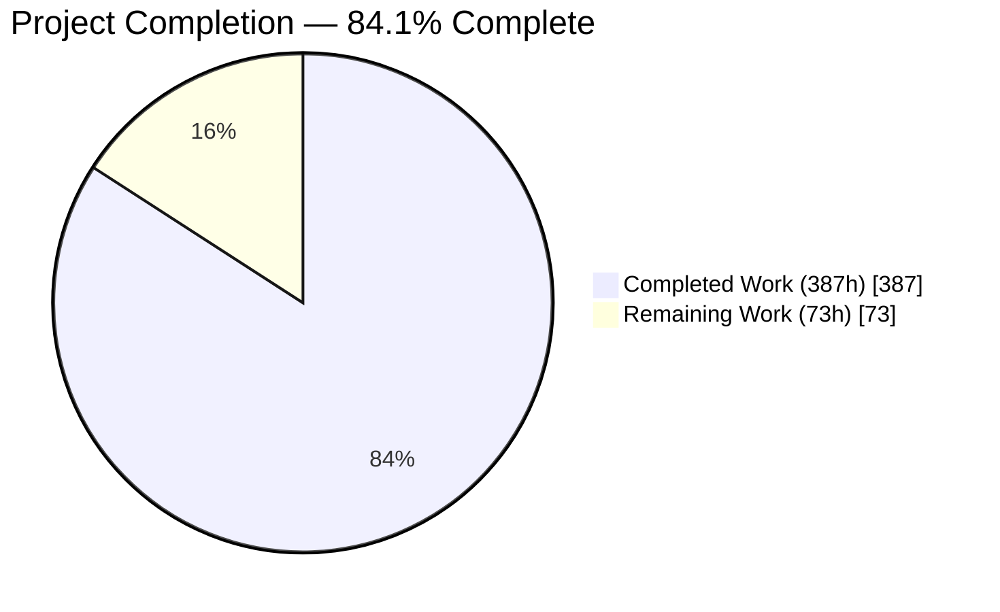
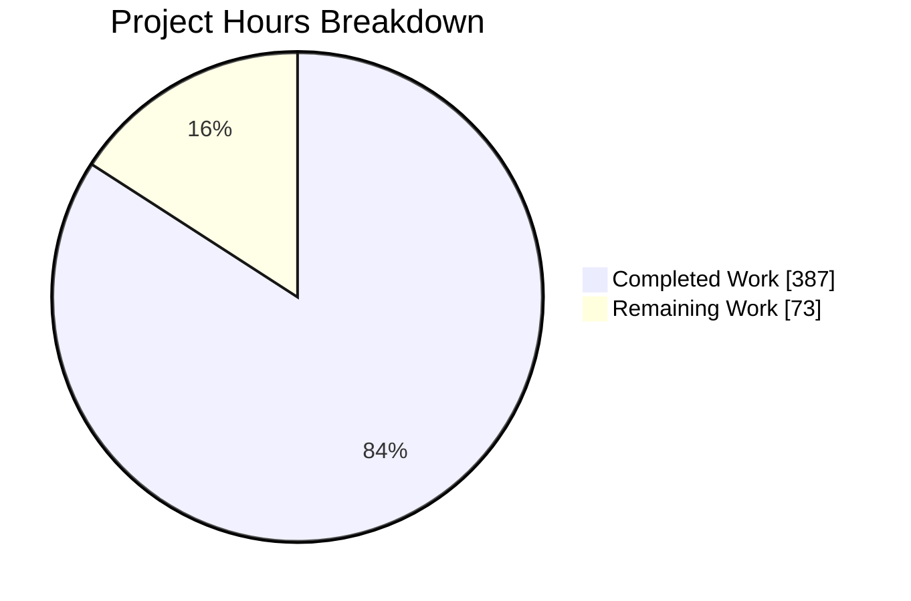
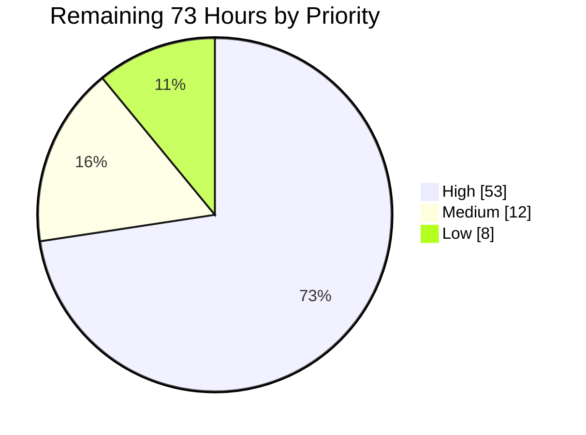
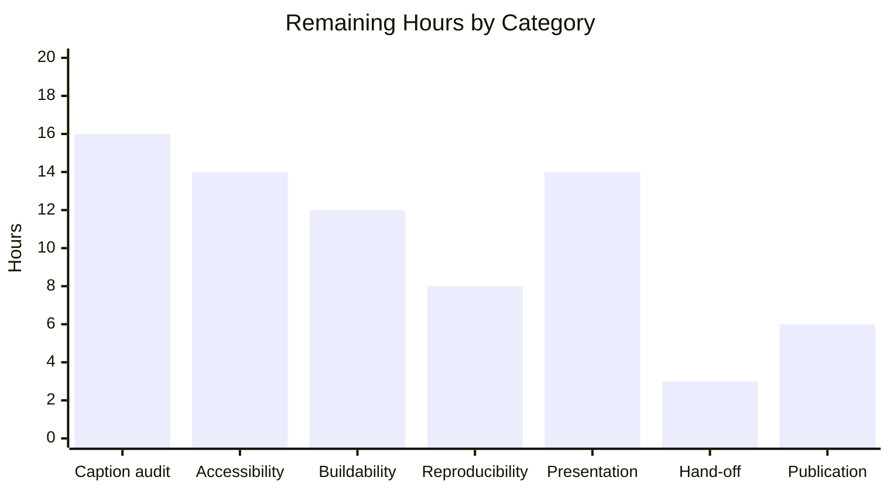
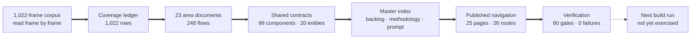

# 1. Executive Summary

## 1.1 Project Overview

This project converts the 1,022-frame screenshot corpus in `screenshots/` from a passive design reference into an executable specification. It delivers `docs/workflows/` — 23 workflow-area documents, a one-row-per-frame coverage ledger, and a master index aggregating a 99-contract component inventory, a 20-entity data model, a four-phase build backlog and a ready-to-paste build prompt — and publishes all 25 pages in the site navigation. The audience is the next build run: a TypeScript web application should be constructible from this documentation alone, own-branded, carrying no third-party trademarks or palette values. No application code is in scope.

## 1.2 Completion Status



<!-- Chart colours: Completed = Dark Blue #5B39F3 · Remaining = White #FFFFFF -->

| Metric | Value |
|---|---|
| **Total Hours** | **460** |
| **Completed Hours (AI + Manual)** | **387** (387 AI + 0 manual) |
| **Remaining Hours** | **73** |
| **Percent Complete** | **84.1%** (387 ÷ 460) |

## 1.3 Key Accomplishments

- ✅ All 1,022 frames carry a ledger row with an observed caption, an owning flow and an owning document; the frame set equals `{0…1021}` exactly
- ✅ 23 area documents specify 248 flows across 254 step tables, all in the exact mandated five-column format
- ✅ 17,255 frame citations resolve — correct form, label matching target, in range, present on disk
- ✅ 99 component contracts, 20 entities and 16 security contracts each defined once, with zero dangling references either way
- ✅ The master index carries the architecture map, both roll-ups, the backlog, the methodology, six deviations and 19 disclosed limitations
- ✅ 27 diagrams, at least one per area, all rendering cleanly and all legibility-constrained
- ✅ All 25 pages published in navigation and reachable at 26 of 26 routes, under a nav-only change of 26 insertions and zero deletions
- ✅ Zero brand colour values of any notation anywhere in the catalog

## 1.4 Critical Unresolved Issues

| Issue | Impact | Owner | ETA |
|---|---|---|---|
| Branch not published — 29 commits exist only in this checkout | Nobody outside this working copy can review or consume the catalog | Repository owner | 1 h |
| Caption fidelity has no automated defence | A build run cannot detect a caption that describes something its frame does not contain | Documentation lead | 16 h |
| The catalog has never been consumed by a build run | Its central claim — buildable from the documentation alone — is asserted, not demonstrated | Engineering lead | 12 h |
| Diagrams present as code blocks in the published site | All 27 lose their visual value to a site-only reader; they render correctly on the repository host | Platform owner | 2 h |
| Site chrome is not operable without a pointer | The navigation drawer blanks on the fourth Tab at narrow widths and recovers only on reload; controls carry no accessible names | Platform owner | 14 h |
| Site search is inert on every page | A 20,000-line catalog has no search, and one console error is raised per page load | Platform owner | 2 h |
| The closing build prompt is clipped in the site | 102 px and 7 of its 9 lines are cut mid-word; it is preserved byte-for-byte by requirement rather than re-wrapped | Documentation lead | Accepted |
| No pinned manifest and no continuous check | The coverage and closure invariants are not defended when the catalog changes | Engineering lead | 8 h |

## 1.5 Access Issues

| System/Resource | Type of Access | Issue Description | Resolution Status | Owner |
|---|---|---|---|---|
| Remote repository | Push | The branch has never been pushed; all 29 commits are local to this checkout | Outstanding | Repository owner |
| Documentation hosting | Deploy target | No hosting or deployment target is declared anywhere in the repository, so the built site has nowhere to publish to | Outstanding | Platform owner |
| Screenshot corpus, toolchain, browser | Read / execute | All reachable — the build, the verification harness and the runtime pass all ran without obstruction | Resolved | — |

## 1.6 Recommended Next Steps

1. **[High]** Push the branch and raise the pull request so the catalog is reviewable outside this checkout.
2. **[High]** Build the backlog's first phase — shell, authentication, channels, messaging — from the catalog alone, without reopening the corpus. It is the only real test of the deliverable's premise.
3. **[High]** Commission an independent caption-fidelity audit over a statistically meaningful ledger sample.
4. **[High]** Authorize the two verified site-configuration widenings — diagram rendering and search — then the accessibility work behind them.
5. **[Medium]** Pin the toolchain and run the coverage harness on every change, so set equality and identifier closure cannot silently break.

# 2. Project Hours Breakdown

## 2.1 Completed Work Detail

| Component | Hours | Description |
|---|---:|---|
| Corpus evidence base | 38 | Census of all 1,022 frames, byte-identical duplicate detection, capture-band and frame-height measurement, consecutive-frame delta distribution, and batched visual inspection of the entire corpus |
| Coverage ledger | 30 | `docs/workflows/_screenshot-index.md` — 1,022 rows with observed captions, flow groupings over contiguous ranges, the duplicate and non-informative frame records, and the coverage assertion |
| In-product area specifications | 148 | 19 documents (`00`–`16`, `21`, `22`) covering 174 flows across ~13,500 lines — shell, onboarding, channels, messaging, threads, direct messages, huddles, canvases, lists, search, workflow builder, apps, activity, profiles, preferences, administration, files, cross-cutting states and external collaboration |
| Public-surface area specifications | 44 | 4 documents (`17`–`20`) covering 74 flows across ~4,140 lines — marketing site, pricing and plans, brand guidelines, help and community — at the structural depth needed to rebuild page architecture |
| Shared component contracts | 22 | 99 `C-*` contracts defined once in `00-product-overview.md` with purpose, observed variants, observed states and frame evidence, plus the placeholder branding vocabulary, the rail destination map and the upgrade-gate and automations boundaries |
| Build-security contracts | 16 | 16 `S-*` contracts and 138 build obligations covering who may act and whose data may be projected, written as requirements a build must enforce rather than as observations |
| Master index | 30 | `docs/workflows/README.md` — architecture map, component and security roll-ups, the 20-entity consolidated model with its diagram, the four-phase backlog, the Flow Reconstruction Methodology, the six taxonomy deviations, 19 known limitations, the omissions statement and the verbatim build prompt |
| Flow segmentation | 18 | Delta-band calibration across all 1,021 consecutive frame pairs, 248 flow boundaries confirmed against visual state, and the adjacency-override and ambiguity records |
| Diagrams | 12 | 27 Mermaid diagrams — 18 flowcharts, 4 state diagrams, 3 entity diagrams, 2 sequence diagrams — typed by subject, constrained for legibility and render-verified |
| Validation | 26 | The documentation build gate, the coverage and closure harness, negative controls proving the gates discriminate, and runtime verification of the published site |
| Publication | 3 | The nested `Workflow Catalog` navigation section with 25 children, applied as a nav-only change with `site_name` and `plugins` preserved byte-for-byte |
| **Total** | **387** | |

## 2.2 Remaining Work Detail

| Category | Hours | Priority |
|---|---:|---|
| Independent caption-fidelity audit over a statistically meaningful ledger sample | 16 | High |
| Site chrome accessibility — drawer overflow, keyboard operability, named controls, focus behaviour | 14 | High |
| Buildability rehearsal — build the backlog's first phase from the catalog alone and feed the gaps back | 12 | High |
| Reproducible-build manifest and continuous enforcement of the coverage and closure invariants | 8 | High |
| Scroll affordances, persistent table headers and wide-viewport line measure | 5 | Low |
| Interactive contrast and a non-colour cue for citation links | 4 | Medium |
| Acceptance-criteria checkbox naming and unchecked-glyph correction | 3 | Medium |
| Record the flow-granularity and data-placement decisions the build must take | 3 | Medium |
| Hosting-layer security headers and an explanatory 404 for unresolvable frame links | 3 | Low |
| Enable diagram rendering in the published site and re-verify all 27 | 2 | High |
| Restore site search and clear the per-page console error | 2 | Medium |
| Publish the branch — push the commits and raise the pull request | 1 | High |
| **Total** | **73** | |

By priority: **High 53 h · Medium 12 h · Low 8 h**.

## 2.3 Hours Reconciliation

The completion figure is derived from scoped work only — the fourteen specification requirements, the six taxonomy deviations they authorise, and the path-to-production activities needed to publish and maintain the result. Nothing outside that scope is counted, and building the product itself is explicitly a separate undertaking.

```text
Completed:  387 h  (Section 2.1 — 11 components, all delivered)
Remaining:   73 h  (Section 2.2 — 12 categories, none of them unfinished specification work)
Total:      460 h
Completion: 387 ÷ 460 = 84.1%
```

Every one of the fourteen specification requirements is classified **Completed** with measured evidence behind it. The 73 remaining hours are not specification gaps: 1 hour publishes the branch, 23 hours are site-level remedies deliberately held behind human authorization because they need configuration keys outside the permitted change surface, 8 hours make the build reproducible and self-checking, 3 hours record two hand-off decisions, and the largest single block — 28 hours across the caption audit and the buildability rehearsal — buys the two assurances no automated gate in this project can provide.

# 3. Test Results

This repository has no application code and therefore no unit-test framework. Its equivalent is a gate suite: a documentation build, a scripted coverage-and-closure harness, an external diagram renderer, and a browser pass over the published site. Every figure below was executed and observed directly; none is carried over from any earlier record.

| Area / Category | Framework | Tests | Passed | Failed | Coverage | What This Proves |
|---|---|---:|---:|---:|---|---|
| Documentation build | MkDocs 1.6.1 (non-strict) | 1 | 1 | 0 | 26 of 26 routes built | The site compiles clean — exit 0 in 9.3 s with zero errors and zero warnings of any class other than the accepted frame-link kind |
| Corpus and ledger integrity | Coverage harness (Python) | 9 | 9 | 0 | 1,022 of 1,022 frames | Every frame has exactly one ledger row with a caption, a flow and an owning area; the frame set equals `{0…1021}` with no gap, duplicate or unreadable entry |
| Frame-ownership closure | Coverage harness | 6 | 6 | 0 | 1,022 of 1,022 frames | The 23 areas' primary sets partition the corpus and the union of their declared frame sets equals it — coverage is closed in both directions, not merely counted |
| Citation integrity | Coverage harness | 5 | 5 | 0 | 17,255 citations | Every citation is well-formed, its label matches its target, its index is in range and its file exists — all 1,022 frames are cited somewhere |
| Identifier closure | Coverage harness | 3 | 3 | 0 | 99 `C-*` · 20 `E-*` · 16 `S-*` | Every component, entity and security contract referenced anywhere resolves to exactly one definition, with no orphan and no dangling reference |
| Template and structure | Coverage harness | 8 | 8 | 0 | 23 of 23 areas | All 23 documents carry the mandated sections in the mandated order under a single top-level heading, and all 248 flow identifiers bind to a heading |
| Diagrams | Coverage harness + Mermaid CLI | 31 | 31 | 0 | 27 of 27 diagrams | Every diagram parses and renders to a non-empty image, uses only permitted diagram types, and holds every source line inside the legibility limit |
| Publication, hygiene and IP | Coverage harness + git | 17 | 17 | 0 | 26 changed paths | All 25 pages are in the navigation with no dangling entry; zero brand colour values or stub markers exist; and the corpus and the three read-only files are byte-identical to the pre-project baseline |

**80 gates executed, 80 passed, 0 failed.**

**Gate discrimination was itself tested.** Five defects were injected into an out-of-tree copy — a deleted ledger row, a duplicated row, a dangling component identifier and an over-long diagram line. Seven gates failed correctly and the harness exited non-zero, **while the row-count gate still passed at 1,022** because the deletion and the duplication cancelled. Set equality, not counting, is what actually defends this catalog; both are run.

### Not Covered

These capabilities are delivered but no test in this project exercises them. Each should be closed before a build run consumes the catalog.

- **Caption truthfulness.** Nothing machine-checkable can establish that a caption describes what its frame actually shows. All 1,022 captions rest on visual inspection. A human should audit a statistically meaningful sample against the frames, with the bottom capture band excluded.
- **Buildability.** No build run has consumed this catalog. Its central claim — that the platform is constructible from the documentation alone — rests on spot checks of individual flows, never on an end-to-end attempt. Build the backlog's first phase and feed the gaps back.
- **The 1,132 acceptance criteria.** They are prose checkboxes. None is machine-verifiable and none has been evaluated against an implementation.
- **The 138 build obligations and 16 security contracts.** These state what a build must enforce, not what the corpus shows. Nothing here can test them; they become testable only inside the build run.
- **22 of the 26 published routes.** Four routes were driven in a browser and inspected in the DOM. The remaining 22 are covered by the build gate and the static harness, not by first-hand rendering checks.
- **Accessibility conformance.** No automated accessibility audit was run. The site's known chrome limitations were measured by hand rather than scanned against a standard.

# 4. Runtime Validation & UI Verification

The published site was built, served and driven in a real browser. Every observation below is a measurement taken from the rendered DOM.

- ✅ **Site start-up and routing** — Operational. The build completes in 9.3 s and all 26 routes return HTTP 200: the home page, the catalog landing page, the 23 area documents and the coverage ledger.
- ✅ **Catalog navigation** — Operational. The sidebar carries a `Workflow Catalog` section with exactly 25 child links: `Overview` first, the 23 area documents in numeric order, `Screenshot Coverage Index` last. Click-through lands on the correct page with a single matching top-level heading.
- ✅ **Coverage ledger rendering** — Operational. The ledger table renders 1,023 rows (one header plus 1,022 data rows) and 4,088 cells — exactly four per row, no ragged row. The first cell reads `frame 0` and the last `frame 1021`; no row has an empty caption, flow or area cell; captions average 176 characters. The page is 136,967 px tall and every row is materialised.
- ✅ **Area document rendering** — Operational. Specification tables, task-list criteria and headings all render as real elements — 25 tables and 39 acceptance-criteria checkboxes on the shell document, with zero raw markdown table syntax leaking into body text across 288 body lines.
- ✅ **Evidence isolation** — Operational. Zero image elements exist on any page and no request is ever made for a corpus frame, despite 1,022 frame anchors on the ledger page alone. The 599 MB corpus is never pulled into a page load.
- ✅ **Network health** — Operational. 52 requests across four page loads, zero returning status 400 or above.
- ✅ **Responsive layout** — Operational. Page-level horizontal overflow is exactly zero at 390 px — measured with the navigation closed, open, and after keyboard traversal.
- ⚠ **Diagram presentation** — Partial. All 27 diagrams are present and parse correctly, but the site renders them as highlighted code blocks rather than drawn diagrams: zero elements carry a diagram class and no diagram runtime is loaded. They render correctly on the repository host. Enabling them needs one configuration key currently held frozen.
- ⚠ **Build-prompt presentation** — Partial. The closing build prompt is 89 characters at its widest against a 656 px code box, so 102 px and 7 of its 9 lines are cut mid-word with no scroll cue. Its byte-for-byte preservation is a requirement, so the text is intact and the presentation is the compromise. Both diagram fences on the same page measured zero hidden overflow.
- ❌ **Site chrome operability** — Failing. Search is inert on every page and raises one console error per load from the theme's own bootstrap; no search field renders. At narrow widths the navigation drawer's scroll container measures 484 px against a 242 px viewport, and the fourth Tab press drives it to 242 — sliding every one of the 25 navigation links out of the visible strip and leaving a blank panel that recovers only on reload. The hamburger control carries no accessible name.

**Never exercised at runtime.** The 22 area routes other than the shell document, the ledger and the landing page were not driven in a browser — they are covered by the build gate and the static harness only. No accessibility audit tool was run against any route, and no interaction with the corpus frames themselves was attempted, since the frame links are documented to resolve on the repository host rather than in the published site.

# 5. Compliance & Quality Review

## 5.1 Compliance Matrix

Each row states where the deliverable stands now, against the requirement it answers.

| # | Requirement | Deliverable | Verified Status | Evidence |
|---|---|---|---|---|
| R1 | Corpus-derived taxonomy, with every deviation recorded | 23 area documents plus a deviations record | ✅ Pass — 100% | 23 documents at the planned filenames; six deviations recorded as their own subsections with a net-effect statement |
| R2 + R4 | Ten mandatory content questions per area, in the fixed eleven-section order | Purpose, flows, steps, triggers, components, states, data, transitions, edge cases, criteria, frames | ✅ Pass — 100% | 23 of 23 conformant with section order monotonic; 248 flows each with overview, trigger and preconditions |
| R3 | Step tables, shared components, IP substitution, marked inference | 254 step tables · 99 contracts · placeholder vocabulary · 286 marked inferences | ✅ Pass — 100% | Exactly one step-table header string exists catalog-wide, matching the mandated five columns with zero variants |
| R5 | GitHub-flavored Markdown conventions | 6,703 table rows · 1,132 task-list criteria · 17,255 encoded citations | ✅ Pass — 100% | Tables and checkboxes render as real elements; zero malformed citations |
| R6 | At least one diagram per area, plus architecture and data-model maps | 27 diagrams | ✅ Pass — 100% | 18 flowcharts, 4 state, 3 entity, 2 sequence; all 27 render; at least one in every area |
| R7 | Buildable layout without third-party assets | Proportional regions, function-named iconography | ✅ Pass — 100% | Zero brand colour values and zero raw colour literals of any notation |
| R8 | Depth calibrated per area type | In-product comprehensive; public structural | ✅ Pass — 100% | Channels: 21 flows / 1,060 lines over 92 owned frames. Brand guidelines: 4 flows / 514 lines |
| R9 | Master index aggregations and build hand-off | 13 sections including both roll-ups, the model, the backlog and the prompt | ✅ Pass — 100% | All 13 present in order; the closing prompt is byte-identical to its required template |
| R10 | One ledger row per frame, exhaustive and honest | 1,022 rows | ✅ Pass — 100% | Set equality with `{0…1021}`; 8 duplicate groups recorded; zero unreadable |
| R11 | Publish every page to the site navigation | Nested navigation section, 25 children | ✅ Pass — 100% | 25 of 25 in navigation, verified in the rendered DOM; 26 of 26 routes serve |
| R12 | Segmentation driven by visual evidence, overrides recorded | Methodology with measured delta bands | ✅ Pass — 100% | 248 boundaries; override and ambiguity records present; distant-duplicate counter-example retained |
| R13 + R14 | Minimal change, priority delivery order, omissions declared | 26 paths touched; delivery order and omissions statement | ✅ Pass — 100% | 20,421 insertions and zero deletions; corpus and all three read-only files byte-identical; ledger first, then master index, then in-product, then public areas; nothing omitted |

## 5.2 AAP & Rule Divergences and Gaps

No user-specified rules were provided for this project, so every divergence below is a departure from the delivery plan rather than from a rule.

| What the AAP/Rule Required | What Was Delivered Instead | Why It Diverged | Impact | Remediation |
|---|---|---|---|---|
| Exclude the bottom **44 px** capture band from all observation | The band was measured at **116–121 px** and 120 px was excluded | Independent measurement contradicted the planned figure | More of each frame excluded; trademark avoidance more completely discharged | None — accept the measured figure |
| At least one Mermaid diagram per area, rendering in the site | 27 diagrams present, but rendered as code blocks | The verified fix needs a configuration key the plan freezes | 27 diagrams lose visual value to a site-only reader | Authorize the six-line declaration (2 h) |
| Approximately **300** flows, 13–14 per area | **248** flows, ~10.8 per area | Visual evidence is binding; candidate splits were withdrawn, not taken | Coarser journeys for the build; no frame left uncovered | Record the decision for the build (part of 3 h) |
| A consolidated model of exactly **20** entities | 20 entities, with commerce and content folded into named field groups | The identifier set is frozen at twenty | The build reads field groups, not entity names, for billing | Decide whether to promote them (part of 3 h) |
| No security-requirements construct is defined | **16** security contracts, a fifth evidence marker and **138** build obligations | Authorization appears in only a handful of frames; stating it as observation would breach the fabrication ban | Additive and useful, but unsanctioned scope | Make the obligations build acceptance criteria (inside 12 h) |
| Publish the catalog to the site navigation | The navigation key stayed at its baseline until the final commit | Publication was scoped after every content deliverable | None residual — 25 of 25 are published now | Closed |
| Preserve the build prompt **byte-for-byte** | Preserved exactly, and therefore clipped in the site | Two requirements collide; preservation wins | 102 px and 7 of 9 lines cut mid-word in the site | Accept, or address via the stylesheet work (5 h) |
| *(No rule required site accessibility)* | Chrome is pointer-only; search inert | Every remedy needs a key or file outside the permitted surface | Keyboard and screen-reader users cannot operate the chrome | Authorize a theme override (14 h) |

**Capture band — 120 px, not 44 px.** The plan measured the curator's footer chrome at 44 px and prescribed excluding exactly that. Direct re-measurement disagreed: a full-width uniformity test returns roughly 43 px — the empty strip beneath the marks — while a centre-strip test returns 116–121 px for the whole composite band, and no frame measures 44. A 44 px crop demonstrably cuts through the third-party logo, wordmark and attribution, leaving them inside the analysed viewport. The catalog therefore excludes 120 px, giving an effective viewport of 1920×1200, and states the disagreement once as known limitation 3 in `docs/workflows/README.md`. Nothing needs doing — the measured value is the safer one.

**Diagram rendering in the published site.** Requirement R6 demanded at least one diagram per area, and 27 were delivered, all of which parse and render externally. The site does not draw them: zero elements carry a diagram class, no diagram runtime loads, and each fence appears as a highlighted code block. The cause is a collision inside the plan, which permits exactly one edit outside `docs/` — the navigation key — while the fix is a separate six-line custom-fence declaration in `mkdocs.yml`. That fix was verified to work and then deliberately withheld rather than applied quietly, and is recorded as known limitation 2. Diagrams render wherever the repository itself is browsed. Authorizing the declaration closes it in about two hours.

**Flow granularity.** From the measured distribution of differences between consecutive frames, the plan projected roughly 300 flows — 13 or 14 per area. The catalog delivers 248, about 10.8 per area. The shortfall is candidate boundaries the pixels did not confirm: requirement R12 makes visual-state evidence binding and numeric adjacency only a weak prior, so where a large difference proved to be a panel change inside one continuing journey the split was withdrawn — every withdrawal is recorded in the methodology. Some areas sit well below the band because they own few frames: the workflow builder 2 flows over 7, the states area 1 over 2. No frame is uncovered; a build receives coarser units of work than projected.

**Commerce modelled as field groups.** The plan fixes the consolidated model at twenty entity identifiers and names them. Commerce and content concerns — subscription, billing account, payment method, invoice, promotion, marketing lead, public help query, service status — now live as named field groups instead: `E-PLAN` at catalog scope carrying no workspace key, and `E-WORKSPACE` at tenant scope carrying the commercial position, billing account, stored payment method, contacts and history. The split is stated as a security rule with an explicit prohibition on any relationship running from the catalog entity into tenant data, and every identifier used anywhere resolves. The consequence is real: a build modelling billing must read field groups rather than search for entity names.

**A security layer the plan did not define.** Nothing in the plan describes a security-requirements construct. The catalog introduces 16 `S-*` contracts covering authorization to act, authorization to read, upload handling, link safety, secrets, per-user state, export, consent, personal data and evidential gaps — plus a fifth evidence marker and 138 build obligations. The reason is sound: authorization is visible in only a handful of frames, so requirements about who may act and whose data may be projected could not be written as observations without breaching the fabrication ban, and writing nothing would have shipped a specification silent on authorization. It is nonetheless unsanctioned scope. Treat each obligation as an acceptance criterion inside the build run.

**Publication landed after the content.** Requirement R11 called for every catalog page to appear in the site navigation. The navigation key stayed at its single-entry baseline while the 25 documents were written, so the pages built and served correctly but were unreachable from the site's own menu until the final stretch of work — and the gap was declared in the omissions statement while it existed rather than hidden. It is now closed: the nested section carries 25 children, the master index first as the section landing page and the coverage index last, and the browser confirms all 25 in the rendered navigation. Recorded because a reader tracking requirement order would otherwise find it satisfied late without explanation.

**The build prompt is preserved and therefore clipped.** The plan reproduces the closing WHY/WHAT/HOW prompt as a template and requires it preserved exactly; a separate quality bar requires code blocks to be readable. Both cannot hold. The delivered block is byte-identical to the template — verified by direct comparison — and its longest line is 89 characters against a box that fits 76, so 102 px are hidden and seven of its nine lines are cut mid-word with no scroll cue. Preservation was chosen because an explicit textual requirement outranks a presentation fix, and the measurement is disclosed as known limitation 9 with a pointer to the unclipped source.

**Site chrome accessibility and search.** No rule imposed an accessibility standard, but the published site should be usable and is not, in two respects. Search is inert on every page and raises one console error per load from the theme's own bootstrap, with no search field rendered — a real discoverability limit on a catalog this size. And the chrome is pointer-only: at widths at or below 959 px the drawer's scroll container is twice its visible width, so the fourth Tab press slides all 25 links off-canvas and leaves a blank panel until reload; controls carry no accessible names; link contrast falls from 6.86:1 to 4.26:1 on hover. Every remedy needs an authorization to widen the change surface.

# 6. Risk Assessment

These are forward-looking: what could still go wrong once this catalog is handed to a build run or published.

| Risk | Category | Severity | Probability | Mitigation | Status |
|---|---|---|---|---|---|
| Caption fidelity cannot be machine-checked. Nothing detects a caption describing something its frame does not contain, and a build consuming one implements the wrong thing | Technical | High | Medium | Audit a statistically meaningful ledger sample against the frames; require the build to cite frames back so a bad caption surfaces on contact with the pixels | Open |
| Buildability is asserted, not demonstrated. No build run has consumed the catalog; sufficiency rests on spot checks of individual flows | Technical | High | Medium | Rehearse Phase 1 of the backlog from the catalog alone and feed every gap back into the owning area document | Open |
| Site chrome is not operable without a pointer, so keyboard and screen-reader users cannot navigate a published site — an accessibility exposure if it faces an external audience | Operational | High | High | Authorize a theme override or upstream the fixes; the measurements and remedies are already recorded | Open, disclosed |
| Coverage invariants are undefended on change. 1,022 rows, 17,255 citations and three closure sets must stay in step, and a deletion plus a duplication cancel in a row count | Technical | Medium | Medium | Pin the toolchain and run the coverage harness on every change, checking frame-set equality rather than row counts | Open |
| Security requirements are obligations, not observations. A build treating the 138 build obligations as optional ships an unauthorized read or write path | Security | Medium | Medium | Promote each obligation to a build acceptance criterion, where it becomes testable for the first time | Open |
| The published site loses both the diagrams and the frame-link evidence trail, so a site-only reader has neither the visual summaries nor a route back to the pixels | Operational | Medium | High | Authorize the verified rendering declaration; read the catalog from the repository host until then | Open, disclosed |
| Third-party reference imagery stays committed. The catalog is clean — zero colour values, two sanctioned name occurrences — but 599 MB of third-party captures remain as the evidence base | Security | Medium | Low | Keep the placeholder vocabulary binding on the build; review distribution before the repository leaves the organisation | Accepted |
| The hand-off still depends on decisions the build must take — commerce as field groups on two entities, and 248 flows rather than the ~300 projected | Integration | Medium | Medium | Record both decisions alongside the backlog before Phase 1 starts | Open |

# 7. Visual Project Status

### Overall hours



Completed = Dark Blue **#5B39F3** · Remaining = White **#FFFFFF**

### Remaining work by priority



### Remaining work by category



The presentation bar aggregates the four site-level presentation items — scroll affordances and table headers (5 h), link contrast (4 h), checkbox naming (3 h) and diagram rendering (2 h). Publication aggregates the branch push (1 h), search restoration (2 h) and hosting-layer headers with an explanatory 404 (3 h). The seven bars sum to 73 hours, matching Section 1.2 and the Section 2.2 total exactly.

### Delivery shape



The solid path is delivered and verified. The dotted edge is the one step nobody has taken: handing the catalog to a build run and constructing the platform from it.

# 8. Summary & Recommendations

**What was delivered.** A 1,022-frame reference corpus is now an executable specification. `docs/workflows/` holds 23 workflow-area documents describing 248 flows across 254 step tables, a coverage ledger carrying one row per frame, and a master index that aggregates 99 component contracts, a 20-entity data model, 16 build-security contracts, a four-phase build backlog, the segmentation methodology, six taxonomy deviations, 19 disclosed limitations and a ready-to-paste build prompt. All 25 pages are published in the site navigation and serve at 26 of 26 routes. The change is purely additive: 20,421 insertions, zero deletions, with the 599 MB corpus and the three read-only files byte-identical to where they started.

**What was verified.** 80 gates were executed and 80 passed. The documentation build compiles clean in 9.3 s with no warning of any class other than the accepted frame-link kind. Coverage is closed in both directions — the ledger's frame set equals `{0…1021}` exactly, and the 23 areas' declared frame sets partition and reconstruct the corpus rather than merely counting to it. All 17,255 citations are well-formed, in range and present on disk; 99 component, 20 entity and 16 security identifiers each resolve to exactly one definition with no orphan or dangling reference; all 27 diagrams parse and render. A browser pass confirmed 25 navigation children, a 1,023-row ledger table with exactly four cells per row, zero image requests against a 1,022-anchor page, and zero page-level overflow at 390 px. The gates were themselves tested against injected defects — which is how the row count was shown to be insufficient and set equality binding.

**What is genuinely open.** Every one of the fourteen specification requirements is complete, so the 73 remaining hours are assurance, configuration and hand-off rather than unfinished specification. Two gaps dominate because no gate in this project can close them: caption truthfulness, which rests entirely on visual inspection of 1,022 frames, and buildability itself, which has never been exercised because no build run has yet consumed the catalog. Behind those sit 23 hours of site-level work held deliberately behind human authorization, since each remedy needs a configuration key or stylesheet outside the permitted change surface — diagrams that present as code blocks, inert search, pointer-only chrome, and a build prompt kept byte-exact by requirement and therefore clipped. The branch itself is still local to this checkout.

**The critical path.** Push the branch and raise the pull request first; it costs an hour and nothing outside this working copy can review the catalog until it happens. Then run the two assurances concurrently: rehearse the backlog's first phase — shell, authentication, channels, messaging — from the catalog alone without reopening the corpus (12 h), and audit a statistically meaningful ledger sample against its frames (16 h). Those 28 hours buy the only evidence that matters to a build run. Alongside them, authorize the two verified configuration widenings — diagram rendering and search, 4 hours together — then the accessibility cluster (14 h) if the site is to face an external audience. Pin the toolchain and put the coverage harness on every change (8 h) before the catalog is edited again, and record the two hand-off decisions — how the build treats 248 flows rather than the ~300 projected, and whether commerce stays as field groups on two entities (3 h).

**Production readiness.** As a specification the catalog is ready to hand over: **84.1% complete** against 460 scoped hours, with 387 hours delivered, every requirement met, and every departure from the plan disclosed in the document itself rather than left for a reader to discover. As a published website it is not ready for an external audience — diagrams, search and keyboard operability each need an authorization that was correctly withheld rather than taken. And as a build input it remains unproven in the one way that counts: nobody has yet tried to build from it. The recommendation is therefore to hand it to a build run now, scoped to the backlog's first phase, and to treat that run's feedback together with the caption audit as the specification's acceptance test — while holding external publication of the site until diagram rendering and the accessibility work land.

# 9. Development Guide

Every command below was executed on a clean environment built from scratch, and the outputs shown are the ones observed. Run them from the repository root.

### 9.1 System prerequisites

| Requirement | Version used | Notes |
|---|---|---|
| Python | 3.13.7 | 3.11–3.13 all work with this stack |
| `git` | any recent | Needed for the hygiene checks |
| Node.js + npm | 20 LTS | Optional — only for rendering diagrams outside the site |
| Disk | ~700 MB | 599 MB is the screenshot corpus; the built site is ~16 MB |

There is no `package.json`, no `requirements.txt` and no lock file — the toolchain is not pinned anywhere in the repository. Install the exact versions below to reproduce these results.

### 9.2 Environment setup

Choose two locations **outside the repository** — one for the Python environment, one for build output. Keeping them out of the working tree is deliberate: the change surface must stay at the 26 paths the project owns.

```bash
export DOCS_ENV="$HOME/.venvs/blitzy-slack-docs"    # Python environment
export SITE_OUT="$HOME/.cache/blitzy-slack-site"    # build output
export BUILD_LOG="$HOME/.cache/blitzy-slack-build.log"
mkdir -p "$(dirname "$DOCS_ENV")" "$(dirname "$BUILD_LOG")"
```

A bare `pip install` is refused on a PEP 668 managed interpreter, and the standard `venv` bootstrap is unreliable, so create the environment with `virtualenv`:

```bash
# Install the environment builder into the system interpreter
python3 -m pip install --quiet --break-system-packages virtualenv

# Create the isolated environment
python3 -m virtualenv -q "$DOCS_ENV"

# Install the two plugins the site declares; everything else comes transitively
"$DOCS_ENV/bin/pip" install --quiet \
    mkdocs-techdocs-core==1.7.0 \
    mkdocs-mermaid2-plugin==1.2.3

"$DOCS_ENV/bin/mkdocs" --version
# mkdocs, version 1.6.1 ... (Python 3.13)
```

Confirm the resolved closure:

```bash
"$DOCS_ENV/bin/pip" list | grep -iE "^mkdocs |techdocs|mermaid2|material |pymdown"
# mkdocs                 1.6.1
# mkdocs-material        9.7.6
# mkdocs-mermaid2-plugin 1.2.3
# mkdocs-techdocs-core   1.7.0
# pymdown-extensions     10.21.3
```

### 9.3 Build the documentation

```bash
timeout 900 "$DOCS_ENV/bin/mkdocs" build -f mkdocs.yml -d "$SITE_OUT" 2>&1 | tee "$BUILD_LOG"
echo "EXIT=${PIPESTATUS[0]}"
```

Expected: `EXIT=0` and `Documentation built in 9.28 seconds`.

The build emits **17,255 warnings and every one of them is expected.** Each is a frame citation pointing at `screenshots/`, which sits outside the documentation root and is therefore not copied into the site. The warning count equals the citation count exactly, which is how you know none was added, lost or malformed:

```bash
grep -c '^WARNING' "$BUILD_LOG"             # 17255
grep -c 'screenshots/Slack' "$BUILD_LOG"    # 17255  -> zero warnings of any other class
grep -cE '^(ERROR|CRITICAL)' "$BUILD_LOG"   # 0
```

> **Never build with `--strict`.** It treats those warnings as fatal:
>
> ```bash
> "$DOCS_ENV/bin/mkdocs" build --strict -f mkdocs.yml -d "$SITE_OUT.strict"
> # Aborted with 17255 warnings in strict mode!   (exit 1)
> ```
>
> Do not "fix" the warnings by copying frames into `docs/`. The links are meant to resolve on the repository host, and duplicating 599 MB of imagery is explicitly out of bounds.

### 9.4 Preview the site locally

```bash
"$DOCS_ENV/bin/mkdocs" serve -f mkdocs.yml -a 127.0.0.1:8000 &
sleep 15                       # first build takes ~10 s
curl -s -o /dev/null -w '%{http_code}\n' http://127.0.0.1:8000/workflows/
# 200
kill %1
```

Check every published route in one pass:

```bash
for u in / /workflows/ $(cd "$SITE_OUT/workflows" && ls -d */ | sed 's|^|/workflows/|'); do
  printf '%-42s %s\n' "$u" "$(curl -s -o /dev/null -w '%{http_code}' http://127.0.0.1:8000$u)"
done
# 26 routes, all 200
```

### 9.5 Verify the catalog

Run these after any change to `docs/workflows/` or `mkdocs.yml`.

```bash
# 1 - Ledger row count must equal the corpus file count
ls screenshots/*.png | wc -l                                      # 1022
grep -c '^| \[frame ' docs/workflows/_screenshot-index.md          # 1022
```

**The count is necessary but not sufficient.** A deleted row and a duplicated row cancel, leaving 1,022 while a frame is missing — this was demonstrated deliberately. Always check the frame *set*:

```bash
# 2 - Frame SET equality against {0..1021}: this is the binding gate
"$DOCS_ENV/bin/python" - <<'PY'
import re, glob
rows = re.findall(r'^\| \[frame (\d+)\]', open('docs/workflows/_screenshot-index.md').read(), re.M)
frames = [int(f) for f in rows]
corpus = {int(re.search(r'(\d+)\.png$', p).group(1)) for p in glob.glob('screenshots/*.png')}
print('rows           :', len(frames))
print('duplicates     :', len(frames) - len(set(frames)))
print('missing frames :', sorted(corpus - set(frames))[:10])
print('extra frames   :', sorted(set(frames) - corpus)[:10])
print('ascending      :', frames == sorted(frames))
PY
# rows: 1022 | duplicates: 0 | missing: [] | extra: [] | ascending: True
```

```bash
# 3 - Every catalog page reachable from the navigation
for f in docs/workflows/*.md; do
  grep -q "workflows/$(basename "$f")" mkdocs.yml || echo "NOT IN NAV: $f"
done
# (no output = all 25 pages present)

# 4 - Template conformance and the diagram floor
FENCE=$(printf '\140\140\140')
for f in docs/workflows/[0-9][0-9]-*.md; do
  for s in '## Purpose' '## Build acceptance criteria' '## Frames covered'; do
    grep -q "$s" "$f" || echo "MISSING $s in $f"
  done
  grep -q "${FENCE}mermaid" "$f" || echo "NO DIAGRAM in $f"
done
# (no output = 23/23 conformant with >=1 diagram each)

# 5 - Third-party IP scan
grep -rniE '4A154B|1D1C1D|36C5F0|2EB67D|ECB22E|E01E5A' docs/workflows/ | wc -l   # 0
sed -E 's/Slack%20web%20Jul%202024%20[0-9]+\.png//g; s/Slack web Jul 2024 [0-9]+\.png//g' \
    docs/workflows/*.md | grep -oE 'Slack' | wc -l                              # 2
```

The residual **2** are the only permitted occurrences: both sit inside the closing build prompt, where they appear as prohibitions in a block required to be preserved exactly.

```bash
# 6 - Repository hygiene: the change surface must stay at 26 paths
git status --porcelain            # clean, apart from any untracked local scratch
ls screenshots/*.png | wc -l      # 1022 - the corpus is never modified
git diff --stat 2400e4b -- mkdocs.yml
#  mkdocs.yml | 26 ++++++++++++++++++++++++++
#  1 file changed, 26 insertions(+)     <- nav only, zero deletions
```

### 9.6 Render the diagrams outside the site

The site presents diagrams as code blocks. To see them drawn, render the fences directly. In a container the renderer needs sandbox flags:

```bash
export SCRATCH="$HOME/.cache/blitzy-slack-diagrams"; mkdir -p "$SCRATCH"
echo '{"args":["--no-sandbox","--disable-dev-shm-usage","--disable-gpu"]}' > "$SCRATCH/pptr.json"

FENCE=$(printf '\140\140\140')
sed -n "/^${FENCE}mermaid$/,/^${FENCE}$/p" docs/workflows/04-threads.md \
  | sed '1d;$d' > "$SCRATCH/d.mmd"
mmdc -i "$SCRATCH/d.mmd" -o "$SCRATCH/d.svg" -p "$SCRATCH/pptr.json"
# Generating single mermaid chart  ->  d.svg
```

Without the `-p` config the render fails immediately with a sandbox error. All 27 catalog diagrams render this way.

### 9.7 Example usage — reading the catalog as a build run would

```bash
# Where does frame 500 belong?
grep -m1 '^| \[frame 500\]' docs/workflows/_screenshot-index.md

# What does the external-collaboration area own, and how many flows?
grep -c '^## Flow ' docs/workflows/22-external-collaboration.md          # 3
sed -n '/^## Frames covered/,$p' docs/workflows/22-external-collaboration.md | grep -c '\[frame '

# Where is a component contract defined? (exactly one place)
grep -n 'C-UPGRADE-GATE' docs/workflows/00-product-overview.md | head -3

# What must a build deliver first?
sed -n '/^### Phase 1/,/^### Phase 2/p' docs/workflows/README.md

# The hand-off prompt itself
sed -n '/^WHY:/,/truth for behavior/p' docs/workflows/README.md
```

### 9.8 Troubleshooting

| Symptom | Cause | Resolution |
|---|---|---|
| `error: externally-managed-environment` on `pip install` | The system interpreter is PEP 668 managed | Use `--break-system-packages` for `virtualenv` only, then install everything else inside the environment |
| `python3 -m venv` fails or produces an environment without `pip` | The bundled wheel is missing on this host | Use `virtualenv` as shown in 9.2 |
| `Aborted with 17255 warnings in strict mode!` | `--strict` was used | Never use `--strict`. The warnings are the accepted consequence of citing images outside the documentation root |
| Thousands of "target is not found among documentation files" warnings | Frame citations point outside `docs/` by design | Expected. Do not copy screenshots into `docs/` to silence them |
| A frame link 404s in the served site | The corpus is not part of the built site | Expected. Read the catalog from the repository host, where the relative links resolve |
| Diagrams show as code, not pictures | The site configuration does not register a diagram fence | Expected and disclosed. Render them locally per 9.6, or authorize the six-line configuration addition |
| The diagram renderer exits immediately with a sandbox error | Headless Chrome cannot sandbox in a container | Pass `-p` with a puppeteer config carrying `--no-sandbox` |
| The navigation drawer goes blank on a narrow screen | The nested navigation section overflows the drawer's scroll container | Reload the page. A stylesheet fix is recorded but not applied |
| No search box, and one console error per page | The theme ships a search bootstrap that the configuration never initialises | Known and disclosed; needs a configuration key currently frozen |

# 10. Appendices

## A. Command Reference

Assumes the environment variables set in section 9.2.

| Purpose | Command |
|---|---|
| Create the environment | `python3 -m virtualenv -q "$DOCS_ENV"` |
| Install the toolchain | `"$DOCS_ENV/bin/pip" install mkdocs-techdocs-core==1.7.0 mkdocs-mermaid2-plugin==1.2.3` |
| Build (the prescribed gate) | `"$DOCS_ENV/bin/mkdocs" build -f mkdocs.yml -d "$SITE_OUT"` |
| Preview | `"$DOCS_ENV/bin/mkdocs" serve -f mkdocs.yml -a 127.0.0.1:8000` |
| Corpus count | `ls screenshots/*.png \| wc -l` |
| Ledger row count | `grep -c '^\| \[frame ' docs/workflows/_screenshot-index.md` |
| Citation count | `grep -ro 'screenshots/Slack%20web' docs/workflows/ \| wc -l` |
| Flow count | `grep -h '^## Flow ' docs/workflows/[0-9][0-9]-*.md \| wc -l` |
| Component definitions | `grep -oE '\bC-[A-Z0-9-]+' docs/workflows/00-product-overview.md \| sort -u \| wc -l` |
| Brand-value scan | `grep -rniE '4A154B\|1D1C1D\|36C5F0\|2EB67D\|ECB22E\|E01E5A' docs/workflows/ \| wc -l` |
| Configuration diff | `git diff --stat 2400e4b -- mkdocs.yml` |
| Change surface | `git diff --name-status 2400e4b...HEAD` |

## B. Port Reference

| Port | Service | Notes |
|---|---|---|
| 8000 | `mkdocs serve` preview | Default; bind to `127.0.0.1` only |
| — | Published site | Static output; 27 HTML files plus assets, no request handler of its own |

The published artifact needs no runtime port. Everything observed about server behaviour during verification describes the local preview server, not the built site.

## C. Key File Locations

| Path | Role |
|---|---|
| `docs/workflows/README.md` | Master index — architecture map, roll-ups, data model, backlog, methodology, deviations, 19 limitations, build prompt. Serves as the `/workflows/` landing page |
| `docs/workflows/_screenshot-index.md` | Coverage ledger — 1,022 rows, one per frame, plus the duplicate and non-informative records |
| `docs/workflows/00-product-overview.md` | Application shell, and the single definition site for all 99 component contracts, all 16 security contracts and the placeholder branding vocabulary |
| `docs/workflows/01`–`16`, `21`, `22` | In-product area specifications — 174 flows |
| `docs/workflows/17`–`20` | Public-surface specifications — 74 flows |
| `mkdocs.yml` | Site configuration; the `nav` key is the only thing this work changed outside `docs/` |
| `screenshots/` | 1,022 read-only reference frames, the evidence base — never modified, never copied |
| `catalog-info.yaml` | Component descriptor; the authority for the TypeScript web-application constraint quoted in the build prompt |

## D. Technology Versions

| Component | Version | Role |
|---|---|---|
| Python | 3.13.7 | Interpreter used for the build and verification |
| MkDocs | 1.6.1 | Static site generator; the build is the compile gate |
| mkdocs-techdocs-core | 1.7.0 | Declared plugin; brings the theme and Markdown extension set |
| mkdocs-mermaid2-plugin | 1.2.3 | Declared plugin; injects the diagram runtime |
| mkdocs-material | 9.7.6 | Theme, resolved transitively |
| pymdown-extensions | 10.21.3 | Supplies the table and task-list rendering |
| Mermaid | 10.4.0 | Diagram syntax ceiling — only 10.x constructs are used |

None of these is pinned in the repository. Pinning them is one of the remaining tasks.

## E. Environment Variable Reference

No environment variable is required to build, serve or verify this project, and none is read by the configuration. The site declares three keys only — the site name, the navigation and the plugin list — with no secrets, endpoints or credentials anywhere in the repository.

## F. Developer Tools Guide

| Tool | Use |
|---|---|
| MkDocs | Builds the site; the non-strict build is the compile-equivalent gate |
| Coverage harness | Checks corpus contiguity, ledger set equality, frame-ownership closure, citation integrity, identifier closure, template order, diagram limits, navigation closure, IP hygiene and repository immutability |
| Mermaid CLI (`mmdc`) | Renders diagrams outside the site, which is the only way to see them drawn today. Needs `--no-sandbox` in a container |
| Headless browser | Confirms route availability, table and checkbox rendering, console and network health, and responsive behaviour |
| `git diff --stat` against the pre-project commit | Confirms the change surface has stayed at 26 paths with zero deletions |

## G. Glossary

| Term | Meaning |
|---|---|
| **Frame** | One of the 1,022 reference screenshots; the atomic unit of evidence, cited as `[frame N]` |
| **Flow** | One goal-directed user journey, identified as `<area>.<n>` — for example `02.7`. 248 exist |
| **Area document** | One of the 23 numbered specifications, each owning a set of frames and following an eleven-section template |
| **Coverage ledger** | The one-row-per-frame index proving no frame was silently dropped |
| **Primary owner** | The single area document responsible for a frame. Primary ownership partitions the corpus; secondary references are cross-links |
| **`C-*`** | A reusable component contract — 99 of them, each defined exactly once |
| **`E-*`** | A data entity in the consolidated model — 20, a fixed set |
| **`S-*`** | A build-security contract — 16 obligations a build must enforce, distinct from anything the frames show |
| **Build obligation** | A requirement the corpus cannot evidence either way, marked so it is never mistaken for an observation |
| **Partial capture** | A marker naming which steps of a journey the corpus does not show, rather than inventing them |
| **Inferred** | A marker on any claim not directly visible, always followed by the basis for the inference |
| **Capture band** | The bottom 120 px of every frame, carrying third-party attribution chrome; excluded from all observation and from every build target |
| **Set equality** | The binding coverage check — that the ledger's frame set equals the corpus exactly. A row count alone cannot detect a deletion paired with a duplication |
