# Product Overview & App Shell

The persistent authenticated shell every in-product surface renders inside, and the authoritative definition of every reusable component and placeholder branding token in the [Workflow Catalog](README.md).

## Purpose

This document specifies the **persistent application shell**: the chrome that surrounds every authenticated surface and never navigates away. Four regions make it up — a navigation rail, a conversation sidebar, a top bar, and a routed content region — and they are present, in the same order, in every in-product frame of the corpus [frame 39](../../screenshots/Slack%20web%20Jul%202024%2039.png), [frame 113](../../screenshots/Slack%20web%20Jul%202024%20113.png), [frame 550](../../screenshots/Slack%20web%20Jul%202024%20550.png). The shell is therefore a layout that owns a routed content region, not a page that is navigated to and away from: selecting a channel, a direct message, a list or the apps surface replaces the content region while rail, sidebar and top bar persist unchanged [frame 400](../../screenshots/Slack%20web%20Jul%202024%20400.png), [frame 450](../../screenshots/Slack%20web%20Jul%202024%20450.png).

**Where the shell is encountered.** It appears the moment a workspace is loaded and stays for the whole session. It is visible behind every modal, every docked pane and every menu in the corpus, including the first-run coaching that points at its own controls [frame 27](../../screenshots/Slack%20web%20Jul%202024%2027.png). It is also depicted in the unauthenticated marketing site's product mock, which shows the same four regions and the same vocabulary of rail destinations, sidebar groups and conversation header actions [frame 0](../../screenshots/Slack%20web%20Jul%202024%200.png) — evidence that the shell is the product's public face as well as its working surface. The marketing page itself belongs to [17-marketing-site.md](17-marketing-site.md).

**This document's second role.** It is the catalog's single source of truth for the 99 reusable `C-*` component contracts, for the eleven cross-cutting `S-*` build-security contracts, and for the placeholder branding vocabulary. Twenty-two sibling area documents reference those identifiers and never restate them, so a contract missing here is missing everywhere. Read the **Shared component inventory** and **Cross-cutting build-security contracts** sections below before any other area document.

**A fifth evidence marker, defined here: `> **Build obligation:**`.** The catalog's four evidence markers — plain prose for observed, `**Inferred:**` for a deduction with its basis stated, `> **Partial capture:**` for a workflow the corpus shows only in part, and `UNREADABLE` for a frame that could not be inspected — all describe *what the corpus does or does not show*. A security or privacy requirement is a third kind of statement: it is neither an observation nor a deduction from the pixels, because a screen capture cannot show an authorization check, an escaping rule, a retention bound or a hashing scheme. Such requirements are therefore written behind a fifth marker:

> **Build obligation:** a requirement the build must satisfy that the corpus **cannot** evidence either way. The sentence names the requirement and says plainly that the corpus is silent on it. It never claims a frame shows the control, and it never converts silence into a permission.

This marker exists so that added requirements can never be mistaken for observations, which is what keeps the fabrication ban intact while still letting the catalog be safe to build from. The ten `S-*` contracts below are written entirely in this register, and every area document that references one does so from an acceptance criterion or an edge-case note carrying the same marker. Two rules bind its use. First, **silence is never evidence of absence of a control, nor of its presence** — where the corpus shows no gate on an action, the honest statement is that no gate is *visible*, not that none is required. Second, an obligation must be **checkable**: it says what the build must do, not that the build should be careful.

**What this document does not own.** The surfaces the shell routes to are specified by their own area documents — channels by [02-channels.md](02-channels.md), the composer and message list by [03-messaging-and-composer.md](03-messaging-and-composer.md), search by [09-search-and-filters.md](09-search-and-filters.md), and so on through the [index](README.md). The `C-UPGRADE-GATE` state matrix belongs to [21-states.md](21-states.md). Where a shell frame shows another area's surface behind a menu, that surface is named here only as context.

## Flows in this area

Ten flows are named for this area, spanning 20 frames. Every flow is a goal-directed journey through the shell itself rather than through the content it routes to — which is why a shell that appears in almost every frame owns comparatively few of them: under the catalog's one-primary-owner rule, a frame whose subject is a channel, a huddle or a preference belongs to that area, and only frames whose subject is the shell belong here.

Frame spans below are written as plain numeric ranges because they designate a span rather than cite one image, following the convention of the [Screenshot Coverage Index](_screenshot-index.md). Every individual frame is cited with its full relative link in the per-flow step tables and in the **Frames covered** section.

| Flow ID | Name | Frame span | Primary entry point |
|---|---|---|---|
| `00.1` | Open the global create menu | 39 | The create control at the foot of `C-RAIL` |
| `00.2` | Create a sidebar section and multi-select channels | 113–119 | The channel-group header menu in `C-SIDEBAR` |
| `00.3` | Move channels between sidebar sections | 121–123 | The move-to control on the multi-select selection bar |
| `00.4` | Open the keyboard-shortcuts reference | 338 | A keyboard combination, echoed by the panel itself |
| `00.5` | Filter the sidebar with the activity filter | 340 | The filter control in the `C-SIDEBAR` header |
| `00.6` | Expand the rail more menu | 399 | The More entry in `C-RAIL` |
| `00.7` | Use the compact navigation rail and global create menu | 549–550 | `C-RAIL`, in a dark colour mode |
| `00.8` | Read a channel with a trial banner in the sidebar | 560 | A conversation row in `C-SIDEBAR` |
| `00.9` | Switch workspaces and add another workspace | 715–716 | The workspace icon at the head of `C-RAIL` |
| `00.10` | Switch between two joined workspaces | 724 | The workspace icon at the head of `C-RAIL` |

## Flow 00.1 — Open the global create menu

### Overview

The rail's create control opens a menu of the six things a user can start from anywhere in the product, each named with a one-line description of what it is for. The menu is the shell's single global entry point into creation, and it is anchored to the control rather than centred, so the conversation behind it stays legible [frame 39](../../screenshots/Slack%20web%20Jul%202024%2039.png).

### Trigger

The circular create control at the foot of the navigation rail, immediately above the account avatar [frame 39](../../screenshots/Slack%20web%20Jul%202024%2039.png). The first-run coaching identifies the same control as the product's starting point, anchoring a coach mark directly to it [frame 27](../../screenshots/Slack%20web%20Jul%202024%2027.png).

### Preconditions

An authenticated session with a workspace loaded, and the shell rendered with a conversation in the content region. No selection, no draft and no permission grant is required — the control is present in every captured state of the rail.

### Frame-by-frame steps

| Step | Frame(s) | What the user does | What changes on screen | Component(s) involved |
|---|---|---|---|---|
| 1 | [frame 39](../../screenshots/Slack%20web%20Jul%202024%2039.png) | Activates the create control at the foot of the rail | The create menu opens anchored above the control, overlapping the sidebar's lower region; the control itself becomes a dismiss affordance rendered as a cross | `C-RAIL`, `C-DROPDOWN-MENU` |
| 2 | [frame 39](../../screenshots/Slack%20web%20Jul%202024%2039.png) | Scans the menu | A "Create" header sits above five rows, each carrying an icon, a title and a one-line description — message ("Start a conversation in a DM or channel"), huddle ("Start a video or audio chat"), canvas ("Curate content and collaborate"), list ("Track and manage projects") and channel ("Start a group conversation by topic") — followed by a visually separated invite-people row that carries no description | `C-DROPDOWN-MENU` |
| 3 | [frame 39](../../screenshots/Slack%20web%20Jul%202024%2039.png), [frame 550](../../screenshots/Slack%20web%20Jul%202024%20550.png) | Chooses one of the six entries | Each entry leaves the shell for the surface that owns it; the canvas entry is the only one observed carrying an entitlement badge, and it carries one at [frame 550](../../screenshots/Slack%20web%20Jul%202024%20550.png) but not at [frame 39](../../screenshots/Slack%20web%20Jul%202024%2039.png) | `C-DROPDOWN-MENU`, `C-UPGRADE-GATE` |

> **Partial capture:** the corpus captures the opened menu but no frame in this area shows the result of activating a row, nor the rail in its pre-open state at this capture. The destination surfaces are specified by [03-messaging-and-composer.md](03-messaging-and-composer.md), [06-huddles.md](06-huddles.md), [07-canvases.md](07-canvases.md), [08-lists.md](08-lists.md), [02-channels.md](02-channels.md) and [01-onboarding-and-auth.md](01-onboarding-and-auth.md) respectively.

## Flow 00.2 — Create a sidebar section and multi-select channels

### Overview

The sidebar's conversation groups are user-organisable. This flow runs the whole journey: open the group header's menu, create a named section with an emoji, see it appear above the existing groups with an undoable confirmation, then enter the sidebar's multi-select mode where every conversation row gains a checkbox [frame 113](../../screenshots/Slack%20web%20Jul%202024%20113.png) through [frame 119](../../screenshots/Slack%20web%20Jul%202024%20119.png). It is the longest shell flow in the corpus and it establishes three component contracts — the section menu, the modal shell and the selection bar.

### Trigger

The chevron on the channel-group header inside the sidebar, which opens a context menu offering create, manage and show-and-sort submenus [frame 113](../../screenshots/Slack%20web%20Jul%202024%20113.png).

### Preconditions

An authenticated session with at least one conversation group populated in the sidebar. At this capture the sidebar carries flat rows for unreads, threads and drafts-and-sent, groups for channels, direct messages and apps, and a trial item in its footer [frame 113](../../screenshots/Slack%20web%20Jul%202024%20113.png).

### Frame-by-frame steps

| Step | Frame(s) | What the user does | What changes on screen | Component(s) involved |
|---|---|---|---|---|
| 1 | [frame 113](../../screenshots/Slack%20web%20Jul%202024%20113.png) | Opens the menu on the channel-group header | A context menu opens beside the header with three rows — create, manage, and show-and-sort with its current value rendered at the row's right edge; all three carry submenu chevrons | `C-SIDEBAR`, `C-CONTEXT-MENU` |
| 2 | [frame 114](../../screenshots/Slack%20web%20Jul%202024%20114.png) | Moves onto the create row | The create row takes a filled highlight and its submenu opens to the right, offering create-channel and create-section | `C-CONTEXT-MENU` |
| 3 | [frame 115](../../screenshots/Slack%20web%20Jul%202024%20115.png) | Chooses create-section | A centred modal opens over a dimmed backdrop: title, dismiss control, one text field with a leading emoji-picker affordance and a placeholder inviting a helpful name, four suggested section names each with an em-dash description, and a footer offering cancel then a create action rendered muted | `C-MODAL-SHELL` |
| 4 | [frame 116](../../screenshots/Slack%20web%20Jul%202024%20116.png) | Picks an emoji and types a section name | The chosen emoji replaces the picker glyph, a clear-field control appears at the field's right edge, and the create action becomes a filled primary | `C-MODAL-SHELL` |
| 5 | [frame 117](../../screenshots/Slack%20web%20Jul%202024%20117.png) | Confirms creation | The modal closes; a new emoji-prefixed row appears in the sidebar above the channel group; a toast appears at the bottom-right of the content region naming what was created and offering an undo link | `C-SIDEBAR`, `C-TOAST` |
| 6 | [frame 118](../../screenshots/Slack%20web%20Jul%202024%20118.png) | Reopens the menu on the new section and moves onto manage | The manage submenu opens with rename, a destructive delete rendered in the destructive colour, a separator, and edit-all-sections; both rename and delete embed the section's own name in their labels | `C-CONTEXT-MENU` |
| 7 | [frame 119](../../screenshots/Slack%20web%20Jul%202024%20119.png) | Enters multi-select mode | Every conversation row in the channel, direct-message and app groups gains a leading checkbox, all unticked; the per-group add affordances disappear; a bar docks at the sidebar's foot reading zero selected with a new-section action rendered primary and a done action rendered secondary | `C-SIDEBAR` |

**Inferred:** the edit-all-sections entry is the path into multi-select mode, because [frame 118](../../screenshots/Slack%20web%20Jul%202024%20118.png) is the only frame that offers a route into the state [frame 119](../../screenshots/Slack%20web%20Jul%202024%20119.png) shows, and no intermediate frame was captured.

**Inferred:** the section name is required, because the create action renders muted while the field is empty [frame 115](../../screenshots/Slack%20web%20Jul%202024%20115.png) and filled once a name is present [frame 116](../../screenshots/Slack%20web%20Jul%202024%20116.png). The emoji is optional on the same evidence — it is absent at [frame 115](../../screenshots/Slack%20web%20Jul%202024%20115.png) with no validation shown.

## Flow 00.3 — Move channels between sidebar sections

### Overview

With multi-select active, conversations are ticked and relocated in bulk into a section, confirmed by an undoable toast, after which the sidebar renders them nested under their new section [frame 121](../../screenshots/Slack%20web%20Jul%202024%20121.png) through [frame 123](../../screenshots/Slack%20web%20Jul%202024%20123.png). The flow closes on that reorganised sidebar; the add-channels menu captured immediately afterwards opens a separate browse-channels journey owned by [02-channels.md](02-channels.md) as flow `02.11`, and is cited here only as a secondary cross-reference [frame 124](../../screenshots/Slack%20web%20Jul%202024%20124.png).

### Trigger

The move-to action on the selection bar, which replaces the new-section action as soon as at least one row is ticked [frame 120](../../screenshots/Slack%20web%20Jul%202024%20120.png).

### Preconditions

Multi-select mode active in the sidebar, at least one section already created, and at least one conversation row ticked. The selection bar's move-to action is observed only in the ticked state; with nothing ticked the same bar offers new-section instead [frame 119](../../screenshots/Slack%20web%20Jul%202024%20119.png).

### Frame-by-frame steps

| Step | Frame(s) | What the user does | What changes on screen | Component(s) involved |
|---|---|---|---|---|
| 1 | [frame 120](../../screenshots/Slack%20web%20Jul%202024%20120.png) | Ticks two conversation rows | Both rows render with a filled highlight and a ticked checkbox; a per-row edit affordance appears at one row's right edge; the selection bar changes to read two selected beside a clear-selection link, and its actions become move-to rendered primary and done rendered secondary | `C-SIDEBAR` |
| 2 | [frame 121](../../screenshots/Slack%20web%20Jul%202024%20121.png) | Activates move-to | A popover opens directly above the selection bar with a header, a starred destination, the section created earlier, a separator and a move-to-new-section action | `C-SIDEBAR`, `C-DROPDOWN-MENU` |
| 3 | [frame 122](../../screenshots/Slack%20web%20Jul%202024%20122.png) | Chooses the section | Both conversations disappear from the channel group and appear nested beneath the section; a toast at the bottom-right names the count and destination and offers an undo link; the selection bar returns to zero selected with the new-section action restored | `C-SIDEBAR`, `C-TOAST` |
| 4 | [frame 123](../../screenshots/Slack%20web%20Jul%202024%20123.png) | Leaves the overlay | The reorganised sidebar renders with no overlay: the section holds its two conversations, the channel group holds the remainder, and the active conversation is now nested inside the section | `C-SIDEBAR` |

**Inconsistency, recorded not reconciled:** the capture immediately after this flow's last frame shows a materially different workspace state — a reduced rail of two destinations, a promotional banner in the sidebar, no sections at all, no app group and no trial footer item [frame 124](../../screenshots/Slack%20web%20Jul%202024%20124.png) versus [frame 123](../../screenshots/Slack%20web%20Jul%202024%20123.png). The frames were evidently captured in different sessions. That visual discontinuity is the boundary evidence for ending this flow at [frame 123](../../screenshots/Slack%20web%20Jul%202024%20123.png): the following frame opens the add-channels menu whose result the next nine captures show, so it belongs to the browse-channels journey specified by [02-channels.md](02-channels.md) as flow `02.11` rather than to this one. The discontinuity is recorded here instead of being smoothed away, and the frame is cited above only as a secondary cross-reference.

**Transition out.** The sidebar's add-channels affordance leaves this area: its menu and the browse-channels surface that follows are specified by [02-channels.md](02-channels.md) as flow `02.11`, which owns those frames.

## Flow 00.4 — Open the keyboard-shortcuts reference

### Overview

A reference panel docks on the right of the content region and lists the shell's keyboard shortcuts, grouped by the region they act on. It is the corpus's only enumeration of the shell's keyboard contract, and it independently corroborates the top bar's history controls by naming back-in-history and forward-in-history among the basics [frame 338](../../screenshots/Slack%20web%20Jul%202024%20338.png).

### Trigger

A keyboard combination, which the panel echoes in its own first row as the combination that toggles the panel [frame 338](../../screenshots/Slack%20web%20Jul%202024%20338.png).

### Preconditions

An authenticated session with any conversation in the content region — the panel is captured over a direct message and does not depend on the conversation type [frame 338](../../screenshots/Slack%20web%20Jul%202024%20338.png).

### Frame-by-frame steps

| Step | Frame(s) | What the user does | What changes on screen | Component(s) involved |
|---|---|---|---|---|
| 1 | [frame 338](../../screenshots/Slack%20web%20Jul%202024%20338.png) | Invokes the shortcuts reference | A pane docks along the right edge of the content region, which narrows to make room; the pane header carries a back chevron, the title, and a dismiss control | `C-DETAILS-PANE`, `C-TOP-BAR` |
| 2 | [frame 338](../../screenshots/Slack%20web%20Jul%202024%20338.png) | Reads the reference | A lead row pairs a key combination with the statement that it toggles the panel; below it, rows pair an action label at the left with one or more key-combination chips at the right, grouped under headings for basics, sidebar and navigation; one basics row carries a help affordance beside its label, and two actions are listed twice with alternative combinations | `C-DETAILS-PANE` |

**Observed contents of the reference.** Basics covers jumping to a conversation, editing the last message from an empty input, unsending the last message, moving back and forward in history in two alternative forms each, dismissing dialogs, and setting a status. Sidebar covers resizing while the resizer holds focus. Navigation maps a numbered combination to each rail destination — home, direct messages (in two alternative forms), activity and later — which is direct evidence that rail destinations are addressable positionally as well as by pointer [frame 338](../../screenshots/Slack%20web%20Jul%202024%20338.png).

> **Partial capture:** the navigation group is clipped by the foot of the viewport, so any shortcut below the later destination is not visible in this capture and is not recorded here.

## Flow 00.5 — Filter the sidebar with the activity filter

### Overview

The sidebar can be filtered down to what needs attention. A control in the sidebar header opens a two-group dropdown: the first group scopes by activity, the second by whether people from other organizations are included. Both groups show their current selection with a leading check [frame 340](../../screenshots/Slack%20web%20Jul%202024%20340.png).

### Trigger

The filter control in the sidebar header, sitting immediately left of the compose control [frame 340](../../screenshots/Slack%20web%20Jul%202024%20340.png), [frame 113](../../screenshots/Slack%20web%20Jul%202024%20113.png).

### Preconditions

An authenticated session with the sidebar rendered. The control is observed only on captures whose sidebar header carries two controls; at some captures the header carries the compose control alone [frame 39](../../screenshots/Slack%20web%20Jul%202024%2039.png).

### Frame-by-frame steps

| Step | Frame(s) | What the user does | What changes on screen | Component(s) involved |
|---|---|---|---|---|
| 1 | [frame 340](../../screenshots/Slack%20web%20Jul%202024%20340.png) | Activates the sidebar header's filter control | A dropdown opens beneath the control, divided by a separator into two option groups | `C-SIDEBAR`, `C-DROPDOWN-MENU` |
| 2 | [frame 340](../../screenshots/Slack%20web%20Jul%202024%20340.png) | Reads the current scope | The first group offers all-activity, unreads-only, mentions-only and custom-by-section, with all-activity carrying a leading check and rendered in the accent colour; the second group offers everyone, without-external-people and including-external-people, with everyone checked | `C-DROPDOWN-MENU` |

**Selection semantics.** The two groups are independent single-select sets — each shows exactly one checked row — so the filter is a pair of scopes rather than one list [frame 340](../../screenshots/Slack%20web%20Jul%202024%20340.png). Behind the open dropdown the same sidebar shows an unread conversation row rendered bold with a numeric count pill, and a matching numeric badge on the rail's direct-messages destination, so the unread signal is carried in both regions simultaneously [frame 340](../../screenshots/Slack%20web%20Jul%202024%20340.png).

> **Partial capture:** no frame shows the sidebar after a non-default filter is applied, so the filtered result set is not specified here.

## Flow 00.6 — Expand the rail more menu

### Overview

The rail shows only some of its destinations; the rest live behind a More entry that expands into a labelled menu, each row carrying a one-line description of the destination it opens. This is the corpus's most complete single enumeration of the shell's destination set, and it closes with a link to customise the rail itself [frame 399](../../screenshots/Slack%20web%20Jul%202024%20399.png).

### Trigger

The More entry at the bottom of the rail's destination list [frame 399](../../screenshots/Slack%20web%20Jul%202024%20399.png).

### Preconditions

An authenticated session with the rail rendered. The More entry is present in every captured rail state, including the two-destination minimum [frame 39](../../screenshots/Slack%20web%20Jul%202024%2039.png).

### Frame-by-frame steps

| Step | Frame(s) | What the user does | What changes on screen | Component(s) involved |
|---|---|---|---|---|
| 1 | [frame 399](../../screenshots/Slack%20web%20Jul%202024%20399.png) | Activates the rail's More entry | The More entry renders active and a large popover opens beside the rail, headed "More" | `C-RAIL`, `C-DROPDOWN-MENU` |
| 2 | [frame 399](../../screenshots/Slack%20web%20Jul%202024%20399.png) | Reads the destination list | Rows carry an icon, a destination title and a one-line description: automations with a new badge ("Create and find workflows and apps"), huddles ("Collaborate and gather in real time"), lists ("Track and manage projects"), files ("Documents, clips, and attachments"), channels ("Browse your team's conversations") and people ("Your team and user groups"); a separator then sets external connections ("Work with people from other organizations") apart | `C-DROPDOWN-MENU` |
| 3 | [frame 399](../../screenshots/Slack%20web%20Jul%202024%20399.png) | Reads the menu footer | A customise-navigation-bar link closes the menu's content | `C-DROPDOWN-MENU` |

**The menu is the rail's complement, not a fixed list.** At this capture the rail already carries a canvases destination, and canvases is correspondingly **absent** from the More menu [frame 399](../../screenshots/Slack%20web%20Jul%202024%20399.png) — so the menu holds exactly the destinations the rail is not currently showing. The customise link resolves to the preferences surface that exposes the destination set as a checkbox list [frame 544](../../screenshots/Slack%20web%20Jul%202024%20544.png), which is specified by [14-preferences-settings.md](14-preferences-settings.md).

## Flow 00.7 — Use the compact navigation rail and global create menu

### Overview

The shell rendered in a dark colour mode with a five-destination rail, then the same shell with the create menu open — this time with an entitlement badge on the canvas entry [frame 549](../../screenshots/Slack%20web%20Jul%202024%20549.png), [frame 550](../../screenshots/Slack%20web%20Jul%202024%20550.png). The pair is the corpus's proof that the shell is theme-driven and that creation entry points are entitlement-aware.

### Trigger

The rail, entered by loading the shell; then the create control at its foot [frame 550](../../screenshots/Slack%20web%20Jul%202024%20550.png).

### Preconditions

An authenticated session, a colour mode other than the default light purple selected, and a conversation in the content region. Colour-mode selection is specified by [14-preferences-settings.md](14-preferences-settings.md).

### Frame-by-frame steps

| Step | Frame(s) | What the user does | What changes on screen | Component(s) involved |
|---|---|---|---|---|
| 1 | [frame 549](../../screenshots/Slack%20web%20Jul%202024%20549.png) | Reads the shell with no overlay open | Every shell region renders in a dark colour mode — rail, sidebar, top bar and content region — with the rail carrying five destinations and the sidebar carrying its banner slot, three flat rows, three groups and a trial footer item | `C-RAIL`, `C-SIDEBAR`, `C-TOP-BAR`, `C-MESSAGE-ROW`, `C-COMPOSER` |
| 2 | [frame 550](../../screenshots/Slack%20web%20Jul%202024%20550.png) | Activates the create control | The create menu opens with the same six entries as [frame 39](../../screenshots/Slack%20web%20Jul%202024%2039.png), the create control becomes a dismiss affordance, and the canvas entry carries an inline badge naming a paid plan tier | `C-RAIL`, `C-DROPDOWN-MENU`, `C-UPGRADE-GATE` |

**Colour mode is a shell-wide property.** Both frames render every region dark, including the top bar and the content region, so a build must treat colour mode as a token set applied to the whole shell rather than a sidebar skin [frame 549](../../screenshots/Slack%20web%20Jul%202024%20549.png). The observed palette belongs to a third party and is not adopted here; see the **Placeholder branding vocabulary** section below.

## Flow 00.8 — Read a channel with a trial banner in the sidebar

### Overview

The shell in its ordinary reading state, with two properties worth specifying: the sidebar's banner slot occupied by a promotional banner with a countdown, and the message list rendered at a compact density that differs from every other captured conversation [frame 560](../../screenshots/Slack%20web%20Jul%202024%20560.png).

### Trigger

Selecting a conversation row in the sidebar, which loads it into the content region without disturbing the shell [frame 560](../../screenshots/Slack%20web%20Jul%202024%20560.png).

### Preconditions

An authenticated session on a workspace whose plan state produces a promotional banner and a trial footer item, and a message-density preference other than the default. Density selection is specified by [14-preferences-settings.md](14-preferences-settings.md).

### Frame-by-frame steps

| Step | Frame(s) | What the user does | What changes on screen | Component(s) involved |
|---|---|---|---|---|
| 1 | [frame 560](../../screenshots/Slack%20web%20Jul%202024%20560.png) | Selects a conversation in the sidebar | The content region loads the conversation — header, bookmark row, message list and composer — while rail, sidebar and top bar persist unchanged | `C-SIDEBAR`, `C-MESSAGE-ROW`, `C-COMPOSER` |
| 2 | [frame 560](../../screenshots/Slack%20web%20Jul%202024%20560.png) | Reads the message list | Messages render at a compact density: a leading timestamp, then the author's display name in a per-author colour, then the body, all on one line, with no avatar and no separate author row | `C-MESSAGE-ROW` |
| 3 | [frame 560](../../screenshots/Slack%20web%20Jul%202024%20560.png) | Reads the sidebar's banner slot | A promotional banner occupies the slot directly beneath the workspace switcher, carrying a rocket glyph, a percentage-off offer on a paid plan tier and a countdown sub-line; a trial item sits in the sidebar footer | `C-BANNER`, `C-UPGRADE-GATE` |

**Two message densities are observed in the corpus**, and both are shell-level layout decisions the build must support: the avatar-led density with an author-and-timestamp header above the body [frame 549](../../screenshots/Slack%20web%20Jul%202024%20549.png), and the compact single-line density here [frame 560](../../screenshots/Slack%20web%20Jul%202024%20560.png). The message row's own contract is `C-MESSAGE-ROW`; its behaviour belongs to [03-messaging-and-composer.md](03-messaging-and-composer.md).

## Flow 00.9 — Switch workspaces and add another workspace

### Overview

The workspace icon at the head of the rail opens a switcher listing the workspaces the account can reach, ending in an add-a-workspace action; choosing that action opens a modal offering three distinct ways to add one [frame 715](../../screenshots/Slack%20web%20Jul%202024%20715.png), [frame 716](../../screenshots/Slack%20web%20Jul%202024%20716.png).

### Trigger

The square workspace icon at the very top of the rail, above the first destination [frame 715](../../screenshots/Slack%20web%20Jul%202024%20715.png).

### Preconditions

An authenticated session. Only one workspace is listed at this capture, so the switcher is reachable even with nothing to switch to.

### Frame-by-frame steps

| Step | Frame(s) | What the user does | What changes on screen | Component(s) involved |
|---|---|---|---|---|
| 1 | [frame 715](../../screenshots/Slack%20web%20Jul%202024%20715.png) | Activates the workspace icon at the head of the rail | A popover opens over the sidebar's upper region listing the current workspace as a bold name with its fully-qualified sign-in domain beneath it, then a separator and an add-a-workspace row | `C-RAIL`, `C-WORKSPACE-SWITCHER` |
| 2 | [frame 716](../../screenshots/Slack%20web%20Jul%202024%20716.png) | Chooses add-a-workspace | A centred modal opens over a dimmed backdrop, titled add-a-workspace with a dismiss control, offering three icon-and-label rows: sign in to another workspace, find workspaces, and create a new workspace | `C-MODAL-SHELL`, `C-WORKSPACE-SWITCHER` |

**Recorded correction.** The second step's surface is a **centred modal over a dimmed backdrop**, not a menu anchored to the switcher [frame 716](../../screenshots/Slack%20web%20Jul%202024%20716.png). The distinction matters for the build because a modal traps focus and dims what it covers, while the switcher popover leaves the sidebar legible [frame 715](../../screenshots/Slack%20web%20Jul%202024%20715.png).

> **Partial capture:** no frame shows the result of any of the three add-a-workspace choices. Signing in and creating a workspace are specified by [01-onboarding-and-auth.md](01-onboarding-and-auth.md).

## Flow 00.10 — Switch between two joined workspaces

### Overview

The same switcher with a second workspace joined, which shows the list's real shape: the current workspace as a name and a sign-in domain with no icon tile, each additional workspace as an icon tile with a name and a domain, and a promotional block able to sit between the current workspace and the others [frame 724](../../screenshots/Slack%20web%20Jul%202024%20724.png).

### Trigger

The workspace icon at the head of the rail [frame 724](../../screenshots/Slack%20web%20Jul%202024%20724.png).

### Preconditions

An authenticated session on an account that has joined more than one workspace.

### Frame-by-frame steps

| Step | Frame(s) | What the user does | What changes on screen | Component(s) involved |
|---|---|---|---|---|
| 1 | [frame 724](../../screenshots/Slack%20web%20Jul%202024%20724.png) | Activates the workspace icon | The switcher opens listing the current workspace with its name and domain at the top | `C-RAIL`, `C-WORKSPACE-SWITCHER` |
| 2 | [frame 724](../../screenshots/Slack%20web%20Jul%202024%20724.png) | Reads the rest of the list | A promotional block follows, carrying a bold heading about not missing a notification and a body line whose link offers the desktop application so that notifications from other workspaces are received; beneath it a second workspace row carries its own square icon, name and domain, and an add-a-workspace row closes the list | `C-WORKSPACE-SWITCHER`, `C-BANNER` |

**The switcher is a list, not a pair of slots, and its rows are not uniform.** The current workspace's row carries only its name and domain — its bold name begins at the popover's left text padding, with no icon tile — while the second workspace's row carries a square icon tile ahead of its name and domain [frame 724](../../screenshots/Slack%20web%20Jul%202024%20724.png). The add action is the list's final row in both the one-workspace and two-workspace captures [frame 715](../../screenshots/Slack%20web%20Jul%202024%20715.png), [frame 724](../../screenshots/Slack%20web%20Jul%202024%20724.png), and it carries a square tile bearing a create glyph in the position the other rows use for an icon tile. The promotional block sits inside the list rather than above or below it.

**Inferred:** the icon tile is suppressed on the current workspace's row because that workspace's icon is already displayed at the rail's head immediately above the popover, so the row would repeat it [frame 724](../../screenshots/Slack%20web%20Jul%202024%20724.png). The corpus does not confirm the rule, so a build must reproduce the observed asymmetry rather than the reason for it.

> **Partial capture:** no frame shows the second workspace loaded, so the switch itself — what persists and what reloads — is not evidenced by the corpus.

## Screens & components

### Shell regions, ordering and relative sizing

The shell is four regions in a fixed arrangement, and their relative proportions hold across every in-product capture. All sizing below is **proportional to the effective product viewport**, never an absolute offset, because the corpus's frames are not a single canvas size.

| Region | Position and ordering | Relative size | Contents, in order |
|---|---|---|---|
| Top bar | Full-width band across the top, above all three columns | Roughly one twenty-fourth of viewport height | History controls (back, forward, recent history) grouped left of centre; the search entry centred and occupying roughly half the width; a help control at the far right [frame 113](../../screenshots/Slack%20web%20Jul%202024%20113.png) |
| Navigation rail | Leftmost column, beneath the top bar | Roughly one twenty-second of viewport width — the narrowest region, and fixed | Workspace icon at the head; a vertical stack of icon-and-label destinations; then, pinned to the foot, the create control and the account avatar [frame 399](../../screenshots/Slack%20web%20Jul%202024%20399.png) |
| Sidebar | Second column, immediately right of the rail | Roughly between one-fifth and one-quarter of viewport width | Workspace switcher and header controls; a banner slot; flat item rows; collapsible conversation groups; a footer item slot; and, in multi-select mode, a docked selection bar [frame 119](../../screenshots/Slack%20web%20Jul%202024%20119.png) |
| Content region | Remaining width, right of the sidebar | Roughly seven-tenths of viewport width, shrinking when a pane docks | The routed surface: conversation header, bookmark row, scrolling body and composer for a conversation [frame 560](../../screenshots/Slack%20web%20Jul%202024%20560.png); a heading, controls and rows for a destination surface [frame 400](../../screenshots/Slack%20web%20Jul%202024%20400.png) |

**Hierarchy.** The three columns are siblings; the content region is the only one that changes when navigation occurs. A docked pane — the shortcuts reference, the help panel — is a fifth region that takes roughly the right three-tenths of the width **from the content region**, leaving rail and sidebar untouched [frame 338](../../screenshots/Slack%20web%20Jul%202024%20338.png), [frame 705](../../screenshots/Slack%20web%20Jul%202024%20705.png). Overlays layer above everything: an anchored menu leaves its backdrop legible [frame 715](../../screenshots/Slack%20web%20Jul%202024%20715.png), a centred modal dims it [frame 716](../../screenshots/Slack%20web%20Jul%202024%20716.png), and a dialog can stack on top of a modal already open [frame 105](../../screenshots/Slack%20web%20Jul%202024%20105.png).

**Iconography is named by function throughout this catalog** — create control, compose control, activity-filter control, huddle icon, canvas icon, screen-share icon, overflow menu, external-link icon, dismiss control — never by any third-party asset name.

### Shared component inventory

**This is the catalog's single source of truth for reusable components.** Every `C-*` identifier cited by any of the 23 area documents resolves to a row here; no other document restates a contract, and the master index carries only a [roll-up](README.md) mapping identifiers to this document. The **99** identifiers are a **floor, not a ceiling**: a further recurring structure gets defined here and added to the roll-up rather than described locally, and **seventy-one of the 99 arrived exactly that way**, in three waves. The first wave contributed seven identifiers from the pre-session and form surfaces of [01-onboarding-and-auth.md](01-onboarding-and-auth.md). The second contributed eighteen from the in-product areas, which between them reported twenty-six structures for central definition: eighteen were genuinely new components and are defined in the third table below, and the remaining eight proved to be **variants of contracts that already existed** and were folded into those contracts' own rows rather than given identifiers of their own. The third contributed forty-six from the four public and commercial areas, defined in the fourth table below; eight further structures those areas reported proved to be variants or instances of contracts that already existed and were folded into those rows instead — the service-health table and the purchase line-item table into `C-DATA-TABLE`, the public plan-advisory bar into `C-BANNER`, the extend-a-set action into `C-PAGER`, the split benefit card into `C-SECTION-BAND`'s alternating two-column band, the curved-edge closing call-to-action band into that same contract's closing-band variant, the in-article navigation rail into `C-ON-PAGE-CONTENTS`, the paired statistic block into `C-STAT-BLOCK`, and the value card rendered as cards on one surface and as borderless columns on another into `C-CONTENT-CARD` and `C-SECTION-BAND` respectively. Every reported structure is now resolved; none is left open, and the four the public wave replaced are recorded as replacements rather than quietly dropped.

Each row records only what the corpus shows. Layout is expressed proportionally; states are listed only where a frame evidences them.

| ID | Name | Purpose | Observed variants | Observed states | Evidence (frames) |
|---|---|---|---|---|---|
| `C-RAIL` | Navigation rail | The shell's primary destination switcher and its global creation entry point; a narrow fixed-width leftmost column of icon-and-label destinations with the workspace icon at the head and the create control plus account avatar pinned at the foot | Two destinations (home, more); three (home, later, more); five (home, direct messages, activity, later, more); six including lists; six including canvases — **the destination set varies by capture and is part of the contract** | Default; active destination rendered with a filled icon and label; unread numeric badge on a destination; small dot indicator on the more entry; new badge on a destination inside the more menu; create control toggled to a dismiss affordance while its menu is open | [frame 39](../../screenshots/Slack%20web%20Jul%202024%2039.png), [frame 113](../../screenshots/Slack%20web%20Jul%202024%20113.png), [frame 340](../../screenshots/Slack%20web%20Jul%202024%20340.png), [frame 399](../../screenshots/Slack%20web%20Jul%202024%20399.png), [frame 550](../../screenshots/Slack%20web%20Jul%202024%20550.png), [frame 700](../../screenshots/Slack%20web%20Jul%202024%20700.png) |
| `C-SIDEBAR` | Conversation sidebar with collapsible sections | The workspace's navigable inventory of conversations; a wider second column holding, in order, the workspace switcher and header controls, a banner slot, flat item rows, collapsible groups each with an add affordance, a footer item slot, and a selection bar in multi-select mode | Minimal (groups only, no flat rows, no footer item); full (flat rows for unreads, threads and drafts-and-sent, groups for channels, direct messages and apps, trial footer item); with user-created emoji-prefixed sections above the groups; a destination-scoped variant whose header is a bare title with no controls and whose body holds a single item [frame 400](../../screenshots/Slack%20web%20Jul%202024%20400.png); a destination-scoped variant whose header carries an add control and whose body mixes a flat item with a named group holding one grouped item [frame 450](../../screenshots/Slack%20web%20Jul%202024%20450.png); multi-select mode | Default; active conversation row with a filled highlight; unread row rendered bold with a numeric count pill; flat row with a right-aligned pencil affordance and a count; per-row checkbox ticked and unticked; per-row edit affordance on hover at a row's right edge; group collapsed and expanded via a disclosure caret; selection bar reading zero selected versus a selected count with a clear-selection link; dismissible inline hint row | [frame 39](../../screenshots/Slack%20web%20Jul%202024%2039.png), [frame 113](../../screenshots/Slack%20web%20Jul%202024%20113.png), [frame 117](../../screenshots/Slack%20web%20Jul%202024%20117.png), [frame 119](../../screenshots/Slack%20web%20Jul%202024%20119.png), [frame 120](../../screenshots/Slack%20web%20Jul%202024%20120.png), [frame 300](../../screenshots/Slack%20web%20Jul%202024%20300.png), [frame 340](../../screenshots/Slack%20web%20Jul%202024%20340.png), [frame 400](../../screenshots/Slack%20web%20Jul%202024%20400.png), [frame 450](../../screenshots/Slack%20web%20Jul%202024%20450.png) |
| `C-WORKSPACE-SWITCHER` | Workspace switcher and workspace menu | Identifies the current workspace and switches between joined workspaces; also the entry point to workspace-scoped settings and account actions | Switcher popover anchored to the rail's workspace icon, listing one row per workspace — the current workspace as a bold name with its sign-in domain beneath it and no icon tile, each additional workspace as a square icon tile followed by its name and domain [frame 724](../../screenshots/Slack%20web%20Jul%202024%20724.png) — closing with an add-a-workspace row, and able to carry a promotional block between rows; workspace menu anchored to the sidebar's workspace-name control, carrying an identity block, an offer block, invite, preferences, a tools-and-settings row with a submenu chevron, desktop and mobile hand-offs, and sign-out; the add-a-workspace step rendered as a centred modal of three choices | Default; parent row highlighted while its submenu is open | [frame 566](../../screenshots/Slack%20web%20Jul%202024%20566.png), [frame 567](../../screenshots/Slack%20web%20Jul%202024%20567.png), [frame 715](../../screenshots/Slack%20web%20Jul%202024%20715.png), [frame 716](../../screenshots/Slack%20web%20Jul%202024%20716.png), [frame 724](../../screenshots/Slack%20web%20Jul%202024%20724.png) |
| `C-TOP-BAR` | Top bar with history controls and help entry | Session-wide navigation and search; a full-width band whose left-of-centre group holds back, forward and recent-history controls, whose centre holds the search entry, and whose far right holds a help control | Single form across the corpus; only the search entry's content and the help control's active state vary | Default; help control active with the help panel docked at the right; history controls additionally addressable by the keyboard combinations the shortcuts reference names | [frame 113](../../screenshots/Slack%20web%20Jul%202024%20113.png), [frame 338](../../screenshots/Slack%20web%20Jul%202024%20338.png), [frame 700](../../screenshots/Slack%20web%20Jul%202024%20700.png), [frame 705](../../screenshots/Slack%20web%20Jul%202024%20705.png) |
| `C-SEARCH-ENTRY` | Search entry field and overlay trigger | Opens search from anywhere in the shell and displays the active query; a centred field occupying roughly half the top bar's width, with a leading magnifier glyph | Empty with a placeholder naming the workspace; holding a query, including modifier tokens, with a trailing clear control; a scoped search field inside a destination surface rather than the top bar | Default; filled with a query; cleared | [frame 113](../../screenshots/Slack%20web%20Jul%202024%20113.png), [frame 400](../../screenshots/Slack%20web%20Jul%202024%20400.png), [frame 700](../../screenshots/Slack%20web%20Jul%202024%20700.png) |
| `C-MESSAGE-ROW` | Message row with author, timestamp and body | Renders one message in a conversation body, at a selectable density, including messages authored by apps and by the system | Avatar-led density (avatar at the left, author name and timestamp on a header line, body beneath); compact density (leading timestamp, then a per-author coloured display name, then the body, all on one line, no avatar); system message (join, channel rename, invitation accepted); app-authored message with an app avatar, app name and a workflow badge; huddle system row on a tinted background with a live badge; body containing a bulleted list with channel-mention and person-mention chips; reply row inside a thread carrying a headphone glyph between the author name and the timestamp while that author is in a session [frame 297](../../screenshots/Slack%20web%20Jul%202024%20297.png), [frame 298](../../screenshots/Slack%20web%20Jul%202024%20298.png), and never carrying the hover action bar | Default; hovered, which reveals the hover action bar; carrying reaction pills with counts plus an add-reaction affordance; carrying an edited marker; day divider with a caret separating groups of rows; unread boundary rendered as a labelled rule | [frame 120](../../screenshots/Slack%20web%20Jul%202024%20120.png), [frame 250](../../screenshots/Slack%20web%20Jul%202024%20250.png), [frame 300](../../screenshots/Slack%20web%20Jul%202024%20300.png), [frame 549](../../screenshots/Slack%20web%20Jul%202024%20549.png), [frame 550](../../screenshots/Slack%20web%20Jul%202024%20550.png), [frame 560](../../screenshots/Slack%20web%20Jul%202024%20560.png) |
| `C-HOVER-ACTION-BAR` | Hover action bar on a message row | Exposes per-message actions without a menu; a floating bar pinned to the hovered row's top-right corner, overlapping the row's upper edge | One form: three one-tap emoji shortcuts, then a labelled react control, then a labelled reply control, then an overflow control | Present on exactly one message row per capture, and that row is rendered with a tinted hover highlight while the rows around it stay on the default surface [frame 250](../../screenshots/Slack%20web%20Jul%202024%20250.png). **Inferred:** the bar is shown only for the row under the pointer, because the one row that carries it is also the one row carrying the hover highlight; a single capture cannot show the bar disappearing | [frame 250](../../screenshots/Slack%20web%20Jul%202024%20250.png) |
| `C-COMPOSER` | Message composer with attachment and clip controls | Composes and sends a message in any conversation; a bordered block pinned to the foot of the content region, stacked as formatting toolbar, input area, then a bottom action row with the send control at the far right | Empty with a placeholder naming the target conversation [frame 550](../../screenshots/Slack%20web%20Jul%202024%20550.png); empty with no placeholder text at all, the input area rendered blank between the toolbar and the action row [frame 39](../../screenshots/Slack%20web%20Jul%202024%2039.png), [frame 119](../../screenshots/Slack%20web%20Jul%202024%20119.png), [frame 705](../../screenshots/Slack%20web%20Jul%202024%20705.png); holding an attached audio clip rendered as a player card above the action row; rendered inside a docked thread or huddle context by the areas that own those surfaces; **inline message editor** — the same toolbar over a reduced action row of the formatting toggle and emoji only, with cancel and save right-aligned in place of a send control [frame 252](../../screenshots/Slack%20web%20Jul%202024%20252.png); **sub-composer inside a modal** — the same toolbar over a reduced action row of the formatting toggle, emoji and mention only, with **no send control of its own**, the enclosing modal's footer taking that role [frame 144](../../screenshots/Slack%20web%20Jul%202024%20144.png), [frame 246](../../screenshots/Slack%20web%20Jul%202024%20246.png); **reply composer** — the conversation form plus an also-send checkbox inserted between the input area and the action row, and a send control carrying no send-options caret [frame 223](../../screenshots/Slack%20web%20Jul%202024%20223.png), [frame 224](../../screenshots/Slack%20web%20Jul%202024%20224.png), [frame 296](../../screenshots/Slack%20web%20Jul%202024%20296.png), [frame 355](../../screenshots/Slack%20web%20Jul%202024%20355.png) | Default; send control rendered as a filled primary with an adjacent caret for send options; send control rendered muted; focused input | [frame 39](../../screenshots/Slack%20web%20Jul%202024%2039.png), [frame 113](../../screenshots/Slack%20web%20Jul%202024%20113.png), [frame 201](../../screenshots/Slack%20web%20Jul%202024%20201.png), [frame 550](../../screenshots/Slack%20web%20Jul%202024%20550.png) |
| `C-FORMATTING-TOOLBAR` | Rich-text formatting toolbar | Applies inline and block formatting to composed text; a single row above the composer's input area, its controls grouped by separators | One observed control set, divided by four vertical separator rules into five groups in this order — bold, italic, strikethrough \| link \| ordered list, bulleted list \| blockquote \| inline code, code block — identical in every capture that shows the toolbar [frame 39](../../screenshots/Slack%20web%20Jul%202024%2039.png), [frame 550](../../screenshots/Slack%20web%20Jul%202024%20550.png), [frame 560](../../screenshots/Slack%20web%20Jul%202024%20560.png). It is accompanied by a separate bottom action row, itself divided by two separator rules into three groups — attachment, formatting toggle, emoji, mention \| video clip, audio clip \| slash command — so the two rows carry different group counts and must not be built from one grouping | Default; the formatting toggle in the action row shows the toolbar can be hidden | [frame 39](../../screenshots/Slack%20web%20Jul%202024%2039.png), [frame 550](../../screenshots/Slack%20web%20Jul%202024%20550.png), [frame 560](../../screenshots/Slack%20web%20Jul%202024%20560.png) |
| `C-MODAL-SHELL` | Centred modal shell with title and dismiss control | The container for any focused task that must interrupt; centred over the shell, with a title row carrying a dismiss control, a body, and a footer whose actions are right-aligned as secondary then primary. The backdrop behind it is dimmed in every observed instance except one, and that one exception is recorded in the **Edge cases & validations** section rather than smoothed away | Form modal with a single field and suggestion rows; wizard step with a footer progress label; details modal with an action row and a tab bar; choice modal of icon-and-label rows; filter modal of labelled fields; settings modal with a left category list and a right detail pane; **footerless modal** — a title row and a body with **no footer of its own**, the confirming action living inside the body's own detail pane instead [frame 561](../../screenshots/Slack%20web%20Jul%202024%20561.png), [frame 564](../../screenshots/Slack%20web%20Jul%202024%20564.png); **recorder modal** — the same shell with its body text removed entirely while a capture is running, leaving only the title-row controls [frame 188](../../screenshots/Slack%20web%20Jul%202024%20188.png) | Default, the backdrop dimmed to a fraction of every shell region's own colour [frame 60](../../screenshots/Slack%20web%20Jul%202024%2060.png), [frame 115](../../screenshots/Slack%20web%20Jul%202024%20115.png), [frame 716](../../screenshots/Slack%20web%20Jul%202024%20716.png); backdrop left undimmed, every shell region rendered at its normal colour behind the modal [frame 544](../../screenshots/Slack%20web%20Jul%202024%20544.png); backdrop dimmed twice over when a dialog is stacked on the modal [frame 105](../../screenshots/Slack%20web%20Jul%202024%20105.png); primary action muted while a required field is empty and filled once satisfied; stacked beneath a dialog opened from within it | [frame 60](../../screenshots/Slack%20web%20Jul%202024%2060.png), [frame 90](../../screenshots/Slack%20web%20Jul%202024%2090.png), [frame 105](../../screenshots/Slack%20web%20Jul%202024%20105.png), [frame 115](../../screenshots/Slack%20web%20Jul%202024%20115.png), [frame 116](../../screenshots/Slack%20web%20Jul%202024%20116.png), [frame 544](../../screenshots/Slack%20web%20Jul%202024%20544.png), [frame 700](../../screenshots/Slack%20web%20Jul%202024%20700.png), [frame 716](../../screenshots/Slack%20web%20Jul%202024%20716.png) |
| `C-STEP-WIZARD` | Multi-step wizard with progress label and Back or Next | Sequences a task across numbered steps inside a modal shell; the progress label sits at the footer's left, the navigation actions at its right | Two-step form inside a modal, with the footer reading step N of M and offering back then a terminal primary action | Default; back available on any step after the first | [frame 60](../../screenshots/Slack%20web%20Jul%202024%2060.png) |
| `C-DROPDOWN-MENU` | Dropdown and select menu with optional descriptions | A menu **anchored to the control that opened it**, opening adjacent to that control and leaving its backdrop legible; used for global creation, destination overflow, scope selection, bulk-move targets and account actions. **A nested submenu is not what distinguishes this component from `C-CONTEXT-MENU`** — the account-menu variant below carries one [frame 504](../../screenshots/Slack%20web%20Jul%202024%20504.png); the two are told apart by what they anchor to, and by whether their labels interpolate the acted-on object's name | Create menu of icon, title and one-line description rows with a separated final row; rail overflow menu with a header, described destination rows, a separator and a footer link; scope menu of two check-marked option groups; move-to popover with a header, destination rows, a separator and a create-new action; select control inside a form field; **account menu** anchored to the persistent account avatar at the rail's foot and opening upward, carrying an identity block with a presence line, then **a text input row** for setting a status, a set-yourself-as-away row, **a row with a trailing chevron that opens a sideways submenu**, and separated profile, preferences and sign-out rows [frame 504](../../screenshots/Slack%20web%20Jul%202024%20504.png), with that submenu observed open as a duration list and again as a resume-and-adjust popover [frame 514](../../screenshots/Slack%20web%20Jul%202024%20514.png), [frame 517](../../screenshots/Slack%20web%20Jul%202024%20517.png) | Default; option checked, rendered with a leading check and in the accent colour; a row carrying an entitlement badge; a row carrying a text input, which accepts typing without closing the menu [frame 504](../../screenshots/Slack%20web%20Jul%202024%20504.png); a parent row highlighted for as long as its sideways submenu is open, and a submenu whose own final entry carries a new badge [frame 514](../../screenshots/Slack%20web%20Jul%202024%20514.png). No capture cited here shows a hovered menu row, so no hover treatment is claimed for this component | [frame 39](../../screenshots/Slack%20web%20Jul%202024%2039.png), [frame 121](../../screenshots/Slack%20web%20Jul%202024%20121.png), [frame 340](../../screenshots/Slack%20web%20Jul%202024%20340.png), [frame 399](../../screenshots/Slack%20web%20Jul%202024%20399.png), [frame 504](../../screenshots/Slack%20web%20Jul%202024%20504.png), [frame 514](../../screenshots/Slack%20web%20Jul%202024%20514.png), [frame 517](../../screenshots/Slack%20web%20Jul%202024%20517.png), [frame 550](../../screenshots/Slack%20web%20Jul%202024%20550.png), [frame 700](../../screenshots/Slack%20web%20Jul%202024%20700.png) |
| `C-CONTEXT-MENU` | Overflow and right-click context menu | Acts on the object it was opened from; **anchored to that object's own row or header rather than to a persistent control**, and distinguished from the dropdown menu by carrying nested submenus that open sideways | Section menu with create, manage and show-and-sort submenus; manage submenu with a rename action and a destructive delete action that each embed the object's name, followed by a separated edit-all-sections action that names no object because it acts on all of them [frame 118](../../screenshots/Slack%20web%20Jul%202024%20118.png); add-channels menu of two actions; tools-and-settings submenu grouped under three labelled headings with external-link icons on entries that leave the application; per-row overflow control on a message row and on a destination surface header | Default; parent row highlighted while its submenu is open; destructive item rendered in the destructive colour; groups separated by rules and by labelled headings | [frame 113](../../screenshots/Slack%20web%20Jul%202024%20113.png), [frame 114](../../screenshots/Slack%20web%20Jul%202024%20114.png), [frame 118](../../screenshots/Slack%20web%20Jul%202024%20118.png), [frame 124](../../screenshots/Slack%20web%20Jul%202024%20124.png), [frame 567](../../screenshots/Slack%20web%20Jul%202024%20567.png) |
| `C-TAB-BAR` | Tab bar, with optional per-tab counts | Switches between peer views of one subject without leaving the surface; a horizontal row of labels beneath the surface title, the active label underlined | Tabs with a count rendered beside the label (member count, per-result-type counts); tabs without counts; a single-tab bar on a details modal | Default; active tab underlined and emphasised; a count of zero rendered as a zero rather than hidden | [frame 90](../../screenshots/Slack%20web%20Jul%202024%2090.png), [frame 105](../../screenshots/Slack%20web%20Jul%202024%20105.png), [frame 450](../../screenshots/Slack%20web%20Jul%202024%20450.png), [frame 700](../../screenshots/Slack%20web%20Jul%202024%20700.png) |
| `C-FILTER-CHIP` | Filter chip and chip-based filter bar | Narrows a result set by one dimension per chip, composed left to right in a single row above the results, with a catch-all control opening the full filter set | Chip with a label and a caret; chip carrying a leading avatar; chip whose label reflects the applied value; a trailing filters control that opens a filter modal; the row accompanied at its right by a sort control and layout toggles | Unset (label only); set, rendered filled and emphasised; cleared collectively by the filter modal's clear action | [frame 700](../../screenshots/Slack%20web%20Jul%202024%20700.png) |
| `C-TOAST` | Transient toast reporting the outcome of an action | Reports that an action completed — or failed — without interrupting; a dark rounded pill at the bottom-right of the content region carrying one sentence, optionally followed by a trailing undo link | Creation confirmation naming the created object with a trailing undo link; bulk-action confirmation naming the count and the destination with a trailing undo link; confirmation carrying **no** undo link [frame 219](../../screenshots/Slack%20web%20Jul%202024%20219.png), [frame 222](../../screenshots/Slack%20web%20Jul%202024%20222.png); **failure report** whose sentence states that something went wrong and invites a retry as plain text, carrying no undo, no dismiss control and no button of any kind [frame 199](../../screenshots/Slack%20web%20Jul%202024%20199.png) | Visible after the action; carrying an undo link, in both instances observed on this document's own frames; carrying no control at all, in the failure variant; cleared without user action — the pill is present in one capture and absent from the captures either side of it with no control on it that could have dismissed it [frame 198](../../screenshots/Slack%20web%20Jul%202024%20198.png), [frame 199](../../screenshots/Slack%20web%20Jul%202024%20199.png), [frame 200](../../screenshots/Slack%20web%20Jul%202024%20200.png) | [frame 117](../../screenshots/Slack%20web%20Jul%202024%20117.png), [frame 122](../../screenshots/Slack%20web%20Jul%202024%20122.png), [frame 199](../../screenshots/Slack%20web%20Jul%202024%20199.png), [frame 219](../../screenshots/Slack%20web%20Jul%202024%20219.png) |
| `C-BANNER` | Inline and page-level banner, dismissible variants | Carries a message that belongs to a region rather than to one control; occupies a full-width slot at the top of the sidebar, the top of a surface's body, or pinned to the foot of the viewport | Promotional banner in the sidebar's banner slot with a glyph, an offer line and a countdown sub-line; dismissible promotional banner inside a surface body with a heading, body copy, an illustration and a dismiss control at its top-right; permission-request banner pinned to the viewport foot with a glyph, a sentence, an action link and a dismiss control; device-warning banner pinned to the viewport foot on a warning background; promotional block nested inside the workspace switcher list; **public plan-advisory bar** — a full-width band in its own distinct fill spanning the viewport of a public page, carrying one centred sentence stating that some capabilities are available only on certain plan tiers and closing in an inline arrow-suffixed link, with no dismiss control [frame 879](../../screenshots/Slack%20web%20Jul%202024%20879.png) | Default; dismissible (dismiss control present); warning (amber background); non-dismissible (no dismiss control observed on the sidebar promotional banner) | [frame 27](../../screenshots/Slack%20web%20Jul%202024%2027.png), [frame 39](../../screenshots/Slack%20web%20Jul%202024%2039.png), [frame 300](../../screenshots/Slack%20web%20Jul%202024%20300.png), [frame 400](../../screenshots/Slack%20web%20Jul%202024%20400.png), [frame 560](../../screenshots/Slack%20web%20Jul%202024%20560.png), [frame 724](../../screenshots/Slack%20web%20Jul%202024%20724.png) |
| `C-COACH-MARK` | Anchored first-run coach mark with a step counter | Teaches one control at a time during first run; a floating card whose caret points at the control it describes, with that control spotlit above a dimmed backdrop | Card with an illustration header carrying a dismiss control, a heading, body copy, a primary advance action and a step counter reading N of M at the footer's right | Anchored to a rail control with a leftward caret; final step whose action reads done rather than next | [frame 27](../../screenshots/Slack%20web%20Jul%202024%2027.png) |
| `C-AVATAR` | Avatar, with facepile and stacked variants | Identifies a person, a workspace or an app wherever one is referenced; square with rounded corners for workspaces and apps, and used at several sizes without changing shape | Account avatar pinned at the rail's foot; conversation-row avatar in the sidebar; message-row avatar; large avatar in a two-person conversation empty state; facepile of overlapped avatars followed by a numeric member count in a conversation header; app avatar on an app-authored message; participant tile avatars in a huddle; avatar inside a filter chip; square workspace icon in the rail and the switcher | Default; carrying a presence indicator; overlapped within a facepile; accompanied by an overflow count | [frame 0](../../screenshots/Slack%20web%20Jul%202024%200.png), [frame 39](../../screenshots/Slack%20web%20Jul%202024%2039.png), [frame 90](../../screenshots/Slack%20web%20Jul%202024%2090.png), [frame 120](../../screenshots/Slack%20web%20Jul%202024%20120.png), [frame 250](../../screenshots/Slack%20web%20Jul%202024%20250.png), [frame 700](../../screenshots/Slack%20web%20Jul%202024%20700.png) |
| `C-PRESENCE-DOT` | Presence and status indicator on an avatar | Signals availability; a small dot overlaid at the avatar's lower-right corner, rendered at every avatar size observed | Filled dot; hollow ring; a disc in a distinct accent colour carrying a glyph, overlaid at the same lower-right position on the account avatar in the rail's foot [frame 113](../../screenshots/Slack%20web%20Jul%202024%20113.png), [frame 120](../../screenshots/Slack%20web%20Jul%202024%20120.png), [frame 715](../../screenshots/Slack%20web%20Jul%202024%20715.png), [frame 724](../../screenshots/Slack%20web%20Jul%202024%20724.png); a status glyph shown beside a display name instead of on the avatar | Present on the account avatar in the rail, on sidebar conversation rows, on a message-row avatar and on the large empty-state avatar; hollow variant observed on a member row | [frame 39](../../screenshots/Slack%20web%20Jul%202024%2039.png), [frame 105](../../screenshots/Slack%20web%20Jul%202024%20105.png), [frame 250](../../screenshots/Slack%20web%20Jul%202024%20250.png), [frame 300](../../screenshots/Slack%20web%20Jul%202024%20300.png) |
| `C-CONFIRM-DIALOG` | Confirmation dialog, including destructive variants | Requires an explicit decision before an irreversible action; a small centred dialog with a question as its title, one explanatory line, and a two-action footer | Destructive variant whose title names the object and the action and whose confirming action is rendered in the destructive colour, with cancel as the secondary; stacked over a modal that is already open | Default; destructive; dismissible by the title row's dismiss control as well as by cancel | [frame 105](../../screenshots/Slack%20web%20Jul%202024%20105.png) |
| `C-EMPTY-STATE` | Empty state with illustration, heading and primary action | Explains a surface that has no content yet and offers the action that fills it; centred in the content region as illustration, heading, one body line, then optional actions | Conversation hero with an illustration, a heading naming the conversation and a body line; channel-creation hero with an inline description link and two secondary actions; two-person conversation hero with a large avatar, an explanatory line containing a mention chip and a view-profile action; hero accompanied by suggestion cards; destination empty state inside a surface body | Default; with actions; with suggestion cards | [frame 113](../../screenshots/Slack%20web%20Jul%202024%20113.png), [frame 120](../../screenshots/Slack%20web%20Jul%202024%20120.png), [frame 250](../../screenshots/Slack%20web%20Jul%202024%20250.png), [frame 340](../../screenshots/Slack%20web%20Jul%202024%20340.png) |
| `C-UPGRADE-GATE` | Upgrade badge, trial countdown and upsell strip | Marks an entry point or a surface as limited by the workspace's plan, and offers the upgrade path; **defined once here and referenced by identifier everywhere else** | Inline badge naming a paid plan tier, rendered at a gated menu row's right edge; sidebar promotional banner with a percentage-off offer and a countdown sub-line; trial item in the sidebar footer with an hourglass glyph; offer block inside the workspace menu with a countdown heading, a plan-details link and a full-width upgrade action; scope-limited upsell strip above a result set with a plan-tier badge, an explanatory sentence and a learn-more link | Present versus absent on the same control between captures; countdown values differing between captures; **the full state matrix is owned by [21-states.md](21-states.md) and is not restated here** | [frame 39](../../screenshots/Slack%20web%20Jul%202024%2039.png), [frame 550](../../screenshots/Slack%20web%20Jul%202024%20550.png), [frame 560](../../screenshots/Slack%20web%20Jul%202024%20560.png), [frame 566](../../screenshots/Slack%20web%20Jul%202024%20566.png), [frame 567](../../screenshots/Slack%20web%20Jul%202024%20567.png), [frame 700](../../screenshots/Slack%20web%20Jul%202024%20700.png) |
| `C-DETAILS-PANE` | Details surface, as a centred modal or a docked pane | Presents an object's or a reference topic's detail beside or over the surface it belongs to; the docked form takes roughly the right three-tenths of the viewport width from the content region, the modal form is centred and dims its backdrop | Docked pane with a header carrying a back chevron, a title and a dismiss control, and a body of grouped rows; docked pane whose header carries additional icon controls, a search field, a card carousel with a pager indicator and a footer action row; centred modal with an action row, a tab bar and grouped label-and-value cards each with an inline edit link, a destructive row, and a footer identifier line with a copy control | Default; a section expanded or collapsed within the body; body clipped by the viewport foot when the content is taller than the pane | [frame 90](../../screenshots/Slack%20web%20Jul%202024%2090.png), [frame 338](../../screenshots/Slack%20web%20Jul%202024%20338.png), [frame 450](../../screenshots/Slack%20web%20Jul%202024%20450.png), [frame 705](../../screenshots/Slack%20web%20Jul%202024%20705.png) |
| `C-DATA-TABLE` | Data table with grouped rows and mixed cell types | Presents many uniform records for comparison; a header row of column labels above rows separated by rules, with cells free to hold text, a status word, a control or an indicator | Two-column result table with a header row, an action control above it and a copy-results action beneath; label-and-keys reference table grouped under headings, with the label column at the left and chips at the right; **service-health table** on the public status property, whose header row carries a caption at the leading edge and a five-level legend at the trailing edge — each level a distinct glyph **as well as** a distinct colour — above a two-column grid of service rows, each a bold service name over a status phrase with its status glyph at the row's trailing edge [frame 988](../../screenshots/Slack%20web%20Jul%202024%20988.png), [frame 989](../../screenshots/Slack%20web%20Jul%202024%20989.png); **line-item table** on the merchandise property, whose header row names four columns and whose rows carry a thumbnail, a linked item name, an identifier line, a secondary text action, a price, an **editable numeric quantity cell**, a line total and a circular remove affordance at the row's trailing edge, closed by a subtotal row whose amount aligns under the total column [frame 1015](../../screenshots/Slack%20web%20Jul%202024%201015.png); **two-column topic table** on the forum, whose name column carries a sort caret and whose second column carries a count, with a range readout above it and a page position with previous and next controls beneath [frame 904](../../screenshots/Slack%20web%20Jul%202024%20904.png) | Row complete, its label and its status word rendered in the same success colour [frame 564](../../screenshots/Slack%20web%20Jul%202024%20564.png); row in progress, its label rendered in the accent colour with a spinner in place of a status word [frame 564](../../screenshots/Slack%20web%20Jul%202024%20564.png); row pending, its label and its status word both rendered in the default text colour [frame 564](../../screenshots/Slack%20web%20Jul%202024%20564.png); a cell carrying a wrapped explanatory sub-line, coloured with its row; **row denied** — its label and its status word both rendered in the destructive treatment, its position, height and neighbours unchanged, while the rows above keep their own results and the run continues past it [frame 565](../../screenshots/Slack%20web%20Jul%202024%20565.png) | [frame 338](../../screenshots/Slack%20web%20Jul%202024%20338.png), [frame 564](../../screenshots/Slack%20web%20Jul%202024%20564.png) |
| `C-RECORD-CARD` | Record and item card with typed fields | Presents one record as a card of labelled, typed fields; used in grouped board columns and as an embedded card inside a message | Board card with a bold title then labelled field rows whose values are typed (a glyph for priority, text for description, an avatar for assignee), sitting under a group header that names the group and its item count, with an add-item affordance beneath; embedded document card inside a message with a leading icon, a title, a type label and a content block containing labelled rows and a ticked checklist item | Default; empty field rendered as a label with no value | [frame 0](../../screenshots/Slack%20web%20Jul%202024%200.png), [frame 450](../../screenshots/Slack%20web%20Jul%202024%20450.png) |
| `C-MEDIA-PLAYER` | Audio and video player with scrubber and elapsed time | Plays a recorded clip inline wherever one is attached; a card carrying a circular play control at the left, a waveform or scrubber, and a time readout at the right | Audio-clip player inside the composer with a filled circular play control, a waveform and a duration readout; static media card carrying a thumbnail and a badge with no play control; **in-modal review player** whose scrubber spans the container **above** a control row of a playback toggle, an elapsed-over-total readout, select-thumbnail, download and a filled confirm [frame 190](../../screenshots/Slack%20web%20Jul%202024%20190.png), [frame 197](../../screenshots/Slack%20web%20Jul%202024%20197.png); **posted media tile** whose play control and duration badge are grouped on a dark pill at the tile's lower-left, with no scrubber at all [frame 192](../../screenshots/Slack%20web%20Jul%202024%20192.png); **page-embedded player** whose control row carries a playback toggle and an elapsed-over-total readout at its leading edge and a mute control, a fullscreen affordance and an overflow control at its trailing edge, with the progress track **beneath** that row rather than above it [frame 800](../../screenshots/Slack%20web%20Jul%202024%20800.png) | Ready to play; attached to a pending message inside the composer; playing, the leading control rendered as a pause glyph [frame 190](../../screenshots/Slack%20web%20Jul%202024%20190.png); not playing, the same control rendered as a play glyph [frame 197](../../screenshots/Slack%20web%20Jul%202024%20197.png). A fullscreen, mute or overflow affordance is observed **only** on the page-embedded form, never on an in-product one | [frame 190](../../screenshots/Slack%20web%20Jul%202024%20190.png), [frame 192](../../screenshots/Slack%20web%20Jul%202024%20192.png), [frame 197](../../screenshots/Slack%20web%20Jul%202024%20197.png), [frame 201](../../screenshots/Slack%20web%20Jul%202024%20201.png), [frame 705](../../screenshots/Slack%20web%20Jul%202024%20705.png), [frame 800](../../screenshots/Slack%20web%20Jul%202024%20800.png) |
| `C-PERMISSION-PROMPT` | Browser and device permission prompt and denial state | Requests a browser or device permission the product cannot grant itself, and reports the denial in place rather than failing silently; rendered as a full-width band pinned to the viewport foot, or as a tinted block inside the body of the modal whose action it concerns | Request variant with a bell glyph, a sentence naming what is needed and an action link that starts the browser's own grant flow; denial variant on a warning background instructing the user to enable the device in the browser's own address bar [frame 300](../../screenshots/Slack%20web%20Jul%202024%20300.png); **in-modal denial variant**, a tinted bordered block with a leading warning glyph inserted above the control it concerns, naming the system permission to grant and inviting a retry — and which **resets the modal's setup state** as well as reporting, so a build that only reports the failure cannot reproduce it [frame 194](../../screenshots/Slack%20web%20Jul%202024%20194.png) | Requesting, with a dismiss control; denied, with the warning background and a dismiss control; the corresponding in-product failure row in a diagnostics table is owned by [14-preferences-settings.md](14-preferences-settings.md) | [frame 27](../../screenshots/Slack%20web%20Jul%202024%2027.png), [frame 300](../../screenshots/Slack%20web%20Jul%202024%20300.png) |

**Pre-session, form and field-level structures.** The identifiers below carry the contracts for the structures that recur across the authentication, form-entry and field-validation surfaces rather than belonging to any single screen. Each is defined here, once, and referenced by identifier from every area that uses it; the evidence column names the frames each contract was read from.

| ID | Name | Purpose | Observed variants | Observed states | Evidence (frames) |
|---|---|---|---|---|---|
| `C-AUTH-PAGE-SHELL` | Unauthenticated page shell | The container every pre-session screen renders in, before any shell region exists; a single column centred horizontally in the viewport on a plain surface, stacked as the product wordmark, a heading, one line of helper copy, the screen's own fields and controls, and a footer of links beneath | Email-entry form with a full-width primary action, an OR divider and one full-width outlined control per third-party identity provider [frame 1](../../screenshots/Slack%20web%20Jul%202024%201.png); code-entry form with helper copy naming the address and no submit control of its own [frame 4](../../screenshots/Slack%20web%20Jul%202024%204.png); credential form whose footer offers password recovery and workspace lookup [frame 735](../../screenshots/Slack%20web%20Jul%202024%20735.png); password-reset form with two password fields [frame 741](../../screenshots/Slack%20web%20Jul%202024%20741.png); workspace-lookup and join surfaces carrying a facepile [frame 717](../../screenshots/Slack%20web%20Jul%202024%20717.png), [frame 731](../../screenshots/Slack%20web%20Jul%202024%20731.png); hand-off surface reduced to a heading, one instruction line and a fallback link [frame 750](../../screenshots/Slack%20web%20Jul%202024%20750.png) | Default; carrying a validation block or a field-level message beneath the field it concerns; carrying a page-level banner above the heading; with the primary action rendered muted until its field is satisfied | [frame 1](../../screenshots/Slack%20web%20Jul%202024%201.png), [frame 4](../../screenshots/Slack%20web%20Jul%202024%204.png), [frame 717](../../screenshots/Slack%20web%20Jul%202024%20717.png), [frame 731](../../screenshots/Slack%20web%20Jul%202024%20731.png), [frame 735](../../screenshots/Slack%20web%20Jul%202024%20735.png), [frame 741](../../screenshots/Slack%20web%20Jul%202024%20741.png) |
| `C-CHIP-INPUT` | Chip input field with removable tokens | Collects several values of one kind in a single field, each committed value rendered as a removable token; a bordered field, taller than one text row, whose tokens flow from its top-left and whose caret follows the last token | Recipient field for email addresses, each token a tinted rounded chip carrying the address and a trailing remove control [frame 41](../../screenshots/Slack%20web%20Jul%202024%2041.png); channel-scope field whose token carries a hash glyph and whose typing opens a suggestion list [frame 44](../../screenshots/Slack%20web%20Jul%202024%2044.png); wizard invitee field with an example-address placeholder [frame 14](../../screenshots/Slack%20web%20Jul%202024%2014.png); membership field whose token carries an avatar for a workspace member and a send glyph for an address [frame 51](../../screenshots/Slack%20web%20Jul%202024%2051.png) | Empty, showing its placeholder; holding one token; token hovered with its remove control legible; suggestion list open beneath the field while a query is uncommitted. The enclosing form's primary action tracks whether a token is present rather than whether the field has text [frame 40](../../screenshots/Slack%20web%20Jul%202024%2040.png), [frame 41](../../screenshots/Slack%20web%20Jul%202024%2041.png) | [frame 14](../../screenshots/Slack%20web%20Jul%202024%2014.png), [frame 40](../../screenshots/Slack%20web%20Jul%202024%2040.png), [frame 41](../../screenshots/Slack%20web%20Jul%202024%2041.png), [frame 44](../../screenshots/Slack%20web%20Jul%202024%2044.png), [frame 51](../../screenshots/Slack%20web%20Jul%202024%2051.png) |
| `C-SEGMENTED-CODE-INPUT` | Segmented one-character-per-box code input | Accepts a fixed-length code with one box per character, so the expected length is visible before anything is typed; a centred row of equal square boxes divided into two groups of three by a short dash separator, with **no submit control of its own** | Six-character form in two groups of three, empty [frame 4](../../screenshots/Slack%20web%20Jul%202024%204.png), [frame 729](../../screenshots/Slack%20web%20Jul%202024%20729.png); the same form beneath helper copy naming the address the code was sent to, with mail-client shortcuts and a spam-folder hint below it [frame 4](../../screenshots/Slack%20web%20Jul%202024%204.png) | Empty; rejected, with a validation block inserted immediately beneath the boxes rather than beside them [frame 730](../../screenshots/Slack%20web%20Jul%202024%20730.png) | [frame 4](../../screenshots/Slack%20web%20Jul%202024%204.png), [frame 5](../../screenshots/Slack%20web%20Jul%202024%205.png), [frame 729](../../screenshots/Slack%20web%20Jul%202024%20729.png), [frame 730](../../screenshots/Slack%20web%20Jul%202024%20730.png) |
| `C-DATE-PICKER-POPOVER` | Month-grid date-picker popover | Chooses a calendar date from a month grid without leaving the form; a popover that opens over the form from the field it belongs to, stacked as a header row, a weekday header and a day grid | Header of a previous-month chevron at the left, a month-and-year control carrying its own caret at the centre and a next-month chevron at the right; weekday header abbreviated to two letters, Su through Sa; day grid whose leading cells before the first of the month are empty [frame 53](../../screenshots/Slack%20web%20Jul%202024%2053.png); **month-grid mode**, entered from the header's month-and-year control, which replaces the day grid with a three-column grid of twelve abbreviated month names and narrows the header to a year stepper — a previous chevron, the year carrying its own caret, a next chevron [frame 528](../../screenshots/Slack%20web%20Jul%202024%20528.png) | Current day ringed by an unfilled outline; days before the current day rendered muted while later days render at full contrast; closed on selection, with the field beneath resolving to the chosen date in long form [frame 54](../../screenshots/Slack%20web%20Jul%202024%2054.png); in month-grid mode the current month rendered as a filled cell while its siblings render on the popover's own surface [frame 528](../../screenshots/Slack%20web%20Jul%202024%20528.png) | [frame 53](../../screenshots/Slack%20web%20Jul%202024%2053.png), [frame 54](../../screenshots/Slack%20web%20Jul%202024%2054.png), [frame 528](../../screenshots/Slack%20web%20Jul%202024%20528.png) |
| `C-STRENGTH-METER` | Password-strength meter | Reports how strong a typed secret is while it is being typed; a four-segment horizontal bar immediately beneath the password field, spanning the field's full width, with a one-word rating right-aligned beneath the bar | Weakest rating with the first segment filled and the remaining three left unfilled, bar and rating both in the destructive colour [frame 741](../../screenshots/Slack%20web%20Jul%202024%20741.png); strongest rating with all four segments filled, bar and rating both in the success colour [frame 742](../../screenshots/Slack%20web%20Jul%202024%20742.png) | The number of filled segments, their colour and the rating word all change together as the value changes; intermediate ratings are not captured | [frame 741](../../screenshots/Slack%20web%20Jul%202024%20741.png), [frame 742](../../screenshots/Slack%20web%20Jul%202024%20742.png) |
| `C-INLINE-VALIDATION` | Inline field-level validation message | Explains why an entry was rejected, in the layout that holds the entry rather than in a region-level slot — which is what distinguishes it from `C-BANNER` | Tinted block with a rounded border in the destructive colour and a leading warning-triangle glyph, inserted directly beneath the control it concerns [frame 730](../../screenshots/Slack%20web%20Jul%202024%20730.png); glyph-led message line in the destructive colour beneath a field whose own border is drawn in the same colour, wrapping to a second line where needed [frame 735](../../screenshots/Slack%20web%20Jul%202024%20735.png); the same message form inside a modal, accompanied by a preview of the conflicting record and a muted primary action [frame 217](../../screenshots/Slack%20web%20Jul%202024%20217.png) | Present, with every treatment applied together — field border, glyph, message and, where a modal hosts it, the muted primary action; absent, with all treatments cleared at once [frame 218](../../screenshots/Slack%20web%20Jul%202024%20218.png) | [frame 217](../../screenshots/Slack%20web%20Jul%202024%20217.png), [frame 218](../../screenshots/Slack%20web%20Jul%202024%20218.png), [frame 730](../../screenshots/Slack%20web%20Jul%202024%20730.png), [frame 735](../../screenshots/Slack%20web%20Jul%202024%20735.png) |
| `C-PLAN-CARD` | Plan-choice card | Presents one purchasable plan tier as a card so that tiers can be compared side by side; stacked as a tier name beside a descriptive pill badge, then a price with its currency, then a per-person-per-month unit line, then one action, then a feature list | Plain card with a plain pill badge, a zero price, an **outlined** action and bullet-marked features; emphasised card bordered in the primary brand color, its badge carrying a leading sparkle glyph, a percentage-off headline with a footnote marker, the original price struck through beside the discounted price, a **filled** primary action and check-marked features [frame 17](../../screenshots/Slack%20web%20Jul%202024%2017.png) | Default; the chosen card's action replaced in place by a progress indicator on a muted background while the sibling card's action is simultaneously rendered muted — the only two regions that change between the two captures [frame 18](../../screenshots/Slack%20web%20Jul%202024%2018.png) | [frame 17](../../screenshots/Slack%20web%20Jul%202024%2017.png), [frame 18](../../screenshots/Slack%20web%20Jul%202024%2018.png) |

**Two of these components are security surfaces, and the corpus cannot show what protects them.** Both obligations below are stated here, once, and referenced by identifier from [01-onboarding-and-auth.md](01-onboarding-and-auth.md), which owns the flows that render them.

> **Build obligation:** `C-STRENGTH-METER`'s rating is **computed transiently in the client, never transmitted and never stored**. No strength rating, segment count or derived score is persisted beside the credential or anywhere else, because a stored rating narrows the search space for anyone who later reaches the store. The meter is **advisory only and is not a policy gate**: whatever password policy the build adopts is evaluated **server-side** on submission, and a value the meter rated weak is accepted or rejected by that server-side evaluation rather than by the bar. The corpus can show only the two rendered ratings [frame 741](../../screenshots/Slack%20web%20Jul%202024%20741.png), [frame 742](../../screenshots/Slack%20web%20Jul%202024%20742.png); it is silent on where the rating is computed, whether it is stored, and whether it gates submission, so none of those three is claimed either way from the pixels.

> **Build obligation:** `C-SEGMENTED-CODE-INPUT` accepts a short secret and submits it without a control being pressed, so the build **must** bound how many codes may be tried. Required: a per-account and per-address attempt limit, a per-source-address rate limit, a bound on how many codes may be issued for one address in a window, single use of an accepted code, and invalidation of outstanding codes once one is used or the limit is reached. The corpus shows exactly one failure rendering — a validation block beneath the boxes reading that the code was not valid [frame 730](../../screenshots/Slack%20web%20Jul%202024%20730.png) — and **no lockout, throttle notice, cooldown or attempt counter appears in any capture**. This catalog therefore invents no such state: the *rendering* of a limit being reached is a state the build designs, using `C-INLINE-VALIDATION` for a field-level message or `C-BANNER` for a page-level one, and the *enforcement* is server-side regardless of what is rendered. The same obligation governs the device-enrolment code rendered as a scannable square [frame 714](../../screenshots/Slack%20web%20Jul%202024%20714.png).

**Eighteen identifiers contributed by the in-product areas.** Each row below was reported for central definition by the area that found the structure recurring, and each is defined here **once** so that no area describes it locally. The contracts are aggregated from the reporting areas' own observations and carry the frames those areas read them from, which is what makes every claim traceable; the reporting area is named in the purpose column so a reader can go back to the surface it was read on.

| ID | Name | Purpose | Observed variants | Observed states | Evidence (frames) |
|---|---|---|---|---|---|
| `C-TYPEAHEAD-PANEL` | Caret-anchored typeahead panel | Offers candidate values while a value is being typed, **anchored to the caret rather than to a control** and filtered by what has been typed — which is precisely what distinguishes it from both menu components. Reported by [03-messaging-and-composer.md](03-messaging-and-composer.md), which found it recurring four times in its own area and again in two others | Channel-mention panel of hash-glyph-and-name rows closing in keyboard hints for navigate, select and dismiss [frame 169](../../screenshots/Slack%20web%20Jul%202024%20169.png); person-mention panel whose rows carry an avatar, a bold display name, a presence indicator and a user name, plus special-mention rows each with a one-line description of who is notified and an application row with an app badge and a not-in-channel annotation [frame 172](../../screenshots/Slack%20web%20Jul%202024%20172.png); slash-command panel whose rows carry a provider icon, a command label and a provider-and-description sub-line [frame 203](../../screenshots/Slack%20web%20Jul%202024%20203.png); recipient panel on the distraction-free surface whose people, channels and applications are **interleaved rather than grouped** [frame 343](../../screenshots/Slack%20web%20Jul%202024%20343.png), [frame 551](../../screenshots/Slack%20web%20Jul%202024%20551.png) | Open with one row rendered as a filled selected band while its siblings render plain [frame 203](../../screenshots/Slack%20web%20Jul%202024%20203.png); carrying a footer of keyboard hints in one variant and no footer in others; carrying a degraded-state footer line stating that there is no connection and some results may be unavailable [frame 172](../../screenshots/Slack%20web%20Jul%202024%20172.png) | [frame 169](../../screenshots/Slack%20web%20Jul%202024%20169.png), [frame 172](../../screenshots/Slack%20web%20Jul%202024%20172.png), [frame 203](../../screenshots/Slack%20web%20Jul%202024%20203.png), [frame 204](../../screenshots/Slack%20web%20Jul%202024%20204.png), [frame 343](../../screenshots/Slack%20web%20Jul%202024%20343.png), [frame 551](../../screenshots/Slack%20web%20Jul%202024%20551.png) |
| `C-EMOJI-PICKER` | Emoji picker panel | Chooses an emoji for a reaction, a message, a section label or a status; a floating panel opened from the control that will receive the choice. Reported by [03-messaging-and-composer.md](03-messaging-and-composer.md) on the evidence that it is reused by three further areas | Full picker stacked as a tab bar whose first tab is a search tab and whose last tab carries the product logo mark for the workspace's own custom emoji, then a search field, a dismissible new-emoji notice with a thumbnail, titled category grids with the last clipped by the panel's height, a pinned band of five one-tap emoji, and a footer carrying an outlined add-emoji control at the left and a skin-tone control at the right [frame 211](../../screenshots/Slack%20web%20Jul%202024%20211.png), [frame 215](../../screenshots/Slack%20web%20Jul%202024%20215.png); a variant whose tab bar offers both an emoji tab and an animated-image tab [frame 35](../../screenshots/Slack%20web%20Jul%202024%2035.png) | Open; a category grid clipped by the panel's own height; the new-emoji notice present and dismissible | [frame 35](../../screenshots/Slack%20web%20Jul%202024%2035.png), [frame 211](../../screenshots/Slack%20web%20Jul%202024%20211.png), [frame 215](../../screenshots/Slack%20web%20Jul%202024%20215.png) |
| `C-HUDDLE-PANEL` | Docked and floating session panel | Keeps a live audio-and-video session visible and controllable while the user works elsewhere in the shell; stacked as a header row, a tile strip, a control row and an optional solo block. Reported by [06-huddles.md](06-huddles.md) | Docked in the sidebar column as a card inset from both of that column's edges, occupying roughly one-quarter of viewport height with its three rows in a ratio of roughly one to three to one and a half [frame 268](../../screenshots/Slack%20web%20Jul%202024%20268.png), [frame 300](../../screenshots/Slack%20web%20Jul%202024%20300.png); floating at the viewport's lower-leading corner over the content region on a destination that renders no sidebar, with the same proportions and able to dock a countdown strip beneath it [frame 406](../../screenshots/Slack%20web%20Jul%202024%20406.png), [frame 407](../../screenshots/Slack%20web%20Jul%202024%20407.png) | Header row carrying a signal-strength indicator, the session name and an expand control at its right; tile strip rendered on the session's own theme; leaves the rail, sidebar, top bar, transcript and composer fully rendered behind it [frame 300](../../screenshots/Slack%20web%20Jul%202024%20300.png) | [frame 268](../../screenshots/Slack%20web%20Jul%202024%20268.png), [frame 300](../../screenshots/Slack%20web%20Jul%202024%20300.png), [frame 406](../../screenshots/Slack%20web%20Jul%202024%20406.png), [frame 407](../../screenshots/Slack%20web%20Jul%202024%20407.png) |
| `C-PARTICIPANT-TILE` | Session participant tile | Renders one participant's presence in a session; **its badges are positioned by corner, and the corners carry different classes of information**, which the corpus proves independent by showing two badges on one tile at once. Reported by [06-huddles.md](06-huddles.md) | Equal tiles side by side and centred on a full-screen stage, together roughly four-fifths of the stage's width and about half of viewport height [frame 281](../../screenshots/Slack%20web%20Jul%202024%20281.png); reduced tiles inside the docked panel's tile strip [frame 300](../../screenshots/Slack%20web%20Jul%202024%20300.png) | Upper-leading corner carrying a text pill naming audio-only mode [frame 271](../../screenshots/Slack%20web%20Jul%202024%20271.png); lower-leading corner carrying a crossed-microphone badge, observed on one tile and on both at once [frame 270](../../screenshots/Slack%20web%20Jul%202024%20270.png), [frame 279](../../screenshots/Slack%20web%20Jul%202024%20279.png), [frame 300](../../screenshots/Slack%20web%20Jul%202024%20300.png); removed from the layout entirely when self-view is hidden, the stage re-centring on the remaining tile while the participant count is unchanged [frame 292](../../screenshots/Slack%20web%20Jul%202024%20292.png); a live-duration pill in a band above the tile on the active-session card of the sessions destination [frame 407](../../screenshots/Slack%20web%20Jul%202024%20407.png) | [frame 270](../../screenshots/Slack%20web%20Jul%202024%20270.png), [frame 271](../../screenshots/Slack%20web%20Jul%202024%20271.png), [frame 279](../../screenshots/Slack%20web%20Jul%202024%20279.png), [frame 281](../../screenshots/Slack%20web%20Jul%202024%20281.png), [frame 292](../../screenshots/Slack%20web%20Jul%202024%20292.png), [frame 300](../../screenshots/Slack%20web%20Jul%202024%20300.png), [frame 407](../../screenshots/Slack%20web%20Jul%202024%20407.png) |
| `C-SESSION-CONTROL-BAR` | Session control bar | Carries the controls that act on a live session. Reported by [06-huddles.md](06-huddles.md) with the warning that its **two forms carry different control sets in different arrangements and neither is a subset of the other** — the most fabrication-prone fact in that area, so it is recorded exactly as observed | Panel form: no left group, six toggles in the centre — microphone, camera, screen share, reactions, invite, overflow — then the destructive session-ending action separated from the sixth toggle by a gap at the row's right end, and no right group [frame 268](../../screenshots/Slack%20web%20Jul%202024%20268.png), [frame 300](../../screenshots/Slack%20web%20Jul%202024%20300.png). Stage form: a left group of three items — signal-strength indicator, a participants control carrying a numeric count, then an add-a-topic affordance or the topic once set — five toggles in the centre ending in a settings control instead of invite and overflow, the destructive action immediately right of the fifth toggle and centred in the bar, and a right group of two toggles pinned at the bar's end [frame 269](../../screenshots/Slack%20web%20Jul%202024%20269.png), [frame 281](../../screenshots/Slack%20web%20Jul%202024%20281.png) | A toggle active or unmuted renders filled and light against the bar; the same toggle muted or off renders as a crossed glyph on the bar's own tinted circle [frame 277](../../screenshots/Slack%20web%20Jul%202024%20277.png), [frame 279](../../screenshots/Slack%20web%20Jul%202024%20279.png); a control whose surface is open renders filled for as long as it is open [frame 271](../../screenshots/Slack%20web%20Jul%202024%20271.png), [frame 280](../../screenshots/Slack%20web%20Jul%202024%20280.png), [frame 282](../../screenshots/Slack%20web%20Jul%202024%20282.png); a control retaining keyboard focus renders a visible ring while its siblings do not [frame 288](../../screenshots/Slack%20web%20Jul%202024%20288.png); hovering a toggle opens a tooltip naming the action, the device it acts on and its keyboard shortcut [frame 278](../../screenshots/Slack%20web%20Jul%202024%20278.png) | [frame 268](../../screenshots/Slack%20web%20Jul%202024%20268.png), [frame 269](../../screenshots/Slack%20web%20Jul%202024%20269.png), [frame 279](../../screenshots/Slack%20web%20Jul%202024%20279.png), [frame 281](../../screenshots/Slack%20web%20Jul%202024%20281.png), [frame 288](../../screenshots/Slack%20web%20Jul%202024%20288.png), [frame 300](../../screenshots/Slack%20web%20Jul%202024%20300.png) |
| `C-PAGER` | Pagination row | Moves between pages of a set that is not rendered all at once; a row beneath the set it pages, distinct from infinite scrolling, which the corpus never shows. Reported by [09-search-and-filters.md](09-search-and-filters.md) and independently by [10-workflow-builder.md](10-workflow-builder.md) | Centred form beneath a card grid: an inert previous control, a filled current-page indicator, then a next control [frame 704](../../screenshots/Slack%20web%20Jul%202024%20704.png); edge-anchored form beneath a list: a previous control at the column's leading edge and a see-more control at its trailing edge, beneath a hairline rule; next-only form beneath a paged list: a filled primary next action right-aligned beneath the rows, with no previous control and no page indicator [frame 924](../../screenshots/Slack%20web%20Jul%202024%20924.png) [frame 569](../../screenshots/Slack%20web%20Jul%202024%20569.png); **numbered form** on a public index: a centred row of page numbers with an elided middle and a trailing next arrow, the current page underlined, **its page count tracking the result set** — twenty-one pages unfiltered and four with one filter applied [frame 838](../../screenshots/Slack%20web%20Jul%202024%20838.png), [frame 842](../../screenshots/Slack%20web%20Jul%202024%20842.png); **extend-a-set form**, a single centred outlined action that appends the next page to the rendered set rather than replacing it, used where the numbered form is not [frame 851](../../screenshots/Slack%20web%20Jul%202024%20851.png), [frame 935](../../screenshots/Slack%20web%20Jul%202024%20935.png), [frame 915](../../screenshots/Slack%20web%20Jul%202024%20915.png) | First page, with the previous control rendered inert [frame 704](../../screenshots/Slack%20web%20Jul%202024%20704.png); both controls rendered in the same muted tone where the set fits one page [frame 569](../../screenshots/Slack%20web%20Jul%202024%20569.png). **Inferred:** the pager belongs to the layout rather than to the result set, because the same six results render in a list layout with no pager and in a grid layout with one [frame 703](../../screenshots/Slack%20web%20Jul%202024%20703.png), [frame 704](../../screenshots/Slack%20web%20Jul%202024%20704.png); present in the grid layout and **absent from the list layout rendering the same result set**, so the pager is a property of the presentation rather than of the data [frame 703](../../screenshots/Slack%20web%20Jul%202024%20703.png) | [frame 569](../../screenshots/Slack%20web%20Jul%202024%20569.png), [frame 703](../../screenshots/Slack%20web%20Jul%202024%20703.png), [frame 704](../../screenshots/Slack%20web%20Jul%202024%20704.png) |
| `C-TEMPLATE-CARD` | Template and offer card | Presents one pre-built starting point as a card so that starting points can be compared and chosen; **a card of copy and one action, which is what distinguishes it from `C-RECORD-CARD`'s labelled typed fields**. Reported by [10-workflow-builder.md](10-workflow-builder.md), which found the same structure on two further surfaces | Bordered card stacking a rounded square icon tile in its own accent, a bold title, body copy in which the significant term is emboldened, and one outlined action; tiled into a three-column, two-row grid filling the content column [frame 570](../../screenshots/Slack%20web%20Jul%202024%20570.png); recommended-app card whose add affordance is a **full-width control beneath the description, inside the card's own bounds**, with long names and descriptions clamped by an ellipsis [frame 368](../../screenshots/Slack%20web%20Jul%202024%20368.png), [frame 400](../../screenshots/Slack%20web%20Jul%202024%20400.png); installed-app card carrying the same mark, name and description and **no action control at all** [frame 368](../../screenshots/Slack%20web%20Jul%202024%20368.png) | Default, whose action reads as a set-up affordance; start-from-scratch, whose icon tile carries a plus glyph in a neutral tone rather than an accent and whose action reads as a create affordance [frame 570](../../screenshots/Slack%20web%20Jul%202024%20570.png) | [frame 570](../../screenshots/Slack%20web%20Jul%202024%20570.png) |
| `C-SETTINGS-CATEGORY-COLUMN` | Vertical settings category column | Switches between the categories of a settings dialog; a fixed, non-scrolling list of destinations at the dialog's leading edge. **It is not `C-TAB-BAR`** — that contract is a horizontal row of labels with the active label underlined, and both components appear in the same dialog at once, so they must not be merged. Reported by [14-preferences-settings.md](14-preferences-settings.md) | Twelve-row form, each row a leading glyph and a label, occupying roughly a third of the dialog's width [frame 537](../../screenshots/Slack%20web%20Jul%202024%20537.png), [frame 561](../../screenshots/Slack%20web%20Jul%202024%20561.png) | Default; **active row rendered as a filled band spanning the column's width** with rounded ends [frame 561](../../screenshots/Slack%20web%20Jul%202024%20561.png); the column does not scroll while the detail pane beside it does | [frame 537](../../screenshots/Slack%20web%20Jul%202024%20537.png), [frame 561](../../screenshots/Slack%20web%20Jul%202024%20561.png) |
| `C-SEGMENTED-CONTROL` | Segmented single-select control | Chooses one of a small set of mutually exclusive options with every option visible at once. Reported by [14-preferences-settings.md](14-preferences-settings.md) | Three equal-width buttons in one row, each a glyph above or beside a label [frame 537](../../screenshots/Slack%20web%20Jul%202024%20537.png) | Unselected; selected, marked by an emphasised border on the chosen segment while the others keep the default border [frame 537](../../screenshots/Slack%20web%20Jul%202024%20537.png) | [frame 537](../../screenshots/Slack%20web%20Jul%202024%20537.png) |
| `C-LEVEL-METER` | Read-only level meter | Reports a live measured level so a user can confirm a device is working; **read-only, with no control of its own**. Reported by [14-preferences-settings.md](14-preferences-settings.md) | Fifteen equal segments in a single row spanning the field group's width, filling from the leading edge [frame 561](../../screenshots/Slack%20web%20Jul%202024%20561.png), [frame 562](../../screenshots/Slack%20web%20Jul%202024%20562.png) | Segments filled from the leading edge in the success treatment, the remainder left unfilled; the number of filled segments differs between captures, so the fill is a rendered value rather than a fixed graphic [frame 561](../../screenshots/Slack%20web%20Jul%202024%20561.png), [frame 562](../../screenshots/Slack%20web%20Jul%202024%20562.png) | [frame 561](../../screenshots/Slack%20web%20Jul%202024%20561.png), [frame 562](../../screenshots/Slack%20web%20Jul%202024%20562.png) |
| `C-DEVICE-PREVIEW` | Live device preview region | Shows what a selected capture device is producing, so the choice can be confirmed before it is used; a preview area with the device's own select beneath it. Reported by [14-preferences-settings.md](14-preferences-settings.md) | Full-column-width preview occupying roughly the upper half of its field group, with the select immediately below [frame 538](../../screenshots/Slack%20web%20Jul%202024%20538.png); static self-view portrait standing in for a live image while the camera is off [frame 186](../../screenshots/Slack%20web%20Jul%202024%20186.png) | Rendering a live feed [frame 538](../../screenshots/Slack%20web%20Jul%202024%20538.png). No capture shows the region with no device selected, so an empty preview is not evidenced | [frame 538](../../screenshots/Slack%20web%20Jul%202024%20538.png) |
| `C-TILE-SELECT-ROW` | Single-select tile row | Chooses one option from a set whose options are themselves visual; a row of equal square tiles in which **selection and hover are distinguishable at the same moment**, which is what makes this a component rather than a styling of a radio group. Reported by [14-preferences-settings.md](14-preferences-settings.md) | Row of equal square tiles spanning the field group's width [frame 557](../../screenshots/Slack%20web%20Jul%202024%20557.png), [frame 558](../../screenshots/Slack%20web%20Jul%202024%20558.png), [frame 559](../../screenshots/Slack%20web%20Jul%202024%20559.png) | Selection rendered as an outline on the chosen tile; hover rendered as a fill on the pointed tile; both observed simultaneously on different tiles of one row [frame 558](../../screenshots/Slack%20web%20Jul%202024%20558.png), [frame 559](../../screenshots/Slack%20web%20Jul%202024%20559.png) | [frame 557](../../screenshots/Slack%20web%20Jul%202024%20557.png), [frame 558](../../screenshots/Slack%20web%20Jul%202024%20558.png), [frame 559](../../screenshots/Slack%20web%20Jul%202024%20559.png) |
| `C-LIVE-PREVIEW-CARD` | Live preview card | Renders a **real instance of the object a setting governs**, so the effect of a change is visible in the same viewport as the control that made it; re-renders when the setting changes. Reported by [14-preferences-settings.md](14-preferences-settings.md) | Bordered card beneath or beside the control group it previews, rendering the governed object at its ordinary size [frame 554](../../screenshots/Slack%20web%20Jul%202024%20554.png), [frame 555](../../screenshots/Slack%20web%20Jul%202024%20555.png), [frame 556](../../screenshots/Slack%20web%20Jul%202024%20556.png); hovered-message preview showing how the chosen one-click reactions will appear [frame 625](../../screenshots/Slack%20web%20Jul%202024%20625.png) | The card's contents differ across three consecutive captures while its frame and position are unchanged, so the card is a viewport onto a live value rather than an illustration [frame 554](../../screenshots/Slack%20web%20Jul%202024%20554.png), [frame 555](../../screenshots/Slack%20web%20Jul%202024%20555.png), [frame 556](../../screenshots/Slack%20web%20Jul%202024%20556.png) | [frame 554](../../screenshots/Slack%20web%20Jul%202024%20554.png), [frame 555](../../screenshots/Slack%20web%20Jul%202024%20555.png), [frame 556](../../screenshots/Slack%20web%20Jul%202024%20556.png) |
| `C-PROGRESS-INDICATOR` | Indeterminate progress pill | Reports that work is in progress when its duration is not known; a hatched, accent-filled pill centred at the top of the content region carrying a sentence and no percentage. It is neither `C-TOAST`, which is a dark pill at the trailing lower corner reporting an outcome, nor `C-BANNER`, which occupies a full-width slot | Content-region form, appearing alongside a per-element spinner on the object being processed | In progress, with no determinate value anywhere on it; absent once the work settles | [frame 164](../../screenshots/Slack%20web%20Jul%202024%20164.png) |
| `C-CONSOLE-TOP-BAR` | Administration console top bar | The global band of the standalone administration console. **It is not `C-TOP-BAR`**: it carries no history controls, no search entry and no help panel, and it belongs to a surface that renders none of the application shell. Reported by [15-admin-workspace.md](15-admin-workspace.md) | A band across the top of the viewport carrying a home glyph and the workspace name at the leading edge, and a small set of icon-over-label controls at the trailing edge, two of which open anchored menus [frame 575](../../screenshots/Slack%20web%20Jul%202024%20575.png), [frame 600](../../screenshots/Slack%20web%20Jul%202024%20600.png), [frame 601](../../screenshots/Slack%20web%20Jul%202024%20601.png) | Default; a trailing control rendered with its menu open; **emptied to a bare band** once the session's identity no longer exists [frame 609](../../screenshots/Slack%20web%20Jul%202024%20609.png) | [frame 575](../../screenshots/Slack%20web%20Jul%202024%20575.png), [frame 600](../../screenshots/Slack%20web%20Jul%202024%20600.png), [frame 601](../../screenshots/Slack%20web%20Jul%202024%20601.png) |
| `C-CONSOLE-NAV` | Administration console left navigation | The console's destination column. **It is not `C-SIDEBAR`**: it holds no conversations, no collapsible groups, no add affordances and no selection bar. Reported by [15-admin-workspace.md](15-admin-workspace.md) | A full-height column headed by a signed-in identity block — an avatar, a small signed-in-as label and the account name — then single-line glyph-and-label rows collected under muted group headings [frame 600](../../screenshots/Slack%20web%20Jul%202024%20600.png), [frame 617](../../screenshots/Slack%20web%20Jul%202024%20617.png) | **Overflows the viewport foot**, so its lower rows are clipped rather than scrolled into view within the capture; **carries no current-page treatment at all** — no row is distinguished even on a surface the column can reach [frame 600](../../screenshots/Slack%20web%20Jul%202024%20600.png); **removed entirely** on the full-screen surfaces that hand off from a console page [frame 645](../../screenshots/Slack%20web%20Jul%202024%20645.png) | [frame 600](../../screenshots/Slack%20web%20Jul%202024%20600.png), [frame 617](../../screenshots/Slack%20web%20Jul%202024%20617.png) |
| `C-DISCLOSURE-CARD-LIST` | Disclosure-card list | Presents a set of destinations as cards that each describe what they lead to; used both as a landing surface and as a section index. Reported by [15-admin-workspace.md](15-admin-workspace.md) and by [20-help-community.md](20-help-community.md) | Single-card form, one card to a bordered container; grouped form, several rows and a rule inside one bordered container [frame 600](../../screenshots/Slack%20web%20Jul%202024%20600.png), [frame 666](../../screenshots/Slack%20web%20Jul%202024%20666.png); **stripped form**, reported by [20-help-community.md](20-help-community.md) and confirmed by inspection — the same structure with **three of the four row elements removed**: no icon tile, no supporting copy and no trailing chevron, the affordance instead a small caret at the row's **leading** edge before a bold accent-toned title, with hairline rules between rows [frame 707](../../screenshots/Slack%20web%20Jul%202024%20707.png). It stays one contract rather than two, because a variant assumes less than a second identifier for the same intent, but a build **must not** assume the icon tile or the supporting copy: both are optional, and the affordance's edge is a property of the variant | Each row an icon tile in its own accent, a bold title, supporting copy and a chevron at the far right; a row able to **expand in place** into a block of copy, a list and its own actions while keeping the chevron at its right edge [frame 600](../../screenshots/Slack%20web%20Jul%202024%20600.png) | [frame 600](../../screenshots/Slack%20web%20Jul%202024%20600.png), [frame 666](../../screenshots/Slack%20web%20Jul%202024%20666.png), [frame 707](../../screenshots/Slack%20web%20Jul%202024%20707.png) |
| `C-CONTENT-CAROUSEL` | Paged content carousel | Shows one item of a set at a time with a positional indicator, so a set of instructional or promotional items can occupy a fixed region. Reported by [22-external-collaboration.md](22-external-collaboration.md), which noted that the card carousel inside the `C-DETAILS-PANE` contract is the same structure and that one identifier is therefore warranted rather than two local descriptions | Testimonial and instructional form: one item rendered at a time with a directional chevron at one edge and a row of pagination indicators beneath, whose filled position tracks the item on show [frame 496](../../screenshots/Slack%20web%20Jul%202024%20496.png), [frame 497](../../screenshots/Slack%20web%20Jul%202024%20497.png); card form inside a docked pane, with its pager indicator beneath the cards [frame 705](../../screenshots/Slack%20web%20Jul%202024%20705.png); three-panel form showing a centre item between two flanking panels, its circular previous and next controls appearing on hover overlaid at the centre panel's edges, and no pagination indicator rendered [frame 928](../../screenshots/Slack%20web%20Jul%202024%20928.png), [frame 929](../../screenshots/Slack%20web%20Jul%202024%20929.png); card-carousel form inside a docked pane [frame 338](../../screenshots/Slack%20web%20Jul%202024%20338.png) | At the start of the set, with the back affordance suppressed; at the end, with the forward affordance suppressed; the filled indicator moving with the item on show [frame 496](../../screenshots/Slack%20web%20Jul%202024%20496.png), [frame 497](../../screenshots/Slack%20web%20Jul%202024%20497.png) | [frame 496](../../screenshots/Slack%20web%20Jul%202024%20496.png), [frame 497](../../screenshots/Slack%20web%20Jul%202024%20497.png), [frame 705](../../screenshots/Slack%20web%20Jul%202024%20705.png) |

**Thirty-four identifiers contributed by the public and commercial areas.** The four public-property areas — [17-marketing-site.md](17-marketing-site.md), [18-pricing-plans.md](18-pricing-plans.md), [19-brand-guidelines.md](19-brand-guidelines.md) and [20-help-community.md](20-help-community.md) — surface structures that **no in-product contract covers**, and the reason is structural rather than cosmetic: a public property renders none of the application shell, is reached without a session, and composes pages out of bands rather than out of regions. Forcing those structures into in-product contracts was the wrong answer twice over — it would have made `C-TOP-BAR` mean two incompatible things, and it would have made `C-STEP-WIZARD` describe a form that has no steps to page between. The contracts below are therefore defined **here, once**, exactly as the in-product wave was, and the public areas reference them by identifier. Each row records only what the corpus shows, expressed proportionally, with states listed only where a frame evidences them.

| ID | Name | Purpose | Observed variants | Observed states | Evidence (frames) |
|---|---|---|---|---|---|
| `C-FLOATING-ACTION-PILL` | Floating action pill | A pill-shaped action anchored to a **viewport** corner that persists across every scroll position of a page and renders over the page's own bands, including a dark one. Reported by [17-marketing-site.md](17-marketing-site.md). **It is not `C-SCROLL-TOP`**, which is an in-flow centred pill that scrolls with the page rather than floating over it | Label-and-glyph form at the trailing lower corner [frame 990](../../screenshots/Slack%20web%20Jul%202024%20990.png), [frame 993](../../screenshots/Slack%20web%20Jul%202024%20993.png) | Present at more than one scroll position of the same page with its position unchanged [frame 990](../../screenshots/Slack%20web%20Jul%202024%20990.png), [frame 993](../../screenshots/Slack%20web%20Jul%202024%20993.png). No hover, focus or activated rendering is captured, and no capture shows the pill absent from the top of a page that carries it | [frame 990](../../screenshots/Slack%20web%20Jul%202024%20990.png), [frame 993](../../screenshots/Slack%20web%20Jul%202024%20993.png) |
| `C-PUBLIC-NAV` | Public property navigation band | The persistent top-level navigation of the public marketing property. **It is not `C-TOP-BAR`**: it carries no history controls, no workspace-scoped search entry and no help panel, it renders without a session, and its trailing action group changes from page to page — which is precisely the fact a build must reproduce. A full-width band whose leading edge carries the product logo mark and wordmark with a small parent-organization attribution lockup beneath, whose centre-left carries the destination items in a fixed order, and whose trailing edge carries a search affordance followed by the page's action group | **Five observed trailing-group compositions**: search glyph + sign-in text link + outlined sales action + filled get-started action [frame 0](../../screenshots/Slack%20web%20Jul%202024%200.png); search glyph + sign-in text link + filled get-started action only, the sales action absent [frame 796](../../screenshots/Slack%20web%20Jul%202024%20796.png); search glyph + outlined sales action + filled plan-finding action with **no sign-in affordance at all** [frame 800](../../screenshots/Slack%20web%20Jul%202024%20800.png); search glyph + outlined sales action + filled launch-application action **carrying a trailing caret** [frame 813](../../screenshots/Slack%20web%20Jul%202024%20813.png), [frame 877](../../screenshots/Slack%20web%20Jul%202024%20877.png); search glyph + outlined sales action + filled sign-in action [frame 983](../../screenshots/Slack%20web%20Jul%202024%20983.png), [frame 1017](../../screenshots/Slack%20web%20Jul%202024%201017.png). Destination items are three to five, of which those owning a mega-menu carry a disclosure caret and the rest are plain links | Attached, sitting flush at the page top on the page's own ground [frame 0](../../screenshots/Slack%20web%20Jul%202024%200.png); **detached on scroll into a floating rounded-pill header inset from both viewport edges, rendered on a light surface with a shadow even when the page behind it is dark** [frame 755](../../screenshots/Slack%20web%20Jul%202024%20755.png), [frame 801](../../screenshots/Slack%20web%20Jul%202024%20801.png); inverted, its logo and labels rendered light over a dark hero [frame 800](../../screenshots/Slack%20web%20Jul%202024%20800.png); a destination item's caret inverted while its mega-menu is open [frame 752](../../screenshots/Slack%20web%20Jul%202024%20752.png); **replaced in place by the search bar** — the logo stays, every destination item and every action is removed, and a magnifier glyph, a wide input with a dismiss control and a filled search action take the whole band [frame 973](../../screenshots/Slack%20web%20Jul%202024%20973.png); translated in full, including both actions, when the site region changes [frame 987](../../screenshots/Slack%20web%20Jul%202024%20987.png) | [frame 0](../../screenshots/Slack%20web%20Jul%202024%200.png), [frame 752](../../screenshots/Slack%20web%20Jul%202024%20752.png), [frame 755](../../screenshots/Slack%20web%20Jul%202024%20755.png), [frame 796](../../screenshots/Slack%20web%20Jul%202024%20796.png), [frame 800](../../screenshots/Slack%20web%20Jul%202024%20800.png), [frame 813](../../screenshots/Slack%20web%20Jul%202024%20813.png), [frame 973](../../screenshots/Slack%20web%20Jul%202024%20973.png), [frame 983](../../screenshots/Slack%20web%20Jul%202024%20983.png), [frame 987](../../screenshots/Slack%20web%20Jul%202024%20987.png), [frame 1017](../../screenshots/Slack%20web%20Jul%202024%201017.png) |
| `C-MEGA-MENU` | Multi-column navigation mega-menu | Expands one navigation destination into a panel of many destinations; anchored beneath the band rather than beneath the item, occupying roughly two-thirds of the viewport width, and **leaving the page behind at full contrast rather than dimming it** — which is what separates it from `C-MODAL-SHELL` | Grouped form, link columns introduced by uppercase group labels, a column able to stack two groups, each entry a bold name over a one-line description [frame 752](../../screenshots/Slack%20web%20Jul%202024%20752.png); two-group form [frame 753](../../screenshots/Slack%20web%20Jul%202024%20753.png); **ungrouped form of plain link columns with no group labels and no descriptions** [frame 754](../../screenshots/Slack%20web%20Jul%202024%20754.png). Every observed instance closes with a trailing **featured panel** on its own tinted surface — an image card, a short promotional sentence, an arrow-suffixed link, a hairline rule and then plain text links — and a foot link row of two entries split by a vertical rule, the second carrying a trailing download glyph | Open, with the opening item's caret inverted and exactly one menu open at a time [frame 752](../../screenshots/Slack%20web%20Jul%202024%20752.png), [frame 753](../../screenshots/Slack%20web%20Jul%202024%20753.png) | [frame 752](../../screenshots/Slack%20web%20Jul%202024%20752.png), [frame 753](../../screenshots/Slack%20web%20Jul%202024%20753.png), [frame 754](../../screenshots/Slack%20web%20Jul%202024%20754.png) |
| `C-PROPERTY-CHROME` | Standalone property bar | The top band of a public property that is **not** the marketing site and **not** the application: each such property carries its own bar with its own control set, and no two of the observed bars are interchangeable. A slim full-width band with a property lockup at the leading edge and a small trailing control set | Status-property form: a product logo lockup plus a plain property title, and two text destinations at the trailing edge — **no search, no session affordance, no marketing action** [frame 988](../../screenshots/Slack%20web%20Jul%202024%20988.png). Help-centre form: a property lockup, then a search input, an outlined contact action and a filled sign-up action [frame 881](../../screenshots/Slack%20web%20Jul%202024%20881.png), and a second composition on the contact pages of a search input, a sign-in text link and a filled get-started action [frame 960](../../screenshots/Slack%20web%20Jul%202024%20960.png). Certification form: a property lockup, a globe locale glyph, a search input and a filled sign-in action [frame 937](../../screenshots/Slack%20web%20Jul%202024%20937.png). Forum form: a product logo mark, four text destinations of which two carry carets, a search input with a trailing glyph, and a plain log-in action [frame 902](../../screenshots/Slack%20web%20Jul%202024%20902.png). Store form: a parent-organisation logo mark, seven text destinations, then search, account and **basket glyphs, the basket carrying a numeric count** [frame 1010](../../screenshots/Slack%20web%20Jul%202024%201010.png). Documentation form: a product lockup with an attribution line, an outbound site link and an outlined authentication action [frame 994](../../screenshots/Slack%20web%20Jul%202024%20994.png) | Fixed while the page scrolls beneath it [frame 957](../../screenshots/Slack%20web%20Jul%202024%20957.png); a count on a trailing glyph incrementing when its set changes [frame 1014](../../screenshots/Slack%20web%20Jul%202024%201014.png) | [frame 881](../../screenshots/Slack%20web%20Jul%202024%20881.png), [frame 902](../../screenshots/Slack%20web%20Jul%202024%20902.png), [frame 937](../../screenshots/Slack%20web%20Jul%202024%20937.png), [frame 988](../../screenshots/Slack%20web%20Jul%202024%20988.png), [frame 994](../../screenshots/Slack%20web%20Jul%202024%20994.png), [frame 1010](../../screenshots/Slack%20web%20Jul%202024%201010.png) |
| `C-PROPERTY-FOOTER` | Public property footer | The page-foot region of a public property; a full-width region stacked as a utility row, a link grid and a legal bar, and **not** the same structure as any in-product region | Marketing form, three stacked rows: a utility row of a globe region control at the leading edge and six social glyphs at the trailing edge; a hairline rule; a link grid of the product logo mark followed by five columns under uppercase headings, one column able to carry a second heading beneath its list and one ending in a see-all entry; a hairline rule; then a legal bar of a download link with a trailing glyph followed by four legal links, the last carrying its own consent glyph, with a two-line copyright-and-trademark statement right-aligned [frame 758](../../screenshots/Slack%20web%20Jul%202024%20758.png), [frame 759](../../screenshots/Slack%20web%20Jul%202024%20759.png). Reduced forms: logo plus four link columns and no utility row [frame 989](../../screenshots/Slack%20web%20Jul%202024%20989.png); a description column beside a chevron-prefixed quick-links column and a social column, over a single-line copyright statement [frame 907](../../screenshots/Slack%20web%20Jul%202024%20907.png), [frame 915](../../screenshots/Slack%20web%20Jul%202024%20915.png); a single row of eight legal and regional links over a two-line attribution statement [frame 1011](../../screenshots/Slack%20web%20Jul%202024%201011.png); a brand-property form filled in the primary brand color carrying a contact column of glyph-led rows beside three link columns [frame 996](../../screenshots/Slack%20web%20Jul%202024%20996.png) | Default; the region control's caret inverted while its chooser is open, with the link grid still legible behind the panel [frame 986](../../screenshots/Slack%20web%20Jul%202024%20986.png) | [frame 758](../../screenshots/Slack%20web%20Jul%202024%20758.png), [frame 759](../../screenshots/Slack%20web%20Jul%202024%20759.png), [frame 907](../../screenshots/Slack%20web%20Jul%202024%20907.png), [frame 986](../../screenshots/Slack%20web%20Jul%202024%20986.png), [frame 989](../../screenshots/Slack%20web%20Jul%202024%20989.png), [frame 1011](../../screenshots/Slack%20web%20Jul%202024%201011.png) |
| `C-PAGE-HERO` | Public page hero band | The opening band of a public page; carries the page's subject and its primary calls to action. Stacked as an optional uppercase eyebrow label, a heading, an optional body, an optional action pair and an optional media or illustration slot, at either the leading edge or centred | Leading-aligned with media at the trailing side [frame 760](../../screenshots/Slack%20web%20Jul%202024%20760.png); centred with the media beneath [frame 796](../../screenshots/Slack%20web%20Jul%202024%20796.png); centred with no media at all [frame 990](../../screenshots/Slack%20web%20Jul%202024%20990.png); **hero whose whole ground is a playing media surface, its control row rendered at the band's foot** [frame 877](../../screenshots/Slack%20web%20Jul%202024%20877.png); hero carrying a single action plus an underlined secondary link [frame 815](../../screenshots/Slack%20web%20Jul%202024%20815.png), [frame 1003](../../screenshots/Slack%20web%20Jul%202024%201003.png); hero carrying **no action of any kind** [frame 997](../../screenshots/Slack%20web%20Jul%202024%20997.png); hero reduced to a title, a lead and a section-navigation row [frame 956](../../screenshots/Slack%20web%20Jul%202024%20956.png); hero as a two-column masthead of an image beside an eyebrow, a title and a numbered index [frame 786](../../screenshots/Slack%20web%20Jul%202024%20786.png); **inset-panel form** on a documentation property, where the hero is a saturated panel occupying the content column only rather than the full viewport width, carrying a very large title, a short body and a decorative graphic at its trailing edge, with no action [frame 999](../../screenshots/Slack%20web%20Jul%202024%20999.png) | Light ground; tinted ground with a **convex curved lower edge** [frame 796](../../screenshots/Slack%20web%20Jul%202024%20796.png); dark ground with the navigation inverted over it [frame 800](../../screenshots/Slack%20web%20Jul%202024%20800.png); **action emphasis is a per-page property, not a per-tier one** — the same two labels appear with the get-started action filled and the sales action outlined [frame 760](../../screenshots/Slack%20web%20Jul%202024%20760.png) and with that emphasis exactly reversed [frame 817](../../screenshots/Slack%20web%20Jul%202024%20817.png) | [frame 760](../../screenshots/Slack%20web%20Jul%202024%20760.png), [frame 786](../../screenshots/Slack%20web%20Jul%202024%20786.png), [frame 796](../../screenshots/Slack%20web%20Jul%202024%20796.png), [frame 800](../../screenshots/Slack%20web%20Jul%202024%20800.png), [frame 817](../../screenshots/Slack%20web%20Jul%202024%20817.png), [frame 877](../../screenshots/Slack%20web%20Jul%202024%20877.png), [frame 956](../../screenshots/Slack%20web%20Jul%202024%20956.png), [frame 990](../../screenshots/Slack%20web%20Jul%202024%20990.png), [frame 997](../../screenshots/Slack%20web%20Jul%202024%20997.png) |
| `C-SECTION-BAND` | Public content section band | The unit a public page is composed from: a full-width band holding one editorial idea, with its own ground colour, its own alignment and its own internal arrangement. Bands stack vertically and **alternate their media side**, which is the property a build most often loses | Two-column media-and-text band, the media side alternating band to band [frame 755](../../screenshots/Slack%20web%20Jul%202024%20755.png), [frame 762](../../screenshots/Slack%20web%20Jul%202024%20762.png), the same band reported from a commercial page by [18-pricing-plans.md](18-pricing-plans.md) as a split benefit card whose imagery and text panels alternate sides down the page [frame 374](../../screenshots/Slack%20web%20Jul%202024%20374.png), [frame 375](../../screenshots/Slack%20web%20Jul%202024%20375.png); three- and four-column column sets, each column a leading glyph or illustration over a bold title and a body [frame 763](../../screenshots/Slack%20web%20Jul%202024%20763.png), [frame 878](../../screenshots/Slack%20web%20Jul%202024%20878.png); **numbered column set**, the number carried in the title text [frame 772](../../screenshots/Slack%20web%20Jul%202024%20772.png) or as a filled square badge above it [frame 806](../../screenshots/Slack%20web%20Jul%202024%20806.png); check-marked list band whose markers are filled discs [frame 771](../../screenshots/Slack%20web%20Jul%202024%20771.png); **selector band** whose trailing column is a stack of use-case entries, exactly one rendered as a bordered or filled card and the rest as plain title-and-body rows, with the leading column's product mock bound to the selected entry [frame 798](../../screenshots/Slack%20web%20Jul%202024%20798.png), [frame 799](../../screenshots/Slack%20web%20Jul%202024%20799.png); prose-comparison band of a three-by-two grid of uppercase-labelled text blocks with no table rules [frame 809](../../screenshots/Slack%20web%20Jul%202024%20809.png); mirrored directory bands whose illustration sides oppose each other [frame 832](../../screenshots/Slack%20web%20Jul%202024%20832.png), [frame 833](../../screenshots/Slack%20web%20Jul%202024%20833.png); closing call-to-action band, full-bleed in the primary brand color with a centred inverted heading and one or two centred light actions [frame 758](../../screenshots/Slack%20web%20Jul%202024%20758.png), [frame 768](../../screenshots/Slack%20web%20Jul%202024%20768.png), reported independently by [18-pricing-plans.md](18-pricing-plans.md) in a **curved-edge form whose action emphasis inverts against the band's own fill** [frame 972](../../screenshots/Slack%20web%20Jul%202024%20972.png) | Light, tinted and dark grounds alternating down one page [frame 803](../../screenshots/Slack%20web%20Jul%202024%20803.png); a band's lower edge curved convexly where it meets the next [frame 768](../../screenshots/Slack%20web%20Jul%202024%20768.png); the selector band's selected entry moving between captures while the band's own frame holds still [frame 798](../../screenshots/Slack%20web%20Jul%202024%20798.png), [frame 799](../../screenshots/Slack%20web%20Jul%202024%20799.png) | [frame 755](../../screenshots/Slack%20web%20Jul%202024%20755.png), [frame 763](../../screenshots/Slack%20web%20Jul%202024%20763.png), [frame 768](../../screenshots/Slack%20web%20Jul%202024%20768.png), [frame 772](../../screenshots/Slack%20web%20Jul%202024%20772.png), [frame 798](../../screenshots/Slack%20web%20Jul%202024%20798.png), [frame 799](../../screenshots/Slack%20web%20Jul%202024%20799.png), [frame 806](../../screenshots/Slack%20web%20Jul%202024%20806.png), [frame 809](../../screenshots/Slack%20web%20Jul%202024%20809.png), [frame 832](../../screenshots/Slack%20web%20Jul%202024%20832.png) |
| `C-CONTENT-CARD` | Public content card and card grid | Presents one published item — an article, a story, a resource, an event, a partner — as a card, and tiles those cards into a grid. **It is not `C-TEMPLATE-CARD`**, whose subject is a starting point to act on, and not `C-RECORD-CARD`, whose subject is a record of typed fields. Stacked as a full-bleed media slot, an optional meta row, a bold title, an optional description and an optional footer action | Article form: illustration, a content-type eyebrow label, a bold title, an optional standfirst, closed by a hairline rule [frame 861](../../screenshots/Slack%20web%20Jul%202024%20861.png), [frame 871](../../screenshots/Slack%20web%20Jul%202024%20871.png); action-footer form whose footer is an uppercase label with a trailing arrow, separated from the body by a rule [frame 757](../../screenshots/Slack%20web%20Jul%202024%20757.png), [frame 879](../../screenshots/Slack%20web%20Jul%202024%20879.png); **bare-arrow form** whose only affordance is an arrow at the card's bottom-trailing corner [frame 850](../../screenshots/Slack%20web%20Jul%202024%20850.png), [frame 934](../../screenshots/Slack%20web%20Jul%202024%20934.png); event form whose meta row is a **filled date pill plus a delivery-mode label**, or a filled play glyph plus an on-demand label, with the action label following that kind [frame 847](../../screenshots/Slack%20web%20Jul%202024%20847.png); story form of a photographic image, a customer wordmark and a headline [frame 849](../../screenshots/Slack%20web%20Jul%202024%20849.png); partner form whose media slot is a logo panel in the partner's own ground colour [frame 934](../../screenshots/Slack%20web%20Jul%202024%20934.png); **promotion cell**, a card with no media that occupies an article slot inside the same grid and carries its own action on a tinted ground [frame 864](../../screenshots/Slack%20web%20Jul%202024%20864.png); dark collection card sharing one grid row with ordinary cards [frame 785](../../screenshots/Slack%20web%20Jul%202024%20785.png) | Content-height rather than equal-height, so titles of different lengths push their footers down and a row's cards end at different depths [frame 765](../../screenshots/Slack%20web%20Jul%202024%20765.png); hovered, rendered as an elevated card lifted clear of the grid's own rules while its siblings stay flat [frame 953](../../screenshots/Slack%20web%20Jul%202024%20953.png), [frame 937](../../screenshots/Slack%20web%20Jul%202024%20937.png); media slot rendered as a plain tinted panel with no artwork [frame 867](../../screenshots/Slack%20web%20Jul%202024%20867.png) | [frame 757](../../screenshots/Slack%20web%20Jul%202024%20757.png), [frame 785](../../screenshots/Slack%20web%20Jul%202024%20785.png), [frame 847](../../screenshots/Slack%20web%20Jul%202024%20847.png), [frame 849](../../screenshots/Slack%20web%20Jul%202024%20849.png), [frame 850](../../screenshots/Slack%20web%20Jul%202024%20850.png), [frame 861](../../screenshots/Slack%20web%20Jul%202024%20861.png), [frame 864](../../screenshots/Slack%20web%20Jul%202024%20864.png), [frame 934](../../screenshots/Slack%20web%20Jul%202024%20934.png), [frame 953](../../screenshots/Slack%20web%20Jul%202024%20953.png) |
| `C-DESTINATION-TILE` | Destination tile grid | Routes to a set of sibling destinations from inside a page's body; a grid of equal-width tiles, each a leading glyph or illustration, a bold title, an optional short description and a trailing arrow affordance, with no media slot and no eyebrow label — which is what separates it from `C-CONTENT-CARD` | Bordered two-by-two and three-by-two grids with the arrow pinned at each tile's bottom-trailing corner [frame 794](../../screenshots/Slack%20web%20Jul%202024%20794.png), [frame 832](../../screenshots/Slack%20web%20Jul%202024%20832.png); role-tile form with a leading glyph and the arrow at the tile's bottom-leading corner [frame 773](../../screenshots/Slack%20web%20Jul%202024%20773.png); quick-link row of a square illustrated tile beside a bold title and a description, unbordered [frame 834](../../screenshots/Slack%20web%20Jul%202024%20834.png); **illustrated form whose caption sits beneath the tile, outside its bounds** [frame 995](../../screenshots/Slack%20web%20Jul%202024%20995.png) | Default; the grid closed by an inline see-all link that is not itself a tile [frame 832](../../screenshots/Slack%20web%20Jul%202024%20832.png) | [frame 773](../../screenshots/Slack%20web%20Jul%202024%20773.png), [frame 794](../../screenshots/Slack%20web%20Jul%202024%20794.png), [frame 832](../../screenshots/Slack%20web%20Jul%202024%20832.png), [frame 834](../../screenshots/Slack%20web%20Jul%202024%20834.png), [frame 995](../../screenshots/Slack%20web%20Jul%202024%20995.png) |
| `C-LOGO-WALL` | Third-party mark strip and grid | Renders a set of external marks as social proof or as an integration inventory; marks are laid out in rows at a common optical size with no tiles, or on individual rounded tiles, and carry no labels | Single-row customer strip of six or seven marks [frame 0](../../screenshots/Slack%20web%20Jul%202024%200.png), [frame 774](../../screenshots/Slack%20web%20Jul%202024%20774.png); two-row wall of sixteen marks [frame 849](../../screenshots/Slack%20web%20Jul%202024%20849.png); tiled integration grid of sixteen marks in two rows of eight on rounded tiles [frame 795](../../screenshots/Slack%20web%20Jul%202024%20795.png), [frame 820](../../screenshots/Slack%20web%20Jul%202024%20820.png); compliance-badge row whose marks carry their own sub-labels [frame 831](../../screenshots/Slack%20web%20Jul%202024%20831.png); a strip broken across rows by a hairline rule [frame 984](../../screenshots/Slack%20web%20Jul%202024%20984.png) | **The mark set differs between two captures of the same page and the same region**, so the set is data rather than artwork [frame 981](../../screenshots/Slack%20web%20Jul%202024%20981.png), [frame 983](../../screenshots/Slack%20web%20Jul%202024%20983.png); rendered light over a dark ground [frame 801](../../screenshots/Slack%20web%20Jul%202024%20801.png) | [frame 0](../../screenshots/Slack%20web%20Jul%202024%200.png), [frame 795](../../screenshots/Slack%20web%20Jul%202024%20795.png), [frame 831](../../screenshots/Slack%20web%20Jul%202024%20831.png), [frame 849](../../screenshots/Slack%20web%20Jul%202024%20849.png), [frame 981](../../screenshots/Slack%20web%20Jul%202024%20981.png), [frame 983](../../screenshots/Slack%20web%20Jul%202024%20983.png) |
| `C-STAT-BLOCK` | Statistic block with sourcing | States a measured claim and the note that sources it; a very large figure over a short label, tiled two to four across, with an optional footnote marker on the label or the figure and a source note beneath the row | Three-across [frame 756](../../screenshots/Slack%20web%20Jul%202024%20756.png), four-across [frame 821](../../screenshots/Slack%20web%20Jul%202024%20821.png), two-across [frame 819](../../screenshots/Slack%20web%20Jul%202024%20819.png) and a **two-then-three grid** [frame 829](../../screenshots/Slack%20web%20Jul%202024%20829.png); figure rendered in an accent colour [frame 826](../../screenshots/Slack%20web%20Jul%202024%20826.png); block preceded by a small card carrying a portrait and a question line [frame 826](../../screenshots/Slack%20web%20Jul%202024%20826.png); inset tinted panel form inside an article body [frame 777](../../screenshots/Slack%20web%20Jul%202024%20777.png) | Footnote marker rendered as an asterisk resolved by a single centred methodology line [frame 757](../../screenshots/Slack%20web%20Jul%202024%20757.png); as a superscript numeral resolved by a numbered source block [frame 812](../../screenshots/Slack%20web%20Jul%202024%20812.png); source labels underlined as links [frame 819](../../screenshots/Slack%20web%20Jul%202024%20819.png); no marker and no note where the claim is not sourced [frame 990](../../screenshots/Slack%20web%20Jul%202024%20990.png) | [frame 756](../../screenshots/Slack%20web%20Jul%202024%20756.png), [frame 757](../../screenshots/Slack%20web%20Jul%202024%20757.png), [frame 812](../../screenshots/Slack%20web%20Jul%202024%20812.png), [frame 819](../../screenshots/Slack%20web%20Jul%202024%20819.png), [frame 826](../../screenshots/Slack%20web%20Jul%202024%20826.png), [frame 829](../../screenshots/Slack%20web%20Jul%202024%20829.png) |
| `C-TESTIMONIAL` | Testimonial block | Attributes a quotation to a named person at a named organisation; stacked as an italic quotation, an optional customer wordmark, a bold attribution name and a role-and-organisation line, with an optional onward link | Two-column band form, media on one side and the quotation on the other [frame 756](../../screenshots/Slack%20web%20Jul%202024%20756.png), [frame 828](../../screenshots/Slack%20web%20Jul%202024%20828.png); bordered card form tiled two across [frame 812](../../screenshots/Slack%20web%20Jul%202024%20812.png); in-article pull-quote form with a portrait tile beside the quotation [frame 857](../../screenshots/Slack%20web%20Jul%202024%20857.png); form carrying an extra bold descriptor of the customer's sector, size or distribution [frame 822](../../screenshots/Slack%20web%20Jul%202024%20822.png), [frame 823](../../screenshots/Slack%20web%20Jul%202024%20823.png); form closed by a read-their-story link [frame 777](../../screenshots/Slack%20web%20Jul%202024%20777.png) | **The testimonial rendered in one region differs between two captures of the same page**, so the block is data rather than fixed copy [frame 982](../../screenshots/Slack%20web%20Jul%202024%20982.png), [frame 984](../../screenshots/Slack%20web%20Jul%202024%20984.png) | [frame 756](../../screenshots/Slack%20web%20Jul%202024%20756.png), [frame 812](../../screenshots/Slack%20web%20Jul%202024%20812.png), [frame 822](../../screenshots/Slack%20web%20Jul%202024%20822.png), [frame 857](../../screenshots/Slack%20web%20Jul%202024%20857.png), [frame 982](../../screenshots/Slack%20web%20Jul%202024%20982.png), [frame 984](../../screenshots/Slack%20web%20Jul%202024%20984.png) |
| `C-CARD-STRIP` | Horizontally scrolled card strip | Presents a set of cards **several at a time** in a horizontally scrolled row, each card labelled with its position in the set. **It is not `C-CONTENT-CAROUSEL`**, which shows one item at a time with a pagination indicator beneath it; here the position label sits above each card's own top edge and the row is clipped by the viewport rather than paged | Collection form: full-bleed cards each carrying a content-type eyebrow label, a bold title, a description, an arrow-suffixed action and an illustration filling the card's lower half, each ground colour differing from its neighbours, with a circular previous-and-next control pair **above** the row at its trailing edge [frame 835](../../screenshots/Slack%20web%20Jul%202024%20835.png), [frame 862](../../screenshots/Slack%20web%20Jul%202024%20862.png); the same form introduced by a band heading carrying an item-count label [frame 861](../../screenshots/Slack%20web%20Jul%202024%20861.png) | Advanced, the visible position labels moving from the start of the set to its end while the heading, the count label and the control pair hold their positions [frame 835](../../screenshots/Slack%20web%20Jul%202024%20835.png), [frame 836](../../screenshots/Slack%20web%20Jul%202024%20836.png), [frame 862](../../screenshots/Slack%20web%20Jul%202024%20862.png), [frame 863](../../screenshots/Slack%20web%20Jul%202024%20863.png); per-card action labels differing within one set [frame 836](../../screenshots/Slack%20web%20Jul%202024%20836.png) | [frame 835](../../screenshots/Slack%20web%20Jul%202024%20835.png), [frame 836](../../screenshots/Slack%20web%20Jul%202024%20836.png), [frame 861](../../screenshots/Slack%20web%20Jul%202024%20861.png), [frame 862](../../screenshots/Slack%20web%20Jul%202024%20862.png), [frame 863](../../screenshots/Slack%20web%20Jul%202024%20863.png) |
| `C-FACET-FILTER-BAR` | Facet filter bar | Narrows an index by several independent dimensions at once, each dimension a select rather than a chip. **It is not `C-FILTER-CHIP`**, whose chips compose left to right above a result set and whose full set opens a modal; here the dimensions are fixed, labelled and always visible, and each opens its own anchored panel. A bordered bar carrying a leading label, one select per dimension, and an optional trailing clear-all link or result count | Story-index form: a leading label, four selects each showing its dimension name as a placeholder, and a trailing clear-all text link [frame 850](../../screenshots/Slack%20web%20Jul%202024%20850.png); opportunity-index form: a leading label, three selects each showing an all-values placeholder, and a **right-aligned result count in the same bar** [frame 1006](../../screenshots/Slack%20web%20Jul%202024%201006.png); a bordered trigger control form that opens `C-FILTER-MODAL` instead of an anchored panel, carrying its applied count in its own label [frame 837](../../screenshots/Slack%20web%20Jul%202024%20837.png) | A select open as an anchored panel of checkbox rows, an all-values row first, the panel overlaying the results beneath [frame 853](../../screenshots/Slack%20web%20Jul%202024%20853.png); a select open as a plain row list with no checkboxes [frame 1008](../../screenshots/Slack%20web%20Jul%202024%201008.png); **applies live with no submit control** — a value ticked while the panel is still open re-renders the result set behind it, the select's label switching from the dimension name to the chosen value [frame 854](../../screenshots/Slack%20web%20Jul%202024%20854.png); the result count and the rendered group set both re-computing on application [frame 1009](../../screenshots/Slack%20web%20Jul%202024%201009.png); the bar holding its viewport position while the results scroll beneath it [frame 1007](../../screenshots/Slack%20web%20Jul%202024%201007.png) | [frame 837](../../screenshots/Slack%20web%20Jul%202024%20837.png), [frame 850](../../screenshots/Slack%20web%20Jul%202024%20850.png), [frame 853](../../screenshots/Slack%20web%20Jul%202024%20853.png), [frame 854](../../screenshots/Slack%20web%20Jul%202024%20854.png), [frame 1006](../../screenshots/Slack%20web%20Jul%202024%201006.png), [frame 1007](../../screenshots/Slack%20web%20Jul%202024%201007.png), [frame 1008](../../screenshots/Slack%20web%20Jul%202024%201008.png), [frame 1009](../../screenshots/Slack%20web%20Jul%202024%201009.png) |
| `C-FILTER-MODAL` | Grouped checkbox filter modal | Collects many filter values across labelled groups in one focused surface, then applies them together. Uses `C-MODAL-SHELL`'s geometry but **differs from it in two observable ways**: its title row is filled in the primary brand color, and **the page behind it is not dimmed** | One observed form: a filled title row carrying a title and a trailing dismiss control; a body of bold group labels each above a three-column checkbox grid; a footer of a plain clear text link at the leading edge and a filled apply action at the trailing edge [frame 839](../../screenshots/Slack%20web%20Jul%202024%20839.png) | Every box empty [frame 839](../../screenshots/Slack%20web%20Jul%202024%20839.png); a box ticked, rendered filled with a check while its siblings stay empty — and **the page's own filter trigger already carrying the applied count while the modal is still open**, so the count tracks selection rather than application [frame 840](../../screenshots/Slack%20web%20Jul%202024%20840.png); applied, the page's title, its featured regions and its result set all re-rendering together [frame 841](../../screenshots/Slack%20web%20Jul%202024%20841.png) | [frame 839](../../screenshots/Slack%20web%20Jul%202024%20839.png), [frame 840](../../screenshots/Slack%20web%20Jul%202024%20840.png), [frame 841](../../screenshots/Slack%20web%20Jul%202024%20841.png) |
| `C-ON-PAGE-CONTENTS` | In-page contents card | Indexes the sections of the page it sits on and reports which one is in view. A bordered card in the page's leading column listing the current page's own sections, distinct from every navigation contract because its entries are anchors within one document | Article form of three to five entries [frame 776](../../screenshots/Slack%20web%20Jul%202024%20776.png), [frame 868](../../screenshots/Slack%20web%20Jul%202024%20868.png); form that **overlaps the hero's lower edge and then stands alone in the column as the page scrolls** [frame 776](../../screenshots/Slack%20web%20Jul%202024%20776.png), [frame 777](../../screenshots/Slack%20web%20Jul%202024%20777.png); form carrying its own actions beneath the entry list — a filled contact action and an underlined secondary link [frame 857](../../screenshots/Slack%20web%20Jul%202024%20857.png); help-article form whose entries are article sections [frame 948](../../screenshots/Slack%20web%20Jul%202024%20948.png); **inline form rendered as a row of jump links above a rule rather than as a card** [frame 939](../../screenshots/Slack%20web%20Jul%202024%20939.png); **plain anchor-list form** carrying no card, no title and no tracking at all — a leading-aligned list of inline links, one per line, above a hairline rule, reported by [20-help-community.md](20-help-community.md) [frame 939](../../screenshots/Slack%20web%20Jul%202024%20939.png) | Active entry marked by a bullet marker and an accent colour [frame 776](../../screenshots/Slack%20web%20Jul%202024%20776.png), or by a filled band spanning the card's width [frame 881](../../screenshots/Slack%20web%20Jul%202024%20881.png); **the active entry advances as the reader scrolls into the section it names** [frame 778](../../screenshots/Slack%20web%20Jul%202024%20778.png), [frame 779](../../screenshots/Slack%20web%20Jul%202024%20779.png), [frame 858](../../screenshots/Slack%20web%20Jul%202024%20858.png), [frame 948](../../screenshots/Slack%20web%20Jul%202024%20948.png); **and on one property it does not** — the changelog's card keeps its first entry active across a scroll into a later section, which is recorded rather than reconciled [frame 881](../../screenshots/Slack%20web%20Jul%202024%20881.png), [frame 882](../../screenshots/Slack%20web%20Jul%202024%20882.png) | [frame 776](../../screenshots/Slack%20web%20Jul%202024%20776.png), [frame 779](../../screenshots/Slack%20web%20Jul%202024%20779.png), [frame 857](../../screenshots/Slack%20web%20Jul%202024%20857.png), [frame 868](../../screenshots/Slack%20web%20Jul%202024%20868.png), [frame 881](../../screenshots/Slack%20web%20Jul%202024%20881.png), [frame 882](../../screenshots/Slack%20web%20Jul%202024%20882.png), [frame 939](../../screenshots/Slack%20web%20Jul%202024%20939.png), [frame 948](../../screenshots/Slack%20web%20Jul%202024%20948.png) |
| `C-SECTION-NAV` | Section and page navigation row | Moves between sibling **pages or top-level sections of a property**, keeping the current one marked. **It is not `C-TAB-BAR`**: that contract switches between peer views of one subject without leaving the surface and marks its active label with an underline, whereas this one navigates and marks its current entry as a raised panel-connected tab, a filled band or a bullet-separated link row | Help-centre form: six entries whose current entry is a **raised white panel-connected tab** joined to the content beneath [frame 956](../../screenshots/Slack%20web%20Jul%202024%20956.png); blog form: a centred row of five category labels separated by small bullet marks and bracketed by two more [frame 860](../../screenshots/Slack%20web%20Jul%202024%20860.png), **collapsing on a category page into a single browse-by-category control with a caret** [frame 866](../../screenshots/Slack%20web%20Jul%202024%20866.png); search-results form: seven entries with a trailing overflow entry led by a vertical-ellipsis glyph, whose menu lists eleven further destinations while the active entry keeps its own marking [frame 975](../../screenshots/Slack%20web%20Jul%202024%20975.png), [frame 979](../../screenshots/Slack%20web%20Jul%202024%20979.png) | Current entry raised and panel-connected [frame 956](../../screenshots/Slack%20web%20Jul%202024%20956.png); current entry underlined where the row is rendered flat [frame 975](../../screenshots/Slack%20web%20Jul%202024%20975.png); the overflow entry rendered with a bordered active treatment while its menu is open, **without displacing the active entry's own marking** [frame 979](../../screenshots/Slack%20web%20Jul%202024%20979.png); **no per-entry count on any observed instance** [frame 975](../../screenshots/Slack%20web%20Jul%202024%20975.png) | [frame 860](../../screenshots/Slack%20web%20Jul%202024%20860.png), [frame 866](../../screenshots/Slack%20web%20Jul%202024%20866.png), [frame 956](../../screenshots/Slack%20web%20Jul%202024%20956.png), [frame 975](../../screenshots/Slack%20web%20Jul%202024%20975.png), [frame 979](../../screenshots/Slack%20web%20Jul%202024%20979.png) |
| `C-DOC-NAV` | Grouped documentation navigation column | The destination column of a reference-documentation property: a full-height leading column whose destinations are collected under group labels, with an expansion mechanism for a destination's own sections. **It is not `C-SIDEBAR`** (no conversations, no add affordances, no selection bar) and **not `C-CONSOLE-NAV`** (no signed-in identity block, and it does expand) | Brand-property form: three groups, each label set in a **filled rounded pill**, holding fourteen plain text rows [frame 994](../../screenshots/Slack%20web%20Jul%202024%20994.png); terms-property form: groups introduced by a **bold label above a hairline rule** [frame 1017](../../screenshots/Slack%20web%20Jul%202024%201017.png) | Resting, **no entry active and no group expanded** [frame 994](../../screenshots/Slack%20web%20Jul%202024%20994.png); an entry expanded, rendered underlined with a trailing disclosure chevron and gaining indented child rows [frame 997](../../screenshots/Slack%20web%20Jul%202024%20997.png); a child row active, rendered as a **filled band spanning the column's width with an inverted label** [frame 998](../../screenshots/Slack%20web%20Jul%202024%20998.png); **exactly one entry expanded at a time** — opening a second returns the first to a plain row [frame 1000](../../screenshots/Slack%20web%20Jul%202024%201000.png); an entry current with **no fill, no rule and no marker, only bold weight** [frame 1018](../../screenshots/Slack%20web%20Jul%202024%201018.png); pinned while its own height allows and then scrolling away with the page [frame 996](../../screenshots/Slack%20web%20Jul%202024%20996.png) | [frame 994](../../screenshots/Slack%20web%20Jul%202024%20994.png), [frame 996](../../screenshots/Slack%20web%20Jul%202024%20996.png), [frame 997](../../screenshots/Slack%20web%20Jul%202024%20997.png), [frame 998](../../screenshots/Slack%20web%20Jul%202024%20998.png), [frame 1000](../../screenshots/Slack%20web%20Jul%202024%201000.png), [frame 1017](../../screenshots/Slack%20web%20Jul%202024%201017.png), [frame 1018](../../screenshots/Slack%20web%20Jul%202024%201018.png) |
| `C-NUMBERED-INDEX` | Numbered index list | Indexes the ordered parts of the page or collection it introduces; each entry a filled circular number badge followed by a label, laid out in one or two columns and numbered **column-major** where two are used | Collection-masthead form of two and three uppercase-labelled entries [frame 786](../../screenshots/Slack%20web%20Jul%202024%20786.png), [frame 872](../../screenshots/Slack%20web%20Jul%202024%20872.png); reference-page form of six entries in two columns [frame 997](../../screenshots/Slack%20web%20Jul%202024%20997.png) | Default. The indexed labels correspond to section headings further down the same page, confirmed by the first heading matching the first entry [frame 787](../../screenshots/Slack%20web%20Jul%202024%20787.png), [frame 998](../../screenshots/Slack%20web%20Jul%202024%20998.png) | [frame 786](../../screenshots/Slack%20web%20Jul%202024%20786.png), [frame 787](../../screenshots/Slack%20web%20Jul%202024%20787.png), [frame 872](../../screenshots/Slack%20web%20Jul%202024%20872.png), [frame 997](../../screenshots/Slack%20web%20Jul%202024%20997.png) |
| `C-ACCORDION` | Disclosure accordion | Collapses a set of question-and-answer or topic-and-detail pairs so that a long reference reads as a short list; rows of a leading label and a trailing chevron, separated by hairline rules or by spacing, expanding in place | Marketing form, rows separated by hairline rules [frame 766](../../screenshots/Slack%20web%20Jul%202024%20766.png); search-results form, rows separated by spacing alone [frame 976](../../screenshots/Slack%20web%20Jul%202024%20976.png); support-form form, rows inside a bordered card [frame 962](../../screenshots/Slack%20web%20Jul%202024%20962.png); help-panel form whose expanded row's label turns accent-coloured and reveals indented article links [frame 708](../../screenshots/Slack%20web%20Jul%202024%20708.png). Expanded bodies observed as a paragraph, as a paragraph plus a bulleted list, as a paragraph carrying inline links, and as **a paragraph followed by two filled actions** [frame 767](../../screenshots/Slack%20web%20Jul%202024%20767.png), [frame 977](../../screenshots/Slack%20web%20Jul%202024%20977.png) | All rows collapsed [frame 766](../../screenshots/Slack%20web%20Jul%202024%20766.png); **exactly one row expanded at a time in every capture**, its chevron inverted while its siblings' chevrons stay plain [frame 767](../../screenshots/Slack%20web%20Jul%202024%20767.png), [frame 977](../../screenshots/Slack%20web%20Jul%202024%20977.png), [frame 962](../../screenshots/Slack%20web%20Jul%202024%20962.png); an affordance variant in which the chevron is replaced by a square-outlined plus glyph that becomes a minus, reported by [18-pricing-plans.md](18-pricing-plans.md) [frame 351](../../screenshots/Slack%20web%20Jul%202024%20351.png) | [frame 708](../../screenshots/Slack%20web%20Jul%202024%20708.png), [frame 766](../../screenshots/Slack%20web%20Jul%202024%20766.png), [frame 767](../../screenshots/Slack%20web%20Jul%202024%20767.png), [frame 962](../../screenshots/Slack%20web%20Jul%202024%20962.png), [frame 976](../../screenshots/Slack%20web%20Jul%202024%20976.png), [frame 977](../../screenshots/Slack%20web%20Jul%202024%20977.png) |
| `C-GUIDANCE-PANEL` | Inset guidance panel | Sets a block of guidance, caution or supplementary reference apart from the body it interrupts; a tinted inset panel, optionally carrying an accent rule along one edge, holding a bold lead and a list or a paragraph. **It is not `C-BANNER`** — it belongs to the flow of a document rather than to a region of a surface — and not `C-CONFIRM-DIALOG`, which demands a decision | Accent-top-ruled form holding a bold lead and a bulleted list [frame 789](../../screenshots/Slack%20web%20Jul%202024%20789.png), [frame 858](../../screenshots/Slack%20web%20Jul%202024%20858.png); footnote form holding a superscript-numbered note with a trailing external-link glyph [frame 779](../../screenshots/Slack%20web%20Jul%202024%20779.png); disclaimer form set in italic on a tinted ground [frame 870](../../screenshots/Slack%20web%20Jul%202024%20870.png); two-part promotional form, an illustration half beside a brand-filled half carrying a heading, a body and an inline link [frame 779](../../screenshots/Slack%20web%20Jul%202024%20779.png) | Default. Bodies observed carrying inline links, inline code-style tokens and leading emoji glyphs [frame 858](../../screenshots/Slack%20web%20Jul%202024%20858.png) | [frame 779](../../screenshots/Slack%20web%20Jul%202024%20779.png), [frame 789](../../screenshots/Slack%20web%20Jul%202024%20789.png), [frame 858](../../screenshots/Slack%20web%20Jul%202024%20858.png), [frame 870](../../screenshots/Slack%20web%20Jul%202024%20870.png) |
| `C-SPECIMEN-PANEL` | Specimen panel | Exhibits examples of a reference subject so that the subject's variants can be compared; a tinted inset panel with generous padding, carrying a bold specimen title, a variant label line and a grid of labelled tiles, each tile a label chip above an image with a caption beneath | Labelled-tile form: a specimen title, a variant label line, and a two-row grid of eight labelled tiles per row [frame 998](../../screenshots/Slack%20web%20Jul%202024%20998.png); **gallery form** carrying no panel ground and no per-tile labels at all — specimen images laid out in mixed-width rows, a narrow tile beside a wide one, then a full-width specimen [frame 1001](../../screenshots/Slack%20web%20Jul%202024%201001.png); **counter-example form**, a grid of specimen tiles each carrying a **rule in the destructive colour along its lower edge** and, beneath the tile, a caption led by a **filled circular cross glyph in that same colour** — the coupling of rule, glyph and caption is the contract, and a build that keeps the caption but drops the rule or the glyph has not reproduced it [frame 1002](../../screenshots/Slack%20web%20Jul%202024%201002.png) | Default. **Its tile contents are third-party specimen material and are never a value for a build to reproduce** — the requirement is the panel, the title, the variant label, the tile grid and the per-tile chip and caption [frame 998](../../screenshots/Slack%20web%20Jul%202024%20998.png). The counter-example form is the only place in the corpus where the destructive colour carries **guidance rather than risk**, and it is still the destructive colour [frame 1002](../../screenshots/Slack%20web%20Jul%202024%201002.png) | [frame 998](../../screenshots/Slack%20web%20Jul%202024%20998.png) |
| `C-DEFINITION-LIST` | Definition list | Presents a record's attributes as label-over-value or label-beside-value pairs with **no header row and no column rules**, which is exactly what distinguishes it from `C-DATA-TABLE`; used wherever a small fixed set of attributes describes one subject | Three-across form beneath an article, each pair a small muted label over a value [frame 859](../../screenshots/Slack%20web%20Jul%202024%20859.png); stacked form on a product page, a name, an identifier line and a price [frame 1012](../../screenshots/Slack%20web%20Jul%202024%201012.png); support-request form of a label above its value, reported by [20-help-community.md](20-help-community.md) [frame 712](../../screenshots/Slack%20web%20Jul%202024%20712.png); swatch form on the brand property, one row per specimen carrying a labelled chip followed by several named value pairs [frame 1000](../../screenshots/Slack%20web%20Jul%202024%201000.png) | Default; a value rendered as a **literal fallback label where the underlying record has none** [frame 859](../../screenshots/Slack%20web%20Jul%202024%20859.png) | [frame 712](../../screenshots/Slack%20web%20Jul%202024%20712.png), [frame 859](../../screenshots/Slack%20web%20Jul%202024%20859.png), [frame 1000](../../screenshots/Slack%20web%20Jul%202024%201000.png), [frame 1012](../../screenshots/Slack%20web%20Jul%202024%201012.png) |
| `C-PRICE-LIST` | Price list | Lists purchasable line items against amounts with **no header row**; rows of an item label at the leading edge and a right-aligned currency-prefixed amount, grouped under a heading and optionally zebra-shaded, with a validity or scope statement made once for the group | One observed form, reported by [20-help-community.md](20-help-community.md): zebra-shaded two-column rows grouped by track, the group's access-validity period stated once beneath [frame 940](../../screenshots/Slack%20web%20Jul%202024%20940.png) | Default. **No amount from the corpus is carried forward as a requirement**; the requirement is the row anatomy, the grouping and the once-stated scope [frame 940](../../screenshots/Slack%20web%20Jul%202024%20940.png) | [frame 940](../../screenshots/Slack%20web%20Jul%202024%20940.png) |
| `C-COMPARISON-MATRIX` | Capability comparison matrix | Compares several purchasable tiers against a common list of capabilities. **It is not `C-DATA-TABLE`**: that contract presents many uniform records of one kind, whereas this one transposes a **capability × tier** grid, carries an action inside each tier's own header cell, and groups its rows under labels that span the grid. A grid whose leading column names capabilities and whose remaining columns are tiers, with a header row of tier names and per-tier actions | Full public form: four tier columns, **a filled action inside each tier's header cell**, rows grouped under labels, and cells drawn from a fixed union of an inclusion mark, absence, a bare numeric limit, a rate with a unit and a period, an unbounded marker, qualifying text and an add-on label [frame 968](../../screenshots/Slack%20web%20Jul%202024%20968.png); in-product form reported by [18-pricing-plans.md](18-pricing-plans.md), which differs from the public form in four observable ways and not in its purpose: its **group labels are bold headings confined to the leading column** rather than bands spanning the grid; its tier columns are shaded as **continuous vertical bands** rather than its rows being zebra-striped; it carries **no action in any header cell** and instead closes with an **action row outside the column bands whose leading tier column is empty**, so a tier can have no action at all; and every capability label in **both** forms is rendered underlined, which is the affordance a build must not drop [frame 350](../../screenshots/Slack%20web%20Jul%202024%20350.png), [frame 968](../../screenshots/Slack%20web%20Jul%202024%20968.png); **embedded two-tier form** on a solutions page — an accent rule along the panel's top edge, a leading label cell, two tier-name headers of which one is a link, cells holding qualifying text, a bare check mark, a check plus a short label or **a dash for absence**, and **no price and no per-tier action at all**, closed by a centred link out to the pricing page [frame 824](../../screenshots/Slack%20web%20Jul%202024%20824.png) | Header pinned to the viewport and gaining an action row on pinning, reported by [18-pricing-plans.md](18-pricing-plans.md) [frame 348](../../screenshots/Slack%20web%20Jul%202024%20348.png); a capability row emphasised on pointer, **outlined on all four sides across the full grid width** [frame 969](../../screenshots/Slack%20web%20Jul%202024%20969.png); a row emphasised by a tint that **spans the leading label cell as well as the tier cells** [frame 825](../../screenshots/Slack%20web%20Jul%202024%20825.png); **absence rendered as a wholly empty cell** in both the public and the in-product form, never as a dash and never as a word, except in the embedded two-tier form where a dash is used instead [frame 350](../../screenshots/Slack%20web%20Jul%202024%20350.png), [frame 968](../../screenshots/Slack%20web%20Jul%202024%20968.png), [frame 824](../../screenshots/Slack%20web%20Jul%202024%20824.png); rows alternately zebra-shaded in the public form and not shaded at all in the in-product form, whose shading runs down the tier columns instead [frame 350](../../screenshots/Slack%20web%20Jul%202024%20350.png), [frame 968](../../screenshots/Slack%20web%20Jul%202024%20968.png) | [frame 348](../../screenshots/Slack%20web%20Jul%202024%20348.png), [frame 350](../../screenshots/Slack%20web%20Jul%202024%20350.png), [frame 824](../../screenshots/Slack%20web%20Jul%202024%20824.png), [frame 825](../../screenshots/Slack%20web%20Jul%202024%20825.png), [frame 968](../../screenshots/Slack%20web%20Jul%202024%20968.png), [frame 969](../../screenshots/Slack%20web%20Jul%202024%20969.png) |
| `C-NUMBERED-FORM` | Numbered form sequence | Orders a long form into numbered stages **on one page**, with every stage visible and reachable by scrolling. **It is not `C-STEP-WIZARD`**: that contract pages between steps behind a footer progress label and Back or Next controls, whereas this one has no pager, no progress label and no per-stage navigation — a build that implemented it as a wizard would be reproducing a different surface | One observed form, reported by [18-pricing-plans.md](18-pricing-plans.md): stages introduced by a numbered heading over their fields and separated by hairline rules, with a **security assurance label — a lock glyph and a short phrase — right-aligned on the stage heading's own line** [frame 611](../../screenshots/Slack%20web%20Jul%202024%20611.png) | Default; **progressive disclosure inside a stage** — a single field expanding in place into a multi-field block once it is filled, without advancing any stage [frame 612](../../screenshots/Slack%20web%20Jul%202024%20612.png); several fields of one stage in error simultaneously [frame 615](../../screenshots/Slack%20web%20Jul%202024%20615.png) | [frame 611](../../screenshots/Slack%20web%20Jul%202024%20611.png), [frame 612](../../screenshots/Slack%20web%20Jul%202024%20612.png), [frame 615](../../screenshots/Slack%20web%20Jul%202024%20615.png) |
| `C-ORDER-SUMMARY` | Order and estimate summary panel | States what a purchase will cost and holds that statement in view while the form beside it is completed. **It is not `C-DATA-TABLE`** — it has no header row, its rows are a fixed arithmetic composition rather than uniform records, and it carries its own controls. A narrow panel top-aligned beside a form column, stacked as a saturated header block, an arithmetic body and a total, with fine print beneath | One observed form, reported by [18-pricing-plans.md](18-pricing-plans.md): a header block on the primary brand fill carrying a bold title, a **billing-period disclosure control with a chevron** and a **currency pill with no control of its own**; a white body carrying an arithmetic line, a tax line and a due-on line; then a total; then fine print in two paragraphs, the second carrying inline links [frame 611](../../screenshots/Slack%20web%20Jul%202024%20611.png) | **Sticky** — its viewport position is identical before and after the form column scrolls [frame 611](../../screenshots/Slack%20web%20Jul%202024%20611.png), [frame 614](../../screenshots/Slack%20web%20Jul%202024%20614.png); recomposed when the billing period changes, with the unit price, the period factor and the totals all changing while the tax line and the due-on line hold their values [frame 616](../../screenshots/Slack%20web%20Jul%202024%20616.png); unchanged while address fields are completed beside it [frame 612](../../screenshots/Slack%20web%20Jul%202024%20612.png), [frame 613](../../screenshots/Slack%20web%20Jul%202024%20613.png) | [frame 611](../../screenshots/Slack%20web%20Jul%202024%20611.png), [frame 612](../../screenshots/Slack%20web%20Jul%202024%20612.png), [frame 614](../../screenshots/Slack%20web%20Jul%202024%20614.png), [frame 616](../../screenshots/Slack%20web%20Jul%202024%20616.png) |
| `C-LEAD-FORM` | Lead-capture form card | Collects contact and qualification details from an unauthenticated visitor in exchange for access to something. A bordered card, usually overlapping the band behind it, holding a two-per-row field grid, a consent paragraph and one submit action | Registration form of five fields [frame 788](../../screenshots/Slack%20web%20Jul%202024%20788.png); demo-request form of nine fields whose submit action is **not** full width [frame 810](../../screenshots/Slack%20web%20Jul%202024%20810.png); sales-contact form of eleven fields plus an **optional free-text textarea explicitly labelled as optional** [frame 981](../../screenshots/Slack%20web%20Jul%202024%20981.png); webinar form whose submit action **is** full width [frame 789](../../screenshots/Slack%20web%20Jul%202024%20789.png) | Empty, every required label carrying an asterisk in the destructive colour, selects showing a choose-one placeholder, and locale selects **pre-filled** [frame 810](../../screenshots/Slack%20web%20Jul%202024%20810.png); filled, every field and select resolved [frame 813](../../screenshots/Slack%20web%20Jul%202024%20813.png), [frame 983](../../screenshots/Slack%20web%20Jul%202024%20983.png); a required-field legend rendered in the destructive colour beneath the consent paragraph [frame 810](../../screenshots/Slack%20web%20Jul%202024%20810.png); **submitted in place** — the card is replaced by a heading, a body and one onward action, and the surrounding logo strip is removed [frame 814](../../screenshots/Slack%20web%20Jul%202024%20814.png); **submitted by navigation** — a confirmation band whose heading and body **interpolate the submitted first name and company name** [frame 985](../../screenshots/Slack%20web%20Jul%202024%20985.png) | [frame 788](../../screenshots/Slack%20web%20Jul%202024%20788.png), [frame 789](../../screenshots/Slack%20web%20Jul%202024%20789.png), [frame 810](../../screenshots/Slack%20web%20Jul%202024%20810.png), [frame 813](../../screenshots/Slack%20web%20Jul%202024%20813.png), [frame 814](../../screenshots/Slack%20web%20Jul%202024%20814.png), [frame 981](../../screenshots/Slack%20web%20Jul%202024%20981.png), [frame 983](../../screenshots/Slack%20web%20Jul%202024%20983.png), [frame 985](../../screenshots/Slack%20web%20Jul%202024%20985.png) |
| `C-SUBSCRIBE-FIELD` | Single-field subscribe control | Collects one address and reports the outcome **without leaving the band it sits in**; a bordered input with its submit affordance attached at the field's own trailing edge, over a consent paragraph | One observed form: an email input carrying an example-address placeholder with a **filled square arrow affordance attached inside the field's trailing edge**, above a small consent paragraph naming the purpose, the opt-out right and an inline policy link [frame 865](../../screenshots/Slack%20web%20Jul%202024%20865.png) | Empty with its placeholder [frame 865](../../screenshots/Slack%20web%20Jul%202024%20865.png); holding a typed address [frame 875](../../screenshots/Slack%20web%20Jul%202024%20875.png); **succeeded in place** — the field keeps its value, the trailing affordance is replaced by a success-coloured circular check, and a one-line confirmation renders in the success colour immediately beneath the field, with the consent paragraph unchanged and no navigation and no modal [frame 876](../../screenshots/Slack%20web%20Jul%202024%20876.png) | [frame 865](../../screenshots/Slack%20web%20Jul%202024%20865.png), [frame 875](../../screenshots/Slack%20web%20Jul%202024%20875.png), [frame 876](../../screenshots/Slack%20web%20Jul%202024%20876.png) |
| `C-PUBLIC-TYPEAHEAD` | Input-anchored suggestion panel | Offers candidate queries while a query is typed on a public property. **It is not `C-TYPEAHEAD-PANEL`**, which is anchored to the caret inside a composer and whose rows carry icons, avatars, presence and provider metadata; this one is anchored to a **search input**, spans that input's width, and its rows are plain text queries | Site-search form: eight plain rows, no icons, no group headings, no keyboard-hint footer, each row rendering the typed substring in regular weight and **the remainder of the suggestion in bold** [frame 974](../../screenshots/Slack%20web%20Jul%202024%20974.png); help-centre form reported by [20-help-community.md](20-help-community.md) [frame 944](../../screenshots/Slack%20web%20Jul%202024%20944.png) | Open beneath the input while the query is uncommitted, overlaying the page, with the input's dismiss control and its submit action both still present [frame 974](../../screenshots/Slack%20web%20Jul%202024%20974.png) | [frame 944](../../screenshots/Slack%20web%20Jul%202024%20944.png), [frame 974](../../screenshots/Slack%20web%20Jul%202024%20974.png) |
| `C-CHOICE-CHIP-GROUP` | Single-choice chip group | Chooses **exactly one** value from a small set of visible options and then collapses to the choice. **It is not `C-FILTER-CHIP`**: that contract composes several independent dimensions above a result set and each chip opens its own value list, whereas this one is a mutually exclusive set that collapses on selection and offers a revert affordance | One observed form, reported by [20-help-community.md](20-help-community.md): eight chips wrapped over three rows beneath a bold prompt, with a free-text alternative offered beneath them [frame 960](../../screenshots/Slack%20web%20Jul%202024%20960.png) | Unchosen, every chip outlined and the enclosing form's primary action rendered muted [frame 960](../../screenshots/Slack%20web%20Jul%202024%20960.png); **chosen — the group collapses to a bold label, a revert text action and the single filled chip, the other chips and the free-text alternative are removed, and dependent content appears beneath** [frame 962](../../screenshots/Slack%20web%20Jul%202024%20962.png) | [frame 960](../../screenshots/Slack%20web%20Jul%202024%20960.png), [frame 962](../../screenshots/Slack%20web%20Jul%202024%20962.png) |
| `C-REGION-CHOOSER` | Region and language chooser panel | Changes the region a public property is rendered for, and states what that will change; a panel anchored to a control in the page foot and opening **upward** over the footer's own content | One observed form: a bold title, a one-line explanation that the choice changes the property's language and content, a dismiss control at the panel's trailing top corner, and three columns under uppercase geographic group headings whose entries each render a territory followed by its language in parentheses [frame 986](../../screenshots/Slack%20web%20Jul%202024%20986.png) | Open, its anchoring control's caret inverted, **the footer's link grid and legal bar still fully legible behind it**, and the current selection rendered as the only underlined entry [frame 986](../../screenshots/Slack%20web%20Jul%202024%20986.png). The applied result is a fully translated page whose layout, ordering and proportions are unchanged [frame 987](../../screenshots/Slack%20web%20Jul%202024%20987.png) | [frame 986](../../screenshots/Slack%20web%20Jul%202024%20986.png), [frame 987](../../screenshots/Slack%20web%20Jul%202024%20987.png) |
| `C-PRODUCT-CARD` | Merchandise product cell | Presents one purchasable physical item in a catalogue grid; a full-bleed product photograph, a favourite affordance overlaid at the photograph's lower-trailing corner, a product name and a price, with **no eyebrow label, no description and no action control** — the whole cell is the route to the product page | One observed form, tiled four across, its cells content-height so that a name wrapping to two lines pushes its price down [frame 1010](../../screenshots/Slack%20web%20Jul%202024%201010.png), [frame 1011](../../screenshots/Slack%20web%20Jul%202024%201011.png) | Default; rendered in a related-items row beneath a product page with the same anatomy [frame 1013](../../screenshots/Slack%20web%20Jul%202024%201013.png) | [frame 1010](../../screenshots/Slack%20web%20Jul%202024%201010.png), [frame 1011](../../screenshots/Slack%20web%20Jul%202024%201011.png), [frame 1013](../../screenshots/Slack%20web%20Jul%202024%201013.png) |
| `C-QUANTITY-STEPPER` | Numeric quantity stepper | Sets a small integer with both direct entry and increment controls; a narrow numeric field with stacked increment and decrement affordances at its trailing edge, beside a label | One observed form, accompanied beneath by an availability line stating how many of the item remain [frame 1012](../../screenshots/Slack%20web%20Jul%202024%201012.png); an editable numeric quantity cell inside a line-item table, **without the stepper affordances** [frame 1015](../../screenshots/Slack%20web%20Jul%202024%201015.png) | Default at one [frame 1012](../../screenshots/Slack%20web%20Jul%202024%201012.png); unchanged after the item is added to the basket, while the basket count in the property bar increments [frame 1014](../../screenshots/Slack%20web%20Jul%202024%201014.png) | [frame 1012](../../screenshots/Slack%20web%20Jul%202024%201012.png), [frame 1014](../../screenshots/Slack%20web%20Jul%202024%201014.png), [frame 1015](../../screenshots/Slack%20web%20Jul%202024%201015.png) |
| `C-FOCUSED-TASK-BAR` | Focused-task page bar | The top band of a page that hosts **one task to completion** and deliberately removes every navigation affordance so that the task is the only thing on offer. **It is not `C-PROPERTY-CHROME`**, which always carries a trailing control set, and it is not `C-TOP-BAR`, which carries history, search and help. A slim full-width band on a plain surface: the product logo lockup at the leading edge, a centred plain-text statement of the task naming its subject and its outcome, and **nothing at the trailing edge at all** | One observed form, reported by [18-pricing-plans.md](18-pricing-plans.md): the purchase page's bar, whose centred statement names the workspace being upgraded and the tier it is being upgraded to, with no navigation, no search, no session control and no action [frame 611](../../screenshots/Slack%20web%20Jul%202024%20611.png) | Default. Held while the page beneath it scrolls [frame 611](../../screenshots/Slack%20web%20Jul%202024%20611.png), [frame 614](../../screenshots/Slack%20web%20Jul%202024%20614.png) | [frame 611](../../screenshots/Slack%20web%20Jul%202024%20611.png), [frame 614](../../screenshots/Slack%20web%20Jul%202024%20614.png) |
| `C-SCROLL-TOP` | Return-to-top control | Returns the reader to the top of a long page. **It is an in-flow band element, not a floating overlay**: the corpus never shows it pinned to a viewport corner. A centred pill on a muted fill carrying a leading upward-arrow glyph and a short text label, placed after the page's last content band and separated from it by a hairline rule | One observed form, reported by [18-pricing-plans.md](18-pricing-plans.md): the pricing page's foot, where the pill sits between a hairline rule and a closing single line of help prose carrying an inline contact link [frame 354](../../screenshots/Slack%20web%20Jul%202024%20354.png) | Default. **No hovered, focused or disabled rendering is captured**; `S-GAP` governs each [frame 354](../../screenshots/Slack%20web%20Jul%202024%20354.png) | [frame 354](../../screenshots/Slack%20web%20Jul%202024%20354.png) |
| `C-BREADCRUMB` | Breadcrumb trail | States where a page sits in a property's hierarchy and offers the route back up; a single line of chevron-separated crumbs placed **above the page title**, every crumb but the last a link and the last rendered plain. Reported by [20-help-community.md](20-help-community.md) | Two-crumb form on a property's updates page [frame 880](../../screenshots/Slack%20web%20Jul%202024%20880.png); three-crumb form on an article, property root then category then subject [frame 946](../../screenshots/Slack%20web%20Jul%202024%20946.png) | Default. **No hovered, focused or truncated rendering is captured**, and no crumb is ever a menu; `S-GAP` governs each [frame 880](../../screenshots/Slack%20web%20Jul%202024%20880.png), [frame 946](../../screenshots/Slack%20web%20Jul%202024%20946.png) | [frame 880](../../screenshots/Slack%20web%20Jul%202024%20880.png), [frame 946](../../screenshots/Slack%20web%20Jul%202024%20946.png) |
| `C-CALLOUT-CARD` | Callout card | Lifts a note, a caution or an eligibility statement out of a document's body without leaving its flow; a bordered card on a tint, a **circular glyph at the leading edge**, and a body opening with a bold label run into the first sentence. **It is not `C-GUIDANCE-PANEL`**, which has no leading glyph and no bold in-line label, and not `C-BANNER`, which belongs to a surface region rather than to a document. Reported by [20-help-community.md](20-help-community.md) | Note form, one tint with a pencil glyph and a bold note label, its body carrying an inline link [frame 946](../../screenshots/Slack%20web%20Jul%202024%20946.png); tip form, **a different tint with a sparkle glyph** and a bold tip label [frame 947](../../screenshots/Slack%20web%20Jul%202024%20947.png); eligibility form whose body is two glyph-led rows stating which roles may create a capability and which plan tiers carry it, role names rendered as inline links [frame 710](../../screenshots/Slack%20web%20Jul%202024%20710.png) | Default. The two document forms differ **only** in tint, glyph and label — a build that renders one tint for both has lost the distinction the corpus draws [frame 946](../../screenshots/Slack%20web%20Jul%202024%20946.png), [frame 947](../../screenshots/Slack%20web%20Jul%202024%20947.png) | [frame 710](../../screenshots/Slack%20web%20Jul%202024%20710.png), [frame 946](../../screenshots/Slack%20web%20Jul%202024%20946.png), [frame 947](../../screenshots/Slack%20web%20Jul%202024%20947.png) |
| `C-STEP-CARD` | Numbered-step card | Presents an ordered procedure as a discrete block inside a document; a bordered card whose rows each carry a **filled circular numeral badge** at the leading edge beside body text, with interface labels emboldened and destinations rendered as inline links. **It is not `C-NUMBERED-INDEX`**, whose entries navigate rather than instruct, and not `C-NUMBERED-FORM`, whose stages contain fields. Reported by [20-help-community.md](20-help-community.md) | Five-row form on a help article, one row carrying a parenthetical condition with an inline link [frame 946](../../screenshots/Slack%20web%20Jul%202024%20946.png), [frame 947](../../screenshots/Slack%20web%20Jul%202024%20947.png) | Default. Badges are numerals in sequence, never glyphs, and no row is ever marked complete — **no progress state exists on this card** [frame 946](../../screenshots/Slack%20web%20Jul%202024%20946.png) | [frame 946](../../screenshots/Slack%20web%20Jul%202024%20946.png), [frame 947](../../screenshots/Slack%20web%20Jul%202024%20947.png) |
| `C-CHAR-COUNTER` | Live character counter | Reports how much of a bounded input has been used; a small readout of **current over maximum** placed at the leading edge immediately beneath the input it governs. Reported by [20-help-community.md](20-help-community.md) | One observed form on a public feedback textarea [frame 950](../../screenshots/Slack%20web%20Jul%202024%20950.png), [frame 951](../../screenshots/Slack%20web%20Jul%202024%20951.png) | Empty, reading zero over the bound [frame 950](../../screenshots/Slack%20web%20Jul%202024%20950.png); **live**, reading the typed length over the same bound after text is entered [frame 951](../../screenshots/Slack%20web%20Jul%202024%20951.png). **No at-limit, over-limit or warning rendering is captured** and the input is never observed refusing input; `S-GAP` governs each, and the bound is enforced server-side under `S-AUTHZ-OP` regardless of what the readout shows | [frame 950](../../screenshots/Slack%20web%20Jul%202024%20950.png), [frame 951](../../screenshots/Slack%20web%20Jul%202024%20951.png) |
| `C-HUMAN-CHECK` | Human-verification control | Gates submission of a public form on a challenge supplied by a third party; a bordered box carrying a checkbox and a short label at the leading edge, a **provider mark at the trailing edge**, and two small legal links beneath it. **The provider is deliberately unnamed in this catalog** — the requirement is the slot, its placement between the input and the submit action, and the fact that submission depends on it. Reported by [20-help-community.md](20-help-community.md) | One observed form on a public feedback block [frame 950](../../screenshots/Slack%20web%20Jul%202024%20950.png), [frame 951](../../screenshots/Slack%20web%20Jul%202024%20951.png) | Unchallenged, the checkbox clear, in **both** the empty-input and the filled-input captures [frame 950](../../screenshots/Slack%20web%20Jul%202024%20950.png), [frame 951](../../screenshots/Slack%20web%20Jul%202024%20951.png). **No challenged, verified, failed or expired rendering is captured**; `S-GAP` governs each, and verification is confirmed server-side under `S-AUTHZ-OP` because a client-side check is not a control | [frame 950](../../screenshots/Slack%20web%20Jul%202024%20950.png), [frame 951](../../screenshots/Slack%20web%20Jul%202024%20951.png) |
| `C-TAG-PILL` | Topic tag pill | Labels an item with the topics it belongs to and routes to them; an outlined link-styled pill, several sitting in a row beneath the item's body. **It is not `C-FILTER-CHIP`** — it does not compose a query — and not `C-CHOICE-CHIP-GROUP`, which is a chooser. Reported by [20-help-community.md](20-help-community.md) | Two-pill and two-pill rows beneath forum posts [frame 917](../../screenshots/Slack%20web%20Jul%202024%20917.png) | Default. **No selected, hovered or removable rendering is captured**; the pill carries no dismiss affordance anywhere in the corpus [frame 917](../../screenshots/Slack%20web%20Jul%202024%20917.png) | [frame 917](../../screenshots/Slack%20web%20Jul%202024%20917.png) |
| `C-ENGAGEMENT-BAR` | Engagement action row | Offers the reactions available on a published item and states its accumulated counts; a row of glyph-and-label actions at the leading edge with a **right-aligned metrics readout**, rendered at both item level and reply level. **It is not `C-HOVER-ACTION-BAR`** — it is always present rather than revealed on pointer, and its counts are part of the row. Reported by [20-help-community.md](20-help-community.md) | Item form of three glyph-and-label actions with a two-metric readout at the trailing edge [frame 917](../../screenshots/Slack%20web%20Jul%202024%20917.png); reply form reduced to two text actions and a single count, separated by interpuncts [frame 917](../../screenshots/Slack%20web%20Jul%202024%20917.png) | Default. A likes line naming individual members as inline links renders beneath the row where the item has been reacted to [frame 917](../../screenshots/Slack%20web%20Jul%202024%20917.png) | [frame 917](../../screenshots/Slack%20web%20Jul%202024%20917.png) |
| `C-AUTH-GATE-STRIP` | Per-item authentication gate | Requires a session before an item can be acted on, without gating the page that lists it; a tinted strip closing the item's own card, carrying a **centred filled authentication action** and nothing else. Reported by [20-help-community.md](20-help-community.md) | One observed form on forum replies, **rendered once per reply rather than once per page**, so a page shows several of them [frame 917](../../screenshots/Slack%20web%20Jul%202024%20917.png) | Default. The page's own content stays fully readable behind and around every instance — this contract gates the action, never the reading [frame 917](../../screenshots/Slack%20web%20Jul%202024%20917.png) | [frame 917](../../screenshots/Slack%20web%20Jul%202024%20917.png) |
| `C-SKELETON` | Shape-preserving placeholder | Holds a region's layout while its content is being fetched; neutral rounded bars and discs standing in for the real elements at their real positions — a circular placeholder where an avatar will be, text-line bars of differing widths where lines will be. **It is not `C-EMPTY-STATE`**, which states that there is nothing to show, and not `C-PROGRESS-INDICATOR`, which reports progress rather than reserving space. Reported by [20-help-community.md](20-help-community.md) | Three-card form inside a list region [frame 911](../../screenshots/Slack%20web%20Jul%202024%20911.png) | Loading, and **scoped to one region while sibling regions render real content** — the same capture shows placeholders in the list and a fully rendered statistics column, follow action and related-topics list beside it [frame 911](../../screenshots/Slack%20web%20Jul%202024%20911.png). No error or timeout rendering follows it in any capture; `S-GAP` governs those | [frame 911](../../screenshots/Slack%20web%20Jul%202024%20911.png) |
| `C-DROP-ZONE` | File attachment drop zone | Accepts a file either by drag-and-drop or by a file chooser; a **dashed-border region** beneath an explicitly optional label, holding a centred instruction line whose second half is an **underlined browse link**. Reported by [20-help-community.md](20-help-community.md) | One observed form, beneath a comment field on a console support-request reply, its label marked optional in the label itself [frame 713](../../screenshots/Slack%20web%20Jul%202024%20713.png) | Empty and idle [frame 713](../../screenshots/Slack%20web%20Jul%202024%20713.png). **No drag-over, attached, uploading, rejected or over-size rendering is captured**; `S-GAP` governs each, and every accepted file is validated for type and size server-side under `S-AUTHZ-OP` regardless of what the zone renders | [frame 713](../../screenshots/Slack%20web%20Jul%202024%20713.png) |

**The in-product wave's eight reported structures that turned out to be variants, and where each now lives.** Not every reported structure deserves an identifier; a structure that is one contract's unnamed variant belongs in that contract's own row, and inventing an identifier for it would fracture the single source of truth rather than protect it. These eight were folded in above rather than added below: the **inline message editor** and the **modal sub-composer** into `C-COMPOSER`'s variants, together with the **reply composer's also-send row**; the **in-huddle glyph on a reply row** into `C-MESSAGE-ROW`'s variants; the **permission-denied row** into `C-DATA-TABLE`'s states; the **footerless modal** into `C-MODAL-SHELL`'s variants; the **nested sideways submenu and the in-row text input** into `C-DROPDOWN-MENU`; and the **month-grid mode** into `C-DATE-PICKER-POPOVER`. Each fold is visible in the row it went into, with the frames the reporting area read it from. The public wave's own eight folds are recorded in the growth table below rather than repeated here.

**`C-DROPDOWN-MENU` versus `C-CONTEXT-MENU`.** The corpus does distinguish them, on two observable grounds. A dropdown menu is anchored to a **persistent control** that exists to open it — the create control [frame 39](../../screenshots/Slack%20web%20Jul%202024%2039.png), the rail's more entry [frame 399](../../screenshots/Slack%20web%20Jul%202024%20399.png), the sidebar's filter control [frame 340](../../screenshots/Slack%20web%20Jul%202024%20340.png) — and its rows are destinations or scope options that do not act on the anchor. A context menu is anchored to **an object being acted on** — a group header, a section row, an add row [frame 113](../../screenshots/Slack%20web%20Jul%202024%20113.png), [frame 118](../../screenshots/Slack%20web%20Jul%202024%20118.png), [frame 124](../../screenshots/Slack%20web%20Jul%202024%20124.png) — and its labels embed that object's name [frame 114](../../screenshots/Slack%20web%20Jul%202024%20114.png), [frame 567](../../screenshots/Slack%20web%20Jul%202024%20567.png). **Nested sideways submenus are not a distinguishing property**: the account menu is anchored to a persistent control — the account avatar — and still carries one [frame 514](../../screenshots/Slack%20web%20Jul%202024%20514.png), which is why the variant is recorded in the `C-DROPDOWN-MENU` row above. That correction was reported upward by [13-profiles-people.md](13-profiles-people.md) and is applied here rather than there, because contracts have exactly one home. **Inferred:** the two remain separate components rather than one with two anchoring modes, because the object-scoped labelling — a menu whose rows interpolate the name of the thing they act on — appears only on the context-menu instances, and it is that, not the submenu capability, that a merged component would have to make universal.

**How this inventory grew, and from whose reports.** The inventory is a floor rather than a ceiling: an area that meets a recurring structure no contract covers **reports it here** rather than defining it locally, because a contract has exactly one home. Every report standing against this document has now been discharged, and each row above records the frames it was verified against rather than the reporting document's prose:

| Absorbed as | Reported by | Verified against |
|---|---|---|
| `C-TYPEAHEAD-PANEL` | [03-messaging-and-composer.md](03-messaging-and-composer.md), with the same structure named by [09-search-and-filters.md](09-search-and-filters.md) and [10-workflow-builder.md](10-workflow-builder.md) | [frame 203](../../screenshots/Slack%20web%20Jul%202024%20203.png), [frame 687](../../screenshots/Slack%20web%20Jul%202024%20687.png) |
| `C-EMOJI-PICKER` | [03-messaging-and-composer.md](03-messaging-and-composer.md), consumed also by this document, [06-huddles.md](06-huddles.md) and [13-profiles-people.md](13-profiles-people.md) | [frame 211](../../screenshots/Slack%20web%20Jul%202024%20211.png) |
| `C-HUDDLE-PANEL`, `C-PARTICIPANT-TILE`, `C-SESSION-CONTROL-BAR` | [06-huddles.md](06-huddles.md) | [frame 300](../../screenshots/Slack%20web%20Jul%202024%20300.png) |
| `C-PAGER` | [09-search-and-filters.md](09-search-and-filters.md), consumed also by [16-files-media.md](16-files-media.md) | [frame 704](../../screenshots/Slack%20web%20Jul%202024%20704.png) |
| `C-TEMPLATE-CARD` | [10-workflow-builder.md](10-workflow-builder.md), consumed also by [11-apps-and-integrations.md](11-apps-and-integrations.md) | [frame 570](../../screenshots/Slack%20web%20Jul%202024%20570.png), [frame 400](../../screenshots/Slack%20web%20Jul%202024%20400.png) |
| `C-SETTINGS-CATEGORY-COLUMN`, `C-SEGMENTED-CONTROL`, `C-LEVEL-METER`, `C-DEVICE-PREVIEW`, `C-TILE-SELECT-ROW`, `C-LIVE-PREVIEW-CARD` | [14-preferences-settings.md](14-preferences-settings.md) | [frame 536](../../screenshots/Slack%20web%20Jul%202024%20536.png), [frame 537](../../screenshots/Slack%20web%20Jul%202024%20537.png), [frame 538](../../screenshots/Slack%20web%20Jul%202024%20538.png), [frame 548](../../screenshots/Slack%20web%20Jul%202024%20548.png), [frame 553](../../screenshots/Slack%20web%20Jul%202024%20553.png), [frame 557](../../screenshots/Slack%20web%20Jul%202024%20557.png) |
| `C-CONSOLE-TOP-BAR`, `C-CONSOLE-NAV`, `C-DISCLOSURE-CARD-LIST` | [15-admin-workspace.md](15-admin-workspace.md) | [frame 600](../../screenshots/Slack%20web%20Jul%202024%20600.png) |
| `C-PROGRESS-INDICATOR`, plus three further `C-MEDIA-PLAYER` variants and the in-modal `C-PERMISSION-PROMPT` placement | [16-files-media.md](16-files-media.md) | [frame 164](../../screenshots/Slack%20web%20Jul%202024%20164.png), [frame 190](../../screenshots/Slack%20web%20Jul%202024%20190.png), [frame 194](../../screenshots/Slack%20web%20Jul%202024%20194.png), [frame 800](../../screenshots/Slack%20web%20Jul%202024%20800.png) |
| `C-CONTENT-CAROUSEL` | [22-external-collaboration.md](22-external-collaboration.md), which also identified the card carousel inside this document's `C-DETAILS-PANE` as the same structure | [frame 496](../../screenshots/Slack%20web%20Jul%202024%20496.png) |
| Two `C-COMPOSER` variants — the inline message editor and the modal sub-composer | [03-messaging-and-composer.md](03-messaging-and-composer.md) | [frame 252](../../screenshots/Slack%20web%20Jul%202024%20252.png), [frame 246](../../screenshots/Slack%20web%20Jul%202024%20246.png) |
| One `C-COMPOSER` variant (the also-send checkbox row) and one `C-MESSAGE-ROW` variant (the reply row's in-huddle glyph) | [04-threads.md](04-threads.md) | [frame 223](../../screenshots/Slack%20web%20Jul%202024%20223.png), [frame 296](../../screenshots/Slack%20web%20Jul%202024%20296.png) |
| The `C-DATA-TABLE` permission-denied row state and the footerless `C-MODAL-SHELL` | [14-preferences-settings.md](14-preferences-settings.md) | [frame 561](../../screenshots/Slack%20web%20Jul%202024%20561.png), [frame 565](../../screenshots/Slack%20web%20Jul%202024%20565.png) |
| The nested sideways submenu and the in-row text input on `C-DROPDOWN-MENU` | [13-profiles-people.md](13-profiles-people.md) | [frame 514](../../screenshots/Slack%20web%20Jul%202024%20514.png) |
| `C-PUBLIC-NAV`, `C-MEGA-MENU`, `C-PROPERTY-CHROME`, `C-PROPERTY-FOOTER`, `C-PAGE-HERO`, `C-SECTION-BAND`, `C-CONTENT-CARD`, `C-DESTINATION-TILE`, `C-LOGO-WALL`, `C-STAT-BLOCK`, `C-TESTIMONIAL`, `C-CARD-STRIP`, `C-FACET-FILTER-BAR`, `C-FILTER-MODAL`, `C-ON-PAGE-CONTENTS`, `C-SECTION-NAV`, `C-NUMBERED-INDEX`, `C-ACCORDION`, `C-GUIDANCE-PANEL`, `C-LEAD-FORM`, `C-SUBSCRIBE-FIELD`, `C-REGION-CHOOSER`, `C-PRODUCT-CARD`, `C-QUANTITY-STEPPER` | [17-marketing-site.md](17-marketing-site.md) | [frame 0](../../screenshots/Slack%20web%20Jul%202024%200.png), [frame 752](../../screenshots/Slack%20web%20Jul%202024%20752.png), [frame 758](../../screenshots/Slack%20web%20Jul%202024%20758.png), [frame 776](../../screenshots/Slack%20web%20Jul%202024%20776.png), [frame 810](../../screenshots/Slack%20web%20Jul%202024%20810.png), [frame 835](../../screenshots/Slack%20web%20Jul%202024%20835.png), [frame 839](../../screenshots/Slack%20web%20Jul%202024%20839.png), [frame 850](../../screenshots/Slack%20web%20Jul%202024%20850.png), [frame 865](../../screenshots/Slack%20web%20Jul%202024%20865.png), [frame 986](../../screenshots/Slack%20web%20Jul%202024%20986.png), [frame 1010](../../screenshots/Slack%20web%20Jul%202024%201010.png) |
| `C-COMPARISON-MATRIX`, `C-NUMBERED-FORM`, `C-ORDER-SUMMARY`, `C-FOCUSED-TASK-BAR`, `C-SCROLL-TOP`, plus the `C-ACCORDION` plus-glyph affordance variant and the two `C-SECTION-BAND` variants above | [18-pricing-plans.md](18-pricing-plans.md), whose reports replaced its own earlier use of `C-TOP-BAR`, `C-STEP-WIZARD` and `C-DATA-TABLE` for these structures | [frame 350](../../screenshots/Slack%20web%20Jul%202024%20350.png), [frame 351](../../screenshots/Slack%20web%20Jul%202024%20351.png), [frame 611](../../screenshots/Slack%20web%20Jul%202024%20611.png), [frame 968](../../screenshots/Slack%20web%20Jul%202024%20968.png) |
| `C-DOC-NAV`, `C-SPECIMEN-PANEL`, and the `C-PAGE-HERO`, `C-DESTINATION-TILE`, `C-GUIDANCE-PANEL`, `C-NUMBERED-INDEX`, `C-PROPERTY-CHROME` and `C-PROPERTY-FOOTER` variants of the documentation property | [19-brand-guidelines.md](19-brand-guidelines.md) | [frame 994](../../screenshots/Slack%20web%20Jul%202024%20994.png), [frame 997](../../screenshots/Slack%20web%20Jul%202024%20997.png), [frame 998](../../screenshots/Slack%20web%20Jul%202024%20998.png), [frame 1000](../../screenshots/Slack%20web%20Jul%202024%201000.png) |
| `C-DEFINITION-LIST`, `C-PRICE-LIST`, `C-PUBLIC-TYPEAHEAD`, `C-CHOICE-CHIP-GROUP`, `C-BREADCRUMB`, `C-CALLOUT-CARD`, `C-STEP-CARD`, `C-CHAR-COUNTER`, `C-HUMAN-CHECK`, `C-TAG-PILL`, `C-ENGAGEMENT-BAR`, `C-AUTH-GATE-STRIP`, `C-SKELETON`, `C-DROP-ZONE`, plus the help-property `C-SECTION-NAV` and `C-ON-PAGE-CONTENTS` variants | [20-help-community.md](20-help-community.md), whose reports replaced its own earlier use of `C-DATA-TABLE`, `C-TYPEAHEAD-PANEL`, `C-FILTER-CHIP`, `C-TEMPLATE-CARD` and `C-TAB-BAR` for these structures | [frame 712](../../screenshots/Slack%20web%20Jul%202024%20712.png), [frame 940](../../screenshots/Slack%20web%20Jul%202024%20940.png), [frame 944](../../screenshots/Slack%20web%20Jul%202024%20944.png), [frame 956](../../screenshots/Slack%20web%20Jul%202024%20956.png), [frame 960](../../screenshots/Slack%20web%20Jul%202024%20960.png), [frame 962](../../screenshots/Slack%20web%20Jul%202024%20962.png) |
| The public service-health and line-item `C-DATA-TABLE` variants, the public plan-advisory `C-BANNER` variant, and the numbered and extend-a-set `C-PAGER` variants | [17-marketing-site.md](17-marketing-site.md) and [20-help-community.md](20-help-community.md) | [frame 838](../../screenshots/Slack%20web%20Jul%202024%20838.png), [frame 879](../../screenshots/Slack%20web%20Jul%202024%20879.png), [frame 904](../../screenshots/Slack%20web%20Jul%202024%20904.png), [frame 988](../../screenshots/Slack%20web%20Jul%202024%20988.png), [frame 1015](../../screenshots/Slack%20web%20Jul%202024%201015.png) |

**Two reports were closed without a new identifier, and the reasons are recorded rather than left implicit.** The month-grid date picker reported by [13-profiles-people.md](13-profiles-people.md) needed nothing: `C-DATE-PICKER-POPOVER` already contracts a month grid as its whole subject. And [04-threads.md](04-threads.md), [08-lists.md](08-lists.md) and [12-activity-notifications.md](12-activity-notifications.md) each reported **no** structural gap at all, which is a finding in its own right — thread panes, list surfaces and notification feeds are all expressible in existing contracts.

**Why the public wave replaced identifiers rather than only adding them, stated plainly because it is a correction.** Four of the public areas' structures were initially expressed with in-product identifiers whose contracts they do not satisfy: a public marketing navigation as `C-TOP-BAR`, a one-page numbered form as `C-STEP-WIZARD`, an order estimate and a capability comparison as `C-DATA-TABLE`, a public search-suggestion panel as `C-TYPEAHEAD-PANEL`, a single-choice chooser as `C-FILTER-CHIP`, a public feature card as `C-TEMPLATE-CARD`, and page-and-section navigation as `C-TAB-BAR`. Each of those in-product contracts states properties the public structure does not have — history controls and a workspace search entry, paging between steps behind a progress label, uniform records under a header row, caret anchoring with provider metadata, independent composable dimensions, a starting point to act on, and peer views of one subject marked by an underline. Reusing them would have made the contract mean two incompatible things, which is the one failure mode a single source of truth exists to prevent. The public contracts above therefore **replace** those mappings, each one naming in its purpose column the in-product contract it must not be confused with, and the consuming areas reference the replacements by identifier.

**Shells versus their contents.** `C-MODAL-SHELL`, `C-STEP-WIZARD` and `C-CONFIRM-DIALOG` are defined here as **containers only**. The specific modals that use them belong to their own areas — channel creation and membership to [02-channels.md](02-channels.md), invitations and workspace setup to [01-onboarding-and-auth.md](01-onboarding-and-auth.md), canvas attachment to [07-canvases.md](07-canvases.md), external invitations to [22-external-collaboration.md](22-external-collaboration.md).

### Cross-cutting build-security contracts

**Why this section exists.** A screen capture can show a control, a label, a colour and a state. It cannot show who was allowed to press the control, whose rows the list was filtered to, whether the text was escaped before it was rendered, how long the token lived, or where the secret was hashed. Every one of those is a requirement a working product must satisfy and none of them is observable, so a catalog built only from observations is silent on all of them — and a build that implemented such a catalog literally would ship a product with no access control at all. Eleven contracts close that gap. They are defined **here, once**, in the `> **Build obligation:**` register, and referenced by identifier — `S-AUTHZ-OP`, `S-AUTHZ-READ` and the rest — from the areas that need them, exactly as the `C-*` contracts are. **No area document restates one.**

Three properties make them safe to add to an evidence-driven catalog. They **never claim the corpus shows a control**: each contract states plainly which facts the corpus does supply and which it cannot. They **never convert silence into permission**: where no gate is visible on an action, the contract requires the build to define one rather than concluding that none is needed. And they are **checkable**: each ends in requirements a reviewer can test against an implementation, which is what lets them appear as acceptance criteria.

Where the corpus *does* supply a security-relevant fact, that fact is an observation and is cited as one. Four such facts recur and are named here because several areas rely on them: a channel's add-people modal attaches an explanatory administrator-only legend to the one control it gates, rendered as a bordered region whose caption straddles its top border while the control inside stays enabled [frame 75](../../screenshots/Slack%20web%20Jul%202024%2075.png); the workspace permissions surface states in its own copy that any member may invite by default and that invitations can be made to require administrator approval [frame 576](../../screenshots/Slack%20web%20Jul%202024%20576.png); the billing contacts surface states that only certain accounts may make billing and payment changes [frame 672](../../screenshots/Slack%20web%20Jul%202024%20672.png); and the help panel's workflow article states that creating a workflow and using one are separately permissioned [frame 710](../../screenshots/Slack%20web%20Jul%202024%20710.png). These four are the corpus's entire vocabulary of visible authorization. Everything else in this section is obligation.

| ID | Contract | Governs |
|---|---|---|
| `S-AUTHZ-OP` | Operation authorization | Who may perform an action — every write, state change, destructive action, schema change, share, install, publish and export |
| `S-AUTHZ-READ` | Read-path and projection authorization | Whose data may be rendered — every list, count, facet, preview, aggregation, cross-conversation projection and resolved link |
| `S-UPLOAD` | Untrusted upload and document rendering | Every path by which a user-supplied file enters the product and is processed, stored or previewed |
| `S-CONTENT` | Stored-content input and output contract | Every field whose value is authored by one principal and rendered to another |
| `S-LINK` | Outbound navigation and URL safety | Every user-supplied or app-supplied address the product stores, renders clickable or navigates to |
| `S-SECRET` | Secret, credential and token handling | Passwords, one-time codes, invite codes, download and access tokens, session artefacts, device-enrolment codes |
| `S-PII` | Personal and private contact data | Every field that identifies a person or reaches them directly — names, email addresses, telephone numbers, postal addresses, employer, job role, and the free text a visitor types into a public form |
| `S-PERUSER` | Per-viewer state versus shared state | Which entity a field belongs on when its value differs per viewer |
| `S-EXPORT` | Export and bulk-data contract | Every affordance that removes data from the product in bulk — file exports, directory exports, analytics exports, workspace exports |
| `S-CONSENT` | Device capture, consent and retention | Every path that activates a camera, microphone or screen capture, or that persists what one produced |
| `S-GAP` | Named gap becomes a build obligation | Any surface, state or contract the corpus does not evidence, so that it is designed rather than left unhandled |

#### `S-AUTHZ-OP` — operation authorization

> **Build obligation:** every operation is authorized **server-side, at the point of execution, against the acting principal's current capability for the specific object** — never against what the client rendered. This holds for every write, every state change, every destructive action, every schema change, every grant of access, every installation, every publish and every export. Three consequences are binding. **Presentation is not enforcement**: removing, muting, hiding or badging a control is a rendering decision, and a build that gates only in the client must be treated as ungated, so a control that was hidden must still be refused if its request arrives. **A precondition is not a grant**: where a flow's precondition in this catalog says only that a surface was reachable, that records what the capture showed and says nothing about who may act — the build supplies the capability check. **A destructive or irreversible operation is additionally confirmed**, and the confirmation is a second signal of intent, never the authorization itself.
>
> The corpus names **no role, no permission scope and no capability name** beyond the four visible facts cited above, and this catalog invents none — a prohibition already carried as an acceptance criterion by [15-admin-workspace.md](15-admin-workspace.md). The build therefore **defines the capability model itself**: the set of capabilities, how they are granted, and which capability each operation requires. What this contract fixes is that the check exists, runs on the server, is scoped to the object rather than to the surface, and is applied to every operation — not what the model is called.

#### `S-AUTHZ-READ` — read-path and projection authorization

> **Build obligation:** every rendered projection of stored data is computed **after** applying the viewer's current read authorization to the containing object, and is recomputed on every render rather than trusted from a previous one. "Projection" is deliberately broad, because the leaks are rarely in the obvious list: it covers result lists, **per-type and per-group counts**, facet values, typeahead and preview text, unread and activity aggregations, saved-for-later and reminder lists, quoted parent excerpts, notification payloads, member and file inventories, session histories, analytics rows and every surface that gathers content from more than one conversation into one view.
>
> Four rules follow. **A count is a projection.** A total, a badge or a per-type tab count computed over content the viewer may not read discloses that the content exists, which is a disclosure even when no body text is shown; counts, facets and totals are therefore computed over the authorized set only. **A link is a projection at resolution time.** Any copied, shared or forwarded address is re-authorized when it is followed, against the follower's current authorization for the containing object, so that an address which has escaped its audience grants nothing; revocation is therefore effective, and a grant that has been revoked stops resolving. **A projection re-checks on every render, so revocation propagates**: where access to a containing object is lost, every projection of that object's content is suppressed or redacted on its next render rather than persisting because it was authorized when it was cached. **A notification is a projection that leaves the product**, so its payload carries the minimum needed to route the recipient to the content, and content the recipient may not read is never placed in it.
>
> The corpus is a **single authenticated session in one workspace**, which is precisely why it cannot evidence any of this: one session shows what that viewer saw and can never show what a different viewer would have seen, nor what a viewer who lost access would see. Every claim about scoping in this catalog is consequently an obligation, not an observation.

#### `S-UPLOAD` — untrusted upload and document rendering

> **Build obligation:** a file supplied by any principal is untrusted input, and every path that accepts one applies the same contract regardless of which surface it entered through. Required, on the server and independent of anything the client sent: **type determination from content rather than from the filename or the declared media type**; an **allowlist** of accepted types, with active-content formats — including vector images carrying script, and documents carrying embedded macros or external references — rejected rather than sanitised in place; a **hard byte-size bound** and a separate **hard bound on decoded dimensions and decompressed size**, so that a small file which expands enormously is refused rather than processed; **malware scanning before the file is stored, previewed or served**; **safe re-encoding of images to a known-good encoder output**, discarding embedded metadata including any location and device fields; **rendering or thumbnailing in an isolated, resource-bounded, network-denied context**, so that a parser defect cannot reach the application, its credentials or its internal network; **serving from an origin that cannot script the application, with content sniffing disabled and a download disposition for non-previewable types**; and an **explicit rejection state** shown to the uploader for every refusal reason.
>
> **This is the catalog's single upload contract.** Four upload paths exist in the corpus and all four reference this identifier rather than restating it: message attachments and custom emoji in [03-messaging-and-composer.md](03-messaging-and-composer.md), canvas attachments in [07-canvases.md](07-canvases.md), the file and media paths in [16-files-media.md](16-files-media.md) — which is the largest of the four and the one whose first-page preview makes rendering mandatory — and the workspace icon in [15-admin-workspace.md](15-admin-workspace.md).
>
> The corpus shows uploads succeeding and their results rendering; **no capture shows a file being rejected, a scan running, a size limit being hit or a preview failing**, so this catalog describes no rejection *rendering* it has not seen. `S-GAP` applies: the rejection state is designed by the build using `C-INLINE-VALIDATION` or `C-BANNER`, and the *enforcement* above is required whether or not a rendering was captured.

#### `S-CONTENT` — stored-content input and output contract

> **Build obligation:** every field whose value one principal authors and another reads is validated on input and encoded on output. On input: a **length bound** per field; **Unicode normalisation**; **rejection or neutralisation of control characters and of bidirectional-override characters**, which is what stops a filename or display name from reordering the text around it; and rejection of a value that fails its declared shape rather than silent truncation. On output: **encoding appropriate to the destination context** — text, attribute, URL or style — applied at render time rather than at storage time, so that one stored value is safe in every context it appears in. Rich text is stored as a **structured document of an allowlisted node and mark vocabulary**, never as markup to be re-parsed, and any node type outside the allowlist is dropped rather than passed through; this is the only way the composer's inline formatting, code blocks, lists and mention chips can be rendered without the body becoming a markup sink.
>
> **Match highlighting is a distinct sink and gets a distinct rule**, because both sides of it are untrusted: the searched-for term is typed by the viewer and the surrounding text is authored by someone else. Both are **encoded before any highlight markup is inserted**, never after; matching is **literal rather than pattern-based**, so that a term cannot be interpreted as an expression and cannot be made to backtrack catastrophically; and the term is length-bounded before matching. The same rule governs keyword-match lists that are compared against message content.
>
> Interpolated values follow the same discipline: a template that substitutes a variable into content resolves it from an **allowlist of names**, resolves it **with the authorization of the principal the automation runs as**, bounds its length, and encodes it for the destination context on interpolation.
>
> The corpus shows what these fields render as, and in one case shows a field accepting an empty value; it cannot show what was rejected, what was escaped or how a value was stored. Every rule here is therefore obligation.

#### `S-LINK` — outbound navigation and URL safety

> **Build obligation:** an address supplied by a person, an app or an imported definition is **parsed canonically** before it is stored, rendered or followed, and only a scheme on an **allowlist of `http` and `https`** is accepted. Schemes that execute or read local state — including script, data, file and any application-registered scheme — are **rejected at input**, not merely avoided at render. The **rendered label and the destination are treated as independent untrusted values**, so that a label may not misrepresent where the link goes, and the label is encoded per `S-CONTENT`. Every link that leaves the product opens **without conveying the opener reference or the referring address**, so that a destination page cannot manipulate the tab that opened it or learn the internal address it came from. A link that resolves to product content is re-authorized on resolution per `S-AUTHZ-READ`.
>
> **The external-link glyph is a rendering, not a boundary.** The corpus marks some departures with a glyph, and where it does, that is an observation: the tools-and-settings submenu marks **exactly two** entries with it and both sit in its tools group, while its five administration rows and both settings rows carry **empty right gutters** in the same capture [frame 567](../../screenshots/Slack%20web%20Jul%202024%20567.png) — recorded in full in this document's **Transitions in and out** section. Two consequences bind every area document. The glyph's **presence** evidences that the product marked that entry as leaving; it does not establish where the entry goes, and it does not establish that the destination is outside the application's trust boundary. The glyph's **absence evidences nothing at all** — it may mean the destination is internal, or that the capture simply did not mark it — so **no document may conclude from a missing or present glyph that a surface is inside or outside the application**. A surface whose location cannot be established from its own evidence is recorded as an unobserved destination, in the manner [15-admin-workspace.md](15-admin-workspace.md) uses when it declines to say whether the console is reachable by address.

#### `S-SECRET` — secret, credential and token handling

> **Build obligation:** a secret is never an ordinary field. **A password is stored only as a verifier**, produced by a memory-hard password-hashing function with a per-record salt, and the plaintext is never stored, never logged, never included in an export and never returned by any read path; a **strength rating is transient and is never stored beside it** per `C-STRENGTH-METER`. **A one-time code, an invite code, a device-enrolment code and a download or access token are short-lived, single-purpose, revocable artefacts**, each stored as a verifier or as an opaque high-entropy value with an explicit expiry, scoped to the narrowest object it needs to reach, invalidated on use, invalidated in bulk when the grant behind it is withdrawn, and **never displayed in full or transcribed** — a rule [15-admin-workspace.md](15-admin-workspace.md) already carries as an acceptance criterion. **A session is a revocable server-side record**, with an idle and an absolute lifetime, individually and collectively invalidable, and invalidated on credential change; a sign-out-everywhere affordance invalidates the server-side records rather than only clearing the client. Where an expiry is *observed* in the product's own copy, that observed value is the product's stated behaviour and the build enforces it **server-side** rather than relying on the client to stop honouring the artefact.
>
> **Consequence for every data model in this catalog.** A credential, code, session or token **is not a field of `E-USER` or of any other entity that a read path returns**. Where an area document lists such an artefact among an entity's fields because a surface rendered or referred to it, the artefact is recorded as a **separately-secured artefact related to the account**, with its own lifetime and revocation, and is excluded from any criterion that requires an entity to persist every field listed for it. [01-onboarding-and-auth.md](01-onboarding-and-auth.md) and [15-admin-workspace.md](15-admin-workspace.md) own the surfaces concerned, and the [Workflow Catalog](README.md) aggregates the corrected model.
>
> The corpus renders these artefacts — a segmented code field, a truncated download token, an invite code — and can show nothing about how any of them is stored, expired or revoked. **A payment instrument is deliberately not one of the artefact classes this contract covers**: the corpus shows an instrument being *entered* and, separately, a stored instrument's retained field set, and it shows nothing whatever about how an instrument is transmitted, delegated, stored or logged, so no rule for it is stated here. [15-admin-workspace.md](15-admin-workspace.md) owns the surfaces concerned and records that gap against them under `S-GAP` rather than filling it.

#### `S-PII` — personal and private contact data

> **Build obligation:** personal data is **not** a secret and must not be handled as one. `S-SECRET` protects artefacts whose only purpose is to prove or grant access, and its central technique — store a one-way verifier, never the value — makes a contact record useless, because a support reply has to reach the address that was typed. Personal data therefore gets its own contract, and the two are never substituted for one another. Six requirements bind every field this contract governs. **Minimisation:** collect only the fields the surface's stated purpose needs, and record which purpose each field serves; a field with no stated purpose is not collected. **Purpose limitation and consent:** the purpose the visitor consented to is the only purpose the value may be used for, the consent statement is captured with the record, and where a form's own copy offers withdrawal that withdrawal is honoured for the whole retention period. **Field-level authorization:** a personal field is read under `S-AUTHZ-READ` against the reader's capability for that specific record — never merely because the enclosing surface loaded — and is written under `S-AUTHZ-OP`; a support or administration surface renders only the records the acting principal is entitled to, and a list, count or export over such records is projected the same way. **Encryption:** in transit always, and at rest for every stored personal field. **Redaction:** personal values never reach an application log, an error report, an analytics event, a URL, a cache key or a telemetry payload; where a value must be referenced it is referenced by an opaque record identifier. **Retention and deletion:** every personal field has a stated retention period and a deletion path that removes it from primary storage, from backups within the stated window, and from every derived store — including search indexes and support histories — and deletion is an authorized operation like any other.
>
> The corpus supplies the *collection* surfaces and nothing else. It shows public lead-capture and support forms whose fields are exactly this class of data, each with a required-field marker, a consent paragraph naming the processor and carrying a policy link, and a submit action [frame 810](../../screenshots/Slack%20web%20Jul%202024%20810.png), [frame 981](../../screenshots/Slack%20web%20Jul%202024%20981.png), [frame 982](../../screenshots/Slack%20web%20Jul%202024%20982.png), [frame 960](../../screenshots/Slack%20web%20Jul%202024%20960.png); a subscribe field whose consent paragraph states the purpose and the opt-out right [frame 865](../../screenshots/Slack%20web%20Jul%202024%20865.png); a confirmation surface that **interpolates submitted personal values back into rendered copy** [frame 985](../../screenshots/Slack%20web%20Jul%202024%20985.png); and support-contact routes published as plain addresses on public pages [frame 988](../../screenshots/Slack%20web%20Jul%202024%20988.png), [frame 1019](../../screenshots/Slack%20web%20Jul%202024%201019.png). It shows **no** retention statement, no deletion affordance, no per-field authorization, no redaction and no audit surface anywhere, so none of those is claimed as observed — every one of them is an obligation this contract places on the build. The interpolation case carries a second obligation: a personal value rendered back to a page is stored content in the sense of `S-CONTENT` and is escaped on output like any other.

#### `S-PERUSER` — per-viewer state versus shared state

> **Build obligation:** a field whose value differs per viewer **does not live on the shared object**. The test is one question: *if two people opened this at the same moment, could they legitimately see different values?* If yes, the field belongs on a relation keyed by the pair — a membership record, a participation record, a per-viewer state record — and never on the object itself. Unread boundaries and unread counts, read markers, notification scope and mute settings, starred and saved-for-later flags, reminder due times, last-viewed timestamps, draft presence, sidebar placement, follow state, unsaved view state, per-client connection diagnostics and default-preference choices are all per-viewer by this test.
>
> **A single capture can never distinguish the two placements**, because one session shows one viewer's values and both models render identically to that viewer. Any statement in this catalog that reasons from a rendering to a storage location is therefore reasoning beyond its evidence; where such a statement exists, the correct form is that the marker *renders* on the object's row, with the placement left as this contract requires. Getting this wrong is not a modelling nicety: a per-viewer flag stored on a shared object means one person marking something read marks it read for everyone, and a per-viewer flag on a shared object that several people can read is also a disclosure of that person's behaviour to the others.

#### `S-EXPORT` — export and bulk-data contract

> **Build obligation:** an affordance that removes data in bulk is **an operation in its own right**, authorized per `S-AUTHZ-OP` against the acting principal rather than inherited from the surface that offers it, and **scoped per `S-AUTHZ-READ` to the exporter's authorized set** rather than to the whole workspace. Required in addition: **an audit record** of who exported what, when and over what scope, and **a notification** to the workspace's responsible accounts for exports that span other people's content; **server-enforced rate limiting** on both the export itself and on any filter or search that could be used to enumerate the same data a page at a time; **minimisation** — a column of contact addresses or a per-person row is included only where it is necessary for the export's stated purpose, and analytics exports carry aggregates rather than per-person rows; **an aggregation floor**, so that a statistic computed over a small population, or over private conversations, is withheld rather than published as an effectively-personal figure; **encryption of the produced artefact at rest**, with the artefact reachable only through an `S-SECRET` token that is per-artefact, expiring and revocable, and never through a durable address; and **neutralisation of values that a spreadsheet application would interpret as an expression** — a leading equals, plus, minus, at or tab in any exported cell is prefixed or quoted so that the cell is read as text, which is what stops an exported record from executing in the reader's application.
>
> The corpus shows export affordances and, in one case, a truncated token beside a produced artefact; it shows no export's contents, no audit entry and no refusal, so every requirement here is obligation.

#### `S-CONSENT` — device capture, consent and retention

> **Build obligation:** a camera, microphone or screen capture becomes active **only after the person has acted to activate it for that purpose**, never as a side effect of opening a surface that happens to preview it, and while any capture is live the product renders a **persistent, unambiguous indicator** of what is being captured. A sample taken to preview a device, to drive a level meter or to run a diagnostic is **used transiently and discarded**, never persisted, never transmitted beyond what the check requires, and never retained after the surface closes. Where a capture is deliberately turned into content — a recorded clip, a stored draft, a caption or speech record — it acquires an explicit lifecycle: a **stated storage scope, encryption at rest, a retention bound, deletion when the draft or record is discarded, notification to every participant that the record is being made, and a deletion path afterwards**. A **speech-derived record is a separate store from the conversation's message history**, and is not written into it: conflating the two would silently give speech the message history's search reach, export reach and retention.
>
> The corpus shows a device preview rendering, a level meter, a diagnostics run, an audio clip recorded and attached, and a captions record accumulating speaker-attributed entries. It cannot show what was discarded, what was retained, who was told, or how long anything lived.

#### `S-GAP` — a named gap becomes a build obligation

> **Build obligation:** where this catalog names something the corpus does not evidence — an unseen state, an uncaptured screen, a contract the frames cannot supply — that gap is **designed and implemented by the build using the contracts named beside it**, rather than left unhandled or treated as out of scope because no frame showed it. Every area document collects its own gaps into a criterion of this shape, following the pattern [11-apps-and-integrations.md](11-apps-and-integrations.md) established, and names the contracts that govern each one: the state contracts in [21-states.md](21-states.md) for renderings, and the `S-*` contracts here for behaviour. The obligation is deliberately not a licence to invent: it requires the build to make a decision and record it, and it forbids this catalog from describing a screen it never saw.

### Placeholder branding vocabulary

The corpus is third-party reference imagery. Wherever it shows branded material, this catalog restates it as a generic placeholder and never adopts it as a requirement. The substitution table is defined here, once:

| Observed in corpus | Catalog placeholder |
|---|---|
| Product logo mark | product logo mark |
| Product wordmark | product wordmark |
| Product name | *(the next run's chosen product name — never hardcoded)* |
| Dominant brand colour | primary brand color |
| Secondary logo-derived colours | accent color 1 … 4 |
| Default text colours | text-primary / surface-default |
| Named plan tiers | plan tier 1 … 4 |

Every other document in this catalog uses this vocabulary, and the palette observable in the corpus belongs to a third party and is **not** adopted as this project's design tokens — the next run chooses its own product name, logo mark, wordmark and palette, and substitutes them wherever a placeholder appears.

Three consequences are worth stating because they are the ones a build is most likely to get wrong. First, plan tiers are referred to by placeholder even where the corpus prints a tier name on a badge or in an offer line [frame 550](../../screenshots/Slack%20web%20Jul%202024%20550.png), [frame 566](../../screenshots/Slack%20web%20Jul%202024%20566.png), [frame 700](../../screenshots/Slack%20web%20Jul%202024%20700.png). Second, in-content brand imagery — the mark shown beside a desktop-application hand-off row [frame 566](../../screenshots/Slack%20web%20Jul%202024%20566.png), the thumbnail on a help card [frame 705](../../screenshots/Slack%20web%20Jul%202024%20705.png), the illustration in a promotional banner [frame 400](../../screenshots/Slack%20web%20Jul%202024%20400.png) — is specified as *a mark*, *a thumbnail* and *an illustration*, never reproduced. Third, third-party applications visible in the sidebar and on the apps surface are named **functionally** — the built-in assistant app, a cloud-drive app, a poll app, a standup app, a calendar app, a conferencing app [frame 120](../../screenshots/Slack%20web%20Jul%202024%20120.png), [frame 400](../../screenshots/Slack%20web%20Jul%202024%20400.png) — because their names are other companies' marks and none of them is a requirement of this product.

**Sample data, not requirements.** The corpus captures one demo workspace, so worked examples in this catalog use fixtures visible in the frames — channels named `#design`, `#marketing` and `#social` plus a company-wide channel, people named Sam Lee, Alex Smith and Jane D, and role badges reading `guest` and `you` [frame 120](../../screenshots/Slack%20web%20Jul%202024%20120.png). These illustrate shape only. No workspace name, domain, channel name or person's name from the corpus is a value to reproduce.

### Rail destination map and the automations boundary rule

Fourteen top-level destinations are observable, and every one of them maps to exactly one owning area document: the twelve configurable rail destinations enumerated as a checkbox list in the preferences navigation category [frame 544](../../screenshots/Slack%20web%20Jul%202024%20544.png), plus search and help, which are reached from the top bar rather than configured in that list [frame 700](../../screenshots/Slack%20web%20Jul%202024%20700.png), [frame 705](../../screenshots/Slack%20web%20Jul%202024%20705.png). Of the twelve configurable destinations the rail shows a subset; the rest are reached through the rail's more menu [frame 399](../../screenshots/Slack%20web%20Jul%202024%20399.png).

| Destination | Where it is reached | Owning area document |
|---|---|---|
| Home | Rail, first destination in every observed rail state [frame 39](../../screenshots/Slack%20web%20Jul%202024%2039.png) | [02-channels.md](02-channels.md) for channels, [05-direct-messages.md](05-direct-messages.md) for direct messages |
| Direct messages | Rail [frame 113](../../screenshots/Slack%20web%20Jul%202024%20113.png); preferences checkbox list [frame 544](../../screenshots/Slack%20web%20Jul%202024%20544.png) | [05-direct-messages.md](05-direct-messages.md) |
| Activity | Rail [frame 113](../../screenshots/Slack%20web%20Jul%202024%20113.png); preferences checkbox list [frame 544](../../screenshots/Slack%20web%20Jul%202024%20544.png) | [12-activity-notifications.md](12-activity-notifications.md) |
| Later | Rail [frame 113](../../screenshots/Slack%20web%20Jul%202024%20113.png); preferences checkbox list [frame 544](../../screenshots/Slack%20web%20Jul%202024%20544.png) | [12-activity-notifications.md](12-activity-notifications.md) |
| Automations | Rail more menu, carrying a new badge [frame 399](../../screenshots/Slack%20web%20Jul%202024%20399.png); preferences checkbox list [frame 544](../../screenshots/Slack%20web%20Jul%202024%20544.png) | Split by the boundary rule below |
| Huddles | Rail more menu [frame 399](../../screenshots/Slack%20web%20Jul%202024%20399.png); preferences checkbox list [frame 544](../../screenshots/Slack%20web%20Jul%202024%20544.png) | [06-huddles.md](06-huddles.md) |
| Canvases | Rail [frame 340](../../screenshots/Slack%20web%20Jul%202024%20340.png), [frame 700](../../screenshots/Slack%20web%20Jul%202024%20700.png); preferences checkbox list [frame 544](../../screenshots/Slack%20web%20Jul%202024%20544.png) | [07-canvases.md](07-canvases.md) |
| Lists | Rail [frame 400](../../screenshots/Slack%20web%20Jul%202024%20400.png), [frame 450](../../screenshots/Slack%20web%20Jul%202024%20450.png); rail more menu [frame 399](../../screenshots/Slack%20web%20Jul%202024%20399.png) | [08-lists.md](08-lists.md) |
| Files | Rail more menu [frame 399](../../screenshots/Slack%20web%20Jul%202024%20399.png); preferences checkbox list [frame 544](../../screenshots/Slack%20web%20Jul%202024%20544.png) | [16-files-media.md](16-files-media.md) |
| Channels | Rail more menu [frame 399](../../screenshots/Slack%20web%20Jul%202024%20399.png); preferences checkbox list [frame 544](../../screenshots/Slack%20web%20Jul%202024%20544.png) | [02-channels.md](02-channels.md) |
| People | Rail more menu [frame 399](../../screenshots/Slack%20web%20Jul%202024%20399.png); preferences checkbox list [frame 544](../../screenshots/Slack%20web%20Jul%202024%20544.png) | [13-profiles-people.md](13-profiles-people.md) |
| External connections | Rail more menu, set apart by a separator [frame 399](../../screenshots/Slack%20web%20Jul%202024%20399.png); preferences checkbox list [frame 544](../../screenshots/Slack%20web%20Jul%202024%20544.png) | [22-external-collaboration.md](22-external-collaboration.md) |
| Search | Top bar, centred [frame 700](../../screenshots/Slack%20web%20Jul%202024%20700.png) | [09-search-and-filters.md](09-search-and-filters.md) |
| Help | Top bar, far right [frame 705](../../screenshots/Slack%20web%20Jul%202024%20705.png) | [20-help-community.md](20-help-community.md) |

Sidebar-reached surfaces complete the map: unreads, threads and drafts-and-sent as flat rows [frame 113](../../screenshots/Slack%20web%20Jul%202024%20113.png) — threads owned by [04-threads.md](04-threads.md) and the other two by [12-activity-notifications.md](12-activity-notifications.md) — conversations as group rows, and the workspace menu from the workspace-name control [frame 566](../../screenshots/Slack%20web%20Jul%202024%20566.png), owned by [15-admin-workspace.md](15-admin-workspace.md).

**The rail is data-driven, not a fixed row of controls.** Its destination set differs across captures, from two entries to six (see the **Edge cases & validations** section), the preferences navigation category exposes the whole set as togglable checkboxes [frame 544](../../screenshots/Slack%20web%20Jul%202024%20544.png), and the more menu itself offers a customise-navigation-bar link [frame 399](../../screenshots/Slack%20web%20Jul%202024%20399.png). The preferences pane also states that not all selected destinations may appear at smaller window sizes [frame 544](../../screenshots/Slack%20web%20Jul%202024%20544.png), which makes the more menu an **overflow** as well as a catalogue of what is switched off.

#### The automations boundary rule (deviation D6)

The automations destination fronts two different domains at once. Its own surface renders a sidebar whose header reads *Automations* and whose only item is *Apps* [frame 400](../../screenshots/Slack%20web%20Jul%202024%20400.png), while the more menu describes the same destination as the place to "Create and find workflows and apps" [frame 399](../../screenshots/Slack%20web%20Jul%202024%20399.png), and the in-app tools submenu lists a workflow builder among tools and manage-apps and manage-workflows among administration entries [frame 567](../../screenshots/Slack%20web%20Jul%202024%20567.png).

The catalog resolves this with a **stated boundary rather than a merge**:

- **Builder-authored automations belong to [10-workflow-builder.md](10-workflow-builder.md)** — the builder, its triggers, steps, templates, publishing and its workflow list, including workflow-authored messages posted into a conversation [frame 120](../../screenshots/Slack%20web%20Jul%202024%20120.png).
- **Third-party app surfaces and the app directory belong to [11-apps-and-integrations.md](11-apps-and-integrations.md)** — the apps surface with its category search, installed count, filter control, promotional banner, installed rows and recommended rows, and the app-directory button that leaves for the directory site [frame 400](../../screenshots/Slack%20web%20Jul%202024%20400.png).
- **This document owns only the rail entry and the routing**: that a single destination named automations exists, where it sits, and which of the two documents each of its surfaces belongs to.

#### Shell and rail destination map

Every node below is a surface observed in a frame, and every edge is a transition the corpus shows. Destinations are labelled with the area document that owns them.

```mermaid
flowchart TD
    subgraph SHELLREGIONS["Persistent shell - 00-product-overview.md"]
        RAIL["Navigation rail"]
        SIDEBAR["Conversation sidebar"]
        TOPBAR["Top bar"]
        CONTENT["Routed content region"]
    end

    WSICON["Workspace icon at the rail head"]
    SWITCHER["Workspace switcher - flows 00.9 and 00.10"]
    ADDWS["Add a workspace modal - 01-onboarding-and-auth.md"]
    WSMENU["Workspace menu - 15-admin-workspace.md"]
    TOOLS["Tools and settings submenu - 15-admin-workspace.md"]
    PREFS["Preferences - 14-preferences-settings.md"]
    INVITE["Invite people - 01-onboarding-and-auth.md"]
    HANDOFF["Desktop and mobile hand-off - 01-onboarding-and-auth.md"]

    CREATEMENU["Global create menu - flows 00.1 and 00.7"]
    MOREMENU["Rail more menu - flow 00.6"]

    HOME["Home conversations - 02-channels.md, 05-direct-messages.md"]
    DMS["Direct messages - 05-direct-messages.md"]
    ACTIVITY["Activity - 12-activity-notifications.md"]
    LATER["Later - 12-activity-notifications.md"]
    CANVASES["Canvases - 07-canvases.md"]
    LISTS["Lists - 08-lists.md"]
    AUTOMATIONS["Automations destination - boundary rule D6"]
    APPSURF["Apps surface, directory - 11-apps-and-integrations.md"]
    BUILDER["Workflow builder - 10-workflow-builder.md"]
    HUDDLES["Huddles - 06-huddles.md"]
    FILES["Files - 16-files-media.md"]
    CHANNELBROWSE["Channels browser - 02-channels.md"]
    PEOPLE["People - 13-profiles-people.md"]
    EXTERNAL["External connections - 22-external-collaboration.md"]

    UNREADS["Unreads - 12-activity-notifications.md"]
    THREADS["Threads - 04-threads.md"]
    DRAFTS["Drafts and sent - 12-activity-notifications.md"]
    SECTIONMENU["Section menu and multi-select - flows 00.2, 00.3"]
    ACTFILTER["Activity filter - flow 00.5"]
    CONVERSATION["Channel/DM - 02-channels.md, 05-direct-messages.md"]

    HISTORY["History controls back and forward"]
    SEARCH["Search results - 09-search-and-filters.md"]
    HELP["Help panel - 20-help-community.md"]
    SHORTCUTS["Keyboard shortcuts reference - flow 00.4"]

    RAIL --> WSICON
    WSICON --> SWITCHER
    SWITCHER --> ADDWS
    SIDEBAR --> WSMENU
    WSMENU --> TOOLS
    WSMENU --> PREFS
    WSMENU --> INVITE
    WSMENU --> HANDOFF
    TOOLS --> BUILDER

    RAIL --> CREATEMENU
    RAIL --> MOREMENU
    RAIL --> HOME
    RAIL --> DMS
    RAIL --> ACTIVITY
    RAIL --> LATER
    RAIL --> CANVASES
    RAIL --> LISTS

    MOREMENU --> AUTOMATIONS
    MOREMENU --> HUDDLES
    MOREMENU --> LISTS
    MOREMENU --> FILES
    MOREMENU --> CHANNELBROWSE
    MOREMENU --> PEOPLE
    MOREMENU --> EXTERNAL
    MOREMENU --> PREFS

    AUTOMATIONS --> APPSURF
    AUTOMATIONS --> BUILDER

    CREATEMENU --> CONVERSATION
    CREATEMENU --> HUDDLES
    CREATEMENU --> CANVASES
    CREATEMENU --> LISTS
    CREATEMENU --> CHANNELBROWSE
    CREATEMENU --> INVITE

    SIDEBAR --> UNREADS
    SIDEBAR --> THREADS
    SIDEBAR --> DRAFTS
    SIDEBAR --> SECTIONMENU
    SIDEBAR --> ACTFILTER
    SIDEBAR --> CONVERSATION

    TOPBAR --> HISTORY
    TOPBAR --> SEARCH
    TOPBAR --> HELP
    SHELLREGIONS -->|keyboard combination| SHORTCUTS

    HOME --> CONVERSATION
    DMS --> CONVERSATION
    SEARCH --> CONVERSATION
    CONVERSATION --> CONTENT
    APPSURF --> CONTENT
    LISTS --> CONTENT
    CANVASES --> CONTENT
```

No colour or styling is declared on this diagram, deliberately: the palette is the next run's to choose.

## States

The shell's own states are listed below. Each is observed, with the frame that shows it. The cross-cutting state matrix for the whole product, including the full `C-UPGRADE-GATE` state set, is owned by [21-states.md](21-states.md) and is not restated here.

| State | What is observable | Evidence |
|---|---|---|
| Default | All four regions rendered, one destination active in the rail, one conversation active in the sidebar, no overlay | [frame 549](../../screenshots/Slack%20web%20Jul%202024%20549.png), [frame 123](../../screenshots/Slack%20web%20Jul%202024%20123.png) |
| Active destination | The active rail entry renders with a filled icon and label; the active sidebar conversation row renders with a filled highlight | [frame 113](../../screenshots/Slack%20web%20Jul%202024%20113.png), [frame 399](../../screenshots/Slack%20web%20Jul%202024%20399.png) |
| Hover | A sidebar conversation row reveals a per-row edit affordance at its right edge; a message row reveals its hover action bar | [frame 120](../../screenshots/Slack%20web%20Jul%202024%20120.png), [frame 250](../../screenshots/Slack%20web%20Jul%202024%20250.png) |
| Menu open, anchored | The menu opens beside its control, the backdrop stays legible, and a control that opens a menu can itself change — the create control becomes a dismiss affordance | [frame 39](../../screenshots/Slack%20web%20Jul%202024%2039.png), [frame 340](../../screenshots/Slack%20web%20Jul%202024%20340.png), [frame 550](../../screenshots/Slack%20web%20Jul%202024%20550.png) |
| Submenu open | The parent row holds a filled highlight while its submenu is open to the right | [frame 114](../../screenshots/Slack%20web%20Jul%202024%20114.png), [frame 118](../../screenshots/Slack%20web%20Jul%202024%20118.png), [frame 567](../../screenshots/Slack%20web%20Jul%202024%20567.png) |
| Modal open | A centred modal dims the whole shell behind it; the shell stays rendered but is not interactive | [frame 115](../../screenshots/Slack%20web%20Jul%202024%20115.png), [frame 716](../../screenshots/Slack%20web%20Jul%202024%20716.png) |
| Dialog stacked on a modal | A confirmation dialog renders above a modal that is already open, dimming it in turn | [frame 105](../../screenshots/Slack%20web%20Jul%202024%20105.png) |
| Pane docked | A right-hand pane takes width from the content region while rail and sidebar are unchanged | [frame 338](../../screenshots/Slack%20web%20Jul%202024%20338.png), [frame 705](../../screenshots/Slack%20web%20Jul%202024%20705.png) |
| First-run coaching | A coach mark is anchored to a shell control, that control is spotlit, and the rest of the shell is dimmed | [frame 27](../../screenshots/Slack%20web%20Jul%202024%2027.png) |
| Sidebar multi-select | Every conversation row carries a checkbox, per-group add affordances disappear, and a selection bar docks at the sidebar's foot | [frame 119](../../screenshots/Slack%20web%20Jul%202024%20119.png), [frame 120](../../screenshots/Slack%20web%20Jul%202024%20120.png) |
| Selection empty versus non-empty | The same bar reads zero selected with a new-section action, or a selected count with a clear-selection link and a move-to action | [frame 119](../../screenshots/Slack%20web%20Jul%202024%20119.png), [frame 120](../../screenshots/Slack%20web%20Jul%202024%20120.png) |
| Unread | A sidebar conversation row renders bold with a numeric count pill, a rail destination carries a numeric badge, and the more entry can carry a dot indicator | [frame 340](../../screenshots/Slack%20web%20Jul%202024%20340.png), [frame 700](../../screenshots/Slack%20web%20Jul%202024%20700.png) |
| Empty | A conversation with no messages renders a centred hero, sometimes with suggestion cards | [frame 120](../../screenshots/Slack%20web%20Jul%202024%20120.png), [frame 340](../../screenshots/Slack%20web%20Jul%202024%20340.png) |
| Loading | A row's status cell renders a spinner while later rows read pending | [frame 564](../../screenshots/Slack%20web%20Jul%202024%20564.png) |
| Disabled | A modal's primary action renders muted until its required field is filled | [frame 115](../../screenshots/Slack%20web%20Jul%202024%20115.png) |
| Permission requested | A band pinned to the viewport foot asks for a browser permission and offers the action that starts the grant | [frame 27](../../screenshots/Slack%20web%20Jul%202024%2027.png) |
| Permission denied | The same position carries a warning-background band naming the device and pointing at the browser's own control | [frame 300](../../screenshots/Slack%20web%20Jul%202024%20300.png) |
| Upgrade-gated | A creation entry carries an entitlement badge, the sidebar carries a countdown banner and a trial footer item, and a result set carries a scope-limited upsell strip | [frame 550](../../screenshots/Slack%20web%20Jul%202024%20550.png), [frame 560](../../screenshots/Slack%20web%20Jul%202024%20560.png), [frame 700](../../screenshots/Slack%20web%20Jul%202024%20700.png) |
| Colour mode | Every shell region renders in the selected colour mode, including the top bar and content region | [frame 549](../../screenshots/Slack%20web%20Jul%202024%20549.png), [frame 560](../../screenshots/Slack%20web%20Jul%202024%20560.png) |
| Message density | The message list renders either avatar-led or compact, changing row anatomy rather than only spacing | [frame 549](../../screenshots/Slack%20web%20Jul%202024%20549.png), [frame 560](../../screenshots/Slack%20web%20Jul%202024%20560.png) |
| Clipped | A docked pane's content is cut by the foot of the viewport when it is taller than the pane | [frame 338](../../screenshots/Slack%20web%20Jul%202024%20338.png) |

## Implied data model

Only what the shell's own frames expose is claimed here; every other field is left to the area that owns the surface exposing it. Every entity cited appears in the [consolidated data model](README.md) of the master index, and every field below cites the frame that shows it.

| Entity | Fields the shell exposes |
|---|---|
| `E-WORKSPACE` | Name, rendered in the sidebar header with a caret and again as the switcher's first row [frame 715](../../screenshots/Slack%20web%20Jul%202024%20715.png) · fully-qualified sign-in domain, rendered beneath the name in both the switcher and the workspace menu [frame 566](../../screenshots/Slack%20web%20Jul%202024%20566.png), [frame 724](../../screenshots/Slack%20web%20Jul%202024%20724.png) · square icon, used in the rail's head and on the switcher rows of workspaces other than the current one, the current workspace's own row carrying no icon tile [frame 724](../../screenshots/Slack%20web%20Jul%202024%20724.png) · membership of an account in more than one workspace, rendered as one switcher row per workspace [frame 724](../../screenshots/Slack%20web%20Jul%202024%20724.png) · an installed-app count scoped to the workspace [frame 400](../../screenshots/Slack%20web%20Jul%202024%20400.png) |
| `E-USER` | Account avatar pinned at the rail's foot, carrying a presence indicator [frame 39](../../screenshots/Slack%20web%20Jul%202024%2039.png) · display name in a sidebar conversation row [frame 113](../../screenshots/Slack%20web%20Jul%202024%20113.png) · a role badge rendered beside the name, observed reading `guest` [frame 120](../../screenshots/Slack%20web%20Jul%202024%20120.png) · a self-marker badge reading `you` on the signed-in user's own row [frame 120](../../screenshots/Slack%20web%20Jul%202024%20120.png) · presence, rendered as a filled dot or a hollow ring [frame 250](../../screenshots/Slack%20web%20Jul%202024%20250.png), [frame 105](../../screenshots/Slack%20web%20Jul%202024%20105.png) · per-user rail destination visibility, held as a set of togglable destinations [frame 544](../../screenshots/Slack%20web%20Jul%202024%20544.png) · per-user sidebar sections, each with an emoji and a name [frame 117](../../screenshots/Slack%20web%20Jul%202024%20117.png) · per-user activity-filter scope and external-people scope [frame 340](../../screenshots/Slack%20web%20Jul%202024%20340.png) · per-user colour mode [frame 549](../../screenshots/Slack%20web%20Jul%202024%20549.png) and message density [frame 560](../../screenshots/Slack%20web%20Jul%202024%20560.png) |
| `E-CHANNEL` | Name prefixed by a hash glyph in the sidebar and the conversation header [frame 39](../../screenshots/Slack%20web%20Jul%202024%2039.png) · membership of a sidebar group or of a user-created section, which the sidebar renders as nesting [frame 122](../../screenshots/Slack%20web%20Jul%202024%20122.png) · member count, surfaced in the conversation header as a facepile followed by a number [frame 113](../../screenshots/Slack%20web%20Jul%202024%20113.png) · **Inferred:** an unread state carrying a count, because the sidebar's unread treatment — a bold row with a numeric count pill at its right edge — is observed on a direct-message row in the same list while every channel row in that capture stays at normal weight with no pill [frame 340](../../screenshots/Slack%20web%20Jul%202024%20340.png), and channel rows and direct-message rows share one row anatomy in that list; no capture in this area's evidence shows a channel unread count directly · bookmarks, surfaced as an add-a-bookmark row beneath the conversation header [frame 39](../../screenshots/Slack%20web%20Jul%202024%2039.png) · a starred flag, surfaced as a starred sidebar group [frame 90](../../screenshots/Slack%20web%20Jul%202024%2090.png) |
| `E-APP` | Name and icon, rendered as a sidebar app-group row [frame 120](../../screenshots/Slack%20web%20Jul%202024%20120.png) · author identity for messages the app posts, rendered with the app's own avatar, its name and a workflow badge [frame 120](../../screenshots/Slack%20web%20Jul%202024%20120.png) · unread count on an app row [frame 300](../../screenshots/Slack%20web%20Jul%202024%20300.png) · installed versus recommended state on the apps surface, with a per-row add action beneath recommended rows [frame 400](../../screenshots/Slack%20web%20Jul%202024%20400.png) |
| `E-NOTIFICATION` | Per-conversation unread flag with a count [frame 340](../../screenshots/Slack%20web%20Jul%202024%20340.png) · aggregate unread badge on a rail destination [frame 340](../../screenshots/Slack%20web%20Jul%202024%20340.png) · an unattributed dot indicator on the rail's more entry [frame 700](../../screenshots/Slack%20web%20Jul%202024%20700.png) · draft count on the drafts-and-sent row [frame 120](../../screenshots/Slack%20web%20Jul%202024%20120.png) · browser permission state, surfaced as a request band before it is granted [frame 27](../../screenshots/Slack%20web%20Jul%202024%2027.png) |
| `E-PLAN` | Trial state, surfaced as a footer item in the sidebar [frame 113](../../screenshots/Slack%20web%20Jul%202024%20113.png) · a promotional offer with a percentage discount and a countdown in days [frame 560](../../screenshots/Slack%20web%20Jul%202024%20560.png) · the same countdown restated in the workspace menu with a plan-details link and an upgrade action [frame 566](../../screenshots/Slack%20web%20Jul%202024%20566.png) · per-capability entitlement, surfaced as a badge on a gated creation entry [frame 550](../../screenshots/Slack%20web%20Jul%202024%20550.png) · a trial-scoped capability advisory over a result set [frame 700](../../screenshots/Slack%20web%20Jul%202024%20700.png) |

**Inferred:** the shell's per-user settings — destination visibility, colour mode, message density, sections and filter scope — are properties of the user within a workspace rather than of the device, because they are surfaced inside the workspace's own preferences dialog alongside workspace-scoped categories [frame 544](../../screenshots/Slack%20web%20Jul%202024%20544.png) rather than in any browser-level surface. Their full field sets belong to `E-PREFERENCE`, owned by [14-preferences-settings.md](14-preferences-settings.md).

## Transitions in and out

**Into the shell.** The shell is entered once authentication completes and a workspace is selected; the corpus shows the authenticated shell immediately after the first-run sequence, with coaching still overlaid on it [frame 27](../../screenshots/Slack%20web%20Jul%202024%2027.png). Sign-in, workspace creation, invitation acceptance and the client hand-offs are owned by [01-onboarding-and-auth.md](01-onboarding-and-auth.md).

**Out of the shell, staying in the application.** Every destination listed in the **Rail destination map and the automations boundary rule** section above replaces the content region while the shell persists. The observed routes are: a conversation from a sidebar row or the home destination [frame 560](../../screenshots/Slack%20web%20Jul%202024%20560.png); the apps surface from the automations destination [frame 400](../../screenshots/Slack%20web%20Jul%202024%20400.png); the lists destination [frame 450](../../screenshots/Slack%20web%20Jul%202024%20450.png); search results from the top bar's search entry [frame 700](../../screenshots/Slack%20web%20Jul%202024%20700.png); the help panel from the top bar's help control [frame 705](../../screenshots/Slack%20web%20Jul%202024%20705.png); the preferences dialog from the workspace menu [frame 544](../../screenshots/Slack%20web%20Jul%202024%20544.png); and the six creation surfaces from the global create menu [frame 39](../../screenshots/Slack%20web%20Jul%202024%2039.png).

**Out of the application entirely.** Three surfaces carry an affordance that leaves the application, and each is cited below. The tools-and-settings submenu marks exactly two entries with an external-link icon, and both sit in its **tools** group — a legacy workflow-management entry and a workspace-analytics entry — which is how a surface outside the application is reached; the submenu's five administration rows and both of its settings rows carry empty right gutters in this capture [frame 567](../../screenshots/Slack%20web%20Jul%202024%20567.png). Those administration rows are nonetheless the entry points to workspace administration — owned by [15-admin-workspace.md](15-admin-workspace.md), which owns the standalone browser administration console and must establish from its own evidence whether those rows leave the application. The apps surface carries an app-directory button that leaves for the directory site [frame 400](../../screenshots/Slack%20web%20Jul%202024%20400.png) — owned by [11-apps-and-integrations.md](11-apps-and-integrations.md). The help panel's help-requests row carries the same external-link icon [frame 705](../../screenshots/Slack%20web%20Jul%202024%20705.png) — owned by [20-help-community.md](20-help-community.md).

**Within the shell.** The top bar's back and forward controls move through visited surfaces without changing the shell, and the shortcuts reference names keyboard equivalents for both [frame 338](../../screenshots/Slack%20web%20Jul%202024%20338.png). The workspace switcher moves between workspaces, replacing the whole workspace context [frame 724](../../screenshots/Slack%20web%20Jul%202024%20724.png).

**Transitions this area receives from elsewhere.** Preferences writes back to the rail's destination set [frame 544](../../screenshots/Slack%20web%20Jul%202024%20544.png) and to colour mode and message density [frame 549](../../screenshots/Slack%20web%20Jul%202024%20549.png), [frame 560](../../screenshots/Slack%20web%20Jul%202024%20560.png). Plan state writes to the sidebar's banner slot, its footer item and the create menu's entitlement badge [frame 550](../../screenshots/Slack%20web%20Jul%202024%20550.png), [frame 560](../../screenshots/Slack%20web%20Jul%202024%20560.png). A huddle in progress docks a panel into the sidebar's lower region and marks the conversation row with a headphone glyph and a participant count [frame 300](../../screenshots/Slack%20web%20Jul%202024%20300.png) — owned by [06-huddles.md](06-huddles.md).

## Edge cases & validations

### Validations the corpus actually shows

- **A section name is required.** The create action renders muted while the name field is empty [frame 115](../../screenshots/Slack%20web%20Jul%202024%20115.png) and filled once a name is entered [frame 116](../../screenshots/Slack%20web%20Jul%202024%20116.png). The emoji is optional on the same evidence — it is absent in the empty state with no validation message shown.
- **A bulk move requires a selection.** With nothing ticked the selection bar offers new-section [frame 119](../../screenshots/Slack%20web%20Jul%202024%20119.png); the move-to action appears only once rows are ticked [frame 120](../../screenshots/Slack%20web%20Jul%202024%20120.png). The count in the bar is the validation surface: it reads zero selected rather than hiding.
- **Destructive section actions are marked as destructive.** Delete renders in the destructive colour inside the manage submenu and embeds the section's name in its label [frame 118](../../screenshots/Slack%20web%20Jul%202024%20118.png). Destructive actions elsewhere in the product require an explicit confirmation dialog [frame 105](../../screenshots/Slack%20web%20Jul%202024%20105.png).
- **Reversible actions offer an undo.** Both toasts observed on this document's own frames carry an undo link — after creating a section [frame 117](../../screenshots/Slack%20web%20Jul%202024%20117.png) and after moving conversations into one [frame 122](../../screenshots/Slack%20web%20Jul%202024%20122.png). The undo link is not universal to the component: the `C-TOAST` contract above records confirmations without one and a failure variant with no control at all, so a build attaches undo to the reversible action rather than to the toast [frame 219](../../screenshots/Slack%20web%20Jul%202024%20219.png), [frame 199](../../screenshots/Slack%20web%20Jul%202024%20199.png).
- **A browser permission is never assumed.** It is requested through a band pinned to the viewport foot [frame 27](../../screenshots/Slack%20web%20Jul%202024%2027.png), and a denial is reported in the same position on a warning background that names the device and points at the browser's own control [frame 300](../../screenshots/Slack%20web%20Jul%202024%20300.png).
- **Rail configuration is bounded by window size.** The preferences pane states in its own helper text that not all selected destinations may appear at smaller window sizes [frame 544](../../screenshots/Slack%20web%20Jul%202024%20544.png), which makes overflow a specified behaviour rather than a fallback.

> **Partial capture:** no frame shows a validation *message* — an inline error, a field-level warning or a rejected submission — anywhere in this area. Every validation observed here is expressed through control state (muted, absent, destructive colour) rather than through text. No frame shows the deletion of a section being confirmed, so whether it raises a confirmation dialog is not evidenced.

### Gotchas a build will otherwise get wrong

- **The create control is a toggle, not a button.** While its menu is open it renders as a dismiss affordance rather than a create glyph [frame 39](../../screenshots/Slack%20web%20Jul%202024%2039.png), [frame 550](../../screenshots/Slack%20web%20Jul%202024%20550.png).
- **Multi-select mode removes affordances as well as adding them.** The per-group add rows present in the ordinary sidebar [frame 117](../../screenshots/Slack%20web%20Jul%202024%20117.png) are gone once checkboxes appear [frame 119](../../screenshots/Slack%20web%20Jul%202024%20119.png), and section rows and flat rows never receive a checkbox at all.
- **The more menu is the rail's complement.** It lists exactly the destinations the rail is not currently showing, which is why canvases is absent from it on a capture whose rail already carries canvases [frame 399](../../screenshots/Slack%20web%20Jul%202024%20399.png).
- **The activity filter is two independent single-select groups**, not one list: each group shows exactly one checked row [frame 340](../../screenshots/Slack%20web%20Jul%202024%20340.png).
- **A promotional block can sit inside the workspace switcher's list**, between the current workspace and the others, so the list is not a uniform sequence of workspace rows [frame 724](../../screenshots/Slack%20web%20Jul%202024%20724.png).
- **Adding a workspace is a modal, not a menu**, so it dims and traps where the switcher does not [frame 716](../../screenshots/Slack%20web%20Jul%202024%20716.png) versus [frame 715](../../screenshots/Slack%20web%20Jul%202024%20715.png).
- **A docked pane clips rather than shrinking its content.** The shortcuts reference is cut off by the foot of the viewport [frame 338](../../screenshots/Slack%20web%20Jul%202024%20338.png).
- **Unread signals appear in two regions at once** — a bold sidebar row with a count pill and a numeric badge on the corresponding rail destination [frame 340](../../screenshots/Slack%20web%20Jul%202024%20340.png) — so one unread model must drive both.

### Inconsistencies between captures, recorded and not reconciled

Where captures disagree, the disagreement is recorded exactly as observed. The record of what the images show is never altered to make the specification tidy.

| # | What differs | What was observed | Consequence for the build |
|---|---|---|---|
| 1 | The sidebar promotional banner's countdown | Four distinct values across every capture in this document's evidence that renders the sub-line legibly: "6 days left on this offer" [frame 27](../../screenshots/Slack%20web%20Jul%202024%2027.png), [frame 39](../../screenshots/Slack%20web%20Jul%202024%2039.png), [frame 90](../../screenshots/Slack%20web%20Jul%202024%2090.png), [frame 105](../../screenshots/Slack%20web%20Jul%202024%20105.png), [frame 124](../../screenshots/Slack%20web%20Jul%202024%20124.png), [frame 201](../../screenshots/Slack%20web%20Jul%202024%20201.png) · "2 days left on this offer" [frame 250](../../screenshots/Slack%20web%20Jul%202024%20250.png) · "1 day left on this offer" [frame 338](../../screenshots/Slack%20web%20Jul%202024%20338.png), [frame 340](../../screenshots/Slack%20web%20Jul%202024%20340.png), [frame 399](../../screenshots/Slack%20web%20Jul%202024%20399.png), [frame 550](../../screenshots/Slack%20web%20Jul%202024%20550.png), [frame 560](../../screenshots/Slack%20web%20Jul%202024%20560.png) · "0 days left on this offer" [frame 705](../../screenshots/Slack%20web%20Jul%202024%20705.png), [frame 716](../../screenshots/Slack%20web%20Jul%202024%20716.png). The switcher popover covers the banner where it is open, so those captures evidence no value at all [frame 715](../../screenshots/Slack%20web%20Jul%202024%20715.png) | The countdown is a computed value. No number from the corpus may be hard-coded, and the singular and plural forms both occur |
| 2 | The rail's destination set | Five distinct sets: home and more only [frame 39](../../screenshots/Slack%20web%20Jul%202024%2039.png), [frame 124](../../screenshots/Slack%20web%20Jul%202024%20124.png), [frame 300](../../screenshots/Slack%20web%20Jul%202024%20300.png) · home, later and more [frame 90](../../screenshots/Slack%20web%20Jul%202024%2090.png), [frame 250](../../screenshots/Slack%20web%20Jul%202024%20250.png) · home, direct messages, activity, later and more [frame 549](../../screenshots/Slack%20web%20Jul%202024%20549.png), [frame 560](../../screenshots/Slack%20web%20Jul%202024%20560.png), [frame 715](../../screenshots/Slack%20web%20Jul%202024%20715.png) · the same plus lists [frame 113](../../screenshots/Slack%20web%20Jul%202024%20113.png), [frame 400](../../screenshots/Slack%20web%20Jul%202024%20400.png), [frame 450](../../screenshots/Slack%20web%20Jul%202024%20450.png) · the same plus canvases [frame 340](../../screenshots/Slack%20web%20Jul%202024%20340.png), [frame 399](../../screenshots/Slack%20web%20Jul%202024%20399.png), [frame 700](../../screenshots/Slack%20web%20Jul%202024%20700.png) | Build the rail as a data-driven list over the twelve configurable destinations [frame 544](../../screenshots/Slack%20web%20Jul%202024%20544.png), never as a fixed row of controls |
| 3 | The create menu's canvas entry | Carries no entitlement badge [frame 39](../../screenshots/Slack%20web%20Jul%202024%2039.png) but carries an inline badge naming a paid plan tier [frame 550](../../screenshots/Slack%20web%20Jul%202024%20550.png) | Gating is per-workspace entitlement state on the same row, not a different menu. The row must render both ways from one definition |
| 4 | A channel-rename system message's prior name | Rendered hyphenated [frame 201](../../screenshots/Slack%20web%20Jul%202024%20201.png) and unhyphenated [frame 113](../../screenshots/Slack%20web%20Jul%202024%20113.png), [frame 550](../../screenshots/Slack%20web%20Jul%202024%20550.png) for the same rename event. No reconciliation is offered | Echo the stored prior name verbatim; never normalise it |
| 5 | The conversation header's canvas control | Labelled [frame 39](../../screenshots/Slack%20web%20Jul%202024%2039.png), [frame 338](../../screenshots/Slack%20web%20Jul%202024%20338.png) and icon-only [frame 113](../../screenshots/Slack%20web%20Jul%202024%20113.png), [frame 550](../../screenshots/Slack%20web%20Jul%202024%20550.png), [frame 705](../../screenshots/Slack%20web%20Jul%202024%20705.png); the huddle control beside it is labelled in some of the same captures and icon-only in others | Header actions have both a labelled and an icon-only presentation. The header is owned by [02-channels.md](02-channels.md); the variance is recorded here because it is shell chrome |
| 6 | The member count and direct-message roster between two adjacent captures | The member-count pill reads 3 [frame 113](../../screenshots/Slack%20web%20Jul%202024%20113.png) and 4 [frame 114](../../screenshots/Slack%20web%20Jul%202024%20114.png), and the direct-message group shows five rows including two `guest` badges [frame 113](../../screenshots/Slack%20web%20Jul%202024%20113.png) but four rows with no badge [frame 114](../../screenshots/Slack%20web%20Jul%202024%20114.png) — although the only intended change is a submenu expanding | The captures are from different moments. Neither roster is authoritative; both are sample data |
| 7 | The sidebar's flat-row set | Unreads, threads and drafts-and-sent [frame 113](../../screenshots/Slack%20web%20Jul%202024%20113.png), [frame 549](../../screenshots/Slack%20web%20Jul%202024%20549.png) · threads and drafts-and-sent only, with no unreads row [frame 250](../../screenshots/Slack%20web%20Jul%202024%20250.png), [frame 338](../../screenshots/Slack%20web%20Jul%202024%20338.png), [frame 340](../../screenshots/Slack%20web%20Jul%202024%20340.png), [frame 399](../../screenshots/Slack%20web%20Jul%202024%20399.png) · none at all, the first group following the banner directly [frame 27](../../screenshots/Slack%20web%20Jul%202024%2027.png), [frame 39](../../screenshots/Slack%20web%20Jul%202024%2039.png), [frame 124](../../screenshots/Slack%20web%20Jul%202024%20124.png), [frame 300](../../screenshots/Slack%20web%20Jul%202024%20300.png) | The flat-row set is configurable too, and must be data-driven for the same reason as the rail |
| 8 | The sidebar header's control set | Two sets partition every capture in this document's evidence. A filter control and a compose control [frame 113](../../screenshots/Slack%20web%20Jul%202024%20113.png), [frame 338](../../screenshots/Slack%20web%20Jul%202024%20338.png), [frame 340](../../screenshots/Slack%20web%20Jul%202024%20340.png), [frame 399](../../screenshots/Slack%20web%20Jul%202024%20399.png), [frame 715](../../screenshots/Slack%20web%20Jul%202024%20715.png) · a compose control alone, the filter slot rendering nothing at all [frame 27](../../screenshots/Slack%20web%20Jul%202024%2027.png), [frame 39](../../screenshots/Slack%20web%20Jul%202024%2039.png), [frame 90](../../screenshots/Slack%20web%20Jul%202024%2090.png), [frame 105](../../screenshots/Slack%20web%20Jul%202024%20105.png), [frame 124](../../screenshots/Slack%20web%20Jul%202024%20124.png), [frame 201](../../screenshots/Slack%20web%20Jul%202024%20201.png), [frame 250](../../screenshots/Slack%20web%20Jul%202024%20250.png), [frame 300](../../screenshots/Slack%20web%20Jul%202024%20300.png) | The activity filter is not present in every state of the shell; a build must not assume its control is always rendered |
| 9 | The workspace state at the boundary of flow `00.3`'s span | Frame 124 shows a reduced rail, a promotional banner, no sections, no app group and no trial footer item, unlike the three frames of the flow before it [frame 124](../../screenshots/Slack%20web%20Jul%202024%20124.png) versus [frame 123](../../screenshots/Slack%20web%20Jul%202024%20123.png) | Recorded in **Flow 00.3** as the boundary evidence for ending that flow at frame 123; the frames are from different sessions and the span is kept intact by the fewest-assumptions rule |
| 10 | The composer's send control | Rendered as a filled primary [frame 39](../../screenshots/Slack%20web%20Jul%202024%2039.png), [frame 201](../../screenshots/Slack%20web%20Jul%202024%20201.png), [frame 705](../../screenshots/Slack%20web%20Jul%202024%20705.png) and as a muted glyph [frame 113](../../screenshots/Slack%20web%20Jul%202024%20113.png), [frame 550](../../screenshots/Slack%20web%20Jul%202024%20550.png), both with an empty input | **Inferred:** the difference tracks something other than input emptiness — a pending draft or an unsent attachment — because both renderings occur with no text in the field. The corpus does not settle it, so both renderings are recorded and neither is asserted as the empty state |
| 11 | Whether a modal dims the shell behind it | The same settings modal, at the same position and the same size, is captured once with the shell behind it left at full colour [frame 544](../../screenshots/Slack%20web%20Jul%202024%20544.png) and once with every shell region dimmed to a fraction of its own colour [frame 564](../../screenshots/Slack%20web%20Jul%202024%20564.png). Sampling the top bar, rail, sidebar and content region at fixed points, frame 544 matches the shell colours of captures with no modal open at all [frame 113](../../screenshots/Slack%20web%20Jul%202024%20113.png), while every other modal-bearing capture is dimmed [frame 60](../../screenshots/Slack%20web%20Jul%202024%2060.png), [frame 90](../../screenshots/Slack%20web%20Jul%202024%2090.png), [frame 105](../../screenshots/Slack%20web%20Jul%202024%20105.png), [frame 115](../../screenshots/Slack%20web%20Jul%202024%20115.png), [frame 116](../../screenshots/Slack%20web%20Jul%202024%20116.png), [frame 450](../../screenshots/Slack%20web%20Jul%202024%20450.png), [frame 700](../../screenshots/Slack%20web%20Jul%202024%20700.png), [frame 716](../../screenshots/Slack%20web%20Jul%202024%20716.png). The measurement was repeated at fixed proportional probes over the top bar, rail and sidebar and it settles the reading rather than leaving it open: frame 544 returns a top-bar value indistinguishable from the no-modal baseline, while the dimmed captures return roughly two-fifths of it and a capture with a dialog stacked on a modal returns less than a fifth [frame 113](../../screenshots/Slack%20web%20Jul%202024%20113.png), [frame 561](../../screenshots/Slack%20web%20Jul%202024%20561.png), [frame 105](../../screenshots/Slack%20web%20Jul%202024%20105.png). The undimmed reading is therefore **confirmed**, not disputed; what is not reconciled is *why* one capture renders that way, and that is left as observed | `C-MODAL-SHELL` must render both ways from one definition: the scrim is a property of how the modal was opened, not of the modal itself. A build that always paints a scrim cannot reproduce [frame 544](../../screenshots/Slack%20web%20Jul%202024%20544.png), and one that never paints it cannot reproduce [frame 564](../../screenshots/Slack%20web%20Jul%202024%20564.png) |

## Build acceptance criteria

Each criterion is checkable against a running build without reopening the corpus.

- [ ] The shell renders four regions in the observed order and proportions — a full-width top bar of roughly one twenty-fourth of viewport height, a rail of roughly one twenty-second of viewport width, a sidebar of roughly one-fifth to one-quarter, and a content region taking the remainder — and rail, sidebar and top bar persist unchanged across every navigation within the application [frame 113](../../screenshots/Slack%20web%20Jul%202024%20113.png), [frame 399](../../screenshots/Slack%20web%20Jul%202024%20399.png), [frame 560](../../screenshots/Slack%20web%20Jul%202024%20560.png).
- [ ] The rail renders from data over the twelve configurable destinations, in the observed order, with a workspace icon at its head and the create control and account avatar pinned at its foot; hiding a destination in preferences removes it from the rail and adds it to the more menu, and showing it does the reverse [frame 399](../../screenshots/Slack%20web%20Jul%202024%20399.png), [frame 544](../../screenshots/Slack%20web%20Jul%202024%20544.png), [frame 549](../../screenshots/Slack%20web%20Jul%202024%20549.png).
- [ ] The rail's more menu renders exactly the destinations the rail is not currently showing, each with its one-line description, with external connections separated by a rule, and closes with a link to the navigation preferences [frame 399](../../screenshots/Slack%20web%20Jul%202024%20399.png).
- [ ] The active rail destination renders with a filled icon and label; a destination with unread activity renders a numeric badge; the more entry can render a dot indicator [frame 113](../../screenshots/Slack%20web%20Jul%202024%20113.png), [frame 399](../../screenshots/Slack%20web%20Jul%202024%20399.png), [frame 340](../../screenshots/Slack%20web%20Jul%202024%20340.png), [frame 700](../../screenshots/Slack%20web%20Jul%202024%20700.png).
- [ ] The create control opens an anchored menu of six entries — message, huddle, canvas, list, channel, each with its one-line description, then a separated invite-people entry with none — and the control itself becomes a dismiss affordance while the menu is open [frame 39](../../screenshots/Slack%20web%20Jul%202024%2039.png), [frame 550](../../screenshots/Slack%20web%20Jul%202024%20550.png).
- [ ] A gated create entry renders `C-UPGRADE-GATE`'s inline badge from workspace entitlement state, and the same entry renders without a badge when the workspace is entitled; no plan-tier name is hard-coded into the row [frame 39](../../screenshots/Slack%20web%20Jul%202024%2039.png), [frame 550](../../screenshots/Slack%20web%20Jul%202024%20550.png).
- [ ] The sidebar renders, in order, the workspace switcher with its header controls, a banner slot, a configurable set of flat rows, collapsible conversation groups each with an add affordance, and a footer item slot; groups collapse and expand from their disclosure caret [frame 113](../../screenshots/Slack%20web%20Jul%202024%20113.png), [frame 117](../../screenshots/Slack%20web%20Jul%202024%20117.png), [frame 560](../../screenshots/Slack%20web%20Jul%202024%20560.png).
- [ ] A conversation row renders its unread state as a bold label with a numeric count pill; the drafts-and-sent row renders a count with its pencil affordance; the active conversation renders with a filled highlight [frame 340](../../screenshots/Slack%20web%20Jul%202024%20340.png), [frame 113](../../screenshots/Slack%20web%20Jul%202024%20113.png).
- [ ] The channel-group header menu offers create, manage and show-and-sort submenus, with show-and-sort displaying its current value at the row's right edge [frame 114](../../screenshots/Slack%20web%20Jul%202024%20114.png), [frame 118](../../screenshots/Slack%20web%20Jul%202024%20118.png).
- [ ] Creating a sidebar section works end to end: an optional emoji, a required name whose absence keeps the primary action muted, four suggested names each with a description, a cancel action, and on confirmation a new emoji-prefixed row above the conversation groups plus a toast carrying a working undo [frame 114](../../screenshots/Slack%20web%20Jul%202024%20114.png), [frame 115](../../screenshots/Slack%20web%20Jul%202024%20115.png), [frame 116](../../screenshots/Slack%20web%20Jul%202024%20116.png), [frame 117](../../screenshots/Slack%20web%20Jul%202024%20117.png).
- [ ] The manage submenu offers rename and a destructive delete, both interpolating the section's name, plus a separated edit-all-sections action [frame 118](../../screenshots/Slack%20web%20Jul%202024%20118.png).
- [ ] Multi-select mode adds a checkbox to every conversation row, removes the per-group add affordances, leaves section and flat rows without checkboxes, and docks a selection bar reading zero selected with a new-section action [frame 117](../../screenshots/Slack%20web%20Jul%202024%20117.png), [frame 119](../../screenshots/Slack%20web%20Jul%202024%20119.png).
- [ ] Ticking rows switches the selection bar to a selected count with a clear-selection link and a move-to action; the move-to popover lists starred, every existing section and a move-to-new-section action; completing the move nests the rows under the section and raises a toast with a working undo [frame 120](../../screenshots/Slack%20web%20Jul%202024%20120.png), [frame 121](../../screenshots/Slack%20web%20Jul%202024%20121.png), [frame 122](../../screenshots/Slack%20web%20Jul%202024%20122.png), [frame 123](../../screenshots/Slack%20web%20Jul%202024%20123.png).
- [ ] The sidebar's activity filter opens two independent single-select groups — activity scope and external-people scope — each rendering a leading check on its current value [frame 340](../../screenshots/Slack%20web%20Jul%202024%20340.png).
- [ ] The workspace switcher opens from the rail's workspace icon and lists one row per joined workspace, **rendering the current workspace differently from the rest** exactly as the `C-WORKSPACE-SWITCHER` contract above specifies: the current workspace as a bold name with its sign-in domain beneath it and **no icon tile**, every other joined workspace as a square icon tile followed by its name and its domain; it ends with an add-a-workspace row and can carry a promotional block between rows; add-a-workspace opens a centred modal offering sign-in, find and create [frame 715](../../screenshots/Slack%20web%20Jul%202024%20715.png), [frame 716](../../screenshots/Slack%20web%20Jul%202024%20716.png), [frame 724](../../screenshots/Slack%20web%20Jul%202024%20724.png).
- [ ] The workspace menu opens from the sidebar's workspace-name control and offers the identity block, the plan offer block with its upgrade action, invite, preferences, a tools-and-settings submenu, the desktop and mobile hand-offs, and sign-out; entries that leave the application carry an external-link icon [frame 566](../../screenshots/Slack%20web%20Jul%202024%20566.png), [frame 567](../../screenshots/Slack%20web%20Jul%202024%20567.png).
- [ ] The top bar provides back, forward and recent-history controls, a centred search entry that accepts modifier tokens and offers a clear control once filled, and a help control that docks the help panel [frame 113](../../screenshots/Slack%20web%20Jul%202024%20113.png), [frame 700](../../screenshots/Slack%20web%20Jul%202024%20700.png), [frame 705](../../screenshots/Slack%20web%20Jul%202024%20705.png).
- [ ] Every keyboard shortcut named in the shortcuts reference works, including the combination that toggles the reference itself, back and forward in history in both observed forms, dismissing dialogs, and the numbered combinations that select rail destinations [frame 338](../../screenshots/Slack%20web%20Jul%202024%20338.png).
- [ ] A docked pane takes its width from the content region only, leaving rail and sidebar untouched, and clips its own content at the viewport foot rather than reflowing the shell [frame 338](../../screenshots/Slack%20web%20Jul%202024%20338.png), [frame 705](../../screenshots/Slack%20web%20Jul%202024%20705.png).
- [ ] Overlay layering matches the corpus: an anchored menu leaves its backdrop legible, a centred modal dims it, a dialog can stack above an open modal, and a coach mark spotlights the control it points at [frame 39](../../screenshots/Slack%20web%20Jul%202024%2039.png), [frame 115](../../screenshots/Slack%20web%20Jul%202024%20115.png), [frame 105](../../screenshots/Slack%20web%20Jul%202024%20105.png), [frame 27](../../screenshots/Slack%20web%20Jul%202024%2027.png).
- [ ] Colour mode applies to every shell region including the top bar and content region, and message density switches between the avatar-led and compact row anatomies rather than only changing spacing [frame 549](../../screenshots/Slack%20web%20Jul%202024%20549.png), [frame 560](../../screenshots/Slack%20web%20Jul%202024%20560.png).
- [ ] Every `C-*` component is implemented once as shared components matching their contracts in the **Shared component inventory** section of this document, and no shell surface re-implements one locally — the same regions and controls recur unchanged across every in-product capture [frame 113](../../screenshots/Slack%20web%20Jul%202024%20113.png), [frame 399](../../screenshots/Slack%20web%20Jul%202024%20399.png), [frame 549](../../screenshots/Slack%20web%20Jul%202024%20549.png), [frame 560](../../screenshots/Slack%20web%20Jul%202024%20560.png).
- [ ] `C-DROPDOWN-MENU` and `C-CONTEXT-MENU` are distinguishable in the build on the two properties that actually hold across the corpus — **what the menu anchors to, and whether its labels interpolate the acted-on object's name** — and **not** on whether it carries a submenu, because both components carry one: the dropdown anchors to a persistent control that exists to open it and labels its rows generically [frame 39](../../screenshots/Slack%20web%20Jul%202024%2039.png), [frame 399](../../screenshots/Slack%20web%20Jul%202024%20399.png), and the account-menu variant of it is anchored to the persistent account avatar yet carries both a sideways submenu and a text input row [frame 504](../../screenshots/Slack%20web%20Jul%202024%20504.png); the context menu anchors to the object acted on, interpolates that object's name into its labels, and also supports sideways submenus [frame 114](../../screenshots/Slack%20web%20Jul%202024%20114.png), [frame 118](../../screenshots/Slack%20web%20Jul%202024%20118.png). Both components support nested submenus that open sideways, so the submenu capability is shared and must not be used to tell them apart [frame 514](../../screenshots/Slack%20web%20Jul%202024%20514.png), [frame 567](../../screenshots/Slack%20web%20Jul%202024%20567.png).
- [ ] `E-WORKSPACE`, `E-USER`, `E-CHANNEL`, `E-APP`, `E-NOTIFICATION` and `E-PLAN` persist every field listed in the **Implied data model** section, and one unread model drives both the sidebar row and the rail badge [frame 340](../../screenshots/Slack%20web%20Jul%202024%20340.png), [frame 700](../../screenshots/Slack%20web%20Jul%202024%20700.png), [frame 715](../../screenshots/Slack%20web%20Jul%202024%20715.png).
- [ ] The trial countdown is computed from plan state and rendered with correct singular and plural forms; no value observed in the corpus appears as a literal. **Five distinct countdown values occur across the corpus**, including a singular one: six days [frame 27](../../screenshots/Slack%20web%20Jul%202024%2027.png), five days [frame 211](../../screenshots/Slack%20web%20Jul%202024%20211.png), [frame 217](../../screenshots/Slack%20web%20Jul%202024%20217.png), two days [frame 250](../../screenshots/Slack%20web%20Jul%202024%20250.png), one day [frame 550](../../screenshots/Slack%20web%20Jul%202024%20550.png) and zero days [frame 705](../../screenshots/Slack%20web%20Jul%202024%20705.png). The four values this document's own evidence renders legibly are tabulated in the **Inconsistencies between captures** section above; the five-day value is carried by frames owned by [03-messaging-and-composer.md](03-messaging-and-composer.md).
- [ ] A renamed conversation's prior name is echoed verbatim from stored data and never normalised — the same rename event renders hyphenated in one capture and unhyphenated in others [frame 201](../../screenshots/Slack%20web%20Jul%202024%20201.png), [frame 113](../../screenshots/Slack%20web%20Jul%202024%20113.png), [frame 550](../../screenshots/Slack%20web%20Jul%202024%20550.png).
- [ ] Browser and device permissions are requested through `C-PERMISSION-PROMPT` and their denial is reported in place; no permission-dependent feature fails silently [frame 27](../../screenshots/Slack%20web%20Jul%202024%2027.png), [frame 300](../../screenshots/Slack%20web%20Jul%202024%20300.png).
- [ ] All eleven `S-*` contracts in the **Cross-cutting build-security contracts** section of this document are implemented once and applied uniformly, and every area document's own security criteria resolve to them by identifier rather than restating them: `S-AUTHZ-OP`, `S-AUTHZ-READ`, `S-UPLOAD`, `S-CONTENT`, `S-LINK`, `S-SECRET`, `S-PII`, `S-PERUSER`, `S-EXPORT`, `S-CONSENT`, `S-GAP`.
- [ ] Every operation the shell offers is authorized server-side at the point of execution against the acting principal's capability for the specific object, per `S-AUTHZ-OP`; hiding, muting or badging a control in the client is treated as presentation only, so a request for a hidden control is still refused — the four visible authorization facts the corpus supplies are the administrator-only legend on a gated channel control [frame 75](../../screenshots/Slack%20web%20Jul%202024%2075.png), the invitation-approval policy copy [frame 576](../../screenshots/Slack%20web%20Jul%202024%20576.png), the billing-change restriction copy [frame 672](../../screenshots/Slack%20web%20Jul%202024%20672.png) and the separately-permissioned workflow capabilities [frame 710](../../screenshots/Slack%20web%20Jul%202024%20710.png), and no role name is implemented that those frames do not supply.
- [ ] Every projection the shell renders — sidebar inventory, rail badges, unread counts and the search entry's scope — is computed after applying the viewer's current read authorization per `S-AUTHZ-READ`, counts included, and is recomputed on each render so that losing access to a conversation removes it and its count on the next render [frame 340](../../screenshots/Slack%20web%20Jul%202024%20340.png), [frame 700](../../screenshots/Slack%20web%20Jul%202024%20700.png).
- [ ] No credential, one-time code, invite code, download or access token, session artefact or device-enrolment code is persisted as a field of `E-USER` or of any other entity a read path returns; each is a separately-secured artefact with its own expiry and revocation per `S-SECRET`, and the strength rating beside a password is transient and never stored per `C-STRENGTH-METER` [frame 741](../../screenshots/Slack%20web%20Jul%202024%20741.png), [frame 714](../../screenshots/Slack%20web%20Jul%202024%20714.png).
- [ ] Every field whose value differs per viewer is stored on a per-viewer relation and not on the shared object, per `S-PERUSER` — including the unread boundary and count that drive the sidebar row and the rail badge together, notification scope, mute, starred, saved-for-later, last-viewed and draft presence [frame 340](../../screenshots/Slack%20web%20Jul%202024%20340.png), [frame 119](../../screenshots/Slack%20web%20Jul%202024%20119.png).
- [ ] No document in this catalog concludes that a destination is inside or outside the application from the presence or absence of an external-link glyph; the glyph is implemented as a marking on entries the product marks as leaving, and the two entries the corpus marks are both in the submenu's tools group while its administration and settings rows carry empty right gutters, per `S-LINK` [frame 567](../../screenshots/Slack%20web%20Jul%202024%20567.png).
- [ ] `C-SEGMENTED-CODE-INPUT` submits on its last character and is therefore rate-limited and attempt-bounded server-side, with accepted codes single-use and outstanding codes invalidated, per `S-SECRET`; the only failure rendering the corpus shows is a validation block beneath the boxes, and any limit-reached rendering is designed by the build per `S-GAP` [frame 730](../../screenshots/Slack%20web%20Jul%202024%20730.png).
- [ ] Every branded value comes from the build's own token set, substituted through the **Placeholder branding vocabulary** table of this document; no third-party product name, logo mark, wordmark, plan-tier name or palette value appears anywhere in the shell [frame 550](../../screenshots/Slack%20web%20Jul%202024%20550.png), [frame 566](../../screenshots/Slack%20web%20Jul%202024%20566.png).

## Frames covered

This document is the **primary owner** of 20 frames, grouped into the ten flows above. The set is exactly:

[frame 39](../../screenshots/Slack%20web%20Jul%202024%2039.png) · [frame 113](../../screenshots/Slack%20web%20Jul%202024%20113.png) · [frame 114](../../screenshots/Slack%20web%20Jul%202024%20114.png) · [frame 115](../../screenshots/Slack%20web%20Jul%202024%20115.png) · [frame 116](../../screenshots/Slack%20web%20Jul%202024%20116.png) · [frame 117](../../screenshots/Slack%20web%20Jul%202024%20117.png) · [frame 118](../../screenshots/Slack%20web%20Jul%202024%20118.png) · [frame 119](../../screenshots/Slack%20web%20Jul%202024%20119.png) · [frame 121](../../screenshots/Slack%20web%20Jul%202024%20121.png) · [frame 122](../../screenshots/Slack%20web%20Jul%202024%20122.png) · [frame 123](../../screenshots/Slack%20web%20Jul%202024%20123.png) · [frame 338](../../screenshots/Slack%20web%20Jul%202024%20338.png) · [frame 340](../../screenshots/Slack%20web%20Jul%202024%20340.png) · [frame 399](../../screenshots/Slack%20web%20Jul%202024%20399.png) · [frame 549](../../screenshots/Slack%20web%20Jul%202024%20549.png) · [frame 550](../../screenshots/Slack%20web%20Jul%202024%20550.png) · [frame 560](../../screenshots/Slack%20web%20Jul%202024%20560.png) · [frame 715](../../screenshots/Slack%20web%20Jul%202024%20715.png) · [frame 716](../../screenshots/Slack%20web%20Jul%202024%20716.png) · [frame 724](../../screenshots/Slack%20web%20Jul%202024%20724.png)

Per flow: `00.1` — 39 · `00.2` — 113–119 · `00.3` — 121–123 · `00.4` — 338 · `00.5` — 340 · `00.6` — 399 · `00.7` — 549–550 · `00.8` — 560 · `00.9` — 715–716 · `00.10` — 724. Ten flows, 20 frames, which reconciles with the per-area allocation published in the [coverage assertion](_screenshot-index.md) of the coverage ledger.

**Frames this document cites as evidence but does not own.** 285. The component inventory, the placeholder vocabulary, the cross-cutting security contracts, the state table and the implied data model all draw on frames whose primary owner is another area, because the shell is visible in almost every in-product capture and because the seven contracts contributed by the pre-session surfaces were read from frames that area owns. These are secondary cross-references, **excluded from the coverage arithmetic by design** — each is owned, and specified, by the area named beside it in the ledger. Grouped by that owner:

| Primary owner | Frames cited here as secondary | Cited for |
|---|---|---|
| [01-onboarding-and-auth.md](01-onboarding-and-auth.md) | 1, 4, 5, 14, 17, 18, 27, 40, 41, 44, 51, 53, 54, 714, 717, 729, 730, 731, 735, 741, 742, 750 | The seven component contracts contributed by the pre-session and form surfaces, the first-run coach mark, and the two credential obligations |
| [02-channels.md](02-channels.md) | 60, 75, 90, 105, 120, 124 | Modal, wizard, confirm-dialog, details-pane, sidebar and context-menu contracts, and the administrator-only legend that is one of the corpus's four visible authorization facts |
| [03-messaging-and-composer.md](03-messaging-and-composer.md) | 35, 144, 169, 172, 199, 200, 201, 203, 204, 211, 215, 217, 218, 219, 222, 246, 250, 252, 343, 551 | The message-row, hover-action-bar, composer and its inline-editor and modal sub-composer variants, the typeahead-panel and emoji-picker contracts, and the toast and inline-validation contracts, including the toast's failure variant and its self-clearing behaviour |
| [04-threads.md](04-threads.md) | 223, 224, 296, 297, 298, 355 | The composer contract's reply variant and its also-send row, and the message-row contract's in-huddle reply glyph |
| [06-huddles.md](06-huddles.md) | 268, 269, 270, 271, 277, 278, 279, 280, 281, 282, 288, 292, 300, 406, 407 | The session-panel, participant-tile and session-control-bar contracts in both of their forms, and the permission-prompt contract's denial variant |
| [08-lists.md](08-lists.md) | 450 | The sidebar's destination-scoped variant, the record-card contract and the tab-bar contract's counted form |
| [09-search-and-filters.md](09-search-and-filters.md) | 687, 700, 703, 704 | The search-entry, filter-chip and top-bar contracts, and the pager contract with the layout-versus-data inference that establishes it |
| [10-workflow-builder.md](10-workflow-builder.md) | 569, 570 | The template-card contract and the pager contract's single-page state |
| [11-apps-and-integrations.md](11-apps-and-integrations.md) | 368, 400, 924, 928, 929 | The banner contract's dismissible variant, the rail's automations destination, the template-card contract's app forms, and the pager and content-carousel variants |
| [13-profiles-people.md](13-profiles-people.md) | 504, 514, 517, 528 | The dropdown-menu contract's account-menu variant with its in-row input and sideways submenu, and the date picker's month-grid mode |
| [14-preferences-settings.md](14-preferences-settings.md) | 536, 537, 538, 544, 548, 553, 554, 555, 556, 557, 558, 559, 561, 562, 564, 565 | The settings-category-column, segmented-control, level-meter, device-preview, tile-select-row and live-preview-card contracts, the footerless modal, the rail destination list, and the data-table contract's progressive-run and denied states |
| [15-admin-workspace.md](15-admin-workspace.md) | 566, 567, 575, 576, 600, 601, 609, 617, 625, 645, 666, 672 | The console-top-bar, console-nav and disclosure-card-list contracts, the workspace-switcher and context-menu contracts, the external-link-glyph measurement, and two of the corpus's four visible authorization facts |
| [16-files-media.md](16-files-media.md) | 164, 186, 188, 190, 192, 194, 197, 198 | The progress-indicator contract, three further media-player variants, the recorder-modal variant, the in-modal permission-denial placement, and the toast contract's neighbour capture, which is what establishes that the pill clears itself |
| [17-marketing-site.md](17-marketing-site.md) | 0, 752, 753, 754, 755, 756, 757, 758, 759, 760, 762, 763, 765, 766, 767, 768, 771, 772, 773, 774, 776, 777, 778, 779, 785, 786, 787, 788, 789, 794, 795, 796, 798, 799, 800, 801, 803, 806, 809, 810, 812, 813, 814, 815, 817, 819, 820, 821, 822, 823, 824, 825, 826, 828, 829, 831, 832, 833, 834, 835, 836, 837, 838, 839, 840, 841, 842, 847, 849, 850, 851, 853, 854, 857, 858, 859, 860, 861, 862, 863, 864, 865, 866, 867, 868, 870, 871, 872, 875, 876, 877, 878, 879, 934, 935, 973, 974, 975, 976, 977, 979, 981, 982, 983, 984, 985, 986, 987, 988, 989, 990, 1003, 1006, 1007, 1008, 1009, 1010, 1011, 1012, 1013, 1014, 1015, 1017, 1018, 1019 | The product mock in which the shell's own vocabulary is visible on a public page |
| [18-pricing-plans.md](18-pricing-plans.md) | 348, 350, 351, 611, 612, 613, 614, 615, 616, 968, 969 | The comparison matrix, the numbered form sequence, the order and estimate summary, and the accordion contract's plus-glyph affordance variant |
| [19-brand-guidelines.md](19-brand-guidelines.md) | 994, 995, 996, 997, 998, 1000 | The documentation navigation column with its four observed states, the specimen panel, and the documentation-property forms of the hero, the destination tile and the property footer |
| [20-help-community.md](20-help-community.md) | 705, 708, 710, 712, 881, 882, 902, 904, 907, 915, 937, 939, 940, 944, 948, 953, 956, 957, 960, 962 | The docked-pane and clipped states, the workflow article that is one of the corpus's four visible authorization facts, and the definition list, price list, input-anchored suggestion panel, single-choice chip group, help-property section navigation and contents card, help-panel accordion and forum topic table |
| [22-external-collaboration.md](22-external-collaboration.md) | 496, 497 | The content-carousel contract, reported from this area's instructional carousel |
