# Product Overview & App Shell

The persistent authenticated shell every in-product surface renders inside, and the authoritative definition of every reusable component and placeholder branding token in the [Workflow Catalog](README.md).

## Purpose

This document specifies the **persistent application shell**: the chrome that surrounds every authenticated surface and never navigates away. Four regions make it up — a navigation rail, a conversation sidebar, a top bar, and a routed content region — and they are present, in the same order, in every in-product frame of the corpus [frame 39](../../screenshots/Slack%20web%20Jul%202024%2039.png), [frame 113](../../screenshots/Slack%20web%20Jul%202024%20113.png), [frame 550](../../screenshots/Slack%20web%20Jul%202024%20550.png). The shell is therefore a layout that owns a routed content region, not a page that is navigated to and away from: selecting a channel, a direct message, a list or the apps surface replaces the content region while rail, sidebar and top bar persist unchanged [frame 400](../../screenshots/Slack%20web%20Jul%202024%20400.png), [frame 450](../../screenshots/Slack%20web%20Jul%202024%20450.png).

**Where the shell is encountered.** It appears the moment a workspace is loaded and stays for the whole session. It is visible behind every modal, every docked pane and every menu in the corpus, including the first-run coaching that points at its own controls [frame 27](../../screenshots/Slack%20web%20Jul%202024%2027.png). It is also depicted in the unauthenticated marketing site's product mock, which shows the same four regions and the same vocabulary of rail destinations, sidebar groups and conversation header actions [frame 0](../../screenshots/Slack%20web%20Jul%202024%200.png) — evidence that the shell is the product's public face as well as its working surface. The marketing page itself belongs to [17-marketing-site.md](17-marketing-site.md).

**This document's second role.** It is the catalog's single source of truth for the 35 reusable `C-*` component contracts and for the placeholder branding vocabulary. Twenty-two sibling area documents reference those identifiers and never restate them, so a contract missing here is missing everywhere. Read the **Shared component inventory** section below before any other area document.

**What this document does not own.** The surfaces the shell routes to are specified by their own area documents — channels by [02-channels.md](02-channels.md), the composer and message list by [03-messaging-and-composer.md](03-messaging-and-composer.md), search by [09-search-and-filters.md](09-search-and-filters.md), and so on through the [index](README.md). The `C-UPGRADE-GATE` state matrix belongs to [21-states.md](21-states.md). Where a shell frame shows another area's surface behind a menu, that surface is named here only as context.

## Flows in this area

Ten flows are named for this area, spanning 20 frames. Every flow is a goal-directed journey through the shell itself rather than through the content it routes to — which is why a shell that appears in almost every frame owns comparatively few of them: under the catalog's one-primary-owner rule, a frame whose subject is a channel, a huddle or a preference belongs to that area, and only frames whose subject is the shell belong here.

Frame spans below are written as plain numeric ranges because they designate a span rather than cite one image, following the convention of the [Screenshot Coverage Index](_screenshot-index.md). Every individual frame is cited with its full relative link in the per-flow step tables and in the **Frames covered** section.

| Flow ID | Name | Frame span | Primary entry point |
|---|---|---|---|
| `00.1` | Open the global create menu | 39 | The create control at the foot of `C-RAIL` |
| `00.2` | Create a sidebar section and multi-select channels | 113–119 | The channel-group header menu in `C-SIDEBAR` |
| `00.3` | Move channels between sidebar sections | 121–123 | The move-to control on the multi-select selection bar |
| `00.4` | Open the keyboard-shortcuts reference | 338 | A keyboard combination, echoed by the panel itself |
| `00.5` | Filter the sidebar with the activity filter | 340 | The filter control in the `C-SIDEBAR` header |
| `00.6` | Expand the rail more menu | 399 | The More entry in `C-RAIL` |
| `00.7` | Use the compact navigation rail and global create menu | 549–550 | `C-RAIL`, in a dark colour mode |
| `00.8` | Read a channel with a trial banner in the sidebar | 560 | A conversation row in `C-SIDEBAR` |
| `00.9` | Switch workspaces and add another workspace | 715–716 | The workspace icon at the head of `C-RAIL` |
| `00.10` | Switch between two joined workspaces | 724 | The workspace icon at the head of `C-RAIL` |

## Flow 00.1 — Open the global create menu

### Overview

The rail's create control opens a menu of the six things a user can start from anywhere in the product, each named with a one-line description of what it is for. The menu is the shell's single global entry point into creation, and it is anchored to the control rather than centred, so the conversation behind it stays legible [frame 39](../../screenshots/Slack%20web%20Jul%202024%2039.png).

### Trigger

The circular create control at the foot of the navigation rail, immediately above the account avatar [frame 39](../../screenshots/Slack%20web%20Jul%202024%2039.png). The first-run coaching identifies the same control as the product's starting point, anchoring a coach mark directly to it [frame 27](../../screenshots/Slack%20web%20Jul%202024%2027.png).

### Preconditions

An authenticated session with a workspace loaded, and the shell rendered with a conversation in the content region. No selection, no draft and no permission grant is required — the control is present in every captured state of the rail.

### Frame-by-frame steps

| Step | Frame(s) | What the user does | What changes on screen | Component(s) involved |
|---|---|---|---|---|
| 1 | [frame 39](../../screenshots/Slack%20web%20Jul%202024%2039.png) | Activates the create control at the foot of the rail | The create menu opens anchored above the control, overlapping the sidebar's lower region; the control itself becomes a dismiss affordance rendered as a cross | `C-RAIL`, `C-DROPDOWN-MENU` |
| 2 | [frame 39](../../screenshots/Slack%20web%20Jul%202024%2039.png) | Scans the menu | A "Create" header sits above five rows, each carrying an icon, a title and a one-line description — message ("Start a conversation in a DM or channel"), huddle ("Start a video or audio chat"), canvas ("Curate content and collaborate"), list ("Track and manage projects") and channel ("Start a group conversation by topic") — followed by a visually separated invite-people row that carries no description | `C-DROPDOWN-MENU` |
| 3 | [frame 39](../../screenshots/Slack%20web%20Jul%202024%2039.png), [frame 550](../../screenshots/Slack%20web%20Jul%202024%20550.png) | Chooses one of the six entries | Each entry leaves the shell for the surface that owns it; the canvas entry is the only one observed carrying an entitlement badge, and it carries one at [frame 550](../../screenshots/Slack%20web%20Jul%202024%20550.png) but not at [frame 39](../../screenshots/Slack%20web%20Jul%202024%2039.png) | `C-DROPDOWN-MENU`, `C-UPGRADE-GATE` |

> **Partial capture:** the corpus captures the opened menu but no frame in this area shows the result of activating a row, nor the rail in its pre-open state at this capture. The destination surfaces are specified by [03-messaging-and-composer.md](03-messaging-and-composer.md), [06-huddles.md](06-huddles.md), [07-canvases.md](07-canvases.md), [08-lists.md](08-lists.md), [02-channels.md](02-channels.md) and [01-onboarding-and-auth.md](01-onboarding-and-auth.md) respectively.

## Flow 00.2 — Create a sidebar section and multi-select channels

### Overview

The sidebar's conversation groups are user-organisable. This flow runs the whole journey: open the group header's menu, create a named section with an emoji, see it appear above the existing groups with an undoable confirmation, then enter the sidebar's multi-select mode where every conversation row gains a checkbox [frame 113](../../screenshots/Slack%20web%20Jul%202024%20113.png) through [frame 119](../../screenshots/Slack%20web%20Jul%202024%20119.png). It is the longest shell flow in the corpus and it establishes three component contracts — the section menu, the modal shell and the selection bar.

### Trigger

The chevron on the channel-group header inside the sidebar, which opens a context menu offering create, manage and show-and-sort submenus [frame 113](../../screenshots/Slack%20web%20Jul%202024%20113.png).

### Preconditions

An authenticated session with at least one conversation group populated in the sidebar. At this capture the sidebar carries flat rows for unreads, threads and drafts-and-sent, groups for channels, direct messages and apps, and a trial item in its footer [frame 113](../../screenshots/Slack%20web%20Jul%202024%20113.png).

### Frame-by-frame steps

| Step | Frame(s) | What the user does | What changes on screen | Component(s) involved |
|---|---|---|---|---|
| 1 | [frame 113](../../screenshots/Slack%20web%20Jul%202024%20113.png) | Opens the menu on the channel-group header | A context menu opens beside the header with three rows — create, manage, and show-and-sort with its current value rendered at the row's right edge; all three carry submenu chevrons | `C-SIDEBAR`, `C-CONTEXT-MENU` |
| 2 | [frame 114](../../screenshots/Slack%20web%20Jul%202024%20114.png) | Moves onto the create row | The create row takes a filled highlight and its submenu opens to the right, offering create-channel and create-section | `C-CONTEXT-MENU` |
| 3 | [frame 115](../../screenshots/Slack%20web%20Jul%202024%20115.png) | Chooses create-section | A centred modal opens over a dimmed backdrop: title, dismiss control, one text field with a leading emoji-picker affordance and a placeholder inviting a helpful name, four suggested section names each with an em-dash description, and a footer offering cancel then a create action rendered muted | `C-MODAL-SHELL` |
| 4 | [frame 116](../../screenshots/Slack%20web%20Jul%202024%20116.png) | Picks an emoji and types a section name | The chosen emoji replaces the picker glyph, a clear-field control appears at the field's right edge, and the create action becomes a filled primary | `C-MODAL-SHELL` |
| 5 | [frame 117](../../screenshots/Slack%20web%20Jul%202024%20117.png) | Confirms creation | The modal closes; a new emoji-prefixed row appears in the sidebar above the channel group; a toast appears at the bottom-right of the content region naming what was created and offering an undo link | `C-SIDEBAR`, `C-TOAST` |
| 6 | [frame 118](../../screenshots/Slack%20web%20Jul%202024%20118.png) | Reopens the menu on the new section and moves onto manage | The manage submenu opens with rename, a destructive delete rendered in the destructive colour, a separator, and edit-all-sections; both rename and delete embed the section's own name in their labels | `C-CONTEXT-MENU` |
| 7 | [frame 119](../../screenshots/Slack%20web%20Jul%202024%20119.png) | Enters multi-select mode | Every conversation row in the channel, direct-message and app groups gains a leading checkbox, all unticked; the per-group add affordances disappear; a bar docks at the sidebar's foot reading zero selected with a new-section action rendered primary and a done action rendered secondary | `C-SIDEBAR` |

**Inferred:** the edit-all-sections entry is the path into multi-select mode, because [frame 118](../../screenshots/Slack%20web%20Jul%202024%20118.png) is the only frame that offers a route into the state [frame 119](../../screenshots/Slack%20web%20Jul%202024%20119.png) shows, and no intermediate frame was captured.

**Inferred:** the section name is required, because the create action renders muted while the field is empty [frame 115](../../screenshots/Slack%20web%20Jul%202024%20115.png) and filled once a name is present [frame 116](../../screenshots/Slack%20web%20Jul%202024%20116.png). The emoji is optional on the same evidence — it is absent at [frame 115](../../screenshots/Slack%20web%20Jul%202024%20115.png) with no validation shown.

## Flow 00.3 — Move channels between sidebar sections

### Overview

With multi-select active, conversations are ticked and relocated in bulk into a section, confirmed by an undoable toast, after which the sidebar renders them nested under their new section [frame 121](../../screenshots/Slack%20web%20Jul%202024%20121.png) through [frame 123](../../screenshots/Slack%20web%20Jul%202024%20123.png). The flow closes on that reorganised sidebar; the add-channels menu captured immediately afterwards opens a separate browse-channels journey owned by [02-channels.md](02-channels.md) as flow `02.11`, and is cited here only as a secondary cross-reference [frame 124](../../screenshots/Slack%20web%20Jul%202024%20124.png).

### Trigger

The move-to action on the selection bar, which replaces the new-section action as soon as at least one row is ticked [frame 120](../../screenshots/Slack%20web%20Jul%202024%20120.png).

### Preconditions

Multi-select mode active in the sidebar, at least one section already created, and at least one conversation row ticked. The selection bar's move-to action is observed only in the ticked state; with nothing ticked the same bar offers new-section instead [frame 119](../../screenshots/Slack%20web%20Jul%202024%20119.png).

### Frame-by-frame steps

| Step | Frame(s) | What the user does | What changes on screen | Component(s) involved |
|---|---|---|---|---|
| 1 | [frame 120](../../screenshots/Slack%20web%20Jul%202024%20120.png) | Ticks two conversation rows | Both rows render with a filled highlight and a ticked checkbox; a per-row edit affordance appears at one row's right edge; the selection bar changes to read two selected beside a clear-selection link, and its actions become move-to rendered primary and done rendered secondary | `C-SIDEBAR` |
| 2 | [frame 121](../../screenshots/Slack%20web%20Jul%202024%20121.png) | Activates move-to | A popover opens directly above the selection bar with a header, a starred destination, the section created earlier, a separator and a move-to-new-section action | `C-SIDEBAR`, `C-DROPDOWN-MENU` |
| 3 | [frame 122](../../screenshots/Slack%20web%20Jul%202024%20122.png) | Chooses the section | Both conversations disappear from the channel group and appear nested beneath the section; a toast at the bottom-right names the count and destination and offers an undo link; the selection bar returns to zero selected with the new-section action restored | `C-SIDEBAR`, `C-TOAST` |
| 4 | [frame 123](../../screenshots/Slack%20web%20Jul%202024%20123.png) | Leaves the overlay | The reorganised sidebar renders with no overlay: the section holds its two conversations, the channel group holds the remainder, and the active conversation is now nested inside the section | `C-SIDEBAR` |

**Inconsistency, recorded not reconciled:** the capture immediately after this flow's last frame shows a materially different workspace state — a reduced rail of two destinations, a promotional banner in the sidebar, no sections at all, no app group and no trial footer item [frame 124](../../screenshots/Slack%20web%20Jul%202024%20124.png) versus [frame 123](../../screenshots/Slack%20web%20Jul%202024%20123.png). The frames were evidently captured in different sessions. That visual discontinuity is the boundary evidence for ending this flow at [frame 123](../../screenshots/Slack%20web%20Jul%202024%20123.png): the following frame opens the add-channels menu whose result the next nine captures show, so it belongs to the browse-channels journey specified by [02-channels.md](02-channels.md) as flow `02.11` rather than to this one. The discontinuity is recorded here instead of being smoothed away, and the frame is cited above only as a secondary cross-reference.

**Transition out.** The sidebar's add-channels affordance leaves this area: its menu and the browse-channels surface that follows are specified by [02-channels.md](02-channels.md) as flow `02.11`, which owns those frames.

## Flow 00.4 — Open the keyboard-shortcuts reference

### Overview

A reference panel docks on the right of the content region and lists the shell's keyboard shortcuts, grouped by the region they act on. It is the corpus's only enumeration of the shell's keyboard contract, and it independently corroborates the top bar's history controls by naming back-in-history and forward-in-history among the basics [frame 338](../../screenshots/Slack%20web%20Jul%202024%20338.png).

### Trigger

A keyboard combination, which the panel echoes in its own first row as the combination that toggles the panel [frame 338](../../screenshots/Slack%20web%20Jul%202024%20338.png).

### Preconditions

An authenticated session with any conversation in the content region — the panel is captured over a direct message and does not depend on the conversation type [frame 338](../../screenshots/Slack%20web%20Jul%202024%20338.png).

### Frame-by-frame steps

| Step | Frame(s) | What the user does | What changes on screen | Component(s) involved |
|---|---|---|---|---|
| 1 | [frame 338](../../screenshots/Slack%20web%20Jul%202024%20338.png) | Invokes the shortcuts reference | A pane docks along the right edge of the content region, which narrows to make room; the pane header carries a back chevron, the title, and a dismiss control | `C-DETAILS-PANE`, `C-TOP-BAR` |
| 2 | [frame 338](../../screenshots/Slack%20web%20Jul%202024%20338.png) | Reads the reference | A lead row pairs a key combination with the statement that it toggles the panel; below it, rows pair an action label at the left with one or more key-combination chips at the right, grouped under headings for basics, sidebar and navigation; one basics row carries a help affordance beside its label, and two actions are listed twice with alternative combinations | `C-DETAILS-PANE` |

**Observed contents of the reference.** Basics covers jumping to a conversation, editing the last message from an empty input, unsending the last message, moving back and forward in history in two alternative forms each, dismissing dialogs, and setting a status. Sidebar covers resizing while the resizer holds focus. Navigation maps a numbered combination to each rail destination — home, direct messages (in two alternative forms), activity and later — which is direct evidence that rail destinations are addressable positionally as well as by pointer [frame 338](../../screenshots/Slack%20web%20Jul%202024%20338.png).

> **Partial capture:** the navigation group is clipped by the foot of the viewport, so any shortcut below the later destination is not visible in this capture and is not recorded here.

## Flow 00.5 — Filter the sidebar with the activity filter

### Overview

The sidebar can be filtered down to what needs attention. A control in the sidebar header opens a two-group dropdown: the first group scopes by activity, the second by whether people from other organizations are included. Both groups show their current selection with a leading check [frame 340](../../screenshots/Slack%20web%20Jul%202024%20340.png).

### Trigger

The filter control in the sidebar header, sitting immediately left of the compose control [frame 340](../../screenshots/Slack%20web%20Jul%202024%20340.png), [frame 113](../../screenshots/Slack%20web%20Jul%202024%20113.png).

### Preconditions

An authenticated session with the sidebar rendered. The control is observed only on captures whose sidebar header carries two controls; at some captures the header carries the compose control alone [frame 39](../../screenshots/Slack%20web%20Jul%202024%2039.png).

### Frame-by-frame steps

| Step | Frame(s) | What the user does | What changes on screen | Component(s) involved |
|---|---|---|---|---|
| 1 | [frame 340](../../screenshots/Slack%20web%20Jul%202024%20340.png) | Activates the sidebar header's filter control | A dropdown opens beneath the control, divided by a separator into two option groups | `C-SIDEBAR`, `C-DROPDOWN-MENU` |
| 2 | [frame 340](../../screenshots/Slack%20web%20Jul%202024%20340.png) | Reads the current scope | The first group offers all-activity, unreads-only, mentions-only and custom-by-section, with all-activity carrying a leading check and rendered in the accent colour; the second group offers everyone, without-external-people and including-external-people, with everyone checked | `C-DROPDOWN-MENU` |

**Selection semantics.** The two groups are independent single-select sets — each shows exactly one checked row — so the filter is a pair of scopes rather than one list [frame 340](../../screenshots/Slack%20web%20Jul%202024%20340.png). Behind the open dropdown the same sidebar shows an unread conversation row rendered bold with a numeric count pill, and a matching numeric badge on the rail's direct-messages destination, so the unread signal is carried in both regions simultaneously [frame 340](../../screenshots/Slack%20web%20Jul%202024%20340.png).

> **Partial capture:** no frame shows the sidebar after a non-default filter is applied, so the filtered result set is not specified here.

## Flow 00.6 — Expand the rail more menu

### Overview

The rail shows only some of its destinations; the rest live behind a More entry that expands into a labelled menu, each row carrying a one-line description of the destination it opens. This is the corpus's most complete single enumeration of the shell's destination set, and it closes with a link to customise the rail itself [frame 399](../../screenshots/Slack%20web%20Jul%202024%20399.png).

### Trigger

The More entry at the bottom of the rail's destination list [frame 399](../../screenshots/Slack%20web%20Jul%202024%20399.png).

### Preconditions

An authenticated session with the rail rendered. The More entry is present in every captured rail state, including the two-destination minimum [frame 39](../../screenshots/Slack%20web%20Jul%202024%2039.png).

### Frame-by-frame steps

| Step | Frame(s) | What the user does | What changes on screen | Component(s) involved |
|---|---|---|---|---|
| 1 | [frame 399](../../screenshots/Slack%20web%20Jul%202024%20399.png) | Activates the rail's More entry | The More entry renders active and a large popover opens beside the rail, headed "More" | `C-RAIL`, `C-DROPDOWN-MENU` |
| 2 | [frame 399](../../screenshots/Slack%20web%20Jul%202024%20399.png) | Reads the destination list | Rows carry an icon, a destination title and a one-line description: automations with a new badge ("Create and find workflows and apps"), huddles ("Collaborate and gather in real time"), lists ("Track and manage projects"), files ("Documents, clips, and attachments"), channels ("Browse your team's conversations") and people ("Your team and user groups"); a separator then sets external connections ("Work with people from other organizations") apart | `C-DROPDOWN-MENU` |
| 3 | [frame 399](../../screenshots/Slack%20web%20Jul%202024%20399.png) | Reads the menu footer | A customise-navigation-bar link closes the menu's content | `C-DROPDOWN-MENU` |

**The menu is the rail's complement, not a fixed list.** At this capture the rail already carries a canvases destination, and canvases is correspondingly **absent** from the More menu [frame 399](../../screenshots/Slack%20web%20Jul%202024%20399.png) — so the menu holds exactly the destinations the rail is not currently showing. The customise link resolves to the preferences surface that exposes the destination set as a checkbox list [frame 544](../../screenshots/Slack%20web%20Jul%202024%20544.png), which is specified by [14-preferences-settings.md](14-preferences-settings.md).

## Flow 00.7 — Use the compact navigation rail and global create menu

### Overview

The shell rendered in a dark colour mode with a five-destination rail, then the same shell with the create menu open — this time with an entitlement badge on the canvas entry [frame 549](../../screenshots/Slack%20web%20Jul%202024%20549.png), [frame 550](../../screenshots/Slack%20web%20Jul%202024%20550.png). The pair is the corpus's proof that the shell is theme-driven and that creation entry points are entitlement-aware.

### Trigger

The rail, entered by loading the shell; then the create control at its foot [frame 550](../../screenshots/Slack%20web%20Jul%202024%20550.png).

### Preconditions

An authenticated session, a colour mode other than the default light purple selected, and a conversation in the content region. Colour-mode selection is specified by [14-preferences-settings.md](14-preferences-settings.md).

### Frame-by-frame steps

| Step | Frame(s) | What the user does | What changes on screen | Component(s) involved |
|---|---|---|---|---|
| 1 | [frame 549](../../screenshots/Slack%20web%20Jul%202024%20549.png) | Reads the shell with no overlay open | Every shell region renders in a dark colour mode — rail, sidebar, top bar and content region — with the rail carrying five destinations and the sidebar carrying its banner slot, three flat rows, three groups and a trial footer item | `C-RAIL`, `C-SIDEBAR`, `C-TOP-BAR`, `C-MESSAGE-ROW`, `C-COMPOSER` |
| 2 | [frame 550](../../screenshots/Slack%20web%20Jul%202024%20550.png) | Activates the create control | The create menu opens with the same six entries as [frame 39](../../screenshots/Slack%20web%20Jul%202024%2039.png), the create control becomes a dismiss affordance, and the canvas entry carries an inline badge naming a paid plan tier | `C-RAIL`, `C-DROPDOWN-MENU`, `C-UPGRADE-GATE` |

**Colour mode is a shell-wide property.** Both frames render every region dark, including the top bar and the content region, so a build must treat colour mode as a token set applied to the whole shell rather than a sidebar skin [frame 549](../../screenshots/Slack%20web%20Jul%202024%20549.png). The observed palette belongs to a third party and is not adopted here; see the **Placeholder branding vocabulary** section below.

## Flow 00.8 — Read a channel with a trial banner in the sidebar

### Overview

The shell in its ordinary reading state, with two properties worth specifying: the sidebar's banner slot occupied by a promotional banner with a countdown, and the message list rendered at a compact density that differs from every other captured conversation [frame 560](../../screenshots/Slack%20web%20Jul%202024%20560.png).

### Trigger

Selecting a conversation row in the sidebar, which loads it into the content region without disturbing the shell [frame 560](../../screenshots/Slack%20web%20Jul%202024%20560.png).

### Preconditions

An authenticated session on a workspace whose plan state produces a promotional banner and a trial footer item, and a message-density preference other than the default. Density selection is specified by [14-preferences-settings.md](14-preferences-settings.md).

### Frame-by-frame steps

| Step | Frame(s) | What the user does | What changes on screen | Component(s) involved |
|---|---|---|---|---|
| 1 | [frame 560](../../screenshots/Slack%20web%20Jul%202024%20560.png) | Selects a conversation in the sidebar | The content region loads the conversation — header, bookmark row, message list and composer — while rail, sidebar and top bar persist unchanged | `C-SIDEBAR`, `C-MESSAGE-ROW`, `C-COMPOSER` |
| 2 | [frame 560](../../screenshots/Slack%20web%20Jul%202024%20560.png) | Reads the message list | Messages render at a compact density: a leading timestamp, then the author's display name in a per-author colour, then the body, all on one line, with no avatar and no separate author row | `C-MESSAGE-ROW` |
| 3 | [frame 560](../../screenshots/Slack%20web%20Jul%202024%20560.png) | Reads the sidebar's banner slot | A promotional banner occupies the slot directly beneath the workspace switcher, carrying a rocket glyph, a percentage-off offer on a paid plan tier and a countdown sub-line; a trial item sits in the sidebar footer | `C-BANNER`, `C-UPGRADE-GATE` |

**Two message densities are observed in the corpus**, and both are shell-level layout decisions the build must support: the avatar-led density with an author-and-timestamp header above the body [frame 549](../../screenshots/Slack%20web%20Jul%202024%20549.png), and the compact single-line density here [frame 560](../../screenshots/Slack%20web%20Jul%202024%20560.png). The message row's own contract is `C-MESSAGE-ROW`; its behaviour belongs to [03-messaging-and-composer.md](03-messaging-and-composer.md).

## Flow 00.9 — Switch workspaces and add another workspace

### Overview

The workspace icon at the head of the rail opens a switcher listing the workspaces the account can reach, ending in an add-a-workspace action; choosing that action opens a modal offering three distinct ways to add one [frame 715](../../screenshots/Slack%20web%20Jul%202024%20715.png), [frame 716](../../screenshots/Slack%20web%20Jul%202024%20716.png).

### Trigger

The square workspace icon at the very top of the rail, above the first destination [frame 715](../../screenshots/Slack%20web%20Jul%202024%20715.png).

### Preconditions

An authenticated session. Only one workspace is listed at this capture, so the switcher is reachable even with nothing to switch to.

### Frame-by-frame steps

| Step | Frame(s) | What the user does | What changes on screen | Component(s) involved |
|---|---|---|---|---|
| 1 | [frame 715](../../screenshots/Slack%20web%20Jul%202024%20715.png) | Activates the workspace icon at the head of the rail | A popover opens over the sidebar's upper region listing the current workspace as a bold name with its fully-qualified sign-in domain beneath it, then a separator and an add-a-workspace row | `C-RAIL`, `C-WORKSPACE-SWITCHER` |
| 2 | [frame 716](../../screenshots/Slack%20web%20Jul%202024%20716.png) | Chooses add-a-workspace | A centred modal opens over a dimmed backdrop, titled add-a-workspace with a dismiss control, offering three icon-and-label rows: sign in to another workspace, find workspaces, and create a new workspace | `C-MODAL-SHELL`, `C-WORKSPACE-SWITCHER` |

**Recorded correction.** The second step's surface is a **centred modal over a dimmed backdrop**, not a menu anchored to the switcher [frame 716](../../screenshots/Slack%20web%20Jul%202024%20716.png). The distinction matters for the build because a modal traps focus and dims what it covers, while the switcher popover leaves the sidebar legible [frame 715](../../screenshots/Slack%20web%20Jul%202024%20715.png).

> **Partial capture:** no frame shows the result of any of the three add-a-workspace choices. Signing in and creating a workspace are specified by [01-onboarding-and-auth.md](01-onboarding-and-auth.md).

## Flow 00.10 — Switch between two joined workspaces

### Overview

The same switcher with a second workspace joined, which shows the list's real shape: the current workspace as a name and a sign-in domain with no icon tile, each additional workspace as an icon tile with a name and a domain, and a promotional block able to sit between the current workspace and the others [frame 724](../../screenshots/Slack%20web%20Jul%202024%20724.png).

### Trigger

The workspace icon at the head of the rail [frame 724](../../screenshots/Slack%20web%20Jul%202024%20724.png).

### Preconditions

An authenticated session on an account that has joined more than one workspace.

### Frame-by-frame steps

| Step | Frame(s) | What the user does | What changes on screen | Component(s) involved |
|---|---|---|---|---|
| 1 | [frame 724](../../screenshots/Slack%20web%20Jul%202024%20724.png) | Activates the workspace icon | The switcher opens listing the current workspace with its name and domain at the top | `C-RAIL`, `C-WORKSPACE-SWITCHER` |
| 2 | [frame 724](../../screenshots/Slack%20web%20Jul%202024%20724.png) | Reads the rest of the list | A promotional block follows, carrying a bold heading about not missing a notification and a body line whose link offers the desktop application so that notifications from other workspaces are received; beneath it a second workspace row carries its own square icon, name and domain, and an add-a-workspace row closes the list | `C-WORKSPACE-SWITCHER`, `C-BANNER` |

**The switcher is a list, not a pair of slots, and its rows are not uniform.** The current workspace's row carries only its name and domain — its bold name begins at the popover's left text padding, with no icon tile — while the second workspace's row carries a square icon tile ahead of its name and domain [frame 724](../../screenshots/Slack%20web%20Jul%202024%20724.png). The add action is the list's final row in both the one-workspace and two-workspace captures [frame 715](../../screenshots/Slack%20web%20Jul%202024%20715.png), [frame 724](../../screenshots/Slack%20web%20Jul%202024%20724.png), and it carries a square tile bearing a create glyph in the position the other rows use for an icon tile. The promotional block sits inside the list rather than above or below it.

**Inferred:** the icon tile is suppressed on the current workspace's row because that workspace's icon is already displayed at the rail's head immediately above the popover, so the row would repeat it [frame 724](../../screenshots/Slack%20web%20Jul%202024%20724.png). The corpus does not confirm the rule, so a build must reproduce the observed asymmetry rather than the reason for it.

> **Partial capture:** no frame shows the second workspace loaded, so the switch itself — what persists and what reloads — is not evidenced by the corpus.

## Screens & components

### Shell regions, ordering and relative sizing

The shell is four regions in a fixed arrangement, and their relative proportions hold across every in-product capture. All sizing below is **proportional to the effective product viewport**, never an absolute offset, because the corpus's frames are not a single canvas size.

| Region | Position and ordering | Relative size | Contents, in order |
|---|---|---|---|
| Top bar | Full-width band across the top, above all three columns | Roughly one twenty-fourth of viewport height | History controls (back, forward, recent history) grouped left of centre; the search entry centred and occupying roughly half the width; a help control at the far right [frame 113](../../screenshots/Slack%20web%20Jul%202024%20113.png) |
| Navigation rail | Leftmost column, beneath the top bar | Roughly one twenty-second of viewport width — the narrowest region, and fixed | Workspace icon at the head; a vertical stack of icon-and-label destinations; then, pinned to the foot, the create control and the account avatar [frame 399](../../screenshots/Slack%20web%20Jul%202024%20399.png) |
| Sidebar | Second column, immediately right of the rail | Roughly between one-fifth and one-quarter of viewport width | Workspace switcher and header controls; a banner slot; flat item rows; collapsible conversation groups; a footer item slot; and, in multi-select mode, a docked selection bar [frame 119](../../screenshots/Slack%20web%20Jul%202024%20119.png) |
| Content region | Remaining width, right of the sidebar | Roughly seven-tenths of viewport width, shrinking when a pane docks | The routed surface: conversation header, bookmark row, scrolling body and composer for a conversation [frame 560](../../screenshots/Slack%20web%20Jul%202024%20560.png); a heading, controls and rows for a destination surface [frame 400](../../screenshots/Slack%20web%20Jul%202024%20400.png) |

**Hierarchy.** The three columns are siblings; the content region is the only one that changes when navigation occurs. A docked pane — the shortcuts reference, the help panel — is a fifth region that takes roughly the right three-tenths of the width **from the content region**, leaving rail and sidebar untouched [frame 338](../../screenshots/Slack%20web%20Jul%202024%20338.png), [frame 705](../../screenshots/Slack%20web%20Jul%202024%20705.png). Overlays layer above everything: an anchored menu leaves its backdrop legible [frame 715](../../screenshots/Slack%20web%20Jul%202024%20715.png), a centred modal dims it [frame 716](../../screenshots/Slack%20web%20Jul%202024%20716.png), and a dialog can stack on top of a modal already open [frame 105](../../screenshots/Slack%20web%20Jul%202024%20105.png).

**Iconography is named by function throughout this catalog** — create control, compose control, activity-filter control, huddle icon, canvas icon, screen-share icon, overflow menu, external-link icon, dismiss control — never by any third-party asset name.

### Shared component inventory

**This is the catalog's single source of truth for reusable components.** Every `C-*` identifier cited by any of the 23 area documents resolves to a row here; no other document restates a contract, and the master index carries only a [roll-up](README.md) mapping identifiers to this document. The 35 identifiers are a **floor, not a ceiling**: a further recurring structure gets defined here and added to the roll-up rather than described locally — seven of the 35 arrived exactly that way, contributed by [01-onboarding-and-auth.md](01-onboarding-and-auth.md) and defined in the table below.

Each row records only what the corpus shows. Layout is expressed proportionally; states are listed only where a frame evidences them.

| ID | Name | Purpose | Observed variants | Observed states | Evidence (frames) |
|---|---|---|---|---|---|
| `C-RAIL` | Navigation rail | The shell's primary destination switcher and its global creation entry point; a narrow fixed-width leftmost column of icon-and-label destinations with the workspace icon at the head and the create control plus account avatar pinned at the foot | Two destinations (home, more); three (home, later, more); five (home, direct messages, activity, later, more); six including lists; six including canvases — **the destination set varies by capture and is part of the contract** | Default; active destination rendered with a filled icon and label; unread numeric badge on a destination; small dot indicator on the more entry; new badge on a destination inside the more menu; create control toggled to a dismiss affordance while its menu is open | [frame 39](../../screenshots/Slack%20web%20Jul%202024%2039.png), [frame 113](../../screenshots/Slack%20web%20Jul%202024%20113.png), [frame 340](../../screenshots/Slack%20web%20Jul%202024%20340.png), [frame 399](../../screenshots/Slack%20web%20Jul%202024%20399.png), [frame 550](../../screenshots/Slack%20web%20Jul%202024%20550.png), [frame 700](../../screenshots/Slack%20web%20Jul%202024%20700.png) |
| `C-SIDEBAR` | Conversation sidebar with collapsible sections | The workspace's navigable inventory of conversations; a wider second column holding, in order, the workspace switcher and header controls, a banner slot, flat item rows, collapsible groups each with an add affordance, a footer item slot, and a selection bar in multi-select mode | Minimal (groups only, no flat rows, no footer item); full (flat rows for unreads, threads and drafts-and-sent, groups for channels, direct messages and apps, trial footer item); with user-created emoji-prefixed sections above the groups; a destination-scoped variant whose header is a bare title with no controls and whose body holds a single item [frame 400](../../screenshots/Slack%20web%20Jul%202024%20400.png); a destination-scoped variant whose header carries an add control and whose body mixes a flat item with a named group holding one grouped item [frame 450](../../screenshots/Slack%20web%20Jul%202024%20450.png); multi-select mode | Default; active conversation row with a filled highlight; unread row rendered bold with a numeric count pill; flat row with a right-aligned pencil affordance and a count; per-row checkbox ticked and unticked; per-row edit affordance on hover at a row's right edge; group collapsed and expanded via a disclosure caret; selection bar reading zero selected versus a selected count with a clear-selection link; dismissible inline hint row | [frame 39](../../screenshots/Slack%20web%20Jul%202024%2039.png), [frame 113](../../screenshots/Slack%20web%20Jul%202024%20113.png), [frame 117](../../screenshots/Slack%20web%20Jul%202024%20117.png), [frame 119](../../screenshots/Slack%20web%20Jul%202024%20119.png), [frame 120](../../screenshots/Slack%20web%20Jul%202024%20120.png), [frame 300](../../screenshots/Slack%20web%20Jul%202024%20300.png), [frame 340](../../screenshots/Slack%20web%20Jul%202024%20340.png), [frame 400](../../screenshots/Slack%20web%20Jul%202024%20400.png), [frame 450](../../screenshots/Slack%20web%20Jul%202024%20450.png) |
| `C-WORKSPACE-SWITCHER` | Workspace switcher and workspace menu | Identifies the current workspace and switches between joined workspaces; also the entry point to workspace-scoped settings and account actions | Switcher popover anchored to the rail's workspace icon, listing one row per workspace — the current workspace as a bold name with its sign-in domain beneath it and no icon tile, each additional workspace as a square icon tile followed by its name and domain [frame 724](../../screenshots/Slack%20web%20Jul%202024%20724.png) — closing with an add-a-workspace row, and able to carry a promotional block between rows; workspace menu anchored to the sidebar's workspace-name control, carrying an identity block, an offer block, invite, preferences, a tools-and-settings row with a submenu chevron, desktop and mobile hand-offs, and sign-out; the add-a-workspace step rendered as a centred modal of three choices | Default; parent row highlighted while its submenu is open | [frame 566](../../screenshots/Slack%20web%20Jul%202024%20566.png), [frame 567](../../screenshots/Slack%20web%20Jul%202024%20567.png), [frame 715](../../screenshots/Slack%20web%20Jul%202024%20715.png), [frame 716](../../screenshots/Slack%20web%20Jul%202024%20716.png), [frame 724](../../screenshots/Slack%20web%20Jul%202024%20724.png) |
| `C-TOP-BAR` | Top bar with history controls and help entry | Session-wide navigation and search; a full-width band whose left-of-centre group holds back, forward and recent-history controls, whose centre holds the search entry, and whose far right holds a help control | Single form across the corpus; only the search entry's content and the help control's active state vary | Default; help control active with the help panel docked at the right; history controls additionally addressable by the keyboard combinations the shortcuts reference names | [frame 113](../../screenshots/Slack%20web%20Jul%202024%20113.png), [frame 338](../../screenshots/Slack%20web%20Jul%202024%20338.png), [frame 700](../../screenshots/Slack%20web%20Jul%202024%20700.png), [frame 705](../../screenshots/Slack%20web%20Jul%202024%20705.png) |
| `C-SEARCH-ENTRY` | Search entry field and overlay trigger | Opens search from anywhere in the shell and displays the active query; a centred field occupying roughly half the top bar's width, with a leading magnifier glyph | Empty with a placeholder naming the workspace; holding a query, including modifier tokens, with a trailing clear control; a scoped search field inside a destination surface rather than the top bar | Default; filled with a query; cleared | [frame 113](../../screenshots/Slack%20web%20Jul%202024%20113.png), [frame 400](../../screenshots/Slack%20web%20Jul%202024%20400.png), [frame 700](../../screenshots/Slack%20web%20Jul%202024%20700.png) |
| `C-MESSAGE-ROW` | Message row with author, timestamp and body | Renders one message in a conversation body, at a selectable density, including messages authored by apps and by the system | Avatar-led density (avatar at the left, author name and timestamp on a header line, body beneath); compact density (leading timestamp, then a per-author coloured display name, then the body, all on one line, no avatar); system message (join, channel rename, invitation accepted); app-authored message with an app avatar, app name and a workflow badge; huddle system row on a tinted background with a live badge; body containing a bulleted list with channel-mention and person-mention chips | Default; hovered, which reveals the hover action bar; carrying reaction pills with counts plus an add-reaction affordance; carrying an edited marker; day divider with a caret separating groups of rows; unread boundary rendered as a labelled rule | [frame 120](../../screenshots/Slack%20web%20Jul%202024%20120.png), [frame 250](../../screenshots/Slack%20web%20Jul%202024%20250.png), [frame 300](../../screenshots/Slack%20web%20Jul%202024%20300.png), [frame 549](../../screenshots/Slack%20web%20Jul%202024%20549.png), [frame 550](../../screenshots/Slack%20web%20Jul%202024%20550.png), [frame 560](../../screenshots/Slack%20web%20Jul%202024%20560.png) |
| `C-HOVER-ACTION-BAR` | Hover action bar on a message row | Exposes per-message actions without a menu; a floating bar pinned to the hovered row's top-right corner, overlapping the row's upper edge | One form: three one-tap emoji shortcuts, then a labelled react control, then a labelled reply control, then an overflow control | Present on exactly one message row per capture, and that row is rendered with a tinted hover highlight while the rows around it stay on the default surface [frame 250](../../screenshots/Slack%20web%20Jul%202024%20250.png). **Inferred:** the bar is shown only for the row under the pointer, because the one row that carries it is also the one row carrying the hover highlight; a single capture cannot show the bar disappearing | [frame 250](../../screenshots/Slack%20web%20Jul%202024%20250.png) |
| `C-COMPOSER` | Message composer with attachment and clip controls | Composes and sends a message in any conversation; a bordered block pinned to the foot of the content region, stacked as formatting toolbar, input area, then a bottom action row with the send control at the far right | Empty with a placeholder naming the target conversation [frame 550](../../screenshots/Slack%20web%20Jul%202024%20550.png); empty with no placeholder text at all, the input area rendered blank between the toolbar and the action row [frame 39](../../screenshots/Slack%20web%20Jul%202024%2039.png), [frame 119](../../screenshots/Slack%20web%20Jul%202024%20119.png), [frame 705](../../screenshots/Slack%20web%20Jul%202024%20705.png); holding an attached audio clip rendered as a player card above the action row; rendered inside a docked thread or huddle context by the areas that own those surfaces | Default; send control rendered as a filled primary with an adjacent caret for send options; send control rendered muted; focused input | [frame 39](../../screenshots/Slack%20web%20Jul%202024%2039.png), [frame 113](../../screenshots/Slack%20web%20Jul%202024%20113.png), [frame 201](../../screenshots/Slack%20web%20Jul%202024%20201.png), [frame 550](../../screenshots/Slack%20web%20Jul%202024%20550.png) |
| `C-FORMATTING-TOOLBAR` | Rich-text formatting toolbar | Applies inline and block formatting to composed text; a single row above the composer's input area, its controls grouped by separators | One observed control set, divided by four vertical separator rules into five groups in this order — bold, italic, strikethrough \| link \| ordered list, bulleted list \| blockquote \| inline code, code block — identical in every capture that shows the toolbar [frame 39](../../screenshots/Slack%20web%20Jul%202024%2039.png), [frame 550](../../screenshots/Slack%20web%20Jul%202024%20550.png), [frame 560](../../screenshots/Slack%20web%20Jul%202024%20560.png). It is accompanied by a separate bottom action row, itself divided by two separator rules into three groups — attachment, formatting toggle, emoji, mention \| video clip, audio clip \| slash command — so the two rows carry different group counts and must not be built from one grouping | Default; the formatting toggle in the action row shows the toolbar can be hidden | [frame 39](../../screenshots/Slack%20web%20Jul%202024%2039.png), [frame 550](../../screenshots/Slack%20web%20Jul%202024%20550.png), [frame 560](../../screenshots/Slack%20web%20Jul%202024%20560.png) |
| `C-MODAL-SHELL` | Centred modal shell with title and dismiss control | The container for any focused task that must interrupt; centred over the shell, with a title row carrying a dismiss control, a body, and a footer whose actions are right-aligned as secondary then primary. The backdrop behind it is dimmed in every observed instance except one, and that one exception is recorded in the **Edge cases & validations** section rather than smoothed away | Form modal with a single field and suggestion rows; wizard step with a footer progress label; details modal with an action row and a tab bar; choice modal of icon-and-label rows; filter modal of labelled fields; settings modal with a left category list and a right detail pane | Default, the backdrop dimmed to a fraction of every shell region's own colour [frame 60](../../screenshots/Slack%20web%20Jul%202024%2060.png), [frame 115](../../screenshots/Slack%20web%20Jul%202024%20115.png), [frame 716](../../screenshots/Slack%20web%20Jul%202024%20716.png); backdrop left undimmed, every shell region rendered at its normal colour behind the modal [frame 544](../../screenshots/Slack%20web%20Jul%202024%20544.png); backdrop dimmed twice over when a dialog is stacked on the modal [frame 105](../../screenshots/Slack%20web%20Jul%202024%20105.png); primary action muted while a required field is empty and filled once satisfied; stacked beneath a dialog opened from within it | [frame 60](../../screenshots/Slack%20web%20Jul%202024%2060.png), [frame 90](../../screenshots/Slack%20web%20Jul%202024%2090.png), [frame 105](../../screenshots/Slack%20web%20Jul%202024%20105.png), [frame 115](../../screenshots/Slack%20web%20Jul%202024%20115.png), [frame 116](../../screenshots/Slack%20web%20Jul%202024%20116.png), [frame 544](../../screenshots/Slack%20web%20Jul%202024%20544.png), [frame 700](../../screenshots/Slack%20web%20Jul%202024%20700.png), [frame 716](../../screenshots/Slack%20web%20Jul%202024%20716.png) |
| `C-STEP-WIZARD` | Multi-step wizard with progress label and Back or Next | Sequences a task across numbered steps inside a modal shell; the progress label sits at the footer's left, the navigation actions at its right | Two-step form inside a modal, with the footer reading step N of M and offering back then a terminal primary action | Default; back available on any step after the first | [frame 60](../../screenshots/Slack%20web%20Jul%202024%2060.png) |
| `C-DROPDOWN-MENU` | Dropdown and select menu with optional descriptions | A menu **anchored to the control that opened it**, opening adjacent to that control and leaving its backdrop legible; used for global creation, destination overflow, scope selection and bulk-move targets | Create menu of icon, title and one-line description rows with a separated final row; rail overflow menu with a header, described destination rows, a separator and a footer link; scope menu of two check-marked option groups; move-to popover with a header, destination rows, a separator and a create-new action; select control inside a form field | Default; option checked, rendered with a leading check and in the accent colour; a row carrying an entitlement badge. No capture cited here shows a hovered menu row, so no hover treatment is claimed for this component | [frame 39](../../screenshots/Slack%20web%20Jul%202024%2039.png), [frame 121](../../screenshots/Slack%20web%20Jul%202024%20121.png), [frame 340](../../screenshots/Slack%20web%20Jul%202024%20340.png), [frame 399](../../screenshots/Slack%20web%20Jul%202024%20399.png), [frame 550](../../screenshots/Slack%20web%20Jul%202024%20550.png), [frame 700](../../screenshots/Slack%20web%20Jul%202024%20700.png) |
| `C-CONTEXT-MENU` | Overflow and right-click context menu | Acts on the object it was opened from; **anchored to that object's own row or header rather than to a persistent control**, and distinguished from the dropdown menu by carrying nested submenus that open sideways | Section menu with create, manage and show-and-sort submenus; manage submenu with a rename action and a destructive delete action that each embed the object's name, followed by a separated edit-all-sections action that names no object because it acts on all of them [frame 118](../../screenshots/Slack%20web%20Jul%202024%20118.png); add-channels menu of two actions; tools-and-settings submenu grouped under three labelled headings with external-link icons on entries that leave the application; per-row overflow control on a message row and on a destination surface header | Default; parent row highlighted while its submenu is open; destructive item rendered in the destructive colour; groups separated by rules and by labelled headings | [frame 113](../../screenshots/Slack%20web%20Jul%202024%20113.png), [frame 114](../../screenshots/Slack%20web%20Jul%202024%20114.png), [frame 118](../../screenshots/Slack%20web%20Jul%202024%20118.png), [frame 124](../../screenshots/Slack%20web%20Jul%202024%20124.png), [frame 567](../../screenshots/Slack%20web%20Jul%202024%20567.png) |
| `C-TAB-BAR` | Tab bar, with optional per-tab counts | Switches between peer views of one subject without leaving the surface; a horizontal row of labels beneath the surface title, the active label underlined | Tabs with a count rendered beside the label (member count, per-result-type counts); tabs without counts; a single-tab bar on a details modal | Default; active tab underlined and emphasised; a count of zero rendered as a zero rather than hidden | [frame 90](../../screenshots/Slack%20web%20Jul%202024%2090.png), [frame 105](../../screenshots/Slack%20web%20Jul%202024%20105.png), [frame 450](../../screenshots/Slack%20web%20Jul%202024%20450.png), [frame 700](../../screenshots/Slack%20web%20Jul%202024%20700.png) |
| `C-FILTER-CHIP` | Filter chip and chip-based filter bar | Narrows a result set by one dimension per chip, composed left to right in a single row above the results, with a catch-all control opening the full filter set | Chip with a label and a caret; chip carrying a leading avatar; chip whose label reflects the applied value; a trailing filters control that opens a filter modal; the row accompanied at its right by a sort control and layout toggles | Unset (label only); set, rendered filled and emphasised; cleared collectively by the filter modal's clear action | [frame 700](../../screenshots/Slack%20web%20Jul%202024%20700.png) |
| `C-TOAST` | Transient toast reporting the outcome of an action | Reports that an action completed — or failed — without interrupting; a dark rounded pill at the bottom-right of the content region carrying one sentence, optionally followed by a trailing undo link | Creation confirmation naming the created object with a trailing undo link; bulk-action confirmation naming the count and the destination with a trailing undo link; confirmation carrying **no** undo link [frame 219](../../screenshots/Slack%20web%20Jul%202024%20219.png), [frame 222](../../screenshots/Slack%20web%20Jul%202024%20222.png); **failure report** whose sentence states that something went wrong and invites a retry as plain text, carrying no undo, no dismiss control and no button of any kind [frame 199](../../screenshots/Slack%20web%20Jul%202024%20199.png) | Visible after the action; carrying an undo link, in both instances observed on this document's own frames; carrying no control at all, in the failure variant; cleared without user action — the pill is present in one capture and absent from the captures either side of it with no control on it that could have dismissed it [frame 198](../../screenshots/Slack%20web%20Jul%202024%20198.png), [frame 199](../../screenshots/Slack%20web%20Jul%202024%20199.png), [frame 200](../../screenshots/Slack%20web%20Jul%202024%20200.png) | [frame 117](../../screenshots/Slack%20web%20Jul%202024%20117.png), [frame 122](../../screenshots/Slack%20web%20Jul%202024%20122.png), [frame 199](../../screenshots/Slack%20web%20Jul%202024%20199.png), [frame 219](../../screenshots/Slack%20web%20Jul%202024%20219.png) |
| `C-BANNER` | Inline and page-level banner, dismissible variants | Carries a message that belongs to a region rather than to one control; occupies a full-width slot at the top of the sidebar, the top of a surface's body, or pinned to the foot of the viewport | Promotional banner in the sidebar's banner slot with a glyph, an offer line and a countdown sub-line; dismissible promotional banner inside a surface body with a heading, body copy, an illustration and a dismiss control at its top-right; permission-request banner pinned to the viewport foot with a glyph, a sentence, an action link and a dismiss control; device-warning banner pinned to the viewport foot on a warning background; promotional block nested inside the workspace switcher list | Default; dismissible (dismiss control present); warning (amber background); non-dismissible (no dismiss control observed on the sidebar promotional banner) | [frame 27](../../screenshots/Slack%20web%20Jul%202024%2027.png), [frame 39](../../screenshots/Slack%20web%20Jul%202024%2039.png), [frame 300](../../screenshots/Slack%20web%20Jul%202024%20300.png), [frame 400](../../screenshots/Slack%20web%20Jul%202024%20400.png), [frame 560](../../screenshots/Slack%20web%20Jul%202024%20560.png), [frame 724](../../screenshots/Slack%20web%20Jul%202024%20724.png) |
| `C-COACH-MARK` | Anchored first-run coach mark with a step counter | Teaches one control at a time during first run; a floating card whose caret points at the control it describes, with that control spotlit above a dimmed backdrop | Card with an illustration header carrying a dismiss control, a heading, body copy, a primary advance action and a step counter reading N of M at the footer's right | Anchored to a rail control with a leftward caret; final step whose action reads done rather than next | [frame 27](../../screenshots/Slack%20web%20Jul%202024%2027.png) |
| `C-AVATAR` | Avatar, with facepile and stacked variants | Identifies a person, a workspace or an app wherever one is referenced; square with rounded corners for workspaces and apps, and used at several sizes without changing shape | Account avatar pinned at the rail's foot; conversation-row avatar in the sidebar; message-row avatar; large avatar in a two-person conversation empty state; facepile of overlapped avatars followed by a numeric member count in a conversation header; app avatar on an app-authored message; participant tile avatars in a huddle; avatar inside a filter chip; square workspace icon in the rail and the switcher | Default; carrying a presence indicator; overlapped within a facepile; accompanied by an overflow count | [frame 0](../../screenshots/Slack%20web%20Jul%202024%200.png), [frame 39](../../screenshots/Slack%20web%20Jul%202024%2039.png), [frame 90](../../screenshots/Slack%20web%20Jul%202024%2090.png), [frame 120](../../screenshots/Slack%20web%20Jul%202024%20120.png), [frame 250](../../screenshots/Slack%20web%20Jul%202024%20250.png), [frame 700](../../screenshots/Slack%20web%20Jul%202024%20700.png) |
| `C-PRESENCE-DOT` | Presence and status indicator on an avatar | Signals availability; a small dot overlaid at the avatar's lower-right corner, rendered at every avatar size observed | Filled dot; hollow ring; a disc in a distinct accent colour carrying a glyph, overlaid at the same lower-right position on the account avatar in the rail's foot [frame 113](../../screenshots/Slack%20web%20Jul%202024%20113.png), [frame 120](../../screenshots/Slack%20web%20Jul%202024%20120.png), [frame 715](../../screenshots/Slack%20web%20Jul%202024%20715.png), [frame 724](../../screenshots/Slack%20web%20Jul%202024%20724.png); a status glyph shown beside a display name instead of on the avatar | Present on the account avatar in the rail, on sidebar conversation rows, on a message-row avatar and on the large empty-state avatar; hollow variant observed on a member row | [frame 39](../../screenshots/Slack%20web%20Jul%202024%2039.png), [frame 105](../../screenshots/Slack%20web%20Jul%202024%20105.png), [frame 250](../../screenshots/Slack%20web%20Jul%202024%20250.png), [frame 300](../../screenshots/Slack%20web%20Jul%202024%20300.png) |
| `C-CONFIRM-DIALOG` | Confirmation dialog, including destructive variants | Requires an explicit decision before an irreversible action; a small centred dialog with a question as its title, one explanatory line, and a two-action footer | Destructive variant whose title names the object and the action and whose confirming action is rendered in the destructive colour, with cancel as the secondary; stacked over a modal that is already open | Default; destructive; dismissible by the title row's dismiss control as well as by cancel | [frame 105](../../screenshots/Slack%20web%20Jul%202024%20105.png) |
| `C-EMPTY-STATE` | Empty state with illustration, heading and primary action | Explains a surface that has no content yet and offers the action that fills it; centred in the content region as illustration, heading, one body line, then optional actions | Conversation hero with an illustration, a heading naming the conversation and a body line; channel-creation hero with an inline description link and two secondary actions; two-person conversation hero with a large avatar, an explanatory line containing a mention chip and a view-profile action; hero accompanied by suggestion cards; destination empty state inside a surface body | Default; with actions; with suggestion cards | [frame 113](../../screenshots/Slack%20web%20Jul%202024%20113.png), [frame 120](../../screenshots/Slack%20web%20Jul%202024%20120.png), [frame 250](../../screenshots/Slack%20web%20Jul%202024%20250.png), [frame 340](../../screenshots/Slack%20web%20Jul%202024%20340.png) |
| `C-UPGRADE-GATE` | Upgrade badge, trial countdown and upsell strip | Marks an entry point or a surface as limited by the workspace's plan, and offers the upgrade path; **defined once here and referenced by identifier everywhere else** | Inline badge naming a paid plan tier, rendered at a gated menu row's right edge; sidebar promotional banner with a percentage-off offer and a countdown sub-line; trial item in the sidebar footer with an hourglass glyph; offer block inside the workspace menu with a countdown heading, a plan-details link and a full-width upgrade action; scope-limited upsell strip above a result set with a plan-tier badge, an explanatory sentence and a learn-more link | Present versus absent on the same control between captures; countdown values differing between captures; **the full state matrix is owned by [21-states.md](21-states.md) and is not restated here** | [frame 39](../../screenshots/Slack%20web%20Jul%202024%2039.png), [frame 550](../../screenshots/Slack%20web%20Jul%202024%20550.png), [frame 560](../../screenshots/Slack%20web%20Jul%202024%20560.png), [frame 566](../../screenshots/Slack%20web%20Jul%202024%20566.png), [frame 567](../../screenshots/Slack%20web%20Jul%202024%20567.png), [frame 700](../../screenshots/Slack%20web%20Jul%202024%20700.png) |
| `C-DETAILS-PANE` | Details surface, as a centred modal or a docked pane | Presents an object's or a reference topic's detail beside or over the surface it belongs to; the docked form takes roughly the right three-tenths of the viewport width from the content region, the modal form is centred and dims its backdrop | Docked pane with a header carrying a back chevron, a title and a dismiss control, and a body of grouped rows; docked pane whose header carries additional icon controls, a search field, a card carousel with a pager indicator and a footer action row; centred modal with an action row, a tab bar and grouped label-and-value cards each with an inline edit link, a destructive row, and a footer identifier line with a copy control | Default; a section expanded or collapsed within the body; body clipped by the viewport foot when the content is taller than the pane | [frame 90](../../screenshots/Slack%20web%20Jul%202024%2090.png), [frame 338](../../screenshots/Slack%20web%20Jul%202024%20338.png), [frame 450](../../screenshots/Slack%20web%20Jul%202024%20450.png), [frame 705](../../screenshots/Slack%20web%20Jul%202024%20705.png) |
| `C-DATA-TABLE` | Data table with grouped rows and mixed cell types | Presents many uniform records for comparison; a header row of column labels above rows separated by rules, with cells free to hold text, a status word, a control or an indicator | Two-column result table with a header row, an action control above it and a copy-results action beneath; label-and-keys reference table grouped under headings, with the label column at the left and chips at the right | Row complete, its label and its status word rendered in the same success colour [frame 564](../../screenshots/Slack%20web%20Jul%202024%20564.png); row in progress, its label rendered in the accent colour with a spinner in place of a status word [frame 564](../../screenshots/Slack%20web%20Jul%202024%20564.png); row pending, its label and its status word both rendered in the default text colour [frame 564](../../screenshots/Slack%20web%20Jul%202024%20564.png); a cell carrying a wrapped explanatory sub-line, coloured with its row | [frame 338](../../screenshots/Slack%20web%20Jul%202024%20338.png), [frame 564](../../screenshots/Slack%20web%20Jul%202024%20564.png) |
| `C-RECORD-CARD` | Record and item card with typed fields | Presents one record as a card of labelled, typed fields; used in grouped board columns and as an embedded card inside a message | Board card with a bold title then labelled field rows whose values are typed (a glyph for priority, text for description, an avatar for assignee), sitting under a group header that names the group and its item count, with an add-item affordance beneath; embedded document card inside a message with a leading icon, a title, a type label and a content block containing labelled rows and a ticked checklist item | Default; empty field rendered as a label with no value | [frame 0](../../screenshots/Slack%20web%20Jul%202024%200.png), [frame 450](../../screenshots/Slack%20web%20Jul%202024%20450.png) |
| `C-MEDIA-PLAYER` | Audio and video player with scrubber and elapsed time | Plays a recorded clip inline wherever one is attached; a card carrying a circular play control at the left, a waveform or scrubber, and a time readout at the right | Audio-clip player inside the composer with a filled circular play control, a waveform and a duration readout; static media card carrying a thumbnail and a badge with no play control | Ready to play; attached to a pending message inside the composer | [frame 201](../../screenshots/Slack%20web%20Jul%202024%20201.png), [frame 705](../../screenshots/Slack%20web%20Jul%202024%20705.png) |
| `C-PERMISSION-PROMPT` | Browser and device permission prompt and denial state | Requests a browser or device permission the product cannot grant itself, and reports the denial in place rather than failing silently; rendered as a full-width band pinned to the viewport foot | Request variant with a bell glyph, a sentence naming what is needed and an action link that starts the browser's own grant flow; denial variant on a warning background instructing the user to enable the device in the browser's own address bar | Requesting, with a dismiss control; denied, with the warning background and a dismiss control; the corresponding in-product failure row in a diagnostics table is owned by [14-preferences-settings.md](14-preferences-settings.md) | [frame 27](../../screenshots/Slack%20web%20Jul%202024%2027.png), [frame 300](../../screenshots/Slack%20web%20Jul%202024%20300.png) |

**Seven identifiers contributed by the pre-session and form surfaces.** The rows below were added after [01-onboarding-and-auth.md](01-onboarding-and-auth.md) established that each structure recurs across surfaces rather than belonging to one screen, which is exactly the growth path this section prescribes. Their contracts are defined here, once, and referenced by identifier from the areas that use them; the evidence column names the frames each was read from.

| ID | Name | Purpose | Observed variants | Observed states | Evidence (frames) |
|---|---|---|---|---|---|
| `C-AUTH-PAGE-SHELL` | Unauthenticated page shell | The container every pre-session screen renders in, before any shell region exists; a single column centred horizontally in the viewport on a plain surface, stacked as the product wordmark, a heading, one line of helper copy, the screen's own fields and controls, and a footer of links beneath | Email-entry form with a full-width primary action, an OR divider and one full-width outlined control per third-party identity provider [frame 1](../../screenshots/Slack%20web%20Jul%202024%201.png); code-entry form with helper copy naming the address and no submit control of its own [frame 4](../../screenshots/Slack%20web%20Jul%202024%204.png); credential form whose footer offers password recovery and workspace lookup [frame 735](../../screenshots/Slack%20web%20Jul%202024%20735.png); password-reset form with two password fields [frame 741](../../screenshots/Slack%20web%20Jul%202024%20741.png); workspace-lookup and join surfaces carrying a facepile [frame 717](../../screenshots/Slack%20web%20Jul%202024%20717.png), [frame 731](../../screenshots/Slack%20web%20Jul%202024%20731.png); hand-off surface reduced to a heading, one instruction line and a fallback link [frame 750](../../screenshots/Slack%20web%20Jul%202024%20750.png) | Default; carrying a validation block or a field-level message beneath the field it concerns; carrying a page-level banner above the heading; with the primary action rendered muted until its field is satisfied | [frame 1](../../screenshots/Slack%20web%20Jul%202024%201.png), [frame 4](../../screenshots/Slack%20web%20Jul%202024%204.png), [frame 717](../../screenshots/Slack%20web%20Jul%202024%20717.png), [frame 731](../../screenshots/Slack%20web%20Jul%202024%20731.png), [frame 735](../../screenshots/Slack%20web%20Jul%202024%20735.png), [frame 741](../../screenshots/Slack%20web%20Jul%202024%20741.png) |
| `C-CHIP-INPUT` | Chip input field with removable tokens | Collects several values of one kind in a single field, each committed value rendered as a removable token; a bordered field, taller than one text row, whose tokens flow from its top-left and whose caret follows the last token | Recipient field for email addresses, each token a tinted rounded chip carrying the address and a trailing remove control [frame 41](../../screenshots/Slack%20web%20Jul%202024%2041.png); channel-scope field whose token carries a hash glyph and whose typing opens a suggestion list [frame 44](../../screenshots/Slack%20web%20Jul%202024%2044.png); wizard invitee field with an example-address placeholder [frame 14](../../screenshots/Slack%20web%20Jul%202024%2014.png); membership field whose token carries an avatar for a workspace member and a send glyph for an address [frame 51](../../screenshots/Slack%20web%20Jul%202024%2051.png) | Empty, showing its placeholder; holding one token; token hovered with its remove control legible; suggestion list open beneath the field while a query is uncommitted. The enclosing form's primary action tracks whether a token is present rather than whether the field has text [frame 40](../../screenshots/Slack%20web%20Jul%202024%2040.png), [frame 41](../../screenshots/Slack%20web%20Jul%202024%2041.png) | [frame 14](../../screenshots/Slack%20web%20Jul%202024%2014.png), [frame 40](../../screenshots/Slack%20web%20Jul%202024%2040.png), [frame 41](../../screenshots/Slack%20web%20Jul%202024%2041.png), [frame 44](../../screenshots/Slack%20web%20Jul%202024%2044.png), [frame 51](../../screenshots/Slack%20web%20Jul%202024%2051.png) |
| `C-SEGMENTED-CODE-INPUT` | Segmented one-character-per-box code input | Accepts a fixed-length code with one box per character, so the expected length is visible before anything is typed; a centred row of equal square boxes divided into two groups of three by a short dash separator, with **no submit control of its own** | Six-character form in two groups of three, empty [frame 4](../../screenshots/Slack%20web%20Jul%202024%204.png), [frame 729](../../screenshots/Slack%20web%20Jul%202024%20729.png); the same form beneath helper copy naming the address the code was sent to, with mail-client shortcuts and a spam-folder hint below it [frame 4](../../screenshots/Slack%20web%20Jul%202024%204.png) | Empty; rejected, with a validation block inserted immediately beneath the boxes rather than beside them [frame 730](../../screenshots/Slack%20web%20Jul%202024%20730.png) | [frame 4](../../screenshots/Slack%20web%20Jul%202024%204.png), [frame 5](../../screenshots/Slack%20web%20Jul%202024%205.png), [frame 729](../../screenshots/Slack%20web%20Jul%202024%20729.png), [frame 730](../../screenshots/Slack%20web%20Jul%202024%20730.png) |
| `C-DATE-PICKER-POPOVER` | Month-grid date-picker popover | Chooses a calendar date from a month grid without leaving the form; a popover that opens over the form from the field it belongs to, stacked as a header row, a weekday header and a day grid | Header of a previous-month chevron at the left, a month-and-year control carrying its own caret at the centre and a next-month chevron at the right; weekday header abbreviated to two letters, Su through Sa; day grid whose leading cells before the first of the month are empty [frame 53](../../screenshots/Slack%20web%20Jul%202024%2053.png) | Current day ringed by an unfilled outline; days before the current day rendered muted while later days render at full contrast; closed on selection, with the field beneath resolving to the chosen date in long form [frame 54](../../screenshots/Slack%20web%20Jul%202024%2054.png) | [frame 53](../../screenshots/Slack%20web%20Jul%202024%2053.png), [frame 54](../../screenshots/Slack%20web%20Jul%202024%2054.png) |
| `C-STRENGTH-METER` | Password-strength meter | Reports how strong a typed secret is while it is being typed; a four-segment horizontal bar immediately beneath the password field, spanning the field's full width, with a one-word rating right-aligned beneath the bar | Weakest rating with the first segment filled and the remaining three left unfilled, bar and rating both in the destructive colour [frame 741](../../screenshots/Slack%20web%20Jul%202024%20741.png); strongest rating with all four segments filled, bar and rating both in the success colour [frame 742](../../screenshots/Slack%20web%20Jul%202024%20742.png) | The number of filled segments, their colour and the rating word all change together as the value changes; intermediate ratings are not captured | [frame 741](../../screenshots/Slack%20web%20Jul%202024%20741.png), [frame 742](../../screenshots/Slack%20web%20Jul%202024%20742.png) |
| `C-INLINE-VALIDATION` | Inline field-level validation message | Explains why an entry was rejected, in the layout that holds the entry rather than in a region-level slot — which is what distinguishes it from `C-BANNER` | Tinted block with a rounded border in the destructive colour and a leading warning-triangle glyph, inserted directly beneath the control it concerns [frame 730](../../screenshots/Slack%20web%20Jul%202024%20730.png); glyph-led message line in the destructive colour beneath a field whose own border is drawn in the same colour, wrapping to a second line where needed [frame 735](../../screenshots/Slack%20web%20Jul%202024%20735.png); the same message form inside a modal, accompanied by a preview of the conflicting record and a muted primary action [frame 217](../../screenshots/Slack%20web%20Jul%202024%20217.png) | Present, with every treatment applied together — field border, glyph, message and, where a modal hosts it, the muted primary action; absent, with all treatments cleared at once [frame 218](../../screenshots/Slack%20web%20Jul%202024%20218.png) | [frame 217](../../screenshots/Slack%20web%20Jul%202024%20217.png), [frame 218](../../screenshots/Slack%20web%20Jul%202024%20218.png), [frame 730](../../screenshots/Slack%20web%20Jul%202024%20730.png), [frame 735](../../screenshots/Slack%20web%20Jul%202024%20735.png) |
| `C-PLAN-CARD` | Plan-choice card | Presents one purchasable plan tier as a card so that tiers can be compared side by side; stacked as a tier name beside a descriptive pill badge, then a price with its currency, then a per-person-per-month unit line, then one action, then a feature list | Plain card with a plain pill badge, a zero price, an **outlined** action and bullet-marked features; emphasised card bordered in the primary brand color, its badge carrying a leading sparkle glyph, a percentage-off headline with a footnote marker, the original price struck through beside the discounted price, a **filled** primary action and check-marked features [frame 17](../../screenshots/Slack%20web%20Jul%202024%2017.png) | Default; the chosen card's action replaced in place by a progress indicator on a muted background while the sibling card's action is simultaneously rendered muted — the only two regions that change between the two captures [frame 18](../../screenshots/Slack%20web%20Jul%202024%2018.png) | [frame 17](../../screenshots/Slack%20web%20Jul%202024%2017.png), [frame 18](../../screenshots/Slack%20web%20Jul%202024%2018.png) |

**`C-DROPDOWN-MENU` versus `C-CONTEXT-MENU`.** The corpus does distinguish them, on two observable grounds. A dropdown menu is anchored to a **persistent control** that exists to open it — the create control [frame 39](../../screenshots/Slack%20web%20Jul%202024%2039.png), the rail's more entry [frame 399](../../screenshots/Slack%20web%20Jul%202024%20399.png), the sidebar's filter control [frame 340](../../screenshots/Slack%20web%20Jul%202024%20340.png) — and its rows are destinations or scope options that do not act on the anchor. A context menu is anchored to **an object being acted on** — a group header, a section row, an add row [frame 113](../../screenshots/Slack%20web%20Jul%202024%20113.png), [frame 118](../../screenshots/Slack%20web%20Jul%202024%20118.png), [frame 124](../../screenshots/Slack%20web%20Jul%202024%20124.png) — its labels embed that object's name, and it is the only one of the two observed carrying nested submenus that open sideways [frame 114](../../screenshots/Slack%20web%20Jul%202024%20114.png), [frame 567](../../screenshots/Slack%20web%20Jul%202024%20567.png). **Inferred:** the two are therefore separate components rather than one with two anchoring modes, because the submenu capability and the object-scoped labelling appear together and only on the context-menu instances; a build that merged them would have to make submenus and name interpolation universal.

**Shells versus their contents.** `C-MODAL-SHELL`, `C-STEP-WIZARD` and `C-CONFIRM-DIALOG` are defined here as **containers only**. The specific modals that use them belong to their own areas — channel creation and membership to [02-channels.md](02-channels.md), invitations and workspace setup to [01-onboarding-and-auth.md](01-onboarding-and-auth.md), canvas attachment to [07-canvases.md](07-canvases.md), external invitations to [22-external-collaboration.md](22-external-collaboration.md).

### Placeholder branding vocabulary

The corpus is third-party reference imagery. Wherever it shows branded material, this catalog restates it as a generic placeholder and never adopts it as a requirement. The substitution table is defined here, once:

| Observed in corpus | Catalog placeholder |
|---|---|
| Product logo mark | product logo mark |
| Product wordmark | product wordmark |
| Product name | *(the next run's chosen product name — never hardcoded)* |
| Dominant brand colour | primary brand color |
| Secondary logo-derived colours | accent color 1 … 4 |
| Default text colours | text-primary / surface-default |
| Named plan tiers | plan tier 1 … 4 |

Every other document in this catalog uses this vocabulary, and the palette observable in the corpus belongs to a third party and is **not** adopted as this project's design tokens — the next run chooses its own product name, logo mark, wordmark and palette, and substitutes them wherever a placeholder appears.

Three consequences are worth stating because they are the ones a build is most likely to get wrong. First, plan tiers are referred to by placeholder even where the corpus prints a tier name on a badge or in an offer line [frame 550](../../screenshots/Slack%20web%20Jul%202024%20550.png), [frame 566](../../screenshots/Slack%20web%20Jul%202024%20566.png), [frame 700](../../screenshots/Slack%20web%20Jul%202024%20700.png). Second, in-content brand imagery — the mark shown beside a desktop-application hand-off row [frame 566](../../screenshots/Slack%20web%20Jul%202024%20566.png), the thumbnail on a help card [frame 705](../../screenshots/Slack%20web%20Jul%202024%20705.png), the illustration in a promotional banner [frame 400](../../screenshots/Slack%20web%20Jul%202024%20400.png) — is specified as *a mark*, *a thumbnail* and *an illustration*, never reproduced. Third, third-party applications visible in the sidebar and on the apps surface are named **functionally** — the built-in assistant app, a cloud-drive app, a poll app, a standup app, a calendar app, a conferencing app [frame 120](../../screenshots/Slack%20web%20Jul%202024%20120.png), [frame 400](../../screenshots/Slack%20web%20Jul%202024%20400.png) — because their names are other companies' marks and none of them is a requirement of this product.

**Sample data, not requirements.** The corpus captures one demo workspace, so worked examples in this catalog use fixtures visible in the frames — channels named `#design`, `#marketing` and `#social` plus a company-wide channel, people named Sam Lee, Alex Smith and Jane D, and role badges reading `guest` and `you` [frame 120](../../screenshots/Slack%20web%20Jul%202024%20120.png). These illustrate shape only. No workspace name, domain, channel name or person's name from the corpus is a value to reproduce.

### Rail destination map and the automations boundary rule

Fourteen top-level destinations are observable, and every one of them maps to exactly one owning area document: the twelve configurable rail destinations enumerated as a checkbox list in the preferences navigation category [frame 544](../../screenshots/Slack%20web%20Jul%202024%20544.png), plus search and help, which are reached from the top bar rather than configured in that list [frame 700](../../screenshots/Slack%20web%20Jul%202024%20700.png), [frame 705](../../screenshots/Slack%20web%20Jul%202024%20705.png). Of the twelve configurable destinations the rail shows a subset; the rest are reached through the rail's more menu [frame 399](../../screenshots/Slack%20web%20Jul%202024%20399.png).

| Destination | Where it is reached | Owning area document |
|---|---|---|
| Home | Rail, first destination in every observed rail state [frame 39](../../screenshots/Slack%20web%20Jul%202024%2039.png) | [02-channels.md](02-channels.md) for channels, [05-direct-messages.md](05-direct-messages.md) for direct messages |
| Direct messages | Rail [frame 113](../../screenshots/Slack%20web%20Jul%202024%20113.png); preferences checkbox list [frame 544](../../screenshots/Slack%20web%20Jul%202024%20544.png) | [05-direct-messages.md](05-direct-messages.md) |
| Activity | Rail [frame 113](../../screenshots/Slack%20web%20Jul%202024%20113.png); preferences checkbox list [frame 544](../../screenshots/Slack%20web%20Jul%202024%20544.png) | [12-activity-notifications.md](12-activity-notifications.md) |
| Later | Rail [frame 113](../../screenshots/Slack%20web%20Jul%202024%20113.png); preferences checkbox list [frame 544](../../screenshots/Slack%20web%20Jul%202024%20544.png) | [12-activity-notifications.md](12-activity-notifications.md) |
| Automations | Rail more menu, carrying a new badge [frame 399](../../screenshots/Slack%20web%20Jul%202024%20399.png); preferences checkbox list [frame 544](../../screenshots/Slack%20web%20Jul%202024%20544.png) | Split by the boundary rule below |
| Huddles | Rail more menu [frame 399](../../screenshots/Slack%20web%20Jul%202024%20399.png); preferences checkbox list [frame 544](../../screenshots/Slack%20web%20Jul%202024%20544.png) | [06-huddles.md](06-huddles.md) |
| Canvases | Rail [frame 340](../../screenshots/Slack%20web%20Jul%202024%20340.png), [frame 700](../../screenshots/Slack%20web%20Jul%202024%20700.png); preferences checkbox list [frame 544](../../screenshots/Slack%20web%20Jul%202024%20544.png) | [07-canvases.md](07-canvases.md) |
| Lists | Rail [frame 400](../../screenshots/Slack%20web%20Jul%202024%20400.png), [frame 450](../../screenshots/Slack%20web%20Jul%202024%20450.png); rail more menu [frame 399](../../screenshots/Slack%20web%20Jul%202024%20399.png) | [08-lists.md](08-lists.md) |
| Files | Rail more menu [frame 399](../../screenshots/Slack%20web%20Jul%202024%20399.png); preferences checkbox list [frame 544](../../screenshots/Slack%20web%20Jul%202024%20544.png) | [16-files-media.md](16-files-media.md) |
| Channels | Rail more menu [frame 399](../../screenshots/Slack%20web%20Jul%202024%20399.png); preferences checkbox list [frame 544](../../screenshots/Slack%20web%20Jul%202024%20544.png) | [02-channels.md](02-channels.md) |
| People | Rail more menu [frame 399](../../screenshots/Slack%20web%20Jul%202024%20399.png); preferences checkbox list [frame 544](../../screenshots/Slack%20web%20Jul%202024%20544.png) | [13-profiles-people.md](13-profiles-people.md) |
| External connections | Rail more menu, set apart by a separator [frame 399](../../screenshots/Slack%20web%20Jul%202024%20399.png); preferences checkbox list [frame 544](../../screenshots/Slack%20web%20Jul%202024%20544.png) | [22-external-collaboration.md](22-external-collaboration.md) |
| Search | Top bar, centred [frame 700](../../screenshots/Slack%20web%20Jul%202024%20700.png) | [09-search-and-filters.md](09-search-and-filters.md) |
| Help | Top bar, far right [frame 705](../../screenshots/Slack%20web%20Jul%202024%20705.png) | [20-help-community.md](20-help-community.md) |

Sidebar-reached surfaces complete the map: unreads, threads and drafts-and-sent as flat rows [frame 113](../../screenshots/Slack%20web%20Jul%202024%20113.png) — threads owned by [04-threads.md](04-threads.md) and the other two by [12-activity-notifications.md](12-activity-notifications.md) — conversations as group rows, and the workspace menu from the workspace-name control [frame 566](../../screenshots/Slack%20web%20Jul%202024%20566.png), owned by [15-admin-workspace.md](15-admin-workspace.md).

**The rail is data-driven, not a fixed row of controls.** Its destination set differs across captures, from two entries to six (see the **Edge cases & validations** section), the preferences navigation category exposes the whole set as togglable checkboxes [frame 544](../../screenshots/Slack%20web%20Jul%202024%20544.png), and the more menu itself offers a customise-navigation-bar link [frame 399](../../screenshots/Slack%20web%20Jul%202024%20399.png). The preferences pane also states that not all selected destinations may appear at smaller window sizes [frame 544](../../screenshots/Slack%20web%20Jul%202024%20544.png), which makes the more menu an **overflow** as well as a catalogue of what is switched off.

#### The automations boundary rule (deviation D6)

The automations destination fronts two different domains at once. Its own surface renders a sidebar whose header reads *Automations* and whose only item is *Apps* [frame 400](../../screenshots/Slack%20web%20Jul%202024%20400.png), while the more menu describes the same destination as the place to "Create and find workflows and apps" [frame 399](../../screenshots/Slack%20web%20Jul%202024%20399.png), and the in-app tools submenu lists a workflow builder among tools and manage-apps and manage-workflows among administration entries [frame 567](../../screenshots/Slack%20web%20Jul%202024%20567.png).

The catalog resolves this with a **stated boundary rather than a merge**:

- **Builder-authored automations belong to [10-workflow-builder.md](10-workflow-builder.md)** — the builder, its triggers, steps, templates, publishing and its workflow list, including workflow-authored messages posted into a conversation [frame 120](../../screenshots/Slack%20web%20Jul%202024%20120.png).
- **Third-party app surfaces and the app directory belong to [11-apps-and-integrations.md](11-apps-and-integrations.md)** — the apps surface with its category search, installed count, filter control, promotional banner, installed rows and recommended rows, and the app-directory button that leaves for the directory site [frame 400](../../screenshots/Slack%20web%20Jul%202024%20400.png).
- **This document owns only the rail entry and the routing**: that a single destination named automations exists, where it sits, and which of the two documents each of its surfaces belongs to.

#### Shell and rail destination map

Every node below is a surface observed in a frame, and every edge is a transition the corpus shows. Destinations are labelled with the area document that owns them.

```mermaid
flowchart TD
    subgraph SHELLREGIONS["Persistent shell - 00-product-overview.md"]
        RAIL["Navigation rail"]
        SIDEBAR["Conversation sidebar"]
        TOPBAR["Top bar"]
        CONTENT["Routed content region"]
    end

    WSICON["Workspace icon at the rail head"]
    SWITCHER["Workspace switcher - flows 00.9 and 00.10"]
    ADDWS["Add a workspace modal - 01-onboarding-and-auth.md"]
    WSMENU["Workspace menu - 15-admin-workspace.md"]
    TOOLS["Tools and settings submenu - 15-admin-workspace.md"]
    PREFS["Preferences - 14-preferences-settings.md"]
    INVITE["Invite people - 01-onboarding-and-auth.md"]
    HANDOFF["Desktop and mobile hand-off - 01-onboarding-and-auth.md"]

    CREATEMENU["Global create menu - flows 00.1 and 00.7"]
    MOREMENU["Rail more menu - flow 00.6"]

    HOME["Home conversations - 02-channels.md, 05-direct-messages.md"]
    DMS["Direct messages - 05-direct-messages.md"]
    ACTIVITY["Activity - 12-activity-notifications.md"]
    LATER["Later - 12-activity-notifications.md"]
    CANVASES["Canvases - 07-canvases.md"]
    LISTS["Lists - 08-lists.md"]
    AUTOMATIONS["Automations destination - boundary rule D6"]
    APPSURF["Apps surface, directory - 11-apps-and-integrations.md"]
    BUILDER["Workflow builder - 10-workflow-builder.md"]
    HUDDLES["Huddles - 06-huddles.md"]
    FILES["Files - 16-files-media.md"]
    CHANNELBROWSE["Channels browser - 02-channels.md"]
    PEOPLE["People - 13-profiles-people.md"]
    EXTERNAL["External connections - 22-external-collaboration.md"]

    UNREADS["Unreads - 12-activity-notifications.md"]
    THREADS["Threads - 04-threads.md"]
    DRAFTS["Drafts and sent - 12-activity-notifications.md"]
    SECTIONMENU["Section menu and multi-select - flows 00.2, 00.3"]
    ACTFILTER["Activity filter - flow 00.5"]
    CONVERSATION["Channel/DM - 02-channels.md, 05-direct-messages.md"]

    HISTORY["History controls back and forward"]
    SEARCH["Search results - 09-search-and-filters.md"]
    HELP["Help panel - 20-help-community.md"]
    SHORTCUTS["Keyboard shortcuts reference - flow 00.4"]

    RAIL --> WSICON
    WSICON --> SWITCHER
    SWITCHER --> ADDWS
    SIDEBAR --> WSMENU
    WSMENU --> TOOLS
    WSMENU --> PREFS
    WSMENU --> INVITE
    WSMENU --> HANDOFF
    TOOLS --> BUILDER

    RAIL --> CREATEMENU
    RAIL --> MOREMENU
    RAIL --> HOME
    RAIL --> DMS
    RAIL --> ACTIVITY
    RAIL --> LATER
    RAIL --> CANVASES
    RAIL --> LISTS

    MOREMENU --> AUTOMATIONS
    MOREMENU --> HUDDLES
    MOREMENU --> LISTS
    MOREMENU --> FILES
    MOREMENU --> CHANNELBROWSE
    MOREMENU --> PEOPLE
    MOREMENU --> EXTERNAL
    MOREMENU --> PREFS

    AUTOMATIONS --> APPSURF
    AUTOMATIONS --> BUILDER

    CREATEMENU --> CONVERSATION
    CREATEMENU --> HUDDLES
    CREATEMENU --> CANVASES
    CREATEMENU --> LISTS
    CREATEMENU --> CHANNELBROWSE
    CREATEMENU --> INVITE

    SIDEBAR --> UNREADS
    SIDEBAR --> THREADS
    SIDEBAR --> DRAFTS
    SIDEBAR --> SECTIONMENU
    SIDEBAR --> ACTFILTER
    SIDEBAR --> CONVERSATION

    TOPBAR --> HISTORY
    TOPBAR --> SEARCH
    TOPBAR --> HELP
    SHELLREGIONS -->|keyboard combination| SHORTCUTS

    HOME --> CONVERSATION
    DMS --> CONVERSATION
    SEARCH --> CONVERSATION
    CONVERSATION --> CONTENT
    APPSURF --> CONTENT
    LISTS --> CONTENT
    CANVASES --> CONTENT
```

No colour or styling is declared on this diagram, deliberately: the palette is the next run's to choose.

## States

The shell's own states are listed below. Each is observed, with the frame that shows it. The cross-cutting state matrix for the whole product, including the full `C-UPGRADE-GATE` state set, is owned by [21-states.md](21-states.md) and is not restated here.

| State | What is observable | Evidence |
|---|---|---|
| Default | All four regions rendered, one destination active in the rail, one conversation active in the sidebar, no overlay | [frame 549](../../screenshots/Slack%20web%20Jul%202024%20549.png), [frame 123](../../screenshots/Slack%20web%20Jul%202024%20123.png) |
| Active destination | The active rail entry renders with a filled icon and label; the active sidebar conversation row renders with a filled highlight | [frame 113](../../screenshots/Slack%20web%20Jul%202024%20113.png), [frame 399](../../screenshots/Slack%20web%20Jul%202024%20399.png) |
| Hover | A sidebar conversation row reveals a per-row edit affordance at its right edge; a message row reveals its hover action bar | [frame 120](../../screenshots/Slack%20web%20Jul%202024%20120.png), [frame 250](../../screenshots/Slack%20web%20Jul%202024%20250.png) |
| Menu open, anchored | The menu opens beside its control, the backdrop stays legible, and a control that opens a menu can itself change — the create control becomes a dismiss affordance | [frame 39](../../screenshots/Slack%20web%20Jul%202024%2039.png), [frame 340](../../screenshots/Slack%20web%20Jul%202024%20340.png), [frame 550](../../screenshots/Slack%20web%20Jul%202024%20550.png) |
| Submenu open | The parent row holds a filled highlight while its submenu is open to the right | [frame 114](../../screenshots/Slack%20web%20Jul%202024%20114.png), [frame 118](../../screenshots/Slack%20web%20Jul%202024%20118.png), [frame 567](../../screenshots/Slack%20web%20Jul%202024%20567.png) |
| Modal open | A centred modal dims the whole shell behind it; the shell stays rendered but is not interactive | [frame 115](../../screenshots/Slack%20web%20Jul%202024%20115.png), [frame 716](../../screenshots/Slack%20web%20Jul%202024%20716.png) |
| Dialog stacked on a modal | A confirmation dialog renders above a modal that is already open, dimming it in turn | [frame 105](../../screenshots/Slack%20web%20Jul%202024%20105.png) |
| Pane docked | A right-hand pane takes width from the content region while rail and sidebar are unchanged | [frame 338](../../screenshots/Slack%20web%20Jul%202024%20338.png), [frame 705](../../screenshots/Slack%20web%20Jul%202024%20705.png) |
| First-run coaching | A coach mark is anchored to a shell control, that control is spotlit, and the rest of the shell is dimmed | [frame 27](../../screenshots/Slack%20web%20Jul%202024%2027.png) |
| Sidebar multi-select | Every conversation row carries a checkbox, per-group add affordances disappear, and a selection bar docks at the sidebar's foot | [frame 119](../../screenshots/Slack%20web%20Jul%202024%20119.png), [frame 120](../../screenshots/Slack%20web%20Jul%202024%20120.png) |
| Selection empty versus non-empty | The same bar reads zero selected with a new-section action, or a selected count with a clear-selection link and a move-to action | [frame 119](../../screenshots/Slack%20web%20Jul%202024%20119.png), [frame 120](../../screenshots/Slack%20web%20Jul%202024%20120.png) |
| Unread | A sidebar conversation row renders bold with a numeric count pill, a rail destination carries a numeric badge, and the more entry can carry a dot indicator | [frame 340](../../screenshots/Slack%20web%20Jul%202024%20340.png), [frame 700](../../screenshots/Slack%20web%20Jul%202024%20700.png) |
| Empty | A conversation with no messages renders a centred hero, sometimes with suggestion cards | [frame 120](../../screenshots/Slack%20web%20Jul%202024%20120.png), [frame 340](../../screenshots/Slack%20web%20Jul%202024%20340.png) |
| Loading | A row's status cell renders a spinner while later rows read pending | [frame 564](../../screenshots/Slack%20web%20Jul%202024%20564.png) |
| Disabled | A modal's primary action renders muted until its required field is filled | [frame 115](../../screenshots/Slack%20web%20Jul%202024%20115.png) |
| Permission requested | A band pinned to the viewport foot asks for a browser permission and offers the action that starts the grant | [frame 27](../../screenshots/Slack%20web%20Jul%202024%2027.png) |
| Permission denied | The same position carries a warning-background band naming the device and pointing at the browser's own control | [frame 300](../../screenshots/Slack%20web%20Jul%202024%20300.png) |
| Upgrade-gated | A creation entry carries an entitlement badge, the sidebar carries a countdown banner and a trial footer item, and a result set carries a scope-limited upsell strip | [frame 550](../../screenshots/Slack%20web%20Jul%202024%20550.png), [frame 560](../../screenshots/Slack%20web%20Jul%202024%20560.png), [frame 700](../../screenshots/Slack%20web%20Jul%202024%20700.png) |
| Colour mode | Every shell region renders in the selected colour mode, including the top bar and content region | [frame 549](../../screenshots/Slack%20web%20Jul%202024%20549.png), [frame 560](../../screenshots/Slack%20web%20Jul%202024%20560.png) |
| Message density | The message list renders either avatar-led or compact, changing row anatomy rather than only spacing | [frame 549](../../screenshots/Slack%20web%20Jul%202024%20549.png), [frame 560](../../screenshots/Slack%20web%20Jul%202024%20560.png) |
| Clipped | A docked pane's content is cut by the foot of the viewport when it is taller than the pane | [frame 338](../../screenshots/Slack%20web%20Jul%202024%20338.png) |

## Implied data model

Only what the shell's own frames expose is claimed here; every other field is left to the area that owns the surface exposing it. Every entity cited appears in the [consolidated data model](README.md) of the master index, and every field below cites the frame that shows it.

| Entity | Fields the shell exposes |
|---|---|
| `E-WORKSPACE` | Name, rendered in the sidebar header with a caret and again as the switcher's first row [frame 715](../../screenshots/Slack%20web%20Jul%202024%20715.png) · fully-qualified sign-in domain, rendered beneath the name in both the switcher and the workspace menu [frame 566](../../screenshots/Slack%20web%20Jul%202024%20566.png), [frame 724](../../screenshots/Slack%20web%20Jul%202024%20724.png) · square icon, used in the rail's head and on the switcher rows of workspaces other than the current one, the current workspace's own row carrying no icon tile [frame 724](../../screenshots/Slack%20web%20Jul%202024%20724.png) · membership of an account in more than one workspace, rendered as one switcher row per workspace [frame 724](../../screenshots/Slack%20web%20Jul%202024%20724.png) · an installed-app count scoped to the workspace [frame 400](../../screenshots/Slack%20web%20Jul%202024%20400.png) |
| `E-USER` | Account avatar pinned at the rail's foot, carrying a presence indicator [frame 39](../../screenshots/Slack%20web%20Jul%202024%2039.png) · display name in a sidebar conversation row [frame 113](../../screenshots/Slack%20web%20Jul%202024%20113.png) · a role badge rendered beside the name, observed reading `guest` [frame 120](../../screenshots/Slack%20web%20Jul%202024%20120.png) · a self-marker badge reading `you` on the signed-in user's own row [frame 120](../../screenshots/Slack%20web%20Jul%202024%20120.png) · presence, rendered as a filled dot or a hollow ring [frame 250](../../screenshots/Slack%20web%20Jul%202024%20250.png), [frame 105](../../screenshots/Slack%20web%20Jul%202024%20105.png) · per-user rail destination visibility, held as a set of togglable destinations [frame 544](../../screenshots/Slack%20web%20Jul%202024%20544.png) · per-user sidebar sections, each with an emoji and a name [frame 117](../../screenshots/Slack%20web%20Jul%202024%20117.png) · per-user activity-filter scope and external-people scope [frame 340](../../screenshots/Slack%20web%20Jul%202024%20340.png) · per-user colour mode [frame 549](../../screenshots/Slack%20web%20Jul%202024%20549.png) and message density [frame 560](../../screenshots/Slack%20web%20Jul%202024%20560.png) |
| `E-CHANNEL` | Name prefixed by a hash glyph in the sidebar and the conversation header [frame 39](../../screenshots/Slack%20web%20Jul%202024%2039.png) · membership of a sidebar group or of a user-created section, which the sidebar renders as nesting [frame 122](../../screenshots/Slack%20web%20Jul%202024%20122.png) · member count, surfaced in the conversation header as a facepile followed by a number [frame 113](../../screenshots/Slack%20web%20Jul%202024%20113.png) · **Inferred:** an unread state carrying a count, because the sidebar's unread treatment — a bold row with a numeric count pill at its right edge — is observed on a direct-message row in the same list while every channel row in that capture stays at normal weight with no pill [frame 340](../../screenshots/Slack%20web%20Jul%202024%20340.png), and channel rows and direct-message rows share one row anatomy in that list; no capture in this area's evidence shows a channel unread count directly · bookmarks, surfaced as an add-a-bookmark row beneath the conversation header [frame 39](../../screenshots/Slack%20web%20Jul%202024%2039.png) · a starred flag, surfaced as a starred sidebar group [frame 90](../../screenshots/Slack%20web%20Jul%202024%2090.png) |
| `E-APP` | Name and icon, rendered as a sidebar app-group row [frame 120](../../screenshots/Slack%20web%20Jul%202024%20120.png) · author identity for messages the app posts, rendered with the app's own avatar, its name and a workflow badge [frame 120](../../screenshots/Slack%20web%20Jul%202024%20120.png) · unread count on an app row [frame 300](../../screenshots/Slack%20web%20Jul%202024%20300.png) · installed versus recommended state on the apps surface, with a per-row add action beneath recommended rows [frame 400](../../screenshots/Slack%20web%20Jul%202024%20400.png) |
| `E-NOTIFICATION` | Per-conversation unread flag with a count [frame 340](../../screenshots/Slack%20web%20Jul%202024%20340.png) · aggregate unread badge on a rail destination [frame 340](../../screenshots/Slack%20web%20Jul%202024%20340.png) · an unattributed dot indicator on the rail's more entry [frame 700](../../screenshots/Slack%20web%20Jul%202024%20700.png) · draft count on the drafts-and-sent row [frame 120](../../screenshots/Slack%20web%20Jul%202024%20120.png) · browser permission state, surfaced as a request band before it is granted [frame 27](../../screenshots/Slack%20web%20Jul%202024%2027.png) |
| `E-PLAN` | Trial state, surfaced as a footer item in the sidebar [frame 113](../../screenshots/Slack%20web%20Jul%202024%20113.png) · a promotional offer with a percentage discount and a countdown in days [frame 560](../../screenshots/Slack%20web%20Jul%202024%20560.png) · the same countdown restated in the workspace menu with a plan-details link and an upgrade action [frame 566](../../screenshots/Slack%20web%20Jul%202024%20566.png) · per-capability entitlement, surfaced as a badge on a gated creation entry [frame 550](../../screenshots/Slack%20web%20Jul%202024%20550.png) · a trial-scoped capability advisory over a result set [frame 700](../../screenshots/Slack%20web%20Jul%202024%20700.png) |

**Inferred:** the shell's per-user settings — destination visibility, colour mode, message density, sections and filter scope — are properties of the user within a workspace rather than of the device, because they are surfaced inside the workspace's own preferences dialog alongside workspace-scoped categories [frame 544](../../screenshots/Slack%20web%20Jul%202024%20544.png) rather than in any browser-level surface. Their full field sets belong to `E-PREFERENCE`, owned by [14-preferences-settings.md](14-preferences-settings.md).

## Transitions in and out

**Into the shell.** The shell is entered once authentication completes and a workspace is selected; the corpus shows the authenticated shell immediately after the first-run sequence, with coaching still overlaid on it [frame 27](../../screenshots/Slack%20web%20Jul%202024%2027.png). Sign-in, workspace creation, invitation acceptance and the client hand-offs are owned by [01-onboarding-and-auth.md](01-onboarding-and-auth.md).

**Out of the shell, staying in the application.** Every destination listed in the **Rail destination map and the automations boundary rule** section above replaces the content region while the shell persists. The observed routes are: a conversation from a sidebar row or the home destination [frame 560](../../screenshots/Slack%20web%20Jul%202024%20560.png); the apps surface from the automations destination [frame 400](../../screenshots/Slack%20web%20Jul%202024%20400.png); the lists destination [frame 450](../../screenshots/Slack%20web%20Jul%202024%20450.png); search results from the top bar's search entry [frame 700](../../screenshots/Slack%20web%20Jul%202024%20700.png); the help panel from the top bar's help control [frame 705](../../screenshots/Slack%20web%20Jul%202024%20705.png); the preferences dialog from the workspace menu [frame 544](../../screenshots/Slack%20web%20Jul%202024%20544.png); and the six creation surfaces from the global create menu [frame 39](../../screenshots/Slack%20web%20Jul%202024%2039.png).

**Out of the application entirely.** Three surfaces carry an affordance that leaves the application, and each is cited below. The tools-and-settings submenu marks exactly two entries with an external-link icon, and both sit in its **tools** group — a legacy workflow-management entry and a workspace-analytics entry — which is how a surface outside the application is reached; the submenu's five administration rows and both of its settings rows carry empty right gutters in this capture [frame 567](../../screenshots/Slack%20web%20Jul%202024%20567.png). Those administration rows are nonetheless the entry points to workspace administration — owned by [15-admin-workspace.md](15-admin-workspace.md), which owns the standalone browser administration console and must establish from its own evidence whether those rows leave the application. The apps surface carries an app-directory button that leaves for the directory site [frame 400](../../screenshots/Slack%20web%20Jul%202024%20400.png) — owned by [11-apps-and-integrations.md](11-apps-and-integrations.md). The help panel's help-requests row carries the same external-link icon [frame 705](../../screenshots/Slack%20web%20Jul%202024%20705.png) — owned by [20-help-community.md](20-help-community.md).

**Within the shell.** The top bar's back and forward controls move through visited surfaces without changing the shell, and the shortcuts reference names keyboard equivalents for both [frame 338](../../screenshots/Slack%20web%20Jul%202024%20338.png). The workspace switcher moves between workspaces, replacing the whole workspace context [frame 724](../../screenshots/Slack%20web%20Jul%202024%20724.png).

**Transitions this area receives from elsewhere.** Preferences writes back to the rail's destination set [frame 544](../../screenshots/Slack%20web%20Jul%202024%20544.png) and to colour mode and message density [frame 549](../../screenshots/Slack%20web%20Jul%202024%20549.png), [frame 560](../../screenshots/Slack%20web%20Jul%202024%20560.png). Plan state writes to the sidebar's banner slot, its footer item and the create menu's entitlement badge [frame 550](../../screenshots/Slack%20web%20Jul%202024%20550.png), [frame 560](../../screenshots/Slack%20web%20Jul%202024%20560.png). A huddle in progress docks a panel into the sidebar's lower region and marks the conversation row with a headphone glyph and a participant count [frame 300](../../screenshots/Slack%20web%20Jul%202024%20300.png) — owned by [06-huddles.md](06-huddles.md).

## Edge cases & validations

### Validations the corpus actually shows

- **A section name is required.** The create action renders muted while the name field is empty [frame 115](../../screenshots/Slack%20web%20Jul%202024%20115.png) and filled once a name is entered [frame 116](../../screenshots/Slack%20web%20Jul%202024%20116.png). The emoji is optional on the same evidence — it is absent in the empty state with no validation message shown.
- **A bulk move requires a selection.** With nothing ticked the selection bar offers new-section [frame 119](../../screenshots/Slack%20web%20Jul%202024%20119.png); the move-to action appears only once rows are ticked [frame 120](../../screenshots/Slack%20web%20Jul%202024%20120.png). The count in the bar is the validation surface: it reads zero selected rather than hiding.
- **Destructive section actions are marked as destructive.** Delete renders in the destructive colour inside the manage submenu and embeds the section's name in its label [frame 118](../../screenshots/Slack%20web%20Jul%202024%20118.png). Destructive actions elsewhere in the product require an explicit confirmation dialog [frame 105](../../screenshots/Slack%20web%20Jul%202024%20105.png).
- **Reversible actions offer an undo.** Both toasts observed on this document's own frames carry an undo link — after creating a section [frame 117](../../screenshots/Slack%20web%20Jul%202024%20117.png) and after moving conversations into one [frame 122](../../screenshots/Slack%20web%20Jul%202024%20122.png). The undo link is not universal to the component: the `C-TOAST` contract above records confirmations without one and a failure variant with no control at all, so a build attaches undo to the reversible action rather than to the toast [frame 219](../../screenshots/Slack%20web%20Jul%202024%20219.png), [frame 199](../../screenshots/Slack%20web%20Jul%202024%20199.png).
- **A browser permission is never assumed.** It is requested through a band pinned to the viewport foot [frame 27](../../screenshots/Slack%20web%20Jul%202024%2027.png), and a denial is reported in the same position on a warning background that names the device and points at the browser's own control [frame 300](../../screenshots/Slack%20web%20Jul%202024%20300.png).
- **Rail configuration is bounded by window size.** The preferences pane states in its own helper text that not all selected destinations may appear at smaller window sizes [frame 544](../../screenshots/Slack%20web%20Jul%202024%20544.png), which makes overflow a specified behaviour rather than a fallback.

> **Partial capture:** no frame shows a validation *message* — an inline error, a field-level warning or a rejected submission — anywhere in this area. Every validation observed here is expressed through control state (muted, absent, destructive colour) rather than through text. No frame shows the deletion of a section being confirmed, so whether it raises a confirmation dialog is not evidenced.

### Gotchas a build will otherwise get wrong

- **The create control is a toggle, not a button.** While its menu is open it renders as a dismiss affordance rather than a create glyph [frame 39](../../screenshots/Slack%20web%20Jul%202024%2039.png), [frame 550](../../screenshots/Slack%20web%20Jul%202024%20550.png).
- **Multi-select mode removes affordances as well as adding them.** The per-group add rows present in the ordinary sidebar [frame 117](../../screenshots/Slack%20web%20Jul%202024%20117.png) are gone once checkboxes appear [frame 119](../../screenshots/Slack%20web%20Jul%202024%20119.png), and section rows and flat rows never receive a checkbox at all.
- **The more menu is the rail's complement.** It lists exactly the destinations the rail is not currently showing, which is why canvases is absent from it on a capture whose rail already carries canvases [frame 399](../../screenshots/Slack%20web%20Jul%202024%20399.png).
- **The activity filter is two independent single-select groups**, not one list: each group shows exactly one checked row [frame 340](../../screenshots/Slack%20web%20Jul%202024%20340.png).
- **A promotional block can sit inside the workspace switcher's list**, between the current workspace and the others, so the list is not a uniform sequence of workspace rows [frame 724](../../screenshots/Slack%20web%20Jul%202024%20724.png).
- **Adding a workspace is a modal, not a menu**, so it dims and traps where the switcher does not [frame 716](../../screenshots/Slack%20web%20Jul%202024%20716.png) versus [frame 715](../../screenshots/Slack%20web%20Jul%202024%20715.png).
- **A docked pane clips rather than shrinking its content.** The shortcuts reference is cut off by the foot of the viewport [frame 338](../../screenshots/Slack%20web%20Jul%202024%20338.png).
- **Unread signals appear in two regions at once** — a bold sidebar row with a count pill and a numeric badge on the corresponding rail destination [frame 340](../../screenshots/Slack%20web%20Jul%202024%20340.png) — so one unread model must drive both.

### Inconsistencies between captures, recorded and not reconciled

Where captures disagree, the disagreement is recorded exactly as observed. The record of what the images show is never altered to make the specification tidy.

| # | What differs | What was observed | Consequence for the build |
|---|---|---|---|
| 1 | The sidebar promotional banner's countdown | Four distinct values across every capture in this document's evidence that renders the sub-line legibly: "6 days left on this offer" [frame 27](../../screenshots/Slack%20web%20Jul%202024%2027.png), [frame 39](../../screenshots/Slack%20web%20Jul%202024%2039.png), [frame 90](../../screenshots/Slack%20web%20Jul%202024%2090.png), [frame 105](../../screenshots/Slack%20web%20Jul%202024%20105.png), [frame 124](../../screenshots/Slack%20web%20Jul%202024%20124.png), [frame 201](../../screenshots/Slack%20web%20Jul%202024%20201.png) · "2 days left on this offer" [frame 250](../../screenshots/Slack%20web%20Jul%202024%20250.png) · "1 day left on this offer" [frame 338](../../screenshots/Slack%20web%20Jul%202024%20338.png), [frame 340](../../screenshots/Slack%20web%20Jul%202024%20340.png), [frame 399](../../screenshots/Slack%20web%20Jul%202024%20399.png), [frame 550](../../screenshots/Slack%20web%20Jul%202024%20550.png), [frame 560](../../screenshots/Slack%20web%20Jul%202024%20560.png) · "0 days left on this offer" [frame 705](../../screenshots/Slack%20web%20Jul%202024%20705.png), [frame 716](../../screenshots/Slack%20web%20Jul%202024%20716.png). The switcher popover covers the banner where it is open, so those captures evidence no value at all [frame 715](../../screenshots/Slack%20web%20Jul%202024%20715.png) | The countdown is a computed value. No number from the corpus may be hard-coded, and the singular and plural forms both occur |
| 2 | The rail's destination set | Five distinct sets: home and more only [frame 39](../../screenshots/Slack%20web%20Jul%202024%2039.png), [frame 124](../../screenshots/Slack%20web%20Jul%202024%20124.png), [frame 300](../../screenshots/Slack%20web%20Jul%202024%20300.png) · home, later and more [frame 90](../../screenshots/Slack%20web%20Jul%202024%2090.png), [frame 250](../../screenshots/Slack%20web%20Jul%202024%20250.png) · home, direct messages, activity, later and more [frame 549](../../screenshots/Slack%20web%20Jul%202024%20549.png), [frame 560](../../screenshots/Slack%20web%20Jul%202024%20560.png), [frame 715](../../screenshots/Slack%20web%20Jul%202024%20715.png) · the same plus lists [frame 113](../../screenshots/Slack%20web%20Jul%202024%20113.png), [frame 400](../../screenshots/Slack%20web%20Jul%202024%20400.png), [frame 450](../../screenshots/Slack%20web%20Jul%202024%20450.png) · the same plus canvases [frame 340](../../screenshots/Slack%20web%20Jul%202024%20340.png), [frame 399](../../screenshots/Slack%20web%20Jul%202024%20399.png), [frame 700](../../screenshots/Slack%20web%20Jul%202024%20700.png) | Build the rail as a data-driven list over the twelve configurable destinations [frame 544](../../screenshots/Slack%20web%20Jul%202024%20544.png), never as a fixed row of controls |
| 3 | The create menu's canvas entry | Carries no entitlement badge [frame 39](../../screenshots/Slack%20web%20Jul%202024%2039.png) but carries an inline badge naming a paid plan tier [frame 550](../../screenshots/Slack%20web%20Jul%202024%20550.png) | Gating is per-workspace entitlement state on the same row, not a different menu. The row must render both ways from one definition |
| 4 | A channel-rename system message's prior name | Rendered hyphenated [frame 201](../../screenshots/Slack%20web%20Jul%202024%20201.png) and unhyphenated [frame 113](../../screenshots/Slack%20web%20Jul%202024%20113.png), [frame 550](../../screenshots/Slack%20web%20Jul%202024%20550.png) for the same rename event. No reconciliation is offered | Echo the stored prior name verbatim; never normalise it |
| 5 | The conversation header's canvas control | Labelled [frame 39](../../screenshots/Slack%20web%20Jul%202024%2039.png), [frame 338](../../screenshots/Slack%20web%20Jul%202024%20338.png) and icon-only [frame 113](../../screenshots/Slack%20web%20Jul%202024%20113.png), [frame 550](../../screenshots/Slack%20web%20Jul%202024%20550.png), [frame 705](../../screenshots/Slack%20web%20Jul%202024%20705.png); the huddle control beside it is labelled in some of the same captures and icon-only in others | Header actions have both a labelled and an icon-only presentation. The header is owned by [02-channels.md](02-channels.md); the variance is recorded here because it is shell chrome |
| 6 | The member count and direct-message roster between two adjacent captures | The member-count pill reads 3 [frame 113](../../screenshots/Slack%20web%20Jul%202024%20113.png) and 4 [frame 114](../../screenshots/Slack%20web%20Jul%202024%20114.png), and the direct-message group shows five rows including two `guest` badges [frame 113](../../screenshots/Slack%20web%20Jul%202024%20113.png) but four rows with no badge [frame 114](../../screenshots/Slack%20web%20Jul%202024%20114.png) — although the only intended change is a submenu expanding | The captures are from different moments. Neither roster is authoritative; both are sample data |
| 7 | The sidebar's flat-row set | Unreads, threads and drafts-and-sent [frame 113](../../screenshots/Slack%20web%20Jul%202024%20113.png), [frame 549](../../screenshots/Slack%20web%20Jul%202024%20549.png) · threads and drafts-and-sent only, with no unreads row [frame 250](../../screenshots/Slack%20web%20Jul%202024%20250.png), [frame 338](../../screenshots/Slack%20web%20Jul%202024%20338.png), [frame 340](../../screenshots/Slack%20web%20Jul%202024%20340.png), [frame 399](../../screenshots/Slack%20web%20Jul%202024%20399.png) · none at all, the first group following the banner directly [frame 27](../../screenshots/Slack%20web%20Jul%202024%2027.png), [frame 39](../../screenshots/Slack%20web%20Jul%202024%2039.png), [frame 124](../../screenshots/Slack%20web%20Jul%202024%20124.png), [frame 300](../../screenshots/Slack%20web%20Jul%202024%20300.png) | The flat-row set is configurable too, and must be data-driven for the same reason as the rail |
| 8 | The sidebar header's control set | Two sets partition every capture in this document's evidence. A filter control and a compose control [frame 113](../../screenshots/Slack%20web%20Jul%202024%20113.png), [frame 338](../../screenshots/Slack%20web%20Jul%202024%20338.png), [frame 340](../../screenshots/Slack%20web%20Jul%202024%20340.png), [frame 399](../../screenshots/Slack%20web%20Jul%202024%20399.png), [frame 715](../../screenshots/Slack%20web%20Jul%202024%20715.png) · a compose control alone, the filter slot rendering nothing at all [frame 27](../../screenshots/Slack%20web%20Jul%202024%2027.png), [frame 39](../../screenshots/Slack%20web%20Jul%202024%2039.png), [frame 90](../../screenshots/Slack%20web%20Jul%202024%2090.png), [frame 105](../../screenshots/Slack%20web%20Jul%202024%20105.png), [frame 124](../../screenshots/Slack%20web%20Jul%202024%20124.png), [frame 201](../../screenshots/Slack%20web%20Jul%202024%20201.png), [frame 250](../../screenshots/Slack%20web%20Jul%202024%20250.png), [frame 300](../../screenshots/Slack%20web%20Jul%202024%20300.png) | The activity filter is not present in every state of the shell; a build must not assume its control is always rendered |
| 9 | The workspace state at the boundary of flow `00.3`'s span | Frame 124 shows a reduced rail, a promotional banner, no sections, no app group and no trial footer item, unlike the three frames of the flow before it [frame 124](../../screenshots/Slack%20web%20Jul%202024%20124.png) versus [frame 123](../../screenshots/Slack%20web%20Jul%202024%20123.png) | Recorded in **Flow 00.3** as the boundary evidence for ending that flow at frame 123; the frames are from different sessions and the span is kept intact by the fewest-assumptions rule |
| 10 | The composer's send control | Rendered as a filled primary [frame 39](../../screenshots/Slack%20web%20Jul%202024%2039.png), [frame 201](../../screenshots/Slack%20web%20Jul%202024%20201.png), [frame 705](../../screenshots/Slack%20web%20Jul%202024%20705.png) and as a muted glyph [frame 113](../../screenshots/Slack%20web%20Jul%202024%20113.png), [frame 550](../../screenshots/Slack%20web%20Jul%202024%20550.png), both with an empty input | **Inferred:** the difference tracks something other than input emptiness — a pending draft or an unsent attachment — because both renderings occur with no text in the field. The corpus does not settle it, so both renderings are recorded and neither is asserted as the empty state |
| 11 | Whether a modal dims the shell behind it | The same settings modal, at the same position and the same size, is captured once with the shell behind it left at full colour [frame 544](../../screenshots/Slack%20web%20Jul%202024%20544.png) and once with every shell region dimmed to a fraction of its own colour [frame 564](../../screenshots/Slack%20web%20Jul%202024%20564.png). Sampling the top bar, rail, sidebar and content region at fixed points, frame 544 matches the shell colours of captures with no modal open at all [frame 113](../../screenshots/Slack%20web%20Jul%202024%20113.png), while every other modal-bearing capture is dimmed [frame 60](../../screenshots/Slack%20web%20Jul%202024%2060.png), [frame 90](../../screenshots/Slack%20web%20Jul%202024%2090.png), [frame 105](../../screenshots/Slack%20web%20Jul%202024%20105.png), [frame 115](../../screenshots/Slack%20web%20Jul%202024%20115.png), [frame 116](../../screenshots/Slack%20web%20Jul%202024%20116.png), [frame 450](../../screenshots/Slack%20web%20Jul%202024%20450.png), [frame 700](../../screenshots/Slack%20web%20Jul%202024%20700.png), [frame 716](../../screenshots/Slack%20web%20Jul%202024%20716.png). No reconciliation is offered | `C-MODAL-SHELL` must render both ways from one definition: the scrim is a property of how the modal was opened, not of the modal itself. A build that always paints a scrim cannot reproduce [frame 544](../../screenshots/Slack%20web%20Jul%202024%20544.png), and one that never paints it cannot reproduce [frame 564](../../screenshots/Slack%20web%20Jul%202024%20564.png) |

## Build acceptance criteria

Each criterion is checkable against a running build without reopening the corpus.

- [ ] The shell renders four regions in the observed order and proportions — a full-width top bar of roughly one twenty-fourth of viewport height, a rail of roughly one twenty-second of viewport width, a sidebar of roughly one-fifth to one-quarter, and a content region taking the remainder — and rail, sidebar and top bar persist unchanged across every navigation within the application [frame 113](../../screenshots/Slack%20web%20Jul%202024%20113.png), [frame 399](../../screenshots/Slack%20web%20Jul%202024%20399.png), [frame 560](../../screenshots/Slack%20web%20Jul%202024%20560.png).
- [ ] The rail renders from data over the twelve configurable destinations, in the observed order, with a workspace icon at its head and the create control and account avatar pinned at its foot; hiding a destination in preferences removes it from the rail and adds it to the more menu, and showing it does the reverse [frame 399](../../screenshots/Slack%20web%20Jul%202024%20399.png), [frame 544](../../screenshots/Slack%20web%20Jul%202024%20544.png), [frame 549](../../screenshots/Slack%20web%20Jul%202024%20549.png).
- [ ] The rail's more menu renders exactly the destinations the rail is not currently showing, each with its one-line description, with external connections separated by a rule, and closes with a link to the navigation preferences [frame 399](../../screenshots/Slack%20web%20Jul%202024%20399.png).
- [ ] The active rail destination renders with a filled icon and label; a destination with unread activity renders a numeric badge; the more entry can render a dot indicator [frame 113](../../screenshots/Slack%20web%20Jul%202024%20113.png), [frame 399](../../screenshots/Slack%20web%20Jul%202024%20399.png), [frame 340](../../screenshots/Slack%20web%20Jul%202024%20340.png), [frame 700](../../screenshots/Slack%20web%20Jul%202024%20700.png).
- [ ] The create control opens an anchored menu of six entries — message, huddle, canvas, list, channel, each with its one-line description, then a separated invite-people entry with none — and the control itself becomes a dismiss affordance while the menu is open [frame 39](../../screenshots/Slack%20web%20Jul%202024%2039.png), [frame 550](../../screenshots/Slack%20web%20Jul%202024%20550.png).
- [ ] A gated create entry renders `C-UPGRADE-GATE`'s inline badge from workspace entitlement state, and the same entry renders without a badge when the workspace is entitled; no plan-tier name is hard-coded into the row [frame 39](../../screenshots/Slack%20web%20Jul%202024%2039.png), [frame 550](../../screenshots/Slack%20web%20Jul%202024%20550.png).
- [ ] The sidebar renders, in order, the workspace switcher with its header controls, a banner slot, a configurable set of flat rows, collapsible conversation groups each with an add affordance, and a footer item slot; groups collapse and expand from their disclosure caret [frame 113](../../screenshots/Slack%20web%20Jul%202024%20113.png), [frame 117](../../screenshots/Slack%20web%20Jul%202024%20117.png), [frame 560](../../screenshots/Slack%20web%20Jul%202024%20560.png).
- [ ] A conversation row renders its unread state as a bold label with a numeric count pill; the drafts-and-sent row renders a count with its pencil affordance; the active conversation renders with a filled highlight [frame 340](../../screenshots/Slack%20web%20Jul%202024%20340.png), [frame 113](../../screenshots/Slack%20web%20Jul%202024%20113.png).
- [ ] The channel-group header menu offers create, manage and show-and-sort submenus, with show-and-sort displaying its current value at the row's right edge [frame 114](../../screenshots/Slack%20web%20Jul%202024%20114.png), [frame 118](../../screenshots/Slack%20web%20Jul%202024%20118.png).
- [ ] Creating a sidebar section works end to end: an optional emoji, a required name whose absence keeps the primary action muted, four suggested names each with a description, a cancel action, and on confirmation a new emoji-prefixed row above the conversation groups plus a toast carrying a working undo [frame 114](../../screenshots/Slack%20web%20Jul%202024%20114.png), [frame 115](../../screenshots/Slack%20web%20Jul%202024%20115.png), [frame 116](../../screenshots/Slack%20web%20Jul%202024%20116.png), [frame 117](../../screenshots/Slack%20web%20Jul%202024%20117.png).
- [ ] The manage submenu offers rename and a destructive delete, both interpolating the section's name, plus a separated edit-all-sections action [frame 118](../../screenshots/Slack%20web%20Jul%202024%20118.png).
- [ ] Multi-select mode adds a checkbox to every conversation row, removes the per-group add affordances, leaves section and flat rows without checkboxes, and docks a selection bar reading zero selected with a new-section action [frame 117](../../screenshots/Slack%20web%20Jul%202024%20117.png), [frame 119](../../screenshots/Slack%20web%20Jul%202024%20119.png).
- [ ] Ticking rows switches the selection bar to a selected count with a clear-selection link and a move-to action; the move-to popover lists starred, every existing section and a move-to-new-section action; completing the move nests the rows under the section and raises a toast with a working undo [frame 120](../../screenshots/Slack%20web%20Jul%202024%20120.png), [frame 121](../../screenshots/Slack%20web%20Jul%202024%20121.png), [frame 122](../../screenshots/Slack%20web%20Jul%202024%20122.png), [frame 123](../../screenshots/Slack%20web%20Jul%202024%20123.png).
- [ ] The sidebar's activity filter opens two independent single-select groups — activity scope and external-people scope — each rendering a leading check on its current value [frame 340](../../screenshots/Slack%20web%20Jul%202024%20340.png).
- [ ] The workspace switcher opens from the rail's workspace icon and lists one row per joined workspace as icon, name and sign-in domain, ends with an add-a-workspace row, and can carry a promotional block between rows; add-a-workspace opens a centred modal offering sign-in, find and create [frame 715](../../screenshots/Slack%20web%20Jul%202024%20715.png), [frame 716](../../screenshots/Slack%20web%20Jul%202024%20716.png), [frame 724](../../screenshots/Slack%20web%20Jul%202024%20724.png).
- [ ] The workspace menu opens from the sidebar's workspace-name control and offers the identity block, the plan offer block with its upgrade action, invite, preferences, a tools-and-settings submenu, the desktop and mobile hand-offs, and sign-out; entries that leave the application carry an external-link icon [frame 566](../../screenshots/Slack%20web%20Jul%202024%20566.png), [frame 567](../../screenshots/Slack%20web%20Jul%202024%20567.png).
- [ ] The top bar provides back, forward and recent-history controls, a centred search entry that accepts modifier tokens and offers a clear control once filled, and a help control that docks the help panel [frame 113](../../screenshots/Slack%20web%20Jul%202024%20113.png), [frame 700](../../screenshots/Slack%20web%20Jul%202024%20700.png), [frame 705](../../screenshots/Slack%20web%20Jul%202024%20705.png).
- [ ] Every keyboard shortcut named in the shortcuts reference works, including the combination that toggles the reference itself, back and forward in history in both observed forms, dismissing dialogs, and the numbered combinations that select rail destinations [frame 338](../../screenshots/Slack%20web%20Jul%202024%20338.png).
- [ ] A docked pane takes its width from the content region only, leaving rail and sidebar untouched, and clips its own content at the viewport foot rather than reflowing the shell [frame 338](../../screenshots/Slack%20web%20Jul%202024%20338.png), [frame 705](../../screenshots/Slack%20web%20Jul%202024%20705.png).
- [ ] Overlay layering matches the corpus: an anchored menu leaves its backdrop legible, a centred modal dims it, a dialog can stack above an open modal, and a coach mark spotlights the control it points at [frame 39](../../screenshots/Slack%20web%20Jul%202024%2039.png), [frame 115](../../screenshots/Slack%20web%20Jul%202024%20115.png), [frame 105](../../screenshots/Slack%20web%20Jul%202024%20105.png), [frame 27](../../screenshots/Slack%20web%20Jul%202024%2027.png).
- [ ] Colour mode applies to every shell region including the top bar and content region, and message density switches between the avatar-led and compact row anatomies rather than only changing spacing [frame 549](../../screenshots/Slack%20web%20Jul%202024%20549.png), [frame 560](../../screenshots/Slack%20web%20Jul%202024%20560.png).
- [ ] All 35 `C-*` components are implemented once as shared components matching their contracts in the **Shared component inventory** section of this document, and no shell surface re-implements one locally — the same regions and controls recur unchanged across every in-product capture [frame 113](../../screenshots/Slack%20web%20Jul%202024%20113.png), [frame 399](../../screenshots/Slack%20web%20Jul%202024%20399.png), [frame 549](../../screenshots/Slack%20web%20Jul%202024%20549.png), [frame 560](../../screenshots/Slack%20web%20Jul%202024%20560.png).
- [ ] `C-DROPDOWN-MENU` and `C-CONTEXT-MENU` are distinguishable in the build as they are in the corpus: the dropdown anchors to a persistent control and carries no submenu [frame 39](../../screenshots/Slack%20web%20Jul%202024%2039.png), [frame 399](../../screenshots/Slack%20web%20Jul%202024%20399.png); the context menu anchors to the object acted on, interpolates its name into labels, and supports sideways submenus [frame 114](../../screenshots/Slack%20web%20Jul%202024%20114.png), [frame 118](../../screenshots/Slack%20web%20Jul%202024%20118.png).
- [ ] `E-WORKSPACE`, `E-USER`, `E-CHANNEL`, `E-APP`, `E-NOTIFICATION` and `E-PLAN` persist every field listed in the **Implied data model** section, and one unread model drives both the sidebar row and the rail badge [frame 340](../../screenshots/Slack%20web%20Jul%202024%20340.png), [frame 700](../../screenshots/Slack%20web%20Jul%202024%20700.png), [frame 715](../../screenshots/Slack%20web%20Jul%202024%20715.png).
- [ ] The trial countdown is computed from plan state and rendered with correct singular and plural forms; no value observed in the corpus appears as a literal — four distinct countdown values occur across captures, including a singular one [frame 27](../../screenshots/Slack%20web%20Jul%202024%2027.png), [frame 250](../../screenshots/Slack%20web%20Jul%202024%20250.png), [frame 550](../../screenshots/Slack%20web%20Jul%202024%20550.png), [frame 705](../../screenshots/Slack%20web%20Jul%202024%20705.png).
- [ ] A renamed conversation's prior name is echoed verbatim from stored data and never normalised — the same rename event renders hyphenated in one capture and unhyphenated in others [frame 201](../../screenshots/Slack%20web%20Jul%202024%20201.png), [frame 113](../../screenshots/Slack%20web%20Jul%202024%20113.png), [frame 550](../../screenshots/Slack%20web%20Jul%202024%20550.png).
- [ ] Browser and device permissions are requested through `C-PERMISSION-PROMPT` and their denial is reported in place; no permission-dependent feature fails silently [frame 27](../../screenshots/Slack%20web%20Jul%202024%2027.png), [frame 300](../../screenshots/Slack%20web%20Jul%202024%20300.png).
- [ ] Every branded value comes from the build's own token set, substituted through the **Placeholder branding vocabulary** table of this document; no third-party product name, logo mark, wordmark, plan-tier name or palette value appears anywhere in the shell [frame 550](../../screenshots/Slack%20web%20Jul%202024%20550.png), [frame 566](../../screenshots/Slack%20web%20Jul%202024%20566.png).

## Frames covered

This document is the **primary owner** of 20 frames, grouped into the ten flows above. The set is exactly:

[frame 39](../../screenshots/Slack%20web%20Jul%202024%2039.png) · [frame 113](../../screenshots/Slack%20web%20Jul%202024%20113.png) · [frame 114](../../screenshots/Slack%20web%20Jul%202024%20114.png) · [frame 115](../../screenshots/Slack%20web%20Jul%202024%20115.png) · [frame 116](../../screenshots/Slack%20web%20Jul%202024%20116.png) · [frame 117](../../screenshots/Slack%20web%20Jul%202024%20117.png) · [frame 118](../../screenshots/Slack%20web%20Jul%202024%20118.png) · [frame 119](../../screenshots/Slack%20web%20Jul%202024%20119.png) · [frame 121](../../screenshots/Slack%20web%20Jul%202024%20121.png) · [frame 122](../../screenshots/Slack%20web%20Jul%202024%20122.png) · [frame 123](../../screenshots/Slack%20web%20Jul%202024%20123.png) · [frame 338](../../screenshots/Slack%20web%20Jul%202024%20338.png) · [frame 340](../../screenshots/Slack%20web%20Jul%202024%20340.png) · [frame 399](../../screenshots/Slack%20web%20Jul%202024%20399.png) · [frame 549](../../screenshots/Slack%20web%20Jul%202024%20549.png) · [frame 550](../../screenshots/Slack%20web%20Jul%202024%20550.png) · [frame 560](../../screenshots/Slack%20web%20Jul%202024%20560.png) · [frame 715](../../screenshots/Slack%20web%20Jul%202024%20715.png) · [frame 716](../../screenshots/Slack%20web%20Jul%202024%20716.png) · [frame 724](../../screenshots/Slack%20web%20Jul%202024%20724.png)

Per flow: `00.1` — 39 · `00.2` — 113–119 · `00.3` — 121–123 · `00.4` — 338 · `00.5` — 340 · `00.6` — 399 · `00.7` — 549–550 · `00.8` — 560 · `00.9` — 715–716 · `00.10` — 724. Ten flows, 20 frames, which reconciles with the per-area allocation published in the [coverage assertion](_screenshot-index.md) of the coverage ledger.

**Frames this document cites as evidence but does not own.** The component inventory, the state table and the implied data model draw on frames whose primary owner is another area, because the shell is visible in almost every in-product capture: 0, 27, 60, 90, 105, 120, 124, 201, 250, 300, 400, 450, 544, 564, 566, 567, 700 and 705. These are secondary cross-references, excluded from the coverage arithmetic by design — each is owned, and specified, by the area named beside it in the ledger.
