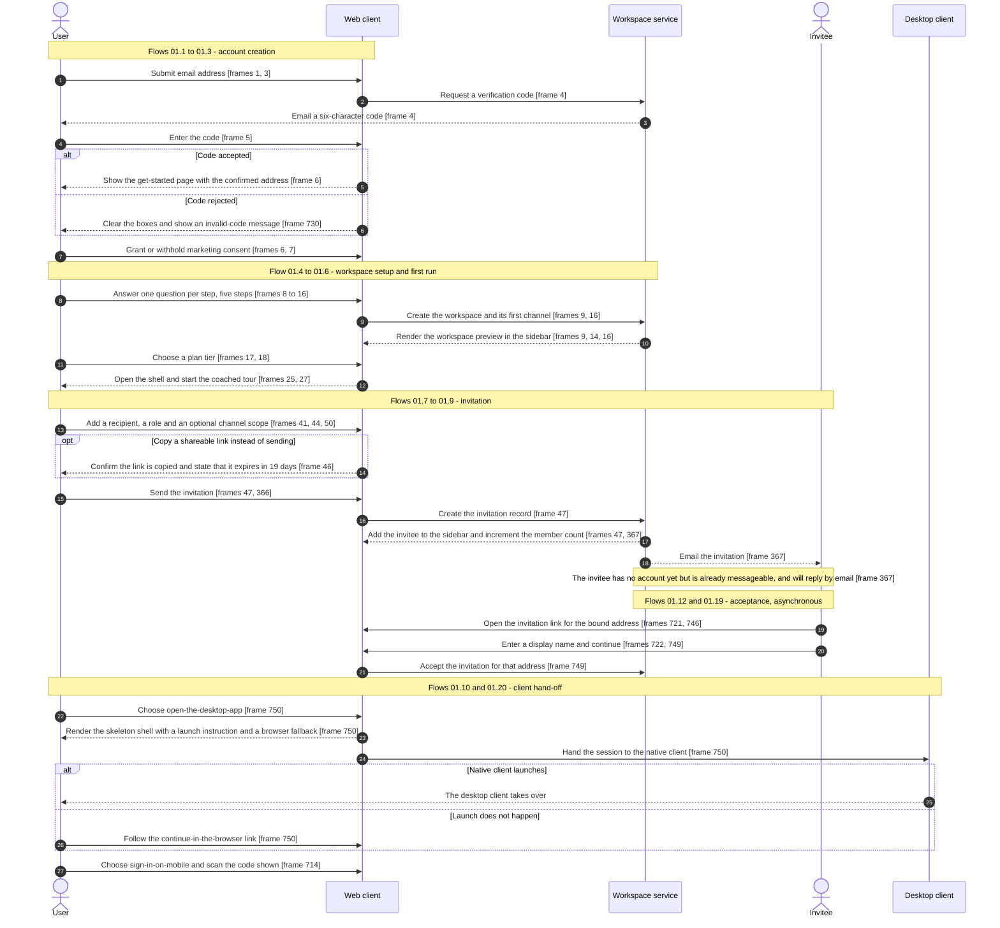

# Onboarding & Authentication

Every journey that gets a person from an unauthenticated page into a workspace, and every journey that brings somebody else in after them.

## Purpose

This document specifies the **account and workspace boundary**: the surfaces a person meets before a session exists, the sequence that creates a workspace, the two ways somebody else is invited into it, the several ways an existing account signs back in, and the hand-off from the browser to a native client. Twenty flows over eighty-one frames, which the [coverage ledger](_screenshot-index.md) ranks fourth by flow count and fifth by frame count among the twenty-three areas of the [Workflow Catalog](README.md). Its distinguishing property is not size but spread: its surfaces render in **four different chromes** — an unauthenticated single-column page [frame 1](../../screenshots/Slack%20web%20Jul%202024%201.png), a reduced application shell with no top bar [frame 15](../../screenshots/Slack%20web%20Jul%202024%2015.png), the full authenticated shell behind a modal [frame 44](../../screenshots/Slack%20web%20Jul%202024%2044.png), and the marketing site's own nav and footer [frame 740](../../screenshots/Slack%20web%20Jul%202024%20740.png), [frame 744](../../screenshots/Slack%20web%20Jul%202024%20744.png).

**Where this area is encountered.** Three times, and only three. First on arrival, when no session exists: the sign-up page reached from the marketing site [frame 1](../../screenshots/Slack%20web%20Jul%202024%201.png), the sign-in page reached when a protected address is requested without a session [frame 725](../../screenshots/Slack%20web%20Jul%202024%20725.png), and the join page reached from an emailed invitation [frame 721](../../screenshots/Slack%20web%20Jul%202024%20721.png). Second immediately after a workspace is created, as a five-step setup sequence [frame 8](../../screenshots/Slack%20web%20Jul%202024%208.png) through [frame 18](../../screenshots/Slack%20web%20Jul%202024%2018.png) followed by first-run coaching over the live shell [frame 25](../../screenshots/Slack%20web%20Jul%202024%2025.png). Third at any later moment from inside the product, when a member invites somebody [frame 40](../../screenshots/Slack%20web%20Jul%202024%2040.png), [frame 364](../../screenshots/Slack%20web%20Jul%202024%20364.png) or hands the session to a native client [frame 750](../../screenshots/Slack%20web%20Jul%202024%20750.png).

**Why the invitation journeys live here rather than with channels or administration.** The shared component inventory assigns them here explicitly, alongside workspace setup, and the shell document names sign-in, workspace creation, invitation acceptance and the client hand-offs as this area's property. The corpus supports that split: an invitation is addressed to an **email address that has no account yet** [frame 367](../../screenshots/Slack%20web%20Jul%202024%20367.png) and its acceptance page is an unauthenticated surface [frame 746](../../screenshots/Slack%20web%20Jul%202024%20746.png), so the journey crosses the account boundary even when it starts inside a channel.

**Deviation D4.** The client hand-off was not named in this area's original charter and is documented here as a flow; the rationale is recorded once, in the [taxonomy deviations](README.md) of the master index, and is not restated.

**What this document does not own.** The workspace menu that offers the invite and hand-off entry points belongs to [15-admin-workspace.md](15-admin-workspace.md) as flow `15.1` [frame 566](../../screenshots/Slack%20web%20Jul%202024%20566.png). The global create menu's invite-people row belongs to [00-product-overview.md](00-product-overview.md) as flow `00.1`. The notification-permission band that appears beneath the first-run coaching belongs to [12-activity-notifications.md](12-activity-notifications.md), and the channel a new workspace lands in belongs to [02-channels.md](02-channels.md) as flow `02.1`. The external-organization path offered inside the invite modal belongs to [22-external-collaboration.md](22-external-collaboration.md). Every reusable component cited below by its `C-*` identifier is defined once in [00-product-overview.md](00-product-overview.md) and is never redefined here; every entity cited by its `E-*` identifier appears in the [consolidated data model](README.md).

## Flows in this area

Twenty flows, eighty-one frames. They fall into four groups that a build can schedule independently: **account creation** (`01.1`–`01.3`), **workspace setup and first run** (`01.4`–`01.6`), **invitation** (`01.7`–`01.9`, `01.12`, `01.19`) and **returning sign-in and hand-off** (`01.10`–`01.11`, `01.13`–`01.18`, `01.20`).

Frame spans below are written as plain numeric ranges because they designate a span rather than cite one image, following the convention of the [Screenshot Coverage Index](_screenshot-index.md). Every individual frame is cited with its full relative link in the per-flow step tables and in the **Frames covered** section.

| Flow ID | Name | Frame span | Primary entry point |
|---|---|---|---|
| `01.1` | Sign up with an email address | 1–3 | A get-started action on the marketing landing page |
| `01.2` | Verify the email address with a code | 4–5 | The Continue action on the sign-up page |
| `01.3` | Confirm the account and marketing consent | 6–7 | A verified code |
| `01.4` | Complete the five-step workspace setup wizard | 8–18 | The create-a-workspace action on the get-started page |
| `01.5` | Upload and crop a profile photo during setup | 20–22 | The upload-photo action on wizard step 2 |
| `01.6` | Follow the first-run coach marks and suggestion strips | 25–30 | First arrival in the authenticated shell |
| `01.7` | Invite a teammate as a member | 40–48 | An invite-people entry point in `C-RAIL`, `C-SIDEBAR` or the workspace menu |
| `01.8` | Invite a guest with channel scope and an expiry date | 49–57 | The invite-as select inside the invite modal |
| `01.9` | Invite people from inside a channel | 364–367 | A channel's add-coworkers affordance |
| `01.10` | Sign in on a mobile device with a code | 714 | The sign-in-on-mobile row of the workspace menu |
| `01.11` | Sign in to a workspace from the browser | 717–720 | A sign-in action on the marketing site |
| `01.12` | Join a workspace from an invitation | 721–722 | An emailed invitation link |
| `01.13` | Sign in with an emailed code and recover from an invalid code | 725–730 | A protected address requested with no session |
| `01.14` | Choose a workspace from the welcome-back page | 731 | A completed sign-in for an address with more than one workspace |
| `01.15` | Sign in with a password and recover from a rejected credential | 733–736 | The password alternative on the workspace sign-in page |
| `01.16` | Sign in without a password and request a reset link | 737–739 | The forgot-password helper link |
| `01.17` | Set a new password from a reset link | 740–743 | An emailed password-reset link |
| `01.18` | Return through the marketing welcome-back page | 744–745 | The marketing site, with a recognised address |
| `01.19` | Accept an invitation as a second invitee | 746–749 | An emailed invitation link |
| `01.20` | Hand off from the browser to the desktop app | 750 | The open-the-desktop-app row of the workspace menu |

> **Partial capture:** no frame in this corpus shows a password being *set* during sign-up, a third-party identity provider's own consent screen, the contents of any email the product sends, or the browser's own protocol-handler dialog. Each gap is named again at the flow that reaches it, and none is filled in.

## Flow 01.1 — Sign up with an email address

### Overview

The product's first surface asks for one thing. A centred single column carries the product wordmark, one question, one input and one primary action, with two third-party identity providers offered beneath a divider and a route out to an existing workspace [frame 1](../../screenshots/Slack%20web%20Jul%202024%201.png). The flow's substance is a validation branch: a personal-domain address is accepted but earns an advisory that **occupies the primary action's slot** [frame 2](../../screenshots/Slack%20web%20Jul%202024%202.png), and a work-domain address clears it [frame 3](../../screenshots/Slack%20web%20Jul%202024%203.png).

### Trigger

A get-started action on the marketing landing page, which is owned by [17-marketing-site.md](17-marketing-site.md). No frame captures the click itself; [frame 1](../../screenshots/Slack%20web%20Jul%202024%201.png) is the first captured state of the journey.

### Preconditions

No session. No workspace. Nothing is pre-filled: the email input renders a placeholder rather than a value [frame 1](../../screenshots/Slack%20web%20Jul%202024%201.png).

### Frame-by-frame steps

| Step | Frame(s) | What the user does | What changes on screen | Component(s) involved |
|---|---|---|---|---|
| 1 | [frame 1](../../screenshots/Slack%20web%20Jul%202024%201.png) | Arrives on the sign-up page | A single centred column renders on the default surface: product wordmark at roughly the top twentieth of the viewport height, a heading asking for the email address, a one-line helper recommending a work address, one email input, a primary Continue, an OR divider, then two stacked third-party sign-in buttons — one for an enterprise-cloud identity provider and one for a consumer-device identity provider — then a line asking whether the visitor already uses the product with a link to sign in to an existing workspace, and a footer row of legal, contact and region controls pinned near the foot | `C-AUTH-PAGE-SHELL` |
| 2 | [frame 2](../../screenshots/Slack%20web%20Jul%202024%202.png) | Types a personal-domain address | The input gains the typed value and a validation check glyph at its right edge; **the primary Continue is replaced in place by an amber advisory tip** explaining that using a work address makes it easier for coworkers to join, ending in an inline Change link. The provider buttons, existing-workspace link and footer shift down but are otherwise unchanged | `C-AUTH-PAGE-SHELL`, `C-BANNER` |
| 3 | [frame 3](../../screenshots/Slack%20web%20Jul%202024%203.png) | Replaces it with a work-domain address | The advisory disappears and the primary Continue returns to its original position beneath the input; the check glyph is no longer rendered | `C-AUTH-PAGE-SHELL` |

**Inferred:** the advisory is a recommendation and not a block, because it appears *instead of* the primary action rather than beside a disabled one, and the same page accepts the personal-domain value without any error styling [frame 2](../../screenshots/Slack%20web%20Jul%202024%202.png). The corpus does not capture the result of continuing from that state, so whether the personal-domain address can complete sign-up is not established.

> **Partial capture:** neither third-party identity provider's flow is captured. Both buttons are visible in every state of this page, and no frame shows what happens after either is activated.

## Flow 01.2 — Verify the email address with a code

### Overview

Verification is a code, not a link. The page states the length of the code, names the address it was sent to, warns that it expires, and offers a split input plus two shortcuts into a mail client [frame 4](../../screenshots/Slack%20web%20Jul%202024%204.png), [frame 5](../../screenshots/Slack%20web%20Jul%202024%205.png). Its footer is shorter than the sign-up page's — legal and contact only, with no region control.

### Trigger

Continuing from the sign-up page with an address entered [frame 3](../../screenshots/Slack%20web%20Jul%202024%203.png).

### Preconditions

An address has been submitted; the page renders that address inside its own body copy [frame 4](../../screenshots/Slack%20web%20Jul%202024%204.png). No session exists yet.

### Frame-by-frame steps

| Step | Frame(s) | What the user does | What changes on screen | Component(s) involved |
|---|---|---|---|---|
| 1 | [frame 4](../../screenshots/Slack%20web%20Jul%202024%204.png) | Lands on the verification step | The centred column now carries a heading telling the user to check their email for a code, a two-line sub-line stating that a six-character code was sent to the named address and that it expires shortly, six empty character boxes arranged as two groups of three, two open-mail-client shortcuts side by side, and a spam-folder hint | `C-AUTH-PAGE-SHELL`, `C-SEGMENTED-CODE-INPUT` |
| 2 | [frame 5](../../screenshots/Slack%20web%20Jul%202024%205.png) | Enters the six-character code | Each box fills with one character, rendered as two hyphen-separated groups; no submit control appears, and no other element on the page changes | `C-SEGMENTED-CODE-INPUT` |

**Inconsistency, recorded not reconciled:** the sub-line at [frame 5](../../screenshots/Slack%20web%20Jul%202024%205.png) names a **different recipient address** from the one at [frame 4](../../screenshots/Slack%20web%20Jul%202024%204.png). The two captures are therefore from different sign-up attempts. The record is left as the images show it, and no single address is asserted for the flow.

**Inferred:** the code submits on completion rather than through a button, because the filled state carries no primary action anywhere on the page and no frame shows one [frame 5](../../screenshots/Slack%20web%20Jul%202024%205.png).

## Flow 01.3 — Confirm the account and marketing consent

### Overview

Between verification and workspace creation sits a two-column page whose left half is a value proposition and one primary action, and whose right half is an illustration. Beneath the action are a marketing-consent checkbox and a legal paragraph; below both, a bordered card reports the outcome of a search for existing workspaces on this address and offers a different address instead [frame 6](../../screenshots/Slack%20web%20Jul%202024%206.png). The only substantive change across the flow's two frames is the consent checkbox [frame 7](../../screenshots/Slack%20web%20Jul%202024%207.png).

### Trigger

A completed verification code [frame 5](../../screenshots/Slack%20web%20Jul%202024%205.png).

### Preconditions

A verified address, echoed at the top of the page as a confirmed-as line carrying its own Change link [frame 6](../../screenshots/Slack%20web%20Jul%202024%206.png). Still no workspace and no session in a workspace.

### Frame-by-frame steps

| Step | Frame(s) | What the user does | What changes on screen | Component(s) involved |
|---|---|---|---|---|
| 1 | [frame 6](../../screenshots/Slack%20web%20Jul%202024%206.png) | Reads the get-started page | A confirmed-address line with a Change link renders centred above a two-column body. The left column holds a two-line heading, three lines of body copy, a primary create-a-workspace action, an **unchecked** marketing-consent checkbox with two lines of copy naming the vendor, and a three-line legal paragraph linking the service agreement, user terms, supplemental terms, privacy policy and cookie policy. The right column holds a three-panel illustration. Beneath both, a bordered card asks whether the team is already on the product, reports that no existing workspace was found for the address, and offers a secondary try-a-different-email action | `C-AUTH-PAGE-SHELL` |
| 2 | [frame 7](../../screenshots/Slack%20web%20Jul%202024%207.png) | Ticks the marketing-consent checkbox | The checkbox renders filled; nothing else on the page changes, and the primary action's own fill is unchanged | `C-AUTH-PAGE-SHELL` |

**Inferred:** the **rendered default** of the marketing checkbox on this page is unticked, because the box renders unfilled on arrival [frame 6](../../screenshots/Slack%20web%20Jul%202024%206.png) and filled only after the user acts [frame 7](../../screenshots/Slack%20web%20Jul%202024%207.png). That is a statement about the control's initial rendering and nothing more: the corpus never shows what is submitted, what is stored, or whether a tick is recorded at all, so this document does not claim that consent is granted or persisted on either path. The same control renders already ticked on the join page [frame 746](../../screenshots/Slack%20web%20Jul%202024%20746.png) — see **Edge cases & validations**.

**Inferred:** the existing-workspace card is the result of a lookup rather than static copy, because its body states that no workspaces were found *for this specific address* and it echoes that address verbatim [frame 6](../../screenshots/Slack%20web%20Jul%202024%206.png). The corpus does not capture the card's populated variant; the workspace list that appears when the lookup succeeds is captured instead on the welcome-back surfaces [frame 731](../../screenshots/Slack%20web%20Jul%202024%20731.png), [frame 744](../../screenshots/Slack%20web%20Jul%202024%20744.png).

## Flow 01.4 — Complete the five-step workspace setup wizard

### Overview

The longest flow in the area, and the one that establishes the `C-STEP-WIZARD` contract. Five steps, each asking exactly one question, run inside a **reduced application shell**: the navigation rail and the sidebar are present but the top bar is not, and the sidebar fills in as the answers arrive — a workspace name after step 1, a direct-message row after step 3, a channel after step 4 [frame 9](../../screenshots/Slack%20web%20Jul%202024%209.png), [frame 14](../../screenshots/Slack%20web%20Jul%202024%2014.png), [frame 16](../../screenshots/Slack%20web%20Jul%202024%2016.png). The sidebar is therefore a live preview of the workspace being built, not decoration. The wizard ends on a plan chooser rather than a Finish button [frame 17](../../screenshots/Slack%20web%20Jul%202024%2017.png).

### Trigger

The create-a-workspace action on the get-started page [frame 6](../../screenshots/Slack%20web%20Jul%202024%206.png).

### Preconditions

A verified address and no workspace. The reduced shell renders from the first step: rail with a workspace tile, a home destination rendered active, a more entry and the account avatar pinned at the foot; sidebar showing the workspace name once it exists; content region on the default surface [frame 8](../../screenshots/Slack%20web%20Jul%202024%208.png), [frame 9](../../screenshots/Slack%20web%20Jul%202024%209.png).

### Frame-by-frame steps

| Step | Frame(s) | What the user does | What changes on screen | Component(s) involved |
|---|---|---|---|---|
| 1 | [frame 8](../../screenshots/Slack%20web%20Jul%202024%208.png) | Arrives on step 1 of 5 | The content region renders, left-aligned and top-anchored: a muted step-of label, a two-line question heading asking for the company or team name, a two-line helper explaining that the answer becomes the workspace name, one text input carrying an example placeholder and a character counter at its right edge, a **pre-ticked** checkbox offering to let anyone with the address's email domain join the workspace, and a Next action rendered **muted** beneath it | `C-STEP-WIZARD`, `C-RAIL`, `C-SIDEBAR` |
| 2 | [frame 9](../../screenshots/Slack%20web%20Jul%202024%209.png) | Types the workspace name | The Next action changes from muted to filled in the primary brand color, in place and at the same size; the sidebar header simultaneously renders the workspace initial in its tile and the workspace name beside it | `C-STEP-WIZARD`, `C-SIDEBAR` |
| 3 | [frame 10](../../screenshots/Slack%20web%20Jul%202024%2010.png) | Submits step 1 | The Next action's rectangle is replaced **in place** by a progress indicator; the typed value remains in the input and every other element is unchanged — the only region of the frame that differs from the previous capture is that rectangle | `C-STEP-WIZARD` |
| 4 | [frame 11](../../screenshots/Slack%20web%20Jul%202024%2011.png) | Arrives on step 2 of 5 | The step label increments and the question becomes the user's own name. Beneath the single full-name input a second, explicitly optional block appears: a label marking the profile photo optional, a helper line, a placeholder avatar and a secondary upload action. Next renders muted | `C-STEP-WIZARD`, `C-AVATAR` |
| 5 | [frame 12](../../screenshots/Slack%20web%20Jul%202024%2012.png) | Types the full name | Next becomes filled; the placeholder avatar and the optional block are unchanged, confirming the photo is not gating the step | `C-STEP-WIZARD` |
| 6 | [frame 13](../../screenshots/Slack%20web%20Jul%202024%2013.png) | Arrives on step 3 of 5 | The question asks who else is on the team, interpolating the workspace name. The field is labelled add-coworker-by-email and carries a right-aligned add-from-a-third-party-contacts-directory affordance; its placeholder shows two example addresses separated by a comma. Two additional actions sit beneath the muted Next — a copy-invite-link action and a skip-this-step action. The sidebar skeleton gains a direct-messages group | `C-STEP-WIZARD`, `C-SIDEBAR`, `C-CHIP-INPUT` |
| 7 | [frame 14](../../screenshots/Slack%20web%20Jul%202024%2014.png) | Enters one invitee address | The address becomes a removable chip inside the field, Next becomes filled, and the invitee appears immediately as a row in the sidebar's direct-messages group with an avatar | `C-STEP-WIZARD`, `C-SIDEBAR`, `C-AVATAR`, `C-CHIP-INPUT` |
| 8 | [frame 15](../../screenshots/Slack%20web%20Jul%202024%2015.png) | Arrives on step 4 of 5 | The question asks what the team is working on right now, the helper offers four kinds of answer, and a single input carries an example placeholder. Next is muted. The sidebar skeleton now shows both a channels group and the populated direct-messages group | `C-STEP-WIZARD`, `C-SIDEBAR` |
| 9 | [frame 16](../../screenshots/Slack%20web%20Jul%202024%2016.png) | Types a free-text answer | Next becomes filled, and the sidebar's channels group gains a channel whose name is derived from the answer — lower-cased and hyphenated | `C-STEP-WIZARD`, `C-SIDEBAR` |
| 10 | [frame 17](../../screenshots/Slack%20web%20Jul%202024%2017.png) | Arrives on step 5 of 5 | The step label reads the final step and the heading announces the workspace is ready. Instead of one input the region holds a plan chooser: a lead-in line, then two cards side by side. The left card carries a tier name, a descriptive pill badge, a zero price with its currency, a per-person-per-month unit line, an **outlined** action and a three-item bulleted feature list. The right card is emphasised with a border in the primary brand color and carries a tier name, a pill badge with a leading sparkle glyph, a percentage-off headline with a footnote marker, a struck original price followed by the discounted price and unit, a **filled** primary action and a three-item feature list whose markers are check glyphs. Beneath the cards sit a link to the full pricing page and the offer's footnote | `C-STEP-WIZARD`, `C-UPGRADE-GATE`, `C-PLAN-CARD` |
| 11 | [frame 18](../../screenshots/Slack%20web%20Jul%202024%2018.png) | Chooses the free tier | The chosen card's action is replaced in place by a progress indicator on a muted background, and **the sibling card's action is simultaneously rendered muted** — the two button rectangles are the only regions that differ from the previous capture | `C-STEP-WIZARD`, `C-PLAN-CARD` |

**Inferred:** the wizard has no Back control. Four of the five steps are captured in both their empty and their filled state and none renders a back affordance anywhere in the content region or beside the step label [frame 8](../../screenshots/Slack%20web%20Jul%202024%208.png), [frame 11](../../screenshots/Slack%20web%20Jul%202024%2011.png), [frame 13](../../screenshots/Slack%20web%20Jul%202024%2013.png), [frame 15](../../screenshots/Slack%20web%20Jul%202024%2015.png), [frame 17](../../screenshots/Slack%20web%20Jul%202024%2017.png). `C-STEP-WIZARD`'s contract records a back affordance from the two-step modal that evidences it, which is a different surface owned by [02-channels.md](02-channels.md); this wizard is the identifier's second variant and the corpus shows it forward-only.

**Inferred:** every step's Next is gated on its own single input alone. The muted-to-filled change is observed four times, each time coinciding with that step's input gaining a value and with nothing else changing, and the optional photo block on step 2 never affects it [frame 8](../../screenshots/Slack%20web%20Jul%202024%208.png) versus [frame 9](../../screenshots/Slack%20web%20Jul%202024%209.png), [frame 11](../../screenshots/Slack%20web%20Jul%202024%2011.png) versus [frame 12](../../screenshots/Slack%20web%20Jul%202024%2012.png), [frame 13](../../screenshots/Slack%20web%20Jul%202024%2013.png) versus [frame 14](../../screenshots/Slack%20web%20Jul%202024%2014.png), [frame 15](../../screenshots/Slack%20web%20Jul%202024%2015.png) versus [frame 16](../../screenshots/Slack%20web%20Jul%202024%2016.png).

> **Partial capture:** step 3's copy-invite-link and skip-this-step actions are both visible but neither result is captured [frame 13](../../screenshots/Slack%20web%20Jul%202024%2013.png), and no frame shows the paid tier being chosen from step 5 — only the free tier's submitting state is captured [frame 18](../../screenshots/Slack%20web%20Jul%202024%2018.png).

## Flow 01.5 — Upload and crop a profile photo during setup

### Overview

The optional photo block on wizard step 2 opens a two-stage dialog over the dimmed wizard: an upload stage that reports progress and can be cancelled [frame 20](../../screenshots/Slack%20web%20Jul%202024%2020.png), then a crop stage that previews the result **in the shape it will actually be used** — as a message row's avatar beside the user's name and timestamp [frame 21](../../screenshots/Slack%20web%20Jul%202024%2021.png). The flow returns to the wizard with the photo in place and the upload action relabelled [frame 22](../../screenshots/Slack%20web%20Jul%202024%2022.png).

### Trigger

The upload-photo action inside step 2's optional profile-photo block [frame 11](../../screenshots/Slack%20web%20Jul%202024%2011.png).

### Preconditions

Wizard step 2 reached, and a local image chosen. The file chooser itself is the browser's own and is not captured; [frame 20](../../screenshots/Slack%20web%20Jul%202024%2020.png) is already the upload in progress.

### Frame-by-frame steps

| Step | Frame(s) | What the user does | What changes on screen | Component(s) involved |
|---|---|---|---|---|
| 1 | [frame 20](../../screenshots/Slack%20web%20Jul%202024%2020.png) | Chooses an image | A centred dialog opens over the dimmed wizard, its title row carrying a back chevron and a heading stating the photo is uploading; the body is a grey image placeholder with a centred progress indicator, and the footer offers a single Cancel | `C-MODAL-SHELL` |
| 2 | [frame 21](../../screenshots/Slack%20web%20Jul%202024%2021.png) | Waits for the upload, then adjusts the crop | The dialog becomes a crop stage: the title row keeps the back chevron and reads crop-your-photo, with **no dismiss control**; the body letterboxes the uploaded portrait and overlays a dashed square crop frame with four corner handles; beneath it a Preview label heads a preview row rendering the resulting square avatar tile at the left, the display name and a timestamp on the line beside it, and a grey placeholder bar standing in for a message body. The footer right-aligns a secondary Cancel then a primary Save, filled in an accent color rather than the primary brand color | `C-MODAL-SHELL`, `C-AVATAR`, `C-MESSAGE-ROW` |
| 3 | [frame 22](../../screenshots/Slack%20web%20Jul%202024%2022.png) | Saves the crop | The dialog closes and wizard step 2 renders again with the cropped photo in place of the placeholder avatar and the secondary action relabelled from upload to edit; the name input keeps its value and Next stays filled | `C-STEP-WIZARD`, `C-AVATAR` |

**Inferred:** the crop is square and fixed-ratio, because the crop frame is rendered square over a portrait-orientation source and the preview tile is square [frame 21](../../screenshots/Slack%20web%20Jul%202024%2021.png). No frame shows the frame being dragged, so the interaction is not asserted.

**Inferred:** the back chevron returns to the upload stage rather than dismissing the dialog, because it is the only navigation control the crop stage renders and the upload stage carries the same chevron [frame 20](../../screenshots/Slack%20web%20Jul%202024%2020.png), [frame 21](../../screenshots/Slack%20web%20Jul%202024%2021.png).

## Flow 01.6 — Follow the first-run coach marks and suggestion strips

### Overview

First run is a four-step coached tour over the **live** shell, followed by two composer prompts that get the first message written. The tour dims the shell, spotlights one control at a time and counts its own steps [frame 25](../../screenshots/Slack%20web%20Jul%202024%2025.png), [frame 26](../../screenshots/Slack%20web%20Jul%202024%2026.png), [frame 27](../../screenshots/Slack%20web%20Jul%202024%2027.png); the prompts then point at the composer and offer canned openers that move into it as editable text [frame 28](../../screenshots/Slack%20web%20Jul%202024%2028.png), [frame 29](../../screenshots/Slack%20web%20Jul%202024%2029.png), [frame 30](../../screenshots/Slack%20web%20Jul%202024%2030.png). Two of the four coach marks are captured out of four, and the corpus's first and third are what it shows.

### Trigger

First arrival in the authenticated shell after the wizard. The tour is already active on the first captured frame [frame 25](../../screenshots/Slack%20web%20Jul%202024%2025.png).

### Preconditions

A workspace with at least one channel, a session in the full shell — rail, sidebar and top bar all present — and a plan offer live in the sidebar's banner slot with a countdown sub-line [frame 25](../../screenshots/Slack%20web%20Jul%202024%2025.png).

### Frame-by-frame steps

| Step | Frame(s) | What the user does | What changes on screen | Component(s) involved |
|---|---|---|---|---|
| 1 | [frame 25](../../screenshots/Slack%20web%20Jul%202024%2025.png) | Meets the first coach mark | A floating card is anchored over the sidebar, the shell behind it dimmed. Its illustration header shows an example channel list; beneath it a heading introduces the team's first channel by name, a body line explains it, and a footer carries a secondary maybe-later action, a primary show-me-around action and a step counter reading one of four. A permission-request band is pinned to the foot of the viewport | `C-COACH-MARK`, `C-PERMISSION-PROMPT`, `C-BANNER` |
| 2 | [frame 26](../../screenshots/Slack%20web%20Jul%202024%2026.png) | Advances to the third coach mark | The card, still anchored over the sidebar, now reads add-a-personal-touch, its body inviting a colour choice and noting that the profile can be revisited at any time; a grid of twelve colour swatches sits beneath the copy with one swatch selected. The footer carries a single primary next action and a counter reading three of four | `C-COACH-MARK` |
| 3 | [frame 27](../../screenshots/Slack%20web%20Jul%202024%2027.png) | Advances to the final coach mark | The card moves to the lower left and its **caret points left at the create control in the rail**, which is spotlit while the rest of the shell stays dimmed. The illustration header now carries a dismiss control at its top-right, the heading reads it-all-starts-here, the body names messages, huddles and canvases as the things that start there, and the footer's primary action reads Done beside a counter reading four of four | `C-COACH-MARK`, `C-RAIL` |
| 4 | [frame 28](../../screenshots/Slack%20web%20Jul%202024%2028.png) | Finishes the tour | The dimming and the card are gone; the shell is fully interactive. A pointer label rendered in the primary brand color sits immediately above the composer, reading start-here, and the composer is focused and empty. The permission band is still pinned to the viewport foot | `C-COMPOSER`, `C-BANNER` |
| 5 | [frame 29](../../screenshots/Slack%20web%20Jul%202024%2029.png) | Reads the message prompt | The pointer label is replaced by a suggestion strip above the composer: a line inviting a quick message so coworkers know the user is there, then three canned opener chips laid out left to right, and a dismiss control at the strip's right edge | `C-COMPOSER`, `C-EMPTY-STATE` |
| 6 | [frame 30](../../screenshots/Slack%20web%20Jul%202024%2030.png) | Picks an opener | All three chips disappear while the strip's invitation line remains, and the chosen opener's text is now **inside the composer as editable content**; a newline hint naming the modifier-and-return combination renders beneath the input | `C-COMPOSER` |

**Inferred:** the second coach mark of the four is not in this corpus. The counters jump from one of four [frame 25](../../screenshots/Slack%20web%20Jul%202024%2025.png) to three of four [frame 26](../../screenshots/Slack%20web%20Jul%202024%2026.png) with no intervening capture, so the tour has a step whose content is unknown; it is not invented here.

**Inferred:** the opener chips write into the composer rather than sending, because after the chip is chosen the text sits in the input with the newline hint beneath it and no message row has been added to the conversation [frame 30](../../screenshots/Slack%20web%20Jul%202024%2030.png).

**Transition out.** The channel this tour runs over, its welcome hero and its add-coworkers action belong to [02-channels.md](02-channels.md); the permission-request band belongs to [12-activity-notifications.md](12-activity-notifications.md); the sidebar's plan offer and countdown are `C-UPGRADE-GATE` instances whose state matrix belongs to [21-states.md](21-states.md).

## Flow 01.7 — Invite a teammate as a member

### Overview

The workspace invitation is a modal that **grows as it is filled in**. It opens in a collapsed variant — recipients, role, an advisory and a copy-link footer, with the personal message reduced to a link [frame 40](../../screenshots/Slack%20web%20Jul%202024%2040.png). Adding a recipient enables the primary action [frame 41](../../screenshots/Slack%20web%20Jul%202024%2041.png); expanding the invitation adds a channel-scope section and a message field [frame 42](../../screenshots/Slack%20web%20Jul%202024%2042.png). The flow covers both completion paths the modal offers: copying a shareable link, whose confirmation states the link's own expiry [frame 46](../../screenshots/Slack%20web%20Jul%202024%2046.png), and sending, which produces a success modal and materialises the invitee in the workspace immediately [frame 47](../../screenshots/Slack%20web%20Jul%202024%2047.png). It closes on the modal reset for a second invitee [frame 48](../../screenshots/Slack%20web%20Jul%202024%2048.png).

### Trigger

Any invite-people entry point. Three are observable: the separated invite-people row at the foot of the global create menu, owned by [00-product-overview.md](00-product-overview.md) as flow `00.1`; the invite-people row in the workspace menu, owned by [15-admin-workspace.md](15-admin-workspace.md) [frame 566](../../screenshots/Slack%20web%20Jul%202024%20566.png); and the add-coworkers row at the foot of the sidebar's direct-messages group [frame 44](../../screenshots/Slack%20web%20Jul%202024%2044.png).

### Preconditions

An authenticated session in the full shell, a conversation open behind the modal, and permission to invite. The corpus does not capture a state in which the entry point is absent or gated, so no permission requirement is asserted here. That such a restriction exists is nonetheless visible: an assistant-app message rendered behind a later capture in this area states that invitations have been restricted to owners and administrators [frame 52](../../screenshots/Slack%20web%20Jul%202024%2052.png), and the setting that imposes it belongs to [15-admin-workspace.md](15-admin-workspace.md).

### Frame-by-frame steps

| Step | Frame(s) | What the user does | What changes on screen | Component(s) involved |
|---|---|---|---|---|
| 1 | [frame 40](../../screenshots/Slack%20web%20Jul%202024%2040.png) | Opens the invite modal | A centred modal dims the shell behind it. Its title row interpolates the workspace name and carries a dismiss control. The body renders, top to bottom: a To label with a right-aligned add-from-a-third-party-directory affordance; a tall recipient field showing only a placeholder address; an invite-as label and a select reading the member role; a tinted advisory band whose caret points up at that select, asking about working with people from external organizations and linking both the external-collaboration feature and guest accounts, with its own dismiss control; and a customize-your-invitation link in place of a message field. The footer puts a link glyph, a copy-invite-link action and an edit-link-settings affordance at the left and the primary Send, rendered **muted**, at the right | `C-MODAL-SHELL`, `C-DROPDOWN-MENU`, `C-BANNER`, `C-CHIP-INPUT` |
| 2 | [frame 41](../../screenshots/Slack%20web%20Jul%202024%2041.png) | Types one recipient address | The address becomes a removable chip inside the recipient field, and the primary Send changes from muted to filled in place, at the same size and position | `C-MODAL-SHELL`, `C-CHIP-INPUT` |
| 3 | [frame 42](../../screenshots/Slack%20web%20Jul%202024%2042.png) | Expands the invitation | The modal grows taller and gains two sections between the advisory and the footer: a Channels label with a helper line stating that new members automatically join the workspace's default channels **and these**, above an empty search-channels field; and a custom-message label above a single-line input whose placeholder invites a personal note. The customize-your-invitation link is gone and the footer, including the now-filled Send, moves down with the modal's new height | `C-MODAL-SHELL`, `C-CHIP-INPUT` |
| 4 | [frame 43](../../screenshots/Slack%20web%20Jul%202024%2043.png) | Types part of a channel name | The channel field takes a focus ring and holds the typed query; a single-row suggestion list opens directly beneath it, its one row rendered as a filled highlight and carrying the channel glyph and name. The list **overlaps the custom-message input** below it rather than pushing it down | `C-MODAL-SHELL`, `C-DROPDOWN-MENU` |
| 5 | [frame 44](../../screenshots/Slack%20web%20Jul%202024%2044.png) | Selects the suggested channel | The query is replaced by a removable channel chip in the field, the suggestion list closes and the custom-message input is visible again and still empty | `C-MODAL-SHELL`, `C-CHIP-INPUT` |
| 6 | [frame 45](../../screenshots/Slack%20web%20Jul%202024%2045.png) | Types a personal message | The custom-message input holds the typed text — a short greeting, sample data only — and Send stays filled. Nothing else changes | `C-MODAL-SHELL` |
| 7 | [frame 46](../../screenshots/Slack%20web%20Jul%202024%2046.png) | Activates copy-invite-link | A confirmation pill in an accent color appears immediately above the footer, its tail pointing down at the copy-invite-link row, stating that the link was copied and **that it expires in nineteen days**. It overlays the custom-message field, which keeps its typed value. The modal is not dismissed and Send remains available | `C-MODAL-SHELL`, `C-TOAST` |
| 8 | [frame 47](../../screenshots/Slack%20web%20Jul%202024%2047.png) | Sends the invitation | The form modal is replaced by a success modal on a lighter surface: a dismiss control at the top right, an illustration band filling roughly the upper half, a heading stating that one person has been invited, then one row per invitee carrying a send glyph in a rounded tile, the invited address, and a right-aligned role annotation with an info glyph. The footer puts a manage-invitations link at the left and a secondary invite-more-people action beside a primary Done at the right. Behind the modal the sidebar's direct-messages group has **gained the invitee as a row** and the conversation header's member-count pill has incremented by one | `C-MODAL-SHELL`, `C-AVATAR`, `C-SIDEBAR` |
| 9 | [frame 48](../../screenshots/Slack%20web%20Jul%202024%2048.png) | Chooses invite-more-people | The collapsed form modal returns with a different recipient already held as a chip, the member role, the advisory band and the customize-your-invitation link — the same anatomy as step 1 but with the primary Send filled because a recipient is present | `C-MODAL-SHELL`, `C-CHIP-INPUT` |

**Inferred:** the recipient field accepts several invitees. It is rendered roughly three chip-rows tall while holding a single chip in every captured state [frame 41](../../screenshots/Slack%20web%20Jul%202024%2041.png), [frame 48](../../screenshots/Slack%20web%20Jul%202024%2048.png), and the success modal's heading is written as a count rather than a name [frame 47](../../screenshots/Slack%20web%20Jul%202024%2047.png). The corpus never shows two chips at once, so multi-invitee behaviour is inferred from the field's shape and the counted heading, not observed.

**Inferred:** sending an invitation creates the person in the workspace at once rather than on acceptance, because the invitee appears as a direct-message row and the member count increments in the same capture as the success modal [frame 47](../../screenshots/Slack%20web%20Jul%202024%2047.png), and the same pair of effects is observed independently in flow `01.9` [frame 364](../../screenshots/Slack%20web%20Jul%202024%20364.png) versus [frame 367](../../screenshots/Slack%20web%20Jul%202024%20367.png).

**Inconsistency, recorded not reconciled:** the role vocabulary differs between the form and its confirmation. The select offers the member role [frame 44](../../screenshots/Slack%20web%20Jul%202024%2044.png) while the success row annotates the same invitation as invited-as-a-coworker [frame 47](../../screenshots/Slack%20web%20Jul%202024%2047.png), and the reduced modal's confirmation uses the same coworker wording [frame 366](../../screenshots/Slack%20web%20Jul%202024%20366.png). Both terms are recorded; neither is normalised into the other.

> **Partial capture:** the add-from-a-third-party-directory affordance, the edit-link-settings affordance and the manage-invitations link are each visible in several frames and none of their destinations is captured. The invitations management surface itself is referenced from another surface's copy [frame 52](../../screenshots/Slack%20web%20Jul%202024%2052.png) and belongs to [15-admin-workspace.md](15-admin-workspace.md).

## Flow 01.8 — Invite a guest with channel scope and an expiry date

### Overview

Changing the role from member to guest **restructures the form**: optional channel scope becomes a required field, a billing consequence is stated inline, and an expiration control with its own custom-date branch appears [frame 49](../../screenshots/Slack%20web%20Jul%202024%2049.png) through [frame 53](../../screenshots/Slack%20web%20Jul%202024%2053.png). It carries a disproportionate share of this area's field-level validation evidence: three of the eighteen validations listed below are evidenced by its frames alone, and a fourth is evidenced by contrasting them with the member form. It ends on its own success modal, whose role annotation differs from the member path's [frame 56](../../screenshots/Slack%20web%20Jul%202024%2056.png), and on the modal reopened with the role menu expanded again [frame 57](../../screenshots/Slack%20web%20Jul%202024%2057.png).

### Trigger

The invite-as select inside the invite modal [frame 48](../../screenshots/Slack%20web%20Jul%202024%2048.png).

### Preconditions

The invite modal open with at least one recipient chip present [frame 49](../../screenshots/Slack%20web%20Jul%202024%2049.png). The workspace must offer the guest role: the corpus shows the option present and not entitlement-badged in every capture of the open menu [frame 49](../../screenshots/Slack%20web%20Jul%202024%2049.png), [frame 57](../../screenshots/Slack%20web%20Jul%202024%2057.png).

### Frame-by-frame steps

| Step | Frame(s) | What the user does | What changes on screen | Component(s) involved |
|---|---|---|---|---|
| 1 | [frame 49](../../screenshots/Slack%20web%20Jul%202024%2049.png) | Opens the invite-as select | A menu opens over the modal body, anchored to the select. The member option renders first, checked and highlighted; the guest option follows with a sub-label stating that a guest is limited to select channels, files and the directory. A separated footer group asks about working with another company and offers adding people through the external-collaboration feature. The primary Send renders **muted** while the menu is open, even though the recipient chip is still present | `C-MODAL-SHELL`, `C-DROPDOWN-MENU` |
| 2 | [frame 50](../../screenshots/Slack%20web%20Jul%202024%2050.png) | Chooses the guest role | The select renders the role name followed by its limitation sub-label on one line, and the form restructures: the optional Channels section is replaced by an **add-to-channels label explicitly marked required** above a search-channels field; an unchecked checkbox beneath it allows the guest to be added to more channels and states in bold that guests who can join multiple channels are billed as full members; a set-an-expiration-date label and select default to no limit, with a helper stating that guest accounts expire at 11:59 PM on the selected date; the custom-message field remains; and the footer's left slot changes from the copy-invite-link group to an info glyph and a learn-more-about-guests link. The external-organization advisory is **no longer rendered**. Send is muted | `C-MODAL-SHELL`, `C-DROPDOWN-MENU` |
| 3 | [frame 51](../../screenshots/Slack%20web%20Jul%202024%2051.png) | Adds one channel to the required field | A removable channel chip replaces the placeholder in the add-to-channels field. Every other control keeps its state, and Send is **still rendered muted** | `C-MODAL-SHELL`, `C-CHIP-INPUT` |
| 4 | [frame 52](../../screenshots/Slack%20web%20Jul%202024%2052.png) | Sets the expiration select to its custom value | A new, empty date input appears directly beneath the select, carrying a leading calendar glyph, and the 11:59 PM helper moves below it. Send renders filled | `C-MODAL-SHELL`, `C-DROPDOWN-MENU` |
| 5 | [frame 53](../../screenshots/Slack%20web%20Jul%202024%2053.png) | Focuses the date input | A month calendar popover opens over the form: a header row with a previous-month chevron, a month-and-year control carrying its own caret, and a next-month chevron; a weekday header abbreviated Su through Sa; and a day grid whose current day is ringed. Days before the first of the month render as empty cells | `C-MODAL-SHELL`, `C-DATE-PICKER-POPOVER` |
| 6 | [frame 54](../../screenshots/Slack%20web%20Jul%202024%2054.png) | Picks a date | The popover closes and the date input reads a deactivate-on line naming the chosen date in long form. The custom message is still empty and Send stays filled | `C-MODAL-SHELL`, `C-DATE-PICKER-POPOVER` |
| 7 | [frame 55](../../screenshots/Slack%20web%20Jul%202024%2055.png) | Types a personal message | The custom-message input holds a one-word greeting, sample data only. Nothing else changes | `C-MODAL-SHELL` |
| 8 | [frame 56](../../screenshots/Slack%20web%20Jul%202024%2056.png) | Sends the guest invitation | The same success modal anatomy as the member path — dismiss control, illustration, one-person heading, invitee row, manage-invitations link, secondary invite-more-people and primary Done — but the row's role annotation reads invited-as-a-guest | `C-MODAL-SHELL`, `C-AVATAR` |
| 9 | [frame 57](../../screenshots/Slack%20web%20Jul%202024%2057.png) | Starts another invitation | The collapsed form modal returns with **only a placeholder** in the recipient field and the invite-as menu already expanded, showing the same two options and the same external-collaboration footer group. Send is muted | `C-MODAL-SHELL`, `C-DROPDOWN-MENU` |

**Inferred:** the channel scope is required for a guest and optional for a member. Only the guest form marks the label required and only the guest form removes the automatic-default-channels helper that the member form carries [frame 44](../../screenshots/Slack%20web%20Jul%202024%2044.png) versus [frame 50](../../screenshots/Slack%20web%20Jul%202024%2050.png). The corpus does **not** show that satisfying the field is what enables submission — see the send-control note below and **Edge cases & validations**.

**Inconsistency, recorded not reconciled — the send control's rendering.** Across this flow Send renders muted at [frame 49](../../screenshots/Slack%20web%20Jul%202024%2049.png), [frame 50](../../screenshots/Slack%20web%20Jul%202024%2050.png) and [frame 51](../../screenshots/Slack%20web%20Jul%202024%2051.png) and filled from [frame 52](../../screenshots/Slack%20web%20Jul%202024%2052.png) onward — so it is **still muted in the capture where the required channel field is already satisfied**. Two facts prevent attributing the change to the form's validity. First, the muted rendering also occurs while the role menu is open with a valid recipient present [frame 49](../../screenshots/Slack%20web%20Jul%202024%2049.png). Second, the state behind the modal changes at exactly the same boundary: at [frame 51](../../screenshots/Slack%20web%20Jul%202024%2051.png) a channel conversation is open and the invitee is absent from the sidebar, while at [frame 52](../../screenshots/Slack%20web%20Jul%202024%2052.png) the assistant app's conversation is open and the invitee **already appears in the sidebar as a guest row** — so the two captures are from different sessions and the still-unsent invitation at [frame 52](../../screenshots/Slack%20web%20Jul%202024%2052.png) cannot be the one being composed at [frame 51](../../screenshots/Slack%20web%20Jul%202024%2051.png). Both renderings are recorded and neither is asserted as the validity rule.

> **Partial capture:** the popover opens on one month while the date eventually shown belongs to a later one [frame 53](../../screenshots/Slack%20web%20Jul%202024%2053.png) versus [frame 54](../../screenshots/Slack%20web%20Jul%202024%2054.png), so month navigation happens between captures and is not shown. The allow-more-channels checkbox is never captured in its ticked state, so the billing consequence it warns about is stated but its effect on the form is not shown. The learn-more-about-guests destination is not captured.

## Flow 01.9 — Invite people from inside a channel

### Overview

The corpus contains a **second, structurally reduced invite modal**. Opened from inside a channel it carries the same title but only a recipient field and the copy-link footer — no role select, no channel scope, no personal message and no external-organization advisory [frame 364](../../screenshots/Slack%20web%20Jul%202024%20364.png). Its confirmation is a third success-modal variant, headed with a check glyph and offering a see-past-invites link, and it explains in a tooltip that an invitee who has no account yet can still be messaged [frame 366](../../screenshots/Slack%20web%20Jul%202024%20366.png), [frame 367](../../screenshots/Slack%20web%20Jul%202024%20367.png). The corpus therefore shows **two distinct workspace-invitation surfaces**, and this document does not reconcile them into one.

### Trigger

A channel's own add-coworkers affordance — the empty channel renders it as a button inside its welcome hero [frame 364](../../screenshots/Slack%20web%20Jul%202024%20364.png). The hero itself belongs to [02-channels.md](02-channels.md).

### Preconditions

An authenticated session in the full shell with a channel open. At the first captured state the channel's member-count pill reads two and the invitee is absent from the sidebar [frame 364](../../screenshots/Slack%20web%20Jul%202024%20364.png).

### Frame-by-frame steps

| Step | Frame(s) | What the user does | What changes on screen | Component(s) involved |
|---|---|---|---|---|
| 1 | [frame 364](../../screenshots/Slack%20web%20Jul%202024%20364.png) | Opens the invite modal from the channel | A centred modal dims the shell. It carries the workspace-interpolated title and dismiss control, the To label with its add-from-a-third-party-directory affordance, a **focused** recipient field showing a placeholder address, and the footer's copy-invite-link group beside a **muted** Send. No role select, channel section, message field or advisory band is present | `C-MODAL-SHELL`, `C-CHIP-INPUT` |
| 2 | [frame 365](../../screenshots/Slack%20web%20Jul%202024%20365.png) | Types one recipient address | The address becomes a removable chip and Send changes from muted to filled in place | `C-MODAL-SHELL`, `C-CHIP-INPUT` |
| 3 | [frame 366](../../screenshots/Slack%20web%20Jul%202024%20366.png) | Sends the invitation | A success modal replaces the form: a circular check glyph in a tinted disc, centred, above a one-word Sent heading; then a row carrying a send glyph, the invited address and a right-aligned coworker role annotation with an info glyph; then a footer with a send glyph and a see-past-invites link at the left and a secondary invite-more-people action beside a primary Done at the right | `C-MODAL-SHELL` |
| 4 | [frame 367](../../screenshots/Slack%20web%20Jul%202024%20367.png) | Consults the role annotation's info glyph | A dark tooltip opens above and to the right of the glyph with its tail pointing down at it, explaining that the coworker is not on the product yet but can still be messaged and will reply by email. Behind the modal the sidebar's direct-messages group now carries the invitee and the channel's member-count pill has incremented by one relative to step 1 | `C-MODAL-SHELL`, `C-SIDEBAR` |

**Inferred:** the reduced modal is channel-scoped rather than feature-poor, because it is opened from a channel's own hero, offers no channel field at all, and the fuller modal's advisory speaks of inviting people **to your channel** [frame 44](../../screenshots/Slack%20web%20Jul%202024%2044.png), [frame 364](../../screenshots/Slack%20web%20Jul%202024%20364.png). The corpus does not state the scope in words, so this is a deduction from the two surfaces' shapes and entry points, not an observation.

**Inferred:** an invitation to an address with no account produces a real, messageable participant, because the tooltip says so in as many words and the sidebar row appears in the same capture [frame 367](../../screenshots/Slack%20web%20Jul%202024%20367.png).

## Flow 01.10 — Sign in on a mobile device with a code

### Overview

A single-frame flow that hands an authenticated desktop session to a phone by rendering a scannable code plus the exact sequence of taps needed in the mobile client [frame 714](../../screenshots/Slack%20web%20Jul%202024%20714.png). It is a hand-off in the same family as flow `01.20` but in the opposite direction: the browser is the authority and the phone is the client being enrolled.

### Trigger

The sign-in-on-mobile row of the workspace menu, which is owned by [15-admin-workspace.md](15-admin-workspace.md) [frame 566](../../screenshots/Slack%20web%20Jul%202024%20566.png).

### Preconditions

An authenticated session, because the modal states which address it is signing in as [frame 714](../../screenshots/Slack%20web%20Jul%202024%20714.png).

### Frame-by-frame steps

| Step | Frame(s) | What the user does | What changes on screen | Component(s) involved |
|---|---|---|---|---|
| 1 | [frame 714](../../screenshots/Slack%20web%20Jul%202024%20714.png) | Chooses sign-in-on-mobile | A centred modal dims the conversation behind it. It renders the workspace name, a signing-in-as line naming the address, a heading pairing the workspace with the mobile device, a lead-in line, and a **four-step numbered list** — open the mobile client and swipe right from its home tab, tap add-a-workspace at the foot of the pane, tap sign-in-to-another-workspace at the foot of the list, then tap scan-QR-code — beside a scannable square code. A dismiss control sits at the title row's right | `C-MODAL-SHELL` |

> **Partial capture:** nothing after the code is scanned is captured — no confirmation state on the browser, and no mobile-client surface in this area. The [coverage ledger](_screenshot-index.md) records none anywhere in the corpus either: the only other captures that mention the native clients are marketing download pages. The instruction list is therefore the only evidence of the mobile client's own navigation, and it is recorded as instructions rather than treated as a specification of mobile screens.

## Flow 01.11 — Sign in to a workspace from the browser

### Overview

Signing back in is two pages, because the product must first learn **which** workspace. The first asks for the workspace address as a subdomain against a fixed suffix and offers three escape hatches plus a list of workspaces the browser is already signed in to [frame 717](../../screenshots/Slack%20web%20Jul%202024%20717.png). The second is the workspace's own sign-in page, which puts two third-party identity providers **above** the divider, offers an emailed code as the default and a password as the alternative [frame 719](../../screenshots/Slack%20web%20Jul%202024%20719.png).

### Trigger

A sign-in action on the marketing site, owned by [17-marketing-site.md](17-marketing-site.md), or the existing-workspace link on the sign-up page [frame 1](../../screenshots/Slack%20web%20Jul%202024%201.png).

### Preconditions

No session for the target workspace. A session may nonetheless exist for another workspace: both pages render an already-signed-in section listing one workspace with an open action [frame 717](../../screenshots/Slack%20web%20Jul%202024%20717.png), [frame 719](../../screenshots/Slack%20web%20Jul%202024%20719.png).

### Frame-by-frame steps

| Step | Frame(s) | What the user does | What changes on screen | Component(s) involved |
|---|---|---|---|---|
| 1 | [frame 717](../../screenshots/Slack%20web%20Jul%202024%20717.png) | Opens the workspace sign-in page | A centred column renders a heading asking the user to sign in to their workspace, a label asking for the workspace address, one input whose placeholder shows a subdomain against a **fixed, non-editable domain suffix**, a primary Continue, then three helper links stacked left-aligned — find-your-workspaces for an unknown address, a separately-hosted government-cloud edition, and create-a-new-workspace — then a section headed you-are-already-signed-in-to listing one workspace row as a domain with a secondary open action, then the legal, contact and region footer | `C-AUTH-PAGE-SHELL` |
| 2 | [frame 718](../../screenshots/Slack%20web%20Jul%202024%20718.png) | Types the workspace subdomain | The input holds the typed subdomain with the fixed suffix still appended; no other element changes and no validation feedback is rendered | `C-AUTH-PAGE-SHELL` |
| 3 | [frame 719](../../screenshots/Slack%20web%20Jul%202024%20719.png) | Continues to the workspace's own sign-in page | A different page renders. A full-width strip across the top states that the user needs to sign in to see the page. A header row puts the product wordmark at the left and a do-you-not-have-an-account-yet line with a create-an-account link at the far right. The centred column then carries a heading interpolating the workspace name, the workspace's fully-qualified sign-in domain beneath it, **two third-party sign-in buttons above** an OR divider, one email input, a primary sign-in-with-email action, and a three-line explanation that a magic code will be emailed for password-free sign-in with the password route offered as an alternative link. The already-signed-in section and the footer follow | `C-AUTH-PAGE-SHELL` |
| 4 | [frame 720](../../screenshots/Slack%20web%20Jul%202024%20720.png) | Types the email address | The input holds the address; the primary action's rendering is unchanged from the empty state | `C-AUTH-PAGE-SHELL` |

**Inferred:** the emailed code is the default route and the password is secondary on this page, because the code explanation is body copy attached to the primary action while the password is offered only as an inline link inside that copy [frame 719](../../screenshots/Slack%20web%20Jul%202024%20719.png). Flow `01.13` continues the code route and flow `01.15` the password route.

## Flow 01.12 — Join a workspace from an invitation

### Overview

The invitee's side of flow `01.7`. An unauthenticated page names the workspace, describes the product in one line, shows who has already joined, states which address the invitation was sent to, and asks for one thing — a name [frame 721](../../screenshots/Slack%20web%20Jul%202024%20721.png). Its marketing-consent checkbox arrives **already ticked**, the opposite default from the sign-up path.

### Trigger

An emailed invitation link. The email is not captured; [frame 721](../../screenshots/Slack%20web%20Jul%202024%20721.png) is the first captured state.

### Preconditions

A pending invitation addressed to the visitor. The page echoes that address in its own body copy and does not offer a field to change it [frame 721](../../screenshots/Slack%20web%20Jul%202024%20721.png).

### Frame-by-frame steps

| Step | Frame(s) | What the user does | What changes on screen | Component(s) involved |
|---|---|---|---|---|
| 1 | [frame 721](../../screenshots/Slack%20web%20Jul%202024%20721.png) | Opens the invitation link | A centred column renders the product wordmark, a heading pairing the workspace with the product, a one-line description of the product, a row pairing a facepile with a line naming who has already joined, a line stating the invitation's recipient address, an empty your-name input, a primary Continue, a **pre-ticked** marketing-consent checkbox with two lines of copy, a two-line terms paragraph, an OR divider, and two third-party continue buttons; the legal, contact and region footer closes the page | `C-AUTH-PAGE-SHELL`, `C-AVATAR` |
| 2 | [frame 722](../../screenshots/Slack%20web%20Jul%202024%20722.png) | Types a display name | The input holds the name and nothing else changes; the primary action's rendering is the same as in the empty state | `C-AUTH-PAGE-SHELL` |

**Inferred:** the invitation binds the address, not the person, because the page states the recipient address as fact and offers no way to edit it while asking only for a name [frame 721](../../screenshots/Slack%20web%20Jul%202024%20721.png). Flow `01.19` repeats the journey for a different workspace and invitee and shows the same binding.

## Flow 01.13 — Sign in with an emailed code and recover from an invalid code

### Overview

The default returning-sign-in route, captured end to end including its failure state. It runs a workspace-scoped page, then a **generic** product sign-in page, then the code page, then the code page again carrying an inline validation error that clears the input rather than preserving it [frame 725](../../screenshots/Slack%20web%20Jul%202024%20725.png) through [frame 730](../../screenshots/Slack%20web%20Jul%202024%20730.png).

### Trigger

A protected address requested with no session — every frame in the flow that carries the strip states exactly that [frame 725](../../screenshots/Slack%20web%20Jul%202024%20725.png).

### Preconditions

An existing account and no session for the requested workspace. Nothing else: the code route needs no password, and the page says so in the copy attached to its primary action [frame 725](../../screenshots/Slack%20web%20Jul%202024%20725.png). The address is not pre-filled — the field renders a placeholder until it is typed [frame 726](../../screenshots/Slack%20web%20Jul%202024%20726.png), [frame 727](../../screenshots/Slack%20web%20Jul%202024%20727.png) — and, unlike flow `01.11`, neither captured page in this flow renders an already-signed-in section, so no session exists for any other workspace either [frame 725](../../screenshots/Slack%20web%20Jul%202024%20725.png).

### Frame-by-frame steps

| Step | Frame(s) | What the user does | What changes on screen | Component(s) involved |
|---|---|---|---|---|
| 1 | [frame 725](../../screenshots/Slack%20web%20Jul%202024%20725.png) | Requests a protected address | The workspace-scoped sign-in page renders with the sign-in-required strip, the wordmark, the create-an-account pair at the top right, the workspace-interpolated heading and its domain, two third-party sign-in buttons, an OR divider, an empty email input, the primary sign-in-with-email action and the magic-code explanation with its password alternative | `C-AUTH-PAGE-SHELL` |
| 2 | [frame 726](../../screenshots/Slack%20web%20Jul%202024%20726.png) | Continues on a generic sign-in page | The page changes to the product's own sign-in surface rather than a workspace's: the heading names the product with no workspace and no domain line, the helper recommends a work address, the top-right pair reads new-to-the-product with a create-an-account link, and the magic-code explanation's alternative is a **sign-in-manually** link rather than a password link. The two provider buttons, the divider, the input and the primary action keep their order | `C-AUTH-PAGE-SHELL` |
| 3 | [frame 727](../../screenshots/Slack%20web%20Jul%202024%20727.png) | Types the email address | The input holds the address; nothing else on the page changes | `C-AUTH-PAGE-SHELL` |
| 4 | [frame 728](../../screenshots/Slack%20web%20Jul%202024%20728.png) | Submits the address | The code page renders — heading, a sub-line naming the address and the code's length and stating it expires shortly, six empty character boxes in two groups of three, two open-mail-client shortcuts and a spam-folder hint. This capture is **byte-identical** to the sign-up path's code page | `C-AUTH-PAGE-SHELL`, `C-SEGMENTED-CODE-INPUT` |
| 5 | [frame 729](../../screenshots/Slack%20web%20Jul%202024%20729.png) | Enters a code | The six boxes fill, rendered as two hyphen-separated groups; no submit control appears | `C-SEGMENTED-CODE-INPUT` |
| 6 | [frame 730](../../screenshots/Slack%20web%20Jul%202024%20730.png) | Submits an invalid code | The boxes are **cleared** and a validation line in the error color is inserted between them and the mail shortcuts, stating that the code was not valid and inviting another attempt. The heading, sub-line, shortcuts and hint are unchanged, and no attempt counter or lockout notice is rendered | `C-SEGMENTED-CODE-INPUT`, `C-INLINE-VALIDATION` |

**Inconsistency, recorded not reconciled:** the sign-in surface changes scope inside a single flow. [frame 725](../../screenshots/Slack%20web%20Jul%202024%20725.png) is bound to one workspace and shows its domain, while [frame 726](../../screenshots/Slack%20web%20Jul%202024%20726.png) is the product-wide page with no workspace at all — a whole-page change between adjacent captures. The record keeps both, and the flow is named for the journey the frames show rather than for one of the two surfaces.

**Inferred:** the invalid-code state is a field-level validation and not a page, because the message is inserted into the existing page's layout and every other element keeps its position [frame 730](../../screenshots/Slack%20web%20Jul%202024%20730.png). It is a distinct state from the rejected credential of flow `01.15`, which renders its message beneath the password field on a different page [frame 735](../../screenshots/Slack%20web%20Jul%202024%20735.png).

## Flow 01.14 — Choose a workspace from the welcome-back page

### Overview

When an address belongs to more than one workspace the product asks which one, in-product rather than on the marketing site. One panel lists every workspace with its member count and a chevron, followed by a route to create another and a route to try a different address [frame 731](../../screenshots/Slack%20web%20Jul%202024%20731.png).

### Trigger

A completed sign-in for an address with more than one workspace.

### Preconditions

An authenticated address with at least two workspaces — the panel's header names the address it is listing for, and the corpus shows two rows [frame 731](../../screenshots/Slack%20web%20Jul%202024%20731.png).

### Frame-by-frame steps

| Step | Frame(s) | What the user does | What changes on screen | Component(s) involved |
|---|---|---|---|---|
| 1 | [frame 731](../../screenshots/Slack%20web%20Jul%202024%20731.png) | Completes sign-in | A centred column renders the product wordmark, a welcome-back heading, a lead-in line asking the user to choose a workspace, then a bordered panel whose header names the address and whose rows each carry a square workspace icon, the workspace name, a facepile with a member count, and a trailing chevron. Beneath the panel a full-width row asks whether the user wants the product with a different team and offers a create-another-workspace action; beneath that, a not-seeing-your-workspace line with a try-a-different-email link, then the footer | `C-AUTH-PAGE-SHELL`, `C-AVATAR` |

**Inferred:** the member count is a real per-workspace value rather than a decorative facepile, because the two rows carry different counts and one of them reads zero — a value no facepile could render [frame 731](../../screenshots/Slack%20web%20Jul%202024%20731.png). The same two workspaces carry the same two counts on the marketing welcome-back page [frame 744](../../screenshots/Slack%20web%20Jul%202024%20744.png).

## Flow 01.15 — Sign in with a password and recover from a rejected credential

### Overview

The password alternative, captured with its rejection. Two labelled fields replace the single email input, and a rejected credential produces an inline error that **outlines the email field and clears the password field** while keeping the address [frame 733](../../screenshots/Slack%20web%20Jul%202024%20733.png) through [frame 735](../../screenshots/Slack%20web%20Jul%202024%20735.png). The flow's last frame returns byte-identically to the pre-error state [frame 736](../../screenshots/Slack%20web%20Jul%202024%20736.png).

### Trigger

The password alternative offered inside the magic-code explanation on the workspace sign-in page [frame 719](../../screenshots/Slack%20web%20Jul%202024%20719.png).

### Preconditions

An existing account with a password, on a named workspace — the page interpolates the workspace name into its heading and prints its fully-qualified sign-in domain beneath [frame 733](../../screenshots/Slack%20web%20Jul%202024%20733.png).

### Frame-by-frame steps

| Step | Frame(s) | What the user does | What changes on screen | Component(s) involved |
|---|---|---|---|---|
| 1 | [frame 733](../../screenshots/Slack%20web%20Jul%202024%20733.png) | Opens the password page | The workspace sign-in page renders with the sign-in-required strip, wordmark, create-an-account pair, workspace heading and domain, two third-party sign-in buttons, an OR divider, then **two labelled fields** — an email-address field with an example placeholder and a password field with its own placeholder — a primary sign-in action, and two helper rows: a forgot-your-password link paired with a get-help link, and a looking-for-another-workspace line with a find-your-workspaces link | `C-AUTH-PAGE-SHELL` |
| 2 | [frame 734](../../screenshots/Slack%20web%20Jul%202024%20734.png) | Fills both fields | The email field holds the address and the password field holds masked characters; the two helper rows and everything above are unchanged | `C-AUTH-PAGE-SHELL` |
| 3 | [frame 735](../../screenshots/Slack%20web%20Jul%202024%20735.png) | Submits a wrong credential | A validation line in the error color is inserted beneath the password field stating that the email address or the password is incorrect; the **email field gains an error outline and keeps its value** while the **password field is cleared**. Everything beneath shifts down by the height of the message | `C-AUTH-PAGE-SHELL`, `C-INLINE-VALIDATION` |
| 4 | [frame 736](../../screenshots/Slack%20web%20Jul%202024%20736.png) | Re-enters the password | The page returns to the filled, error-free state — this capture is byte-identical to step 2's | `C-AUTH-PAGE-SHELL` |

**Inferred:** the error is deliberately ambiguous about which credential was wrong, because one message names both the address and the password and only one field is cleared [frame 735](../../screenshots/Slack%20web%20Jul%202024%20735.png). This is a distinct state from the invalid-code message of flow `01.13`, which names the code specifically [frame 730](../../screenshots/Slack%20web%20Jul%202024%20730.png).

## Flow 01.16 — Sign in without a password and request a reset link

### Overview

Two adjacent recovery routes and their shared confirmation. The first page emails a **sign-in link** so no password is needed at all; its secondary action leads to the second page, which emails a **reset link** for the named workspace; the third page confirms the send and offers a correction path if the address was wrong [frame 737](../../screenshots/Slack%20web%20Jul%202024%20737.png) through [frame 739](../../screenshots/Slack%20web%20Jul%202024%20739.png).

### Trigger

The forgot-your-password link on the password page [frame 733](../../screenshots/Slack%20web%20Jul%202024%20733.png).

### Preconditions

An existing account. The address arrives pre-filled on the first page, so the flow is entered from a page that already knew it [frame 737](../../screenshots/Slack%20web%20Jul%202024%20737.png).

### Frame-by-frame steps

| Step | Frame(s) | What the user does | What changes on screen | Component(s) involved |
|---|---|---|---|---|
| 1 | [frame 737](../../screenshots/Slack%20web%20Jul%202024%20737.png) | Arrives on the password-free page | A centred column renders the wordmark, a heading offering sign-in without a password, a line explaining that a link will be emailed for password-free sign-in to the user's workspaces, a labelled email-address field carrying the address, a primary Continue, an OR divider, and a **secondary reset-your-password action** beneath it | `C-AUTH-PAGE-SHELL` |
| 2 | [frame 738](../../screenshots/Slack%20web%20Jul%202024%20738.png) | Chooses reset-your-password | The page becomes a reset form: heading, two lines of copy naming the workspace's own sign-in domain and asking for the address used to sign in to it, a labelled email-address field carrying the address, and a primary get-a-reset-link action. The OR divider and the alternative action are gone | `C-AUTH-PAGE-SHELL` |
| 3 | [frame 739](../../screenshots/Slack%20web%20Jul%202024%20739.png) | Requests the link | A confirmation page renders: a reset-link-sent heading, two lines pointing at the named inbox for instructions, a wrong-email-address line with a re-enter link, and two open-mail-client shortcuts side by side. No primary action remains | `C-AUTH-PAGE-SHELL` |

**Inferred:** the two routes differ in scope, not only in wording: the password-free link is described as covering the user's **workspaces** in the plural [frame 737](../../screenshots/Slack%20web%20Jul%202024%20737.png) while the reset form names a **single** workspace domain [frame 738](../../screenshots/Slack%20web%20Jul%202024%20738.png).

## Flow 01.17 — Set a new password from a reset link

### Overview

The only flow in the area that crosses **two non-product chromes**. The reset form is served inside the marketing site's nav and footer [frame 740](../../screenshots/Slack%20web%20Jul%202024%20740.png), it rejects a reused password with a page-level banner and rates strength as the user types [frame 741](../../screenshots/Slack%20web%20Jul%202024%20741.png), [frame 742](../../screenshots/Slack%20web%20Jul%202024%20742.png), and its success page is served inside the **standalone administration console** instead [frame 743](../../screenshots/Slack%20web%20Jul%202024%20743.png).

### Trigger

An emailed password-reset link, requested in flow `01.16` [frame 739](../../screenshots/Slack%20web%20Jul%202024%20739.png). The email itself is not captured.

### Preconditions

A valid reset link. No session: the first three frames render no rail, sidebar or account control anywhere [frame 740](../../screenshots/Slack%20web%20Jul%202024%20740.png).

### Frame-by-frame steps

| Step | Frame(s) | What the user does | What changes on screen | Component(s) involved |
|---|---|---|---|---|
| 1 | [frame 740](../../screenshots/Slack%20web%20Jul%202024%20740.png) | Opens the reset link | The page renders inside the marketing chrome: a top nav carrying the wordmark and five destinations — product, pricing, support, create-a-new-workspace and find-your-workspace — and, at the foot, a four-column link footer grouped under four headings. Between them a centred card holds a password-reset heading, one line of instruction, a new-password field, a confirm-new-password field and a primary change-my-password action | `C-AUTH-PAGE-SHELL`, `C-BANNER` |
| 2 | [frame 741](../../screenshots/Slack%20web%20Jul%202024%20741.png) | Submits a previously used password | A full-width banner in the error color is inserted between the nav and the card, stating that the new password cannot be one previously used and inviting another attempt. The first field holds a masked value and a **strength meter appears at its right edge reading the weakest rating**; the card and everything below shift down by the banner's height | `C-AUTH-PAGE-SHELL`, `C-BANNER`, `C-STRENGTH-METER` |
| 3 | [frame 742](../../screenshots/Slack%20web%20Jul%202024%20742.png) | Enters a stronger password in both fields | The banner is gone, both fields hold masked values, the strength meter reads its strongest rating, and the primary action is available | `C-STRENGTH-METER` |
| 4 | [frame 743](../../screenshots/Slack%20web%20Jul%202024%20743.png) | Confirms the change | The confirmation renders inside the **administration console's** chrome instead of the marketing site's: a top bar with plans, workspaces, help and a launch action; a left navigation grouped under a signed-in-as block naming the user, an account group and an administration group, with a back-to-the-product row; and a content region carrying a password-updated heading, a confirmation line in an accent color stating the password was updated successfully, then a tired-of-typing-passwords section explaining magic links for the mobile and desktop clients and offering a primary send-magic-link action | `C-BANNER` |

**Inferred:** the reset link is served by the marketing host and the confirmation by the administration host, because the two pages carry entirely different navigation and footers while continuing one journey [frame 742](../../screenshots/Slack%20web%20Jul%202024%20742.png) versus [frame 743](../../screenshots/Slack%20web%20Jul%202024%20743.png). The console's own navigation model is specified by [15-admin-workspace.md](15-admin-workspace.md) and is not restated here.

**Inferred:** the reuse check runs on submission rather than as the user types, because the banner is page-level and appears with a value already in the field, whereas the strength meter updates beside the field itself [frame 741](../../screenshots/Slack%20web%20Jul%202024%20741.png).

> **Partial capture:** the confirm-new-password field is never captured in a mismatched state, so no mismatch validation is shown. The strength meter is captured at only its weakest and strongest ratings, so the intermediate ratings are not enumerated.

## Flow 01.18 — Return through the marketing welcome-back page

### Overview

The marketing site's own re-entry surface, and the second place the workspace chooser appears. It carries the full marketing nav, an announcement strip, the workspace panel with launch actions, a create-another-workspace card, a try-a-different-email escape, a dismissible desktop-client download card and — once scrolled — a three-card resource row [frame 744](../../screenshots/Slack%20web%20Jul%202024%20744.png), [frame 745](../../screenshots/Slack%20web%20Jul%202024%20745.png).

### Trigger

Arriving on the marketing site with an address the product recognises.

### Preconditions

A recognised address with at least one workspace; the panel header names the address it lists for [frame 744](../../screenshots/Slack%20web%20Jul%202024%20744.png).

### Frame-by-frame steps

| Step | Frame(s) | What the user does | What changes on screen | Component(s) involved |
|---|---|---|---|---|
| 1 | [frame 744](../../screenshots/Slack%20web%20Jul%202024%20744.png) | Arrives on the welcome-back page | A dark page renders: a marketing top nav with the wordmark at the left, four menu destinations and a pricing destination, then a search control, an outlined talk-to-sales action and a filled create-a-new-workspace action at the right; a full-width rounded announcement strip with a leading glyph, a sentence and an inline forward link; a welcome-back heading with a leading hand glyph; a light panel whose header names the address and whose two rows each carry a square workspace icon, the name, a facepile with a member count and a **filled launch action**; a card with an illustration asking whether the user wants the product with a different team beside an outlined create action; a centred not-seeing-your-workspace line with a try-a-different-email link; and a dismissible desktop-client card with an illustration, a platform-specific title, one line of body copy, a download link and a dismiss control | `C-BANNER`, `C-AVATAR` |
| 2 | [frame 745](../../screenshots/Slack%20web%20Jul%202024%20745.png) | Scrolls the page | The nav stays pinned while the panel scrolls out of view; the desktop-client card is now near the top and beneath it a three-card resource row renders — training, how-to and blog — each card carrying an illustration, a category label, a two-line title and a call-to-action link | `C-BANNER` |

**Inferred:** this page and the in-product chooser of flow `01.14` are two surfaces over one list, because both name the same address, list the same two workspaces and print the same two member counts [frame 731](../../screenshots/Slack%20web%20Jul%202024%20731.png), [frame 744](../../screenshots/Slack%20web%20Jul%202024%20744.png). They differ in chrome and in the shape of the row's action — a chevron in-product, a labelled launch button on the marketing page.

**Transition out.** The marketing nav, its menus, the announcement strip and the resource cards are specified by [17-marketing-site.md](17-marketing-site.md); this document claims these two frames only because their subject is the returning-sign-in journey.

## Flow 01.19 — Accept an invitation as a second invitee

### Overview

The join page again, for a different workspace and a different invitee, and the only place in this area where the consent checkbox is captured being **cleared** [frame 748](../../screenshots/Slack%20web%20Jul%202024%20748.png). It is also the only flow in this area outside the setup wizard whose primary action is captured in a submitting state [frame 749](../../screenshots/Slack%20web%20Jul%202024%20749.png).

### Trigger

An emailed invitation link. The invitation was issued by flow `01.7`; the email is not captured.

### Preconditions

A pending invitation. The page names the recipient address and the facepile row names an existing member as already joined [frame 746](../../screenshots/Slack%20web%20Jul%202024%20746.png).

### Frame-by-frame steps

| Step | Frame(s) | What the user does | What changes on screen | Component(s) involved |
|---|---|---|---|---|
| 1 | [frame 746](../../screenshots/Slack%20web%20Jul%202024%20746.png) | Opens the invitation link | The join page renders with the same anatomy as flow `01.12` — wordmark, workspace-and-product heading, one-line product description, facepile with an already-joined line, the invitation's recipient address, an empty your-name input, a primary Continue, a **pre-ticked** consent checkbox, a terms paragraph, an OR divider and two third-party continue buttons — but for a different workspace and a different invitee | `C-AUTH-PAGE-SHELL`, `C-AVATAR` |
| 2 | [frame 747](../../screenshots/Slack%20web%20Jul%202024%20747.png) | Types a display name | The input holds the name; the consent checkbox is still ticked and nothing else changes | `C-AUTH-PAGE-SHELL` |
| 3 | [frame 748](../../screenshots/Slack%20web%20Jul%202024%20748.png) | Clears the consent checkbox | The checkbox renders unfilled. It is the **only** region of the page that differs from the previous capture — the name is retained and the primary action's rendering is unchanged, so consent does not gate the action | `C-AUTH-PAGE-SHELL` |
| 4 | [frame 749](../../screenshots/Slack%20web%20Jul%202024%20749.png) | Continues | The primary action loses almost all of its brand-color fill and renders a progress state in place, at the same size and position; the name stays in its field and the rest of the page is unchanged | `C-AUTH-PAGE-SHELL` |

**Inferred:** the marketing checkbox's **rendered default differs between the two paths** — ticked on the join page before any interaction [frame 746](../../screenshots/Slack%20web%20Jul%202024%20746.png), [frame 721](../../screenshots/Slack%20web%20Jul%202024%20721.png), unticked on the get-started page [frame 6](../../screenshots/Slack%20web%20Jul%202024%206.png). The corpus shows the two renderings and does not explain the difference; both are recorded and neither is reconciled. What it does **not** show is any consent being submitted, stored or acted on, so a pre-ticked box is recorded here as a **default rendering, never as consent granted**. The obligation below states what a build must do with that distinction.

> **Partial capture:** the state after continuing is not captured on either join flow — no frame shows the invitee arriving in the workspace, so the join journey ends at its submitting state.

## Flow 01.20 — Hand off from the browser to the desktop app

### Overview

A single-frame flow, and deviation D4's subject. The browser renders a **skeleton shell** — rail present, sidebar present but empty — and puts one instruction in the content region: launch the desktop client, with a link to continue in the browser instead [frame 750](../../screenshots/Slack%20web%20Jul%202024%20750.png). The control the instruction names is not part of the page.

### Trigger

The open-the-desktop-app row of the workspace menu, owned by [15-admin-workspace.md](15-admin-workspace.md) [frame 566](../../screenshots/Slack%20web%20Jul%202024%20566.png). The same menu offers a get-the-mobile-app row and the sign-in-on-mobile row that triggers flow `01.10`.

### Preconditions

An authenticated session for a named workspace — the heading interpolates the workspace name [frame 750](../../screenshots/Slack%20web%20Jul%202024%20750.png).

### Frame-by-frame steps

| Step | Frame(s) | What the user does | What changes on screen | Component(s) involved |
|---|---|---|---|---|
| 1 | [frame 750](../../screenshots/Slack%20web%20Jul%202024%20750.png) | Chooses open-the-desktop-app | The shell renders in a skeleton state: the rail keeps its workspace tile, an active home destination and a more entry, while the sidebar column renders in a light tint of the brand color carrying **only** the workspace name and no conversations at all. The content region, roughly three-quarters of the width, centres a welcome heading naming the workspace with the workspace name itself in the primary brand color, then a line instructing the user to activate a quoted open-the-desktop-app control with that control's name bolded, then a not-working line whose closing phrase is a link to continue using the product in the browser | `C-RAIL`, `C-SIDEBAR` |

> **Partial capture:** the quoted open-the-desktop-app control is **not present anywhere in the frame** — it belongs to the browser's own protocol-handler dialog, which the corpus never captures. Nothing after the hand-off is captured either: no frame in this area shows a desktop-client surface and the [coverage ledger](_screenshot-index.md) records none elsewhere in the corpus, and the continue-in-the-browser link's destination is not shown.

**Inferred:** the sidebar is empty because the page is a transitional surface rather than a loaded workspace, since the same account's sidebar is fully populated in every other in-product capture in this area [frame 44](../../screenshots/Slack%20web%20Jul%202024%2044.png) versus [frame 750](../../screenshots/Slack%20web%20Jul%202024%20750.png).

## Screens & components

### The four chromes this area renders in

Every surface in this area belongs to exactly one of four chromes, and which chrome a surface uses is part of its specification. All sizing is expressed **proportionally to the effective product viewport**, never as an absolute offset.

| Chrome | Where it is used | Regions, ordering and relative sizing |
|---|---|---|
| Unauthenticated page | `01.1`–`01.3`, `01.11`–`01.14`, `01.16`, `01.19` | One centred column whose width is set by the widest control the surface carries and therefore varies — roughly a quarter of the viewport width where the widest control is a single field and its action [frame 1](../../screenshots/Slack%20web%20Jul%202024%201.png), [frame 735](../../screenshots/Slack%20web%20Jul%202024%20735.png), roughly a third where it is the segmented code input or a facepile-bearing block [frame 4](../../screenshots/Slack%20web%20Jul%202024%204.png), [frame 717](../../screenshots/Slack%20web%20Jul%202024%20717.png), and wider still on the password-reset form [frame 741](../../screenshots/Slack%20web%20Jul%202024%20741.png) — stacked top to bottom: product wordmark at roughly the top twentieth of the height; heading; helper line; field or fields; primary action; optional divider and alternative actions; optional secondary section; and a legal-and-region footer row pinned near the foot at roughly the ninety-fourth percentile of height. Two variants add chrome above the column — a full-width sign-in-required strip and a header row carrying the wordmark at the left with a create-an-account pair at the far right [frame 719](../../screenshots/Slack%20web%20Jul%202024%20719.png) |
| Reduced application shell | `01.4`, `01.5`, `01.20` | `C-RAIL` and `C-SIDEBAR` in their usual first and second columns with the content region taking the remainder, and **no `C-TOP-BAR` at all**. The sidebar is a live preview during setup and empty during hand-off [frame 15](../../screenshots/Slack%20web%20Jul%202024%2015.png), [frame 750](../../screenshots/Slack%20web%20Jul%202024%20750.png) |
| Full application shell behind an overlay | `01.6`–`01.10` | The complete four-region shell as specified by [00-product-overview.md](00-product-overview.md), with this area's surface layered over it: a dimmed backdrop under a centred modal [frame 44](../../screenshots/Slack%20web%20Jul%202024%2044.png), a dimmed backdrop with one control spotlit under a coach mark [frame 27](../../screenshots/Slack%20web%20Jul%202024%2027.png), or no dimming at all for the composer prompts [frame 29](../../screenshots/Slack%20web%20Jul%202024%2029.png) |
| Third-party-host chrome | `01.17`, `01.18` | The marketing site's top nav and multi-column footer around a centred card [frame 740](../../screenshots/Slack%20web%20Jul%202024%20740.png), and the administration console's top bar and grouped left navigation around a content region [frame 743](../../screenshots/Slack%20web%20Jul%202024%20743.png). Both chromes are specified by their owning areas — [17-marketing-site.md](17-marketing-site.md) and [15-admin-workspace.md](15-admin-workspace.md) — and are named here only so a build knows which shell to render these surfaces inside |

### Screens in this area

| Screen | Chrome | Anatomy, in render order | Frames |
|---|---|---|---|
| Sign-up email entry | Unauthenticated page | Wordmark · heading · helper · email field · primary action *or* an amber advisory in its slot · divider · two third-party provider buttons · existing-workspace link · footer | [frame 1](../../screenshots/Slack%20web%20Jul%202024%201.png), [frame 2](../../screenshots/Slack%20web%20Jul%202024%202.png), [frame 3](../../screenshots/Slack%20web%20Jul%202024%203.png) |
| Emailed-code entry | Unauthenticated page | Wordmark · heading · two-line sub-line naming the address, the code length and the expiry · six character boxes as two groups of three · two open-mail shortcuts · spam hint · **short** footer with no region control · optional inline validation line | [frame 4](../../screenshots/Slack%20web%20Jul%202024%204.png), [frame 5](../../screenshots/Slack%20web%20Jul%202024%205.png), [frame 728](../../screenshots/Slack%20web%20Jul%202024%20728.png), [frame 729](../../screenshots/Slack%20web%20Jul%202024%20729.png), [frame 730](../../screenshots/Slack%20web%20Jul%202024%20730.png) |
| Get started and consent | Unauthenticated page, two columns | Confirmed-address line with a change link · left column of heading, body, primary action, consent checkbox, legal paragraph · right column illustration · bordered existing-workspace card with a secondary action · footer | [frame 6](../../screenshots/Slack%20web%20Jul%202024%206.png), [frame 7](../../screenshots/Slack%20web%20Jul%202024%207.png) |
| Setup wizard step | Reduced shell | Step-of label · one- or two-line question heading · helper · exactly one input, or on the final step a two-card plan chooser · optional secondary block · Next | [frame 8](../../screenshots/Slack%20web%20Jul%202024%208.png)–[frame 18](../../screenshots/Slack%20web%20Jul%202024%2018.png) |
| Photo upload and crop dialog | Reduced shell, modal | Title row with a back chevron · image area with a dashed square crop frame and corner handles · preview row rendering the resulting avatar in a message row · secondary and primary footer actions | [frame 20](../../screenshots/Slack%20web%20Jul%202024%2020.png), [frame 21](../../screenshots/Slack%20web%20Jul%202024%2021.png) |
| First-run coach mark | Full shell, dimmed | Illustration header with an optional dismiss control · heading · body · footer with one or two actions and a step counter, the card anchored beside the control it teaches | [frame 25](../../screenshots/Slack%20web%20Jul%202024%2025.png), [frame 26](../../screenshots/Slack%20web%20Jul%202024%2026.png), [frame 27](../../screenshots/Slack%20web%20Jul%202024%2027.png) |
| Invite modal, full variant | Full shell, modal | Title interpolating the workspace · dismiss control · To label with a directory affordance · recipient chip field · invite-as label and select · anchored advisory band · optional channel-scope section · optional message field · footer with a copy-link group and the primary Send | [frame 40](../../screenshots/Slack%20web%20Jul%202024%2040.png)–[frame 57](../../screenshots/Slack%20web%20Jul%202024%2057.png) |
| Invite modal, reduced variant | Full shell, modal | Title · dismiss control · To label with a directory affordance · recipient chip field · footer with a copy-link group and the primary Send. Nothing else | [frame 364](../../screenshots/Slack%20web%20Jul%202024%20364.png), [frame 365](../../screenshots/Slack%20web%20Jul%202024%20365.png) |
| Invitation success modal | Full shell, modal | Either an illustration band filling roughly the upper half above a counted heading, or a circular check glyph above a one-word heading · one invitee row per address carrying a send glyph, the address and a right-aligned role annotation with an info glyph · footer with a management link at the left and a secondary plus a primary action at the right | [frame 47](../../screenshots/Slack%20web%20Jul%202024%2047.png), [frame 56](../../screenshots/Slack%20web%20Jul%202024%2056.png), [frame 366](../../screenshots/Slack%20web%20Jul%202024%20366.png), [frame 367](../../screenshots/Slack%20web%20Jul%202024%20367.png) |
| Sign-in-on-mobile modal | Full shell, modal | Workspace name · signing-in-as line · heading · lead-in · four-step numbered list beside a scannable square code · dismiss control | [frame 714](../../screenshots/Slack%20web%20Jul%202024%20714.png) |
| Workspace-address sign-in | Unauthenticated page | Heading · label · subdomain field with a fixed suffix · primary action · three helper links · already-signed-in section with per-workspace open actions · footer | [frame 717](../../screenshots/Slack%20web%20Jul%202024%20717.png), [frame 718](../../screenshots/Slack%20web%20Jul%202024%20718.png) |
| Workspace credential sign-in | Unauthenticated page with strip and header row | Strip · header row · heading interpolating the workspace · sign-in domain line · two provider buttons · divider · one email field, or a labelled email plus password pair · primary action · route explanation with its alternative link, or two helper rows · optional already-signed-in section · footer | [frame 719](../../screenshots/Slack%20web%20Jul%202024%20719.png), [frame 720](../../screenshots/Slack%20web%20Jul%202024%20720.png), [frame 725](../../screenshots/Slack%20web%20Jul%202024%20725.png), [frame 733](../../screenshots/Slack%20web%20Jul%202024%20733.png)–[frame 736](../../screenshots/Slack%20web%20Jul%202024%20736.png) |
| Product-wide sign-in | Unauthenticated page with header row | As above but with no workspace name, no sign-in domain and a manual-sign-in alternative instead of a password link | [frame 726](../../screenshots/Slack%20web%20Jul%202024%20726.png), [frame 727](../../screenshots/Slack%20web%20Jul%202024%20727.png) |
| Join a workspace | Unauthenticated page | Wordmark · heading pairing workspace and product · product description · facepile with an already-joined line · recipient-address line · name field · primary action · pre-ticked consent checkbox · terms paragraph · divider · two provider buttons · footer | [frame 721](../../screenshots/Slack%20web%20Jul%202024%20721.png), [frame 722](../../screenshots/Slack%20web%20Jul%202024%20722.png), [frame 746](../../screenshots/Slack%20web%20Jul%202024%20746.png)–[frame 749](../../screenshots/Slack%20web%20Jul%202024%20749.png) |
| Workspace chooser, in-product | Unauthenticated page | Wordmark · welcome heading · lead-in · bordered panel with an address header and one row per workspace as icon, name, facepile with member count and a trailing chevron · create-another row · try-a-different-email line · footer | [frame 731](../../screenshots/Slack%20web%20Jul%202024%20731.png) |
| Workspace chooser, marketing | Marketing chrome | Marketing nav · announcement strip · welcome heading · panel with an address header and one row per workspace as icon, name, facepile with member count and a filled launch action · create-another card · try-a-different-email line · dismissible desktop-client card · resource card row when scrolled | [frame 744](../../screenshots/Slack%20web%20Jul%202024%20744.png), [frame 745](../../screenshots/Slack%20web%20Jul%202024%20745.png) |
| Passwordless and reset request | Unauthenticated page | Heading · explanation · labelled email field · primary action · optional divider and secondary action; the confirmation variant replaces the field and action with a re-enter link and two open-mail shortcuts | [frame 737](../../screenshots/Slack%20web%20Jul%202024%20737.png)–[frame 739](../../screenshots/Slack%20web%20Jul%202024%20739.png) |
| Password reset form | Marketing chrome | Optional full-width error banner · centred card with heading, instruction, new-password field with a strength meter at its right edge, confirm field and a primary action | [frame 740](../../screenshots/Slack%20web%20Jul%202024%20740.png)–[frame 742](../../screenshots/Slack%20web%20Jul%202024%20742.png) |
| Password updated | Administration-console chrome | Heading · confirmation line in an accent color · magic-link section with an explanation and a primary action | [frame 743](../../screenshots/Slack%20web%20Jul%202024%20743.png) |
| Client hand-off | Reduced shell, skeleton | Rail · empty tinted sidebar carrying only the workspace name · centred block of heading, launch instruction with the control's name bolded, and a not-working line ending in a continue-in-the-browser link | [frame 750](../../screenshots/Slack%20web%20Jul%202024%20750.png) |

### Shared components this area consumes

Referenced by identifier only; every contract lives in [00-product-overview.md](00-product-overview.md).

| `C-*` | How this area uses it | Frames |
|---|---|---|
| `C-MODAL-SHELL` | The invite modal in both variants, all three invitation success modals, the sign-in-on-mobile modal and the photo dialog | [frame 20](../../screenshots/Slack%20web%20Jul%202024%2020.png), [frame 40](../../screenshots/Slack%20web%20Jul%202024%2040.png), [frame 47](../../screenshots/Slack%20web%20Jul%202024%2047.png), [frame 364](../../screenshots/Slack%20web%20Jul%202024%20364.png), [frame 714](../../screenshots/Slack%20web%20Jul%202024%20714.png) |
| `C-STEP-WIZARD` | The five-step setup sequence — this area contributes the identifier's **forward-only, full-surface** variant, distinct from the modal variant that evidences its Back affordance | [frame 8](../../screenshots/Slack%20web%20Jul%202024%208.png)–[frame 18](../../screenshots/Slack%20web%20Jul%202024%2018.png) |
| `C-DROPDOWN-MENU` | The invite-as select and its open menu, the expiration select, and the channel suggestion list | [frame 43](../../screenshots/Slack%20web%20Jul%202024%2043.png), [frame 49](../../screenshots/Slack%20web%20Jul%202024%2049.png), [frame 52](../../screenshots/Slack%20web%20Jul%202024%2052.png) |
| `C-BANNER` | The work-address advisory, the anchored external-organization advisory, the reset page's error banner, the marketing announcement strip and the dismissible desktop-client card | [frame 2](../../screenshots/Slack%20web%20Jul%202024%202.png), [frame 40](../../screenshots/Slack%20web%20Jul%202024%2040.png), [frame 741](../../screenshots/Slack%20web%20Jul%202024%20741.png), [frame 744](../../screenshots/Slack%20web%20Jul%202024%20744.png) |
| `C-COACH-MARK` | All three captured first-run coach marks, including the spotlit-control variant | [frame 25](../../screenshots/Slack%20web%20Jul%202024%2025.png), [frame 26](../../screenshots/Slack%20web%20Jul%202024%2026.png), [frame 27](../../screenshots/Slack%20web%20Jul%202024%2027.png) |
| `C-TOAST` | The copy-invite-link confirmation pill, anchored to the row that produced it | [frame 46](../../screenshots/Slack%20web%20Jul%202024%2046.png) |
| `C-AVATAR` | The wizard's placeholder and cropped avatars, invitee rows in the sidebar, the already-joined facepile and the per-workspace facepiles | [frame 11](../../screenshots/Slack%20web%20Jul%202024%2011.png), [frame 22](../../screenshots/Slack%20web%20Jul%202024%2022.png), [frame 721](../../screenshots/Slack%20web%20Jul%202024%20721.png), [frame 731](../../screenshots/Slack%20web%20Jul%202024%20731.png) |
| `C-RAIL`, `C-SIDEBAR` | The reduced shell during setup and hand-off, the spotlit create control, and the sidebar rows an invitation adds | [frame 15](../../screenshots/Slack%20web%20Jul%202024%2015.png), [frame 27](../../screenshots/Slack%20web%20Jul%202024%2027.png), [frame 47](../../screenshots/Slack%20web%20Jul%202024%2047.png), [frame 750](../../screenshots/Slack%20web%20Jul%202024%20750.png) |
| `C-COMPOSER` | The first-run start-here pointer, the suggestion strip above it and the opener text it writes into the input | [frame 28](../../screenshots/Slack%20web%20Jul%202024%2028.png), [frame 29](../../screenshots/Slack%20web%20Jul%202024%2029.png), [frame 30](../../screenshots/Slack%20web%20Jul%202024%2030.png) |
| `C-EMPTY-STATE` | The quick-message suggestion strip in an otherwise empty conversation | [frame 29](../../screenshots/Slack%20web%20Jul%202024%2029.png) |
| `C-MESSAGE-ROW` | The crop dialog's preview, which renders the pending avatar inside a message row | [frame 21](../../screenshots/Slack%20web%20Jul%202024%2021.png) |
| `C-UPGRADE-GATE` | The plan chooser that closes the wizard, and the sidebar offer with its countdown that is live throughout first run | [frame 17](../../screenshots/Slack%20web%20Jul%202024%2017.png), [frame 25](../../screenshots/Slack%20web%20Jul%202024%2025.png) |
| `C-PERMISSION-PROMPT` | The permission-request band pinned beneath the first-run coaching; its own flow belongs to [12-activity-notifications.md](12-activity-notifications.md) | [frame 25](../../screenshots/Slack%20web%20Jul%202024%2025.png), [frame 27](../../screenshots/Slack%20web%20Jul%202024%2027.png) |
| `C-AUTH-PAGE-SHELL` | Every pre-session surface in this area — email entry, code entry, credentials, password reset, workspace lookup, join and the client hand-off | [frame 1](../../screenshots/Slack%20web%20Jul%202024%201.png), [frame 4](../../screenshots/Slack%20web%20Jul%202024%204.png), [frame 717](../../screenshots/Slack%20web%20Jul%202024%20717.png), [frame 731](../../screenshots/Slack%20web%20Jul%202024%20731.png), [frame 737](../../screenshots/Slack%20web%20Jul%202024%20737.png), [frame 750](../../screenshots/Slack%20web%20Jul%202024%20750.png) |
| `C-CHIP-INPUT` | The invite modal's recipient field, its channel-scope field, the wizard's invitee field and the guest modal's add-to-channels field | [frame 14](../../screenshots/Slack%20web%20Jul%202024%2014.png), [frame 41](../../screenshots/Slack%20web%20Jul%202024%2041.png), [frame 44](../../screenshots/Slack%20web%20Jul%202024%2044.png), [frame 51](../../screenshots/Slack%20web%20Jul%202024%2051.png) |
| `C-SEGMENTED-CODE-INPUT` | The verification-code step of both the sign-up and the sign-in journeys | [frame 4](../../screenshots/Slack%20web%20Jul%202024%204.png), [frame 5](../../screenshots/Slack%20web%20Jul%202024%205.png), [frame 729](../../screenshots/Slack%20web%20Jul%202024%20729.png) |
| `C-DATE-PICKER-POPOVER` | The guest invitation's expiration date, opened from the custom-date field | [frame 53](../../screenshots/Slack%20web%20Jul%202024%2053.png), [frame 54](../../screenshots/Slack%20web%20Jul%202024%2054.png) |
| `C-STRENGTH-METER` | The password-reset form's rating of the new password | [frame 741](../../screenshots/Slack%20web%20Jul%202024%20741.png), [frame 742](../../screenshots/Slack%20web%20Jul%202024%20742.png) |
| `C-INLINE-VALIDATION` | The rejected verification code and the rejected credential pair | [frame 730](../../screenshots/Slack%20web%20Jul%202024%20730.png), [frame 735](../../screenshots/Slack%20web%20Jul%202024%20735.png) |
| `C-PLAN-CARD` | The two-card plan chooser that closes the setup wizard | [frame 17](../../screenshots/Slack%20web%20Jul%202024%2017.png), [frame 18](../../screenshots/Slack%20web%20Jul%202024%2018.png) |

### Components this area contributed to the shared inventory

Seven recurring structures first surfaced here resolved to no existing `C-*` identifier when this document was written. Following the growth rule stated in [00-product-overview.md](00-product-overview.md) and in the [Workflow Catalog](README.md)'s roll-up — a further recurring structure is **defined in `00-product-overview.md` and added to the roll-up**, never described locally — each is now a numbered contract there and is referenced by identifier from the step tables above. No contract is stated in this document; the table below records only **why each was promoted rather than kept local**, which is the evidence that it recurs.

| Identifier now defined in area 00 | Why it is reusable rather than local | Also visible outside this area |
|---|---|---|
| `C-AUTH-PAGE-SHELL` | The centred-column layout with wordmark, heading, helper copy, fields, primary action and footer links is the container every pre-session screen in this area renders in [frame 1](../../screenshots/Slack%20web%20Jul%202024%201.png), [frame 4](../../screenshots/Slack%20web%20Jul%202024%204.png), [frame 735](../../screenshots/Slack%20web%20Jul%202024%20735.png), [frame 741](../../screenshots/Slack%20web%20Jul%202024%20741.png) | The error pages owned by [21-states.md](21-states.md) |
| `C-CHIP-INPUT` | One field holding removable tokens, used here for recipients, for channel scope and for wizard invitees, with a suggestion list attached in one case [frame 14](../../screenshots/Slack%20web%20Jul%202024%2014.png), [frame 41](../../screenshots/Slack%20web%20Jul%202024%2041.png), [frame 44](../../screenshots/Slack%20web%20Jul%202024%2044.png), [frame 51](../../screenshots/Slack%20web%20Jul%202024%2051.png) | The membership modals owned by [02-channels.md](02-channels.md) |
| `C-INLINE-VALIDATION` | A message in the error color inserted into an existing layout beneath the control it concerns, distinct from `C-BANNER`'s region-level form [frame 730](../../screenshots/Slack%20web%20Jul%202024%20730.png), [frame 735](../../screenshots/Slack%20web%20Jul%202024%20735.png) | The duplicate-name rejection in [03-messaging-and-composer.md](03-messaging-and-composer.md) and the checkout validation owned by [18-pricing-plans.md](18-pricing-plans.md) |
| `C-SEGMENTED-CODE-INPUT` | A fixed-length character-per-box input rendered as two groups of three, with no submit control of its own, reached from two different journeys here [frame 4](../../screenshots/Slack%20web%20Jul%202024%204.png), [frame 729](../../screenshots/Slack%20web%20Jul%202024%20729.png) | Not observed elsewhere in the corpus |
| `C-DATE-PICKER-POPOVER` | A month grid with previous and next chevrons, a month-and-year control, a Su-to-Sa weekday header and a ringed current day, opened over a form rather than replacing it [frame 53](../../screenshots/Slack%20web%20Jul%202024%2053.png) | The scheduling date grid in [03-messaging-and-composer.md](03-messaging-and-composer.md) and the profile start-date picker referenced by [13-profiles-people.md](13-profiles-people.md) |
| `C-STRENGTH-METER` | A four-segment bar beneath a password field with a right-aligned word rating, both changing together as the value changes [frame 741](../../screenshots/Slack%20web%20Jul%202024%20741.png), [frame 742](../../screenshots/Slack%20web%20Jul%202024%20742.png) | Not observed elsewhere in the corpus |
| `C-PLAN-CARD` | A card carrying a tier name, a descriptive pill badge, a price with a unit line, one action and a feature list, with an emphasised variant, presented as a comparable pair [frame 17](../../screenshots/Slack%20web%20Jul%202024%2017.png) | The comparison tables owned by [18-pricing-plans.md](18-pricing-plans.md) |

### Iconography, named by function

Only these glyphs appear in this area, and each is named by what it does rather than by any asset: validation check, dismiss cross, chip-remove cross, back chevron, forward chevron, row chevron, previous-month and next-month chevrons, select caret, calendar, link, send, info, sparkle on the emphasised plan badge, hand on the welcome-back heading, and the scannable square code on the mobile hand-off. The product logo mark and product wordmark appear only as placeholders in the positions the tables above name.

### The multi-actor journey

One diagram covers the area's cross-actor arithmetic: how an inviter, the workspace service and an invitee interact, why the invite link's own expiry is a separate fact from anything else in the journey, and how the browser hands a session to a native client. Every participant, message and note below corresponds to something a frame in this area shows.

> **Partial capture:** three of the diagram's edges are the only evidence of their own kind. Nothing the workspace service emails is ever captured, so every `Svc-->>` message to a person is evidenced by the surface that describes it rather than by the message itself; no frame in this area shows a native-client surface and the [coverage ledger](_screenshot-index.md) records none elsewhere, so the hand-off's far side is evidenced only by the instruction that names it; and no frame shows an accepted invitation arriving in a workspace, so the acceptance edge ends at the submitting state.

## States

Every state below is observed, with the frame that shows it. The cross-cutting state matrix for the whole product is owned by [21-states.md](21-states.md) and is not restated here; what follows is only what this area's own surfaces render.

| State | What is observable | Evidence |
|---|---|---|
| Default, pre-session | The centred column renders with placeholders in every field and the primary action in its normal position | [frame 1](../../screenshots/Slack%20web%20Jul%202024%201.png), [frame 717](../../screenshots/Slack%20web%20Jul%202024%20717.png), [frame 733](../../screenshots/Slack%20web%20Jul%202024%20733.png) |
| Field holding a value | The placeholder is replaced by the typed value; a validated address additionally gains a check glyph at the field's right edge | [frame 3](../../screenshots/Slack%20web%20Jul%202024%203.png), [frame 720](../../screenshots/Slack%20web%20Jul%202024%20720.png) |
| Focused | The field gains a visible focus ring; on the reduced invite modal the recipient field is focused on open | [frame 43](../../screenshots/Slack%20web%20Jul%202024%2043.png), [frame 364](../../screenshots/Slack%20web%20Jul%202024%20364.png) |
| Primary action disabled | The action renders muted, at the same size and position as its enabled form | [frame 8](../../screenshots/Slack%20web%20Jul%202024%208.png), [frame 40](../../screenshots/Slack%20web%20Jul%202024%2040.png), [frame 50](../../screenshots/Slack%20web%20Jul%202024%2050.png) |
| Primary action enabled | The action renders filled — in the primary brand color on the wizard, in an accent color on the invite modal | [frame 9](../../screenshots/Slack%20web%20Jul%202024%209.png), [frame 41](../../screenshots/Slack%20web%20Jul%202024%2041.png) |
| Submitting, in place | The action's own rectangle is replaced by a progress indicator without the surface reflowing; on the plan chooser the sibling action is muted at the same moment | [frame 10](../../screenshots/Slack%20web%20Jul%202024%2010.png), [frame 18](../../screenshots/Slack%20web%20Jul%202024%2018.png), [frame 749](../../screenshots/Slack%20web%20Jul%202024%20749.png) |
| Uploading | A dialog body renders a grey placeholder with a centred progress indicator and offers only Cancel | [frame 20](../../screenshots/Slack%20web%20Jul%202024%2020.png) |
| Advisory, action-displacing | An amber advisory occupies the primary action's slot rather than sitting beside a disabled one | [frame 2](../../screenshots/Slack%20web%20Jul%202024%202.png) |
| Advisory, anchored | A tinted band with a caret pointing at the control it qualifies, carrying its own dismiss control | [frame 40](../../screenshots/Slack%20web%20Jul%202024%2040.png) |
| Inline field error | A message in the error color is inserted into the layout; the code page clears its input, the password page clears the password and outlines the email field | [frame 730](../../screenshots/Slack%20web%20Jul%202024%20730.png), [frame 735](../../screenshots/Slack%20web%20Jul%202024%20735.png) |
| Page-level error | A full-width banner in the error color is inserted above the card and everything beneath shifts down | [frame 741](../../screenshots/Slack%20web%20Jul%202024%20741.png) |
| Success confirmation | A modal replaces the form, or a confirmation line in an accent color replaces the page's body | [frame 47](../../screenshots/Slack%20web%20Jul%202024%2047.png), [frame 366](../../screenshots/Slack%20web%20Jul%202024%20366.png), [frame 743](../../screenshots/Slack%20web%20Jul%202024%20743.png) |
| Copy confirmation | An accent-colored pill with a tail pointing at the control that produced it, stating the copied link's expiry, without dismissing the modal | [frame 46](../../screenshots/Slack%20web%20Jul%202024%2046.png) |
| Checkbox pre-set versus unset | The same consent control renders filled by default on the join page and unfilled by default on the get-started page; the domain-join checkbox on wizard step 1 renders filled by default | [frame 6](../../screenshots/Slack%20web%20Jul%202024%206.png), [frame 8](../../screenshots/Slack%20web%20Jul%202024%208.png), [frame 721](../../screenshots/Slack%20web%20Jul%202024%20721.png), [frame 746](../../screenshots/Slack%20web%20Jul%202024%20746.png) |
| Modal open over the shell | A centred modal dims the conversation behind it while all four shell regions stay rendered and non-interactive; the modal's own width sits between roughly a third and roughly two-fifths of the viewport — the two invitation modals are the wider form [frame 47](../../screenshots/Slack%20web%20Jul%202024%2047.png), [frame 364](../../screenshots/Slack%20web%20Jul%202024%20364.png) and the sign-in-on-mobile modal the narrower [frame 714](../../screenshots/Slack%20web%20Jul%202024%20714.png) | [frame 47](../../screenshots/Slack%20web%20Jul%202024%2047.png), [frame 364](../../screenshots/Slack%20web%20Jul%202024%20364.png), [frame 714](../../screenshots/Slack%20web%20Jul%202024%20714.png) |
| Account with several workspaces | A chooser panel lists one row per workspace with a facepile and a member count, and offers a route to create another; the same list renders in-product with a chevron per row and on the marketing page with a labelled launch action | [frame 731](../../screenshots/Slack%20web%20Jul%202024%20731.png), [frame 744](../../screenshots/Slack%20web%20Jul%202024%20744.png) |
| Scrolled | The marketing chrome's nav stays pinned while the workspace panel scrolls out of view and the resource cards come into it | [frame 745](../../screenshots/Slack%20web%20Jul%202024%20745.png) |
| Form restructured by a choice | Choosing the guest role replaces one section with another, adds two controls and changes the footer's left slot | [frame 44](../../screenshots/Slack%20web%20Jul%202024%2044.png) versus [frame 50](../../screenshots/Slack%20web%20Jul%202024%2050.png) |
| Conditional field revealed | Setting the expiration select to its custom value inserts an empty date input beneath it | [frame 52](../../screenshots/Slack%20web%20Jul%202024%2052.png) |
| Suggestion list open | A single-row list opens beneath the focused field, its row filled-highlighted, overlapping the control below | [frame 43](../../screenshots/Slack%20web%20Jul%202024%2043.png) |
| Menu open over a modal | The select's menu opens anchored over the modal body with the current value checked and highlighted | [frame 49](../../screenshots/Slack%20web%20Jul%202024%2049.png), [frame 57](../../screenshots/Slack%20web%20Jul%202024%2057.png) |
| Popover open over a modal | The month calendar opens over the form, overlapping several fields | [frame 53](../../screenshots/Slack%20web%20Jul%202024%2053.png) |
| Tooltip open | A dark tooltip with a tail pointing at the glyph that owns it | [frame 367](../../screenshots/Slack%20web%20Jul%202024%20367.png) |
| Coached, spotlit | The shell is dimmed, one control is spotlit and a card's caret points at it, with a step counter reading N of M | [frame 27](../../screenshots/Slack%20web%20Jul%202024%2027.png) |
| Skeleton | The rail and sidebar render but the sidebar is empty and tinted, with a transitional message in the content region | [frame 750](../../screenshots/Slack%20web%20Jul%202024%20750.png) |
| Live preview | The sidebar fills in progressively as wizard answers are submitted | [frame 9](../../screenshots/Slack%20web%20Jul%202024%209.png), [frame 14](../../screenshots/Slack%20web%20Jul%202024%2014.png), [frame 16](../../screenshots/Slack%20web%20Jul%202024%2016.png) |
| Session present elsewhere | A pre-session page renders an already-signed-in section listing workspaces the browser can open directly | [frame 717](../../screenshots/Slack%20web%20Jul%202024%20717.png), [frame 719](../../screenshots/Slack%20web%20Jul%202024%20719.png) |
| Sign-in required | A full-width strip above the page states that sign-in is needed to see the requested page | [frame 725](../../screenshots/Slack%20web%20Jul%202024%20725.png), [frame 733](../../screenshots/Slack%20web%20Jul%202024%20733.png) |
| Upgrade-gated | The wizard's final step is a plan chooser, and the sidebar carries a discount offer with a countdown throughout first run | [frame 17](../../screenshots/Slack%20web%20Jul%202024%2017.png), [frame 25](../../screenshots/Slack%20web%20Jul%202024%2025.png) |
| Permission requested | A band pinned to the viewport foot asks for a browser permission and offers the action that starts the grant | [frame 25](../../screenshots/Slack%20web%20Jul%202024%2025.png), [frame 28](../../screenshots/Slack%20web%20Jul%202024%2028.png) |

## Implied data model

Three entities carry this area's fields. Every field cites the frame that shows it, and each entity appears in the [consolidated data model](README.md) of the master index, where fields from all areas are aggregated additively.

| Entity | Fields this area's screens expose |
|---|---|
| `E-USER` | Email address, entered at sign-up and echoed by every later surface as the account's identifier [frame 1](../../screenshots/Slack%20web%20Jul%202024%201.png), [frame 6](../../screenshots/Slack%20web%20Jul%202024%206.png) · verified-address flag, surfaced as a confirmed-as line with its own change link [frame 6](../../screenshots/Slack%20web%20Jul%202024%206.png) · full name, collected as one field on wizard step 2 and again as a display name on the join page [frame 12](../../screenshots/Slack%20web%20Jul%202024%2012.png), [frame 722](../../screenshots/Slack%20web%20Jul%202024%20722.png) · profile photo, explicitly optional, stored from a square crop and rendered as the message-row avatar [frame 11](../../screenshots/Slack%20web%20Jul%202024%2011.png), [frame 21](../../screenshots/Slack%20web%20Jul%202024%2021.png), [frame 22](../../screenshots/Slack%20web%20Jul%202024%2022.png) · **a password verifier — not a password.** The surfaces render a password field with a reuse constraint and a strength rating [frame 733](../../screenshots/Slack%20web%20Jul%202024%20733.png), [frame 741](../../screenshots/Slack%20web%20Jul%202024%20741.png), and per `S-SECRET` what is **stored** is a salted, computationally-hard one-way verifier that no read path ever returns; the reuse constraint is evaluated against verifiers, and the strength rating is computed transiently in the client and neither transmitted nor stored, per the `C-STRENGTH-METER` obligation in [00-product-overview.md](00-product-overview.md) · **a one-time code — a short-lived artefact of its own, not a field of the account.** The surfaces state it is six characters long, that it expires shortly, and that an invalid one is rejected [frame 4](../../screenshots/Slack%20web%20Jul%202024%204.png), [frame 5](../../screenshots/Slack%20web%20Jul%202024%205.png), [frame 728](../../screenshots/Slack%20web%20Jul%202024%20728.png), [frame 729](../../screenshots/Slack%20web%20Jul%202024%20729.png), [frame 730](../../screenshots/Slack%20web%20Jul%202024%20730.png). Per `S-SECRET` it is held as a **single-use, time-bounded, per-address verifier on its own short-lived record**, is invalidated on use and on issuance of a replacement, is never returned by any read path, and is subject to the anti-automation obligation carried by `C-SEGMENTED-CODE-INPUT` in [00-product-overview.md](00-product-overview.md) · **an active browser session per workspace — a revocable session record referencing the account, not a field of it.** The already-signed-in list renders one row per workspace with its own open action [frame 717](../../screenshots/Slack%20web%20Jul%202024%20717.png), [frame 719](../../screenshots/Slack%20web%20Jul%202024%20719.png). Per `S-SECRET` the session's bearer material is stored only as a verifier, is bound to an expiry and to an idle bound, is **individually and wholesale revocable**, and is never returned by a read path; the list projects only the workspace identity, never the credential · **a device-enrolment code — a short-lived, single-use, separately-secured artefact.** It renders as a scannable square for signing the same address in on another device [frame 714](../../screenshots/Slack%20web%20Jul%202024%20714.png). Per `S-SECRET` it is issued per attempt, bound to a short expiry, consumed on first use, invalidated when a replacement is issued or the enrolling session ends, and never returned by a read path once issued · marketing-consent flag, pre-granted on the invitation path and not on the sign-up path [frame 6](../../screenshots/Slack%20web%20Jul%202024%206.png), [frame 746](../../screenshots/Slack%20web%20Jul%202024%20746.png), [frame 748](../../screenshots/Slack%20web%20Jul%202024%20748.png) · role within a workspace, member or guest [frame 49](../../screenshots/Slack%20web%20Jul%202024%2049.png) · guest expiry, an end date whose stated semantics are 11:59 PM on the selected day [frame 50](../../screenshots/Slack%20web%20Jul%202024%2050.png), [frame 54](../../screenshots/Slack%20web%20Jul%202024%2054.png) · a chosen theme colour, offered as a twelve-swatch grid during first run [frame 26](../../screenshots/Slack%20web%20Jul%202024%2026.png) · membership of several workspaces, surfaced as one row per workspace for the signed-in address [frame 731](../../screenshots/Slack%20web%20Jul%202024%20731.png) |
| `E-WORKSPACE` | Name, collected on wizard step 1 and interpolated into headings, sidebar headers and modal titles thereafter [frame 8](../../screenshots/Slack%20web%20Jul%202024%208.png), [frame 9](../../screenshots/Slack%20web%20Jul%202024%209.png), [frame 40](../../screenshots/Slack%20web%20Jul%202024%2040.png) · a fully-qualified sign-in domain composed of a workspace-chosen subdomain and a fixed suffix [frame 717](../../screenshots/Slack%20web%20Jul%202024%20717.png), [frame 719](../../screenshots/Slack%20web%20Jul%202024%20719.png) · an icon, rendered as a square tile in the rail and on every chooser row [frame 15](../../screenshots/Slack%20web%20Jul%202024%2015.png), [frame 744](../../screenshots/Slack%20web%20Jul%202024%20744.png) · an email-domain self-join policy, offered as a checkbox that is **pre-ticked** and names the domain [frame 8](../../screenshots/Slack%20web%20Jul%202024%208.png) · default channels for new members, referenced by the invite modal's own helper text [frame 44](../../screenshots/Slack%20web%20Jul%202024%2044.png) · a first channel derived from the setup answer, lower-cased and hyphenated [frame 16](../../screenshots/Slack%20web%20Jul%202024%2016.png) · member count, rendered beside a facepile on every chooser row and observed at zero as well as non-zero [frame 731](../../screenshots/Slack%20web%20Jul%202024%20731.png) · plan tier, chosen at the end of setup [frame 17](../../screenshots/Slack%20web%20Jul%202024%2017.png) · an invitation permission that can be restricted to owners and administrators [frame 52](../../screenshots/Slack%20web%20Jul%202024%2052.png) |
| `E-INVITATION` | Recipient email address, held as a removable chip and echoed on the success row [frame 41](../../screenshots/Slack%20web%20Jul%202024%2041.png), [frame 47](../../screenshots/Slack%20web%20Jul%202024%2047.png) · invited-as role of member or guest, the guest option carrying its own limitation sub-label [frame 49](../../screenshots/Slack%20web%20Jul%202024%2049.png) · channel scope, optional for a member and **required** for a guest, held as removable chips [frame 44](../../screenshots/Slack%20web%20Jul%202024%2044.png), [frame 50](../../screenshots/Slack%20web%20Jul%202024%2050.png), [frame 51](../../screenshots/Slack%20web%20Jul%202024%2051.png) · a multi-channel-guest allowance whose stated consequence is billing as a full member [frame 50](../../screenshots/Slack%20web%20Jul%202024%2050.png) · guest expiration, either no limit or a custom date [frame 52](../../screenshots/Slack%20web%20Jul%202024%2052.png), [frame 54](../../screenshots/Slack%20web%20Jul%202024%2054.png) · custom message, optional and collapsed by default in the modal's collapsed variant [frame 40](../../screenshots/Slack%20web%20Jul%202024%2040.png), [frame 45](../../screenshots/Slack%20web%20Jul%202024%2045.png) · **a shareable invite link with its own expiry, observed as nineteen days**, plus editable link settings [frame 46](../../screenshots/Slack%20web%20Jul%202024%2046.png) · a sent state carrying the address and its granted role [frame 47](../../screenshots/Slack%20web%20Jul%202024%2047.png), [frame 56](../../screenshots/Slack%20web%20Jul%202024%2056.png), [frame 366](../../screenshots/Slack%20web%20Jul%202024%20366.png) · a not-yet-registered state in which the invitee is messageable and replies by email [frame 367](../../screenshots/Slack%20web%20Jul%202024%20367.png) · a bound recipient address on the acceptance page, stated and not editable [frame 721](../../screenshots/Slack%20web%20Jul%202024%20721.png) · a scope, workspace-wide from the full modal and channel-scoped from the reduced one [frame 40](../../screenshots/Slack%20web%20Jul%202024%2040.png), [frame 364](../../screenshots/Slack%20web%20Jul%202024%20364.png) |

**Two expiry values, modelled separately.** The nineteen-day value observed here is a property of a **shareable link** [frame 46](../../screenshots/Slack%20web%20Jul%202024%2046.png), and the guest expiration is a property of an **account** [frame 54](../../screenshots/Slack%20web%20Jul%202024%2054.png). Neither is the fourteen-day acceptance window that the external-collaboration surface states, which belongs to [22-external-collaboration.md](22-external-collaboration.md) and is placed on its own entity by the [consolidated data model](README.md). Three different clocks, three different owners; a build that collapses them will get all three wrong.

**Inferred:** the invitation's channel scope is a relation to `E-CHANNEL` rather than free text, because the field resolves a typed query against real channels and commits the result as a chip carrying the channel glyph [frame 43](../../screenshots/Slack%20web%20Jul%202024%2043.png), [frame 44](../../screenshots/Slack%20web%20Jul%202024%2044.png). `E-CHANNEL` itself is owned by [02-channels.md](02-channels.md).

**Inferred:** the workspace's plan tier is set at the end of setup rather than defaulted, because the wizard's terminal step requires choosing one of two cards and the free card's action carries its own submitting state [frame 17](../../screenshots/Slack%20web%20Jul%202024%2017.png), [frame 18](../../screenshots/Slack%20web%20Jul%202024%2018.png). `E-PLAN`'s own fields are owned by [18-pricing-plans.md](18-pricing-plans.md).

## Transitions in and out

**Into this area from outside the product.** A get-started action on the marketing landing page opens the sign-up page [frame 1](../../screenshots/Slack%20web%20Jul%202024%201.png); a sign-in action there opens the workspace-address page [frame 717](../../screenshots/Slack%20web%20Jul%202024%20717.png); returning to the marketing site with a recognised address opens the welcome-back page [frame 744](../../screenshots/Slack%20web%20Jul%202024%20744.png) — all three from [17-marketing-site.md](17-marketing-site.md). An emailed invitation link opens the join page [frame 721](../../screenshots/Slack%20web%20Jul%202024%20721.png) and an emailed reset link opens the reset form [frame 740](../../screenshots/Slack%20web%20Jul%202024%20740.png); neither email is captured. Requesting a protected address with no session opens the workspace sign-in page and says so in a strip [frame 725](../../screenshots/Slack%20web%20Jul%202024%20725.png).

**Into this area from inside the product.** Three entry points open the invite modal: the global create menu's separated invite-people row, owned by [00-product-overview.md](00-product-overview.md) as flow `00.1`; the workspace menu's invite-people row, owned by [15-admin-workspace.md](15-admin-workspace.md) [frame 566](../../screenshots/Slack%20web%20Jul%202024%20566.png); and the sidebar's add-coworkers row [frame 44](../../screenshots/Slack%20web%20Jul%202024%2044.png). A channel's own add-coworkers button in its welcome hero opens the reduced modal instead [frame 364](../../screenshots/Slack%20web%20Jul%202024%20364.png) — the hero belongs to [02-channels.md](02-channels.md). The workspace menu also opens the two hand-off flows, `01.10` and `01.20` [frame 566](../../screenshots/Slack%20web%20Jul%202024%20566.png).

**Out of this area, into the product.** Completing setup lands the user in the workspace's first channel with the coached tour active [frame 25](../../screenshots/Slack%20web%20Jul%202024%2025.png); the channel itself and its welcome hero belong to [02-channels.md](02-channels.md) as flow `02.1`. The first-run prompts end with text in the composer, from which point [03-messaging-and-composer.md](03-messaging-and-composer.md) owns the journey [frame 30](../../screenshots/Slack%20web%20Jul%202024%2030.png). A workspace row's chevron or launch action opens that workspace's shell [frame 731](../../screenshots/Slack%20web%20Jul%202024%20731.png), [frame 744](../../screenshots/Slack%20web%20Jul%202024%20744.png).

**Out of this area, into another area's surface.** The invite modal's advisory band and its role menu's footer group both lead to the external-collaboration feature and to guest accounts, owned by [22-external-collaboration.md](22-external-collaboration.md) [frame 40](../../screenshots/Slack%20web%20Jul%202024%2040.png), [frame 49](../../screenshots/Slack%20web%20Jul%202024%2049.png). The success modals' manage-invitations and see-past-invites links, and the invitations page named by an assistant-app message, lead to administration, owned by [15-admin-workspace.md](15-admin-workspace.md) [frame 47](../../screenshots/Slack%20web%20Jul%202024%2047.png), [frame 52](../../screenshots/Slack%20web%20Jul%202024%2052.png), [frame 366](../../screenshots/Slack%20web%20Jul%202024%20366.png). The plan chooser's pricing link and the wizard's paid tier lead to [18-pricing-plans.md](18-pricing-plans.md) [frame 17](../../screenshots/Slack%20web%20Jul%202024%2017.png). The password-updated page renders inside the administration console, whose navigation model belongs to [15-admin-workspace.md](15-admin-workspace.md) [frame 743](../../screenshots/Slack%20web%20Jul%202024%20743.png). The permission band beneath first-run coaching belongs to [12-activity-notifications.md](12-activity-notifications.md) [frame 25](../../screenshots/Slack%20web%20Jul%202024%2025.png). The get-help and find-your-workspaces helper links on the sign-in pages, and the resource cards on the welcome-back page, lead to [20-help-community.md](20-help-community.md) and [17-marketing-site.md](17-marketing-site.md) respectively [frame 733](../../screenshots/Slack%20web%20Jul%202024%20733.png), [frame 745](../../screenshots/Slack%20web%20Jul%202024%20745.png).

**Out of the browser entirely.** The desktop hand-off page delegates to the browser's own protocol handler and offers a browser fallback [frame 750](../../screenshots/Slack%20web%20Jul%202024%20750.png); the mobile hand-off delegates to a scanned code [frame 714](../../screenshots/Slack%20web%20Jul%202024%20714.png); the password-updated page offers a magic link for the mobile and desktop clients [frame 743](../../screenshots/Slack%20web%20Jul%202024%20743.png). Two third-party identity providers and two mail-client shortcuts also leave the product; none of their destinations is captured [frame 1](../../screenshots/Slack%20web%20Jul%202024%201.png), [frame 4](../../screenshots/Slack%20web%20Jul%202024%204.png).

**Transitions this area receives from elsewhere.** Plan state writes into the wizard's final step and into the sidebar offer that is live throughout first run [frame 17](../../screenshots/Slack%20web%20Jul%202024%2017.png), [frame 25](../../screenshots/Slack%20web%20Jul%202024%2025.png). Workspace membership writes into every chooser row's facepile and member count [frame 731](../../screenshots/Slack%20web%20Jul%202024%20731.png). An accepted or sent invitation writes into the sidebar's direct-messages group and into the open conversation's member-count pill [frame 47](../../screenshots/Slack%20web%20Jul%202024%2047.png), [frame 367](../../screenshots/Slack%20web%20Jul%202024%20367.png).

## Edge cases & validations

### Validations the corpus actually shows

| # | Rule as the pixels show it | Evidence |
|---|---|---|
| 1 | A personal-domain email address is **accepted, not rejected**: it validates with a check glyph and earns an advisory that occupies the primary action's slot rather than an error beside a disabled action | [frame 2](../../screenshots/Slack%20web%20Jul%202024%202.png), [frame 3](../../screenshots/Slack%20web%20Jul%202024%203.png) |
| 2 | Each wizard step's Next is gated on that step's single input alone, and the optional profile-photo block never gates step 2 | [frame 8](../../screenshots/Slack%20web%20Jul%202024%208.png) versus [frame 9](../../screenshots/Slack%20web%20Jul%202024%209.png), [frame 11](../../screenshots/Slack%20web%20Jul%202024%2011.png) versus [frame 12](../../screenshots/Slack%20web%20Jul%202024%2012.png), [frame 13](../../screenshots/Slack%20web%20Jul%202024%2013.png) versus [frame 14](../../screenshots/Slack%20web%20Jul%202024%2014.png), [frame 15](../../screenshots/Slack%20web%20Jul%202024%2015.png) versus [frame 16](../../screenshots/Slack%20web%20Jul%202024%2016.png) |
| 3 | The workspace-name input carries a **character counter**, so the name is length-limited | [frame 8](../../screenshots/Slack%20web%20Jul%202024%208.png) |
| 4 | The invite modal's Send is muted while the recipient field holds only a placeholder and filled once one chip is present — observed on both the full and the reduced modal | [frame 40](../../screenshots/Slack%20web%20Jul%202024%2040.png) versus [frame 41](../../screenshots/Slack%20web%20Jul%202024%2041.png), [frame 364](../../screenshots/Slack%20web%20Jul%202024%20364.png) versus [frame 365](../../screenshots/Slack%20web%20Jul%202024%20365.png), [frame 57](../../screenshots/Slack%20web%20Jul%202024%2057.png) |
| 5 | Channel scope is **labelled required** for a guest and carries no such label for a member; the member form instead states that default channels are joined automatically | [frame 44](../../screenshots/Slack%20web%20Jul%202024%2044.png) versus [frame 50](../../screenshots/Slack%20web%20Jul%202024%2050.png) |
| 6 | Allowing a guest into more than one channel carries a **stated billing consequence** — such guests are billed as full members — rendered in bold inside the checkbox's own label | [frame 50](../../screenshots/Slack%20web%20Jul%202024%2050.png) |
| 7 | A guest account's expiry has explicit stated semantics: expiry occurs at 11:59 PM on the selected date | [frame 50](../../screenshots/Slack%20web%20Jul%202024%2050.png) |
| 8 | Choosing the custom expiration value reveals an **empty** date input; the value is only committed through the calendar popover, after which the row reads a deactivate-on line | [frame 52](../../screenshots/Slack%20web%20Jul%202024%2052.png), [frame 53](../../screenshots/Slack%20web%20Jul%202024%2053.png), [frame 54](../../screenshots/Slack%20web%20Jul%202024%2054.png) |
| 9 | A copied invite link is time-bounded and the confirmation says so: **it expires in nineteen days** | [frame 46](../../screenshots/Slack%20web%20Jul%202024%2046.png) |
| 10 | An invitation to an address with no account still yields a messageable participant who replies by email — stated in the confirmation's own tooltip | [frame 367](../../screenshots/Slack%20web%20Jul%202024%20367.png) |
| 11 | An invalid verification code **clears the input** and inserts a message naming the code specifically; no attempt counter or lockout is rendered | [frame 730](../../screenshots/Slack%20web%20Jul%202024%20730.png) |
| 12 | A rejected credential names the address **or** the password without saying which, keeps the address with an error outline and clears only the password | [frame 735](../../screenshots/Slack%20web%20Jul%202024%20735.png) |
| 13 | A new password **cannot be one previously used**, and the rule is enforced with a page-level banner on submission rather than inline as the user types | [frame 741](../../screenshots/Slack%20web%20Jul%202024%20741.png) |
| 14 | Password strength is rated live beside the field, observed at its weakest and strongest ratings | [frame 741](../../screenshots/Slack%20web%20Jul%202024%20741.png), [frame 742](../../screenshots/Slack%20web%20Jul%202024%20742.png) |
| 15 | Marketing consent never gates a primary action: clearing it changes nothing but the control itself | [frame 747](../../screenshots/Slack%20web%20Jul%202024%20747.png) versus [frame 748](../../screenshots/Slack%20web%20Jul%202024%20748.png) |
| 16 | The invitation's recipient address is **bound and not editable** on the acceptance page, which states it as fact and asks only for a name | [frame 721](../../screenshots/Slack%20web%20Jul%202024%20721.png), [frame 746](../../screenshots/Slack%20web%20Jul%202024%20746.png) |
| 17 | The workspace-address field's domain suffix is **fixed**: the typed value is a subdomain and the suffix stays appended | [frame 717](../../screenshots/Slack%20web%20Jul%202024%20717.png), [frame 718](../../screenshots/Slack%20web%20Jul%202024%20718.png) |
| 18 | A member count of zero is rendered as a zero rather than hidden | [frame 731](../../screenshots/Slack%20web%20Jul%202024%20731.png) |

### Gotchas a build will otherwise get wrong

1. **The advisory replaces the button.** On the sign-up page the work-address advisory occupies the primary action's slot; a build that renders both at once produces a layout the corpus never shows [frame 2](../../screenshots/Slack%20web%20Jul%202024%202.png).
2. **Two consent defaults, deliberately different.** Consent is unticked on the get-started page and pre-ticked on the join page. Implementing one default for both contradicts one of the two captures [frame 6](../../screenshots/Slack%20web%20Jul%202024%206.png), [frame 746](../../screenshots/Slack%20web%20Jul%202024%20746.png).
3. **The domain self-join policy is pre-granted.** Wizard step 1's checkbox arrives ticked, so a workspace created by accepting the defaults is open to everyone on that email domain [frame 8](../../screenshots/Slack%20web%20Jul%202024%208.png).
4. **The wizard is forward-only.** No captured step offers Back, so a build must either accept that or add an affordance the corpus does not evidence [frame 8](../../screenshots/Slack%20web%20Jul%202024%208.png), [frame 17](../../screenshots/Slack%20web%20Jul%202024%2017.png).
5. **Submitting states are in place.** Progress replaces the action's own rectangle without the surface reflowing, and on the plan chooser the sibling action is muted at the same moment; a build that swaps in a full-page loader will not match [frame 10](../../screenshots/Slack%20web%20Jul%202024%2010.png), [frame 18](../../screenshots/Slack%20web%20Jul%202024%2018.png), [frame 749](../../screenshots/Slack%20web%20Jul%202024%20749.png).
6. **Two invite surfaces, not one.** The workspace-scoped modal carries a role select, channel scope, a message field and an advisory; the channel-scoped modal carries a recipient field and nothing else. Collapsing them into one loses the distinction the corpus draws [frame 40](../../screenshots/Slack%20web%20Jul%202024%2040.png), [frame 364](../../screenshots/Slack%20web%20Jul%202024%20364.png).
7. **Three success-modal variants, not one.** An illustration with a counted heading and a manage-invitations link [frame 47](../../screenshots/Slack%20web%20Jul%202024%2047.png); the same with a guest annotation [frame 56](../../screenshots/Slack%20web%20Jul%202024%2056.png); and a check glyph with a one-word heading and a see-past-invites link [frame 366](../../screenshots/Slack%20web%20Jul%202024%20366.png).
8. **Three clocks.** The invite link's nineteen-day expiry, the guest account's chosen end date, and the external-collaboration acceptance window owned by [22-external-collaboration.md](22-external-collaboration.md) are three separate fields with three separate lifecycles [frame 46](../../screenshots/Slack%20web%20Jul%202024%2046.png), [frame 54](../../screenshots/Slack%20web%20Jul%202024%2054.png).
9. **The invalid code and the rejected credential are different states.** One names the code and clears the code input [frame 730](../../screenshots/Slack%20web%20Jul%202024%20730.png); the other names two credentials ambiguously, outlines the email field and clears only the password [frame 735](../../screenshots/Slack%20web%20Jul%202024%20735.png). One generic error message would satisfy neither.
10. **The password journey crosses hosts.** The form is served in the marketing chrome and the confirmation in the administration console's chrome; a build that keeps one chrome for both loses an observable fact about where these pages live [frame 742](../../screenshots/Slack%20web%20Jul%202024%20742.png), [frame 743](../../screenshots/Slack%20web%20Jul%202024%20743.png).
11. **The hand-off page's own button is not its own.** The control the instruction quotes belongs to the browser's protocol-handler dialog, so the page must render the instruction and the fallback link and **not** a button of that name [frame 750](../../screenshots/Slack%20web%20Jul%202024%20750.png).
12. **The mobile instruction list is instructions, not a specification.** The four numbered steps on the sign-in-on-mobile modal describe another client's navigation, and neither this area nor the [coverage ledger](_screenshot-index.md) records any mobile-client surface in the corpus. A build must render the list and the scannable code; it must not treat those four steps as a description of screens it is expected to produce [frame 714](../../screenshots/Slack%20web%20Jul%202024%20714.png).
13. **The setup sidebar is functional, not decorative.** It renders the workspace name, the invited teammate and the created channel as the answers arrive, so it must be driven by the same state the wizard is writing [frame 9](../../screenshots/Slack%20web%20Jul%202024%209.png), [frame 14](../../screenshots/Slack%20web%20Jul%202024%2014.png), [frame 16](../../screenshots/Slack%20web%20Jul%202024%2016.png).

### Build obligations where the corpus is silent

Every item below is a requirement the corpus **cannot** evidence either way, written in the obligation register defined in [00-product-overview.md](00-product-overview.md) and resolving to the `S-*` contracts defined there. **This area is where every credential in the product is created, presented and consumed**, which is why its silences are the ones a build can least afford to inherit.

> **Build obligation:** **the four credential artefacts this area renders are not fields of an account.** A password field with a reuse constraint and a strength rating [frame 733](../../screenshots/Slack%20web%20Jul%202024%20733.png), [frame 741](../../screenshots/Slack%20web%20Jul%202024%20741.png), a six-character expiring one-time code [frame 4](../../screenshots/Slack%20web%20Jul%202024%204.png), [frame 729](../../screenshots/Slack%20web%20Jul%202024%20729.png), an already-signed-in list of per-workspace sessions [frame 717](../../screenshots/Slack%20web%20Jul%202024%20717.png), and a scannable device-enrolment square [frame 714](../../screenshots/Slack%20web%20Jul%202024%20714.png) are each **rendered**; what is **stored** is specified by `S-SECRET` and is deliberately different in each case — a salted, computationally-hard one-way verifier for the password; single-use, time-bounded records for the code and the enrolment square, invalidated on use and on replacement; and a revocable session record carrying an expiry and an idle bound. **None of the four is ever returned by a read path, echoed by a surface, written to a log, or included in an export.** The `E-USER` model above is annotated accordingly, and the [Workflow Catalog](README.md) carries the corrected consolidated entity.

> **Build obligation:** **a pre-ticked box is a rendering, not a consent.** The join page renders the marketing checkbox already ticked [frame 746](../../screenshots/Slack%20web%20Jul%202024%20746.png), [frame 721](../../screenshots/Slack%20web%20Jul%202024%20721.png) where the get-started page renders it unticked [frame 6](../../screenshots/Slack%20web%20Jul%202024%206.png), and no capture anywhere shows what is submitted or stored. Per `S-CONSENT` a build records marketing consent only from an **affirmative act**, persists the act together with its timestamp and the wording that was presented, offers a withdrawal path, and never treats the invitation path's ticked default as consent already given. The two renderings are recorded above exactly as observed; the storage question is answered here rather than inferred there.

> **Build obligation:** **code entry is an anti-automation surface, and the corpus shows none of it.** The verification page accepts a six-character code and reports an invalid one [frame 4](../../screenshots/Slack%20web%20Jul%202024%204.png), [frame 729](../../screenshots/Slack%20web%20Jul%202024%20729.png), [frame 730](../../screenshots/Slack%20web%20Jul%202024%20730.png), and no frame anywhere renders a lockout, a throttle notice, an attempt counter or a challenge. Per the `C-SEGMENTED-CODE-INPUT` obligation in [00-product-overview.md](00-product-overview.md): **attempts are limited per account and per address, requests are rate-limited per source, issuance is bounded, each code is single-use, and issuing a replacement invalidates every outstanding one.** The *rendering* of a refusal is designed per `S-GAP`; this document invents none.

> **Build obligation:** **one authoritative invite-link lifetime, stored rather than written into copy.** The two surfaces disagree — nineteen days here [frame 46](../../screenshots/Slack%20web%20Jul%202024%2046.png), one month in the console [frame 656](../../screenshots/Slack%20web%20Jul%202024%20656.png) — and the disagreement is recorded below rather than reconciled. A build settles a single lifetime, stores it on the invite-link record, renders every surface from that stored value, and enforces it server-side on redemption so that an expired link is refused whatever any copy says. Per `S-SECRET` the link is a bearer credential: it is revocable individually and wholesale, its code is never reproduced outside the surface that issues it, and redemption re-checks the issuer's authority at the moment it happens rather than at the moment the link was made.

> **Build obligation:** **`S-GAP` applies to the states this area does not evidence** — among them the browser's own permission dialog, the screen after a grant, a refused sign-in, an exhausted attempt budget, a revoked session, an expired link redeemed, and an enrolment square consumed. Renderings come from the state matrix in [21-states.md](21-states.md); behaviour comes from the `S-*` contracts.

### Inconsistencies between captures, recorded and not reconciled

| # | What disagrees | The record |
|---|---|---|
| 1 | The verification page names one recipient address at [frame 4](../../screenshots/Slack%20web%20Jul%202024%204.png) and a different one at [frame 5](../../screenshots/Slack%20web%20Jul%202024%205.png) | The two captures are from different sign-up attempts. No single address is asserted for flow `01.2` |
| 2 | The guest form's Send renders muted at [frame 51](../../screenshots/Slack%20web%20Jul%202024%2051.png) with the required channel field already satisfied, and filled at [frame 52](../../screenshots/Slack%20web%20Jul%202024%2052.png) | The same boundary also changes the workspace state behind the modal — a different conversation is open and the invitee already appears in the sidebar as a guest — so the two captures are from different sessions. Both renderings are recorded; the enabling rule for the guest form is **not** asserted, and the only send rule this document claims is the recipient rule of validation 4 |
| 3 | Flow `01.13` begins on a workspace-scoped sign-in page [frame 725](../../screenshots/Slack%20web%20Jul%202024%20725.png) and continues on the product-wide page [frame 726](../../screenshots/Slack%20web%20Jul%202024%20726.png) | A whole-page change between adjacent captures. Both surfaces are specified above and the flow is named for the journey rather than for either page |
| 4 | The role vocabulary differs between form and confirmation: the select offers the member role [frame 44](../../screenshots/Slack%20web%20Jul%202024%2044.png) while the confirmations annotate the same invitation as coworker [frame 47](../../screenshots/Slack%20web%20Jul%202024%2047.png), [frame 366](../../screenshots/Slack%20web%20Jul%202024%20366.png) | Both terms are recorded as observed. Neither is normalised into the other, and a build that needs one term must choose it knowingly |
| 5 | [frame 736](../../screenshots/Slack%20web%20Jul%202024%20736.png) is byte-identical to [frame 734](../../screenshots/Slack%20web%20Jul%202024%20734.png), so flow `01.15` ends on a capture indistinguishable from its own pre-error state | Recorded as a repeated capture rather than as a new state; the recovery it stands for is the same filled form |
| 6 | The first-run tour's counters run one of four then three of four, with no second step captured [frame 25](../../screenshots/Slack%20web%20Jul%202024%2025.png), [frame 26](../../screenshots/Slack%20web%20Jul%202024%2026.png) | The missing step is named as missing. Its content is not invented |
| 7 | The date popover opens on one month while the committed date belongs to a later one [frame 53](../../screenshots/Slack%20web%20Jul%202024%2053.png), [frame 54](../../screenshots/Slack%20web%20Jul%202024%2054.png) | Month navigation occurs between captures and is recorded as uncaptured rather than described |
| 8 | **Two different lifetimes for the same bearer credential.** The in-product copy-link confirmation states the invite link expires in **nineteen days** [frame 46](../../screenshots/Slack%20web%20Jul%202024%2046.png), while the administration console's invite-links table renders an expiry date **exactly one month** after the creation date on the same kind of link [frame 656](../../screenshots/Slack%20web%20Jul%202024%20656.png) — the reciprocal of the disclosure [15-admin-workspace.md](15-admin-workspace.md) already carries. | Both are kept, and neither is reconciled. **The nineteen-day figure is therefore not safe to adopt as the lifetime of a bearer credential from this document alone.** A build settles one authoritative lifetime, stores it, and renders both surfaces from that stored value rather than from copy; the [Workflow Catalog](README.md) aggregates this discrepancy. |

### Adjacency overrides in this area

Segmentation follows visual state, and numeric adjacency is a weak prior only. Six boundaries in this area were set **against** that prior, and the master index's [Flow Reconstruction Methodology](README.md) is where the catalog's overrides are collected. Each pair below is a small measured delta between two surfaces that nonetheless belong to different journeys: sign-up email entry to code entry [frame 3](../../screenshots/Slack%20web%20Jul%202024%203.png) to [frame 4](../../screenshots/Slack%20web%20Jul%202024%204.png); the member invitation to the guest invitation, where only the role menu opens [frame 48](../../screenshots/Slack%20web%20Jul%202024%2048.png) to [frame 49](../../screenshots/Slack%20web%20Jul%202024%2049.png); workspace sign-in to invitation acceptance [frame 720](../../screenshots/Slack%20web%20Jul%202024%20720.png) to [frame 721](../../screenshots/Slack%20web%20Jul%202024%20721.png); the invalid-code page to the workspace chooser [frame 730](../../screenshots/Slack%20web%20Jul%202024%20730.png) to [frame 731](../../screenshots/Slack%20web%20Jul%202024%20731.png); the password page to the password-free page [frame 736](../../screenshots/Slack%20web%20Jul%202024%20736.png) to [frame 737](../../screenshots/Slack%20web%20Jul%202024%20737.png); and the reset-link confirmation to the reset form [frame 739](../../screenshots/Slack%20web%20Jul%202024%20739.png) to [frame 740](../../screenshots/Slack%20web%20Jul%202024%20740.png). Three further boundaries hand off to other areas at equally small deltas: the wizard's last step to the first channel [frame 18](../../screenshots/Slack%20web%20Jul%202024%2018.png), the photo return to the notification confirmation [frame 22](../../screenshots/Slack%20web%20Jul%202024%2022.png), and the last first-run prompt to the channel that follows it [frame 30](../../screenshots/Slack%20web%20Jul%202024%2030.png).

**Ambiguity resolved by the fewest-assumptions rule.** The nine-frame run from [frame 40](../../screenshots/Slack%20web%20Jul%202024%2040.png) to [frame 48](../../screenshots/Slack%20web%20Jul%202024%2048.png) and the nine that follow it are one modal throughout, so a single eighteen-frame invitation flow was defensible. Two flows were chosen instead because the role change restructures the form, changes the footer's left slot, removes the advisory and introduces a required field and a date branch — the smaller assumption being that a form which restructures itself is serving a second journey. The reset frames were treated the same way: [frame 737](../../screenshots/Slack%20web%20Jul%202024%20737.png) to [frame 739](../../screenshots/Slack%20web%20Jul%202024%20739.png) request a link and [frame 740](../../screenshots/Slack%20web%20Jul%202024%20740.png) to [frame 743](../../screenshots/Slack%20web%20Jul%202024%20743.png) consume one, which are two journeys separated by an uncaptured email rather than one continuous run.

## Build acceptance criteria

Each criterion is checkable against a running build without reopening the corpus.

- [ ] Sign-up accepts an email address on a page whose regions render in the observed order — wordmark, heading, helper, field, primary action, divider, two third-party provider buttons, existing-workspace link, legal-and-region footer — and a personal-domain address validates and **replaces the primary action with the work-address advisory** rather than disabling it [frame 1](../../screenshots/Slack%20web%20Jul%202024%201.png), [frame 2](../../screenshots/Slack%20web%20Jul%202024%202.png), [frame 3](../../screenshots/Slack%20web%20Jul%202024%203.png).
- [ ] Email verification is a six-character code entered into six boxes rendered as two groups of three, the page states the recipient address and that the code expires, offers two open-mail-client shortcuts and a spam hint, and carries the short footer with no region control [frame 4](../../screenshots/Slack%20web%20Jul%202024%204.png), [frame 5](../../screenshots/Slack%20web%20Jul%202024%205.png).
- [ ] An invalid code clears the input and renders a message naming the code, in the error color, inserted into the existing layout with no page navigation and no attempt counter [frame 730](../../screenshots/Slack%20web%20Jul%202024%20730.png).
- [ ] The get-started page renders two columns with the confirmed address and its change link above them, and its marketing-consent checkbox is **unticked on arrival** [frame 6](../../screenshots/Slack%20web%20Jul%202024%206.png), [frame 7](../../screenshots/Slack%20web%20Jul%202024%207.png).
- [ ] The setup wizard runs five steps inside a shell that renders the rail and sidebar but **no top bar**, asks exactly one question per step, prints a step-of-five progress label, and renders a helper line beneath every question heading [frame 8](../../screenshots/Slack%20web%20Jul%202024%208.png), [frame 11](../../screenshots/Slack%20web%20Jul%202024%2011.png), [frame 13](../../screenshots/Slack%20web%20Jul%202024%2013.png), [frame 15](../../screenshots/Slack%20web%20Jul%202024%2015.png), [frame 17](../../screenshots/Slack%20web%20Jul%202024%2017.png).
- [ ] Each wizard step's Next renders muted while that step's input is empty and filled in the primary brand color once it holds a value, and the optional profile-photo block never affects step 2's Next [frame 8](../../screenshots/Slack%20web%20Jul%202024%208.png), [frame 9](../../screenshots/Slack%20web%20Jul%202024%209.png), [frame 11](../../screenshots/Slack%20web%20Jul%202024%2011.png), [frame 12](../../screenshots/Slack%20web%20Jul%202024%2012.png), [frame 13](../../screenshots/Slack%20web%20Jul%202024%2013.png), [frame 14](../../screenshots/Slack%20web%20Jul%202024%2014.png), [frame 15](../../screenshots/Slack%20web%20Jul%202024%2015.png), [frame 16](../../screenshots/Slack%20web%20Jul%202024%2016.png).
- [ ] No wizard step renders a Back affordance, matching every captured step [frame 8](../../screenshots/Slack%20web%20Jul%202024%208.png), [frame 11](../../screenshots/Slack%20web%20Jul%202024%2011.png), [frame 13](../../screenshots/Slack%20web%20Jul%202024%2013.png), [frame 15](../../screenshots/Slack%20web%20Jul%202024%2015.png), [frame 17](../../screenshots/Slack%20web%20Jul%202024%2017.png).
- [ ] Wizard step 1 renders a character counter on the name field and a **pre-ticked** checkbox offering to let anyone with the account's email domain join the workspace, with the domain interpolated into the label [frame 8](../../screenshots/Slack%20web%20Jul%202024%208.png).
- [ ] The wizard's sidebar is driven by the same state the wizard writes: the workspace name and initial appear after step 1, the invitee appears as a direct-message row after step 3, and the channel derived from step 4's answer appears lower-cased and hyphenated [frame 9](../../screenshots/Slack%20web%20Jul%202024%209.png), [frame 14](../../screenshots/Slack%20web%20Jul%202024%2014.png), [frame 16](../../screenshots/Slack%20web%20Jul%202024%2016.png).
- [ ] Wizard step 3 renders a chip field labelled for coworker email addresses with a third-party-contacts affordance at its right, plus copy-invite-link and skip-this-step actions beneath Next [frame 13](../../screenshots/Slack%20web%20Jul%202024%2013.png), [frame 14](../../screenshots/Slack%20web%20Jul%202024%2014.png).
- [ ] The wizard's final step renders two plan cards — one with an outlined action, a zero price and a bulleted feature list; one emphasised with a brand-color border, a discount headline, a struck original price, a filled action and a check-marked feature list — above a pricing-page link and the offer footnote, and **no plan-tier name is hard-coded** [frame 17](../../screenshots/Slack%20web%20Jul%202024%2017.png).
- [ ] Submitting a wizard step or a plan choice replaces that action's own rectangle with a progress indicator in place, without reflowing the surface, and the plan chooser additionally mutes the sibling action [frame 10](../../screenshots/Slack%20web%20Jul%202024%2010.png), [frame 18](../../screenshots/Slack%20web%20Jul%202024%2018.png).
- [ ] The profile-photo dialog runs an upload stage with a progress indicator and Cancel, then a crop stage with a back chevron, no dismiss control, a square crop frame with corner handles, and a preview that renders the pending avatar inside a message row beside the name and a timestamp; saving returns to the wizard with the photo in place and the action relabelled to edit [frame 20](../../screenshots/Slack%20web%20Jul%202024%2020.png), [frame 21](../../screenshots/Slack%20web%20Jul%202024%2021.png), [frame 22](../../screenshots/Slack%20web%20Jul%202024%2022.png).
- [ ] First run runs a four-step coached tour over the live shell that dims the shell, spotlights the control each card points at, prints an N-of-4 counter, and offers a skip action on its first step and a Done action on its last [frame 25](../../screenshots/Slack%20web%20Jul%202024%2025.png), [frame 27](../../screenshots/Slack%20web%20Jul%202024%2027.png).
- [ ] After the tour the composer carries a pointer label, then a suggestion strip with three canned opener chips and a dismiss control, and choosing a chip writes its text **into the composer as editable content** rather than sending it, with a newline hint beneath [frame 28](../../screenshots/Slack%20web%20Jul%202024%2028.png), [frame 29](../../screenshots/Slack%20web%20Jul%202024%2029.png), [frame 30](../../screenshots/Slack%20web%20Jul%202024%2030.png).
- [ ] The workspace invite modal renders the workspace name in its title and, in order: a To label with a directory affordance, a multi-chip recipient field, an invite-as select, a dismissible advisory band whose caret points at that select, and a footer with a copy-invite-link group at the left and Send at the right [frame 40](../../screenshots/Slack%20web%20Jul%202024%2040.png).
- [ ] Send renders muted while the recipient field holds only a placeholder and filled once at least one recipient chip is present — on the full modal, on the reduced modal and on the reopened modal [frame 40](../../screenshots/Slack%20web%20Jul%202024%2040.png), [frame 41](../../screenshots/Slack%20web%20Jul%202024%2041.png), [frame 57](../../screenshots/Slack%20web%20Jul%202024%2057.png), [frame 364](../../screenshots/Slack%20web%20Jul%202024%20364.png), [frame 365](../../screenshots/Slack%20web%20Jul%202024%20365.png).
- [ ] Expanding the invitation adds a channel-scope section, whose helper states that new members join the workspace's default channels **and** the chosen ones, plus an optional custom-message field; the collapsed variant offers a customize-your-invitation link instead [frame 40](../../screenshots/Slack%20web%20Jul%202024%2040.png), [frame 42](../../screenshots/Slack%20web%20Jul%202024%2042.png).
- [ ] Typing in the channel field opens a suggestion list directly beneath it whose matching row renders as a filled highlight and which **overlays** the control below rather than displacing it; selecting commits a removable channel chip [frame 43](../../screenshots/Slack%20web%20Jul%202024%2043.png), [frame 44](../../screenshots/Slack%20web%20Jul%202024%2044.png).
- [ ] Copying the invite link raises an accent-colored confirmation anchored to the control that produced it, stating the link expires in nineteen days, **without dismissing the modal**, and the nineteen-day value is computed from stored invite-link state rather than printed as a literal [frame 46](../../screenshots/Slack%20web%20Jul%202024%2046.png).
- [ ] Choosing the guest role restructures the form: the channel field becomes explicitly required, a checkbox appears whose label states in bold that multi-channel guests are billed as full members, an expiration select defaults to no limit with a helper stating expiry at 11:59 PM on the selected date, the footer's left slot becomes a learn-more-about-guests link, and the external-organization advisory is no longer rendered [frame 49](../../screenshots/Slack%20web%20Jul%202024%2049.png), [frame 50](../../screenshots/Slack%20web%20Jul%202024%2050.png).
- [ ] Setting the expiration to its custom value reveals an empty date input with a calendar glyph; focusing it opens a month popover with previous and next chevrons, a month-and-year control, a Su-to-Sa header and a ringed current day; choosing a date renders a deactivate-on line naming it [frame 52](../../screenshots/Slack%20web%20Jul%202024%2052.png), [frame 53](../../screenshots/Slack%20web%20Jul%202024%2053.png), [frame 54](../../screenshots/Slack%20web%20Jul%202024%2054.png).
- [ ] Sending an invitation creates the invitee immediately: a direct-message row appears in the sidebar and the open conversation's member-count pill increments in the same transition [frame 47](../../screenshots/Slack%20web%20Jul%202024%2047.png), [frame 364](../../screenshots/Slack%20web%20Jul%202024%20364.png), [frame 367](../../screenshots/Slack%20web%20Jul%202024%20367.png).
- [ ] All three invitation confirmations are implemented as observed and are distinguishable: illustration with a counted heading and a manage-invitations link; the same with a guest role annotation; and a check glyph with a one-word heading and a see-past-invites link [frame 47](../../screenshots/Slack%20web%20Jul%202024%2047.png), [frame 56](../../screenshots/Slack%20web%20Jul%202024%2056.png), [frame 366](../../screenshots/Slack%20web%20Jul%202024%20366.png).
- [ ] The confirmation's role annotation carries an info affordance whose tooltip states that an invitee without an account can still be messaged and will reply by email [frame 367](../../screenshots/Slack%20web%20Jul%202024%20367.png).
- [ ] The channel-scoped invite modal is a separate, reduced surface carrying only the recipient field and the copy-link footer — no role select, no channel section, no message field, no advisory [frame 364](../../screenshots/Slack%20web%20Jul%202024%20364.png).
- [ ] Returning sign-in resolves the workspace first: a subdomain field with a **fixed** domain suffix, a Continue, three helper links, and an already-signed-in section listing workspaces with per-row open actions [frame 717](../../screenshots/Slack%20web%20Jul%202024%20717.png), [frame 718](../../screenshots/Slack%20web%20Jul%202024%20718.png).
- [ ] The workspace sign-in page renders the two third-party provider buttons **above** the divider, offers the emailed code as its primary route and the password as an inline alternative, and prints the workspace's fully-qualified sign-in domain beneath its heading [frame 719](../../screenshots/Slack%20web%20Jul%202024%20719.png).
- [ ] Requesting a protected address with no session renders a full-width sign-in-required strip above the sign-in page [frame 725](../../screenshots/Slack%20web%20Jul%202024%20725.png), [frame 733](../../screenshots/Slack%20web%20Jul%202024%20733.png).
- [ ] Password sign-in renders labelled email and password fields, and a rejected credential inserts one message naming the address or the password, **outlines the email field while keeping its value and clears the password** [frame 733](../../screenshots/Slack%20web%20Jul%202024%20733.png), [frame 735](../../screenshots/Slack%20web%20Jul%202024%20735.png).
- [ ] The invalid-code state and the rejected-credential state are implemented as two distinct states with different messages, different fields cleared and different pages, not as one generic error [frame 730](../../screenshots/Slack%20web%20Jul%202024%20730.png), [frame 735](../../screenshots/Slack%20web%20Jul%202024%20735.png).
- [ ] The forgot-password route offers a password-free sign-in link covering the account's workspaces and, as a secondary action, a reset link scoped to one workspace domain; requesting either lands on a confirmation with a re-enter-address link and two open-mail-client shortcuts [frame 737](../../screenshots/Slack%20web%20Jul%202024%20737.png), [frame 738](../../screenshots/Slack%20web%20Jul%202024%20738.png), [frame 739](../../screenshots/Slack%20web%20Jul%202024%20739.png).
- [ ] The password-reset form rejects a previously used password with a full-width banner in the error color inserted above the card on submission, and rates strength beside the field as the value changes [frame 741](../../screenshots/Slack%20web%20Jul%202024%20741.png), [frame 742](../../screenshots/Slack%20web%20Jul%202024%20742.png).
- [ ] The invitation acceptance page states the bound recipient address without offering to edit it, asks only for a display name, renders a facepile with an already-joined line, and arrives with the marketing-consent checkbox **pre-ticked**; clearing consent changes nothing but the control [frame 721](../../screenshots/Slack%20web%20Jul%202024%20721.png), [frame 746](../../screenshots/Slack%20web%20Jul%202024%20746.png), [frame 747](../../screenshots/Slack%20web%20Jul%202024%20747.png), [frame 748](../../screenshots/Slack%20web%20Jul%202024%20748.png).
- [ ] The workspace chooser exists in both an in-product form with a chevron per row and a marketing form with a labelled launch action per row, both listing the same workspaces with a facepile and a member count, and a count of zero renders as zero [frame 731](../../screenshots/Slack%20web%20Jul%202024%20731.png), [frame 744](../../screenshots/Slack%20web%20Jul%202024%20744.png).
- [ ] The desktop hand-off page renders the rail and an empty tinted sidebar carrying only the workspace name, and its content region carries the welcome heading, the launch instruction with the quoted control name emphasised, and a continue-in-the-browser fallback link — and does **not** render a button of the quoted name [frame 750](../../screenshots/Slack%20web%20Jul%202024%20750.png).
- [ ] The sign-in-on-mobile modal renders a scannable code beside a four-step numbered instruction list and states the address being signed in as [frame 714](../../screenshots/Slack%20web%20Jul%202024%20714.png).
- [ ] `E-USER`, `E-WORKSPACE` and `E-INVITATION` persist every field listed in the **Implied data model** section **except the four credential artefacts**, and the invite link's nineteen-day expiry, a guest account's end date and the external-collaboration acceptance window are three separate fields on their own entities [frame 46](../../screenshots/Slack%20web%20Jul%202024%2046.png), [frame 54](../../screenshots/Slack%20web%20Jul%202024%2054.png).
- [ ] **No password, one-time code, session bearer or device-enrolment code is a persisted field of `E-USER` or of any entity a read path returns.** The password is a salted, computationally-hard one-way verifier; the one-time code and the device-enrolment code are single-use, time-bounded records of their own, invalidated on use and on replacement; the session is a revocable record with an expiry and an idle bound; and none of the four is ever echoed back by any surface [frame 733](../../screenshots/Slack%20web%20Jul%202024%20733.png), [frame 4](../../screenshots/Slack%20web%20Jul%202024%204.png), [frame 717](../../screenshots/Slack%20web%20Jul%202024%20717.png), [frame 714](../../screenshots/Slack%20web%20Jul%202024%20714.png), per `S-SECRET`.
- [ ] The password **strength rating is computed transiently in the client, is never transmitted and never stored, and is advisory rather than a policy gate** [frame 733](../../screenshots/Slack%20web%20Jul%202024%20733.png), [frame 741](../../screenshots/Slack%20web%20Jul%202024%20741.png); the policy itself is evaluated server-side on submission, per the `C-STRENGTH-METER` obligation in [00-product-overview.md](00-product-overview.md).
- [ ] Code entry is **rate-limited per account, per address and per source**, code issuance is bounded, each code is single-use, and issuing a replacement invalidates every outstanding one [frame 4](../../screenshots/Slack%20web%20Jul%202024%204.png), [frame 729](../../screenshots/Slack%20web%20Jul%202024%20729.png), [frame 730](../../screenshots/Slack%20web%20Jul%202024%20730.png); the corpus renders no lockout, throttle notice or attempt counter anywhere, so the rendering is designed per `S-GAP` rather than read from the pixels.
- [ ] The marketing checkbox renders with the observed per-surface **default** — unticked on sign-up, ticked when accepting an invitation [frame 6](../../screenshots/Slack%20web%20Jul%202024%206.png), [frame 746](../../screenshots/Slack%20web%20Jul%202024%20746.png), [frame 748](../../screenshots/Slack%20web%20Jul%202024%20748.png) — and never gates a primary action. Whether a tick is recorded as consent, and on what basis, is **not observable in the corpus**: a build treats a pre-ticked box as a rendering and records marketing consent only from an **affirmative act**, with the act, its timestamp and the wording presented persisted together and a withdrawal path available, per `S-CONSENT`.
- [ ] Every `C-*` component this area consumes resolves to the shared implementation of its contract in [00-product-overview.md](00-product-overview.md), and no surface in this area re-implements one locally — the same centred-column authentication shell, chip field and inline validation recur unchanged across the area's pre-session, wizard and invitation surfaces [frame 1](../../screenshots/Slack%20web%20Jul%202024%201.png), [frame 4](../../screenshots/Slack%20web%20Jul%202024%204.png), [frame 41](../../screenshots/Slack%20web%20Jul%202024%2041.png), [frame 735](../../screenshots/Slack%20web%20Jul%202024%20735.png), [frame 741](../../screenshots/Slack%20web%20Jul%202024%20741.png).
- [ ] Every branded value on every surface in this area comes from the build's own token set through the placeholder vocabulary defined in [00-product-overview.md](00-product-overview.md): no third-party product name, logo mark, wordmark, plan-tier name, identity-provider name, directory-provider name or palette value appears anywhere in the implementation, and the product name the headings interpolate is the build's own — the corpus carries a wordmark on every pre-session surface, named identity providers beneath the divider and named plan tiers on the wizard's final step [frame 1](../../screenshots/Slack%20web%20Jul%202024%201.png), [frame 17](../../screenshots/Slack%20web%20Jul%202024%2017.png), [frame 721](../../screenshots/Slack%20web%20Jul%202024%20721.png).

## Frames covered

This document is the **primary owner** of 81 frames, grouped into the twenty flows above. The set is exactly:

[frame 1](../../screenshots/Slack%20web%20Jul%202024%201.png) · [frame 2](../../screenshots/Slack%20web%20Jul%202024%202.png) · [frame 3](../../screenshots/Slack%20web%20Jul%202024%203.png) · [frame 4](../../screenshots/Slack%20web%20Jul%202024%204.png) · [frame 5](../../screenshots/Slack%20web%20Jul%202024%205.png) · [frame 6](../../screenshots/Slack%20web%20Jul%202024%206.png) · [frame 7](../../screenshots/Slack%20web%20Jul%202024%207.png) · [frame 8](../../screenshots/Slack%20web%20Jul%202024%208.png) · [frame 9](../../screenshots/Slack%20web%20Jul%202024%209.png) · [frame 10](../../screenshots/Slack%20web%20Jul%202024%2010.png) · [frame 11](../../screenshots/Slack%20web%20Jul%202024%2011.png) · [frame 12](../../screenshots/Slack%20web%20Jul%202024%2012.png) · [frame 13](../../screenshots/Slack%20web%20Jul%202024%2013.png) · [frame 14](../../screenshots/Slack%20web%20Jul%202024%2014.png) · [frame 15](../../screenshots/Slack%20web%20Jul%202024%2015.png) · [frame 16](../../screenshots/Slack%20web%20Jul%202024%2016.png) · [frame 17](../../screenshots/Slack%20web%20Jul%202024%2017.png) · [frame 18](../../screenshots/Slack%20web%20Jul%202024%2018.png) · [frame 20](../../screenshots/Slack%20web%20Jul%202024%2020.png) · [frame 21](../../screenshots/Slack%20web%20Jul%202024%2021.png) · [frame 22](../../screenshots/Slack%20web%20Jul%202024%2022.png) · [frame 25](../../screenshots/Slack%20web%20Jul%202024%2025.png) · [frame 26](../../screenshots/Slack%20web%20Jul%202024%2026.png) · [frame 27](../../screenshots/Slack%20web%20Jul%202024%2027.png) · [frame 28](../../screenshots/Slack%20web%20Jul%202024%2028.png) · [frame 29](../../screenshots/Slack%20web%20Jul%202024%2029.png) · [frame 30](../../screenshots/Slack%20web%20Jul%202024%2030.png) · [frame 40](../../screenshots/Slack%20web%20Jul%202024%2040.png) · [frame 41](../../screenshots/Slack%20web%20Jul%202024%2041.png) · [frame 42](../../screenshots/Slack%20web%20Jul%202024%2042.png) · [frame 43](../../screenshots/Slack%20web%20Jul%202024%2043.png) · [frame 44](../../screenshots/Slack%20web%20Jul%202024%2044.png) · [frame 45](../../screenshots/Slack%20web%20Jul%202024%2045.png) · [frame 46](../../screenshots/Slack%20web%20Jul%202024%2046.png) · [frame 47](../../screenshots/Slack%20web%20Jul%202024%2047.png) · [frame 48](../../screenshots/Slack%20web%20Jul%202024%2048.png) · [frame 49](../../screenshots/Slack%20web%20Jul%202024%2049.png) · [frame 50](../../screenshots/Slack%20web%20Jul%202024%2050.png) · [frame 51](../../screenshots/Slack%20web%20Jul%202024%2051.png) · [frame 52](../../screenshots/Slack%20web%20Jul%202024%2052.png) · [frame 53](../../screenshots/Slack%20web%20Jul%202024%2053.png) · [frame 54](../../screenshots/Slack%20web%20Jul%202024%2054.png) · [frame 55](../../screenshots/Slack%20web%20Jul%202024%2055.png) · [frame 56](../../screenshots/Slack%20web%20Jul%202024%2056.png) · [frame 57](../../screenshots/Slack%20web%20Jul%202024%2057.png) · [frame 364](../../screenshots/Slack%20web%20Jul%202024%20364.png) · [frame 365](../../screenshots/Slack%20web%20Jul%202024%20365.png) · [frame 366](../../screenshots/Slack%20web%20Jul%202024%20366.png) · [frame 367](../../screenshots/Slack%20web%20Jul%202024%20367.png) · [frame 714](../../screenshots/Slack%20web%20Jul%202024%20714.png) · [frame 717](../../screenshots/Slack%20web%20Jul%202024%20717.png) · [frame 718](../../screenshots/Slack%20web%20Jul%202024%20718.png) · [frame 719](../../screenshots/Slack%20web%20Jul%202024%20719.png) · [frame 720](../../screenshots/Slack%20web%20Jul%202024%20720.png) · [frame 721](../../screenshots/Slack%20web%20Jul%202024%20721.png) · [frame 722](../../screenshots/Slack%20web%20Jul%202024%20722.png) · [frame 725](../../screenshots/Slack%20web%20Jul%202024%20725.png) · [frame 726](../../screenshots/Slack%20web%20Jul%202024%20726.png) · [frame 727](../../screenshots/Slack%20web%20Jul%202024%20727.png) · [frame 728](../../screenshots/Slack%20web%20Jul%202024%20728.png) · [frame 729](../../screenshots/Slack%20web%20Jul%202024%20729.png) · [frame 730](../../screenshots/Slack%20web%20Jul%202024%20730.png) · [frame 731](../../screenshots/Slack%20web%20Jul%202024%20731.png) · [frame 733](../../screenshots/Slack%20web%20Jul%202024%20733.png) · [frame 734](../../screenshots/Slack%20web%20Jul%202024%20734.png) · [frame 735](../../screenshots/Slack%20web%20Jul%202024%20735.png) · [frame 736](../../screenshots/Slack%20web%20Jul%202024%20736.png) · [frame 737](../../screenshots/Slack%20web%20Jul%202024%20737.png) · [frame 738](../../screenshots/Slack%20web%20Jul%202024%20738.png) · [frame 739](../../screenshots/Slack%20web%20Jul%202024%20739.png) · [frame 740](../../screenshots/Slack%20web%20Jul%202024%20740.png) · [frame 741](../../screenshots/Slack%20web%20Jul%202024%20741.png) · [frame 742](../../screenshots/Slack%20web%20Jul%202024%20742.png) · [frame 743](../../screenshots/Slack%20web%20Jul%202024%20743.png) · [frame 744](../../screenshots/Slack%20web%20Jul%202024%20744.png) · [frame 745](../../screenshots/Slack%20web%20Jul%202024%20745.png) · [frame 746](../../screenshots/Slack%20web%20Jul%202024%20746.png) · [frame 747](../../screenshots/Slack%20web%20Jul%202024%20747.png) · [frame 748](../../screenshots/Slack%20web%20Jul%202024%20748.png) · [frame 749](../../screenshots/Slack%20web%20Jul%202024%20749.png) · [frame 750](../../screenshots/Slack%20web%20Jul%202024%20750.png)

Per flow: `01.1` — 1–3 · `01.2` — 4–5 · `01.3` — 6–7 · `01.4` — 8–18 · `01.5` — 20–22 · `01.6` — 25–30 · `01.7` — 40–48 · `01.8` — 49–57 · `01.9` — 364–367 · `01.10` — 714 · `01.11` — 717–720 · `01.12` — 721–722 · `01.13` — 725–730 · `01.14` — 731 · `01.15` — 733–736 · `01.16` — 737–739 · `01.17` — 740–743 · `01.18` — 744–745 · `01.19` — 746–749 · `01.20` — 750. Twenty flows, 81 frames, which reconciles exactly with the per-area allocation published in the [coverage assertion](_screenshot-index.md) of the coverage ledger.

Two byte-identical duplicates fall inside this set and each keeps its own row in the ledger and its own place in a flow: [frame 728](../../screenshots/Slack%20web%20Jul%202024%20728.png) repeats [frame 4](../../screenshots/Slack%20web%20Jul%202024%204.png) across two different journeys, and [frame 736](../../screenshots/Slack%20web%20Jul%202024%20736.png) repeats [frame 734](../../screenshots/Slack%20web%20Jul%202024%20734.png) within one.

**Frames this document cites as evidence but does not own.** Five frames are cited as secondary cross-references and are excluded from the coverage arithmetic by design. [frame 656](../../screenshots/Slack%20web%20Jul%202024%20656.png) is the administration console's invite-links table, cited only for the one-month expiry it renders on the same kind of link this area copies at [frame 46](../../screenshots/Slack%20web%20Jul%202024%2046.png); it is owned by [15-admin-workspace.md](15-admin-workspace.md), and the disagreement between the two lifetimes is recorded in **Inconsistencies** above. [frame 566](../../screenshots/Slack%20web%20Jul%202024%20566.png) is the workspace menu that is the entry point for the invite modal, the desktop and mobile hand-offs and the sign-in-on-mobile modal; it is owned by [15-admin-workspace.md](15-admin-workspace.md) as flow `15.1` and is cited throughout the triggers above. [frame 649](../../screenshots/Slack%20web%20Jul%202024%20649.png), [frame 650](../../screenshots/Slack%20web%20Jul%202024%20650.png) and [frame 651](../../screenshots/Slack%20web%20Jul%202024%20651.png) are a **user-group** member-invite step — the heading names a group rather than the workspace, an optional send-invites-to combobox lists existing workspace members by display name, and the footer offers cancel and invite beside an escape affordance — owned by [15-admin-workspace.md](15-admin-workspace.md) as flow `15.18`. They are named here precisely because they are easy to mistake for a third workspace-invitation surface — a reading this document explicitly does **not** adopt, because the pixels disagree with it: the heading names a group rather than the workspace, the combobox offers existing members rather than an email address, and the footer offers invite rather than send. They are not a workspace invitation, this area claims none of them, and **the two distinct workspace-invitation surfaces this area does own are the full modal at [frame 40](../../screenshots/Slack%20web%20Jul%202024%2040.png) and the reduced modal at [frame 364](../../screenshots/Slack%20web%20Jul%202024%20364.png)**.
