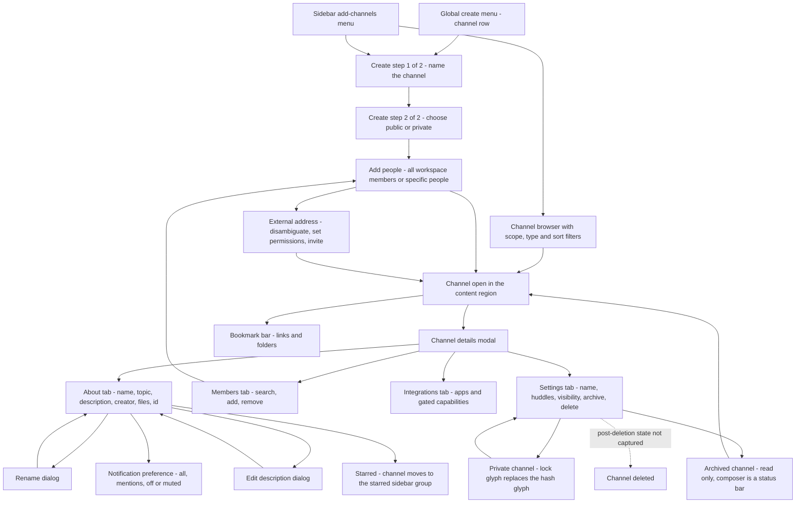
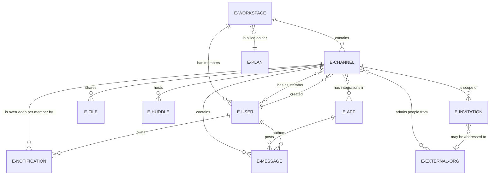

# Channels

The full channel lifecycle as the corpus shows it — create, configure, populate, use, manage, archive, unarchive and delete — and the catalog's richest view of the `E-CHANNEL` entity.

## Purpose

A **channel** is the product's named, topic-scoped, many-to-many conversation. This document specifies everything the corpus shows about one: how a channel is created, how its visibility is chosen, how people are added to it and removed from it, how its name, topic and description are edited, how its notification preference and starred flag are set, how it is bookmarked, browsed, archived, unarchived and deleted, and what a channel looks like when it is brand new, when it is busy, when it is company-wide and when it is read-only.

**Where the area is encountered.** Channels are the default destination of the authenticated shell: the home destination opens one, the sidebar's channels group lists them, and every capture in this area renders inside the persistent shell specified by [00-product-overview.md](00-product-overview.md). A user meets this area at four distinct doors — arriving in the workspace's first channel straight out of setup [frame 19](../../screenshots/Slack%20web%20Jul%202024%2019.png); creating a channel from the global create menu, whose channel row is described as starting a group conversation by topic [frame 550](../../screenshots/Slack%20web%20Jul%202024%20550.png); browsing the workspace's channels from the sidebar's add-channels menu [frame 124](../../screenshots/Slack%20web%20Jul%202024%20124.png); and being dropped into a channel as an invitee in a workspace someone else owns [frame 751](../../screenshots/Slack%20web%20Jul%202024%20751.png). A fifth door is plan-gated and sits outside this area: the external-collaboration surface's header offers a create-channel control behind a plan-tier badge [frame 500](../../screenshots/Slack%20web%20Jul%202024%20500.png), and that surface is specified by [22-external-collaboration.md](22-external-collaboration.md) rather than here.

**What this document owns.** The channel object and every surface whose subject is a channel: the create wizard, the add-people modal, the channel details modal and all four of its tabs, the rename and description dialogs, the notification-preference dropdown and modal, the destructive change-visibility, archive and delete dialogs, the bookmark bar, the channel browser, the archived read-only channel, and the channel intro heroes. It also owns the channel-organisation reading of the sidebar's multi-select selection bar as it appears on the company-wide channel [frame 120](../../screenshots/Slack%20web%20Jul%202024%20120.png).

**What this document does not own.** The `C-*` component contracts, the placeholder branding vocabulary and the shell's own regions belong to [00-product-overview.md](00-product-overview.md) and are referenced here by identifier only, never restated. Message rows, the composer, reactions and formatting belong to [03-messaging-and-composer.md](03-messaging-and-composer.md); the shared-files card's file model to [16-files-media.md](16-files-media.md); the notification-permission band to [12-activity-notifications.md](12-activity-notifications.md); the cross-cutting state matrix to [21-states.md](21-states.md); roles and permissions to [15-admin-workspace.md](15-admin-workspace.md); external organizations and their invitations to [22-external-collaboration.md](22-external-collaboration.md); and app-posted workflow messages to [10-workflow-builder.md](10-workflow-builder.md) and [11-apps-and-integrations.md](11-apps-and-integrations.md). Sidebar sections themselves — creating one, and moving conversations between them — are flows `00.2` and `00.3` of [00-product-overview.md](00-product-overview.md).

**Depth.** This is an in-product area, so every flow below carries a full frame-by-frame step table and every claim carries the frame that evidences it. Layout is described by region, column, ordering and relative size, and icons are named by function, because the corpus is a fixed set of captures rather than a canvas this product controls.

**Sample data, not requirements.** Worked examples use fixtures visible in the frames — channels named `#design`, `#design-project`, `#marketing`, `#social` and `#launch-event`, a company-wide channel, and people named Sam Lee, Alex Smith and Jane D. They illustrate shape only. No name, address, identifier or date from the corpus is a value to reproduce.

## Flows in this area

Twenty-one flows cover the 92 frames this document owns as primary. Flow identifiers and frame spans are fixed by the [Screenshot Coverage Index](_screenshot-index.md) and are reproduced here unchanged, so that the ledger and this document cite one another with the same tokens.

Frame spans are written as plain numeric ranges because they designate a span rather than cite one image; every individual frame is cited with its full relative link inside the per-flow step tables and in the **Frames covered** section.

| Flow ID | Name | Frame span | Primary entry point |
|---|---|---|---|
| `02.1` | Land in the first channel of a new workspace | 19, 24, 31–32 | Arrival from workspace setup, with the channel already selected in `C-SIDEBAR` |
| `02.2` | Create a private channel and invite someone from another company | 58–68 | The channel row of the global create menu |
| `02.3` | Create a channel and add workspace members | 69–79 | The channel row of the global create menu |
| `02.4` | Open the channel details pane and star a channel | 80–87 | The channel-name control in the conversation header |
| `02.5` | Set channel notification preferences | 88–96 | The notification control in the details modal's action row |
| `02.6` | Rename a channel and edit its description | 97–104 | The inline Edit control on a details-modal About row |
| `02.7` | Remove a member from a channel | 105–106 | The Remove control on a member row of the Members tab |
| `02.8` | Convert a channel to private and archive it | 107–109 | The change-visibility and archive rows of the Settings tab |
| `02.9` | Delete a channel | 111–112 | The delete row of the Settings tab |
| `02.10` | Read the company-wide channel and an app-posted workflow message | 120 | The company-wide channel's row in `C-SIDEBAR` |
| `02.11` | Open the add-channels menu and browse channels with scope, type and sort filters | 124–133 | The add-channels row in the sidebar's channels group |
| `02.12` | Read an archived channel and unarchive it | 134–138 | The archived channel's row in `C-SIDEBAR` |
| `02.13` | Add bookmarks and a bookmark folder to a conversation | 257–266 | The add-a-bookmark row beneath the conversation header |
| `02.14` | Return to a channel from the canvas pane | 341 | The channel's row in `C-SIDEBAR` |
| `02.15` | Return to a channel from the apps surface | 371 | The channel's row in `C-SIDEBAR` |
| `02.16` | Return to a channel from an app home surface | 373 | The channel's row in `C-SIDEBAR` |
| `02.17` | Return to a channel from the activity destination | 393 | The channel's row in `C-SIDEBAR` |
| `02.18` | Return to a channel from preferences | 545 | The channel's row in `C-SIDEBAR` |
| `02.19` | Land in a newly joined workspace | 723 | Arrival in a second workspace, with a channel already selected |
| `02.20` | Read the company-wide channel of a joined workspace | 732 | The company-wide channel's row in `C-SIDEBAR` |
| `02.21` | Land in a joined channel as the invitee | 751 | Arrival from an accepted invitation |

### The channel lifecycle

Every node and edge below corresponds to a state or a transition observed in a cited frame; nothing is a plausible route that the corpus does not show. **One edge is drawn dotted and labelled**, and the distinction is evidential rather than decorative: a solid edge means the arrival state is captured, while a dotted edge means the action is captured but **its arrival state is not**, so the node it points at is named from the action's own confirming copy rather than from a frame. Only the deletion edge is in that position, and the same gap is recorded as a partial capture beside flow `02.9`.

The diagram is deliberately silent about joining and leaving as separate destinations, because the corpus never captures either action being taken: the channel browser shows a joined marker on rows the user already belongs to [frame 125](../../screenshots/Slack%20web%20Jul%202024%20125.png) and the About tab exposes a leave-channel action [frame 81](../../screenshots/Slack%20web%20Jul%202024%2081.png), but no frame shows the state after activating either.

> **Partial capture:** three channel journeys are exposed by a control but never completed in the corpus. **Joining a channel** — the browser's rows carry a joined marker and open a channel, but no frame shows a not-yet-joined row being activated or a join confirmation [frame 125](../../screenshots/Slack%20web%20Jul%202024%20125.png), [frame 129](../../screenshots/Slack%20web%20Jul%202024%20129.png). **Leaving a channel** — the destructive leave action is present on the About tab but no frame shows it activated, so whether it raises a confirmation is not observable [frame 81](../../screenshots/Slack%20web%20Jul%202024%2081.png). **Setting a topic** — the topic row renders an empty placeholder with an inline Edit control, but no frame shows the topic editor or a populated topic [frame 81](../../screenshots/Slack%20web%20Jul%202024%2081.png), [frame 104](../../screenshots/Slack%20web%20Jul%202024%20104.png).

## Flow 02.1 — Land in the first channel of a new workspace

### Overview

The first thing a newly created workspace shows is a channel, already selected in the sidebar and already carrying its own intro hero, a system join message and one greeting message [frame 19](../../screenshots/Slack%20web%20Jul%202024%2019.png). The flow is a read rather than a task, and it matters because it establishes the anatomy every other channel capture repeats: header, bookmark row, intro hero, day divider, message rows, composer. It occupies three non-adjacent spans — 19, 24 and 31–32 — and [frame 31](../../screenshots/Slack%20web%20Jul%202024%2031.png) is **byte-identical** to [frame 19](../../screenshots/Slack%20web%20Jul%202024%2019.png), so the two are the same observed state re-captured rather than a step forward.

### Trigger

Completion of workspace setup, which is owned by [01-onboarding-and-auth.md](01-onboarding-and-auth.md). No control inside this area opens the flow; the channel is already the active conversation when the shell first renders [frame 19](../../screenshots/Slack%20web%20Jul%202024%2019.png).

### Preconditions

An authenticated session in a workspace that has just been created, with at least one channel present and the signed-in user a member of it. At this capture the sidebar carries a promotional banner with a discount offer and a days-remaining sub-line, a channels group and a direct-messages group, and the rail carries two destinations [frame 19](../../screenshots/Slack%20web%20Jul%202024%2019.png).

### Frame-by-frame steps

| Step | Frame(s) | What the user does | What changes on screen | Component(s) involved |
|---|---|---|---|---|
| 1 | [frame 19](../../screenshots/Slack%20web%20Jul%202024%2019.png), [frame 31](../../screenshots/Slack%20web%20Jul%202024%2031.png) | Arrives in the workspace and reads the channel | The content region renders, bottom-anchored: a conversation header carrying the channel name with a caret, a facepile followed by a member count, a labelled huddle control with a caret and a labelled canvas control; an add-a-bookmark row beneath it; then the channel intro hero — a waving-hand emoji, a heading welcoming the user to the named channel, a purpose line and an inline edit-description link — an add-coworkers button, a day divider, a system join message naming two joiners, and a greeting message. A band pinned to the viewport foot requests browser notification permission | `C-SIDEBAR`, `C-MESSAGE-ROW`, `C-EMPTY-STATE`, `C-COMPOSER`, `C-AVATAR`, `C-BANNER`, `C-PERMISSION-PROMPT` |
| 2 | [frame 24](../../screenshots/Slack%20web%20Jul%202024%2024.png) | Dismisses the permission band and returns to the channel | The band is gone, the hero and messages shift down into the space it occupied, the composer's input shows a placeholder naming the channel and its send control renders muted | `C-COMPOSER`, `C-EMPTY-STATE` |
| 3 | [frame 32](../../screenshots/Slack%20web%20Jul%202024%2032.png) | Waits while a teammate types | A typing indicator naming that teammate appears directly beneath the composer; nothing else in the surface changes | `C-COMPOSER`, `C-MESSAGE-ROW` |

**Inferred:** the intro hero is a *template* rendered from the channel's name and description rather than a first message, because it sits above the day divider that opens the message history and is not attributed to any author [frame 19](../../screenshots/Slack%20web%20Jul%202024%2019.png), [frame 24](../../screenshots/Slack%20web%20Jul%202024%2024.png). Its edit-description link is the same affordance the About tab exposes as an inline Edit control [frame 81](../../screenshots/Slack%20web%20Jul%202024%2081.png).

## Flow 02.2 — Create a private channel and invite someone from another company

### Overview

The longest flow in this area, and the one that establishes the whole creation contract: a two-step wizard names the channel and chooses its visibility, the created channel opens immediately, and an add-people modal follows. Because the address entered is external to the workspace, the modal escalates into a three-dialog sequence — disambiguate the person, set what external people may do in the channel, confirm and send — before a success dialog closes the run [frame 58](../../screenshots/Slack%20web%20Jul%202024%2058.png) through [frame 68](../../screenshots/Slack%20web%20Jul%202024%2068.png).

### Trigger

The channel row of the global create menu, which describes itself as starting a group conversation by topic [frame 550](../../screenshots/Slack%20web%20Jul%202024%20550.png). The create menu itself is flow `00.1` of [00-product-overview.md](00-product-overview.md).

### Preconditions

An authenticated session with a workspace loaded. No existing channel is required to reach step 1: the wizard opens with an empty name field and its forward action already rendered muted [frame 58](../../screenshots/Slack%20web%20Jul%202024%2058.png). No plan entitlement is evidenced either — no capture of this wizard carries a `C-UPGRADE-GATE` badge [frame 58](../../screenshots/Slack%20web%20Jul%202024%2058.png). Whether a capability is required to create a channel is **not** evidenced by these captures and is not claimed: the workspace permissions surface states that channel-creation permissions are administered [frame 576](../../screenshots/Slack%20web%20Jul%202024%20576.png), and per `S-AUTHZ-OP` the build authorizes creation server-side against the acting principal.

### Frame-by-frame steps

| Step | Frame(s) | What the user does | What changes on screen | Component(s) involved |
|---|---|---|---|---|
| 1 | [frame 58](../../screenshots/Slack%20web%20Jul%202024%2058.png) | Opens the create-a-channel wizard | A centred modal dims the shell: title, dismiss control, a Name label, a single text field carrying a leading hash glyph and an example placeholder, and helper copy explaining that channels are where conversations happen around a topic and that the name should be easy to find and understand. The footer reads step 1 of 2 at its left and offers a forward action at its right, rendered muted | `C-MODAL-SHELL`, `C-STEP-WIZARD` |
| 2 | [frame 59](../../screenshots/Slack%20web%20Jul%202024%2059.png) | Types a channel name | The typed name appears after the hash glyph and the forward action becomes a filled primary | `C-STEP-WIZARD` |
| 3 | [frame 60](../../screenshots/Slack%20web%20Jul%202024%2060.png) | Advances to step 2 | The modal's body is replaced: a sub-line renders the channel name prefixed by a hash glyph, then a Visibility label heads a two-option radio group. Each option carries its scope **inline on its own label line**, after an em-dash — public reads as anyone in the workspace, with the workspace name emphasised, and private as only specific people — and **only the private option carries a further sub-label**, set on its own line indented past the label text, stating that the channel can only be viewed or joined by invitation. The two label lines are otherwise structurally identical; the public option has no second line. Public is pre-selected. The footer now reads step 2 of 2 and offers a back action then a create action | `C-MODAL-SHELL`, `C-STEP-WIZARD` |
| 4 | [frame 61](../../screenshots/Slack%20web%20Jul%202024%2061.png) | Selects the private option | The private radio fills and, in the same repaint, the sub-line's leading glyph changes from a hash to a lock — the modal previews the consequence of the choice before it is committed | `C-STEP-WIZARD` |
| 5 | [frame 62](../../screenshots/Slack%20web%20Jul%202024%2062.png) | Confirms creation | The wizard closes and the new channel is open behind a follow-on modal: the conversation header renders the name behind a lock glyph with a member count of one and icon-only huddle and canvas controls, the sidebar row carries the same lock glyph, and the intro hero offers add-coworkers and forward-emails actions. The follow-on modal is titled to add people to the lock-prefixed channel, carries one recipient input with an example placeholder, and offers a skip action; beneath its body a separate tinted block promotes external collaboration behind a plan-tier badge and a learn-more link | `C-MODAL-SHELL`, `C-SIDEBAR`, `C-EMPTY-STATE`, `C-UPGRADE-GATE` |
| 6 | [frame 63](../../screenshots/Slack%20web%20Jul%202024%2063.png) | Types an email address outside the workspace | The input takes a focus ring and exactly one suggestion row appears beneath it, highlighted, offering to invite the typed address and carrying a paper-plane glyph | `C-MODAL-SHELL` |
| 7 | [frame 64](../../screenshots/Slack%20web%20Jul%202024%2064.png) | Commits the address | The address becomes a chip inside the field, carrying a paper-plane glyph and a remove control; a helper line suggests searching by name if there were no results; the terminal action changes to an add action rendered primary | `C-MODAL-SHELL` |
| 8 | [frame 65](../../screenshots/Slack%20web%20Jul%202024%2065.png) | Continues | A dialog stacks over the modal stating that the person looks new, echoing the address, and asking which organization they are from. Two illustrated radio cards sit side by side: an external organization, whose sub-label says the invitation is scoped to just this channel, pre-selected; and the user's own organization, whose sub-label says the person is added directly. The footer offers back then next | `C-CONFIRM-DIALOG`, `C-MODAL-SHELL` |
| 9 | [frame 66](../../screenshots/Slack%20web%20Jul%202024%2066.png) | Keeps the external choice and continues | A channel-permissions dialog explains that the address belongs to an external organization not yet in this channel, so permissions must be set. A tinted group heads a radio pair: post-and-invite, pre-selected, whose description grants full access to the channel, workflows and apps and states that a copy of the channel history is retained afterwards; and only-post, whose description withholds workflows and apps and forbids inviting coworkers. An information glyph and a learn-more link sit at the footer's left, back and next at its right | `C-CONFIRM-DIALOG` |
| 10 | [frame 67](../../screenshots/Slack%20web%20Jul%202024%2067.png) | Continues to confirmation | A ready-to-invite dialog renders a from-another-company row carrying a building glyph and the address, an optional note label above a textarea with an example placeholder, a show-email-preview link, and a footer offering back then a send-invitation action | `C-CONFIRM-DIALOG` |
| 11 | [frame 68](../../screenshots/Slack%20web%20Jul%202024%2068.png) | Sends the invitation | A success dialog replaces it: an illustration header, a heading stating that one person has been invited to the lock-prefixed channel, an invitee row carrying an avatar, the address, a permission sub-line reading that they can post and invite, and an information glyph; then a manage-invitation link and a single terminal action | `C-CONFIRM-DIALOG`, `C-AVATAR` |

**Inferred:** the channel name is required and the visibility choice is not, because the forward action is muted while the field is empty [frame 58](../../screenshots/Slack%20web%20Jul%202024%2058.png) and filled once a name is present [frame 59](../../screenshots/Slack%20web%20Jul%202024%2059.png), whereas step 2 arrives with a visibility already selected and no muted state at any point [frame 60](../../screenshots/Slack%20web%20Jul%202024%2060.png).

**Inferred:** the add-people modal is a distinct step rather than part of the wizard, because the channel is already created and open behind it and the wizard's step label is gone [frame 62](../../screenshots/Slack%20web%20Jul%202024%2062.png). Its skip action therefore leaves a usable channel with one member.

The external-organization concepts this flow raises — the organization itself, the channel-scoped external invitation and its permission level — are modelled by [22-external-collaboration.md](22-external-collaboration.md); this document records only what the channel surfaces show.

## Flow 02.3 — Create a channel and add workspace members

### Overview

The same creation wizard run in a different capture session, followed by the *internal* branch of the add-people modal. It is the flow that exposes the modal's three-way radio behaviour, its admin-gated auto-add toggle, and the fact that its terminal action's label changes with the state of the form [frame 69](../../screenshots/Slack%20web%20Jul%202024%2069.png) through [frame 79](../../screenshots/Slack%20web%20Jul%202024%2079.png). It also captures a second add-people variant, opened against a channel that already exists [frame 77](../../screenshots/Slack%20web%20Jul%202024%2077.png).

### Trigger

The channel row of the global create menu [frame 550](../../screenshots/Slack%20web%20Jul%202024%20550.png), and for the second half of the run, an add-people entry point on an existing channel [frame 77](../../screenshots/Slack%20web%20Jul%202024%2077.png).

### Preconditions

An authenticated session with a workspace that already holds several channels and several members — the add-all-members option and the member suggestion row both depend on there being members to add [frame 72](../../screenshots/Slack%20web%20Jul%202024%2072.png), [frame 74](../../screenshots/Slack%20web%20Jul%202024%2074.png). This capture session's rail carries two destinations and its sidebar carries the promotional banner, so it is not the same session as flow `02.2` [frame 69](../../screenshots/Slack%20web%20Jul%202024%2069.png).

### Frame-by-frame steps

| Step | Frame(s) | What the user does | What changes on screen | Component(s) involved |
|---|---|---|---|---|
| 1 | [frame 69](../../screenshots/Slack%20web%20Jul%202024%2069.png) | Opens the wizard and focuses the name field | The body renders as step 1 does in flow `02.2` — Name label, hash-prefixed field, helper copy — and focusing the field reveals a right-aligned character counter reading 80. The **footer differs**: an unchecked invite-external-people checkbox with an information glyph and a plan-tier badge occupies the footer's left half **in place of the step-progress label**, which this capture does not render at all, beside the muted forward action | `C-MODAL-SHELL`, `C-STEP-WIZARD`, `C-UPGRADE-GATE` |
| 2 | [frame 70](../../screenshots/Slack%20web%20Jul%202024%2070.png) | Types a channel name | The name appears after the hash glyph, the forward action becomes a filled primary, the counter is no longer rendered, and the external-invite checkbox stays unchecked | `C-STEP-WIZARD` |
| 3 | [frame 71](../../screenshots/Slack%20web%20Jul%202024%2071.png) | Advances to step 2 and keeps the default visibility | The visibility radio group renders with public selected and private beneath it, and the footer offers back then create | `C-STEP-WIZARD` |
| 4 | [frame 72](../../screenshots/Slack%20web%20Jul%202024%2072.png) | Confirms creation and reads the add-people modal | A modal titled to add people, with the new channel named on a sub-line, opens over the created channel. Its body stacks, in order: a tinted notice restricting additions to people already in this workspace; a radio pair offering to add all members of the workspace, pre-selected, or to add specific people; and a bordered group whose legend carries an eye glyph and states that only admins can see this setting, containing a toggle rendered on and labelled to automatically add anyone who joins the workspace. The footer offers a single terminal action | `C-MODAL-SHELL`, `C-SIDEBAR` |
| 5 | [frame 73](../../screenshots/Slack%20web%20Jul%202024%2073.png) | Selects add-specific-people | A text input appears beneath the radio pair with a placeholder inviting a name or email, the admin-only toggle is rendered off, and the footer's terminal action changes to a skip action rendered secondary | `C-MODAL-SHELL` |
| 6 | [frame 74](../../screenshots/Slack%20web%20Jul%202024%2074.png) | Types part of a teammate's name | Exactly one matching member row appears beneath the field, highlighted, carrying an avatar, a bold display name with a presence indicator and a secondary name; the footer's action is rendered muted because nothing is committed yet | `C-MODAL-SHELL`, `C-AVATAR`, `C-PRESENCE-DOT` |
| 7 | [frame 75](../../screenshots/Slack%20web%20Jul%202024%2075.png) | Commits the member | The member becomes a chip inside the field, carrying their avatar and a remove control, and the footer's action changes again — now an add action rendered as a filled primary | `C-MODAL-SHELL`, `C-AVATAR` |
| 8 | [frame 76](../../screenshots/Slack%20web%20Jul%202024%2076.png) | Completes the add | The modal closes on the new channel: the header carries a facepile with a member count of two and labelled huddle and canvas controls, and the intro hero states that the channel was created today, describes itself as the very beginning of the channel, and offers an inline add-description link above an add-coworkers button. One system join message sits under a day divider | `C-EMPTY-STATE`, `C-MESSAGE-ROW`, `C-AVATAR` |
| 9 | [frame 77](../../screenshots/Slack%20web%20Jul%202024%2077.png) | Opens add-people again, this time on an existing channel | A second variant of the same modal renders: the channel name is carried **inside the title** rather than on a sub-line, the body is a single recipient input with an example placeholder, the add action is rendered muted, and the tinted external-collaboration promotion with its plan-tier badge and learn-more link sits beneath the body | `C-MODAL-SHELL`, `C-UPGRADE-GATE` |
| 10 | [frame 78](../../screenshots/Slack%20web%20Jul%202024%2078.png) | Chooses a workspace member | The member becomes a chip with their avatar and a remove control and the add action becomes a filled primary | `C-MODAL-SHELL`, `C-AVATAR` |
| 11 | [frame 79](../../screenshots/Slack%20web%20Jul%202024%2079.png) | Completes the add and reads the channel | The modal closes; the message list now ends with a system message stating that the chosen person was added to the channel by the signed-in user, above the composer. A reaction chip with a count of one and an add-reaction affordance sit on an earlier message | `C-MESSAGE-ROW`, `C-COMPOSER` |

**The terminal action's label is state-derived, not fixed.** Across steps 4 to 7 the same footer slot reads a completion action while add-all is selected [frame 72](../../screenshots/Slack%20web%20Jul%202024%2072.png), a skip action once add-specific is selected and empty [frame 73](../../screenshots/Slack%20web%20Jul%202024%2073.png), a muted action while a query is typed but uncommitted [frame 74](../../screenshots/Slack%20web%20Jul%202024%2074.png), and an add action once a chip exists [frame 75](../../screenshots/Slack%20web%20Jul%202024%2075.png). A build that hard-codes one label will be wrong in three of the four states.

**Inferred:** the auto-add toggle's default is on for the add-all branch and off for the add-specific branch, because that is the only difference in the toggle between two otherwise identical captures taken one radio change apart [frame 72](../../screenshots/Slack%20web%20Jul%202024%2072.png), [frame 73](../../screenshots/Slack%20web%20Jul%202024%2073.png). Role definitions for the admin restriction belong to [15-admin-workspace.md](15-admin-workspace.md).

## Flow 02.4 — Open the channel details pane and star a channel

### Overview

The channel's detail surface is a **centred modal that dims the whole shell**, not a docked pane, and it is the single richest source of `E-CHANNEL` evidence in the corpus. This flow opens it, walks all four of its tabs, and then stars the channel — which relocates the channel into a starred sidebar group and raises an undoable confirmation [frame 80](../../screenshots/Slack%20web%20Jul%202024%2080.png) through [frame 87](../../screenshots/Slack%20web%20Jul%202024%2087.png).

### Trigger

The channel-name control in the conversation header, whose hover state renders a dark tooltip naming the action as getting channel details [frame 80](../../screenshots/Slack%20web%20Jul%202024%2080.png). The archived channel offers a second route — a context menu on the sidebar row [frame 135](../../screenshots/Slack%20web%20Jul%202024%20135.png).

### Preconditions

An authenticated session with a channel open and the signed-in user a member of it. The Members tab and the leave-channel action both presuppose membership; the archived variant of the same modal drops both [frame 136](../../screenshots/Slack%20web%20Jul%202024%20136.png).

### Frame-by-frame steps

| Step | Frame(s) | What the user does | What changes on screen | Component(s) involved |
|---|---|---|---|---|
| 1 | [frame 80](../../screenshots/Slack%20web%20Jul%202024%2080.png) | Hovers the channel-name control in the header | A dark tooltip appears directly beneath the control, naming the action as getting channel details; the conversation behind is unchanged | `C-TOP-BAR`, `C-DETAILS-PANE` |
| 2 | [frame 81](../../screenshots/Slack%20web%20Jul%202024%2081.png) | Opens the details surface | A centred modal dims the shell. Its title is the channel name with a dismiss control at the title row's right. Beneath the title an action row carries, left to right, an icon-only star toggle rendered as an outline, a labelled notifications button with a bell glyph, and a labelled huddle button with a headphones glyph and a caret. A tab bar follows with four tabs — about, members carrying a numeric count, integrations and settings — the first underlined and active. The About body is a stack of cards: a channel-name card with the value and an inline Edit control; a grouped card whose rows are topic rendered as a placeholder-styled prompt with an Edit control, description with its text and an Edit control, created-by naming a person and a date with **no** Edit control, and a leave-channel row rendered in the destructive colour; then a files card listing one entry as a square hash-glyph tile, the channel name and a shared-today line. A footer line renders the channel identifier as an opaque token beside a copy control | `C-MODAL-SHELL`, `C-DETAILS-PANE`, `C-TAB-BAR` |
| 3 | [frame 82](../../screenshots/Slack%20web%20Jul%202024%2082.png) | Switches to the members tab | The body is replaced by a member search field with a magnifier glyph and a find-members placeholder, an add-people row with a person-plus glyph, and one row per member — avatar, display name, presence indicator, secondary name, and a remove control at the row's right edge. The signed-in user's own row is marked as themselves and carries **no** remove control. The tab label's count matches the number of member rows | `C-TAB-BAR`, `C-AVATAR`, `C-PRESENCE-DOT` |
| 4 | [frame 83](../../screenshots/Slack%20web%20Jul%202024%2083.png) | Switches to the integrations tab | Three cards render: a supercharge-your-channel card carrying a plan-tier badge, explanatory copy and a see-upgrade-options button; an apps card with copy about bringing tools into the channel, an add-an-app button and an illustration at its right; and a send-emails-to-this-channel card carrying a plan-tier badge, copy about receiving an address that posts incoming email into the channel, and a second see-upgrade-options button | `C-TAB-BAR`, `C-UPGRADE-GATE` |
| 5 | [frame 84](../../screenshots/Slack%20web%20Jul%202024%2084.png) | Switches to the settings tab | Three cards render: a channel-name card with an inline Edit control; a huddles card with an Edit control, copy stating that members can start and join huddles in this channel, a learn-more link and two buttons — start-huddle with a headphones glyph and copy-huddle-link with a link glyph; then a grouped card of three rows — change-to-a-private-channel with a lock glyph rendered in the neutral colour, archive-channel-for-everyone with an archive glyph and delete-this-channel with a bin glyph, both rendered in the destructive colour | `C-TAB-BAR`, `C-DETAILS-PANE` |
| 6 | [frame 85](../../screenshots/Slack%20web%20Jul%202024%2085.png) | Returns to About and hovers the star toggle | A dark tooltip naming the star action appears above the toggle, which is still an outline | `C-DETAILS-PANE` |
| 7 | [frame 86](../../screenshots/Slack%20web%20Jul%202024%2086.png) | Stars the channel | The toggle fills and takes an accent tint; the sidebar gains a starred group holding this channel, which leaves the channels group; and a toast appears at the content region's bottom-right naming the destination group and offering an undo link | `C-DETAILS-PANE`, `C-SIDEBAR`, `C-TOAST` |
| 8 | [frame 87](../../screenshots/Slack%20web%20Jul%202024%2087.png) | Lets the toast expire | The toast is gone, the star stays filled, and the starred sidebar group persists. The action row's notifications button still reads as an enable action at this point | `C-SIDEBAR`, `C-DETAILS-PANE` |

The four tabs are peers over one subject and never navigate away from the channel, which is why the tab bar rather than routing carries them [frame 81](../../screenshots/Slack%20web%20Jul%202024%2081.png) through [frame 84](../../screenshots/Slack%20web%20Jul%202024%2084.png). Starring is a **sidebar-grouping** operation as well as a flag: the channel's row physically moves [frame 86](../../screenshots/Slack%20web%20Jul%202024%2086.png).

## Flow 02.5 — Set channel notification preferences

### Overview

The channel's notification preference is exposed twice over — as a dropdown of four choices anchored to the details modal's action row, and as a fuller modal stacked on top of that modal — and the action row's own **label states the current setting** rather than naming a generic action [frame 88](../../screenshots/Slack%20web%20Jul%202024%2088.png) through [frame 96](../../screenshots/Slack%20web%20Jul%202024%2096.png). This is why the flow begins at [frame 88](../../screenshots/Slack%20web%20Jul%202024%2088.png) even though [frame 87](../../screenshots/Slack%20web%20Jul%202024%2087.png) is visually almost identical: the only thing that changed is that label, and that change is the subject of this journey rather than of the previous one.

### Trigger

The notification control in the details modal's action row, which carries a caret [frame 88](../../screenshots/Slack%20web%20Jul%202024%2088.png).

### Preconditions

The details modal open on a channel the user belongs to. The dropdown's more-options entry, and the stacked modal it opens, are only reachable from that dropdown [frame 89](../../screenshots/Slack%20web%20Jul%202024%2089.png), [frame 92](../../screenshots/Slack%20web%20Jul%202024%2092.png).

### Frame-by-frame steps

| Step | Frame(s) | What the user does | What changes on screen | Component(s) involved |
|---|---|---|---|---|
| 1 | [frame 88](../../screenshots/Slack%20web%20Jul%202024%2088.png) | Reads the action row | The notifications control no longer reads as an enable action: it states that notifications are set for mentions, and carries a caret | `C-DETAILS-PANE` |
| 2 | [frame 89](../../screenshots/Slack%20web%20Jul%202024%2089.png) | Opens the control | A menu opens anchored beneath it, leaving the modal legible. Its rows each pair a title with a description: all-messages; mentions, checked with a leading check glyph in the accent colour, described as covering mentions of the user, of those present and of everyone; and off, described as receiving no notifications. A separator precedes a mute-channel row whose description explains that the channel stops bolding for unread messages and only badges when the user is mentioned, and a second separator precedes a more-notification-options row | `C-DROPDOWN-MENU` |
| 3 | [frame 90](../../screenshots/Slack%20web%20Jul%202024%2090.png), [frame 95](../../screenshots/Slack%20web%20Jul%202024%2095.png) | Chooses all-messages | The menu closes and the action row's label restates the new setting as notifications for all messages. These two frames are **byte-identical**, so they record the same observed state twice rather than a transition between two states | `C-DETAILS-PANE` |
| 4 | [frame 91](../../screenshots/Slack%20web%20Jul%202024%2091.png) | Reopens the control | The same menu renders with the check moved onto all-messages and the mentions row rendered plain | `C-DROPDOWN-MENU` |
| 5 | [frame 92](../../screenshots/Slack%20web%20Jul%202024%2092.png) | Chooses more notification options | A notifications modal stacks over the details modal, dimming it in turn. Its body stacks a send-a-notification-for radio group — all new messages selected, mentions, nothing — then, separated by rules, an unchecked checkbox to use different settings for mobile devices, an unchecked checkbox to be notified about all thread replies in this channel, and an unchecked mute-channel checkbox whose description explains that muted channels are greyed out at the foot of the channel list and still badge on a mention. A closing note points at workspace-wide settings and notification keywords through an inline preferences link. The footer offers cancel then a save action rendered muted | `C-MODAL-SHELL`, `C-CONFIRM-DIALOG` |
| 6 | [frame 93](../../screenshots/Slack%20web%20Jul%202024%2093.png) | Checks the mobile-override checkbox | A nested, indented radio group appears directly beneath that checkbox offering the same three scopes with all-new-messages selected, and the save action becomes a filled primary | `C-MODAL-SHELL` |
| 7 | [frame 94](../../screenshots/Slack%20web%20Jul%202024%2094.png) | Switches the nested group to mentions | The nested selection moves to mentions; the save action stays primary | `C-MODAL-SHELL` |
| 8 | [frame 96](../../screenshots/Slack%20web%20Jul%202024%2096.png) | Mutes the channel | The action row's control now shows a muted state with a crossed-bell glyph and a caret, and a crossed-bell glyph is appended to the channel name in **both** the modal title and the conversation header behind it. The files card has also changed: a document entry shared by a named person yesterday now sits above the channel entry, whose own line reads yesterday rather than today | `C-DETAILS-PANE` |

**Inferred:** the four dropdown choices and the modal's radio group are one setting rendered twice, because choosing all-messages in the dropdown [frame 91](../../screenshots/Slack%20web%20Jul%202024%2091.png) leaves the modal's radio group reading all-new-messages when it opens [frame 92](../../screenshots/Slack%20web%20Jul%202024%2092.png). The mobile override and the thread-reply toggle have no dropdown equivalent and are therefore modal-only.

**Inconsistency, recorded not reconciled:** the sidebar's promotional countdown reads one fewer day at [frame 96](../../screenshots/Slack%20web%20Jul%202024%2096.png) than at [frame 88](../../screenshots/Slack%20web%20Jul%202024%2088.png) through [frame 94](../../screenshots/Slack%20web%20Jul%202024%2094.png), and the files card's relative dates shift from today to yesterday across the same boundary. The captures in this single flow therefore span more than one day. The record is left as observed.

## Flow 02.6 — Rename a channel and edit its description

### Overview

Renaming and re-describing a channel are two dialogs opened from the same About tab, and between them they expose the name's full validation contract — lower case, no spaces or periods, a hard character cap and a live remaining-character counter — and the fact that a description may be cleared entirely [frame 97](../../screenshots/Slack%20web%20Jul%202024%2097.png) through [frame 104](../../screenshots/Slack%20web%20Jul%202024%20104.png). The flow also shows that a rename does **not** rewrite text that mentions the old name.

### Trigger

The inline Edit control on the About tab's channel-name row, and the Edit control on its description row [frame 81](../../screenshots/Slack%20web%20Jul%202024%2081.png), [frame 104](../../screenshots/Slack%20web%20Jul%202024%20104.png). The Settings tab exposes the same channel-name Edit control [frame 84](../../screenshots/Slack%20web%20Jul%202024%2084.png).

### Preconditions

The details modal open on a channel the user may edit. The rename dialog opens pre-filled with the current name and its save action already muted, so an unchanged value cannot be submitted [frame 97](../../screenshots/Slack%20web%20Jul%202024%2097.png).

### Frame-by-frame steps

| Step | Frame(s) | What the user does | What changes on screen | Component(s) involved |
|---|---|---|---|---|
| 1 | [frame 97](../../screenshots/Slack%20web%20Jul%202024%2097.png) | Opens the rename dialog | A dialog stacks over the details modal: a channel-name label above a focused field carrying a leading hash glyph and the current name, a right-aligned counter reading the characters still available, and a helper line stating that names must be lower case, without spaces or periods, and no longer than eighty characters. The footer offers cancel then a save action rendered muted | `C-CONFIRM-DIALOG`, `C-MODAL-SHELL` |
| 2 | [frame 98](../../screenshots/Slack%20web%20Jul%202024%2098.png) | Types a shorter name | The field holds the new value and the save action becomes a filled primary; the counter is no longer rendered | `C-CONFIRM-DIALOG` |
| 3 | [frame 99](../../screenshots/Slack%20web%20Jul%202024%2099.png) | Saves the rename | The dialog closes. The modal title, the About tab's channel-name value, the sidebar row and the conversation header all render the new name — but the description row still contains the **former** name inside its text, unchanged | `C-DETAILS-PANE`, `C-SIDEBAR` |
| 4 | [frame 100](../../screenshots/Slack%20web%20Jul%202024%20100.png) | Dismisses the modal and reads the channel | The channel renders with the new name in its header and in its intro hero heading, and the message list has gained a system message stating that the channel was renamed from one quoted name to another | `C-MESSAGE-ROW`, `C-EMPTY-STATE` |
| 5 | [frame 101](../../screenshots/Slack%20web%20Jul%202024%20101.png) | Opens the description dialog | A dialog stacks over the modal carrying a textarea pre-filled with the current description, a helper line inviting the user to let people know what the channel is for, and a footer offering cancel then a save action **already** rendered as a filled primary | `C-CONFIRM-DIALOG` |
| 6 | [frame 102](../../screenshots/Slack%20web%20Jul%202024%20102.png) | Clears the textarea | The textarea falls back to an add-a-description placeholder and the save action stays enabled — an empty description is submittable | `C-CONFIRM-DIALOG` |
| 7 | [frame 103](../../screenshots/Slack%20web%20Jul%202024%20103.png) | Types a new description containing a channel mention | The typed text renders with the mention as an inline chip, and the save action stays primary | `C-CONFIRM-DIALOG` |
| 8 | [frame 104](../../screenshots/Slack%20web%20Jul%202024%20104.png) | Saves the description | The dialog closes and the About tab's description row renders the new text with its mention chip. Each of the channel-name, topic and description rows carries a persistent inline Edit control and no row is highlighted | `C-DETAILS-PANE` |

**The counter counts down, not up.** At [frame 97](../../screenshots/Slack%20web%20Jul%202024%2097.png) the field holds a name and the counter reads a value below eighty; at [frame 69](../../screenshots/Slack%20web%20Jul%202024%2069.png) the field is empty and the counter reads exactly eighty. The counter therefore renders characters **remaining** against the eighty-character cap the helper line states, and it is rendered only while the field has focus [frame 98](../../screenshots/Slack%20web%20Jul%202024%2098.png).

**Inconsistency, recorded not reconciled:** the channel intro hero behind these dialogs disagrees with itself. It renders the **updated** purpose line at [frame 100](../../screenshots/Slack%20web%20Jul%202024%20100.png) and [frame 102](../../screenshots/Slack%20web%20Jul%202024%20102.png) but the **pre-edit** line at [frame 101](../../screenshots/Slack%20web%20Jul%202024%20101.png) and [frame 103](../../screenshots/Slack%20web%20Jul%202024%20103.png), which sit between them in the corpus order. No reading of the sequence makes all four consistent, so all four are recorded as observed and none is adjusted.

## Flow 02.7 — Remove a member from a channel

### Overview

Two frames, and the whole destructive-confirmation contract for membership: a per-row remove control raises a stacked confirmation dialog that names both the member and the channel, explains the consequence in one line, and renders its confirming action in the destructive colour [frame 105](../../screenshots/Slack%20web%20Jul%202024%20105.png), [frame 106](../../screenshots/Slack%20web%20Jul%202024%20106.png).

### Trigger

The remove control at the right edge of a member row on the details modal's Members tab [frame 82](../../screenshots/Slack%20web%20Jul%202024%2082.png).

### Preconditions

The Members tab open on a channel with at least one member other than the signed-in user. The user's own row carries no remove control, so the flow cannot be started against oneself from here [frame 82](../../screenshots/Slack%20web%20Jul%202024%2082.png), [frame 106](../../screenshots/Slack%20web%20Jul%202024%20106.png).

### Frame-by-frame steps

| Step | Frame(s) | What the user does | What changes on screen | Component(s) involved |
|---|---|---|---|---|
| 1 | [frame 105](../../screenshots/Slack%20web%20Jul%202024%20105.png) | Activates remove on a member row | A small dialog stacks over the Members tab, dimming it. Its title is a question naming **both** the member and the channel; its body is one line stating that the person will still be able to rejoin or be added back; its footer offers cancel rendered as an outlined secondary then a remove action rendered as a filled destructive primary. A dismiss control sits in the title row | `C-CONFIRM-DIALOG`, `C-MODAL-SHELL` |
| 2 | [frame 106](../../screenshots/Slack%20web%20Jul%202024%20106.png) | Confirms the removal | The dialog closes and the Members tab re-renders with one fewer row; the tab label's count decrements and so does the conversation header's member count. The remaining member row keeps its remove control and the user's own row still has none. The removed person's direct-message row is **still present** in the sidebar | `C-TAB-BAR`, `C-SIDEBAR`, `C-AVATAR` |

**Channel membership and conversation history are independent.** Removing the member leaves their direct-message row in the sidebar untouched [frame 106](../../screenshots/Slack%20web%20Jul%202024%20106.png), which is the observable evidence that channel membership is a join between a channel and a person rather than a property of the person. Direct messages themselves belong to [05-direct-messages.md](05-direct-messages.md).

## Flow 02.8 — Convert a channel to private and archive it

### Overview

Two of the Settings tab's three grouped rows in sequence. Converting a public channel to private is treated as a **destructive** action even though nothing is deleted, and it is reversible: once converted, the same row inverts to offer the return trip. Archiving is destructive in the ordinary sense and carries the corpus's longest consequence list [frame 107](../../screenshots/Slack%20web%20Jul%202024%20107.png) through [frame 109](../../screenshots/Slack%20web%20Jul%202024%20109.png).

### Trigger

The change-visibility row and the archive row in the grouped card at the foot of the details modal's Settings tab [frame 84](../../screenshots/Slack%20web%20Jul%202024%2084.png).

### Preconditions

The Settings tab open on a channel the user may administer. The archive dialog states that external people in the channel will be removed, so the flow's consequences depend on who the channel currently holds [frame 109](../../screenshots/Slack%20web%20Jul%202024%20109.png).

### Frame-by-frame steps

| Step | Frame(s) | What the user does | What changes on screen | Component(s) involved |
|---|---|---|---|---|
| 1 | [frame 107](../../screenshots/Slack%20web%20Jul%202024%20107.png) | Activates change-to-a-private-channel | A dialog stacks over the Settings tab. Its title is a question about making the named channel private; its body opens with a keep-in-mind lead-in and lists two bullets — that no changes will be made to the channel's history or members, and that every file shared in the channel up to this point stays accessible to everyone in the workspace. The footer offers cancel then a change-to-private action rendered in the destructive colour | `C-CONFIRM-DIALOG` |
| 2 | [frame 108](../../screenshots/Slack%20web%20Jul%202024%20108.png) | Confirms the conversion | A lock glyph replaces the hash glyph in the modal title, in the Settings tab's channel-name value, in the sidebar row and in the conversation header. The grouped card's first row **inverts** to offer a change back to a public channel, still with a neutral colour and now a hash glyph, above the unchanged archive and delete rows | `C-DETAILS-PANE`, `C-SIDEBAR` |
| 3 | [frame 109](../../screenshots/Slack%20web%20Jul%202024%20109.png) | Activates archive-channel-for-everyone | A dialog stacks over the Settings tab. Its title asks whether to archive this channel; its body states that archiving applies to everyone and then lists three consequences — that no one will be able to send messages to the channel, that any apps installed in the channel will be disabled, and that external people will be removed while keeping access to the chat history — followed by a closing paragraph stating that the channel's contents remain findable through search and that it can be unarchived later. The footer offers cancel then an archive action rendered in the destructive colour | `C-CONFIRM-DIALOG` |

**Inconsistency, recorded not reconciled:** [frame 109](../../screenshots/Slack%20web%20Jul%202024%20109.png) is a later capture than [frame 107](../../screenshots/Slack%20web%20Jul%202024%20107.png) and [frame 108](../../screenshots/Slack%20web%20Jul%202024%20108.png), and it disagrees with them in three ways. The channel behind the dialog is public again rather than private; the star toggle in the action row carries a caret it does not carry at [frame 81](../../screenshots/Slack%20web%20Jul%202024%2081.png) through [frame 108](../../screenshots/Slack%20web%20Jul%202024%20108.png); and the Settings tab holds **two additional rows** absent from the earlier captures — an external-collaboration card and a copy-member-email-addresses row above the grouped destructive card. The record is left as observed, and the consequence for a build is stated in **Edge cases & validations**.

> **Partial capture:** no frame shows the state immediately after archiving is confirmed. The archived channel that flow `02.12` reads is a separate capture session with a different member count, so the corpus does not connect the confirmation to its result.

## Flow 02.9 — Delete a channel

### Overview

Deletion is the only action in this area that requires **two** affirmative gestures: an explicit acknowledgement checkbox and then the destructive action, which stays disabled until the checkbox is ticked [frame 111](../../screenshots/Slack%20web%20Jul%202024%20111.png), [frame 112](../../screenshots/Slack%20web%20Jul%202024%20112.png). It is also the only dialog in the corpus that states in bold that the action cannot be undone and that offers archiving as an inline alternative.

### Trigger

The delete row at the foot of the grouped card on the details modal's Settings tab [frame 84](../../screenshots/Slack%20web%20Jul%202024%2084.png), [frame 108](../../screenshots/Slack%20web%20Jul%202024%20108.png).

### Preconditions

The Settings tab open on a channel the user may administer. The dialog's own body presupposes that the channel holds messages and may hold uploaded files [frame 111](../../screenshots/Slack%20web%20Jul%202024%20111.png).

### Frame-by-frame steps

| Step | Frame(s) | What the user does | What changes on screen | Component(s) involved |
|---|---|---|---|---|
| 1 | [frame 111](../../screenshots/Slack%20web%20Jul%202024%20111.png) | Activates delete-this-channel | A dialog stacks over the Settings tab. Its body states that deleting the channel removes all of its messages immediately and that this cannot be undone, with the irreversibility set in bold; a keep-in-mind lead-in then lists two bullets — that files uploaded to the channel will not be removed, and that a channel can be archived instead without removing its messages, with archiving offered as an inline link. The footer carries an **unchecked acknowledgement checkbox at its left**, then cancel, then a delete action rendered muted | `C-CONFIRM-DIALOG` |
| 2 | [frame 112](../../screenshots/Slack%20web%20Jul%202024%20112.png) | Ticks the acknowledgement checkbox | The checkbox fills and the delete action becomes a filled destructive primary; nothing else in the dialog changes | `C-CONFIRM-DIALOG` |

**Destructive actions are graded, not uniform.** Member removal confirms with one line and an immediately-enabled destructive action [frame 105](../../screenshots/Slack%20web%20Jul%202024%20105.png); conversion and archiving confirm with a bulleted consequence list and an immediately-enabled destructive action [frame 107](../../screenshots/Slack%20web%20Jul%202024%20107.png), [frame 109](../../screenshots/Slack%20web%20Jul%202024%20109.png); deletion additionally gates the destructive action behind an acknowledgement checkbox [frame 111](../../screenshots/Slack%20web%20Jul%202024%20111.png), [frame 112](../../screenshots/Slack%20web%20Jul%202024%20112.png). The gradient tracks reversibility, and a build that applies one pattern to all three loses that signal.

> **Partial capture:** no frame shows the state after deletion is confirmed, so what replaces the deleted channel in the content region is not observable.

## Flow 02.10 — Read the company-wide channel and an app-posted workflow message

### Overview

One frame that carries three things at once: the company-wide channel's own intro hero, an app-posted message badged as coming from a workflow, and the sidebar in multi-select mode with a selection bar docked at its foot [frame 120](../../screenshots/Slack%20web%20Jul%202024%20120.png). This document is the frame's **primary owner** because its subject is a channel being read; the sidebar's section machinery is flow `00.3` of [00-product-overview.md](00-product-overview.md), the empty-state pattern is cross-referenced by [21-states.md](21-states.md), and the app-posted message is cross-referenced by [10-workflow-builder.md](10-workflow-builder.md) and [11-apps-and-integrations.md](11-apps-and-integrations.md).

### Trigger

The company-wide channel's row in the sidebar's channels group, which is where it renders as one channel among peers [frame 120](../../screenshots/Slack%20web%20Jul%202024%20120.png).

### Preconditions

An authenticated session in a workspace that has a company-wide channel and at least one app installed that posts into it. The sidebar is already in multi-select mode with two rows ticked when the frame is captured, which is a state flow `00.2` establishes [frame 120](../../screenshots/Slack%20web%20Jul%202024%20120.png).

### Frame-by-frame steps

| Step | Frame(s) | What the user does | What changes on screen | Component(s) involved |
|---|---|---|---|---|
| 1 | [frame 120](../../screenshots/Slack%20web%20Jul%202024%20120.png) | Reads the company-wide channel | The content region renders a header with the channel name and caret, a facepile with a member count, an icon-only huddle control with a caret and an icon-only canvas control; an add-a-bookmark row; then a channel intro hero — an illustration, a heading stating that everyone is here in the named channel, and a body line inviting announcements, event news and recognition of teammates. Two dated day dividers separate a system join message naming three joiners from an app-posted message | `C-EMPTY-STATE`, `C-MESSAGE-ROW`, `C-AVATAR` |
| 2 | [frame 120](../../screenshots/Slack%20web%20Jul%202024%20120.png) | Reads the app-posted message | The message renders with the posting app's own square avatar, the app's name, a workflow badge beside it and a timestamp; its body is an instruction line, a be-sure-to-include lead-in and a three-item numbered list | `C-MESSAGE-ROW`, `C-AVATAR` |
| 3 | [frame 120](../../screenshots/Slack%20web%20Jul%202024%20120.png) | Works the sidebar in multi-select mode | Every conversation row across the channels, direct-messages and apps groups carries a leading checkbox; two channel rows are ticked, one of them also the active row and one showing a per-row edit affordance at its right edge; a bar docked at the sidebar's foot reads the selected count beside a clear-selection link and offers a move-to action rendered primary and a done action rendered secondary. Two direct-message rows carry a guest badge and the signed-in user's own row carries a self-marker badge; the sidebar's footer holds a trial item | `C-SIDEBAR`, `C-UPGRADE-GATE`, `C-AVATAR` |

**The intro hero is not an empty state here.** It renders *above* two day dividers and two real messages [frame 120](../../screenshots/Slack%20web%20Jul%202024%20120.png), exactly as it does on channels that already carry history [frame 19](../../screenshots/Slack%20web%20Jul%202024%2019.png), [frame 341](../../screenshots/Slack%20web%20Jul%202024%20341.png). A build that renders it only when a channel has no messages will contradict every capture in this area.

**IP note.** The four rows in the sidebar's apps group are named here **functionally** — the built-in assistant app, a cloud-drive app, a poll app and a standup app — and the workflow-badged message is attributed to the standup app. Their real names are other companies' marks and none of them is a requirement of this product; the substitution follows the placeholder vocabulary defined in [00-product-overview.md](00-product-overview.md).

## Flow 02.11 — Open the add-channels menu and browse channels with scope, type and sort filters

### Overview

The sidebar's add-channels row is a menu with exactly two destinations, and one of them opens a full **channel browser** — a destination surface that replaces the sidebar as well as the content region, leaving only the rail. The browser composes three filter chips and a sort control over a list of channel rows, and this flow exercises every option in all three menus [frame 124](../../screenshots/Slack%20web%20Jul%202024%20124.png) through [frame 133](../../screenshots/Slack%20web%20Jul%202024%20133.png).

### Trigger

The add-channels row at the foot of the sidebar's channels group, which opens a context menu anchored to that row [frame 124](../../screenshots/Slack%20web%20Jul%202024%20124.png). Flow `00.3` of [00-product-overview.md](00-product-overview.md) ends at the frame before this one and hands the journey over here.

### Preconditions

An authenticated session with a workspace holding more than one channel, at least one of which the user has not joined — the joined marker is only meaningful by contrast [frame 125](../../screenshots/Slack%20web%20Jul%202024%20125.png). The archived filter additionally presupposes that an archived channel exists [frame 133](../../screenshots/Slack%20web%20Jul%202024%20133.png).

### Frame-by-frame steps

| Step | Frame(s) | What the user does | What changes on screen | Component(s) involved |
|---|---|---|---|---|
| 1 | [frame 124](../../screenshots/Slack%20web%20Jul%202024%20124.png) | Opens the add-channels row's menu | A menu opens anchored to that row with exactly two entries — create a new channel, and browse channels. Neither carries a submenu | `C-SIDEBAR`, `C-CONTEXT-MENU` |
| 2 | [frame 125](../../screenshots/Slack%20web%20Jul%202024%20125.png) | Chooses browse channels | The browser replaces both the sidebar and the content region; only the rail persists. Regions render top to bottom: a header band with an all-channels title at the left and a create-channel button at the right; a full-width search field with a magnifier glyph and a search-for-channels placeholder; a dismissible tinted hero band carrying a heading about organising the team's conversations, two body lines, a create-a-channel button and a dismiss control at its top-right; a filter row of three chip dropdowns left-aligned — channel scope, channel type and organizations — with a sort control right-aligned; and a bordered results card whose rows each carry the channel name in bold above a metadata line of a check glyph with a joined marker in the accent colour, a member count, and the channel's purpose | `C-RAIL`, `C-SEARCH-ENTRY`, `C-BANNER`, `C-FILTER-CHIP`, `C-DATA-TABLE` |
| 3 | [frame 126](../../screenshots/Slack%20web%20Jul%202024%20126.png) | Opens the scope chip | A menu opens beneath the chip with three options — all channels, checked with a leading check glyph and a filled highlight, my channels, and other channels. The sort control now reads alphabetically ascending and the rows are ordered accordingly | `C-FILTER-CHIP`, `C-DROPDOWN-MENU` |
| 4 | [frame 127](../../screenshots/Slack%20web%20Jul%202024%20127.png) | Chooses my channels and dismisses the hero | The scope chip's label becomes my-channels and the chip renders **filled and emphasised**; the hero band is gone and the rows move up into its space; a clear action appears at the search field's right edge | `C-FILTER-CHIP`, `C-BANNER` |
| 5 | [frame 128](../../screenshots/Slack%20web%20Jul%202024%20128.png) | Opens the channel-type chip | A menu opens with five options — any channel type, checked and highlighted, then public with a hash glyph, private with a lock glyph, archived with an archive glyph and external with a building glyph. Only the default option carries no glyph | `C-FILTER-CHIP`, `C-DROPDOWN-MENU` |
| 6 | [frame 129](../../screenshots/Slack%20web%20Jul%202024%20129.png) | Chooses public | Both the scope chip and the type chip now render filled and emphasised, the row set narrows accordingly, and the sort control is unchanged | `C-FILTER-CHIP` |
| 7 | [frame 130](../../screenshots/Slack%20web%20Jul%202024%20130.png) | Opens the sort control | A menu opens right-aligned beneath the control with six options — alphabetically ascending, checked and highlighted, alphabetically descending, newest channel, oldest channel, most members and fewest members | `C-DROPDOWN-MENU` |
| 8 | [frame 131](../../screenshots/Slack%20web%20Jul%202024%20131.png) | Sorts by newest channel | The row order changes and the sort control's label restates the chosen order — but the control itself stays **neutral**, unlike the filter chips, which stay filled | `C-DROPDOWN-MENU`, `C-FILTER-CHIP` |
| 9 | [frame 132](../../screenshots/Slack%20web%20Jul%202024%20132.png) | Reopens the type chip in a fresh session | The hero band is present again, the scope chip is back at its default, and the type menu renders the same five options. The rail carries a different destination set from the earlier frames, so this is a separate capture session rather than a step back | `C-FILTER-CHIP`, `C-BANNER`, `C-RAIL` |
| 10 | [frame 133](../../screenshots/Slack%20web%20Jul%202024%20133.png) | Chooses archived | The type chip renders filled and reads archived; exactly one row remains, and it renders differently from every other row in the browser — an archive-box glyph replaces the hash glyph, the name is rendered muted and suffixed to mark it archived, the member count reads zero, the purpose still renders with its channel-mention chip, and there is **no** joined marker | `C-FILTER-CHIP`, `C-DATA-TABLE` |

**Filter chips and the sort control behave differently on purpose.** A chip whose value is not its default renders filled and emphasised [frame 127](../../screenshots/Slack%20web%20Jul%202024%20127.png), [frame 129](../../screenshots/Slack%20web%20Jul%202024%20129.png), [frame 133](../../screenshots/Slack%20web%20Jul%202024%20133.png); the sort control restates its value in its label but never fills [frame 130](../../screenshots/Slack%20web%20Jul%202024%20130.png), [frame 131](../../screenshots/Slack%20web%20Jul%202024%20131.png). **Inferred:** the distinction is that a filter removes rows while a sort only reorders them, so only the filter needs to advertise that the list is incomplete.

**Inferred:** the browser's create-channel button and its hero's create-a-channel button both enter flow `02.2` or `02.3`, because they are the same action the add-channels menu's first entry names [frame 124](../../screenshots/Slack%20web%20Jul%202024%20124.png), [frame 125](../../screenshots/Slack%20web%20Jul%202024%20125.png). No frame captures either being activated.

> **Partial capture:** the organizations chip is present in every browser capture but is never opened, so its option set is not observable [frame 125](../../screenshots/Slack%20web%20Jul%202024%20125.png), [frame 132](../../screenshots/Slack%20web%20Jul%202024%20132.png). External organizations themselves belong to [22-external-collaboration.md](22-external-collaboration.md).

## Flow 02.12 — Read an archived channel and unarchive it

### Overview

An archived channel is a **distinct read-only surface**, not the ordinary channel with a disabled composer: it loses its member count, its huddle control and its bookmark row, its composer is replaced by a status bar, its details modal loses an entire tab and its leave action, and its Settings tab collapses to two rows. Unarchiving restores all of it [frame 134](../../screenshots/Slack%20web%20Jul%202024%20134.png) through [frame 138](../../screenshots/Slack%20web%20Jul%202024%20138.png). The flow also exposes the corpus's fullest channel event history.

### Trigger

The archived channel's row in the sidebar, whose glyph is an archive box rather than a hash [frame 134](../../screenshots/Slack%20web%20Jul%202024%20134.png); and for the unarchive itself, the single neutral row on the archived channel's Settings tab [frame 137](../../screenshots/Slack%20web%20Jul%202024%20137.png).

### Preconditions

An authenticated session in a workspace holding an archived channel that the user may administer. The archived header **carries no member count at all**, unlike an active channel's — that is an observation about the header's contents and **not** evidence about who may read the channel, and no claim is made either way. Unarchiving is reached only through the details modal [frame 134](../../screenshots/Slack%20web%20Jul%202024%20134.png), [frame 136](../../screenshots/Slack%20web%20Jul%202024%20136.png).

> **Build obligation:** archiving changes what may be **written** to a channel and changes nothing about who may **read** it, per `S-AUTHZ-READ`. A private channel that is archived stays private, and the read-only bar is not a signal that the channel has become readable by the workspace. The state contract for that bar is in [21-states.md](21-states.md).

### Frame-by-frame steps

| Step | Frame(s) | What the user does | What changes on screen | Component(s) involved |
|---|---|---|---|---|
| 1 | [frame 134](../../screenshots/Slack%20web%20Jul%202024%20134.png) | Opens the archived channel | The content region renders read-only: the header carries the channel name and caret but **no facepile, no member count and no huddle control** — only a muted canvas control — and the add-a-bookmark row is absent. The body carries the channel's event history: a document-preview message with a reply-count thread indicator, then system messages for a join, a rename quoting both names, two description changes each quoting the new text, a further rename, and finally an archive message stating that the channel's messages and files remain browsable and searchable and that it can be unarchived from the channel details. A full-width bar replaces the composer, stating that the user is viewing an archived channel and offering a close-channel button at its right | `C-MESSAGE-ROW`, `C-SIDEBAR`, `C-BANNER` |
| 2 | [frame 135](../../screenshots/Slack%20web%20Jul%202024%20135.png) | Opens the sidebar row's context menu | A menu opens anchored to the row with exactly two entries — view channel details, and a copy entry carrying a submenu chevron | `C-SIDEBAR`, `C-CONTEXT-MENU` |
| 3 | [frame 136](../../screenshots/Slack%20web%20Jul%202024%20136.png) | Opens the details modal | The modal renders **without an action row at all** — no star toggle, no notifications control, no huddle button — and its tab bar carries only three tabs: about, integrations and settings. The Members tab is absent. The About body keeps the channel-name card and the grouped topic, description and created-by rows but has **no leave-channel row**. The files card lists a document entry and the channel entry, both with absolute dates rather than relative ones, and the channel identifier line with its copy control closes the body | `C-MODAL-SHELL`, `C-DETAILS-PANE`, `C-TAB-BAR` |
| 4 | [frame 137](../../screenshots/Slack%20web%20Jul%202024%20137.png) | Switches to the settings tab | The tab collapses to a single grouped card of two rows — unarchive this channel, rendered neutral with an unarchive glyph, and delete this channel, rendered in the destructive colour. The channel-name card, the huddles card and the change-visibility row are all absent | `C-TAB-BAR`, `C-DETAILS-PANE` |
| 5 | [frame 138](../../screenshots/Slack%20web%20Jul%202024%20138.png) | Unarchives the channel | Everything the archived state removed comes back: the composer is restored with a placeholder naming the channel, the add-a-bookmark row returns, the header regains a facepile with a member count, a labelled huddle control and an enabled canvas control, and the sidebar row's glyph reverts from an archive box to a hash. Two further system messages have been appended — a join message and an unarchive message | `C-COMPOSER`, `C-MESSAGE-ROW`, `C-SIDEBAR`, `C-AVATAR` |

**The channel's event log is a first-class part of the surface.** Joins, renames quoting both the previous and the new name, description changes quoting the new text, archiving and unarchiving all render as system message rows in the ordinary message list rather than in a separate audit view [frame 134](../../screenshots/Slack%20web%20Jul%202024%20134.png), [frame 138](../../screenshots/Slack%20web%20Jul%202024%20138.png). Four rename messages are visible in this one history, which is direct evidence that a channel may be renamed repeatedly.

**Inferred:** archiving does not remove members' access to read, because the archived channel renders its full history to the signed-in user while showing no member count [frame 134](../../screenshots/Slack%20web%20Jul%202024%20134.png), and the archive dialog says as much in its own consequence list [frame 109](../../screenshots/Slack%20web%20Jul%202024%20109.png). The member count after unarchiving differs from the count before archiving in these captures, so the membership consequence is not determinable from the pixels.

## Flow 02.13 — Add bookmarks and a bookmark folder to a conversation

### Overview

The bookmark bar sits directly beneath the conversation header on every conversation in the corpus, and this flow is the only place it is used. It adds a link bookmark, then a folder, then opens the folder to reveal its contents. Both dialogs disclose progressively: the bookmark dialog shows **no footer actions at all** until a link is entered [frame 257](../../screenshots/Slack%20web%20Jul%202024%20257.png) through [frame 266](../../screenshots/Slack%20web%20Jul%202024%20266.png).

The flow is captured on a **direct-message conversation**, and its own menu row calls that conversation a channel. The bar is therefore a conversation-level affordance whose copy is channel-worded, which is why this document owns it and [05-direct-messages.md](05-direct-messages.md) does not [frame 257](../../screenshots/Slack%20web%20Jul%202024%20257.png), [frame 266](../../screenshots/Slack%20web%20Jul%202024%20266.png).

### Trigger

The add-a-bookmark row beneath the conversation header, which opens a menu anchored to it [frame 257](../../screenshots/Slack%20web%20Jul%202024%20257.png). Once at least one bookmark exists the row becomes a bar of chips with a compact add control at its right [frame 261](../../screenshots/Slack%20web%20Jul%202024%20261.png).

### Preconditions

An authenticated session with any conversation open. The menu's add-recent list presupposes that links have already been shared in the workspace; each of its rows carries a sharer and a date [frame 257](../../screenshots/Slack%20web%20Jul%202024%20257.png).

### Frame-by-frame steps

| Step | Frame(s) | What the user does | What changes on screen | Component(s) involved |
|---|---|---|---|---|
| 1 | [frame 257](../../screenshots/Slack%20web%20Jul%202024%20257.png) | Opens the add-a-bookmark row | A menu opens beneath the row with two described rows — add a bookmark to this channel, described as making the team's important links easy to find, and create a folder, described as organising bookmarks — then a separator, a group header for recent links, and two link rows each carrying a link glyph, a truncated address and a sub-line naming the sharer and a date | `C-DROPDOWN-MENU` |
| 2 | [frame 258](../../screenshots/Slack%20web%20Jul%202024%20258.png) | Chooses add a bookmark | A modal opens carrying a title, a dismiss control, a Link label and one empty input with a grey example-address placeholder — and **no footer actions whatever** | `C-MODAL-SHELL` |
| 3 | [frame 259](../../screenshots/Slack%20web%20Jul%202024%20259.png) | Enters an address | A Name field appears beneath the Link field, carrying a leading glyph-picker control with a caret and an example placeholder, and the footer appears with a cancel action and an add action already rendered as a filled primary | `C-MODAL-SHELL` |
| 4 | [frame 260](../../screenshots/Slack%20web%20Jul%202024%20260.png) | Types a bookmark name | The name renders in the field; the add action stays primary | `C-MODAL-SHELL` |
| 5 | [frame 261](../../screenshots/Slack%20web%20Jul%202024%20261.png) | Confirms | The modal closes and the row beneath the header becomes a bar carrying a chip with a link glyph and the bookmark's name, followed by a compact add control | `C-DETAILS-PANE` |
| 6 | [frame 262](../../screenshots/Slack%20web%20Jul%202024%20262.png) | Chooses create a folder | A modal opens with a Name label above one input carrying a folder glyph and an example placeholder; the footer offers cancel then a create action rendered as a filled primary **even while the field is empty** | `C-MODAL-SHELL` |
| 7 | [frame 263](../../screenshots/Slack%20web%20Jul%202024%20263.png) | Types a folder name | The name renders in the field; the create action stays primary | `C-MODAL-SHELL` |
| 8 | [frame 264](../../screenshots/Slack%20web%20Jul%202024%20264.png) | Confirms | The bar carries a folder chip — folder glyph, name and a caret — beside the compact add control | `C-DETAILS-PANE` |
| 9 | [frame 265](../../screenshots/Slack%20web%20Jul%202024%20265.png) | Opens the folder chip | A menu opens beneath the chip on an empty state reading that there are no bookmarks in the folder, above a separated add-a-bookmark row | `C-DROPDOWN-MENU`, `C-EMPTY-STATE` |
| 10 | [frame 266](../../screenshots/Slack%20web%20Jul%202024%20266.png) | Opens the folder chip again, with content | The same menu lists one bookmark row carrying a link glyph and a name, above the add-a-bookmark row | `C-DROPDOWN-MENU` |

**The two dialogs gate their actions differently, and the difference is observed rather than inferred.** The bookmark dialog withholds its whole footer until the link is present [frame 258](../../screenshots/Slack%20web%20Jul%202024%20258.png), [frame 259](../../screenshots/Slack%20web%20Jul%202024%20259.png); the folder dialog shows an enabled create action against an empty name [frame 262](../../screenshots/Slack%20web%20Jul%202024%20262.png). **Inferred:** the link is therefore required and the folder name is not, or is defaulted — no frame shows the result of creating a folder with an empty name.

**Inconsistency, recorded not reconciled:** three things in this flow do not line up, and none is adjusted here. The link bookmark created at [frame 261](../../screenshots/Slack%20web%20Jul%202024%20261.png) is **absent** from the bar once the folder exists [frame 264](../../screenshots/Slack%20web%20Jul%202024%20264.png), where the bar carries only the folder chip. The folder chip's label renders with different capitalisation at [frame 266](../../screenshots/Slack%20web%20Jul%202024%20266.png) than at [frame 264](../../screenshots/Slack%20web%20Jul%202024%20264.png) and [frame 265](../../screenshots/Slack%20web%20Jul%202024%20265.png). And the bookmark listed inside the folder at [frame 266](../../screenshots/Slack%20web%20Jul%202024%20266.png) carries a different name from the one created at [frame 260](../../screenshots/Slack%20web%20Jul%202024%20260.png). Whether a bookmark moves into a folder, is created inside it, or the captures come from divergent sessions is **not determinable from the pixels**.

## Flow 02.14 — Return to a channel from the canvas pane

### Overview

Five of this area's flows — `02.14` through `02.18` — are the same act seen five times: another destination is left and a channel becomes the content region again. They are documented separately because each is the terminal frame of a different journey elsewhere in the product, and together they are the corpus's evidence that **the channel is the shell's default resting surface**. This one returns from the canvas pane [frame 341](../../screenshots/Slack%20web%20Jul%202024%20341.png).

### Trigger

The channel's row in the sidebar, or the home destination in the rail. The preceding surface is owned by [07-canvases.md](07-canvases.md) [frame 341](../../screenshots/Slack%20web%20Jul%202024%20341.png).

### Preconditions

An authenticated session with the channel joined. This capture's workspace shows a single channel in its channels group and a promotional countdown in the sidebar banner [frame 341](../../screenshots/Slack%20web%20Jul%202024%20341.png).

### Frame-by-frame steps

| Step | Frame(s) | What the user does | What changes on screen | Component(s) involved |
|---|---|---|---|---|
| 1 | [frame 341](../../screenshots/Slack%20web%20Jul%202024%20341.png) | Returns to the channel | The content region renders the channel: header with the name and caret, facepile and member count, a labelled huddle control with a caret and an **icon-only** canvas control; an add-a-bookmark row; a channel intro hero of illustration, a heading inviting chit-chat in the named channel and a sub-line contrasting it with work channels; **two suggestion cards** side by side, each with a leading glyph, a title and a one-line description — one for sharing an animated image, one for taking a break together in an impromptu huddle; then a dated day divider, a system join message, two message rows one of which carries a reaction chip with a count and an add-reaction affordance, a rename system message quoting both names, and a welcome message whose body is a bulleted list carrying a channel-mention chip and a person-mention chip | `C-EMPTY-STATE`, `C-MESSAGE-ROW`, `C-COMPOSER`, `C-AVATAR` |

## Flow 02.15 — Return to a channel from the apps surface

### Overview

The same channel, returned to from the apps surface. It differs from `02.14` in two observable ways that matter to a build: the canvas control is **labelled** here rather than icon-only, and a hint about the keyboard shortcut for a new line renders beneath the composer [frame 371](../../screenshots/Slack%20web%20Jul%202024%20371.png).

### Trigger

The channel's row in the sidebar, leaving the apps surface owned by [11-apps-and-integrations.md](11-apps-and-integrations.md) [frame 371](../../screenshots/Slack%20web%20Jul%202024%20371.png).

### Preconditions

An authenticated session with the channel joined and at least one app installed — an app row in the sidebar carries an unread badge in this capture [frame 371](../../screenshots/Slack%20web%20Jul%202024%20371.png).

### Frame-by-frame steps

| Step | Frame(s) | What the user does | What changes on screen | Component(s) involved |
|---|---|---|---|---|
| 1 | [frame 371](../../screenshots/Slack%20web%20Jul%202024%20371.png) | Returns to the channel | The channel renders as in `02.14` — intro hero, two suggestion cards, day divider, join message, message rows with a reaction chip, a rename system message and a bulleted welcome message — but the header's canvas control carries a **label**, a hint about adding a new line renders beneath the composer, the sidebar lists four channels and an app row carries an unread badge, and the promotional countdown reads a different number of days | `C-EMPTY-STATE`, `C-MESSAGE-ROW`, `C-COMPOSER`, `C-SIDEBAR` |

## Flow 02.16 — Return to a channel from an app home surface

### Overview

The same channel again, and the one capture in which the **suggestion cards are absent**, leaving a blank band between the intro hero and the day divider [frame 373](../../screenshots/Slack%20web%20Jul%202024%20373.png). This frame is **byte-identical** to [frame 545](../../screenshots/Slack%20web%20Jul%202024%20545.png), 172 frames away, which the catalog keeps in a separate flow because the frames around each differ — the clearest proof in this area that the corpus is a curated export that repeats surfaces rather than a linear recording.

### Trigger

The channel's row in the sidebar, leaving an app home surface owned by [11-apps-and-integrations.md](11-apps-and-integrations.md) [frame 373](../../screenshots/Slack%20web%20Jul%202024%20373.png).

### Preconditions

An authenticated session with the channel joined. The absence of the suggestion cards is not explained by anything else in the frame [frame 373](../../screenshots/Slack%20web%20Jul%202024%20373.png).

### Frame-by-frame steps

| Step | Frame(s) | What the user does | What changes on screen | Component(s) involved |
|---|---|---|---|---|
| 1 | [frame 373](../../screenshots/Slack%20web%20Jul%202024%20373.png) | Returns to the channel | The channel renders with its intro hero and sub-line, then a **blank band** where the two suggestion cards sit in every other capture of this channel, then the dated day divider, the join message, the message rows with their reaction chip, the rename system message and the bulleted welcome message. The canvas control is icon-only | `C-EMPTY-STATE`, `C-MESSAGE-ROW`, `C-COMPOSER` |

## Flow 02.17 — Return to a channel from the activity destination

### Overview

The same channel, returned to from the activity destination, with the suggestion cards present and the canvas control labelled [frame 393](../../screenshots/Slack%20web%20Jul%202024%20393.png).

### Trigger

The channel's row in the sidebar, leaving the activity destination owned by [12-activity-notifications.md](12-activity-notifications.md) [frame 393](../../screenshots/Slack%20web%20Jul%202024%20393.png).

### Preconditions

An authenticated session with the channel joined. A rail destination carries an unread badge in this capture, which is what the user has just come from [frame 393](../../screenshots/Slack%20web%20Jul%202024%20393.png).

### Frame-by-frame steps

| Step | Frame(s) | What the user does | What changes on screen | Component(s) involved |
|---|---|---|---|---|
| 1 | [frame 393](../../screenshots/Slack%20web%20Jul%202024%20393.png) | Returns to the channel | The channel renders with its intro hero, both suggestion cards, the dated day divider, the join message, the message rows with their reaction chip, the rename system message and the bulleted welcome message; the canvas control is labelled and a rail destination carries an unread badge | `C-EMPTY-STATE`, `C-MESSAGE-ROW`, `C-RAIL` |

## Flow 02.18 — Return to a channel from preferences

### Overview

The same channel, returned to after the preferences dialog is closed. The frame is **byte-identical** to [frame 373](../../screenshots/Slack%20web%20Jul%202024%20373.png): the suggestion cards are absent and the canvas control is icon-only [frame 545](../../screenshots/Slack%20web%20Jul%202024%20545.png). Identical pixels at two journey positions are two states of one screen, not one state of two journeys, so both frames keep their own flow.

### Trigger

Dismissal of the preferences dialog, which is owned by [14-preferences-settings.md](14-preferences-settings.md) [frame 545](../../screenshots/Slack%20web%20Jul%202024%20545.png).

### Preconditions

An authenticated session with the channel joined and the preferences dialog previously open over it [frame 545](../../screenshots/Slack%20web%20Jul%202024%20545.png).

### Frame-by-frame steps

| Step | Frame(s) | What the user does | What changes on screen | Component(s) involved |
|---|---|---|---|---|
| 1 | [frame 545](../../screenshots/Slack%20web%20Jul%202024%20545.png) | Closes preferences and lands back in the channel | The overlay is gone and the channel renders with its intro hero and sub-line above a blank band, then the dated day divider, the join message, the message rows with their reaction chip, the rename system message and the bulleted welcome message; the canvas control is icon-only | `C-EMPTY-STATE`, `C-MESSAGE-ROW`, `C-COMPOSER` |

## Flow 02.19 — Land in a newly joined workspace

### Overview

Arriving in a **second** workspace shows a channel first, exactly as arriving in a new one does — but the shell around it is thinner and the composer carries three tappable opener suggestions [frame 723](../../screenshots/Slack%20web%20Jul%202024%20723.png).

### Trigger

Joining a second workspace, a journey owned by [01-onboarding-and-auth.md](01-onboarding-and-auth.md). Workspace switching itself is flows `00.9` and `00.10` of [00-product-overview.md](00-product-overview.md) [frame 723](../../screenshots/Slack%20web%20Jul%202024%20723.png).

### Preconditions

An authenticated session in a workspace the user has just joined rather than created. The sidebar here carries **no** promotional banner, no flat rows and no apps group — only a channels group and a direct-messages group [frame 723](../../screenshots/Slack%20web%20Jul%202024%20723.png).

### Frame-by-frame steps

| Step | Frame(s) | What the user does | What changes on screen | Component(s) involved |
|---|---|---|---|---|
| 1 | [frame 723](../../screenshots/Slack%20web%20Jul%202024%20723.png) | Arrives in the workspace | A channel is already selected and rendered: header with name and caret, facepile with a member count, a labelled huddle control with a caret and a labelled canvas control; an add-a-bookmark row; the channel intro hero with its waving-hand heading, purpose line and inline edit-description link, above an add-coworkers button; a today divider and one system join message. Three quick-reply suggestion chips render directly above the composer with a dismiss control at their right. In the sidebar, one direct-message row carries an invited-you badge and an unread count | `C-SIDEBAR`, `C-EMPTY-STATE`, `C-COMPOSER`, `C-MESSAGE-ROW` |

## Flow 02.20 — Read the company-wide channel of a joined workspace

### Overview

The company-wide channel of a joined workspace, and the one capture that shows its intro hero **without** an add-coworkers button — the strongest single piece of evidence that the hero's action set is conditional rather than fixed [frame 732](../../screenshots/Slack%20web%20Jul%202024%20732.png).

### Trigger

The company-wide channel's row in the sidebar's channels group [frame 732](../../screenshots/Slack%20web%20Jul%202024%20732.png).

### Preconditions

An authenticated session in a workspace holding a company-wide channel of which the user is a member. The promotional countdown in this capture has reached zero days [frame 732](../../screenshots/Slack%20web%20Jul%202024%20732.png).

### Frame-by-frame steps

| Step | Frame(s) | What the user does | What changes on screen | Component(s) involved |
|---|---|---|---|---|
| 1 | [frame 732](../../screenshots/Slack%20web%20Jul%202024%20732.png) | Opens the company-wide channel | The content region renders the header with name and caret, facepile and member count, an icon-only huddle control with a caret and an icon-only canvas control; an add-a-bookmark row; then the channel intro hero — an illustration, a heading stating everyone is here in the named channel, and the announcements body line — with **no add-coworkers button beneath it**; then a dated day divider, one system join message and the composer | `C-EMPTY-STATE`, `C-MESSAGE-ROW`, `C-COMPOSER` |

**Inferred:** the add-coworkers button is conditional on the user's ability to invite, because two captures of the same company-wide surface differ only in its presence — it is offered at [frame 723](../../screenshots/Slack%20web%20Jul%202024%20723.png) on an ordinary channel in a joined workspace and withheld at [frame 732](../../screenshots/Slack%20web%20Jul%202024%20732.png) on the company-wide channel of that same workspace. What governs the condition is not observable; the permission model belongs to [15-admin-workspace.md](15-admin-workspace.md).

## Flow 02.21 — Land in a joined channel as the invitee

### Overview

The invitee's first view of a channel, which stacks two first-run affordances on top of the ordinary channel surface: a coach mark anchored to the composer, and a band at the viewport foot requesting browser notification permission [frame 751](../../screenshots/Slack%20web%20Jul%202024%20751.png).

### Trigger

Acceptance of an invitation, a journey owned by [01-onboarding-and-auth.md](01-onboarding-and-auth.md) [frame 751](../../screenshots/Slack%20web%20Jul%202024%20751.png).

### Preconditions

A first authenticated session for this account in this workspace, with the in-product notification-permission band visible at the foot of the viewport [frame 751](../../screenshots/Slack%20web%20Jul%202024%20751.png). What the browser's own permission state was at capture time is **not** observable — the band is in-product chrome and the browser's prompt is not in frame — so no claim is made about whether the permission had been granted, denied or left undecided.

### Frame-by-frame steps

| Step | Frame(s) | What the user does | What changes on screen | Component(s) involved |
|---|---|---|---|---|
| 1 | [frame 751](../../screenshots/Slack%20web%20Jul%202024%20751.png) | Arrives in the channel as the invitee | A channel is already selected and rendered with its header, add-a-bookmark row, intro hero with an inline edit-description link, add-coworkers button, today divider and one system join message. A coach-mark tab reading a start-here prompt is attached to the composer's top-left corner and the composer is outlined in the primary brand color, spotlighting it. A band pinned to the viewport foot requests browser notification permission with an action link and a dismiss control. In the sidebar one direct-message row carries an invited-you badge and an unread count, and the rail carries only a home destination with a dot indicator and an overflow entry | `C-COACH-MARK`, `C-COMPOSER`, `C-PERMISSION-PROMPT`, `C-BANNER`, `C-SIDEBAR`, `C-EMPTY-STATE` |

The notification-permission journey continues in [12-activity-notifications.md](12-activity-notifications.md); the first-run coaching sequence as a whole belongs to [01-onboarding-and-auth.md](01-onboarding-and-auth.md). What this document owns is the fact that a channel is the surface both are anchored to.

## Screens & components

Six distinct screens carry this area, and each is described below as regions, ordering and **relative** size. Component identifiers resolve to their contracts in [00-product-overview.md](00-product-overview.md); nothing here restates one. Iconography is named by function throughout — hash glyph, lock glyph, archive-box glyph, star toggle, bell glyph, crossed-bell glyph, headphones glyph, person-plus glyph, magnifier glyph, paper-plane glyph, building glyph, folder glyph, link glyph, bin glyph, copy control, dismiss control, caret.

### Screen 1 — the channel conversation

The shell's content region, which the shell itself sizes at roughly seven-tenths of the viewport width [frame 19](../../screenshots/Slack%20web%20Jul%202024%2019.png). Inside it, four bands stack:

| Band | Position and relative size | Contents, in order |
|---|---|---|
| Conversation header | Full width of the content region, a single row roughly one twentieth of viewport height | Channel name prefixed by a hash glyph — or a lock glyph when private [frame 62](../../screenshots/Slack%20web%20Jul%202024%2062.png) — with a caret, at the left; at the right, a facepile followed by a numeric member count, a huddle control with a caret, and a canvas control [frame 19](../../screenshots/Slack%20web%20Jul%202024%2019.png). A crossed-bell glyph is appended to the name when the channel is muted [frame 96](../../screenshots/Slack%20web%20Jul%202024%2096.png) |
| Bookmark row | Full width, one shallow row beneath the header | An add-a-bookmark row while empty [frame 19](../../screenshots/Slack%20web%20Jul%202024%2019.png); once populated, a bar of chips — link chips and folder chips with carets — followed by a compact add control [frame 261](../../screenshots/Slack%20web%20Jul%202024%20261.png), [frame 264](../../screenshots/Slack%20web%20Jul%202024%20264.png) |
| Scrolling body | Remaining height between the bookmark row and the composer, **bottom-anchored** so short histories leave the upper area empty | The channel intro hero, then optional suggestion cards, then day dividers and message rows in ascending time order [frame 19](../../screenshots/Slack%20web%20Jul%202024%2019.png), [frame 341](../../screenshots/Slack%20web%20Jul%202024%20341.png) |
| Composer | Full width, pinned to the foot | Owned by [03-messaging-and-composer.md](03-messaging-and-composer.md); replaced entirely by a status bar when the channel is archived [frame 134](../../screenshots/Slack%20web%20Jul%202024%20134.png) |

The **channel intro hero** is this area's own component usage of `C-EMPTY-STATE` and takes four observed forms, all centred in the body with the illustration or emoji leading the heading: a welcome form with a waving-hand emoji, a heading naming the channel, a purpose line and an inline edit-description link [frame 19](../../screenshots/Slack%20web%20Jul%202024%2019.png); a just-created form stating the creation date and describing itself as the very beginning of the channel, with an inline add-description link [frame 76](../../screenshots/Slack%20web%20Jul%202024%2076.png); a company-wide form with an illustration, an everyone-is-here heading and an announcements body line [frame 120](../../screenshots/Slack%20web%20Jul%202024%20120.png), [frame 732](../../screenshots/Slack%20web%20Jul%202024%20732.png); and a social form with an illustration, a chit-chat heading and a contrasting sub-line [frame 341](../../screenshots/Slack%20web%20Jul%202024%20341.png). An add-coworkers button sits beneath the hero in most captures and is absent in one [frame 732](../../screenshots/Slack%20web%20Jul%202024%20732.png); a private channel's hero additionally offers a forward-emails action [frame 62](../../screenshots/Slack%20web%20Jul%202024%2062.png).

**Suggestion cards** render as a row of equal-width cards immediately beneath the hero, each with a leading glyph, a bold title and a one-line description [frame 341](../../screenshots/Slack%20web%20Jul%202024%20341.png). **Quick-reply chips** are a different affordance: a row of pill buttons directly above the composer with a dismiss control at the row's right [frame 723](../../screenshots/Slack%20web%20Jul%202024%20723.png).

### Screen 2 — the create-a-channel wizard

`C-MODAL-SHELL` hosting `C-STEP-WIZARD`, centred and dimming the shell, roughly a third of viewport width. Step 1 stacks a Name label, a hash-prefixed single-line field and helper copy, with the footer's progress label at the left and the forward action at the right [frame 58](../../screenshots/Slack%20web%20Jul%202024%2058.png). Step 2 replaces the body with a sub-line echoing the name behind the glyph that matches the current visibility choice, a Visibility label and a two-option radio group whose options state their scope inline on their own label lines after an em-dash — with a further indented sub-label on the private option only, so the group is **two lines tall for private and one for public** — and adds a back action beside the terminal action [frame 60](../../screenshots/Slack%20web%20Jul%202024%2060.png), [frame 61](../../screenshots/Slack%20web%20Jul%202024%2061.png). **The footer's left half is a variant slot, not a fixed progress label.** One capture of step 1 renders an unchecked external-invite checkbox with an information glyph and a plan-tier badge there, and renders **no step-progress label at all** — the badge-bearing checkbox stands where the label stands in the other capture, and the label is absent from the frame both before and after a name is typed [frame 69](../../screenshots/Slack%20web%20Jul%202024%2069.png), [frame 70](../../screenshots/Slack%20web%20Jul%202024%2070.png). A build must therefore treat that slot as holding either the progress label or the gated option, never both at once.

### Screen 3 — the add-people modal

`C-MODAL-SHELL`, centred, and observed in **two title forms and two body forms**. The title either names the action with the channel on a sub-line [frame 72](../../screenshots/Slack%20web%20Jul%202024%2072.png) or carries the channel name inline [frame 77](../../screenshots/Slack%20web%20Jul%202024%2077.png). The body is either a single recipient field [frame 62](../../screenshots/Slack%20web%20Jul%202024%2062.png), [frame 77](../../screenshots/Slack%20web%20Jul%202024%2077.png) or a stack of a tinted workspace-restriction notice, an add-all-versus-specific radio group and an admin-only bordered group holding a single toggle [frame 72](../../screenshots/Slack%20web%20Jul%202024%2072.png). Committed recipients render as chips inside the field, each with an avatar or a paper-plane glyph and a remove control [frame 64](../../screenshots/Slack%20web%20Jul%202024%2064.png), [frame 75](../../screenshots/Slack%20web%20Jul%202024%2075.png). A tinted promotional block carrying a plan-tier badge and a learn-more link sits below the body in the single-field form [frame 62](../../screenshots/Slack%20web%20Jul%202024%2062.png), [frame 77](../../screenshots/Slack%20web%20Jul%202024%2077.png), [frame 78](../../screenshots/Slack%20web%20Jul%202024%2078.png).

### Screen 4 — the channel details modal

`C-MODAL-SHELL` hosting `C-DETAILS-PANE` and `C-TAB-BAR`, centred, dimming the shell, roughly two-fifths of viewport width and taller than it is wide [frame 81](../../screenshots/Slack%20web%20Jul%202024%2081.png). Its hierarchy is fixed: title row with the channel name and a dismiss control; an action row of an icon-only star toggle, a labelled notifications control whose label states the current preference, and a labelled huddle control with a caret; a tab bar; then a scrolling body of cards. Cards are the unit of layout on every tab — a card holds either one labelled row with an inline Edit control at its right, or a group of such rows separated by rules, or a promotional block with a button [frame 81](../../screenshots/Slack%20web%20Jul%202024%2081.png), [frame 83](../../screenshots/Slack%20web%20Jul%202024%2083.png), [frame 84](../../screenshots/Slack%20web%20Jul%202024%2084.png). A footer line renders the channel identifier beside a copy control [frame 81](../../screenshots/Slack%20web%20Jul%202024%2081.png).

| Tab | Observed contents | Evidence |
|---|---|---|
| About | Channel-name card; grouped card of topic, description, created-by and a destructive leave row; files card; identifier footer line | [frame 81](../../screenshots/Slack%20web%20Jul%202024%2081.png), [frame 104](../../screenshots/Slack%20web%20Jul%202024%20104.png) |
| Members | Member search field, add-people row, one row per member with a remove control except the user's own row; count in the tab label | [frame 82](../../screenshots/Slack%20web%20Jul%202024%2082.png), [frame 106](../../screenshots/Slack%20web%20Jul%202024%20106.png) |
| Integrations | Gated promotional card; apps card with an add-an-app button and an illustration; gated email-to-channel card | [frame 83](../../screenshots/Slack%20web%20Jul%202024%2083.png) |
| Settings | Channel-name card; huddles card with a learn-more link and start-huddle plus copy-link buttons; grouped card of change-visibility, archive and delete rows | [frame 84](../../screenshots/Slack%20web%20Jul%202024%2084.png), [frame 108](../../screenshots/Slack%20web%20Jul%202024%20108.png) |

Dialogs opened from this modal **stack above it** and dim it in turn, rather than replacing its body: rename [frame 97](../../screenshots/Slack%20web%20Jul%202024%2097.png), description [frame 101](../../screenshots/Slack%20web%20Jul%202024%20101.png), notifications [frame 92](../../screenshots/Slack%20web%20Jul%202024%2092.png), member removal [frame 105](../../screenshots/Slack%20web%20Jul%202024%20105.png), change-visibility [frame 107](../../screenshots/Slack%20web%20Jul%202024%20107.png), archive [frame 109](../../screenshots/Slack%20web%20Jul%202024%20109.png) and delete [frame 111](../../screenshots/Slack%20web%20Jul%202024%20111.png).

### Screen 5 — the channel browser

A destination surface, not an overlay: it replaces **both** the sidebar and the content region, leaving only the rail, and therefore occupies roughly the full width beside that narrow column [frame 125](../../screenshots/Slack%20web%20Jul%202024%20125.png). Five bands stack: a header band with a title at the left and a create-channel button at the right; a full-width search field; a dismissible tinted hero band with a heading, two body lines, a create action and a dismiss control at its top-right; a filter row of three chip dropdowns left-aligned with a sort control right-aligned; and a bordered results card of rows. Each row renders the channel name in bold above one metadata line composed of an optional joined marker with a check glyph in the accent colour, a member count, and the channel's purpose [frame 125](../../screenshots/Slack%20web%20Jul%202024%20125.png). An archived row swaps the hash glyph for an archive-box glyph, renders the name muted with an archived suffix and carries no joined marker [frame 133](../../screenshots/Slack%20web%20Jul%202024%20133.png). A clear action appears at the search field's right edge once a filter has moved off its default [frame 127](../../screenshots/Slack%20web%20Jul%202024%20127.png).

### Screen 6 — the archived channel

The conversation screen with four subtractions and one addition, and the subtractions are the specification: **no facepile or member count and no huddle control** in the header, leaving a muted canvas control alone; **no bookmark row**; **no composer**; and, in its details modal, **no action row, no Members tab and no leave-channel row**, with the Settings tab collapsed to unarchive and delete [frame 134](../../screenshots/Slack%20web%20Jul%202024%20134.png), [frame 136](../../screenshots/Slack%20web%20Jul%202024%20136.png), [frame 137](../../screenshots/Slack%20web%20Jul%202024%20137.png). The addition is a full-width bar in the composer's place stating that the channel is archived, with a close-channel button at its right [frame 134](../../screenshots/Slack%20web%20Jul%202024%20134.png). In the sidebar the row's glyph is an archive box [frame 134](../../screenshots/Slack%20web%20Jul%202024%20134.png).

### Components this area uses

Every identifier below is defined in [00-product-overview.md](00-product-overview.md). This table records **where** each one appears in this area, which is what makes it worth building once.

| Component | Where it appears in this area | Evidence |
|---|---|---|
| `C-SIDEBAR` | Channel rows with hash, lock and archive-box glyphs; the starred group gained on starring; multi-select checkboxes and the selection bar; the add-channels row | [frame 86](../../screenshots/Slack%20web%20Jul%202024%2086.png), [frame 108](../../screenshots/Slack%20web%20Jul%202024%20108.png), [frame 120](../../screenshots/Slack%20web%20Jul%202024%20120.png), [frame 134](../../screenshots/Slack%20web%20Jul%202024%20134.png) |
| `C-RAIL` | The persistent destination column beside the channel browser, which is the only shell region the browser keeps | [frame 125](../../screenshots/Slack%20web%20Jul%202024%20125.png), [frame 393](../../screenshots/Slack%20web%20Jul%202024%20393.png) |
| `C-TOP-BAR` | Present above every capture in this area; its channel-name hover tooltip opens the details modal | [frame 80](../../screenshots/Slack%20web%20Jul%202024%2080.png) |
| `C-SEARCH-ENTRY` | The channel browser's own scoped search field | [frame 125](../../screenshots/Slack%20web%20Jul%202024%20125.png), [frame 127](../../screenshots/Slack%20web%20Jul%202024%20127.png) |
| `C-MODAL-SHELL` | The create wizard, the add-people modal, the details modal, the bookmark and folder dialogs | [frame 58](../../screenshots/Slack%20web%20Jul%202024%2058.png), [frame 72](../../screenshots/Slack%20web%20Jul%202024%2072.png), [frame 81](../../screenshots/Slack%20web%20Jul%202024%2081.png), [frame 258](../../screenshots/Slack%20web%20Jul%202024%20258.png) |
| `C-STEP-WIZARD` | The two-step create wizard, with its step-of-total footer label and back action | [frame 58](../../screenshots/Slack%20web%20Jul%202024%2058.png), [frame 60](../../screenshots/Slack%20web%20Jul%202024%2060.png) |
| `C-DETAILS-PANE` | The channel details modal and the bookmark bar's chips | [frame 81](../../screenshots/Slack%20web%20Jul%202024%2081.png), [frame 264](../../screenshots/Slack%20web%20Jul%202024%20264.png) |
| `C-TAB-BAR` | The details modal's four tabs, and its three-tab archived form; the member count in a tab label | [frame 81](../../screenshots/Slack%20web%20Jul%202024%2081.png), [frame 82](../../screenshots/Slack%20web%20Jul%202024%2082.png), [frame 136](../../screenshots/Slack%20web%20Jul%202024%20136.png) |
| `C-CONFIRM-DIALOG` | Member removal, change-visibility, archive, delete, rename, description, and the external-invite sequence | [frame 105](../../screenshots/Slack%20web%20Jul%202024%20105.png), [frame 107](../../screenshots/Slack%20web%20Jul%202024%20107.png), [frame 111](../../screenshots/Slack%20web%20Jul%202024%20111.png), [frame 66](../../screenshots/Slack%20web%20Jul%202024%2066.png) |
| `C-DROPDOWN-MENU` | The notification-preference menu, the browser's three filter menus and its sort menu, the bookmark menu and the folder menu | [frame 89](../../screenshots/Slack%20web%20Jul%202024%2089.png), [frame 126](../../screenshots/Slack%20web%20Jul%202024%20126.png), [frame 130](../../screenshots/Slack%20web%20Jul%202024%20130.png), [frame 257](../../screenshots/Slack%20web%20Jul%202024%20257.png) |
| `C-CONTEXT-MENU` | The add-channels row's menu and the archived channel's sidebar-row menu | [frame 124](../../screenshots/Slack%20web%20Jul%202024%20124.png), [frame 135](../../screenshots/Slack%20web%20Jul%202024%20135.png) |
| `C-FILTER-CHIP` | The browser's scope, type and organizations chips, filled when set | [frame 127](../../screenshots/Slack%20web%20Jul%202024%20127.png), [frame 129](../../screenshots/Slack%20web%20Jul%202024%20129.png), [frame 133](../../screenshots/Slack%20web%20Jul%202024%20133.png) |
| `C-DATA-TABLE` | The browser's results card — a header-less table of uniform rows with mixed cell content | [frame 125](../../screenshots/Slack%20web%20Jul%202024%20125.png), [frame 131](../../screenshots/Slack%20web%20Jul%202024%20131.png) |
| `C-EMPTY-STATE` | All four channel intro heroes, and the empty bookmark folder | [frame 76](../../screenshots/Slack%20web%20Jul%202024%2076.png), [frame 120](../../screenshots/Slack%20web%20Jul%202024%20120.png), [frame 341](../../screenshots/Slack%20web%20Jul%202024%20341.png), [frame 265](../../screenshots/Slack%20web%20Jul%202024%20265.png) |
| `C-TOAST` | The starring confirmation with its undo link | [frame 86](../../screenshots/Slack%20web%20Jul%202024%2086.png) |
| `C-BANNER` | The sidebar's promotional banner, the browser's dismissible hero band, and the archived channel's status bar | [frame 19](../../screenshots/Slack%20web%20Jul%202024%2019.png), [frame 125](../../screenshots/Slack%20web%20Jul%202024%20125.png), [frame 134](../../screenshots/Slack%20web%20Jul%202024%20134.png) |
| `C-COACH-MARK` | The start-here coaching anchored to the composer on an invitee's first channel | [frame 751](../../screenshots/Slack%20web%20Jul%202024%20751.png) |
| `C-PERMISSION-PROMPT` | The notification-permission band pinned to the viewport foot on a channel | [frame 19](../../screenshots/Slack%20web%20Jul%202024%2019.png), [frame 751](../../screenshots/Slack%20web%20Jul%202024%20751.png) |
| `C-UPGRADE-GATE` | Plan-tier badges on the external-invite checkbox, the external-collaboration promotion and two Integrations cards; the sidebar's trial footer item | [frame 62](../../screenshots/Slack%20web%20Jul%202024%2062.png), [frame 69](../../screenshots/Slack%20web%20Jul%202024%2069.png), [frame 83](../../screenshots/Slack%20web%20Jul%202024%2083.png), [frame 120](../../screenshots/Slack%20web%20Jul%202024%20120.png) |
| `C-AVATAR` | Header facepiles, member rows, message rows, recipient chips, and the app avatar on an app-posted message | [frame 82](../../screenshots/Slack%20web%20Jul%202024%2082.png), [frame 120](../../screenshots/Slack%20web%20Jul%202024%20120.png), [frame 75](../../screenshots/Slack%20web%20Jul%202024%2075.png) |
| `C-PRESENCE-DOT` | Member rows in the Members tab and suggestion rows in the add-people modal — a filled dot and a hollow ring both observed | [frame 82](../../screenshots/Slack%20web%20Jul%202024%2082.png), [frame 106](../../screenshots/Slack%20web%20Jul%202024%20106.png), [frame 74](../../screenshots/Slack%20web%20Jul%202024%2074.png) |
| `C-MESSAGE-ROW` | Every message and system message in a channel body, including the app-posted workflow message | [frame 19](../../screenshots/Slack%20web%20Jul%202024%2019.png), [frame 120](../../screenshots/Slack%20web%20Jul%202024%20120.png), [frame 134](../../screenshots/Slack%20web%20Jul%202024%20134.png) |
| `C-COMPOSER` | Pinned to the foot of every non-archived channel; absent when archived | [frame 24](../../screenshots/Slack%20web%20Jul%202024%2024.png), [frame 134](../../screenshots/Slack%20web%20Jul%202024%20134.png), [frame 138](../../screenshots/Slack%20web%20Jul%202024%20138.png) |

No component in this area needs a contract that [00-product-overview.md](00-product-overview.md) does not already define, so nothing is reported for addition to the shared inventory.

## States

Every state below is observed, with the frame that shows it. The cross-cutting matrix for the whole product is owned by [21-states.md](21-states.md) and is not restated here.

| State | What is observable | Evidence |
|---|---|---|
| Default | A joined channel with header, bookmark row, hero, history and composer, no overlay | [frame 24](../../screenshots/Slack%20web%20Jul%202024%2024.png), [frame 393](../../screenshots/Slack%20web%20Jul%202024%20393.png) |
| Newly created | The hero states the creation date and describes itself as the very beginning of the channel, offering an add-description link rather than an edit-description link | [frame 76](../../screenshots/Slack%20web%20Jul%202024%2076.png) |
| Public versus private | A hash glyph versus a lock glyph, applied consistently to the sidebar row, the conversation header, the modal title and the channel-name value | [frame 60](../../screenshots/Slack%20web%20Jul%202024%2060.png), [frame 62](../../screenshots/Slack%20web%20Jul%202024%2062.png), [frame 108](../../screenshots/Slack%20web%20Jul%202024%20108.png) |
| Starred | The star toggle fills and takes an accent tint; the channel's sidebar row moves into a starred group | [frame 86](../../screenshots/Slack%20web%20Jul%202024%2086.png), [frame 87](../../screenshots/Slack%20web%20Jul%202024%2087.png) |
| Notification preference set | The action-row control's label restates the current scope rather than naming a generic action | [frame 88](../../screenshots/Slack%20web%20Jul%202024%2088.png), [frame 90](../../screenshots/Slack%20web%20Jul%202024%2090.png) |
| Muted | The control shows a muted state with a crossed-bell glyph, and the glyph is appended to the channel name in both the modal title and the conversation header | [frame 96](../../screenshots/Slack%20web%20Jul%202024%2096.png) |
| Archived | Read-only: no member count, no huddle control, no bookmark row, no composer; a status bar with a close-channel button; an archive-box glyph in the sidebar; a three-tab details modal with no action row and no leave action | [frame 134](../../screenshots/Slack%20web%20Jul%202024%20134.png), [frame 136](../../screenshots/Slack%20web%20Jul%202024%20136.png), [frame 137](../../screenshots/Slack%20web%20Jul%202024%20137.png) |
| Unarchived | Composer, bookmark row, member count, huddle control and hash glyph all restored, with join and unarchive system messages appended | [frame 138](../../screenshots/Slack%20web%20Jul%202024%20138.png) |
| Hover | A dark tooltip appears beneath the channel-name control and above the star toggle; a sidebar row reveals a per-row edit affordance at its right edge | [frame 80](../../screenshots/Slack%20web%20Jul%202024%2080.png), [frame 85](../../screenshots/Slack%20web%20Jul%202024%2085.png), [frame 120](../../screenshots/Slack%20web%20Jul%202024%20120.png) |
| Focus | A text field takes a visible focus ring, and the rename and create fields additionally render a remaining-character counter only while focused | [frame 63](../../screenshots/Slack%20web%20Jul%202024%2063.png), [frame 69](../../screenshots/Slack%20web%20Jul%202024%2069.png), [frame 97](../../screenshots/Slack%20web%20Jul%202024%2097.png) |
| Disabled | A terminal action rendered muted: the wizard's forward action against an empty name, the add action against an uncommitted query, the save action against an unchanged name, the save action before any notification change, and the delete action before the acknowledgement checkbox | [frame 58](../../screenshots/Slack%20web%20Jul%202024%2058.png), [frame 74](../../screenshots/Slack%20web%20Jul%202024%2074.png), [frame 97](../../screenshots/Slack%20web%20Jul%202024%2097.png), [frame 92](../../screenshots/Slack%20web%20Jul%202024%2092.png), [frame 111](../../screenshots/Slack%20web%20Jul%202024%20111.png) |
| Enabled by precondition | The same actions rendered as filled primaries once their precondition is met | [frame 59](../../screenshots/Slack%20web%20Jul%202024%2059.png), [frame 75](../../screenshots/Slack%20web%20Jul%202024%2075.png), [frame 98](../../screenshots/Slack%20web%20Jul%202024%2098.png), [frame 93](../../screenshots/Slack%20web%20Jul%202024%2093.png), [frame 112](../../screenshots/Slack%20web%20Jul%202024%20112.png) |
| Empty field with placeholder | The topic row renders a placeholder-styled prompt in place of a value; the cleared description textarea falls back to its own placeholder | [frame 81](../../screenshots/Slack%20web%20Jul%202024%2081.png), [frame 102](../../screenshots/Slack%20web%20Jul%202024%20102.png) |
| Progressive disclosure | A field or group appears only once a precondition is met: the Name field and the whole footer in the bookmark dialog, and the nested mobile radio group in the notifications modal | [frame 258](../../screenshots/Slack%20web%20Jul%202024%20258.png), [frame 259](../../screenshots/Slack%20web%20Jul%202024%20259.png), [frame 93](../../screenshots/Slack%20web%20Jul%202024%2093.png) |
| Permission-gated | A control is present but annotated as visible only to administrators, inside its own bordered group with an eye glyph | [frame 72](../../screenshots/Slack%20web%20Jul%202024%2072.png), [frame 73](../../screenshots/Slack%20web%20Jul%202024%2073.png) |
| Upgrade-gated | A plan-tier badge on the external-invite checkbox and the external-collaboration promotion, and two Integrations cards whose only action is an upgrade action | [frame 69](../../screenshots/Slack%20web%20Jul%202024%2069.png), [frame 62](../../screenshots/Slack%20web%20Jul%202024%2062.png), [frame 83](../../screenshots/Slack%20web%20Jul%202024%2083.png) |
| Filter set | A browser chip renders filled and emphasised and its label restates the chosen value; the sort control restates its value without filling | [frame 127](../../screenshots/Slack%20web%20Jul%202024%20127.png), [frame 131](../../screenshots/Slack%20web%20Jul%202024%20131.png), [frame 133](../../screenshots/Slack%20web%20Jul%202024%20133.png) |
| Empty result set adjacent | The archived filter narrows the list to a single row whose member count reads zero — the sparsest list the corpus shows for this surface | [frame 133](../../screenshots/Slack%20web%20Jul%202024%20133.png) |
| Empty collection | A bookmark folder's menu states that there are no bookmarks in the folder, above its own add action | [frame 265](../../screenshots/Slack%20web%20Jul%202024%20265.png) |
| Selection mode | Every sidebar conversation row carries a checkbox and a selection bar docks at the sidebar's foot reading the selected count | [frame 120](../../screenshots/Slack%20web%20Jul%202024%20120.png) |
| Modal open | A centred modal dims the whole shell; the shell stays rendered and is not interactive | [frame 58](../../screenshots/Slack%20web%20Jul%202024%2058.png), [frame 81](../../screenshots/Slack%20web%20Jul%202024%2081.png) |
| Dialog stacked on a modal | A dialog renders above an already-open modal, dimming it in turn | [frame 92](../../screenshots/Slack%20web%20Jul%202024%2092.png), [frame 105](../../screenshots/Slack%20web%20Jul%202024%20105.png), [frame 111](../../screenshots/Slack%20web%20Jul%202024%20111.png) |
| Destructive | An action rendered in the destructive colour: the leave row, the archive and delete rows, the change-to-private confirmation and the remove confirmation | [frame 81](../../screenshots/Slack%20web%20Jul%202024%2081.png), [frame 84](../../screenshots/Slack%20web%20Jul%202024%2084.png), [frame 107](../../screenshots/Slack%20web%20Jul%202024%20107.png), [frame 105](../../screenshots/Slack%20web%20Jul%202024%20105.png) |
| Transient confirmation | A toast at the content region's bottom-right naming what changed and offering an undo link | [frame 86](../../screenshots/Slack%20web%20Jul%202024%2086.png) |
| First-run coaching | A coach-mark tab anchored to the composer with the composer outlined in the primary brand color | [frame 751](../../screenshots/Slack%20web%20Jul%202024%20751.png) |
| Permission requested | A band pinned to the viewport foot asks for browser notification permission and offers the action that starts the grant | [frame 19](../../screenshots/Slack%20web%20Jul%202024%2019.png), [frame 751](../../screenshots/Slack%20web%20Jul%202024%20751.png) |
| Typing | An indicator naming a teammate renders directly beneath the composer | [frame 32](../../screenshots/Slack%20web%20Jul%202024%2032.png) |

## Implied data model

Everything below is derived from what the interface exposes; **every field cites the frame that shows it**, and a field no frame evidences is not claimed. Entity identifiers resolve to the [consolidated data model](README.md) of the master index, which aggregates these fields additively with those of the other areas.

### `E-CHANNEL` — owned here

| Field | What the interface exposes | Evidence |
|---|---|---|
| Name | A single-line value rendered behind a hash or lock glyph in the sidebar row, the conversation header, the details-modal title, the About tab's channel-name card and the browser row | [frame 60](../../screenshots/Slack%20web%20Jul%202024%2060.png), [frame 81](../../screenshots/Slack%20web%20Jul%202024%2081.png), [frame 108](../../screenshots/Slack%20web%20Jul%202024%20108.png), [frame 125](../../screenshots/Slack%20web%20Jul%202024%20125.png) |
| Name constraints | Lower case, without spaces or periods, no longer than eighty characters, stated as helper copy and enforced by a live remaining-character counter that reads eighty against an empty field | [frame 97](../../screenshots/Slack%20web%20Jul%202024%2097.png), [frame 69](../../screenshots/Slack%20web%20Jul%202024%2069.png) |
| Topic | An optional single value whose empty state renders as a placeholder-styled prompt, with its own inline Edit control | [frame 81](../../screenshots/Slack%20web%20Jul%202024%2081.png), [frame 104](../../screenshots/Slack%20web%20Jul%202024%20104.png) |
| Description | A multi-line rich value that may contain channel-mention chips, editable and **clearable**; not rewritten when the channel is renamed | [frame 99](../../screenshots/Slack%20web%20Jul%202024%2099.png), [frame 102](../../screenshots/Slack%20web%20Jul%202024%20102.png), [frame 103](../../screenshots/Slack%20web%20Jul%202024%20103.png), [frame 104](../../screenshots/Slack%20web%20Jul%202024%20104.png) |
| Visibility | Public or private, chosen at creation from a radio pair whose options state their scope inline after an em-dash — with a further indented sub-label on the private option only — and convertible in both directions afterwards | [frame 60](../../screenshots/Slack%20web%20Jul%202024%2060.png), [frame 61](../../screenshots/Slack%20web%20Jul%202024%2061.png), [frame 107](../../screenshots/Slack%20web%20Jul%202024%20107.png), [frame 108](../../screenshots/Slack%20web%20Jul%202024%20108.png) |
| Members | A list, surfaced as a facepile plus a numeric count in the conversation header, as a count in the Members tab label, and as one removable row per member — with the signed-in user's own row not removable | [frame 82](../../screenshots/Slack%20web%20Jul%202024%2082.png), [frame 106](../../screenshots/Slack%20web%20Jul%202024%20106.png), [frame 120](../../screenshots/Slack%20web%20Jul%202024%20120.png) |
| Creator and creation date | One read-only row naming a person and a date, with no Edit control; also stated in the just-created hero | [frame 81](../../screenshots/Slack%20web%20Jul%202024%2081.png), [frame 76](../../screenshots/Slack%20web%20Jul%202024%2076.png) |
| Identifier | An opaque token rendered on the details modal's footer line beside a copy control, present on the archived variant too | [frame 81](../../screenshots/Slack%20web%20Jul%202024%2081.png), [frame 136](../../screenshots/Slack%20web%20Jul%202024%20136.png) |
| Notification preference — **per member, not per channel** | One of all messages, mentions or off, plus a separate mute flag; surfaced both as a four-option menu and as a radio group | [frame 89](../../screenshots/Slack%20web%20Jul%202024%2089.png), [frame 90](../../screenshots/Slack%20web%20Jul%202024%2090.png), [frame 96](../../screenshots/Slack%20web%20Jul%202024%2096.png) |
| Per-device notification override — **per member** | An optional nested scope applied to mobile devices only, disclosed by its own checkbox | [frame 93](../../screenshots/Slack%20web%20Jul%202024%2093.png), [frame 94](../../screenshots/Slack%20web%20Jul%202024%2094.png) |
| Thread-reply notification flag — **per member** | A per-channel checkbox covering all thread replies in the channel | [frame 92](../../screenshots/Slack%20web%20Jul%202024%2092.png) |
| Starred flag — **per member** | A toggle whose set state fills and tints the control and relocates the channel into a starred sidebar group | [frame 86](../../screenshots/Slack%20web%20Jul%202024%2086.png), [frame 87](../../screenshots/Slack%20web%20Jul%202024%2087.png) |
| Bookmarks | Zero or more entries, each with a link and a name plus a selectable leading glyph, rendered as chips beneath the conversation header | [frame 259](../../screenshots/Slack%20web%20Jul%202024%20259.png), [frame 261](../../screenshots/Slack%20web%20Jul%202024%20261.png) |
| Bookmark folders | Named containers of bookmarks, rendered as a chip with a caret whose menu lists the contained entries or an empty state | [frame 263](../../screenshots/Slack%20web%20Jul%202024%20263.png), [frame 265](../../screenshots/Slack%20web%20Jul%202024%20265.png), [frame 266](../../screenshots/Slack%20web%20Jul%202024%20266.png) |
| Huddle capability | A per-channel setting with its own card, stating that members can start and join huddles here, and offering a start action and a shareable link | [frame 84](../../screenshots/Slack%20web%20Jul%202024%2084.png) |
| Integrations | Apps installable into the channel, plus two plan-gated capabilities — the automation promotion and an inbound email address | [frame 83](../../screenshots/Slack%20web%20Jul%202024%2083.png) |
| Shared files | Zero or more entries, each with a type glyph, a name, an optional sharer and a date rendered relatively while recent and absolutely once older | [frame 81](../../screenshots/Slack%20web%20Jul%202024%2081.png), [frame 96](../../screenshots/Slack%20web%20Jul%202024%2096.png), [frame 136](../../screenshots/Slack%20web%20Jul%202024%20136.png) |
| Archived state | A lifecycle state that removes the composer, the member count, the huddle control, the bookmark row, the Members tab and the leave action, and is reversible from the Settings tab | [frame 134](../../screenshots/Slack%20web%20Jul%202024%20134.png), [frame 136](../../screenshots/Slack%20web%20Jul%202024%20136.png), [frame 137](../../screenshots/Slack%20web%20Jul%202024%20137.png), [frame 138](../../screenshots/Slack%20web%20Jul%202024%20138.png) |
| Deleted state | A terminal lifecycle state, distinguished from archiving in the dialog's own copy and gated behind an acknowledgement checkbox | [frame 111](../../screenshots/Slack%20web%20Jul%202024%20111.png), [frame 112](../../screenshots/Slack%20web%20Jul%202024%20112.png) |
| Purpose | A short line rendered on a browser row beside the member count, able to contain a channel-mention chip | [frame 125](../../screenshots/Slack%20web%20Jul%202024%20125.png), [frame 133](../../screenshots/Slack%20web%20Jul%202024%20133.png) |
| Joined state — **per member** | A per-viewer marker rendered on a browser row as a check glyph and a joined label in the accent colour, absent on the archived row | [frame 125](../../screenshots/Slack%20web%20Jul%202024%20125.png), [frame 133](../../screenshots/Slack%20web%20Jul%202024%20133.png) |
| Type, as filtered | Public, private, archived or external, offered as the browser's channel-type options each with its own glyph | [frame 128](../../screenshots/Slack%20web%20Jul%202024%20128.png) |
| Auto-add-on-join flag | A workspace-scoped, administrator-only toggle that adds anyone who joins the workspace to this channel | [frame 72](../../screenshots/Slack%20web%20Jul%202024%2072.png), [frame 73](../../screenshots/Slack%20web%20Jul%202024%2073.png) |
| Sidebar placement — **per member** | Membership of a sidebar group — channels, starred, or a user-created section — rendered as grouping and nesting | [frame 86](../../screenshots/Slack%20web%20Jul%202024%2086.png), [frame 120](../../screenshots/Slack%20web%20Jul%202024%20120.png) |
| Event history | An ordered log of channel events rendered as system message rows: joins, renames quoting both names, description changes quoting the new text, additions of a member by another member, archiving and unarchiving | [frame 79](../../screenshots/Slack%20web%20Jul%202024%2079.png), [frame 100](../../screenshots/Slack%20web%20Jul%202024%20100.png), [frame 134](../../screenshots/Slack%20web%20Jul%202024%20134.png), [frame 138](../../screenshots/Slack%20web%20Jul%202024%20138.png) |

**Six of the rows above are per-viewer state and do not belong on `E-CHANNEL`.** Notification preference, the per-device override, the thread-reply flag, the starred flag, the joined marker and sidebar placement are each marked in the table, and the reason they are marked is that **a single capture cannot tell where they are stored**: this corpus is one session, so a value that differs per member and a value shared by the channel render identically to that one viewer.

> **Build obligation:** each of those six lives on a **channel-membership record keyed by the pair of channel and member**, never on the channel, per `S-PERUSER` in [00-product-overview.md](00-product-overview.md). Two consequences make this more than a modelling preference. Storing them on the channel means one person muting a channel mutes it for everyone, and one person starring it moves it in everyone's sidebar. It also means one member's notification choice and sidebar arrangement become readable by every other member of the channel, which is a disclosure of that person's behaviour. The details modal's own copy supports the reading that these are personal rather than shared: the notification scope links out to the **workspace-wide settings for this account** rather than to a channel-level default [frame 92](../../screenshots/Slack%20web%20Jul%202024%2092.png). The joined marker is the clearest case of all — a browser row renders a check glyph and a joined label for the viewer, and the same row cannot be simultaneously joined and not joined for two different people [frame 127](../../screenshots/Slack%20web%20Jul%202024%20127.png), [frame 129](../../screenshots/Slack%20web%20Jul%202024%20129.png).
>
> The **auto-add-on-join flag is not in that set**: its own legend states it is administered rather than personal, so it stays a property of the channel and is authorized per `S-AUTHZ-OP` [frame 72](../../screenshots/Slack%20web%20Jul%202024%2072.png).

### Fields this area contributes to entities other areas own

| Entity | Contribution from this area | Evidence |
|---|---|---|
| `E-USER` | Display name and a secondary name rendered together on a member row; presence rendered as a filled dot or a hollow ring; a guest role badge and a self-marker badge beside a name; an invited-you badge on a conversation row; per-channel removability, absent on one's own row | [frame 82](../../screenshots/Slack%20web%20Jul%202024%2082.png), [frame 106](../../screenshots/Slack%20web%20Jul%202024%20106.png), [frame 120](../../screenshots/Slack%20web%20Jul%202024%20120.png), [frame 751](../../screenshots/Slack%20web%20Jul%202024%20751.png) |
| `E-FILE` | Type glyph, name, sharer and shared date as rendered on the channel's shared-files card, grouped by relative recency; full model in [16-files-media.md](16-files-media.md) | [frame 81](../../screenshots/Slack%20web%20Jul%202024%2081.png), [frame 96](../../screenshots/Slack%20web%20Jul%202024%2096.png), [frame 136](../../screenshots/Slack%20web%20Jul%202024%20136.png) |
| `E-WORKSPACE` | A company-wide channel with its own hero copy; a restriction that only people already in the workspace may be added to a channel; a workspace-scoped auto-add setting attached to a channel | [frame 120](../../screenshots/Slack%20web%20Jul%202024%20120.png), [frame 732](../../screenshots/Slack%20web%20Jul%202024%20732.png), [frame 72](../../screenshots/Slack%20web%20Jul%202024%2072.png) |
| `E-USER-GROUP` | One contribution only: the add-people modal offers **the entire workspace membership as a single selectable unit** rather than requiring individual selection, alongside the per-person alternative. **Inferred:** this makes workspace membership addressable as a group at add time; the named-group entity itself — handle, purpose, default channels — is exposed nowhere in this area and is owned by [15-admin-workspace.md](15-admin-workspace.md) | [frame 72](../../screenshots/Slack%20web%20Jul%202024%2072.png) |
| `E-PLAN` | **Catalog scope, definition only.** The capability-to-tier mapping the three gated affordances of this area advertise — that external invitation at channel-creation time and the two Integrations capabilities belong to a paid tier — a property of the published plan that carries **no workspace key and no relationship to a channel** | [frame 69](../../screenshots/Slack%20web%20Jul%202024%2069.png), [frame 62](../../screenshots/Slack%20web%20Jul%202024%2062.png), [frame 83](../../screenshots/Slack%20web%20Jul%202024%2083.png) |
| `E-WORKSPACE` — **commercial position** group | **Tenant scope**, owned by [15-admin-workspace.md](15-admin-workspace.md). The workspace's **resolved** entitlement for those same three capabilities, which is what actually decides whether a control renders an upgrade action in place of its normal action. The gate is not a property of the channel and not a property of the plan: it is the answer to a question about *this workspace*, and the captures show only its rendering, never its source | [frame 69](../../screenshots/Slack%20web%20Jul%202024%2069.png), [frame 62](../../screenshots/Slack%20web%20Jul%202024%2062.png), [frame 83](../../screenshots/Slack%20web%20Jul%202024%2083.png) |
| `E-INVITATION` | A channel-scoped invitation whose recipient is an email address, carrying a permission level of post-and-invite or only-post and a manageable record after sending; full model in [22-external-collaboration.md](22-external-collaboration.md) and [01-onboarding-and-auth.md](01-onboarding-and-auth.md) | [frame 65](../../screenshots/Slack%20web%20Jul%202024%2065.png), [frame 66](../../screenshots/Slack%20web%20Jul%202024%2066.png), [frame 68](../../screenshots/Slack%20web%20Jul%202024%2068.png) |
| `E-EXTERNAL-ORG` | An organization distinct from the user's own, chosen explicitly when an unrecognised address is added, and whose people are admitted to a channel at a stated permission level | [frame 65](../../screenshots/Slack%20web%20Jul%202024%2065.png), [frame 66](../../screenshots/Slack%20web%20Jul%202024%2066.png) |
| `E-NOTIFICATION` | A per-channel override of the workspace-wide notification setting, with the modal linking out to those workspace-wide settings; full model in [12-activity-notifications.md](12-activity-notifications.md) | [frame 89](../../screenshots/Slack%20web%20Jul%202024%2089.png), [frame 92](../../screenshots/Slack%20web%20Jul%202024%2092.png) |
| `E-MESSAGE` | Author, timestamp and body; app-posted messages carry an app author and a workflow badge; full model in [03-messaging-and-composer.md](03-messaging-and-composer.md). **A system message is a separate, immutable kind of record** — see the note beneath this table | [frame 100](../../screenshots/Slack%20web%20Jul%202024%20100.png), [frame 120](../../screenshots/Slack%20web%20Jul%202024%20120.png) |

### Relationships

Every relationship below is evidenced by a frame in which both ends are visible together.

The cardinality on each edge is the one the frames support. A channel has exactly one creator [frame 81](../../screenshots/Slack%20web%20Jul%202024%2081.png) and many members, and a person belongs to many channels, so membership is many-to-many while creation is one-to-many. A channel carries **one notification override per member**, not one in total: the setting is a single scope with a single mute flag for the account that opened it [frame 89](../../screenshots/Slack%20web%20Jul%202024%2089.png), [frame 92](../../screenshots/Slack%20web%20Jul%202024%2092.png), and the override therefore hangs off the pair of channel and member rather than off the channel — which is why the diagram gives `E-CHANNEL` many overrides and gives `E-USER` the ownership edge, per the obligation in the field table above.

**No edge runs from `E-PLAN` to `E-CHANNEL`, and the absence is deliberate.** An earlier reading of this area's three gated affordances [frame 69](../../screenshots/Slack%20web%20Jul%202024%2069.png), [frame 62](../../screenshots/Slack%20web%20Jul%202024%2062.png), [frame 83](../../screenshots/Slack%20web%20Jul%202024%2083.png) drew a plan-gates-channel edge, and it was wrong in two ways at once. A published tier has no knowledge of any individual channel, so the edge asserted a relationship that cannot exist; and `E-PLAN` is read in full by a signed-out visitor on the public pricing page, so an edge from it into a workspace's channels would make that read a traversal into tenant data. The gate is resolved instead along the path the diagram now shows — **a workspace's commercial position references exactly one published tier, and the edge runs from the tenant to the catalogue, never back** — with the workspace's resolved entitlement, not the channel and not the tier, deciding whether a control renders its normal action or an upgrade action. The channel is simply the surface the answer is rendered on.

**An invitation is scoped to at most one channel, and a channel is the scope of many invitations.** The at-most-one-channel direction is exactly what the disambiguation dialog's own sub-label says [frame 65](../../screenshots/Slack%20web%20Jul%202024%2065.png); the other direction follows from the same surface inviting several recipients, each producing its own record. The earlier one-to-at-most-one edge was the narrower reading of one capture and is corrected here.

**The external-organization edge is optional, and only the external subtype carries it.** A channel-scoped invitation to an address the workspace does not recognise prompts an explicit choice of organization [frame 65](../../screenshots/Slack%20web%20Jul%202024%2065.png), so *that* invitation is addressed to one; an invitation to an address inside the workspace is not, and the workspace-scoped invitation variant owned by [01-onboarding-and-auth.md](01-onboarding-and-auth.md) is not either. Forcing every `E-INVITATION` to an external organization would make those variants unrepresentable, so the edge is optional and applies to the external subtype alone. The [Workflow Catalog](README.md) carries the consolidated invitation model and names the single authority for the acceptance window.

**A system message is an immutable event record, not a message the acting person authored.** The channel's event history renders joins, renames quoting both names, description changes quoting the new text, member additions, archiving and unarchiving as rows in the message list [frame 79](../../screenshots/Slack%20web%20Jul%202024%2079.png), [frame 134](../../screenshots/Slack%20web%20Jul%202024%20134.png), and each row names the person who caused the event. Naming that person is **attribution**, and it is not the same as authorship.

> **Build obligation:** a system event is stored as its own **immutable record** carrying the event kind, the acting principal as a reference, the timestamp and the event's own values — not as an `E-MESSAGE` whose author is that principal. Two consequences. A system event must not be editable or deletable through the message-editing path: the overflow menu that offers edit and delete on an authored message [frame 244](../../screenshots/Slack%20web%20Jul%202024%20244.png) must not offer them here, or the audit trail becomes user-mutable. And provenance must survive the actor: an event's record stays intact and still attributable when the account that caused it is deactivated or removed, which a foreign-key reference gives and an embedded author name does not. The corpus renders these rows; it cannot show whether they are editable, so nothing about their mutability is claimed from the pixels.

**Bookmarks and bookmark folders are modelled as fields of `E-CHANNEL`, not as their own entity.** The corpus shows them only as chips belonging to a conversation, with no identity, no permissions and no surface of their own [frame 261](../../screenshots/Slack%20web%20Jul%202024%20261.png), [frame 264](../../screenshots/Slack%20web%20Jul%202024%20264.png), [frame 266](../../screenshots/Slack%20web%20Jul%202024%20266.png), so promoting them to an entity would add structure the evidence does not carry.

## Transitions in and out

**Into this area.**

| From | Route observed | Owning document |
|---|---|---|
| Workspace setup | The first channel is already the active conversation when the shell first renders [frame 19](../../screenshots/Slack%20web%20Jul%202024%2019.png) | [01-onboarding-and-auth.md](01-onboarding-and-auth.md) |
| An accepted invitation | The invitee lands in a channel with coaching anchored to its composer [frame 751](../../screenshots/Slack%20web%20Jul%202024%20751.png) | [01-onboarding-and-auth.md](01-onboarding-and-auth.md) |
| A newly joined workspace | A channel is already selected, with quick-reply chips above the composer [frame 723](../../screenshots/Slack%20web%20Jul%202024%20723.png) | [01-onboarding-and-auth.md](01-onboarding-and-auth.md), [00-product-overview.md](00-product-overview.md) |
| The global create menu | Its channel row starts the two-step create wizard [frame 550](../../screenshots/Slack%20web%20Jul%202024%20550.png) | [00-product-overview.md](00-product-overview.md) |
| The sidebar's add-channels row | A two-entry menu offering channel creation and the channel browser [frame 124](../../screenshots/Slack%20web%20Jul%202024%20124.png) | This document, handed over by flow `00.3` |
| A sidebar conversation row | Selecting a channel replaces the content region while rail and sidebar persist [frame 341](../../screenshots/Slack%20web%20Jul%202024%20341.png) | [00-product-overview.md](00-product-overview.md) |
| The external-collaboration surface | Its header offers a create-channel control behind a plan-tier badge, beside a start-a-direct-message control [frame 500](../../screenshots/Slack%20web%20Jul%202024%20500.png) | [22-external-collaboration.md](22-external-collaboration.md) |
| The canvas pane, the apps surface, an app home, the activity destination and preferences | Each leaves its surface and lands back on a channel [frame 341](../../screenshots/Slack%20web%20Jul%202024%20341.png), [frame 371](../../screenshots/Slack%20web%20Jul%202024%20371.png), [frame 373](../../screenshots/Slack%20web%20Jul%202024%20373.png), [frame 393](../../screenshots/Slack%20web%20Jul%202024%20393.png), [frame 545](../../screenshots/Slack%20web%20Jul%202024%20545.png) | [07-canvases.md](07-canvases.md), [11-apps-and-integrations.md](11-apps-and-integrations.md), [12-activity-notifications.md](12-activity-notifications.md), [14-preferences-settings.md](14-preferences-settings.md) |

**Out of this area.**

| To | Route observed | Owning document |
|---|---|---|
| Messaging and reactions | The composer, message rows, reaction chips and mention chips inside every channel body [frame 79](../../screenshots/Slack%20web%20Jul%202024%2079.png), [frame 341](../../screenshots/Slack%20web%20Jul%202024%20341.png) | [03-messaging-and-composer.md](03-messaging-and-composer.md) |
| Threads | A reply-count indicator beneath a message in a channel body [frame 134](../../screenshots/Slack%20web%20Jul%202024%20134.png) | [04-threads.md](04-threads.md) |
| Direct messages | The sidebar's direct-message rows, which survive a member's removal from a channel [frame 106](../../screenshots/Slack%20web%20Jul%202024%20106.png); the bookmark flow is itself captured on a direct-message conversation [frame 257](../../screenshots/Slack%20web%20Jul%202024%20257.png) | [05-direct-messages.md](05-direct-messages.md) |
| Huddles | The conversation header's huddle control, and the Settings tab's start-huddle and copy-huddle-link buttons [frame 84](../../screenshots/Slack%20web%20Jul%202024%2084.png) | [06-huddles.md](06-huddles.md) |
| Canvases | The conversation header's canvas control, labelled in some captures and icon-only in others [frame 371](../../screenshots/Slack%20web%20Jul%202024%20371.png), [frame 373](../../screenshots/Slack%20web%20Jul%202024%20373.png) | [07-canvases.md](07-canvases.md) |
| Apps and integrations | The Integrations tab's add-an-app button, and the app-posted message in the company-wide channel [frame 83](../../screenshots/Slack%20web%20Jul%202024%2083.png), [frame 120](../../screenshots/Slack%20web%20Jul%202024%20120.png) | [11-apps-and-integrations.md](11-apps-and-integrations.md) |
| The workflow builder | The workflow badge on that same app-posted message [frame 120](../../screenshots/Slack%20web%20Jul%202024%20120.png) | [10-workflow-builder.md](10-workflow-builder.md) |
| Activity and notifications | The notification-permission band on a channel, and the notifications modal's inline link to workspace-wide preferences [frame 19](../../screenshots/Slack%20web%20Jul%202024%2019.png), [frame 92](../../screenshots/Slack%20web%20Jul%202024%2092.png) | [12-activity-notifications.md](12-activity-notifications.md) |
| Profiles and people | Member rows, presence indicators and role badges in the Members tab and the sidebar [frame 82](../../screenshots/Slack%20web%20Jul%202024%2082.png), [frame 120](../../screenshots/Slack%20web%20Jul%202024%20120.png) | [13-profiles-people.md](13-profiles-people.md) |
| Preferences and settings | The notifications modal's preferences link [frame 92](../../screenshots/Slack%20web%20Jul%202024%2092.png) | [14-preferences-settings.md](14-preferences-settings.md) |
| Administration | The admin-only annotation on the auto-add toggle, and the copy-member-email-addresses row observed in one Settings capture [frame 72](../../screenshots/Slack%20web%20Jul%202024%2072.png), [frame 109](../../screenshots/Slack%20web%20Jul%202024%20109.png) | [15-admin-workspace.md](15-admin-workspace.md) |
| Files and media | The shared-files card and its entries [frame 81](../../screenshots/Slack%20web%20Jul%202024%2081.png), [frame 136](../../screenshots/Slack%20web%20Jul%202024%20136.png) | [16-files-media.md](16-files-media.md) |
| Plans and upgrades | Every plan-tier badge and see-upgrade-options button in this area [frame 83](../../screenshots/Slack%20web%20Jul%202024%2083.png) | [18-pricing-plans.md](18-pricing-plans.md) |
| Error, empty and gated states | The intro heroes, the empty folder menu, the disabled actions and the gated controls, all of which the cross-cutting matrix indexes [frame 265](../../screenshots/Slack%20web%20Jul%202024%20265.png), [frame 111](../../screenshots/Slack%20web%20Jul%202024%20111.png) | [21-states.md](21-states.md) |
| External collaboration | The disambiguation, permissions, confirmation and success dialogs of the external-invite sequence, and the browser's organizations chip [frame 65](../../screenshots/Slack%20web%20Jul%202024%2065.png), [frame 66](../../screenshots/Slack%20web%20Jul%202024%2066.png), [frame 125](../../screenshots/Slack%20web%20Jul%202024%20125.png) | [22-external-collaboration.md](22-external-collaboration.md) |

## Edge cases & validations

### Validations the corpus actually shows

| Validation | What is enforced, and how the interface says so | Evidence |
|---|---|---|
| Channel name is required | The wizard's forward action is rendered muted while the name field is empty and becomes a filled primary as soon as a name is typed | [frame 58](../../screenshots/Slack%20web%20Jul%202024%2058.png), [frame 59](../../screenshots/Slack%20web%20Jul%202024%2059.png) |
| Channel name is constrained and capped | Helper copy states that names must be lower case, without spaces or periods, and no longer than eighty characters; a counter renders the characters still available and reads exactly eighty against an empty field | [frame 97](../../screenshots/Slack%20web%20Jul%202024%2097.png), [frame 69](../../screenshots/Slack%20web%20Jul%202024%2069.png) |
| A rename must actually change something | The rename dialog opens pre-filled with the current name and its save action rendered muted; the action only enables once the value differs | [frame 97](../../screenshots/Slack%20web%20Jul%202024%2097.png), [frame 98](../../screenshots/Slack%20web%20Jul%202024%2098.png) |
| A description may be cleared | The description dialog's save action stays enabled when the textarea is emptied to its placeholder — an empty description is a valid value | [frame 102](../../screenshots/Slack%20web%20Jul%202024%20102.png) |
| A bookmark requires a link before anything else | The dialog renders **no footer actions at all** until an address is entered, at which point the Name field and both actions appear together | [frame 258](../../screenshots/Slack%20web%20Jul%202024%20258.png), [frame 259](../../screenshots/Slack%20web%20Jul%202024%20259.png) |
| A recipient must be committed, not merely typed | A typed query shows a suggestion row while the terminal action stays muted; the action enables only once the recipient becomes a chip | [frame 74](../../screenshots/Slack%20web%20Jul%202024%2074.png), [frame 75](../../screenshots/Slack%20web%20Jul%202024%2075.png) |
| Additions are restricted to the workspace | A tinted notice at the head of the add-people modal states that only people already in this workspace can be added to the channel | [frame 72](../../screenshots/Slack%20web%20Jul%202024%2072.png) |
| An unrecognised address must be classified | Adding an address that matches nobody raises a dialog that will not proceed until the person is declared external or internal | [frame 63](../../screenshots/Slack%20web%20Jul%202024%2063.png), [frame 65](../../screenshots/Slack%20web%20Jul%202024%2065.png) |
| External people need an explicit permission level | A dedicated dialog states that permissions must be set because the organization is not yet in the channel, and offers post-and-invite or only-post with full descriptions of each | [frame 66](../../screenshots/Slack%20web%20Jul%202024%2066.png) |
| A notification change must be made before it can be saved | The notifications modal's save action is muted on open and becomes a primary only after a control changes | [frame 92](../../screenshots/Slack%20web%20Jul%202024%2092.png), [frame 93](../../screenshots/Slack%20web%20Jul%202024%2093.png) |
| Removing a member requires confirmation | A stacked dialog names both the member and the channel, explains that they can rejoin or be re-added, and renders the confirming action in the destructive colour | [frame 105](../../screenshots/Slack%20web%20Jul%202024%20105.png) |
| Changing visibility requires confirmation | A stacked dialog lists the two consequences before the destructive action is offered | [frame 107](../../screenshots/Slack%20web%20Jul%202024%20107.png) |
| Archiving requires confirmation | A stacked dialog lists three consequences and a closing paragraph about search and reversibility | [frame 109](../../screenshots/Slack%20web%20Jul%202024%20109.png) |
| Deleting requires confirmation **and** an acknowledgement | The dialog states in bold that the action cannot be undone, offers archiving as an inline alternative, and keeps its destructive action muted until an acknowledgement checkbox is ticked | [frame 111](../../screenshots/Slack%20web%20Jul%202024%20111.png), [frame 112](../../screenshots/Slack%20web%20Jul%202024%20112.png) |
| An administrator-only setting is shown, not hidden | The auto-add toggle sits inside its own bordered group whose legend carries an eye glyph and states that only admins can see this setting | [frame 72](../../screenshots/Slack%20web%20Jul%202024%2072.png), [frame 73](../../screenshots/Slack%20web%20Jul%202024%2073.png) |
| Gated capabilities are shown, not hidden | The external-invite checkbox, the external-collaboration promotion and two Integrations cards all render with a plan-tier badge and an upgrade action rather than being removed | [frame 69](../../screenshots/Slack%20web%20Jul%202024%2069.png), [frame 62](../../screenshots/Slack%20web%20Jul%202024%2062.png), [frame 83](../../screenshots/Slack%20web%20Jul%202024%2083.png) |
| An archived channel refuses writes structurally | The composer is not disabled — it is **replaced** by a status bar, and the header's member count, huddle control and bookmark row are removed along with it | [frame 134](../../screenshots/Slack%20web%20Jul%202024%20134.png) |
| You cannot remove yourself from the Members tab | The signed-in user's own row carries a self-marker and no remove control, in every capture of the tab | [frame 82](../../screenshots/Slack%20web%20Jul%202024%2082.png), [frame 106](../../screenshots/Slack%20web%20Jul%202024%20106.png) |

### Gotchas a build will otherwise get wrong

- **The channel intro hero is not an empty state.** It renders above real messages on busy channels and on the company-wide channel alike [frame 19](../../screenshots/Slack%20web%20Jul%202024%2019.png), [frame 120](../../screenshots/Slack%20web%20Jul%202024%20120.png), [frame 341](../../screenshots/Slack%20web%20Jul%202024%20341.png). Gating it on an empty history contradicts every capture in this area.
- **The hero's action set is conditional.** An add-coworkers button accompanies it in most captures and is absent in one [frame 732](../../screenshots/Slack%20web%20Jul%202024%20732.png); a private channel's hero adds a forward-emails action [frame 62](../../screenshots/Slack%20web%20Jul%202024%2062.png).
- **The details surface is a centred modal, not a docked pane.** It dims the whole shell, and the seven dialogs opened from it **stack above it** rather than replacing its body [frame 81](../../screenshots/Slack%20web%20Jul%202024%2081.png), [frame 105](../../screenshots/Slack%20web%20Jul%202024%20105.png). A build that renders it as a right-hand pane will have nowhere to put the stack.
- **The notifications control's label is derived state.** It reads as an enable action before a preference is chosen, then restates the chosen scope, then shows a muted state — three different labels on one control [frame 81](../../screenshots/Slack%20web%20Jul%202024%2081.png), [frame 88](../../screenshots/Slack%20web%20Jul%202024%2088.png), [frame 90](../../screenshots/Slack%20web%20Jul%202024%2090.png), [frame 96](../../screenshots/Slack%20web%20Jul%202024%2096.png).
- **The add-people modal's terminal action has four labels across four states**, and its title has two forms [frame 72](../../screenshots/Slack%20web%20Jul%202024%2072.png) through [frame 75](../../screenshots/Slack%20web%20Jul%202024%2075.png), [frame 77](../../screenshots/Slack%20web%20Jul%202024%2077.png).
- **The create wizard previews the visibility choice in its own sub-line glyph** before anything is committed, switching hash for lock as the radio moves [frame 60](../../screenshots/Slack%20web%20Jul%202024%2060.png), [frame 61](../../screenshots/Slack%20web%20Jul%202024%2061.png).
- **The name counter counts down and only while focused.** It reads eighty against an empty field and a smaller number against a filled one, and disappears when focus leaves [frame 69](../../screenshots/Slack%20web%20Jul%202024%2069.png), [frame 97](../../screenshots/Slack%20web%20Jul%202024%2097.png), [frame 98](../../screenshots/Slack%20web%20Jul%202024%2098.png).
- **Renaming does not rewrite anything that mentions the old name.** The description keeps the former name verbatim after a rename [frame 99](../../screenshots/Slack%20web%20Jul%202024%2099.png), and the rename system message quotes the prior name as stored data [frame 100](../../screenshots/Slack%20web%20Jul%202024%20100.png), [frame 134](../../screenshots/Slack%20web%20Jul%202024%20134.png). Normalising either would destroy the record.
- **Starring is a grouping operation.** The channel's sidebar row physically moves into a starred group and leaves the channels group [frame 86](../../screenshots/Slack%20web%20Jul%202024%2086.png), and the change is offered as undoable [frame 86](../../screenshots/Slack%20web%20Jul%202024%2086.png).
- **Visibility conversion is reversible and its row inverts.** After conversion the same row offers the return trip with the opposite glyph, still in the neutral colour [frame 108](../../screenshots/Slack%20web%20Jul%202024%20108.png).
- **The channel browser is a destination, not an overlay.** It takes the sidebar's width as well as the content region's; only the rail survives [frame 125](../../screenshots/Slack%20web%20Jul%202024%20125.png).
- **Filter chips advertise that a list is incomplete; the sort control does not.** Chips fill when set, the sort control never does [frame 129](../../screenshots/Slack%20web%20Jul%202024%20129.png), [frame 131](../../screenshots/Slack%20web%20Jul%202024%20131.png).
- **The archived browser row is rendered differently from every other row** — archive-box glyph, muted name with an archived suffix, zero members, no joined marker [frame 133](../../screenshots/Slack%20web%20Jul%202024%20133.png).
- **The bookmark bar's own copy calls the conversation a channel even on a direct message** [frame 257](../../screenshots/Slack%20web%20Jul%202024%20257.png), [frame 258](../../screenshots/Slack%20web%20Jul%202024%20258.png). The affordance is conversation-level; the wording is not.
- **Relative dates on the shared-files card are computed, not stored strings.** The same entry reads shared-today in one capture and shared-yesterday in a later one, and absolute dates appear once the entry is older [frame 81](../../screenshots/Slack%20web%20Jul%202024%2081.png), [frame 96](../../screenshots/Slack%20web%20Jul%202024%2096.png), [frame 136](../../screenshots/Slack%20web%20Jul%202024%20136.png).
- **Channel membership and direct-message history are independent.** Removing a member leaves their direct-message row in place [frame 106](../../screenshots/Slack%20web%20Jul%202024%20106.png).
- **The Settings tab's row set is not fixed** — see the inconsistency recorded below — so a build should treat it as a data-driven list of capability rows rather than a hard-coded card.

### Build obligations where the corpus is silent

Every item below is a requirement the corpus **cannot** evidence either way, written in the obligation register defined in [00-product-overview.md](00-product-overview.md) and resolving to the `S-*` contracts defined there. None of them claims a frame shows a control, and none reads the absence of a visible gate as a permission.

> **Build obligation:** **a bookmark address is untrusted input and is handled as one.** The add-a-bookmark modal accepts a single address into one field, reveals its Name field only once an address is present, and then persists the pair and renders it as a clickable chip beneath the conversation header [frame 258](../../screenshots/Slack%20web%20Jul%202024%20258.png), [frame 259](../../screenshots/Slack%20web%20Jul%202024%20259.png), [frame 261](../../screenshots/Slack%20web%20Jul%202024%20261.png). Per `S-LINK`: the address is **parsed canonically** before it is stored, only `http` and `https` are accepted, and schemes that execute or read local state are **rejected at input** rather than merely avoided at render; the **name and the address are independent untrusted values**, so the chip's label is encoded per `S-CONTENT` and may not misrepresent where it goes; and following a bookmark conveys **neither the opener reference nor the referring address**. The corpus shows the add action arming as soon as the address field is non-empty [frame 259](../../screenshots/Slack%20web%20Jul%202024%20259.png) — which records the *rendering* and not the validation, so no conclusion is drawn about what the product accepted. The rejection rendering for a refused address is an `S-GAP` item, drawn from `C-INLINE-VALIDATION` and the state matrix in [21-states.md](21-states.md).

> **Build obligation:** **every channel operation is authorized server-side against the acting principal for that channel**, per `S-AUTHZ-OP` — creation, adding and removing members, editing name, topic and description, changing the auto-add flag, bookmarking, archiving, unarchiving and deleting. The corpus renders each of these controls enabled with no permission notice attached, except the auto-add toggle whose legend names an audience [frame 72](../../screenshots/Slack%20web%20Jul%202024%2072.png); that pattern is a **declaration** at the point of use rather than an enforcement, and the state contract for it is in [21-states.md](21-states.md). The workspace permissions surface confirms that channel-management permissions are administered rather than universal [frame 576](../../screenshots/Slack%20web%20Jul%202024%20576.png), and the destructive delete path shows what a build must protect: a dialog that arms only on a ticked acknowledgement [frame 111](../../screenshots/Slack%20web%20Jul%202024%20111.png) — the ticked checkbox is a second signal of intent, never the authorization.

> **Build obligation:** **membership does not decide readability on its own, and every projection of a channel re-checks it.** The channel browser lists channels with member counts and purposes [frame 127](../../screenshots/Slack%20web%20Jul%202024%20127.png), the shared-files card lists files [frame 81](../../screenshots/Slack%20web%20Jul%202024%2081.png), [frame 96](../../screenshots/Slack%20web%20Jul%202024%2096.png), and the details modal's Members tab lists people [frame 82](../../screenshots/Slack%20web%20Jul%202024%2082.png) — each is a projection and each is computed over the viewer's authorized set per `S-AUTHZ-READ`, recomputed on every render so that losing access removes the channel, its count and its contents on the next render. The browser's channel-type filter includes a **private** option [frame 128](../../screenshots/Slack%20web%20Jul%202024%20128.png), which is exactly where an unscoped implementation leaks: a private channel must not appear in a browser, a count, a facet or a search result for a viewer who may not read it.

> **Build obligation:** **`S-GAP` applies to the states this area does not evidence** and the build designs each using the contracts named beside it: a rejected bookmark address; a name, topic or description rejected for length or content; a member removal refused; an add-people attempt refused for a principal without the capability; a channel browser or files card while loading; and the refusal returned when any of the operations above is attempted without authorization — necessarily absent from a corpus captured in one session that had every capability it used. Renderings come from the state matrix in [21-states.md](21-states.md); behaviour comes from the `S-*` contracts.

### Inconsistencies between captures, recorded and not reconciled

The record of what the images show is never altered to make the narrative tidy. Six disagreements were found in this area, each confirmed by direct inspection of every frame named.

- **The rename system message renders the prior channel name in two different forms.** Among the frames that render the message **undimmed**, the prior name is **unhyphenated** at [frame 341](../../screenshots/Slack%20web%20Jul%202024%20341.png), [frame 371](../../screenshots/Slack%20web%20Jul%202024%20371.png), [frame 373](../../screenshots/Slack%20web%20Jul%202024%20373.png), [frame 393](../../screenshots/Slack%20web%20Jul%202024%20393.png) and [frame 545](../../screenshots/Slack%20web%20Jul%202024%20545.png), all timestamped alike, and **hyphenated** at [frame 100](../../screenshots/Slack%20web%20Jul%202024%20100.png), which carries a different timestamp. That enumeration covers the undimmed renderings only and is not the full set of frames in which the message is legible: the **unhyphenated** form is also readable, dimmed behind this area's own modals and at the same timestamp as the undimmed unhyphenated captures, at [frame 58](../../screenshots/Slack%20web%20Jul%202024%2058.png), [frame 59](../../screenshots/Slack%20web%20Jul%202024%2059.png), [frame 60](../../screenshots/Slack%20web%20Jul%202024%2060.png), [frame 61](../../screenshots/Slack%20web%20Jul%202024%2061.png), [frame 77](../../screenshots/Slack%20web%20Jul%202024%2077.png) and [frame 78](../../screenshots/Slack%20web%20Jul%202024%2078.png). Those six add no third form, so they do not change the two-form finding — they are named so that the enumeration cannot be mistaken for exhaustive. The same two forms appear at the secondary frames [frame 550](../../screenshots/Slack%20web%20Jul%202024%20550.png) and [frame 200](../../screenshots/Slack%20web%20Jul%202024%20200.png) respectively. Because [frame 134](../../screenshots/Slack%20web%20Jul%202024%20134.png) shows **four** rename messages in one history, whether these are one event rendered two ways or two separate renames is **not determinable from the pixels**, and no reconciliation is offered. The consequence for a build is the same either way: echo the stored prior name verbatim and never normalise it.
- **The channel intro hero disagrees with the stored description across four consecutive frames.** The hero shows the updated purpose line at [frame 100](../../screenshots/Slack%20web%20Jul%202024%20100.png) and [frame 102](../../screenshots/Slack%20web%20Jul%202024%20102.png) but the pre-edit line at [frame 101](../../screenshots/Slack%20web%20Jul%202024%20101.png) and [frame 103](../../screenshots/Slack%20web%20Jul%202024%20103.png), which sit between them. No ordering of the four makes them consistent.
- **An added-to-channel system message names a channel other than the one being viewed.** At [frame 79](../../screenshots/Slack%20web%20Jul%202024%2079.png) the message names a shorter channel name than the channel whose header, sidebar row and hero are all rendered in the same frame.
- **The details modal's Settings tab carries different rows in different captures.** At [frame 84](../../screenshots/Slack%20web%20Jul%202024%2084.png) and [frame 108](../../screenshots/Slack%20web%20Jul%202024%20108.png) it holds a channel-name card, a huddles card and the grouped destructive card; at [frame 109](../../screenshots/Slack%20web%20Jul%202024%20109.png) it additionally holds an external-collaboration card and a copy-member-email-addresses row, and the action row's star toggle carries a caret it does not carry in the earlier captures.
- **The bookmark bar loses a bookmark and changes a label's capitalisation.** The link chip present at [frame 261](../../screenshots/Slack%20web%20Jul%202024%20261.png) is absent once the folder exists [frame 264](../../screenshots/Slack%20web%20Jul%202024%20264.png); the folder label's capitalisation differs at [frame 266](../../screenshots/Slack%20web%20Jul%202024%20266.png) from [frame 264](../../screenshots/Slack%20web%20Jul%202024%20264.png) and [frame 265](../../screenshots/Slack%20web%20Jul%202024%20265.png); and the bookmark listed inside the folder at [frame 266](../../screenshots/Slack%20web%20Jul%202024%20266.png) is not the one created at [frame 260](../../screenshots/Slack%20web%20Jul%202024%20260.png).
- **The same channel's suggestion cards and canvas-control labelling are unstable across captures.** The two suggestion cards are present at [frame 341](../../screenshots/Slack%20web%20Jul%202024%20341.png), [frame 371](../../screenshots/Slack%20web%20Jul%202024%20371.png) and [frame 393](../../screenshots/Slack%20web%20Jul%202024%20393.png) and absent — leaving a blank band — at [frame 373](../../screenshots/Slack%20web%20Jul%202024%20373.png) and [frame 545](../../screenshots/Slack%20web%20Jul%202024%20545.png); the canvas control is labelled at [frame 371](../../screenshots/Slack%20web%20Jul%202024%20371.png) and [frame 393](../../screenshots/Slack%20web%20Jul%202024%20393.png) and icon-only at [frame 341](../../screenshots/Slack%20web%20Jul%202024%20341.png) and [frame 373](../../screenshots/Slack%20web%20Jul%202024%20373.png). The sidebar's promotional countdown also differs between these captures, so they were taken on different days.

### Byte-identical frames in this area

Three duplicate groups fall inside this document's frame set, and each is treated as a **repeated state rather than a transition**.

- [frame 19](../../screenshots/Slack%20web%20Jul%202024%2019.png) and [frame 31](../../screenshots/Slack%20web%20Jul%202024%2031.png) are byte-identical and both belong to flow `02.1`. Nothing changed between them; the export re-captured the same surface.
- [frame 90](../../screenshots/Slack%20web%20Jul%202024%2090.png) and [frame 95](../../screenshots/Slack%20web%20Jul%202024%2095.png) are byte-identical and both belong to flow `02.5`. There is **no step transition between them**, and reading one as a change from the other would assert something the pixels contradict.
- [frame 373](../../screenshots/Slack%20web%20Jul%202024%20373.png) and [frame 545](../../screenshots/Slack%20web%20Jul%202024%20545.png) are byte-identical yet sit 172 frames apart and belong to **different** flows, `02.16` and `02.18`. The frames around each differ, so the neighbours decide: identical pixels at two journey positions are two states of one screen, not one state of two journeys.

## Build acceptance criteria

Each criterion is objectively checkable against the frame that evidences it. Component contracts referenced by identifier are defined in [00-product-overview.md](00-product-overview.md); entity fields are listed in **Implied data model** above.

- [ ] A channel is created through a two-step wizard inside `C-MODAL-SHELL` and `C-STEP-WIZARD`, with a step-of-total label at the footer's left, a back action available on step 2 and a terminal create action at the footer's right [frame 58](../../screenshots/Slack%20web%20Jul%202024%2058.png), [frame 60](../../screenshots/Slack%20web%20Jul%202024%2060.png).
- [ ] The name field enforces lower case without spaces or periods and a cap of eighty characters, states that rule as helper copy, and renders a **remaining**-character counter while focused that reads eighty against an empty field [frame 69](../../screenshots/Slack%20web%20Jul%202024%2069.png), [frame 97](../../screenshots/Slack%20web%20Jul%202024%2097.png).
- [ ] The wizard's forward action is disabled while the name is empty and enabled as soon as a name is present [frame 58](../../screenshots/Slack%20web%20Jul%202024%2058.png), [frame 59](../../screenshots/Slack%20web%20Jul%202024%2059.png).
- [ ] Step 2 offers exactly two visibility options, each stating its scope inline on its own label line after an em-dash, with a further indented sub-label rendered **beneath the private option only** so that the private option is two lines tall and the public option one; it arrives with public pre-selected, and **switches the modal sub-line's glyph between a hash and a lock as the selection changes** [frame 60](../../screenshots/Slack%20web%20Jul%202024%2060.png), [frame 61](../../screenshots/Slack%20web%20Jul%202024%2061.png).
- [ ] Creating a channel opens it immediately and presents an add-people step whose terminal action can be skipped, leaving a usable one-member channel [frame 62](../../screenshots/Slack%20web%20Jul%202024%2062.png), [frame 73](../../screenshots/Slack%20web%20Jul%202024%2073.png).
- [ ] The add-people modal offers add-all-workspace-members and add-specific-people as a radio pair, states in a tinted notice that only people already in the workspace may be added, and renders the auto-add-on-join toggle inside a bordered group annotated as visible only to administrators [frame 72](../../screenshots/Slack%20web%20Jul%202024%2072.png).
- [ ] The add-people modal's terminal action label is derived from form state — a completion action for add-all, a skip action for add-specific while empty, a disabled action while a query is uncommitted, and an add action once a recipient chip exists [frame 72](../../screenshots/Slack%20web%20Jul%202024%2072.png), [frame 73](../../screenshots/Slack%20web%20Jul%202024%2073.png), [frame 74](../../screenshots/Slack%20web%20Jul%202024%2074.png), [frame 75](../../screenshots/Slack%20web%20Jul%202024%2075.png).
- [ ] Recipients render as removable chips inside the field, with an avatar for a workspace member and a send glyph for an email address [frame 64](../../screenshots/Slack%20web%20Jul%202024%2064.png), [frame 75](../../screenshots/Slack%20web%20Jul%202024%2075.png).
- [ ] An address matching nobody in the workspace raises an organization-classification dialog, then a channel-permissions dialog offering post-and-invite or only-post with their full descriptions, then a confirmation dialog with an optional note, then a success dialog naming the invitee and their permission level [frame 65](../../screenshots/Slack%20web%20Jul%202024%2065.png), [frame 66](../../screenshots/Slack%20web%20Jul%202024%2066.png), [frame 67](../../screenshots/Slack%20web%20Jul%202024%2067.png), [frame 68](../../screenshots/Slack%20web%20Jul%202024%2068.png).
- [ ] The conversation header renders the channel name behind a hash glyph, or a lock glyph when private, with a caret, and offers a facepile with a numeric member count, a huddle control with a caret and a canvas control [frame 19](../../screenshots/Slack%20web%20Jul%202024%2019.png), [frame 62](../../screenshots/Slack%20web%20Jul%202024%2062.png).
- [ ] A channel intro hero renders above the message history — not only when the history is empty — in four forms: welcome, just-created, company-wide and social, each with a heading naming the channel and an inline add-or-edit-description link [frame 19](../../screenshots/Slack%20web%20Jul%202024%2019.png), [frame 76](../../screenshots/Slack%20web%20Jul%202024%2076.png), [frame 120](../../screenshots/Slack%20web%20Jul%202024%20120.png), [frame 341](../../screenshots/Slack%20web%20Jul%202024%20341.png).
- [ ] The channel body is bottom-anchored, so a short history sits at the foot of the region with empty space above it [frame 19](../../screenshots/Slack%20web%20Jul%202024%2019.png), [frame 723](../../screenshots/Slack%20web%20Jul%202024%20723.png).
- [ ] The channel-name control in the header opens the details surface and shows a hover tooltip naming that action [frame 80](../../screenshots/Slack%20web%20Jul%202024%2080.png).
- [ ] The details surface is a centred modal that dims the shell, with an action row of a star toggle, a notifications control and a huddle control above a four-tab `C-TAB-BAR` whose members tab carries a numeric count [frame 81](../../screenshots/Slack%20web%20Jul%202024%2081.png), [frame 82](../../screenshots/Slack%20web%20Jul%202024%2082.png).
- [ ] The About tab exposes channel name, topic, description, creator with creation date and a destructive leave row, with an inline Edit control on each editable row and none on the creator row, plus a shared-files card and a copyable channel identifier [frame 81](../../screenshots/Slack%20web%20Jul%202024%2081.png), [frame 104](../../screenshots/Slack%20web%20Jul%202024%20104.png).
- [ ] The topic renders as a placeholder-styled prompt while empty rather than as a blank row [frame 81](../../screenshots/Slack%20web%20Jul%202024%2081.png).
- [ ] The Members tab offers a member search field, an add-people row and one row per member carrying an avatar, a display name, a presence indicator and a secondary name, with a remove control on every row **except** the signed-in user's own [frame 82](../../screenshots/Slack%20web%20Jul%202024%2082.png), [frame 106](../../screenshots/Slack%20web%20Jul%202024%20106.png).
- [ ] The Integrations tab renders an apps card with an add-an-app action plus two plan-gated capability cards, each carrying a plan-tier badge from `C-UPGRADE-GATE` and an upgrade action instead of the capability [frame 83](../../screenshots/Slack%20web%20Jul%202024%2083.png).
- [ ] The Settings tab renders a huddles card with a start action and a copy-link action, and a grouped card whose visibility row is neutral while its archive and delete rows are destructive [frame 84](../../screenshots/Slack%20web%20Jul%202024%2084.png).
- [ ] Every dialog opened from the details modal **stacks above it** and dims it, rather than replacing its body [frame 92](../../screenshots/Slack%20web%20Jul%202024%2092.png), [frame 105](../../screenshots/Slack%20web%20Jul%202024%20105.png), [frame 111](../../screenshots/Slack%20web%20Jul%202024%20111.png).
- [ ] Starring a channel fills and tints the toggle, moves the channel's sidebar row into a starred group, and raises a `C-TOAST` naming the destination with an undo link [frame 86](../../screenshots/Slack%20web%20Jul%202024%2086.png), [frame 87](../../screenshots/Slack%20web%20Jul%202024%2087.png).
- [ ] The notifications control's label states the current preference rather than a generic action, and shows a muted state with a crossed-bell glyph when the channel is muted [frame 88](../../screenshots/Slack%20web%20Jul%202024%2088.png), [frame 90](../../screenshots/Slack%20web%20Jul%202024%2090.png), [frame 96](../../screenshots/Slack%20web%20Jul%202024%2096.png).
- [ ] Muting a channel appends a crossed-bell glyph to the channel name in **both** the details-modal title and the conversation header [frame 96](../../screenshots/Slack%20web%20Jul%202024%2096.png).
- [ ] The notification menu offers all-messages, mentions and off — each with a description — plus a separated mute entry with its own explanation and a separated more-options entry, marking the current choice with a leading check in the accent colour [frame 89](../../screenshots/Slack%20web%20Jul%202024%2089.png), [frame 91](../../screenshots/Slack%20web%20Jul%202024%2091.png).
- [ ] The notifications modal carries the same scope as a radio group plus a mobile-override checkbox that discloses a nested scope group, a thread-reply checkbox, a mute checkbox with its explanation, a link to workspace-wide preferences, and a save action disabled until something changes [frame 92](../../screenshots/Slack%20web%20Jul%202024%2092.png), [frame 93](../../screenshots/Slack%20web%20Jul%202024%2093.png).
- [ ] The rename dialog opens pre-filled with the current name and a disabled save action, and enables it only once the value changes [frame 97](../../screenshots/Slack%20web%20Jul%202024%2097.png), [frame 98](../../screenshots/Slack%20web%20Jul%202024%2098.png).
- [ ] A rename updates the name everywhere it is rendered — sidebar row, conversation header, modal title, channel-name row — and **does not** rewrite the description or any message text that contains the former name [frame 99](../../screenshots/Slack%20web%20Jul%202024%2099.png), [frame 100](../../screenshots/Slack%20web%20Jul%202024%20100.png).
- [ ] The description dialog accepts rich text containing channel mentions and permits an empty value, keeping its save action enabled when the textarea is cleared [frame 102](../../screenshots/Slack%20web%20Jul%202024%20102.png), [frame 103](../../screenshots/Slack%20web%20Jul%202024%20103.png).
- [ ] Removing a channel member requires an explicit `C-CONFIRM-DIALOG` whose title names both the member and the channel, whose body explains that they can rejoin or be re-added, and whose actions are a cancel and a destructive remove [frame 105](../../screenshots/Slack%20web%20Jul%202024%20105.png).
- [ ] After a removal the Members tab's count, the tab label and the header's member count all decrement together, and the removed person's direct-message conversation is unaffected [frame 106](../../screenshots/Slack%20web%20Jul%202024%20106.png).
- [ ] Converting a channel's visibility requires a confirmation listing both stated consequences, applies the matching glyph everywhere the name is rendered, and **inverts the row's own label** so the conversion is reversible [frame 107](../../screenshots/Slack%20web%20Jul%202024%20107.png), [frame 108](../../screenshots/Slack%20web%20Jul%202024%20108.png).
- [ ] Archiving requires a confirmation listing all three stated consequences plus the closing note about search and reversibility [frame 109](../../screenshots/Slack%20web%20Jul%202024%20109.png).
- [ ] Deleting requires a confirmation that states irreversibility in bold, offers archiving as an inline alternative, and keeps its destructive action disabled until an acknowledgement checkbox is ticked [frame 111](../../screenshots/Slack%20web%20Jul%202024%20111.png), [frame 112](../../screenshots/Slack%20web%20Jul%202024%20112.png).
- [ ] An archived channel is a read-only **surface**, and archiving withdraws no read authorization: the channel's applicable viewer authorization is preserved in the archived state per `S-AUTHZ-READ`, and a private channel that is archived stays private. What the archived state changes is the rendering — no member count and no huddle control in the header, no bookmark row, the composer **replaced** by a status bar with a close-channel action, an archive-box glyph on its sidebar row, and a details modal with no action row, no Members tab, no leave row and a Settings tab of exactly unarchive and delete [frame 134](../../screenshots/Slack%20web%20Jul%202024%20134.png), [frame 136](../../screenshots/Slack%20web%20Jul%202024%20136.png), [frame 137](../../screenshots/Slack%20web%20Jul%202024%20137.png).
- [ ] Unarchiving restores the composer, the bookmark row, the member count, the huddle control and the hash glyph, and appends an unarchive entry to the channel's event history [frame 138](../../screenshots/Slack%20web%20Jul%202024%20138.png).
- [ ] Channel events render as system message rows in the ordinary message list — joins, renames quoting both names, description changes quoting the new text, member additions naming who added whom, archiving and unarchiving [frame 79](../../screenshots/Slack%20web%20Jul%202024%2079.png), [frame 100](../../screenshots/Slack%20web%20Jul%202024%20100.png), [frame 134](../../screenshots/Slack%20web%20Jul%202024%20134.png).
- [ ] The sidebar's add-channels row opens a two-entry menu offering channel creation and the channel browser [frame 124](../../screenshots/Slack%20web%20Jul%202024%20124.png).
- [ ] The channel browser is a destination that replaces both the sidebar and the content region, keeping only `C-RAIL`, and renders a title with a create action, a scoped search field, a dismissible hero band, a filter row of three chips with a right-aligned sort control, and a results card [frame 125](../../screenshots/Slack%20web%20Jul%202024%20125.png).
- [ ] Each browser row renders the channel name above one metadata line of an optional joined marker with a check glyph in the accent colour, a member count and the channel's purpose [frame 125](../../screenshots/Slack%20web%20Jul%202024%20125.png).
- [ ] The scope filter offers all, mine and others; the type filter offers any, public, private, archived and external each with its own glyph; the sort offers alphabetical both ways, newest, oldest, most members and fewest members — with the current value check-marked in every menu [frame 126](../../screenshots/Slack%20web%20Jul%202024%20126.png), [frame 128](../../screenshots/Slack%20web%20Jul%202024%20128.png), [frame 130](../../screenshots/Slack%20web%20Jul%202024%20130.png).
- [ ] A filter chip renders filled and emphasised when its value is not the default while the sort control restates its value without filling, and a clear action appears beside the search field once a filter has moved off its default [frame 127](../../screenshots/Slack%20web%20Jul%202024%20127.png), [frame 131](../../screenshots/Slack%20web%20Jul%202024%20131.png).
- [ ] An archived channel's browser row renders an archive-box glyph, a muted name with an archived suffix, a zero member count and no joined marker [frame 133](../../screenshots/Slack%20web%20Jul%202024%20133.png).
- [ ] Every conversation carries a bookmark row beneath its header that becomes a bar of chips once populated, with link chips and folder chips whose menus list their contents or an empty state [frame 261](../../screenshots/Slack%20web%20Jul%202024%20261.png), [frame 264](../../screenshots/Slack%20web%20Jul%202024%20264.png), [frame 265](../../screenshots/Slack%20web%20Jul%202024%20265.png), [frame 266](../../screenshots/Slack%20web%20Jul%202024%20266.png).
- [ ] The add-bookmark dialog withholds its Name field **and its entire footer** until a link is entered; the create-folder dialog offers a name field and an immediately enabled create action [frame 258](../../screenshots/Slack%20web%20Jul%202024%20258.png), [frame 259](../../screenshots/Slack%20web%20Jul%202024%20259.png), [frame 262](../../screenshots/Slack%20web%20Jul%202024%20262.png).
- [ ] The add-bookmark menu lists recently shared links, each with its sharer and a date, beneath the two creation entries [frame 257](../../screenshots/Slack%20web%20Jul%202024%20257.png).
- [ ] The company-wide channel renders its own hero copy and appears as one channel among peers in the sidebar's channels group [frame 120](../../screenshots/Slack%20web%20Jul%202024%20120.png), [frame 732](../../screenshots/Slack%20web%20Jul%202024%20732.png).
- [ ] Sidebar multi-select works end to end for channel organisation: a checkbox on every conversation row, a docked bar reading the selected count with a clear-selection link, and move-to and done actions [frame 120](../../screenshots/Slack%20web%20Jul%202024%20120.png).
- [ ] Selecting a channel replaces only the content region, leaving `C-RAIL` and `C-SIDEBAR` intact, from every other destination the corpus returns from [frame 341](../../screenshots/Slack%20web%20Jul%202024%20341.png), [frame 371](../../screenshots/Slack%20web%20Jul%202024%20371.png), [frame 393](../../screenshots/Slack%20web%20Jul%202024%20393.png), [frame 545](../../screenshots/Slack%20web%20Jul%202024%20545.png).
- [ ] `E-CHANNEL` persists every **shared** field listed in **Implied data model** — the fields whose value is the same for every viewer, among them the archived state — while every viewer-specific field listed there is stored on the channel-membership record instead, exactly as the `S-PERUSER` criterion below requires. The notification preference and the starred flag are **per channel *and* per member**, not global and not properties of the channel: two members of the same channel legitimately hold different values for both [frame 86](../../screenshots/Slack%20web%20Jul%202024%2086.png), [frame 89](../../screenshots/Slack%20web%20Jul%202024%2089.png), [frame 134](../../screenshots/Slack%20web%20Jul%202024%20134.png).
- [ ] The prior channel name in a rename message and every date in a shared-files card are rendered from stored data — the name echoed verbatim without normalisation, the dates computed so that relative and absolute forms both work [frame 100](../../screenshots/Slack%20web%20Jul%202024%20100.png), [frame 96](../../screenshots/Slack%20web%20Jul%202024%2096.png), [frame 136](../../screenshots/Slack%20web%20Jul%202024%20136.png).
- [ ] The details modal's Settings tab is built as a data-driven list of capability rows, because its row set differs between captures [frame 84](../../screenshots/Slack%20web%20Jul%202024%2084.png), [frame 109](../../screenshots/Slack%20web%20Jul%202024%20109.png).
- [ ] Every branded value in this area comes from the build's own token set through the placeholder vocabulary defined in [00-product-overview.md](00-product-overview.md): no third-party product name, logo mark, wordmark, plan-tier name, palette value or application name appears anywhere in the channels surface [frame 62](../../screenshots/Slack%20web%20Jul%202024%2062.png), [frame 83](../../screenshots/Slack%20web%20Jul%202024%2083.png), [frame 120](../../screenshots/Slack%20web%20Jul%202024%20120.png).
- [ ] Every flow in this document is walkable end to end from its trigger to its final state without reopening the corpus, and the three journeys marked as partially captured — joining, leaving and setting a topic — are implemented from their own product decisions rather than invented from these frames [frame 81](../../screenshots/Slack%20web%20Jul%202024%2081.png), [frame 125](../../screenshots/Slack%20web%20Jul%202024%20125.png).

### Authorization, content safety and per-member state

Every criterion in this group is a **build obligation** rather than an observation; each resolves to a contract defined once in [00-product-overview.md](00-product-overview.md).

- [ ] Every channel operation — create, add member, remove member, edit name, topic or description, change the auto-add flag, bookmark, archive, unarchive, delete — is **authorized server-side at the point of execution** against the acting principal's capability for that channel per `S-AUTHZ-OP`, and a request is refused even when the client rendered the control enabled, which every capture in this area does [frame 72](../../screenshots/Slack%20web%20Jul%202024%2072.png), [frame 111](../../screenshots/Slack%20web%20Jul%202024%20111.png), [frame 576](../../screenshots/Slack%20web%20Jul%202024%20576.png).
- [ ] The channel browser, its member counts and purposes, the shared-files card and the Members tab are each computed over the **viewer's authorized set** per `S-AUTHZ-READ` and recomputed on every render, so a private channel never appears in a browser, a count, a facet or a search result for a viewer who may not read it [frame 127](../../screenshots/Slack%20web%20Jul%202024%20127.png), [frame 128](../../screenshots/Slack%20web%20Jul%202024%20128.png), [frame 81](../../screenshots/Slack%20web%20Jul%202024%2081.png), [frame 82](../../screenshots/Slack%20web%20Jul%202024%2082.png).
- [ ] Archiving withdraws no read authorization: an archived channel preserves the viewer authorization it had, and a private channel that is archived stays private [frame 134](../../screenshots/Slack%20web%20Jul%202024%20134.png), [frame 136](../../screenshots/Slack%20web%20Jul%202024%20136.png).
- [ ] A bookmark address is **canonically parsed, restricted to an `http` or `https` allowlist with executing and local-state schemes rejected at input**, its name encoded independently of its destination, and followed without conveying the opener reference or the referring address, per `S-LINK` [frame 258](../../screenshots/Slack%20web%20Jul%202024%20258.png), [frame 259](../../screenshots/Slack%20web%20Jul%202024%20259.png), [frame 261](../../screenshots/Slack%20web%20Jul%202024%20261.png).
- [ ] Notification preference, the per-device override, the thread-reply flag, the starred flag, the joined marker and sidebar placement are stored on a **channel-membership record keyed by channel and member** and never on `E-CHANNEL`, per `S-PERUSER`; the auto-add flag is the one setting in that group that stays on the channel because its own legend names it as administered [frame 89](../../screenshots/Slack%20web%20Jul%202024%2089.png), [frame 92](../../screenshots/Slack%20web%20Jul%202024%2092.png), [frame 127](../../screenshots/Slack%20web%20Jul%202024%20127.png), [frame 72](../../screenshots/Slack%20web%20Jul%202024%2072.png).
- [ ] A channel is the scope of **zero or many** channel-scoped invitations rather than at most one, and only the external-organization subtype carries an organization edge, so the workspace-scoped invitation variant owned by [01-onboarding-and-auth.md](01-onboarding-and-auth.md) remains representable [frame 65](../../screenshots/Slack%20web%20Jul%202024%2065.png).
- [ ] A system event — join, rename, description change, member addition, archive, unarchive — is an **immutable record with the acting principal held as a reference**, not an `E-MESSAGE` authored by that principal; it is not editable or deletable through the message-editing path, and it stays intact and attributable after that account is deactivated or removed [frame 79](../../screenshots/Slack%20web%20Jul%202024%2079.png), [frame 134](../../screenshots/Slack%20web%20Jul%202024%20134.png).
- [ ] Every state this area does not evidence — a rejected bookmark address, a name, topic or description rejected for length or content, a refused member removal, an unauthorized add-people attempt, a loading browser or files card, and a refusal returned to a principal without the capability — is designed and implemented per `S-GAP` using the state matrix in [21-states.md](21-states.md) [frame 111](../../screenshots/Slack%20web%20Jul%202024%20111.png).

## Frames covered

This document is the **primary owner** of 92 frames, grouped into the 21 flows above. The set is exactly:

[frame 19](../../screenshots/Slack%20web%20Jul%202024%2019.png) · [frame 24](../../screenshots/Slack%20web%20Jul%202024%2024.png) · [frame 31](../../screenshots/Slack%20web%20Jul%202024%2031.png) · [frame 32](../../screenshots/Slack%20web%20Jul%202024%2032.png) · [frame 58](../../screenshots/Slack%20web%20Jul%202024%2058.png) · [frame 59](../../screenshots/Slack%20web%20Jul%202024%2059.png) · [frame 60](../../screenshots/Slack%20web%20Jul%202024%2060.png) · [frame 61](../../screenshots/Slack%20web%20Jul%202024%2061.png) · [frame 62](../../screenshots/Slack%20web%20Jul%202024%2062.png) · [frame 63](../../screenshots/Slack%20web%20Jul%202024%2063.png) · [frame 64](../../screenshots/Slack%20web%20Jul%202024%2064.png) · [frame 65](../../screenshots/Slack%20web%20Jul%202024%2065.png) · [frame 66](../../screenshots/Slack%20web%20Jul%202024%2066.png) · [frame 67](../../screenshots/Slack%20web%20Jul%202024%2067.png) · [frame 68](../../screenshots/Slack%20web%20Jul%202024%2068.png) · [frame 69](../../screenshots/Slack%20web%20Jul%202024%2069.png) · [frame 70](../../screenshots/Slack%20web%20Jul%202024%2070.png) · [frame 71](../../screenshots/Slack%20web%20Jul%202024%2071.png) · [frame 72](../../screenshots/Slack%20web%20Jul%202024%2072.png) · [frame 73](../../screenshots/Slack%20web%20Jul%202024%2073.png) · [frame 74](../../screenshots/Slack%20web%20Jul%202024%2074.png) · [frame 75](../../screenshots/Slack%20web%20Jul%202024%2075.png) · [frame 76](../../screenshots/Slack%20web%20Jul%202024%2076.png) · [frame 77](../../screenshots/Slack%20web%20Jul%202024%2077.png) · [frame 78](../../screenshots/Slack%20web%20Jul%202024%2078.png) · [frame 79](../../screenshots/Slack%20web%20Jul%202024%2079.png) · [frame 80](../../screenshots/Slack%20web%20Jul%202024%2080.png) · [frame 81](../../screenshots/Slack%20web%20Jul%202024%2081.png) · [frame 82](../../screenshots/Slack%20web%20Jul%202024%2082.png) · [frame 83](../../screenshots/Slack%20web%20Jul%202024%2083.png) · [frame 84](../../screenshots/Slack%20web%20Jul%202024%2084.png) · [frame 85](../../screenshots/Slack%20web%20Jul%202024%2085.png) · [frame 86](../../screenshots/Slack%20web%20Jul%202024%2086.png) · [frame 87](../../screenshots/Slack%20web%20Jul%202024%2087.png) · [frame 88](../../screenshots/Slack%20web%20Jul%202024%2088.png) · [frame 89](../../screenshots/Slack%20web%20Jul%202024%2089.png) · [frame 90](../../screenshots/Slack%20web%20Jul%202024%2090.png) · [frame 91](../../screenshots/Slack%20web%20Jul%202024%2091.png) · [frame 92](../../screenshots/Slack%20web%20Jul%202024%2092.png) · [frame 93](../../screenshots/Slack%20web%20Jul%202024%2093.png) · [frame 94](../../screenshots/Slack%20web%20Jul%202024%2094.png) · [frame 95](../../screenshots/Slack%20web%20Jul%202024%2095.png) · [frame 96](../../screenshots/Slack%20web%20Jul%202024%2096.png) · [frame 97](../../screenshots/Slack%20web%20Jul%202024%2097.png) · [frame 98](../../screenshots/Slack%20web%20Jul%202024%2098.png) · [frame 99](../../screenshots/Slack%20web%20Jul%202024%2099.png) · [frame 100](../../screenshots/Slack%20web%20Jul%202024%20100.png) · [frame 101](../../screenshots/Slack%20web%20Jul%202024%20101.png) · [frame 102](../../screenshots/Slack%20web%20Jul%202024%20102.png) · [frame 103](../../screenshots/Slack%20web%20Jul%202024%20103.png) · [frame 104](../../screenshots/Slack%20web%20Jul%202024%20104.png) · [frame 105](../../screenshots/Slack%20web%20Jul%202024%20105.png) · [frame 106](../../screenshots/Slack%20web%20Jul%202024%20106.png) · [frame 107](../../screenshots/Slack%20web%20Jul%202024%20107.png) · [frame 108](../../screenshots/Slack%20web%20Jul%202024%20108.png) · [frame 109](../../screenshots/Slack%20web%20Jul%202024%20109.png) · [frame 111](../../screenshots/Slack%20web%20Jul%202024%20111.png) · [frame 112](../../screenshots/Slack%20web%20Jul%202024%20112.png) · [frame 120](../../screenshots/Slack%20web%20Jul%202024%20120.png) · [frame 124](../../screenshots/Slack%20web%20Jul%202024%20124.png) · [frame 125](../../screenshots/Slack%20web%20Jul%202024%20125.png) · [frame 126](../../screenshots/Slack%20web%20Jul%202024%20126.png) · [frame 127](../../screenshots/Slack%20web%20Jul%202024%20127.png) · [frame 128](../../screenshots/Slack%20web%20Jul%202024%20128.png) · [frame 129](../../screenshots/Slack%20web%20Jul%202024%20129.png) · [frame 130](../../screenshots/Slack%20web%20Jul%202024%20130.png) · [frame 131](../../screenshots/Slack%20web%20Jul%202024%20131.png) · [frame 132](../../screenshots/Slack%20web%20Jul%202024%20132.png) · [frame 133](../../screenshots/Slack%20web%20Jul%202024%20133.png) · [frame 134](../../screenshots/Slack%20web%20Jul%202024%20134.png) · [frame 135](../../screenshots/Slack%20web%20Jul%202024%20135.png) · [frame 136](../../screenshots/Slack%20web%20Jul%202024%20136.png) · [frame 137](../../screenshots/Slack%20web%20Jul%202024%20137.png) · [frame 138](../../screenshots/Slack%20web%20Jul%202024%20138.png) · [frame 257](../../screenshots/Slack%20web%20Jul%202024%20257.png) · [frame 258](../../screenshots/Slack%20web%20Jul%202024%20258.png) · [frame 259](../../screenshots/Slack%20web%20Jul%202024%20259.png) · [frame 260](../../screenshots/Slack%20web%20Jul%202024%20260.png) · [frame 261](../../screenshots/Slack%20web%20Jul%202024%20261.png) · [frame 262](../../screenshots/Slack%20web%20Jul%202024%20262.png) · [frame 263](../../screenshots/Slack%20web%20Jul%202024%20263.png) · [frame 264](../../screenshots/Slack%20web%20Jul%202024%20264.png) · [frame 265](../../screenshots/Slack%20web%20Jul%202024%20265.png) · [frame 266](../../screenshots/Slack%20web%20Jul%202024%20266.png) · [frame 341](../../screenshots/Slack%20web%20Jul%202024%20341.png) · [frame 371](../../screenshots/Slack%20web%20Jul%202024%20371.png) · [frame 373](../../screenshots/Slack%20web%20Jul%202024%20373.png) · [frame 393](../../screenshots/Slack%20web%20Jul%202024%20393.png) · [frame 545](../../screenshots/Slack%20web%20Jul%202024%20545.png) · [frame 723](../../screenshots/Slack%20web%20Jul%202024%20723.png) · [frame 732](../../screenshots/Slack%20web%20Jul%202024%20732.png) · [frame 751](../../screenshots/Slack%20web%20Jul%202024%20751.png)

Per flow: `02.1` — 19, 24, 31–32 · `02.2` — 58–68 · `02.3` — 69–79 · `02.4` — 80–87 · `02.5` — 88–96 · `02.6` — 97–104 · `02.7` — 105–106 · `02.8` — 107–109 · `02.9` — 111–112 · `02.10` — 120 · `02.11` — 124–133 · `02.12` — 134–138 · `02.13` — 257–266 · `02.14` — 341 · `02.15` — 371 · `02.16` — 373 · `02.17` — 393 · `02.18` — 545 · `02.19` — 723 · `02.20` — 732 · `02.21` — 751. Twenty-one flows, 92 frames, which reconciles exactly with the per-area allocation published in the [coverage assertion](_screenshot-index.md) of the coverage ledger.

**Frames this document cites as evidence but does not own.** Exactly five frames outside the set above are cited in this document, all as secondary cross-references, and all excluded from the coverage arithmetic by design because another area owns and specifies each — the two added by this document's security obligations are [frame 244](../../screenshots/Slack%20web%20Jul%202024%20244.png), owned by [03-messaging-and-composer.md](03-messaging-and-composer.md) and cited for the message overflow menu whose edit and delete rows must not reach a system event, and [frame 576](../../screenshots/Slack%20web%20Jul%202024%20576.png), owned by [15-admin-workspace.md](15-admin-workspace.md) and cited because its copy states that channel-management permissions are administered. The other three are: [frame 550](../../screenshots/Slack%20web%20Jul%202024%20550.png), cited for the create menu's channel row and for one of the two rename forms, is owned by [00-product-overview.md](00-product-overview.md); [frame 200](../../screenshots/Slack%20web%20Jul%202024%20200.png), cited for the other rename form, is owned by [03-messaging-and-composer.md](03-messaging-and-composer.md); and [frame 500](../../screenshots/Slack%20web%20Jul%202024%20500.png), cited for the plan-gated create-channel control on the external-collaboration surface, is owned by [22-external-collaboration.md](22-external-collaboration.md).

Two further groups list this document as *their* secondary cross-reference rather than the reverse, and are named here only so the arithmetic is unambiguous: frames 113 to 123 other than 120 belong to flows `00.2` and `00.3` of [00-product-overview.md](00-product-overview.md), which is why this document claims [frame 120](../../screenshots/Slack%20web%20Jul%202024%20120.png) alone from that run; and the channels product page of the marketing site, frames 760 to 768, is owned by [17-marketing-site.md](17-marketing-site.md).

Return to the [Workflow Catalog](README.md).
