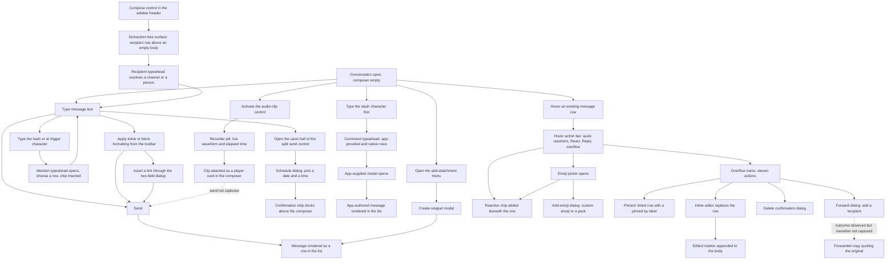

# Messaging & Composer

The message list, the message row and the composer — everything a person does to write, send, format, decorate, correct and act on a message, specified from the frames that show it.

## Purpose

This document specifies the **conversation body and the composer**: how a message is rendered once sent, and how one is written before it is. Two surfaces own the area. The **message list** occupies the scrolling middle of the content region and renders one `C-MESSAGE-ROW` per message, grouped by day dividers, with per-row actions revealed on hover [frame 250](../../screenshots/Slack%20web%20Jul%202024%20250.png). The **composer** is a bordered block pinned to the foot of the content region, stacked as formatting toolbar, input area, then an action row whose far right holds a split send control [frame 202](../../screenshots/Slack%20web%20Jul%202024%20202.png).

**Where the area is encountered.** Everywhere a conversation is open. The same message list and the same composer render in a channel [frame 202](../../screenshots/Slack%20web%20Jul%202024%20202.png), in a one-to-one direct message [frame 250](../../screenshots/Slack%20web%20Jul%202024%20250.png), and in a full-width surface that replaces the content region entirely when a message is being drafted before it has a recipient [frame 342](../../screenshots/Slack%20web%20Jul%202024%20342.png). The composer is consequently the most frequently re-used interactive block in the product, and its control set is the single most build-critical enumeration in this catalog: get it wrong and every conversation surface is wrong.

**What this document owns.** Composing and sending; the nine-control rich-text formatting toolbar and every formatting operation observed; multi-line bodies and lists; snippets; channel and person mentions and the typeahead that inserts them; slash commands, both app-provided and native; scheduled send; audio-clip recording and attachment; the emoji picker, reactions, custom emoji and emoji packs; the hover action bar and the message overflow menu; forwarding; pinning; inline editing; deletion; and the distraction-free composer.

**What it does not own.** Thread replies, which the Reply control opens — [04-threads.md](04-threads.md). The direct-message context that several of these flows happen inside — [05-direct-messages.md](05-direct-messages.md). File uploads, video clips and media playback as files — [16-files-media.md](16-files-media.md). Canvas creation from the attachment menu — [07-canvases.md](07-canvases.md). The apps that provide slash commands, and the workflows that post messages — [11-apps-and-integrations.md](11-apps-and-integrations.md) and [10-workflow-builder.md](10-workflow-builder.md). Empty-state and gating semantics as a cross-cutting matrix — [21-states.md](21-states.md). The channel intro hero and bookmark row — [02-channels.md](02-channels.md). The drafts-and-sent destination the composer writes into — [12-activity-notifications.md](12-activity-notifications.md). The shell around all of it, and the authoritative contract for every `C-*` identifier cited here — [00-product-overview.md](00-product-overview.md). The catalog index is the [Workflow Catalog](README.md).

**Audio clips are deviation D3** — the scaffold's charter for this area did not name the capability, and the corpus shows it plainly, so it is documented here as flow `03.6`; the rationale is recorded once in the [Workflow Catalog](README.md).

## Flows in this area

Fourteen flows are named for this area, spanning 89 frames. Frame spans below are written as plain numeric ranges because they designate a span rather than cite one image, following the convention of the [Screenshot Coverage Index](_screenshot-index.md); every individual frame is cited with its full relative link in the per-flow step tables and in the **Frames covered** section.

| Flow ID | Name | Frame span | Primary entry point |
|---|---|---|---|
| `03.1` | React to a message while first-run coaching is active | 33–38 | The spotlit add-reaction affordance on a message row |
| `03.2` | Compose and send a multi-line formatted message | 139–142 | The composer input in a channel |
| `03.3` | Create and post a snippet | 143–149 | The add-attachment control in the composer action row |
| `03.4` | Mention a channel and a person from the composer | 168–176 | The hash or at trigger character typed into the composer |
| `03.5` | Schedule a message to send later | 177–185 | The caret half of the composer's split send control |
| `03.6` | Record and attach an audio clip | 199–202 | The audio-clip control in the composer action row |
| `03.7` | Run a slash command and post an app poll | 203–206 | The slash trigger character typed into the composer |
| `03.8` | React to a message with the emoji picker | 208–215 | The React control on `C-HOVER-ACTION-BAR`, or the add-reaction affordance beside an existing reaction pill |
| `03.9` | Add a custom emoji and an emoji pack | 216–222 | The Add Emoji control in the emoji picker's footer |
| `03.10` | Format a message with the composer toolbar and insert a link | 230–241 | A text selection in the composer, acted on from `C-FORMATTING-TOOLBAR` |
| `03.11` | Act on a sent message and forward it | 242–247 | The overflow control on `C-HOVER-ACTION-BAR` |
| `03.12` | Pin, edit and delete a message | 248–255 | The message overflow menu |
| `03.13` | Compose a new message from the distraction-free composer | 342–345 | The compose control in the `C-SIDEBAR` header |
| `03.14` | Address a new message from the compact rail | 551 | The recipient field of the distraction-free composer |

### The composing-and-sending journey

Every node and every edge below corresponds to a state or a transition observed in the frames cited by the flows above. Where the corpus evidences an outcome but not the transition that produces it, the edge is drawn dotted and labelled as such rather than asserted as continuous.

## Flow 03.1 — React to a message while first-run coaching is active

### Overview

The corpus's first messaging flow is a teaching flow: coaching points at a message's add-reaction affordance, the person opens the emoji picker from it, chooses an emoji, and the reaction lands on the message as a counted chip. It is documented as a messaging flow rather than an onboarding one because what it teaches is the message row's action contract — the hover action bar, the picker and the reaction chip — and those are this area's to specify. The coaching chrome that wraps it belongs to [01-onboarding-and-auth.md](01-onboarding-and-auth.md).

### Trigger

A `C-COACH-MARK` card reading "Add reaction…" whose caret points down at a spotlit pill labelled "Try me!" carrying an add-reaction glyph and its own dismiss control, anchored beneath a teammate's message [frame 34](../../screenshots/Slack%20web%20Jul%202024%2034.png).

### Preconditions

An authenticated session in a channel that already holds at least one message from another person, with first-run coaching still active. At this capture the channel holds three messages and one of them already carries a reaction chip [frame 33](../../screenshots/Slack%20web%20Jul%202024%2033.png).

### Frame-by-frame steps

| Step | Frame(s) | What the user does | What changes on screen | Component(s) involved |
|---|---|---|---|---|
| 1 | [frame 33](../../screenshots/Slack%20web%20Jul%202024%2033.png) | Reads the conversation | The message list renders three rows; the third, from a teammate, carries a single reaction chip beneath its body | `C-MESSAGE-ROW` |
| 2 | [frame 34](../../screenshots/Slack%20web%20Jul%202024%2034.png) | Hovers the teammate's message | The row highlights and the hover action bar appears pinned to its top-right, overlapping the row's upper edge: three one-tap emoji shortcuts, then a labelled React control, then a labelled Reply control, then a vertical-ellipsis overflow control. The coaching card is anchored to the spotlit add-reaction pill below the row | `C-MESSAGE-ROW`, `C-HOVER-ACTION-BAR`, `C-COACH-MARK` |
| 3 | [frame 35](../../screenshots/Slack%20web%20Jul%202024%2035.png) | Opens the emoji picker from a message action | The picker opens over the message list with a coaching tooltip above it explaining quick reactions; the picker exposes emoji and GIF tabs, a search field, a dismissible new-emoji notice, titled category grids, a handy-reactions band, and footer controls for adding an emoji and choosing a skin tone | `C-COACH-MARK` |
| 4 | [frame 36](../../screenshots/Slack%20web%20Jul%202024%2036.png) | Hovers an emoji in the grid | A preview tooltip names the hovered emoji, and a suggestion row proposes a greeting reaction | — |
| 5 | [frame 37](../../screenshots/Slack%20web%20Jul%202024%2037.png) | Chooses the emoji | The picker closes; a coaching tooltip anchored near the message praises the action; the reply below now carries one reaction chip counting 1 with an add-reaction control beside it | `C-MESSAGE-ROW`, `C-COACH-MARK` |
| 6 | [frame 38](../../screenshots/Slack%20web%20Jul%202024%2038.png) | Dismisses the coaching | No overlay remains: three messages, one reaction chip counting 1 with its add-reaction control on the last, and an empty composer | `C-MESSAGE-ROW`, `C-COMPOSER` |

## Flow 03.2 — Compose and send a multi-line formatted message

### Overview

The base flow of the whole product: type, add structure, send. The corpus captures it as four states — a first line typed, the formatting toolbar in use with a bullet started, the draft grown to two bullets carrying a channel mention and a person mention, and the message sent and rendered in the list with those mentions intact [frame 139](../../screenshots/Slack%20web%20Jul%202024%20139.png) through [frame 142](../../screenshots/Slack%20web%20Jul%202024%20142.png). Multi-line entry is explicitly taught by the composer itself, which renders a persistent hint beneath its lower-right corner naming the modifier that inserts a newline instead of sending.

### Trigger

The composer input in an open channel, which carries a placeholder naming the target conversation while at rest [frame 250](../../screenshots/Slack%20web%20Jul%202024%20250.png), [frame 199](../../screenshots/Slack%20web%20Jul%202024%20199.png).

### Preconditions

An authenticated session with a conversation open. No draft, no attachment and no permission grant is required: the composer is present in every captured conversation state in this area.

### Frame-by-frame steps

| Step | Frame(s) | What the user does | What changes on screen | Component(s) involved |
|---|---|---|---|---|
| 1 | [frame 139](../../screenshots/Slack%20web%20Jul%202024%20139.png) | Types the first line of a message | The placeholder is replaced by the typed text and a hint appears beneath the composer's lower-right corner naming the modifier-plus-return combination that adds a new line | `C-COMPOSER` |
| 2 | [frame 140](../../screenshots/Slack%20web%20Jul%202024%20140.png) | Starts a bulleted list from the toolbar | The formatting toolbar row is visible above the typed line and the draft's second line becomes the first item of a bulleted list | `C-COMPOSER`, `C-FORMATTING-TOOLBAR` |
| 3 | [frame 141](../../screenshots/Slack%20web%20Jul%202024%20141.png) | Completes a second bullet containing a channel mention and a person mention | The draft renders two bullet items; each mention renders inline as a chip distinct from surrounding text; the toolbar and the newline hint remain | `C-COMPOSER`, `C-FORMATTING-TOOLBAR` |
| 4 | [frame 142](../../screenshots/Slack%20web%20Jul%202024%20142.png) | Sends the message | The draft leaves the composer and appears as the newest `C-MESSAGE-ROW` in the list, its bulleted structure and both mention chips preserved; the composer empties, keeping its full-contrast formatting toolbar and its action row, and renders **no placeholder in the emptied input while its send control stays a filled primary** — the same post-send combination recorded in the **Inconsistencies** table | `C-MESSAGE-ROW`, `C-COMPOSER` |

**Inferred:** the modifier-plus-return combination is the newline and the bare return is the send, because the hint names the former as what "add[s] a new line" and no frame shows a send control being activated between the drafting states and the sent state [frame 141](../../screenshots/Slack%20web%20Jul%202024%20141.png), [frame 142](../../screenshots/Slack%20web%20Jul%202024%20142.png).

## Flow 03.3 — Create and post a snippet

### Overview

The composer's add-attachment control fronts a small menu whose first entry is not an attachment at all but a **text snippet**: a titled, typed, line-numbered block authored in its own modal, optionally accompanied by a message, and posted into a chosen conversation as a collapsible code card. The flow runs the full journey from the menu through five modal states to the posted message [frame 143](../../screenshots/Slack%20web%20Jul%202024%20143.png) through [frame 149](../../screenshots/Slack%20web%20Jul%202024%20149.png). The other three entries in that menu belong to [07-canvases.md](07-canvases.md) and [16-files-media.md](16-files-media.md).

### Trigger

The add-attachment control at the left of the composer's action row [frame 143](../../screenshots/Slack%20web%20Jul%202024%20143.png).

### Preconditions

An authenticated session with a conversation open. The share-this-file checkbox arrives pre-ticked and pre-scoped to the conversation the composer belongs to, so the flow needs no separate destination choice [frame 144](../../screenshots/Slack%20web%20Jul%202024%20144.png).

### Frame-by-frame steps

| Step | Frame(s) | What the user does | What changes on screen | Component(s) involved |
|---|---|---|---|---|
| 1 | [frame 143](../../screenshots/Slack%20web%20Jul%202024%20143.png) | Activates the add-attachment control | The control itself becomes a filled circular dismiss affordance, and a menu opens upward from it: a create-a-text-snippet row carrying a keyboard-shortcut hint, then a separator and a labelled Attach group offering a canvas row, an enable-GIFs row and an upload-from-your-computer row with its own shortcut hint | `C-COMPOSER`, `C-DROPDOWN-MENU` |
| 2 | [frame 144](../../screenshots/Slack%20web%20Jul%202024%20144.png) | Chooses create-a-text-snippet | A centred modal opens over a dimmed backdrop: a two-column head with an optional title field showing a greyed default-filename placeholder and a type select reading auto-detect; a Content label above a line-numbered editor; a Wrap checkbox left unticked; an embedded accompanying-message sub-composer; a ticked share-this-file checkbox with a channel select beneath it; and a footer primary action rendered muted | `C-MODAL-SHELL` |
| 3 | [frame 145](../../screenshots/Slack%20web%20Jul%202024%20145.png) | Types a title | The greyed default-filename placeholder is replaced by the typed title; the footer primary action stays muted | `C-MODAL-SHELL` |
| 4 | [frame 146](../../screenshots/Slack%20web%20Jul%202024%20146.png) | Opens the type select | The select expands into a scrollable option list whose auto-detect entry carries a leading check mark, followed by a long list of language options | `C-MODAL-SHELL`, `C-DROPDOWN-MENU` |
| 5 | [frame 147](../../screenshots/Slack%20web%20Jul%202024%20147.png) | Chooses a plain-text type | The select's displayed value changes to the chosen type and the list closes | `C-MODAL-SHELL` |
| 6 | [frame 148](../../screenshots/Slack%20web%20Jul%202024%20148.png) | Types three lines into the content editor | The gutter numbers each line, and the footer primary action changes from muted to active | `C-MODAL-SHELL` |
| 7 | [frame 149](../../screenshots/Slack%20web%20Jul%202024%20149.png) | Confirms creation | The modal closes; a new `C-MESSAGE-ROW` appears whose body is the snippet title followed by a disclosure caret, above a bordered card holding the line-numbered, syntax-highlighted content; the composer returns to empty with a muted send control | `C-MESSAGE-ROW`, `C-COMPOSER` |

**Inferred:** the content is the modal's only required field, because the primary action is muted with an empty editor and an empty title [frame 144](../../screenshots/Slack%20web%20Jul%202024%20144.png), stays muted once only the title is filled [frame 145](../../screenshots/Slack%20web%20Jul%202024%20145.png), and becomes active as soon as the editor holds text [frame 148](../../screenshots/Slack%20web%20Jul%202024%20148.png). The title's own label states it is optional.

## Flow 03.4 — Mention a channel and a person from the composer

### Overview

Two trigger characters typed into the composer summon a filtered typeahead panel, and choosing a row inserts a chip into the draft at the caret. The corpus runs the whole cycle twice in one draft — once for a channel and once for a person — and then shows the person chip being hovered to reveal a profile card, before the finished message is posted [frame 168](../../screenshots/Slack%20web%20Jul%202024%20168.png) through [frame 176](../../screenshots/Slack%20web%20Jul%202024%20176.png). The panel is the same structure in both cases and differs only in the row anatomy it lists, which is why it is specified once here as a single contract with two row types.

### Trigger

The hash character typed into the composer for a channel [frame 169](../../screenshots/Slack%20web%20Jul%202024%20169.png), and the at character typed into the composer for a person [frame 172](../../screenshots/Slack%20web%20Jul%202024%20172.png). Both also have a dedicated control: the mention control sits in the composer's action row between the emoji and video-clip controls [frame 202](../../screenshots/Slack%20web%20Jul%202024%20202.png).

### Preconditions

An authenticated session with a conversation open and a caret in the composer. Nothing else: the panel appears on the trigger character alone, with the draft already part-written and the caret mid-sentence [frame 168](../../screenshots/Slack%20web%20Jul%202024%20168.png).

### Frame-by-frame steps

| Step | Frame(s) | What the user does | What changes on screen | Component(s) involved |
|---|---|---|---|---|
| 1 | [frame 168](../../screenshots/Slack%20web%20Jul%202024%20168.png) | Writes a two-bullet draft and stops mid-sentence | The draft holds two bullet items, the second ending where a channel reference is about to go; the bulleted-list control in the formatting toolbar renders raised because the caret sits inside a list | `C-COMPOSER`, `C-FORMATTING-TOOLBAR` |
| 2 | [frame 169](../../screenshots/Slack%20web%20Jul%202024%20169.png) | Types the hash trigger character | A typeahead panel overlays upward from the composer's top edge near the caret, listing four channel rows each rendered as a hash glyph and a bold name, the first row carrying a filled selection highlight, above an in-panel keyboard-hint footer naming navigate, select and dismiss | `C-COMPOSER` |
| 3 | [frame 170](../../screenshots/Slack%20web%20Jul%202024%20170.png) | Chooses a channel | The panel closes and the chosen channel is inserted inline in the second bullet as a chip distinct from surrounding text | `C-COMPOSER` |
| 4 | [frame 171](../../screenshots/Slack%20web%20Jul%202024%20171.png) | Continues typing after the chip | The draft grows past the channel chip and the caret waits at the point where a person reference will follow | `C-COMPOSER` |
| 5 | [frame 172](../../screenshots/Slack%20web%20Jul%202024%20172.png) | Types the at trigger character | A typeahead panel opens near the caret listing, in order: a highlighted member row rendered as avatar, bold display name, presence indicator and user name; two special mentions each with a one-line description of who is notified; further member rows; an application row carrying an app badge and a right-aligned not-in-channel annotation; and, pinned at the panel's foot, a degraded-state notice reading that there is no connection and some results may not be available | `C-COMPOSER`, `C-AVATAR`, `C-PRESENCE-DOT` |
| 6 | [frame 173](../../screenshots/Slack%20web%20Jul%202024%20173.png) | Chooses a person | The panel closes and the person is inserted inline after the channel chip as a second chip | `C-COMPOSER` |
| 7 | [frame 174](../../screenshots/Slack%20web%20Jul%202024%20174.png) | Reads back the finished draft | Both bullet items are complete, each mention rendered as its own chip, the toolbar and newline hint still shown | `C-COMPOSER`, `C-FORMATTING-TOOLBAR` |
| 8 | [frame 175](../../screenshots/Slack%20web%20Jul%202024%20175.png) | Hovers the person chip in the draft | A profile card opens above the composer, aligned to the chip: a large avatar at the left, the display name in bold with a presence indicator beside it, then a separated row carrying a clock glyph and the person's local time | `C-AVATAR`, `C-PRESENCE-DOT` |
| 9 | [frame 176](../../screenshots/Slack%20web%20Jul%202024%20176.png) | Sends the message | The bulleted message is posted into the list with its chips intact, an earlier message still carries its reaction chip, and the composer returns to empty | `C-MESSAGE-ROW`, `C-COMPOSER` |

The profile card is a read-only summary; editing a profile, and the full field set behind it, belong to [13-profiles-people.md](13-profiles-people.md).

**Inconsistency, recorded not reconciled:** [frame 174](../../screenshots/Slack%20web%20Jul%202024%20174.png) is byte-identical to [frame 141](../../screenshots/Slack%20web%20Jul%202024%20141.png), which sits in flow `03.2`. Two frames nine indices apart carry the same pixels, so the two flows pass through exactly the same composer state. Nothing in either frame distinguishes them; the assignment comes from the frames around each. This is recorded rather than smoothed away, and it is the reason adjacency is treated as a weak prior throughout this document.

## Flow 03.5 — Schedule a message to send later

### Overview

The composer's send control is a **split control**: the paper-plane half sends now, and the caret half opens a scheduling menu. Choosing a custom time opens a dialog with a date select and a half-hourly time select; confirming replaces the draft with a strip above the composer that states where and when the message will be delivered and links to the full scheduled list [frame 177](../../screenshots/Slack%20web%20Jul%202024%20177.png) through [frame 185](../../screenshots/Slack%20web%20Jul%202024%20185.png).

### Trigger

The caret at the right of the split send control [frame 178](../../screenshots/Slack%20web%20Jul%202024%20178.png).

### Preconditions

A draft in the composer. The caret half is observed opening the menu only with text present, and the send control renders as a filled primary in that state [frame 178](../../screenshots/Slack%20web%20Jul%202024%20178.png) against a muted rendering with an empty composer [frame 185](../../screenshots/Slack%20web%20Jul%202024%20185.png).

### Frame-by-frame steps

| Step | Frame(s) | What the user does | What changes on screen | Component(s) involved |
|---|---|---|---|---|
| 1 | [frame 177](../../screenshots/Slack%20web%20Jul%202024%20177.png) | Drafts a reminder message in a channel | The draft fills the composer; behind it the channel renders its intro hero and two suggestion cards above the message list | `C-COMPOSER`, `C-EMPTY-STATE` |
| 2 | [frame 178](../../screenshots/Slack%20web%20Jul%202024%20178.png) | Activates the caret half of the send control | A menu opens anchored above the send control, right-aligned to it: a muted schedule-message header, a tomorrow-at option, a next-weekday-at option, then a separator and a custom-time option | `C-COMPOSER`, `C-DROPDOWN-MENU` |
| 3 | [frame 179](../../screenshots/Slack%20web%20Jul%202024%20179.png) | Chooses the custom-time option | A dialog opens carrying a line naming the time zone the choice is interpreted in, a date select, a time select, and a footer of cancel then a schedule action | `C-MODAL-SHELL` |
| 4 | [frame 180](../../screenshots/Slack%20web%20Jul%202024%20180.png) | Opens the date select | A month grid opens with the current day ringed | `C-MODAL-SHELL` |
| 5 | [frame 181](../../screenshots/Slack%20web%20Jul%202024%20181.png) | Picks a later date | The date select's displayed value changes to the chosen date and the grid closes | `C-MODAL-SHELL` |
| 6 | [frame 182](../../screenshots/Slack%20web%20Jul%202024%20182.png) | Opens the time select | A scrollable list of half-hourly options opens with midnight carrying a leading check mark | `C-MODAL-SHELL`, `C-DROPDOWN-MENU` |
| 7 | [frame 183](../../screenshots/Slack%20web%20Jul%202024%20183.png) | Scrolls the time list | The list scrolls to the morning options | `C-DROPDOWN-MENU` |
| 8 | [frame 184](../../screenshots/Slack%20web%20Jul%202024%20184.png) | Picks a morning time | Both selects show the chosen values and the schedule action renders active | `C-MODAL-SHELL` |
| 9 | [frame 185](../../screenshots/Slack%20web%20Jul%202024%20185.png) | Confirms the schedule | The dialog closes, the draft leaves the composer, and a strip docks immediately above the composer carrying a clock glyph, a sentence naming the destination conversation and the delivery date and time, and a see-all-scheduled-messages link; the composer's send control returns to muted; the sidebar's drafts-and-sent row swaps its pencil glyph for a clock glyph and keeps its count | `C-COMPOSER`, `C-SIDEBAR` |

The scheduled item's own destination surface — the list a person reaches through that link — belongs to [12-activity-notifications.md](12-activity-notifications.md).

**Inferred:** the two named quick options are computed rather than fixed labels, because both name a weekday-and-time pair relative to the capture date rather than an absolute date [frame 178](../../screenshots/Slack%20web%20Jul%202024%20178.png).

## Flow 03.6 — Record and attach an audio clip

### Overview

The audio-clip control in the composer's action row starts an in-place recorder rendered as a floating pill over the composer, showing a live waveform and a running elapsed time, with an explicit cancel control of its own and a confirm control that takes the audio-clip control's place in the action row. Confirming turns the recording into a player card attached inside the composer's input area, from where it is sent like any other message [frame 199](../../screenshots/Slack%20web%20Jul%202024%20199.png) through [frame 202](../../screenshots/Slack%20web%20Jul%202024%20202.png). This is **deviation D3**, recorded once in the [Workflow Catalog](README.md).

### Trigger

The audio-clip control in the composer's action row, sixth of the seven controls at the row's left [frame 199](../../screenshots/Slack%20web%20Jul%202024%20199.png).

### Preconditions

An authenticated session with a conversation open and an empty composer carrying its placeholder [frame 199](../../screenshots/Slack%20web%20Jul%202024%20199.png). That same capture also carries a **failure toast** at the bottom-right of the content region — a near-black pill stating that something went wrong and inviting a retry — so the flow begins on a surface that has just reported a failure, and the toast covers the send control's footprint throughout step 1 [frame 199](../../screenshots/Slack%20web%20Jul%202024%20199.png). What failed is not evidenced: the toast names no object and the preceding capture carries no toast at all [frame 198](../../screenshots/Slack%20web%20Jul%202024%20198.png). No microphone permission prompt is captured in this flow; the permission-request and permission-denied bands, and the device diagnostics behind them, belong to [00-product-overview.md](00-product-overview.md)'s `C-PERMISSION-PROMPT` contract and to [14-preferences-settings.md](14-preferences-settings.md).

### Frame-by-frame steps

| Step | Frame(s) | What the user does | What changes on screen | Component(s) involved |
|---|---|---|---|---|
| 1 | [frame 199](../../screenshots/Slack%20web%20Jul%202024%20199.png) | Opens a channel with an empty composer | The composer renders its formatting toolbar — all nine glyphs and four rules present but at **reduced contrast** — its placeholder naming the channel, and its action row at full contrast; a near-black **failure toast** sits at the bottom-right of the content region stating that something went wrong and inviting a retry, with no dismiss and no undo, covering where the send control renders; the message list shows the earlier bulleted message and a reaction chip | `C-COMPOSER`, `C-FORMATTING-TOOLBAR`, `C-MESSAGE-ROW`, `C-TOAST` |
| 2 | [frame 200](../../screenshots/Slack%20web%20Jul%202024%20200.png) | Activates the audio-clip control | A rounded recorder pill floats over the composer's input area carrying a live waveform whose bars are uniform apart from **one distinctly taller bar standing roughly three-fifths of the way along it — just right of centre, not at either end** — with an elapsed-time readout to the waveform's right and a circular dismiss control pinned at the pill's own top-right corner; in the action row the audio-clip control is replaced in place by a filled primary confirm control; the composer's toolbar and placeholder and the nearest message row all render dimmed; the send control renders muted | `C-COMPOSER` |
| 3 | [frame 201](../../screenshots/Slack%20web%20Jul%202024%20201.png) | Confirms the recording | The pill is replaced by a player card inside the composer's input area — a filled circular play control at the left, a waveform, and a duration readout at the right; the formatting toolbar and the full action row return, the audio-clip control is restored, and the send control becomes a filled primary even though the text input is empty; the sidebar gains a drafts-and-sent row carrying a pencil glyph and a count | `C-COMPOSER`, `C-MEDIA-PLAYER`, `C-SIDEBAR` |
| 4 | [frame 202](../../screenshots/Slack%20web%20Jul%202024%20202.png) | Leaves the composer empty again | The attachment is gone and the input area holds **nothing at all — no player card, no placeholder** — between a full-contrast toolbar and the full action row, while the **send control stays a filled primary**; the failure toast of step 1 is also gone. In the sidebar the drafts-and-sent row that appeared at step 3 is **absent again**, and the section beneath it moves up into its place. The conversation renders unchanged behind the composer | `C-COMPOSER`, `C-SIDEBAR` |

> **Partial capture:** no frame shows the audio clip **sent** as a message, and no frame shows the recorder's cancel control being used. [frame 202](../../screenshots/Slack%20web%20Jul%202024%20202.png) shows an empty composer after [frame 201](../../screenshots/Slack%20web%20Jul%202024%20201.png)'s attachment, which is consistent with either sending or discarding, and the corpus does not settle which. The one further datum the two captures do carry is the sidebar's drafts-and-sent row — present with a pencil glyph and a count of one while the clip is attached [frame 201](../../screenshots/Slack%20web%20Jul%202024%20201.png) and gone once the composer is empty [frame 202](../../screenshots/Slack%20web%20Jul%202024%20202.png) — so the draft count returns to none either way; that is consistent with both outcomes and settles neither. No message list in the corpus shows the clip in either capture. The sent form of an audio clip as a file, with its playback controls in the message list, belongs to [16-files-media.md](16-files-media.md).

**Inferred:** the recorder is modal with respect to the composer rather than to the whole page, because the dimming covers the composer's own toolbar and placeholder and the nearest message row while the sidebar, rail and top bar stay at full contrast [frame 200](../../screenshots/Slack%20web%20Jul%202024%20200.png).

**Inferred:** the send control's enabled state tracks composer content of any kind rather than text alone, because it renders as a filled primary with an attachment present and an empty text input [frame 201](../../screenshots/Slack%20web%20Jul%202024%20201.png) while it renders muted on a composer that holds only its placeholder [frame 250](../../screenshots/Slack%20web%20Jul%202024%20250.png), [frame 185](../../screenshots/Slack%20web%20Jul%202024%20185.png). The inference is **not** supported by this flow's own closing capture, whose composer holds nothing yet whose send control is filled [frame 202](../../screenshots/Slack%20web%20Jul%202024%20202.png); that disagreement is recorded in the **Inconsistencies** table rather than resolved, so a build must treat the enabled rule as the one the majority of captures show and must not read [frame 202](../../screenshots/Slack%20web%20Jul%202024%20202.png) as evidence for it.

## Flow 03.7 — Run a slash command and post an app poll

### Overview

Typing the slash character alone opens a command typeahead that mixes **app-provided** commands with **native** commands and distinguishes them by a provider sub-line on every row. Narrowing the query surfaces an app's own command variants with usage examples; running one opens that app's modal, and confirming posts a message into the conversation authored by the app rather than by the person [frame 203](../../screenshots/Slack%20web%20Jul%202024%20203.png) through [frame 206](../../screenshots/Slack%20web%20Jul%202024%20206.png).

Third-party application names are **not** reproduced. Following the placeholder vocabulary defined in [00-product-overview.md](00-product-overview.md), the applications observed here are named functionally: **a cloud-drive app** and **a poll app**. The native provider is written as **the product**.

### Trigger

The slash character typed as the first character in the composer [frame 203](../../screenshots/Slack%20web%20Jul%202024%20203.png). A dedicated control also exists: the boxed-slash control is the seventh and last control at the left of the composer's action row [frame 202](../../screenshots/Slack%20web%20Jul%202024%20202.png).

### Preconditions

An authenticated session with a conversation open. Apps must be installed for app-provided rows to appear — the sidebar's app group lists a cloud-drive app at this capture and gains a poll app once its command has been run [frame 203](../../screenshots/Slack%20web%20Jul%202024%20203.png), [frame 205](../../screenshots/Slack%20web%20Jul%202024%20205.png). The app inventory itself belongs to [11-apps-and-integrations.md](11-apps-and-integrations.md).

### Frame-by-frame steps

| Step | Frame(s) | What the user does | What changes on screen | Component(s) involved |
|---|---|---|---|---|
| 1 | [frame 203](../../screenshots/Slack%20web%20Jul%202024%20203.png) | Types the slash character into an empty composer | A typeahead panel overlays upward from the composer's top edge, left-aligned to it — overhanging its left edge very slightly — and spanning roughly **half** the composer's width, listing four rows each rendered as a leading provider icon, a command label and a provider-and-description sub-line: three app-provided document, presentation and spreadsheet creation commands labelled by human-readable phrase and annotated "Workflow · a cloud-drive app", the first carrying a filled selection highlight; and one native command labelled by its own slash token and annotated "the product · Archive the current channel". The panel's lower edge sits over the band the composer uses for its formatting toolbar, so only the input row — holding the slash alone — and the action row remain visible, with the send control rendered as a filled primary. The action row keeps all seven controls in their usual positions, but the **boxed-slash control itself renders at reduced contrast** while the typeahead it duplicates is open, unlike the six beside it. Behind the panel the channel shows its chit-chat hero and two suggestion cards | `C-COMPOSER`, `C-EMPTY-STATE` |
| 2 | [frame 204](../../screenshots/Slack%20web%20Jul%202024%20204.png) | Types a command name after the slash | The list filters to that command: a create-a-poll entry carrying a shortcut sub-line, then two command variants each carrying a usage example | `C-COMPOSER` |
| 3 | [frame 205](../../screenshots/Slack%20web%20Jul%202024%20205.png) | Runs the command | A centred modal opens over a dimmed backdrop carrying the app's own icon in its title row beside a preview title, plus a duplicate control and a dismiss control; its body holds a send-to label with a select control and, beneath it, a validation notice requiring a channel or audience to be chosen; then the poll title, a created-by line naming the author as a mention chip and the command token that created it; then a settings block of seven label-and-value rows; then an information line stating when the draft was saved; and a footer of back then a filled primary create action. The sidebar's app group now lists the poll app in bold with an unread count | `C-MODAL-SHELL`, `C-SIDEBAR` |
| 4 | [frame 206](../../screenshots/Slack%20web%20Jul%202024%20206.png) | Confirms creation | The modal closes and a message appears in the list authored by the app: the app's square icon as its avatar, the app's name followed by an app badge and a timestamp on the author line, then a bold title, an outlined open action, and a muted provenance line repeating the author mention and the command token. An unread boundary renders as a coloured full-width rule with the day-divider pill centred on it and a new label at its right end; the conversation row in the sidebar goes bold with a count | `C-MESSAGE-ROW`, `C-SIDEBAR` |

> **Partial capture:** whether the composer still renders its formatting toolbar while the command typeahead is open **cannot be determined from this capture**, because the panel's lower edge covers exactly the band in which the toolbar renders [frame 203](../../screenshots/Slack%20web%20Jul%202024%20203.png). The composer's other rows are demonstrably where they always are — the typed slash sits in the same band as the placeholder of a resting composer, the action row occupies the same band and the same horizontal extent, and the composer's lower border sits at the same height as in a capture whose toolbar is visible [frame 199](../../screenshots/Slack%20web%20Jul%202024%20199.png), [frame 202](../../screenshots/Slack%20web%20Jul%202024%20202.png) — so the composer has **not** collapsed to a shorter form. No frame in the corpus shows a conversation composer with the toolbar band visible and empty, so a build must **not** suppress the toolbar while the typeahead is open; the only evidenced requirement is that the panel overlays it.

**Inferred:** the validation notice at [frame 205](../../screenshots/Slack%20web%20Jul%202024%20205.png) is advisory rather than blocking, because the create action renders as a filled primary while the notice is still displayed and the send-to select is still unset. The corpus does not show the action being pressed in that state, so whether submission would be rejected is not evidenced.

**Inferred:** the modal at [frame 205](../../screenshots/Slack%20web%20Jul%202024%20205.png) is supplied by the app rather than by the product, because its title row carries the app's own icon, its body's settings vocabulary is specific to that app, and the resulting message is authored by the same app [frame 206](../../screenshots/Slack%20web%20Jul%202024%20206.png). A build implements the surface for apps to present, not this particular poll.

## Flow 03.8 — React to a message with the emoji picker

### Overview

Reacting has two entry points on the same message, and the corpus shows both: the React control on the hover action bar, and the add-reaction affordance that sits beside any reaction chip a message already carries. Both open the same picker. The flow also captures the picker's search behaviour, its hover previews and its skin-tone control, and it ends with the message carrying two reaction chips [frame 208](../../screenshots/Slack%20web%20Jul%202024%20208.png) through [frame 215](../../screenshots/Slack%20web%20Jul%202024%20215.png).

### Trigger

The React control on `C-HOVER-ACTION-BAR` [frame 208](../../screenshots/Slack%20web%20Jul%202024%20208.png), or the add-reaction affordance beside an existing reaction chip, which reveals its own tooltip on hover [frame 210](../../screenshots/Slack%20web%20Jul%202024%20210.png).

### Preconditions

An authenticated session with a conversation open and at least one message in the list. The message reacted to here carries a document card; the card itself, and files as an entity, belong to [16-files-media.md](16-files-media.md).

### Frame-by-frame steps

| Step | Frame(s) | What the user does | What changes on screen | Component(s) involved |
|---|---|---|---|---|
| 1 | [frame 208](../../screenshots/Slack%20web%20Jul%202024%20208.png) | Hovers a message carrying a document card | The hover action bar appears at the row's top-right with three one-tap emoji shortcuts, a labelled React control, a labelled Reply control and an overflow control, and **no save control** | `C-MESSAGE-ROW`, `C-HOVER-ACTION-BAR` |
| 2 | [frame 209](../../screenshots/Slack%20web%20Jul%202024%20209.png) | Uses one of the one-tap shortcuts | The overlay clears and the message carries a single reaction chip | `C-MESSAGE-ROW` |
| 3 | [frame 210](../../screenshots/Slack%20web%20Jul%202024%20210.png) | Hovers the add-reaction affordance beside the chip | A tooltip names the affordance, confirming it is a second entry point to the same picker | `C-MESSAGE-ROW` |
| 4 | [frame 211](../../screenshots/Slack%20web%20Jul%202024%20211.png) | Opens the picker from the message | A floating panel opens over the message list, stacked as: a category tab strip whose first tab is a search tab rendered active and underlined, followed by category glyph tabs and a final tab bearing the product logo mark for custom emoji; a search field; a dismissible notice announcing a new emoji, carrying a thumbnail and its own dismiss control; titled category grids for frequently used, getting-work-done and smileys-and-people, the last clipped by the panel's height; a pinned band of five one-tap handy reactions; and a footer row with an outlined add-emoji control at the left and a skin-tone control at the right | `C-TAB-BAR` |
| 5 | [frame 212](../../screenshots/Slack%20web%20Jul%202024%20212.png) | Types a search query | The grids are replaced by a small result grid, and hovering a result shows a preview naming the emoji | `C-TAB-BAR` |
| 6 | [frame 213](../../screenshots/Slack%20web%20Jul%202024%20213.png) | Chooses the searched emoji | The picker closes and the message now carries two reaction chips | `C-MESSAGE-ROW` |
| 7 | [frame 214](../../screenshots/Slack%20web%20Jul%202024%20214.png) | Reopens the picker and hovers an emoji with skin-tone variants | A preview strip at the panel's foot offers a default skin-tone choice | `C-TAB-BAR` |
| 8 | [frame 215](../../screenshots/Slack%20web%20Jul%202024%20215.png) | Returns the picker to its resting state | The new-emoji notice, the category grids and the footer skin-tone control render as they did on opening | `C-TAB-BAR` |

**Inferred:** the one-tap shortcuts on the hover action bar and the handy-reactions band in the picker are the same short list of quick reactions surfaced twice, because both render exactly the same small set of emoji glyphs in the same order [frame 208](../../screenshots/Slack%20web%20Jul%202024%20208.png), [frame 211](../../screenshots/Slack%20web%20Jul%202024%20211.png).

## Flow 03.9 — Add a custom emoji and an emoji pack

### Overview

The picker's footer add-emoji control opens a two-tab dialog: one tab uploads a single image and names it, the other browses curated packs and adds a whole set. Both confirmations land as a toast at the bottom-right of the content region. The upload tab carries the only **explicit inline validation message** captured anywhere in this area — a duplicate-name rejection with a preview of the conflicting record [frame 216](../../screenshots/Slack%20web%20Jul%202024%20216.png) through [frame 222](../../screenshots/Slack%20web%20Jul%202024%20222.png).

### Trigger

The outlined add-emoji control in the emoji picker's footer [frame 211](../../screenshots/Slack%20web%20Jul%202024%20211.png).

### Preconditions

An authenticated session with the emoji picker open. A workspace-scoped custom emoji set must already exist for the duplicate-name conflict to be raised, and the corpus shows one does [frame 217](../../screenshots/Slack%20web%20Jul%202024%20217.png). The administrative surface that manages the same set belongs to [15-admin-workspace.md](15-admin-workspace.md).

### Frame-by-frame steps

| Step | Frame(s) | What the user does | What changes on screen | Component(s) involved |
|---|---|---|---|---|
| 1 | [frame 216](../../screenshots/Slack%20web%20Jul%202024%20216.png) | Opens the add-emoji dialog | A centred modal opens on its first tab of two: explanatory copy stating the emoji will be available to everyone in the workspace and where to find it, then a numbered upload step carrying size guidance and an upload control, then a numbered naming step whose helper copy states the name is also what is typed to use the emoji, then a footer of cancel and a save action | `C-MODAL-SHELL`, `C-TAB-BAR` |
| 2 | [frame 217](../../screenshots/Slack%20web%20Jul%202024%20217.png) | Uploads an image and types a name that is already taken | The upload step shows the chosen image previewed twice, once on a light and once on a dark background, beside its filename; the name field takes a border in the destructive colour; an information-glyph message in the same colour states that an emoji with this name already exists and suggests checking for a duplicate or trying a different name; a preview row beneath renders the conflicting emoji with its own name; and the save action renders muted | `C-MODAL-SHELL` |
| 3 | [frame 218](../../screenshots/Slack%20web%20Jul%202024%20218.png) | Types a name that is not taken | The destructive border, the message and the conflict preview all clear, and the save action becomes active | `C-MODAL-SHELL` |
| 4 | [frame 219](../../screenshots/Slack%20web%20Jul%202024%20219.png) | Saves | The dialog closes and a toast appears at the bottom-right of the content region confirming the custom emoji was added and is ready to use | `C-TOAST` |
| 5 | [frame 220](../../screenshots/Slack%20web%20Jul%202024%20220.png) | Switches to the packs tab | The dialog's body is replaced by four pack rows, each carrying a pack name, an author line and a preview grid of its emoji, closed by explanatory footer copy | `C-MODAL-SHELL`, `C-TAB-BAR` |
| 6 | [frame 221](../../screenshots/Slack%20web%20Jul%202024%20221.png) | Opens one pack | The dialog shows a detail view with a back chevron at its head, the pack name with its author and an emoji count, the pack's full emoji grid, and an add-pack action | `C-MODAL-SHELL` |
| 7 | [frame 222](../../screenshots/Slack%20web%20Jul%202024%20222.png) | Adds the pack | The dialog closes and a toast at the bottom-right confirms the pack was added to the workspace | `C-TOAST` |

**Inferred:** the name is required and the image is required, because the save action is muted while the name is in conflict [frame 217](../../screenshots/Slack%20web%20Jul%202024%20217.png) and becomes active only once a valid name accompanies an uploaded image [frame 218](../../screenshots/Slack%20web%20Jul%202024%20218.png). The corpus does not capture the dialog with an image but no name, so which of the two gates the action is not separately evidenced.

Neither of this flow's two toasts is observed carrying an undo affordance, unlike the two toasts recorded in [00-product-overview.md](00-product-overview.md) [frame 219](../../screenshots/Slack%20web%20Jul%202024%20219.png), [frame 222](../../screenshots/Slack%20web%20Jul%202024%20222.png). They are not the area's only toasts: a third, reporting a failure rather than a confirmation, is recorded in the **States** section and in flow `03.6` [frame 199](../../screenshots/Slack%20web%20Jul%202024%20199.png).

## Flow 03.10 — Format a message with the composer toolbar and insert a link

### Overview

The longest flow in this area, and the one that establishes the formatting contract: select text, apply inline marks, apply block marks, and insert a hyperlink through a two-field dialog that can be reopened for editing and removal. Twelve frames step through bold-italic, blockquote, inline code, a whole-body code block, and the link lifecycle [frame 230](../../screenshots/Slack%20web%20Jul%202024%20230.png) through [frame 241](../../screenshots/Slack%20web%20Jul%202024%20241.png). Throughout, the toolbar control that corresponds to the formatting at the caret renders **raised**, so the toolbar is a state display as well as a control set.

### Trigger

A text selection inside the composer, acted on from `C-FORMATTING-TOOLBAR` [frame 231](../../screenshots/Slack%20web%20Jul%202024%20231.png).

### Preconditions

A draft in the composer. The flow is captured in a one-to-one direct message, whose own contract belongs to [05-direct-messages.md](05-direct-messages.md); the composer and toolbar are identical to the channel case [frame 230](../../screenshots/Slack%20web%20Jul%202024%20230.png) against [frame 202](../../screenshots/Slack%20web%20Jul%202024%20202.png).

### Frame-by-frame steps

| Step | Frame(s) | What the user does | What changes on screen | Component(s) involved |
|---|---|---|---|---|
| 1 | [frame 230](../../screenshots/Slack%20web%20Jul%202024%20230.png) | Types a greeting draft | The draft fills the composer input with the formatting toolbar fully visible above it | `C-COMPOSER`, `C-FORMATTING-TOOLBAR` |
| 2 | [frame 231](../../screenshots/Slack%20web%20Jul%202024%20231.png) | Selects a phrase | The phrase renders as a selection; the toolbar stays visible and all nine controls render flat | `C-FORMATTING-TOOLBAR` |
| 3 | [frame 232](../../screenshots/Slack%20web%20Jul%202024%20232.png) | Applies bold and italic | The selected phrase renders bold and italic in the draft, and the bold and italic controls take a raised, filled rendering while the other seven stay flat | `C-FORMATTING-TOOLBAR` |
| 4 | [frame 233](../../screenshots/Slack%20web%20Jul%202024%20233.png) | Applies the blockquote | The whole draft is indented behind a vertical quote rule at its left edge, the blockquote control renders raised, and the bold-italic phrase keeps its inline marks | `C-FORMATTING-TOOLBAR` |
| 5 | [frame 234](../../screenshots/Slack%20web%20Jul%202024%20234.png) | Selects a second phrase | The second phrase renders as a selection inside the blockquoted draft | `C-FORMATTING-TOOLBAR` |
| 6 | [frame 235](../../screenshots/Slack%20web%20Jul%202024%20235.png) | Applies inline code | The second phrase renders in a bordered monospace style and the toolbar controls return to flat | `C-FORMATTING-TOOLBAR` |
| 7 | [frame 236](../../screenshots/Slack%20web%20Jul%202024%20236.png) | Applies the code block | The whole draft becomes monospace text inside a bordered box, and the code-block control renders raised | `C-FORMATTING-TOOLBAR` |
| 8 | [frame 237](../../screenshots/Slack%20web%20Jul%202024%20237.png) | Returns the draft to normal formatting and selects a phrase again | The box and the monospace styling are gone, and a phrase renders as a selection ready for the next operation | `C-FORMATTING-TOOLBAR` |
| 9 | [frame 238](../../screenshots/Slack%20web%20Jul%202024%20238.png) | Activates the link control | A small centred dialog opens over a dimmed backdrop with two stacked labelled fields — a text field pre-filled from the selection and an empty link field — and a footer of cancel then a filled primary save, the save rendered **active even with the link field empty** | `C-MODAL-SHELL` |
| 10 | [frame 239](../../screenshots/Slack%20web%20Jul%202024%20239.png) | Fills the link field | Both fields are populated and the same footer pair is offered, the dialog now reading as an edit of the link rather than an insertion | `C-MODAL-SHELL` |
| 11 | [frame 240](../../screenshots/Slack%20web%20Jul%202024%20240.png) | Saves the link | The dialog closes and the selected phrase renders in the draft as a hyperlink, distinct from surrounding text | `C-COMPOSER` |
| 12 | [frame 241](../../screenshots/Slack%20web%20Jul%202024%20241.png) | Hovers the hyperlink in the draft | A popover opens above the composer with a downward caret pointing at the link: the link text in bold, a dismiss control at its top-right, the destination address rendered as a link beneath, and a right-aligned pair of an outlined edit action and a remove action filled in the destructive colour. The link control in the toolbar renders raised while the caret is on the link | `C-COMPOSER`, `C-FORMATTING-TOOLBAR` |

The link popover is observed **once**, on a composer draft, and is therefore specified here as a surface of the composer rather than promoted to the shared component inventory, which is reserved for structures that recur.

**Inferred:** inline marks apply to the selection and block marks apply to the whole draft, because bold, italic and inline code each change only the selected phrase [frame 232](../../screenshots/Slack%20web%20Jul%202024%20232.png), [frame 235](../../screenshots/Slack%20web%20Jul%202024%20235.png) while blockquote and code block each restyle the entire body even though a selection was active [frame 233](../../screenshots/Slack%20web%20Jul%202024%20233.png), [frame 236](../../screenshots/Slack%20web%20Jul%202024%20236.png).

**Inferred:** the link field accepts an empty value without complaint, because the save action is rendered as a filled primary with the field empty [frame 238](../../screenshots/Slack%20web%20Jul%202024%20238.png) — the opposite of the emoji-name field's behaviour in flow `03.9`. No frame shows the result of saving an empty link, so the outcome is not evidenced.

## Flow 03.11 — Act on a sent message and forward it

### Overview

A message that has already been sent exposes its full action set through the overflow control on the hover action bar, and the corpus captures that menu in full — eleven actions in eight separator-delimited groups, seven of them carrying keyboard shortcuts. The flow then follows one of them, forwarding, through a three-state dialog that adds a recipient, optionally an accompanying message, and posts a copy [frame 242](../../screenshots/Slack%20web%20Jul%202024%20242.png) through [frame 247](../../screenshots/Slack%20web%20Jul%202024%20247.png).

### Trigger

The vertical-ellipsis overflow control at the right end of `C-HOVER-ACTION-BAR` [frame 243](../../screenshots/Slack%20web%20Jul%202024%20243.png).

### Preconditions

An authenticated session with a conversation holding at least one message the person can act on. The message acted on here is one of their own, which matters: the menu offers edit and delete [frame 244](../../screenshots/Slack%20web%20Jul%202024%20244.png). Whether the same menu is offered on another person's message is not captured.

### Frame-by-frame steps

| Step | Frame(s) | What the user does | What changes on screen | Component(s) involved |
|---|---|---|---|---|
| 1 | [frame 242](../../screenshots/Slack%20web%20Jul%202024%20242.png) | Opens a one-to-one conversation | The list renders a two-person intro with a view-profile action, a system message about an accepted invitation carrying a do-not-notify link, two day dividers, and one sent message whose body carries italic emphasis and an inline link, above an empty composer with its formatting toolbar | `C-MESSAGE-ROW`, `C-EMPTY-STATE`, `C-COMPOSER` |
| 2 | [frame 243](../../screenshots/Slack%20web%20Jul%202024%20243.png) | Hovers the sent message | The row highlights, the hover action bar appears at its top-right, and an edited marker is visible at the end of the body | `C-MESSAGE-ROW`, `C-HOVER-ACTION-BAR` |
| 3 | [frame 244](../../screenshots/Slack%20web%20Jul%202024%20244.png) | Activates the overflow control | A menu opens anchored to the control, holding eleven rows in eight separator-delimited groups: forward-message and save-for-later; turn-off-notifications-for-replies; mark-unread and remind-me-about-this with a submenu chevron; copy-link; pin-to-this-conversation; start-a-huddle-in-thread; edit-message and a delete-message row rendered in the destructive colour; and add-a-message-shortcut carrying an external-link glyph. Seven rows show a keyboard shortcut at their right edge; four do not — turn-off-notifications-for-replies, remind-me-about-this, start-a-huddle-in-thread and add-a-message-shortcut | `C-CONTEXT-MENU` |
| 4 | [frame 245](../../screenshots/Slack%20web%20Jul%202024%20245.png) | Chooses forward-message | A centred modal opens carrying an add-by-name-or-channel field with an open suggestion list of people and channels, a quoted preview of the message being forwarded, and a footer offering copy-link, save-draft and a forward action | `C-MODAL-SHELL` |
| 5 | [frame 246](../../screenshots/Slack%20web%20Jul%202024%20246.png) | Chooses a recipient | The recipient becomes a chip in the field, and an optional accompanying-message field appears above the quoted preview with its own reduced set of formatting controls | `C-MODAL-SHELL` |
| 6 | [frame 247](../../screenshots/Slack%20web%20Jul%202024%20247.png) | Types an accompanying message | The forward action renders active | `C-MODAL-SHELL` |

The reply-in-thread and huddle-in-thread rows leave this area: threads belong to [04-threads.md](04-threads.md) and huddles to [06-huddles.md](06-huddles.md). The save-for-later and remind-me rows write into the destinations owned by [12-activity-notifications.md](12-activity-notifications.md).

**Inconsistency, recorded not reconciled:** [frame 242](../../screenshots/Slack%20web%20Jul%202024%20242.png) is byte-identical to [frame 229](../../screenshots/Slack%20web%20Jul%202024%20229.png), whose primary owner is [05-direct-messages.md](05-direct-messages.md). The same pixels open two different journeys thirteen indices apart; nothing inside the frame distinguishes them, and the assignment comes from the frames that follow each.

> **Partial capture:** no frame shows the forward completed from this dialog. The forwarded result is visible at the start of the next flow [frame 248](../../screenshots/Slack%20web%20Jul%202024%20248.png), in a different conversation, so the corpus evidences the outcome but not the transition. The save-draft action in the dialog footer is never used either.

## Flow 03.12 — Pin, edit and delete a message

### Overview

The three lifecycle actions a person takes on their own message, run end to end from the overflow menu: pinning, which tints the row and adds a provenance label above the author line; inline editing, which replaces the row in place with an editor carrying its own formatting toolbar and a **reduced** action set; and deletion, which raises a confirmation dialog holding a full preview of what is about to be destroyed [frame 248](../../screenshots/Slack%20web%20Jul%202024%20248.png) through [frame 255](../../screenshots/Slack%20web%20Jul%202024%20255.png). The flow opens on the forwarded copy produced by flow `03.11`, which is how the corpus evidences what a forward produces.

### Trigger

The message overflow menu, reached from the overflow control on `C-HOVER-ACTION-BAR` [frame 251](../../screenshots/Slack%20web%20Jul%202024%20251.png).

### Preconditions

An authenticated session in a conversation holding a message authored by the signed-in person. Pin, edit and delete are all observed on the person's own message; whether they are offered on another person's is not captured.

### Frame-by-frame steps

| Step | Frame(s) | What the user does | What changes on screen | Component(s) involved |
|---|---|---|---|---|
| 1 | [frame 248](../../screenshots/Slack%20web%20Jul%202024%20248.png) | Opens a second one-to-one conversation | The list renders a two-person intro with a view-profile action, day dividers, and a forwarded message: accompanying text above a quoted copy of the original, the quote carrying a provenance line naming the conversation it came from and a view-conversation link | `C-MESSAGE-ROW`, `C-EMPTY-STATE` |
| 2 | [frame 249](../../screenshots/Slack%20web%20Jul%202024%20249.png) | Pins a message from the overflow menu | The row is rendered on a full-width tinted background with a provenance label above the author line — a pin glyph and a pinned-by-you sentence; the body keeps its inline marks, its emoji, its hyperlink and its edited marker | `C-MESSAGE-ROW` |
| 3 | [frame 250](../../screenshots/Slack%20web%20Jul%202024%20250.png) | Unpins the message and hovers it | The tint and the pinned-by label are gone and the row renders normally; the row highlight and the hover action bar appear, again with three one-tap emoji shortcuts, React, Reply and overflow and no save control | `C-MESSAGE-ROW`, `C-HOVER-ACTION-BAR` |
| 4 | [frame 251](../../screenshots/Slack%20web%20Jul%202024%20251.png) | Reopens the overflow menu on the same message | The same eleven-row menu opens anchored to the overflow control | `C-CONTEXT-MENU` |
| 5 | [frame 252](../../screenshots/Slack%20web%20Jul%202024%20252.png) | Chooses edit-message | The row is replaced in place on a tinted background: the author avatar stays at the left, the body becomes a bordered editable field carrying its own copy of the nine-control formatting toolbar as its top row with the rich formatting preserved, and a footer whose left action set is **reduced to the formatting toggle and emoji controls only** and whose right holds an outlined cancel and a filled primary save. The main composer stays in place beneath, still empty | `C-COMPOSER`, `C-FORMATTING-TOOLBAR` |
| 6 | [frame 253](../../screenshots/Slack%20web%20Jul%202024%20253.png) | Alters the text | The editable field shows the altered body with the caret at the end of the line | `C-COMPOSER` |
| 7 | [frame 254](../../screenshots/Slack%20web%20Jul%202024%20254.png) | Saves the edit | The editor closes, the row returns to its normal rendering with the altered body, and an edited marker is appended at the end | `C-MESSAGE-ROW` |
| 8 | [frame 255](../../screenshots/Slack%20web%20Jul%202024%20255.png) | Chooses delete-message | A centred dialog opens over a dimmed backdrop: a title, one line stating the action cannot be undone, a bordered preview card carrying the message's avatar, display name, an absolute date-and-time stamp and its full rich body including the edited marker, and a footer of an outlined cancel and a delete action filled in the destructive colour | `C-CONFIRM-DIALOG` |

> **Partial capture:** the delete is never confirmed — no frame shows the message removed from the list, and no frame shows a tombstone, an undo or a post-deletion state. Pinning is likewise captured only in its result: no frame shows the pinned-items surface a pinned message is collected into, nor the conversation header affordance that would open it.

**Inconsistency, recorded not reconciled — two, both inside this numerically contiguous span.** First, the message body is not monotonic across the run: at [frame 249](../../screenshots/Slack%20web%20Jul%202024%20249.png) it already carries a second sentence and an edited marker, both of which are **absent** at [frame 250](../../screenshots/Slack%20web%20Jul%202024%20250.png) and [frame 252](../../screenshots/Slack%20web%20Jul%202024%20252.png), before an edited marker reappears at [frame 254](../../screenshots/Slack%20web%20Jul%202024%20254.png). The captures are therefore not one continuous edit history. Second, [frame 255](../../screenshots/Slack%20web%20Jul%202024%20255.png) shows a materially different workspace state from the seven frames before it — extra sidebar flat rows, an emoji-prefixed user section, more channels, two direct-message rows carrying guest badges, four apps rather than two, a trial footer item, a lists destination in the rail and icon-only conversation-header controls. The frames were evidently captured in different sessions. Neither state is authoritative and neither is altered here.

## Flow 03.13 — Compose a new message from the distraction-free composer

### Overview

A message can be drafted **before** it has a recipient. The compose control replaces the whole content region with a full-width surface that has a recipient row at the top, an empty body carrying a hero prompt, and the ordinary composer at the foot; addressing it to a channel swaps the hero for that channel's own intro, so the surface previews the destination as soon as it is known [frame 342](../../screenshots/Slack%20web%20Jul%202024%20342.png) through [frame 345](../../screenshots/Slack%20web%20Jul%202024%20345.png).

### Trigger

The compose control in the `C-SIDEBAR` header [frame 342](../../screenshots/Slack%20web%20Jul%202024%20342.png).

**Inferred:** the global create menu's message entry is a second route to the same surface, because that entry is described as starting a conversation in a direct message or a channel — exactly this surface's recipient scope — in the menu specified by [00-product-overview.md](00-product-overview.md). No frame captures the transition, so the route is inferred, not observed.

### Preconditions

An authenticated session with a workspace loaded. No conversation need be open: the surface replaces the content region and does not depend on what was there. The rail and the sidebar persist unchanged throughout.

### Frame-by-frame steps

| Step | Frame(s) | What the user does | What changes on screen | Component(s) involved |
|---|---|---|---|---|
| 1 | [frame 342](../../screenshots/Slack%20web%20Jul%202024%20342.png) | Activates the compose control | The content region is replaced by a full-width surface: a header carrying a bold new-message title, a muted autosave status, and at the far right a dismissible chip with a sparkle glyph offering a direct message with external people; beneath it a recipient row labelled To whose placeholder states the three accepted forms — a channel, a person, or an email address; an empty body carrying a centred lightbulb hero, a heading about drafting without distractions and a two-line body with an inline add-people link; and the ordinary composer at the foot with a start-a-new-message placeholder and a muted send control. The sidebar's drafts-and-sent row carries a pencil glyph and a count | `C-COMPOSER`, `C-EMPTY-STATE`, `C-SIDEBAR` |
| 2 | [frame 343](../../screenshots/Slack%20web%20Jul%202024%20343.png) | Types into the recipient field | A typeahead list opens beneath the field holding eight rows **interleaved by type rather than grouped**: two people, the company-wide channel, three further channels and two application entries | `C-AVATAR`, `C-PRESENCE-DOT` |
| 3 | [frame 344](../../screenshots/Slack%20web%20Jul%202024%20344.png) | Chooses a channel | The recipient row resolves to that channel and the body's hero is replaced by that channel's own intro hero with its suggestion cards and a join message beneath, while the body itself stays empty | `C-EMPTY-STATE` |
| 4 | [frame 345](../../screenshots/Slack%20web%20Jul%202024%20345.png) | Types the message | The typed body fills the composer input, the formatting toolbar is visible above it, and the send control renders active | `C-COMPOSER`, `C-FORMATTING-TOOLBAR` |

> **Partial capture:** the message is never sent from this surface. No frame shows what replaces the surface after sending, nor the effect of dismissing the external-people chip, nor an email-addressed recipient being accepted even though the placeholder offers that form. External invitation by email address is specified by [22-external-collaboration.md](22-external-collaboration.md).

**Inferred:** the surface autosaves continuously rather than on an explicit action, because its header carries a saved-a-moment-ago status with no save control anywhere on the surface, and the sidebar's drafts-and-sent count is already non-zero while the body is still empty [frame 342](../../screenshots/Slack%20web%20Jul%202024%20342.png).

## Flow 03.14 — Address a new message from the compact rail

### Overview

The same distraction-free surface, captured in a separate session in a **dark colour mode**, with the recipient typeahead open. It is named and numbered separately because it is a distinct capture of the addressing step against a different workspace state, and because grouping it with flow `03.13` would assert a continuity the pixels do not support: the sidebar, the rail, the trial footer item and the colour mode all differ [frame 551](../../screenshots/Slack%20web%20Jul%202024%20551.png) against [frame 343](../../screenshots/Slack%20web%20Jul%202024%20343.png).

### Trigger

The recipient field of the distraction-free composer, which opens its typeahead on focus or on typing [frame 551](../../screenshots/Slack%20web%20Jul%202024%20551.png).

### Preconditions

The distraction-free composer already open and unaddressed, with an autosaved draft — the header carries the same saved-a-moment-ago status and the sidebar the same drafts-and-sent count [frame 551](../../screenshots/Slack%20web%20Jul%202024%20551.png).

### Frame-by-frame steps

| Step | Frame(s) | What the user does | What changes on screen | Component(s) involved |
|---|---|---|---|---|
| 1 | [frame 551](../../screenshots/Slack%20web%20Jul%202024%20551.png) | Focuses the recipient field | A typeahead list opens beneath the To row holding eight rows interleaved by type: person rows rendered as avatar, bold display name, presence indicator and user name; channel rows rendered as a hash glyph and a name; and application rows rendered as an app icon, a bold name, an app badge and a presence indicator. The header keeps its dismissible external-people chip, and every region renders in the selected dark colour mode | `C-COMPOSER`, `C-AVATAR`, `C-PRESENCE-DOT` |

**Inferred:** the typeahead opens on focus rather than only on typing, because the recipient field still shows its full placeholder — the channel, person and email forms — while the list is already open [frame 551](../../screenshots/Slack%20web%20Jul%202024%20551.png). No character has been entered.

The colour mode itself is a shell-wide preference owned by [00-product-overview.md](00-product-overview.md) and set from [14-preferences-settings.md](14-preferences-settings.md); it is noted here only because it is the visual evidence that separates this flow from `03.13`.

## Screens & components

All sizing below is **proportional to the effective product viewport**, never an absolute offset, because the corpus's frames are not one canvas size. Iconography is named by **function** throughout — bold, italic, strikethrough, link, ordered list, bulleted list, blockquote, inline code, code block, add-attachment, formatting toggle, emoji, mention, video-clip, audio-clip, slash-command, send, react, reply, overflow — and never by any third-party asset name. Every `C-*` identifier cited here is defined authoritatively in [00-product-overview.md](00-product-overview.md); **no contract is restated**.

### Region layout inside the content region

| Region | Position and ordering | Relative size | Contents, in order |
|---|---|---|---|
| Conversation header and bookmark row | Top of the content region, beneath the top bar | Together roughly one tenth of the content region's height | Owned by [02-channels.md](02-channels.md) and [05-direct-messages.md](05-direct-messages.md); named here only as the boundary above the message list [frame 202](../../screenshots/Slack%20web%20Jul%202024%20202.png) |
| Message list | Middle of the content region, scrolling, filling all height not taken by the header and the composer | The dominant region — roughly three quarters of the content region's height with an empty composer | An optional intro hero and suggestion cards at the top, then day-divider pills alternating with runs of `C-MESSAGE-ROW`, with an unread boundary rule where one applies [frame 206](../../screenshots/Slack%20web%20Jul%202024%20206.png) |
| Composer | Pinned to the foot of the content region, spanning its full width inside a margin | Roughly one eighth of the content region's height in its resting state, growing downward-anchored as its content grows [frame 232](../../screenshots/Slack%20web%20Jul%202024%20232.png) | Formatting toolbar as the top row, input area in the middle, action row as the bottom row [frame 202](../../screenshots/Slack%20web%20Jul%202024%20202.png) |
| Below-composer hint strip | Immediately beneath the composer, right-aligned | A single line | The newline-modifier hint, present whenever the composer is focused or holds a draft [frame 169](../../screenshots/Slack%20web%20Jul%202024%20169.png) |

**Hierarchy and overlay direction.** The message list and the composer are siblings; the composer never scrolls with the list. Overlays anchored to the composer open **upward** from its top edge — the add-attachment menu [frame 143](../../screenshots/Slack%20web%20Jul%202024%20143.png), the mention typeaheads [frame 169](../../screenshots/Slack%20web%20Jul%202024%20169.png), [frame 172](../../screenshots/Slack%20web%20Jul%202024%20172.png), the command typeahead [frame 203](../../screenshots/Slack%20web%20Jul%202024%20203.png), the schedule menu [frame 178](../../screenshots/Slack%20web%20Jul%202024%20178.png) and the link popover [frame 241](../../screenshots/Slack%20web%20Jul%202024%20241.png) — because there is no room beneath. The one exception is the distraction-free surface's recipient typeahead, which opens **downward** because its field sits at the top of the surface [frame 343](../../screenshots/Slack%20web%20Jul%202024%20343.png), [frame 551](../../screenshots/Slack%20web%20Jul%202024%20551.png). Overlays anchored to a message row open from that row: the hover action bar overlaps the row's upper edge at its right [frame 250](../../screenshots/Slack%20web%20Jul%202024%20250.png), and the overflow menu and emoji picker open adjacent to the control that summoned them [frame 244](../../screenshots/Slack%20web%20Jul%202024%20244.png), [frame 211](../../screenshots/Slack%20web%20Jul%202024%20211.png). Centred modals dim the whole shell [frame 238](../../screenshots/Slack%20web%20Jul%202024%20238.png).

### The composer's control set — the area's most build-critical enumeration

The grouping of the composer's two control rows is part of the `C-COMPOSER` and `C-FORMATTING-TOOLBAR` contracts defined in [00-product-overview.md](00-product-overview.md), and **is not restated here**. What this area adds is which control occupies which position in a conversation composer, the frame that evidences each, and how each row changes as content changes. The enumeration is deliberately exhaustive because a build that adds or drops one control is wrong everywhere the composer renders, and because **the two rows are grouped differently and must not be built from one grouping**: the toolbar's nine controls sit in five groups, the action row's seven in three.

**Row 1 — `C-FORMATTING-TOOLBAR`.** Nine controls, left to right in five separator-delimited groups: **bold · italic · strikethrough** | **link** | **ordered list · bulleted list** | **blockquote** | **inline code · code block** [frame 202](../../screenshots/Slack%20web%20Jul%202024%20202.png), [frame 149](../../screenshots/Slack%20web%20Jul%202024%20149.png), [frame 250](../../screenshots/Slack%20web%20Jul%202024%20250.png), [frame 342](../../screenshots/Slack%20web%20Jul%202024%20342.png), [frame 185](../../screenshots/Slack%20web%20Jul%202024%20185.png), [frame 232](../../screenshots/Slack%20web%20Jul%202024%20232.png). Four hairline vertical rules produce those five groups, and each rule sits in a gap noticeably wider than the gaps between controls inside a group — which is what makes the grouping legible without labels [frame 202](../../screenshots/Slack%20web%20Jul%202024%20202.png), [frame 185](../../screenshots/Slack%20web%20Jul%202024%20185.png).

**Row 2 — the input area.** Holds the placeholder naming the target conversation while the composer is at rest [frame 250](../../screenshots/Slack%20web%20Jul%202024%20250.png), [frame 199](../../screenshots/Slack%20web%20Jul%202024%20199.png), [frame 185](../../screenshots/Slack%20web%20Jul%202024%20185.png), the rich draft when written [frame 232](../../screenshots/Slack%20web%20Jul%202024%20232.png), and any attachment as a card beneath the text [frame 201](../../screenshots/Slack%20web%20Jul%202024%20201.png). On the distraction-free surface the placeholder is a generic start-a-new-message prompt instead [frame 342](../../screenshots/Slack%20web%20Jul%202024%20342.png). Two captures show the input area holding **nothing at all — neither a draft nor a placeholder — between an unchanged toolbar and an unchanged action row** [frame 142](../../screenshots/Slack%20web%20Jul%202024%20142.png), [frame 202](../../screenshots/Slack%20web%20Jul%202024%20202.png); that form, and the send state accompanying it, are recorded in the **Inconsistencies** table below rather than folded into the resting description. The same placeholderless form is part of the `C-COMPOSER` contract's observed variants in [00-product-overview.md](00-product-overview.md).

**Row 3 — the action row.** Seven controls at the left in three separator-delimited groups — **add-attachment · formatting toggle · emoji · mention** | **video-clip · audio-clip** | **slash-command** — and, pinned at the far right, the **split send control**: a paper-plane half and an adjacent caret half [frame 202](../../screenshots/Slack%20web%20Jul%202024%20202.png), [frame 203](../../screenshots/Slack%20web%20Jul%202024%20203.png), [frame 199](../../screenshots/Slack%20web%20Jul%202024%20199.png), [frame 250](../../screenshots/Slack%20web%20Jul%202024%20250.png). Its two rules fall in the row's two widest gaps, so the row reads as four, then two, then one — never as the toolbar's five groups [frame 202](../../screenshots/Slack%20web%20Jul%202024%20202.png), [frame 185](../../screenshots/Slack%20web%20Jul%202024%20185.png).

Two **reduced** action rows are observed on composers embedded in other surfaces, and they are not the same reduction:

| Composer variant | Formatting toolbar | Action-row controls | Evidence |
|---|---|---|---|
| Conversation composer | Nine controls | Seven controls plus the split send control | [frame 202](../../screenshots/Slack%20web%20Jul%202024%20202.png) |
| Inline message editor | Nine controls | Formatting toggle and emoji only, with cancel and save right-aligned | [frame 252](../../screenshots/Slack%20web%20Jul%202024%20252.png) |
| Sub-composer inside a modal | Nine controls | Formatting toggle, emoji and mention only, with no send control of its own | [frame 144](../../screenshots/Slack%20web%20Jul%202024%20144.png), [frame 246](../../screenshots/Slack%20web%20Jul%202024%20246.png) |

**Reported for the shared inventory, not defined here.** Two of these reduced forms are variants of `C-COMPOSER` that its contract in [00-product-overview.md](00-product-overview.md) does not yet name — the inline message editor and the modal sub-composer. They are recorded above as observed variants and reported for addition to that contract; this document does not redefine the component.

### `C-MESSAGE-ROW` as this area renders it

The row's contract is defined in [00-product-overview.md](00-product-overview.md). What this area adds is the observed inventory of **body content** and **author identity** the row must render:

| Body or identity feature | What is observed | Evidence |
|---|---|---|
| Plain text with emoji | Body text with inline emoji glyphs | [frame 202](../../screenshots/Slack%20web%20Jul%202024%20202.png) |
| Inline marks | Bold, italic, combined bold-italic, strikethrough, inline code | [frame 232](../../screenshots/Slack%20web%20Jul%202024%20232.png), [frame 235](../../screenshots/Slack%20web%20Jul%202024%20235.png), [frame 249](../../screenshots/Slack%20web%20Jul%202024%20249.png) |
| Block marks | Bulleted list, ordered list, blockquote, code block | [frame 141](../../screenshots/Slack%20web%20Jul%202024%20141.png), [frame 120](../../screenshots/Slack%20web%20Jul%202024%20120.png), [frame 233](../../screenshots/Slack%20web%20Jul%202024%20233.png), [frame 236](../../screenshots/Slack%20web%20Jul%202024%20236.png) |
| Mention chips | Channel chip and person chip, each visually distinct from surrounding text and each hoverable | [frame 176](../../screenshots/Slack%20web%20Jul%202024%20176.png), [frame 175](../../screenshots/Slack%20web%20Jul%202024%20175.png) |
| Hyperlink | Accent-coloured link text inside the body | [frame 249](../../screenshots/Slack%20web%20Jul%202024%20249.png) |
| Snippet card | Title with a disclosure caret above a bordered, line-numbered, syntax-highlighted block | [frame 149](../../screenshots/Slack%20web%20Jul%202024%20149.png) |
| Reaction chips | One chip per emoji carrying a count, followed by an add-reaction affordance | [frame 209](../../screenshots/Slack%20web%20Jul%202024%20209.png), [frame 213](../../screenshots/Slack%20web%20Jul%202024%20213.png) |
| Edited marker | A muted parenthetical appended to the end of the body | [frame 254](../../screenshots/Slack%20web%20Jul%202024%20254.png) |
| Pinned decoration | Tinted full-width row background plus a pin glyph and a pinned-by label **above** the author line | [frame 249](../../screenshots/Slack%20web%20Jul%202024%20249.png) |
| Forwarded body | Accompanying text above a quoted copy of the original, the quote carrying a provenance line and a view-conversation link | [frame 248](../../screenshots/Slack%20web%20Jul%202024%20248.png) |
| System body | Join and channel-rename text rendered in muted type in the same row anatomy, and an invitation-accepted notice carrying a do-not-notify link | [frame 202](../../screenshots/Slack%20web%20Jul%202024%20202.png), [frame 250](../../screenshots/Slack%20web%20Jul%202024%20250.png) |
| App author identity | The app's square icon as the avatar, the app's name on the author line, then a badge. **Two distinct badges are observed:** a workflow badge on a workflow-posted message and an app badge on an app-posted message | [frame 120](../../screenshots/Slack%20web%20Jul%202024%20120.png), [frame 206](../../screenshots/Slack%20web%20Jul%202024%20206.png) |
| App message body | A bold title line, an outlined action control, then a muted provenance line naming the author as a mention chip and the command token that produced it | [frame 206](../../screenshots/Slack%20web%20Jul%202024%20206.png) |
| Day divider and unread boundary | A centred pill carrying the date with a caret; where unread content begins, the same pill is centred on a coloured full-width rule that ends with a new label at its right | [frame 202](../../screenshots/Slack%20web%20Jul%202024%20202.png), [frame 206](../../screenshots/Slack%20web%20Jul%202024%20206.png) |

### `C-HOVER-ACTION-BAR` — the observed control set

Pinned to the hovered row's top-right, overlapping the row's upper edge. Left to right: **three one-tap emoji shortcuts · a labelled React control · a labelled Reply control · a vertical-ellipsis overflow control**. **There is no save control on the bar** — saving is reached only as an entry in the overflow menu [frame 250](../../screenshots/Slack%20web%20Jul%202024%20250.png), [frame 34](../../screenshots/Slack%20web%20Jul%202024%2034.png), [frame 208](../../screenshots/Slack%20web%20Jul%202024%20208.png), [frame 244](../../screenshots/Slack%20web%20Jul%202024%20244.png).

### The message overflow menu — the observed action set

A `C-CONTEXT-MENU` anchored to the overflow control, holding eleven rows in eight separator-delimited groups [frame 244](../../screenshots/Slack%20web%20Jul%202024%20244.png), [frame 251](../../screenshots/Slack%20web%20Jul%202024%20251.png):

| Group | Rows, in order | Keyboard shortcut shown | Owning area for the destination |
|---|---|---|---|
| 1 | Forward message; Save for later | Both | This document; [12-activity-notifications.md](12-activity-notifications.md) |
| 2 | Turn off notifications for replies | No | [04-threads.md](04-threads.md) |
| 3 | Mark unread; Remind me about this, with a submenu chevron | Mark unread only | [12-activity-notifications.md](12-activity-notifications.md) |
| 4 | Copy link | Yes | This document |
| 5 | Pin to this conversation | Yes | This document |
| 6 | Start a huddle in thread | No | [06-huddles.md](06-huddles.md) and [04-threads.md](04-threads.md) |
| 7 | Edit message; Delete message, rendered in the destructive colour | Both | This document |
| 8 | Add a message shortcut, carrying an external-link glyph | No | [11-apps-and-integrations.md](11-apps-and-integrations.md) |

### The typeahead panel — one structure, four row types

Four surfaces in this area share one structure, and it is the same structure in every case: a panel anchored to the caret in a text input, filtered live by what has been typed, listing rows of which exactly one carries a filled selection highlight, optionally closed by an in-panel footer.

| Instance | Row anatomy observed | Footer observed | Evidence |
|---|---|---|---|
| Channel mention | Hash glyph and a bold channel name | Keyboard hints for navigate, select and dismiss | [frame 169](../../screenshots/Slack%20web%20Jul%202024%20169.png) |
| Person mention | Avatar, bold display name, presence indicator, user name; two special mentions each with a one-line description of who is notified; an application row with an app badge and a not-in-channel annotation | A degraded-state notice reading that there is no connection and some results may not be available | [frame 172](../../screenshots/Slack%20web%20Jul%202024%20172.png) |
| Slash command | Provider icon, command label, and a provider-and-description sub-line. App-provided commands are labelled by human-readable phrase; the native command is labelled by its own slash token | None | [frame 203](../../screenshots/Slack%20web%20Jul%202024%20203.png), [frame 204](../../screenshots/Slack%20web%20Jul%202024%20204.png) |
| Recipient on the distraction-free surface | People, channels and applications **interleaved rather than grouped** — person rows with avatar, name, presence and user name; channel rows with a hash glyph and a name; application rows with an icon, a name, an app badge and a presence indicator | None | [frame 343](../../screenshots/Slack%20web%20Jul%202024%20343.png), [frame 551](../../screenshots/Slack%20web%20Jul%202024%20551.png) |

**Reported for the shared inventory, not defined here.** No `C-*` contract in [00-product-overview.md](00-product-overview.md) covers this structure: `C-DROPDOWN-MENU` is anchored to a persistent control that exists to open it, and `C-CONTEXT-MENU` is anchored to an object being acted on, whereas this panel is anchored to a caret and filtered by typing. It recurs at least four times in this area alone and again in the recipient combobox of [10-workflow-builder.md](10-workflow-builder.md) and the person search of [09-search-and-filters.md](09-search-and-filters.md). **A dedicated identifier is therefore reported for definition in [00-product-overview.md](00-product-overview.md); it is deliberately not invented here**, because that document is the catalog's single source of truth for component contracts.

The two menus in this area that *are* anchored to persistent composer controls — the add-attachment menu on the add-attachment control [frame 143](../../screenshots/Slack%20web%20Jul%202024%20143.png) and the schedule menu on the send control's caret [frame 178](../../screenshots/Slack%20web%20Jul%202024%20178.png) — match `C-DROPDOWN-MENU` exactly and are cited as such.

### The emoji picker

A floating panel opened from a message action, stacked as: a `C-TAB-BAR` whose first tab is a search tab and whose last tab bears the product logo mark for the workspace's custom emoji; a search field; a dismissible new-emoji notice with a thumbnail; titled category grids, the last clipped by the panel's height; a pinned handy-reactions band of five one-tap emoji; and a footer with an outlined add-emoji control at the left and a skin-tone control at the right [frame 211](../../screenshots/Slack%20web%20Jul%202024%20211.png), [frame 215](../../screenshots/Slack%20web%20Jul%202024%20215.png). Emoji and GIF tabs are both observed on the picker opened during first-run coaching [frame 35](../../screenshots/Slack%20web%20Jul%202024%2035.png).

**Reported for the shared inventory, not defined here.** The picker is reused outside this area — the section-emoji field of [00-product-overview.md](00-product-overview.md), huddle reactions in [06-huddles.md](06-huddles.md) and status emoji in [13-profiles-people.md](13-profiles-people.md) — so it is reported as a candidate for a dedicated identifier in [00-product-overview.md](00-product-overview.md) rather than defined locally.

### Components this area consumes

Every identifier resolves to its contract in [00-product-overview.md](00-product-overview.md): `C-MESSAGE-ROW`, `C-HOVER-ACTION-BAR`, `C-COMPOSER`, `C-FORMATTING-TOOLBAR`, `C-CONTEXT-MENU`, `C-DROPDOWN-MENU`, `C-MODAL-SHELL`, `C-CONFIRM-DIALOG`, `C-TAB-BAR`, `C-TOAST`, `C-EMPTY-STATE`, `C-MEDIA-PLAYER`, `C-AVATAR`, `C-PRESENCE-DOT`, `C-COACH-MARK`, `C-SIDEBAR`.

### Branding and sample data

The corpus is third-party reference imagery. Following the placeholder vocabulary defined once in [00-product-overview.md](00-product-overview.md), this document names the product logo mark and the product wordmark as placeholders and never reproduces them; the mark visible on the custom-emoji tab of the picker [frame 211](../../screenshots/Slack%20web%20Jul%202024%20211.png) and on the native command's row [frame 203](../../screenshots/Slack%20web%20Jul%202024%20203.png) is specified as *the product logo mark*, and the native provider is written as *the product*. Third-party applications are named functionally — **a cloud-drive app**, **a poll app**, **a standup app** — and their literal names are never carried forward as requirements. Colours are named by role, never by value.

Fixtures visible in these frames are **sample data illustrating shape only, never values to reproduce**: channels named `#design`, `#marketing` and `#social` plus a company-wide channel; people named Sam Lee, Alex Smith and Jane D with a self-marker badge reading `you` and role badges reading `guest`; the sample command labels; and the sample message bodies quoted nowhere in this document except as structure.

## States

Each state below is observed, with the frame that shows it. The cross-cutting state matrix for the whole product, and the `C-UPGRADE-GATE` state set, are owned by [21-states.md](21-states.md) and are not restated here.

| State | What is observable | Evidence |
|---|---|---|
| Composer resting | Formatting toolbar, a placeholder naming the target conversation, the full action row, and a muted send control — all four together | [frame 250](../../screenshots/Slack%20web%20Jul%202024%20250.png), [frame 249](../../screenshots/Slack%20web%20Jul%202024%20249.png), [frame 242](../../screenshots/Slack%20web%20Jul%202024%20242.png), [frame 185](../../screenshots/Slack%20web%20Jul%202024%20185.png) |
| Composer empty with no placeholder | Between an unchanged toolbar and an unchanged action row the input area holds nothing at all — no draft and no placeholder — and the send control is nevertheless a **filled primary** rather than muted. Recorded as its own state because no capture reconciles it with the resting state above; see the **Inconsistencies** table | [frame 142](../../screenshots/Slack%20web%20Jul%202024%20142.png), [frame 202](../../screenshots/Slack%20web%20Jul%202024%20202.png) |
| Formatting toolbar rendered at reduced contrast | The toolbar's nine glyphs and four separator rules are all present and identically positioned, but rendered in a much lighter tone against the same toolbar background; the action row beside them keeps full contrast in the same capture | [frame 199](../../screenshots/Slack%20web%20Jul%202024%20199.png), [frame 250](../../screenshots/Slack%20web%20Jul%202024%20250.png), [frame 149](../../screenshots/Slack%20web%20Jul%202024%20149.png), [frame 342](../../screenshots/Slack%20web%20Jul%202024%20342.png) |
| Composer holding a draft | The placeholder is replaced by the rich draft, the newline hint appears beneath the composer's lower-right corner, and the send control becomes a filled primary | [frame 139](../../screenshots/Slack%20web%20Jul%202024%20139.png), [frame 232](../../screenshots/Slack%20web%20Jul%202024%20232.png) |
| Composer holding an attachment with no text | The attachment renders as a card inside the input area and the send control is a filled primary even though the text input is empty | [frame 201](../../screenshots/Slack%20web%20Jul%202024%20201.png) |
| Formatting control active | The toolbar control matching the formatting at the caret renders raised and filled while the others stay flat — observed for bold and italic together, blockquote, code block, bulleted list and link | [frame 232](../../screenshots/Slack%20web%20Jul%202024%20232.png), [frame 233](../../screenshots/Slack%20web%20Jul%202024%20233.png), [frame 236](../../screenshots/Slack%20web%20Jul%202024%20236.png), [frame 169](../../screenshots/Slack%20web%20Jul%202024%20169.png), [frame 241](../../screenshots/Slack%20web%20Jul%202024%20241.png) |
| Formatting toolbar overlaid | While the command typeahead is open on a lone slash character the panel's lower edge covers the band the toolbar renders in, leaving only the input row and the action row visible; the composer's other rows keep their usual positions, so the toolbar is hidden rather than removed | [frame 203](../../screenshots/Slack%20web%20Jul%202024%20203.png) |
| Add-attachment control toggled | While its menu is open the control renders as a filled circular dismiss affordance rather than an add glyph | [frame 143](../../screenshots/Slack%20web%20Jul%202024%20143.png) |
| Recording | A recorder pill floats over the input area with a live waveform and an advancing elapsed-time readout and its own dismiss control; the audio-clip control is replaced in place by a filled primary confirm control; the composer's own toolbar and placeholder and the nearest message row render dimmed; the send control is muted | [frame 200](../../screenshots/Slack%20web%20Jul%202024%20200.png) |
| Typeahead open | A panel anchored to the caret lists filtered rows with exactly one carrying a filled selection highlight | [frame 169](../../screenshots/Slack%20web%20Jul%202024%20169.png), [frame 172](../../screenshots/Slack%20web%20Jul%202024%20172.png), [frame 203](../../screenshots/Slack%20web%20Jul%202024%20203.png), [frame 343](../../screenshots/Slack%20web%20Jul%202024%20343.png) |
| Typeahead degraded | The panel keeps listing rows but pins a notice at its foot stating there is no connection and some results may not be available | [frame 172](../../screenshots/Slack%20web%20Jul%202024%20172.png) |
| Message list stale | A pill above the list states when it was last updated and offers a load-new-messages link | [frame 172](../../screenshots/Slack%20web%20Jul%202024%20172.png) |
| Message row hovered | The row takes a highlight and the hover action bar appears at its top-right | [frame 250](../../screenshots/Slack%20web%20Jul%202024%20250.png), [frame 243](../../screenshots/Slack%20web%20Jul%202024%20243.png) |
| Message row pinned | Full-width tinted background plus a pin glyph and a pinned-by label above the author line | [frame 249](../../screenshots/Slack%20web%20Jul%202024%20249.png) |
| Message row editing | The row is replaced in place on a tinted background by a bordered editable field with its own formatting toolbar and a reduced action row plus cancel and save | [frame 252](../../screenshots/Slack%20web%20Jul%202024%20252.png) |
| Message row edited | A muted parenthetical marker is appended to the end of the body | [frame 254](../../screenshots/Slack%20web%20Jul%202024%20254.png), [frame 243](../../screenshots/Slack%20web%20Jul%202024%20243.png) |
| Message row reacted | One chip per emoji carrying a count, followed by an add-reaction affordance; several chips can sit side by side | [frame 209](../../screenshots/Slack%20web%20Jul%202024%20209.png), [frame 213](../../screenshots/Slack%20web%20Jul%202024%20213.png) |
| Unread boundary | A coloured full-width rule with the day-divider pill centred on it and a new label at its right end; the sidebar conversation row goes bold with a count | [frame 206](../../screenshots/Slack%20web%20Jul%202024%20206.png) |
| Conversation empty | A centred intro hero replaces message history, optionally accompanied by two suggestion cards | [frame 203](../../screenshots/Slack%20web%20Jul%202024%20203.png), [frame 177](../../screenshots/Slack%20web%20Jul%202024%20177.png), [frame 342](../../screenshots/Slack%20web%20Jul%202024%20342.png) |
| Modal open | A centred modal dims the whole shell behind it; the conversation stays rendered but is not interactive | [frame 238](../../screenshots/Slack%20web%20Jul%202024%20238.png), [frame 205](../../screenshots/Slack%20web%20Jul%202024%20205.png), [frame 255](../../screenshots/Slack%20web%20Jul%202024%20255.png) |
| Field invalid | The field takes a border in the destructive colour, an information-glyph message in the same colour explains the rejection, a preview of the conflicting record is rendered beneath it, and the primary action is muted | [frame 217](../../screenshots/Slack%20web%20Jul%202024%20217.png) |
| Primary action disabled | A modal's primary action renders muted until its required field is satisfied | [frame 144](../../screenshots/Slack%20web%20Jul%202024%20144.png), [frame 217](../../screenshots/Slack%20web%20Jul%202024%20217.png) |
| Confirmation toast | A pill at the bottom-right of the content region states what was added; neither confirmation toast in this area carries an undo affordance | [frame 219](../../screenshots/Slack%20web%20Jul%202024%20219.png), [frame 222](../../screenshots/Slack%20web%20Jul%202024%20222.png) |
| Failure toast | A pill in the same bottom-right position of the content region, on a near-black fill with rounded corners on all four sides, carrying one sentence that says something went wrong and invites a retry — and **no control of any kind**: no dismiss, no undo, no retry button, the retry invitation being plain sentence text rather than a link. It is wide enough to cover the send control's footprint, which is why that capture cannot evidence a send state | [frame 199](../../screenshots/Slack%20web%20Jul%202024%20199.png) |
| Scheduled | A strip docks immediately above the composer carrying a clock glyph, the destination and the delivery date and time, and a see-all link; the composer is emptied and its send control returns to muted | [frame 185](../../screenshots/Slack%20web%20Jul%202024%20185.png) |
| Draft versus scheduled indicator | The sidebar's drafts-and-sent row carries a pencil glyph with a count for a draft and a clock glyph with a count for a scheduled item | [frame 201](../../screenshots/Slack%20web%20Jul%202024%20201.png), [frame 185](../../screenshots/Slack%20web%20Jul%202024%20185.png) |
| Colour mode | The message list, the composer and the typeahead panel all render in the selected colour mode | [frame 551](../../screenshots/Slack%20web%20Jul%202024%20551.png) |
| First-run coaching over a message | A coach-mark card's caret points at a spotlit message affordance carrying its own dismiss control, with the surrounding surface dimmed | [frame 34](../../screenshots/Slack%20web%20Jul%202024%2034.png), [frame 35](../../screenshots/Slack%20web%20Jul%202024%2035.png) |

## Implied data model

Only what this area's frames expose is claimed here, and **every field cites the frame that shows it**. Fields are contributed additively to the consolidated model in the [Workflow Catalog](README.md); an entity another area owns is marked as a contribution rather than a definition. A field no frame evidences is not in this model.

| Entity | Ownership | Fields this area evidences |
|---|---|---|
| `E-MESSAGE` | **Owned here** | Author identity as a display name and an avatar [frame 202](../../screenshots/Slack%20web%20Jul%202024%20202.png), or as an application's own icon and name followed by a badge — **a workflow badge for a workflow-posted message** [frame 120](../../screenshots/Slack%20web%20Jul%202024%20120.png) and **an app badge for an app-posted message** [frame 206](../../screenshots/Slack%20web%20Jul%202024%20206.png) · timestamp, rendered as a time of day in the list [frame 202](../../screenshots/Slack%20web%20Jul%202024%20202.png) and as an absolute date-and-time in the delete preview [frame 255](../../screenshots/Slack%20web%20Jul%202024%20255.png) · rich body carrying inline marks for bold, italic and inline code [frame 232](../../screenshots/Slack%20web%20Jul%202024%20232.png), [frame 235](../../screenshots/Slack%20web%20Jul%202024%20235.png), block marks for bulleted list [frame 141](../../screenshots/Slack%20web%20Jul%202024%20141.png), ordered list [frame 120](../../screenshots/Slack%20web%20Jul%202024%20120.png), blockquote [frame 233](../../screenshots/Slack%20web%20Jul%202024%20233.png) and code block [frame 236](../../screenshots/Slack%20web%20Jul%202024%20236.png), emoji [frame 202](../../screenshots/Slack%20web%20Jul%202024%20202.png), and mention chips for a channel and for a person [frame 176](../../screenshots/Slack%20web%20Jul%202024%20176.png) · hyperlink held as a **separate display text and destination pair**, both editable and removable after insertion [frame 239](../../screenshots/Slack%20web%20Jul%202024%20239.png), [frame 241](../../screenshots/Slack%20web%20Jul%202024%20241.png) · message type distinguishing a person's message, a system message rendered in muted type [frame 202](../../screenshots/Slack%20web%20Jul%202024%20202.png) and an application's message [frame 206](../../screenshots/Slack%20web%20Jul%202024%20206.png) · edited flag, surfaced as a marker appended to the body [frame 254](../../screenshots/Slack%20web%20Jul%202024%20254.png) · pinned flag, carrying **who pinned it** in the label above the author line [frame 249](../../screenshots/Slack%20web%20Jul%202024%20249.png) · forwarded copy carrying accompanying text, a quoted original, a provenance line naming the source conversation and a view-conversation link [frame 248](../../screenshots/Slack%20web%20Jul%202024%20248.png) · scheduled delivery as a destination conversation plus a date and a time, interpreted in a time zone the dialog names [frame 179](../../screenshots/Slack%20web%20Jul%202024%20179.png), [frame 185](../../screenshots/Slack%20web%20Jul%202024%20185.png) · draft state, autosaved without an explicit action and counted on the sidebar's drafts-and-sent row [frame 342](../../screenshots/Slack%20web%20Jul%202024%20342.png) · per-message read state, exposed by a mark-unread action and by the unread boundary [frame 244](../../screenshots/Slack%20web%20Jul%202024%20244.png), [frame 206](../../screenshots/Slack%20web%20Jul%202024%20206.png) · per-message reply-notification state, switchable off [frame 244](../../screenshots/Slack%20web%20Jul%202024%20244.png) · a copyable permalink [frame 244](../../screenshots/Slack%20web%20Jul%202024%20244.png) · deletion is irreversible, stated in the confirmation's own wording [frame 255](../../screenshots/Slack%20web%20Jul%202024%20255.png) |
| `E-REACTION` | **Owned here** | Emoji and a count, rendered as a chip beside an add-reaction affordance [frame 209](../../screenshots/Slack%20web%20Jul%202024%20209.png) · several reactions per message, rendered as chips side by side [frame 213](../../screenshots/Slack%20web%20Jul%202024%20213.png) · a short quick-reaction set surfaced identically on the hover action bar and in the picker's handy-reactions band [frame 208](../../screenshots/Slack%20web%20Jul%202024%20208.png), [frame 211](../../screenshots/Slack%20web%20Jul%202024%20211.png) · a per-person default skin-tone choice [frame 214](../../screenshots/Slack%20web%20Jul%202024%20214.png) · custom emoji defined by an uploaded square image under a stated size limit, previewed on both a light and a dark background, plus a name that is **also the token typed to use it** [frame 216](../../screenshots/Slack%20web%20Jul%202024%20216.png), [frame 217](../../screenshots/Slack%20web%20Jul%202024%20217.png) · **name uniqueness enforced across the workspace**, with the conflicting emoji surfaced for comparison [frame 217](../../screenshots/Slack%20web%20Jul%202024%20217.png) · emoji pack carrying a name, an author, an emoji count and its member emoji, added workspace-wide in one action [frame 220](../../screenshots/Slack%20web%20Jul%202024%20220.png), [frame 221](../../screenshots/Slack%20web%20Jul%202024%20221.png), [frame 222](../../screenshots/Slack%20web%20Jul%202024%20222.png) |
| `E-FILE` | Contributed to [16-files-media.md](16-files-media.md) | Audio clip carrying a waveform, a running elapsed time while it is being recorded and a fixed duration once attached, with a play control on the attached card [frame 200](../../screenshots/Slack%20web%20Jul%202024%20200.png), [frame 201](../../screenshots/Slack%20web%20Jul%202024%20201.png) · snippet as a shareable file carrying an optional title with a default filename, a type chosen from a list whose default is auto-detect, line-numbered content, a wrap flag, an optional accompanying message and a share-to-conversation flag scoped to a channel [frame 144](../../screenshots/Slack%20web%20Jul%202024%20144.png), [frame 146](../../screenshots/Slack%20web%20Jul%202024%20146.png), [frame 148](../../screenshots/Slack%20web%20Jul%202024%20148.png) · document card rendered inside a message [frame 208](../../screenshots/Slack%20web%20Jul%202024%20208.png) |
| `E-USER` | Contributed to [13-profiles-people.md](13-profiles-people.md) | Display name and avatar on a message author line [frame 202](../../screenshots/Slack%20web%20Jul%202024%20202.png) · a **user name distinct from the display name**, both rendered on one typeahead row [frame 172](../../screenshots/Slack%20web%20Jul%202024%20172.png) · presence rendered as a filled dot or a hollow ring [frame 172](../../screenshots/Slack%20web%20Jul%202024%20172.png) · local time, surfaced on the hover profile card beside the name and presence indicator [frame 175](../../screenshots/Slack%20web%20Jul%202024%20175.png) |
| `E-APP` | Contributed to [11-apps-and-integrations.md](11-apps-and-integrations.md) | App-provided slash commands, each carrying a provider-and-description sub-line and labelled by a human-readable phrase, alongside native commands labelled by their own slash token [frame 203](../../screenshots/Slack%20web%20Jul%202024%20203.png) · command variants carrying usage examples [frame 204](../../screenshots/Slack%20web%20Jul%202024%20204.png) · an app-supplied modal presented in the product's own modal shell [frame 205](../../screenshots/Slack%20web%20Jul%202024%20205.png) · messages posted under the app's own author identity with a badge [frame 206](../../screenshots/Slack%20web%20Jul%202024%20206.png) · a message-shortcut extension point offered from the message overflow menu [frame 244](../../screenshots/Slack%20web%20Jul%202024%20244.png) |
| `E-CHANNEL` | Contributed to [02-channels.md](02-channels.md) | A channel is addressable as a mention chip inside a message body [frame 176](../../screenshots/Slack%20web%20Jul%202024%20176.png), as a scheduled message's destination [frame 185](../../screenshots/Slack%20web%20Jul%202024%20185.png), as a snippet's share target [frame 144](../../screenshots/Slack%20web%20Jul%202024%20144.png) and as a distraction-free draft's recipient [frame 344](../../screenshots/Slack%20web%20Jul%202024%20344.png) |

**Inferred:** a message carries a **saved-for-later flag**, because the overflow menu offers save-for-later as a first-group action with its own keyboard shortcut [frame 244](../../screenshots/Slack%20web%20Jul%202024%20244.png). No frame shows the flag rendered on a row, so its visual treatment is not evidenced; the destination it writes into belongs to [12-activity-notifications.md](12-activity-notifications.md).

**Inferred:** a message carries a **reminder** association, because the overflow menu offers remind-me-about-this with a submenu chevron [frame 244](../../screenshots/Slack%20web%20Jul%202024%20244.png). The submenu's own options are not captured in this area.

**Inferred:** the two special mentions in the person typeahead are **audience tokens rather than users**, because each carries a one-line description of who is notified rather than an avatar and a presence indicator [frame 172](../../screenshots/Slack%20web%20Jul%202024%20172.png).

## Transitions in and out

**Into this area.** From the shell, by selecting any conversation in `C-SIDEBAR` — the message list and the composer are that conversation's body [frame 202](../../screenshots/Slack%20web%20Jul%202024%20202.png). From the sidebar header's compose control, into the distraction-free surface, which replaces the content region while the rail and sidebar persist [frame 342](../../screenshots/Slack%20web%20Jul%202024%20342.png). From first-run coaching, which lands directly on a message affordance [frame 34](../../screenshots/Slack%20web%20Jul%202024%2034.png). The shell itself, and the routing that gets a conversation on screen, are owned by [00-product-overview.md](00-product-overview.md).

**Out of this area, into another in-product surface.** The Reply control on the hover action bar and the start-a-huddle-in-thread row in the overflow menu open a thread — [04-threads.md](04-threads.md). The huddle those rows can start — [06-huddles.md](06-huddles.md). The add-attachment menu's canvas row — [07-canvases.md](07-canvases.md); its upload row, and the file cards messages carry — [16-files-media.md](16-files-media.md). The save-for-later, remind-me and mark-unread rows, and the drafts-and-sent and scheduled destinations the composer writes into — [12-activity-notifications.md](12-activity-notifications.md). The hover profile card and the view-profile action on a conversation intro — [13-profiles-people.md](13-profiles-people.md). App-provided commands, the modals they present and the messages they post — [11-apps-and-integrations.md](11-apps-and-integrations.md); workflow-posted messages — [10-workflow-builder.md](10-workflow-builder.md). The custom-emoji set managed workspace-wide — [15-admin-workspace.md](15-admin-workspace.md). The add-a-message-shortcut row, which carries an external-link glyph and therefore leaves the application — [11-apps-and-integrations.md](11-apps-and-integrations.md).

**Out of the area entirely.** No frame in this area leaves the product except through that external-link row, whose destination is not captured.

**Transitions this area receives from elsewhere.** A channel's or a conversation's identity supplies the composer's placeholder and the header above the list — [02-channels.md](02-channels.md), [05-direct-messages.md](05-direct-messages.md). The conversation's empty state supplies the intro hero and its suggestion cards that render in place of message history — [02-channels.md](02-channels.md) and [21-states.md](21-states.md). Colour mode and message density are shell-wide preferences that change how every row and the composer render — [14-preferences-settings.md](14-preferences-settings.md). Plan state supplies the banner and trial chrome visible around these frames — [18-pricing-plans.md](18-pricing-plans.md) and [21-states.md](21-states.md). An installed app supplies the slash commands the command typeahead lists — [11-apps-and-integrations.md](11-apps-and-integrations.md).

**Within the area.** The composer's three overlay-bearing controls — add-attachment, audio-clip and the send control's caret — each open and close without leaving the conversation [frame 143](../../screenshots/Slack%20web%20Jul%202024%20143.png), [frame 200](../../screenshots/Slack%20web%20Jul%202024%20200.png), [frame 178](../../screenshots/Slack%20web%20Jul%202024%20178.png). A message row moves between default, hovered, pinned, editing and edited without the list scrolling or the composer changing [frame 249](../../screenshots/Slack%20web%20Jul%202024%20249.png) through [frame 254](../../screenshots/Slack%20web%20Jul%202024%20254.png). The emoji picker and the add-emoji dialog nest: the dialog opens from the picker's footer and returns to the conversation with a toast rather than back to the picker [frame 211](../../screenshots/Slack%20web%20Jul%202024%20211.png), [frame 216](../../screenshots/Slack%20web%20Jul%202024%20216.png), [frame 219](../../screenshots/Slack%20web%20Jul%202024%20219.png).

## Edge cases & validations

### Validations the corpus actually shows

- **A custom emoji's name must be unique across the workspace.** The field takes a border in the destructive colour, an information-glyph message in the same colour explains the conflict and suggests checking for a duplicate or choosing another name, a preview of the conflicting emoji is rendered beneath, and the save action is muted [frame 217](../../screenshots/Slack%20web%20Jul%202024%20217.png); all four clear together once the name is unique [frame 218](../../screenshots/Slack%20web%20Jul%202024%20218.png). **This is the only explicit inline validation message captured in this area**, and it is the model a build should follow for any field-level rejection here.
- **A snippet's content is required; its title is not.** The primary action is muted with an empty editor [frame 144](../../screenshots/Slack%20web%20Jul%202024%20144.png), stays muted once only the title is filled [frame 145](../../screenshots/Slack%20web%20Jul%202024%20145.png), and becomes active as soon as the editor holds text [frame 148](../../screenshots/Slack%20web%20Jul%202024%20148.png). The title's own label states it is optional.
- **The send control is disabled by absence of content, not by absence of text.** It renders muted on every capture whose composer holds only its placeholder [frame 250](../../screenshots/Slack%20web%20Jul%202024%20250.png), [frame 249](../../screenshots/Slack%20web%20Jul%202024%20249.png), [frame 242](../../screenshots/Slack%20web%20Jul%202024%20242.png), [frame 185](../../screenshots/Slack%20web%20Jul%202024%20185.png), [frame 342](../../screenshots/Slack%20web%20Jul%202024%20342.png), and as a filled primary with text [frame 232](../../screenshots/Slack%20web%20Jul%202024%20232.png), with a lone slash character [frame 203](../../screenshots/Slack%20web%20Jul%202024%20203.png) or with an attachment and an empty text input [frame 201](../../screenshots/Slack%20web%20Jul%202024%20201.png). **Two captures contradict the rule** — the composer holds nothing and shows no placeholder, yet the send control is filled [frame 142](../../screenshots/Slack%20web%20Jul%202024%20142.png), [frame 202](../../screenshots/Slack%20web%20Jul%202024%20202.png) — and both are recorded in the **Inconsistencies** table rather than reconciled. A build follows the rule the majority of captures show and must not cite either of those two captures as evidence of a muted send.
- **A destructive action requires an explicit confirmation that names its irreversibility.** Deleting a message opens a dialog whose one explanatory line states the action cannot be undone, shows a full preview of the message about to be destroyed, and renders its confirming action in the destructive colour with cancel as the secondary [frame 255](../../screenshots/Slack%20web%20Jul%202024%20255.png).
- **A recording is always cancellable.** The recorder pill carries its own dismiss control at its top-right, separate from the confirm control in the action row, so the two outcomes are never conflated [frame 200](../../screenshots/Slack%20web%20Jul%202024%20200.png).
- **A degraded connection is reported in place rather than failing silently.** The person typeahead keeps listing rows and pins a notice at its foot stating there is no connection and some results may not be available [frame 172](../../screenshots/Slack%20web%20Jul%202024%20172.png); a separate pill above the message list states when it was last updated and offers a load-new-messages link [frame 172](../../screenshots/Slack%20web%20Jul%202024%20172.png).
- **An unavailable mention target is annotated, not hidden.** An application that is not in the channel is still listed in the person typeahead, carrying a right-aligned not-in-channel annotation [frame 172](../../screenshots/Slack%20web%20Jul%202024%20172.png).
- **A blocking-looking notice is not always blocking.** The app-supplied poll modal shows a notice requiring a channel or audience to be chosen while its create action is nevertheless rendered as an active filled primary and its send-to select is still unset [frame 205](../../screenshots/Slack%20web%20Jul%202024%20205.png). Recorded as observed; the outcome of pressing it in that state is not captured.
- **The link dialog does not gate on its destination.** Its save action renders as an active filled primary with the link field empty [frame 238](../../screenshots/Slack%20web%20Jul%202024%20238.png) — the opposite of the emoji-name field's behaviour — so a build must not assume a uniform required-field rule across this area's dialogs.

> **Partial capture:** several surfaces this area's controls promise are never shown. There is no pinned-items surface, although pinning is completed [frame 249](../../screenshots/Slack%20web%20Jul%202024%20249.png). There is no saved-for-later list, although the overflow menu offers the action [frame 244](../../screenshots/Slack%20web%20Jul%202024%20244.png). The remind-me submenu is never opened [frame 244](../../screenshots/Slack%20web%20Jul%202024%20244.png). No message is shown after deletion, so there is no tombstone, undo or post-deletion state [frame 255](../../screenshots/Slack%20web%20Jul%202024%20255.png). No audio clip is shown sent [frame 201](../../screenshots/Slack%20web%20Jul%202024%20201.png). No forward is shown completing [frame 247](../../screenshots/Slack%20web%20Jul%202024%20247.png). No message is shown sent from the distraction-free surface [frame 345](../../screenshots/Slack%20web%20Jul%202024%20345.png). And no frame shows the overflow menu on a message authored by **another** person, so whether edit and delete are withheld there is not evidenced. Each gap is named rather than filled.

### Gotchas a build will otherwise get wrong

- **The send control is a split control, not a button.** The paper-plane half sends; the adjacent caret half opens the scheduling menu [frame 178](../../screenshots/Slack%20web%20Jul%202024%20178.png). Building it as one control loses scheduled send entirely.
- **The audio-clip control is replaced in place while recording.** The confirm control occupies the audio-clip control's own slot in the action row rather than appearing beside it, so the row's control count never changes [frame 200](../../screenshots/Slack%20web%20Jul%202024%20200.png) against [frame 201](../../screenshots/Slack%20web%20Jul%202024%20201.png).
- **The add-attachment control is a toggle.** While its menu is open it renders as a filled circular dismiss affordance rather than an add glyph [frame 143](../../screenshots/Slack%20web%20Jul%202024%20143.png) — the same pattern the rail's create control follows in [00-product-overview.md](00-product-overview.md).
- **The formatting toolbar is a state display as well as a control set.** The control matching the formatting at the caret renders raised, including when that formatting was produced by typing rather than by pressing the control [frame 169](../../screenshots/Slack%20web%20Jul%202024%20169.png), [frame 241](../../screenshots/Slack%20web%20Jul%202024%20241.png). A build that treats the toolbar as write-only will render the wrong state.
- **Inline marks and block marks have different scopes.** Bold, italic and inline code change only the selection; blockquote and code block restyle the entire body even with a selection active [frame 232](../../screenshots/Slack%20web%20Jul%202024%20232.png), [frame 235](../../screenshots/Slack%20web%20Jul%202024%20235.png) against [frame 233](../../screenshots/Slack%20web%20Jul%202024%20233.png), [frame 236](../../screenshots/Slack%20web%20Jul%202024%20236.png).
- **An overlay hiding a composer row is not the same as the row being removed.** The command typeahead's lower edge covers the band the formatting toolbar renders in, so the toolbar is not visible in that capture — but the input row, the action row and the composer's lower border all stay exactly where they are in a capture whose toolbar is visible, so the composer has not collapsed [frame 203](../../screenshots/Slack%20web%20Jul%202024%20203.png) against [frame 199](../../screenshots/Slack%20web%20Jul%202024%20199.png), [frame 202](../../screenshots/Slack%20web%20Jul%202024%20202.png). A build that suppresses the toolbar whenever a typeahead opens implements a requirement the corpus never shows. The toolbar's own hide affordance is the action row's formatting toggle, which is a different mechanism entirely [frame 202](../../screenshots/Slack%20web%20Jul%202024%20202.png).
- **There is no save control on the hover action bar.** Save is only an entry in the overflow menu [frame 250](../../screenshots/Slack%20web%20Jul%202024%20250.png), [frame 208](../../screenshots/Slack%20web%20Jul%202024%20208.png), [frame 244](../../screenshots/Slack%20web%20Jul%202024%20244.png).
- **There are two distinct non-human author badges**, and they are not interchangeable: a workflow badge on a message posted by a workflow [frame 120](../../screenshots/Slack%20web%20Jul%202024%20120.png) and an app badge on a message posted by an app [frame 206](../../screenshots/Slack%20web%20Jul%202024%20206.png).
- **The two reduced composers are reduced differently.** The inline message editor keeps only the formatting toggle and emoji controls [frame 252](../../screenshots/Slack%20web%20Jul%202024%20252.png); the modal sub-composer keeps the formatting toggle, emoji **and** mention controls [frame 144](../../screenshots/Slack%20web%20Jul%202024%20144.png). One reduction rule will not serve both.
- **Overlay direction is determined by the anchor's position, not by a global rule.** Everything anchored to the composer opens upward [frame 143](../../screenshots/Slack%20web%20Jul%202024%20143.png), [frame 203](../../screenshots/Slack%20web%20Jul%202024%20203.png); the distraction-free surface's recipient typeahead opens downward [frame 343](../../screenshots/Slack%20web%20Jul%202024%20343.png).
- **The drafts-and-sent indicator distinguishes drafts from scheduled items by glyph, not by count.** A pencil glyph with a count for a draft [frame 201](../../screenshots/Slack%20web%20Jul%202024%20201.png), a clock glyph with a count for a scheduled item [frame 185](../../screenshots/Slack%20web%20Jul%202024%20185.png).
- **The recipient typeahead interleaves people, channels and applications** rather than grouping them by type, so a build must not impose sections on that list [frame 343](../../screenshots/Slack%20web%20Jul%202024%20343.png), [frame 551](../../screenshots/Slack%20web%20Jul%202024%20551.png).
- **None of the three toasts observed in this area carries an undo affordance**, unlike the two toasts recorded in [00-product-overview.md](00-product-overview.md): two are confirmations of an addition [frame 219](../../screenshots/Slack%20web%20Jul%202024%20219.png), [frame 222](../../screenshots/Slack%20web%20Jul%202024%20222.png) and the third reports a failure [frame 199](../../screenshots/Slack%20web%20Jul%202024%20199.png). Adding an undo to any of them would be invention.
- **A failure is reported by a toast in the same slot as a confirmation, not by a dialog or an inline message.** The failure toast occupies the same bottom-right position of the content region as the two confirmations and is rendered on the same near-black fill at a comparable size; it differs only in what it says and in carrying no control whatsoever. So a build must not treat the presence of a toast as a success signal, and must not make a dismiss control the route out of the state, because there is none [frame 199](../../screenshots/Slack%20web%20Jul%202024%20199.png) against [frame 219](../../screenshots/Slack%20web%20Jul%202024%20219.png), [frame 222](../../screenshots/Slack%20web%20Jul%202024%20222.png). **Inferred:** it therefore self-dismisses on a timer, because it is present in exactly one capture of this conversation and absent from the captures immediately before and after it [frame 198](../../screenshots/Slack%20web%20Jul%202024%20198.png), [frame 200](../../screenshots/Slack%20web%20Jul%202024%20200.png) while carrying no control that could have dismissed it. The duration is not evidenced.
- **The unread boundary reuses the day-divider pill** — the pill is centred on the coloured rule rather than sitting above or below it, and the rule ends with a new label at its right [frame 206](../../screenshots/Slack%20web%20Jul%202024%20206.png).
- **App-provided and native commands are labelled differently.** App-provided rows carry a human-readable phrase as their label; the native row carries its own slash token [frame 203](../../screenshots/Slack%20web%20Jul%202024%20203.png). Both carry a provider sub-line, which is what makes the origin legible.
- **The composer's placeholder is not a constant, and it is not always present.** In a conversation it names the target conversation [frame 250](../../screenshots/Slack%20web%20Jul%202024%20250.png), [frame 199](../../screenshots/Slack%20web%20Jul%202024%20199.png); on the distraction-free surface it is a generic start-a-new-message prompt [frame 342](../../screenshots/Slack%20web%20Jul%202024%20342.png); and two captures render the input area with no placeholder text at all [frame 142](../../screenshots/Slack%20web%20Jul%202024%20142.png), [frame 202](../../screenshots/Slack%20web%20Jul%202024%20202.png), a form also recorded in the `C-COMPOSER` contract's observed variants. A build must therefore treat the placeholder as a state of the input area rather than as fixed chrome.

### Inconsistencies between captures, recorded and not reconciled

Where captures disagree, the disagreement is recorded exactly as observed. The record of what the images show is never altered to make the specification tidy.

| # | What differs | What was observed on this area's frames | Consequence for the build |
|---|---|---|---|
| 1 | The sidebar promotional banner's countdown | Four distinct values across this area alone: six days [frame 200](../../screenshots/Slack%20web%20Jul%202024%20200.png), [frame 201](../../screenshots/Slack%20web%20Jul%202024%20201.png), [frame 169](../../screenshots/Slack%20web%20Jul%202024%20169.png) · five days [frame 211](../../screenshots/Slack%20web%20Jul%202024%20211.png), [frame 217](../../screenshots/Slack%20web%20Jul%202024%20217.png) · two days [frame 203](../../screenshots/Slack%20web%20Jul%202024%20203.png), [frame 185](../../screenshots/Slack%20web%20Jul%202024%20185.png), [frame 250](../../screenshots/Slack%20web%20Jul%202024%20250.png) · one day [frame 144](../../screenshots/Slack%20web%20Jul%202024%20144.png), [frame 149](../../screenshots/Slack%20web%20Jul%202024%20149.png), [frame 342](../../screenshots/Slack%20web%20Jul%202024%20342.png) | The countdown is a computed value; no number observed anywhere may be hard-coded, and both the singular and plural forms occur. The banner itself is `C-BANNER` and `C-UPGRADE-GATE`, owned by [00-product-overview.md](00-product-overview.md) and [21-states.md](21-states.md) |
| 2 | The left rail's destination set | Four distinct sets across this area alone: home, later and more [frame 200](../../screenshots/Slack%20web%20Jul%202024%20200.png), [frame 250](../../screenshots/Slack%20web%20Jul%202024%20250.png) · home, direct messages, activity, later and more [frame 203](../../screenshots/Slack%20web%20Jul%202024%20203.png), [frame 185](../../screenshots/Slack%20web%20Jul%202024%20185.png), [frame 551](../../screenshots/Slack%20web%20Jul%202024%20551.png) · the same plus canvases [frame 144](../../screenshots/Slack%20web%20Jul%202024%20144.png), [frame 149](../../screenshots/Slack%20web%20Jul%202024%20149.png), [frame 342](../../screenshots/Slack%20web%20Jul%202024%20342.png) · the same plus lists [frame 255](../../screenshots/Slack%20web%20Jul%202024%20255.png) | The rail must be data-driven, never a fixed row of controls. `C-RAIL` is owned by [00-product-overview.md](00-product-overview.md); the variance is recorded here because it occurs on this area's frames |
| 3 | A channel-rename system message's prior name | Rendered hyphenated [frame 200](../../screenshots/Slack%20web%20Jul%202024%20200.png), [frame 201](../../screenshots/Slack%20web%20Jul%202024%20201.png), [frame 202](../../screenshots/Slack%20web%20Jul%202024%20202.png) and unhyphenated [frame 185](../../screenshots/Slack%20web%20Jul%202024%20185.png), [frame 206](../../screenshots/Slack%20web%20Jul%202024%20206.png), [frame 149](../../screenshots/Slack%20web%20Jul%202024%20149.png) for the same rename event | Echo the stored prior name verbatim into the system message; never normalise it. `E-MESSAGE`'s system-message body is this area's, which is why the variance is recorded here as well as in [00-product-overview.md](00-product-overview.md) |
| 4 | A message body across flow `03.12`'s own span | The body carries a second sentence and an edited marker at [frame 249](../../screenshots/Slack%20web%20Jul%202024%20249.png), carries neither at [frame 250](../../screenshots/Slack%20web%20Jul%202024%20250.png) or [frame 252](../../screenshots/Slack%20web%20Jul%202024%20252.png), and carries an edited marker again at [frame 254](../../screenshots/Slack%20web%20Jul%202024%20254.png) | The captures are not one continuous edit history. No edit ordering may be inferred from frame order in that span, and the flow's step table describes each frame's own state rather than a single narrative |
| 5 | The workspace state at the end of flow `03.12`'s contiguous span | [frame 255](../../screenshots/Slack%20web%20Jul%202024%20255.png) shows extra sidebar flat rows, an emoji-prefixed user section, more channels, two direct-message rows with guest badges, four applications rather than two, a trial footer item, a lists rail destination and icon-only conversation-header controls, unlike [frame 248](../../screenshots/Slack%20web%20Jul%202024%20248.png) through [frame 254](../../screenshots/Slack%20web%20Jul%202024%20254.png) | The frames are from different sessions. The flow's span is kept intact under the fewest-assumptions rule because the dialog at [frame 255](../../screenshots/Slack%20web%20Jul%202024%20255.png) acts on the same message the span has been following; neither workspace state is authoritative and both are sample data |
| 6 | Byte-identical frames at non-adjacent indices | [frame 174](../../screenshots/Slack%20web%20Jul%202024%20174.png) is byte-identical to [frame 141](../../screenshots/Slack%20web%20Jul%202024%20141.png), and [frame 242](../../screenshots/Slack%20web%20Jul%202024%20242.png) is byte-identical to [frame 229](../../screenshots/Slack%20web%20Jul%202024%20229.png), whose owner is [05-direct-messages.md](05-direct-messages.md) | The corpus is a curated export that repeats surfaces, so numeric adjacency is a weak prior only. Each duplicate's flow assignment comes from the frames around it, never from the frame itself, and the caption of each is identical because the pixels are |
| 7 | An empty composer's send state | On every capture whose input area shows the placeholder, the send control is muted [frame 250](../../screenshots/Slack%20web%20Jul%202024%20250.png), [frame 249](../../screenshots/Slack%20web%20Jul%202024%20249.png), [frame 242](../../screenshots/Slack%20web%20Jul%202024%20242.png), [frame 185](../../screenshots/Slack%20web%20Jul%202024%20185.png), [frame 342](../../screenshots/Slack%20web%20Jul%202024%20342.png). Two captures instead render the input area with **no draft and no placeholder** and the send control as a **filled primary** [frame 142](../../screenshots/Slack%20web%20Jul%202024%20142.png), [frame 202](../../screenshots/Slack%20web%20Jul%202024%20202.png); both sit immediately after a send in their own flow, and neither carries any other content that could enable the control | Not reconciled: nothing in the pixels distinguishes an input that is empty-and-focused from one that is empty-and-at-rest, so the two forms are documented as two states. A build derives the send control's enabled state from composer content — the rule the majority of captures show — and must not copy either of these two captures as the resting appearance. **Inferred:** the difference is composer focus, because the same two captures also render the formatting toolbar at full contrast while the placeholder captures render it faint; the reading is contradicted by [frame 185](../../screenshots/Slack%20web%20Jul%202024%20185.png), which pairs a full-contrast toolbar with a placeholder and a muted send, so it stays an inference |
| 8 | The formatting toolbar's contrast between captures of the same state | The toolbar's nine glyphs and four separator rules are present and identically positioned in every capture that shows the toolbar, but their tone is not constant: they render **faint** at [frame 199](../../screenshots/Slack%20web%20Jul%202024%20199.png), [frame 250](../../screenshots/Slack%20web%20Jul%202024%20250.png), [frame 249](../../screenshots/Slack%20web%20Jul%202024%20249.png), [frame 242](../../screenshots/Slack%20web%20Jul%202024%20242.png), [frame 149](../../screenshots/Slack%20web%20Jul%202024%20149.png), [frame 342](../../screenshots/Slack%20web%20Jul%202024%20342.png), [frame 178](../../screenshots/Slack%20web%20Jul%202024%20178.png) and at **full contrast** at [frame 202](../../screenshots/Slack%20web%20Jul%202024%20202.png), [frame 142](../../screenshots/Slack%20web%20Jul%202024%20142.png), [frame 177](../../screenshots/Slack%20web%20Jul%202024%20177.png), [frame 185](../../screenshots/Slack%20web%20Jul%202024%20185.png), [frame 230](../../screenshots/Slack%20web%20Jul%202024%20230.png), [frame 232](../../screenshots/Slack%20web%20Jul%202024%20232.png), against the same toolbar background. The action row beside it does **not** vary this way in the same captures | Two toolbar tones are part of the observed record, so a build implements the toolbar's glyphs as a tonal state rather than one fixed colour, and no single capture may be treated as the toolbar's only appearance. The pairing is not explained by composer content: [frame 199](../../screenshots/Slack%20web%20Jul%202024%20199.png) is faint with a placeholder while [frame 185](../../screenshots/Slack%20web%20Jul%202024%20185.png) is full-contrast with a placeholder, and [frame 178](../../screenshots/Slack%20web%20Jul%202024%20178.png) is faint with a draft. Recorded, not reconciled — which is why [frame 199](../../screenshots/Slack%20web%20Jul%202024%20199.png) and [frame 202](../../screenshots/Slack%20web%20Jul%202024%20202.png) are **not** interchangeable exemplars of one composer state |

## Build acceptance criteria

Each criterion is checkable against a running build without reopening the corpus.

- [ ] The conversation body renders as three regions in the observed order — an optional intro hero above the scrolling message list, then the composer pinned to the foot of the content region, then a right-aligned newline-modifier hint beneath it — with the composer never scrolling with the list [frame 202](../../screenshots/Slack%20web%20Jul%202024%20202.png), [frame 169](../../screenshots/Slack%20web%20Jul%202024%20169.png).
- [ ] The composer formatting toolbar exposes exactly nine controls in **five** separator-delimited groups, in this order: bold, italic, strikethrough | link | ordered list, bulleted list | blockquote | inline code, code block — matching `C-FORMATTING-TOOLBAR` in [00-product-overview.md](00-product-overview.md) [frame 202](../../screenshots/Slack%20web%20Jul%202024%20202.png), [frame 149](../../screenshots/Slack%20web%20Jul%202024%20149.png), [frame 185](../../screenshots/Slack%20web%20Jul%202024%20185.png).
- [ ] The composer action row exposes exactly seven controls at its left in **three** separator-delimited groups — add-attachment, formatting toggle, emoji, mention | video-clip, audio-clip | slash-command — plus a split send control at its far right whose two halves are separately actionable; the two rows therefore carry different group counts and neither is built from the other's grouping [frame 202](../../screenshots/Slack%20web%20Jul%202024%20202.png), [frame 178](../../screenshots/Slack%20web%20Jul%202024%20178.png), [frame 250](../../screenshots/Slack%20web%20Jul%202024%20250.png).
- [ ] Each toolbar control renders a raised active state whenever the formatting it applies is present at the caret, including when that formatting was produced by typing rather than by pressing the control [frame 232](../../screenshots/Slack%20web%20Jul%202024%20232.png), [frame 233](../../screenshots/Slack%20web%20Jul%202024%20233.png), [frame 236](../../screenshots/Slack%20web%20Jul%202024%20236.png), [frame 169](../../screenshots/Slack%20web%20Jul%202024%20169.png), [frame 241](../../screenshots/Slack%20web%20Jul%202024%20241.png).
- [ ] Bold, italic, strikethrough and inline code apply to the selection; ordered list, bulleted list, blockquote and code block apply to the whole body [frame 235](../../screenshots/Slack%20web%20Jul%202024%20235.png), [frame 233](../../screenshots/Slack%20web%20Jul%202024%20233.png), [frame 236](../../screenshots/Slack%20web%20Jul%202024%20236.png).
- [ ] The send control renders muted on a composer that holds only its placeholder and a filled primary when it holds text, a lone slash character or an attachment with no text [frame 250](../../screenshots/Slack%20web%20Jul%202024%20250.png), [frame 185](../../screenshots/Slack%20web%20Jul%202024%20185.png), [frame 232](../../screenshots/Slack%20web%20Jul%202024%20232.png), [frame 203](../../screenshots/Slack%20web%20Jul%202024%20203.png), [frame 201](../../screenshots/Slack%20web%20Jul%202024%20201.png).
- [ ] A multi-line message is composable and sends with its bulleted or numbered structure and its mention chips preserved in the rendered row, and the newline-modifier hint is present whenever a draft is being written [frame 141](../../screenshots/Slack%20web%20Jul%202024%20141.png), [frame 142](../../screenshots/Slack%20web%20Jul%202024%20142.png).
- [ ] Typing the hash or at trigger character opens a typeahead anchored to the caret that filters live, highlights exactly one row, inserts a chip on selection, and supports the navigate, select and dismiss keys its own footer names [frame 169](../../screenshots/Slack%20web%20Jul%202024%20169.png), [frame 170](../../screenshots/Slack%20web%20Jul%202024%20170.png), [frame 173](../../screenshots/Slack%20web%20Jul%202024%20173.png).
- [ ] The person typeahead lists members with avatar, display name, presence indicator and user name; the two audience tokens with a one-line description of who each notifies; and an application row annotated when it is not in the channel [frame 172](../../screenshots/Slack%20web%20Jul%202024%20172.png).
- [ ] Hovering a person chip in a draft opens a read-only profile card carrying a large avatar, the display name with a presence indicator, and the person's local time [frame 175](../../screenshots/Slack%20web%20Jul%202024%20175.png).
- [ ] Typing the slash character as the first character opens a command typeahead whose rows each carry a provider icon, a label and a provider-and-description sub-line, with app-provided commands labelled by phrase and native commands labelled by their own slash token, and with exactly one row highlighted [frame 203](../../screenshots/Slack%20web%20Jul%202024%20203.png), [frame 204](../../screenshots/Slack%20web%20Jul%202024%20204.png).
- [ ] An app-provided command can present its own modal in the product's modal shell, and confirming it posts a message authored by the app — the app's icon as the avatar, the app's name and an app badge on the author line, a title line, an action control and a provenance line naming the author and the invoking command token [frame 205](../../screenshots/Slack%20web%20Jul%202024%20205.png), [frame 206](../../screenshots/Slack%20web%20Jul%202024%20206.png).
- [ ] A message posted by a workflow renders a workflow badge and a message posted by an app renders an app badge, and the two are distinguishable [frame 120](../../screenshots/Slack%20web%20Jul%202024%20120.png), [frame 206](../../screenshots/Slack%20web%20Jul%202024%20206.png).
- [ ] The add-attachment control toggles into a dismiss affordance while its menu is open, and the menu offers a create-a-text-snippet row with a shortcut hint above a labelled Attach group of canvas, enable-GIFs and upload-from-your-computer rows [frame 143](../../screenshots/Slack%20web%20Jul%202024%20143.png).
- [ ] The snippet modal offers an optional title with a default-filename placeholder, a type select defaulting to auto-detect, a line-numbered content editor, a wrap flag, an accompanying-message sub-composer whose action row is reduced to formatting toggle, emoji and mention, and a share-to-conversation flag pre-ticked and pre-scoped to the current conversation; its primary action stays muted until the content editor holds text [frame 144](../../screenshots/Slack%20web%20Jul%202024%20144.png), [frame 148](../../screenshots/Slack%20web%20Jul%202024%20148.png).
- [ ] A posted snippet renders as a message whose body is the title with a disclosure caret above a bordered, line-numbered, syntax-highlighted block [frame 149](../../screenshots/Slack%20web%20Jul%202024%20149.png).
- [ ] The audio-clip control starts an in-place recorder rendered as a pill over the composer's input area with a live waveform whose one taller position marker stands about three-fifths of the way along it, an advancing elapsed-time readout at the waveform's right and its own dismiss control, replaces the audio-clip control in place with a filled primary confirm control, and dims the composer's toolbar and placeholder and the nearest message row while leaving the rail, sidebar and top bar at full contrast [frame 200](../../screenshots/Slack%20web%20Jul%202024%20200.png).
- [ ] Confirming a recording attaches it inside the composer's input area as a player card with a play control, a waveform and a duration, restores the full toolbar and action row, and enables the send control [frame 201](../../screenshots/Slack%20web%20Jul%202024%20201.png).
- [ ] The caret half of the send control opens a scheduling menu with a muted header, two computed quick options and, after a separator, a custom-time option; the custom-time dialog names the time zone the choice is interpreted in and offers a date select with a month grid and a half-hourly time select [frame 178](../../screenshots/Slack%20web%20Jul%202024%20178.png), [frame 179](../../screenshots/Slack%20web%20Jul%202024%20179.png), [frame 180](../../screenshots/Slack%20web%20Jul%202024%20180.png), [frame 182](../../screenshots/Slack%20web%20Jul%202024%20182.png).
- [ ] Scheduling empties the composer and docks a strip immediately above it carrying a clock glyph, the destination conversation, the delivery date and time and a see-all-scheduled link; the sidebar's drafts-and-sent row swaps its pencil glyph for a clock glyph [frame 185](../../screenshots/Slack%20web%20Jul%202024%20185.png).
- [ ] Hovering a message row reveals an action bar pinned to the row's top-right holding three one-tap emoji shortcuts, a labelled React control, a labelled Reply control and an overflow control — **and no save control** [frame 250](../../screenshots/Slack%20web%20Jul%202024%20250.png), [frame 208](../../screenshots/Slack%20web%20Jul%202024%20208.png).
- [ ] A one-tap shortcut adds a reaction directly, and the React control and the add-reaction affordance beside an existing chip both open the same picker; the quick-reaction set is the same short list in both the action bar and the picker's handy-reactions band [frame 208](../../screenshots/Slack%20web%20Jul%202024%20208.png), [frame 210](../../screenshots/Slack%20web%20Jul%202024%20210.png), [frame 211](../../screenshots/Slack%20web%20Jul%202024%20211.png).
- [ ] The emoji picker renders a tab strip whose first tab is search and whose last tab holds the workspace's custom emoji, a search field that replaces the grids with results, a dismissible new-emoji notice, titled category grids, a pinned handy-reactions band and a footer of add-emoji and skin-tone controls [frame 211](../../screenshots/Slack%20web%20Jul%202024%20211.png), [frame 212](../../screenshots/Slack%20web%20Jul%202024%20212.png), [frame 214](../../screenshots/Slack%20web%20Jul%202024%20214.png).
- [ ] A message renders one reaction chip per emoji with its count, several chips side by side, and an add-reaction affordance after the last [frame 209](../../screenshots/Slack%20web%20Jul%202024%20209.png), [frame 213](../../screenshots/Slack%20web%20Jul%202024%20213.png).
- [ ] The add-emoji dialog offers a custom-emoji tab with a numbered upload step carrying size guidance and light and dark previews and a numbered naming step, and a packs tab listing packs with author lines and preview grids that open to a detail view with a back chevron, an emoji count and an add-pack action [frame 216](../../screenshots/Slack%20web%20Jul%202024%20216.png), [frame 220](../../screenshots/Slack%20web%20Jul%202024%20220.png), [frame 221](../../screenshots/Slack%20web%20Jul%202024%20221.png).
- [ ] A duplicate custom-emoji name is rejected inline with all four treatments together — a destructive field border, an explanatory message in the destructive colour, a preview of the conflicting emoji, and a muted save action — and all four clear when the name becomes unique [frame 217](../../screenshots/Slack%20web%20Jul%202024%20217.png), [frame 218](../../screenshots/Slack%20web%20Jul%202024%20218.png).
- [ ] Adding a custom emoji and adding a pack each raise a confirmation toast at the bottom-right of the content region, and neither carries an undo affordance [frame 219](../../screenshots/Slack%20web%20Jul%202024%20219.png), [frame 222](../../screenshots/Slack%20web%20Jul%202024%20222.png).
- [ ] A failed operation in a conversation raises a **failure toast** in the same bottom-right slot of the content region, on the same near-black fill as a confirmation, carrying one sentence that reports the failure and invites a retry as plain text — with no dismiss control, no undo and no retry button — and it clears without user action [frame 199](../../screenshots/Slack%20web%20Jul%202024%20199.png), [frame 200](../../screenshots/Slack%20web%20Jul%202024%20200.png).
- [ ] The composer's send control and formatting-toolbar contrast are both implemented as states rather than as fixed appearances, so the build reproduces every combination recorded in the **Inconsistencies** table without hard-coding one capture's appearance as the resting one [frame 202](../../screenshots/Slack%20web%20Jul%202024%20202.png), [frame 250](../../screenshots/Slack%20web%20Jul%202024%20250.png), [frame 185](../../screenshots/Slack%20web%20Jul%202024%20185.png).
- [ ] The link control opens a dialog with a text field pre-filled from the selection and a destination field, saves a hyperlink into the draft, and reopening it edits the same pair; hovering the inserted link opens a popover with the link text, its destination, an outlined edit action and a remove action in the destructive colour [frame 238](../../screenshots/Slack%20web%20Jul%202024%20238.png), [frame 239](../../screenshots/Slack%20web%20Jul%202024%20239.png), [frame 240](../../screenshots/Slack%20web%20Jul%202024%20240.png), [frame 241](../../screenshots/Slack%20web%20Jul%202024%20241.png).
- [ ] The message overflow menu renders exactly eleven rows in the eight observed separator groups and in the observed order, with a keyboard shortcut on the seven rows that carry one, a submenu chevron on remind-me-about-this, an external-link glyph on add-a-message-shortcut, and delete-message rendered in the destructive colour [frame 244](../../screenshots/Slack%20web%20Jul%202024%20244.png).
- [ ] Forwarding opens a dialog with a recipient field whose suggestion list mixes people and channels, a quoted preview of the message, copy-link and save-draft actions, and an optional accompanying-message field with its own reduced formatting controls; the forward action activates once a recipient is chosen [frame 245](../../screenshots/Slack%20web%20Jul%202024%20245.png), [frame 246](../../screenshots/Slack%20web%20Jul%202024%20246.png), [frame 247](../../screenshots/Slack%20web%20Jul%202024%20247.png).
- [ ] A forwarded message renders accompanying text above a quoted copy of the original, and the quote carries a provenance line naming the source conversation and a view-conversation link [frame 248](../../screenshots/Slack%20web%20Jul%202024%20248.png).
- [ ] Pinning renders the row on a tinted full-width background with a pin glyph and a pinned-by label above the author line, and unpinning restores the normal row styling [frame 249](../../screenshots/Slack%20web%20Jul%202024%20249.png), [frame 250](../../screenshots/Slack%20web%20Jul%202024%20250.png).
- [ ] Editing replaces the row in place on a tinted background with a bordered editable field carrying its own nine-control formatting toolbar, preserving the body's rich formatting, and a footer whose left action set is reduced to the formatting toggle and emoji controls with cancel and save right-aligned; saving appends an edited marker to the body [frame 252](../../screenshots/Slack%20web%20Jul%202024%20252.png), [frame 253](../../screenshots/Slack%20web%20Jul%202024%20253.png), [frame 254](../../screenshots/Slack%20web%20Jul%202024%20254.png).
- [ ] Deleting raises a confirmation dialog that states the action cannot be undone, previews the message with its avatar, display name, an absolute date-and-time stamp and its full rich body including any edited marker, and renders its confirming action in the destructive colour [frame 255](../../screenshots/Slack%20web%20Jul%202024%20255.png).
- [ ] The compose control opens a full-width surface that replaces the content region while the rail and sidebar persist, carrying a title, an autosave status, a dismissible external-people chip, a recipient row whose placeholder states the channel, person and email forms, a hero prompt in the empty body, and the ordinary composer at the foot [frame 342](../../screenshots/Slack%20web%20Jul%202024%20342.png).
- [ ] The recipient typeahead on that surface opens on focus, interleaves people, channels and applications rather than grouping them, and on resolving a channel replaces the body's hero with that channel's own intro hero while leaving the body empty [frame 551](../../screenshots/Slack%20web%20Jul%202024%20551.png), [frame 343](../../screenshots/Slack%20web%20Jul%202024%20343.png), [frame 344](../../screenshots/Slack%20web%20Jul%202024%20344.png).
- [ ] Every overlay anchored to the composer opens upward from its top edge, and the distraction-free surface's recipient typeahead opens downward from its field [frame 143](../../screenshots/Slack%20web%20Jul%202024%20143.png), [frame 203](../../screenshots/Slack%20web%20Jul%202024%20203.png), [frame 343](../../screenshots/Slack%20web%20Jul%202024%20343.png).
- [ ] A `C-MESSAGE-ROW` renders every observed body form: plain text with emoji, inline marks, all four block marks, channel and person mention chips, a hyperlink, a snippet card, a document card, reaction chips, an edited marker, pinned decoration, a forwarded quote, and a system body in muted type [frame 202](../../screenshots/Slack%20web%20Jul%202024%20202.png), [frame 236](../../screenshots/Slack%20web%20Jul%202024%20236.png), [frame 149](../../screenshots/Slack%20web%20Jul%202024%20149.png), [frame 248](../../screenshots/Slack%20web%20Jul%202024%20248.png).
- [ ] Day dividers render as centred pills with a caret, and where unread content begins the same pill is centred on a coloured full-width rule that ends with a new label at its right [frame 202](../../screenshots/Slack%20web%20Jul%202024%20202.png), [frame 206](../../screenshots/Slack%20web%20Jul%202024%20206.png).
- [ ] A degraded connection is reported in place: the typeahead keeps its rows and pins a no-connection notice at its foot, and a staleness pill above the list offers a load-new-messages link [frame 172](../../screenshots/Slack%20web%20Jul%202024%20172.png).
- [ ] `E-MESSAGE` and `E-REACTION` persist every field listed for them in the **Implied data model** section of this document, including who pinned a message, the separate display text and destination of a hyperlink, and workspace-unique custom-emoji names.
- [ ] Every `C-*` component this area consumes is the shared implementation matching its contract in [00-product-overview.md](00-product-overview.md); no conversation surface re-implements the composer, the message row, the hover action bar or the overflow menu locally.
- [ ] Every branded value comes from the build's own token set through the placeholder vocabulary defined in [00-product-overview.md](00-product-overview.md): no third-party product name, application name, logo mark, wordmark, plan-tier name or palette value appears in the message list, the composer, the command typeahead or the emoji picker.
- [ ] The trial countdown, the rail's destination set and a renamed conversation's prior name are all driven by data rather than by literals, so the variance recorded in the **Inconsistencies** table above cannot arise from hard-coded values.

## Frames covered

This document is the **primary owner** of 89 frames, grouped into the fourteen flows above. The set is exactly:

[frame 33](../../screenshots/Slack%20web%20Jul%202024%2033.png) · [frame 34](../../screenshots/Slack%20web%20Jul%202024%2034.png) · [frame 35](../../screenshots/Slack%20web%20Jul%202024%2035.png) · [frame 36](../../screenshots/Slack%20web%20Jul%202024%2036.png) · [frame 37](../../screenshots/Slack%20web%20Jul%202024%2037.png) · [frame 38](../../screenshots/Slack%20web%20Jul%202024%2038.png) · [frame 139](../../screenshots/Slack%20web%20Jul%202024%20139.png) ·
[frame 140](../../screenshots/Slack%20web%20Jul%202024%20140.png) · [frame 141](../../screenshots/Slack%20web%20Jul%202024%20141.png) · [frame 142](../../screenshots/Slack%20web%20Jul%202024%20142.png) · [frame 143](../../screenshots/Slack%20web%20Jul%202024%20143.png) · [frame 144](../../screenshots/Slack%20web%20Jul%202024%20144.png) · [frame 145](../../screenshots/Slack%20web%20Jul%202024%20145.png) · [frame 146](../../screenshots/Slack%20web%20Jul%202024%20146.png) ·
[frame 147](../../screenshots/Slack%20web%20Jul%202024%20147.png) · [frame 148](../../screenshots/Slack%20web%20Jul%202024%20148.png) · [frame 149](../../screenshots/Slack%20web%20Jul%202024%20149.png) · [frame 168](../../screenshots/Slack%20web%20Jul%202024%20168.png) · [frame 169](../../screenshots/Slack%20web%20Jul%202024%20169.png) · [frame 170](../../screenshots/Slack%20web%20Jul%202024%20170.png) · [frame 171](../../screenshots/Slack%20web%20Jul%202024%20171.png) ·
[frame 172](../../screenshots/Slack%20web%20Jul%202024%20172.png) · [frame 173](../../screenshots/Slack%20web%20Jul%202024%20173.png) · [frame 174](../../screenshots/Slack%20web%20Jul%202024%20174.png) · [frame 175](../../screenshots/Slack%20web%20Jul%202024%20175.png) · [frame 176](../../screenshots/Slack%20web%20Jul%202024%20176.png) · [frame 177](../../screenshots/Slack%20web%20Jul%202024%20177.png) · [frame 178](../../screenshots/Slack%20web%20Jul%202024%20178.png) ·
[frame 179](../../screenshots/Slack%20web%20Jul%202024%20179.png) · [frame 180](../../screenshots/Slack%20web%20Jul%202024%20180.png) · [frame 181](../../screenshots/Slack%20web%20Jul%202024%20181.png) · [frame 182](../../screenshots/Slack%20web%20Jul%202024%20182.png) · [frame 183](../../screenshots/Slack%20web%20Jul%202024%20183.png) · [frame 184](../../screenshots/Slack%20web%20Jul%202024%20184.png) · [frame 185](../../screenshots/Slack%20web%20Jul%202024%20185.png) ·
[frame 199](../../screenshots/Slack%20web%20Jul%202024%20199.png) · [frame 200](../../screenshots/Slack%20web%20Jul%202024%20200.png) · [frame 201](../../screenshots/Slack%20web%20Jul%202024%20201.png) · [frame 202](../../screenshots/Slack%20web%20Jul%202024%20202.png) · [frame 203](../../screenshots/Slack%20web%20Jul%202024%20203.png) · [frame 204](../../screenshots/Slack%20web%20Jul%202024%20204.png) · [frame 205](../../screenshots/Slack%20web%20Jul%202024%20205.png) ·
[frame 206](../../screenshots/Slack%20web%20Jul%202024%20206.png) · [frame 208](../../screenshots/Slack%20web%20Jul%202024%20208.png) · [frame 209](../../screenshots/Slack%20web%20Jul%202024%20209.png) · [frame 210](../../screenshots/Slack%20web%20Jul%202024%20210.png) · [frame 211](../../screenshots/Slack%20web%20Jul%202024%20211.png) · [frame 212](../../screenshots/Slack%20web%20Jul%202024%20212.png) · [frame 213](../../screenshots/Slack%20web%20Jul%202024%20213.png) ·
[frame 214](../../screenshots/Slack%20web%20Jul%202024%20214.png) · [frame 215](../../screenshots/Slack%20web%20Jul%202024%20215.png) · [frame 216](../../screenshots/Slack%20web%20Jul%202024%20216.png) · [frame 217](../../screenshots/Slack%20web%20Jul%202024%20217.png) · [frame 218](../../screenshots/Slack%20web%20Jul%202024%20218.png) · [frame 219](../../screenshots/Slack%20web%20Jul%202024%20219.png) · [frame 220](../../screenshots/Slack%20web%20Jul%202024%20220.png) ·
[frame 221](../../screenshots/Slack%20web%20Jul%202024%20221.png) · [frame 222](../../screenshots/Slack%20web%20Jul%202024%20222.png) · [frame 230](../../screenshots/Slack%20web%20Jul%202024%20230.png) · [frame 231](../../screenshots/Slack%20web%20Jul%202024%20231.png) · [frame 232](../../screenshots/Slack%20web%20Jul%202024%20232.png) · [frame 233](../../screenshots/Slack%20web%20Jul%202024%20233.png) · [frame 234](../../screenshots/Slack%20web%20Jul%202024%20234.png) ·
[frame 235](../../screenshots/Slack%20web%20Jul%202024%20235.png) · [frame 236](../../screenshots/Slack%20web%20Jul%202024%20236.png) · [frame 237](../../screenshots/Slack%20web%20Jul%202024%20237.png) · [frame 238](../../screenshots/Slack%20web%20Jul%202024%20238.png) · [frame 239](../../screenshots/Slack%20web%20Jul%202024%20239.png) · [frame 240](../../screenshots/Slack%20web%20Jul%202024%20240.png) · [frame 241](../../screenshots/Slack%20web%20Jul%202024%20241.png) ·
[frame 242](../../screenshots/Slack%20web%20Jul%202024%20242.png) · [frame 243](../../screenshots/Slack%20web%20Jul%202024%20243.png) · [frame 244](../../screenshots/Slack%20web%20Jul%202024%20244.png) · [frame 245](../../screenshots/Slack%20web%20Jul%202024%20245.png) · [frame 246](../../screenshots/Slack%20web%20Jul%202024%20246.png) · [frame 247](../../screenshots/Slack%20web%20Jul%202024%20247.png) · [frame 248](../../screenshots/Slack%20web%20Jul%202024%20248.png) ·
[frame 249](../../screenshots/Slack%20web%20Jul%202024%20249.png) · [frame 250](../../screenshots/Slack%20web%20Jul%202024%20250.png) · [frame 251](../../screenshots/Slack%20web%20Jul%202024%20251.png) · [frame 252](../../screenshots/Slack%20web%20Jul%202024%20252.png) · [frame 253](../../screenshots/Slack%20web%20Jul%202024%20253.png) · [frame 254](../../screenshots/Slack%20web%20Jul%202024%20254.png) · [frame 255](../../screenshots/Slack%20web%20Jul%202024%20255.png) ·
[frame 342](../../screenshots/Slack%20web%20Jul%202024%20342.png) · [frame 343](../../screenshots/Slack%20web%20Jul%202024%20343.png) · [frame 344](../../screenshots/Slack%20web%20Jul%202024%20344.png) · [frame 345](../../screenshots/Slack%20web%20Jul%202024%20345.png) · [frame 551](../../screenshots/Slack%20web%20Jul%202024%20551.png)

Per flow: `03.1` — 33–38 · `03.2` — 139–142 · `03.3` — 143–149 · `03.4` — 168–176 · `03.5` — 177–185 · `03.6` — 199–202 · `03.7` — 203–206 · `03.8` — 208–215 · `03.9` — 216–222 · `03.10` — 230–241 · `03.11` — 242–247 · `03.12` — 248–255 · `03.13` — 342–345 · `03.14` — 551. Fourteen flows, 89 frames, which reconciles exactly with the per-area allocation published in the coverage assertion of the [Screenshot Coverage Index](_screenshot-index.md).

**Frames this document cites as evidence but does not own.** Three, all secondary cross-references excluded from the coverage arithmetic by design: [frame 120](../../screenshots/Slack%20web%20Jul%202024%20120.png), owned by [00-product-overview.md](00-product-overview.md), cited for the workflow badge on a workflow-posted message and for an ordered-list message body; [frame 229](../../screenshots/Slack%20web%20Jul%202024%20229.png), owned by [05-direct-messages.md](05-direct-messages.md), cited only to record that [frame 242](../../screenshots/Slack%20web%20Jul%202024%20242.png) is byte-identical to it; and [frame 198](../../screenshots/Slack%20web%20Jul%202024%20198.png), owned by [16-files-media.md](16-files-media.md) and already listing this area as a secondary in the ledger, cited only as the capture immediately before [frame 199](../../screenshots/Slack%20web%20Jul%202024%20199.png) that carries no toast, which is what bounds the failure toast to a single capture.

**Frames of this area that other documents legitimately cite as secondary** are recorded in the ledger's own `Area document(s)` column rather than here — flow `03.3` is cross-referenced by [16-files-media.md](16-files-media.md), flow `03.4` by [13-profiles-people.md](13-profiles-people.md), and flows `03.1` and `03.7` by [01-onboarding-and-auth.md](01-onboarding-and-auth.md) and [11-apps-and-integrations.md](11-apps-and-integrations.md) respectively [frame 143](../../screenshots/Slack%20web%20Jul%202024%20143.png), [frame 169](../../screenshots/Slack%20web%20Jul%202024%20169.png), [frame 35](../../screenshots/Slack%20web%20Jul%202024%2035.png), [frame 203](../../screenshots/Slack%20web%20Jul%202024%20203.png).
