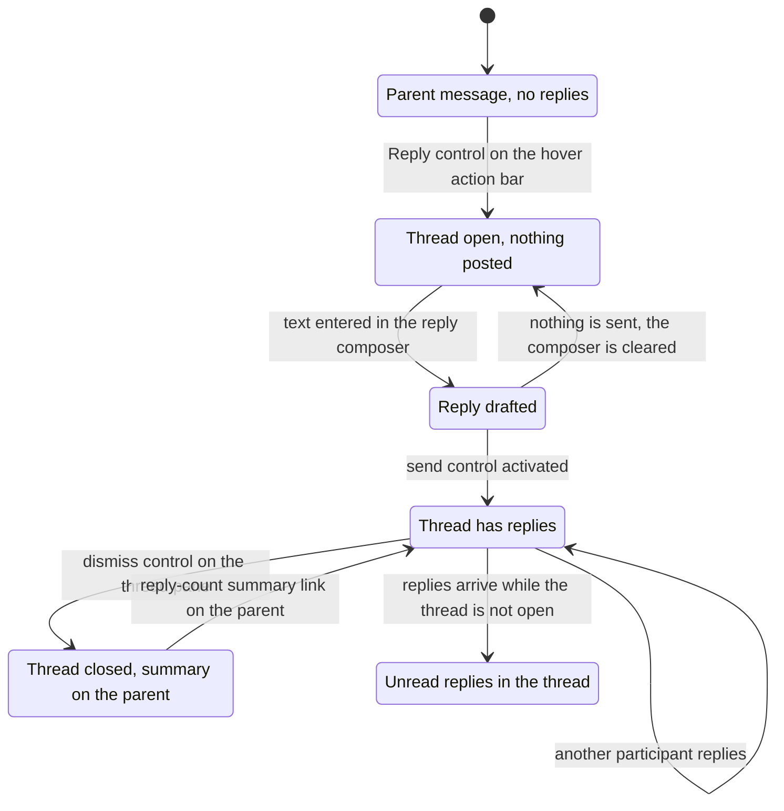

# Threads

Threaded conversation — replying beneath a parent message, the thread pane and the full-width thread view, the reply summary a thread leaves on its parent, and the threads destination — specified from the frames that show it.

## Purpose

This document specifies **threading**: the mechanism by which replies are collected beneath one parent message instead of being appended to the conversation. A thread is not a surface of its own so much as a *second, narrower reply context* that opens beside whatever the user is already looking at, and the corpus shows it in three structurally distinct presentations:

- A **docked pane** at the right of a conversation, taking its width from the conversation column while the navigation rail and sidebar stay untouched [frame 223](../../screenshots/Slack%20web%20Jul%202024%20223.png).
- A **docked pane** at the right of a full-screen huddle stage, where the thread hangs off the huddle rather than off a message [frame 296](../../screenshots/Slack%20web%20Jul%202024%20296.png).
- A **full-width thread view** that fills the content region, in the threads destination [frame 355](../../screenshots/Slack%20web%20Jul%202024%20355.png) and in the activity destination [frame 381](../../screenshots/Slack%20web%20Jul%202024%20381.png).

All three share one anatomy — a parent above, a chronological reply list beneath it, and a reply composer carrying an also-send checkbox — and they differ in exactly the ways this document records.

**Where the area is encountered.** Wherever a message can be replied to, which in this corpus means a channel [frame 223](../../screenshots/Slack%20web%20Jul%202024%20223.png), a direct message [frame 355](../../screenshots/Slack%20web%20Jul%202024%20355.png) and a huddle [frame 296](../../screenshots/Slack%20web%20Jul%202024%20296.png). Threading is also reachable without opening a conversation at all: the sidebar carries a flat **Threads** row [frame 550](../../screenshots/Slack%20web%20Jul%202024%20550.png), [frame 120](../../screenshots/Slack%20web%20Jul%202024%20120.png) that leads to the threads destination [frame 355](../../screenshots/Slack%20web%20Jul%202024%20355.png), and the activity destination classifies a thread reply as its own entry type and opens the thread beside the feed [frame 381](../../screenshots/Slack%20web%20Jul%202024%20381.png). Threading is consequently a cross-surface concern: a build that treats the thread pane as a feature of channels alone will not be able to render either of the other two presentations.

**What this document owns.** Replying to a channel message in a thread; replying in the thread that belongs to a huddle; the reply composer and its also-send checkbox in both label forms; the reply-count divider inside a thread; the reply summary that a thread renders on its parent message in the conversation; the unread boundary inside a thread; and the threads destination as a reader of unread thread activity.

**What it does not own.** The message row and the hover action bar whose Reply control is this area's entry point, and the message overflow menu that carries the reply-notification action — [03-messaging-and-composer.md](03-messaging-and-composer.md). The huddle stage, its control bar and its thread toggle — [06-huddles.md](06-huddles.md). The direct-message conversations that several threads hang off — [05-direct-messages.md](05-direct-messages.md). The activity and later destinations that render a thread beside their own feeds, and the drafts-and-sent destination that lists a draft addressed to a thread — [12-activity-notifications.md](12-activity-notifications.md). Per-conversation notification settings and the notification preference tabs that carry a thread-reply toggle — [02-channels.md](02-channels.md) and [14-preferences-settings.md](14-preferences-settings.md). The workflow-posted message that instructs a team to reply in thread — [10-workflow-builder.md](10-workflow-builder.md). Files and document preview cards that happen to be the parent message's payload — [16-files-media.md](16-files-media.md). Empty, loading and gated states as a cross-cutting matrix — [21-states.md](21-states.md). The shell, and the authoritative contract for every `C-*` identifier cited here — [00-product-overview.md](00-product-overview.md). The catalog index is the [Workflow Catalog](README.md).

**On this area's evidence base.** Threading was the thinnest-looking area in the corpus before the exhaustive pass: only the Reply control on a hovered message row and a workflow-posted instruction to reply in thread were known in advance. Exhaustive inspection found considerably more — three presentations of the thread view, a four-frame channel-reply journey, a three-frame huddle-reply journey, the threads destination, the parent-message summary in four separate conversations, and the reply-notification action in two different menus. It also found real holes, and those holes are marked in place with `> **Partial capture:**` rather than filled: **no frame shows the also-send checkbox checked, its effect, a follow or unfollow indicator on a thread, the result of turning reply notifications off, or the threads destination in an empty state.** Everything asserted below without an `**Inferred:**` prefix was read from the pixels of the frame cited beside it.

## Flows in this area

Three flows are named for this area, spanning eight frames. That is a small allocation for an in-product area, and it is the correct one: a thread view is on screen in nineteen frames of the corpus, but in eleven of them the frame's subject is a huddle, an activity feed, a later reminder or a marketing mock, and under the catalog's one-primary-owner rule those frames belong to the areas whose surface is being demonstrated. This document cites the relevant ones as secondary evidence and claims only the eight frames whose subject is threading itself.

Frame spans below are written as plain numeric ranges because they designate a span rather than cite one image, following the convention of the [Screenshot Coverage Index](_screenshot-index.md); every individual frame is cited with its full relative link in the per-flow step tables and in the **Frames covered** section.

| Flow ID | Name | Frame span | Primary entry point |
|---|---|---|---|
| `04.1` | Reply in a thread on a channel message | 223–226 | The Reply control on `C-HOVER-ACTION-BAR`, revealed by hovering a message row |
| `04.2` | Reply in the huddle thread | 296–298 | The thread toggle at the right of the huddle control bar |
| `04.3` | Open the threads destination and read unread thread activity | 355 | The flat Threads row in `C-SIDEBAR` |

### Thread participation state

Every state below is rendered in a cited frame, and every transition except the four named underneath is evidenced by an adjacent pair of frames that shows the before and the after.

State evidence, in the order the diagram declares it: a parent message carrying no summary row [frame 208](../../screenshots/Slack%20web%20Jul%202024%20208.png); a thread open with nothing posted, showing the parent alone in the channel case [frame 223](../../screenshots/Slack%20web%20Jul%202024%20223.png) and an explanatory block in the huddle case [frame 269](../../screenshots/Slack%20web%20Jul%202024%20269.png); a reply drafted with the send control filled [frame 224](../../screenshots/Slack%20web%20Jul%202024%20224.png), [frame 296](../../screenshots/Slack%20web%20Jul%202024%20296.png); replies posted beneath a reply-count divider [frame 225](../../screenshots/Slack%20web%20Jul%202024%20225.png), [frame 298](../../screenshots/Slack%20web%20Jul%202024%20298.png), [frame 381](../../screenshots/Slack%20web%20Jul%202024%20381.png); the thread closed with its summary left on the parent [frame 226](../../screenshots/Slack%20web%20Jul%202024%20226.png), [frame 302](../../screenshots/Slack%20web%20Jul%202024%20302.png); and unread replies marked by a New divider inside the thread [frame 355](../../screenshots/Slack%20web%20Jul%202024%20355.png).

Four of the diagram's ten edges are **not** evidenced by a before-and-after pair. They are named here rather than passed off as observations, and each states the basis on which it is drawn:

- **Inferred:** the Reply control opens the thread, because the control is present on the very message whose thread is open in a later capture of the same channel [frame 208](../../screenshots/Slack%20web%20Jul%202024%20208.png), [frame 223](../../screenshots/Slack%20web%20Jul%202024%20223.png), and no other affordance on that row is a candidate.
- **Inferred:** the reply-count summary link reopens the thread, because the reply count is rendered in the link colour and is the only element of the summary row treated as interactive [frame 226](../../screenshots/Slack%20web%20Jul%202024%20226.png), [frame 302](../../screenshots/Slack%20web%20Jul%202024%20302.png), and because the pane and the summary are captured on screen together in the frame before the pane is dismissed [frame 225](../../screenshots/Slack%20web%20Jul%202024%20225.png).
- **Inferred:** replies arriving while the thread is not open produce the unread state, because the threads destination renders a thread whose reply sits below a New divider while no pane is on screen [frame 355](../../screenshots/Slack%20web%20Jul%202024%20355.png).
- **Inferred:** a drafted reply can be abandoned back to the empty-thread state, from the two composer states captured either side of that edge [frame 223](../../screenshots/Slack%20web%20Jul%202024%20223.png), [frame 224](../../screenshots/Slack%20web%20Jul%202024%20224.png). This is the weakest edge in the diagram and a build should treat it as ordinary composer behaviour rather than as thread behaviour.

> **Partial capture:** the corpus never shows a thread *after* its unread replies have been read, so the transition that clears the New divider is unspecified and the unread state is deliberately drawn without an exit. It also never shows a thread being deleted, a reply being edited or removed inside a thread, or a thread with more than two replies, so no state is claimed for any of those.

## Flow 04.1 — Reply in a thread on a channel message

### Overview

The canonical threading journey, captured end to end in four consecutive frames of one channel. A pane opens at the right carrying the parent message on its own; a reply is typed and sent; a reply-count divider and the reply appear in the pane while a summary row appears beneath the parent in the conversation behind; the pane is dismissed and the conversation reflows to full width with the summary left in place [frame 223](../../screenshots/Slack%20web%20Jul%202024%20223.png) through [frame 226](../../screenshots/Slack%20web%20Jul%202024%20226.png). It is the only flow in the corpus that shows both sides of a reply — the thread and the conversation it hangs off — changing together.

The worked example is sample data: in the `#design` channel a teammate has re-shared a scheduling document as a message carrying a document preview card, and the current user replies to thank her [frame 223](../../screenshots/Slack%20web%20Jul%202024%20223.png). Channel name, people and document name illustrate shape only and are not values to reproduce.

### Trigger

The **Reply** control on `C-HOVER-ACTION-BAR`, revealed by hovering the message row. The corpus shows that bar on the exact message this flow threads — the same document message, in the same channel, with three one-tap emoji shortcuts, a labelled React control, a labelled Reply control and an overflow control, and with no summary row yet beneath the message [frame 208](../../screenshots/Slack%20web%20Jul%202024%20208.png). The same control set is observable on a message row in a direct message [frame 250](../../screenshots/Slack%20web%20Jul%202024%20250.png). The Reply control's glyph is the same speech-bubble-with-lines glyph the sidebar uses for its Threads row [frame 550](../../screenshots/Slack%20web%20Jul%202024%20550.png).

### Preconditions

An authenticated session with a conversation open in the content region and at least one message posted in it. Channel membership is not separately evidenced as a precondition; what *is* evidenced is that the conversation must accept new messages, because an archived channel renders the reply summary on a message while replacing the composer entirely with a read-only bar [frame 134](../../screenshots/Slack%20web%20Jul%202024%20134.png). No plan entitlement is involved: no capture of a thread pane carries a `C-UPGRADE-GATE` badge.

### Frame-by-frame steps

| Step | Frame(s) | What the user does | What changes on screen | Component(s) involved |
|---|---|---|---|---|
| 1 | [frame 208](../../screenshots/Slack%20web%20Jul%202024%20208.png) | Hovers the message to be replied to | The hover action bar appears pinned to the row's top-right corner, overlapping the row's upper edge, and the row takes a tinted highlight; the message carries no summary row at this point | `C-MESSAGE-ROW`, `C-HOVER-ACTION-BAR` |
| 2 | [frame 223](../../screenshots/Slack%20web%20Jul%202024%20223.png) | Activates the Reply control | A pane docks at the right of the content region, taking its width from the conversation column while the rail and sidebar are untouched. Its header is the word Thread at the left with a dismiss control at the right and no back affordance. Its body repeats the parent message — avatar, author, a relative timestamp, the body text, a file-type label with a caret and the document preview card — and beneath the parent sits a reply composer whose input reads Reply, with an unchecked checkbox labelled to also send to the channel and a muted send control. No reply-count divider is present | `C-DETAILS-PANE`, `C-MESSAGE-ROW`, `C-COMPOSER` |
| 3 | [frame 224](../../screenshots/Slack%20web%20Jul%202024%20224.png) | Types the reply | The placeholder is replaced by the typed text and a caret; the send control changes from muted to a filled primary; the slash-command control in the action row renders muted; the also-send checkbox stays unchecked | `C-COMPOSER` |
| 4 | [frame 225](../../screenshots/Slack%20web%20Jul%202024%20225.png) | Sends the reply | In the pane, a divider labelled with the reply count appears beneath the parent — the label at the left with a thin rule extending right — followed by the reply row carrying avatar, author, a relative timestamp and the body; the composer resets to its placeholder with the checkbox unchecked and the send control muted again. In the conversation behind, a summary row appears beneath the parent message's document card: one participant avatar, the reply count rendered as a link, then the time of the reply | `C-DETAILS-PANE`, `C-MESSAGE-ROW`, `C-COMPOSER` |
| 5 | [frame 226](../../screenshots/Slack%20web%20Jul%202024%20226.png) | Dismisses the pane | The pane closes and the conversation column reflows to the full width of the content region — a bulleted list that had wrapped now fits on one line and the day-divider pill re-centres. The summary row persists beneath the parent message, unchanged | `C-DETAILS-PANE`, `C-MESSAGE-ROW` |

**Inferred:** the reply is required before the send control becomes usable, because the control is rendered muted while the input holds only its placeholder [frame 223](../../screenshots/Slack%20web%20Jul%202024%20223.png) and filled as soon as text is present [frame 224](../../screenshots/Slack%20web%20Jul%202024%20224.png) — the same muted-until-satisfied treatment the catalog records for primary actions elsewhere.

**Inferred:** the pane takes its width from the conversation column rather than from the whole viewport, because rail and sidebar are pixel-for-pixel unchanged between the pane-open and pane-closed captures while the conversation's own text reflows [frame 223](../../screenshots/Slack%20web%20Jul%202024%20223.png), [frame 226](../../screenshots/Slack%20web%20Jul%202024%20226.png).

> **Partial capture:** the corpus does not show the moment of activation for either the Reply control or the dismiss control — only the states either side of each. It also does not show a reply that fails to send, a reply longer than one line, or a reply carrying an attachment, a mention or formatting, even though the reply composer exposes the controls for all three.

## Flow 04.2 — Reply in the huddle thread

### Overview

A huddle carries a thread of its own, and this flow shows two participants using it while the huddle is running. The pane occupies roughly the right quarter of a full-screen huddle stage; before anything is posted it explains itself instead of showing a parent message, and that explanatory block is replaced by the first reply once one is sent [frame 269](../../screenshots/Slack%20web%20Jul%202024%20269.png), [frame 296](../../screenshots/Slack%20web%20Jul%202024%20296.png) through [frame 298](../../screenshots/Slack%20web%20Jul%202024%20298.png).

Two things make this flow structurally different from `04.1` and both are load-bearing for a build. First, **the thread's parent is not a message** — the explanatory block states in its own copy that what is posted goes to everyone in the huddle and is saved as a thread in the direct message between the participants, so the thread hangs off the huddle and is stored against the conversation [frame 269](../../screenshots/Slack%20web%20Jul%202024%20269.png). Second, **the also-send checkbox carries a different label**: it offers to also send as a direct message rather than to a channel [frame 296](../../screenshots/Slack%20web%20Jul%202024%20296.png). The huddle stage, its control bar and its thread toggle belong to [06-huddles.md](06-huddles.md); this flow owns only the reply exchange inside the pane.

### Trigger

The **thread toggle** at the right-hand end of the huddle control bar, which is rendered as a filled circle while the pane is open [frame 269](../../screenshots/Slack%20web%20Jul%202024%20269.png), [frame 296](../../screenshots/Slack%20web%20Jul%202024%20296.png). The corpus shows the same huddle both with the pane open and, in the captures that belong to [06-huddles.md](06-huddles.md), with a captions pane in its place beside a Thread tab [frame 290](../../screenshots/Slack%20web%20Jul%202024%20290.png), so the right-hand region of a huddle is a switchable slot rather than a dedicated thread column.

### Preconditions

An active huddle with the user joined, and the thread pane open in its empty state — the explanatory block, the placeholder-only composer, the unchecked also-send checkbox and a muted send control [frame 269](../../screenshots/Slack%20web%20Jul%202024%20269.png). Two participants are present in every capture of this flow, shown as a participant count of two in the control bar and as two video tiles on the stage [frame 296](../../screenshots/Slack%20web%20Jul%202024%20296.png).

### Frame-by-frame steps

| Step | Frame(s) | What the user does | What changes on screen | Component(s) involved |
|---|---|---|---|---|
| 1 | [frame 269](../../screenshots/Slack%20web%20Jul%202024%20269.png) | Opens the thread beside the huddle stage | The pane docks at the right of the stage, roughly a quarter of the viewport width, with the word Thread at the left of its header and a dismiss control at the right. In place of a parent message it renders an explanatory block: a thread glyph, a bold heading stating that every huddle has a thread, and body copy naming the direct message the thread is saved into with an inline person-mention chip. Beneath it sits the reply composer with a Reply placeholder, an unchecked also-send-as-direct-message checkbox and a muted send control | `C-DETAILS-PANE`, `C-COMPOSER` |
| 2 | [frame 296](../../screenshots/Slack%20web%20Jul%202024%20296.png) | Types a reply to the other participant | The placeholder is replaced by the typed text; the send control becomes a filled primary; the checkbox stays unchecked. The formatting toolbar in this narrower pane renders **eight** controls in five separator-delimited groups — three inline-style controls, a link control, two list controls, a blockquote control and then an overflow control — where the wider panes render the full nine-control set with a trailing inline-code and code-block group in the position this pane gives to the overflow control [frame 223](../../screenshots/Slack%20web%20Jul%202024%20223.png), [frame 355](../../screenshots/Slack%20web%20Jul%202024%20355.png) | `C-COMPOSER`, `C-FORMATTING-TOOLBAR` |
| 3 | [frame 297](../../screenshots/Slack%20web%20Jul%202024%20297.png) | Sends the reply | The explanatory block is replaced by the posted reply — avatar, author name, a headphone glyph between the name and the timestamp marking the author as in the huddle, a relative timestamp and the body. The composer resets to its placeholder with the checkbox unchecked and the send control muted. No reply-count divider is rendered in this presentation | `C-DETAILS-PANE`, `C-MESSAGE-ROW`, `C-COMPOSER` |
| 4 | [frame 298](../../screenshots/Slack%20web%20Jul%202024%20298.png) | Waits while the other participant replies | A second reply row appends beneath the first, oldest reply first, with the same anatomy including the headphone glyph on its author. The composer moves down with the content rather than staying pinned to the pane's foot, leaving empty space below it | `C-DETAILS-PANE`, `C-MESSAGE-ROW`, `C-COMPOSER` |

The same thread is captured again after the huddle, from the activity destination, and it is the evidence that the explanatory block is a placeholder for a parent rather than the parent itself: there the thread renders with the huddle's own system message as its parent, a two-reply divider, and both replies intact [frame 381](../../screenshots/Slack%20web%20Jul%202024%20381.png), [frame 383](../../screenshots/Slack%20web%20Jul%202024%20383.png). The conversation the thread was saved into shows the matching summary row on that same system message [frame 302](../../screenshots/Slack%20web%20Jul%202024%20302.png). Those three frames belong to [12-activity-notifications.md](12-activity-notifications.md) and [05-direct-messages.md](05-direct-messages.md) and are cited here as secondary evidence only.

> **Partial capture:** no frame shows the huddle thread being dismissed, a file or link being posted into it despite the explanatory copy naming both, or what the pane looks like once the huddle has ended while the stage is still on screen.

## Flow 04.3 — Open the threads destination and read unread thread activity

### Overview

The threads destination collects every thread the user participates in and renders each one as a self-contained card in the content region, complete with its own reply composer, so a thread can be read and answered without opening the conversation it belongs to [frame 355](../../screenshots/Slack%20web%20Jul%202024%20355.png). The single captured instance holds one thread, and that thread carries an unread boundary — a rule labelled New at its right-hand end, drawn in a crimson accent, separating the parent from the reply posted since the user last looked.

This is a one-frame flow, and the frame is dense enough to specify the surface: destination heading, per-thread conversation context, parent, unread boundary, reply, and an inline composer whose also-send checkbox is labelled for a direct message because that is the conversation this thread hangs off.

### Trigger

The flat **Threads** row in `C-SIDEBAR`, which renders with a filled highlight while the destination is open [frame 355](../../screenshots/Slack%20web%20Jul%202024%20355.png). The row sits above drafts-and-sent and below unreads where all three are present [frame 120](../../screenshots/Slack%20web%20Jul%202024%20120.png), [frame 550](../../screenshots/Slack%20web%20Jul%202024%20550.png). It is **not** guaranteed: one capture shows a sidebar whose only flat row is drafts-and-sent, with no threads row at all [frame 201](../../screenshots/Slack%20web%20Jul%202024%20201.png). The flat-row set is configurable and its variance is owned by [00-product-overview.md](00-product-overview.md).

### Preconditions

An authenticated session, and at least one thread the user participates in — the captured thread's parent was authored by another person and its reply by a third, with the current user's participation implied by the destination listing it at all. No plan entitlement is involved; the sidebar in this capture carries a trial item in its footer and the destination is fully functional beside it [frame 355](../../screenshots/Slack%20web%20Jul%202024%20355.png).

### Frame-by-frame steps

| Step | Frame(s) | What the user does | What changes on screen | Component(s) involved |
|---|---|---|---|---|
| 1 | [frame 120](../../screenshots/Slack%20web%20Jul%202024%20120.png) | Locates the Threads row in the sidebar | The row renders as a flat item with the thread glyph and a plain label, grouped with unreads above it and drafts-and-sent below, ahead of the conversation groups | `C-SIDEBAR` |
| 2 | [frame 355](../../screenshots/Slack%20web%20Jul%202024%20355.png) | Opens the threads destination | The content region is replaced by a heading reading Threads above a list of thread cards; the sidebar row takes a filled highlight while rail and sidebar otherwise persist unchanged. The destination carries **no tab bar of its own** — the heading sits directly above the first card | `C-SIDEBAR` |
| 3 | [frame 355](../../screenshots/Slack%20web%20Jul%202024%20355.png) | Reads the thread's context line | Above the card sit a filled presence dot, the conversation name in bold and a sub-line naming the participants, so the thread is attributable to its conversation without opening it | `C-PRESENCE-DOT`, `C-AVATAR` |
| 4 | [frame 355](../../screenshots/Slack%20web%20Jul%202024%20355.png) | Reads the thread inside the card | The card renders the parent message with its avatar, author, relative timestamp, body, file-type label and document preview card; then a rule labelled New at its right-hand end in a crimson accent; then the reply with its own avatar, author, relative timestamp and body carrying a channel-mention chip | `C-MESSAGE-ROW` |
| 5 | [frame 355](../../screenshots/Slack%20web%20Jul%202024%20355.png) | Positions to reply without leaving the destination | The composer sits inside the card beneath the reply, with the full formatting toolbar, a Reply placeholder, an unchecked also-send-as-direct-message checkbox, the action row and a muted send control | `C-COMPOSER`, `C-FORMATTING-TOOLBAR` |

**Inferred:** the destination is a *list* of thread cards rather than a single-thread view, because the one card occupies only the upper portion of the content region with empty space beneath it and carries its own conversation-context header — a header that would be redundant if only one thread could ever be shown [frame 355](../../screenshots/Slack%20web%20Jul%202024%20355.png).

> **Partial capture:** exactly one thread is captured in this destination, so the corpus does not show how several cards are ordered or separated, whether the list paginates, what the destination looks like with no threads at all, or a reply being sent from inside a card. An empty threads view would additionally be cited by [21-states.md](21-states.md); no such frame exists. The activity destination's own Threads tab is likewise only ever captured inactive [frame 381](../../screenshots/Slack%20web%20Jul%202024%20381.png), so its filtered content is unspecified.

## Screens & components

Threading contributes no new screen to the product's information architecture and one new destination to it. What it contributes structurally is a **second reply context** that is composed from components defined elsewhere, and the composition — not the components — is what a build has to get right. All sizing below is proportional to the effective product viewport, never an absolute offset.

**Branded material inside these frames is placeholder vocabulary, not a requirement.** Every capture in this area shows third-party branding in regions this area does not own — a workspace identity in the sidebar header and a promotional offer in the sidebar's banner slot [frame 223](../../screenshots/Slack%20web%20Jul%202024%20223.png), [frame 550](../../screenshots/Slack%20web%20Jul%202024%20550.png) — and this document names none of it: where such an element has to be referred to at all it is a product logo mark, a product wordmark, a primary brand color or a plan tier, per the substitution vocabulary defined once in [00-product-overview.md](00-product-overview.md). Iconography is likewise named by what it does — the reply control, the dismiss control, the huddle thread toggle, the glyph marking an author as in a huddle — and never by a third-party asset name. Colour is named the same way: the unread divider is described as drawn in a crimson accent and the reply count as rendered in the link colour, with no value carried forward.

### The docked thread pane

The pane is a right-hand column laid over the content region, and it is the same region a details pane or a help panel occupies. Measured on the channel capture it takes a little over a quarter of the viewport width, which is roughly two-fifths of the content region, leaving the conversation column the remaining three-fifths; the navigation rail and the sidebar keep their widths exactly [frame 223](../../screenshots/Slack%20web%20Jul%202024%20223.png) versus [frame 226](../../screenshots/Slack%20web%20Jul%202024%20226.png). Over a full-screen huddle stage, where there is no rail and no sidebar to preserve, it takes roughly a quarter of the viewport width from the stage [frame 296](../../screenshots/Slack%20web%20Jul%202024%20296.png).

Its regions, top to bottom:

| Region | Position and ordering | Relative size | Contents, in order |
|---|---|---|---|
| Pane header | Pinned to the pane's top edge, separated from the body by a rule | A single row, the shallowest region | The word Thread at the left; a dismiss control at the far right. No back affordance, no overflow control and no tab bar in any captured instance [frame 223](../../screenshots/Slack%20web%20Jul%202024%20223.png), [frame 269](../../screenshots/Slack%20web%20Jul%202024%20269.png) |
| Parent block | Immediately beneath the header, top-aligned | Sized by its own content | The parent message rendered as a full message row with avatar, author, relative timestamp and body, including any attachment card [frame 223](../../screenshots/Slack%20web%20Jul%202024%20223.png). In the huddle presentation this region holds an explanatory block instead, which the first reply replaces [frame 269](../../screenshots/Slack%20web%20Jul%202024%20269.png), [frame 297](../../screenshots/Slack%20web%20Jul%202024%20297.png) |
| Reply-count divider | Between the parent block and the reply list, present only once a reply exists | A single rule | A count label at the **left**, then a thin rule extending to the pane's right edge [frame 225](../../screenshots/Slack%20web%20Jul%202024%20225.png). Absent when there are no replies [frame 223](../../screenshots/Slack%20web%20Jul%202024%20223.png) and absent altogether in the huddle presentation [frame 297](../../screenshots/Slack%20web%20Jul%202024%20297.png) |
| Reply list | Beneath the divider, oldest reply first | Sized by its own content | One message row per reply, each with avatar, author, relative timestamp and body [frame 225](../../screenshots/Slack%20web%20Jul%202024%20225.png), [frame 298](../../screenshots/Slack%20web%20Jul%202024%20298.png) |
| Reply composer | Immediately beneath the last reply, **following the content rather than pinned to the pane's foot** | Three stacked rows plus the checkbox row | Formatting toolbar; input with a Reply placeholder; the also-send checkbox; the action row with the send control at its far right [frame 223](../../screenshots/Slack%20web%20Jul%202024%20223.png), [frame 298](../../screenshots/Slack%20web%20Jul%202024%20298.png) |

**Hierarchy.** The pane is a sibling of the conversation column, not a child of it: the conversation keeps its own composer and remains fully interactive while the pane is open [frame 223](../../screenshots/Slack%20web%20Jul%202024%20223.png). Two composers are therefore on screen simultaneously, addressing different targets — the conversation's composer names the conversation in its placeholder while the pane's reads Reply — and a build that shares one composer instance between them will not be able to render this state.

### The full-width thread view

In the threads and activity destinations the same anatomy fills the content region instead of docking beside it, with three differences that are all observed rather than assumed:

- **The header carries the conversation instead of a dismiss control.** In the activity destination it is a glyph, the word Thread in bold, then the conversation name in muted text, and there is no dismiss control at all [frame 381](../../screenshots/Slack%20web%20Jul%202024%20381.png), [frame 383](../../screenshots/Slack%20web%20Jul%202024%20383.png). In the threads destination there is no per-thread header; the conversation context sits *above* the card as a filled presence dot, the conversation name in bold and a participants sub-line [frame 355](../../screenshots/Slack%20web%20Jul%202024%20355.png).
- **The thread is a bordered card.** In the threads destination the parent, the unread rule, the reply and the composer are enclosed together in one rounded container inset from the content region's edges [frame 355](../../screenshots/Slack%20web%20Jul%202024%20355.png).
- **The formatting toolbar is complete.** The wide presentations render the full toolbar control set, while the narrow huddle pane collapses its trailing controls into an overflow control [frame 355](../../screenshots/Slack%20web%20Jul%202024%20355.png) versus [frame 296](../../screenshots/Slack%20web%20Jul%202024%20296.png).

### The reply summary on the parent message

A thread's visible trace in the conversation is a single row rendered beneath the parent message's body and beneath any attachment card it carries. Its anatomy is fixed across every instance: a facepile of participant avatars, then the reply count rendered as an emphasised link, then a timestamp for the latest reply [frame 226](../../screenshots/Slack%20web%20Jul%202024%20226.png), [frame 302](../../screenshots/Slack%20web%20Jul%202024%20302.png), [frame 134](../../screenshots/Slack%20web%20Jul%202024%20134.png).

The facepile carries one avatar per participant — one avatar for a one-reply thread [frame 226](../../screenshots/Slack%20web%20Jul%202024%20226.png), two abutting avatars for a two-participant thread [frame 302](../../screenshots/Slack%20web%20Jul%202024%20302.png). The timestamp's wording, however, is **not** fixed, and the three captured forms are recorded here exactly as observed rather than harmonised: a same-day single reply reads as the word Today with a clock time [frame 226](../../screenshots/Slack%20web%20Jul%202024%20226.png); an older single reply reads as a relative age in days [frame 134](../../screenshots/Slack%20web%20Jul%202024%20134.png); and a two-reply thread prefixes the same-day clock time with a last-reply label [frame 302](../../screenshots/Slack%20web%20Jul%202024%20302.png). **Inferred:** the label is therefore a function of both recency and reply count, but the corpus supplies only these three points and a build should treat the exact wording as unspecified beyond them.

### Components this area uses

Every identifier below is defined authoritatively in [00-product-overview.md](00-product-overview.md). Nothing is restated here; the table records only how threading composes them.

| `C-*` identifier | How threading uses it | Frames |
|---|---|---|
| `C-HOVER-ACTION-BAR` | Supplies the Reply control that is this area's primary entry point, and the overflow control that exposes the reply-notification action | [frame 208](../../screenshots/Slack%20web%20Jul%202024%20208.png), [frame 250](../../screenshots/Slack%20web%20Jul%202024%20250.png), [frame 244](../../screenshots/Slack%20web%20Jul%202024%20244.png) |
| `C-MESSAGE-ROW` | Renders the parent and every reply inside the pane and the full-width view, and hosts the reply summary row in the conversation. Contributes one variant this area is responsible for: a reply row carrying a headphone glyph between author name and timestamp while its author is in a huddle | [frame 223](../../screenshots/Slack%20web%20Jul%202024%20223.png), [frame 225](../../screenshots/Slack%20web%20Jul%202024%20225.png), [frame 297](../../screenshots/Slack%20web%20Jul%202024%20297.png), [frame 355](../../screenshots/Slack%20web%20Jul%202024%20355.png) |
| `C-COMPOSER` | Renders the reply composer, in the docked-thread variant the component contract already anticipates, with one addition this area is responsible for: the also-send checkbox between the input and the action row, and a send control with no send-options caret | [frame 223](../../screenshots/Slack%20web%20Jul%202024%20223.png), [frame 224](../../screenshots/Slack%20web%20Jul%202024%20224.png), [frame 296](../../screenshots/Slack%20web%20Jul%202024%20296.png), [frame 355](../../screenshots/Slack%20web%20Jul%202024%20355.png) |
| `C-FORMATTING-TOOLBAR` | Sits above the reply input, complete at nine controls in every wide presentation — the channel pane, the full-width card and the activity destination's pane alike. In the narrow huddle pane it is the **trailing group alone** — inline code and code block — that gives way to a single overflow control, leaving eight controls with the blockquote control still rendered | [frame 223](../../screenshots/Slack%20web%20Jul%202024%20223.png), [frame 296](../../screenshots/Slack%20web%20Jul%202024%20296.png), [frame 355](../../screenshots/Slack%20web%20Jul%202024%20355.png), [frame 381](../../screenshots/Slack%20web%20Jul%202024%20381.png) |
| `C-DETAILS-PANE` | Supplies the docked right-hand region the thread pane occupies, with the header-plus-dismiss anatomy and the width taken from the content region | [frame 223](../../screenshots/Slack%20web%20Jul%202024%20223.png), [frame 269](../../screenshots/Slack%20web%20Jul%202024%20269.png), [frame 296](../../screenshots/Slack%20web%20Jul%202024%20296.png) |
| `C-SIDEBAR` | Carries the flat Threads row that reaches the destination, highlighted while it is active and absent from some captures entirely | [frame 120](../../screenshots/Slack%20web%20Jul%202024%20120.png), [frame 201](../../screenshots/Slack%20web%20Jul%202024%20201.png), [frame 355](../../screenshots/Slack%20web%20Jul%202024%20355.png), [frame 550](../../screenshots/Slack%20web%20Jul%202024%20550.png) |
| `C-CONTEXT-MENU` | Carries the reply-notification action, on a message row and on an activity entry | [frame 244](../../screenshots/Slack%20web%20Jul%202024%20244.png), [frame 389](../../screenshots/Slack%20web%20Jul%202024%20389.png) |
| `C-AVATAR` | Renders the facepile in the reply summary row and the per-row avatars in the reply list | [frame 226](../../screenshots/Slack%20web%20Jul%202024%20226.png), [frame 302](../../screenshots/Slack%20web%20Jul%202024%20302.png) |
| `C-PRESENCE-DOT` | Marks the conversation context above a thread card in the threads destination | [frame 355](../../screenshots/Slack%20web%20Jul%202024%20355.png) |
| `C-TAB-BAR` | Reached from this area rather than owned by it: the activity destination's tab bar carries a Threads tab beside all and apps | [frame 381](../../screenshots/Slack%20web%20Jul%202024%20381.png) |

### On the absence of a thread-pane component identifier

Threading introduces no new `C-*` identifier, and that is a decision taken from the evidence rather than a gap. Every structural property of the pane is already covered: it docks into the same right-hand region as the other docked panes and takes its width from the content region in the same way, and its header is the same title-plus-dismiss row [frame 223](../../screenshots/Slack%20web%20Jul%202024%20223.png), [frame 338](../../screenshots/Slack%20web%20Jul%202024%20338.png). Its body is not a new kind of content either — it is message rows and a composer, both defined already, and the composer contract explicitly anticipates being rendered in a docked thread context. What threading adds are **two variants of existing components**, both listed in the table above and both reported to [00-product-overview.md](00-product-overview.md) for inclusion in the component inventory rather than defined here: the reply composer's also-send checkbox row, and the reply row's in-huddle glyph.

## States

Ten states are observable across this area's surfaces. Each is listed with the frame that renders it; a state with no frame beside it does not appear in this table.

| State | Where it is observed | Rendering |
|---|---|---|
| Thread open, no replies | Channel presentation [frame 223](../../screenshots/Slack%20web%20Jul%202024%20223.png) | Parent block only, no reply-count divider, composer showing its placeholder and a muted send control |
| Thread open, no replies, huddle presentation | Huddle presentation [frame 269](../../screenshots/Slack%20web%20Jul%202024%20269.png) | An explanatory block with a thread glyph, a bold heading and body copy naming the conversation the thread is saved into, in place of a parent |
| Reply drafted | [frame 224](../../screenshots/Slack%20web%20Jul%202024%20224.png), [frame 296](../../screenshots/Slack%20web%20Jul%202024%20296.png) | Placeholder replaced by typed text; send control filled as a primary; the slash-command control in the action row muted |
| Reply posted | [frame 225](../../screenshots/Slack%20web%20Jul%202024%20225.png), [frame 297](../../screenshots/Slack%20web%20Jul%202024%20297.png) | Reply row appended; composer reset to placeholder; send control muted again |
| Multi-participant thread | [frame 298](../../screenshots/Slack%20web%20Jul%202024%20298.png), [frame 381](../../screenshots/Slack%20web%20Jul%202024%20381.png) | Replies stacked oldest first; the divider label reads a plural count where a divider is rendered |
| Author in a huddle | [frame 297](../../screenshots/Slack%20web%20Jul%202024%20297.png), [frame 298](../../screenshots/Slack%20web%20Jul%202024%20298.png) | A headphone glyph between the author name and the timestamp on a reply row |
| Thread summarised on its parent | [frame 225](../../screenshots/Slack%20web%20Jul%202024%20225.png), [frame 226](../../screenshots/Slack%20web%20Jul%202024%20226.png), [frame 302](../../screenshots/Slack%20web%20Jul%202024%20302.png), [frame 134](../../screenshots/Slack%20web%20Jul%202024%20134.png) | Facepile, reply count as a link, latest-reply timestamp, beneath the parent's body and any attachment card |
| Unread replies | [frame 355](../../screenshots/Slack%20web%20Jul%202024%20355.png) | A rule inside the thread with a New label at its **right** end, drawn in a crimson accent, above the unread reply |
| Threads destination active | [frame 355](../../screenshots/Slack%20web%20Jul%202024%20355.png) | The sidebar's Threads row filled and highlighted while the destination heading and thread cards fill the content region |
| Reply-notification action available | [frame 244](../../screenshots/Slack%20web%20Jul%202024%20244.png), [frame 389](../../screenshots/Slack%20web%20Jul%202024%20389.png) | A menu row offering to turn notifications for replies **off**, carrying no keyboard shortcut, on both a message row's overflow menu and an activity entry's overflow menu |

> **Partial capture:** the reply-notification action is only ever captured in its turn-**off** wording. The corpus contains no frame showing the complementary turn-on row, no per-thread indicator of whether notifications are on or off, no confirmation that the action succeeded, and no unfollowed-thread rendering. A build must therefore treat the *label* as specified and the *state model behind it* as unspecified: two states are implied by a row that can only be worded as an action on the first of them, and nothing more can be claimed from these pixels.

The interaction states a build would normally expect from a table like this one are the second hole, and they are absent for every surface in this area rather than for some of them:

> **Partial capture:** no capture shows the also-send checkbox in a checked state, a loading or sending state anywhere in a thread, an error state on a failed reply, a disabled reply composer, or a hover treatment on a reply row inside a thread. The hover action bar is observed only on rows in the conversation, never on a row inside a thread.

## Implied data model

This area owns `E-THREAD` and contributes fields to `E-MESSAGE` and `E-NOTIFICATION`, both of which are owned elsewhere. Every field below cites the frame that shows it; a field that could not be cited is not claimed, and the ones deliberately left out are named at the end of this section. The consolidated model that aggregates these fields lives in the [Workflow Catalog](README.md).

### `E-THREAD`

| Field | Evidence | Frames |
|---|---|---|
| Parent reference | The pane repeats one message above the reply list, and the full-width view names it as the thread's first row | [frame 223](../../screenshots/Slack%20web%20Jul%202024%20223.png), [frame 355](../../screenshots/Slack%20web%20Jul%202024%20355.png), [frame 381](../../screenshots/Slack%20web%20Jul%202024%20381.png) |
| Parent kind, message or huddle | The parent is a person's message in the channel case and the huddle's own system message in the huddle case, with an explanatory block standing in for it while the huddle is live | [frame 223](../../screenshots/Slack%20web%20Jul%202024%20223.png), [frame 269](../../screenshots/Slack%20web%20Jul%202024%20269.png), [frame 381](../../screenshots/Slack%20web%20Jul%202024%20381.png) |
| Containing conversation | The huddle thread's own copy states it is saved into the direct message between the participants; the activity destination labels the entry as a thread in a direct message and prints the conversation name beside the thread's title; the threads destination prints the conversation name above the card | [frame 269](../../screenshots/Slack%20web%20Jul%202024%20269.png), [frame 355](../../screenshots/Slack%20web%20Jul%202024%20355.png), [frame 381](../../screenshots/Slack%20web%20Jul%202024%20381.png) |
| Ordered reply set | Replies render oldest first and append beneath one another | [frame 297](../../screenshots/Slack%20web%20Jul%202024%20297.png), [frame 298](../../screenshots/Slack%20web%20Jul%202024%20298.png) |
| Reply count | A divider inside the thread and a summary link on the parent both print it, singular and plural | [frame 225](../../screenshots/Slack%20web%20Jul%202024%20225.png), [frame 302](../../screenshots/Slack%20web%20Jul%202024%20302.png), [frame 381](../../screenshots/Slack%20web%20Jul%202024%20381.png) |
| Participant set | The summary row renders one avatar per participant | [frame 226](../../screenshots/Slack%20web%20Jul%202024%20226.png), [frame 302](../../screenshots/Slack%20web%20Jul%202024%20302.png) |
| Latest-reply timestamp | Printed at the right of the summary row in three observed wordings | [frame 226](../../screenshots/Slack%20web%20Jul%202024%20226.png), [frame 302](../../screenshots/Slack%20web%20Jul%202024%20302.png), [frame 134](../../screenshots/Slack%20web%20Jul%202024%20134.png) |
| Unread boundary for the current user | A New divider inside the thread, above the reply posted since the user last read it | [frame 355](../../screenshots/Slack%20web%20Jul%202024%20355.png) |
| Reply-notification state for the current user | A menu row offering to turn notifications for replies off, on the message and on the activity entry | [frame 244](../../screenshots/Slack%20web%20Jul%202024%20244.png), [frame 389](../../screenshots/Slack%20web%20Jul%202024%20389.png) |

### Contributions to entities owned elsewhere

| Entity | Field this area contributes | Evidence | Frames |
|---|---|---|---|
| `E-MESSAGE` | Parent-thread reference on a reply, and the reply-summary projection on a parent | A reply is rendered inside a thread and nowhere in the conversation body, while the parent gains a summary row that the conversation renders | [frame 225](../../screenshots/Slack%20web%20Jul%202024%20225.png), [frame 226](../../screenshots/Slack%20web%20Jul%202024%20226.png) |
| `E-MESSAGE` | Also-send-to-conversation flag on a reply, with a target that is a channel or a direct message | The reply composer's checkbox names the channel in the channel case and offers a direct message in the huddle and direct-message cases | [frame 223](../../screenshots/Slack%20web%20Jul%202024%20223.png), [frame 296](../../screenshots/Slack%20web%20Jul%202024%20296.png), [frame 355](../../screenshots/Slack%20web%20Jul%202024%20355.png) |
| `E-NOTIFICATION` | Activity entry sourced from a thread reply, carrying a type label, the parent excerpt and the reply body | The activity feed classifies the entry as a thread in a direct message and prints a replied-to line above the reply | [frame 381](../../screenshots/Slack%20web%20Jul%202024%20381.png), [frame 389](../../screenshots/Slack%20web%20Jul%202024%20389.png) |

**Inferred:** a reply is a message rather than a distinct record type, because a reply row is rendered with the same avatar, author, timestamp and body anatomy as a conversation message and because a draft addressed to a thread is listed alongside drafts addressed to a channel in the drafts-and-sent destination [frame 297](../../screenshots/Slack%20web%20Jul%202024%20297.png), [frame 361](../../screenshots/Slack%20web%20Jul%202024%20361.png). That draft frame is owned by [12-activity-notifications.md](12-activity-notifications.md).

**Fields deliberately not claimed, and why.** A thread title or name — no capture shows one. A per-thread mute or follow *flag*, distinct from the notification action's label — no capture shows a stored state, only a menu row. A thread creation timestamp — only reply timestamps are printed. A resolved or archived thread state — never shown. A per-reply reaction set — no reaction pill appears on any reply row in any thread capture, although reactions are plainly available on conversation messages. Reply-notification state is claimed on `E-THREAD` above because the menu row is evidence that the state exists; its **values** are not claimed, for the reason given in the second partial-capture note of the **States** section.

## Transitions in and out

**Into this area.**

| From | Via | Frames |
|---|---|---|
| A conversation message row, in a channel or a direct message — [03-messaging-and-composer.md](03-messaging-and-composer.md) | The Reply control on `C-HOVER-ACTION-BAR` | [frame 208](../../screenshots/Slack%20web%20Jul%202024%20208.png), [frame 250](../../screenshots/Slack%20web%20Jul%202024%20250.png), [frame 223](../../screenshots/Slack%20web%20Jul%202024%20223.png) |
| A parent message already carrying replies, in any conversation | The reply-count summary link beneath the parent | [frame 226](../../screenshots/Slack%20web%20Jul%202024%20226.png), [frame 302](../../screenshots/Slack%20web%20Jul%202024%20302.png), [frame 134](../../screenshots/Slack%20web%20Jul%202024%20134.png) |
| A running huddle — [06-huddles.md](06-huddles.md) | The thread toggle at the right of the huddle control bar | [frame 269](../../screenshots/Slack%20web%20Jul%202024%20269.png), [frame 296](../../screenshots/Slack%20web%20Jul%202024%20296.png) |
| The shell sidebar — [00-product-overview.md](00-product-overview.md) | The flat Threads row | [frame 120](../../screenshots/Slack%20web%20Jul%202024%20120.png), [frame 550](../../screenshots/Slack%20web%20Jul%202024%20550.png), [frame 355](../../screenshots/Slack%20web%20Jul%202024%20355.png) |
| The activity destination — [12-activity-notifications.md](12-activity-notifications.md) | A thread-reply entry in the feed, which opens the thread beside it | [frame 381](../../screenshots/Slack%20web%20Jul%202024%20381.png), [frame 383](../../screenshots/Slack%20web%20Jul%202024%20383.png) |
| The later destination — [12-activity-notifications.md](12-activity-notifications.md) | A saved thread entry, with the thread open beside the reminder list | [frame 395](../../screenshots/Slack%20web%20Jul%202024%20395.png) |
| A workflow-posted message instructing a team to reply in thread — [10-workflow-builder.md](10-workflow-builder.md) | The instruction is content, not a control; it directs the user to the Reply control | [frame 120](../../screenshots/Slack%20web%20Jul%202024%20120.png) |

**Out of this area.**

| To | Via | Frames |
|---|---|---|
| The conversation the thread hangs off | The pane's dismiss control, which restores the conversation column to full width | [frame 225](../../screenshots/Slack%20web%20Jul%202024%20225.png), [frame 226](../../screenshots/Slack%20web%20Jul%202024%20226.png) |
| The same conversation, with the reply also posted into it — [03-messaging-and-composer.md](03-messaging-and-composer.md) | The also-send checkbox on the reply composer | [frame 223](../../screenshots/Slack%20web%20Jul%202024%20223.png), [frame 296](../../screenshots/Slack%20web%20Jul%202024%20296.png) |
| A huddle started from a thread — [06-huddles.md](06-huddles.md) | A start-a-huddle-in-thread row in the message overflow menu, and a start-a-huddle-from-thread row on a recent-huddle row's overflow menu in the huddles destination | [frame 244](../../screenshots/Slack%20web%20Jul%202024%20244.png), [frame 402](../../screenshots/Slack%20web%20Jul%202024%20402.png) |
| Reminders and saved items — [12-activity-notifications.md](12-activity-notifications.md) | Remind-me and save-for-later rows on the same overflow menus that carry the reply-notification action | [frame 244](../../screenshots/Slack%20web%20Jul%202024%20244.png), [frame 389](../../screenshots/Slack%20web%20Jul%202024%20389.png) |
| Notification settings that govern thread replies — [02-channels.md](02-channels.md), [14-preferences-settings.md](14-preferences-settings.md) | A thread-replies checkbox in the per-conversation notification modal, and a thread-reply toggle in the notification preferences | [frame 92](../../screenshots/Slack%20web%20Jul%202024%2092.png), [frame 535](../../screenshots/Slack%20web%20Jul%202024%20535.png) |
| A file opened from a thread — [16-files-media.md](16-files-media.md) | The document preview card that the parent message carries into the pane | [frame 223](../../screenshots/Slack%20web%20Jul%202024%20223.png), [frame 355](../../screenshots/Slack%20web%20Jul%202024%20355.png) |

> **Partial capture:** every transition above is evidenced by the control that performs it and, where the corpus allows, by the states either side of it. None of them is captured mid-activation, and the two huddle-from-thread rows are captured as menu rows only — no frame shows a huddle that was started from a thread.

## Edge cases & validations

### Validations the corpus actually shows

- **A reply cannot be sent empty.** The send control renders muted while the input holds only its placeholder and filled once text is present, in both the docked and the full-width presentations [frame 223](../../screenshots/Slack%20web%20Jul%202024%20223.png), [frame 224](../../screenshots/Slack%20web%20Jul%202024%20224.png), [frame 355](../../screenshots/Slack%20web%20Jul%202024%20355.png).
- **Slash commands are not available once text has been typed.** The slash control in the reply composer's action row renders muted in the drafted state and normal in the empty state [frame 223](../../screenshots/Slack%20web%20Jul%202024%20223.png), [frame 224](../../screenshots/Slack%20web%20Jul%202024%20224.png).
- **The also-send checkbox defaults to unchecked.** Every captured instance is unchecked, across all three presentations and both label forms [frame 223](../../screenshots/Slack%20web%20Jul%202024%20223.png), [frame 269](../../screenshots/Slack%20web%20Jul%202024%20269.png), [frame 296](../../screenshots/Slack%20web%20Jul%202024%20296.png), [frame 355](../../screenshots/Slack%20web%20Jul%202024%20355.png), [frame 381](../../screenshots/Slack%20web%20Jul%202024%20381.png).
- **A read-only conversation still renders its threads.** An archived channel shows a message's reply summary in full while its composer is replaced by a read-only bar naming the archived channel and offering to close it, so the summary is readable where no reply can be composed [frame 134](../../screenshots/Slack%20web%20Jul%202024%20134.png).

### Gotchas a build will otherwise get wrong

1. **The also-send label is context-dependent, not fixed.** It names the channel when the thread hangs off a channel message [frame 223](../../screenshots/Slack%20web%20Jul%202024%20223.png), [frame 224](../../screenshots/Slack%20web%20Jul%202024%20224.png) and offers a direct message when the thread hangs off a huddle or a direct-message conversation [frame 296](../../screenshots/Slack%20web%20Jul%202024%20296.png), [frame 355](../../screenshots/Slack%20web%20Jul%202024%20355.png), [frame 381](../../screenshots/Slack%20web%20Jul%202024%20381.png). One hard-coded string will be wrong on two thirds of the captured surfaces.
2. **The reply composer follows the content; it is not pinned to the pane's foot.** As replies accumulate the composer moves down with them and empty space remains beneath it [frame 296](../../screenshots/Slack%20web%20Jul%202024%20296.png), [frame 297](../../screenshots/Slack%20web%20Jul%202024%20297.png), [frame 298](../../screenshots/Slack%20web%20Jul%202024%20298.png). This is the opposite of the conversation composer, which is pinned to the foot of the content region.
3. **The two divider labels sit on opposite sides.** The reply-count divider puts its label at the left [frame 225](../../screenshots/Slack%20web%20Jul%202024%20225.png), [frame 381](../../screenshots/Slack%20web%20Jul%202024%20381.png); the unread divider puts its label at the right, in a crimson accent [frame 355](../../screenshots/Slack%20web%20Jul%202024%20355.png). They are different components with different alignment, not one component with two labels.
4. **The huddle presentation has no reply-count divider at all.** Replies follow the explanatory block, or one another, with no count rule between them [frame 297](../../screenshots/Slack%20web%20Jul%202024%20297.png), [frame 298](../../screenshots/Slack%20web%20Jul%202024%20298.png) — yet the same thread viewed later from the activity destination does render one [frame 381](../../screenshots/Slack%20web%20Jul%202024%20381.png). The divider belongs to the presentation, not to the thread.
5. **Timestamps inside a thread are relative; timestamps in the conversation are clock times.** The same parent message reads as a clock time in the conversation column and as a relative age in the pane beside it, in one frame [frame 223](../../screenshots/Slack%20web%20Jul%202024%20223.png). Replies are relative in every presentation [frame 297](../../screenshots/Slack%20web%20Jul%202024%20297.png), [frame 355](../../screenshots/Slack%20web%20Jul%202024%20355.png), [frame 381](../../screenshots/Slack%20web%20Jul%202024%20381.png).
6. **The reply composer's send control has no send-options caret.** The conversation composer's send control is split, with a caret for send options; the reply composer's is a single control [frame 223](../../screenshots/Slack%20web%20Jul%202024%20223.png), [frame 224](../../screenshots/Slack%20web%20Jul%202024%20224.png). A build that reuses the split control in a thread will offer options the corpus never shows there.
7. **Two composers are live at once while the pane is open**, addressing different targets [frame 223](../../screenshots/Slack%20web%20Jul%202024%20223.png). Draft state, focus and keyboard handling must be per-composer.
8. **The huddle thread's empty state is not an empty state in the usual sense.** It is explanatory copy that occupies the parent's position and is destroyed by the first reply [frame 269](../../screenshots/Slack%20web%20Jul%202024%20269.png), [frame 297](../../screenshots/Slack%20web%20Jul%202024%20297.png) — it does not sit above the reply list as a persistent header.
9. **The Threads sidebar row is not guaranteed.** One capture's sidebar carries no threads row at all [frame 201](../../screenshots/Slack%20web%20Jul%202024%20201.png) while others carry it above drafts-and-sent [frame 120](../../screenshots/Slack%20web%20Jul%202024%20120.png), [frame 550](../../screenshots/Slack%20web%20Jul%202024%20550.png). The destination must be reachable when the row is absent.
10. **A thread's parent need not be a person's message.** It is a system message in the huddle case [frame 381](../../screenshots/Slack%20web%20Jul%202024%20381.png) and a message carrying only a file and a caption in the channel case [frame 223](../../screenshots/Slack%20web%20Jul%202024%20223.png). Any message row must be threadable.

### Inconsistencies between captures, recorded and not reconciled

- The direct-message row for one teammate reads as a lower-case handle in three consecutive captures of this area's first flow and as a display name in the fourth [frame 223](../../screenshots/Slack%20web%20Jul%202024%20223.png), [frame 224](../../screenshots/Slack%20web%20Jul%202024%20224.png), [frame 225](../../screenshots/Slack%20web%20Jul%202024%20225.png) versus [frame 226](../../screenshots/Slack%20web%20Jul%202024%20226.png). The frames were evidently captured with a different display-name setting in force. Sidebar naming is owned by [00-product-overview.md](00-product-overview.md) and [13-profiles-people.md](13-profiles-people.md); the discrepancy is recorded here because it falls inside this area's frame span, and it is not smoothed away.
- The sidebar's flat-row set differs across this area's own captures: a threads row alone [frame 223](../../screenshots/Slack%20web%20Jul%202024%20223.png), all three rows [frame 355](../../screenshots/Slack%20web%20Jul%202024%20355.png), and none but drafts-and-sent [frame 201](../../screenshots/Slack%20web%20Jul%202024%20201.png). The same variance is recorded from a wider sample in [00-product-overview.md](00-product-overview.md).
- The summary row's timestamp wording differs across three captures in three ways, described in the **Screens & components** section. No single format is asserted.

## Build acceptance criteria

Each criterion is checkable against a running build without reference to the corpus.

- [ ] Hovering a message row reveals the hover action bar, and its Reply control opens a thread pane docked at the right of the content region [frame 208](../../screenshots/Slack%20web%20Jul%202024%20208.png), [frame 250](../../screenshots/Slack%20web%20Jul%202024%20250.png), [frame 223](../../screenshots/Slack%20web%20Jul%202024%20223.png).
- [ ] The pane takes its width from the conversation column only: the navigation rail and the sidebar keep their widths, and the conversation's text reflows when the pane opens and closes [frame 223](../../screenshots/Slack%20web%20Jul%202024%20223.png), [frame 226](../../screenshots/Slack%20web%20Jul%202024%20226.png).
- [ ] The pane's header renders the word Thread at the left and a dismiss control at the right, with no back affordance and no tab bar [frame 223](../../screenshots/Slack%20web%20Jul%202024%20223.png), [frame 269](../../screenshots/Slack%20web%20Jul%202024%20269.png), [frame 296](../../screenshots/Slack%20web%20Jul%202024%20296.png).
- [ ] With no replies, the pane renders the parent message alone, with no reply-count divider [frame 223](../../screenshots/Slack%20web%20Jul%202024%20223.png).
- [ ] The reply composer sits beneath the last item of thread content and moves down as replies accumulate; it is not pinned to the pane's foot [frame 296](../../screenshots/Slack%20web%20Jul%202024%20296.png), [frame 297](../../screenshots/Slack%20web%20Jul%202024%20297.png), [frame 298](../../screenshots/Slack%20web%20Jul%202024%20298.png).
- [ ] The reply composer's send control is muted while the input is empty and becomes a filled primary once text is present, and it carries no send-options caret [frame 223](../../screenshots/Slack%20web%20Jul%202024%20223.png), [frame 224](../../screenshots/Slack%20web%20Jul%202024%20224.png), [frame 296](../../screenshots/Slack%20web%20Jul%202024%20296.png).
- [ ] The reply composer renders an also-send checkbox between the input and the action row, unchecked by default, whose label names the parent channel when the thread hangs off a channel message and offers a direct message when it hangs off a huddle or a direct-message conversation [frame 223](../../screenshots/Slack%20web%20Jul%202024%20223.png), [frame 224](../../screenshots/Slack%20web%20Jul%202024%20224.png), [frame 296](../../screenshots/Slack%20web%20Jul%202024%20296.png), [frame 355](../../screenshots/Slack%20web%20Jul%202024%20355.png).
- [ ] Sending a reply appends a reply row with avatar, author, a relative timestamp and body, inserts a reply-count divider whose label sits at the **left** of its rule, and resets the composer to its placeholder with the send control muted [frame 225](../../screenshots/Slack%20web%20Jul%202024%20225.png), [frame 297](../../screenshots/Slack%20web%20Jul%202024%20297.png).
- [ ] Sending a reply renders a summary row beneath the parent message in the conversation, carrying a participant facepile, the reply count as a link, and a timestamp for the latest reply — and that row persists after the pane is dismissed [frame 225](../../screenshots/Slack%20web%20Jul%202024%20225.png), [frame 226](../../screenshots/Slack%20web%20Jul%202024%20226.png).
- [ ] The summary row's facepile renders one avatar per thread participant [frame 226](../../screenshots/Slack%20web%20Jul%202024%20226.png), [frame 302](../../screenshots/Slack%20web%20Jul%202024%20302.png).
- [ ] Dismissing the pane restores the conversation column to the full width of the content region without altering the summary row [frame 226](../../screenshots/Slack%20web%20Jul%202024%20226.png).
- [ ] A huddle exposes a thread from a toggle at the right of its control bar; before any reply is posted the pane renders explanatory copy in the parent's position, and the first reply replaces that copy [frame 269](../../screenshots/Slack%20web%20Jul%202024%20269.png), [frame 296](../../screenshots/Slack%20web%20Jul%202024%20296.png), [frame 297](../../screenshots/Slack%20web%20Jul%202024%20297.png).
- [ ] A reply whose author is in a huddle renders a headphone glyph between the author name and the timestamp [frame 297](../../screenshots/Slack%20web%20Jul%202024%20297.png), [frame 298](../../screenshots/Slack%20web%20Jul%202024%20298.png).
- [ ] Replies render oldest first in every presentation [frame 297](../../screenshots/Slack%20web%20Jul%202024%20297.png), [frame 298](../../screenshots/Slack%20web%20Jul%202024%20298.png), [frame 381](../../screenshots/Slack%20web%20Jul%202024%20381.png).
- [ ] The threads destination is reachable from a flat sidebar row, renders each thread as a bordered card with its conversation context above it, and carries a working reply composer inside each card [frame 120](../../screenshots/Slack%20web%20Jul%202024%20120.png), [frame 355](../../screenshots/Slack%20web%20Jul%202024%20355.png).
- [ ] The destination remains reachable when the sidebar's threads row is not present, because that row is not guaranteed — one capture's sidebar carries none at all [frame 201](../../screenshots/Slack%20web%20Jul%202024%20201.png), against sidebars that do carry it [frame 120](../../screenshots/Slack%20web%20Jul%202024%20120.png), [frame 550](../../screenshots/Slack%20web%20Jul%202024%20550.png).
- [ ] A thread with replies the current user has not read renders an unread rule inside the thread whose New label sits at the **right** of the rule [frame 355](../../screenshots/Slack%20web%20Jul%202024%20355.png).
- [ ] Timestamps inside a thread are relative ages; the same message's timestamp in the conversation column is a clock time [frame 223](../../screenshots/Slack%20web%20Jul%202024%20223.png), [frame 297](../../screenshots/Slack%20web%20Jul%202024%20297.png), [frame 355](../../screenshots/Slack%20web%20Jul%202024%20355.png).
- [ ] The formatting toolbar above the reply input renders its full nine-control set in five groups where the pane is wide — three inline-style controls, a link control, two list controls, a blockquote control, then inline code and code block [frame 223](../../screenshots/Slack%20web%20Jul%202024%20223.png), [frame 355](../../screenshots/Slack%20web%20Jul%202024%20355.png) — and collapses only that trailing group into a single overflow control where the pane is narrow, leaving eight controls with the blockquote control still present [frame 296](../../screenshots/Slack%20web%20Jul%202024%20296.png).
- [ ] A message row's overflow menu and a thread-reply activity entry's overflow menu both offer an action to turn notifications for replies off, worded as an action rather than as a toggle, and neither carries a keyboard shortcut [frame 244](../../screenshots/Slack%20web%20Jul%202024%20244.png), [frame 389](../../screenshots/Slack%20web%20Jul%202024%20389.png).
- [ ] A read-only conversation renders its messages' reply summaries while offering no composer [frame 134](../../screenshots/Slack%20web%20Jul%202024%20134.png).
- [ ] Two composers can be focused independently while a thread pane is open, and a draft in one does not appear in the other — the pane holds typed reply text while the conversation's own composer beneath it still shows its placeholder [frame 223](../../screenshots/Slack%20web%20Jul%202024%20223.png), [frame 224](../../screenshots/Slack%20web%20Jul%202024%20224.png).

**Out of scope for this catalog, and not to be invented.** The corpus does not show the following, so nothing about them is specified here and a build must treat them as product decisions taken outside this catalog rather than as requirements read out of it: the effect of checking the also-send checkbox; the complementary turn-on wording, any stored follow or unfollow state, and any per-thread indicator of it; the result of turning reply notifications off; reactions, edits or deletions applied to a reply inside a thread; a thread with more than two replies, or one long enough to scroll; the threads destination with no threads, with several threads, or after its unread boundary has been cleared; the activity destination's Threads tab in its active state; and a huddle started from a thread.

## Frames covered

This document claims **eight frames as primary owner**, across three flows:

[frame 223](../../screenshots/Slack%20web%20Jul%202024%20223.png) · [frame 224](../../screenshots/Slack%20web%20Jul%202024%20224.png) · [frame 225](../../screenshots/Slack%20web%20Jul%202024%20225.png) · [frame 226](../../screenshots/Slack%20web%20Jul%202024%20226.png) · [frame 296](../../screenshots/Slack%20web%20Jul%202024%20296.png) · [frame 297](../../screenshots/Slack%20web%20Jul%202024%20297.png) · [frame 298](../../screenshots/Slack%20web%20Jul%202024%20298.png) · [frame 355](../../screenshots/Slack%20web%20Jul%202024%20355.png)

Per flow: `04.1` — 223–226 · `04.2` — 296–298 · `04.3` — 355. Three flows, eight frames, which reconciles exactly with the per-area allocation published in the coverage assertion of the [Screenshot Coverage Index](_screenshot-index.md).

**Frames this document cites as evidence but does not own.** Twenty-three, all secondary cross-references excluded from the coverage arithmetic by design: [frame 92](../../screenshots/Slack%20web%20Jul%202024%2092.png) and [frame 535](../../screenshots/Slack%20web%20Jul%202024%20535.png) for the notification settings that govern thread replies; [frame 120](../../screenshots/Slack%20web%20Jul%202024%20120.png), [frame 201](../../screenshots/Slack%20web%20Jul%202024%20201.png) and [frame 550](../../screenshots/Slack%20web%20Jul%202024%20550.png) for the sidebar's threads row and its absence; [frame 134](../../screenshots/Slack%20web%20Jul%202024%20134.png) for a reply summary in a read-only conversation; [frame 208](../../screenshots/Slack%20web%20Jul%202024%20208.png) and [frame 250](../../screenshots/Slack%20web%20Jul%202024%20250.png) for the Reply control on the hover action bar; [frame 244](../../screenshots/Slack%20web%20Jul%202024%20244.png) and [frame 389](../../screenshots/Slack%20web%20Jul%202024%20389.png) for the reply-notification action; [frame 269](../../screenshots/Slack%20web%20Jul%202024%20269.png) and [frame 290](../../screenshots/Slack%20web%20Jul%202024%20290.png) for the huddle thread's empty state and the switchable right-hand slot; [frame 302](../../screenshots/Slack%20web%20Jul%202024%20302.png) for a two-participant summary row; [frame 338](../../screenshots/Slack%20web%20Jul%202024%20338.png) for the docked-pane region the thread pane shares; [frame 361](../../screenshots/Slack%20web%20Jul%202024%20361.png) for a draft addressed to a thread; [frame 381](../../screenshots/Slack%20web%20Jul%202024%20381.png) and [frame 383](../../screenshots/Slack%20web%20Jul%202024%20383.png) for the full-width thread view in the activity destination; [frame 395](../../screenshots/Slack%20web%20Jul%202024%20395.png) for the same view beside the later destination; and [frame 402](../../screenshots/Slack%20web%20Jul%202024%20402.png) for the start-a-huddle-from-thread row. Four more are cited in the segmentation notes below purely as boundary evidence, and are owned by the areas whose surfaces they show: [frame 222](../../screenshots/Slack%20web%20Jul%202024%20222.png), [frame 227](../../screenshots/Slack%20web%20Jul%202024%20227.png), [frame 295](../../screenshots/Slack%20web%20Jul%202024%20295.png) and [frame 356](../../screenshots/Slack%20web%20Jul%202024%20356.png).

**Frames of this area that other documents legitimately cite as secondary** are recorded in the ledger's own `Area document(s)` column rather than here: flow `04.2` is cross-referenced by [06-huddles.md](06-huddles.md), which owns the huddle these three frames are captured inside [frame 296](../../screenshots/Slack%20web%20Jul%202024%20296.png).

**Segmentation notes reported to the [Workflow Catalog](README.md).** Three of this area's four flow boundaries were set against the numeric prior rather than with it, and all three are recorded because a thread pane is a *narrowing* of an otherwise unchanged surface and therefore produces a small frame-to-frame delta at a real boundary: the opening boundary of flow `04.1`, the closing boundary of flow `04.1`, and the opening boundary of flow `04.2` all measure inside the band that would ordinarily indicate flow continuity, and were split on visual evidence — the frame before flow `04.1` shows the same channel with a confirmation toast and no pane [frame 222](../../screenshots/Slack%20web%20Jul%202024%20222.png), the frame after it shows a different conversation entirely [frame 227](../../screenshots/Slack%20web%20Jul%202024%20227.png), and the frame before flow `04.2` shows the same huddle configuring its camera rather than using its thread [frame 295](../../screenshots/Slack%20web%20Jul%202024%20295.png). The boundary after flow `04.3` measures in the same low band for the same reason, the following frame being a different destination in the same shell [frame 356](../../screenshots/Slack%20web%20Jul%202024%20356.png). Where a frame showed a thread view but its subject was another area's surface, the fewest-assumptions reading was to leave primary ownership with that area and cite the frame here as secondary evidence, which is why this document claims eight frames rather than eighteen.
