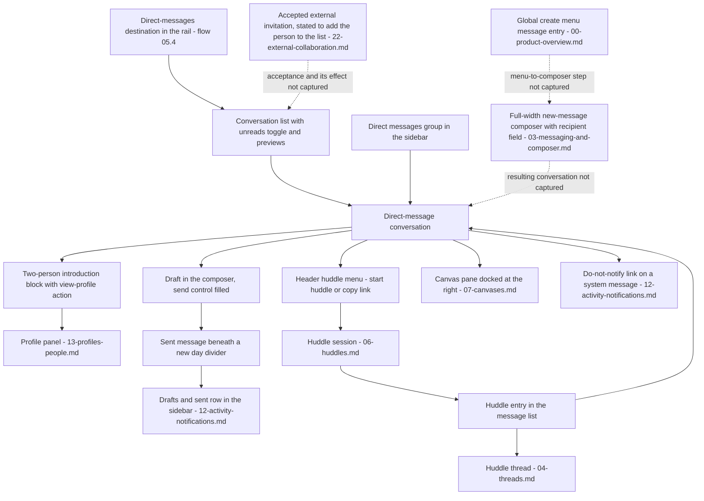

# Direct Messages

Person-to-person conversations: opening a one-to-one direct message, composing and sending in it, the conversation header's action set, presence indication, the two-person empty state, and the dedicated direct-messages destination — part of the [Workflow Catalog](README.md).

## Purpose

This document specifies the **direct message**: a conversation addressed to a person rather than to a topic. A direct message renders inside the persistent shell owned by [00-product-overview.md](00-product-overview.md), in the same content region a channel occupies, and it reuses the same conversation anatomy — a header spanning the column, a bookmark row, a scrolling message list and a bottom-anchored composer [frame 110](../../screenshots/Slack%20web%20Jul%202024%20110.png). What distinguishes it is what the header names and what the empty conversation says: the header carries a person's display name, an avatar with a presence indication and a menu caret, and the body of a conversation with no messages is an introduction block that names the two participants and offers a view-profile action rather than a channel description [frame 110](../../screenshots/Slack%20web%20Jul%202024%20110.png), [frame 378](../../screenshots/Slack%20web%20Jul%202024%20378.png).

**Where the area is encountered.** Three routes into a direct message are observed from within the shell itself, and all three are reachable at any time. A fourth route starts on a surface outside the shell and is set out in **Transitions in and out**.

- **The sidebar's Direct messages group.** A collapsible group of per-person rows sits beneath the channel group in the sidebar, each row carrying an avatar, a presence indication and a display name, closed by an add-coworkers affordance [frame 110](../../screenshots/Slack%20web%20Jul%202024%20110.png), [frame 552](../../screenshots/Slack%20web%20Jul%202024%20552.png). The same group renders per-row checkboxes when the sidebar is in multi-select mode, and it is where role badges appear — two rows read `guest` and one reads `you` in that capture [frame 120](../../screenshots/Slack%20web%20Jul%202024%20120.png).
- **A dedicated direct-messages destination in the navigation rail**, which lists conversations with previews and an unreads filter instead of bare rows [frame 377](../../screenshots/Slack%20web%20Jul%202024%20377.png), [frame 378](../../screenshots/Slack%20web%20Jul%202024%20378.png).
- **A named entry in the global create menu**, described there as starting a conversation in a direct message or a channel [frame 550](../../screenshots/Slack%20web%20Jul%202024%20550.png), which opens the full-width new-message composer whose recipient field accepts a channel, a person or an email address [frame 342](../../screenshots/Slack%20web%20Jul%202024%20342.png).

**Where a direct message sits in the product.** It is a surface on which other conversational capabilities are exercised too: the corpus captures message formatting, forwarding, pinning, editing and deletion [frame 250](../../screenshots/Slack%20web%20Jul%202024%20250.png), bookmark management [frame 257](../../screenshots/Slack%20web%20Jul%202024%20257.png), huddles [frame 267](../../screenshots/Slack%20web%20Jul%202024%20267.png) and canvases [frame 303](../../screenshots/Slack%20web%20Jul%202024%20303.png) **on a direct-message surface**. Those journeys belong to the areas that own the capability, not to this one, and each is named in **Transitions in and out** below. This document owns the direct message *as a conversation type* — how it is entered, addressed, read, composed in, and what its own surfaces are.

**What this document does not own.** The eight reusable component contracts it cites are defined once in [00-product-overview.md](00-product-overview.md) and are referenced here by identifier only. Message-row behaviour, the composer's control set, formatting and reactions belong to [03-messaging-and-composer.md](03-messaging-and-composer.md); threads to [04-threads.md](04-threads.md); huddles to [06-huddles.md](06-huddles.md); canvases to [07-canvases.md](07-canvases.md); the profile panel and the presence vocabulary to [13-profiles-people.md](13-profiles-people.md); notification suppression, drafts and the activity feed to [12-activity-notifications.md](12-activity-notifications.md); the empty-state pattern and the cross-cutting state matrix to [21-states.md](21-states.md); external conversations to [22-external-collaboration.md](22-external-collaboration.md).

## Flows in this area

Five flows are named for this area, spanning 13 frames. Frame spans below are written as plain numeric ranges because they designate a span rather than cite one image, following the convention of the [Screenshot Coverage Index](_screenshot-index.md); every individual frame is cited with its full relative link in the per-flow step tables and in **Frames covered**.

| Flow ID | Name | Frame span | Primary entry point |
|---|---|---|---|
| `05.1` | Open a one-to-one direct message and begin composing | 110, 227–229, 256 | A person row in the Direct messages group of `C-SIDEBAR` |
| `05.2` | Open a one-to-one direct message that has huddle history | 299 | A person row in `C-SIDEBAR` carrying a huddle glyph and a participant count |
| `05.3` | Read huddle summary messages in a direct message | 301–302 | A person row in the Direct messages group of `C-SIDEBAR` |
| `05.4` | Use the direct-messages destination | 377–380 | The direct-messages destination in `C-RAIL` |
| `05.5` | Read a one-to-one conversation in dark colour mode | 552 | A person row in the Direct messages group of `C-SIDEBAR` |

Two of these five occupy a **single frame each** (`05.2`, `05.5`) and one occupies **two non-adjacent spans** (`05.1`). That is a property of the corpus rather than of the product: the export re-orders and repeats surfaces, so a journey can be captured once, or twice at distant indices. Every place where numeric adjacency was overridden is recorded in **Frames covered**.

## Flow 05.1 — Open a one-to-one direct message and begin composing

### Overview

The area's primary journey: select a person in the sidebar, read a conversation that has no message history of its own yet, type a first message, and send it. The conversation is entered from a bare sidebar row and opens in the content region with the shell unchanged around it [frame 110](../../screenshots/Slack%20web%20Jul%202024%20110.png). Because the conversation has never carried a message from either participant, its body is an introduction block rather than a message list, and the only row beneath the introduction is a system message recording that the other person accepted an invitation to the workspace [frame 110](../../screenshots/Slack%20web%20Jul%202024%20110.png). Sending the first message replaces nothing — the introduction block stays, and the sent message is appended beneath a new day divider [frame 229](../../screenshots/Slack%20web%20Jul%202024%20229.png).

This flow occupies two spans. [frame 110](../../screenshots/Slack%20web%20Jul%202024%20110.png) is a single capture of the opened conversation sitting inside an unrelated run of channel-administration dialogs, and [frame 256](../../screenshots/Slack%20web%20Jul%202024%20256.png) is a single capture of the same state sitting between a message-deletion dialog and a bookmark journey. Both are **byte-identical** to each other and to [frame 227](../../screenshots/Slack%20web%20Jul%202024%20227.png), so the three are one observed state captured three times, not three steps.

### Trigger

A person's row in the **Direct messages** group of the sidebar. The row is the trigger in every capture of this flow: the opened conversation's row is the one rendered with the active highlight, and it is the only row in that group so rendered [frame 110](../../screenshots/Slack%20web%20Jul%202024%20110.png), [frame 229](../../screenshots/Slack%20web%20Jul%202024%20229.png).

### Preconditions

An authenticated session with a workspace loaded and the shell rendered. The person must already appear in the Direct messages group — in this capture the group holds three rows and an add-coworkers affordance [frame 110](../../screenshots/Slack%20web%20Jul%202024%20110.png). No plan entitlement is evidenced — no capture of this surface carries a `C-UPGRADE-GATE` badge, which is a statement about badges rather than about entitlement, per the obligation in [21-states.md](21-states.md). Whether a capability is required to open a conversation is not evidenced, and per `S-AUTHZ-READ` the conversation renders only for a viewer currently authorized as one of its participants. Nothing further is required: nothing in the conversation, its header or its composer carries an entitlement badge in any frame of this flow [frame 110](../../screenshots/Slack%20web%20Jul%202024%20110.png), [frame 229](../../screenshots/Slack%20web%20Jul%202024%20229.png).

### Frame-by-frame steps

| Step | Frame(s) | What the user does | What changes on screen | Component(s) involved |
|---|---|---|---|---|
| 1 | [frame 110](../../screenshots/Slack%20web%20Jul%202024%20110.png), [frame 227](../../screenshots/Slack%20web%20Jul%202024%20227.png) | Selects a person's row in the Direct messages group of the sidebar | That row takes the active highlight and the content region renders the conversation: a header carrying the person's avatar with a presence indication, their display name in bold and a menu caret at the left, and a labelled huddle control with its own caret plus a labelled canvas control at the right; an add-a-bookmark row beneath the header; the conversation body; and an empty composer at the foot | `C-SIDEBAR`, `C-AVATAR`, `C-PRESENCE-DOT`, `C-COMPOSER` |
| 2 | [frame 110](../../screenshots/Slack%20web%20Jul%202024%20110.png) | Reads the introduction block that stands in place of message history | A large square avatar with rounded corners, the person's display name followed by a filled presence indicator, one explanatory line stating that the conversation is just between the named person and the reader and inviting them to check the profile — the name rendered as an inline mention chip — and a secondary **View Profile** action beneath it | `C-EMPTY-STATE`, `C-AVATAR`, `C-PRESENCE-DOT` |
| 3 | [frame 110](../../screenshots/Slack%20web%20Jul%202024%20110.png) | Reads the one row that does exist beneath the introduction | A centred day-divider pill with a caret, then a single message row whose body records that the other person accepted an invitation to the workspace and invites a greeting, closed by an inline **Don't notify me about this** link | `C-MESSAGE-ROW` |
| 4 | [frame 228](../../screenshots/Slack%20web%20Jul%202024%20228.png) | Types a multi-sentence greeting into the composer | The placeholder naming the recipient is replaced by the typed text; the send control changes from muted to filled; a right-aligned hint appears immediately beneath the composer stating that shift and return add a new line | `C-COMPOSER` |
| 5 | [frame 229](../../screenshots/Slack%20web%20Jul%202024%20229.png) | Sends the message | A second day divider is appended reading Today, and beneath it the sent message renders as a message row authored by the signed-in user with a timestamp, an emphasised phrase in bold italic and an inline link; the composer returns to its placeholder with the send control muted again; and a **Drafts & sent** flat row appears in the sidebar beneath the threads row, where no such row was rendered before the send | `C-MESSAGE-ROW`, `C-COMPOSER`, `C-SIDEBAR` |
| 6 | [frame 256](../../screenshots/Slack%20web%20Jul%202024%20256.png) | Returns to the conversation with no overlay open | The conversation renders exactly as it did at step 1 — this capture is byte-identical to [frame 110](../../screenshots/Slack%20web%20Jul%202024%20110.png), so the sent message, the Today divider and the drafts-and-sent row are all absent again. Because the two files are byte-identical, no transition from step 5 may be read across this seam; the frame's value is that it re-captures the flow's opening state | `C-SIDEBAR`, `C-EMPTY-STATE`, `C-COMPOSER` |

> **Partial capture:** this flow shows the conversation already present in the sidebar and never shows it being created. Addressing a new conversation is captured on a different surface — the full-width new-message composer, whose recipient field accepts a channel, a person or an email address [frame 342](../../screenshots/Slack%20web%20Jul%202024%20342.png) — which is owned by [03-messaging-and-composer.md](03-messaging-and-composer.md). No frame shows the step between choosing a recipient there and the resulting conversation appearing in the sidebar's Direct messages group.

## Flow 05.2 — Open a one-to-one direct message that has huddle history

### Overview

The same one-to-one conversation as `05.1`, opened when a huddle has already happened in it and another is live. It is captured **from the other participant's session**, which is what makes it worth a flow of its own: the same two people, the same message history, and the perspective reversed — the sidebar's `you` badge now sits on the row of the person who was the recipient in `05.1`, and the conversation header names the person who was the reader there [frame 299](../../screenshots/Slack%20web%20Jul%202024%20299.png). A conversation with huddle history renders three things a conversation without it does not: a huddle glyph beside the person's name in the header and on the sidebar row, a huddle summary entry in the message list, and — while a huddle is live — a tinted row offering to join it plus an invitation card docked at the foot of the sidebar [frame 299](../../screenshots/Slack%20web%20Jul%202024%20299.png).

**Who the reader is in this capture, and the correction that followed from establishing it.** This frame was first characterised — here and in the [Screenshot Coverage Index](_screenshot-index.md) — as the reader's conversation with themself. Re-inspection settled it against four independent signals, and the ledger caption and both affected flow names have since been corrected to match: the sidebar's self-marker badge is on a **different** row than the conversation that is open; the account avatar pinned at the foot of the rail is the same photograph as the avatar on that badged row rather than the one in the header; the introduction line names the header's person as the other party — "just between" that person "and you"; and the composer's placeholder addresses the header's person by name [frame 299](../../screenshots/Slack%20web%20Jul%202024%20299.png). The reader is therefore the member the badge marks, and every actor claim in this flow is stated from that identification. The self-conversation does exist in the corpus, but it is captured elsewhere, as a row in the direct-messages destination list whose own preview describes it as the reader's own space for drafts, to-dos, links and files [frame 377](../../screenshots/Slack%20web%20Jul%202024%20377.png), [frame 378](../../screenshots/Slack%20web%20Jul%202024%20378.png). The frame's flow identifier and area assignment were never affected; only the characterisation was, and it is now consistent in every place the catalog states it.

### Trigger

The person's row in the sidebar's Direct messages group. In this capture that row is distinguishable from every other row in the group before it is opened: it carries a huddle glyph after the display name and, at its right edge, a participant-avatar chip followed by a huddle glyph and the count `1` [frame 299](../../screenshots/Slack%20web%20Jul%202024%20299.png).

### Preconditions

An authenticated session in which a huddle has previously taken place in this conversation and one is currently live — both are stated by the message list itself, which carries a completed huddle summary and a live row [frame 299](../../screenshots/Slack%20web%20Jul%202024%20299.png). The sidebar in this capture carries no promotional banner slot at all, so no plan state is a precondition of the flow [frame 299](../../screenshots/Slack%20web%20Jul%202024%20299.png).

### Frame-by-frame steps

| Step | Frame(s) | What the user does | What changes on screen | Component(s) involved |
|---|---|---|---|---|
| 1 | [frame 299](../../screenshots/Slack%20web%20Jul%202024%20299.png) | Selects the person row that carries a huddle glyph and a participant count | The conversation opens with the row highlighted; the header renders the avatar with a presence indication, the display name, a huddle glyph and a caret at the left, and at the right a tinted pill carrying a participant-avatar chip, a huddle glyph, a huddle label, the participant count and a caret, followed by the labelled canvas control | `C-SIDEBAR`, `C-AVATAR`, `C-PRESENCE-DOT` |
| 2 | [frame 299](../../screenshots/Slack%20web%20Jul%202024%20299.png) | Reads the message list from the top | The introduction block and its view-profile action render first, then a day-divider pill, then a system row recording that **the reader themself** joined — authored by the very display name the sidebar marks with the self badge, avatar included, and worded in the third person rather than addressed to the reader — then a crimson horizontal rule carrying the Today divider pill at its centre and a crimson **New** label at its right end, then the conversation's one authored message with an emoji, an inline link and an `(edited)` marker | `C-EMPTY-STATE`, `C-MESSAGE-ROW` |
| 3 | [frame 299](../../screenshots/Slack%20web%20Jul%202024%20299.png) | Reads the two huddle entries at the end of the list | A completed huddle entry renders as a square icon tile with a huddle glyph, a bold title and a timestamp above one line naming both participants and the huddle's duration; beneath it a pale-green-tinted full-width row renders the same icon tile, a sentence stating that the other person is in the huddle, a **LIVE** pill, a timestamp, and a **Join huddle** button carrying a small participant avatar | `C-MESSAGE-ROW` |
| 4 | [frame 299](../../screenshots/Slack%20web%20Jul%202024%20299.png) | Notices the invitation docked at the foot of the sidebar | A card carrying an avatar and a line offering to join the huddle with the named person, above three stacked full-width actions in this order — a filled **Join**, then **Be there soon**, then **Decline** | `C-SIDEBAR`, `C-AVATAR` |
| 5 | [frame 299](../../screenshots/Slack%20web%20Jul%202024%20299.png) | Chooses to type rather than to join | The composer is rendered and available with its placeholder naming the recipient, unchanged by the live huddle; the huddle's own surfaces do not replace the conversation | `C-COMPOSER` |

> **Partial capture:** this flow is one frame. Activating **Join**, **Be there soon** or **Decline** is not captured anywhere in the corpus, so no result may be claimed for any of the three. What happens after joining is captured on the huddle surfaces owned by [06-huddles.md](06-huddles.md) [frame 300](../../screenshots/Slack%20web%20Jul%202024%20300.png).

## Flow 05.3 — Read huddle summary messages in a direct message

### Overview

The reader returns to the conversation after the huddles have ended and reads what they left behind. A huddle deposits a **system entry** in the conversation it happened in, and that entry is the only trace of it in the message list: an icon tile, a title, a timestamp and a line naming the participants and the elapsed duration [frame 301](../../screenshots/Slack%20web%20Jul%202024%20301.png). Where the huddle carried a thread, the entry additionally renders a thread summary beneath itself — overlapped participant avatars, a reply-count link and a last-reply time [frame 302](../../screenshots/Slack%20web%20Jul%202024%20302.png). The two frames also disagree about how the entry is rendered, and that disagreement is recorded rather than resolved: see **Edge cases & validations**.

### Trigger

The person's row in the sidebar's Direct messages group, selected from the reader's own session — the `you` badge is on the reader's row and the header names the other person [frame 301](../../screenshots/Slack%20web%20Jul%202024%20301.png).

### Preconditions

At least one huddle must have taken place in the conversation; both captures render at least one completed huddle entry, and neither renders a live one [frame 301](../../screenshots/Slack%20web%20Jul%202024%20301.png), [frame 302](../../screenshots/Slack%20web%20Jul%202024%20302.png). The conversation must already carry an authored message, which both captures show above the huddle entries [frame 301](../../screenshots/Slack%20web%20Jul%202024%20301.png).

### Frame-by-frame steps

| Step | Frame(s) | What the user does | What changes on screen | Component(s) involved |
|---|---|---|---|---|
| 1 | [frame 301](../../screenshots/Slack%20web%20Jul%202024%20301.png) | Opens the conversation from the sidebar | The content region renders the introduction block, a day-divider pill, the invitation-accepted system message with its do-not-notify link, a Today divider, the authored message carrying an `(edited)` marker, and one huddle entry — its icon tile, bold title, timestamp and a line naming both participants and a five-minute duration — rendered on a pale green tint that spans the full width of the content region | `C-SIDEBAR`, `C-EMPTY-STATE`, `C-MESSAGE-ROW` |
| 2 | [frame 302](../../screenshots/Slack%20web%20Jul%202024%20302.png) | Reads the huddle entries after a second huddle has been held | A second huddle entry is appended with its own timestamp and a twenty-five-minute duration, and **both** entries now render on the default surface with no tint; the second carries a thread summary beneath its duration line — two overlapped participant avatars, a **2 replies** link and a last-reply time | `C-MESSAGE-ROW`, `C-AVATAR` |
| 3 | [frame 302](../../screenshots/Slack%20web%20Jul%202024%20302.png) | Notices what the shell has picked up alongside the conversation | The sidebar header now carries a filter control to the left of the compose control, the drafts-and-sent row carries a right-aligned count with a pencil glyph, and the rail has grown from three destinations to five — home, direct messages, activity, later and more | `C-SIDEBAR`, `C-RAIL` |

## Flow 05.4 — Use the direct-messages destination

### Overview

A destination in the navigation rail that lists direct-message conversations in their own right, rather than as bare rows inside the sidebar. Its list gives each conversation an avatar with a presence indication, a display name, a relative timestamp, an optional unread count and a one-line preview of the latest message, above which sits a prompt inviting the reader to add their whole team [frame 377](../../screenshots/Slack%20web%20Jul%202024%20377.png). An **Unreads** toggle in the list header filters the list down to conversations that have unread messages [frame 379](../../screenshots/Slack%20web%20Jul%202024%20379.png).

The destination is captured in **two structurally different forms**, and both are recorded because the corpus shows both. In the first, the list is an overlay panel with a drop shadow that occupies the sidebar's column and floats above it, leaving the previously routed surface — a channel — still rendered in the content region behind it; the panel carries no search field [frame 377](../../screenshots/Slack%20web%20Jul%202024%20377.png). In the second, the list replaces the sidebar entirely, is roughly half again as wide, renders on the sidebar's own dark surface, and gains a scoped search field, a filter control and a compose control; the content region renders the selected conversation [frame 378](../../screenshots/Slack%20web%20Jul%202024%20378.png).

### Trigger

The direct-messages destination in the navigation rail. It is present in the rail in every frame of this flow and carries a numeric unread badge in three of the four [frame 377](../../screenshots/Slack%20web%20Jul%202024%20377.png), [frame 378](../../screenshots/Slack%20web%20Jul%202024%20378.png), [frame 379](../../screenshots/Slack%20web%20Jul%202024%20379.png). The rail's destination set is data-driven rather than fixed, and the map of which destinations exist is owned by [00-product-overview.md](00-product-overview.md).

### Preconditions

An authenticated session with the direct-messages destination enabled in the rail. At least one conversation must exist for the list to be non-empty; this capture holds three, one of them the reader's own self-conversation [frame 377](../../screenshots/Slack%20web%20Jul%202024%20377.png). For the unreads filter to yield a row, at least one conversation must be unread — the filtered list collapses to exactly the one row that carried a count [frame 379](../../screenshots/Slack%20web%20Jul%202024%20379.png).

### Frame-by-frame steps

| Step | Frame(s) | What the user does | What changes on screen | Component(s) involved |
|---|---|---|---|---|
| 1 | [frame 377](../../screenshots/Slack%20web%20Jul%202024%20377.png) | Activates the direct-messages destination in the rail | A list panel opens over the sidebar's column, on the default light surface with a drop shadow, while the content region keeps rendering the previously open conversation. Its header reads Direct messages at the left with an **Unreads** label and an unset toggle at the right; beneath it a prompt block carries an illustration, a bold question asking whether anyone is missing, one line of body copy and a secondary **Add Coworkers** action; beneath that, conversation rows separated by rules | `C-RAIL`, `C-SIDEBAR`, `C-EMPTY-STATE` |
| 2 | [frame 377](../../screenshots/Slack%20web%20Jul%202024%20377.png) | Reads the three conversation rows | Each row renders a leading avatar with a presence indication, a display name, and a one-line preview of the latest message truncated with an ellipsis where it overflows the panel's width. The unread row's name is bold and carries a right-aligned relative timestamp and a count badge; the row with no messages carries neither a preview, a timestamp nor a badge; the reader's own row carries a parenthesised self-marker after the name and a preview describing the conversation as their own space for drafts, to-dos, links and files | `C-AVATAR`, `C-PRESENCE-DOT` |
| 3 | [frame 378](../../screenshots/Slack%20web%20Jul%202024%20378.png) | Selects a conversation row | The list is now a pane in place of the sidebar rather than a panel over it, rendered on the sidebar's dark surface at roughly a third of the viewport width and carrying a scoped search field, a filter control and a compose control that the panel form does not have; the selected row takes the active highlight; and the content region renders that conversation — header, bookmark row, introduction block with a view-profile action, a day divider, the invitation-accepted system message and an empty composer. The wider pane lets the unread row's preview wrap to two lines instead of truncating | `C-SIDEBAR`, `C-MESSAGE-ROW`, `C-EMPTY-STATE`, `C-COMPOSER` |
| 4 | [frame 379](../../screenshots/Slack%20web%20Jul%202024%20379.png) | Switches the Unreads toggle on | The toggle renders set — its track filled and its knob moved to the trailing edge — and the list collapses from three rows to the single row that carried an unread count; the prompt block and the search field stay; the surviving row's relative timestamp has advanced; the conversation open in the content region is unchanged | `C-SIDEBAR` |
| 5 | [frame 380](../../screenshots/Slack%20web%20Jul%202024%20380.png) | Selects the surviving unread row | The row takes the active highlight and its unread count badge is gone while the Unreads toggle stays set, so the row remains listed with nothing marking it unread; the content region renders that conversation scrolled to its end, where a crimson rule carrying the Today pill and a crimson **New** label separates the previously read messages from the latest incoming one — whose text is exactly the preview the list row shows | `C-SIDEBAR`, `C-MESSAGE-ROW` |

## Flow 05.5 — Read a one-to-one conversation in dark colour mode

### Overview

The same conversation read after the reader has selected a dark colour mode and a shared document has been posted into it. Every shell region and the content region render in the dark mode, and the conversation's anatomy is unchanged by it — header, bookmark row, message list and composer sit exactly where they sit in the light captures [frame 552](../../screenshots/Slack%20web%20Jul%202024%20552.png). The flow is worth naming because it is the only capture in this area that shows a direct message carrying a **file**, and because its huddle entries are titled differently from every other capture of the same two huddles.

### Trigger

The person's row in the sidebar's Direct messages group, which in the dark mode renders its active state as a solid accent fill across the row rather than the pale highlight used in the light captures [frame 552](../../screenshots/Slack%20web%20Jul%202024%20552.png).

### Preconditions

An authenticated session with a dark colour mode selected — colour mode is a user preference owned by [14-preferences-settings.md](14-preferences-settings.md). The conversation must already carry message history: this capture opens scrolled past the introduction block, which is not rendered at all [frame 552](../../screenshots/Slack%20web%20Jul%202024%20552.png).

### Frame-by-frame steps

| Step | Frame(s) | What the user does | What changes on screen | Component(s) involved |
|---|---|---|---|---|
| 1 | [frame 552](../../screenshots/Slack%20web%20Jul%202024%20552.png) | Opens the conversation from the sidebar | The content region renders the conversation in the dark colour mode with the header, the add-a-bookmark row, the message list scrolled to its end and the composer in their usual positions; a day-divider pill renders over the first visible message row rather than between rows, so the divider is pinned to the top of the scrolling list | `C-SIDEBAR`, `C-MESSAGE-ROW`, `C-COMPOSER` |
| 2 | [frame 552](../../screenshots/Slack%20web%20Jul%202024%20552.png) | Reads the two huddle entries | Both render as an icon tile with a huddle glyph, a bold title reading that a huddle happened, and a timestamp — and **neither carries a participants-and-duration line**, although the two timestamps are the same two the other captures of this conversation render with one. The later entry carries a thread summary with overlapped avatars, a **2 replies** link and a last-reply time | `C-MESSAGE-ROW`, `C-AVATAR` |
| 3 | [frame 552](../../screenshots/Slack%20web%20Jul%202024%20552.png) | Reads the shared document at the end of the list | Beneath a one-line message row a file-type label with a caret renders above a card carrying a type-coloured icon tile, the file's name, its type, and an inline preview of the document's first page | `C-MESSAGE-ROW` |
| 4 | [frame 552](../../screenshots/Slack%20web%20Jul%202024%20552.png) | Glances at the sidebar around the conversation | The sidebar carries the promotional banner slot with a one-day countdown, three flat rows — unreads, threads and drafts-and-sent — above the channel group, the Direct messages group with the open conversation highlighted, an apps group holding two app rows, and a footer item reading that a free trial is in progress | `C-SIDEBAR` |

## Screens & components

Three screens make up this area. All sizing below is **proportional to the effective product viewport**, never an absolute offset, and every icon is named by the function it performs rather than by any asset.

### Screen 1 — the direct-message conversation

The conversation occupies the shell's content region and stacks four bands vertically [frame 110](../../screenshots/Slack%20web%20Jul%202024%20110.png). Its regions and their ordering are the same four, in the same order, that a channel renders in the same region — header, add-a-bookmark row, scrolling message list, composer [frame 377](../../screenshots/Slack%20web%20Jul%202024%20377.png) — which is why a build implements one conversation surface and varies what its header resolves to.

| Region | Position and ordering | Relative size | Contents, in order |
|---|---|---|---|
| Conversation header | Top band of the content region, directly beneath the top bar | Roughly one twentieth of viewport height | At the left: the recipient's avatar carrying a presence indication, their display name in bold, and a menu caret. At the right, right-aligned: a labelled huddle control with its own caret, then a canvas control — rendered with a label in some captures [frame 110](../../screenshots/Slack%20web%20Jul%202024%20110.png), [frame 301](../../screenshots/Slack%20web%20Jul%202024%20301.png) and as its icon alone in others [frame 378](../../screenshots/Slack%20web%20Jul%202024%20378.png), [frame 552](../../screenshots/Slack%20web%20Jul%202024%20552.png). When a huddle is live the huddle control renders as a tinted pill that additionally carries a participant-avatar chip and a participant count, and a huddle glyph appears between the display name and the caret [frame 299](../../screenshots/Slack%20web%20Jul%202024%20299.png) |
| Bookmark row | Immediately beneath the header, full width | A single row | An add-a-bookmark affordance with a leading plus glyph, empty in every capture that renders it [frame 110](../../screenshots/Slack%20web%20Jul%202024%20110.png), [frame 301](../../screenshots/Slack%20web%20Jul%202024%20301.png), [frame 378](../../screenshots/Slack%20web%20Jul%202024%20378.png), [frame 379](../../screenshots/Slack%20web%20Jul%202024%20379.png), [frame 552](../../screenshots/Slack%20web%20Jul%202024%20552.png). It is absent from the one capture whose message list is scrolled away from the top, where the header is followed directly by the list [frame 380](../../screenshots/Slack%20web%20Jul%202024%20380.png) |
| Message list | Fills the remaining height between the bookmark row and the composer, scrolling | The dominant region, roughly four fifths of the content region's height | The introduction block while the conversation has no authored messages, then day-divider pills, system rows, huddle entries and authored message rows in ascending time order [frame 110](../../screenshots/Slack%20web%20Jul%202024%20110.png), [frame 302](../../screenshots/Slack%20web%20Jul%202024%20302.png) |
| Composer | Pinned to the foot of the content region | Roughly one eighth of viewport height when empty | The formatting toolbar, the input area whose placeholder names the recipient, and the action row with the send control right-aligned [frame 110](../../screenshots/Slack%20web%20Jul%202024%20110.png). A hint line can render immediately below the composer, outside its border, while a draft is present [frame 228](../../screenshots/Slack%20web%20Jul%202024%20228.png) |

**Hierarchy.** The header is the only region that identifies the conversation; the other three are generic. Nothing in this area docks a pane into the content region — the huddle panel docks into the **sidebar's** lower region instead, leaving the conversation's own width unchanged [frame 300](../../screenshots/Slack%20web%20Jul%202024%20300.png), and the canvas pane that does take width from the content region belongs to [07-canvases.md](07-canvases.md) [frame 303](../../screenshots/Slack%20web%20Jul%202024%20303.png).

**The introduction block.** Centred horizontally in the message list's upper area and stacked as: a large square avatar with rounded corners; the display name followed by a presence indicator; one explanatory line naming the other participant as an inline mention chip; then a secondary view-profile action. It renders at a noticeably larger avatar size than a message row's and it is **additive, not exclusive** — after the first message is sent it stays at the top of the list with the message beneath it [frame 110](../../screenshots/Slack%20web%20Jul%202024%20110.png), [frame 229](../../screenshots/Slack%20web%20Jul%202024%20229.png).

### Screen 2 — the Direct messages group in the sidebar

A collapsible group inside the sidebar, positioned beneath the channel group and above the apps group, with a disclosure caret on its header [frame 110](../../screenshots/Slack%20web%20Jul%202024%20110.png). Each row is a fixed-height line carrying, left to right: an avatar with a presence indication at its lower-right corner, the display name, and — where one applies — a role or self-marker badge in a muted weight after the name [frame 110](../../screenshots/Slack%20web%20Jul%202024%20110.png), [frame 120](../../screenshots/Slack%20web%20Jul%202024%20120.png). The group closes with an add-coworkers affordance carrying a leading plus glyph [frame 110](../../screenshots/Slack%20web%20Jul%202024%20110.png). Four further row treatments are observed: the active conversation's row takes a filled highlight — pale in the light captures, a solid accent fill in the dark one [frame 110](../../screenshots/Slack%20web%20Jul%202024%20110.png), [frame 552](../../screenshots/Slack%20web%20Jul%202024%20552.png); a row whose conversation has a live huddle carries a huddle glyph after the name and a right-aligned participant chip, huddle glyph and count [frame 299](../../screenshots/Slack%20web%20Jul%202024%20299.png); every row carries a leading checkbox in the sidebar's multi-select mode [frame 120](../../screenshots/Slack%20web%20Jul%202024%20120.png); and a dismissible hint row can be appended beneath the add-coworkers affordance, carrying an emoji, a short question and a dismiss control [frame 299](../../screenshots/Slack%20web%20Jul%202024%20299.png).

### Screen 3 — the direct-messages destination

Captured in two forms, both listed here because both are observed and neither is a superset of the other.

| Aspect | Overlay-panel form [frame 377](../../screenshots/Slack%20web%20Jul%202024%20377.png) | Replacing-pane form [frame 378](../../screenshots/Slack%20web%20Jul%202024%20378.png) |
|---|---|---|
| Position and surface | Floats above the sidebar's column with a drop shadow, on the default light surface, inset from the top bar and stopping short of the viewport foot | Occupies the sidebar's position and replaces it, on the sidebar's own dark surface, full height |
| Relative width | Roughly the sidebar's own width | Roughly a third of viewport width — about half again the sidebar's |
| Header contents | Title at the left; an unreads label and toggle at the right | Title at the left; an unreads label and toggle, then a filter control, then a compose control at the right |
| Search | None | A scoped search field with a leading magnifier glyph and a find-a-conversation placeholder, directly beneath the header |
| Prompt block | Illustration, bold question, one body line, secondary action | The same block with the action rendered as a filled control |
| Row density | Preview truncated to one line with an ellipsis | Preview wraps to two lines |
| Content region behind | The previously routed surface, unchanged — a channel in this capture | The conversation selected in the list |

**Row anatomy, common to both forms.** Leading avatar with a presence indication; display name, rendered bold while unread; an optional parenthesised self-marker after the name; a right-aligned relative timestamp; an optional unread count badge to the right of the timestamp; and a preview line of the latest message beneath the name. A conversation with no messages renders the name alone — no preview, no timestamp, no badge [frame 377](../../screenshots/Slack%20web%20Jul%202024%20377.png), [frame 378](../../screenshots/Slack%20web%20Jul%202024%20378.png).

### Components used

Every identifier resolves to its single authoritative contract in [00-product-overview.md](00-product-overview.md); nothing is restated here.

| Component | Where this area uses it | Evidence |
|---|---|---|
| `C-RAIL` | Carries the direct-messages destination, with a numeric unread badge when conversations are unread | [frame 377](../../screenshots/Slack%20web%20Jul%202024%20377.png), [frame 378](../../screenshots/Slack%20web%20Jul%202024%20378.png), [frame 302](../../screenshots/Slack%20web%20Jul%202024%20302.png) |
| `C-SIDEBAR` | Hosts the Direct messages group, the dismissible hint row, the docked huddle invitation card, the drafts-and-sent flat row that appears after a send, and — in the destination's replacing-pane form — is itself replaced by the conversation list | [frame 110](../../screenshots/Slack%20web%20Jul%202024%20110.png), [frame 229](../../screenshots/Slack%20web%20Jul%202024%20229.png), [frame 299](../../screenshots/Slack%20web%20Jul%202024%20299.png), [frame 378](../../screenshots/Slack%20web%20Jul%202024%20378.png) |
| `C-MESSAGE-ROW` | Renders authored messages, the invitation-accepted and joined system rows, and the huddle entries — including the tinted live variant with its live pill and join action | [frame 110](../../screenshots/Slack%20web%20Jul%202024%20110.png), [frame 229](../../screenshots/Slack%20web%20Jul%202024%20229.png), [frame 299](../../screenshots/Slack%20web%20Jul%202024%20299.png), [frame 302](../../screenshots/Slack%20web%20Jul%202024%20302.png) |
| `C-HOVER-ACTION-BAR` | Appears on the hovered message row of a direct message, pinned to that row's top-right corner while the row itself takes a faint tint | [frame 250](../../screenshots/Slack%20web%20Jul%202024%20250.png) |
| `C-COMPOSER` | Bottom-anchored in every capture, its placeholder naming the recipient; carries the draft, the send control's muted and filled states, and the shift-and-return hint | [frame 110](../../screenshots/Slack%20web%20Jul%202024%20110.png), [frame 228](../../screenshots/Slack%20web%20Jul%202024%20228.png), [frame 300](../../screenshots/Slack%20web%20Jul%202024%20300.png) |
| `C-AVATAR` | The conversation header, the sidebar row, the message row, the destination list row, the large introduction-block instance, the participant chip on a live huddle control, and the overlapped pair on a thread summary | [frame 110](../../screenshots/Slack%20web%20Jul%202024%20110.png), [frame 299](../../screenshots/Slack%20web%20Jul%202024%20299.png), [frame 302](../../screenshots/Slack%20web%20Jul%202024%20302.png), [frame 378](../../screenshots/Slack%20web%20Jul%202024%20378.png) |
| `C-PRESENCE-DOT` | Overlaid at the lower-right corner of every person avatar in this area, at every size it is used | [frame 110](../../screenshots/Slack%20web%20Jul%202024%20110.png), [frame 250](../../screenshots/Slack%20web%20Jul%202024%20250.png), [frame 378](../../screenshots/Slack%20web%20Jul%202024%20378.png) |
| `C-EMPTY-STATE` | The two-person introduction block, and the add-your-whole-team prompt at the head of the destination list | [frame 110](../../screenshots/Slack%20web%20Jul%202024%20110.png), [frame 377](../../screenshots/Slack%20web%20Jul%202024%20377.png), [frame 378](../../screenshots/Slack%20web%20Jul%202024%20378.png) |

### The area's primary journey

Every node below is a surface observed in a frame, and nodes owned by another area are labelled with that document. **Two link styles carry two different claims.** A solid edge is a transition the corpus shows: both endpoints are captured and the step between them is evidenced. A **dotted, labelled edge** means the affordance and its stated destination are observed but **the step itself is not captured**, so the edge records where the affordance points rather than a transition anyone watched happen. Three edges are dotted, all of them on the conversation-creation path, and the same gaps are recorded as a partial capture beneath **Transitions in and out** — creation is never captured end to end, and an external acceptance is never captured at all.

## States

Every state below is observed in a frame of this area, with that frame cited. The cross-cutting state matrix for the whole product is owned by [21-states.md](21-states.md) and is not restated here.

| State | What is observable | Evidence |
|---|---|---|
| Default | Header, bookmark row, message list and composer rendered; the conversation's row highlighted in the sidebar; no overlay | [frame 110](../../screenshots/Slack%20web%20Jul%202024%20110.png), [frame 301](../../screenshots/Slack%20web%20Jul%202024%20301.png) |
| Empty conversation | The message list carries the two-person introduction block with its view-profile action instead of authored messages | [frame 110](../../screenshots/Slack%20web%20Jul%202024%20110.png), [frame 378](../../screenshots/Slack%20web%20Jul%202024%20378.png) |
| Presence: filled indicator | A filled disc in a green accent colour at the avatar's lower-right corner, and beside the display name in the introduction block | [frame 110](../../screenshots/Slack%20web%20Jul%202024%20110.png), [frame 377](../../screenshots/Slack%20web%20Jul%202024%20377.png) |
| Presence: hollow indicator | A ring at the same position, its interior rendered in the surrounding surface colour rather than filled — observed on a sidebar row, on a destination list row, and beside a display name in an introduction block | [frame 250](../../screenshots/Slack%20web%20Jul%202024%20250.png), [frame 377](../../screenshots/Slack%20web%20Jul%202024%20377.png), [frame 378](../../screenshots/Slack%20web%20Jul%202024%20378.png) |
| Composer empty | Placeholder naming the recipient; send control muted | [frame 110](../../screenshots/Slack%20web%20Jul%202024%20110.png), [frame 229](../../screenshots/Slack%20web%20Jul%202024%20229.png) |
| Composer holding a draft | Typed text in place of the placeholder; send control filled; a hint line rendered outside the composer's lower border | [frame 228](../../screenshots/Slack%20web%20Jul%202024%20228.png) |
| Message edited | An `(edited)` marker appended after the message body | [frame 299](../../screenshots/Slack%20web%20Jul%202024%20299.png), [frame 301](../../screenshots/Slack%20web%20Jul%202024%20301.png) |
| Message row hovered | The row takes a faint tint against the default surface and the hover action bar appears at its top-right corner | [frame 250](../../screenshots/Slack%20web%20Jul%202024%20250.png) |
| Unread conversation, in the sidebar's list surfaces | The destination list row renders its display name bold and carries a right-aligned relative timestamp and a count badge; the rail's direct-messages destination carries a numeric badge | [frame 377](../../screenshots/Slack%20web%20Jul%202024%20377.png), [frame 378](../../screenshots/Slack%20web%20Jul%202024%20378.png) |
| Unread boundary, inside a conversation | A crimson horizontal rule spans the message list with the day-divider pill centred on it and a crimson **New** label at its right end | [frame 299](../../screenshots/Slack%20web%20Jul%202024%20299.png), [frame 380](../../screenshots/Slack%20web%20Jul%202024%20380.png) |
| Unreads filter unset | The destination list renders every conversation, including ones with no messages | [frame 377](../../screenshots/Slack%20web%20Jul%202024%20377.png), [frame 378](../../screenshots/Slack%20web%20Jul%202024%20378.png) |
| Unreads filter set | The toggle renders with its track filled and its knob at the trailing edge, and the list collapses to the rows that carried a count | [frame 379](../../screenshots/Slack%20web%20Jul%202024%20379.png), [frame 380](../../screenshots/Slack%20web%20Jul%202024%20380.png) |
| Row active in the destination list | The row takes a filled highlight and the content region renders its conversation | [frame 378](../../screenshots/Slack%20web%20Jul%202024%20378.png), [frame 380](../../screenshots/Slack%20web%20Jul%202024%20380.png) |
| Huddle live in this conversation | The header's huddle control becomes a tinted pill carrying a participant chip and a count, a huddle glyph appears beside the display name, the sidebar row carries the same glyph plus a chip and count, the message list carries a tinted row with a live pill and a join action, and an invitation card docks at the sidebar's foot | [frame 299](../../screenshots/Slack%20web%20Jul%202024%20299.png) |
| Huddle completed | A huddle entry in the message list with an icon tile, a title and a timestamp | [frame 301](../../screenshots/Slack%20web%20Jul%202024%20301.png), [frame 302](../../screenshots/Slack%20web%20Jul%202024%20302.png), [frame 552](../../screenshots/Slack%20web%20Jul%202024%20552.png) |
| Thread present on an entry | A thread summary beneath the entry: overlapped participant avatars, a reply-count link and a last-reply time | [frame 302](../../screenshots/Slack%20web%20Jul%202024%20302.png), [frame 552](../../screenshots/Slack%20web%20Jul%202024%20552.png) |
| Multi-select, in the sidebar | Every person row in the Direct messages group carries a leading checkbox | [frame 120](../../screenshots/Slack%20web%20Jul%202024%20120.png) |
| Dark colour mode | Every region including the message list and composer renders in the dark mode, and the active sidebar row's highlight becomes a solid accent fill | [frame 552](../../screenshots/Slack%20web%20Jul%202024%20552.png) |
| Device permission denied, alongside the conversation | A warning-background band pinned to the viewport foot instructs the reader to enable the device through the browser's own control while the conversation stays rendered and usable | [frame 300](../../screenshots/Slack%20web%20Jul%202024%20300.png) |

## Implied data model

Only what this area's screens expose is claimed. Every entity cited appears in the [consolidated data model](README.md) of the master index, every field cites the frame that shows it, and each entity's full field set belongs to the area named beside it there.

| Entity | Fields this area exposes |
|---|---|
| `E-USER` | Display name, rendered in the conversation header, the sidebar row, the message row, the destination list row and the introduction block [frame 110](../../screenshots/Slack%20web%20Jul%202024%20110.png) · avatar, rendered at several sizes — largest in the introduction block, then the destination list row, the message row, the conversation header and the sidebar row — and rendered as a generic person glyph on a coloured tile where no photograph exists, at every one of those sizes [frame 110](../../screenshots/Slack%20web%20Jul%202024%20110.png), [frame 378](../../screenshots/Slack%20web%20Jul%202024%20378.png) · presence, rendered as a filled disc or a hollow ring at the avatar's lower-right corner [frame 250](../../screenshots/Slack%20web%20Jul%202024%20250.png), [frame 378](../../screenshots/Slack%20web%20Jul%202024%20378.png) · a role badge beside the name, observed reading `guest` on two rows of one capture [frame 120](../../screenshots/Slack%20web%20Jul%202024%20120.png) · a self-marker on the signed-in user's own row, rendered as a bare badge in the sidebar and parenthesised in the destination list [frame 110](../../screenshots/Slack%20web%20Jul%202024%20110.png), [frame 377](../../screenshots/Slack%20web%20Jul%202024%20377.png) · a profile, reachable from the introduction block's view-profile action [frame 110](../../screenshots/Slack%20web%20Jul%202024%20110.png) · the reader's own identity within the workspace, evidenced by the same conversation being captured from each participant's session with the self-marker moving to whichever row is the signed-in user's [frame 229](../../screenshots/Slack%20web%20Jul%202024%20229.png), [frame 299](../../screenshots/Slack%20web%20Jul%202024%20299.png) |
| `E-MESSAGE` | Author, timestamp and body, the body carrying inline emphasis, links, mention chips and emoji [frame 229](../../screenshots/Slack%20web%20Jul%202024%20229.png), [frame 299](../../screenshots/Slack%20web%20Jul%202024%20299.png) · an edited flag, surfaced as a marker after the body [frame 301](../../screenshots/Slack%20web%20Jul%202024%20301.png) · a **system subtype**, observed in three forms: an invitation-accepted message rendered with the other person as its author, addressed to the reader in the second person and carrying its own notification-suppression link [frame 110](../../screenshots/Slack%20web%20Jul%202024%20110.png), a joined message rendered in the same author-avatar-and-name shape but **authored by the reader**, worded in the third person and carrying **no** suppression link [frame 299](../../screenshots/Slack%20web%20Jul%202024%20299.png), and a huddle entry rendered with an icon tile in place of an author avatar and no author name at all [frame 301](../../screenshots/Slack%20web%20Jul%202024%20301.png) · the huddle entry additionally carrying a title, a live flag rendered as a pill, an optional participants-and-duration line and an optional join action [frame 299](../../screenshots/Slack%20web%20Jul%202024%20299.png), [frame 552](../../screenshots/Slack%20web%20Jul%202024%20552.png) · an attached file rendered as a type label above a card with a name, a type and an inline first-page preview [frame 552](../../screenshots/Slack%20web%20Jul%202024%20552.png) · a thread, surfaced as a reply count and a last-reply time beneath the message [frame 302](../../screenshots/Slack%20web%20Jul%202024%20302.png) · day grouping, surfaced as divider pills between groups of rows [frame 229](../../screenshots/Slack%20web%20Jul%202024%20229.png) |
| `E-NOTIFICATION` | A per-conversation unread state carrying a count, rendered as a badge on a destination list row and aggregated as a numeric badge on the rail's direct-messages destination [frame 377](../../screenshots/Slack%20web%20Jul%202024%20377.png), [frame 378](../../screenshots/Slack%20web%20Jul%202024%20378.png) · a read boundary within the conversation, rendered as a crimson rule with a **New** label [frame 299](../../screenshots/Slack%20web%20Jul%202024%20299.png), [frame 380](../../screenshots/Slack%20web%20Jul%202024%20380.png) · **a per-message suppression state**, surfaced as a do-not-notify link attached to the invitation-accepted system message rather than to the conversation [frame 110](../../screenshots/Slack%20web%20Jul%202024%20110.png), [frame 378](../../screenshots/Slack%20web%20Jul%202024%20378.png) · a draft count, surfaced on the sidebar's drafts-and-sent row [frame 302](../../screenshots/Slack%20web%20Jul%202024%20302.png) |
| `E-CHANNEL` | This area contributes **one** field: a conversation type. The conversation is not a channel by any observable of its own — it has no hash-prefixed name, no member count, no topic or description, and no details pane in any frame of this area [frame 110](../../screenshots/Slack%20web%20Jul%202024%20110.png), [frame 552](../../screenshots/Slack%20web%20Jul%202024%20552.png) — while it does carry the same bookmark row, header shape, message list and composer as a channel does [frame 110](../../screenshots/Slack%20web%20Jul%202024%20110.png) |

**The conversation itself, and why it is not modelled as a new entity.** Every field the direct message needs is already carried by the entities above: its participants are `E-USER` rows, its content is `E-MESSAGE` rows, its unread and suppression state is `E-NOTIFICATION`. What remains is the conversation record itself — a participant set, a conversation type, a latest-message reference for the destination list's preview and timestamp [frame 377](../../screenshots/Slack%20web%20Jul%202024%20377.png), and membership of the sidebar's Direct messages group [frame 110](../../screenshots/Slack%20web%20Jul%202024%20110.png).

**Inferred:** that record is the same record a channel uses, with a type discriminator rather than a separate table — basis: the bookmark dialog opened from a direct message's own bookmark row is titled as adding a bookmark to *this channel* while the conversation open behind it is a direct message [frame 258](../../screenshots/Slack%20web%20Jul%202024%20258.png), and the conversation reuses the channel's header, bookmark row, message list and composer without alteration [frame 110](../../screenshots/Slack%20web%20Jul%202024%20110.png). No frame states the storage model, so this is an inference and not an observation; a build that separates the two must still reproduce that shared surface. The channel's own fields are owned by [02-channels.md](02-channels.md).

**Inferred:** the self-conversation is a conversation whose participant set is the signed-in user alone — basis: it appears as an ordinary row in the destination list, carrying the same avatar, name and preview anatomy as every other row, distinguished only by a parenthesised self-marker and a preview describing it as the reader's own space [frame 377](../../screenshots/Slack%20web%20Jul%202024%20377.png), [frame 378](../../screenshots/Slack%20web%20Jul%202024%20378.png). No frame opens it, so nothing is claimed about what its conversation surface renders.

## Transitions in and out

**Into this area.** Four routes are observed. A person row in the sidebar's Direct messages group opens the conversation directly [frame 110](../../screenshots/Slack%20web%20Jul%202024%20110.png). The rail's direct-messages destination opens the conversation list, from which a row opens the conversation [frame 377](../../screenshots/Slack%20web%20Jul%202024%20377.png), [frame 378](../../screenshots/Slack%20web%20Jul%202024%20378.png). The global create menu's message entry — described there as starting a conversation in a direct message or a channel — is owned by [00-product-overview.md](00-product-overview.md) [frame 550](../../screenshots/Slack%20web%20Jul%202024%20550.png), and it leads to the full-width new-message composer whose recipient field accepts a channel, a person or an email address and whose autocomplete lists people, channels and apps together; that composer is owned by [03-messaging-and-composer.md](03-messaging-and-composer.md) [frame 342](../../screenshots/Slack%20web%20Jul%202024%20342.png), [frame 343](../../screenshots/Slack%20web%20Jul%202024%20343.png), [frame 551](../../screenshots/Slack%20web%20Jul%202024%20551.png). Fourth, the external-collaboration surface carries its own start-a-conversation control alongside a plan-badged create-channel control, and its invitation confirmation states that the invitee has fourteen days to accept and will then appear in the reader's list of direct messages — surface, control and window all owned by [22-external-collaboration.md](22-external-collaboration.md) [frame 500](../../screenshots/Slack%20web%20Jul%202024%20500.png). That fourteen-day acceptance window is **not** the nineteen-day invite-link expiry observed during workspace invitation, which belongs to [01-onboarding-and-auth.md](01-onboarding-and-auth.md); they are different fields on different records.

**Out of this area, from the conversation header.** The huddle control opens a menu of exactly two rows — start a huddle, and copy a huddle link — and the huddle session it starts is owned by [06-huddles.md](06-huddles.md) [frame 267](../../screenshots/Slack%20web%20Jul%202024%20267.png), [frame 268](../../screenshots/Slack%20web%20Jul%202024%20268.png). The canvas control opens a pane docked at the right of the content region carrying a prompt and a template list, owned by [07-canvases.md](07-canvases.md) [frame 303](../../screenshots/Slack%20web%20Jul%202024%20303.png). The caret beside the display name is present in every capture of the header in this area's evidence, and none of those captures shows the menu it opens.

**Out of this area, from the message list.** The introduction block's view-profile action leads to the profile panel owned by [13-profiles-people.md](13-profiles-people.md) [frame 110](../../screenshots/Slack%20web%20Jul%202024%20110.png). The do-not-notify link on a system message leads to notification suppression, owned by [12-activity-notifications.md](12-activity-notifications.md) [frame 110](../../screenshots/Slack%20web%20Jul%202024%20110.png). A huddle entry's reply-count link addresses that huddle's thread — the link's own label counts its replies — and the thread pane is owned by [04-threads.md](04-threads.md) [frame 302](../../screenshots/Slack%20web%20Jul%202024%20302.png). Hovering a message row reveals the hover action bar, whose react, reply and overflow actions — and the forwarding, pinning, editing and deletion journeys they open, all of which the corpus captures inside direct messages — are owned by [03-messaging-and-composer.md](03-messaging-and-composer.md) [frame 250](../../screenshots/Slack%20web%20Jul%202024%20250.png). The bookmark row above the list opens the bookmark journey owned by [02-channels.md](02-channels.md), which the corpus likewise captures on a direct message [frame 257](../../screenshots/Slack%20web%20Jul%202024%20257.png).

**Out of this area, from the composer.** Sending a message adds a drafts-and-sent row to the sidebar, and that surface is owned by [12-activity-notifications.md](12-activity-notifications.md) [frame 229](../../screenshots/Slack%20web%20Jul%202024%20229.png), [frame 302](../../screenshots/Slack%20web%20Jul%202024%20302.png). The composer's own formatting toolbar and action row belong to [03-messaging-and-composer.md](03-messaging-and-composer.md) [frame 110](../../screenshots/Slack%20web%20Jul%202024%20110.png).

**Transitions this area receives from elsewhere.** A live huddle writes into three of this area's surfaces at once — the header control, the sidebar row and the message list — and docks an invitation card into the sidebar's foot [frame 299](../../screenshots/Slack%20web%20Jul%202024%20299.png). A denied device permission writes a warning band to the viewport foot while leaving the conversation usable [frame 300](../../screenshots/Slack%20web%20Jul%202024%20300.png). Colour mode, owned by [14-preferences-settings.md](14-preferences-settings.md), repaints every region of the conversation [frame 552](../../screenshots/Slack%20web%20Jul%202024%20552.png). The rail's destination set, which decides whether the direct-messages destination is reachable at all, is configured in preferences and mapped in [00-product-overview.md](00-product-overview.md) [frame 302](../../screenshots/Slack%20web%20Jul%202024%20302.png).

## Edge cases & validations

### Validations the corpus actually shows

- **A message cannot be sent empty.** The send control renders muted whenever the composer holds only its placeholder [frame 110](../../screenshots/Slack%20web%20Jul%202024%20110.png), [frame 229](../../screenshots/Slack%20web%20Jul%202024%20229.png) and filled once text is present [frame 228](../../screenshots/Slack%20web%20Jul%202024%20228.png). The validation is expressed entirely through control state; no frame in this area shows a validation message of any kind.
- **A multi-line message needs an explicit key combination.** The hint rendered beneath the composer while a draft is present states that shift and return add a new line, which makes return alone the send action [frame 228](../../screenshots/Slack%20web%20Jul%202024%20228.png). The hint appears only with a draft: it is absent from every empty-composer capture [frame 110](../../screenshots/Slack%20web%20Jul%202024%20110.png), [frame 229](../../screenshots/Slack%20web%20Jul%202024%20229.png).
- **A conversation with no messages is never blank.** It renders the two-person introduction block with its view-profile action instead of an empty list [frame 110](../../screenshots/Slack%20web%20Jul%202024%20110.png), [frame 378](../../screenshots/Slack%20web%20Jul%202024%20378.png).
- **A list row with no message is rendered, not hidden.** The conversation that has never carried a message still occupies a row in the destination list, with its name alone and no preview, timestamp or badge [frame 377](../../screenshots/Slack%20web%20Jul%202024%20377.png), [frame 378](../../screenshots/Slack%20web%20Jul%202024%20378.png).
- **A preview that overflows is truncated, not wrapped, in the narrow form.** The same preview truncates with an ellipsis in the overlay panel and wraps to two lines in the wider replacing pane [frame 377](../../screenshots/Slack%20web%20Jul%202024%20377.png), [frame 378](../../screenshots/Slack%20web%20Jul%202024%20378.png).
- **Notification suppression is offered per message, not per conversation.** The link sits inside the invitation-accepted system message's own body; nothing in the conversation header or in any capture of this area offers a conversation-level mute [frame 110](../../screenshots/Slack%20web%20Jul%202024%20110.png), [frame 378](../../screenshots/Slack%20web%20Jul%202024%20378.png).
- **A live huddle does not take the conversation away.** The composer stays rendered with its placeholder naming the recipient while the huddle panel occupies the sidebar's lower region and a warning band occupies the viewport's foot [frame 300](../../screenshots/Slack%20web%20Jul%202024%20300.png).
- **A device permission is never assumed.** Its denial is reported in place, on a warning background, pointing at the browser's own control rather than failing the conversation [frame 300](../../screenshots/Slack%20web%20Jul%202024%20300.png).

> **Partial capture:** three journeys this area touches are shown only in part. **Creating** a conversation is never captured end to end — the recipient field exists [frame 342](../../screenshots/Slack%20web%20Jul%202024%20342.png) but no frame shows a conversation appearing in the sidebar as a result. **Multi-person direct messages** are not captured at all: no capture in this area's evidence renders a conversation with more than one other participant, no sidebar or destination row in those captures carries a stacked or grouped avatar, a search of the corpus-wide [coverage ledger](_screenshot-index.md) surfaces no multi-person conversation in any of its 1,022 rows, and the only evidence that more than one recipient is even addressable is that the new-message composer's recipient field is labelled to accept a channel, a person or an email address [frame 342](../../screenshots/Slack%20web%20Jul%202024%20342.png). **Inferred:** a multi-person conversation is therefore addressed by adding further recipients to that same field — basis: the field is the only addressing surface in the corpus and it is not restricted to one entry by anything observable. Nothing is claimed about how such a conversation is named, listed or headed. Third, the **self-conversation** is listed but never opened [frame 377](../../screenshots/Slack%20web%20Jul%202024%20377.png).

### Gotchas a build will otherwise get wrong

- **The introduction block is not an empty state that disappears.** It stays above the first message after the conversation has content [frame 229](../../screenshots/Slack%20web%20Jul%202024%20229.png), so it is a conversation header block rather than a placeholder for a missing list.
- **The self-marker is rendered two different ways.** A bare badge after the name in the sidebar [frame 110](../../screenshots/Slack%20web%20Jul%202024%20110.png), parenthesised after the name in the destination list [frame 377](../../screenshots/Slack%20web%20Jul%202024%20377.png). One field, two presentations.
- **The unread badge and the unreads filter are independent.** Selecting the only unread row clears its badge while the filter stays set, so the row remains listed with nothing marking it unread [frame 379](../../screenshots/Slack%20web%20Jul%202024%20379.png), [frame 380](../../screenshots/Slack%20web%20Jul%202024%20380.png). **Inferred:** the list is not re-filtered on read — basis: the row is rendered as the active conversation, its badge is gone, and the toggle is still set in the same capture. A build that re-filters eagerly will make the conversation the reader just opened vanish from under the pointer.
- **The destination is a list, not a second sidebar.** In its panel form it floats above the sidebar and leaves the previously routed surface rendered behind it [frame 377](../../screenshots/Slack%20web%20Jul%202024%20377.png), so activating the destination does not by itself change what the content region shows.
- **The huddle glyph appears in three places for one fact.** Beside the display name in the header, on the sidebar row, and inside the header's huddle pill together with a participant chip and count [frame 299](../../screenshots/Slack%20web%20Jul%202024%20299.png) — one live-huddle state must drive all three.
- **The huddle entry's duration line is optional.** Some captures render a participants-and-duration line beneath the title [frame 301](../../screenshots/Slack%20web%20Jul%202024%20301.png) and others render the title alone [frame 552](../../screenshots/Slack%20web%20Jul%202024%20552.png), so a build must treat the line as a nullable field rather than as part of the title block.
- **Sending a message changes the sidebar, not just the conversation.** A drafts-and-sent flat row appears where none was rendered before [frame 110](../../screenshots/Slack%20web%20Jul%202024%20110.png) versus [frame 229](../../screenshots/Slack%20web%20Jul%202024%20229.png), and it later carries a count [frame 302](../../screenshots/Slack%20web%20Jul%202024%20302.png).
- **The same conversation is captured from both participants' sessions.** The self-marker moves rows and the header swaps people [frame 229](../../screenshots/Slack%20web%20Jul%202024%20229.png), [frame 299](../../screenshots/Slack%20web%20Jul%202024%20299.png), so nothing in this area may be built around a fixed idea of which participant is the reader.
- **Do not read a transition across a byte-identical pair.** [frame 229](../../screenshots/Slack%20web%20Jul%202024%20229.png) is byte-identical to a frame that belongs to a different flow, and [frame 110](../../screenshots/Slack%20web%20Jul%202024%20110.png), [frame 227](../../screenshots/Slack%20web%20Jul%202024%20227.png) and [frame 256](../../screenshots/Slack%20web%20Jul%202024%20256.png) are byte-identical to one another; identical files cannot evidence change.

### Inconsistencies between captures, recorded and not reconciled

Where captures disagree, the disagreement is recorded exactly as observed. The record of what the images show is never altered to make the specification tidy.

| # | What differs | What was observed | Consequence for the build |
|---|---|---|---|
| 1 | The huddle entry's title and body | Two captures of the **same two huddle entries**, at the same two timestamps, render differently: a title naming the huddle above a line naming both participants and the duration [frame 301](../../screenshots/Slack%20web%20Jul%202024%20301.png), [frame 302](../../screenshots/Slack%20web%20Jul%202024%20302.png), [frame 380](../../screenshots/Slack%20web%20Jul%202024%20380.png) versus a generic title stating that a huddle happened, with no duration line at all [frame 552](../../screenshots/Slack%20web%20Jul%202024%20552.png) | Model the entry as a title plus an **optional** participants-and-duration line, and expect the title to fall back to a generic form. Neither string may be hard-coded |
| 2 | The huddle entry's background | The identical entry — same title, same timestamp, same duration line — renders on a pale green tint at [frame 301](../../screenshots/Slack%20web%20Jul%202024%20301.png) and on the default surface at [frame 302](../../screenshots/Slack%20web%20Jul%202024%20302.png), [frame 380](../../screenshots/Slack%20web%20Jul%202024%20380.png). In one capture the tint is on the **live** row while the completed entry above it is untinted [frame 299](../../screenshots/Slack%20web%20Jul%202024%20299.png) | Treat the tint as a state of the row rather than of the entry type. The corpus does not settle which state it marks, so a build must choose and document its own rule |
| 3 | The huddle entry's title casing | The 9:18 entry's title begins lower-case where the 8:14 entry's begins upper-case, in the same capture [frame 302](../../screenshots/Slack%20web%20Jul%202024%20302.png) | Render the title as data, not as a sentence-cased label |
| 4 | A filled presence indicator's colour | In one capture the same person's indicator is a filled green disc in the conversation header and in the introduction block, and a filled **dark** disc on that person's sidebar row — the row that carries the active highlight [frame 250](../../screenshots/Slack%20web%20Jul%202024%20250.png), while another person's row in the same capture carries a hollow ring and a third carries a filled green disc | Do not hard-code the filled indicator's colour. The filled-versus-hollow distinction is the reliable signal; the fill colour varies with the row's own treatment |
| 5 | A thread summary's last-reply time | The same thread on the same entry reads as a time on a named day [frame 302](../../screenshots/Slack%20web%20Jul%202024%20302.png), as an elapsed count of hours [frame 380](../../screenshots/Slack%20web%20Jul%202024%20380.png) and as an elapsed count of days [frame 552](../../screenshots/Slack%20web%20Jul%202024%20552.png) | The value is computed from the reply's timestamp and the current time, with more than one format. No string from the corpus is a literal |
| 6 | The direct-messages destination's own layout | An overlay panel over the sidebar with no search field [frame 377](../../screenshots/Slack%20web%20Jul%202024%20377.png) versus a wider pane replacing the sidebar with a search field, a filter control and a compose control [frame 378](../../screenshots/Slack%20web%20Jul%202024%20378.png) | Both forms are observed for one destination. Build the list as a component that can be hosted either way, and do not treat the search field as always present |
| 7 | The sidebar's own inventory around a stable conversation | The channel group holds three rows at [frame 227](../../screenshots/Slack%20web%20Jul%202024%20227.png) and four at [frame 228](../../screenshots/Slack%20web%20Jul%202024%20228.png), consecutive captures of one journey; the promotional countdown reads two days at [frame 110](../../screenshots/Slack%20web%20Jul%202024%20110.png) and one day at [frame 552](../../screenshots/Slack%20web%20Jul%202024%20552.png); the banner slot is absent entirely at [frame 299](../../screenshots/Slack%20web%20Jul%202024%20299.png); and the rail carries three destinations at [frame 110](../../screenshots/Slack%20web%20Jul%202024%20110.png), five at [frame 302](../../screenshots/Slack%20web%20Jul%202024%20302.png) and six at [frame 377](../../screenshots/Slack%20web%20Jul%202024%20377.png) | None of these belong to this area's contract; they are recorded so a reader does not mistake shell variance for conversation behaviour. The rail and sidebar are data-driven, as [00-product-overview.md](00-product-overview.md) establishes |
| 8 | The conversation header's canvas control | Rendered with a text label beside its glyph in three captures [frame 110](../../screenshots/Slack%20web%20Jul%202024%20110.png), [frame 301](../../screenshots/Slack%20web%20Jul%202024%20301.png), [frame 302](../../screenshots/Slack%20web%20Jul%202024%20302.png) and as its glyph alone in four [frame 378](../../screenshots/Slack%20web%20Jul%202024%20378.png), [frame 379](../../screenshots/Slack%20web%20Jul%202024%20379.png), [frame 380](../../screenshots/Slack%20web%20Jul%202024%20380.png), [frame 552](../../screenshots/Slack%20web%20Jul%202024%20552.png). The huddle control keeps its label in all seven, and the narrower captures are not consistently the unlabelled ones — the sidebar is at its ordinary width at [frame 552](../../screenshots/Slack%20web%20Jul%202024%20552.png) | Build the header's action controls with a label that can be suppressed independently per control, and do not key the suppression to the content region's width alone |
| 9 | Which member the capture is signed in as | The same one-to-one conversation is captured from **both** participants' sessions: the self badge sits on one member's row at [frame 110](../../screenshots/Slack%20web%20Jul%202024%20110.png), [frame 227](../../screenshots/Slack%20web%20Jul%202024%20227.png) and [frame 256](../../screenshots/Slack%20web%20Jul%202024%20256.png), and on the other member's row at [frame 299](../../screenshots/Slack%20web%20Jul%202024%20299.png) and [frame 300](../../screenshots/Slack%20web%20Jul%202024%20300.png), where the header, the introduction line and the composer placeholder all name the first member instead | A build must not infer a fixed reader identity from the fixture data. Every actor claim in this document is stated relative to the self-badged row of the capture it cites, and the system rows prove the difference is real: the same 2:58 PM event renders as an invitation-accepted row authored by the other person in one session and as a joined row authored by the reader in the other |

## Build acceptance criteria

Each criterion is objectively checkable against a named frame.

- [ ] A person row in the sidebar's Direct messages group opens a conversation in the content region without altering the rail, the top bar or the sidebar's own inventory, and that row takes the active highlight [frame 110](../../screenshots/Slack%20web%20Jul%202024%20110.png).
- [ ] A direct-message conversation renders four bands in this order — header, add-a-bookmark row, scrolling message list, bottom-anchored composer — at the proportions given in **Screens & components** [frame 110](../../screenshots/Slack%20web%20Jul%202024%20110.png).
- [ ] The conversation header renders the recipient's avatar with a presence indication, their display name and a menu caret at the left, and a labelled huddle control with its own caret plus a canvas control right-aligned [frame 110](../../screenshots/Slack%20web%20Jul%202024%20110.png).
- [ ] A direct message with no authored messages renders an introduction block containing a large avatar, the display name with a presence indicator, one line naming the other participant as a mention chip, and a view-profile action instead of a message list [frame 110](../../screenshots/Slack%20web%20Jul%202024%20110.png).
- [ ] The introduction block remains rendered above the message list once the conversation carries messages [frame 229](../../screenshots/Slack%20web%20Jul%202024%20229.png).
- [ ] The composer's placeholder names the recipient, its send control is muted while the input is empty and filled while a draft is present, and a shift-and-return hint renders beneath the composer only while a draft is present [frame 110](../../screenshots/Slack%20web%20Jul%202024%20110.png), [frame 228](../../screenshots/Slack%20web%20Jul%202024%20228.png).
- [ ] Sending the first message of the day appends a day divider and the message row beneath it, returns the composer to its placeholder with a muted send control, and adds a drafts-and-sent row to the sidebar [frame 229](../../screenshots/Slack%20web%20Jul%202024%20229.png).
- [ ] A system message can carry its own notification-suppression link inside its body, and that link is offered per message rather than per conversation [frame 110](../../screenshots/Slack%20web%20Jul%202024%20110.png).
- [ ] A person avatar carries a presence indicator at its lower-right corner at every size used in this area, and the filled and hollow forms are visually distinguishable from one another [frame 250](../../screenshots/Slack%20web%20Jul%202024%20250.png), [frame 378](../../screenshots/Slack%20web%20Jul%202024%20378.png).
- [ ] The filled presence indicator's colour is a token rather than a literal, so that a filled indicator on a highlighted row can render differently from the same person's indicator in the conversation header [frame 250](../../screenshots/Slack%20web%20Jul%202024%20250.png).
- [ ] A person with no photograph renders a generic person glyph on a coloured tile at every avatar size, including the introduction block's [frame 378](../../screenshots/Slack%20web%20Jul%202024%20378.png).
- [ ] The sidebar's Direct messages group renders a role badge beside the display name where one applies and a self-marker badge on the signed-in user's own row, and renders a leading checkbox on every person row in multi-select mode [frame 120](../../screenshots/Slack%20web%20Jul%202024%20120.png).
- [ ] The direct-messages destination lists conversations with a leading avatar and presence indication, a display name rendered bold while unread, an optional parenthesised self-marker, a right-aligned relative timestamp, an optional unread count badge and a one-line preview of the latest message [frame 377](../../screenshots/Slack%20web%20Jul%202024%20377.png), [frame 378](../../screenshots/Slack%20web%20Jul%202024%20378.png).
- [ ] A conversation with no messages appears in that list with its name alone — no preview, no timestamp and no badge [frame 377](../../screenshots/Slack%20web%20Jul%202024%20377.png).
- [ ] The destination list's prompt block renders an illustration, a bold question, one body line and an add-coworkers action above the first row [frame 377](../../screenshots/Slack%20web%20Jul%202024%20377.png).
- [ ] Setting the unreads toggle filters the list to conversations that carry an unread count, and clearing it restores the full list [frame 378](../../screenshots/Slack%20web%20Jul%202024%20378.png), [frame 379](../../screenshots/Slack%20web%20Jul%202024%20379.png).
- [ ] Opening a conversation from the filtered list clears its unread badge and leaves the row in place while the toggle stays set [frame 380](../../screenshots/Slack%20web%20Jul%202024%20380.png).
- [ ] The unread boundary inside a conversation renders as a rule spanning the message list with the day divider centred on it and a new-message label at its right end [frame 299](../../screenshots/Slack%20web%20Jul%202024%20299.png), [frame 380](../../screenshots/Slack%20web%20Jul%202024%20380.png).
- [ ] The rail's direct-messages destination carries a numeric badge while conversations are unread [frame 377](../../screenshots/Slack%20web%20Jul%202024%20377.png).
- [ ] A live huddle in the conversation renders the header's huddle control as a tinted pill carrying a participant chip and a count, adds a huddle glyph beside the display name and on the sidebar row, appends a tinted row carrying a live pill and a join action to the message list, and docks an invitation card with join, be-there-soon and decline actions at the sidebar's foot [frame 299](../../screenshots/Slack%20web%20Jul%202024%20299.png).
- [ ] A completed huddle leaves an entry in the conversation carrying an icon tile, a title, a timestamp and an **optional** participants-and-duration line, and the title is rendered as data rather than as a fixed label [frame 301](../../screenshots/Slack%20web%20Jul%202024%20301.png), [frame 302](../../screenshots/Slack%20web%20Jul%202024%20302.png), [frame 552](../../screenshots/Slack%20web%20Jul%202024%20552.png).
- [ ] An entry that carries a thread renders a thread summary beneath it with overlapped participant avatars, a reply-count link and a last-reply time computed from the reply's timestamp [frame 302](../../screenshots/Slack%20web%20Jul%202024%20302.png).
- [ ] The conversation stays rendered and its composer stays usable while a huddle panel occupies the sidebar's lower region and a device-permission warning band occupies the viewport's foot [frame 300](../../screenshots/Slack%20web%20Jul%202024%20300.png).
- [ ] Hovering a message row in a direct message tints that row and reveals the hover action bar at its top-right corner [frame 250](../../screenshots/Slack%20web%20Jul%202024%20250.png).
- [ ] A file shared into a direct message renders a type label above a card carrying a type-coloured icon, the file's name, its type and an inline first-page preview [frame 552](../../screenshots/Slack%20web%20Jul%202024%20552.png).
- [ ] Every region of the conversation, including the message list and the composer, renders in the selected colour mode, and the active sidebar row's highlight adapts to it [frame 552](../../screenshots/Slack%20web%20Jul%202024%20552.png).
- [ ] The same conversation renders correctly from either participant's session, with the self-marker on the signed-in user's row and the header naming the other participant [frame 229](../../screenshots/Slack%20web%20Jul%202024%20229.png), [frame 299](../../screenshots/Slack%20web%20Jul%202024%20299.png).
- [ ] No presence colour, countdown value, relative timestamp or huddle-entry string from the corpus is hard-coded; each is computed or supplied as data. The corpus itself shows why: one person's filled indicator renders in two different tones within a single capture [frame 250](../../screenshots/Slack%20web%20Jul%202024%20250.png), the promotional countdown reads a different number of days in different captures of the same area [frame 110](../../screenshots/Slack%20web%20Jul%202024%20110.png), [frame 552](../../screenshots/Slack%20web%20Jul%202024%20552.png), the destination list's timestamps are relative rather than absolute [frame 377](../../screenshots/Slack%20web%20Jul%202024%20377.png), and the huddle entries name their participants and their duration from the session itself [frame 299](../../screenshots/Slack%20web%20Jul%202024%20299.png).

## Frames covered

This document is the **primary owner** of 13 frames, grouped into the five flows above. The set is exactly:

[frame 110](../../screenshots/Slack%20web%20Jul%202024%20110.png) · [frame 227](../../screenshots/Slack%20web%20Jul%202024%20227.png) · [frame 228](../../screenshots/Slack%20web%20Jul%202024%20228.png) · [frame 229](../../screenshots/Slack%20web%20Jul%202024%20229.png) · [frame 256](../../screenshots/Slack%20web%20Jul%202024%20256.png) · [frame 299](../../screenshots/Slack%20web%20Jul%202024%20299.png) · [frame 301](../../screenshots/Slack%20web%20Jul%202024%20301.png) · [frame 302](../../screenshots/Slack%20web%20Jul%202024%20302.png) · [frame 377](../../screenshots/Slack%20web%20Jul%202024%20377.png) · [frame 378](../../screenshots/Slack%20web%20Jul%202024%20378.png) · [frame 379](../../screenshots/Slack%20web%20Jul%202024%20379.png) · [frame 380](../../screenshots/Slack%20web%20Jul%202024%20380.png) · [frame 552](../../screenshots/Slack%20web%20Jul%202024%20552.png)

Per flow: `05.1` — 110, 227–229, 256 · `05.2` — 299 · `05.3` — 301–302 · `05.4` — 377–380 · `05.5` — 552. Five flows, 13 frames, which reconciles exactly with the per-area allocation published in the [coverage assertion](_screenshot-index.md) of the coverage ledger.

**Where numeric adjacency was overridden, with the measured basis.** Segmentation followed visual state, using the consecutive-frame delta only as a weak prior; the deltas below were measured over the effective viewport with the capture band excluded, on the same basis as the bands published in the [Flow Reconstruction Methodology](README.md). Seams are written as plain numerals because each designates a boundary between two frames rather than cites one image; the frames this document itself describes are linked in full throughout.

| Seam | Delta | What the prior suggested | What the pixels showed, and the decision |
|---|---|---|---|
| 109 → 110 → 111 | 101.6, then 101.4 | Two strong boundaries around a single frame | [frame 110](../../screenshots/Slack%20web%20Jul%202024%20110.png) is a lone capture of this area's conversation embedded in a run of channel-administration dialogs, whose own pair is confirmed by a delta of 0.35 across 111 → 112. The frame joins flow `05.1`, and the surrounding flow keeps its gap |
| 226 → 227 | 6.9 | Same surface family, therefore the same journey | The surfaces are unrelated — a channel thread summary before, this area's conversation after. Visual confirmation overrides the low delta and a boundary is placed here |
| 229 → 230 | 5.3 | Same journey | The same conversation, but the journey changes to formatting a draft, which [03-messaging-and-composer.md](03-messaging-and-composer.md) owns. Boundary placed on visual evidence, not on the number |
| 255 → 256 → 257 | 103.5, then 8.2 | A boundary then continuity | [frame 256](../../screenshots/Slack%20web%20Jul%202024%20256.png) is a second lone capture of the flow's opening state, between a deletion dialog and the bookmark journey owned by [02-channels.md](02-channels.md). It joins `05.1`; 257 begins the other flow |
| 298 → 299 | 62.9 | Candidate boundary, confirm visually | Confirmed: a huddle thread pane before, this area's conversation from the second session after. New flow |
| 299 → 300, 300 → 301, 302 → 303 | 10.9, 15.5, 3.4 | Same journey in all three | The surface family is indeed the same conversation, but ownership changes at each seam — to [06-huddles.md](06-huddles.md), back to `05.3`, then to [07-canvases.md](07-canvases.md). Three boundaries placed against the prior |
| 377 → 378 | 52.1 | Candidate boundary, confirm visually | **Ambiguous, resolved by fewest assumptions.** The layout changes substantially, but both frames are the same destination with the same title, the same prompt block and the same three conversations. Reading them as one journey with two rendered forms assumes less than positing two journeys, so `05.4` keeps both and the difference is recorded as inconsistency 6 above |
| 380 → 381, 551 → 552 | 6.9, 17.5 | Same journey | Ownership changes to [12-activity-notifications.md](12-activity-notifications.md) and, in the other direction, from [03-messaging-and-composer.md](03-messaging-and-composer.md) into `05.5`. Boundaries placed on visual evidence |

**Duplicate frames inside this set.** [frame 110](../../screenshots/Slack%20web%20Jul%202024%20110.png), [frame 227](../../screenshots/Slack%20web%20Jul%202024%20227.png) and [frame 256](../../screenshots/Slack%20web%20Jul%202024%20256.png) are byte-identical to one another, and [frame 229](../../screenshots/Slack%20web%20Jul%202024%20229.png) is byte-identical to a frame owned by [03-messaging-and-composer.md](03-messaging-and-composer.md). Each keeps its own ledger row and its own place in a flow, and no transition is read across any of those seams.

**Frames this document cites as evidence but does not own.** Thirteen, all secondary cross-references excluded from the coverage arithmetic by design, because another area owns and specifies each: [frame 120](../../screenshots/Slack%20web%20Jul%202024%20120.png) (the sidebar's Direct messages group in multi-select mode, with its role badges) and [frame 550](../../screenshots/Slack%20web%20Jul%202024%20550.png) (the create menu's message entry); [frame 250](../../screenshots/Slack%20web%20Jul%202024%20250.png), [frame 342](../../screenshots/Slack%20web%20Jul%202024%20342.png), [frame 343](../../screenshots/Slack%20web%20Jul%202024%20343.png) and [frame 551](../../screenshots/Slack%20web%20Jul%202024%20551.png) (the hover action bar and the new-message composer's recipient field), owned by [03-messaging-and-composer.md](03-messaging-and-composer.md); [frame 257](../../screenshots/Slack%20web%20Jul%202024%20257.png) and [frame 258](../../screenshots/Slack%20web%20Jul%202024%20258.png) (the bookmark journey captured on a direct message), owned by [02-channels.md](02-channels.md); [frame 267](../../screenshots/Slack%20web%20Jul%202024%20267.png), [frame 268](../../screenshots/Slack%20web%20Jul%202024%20268.png) and [frame 300](../../screenshots/Slack%20web%20Jul%202024%20300.png) (the header's huddle menu, the docked huddle panel and the device-permission denial), owned by [06-huddles.md](06-huddles.md); [frame 303](../../screenshots/Slack%20web%20Jul%202024%20303.png) (the canvas pane docked on a direct message), owned by [07-canvases.md](07-canvases.md); and [frame 500](../../screenshots/Slack%20web%20Jul%202024%20500.png) (the external invitation confirmation and its acceptance window), owned by [22-external-collaboration.md](22-external-collaboration.md).

**Sample data, not requirements.** This document deliberately names no participant: every specification above refers to the recipient, the other participant or the signed-in user by role, because the people, workspace, channels and message bodies the captures contain are one demo workspace's fixtures rather than requirements [frame 110](../../screenshots/Slack%20web%20Jul%202024%20110.png), [frame 120](../../screenshots/Slack%20web%20Jul%202024%20120.png). The two badge strings are quoted — `guest` and `you` — because their presence and placement are the specification, not their wording [frame 120](../../screenshots/Slack%20web%20Jul%202024%20120.png). No name, workspace, message body, countdown value or timestamp from the corpus is a value to reproduce, and the branded material the captures carry is restated through the placeholder vocabulary defined in [00-product-overview.md](00-product-overview.md).

Return to the [Workflow Catalog](README.md).
