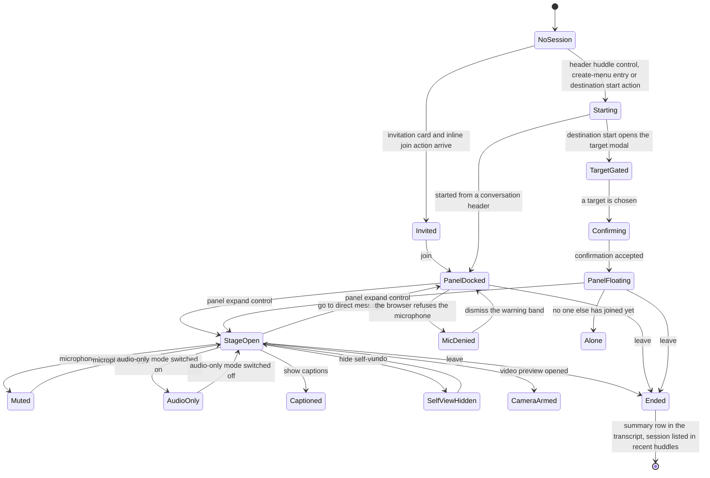

# Huddles

The real-time audio-and-video session that runs inside a conversation, its docked panel and full-screen stage, its in-session controls, and the device-permission failures it surfaces rather than hides.

## Purpose

This document specifies the **huddle**: a live audio-and-video session that belongs to a conversation, renders in one of two surfaces, and leaves a durable record behind in that conversation's transcript. Three things make it a distinct area rather than a feature of the conversation that hosts it. It has **its own two surfaces** — a compact panel docked into the shell, and a full-screen stage that replaces every shell region [frame 268](../../screenshots/Slack%20web%20Jul%202024%20268.png), [frame 269](../../screenshots/Slack%20web%20Jul%202024%20269.png). It has **its own destination** in the navigation rail, with a start action, a suggestion card and a list of past sessions [frame 401](../../screenshots/Slack%20web%20Jul%202024%20401.png). And it owns **its own entity**, `E-HUDDLE`, whose fields — participants, per-participant device state, topic, theme, captions, connection diagnostics and a shareable link — appear nowhere else in the corpus.

**Where the area is encountered.** Four entry points are observed, and they differ from one another in form as well as in position:

- The **conversation header's huddle control**, rendered as a labelled split control with a headphone glyph and a separate caret segment in a direct message [frame 250](../../screenshots/Slack%20web%20Jul%202024%20250.png), [frame 267](../../screenshots/Slack%20web%20Jul%202024%20267.png), and as an **icon-only** control with a caret segment in a channel header [frame 120](../../screenshots/Slack%20web%20Jul%202024%20120.png). A channel's details modal carries the same split control in its action row [frame 90](../../screenshots/Slack%20web%20Jul%202024%2090.png).
- The **global create menu**, whose huddle row is described as starting a video or audio chat and carries no entitlement badge, where the canvas row beside it does [frame 550](../../screenshots/Slack%20web%20Jul%202024%20550.png). That is a statement about the badges **these** captures show and not about whether huddling is entitled — every capture in this corpus is taken in a workspace mid-trial, so the absence of a badge here records one plan state at one moment. Per the entitlement obligation in [21-states.md](21-states.md) the build evaluates entitlement server-side on every attempt to use the capability regardless of what a menu rendered.
- The **huddles destination**, reached from the rail, whose surface carries both a header start action and a hero start action [frame 401](../../screenshots/Slack%20web%20Jul%202024%20401.png).
- An **incoming invitation**, which arrives as a card docked in the same slot the running-huddle panel occupies, and simultaneously as a system row inside the conversation carrying an inline join action [frame 299](../../screenshots/Slack%20web%20Jul%202024%20299.png).

**What this document owns.** The session lifecycle from start to leave; both surfaces and their two different control sets; the in-session overlays (connection diagnostics, invite popover, topic dialog, reactions picker, overflow menu, theme modal, camera-background modal, video-preview popover); the huddles destination with its recent-session list; the system rows a huddle writes into a conversation; and the device-permission denial state that a huddle is the corpus's canonical example of.

**What it does not own.** The conversations that host huddles belong to [05-direct-messages.md](05-direct-messages.md) and [02-channels.md](02-channels.md). The huddle's thread — the pane is part of the stage, but replying in it is a threading journey — belongs to [04-threads.md](04-threads.md). The create menu's own contract and every `C-*` component contract belong to [00-product-overview.md](00-product-overview.md). The preferences dialog that holds the huddle-behaviour settings, and the device-diagnostics sub-flow reached from it, belong to [14-preferences-settings.md](14-preferences-settings.md); the status automation those settings drive belongs to [13-profiles-people.md](13-profiles-people.md). The cross-cutting matrix of loading, empty, error, disabled and gated states belongs to [21-states.md](21-states.md), and the canvas control on the stage belongs to [07-canvases.md](07-canvases.md). The marketing pages that advertise huddles belong to [17-marketing-site.md](17-marketing-site.md). This document links to those; it does not restate them.

**Sample data.** Every workspace name, person's name, device name, plan name, trial date and huddle topic quoted below is **observed fixture content from one demo workspace, not a requirement**. The topic `onboarding`, the participant names, and the trial countdown are illustrations of shape only, in the sense the [placeholder branding vocabulary](00-product-overview.md) defines.

## Flows in this area

Nine flows are named for this area, spanning 37 frames. Every flow identifier and frame span below is the one registered for it in the [Screenshot Coverage Index](_screenshot-index.md); this document adds the steps, not the identifiers. Frame spans are written as plain numeric ranges because they designate a span rather than cite one image — every individual frame is cited with its full relative link in the per-flow step tables and in [Frames covered](#frames-covered).

| Flow ID | Name | Frame span | Primary entry point |
|---|---|---|---|
| `06.1` | Start a huddle from a conversation | 267–270 | The huddle split control in a conversation header |
| `06.2` | Check huddle connection diagnostics | 271–272, 274 | The signal-strength indicator at the stage control bar's left end |
| `06.3` | Use the huddle control bar and set a huddle topic | 273, 275–279 | The stage control bar of a running huddle |
| `06.4` | Send huddle reactions and open the huddle overflow menu | 280–282 | The reactions control in the stage control bar |
| `06.5` | Choose a huddle theme | 283–286 | The choose-a-theme entry in the huddle overflow menu |
| `06.6` | Turn on huddle captions and hide self-view | 287–292 | The show-captions entry in the huddle overflow menu |
| `06.7` | Choose a camera background and preview shared video | 293–295 | The video-background entry in the huddle overflow menu |
| `06.8` | Keep a huddle running from the conversation | 300 | The huddle panel docked at the sidebar's foot |
| `06.9` | Start a huddle from the huddles destination | 401–407 | The huddles destination, reached from the rail |

**Two segmentation notes, because numeric adjacency did not decide either boundary.** Flow `06.5` ends at [frame 286](../../screenshots/Slack%20web%20Jul%202024%20286.png) and `06.6` begins at [frame 287](../../screenshots/Slack%20web%20Jul%202024%20287.png) even though those two frames differ by a measured delta of only 1.47 — the overflow menu is open in both, but at 287 a submenu has opened and the journey has changed from theming to captions. Symmetrically, flow `06.3` claims [frame 273](../../screenshots/Slack%20web%20Jul%202024%20273.png), which sits numerically inside `06.2`'s span, because 273 shows the participants and invite popover rather than the diagnostics popover that 271, 272 and 274 all show. Both decisions were taken on visual state and are reported to the [Flow Reconstruction Methodology](README.md) of the master index.

## Flow 06.1 — Start a huddle from a conversation

### Overview

The shortest path into a huddle: the conversation header's own control starts a session in that conversation. Starting it changes three regions at once — a panel docks at the foot of the sidebar, the conversation's transcript gains a live system row, and the conversation's own sidebar row gains a participant indicator [frame 268](../../screenshots/Slack%20web%20Jul%202024%20268.png). From there the panel's expand control opens the full-screen stage, which replaces the whole shell and adds a thread pane [frame 269](../../screenshots/Slack%20web%20Jul%202024%20269.png).

### Trigger

The huddle control in the conversation header. It is a split control: a labelled segment with a headphone glyph, and a caret segment that opens a two-row menu offering start-huddle and copy-huddle-link [frame 267](../../screenshots/Slack%20web%20Jul%202024%20267.png). In a channel header the same control appears icon-only, still with its caret segment [frame 120](../../screenshots/Slack%20web%20Jul%202024%20120.png).

### Preconditions

An authenticated session with a conversation open in the content region, and no huddle already running in it — the same control renders in a neutral outlined treatment before a session exists [frame 250](../../screenshots/Slack%20web%20Jul%202024%20250.png) and in a filled success treatment while one is live [frame 268](../../screenshots/Slack%20web%20Jul%202024%20268.png). No device permission is required to reach the panel: the session starts and the panel renders even where the microphone has been refused at the browser level, which is what [frame 300](../../screenshots/Slack%20web%20Jul%202024%20300.png) shows.

### Frame-by-frame steps

| Step | Frame(s) | What the user does | What changes on screen | Component(s) involved |
|---|---|---|---|---|
| 1 | [frame 267](../../screenshots/Slack%20web%20Jul%202024%20267.png) | Activates the caret segment of the conversation header's huddle control | A two-row menu opens beneath the caret, anchored to it, offering start-huddle with a headphone glyph and copy-huddle-link with a link glyph; the conversation, its bookmark row and its transcript stay legible behind the menu | `C-DROPDOWN-MENU` |
| 2 | [frame 268](../../screenshots/Slack%20web%20Jul%202024%20268.png) | Starts the huddle | Three regions change together. A panel docks at the foot of the sidebar carrying a header row (signal-strength glyph, the huddle's name, an expand control), a tile strip on a themed background holding two participant thumbnails, and a control row of six toggles with a separated destructive leave action. The transcript gains a tinted system row reading that the user joined the huddle, badged live, with a sub-line stating the other person has been notified. The conversation's sidebar row gains an avatar chip, a headphone glyph and a participant count. The header's huddle control changes from outlined to a filled success treatment | `C-SIDEBAR`, `C-MESSAGE-ROW`, `C-AVATAR` |
| 3 | [frame 269](../../screenshots/Slack%20web%20Jul%202024%20269.png) | Activates the panel's expand control | The full-screen stage replaces every shell region. A thin title bar names the huddle and carries a pop-out control at its far right; two equal participant tiles sit centred on the stage; a thread pane docks at the right explaining that every huddle has a thread saved into the hosting conversation, with a reply composer and an unchecked also-send-as-direct-message option; a control bar spans the foot with a left group (signal indicator, participant count, add-a-topic), five centre toggles, a destructive leave action and a right group of canvas and thread toggles | `C-COMPOSER`, `C-AVATAR` |
| 4 | [frame 270](../../screenshots/Slack%20web%20Jul%202024%20270.png) | Stays on the stage as the second participant joins | The stage background changes to a decorative illustrated theme; the second tile's notification badge is replaced by a crossed-microphone badge at the tile's lower-left corner; the thread pane stays open and no overlay is present | `C-AVATAR` |

**Inferred:** the badge carrying a paper-plane glyph on a participant tile marks someone who has been notified but has not yet joined, because it is present while the transcript states that the person has received a notification to join [frame 268](../../screenshots/Slack%20web%20Jul%202024%20268.png), it is absent once that participant's own microphone badge appears [frame 270](../../screenshots/Slack%20web%20Jul%202024%20270.png), and it is present again on a session the panel itself describes as holding one person [frame 407](../../screenshots/Slack%20web%20Jul%202024%20407.png).

**How the other side joins.** The recipient's client docks an invitation card in the same slot the running-huddle panel uses — an avatar, a line naming who is calling, then three stacked full-width actions offering join, be-there-soon and decline — and simultaneously writes a tinted system row into the conversation carrying an inline join action badged with the caller's avatar [frame 299](../../screenshots/Slack%20web%20Jul%202024%20299.png). That frame's primary owner is [05-direct-messages.md](05-direct-messages.md); it is cited here because it is the corpus's only evidence of the join path as distinct from the start path.

> **Partial capture:** no frame shows the moment of joining from the recipient's side — the invitation card and the joined state are both captured, the transition between them is not. Nor does any frame show a huddle running in a channel rather than in a direct message, although channel headers and channel details modals both expose the control [frame 120](../../screenshots/Slack%20web%20Jul%202024%20120.png), [frame 90](../../screenshots/Slack%20web%20Jul%202024%2090.png).

## Flow 06.2 — Check huddle connection diagnostics

### Overview

A huddle reports its own connection quality in place, from a popover opened on the control bar's signal-strength indicator. The popover grades the session at two levels — a plain-language summary at the top, then three collapsible groups that expand into measured metrics — and it offers one remedial control, an audio-only mode that trades video for performance and announces itself in a banner once enabled [frame 271](../../screenshots/Slack%20web%20Jul%202024%20271.png), [frame 272](../../screenshots/Slack%20web%20Jul%202024%20272.png), [frame 274](../../screenshots/Slack%20web%20Jul%202024%20274.png).

### Trigger

The signal-strength indicator at the left end of the stage control bar, which renders with a filled highlight while its popover is open [frame 271](../../screenshots/Slack%20web%20Jul%202024%20271.png).

### Preconditions

A running huddle displayed on the full-screen stage. Diagnostics are read from the live session rather than from a device test, which is what distinguishes this popover from the preferences dialog's own audio, video and screen-sharing test — that test and its results table belong to [14-preferences-settings.md](14-preferences-settings.md) [frame 563](../../screenshots/Slack%20web%20Jul%202024%20563.png), [frame 564](../../screenshots/Slack%20web%20Jul%202024%20564.png).

### Frame-by-frame steps

| Step | Frame(s) | What the user does | What changes on screen | Component(s) involved |
|---|---|---|---|---|
| 1 | [frame 271](../../screenshots/Slack%20web%20Jul%202024%20271.png) | Activates the signal-strength indicator | A popover opens upward from the indicator, stacked as a success-tinted summary card stating the connection is stable, a success-tinted row for audio-only mode carrying a toggle in its on position and a sub-line explaining that switching it off re-enables video, a card of three collapsible rows for network, system and devices each rated good with a disclosure caret, a labelled group of six help chips, and a footer link to contact support. The indicator itself takes a filled highlight | `C-DROPDOWN-MENU`, `C-BANNER` |
| 2 | [frame 271](../../screenshots/Slack%20web%20Jul%202024%20271.png) | Reads the two things audio-only mode has changed on the stage | The user's own tile carries a text pill in its upper-left corner naming audio-only mode; a warning-background band spans the viewport above the control bar stating that audio-only mode has been enabled, offering a link that turns it off and a dismiss control at its right edge | `C-BANNER` |
| 3 | [frame 272](../../screenshots/Slack%20web%20Jul%202024%20272.png) | Expands the network group | The group's caret flips and four metric rows appear, each carrying a label, a one-line description of what the metric means, and a right-aligned rating followed by a measured value — latency and jitter and packet loss each rated normal, and speaker delay rated high and rendered in the destructive colour. The system and devices groups stay collapsed and still read good | `C-DATA-TABLE` |
| 4 | [frame 274](../../screenshots/Slack%20web%20Jul%202024%20274.png) | Switches audio-only mode off | The audio-only row loses its success tint and returns to the default surface, its toggle renders unfilled, and its sub-line changes to describe what turning the mode *on* would do — that videos and camera are switched off to improve performance. Network, system and devices all read good, collapsed, and the help chips and contact link are unchanged | `C-DROPDOWN-MENU` |

**Inconsistency, recorded not reconciled:** the network group's own summary reads good in the same capture in which one of its four metrics reads high and is rendered destructively [frame 272](../../screenshots/Slack%20web%20Jul%202024%20272.png). A build must decide how a group summary aggregates its metrics; the corpus does not decide it, and this record is not smoothed over to hide that.

**Inferred:** the toggle's sub-line is written for the action the toggle would perform next rather than for the state it is in, because the same row reads that switching off re-enables videos while the toggle is on [frame 271](../../screenshots/Slack%20web%20Jul%202024%20271.png), and reads that videos and camera are switched off to improve performance while the toggle is off [frame 274](../../screenshots/Slack%20web%20Jul%202024%20274.png).

## Flow 06.3 — Use the huddle control bar and set a huddle topic

### Overview

The control bar is the huddle's whole command surface, and this flow exercises the parts of it that are not overlays of their own: the participants control that doubles as the invite affordance, the topic that a huddle can be given and that then labels it everywhere, the tooltip that names which input device a toggle acts on, and the microphone toggle itself [frame 273](../../screenshots/Slack%20web%20Jul%202024%20273.png), [frame 275](../../screenshots/Slack%20web%20Jul%202024%20275.png) through [frame 279](../../screenshots/Slack%20web%20Jul%202024%20279.png).

### Trigger

The control bar of a running huddle on the full-screen stage. Each of its controls opens or toggles in place; none navigates away [frame 279](../../screenshots/Slack%20web%20Jul%202024%20279.png).

### Preconditions

A running huddle on the stage, with at least one other participant present — the participants control's popover lists the current participants, so it presupposes them [frame 273](../../screenshots/Slack%20web%20Jul%202024%20273.png). Setting a topic has no precondition beyond the session itself; the control bar offers add-a-topic from the moment the stage opens [frame 269](../../screenshots/Slack%20web%20Jul%202024%20269.png).

### Frame-by-frame steps

| Step | Frame(s) | What the user does | What changes on screen | Component(s) involved |
|---|---|---|---|---|
| 1 | [frame 273](../../screenshots/Slack%20web%20Jul%202024%20273.png) | Activates the participants control, the one carrying the numeric count | The control takes a filled highlight and a popover opens above it: an invite row with an add-person glyph, a bold label and a sub-line stating that the people invited will receive a notification to join, then one row per current participant with avatar and display name, the signed-in user's row marked as such | `C-DROPDOWN-MENU`, `C-AVATAR` |
| 2 | [frame 275](../../screenshots/Slack%20web%20Jul%202024%20275.png) | Activates add-a-topic at the control bar's left | A centred dialog opens over a dimmed stage: a title, a dismiss control, a single text input whose placeholder asks what the huddle is about, and a footer offering cancel as secondary then add as a filled primary | `C-MODAL-SHELL` |
| 3 | [frame 276](../../screenshots/Slack%20web%20Jul%202024%20276.png) | Types a topic | The typed text appears in the input. **Nothing else changes:** the add action is rendered in exactly the same filled treatment as it was with the field empty — the two captures' primary actions were measured and are identical | `C-MODAL-SHELL` |
| 4 | [frame 277](../../screenshots/Slack%20web%20Jul%202024%20277.png) | Confirms the topic | The dialog closes and the topic text replaces the add-a-topic action in the control bar's left group, positioned after the participant count | `C-MODAL-SHELL`, `C-SESSION-CONTROL-BAR` |
| 5 | [frame 278](../../screenshots/Slack%20web%20Jul%202024%20278.png) | Hovers the microphone toggle | A dark tooltip opens above the toggle carrying three lines: the action it performs, the name of the input device currently selected, and the keyboard shortcut rendered as separate key chips | `C-SESSION-CONTROL-BAR` |
| 6 | [frame 279](../../screenshots/Slack%20web%20Jul%202024%20279.png) | Activates the microphone toggle | The toggle loses its filled treatment and renders as a crossed microphone on the same tinted circle its neighbours use; both participant tiles carry crossed-microphone badges at their lower-left corners; no overlay is open | `C-AVATAR` |

**Inferred:** the topic is a property of the huddle rather than of the conversation, because the conversation's own topic field is edited from the channel details surface owned by [02-channels.md](02-channels.md) [frame 90](../../screenshots/Slack%20web%20Jul%202024%2090.png), while this topic is set from the huddle's control bar, appears in the huddle's control bar [frame 277](../../screenshots/Slack%20web%20Jul%202024%20277.png), titles the huddle's summary row in the transcript once the session ends [frame 300](../../screenshots/Slack%20web%20Jul%202024%20300.png), and titles the session in the recent-huddles list [frame 401](../../screenshots/Slack%20web%20Jul%202024%20401.png).

**Inferred:** the topic is optional, because a session that never received one is titled by its conversation's name instead, both in the recent-huddles list and in the docked panel's header [frame 401](../../screenshots/Slack%20web%20Jul%202024%20401.png), [frame 406](../../screenshots/Slack%20web%20Jul%202024%20406.png).

> **Partial capture:** the invite popover is captured open, but no frame shows a person being selected in it or the resulting invitation arriving. The keyboard shortcut is named by the tooltip [frame 278](../../screenshots/Slack%20web%20Jul%202024%20278.png), but no frame shows a toggle changing under keyboard rather than pointer control.

## Flow 06.4 — Send huddle reactions and open the huddle overflow menu

### Overview

Reactions are the huddle's non-verbal channel, and the corpus shows both halves of the mechanism: the picker they are chosen from, and the two places a sent reaction is rendered — as a badge on the sender's own tile and as an attributed chip floating at the stage's lower-right corner [frame 280](../../screenshots/Slack%20web%20Jul%202024%20280.png), [frame 281](../../screenshots/Slack%20web%20Jul%202024%20281.png). The same flow opens the huddle's overflow menu, which is the parent of flows `06.5`, `06.6` and `06.7` [frame 282](../../screenshots/Slack%20web%20Jul%202024%20282.png).

### Trigger

The reactions control in the stage control bar's centre group for the picker; the settings control at that group's right end for the overflow menu. Both render with a filled highlight while their surface is open [frame 280](../../screenshots/Slack%20web%20Jul%202024%20280.png), [frame 282](../../screenshots/Slack%20web%20Jul%202024%20282.png).

### Preconditions

A running huddle on the full-screen stage. Neither control requires a camera, a microphone or a second participant: the picker opens with the user's own microphone muted [frame 280](../../screenshots/Slack%20web%20Jul%202024%20280.png).

### Frame-by-frame steps

| Step | Frame(s) | What the user does | What changes on screen | Component(s) involved |
|---|---|---|---|---|
| 1 | [frame 280](../../screenshots/Slack%20web%20Jul%202024%20280.png) | Activates the reactions control | A picker opens above the control carrying a three-tab bar — reactions active and underlined, then effects, then stickers — a dismiss control at its right, a search field for all emoji, and grouped emoji rows under headings for frequently used and for a named collection, the lower rows clipped by the picker's own edge | `C-TAB-BAR`, `C-DROPDOWN-MENU` |
| 2 | [frame 281](../../screenshots/Slack%20web%20Jul%202024%20281.png) | Sends a reaction | The picker closes and the reaction renders twice: as a small emoji badge in the upper-left corner of the sender's own participant tile, and as a chip floating at the stage's lower-right corner that pairs the sender's identity with the emoji. The existing crossed-microphone badges stay in the tiles' lower-left corners, so a tile can carry a reaction badge and a device badge at the same time in different corners | `C-AVATAR` |
| 3 | [frame 282](../../screenshots/Slack%20web%20Jul%202024%20282.png) | Activates the settings control | An overflow menu opens above the control in three separated groups — invite people, copy huddle link and go-to-direct-message; edit topic and choose-a-huddle-theme; then show-captions with a submenu chevron, hide-self-view, video background, video-and-mic-settings with a submenu chevron, and video preview | `C-CONTEXT-MENU` |

**The topic entry is written for the state it is in.** The overflow menu offers *edit* topic in a session that already has one [frame 282](../../screenshots/Slack%20web%20Jul%202024%20282.png), where the control bar offered *add* a topic before one was set [frame 269](../../screenshots/Slack%20web%20Jul%202024%20269.png).

> **Partial capture:** the effects and stickers tabs are named by the picker's tab bar but neither is captured open, so nothing is claimed about their contents. No frame shows a reaction sent by another participant, so it is not known whether a received reaction renders in the same two places.

## Flow 06.5 — Choose a huddle theme

### Overview

A huddle's stage background is a shared, selectable theme rather than a per-participant decoration — the modal says so explicitly in its footer, and the change is applied behind both tiles at once [frame 283](../../screenshots/Slack%20web%20Jul%202024%20283.png), [frame 285](../../screenshots/Slack%20web%20Jul%202024%20285.png). The theme is chosen from a single-select grid of grouped thumbnails and committed with an explicit action, so it is a deliberate change rather than a live preview.

### Trigger

The choose-a-huddle-theme entry in the huddle overflow menu [frame 282](../../screenshots/Slack%20web%20Jul%202024%20282.png).

### Preconditions

A running huddle on the stage with the overflow menu reachable. A theme is already applied when the modal opens — the decorative illustrated background in use is the thumbnail carrying the selection ring and check badge [frame 283](../../screenshots/Slack%20web%20Jul%202024%20283.png) — so the surface has no unset state in this corpus.

### Frame-by-frame steps

| Step | Frame(s) | What the user does | What changes on screen | Component(s) involved |
|---|---|---|---|---|
| 1 | [frame 283](../../screenshots/Slack%20web%20Jul%202024%20283.png) | Chooses the theme entry from the overflow menu | A centred modal opens over a dimmed stage: title and dismiss control; a three-column thumbnail grid under three group headings — featured with six thumbnails, then a colours group of three, then a landscapes group whose row is clipped by the modal's scroll region; the applied theme marked with a selection ring and a check badge at its upper-right; and a footer carrying an explanatory line at the left stating that everyone in the huddle sees the same theme, then cancel as secondary and set-theme as a filled primary | `C-MODAL-SHELL` |
| 2 | [frame 284](../../screenshots/Slack%20web%20Jul%202024%20284.png) | Selects a thumbnail from the landscapes group | The chosen thumbnail takes the selection ring and check badge; the previously marked featured thumbnail loses both, so the grid is single-select. The stage behind the dimmed backdrop still shows the old theme, so selection alone does not apply | `C-MODAL-SHELL` |
| 3 | [frame 285](../../screenshots/Slack%20web%20Jul%202024%20285.png) | Commits with set-theme | The modal closes and the newly chosen theme fills the stage behind both participant tiles; the thread pane stays open; the control bar, its topic and its participant count are unchanged | `C-MODAL-SHELL`, `C-PARTICIPANT-TILE`, `C-SESSION-CONTROL-BAR` |
| 4 | [frame 286](../../screenshots/Slack%20web%20Jul%202024%20286.png) | Reopens the overflow menu over the new theme | The same menu opens with an identical item set, over the new background | `C-CONTEXT-MENU` |

**Inferred:** the theme is a property of the huddle shared by its participants rather than a per-user setting, because the modal's own footer states that everyone in the huddle sees the same theme [frame 283](../../screenshots/Slack%20web%20Jul%202024%20283.png). The corpus captures only one participant's client, so the statement is the evidence and the propagation is not observed.

**A theme is not a camera background.** Both are pickers of images, and they are distinct: the theme is the stage's shared backdrop, chosen from grouped thumbnails and committed with an action [frame 283](../../screenshots/Slack%20web%20Jul%202024%20283.png); the camera background is applied to the user's own video feed, previewed in the modal that offers it, and has no commit action at all [frame 293](../../screenshots/Slack%20web%20Jul%202024%20293.png). Flow `06.7` covers the second.

## Flow 06.6 — Turn on huddle captions and hide self-view

### Overview

Two view-level preferences that both act on the stage and both announce themselves in the same lower-left slot. Captions arrive as a live strip and then as a durable **captions record** in a second pane tab — a store this document keeps deliberately distinct from the conversation's message list, for the reason set out in the terminology note in **Screens & components**; hiding self-view removes the user's own tile and re-centres the stage on what remains, while the participant count stays where it was [frame 287](../../screenshots/Slack%20web%20Jul%202024%20287.png) through [frame 292](../../screenshots/Slack%20web%20Jul%202024%20292.png).

### Trigger

The show-captions entry in the huddle overflow menu, which carries a submenu chevron, and the hide-self-view entry in the same menu [frame 287](../../screenshots/Slack%20web%20Jul%202024%20287.png), [frame 282](../../screenshots/Slack%20web%20Jul%202024%20282.png).

### Preconditions

A running huddle on the stage. Captions require someone to be speaking before any text appears — the pane's captions tab is captured empty before its first entry arrives [frame 290](../../screenshots/Slack%20web%20Jul%202024%20290.png), [frame 291](../../screenshots/Slack%20web%20Jul%202024%20291.png) — and the microphone is unmuted in every captioned capture [frame 288](../../screenshots/Slack%20web%20Jul%202024%20288.png).

### Frame-by-frame steps

| Step | Frame(s) | What the user does | What changes on screen | Component(s) involved |
|---|---|---|---|---|
| 1 | [frame 287](../../screenshots/Slack%20web%20Jul%202024%20287.png) | Moves onto the show-captions entry | The entry takes a filled highlight and its submenu opens to the right carrying a group label for how captions are displayed and two options, closed captions and side-by-side | `C-CONTEXT-MENU` |
| 2 | [frame 288](../../screenshots/Slack%20web%20Jul%202024%20288.png) | Chooses a display option | The menu closes and a dark pill notice appears at the stage's lower-left confirming that captions have been turned on. The settings control that opened the menu keeps a visible focus ring, and the microphone toggle renders in its filled unmuted treatment | `C-CONTEXT-MENU`, `C-SESSION-CONTROL-BAR`; caption notice pill — area-local structure at the stage's lower-leading corner, see **Screens & components** |
| 3 | [frame 289](../../screenshots/Slack%20web%20Jul%202024%20289.png) | Speaks, or listens while someone speaks | The notice is replaced in the same position by a caption strip carrying the speaker's name in bold followed by the transcribed words | Caption strip — area-local structure in the same lower-leading slot, see **Screens & components** |
| 4 | [frame 290](../../screenshots/Slack%20web%20Jul%202024%20290.png) | Switches the right pane to its captions tab | The pane's header becomes a two-tab bar of thread and captions with captions active and underlined, and the pane body is empty — no illustration, no explanatory copy | `C-TAB-BAR` |
| 5 | [frame 291](../../screenshots/Slack%20web%20Jul%202024%20291.png) | Waits for speech to be transcribed | One transcript entry appears at the foot of the pane carrying the speaker's avatar, their name in bold and the transcribed line, so entries accumulate upward from the bottom | `C-AVATAR` |
| 6 | [frame 292](../../screenshots/Slack%20web%20Jul%202024%20292.png) | Chooses hide-self-view from the overflow menu | The user's own tile is removed and the stage re-centres on the single remaining tile; a neutral full-width bar appears between stage and control bar carrying a crossed-eye glyph, a line stating that self-view is hidden, and an undo link. The participant count in the control bar still reads two | `C-BANNER` |

**Inferred:** hiding self-view is a local view preference and not a change of participation, because the control bar's participant count is unchanged by it while one of the two tiles disappears [frame 292](../../screenshots/Slack%20web%20Jul%202024%20292.png).

**Inferred:** captions are transcribed per speaker rather than as one undifferentiated stream, because both the live strip and the pane entry attribute their text to a named speaker [frame 289](../../screenshots/Slack%20web%20Jul%202024%20289.png), [frame 291](../../screenshots/Slack%20web%20Jul%202024%20291.png).

> **Partial capture:** the two caption display options are named [frame 287](../../screenshots/Slack%20web%20Jul%202024%20287.png), but the corpus shows only one rendering — a strip at the stage's lower-left — so which option produced it is not observable, and the side-by-side rendering is not captured. Turning captions *off* is not captured either. Self-view is restored between [frame 292](../../screenshots/Slack%20web%20Jul%202024%20292.png) and [frame 293](../../screenshots/Slack%20web%20Jul%202024%20293.png), where both tiles are present again, but the act of restoring it is not.

## Flow 06.7 — Choose a camera background and preview shared video

### Overview

Turning the camera on is a two-surface journey rather than a toggle: a background is chosen from a grid that previews it, and the camera is then armed from a preview popover that names the camera source and offers an explicit turn-on action. The corpus captures the whole journey with the camera still off, which is why the modal's large preview region renders black [frame 293](../../screenshots/Slack%20web%20Jul%202024%20293.png) through [frame 295](../../screenshots/Slack%20web%20Jul%202024%20295.png).

### Trigger

The video-background entry in the huddle overflow menu for the grid, and the video-preview entry in the same menu for the popover [frame 282](../../screenshots/Slack%20web%20Jul%202024%20282.png).

### Preconditions

A running huddle on the stage with the camera toggle in its off state — it is crossed out in every frame of this flow. No background is applied at the start: the grid's none option carries the selection [frame 293](../../screenshots/Slack%20web%20Jul%202024%20293.png). A user-level preference to blur the background whenever the camera is on exists in the preferences dialog owned by [14-preferences-settings.md](14-preferences-settings.md) and is unticked in the capture that shows it [frame 561](../../screenshots/Slack%20web%20Jul%202024%20561.png).

### Frame-by-frame steps

| Step | Frame(s) | What the user does | What changes on screen | Component(s) involved |
|---|---|---|---|---|
| 1 | [frame 293](../../screenshots/Slack%20web%20Jul%202024%20293.png) | Chooses video background from the overflow menu | A centred modal opens over a dimmed stage: title and dismiss control, a large preview region that renders black, and a grid of nine options in three rows — none carrying the current selection, a blur option, then illustrated and photographic backgrounds. The modal has **no footer actions at all** | `C-MODAL-SHELL` |
| 2 | [frame 294](../../screenshots/Slack%20web%20Jul%202024%20294.png) | Selects a photographic background | The chosen option takes a selection ring and a check badge at its upper-right, a dark tooltip beneath it reveals that option's label, the none option returns to a plain swatch, and the large preview region changes from black to the chosen background image | `C-MODAL-SHELL` |
| 3 | [frame 295](../../screenshots/Slack%20web%20Jul%202024%20295.png) | Chooses video preview from the overflow menu | A popover opens above the control bar carrying a header row with a back link at the left and a dismiss control at the right, a thumbnail showing the chosen background, a labelled camera-source select naming the device currently chosen, and a footer offering dismiss as secondary then turn-on as a filled primary | `C-DROPDOWN-MENU` |

**Inferred:** a background selection applies immediately rather than on confirmation, because the modal offers no apply or cancel action of any kind and the preview region updates as soon as an option is selected [frame 293](../../screenshots/Slack%20web%20Jul%202024%20293.png), [frame 294](../../screenshots/Slack%20web%20Jul%202024%20294.png).

**Inferred:** the preview region shows the camera feed with the background composited over it, and renders black here only because the camera is off, because the same region changes to the selected background image the moment a background is chosen while the camera toggle stays crossed out [frame 294](../../screenshots/Slack%20web%20Jul%202024%20294.png).

**Inferred:** the back link in the video-preview popover returns to a settings surface reached from the same menu, because the popover is opened from the overflow menu's last entry and the entry above it opens video-and-mic settings behind a submenu chevron [frame 282](../../screenshots/Slack%20web%20Jul%202024%20282.png), [frame 295](../../screenshots/Slack%20web%20Jul%202024%20295.png). Neither that submenu nor the surface behind the back link is captured.

> **Partial capture:** no frame shows the camera actually on. The turn-on action is captured [frame 295](../../screenshots/Slack%20web%20Jul%202024%20295.png), but no capture shows a participant tile carrying a live camera feed, a camera toggle in its on state, or a background composited into a tile on the stage. Nothing is claimed about any of the three.

## Flow 06.8 — Keep a huddle running from the conversation

### Overview

A huddle does not require its stage: the session continues while the user reads and writes in the conversation, with the panel docked at the sidebar's foot and the transcript carrying the live row [frame 300](../../screenshots/Slack%20web%20Jul%202024%20300.png). This single frame is also the corpus's densest evidence for three separate things — the six-control compact panel, the microphone-permission denial band, and the summary row an ended huddle leaves behind next to the live row of a running one.

### Trigger

The docked huddle panel, which is present in the shell whenever a session is running and the stage is not open [frame 268](../../screenshots/Slack%20web%20Jul%202024%20268.png), [frame 300](../../screenshots/Slack%20web%20Jul%202024%20300.png).

### Preconditions

A running huddle in the conversation being read, and the full-screen stage closed. In this capture the browser has refused microphone access, which is a precondition of the banner rather than of the session: the huddle runs regardless [frame 300](../../screenshots/Slack%20web%20Jul%202024%20300.png).

### Frame-by-frame steps

| Step | Frame(s) | What the user does | What changes on screen | Component(s) involved |
|---|---|---|---|---|
| 1 | [frame 300](../../screenshots/Slack%20web%20Jul%202024%20300.png) | Works in the conversation while the session continues | The whole shell is usable — rail, sidebar, top bar, transcript and composer are all rendered normally — with the huddle panel docked at the sidebar's foot carrying its header row, a themed tile strip whose own tile shows a crossed-microphone badge, a control row of six toggles and a separated destructive leave action. The conversation's sidebar row carries a facepile, a headphone glyph and a participant count | `C-SIDEBAR`, `C-COMPOSER`, `C-AVATAR` |
| 2 | [frame 300](../../screenshots/Slack%20web%20Jul%202024%20300.png) | Reads the transcript the huddle is writing into | Two huddle rows are visible at once: a neutral summary row for an earlier session, titled with that session's topic followed by a past-tense verb, timestamped, with a sub-line naming who was in the huddle and for how long; and beneath it a tinted row for the running session, stating that the user joined, badged live, timestamped, with a sub-line naming who else is present | `C-MESSAGE-ROW`, `C-AVATAR` |
| 3 | [frame 300](../../screenshots/Slack%20web%20Jul%202024%20300.png) | Finds the microphone unavailable | A warning-background band spans the viewport's foot, above nothing and below everything, instructing the user to enable the microphone in the browser's own address bar, with a dismiss control at its right edge. The panel's microphone toggle renders crossed out, as does the tile badge | `C-PERMISSION-PROMPT`, `C-BANNER` |

**Inferred:** the microphone is unavailable rather than merely switched off, because the remedy the product offers is not its own toggle but the browser's address bar — a control the product cannot operate — and because the same denial is independently reported as a failed row in the device test owned by [14-preferences-settings.md](14-preferences-settings.md) [frame 300](../../screenshots/Slack%20web%20Jul%202024%20300.png), [frame 565](../../screenshots/Slack%20web%20Jul%202024%20565.png).

**What the surface actually is, and the correction that follows from it.** This flow was originally registered — here and in the [Screenshot Coverage Index](_screenshot-index.md) — as taking place in the reader's conversation with themself. Re-inspection does not support that reading, so both the flow's name and its ledger entry now describe the surface the pixels show: a **two-person direct message with another person**. Its conversation intro states that the conversation is just between that person and the reader, its composer is addressed to that person, and its sidebar marks a *different* member as the signed-in user than the participant popover does in the earlier frames of this area [frame 273](../../screenshots/Slack%20web%20Jul%202024%20273.png), [frame 300](../../screenshots/Slack%20web%20Jul%202024%20300.png). The flow identifier `06.8` and its single-frame span are unchanged by the correction; only the name and the caption were wrong. The reader-identity evidence is set out in full by [05-direct-messages.md](05-direct-messages.md), which owns the conversation itself.

**The observed inconsistency behind it, recorded not reconciled.** The corpus captures **one huddle from both participants' accounts**. In the earlier frames of this area the participants popover marks one member with a self suffix beside their name while the other is listed plainly [frame 273](../../screenshots/Slack%20web%20Jul%202024%20273.png); at [frame 300](../../screenshots/Slack%20web%20Jul%202024%20300.png) the sidebar's self badge sits on **that other** member's row, and the huddle panel is titled with the first member's name. Both captures show a two-participant session in the same one-to-one conversation, each carrying a participant count of two [frame 273](../../screenshots/Slack%20web%20Jul%202024%20273.png), [frame 300](../../screenshots/Slack%20web%20Jul%202024%20300.png). That divergence is a property of the export, not of the product, and is left standing. A build should read this flow as *the huddle continues while the conversation is used*, which is what the pixels support.

## Flow 06.9 — Start a huddle from the huddles destination

### Overview

The huddles destination is the area's own surface: a start action, a suggestion drawn from recent history, and a list of past sessions that exposes each one's duration, participants and thread. Starting a session from here runs the longest confirmation path in the area — a target picker with an entitlement advisory, then a suppressible confirmation dialog — and ends with the panel floating at the viewport's lower-left, because this destination has no sidebar to dock into [frame 401](../../screenshots/Slack%20web%20Jul%202024%20401.png) through [frame 407](../../screenshots/Slack%20web%20Jul%202024%20407.png).

### Trigger

The huddles destination, reached from the rail's more menu, where it is one of the twelve configurable destinations that [00-product-overview.md](00-product-overview.md) maps [frame 399](../../screenshots/Slack%20web%20Jul%202024%20399.png). On the surface itself, either the header's new-huddle action or the hero's start action begins a session [frame 401](../../screenshots/Slack%20web%20Jul%202024%20401.png).

### Preconditions

An authenticated session. Past sessions are not a precondition of the surface but they are of two of its regions: the suggestion card cites how many times the user huddled with that person this week, and the recent list is populated from history [frame 401](../../screenshots/Slack%20web%20Jul%202024%20401.png). A workspace on a trial is a precondition of the advisory and the countdown strip, not of huddling [frame 404](../../screenshots/Slack%20web%20Jul%202024%20404.png), [frame 406](../../screenshots/Slack%20web%20Jul%202024%20406.png).

### Frame-by-frame steps

| Step | Frame(s) | What the user does | What changes on screen | Component(s) involved |
|---|---|---|---|---|
| 1 | [frame 401](../../screenshots/Slack%20web%20Jul%202024%20401.png) | Opens the huddles destination | The content region fills the whole width right of the rail — **this destination renders no sidebar column**. Top to bottom: a header row with the destination title at the left and a new-huddle action at the right; a dismissible success-tinted hero carrying a heading, body copy naming screen sharing, reactions and an automatically saved thread, a primary start action with a headphone glyph, an illustration of a huddle window, and a dismiss control at its upper-right; a dimmed suggestion card pairing two overlapped avatars with a question and a sub-line counting this week's sessions with that person; then a recent-huddles section whose rows each carry a circled headphone glyph, the session's title, a metadata sub-line of relative age, duration and an optional reply-count link, a participant facepile, and an overflow control | `C-RAIL`, `C-BANNER`, `C-AVATAR`, `C-UPGRADE-GATE` |
| 2 | [frame 402](../../screenshots/Slack%20web%20Jul%202024%20402.png) | Opens a recent row's overflow control | A menu opens anchored to that row offering four entries — see-participants with a right-aligned member count, save-for-later, copy-huddle-link, and start-a-huddle-from-thread | `C-CONTEXT-MENU` |
| 3 | [frame 403](../../screenshots/Slack%20web%20Jul%202024%20403.png) | Chooses see-participants | A centred modal dims the surface behind it: the session's title, a sub-line stating where the huddle happened and how long it lasted, a dismiss control, then one row per participant — one bare, and the signed-in user's row marked as their own and carrying a role title beneath the name | `C-MODAL-SHELL`, `C-AVATAR` |
| 4 | [frame 404](../../screenshots/Slack%20web%20Jul%202024%20404.png) | Starts a new huddle from the surface | A centred modal opens: title, a sub-line inviting the user to find a person or channel, a search-by-name field, a single active section label above a rule, one matching person row with avatar, display name and presence indicator, an advisory block on a muted surface stating that huddles with more than two people are a paid capability available during the free trial and naming the trial's end date, and a footer offering cancel as an outlined secondary then a start action **rendered muted** | `C-MODAL-SHELL`, `C-UPGRADE-GATE`, `C-PRESENCE-DOT` |
| 5 | [frame 405](../../screenshots/Slack%20web%20Jul%202024%20405.png) | Confirms the target | A confirmation dialog replaces the modal: a question as its title, a body naming the person the huddle will start with in bold, a ticked do-not-show-again checkbox, a dismiss control, and a footer offering cancel then a filled primary confirmation | `C-CONFIRM-DIALOG` |
| 6 | [frame 406](../../screenshots/Slack%20web%20Jul%202024%20406.png) | Confirms, and the session starts | The dialog closes and the compact panel appears **floating at the viewport's lower-left over the content region**, since there is no sidebar here: header row, themed tile strip with the user's own thumbnail beside a notification-badged tile, a control row of six toggles and a separated destructive leave action. A countdown strip docks directly beneath the panel carrying a clock glyph, the days remaining on the trial and a learn-more link. The suggestion card is gone from the surface; the recent list is unchanged | `C-UPGRADE-GATE`, `C-AVATAR` |
| 7 | [frame 407](../../screenshots/Slack%20web%20Jul%202024%20407.png) | Waits alone in the session | The panel grows a block beneath its control row: a line stating that the user is the only one in the huddle, then a row pairing a music-note glyph and a waiting-room select at the left with a circular stop control at the right. In the content region an active-session card takes the suggestion card's place — a thumbnail band carrying a live duration pill and one participant thumbnail, then the session's title, a one-person count, and a full-width muted joined action | `C-RECORD-CARD`, `C-AVATAR` |

**Inferred:** the start action in the target modal is gated on choosing a target, because it renders muted in the only capture of that modal, where the search field is empty and no row is selected [frame 404](../../screenshots/Slack%20web%20Jul%202024%20404.png), and the identical muted-until-satisfied treatment is the pattern [00-product-overview.md](00-product-overview.md) records for the modal shell.

**Inferred:** the confirmation dialog is a suppressible interstitial rather than a required step, because it carries a do-not-show-again checkbox and that checkbox is already ticked in the capture [frame 405](../../screenshots/Slack%20web%20Jul%202024%20405.png). Which of the surface's two start actions opened the target modal is **not** observable — the header action and the hero action are both present and no capture shows either being activated.

**Inferred:** the recent list's title is the session's topic where one was set and the conversation's name otherwise, because two rows are titled with the topic used earlier in this area and a third is titled with a person's name, and the person-titled row's duration matches the session whose panel header also carried that person's name [frame 401](../../screenshots/Slack%20web%20Jul%202024%20401.png), [frame 406](../../screenshots/Slack%20web%20Jul%202024%20406.png).

> **Partial capture:** the waiting-room select and the stop control are captured but never operated, so nothing is claimed about what the select offers or what the stop control stops. Save-for-later and start-a-huddle-from-thread are named by the row menu [frame 402](../../screenshots/Slack%20web%20Jul%202024%20402.png) and neither result is captured. No frame shows a huddle with more than two participants, so the paid capability the advisory names is never seen in use.

## Screens & components

### Two different things are called a transcript, and this document separates them

The corpus uses one word for two stores, and conflating them has consequences well beyond wording. **The conversation's message list** is the ordered set of messages people posted, which the huddle thread pane renders and which the conversation keeps [frame 269](../../screenshots/Slack%20web%20Jul%202024%20269.png). **The captions record** is a speech-derived set of entries, each carrying a speaker's avatar, their name in bold and a transcribed line, accumulating in its own pane tab while captions are on [frame 291](../../screenshots/Slack%20web%20Jul%202024%20291.png).

This document therefore uses **message list** or **conversation history** for the first and reserves **captions record** for the second, and never calls the first a transcript. The reason is not stylistic: the two stores have different origins, different audiences and different sensitivities. A build that writes speech-derived entries into the message history gives them the message history's **search reach, export reach, projection surfaces and retention** in one step — so a spoken aside becomes a searchable, exportable, indefinitely-retained message that its speaker never composed. The two stores are kept separate, and the captions record's own lifecycle is specified in **Edge cases & validations** under `S-CONSENT`.

### The three surfaces, their regions and their relative sizing

All sizing below is **proportional to the effective product viewport** and is never an absolute offset. Iconography is named by function throughout — microphone toggle, camera toggle, screen-share control, reactions control, invite control, overflow control, expand control, signal-strength indicator, dismiss control — and never by any third-party asset.

| Surface | When it renders | Regions, in order | Relative sizing | Evidence |
|---|---|---|---|---|
| Docked huddle panel | A session is running and the stage is closed, in a conversation | Header row (signal-strength indicator, huddle name, expand control at the right) → tile strip on the session's theme → control row (six toggles, then a gap, then the destructive leave action) → optional solo block | A card inset inside the sidebar column, occupying that column's width less a small inset on both sides, and roughly one-quarter of viewport height; its three rows stack in a ratio of roughly 1 : 3 : 1.5, so the tile strip dominates | [frame 268](../../screenshots/Slack%20web%20Jul%202024%20268.png), [frame 300](../../screenshots/Slack%20web%20Jul%202024%20300.png) |
| Floating huddle panel | A session is running on a destination that renders no sidebar | Identical to the docked panel, with a countdown strip able to dock beneath it | The same card, floating at the viewport's lower-left over the content region, with the same proportions | [frame 406](../../screenshots/Slack%20web%20Jul%202024%20406.png), [frame 407](../../screenshots/Slack%20web%20Jul%202024%20407.png) |
| Full-screen huddle stage | The panel's expand control is used | Title bar (huddle name at the left, pop-out control at the far right) → stage → optional right pane → control bar | The stage **replaces every shell region**. The title bar takes roughly a thirtieth of viewport height and the control bar roughly a fourteenth; the right pane takes roughly the right quarter of the width from the stage; the participant tiles are equal, side by side, centred, together roughly four-fifths of the stage's width and about half of viewport height | [frame 269](../../screenshots/Slack%20web%20Jul%202024%20269.png), [frame 281](../../screenshots/Slack%20web%20Jul%202024%20281.png) |
| Huddles destination | The huddles destination is selected in the rail | Header row (title left, new-huddle action right) → dismissible hero → suggestion card or active-session card → recent-huddles section | The rail persists and the content region takes **all remaining width, with no sidebar column**. The header row takes roughly a twentieth of viewport height and the hero roughly a quarter; the recent list is a card of full-width rows | [frame 401](../../screenshots/Slack%20web%20Jul%202024%20401.png), [frame 406](../../screenshots/Slack%20web%20Jul%202024%20406.png) |

**Hierarchy.** The panel is a child of the shell and leaves rail, sidebar, top bar, transcript and composer fully usable [frame 300](../../screenshots/Slack%20web%20Jul%202024%20300.png). The stage is not: it is a peer of the shell that takes the whole viewport, which is why the conversation is reached from the stage only through the overflow menu's go-to-direct-message entry [frame 282](../../screenshots/Slack%20web%20Jul%202024%20282.png). Overlays layer above whichever surface is open, and the corpus shows both anchoring modes in this area — popovers anchored to the control that opened them and leaving their backdrop legible [frame 271](../../screenshots/Slack%20web%20Jul%202024%20271.png), [frame 273](../../screenshots/Slack%20web%20Jul%202024%20273.png), [frame 295](../../screenshots/Slack%20web%20Jul%202024%20295.png), and centred modals that dim it [frame 275](../../screenshots/Slack%20web%20Jul%202024%20275.png), [frame 283](../../screenshots/Slack%20web%20Jul%202024%20283.png), [frame 293](../../screenshots/Slack%20web%20Jul%202024%20293.png), [frame 403](../../screenshots/Slack%20web%20Jul%202024%20403.png), [frame 404](../../screenshots/Slack%20web%20Jul%202024%20404.png).

### The two control sets, which are different and must both be built

This is the single most fabrication-prone fact in the area, so it is stated exactly as observed: **the panel and the stage carry different control sets, in different arrangements.** Neither is a subset of the other — the panel has an invite control and an overflow control the stage's centre group lacks, and the stage has a settings control, a participant count, a topic and two right-hand toggles the panel lacks.

| Surface | Left of the toggles | The toggles, in the order shown | Terminating action | Right of the terminating action | Evidence |
|---|---|---|---|---|---|
| Docked or floating panel | Nothing; the signal-strength indicator and the huddle name sit in the header row above, with the expand control at that row's right | Six: microphone, camera, screen share, reactions, invite, overflow | The destructive leave action, separated from the sixth toggle by a gap at the row's right end | Nothing | [frame 268](../../screenshots/Slack%20web%20Jul%202024%20268.png), [frame 300](../../screenshots/Slack%20web%20Jul%202024%20300.png), [frame 406](../../screenshots/Slack%20web%20Jul%202024%20406.png), [frame 407](../../screenshots/Slack%20web%20Jul%202024%20407.png) |
| Full-screen stage control bar | Three items: the signal-strength indicator, the participants control carrying a numeric count, then add-a-topic or the topic once set | Five: microphone, camera, screen share, reactions, settings | The destructive leave action, immediately right of the fifth toggle and centred in the bar | Two toggles pinned at the bar's right end: canvas, then thread | [frame 269](../../screenshots/Slack%20web%20Jul%202024%20269.png), [frame 279](../../screenshots/Slack%20web%20Jul%202024%20279.png), [frame 281](../../screenshots/Slack%20web%20Jul%202024%20281.png), [frame 292](../../screenshots/Slack%20web%20Jul%202024%20292.png) |

Two consequences follow, and a build that misses either will get the stage wrong. On the stage, **invite is reached through the participants control** rather than through a control of its own [frame 273](../../screenshots/Slack%20web%20Jul%202024%20273.png), and **the settings control is the overflow menu** rather than a route to preferences [frame 282](../../screenshots/Slack%20web%20Jul%202024%20282.png). The terminating action is described here as the destructive, session-ending action rendered in a warning colour and separated from the toggles; it is never specified by its colour alone.

**Control states observed.** A toggle in its active or unmuted state renders filled and light against the bar; the same toggle muted or off renders as a crossed glyph on the bar's own tinted circle [frame 277](../../screenshots/Slack%20web%20Jul%202024%20277.png), [frame 279](../../screenshots/Slack%20web%20Jul%202024%20279.png). A control whose surface is open renders filled while it is open — the signal indicator [frame 271](../../screenshots/Slack%20web%20Jul%202024%20271.png), the participants control [frame 273](../../screenshots/Slack%20web%20Jul%202024%20273.png), the reactions control [frame 280](../../screenshots/Slack%20web%20Jul%202024%20280.png), the settings control [frame 282](../../screenshots/Slack%20web%20Jul%202024%20282.png) — and the thread toggle renders filled for as long as the pane is docked [frame 281](../../screenshots/Slack%20web%20Jul%202024%20281.png). A control that has been used and retains keyboard focus renders with a visible focus ring [frame 288](../../screenshots/Slack%20web%20Jul%202024%20288.png). Hovering a toggle opens a tooltip naming the action, the device it acts on and its keyboard shortcut [frame 278](../../screenshots/Slack%20web%20Jul%202024%20278.png).

### Participant tile anatomy

A tile is the unit of presence, and its badges are positioned by corner. The corners carry different classes of information, and the corpus shows two badges on one tile at once, so they are independent [frame 281](../../screenshots/Slack%20web%20Jul%202024%20281.png).

| Position | Badge | Meaning as observed | Evidence |
|---|---|---|---|
| Upper-left | Paper-plane glyph | Present while the transcript says the person has been notified, absent once that person's own device badge appears | [frame 268](../../screenshots/Slack%20web%20Jul%202024%20268.png), [frame 269](../../screenshots/Slack%20web%20Jul%202024%20269.png), [frame 407](../../screenshots/Slack%20web%20Jul%202024%20407.png) |
| Upper-left | Emoji | The reaction that participant just sent | [frame 281](../../screenshots/Slack%20web%20Jul%202024%20281.png) |
| Upper-left | Text pill naming audio-only mode | Present on the user's own tile while audio-only mode is on | [frame 271](../../screenshots/Slack%20web%20Jul%202024%20271.png) |
| Lower-left | Crossed microphone | That participant's microphone is muted; observed on one tile and on both at once | [frame 270](../../screenshots/Slack%20web%20Jul%202024%20270.png), [frame 279](../../screenshots/Slack%20web%20Jul%202024%20279.png), [frame 300](../../screenshots/Slack%20web%20Jul%202024%20300.png) |
| Whole tile | Removed from the layout | Self-view hidden; the stage re-centres on the remaining tile while the participant count is unchanged | [frame 292](../../screenshots/Slack%20web%20Jul%202024%20292.png) |
| Band above the tile | Live duration pill | On the active-session card of the huddles destination only | [frame 407](../../screenshots/Slack%20web%20Jul%202024%20407.png) |

### Components this area consumes

Every identifier below is defined once, authoritatively, in [00-product-overview.md](00-product-overview.md), and is referenced here by identifier only — no contract is restated.

| Component | How this area uses it | Evidence |
|---|---|---|
| `C-PERMISSION-PROMPT` | The denial state, as a warning-background band at the viewport's foot pointing at the browser's own address bar — this area is the corpus's canonical example | [frame 300](../../screenshots/Slack%20web%20Jul%202024%20300.png) |
| `C-BANNER` | Three in-session bands: the warning-background audio-only notice with a turn-off link, the neutral self-view-hidden bar with an undo link, and the destination's dismissible promotional hero | [frame 271](../../screenshots/Slack%20web%20Jul%202024%20271.png), [frame 292](../../screenshots/Slack%20web%20Jul%202024%20292.png), [frame 401](../../screenshots/Slack%20web%20Jul%202024%20401.png) |
| `C-MESSAGE-ROW` | The system rows a huddle writes into a conversation: the tinted live row with its live badge, and the neutral summary row an ended session leaves behind | [frame 268](../../screenshots/Slack%20web%20Jul%202024%20268.png), [frame 300](../../screenshots/Slack%20web%20Jul%202024%20300.png) |
| `C-DROPDOWN-MENU` | The header control's caret menu, the diagnostics popover, the invite popover and the video-preview popover — all anchored to the control that opened them. The reactions picker is `C-EMOJI-PICKER` rather than a menu | [frame 267](../../screenshots/Slack%20web%20Jul%202024%20267.png), [frame 271](../../screenshots/Slack%20web%20Jul%202024%20271.png), [frame 273](../../screenshots/Slack%20web%20Jul%202024%20273.png), [frame 280](../../screenshots/Slack%20web%20Jul%202024%20280.png), [frame 295](../../screenshots/Slack%20web%20Jul%202024%20295.png) |
| `C-CONTEXT-MENU` | The huddle overflow menu with its three groups and two sideways submenus, and the recent row's own menu | [frame 282](../../screenshots/Slack%20web%20Jul%202024%20282.png), [frame 287](../../screenshots/Slack%20web%20Jul%202024%20287.png), [frame 402](../../screenshots/Slack%20web%20Jul%202024%20402.png) |
| `C-MODAL-SHELL` | The topic dialog, the theme modal, the camera-background modal, the participants modal and the start-a-huddle modal | [frame 275](../../screenshots/Slack%20web%20Jul%202024%20275.png), [frame 283](../../screenshots/Slack%20web%20Jul%202024%20283.png), [frame 293](../../screenshots/Slack%20web%20Jul%202024%20293.png), [frame 403](../../screenshots/Slack%20web%20Jul%202024%20403.png), [frame 404](../../screenshots/Slack%20web%20Jul%202024%20404.png) |
| `C-CONFIRM-DIALOG` | The suppressible starting-a-huddle confirmation | [frame 405](../../screenshots/Slack%20web%20Jul%202024%20405.png) |
| `C-TAB-BAR` | The reactions picker's three tabs, and the right pane's thread-and-captions tabs | [frame 280](../../screenshots/Slack%20web%20Jul%202024%20280.png), [frame 290](../../screenshots/Slack%20web%20Jul%202024%20290.png) |
| `C-DATA-TABLE` | The diagnostics popover's expanded metric rows, each with a label, a description and a rated value | [frame 272](../../screenshots/Slack%20web%20Jul%202024%20272.png) |
| `C-AVATAR` | Participant tiles and their badges, the facepile on a recent-huddles row, the avatar on an invitation card, and the avatar on a transcript entry in the captions pane | [frame 281](../../screenshots/Slack%20web%20Jul%202024%20281.png), [frame 291](../../screenshots/Slack%20web%20Jul%202024%20291.png), [frame 299](../../screenshots/Slack%20web%20Jul%202024%20299.png), [frame 401](../../screenshots/Slack%20web%20Jul%202024%20401.png) |
| `C-PRESENCE-DOT` | The presence indicator on the match row of the start-a-huddle modal | [frame 404](../../screenshots/Slack%20web%20Jul%202024%20404.png) |
| `C-SIDEBAR` | The column the panel docks into, and the conversation row that gains a facepile, a headphone glyph and a participant count while a session runs | [frame 268](../../screenshots/Slack%20web%20Jul%202024%20268.png), [frame 300](../../screenshots/Slack%20web%20Jul%202024%20300.png) |
| `C-RAIL` | The route to the huddles destination | [frame 399](../../screenshots/Slack%20web%20Jul%202024%20399.png), [frame 401](../../screenshots/Slack%20web%20Jul%202024%20401.png) |
| `C-COMPOSER` | The thread pane's reply composer, and the conversation composer that stays usable while a session runs | [frame 269](../../screenshots/Slack%20web%20Jul%202024%20269.png), [frame 300](../../screenshots/Slack%20web%20Jul%202024%20300.png) |
| `C-UPGRADE-GATE` | The paid-capability advisory in the start modal, and the trial countdown strip beneath the floating panel | [frame 404](../../screenshots/Slack%20web%20Jul%202024%20404.png), [frame 406](../../screenshots/Slack%20web%20Jul%202024%20406.png) |
| `C-RECORD-CARD` | The active-session card and the suggestion card on the huddles destination | [frame 401](../../screenshots/Slack%20web%20Jul%202024%20401.png), [frame 407](../../screenshots/Slack%20web%20Jul%202024%20407.png) |
| `C-EMOJI-PICKER` | The reactions picker, in its in-session form: a three-tab bar of reactions, effects and stickers with a dismiss control, above an emoji search field and grouped emoji rows. Reported by [03-messaging-and-composer.md](03-messaging-and-composer.md) and contracted in [00-product-overview.md](00-product-overview.md) | [frame 280](../../screenshots/Slack%20web%20Jul%202024%20280.png) |
| `C-HUDDLE-PANEL` | The docked panel this area is the corpus's canonical example of, and its floating form on the sessions destination | [frame 268](../../screenshots/Slack%20web%20Jul%202024%20268.png), [frame 300](../../screenshots/Slack%20web%20Jul%202024%20300.png), [frame 406](../../screenshots/Slack%20web%20Jul%202024%20406.png), [frame 407](../../screenshots/Slack%20web%20Jul%202024%20407.png) |
| `C-PARTICIPANT-TILE` | Every tile on the stage and in the panel's tile strip, including the corner badges tabulated in **Participant tile anatomy** above and the self tile inset while a screen is shared | [frame 270](../../screenshots/Slack%20web%20Jul%202024%20270.png), [frame 271](../../screenshots/Slack%20web%20Jul%202024%20271.png), [frame 279](../../screenshots/Slack%20web%20Jul%202024%20279.png), [frame 281](../../screenshots/Slack%20web%20Jul%202024%20281.png), [frame 292](../../screenshots/Slack%20web%20Jul%202024%20292.png), [frame 300](../../screenshots/Slack%20web%20Jul%202024%20300.png), [frame 407](../../screenshots/Slack%20web%20Jul%202024%20407.png), [frame 296](../../screenshots/Slack%20web%20Jul%202024%20296.png), [frame 195](../../screenshots/Slack%20web%20Jul%202024%20195.png) |
| `C-SESSION-CONTROL-BAR` | Both observed forms — the panel's six toggles with a separated session-ending action, and the stage's left group, five toggles, centred ending action and trailing pair | [frame 268](../../screenshots/Slack%20web%20Jul%202024%20268.png), [frame 269](../../screenshots/Slack%20web%20Jul%202024%20269.png), [frame 279](../../screenshots/Slack%20web%20Jul%202024%20279.png), [frame 281](../../screenshots/Slack%20web%20Jul%202024%20281.png), [frame 288](../../screenshots/Slack%20web%20Jul%202024%20288.png), [frame 300](../../screenshots/Slack%20web%20Jul%202024%20300.png) |

**Component contracts this area contributed, and the one it explicitly does not claim.** Three recurring structures in this area had no identifier when it was written, and per the catalog's single-source-of-truth rule they were reported to [00-product-overview.md](00-product-overview.md) rather than contracted locally. **All three are now defined there** and are referenced here by identifier only: `C-HUDDLE-PANEL` for the panel itself (header row, tile strip, control row, optional solo block), `C-PARTICIPANT-TILE` for the tile with its corner-addressed badges, and `C-SESSION-CONTROL-BAR` for the control bar whose two forms carry different control sets in different arrangements. Each appears in the table above with the frames it was read from, and none is restated as a contract here. Two exclusions are recorded deliberately. First, the caption notice pill that announces a view preference at the stage's lower-leading corner is **not** `C-TOAST`: that contract places a toast at the bottom-right of the content region, and this pill sits at a different corner of a different surface, so the two are kept apart rather than reconciled [frame 288](../../screenshots/Slack%20web%20Jul%202024%20288.png), [frame 289](../../screenshots/Slack%20web%20Jul%202024%20289.png). Second, **`C-MEDIA-PLAYER` is not consumed by any frame this area claims** — no huddle surface in the corpus carries a player with a scrubber, and the video-player mocks that advertise huddles belong to [17-marketing-site.md](17-marketing-site.md) [frame 783](../../screenshots/Slack%20web%20Jul%202024%20783.png), so no player contract is claimed here. The marketing landing page makes the same point from the other direction: its product mock docks a huddle at the foot of the mocked sidebar column as a strip of three participant tiles with an overflow count on the last one, above a reduced control row of three glyphs — microphone, camera and screen share — and **no scrubber, elapsed time or playback control of any kind** [frame 0](../../screenshots/Slack%20web%20Jul%202024%200.png).

## States

Each state below is observed, with the frame that shows it. The cross-cutting matrix for the whole product — the canonical loading, empty, error, disabled and gated exemplars, and the full `C-UPGRADE-GATE` state set — is owned by [21-states.md](21-states.md) and is not restated here.

| State | What is observable | Evidence |
|---|---|---|
| No session | The conversation header's huddle control renders in a neutral outlined treatment; no panel is docked and no live row is in the transcript | [frame 250](../../screenshots/Slack%20web%20Jul%202024%20250.png), [frame 267](../../screenshots/Slack%20web%20Jul%202024%20267.png) |
| Session running, panel docked | A panel is docked at the sidebar's foot, the header control renders filled in a success treatment, the conversation's sidebar row carries a participant count, and the transcript carries a live-badged row | [frame 268](../../screenshots/Slack%20web%20Jul%202024%20268.png), [frame 300](../../screenshots/Slack%20web%20Jul%202024%20300.png) |
| Session running, panel floating | The same panel floats at the viewport's lower-left over a destination that renders no sidebar, with a countdown strip able to dock beneath it | [frame 406](../../screenshots/Slack%20web%20Jul%202024%20406.png) |
| Session running, stage open | Every shell region is replaced by the title bar, stage and control bar | [frame 269](../../screenshots/Slack%20web%20Jul%202024%20269.png), [frame 281](../../screenshots/Slack%20web%20Jul%202024%20281.png) |
| Invited, not yet joined | A participant tile carries a paper-plane badge, and the transcript states that the person has been notified | [frame 268](../../screenshots/Slack%20web%20Jul%202024%20268.png), [frame 407](../../screenshots/Slack%20web%20Jul%202024%20407.png) |
| Invitation pending on the recipient's client | A card docked in the panel's slot offers join, be-there-soon and decline, and the transcript carries an inline join action | [frame 299](../../screenshots/Slack%20web%20Jul%202024%20299.png) |
| Alone in the session | The panel grows a block stating that the user is the only one present, with a waiting-room select and a stop control; the destination's active-session card reads one person and offers a muted joined action | [frame 407](../../screenshots/Slack%20web%20Jul%202024%20407.png) |
| Microphone unmuted | The microphone toggle renders filled and light; no crossed badge on that participant's tile | [frame 277](../../screenshots/Slack%20web%20Jul%202024%20277.png), [frame 288](../../screenshots/Slack%20web%20Jul%202024%20288.png) |
| Microphone muted | The toggle renders as a crossed glyph on the bar's tinted circle and the participant's tile carries a crossed-microphone badge at its lower-left | [frame 279](../../screenshots/Slack%20web%20Jul%202024%20279.png), [frame 300](../../screenshots/Slack%20web%20Jul%202024%20300.png) |
| Microphone denied by the browser | A warning-background band at the viewport's foot points at the browser's own address bar; the toggle still renders crossed | [frame 300](../../screenshots/Slack%20web%20Jul%202024%20300.png) |
| Camera off | The camera toggle renders crossed in every capture of this area | [frame 269](../../screenshots/Slack%20web%20Jul%202024%20269.png), [frame 293](../../screenshots/Slack%20web%20Jul%202024%20293.png) |
| Camera armed but not yet on | The video-preview popover shows the chosen background, names the camera source and offers an explicit turn-on action | [frame 295](../../screenshots/Slack%20web%20Jul%202024%20295.png) |
| Audio-only mode on | The diagnostics row is success-tinted with its toggle filled, the user's tile carries an audio-only pill, and a warning-background band offers to turn the mode off | [frame 271](../../screenshots/Slack%20web%20Jul%202024%20271.png) |
| Audio-only mode off | The same row sits on the default surface with its toggle unfilled and its sub-line rewritten for the opposite action | [frame 274](../../screenshots/Slack%20web%20Jul%202024%20274.png) |
| Connection graded | A summary card states the connection is stable and three groups read good; expanding a group can reveal a metric rated high in the destructive colour | [frame 271](../../screenshots/Slack%20web%20Jul%202024%20271.png), [frame 272](../../screenshots/Slack%20web%20Jul%202024%20272.png) |
| Captions on, nothing transcribed yet | A pill notice confirms captions were turned on, and the pane's captions tab is empty | [frame 288](../../screenshots/Slack%20web%20Jul%202024%20288.png), [frame 290](../../screenshots/Slack%20web%20Jul%202024%20290.png) |
| Captions on, speech transcribed | A strip at the stage's lower-left carries speaker and words, and the captions pane accumulates attributed entries | [frame 289](../../screenshots/Slack%20web%20Jul%202024%20289.png), [frame 291](../../screenshots/Slack%20web%20Jul%202024%20291.png) |
| Self-view hidden | The user's own tile is removed, the stage re-centres, a neutral bar offers undo, and the participant count is unchanged | [frame 292](../../screenshots/Slack%20web%20Jul%202024%20292.png) |
| Reaction sent | An emoji badge appears in the sender's tile's upper-left and an attributed chip floats at the stage's lower-right | [frame 281](../../screenshots/Slack%20web%20Jul%202024%20281.png) |
| Thread pane open | The pane occupies the right quarter of the stage and the control bar's thread toggle renders filled | [frame 269](../../screenshots/Slack%20web%20Jul%202024%20269.png), [frame 281](../../screenshots/Slack%20web%20Jul%202024%20281.png) |
| Start gated on a target | The start-a-huddle modal's primary action renders muted with no target chosen, beside a paid-capability advisory | [frame 404](../../screenshots/Slack%20web%20Jul%202024%20404.png) |
| Start awaiting confirmation | A suppressible dialog names the person the session will start with | [frame 405](../../screenshots/Slack%20web%20Jul%202024%20405.png) |
| Session ended | The transcript keeps a neutral summary row titled with the session's topic, timestamped, naming who took part and for how long; the destination lists the session with its duration, participant facepile and an optional reply-count link | [frame 300](../../screenshots/Slack%20web%20Jul%202024%20300.png), [frame 401](../../screenshots/Slack%20web%20Jul%202024%20401.png) |
| Control surface open | The control that opened a popover or menu renders filled for as long as it is open | [frame 271](../../screenshots/Slack%20web%20Jul%202024%20271.png), [frame 273](../../screenshots/Slack%20web%20Jul%202024%20273.png), [frame 280](../../screenshots/Slack%20web%20Jul%202024%20280.png), [frame 282](../../screenshots/Slack%20web%20Jul%202024%20282.png) |
| Control focused | A control that has been used keeps a visible focus ring after its surface closes | [frame 288](../../screenshots/Slack%20web%20Jul%202024%20288.png) |
| Hovered | Hovering a toggle opens a tooltip naming the action, the device and the shortcut; hovering a background option reveals that option's label | [frame 278](../../screenshots/Slack%20web%20Jul%202024%20278.png), [frame 294](../../screenshots/Slack%20web%20Jul%202024%20294.png) |

### Session lifecycle

**Every state in this diagram is a state a cited frame shows.** States the corpus never captures — an active screen share, a live camera feed, a session with more than two participants — are deliberately absent rather than guessed at, and each is named as a partial capture in the flow that would have contained it. Transitions are of two kinds, and the difference is stated rather than blurred: most are **captured as a before-and-after pair of frames**, and the four labelled below are **evidenced only by the control that performs them**, which the frames do show.

**The four control-evidenced transitions**, listed so that no reader mistakes them for captured ones: leaving a session, whose destructive control is shown on both surfaces [frame 269](../../screenshots/Slack%20web%20Jul%202024%20269.png), [frame 300](../../screenshots/Slack%20web%20Jul%202024%20300.png) and whose *result* — a summary row and a listed session — is shown [frame 300](../../screenshots/Slack%20web%20Jul%202024%20300.png), [frame 401](../../screenshots/Slack%20web%20Jul%202024%20401.png), but never as a before-and-after pair; returning from the stage to the conversation through the overflow menu's go-to-direct-message entry [frame 282](../../screenshots/Slack%20web%20Jul%202024%20282.png); dismissing the microphone-denial band, whose dismiss control is present [frame 300](../../screenshots/Slack%20web%20Jul%202024%20300.png); and arming the camera from the video-preview popover [frame 295](../../screenshots/Slack%20web%20Jul%202024%20295.png). No transition *out of* `Captioned` or `CameraArmed` is drawn, because turning captions off and turning the camera on are both uncaptured.

No colour or styling is declared on this diagram, deliberately: the palette is the next run's to choose.

## Implied data model

This area **owns `E-HUDDLE`** and contributes fields to three entities other areas own. Every field below cites the frame that exposes it; a field no frame evidences is not in this model. Every identifier used here appears in the [consolidated data model](README.md) of the master index, and every field below is aggregated there rather than being defined twice.

| Entity | Fields this area's surfaces expose |
|---|---|
| `E-HUDDLE` | Name, rendered in the panel header, in the stage title bar and as a recent-list title — the session's topic where one was set, otherwise the hosting conversation's name [frame 268](../../screenshots/Slack%20web%20Jul%202024%20268.png), [frame 269](../../screenshots/Slack%20web%20Jul%202024%20269.png), [frame 401](../../screenshots/Slack%20web%20Jul%202024%20401.png) · topic, set and edited from the session itself and surfaced in the control bar beside the participant count [frame 276](../../screenshots/Slack%20web%20Jul%202024%20276.png), [frame 277](../../screenshots/Slack%20web%20Jul%202024%20277.png), [frame 282](../../screenshots/Slack%20web%20Jul%202024%20282.png) · hosting conversation, which the panel names and the overflow menu offers to navigate to [frame 282](../../screenshots/Slack%20web%20Jul%202024%20282.png), [frame 300](../../screenshots/Slack%20web%20Jul%202024%20300.png) · participant list with a numeric count, rendered as tiles on the stage, as a count in the control bar, as a facepile on a recent row and as rows in a participants modal [frame 269](../../screenshots/Slack%20web%20Jul%202024%20269.png), [frame 401](../../screenshots/Slack%20web%20Jul%202024%20401.png), [frame 403](../../screenshots/Slack%20web%20Jul%202024%20403.png) · per-participant microphone state, rendered as a crossed badge on that participant's tile [frame 270](../../screenshots/Slack%20web%20Jul%202024%20270.png), [frame 279](../../screenshots/Slack%20web%20Jul%202024%20279.png) · per-participant camera state, rendered as the camera toggle's crossed treatment [frame 269](../../screenshots/Slack%20web%20Jul%202024%20269.png) · per-participant invited-not-yet-joined state, rendered as a paper-plane badge [frame 268](../../screenshots/Slack%20web%20Jul%202024%20268.png), [frame 407](../../screenshots/Slack%20web%20Jul%202024%20407.png) · live flag, rendered as a badge on the transcript row and as a duration pill on the destination's active-session card [frame 268](../../screenshots/Slack%20web%20Jul%202024%20268.png), [frame 407](../../screenshots/Slack%20web%20Jul%202024%20407.png) · duration, running while live and fixed once ended [frame 401](../../screenshots/Slack%20web%20Jul%202024%20401.png), [frame 403](../../screenshots/Slack%20web%20Jul%202024%20403.png), [frame 407](../../screenshots/Slack%20web%20Jul%202024%20407.png) · shareable link, offered from the header control's menu, from the overflow menu and from a recent row's menu [frame 267](../../screenshots/Slack%20web%20Jul%202024%20267.png), [frame 282](../../screenshots/Slack%20web%20Jul%202024%20282.png), [frame 402](../../screenshots/Slack%20web%20Jul%202024%20402.png) · theme, single-valued and shared by every participant [frame 283](../../screenshots/Slack%20web%20Jul%202024%20283.png), [frame 285](../../screenshots/Slack%20web%20Jul%202024%20285.png) · captions state with a display option of closed-caption or side-by-side, plus a transcript of speaker-attributed entries [frame 287](../../screenshots/Slack%20web%20Jul%202024%20287.png), [frame 291](../../screenshots/Slack%20web%20Jul%202024%20291.png) · audio-only mode, a session-level switch that also tags the user's own tile [frame 271](../../screenshots/Slack%20web%20Jul%202024%20271.png), [frame 274](../../screenshots/Slack%20web%20Jul%202024%20274.png) · connection diagnostics — an overall verdict, three group ratings for network, system and devices, and four network metrics each with a rating and a measured value [frame 271](../../screenshots/Slack%20web%20Jul%202024%20271.png), [frame 272](../../screenshots/Slack%20web%20Jul%202024%20272.png) · associated thread, which the pane states is saved into the hosting conversation and which a recent row surfaces as a reply count [frame 269](../../screenshots/Slack%20web%20Jul%202024%20269.png), [frame 401](../../screenshots/Slack%20web%20Jul%202024%20401.png) · saved-for-later flag, offered from a recent row's menu [frame 402](../../screenshots/Slack%20web%20Jul%202024%20402.png) · a waiting-room selection and its stop control, offered while the user is alone [frame 407](../../screenshots/Slack%20web%20Jul%202024%20407.png) |
| `E-MESSAGE` | A huddle system-message subtype with two observed variants — a tinted live variant naming who joined, badged live, with a sub-line naming who else is present or has been notified [frame 268](../../screenshots/Slack%20web%20Jul%202024%20268.png), [frame 300](../../screenshots/Slack%20web%20Jul%202024%20300.png), and a neutral summary variant titled with the session's topic, timestamped, with a sub-line naming the participants and the elapsed duration [frame 300](../../screenshots/Slack%20web%20Jul%202024%20300.png) · an inline join action carried by the invitation variant on the recipient's side [frame 299](../../screenshots/Slack%20web%20Jul%202024%20299.png) · a thread summary attachable to a summary row, carrying a facepile, a reply count and a last-reply time [frame 302](../../screenshots/Slack%20web%20Jul%202024%20302.png) |
| `E-USER` | Participation in a huddle, rendered as a tile and as a participant row [frame 269](../../screenshots/Slack%20web%20Jul%202024%20269.png), [frame 403](../../screenshots/Slack%20web%20Jul%202024%20403.png) · a self-marker on the signed-in user's own participant row [frame 273](../../screenshots/Slack%20web%20Jul%202024%20273.png), [frame 403](../../screenshots/Slack%20web%20Jul%202024%20403.png) · a role title, rendered beneath the name on a participant row and observed on one row only [frame 403](../../screenshots/Slack%20web%20Jul%202024%20403.png) · an in-a-huddle status, set automatically on joining and rendered as a glyph beside the display name in the conversation and in the thread [frame 297](../../screenshots/Slack%20web%20Jul%202024%20297.png), [frame 561](../../screenshots/Slack%20web%20Jul%202024%20561.png) · a per-person huddle history with the current user, surfaced as a count of this week's sessions on the suggestion card [frame 401](../../screenshots/Slack%20web%20Jul%202024%20401.png) · presence, rendered on the start modal's match row [frame 404](../../screenshots/Slack%20web%20Jul%202024%20404.png) |
| `E-PREFERENCE` | Input and output device selection with an input-level meter and a speaker test, automatic gain control and noise suppression [frame 561](../../screenshots/Slack%20web%20Jul%202024%20561.png) · a when-joining-a-huddle group of five settings — set an in-a-huddle status, mute the microphone, turn captions on automatically, warn before starting a huddle in a channel above a stated member threshold, and blur the video background while the camera is on [frame 561](../../screenshots/Slack%20web%20Jul%202024%20561.png) · a when-alone-in-a-huddle group holding a play-music switch and a timing select [frame 561](../../screenshots/Slack%20web%20Jul%202024%20561.png) · a camera-source selection, also settable from inside the session [frame 295](../../screenshots/Slack%20web%20Jul%202024%20295.png) · a camera background of none, blurred or an image [frame 293](../../screenshots/Slack%20web%20Jul%202024%20293.png), [frame 294](../../screenshots/Slack%20web%20Jul%202024%20294.png) · suppression of the starting-a-huddle confirmation [frame 405](../../screenshots/Slack%20web%20Jul%202024%20405.png) |
| `E-PLAN` | A per-capability entitlement limiting huddles to two people outside a paid plan tier, surfaced as an advisory in the start modal together with the trial's end date [frame 404](../../screenshots/Slack%20web%20Jul%202024%20404.png) · a trial countdown in days, docked beneath the floating panel with a learn-more link [frame 406](../../screenshots/Slack%20web%20Jul%202024%20406.png), [frame 407](../../screenshots/Slack%20web%20Jul%202024%20407.png) |

The preference *dialog* that holds those settings is owned by [14-preferences-settings.md](14-preferences-settings.md), the status automation by [13-profiles-people.md](13-profiles-people.md), the thread by [04-threads.md](04-threads.md) and the transcript rows' host conversation by [05-direct-messages.md](05-direct-messages.md). Only the huddle-facing consequences are claimed here.

**Inferred:** a huddle is a child of exactly one conversation rather than a free-standing object, because every session observed is named after its conversation until a topic renames it [frame 268](../../screenshots/Slack%20web%20Jul%202024%20268.png), its thread is stated to be saved into that conversation [frame 269](../../screenshots/Slack%20web%20Jul%202024%20269.png), its overflow menu offers to navigate to it [frame 282](../../screenshots/Slack%20web%20Jul%202024%20282.png), and its summary is written into that conversation's transcript [frame 300](../../screenshots/Slack%20web%20Jul%202024%20300.png).

**Inferred:** captions and self-view visibility are per-user view state while topic and theme are session state, because the theme modal states that everyone sees the same theme [frame 283](../../screenshots/Slack%20web%20Jul%202024%20283.png) whereas captions are switched on from the user's own overflow menu and can also be defaulted per user in preferences [frame 287](../../screenshots/Slack%20web%20Jul%202024%20287.png), [frame 561](../../screenshots/Slack%20web%20Jul%202024%20561.png), and hiding self-view leaves the participant count untouched [frame 292](../../screenshots/Slack%20web%20Jul%202024%20292.png).

## Transitions in and out

**Into this area.** Five routes are observed. A conversation header's huddle control, labelled in a direct message and icon-only in a channel, which either starts a session directly or opens a two-row menu offering start and copy-link [frame 267](../../screenshots/Slack%20web%20Jul%202024%20267.png), [frame 120](../../screenshots/Slack%20web%20Jul%202024%20120.png) — those headers belong to [05-direct-messages.md](05-direct-messages.md) and [02-channels.md](02-channels.md). The same split control in a channel's details modal [frame 90](../../screenshots/Slack%20web%20Jul%202024%2090.png), owned by [02-channels.md](02-channels.md). The global create menu's huddle row [frame 550](../../screenshots/Slack%20web%20Jul%202024%20550.png), whose contract belongs to [00-product-overview.md](00-product-overview.md). The huddles destination, reached from the rail's more menu [frame 399](../../screenshots/Slack%20web%20Jul%202024%20399.png), whose map also belongs to [00-product-overview.md](00-product-overview.md). And an incoming invitation, which arrives as a docked card and as an inline join action in the transcript [frame 299](../../screenshots/Slack%20web%20Jul%202024%20299.png), owned by [05-direct-messages.md](05-direct-messages.md). A sixth route is named but not captured: start-a-huddle-from-thread, offered by a recent row's menu [frame 402](../../screenshots/Slack%20web%20Jul%202024%20402.png).

**Out of this area.** The thread pane's reply composer leads into [04-threads.md](04-threads.md), which owns replying in the huddle thread [frame 296](../../screenshots/Slack%20web%20Jul%202024%20296.png) through [frame 298](../../screenshots/Slack%20web%20Jul%202024%20298.png); the pane's own presence on the stage is specified here, the replying is not. The stage's canvas toggle leads into [07-canvases.md](07-canvases.md) [frame 269](../../screenshots/Slack%20web%20Jul%202024%20269.png). The overflow menu's go-to-direct-message entry returns to the hosting conversation [frame 282](../../screenshots/Slack%20web%20Jul%202024%20282.png), and the summary rows a finished session leaves there are read as part of [05-direct-messages.md](05-direct-messages.md) [frame 301](../../screenshots/Slack%20web%20Jul%202024%20301.png), [frame 302](../../screenshots/Slack%20web%20Jul%202024%20302.png). The overflow menu's video-and-mic-settings entry and the panel's device concerns lead into [14-preferences-settings.md](14-preferences-settings.md), which owns the preferences dialog and the device test [frame 282](../../screenshots/Slack%20web%20Jul%202024%20282.png), [frame 561](../../screenshots/Slack%20web%20Jul%202024%20561.png), [frame 564](../../screenshots/Slack%20web%20Jul%202024%20564.png). The in-a-huddle status leads into [13-profiles-people.md](13-profiles-people.md) [frame 297](../../screenshots/Slack%20web%20Jul%202024%20297.png). The entitlement advisory and trial countdown lead into [18-pricing-plans.md](18-pricing-plans.md) through the `C-UPGRADE-GATE` contract, whose state matrix is in [21-states.md](21-states.md) [frame 404](../../screenshots/Slack%20web%20Jul%202024%20404.png), [frame 406](../../screenshots/Slack%20web%20Jul%202024%20406.png). And the huddles marketing pages, which depict this area to an unauthenticated visitor, belong to [17-marketing-site.md](17-marketing-site.md) [frame 782](../../screenshots/Slack%20web%20Jul%202024%20782.png).

**A boundary worth stating.** Leaving a huddle does not leave the conversation, and closing the stage does not end the huddle: the panel keeps the session running while the whole shell is used normally [frame 300](../../screenshots/Slack%20web%20Jul%202024%20300.png). A build that treats the stage as the session will end sessions the corpus shows continuing.

## Edge cases & validations

Only cases the corpus actually shows are listed. Each names the surface that carries it, what it does, and the frame that evidences it.

### Device and permission failures

| Case | What the product does | Evidence |
|---|---|---|
| The browser refuses microphone access | The session still starts and the panel still renders; a warning-background band spans the viewport's foot instructing the user to enable the microphone in the browser's own address bar, with a dismiss control. The failure is reported in place; nothing fails silently and no modal blocks the session | [frame 300](../../screenshots/Slack%20web%20Jul%202024%20300.png) |
| Screen-share access is refused | The device test reports it as a named row whose label *and* status are both rendered in the destructive colour, reading permission denied, while every other row passes | [frame 565](../../screenshots/Slack%20web%20Jul%202024%20565.png) |
| A device test is still running | The row in progress renders a spinner in place of a status word and rows below it read pending in the default text colour, so a partially complete result set is legible rather than blank | [frame 564](../../screenshots/Slack%20web%20Jul%202024%20564.png) |
| Connection quality degrades | The in-session popover grades network, system and devices, expands into four measured network metrics, offers audio-only mode as the remedy, and links six named help topics plus a contact route | [frame 271](../../screenshots/Slack%20web%20Jul%202024%20271.png), [frame 272](../../screenshots/Slack%20web%20Jul%202024%20272.png) |
| Audio-only mode is enabled | Two independent signals appear: a pill on the user's own tile and a warning-background band offering to turn the mode off, so the degraded-but-working state cannot be mistaken for a fault | [frame 271](../../screenshots/Slack%20web%20Jul%202024%20271.png) |

### Validations and gates

| Case | What the product does | Evidence |
|---|---|---|
| No target chosen in the start modal | The primary start action renders muted while the search field is empty and no person row is selected | [frame 404](../../screenshots/Slack%20web%20Jul%202024%20404.png) |
| A huddle would exceed two people | An advisory block on a muted surface states that huddles with more than two people are a paid capability, available during the free trial, and names the trial's end date | [frame 404](../../screenshots/Slack%20web%20Jul%202024%20404.png) |
| Starting a huddle with a named person | A confirmation dialog names the person in bold and offers a do-not-show-again checkbox, so the interstitial is suppressible per user | [frame 405](../../screenshots/Slack%20web%20Jul%202024%20405.png) |
| Starting a huddle in a large channel | A preference, ticked by default in the capture, sends a warning when a huddle is started in a channel above a stated member threshold — the threshold is a number in the setting's own label, not a hidden constant | [frame 561](../../screenshots/Slack%20web%20Jul%202024%20561.png) |
| A topic is submitted empty | **Nothing observable prevents it.** The topic dialog's primary action is rendered in the identical filled treatment with the field empty and with text typed — the two captures were measured — so no enablement gating is claimed for this dialog | [frame 275](../../screenshots/Slack%20web%20Jul%202024%20275.png), [frame 276](../../screenshots/Slack%20web%20Jul%202024%20276.png) |
| The user is alone in the session | The panel states it plainly and offers a waiting-room select with a stop control rather than ending the session; the destination's card reads one person and its joined action renders muted | [frame 407](../../screenshots/Slack%20web%20Jul%202024%20407.png) |
| An invited person has not joined | Their tile carries a paper-plane badge and the participant count reflects only those present — the panel reads one person while two tiles are rendered | [frame 407](../../screenshots/Slack%20web%20Jul%202024%20407.png) |
| Captions are on but nothing has been said | The captions tab renders empty — no illustration, no explanatory copy — and the live strip carries the confirmation notice instead | [frame 288](../../screenshots/Slack%20web%20Jul%202024%20288.png), [frame 290](../../screenshots/Slack%20web%20Jul%202024%20290.png) |
| The camera is off while a background is chosen | The modal's large preview region renders black until an option is selected, then shows that option's image | [frame 293](../../screenshots/Slack%20web%20Jul%202024%20293.png), [frame 294](../../screenshots/Slack%20web%20Jul%202024%20294.png) |
| Self-view is hidden | The stage re-centres on one tile and a neutral bar offers undo, while the participant count stays at two so the user cannot mistake a view change for a departure | [frame 292](../../screenshots/Slack%20web%20Jul%202024%20292.png) |

### Gotchas a build will otherwise get wrong

- **The two control sets are not the same control set.** Building one row of six toggles and reusing it on the stage loses the participant count, the topic, the settings control and the canvas and thread toggles; building the stage's five and reusing them in the panel loses invite and overflow [frame 269](../../screenshots/Slack%20web%20Jul%202024%20269.png), [frame 300](../../screenshots/Slack%20web%20Jul%202024%20300.png).
- **The panel has two homes.** It docks inside the sidebar column in a conversation and floats at the viewport's lower-left on a destination that renders no sidebar; a panel positioned only relative to the sidebar will be misplaced on the huddles destination [frame 268](../../screenshots/Slack%20web%20Jul%202024%20268.png), [frame 406](../../screenshots/Slack%20web%20Jul%202024%20406.png).
- **A huddle writes two different rows into the transcript.** The live row is tinted and badged; the summary row is neutral, titled by topic and carries a duration — and both can be present at once, so they are separate message variants rather than one row in two states [frame 300](../../screenshots/Slack%20web%20Jul%202024%20300.png).
- **Tile badges are corner-addressed and can co-occur.** A reaction badge in the upper-left and a muted badge in the lower-left appear on the same tile in the same capture [frame 281](../../screenshots/Slack%20web%20Jul%202024%20281.png).
- **A theme is committed; a camera background is not.** The theme modal has cancel and set-theme; the background modal has no footer actions at all [frame 283](../../screenshots/Slack%20web%20Jul%202024%20283.png), [frame 293](../../screenshots/Slack%20web%20Jul%202024%20293.png).
- **The participants control is the invite control on the stage**, and **the settings control is the overflow menu** — neither name matches what a build would guess from the glyph [frame 273](../../screenshots/Slack%20web%20Jul%202024%20273.png), [frame 282](../../screenshots/Slack%20web%20Jul%202024%20282.png).
- **The huddles destination renders no sidebar column at all**, unlike other rail destinations in this corpus [frame 401](../../screenshots/Slack%20web%20Jul%202024%20401.png).

### Build obligations where the corpus is silent

Every item below is a requirement the corpus **cannot** evidence either way, written in the obligation register defined in [00-product-overview.md](00-product-overview.md) and resolving to the `S-*` contracts defined there. Real-time media makes this area's silences the most consequential in the catalog.

> **Build obligation:** **the huddles destination is a cross-conversation projection and is scoped as one.** The destination lists huddles beyond the conversation the viewer is currently in [frame 406](../../screenshots/Slack%20web%20Jul%202024%20406.png), and it is reached from the rail's more menu rather than from any one conversation [frame 399](../../screenshots/Slack%20web%20Jul%202024%20399.png). Per `S-AUTHZ-READ` every row, count, participant facepile, topic and past-session record it renders is computed **after** applying the viewer's current authorization for the **containing conversation**, and is recomputed on every render so that losing access to a conversation removes its huddles from the destination on the next render rather than leaving a durable copy. A huddle's **topic is content**, so it is projected only to a viewer authorized to read the conversation it belongs to [frame 277](../../screenshots/Slack%20web%20Jul%202024%20277.png).

> **Build obligation:** **every huddle link is re-authorized when it is resolved, not when it is copied.** Three entry points produce one: the conversation header's huddle dropdown [frame 267](../../screenshots/Slack%20web%20Jul%202024%20267.png), the channel details surface, and the control bar's invite affordance [frame 273](../../screenshots/Slack%20web%20Jul%202024%20273.png). Per `S-AUTHZ-READ` and `S-AUTHZ-OP`, following such a link re-checks the follower's current authorization **for the containing conversation** at the moment of resolution, so a link that has escaped its audience grants nothing and revocation is effective. The corpus shows the copy action and never shows a link being followed, so nothing about what resolution does is claimed from the pixels.

> **Build obligation:** **the captions record is a separate store from the message list, and it has a lifecycle.** Turning captions on produces a live strip and then a pane tab that accumulates speaker-attributed entries [frame 287](../../screenshots/Slack%20web%20Jul%202024%20287.png), [frame 291](../../screenshots/Slack%20web%20Jul%202024%20291.png) — a durable record of what people said, derived from their speech. Per `S-CONSENT`: it has a **stated storage scope, encryption at rest, a retention bound, deletion when the session or the record is discarded, notification to every participant that the record is being made, and a deletion path afterwards**; and it is **not written into the conversation's message history**, because doing so would silently give speech the message history's search reach, export reach and retention. The corpus shows entries accumulating; it can show nothing about who was told, what was kept, or for how long.

> **Build obligation:** **a huddle topic is authored content and is bounded and encoded.** It is typed by a participant, then rendered in the control bar, in the sidebar's docked panel, on the stage's top bar and in the huddles destination [frame 277](../../screenshots/Slack%20web%20Jul%202024%20277.png), [frame 406](../../screenshots/Slack%20web%20Jul%202024%20406.png). Per `S-CONTENT` it is length-bounded, Unicode-normalised, stripped of control and bidirectional-override characters, and encoded at render time per destination context. The corpus shows the field accepting a value and shows no rejection of any kind, so the rejection rendering is an `S-GAP` item.

> **Build obligation:** **per-participant connection state does not belong on the huddle.** Connection quality, device selection, mute and camera state, self-view visibility and caption preference all differ per participant by definition, and a single session renders only one participant's values [frame 292](../../screenshots/Slack%20web%20Jul%202024%20292.png). Per `S-PERUSER` each lives on a **per-participant record keyed by huddle and participant**, never on `E-HUDDLE`: stored on the huddle, one person's diagnostics would be readable by every other participant, and one person's caption preference would turn captions on for everybody.

> **Build obligation:** **`S-GAP` applies to the states this area does not evidence** and the build designs each using the contracts named beside it: a huddle a viewer is no longer authorized to see, a link resolution refused, a captions record deleted, a topic rejected, a participant removed, a session that failed to connect, and a screen share refused by the browser — the last being the one whose neighbour the corpus does supply, in the diagnostics denial owned by [14-preferences-settings.md](14-preferences-settings.md) [frame 565](../../screenshots/Slack%20web%20Jul%202024%20565.png). Renderings come from the state matrix in [21-states.md](21-states.md); behaviour comes from the `S-*` contracts.

### Inconsistencies between captures, recorded and not reconciled

- The diagnostics popover's network group reads good in the same capture in which its speaker-delay metric reads high and is rendered destructively [frame 272](../../screenshots/Slack%20web%20Jul%202024%20272.png).
- The huddle control renders on a muted fill with a muted label inside a channel's details modal [frame 90](../../screenshots/Slack%20web%20Jul%202024%2090.png), while the same split control in a conversation header renders as a normal outlined action [frame 250](../../screenshots/Slack%20web%20Jul%202024%20250.png). Whether the details-modal instance is unavailable or merely styled for that surface is not determinable from these captures, and neither reading is asserted.
- The same huddle is captured from two different signed-in accounts: the participant popover marks one person as the signed-in user [frame 273](../../screenshots/Slack%20web%20Jul%202024%20273.png) while the sidebar of a later capture marks the other [frame 300](../../screenshots/Slack%20web%20Jul%202024%20300.png). Names in this area's examples are therefore fixtures from two sessions, not one consistent cast.
- The stage's own title bar carries a single pop-out control at its right [frame 269](../../screenshots/Slack%20web%20Jul%202024%20269.png), while the destination hero's illustration of a huddle window depicts two window controls [frame 401](../../screenshots/Slack%20web%20Jul%202024%20401.png). The illustration is marketing artwork inside a promotional hero and is not treated as a specification of the stage's chrome.

> **Partial capture:** the corpus never shows an active screen share, although the screen-share control is present on both surfaces [frame 269](../../screenshots/Slack%20web%20Jul%202024%20269.png), [frame 300](../../screenshots/Slack%20web%20Jul%202024%20300.png) and the device test reports screen sharing as a permission that can be denied [frame 565](../../screenshots/Slack%20web%20Jul%202024%20565.png). Nothing is claimed about what a shared screen looks like, how it is selected, or how it is annotated. Equally uncaptured: a live camera feed in a tile, a session with more than two participants, a huddle hosted by a channel, and the act of leaving.

## Build acceptance criteria

Each criterion is objectively checkable against the frame that evidences it. Placeholder vocabulary from [00-product-overview.md](00-product-overview.md) applies throughout: no third-party mark, wordmark, palette value or plan name is a requirement, and the destructive action is specified by role rather than by colour.

- [ ] A conversation header exposes a huddle control that starts a session, rendered as a labelled split control with a caret segment in a direct message and icon-only with a caret segment in a channel; the caret segment opens a two-row menu offering start-huddle and copy-huddle-link [frame 267](../../screenshots/Slack%20web%20Jul%202024%20267.png), [frame 120](../../screenshots/Slack%20web%20Jul%202024%20120.png).
- [ ] The header control renders in a neutral state with no session running and in an active state while one is live [frame 250](../../screenshots/Slack%20web%20Jul%202024%20250.png), [frame 268](../../screenshots/Slack%20web%20Jul%202024%20268.png).
- [ ] Starting a session changes three regions at once: a panel appears, the transcript gains a live-badged system row, and the conversation's sidebar row gains a facepile, a headphone glyph and a participant count [frame 268](../../screenshots/Slack%20web%20Jul%202024%20268.png).
- [ ] The docked panel stacks a header row (signal-strength indicator, session name, expand control), a tile strip on the session's theme, and a control row of exactly **six** toggles — microphone, camera, screen share, reactions, invite, overflow — with the destructive terminating action separated at the row's right end [frame 268](../../screenshots/Slack%20web%20Jul%202024%20268.png), [frame 300](../../screenshots/Slack%20web%20Jul%202024%20300.png).
- [ ] The panel docks inside the sidebar column in a conversation and floats at the viewport's lower-left on a destination that renders no sidebar, keeping the same internal proportions in both positions [frame 268](../../screenshots/Slack%20web%20Jul%202024%20268.png), [frame 406](../../screenshots/Slack%20web%20Jul%202024%20406.png).
- [ ] The panel's expand control opens a full-screen stage that replaces every shell region, with a title bar naming the session and a pop-out control at its far right [frame 269](../../screenshots/Slack%20web%20Jul%202024%20269.png).
- [ ] The stage control bar carries a left group of signal indicator, participant count and topic-or-add-topic; a centre group of exactly **five** toggles — microphone, camera, screen share, reactions, settings — with the destructive terminating action beside them; and a right group of canvas and thread toggles [frame 269](../../screenshots/Slack%20web%20Jul%202024%20269.png), [frame 279](../../screenshots/Slack%20web%20Jul%202024%20279.png).
- [ ] Participant tiles are equal, side by side and centred, occupying together roughly four-fifths of the stage's width and about half of viewport height, with all sizing proportional rather than pixel-fixed [frame 281](../../screenshots/Slack%20web%20Jul%202024%20281.png).
- [ ] A muted participant's tile carries a crossed-microphone badge at its lower-left; a reaction renders as an emoji badge at the sender's tile's upper-left **and** as an attributed chip at the stage's lower-right; both badges can be present on one tile at once [frame 279](../../screenshots/Slack%20web%20Jul%202024%20279.png), [frame 281](../../screenshots/Slack%20web%20Jul%202024%20281.png).
- [ ] A participant who has been notified but has not joined renders a distinct tile badge, and the participant count counts only those present [frame 268](../../screenshots/Slack%20web%20Jul%202024%20268.png), [frame 407](../../screenshots/Slack%20web%20Jul%202024%20407.png).
- [ ] A toggle renders filled when active and as a crossed glyph on the bar's own tinted circle when muted or off; a control whose surface is open renders filled for as long as it is open; a used control keeps a visible focus ring [frame 277](../../screenshots/Slack%20web%20Jul%202024%20277.png), [frame 279](../../screenshots/Slack%20web%20Jul%202024%20279.png), [frame 282](../../screenshots/Slack%20web%20Jul%202024%20282.png), [frame 288](../../screenshots/Slack%20web%20Jul%202024%20288.png).
- [ ] Hovering the microphone toggle opens a tooltip naming the action, the currently selected input device and the keyboard shortcut as separate key chips [frame 278](../../screenshots/Slack%20web%20Jul%202024%20278.png).
- [ ] The participants control opens a popover offering invite — with a sub-line stating that invitees are notified — above one row per current participant, the signed-in user's row marked as their own [frame 273](../../screenshots/Slack%20web%20Jul%202024%20273.png).
- [ ] A session accepts an optional topic, set from a single-field dialog, shown in the control bar beside the participant count, offered as *edit* once set, and used as the session's title in the transcript summary and in the recent-huddles list [frame 275](../../screenshots/Slack%20web%20Jul%202024%20275.png), [frame 277](../../screenshots/Slack%20web%20Jul%202024%20277.png), [frame 282](../../screenshots/Slack%20web%20Jul%202024%20282.png), [frame 401](../../screenshots/Slack%20web%20Jul%202024%20401.png).
- [ ] The signal-strength indicator opens a diagnostics popover carrying an overall verdict, an audio-only switch whose sub-line describes the action it would perform next, three collapsible groups for network, system and devices, four expandable network metrics each with a description and a rated measured value, six named help links and a contact route [frame 271](../../screenshots/Slack%20web%20Jul%202024%20271.png), [frame 272](../../screenshots/Slack%20web%20Jul%202024%20272.png), [frame 274](../../screenshots/Slack%20web%20Jul%202024%20274.png).
- [ ] Enabling audio-only mode tags the user's own tile with a pill and raises a warning-background band offering to turn it off [frame 271](../../screenshots/Slack%20web%20Jul%202024%20271.png).
- [ ] The reactions control opens a picker with tabs for reactions, effects and stickers, an emoji search field and grouped emoji rows [frame 280](../../screenshots/Slack%20web%20Jul%202024%20280.png).
- [ ] The settings control opens an overflow menu of three separated groups: invite, copy link and go-to-conversation; edit topic and choose theme; then captions with a submenu, hide self-view, video background, video-and-mic settings with a submenu, and video preview [frame 282](../../screenshots/Slack%20web%20Jul%202024%20282.png).
- [ ] The theme picker is a single-select grid of grouped thumbnails, marks the applied theme with a ring and a check badge, states in its footer that every participant sees the same theme, and applies only on its explicit commit action [frame 283](../../screenshots/Slack%20web%20Jul%202024%20283.png), [frame 284](../../screenshots/Slack%20web%20Jul%202024%20284.png), [frame 285](../../screenshots/Slack%20web%20Jul%202024%20285.png).
- [ ] Captions offer closed-caption and side-by-side display options, confirm activation with a transient notice in the stage's lower-left, render a live speaker-attributed strip in that same position, and accumulate speaker-attributed entries in a captions tab that renders empty before the first entry [frame 287](../../screenshots/Slack%20web%20Jul%202024%20287.png), [frame 288](../../screenshots/Slack%20web%20Jul%202024%20288.png), [frame 289](../../screenshots/Slack%20web%20Jul%202024%20289.png), [frame 290](../../screenshots/Slack%20web%20Jul%202024%20290.png), [frame 291](../../screenshots/Slack%20web%20Jul%202024%20291.png).
- [ ] Hiding self-view removes the user's own tile, re-centres the stage, offers undo in a neutral bar, and leaves the participant count unchanged [frame 292](../../screenshots/Slack%20web%20Jul%202024%20292.png).
- [ ] The camera-background picker previews the selection in a large region, reveals each option's label on hover, offers none and blur alongside image options, and applies without any footer action [frame 293](../../screenshots/Slack%20web%20Jul%202024%20293.png), [frame 294](../../screenshots/Slack%20web%20Jul%202024%20294.png).
- [ ] The video-preview popover shows the chosen background, names the camera source in a select, and requires an explicit turn-on action before the camera is used [frame 295](../../screenshots/Slack%20web%20Jul%202024%20295.png).
- [ ] A refused microphone permission renders the `C-PERMISSION-PROMPT` denial state as a warning-background band at the viewport's foot pointing at the browser's own control, with a dismiss affordance, and never blocks or silently ends the session [frame 300](../../screenshots/Slack%20web%20Jul%202024%20300.png).
- [ ] The huddles destination renders no sidebar column and stacks a header row with a new-huddle action, a dismissible hero with its own start action, a suggestion card citing this week's session count with that person, and a recent-huddles list whose rows carry title, relative age, duration, an optional reply-count link, a participant facepile and an overflow control [frame 401](../../screenshots/Slack%20web%20Jul%202024%20401.png).
- [ ] A recent row's overflow menu offers see-participants with a member count, save-for-later, copy-huddle-link and start-a-huddle-from-thread; see-participants opens a centred modal naming the session, its duration and its participants, marking the signed-in user's own row [frame 402](../../screenshots/Slack%20web%20Jul%202024%20402.png), [frame 403](../../screenshots/Slack%20web%20Jul%202024%20403.png).
- [ ] Starting from the destination opens a target modal with a search-by-name field, matching person rows with presence indicators, an entitlement advisory for sessions beyond two people, and a primary action that stays muted until a target is chosen; confirming raises a suppressible dialog naming the target [frame 404](../../screenshots/Slack%20web%20Jul%202024%20404.png), [frame 405](../../screenshots/Slack%20web%20Jul%202024%20405.png).
- [ ] A session with only the current user present states so in the panel, offers a waiting-room select with a stop control, and renders an active-session card carrying a live duration pill, a one-person count and a muted joined action [frame 407](../../screenshots/Slack%20web%20Jul%202024%20407.png).
- [ ] A trial countdown strip can dock beneath the panel carrying the days remaining and a learn-more link, expressed with the placeholder plan vocabulary rather than any third-party plan name [frame 406](../../screenshots/Slack%20web%20Jul%202024%20406.png).
- [ ] Every huddle carries a thread: the stage's pane explains that messages, files and links are saved into the hosting conversation, its composer offers an unchecked also-send-as-direct-message option, and a session's reply count is surfaced on its recent-huddles row [frame 269](../../screenshots/Slack%20web%20Jul%202024%20269.png), [frame 401](../../screenshots/Slack%20web%20Jul%202024%20401.png).
- [ ] A session leaves a durable record: a neutral summary row titled by topic, timestamped, naming participants and duration, able to carry a thread summary, and a listing in recent huddles [frame 300](../../screenshots/Slack%20web%20Jul%202024%20300.png), [frame 302](../../screenshots/Slack%20web%20Jul%202024%20302.png), [frame 401](../../screenshots/Slack%20web%20Jul%202024%20401.png).
- [ ] An invited user's client offers join, be-there-soon and decline from a card in the panel's own slot, and an inline join action from a tinted system row in the transcript [frame 299](../../screenshots/Slack%20web%20Jul%202024%20299.png).
- [ ] Closing the stage does not end the session, and the whole shell stays usable while a session runs [frame 300](../../screenshots/Slack%20web%20Jul%202024%20300.png).
- [ ] Joining applies the user's huddle preferences: the in-a-huddle status, the muted-microphone default, the automatic-captions default, the large-channel warning above the stated member threshold, and the background blur while the camera is on [frame 561](../../screenshots/Slack%20web%20Jul%202024%20561.png).
- [ ] Every layout rule above is implemented in proportional terms, and every icon is identified by function rather than by any third-party asset [frame 269](../../screenshots/Slack%20web%20Jul%202024%20269.png), [frame 406](../../screenshots/Slack%20web%20Jul%202024%20406.png).

### Authorization, media privacy and per-participant state

Every criterion in this group is a **build obligation** rather than an observation; each resolves to a contract defined once in [00-product-overview.md](00-product-overview.md).

- [ ] The huddles destination projects **only sessions the viewer is currently authorized to see**, computed after applying authorization for each session's containing conversation and recomputed on every render, with topics and participant facepiles treated as content, per `S-AUTHZ-READ` [frame 406](../../screenshots/Slack%20web%20Jul%202024%20406.png), [frame 277](../../screenshots/Slack%20web%20Jul%202024%20277.png).
- [ ] Every huddle link — from the conversation header's dropdown, the channel details surface and the control bar's invite affordance — is **re-authorized at resolution** against the follower's current authorization for the containing conversation, so a link that has escaped its audience grants nothing, per `S-AUTHZ-READ` [frame 267](../../screenshots/Slack%20web%20Jul%202024%20267.png), [frame 273](../../screenshots/Slack%20web%20Jul%202024%20273.png).
- [ ] The captions record is a **separate store from the conversation's message list** and is never written into it; it carries a stated storage scope, encryption at rest, a retention bound, deletion when the session or record is discarded, **notification to every participant that the record is being made**, and a deletion path afterwards, per `S-CONSENT` [frame 287](../../screenshots/Slack%20web%20Jul%202024%20287.png), [frame 291](../../screenshots/Slack%20web%20Jul%202024%20291.png).
- [ ] A huddle topic is length-bounded, Unicode-normalised, stripped of control and bidirectional-override characters and encoded at render time in every surface that shows it, per `S-CONTENT` [frame 277](../../screenshots/Slack%20web%20Jul%202024%20277.png), [frame 406](../../screenshots/Slack%20web%20Jul%202024%20406.png).
- [ ] Connection quality, device selection, mute and camera state, self-view visibility and caption preference are stored on a **per-participant record keyed by huddle and participant**, never on `E-HUDDLE`, per `S-PERUSER` [frame 292](../../screenshots/Slack%20web%20Jul%202024%20292.png).
- [ ] Media activates only on a deliberate act and a **persistent indicator** renders while any camera, microphone or screen capture is live, per `S-CONSENT` [frame 273](../../screenshots/Slack%20web%20Jul%202024%20273.png).
- [ ] Every state this area does not evidence — a huddle the viewer may no longer see, a refused link resolution, a deleted captions record, a rejected topic, a removed participant, a failed connection and a refused screen share — is designed and implemented per `S-GAP` using the state matrix in [21-states.md](21-states.md) [frame 565](../../screenshots/Slack%20web%20Jul%202024%20565.png).

## Frames covered

**Primary ownership: 37 frames.** This area is the single primary owner of every frame listed below, which is the set the coverage arithmetic in the [Screenshot Coverage Index](_screenshot-index.md) reconciles against.

- Flow `06.1` — [frame 267](../../screenshots/Slack%20web%20Jul%202024%20267.png), [frame 268](../../screenshots/Slack%20web%20Jul%202024%20268.png), [frame 269](../../screenshots/Slack%20web%20Jul%202024%20269.png), [frame 270](../../screenshots/Slack%20web%20Jul%202024%20270.png)
- Flow `06.2` — [frame 271](../../screenshots/Slack%20web%20Jul%202024%20271.png), [frame 272](../../screenshots/Slack%20web%20Jul%202024%20272.png), [frame 274](../../screenshots/Slack%20web%20Jul%202024%20274.png)
- Flow `06.3` — [frame 273](../../screenshots/Slack%20web%20Jul%202024%20273.png), [frame 275](../../screenshots/Slack%20web%20Jul%202024%20275.png), [frame 276](../../screenshots/Slack%20web%20Jul%202024%20276.png), [frame 277](../../screenshots/Slack%20web%20Jul%202024%20277.png), [frame 278](../../screenshots/Slack%20web%20Jul%202024%20278.png), [frame 279](../../screenshots/Slack%20web%20Jul%202024%20279.png)
- Flow `06.4` — [frame 280](../../screenshots/Slack%20web%20Jul%202024%20280.png), [frame 281](../../screenshots/Slack%20web%20Jul%202024%20281.png), [frame 282](../../screenshots/Slack%20web%20Jul%202024%20282.png)
- Flow `06.5` — [frame 283](../../screenshots/Slack%20web%20Jul%202024%20283.png), [frame 284](../../screenshots/Slack%20web%20Jul%202024%20284.png), [frame 285](../../screenshots/Slack%20web%20Jul%202024%20285.png), [frame 286](../../screenshots/Slack%20web%20Jul%202024%20286.png)
- Flow `06.6` — [frame 287](../../screenshots/Slack%20web%20Jul%202024%20287.png), [frame 288](../../screenshots/Slack%20web%20Jul%202024%20288.png), [frame 289](../../screenshots/Slack%20web%20Jul%202024%20289.png), [frame 290](../../screenshots/Slack%20web%20Jul%202024%20290.png), [frame 291](../../screenshots/Slack%20web%20Jul%202024%20291.png), [frame 292](../../screenshots/Slack%20web%20Jul%202024%20292.png)
- Flow `06.7` — [frame 293](../../screenshots/Slack%20web%20Jul%202024%20293.png), [frame 294](../../screenshots/Slack%20web%20Jul%202024%20294.png), [frame 295](../../screenshots/Slack%20web%20Jul%202024%20295.png)
- Flow `06.8` — [frame 300](../../screenshots/Slack%20web%20Jul%202024%20300.png)
- Flow `06.9` — [frame 401](../../screenshots/Slack%20web%20Jul%202024%20401.png), [frame 402](../../screenshots/Slack%20web%20Jul%202024%20402.png), [frame 403](../../screenshots/Slack%20web%20Jul%202024%20403.png), [frame 404](../../screenshots/Slack%20web%20Jul%202024%20404.png), [frame 405](../../screenshots/Slack%20web%20Jul%202024%20405.png), [frame 406](../../screenshots/Slack%20web%20Jul%202024%20406.png), [frame 407](../../screenshots/Slack%20web%20Jul%202024%20407.png)

That is 4 + 3 + 6 + 3 + 4 + 6 + 3 + 1 + 7 = **37 frames**, spanning 267–295, 300 and 401–407 with no frame claimed twice.

**Secondary cross-references, owned by other areas and claimed by none of this area's arithmetic.** Entry points and headers: [frame 0](../../screenshots/Slack%20web%20Jul%202024%200.png) and [frame 782](../../screenshots/Slack%20web%20Jul%202024%20782.png), [frame 783](../../screenshots/Slack%20web%20Jul%202024%20783.png) owned by [17-marketing-site.md](17-marketing-site.md); [frame 90](../../screenshots/Slack%20web%20Jul%202024%2090.png) and [frame 120](../../screenshots/Slack%20web%20Jul%202024%20120.png) owned by [02-channels.md](02-channels.md); [frame 250](../../screenshots/Slack%20web%20Jul%202024%20250.png) owned by [03-messaging-and-composer.md](03-messaging-and-composer.md), with [05-direct-messages.md](05-direct-messages.md) a secondary; [frame 299](../../screenshots/Slack%20web%20Jul%202024%20299.png), [frame 301](../../screenshots/Slack%20web%20Jul%202024%20301.png) and [frame 302](../../screenshots/Slack%20web%20Jul%202024%20302.png) owned by [05-direct-messages.md](05-direct-messages.md); [frame 399](../../screenshots/Slack%20web%20Jul%202024%20399.png) and [frame 550](../../screenshots/Slack%20web%20Jul%202024%20550.png) owned by [00-product-overview.md](00-product-overview.md); [frame 296](../../screenshots/Slack%20web%20Jul%202024%20296.png), [frame 297](../../screenshots/Slack%20web%20Jul%202024%20297.png) and [frame 298](../../screenshots/Slack%20web%20Jul%202024%20298.png) owned by [04-threads.md](04-threads.md); and [frame 561](../../screenshots/Slack%20web%20Jul%202024%20561.png), [frame 563](../../screenshots/Slack%20web%20Jul%202024%20563.png), [frame 564](../../screenshots/Slack%20web%20Jul%202024%20564.png) and [frame 565](../../screenshots/Slack%20web%20Jul%202024%20565.png) owned by [14-preferences-settings.md](14-preferences-settings.md).

Return to the [Workflow Catalog](README.md).
