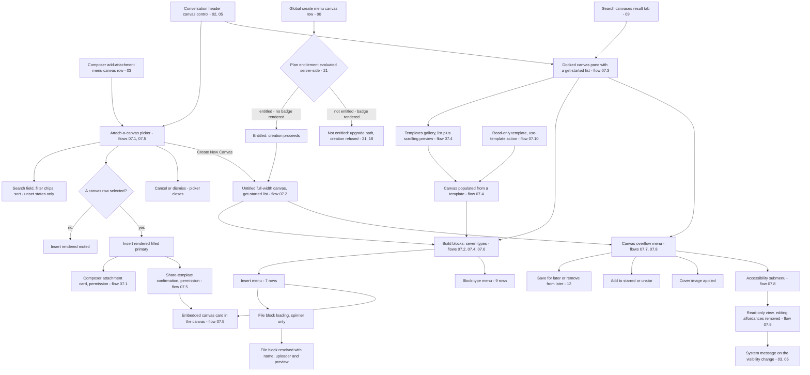

# Canvases

The collaborative document surface — creating a canvas, attaching one to a conversation, building it from blocks or a template, and reading it read-only.

## Purpose

This document specifies **canvases**: named, block-structured documents that live inside the product rather than beside it. A canvas is authored in one of two shells — a **full-width canvas** that replaces the shell's routed content region [frame 153](../../screenshots/Slack%20web%20Jul%202024%20153.png), or a **docked canvas pane** that takes width from the content region while a conversation stays open to its left [frame 303](../../screenshots/Slack%20web%20Jul%202024%20303.png) — and it can be **attached to a message** so that a conversation carries the document inline [frame 152](../../screenshots/Slack%20web%20Jul%202024%20152.png), [frame 315](../../screenshots/Slack%20web%20Jul%202024%20315.png).

**Where the area is encountered.** Five distinct entry points into canvases are observable in the corpus, and each belongs to a surface another document owns:

| Entry point | Where it is | Evidence |
|---|---|---|
| The conversation header's canvas control | Right of the header's huddle control, labelled in some captures and icon-only in others | [frame 250](../../screenshots/Slack%20web%20Jul%202024%20250.png), [frame 203](../../screenshots/Slack%20web%20Jul%202024%20203.png), [frame 200](../../screenshots/Slack%20web%20Jul%202024%20200.png), [frame 150](../../screenshots/Slack%20web%20Jul%202024%20150.png) |
| The global create menu's canvas row | Third row of the create menu, described as curating content and collaborating, carrying a plan-tier badge in one capture and none in another | [frame 550](../../screenshots/Slack%20web%20Jul%202024%20550.png), [frame 39](../../screenshots/Slack%20web%20Jul%202024%2039.png) |
| The composer's add-attachment menu | A canvas row inside that menu's labelled attach group | [frame 143](../../screenshots/Slack%20web%20Jul%202024%20143.png) |
| The picker's own create action | The `Create New Canvas` action at the left of the attach modal's footer | [frame 150](../../screenshots/Slack%20web%20Jul%202024%20150.png) |
| Search, as a discovery path | A canvases result tab with a count, and canvas rows carrying template badges and creator-and-date metadata | [frame 700](../../screenshots/Slack%20web%20Jul%202024%20700.png), [frame 690](../../screenshots/Slack%20web%20Jul%202024%20690.png) |

A canvases destination also exists in the navigation rail [frame 150](../../screenshots/Slack%20web%20Jul%202024%20150.png), [frame 700](../../screenshots/Slack%20web%20Jul%202024%20700.png), [frame 489](../../screenshots/Slack%20web%20Jul%202024%20489.png), and the rail destination map that assigns it to this document lives in [00-product-overview.md](00-product-overview.md).

> **Partial capture:** no frame in the corpus shows the canvases destination's own surface. A canvas list, its filters and any empty state for it are therefore **not specified here** — the rail entry is observed, the surface behind it is not. A build must treat that surface as unspecified by this catalog rather than infer it from the files destination or from the picker.

**Depth.** This is an in-product area, so every flow below carries a full frame-by-frame step table and every claim carries the frame that evidences it. Layout is described by region, column, ordering and relative size, never as an absolute pixel offset, and icons are named by function.

**What this document does not own.** The composer and message rows that carry an attached canvas — [03-messaging-and-composer.md](03-messaging-and-composer.md). The channel header and details pane — [02-channels.md](02-channels.md). The direct-message header and the conversation intro behind the pane — [05-direct-messages.md](05-direct-messages.md). The global create menu, the rail, and the authoritative contract for every `C-*` identifier cited here — [00-product-overview.md](00-product-overview.md). The `C-UPGRADE-GATE` state matrix and the cross-cutting state vocabulary — [21-states.md](21-states.md). Search itself — [09-search-and-filters.md](09-search-and-filters.md). Files and media as objects — [16-files-media.md](16-files-media.md). Plan tiers — [18-pricing-plans.md](18-pricing-plans.md). Workspace-level canvas retention — [15-admin-workspace.md](15-admin-workspace.md). The catalog index is the [Workflow Catalog](README.md).

## Flows in this area

Ten flows are named for this area, spanning 50 frames. Frame spans are written as plain numeric ranges because they designate a span rather than cite one image, following the convention of the [Screenshot Coverage Index](_screenshot-index.md); every individual frame is cited with its full relative link in the per-flow step tables and in the **Frames covered** section.

| Flow ID | Name | Frame span | Primary entry point |
|---|---|---|---|
| `07.1` | Attach an existing canvas to a message | 150–152 | The canvas control in a channel header |
| `07.2` | Create and build a new canvas | 153–162 | A canvas-creation control, opening the full-width canvas |
| `07.3` | Open the canvas pane in a conversation | 303–304 | The canvas control in a direct-message header |
| `07.4` | Build a canvas from a template and insert a profile card | 305–311 | A get-started row in the canvas pane |
| `07.5` | Attach and share a template canvas | 312–315 | The canvas control in a direct-message header |
| `07.6` | Insert image, file, checklist and table blocks | 316–329 | The insert control on the canvas pane's floating toolbar |
| `07.7` | Use the canvas overflow menu, later, starred and cover image | 330–335 | The overflow control in the canvas pane header |
| `07.8` | Change canvas accessibility settings | 336–337 | The overflow control in the canvas pane header |
| `07.9` | Read a canvas in read-only mode | 339 | The read-only-view entry in the accessibility submenu |
| `07.10` | Open a read-only canvas template | 489 | A template reference outside the canvas surface |

## Flow 07.1 — Attach an existing canvas to a message

### Overview

A canvas that already exists is picked from a modal and attached to the message being composed, so the conversation carries the document rather than a link to it. The flow is the corpus's canonical attach journey: it establishes the picker's anatomy, its selection-gated primary action, and the attachment card the composer renders afterwards [frame 150](../../screenshots/Slack%20web%20Jul%202024%20150.png) through [frame 152](../../screenshots/Slack%20web%20Jul%202024%20152.png).

### Trigger

The canvas control at the right end of the channel header, rendered icon-only in this capture, immediately right of the labelled huddle control and its caret [frame 150](../../screenshots/Slack%20web%20Jul%202024%20150.png). The same modal is reachable from the composer's add-attachment menu, whose labelled attach group offers a canvas row [frame 143](../../screenshots/Slack%20web%20Jul%202024%20143.png).

**Inferred:** the header control is this capture's trigger rather than the composer menu, because the modal is captured over a channel whose composer is empty and closed with no attachment menu open [frame 150](../../screenshots/Slack%20web%20Jul%202024%20150.png); the corpus does not capture the moment the control is activated.

### Preconditions

An authenticated session with a conversation open in the content region, and **at least one canvas already reachable by the signed-in user** — the picker's list is populated in every capture and no empty variant of it exists in the corpus. No draft and no selection is required: the header control is present on the channel header in its default state [frame 150](../../screenshots/Slack%20web%20Jul%202024%20150.png). **The control's presence is not evidence that no authorization is required to attach a canvas** — per `S-AUTHZ-OP` the build authorizes the acting principal for the target conversation before the attachment is accepted, and the entitlement statement below is bounded to the badges these captures show.

### Frame-by-frame steps

| Step | Frame(s) | What the user does | What changes on screen | Component(s) involved |
|---|---|---|---|---|
| 1 | [frame 150](../../screenshots/Slack%20web%20Jul%202024%20150.png) | Activates the canvas control in the channel header | A centred modal titled to attach a canvas opens over a dimmed shell, with a dismiss control at its title row's right. Its body stacks a search field carrying a leading search icon and a placeholder inviting a canvas search; then a single row of three filter chips — all canvases, shared with you, created by you — with the all-canvases chip rendered filled and the other two outlined, and a sort control reading recently viewed with a caret at that row's right edge | `C-MODAL-SHELL`, `C-FILTER-CHIP`, `C-DROPDOWN-MENU` |
| 2 | [frame 150](../../screenshots/Slack%20web%20Jul%202024%20150.png) | Scans the list | Six rows render beneath the chip row, each carrying a leading square rounded canvas icon tile, a bold title, and a last-viewed metadata line beneath the title. Two of the six carry a template badge immediately right of the title. The sixth row is clipped by the list's lower edge, so the list scrolls within a fixed body height. The footer offers a create-new-canvas action at the **left** and, right-aligned, cancel then insert — and insert is rendered **muted** | `C-MODAL-SHELL` |
| 3 | [frame 151](../../screenshots/Slack%20web%20Jul%202024%20151.png) | Selects the first row | That row takes a filled highlight spanning the modal's **full width**, breaking the body's inner padding, with its title and metadata rendered in the inverse text colour; the icon tile is retained. The footer's insert action changes from muted to a filled primary. Nothing else in the modal changes | `C-MODAL-SHELL` |
| 4 | [frame 152](../../screenshots/Slack%20web%20Jul%202024%20152.png) | Confirms the insert | The modal closes on the channel. The composer gains an attachment card **between its input area and its bottom action row**: a bordered rounded card carrying a leading canvas icon tile, the canvas title in bold, and beneath the title a permission control reading that the recipient can edit, with a caret. The composer's send control changes from muted to a filled primary with an adjacent caret, and the sidebar's drafts-and-sent row gains a pencil affordance and a count of one | `C-COMPOSER`, `C-SIDEBAR` |

**Inferred:** the attachment is held as an unsent draft rather than posted, because the send control is still present and the drafts-and-sent row's count rises to one in the same capture [frame 152](../../screenshots/Slack%20web%20Jul%202024%20152.png). The corpus does not capture the message after sending, so the posted form of an attached canvas in a channel is not specified here.

> **Partial capture:** the picker's search field, its shared-with-you chip and its created-by-you chip are captured only in their **unset** state [frame 150](../../screenshots/Slack%20web%20Jul%202024%20150.png), [frame 312](../../screenshots/Slack%20web%20Jul%202024%20312.png). No frame shows a typed query, an active secondary chip, an alternative sort value or a no-results state, so their effect on the list is not specified — only that the controls exist and where they sit.

**Inconsistency, recorded not reconciled.** The row highlighted at [frame 151](../../screenshots/Slack%20web%20Jul%202024%20151.png) is the list's **first** row, whose title differs from the list's **third** row only in the capitalisation of one letter. The attachment card at [frame 152](../../screenshots/Slack%20web%20Jul%202024%20152.png) carries the **third** row's capitalisation, not the first's. The two captures disagree about which row was inserted; the record of what each image shows is left as it is. A build takes two things from this: titles are not unique, and two canvases whose titles differ only by case can coexist in one workspace [frame 150](../../screenshots/Slack%20web%20Jul%202024%20150.png).

## Flow 07.2 — Create and build a new canvas

### Overview

A new canvas opens as an untitled full-width document and is built up in place: a title is typed, a cover image is applied, a heading is entered, a three-item checklist is added, and a set of named board columns is appended. The flow is the corpus's only capture of the **full-width** canvas shell and its seven-control floating toolbar [frame 153](../../screenshots/Slack%20web%20Jul%202024%20153.png) through [frame 162](../../screenshots/Slack%20web%20Jul%202024%20162.png).

### Trigger

Not captured. The corpus shows five controls that offer canvas creation — the picker's create-new-canvas footer action [frame 150](../../screenshots/Slack%20web%20Jul%202024%20150.png), the global create menu's canvas row [frame 550](../../screenshots/Slack%20web%20Jul%202024%20550.png), [frame 39](../../screenshots/Slack%20web%20Jul%202024%2039.png), the composer add-attachment menu's canvas row [frame 143](../../screenshots/Slack%20web%20Jul%202024%20143.png), the conversation header's canvas control [frame 250](../../screenshots/Slack%20web%20Jul%202024%20250.png), and the canvas pane's own get-started blank-canvas row [frame 303](../../screenshots/Slack%20web%20Jul%202024%20303.png) — and no frame shows which of them produced this canvas.

**Inferred:** the canvas at [frame 153](../../screenshots/Slack%20web%20Jul%202024%20153.png) is newly created rather than reopened, because its body carries only creation-time placeholders and a get-started template list with no content of any kind, and because the two following captures show a title being entered for the first time over that placeholder [frame 154](../../screenshots/Slack%20web%20Jul%202024%20154.png), [frame 155](../../screenshots/Slack%20web%20Jul%202024%20155.png).

### Preconditions

An authenticated session with the shell rendered. The draft created by flow `07.1` is still outstanding — the sidebar's drafts-and-sent row carries its count of one throughout this flow [frame 153](../../screenshots/Slack%20web%20Jul%202024%20153.png) — so creating a canvas neither consumes nor clears a pending attachment.

### Frame-by-frame steps

| Step | Frame(s) | What the user does | What changes on screen | Component(s) involved |
|---|---|---|---|---|
| 1 | [frame 153](../../screenshots/Slack%20web%20Jul%202024%20153.png) | Opens a new canvas | The routed content region is replaced by the canvas while the rail and sidebar persist unchanged. A header band spans the content region: the canvas title at the left, reading as untitled; at the right, a share action carrying a leading padlock icon, a star control rendered as an outline, and an overflow control. The body renders a single left-aligned column indented from the content region's left edge: a large muted title placeholder, a muted body prompt inviting the user to start writing, a bold get-started label, and six rows each carrying a leading icon and a label — blank canvas, employee onboarding, newsletter, weekly sync, out-of-office coverage, and a more row | `C-RAIL`, `C-SIDEBAR`, `C-EMPTY-STATE` |
| 2 | [frame 154](../../screenshots/Slack%20web%20Jul%202024%20154.png) | Types a title | The typed title replaces the placeholder in **both** the header band and the body column, and an edited-just-now status appears in the header immediately left of the share action. The body prompt is unchanged | `C-DETAILS-PANE` |
| 3 | [frame 155](../../screenshots/Slack%20web%20Jul%202024%20155.png) | Edits the title again | The revised title again updates header and body together; an add-cover control appears **above** the body title; and the body prompt changes to a different invitation to document one's work | `C-DETAILS-PANE` |
| 4 | [frame 156](../../screenshots/Slack%20web%20Jul%202024%20156.png) | Applies a cover image | A wide photographic cover image is inserted between the header band and the body column, spanning the content region's full width at roughly one-fifth of its height; the title and prompt shift down beneath it and the add-cover control is gone | `C-DETAILS-PANE` |
| 5 | [frame 157](../../screenshots/Slack%20web%20Jul%202024%20157.png) | Types a heading into the body | The heading renders beneath the title, and a circled-plus insert affordance appears at the **right margin of the text column**, on the active line's baseline. A floating toolbar is pinned near the bottom centre of the content region carrying seven controls in order: a filled circular insert control, a text-formatting control, an emoji control, an attachment control, a checklist control, a table control and a columns control | `C-FORMATTING-TOOLBAR` |
| 6 | [frame 158](../../screenshots/Slack%20web%20Jul%202024%20158.png), [frame 159](../../screenshots/Slack%20web%20Jul%202024%20159.png) | Starts a checklist and labels its first item | An empty checklist checkbox appears beneath the heading, then takes a label beside it; the insert affordance follows the active line down the column | `C-FORMATTING-TOOLBAR` |
| 7 | [frame 160](../../screenshots/Slack%20web%20Jul%202024%20160.png) | Adds two more checklist items | Three unticked checklist rows stand beneath the heading, each a checkbox followed by its label | `C-FORMATTING-TOOLBAR` |
| 8 | [frame 161](../../screenshots/Slack%20web%20Jul%202024%20161.png) | Inserts a columns block | A block appears beneath the checklist carrying a type-or-slash prompt and **two** default column headers, both reading as a new section | `C-FORMATTING-TOOLBAR` |
| 9 | [frame 162](../../screenshots/Slack%20web%20Jul%202024%20162.png) | Names three columns | Three named column headers render in one row across the body column's width. A six-dot drag handle sits at a header's left and a circled-plus add-column affordance sits at the row's right edge; a text caret follows the third header's label | `C-FORMATTING-TOOLBAR` |

## Flow 07.3 — Open the canvas pane in a conversation

### Overview

The same document surface opens **docked beside a conversation** instead of replacing it. The pane is the corpus's dominant canvas shell — every capture from [frame 303](../../screenshots/Slack%20web%20Jul%202024%20303.png) to [frame 339](../../screenshots/Slack%20web%20Jul%202024%20339.png) uses it — and this flow establishes its header, its own get-started set and its six-control toolbar [frame 303](../../screenshots/Slack%20web%20Jul%202024%20303.png), [frame 304](../../screenshots/Slack%20web%20Jul%202024%20304.png).

### Trigger

The canvas control at the right end of the direct-message header, rendered icon-only in this capture and adjacent to the labelled huddle control with its caret [frame 303](../../screenshots/Slack%20web%20Jul%202024%20303.png). The same control is labelled in other captures of a conversation header [frame 250](../../screenshots/Slack%20web%20Jul%202024%20250.png), [frame 203](../../screenshots/Slack%20web%20Jul%202024%20203.png); the header itself belongs to [05-direct-messages.md](05-direct-messages.md) and [02-channels.md](02-channels.md).

### Preconditions

An authenticated session with a direct message open in the content region. The pane opens whether or not the conversation already has a canvas: at [frame 303](../../screenshots/Slack%20web%20Jul%202024%20303.png) it renders its empty prompt and get-started list, and its header carries **no** last-editor avatar and **no** edited status.

### Frame-by-frame steps

| Step | Frame(s) | What the user does | What changes on screen | Component(s) involved |
|---|---|---|---|---|
| 1 | [frame 303](../../screenshots/Slack%20web%20Jul%202024%20303.png) | Activates the canvas control in the conversation header | A pane docks at the right, taking roughly the right quarter to three-tenths of the viewport width **from the content region**; the rail and sidebar are untouched and the conversation reflows into the narrower remainder, keeping its header, intro, message list and composer. The pane's header carries a bare title naming the surface — not the canvas — with an overflow control and a dismiss control at its right | `C-DETAILS-PANE`, `C-RAIL`, `C-SIDEBAR` |
| 2 | [frame 303](../../screenshots/Slack%20web%20Jul%202024%20303.png) | Reads the empty pane | The body renders a muted prompt asking what is top of mind, a bold get-started label, and **five** rows each with a leading icon and a label — blank canvas, agenda, shared resources, weekly sync, and a more row that carries a new badge. A floating toolbar sits at the pane's lower area with **six** controls: a filled circular insert control, a text-formatting control, an emoji control, an attachment control, a checklist control and a table control | `C-DETAILS-PANE`, `C-EMPTY-STATE`, `C-FORMATTING-TOOLBAR` |
| 3 | [frame 304](../../screenshots/Slack%20web%20Jul%202024%20304.png) | Types a heading | The prompt is replaced by the typed heading with a type-or-slash prompt on the line beneath it, and the pane header gains a last-editor avatar followed by a relative edited-time status left of the overflow control | `C-DETAILS-PANE`, `C-AVATAR` |

**Observed difference between the two canvas shells.** The docked pane's get-started set is five rows with a new badge on its more row and a different empty prompt [frame 303](../../screenshots/Slack%20web%20Jul%202024%20303.png); the full-width canvas's is six rows with no badge and its own prompt [frame 153](../../screenshots/Slack%20web%20Jul%202024%20153.png). The pane's toolbar carries six controls, the full-width canvas's seven, the extra one being the columns control [frame 303](../../screenshots/Slack%20web%20Jul%202024%20303.png), [frame 157](../../screenshots/Slack%20web%20Jul%202024%20157.png). **Inferred:** the two sets are properties of the shell rather than of the moment, because each is stable across every capture of its own shell in this area; the corpus never shows one shell adopting the other's set.

## Flow 07.4 — Build a canvas from a template and insert a profile card

### Overview

A product-provided template is browsed in a two-column gallery, previewed at length, applied into the canvas pane, and then a person is inserted into the document as a profile card through a dedicated dialog. The flow answers two build questions at once: what a canvas template is, and how a non-text block gets inserted [frame 305](../../screenshots/Slack%20web%20Jul%202024%20305.png) through [frame 311](../../screenshots/Slack%20web%20Jul%202024%20311.png).

### Trigger

A get-started row in the canvas pane, which the preceding capture renders as a list of named templates plus a more row [frame 303](../../screenshots/Slack%20web%20Jul%202024%20303.png). **Inferred:** the more row is the route into the gallery, because it is the only get-started row that names no single template and the gallery it would open is the next surface captured [frame 305](../../screenshots/Slack%20web%20Jul%202024%20305.png).

### Preconditions

An authenticated session with the canvas pane open on a conversation. The pane already holds a heading and carries an edited status, so the gallery is reachable from a canvas that is not empty [frame 304](../../screenshots/Slack%20web%20Jul%202024%20304.png).

### Frame-by-frame steps

| Step | Frame(s) | What the user does | What changes on screen | Component(s) involved |
|---|---|---|---|---|
| 1 | [frame 305](../../screenshots/Slack%20web%20Jul%202024%20305.png) | Opens the templates gallery | A large centred dialog opens over a dimmed backdrop with a dismiss control at its top-right corner, laid out as two columns. The left column, roughly one-fifth of the dialog's width, stacks a templates heading, a search field with a leading search icon and a template-search placeholder, a group heading attributing the set to the product itself, and a vertical list of **fifteen** template names of which the first is rendered with a filled highlight. One name is truncated with an ellipsis, so the column clips rather than wraps | `C-MODAL-SHELL` |
| 2 | [frame 305](../../screenshots/Slack%20web%20Jul%202024%20305.png) | Reads the preview | The right column, roughly four-fifths of the dialog's width, renders a preview card on a tinted backdrop: a title bar repeating the selected template's name, a wide illustrated cover image, then the template's own content — a large title, a welcome line containing a **bracketed placeholder token**, a section heading led by an emoji, a body line, an unticked checkbox item, and a second emoji-led section heading whose body line is clipped by the preview's lower edge. A footer spans the dialog's width carrying a single filled primary use-template action at the right | `C-MODAL-SHELL` |
| 3 | [frame 306](../../screenshots/Slack%20web%20Jul%202024%20306.png) | Scrolls the preview | The preview scrolls **independently** of the template list while its title bar stays fixed, revealing a section with a three-column table whose header cells name a date, a time and an event and whose first body row carries per-cell helper text; then a further section whose body explains that mentioning a teammate and acting on the mention converts it to a card, followed by three person cards each carrying an avatar, a truncated display name, a presence indicator, a truncated role line and a pronouns line | `C-MODAL-SHELL`, `C-AVATAR`, `C-DATA-TABLE` |
| 4 | [frame 307](../../screenshots/Slack%20web%20Jul%202024%20307.png) | Applies the template | The dialog closes and the pane renders the template's content in the pane's narrower column: the template title, the welcome line with its bracketed placeholder token intact, a first section with a body line and an unticked checkbox item, a second section with the three-column table and its per-cell helper text, and a third section with its body and the mention instruction. The pane header reads edited just now | `C-DETAILS-PANE`, `C-DATA-TABLE` |
| 5 | [frame 308](../../screenshots/Slack%20web%20Jul%202024%20308.png) | Opens the insert menu from the floating toolbar | The toolbar's leading insert control toggles from a filled circular add affordance into a **muted circular dismiss affordance**, and a menu opens upward from it, its rows divided by two separator rules into three groups: record-a-video-clip and record-an-audio-clip; a divider row; then profile, canvas, image and file, the file row carrying a right-aligned keyboard-shortcut hint | `C-FORMATTING-TOOLBAR`, `C-DROPDOWN-MENU` |
| 6 | [frame 309](../../screenshots/Slack%20web%20Jul%202024%20309.png) | Chooses the profile row | A small centred dialog opens over a backdrop that dims **every** region including the canvas pane. Its title asks for a user profile, a dismiss control sits at the title row's right, its body is a single combobox spanning the dialog's width with an add-by-name placeholder and a caret, and its footer right-aligns a close action then an insert action rendered **muted** | `C-MODAL-SHELL` |
| 7 | [frame 310](../../screenshots/Slack%20web%20Jul%202024%20310.png) | Selects a person | The combobox renders the chosen person as an avatar, a bold display name, a presence indicator and the same name repeated in muted text, with the caret retained; the insert action changes from muted to a filled primary | `C-MODAL-SHELL`, `C-AVATAR`, `C-PRESENCE-DOT` |
| 8 | [frame 311](../../screenshots/Slack%20web%20Jul%202024%20311.png) | Confirms the insert | The dialog closes and a profile card renders in the pane as a block: an avatar, the person's display name, and a line giving their local time. A type-or-slash prompt sits on the line beneath the card | `C-DETAILS-PANE`, `C-AVATAR` |

**Inconsistency, recorded not reconciled.** [frame 307](../../screenshots/Slack%20web%20Jul%202024%20307.png) shows the pane fully populated by the applied template. The **immediately following** capture shows the same pane holding only a one-line heading, with no template title, no welcome line, no sections and no table [frame 308](../../screenshots/Slack%20web%20Jul%202024%20308.png). The corpus does not capture anything between them, so the record is left as it stands: one capture has the template content, the next does not.

## Flow 07.5 — Attach and share a template canvas

### Overview

A template canvas is attached to a direct message through the same picker as flow `07.1`, and the attach is then gated by a **sharing confirmation** that asks for a permission level before granting the conversation access. This is the corpus's only capture of canvas sharing being decided [frame 312](../../screenshots/Slack%20web%20Jul%202024%20312.png) through [frame 315](../../screenshots/Slack%20web%20Jul%202024%20315.png).

### Trigger

The canvas control in the direct-message header, the same control that opens the pane in flow `07.3` [frame 303](../../screenshots/Slack%20web%20Jul%202024%20303.png). **Inferred:** the control's behaviour depends on context rather than being two controls, because the identical header control precedes both the docked pane [frame 303](../../screenshots/Slack%20web%20Jul%202024%20303.png) and the attach modal [frame 312](../../screenshots/Slack%20web%20Jul%202024%20312.png) in the same conversation, and no other header control appears or disappears between those captures.

### Preconditions

An authenticated session with a direct message open and the canvas pane already docked — the pane's header and body remain visible to the right of the modal throughout [frame 312](../../screenshots/Slack%20web%20Jul%202024%20312.png). At least one template canvas must be reachable: two of the picker's three rows carry template badges.

### Frame-by-frame steps

| Step | Frame(s) | What the user does | What changes on screen | Component(s) involved |
|---|---|---|---|---|
| 1 | [frame 312](../../screenshots/Slack%20web%20Jul%202024%20312.png) | Opens the picker over the conversation | The attach-a-canvas modal opens with the same anatomy as flow `07.1` — search field, three filter chips, recency sort, footer offering create-new, cancel and a **muted** insert — but its list holds **three** rows rather than six: one named after a conversation, and two carrying template badges. Each row keeps its icon tile, bold title and last-viewed metadata line | `C-MODAL-SHELL`, `C-FILTER-CHIP` |
| 2 | [frame 313](../../screenshots/Slack%20web%20Jul%202024%20313.png) | Selects the template row | That row takes the full-width filled highlight with inverse text, which absorbs its template badge into the highlight, and the footer's insert action changes from muted to a filled primary | `C-MODAL-SHELL` |
| 3 | [frame 314](../../screenshots/Slack%20web%20Jul%202024%20314.png) | Confirms the insert | The canvas card is inserted into the pane **and** a small centred confirmation dialog opens over a dimmed backdrop. Its title asks whether to share the template with the conversation, naming that conversation inline; a dismiss control sits at its title row's right; its body is one explanatory line stating that sharing a template there gives anyone in the conversation access; and its footer carries a permission select reading can-view with a caret at the **left**, then a right-aligned do-not-grant-access action and a filled primary share action | `C-MODAL-SHELL`, `C-RECORD-CARD` |
| 4 | [frame 315](../../screenshots/Slack%20web%20Jul%202024%20315.png) | Grants access | The dialog closes and the inserted card renders in the pane as a bordered rounded card with an accent border: a leading canvas icon tile, the canvas title in bold, a template badge right of the title, a separate template type label on the line beneath, a wide cover image, then a preview of the canvas's opening lines fading out at the card's lower edge. The conversation, its message list and its composer remain to the pane's left | `C-RECORD-CARD`, `C-DETAILS-PANE` |

## Flow 07.6 — Insert image, file, checklist and table blocks

### Overview

The canvas's block vocabulary is exercised in one continuous run: an image block, a selection-scoped formatting toolbar and its block-type menu, a file upload with its loading and resolved states, a checklist, and a two-column table. Fourteen consecutive captures make this the corpus's authoritative record of what a canvas block is [frame 316](../../screenshots/Slack%20web%20Jul%202024%20316.png) through [frame 329](../../screenshots/Slack%20web%20Jul%202024%20329.png).

### Trigger

The insert control at the left of the canvas pane's floating toolbar, and the circled-plus affordance at the active line's right margin — both observed opening the same insert menu [frame 308](../../screenshots/Slack%20web%20Jul%202024%20308.png), [frame 320](../../screenshots/Slack%20web%20Jul%202024%20320.png). Text selection is the second trigger: selecting text raises the formatting toolbar [frame 317](../../screenshots/Slack%20web%20Jul%202024%20317.png).

### Preconditions

An authenticated session with the canvas pane docked on a conversation and the canvas holding at least a heading, so a block has a position to be inserted at [frame 316](../../screenshots/Slack%20web%20Jul%202024%20316.png).

### Frame-by-frame steps

| Step | Frame(s) | What the user does | What changes on screen | Component(s) involved |
|---|---|---|---|---|
| 1 | [frame 316](../../screenshots/Slack%20web%20Jul%202024%20316.png) | Inserts an image block | An image block renders beneath the heading as a tinted card holding a placeholder graphic, with a type-or-slash prompt on the line beneath it | `C-DETAILS-PANE` |
| 2 | [frame 317](../../screenshots/Slack%20web%20Jul%202024%20317.png) | Selects the heading text | A floating formatting toolbar appears **above the selection**, inside the pane, as a light rounded bar | `C-FORMATTING-TOOLBAR` |
| 3 | [frame 318](../../screenshots/Slack%20web%20Jul%202024%20318.png) | Opens the block-type control on that toolbar | The toolbar's controls resolve into three separator-divided groups in this order: a block-type control rendered as a paragraph-mark icon with a caret; bold, italic and strikethrough; then inline code, a link control and a circled-plus insert control. The block-type menu opens downward on a **dark surface**, inverted against the light toolbar, listing nine rows in three groups — paragraph, big heading, medium heading and small heading; check list, ordered list and bulleted list; code block and blockquote — with the current type carrying a leading check mark and rendered in the accent colour | `C-FORMATTING-TOOLBAR`, `C-DROPDOWN-MENU` |
| 4 | [frame 319](../../screenshots/Slack%20web%20Jul%202024%20319.png) | Dismisses the menu | The menu and the selection toolbar are gone; a type-slash-to-insert hint renders beneath the heading, above the image block, and the header's status has advanced from just-now to a relative one-minute-ago reading | `C-DETAILS-PANE` |
| 5 | [frame 320](../../screenshots/Slack%20web%20Jul%202024%20320.png) | Opens the insert menu beneath the image block | The same seven-row insert menu opens, its groups unchanged and the file row still carrying its keyboard-shortcut hint | `C-FORMATTING-TOOLBAR`, `C-DROPDOWN-MENU` |
| 6 | [frame 321](../../screenshots/Slack%20web%20Jul%202024%20321.png) | Chooses the file row and picks a file | A bordered block with an accent outline takes the file's position beneath the image block, containing a **centred circular spinner** and nothing else — no filename, no size and no preview — with the circled-plus affordance at its right margin | `C-DETAILS-PANE` |
| 7 | [frame 322](../../screenshots/Slack%20web%20Jul%202024%20322.png) | Waits for the upload | The placeholder resolves into a file block: a document-type icon, the filename, the uploading person's display name and a relative date, then an inline rendered thumbnail of the document's first page. A type-or-slash prompt sits above it | `C-DETAILS-PANE`, `C-MEDIA-PLAYER` |
| 8 | [frame 323](../../screenshots/Slack%20web%20Jul%202024%20323.png), [frame 324](../../screenshots/Slack%20web%20Jul%202024%20324.png) | Adds a checklist above the image | An empty checklist checkbox appears between the heading and the image block, then takes its label; the image block and the file block below both shift down without changing | `C-DETAILS-PANE` |
| 9 | [frame 325](../../screenshots/Slack%20web%20Jul%202024%20325.png), [frame 326](../../screenshots/Slack%20web%20Jul%202024%20326.png) | Adds two more checklist items | Three unticked checklist rows stand beneath the heading, above the image block and the file block | `C-DETAILS-PANE` |
| 10 | [frame 327](../../screenshots/Slack%20web%20Jul%202024%20327.png) | Scrolls the pane | The pane scrolls its own content: the checklist moves to the top of the pane's viewport while the image and file blocks move up with it, and a type-or-slash prompt renders beneath the image block. The conversation to the left does not scroll | `C-DETAILS-PANE` |
| 11 | [frame 328](../../screenshots/Slack%20web%20Jul%202024%20328.png) | Inserts a table block | An empty two-column table renders below the image block, its header cells unlabelled | `C-DATA-TABLE` |
| 12 | [frame 329](../../screenshots/Slack%20web%20Jul%202024%20329.png) | Labels the table's columns | The two header cells carry their labels, the header row is rendered on a tinted fill, and no cell is focused. The pane is scrolled so the image block, the file block and the table read top to bottom | `C-DATA-TABLE` |

**Inferred:** a canvas file block is a genuine upload rather than a reference to an existing file, because the block passes through a spinner-only placeholder state before any filename exists [frame 321](../../screenshots/Slack%20web%20Jul%202024%20321.png) and only then renders the filename with an uploader and a date [frame 322](../../screenshots/Slack%20web%20Jul%202024%20322.png). Files as objects belong to [16-files-media.md](16-files-media.md).

## Flow 07.7 — Use the canvas overflow menu, later, starred and cover image

### Overview

The canvas's document-level actions are all reached from one overflow menu in the pane header, and four of its captures differ from one another — which makes this flow the corpus's evidence that the menu is **state-dependent**, not a fixed list. A cover image is applied by the end of it [frame 330](../../screenshots/Slack%20web%20Jul%202024%20330.png) through [frame 335](../../screenshots/Slack%20web%20Jul%202024%20335.png).

### Trigger

The overflow control in the canvas pane header, between the edited status and the dismiss control [frame 330](../../screenshots/Slack%20web%20Jul%202024%20330.png).

### Preconditions

An authenticated session with the canvas pane docked and the canvas holding content — the menu is only ever captured over a populated canvas [frame 330](../../screenshots/Slack%20web%20Jul%202024%20330.png). The first checklist item is already ticked when the flow opens.

### Frame-by-frame steps

| Step | Frame(s) | What the user does | What changes on screen | Component(s) involved |
|---|---|---|---|---|
| 1 | [frame 330](../../screenshots/Slack%20web%20Jul%202024%20330.png) | Opens the overflow menu | A light-surface menu opens beneath the header's overflow control, anchored to it and leaving the pane legible around it, with its rows divided by two separator rules into three groups. Group one carries icons: copy-link with a link icon, save-for-later with a bookmark icon, add-to-starred with a star icon. Group two carries **no** icons: lock-edits, add-cover-image with a new badge at its right, show-by-default. Group three is a single accessibility row with a submenu chevron. Behind the menu the canvas shows its first checklist item ticked and struck through above two unticked items, then the image block, the file block, and a two-column table clipped by the viewport's foot | `C-CONTEXT-MENU`, `C-DETAILS-PANE` |
| 2 | [frame 331](../../screenshots/Slack%20web%20Jul%202024%20331.png) | Saves the canvas for later | Group one's second row changes to a remove-from-later action; every other row is unchanged and the menu stays open | `C-CONTEXT-MENU` |
| 3 | [frame 332](../../screenshots/Slack%20web%20Jul%202024%20332.png) | Adds to starred | The menu closes and a toast appears in the pane's lower area stating that an item was added to starred and offering a view link | `C-TOAST` |
| 4 | [frame 333](../../screenshots/Slack%20web%20Jul%202024%20333.png) | Reopens the overflow menu | Group one's third row now reads as an unstar-canvas action while its first two rows keep copy-link and remove-from-later; groups two and three are unchanged. The header's relative edited time has advanced | `C-CONTEXT-MENU` |
| 5 | [frame 334](../../screenshots/Slack%20web%20Jul%202024%20334.png) | Dismisses the menu | The menu closes and the canvas renders unobstructed: the checklist, the image block, the two-column table with its labelled header cells, and the file block | `C-DETAILS-PANE` |
| 6 | [frame 335](../../screenshots/Slack%20web%20Jul%202024%20335.png) | Applies a cover image | A flat illustrated cover image is inserted at the top of the pane, spanning the pane's full width above the heading; the content shifts down beneath it and the header's relative edited time advances again | `C-DETAILS-PANE` |

**Inconsistency, recorded not reconciled.** The toast raised by the add-to-starred action names the **conversation**, not the canvas [frame 332](../../screenshots/Slack%20web%20Jul%202024%20332.png), while the very next capture of the same menu offers to **unstar the canvas** [frame 333](../../screenshots/Slack%20web%20Jul%202024%20333.png). The two captures disagree about what was starred. Separately, the canvas is starred at [frame 333](../../screenshots/Slack%20web%20Jul%202024%20333.png) and the same row reads as add-to-starred again two captures later [frame 336](../../screenshots/Slack%20web%20Jul%202024%20336.png), with no unstar action captured between them.

**Inconsistency, recorded not reconciled.** At [frame 334](../../screenshots/Slack%20web%20Jul%202024%20334.png) the pane header's last-editor avatar and relative edited-time text are absent, a single small glyph occupying that position instead; the captures immediately before and after both carry the avatar and the text [frame 333](../../screenshots/Slack%20web%20Jul%202024%20333.png), [frame 335](../../screenshots/Slack%20web%20Jul%202024%20335.png). No interpretation of the glyph is offered here, because the corpus does not label it.

## Flow 07.8 — Change canvas accessibility settings

### Overview

The overflow menu's accessibility row opens a submenu of two entries, each carrying a keyboard shortcut, one of which is the route into read-only reading. The flow also captures the cover-image row changing shape now that a cover exists [frame 336](../../screenshots/Slack%20web%20Jul%202024%20336.png), [frame 337](../../screenshots/Slack%20web%20Jul%202024%20337.png).

### Trigger

The overflow control in the canvas pane header, as in flow `07.7` [frame 336](../../screenshots/Slack%20web%20Jul%202024%20336.png).

### Preconditions

An authenticated session with the canvas pane docked, the canvas holding content, **and a cover image already applied** — the cover-image row's shape depends on it [frame 336](../../screenshots/Slack%20web%20Jul%202024%20336.png).

### Frame-by-frame steps

| Step | Frame(s) | What the user does | What changes on screen | Component(s) involved |
|---|---|---|---|---|
| 1 | [frame 336](../../screenshots/Slack%20web%20Jul%202024%20336.png) | Opens the overflow menu over the covered canvas | The menu opens with the same three groups, but group two's cover entry now reads as a cover-image row carrying a **submenu chevron** and **no new badge**, where it read as add-cover-image with a new badge before a cover existed [frame 330](../../screenshots/Slack%20web%20Jul%202024%20330.png). Group one's third row reads as add-to-starred | `C-CONTEXT-MENU` |
| 2 | [frame 337](../../screenshots/Slack%20web%20Jul%202024%20337.png) | Moves onto the accessibility row | The accessibility row takes a filled highlight and its submenu opens **to the left** rather than to the right, because the parent menu sits against the viewport's right edge. The submenu is a light panel of two rows, each with a right-aligned keyboard-shortcut hint: a keyboard-shortcuts row and a read-only-view row | `C-CONTEXT-MENU` |

> **Partial capture:** the keyboard-shortcuts row's own surface is not captured from this submenu, and neither the lock-edits row nor the show-by-default row is captured being activated. Their effects are therefore not specified here — only their position in the menu and their labels. The keyboard-shortcuts reference panel that the shell opens from a keyboard combination is a different surface, owned by [00-product-overview.md](00-product-overview.md).

## Flow 07.9 — Read a canvas in read-only mode

### Overview

Read-only view **removes** the canvas's editing affordances rather than disabling them, and states its own condition in a bar pinned to the foot of the pane with the action that leaves the mode. The same capture also records that a canvas visibility change posts a system message into the conversation [frame 339](../../screenshots/Slack%20web%20Jul%202024%20339.png).

### Trigger

The read-only-view row in the overflow menu's accessibility submenu, which carries its own keyboard shortcut [frame 337](../../screenshots/Slack%20web%20Jul%202024%20337.png).

### Preconditions

An authenticated session with the canvas pane docked on a conversation and the canvas holding content, a cover image and at least one ticked checklist item [frame 337](../../screenshots/Slack%20web%20Jul%202024%20337.png).

### Frame-by-frame steps

| Step | Frame(s) | What the user does | What changes on screen | Component(s) involved |
|---|---|---|---|---|
| 1 | [frame 339](../../screenshots/Slack%20web%20Jul%202024%20339.png) | Chooses read-only view | The pane renders the same document — cover image, heading, the ticked-and-struck checklist item above two unticked items, the image block and the file block — but the floating toolbar is **gone** and the per-line circled-plus affordances are **gone**: the editing controls are removed from the surface, not greyed out. A bar pinned to the foot of the pane spans its width, stating that the document is being read in read-only view and offering an underlined turn-off link. The header keeps its last-editor avatar, its relative edited time, the overflow control and the dismiss control | `C-DETAILS-PANE`, `C-BANNER` |
| 2 | [frame 339](../../screenshots/Slack%20web%20Jul%202024%20339.png) | Reads the conversation beside it | A new system message has appeared in the message list beneath a today divider, recording that a person changed the canvas's default visibility setting for the conversation | `C-MESSAGE-ROW` |

**Inconsistency, recorded not reconciled.** That system message describes the canvas as a **channel** canvas, although the conversation it is posted into is a **direct message** [frame 339](../../screenshots/Slack%20web%20Jul%202024%20339.png). The product's own wording and the surface it appears on disagree; the record is left as the image shows it.

## Flow 07.10 — Open a read-only canvas template

### Overview

A template opens as a **full-width, read-only** document with its own header action to adopt it. It is the corpus's only capture of a template outside the gallery, and the only capture of the full-width shell in a non-editable state [frame 489](../../screenshots/Slack%20web%20Jul%202024%20489.png).

### Trigger

Not captured. The preceding capture is the files destination and the following one is the people destination [frame 488](../../screenshots/Slack%20web%20Jul%202024%20488.png), so no control in the corpus is shown opening this surface. **Inferred:** it is reached by a reference to a specific template rather than through the gallery, because the gallery previews a template inside its own dialog and offers adoption from that dialog's footer [frame 305](../../screenshots/Slack%20web%20Jul%202024%20305.png), whereas this surface occupies the whole content region and carries its own header actions.

### Preconditions

An authenticated session with the shell rendered. The workspace is on a trial in this capture — the sidebar's footer carries a trial-in-progress item with an hourglass icon — and the template is nevertheless fully readable, so reading a template is not gated by plan in the corpus [frame 489](../../screenshots/Slack%20web%20Jul%202024%20489.png).

### Frame-by-frame steps

| Step | Frame(s) | What the user does | What changes on screen | Component(s) involved |
|---|---|---|---|---|
| 1 | [frame 489](../../screenshots/Slack%20web%20Jul%202024%20489.png) | Opens the template | The content region is replaced by the template while the rail and sidebar persist. The header band carries the template's title at the left with a **template badge** beside it; at the right, a use-template action, a share action **without** the padlock icon that the editable canvas's share action carries [frame 153](../../screenshots/Slack%20web%20Jul%202024%20153.png), an outline star control and an overflow control | `C-RAIL`, `C-SIDEBAR` |
| 2 | [frame 489](../../screenshots/Slack%20web%20Jul%202024%20489.png) | Reads the template | A wide illustrated cover image spans the content region's full width at roughly one-fifth of its height. Beneath it a single body column, indented from the content region's left edge and occupying roughly its left two-thirds, renders the large title; a welcome line carrying a bracketed placeholder token; an emoji-led section heading, a body line and an unticked checkbox item; a second emoji-led section heading, a body line and a three-column table whose header row sits on a tinted fill, whose first body row carries per-cell helper text and whose second body row is empty, the whole table drawn with a visible accent outer border; then a third emoji-led section heading, its body line and the mention instruction. No floating toolbar and no per-line insert affordance is present | `C-DATA-TABLE`, `C-EMPTY-STATE` |

## Screens & components

Every `C-*` identifier below is defined authoritatively in [00-product-overview.md](00-product-overview.md); **no contract is restated here**. This section records what this area's screens add on top of those contracts: their regions, their ordering, their relative sizing and the variants this area is the evidence for. All sizing is **proportional to the effective product viewport**, never an absolute offset, because the corpus's frames are not one canvas size. Iconography is named by **function** throughout — canvas icon, search icon, sort control, insert control, checklist control, table control, columns control, block-type control, link icon, bookmark icon, star control, overflow control, dismiss control, drag handle, document-type icon — and never by any third-party asset name.

### The four screens this area owns

| Screen | Shell position and relative size | Contents, in order | Evidence |
|---|---|---|---|
| Attach-a-canvas picker | Centred modal over a dimmed shell, roughly the middle two-fifths of viewport width | Title row with dismiss control · search field with leading search icon · one row of three filter chips with a trailing sort control · scrollable list of canvas rows · footer with a create-new action at the left and cancel then insert right-aligned | [frame 150](../../screenshots/Slack%20web%20Jul%202024%20150.png), [frame 151](../../screenshots/Slack%20web%20Jul%202024%20151.png), [frame 312](../../screenshots/Slack%20web%20Jul%202024%20312.png), [frame 313](../../screenshots/Slack%20web%20Jul%202024%20313.png) |
| Full-width canvas | Replaces the shell's routed content region; rail and sidebar persist unchanged | Header band with title at the left and share, star and overflow at the right · optional full-width cover image at roughly one-fifth of the content region's height · one indented body column of blocks · floating toolbar of seven controls near the bottom centre | [frame 153](../../screenshots/Slack%20web%20Jul%202024%20153.png), [frame 157](../../screenshots/Slack%20web%20Jul%202024%20157.png), [frame 162](../../screenshots/Slack%20web%20Jul%202024%20162.png), [frame 489](../../screenshots/Slack%20web%20Jul%202024%20489.png) |
| Docked canvas pane | Takes roughly the right quarter to three-tenths of viewport width **from the content region**; rail and sidebar untouched, the conversation reflows into the remainder | Header with a bare surface title at the left, then a last-editor avatar and a relative edited-time status, then overflow and dismiss controls · optional pane-width cover image · one body column of blocks that scrolls independently of the conversation · floating toolbar of six controls in the pane's lower area | [frame 303](../../screenshots/Slack%20web%20Jul%202024%20303.png), [frame 304](../../screenshots/Slack%20web%20Jul%202024%20304.png), [frame 327](../../screenshots/Slack%20web%20Jul%202024%20327.png), [frame 335](../../screenshots/Slack%20web%20Jul%202024%20335.png) |
| Templates gallery | Large centred modal over a dimmed backdrop, roughly the middle five-sixths of viewport width; dismiss control at its top-right, outside the preview card | Two columns — a left list column at roughly one-fifth of the dialog's width holding a heading, a search field and fifteen template names; a right preview column at roughly four-fifths holding a preview card on a tinted backdrop whose title bar stays fixed while its content scrolls · footer spanning the dialog with a single filled primary use-template action at the right | [frame 305](../../screenshots/Slack%20web%20Jul%202024%20305.png), [frame 306](../../screenshots/Slack%20web%20Jul%202024%20306.png) |

**Hierarchy.** The picker, the profile dialog, the share confirmation and the gallery are all overlays that dim every region behind them, the canvas pane included — measured luminance in the pane's interior falls to roughly two-fifths of its undimmed value while a dialog is open [frame 309](../../screenshots/Slack%20web%20Jul%202024%20309.png), [frame 311](../../screenshots/Slack%20web%20Jul%202024%20311.png). The docked pane is not an overlay: it takes width from the content region and leaves the rail and sidebar at full brightness [frame 303](../../screenshots/Slack%20web%20Jul%202024%20303.png). The pane's own body scrolls independently of the conversation beside it [frame 327](../../screenshots/Slack%20web%20Jul%202024%20327.png), and the gallery's preview scrolls independently of its template list [frame 306](../../screenshots/Slack%20web%20Jul%202024%20306.png).

### Rows, blocks and menus

| Structure | Anatomy | Evidence |
|---|---|---|
| Picker row | Leading square rounded canvas icon tile · bold title · optional template badge right of the title · last-viewed metadata line beneath the title. Selected state is a filled highlight spanning the modal's full width with inverse text | [frame 150](../../screenshots/Slack%20web%20Jul%202024%20150.png), [frame 151](../../screenshots/Slack%20web%20Jul%202024%20151.png) |
| Get-started list | A bold label above rows of leading icon plus label; six rows in the full-width canvas, five in the pane, the pane's final row carrying a new badge | [frame 153](../../screenshots/Slack%20web%20Jul%202024%20153.png), [frame 303](../../screenshots/Slack%20web%20Jul%202024%20303.png) |
| Text block | A line in the body column with a circled-plus insert affordance at the column's right margin on the active line's baseline, and a type-or-slash prompt on an empty line | [frame 157](../../screenshots/Slack%20web%20Jul%202024%20157.png), [frame 304](../../screenshots/Slack%20web%20Jul%202024%20304.png) |
| Checklist block | One row per item: a checkbox followed by its label. A ticked item renders with a checked checkbox and its label struck through | [frame 160](../../screenshots/Slack%20web%20Jul%202024%20160.png), [frame 325](../../screenshots/Slack%20web%20Jul%202024%20325.png), [frame 330](../../screenshots/Slack%20web%20Jul%202024%20330.png) |
| Image block | A tinted card holding a graphic, full body-column width, with a type-or-slash prompt beneath | [frame 316](../../screenshots/Slack%20web%20Jul%202024%20316.png) |
| File block | Loading: a bordered accent-outlined block holding a centred circular spinner and nothing else. Resolved: a document-type icon, the filename, the uploader's display name, a relative date, and an inline rendered thumbnail of the document's first page | [frame 321](../../screenshots/Slack%20web%20Jul%202024%20321.png), [frame 322](../../screenshots/Slack%20web%20Jul%202024%20322.png) |
| Table block | A header row on a tinted fill above body rows; two columns when inserted empty in the pane, three columns in the template with per-cell helper text in its first body row and an empty second row; drawn with a visible accent outer border | [frame 328](../../screenshots/Slack%20web%20Jul%202024%20328.png), [frame 329](../../screenshots/Slack%20web%20Jul%202024%20329.png), [frame 489](../../screenshots/Slack%20web%20Jul%202024%20489.png) |
| Columns block | One row of column headers across the body column's width; two unnamed headers when inserted, then named. A six-dot drag handle sits at a header's left and a circled-plus add-column affordance at the row's right edge | [frame 161](../../screenshots/Slack%20web%20Jul%202024%20161.png), [frame 162](../../screenshots/Slack%20web%20Jul%202024%20162.png) |
| Profile-card block | An avatar, the person's display name, and a local-time line. In the gallery's preview the same card additionally carries a presence indicator, a role line and a pronouns line, three of them laid out side by side | [frame 311](../../screenshots/Slack%20web%20Jul%202024%20311.png), [frame 306](../../screenshots/Slack%20web%20Jul%202024%20306.png) |
| Embedded canvas card | A bordered rounded card with an accent border: leading canvas icon tile · bold title · optional template badge right of the title · a type label on the line beneath · a wide cover image · a preview of the canvas's opening lines fading out at the card's lower edge | [frame 314](../../screenshots/Slack%20web%20Jul%202024%20314.png), [frame 315](../../screenshots/Slack%20web%20Jul%202024%20315.png) |
| Composer attachment card | A bordered rounded card between the composer's input area and its bottom action row: leading canvas icon tile · bold title · a permission control with a caret beneath the title | [frame 152](../../screenshots/Slack%20web%20Jul%202024%20152.png) |
| Selection formatting toolbar | A light rounded bar above the selection, three separator-divided groups: block-type control with a caret; bold, italic, strikethrough; inline code, link, circled-plus insert | [frame 317](../../screenshots/Slack%20web%20Jul%202024%20317.png), [frame 318](../../screenshots/Slack%20web%20Jul%202024%20318.png) |
| Block-type menu | A **dark-surface** menu opening downward from the block-type control, inverted against the light toolbar; nine rows in three groups — paragraph, big heading, medium heading, small heading; check list, ordered list, bulleted list; code block, blockquote — the current type carrying a leading check mark and rendered in the accent colour | [frame 318](../../screenshots/Slack%20web%20Jul%202024%20318.png) |
| Insert menu | Opens upward from the floating toolbar's insert control, which itself toggles into a muted circular dismiss affordance; seven rows in three groups — record a video clip, record an audio clip; a divider row; profile, canvas, image, file — with a right-aligned keyboard-shortcut hint on the file row | [frame 308](../../screenshots/Slack%20web%20Jul%202024%20308.png), [frame 320](../../screenshots/Slack%20web%20Jul%202024%20320.png) |
| Canvas overflow menu | A light-surface menu anchored under the header's overflow control, three separator-divided groups: copy link, save-for-later or remove-from-later, add-to-starred or unstar — all three carrying icons; then lock edits, the cover-image entry, show by default — none carrying icons; then a single accessibility row with a submenu chevron | [frame 330](../../screenshots/Slack%20web%20Jul%202024%20330.png), [frame 331](../../screenshots/Slack%20web%20Jul%202024%20331.png), [frame 333](../../screenshots/Slack%20web%20Jul%202024%20333.png), [frame 336](../../screenshots/Slack%20web%20Jul%202024%20336.png) |
| Accessibility submenu | A light panel opening **to the left** of its parent row, two rows each with a right-aligned keyboard-shortcut hint: keyboard shortcuts, read-only view | [frame 337](../../screenshots/Slack%20web%20Jul%202024%20337.png) |
| Read-only bar | A bar pinned to the foot of the pane, spanning its width, carrying one sentence and an underlined turn-off link | [frame 339](../../screenshots/Slack%20web%20Jul%202024%20339.png) |

### Placeholder branding and sample data

The picker's list, the get-started rows, the fifteen template names, the image block's graphic, the uploaded filename, the checklist labels, the column names and the table headers are all **sample data** drawn from the corpus's single demo workspace; none is a value to reproduce. Two branded values occur inside this area's frames and are restated as placeholders per the vocabulary defined in [00-product-overview.md](00-product-overview.md): the badge on the create menu's canvas row names a paid tier by its marketed name and is referred to here only as a **plan-tier badge** [frame 550](../../screenshots/Slack%20web%20Jul%202024%20550.png), and the templates gallery's group heading attributes the set to the product vendor and is referred to here only as **a group heading attributing the templates to the product itself** [frame 305](../../screenshots/Slack%20web%20Jul%202024%20305.png). The image block's graphic is described as **a placeholder graphic** and never reproduced [frame 316](../../screenshots/Slack%20web%20Jul%202024%20316.png).

### Primary user journey

Every node below is a surface observed in a frame and every edge is a transition the corpus shows or, where marked, a route this document records as inferred.

No colour or styling is declared on this diagram, deliberately: the palette is the next run's to choose.

**The entitlement decision is a real branch, and both of its arms are drawn.** An earlier revision of this diagram sent both arms of the entitlement decision to the same creation node, which drew a gate that could be bypassed. It is corrected: the decision node is the **server-side evaluation** rather than the badge, the entitled arm proceeds to creation, and the not-entitled arm reaches the upgrade path with creation **refused**. The badge is the rendering of that evaluation and not the evaluation itself, so the arm labels name the entitlement outcome and note what gets rendered on it. The corpus supports only the two renderings — a plan-tier badge on the create menu's canvas row in one capture [frame 550](../../screenshots/Slack%20web%20Jul%202024%20550.png) and no badge on the same row in another [frame 39](../../screenshots/Slack%20web%20Jul%202024%2039.png) — and shows **nothing** about what follows pressing a badged row, so the upgrade arm's own destination is an `S-GAP` item owned by the state matrix in [21-states.md](21-states.md) and by [18-pricing-plans.md](18-pricing-plans.md).

## States

Each state below is observed, with the frame that shows it. The cross-cutting state matrix for the whole product, including the full `C-UPGRADE-GATE` state set, is owned by [21-states.md](21-states.md) and is not restated here.

| State | What is observable | Evidence |
|---|---|---|
| Empty canvas | A muted title placeholder, a muted body prompt and a get-started list of named templates; no blocks and no cover | [frame 153](../../screenshots/Slack%20web%20Jul%202024%20153.png), [frame 303](../../screenshots/Slack%20web%20Jul%202024%20303.png) |
| Unedited pane header | The header carries only the surface title, the overflow control and the dismiss control — no last-editor avatar and no edited status | [frame 303](../../screenshots/Slack%20web%20Jul%202024%20303.png) |
| Edited | The header carries a last-editor avatar followed by a relative edited-time status that advances between captures — just now, one minute ago, two, three, four | [frame 304](../../screenshots/Slack%20web%20Jul%202024%20304.png), [frame 319](../../screenshots/Slack%20web%20Jul%202024%20319.png), [frame 330](../../screenshots/Slack%20web%20Jul%202024%20330.png), [frame 333](../../screenshots/Slack%20web%20Jul%202024%20333.png), [frame 335](../../screenshots/Slack%20web%20Jul%202024%20335.png) |
| Row unselected versus selected | A picker row renders on the default surface, or with a filled highlight spanning the modal's full width and inverse text | [frame 150](../../screenshots/Slack%20web%20Jul%202024%20150.png), [frame 151](../../screenshots/Slack%20web%20Jul%202024%20151.png) |
| Disabled primary | The picker's insert action and the profile dialog's insert action both render muted while nothing is selected, and as filled primaries once something is | [frame 150](../../screenshots/Slack%20web%20Jul%202024%20150.png), [frame 151](../../screenshots/Slack%20web%20Jul%202024%20151.png), [frame 309](../../screenshots/Slack%20web%20Jul%202024%20309.png), [frame 310](../../screenshots/Slack%20web%20Jul%202024%20310.png), [frame 312](../../screenshots/Slack%20web%20Jul%202024%20312.png), [frame 313](../../screenshots/Slack%20web%20Jul%202024%20313.png) |
| Loading | A bordered block holds a centred circular spinner and no filename, size or preview while an upload is in flight | [frame 321](../../screenshots/Slack%20web%20Jul%202024%20321.png) |
| Modal open | A centred dialog dims every region behind it, the docked canvas pane included | [frame 305](../../screenshots/Slack%20web%20Jul%202024%20305.png), [frame 309](../../screenshots/Slack%20web%20Jul%202024%20309.png), [frame 314](../../screenshots/Slack%20web%20Jul%202024%20314.png) |
| Menu open, anchored | A menu opens adjacent to the control that opened it and leaves its backdrop legible; the insert control toggles into a dismiss affordance while its own menu is open | [frame 308](../../screenshots/Slack%20web%20Jul%202024%20308.png), [frame 330](../../screenshots/Slack%20web%20Jul%202024%20330.png) |
| Submenu open | The parent row holds a filled highlight while its submenu opens — to the **left**, when the parent menu is against the viewport's right edge | [frame 337](../../screenshots/Slack%20web%20Jul%202024%20337.png) |
| Block focused | A newly inserted block is drawn with an accent outer border | [frame 314](../../screenshots/Slack%20web%20Jul%202024%20314.png), [frame 321](../../screenshots/Slack%20web%20Jul%202024%20321.png), [frame 489](../../screenshots/Slack%20web%20Jul%202024%20489.png) |
| Text selected | A floating formatting toolbar renders above the selection | [frame 317](../../screenshots/Slack%20web%20Jul%202024%20317.png) |
| Checklist item ticked | The checkbox renders checked and the item's label is struck through | [frame 330](../../screenshots/Slack%20web%20Jul%202024%20330.png), [frame 339](../../screenshots/Slack%20web%20Jul%202024%20339.png) |
| Cover applied versus absent | With no cover, an add-cover control renders above the title and the overflow menu's cover entry reads as an add action carrying a new badge; with a cover, the image spans the surface's full width above the title and that entry becomes a cover-image row with a submenu chevron and no badge | [frame 155](../../screenshots/Slack%20web%20Jul%202024%20155.png), [frame 156](../../screenshots/Slack%20web%20Jul%202024%20156.png), [frame 330](../../screenshots/Slack%20web%20Jul%202024%20330.png), [frame 336](../../screenshots/Slack%20web%20Jul%202024%20336.png) |
| Saved for later versus not | The overflow menu's second row reads as a save action or as a remove action | [frame 330](../../screenshots/Slack%20web%20Jul%202024%20330.png), [frame 331](../../screenshots/Slack%20web%20Jul%202024%20331.png) |
| Starred versus not | The overflow menu's third row reads as an add-to-starred action or as an unstar action | [frame 330](../../screenshots/Slack%20web%20Jul%202024%20330.png), [frame 333](../../screenshots/Slack%20web%20Jul%202024%20333.png) |
| Read-only | The floating toolbar and every per-line insert affordance are removed from the surface, and a bar pinned to the pane's foot states the condition and offers the action that leaves it | [frame 339](../../screenshots/Slack%20web%20Jul%202024%20339.png) |
| Template, read-only | A template badge sits beside the title, a use-template action joins the header's control group, the share action loses its padlock icon, and no editing affordance is present | [frame 489](../../screenshots/Slack%20web%20Jul%202024%20489.png) |
| Upgrade-gated creation entry | The create menu's canvas row carries a plan-tier badge at its right edge in one capture and carries none in another | [frame 550](../../screenshots/Slack%20web%20Jul%202024%20550.png), [frame 39](../../screenshots/Slack%20web%20Jul%202024%2039.png) |
| Scrolled | The pane's body scrolls independently of the conversation beside it, and the gallery's preview scrolls independently of its template list while the preview's title bar stays fixed | [frame 327](../../screenshots/Slack%20web%20Jul%202024%20327.png), [frame 306](../../screenshots/Slack%20web%20Jul%202024%20306.png) |
| Clipped | The picker's list clips its last row at a fixed body height, the gallery's preview clips its content at the preview's lower edge, one template name is clipped with an ellipsis, and the pane's table is cut by the viewport's foot | [frame 150](../../screenshots/Slack%20web%20Jul%202024%20150.png), [frame 305](../../screenshots/Slack%20web%20Jul%202024%20305.png), [frame 330](../../screenshots/Slack%20web%20Jul%202024%20330.png) |

## Implied data model

Only what this area's frames expose is claimed here. Every entity cited appears in the [consolidated data model](README.md) of the master index, and **every field below cites the frame that shows it**.

| Entity | Fields this area exposes |
|---|---|
| `E-CANVAS` | Title, defaulting to an untitled reading on creation and echoed in both the header band and the body column [frame 153](../../screenshots/Slack%20web%20Jul%202024%20153.png), [frame 154](../../screenshots/Slack%20web%20Jul%202024%20154.png) · titles that are **not unique**, two canvases differing only in one letter's case coexisting in one list [frame 150](../../screenshots/Slack%20web%20Jul%202024%20150.png) · last-viewed timestamp, rendered as a relative day on every picker row [frame 150](../../screenshots/Slack%20web%20Jul%202024%20150.png) · last-edited timestamp plus the identity of the last editor, rendered as a relative time beside an avatar in the pane header [frame 304](../../screenshots/Slack%20web%20Jul%202024%20304.png), [frame 330](../../screenshots/Slack%20web%20Jul%202024%20330.png) · template flag, rendered as a template badge on a picker row, on an embedded card and beside a template's own title [frame 150](../../screenshots/Slack%20web%20Jul%202024%20150.png), [frame 315](../../screenshots/Slack%20web%20Jul%202024%20315.png), [frame 489](../../screenshots/Slack%20web%20Jul%202024%20489.png) · template origin, a canvas created from one of fifteen product-provided templates [frame 305](../../screenshots/Slack%20web%20Jul%202024%20305.png), [frame 307](../../screenshots/Slack%20web%20Jul%202024%20307.png) · cover image, absent by default, of a photographic or an illustrated kind, spanning the surface's full width [frame 156](../../screenshots/Slack%20web%20Jul%202024%20156.png), [frame 335](../../screenshots/Slack%20web%20Jul%202024%20335.png) · sharing scope, partitioned by the picker's chips into shared-with-you and created-by-you [frame 150](../../screenshots/Slack%20web%20Jul%202024%20150.png) · per-conversation access with a permission level, chosen from a select offering a view level when a template is shared into a conversation [frame 314](../../screenshots/Slack%20web%20Jul%202024%20314.png) · a locked-edits flag [frame 330](../../screenshots/Slack%20web%20Jul%202024%20330.png) · a show-by-default flag, whose change posts a system message into the conversation [frame 330](../../screenshots/Slack%20web%20Jul%202024%20330.png), [frame 339](../../screenshots/Slack%20web%20Jul%202024%20339.png) · a saved-for-later flag and a starred flag — both **`per-viewer`**, held on the viewer–canvas relation rather than on the canvas, per the per-viewer obligation below — each surfaced as a menu row that reads in the opposite direction once set [frame 331](../../screenshots/Slack%20web%20Jul%202024%20331.png), [frame 333](../../screenshots/Slack%20web%20Jul%202024%20333.png) · a read-only reading mode, addressable by keyboard [frame 337](../../screenshots/Slack%20web%20Jul%202024%20337.png), [frame 339](../../screenshots/Slack%20web%20Jul%202024%20339.png) · a shareable link, surfaced as a copy-link row [frame 330](../../screenshots/Slack%20web%20Jul%202024%20330.png) · attachment scope, a canvas being named after the conversation it belongs to [frame 150](../../screenshots/Slack%20web%20Jul%202024%20150.png), [frame 312](../../screenshots/Slack%20web%20Jul%202024%20312.png) |
| `E-CANVAS` blocks | An ordered sequence of typed blocks. Nine text block types are enumerated by the block-type menu — paragraph, three heading levels, check list, ordered list, bulleted list, code block, blockquote [frame 318](../../screenshots/Slack%20web%20Jul%202024%20318.png). Seven insertable block kinds are enumerated by the insert menu — video clip, audio clip, divider, profile, canvas, image, file [frame 308](../../screenshots/Slack%20web%20Jul%202024%20308.png). Observed instances carry their own fields: a checklist item has a label and a ticked flag [frame 325](../../screenshots/Slack%20web%20Jul%202024%20325.png), [frame 330](../../screenshots/Slack%20web%20Jul%202024%20330.png) · an image block holds a graphic [frame 316](../../screenshots/Slack%20web%20Jul%202024%20316.png) · a file block holds a filename, an uploading person, a relative date and a rendered first-page preview [frame 322](../../screenshots/Slack%20web%20Jul%202024%20322.png) · a table block holds an ordered column set with labelled headers and rows, and cells may carry helper text [frame 329](../../screenshots/Slack%20web%20Jul%202024%20329.png), [frame 489](../../screenshots/Slack%20web%20Jul%202024%20489.png) · a columns block holds an ordered, reorderable, extensible set of named columns [frame 162](../../screenshots/Slack%20web%20Jul%202024%20162.png) · a profile-card block references a person and renders their display name and local time, and in a template additionally their presence, role and pronouns [frame 311](../../screenshots/Slack%20web%20Jul%202024%20311.png), [frame 306](../../screenshots/Slack%20web%20Jul%202024%20306.png) · an embedded canvas block references another canvas [frame 315](../../screenshots/Slack%20web%20Jul%202024%20315.png) |
| `E-CANVAS` template | Name, one of fifteen [frame 305](../../screenshots/Slack%20web%20Jul%202024%20305.png) · a cover illustration, a title, a body and an ordered section set [frame 305](../../screenshots/Slack%20web%20Jul%202024%20305.png), [frame 489](../../screenshots/Slack%20web%20Jul%202024%20489.png) · **bracketed placeholder tokens** inside its copy, carried through unchanged when the template is applied [frame 305](../../screenshots/Slack%20web%20Jul%202024%20305.png), [frame 307](../../screenshots/Slack%20web%20Jul%202024%20307.png) · per-cell helper text on its table rows [frame 306](../../screenshots/Slack%20web%20Jul%202024%20306.png) · a read-only presentation with a use-template action [frame 489](../../screenshots/Slack%20web%20Jul%202024%20489.png) · **Inferred:** comments and a version history, because the workspace's own retention setting names comments associated with canvases and version history among the things it governs [frame 579](../../screenshots/Slack%20web%20Jul%202024%20579.png); neither is rendered in any frame this area owns |
| `E-MESSAGE` | An optional attached canvas, held on the unsent draft as an attachment card carrying the canvas's title and a per-recipient permission level [frame 152](../../screenshots/Slack%20web%20Jul%202024%20152.png) · a draft count that rises when a canvas is attached without sending [frame 152](../../screenshots/Slack%20web%20Jul%202024%20152.png) · a system-message form recording a canvas visibility change [frame 339](../../screenshots/Slack%20web%20Jul%202024%20339.png) |
| `E-CHANNEL` | A conversation-scoped canvas, reachable from the conversation header and rendered in a docked pane whose header names the surface rather than the document [frame 303](../../screenshots/Slack%20web%20Jul%202024%20303.png) · that canvas appearing in the picker's list under the conversation's own name [frame 150](../../screenshots/Slack%20web%20Jul%202024%20150.png), [frame 312](../../screenshots/Slack%20web%20Jul%202024%20312.png) · a default-visibility setting for it [frame 339](../../screenshots/Slack%20web%20Jul%202024%20339.png) |
| `E-USER` | Identity as the last editor of a canvas, rendered as an avatar beside the edited status [frame 304](../../screenshots/Slack%20web%20Jul%202024%20304.png) · identity as the uploader of a canvas file block [frame 322](../../screenshots/Slack%20web%20Jul%202024%20322.png) · a per-user saved-for-later set and starred set that a canvas can join [frame 331](../../screenshots/Slack%20web%20Jul%202024%20331.png), [frame 333](../../screenshots/Slack%20web%20Jul%202024%20333.png) · display name, presence, role and pronouns as rendered by a profile-card block, plus a local time [frame 306](../../screenshots/Slack%20web%20Jul%202024%20306.png), [frame 311](../../screenshots/Slack%20web%20Jul%202024%20311.png) |
| `E-PLAN` | **Catalog scope.** The capability-to-tier mapping the gate badge advertises — that canvas creation belongs to a named tier — a property of the published plan carrying no workspace key [frame 550](../../screenshots/Slack%20web%20Jul%202024%20550.png) |
| `E-WORKSPACE` — **commercial position** group | **Tenant scope**, owned by [15-admin-workspace.md](15-admin-workspace.md). The workspace's **resolved** entitlement for canvas creation, which is what decides whether the badge renders on that create-menu row [frame 550](../../screenshots/Slack%20web%20Jul%202024%20550.png) · trial state, surfaced as a trial-in-progress item in the sidebar footer while a template is nevertheless fully readable [frame 489](../../screenshots/Slack%20web%20Jul%202024%20489.png) |
| `E-SEARCH-QUERY` | Canvases as a result type with its own tab and count, and canvas result rows carrying a template badge and a creator-and-date line, one of them scoped to a direct message [frame 700](../../screenshots/Slack%20web%20Jul%202024%20700.png), [frame 690](../../screenshots/Slack%20web%20Jul%202024%20690.png) |

**Inferred:** a canvas is a first-class object rather than a message attachment, because the same canvas is reachable from a picker list, from a docked pane, from a search result type and from a link-copy action, and because it carries its own title, cover, editor, timestamps and permission state independently of any message [frame 150](../../screenshots/Slack%20web%20Jul%202024%20150.png), [frame 303](../../screenshots/Slack%20web%20Jul%202024%20303.png), [frame 330](../../screenshots/Slack%20web%20Jul%202024%20330.png), [frame 690](../../screenshots/Slack%20web%20Jul%202024%20690.png). Attachment is a relationship, not the object's identity.

## Transitions in and out

**Into this area.** Four controls are observed leading here, and each belongs to another document. The conversation header's canvas control opens either the picker or the docked pane [frame 150](../../screenshots/Slack%20web%20Jul%202024%20150.png), [frame 303](../../screenshots/Slack%20web%20Jul%202024%20303.png); the header itself belongs to [02-channels.md](02-channels.md) for channels and [05-direct-messages.md](05-direct-messages.md) for direct messages, and the labelled-versus-icon-only variance of that control is recorded there [frame 250](../../screenshots/Slack%20web%20Jul%202024%20250.png), [frame 203](../../screenshots/Slack%20web%20Jul%202024%20203.png). The global create menu's canvas row is defined by [00-product-overview.md](00-product-overview.md) [frame 550](../../screenshots/Slack%20web%20Jul%202024%20550.png), [frame 39](../../screenshots/Slack%20web%20Jul%202024%2039.png). The composer's add-attachment menu offers a canvas row inside its labelled attach group and belongs to [03-messaging-and-composer.md](03-messaging-and-composer.md) [frame 143](../../screenshots/Slack%20web%20Jul%202024%20143.png). Search reaches a canvas through a canvases result tab and through canvas-labelled query suggestions, both owned by [09-search-and-filters.md](09-search-and-filters.md) [frame 700](../../screenshots/Slack%20web%20Jul%202024%20700.png), [frame 690](../../screenshots/Slack%20web%20Jul%202024%20690.png).

**Within this area.** The picker leads to a composer attachment card [frame 152](../../screenshots/Slack%20web%20Jul%202024%20152.png), to an embedded card behind a sharing confirmation [frame 314](../../screenshots/Slack%20web%20Jul%202024%20314.png), or — through its footer's create action — to a new canvas [frame 150](../../screenshots/Slack%20web%20Jul%202024%20150.png). Either canvas shell leads to the overflow menu, and the overflow menu's accessibility submenu is the only captured route into read-only reading [frame 337](../../screenshots/Slack%20web%20Jul%202024%20337.png), [frame 339](../../screenshots/Slack%20web%20Jul%202024%20339.png). The pane's get-started list leads to the templates gallery, and the gallery's use-template action leads back into the pane populated [frame 305](../../screenshots/Slack%20web%20Jul%202024%20305.png), [frame 307](../../screenshots/Slack%20web%20Jul%202024%20307.png).

**Out of this area.** The pane's dismiss control and a sidebar conversation row both leave the canvas for the conversation; the capture immediately after this area's pane sequence is a channel view, and it is owned by [02-channels.md](02-channels.md) as flow `02.14` [frame 341](../../screenshots/Slack%20web%20Jul%202024%20341.png). The overflow menu's save-for-later action writes into the later destination, owned by [12-activity-notifications.md](12-activity-notifications.md) [frame 331](../../screenshots/Slack%20web%20Jul%202024%20331.png). Its add-to-starred action writes into the sidebar's starred group, owned by [02-channels.md](02-channels.md) [frame 332](../../screenshots/Slack%20web%20Jul%202024%20332.png). A canvas file block's upload and the file object it produces belong to [16-files-media.md](16-files-media.md) [frame 322](../../screenshots/Slack%20web%20Jul%202024%20322.png). A profile-card block references a person whose profile surfaces belong to [13-profiles-people.md](13-profiles-people.md) [frame 311](../../screenshots/Slack%20web%20Jul%202024%20311.png). The system message a visibility change posts is rendered by the message list, owned by [03-messaging-and-composer.md](03-messaging-and-composer.md) and [05-direct-messages.md](05-direct-messages.md) [frame 339](../../screenshots/Slack%20web%20Jul%202024%20339.png). The plan tier that gates the create-menu row is specified by [18-pricing-plans.md](18-pricing-plans.md), and the gate component's state set by [21-states.md](21-states.md) [frame 550](../../screenshots/Slack%20web%20Jul%202024%20550.png). Workspace-level retention of canvases, of the comments on them and of their version history is an administration setting owned by [15-admin-workspace.md](15-admin-workspace.md) [frame 579](../../screenshots/Slack%20web%20Jul%202024%20579.png).

**Interleaving with other areas, recorded because it affects segmentation.** This area's frames are not one contiguous run. Flow `07.1` opens immediately after a composer journey owned by [03-messaging-and-composer.md](03-messaging-and-composer.md) and flow `07.2` closes immediately before a file-upload journey owned by [16-files-media.md](16-files-media.md). Flow `07.8` ends at [frame 337](../../screenshots/Slack%20web%20Jul%202024%20337.png), the very next capture is the shell's keyboard-shortcuts reference owned by [00-product-overview.md](00-product-overview.md), and flow `07.9` resumes at [frame 339](../../screenshots/Slack%20web%20Jul%202024%20339.png). Flow `07.10` is a single frame sitting between the files destination and the people destination [frame 489](../../screenshots/Slack%20web%20Jul%202024%20489.png).

## Edge cases & validations

### Validations the corpus actually shows

- **The picker's insert action is gated on selection.** It renders muted with no row selected and as a filled primary once one is, in both the channel context and the direct-message context [frame 150](../../screenshots/Slack%20web%20Jul%202024%20150.png), [frame 151](../../screenshots/Slack%20web%20Jul%202024%20151.png), [frame 312](../../screenshots/Slack%20web%20Jul%202024%20312.png), [frame 313](../../screenshots/Slack%20web%20Jul%202024%20313.png).
- **The profile dialog's insert action is gated the same way.** Muted with the combobox empty, a filled primary once a person is chosen [frame 309](../../screenshots/Slack%20web%20Jul%202024%20309.png), [frame 310](../../screenshots/Slack%20web%20Jul%202024%20310.png).
- **Sharing a template into a conversation requires an explicit grant.** The insert does not silently grant access: a confirmation names the conversation, states that anyone in it will be able to reach the template, offers a permission level, and offers an explicit do-not-grant-access path beside the share action [frame 314](../../screenshots/Slack%20web%20Jul%202024%20314.png).
- **An attachment carries its own permission level.** The composer's attachment card exposes a permission control with a caret beneath the canvas title, so the level travels with the attachment rather than being implied by the conversation [frame 152](../../screenshots/Slack%20web%20Jul%202024%20152.png).
- **Creating a canvas can be entitlement-gated.** The create menu's canvas row carries a plan-tier badge at its right edge in one capture [frame 550](../../screenshots/Slack%20web%20Jul%202024%20550.png) and carries none in another [frame 39](../../screenshots/Slack%20web%20Jul%202024%2039.png). The gate is referenced by identifier only; its state set belongs to [21-states.md](21-states.md).
- **Read-only is *rendered* by removal, not by styling.** In read-only view the floating toolbar and every per-line insert affordance are absent from the surface rather than rendered disabled [frame 339](../../screenshots/Slack%20web%20Jul%202024%20339.png) versus [frame 335](../../screenshots/Slack%20web%20Jul%202024%20335.png). **Removal is presentation, not enforcement** — a capture cannot show a write being refused, so the word *enforced* is deliberately not used of it: per `S-AUTHZ-OP` every write to a canvas is authorized server-side at the point of execution, and a write that arrives for a canvas the principal may not edit is refused whether or not the client drew the toolbar. The same holds for the read-only template [frame 489](../../screenshots/Slack%20web%20Jul%202024%20489.png).
- **A visibility change is auditable.** Changing the canvas's default visibility posts a system message into the conversation rather than changing state silently [frame 339](../../screenshots/Slack%20web%20Jul%202024%20339.png).

### Gotchas a build will otherwise get wrong

- **Two canvas shells, two get-started sets, two toolbars.** The full-width canvas offers six get-started rows and a seven-control toolbar; the docked pane offers five rows with a new badge on the last and a six-control toolbar. Building one component with one list will be wrong in one of the two shells [frame 153](../../screenshots/Slack%20web%20Jul%202024%20153.png), [frame 303](../../screenshots/Slack%20web%20Jul%202024%20303.png), [frame 157](../../screenshots/Slack%20web%20Jul%202024%20157.png).
- **The pane header names the surface, the full-width header names the document.** The docked pane's header title is a fixed word for the surface, and the canvas's own title lives in the body; the full-width canvas puts the canvas title in the header band and mirrors it in the body [frame 303](../../screenshots/Slack%20web%20Jul%202024%20303.png), [frame 154](../../screenshots/Slack%20web%20Jul%202024%20154.png).
- **The title is edited in the body and mirrored in the header, not the other way round.** Both captures of a title change show the body title carrying a caret while the header updates alongside it [frame 154](../../screenshots/Slack%20web%20Jul%202024%20154.png), [frame 155](../../screenshots/Slack%20web%20Jul%202024%20155.png).
- **The empty body prompt is not one string.** The full-width canvas shows one invitation at [frame 153](../../screenshots/Slack%20web%20Jul%202024%20153.png) and [frame 154](../../screenshots/Slack%20web%20Jul%202024%20154.png) and a different one at [frame 155](../../screenshots/Slack%20web%20Jul%202024%20155.png) and [frame 156](../../screenshots/Slack%20web%20Jul%202024%20156.png); the pane shows a third [frame 303](../../screenshots/Slack%20web%20Jul%202024%20303.png). A build must treat the prompt as data, not a constant.
- **The overflow menu is state-dependent in three places at once.** Its later row, its starred row and its cover row each read differently depending on the canvas's state, and only its first group carries icons [frame 330](../../screenshots/Slack%20web%20Jul%202024%20330.png), [frame 331](../../screenshots/Slack%20web%20Jul%202024%20331.png), [frame 333](../../screenshots/Slack%20web%20Jul%202024%20333.png), [frame 336](../../screenshots/Slack%20web%20Jul%202024%20336.png).
- **A submenu must be able to open on either side.** The accessibility submenu opens to the **left** of its parent because the parent sits against the viewport's right edge [frame 337](../../screenshots/Slack%20web%20Jul%202024%20337.png).
- **The block-type menu is inverted against its own toolbar.** A light selection toolbar raises a dark-surfaced menu; building both on one surface token will not reproduce it [frame 318](../../screenshots/Slack%20web%20Jul%202024%20318.png).
- **A file block has a real loading state.** It renders as a spinner-only placeholder with no filename before it resolves; skipping that state loses the only loading affordance this area shows [frame 321](../../screenshots/Slack%20web%20Jul%202024%20321.png), [frame 322](../../screenshots/Slack%20web%20Jul%202024%20322.png).
- **Template copy carries placeholder tokens that survive application.** The bracketed token in the welcome line is present in the gallery preview and still present once the template is applied, so tokens are content rather than merge fields resolved at apply time [frame 305](../../screenshots/Slack%20web%20Jul%202024%20305.png), [frame 307](../../screenshots/Slack%20web%20Jul%202024%20307.png).
- **The gallery's list column clips rather than wraps.** One of the fifteen names is truncated with an ellipsis at the column's fixed width [frame 305](../../screenshots/Slack%20web%20Jul%202024%20305.png).
- **A dialog dims the docked pane too.** The pane is part of the dimmed backdrop, not exempt from it [frame 309](../../screenshots/Slack%20web%20Jul%202024%20309.png).
- **Attaching a canvas does not send anything.** The attachment lands on an unsent draft and the sidebar's draft count rises; the posted message is never captured [frame 152](../../screenshots/Slack%20web%20Jul%202024%20152.png).

### Build obligations where the corpus is silent

Every item below is a requirement the corpus **cannot** evidence either way, written in the obligation register defined in [00-product-overview.md](00-product-overview.md) and resolving to the `S-*` contracts defined there.

> **Build obligation:** **canvas access needs a grant model, an inheritance rule and a revocation path, and the corpus supplies none of the three.** What it does show is a share dialog whose copy states that anyone in the conversation will be able to reach the template, carrying a permission select reading can-view, a do-not-grant-access action and a share action [frame 314](../../screenshots/Slack%20web%20Jul%202024%20314.png); a copy-link row in the canvas overflow menu [frame 330](../../screenshots/Slack%20web%20Jul%202024%20330.png); and a header share control on a new canvas [frame 153](../../screenshots/Slack%20web%20Jul%202024%20153.png). Per `S-AUTHZ-OP` and `S-AUTHZ-READ` the build must define, and this catalog does not invent: **who may grant** access — an authorization over the canvas rather than a consequence of reaching the dialog; **what is inherited** from the containing conversation when a canvas is attached to it, and whether joining or leaving that conversation changes access; **what the permission levels are** beyond the one observed value, and how a lower level is enforced on the write path; **how a grant is revoked**, and what happens to people who already hold it; and **that every link resolution re-authorizes** the follower against the canvas and its containing conversation at the moment it is followed, so a copied address grants nothing on its own and revocation is effective. The do-not-grant-access action is the corpus's evidence that sharing and granting are **separable** [frame 314](../../screenshots/Slack%20web%20Jul%202024%20314.png), which is exactly why the model cannot be inferred from the dialog alone.

> **Build obligation:** **read-only is a server-side write authorization, and removing the toolbar is only its rendering.** Per `S-AUTHZ-OP` every block insertion, edit, deletion, cover change, title change and permission change is authorized at the point of execution against the acting principal's capability for that canvas, and a write that arrives for a canvas the principal may not edit is refused **whether or not the client drew the toolbar** [frame 339](../../screenshots/Slack%20web%20Jul%202024%20339.png), [frame 337](../../screenshots/Slack%20web%20Jul%202024%20337.png).

> **Build obligation:** **every authored surface in a canvas carries the content contract.** Titles, text blocks, checklist items, table cells, column contents and inserted links are all authored by one principal and rendered to others [frame 317](../../screenshots/Slack%20web%20Jul%202024%20317.png), [frame 162](../../screenshots/Slack%20web%20Jul%202024%20162.png). Per `S-CONTENT` each is length-bounded, Unicode-normalised, stripped of control and bidirectional-override characters, stored as a **structured document of an allowlisted node and mark vocabulary** rather than as markup, and encoded at render time per destination context — which matters because the same canvas content is re-rendered in a docked pane, a full-width view, an embedded card in a conversation and a search result. Inserted links additionally carry `S-LINK`: canonical parse, an `http`/`https` allowlist with executing schemes rejected at input, an independently-encoded label, and no opener reference or referrer conveyed.

> **Build obligation:** **a file inserted into a canvas is an upload and is governed entirely by `S-UPLOAD`**, stated once in [00-product-overview.md](00-product-overview.md) and not restated here. The corpus shows the block resolving from a spinner into a card with a name, an uploader and a page preview [frame 321](../../screenshots/Slack%20web%20Jul%202024%20321.png), [frame 322](../../screenshots/Slack%20web%20Jul%202024%20322.png) — which means the file is **processed server-side and rendered back**, the exact shape `S-UPLOAD` exists to bound. No capture shows a file rejected, so the rejection rendering is an `S-GAP` item.

> **Build obligation:** **per-viewer canvas state does not belong on the canvas.** Last-viewed time, saved-for-later, starred and whether the viewer is currently reading it read-only all differ per viewer, and one session renders only one viewer's values [frame 330](../../screenshots/Slack%20web%20Jul%202024%20330.png). Per `S-PERUSER` each lives on a per-viewer relation keyed by canvas and viewer, never on `E-CANVAS`: stored on the canvas, one person starring it would star it for everyone, and one person's last-viewed time would be readable by all.

> **Build obligation:** **the profile block projects personal fields and honours the field-audience model.** A profile block is offered by the canvas insert menu [frame 320](../../screenshots/Slack%20web%20Jul%202024%20320.png), and where one is rendered it carries a display name, a local time and — in a template — presence, role and pronouns as well [frame 306](../../screenshots/Slack%20web%20Jul%202024%20306.png), [frame 311](../../screenshots/Slack%20web%20Jul%202024%20311.png), inside a document that may be shared more widely than the profile itself. Per `S-AUTHZ-READ` each field is projected only to a viewer the **per-field audience model permits**, and that model is defined once on the administration surface that owns the profile schema — [15-admin-workspace.md](15-admin-workspace.md) — rather than being decided here. A block whose fields the viewer may not see is redacted field by field rather than the block being silently filled from a more privileged read.

> **Build obligation:** **`S-GAP` applies to the states this area does not evidence** and the build designs each using the contracts named beside it: a rejected file, a write refused on a read-only canvas, a link resolution refused, a revoked grant, an empty picker, a canvas the viewer may no longer read, and the destination of a badged create-menu row. Renderings come from the state matrix in [21-states.md](21-states.md); behaviour comes from the `S-*` contracts.

### Inconsistencies between captures, recorded and not reconciled

- The picker row highlighted at [frame 151](../../screenshots/Slack%20web%20Jul%202024%20151.png) and the attachment card inserted at [frame 152](../../screenshots/Slack%20web%20Jul%202024%20152.png) carry titles that differ in the capitalisation of one letter, matching two different rows of the same list [frame 150](../../screenshots/Slack%20web%20Jul%202024%20150.png).
- [frame 307](../../screenshots/Slack%20web%20Jul%202024%20307.png) shows the pane fully populated from a template; the immediately following capture shows the same pane holding only a one-line heading [frame 308](../../screenshots/Slack%20web%20Jul%202024%20308.png).
- The toast raised by add-to-starred names the conversation [frame 332](../../screenshots/Slack%20web%20Jul%202024%20332.png) while the next capture of the menu offers to unstar the canvas [frame 333](../../screenshots/Slack%20web%20Jul%202024%20333.png); and the starred row reads as an add action again three captures later with no unstar action captured between them [frame 336](../../screenshots/Slack%20web%20Jul%202024%20336.png).
- The pane header's last-editor avatar and relative edited-time text are absent at [frame 334](../../screenshots/Slack%20web%20Jul%202024%20334.png), a single small glyph occupying that position, while the captures either side of it carry both [frame 333](../../screenshots/Slack%20web%20Jul%202024%20333.png), [frame 335](../../screenshots/Slack%20web%20Jul%202024%20335.png).
- The system message recording a visibility change describes the canvas as a channel canvas although the conversation is a direct message [frame 339](../../screenshots/Slack%20web%20Jul%202024%20339.png).
- The picker lists six canvases in the channel context [frame 150](../../screenshots/Slack%20web%20Jul%202024%20150.png) and three in the direct-message context [frame 312](../../screenshots/Slack%20web%20Jul%202024%20312.png). The corpus does not show what narrows the list, so no rule is claimed.
- The create menu's canvas row carries a plan-tier badge in one capture and none in another, in the same workspace [frame 550](../../screenshots/Slack%20web%20Jul%202024%20550.png), [frame 39](../../screenshots/Slack%20web%20Jul%202024%2039.png).

### Not captured, and therefore not specified

> **Partial capture:** the following are named by the interface but never shown in operation, so this document records only their labels and positions. The picker's search field, its shared-with-you chip, its created-by-you chip and its recency sort in any state other than unset [frame 150](../../screenshots/Slack%20web%20Jul%202024%20150.png). The gallery's template search field in any state other than empty [frame 305](../../screenshots/Slack%20web%20Jul%202024%20305.png). The lock-edits row, the show-by-default row, the copy-link row and the keyboard-shortcuts row being activated [frame 330](../../screenshots/Slack%20web%20Jul%202024%20330.png), [frame 337](../../screenshots/Slack%20web%20Jul%202024%20337.png). The cover-image submenu's own contents [frame 336](../../screenshots/Slack%20web%20Jul%202024%20336.png). The video-clip, audio-clip and divider rows of the insert menu producing a block [frame 308](../../screenshots/Slack%20web%20Jul%202024%20308.png). A canvas after its message is sent, and a canvas rendered inside a posted channel message — the only in-product embedded card the corpus shows sits inside another canvas [frame 315](../../screenshots/Slack%20web%20Jul%202024%20315.png), and the message-borne form is shown only in the marketing site's product mock, which is a depiction rather than a capture and belongs to [17-marketing-site.md](17-marketing-site.md) [frame 0](../../screenshots/Slack%20web%20Jul%202024%200.png). Comments on a canvas and its version history, both named by an administration setting but never rendered [frame 579](../../screenshots/Slack%20web%20Jul%202024%20579.png). Deleting a canvas, renaming it from the picker, and any error state on the canvas surface. And, as stated at the head of this document, the canvases destination's own surface and any empty state for a canvas list.

## Build acceptance criteria

- [ ] The attach-a-canvas picker is a centred modal that stacks, in order, a search field with a leading search icon, a single row of three filter chips for all canvases, shared with you and created by you with a recency sort control at that row's right edge, a scrollable list of canvas rows, and a footer offering a create-new-canvas action at the left with cancel and insert right-aligned [frame 150](../../screenshots/Slack%20web%20Jul%202024%20150.png).
- [ ] Each picker row renders a leading square rounded canvas icon tile, a bold title, an optional template badge right of the title, and a last-viewed metadata line beneath the title [frame 150](../../screenshots/Slack%20web%20Jul%202024%20150.png).
- [ ] The picker's insert action renders muted while no row is selected and as a filled primary once a row is selected, and the selected row's highlight spans the modal's full width with inverse text [frame 150](../../screenshots/Slack%20web%20Jul%202024%20150.png), [frame 151](../../screenshots/Slack%20web%20Jul%202024%20151.png), [frame 312](../../screenshots/Slack%20web%20Jul%202024%20312.png), [frame 313](../../screenshots/Slack%20web%20Jul%202024%20313.png).
- [ ] Inserting a canvas into a composer produces an attachment card between the input area and the bottom action row carrying an icon tile, the title, and a permission control with a caret; the send control becomes a filled primary; and the attachment is held as a draft, raising the drafts count rather than posting [frame 152](../../screenshots/Slack%20web%20Jul%202024%20152.png).
- [ ] A canvas can be created blank, and the blank full-width canvas renders a header band with the title at the left and share, star and overflow at the right, over a body column carrying a muted title placeholder, a muted body prompt and a get-started list of six named rows [frame 153](../../screenshots/Slack%20web%20Jul%202024%20153.png).
- [ ] Editing the canvas title updates the header band and the body column together, and an edited status appears in the header left of the share action [frame 154](../../screenshots/Slack%20web%20Jul%202024%20154.png), [frame 155](../../screenshots/Slack%20web%20Jul%202024%20155.png).
- [ ] With no cover applied, an add-cover control renders above the body title; applying a cover inserts an image spanning the surface's full width at roughly one-fifth of the content region's height and removes that control [frame 155](../../screenshots/Slack%20web%20Jul%202024%20155.png), [frame 156](../../screenshots/Slack%20web%20Jul%202024%20156.png).
- [ ] The full-width canvas's floating toolbar carries seven controls in order — insert, text formatting, emoji, attachment, checklist, table, columns — and the docked pane's carries the same set without the columns control [frame 157](../../screenshots/Slack%20web%20Jul%202024%20157.png), [frame 303](../../screenshots/Slack%20web%20Jul%202024%20303.png).
- [ ] A circled-plus insert affordance renders at the body column's right margin on the active line's baseline, and an empty line renders a type-or-slash prompt [frame 157](../../screenshots/Slack%20web%20Jul%202024%20157.png), [frame 304](../../screenshots/Slack%20web%20Jul%202024%20304.png).
- [ ] A columns block inserts with two unnamed column headers, accepts names, exposes a six-dot drag handle at a header's left and offers a circled-plus add-column affordance at the row's right edge [frame 161](../../screenshots/Slack%20web%20Jul%202024%20161.png), [frame 162](../../screenshots/Slack%20web%20Jul%202024%20162.png).
- [ ] The canvas control in a conversation header docks a pane taking roughly the right quarter to three-tenths of viewport width from the content region, leaving the rail and sidebar unchanged and reflowing the conversation into the remainder [frame 303](../../screenshots/Slack%20web%20Jul%202024%20303.png).
- [ ] The docked pane's header carries a bare surface title at the left and, at the right, a last-editor avatar with a relative edited-time status, an overflow control and a dismiss control — and carries neither avatar nor status on a canvas that has not been edited [frame 303](../../screenshots/Slack%20web%20Jul%202024%20303.png), [frame 304](../../screenshots/Slack%20web%20Jul%202024%20304.png).
- [ ] The pane's body scrolls independently of the conversation beside it [frame 327](../../screenshots/Slack%20web%20Jul%202024%20327.png).
- [ ] The templates gallery is a two-column modal whose left fifth holds a heading, a template search field and fifteen template names with the selected name highlighted, and whose right four-fifths holds a preview card with a fixed title bar, a cover image and the template's rendered content, above a footer whose single filled primary use-template action sits at the right [frame 305](../../screenshots/Slack%20web%20Jul%202024%20305.png).
- [ ] The gallery's preview scrolls independently of its template list while the preview's title bar stays fixed, and a template name too long for the list column is truncated with an ellipsis rather than wrapped [frame 305](../../screenshots/Slack%20web%20Jul%202024%20305.png), [frame 306](../../screenshots/Slack%20web%20Jul%202024%20306.png).
- [ ] Applying a template replaces the canvas body with the template's title, body copy, sections, checkbox items and tables, and carries its bracketed placeholder tokens through unchanged [frame 305](../../screenshots/Slack%20web%20Jul%202024%20305.png), [frame 307](../../screenshots/Slack%20web%20Jul%202024%20307.png).
- [ ] The insert control on the floating toolbar toggles into a muted circular dismiss affordance while its menu is open, and that menu offers seven rows in three separator-divided groups — record a video clip and record an audio clip; a divider; profile, canvas, image and file — with a keyboard-shortcut hint on the file row [frame 308](../../screenshots/Slack%20web%20Jul%202024%20308.png), [frame 320](../../screenshots/Slack%20web%20Jul%202024%20320.png).
- [ ] The profile insert opens a dialog whose single combobox is empty by default with its insert action muted, and whose insert action becomes a filled primary once a person is selected; the inserted block renders an avatar, a display name and a local-time line [frame 309](../../screenshots/Slack%20web%20Jul%202024%20309.png), [frame 310](../../screenshots/Slack%20web%20Jul%202024%20310.png), [frame 311](../../screenshots/Slack%20web%20Jul%202024%20311.png).
- [ ] Every dialog in this area dims all regions behind it including the docked canvas pane [frame 309](../../screenshots/Slack%20web%20Jul%202024%20309.png).
- [ ] Attaching a template into a conversation raises a confirmation naming that conversation, stating that anyone in it will be able to reach the template, and offering a permission select at the footer's left beside a do-not-grant-access action and a filled primary share action [frame 314](../../screenshots/Slack%20web%20Jul%202024%20314.png).
- [ ] An embedded canvas card renders as an accent-bordered rounded card carrying a leading canvas icon tile, a bold title, an optional template badge, a type label beneath the title, a cover image, and a preview of the canvas's opening lines that fades out at the card's lower edge [frame 314](../../screenshots/Slack%20web%20Jul%202024%20314.png), [frame 315](../../screenshots/Slack%20web%20Jul%202024%20315.png).
- [ ] Selecting text raises a floating formatting toolbar above the selection carrying three separator-divided groups — a block-type control with a caret; bold, italic and strikethrough; inline code, a link control and a circled-plus insert control [frame 317](../../screenshots/Slack%20web%20Jul%202024%20317.png), [frame 318](../../screenshots/Slack%20web%20Jul%202024%20318.png).
- [ ] The block-type control opens a dark-surfaced menu of nine rows in three groups — paragraph, big heading, medium heading, small heading; check list, ordered list, bulleted list; code block, blockquote — with the current type carrying a leading check mark and rendered in the accent colour [frame 318](../../screenshots/Slack%20web%20Jul%202024%20318.png).
- [ ] A file inserted into a canvas renders first as a bordered accent-outlined block containing only a centred circular spinner, then resolves into a block carrying a document-type icon, the filename, the uploader's display name, a relative date and an inline rendered first-page preview [frame 321](../../screenshots/Slack%20web%20Jul%202024%20321.png), [frame 322](../../screenshots/Slack%20web%20Jul%202024%20322.png).
- [ ] A table block inserts empty with two columns and a tinted header row, accepts column labels, and renders three columns with per-cell helper text and a visible accent outer border when it arrives from a template [frame 328](../../screenshots/Slack%20web%20Jul%202024%20328.png), [frame 329](../../screenshots/Slack%20web%20Jul%202024%20329.png), [frame 489](../../screenshots/Slack%20web%20Jul%202024%20489.png).
- [ ] A ticked checklist item renders with a checked checkbox and a struck-through label, in both the editable and the read-only presentation [frame 330](../../screenshots/Slack%20web%20Jul%202024%20330.png), [frame 339](../../screenshots/Slack%20web%20Jul%202024%20339.png).
- [ ] The canvas overflow menu opens anchored under the header's overflow control with three separator-divided groups — copy link, a later action and a starred action, all three carrying icons; then lock edits, a cover-image entry and show by default, none carrying icons; then a single accessibility row with a submenu chevron [frame 330](../../screenshots/Slack%20web%20Jul%202024%20330.png).
- [ ] The menu's later row reads as a save action or a remove action according to state, its starred row reads as an add action or an unstar action, and its cover row reads as an add action carrying a new badge before a cover exists and as a cover-image row with a submenu chevron afterwards [frame 330](../../screenshots/Slack%20web%20Jul%202024%20330.png), [frame 331](../../screenshots/Slack%20web%20Jul%202024%20331.png), [frame 333](../../screenshots/Slack%20web%20Jul%202024%20333.png), [frame 336](../../screenshots/Slack%20web%20Jul%202024%20336.png).
- [ ] Adding to starred raises a toast carrying a sentence and a view link [frame 332](../../screenshots/Slack%20web%20Jul%202024%20332.png).
- [ ] The accessibility row highlights while its submenu opens, the submenu opens to the left when its parent menu sits against the viewport's right edge, and it offers two rows each with a right-aligned keyboard-shortcut hint — keyboard shortcuts and read-only view [frame 337](../../screenshots/Slack%20web%20Jul%202024%20337.png).
- [ ] Read-only view **removes** the floating toolbar and every per-line insert affordance rather than rendering them disabled, and pins a bar to the foot of the pane carrying one sentence and an underlined turn-off link [frame 339](../../screenshots/Slack%20web%20Jul%202024%20339.png).
- [ ] Changing the canvas's default visibility posts a system message into the conversation recording who changed it [frame 339](../../screenshots/Slack%20web%20Jul%202024%20339.png).
- [ ] A canvas template opens full width and read-only, with a template badge beside its title and a header control group of use-template, share, star and overflow, and with no editing affordance present [frame 489](../../screenshots/Slack%20web%20Jul%202024%20489.png).
- [ ] The creation entry point in the global create menu renders `C-UPGRADE-GATE` when the workspace's plan does not entitle canvas creation, using the state set defined in [21-states.md](21-states.md), and renders no badge when it does [frame 550](../../screenshots/Slack%20web%20Jul%202024%20550.png), [frame 39](../../screenshots/Slack%20web%20Jul%202024%2039.png).
- [ ] `E-CANVAS` persists every **shared** field listed in this document's **Implied data model** section — where each field carries its own frame citation — including the template flag, the template origin, the cover image, the locked-edits and show-by-default flags, the per-conversation permission level and the ordered block sequence, and every one of those fields also appears in the [consolidated data model](README.md). **The later, starred and last-viewed values are not among them**: they differ per viewer and are stored on the canvas-viewer relation required by the `S-PERUSER` criterion below, even though the menu rows that set them render on the canvas's own overflow menu. The densest sources are the picker row's template badge [frame 150](../../screenshots/Slack%20web%20Jul%202024%20150.png), the template gallery [frame 305](../../screenshots/Slack%20web%20Jul%202024%20305.png), the cover image [frame 156](../../screenshots/Slack%20web%20Jul%202024%20156.png), the share-a-template permission select [frame 314](../../screenshots/Slack%20web%20Jul%202024%20314.png), the locked-edits flag [frame 330](../../screenshots/Slack%20web%20Jul%202024%20330.png) and the later and starred menu rows [frame 331](../../screenshots/Slack%20web%20Jul%202024%20331.png), [frame 333](../../screenshots/Slack%20web%20Jul%202024%20333.png).
- [ ] Canvas titles are **not** treated as unique: two canvases whose titles differ only in letter case can coexist in one workspace and both appear in the picker [frame 150](../../screenshots/Slack%20web%20Jul%202024%20150.png).
- [ ] No third-party logo, wordmark, product name, brand colour value or marketed plan-tier name from the corpus appears anywhere in the built product; the placeholder vocabulary in [00-product-overview.md](00-product-overview.md) is substituted instead. The two places this area carries such a value are the create menu's plan-tier badge [frame 550](../../screenshots/Slack%20web%20Jul%202024%20550.png) and the fifteen product-provided template names [frame 305](../../screenshots/Slack%20web%20Jul%202024%20305.png).
- [ ] Every layout rule implemented from this document is expressed proportionally — regions, columns, ordering and relative sizing, as stated in this document's **Screens & components** section — and no absolute pixel offset taken from a frame is hard-coded, for the reason the [Workflow Catalog](README.md) records once; the cover image spanning the surface's full width rather than a fixed one is the clearest case [frame 156](../../screenshots/Slack%20web%20Jul%202024%20156.png), [frame 335](../../screenshots/Slack%20web%20Jul%202024%20335.png).

### Access control, content safety and per-viewer state

Every criterion in this group is a **build obligation** rather than an observation; each resolves to a contract defined once in [00-product-overview.md](00-product-overview.md).

- [ ] Canvas access has an explicit **grant model**: who may grant is an authorization over the canvas rather than a consequence of reaching the share dialog; what is inherited from the containing conversation is stated; the permission levels beyond the one observed value are stated and the lower level is enforced on the write path; and a grant can be **revoked**, with the effect on people who already hold it stated, per `S-AUTHZ-OP` and `S-AUTHZ-READ` [frame 314](../../screenshots/Slack%20web%20Jul%202024%20314.png).
- [ ] Every canvas link resolution **re-authorizes** the follower against the canvas and its containing conversation at the moment it is followed, so a copied address grants nothing on its own and revocation is effective [frame 330](../../screenshots/Slack%20web%20Jul%202024%20330.png).
- [ ] Sharing and granting are implemented as **separable**, because the share dialog offers a do-not-grant-access action beside its share action [frame 314](../../screenshots/Slack%20web%20Jul%202024%20314.png).
- [ ] Every write to a canvas — block insertion, edit, deletion, cover change, title change, permission change — is **authorized server-side at the point of execution**, and a write for a canvas the principal may not edit is refused whether or not the client drew the toolbar; removing the toolbar is presentation only, per `S-AUTHZ-OP` [frame 339](../../screenshots/Slack%20web%20Jul%202024%20339.png), [frame 337](../../screenshots/Slack%20web%20Jul%202024%20337.png).
- [ ] Titles, text blocks, checklist items, table cells, column contents and inserted links are length-bounded, Unicode-normalised, stripped of control and bidirectional-override characters, stored as a structured document of an allowlisted vocabulary and encoded at render time per destination context, per `S-CONTENT`; inserted links additionally satisfy `S-LINK` [frame 317](../../screenshots/Slack%20web%20Jul%202024%20317.png), [frame 162](../../screenshots/Slack%20web%20Jul%202024%20162.png).
- [ ] A file inserted into a canvas satisfies `S-UPLOAD` in full, and the contract is not restated here [frame 321](../../screenshots/Slack%20web%20Jul%202024%20321.png), [frame 322](../../screenshots/Slack%20web%20Jul%202024%20322.png).
- [ ] Last-viewed time, saved-for-later, starred and read-only reading state are stored on a **per-viewer relation keyed by canvas and viewer**, never on `E-CANVAS`, per `S-PERUSER` [frame 330](../../screenshots/Slack%20web%20Jul%202024%20330.png).
- [ ] A profile block projects each field only to a viewer the **per-field audience model permits**, redacting field by field rather than filling from a more privileged read; that model is owned by [15-admin-workspace.md](15-admin-workspace.md) [frame 311](../../screenshots/Slack%20web%20Jul%202024%20311.png), [frame 306](../../screenshots/Slack%20web%20Jul%202024%20306.png).
- [ ] The entitlement decision has two distinct outcomes: entitled proceeds to creation, not entitled reaches the upgrade path with creation **refused**, and the badge renders the server-side evaluation rather than performing it [frame 550](../../screenshots/Slack%20web%20Jul%202024%20550.png), [frame 39](../../screenshots/Slack%20web%20Jul%202024%2039.png).
- [ ] Every state this area does not evidence — a rejected file, a refused write on a read-only canvas, a refused link resolution, a revoked grant, an empty picker, a canvas the viewer may no longer read, and the destination of a badged create-menu row — is designed and implemented per `S-GAP` using the state matrix in [21-states.md](21-states.md) [frame 337](../../screenshots/Slack%20web%20Jul%202024%20337.png).

## Frames covered

This document is the **primary owner** of 50 frames, grouped into the ten flows above. The set is exactly:

[frame 150](../../screenshots/Slack%20web%20Jul%202024%20150.png) · [frame 151](../../screenshots/Slack%20web%20Jul%202024%20151.png) · [frame 152](../../screenshots/Slack%20web%20Jul%202024%20152.png) · [frame 153](../../screenshots/Slack%20web%20Jul%202024%20153.png) · [frame 154](../../screenshots/Slack%20web%20Jul%202024%20154.png) · [frame 155](../../screenshots/Slack%20web%20Jul%202024%20155.png) · [frame 156](../../screenshots/Slack%20web%20Jul%202024%20156.png) · [frame 157](../../screenshots/Slack%20web%20Jul%202024%20157.png) · [frame 158](../../screenshots/Slack%20web%20Jul%202024%20158.png) · [frame 159](../../screenshots/Slack%20web%20Jul%202024%20159.png) · [frame 160](../../screenshots/Slack%20web%20Jul%202024%20160.png) · [frame 161](../../screenshots/Slack%20web%20Jul%202024%20161.png) · [frame 162](../../screenshots/Slack%20web%20Jul%202024%20162.png) · [frame 303](../../screenshots/Slack%20web%20Jul%202024%20303.png) · [frame 304](../../screenshots/Slack%20web%20Jul%202024%20304.png) · [frame 305](../../screenshots/Slack%20web%20Jul%202024%20305.png) · [frame 306](../../screenshots/Slack%20web%20Jul%202024%20306.png) · [frame 307](../../screenshots/Slack%20web%20Jul%202024%20307.png) · [frame 308](../../screenshots/Slack%20web%20Jul%202024%20308.png) · [frame 309](../../screenshots/Slack%20web%20Jul%202024%20309.png) · [frame 310](../../screenshots/Slack%20web%20Jul%202024%20310.png) · [frame 311](../../screenshots/Slack%20web%20Jul%202024%20311.png) · [frame 312](../../screenshots/Slack%20web%20Jul%202024%20312.png) · [frame 313](../../screenshots/Slack%20web%20Jul%202024%20313.png) · [frame 314](../../screenshots/Slack%20web%20Jul%202024%20314.png) · [frame 315](../../screenshots/Slack%20web%20Jul%202024%20315.png) · [frame 316](../../screenshots/Slack%20web%20Jul%202024%20316.png) · [frame 317](../../screenshots/Slack%20web%20Jul%202024%20317.png) · [frame 318](../../screenshots/Slack%20web%20Jul%202024%20318.png) · [frame 319](../../screenshots/Slack%20web%20Jul%202024%20319.png) · [frame 320](../../screenshots/Slack%20web%20Jul%202024%20320.png) · [frame 321](../../screenshots/Slack%20web%20Jul%202024%20321.png) · [frame 322](../../screenshots/Slack%20web%20Jul%202024%20322.png) · [frame 323](../../screenshots/Slack%20web%20Jul%202024%20323.png) · [frame 324](../../screenshots/Slack%20web%20Jul%202024%20324.png) · [frame 325](../../screenshots/Slack%20web%20Jul%202024%20325.png) · [frame 326](../../screenshots/Slack%20web%20Jul%202024%20326.png) · [frame 327](../../screenshots/Slack%20web%20Jul%202024%20327.png) · [frame 328](../../screenshots/Slack%20web%20Jul%202024%20328.png) · [frame 329](../../screenshots/Slack%20web%20Jul%202024%20329.png) · [frame 330](../../screenshots/Slack%20web%20Jul%202024%20330.png) · [frame 331](../../screenshots/Slack%20web%20Jul%202024%20331.png) · [frame 332](../../screenshots/Slack%20web%20Jul%202024%20332.png) · [frame 333](../../screenshots/Slack%20web%20Jul%202024%20333.png) · [frame 334](../../screenshots/Slack%20web%20Jul%202024%20334.png) · [frame 335](../../screenshots/Slack%20web%20Jul%202024%20335.png) · [frame 336](../../screenshots/Slack%20web%20Jul%202024%20336.png) · [frame 337](../../screenshots/Slack%20web%20Jul%202024%20337.png) · [frame 339](../../screenshots/Slack%20web%20Jul%202024%20339.png) · [frame 489](../../screenshots/Slack%20web%20Jul%202024%20489.png)

Per flow: `07.1` — 150–152 · `07.2` — 153–162 · `07.3` — 303–304 · `07.4` — 305–311 · `07.5` — 312–315 · `07.6` — 316–329 · `07.7` — 330–335 · `07.8` — 336–337 · `07.9` — 339 · `07.10` — 489. Ten flows, 50 frames, which reconciles exactly with the per-area allocation published in the [coverage assertion](_screenshot-index.md) of the coverage ledger.

**Frames this document cites as evidence but does not own.** Exactly 13 frames outside the set above are cited here, all as secondary cross-references and all excluded from the coverage arithmetic by design, because another area owns and specifies each:

| Frame(s) | Why it is cited here | Primary owner |
|---|---|---|
| [frame 0](../../screenshots/Slack%20web%20Jul%202024%200.png) | The marketing product mock's depiction of a message carrying an embedded canvas card with an action-item checkbox — a depiction, not an in-product capture | [17-marketing-site.md](17-marketing-site.md) |
| [frame 39](../../screenshots/Slack%20web%20Jul%202024%2039.png) | The create menu's canvas row **without** a plan-tier badge | [00-product-overview.md](00-product-overview.md) |
| [frame 143](../../screenshots/Slack%20web%20Jul%202024%20143.png) | The composer add-attachment menu's canvas row | [03-messaging-and-composer.md](03-messaging-and-composer.md) |
| [frame 200](../../screenshots/Slack%20web%20Jul%202024%20200.png), [frame 203](../../screenshots/Slack%20web%20Jul%202024%20203.png) | The channel header's canvas control, rendered **labelled** rather than icon-only. The header itself is specified by [02-channels.md](02-channels.md), but neither frame is that area's to own | [03-messaging-and-composer.md](03-messaging-and-composer.md) |
| [frame 250](../../screenshots/Slack%20web%20Jul%202024%20250.png) | The direct-message header's canvas control, rendered labelled. The header is specified by [05-direct-messages.md](05-direct-messages.md), which is a secondary on this frame rather than its owner | [03-messaging-and-composer.md](03-messaging-and-composer.md) |
| [frame 338](../../screenshots/Slack%20web%20Jul%202024%20338.png) | The capture interleaved between flows `07.8` and `07.9`, cited only in the segmentation notes below | [00-product-overview.md](00-product-overview.md) |
| [frame 341](../../screenshots/Slack%20web%20Jul%202024%20341.png) | The channel returned to from the canvas pane | [02-channels.md](02-channels.md) |
| [frame 488](../../screenshots/Slack%20web%20Jul%202024%20488.png) | The capture immediately preceding flow `07.10`, establishing that no control is shown opening the read-only template | [16-files-media.md](16-files-media.md) |
| [frame 550](../../screenshots/Slack%20web%20Jul%202024%20550.png) | The create menu's canvas row **with** a plan-tier badge, and its one-line description | [00-product-overview.md](00-product-overview.md) |
| [frame 579](../../screenshots/Slack%20web%20Jul%202024%20579.png) | The workspace setting naming canvas comments, version history and retention | [15-admin-workspace.md](15-admin-workspace.md) |
| [frame 690](../../screenshots/Slack%20web%20Jul%202024%20690.png), [frame 700](../../screenshots/Slack%20web%20Jul%202024%20700.png) | Canvases as a search result type with its own tab and count, and canvas result rows carrying template badges and creator-and-date metadata | [09-search-and-filters.md](09-search-and-filters.md) |

**Segmentation notes for the master index's Flow Reconstruction Methodology.** Two adjacency overrides occur in this area. First, the delta between [frame 151](../../screenshots/Slack%20web%20Jul%202024%20151.png) and [frame 152](../../screenshots/Slack%20web%20Jul%202024%20152.png) falls in the strong-boundary band, yet the two frames continue one journey — the picker dismisses and reveals the channel behind it — so visual confirmation overrode the number and flow `07.1` was not split. Second, the delta between [frame 152](../../screenshots/Slack%20web%20Jul%202024%20152.png) and [frame 153](../../screenshots/Slack%20web%20Jul%202024%20153.png) falls in the same-surface-family band, yet the two frames belong to different journeys — an attachment lands on a draft, then a new untitled canvas opens — so a small delta was not allowed to join them. A third case needs no override but is recorded for the same reason: the small deltas either side of [frame 338](../../screenshots/Slack%20web%20Jul%202024%20338.png) do not join flow `07.8` to flow `07.9` across a frame that belongs to another area. This area's 50 frames are therefore **not one contiguous run**, and the ledger records the same three spans.

Return to the [Workflow Catalog](README.md).
