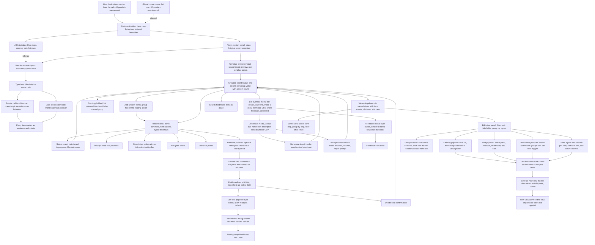
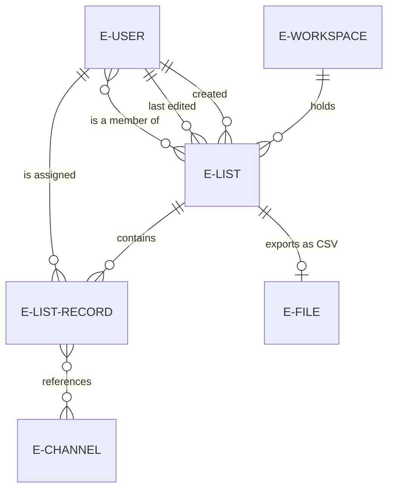

# Lists

The structured-records surface — creating a list from scratch or from a template, entering and editing items, the record detail pane and its typed fields, views, layouts, filtering, sorting, grouping, list details and CSV export.

## Purpose

This document specifies **lists**: the product's surface for tracking structured records rather than conversation. A list is a named collection of items, each item carrying typed fields, rendered either as a table of rows or as a board of grouped cards, and saved view definitions let the same list be read several ways [frame 467](../../screenshots/Slack%20web%20Jul%202024%20467.png), [frame 483](../../screenshots/Slack%20web%20Jul%202024%20483.png), [frame 464](../../screenshots/Slack%20web%20Jul%202024%20464.png).

**Where the area is encountered.** Lists occupy their own top-level destination inside the persistent shell: selecting it replaces the content region and re-scopes the sidebar to a Lists header with a create affordance, a flat all-lists item and a Starred group [frame 408](../../screenshots/Slack%20web%20Jul%202024%20408.png). The destination is reached from the navigation rail [frame 400](../../screenshots/Slack%20web%20Jul%202024%20400.png), [frame 450](../../screenshots/Slack%20web%20Jul%202024%20450.png), and a list can also be started from the shell's global create menu, whose list row carries the one-line description "Track and manage projects" [frame 550](../../screenshots/Slack%20web%20Jul%202024%20550.png). Both the rail entry and the create menu are contracts of the shell, owned by [00-product-overview.md](00-product-overview.md); this document owns what happens after either is used.

**What this area is for, in the product's own words.** The destination's hero states the purpose as staying on track, and describes the work as collaboratively managing projects, prioritising issues and organising requests [frame 408](../../screenshots/Slack%20web%20Jul%202024%20408.png). The in-product tip attached to the views control states that views are saved sets of filters, sorting and layout changes [frame 464](../../screenshots/Slack%20web%20Jul%202024%20464.png), and the tip attached to the edit-view panel states that changes made there stay private until they are saved [frame 469](../../screenshots/Slack%20web%20Jul%202024%20469.png). Those two sentences are the area's whole model of shared-versus-private state, and a build must honour them.

**What this document does not own.** The rail, the sidebar shell, the top bar, the global create menu and every reusable component contract belong to [00-product-overview.md](00-product-overview.md). The inline label-and-value row with a trailing Edit control also appears in the channel details surface, which belongs to [02-channels.md](02-channels.md) and is not restated here. Assignee identity and the profile behind an avatar belong to [13-profiles-people.md](13-profiles-people.md); the channel picker's own channels belong to [02-channels.md](02-channels.md); the search surface that can return lists belongs to [09-search-and-filters.md](09-search-and-filters.md); the exported CSV as a file artifact and the files destination belong to [16-files-media.md](16-files-media.md); the cross-cutting state matrix belongs to [21-states.md](21-states.md); the marketing pages that advertise lists belong to [17-marketing-site.md](17-marketing-site.md).

## Flows in this area

Thirteen flows are named for this area, spanning 80 contiguous frames from 408 to 487. Frame spans are written as plain numeric ranges because they designate a span rather than cite one image, following the convention of the [Screenshot Coverage Index](_screenshot-index.md); every individual frame is cited with its full relative link in the per-flow step tables and in the **Frames covered** section.

| Flow ID | Name | Frame span | Primary entry point |
|---|---|---|---|
| `08.1` | Create a list and fill in items | 408–416 | The create affordance in the Lists header of `C-SIDEBAR`, or the new-list action on the destination hero |
| `08.2` | Create a list from a template | 417–419 | A template row in the ways-to-start panel, or a featured-template card on the destination hero |
| `08.3` | Edit a list record in the detail pane | 420–430 | A record card in a board group, or the floating add-item affordance |
| `08.4` | Add a custom field to a list | 431–435 | The add-field control at the foot of the record detail pane |
| `08.5` | Edit, convert and delete a list field | 436–446 | A field row's overflow control in the record detail pane |
| `08.6` | Star a list | 447–448 | The star toggle in the list header |
| `08.7` | Edit list details and rename a list | 449–459 | The edit-details row of the list overflow menu |
| `08.8` | Send feedback about lists | 460–463 | The share-feedback row of the list overflow menu |
| `08.9` | Switch list views and layouts | 464–468 | The view chip at the left of the list control row |
| `08.10` | Filter a list view | 469–473 | The Filter row of the edit-view panel |
| `08.11` | Sort a list view | 474–478 | The applied-sort chip in the list control row |
| `08.12` | Hide fields and group a table view | 479–484 | The hidden-fields chip, and the Group-by row of the edit-view panel |
| `08.13` | Save a new list view | 485–487 | The save-as-new-view action in the list control row |

### The list-building journey

Every node below is a surface observed in a frame of this area, and every edge is a transition the corpus shows. Where the corpus evidences an outcome but not the transition that produces it, the edge is labelled as inferred rather than asserted as continuous.

## Flow 08.1 — Create a list and fill in items

### Overview

The whole journey from an empty destination to a populated list: the destination's hero and featured templates, the ways-to-start panel, a new list that opens already rendered as a table of three empty rows, then a title, an assignee and a date typed into each row [frame 408](../../screenshots/Slack%20web%20Jul%202024%20408.png) through [frame 416](../../screenshots/Slack%20web%20Jul%202024%20416.png). It is the area's longest flow and it establishes three contracts a build cannot get from anywhere else — the destination's own empty state, the table layout's default field set, and the in-cell editors for a person and a date.

### Trigger

The create affordance at the right of the sidebar's Lists header, or the filled primary new-list action in the centre of the destination hero [frame 408](../../screenshots/Slack%20web%20Jul%202024%20408.png).

### Preconditions

An authenticated session with the lists destination loaded. No list need exist: the sidebar's Starred group renders its own empty state and the content region renders the hero rather than a list [frame 408](../../screenshots/Slack%20web%20Jul%202024%20408.png).

### Frame-by-frame steps

| Step | Frame(s) | What the user does | What changes on screen | Component(s) involved |
|---|---|---|---|---|
| 1 | [frame 408](../../screenshots/Slack%20web%20Jul%202024%20408.png) | Opens the lists destination | The content region renders the destination: the title at the top-left, an outlined share-feedback action at the top-right, then a centred hero carrying an illustration of a sample list, a heading, a one-line explanation with a learn-more link and a filled primary new-list action, then a featured-templates section headed with a see-all link and three template cards each carrying preview art, a name and a one-line description. The sidebar re-scopes to a Lists header with a create affordance, a flat all-lists item and a Starred group whose empty state reads that nothing has been starred yet | `C-SIDEBAR`, `C-EMPTY-STATE`, `C-BANNER`, `C-UPGRADE-GATE` |
| 2 | [frame 409](../../screenshots/Slack%20web%20Jul%202024%20409.png) | Starts a new list | A ways-to-start panel opens as a second column between the sidebar and the content region, carrying a dismiss control at its top-right, a filled primary blank-list action, a templates heading, seven named template rows and a do-not-show-this-again control at its foot. Behind it the content region already holds a new list titled with an untitled placeholder, header actions of share, an unfilled star toggle and an overflow control, a control row of view chip, separator, search control and view-settings control, and a table of three rows | `C-MODAL-SHELL`, `C-DATA-TABLE` |
| 3 | [frame 410](../../screenshots/Slack%20web%20Jul%202024%20410.png) | Names the list | The list title replaces its placeholder with the typed name. The table renders a header row of three field columns — a name column, a people column carrying a small notification glyph beside its label, and a date column — followed by an add-column control at the header's right edge; each of the three rows shows a muted untitled-item placeholder and empty people and date cells rendered as a person glyph and a calendar glyph; an add-item row closes the table and a floating add-item action sits at the bottom-right of the content region | `C-DATA-TABLE` |
| 4 | [frame 411](../../screenshots/Slack%20web%20Jul%202024%20411.png) | Types a title into each of the three rows | The three placeholders are replaced by item titles rendered in bold; the people and date cells stay empty | `C-DATA-TABLE` |
| 5 | [frame 412](../../screenshots/Slack%20web%20Jul%202024%20412.png) | Activates the first row's people cell | The cell becomes a focused bordered input and a picker opens beneath it listing three members, each as an avatar and a display name; two of them carry a not-in-list note at the row's right edge, and a helper line at the picker's foot states that only members added to the list will be notified | `C-DATA-TABLE`, `C-AVATAR` |
| 6 | [frame 413](../../screenshots/Slack%20web%20Jul%202024%20413.png) | Chooses a member | The picker closes and the cell renders the chosen person as an avatar and a display name; the other two rows' people cells stay empty | `C-DATA-TABLE`, `C-AVATAR` |
| 7 | [frame 414](../../screenshots/Slack%20web%20Jul%202024%20414.png) | Activates the first row's date cell | A month calendar popover opens beneath the cell, headed by the month and year with a caret, above a seven-column day-of-week header and the month's dates, with the current day ringed | `C-DATA-TABLE` |
| 8 | [frame 415](../../screenshots/Slack%20web%20Jul%202024%20415.png) | Chooses a date | The popover closes and the cell renders the date; the other two rows' date cells stay empty | `C-DATA-TABLE` |
| 9 | [frame 416](../../screenshots/Slack%20web%20Jul%202024%20416.png) | Repeats for the remaining rows | All three rows carry a title, an avatar-and-name assignee and a date; the add-item row and the floating add-item action are unchanged | `C-DATA-TABLE`, `C-AVATAR` |

**The date cell renders two different formats in this corpus.** In the table the value reads as month, day and year separated by slashes [frame 416](../../screenshots/Slack%20web%20Jul%202024%20416.png), while a due date on a board card reads as year, month and day separated by hyphens [frame 433](../../screenshots/Slack%20web%20Jul%202024%20433.png). Both were observed; neither is normalised here, and the difference is carried into the **Edge cases & validations** section.

> **Partial capture:** no frame shows the result of activating the blank-list action or a template row from the ways-to-start panel — the next capture already has the list created *and* renamed [frame 410](../../screenshots/Slack%20web%20Jul%202024%20410.png) — and no frame shows the panel's do-not-show-this-again control taking effect, the see-all destination behind the featured-templates heading, or the learn-more destination in the hero [frame 408](../../screenshots/Slack%20web%20Jul%202024%20408.png), [frame 409](../../screenshots/Slack%20web%20Jul%202024%20409.png).

**Inferred:** the list is created before it is named, because the capture that follows the panel shows a fully rendered list whose three empty rows already exist and whose title is already typed [frame 409](../../screenshots/Slack%20web%20Jul%202024%20409.png), [frame 410](../../screenshots/Slack%20web%20Jul%202024%20410.png) — a new list therefore arrives pre-seeded with three empty rows and three fields rather than empty.

## Flow 08.2 — Create a list from a template

### Overview

A template is previewed before it is used, and the preview is a scaled rendering of the board the template will produce, not a screenshot: it carries real group columns with item counts and real record cards [frame 417](../../screenshots/Slack%20web%20Jul%202024%20417.png). Confirming it produces a grouped board whose columns are the template's group values [frame 418](../../screenshots/Slack%20web%20Jul%202024%20418.png), [frame 419](../../screenshots/Slack%20web%20Jul%202024%20419.png).

### Trigger

A template row in the ways-to-start panel, or a featured-template card on the destination hero [frame 409](../../screenshots/Slack%20web%20Jul%202024%20409.png), [frame 408](../../screenshots/Slack%20web%20Jul%202024%20408.png).

### Preconditions

An authenticated session on the lists destination. The all-lists index is legible behind the dimmed preview, so the flow is reachable with lists already present [frame 417](../../screenshots/Slack%20web%20Jul%202024%20417.png).

### Frame-by-frame steps

| Step | Frame(s) | What the user does | What changes on screen | Component(s) involved |
|---|---|---|---|---|
| 1 | [frame 417](../../screenshots/Slack%20web%20Jul%202024%20417.png) | Opens a template | A near-full-width modal opens over a dimmed backdrop: a tinted decorative header band with a dismiss control at its right, the template name as a heading, then a scaled board preview of four group columns — each headed by its group value and an item count rendered in that group's own colour — holding record cards that expose a bold title, a priority row of star glyphs, a description and an assignee avatar; the preview is clipped at the right and foot. A pinned footer bar carries the template name, its one-line description, an author line with a small mark and a by-line naming the product vendor, and a filled primary use-template action at the right | `C-MODAL-SHELL`, `C-RECORD-CARD` |
| 2 | [frame 418](../../screenshots/Slack%20web%20Jul%202024%20418.png) | Confirms the template | The modal closes and the content region renders a new list in the grouped board layout: the title, then a control row whose view chip now names the grouping field, a separator, a search control, a view-settings control rendered active with a tinted hint label beside it, and a group-by chip naming the field; three group columns, each headed by its value and an item count on that group's own tint, each holding one record card and closing with a per-group add-item control rendered in the group's colour; a floating add-item action sits at the bottom-right | `C-RECORD-CARD`, `C-FILTER-CHIP` |
| 3 | [frame 419](../../screenshots/Slack%20web%20Jul%202024%20419.png) | Scrolls the board to the right | The remaining groups come into view: one holding a card and its add-item control, then a group whose header carries its value with **no item count at all** and whose body holds only its add-item control, then an add-group control rendered as a further neutral column at the far right | `C-RECORD-CARD` |

**An empty group renders its label without a count.** Every populated group header pairs its value with an item count; the group with no records renders the value alone [frame 419](../../screenshots/Slack%20web%20Jul%202024%20419.png), and the same treatment recurs in the grouped table layout [frame 483](../../screenshots/Slack%20web%20Jul%202024%20483.png) and when a text filter empties a group [frame 466](../../screenshots/Slack%20web%20Jul%202024%20466.png). A build must therefore suppress the count rather than render a zero.

> **Partial capture:** the corpus shows the use-template action and the board that follows it, but no frame shows the add-group control's own editor, so how a group is named is not specified here [frame 419](../../screenshots/Slack%20web%20Jul%202024%20419.png).

## Flow 08.3 — Edit a list record in the detail pane

### Overview

One record is opened into a pane docked at the right of the content region, and every field is filled from there: a title, a status chosen from a select, a priority set on a three-position star control, a description written in a rich-text editor, an assignee chosen from a member picker and a due date [frame 420](../../screenshots/Slack%20web%20Jul%202024%20420.png) through [frame 430](../../screenshots/Slack%20web%20Jul%202024%20430.png). The board behind the pane updates as the fields change, which is what makes the pane and the card two renderings of one record rather than two surfaces.

### Trigger

A record card in a board group, or the floating add-item action, which opens a new record in the ungrouped column with the pane already docked [frame 420](../../screenshots/Slack%20web%20Jul%202024%20420.png).

### Preconditions

A list open in the board layout with at least one group rendered. The pane is observed only alongside a board in this area; the record whose pane is open is the one being edited, and the board keeps rendering the rest [frame 420](../../screenshots/Slack%20web%20Jul%202024%20420.png).

### Frame-by-frame steps

| Step | Frame(s) | What the user does | What changes on screen | Component(s) involved |
|---|---|---|---|---|
| 1 | [frame 420](../../screenshots/Slack%20web%20Jul%202024%20420.png) | Adds an item | A pane docks along the right edge of the content region, which narrows to make room: its header carries a generic item title at the left and a dismiss control at the right, then the record's own title as a muted placeholder, then an action row of an outlined add-comment control, an outlined notifications control with a caret, and an overflow control, then a rule. Beneath it, one row per field pairs a label at the left with a value at the right, and every empty value renders its **type** as the placeholder beside a type glyph — a select, a three-position dot control, a text type, a people type and a date type — closing with an outlined add-field control. On the board a new column headed as ungrouped holds the new card with its title in edit mode | `C-DETAILS-PANE`, `C-RECORD-CARD` |
| 2 | [frame 421](../../screenshots/Slack%20web%20Jul%202024%20421.png) | Types the record's title | The typed name replaces the placeholder in the pane header and simultaneously on the card in the ungrouped column | `C-DETAILS-PANE`, `C-RECORD-CARD` |
| 3 | [frame 422](../../screenshots/Slack%20web%20Jul%202024%20422.png) | Opens the status field | A select opens over the pane offering a please-select-an-option prompt above four values — the same four the board's groups are named after | `C-DETAILS-PANE`, `C-DROPDOWN-MENU` |
| 4 | [frame 423](../../screenshots/Slack%20web%20Jul%202024%20423.png) | Chooses a status | The pane's status row renders the chosen value and the card leaves the ungrouped column for the group of that value, whose item count increments | `C-DETAILS-PANE`, `C-RECORD-CARD` |
| 5 | [frame 424](../../screenshots/Slack%20web%20Jul%202024%20424.png) | Hovers the priority field | The value takes a light hover background; the first of three star positions renders as a lit star and the remaining two stay as dots. The status value is now rendered as a filled chip rather than plain text, and the description row still shows its type placeholder | `C-DETAILS-PANE` |
| 6 | [frame 425](../../screenshots/Slack%20web%20Jul%202024%20425.png) | Confirms the priority | The card in the board renders the priority as lit star glyphs beneath its own priority label | `C-RECORD-CARD` |
| 7 | [frame 426](../../screenshots/Slack%20web%20Jul%202024%20426.png) | Opens the description field | The value is replaced by an empty editor beneath an inline rich-text toolbar; the priority row now shows three lit stars, and the assignee and due-date rows still show their type placeholders | `C-DETAILS-PANE`, `C-FORMATTING-TOOLBAR` |
| 8 | [frame 427](../../screenshots/Slack%20web%20Jul%202024%20427.png) | Types the description | The text appears in the editor with the inline toolbar rendered directly above it, and the same text appears on the card | `C-DETAILS-PANE`, `C-FORMATTING-TOOLBAR`, `C-RECORD-CARD` |
| 9 | [frame 428](../../screenshots/Slack%20web%20Jul%202024%20428.png) | Opens the assignee field | A member picker opens listing four people, each an avatar and a display name, with a not-in-list note on those who are not members of the list, and the same notify-only-list-members helper line the in-cell picker shows | `C-DETAILS-PANE`, `C-AVATAR` |
| 10 | [frame 429](../../screenshots/Slack%20web%20Jul%202024%20429.png) | Chooses an assignee | The assignee row renders the person as an avatar and a name; the due-date row still shows its type placeholder | `C-DETAILS-PANE`, `C-AVATAR` |
| 11 | [frame 430](../../screenshots/Slack%20web%20Jul%202024%20430.png) | Sets the due date | The due-date row renders the date, and the card gains an assignee-and-due-date pair rendered as two labelled columns at its foot | `C-DETAILS-PANE`, `C-RECORD-CARD` |

**The empty-field placeholder is the field's type, not a prompt.** Every unset field in the pane renders its type beside a type glyph — the select, text, people and date types are each named in place of a value [frame 420](../../screenshots/Slack%20web%20Jul%202024%20420.png). This is the corpus's only enumeration of how an empty typed field looks, and it is the same vocabulary the field-type list offers when a field is created [frame 433](../../screenshots/Slack%20web%20Jul%202024%20433.png).

**Priority is a three-position control, and the corpus is explicit about it.** The unset value renders as three dots [frame 420](../../screenshots/Slack%20web%20Jul%202024%20420.png), one lit star plus two dots is a valid intermediate [frame 424](../../screenshots/Slack%20web%20Jul%202024%20424.png), and three lit stars is the maximum observed [frame 426](../../screenshots/Slack%20web%20Jul%202024%20426.png), [frame 433](../../screenshots/Slack%20web%20Jul%202024%20433.png). The illustration in the destination hero shows a five-position rating instead [frame 408](../../screenshots/Slack%20web%20Jul%202024%20408.png); that is decorative artwork, and the three-position control is what the product's own surfaces render.

> **Partial capture:** the add-comment control, the notifications control and the pane's own overflow control are visible in every frame of this flow but no frame shows any of them opened, so comments and per-record notification options are not specified here [frame 420](../../screenshots/Slack%20web%20Jul%202024%20420.png).

## Flow 08.4 — Add a custom field to a list

### Overview

A list's field set is extensible, and the corpus captures the whole affordance: an optional name, a searchable field-type combobox, and the nine types it offers [frame 431](../../screenshots/Slack%20web%20Jul%202024%20431.png) through [frame 435](../../screenshots/Slack%20web%20Jul%202024%20435.png). This is the area's most build-critical enumeration, because the type list defines what a list can store.

### Trigger

The outlined add-field control at the foot of the record detail pane's field rows [frame 430](../../screenshots/Slack%20web%20Jul%202024%20430.png).

### Preconditions

A record open in the detail pane. The control sits below the last field row, so the pane must be docked; no frame in this area adds a field from any other surface [frame 435](../../screenshots/Slack%20web%20Jul%202024%20435.png).

### Frame-by-frame steps

| Step | Frame(s) | What the user does | What changes on screen | Component(s) involved |
|---|---|---|---|---|
| 1 | [frame 431](../../screenshots/Slack%20web%20Jul%202024%20431.png) | Activates the add-field control | A popover opens over the pane's field rows carrying a label that marks the field name as optional above a text input, then a field-type label above a combobox whose placeholder invites finding a field type, then a cancel action and a save action | `C-DETAILS-PANE`, `C-MODAL-SHELL` |
| 2 | [frame 432](../../screenshots/Slack%20web%20Jul%202024%20432.png) | Types a field name | The name replaces the input's placeholder; the field-type combobox still shows its own placeholder, so no type is chosen yet | `C-MODAL-SHELL` |
| 3 | [frame 433](../../screenshots/Slack%20web%20Jul%202024%20433.png) | Opens the field-type combobox | The combobox takes a focused border and an option list opens beneath it offering **nine** types, each with a leading glyph, in this order: text, number, select, date, people, checkbox, email, phone and channel | `C-DROPDOWN-MENU` |
| 4 | [frame 434](../../screenshots/Slack%20web%20Jul%202024%20434.png) | Chooses the text type | The list closes, the combobox renders the chosen type with its glyph, and the cancel and save actions are available again | `C-MODAL-SHELL` |
| 5 | [frame 435](../../screenshots/Slack%20web%20Jul%202024%20435.png) | Saves the field | The popover closes and the new field appears as a further row in the pane, labelled with its name and carrying its type as the empty-value placeholder, directly above the add-field control | `C-DETAILS-PANE` |

**The nine types are the whole observed palette — nothing beyond them is claimed.** The list is captured once, fully expanded, with no scroll affordance visible [frame 433](../../screenshots/Slack%20web%20Jul%202024%20433.png), and the two types that the corpus goes on to configure — text and channel — behave differently from each other, which is direct evidence that a type carries its own options rather than being a label [frame 434](../../screenshots/Slack%20web%20Jul%202024%20434.png), [frame 438](../../screenshots/Slack%20web%20Jul%202024%20438.png).

**Inferred:** the field name is genuinely optional and the type is genuinely required, because the label beside the name input says so in as many words while the type label does not, and because the save action is present while the name is empty [frame 431](../../screenshots/Slack%20web%20Jul%202024%20431.png) and still present once a name is typed but no type is chosen [frame 432](../../screenshots/Slack%20web%20Jul%202024%20432.png). No frame shows the save action rejected, so no validation message is claimed.

## Flow 08.5 — Edit, convert and delete a list field

### Overview

The longest field-management journey in the corpus, and the one that carries its own data-loss warning: a field's overflow menu, an edit popover that grows extra controls when the type changes, a confirmation dialog that says converting may clear item data, an undoable confirmation toast, the converted field being populated from a channel picker, and finally a destructive delete with its own confirmation [frame 436](../../screenshots/Slack%20web%20Jul%202024%20436.png) through [frame 446](../../screenshots/Slack%20web%20Jul%202024%20446.png).

### Trigger

The overflow control on a field row inside the record detail pane [frame 436](../../screenshots/Slack%20web%20Jul%202024%20436.png).

### Preconditions

A record open in the detail pane with at least one custom field present. The menu is observed on the custom field added by flow `08.4`, and the pane's built-in field rows are not shown carrying one [frame 436](../../screenshots/Slack%20web%20Jul%202024%20436.png).

### Frame-by-frame steps

| Step | Frame(s) | What the user does | What changes on screen | Component(s) involved |
|---|---|---|---|---|
| 1 | [frame 436](../../screenshots/Slack%20web%20Jul%202024%20436.png) | Opens the field's overflow menu | A menu opens beside the field row with three rows — edit field, move field up, and delete field rendered in the destructive colour | `C-CONTEXT-MENU` |
| 2 | [frame 437](../../screenshots/Slack%20web%20Jul%202024%20437.png) | Chooses edit field | A popover opens carrying the field's name in an input and a field-type label above a select showing the current type, then cancel and save | `C-MODAL-SHELL` |
| 3 | [frame 438](../../screenshots/Slack%20web%20Jul%202024%20438.png) | Changes the type to the channel type | The popover **grows**: below the type select a separator appears, then an allow-multiple-selections row with a toggle rendered off, then a default label above an empty select, with cancel and save unchanged | `C-MODAL-SHELL` |
| 4 | [frame 439](../../screenshots/Slack%20web%20Jul%202024%20439.png) | Switches the allow-multiple toggle on | The toggle renders in its on state; nothing else in the popover changes | `C-MODAL-SHELL` |
| 5 | [frame 440](../../screenshots/Slack%20web%20Jul%202024%20440.png) | Saves the type change | A confirmation dialog opens centred over a dimmed backdrop asking whether to convert the field to a different type, with a dismiss control, a body whose bold opening states that this may clear item data and whose remainder offers creating a new field instead, and a three-action footer — an outlined create-new-field action at the **left**, then an outlined cancel and a filled primary convert at the right. The edit popover stays open behind the dialog with its toggle still on | `C-CONFIRM-DIALOG`, `C-MODAL-SHELL` |
| 6 | [frame 441](../../screenshots/Slack%20web%20Jul%202024%20441.png) | Confirms the conversion | The dialog and popover close, the field row renders the new type as its placeholder, and a toast appears at the **bottom centre** of the content region stating that the field type was updated and offering an undo link | `C-TOAST`, `C-DETAILS-PANE` |
| 7 | [frame 442](../../screenshots/Slack%20web%20Jul%202024%20442.png) | Activates the converted field | A picker opens listing a create-a-new-channel row that embeds the record's own name, then the workspace's company-wide channel and three further channels, above the same helper line about members being notified | `C-DETAILS-PANE`, `C-DROPDOWN-MENU` |
| 8 | [frame 443](../../screenshots/Slack%20web%20Jul%202024%20443.png) | Chooses a channel | The chosen channel renders inside the field as a removable chip carrying a dismiss control, while the picker stays open with that row check-marked | `C-DETAILS-PANE` |
| 9 | [frame 444](../../screenshots/Slack%20web%20Jul%202024%20444.png) | Closes the picker | The field renders the channel value and the card in the board echoes the same chip | `C-DETAILS-PANE`, `C-RECORD-CARD` |
| 10 | [frame 445](../../screenshots/Slack%20web%20Jul%202024%20445.png) | Chooses delete field from the field's overflow menu | A confirmation dialog opens asking whether to delete the named field permanently — the field's own name is embedded in the question — with an outlined cancel and a confirming action rendered in the destructive colour | `C-CONFIRM-DIALOG` |
| 11 | [frame 446](../../screenshots/Slack%20web%20Jul%202024%20446.png) | Confirms the deletion | The field row disappears from the pane and the add-field control returns to its position beneath the remaining rows | `C-DETAILS-PANE` |

**Two different destructive treatments, both observed.** A type conversion is reversible and is confirmed *afterwards* by an undoable toast [frame 441](../../screenshots/Slack%20web%20Jul%202024%20441.png); a field deletion is irreversible, says so with the word permanently, and is confirmed *beforehand* by a dialog with no undo anywhere [frame 445](../../screenshots/Slack%20web%20Jul%202024%20445.png). A build must not collapse the two into one pattern.

**The convert dialog offers a third way out, and its position is part of the contract.** The create-new-field action sits at the footer's left, separated from the cancel-and-confirm pair at the right, which distinguishes an alternative course of action from an acceptance or a refusal [frame 440](../../screenshots/Slack%20web%20Jul%202024%20440.png).

> **Partial capture:** no frame shows the move-field-up action taking effect, the create-new-field branch of the convert dialog, the undo link being used, the allow-multiple toggle producing more than one chip, or the default select being populated [frame 436](../../screenshots/Slack%20web%20Jul%202024%20436.png), [frame 438](../../screenshots/Slack%20web%20Jul%202024%20438.png), [frame 440](../../screenshots/Slack%20web%20Jul%202024%20440.png), [frame 441](../../screenshots/Slack%20web%20Jul%202024%20441.png).

## Flow 08.6 — Star a list

### Overview

Two frames, one state change, and it is worth its own flow because the change is observable in **two regions at once**: the header's star toggle fills, and the list appears as a row under the sidebar's Starred group, replacing that group's empty state [frame 447](../../screenshots/Slack%20web%20Jul%202024%20447.png), [frame 448](../../screenshots/Slack%20web%20Jul%202024%20448.png).

### Trigger

The star toggle in the list header, sitting between the share action and the overflow control [frame 447](../../screenshots/Slack%20web%20Jul%202024%20447.png).

### Preconditions

A list open in any layout. At the start of this flow the sidebar's Starred group is rendering its empty state, so the flow is reachable from a workspace with nothing starred [frame 447](../../screenshots/Slack%20web%20Jul%202024%20447.png).

### Frame-by-frame steps

| Step | Frame(s) | What the user does | What changes on screen | Component(s) involved |
|---|---|---|---|---|
| 1 | [frame 447](../../screenshots/Slack%20web%20Jul%202024%20447.png) | Reads the unstarred list | The header renders share, an **unfilled** star toggle and an overflow control; the board shows three groups with their item counts and their per-group add-item controls, the detail pane is closed, and the sidebar's Starred group renders its empty state | `C-SIDEBAR`, `C-EMPTY-STATE`, `C-RECORD-CARD` |
| 2 | [frame 448](../../screenshots/Slack%20web%20Jul%202024%20448.png) | Activates the star toggle | The toggle renders **filled**, and the sidebar's Starred group replaces its empty state with a row for this list carrying the list's own glyph and name | `C-SIDEBAR` |

**The starred state is legible in the header and in the sidebar simultaneously**, and the same pairing recurs later in the area — the header star stays filled while the sidebar row persists across the details, feedback and view flows [frame 449](../../screenshots/Slack%20web%20Jul%202024%20449.png), [frame 464](../../screenshots/Slack%20web%20Jul%202024%20464.png). A build must treat the sidebar group as a projection of the flag rather than a separate collection.

> **Partial capture:** no frame shows the toggle being switched back off, so the unstar transition and any confirmation it might carry are not specified here [frame 448](../../screenshots/Slack%20web%20Jul%202024%20448.png).

## Flow 08.7 — Edit list details and rename a list

### Overview

The list's own metadata: the overflow menu that exposes it, the details modal's About tab, an inline rename with an emoji control, an inline description editor with a character counter and a helper prompt, and the renamed list propagating to the page header and the sidebar [frame 449](../../screenshots/Slack%20web%20Jul%202024%20449.png) through [frame 459](../../screenshots/Slack%20web%20Jul%202024%20459.png). The modal is also where CSV export is offered.

### Trigger

The overflow control at the right of the list header, then its edit-details row [frame 449](../../screenshots/Slack%20web%20Jul%202024%20449.png).

### Preconditions

A list open in any layout, and — for the metadata the menu displays — a list that has been created and edited by someone, since the menu renders a last-edited-by line and a created-by line with relative times [frame 449](../../screenshots/Slack%20web%20Jul%202024%20449.png).

### Frame-by-frame steps

| Step | Frame(s) | What the user does | What changes on screen | Component(s) involved |
|---|---|---|---|---|
| 1 | [frame 449](../../screenshots/Slack%20web%20Jul%202024%20449.png) | Opens the list's overflow menu | A menu opens beneath the control carrying, in order: edit details, copy link to list, make a copy and download CSV, each with a leading glyph; a separator; share feedback; a separator; then a **non-actionable metadata block** of a last-edited-by label above a person and a relative time, and a created-by label above a person and a relative time; a separator; then delete list rendered in the destructive colour with a bin glyph | `C-CONTEXT-MENU` |
| 2 | [frame 450](../../screenshots/Slack%20web%20Jul%202024%20450.png) | Chooses edit details | A centred modal opens over a dimmed backdrop: a title row carrying the list name and a dismiss control, an outlined copy-link action with a link glyph beneath it, then a single About tab rendered active, then a card holding a list-name row — label, current value, and an inline edit control at the row's right — and a description row whose value is a muted add-a-description placeholder with its own inline edit control, then a download-CSV link as the card's last row | `C-MODAL-SHELL`, `C-TAB-BAR`, `C-DETAILS-PANE` |
| 3 | [frame 451](../../screenshots/Slack%20web%20Jul%202024%20451.png) | Activates the name row's edit control | The row becomes an editor: an emoji-picker control sits to the **left** of a focused input pre-filled with the current name, with an outlined cancel and a filled primary save beneath. The description row keeps its own inline edit control, so only one row is in edit mode at a time | `C-MODAL-SHELL` |
| 4 | [frame 452](../../screenshots/Slack%20web%20Jul%202024%20452.png), [frame 453](../../screenshots/Slack%20web%20Jul%202024%20453.png) | Types a new name | The input holds the new name with the emoji control still rendered at its left and cancel and save still available; the modal title still shows the old name | `C-MODAL-SHELL` |
| 5 | [frame 454](../../screenshots/Slack%20web%20Jul%202024%20454.png) | Saves the name | The editor collapses back to a value row; the new name — prefixed by the chosen emoji — appears both in the modal's title row and in the name row's value | `C-MODAL-SHELL` |
| 6 | [frame 455](../../screenshots/Slack%20web%20Jul%202024%20455.png) | Activates the description row's edit control | The row becomes a focused textarea with a resize handle at its bottom-right and a **character allowance rendered at its top-right**, a helper line beneath it asking what is going to be listed, then cancel and save | `C-MODAL-SHELL` |
| 7 | [frame 456](../../screenshots/Slack%20web%20Jul%202024%20456.png) | Types a two-line description | The text fills the textarea, the helper line stays, cancel and save stay — and the character allowance **is no longer rendered** | `C-MODAL-SHELL` |
| 8 | [frame 457](../../screenshots/Slack%20web%20Jul%202024%20457.png) | Saves the description | The editor collapses and the description row renders the saved text as a value with its inline edit control restored; the download-CSV link is unchanged | `C-MODAL-SHELL` |
| 9 | [frame 458](../../screenshots/Slack%20web%20Jul%202024%20458.png) | Dismisses the modal | The board renders behind with the renamed list — emoji and new name — in the page header and in the sidebar's starred row; the groups, cards and counts are unchanged | `C-SIDEBAR`, `C-RECORD-CARD` |
| 10 | [frame 459](../../screenshots/Slack%20web%20Jul%202024%20459.png) | Reopens the overflow menu | The same action set renders, and the metadata block's relative times have advanced | `C-CONTEXT-MENU` |

**The list carries an emoji as well as a name.** The rename editor exposes an emoji control beside the input [frame 451](../../screenshots/Slack%20web%20Jul%202024%20451.png), and after saving, the emoji is rendered ahead of the name in the modal title, the name row, the page header and the sidebar row [frame 454](../../screenshots/Slack%20web%20Jul%202024%20454.png), [frame 458](../../screenshots/Slack%20web%20Jul%202024%20458.png). It is therefore a field of the list, not decoration of one surface.

**The details modal is a fixed-height shell.** It is centred, occupies roughly two-fifths of the viewport's width and roughly five-sixths of its height, and its About card fills only the upper half — the remainder is empty [frame 450](../../screenshots/Slack%20web%20Jul%202024%20450.png), [frame 455](../../screenshots/Slack%20web%20Jul%202024%20455.png). A build that sizes the modal to its content will not match the captures.

> **Partial capture:** the tab strip carries exactly one tab in every capture of this modal, so no second tab is claimed [frame 450](../../screenshots/Slack%20web%20Jul%202024%20450.png), [frame 457](../../screenshots/Slack%20web%20Jul%202024%20457.png). No frame shows the outcome of copy link, make a copy, download CSV or delete list, nor the emoji picker opened from the rename editor.

## Flow 08.8 — Send feedback about lists

### Overview

A product-feedback form reachable from the list's own overflow menu, and the area's clearest disabled-primary contract: the submit action is muted until the details textarea holds text, even after a feedback type has been chosen [frame 460](../../screenshots/Slack%20web%20Jul%202024%20460.png) through [frame 463](../../screenshots/Slack%20web%20Jul%202024%20463.png).

### Trigger

The share-feedback row of the list overflow menu [frame 449](../../screenshots/Slack%20web%20Jul%202024%20449.png), which is also offered as an outlined action on the destination hero [frame 408](../../screenshots/Slack%20web%20Jul%202024%20408.png).

### Preconditions

A list open with its overflow menu available. The form itself asks for nothing about the list, so no list state is required beyond being able to reach the menu [frame 460](../../screenshots/Slack%20web%20Jul%202024%20460.png).

### Frame-by-frame steps

| Step | Frame(s) | What the user does | What changes on screen | Component(s) involved |
|---|---|---|---|---|
| 1 | [frame 460](../../screenshots/Slack%20web%20Jul%202024%20460.png) | Chooses share feedback | A centred modal opens over a dimmed backdrop with a dismiss control: a question as its title, a standfirst stating that the form is for feedback about lists as a new feature of the product, a second line offering a support contact as a link for anyone needing help, a type-of-feedback label above a four-option radio group — a positive option, a negative option, a feature-request option and an other option, **all unselected** — a details label above an empty resizable textarea, an unchecked checkbox asking for a response from the product's support team, and a footer carrying a privacy-policy link at the left and, at the right, an outlined cancel beside a **muted** submit | `C-MODAL-SHELL` |
| 2 | [frame 461](../../screenshots/Slack%20web%20Jul%202024%20461.png) | Selects the positive option | That radio renders selected; the textarea is still empty and the submit action is still muted | `C-MODAL-SHELL` |
| 3 | [frame 462](../../screenshots/Slack%20web%20Jul%202024%20462.png) | Types a comment | The textarea holds the text and the submit action becomes available | `C-MODAL-SHELL` |
| 4 | [frame 463](../../screenshots/Slack%20web%20Jul%202024%20463.png) | Submits | The modal closes and a confirmation toast appears at the **bottom centre** of the content region; behind it the list renders with its overflow menu open | `C-TOAST`, `C-CONTEXT-MENU` |

**The submit gate is on the textarea, not on the radio group.** Selecting a feedback type leaves submit muted [frame 461](../../screenshots/Slack%20web%20Jul%202024%20461.png) and typing into the textarea releases it [frame 462](../../screenshots/Slack%20web%20Jul%202024%20462.png). **Inferred:** the details text is therefore the required field and the type is optional, because those are the only two inputs whose state changed between the muted and the released captures.

**The form's own copy names the product.** The standfirst and the response checkbox both refer to the product and its support team by name in the corpus; both are restated functionally here and the name is never carried forward, in keeping with the placeholder vocabulary defined in [00-product-overview.md](00-product-overview.md) [frame 460](../../screenshots/Slack%20web%20Jul%202024%20460.png).

> **Partial capture:** no frame shows the response checkbox ticked, the other option's behaviour, the support-contact or privacy-policy destinations, or the toast's own text at a legible size [frame 460](../../screenshots/Slack%20web%20Jul%202024%20460.png), [frame 463](../../screenshots/Slack%20web%20Jul%202024%20463.png).

## Flow 08.9 — Switch list views and layouts

### Overview

A list is read through **views**, and the views dropdown is where they live: six named views each carrying an item count and a glyph that reflects its layout, plus an all-items entry and an add-view action [frame 464](../../screenshots/Slack%20web%20Jul%202024%20464.png). Choosing one applies its filters and grouping [frame 465](../../screenshots/Slack%20web%20Jul%202024%20465.png); the control row's search field filters in place [frame 466](../../screenshots/Slack%20web%20Jul%202024%20466.png); and the same list renders as a table when the layout changes [frame 467](../../screenshots/Slack%20web%20Jul%202024%20467.png), [frame 468](../../screenshots/Slack%20web%20Jul%202024%20468.png).

### Trigger

The view chip at the left of the list's control row, whose caret flips upward while the dropdown is open [frame 464](../../screenshots/Slack%20web%20Jul%202024%20464.png).

### Preconditions

A list open with at least one record. Saved views already exist at this capture, and the dropdown carries an unread first-run tip, so the flow is reachable both with and without prior view use [frame 464](../../screenshots/Slack%20web%20Jul%202024%20464.png).

### Frame-by-frame steps

| Step | Frame(s) | What the user does | What changes on screen | Component(s) involved |
|---|---|---|---|---|
| 1 | [frame 464](../../screenshots/Slack%20web%20Jul%202024%20464.png) | Opens the view chip | A dropdown opens beneath it headed with a views title, then a dismissible tinted tip block whose bolded clause states that views are saved sets of filters, sorting and layout changes and whose remainder explains their purpose; then **six** named view rows, each a layout glyph, a name and an item count, with the active row rendered in the accent colour and carrying a trailing check and a **board** glyph where the other five carry a **table** glyph; then a separator, an all-items row with its own glyph and count, and an add-view action | `C-DROPDOWN-MENU` |
| 2 | [frame 465](../../screenshots/Slack%20web%20Jul%202024%20465.png) | Chooses a different view | The view chip renames itself to that view; the control row gains a group-by chip and a filter chip naming the filtered field and its value, a filled primary save-view action and a reset link; the board re-renders with each group holding the matching item and its count adjusted | `C-FILTER-CHIP`, `C-RECORD-CARD` |
| 3 | [frame 466](../../screenshots/Slack%20web%20Jul%202024%20466.png) | Types into the control row's search field | Only matching items remain in the board — matching on the item title **and** on the description, since a card whose description matches is retained — and a group left with nothing renders its header **without an item count**, holding only its add-item control | `C-DATA-TABLE`, `C-RECORD-CARD`, `C-EMPTY-STATE` |
| 4 | [frame 467](../../screenshots/Slack%20web%20Jul%202024%20467.png) | Switches the layout to a table | The board is replaced by one table: a header row of field labels — the title field, then status, priority, description, assignee whose label carries a small notification glyph, and a due-date column clipped by the region's right edge — above one row per record, each rendering its title in bold, its status as a coloured chip, its priority as three star positions, its description as text, its assignee as an avatar and a name, and its due date as a calendar glyph when empty or a date when set; an add-item row closes the table. The group-by chip is absent while the view is ungrouped | `C-DATA-TABLE`, `C-AVATAR` |
| 5 | [frame 468](../../screenshots/Slack%20web%20Jul%202024%20468.png) | Scrolls the table horizontally | The title column scrolls out of view and the remaining columns come into view, ending with an add-column control at the header row's right edge | `C-DATA-TABLE` |

**A view carries its layout, and the dropdown says so before it is opened.** Five view rows carry a table glyph and the active one carries a board glyph, matching the board that is rendered behind the dropdown [frame 464](../../screenshots/Slack%20web%20Jul%202024%20464.png). A build must store layout on the view, not on the list.

**A zero-count view is rendered, not hidden.** One of the six named views reads zero items and stays in the list with its count [frame 464](../../screenshots/Slack%20web%20Jul%202024%20464.png) — the same treatment the search area gives a result type with no matches [frame 696](../../screenshots/Slack%20web%20Jul%202024%20696.png).

> **Partial capture:** no frame shows the add-view action's outcome, the all-items row being chosen, or the tip block dismissed [frame 464](../../screenshots/Slack%20web%20Jul%202024%20464.png).

## Flow 08.10 — Filter a list view

### Overview

Filtering is composed inside the edit-view panel and then rendered as a chip in the control row: the panel lists the four view settings and the two layouts, the filter-by popover lists the filterable fields, and a field's own popover carries an operator, a searchable value list and a remove action [frame 469](../../screenshots/Slack%20web%20Jul%202024%20469.png) through [frame 473](../../screenshots/Slack%20web%20Jul%202024%20473.png).

### Trigger

The view-settings control in the list's control row, which opens the edit-view panel, then its filter row [frame 469](../../screenshots/Slack%20web%20Jul%202024%20469.png).

### Preconditions

A list open in the table layout with records present. The panel's own tip states that changes made there stay private until they are saved, so no saved view is required to begin [frame 469](../../screenshots/Slack%20web%20Jul%202024%20469.png).

### Frame-by-frame steps

| Step | Frame(s) | What the user does | What changes on screen | Component(s) involved |
|---|---|---|---|---|
| 1 | [frame 469](../../screenshots/Slack%20web%20Jul%202024%20469.png) | Opens the view-settings control | An edit-view panel opens beneath it: a title with a dismiss control, a dismissible tinted tip whose bolded opening urges honing in on relevant items and whose remainder states that changes made here stay private unless they are saved, then four rows each with a leading glyph — filter, sort, hide fields and group by — then a separator and a layout section offering two large tiles, a table tile rendered selected with an accent border and a board tile | `C-MODAL-SHELL`, `C-TAB-BAR` |
| 2 | [frame 470](../../screenshots/Slack%20web%20Jul%202024%20470.png) | Chooses filter | The panel is replaced by a filter-by popover carrying a filter-by-field search input above the list's filterable fields — status, priority, assignee and due date — the title field being absent from the list | `C-DROPDOWN-MENU` |
| 3 | [frame 471](../../screenshots/Slack%20web%20Jul%202024%20471.png) | Chooses the assignee field | The popover becomes that field's own filter: an operator select at the top reading that the field includes the chosen values, a search input for filtering by user name, then one row per member as a checkbox, an avatar and a display name — all unchecked — then a separator and a remove-filter action rendered in the destructive colour. In the control row a filter chip named for the field appears alongside a filled primary save-as-new-view action and a reset link | `C-DROPDOWN-MENU`, `C-FILTER-CHIP`, `C-AVATAR` |
| 4 | [frame 472](../../screenshots/Slack%20web%20Jul%202024%20472.png) | Ticks one member | That row's checkbox renders ticked, a clear-all link appears in the popover, the remove-filter action stays, and the control row's chip now renders the applied value | `C-FILTER-CHIP` |
| 5 | [frame 473](../../screenshots/Slack%20web%20Jul%202024%20473.png) | Closes the popover | The table renders only the rows matching the filter, with the chip still applied in the control row | `C-DATA-TABLE`, `C-FILTER-CHIP` |

**The filterable set is the field set minus the title.** Status, priority, assignee and due date are offered; the title field is not [frame 470](../../screenshots/Slack%20web%20Jul%202024%20470.png) — which is consistent with the title also being the one field that cannot be hidden [frame 480](../../screenshots/Slack%20web%20Jul%202024%20480.png). **Inferred:** the title is therefore a structural field rather than an ordinary one, on the strength of those two independent omissions.

**A filter is a triple, not a value.** The popover exposes a field, an operator and a set of values, and the operator is a select rather than a fixed label [frame 471](../../screenshots/Slack%20web%20Jul%202024%20471.png). Only the includes operator is observed, so no other operator is claimed.

> **Partial capture:** no frame shows the operator select opened, a second filter added, the clear-all link used, or a filter on a field other than assignee [frame 471](../../screenshots/Slack%20web%20Jul%202024%20471.png), [frame 472](../../screenshots/Slack%20web%20Jul%202024%20472.png).

## Flow 08.11 — Sort a list view

### Overview

Sorting is a stack, not a toggle: the control row carries a chip reading how many sorts are applied, and the popover exposes one removable sort row of field plus direction with an add-sort action beneath it [frame 474](../../screenshots/Slack%20web%20Jul%202024%20474.png) through [frame 478](../../screenshots/Slack%20web%20Jul%202024%20478.png).

### Trigger

The applied-sort chip in the list's control row, whose caret flips upward while its popover is open [frame 474](../../screenshots/Slack%20web%20Jul%202024%20474.png).

### Preconditions

A list open in the table layout with more than one record, so that an order is observable. **Inferred:** the chip is produced by the sort row of the edit-view panel, because the panel offers sort as one of its four rows [frame 469](../../screenshots/Slack%20web%20Jul%202024%20469.png) and the next capture already has the chip present with its popover open [frame 474](../../screenshots/Slack%20web%20Jul%202024%20474.png); no frame captures the moment in between.

### Frame-by-frame steps

| Step | Frame(s) | What the user does | What changes on screen | Component(s) involved |
|---|---|---|---|---|
| 1 | [frame 474](../../screenshots/Slack%20web%20Jul%202024%20474.png) | Opens the sort chip | The chip reads the number of applied sorts as zero and a popover opens beneath it carrying one sort row — a six-dot drag handle at the left, a sort-by select, a direction select reading ascending, and a delete control at the right — above an add-sort action | `C-DROPDOWN-MENU` |
| 2 | [frame 475](../../screenshots/Slack%20web%20Jul%202024%20475.png) | Opens the sort-by select | An option list opens offering six fields — the title field, status, priority, description, assignee and due date — so sorting, unlike filtering, does include the title field | `C-DROPDOWN-MENU` |
| 3 | [frame 476](../../screenshots/Slack%20web%20Jul%202024%20476.png) | Chooses the priority field | The sort row renders the field with its glyph and the ascending direction; the chip's count increments; a reset link appears in the control row; and the table's rows re-order | `C-DATA-TABLE`, `C-FILTER-CHIP` |
| 4 | [frame 477](../../screenshots/Slack%20web%20Jul%202024%20477.png) | Switches the direction to descending | The direction select renders descending and the row order reverses | `C-DATA-TABLE` |
| 5 | [frame 478](../../screenshots/Slack%20web%20Jul%202024%20478.png) | Closes the popover | The table keeps the applied order, the sorted column's header carries a direction indicator beside its label, and the control row shows the sort chip beside a save-as-new-view action | `C-DATA-TABLE`, `C-FILTER-CHIP` |

**The drag handle and the add-sort action together make sorting ordered and multi-level** [frame 474](../../screenshots/Slack%20web%20Jul%202024%20474.png). Only one sort row is ever populated in the corpus, so no multi-level result is claimed — but a build that models sorting as a single field-and-direction pair cannot render this popover.

> **Partial capture:** no frame shows a second sort added, a sort row dragged, or a sort deleted with the delete control [frame 474](../../screenshots/Slack%20web%20Jul%202024%20474.png).

## Flow 08.12 — Hide fields and group a table view

### Overview

The last two view settings: field visibility, exposed as a shown-and-hidden pair of groups with per-field toggles and a count chip [frame 479](../../screenshots/Slack%20web%20Jul%202024%20479.png) through [frame 481](../../screenshots/Slack%20web%20Jul%202024%20481.png); and grouping applied to a table rather than a board, which produces collapsible sections each with its own column header row [frame 482](../../screenshots/Slack%20web%20Jul%202024%20482.png) through [frame 484](../../screenshots/Slack%20web%20Jul%202024%20484.png).

### Trigger

The hidden-fields chip in the control row for field visibility, and the group-by row of the edit-view panel for grouping [frame 479](../../screenshots/Slack%20web%20Jul%202024%20479.png), [frame 482](../../screenshots/Slack%20web%20Jul%202024%20482.png).

### Preconditions

A list open in the table layout with its full field set shown. The chip reads zero hidden fields at the start of the flow, so no prior view configuration is required [frame 479](../../screenshots/Slack%20web%20Jul%202024%20479.png).

### Frame-by-frame steps

| Step | Frame(s) | What the user does | What changes on screen | Component(s) involved |
|---|---|---|---|---|
| 1 | [frame 479](../../screenshots/Slack%20web%20Jul%202024%20479.png) | Opens the hidden-fields chip | The chip reads zero hidden and a popover opens carrying a search-fields input above a shown-fields group heading and one row per field — the title field, status, priority, assignee and due date — each with its type glyph | `C-DROPDOWN-MENU` |
| 2 | [frame 480](../../screenshots/Slack%20web%20Jul%202024%20480.png) | Hides one field | A hidden-fields group heading appears **above** the shown-fields group, holding that field with a crossed-out-eye toggle, followed by an unhide-all link; every shown field except the title field carries an eye toggle, and the title field carries **none**; the chip reads one hidden and renders tinted; the table header gains an add-column control at its right edge | `C-DROPDOWN-MENU`, `C-DATA-TABLE` |
| 3 | [frame 481](../../screenshots/Slack%20web%20Jul%202024%20481.png) | Closes the popover | The table renders without that column, the chip still reads one hidden, and a reset link sits beside it | `C-DATA-TABLE`, `C-FILTER-CHIP` |
| 4 | [frame 482](../../screenshots/Slack%20web%20Jul%202024%20482.png) | Reopens the edit-view panel over a board | The same panel renders — its tip, its four rows, and its layout tiles with the board tile now selected — over the grouped board layout | `C-MODAL-SHELL` |
| 5 | [frame 483](../../screenshots/Slack%20web%20Jul%202024%20483.png) | Applies the table layout while grouping stays on | The list renders as **grouped table sections**: each group is headed by a disclosure caret, its value and its item count on that group's own tint, and **each section repeats its own column header row** and closes with its own add-item row; the control row carries the view chip, the search control, the view-settings control rendered active, a group-by chip, a split save-view action with a caret, and a reset link | `C-DATA-TABLE`, `C-FILTER-CHIP` |
| 6 | [frame 484](../../screenshots/Slack%20web%20Jul%202024%20484.png) | Scrolls to the foot of the grouped table | All four group sections are visible — the last carrying its value with no item count — and an add-group control sits beneath them | `C-DATA-TABLE` |

**Grouping and layout are independent settings.** The same grouping renders as columns in the board layout [frame 418](../../screenshots/Slack%20web%20Jul%202024%20418.png) and as collapsible sections in the table layout [frame 483](../../screenshots/Slack%20web%20Jul%202024%20483.png), and the group-by chip is present in both while it is absent from an ungrouped table [frame 467](../../screenshots/Slack%20web%20Jul%202024%20467.png). A build must not implement grouping as a property of the board.

**The title field cannot be hidden.** Every other shown field carries a visibility toggle; the title field's row carries none [frame 480](../../screenshots/Slack%20web%20Jul%202024%20480.png).

> **Partial capture:** no frame shows the group-by row's own picker, a group section collapsed with its caret, the unhide-all link used, or the add-group control's editor [frame 482](../../screenshots/Slack%20web%20Jul%202024%20482.png), [frame 483](../../screenshots/Slack%20web%20Jul%202024%20483.png), [frame 484](../../screenshots/Slack%20web%20Jul%202024%20484.png).

## Flow 08.13 — Save a new list view

### Overview

The flow that closes the view model: the unsaved changes accumulated by filtering, sorting, hiding and grouping are named and saved, and the modal states plainly who will be able to see the result [frame 485](../../screenshots/Slack%20web%20Jul%202024%20485.png) through [frame 487](../../screenshots/Slack%20web%20Jul%202024%20487.png).

### Trigger

The save-as-new-view action in the list's control row, which appears as soon as a view setting is changed [frame 471](../../screenshots/Slack%20web%20Jul%202024%20471.png), [frame 480](../../screenshots/Slack%20web%20Jul%202024%20480.png).

### Preconditions

A list whose current view carries at least one unsaved change — the save-as-new-view action and the reset link are observed only together, and only after a filter, sort or hide has been applied [frame 478](../../screenshots/Slack%20web%20Jul%202024%20478.png), [frame 481](../../screenshots/Slack%20web%20Jul%202024%20481.png).

### Frame-by-frame steps

| Step | Frame(s) | What the user does | What changes on screen | Component(s) involved |
|---|---|---|---|---|
| 1 | [frame 485](../../screenshots/Slack%20web%20Jul%202024%20485.png) | Activates save as new view | A small centred modal opens over a dimmed backdrop: a title naming the action, a view-name label above an empty input, a note stating that views can be seen by everyone with access to the list, and a footer of an outlined cancel beside a create action | `C-MODAL-SHELL` |
| 2 | [frame 486](../../screenshots/Slack%20web%20Jul%202024%20486.png) | Types a view name | The input holds the name; the note and the footer are unchanged | `C-MODAL-SHELL` |
| 3 | [frame 487](../../screenshots/Slack%20web%20Jul%202024%20487.png) | Creates the view | The modal closes, the control row's view chip renames itself to the new view, the filter chip it was saved with is still applied, and the table renders the filtered rows | `C-FILTER-CHIP`, `C-DATA-TABLE` |

**Saving resolves the private-versus-shared question the panel raised.** The edit-view panel says changes stay private unless they are saved [frame 469](../../screenshots/Slack%20web%20Jul%202024%20469.png), and this modal says a saved view is visible to everyone with access to the list [frame 485](../../screenshots/Slack%20web%20Jul%202024%20485.png). Together they are the area's whole visibility model, and both sentences must survive into the build.

> **Partial capture:** no frame shows the create action rejected for an empty name, so no validation is claimed; and no frame shows the saved view appearing in the views dropdown afterwards [frame 485](../../screenshots/Slack%20web%20Jul%202024%20485.png), [frame 487](../../screenshots/Slack%20web%20Jul%202024%20487.png).

## Screens & components

All sizing below is **proportional to the effective product viewport**, never an absolute offset. The shell's own regions and their proportions are specified once in [00-product-overview.md](00-product-overview.md); the proportions restated here are only those this area adds.

### Screen 1 — the lists destination

The destination fills the content region beside the sidebar. Its ordering, top to bottom, is: a title at the top-left with an outlined share-feedback action at the top-right; then a centred hero of illustration, heading, one explanatory line with a learn-more link, and a filled primary new-list action; then a featured-templates section whose heading carries a see-all link at the right and whose body is a row of template cards, each card being preview art above a name above a one-line description [frame 408](../../screenshots/Slack%20web%20Jul%202024%20408.png).

The sidebar is re-scoped to this destination: a Lists header with a create affordance at its right, a flat all-lists item, then a Starred group. The group renders either its own centred empty state — a large star glyph above a heading and one body line — or one row per starred list carrying the list's glyph and name [frame 408](../../screenshots/Slack%20web%20Jul%202024%20408.png), [frame 448](../../screenshots/Slack%20web%20Jul%202024%20448.png). Above the flat item the sidebar's banner slot can hold a promotional banner with a rocket glyph, an offer naming a plan tier and a countdown sub-line [frame 410](../../screenshots/Slack%20web%20Jul%202024%20410.png).

### Screen 2 — the all-lists index

Reached from the sidebar's flat all-lists item and legible behind the dimmed template preview: a filter row of three chips — all lists, shared with you, created by you — with a recency sort control at the row's right, above one row per list. A row carries a leading glyph, the list name, and a metadata line pairing an owner with a last-viewed date; at its right edge sit an avatar, a star toggle and an overflow control [frame 417](../../screenshots/Slack%20web%20Jul%202024%20417.png).

### Screen 3 — a list in the board layout

Ordering is: the list title, optionally prefixed by the list's emoji; then a control row; then the grouped body; then a floating add-item action. The control row's own ordering is a view chip, a separator, a search control, a view-settings control, then — only when the view is grouped — a group-by chip, and then, only when the view carries unsaved changes, a save action and a reset link [frame 418](../../screenshots/Slack%20web%20Jul%202024%20418.png), [frame 465](../../screenshots/Slack%20web%20Jul%202024%20465.png), [frame 483](../../screenshots/Slack%20web%20Jul%202024%20483.png).

The body is a horizontally scrolling row of group columns of equal width, roughly a quarter of the content region each. A column is a header of the group's value plus its item count, rendered on that group's own tint and in that group's own text colour, above its record cards, above a per-group add-item control rendered in the group's colour; the last column in scroll order is an add-group control on a neutral tint [frame 418](../../screenshots/Slack%20web%20Jul%202024%20418.png), [frame 419](../../screenshots/Slack%20web%20Jul%202024%20419.png). The floating add-item action is a filled primary pill inset from the bottom-right corner of the content region by roughly one fortieth of the viewport's width and height, and it sits above the board rather than scrolling with it [frame 447](../../screenshots/Slack%20web%20Jul%202024%20447.png).

Record cards in this area are instances of `C-RECORD-CARD`: a bold title, then one labelled field block per populated field, with an assignee and a due date rendered side by side as two labelled columns when both are set [frame 433](../../screenshots/Slack%20web%20Jul%202024%20433.png). A card in title-edit mode renders its title as an underlined editable line instead [frame 420](../../screenshots/Slack%20web%20Jul%202024%20420.png).

### Screen 4 — a list in the table layout

One `C-DATA-TABLE` filling the content region's width, with a header row of field labels above one row per record and an add-item row at the foot. Column order follows the field order — the title field first, then the remaining fields — and the table scrolls horizontally when the columns exceed the region, so the last column is clipped rather than compressed; an add-column control sits at the header row's right edge [frame 467](../../screenshots/Slack%20web%20Jul%202024%20467.png), [frame 468](../../screenshots/Slack%20web%20Jul%202024%20468.png), [frame 480](../../screenshots/Slack%20web%20Jul%202024%20480.png).

Cell rendering is by field type and is the same vocabulary the detail pane uses: a bold title; a status as a filled chip tinted per value; a priority as three star positions of which the set ones are lit; a description as plain text truncated with an ellipsis at the column edge; an assignee as an avatar followed by a display name; a date as a calendar glyph when empty and as a date when set [frame 467](../../screenshots/Slack%20web%20Jul%202024%20467.png). The assignee column's label carries a small notification glyph, as the people column does in a newly created list [frame 467](../../screenshots/Slack%20web%20Jul%202024%20467.png), [frame 410](../../screenshots/Slack%20web%20Jul%202024%20410.png).

Grouped, the table becomes one section per group: a collapsible header of caret, value and item count on the group's tint, then **that section's own column header row**, then its rows, then its own add-item row; an add-group control closes the body [frame 483](../../screenshots/Slack%20web%20Jul%202024%20483.png), [frame 484](../../screenshots/Slack%20web%20Jul%202024%20484.png).

### Screen 5 — the record detail pane

A `C-DETAILS-PANE` docked along the right edge of the content region, taking roughly the right two-fifths of that region — about three-tenths of the viewport's width — while the rail and sidebar are untouched and the board narrows to make room [frame 420](../../screenshots/Slack%20web%20Jul%202024%20420.png), [frame 424](../../screenshots/Slack%20web%20Jul%202024%20424.png).

Its ordering is: a header of a generic item title at the left and a dismiss control at the right; the record's title, muted while unset; an action row of an outlined add-comment control, an outlined notifications control with a caret, and an overflow control; a rule; then one row per field as a label at the left and a value at the right, in the order status, priority, description, assignee, due date, then any custom fields; then an outlined add-field control [frame 420](../../screenshots/Slack%20web%20Jul%202024%20420.png), [frame 435](../../screenshots/Slack%20web%20Jul%202024%20435.png). Field editors open in place: a select over the row [frame 422](../../screenshots/Slack%20web%20Jul%202024%20422.png), a rich-text editor with an inline toolbar [frame 426](../../screenshots/Slack%20web%20Jul%202024%20426.png), a member picker [frame 428](../../screenshots/Slack%20web%20Jul%202024%20428.png), and a channel picker for a converted field [frame 442](../../screenshots/Slack%20web%20Jul%202024%20442.png).

### Screen 6 — the list details modal

A centred `C-MODAL-SHELL` over a dimmed backdrop, roughly two-fifths of the viewport's width and five-sixths of its height, whose content occupies only the upper half. Ordering: a title row of the list's emoji and name with a dismiss control at the right; an outlined copy-link action with a link glyph; a single-tab `C-TAB-BAR` whose one tab is rendered active; then a card of label-and-value rows each with an inline edit control at the right — the name row and the description row — closing with a download-CSV link row [frame 450](../../screenshots/Slack%20web%20Jul%202024%20450.png), [frame 455](../../screenshots/Slack%20web%20Jul%202024%20455.png). The inline label-and-value row with a trailing edit control is the same pattern the channel details surface uses; its contract is specified in [02-channels.md](02-channels.md) and is not restated here.

### Screen 7 — the popovers and panels that configure a view

Four overlays share one shape — anchored to the control that opened them, opening downward, leaving the backdrop legible — and each carries a different payload: the edit-view panel of four setting rows plus a two-tile layout selector [frame 469](../../screenshots/Slack%20web%20Jul%202024%20469.png); the filter-by field list, then a field's own operator, value search and value checkboxes with a destructive remove action [frame 470](../../screenshots/Slack%20web%20Jul%202024%20470.png), [frame 471](../../screenshots/Slack%20web%20Jul%202024%20471.png); the sort stack of drag handle, field select, direction select and delete control above an add-sort action [frame 474](../../screenshots/Slack%20web%20Jul%202024%20474.png); and the hide-fields pair of hidden and shown groups with per-field eye toggles and an unhide-all link [frame 480](../../screenshots/Slack%20web%20Jul%202024%20480.png). Two of them carry a dismissible tinted tip block whose first clause is bold [frame 464](../../screenshots/Slack%20web%20Jul%202024%20464.png), [frame 469](../../screenshots/Slack%20web%20Jul%202024%20469.png).

### Components this area consumes

Every component below is defined once in [00-product-overview.md](00-product-overview.md) and is referenced here by identifier only.

| Component | How this area uses it | Evidence |
|---|---|---|
| `C-RECORD-CARD` | This area is the component's primary consumer: the board card of title plus labelled typed field blocks, under a group header naming the group and its item count, with an add-item control beneath | [frame 418](../../screenshots/Slack%20web%20Jul%202024%20418.png), [frame 433](../../screenshots/Slack%20web%20Jul%202024%20433.png) |
| `C-DATA-TABLE` | The table layout, the grouped-table sections, and the three-column table a newly created list opens with | [frame 410](../../screenshots/Slack%20web%20Jul%202024%20410.png), [frame 467](../../screenshots/Slack%20web%20Jul%202024%20467.png), [frame 483](../../screenshots/Slack%20web%20Jul%202024%20483.png) |
| `C-DETAILS-PANE` | The record detail pane in its docked form, and the details modal's label-and-value card in its centred form | [frame 420](../../screenshots/Slack%20web%20Jul%202024%20420.png), [frame 450](../../screenshots/Slack%20web%20Jul%202024%20450.png) |
| `C-MODAL-SHELL` | The template preview, the list details modal, the feedback form, the save-as-new-view modal, the ways-to-start panel and the field popovers | [frame 417](../../screenshots/Slack%20web%20Jul%202024%20417.png), [frame 450](../../screenshots/Slack%20web%20Jul%202024%20450.png), [frame 460](../../screenshots/Slack%20web%20Jul%202024%20460.png), [frame 485](../../screenshots/Slack%20web%20Jul%202024%20485.png) |
| `C-TAB-BAR` | The details modal's single active tab; the all-lists index's three scope chips read as the same peer-view idiom | [frame 450](../../screenshots/Slack%20web%20Jul%202024%20450.png), [frame 417](../../screenshots/Slack%20web%20Jul%202024%20417.png) |
| `C-DROPDOWN-MENU` | The views dropdown, the status select, the field-type list, the filter, sort and hide-fields popovers, and the member and channel pickers | [frame 464](../../screenshots/Slack%20web%20Jul%202024%20464.png), [frame 433](../../screenshots/Slack%20web%20Jul%202024%20433.png), [frame 471](../../screenshots/Slack%20web%20Jul%202024%20471.png) |
| `C-CONTEXT-MENU` | The list overflow menu and a field row's overflow menu, both anchored to the object they act on | [frame 449](../../screenshots/Slack%20web%20Jul%202024%20449.png), [frame 436](../../screenshots/Slack%20web%20Jul%202024%20436.png) |
| `C-CONFIRM-DIALOG` | The convert-field dialog and the delete-field dialog | [frame 440](../../screenshots/Slack%20web%20Jul%202024%20440.png), [frame 445](../../screenshots/Slack%20web%20Jul%202024%20445.png) |
| `C-FILTER-CHIP` | The view chip, the group-by chip, the applied-filter chip, the sort-count chip and the hidden-count chip, all composed left to right in the control row | [frame 465](../../screenshots/Slack%20web%20Jul%202024%20465.png), [frame 474](../../screenshots/Slack%20web%20Jul%202024%20474.png), [frame 480](../../screenshots/Slack%20web%20Jul%202024%20480.png) |
| `C-TOAST` | The field-type-updated confirmation with its undo link, and the feedback-sent confirmation — both at the bottom **centre** of the content region | [frame 441](../../screenshots/Slack%20web%20Jul%202024%20441.png), [frame 463](../../screenshots/Slack%20web%20Jul%202024%20463.png) |
| `C-EMPTY-STATE` | The sidebar's starred empty state, and a group emptied by a filter | [frame 447](../../screenshots/Slack%20web%20Jul%202024%20447.png), [frame 466](../../screenshots/Slack%20web%20Jul%202024%20466.png) |
| `C-AVATAR` | Assignee values in cells, cards, pane rows and picker rows, and the owner avatar on an all-lists row | [frame 416](../../screenshots/Slack%20web%20Jul%202024%20416.png), [frame 471](../../screenshots/Slack%20web%20Jul%202024%20471.png), [frame 417](../../screenshots/Slack%20web%20Jul%202024%20417.png) |
| `C-SIDEBAR` | The destination-scoped sidebar with its Lists header, create affordance, flat all-lists item and Starred group | [frame 408](../../screenshots/Slack%20web%20Jul%202024%20408.png), [frame 448](../../screenshots/Slack%20web%20Jul%202024%20448.png) |
| `C-BANNER`, `C-UPGRADE-GATE` | The sidebar's promotional banner and its countdown, observed on this area's frames but never gating any list capability | [frame 410](../../screenshots/Slack%20web%20Jul%202024%20410.png), [frame 416](../../screenshots/Slack%20web%20Jul%202024%20416.png) |
| `C-FORMATTING-TOOLBAR` | The inline rich-text toolbar above the description editor in the record detail pane | [frame 426](../../screenshots/Slack%20web%20Jul%202024%20426.png), [frame 427](../../screenshots/Slack%20web%20Jul%202024%20427.png) |
| `C-RAIL`, `C-TOP-BAR`, `C-SEARCH-ENTRY` | Present in every frame of this area as the persistent shell around the destination | [frame 450](../../screenshots/Slack%20web%20Jul%202024%20450.png) |

**No component contract is restated here, and none is missing.** Every structure this area renders resolves to one of the shared component identifiers; nothing in the 80 frames required a new one to be reported for definition.

### Branding and sample data

Two branded values appear on this area's frames and both are restated rather than adopted, per the placeholder vocabulary defined in [00-product-overview.md](00-product-overview.md). The template preview's author line names the product vendor [frame 417](../../screenshots/Slack%20web%20Jul%202024%20417.png), and it is specified here as *an author line naming the template's provider*. The feedback form's standfirst and its response checkbox both name the product and its support team [frame 460](../../screenshots/Slack%20web%20Jul%202024%20460.png), and both are specified functionally. The sidebar's promotional banner names a paid plan tier [frame 410](../../screenshots/Slack%20web%20Jul%202024%20410.png), which is referred to only as a plan tier.

Everything else on these frames is **sample data illustrating shape, never a value to reproduce**: the list names, the item titles and descriptions, the group values, the custom field name, the people, the channels and the dates. Where this document names one it is as an example of a field's shape.

## States

Each state below is observed on this area's own frames, with the frame that shows it. The cross-cutting matrix for the whole product is owned by [21-states.md](21-states.md) and is not restated here.

| State | What is observable | Evidence |
|---|---|---|
| Destination, no list open | The content region renders the hero and the featured templates rather than a list | [frame 408](../../screenshots/Slack%20web%20Jul%202024%20408.png) |
| Empty — nothing starred | The sidebar's Starred group renders a centred star glyph, a heading and one body line | [frame 408](../../screenshots/Slack%20web%20Jul%202024%20408.png), [frame 447](../../screenshots/Slack%20web%20Jul%202024%20447.png) |
| Empty — new list | The list renders three rows of muted untitled-item placeholders with empty typed cells | [frame 410](../../screenshots/Slack%20web%20Jul%202024%20410.png) |
| Empty — unset field | The value renders the field's **type** beside a type glyph instead of a prompt | [frame 420](../../screenshots/Slack%20web%20Jul%202024%20420.png), [frame 435](../../screenshots/Slack%20web%20Jul%202024%20435.png) |
| Empty — group with no records | The group header renders its value with **no item count** and the body holds only its add-item control | [frame 419](../../screenshots/Slack%20web%20Jul%202024%20419.png), [frame 466](../../screenshots/Slack%20web%20Jul%202024%20466.png), [frame 484](../../screenshots/Slack%20web%20Jul%202024%20484.png) |
| Empty — view with no matches | A named view is listed with a count of zero rather than hidden | [frame 464](../../screenshots/Slack%20web%20Jul%202024%20464.png) |
| Hover | A field value in the detail pane takes a light background, and the star positions under the pointer render as a settable rating | [frame 424](../../screenshots/Slack%20web%20Jul%202024%20424.png) |
| Focus | An in-cell editor, a combobox or a textarea renders an accent border while it holds focus | [frame 412](../../screenshots/Slack%20web%20Jul%202024%20412.png), [frame 433](../../screenshots/Slack%20web%20Jul%202024%20433.png), [frame 455](../../screenshots/Slack%20web%20Jul%202024%20455.png) |
| Active — control with an overlay open | The view chip's caret flips upward, and a chip or the view-settings control renders filled or tinted while its overlay is open | [frame 464](../../screenshots/Slack%20web%20Jul%202024%20464.png), [frame 471](../../screenshots/Slack%20web%20Jul%202024%20471.png), [frame 480](../../screenshots/Slack%20web%20Jul%202024%20480.png) |
| Active — starred | The header's star toggle renders filled and the list appears in the sidebar's Starred group | [frame 448](../../screenshots/Slack%20web%20Jul%202024%20448.png) |
| Active — selected layout | The chosen layout tile renders with an accent border in the edit-view panel | [frame 469](../../screenshots/Slack%20web%20Jul%202024%20469.png), [frame 482](../../screenshots/Slack%20web%20Jul%202024%20482.png) |
| Disabled | The feedback form's submit action renders muted until its details textarea holds text | [frame 460](../../screenshots/Slack%20web%20Jul%202024%20460.png), [frame 461](../../screenshots/Slack%20web%20Jul%202024%20461.png) |
| Unsaved view | A save action and a reset link appear in the control row alongside the changed setting's chip | [frame 471](../../screenshots/Slack%20web%20Jul%202024%20471.png), [frame 478](../../screenshots/Slack%20web%20Jul%202024%20478.png), [frame 481](../../screenshots/Slack%20web%20Jul%202024%20481.png) |
| Filtered | Only matching records render; the applied chip carries the value and the counts adjust | [frame 466](../../screenshots/Slack%20web%20Jul%202024%20466.png), [frame 473](../../screenshots/Slack%20web%20Jul%202024%20473.png) |
| Sorted | Row order changes and the sorted column's header carries a direction indicator | [frame 476](../../screenshots/Slack%20web%20Jul%202024%20476.png), [frame 477](../../screenshots/Slack%20web%20Jul%202024%20477.png), [frame 478](../../screenshots/Slack%20web%20Jul%202024%20478.png) |
| Field hidden | The column is absent, the field sits under a hidden-fields heading with a crossed-out-eye toggle, and the chip carries the hidden count | [frame 480](../../screenshots/Slack%20web%20Jul%202024%20480.png), [frame 481](../../screenshots/Slack%20web%20Jul%202024%20481.png) |
| Editing in place | A row, cell or field collapses into an editor with its own cancel and save, one at a time | [frame 451](../../screenshots/Slack%20web%20Jul%202024%20451.png), [frame 455](../../screenshots/Slack%20web%20Jul%202024%20455.png), [frame 421](../../screenshots/Slack%20web%20Jul%202024%20421.png) |
| Destructive confirmation pending | A dialog names the object and the consequence, with its confirming action in the destructive colour | [frame 440](../../screenshots/Slack%20web%20Jul%202024%20440.png), [frame 445](../../screenshots/Slack%20web%20Jul%202024%20445.png) |
| Undoable completion | A toast at the bottom centre states what changed and offers an undo link | [frame 441](../../screenshots/Slack%20web%20Jul%202024%20441.png) |
| First-run tip present | A dismissible tinted block explains a control, with its first clause bold and its own dismiss affordance | [frame 464](../../screenshots/Slack%20web%20Jul%202024%20464.png), [frame 469](../../screenshots/Slack%20web%20Jul%202024%20469.png), [frame 409](../../screenshots/Slack%20web%20Jul%202024%20409.png) |
| Hint attached to a control | The view-settings control renders filled with a tinted label beside it inviting filtering | [frame 418](../../screenshots/Slack%20web%20Jul%202024%20418.png), [frame 420](../../screenshots/Slack%20web%20Jul%202024%20420.png) |
| Clipped | The table's last column and the board's last group are cut by the content region's right edge rather than compressed | [frame 467](../../screenshots/Slack%20web%20Jul%202024%20467.png), [frame 418](../../screenshots/Slack%20web%20Jul%202024%20418.png) |

**No loading state and no error state is observed anywhere in this area's 80 frames.** No spinner, no skeleton, no failure banner and no inline error message appears on any list surface, so none is specified here. That absence is itself a finding: a build must design those states without a reference in this corpus, and the nearest observed exemplars live in [21-states.md](21-states.md).

## Implied data model

Two entities are **owned here** — `E-LIST` and `E-LIST-RECORD` — and this area contributes fields to three entities owned elsewhere. Every field cites the frame that shows it; a field no frame evidences is not claimed. All entities appear in the [consolidated data model](README.md) of the master index.

### `E-LIST` — owned here

| Field | What the interface shows | Evidence |
|---|---|---|
| Name | Rendered as the page title, in the details modal's title row and name row, in the sidebar's starred row and on an all-lists row; editable inline with cancel and save | [frame 410](../../screenshots/Slack%20web%20Jul%202024%20410.png), [frame 450](../../screenshots/Slack%20web%20Jul%202024%20450.png), [frame 454](../../screenshots/Slack%20web%20Jul%202024%20454.png) |
| Emoji | Chosen from a control to the left of the name input, then rendered ahead of the name in the modal title, the name row, the page header and the sidebar row | [frame 451](../../screenshots/Slack%20web%20Jul%202024%20451.png), [frame 454](../../screenshots/Slack%20web%20Jul%202024%20454.png), [frame 458](../../screenshots/Slack%20web%20Jul%202024%20458.png) |
| Description | A muted add-a-description placeholder when unset; a multi-line value when set; edited in a textarea with a character allowance and a helper prompt | [frame 450](../../screenshots/Slack%20web%20Jul%202024%20450.png), [frame 455](../../screenshots/Slack%20web%20Jul%202024%20455.png), [frame 457](../../screenshots/Slack%20web%20Jul%202024%20457.png) |
| Starred flag | A star toggle in the header, unfilled or filled, mirrored as membership of the sidebar's Starred group and offered again on an all-lists row | [frame 447](../../screenshots/Slack%20web%20Jul%202024%20447.png), [frame 448](../../screenshots/Slack%20web%20Jul%202024%20448.png), [frame 417](../../screenshots/Slack%20web%20Jul%202024%20417.png) |
| Creator with a creation time | A created-by label above a person and a relative time in the overflow menu | [frame 449](../../screenshots/Slack%20web%20Jul%202024%20449.png), [frame 459](../../screenshots/Slack%20web%20Jul%202024%20459.png) |
| Last editor with an edit time | A last-edited-by label above a person and a relative time in the same block | [frame 449](../../screenshots/Slack%20web%20Jul%202024%20449.png), [frame 459](../../screenshots/Slack%20web%20Jul%202024%20459.png) |
| Last-viewed time, per viewer | A last-viewed date paired with an owner on an all-lists row, and a recency sort over those rows | [frame 417](../../screenshots/Slack%20web%20Jul%202024%20417.png) |
| Shareable link | A copy-link action in the details modal and a copy-link-to-list row in the overflow menu | [frame 450](../../screenshots/Slack%20web%20Jul%202024%20450.png), [frame 449](../../screenshots/Slack%20web%20Jul%202024%20449.png) |
| Access scope | A share action in the header, an all-lists index scope of shared-with-you versus created-by-you, and a note that views are visible to everyone with access to the list | [frame 447](../../screenshots/Slack%20web%20Jul%202024%20447.png), [frame 417](../../screenshots/Slack%20web%20Jul%202024%20417.png), [frame 485](../../screenshots/Slack%20web%20Jul%202024%20485.png) |
| Field set, ordered | One column per field in the table and one labelled block per field on a card, plus an add-column control and a move-field-up action, so the order is a property of the list | [frame 467](../../screenshots/Slack%20web%20Jul%202024%20467.png), [frame 480](../../screenshots/Slack%20web%20Jul%202024%20480.png), [frame 436](../../screenshots/Slack%20web%20Jul%202024%20436.png) |
| Field definition — optional name and required type | A field name marked optional above a field-type combobox offering nine types: text, number, select, date, people, checkbox, email, phone and channel | [frame 431](../../screenshots/Slack%20web%20Jul%202024%20431.png), [frame 433](../../screenshots/Slack%20web%20Jul%202024%20433.png) |
| Field definition — per-type options | A channel-typed field additionally exposes an allow-multiple-selections flag and a default value; converting a type warns that item data may be cleared | [frame 438](../../screenshots/Slack%20web%20Jul%202024%20438.png), [frame 439](../../screenshots/Slack%20web%20Jul%202024%20439.png), [frame 440](../../screenshots/Slack%20web%20Jul%202024%20440.png) |
| Select-field option set | The status field's own values, offered in a select behind a please-select prompt, and used as the board's group values | [frame 422](../../screenshots/Slack%20web%20Jul%202024%20422.png), [frame 418](../../screenshots/Slack%20web%20Jul%202024%20418.png) |
| Groups, each with an item count | One group per value of the grouping field, each header pairing the value with a count, plus an add-group control | [frame 418](../../screenshots/Slack%20web%20Jul%202024%20418.png), [frame 419](../../screenshots/Slack%20web%20Jul%202024%20419.png), [frame 484](../../screenshots/Slack%20web%20Jul%202024%20484.png) |
| Views, named, counted and visible to everyone with access | Six named views each with an item count and a layout glyph, an all-items entry, an add-view action, and a save modal stating the visibility scope | [frame 464](../../screenshots/Slack%20web%20Jul%202024%20464.png), [frame 485](../../screenshots/Slack%20web%20Jul%202024%20485.png) |
| View definition — layout | A two-tile selector offering a table layout and a board layout, reflected in each view row's glyph | [frame 469](../../screenshots/Slack%20web%20Jul%202024%20469.png), [frame 464](../../screenshots/Slack%20web%20Jul%202024%20464.png) |
| View definition — filters | A field, an operator reading that the field includes the chosen values, and a set of ticked values, rendered as a chip | [frame 470](../../screenshots/Slack%20web%20Jul%202024%20470.png), [frame 471](../../screenshots/Slack%20web%20Jul%202024%20471.png), [frame 472](../../screenshots/Slack%20web%20Jul%202024%20472.png) |
| View definition — sorts, ordered | A stack of sort rows, each a field and an ascending-or-descending direction, with a drag handle, a delete control and an add-sort action, counted in a chip | [frame 474](../../screenshots/Slack%20web%20Jul%202024%20474.png), [frame 477](../../screenshots/Slack%20web%20Jul%202024%20477.png) |
| View definition — hidden fields | Shown and hidden field groups with per-field visibility toggles, an unhide-all link and a hidden count in a chip | [frame 479](../../screenshots/Slack%20web%20Jul%202024%20479.png), [frame 480](../../screenshots/Slack%20web%20Jul%202024%20480.png) |
| View definition — grouping field | A group-by chip naming the field, present in both layouts and absent when the view is ungrouped | [frame 483](../../screenshots/Slack%20web%20Jul%202024%20483.png), [frame 467](../../screenshots/Slack%20web%20Jul%202024%20467.png) |
| Unsaved view changes | A save action plus a reset link in the control row, and a panel note that changes stay private until they are saved | [frame 478](../../screenshots/Slack%20web%20Jul%202024%20478.png), [frame 469](../../screenshots/Slack%20web%20Jul%202024%20469.png) |
| Template origin | A template preview carrying a name, a one-line description and a provider line, whose confirmation produces the list | [frame 417](../../screenshots/Slack%20web%20Jul%202024%20417.png), [frame 418](../../screenshots/Slack%20web%20Jul%202024%20418.png) |
| CSV export | A download-CSV link in the details modal and a download-CSV row in the overflow menu | [frame 450](../../screenshots/Slack%20web%20Jul%202024%20450.png), [frame 449](../../screenshots/Slack%20web%20Jul%202024%20449.png) |
| Copyable and deletable as a whole | A make-a-copy row and a delete-list row rendered in the destructive colour | [frame 449](../../screenshots/Slack%20web%20Jul%202024%20449.png) |

### `E-LIST-RECORD` — owned here

| Field | What the interface shows | Evidence |
|---|---|---|
| Title | The name cell in a table, the bold card title and the pane's own title; muted while unset, editable in place | [frame 411](../../screenshots/Slack%20web%20Jul%202024%20411.png), [frame 420](../../screenshots/Slack%20web%20Jul%202024%20420.png), [frame 421](../../screenshots/Slack%20web%20Jul%202024%20421.png) |
| Status | A select-typed value offered behind a please-select prompt, rendered as a tinted chip, and determining which group the record sits in | [frame 422](../../screenshots/Slack%20web%20Jul%202024%20422.png), [frame 423](../../screenshots/Slack%20web%20Jul%202024%20423.png), [frame 467](../../screenshots/Slack%20web%20Jul%202024%20467.png) |
| Priority | A three-position star rating: three dots unset, one lit star and two dots partially set, three lit stars fully set | [frame 420](../../screenshots/Slack%20web%20Jul%202024%20420.png), [frame 424](../../screenshots/Slack%20web%20Jul%202024%20424.png), [frame 426](../../screenshots/Slack%20web%20Jul%202024%20426.png) |
| Description | Rich text written in an editor with an inline formatting toolbar, echoed on the card and truncated in a table cell | [frame 426](../../screenshots/Slack%20web%20Jul%202024%20426.png), [frame 427](../../screenshots/Slack%20web%20Jul%202024%20427.png), [frame 467](../../screenshots/Slack%20web%20Jul%202024%20467.png) |
| Assignee | A person chosen from a picker that annotates non-members and warns that only members added to the list are notified; rendered as an avatar with a display name | [frame 412](../../screenshots/Slack%20web%20Jul%202024%20412.png), [frame 428](../../screenshots/Slack%20web%20Jul%202024%20428.png), [frame 429](../../screenshots/Slack%20web%20Jul%202024%20429.png) |
| Due date | A date chosen from a month calendar; rendered as a calendar glyph when empty and as a date when set | [frame 414](../../screenshots/Slack%20web%20Jul%202024%20414.png), [frame 430](../../screenshots/Slack%20web%20Jul%202024%20430.png), [frame 467](../../screenshots/Slack%20web%20Jul%202024%20467.png) |
| Custom field values | A value per list-defined field, rendered in the pane and echoed on the card — including a channel reference held as a removable chip | [frame 435](../../screenshots/Slack%20web%20Jul%202024%20435.png), [frame 443](../../screenshots/Slack%20web%20Jul%202024%20443.png), [frame 444](../../screenshots/Slack%20web%20Jul%202024%20444.png) |
| Group membership | Derived from the grouping field's value: the record moves between columns as that value changes, and an ungrouped column holds records with no value | [frame 420](../../screenshots/Slack%20web%20Jul%202024%20420.png), [frame 423](../../screenshots/Slack%20web%20Jul%202024%20423.png) |
| Comments | An add-comment action in the pane's action row | [frame 420](../../screenshots/Slack%20web%20Jul%202024%20420.png) |
| Notification subscription | A notifications control with a caret in the same action row | [frame 420](../../screenshots/Slack%20web%20Jul%202024%20420.png) |

### Fields this area contributes to entities other areas own

| Entity | What this area's frames add | Evidence |
|---|---|---|
| `E-USER` | Assignability to a record; membership of a list as distinct from membership of the workspace, since a picker annotates people who are not in the list and states that only members added to the list are notified; and authorship of a list as its creator and its last editor. The full user model is owned by [13-profiles-people.md](13-profiles-people.md) | [frame 412](../../screenshots/Slack%20web%20Jul%202024%20412.png), [frame 428](../../screenshots/Slack%20web%20Jul%202024%20428.png), [frame 449](../../screenshots/Slack%20web%20Jul%202024%20449.png) |
| `E-CHANNEL` | Referenceability from a record: a channel-typed field resolves to a channel chip, and its picker offers creating a new channel named after the record alongside the existing channels. The channel model is owned by [02-channels.md](02-channels.md) | [frame 442](../../screenshots/Slack%20web%20Jul%202024%20442.png), [frame 443](../../screenshots/Slack%20web%20Jul%202024%20443.png), [frame 444](../../screenshots/Slack%20web%20Jul%202024%20444.png) |
| `E-FILE` | A list is exportable to a CSV artifact, offered both as a modal link and as a menu row. **Inferred:** a list is also addressable as a file elsewhere in the product, because the files destination renders a row whose name is identical to the list created in flow `08.1`, with a shared-by line and a date [frame 488](../../screenshots/Slack%20web%20Jul%202024%20488.png); that frame belongs to [16-files-media.md](16-files-media.md), which owns the file model | [frame 450](../../screenshots/Slack%20web%20Jul%202024%20450.png), [frame 449](../../screenshots/Slack%20web%20Jul%202024%20449.png), [frame 488](../../screenshots/Slack%20web%20Jul%202024%20488.png) |

**Fields and views are modelled as parts of `E-LIST`, not as entities of their own.** The corpus shows a field only as a definition belonging to one list — created, typed, reordered, converted and deleted from inside that list's own surfaces [frame 431](../../screenshots/Slack%20web%20Jul%202024%20431.png), [frame 436](../../screenshots/Slack%20web%20Jul%202024%20436.png) — and a view only as a named configuration of one list, listed in that list's own dropdown [frame 464](../../screenshots/Slack%20web%20Jul%202024%20464.png). Neither has an identity, a permission or a surface outside its list, so promoting either to an entity would add structure the evidence does not carry.

### Relationships

Every relationship below is evidenced by a frame in which both ends are visible together.

The cardinality on each edge is the one the frames support. A list has exactly one creator and one last editor, each rendered as a single person with a single relative time [frame 449](../../screenshots/Slack%20web%20Jul%202024%20449.png), while list membership is many-to-many because the assignee picker distinguishes people who are in the list from people who are not [frame 428](../../screenshots/Slack%20web%20Jul%202024%20428.png). A record carries at most one assignee, because the assignee row renders a single person and the picker closes on choosing one [frame 429](../../screenshots/Slack%20web%20Jul%202024%20429.png). A record's channel references are many-to-many only because the field exposes an allow-multiple-selections flag [frame 438](../../screenshots/Slack%20web%20Jul%202024%20438.png); with the flag off, one chip is what the corpus shows [frame 443](../../screenshots/Slack%20web%20Jul%202024%20443.png). The workspace-to-list edge is evidenced by the all-lists index rendering the workspace's lists inside the workspace's own shell [frame 417](../../screenshots/Slack%20web%20Jul%202024%20417.png).

## Transitions in and out

**Into this area.** Three routes are observed. The navigation rail's lists destination loads the surface directly [frame 400](../../screenshots/Slack%20web%20Jul%202024%20400.png), [frame 450](../../screenshots/Slack%20web%20Jul%202024%20450.png). The shell's global create menu offers a list row described as tracking and managing projects [frame 550](../../screenshots/Slack%20web%20Jul%202024%20550.png). And search exposes lists as a result type, with its own tab and count [frame 696](../../screenshots/Slack%20web%20Jul%202024%20696.png). All three entry points are owned elsewhere — the first two by [00-product-overview.md](00-product-overview.md) and the third by [09-search-and-filters.md](09-search-and-filters.md).

**Within this area.** The sidebar's flat all-lists item reaches the index; a row in the index or in the Starred group reaches a list [frame 417](../../screenshots/Slack%20web%20Jul%202024%20417.png), [frame 458](../../screenshots/Slack%20web%20Jul%202024%20458.png). Inside a list, the view chip switches views [frame 465](../../screenshots/Slack%20web%20Jul%202024%20465.png), the view-settings control opens the edit-view panel and through it the layout, filter, sort, hide-fields and group-by surfaces [frame 469](../../screenshots/Slack%20web%20Jul%202024%20469.png), a card or the floating action opens the record detail pane [frame 420](../../screenshots/Slack%20web%20Jul%202024%20420.png), and the overflow menu reaches the details modal and the feedback form [frame 449](../../screenshots/Slack%20web%20Jul%202024%20449.png), [frame 460](../../screenshots/Slack%20web%20Jul%202024%20460.png).

**Out of this area, into another.** A record's channel-typed field reaches a channel, and its picker offers creating one — both owned by [02-channels.md](02-channels.md) [frame 442](../../screenshots/Slack%20web%20Jul%202024%20442.png). An assignee avatar identifies a person whose profile belongs to [13-profiles-people.md](13-profiles-people.md) [frame 429](../../screenshots/Slack%20web%20Jul%202024%20429.png). The download-CSV affordance produces a file artifact owned by [16-files-media.md](16-files-media.md) [frame 450](../../screenshots/Slack%20web%20Jul%202024%20450.png). The feedback form's support link and privacy link leave for surfaces owned by [20-help-community.md](20-help-community.md) [frame 460](../../screenshots/Slack%20web%20Jul%202024%20460.png). The marketing site's own lists pages are owned by [17-marketing-site.md](17-marketing-site.md) [frame 796](../../screenshots/Slack%20web%20Jul%202024%20796.png).

**Transitions this area receives from elsewhere.** Plan state writes to the sidebar's banner slot on this area's frames without gating any list capability observed here [frame 410](../../screenshots/Slack%20web%20Jul%202024%20410.png). Workspace membership writes to the assignee and channel pickers [frame 428](../../screenshots/Slack%20web%20Jul%202024%20428.png), [frame 442](../../screenshots/Slack%20web%20Jul%202024%20442.png). The rail's own destination set writes to whether a lists entry is present at all, which varies across this area's captures and is recorded in the **Edge cases & validations** section.

**Not observed, and therefore not specified:** no frame shows a list embedded in a conversation, a record created by a workflow, or a list opened from a message. Those routes would belong to [03-messaging-and-composer.md](03-messaging-and-composer.md) and [10-workflow-builder.md](10-workflow-builder.md) if the corpus showed them, and this document claims none of them.

## Edge cases & validations

### Validations the corpus actually shows

| # | Validation | What is observable | Evidence |
|---|---|---|---|
| 1 | A required detail gates a primary action | The feedback form's submit action renders muted while the details textarea is empty, including after a feedback type has been selected, and becomes available once text is present | [frame 460](../../screenshots/Slack%20web%20Jul%202024%20460.png), [frame 461](../../screenshots/Slack%20web%20Jul%202024%20461.png), [frame 462](../../screenshots/Slack%20web%20Jul%202024%20462.png) |
| 2 | A field name is optional and a field type is not | The name input's own label says optional; the type label does not, and the type combobox is the control that is focused and searched | [frame 431](../../screenshots/Slack%20web%20Jul%202024%20431.png), [frame 433](../../screenshots/Slack%20web%20Jul%202024%20433.png) |
| 3 | A select field refuses to assume a value | The status select opens on a please-select-an-option prompt above its values rather than pre-selecting one | [frame 422](../../screenshots/Slack%20web%20Jul%202024%20422.png) |
| 4 | A destructive change is confirmed before it happens | Deleting a field raises a dialog that embeds the field's name and uses the word permanently, with its confirming action in the destructive colour | [frame 445](../../screenshots/Slack%20web%20Jul%202024%20445.png) |
| 5 | A lossy change is warned about and offered an alternative | Converting a field's type raises a dialog whose bold opening states that item data may be cleared and which offers creating a new field instead, as a third action set apart at the footer's left | [frame 440](../../screenshots/Slack%20web%20Jul%202024%20440.png) |
| 6 | A reversible change is undoable after the fact | The field-type conversion completes with a toast that names what changed and carries an undo link | [frame 441](../../screenshots/Slack%20web%20Jul%202024%20441.png) |
| 7 | Notification scope is disclosed at the point of assignment | Both the in-cell picker and the pane picker annotate people who are not in the list and carry a helper line stating that only members added to the list will be notified | [frame 412](../../screenshots/Slack%20web%20Jul%202024%20412.png), [frame 428](../../screenshots/Slack%20web%20Jul%202024%20428.png) |
| 8 | Private-versus-shared state is disclosed twice, consistently | The edit-view panel states that changes made there stay private unless they are saved; the save modal states that a saved view can be seen by everyone with access to the list | [frame 469](../../screenshots/Slack%20web%20Jul%202024%20469.png), [frame 485](../../screenshots/Slack%20web%20Jul%202024%20485.png) |
| 9 | A description is length-bounded | The description editor renders a character allowance at the textarea's top-right when it is empty | [frame 455](../../screenshots/Slack%20web%20Jul%202024%20455.png) |
| 10 | An item count must agree with what is rendered beneath it | Every populated group header pairs its value with a count that matches the cards or rows in that group, in both layouts, and the counts change as records move between groups or are filtered out | [frame 418](../../screenshots/Slack%20web%20Jul%202024%20418.png), [frame 423](../../screenshots/Slack%20web%20Jul%202024%20423.png), [frame 465](../../screenshots/Slack%20web%20Jul%202024%20465.png), [frame 483](../../screenshots/Slack%20web%20Jul%202024%20483.png) |
| 11 | An empty group omits its count rather than rendering a zero | A group with no records renders its value alone — after a scroll, after a filter and at the foot of a grouped table | [frame 419](../../screenshots/Slack%20web%20Jul%202024%20419.png), [frame 466](../../screenshots/Slack%20web%20Jul%202024%20466.png), [frame 484](../../screenshots/Slack%20web%20Jul%202024%20484.png) |
| 12 | The title field is structural | It carries no visibility toggle in the hide-fields popover and it is absent from the filterable field list, while every other field appears in both | [frame 480](../../screenshots/Slack%20web%20Jul%202024%20480.png), [frame 470](../../screenshots/Slack%20web%20Jul%202024%20470.png) |
| 13 | Only one thing edits at a time | In the details modal the row being edited becomes an editor with its own cancel and save while the other row keeps its inline edit control | [frame 451](../../screenshots/Slack%20web%20Jul%202024%20451.png), [frame 455](../../screenshots/Slack%20web%20Jul%202024%20455.png) |

### Gotchas a build will otherwise get wrong

1. **An empty typed field renders its type, not a prompt.** The pane's unset rows read as the select, text, people and date types beside type glyphs — the same vocabulary the field-type list offers [frame 420](../../screenshots/Slack%20web%20Jul%202024%20420.png), [frame 433](../../screenshots/Slack%20web%20Jul%202024%20433.png). A build that writes "Add a status" will not match the captures.
2. **Priority has exactly three positions.** Three dots unset, one lit star and two dots partially set, three lit stars at maximum [frame 420](../../screenshots/Slack%20web%20Jul%202024%20420.png), [frame 424](../../screenshots/Slack%20web%20Jul%202024%20424.png), [frame 426](../../screenshots/Slack%20web%20Jul%202024%20426.png). The five-position rating in the destination hero is decorative artwork inside an illustration, not the control [frame 408](../../screenshots/Slack%20web%20Jul%202024%20408.png).
3. **There are two add-item affordances with different scopes.** A per-group control at each group's foot, rendered in that group's colour, adds into that group [frame 418](../../screenshots/Slack%20web%20Jul%202024%20418.png), [frame 483](../../screenshots/Slack%20web%20Jul%202024%20483.png); a floating primary action at the bottom-right of the content region adds to the list, and the record it creates lands in an **ungrouped** column [frame 420](../../screenshots/Slack%20web%20Jul%202024%20420.png). Both are present simultaneously in every board capture.
4. **Grouping belongs to the view, not to the board.** The same grouping renders as columns in one layout and as collapsible sections in the other, and each grouped-table section repeats its own column header row rather than sharing one [frame 418](../../screenshots/Slack%20web%20Jul%202024%20418.png), [frame 483](../../screenshots/Slack%20web%20Jul%202024%20483.png).
5. **Layout belongs to the view too, and the views dropdown proves it** by rendering a table glyph on five view rows and a board glyph on the one that is active over a board [frame 464](../../screenshots/Slack%20web%20Jul%202024%20464.png).
6. **The control row is conditional, not fixed.** The group-by chip appears only when the view is grouped [frame 467](../../screenshots/Slack%20web%20Jul%202024%20467.png), [frame 483](../../screenshots/Slack%20web%20Jul%202024%20483.png); the save action and the reset link appear only when the view carries unsaved changes [frame 471](../../screenshots/Slack%20web%20Jul%202024%20471.png); and chips carry live counts of applied sorts and hidden fields [frame 474](../../screenshots/Slack%20web%20Jul%202024%20474.png), [frame 480](../../screenshots/Slack%20web%20Jul%202024%20480.png).
7. **The in-list search filters across fields, not just titles.** With a term typed, a record whose *description* matches is retained while non-matching records are dropped [frame 466](../../screenshots/Slack%20web%20Jul%202024%20466.png).
8. **The record pane and the card are two renderings of one record.** Every value typed in the pane appears on the card in the same capture, including the title, the priority stars, the description, the assignee, the due date and a converted field's chip [frame 421](../../screenshots/Slack%20web%20Jul%202024%20421.png), [frame 425](../../screenshots/Slack%20web%20Jul%202024%20425.png), [frame 430](../../screenshots/Slack%20web%20Jul%202024%20430.png), [frame 444](../../screenshots/Slack%20web%20Jul%202024%20444.png).
9. **Toasts in this area sit at the bottom centre of the content region**, not at the bottom-right where the shell's other confirmations appear [frame 441](../../screenshots/Slack%20web%20Jul%202024%20441.png), [frame 463](../../screenshots/Slack%20web%20Jul%202024%20463.png). The floating add-item action occupies the bottom-right instead.
10. **A field type carries its own options.** Choosing the channel type grows the edit popover by a separator, an allow-multiple-selections toggle and a default select; the text type shows none of them [frame 437](../../screenshots/Slack%20web%20Jul%202024%20437.png), [frame 438](../../screenshots/Slack%20web%20Jul%202024%20438.png).
11. **A new list is not empty.** It arrives with three fields — a title, a people field and a date field — and three blank rows already rendered in the table layout [frame 409](../../screenshots/Slack%20web%20Jul%202024%20409.png), [frame 410](../../screenshots/Slack%20web%20Jul%202024%20410.png).
12. **The details modal is a fixed-height shell** whose card fills only its upper half [frame 450](../../screenshots/Slack%20web%20Jul%202024%20450.png), [frame 455](../../screenshots/Slack%20web%20Jul%202024%20455.png).
13. **The table clips rather than compresses.** Its last column is cut by the content region's right edge and reached by horizontal scrolling, which is also how the board's later groups are reached [frame 467](../../screenshots/Slack%20web%20Jul%202024%20467.png), [frame 468](../../screenshots/Slack%20web%20Jul%202024%20468.png), [frame 419](../../screenshots/Slack%20web%20Jul%202024%20419.png).
14. **No loading state and no error state exists anywhere in this area's frames.** A build must design them without a reference here; the nearest observed exemplars are catalogued in [21-states.md](21-states.md).

### Branded material and quoted product copy are placeholders, not requirements

**Iconography, named by function.** Every glyph this document specifies is named by **what it does**, never by any third-party asset, per the placeholder vocabulary in [00-product-overview.md](00-product-overview.md): plus glyph, overflow glyph, chevron, caret, star glyph, drag-handle glyph, filter glyph, sort glyph, search glyph, download glyph, link glyph, dismiss control, check-mark control, calendar glyph, person glyph, comment glyph, bell glyph, view-switch glyph, field-type glyph. A build supplies its own icon set; nothing in this document requires a specific asset, and no glyph is identified by a third party's name for it.

The corpus is third-party reference imagery. Following the placeholder vocabulary defined once in [00-product-overview.md](00-product-overview.md), this document names the product logo mark, the product wordmark, the primary brand color and plan tiers only as those placeholders, and reproduces none of them. **Where a line of the product's own interface copy is quoted in this document — the promotional hero's framing of what a list is for [frame 408](../../screenshots/Slack%20web%20Jul%202024%20408.png), the conversion dialog's warning [frame 440](../../screenshots/Slack%20web%20Jul%202024%20440.png), the assignee picker's helper line [frame 412](../../screenshots/Slack%20web%20Jul%202024%20412.png) — it is quoted as evidence of what the surface said, and it is not copy for the build to reproduce.** The next run writes its own words for every one of them. Iconography is named by function throughout — the add-item control, the group-by control, the overflow control, the star toggle, the field-type glyphs — and never by a third-party asset name; colour is named by role and no value of any notation appears anywhere in this document.

**Sample data, not requirements.** Every list, field, record, assignee and channel name visible in this area belongs to the single demo workspace the corpus captures, and each is an illustration of shape only. No list name, record title, person's name or channel name from the corpus is a value to reproduce [frame 447](../../screenshots/Slack%20web%20Jul%202024%20447.png).

### Build obligations where the corpus is silent

Every item below is a requirement the corpus **cannot** evidence either way, written in the obligation register defined in [00-product-overview.md](00-product-overview.md) and resolving to the `S-*` contracts defined there. This area's operations are unusually consequential for their visual weight: a field conversion can clear stored values, and an export leaves the product entirely.

> **Build obligation:** **every operation class in this area is authorized separately, and none of them inherits authorization from reaching the surface.** Per `S-AUTHZ-OP` the build authorizes, against the acting principal and the specific list: **reading** the list; **writing** an item or a cell value; **changing the schema** — adding, renaming, converting or deleting a field, where the conversion dialog's own copy warns that converting may clear item data [frame 440](../../screenshots/Slack%20web%20Jul%202024%20440.png); **deleting** the list or an item; **sharing** it or copying a link to it [frame 449](../../screenshots/Slack%20web%20Jul%202024%20449.png); **exporting** it [frame 450](../../screenshots/Slack%20web%20Jul%202024%20450.png); and **creating a channel from a record**, offered as a create-new-channel option inside the picker of a channel-reference field [frame 442](../../screenshots/Slack%20web%20Jul%202024%20442.png). The corpus renders every one of these controls enabled with no permission notice attached, which is a fact about one session and **not** evidence that any authenticated user may perform them. A destructive confirmation is a second signal of intent and never the authorization [frame 440](../../screenshots/Slack%20web%20Jul%202024%20440.png).

> **Build obligation:** **the export needs an authorization, a scope and a formula defence.** The download-CSV affordance appears both in the list overflow menu and in the details modal [frame 449](../../screenshots/Slack%20web%20Jul%202024%20449.png), [frame 450](../../screenshots/Slack%20web%20Jul%202024%20450.png). Per `S-EXPORT`: it is authorized as its own operation; it is **scoped to the exporter's authorized set** rather than to the whole list where field-level audiences differ; it is audited and rate-limited; and **every exported cell whose value begins with an equals, plus, minus, at or tab character is prefixed or quoted so the receiving spreadsheet reads it as text** — without which a record's title becomes an expression that executes in the reader's application. Person, email, phone and date fields are additionally **minimised**, per the field-audience model owned by [15-admin-workspace.md](15-admin-workspace.md).

> **Build obligation:** **a copied list link is re-authorized when it is resolved, and a grant can be revoked.** The overflow menu offers a copy-link row and a share action [frame 447](../../screenshots/Slack%20web%20Jul%202024%20447.png), [frame 449](../../screenshots/Slack%20web%20Jul%202024%20449.png). Per `S-AUTHZ-READ` following such an address re-checks the follower's current authorization for the list at the moment of resolution, so a link that has escaped its audience grants nothing; and the build defines a revocation path, since the corpus shows a link being copied and never shows one being withdrawn.

> **Build obligation:** **every authored value in a list carries the content contract.** List names, descriptions, field names, item titles, text cells, and the values of person, email, phone, date, number and select fields are authored by one principal and rendered to others across the table, board, detail-pane, card and exported views [frame 451](../../screenshots/Slack%20web%20Jul%202024%20451.png), [frame 455](../../screenshots/Slack%20web%20Jul%202024%20455.png), [frame 469](../../screenshots/Slack%20web%20Jul%202024%20469.png). Per `S-CONTENT` each is length-bounded, Unicode-normalised, stripped of control and bidirectional-override characters, validated against its field type on write rather than truncated silently, and encoded at render time per destination context.

> **Build obligation:** **a channel created from a record derives its name from untrusted text.** The channel-reference field's picker offers to create a new channel from the record it belongs to [frame 442](../../screenshots/Slack%20web%20Jul%202024%20442.png), and the resulting channel is named after that record. Per `S-AUTHZ-OP` the creation is authorized against the acting principal in the target workspace — it is not a consequence of holding the record — and per `S-CONTENT` the derived name is **validated and normalised against the channel-name rules owned by [02-channels.md](02-channels.md)** rather than passed through, so a record title cannot produce a name the channel surface would itself reject.

> **Build obligation:** **person, email, phone and date fields are personal data and honour the field-audience model.** A person field opens a picker over the workspace's membership [frame 412](../../screenshots/Slack%20web%20Jul%202024%20412.png), and views, shares and exports carry whatever those fields hold. Per `S-AUTHZ-READ` each is projected only to a viewer the per-field audience model permits, and that model is defined once on the administration surface that owns the profile schema — [15-admin-workspace.md](15-admin-workspace.md) — rather than being decided here.

> **Build obligation:** **per-viewer list state does not belong on the list or the record.** Starred, last-viewed, an unsaved view configuration and notification subscription all differ per viewer, and one session renders only one viewer's values [frame 408](../../screenshots/Slack%20web%20Jul%202024%20408.png), [frame 469](../../screenshots/Slack%20web%20Jul%202024%20469.png). Per `S-PERUSER` each lives on a per-viewer relation, never on `E-LIST` or `E-LIST-RECORD`: stored on the object, one person's unsaved filter would reorder everyone's view.

> **Build obligation:** **the feedback control's payload is specified or it transmits nothing.** The overflow menu carries a share-feedback row whose destination and payload are not captured [frame 449](../../screenshots/Slack%20web%20Jul%202024%20449.png). Per `S-CONSENT` and `S-EXPORT` the build either states what is transmitted — and excludes list content, record values, person fields and identifiers from it — or transmits nothing beyond a free-text message the person composed, with a stated retention bound either way.

> **Build obligation:** **`S-GAP` applies to the states this area does not evidence** — and this area's silence is unusually wide: **no loading state and no error state appears on any list surface across eighty frames**, no spinner, no skeleton, no failure banner and no inline rejection. Add to those a refused destructive action, a refused export, a link resolution refused, a value rejected by its field type, and a list the viewer may no longer read. Renderings come from the state matrix in [21-states.md](21-states.md); behaviour comes from the `S-*` contracts.

### Inconsistencies between captures, recorded and not reconciled

Where captures disagree, the disagreement is recorded exactly as observed. The record of what the images show is never altered to make the specification tidy.

| # | What differs | What was observed on this area's frames | Consequence for the build |
|---|---|---|---|
| 1 | The description editor's character allowance | Rendered at the textarea's top-right while the field is empty [frame 455](../../screenshots/Slack%20web%20Jul%202024%20455.png) and **absent** once two lines of text are present, with the helper line unchanged [frame 456](../../screenshots/Slack%20web%20Jul%202024%20456.png) | The corpus does not settle whether the allowance is a remaining-characters readout that hides while typing or a hint that appears only in the empty state. Implement the bound; treat the readout's visibility rule as unspecified rather than inventing one |
| 2 | The navigation rail's destination set, **within a single journey** | Three sets across these 80 frames: home, direct messages, activity, later, canvases and more [frame 408](../../screenshots/Slack%20web%20Jul%202024%20408.png), [frame 412](../../screenshots/Slack%20web%20Jul%202024%20412.png) · home, direct messages, activity, later and more with the more entry active [frame 424](../../screenshots/Slack%20web%20Jul%202024%20424.png), [frame 440](../../screenshots/Slack%20web%20Jul%202024%20440.png) · the same plus a lists entry rendered active [frame 433](../../screenshots/Slack%20web%20Jul%202024%20433.png), [frame 449](../../screenshots/Slack%20web%20Jul%202024%20449.png). The set changes between frames that are otherwise a continuous edit of one record | The rail must be data-driven and a lists surface must be reachable whether or not a lists destination is present in the rail. `C-RAIL` is owned by [00-product-overview.md](00-product-overview.md); the variance is recorded here because it occurs on this area's frames |
| 3 | The sidebar's Starred group | Renders its empty state at [frame 418](../../screenshots/Slack%20web%20Jul%202024%20418.png), holds a starred list at [frame 419](../../screenshots/Slack%20web%20Jul%202024%20419.png), and renders the empty state again at [frame 420](../../screenshots/Slack%20web%20Jul%202024%20420.png) — although no flow between those frames stars or unstars anything | The captures are from different sessions. No starred state may be inferred from frame order; the flag's own behaviour is specified by flow `08.6`, which captures both of its states directly |
| 4 | The sidebar's promotional banner | Present in the banner slot throughout flows `08.1` [frame 410](../../screenshots/Slack%20web%20Jul%202024%20410.png), [frame 416](../../screenshots/Slack%20web%20Jul%202024%20416.png) and absent from every frame of flows `08.2` onward [frame 418](../../screenshots/Slack%20web%20Jul%202024%20418.png), [frame 467](../../screenshots/Slack%20web%20Jul%202024%20467.png) | The banner slot is optional and its occupancy is plan-driven, not list-driven. `C-BANNER` and `C-UPGRADE-GATE` are owned by [00-product-overview.md](00-product-overview.md) and [21-states.md](21-states.md) |
| 5 | A template's item counts versus the list it produces | The preview shows four groups of two items each [frame 417](../../screenshots/Slack%20web%20Jul%202024%20417.png); the list created immediately afterwards shows one item per group [frame 418](../../screenshots/Slack%20web%20Jul%202024%20418.png), [frame 419](../../screenshots/Slack%20web%20Jul%202024%20419.png) | The preview is an illustration of the template's shape, not a promise of its contents. Do not derive seed data from a preview |
| 6 | A list name appearing before it is set | The name typed into the rename editor at [frame 452](../../screenshots/Slack%20web%20Jul%202024%20452.png) and saved at [frame 454](../../screenshots/Slack%20web%20Jul%202024%20454.png) is already rendered in the sidebar's Starred group at [frame 419](../../screenshots/Slack%20web%20Jul%202024%20419.png), thirty-three frames earlier | Further evidence that the export re-orders surfaces. Flow `08.7`'s step table describes each frame's own state rather than a single narrative, and no rename ordering may be inferred from frame order |
| 7 | Two identities both marked as the signed-in user | The assignee filter's member list renders two different display names each suffixed as the current user [frame 471](../../screenshots/Slack%20web%20Jul%202024%20471.png), [frame 472](../../screenshots/Slack%20web%20Jul%202024%20472.png) | Sample data from a demo workspace, recorded rather than corrected. A build must render the self-marker for exactly one identity; `E-USER`'s self-marker is owned by [13-profiles-people.md](13-profiles-people.md) |
| 8 | The save-view control's label | An outlined-to-filled primary reading save-as-new-view when a base view is changed [frame 471](../../screenshots/Slack%20web%20Jul%202024%20471.png), [frame 480](../../screenshots/Slack%20web%20Jul%202024%20480.png), and a **split** save-view control with a caret when a grouped saved view is changed [frame 483](../../screenshots/Slack%20web%20Jul%202024%20483.png) | Two save affordances exist, and the split control implies a choice between overwriting and saving anew. Only the save-as-new-view path is captured end to end, so only that path is specified |
| 9 | Date rendering | A table cell renders month, day and year separated by slashes [frame 416](../../screenshots/Slack%20web%20Jul%202024%20416.png), [frame 467](../../screenshots/Slack%20web%20Jul%202024%20467.png) while a card's due-date value renders year, month and day separated by hyphens [frame 433](../../screenshots/Slack%20web%20Jul%202024%20433.png), [frame 444](../../screenshots/Slack%20web%20Jul%202024%20444.png) | Both renderings are observed for the same field type. Store a date, format it per surface, and do not assume one canonical string |

### Segmentation notes for this area

Recorded here because they concern this area's frames, and reported to the Flow Reconstruction Methodology of the [Workflow Catalog](README.md).

- **The area's opening boundary was confirmed against a mid-band delta.** The change from the preceding frame sits in the confirm-visually band, and inspection settles it: the preceding capture is a real-time huddle surface and this one is the lists destination [frame 408](../../screenshots/Slack%20web%20Jul%202024%20408.png).
- **The area's closing boundary was confirmed against a *weak* delta that would have argued for continuity.** The change from the last list frame to the next capture is small enough to fall in the same-surface-family band, yet the two are different destinations — a list rendered as a table [frame 487](../../screenshots/Slack%20web%20Jul%202024%20487.png) versus the files destination with its own sidebar filters and file rows [frame 488](../../screenshots/Slack%20web%20Jul%202024%20488.png). Visual evidence governs, and the numeric prior was overridden.
- **Large deltas inside a flow did not end it.** Nine transitions within this area exceed the strong-boundary threshold, and every one of them is a modal or dialog dimming the backdrop rather than a change of surface [frame 440](../../screenshots/Slack%20web%20Jul%202024%20440.png), [frame 445](../../screenshots/Slack%20web%20Jul%202024%20445.png), [frame 450](../../screenshots/Slack%20web%20Jul%202024%20450.png), [frame 460](../../screenshots/Slack%20web%20Jul%202024%20460.png), [frame 485](../../screenshots/Slack%20web%20Jul%202024%20485.png). Each was kept inside its flow on visual evidence.
- **One flow is two frames of micro-state and is still a flow.** Starring a list changes almost nothing numerically, but it is a goal-directed journey with a distinct outcome observable in two regions, so it is named rather than absorbed into a neighbour [frame 447](../../screenshots/Slack%20web%20Jul%202024%20447.png), [frame 448](../../screenshots/Slack%20web%20Jul%202024%20448.png). This is the fewest-assumptions reading: merging it would require assuming that a header toggle belongs to whichever journey happens to precede it.

## Build acceptance criteria

Each criterion is checkable against a running build without reopening the corpus.

- [ ] The lists destination renders, in this order, a title with an outlined feedback action opposite it, a centred hero of illustration, heading, one explanatory line with a learn-more link and a primary new-list action, then a featured-templates section whose heading carries a see-all link above a row of template cards of art, name and one-line description [frame 408](../../screenshots/Slack%20web%20Jul%202024%20408.png).
- [ ] The destination re-scopes the sidebar to a header with a create affordance, a flat all-lists item and a Starred group, and that group renders a centred empty state of glyph, heading and one body line while nothing is starred [frame 408](../../screenshots/Slack%20web%20Jul%202024%20408.png), [frame 447](../../screenshots/Slack%20web%20Jul%202024%20447.png).
- [ ] Starting a list opens a ways-to-start panel carrying a dismiss control, a primary blank-list action, a templates heading with seven named rows, and a do-not-show-again control at its foot [frame 409](../../screenshots/Slack%20web%20Jul%202024%20409.png).
- [ ] A newly created list opens in the table layout pre-seeded with three fields — a title field, a people field whose label carries a notification glyph, and a date field — three blank rows showing a muted untitled-item placeholder and type glyphs in their empty cells, an add-item row at the foot, an add-column control at the header's right and a floating add-item action at the bottom-right [frame 409](../../screenshots/Slack%20web%20Jul%202024%20409.png), [frame 410](../../screenshots/Slack%20web%20Jul%202024%20410.png).
- [ ] A people cell edits in place, opening a picker of avatar-and-name rows that annotates people who are not in the list and carries a helper line stating that only members added to the list will be notified; a date cell edits in place, opening a month calendar with a month-and-year header, a day-of-week row and the current day ringed [frame 412](../../screenshots/Slack%20web%20Jul%202024%20412.png), [frame 414](../../screenshots/Slack%20web%20Jul%202024%20414.png).
- [ ] Opening a template renders a preview modal of a tinted header with a dismiss control, the template name, a scaled board preview of group columns with values, item counts and record cards, and a pinned footer of name, one-line description, a provider line and a primary use-template action [frame 417](../../screenshots/Slack%20web%20Jul%202024%20417.png).
- [ ] The all-lists index renders three scope chips — all lists, shared with you, created by you — with a recency sort at the row's right, above list rows each carrying a glyph, a name, an owner-and-last-viewed metadata line, and an avatar, a star toggle and an overflow control at the right edge [frame 417](../../screenshots/Slack%20web%20Jul%202024%20417.png).
- [ ] The board layout renders one equal-width column per group value, each headed by its value and its item count on that group's own tint, holding record cards, closing with a per-group add-item control in the group's colour, with an add-group control as the last column and a floating primary add-item action inset from the content region's bottom-right corner [frame 418](../../screenshots/Slack%20web%20Jul%202024%20418.png), [frame 419](../../screenshots/Slack%20web%20Jul%202024%20419.png).
- [ ] A group with no records renders its value **without** an item count, in the board layout, after a text filter and in the grouped table layout alike [frame 419](../../screenshots/Slack%20web%20Jul%202024%20419.png), [frame 466](../../screenshots/Slack%20web%20Jul%202024%20466.png), [frame 484](../../screenshots/Slack%20web%20Jul%202024%20484.png).
- [ ] The record detail pane docks along the content region's right edge, taking roughly its right two-fifths while the rail and sidebar are untouched, and renders a header with a dismiss control, the record title, an action row of add-comment, notifications-with-a-caret and an overflow control, a rule, one label-and-value row per field, and an add-field control [frame 420](../../screenshots/Slack%20web%20Jul%202024%20420.png), [frame 435](../../screenshots/Slack%20web%20Jul%202024%20435.png).
- [ ] Every unset field renders its **type** as the value placeholder beside a type glyph — select, text, people and date are each named in place of a value [frame 420](../../screenshots/Slack%20web%20Jul%202024%20420.png).
- [ ] The priority control has exactly three positions: three dots unset, a lit star plus two dots partially set, three lit stars at maximum, with a hover treatment on the value while it is being set [frame 420](../../screenshots/Slack%20web%20Jul%202024%20420.png), [frame 424](../../screenshots/Slack%20web%20Jul%202024%20424.png), [frame 426](../../screenshots/Slack%20web%20Jul%202024%20426.png).
- [ ] The status select opens on a please-select-an-option prompt above its values, renders the chosen value as a tinted chip, and moves the record's card into the group of that value, adjusting both groups' counts [frame 422](../../screenshots/Slack%20web%20Jul%202024%20422.png), [frame 423](../../screenshots/Slack%20web%20Jul%202024%20423.png), [frame 424](../../screenshots/Slack%20web%20Jul%202024%20424.png).
- [ ] A record created from the floating action lands in an **ungrouped** column with its title in edit mode until a grouping value is chosen [frame 420](../../screenshots/Slack%20web%20Jul%202024%20420.png), [frame 423](../../screenshots/Slack%20web%20Jul%202024%20423.png).
- [ ] Every value set in the pane is echoed on the record's card in the same state — title, priority stars, description, assignee, due date and a channel chip — with assignee and due date rendered as two labelled columns at the card's foot when both are set [frame 421](../../screenshots/Slack%20web%20Jul%202024%20421.png), [frame 430](../../screenshots/Slack%20web%20Jul%202024%20430.png), [frame 433](../../screenshots/Slack%20web%20Jul%202024%20433.png), [frame 444](../../screenshots/Slack%20web%20Jul%202024%20444.png).
- [ ] The description field edits into a rich-text editor with an inline formatting toolbar rendered directly above the text [frame 426](../../screenshots/Slack%20web%20Jul%202024%20426.png), [frame 427](../../screenshots/Slack%20web%20Jul%202024%20427.png).
- [ ] The add-field popover offers an explicitly optional name input above a searchable field-type combobox whose list holds exactly nine types, in this order: text, number, select, date, people, checkbox, email, phone, channel [frame 431](../../screenshots/Slack%20web%20Jul%202024%20431.png), [frame 433](../../screenshots/Slack%20web%20Jul%202024%20433.png).
- [ ] A field row's overflow menu offers edit-field, move-field-up and a delete-field rendered in the destructive colour [frame 436](../../screenshots/Slack%20web%20Jul%202024%20436.png).
- [ ] Choosing the channel type in the edit-field popover grows it by a separator, an allow-multiple-selections toggle and a default select, and the text type shows none of them [frame 437](../../screenshots/Slack%20web%20Jul%202024%20437.png), [frame 438](../../screenshots/Slack%20web%20Jul%202024%20438.png).
- [ ] Saving a type change raises a dialog whose bold opening warns that item data may be cleared, which offers a create-new-field action at the footer's left set apart from a cancel-and-confirm pair at the right, and which leaves the popover open behind it [frame 440](../../screenshots/Slack%20web%20Jul%202024%20440.png).
- [ ] Confirming a conversion raises a toast at the content region's bottom **centre** naming what changed and carrying an undo link [frame 441](../../screenshots/Slack%20web%20Jul%202024%20441.png).
- [ ] A channel-typed field opens a picker offering a create-a-new-channel row that embeds the record's own name above the workspace's channels, and resolves to a removable chip echoed on the card [frame 442](../../screenshots/Slack%20web%20Jul%202024%20442.png), [frame 443](../../screenshots/Slack%20web%20Jul%202024%20443.png), [frame 444](../../screenshots/Slack%20web%20Jul%202024%20444.png).
- [ ] Deleting a field raises a confirmation that embeds the field's name, uses the word permanently, and renders its confirming action in the destructive colour; confirming removes the row and restores the add-field control [frame 445](../../screenshots/Slack%20web%20Jul%202024%20445.png), [frame 446](../../screenshots/Slack%20web%20Jul%202024%20446.png).
- [ ] The header's star toggle switches between unfilled and filled, and the filled state adds a row for the list under the sidebar's Starred group, replacing that group's empty state [frame 447](../../screenshots/Slack%20web%20Jul%202024%20447.png), [frame 448](../../screenshots/Slack%20web%20Jul%202024%20448.png).
- [ ] The list overflow menu renders, in the observed separator groups and order: edit details, copy link to list, make a copy, download CSV | share feedback | a non-actionable last-edited-by and created-by metadata block of person plus relative time | delete list in the destructive colour [frame 449](../../screenshots/Slack%20web%20Jul%202024%20449.png).
- [ ] The list details modal is centred at roughly two-fifths of the viewport's width and five-sixths of its height, and renders a title row of emoji, name and dismiss control, an outlined copy-link action, a single active tab, a card of a name row and a description row each with an inline edit control, and a download-CSV link as the card's last row [frame 450](../../screenshots/Slack%20web%20Jul%202024%20450.png).
- [ ] The name row edits into an emoji control to the left of a pre-filled input with cancel and save, and saving propagates the emoji-prefixed name to the modal title, the page header and the sidebar row [frame 451](../../screenshots/Slack%20web%20Jul%202024%20451.png), [frame 454](../../screenshots/Slack%20web%20Jul%202024%20454.png), [frame 458](../../screenshots/Slack%20web%20Jul%202024%20458.png).
- [ ] The description row edits into a resizable textarea with a character allowance rendered at its top-right while empty and a helper prompt beneath, and only one row in the card is in edit mode at a time [frame 455](../../screenshots/Slack%20web%20Jul%202024%20455.png), [frame 456](../../screenshots/Slack%20web%20Jul%202024%20456.png).
- [ ] The feedback form renders a question title, a standfirst, a support-contact link, a four-option single-select type group with nothing preselected, a details textarea, a response checkbox, and a footer of a privacy link at the left with cancel and a **muted** submit at the right; submit becomes available only once the textarea holds text, and submitting raises a bottom-centre toast [frame 460](../../screenshots/Slack%20web%20Jul%202024%20460.png), [frame 461](../../screenshots/Slack%20web%20Jul%202024%20461.png), [frame 462](../../screenshots/Slack%20web%20Jul%202024%20462.png), [frame 463](../../screenshots/Slack%20web%20Jul%202024%20463.png).
- [ ] The views dropdown renders a views heading, a dismissible tip whose bolded clause states that views are saved sets of filters, sorting and layout changes, six named view rows each with a layout glyph, a name and an item count — including a zero-count view rendered rather than hidden, and the active row in the accent colour with a trailing check — then a separator, an all-items row and an add-view action [frame 464](../../screenshots/Slack%20web%20Jul%202024%20464.png).
- [ ] Choosing a view applies its grouping and filters, renames the view chip, and renders the applied group-by and filter chips beside a save action and a reset link [frame 465](../../screenshots/Slack%20web%20Jul%202024%20465.png).
- [ ] The control row's search field filters records in place, matching on title **and** on description [frame 466](../../screenshots/Slack%20web%20Jul%202024%20466.png).
- [ ] The table layout renders one column per shown field with the title column first, cells typed as bold title, tinted status chip, three-position priority, truncated description, avatar-and-name assignee and a date-or-calendar-glyph due date, an add-item row at the foot, an add-column control at the header's right, and horizontal scrolling that clips the last column rather than compressing it [frame 467](../../screenshots/Slack%20web%20Jul%202024%20467.png), [frame 468](../../screenshots/Slack%20web%20Jul%202024%20468.png).
- [ ] The edit-view panel renders a title with a dismiss control, a dismissible tip stating that changes made there stay private unless they are saved, four setting rows — filter, sort, hide fields, group by — and a layout section of two tiles with the current layout accent-bordered [frame 469](../../screenshots/Slack%20web%20Jul%202024%20469.png), [frame 482](../../screenshots/Slack%20web%20Jul%202024%20482.png).
- [ ] Filtering offers the field set **minus the title field**, then a per-field popover of an operator select, a value search, checkbox value rows and a destructive remove-filter action, with a clear-all link once a value is ticked; applying it renders a chip carrying the value and reduces the rendered records [frame 470](../../screenshots/Slack%20web%20Jul%202024%20470.png), [frame 471](../../screenshots/Slack%20web%20Jul%202024%20471.png), [frame 472](../../screenshots/Slack%20web%20Jul%202024%20472.png), [frame 473](../../screenshots/Slack%20web%20Jul%202024%20473.png).
- [ ] Sorting renders a chip carrying the count of applied sorts and a popover of one or more sort rows — drag handle, field select, direction select, delete control — above an add-sort action; applying a sort re-orders the rows and marks the sorted column's header with a direction indicator [frame 474](../../screenshots/Slack%20web%20Jul%202024%20474.png), [frame 476](../../screenshots/Slack%20web%20Jul%202024%20476.png), [frame 477](../../screenshots/Slack%20web%20Jul%202024%20477.png), [frame 478](../../screenshots/Slack%20web%20Jul%202024%20478.png).
- [ ] The sort field list includes the title field even though the filter field list does not [frame 475](../../screenshots/Slack%20web%20Jul%202024%20475.png), [frame 470](../../screenshots/Slack%20web%20Jul%202024%20470.png).
- [ ] Hiding fields renders a chip carrying the hidden count and a popover of a field search above a hidden-fields group with an unhide-all link and a shown-fields group, with a visibility toggle on every field **except the title field**; hiding removes that column from the table [frame 479](../../screenshots/Slack%20web%20Jul%202024%20479.png), [frame 480](../../screenshots/Slack%20web%20Jul%202024%20480.png), [frame 481](../../screenshots/Slack%20web%20Jul%202024%20481.png).
- [ ] Applying grouping to the table layout renders one collapsible section per group — caret, value and item count on the group's tint — each section carrying **its own column header row** and its own add-item row, with an add-group control beneath the last section [frame 483](../../screenshots/Slack%20web%20Jul%202024%20483.png), [frame 484](../../screenshots/Slack%20web%20Jul%202024%20484.png).
- [ ] Saving a view opens a small centred modal of a title, a view-name input, a note stating that views can be seen by everyone with access to the list, and a cancel-and-create footer; creating renames the view chip and keeps the filters that were saved with it applied [frame 485](../../screenshots/Slack%20web%20Jul%202024%20485.png), [frame 486](../../screenshots/Slack%20web%20Jul%202024%20486.png), [frame 487](../../screenshots/Slack%20web%20Jul%202024%20487.png).
- [ ] `E-LIST` and `E-LIST-RECORD` persist every field listed for them in the **Implied data model** section of this document, including the list's emoji, its creator and last editor with times, its ordered field set with per-field type and per-type options, and its named views with their layout, filters, sorts, hidden fields and grouping field — each field carrying its own citation there, of which the emoji [frame 451](../../screenshots/Slack%20web%20Jul%202024%20451.png), the creator and last editor with their times [frame 449](../../screenshots/Slack%20web%20Jul%202024%20449.png), the named and counted views [frame 464](../../screenshots/Slack%20web%20Jul%202024%20464.png), the layout selector [frame 469](../../screenshots/Slack%20web%20Jul%202024%20469.png), the hidden-field toggles [frame 479](../../screenshots/Slack%20web%20Jul%202024%20479.png) and the group-by chip [frame 483](../../screenshots/Slack%20web%20Jul%202024%20483.png) are the densest sources.
- [ ] Every `C-*` component this area consumes is the shared implementation matching its contract in [00-product-overview.md](00-product-overview.md); no list surface re-implements the record card [frame 418](../../screenshots/Slack%20web%20Jul%202024%20418.png), the data table [frame 410](../../screenshots/Slack%20web%20Jul%202024%20410.png), the details pane [frame 420](../../screenshots/Slack%20web%20Jul%202024%20420.png), the modal shell [frame 450](../../screenshots/Slack%20web%20Jul%202024%20450.png), the chips [frame 465](../../screenshots/Slack%20web%20Jul%202024%20465.png) or the toast [frame 441](../../screenshots/Slack%20web%20Jul%202024%20441.png) locally.
- [ ] Every branded value comes from the build's own token set through the placeholder vocabulary defined in [00-product-overview.md](00-product-overview.md): no third-party product name, vendor name, plan-tier name, logo mark, wordmark or palette value appears on any list surface, including the template preview's provider line and the feedback form's copy [frame 417](../../screenshots/Slack%20web%20Jul%202024%20417.png), [frame 460](../../screenshots/Slack%20web%20Jul%202024%20460.png).
- [ ] Item counts, view counts, sort counts and hidden-field counts are all computed from data rather than literals, so the variance recorded in the **Inconsistencies** table above cannot arise from hard-coded values: a template preview showing four groups of two items each produces a list of one item per group [frame 417](../../screenshots/Slack%20web%20Jul%202024%20417.png), [frame 418](../../screenshots/Slack%20web%20Jul%202024%20418.png), the group headers pair each value with its own count [frame 419](../../screenshots/Slack%20web%20Jul%202024%20419.png), and the hidden count is rendered as a chip over the same field set [frame 480](../../screenshots/Slack%20web%20Jul%202024%20480.png).

### Authorization, export safety, content safety and per-viewer state

Every criterion in this group is a **build obligation** rather than an observation; each resolves to a contract defined once in [00-product-overview.md](00-product-overview.md).

- [ ] Each operation class is authorized separately against the acting principal and the specific list — read, write a cell, change the schema, delete, share or copy a link, export, and create a channel from a record — and none inherits authorization from reaching the surface, per `S-AUTHZ-OP` [frame 440](../../screenshots/Slack%20web%20Jul%202024%20440.png), [frame 449](../../screenshots/Slack%20web%20Jul%202024%20449.png), [frame 450](../../screenshots/Slack%20web%20Jul%202024%20450.png), [frame 442](../../screenshots/Slack%20web%20Jul%202024%20442.png).
- [ ] A destructive or data-clearing operation is confirmed **and** authorized, and the confirmation is never the authorization; the field-conversion dialog's own copy warns that converting may clear item data [frame 440](../../screenshots/Slack%20web%20Jul%202024%20440.png).
- [ ] The CSV export is authorized as its own operation, **scoped to the exporter's authorized set**, audited, rate-limited, and every exported cell beginning with an equals, plus, minus, at or tab character is **prefixed or quoted so the receiving spreadsheet reads it as text**, per `S-EXPORT` [frame 449](../../screenshots/Slack%20web%20Jul%202024%20449.png), [frame 450](../../screenshots/Slack%20web%20Jul%202024%20450.png).
- [ ] A copied list link is **re-authorized at resolution** against the follower's current authorization for the list, and a grant can be revoked, per `S-AUTHZ-READ` [frame 447](../../screenshots/Slack%20web%20Jul%202024%20447.png), [frame 449](../../screenshots/Slack%20web%20Jul%202024%20449.png).
- [ ] List names, descriptions, field names, item titles and every typed cell value are length-bounded, Unicode-normalised, stripped of control and bidirectional-override characters, **validated against the field's type on write rather than truncated silently**, and encoded at render time per destination context across the table, board, detail-pane, card and exported views, per `S-CONTENT` [frame 451](../../screenshots/Slack%20web%20Jul%202024%20451.png), [frame 455](../../screenshots/Slack%20web%20Jul%202024%20455.png), [frame 469](../../screenshots/Slack%20web%20Jul%202024%20469.png).
- [ ] A channel created from a record is **authorized in the target workspace** and its derived name is validated and normalised against the channel-name rules owned by [02-channels.md](02-channels.md) rather than passed through from the record's title, per `S-AUTHZ-OP` and `S-CONTENT` [frame 442](../../screenshots/Slack%20web%20Jul%202024%20442.png).
- [ ] Person, email, phone and date fields are projected — in every view, share and export — only to a viewer the **per-field audience model permits**, and that model is owned by [15-admin-workspace.md](15-admin-workspace.md) [frame 412](../../screenshots/Slack%20web%20Jul%202024%20412.png).
- [ ] Starred, last-viewed, unsaved view configuration and notification subscription are stored on **per-viewer relations**, never on `E-LIST` or `E-LIST-RECORD`, per `S-PERUSER` [frame 408](../../screenshots/Slack%20web%20Jul%202024%20408.png), [frame 469](../../screenshots/Slack%20web%20Jul%202024%20469.png).
- [ ] The share-feedback control either states exactly what it transmits — excluding list content, record values, person fields and identifiers — or transmits nothing beyond a message the person composed, with a stated retention bound either way [frame 449](../../screenshots/Slack%20web%20Jul%202024%20449.png).
- [ ] Every state this area does not evidence is designed and implemented per `S-GAP` using the state matrix in [21-states.md](21-states.md) — including the **loading and error states absent from all eighty of this area's frames**, plus a refused destructive action, a refused export, a refused link resolution, a value rejected by its field type, and a list the viewer may no longer read [frame 440](../../screenshots/Slack%20web%20Jul%202024%20440.png).

### Authorization, export safety, content safety and per-viewer state

Every criterion in this group is a **build obligation** rather than an observation; each resolves to a contract defined once in [00-product-overview.md](00-product-overview.md).

- [ ] Each operation class is authorized separately against the acting principal and the specific list — read, write a cell, change the schema, delete, share or copy a link, export, and create a channel from a record — and none inherits authorization from reaching the surface, per `S-AUTHZ-OP` [frame 440](../../screenshots/Slack%20web%20Jul%202024%20440.png), [frame 449](../../screenshots/Slack%20web%20Jul%202024%20449.png), [frame 450](../../screenshots/Slack%20web%20Jul%202024%20450.png), [frame 442](../../screenshots/Slack%20web%20Jul%202024%20442.png).
- [ ] A destructive or data-clearing operation is confirmed **and** authorized, and the confirmation is never the authorization; the field-conversion dialog's own copy warns that converting may clear item data [frame 440](../../screenshots/Slack%20web%20Jul%202024%20440.png).
- [ ] The CSV export is authorized as its own operation, **scoped to the exporter's authorized set**, audited, rate-limited, and every exported cell beginning with an equals, plus, minus, at or tab character is **prefixed or quoted so the receiving spreadsheet reads it as text**, per `S-EXPORT` [frame 449](../../screenshots/Slack%20web%20Jul%202024%20449.png), [frame 450](../../screenshots/Slack%20web%20Jul%202024%20450.png).
- [ ] A copied list link is **re-authorized at resolution** against the follower's current authorization for the list, and a grant can be revoked, per `S-AUTHZ-READ` [frame 447](../../screenshots/Slack%20web%20Jul%202024%20447.png), [frame 449](../../screenshots/Slack%20web%20Jul%202024%20449.png).
- [ ] List names, descriptions, field names, item titles and every typed cell value are length-bounded, Unicode-normalised, stripped of control and bidirectional-override characters, **validated against the field's type on write rather than truncated silently**, and encoded at render time per destination context across the table, board, detail-pane, card and exported views, per `S-CONTENT` [frame 451](../../screenshots/Slack%20web%20Jul%202024%20451.png), [frame 455](../../screenshots/Slack%20web%20Jul%202024%20455.png), [frame 469](../../screenshots/Slack%20web%20Jul%202024%20469.png).
- [ ] A channel created from a record is **authorized in the target workspace** and its derived name is validated and normalised against the channel-name rules owned by [02-channels.md](02-channels.md) rather than passed through from the record's title, per `S-AUTHZ-OP` and `S-CONTENT` [frame 442](../../screenshots/Slack%20web%20Jul%202024%20442.png).
- [ ] Person, email, phone and date fields are projected — in every view, share and export — only to a viewer the **per-field audience model permits**, and that model is owned by [15-admin-workspace.md](15-admin-workspace.md) [frame 412](../../screenshots/Slack%20web%20Jul%202024%20412.png).
- [ ] Starred, last-viewed, unsaved view configuration and notification subscription are stored on **per-viewer relations**, never on `E-LIST` or `E-LIST-RECORD`, per `S-PERUSER` [frame 408](../../screenshots/Slack%20web%20Jul%202024%20408.png), [frame 469](../../screenshots/Slack%20web%20Jul%202024%20469.png).
- [ ] The share-feedback control either states exactly what it transmits — excluding list content, record values, person fields and identifiers — or transmits nothing beyond a message the person composed, with a stated retention bound either way [frame 449](../../screenshots/Slack%20web%20Jul%202024%20449.png).
- [ ] Every state this area does not evidence is designed and implemented per `S-GAP` using the state matrix in [21-states.md](21-states.md) — including the **loading and error states absent from all eighty of this area's frames**, plus a refused destructive action, a refused export, a refused link resolution, a value rejected by its field type, and a list the viewer may no longer read [frame 440](../../screenshots/Slack%20web%20Jul%202024%20440.png).

## Frames covered

This document is the **primary owner** of 80 frames, grouped into the thirteen flows above. The set is exactly:

[frame 408](../../screenshots/Slack%20web%20Jul%202024%20408.png) · [frame 409](../../screenshots/Slack%20web%20Jul%202024%20409.png) · [frame 410](../../screenshots/Slack%20web%20Jul%202024%20410.png) · [frame 411](../../screenshots/Slack%20web%20Jul%202024%20411.png) · [frame 412](../../screenshots/Slack%20web%20Jul%202024%20412.png) · [frame 413](../../screenshots/Slack%20web%20Jul%202024%20413.png) · [frame 414](../../screenshots/Slack%20web%20Jul%202024%20414.png) ·
[frame 415](../../screenshots/Slack%20web%20Jul%202024%20415.png) · [frame 416](../../screenshots/Slack%20web%20Jul%202024%20416.png) · [frame 417](../../screenshots/Slack%20web%20Jul%202024%20417.png) · [frame 418](../../screenshots/Slack%20web%20Jul%202024%20418.png) · [frame 419](../../screenshots/Slack%20web%20Jul%202024%20419.png) · [frame 420](../../screenshots/Slack%20web%20Jul%202024%20420.png) · [frame 421](../../screenshots/Slack%20web%20Jul%202024%20421.png) ·
[frame 422](../../screenshots/Slack%20web%20Jul%202024%20422.png) · [frame 423](../../screenshots/Slack%20web%20Jul%202024%20423.png) · [frame 424](../../screenshots/Slack%20web%20Jul%202024%20424.png) · [frame 425](../../screenshots/Slack%20web%20Jul%202024%20425.png) · [frame 426](../../screenshots/Slack%20web%20Jul%202024%20426.png) · [frame 427](../../screenshots/Slack%20web%20Jul%202024%20427.png) · [frame 428](../../screenshots/Slack%20web%20Jul%202024%20428.png) ·
[frame 429](../../screenshots/Slack%20web%20Jul%202024%20429.png) · [frame 430](../../screenshots/Slack%20web%20Jul%202024%20430.png) · [frame 431](../../screenshots/Slack%20web%20Jul%202024%20431.png) · [frame 432](../../screenshots/Slack%20web%20Jul%202024%20432.png) · [frame 433](../../screenshots/Slack%20web%20Jul%202024%20433.png) · [frame 434](../../screenshots/Slack%20web%20Jul%202024%20434.png) · [frame 435](../../screenshots/Slack%20web%20Jul%202024%20435.png) ·
[frame 436](../../screenshots/Slack%20web%20Jul%202024%20436.png) · [frame 437](../../screenshots/Slack%20web%20Jul%202024%20437.png) · [frame 438](../../screenshots/Slack%20web%20Jul%202024%20438.png) · [frame 439](../../screenshots/Slack%20web%20Jul%202024%20439.png) · [frame 440](../../screenshots/Slack%20web%20Jul%202024%20440.png) · [frame 441](../../screenshots/Slack%20web%20Jul%202024%20441.png) · [frame 442](../../screenshots/Slack%20web%20Jul%202024%20442.png) ·
[frame 443](../../screenshots/Slack%20web%20Jul%202024%20443.png) · [frame 444](../../screenshots/Slack%20web%20Jul%202024%20444.png) · [frame 445](../../screenshots/Slack%20web%20Jul%202024%20445.png) · [frame 446](../../screenshots/Slack%20web%20Jul%202024%20446.png) · [frame 447](../../screenshots/Slack%20web%20Jul%202024%20447.png) · [frame 448](../../screenshots/Slack%20web%20Jul%202024%20448.png) · [frame 449](../../screenshots/Slack%20web%20Jul%202024%20449.png) ·
[frame 450](../../screenshots/Slack%20web%20Jul%202024%20450.png) · [frame 451](../../screenshots/Slack%20web%20Jul%202024%20451.png) · [frame 452](../../screenshots/Slack%20web%20Jul%202024%20452.png) · [frame 453](../../screenshots/Slack%20web%20Jul%202024%20453.png) · [frame 454](../../screenshots/Slack%20web%20Jul%202024%20454.png) · [frame 455](../../screenshots/Slack%20web%20Jul%202024%20455.png) · [frame 456](../../screenshots/Slack%20web%20Jul%202024%20456.png) ·
[frame 457](../../screenshots/Slack%20web%20Jul%202024%20457.png) · [frame 458](../../screenshots/Slack%20web%20Jul%202024%20458.png) · [frame 459](../../screenshots/Slack%20web%20Jul%202024%20459.png) · [frame 460](../../screenshots/Slack%20web%20Jul%202024%20460.png) · [frame 461](../../screenshots/Slack%20web%20Jul%202024%20461.png) · [frame 462](../../screenshots/Slack%20web%20Jul%202024%20462.png) · [frame 463](../../screenshots/Slack%20web%20Jul%202024%20463.png) ·
[frame 464](../../screenshots/Slack%20web%20Jul%202024%20464.png) · [frame 465](../../screenshots/Slack%20web%20Jul%202024%20465.png) · [frame 466](../../screenshots/Slack%20web%20Jul%202024%20466.png) · [frame 467](../../screenshots/Slack%20web%20Jul%202024%20467.png) · [frame 468](../../screenshots/Slack%20web%20Jul%202024%20468.png) · [frame 469](../../screenshots/Slack%20web%20Jul%202024%20469.png) · [frame 470](../../screenshots/Slack%20web%20Jul%202024%20470.png) ·
[frame 471](../../screenshots/Slack%20web%20Jul%202024%20471.png) · [frame 472](../../screenshots/Slack%20web%20Jul%202024%20472.png) · [frame 473](../../screenshots/Slack%20web%20Jul%202024%20473.png) · [frame 474](../../screenshots/Slack%20web%20Jul%202024%20474.png) · [frame 475](../../screenshots/Slack%20web%20Jul%202024%20475.png) · [frame 476](../../screenshots/Slack%20web%20Jul%202024%20476.png) · [frame 477](../../screenshots/Slack%20web%20Jul%202024%20477.png) ·
[frame 478](../../screenshots/Slack%20web%20Jul%202024%20478.png) · [frame 479](../../screenshots/Slack%20web%20Jul%202024%20479.png) · [frame 480](../../screenshots/Slack%20web%20Jul%202024%20480.png) · [frame 481](../../screenshots/Slack%20web%20Jul%202024%20481.png) · [frame 482](../../screenshots/Slack%20web%20Jul%202024%20482.png) · [frame 483](../../screenshots/Slack%20web%20Jul%202024%20483.png) · [frame 484](../../screenshots/Slack%20web%20Jul%202024%20484.png) ·
[frame 485](../../screenshots/Slack%20web%20Jul%202024%20485.png) · [frame 486](../../screenshots/Slack%20web%20Jul%202024%20486.png) · [frame 487](../../screenshots/Slack%20web%20Jul%202024%20487.png)

Per flow: `08.1` — 408–416 · `08.2` — 417–419 · `08.3` — 420–430 · `08.4` — 431–435 · `08.5` — 436–446 · `08.6` — 447–448 · `08.7` — 449–459 · `08.8` — 460–463 · `08.9` — 464–468 · `08.10` — 469–473 · `08.11` — 474–478 · `08.12` — 479–484 · `08.13` — 485–487. Thirteen flows, 80 frames, contiguous from 408 to 487, which reconciles exactly with the per-area allocation published in the coverage assertion of the [Screenshot Coverage Index](_screenshot-index.md).

**Frames this document cites as evidence but does not own.** Five, all secondary cross-references excluded from the coverage arithmetic by design: [frame 400](../../screenshots/Slack%20web%20Jul%202024%20400.png) and [frame 550](../../screenshots/Slack%20web%20Jul%202024%20550.png), owned by [11-apps-and-integrations.md](11-apps-and-integrations.md) and [00-product-overview.md](00-product-overview.md), cited for the rail's lists destination and for the global create menu's list row; [frame 696](../../screenshots/Slack%20web%20Jul%202024%20696.png), owned by [09-search-and-filters.md](09-search-and-filters.md), cited for lists as a search result type with a zero count; [frame 488](../../screenshots/Slack%20web%20Jul%202024%20488.png), owned by [16-files-media.md](16-files-media.md), cited for the closing boundary of this area and for a row whose name matches a list created here; and [frame 796](../../screenshots/Slack%20web%20Jul%202024%20796.png), owned by [17-marketing-site.md](17-marketing-site.md), cited as the marketing surface that advertises this area.

**Frames of this area that other documents legitimately cite as secondary** are recorded in the ledger's own area column rather than here — flow `08.1` is cross-referenced by [13-profiles-people.md](13-profiles-people.md) for its assignee picker, and flow `08.5` by [21-states.md](21-states.md) for its destructive and undoable confirmations [frame 412](../../screenshots/Slack%20web%20Jul%202024%20412.png), [frame 440](../../screenshots/Slack%20web%20Jul%202024%20440.png).
