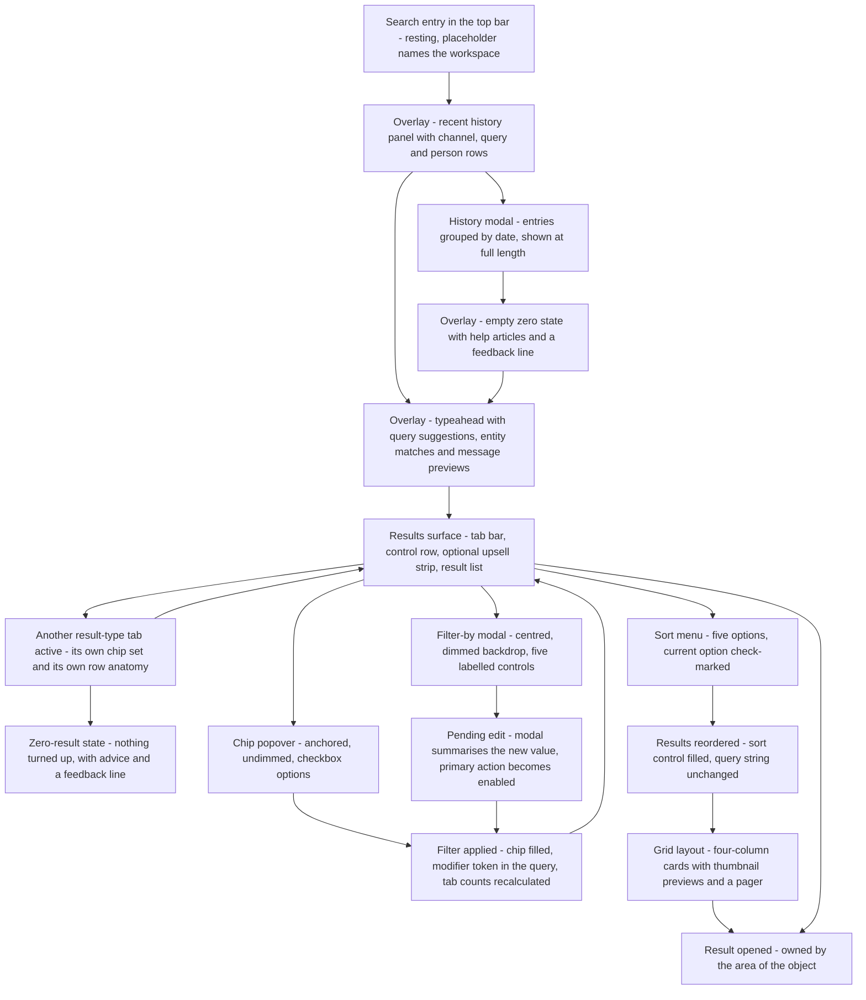

# Search & Filters

Retrieval across the workspace: the top-bar search entry, its history and typeahead panels, the result-type tabs with their counts, the filter chips and the filter-by surface, sorting, layout switching and the zero-result state, specified for build from the [Workflow Catalog](README.md) corpus.

## Purpose

This document specifies **retrieval** — how a person finds a message, a file, a canvas, a channel or a colleague, and how they narrow what comes back. It covers four distinct surfaces: the search entry that lives permanently in the shell's top bar; the overlay panel that drops from it and carries recent-search history, an empty zero-state and a typeahead; the results surface with its result-type tabs, filter chips, sort control and layout toggles; and the filter-by surface reached from the chip row.

**Where the area is encountered.** The search entry is present in the top bar of every authenticated surface in the corpus, whether the content region holds a conversation [frame 550](../../screenshots/Slack%20web%20Jul%202024%20550.png) or a destination such as lists [frame 450](../../screenshots/Slack%20web%20Jul%202024%20450.png), so search is reachable from anywhere without navigating first. The entry itself belongs to the shell and its contract is owned by [00-product-overview.md](00-product-overview.md) as `C-SEARCH-ENTRY` inside `C-TOP-BAR`; this document owns what happens after it is used.

**Results replace the content region and hide the sidebar.** This is the area's single most consequential layout fact and it is observable on every results frame. While the overlay panel is open the shell is intact and the conversation sidebar is still rendered [frame 684](../../screenshots/Slack%20web%20Jul%202024%20684.png), but once a query is submitted the results surface occupies the **entire width to the right of the navigation rail** and no conversation sidebar is rendered at all [frame 688](../../screenshots/Slack%20web%20Jul%202024%20688.png), [frame 700](../../screenshots/Slack%20web%20Jul%202024%20700.png), [frame 704](../../screenshots/Slack%20web%20Jul%202024%20704.png). Leaving search restores it: the next capture after this area shows the sidebar back in place and the entry returned to its resting placeholder [frame 705](../../screenshots/Slack%20web%20Jul%202024%20705.png).

**Depth.** This is an in-product area, so the treatment is comprehensive: every flow carries a frame-by-frame step table, and the enumerable sets — the result-type tabs, the per-tab filter controls, the file-type vocabulary, the sort options and the filter-by controls — are transcribed exactly as the pixels show them, in the observed order, including the places where two captures disagree.

**What this document does not own.** The shell regions and every `C-*` component contract belong to [00-product-overview.md](00-product-overview.md), which this document references by identifier and never restates. Opening a result leaves for the area that owns that object: messages to [03-messaging-and-composer.md](03-messaging-and-composer.md), canvases to [07-canvases.md](07-canvases.md), files and the file-type vocabulary's storage side to [16-files-media.md](16-files-media.md), lists to [08-lists.md](08-lists.md), channels to [02-channels.md](02-channels.md), people to [13-profiles-people.md](13-profiles-people.md). The cross-cutting state matrix, including the upgrade-gate states, belongs to [21-states.md](21-states.md); plan tiers belong to [18-pricing-plans.md](18-pricing-plans.md). Two other search surfaces exist in the corpus and are **not** this area's: the help-centre's own article search, owned by [20-help-community.md](20-help-community.md), and the unauthenticated marketing site's search, owned by [17-marketing-site.md](17-marketing-site.md). This document owns only in-product search.

## Flows in this area

Five flows are named for this area, spanning 21 frames, and together they run the whole retrieval journey once: open search and inspect what has been searched before, submit a query and survey the result types, narrow by chip, narrow by the full filter surface, then reorder and re-lay-out what came back.

Frame spans below are written as plain numeric ranges because they designate a span rather than cite one image, following the convention of the [Screenshot Coverage Index](_screenshot-index.md). Every individual frame is cited with its full relative link in the per-flow step tables and in the **Frames covered** section.

| Flow ID | Name | Frame span | Primary entry point |
|---|---|---|---|
| `09.1` | Open search and review recent history | 684–687 | `C-SEARCH-ENTRY` in the centre of `C-TOP-BAR` |
| `09.2` | Move between search result-type tabs | 688–692 | The result-type `C-TAB-BAR` above the results |
| `09.3` | Filter search results by sender and file type | 693–697 | An individual `C-FILTER-CHIP` in the control row |
| `09.4` | Build a query with the filter-by modal | 698–701 | The trailing filters control at the end of the chip row |
| `09.5` | Sort search results and switch layout | 702–704 | The sort control at the right of the control row |

### The retrieval journey

Every node and edge below corresponds to a state or a transition observed in a cited frame; nothing is a plausible route that the corpus does not show. The zero-result branch is included because the corpus captures it directly [frame 692](../../screenshots/Slack%20web%20Jul%202024%20692.png).

The diagram is deliberately silent about how a result is opened, because no frame captures the transition: result rows and cards are rendered throughout the area but no capture shows one activated or the destination it leads to. The `OBJECT` node exists only to name where that edge goes; the destination surfaces are specified by the area documents listed in **Transitions in and out**.

> **Partial capture:** the corpus never shows the results surface with **no filter active at all on a filterable tab reached from a fresh query** — every results frame in this area already carries either an unset chip row or an applied filter, and the first results capture arrives with the chip row already present [frame 688](../../screenshots/Slack%20web%20Jul%202024%20688.png). It also never shows the second page of the grid layout's pager, so what a page transition does is not observable [frame 704](../../screenshots/Slack%20web%20Jul%202024%20704.png).

## Flow 09.1 — Open search and review recent history

### Overview

Search opens as an **overlay panel anchored below the top-bar entry**, not as a route: the rail, the sidebar and the conversation behind it all stay rendered and legible [frame 684](../../screenshots/Slack%20web%20Jul%202024%20684.png). The flow walks the three states that panel can be in — populated with history, emptied, and responding to typed input — and the one modal it can escalate to. It establishes that the product retains a **search history** of three different kinds of entry, and that the history is available both as a short anchored list and as a full modal.

### Trigger

The search entry in the centre of the top bar, which at rest renders a magnifier glyph and a placeholder naming the workspace [frame 550](../../screenshots/Slack%20web%20Jul%202024%20550.png), [frame 450](../../screenshots/Slack%20web%20Jul%202024%20450.png). At this capture the entry is already carrying a previous query, so the panel opens over a retained value rather than an empty field [frame 684](../../screenshots/Slack%20web%20Jul%202024%20684.png).

### Preconditions

An authenticated session with a workspace loaded and any surface in the content region — the captures show a channel behind the overlay, but nothing in the panel depends on the conversation type [frame 684](../../screenshots/Slack%20web%20Jul%202024%20684.png). Search history must already contain entries for the populated state; the emptied state of the same panel is what the corpus shows when the field carries no query [frame 686](../../screenshots/Slack%20web%20Jul%202024%20686.png).

### Frame-by-frame steps

| Step | Frame(s) | What the user does | What changes on screen | Component(s) involved |
|---|---|---|---|---|
| 1 | [frame 684](../../screenshots/Slack%20web%20Jul%202024%20684.png) | Activates the search entry in the top bar | A panel opens anchored directly below the entry and overlaps the content region without dimming it; the rail, the sidebar and the conversation stay fully rendered; the entry displays the word *Search* followed by the retained query and gains a trailing clear-query control | `C-TOP-BAR`, `C-SEARCH-ENTRY`, `C-DROPDOWN-MENU` |
| 2 | [frame 684](../../screenshots/Slack%20web%20Jul%202024%20684.png) | Scans the panel | Under a *Recent* header the panel lists three kinds of row: channel rows led by a hash glyph; query rows led by a magnifier glyph, the longest of them truncated with an ellipsis; and person rows led by an avatar carrying a presence indicator. A *Show more* row closes the list. Several entries repeat — two identical long queries, five identical bare-term queries and each person twice | `C-DROPDOWN-MENU`, `C-AVATAR`, `C-PRESENCE-DOT` |
| 3 | [frame 685](../../screenshots/Slack%20web%20Jul%202024%20685.png) | Activates *Show more* | The anchored panel is replaced by a centred modal over a **dimmed** backdrop, titled *History* with a sweep glyph beside the title and a dismiss control at its top right; entries are grouped under a *Today* date heading and rendered **at full length with no truncation**, and the final row is clipped by the modal's lower edge | `C-MODAL-SHELL` |
| 4 | [frame 686](../../screenshots/Slack%20web%20Jul%202024%20686.png) | Dismisses the modal and clears the query | The overlay returns with an **empty** field showing a placeholder that invites a search of messages and files; the panel body becomes a centred zero-state block — a glyph, a heading and two body lines — followed by a help-centre section of two article rows, each with a question-mark glyph, a bold title and a one-line description, and a right-aligned footer offering feedback and a learn-more link | `C-SEARCH-ENTRY`, `C-EMPTY-STATE` |
| 5 | [frame 687](../../screenshots/Slack%20web%20Jul%202024%20687.png) | Types a term into the field | A trailing *Clear* action appears beside the dismiss control, and the panel repopulates as a typeahead of three stacked sections: query suggestions led by a magnifier glyph — the bare term, the term plus an `in:` scope token rendered as a chip, and that scope token alone — then, below a separator, entity matches comprising a channel row and two rows carrying a right-aligned *Canvas* type label, then a section headed *Recent messages in* the scoped channel holding two message previews with the matched term emboldened, each truncated with an ellipsis and carrying an author-and-day metadata line | `C-SEARCH-ENTRY`, `C-DROPDOWN-MENU`, `C-AVATAR` |

**Inferred:** the clear-query control observed at the entry's trailing edge is what produced the emptied state, because it is the only affordance for emptying the field present in any capture of this panel [frame 684](../../screenshots/Slack%20web%20Jul%202024%20684.png), and no intermediate frame was captured between the populated modal and the emptied overlay [frame 685](../../screenshots/Slack%20web%20Jul%202024%20685.png), [frame 686](../../screenshots/Slack%20web%20Jul%202024%20686.png).

**Inferred:** the sweep glyph beside the *History* title clears the history, because it is the modal's only control other than the dismiss control and it acts on a list of stored entries [frame 685](../../screenshots/Slack%20web%20Jul%202024%20685.png). No capture shows it activated, so the confirmation behaviour — if any — is not observable.

> **Partial capture:** the corpus does not show the resting entry and the opened panel in the same session, so the transition from the placeholder state [frame 550](../../screenshots/Slack%20web%20Jul%202024%20550.png) into the populated panel [frame 684](../../screenshots/Slack%20web%20Jul%202024%20684.png) is captured only at its endpoints. It also never shows a history entry being activated, so whether selecting a stored query re-runs it or merely fills the field is not observable, and it never shows the history panel in an empty state.

## Flow 09.2 — Move between search result-type tabs

### Overview

Submitting a query lands on the results surface, and this flow moves across every result type it offers. The important discovery is that a tab is **not** merely a filter over one list: each tab brings **its own set of filter chips, its own control set at the right of the row, and its own result-row anatomy** [frame 688](../../screenshots/Slack%20web%20Jul%202024%20688.png) through [frame 692](../../screenshots/Slack%20web%20Jul%202024%20692.png). The flow ends on a tab whose count is zero, which is how the corpus evidences both that zero-count tabs stay rendered and that they remain selectable.

### Trigger

A submitted query, which replaces the content region with the results surface and lands with the messages tab active [frame 688](../../screenshots/Slack%20web%20Jul%202024%20688.png). Thereafter each tab label in the result-type tab bar is the trigger for its own view.

### Preconditions

A query in the search entry — at this capture a bare term with no modifier token, so the counts shown are unfiltered [frame 688](../../screenshots/Slack%20web%20Jul%202024%20688.png). The workspace is on a trial, which is why a scope-limited upsell strip is rendered above the results on the tabs that carry one [frame 688](../../screenshots/Slack%20web%20Jul%202024%20688.png), [frame 689](../../screenshots/Slack%20web%20Jul%202024%20689.png).

### Frame-by-frame steps

| Step | Frame(s) | What the user does | What changes on screen | Component(s) involved |
|---|---|---|---|---|
| 1 | [frame 688](../../screenshots/Slack%20web%20Jul%202024%20688.png) | Submits the typed query | The overlay closes and the results surface fills the whole content region with **no conversation sidebar rendered**; a result-type tab bar sits beneath the top bar with the messages tab active and underlined and a count beside every label; below it a control row carries filter chips at the left and a sort control at the right; below that an upsell strip; then the result list; then a feedback link | `C-TAB-BAR`, `C-FILTER-CHIP`, `C-UPGRADE-GATE` |
| 2 | [frame 688](../../screenshots/Slack%20web%20Jul%202024%20688.png) | Reads the message results | Each row carries a context line naming the conversation it came from, then an avatar, a bold author name and a timestamp, then the message body with **every matched term highlighted on a tinted background**; one row carries an edited marker, one body is clipped with an ellipsis, and the first row embeds an attachment card with a type glyph, the file name and a sharer-and-date line | `C-MESSAGE-ROW`, `C-AVATAR` |
| 3 | [frame 689](../../screenshots/Slack%20web%20Jul%202024%20689.png) | Selects the files tab | The tab bar's underline moves; the chip set **changes** to sender, location, file-type and date plus the trailing filters control; **two layout toggles appear** beside the sort control, the list toggle rendered as the active one; the list becomes one row per file — type glyph, bold file name with the matched term highlighted, and a *shared by* metadata line — and three rows carry a template badge beside the name | `C-TAB-BAR`, `C-FILTER-CHIP` |
| 4 | [frame 690](../../screenshots/Slack%20web%20Jul%202024%20690.png) | Selects the canvases tab | The chip set changes again, gaining a creator chip ahead of sender, location and date; the layout toggles remain; the upsell strip is **not** rendered on this tab; rows carry a canvas glyph, a title and a *shared by* line, one row is scoped to a direct message and three carry template badges | `C-TAB-BAR`, `C-FILTER-CHIP` |
| 5 | [frame 691](../../screenshots/Slack%20web%20Jul%202024%20691.png) | Selects the channels tab | The chip set becomes membership scope, channel type and organizations, and **the trailing filters control is absent entirely**; the sort control remains but the layout toggles do not; the single result row renders a hash glyph and the channel name with the matched term highlighted, over a metadata line pairing a check glyph and a joined word in a success colour with a member count | `C-TAB-BAR`, `C-FILTER-CHIP` |
| 6 | [frame 692](../../screenshots/Slack%20web%20Jul%202024%20692.png) | Selects the people tab, whose count reads zero | The chip set becomes title and location plus the filters control; the result region renders a **centred zero-result state with no illustration** — a heading, a two-line body advising different keywords, a check for typos or adjusted filters, an inline learn-more link, and a separate feedback line beneath it | `C-TAB-BAR`, `C-EMPTY-STATE` |

**Inferred:** the messages tab is the surface's default landing tab, because it is active in the first results capture of every sequence in this area and is never arrived at by a tab activation [frame 688](../../screenshots/Slack%20web%20Jul%202024%20688.png), [frame 694](../../screenshots/Slack%20web%20Jul%202024%20694.png).

**Inferred:** the tab order is *messages first, then the remaining types by descending count*. Every observed sequence fits: eleven files ahead of seven canvases ahead of one channel ahead of zero people [frame 688](../../screenshots/Slack%20web%20Jul%202024%20688.png); seven files ahead of three canvases [frame 694](../../screenshots/Slack%20web%20Jul%202024%20694.png); six files ahead of three canvases [frame 701](../../screenshots/Slack%20web%20Jul%202024%20701.png) — and messages stays first even when its count is the lowest of all [frame 697](../../screenshots/Slack%20web%20Jul%202024%20697.png). Ties are not resolved by the evidence, and the one observed tie is exactly where the order changes between captures; that inconsistency is recorded in **Edge cases & validations** rather than explained away.

> **Partial capture:** four of the six result types are captured only in the list layout and never in the grid layout, and the two boolean chips offered on the messages tab — a my-channels-only scope and an exclude-automations scope — are never captured in an enabled state, so what they do to the result set is not observable [frame 688](../../screenshots/Slack%20web%20Jul%202024%20688.png).

## Flow 09.3 — Filter search results by sender and file type

### Overview

Each chip in the control row opens **its own anchored popover** over an undimmed backdrop, and applying a value in one does three things at once: the chip changes to carry the applied value, a corresponding modifier token appears in the query string, and **every tab's count is recalculated** [frame 693](../../screenshots/Slack%20web%20Jul%202024%20693.png) through [frame 697](../../screenshots/Slack%20web%20Jul%202024%20697.png). The flow applies two filters of different shapes — a person, resolved through a search field, and a file type, chosen from a fixed vocabulary — which together establish the chip contract for the whole area.

### Trigger

An individual filter chip in the control row. The chip's caret **flips to point upward** while its popover is open, which is the only open-state signal the chip itself carries [frame 693](../../screenshots/Slack%20web%20Jul%202024%20693.png), [frame 696](../../screenshots/Slack%20web%20Jul%202024%20696.png).

### Preconditions

A results surface already rendered for a query, on a tab whose chip set includes the chip in question — the sender and file-type chips are both offered on the files tab, which is the tab active throughout this flow [frame 693](../../screenshots/Slack%20web%20Jul%202024%20693.png). No filter is applied at the start: the query is a bare term and the chips are unset [frame 689](../../screenshots/Slack%20web%20Jul%202024%20689.png).

### Frame-by-frame steps

| Step | Frame(s) | What the user does | What changes on screen | Component(s) involved |
|---|---|---|---|---|
| 1 | [frame 693](../../screenshots/Slack%20web%20Jul%202024%20693.png) | Activates the sender chip | The chip's caret flips upward and a popover opens **anchored directly beneath the chip and left-aligned to it**, leaving the results behind it at full contrast with no dimming; the popover holds a search field with a magnifier glyph and an example-name placeholder, a *Suggestions* section label, and one person row rendered with a filled highlight, an **unticked** checkbox, an avatar and the person's name with a self marker | `C-FILTER-CHIP`, `C-DROPDOWN-MENU`, `C-AVATAR` |
| 2 | [frame 694](../../screenshots/Slack%20web%20Jul%202024%20694.png) | Ticks the suggested person | The checkbox becomes ticked; the chip changes to carry a **leading avatar and the person's name** and renders filled and emphasised; the query string in the top bar gains a `from:` modifier token naming that person; **every tab count is recalculated** — files falls from eleven to seven, canvases from seven to three and channels from one to zero, and the zero-count channels tab **stays rendered**; the result list shortens to match the new files count. The popover stays open throughout | `C-FILTER-CHIP`, `C-SEARCH-ENTRY`, `C-TAB-BAR` |
| 3 | [frame 695](../../screenshots/Slack%20web%20Jul%202024%20695.png) | Dismisses the popover | The popover closes and the chip's caret flips back down; the chip keeps its filled treatment, its avatar and its name; the upsell strip the popover had been covering is visible again; the filtered result list is unchanged | `C-FILTER-CHIP`, `C-UPGRADE-GATE` |
| 4 | [frame 696](../../screenshots/Slack%20web%20Jul%202024%20696.png) | Activates the file-type chip | Its caret flips upward and a popover opens beneath it holding **eight checkbox rows, each with a type glyph and a label**, in this order: lists, canvases and posts, documents, emails, images, PDFs, presentations, snippets — the first rendered with a filled highlight and the last clipped by the popover's lower edge, so the list scrolls. In the same capture the tab bar has **gained a sixth tab** for lists, carrying a zero count | `C-FILTER-CHIP`, `C-DROPDOWN-MENU` |
| 5 | [frame 697](../../screenshots/Slack%20web%20Jul%202024%20697.png) | Ticks one file type and dismisses the popover | The chip's label becomes **the applied type's own name** rather than the dimension's name, and renders filled; the query gains a `type:` modifier token; the counts recalculate again — messages falls to one and files to three — and the list shows exactly the three matching rows, with their names rendered **in full** | `C-FILTER-CHIP`, `C-SEARCH-ENTRY`, `C-TAB-BAR` |

**Inferred:** ticking a popover option is what writes the corresponding modifier token into the query string. The basis is a before-and-after pair rather than the write itself: the query is a bare term while the chip is unset [frame 689](../../screenshots/Slack%20web%20Jul%202024%20689.png) and carries a `from:` token in the very next capture, in which the checkbox is ticked and nothing else has changed [frame 694](../../screenshots/Slack%20web%20Jul%202024%20694.png); the same pairing repeats for the file type [frame 696](../../screenshots/Slack%20web%20Jul%202024%20696.png), [frame 697](../../screenshots/Slack%20web%20Jul%202024%20697.png). No capture shows the token being typed, so the direction of the binding — control to query, or query to control — is not directly observable.

**Inferred:** the sender popover's checkbox implies the dimension accepts **more than one** value, because a checkbox is a multi-select affordance and the file-type popover uses the same affordance for a dimension the corpus later shows carrying two values at once [frame 693](../../screenshots/Slack%20web%20Jul%202024%20693.png), [frame 701](../../screenshots/Slack%20web%20Jul%202024%20701.png). No capture shows two senders applied.

> **Partial capture:** only two of the eight chips observed anywhere in this area are ever captured open. The location, date, creator, title, membership-scope, channel-type and organizations chips are all rendered with carets but never expanded, so their option sets are unknown and **must not be assumed to mirror the filter-by modal's fields** [frame 689](../../screenshots/Slack%20web%20Jul%202024%20689.png), [frame 690](../../screenshots/Slack%20web%20Jul%202024%20690.png), [frame 691](../../screenshots/Slack%20web%20Jul%202024%20691.png), [frame 692](../../screenshots/Slack%20web%20Jul%202024%20692.png). The sender popover is also never captured with a typed search term, so how its suggestion list responds to input is not observable.

## Flow 09.4 — Build a query with the filter-by modal

### Overview

The trailing control in the chip row opens a **single surface carrying five filter dimensions at once**, and this flow is the reason the area needs its own document rather than a paragraph in the shell's. Two contracts are visible here and nowhere else. First, the surface is **a centred modal over a dimmed backdrop**, not a popover anchored to the control that opened it. Second, it holds **pending** state: a change made inside it does not reach the chip row until its search action is run, and until a change is made that action is rendered muted [frame 698](../../screenshots/Slack%20web%20Jul%202024%20698.png) through [frame 701](../../screenshots/Slack%20web%20Jul%202024%20701.png).

**Correction to this flow's published name.** The flow was first published — here and in the [Screenshot Coverage Index](_screenshot-index.md) — as building a query with a *popover*. The pixels show a centred modal over a dimmed backdrop rather than a surface anchored to the control that opened it, so the name has been corrected in both places to say modal, and the ledger's captions for this span now describe it the same way. The identifier `09.4` and its frame span are unchanged. The distinction is load-bearing rather than cosmetic: this area's *other* filter surfaces genuinely are anchored popovers over an undimmed backdrop [frame 693](../../screenshots/Slack%20web%20Jul%202024%20693.png), [frame 696](../../screenshots/Slack%20web%20Jul%202024%20696.png), and a build that treated all of them alike would place this one wrongly and dim nothing behind it [frame 698](../../screenshots/Slack%20web%20Jul%202024%20698.png).

### Trigger

The trailing filters control at the end of the chip row, rendered with a filter glyph and a label [frame 697](../../screenshots/Slack%20web%20Jul%202024%20697.png). It is present on the messages, files, canvases and people tabs and **absent on the channels tab**, so this flow cannot be entered from there [frame 691](../../screenshots/Slack%20web%20Jul%202024%20691.png).

### Preconditions

A results surface for a query, with whatever filters are already applied — the modal opens **pre-populated from the current filter state**, showing the applied sender as a chip in its first field and the applied file type as its file-types value [frame 698](../../screenshots/Slack%20web%20Jul%202024%20698.png). Nothing needs to be unset first.

### Frame-by-frame steps

| Step | Frame(s) | What the user does | What changes on screen | Component(s) involved |
|---|---|---|---|---|
| 1 | [frame 698](../../screenshots/Slack%20web%20Jul%202024%20698.png) | Activates the filters control | A **centred modal** opens over a **dimmed** backdrop, titled *Filter by* with a dismiss control at its top right, stacking five labelled controls in this order: a sender field holding the applied person as a removable chip with an avatar and a remove control; a location field with an example-channel placeholder; a participant field with an example-person placeholder; a date select reading an any-time default; and a file-types select reading the applied type. Its footer carries an information glyph and a learn-more link at the left, then a secondary clear-filters action and a **muted** primary search action at the right | `C-MODAL-SHELL`, `C-AVATAR`, `C-DROPDOWN-MENU` |
| 2 | [frame 699](../../screenshots/Slack%20web%20Jul%202024%20699.png) | Expands the file-types select | The option list opens **below the select and overflows past the modal's own lower bound** onto the dimmed backdrop, listing the same eight file types in the same order as the chip popover; the already-applied type is **ticked and its label rendered in the accent colour**, and the row under the pointer carries a filled highlight | `C-MODAL-SHELL`, `C-DROPDOWN-MENU` |
| 3 | [frame 700](../../screenshots/Slack%20web%20Jul%202024%20700.png) | Ticks a second file type and collapses the list | The select's value becomes a **count summary** reading two file types, and the primary search action changes from muted to a **filled primary**. The chip row behind the modal still reads the single previously applied type — the modal's edit is pending and has not reached it | `C-MODAL-SHELL`, `C-FILTER-CHIP` |
| 4 | [frame 701](../../screenshots/Slack%20web%20Jul%202024%20701.png) | Runs the modal's search action | The modal and its dimming close; the file-type chip changes to the same **count summary** the modal showed; the query gains a **second** `type:` token alongside the first; the tab counts recalculate, files rising from three to six; and the list renders six rows mixing both selected types | `C-FILTER-CHIP`, `C-SEARCH-ENTRY`, `C-TAB-BAR` |

**Inferred:** the primary action is enabled by a change to the modal's controls rather than by the presence of filter values, because it renders muted at the moment the modal opens **with two filters already applied** [frame 698](../../screenshots/Slack%20web%20Jul%202024%20698.png) and filled once a control's value has been edited [frame 700](../../screenshots/Slack%20web%20Jul%202024%20700.png).

**Inferred:** the modal's five dimensions are the same dimensions the chips expose, because the sender and file-type values applied through chips arrive in the modal pre-populated and the modal's own edit lands back on a chip [frame 697](../../screenshots/Slack%20web%20Jul%202024%20697.png), [frame 698](../../screenshots/Slack%20web%20Jul%202024%20698.png), [frame 701](../../screenshots/Slack%20web%20Jul%202024%20701.png). The correspondence is only ever demonstrated for those two dimensions; the modal's participant dimension has **no chip counterpart** in any captured chip set, so the mapping is not one-to-one.

> **Partial capture:** the clear-filters action is never activated, so whether it clears the modal's pending state, the applied filters, the query's modifier tokens, or all three is not observable [frame 698](../../screenshots/Slack%20web%20Jul%202024%20698.png). The date select is never expanded, so its option set is unknown; the location and participant fields are never populated, so how they resolve input is unknown; and the modal is never captured with its dismiss control used, so whether dismissing discards a pending edit is not observable.

## Flow 09.5 — Sort search results and switch layout

### Overview

Ordering and presentation are the two controls at the right of the control row, and they behave differently from the filters in one decisive respect: **neither is written into the query string**. Sorting reorders the same result set while the query is untouched, and switching layout re-renders the same results as a card grid with thumbnail previews and introduces a pager that the list layout does not have [frame 702](../../screenshots/Slack%20web%20Jul%202024%20702.png) through [frame 704](../../screenshots/Slack%20web%20Jul%202024%20704.png).

### Trigger

The sort control at the right of the control row for ordering, and the two layout toggles immediately to its right for presentation [frame 702](../../screenshots/Slack%20web%20Jul%202024%20702.png), [frame 704](../../screenshots/Slack%20web%20Jul%202024%20704.png). Both are present on the files and canvases tabs; the sort control alone is present on messages, channels and people [frame 688](../../screenshots/Slack%20web%20Jul%202024%20688.png), [frame 691](../../screenshots/Slack%20web%20Jul%202024%20691.png), [frame 692](../../screenshots/Slack%20web%20Jul%202024%20692.png).

### Preconditions

A results surface with at least one result rendered, on a tab that offers the control — the flow runs on the files tab with a sender filter and two file types already applied, so the set being reordered is a filtered one [frame 702](../../screenshots/Slack%20web%20Jul%202024%20702.png).

### Frame-by-frame steps

| Step | Frame(s) | What the user does | What changes on screen | Component(s) involved |
|---|---|---|---|---|
| 1 | [frame 702](../../screenshots/Slack%20web%20Jul%202024%20702.png) | Activates the sort control | Its caret flips upward and a menu opens anchored beneath it, right-aligned to the control, over an undimmed backdrop; it lists exactly five options — most relevant, oldest, newest, A to Z and Z to A — with the current option carrying a **leading check glyph** and a filled highlight | `C-DROPDOWN-MENU` |
| 2 | [frame 703](../../screenshots/Slack%20web%20Jul%202024%20703.png) | Chooses a different sort option | The menu closes; the control's label becomes the chosen option and the control changes from an outlined treatment to a **filled, emphasised** one, matching how a set filter chip renders; the same six results are re-ordered; and the **query string is unchanged**, so ordering is not expressed as a modifier token | `C-DROPDOWN-MENU`, `C-SEARCH-ENTRY` |
| 3 | [frame 704](../../screenshots/Slack%20web%20Jul%202024%20704.png) | Activates the grid layout toggle | The grid toggle takes the emphasised treatment and the list toggle loses it; the result list becomes a **four-column card grid** — six cards laid out four then two — each card stacking a header block over a thumbnail preview of the object's own content; card titles are **truncated with an ellipsis** and the metadata line drops the *shared by* wording used in the list layout, reducing to a name and a date. Beneath the grid the feedback link stays at the left and a **pager** appears centred: an inert previous control, a filled current-page indicator, and a next control. The upsell strip rendered in the previous capture is not present | `C-FILTER-CHIP`, `C-RECORD-CARD` |

**Inferred:** most relevant is the default sort, because it is the check-marked option when the menu is first opened and the control's label in every earlier results capture of this area [frame 688](../../screenshots/Slack%20web%20Jul%202024%20688.png), [frame 689](../../screenshots/Slack%20web%20Jul%202024%20689.png), [frame 702](../../screenshots/Slack%20web%20Jul%202024%20702.png).

**Inferred:** the list layout is the default, because the list toggle carries the emphasised treatment on every capture that offers the toggles before the grid is chosen [frame 689](../../screenshots/Slack%20web%20Jul%202024%20689.png), [frame 690](../../screenshots/Slack%20web%20Jul%202024%20690.png), [frame 700](../../screenshots/Slack%20web%20Jul%202024%20700.png).

**Inferred:** the pager is a property of the grid layout rather than of the result set, because the same six results render in the list layout with no pager and in the grid layout with one [frame 703](../../screenshots/Slack%20web%20Jul%202024%20703.png), [frame 704](../../screenshots/Slack%20web%20Jul%202024%20704.png).

> **Partial capture:** no capture shows the four remaining sort options applied, so whether the ascending and descending name orders apply to a file name, a title or an author is not observable, and no capture shows the grid layout on any tab other than files [frame 702](../../screenshots/Slack%20web%20Jul%202024%20702.png), [frame 704](../../screenshots/Slack%20web%20Jul%202024%20704.png).

## Screens & components

All sizing below is **proportional to the effective product viewport**, never an absolute offset. Iconography is named by **function** — magnifier glyph, clear-query control, chip caret, filter glyph, list-layout toggle, grid-layout toggle, pager controls — never by any third-party asset name.

### The three screens this area contributes

| Screen | Position and ordering | Relative size | Contents, in order |
|---|---|---|---|
| Search overlay | Anchored directly beneath the search entry in the top bar, horizontally aligned with it and roughly as wide, layered over the content region **without dimming it** | Drops from beneath the top bar over most of the viewport's height, its length set by its own content | The entry itself as the panel's first row; then either a *Recent* list, or a centred zero-state block plus a help-article section, or a typeahead of three stacked sections; a feedback-and-learn-more footer in the emptied and typed states [frame 684](../../screenshots/Slack%20web%20Jul%202024%20684.png), [frame 686](../../screenshots/Slack%20web%20Jul%202024%20686.png), [frame 687](../../screenshots/Slack%20web%20Jul%202024%20687.png) |
| Results surface | Fills the routed content region and **takes the sidebar's column as well**, so it spans the entire width to the right of the navigation rail | Full remaining width and height of the shell; results are constrained to a centred column that leaves generous space at the right | Result-type tab bar; control row with filter chips left and sort plus layout toggles right; optional upsell strip; result list or card grid; a feedback link at the lower left, joined in the grid layout by a centred pager [frame 688](../../screenshots/Slack%20web%20Jul%202024%20688.png), [frame 704](../../screenshots/Slack%20web%20Jul%202024%20704.png) |
| Filter-by modal | Centred over a dimmed backdrop, and centred on **the viewport as a whole rather than on the content region** — its horizontal midpoint sits at the viewport's midpoint, left of the content region's own centre | Roughly a third of the viewport width and a little over half its height | Title row with a dismiss control; five labelled controls stacked one per row at full modal width; a footer with an information glyph and a learn-more link at the left and a secondary then a primary action at the right [frame 698](../../screenshots/Slack%20web%20Jul%202024%20698.png), [frame 700](../../screenshots/Slack%20web%20Jul%202024%20700.png) |

**Hierarchy and layering.** The overlay panel and the chip and sort popovers all leave their backdrop at full contrast, so the surface underneath stays readable [frame 684](../../screenshots/Slack%20web%20Jul%202024%20684.png), [frame 693](../../screenshots/Slack%20web%20Jul%202024%20693.png), [frame 702](../../screenshots/Slack%20web%20Jul%202024%20702.png); only the history modal and the filter-by modal dim it [frame 685](../../screenshots/Slack%20web%20Jul%202024%20685.png), [frame 698](../../screenshots/Slack%20web%20Jul%202024%20698.png). A select expanded **inside** the filter-by modal is allowed to overflow past the modal's own bounds onto the dimmed backdrop rather than scrolling within it [frame 699](../../screenshots/Slack%20web%20Jul%202024%20699.png).

### The result-type tab bar — the area's most build-critical enumeration

Every tab carries a label and a count, the active tab is underlined and emphasised, and **a count of zero is rendered as a zero rather than hidden** [frame 700](../../screenshots/Slack%20web%20Jul%202024%20700.png). The exact sequences observed are transcribed below, because both the tab **set** and the tab **order** change across the area and a build that hard-codes either will be wrong.

| Frames | Tabs in the observed order, with counts |
|---|---|
| [frame 688](../../screenshots/Slack%20web%20Jul%202024%20688.png)–[frame 693](../../screenshots/Slack%20web%20Jul%202024%20693.png) | messages 4 · files 11 · canvases 7 · channels 1 · people 0 — **five tabs, no lists tab** |
| [frame 694](../../screenshots/Slack%20web%20Jul%202024%20694.png), [frame 695](../../screenshots/Slack%20web%20Jul%202024%20695.png) | messages 4 · files 7 · canvases 3 · channels 0 · people 0 — five tabs |
| [frame 696](../../screenshots/Slack%20web%20Jul%202024%20696.png) | messages 4 · files 7 · canvases 3 · **lists 0** · channels 0 · people 0 — six tabs |
| [frame 697](../../screenshots/Slack%20web%20Jul%202024%20697.png)–[frame 700](../../screenshots/Slack%20web%20Jul%202024%20700.png) | messages 1 · **canvases 3 · files 3** · lists 0 · channels 0 · people 0 — six tabs, canvases ahead of files |
| [frame 701](../../screenshots/Slack%20web%20Jul%202024%20701.png)–[frame 704](../../screenshots/Slack%20web%20Jul%202024%20704.png) | messages 1 · **files 6 · canvases 3** · lists 0 · channels 0 · people 0 — six tabs, files ahead of canvases |

Six distinct result types are therefore observable in total — messages, files, canvases, lists, channels and people — and the six-tab captures are the ones that show the complete set [frame 700](../../screenshots/Slack%20web%20Jul%202024%20700.png).

### The per-tab filter control sets

Selecting a tab changes the control row wholesale. Nothing here is shared except the sort control.

| Active tab | Filter chips, left to right | Trailing filters control | Right of the row | Upsell strip | Evidence |
|---|---|---|---|---|---|
| Messages | sender, location, a my-channels-only scope and an exclude-automations scope — the last two carry **no caret**, so they read as booleans rather than value pickers | present | sort only | rendered | [frame 688](../../screenshots/Slack%20web%20Jul%202024%20688.png) |
| Files | sender, location, file type, date | present | sort, then list-layout and grid-layout toggles | rendered | [frame 689](../../screenshots/Slack%20web%20Jul%202024%20689.png), [frame 697](../../screenshots/Slack%20web%20Jul%202024%20697.png) |
| Canvases | creator, sender, location, date | present | sort, then both layout toggles | not rendered | [frame 690](../../screenshots/Slack%20web%20Jul%202024%20690.png) |
| Channels | membership scope, channel type, organizations | **absent** | sort only | not rendered | [frame 691](../../screenshots/Slack%20web%20Jul%202024%20691.png) |
| People | title, location | present | sort only | not rendered | [frame 692](../../screenshots/Slack%20web%20Jul%202024%20692.png) |
| Lists | never captured active — only its tab and its zero count are observable | — | — | — | [frame 696](../../screenshots/Slack%20web%20Jul%202024%20696.png) |

### The file-type vocabulary

Eight values, in the same order in both surfaces that expose them — the file-type chip's popover [frame 696](../../screenshots/Slack%20web%20Jul%202024%20696.png) and the filter-by modal's file-types select [frame 699](../../screenshots/Slack%20web%20Jul%202024%20699.png) — each as a checkbox row with a type glyph and a label: **lists · canvases and posts · documents · emails · images · PDFs · presentations · snippets**. The list is scrollable in both surfaces, evidenced by the final row being clipped by the container's lower edge [frame 696](../../screenshots/Slack%20web%20Jul%202024%20696.png). Selecting one renders the chip with that value's own name [frame 697](../../screenshots/Slack%20web%20Jul%202024%20697.png); selecting two renders it as a count summary instead [frame 701](../../screenshots/Slack%20web%20Jul%202024%20701.png). The storage-side meaning of these types belongs to [16-files-media.md](16-files-media.md).

### The sort options

Five values, in this order, with the current one carrying a leading check glyph: **most relevant · oldest · newest · A to Z · Z to A** [frame 702](../../screenshots/Slack%20web%20Jul%202024%20702.png). No other option is offered on any captured tab, and the control's label always reflects the current value [frame 703](../../screenshots/Slack%20web%20Jul%202024%20703.png).

### The filter-by modal's control set

Five labelled controls in this order, then a three-part footer [frame 698](../../screenshots/Slack%20web%20Jul%202024%20698.png), [frame 700](../../screenshots/Slack%20web%20Jul%202024%20700.png):

| Order | Dimension | Label as rendered | Control shape | Observed value or placeholder |
|---|---|---|---|---|
| 1 | Sender | *From* | Bordered input holding zero or more person chips, each with a leading avatar and a trailing remove control | The applied person, marked as the signed-in user |
| 2 | Location | *In* | Bordered text input | An example channel name as placeholder text |
| 3 | Participant | *With* | Bordered text input | An example person name as placeholder text |
| 4 | Date | *Date* | Select with a caret | An any-time default |
| 5 | File types | *File types* | Select with a caret | The single applied type by name, or a count summary once more than one is selected |

The first column names the dimension by function, as this catalog does throughout; the second quotes the label the surface actually renders, because three of the five differ from their functional name and a build that generated labels from the function names would render the wrong three [frame 698](../../screenshots/Slack%20web%20Jul%202024%20698.png).

Footer, left to right: an information glyph with a learn-more link; a secondary, outlined clear-filters action; a primary search action, **muted until a control is edited and filled afterwards** [frame 698](../../screenshots/Slack%20web%20Jul%202024%20698.png), [frame 700](../../screenshots/Slack%20web%20Jul%202024%20700.png).

### Result-row anatomy, per result type

| Result type | Anatomy in the list layout | Evidence |
|---|---|---|
| Message | A context line naming the conversation the message came from; then an avatar, a bold author name and a timestamp; then the body with **every matched term highlighted on a tinted background**. Optional extras observed: an edited marker, a body clipped with an ellipsis, and an embedded attachment card carrying a type glyph, a file name and a sharer-and-date line | [frame 688](../../screenshots/Slack%20web%20Jul%202024%20688.png) |
| File | A type glyph; a bold file name with matched terms highlighted; an optional template badge to the name's right; a *shared by* metadata line naming the sharer and a relative or absolute date | [frame 689](../../screenshots/Slack%20web%20Jul%202024%20689.png), [frame 697](../../screenshots/Slack%20web%20Jul%202024%20697.png) |
| Canvas | A canvas glyph; a title with matched terms highlighted; an optional template badge; a *shared by* line. A variant whose title names a direct message rather than a document is observed, so a canvas result can be scoped to a conversation | [frame 690](../../screenshots/Slack%20web%20Jul%202024%20690.png) |
| Channel | A hash glyph and the channel name with matched terms highlighted; a metadata line pairing a check glyph and a joined word rendered in a success colour with a member count | [frame 691](../../screenshots/Slack%20web%20Jul%202024%20691.png) |
| People | Never captured with a result — the only capture of this tab has a zero count and renders the zero-result state | [frame 692](../../screenshots/Slack%20web%20Jul%202024%20692.png) |
| Lists | Never captured active | [frame 696](../../screenshots/Slack%20web%20Jul%202024%20696.png) |
| Card, grid layout | A header block — type glyph, title **truncated with an ellipsis**, then a metadata line reduced to a name and a date with no *shared by* wording — above a thumbnail preview of the object's own content. Previews observed: a schedule-style chart for a document, and an image header over a to-do line with an unticked checkbox for a canvas; one card renders content with no header image and one canvas card no to-do block | [frame 704](../../screenshots/Slack%20web%20Jul%202024%20704.png) |

The file, canvas and card rows are the same three result types [16-files-media.md](16-files-media.md), [07-canvases.md](07-canvases.md) and [08-lists.md](08-lists.md) own as objects; this document specifies only how they are rendered **as results**.

### The overlay panel's row families

The overlay panel is one container with three interchangeable bodies, and its rows fall into five families that recur across them [frame 684](../../screenshots/Slack%20web%20Jul%202024%20684.png), [frame 687](../../screenshots/Slack%20web%20Jul%202024%20687.png):

- **Stored-query rows**, led by a magnifier glyph, carrying the query text including any modifier tokens, truncated with an ellipsis when too long for the panel's width.
- **Channel rows**, led by a hash glyph.
- **Person rows**, led by an avatar carrying a presence indicator.
- **Typed-entity rows**, carrying a right-aligned type label — the only observed value is a canvas label [frame 687](../../screenshots/Slack%20web%20Jul%202024%20687.png).
- **Message-preview rows**, under a section header naming the scope, with the matched term emboldened inside the preview text and an author-and-day metadata line.

A query suggestion may render a **scope token as an inline chip** rather than as literal text, either appended to the typed term or standing alone as the whole suggestion [frame 687](../../screenshots/Slack%20web%20Jul%202024%20687.png).

### Components this area consumes

Every contract below is defined once in [00-product-overview.md](00-product-overview.md) and is referenced here by identifier only.

| Identifier | How this area uses it |
|---|---|
| `C-TOP-BAR` | Hosts the search entry at its centre, on every authenticated surface [frame 550](../../screenshots/Slack%20web%20Jul%202024%20550.png) |
| `C-SEARCH-ENTRY` | The area's entry point and its live query display, including modifier tokens and the clear-query control [frame 684](../../screenshots/Slack%20web%20Jul%202024%20684.png), [frame 700](../../screenshots/Slack%20web%20Jul%202024%20700.png) |
| `C-TAB-BAR` | The result-type tabs, in the with-counts variant, including the zero-count rendering [frame 700](../../screenshots/Slack%20web%20Jul%202024%20700.png) |
| `C-FILTER-CHIP` | The whole control row: per-dimension chips, the avatar-bearing variant, the value-reflecting label, the trailing filters control, and the sort and layout controls at the row's right [frame 700](../../screenshots/Slack%20web%20Jul%202024%20700.png) |
| `C-DROPDOWN-MENU` | The overlay panel, the per-chip popovers, the sort menu and the selects inside the filter-by modal — all anchored to a persistent control and all leaving their backdrop undimmed [frame 693](../../screenshots/Slack%20web%20Jul%202024%20693.png), [frame 696](../../screenshots/Slack%20web%20Jul%202024%20696.png), [frame 702](../../screenshots/Slack%20web%20Jul%202024%20702.png) |
| `C-MODAL-SHELL` | The history modal and the filter-by modal, both centred and both dimming their backdrop [frame 685](../../screenshots/Slack%20web%20Jul%202024%20685.png), [frame 698](../../screenshots/Slack%20web%20Jul%202024%20698.png) |
| `C-EMPTY-STATE` | The overlay's zero-state block and the results surface's zero-result state, the latter **without an illustration** [frame 686](../../screenshots/Slack%20web%20Jul%202024%20686.png), [frame 692](../../screenshots/Slack%20web%20Jul%202024%20692.png) |
| `C-UPGRADE-GATE` | The scope-limited upsell strip above the result list [frame 688](../../screenshots/Slack%20web%20Jul%202024%20688.png) |
| `C-AVATAR`, `C-PRESENCE-DOT` | Person rows in the overlay, the sender chip's leading avatar, the sender field's chips and message result rows [frame 684](../../screenshots/Slack%20web%20Jul%202024%20684.png), [frame 694](../../screenshots/Slack%20web%20Jul%202024%20694.png) |
| `C-MESSAGE-ROW` | Message results, rendered with a search-specific context line above the row [frame 688](../../screenshots/Slack%20web%20Jul%202024%20688.png) |
| `C-RECORD-CARD` | Grid-layout result cards [frame 704](../../screenshots/Slack%20web%20Jul%202024%20704.png) |
| `C-RAIL` | Persists at the left of every frame in the area; the results surface begins immediately to its right [frame 700](../../screenshots/Slack%20web%20Jul%202024%20700.png) |

No component contract is restated here, and this area needed no structure that the shared inventory does not already define — the pager beneath the grid is the one candidate, and it is reported for definition in [00-product-overview.md](00-product-overview.md) rather than contracted locally [frame 704](../../screenshots/Slack%20web%20Jul%202024%20704.png).

### Branding and sample data

The shell renders in a dark colour mode throughout this area while the results region renders light [frame 688](../../screenshots/Slack%20web%20Jul%202024%20688.png); no palette value is carried forward as a requirement, and every colour is named by role — a success colour on the joined marker [frame 691](../../screenshots/Slack%20web%20Jul%202024%20691.png), an accent colour on a ticked option's label [frame 699](../../screenshots/Slack%20web%20Jul%202024%20699.png), a tinted highlight behind a matched term [frame 689](../../screenshots/Slack%20web%20Jul%202024%20689.png). The upsell strip's badge and the sidebar's promotional banner both print a **paid plan tier's name**; both are restated as **plan tier N**, per the placeholder vocabulary in [00-product-overview.md](00-product-overview.md) [frame 688](../../screenshots/Slack%20web%20Jul%202024%20688.png), [frame 684](../../screenshots/Slack%20web%20Jul%202024%20684.png). The resting entry's placeholder is specified as **Search &lt;workspace name&gt;** [frame 550](../../screenshots/Slack%20web%20Jul%202024%20550.png). Template-badged results are shared by what this catalog calls the **built-in assistant app** [frame 689](../../screenshots/Slack%20web%20Jul%202024%20689.png). The overlay's zero-state copy and its two help-article titles name the product; they are specified by their function — a two-line prompt inviting the user to look for a particular message, document or decision, and two help-centre article rows — and their wording is not carried forward [frame 686](../../screenshots/Slack%20web%20Jul%202024%20686.png).

**Sample data, not requirements.** The worked example running through every flow is a query of one term, a sender who is the signed-in user, and results whose names begin with that term; the placeholders inside the filter-by modal are an example channel name and an example person name [frame 698](../../screenshots/Slack%20web%20Jul%202024%20698.png). These illustrate shape only. No query, person, channel, file name or workspace name from the corpus is a value to reproduce.

## States

Every state below is observed in a cited frame. The cross-cutting matrix that generalises them — and the full state set of `C-UPGRADE-GATE` — belongs to [21-states.md](21-states.md); what follows is this area's own inventory.

| Object | State | Rendering | Evidence |
|---|---|---|---|
| Search entry | Resting | Magnifier glyph and a placeholder naming the workspace | [frame 550](../../screenshots/Slack%20web%20Jul%202024%20550.png), [frame 450](../../screenshots/Slack%20web%20Jul%202024%20450.png) |
| Search entry | Holding a query | The word *Search* then the query text, including modifier tokens, with a trailing clear-query control | [frame 684](../../screenshots/Slack%20web%20Jul%202024%20684.png), [frame 700](../../screenshots/Slack%20web%20Jul%202024%20700.png) |
| Search entry | Open and empty | Placeholder text inside the overlay's own field, with a dismiss control | [frame 686](../../screenshots/Slack%20web%20Jul%202024%20686.png) |
| Search entry | Open and being typed into | A *Clear* text action appears before the dismiss control | [frame 687](../../screenshots/Slack%20web%20Jul%202024%20687.png) |
| Overlay panel | Populated with history | *Recent* header over channel, query and person rows, closing with a show-more row | [frame 684](../../screenshots/Slack%20web%20Jul%202024%20684.png) |
| Overlay panel | Zero state | Centred glyph, heading and two body lines, then a help-article section and a feedback footer | [frame 686](../../screenshots/Slack%20web%20Jul%202024%20686.png) |
| Overlay panel | Typeahead | Query suggestions, then entity matches, then scoped message previews | [frame 687](../../screenshots/Slack%20web%20Jul%202024%20687.png) |
| Overlay row | Highlighted | Filled accent background with reversed text, on exactly one row | [frame 687](../../screenshots/Slack%20web%20Jul%202024%20687.png), [frame 693](../../screenshots/Slack%20web%20Jul%202024%20693.png) |
| Overlay row | Truncated | Ellipsis at the row's end in the anchored panel, and the same entries at full length in the history modal | [frame 684](../../screenshots/Slack%20web%20Jul%202024%20684.png), [frame 685](../../screenshots/Slack%20web%20Jul%202024%20685.png) |
| Result-type tab | Active | Label emphasised with an underline beneath it | [frame 700](../../screenshots/Slack%20web%20Jul%202024%20700.png) |
| Result-type tab | Zero count | The zero is rendered beside the label and the tab stays in the bar; selecting it yields the zero-result state, so it is **selectable, not disabled** | [frame 700](../../screenshots/Slack%20web%20Jul%202024%20700.png), [frame 692](../../screenshots/Slack%20web%20Jul%202024%20692.png) |
| Result-type tab | Recalculated | Counts change in place when a filter is applied, including a count falling to zero while the tab remains rendered | [frame 694](../../screenshots/Slack%20web%20Jul%202024%20694.png) |
| Filter chip | Unset | Outlined, label naming the dimension, caret pointing down | [frame 689](../../screenshots/Slack%20web%20Jul%202024%20689.png) |
| Filter chip | Open | Caret flips to point upward while its popover is displayed | [frame 693](../../screenshots/Slack%20web%20Jul%202024%20693.png), [frame 696](../../screenshots/Slack%20web%20Jul%202024%20696.png) |
| Filter chip | Set, single value | Filled and emphasised, label replaced by the applied value, with a leading avatar where the value is a person | [frame 694](../../screenshots/Slack%20web%20Jul%202024%20694.png), [frame 697](../../screenshots/Slack%20web%20Jul%202024%20697.png) |
| Filter chip | Set, multiple values | Filled, label replaced by a count summary of the selected values | [frame 701](../../screenshots/Slack%20web%20Jul%202024%20701.png) |
| Boolean chip | Offered, never enabled | Outlined with a label and **no caret**; no capture shows it in an enabled state | [frame 688](../../screenshots/Slack%20web%20Jul%202024%20688.png) |
| Popover option | Unticked, ticked, and pointed at | An empty checkbox; a ticked checkbox with the label in the accent colour; a filled row highlight independent of the tick | [frame 693](../../screenshots/Slack%20web%20Jul%202024%20693.png), [frame 699](../../screenshots/Slack%20web%20Jul%202024%20699.png) |
| Filter-by modal | Opened, unedited | Pre-populated from the applied filters, primary action **muted** | [frame 698](../../screenshots/Slack%20web%20Jul%202024%20698.png) |
| Filter-by modal | Pending edit | A control shows the new value while the chip row behind still shows the old one; primary action **filled** | [frame 700](../../screenshots/Slack%20web%20Jul%202024%20700.png) |
| Filter-by modal | Committed | Modal closed, chip row and query string updated together | [frame 701](../../screenshots/Slack%20web%20Jul%202024%20701.png) |
| Sort control | Default and changed | Outlined while showing the default option; filled and emphasised once another option is chosen | [frame 702](../../screenshots/Slack%20web%20Jul%202024%20702.png), [frame 703](../../screenshots/Slack%20web%20Jul%202024%20703.png) |
| Layout toggles | Active and inactive | The active toggle carries an emphasised treatment, the other does not | [frame 689](../../screenshots/Slack%20web%20Jul%202024%20689.png), [frame 704](../../screenshots/Slack%20web%20Jul%202024%20704.png) |
| Result list | Populated | One row per result, count matching the active tab's number | [frame 689](../../screenshots/Slack%20web%20Jul%202024%20689.png), [frame 697](../../screenshots/Slack%20web%20Jul%202024%20697.png) |
| Result region | Zero result | Centred heading and two-line advisory with an inline learn-more link, a separate feedback line, **no illustration**, and the chip row and sort control still rendered above it | [frame 692](../../screenshots/Slack%20web%20Jul%202024%20692.png) |
| Result region | Grid layout | Four-column card grid with thumbnail previews, truncated titles and a centred pager beneath | [frame 704](../../screenshots/Slack%20web%20Jul%202024%20704.png) |
| Pager | First page | Previous control rendered inert, current-page indicator filled, next control rendered live | [frame 704](../../screenshots/Slack%20web%20Jul%202024%20704.png) |
| Upsell strip | Present and absent | A plan-tier badge, an explanatory sentence and a learn-more link above the results; absent on three of the five captured tabs and absent again in the grid layout | [frame 688](../../screenshots/Slack%20web%20Jul%202024%20688.png), [frame 691](../../screenshots/Slack%20web%20Jul%202024%20691.png), [frame 704](../../screenshots/Slack%20web%20Jul%202024%20704.png) |
| Matched term | Highlighted | A tinted background behind the term inside a result's title or body, and an emboldened term inside an overlay message preview | [frame 689](../../screenshots/Slack%20web%20Jul%202024%20689.png), [frame 687](../../screenshots/Slack%20web%20Jul%202024%20687.png) |

## Implied data model

This area owns **`E-SEARCH-QUERY`**. Every field below is claimed only where a frame shows it, and every row cites that frame. The fields aggregate into the consolidated model in the [Workflow Catalog](README.md); the four this document adds beyond what the consolidated model already lists for the entity — the participant constraint, the creator constraint, the layout mode and the grid page — are reported there for aggregation.

| Field | Type and observed values | Evidence |
|---|---|---|
| Free-text terms | Text; a single term in every capture | [frame 688](../../screenshots/Slack%20web%20Jul%202024%20688.png) |
| Query string with modifier tokens | Text; the terms plus zero or more tokens rendered inline in the entry. Token forms observed: a sender token naming a person, a type token naming a file type, and a scope token naming a channel. The type token is **repeatable** — two appear together | [frame 694](../../screenshots/Slack%20web%20Jul%202024%20694.png), [frame 697](../../screenshots/Slack%20web%20Jul%202024%20697.png), [frame 701](../../screenshots/Slack%20web%20Jul%202024%20701.png), [frame 687](../../screenshots/Slack%20web%20Jul%202024%20687.png) |
| Sender constraint | Zero or more people, resolved through a searchable suggestion list with checkboxes; surfaced as a chip and as the modal's first field | [frame 693](../../screenshots/Slack%20web%20Jul%202024%20693.png), [frame 694](../../screenshots/Slack%20web%20Jul%202024%20694.png), [frame 698](../../screenshots/Slack%20web%20Jul%202024%20698.png) |
| Location constraint | A conversation; offered as a chip on four tabs and as a free-text field in the modal whose placeholder is a channel name | [frame 689](../../screenshots/Slack%20web%20Jul%202024%20689.png), [frame 698](../../screenshots/Slack%20web%20Jul%202024%20698.png) |
| Participant constraint | A person; offered **only** in the modal, with no chip counterpart in any captured chip set | [frame 698](../../screenshots/Slack%20web%20Jul%202024%20698.png) |
| Date constraint | An enumerated selection defaulting to any time; offered as a chip and as a modal select | [frame 689](../../screenshots/Slack%20web%20Jul%202024%20689.png), [frame 698](../../screenshots/Slack%20web%20Jul%202024%20698.png) |
| File-type constraint | Zero or more of eight values — lists, canvases and posts, documents, emails, images, PDFs, presentations, snippets | [frame 696](../../screenshots/Slack%20web%20Jul%202024%20696.png), [frame 699](../../screenshots/Slack%20web%20Jul%202024%20699.png), [frame 701](../../screenshots/Slack%20web%20Jul%202024%20701.png) |
| Creator constraint | A person; offered as a chip on the canvases tab only | [frame 690](../../screenshots/Slack%20web%20Jul%202024%20690.png) |
| Channel-scoped constraints | Three dimensions offered only on the channels tab: a membership scope, a channel type and an organizations scope | [frame 691](../../screenshots/Slack%20web%20Jul%202024%20691.png) |
| People-scoped constraints | Two dimensions offered only on the people tab: a title and a location | [frame 692](../../screenshots/Slack%20web%20Jul%202024%20692.png) |
| Boolean scopes | Two, offered only on the messages tab: restrict to the searcher's own channels, and exclude automation-authored content | [frame 688](../../screenshots/Slack%20web%20Jul%202024%20688.png) |
| Result-type scope | One of six: messages, files, canvases, lists, channels, people | [frame 700](../../screenshots/Slack%20web%20Jul%202024%20700.png) |
| Per-type result counts | One integer per result type, recomputed for the whole set whenever a constraint changes, and rendered even when zero | [frame 694](../../screenshots/Slack%20web%20Jul%202024%20694.png), [frame 700](../../screenshots/Slack%20web%20Jul%202024%20700.png) |
| Sort mode | One of five: most relevant, oldest, newest, A to Z, Z to A | [frame 702](../../screenshots/Slack%20web%20Jul%202024%20702.png) |
| Layout mode | One of two, list or grid, offered on the files and canvases tabs | [frame 689](../../screenshots/Slack%20web%20Jul%202024%20689.png), [frame 704](../../screenshots/Slack%20web%20Jul%202024%20704.png) |
| Page | An integer, surfaced only by the grid layout's pager | [frame 704](../../screenshots/Slack%20web%20Jul%202024%20704.png) |
| History entry | A retained item of one of three kinds — a stored query string, a channel or a person — grouped by date when shown in full | [frame 684](../../screenshots/Slack%20web%20Jul%202024%20684.png), [frame 685](../../screenshots/Slack%20web%20Jul%202024%20685.png) |

**Inferred:** the searchable history is per-person rather than per-workspace, because the panel's person rows and the modal's grouping are both framed around what this account has searched and the entry lives in the account's own shell [frame 684](../../screenshots/Slack%20web%20Jul%202024%20684.png), [frame 685](../../screenshots/Slack%20web%20Jul%202024%20685.png). No capture shows a second account's history.

Entities this area references but does not own:

| Entity | What search needs from it | Evidence |
|---|---|---|
| `E-WORKSPACE` | The search scope; the resting placeholder names the workspace being searched | [frame 550](../../screenshots/Slack%20web%20Jul%202024%20550.png) |
| `E-USER` | The searcher, the sender and creator constraint values, the participant constraint, and the people result type; full model in [13-profiles-people.md](13-profiles-people.md) | [frame 693](../../screenshots/Slack%20web%20Jul%202024%20693.png), [frame 692](../../screenshots/Slack%20web%20Jul%202024%20692.png) |
| `E-MESSAGE` | The messages result type, needing author, timestamp, body, an edited marker, its conversation, and any attachment; full model in [03-messaging-and-composer.md](03-messaging-and-composer.md) | [frame 688](../../screenshots/Slack%20web%20Jul%202024%20688.png) |
| `E-FILE` | The files result type, needing a name, a type from the eight-value vocabulary, a sharer, a shared date, an optional template marker and a thumbnail preview; full model in [16-files-media.md](16-files-media.md) | [frame 689](../../screenshots/Slack%20web%20Jul%202024%20689.png), [frame 704](../../screenshots/Slack%20web%20Jul%202024%20704.png) |
| `E-CANVAS` | The canvases result type, needing a title, a sharer, a shared date, an optional template marker, a preview and an optional conversation scope; full model in [07-canvases.md](07-canvases.md) | [frame 690](../../screenshots/Slack%20web%20Jul%202024%20690.png) |
| `E-CHANNEL` | The channels result type, needing a name, the searcher's membership state and a member count, plus the location and scope-token values; full model in [02-channels.md](02-channels.md) | [frame 691](../../screenshots/Slack%20web%20Jul%202024%20691.png) |
| `E-LIST` | A result type by name and count only — never captured with a result row; full model in [08-lists.md](08-lists.md) | [frame 696](../../screenshots/Slack%20web%20Jul%202024%20696.png) |
| `E-PLAN` | The tier that scopes how much history is searchable, surfaced as the upsell strip's badge and sentence; full model in [18-pricing-plans.md](18-pricing-plans.md) | [frame 688](../../screenshots/Slack%20web%20Jul%202024%20688.png) |

## Transitions in and out

**In.** From the search entry in the top bar, on any authenticated surface — a conversation [frame 550](../../screenshots/Slack%20web%20Jul%202024%20550.png) or a destination such as lists [frame 450](../../screenshots/Slack%20web%20Jul%202024%20450.png). The entry and the rail are the shell's, and their contracts are owned by [00-product-overview.md](00-product-overview.md), whose rail destination map routes the top bar's centred search entry to this document. The capture immediately preceding this area shows an unrelated administration surface with no shell chrome at all, which is the visual evidence for the boundary rather than an assumption from frame numbering [frame 683](../../screenshots/Slack%20web%20Jul%202024%20683.png).

**Within.** The overlay panel escalates to the history modal and returns [frame 685](../../screenshots/Slack%20web%20Jul%202024%20685.png); submitting a query replaces the content region with the results surface [frame 688](../../screenshots/Slack%20web%20Jul%202024%20688.png); the chip row and the filter-by modal both lead back to a re-queried results surface [frame 695](../../screenshots/Slack%20web%20Jul%202024%20695.png), [frame 701](../../screenshots/Slack%20web%20Jul%202024%20701.png).

**Out, to the object's own area.** Each result type leads to the area that owns it — messages to [03-messaging-and-composer.md](03-messaging-and-composer.md), files to [16-files-media.md](16-files-media.md), canvases to [07-canvases.md](07-canvases.md), lists to [08-lists.md](08-lists.md), channels to [02-channels.md](02-channels.md), people to [13-profiles-people.md](13-profiles-people.md).

> **Partial capture:** every one of those six transitions is inferred from the presence of a result row and never captured. No frame in the corpus shows a result activated or the surface it opens, so a build must decide for itself whether a result opens in place, in a docked pane or by navigating away [frame 688](../../screenshots/Slack%20web%20Jul%202024%20688.png), [frame 689](../../screenshots/Slack%20web%20Jul%202024%20689.png).

**Out, back to the shell.** Leaving search restores the conversation sidebar and returns the entry to its resting placeholder, which the capture immediately after this area shows — a channel with a docked help panel, the sidebar back in place [frame 705](../../screenshots/Slack%20web%20Jul%202024%20705.png). That frame is owned by [20-help-community.md](20-help-community.md) and is cited here only as boundary evidence.

**Out, to help and feedback.** Four links leave this area's own surfaces: the overlay's two help-centre article rows and its learn-more link [frame 686](../../screenshots/Slack%20web%20Jul%202024%20686.png), the zero-result state's learn-more link [frame 692](../../screenshots/Slack%20web%20Jul%202024%20692.png), the filter-by modal's learn-more link [frame 698](../../screenshots/Slack%20web%20Jul%202024%20698.png), and the upsell strip's learn-more link [frame 688](../../screenshots/Slack%20web%20Jul%202024%20688.png). The first three are help destinations owned by [20-help-community.md](20-help-community.md); the last is a plan destination owned by [18-pricing-plans.md](18-pricing-plans.md). A feedback link is present at the foot of every results state and in two overlay states [frame 689](../../screenshots/Slack%20web%20Jul%202024%20689.png), [frame 692](../../screenshots/Slack%20web%20Jul%202024%20692.png), [frame 687](../../screenshots/Slack%20web%20Jul%202024%20687.png).

> **Partial capture:** none of those destinations is captured. No frame shows what any learn-more link opens, and no frame shows a feedback form, so whether feedback is collected in a modal, a pane or an external page is not observable [frame 692](../../screenshots/Slack%20web%20Jul%202024%20692.png).

**Adjacent search surfaces that are not this area.** The corpus contains two other search experiences, both outside the authenticated product: the help centre's article search with its own autocomplete and results page, owned by [20-help-community.md](20-help-community.md), and the marketing site's search overlay and results page with its own tab set, owned by [17-marketing-site.md](17-marketing-site.md) [frame 944](../../screenshots/Slack%20web%20Jul%202024%20944.png), [frame 973](../../screenshots/Slack%20web%20Jul%202024%20973.png). The [Screenshot Coverage Index](_screenshot-index.md) records this document as a secondary cross-reference on those frames; they are cited here so that a build does not mistake either for the in-product search specified above, and their behaviour is **not** specified here.

## Edge cases & validations

### Validations the corpus actually shows

- **A zero count does not remove a tab, and does not disable it.** Three of the six tabs read zero and all three stay in the bar [frame 700](../../screenshots/Slack%20web%20Jul%202024%20700.png); the people tab is captured **selected** at a zero count, rendering the zero-result state, which is direct evidence that a zero-count tab remains selectable [frame 692](../../screenshots/Slack%20web%20Jul%202024%20692.png).
- **The filter-by modal will not run an unchanged search.** Its primary action renders muted when the modal opens even though two filters are already applied, and becomes a filled primary only once a control's value is edited [frame 698](../../screenshots/Slack%20web%20Jul%202024%20698.png), [frame 700](../../screenshots/Slack%20web%20Jul%202024%20700.png).
- **A suggestion must be ticked to take effect.** The sender popover's single suggestion is highlighted but unticked with the chip still unset, and only the ticked capture shows the chip set and the query changed [frame 693](../../screenshots/Slack%20web%20Jul%202024%20693.png), [frame 694](../../screenshots/Slack%20web%20Jul%202024%20694.png) — highlight alone is not selection.
- **Counts are recomputed for every result type, not just the active one.** Applying a sender changes four of five counts at once, and one of them falls to zero [frame 694](../../screenshots/Slack%20web%20Jul%202024%20694.png); applying a file type changes them again [frame 697](../../screenshots/Slack%20web%20Jul%202024%20697.png); running the modal's search changes them a third time [frame 701](../../screenshots/Slack%20web%20Jul%202024%20701.png).
- **Long text truncates with an ellipsis, in three specific places.** Stored-query rows in the anchored history panel [frame 684](../../screenshots/Slack%20web%20Jul%202024%20684.png), message previews in the typeahead [frame 687](../../screenshots/Slack%20web%20Jul%202024%20687.png), and card titles in the grid layout [frame 704](../../screenshots/Slack%20web%20Jul%202024%20704.png). The history modal renders the same entries **untruncated**, so the truncation is a function of the container's width and not of the stored value [frame 685](../../screenshots/Slack%20web%20Jul%202024%20685.png).
- **The zero-result state keeps its controls.** The tab bar, the chip row and the sort control all stay rendered above it, and its own copy advises adjusting the filters — so the recovery path it recommends is present on screen [frame 692](../../screenshots/Slack%20web%20Jul%202024%20692.png).
- **The full filter surface is not universally reachable.** The channels tab renders three chips and **no** trailing filters control, so that tab has no route into the filter-by modal [frame 691](../../screenshots/Slack%20web%20Jul%202024%20691.png).
- **A scrollable option list is evidenced, not assumed.** The eighth file type is clipped by the popover's lower edge [frame 696](../../screenshots/Slack%20web%20Jul%202024%20696.png), and the history modal's final row is clipped by the modal's [frame 685](../../screenshots/Slack%20web%20Jul%202024%20685.png).

### Gotchas a build will otherwise get wrong

1. **Search takes the sidebar's column, not just the content region.** Every results capture renders the shell as rail plus one full-width surface [frame 688](../../screenshots/Slack%20web%20Jul%202024%20688.png), [frame 704](../../screenshots/Slack%20web%20Jul%202024%20704.png). A build that routes results into the content region alone will not match any frame in this area.
2. **The chip row and the filter-by modal are not two live views of one state.** The modal holds a **pending** edit: at the moment its file-types control summarises two selected types, the chip behind it still names one, and the two agree again only after the modal's search action runs [frame 700](../../screenshots/Slack%20web%20Jul%202024%20700.png), [frame 701](../../screenshots/Slack%20web%20Jul%202024%20701.png). Two-way live binding is the wrong model; pre-populate, edit, commit is the right one.
3. **Filter chips are per-tab, and so is everything else in the control row.** Five tabs produce five different chip sets, the layout toggles exist on only two of them, and the filters control is missing on one [frame 688](../../screenshots/Slack%20web%20Jul%202024%20688.png)–[frame 692](../../screenshots/Slack%20web%20Jul%202024%20692.png). A single shared filter bar contradicts the corpus.
4. **Do not hard-code the tab set or the tab order.** Both change inside this area — a sixth tab appears mid-sequence and the middle two tabs swap places [frame 695](../../screenshots/Slack%20web%20Jul%202024%20695.png), [frame 696](../../screenshots/Slack%20web%20Jul%202024%20696.png), [frame 697](../../screenshots/Slack%20web%20Jul%202024%20697.png), [frame 701](../../screenshots/Slack%20web%20Jul%202024%20701.png).
5. **Filters live in the query string; sorting and layout do not.** Every applied filter is mirrored by a modifier token [frame 694](../../screenshots/Slack%20web%20Jul%202024%20694.png), [frame 697](../../screenshots/Slack%20web%20Jul%202024%20697.png), [frame 701](../../screenshots/Slack%20web%20Jul%202024%20701.png), while changing the sort reorders the results with the query string **byte-for-byte unchanged** [frame 701](../../screenshots/Slack%20web%20Jul%202024%20701.png), [frame 703](../../screenshots/Slack%20web%20Jul%202024%20703.png).
6. **A chip's label has three forms, not one.** The dimension's name when unset, the single value's own name when one value is applied, and a count summary when more than one is [frame 689](../../screenshots/Slack%20web%20Jul%202024%20689.png), [frame 697](../../screenshots/Slack%20web%20Jul%202024%20697.png), [frame 701](../../screenshots/Slack%20web%20Jul%202024%20701.png).
7. **The grid layout is not a restyled list.** It paginates where the list does not, and it shortens the metadata line by dropping the *shared by* wording the list uses [frame 703](../../screenshots/Slack%20web%20Jul%202024%20703.png), [frame 704](../../screenshots/Slack%20web%20Jul%202024%20704.png).
8. **The upsell strip is conditional in two independent ways.** It is absent on three of the five captured tabs, and absent again in the grid layout of a tab that renders it in the list layout [frame 690](../../screenshots/Slack%20web%20Jul%202024%20690.png), [frame 691](../../screenshots/Slack%20web%20Jul%202024%20691.png), [frame 692](../../screenshots/Slack%20web%20Jul%202024%20692.png), [frame 703](../../screenshots/Slack%20web%20Jul%202024%20703.png), [frame 704](../../screenshots/Slack%20web%20Jul%202024%20704.png).
9. **The location dimension is surfaced three times and demonstrated once.** It appears as a typeahead scope chip, as a control-row chip and as a modal field, but only the typeahead form is ever captured carrying a value [frame 687](../../screenshots/Slack%20web%20Jul%202024%20687.png), [frame 689](../../screenshots/Slack%20web%20Jul%202024%20689.png), [frame 698](../../screenshots/Slack%20web%20Jul%202024%20698.png). Treat the three as one dimension with three entry points, and do not infer the chip's option list from the modal's free-text field.
10. **Do not read the filter-by modal's capture as evidence of list-row truncation.** The result names behind the modal appear cut off because the modal **occludes** them; the same names render in full in the capture immediately before it [frame 700](../../screenshots/Slack%20web%20Jul%202024%20700.png), [frame 697](../../screenshots/Slack%20web%20Jul%202024%20697.png). List rows are only ever observed rendering names in full.
11. **The zero-result state carries no illustration.** It is a heading, an advisory line and two links — unlike the conversation empty states elsewhere in the product [frame 692](../../screenshots/Slack%20web%20Jul%202024%20692.png).

### Inconsistencies between captures, recorded and not reconciled

- **The result-type tab set changes mid-area.** Five tabs are rendered across [frame 688](../../screenshots/Slack%20web%20Jul%202024%20688.png) to [frame 695](../../screenshots/Slack%20web%20Jul%202024%20695.png) with no lists tab; a lists tab carrying a zero count is present from [frame 696](../../screenshots/Slack%20web%20Jul%202024%20696.png) onward, in a capture whose only other change is a chip popover opening. Nothing in the frames explains the appearance, and it is left as observed.
- **The middle two tabs swap order.** Files precedes canvases through [frame 696](../../screenshots/Slack%20web%20Jul%202024%20696.png), canvases precedes files across [frame 697](../../screenshots/Slack%20web%20Jul%202024%20697.png) to [frame 700](../../screenshots/Slack%20web%20Jul%202024%20700.png), and files precedes canvases again from [frame 701](../../screenshots/Slack%20web%20Jul%202024%20701.png). The swap coincides exactly with the one capture range where the two counts are equal, which is why the descending-count reading above is offered as an inference and not as a fact.
- **The upsell strip disappears between two captures that differ only in layout.** It is rendered in the list layout and absent in the grid layout of the same tab, same query and same six results [frame 703](../../screenshots/Slack%20web%20Jul%202024%20703.png), [frame 704](../../screenshots/Slack%20web%20Jul%202024%20704.png).
- **The searched-history list contains duplicates.** Two identical long queries, five identical single-term queries and each person twice, in one panel [frame 684](../../screenshots/Slack%20web%20Jul%202024%20684.png); the history modal reproduces the same duplication [frame 685](../../screenshots/Slack%20web%20Jul%202024%20685.png). Whether that is deduplication the product does not do, or a capture artefact, is not observable — the record is left as the frames show it.

### What the corpus does not show

> **Partial capture:** consolidated, so a build knows exactly where it is designing rather than reconstructing. Never captured anywhere in this area: any chip popover other than sender and file type; either boolean chip enabled; the date select expanded; the location or participant field populated; the clear-filters action activated; the history sweep glyph activated; a history entry activated; a result opened; a learn-more or feedback destination; the second page of the grid pager; the lists tab or the people tab rendering a result; and the grid layout on any tab other than files.

## Build acceptance criteria

Each criterion is objectively checkable against a cited frame.

- [ ] A search entry is present in the centre of the top bar on every authenticated surface, at rest showing a magnifier glyph and a placeholder of the form *Search &lt;workspace name&gt;* [frame 550](../../screenshots/Slack%20web%20Jul%202024%20550.png), [frame 450](../../screenshots/Slack%20web%20Jul%202024%20450.png).
- [ ] Activating the entry opens a panel anchored beneath it that leaves the rail, the sidebar and the content region rendered and **undimmed** [frame 684](../../screenshots/Slack%20web%20Jul%202024%20684.png).
- [ ] The panel's history body renders three row families — channel rows with a hash glyph, stored-query rows with a magnifier glyph, and person rows with an avatar and a presence indicator — under a *Recent* header, closing with a show-more row [frame 684](../../screenshots/Slack%20web%20Jul%202024%20684.png).
- [ ] The show-more row opens a centred history modal over a dimmed backdrop, grouped by date, rendering entries **at full length** where the anchored panel truncated them [frame 685](../../screenshots/Slack%20web%20Jul%202024%20685.png).
- [ ] With the field empty, the panel renders a zero-state block of a glyph, a heading and two body lines, then a help-centre section of two article rows, then a feedback-and-learn-more footer [frame 686](../../screenshots/Slack%20web%20Jul%202024%20686.png).
- [ ] Typing shows a *Clear* action in the field and a typeahead of three sections in this order: query suggestions including at least one rendered as a scope token chip, entity matches carrying a right-aligned type label, and scoped message previews with the matched term emboldened [frame 687](../../screenshots/Slack%20web%20Jul%202024%20687.png).
- [ ] Submitting a query renders a results surface that spans the **full width to the right of the navigation rail**, with no conversation sidebar [frame 688](../../screenshots/Slack%20web%20Jul%202024%20688.png).
- [ ] The results surface stacks, in this order: result-type tab bar; control row with filter chips at the left and sort plus any layout toggles at the right; optional upsell strip; result list or grid; feedback link at the lower left [frame 689](../../screenshots/Slack%20web%20Jul%202024%20689.png).
- [ ] The result-type tab bar renders one tab per result type, each with a count beside its label, the active tab underlined, and **tabs whose count is zero remain rendered rather than hidden** [frame 700](../../screenshots/Slack%20web%20Jul%202024%20700.png).
- [ ] A zero-count tab is **selectable**, and selecting it renders the zero-result state rather than doing nothing [frame 692](../../screenshots/Slack%20web%20Jul%202024%20692.png).
- [ ] Six result types are supported: messages, files, canvases, lists, channels and people [frame 700](../../screenshots/Slack%20web%20Jul%202024%20700.png).
- [ ] Each result type supplies its **own** chip set, its own right-hand control set and its own row anatomy, exactly as tabulated in **Screens & components** — including a channels tab with no trailing filters control [frame 688](../../screenshots/Slack%20web%20Jul%202024%20688.png), [frame 689](../../screenshots/Slack%20web%20Jul%202024%20689.png), [frame 690](../../screenshots/Slack%20web%20Jul%202024%20690.png), [frame 691](../../screenshots/Slack%20web%20Jul%202024%20691.png), [frame 692](../../screenshots/Slack%20web%20Jul%202024%20692.png).
- [ ] The tab set and tab order are **data-driven**, not fixed: the implementation must tolerate a result type appearing or disappearing and the middle tabs reordering between renders [frame 696](../../screenshots/Slack%20web%20Jul%202024%20696.png), [frame 697](../../screenshots/Slack%20web%20Jul%202024%20697.png), [frame 701](../../screenshots/Slack%20web%20Jul%202024%20701.png).
- [ ] Activating a filter chip flips its caret upward and opens a popover **anchored to that chip** over an undimmed backdrop [frame 693](../../screenshots/Slack%20web%20Jul%202024%20693.png), [frame 696](../../screenshots/Slack%20web%20Jul%202024%20696.png).
- [ ] The sender popover offers a searchable list with an example-name placeholder, a suggestions label and checkbox rows carrying an avatar and a name; a highlighted row is **not** a selected row [frame 693](../../screenshots/Slack%20web%20Jul%202024%20693.png).
- [ ] The file-type vocabulary is exactly eight values in this order — lists, canvases and posts, documents, emails, images, PDFs, presentations, snippets — offered identically in the chip popover and the filter-by modal's select [frame 696](../../screenshots/Slack%20web%20Jul%202024%20696.png), [frame 699](../../screenshots/Slack%20web%20Jul%202024%20699.png).
- [ ] Applying a filter renders the chip filled and emphasised, replaces its label with the applied value's name — or with a count summary once more than one value is applied — and adds the corresponding modifier token to the query string [frame 694](../../screenshots/Slack%20web%20Jul%202024%20694.png), [frame 697](../../screenshots/Slack%20web%20Jul%202024%20697.png), [frame 701](../../screenshots/Slack%20web%20Jul%202024%20701.png).
- [ ] A sender filter renders its chip with a **leading avatar** as well as the person's name [frame 694](../../screenshots/Slack%20web%20Jul%202024%20694.png).
- [ ] Applying or changing any filter recomputes **every** result type's count, and a count that falls to zero leaves its tab rendered [frame 694](../../screenshots/Slack%20web%20Jul%202024%20694.png).
- [ ] The query string supports repeatable type tokens — two applied file types produce two tokens in one query [frame 701](../../screenshots/Slack%20web%20Jul%202024%20701.png).
- [ ] The trailing filters control opens a **centred modal over a dimmed backdrop** titled *Filter by*, roughly a third of the viewport wide, centred on the viewport rather than on the content region [frame 698](../../screenshots/Slack%20web%20Jul%202024%20698.png), [frame 700](../../screenshots/Slack%20web%20Jul%202024%20700.png).
- [ ] That modal stacks five labelled controls in this order — sender chips, location text, participant text, date select, file-types select — above a footer holding a learn-more link at the left and a secondary clear-filters action then a primary search action at the right [frame 698](../../screenshots/Slack%20web%20Jul%202024%20698.png).
- [ ] The modal opens **pre-populated from the applied filters** and its primary action is **muted until a control is edited**, then filled [frame 698](../../screenshots/Slack%20web%20Jul%202024%20698.png), [frame 700](../../screenshots/Slack%20web%20Jul%202024%20700.png).
- [ ] An edit inside the modal does **not** update the chip row until the modal's search action is run; running it closes the modal and updates the chips, the query string and the counts together [frame 700](../../screenshots/Slack%20web%20Jul%202024%20700.png), [frame 701](../../screenshots/Slack%20web%20Jul%202024%20701.png).
- [ ] A select expanded inside the modal may overflow past the modal's bounds rather than scrolling inside it, and marks the applied value with a tick and an accent-coloured label [frame 699](../../screenshots/Slack%20web%20Jul%202024%20699.png).
- [ ] The sort control offers exactly five options — most relevant, oldest, newest, A to Z, Z to A — with the current option check-marked, and defaults to most relevant [frame 702](../../screenshots/Slack%20web%20Jul%202024%20702.png).
- [ ] Choosing a non-default sort relabels the control, renders it filled and emphasised, reorders the results, and leaves the query string **unchanged** [frame 703](../../screenshots/Slack%20web%20Jul%202024%20703.png).
- [ ] The files and canvases tabs offer list and grid layout toggles, the active one emphasised, with list as the default [frame 689](../../screenshots/Slack%20web%20Jul%202024%20689.png), [frame 690](../../screenshots/Slack%20web%20Jul%202024%20690.png).
- [ ] The grid layout renders a four-column card grid, each card stacking a type glyph, an **ellipsis-truncated** title and a name-and-date line above a thumbnail preview of the object's content, with a centred pager beneath whose previous control is inert on the first page [frame 704](../../screenshots/Slack%20web%20Jul%202024%20704.png).
- [ ] Matched terms are highlighted on a tinted background inside result titles and message bodies, and emboldened inside overlay message previews [frame 689](../../screenshots/Slack%20web%20Jul%202024%20689.png), [frame 687](../../screenshots/Slack%20web%20Jul%202024%20687.png).
- [ ] Message results carry a context line naming their conversation above the row, and may embed an attachment card and an edited marker [frame 688](../../screenshots/Slack%20web%20Jul%202024%20688.png).
- [ ] Channel results render a membership marker in a success colour beside a member count [frame 691](../../screenshots/Slack%20web%20Jul%202024%20691.png).
- [ ] The zero-result state renders a heading, a two-line advisory naming keywords, typos and filters, an inline learn-more link and a separate feedback line, with **no illustration**, and leaves the tab bar, chip row and sort control rendered above it [frame 692](../../screenshots/Slack%20web%20Jul%202024%20692.png).
- [ ] A scope-limited upsell strip may render above the results with a **plan tier** badge, an explanatory sentence and a learn-more link; its presence varies by tab and by layout and must be conditional, not constant [frame 688](../../screenshots/Slack%20web%20Jul%202024%20688.png), [frame 704](../../screenshots/Slack%20web%20Jul%202024%20704.png).
- [ ] A feedback link is present at the foot of every results state and of the emptied and typed overlay states [frame 689](../../screenshots/Slack%20web%20Jul%202024%20689.png), [frame 692](../../screenshots/Slack%20web%20Jul%202024%20692.png), [frame 687](../../screenshots/Slack%20web%20Jul%202024%20687.png).
- [ ] Leaving search restores the conversation sidebar and returns the entry to its resting placeholder [frame 705](../../screenshots/Slack%20web%20Jul%202024%20705.png).
- [ ] No third-party brand palette value, logo, wordmark or product name is reproduced anywhere in the implementation of this area; branded values use the placeholder vocabulary defined in [00-product-overview.md](00-product-overview.md) [frame 688](../../screenshots/Slack%20web%20Jul%202024%20688.png).

## Frames covered

This document is the **primary owner** of 21 frames, grouped into the five flows above. The set is exactly:

[frame 684](../../screenshots/Slack%20web%20Jul%202024%20684.png) · [frame 685](../../screenshots/Slack%20web%20Jul%202024%20685.png) · [frame 686](../../screenshots/Slack%20web%20Jul%202024%20686.png) · [frame 687](../../screenshots/Slack%20web%20Jul%202024%20687.png) · [frame 688](../../screenshots/Slack%20web%20Jul%202024%20688.png) · [frame 689](../../screenshots/Slack%20web%20Jul%202024%20689.png) · [frame 690](../../screenshots/Slack%20web%20Jul%202024%20690.png) ·
[frame 691](../../screenshots/Slack%20web%20Jul%202024%20691.png) · [frame 692](../../screenshots/Slack%20web%20Jul%202024%20692.png) · [frame 693](../../screenshots/Slack%20web%20Jul%202024%20693.png) · [frame 694](../../screenshots/Slack%20web%20Jul%202024%20694.png) · [frame 695](../../screenshots/Slack%20web%20Jul%202024%20695.png) · [frame 696](../../screenshots/Slack%20web%20Jul%202024%20696.png) · [frame 697](../../screenshots/Slack%20web%20Jul%202024%20697.png) ·
[frame 698](../../screenshots/Slack%20web%20Jul%202024%20698.png) · [frame 699](../../screenshots/Slack%20web%20Jul%202024%20699.png) · [frame 700](../../screenshots/Slack%20web%20Jul%202024%20700.png) · [frame 701](../../screenshots/Slack%20web%20Jul%202024%20701.png) · [frame 702](../../screenshots/Slack%20web%20Jul%202024%20702.png) · [frame 703](../../screenshots/Slack%20web%20Jul%202024%20703.png) · [frame 704](../../screenshots/Slack%20web%20Jul%202024%20704.png)

Per flow: `09.1` — 684–687 · `09.2` — 688–692 · `09.3` — 693–697 · `09.4` — 698–701 · `09.5` — 702–704. Five flows, 21 frames, contiguous from 684 to 704 with no gap, which reconciles exactly with the per-area allocation published in the coverage assertion of the [Screenshot Coverage Index](_screenshot-index.md).

**Frames this document cites as evidence but does not own.** Eight, all secondary cross-references excluded from the coverage arithmetic by design: [frame 550](../../screenshots/Slack%20web%20Jul%202024%20550.png) and [frame 450](../../screenshots/Slack%20web%20Jul%202024%20450.png), owned by [00-product-overview.md](00-product-overview.md) and [08-lists.md](08-lists.md), cited for the resting search entry and its workspace-naming placeholder; [frame 683](../../screenshots/Slack%20web%20Jul%202024%20683.png) and [frame 705](../../screenshots/Slack%20web%20Jul%202024%20705.png), owned by [15-admin-workspace.md](15-admin-workspace.md) and [20-help-community.md](20-help-community.md), cited only as the visual evidence for this area's two boundaries; [frame 944](../../screenshots/Slack%20web%20Jul%202024%20944.png) and [frame 973](../../screenshots/Slack%20web%20Jul%202024%20973.png), owned by [20-help-community.md](20-help-community.md) and [17-marketing-site.md](17-marketing-site.md), cited only to distinguish the help-centre and marketing-site searches from in-product search; and [frame 801](../../screenshots/Slack%20web%20Jul%202024%20801.png) and [frame 802](../../screenshots/Slack%20web%20Jul%202024%20802.png), owned by [17-marketing-site.md](17-marketing-site.md), cited once in the note immediately below. Twenty-nine distinct frames are cited in this document in total: these eight plus the twenty-one it owns.

**On the absence of an assistant-style search surface.** The area scaffold anticipates an answer-style or assistant-style search experience. **The corpus does not contain one.** Every in-product search capture is the keyword-and-filter surface specified above, and the only assistant-related search imagery anywhere in the corpus is on the unauthenticated marketing site, where a product page renders a **mock** of a search panel and a **mock** of a conversation summary as promotional artwork [frame 801](../../screenshots/Slack%20web%20Jul%202024%20801.png), [frame 802](../../screenshots/Slack%20web%20Jul%202024%20802.png). Those two frames are owned by [17-marketing-site.md](17-marketing-site.md), they depict no operable product surface, and nothing in this document is derived from them. The absence is recorded rather than filled in.

**Frames of this area that other documents legitimately cite as secondary** are recorded in the ledger's own area column rather than here — flows `09.1` and `09.2` are cross-referenced by [21-states.md](21-states.md) for the overlay and zero-result states, and flows `09.3` and `09.5` by [16-files-media.md](16-files-media.md) for the file-type filter and the file result rows [frame 686](../../screenshots/Slack%20web%20Jul%202024%20686.png), [frame 692](../../screenshots/Slack%20web%20Jul%202024%20692.png), [frame 696](../../screenshots/Slack%20web%20Jul%202024%20696.png), [frame 704](../../screenshots/Slack%20web%20Jul%202024%20704.png).
