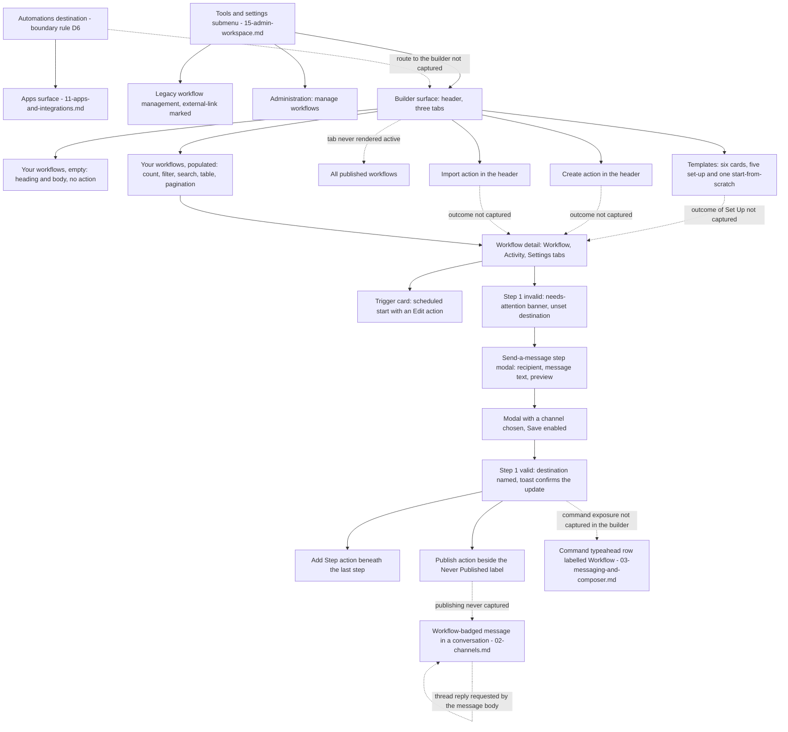

# Workflow Builder

The standalone surface where automations are authored — its tab set, its workflows list, its templates grid, and the workflow editor whose steps produce the badged message a workflow posts back into a conversation.

## Purpose

This document specifies **builder-authored automation**: the surface a user opens to list, import, create and edit a workflow, the editor in which a workflow's trigger and ordered steps are configured, and the observable output a workflow produces once it runs. The area's own surfaces are captured in seven contiguous frames, [frame 568](../../screenshots/Slack%20web%20Jul%202024%20568.png) through [frame 574](../../screenshots/Slack%20web%20Jul%202024%20574.png), and its output is captured in a conversation at [frame 120](../../screenshots/Slack%20web%20Jul%202024%20120.png).

**The builder is not rendered inside the application shell.** Every builder frame is a full-viewport light surface with no navigation rail, no conversation sidebar and no top bar: the four shell regions specified by [00-product-overview.md](00-product-overview.md) are absent, and the builder supplies its own header instead [frame 568](../../screenshots/Slack%20web%20Jul%202024%20568.png), [frame 571](../../screenshots/Slack%20web%20Jul%202024%20571.png). A build must therefore treat this area as a **separate routed surface with its own chrome**, in the same class as the standalone administration console owned by [15-admin-workspace.md](15-admin-workspace.md), and not as another destination inside the shell's content region.

**Where the area is encountered.** Two routes into the area are observable, and a third surface documents it rather than opening it:

- The in-app workspace menu's tools-and-settings submenu, whose **tools** group carries a *Workflow Builder* row with no external-link icon, a *Legacy Workflow Management* row marked with an external-link icon, and whose **administration** group carries a *Manage workflows* row [frame 567](../../screenshots/Slack%20web%20Jul%202024%20567.png). The submenu itself belongs to [15-admin-workspace.md](15-admin-workspace.md).
- The rail's more menu, whose automations row carries a new badge and the one-line description *"Create and find workflows and apps"* [frame 399](../../screenshots/Slack%20web%20Jul%202024%20399.png) — the destination that the boundary rule below splits between this document and [11-apps-and-integrations.md](11-apps-and-integrations.md).
- The docked help panel, whose guide article names the builder in its heading and again as a link in its body, and lists the administration options that govern it [frame 710](../../screenshots/Slack%20web%20Jul%202024%20710.png). No frame shows that link being followed, so the panel is treated as documentation of the area rather than a captured route into it. The panel belongs to [20-help-community.md](20-help-community.md); its copy is cited in this document only where it states something about workflows that the builder's own surfaces do not show.

**The automations boundary rule (deviation D6), restated in one place.** Builder-authored automation — this surface, its tabs, the workflows list, importing, creating, the templates grid, the editor, its trigger and steps, publishing, and the messages a workflow posts — belongs **here**. Third-party app surfaces — the apps surface, its category search, installed and recommended rows, the app-directory button and app configuration — belong to [11-apps-and-integrations.md](11-apps-and-integrations.md). The evidence for the split is that the automations destination renders a sidebar headed *Automations* whose only item is *Apps* [frame 400](../../screenshots/Slack%20web%20Jul%202024%20400.png) while the same destination is described as the place to create and find workflows *and* apps [frame 399](../../screenshots/Slack%20web%20Jul%202024%20399.png). The rule's canonical statement and its rationale live in [00-product-overview.md](00-product-overview.md) and are rolled up in the [Workflow Catalog](README.md); they are referenced here rather than duplicated.

**What this document does not own.** The conversation that receives a workflow's message, and its channel surface, belong to [02-channels.md](02-channels.md); the anatomy of a message row and of the composer's command typeahead belongs to [03-messaging-and-composer.md](03-messaging-and-composer.md); the thread a workflow's message asks its readers to reply in belongs to [04-threads.md](04-threads.md); the empty-state pattern and the cross-cutting state matrix belong to [21-states.md](21-states.md); plan comparison belongs to [18-pricing-plans.md](18-pricing-plans.md). Every `C-*` component contract is defined once in [00-product-overview.md](00-product-overview.md) and is only referenced by identifier below.

## Flows in this area

Two flows are named for this area, spanning seven frames. Frame spans below are written as plain numeric ranges because they designate a span rather than cite one image, following the convention of the [Screenshot Coverage Index](_screenshot-index.md); every individual frame is cited with its full relative link in the per-flow step tables and in the **Frames covered** section.

| Flow ID | Name | Frame span | Primary entry point |
|---|---|---|---|
| `10.1` | Open the workflow builder and browse templates | 568–570 | The *Workflow Builder* row in the tools-and-settings submenu [frame 567](../../screenshots/Slack%20web%20Jul%202024%20567.png) |
| `10.2` | Edit and save a workflow step | 571–574 | The workflow name, rendered as a link in the workflows list [frame 569](../../screenshots/Slack%20web%20Jul%202024%20569.png) |

A two-flow area is a small allocation, and it is the honest one: the corpus captures the builder's list, its templates grid, one workflow's editor and one step's configuration, and nothing else. Every capability the surfaces *expose* but never exercise is named in a `> **Partial capture:**` note at the point where a reader would otherwise assume it was specified.

### The authoring journey

Every solid node and edge below corresponds to a state or a transition observed in the frames cited by the two flows. Where a surface names a route the corpus does not capture, the edge is drawn dotted and labelled as uncaptured rather than asserted as continuous.

The dotted edges are the shape of this area's evidence: the builder surfaces expose import, create, publishing, a second tab and a template set-up path, and the corpus captures none of their outcomes. The one dotted edge that leaves the diagram — a workflow's message reaching a conversation — is evidenced at its destination [frame 120](../../screenshots/Slack%20web%20Jul%202024%20120.png) even though the act of publishing is not.

## Flow 10.1 — Open the workflow builder and browse templates

### Overview

The builder opens on its first tab — the one whose label names the signed-in user's own workflows. That tab is captured in both of its states — an empty state that explains itself and offers nothing to click [frame 568](../../screenshots/Slack%20web%20Jul%202024%20568.png), and a populated state carrying a count, a filter control, a search field, a standing advisory, a two-column table with one workflow row, and pagination [frame 569](../../screenshots/Slack%20web%20Jul%202024%20569.png). Switching to the third tab replaces the body with a templates grid of six cards whose copy names the automation trigger each template is built on [frame 570](../../screenshots/Slack%20web%20Jul%202024%20570.png). The header — identity block at the left, import, create and help at the right — and the three-tab bar persist across all three states, so they are the surface's chrome rather than one tab's furniture.

### Trigger

The *Workflow Builder* row in the **tools** group of the workspace menu's tools-and-settings submenu [frame 567](../../screenshots/Slack%20web%20Jul%202024%20567.png). That row is the only observed affordance whose activation is followed by a builder capture, and it carries **no** external-link icon, unlike the two rows beneath it in the same group [frame 567](../../screenshots/Slack%20web%20Jul%202024%20567.png).

### Preconditions

An authenticated session on a workspace, reached through the in-app shell — the submenu that leads here is anchored to the workspace-name control in `C-SIDEBAR` [frame 567](../../screenshots/Slack%20web%20Jul%202024%20567.png). The builder's own header names the workspace it is scoped to beneath the surface title, so the surface is workspace-scoped rather than account-scoped [frame 568](../../screenshots/Slack%20web%20Jul%202024%20568.png). No workflow needs to exist: the first tab renders an empty state instead of an error when there is nothing to list [frame 568](../../screenshots/Slack%20web%20Jul%202024%20568.png).

### Frame-by-frame steps

| Step | Frame(s) | What the user does | What changes on screen | Component(s) involved |
|---|---|---|---|---|
| 1 | [frame 567](../../screenshots/Slack%20web%20Jul%202024%20567.png) | Opens the tools-and-settings submenu from the workspace menu and reads its tools group | The submenu renders three labelled groups; the tools group lists a customize-workspace row, a *Workflow Builder* row, a *Legacy Workflow Management* row with an external-link icon and a workspace-analytics row with the same icon | `C-CONTEXT-MENU`, `C-WORKSPACE-SWITCHER` |
| 2 | [frame 568](../../screenshots/Slack%20web%20Jul%202024%20568.png) | Activates the *Workflow Builder* row | A full-viewport light surface replaces the shell: no rail, no sidebar and no top bar are rendered. Its header carries a square workspace icon tile, the surface title and the workspace name beneath it at the left, and an outlined import action, a filled primary create action and a circular help control at the right | `C-AVATAR`, `C-TAB-BAR` |
| 3 | [frame 568](../../screenshots/Slack%20web%20Jul%202024%20568.png) | Reads the tab bar | Three tabs render in a fixed order — *Your workflows*, *All Published Workflows*, *Templates* — with the first rendered active: its label in the default text colour with an accent underline exactly the label's width, sitting on a hairline rule that spans the whole content column | `C-TAB-BAR` |
| 4 | [frame 568](../../screenshots/Slack%20web%20Jul%202024%20568.png) | Reads the body of the active tab with nothing to list | A centred block sits near the top of the body: a bold heading reading *"You don't have any legacy workflows"* and a two-line body reading *"If someone adds you as a collaborator for a legacy workflow, it'll appear here."* No illustration and no action accompany it, and the rest of the body is empty | `C-EMPTY-STATE` |
| 5 | [frame 569](../../screenshots/Slack%20web%20Jul%202024%20569.png) | Views the same tab where one workflow exists | The body gains four stacked regions: a tinted toolbar row carrying a bold count reading *"1 workflow"* at the left and a filter control plus a bordered search field with a magnifier glyph at the right; a standing advisory; a table; and a pagination row | `C-SEARCH-ENTRY`, `C-DATA-TABLE`, `C-BANNER` |
| 6 | [frame 569](../../screenshots/Slack%20web%20Jul%202024%20569.png) | Reads the advisory above the table | A full-column banner on a warm pale background carries an information glyph, a bold lead reading *"Legacy workflow restrictions coming soon."*, body copy naming one date after which previously-authored workflows and templates can no longer be created or copied and a later date on which their use is disabled, and an underlined learn-more link. No dismiss control is rendered on it | `C-BANNER` |
| 7 | [frame 569](../../screenshots/Slack%20web%20Jul%202024%20569.png) | Reads the table | A header row carries a *Name* label at the column's left edge and a *Last edited* label at roughly three-fifths of the column's width, the latter rendered in the accent colour with a two-way sort control beside it. Beneath a hairline rule, one row carries the workflow's square avatar, its name as an accent-coloured link, a relative last-edited value that also names who edited it, and an overflow control at the row's right edge | `C-DATA-TABLE`, `C-AVATAR`, `C-CONTEXT-MENU` |
| 8 | [frame 569](../../screenshots/Slack%20web%20Jul%202024%20569.png) | Reads the pagination row | Beneath a second hairline rule, a previous control sits at the column's left edge and a see-more control at its right; both render in the same muted tone at this capture | `C-DATA-TABLE` |
| 9 | [frame 570](../../screenshots/Slack%20web%20Jul%202024%20570.png) | Activates the third tab | The active underline moves to the third tab; the header is unchanged; the body is replaced by a centred heading reading *"What do you want to build today?"* and a centred sub-line inviting the user to try a customizable template | `C-TAB-BAR` |
| 10 | [frame 570](../../screenshots/Slack%20web%20Jul%202024%20570.png) | Reads the templates grid | Six equal-width cards render in a three-column, two-row grid filling the content column. Each card stacks a rounded square icon tile in its own accent colour, a bold title, body copy in which the automation trigger the template uses is emboldened, and an outlined action | Template card — no existing `C-*` contract covers it; reported in **Screens & components** |
| 11 | [frame 570](../../screenshots/Slack%20web%20Jul%202024%20570.png) | Compares the six cards | Five cards offer a *Set Up* action; the sixth is titled *"Start from scratch"*, its body reads *"Want to tinker? Already a pro? Start with a fresh workflow."*, its icon tile carries a plus glyph in a neutral tone rather than an accent colour, and its action reads *Create* instead of *Set Up* | Template card — see **Screens & components** |

**The trigger vocabulary the corpus does name.** Four automation triggers are named, in bold, inside the template descriptions: a new-channel-member trigger, a shortcut trigger (named by two different cards), a scheduled-date-and-time trigger and an emoji-reaction trigger [frame 570](../../screenshots/Slack%20web%20Jul%202024%20570.png). They are the trigger vocabulary this catalog can claim, and they are named in *copy* — no trigger-selection surface appears anywhere in the corpus.

> **Partial capture:** this flow ends on the templates grid. The corpus does not show what the header's import action opens, nor any import format or file picker; what the header's create action opens; what a card's *Set Up* action produces; or what the *Start from scratch* card's create action produces. The second tab, *All Published Workflows*, is never rendered active, so its body, its columns and whether it is filterable are unknown.
>
> **Partial capture:** three controls in the populated list are exposed but never operated — the filter control, the search field and the overflow control on the workflow row. No frame shows the filter's options, a search term or its result set, or the overflow menu's items. Nor does any frame show a second page: both pagination controls render in the same muted tone with a single row present. **Inferred:** neither pagination control has a destination at this capture, because the count reads one workflow and the table holds exactly one row [frame 569](../../screenshots/Slack%20web%20Jul%202024%20569.png).

**Inconsistency, recorded not reconciled.** The first tab is labelled *Your workflows*, but its empty state speaks only of *legacy* workflows and of being added as a collaborator to one [frame 568](../../screenshots/Slack%20web%20Jul%202024%20568.png), while the same tab — identified by an underline of identical width and position — lists a workflow at [frame 569](../../screenshots/Slack%20web%20Jul%202024%20569.png). The label and the copy are recorded exactly as each frame shows them. **Inferred:** the empty capture precedes the workflow's creation, because the row's last-edited value at [frame 569](../../screenshots/Slack%20web%20Jul%202024%20569.png) reads under a minute ago and attributes the edit to the signed-in user; the corpus captures no intermediate state, so nothing stronger than that is claimed.

## Flow 10.2 — Edit and save a workflow step

### Overview

Opening a workflow from the list replaces the builder's list surface with a **detail surface for that one workflow**: its own header carrying a back control, the workflow's avatar and name, a publish-state label, a publish action and an overflow control; its own three-tab bar; and a narrower centred body that reads as two labelled sections — the workflow's single trigger, then its ordered steps [frame 571](../../screenshots/Slack%20web%20Jul%202024%20571.png). The captured workflow is invalid on arrival: its only step has no destination, so the step carries a needs-attention banner and a destructive-coloured border. Editing that step opens a modal in which the destination is unset and the save action is disabled [frame 572](../../screenshots/Slack%20web%20Jul%202024%20572.png); choosing a channel enables save [frame 573](../../screenshots/Slack%20web%20Jul%202024%20573.png); saving clears the warning, names the destination in the step header and confirms with a toast [frame 574](../../screenshots/Slack%20web%20Jul%202024%20574.png). The workflow remains unpublished throughout.

### Trigger

The workflow's name in the workflows list, rendered as an accent-coloured link [frame 569](../../screenshots/Slack%20web%20Jul%202024%20569.png). Within the flow, the step editor is opened by the *Edit* action on the step card itself [frame 571](../../screenshots/Slack%20web%20Jul%202024%20571.png) — which is the sense of "trigger" this template heading uses: the user action that starts the journey, not the automation trigger that starts a workflow run. The automation trigger is the subject of the trigger card described in step 3 below.

### Preconditions

A workflow must already exist and be reachable from the first tab of the builder [frame 569](../../screenshots/Slack%20web%20Jul%202024%20569.png). The workflow in this flow is unpublished — its header renders a *Never Published* label beside the publish action in every captured state [frame 571](../../screenshots/Slack%20web%20Jul%202024%20571.png), [frame 574](../../screenshots/Slack%20web%20Jul%202024%20574.png) — and it already carries one trigger and one step, so neither adding a trigger nor adding a first step is a precondition of the captured journey.

### Frame-by-frame steps

| Step | Frame(s) | What the user does | What changes on screen | Component(s) involved |
|---|---|---|---|---|
| 1 | [frame 569](../../screenshots/Slack%20web%20Jul%202024%20569.png), [frame 571](../../screenshots/Slack%20web%20Jul%202024%20571.png) | Activates the workflow's name in the list | The list surface is replaced by the workflow's detail surface. The header now carries a back control at the far left, then the workflow's square avatar and its name; at the right, a muted *Never Published* label, a filled primary *Publish* action and an overflow control | `C-AVATAR`, `C-TAB-BAR`, `C-CONTEXT-MENU` |
| 2 | [frame 571](../../screenshots/Slack%20web%20Jul%202024%20571.png) | Reads the detail surface's tab bar | Three tabs render in a fixed order — *Workflow*, *Activity*, *Settings* — with the first active, underlined in the accent colour on a full-width hairline rule treated exactly as the list surface's is. A standing advisory banner opens the body, warning that previously-authored workflows will stop being findable and usable after a named date, with a learn-more link | `C-TAB-BAR`, `C-BANNER` |
| 3 | [frame 571](../../screenshots/Slack%20web%20Jul%202024%20571.png) | Reads the first labelled section | A section heading reading *"Start the workflow…"* sits above a single bordered card: a clock glyph at its left, the automation trigger stated in bold as a scheduled start with a day and a time, and an outlined *Edit* action at its right | Trigger card — area-specific structure, described in **Screens & components** |
| 4 | [frame 571](../../screenshots/Slack%20web%20Jul%202024%20571.png) | Reads the second labelled section | A section heading reading *"Then, do these things"* sits above a step group. A validation banner on a pale destructive background carries a warning triangle, a bold *"Needs attention."* lead and the sentence *"You'll need to pick a channel or person."*; the step card beneath it is outlined in the destructive colour | `C-BANNER` |
| 5 | [frame 571](../../screenshots/Slack%20web%20Jul%202024%20571.png) | Reads the invalid step | The step card's header row carries a step-type glyph, the ordinal-prefixed label *"1. Send a message to"* and, where the destination belongs, a rounded grey placeholder bar carrying no text; an outlined *Edit* action sits at the row's right. The card's body previews the message the step will post: the workflow's avatar, its name in bold, an uppercase *WORKFLOW* badge, then the message body | `C-MESSAGE-ROW`, `C-AVATAR` |
| 6 | [frame 571](../../screenshots/Slack%20web%20Jul%202024%20571.png) | Reads what follows the last step | A short vertical connector descends from the step card's lower edge to a centred outlined *Add Step* action | Step connector and add-step action — area-specific structure, described in **Screens & components** |
| 7 | [frame 572](../../screenshots/Slack%20web%20Jul%202024%20572.png) | Activates *Edit* on the step | A centred modal opens over the dimmed detail surface, titled *"Send a message"* with a dismiss control at its top right, and repeats the *"Needs attention."* banner inside its own body | `C-MODAL-SHELL` |
| 8 | [frame 572](../../screenshots/Slack%20web%20Jul%202024%20572.png) | Reads the destination field | A label reading *"Send this message to:"* sits above a select control whose placeholder reads *"Search all people or channels"* and which carries a trailing caret. The control's border is rendered in the destructive colour while it is empty | `C-DROPDOWN-MENU` |
| 9 | [frame 572](../../screenshots/Slack%20web%20Jul%202024%20572.png) | Reads the message-text field | A label reading *"Message text"* sits above a bordered rich-text editor: a formatting toolbar of nine controls in two groups divided by one vertical rule, the message body itself, and an emoji affordance at the editor's lower left. A right-aligned insert-a-variable link sits beneath the editor, prefixed with a braces glyph | `C-FORMATTING-TOOLBAR` |
| 10 | [frame 572](../../screenshots/Slack%20web%20Jul%202024%20572.png) | Reads the remaining modal body | An unchecked checkbox labelled *"Include a button"* carries helper copy explaining that a button added to the message moves people to the workflow's next step. Beneath it, a *Preview* label introduces a card rendering the message exactly as the step card previews it | `C-MODAL-SHELL`, `C-MESSAGE-ROW` |
| 11 | [frame 572](../../screenshots/Slack%20web%20Jul%202024%20572.png) | Reads the modal footer | A *Remove* action sits alone at the footer's left; *Cancel* and *Save* sit at its right, with *Save* rendered muted while the destination is unset | `C-MODAL-SHELL` |
| 12 | [frame 573](../../screenshots/Slack%20web%20Jul%202024%20573.png) | Chooses a channel as the destination | The select now renders a hash-prefixed channel reference in place of its placeholder and its border returns to the neutral tone; *Save* becomes a filled primary. The *"Needs attention."* banner is still rendered above the field, and the step card behind the modal still carries its destructive border | `C-DROPDOWN-MENU`, `C-MODAL-SHELL` |
| 13 | [frame 574](../../screenshots/Slack%20web%20Jul%202024%20574.png) | Saves the step | The modal closes. The validation banner is gone, the step card's border returns to the neutral tone, and the step header now reads *"1. Send a message to"* followed by the chosen channel rendered as an accent-coloured reference in place of the grey placeholder bar | `C-BANNER`, `C-MESSAGE-ROW` |
| 14 | [frame 574](../../screenshots/Slack%20web%20Jul%202024%20574.png) | Reads the confirmation | A dark toast appears at the bottom right of the viewport, naming the step type in quotation marks and stating that it was updated. It carries no undo affordance. The header still reads *Never Published* beside an enabled publish action | `C-TOAST` |

**The toolbar in this modal is not the composer's toolbar.** Its nine controls are grouped in two: bold, italic, strikethrough, inline code and link, then a single vertical rule, then ordered list, bulleted list, blockquote and code block [frame 572](../../screenshots/Slack%20web%20Jul%202024%20572.png). The composer's instance of the same contract carries a different grouping and a different order, as recorded in [00-product-overview.md](00-product-overview.md). Both readings are kept: the difference is a fact about the two instances, not an error to be smoothed away, and a build that renders one toolbar for both surfaces should do so knowingly.

> **Partial capture:** the publish action is exposed, enabled and paired with a *Never Published* label, and no frame shows it being used, any publish confirmation, any published workflow, or what the label reads once a workflow is published [frame 571](../../screenshots/Slack%20web%20Jul%202024%20571.png), [frame 574](../../screenshots/Slack%20web%20Jul%202024%20574.png). The header's overflow control is never opened. Neither the *Activity* tab nor the *Settings* tab is ever rendered active, so run history, analytics and per-workflow settings — including who may edit or run the workflow — are unknown.
>
> **Partial capture:** the trigger card exposes an *Edit* action, and no frame shows a trigger picker, a trigger-type catalogue or a scheduling editor; the only trigger type this area observes directly is the scheduled start already configured on this workflow [frame 571](../../screenshots/Slack%20web%20Jul%202024%20571.png). Likewise *Add Step* is exposed but never activated, so no step-type catalogue is captured: the only step type observed is the send-a-message step [frame 572](../../screenshots/Slack%20web%20Jul%202024%20572.png). Within that step, the insert-a-variable link and the include-a-button checkbox are exposed but never exercised, so the variable set and the button's own configuration are unknown, and the *Remove* action's confirmation behaviour is not captured.

## Screens & components

Three screens make up this area, plus the surfaces elsewhere that a workflow writes to. All sizing is expressed **proportionally to the effective product viewport**, never as an absolute offset; the reason that register is mandatory is recorded once in the [Workflow Catalog](README.md) and is not repeated here.

### Screen 1 — the builder surface

| Region | Position and ordering | Relative size | Contents, in order |
|---|---|---|---|
| Header | Full-width band at the top of the viewport; the surface's own chrome, present in every captured tab state | Roughly a tenth of viewport height | At the left, inset by roughly a ninth of the width: a square workspace icon tile, then a two-line identity block — the surface title in bold above the workspace name. At the right, ending at roughly seven eighths of the width: an outlined import action, a filled primary create action, then a circular help control [frame 568](../../screenshots/Slack%20web%20Jul%202024%20568.png) |
| Tab bar | Directly beneath the header, left-aligned to the same inset as the identity block | Roughly a thirtieth of viewport height, above a hairline rule spanning the whole content column | Three tabs in fixed order, the active one underlined for exactly the width of its own label [frame 568](../../screenshots/Slack%20web%20Jul%202024%20568.png), [frame 570](../../screenshots/Slack%20web%20Jul%202024%20570.png) |
| Content column | Centred, from roughly one ninth to roughly seven eighths of viewport width | Roughly three quarters of viewport width; the header, the tab rule and every body region share its left and right edges | The active tab's body: an empty-state block, a list, or a card grid [frame 568](../../screenshots/Slack%20web%20Jul%202024%20568.png), [frame 569](../../screenshots/Slack%20web%20Jul%202024%20569.png), [frame 570](../../screenshots/Slack%20web%20Jul%202024%20570.png) |

**Hierarchy.** The header and tab bar are siblings that persist; only the region below the hairline rule changes when a tab is switched [frame 568](../../screenshots/Slack%20web%20Jul%202024%20568.png), [frame 570](../../screenshots/Slack%20web%20Jul%202024%20570.png). The list body stacks four regions in a fixed order — toolbar row, advisory banner, table, pagination row — each spanning the full content column [frame 569](../../screenshots/Slack%20web%20Jul%202024%20569.png). The empty-state block is horizontally centred on the content column and sits near the *top* of the body, about a fifteenth of the viewport height below the hairline rule, rather than being centred vertically in the region [frame 568](../../screenshots/Slack%20web%20Jul%202024%20568.png).

**The toolbar row is tinted.** Its background is a shade off the body's default surface, which is what separates it from the table beneath it; the search field inside it is bordered, the count beside it is not [frame 569](../../screenshots/Slack%20web%20Jul%202024%20569.png).

**The templates grid.** Six cards in three equal columns and two rows fill the content column: each card is roughly a third of the column's width — about a quarter of the viewport width — with a gutter of roughly a sixtieth of the viewport width between columns. Row heights are not equal: the second row is taller because one card's body copy runs to three lines while the first row's run to two [frame 570](../../screenshots/Slack%20web%20Jul%202024%20570.png). A card stacks, top to bottom: a rounded square icon tile roughly a fortieth of the viewport width square, a bold title, body copy, then a single outlined action at the card's lower left.

**Reported for definition, not defined here.** The template card is a recurring structure — an icon tile, a title, descriptive copy and one action inside a bordered card, tiled into a responsive grid — and no existing `C-*` contract covers it: `C-RECORD-CARD` is a card of labelled, typed *fields*, which this is not. Per the inventory's floor-not-ceiling rule, it is **reported here for definition in [00-product-overview.md](00-product-overview.md)** rather than contracted locally, because the same structure recurs on the apps surface's recommended rows in [11-apps-and-integrations.md](11-apps-and-integrations.md) and in the marketing card grids in [17-marketing-site.md](17-marketing-site.md). Until it is defined there, this document specifies the structure observationally, above.

### Screen 2 — the workflow detail surface

| Region | Position and ordering | Relative size | Contents, in order |
|---|---|---|---|
| Header | Full-width band at the top, replacing the builder surface's header | Roughly a tenth of viewport height | At the left: a back control, then the workflow's square avatar, then the workflow's name in bold. At the right, ending at the same seven eighths of the width the builder header uses: the publish-state label in a muted tone, a filled primary publish action, then an overflow control [frame 571](../../screenshots/Slack%20web%20Jul%202024%20571.png) |
| Tab bar | Directly beneath the header, at the same inset, over a hairline rule given the same treatment | Rendered identically to the builder surface's tab bar | Three tabs in fixed order — *Workflow*, *Activity*, *Settings* — the first active [frame 571](../../screenshots/Slack%20web%20Jul%202024%20571.png) |
| Body column | Centred, from roughly three tenths to roughly seven tenths of viewport width | Roughly two fifths of viewport width — **narrower than the builder surface's content column**, and centred rather than sharing its edges | Advisory banner, the trigger section, then the steps section [frame 571](../../screenshots/Slack%20web%20Jul%202024%20571.png), [frame 574](../../screenshots/Slack%20web%20Jul%202024%20574.png) |

**The two surfaces use different body widths deliberately.** The list surface's column spans about three quarters of the width because it holds a table; the detail surface's column spans about two fifths because it holds a vertical pipeline of cards [frame 569](../../screenshots/Slack%20web%20Jul%202024%20569.png), [frame 571](../../screenshots/Slack%20web%20Jul%202024%20571.png). Both keep the same header inset and the same full-width tab rule, so the transition between them changes the body, not the chrome.

**The trigger card and the step card share an anatomy.** Each is a bordered card whose header row runs: a leading glyph denoting its kind, then bold text stating what the card does, then an outlined *Edit* action pinned to the row's right edge [frame 571](../../screenshots/Slack%20web%20Jul%202024%20571.png). The step card adds two things the trigger card does not have: an ordinal prefix on its label, and a body beneath the header row that previews what the step will post [frame 571](../../screenshots/Slack%20web%20Jul%202024%20571.png). A step whose required value is unset renders that value's slot as a rounded grey placeholder bar carrying no text [frame 571](../../screenshots/Slack%20web%20Jul%202024%20571.png); once set, the same slot renders the value as an accent-coloured reference [frame 574](../../screenshots/Slack%20web%20Jul%202024%20574.png). Beneath the last step, a short vertical connector runs from the card's lower edge to a centred outlined add-step action, which is what makes the section read as an ordered pipeline rather than a list [frame 571](../../screenshots/Slack%20web%20Jul%202024%20571.png).

**Section headings carry the grammar of the model.** The two body sections are labelled with sentence fragments that complete each other — one naming when the workflow starts, one naming what it then does — and each sits left-aligned above its cards [frame 571](../../screenshots/Slack%20web%20Jul%202024%20571.png). A build should keep that pairing, because it is what tells a reader that a workflow is one trigger followed by ordered steps.

### Screen 3 — the step-configuration modal

A centred modal roughly a third of the viewport wide, over a dimmed backdrop, occupying nearly the full viewport height [frame 572](../../screenshots/Slack%20web%20Jul%202024%20572.png). Its regions stack: title row with a dismiss control; the validation banner; the destination field group; the message-text field group with its formatting toolbar, text area and emoji affordance; a right-aligned insert-a-variable link; the include-a-button checkbox with its helper copy; a labelled preview card; then a footer whose *Remove* action sits alone at the left while *Cancel* and *Save* sit at the right in that order [frame 572](../../screenshots/Slack%20web%20Jul%202024%20572.png). The removal action is rendered as an ordinary outlined control with a default-coloured label — **not** in the destructive colour that `C-CONFIRM-DIALOG`'s destructive variant uses — and no confirmation of it is captured [frame 572](../../screenshots/Slack%20web%20Jul%202024%20572.png). The modal is an instance of `C-MODAL-SHELL`, and it follows that contract's footer convention — secondary then primary at the right — while adding a left-aligned removal action for the object being edited.

### Components used, by identifier

Every identifier below resolves to its contract in [00-product-overview.md](00-product-overview.md); none is restated here.

| Component | How this area uses it | Evidence |
|---|---|---|
| `C-TAB-BAR` | Twice, with different tab sets and no counts: three tabs on the builder surface and three on the workflow detail surface, in both cases left-aligned beneath the surface title with the active label underlined to its own width | [frame 568](../../screenshots/Slack%20web%20Jul%202024%20568.png), [frame 570](../../screenshots/Slack%20web%20Jul%202024%20570.png), [frame 571](../../screenshots/Slack%20web%20Jul%202024%20571.png) |
| `C-EMPTY-STATE` | The first tab's nothing-to-list state — and a **reduced** instance of the contract: heading plus a two-line body only, with no illustration and no action, unlike the conversation heroes cited in the contract | [frame 568](../../screenshots/Slack%20web%20Jul%202024%20568.png) |
| `C-DATA-TABLE` | The workflows list: a header row with one sortable column, rows separated by hairline rules, and mixed cell content — an avatar and a link in one cell, a relative timestamp with an attribution in another, an overflow control in a third | [frame 569](../../screenshots/Slack%20web%20Jul%202024%20569.png) |
| `C-BANNER` | Three page-level instances: the standing advisory at the top of the list body, the same advisory with different body copy at the top of the detail body, and the destructive-toned validation banner above an invalid step. None of the three carries a dismiss control | [frame 569](../../screenshots/Slack%20web%20Jul%202024%20569.png), [frame 571](../../screenshots/Slack%20web%20Jul%202024%20571.png) |
| `C-SEARCH-ENTRY` | The list's scoped search field, inside the surface rather than in a top bar, with a leading magnifier glyph and a placeholder | [frame 569](../../screenshots/Slack%20web%20Jul%202024%20569.png) |
| `C-MODAL-SHELL` | The step-configuration modal, including its disabled-primary state | [frame 572](../../screenshots/Slack%20web%20Jul%202024%20572.png), [frame 573](../../screenshots/Slack%20web%20Jul%202024%20573.png) |
| `C-DROPDOWN-MENU` | The destination select inside the modal — the contract's select-inside-a-form-field variant — carrying a placeholder, a trailing caret and, while empty, a destructive-toned border | [frame 572](../../screenshots/Slack%20web%20Jul%202024%20572.png), [frame 573](../../screenshots/Slack%20web%20Jul%202024%20573.png) |
| `C-FORMATTING-TOOLBAR` | Above the modal's message text area, with a control set and grouping that differ from the composer's instance | [frame 572](../../screenshots/Slack%20web%20Jul%202024%20572.png) |
| `C-MESSAGE-ROW` | Three times as the app-authored-with-a-workflow-badge variant: the preview inside the step card, the preview inside the modal, and the message as actually posted in a conversation | [frame 571](../../screenshots/Slack%20web%20Jul%202024%20571.png), [frame 572](../../screenshots/Slack%20web%20Jul%202024%20572.png), [frame 120](../../screenshots/Slack%20web%20Jul%202024%20120.png) |
| `C-AVATAR` | The square workspace icon tile in the builder header, the workflow's own square avatar in the list row and the detail header, and the app avatar on the posted message | [frame 568](../../screenshots/Slack%20web%20Jul%202024%20568.png), [frame 569](../../screenshots/Slack%20web%20Jul%202024%20569.png), [frame 571](../../screenshots/Slack%20web%20Jul%202024%20571.png), [frame 120](../../screenshots/Slack%20web%20Jul%202024%20120.png) |
| `C-CONTEXT-MENU` | Three overflow controls, none of them opened in the corpus: on the list row, in the detail header, and — as the route into this area — the tools-and-settings submenu owned by [15-admin-workspace.md](15-admin-workspace.md) | [frame 569](../../screenshots/Slack%20web%20Jul%202024%20569.png), [frame 571](../../screenshots/Slack%20web%20Jul%202024%20571.png), [frame 567](../../screenshots/Slack%20web%20Jul%202024%20567.png) |
| `C-TOAST` | The save confirmation at the bottom right of the detail surface — and, unlike both instances cited in the contract, it carries **no** undo affordance | [frame 574](../../screenshots/Slack%20web%20Jul%202024%20574.png) |

**Components this area's surfaces do *not* render, which is itself specification.** No `C-RAIL`, `C-SIDEBAR`, `C-TOP-BAR` or `C-WORKSPACE-SWITCHER` appears on any builder frame — the surface stands outside the shell [frame 568](../../screenshots/Slack%20web%20Jul%202024%20568.png), [frame 571](../../screenshots/Slack%20web%20Jul%202024%20571.png). No `C-UPGRADE-GATE` instance appears either: no badge, countdown, trial item or upsell strip is rendered anywhere in the builder, even though the in-product help panel states that the capability is available on paid plans [frame 710](../../screenshots/Slack%20web%20Jul%202024%20710.png). A build must not invent a gate the corpus does not show here; the gate's own state matrix belongs to [21-states.md](21-states.md).

**Iconography, named by function.** Import affordance, create affordance, help affordance, back affordance, overflow affordance, filter affordance, search magnifier, two-way sort affordance, information glyph, warning triangle, clock glyph on the trigger card, step-type glyph on the step card, plus glyph on the start-from-scratch tile, braces glyph on the insert-a-variable link, emoji affordance in the message editor, and the uppercase workflow badge on a workflow-authored message. No icon is named after any third-party asset.

## States

Every state below is observed, with the frame that shows it. The cross-cutting matrix that generalises these across the product is owned by [21-states.md](21-states.md) and is not restated here.

| State | What is observable | Evidence |
|---|---|---|
| Default, list populated | Header, three tabs with the first active, toolbar row, advisory, one-row table, pagination | [frame 569](../../screenshots/Slack%20web%20Jul%202024%20569.png) |
| Empty | The active tab's body carries a centred heading and a two-line body, no illustration and no action — an explanation, not an error | [frame 568](../../screenshots/Slack%20web%20Jul%202024%20568.png) |
| Active tab | The active label renders in the default text colour with an accent underline exactly its own width; inactive labels render in a lighter tone with no underline | [frame 568](../../screenshots/Slack%20web%20Jul%202024%20568.png), [frame 570](../../screenshots/Slack%20web%20Jul%202024%20570.png), [frame 571](../../screenshots/Slack%20web%20Jul%202024%20571.png) |
| Sortable column | One table column's label renders in the accent colour with a two-way sort control beside it; the other column's label renders as plain text | [frame 569](../../screenshots/Slack%20web%20Jul%202024%20569.png) |
| Advisory | A non-dismissible warm-toned banner opens the body, with an information glyph, a bold lead, dated body copy and a learn-more link; its body copy differs between the list surface and the detail surface | [frame 569](../../screenshots/Slack%20web%20Jul%202024%20569.png), [frame 571](../../screenshots/Slack%20web%20Jul%202024%20571.png) |
| Unpublished | The detail header renders a muted publish-state label beside an enabled publish action | [frame 571](../../screenshots/Slack%20web%20Jul%202024%20571.png), [frame 574](../../screenshots/Slack%20web%20Jul%202024%20574.png) |
| Step invalid | A destructive-toned validation banner names what is missing; the step card takes a destructive-toned border; the missing value's slot renders as an empty grey placeholder bar | [frame 571](../../screenshots/Slack%20web%20Jul%202024%20571.png) |
| Field invalid | Inside the modal, the empty required select carries a destructive-toned border and the same validation banner is repeated above it | [frame 572](../../screenshots/Slack%20web%20Jul%202024%20572.png) |
| Disabled | The modal's save action renders muted while the required destination is unset | [frame 572](../../screenshots/Slack%20web%20Jul%202024%20572.png) |
| Enabled after input | With a destination chosen, the select's border returns to neutral and the save action renders as a filled primary | [frame 573](../../screenshots/Slack%20web%20Jul%202024%20573.png) |
| Step valid | The validation banner is gone, the card border is neutral, and the destination renders as an accent-coloured reference in the step header | [frame 574](../../screenshots/Slack%20web%20Jul%202024%20574.png) |
| Saved confirmation | A dark toast at the bottom right names the step and states that it was updated, with no undo affordance | [frame 574](../../screenshots/Slack%20web%20Jul%202024%20574.png) |
| Modal open over a surface | The detail surface stays rendered but dimmed behind the centred modal, and the invalid step card behind it keeps its destructive border | [frame 572](../../screenshots/Slack%20web%20Jul%202024%20572.png), [frame 573](../../screenshots/Slack%20web%20Jul%202024%20573.png) |
| Unset value | A required value that has never been set renders as a rounded grey bar with no text and no label of its own | [frame 571](../../screenshots/Slack%20web%20Jul%202024%20571.png) |
| Pagination inert | Both pagination controls render in the same muted tone with a single row in the table | [frame 569](../../screenshots/Slack%20web%20Jul%202024%20569.png) |

> **Partial capture:** no hover, focus or loading state is captured anywhere in this area. No frame shows a row hovered, a control focused, a table loading, a save in flight, or an error returned by a save. Those states must be designed rather than transcribed, and a build should not read their absence here as permission to omit them.

## Implied data model

`E-WORKFLOW` is owned by this area. Every field below cites the frame that shows it; the aggregated model, including this entity's relationships to the rest of the product, is in the [Workflow Catalog](README.md).

| Entity | Fields this area's screens imply |
|---|---|
| `E-WORKFLOW` | Name, rendered as a link in the list and as the title of the detail header [frame 569](../../screenshots/Slack%20web%20Jul%202024%20569.png), [frame 571](../../screenshots/Slack%20web%20Jul%202024%20571.png) · square avatar, used in the list row, in the detail header and on every message the workflow posts [frame 569](../../screenshots/Slack%20web%20Jul%202024%20569.png), [frame 571](../../screenshots/Slack%20web%20Jul%202024%20571.png), [frame 120](../../screenshots/Slack%20web%20Jul%202024%20120.png) · last-edited timestamp, rendered relatively, together with the identity of whoever made that edit [frame 569](../../screenshots/Slack%20web%20Jul%202024%20569.png) · publication state, surfaced as a label beside the publish action and observed in a never-published value [frame 571](../../screenshots/Slack%20web%20Jul%202024%20571.png) · generation, distinguishing previously-authored workflows from current ones, surfaced by an empty state and a dated advisory that apply to the former only [frame 568](../../screenshots/Slack%20web%20Jul%202024%20568.png), [frame 569](../../screenshots/Slack%20web%20Jul%202024%20569.png) · publication scope, implied by two peer tabs that separate the signed-in user's workflows from all published workflows [frame 568](../../screenshots/Slack%20web%20Jul%202024%20568.png) · collaborators, named by the empty state's explanation that a workflow appears in this list when someone adds you as a collaborator on it [frame 568](../../screenshots/Slack%20web%20Jul%202024%20568.png) · owning workspace, named beneath the surface title in the builder header [frame 568](../../screenshots/Slack%20web%20Jul%202024%20568.png) · template origin, implied by a grid whose cards each set up a workflow and by one card that starts a fresh one [frame 570](../../screenshots/Slack%20web%20Jul%202024%20570.png) · exactly one trigger, held in a section of its own and observed as a scheduled start carrying a day and a time [frame 571](../../screenshots/Slack%20web%20Jul%202024%20571.png) · ordered steps, each carrying an ordinal, a type, a validity state and its own configuration [frame 571](../../screenshots/Slack%20web%20Jul%202024%20571.png), [frame 574](../../screenshots/Slack%20web%20Jul%202024%20574.png) |
| `E-WORKFLOW` step configuration, for the one step type observed | Step type, stated in the step header and repeated as the modal's title [frame 571](../../screenshots/Slack%20web%20Jul%202024%20571.png), [frame 572](../../screenshots/Slack%20web%20Jul%202024%20572.png) · destination, a single value resolvable to either a person or a channel, required, and observed resolved to a channel [frame 572](../../screenshots/Slack%20web%20Jul%202024%20572.png), [frame 573](../../screenshots/Slack%20web%20Jul%202024%20573.png) · message text, rich rather than plain — the editor offers inline and block formatting and the stored value carries a paragraph, a lead line and a numbered list [frame 572](../../screenshots/Slack%20web%20Jul%202024%20572.png) · variables, implied by an insert-a-variable affordance beneath the editor [frame 572](../../screenshots/Slack%20web%20Jul%202024%20572.png) · an optional button whose helper copy states that activating it advances the reader to the workflow's next step, held as a boolean that is unset at this capture [frame 572](../../screenshots/Slack%20web%20Jul%202024%20572.png) · per-step validity, surfaced as a needs-attention state that names the unsatisfied requirement [frame 571](../../screenshots/Slack%20web%20Jul%202024%20571.png) |
| `E-MESSAGE` | A workflow-authored subtype: attributed to an app identity with that app's avatar and name, marked with an uppercase workflow badge, carrying a timestamp and a structured body of a lead sentence, an introductory line and a numbered list [frame 120](../../screenshots/Slack%20web%20Jul%202024%20120.png) · previewable before it is ever sent, rendered identically inside the step card and inside the step modal [frame 571](../../screenshots/Slack%20web%20Jul%202024%20571.png), [frame 572](../../screenshots/Slack%20web%20Jul%202024%20572.png) · a target conversation, held on the step rather than on the message [frame 574](../../screenshots/Slack%20web%20Jul%202024%20574.png). The row's own anatomy belongs to [03-messaging-and-composer.md](03-messaging-and-composer.md) |
| `E-APP` | The identity a workflow posts as, appearing in the workspace's app list and as the author of the posted message [frame 120](../../screenshots/Slack%20web%20Jul%202024%20120.png) · a provider of invocable commands whose typeahead rows are labelled with the kind *Workflow* followed by the providing app [frame 203](../../screenshots/Slack%20web%20Jul%202024%20203.png). Install and configuration belong to [11-apps-and-integrations.md](11-apps-and-integrations.md) |
| `E-PLAN` | A per-plan-tier allowance for premium workflow runs, and an unlimited allowance for total published workflows, both surfaced as rows of the plan comparison table [frame 348](../../screenshots/Slack%20web%20Jul%202024%20348.png) · a workspace-level setting for premium-workflow-usage notifications in the standalone administration console [frame 578](../../screenshots/Slack%20web%20Jul%202024%20578.png). Plan surfaces belong to [18-pricing-plans.md](18-pricing-plans.md) and [15-admin-workspace.md](15-admin-workspace.md) |
| `E-USER` | Editor attribution on a workflow, rendered as a self-reference on the signed-in user's own edit [frame 569](../../screenshots/Slack%20web%20Jul%202024%20569.png) · a capability to create workflows and a separate capability to use them, which the in-product help panel states default to all members and to members and guests respectively [frame 710](../../screenshots/Slack%20web%20Jul%202024%20710.png) |
| `E-CHANNEL` | A workflow destination, referenced by hash-prefixed name in a step's configuration and in its saved header [frame 573](../../screenshots/Slack%20web%20Jul%202024%20573.png), [frame 574](../../screenshots/Slack%20web%20Jul%202024%20574.png) · an external-permission scope that includes or excludes the use of workflows for people from another organization [frame 66](../../screenshots/Slack%20web%20Jul%202024%2066.png). The entity belongs to [02-channels.md](02-channels.md) |

> **Partial capture:** several fields a build will want are exposed as affordances but never valued in the corpus, and are therefore left unspecified rather than guessed: the identifier or slug of a workflow; its description, if it has one; the full trigger-type set beyond the four named in template copy [frame 570](../../screenshots/Slack%20web%20Jul%202024%20570.png); the full step-type set beyond the message step; the variable set behind the insert-a-variable affordance [frame 572](../../screenshots/Slack%20web%20Jul%202024%20572.png); the button's label and target; any run record, run count or run timestamp; and any collaborator or manager list, since the *Settings* tab that would hold it is never opened [frame 571](../../screenshots/Slack%20web%20Jul%202024%20571.png).

## Transitions in and out

**Into this area.** One transition is captured end to end: the *Workflow Builder* row in the tools group of the tools-and-settings submenu is followed immediately by the builder surface [frame 567](../../screenshots/Slack%20web%20Jul%202024%20567.png), [frame 568](../../screenshots/Slack%20web%20Jul%202024%20568.png). The submenu is owned by [15-admin-workspace.md](15-admin-workspace.md); the workspace menu it hangs from is owned by the same document, and the `C-SIDEBAR` control that opens it is specified in [00-product-overview.md](00-product-overview.md).

Two further routes are named by the product but not captured. The rail's more menu describes the automations destination as the place to create and find workflows and apps [frame 399](../../screenshots/Slack%20web%20Jul%202024%20399.png), yet the destination's own surface renders a sidebar headed *Automations* whose single item is *Apps* [frame 400](../../screenshots/Slack%20web%20Jul%202024%20400.png) — so no frame shows the builder being reached that way, and the diagram draws that edge dotted. The same submenu that leads here also carries a *Legacy Workflow Management* row marked with an external-link icon and an administration *Manage workflows* row [frame 567](../../screenshots/Slack%20web%20Jul%202024%20567.png); neither destination is captured, so what they open is unknown.

**Within this area.** Three transitions are captured. Switching a tab replaces only the body beneath the hairline rule [frame 568](../../screenshots/Slack%20web%20Jul%202024%20568.png), [frame 570](../../screenshots/Slack%20web%20Jul%202024%20570.png). Activating a workflow's name in the list replaces the whole list surface with that workflow's detail surface, whose header offers the back control that returns [frame 569](../../screenshots/Slack%20web%20Jul%202024%20569.png), [frame 571](../../screenshots/Slack%20web%20Jul%202024%20571.png). Activating a step's *Edit* opens the step modal over the dimmed detail surface, and saving returns to it with the step updated [frame 572](../../screenshots/Slack%20web%20Jul%202024%20572.png), [frame 574](../../screenshots/Slack%20web%20Jul%202024%20574.png).

**Out of this area, into the product.** A workflow's step writes into a conversation: the message previewed inside the step card and the modal is the same message that appears, badged and attributed to an app, in the workspace's company-wide channel [frame 571](../../screenshots/Slack%20web%20Jul%202024%20571.png), [frame 572](../../screenshots/Slack%20web%20Jul%202024%20572.png), [frame 120](../../screenshots/Slack%20web%20Jul%202024%20120.png) — and it is still present two captures later [frame 121](../../screenshots/Slack%20web%20Jul%202024%20121.png), [frame 122](../../screenshots/Slack%20web%20Jul%202024%20122.png). The channel surface belongs to [02-channels.md](02-channels.md), the message row's anatomy to [03-messaging-and-composer.md](03-messaging-and-composer.md), and the thread the observed message body asks its readers to post their update in to [04-threads.md](04-threads.md). A workflow also reaches the composer: the command typeahead lists rows whose sub-line labels them with the kind *Workflow* followed by the app that provides them [frame 203](../../screenshots/Slack%20web%20Jul%202024%20203.png), which is owned by [03-messaging-and-composer.md](03-messaging-and-composer.md).

**Out of this area, out of the application.** The builder header's help control is exposed but never activated [frame 568](../../screenshots/Slack%20web%20Jul%202024%20568.png), and both advisory banners carry a learn-more link whose destination is not captured [frame 569](../../screenshots/Slack%20web%20Jul%202024%20569.png), [frame 571](../../screenshots/Slack%20web%20Jul%202024%20571.png). The one workflow-related route that is explicitly marked as leaving the application is the legacy-workflow-management row's external-link icon [frame 567](../../screenshots/Slack%20web%20Jul%202024%20567.png).

**Transitions this area receives from elsewhere.** Plan state reaches workflows twice without ever appearing on the builder itself: as a per-tier premium-run allowance in the plan comparison table [frame 348](../../screenshots/Slack%20web%20Jul%202024%20348.png), and as a premium-workflow-usage notification setting in the standalone administration console [frame 578](../../screenshots/Slack%20web%20Jul%202024%20578.png). Channel-level external permissions reach them too: the channel-permissions step of an external invitation offers one option that includes the use of workflows and apps and one that excludes it [frame 66](../../screenshots/Slack%20web%20Jul%202024%2066.png), which is owned by [02-channels.md](02-channels.md) and [22-external-collaboration.md](22-external-collaboration.md). If a workflow ever writes a record rather than a message, the surface that would hold it belongs to [08-lists.md](08-lists.md); **no frame in the corpus shows a workflow writing to a list**, so nothing is claimed about it here.

## Edge cases & validations

Only cases the corpus actually shows are listed. Each is stated as the rule the frames evidence, so a build can check it.

- **A tab with nothing to list explains itself instead of failing.** The first tab renders a heading and a two-line body — and no illustration, no action and no error treatment — when there is nothing to show [frame 568](../../screenshots/Slack%20web%20Jul%202024%20568.png). The empty-state pattern itself is owned by [21-states.md](21-states.md).
- **A required step value is validated in three places at once.** With the destination unset, a banner above the step names what is missing, the step card takes a destructive-toned border, and the value's own slot renders as an empty grey bar [frame 571](../../screenshots/Slack%20web%20Jul%202024%20571.png). Opening the step repeats the same banner inside the modal and outlines the offending field [frame 572](../../screenshots/Slack%20web%20Jul%202024%20572.png). All three treatments clear together once the value is set and saved [frame 574](../../screenshots/Slack%20web%20Jul%202024%20574.png).
- **The save action is gated on the required value, not on the form being touched.** *Save* renders muted while the destination is unset even though the message text is already filled [frame 572](../../screenshots/Slack%20web%20Jul%202024%20572.png), and becomes a filled primary as soon as a destination is chosen [frame 573](../../screenshots/Slack%20web%20Jul%202024%20573.png).
- **The destination accepts either a person or a channel.** The field's placeholder offers people and channels together, and the validation sentence names both, so the step's target is one polymorphic reference rather than two fields [frame 572](../../screenshots/Slack%20web%20Jul%202024%20572.png).
- **Inconsistency, recorded not reconciled:** the needs-attention banner is **still rendered** in the modal after a destination has been chosen and *Save* has become enabled, and the step card behind the modal still carries its destructive border at the same capture [frame 573](../../screenshots/Slack%20web%20Jul%202024%20573.png). The corpus therefore shows validation messaging that does not clear on input but only on save. It is recorded as observed; the record is not altered to make the behaviour tidier.
- **The confirmation of a saved step is not undoable.** The toast names the step type and states that it was updated, and carries no undo affordance — unlike the two toasts cited in the `C-TOAST` contract [frame 574](../../screenshots/Slack%20web%20Jul%202024%20574.png).
- **A workflow-authored message is distinguishable from a human one.** It is attributed to an app identity, carries that app's avatar, and is marked with an uppercase workflow badge between the author name and the timestamp [frame 120](../../screenshots/Slack%20web%20Jul%202024%20120.png). The same badge is rendered in both previews inside the builder, so the badge is part of the message's identity rather than a list decoration [frame 571](../../screenshots/Slack%20web%20Jul%202024%20571.png), [frame 572](../../screenshots/Slack%20web%20Jul%202024%20572.png).
- **A step's message is previewed before it can ever be sent.** The preview inside the modal and the preview inside the step card render identical content, so what the reader will see is verifiable at authoring time [frame 571](../../screenshots/Slack%20web%20Jul%202024%20571.png), [frame 572](../../screenshots/Slack%20web%20Jul%202024%20572.png).
- **Previously-authored workflows are subject to a dated withdrawal, and the product says so twice.** A non-dismissible advisory sits above the list, naming a date after which such workflows and their templates can no longer be created or copied and a later date on which their use is disabled [frame 569](../../screenshots/Slack%20web%20Jul%202024%20569.png); a second advisory sits above the editor, worded differently — that people will no longer be able to find or use them after the later date [frame 571](../../screenshots/Slack%20web%20Jul%202024%20571.png). The two wordings are recorded as they appear. The dates themselves are specifics of a third-party product's own migration programme and are **not** requirements of this build; what transfers is the pattern — a non-dismissible, dated, learn-more-linked advisory attached to a deprecated object class.
- **The automations destination fronts two different areas at once**, which is why the boundary rule in **Purpose** is needed: the destination is described as covering workflows and apps [frame 399](../../screenshots/Slack%20web%20Jul%202024%20399.png) while its sidebar offers only the apps surface [frame 400](../../screenshots/Slack%20web%20Jul%202024%20400.png).
- **Creating a workflow and using one are separately permissioned, and the capability is plan-scoped** — stated not by the builder but by the in-product help panel, whose who-can-use-this callout reads that all members can create workflows by default while members and guests can use them, and that the capability is available on paid plans [frame 710](../../screenshots/Slack%20web%20Jul%202024%20710.png). The same article lists the administration levers as access to the builder, which features may be used, premium pricing, billing authorisation for premium usage, which connector steps members may add, who may add developer-built steps, and whether external organizations may use workflows [frame 710](../../screenshots/Slack%20web%20Jul%202024%20710.png). **Inferred:** a build needs a permission model with at least a create capability and a use capability, and a plan check on the feature, because the product's own help copy states both distinctions — but **no builder frame renders any gate, badge or denial**, so the *interface* for those rules is not specified by the corpus and must be designed. The help panel is owned by [20-help-community.md](20-help-community.md).
- **Workflow use is one of the capabilities an external-collaboration permission grants or withholds.** The channel-permissions step for a person from another organization offers a post-and-invite option described as including full access to the channel, workflows and apps, and a post-only option described as excluding the use of workflows or apps [frame 66](../../screenshots/Slack%20web%20Jul%202024%2066.png).

> **Partial capture:** no failure state of this area's own operations is captured — no save error, no permission denial, no plan-gate refusal, no import failure and no publish failure. The only failure-shaped states in the area are the client-side validation states listed above.

## Build acceptance criteria

Each criterion is objectively checkable against the frame cited beside it. A criterion that the corpus does not evidence is not listed; the `> **Partial capture:**` notes above are the record of what a build must therefore design rather than transcribe.

- [ ] The builder is reachable from the in-app tools-and-settings submenu and renders as a **standalone surface with its own header and no shell chrome** — no navigation rail, conversation sidebar or top bar [frame 567](../../screenshots/Slack%20web%20Jul%202024%20567.png), [frame 568](../../screenshots/Slack%20web%20Jul%202024%20568.png).
- [ ] The builder header carries, at the left, a square workspace icon tile with the surface title above the workspace name, and at the right an outlined import action, a filled primary create action and a circular help control, in that order [frame 568](../../screenshots/Slack%20web%20Jul%202024%20568.png).
- [ ] The builder renders exactly three tabs in the observed order, with the first active by default, the active label underlined to exactly its own width over a hairline rule that spans the whole content column [frame 568](../../screenshots/Slack%20web%20Jul%202024%20568.png), [frame 570](../../screenshots/Slack%20web%20Jul%202024%20570.png).
- [ ] Switching a tab replaces only the body below the hairline rule; the header and the tab bar are unchanged [frame 568](../../screenshots/Slack%20web%20Jul%202024%20568.png), [frame 570](../../screenshots/Slack%20web%20Jul%202024%20570.png).
- [ ] With no workflows to list, the first tab renders a `C-EMPTY-STATE` block — heading plus a two-line explanation, horizontally centred near the top of the body, with no illustration and no action — and **never an error** [frame 568](../../screenshots/Slack%20web%20Jul%202024%20568.png).
- [ ] With workflows present, the first tab renders four stacked regions in this order: a tinted toolbar row with a count at the left and a filter control plus a scoped search field at the right; a non-dismissible advisory; a table; and a pagination row [frame 569](../../screenshots/Slack%20web%20Jul%202024%20569.png).
- [ ] Each workflow row renders its avatar, its name as a link, a relative last-edited value that also names the editor, and an overflow control at the row's right edge; the last-edited column is the sortable one and renders its label in the accent colour with a two-way sort control [frame 569](../../screenshots/Slack%20web%20Jul%202024%20569.png).
- [ ] The templates tab renders a heading, a sub-line, and a three-column grid of equal-width cards, each with an icon tile, a title, descriptive copy that names the automation trigger it uses, and one action; five cards offer set-up and one offers a from-scratch start whose action reads *Create* [frame 570](../../screenshots/Slack%20web%20Jul%202024%20570.png).
- [ ] Opening a workflow replaces the list surface with a detail surface whose header carries a back control, the workflow's avatar and name, a publication-state label, a filled primary publish action and an overflow control, and whose body column is **narrower than the list surface's** [frame 569](../../screenshots/Slack%20web%20Jul%202024%20569.png), [frame 571](../../screenshots/Slack%20web%20Jul%202024%20571.png).
- [ ] The detail surface renders exactly three tabs in the observed order with the first active, and its body reads as two labelled sections — the workflow's single trigger, then its ordered steps [frame 571](../../screenshots/Slack%20web%20Jul%202024%20571.png).
- [ ] A trigger card and a step card share one anatomy: a leading kind glyph, bold text stating what the card does, and an *Edit* action pinned to the row's right; the step card adds an ordinal prefix and a body previewing what it will post [frame 571](../../screenshots/Slack%20web%20Jul%202024%20571.png).
- [ ] The last step is followed by a short vertical connector down to a centred add-step action, so the section reads as an ordered pipeline [frame 571](../../screenshots/Slack%20web%20Jul%202024%20571.png).
- [ ] An invalid step is signalled in three places simultaneously — a validation banner naming what is missing, a destructive-toned card border, and an empty placeholder bar in the unset value's slot — and all three clear together on save [frame 571](../../screenshots/Slack%20web%20Jul%202024%20571.png), [frame 574](../../screenshots/Slack%20web%20Jul%202024%20574.png).
- [ ] The step modal titles itself with the step type and stacks: the validation banner, the required destination select accepting a person or a channel, a labelled rich-text message editor with a formatting toolbar and an emoji affordance, an insert-a-variable affordance, an optional-button checkbox with helper copy, a labelled preview, then a footer with removal at the left and cancel-then-save at the right [frame 572](../../screenshots/Slack%20web%20Jul%202024%20572.png).
- [ ] The modal's save action is disabled while the required destination is unset and becomes a filled primary once a destination is chosen [frame 572](../../screenshots/Slack%20web%20Jul%202024%20572.png), [frame 573](../../screenshots/Slack%20web%20Jul%202024%20573.png).
- [ ] Saving a step closes the modal, names the chosen destination as an accent-coloured reference in the step header, and confirms with a bottom-right toast that names the step type [frame 574](../../screenshots/Slack%20web%20Jul%202024%20574.png).
- [ ] An unpublished workflow renders a publication-state label beside an enabled publish action, and remains editable in that state [frame 571](../../screenshots/Slack%20web%20Jul%202024%20571.png), [frame 574](../../screenshots/Slack%20web%20Jul%202024%20574.png).
- [ ] A workflow's message step posts a message attributed to an app identity, carrying that app's avatar, an uppercase workflow badge, a timestamp and the authored body — and the badge renders identically in both authoring previews and in the conversation [frame 571](../../screenshots/Slack%20web%20Jul%202024%20571.png), [frame 572](../../screenshots/Slack%20web%20Jul%202024%20572.png), [frame 120](../../screenshots/Slack%20web%20Jul%202024%20120.png).
- [ ] A deprecated class of workflow carries a non-dismissible, dated advisory with a learn-more link above both the list and the editor, with wording appropriate to each surface [frame 569](../../screenshots/Slack%20web%20Jul%202024%20569.png), [frame 571](../../screenshots/Slack%20web%20Jul%202024%20571.png).
- [ ] Creating a workflow and using one are separate capabilities, and the feature is plan-scoped, per the product's own help copy [frame 710](../../screenshots/Slack%20web%20Jul%202024%20710.png); an external participant's channel permission determines whether they may use workflows at all [frame 66](../../screenshots/Slack%20web%20Jul%202024%2066.png).
- [ ] The automations destination routes to the apps surface specified by [11-apps-and-integrations.md](11-apps-and-integrations.md) and to this area's builder, and no app-directory or installed-app surface is built here [frame 399](../../screenshots/Slack%20web%20Jul%202024%20399.png), [frame 400](../../screenshots/Slack%20web%20Jul%202024%20400.png).
- [ ] No layout in this area is keyed to an absolute pixel offset: the builder's content column, the detail surface's narrower body column, the modal's width and the card grid's columns are all expressed as fractions of the viewport [frame 569](../../screenshots/Slack%20web%20Jul%202024%20569.png), [frame 571](../../screenshots/Slack%20web%20Jul%202024%20571.png), [frame 572](../../screenshots/Slack%20web%20Jul%202024%20572.png).
- [ ] No third-party wordmark, logo or brand colour value is reproduced anywhere in the built surface; the product name, the logo mark and the palette come from the build's own brand per the placeholder vocabulary in [00-product-overview.md](00-product-overview.md).

## Frames covered

**Primary owner of seven frames — 568 through 574.** This is the complete set this area claims for the coverage arithmetic in the [Screenshot Coverage Index](_screenshot-index.md), one primary owner per frame:

| Flow | Frames claimed as primary |
|---|---|
| `10.1` | [frame 568](../../screenshots/Slack%20web%20Jul%202024%20568.png), [frame 569](../../screenshots/Slack%20web%20Jul%202024%20569.png), [frame 570](../../screenshots/Slack%20web%20Jul%202024%20570.png) |
| `10.2` | [frame 571](../../screenshots/Slack%20web%20Jul%202024%20571.png), [frame 572](../../screenshots/Slack%20web%20Jul%202024%20572.png), [frame 573](../../screenshots/Slack%20web%20Jul%202024%20573.png), [frame 574](../../screenshots/Slack%20web%20Jul%202024%20574.png) |

**Secondary cross-references, owned by other areas and claimed by none of this area's flows.** They are cited in this document as evidence and are ignored by the coverage arithmetic:

| Frame | Cited for | Primary owner |
|---|---|---|
| [frame 66](../../screenshots/Slack%20web%20Jul%202024%2066.png) | An external participant's channel permission including or excluding the use of workflows | [02-channels.md](02-channels.md) |
| [frame 120](../../screenshots/Slack%20web%20Jul%202024%20120.png) | The workflow-badged, app-attributed message a workflow posts into a conversation | [02-channels.md](02-channels.md) |
| [frame 121](../../screenshots/Slack%20web%20Jul%202024%20121.png), [frame 122](../../screenshots/Slack%20web%20Jul%202024%20122.png) | The same posted message still present in later captures | [00-product-overview.md](00-product-overview.md) |
| [frame 203](../../screenshots/Slack%20web%20Jul%202024%20203.png) | Command typeahead rows labelled with the kind *Workflow* and the app that provides them | [03-messaging-and-composer.md](03-messaging-and-composer.md) |
| [frame 348](../../screenshots/Slack%20web%20Jul%202024%20348.png) | Per-plan-tier premium workflow run allowances and an unlimited published-workflow allowance | [18-pricing-plans.md](18-pricing-plans.md) |
| [frame 399](../../screenshots/Slack%20web%20Jul%202024%20399.png) | The automations destination described as covering workflows and apps | [00-product-overview.md](00-product-overview.md) |
| [frame 400](../../screenshots/Slack%20web%20Jul%202024%20400.png) | The automations destination's sidebar offering only the apps surface — the D6 evidence | [11-apps-and-integrations.md](11-apps-and-integrations.md) |
| [frame 567](../../screenshots/Slack%20web%20Jul%202024%20567.png) | The three workflow-related menu rows, and the captured entry point into the builder | [15-admin-workspace.md](15-admin-workspace.md) |
| [frame 578](../../screenshots/Slack%20web%20Jul%202024%20578.png) | The workspace setting for premium-workflow-usage notifications | [15-admin-workspace.md](15-admin-workspace.md) |
| [frame 710](../../screenshots/Slack%20web%20Jul%202024%20710.png) | The help panel's statement of who may create and use workflows, its plan availability, and the administration levers | [20-help-community.md](20-help-community.md) |
| [frame 609](../../screenshots/Slack%20web%20Jul%202024%20609.png), [frame 649](../../screenshots/Slack%20web%20Jul%202024%20649.png), [frame 651](../../screenshots/Slack%20web%20Jul%202024%20651.png), [frame 652](../../screenshots/Slack%20web%20Jul%202024%20652.png) | Visually sparse standalone surfaces confirmed **not** to be builder captures — an account-status page, an invite-members modal and a user-groups surface | [15-admin-workspace.md](15-admin-workspace.md) |

**Where the flow boundaries came from, and where numeric adjacency was overridden.** Four decisions in this area were taken on visual evidence against the consecutive-frame delta, and each is reported to the Flow Reconstruction Methodology in the [Workflow Catalog](README.md):

- The boundary before [frame 568](../../screenshots/Slack%20web%20Jul%202024%20568.png) is confirmed visually — an in-app menu is replaced by a standalone surface — and adjacency agrees with it, because the menu row that precedes it is the route in [frame 567](../../screenshots/Slack%20web%20Jul%202024%20567.png).
- The boundary between `10.1` and `10.2`, at [frame 570](../../screenshots/Slack%20web%20Jul%202024%20570.png) → [frame 571](../../screenshots/Slack%20web%20Jul%202024%20571.png), sits at a **small** delta: both frames are mostly-white surfaces with the same header inset, so the number understates the change. Visual confirmation governs: the header, the tab set, the body width and the subject all change from the builder's list to one workflow's editor.
- The two **largest** deltas inside this area, at [frame 571](../../screenshots/Slack%20web%20Jul%202024%20571.png) → [frame 572](../../screenshots/Slack%20web%20Jul%202024%20572.png) and [frame 573](../../screenshots/Slack%20web%20Jul%202024%20573.png) → [frame 574](../../screenshots/Slack%20web%20Jul%202024%20574.png), are produced entirely by the modal's dimmed backdrop appearing and disappearing over the same surface. Both were kept **inside** flow `10.2`.
- The boundary after [frame 574](../../screenshots/Slack%20web%20Jul%202024%20574.png) also sits at a small delta, because the surface that follows is another standalone light page — the administration console owned by [15-admin-workspace.md](15-admin-workspace.md). It is an unrelated surface, so the flow ends there.

**Frames deliberately not claimed.** Nothing outside 568–574 is claimed as primary, and the set is not padded: the corpus contains no other builder capture. That was established by comparing every frame in the corpus against this area's two header layouts and against its content-column rule, and confirmed on the visually sparse frames that a reader might expect to hold further builder empty states — they are the surfaces named in the secondary table above, none of them this area's.

**On project rules.** No user-specified rules exist for this repository, so none governs this document; the absence is recorded in the [Workflow Catalog](README.md) and is not treated as licence to lower the standard applied here.
