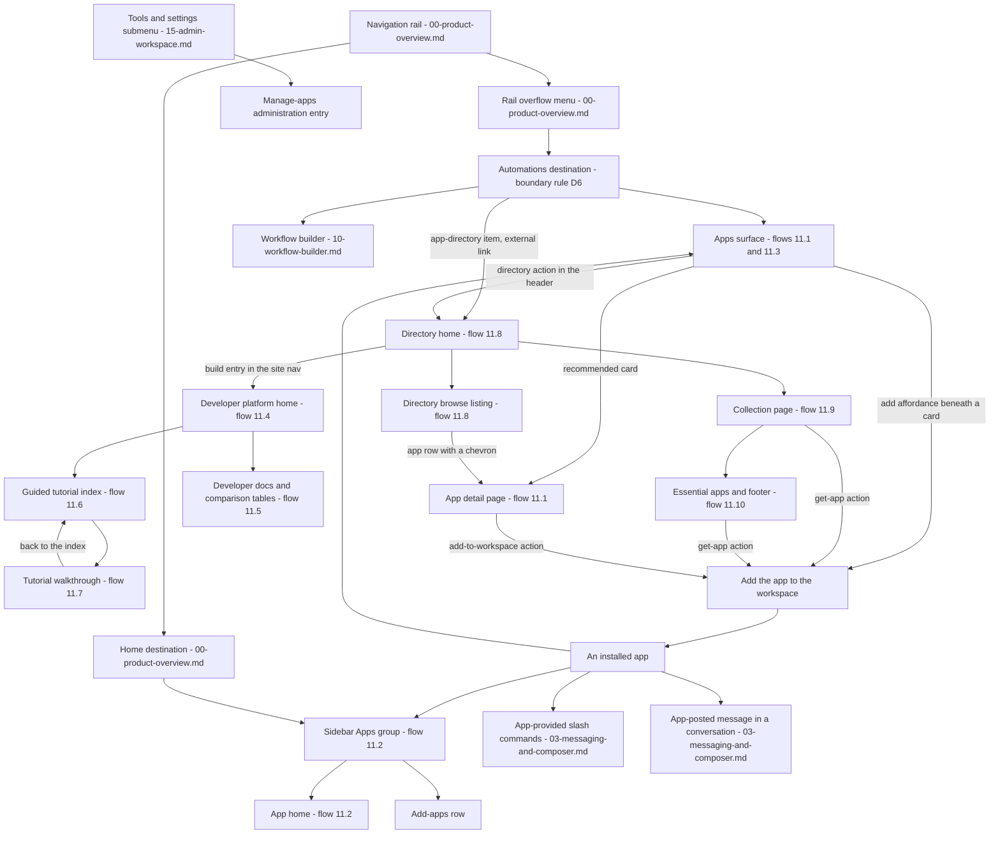

# Apps & Integrations

Third-party extensibility across three surfaces — the in-product apps destination and app home, the public app-directory site, and the developer-platform site — as specified for the [Workflow Catalog](README.md).

## Purpose

This document specifies how a workspace **finds, installs, uses and builds apps**. Three structurally different surfaces carry that domain in the corpus, and this document owns all three because their subject is the same:

1. **The in-product apps destination**, a routed surface inside the application shell that lists the apps installed in the workspace and recommends more [frame 368](../../screenshots/Slack%20web%20Jul%202024%20368.png), [frame 400](../../screenshots/Slack%20web%20Jul%202024%20400.png), together with the **app home** an installed app renders inside the shell [frame 372](../../screenshots/Slack%20web%20Jul%202024%20372.png).
2. **The app-directory site**, a separate browser site with its own top bar, its own navigation and its own catalogue of apps — a per-app detail page [frame 370](../../screenshots/Slack%20web%20Jul%202024%20370.png), a home and browse listing [frame 921](../../screenshots/Slack%20web%20Jul%202024%20921.png), [frame 923](../../screenshots/Slack%20web%20Jul%202024%20923.png), and curated collection pages [frame 925](../../screenshots/Slack%20web%20Jul%202024%20925.png).
3. **The developer-platform site**, a third browser site for the people who *write* apps: a marketing home [frame 883](../../screenshots/Slack%20web%20Jul%202024%20883.png), reference documentation with capability-comparison tables [frame 888](../../screenshots/Slack%20web%20Jul%202024%20888.png), a guided-tutorial index [frame 890](../../screenshots/Slack%20web%20Jul%202024%20890.png) and step-by-step tutorial pages [frame 893](../../screenshots/Slack%20web%20Jul%202024%20893.png).

**Where the area is encountered.** Inside the product it is reached from the navigation rail's overflow menu, whose automations destination renders a sidebar headed *Automations* containing an *Apps* item; on that surface the rail's more entry is the active destination [frame 368](../../screenshots/Slack%20web%20Jul%202024%20368.png), [frame 400](../../screenshots/Slack%20web%20Jul%202024%20400.png). It is also encountered without ever visiting that destination: the conversation sidebar carries an **Apps group** listing each installed app plus an add-apps row [frame 372](../../screenshots/Slack%20web%20Jul%202024%20372.png), an installed app contributes commands to the composer's slash typeahead [frame 203](../../screenshots/Slack%20web%20Jul%202024%20203.png), an app posts messages into a conversation under its own author identity [frame 120](../../screenshots/Slack%20web%20Jul%202024%20120.png), and workspace administration exposes a manage-apps entry [frame 567](../../screenshots/Slack%20web%20Jul%202024%20567.png). Outside the product, both browser sites are reachable in their own right — the directory site is captured signed out [frame 921](../../screenshots/Slack%20web%20Jul%202024%20921.png) as well as signed in [frame 370](../../screenshots/Slack%20web%20Jul%202024%20370.png).

**The automations boundary rule (deviation D6), restated in brief.** One rail destination fronts two domains, so the catalog draws a line rather than merging them: third-party app surfaces, the app directory, installed apps and app configuration belong **here**, while builder-authored automations — the builder itself, its tabs, triggers, steps, import and publish — belong to [10-workflow-builder.md](10-workflow-builder.md). The corpus shows both behind the one destination: the *Automations* sidebar lists a workflow-builder item and an app-directory item either side of the *Apps* item [frame 368](../../screenshots/Slack%20web%20Jul%202024%20368.png), and at another capture the same sidebar holds the *Apps* item alone [frame 400](../../screenshots/Slack%20web%20Jul%202024%20400.png). The canonical statement of the rule, with the rail destination map, lives in [00-product-overview.md](00-product-overview.md).

**What this document does not own.** Every reusable component contract is defined once in [00-product-overview.md](00-product-overview.md) and referenced here by identifier only. The composer and its slash typeahead, and the anatomy of a message row, belong to [03-messaging-and-composer.md](03-messaging-and-composer.md); the channel surface behind an app-posted message to [02-channels.md](02-channels.md); the workspace and administration menus to [15-admin-workspace.md](15-admin-workspace.md); the cross-cutting state matrix, including the full `C-UPGRADE-GATE` state set, to [21-states.md](21-states.md); and the marketing site proper to [17-marketing-site.md](17-marketing-site.md), which owns the pages whose subject is the product rather than its apps.

**Naming.** The corpus shows real third-party applications and vendors. Following the placeholder branding vocabulary defined in [00-product-overview.md](00-product-overview.md), every application is named **functionally** — a poll app, a cloud-drive app, a calendar app, a conferencing app, a standup app, the built-in assistant app, a design-collaboration app, and so on — and the product itself is written as **the product**. No third-party name, wordmark, mark or brand colour is carried forward as a requirement, and app description copy is paraphrased by function rather than transcribed.

## Flows in this area

Ten flows are named for this area, spanning 30 frames. The identifiers, names and spans are the ones published in the [Screenshot Coverage Index](_screenshot-index.md), so the two documents reconcile row for row. Frame spans below are written as plain numeric ranges because they designate a span rather than cite one image; every individual frame is cited with its full relative link in the per-flow step tables and in **Frames covered**.

| Flow ID | Name | Frame span | Primary entry point |
|---|---|---|---|
| `11.1` | Browse installed apps and an app-directory listing | 368–370 | The *Apps* item in the automations-scoped `C-SIDEBAR` |
| `11.2` | Open an app home surface | 372 | An app row in the Apps group of `C-SIDEBAR` |
| `11.3` | Review installed apps in the workspace | 400 | The *Apps* item in the automations-scoped `C-SIDEBAR` |
| `11.4` | Explore the developer-platform home | 883–886 | The developer-platform site, entered directly |
| `11.5` | Read the developer docs and feature-comparison tables | 887–889 | The docs entry in the developer-platform site bar |
| `11.6` | Browse developer tutorials | 890–892 | The tutorials entry in the developer-platform site bar |
| `11.7` | Follow a developer tutorial walkthrough | 893–896 | A tutorial card on the guided-tutorial index |
| `11.8` | Browse the app directory home and category listing | 921–924 | The app-directory action in the apps-surface header |
| `11.9` | Read an app-directory collection page | 925–929 | A collection row in the directory's left rail |
| `11.10` | Browse essential apps and the directory footer | 930–931 | Continued reading of a collection page |

Three of the ten run inside the product (`11.1` in part, `11.2`, `11.3`); the other seven run on the two browser sites. `11.1` is the only flow that crosses the boundary, and it crosses it in the direction a user actually travels: from the installed-apps list to the directory page of an app that list offered.

## Flow 11.1 — Browse installed apps and an app-directory listing

### Overview

The apps destination answers two questions on one page — what is installed, and what else could be — and then hands off to the directory site when the user wants the detail behind a recommendation. The journey runs from the surface as first rendered [frame 368](../../screenshots/Slack%20web%20Jul%202024%20368.png), through dismissing its explanatory block to reach the full recommended grid [frame 369](../../screenshots/Slack%20web%20Jul%202024%20369.png), to the directory's per-app detail page for one of the apps that grid offered [frame 370](../../screenshots/Slack%20web%20Jul%202024%20370.png). It is the flow that establishes the surface's whole layout contract, and the only flow in the corpus that shows where an app is actually added from.

### Trigger

The *Apps* item in the automations-scoped sidebar, rendered active for the whole flow's in-product portion [frame 368](../../screenshots/Slack%20web%20Jul%202024%20368.png). The sidebar is reached from the rail's overflow menu, whose automations destination is owned by [00-product-overview.md](00-product-overview.md).

### Preconditions

An authenticated session with the automations destination available in the rail's overflow menu. At this capture the workspace has exactly **one** app installed, the explanatory block has not yet been dismissed, the sidebar carries a discount offer with a two-day countdown in its banner slot, and the rail shows five destinations with no lists entry [frame 368](../../screenshots/Slack%20web%20Jul%202024%20368.png). **No entitlement badge is rendered on any control on this surface** [frame 368](../../screenshots/Slack%20web%20Jul%202024%20368.png). Per the entitlement obligation in [21-states.md](21-states.md) that is a statement about what is **drawn**, not about what is permitted: the absence of a badge is not an entitlement, and entitlement is not authorization. Whether this account may install an app is evaluated server-side at the moment it tries, and no capture in this area shows that evaluation.

### Frame-by-frame steps

| Step | Frame(s) | What the user does | What changes on screen | Component(s) involved |
|---|---|---|---|---|
| 1 | [frame 368](../../screenshots/Slack%20web%20Jul%202024%20368.png) | Opens the *Apps* item under the automations destination | The content region renders the apps surface as a single scrolling page: a header carrying the surface title at the left and an outlined app-directory action at the right; beneath it a full-width category search field whose placeholder invites searching by name or category and gives two parenthesised category examples; then a count line reading one app in the workspace with a labelled filter control at its right; then a dismissible promotional block; then one installed-app card; then a recommended-apps label and the first row of a three-column card grid. The rail's more entry renders active, and the sidebar's *Apps* item takes a filled highlight | `C-RAIL`, `C-SIDEBAR`, `C-SEARCH-ENTRY`, `C-BANNER` |
| 2 | [frame 368](../../screenshots/Slack%20web%20Jul%202024%20368.png) | Reads the installed card and the recommendations beneath it | The installed card carries an app mark, the app name and a two-line description and offers **no** action control. Each recommended card carries the same mark, name and description and adds a full-width outlined add affordance **beneath** the description, inside the card's own bounds. Long names and long descriptions are clamped with an ellipsis rather than wrapped indefinitely | `C-BANNER` |
| 3 | [frame 369](../../screenshots/Slack%20web%20Jul%202024%20369.png) | Dismisses the promotional block and scrolls the surface | The block and its illustration disappear; the header and the category search field hold their position while the content beneath them moves, so both are pinned rather than scrolled; the slot that held the count line now holds the recommended-apps label, with the filter control still at its right; the grid fills the page with fourteen recommended cards three to a row, the final row carrying two cards and leaving its third cell empty | `C-SIDEBAR`, `C-SEARCH-ENTRY` |
| 4 | [frame 370](../../screenshots/Slack%20web%20Jul%202024%20370.png) | Opens the directory listing for the poll app the grid offered | A browser page replaces the product entirely — no rail, no sidebar, no top bar. The app-directory site's own bar appears instead: the directory mark and wordmark at the left, a centred directory search field, a three-item nav with the browse entry active, then a workspace control carrying a workspace icon, the workspace name and a caret. The body is two columns: a narrow left column with a back-to-browse pill, a large app mark, a filled primary add-to-workspace action, an outlined learn-more action, and labelled metadata blocks; and a wide right column with the app name, a four-tab bar, a screenshot carousel and formatted marketing copy including a numbered three-step setup list | `C-TAB-BAR` |

**The add-to-workspace action lives on the directory page, not only in the product.** The primary action on the detail page's left column is an add action whose label names the product [frame 370](../../screenshots/Slack%20web%20Jul%202024%20370.png), and it is the same intent as the in-product add affordance beneath a recommended card [frame 368](../../screenshots/Slack%20web%20Jul%202024%20368.png), [frame 400](../../screenshots/Slack%20web%20Jul%202024%20400.png). A build therefore needs one install intent reachable from two surfaces.

**Permissions are a tab, not a consent step.** The detail page's tab bar carries exactly four tabs — a description tab rendered active and underlined, a features tab, a permissions tab and a security-and-compliance tab [frame 370](../../screenshots/Slack%20web%20Jul%202024%20370.png). The permissions tab's *contents* are not captured, and no authorization or consent screen appears anywhere in this area's frames.

**Observed metadata on the detail page**, in the left column's order: supported languages; pricing, stated as free and paid plans being available; a learn-more-and-support group of four glyph-led link rows — app support, the developer's own website carrying an external-link glyph, a support email address, and a privacy policy; then a categories group rendered as wrapping pill tags, five of which are visible before the viewport clips them [frame 370](../../screenshots/Slack%20web%20Jul%202024%20370.png).

**Inferred:** the control that made the transition at step 4 is not captured. Two candidate routes are both present on the preceding frames — the header's app-directory action [frame 368](../../screenshots/Slack%20web%20Jul%202024%20368.png) and a recommended card itself [frame 369](../../screenshots/Slack%20web%20Jul%202024%20369.png) — and the destination is a *per-app* page rather than the directory's home, which is what the header action's own label points at. The fewest-assumptions reading is therefore that a recommended card is itself a link to that app's directory page; the basis is the destination's specificity, not a captured click.

> **Partial capture:** the result of the add action is not shown on either surface. No frame shows an installation confirmation, an authorization or consent screen, a recommended card in a post-add state, or the surface re-rendered with the installed count incremented. A build must design the add outcome from the acceptance criteria below rather than from a captured screen.

## Flow 11.2 — Open an app home surface

### Overview

An installed app is not only a row in a list: it renders its own **home** inside the shell, framed by product chrome and filled with content the app supplies. Selecting the app's row in the sidebar's Apps group routes the content region to that home, which carries a three-tab bar, a row of app-provided actions, and a body of app-authored blocks including the app's own plan notice [frame 372](../../screenshots/Slack%20web%20Jul%202024%20372.png).

### Trigger

An app row inside the **Apps group** of the conversation sidebar. The row renders with a filled highlight while its home is open, and the rail's home destination — not the automations destination — is the active one, so an app home is a home-scoped surface rather than an automations-scoped one [frame 372](../../screenshots/Slack%20web%20Jul%202024%20372.png).

### Preconditions

An authenticated session with at least one app installed, so that the sidebar renders an Apps group at all. At this capture the group lists a poll app and a cloud-drive app followed by an add-apps row, the activity destination in the rail carries a numeric badge, and the sidebar carries the discount offer with its countdown and a trial item in its footer [frame 372](../../screenshots/Slack%20web%20Jul%202024%20372.png).

### Frame-by-frame steps

| Step | Frame(s) | What the user does | What changes on screen | Component(s) involved |
|---|---|---|---|---|
| 1 | [frame 372](../../screenshots/Slack%20web%20Jul%202024%20372.png) | Selects the poll app's row in the sidebar's Apps group | The row takes a filled highlight and the content region renders the app's home: a header carrying the app's mark, the app's name and a caret, then a three-tab bar whose first tab is active and underlined | `C-SIDEBAR`, `C-AVATAR`, `C-TAB-BAR` |
| 2 | [frame 372](../../screenshots/Slack%20web%20Jul%202024%20372.png) | Reads the action row beneath the tabs | Six controls sit in one row: three app-action buttons each with a leading glyph — create a poll, create a survey, capture a decision — followed by three plain controls for help, feedback and the app's own web dashboard. The first of the six is rendered with a distinct filled treatment, marking it as the surface's primary action | `C-TAB-BAR` |
| 3 | [frame 372](../../screenshots/Slack%20web%20Jul%202024%20372.png) | Reads the body the app supplies | A welcome line sits at the left with a view-selector select control at the far right of the same line; beneath it a getting-started sentence with an inline link; then a plan notice stating the workspace is on the app's free tier with an inline upgrade link; then app-authored blocks — a bold heading, paragraphs, a primary action, a second heading, a bulleted list, a use-a-template action, and further headings and bulleted lists with bold lead-ins — clipped by the foot of the viewport | `C-UPGRADE-GATE` |

**The frame is a product frame around app content.** Header, tab bar and the sidebar around it are product chrome; everything below the action row is content the app decides — headings, paragraphs, bulleted lists, buttons and inline links [frame 372](../../screenshots/Slack%20web%20Jul%202024%20372.png). That division is the buildable requirement: the product owns the frame and the block vocabulary, the app owns the composition.

**Inferred:** the plan notice belongs to the **app's own** pricing tiers rather than to the workspace's plan, because the same app's directory listing states that it offers free and paid plans [frame 370](../../screenshots/Slack%20web%20Jul%202024%20370.png) and the notice is rendered inside app-supplied content rather than in product chrome [frame 372](../../screenshots/Slack%20web%20Jul%202024%20372.png). It is therefore an instance of an app-rendered upsell, distinct from the product's own `C-UPGRADE-GATE` instances in the same frame's sidebar.

> **Partial capture:** only the first of the three tabs is captured. The messages and about tabs are named but never opened, so their contents are not specified here. Nor is any app configuration or app-settings surface captured, and no frame in this area shows an app being removed or reconfigured.

## Flow 11.3 — Review installed apps in the workspace

### Overview

The same apps destination at a second, later capture, with two apps installed instead of one — the flow a user runs to audit what the workspace has added and to see what is still recommended [frame 400](../../screenshots/Slack%20web%20Jul%202024%20400.png). It matters disproportionately for a build because it renders the identical surface in a **single full-width column** where the earlier capture rendered a three-column grid, and because it is the frame that fixes the add affordance's position beneath its row rather than inline at the row's right edge.

### Trigger

The *Apps* item in the automations-scoped sidebar, which at this capture is the sidebar's **only** item [frame 400](../../screenshots/Slack%20web%20Jul%202024%20400.png).

### Preconditions

An authenticated session with two apps installed. At this capture the sidebar's header is a bare title with no controls beside it, there is no offer banner in the sidebar's banner slot, and the rail carries six destinations including a lists entry — a materially different workspace state from the one flow `11.1` was captured in [frame 400](../../screenshots/Slack%20web%20Jul%202024%20400.png).

### Frame-by-frame steps

| Step | Frame(s) | What the user does | What changes on screen | Component(s) involved |
|---|---|---|---|---|
| 1 | [frame 400](../../screenshots/Slack%20web%20Jul%202024%20400.png) | Opens the *Apps* item under the automations destination | The content region renders the apps surface with the same four stacked controls as before — title and app-directory action, category search field, count line with filter control, dismissible promotional block — above the installed and recommended sections. The rail's more entry renders active and the sidebar's single item takes a filled highlight | `C-RAIL`, `C-SIDEBAR`, `C-SEARCH-ENTRY`, `C-BANNER` |
| 2 | [frame 400](../../screenshots/Slack%20web%20Jul%202024%20400.png) | Reads the count line and the installed list | The count line states two apps in the workspace, and exactly two installed rows are rendered beneath — a poll app described as building team culture through polls and surveys, and a cloud-drive app described as notifying the workspace about files held in that drive. The two rows sit inside one bordered container separated by a hairline rule, each row carrying an app mark, the name and a one-line description, and neither carrying an action control | `C-AVATAR` |
| 3 | [frame 400](../../screenshots/Slack%20web%20Jul%202024%20400.png) | Reads the recommended section | A muted recommended-apps label separates the sections, then two recommended cards follow — a calendar app and a conferencing app — each carrying a mark, a name, a one-line description and, **beneath** the description rather than inline at its right, a full-width outlined add affordance spanning the card's inner width. The second card's add affordance sits at the foot of the viewport, which clips whatever follows it | `C-AVATAR` |

**Recorded, not reconciled: the same surface renders two different layouts.** At this capture the installed rows and the recommended cards each occupy one full-width column across the content region, while at [frame 368](../../screenshots/Slack%20web%20Jul%202024%20368.png) and [frame 369](../../screenshots/Slack%20web%20Jul%202024%20369.png) the identical sections render as three equal columns — and the content region is the same proportion of the viewport in all three frames. The sidebar differs in the same direction: one bare-titled item here, three items and a header control there. The captures were evidently taken from different workspace states or different releases; the record of what each shows is left as it is, and a build must treat the column count as a property it chooses rather than as a fact the corpus settles.

**The count and the list agree in both captures** — one app counted and one installed card rendered [frame 368](../../screenshots/Slack%20web%20Jul%202024%20368.png), two counted and two rendered [frame 400](../../screenshots/Slack%20web%20Jul%202024%20400.png) — and in both the count is scoped to the workspace by name.

**Inferred:** the count reflects only apps installed in the workspace and not the recommendations, because it is rendered above the installed list and below the search field, is separated from the recommended section by that section's own label, and equals the installed row count while several more recommended cards are on screen [frame 368](../../screenshots/Slack%20web%20Jul%202024%20368.png), [frame 400](../../screenshots/Slack%20web%20Jul%202024%20400.png).

> **Partial capture:** the filter control is never opened, so its options are not specified; the category search field is never shown holding a query or rendering results; and no frame shows this surface for a workspace with no apps installed, so the surface's empty state is unspecified.

## Flow 11.4 — Explore the developer-platform home

### Overview

A third site, aimed at the people who write apps rather than install them. Its home page is a long marketing read: a hero, three explanatory sections built from illustrated columns, two full-width promotional bands, a gallery of sample apps, and a dated changelog above the site footer [frame 883](../../screenshots/Slack%20web%20Jul%202024%20883.png) through [frame 886](../../screenshots/Slack%20web%20Jul%202024%20886.png). The flow is one continuous downward read of a single page, which is why four frames that repaint almost the whole viewport belong to one journey.

### Trigger

The developer-platform site, entered directly — the corpus captures the page already loaded [frame 883](../../screenshots/Slack%20web%20Jul%202024%20883.png).

**Inferred:** the in-corpus route into this site is the build entry in the app-directory site's navigation, because that entry is the only captured control anywhere in this area that names building apps [frame 921](../../screenshots/Slack%20web%20Jul%202024%20921.png) and this site is the only captured surface for building them [frame 883](../../screenshots/Slack%20web%20Jul%202024%20883.png). The transition itself is not captured.

### Preconditions

A browser. The site bar carries a search field and a four-item navigation — documentation, tutorials, a developer programme and the reader's own apps — and **no** sign-in or create-account control at any captured scroll position, so no authentication state is evidenced for this site [frame 883](../../screenshots/Slack%20web%20Jul%202024%20883.png), [frame 886](../../screenshots/Slack%20web%20Jul%202024%20886.png).

### Frame-by-frame steps

| Step | Frame(s) | What the user does | What changes on screen | Component(s) involved |
|---|---|---|---|---|
| 1 | [frame 883](../../screenshots/Slack%20web%20Jul%202024%20883.png) | Arrives at the developer-platform home | A site bar spans the top: the platform's mark and wordmark at the left, a search field with a leading magnifier glyph left of centre, and the four navigation entries at the right. Beneath it a full-width hero band in the primary brand color, patterned with decorative rounded shapes, carries a two-line headline, a one-line sub-line and two actions side by side — a filled light get-started action and an outlined explore-samples action | `C-SEARCH-ENTRY` |
| 2 | [frame 883](../../screenshots/Slack%20web%20Jul%202024%20883.png) | Reads the first explanatory section | On the default surface below the hero: a section heading, a one-line sub-line, then three equal illustrated columns. Each column stacks an isometric illustration, a link-coloured title naming one platform building block, and two paragraphs whose key terms are emboldened | Platform site marketing section — three illustrated columns; area-local structure, see **Screens & components** |
| 3 | [frame 884](../../screenshots/Slack%20web%20Jul%202024%20884.png) | Scrolls to the next section | The site bar holds its position while the body advances. A second three-column section repeats the pattern for three tooling subjects. Beneath it a full-width band in the primary brand color carries a heading, a two-line body and a filled light action at the left, and a large illustration of a composed interface at the right. A circular back-to-top control appears pinned at the bottom-right of the viewport and stays for the rest of the site | Platform site bar, marketing section and promotional band — area-local structures, see **Screens & components** |
| 4 | [frame 885](../../screenshots/Slack%20web%20Jul%202024%20885.png) | Continues into the samples gallery | A be-inspired section renders four sample-app cards in one row on a tinted card background. Each card carries a link-coloured title, a source-repository glyph at its top-right corner, a description, and at its foot a small square language badge beside an underlined view-tutorial link. Below the row, a band on a warm neutral background carries a heading, a sub-line and a filled light action at the left with a product screenshot mock at the right | `C-RECORD-CARD` |
| 5 | [frame 886](../../screenshots/Slack%20web%20Jul%202024%20886.png) | Reads to the foot of the page | A changelog section lists six dated entries; each entry pairs a muted date column at the left with a coloured vertical rule and then body copy carrying monospace inline code chips and inline links. An outlined view-full-changelog action closes the list. Beneath a hairline rule the site footer renders the product mark beside policy links — including a privacy-choices link carrying a small toggle-style badge — then three glyph-led rows for subscribing to the changelog, joining the platform community and contacting developer support | Changelog section — area-local structure, see **Screens & components** |

**The changelog encodes an entry's category as the colour of its rule.** Four of the six entries carry a success-coloured rule and two carry a destructive-coloured rule, and the two destructive-coloured entries are the ones whose copy concerns something being retired rather than released [frame 886](../../screenshots/Slack%20web%20Jul%202024%20886.png). A build renders that classification as a colour token on the rule, taking the tokens from its own palette.

**The language badge on a sample card is a two-letter tile**, and the value observed on all four cards is the same one — which is consistent with the catalog's own build constraint of a typed web language, and is recorded here as an observation about the card's shape rather than as a requirement about any language [frame 885](../../screenshots/Slack%20web%20Jul%202024%20885.png).

**This page has no page-feedback question.** Its footer carries policy links and the three support rows and nothing else [frame 886](../../screenshots/Slack%20web%20Jul%202024%20886.png), which is what makes the two different feedback widgets on the documentation pages worth recording — see **Edge cases & validations**.

## Flow 11.5 — Read the developer docs and feature-comparison tables

### Overview

The documentation section of the same site, entered from the site bar. It introduces a two-region reading layout — a deep navigation tree at the left and a wide content column at the right — and it is where the corpus shows a **capability-comparison table** whose cells mix ticks, absences, plan words and prose [frame 887](../../screenshots/Slack%20web%20Jul%202024%20887.png) through [frame 889](../../screenshots/Slack%20web%20Jul%202024%20889.png).

### Trigger

The documentation entry in the developer-platform site bar [frame 887](../../screenshots/Slack%20web%20Jul%202024%20887.png).

### Preconditions

A browser on the developer-platform site. No authentication is evidenced; the pages render fully with no sign-in prompt [frame 887](../../screenshots/Slack%20web%20Jul%202024%20887.png).

### Frame-by-frame steps

| Step | Frame(s) | What the user does | What changes on screen | Component(s) involved |
|---|---|---|---|---|
| 1 | [frame 887](../../screenshots/Slack%20web%20Jul%202024%20887.png) | Opens the documentation overview | The page renders in two regions: a navigation tree occupying roughly a fifth of the width on a tinted panel, and a content column filling the remainder. The tree opens with a platform root row, then rule-separated groups under small-caps headings; leaf rows carry a leading glyph, and rows with children carry a trailing chevron | Platform site bar, documentation navigation tree and content column — area-local structures, see **Screens & components** |
| 2 | [frame 887](../../screenshots/Slack%20web%20Jul%202024%20887.png) | Reads the overview page | A page heading, an introductory paragraph with inline links, then sections each pairing a heading with paragraphs, a can-do bulleted list and — for one section — an explicit cannot-do bulleted list. Inline code tokens are rendered as monospace chips inside the prose | Documentation content column — area-local structure, see **Screens & components** |
| 3 | [frame 888](../../screenshots/Slack%20web%20Jul%202024%20888.png) | Opens the feature-comparison page | The navigation tree scrolls to a different part of itself, revealing administration, reference and translated-content groups, one of whose rows carries a flag glyph beside a label in a non-Latin script. The content column renders a page heading, two paragraphs and an italic line, then an information call-out — a tinted block with a leading information glyph and a coloured left rule — stating that developing automations requires a paid plan and linking a programme that provisions a sandbox at no cost | `C-BANNER` |
| 4 | [frame 888](../../screenshots/Slack%20web%20Jul%202024%20888.png) | Reads the development comparison table | Under a section heading, a table renders a header row on a tinted background with six columns: a goal-or-feature column, three link-coloured capability columns naming the ways an automation can be built, a link-coloured minimum-plan column, and a details column. Body rows alternate between two background tints, and cells carry one of four content types — a tick glyph, a hyphen, a plan word, or prose with inline links | `C-DATA-TABLE` |
| 5 | [frame 889](../../screenshots/Slack%20web%20Jul%202024%20889.png) | Scrolls to the end of the page | The first table's remaining rows complete, then a second table renders under a security heading with the identical six-column structure and five rows. A closing paragraph with an inline link follows, then the site footer. The navigation region is **blank** at this scroll position, so the tree scrolls with the page rather than sticking | `C-DATA-TABLE` |

**The comparison table's cell taxonomy is the buildable part.** Four cell types are observed and all four must render distinctly: a tick glyph for supported, a hyphen for not supported, a plan word for the minimum entitlement, and prose with inline links for the caveat [frame 888](../../screenshots/Slack%20web%20Jul%202024%20888.png), [frame 889](../../screenshots/Slack%20web%20Jul%202024%20889.png). A hyphen is used rather than an empty cell, so absence is stated rather than implied.

**Inferred:** the minimum-plan column's values are the same entitlement vocabulary the product uses elsewhere, because the call-out immediately above the table states the paid-plan requirement in prose and the column restates it per row [frame 888](../../screenshots/Slack%20web%20Jul%202024%20888.png). The catalog refers to these values as plan tiers rather than by the names printed in the frame.

> **Partial capture:** no navigation-tree row is captured in an expanded state on this page, so the tree's expansion behaviour is specified from the tutorial page instead — see flow `11.7`. Neither the site search nor any translated variant of a page is captured with results.

## Flow 11.6 — Browse developer tutorials

### Overview

The tutorial index: a faceted filter panel above a colour-coded card grid, followed by an archive of previously featured tutorials and a set of grouped video lists [frame 890](../../screenshots/Slack%20web%20Jul%202024%20890.png) through [frame 892](../../screenshots/Slack%20web%20Jul%202024%20892.png). The grid's own colour is a data channel: it encodes the tutorial's difficulty level, which each card also states in words.

### Trigger

The tutorials entry in the developer-platform site bar [frame 890](../../screenshots/Slack%20web%20Jul%202024%20890.png).

### Preconditions

A browser on the developer-platform site, with the same navigation tree rendered at the left as the documentation pages use [frame 890](../../screenshots/Slack%20web%20Jul%202024%20890.png).

### Frame-by-frame steps

| Step | Frame(s) | What the user does | What changes on screen | Component(s) involved |
|---|---|---|---|---|
| 1 | [frame 890](../../screenshots/Slack%20web%20Jul%202024%20890.png) | Opens the guided-tutorial index | The content column renders a page heading, then a filter panel on a tinted block: a panel heading, a hairline rule, and three labelled facet groups rendered as wrapping rows of pill chips — six use-case chips, thirteen feature chips across two rows, and three level chips. Every chip renders unselected | `C-FILTER-CHIP` |
| 2 | [frame 890](../../screenshots/Slack%20web%20Jul%202024%20890.png) | Reads the card grid beneath the panel | Tutorial cards render three to a row on solid coloured backgrounds. Each card stacks a level marker — a small filled dot beside the level word — above a hairline rule, then a bold title, then a description. The grid and the panel above it end short of the content region's right edge, leaving an empty right margin | `C-RECORD-CARD` |
| 3 | [frame 891](../../screenshots/Slack%20web%20Jul%202024%20891.png) | Scrolls through the grid | Further rows render in two more card colours, and the level word on each card changes with the colour, so difficulty is encoded twice — once as a colour and once as text. Cards in the same row share a height while heights differ between rows. The navigation region is blank at this scroll position | `C-RECORD-CARD` |
| 4 | [frame 892](../../screenshots/Slack%20web%20Jul%202024%20892.png) | Reads past the grid to the end of the page | A previously-featured section lists three rule-separated rows, each pairing a left column of author name above date with a right column of link-coloured title, description and a trailing read-more link. A videos section follows: a lead sentence, then a bulleted list of linked video titles each followed by its duration in parentheses; then a second lead sentence carrying an inline link and a second such list | Previously-featured rows and videos section — area-local structures, see **Screens & components** |

**Inferred:** the three facet groups filter the grid below them, because they sit inside a panel whose own heading names filtering and immediately precede the grid [frame 890](../../screenshots/Slack%20web%20Jul%202024%20890.png). No frame shows a chip selected or a filtered result set, so the filtering behaviour, the selected-chip treatment and whether the facets combine are not evidenced.

> **Partial capture:** no chip is captured in a selected state, no filtered grid is captured, and no clear-all control is visible in the panel. A build must design the applied-filter state from the chip contract in [00-product-overview.md](00-product-overview.md) rather than from a frame here.

## Flow 11.7 — Follow a developer tutorial walkthrough

### Overview

One tutorial, read end to end. It introduces the area's richest layout — a three-column page with a navigation tree at the left, the tutorial at the centre and a sticky on-this-page rail at the right — and a **collapsible step card** whose header, body, code blocks and completion strip form a repeatable contract [frame 893](../../screenshots/Slack%20web%20Jul%202024%20893.png) through [frame 896](../../screenshots/Slack%20web%20Jul%202024%20896.png).

### Trigger

A tutorial card on the guided-tutorial index [frame 890](../../screenshots/Slack%20web%20Jul%202024%20890.png), [frame 891](../../screenshots/Slack%20web%20Jul%202024%20891.png). The tutorial page also names its own route back, as a link to the index directly beneath its heading [frame 893](../../screenshots/Slack%20web%20Jul%202024%20893.png).

### Preconditions

A browser on the developer-platform site. The tutorial states its own prerequisites in prose — a command-line tool installed, and the workspace listed by that tool — and carries the same paid-plan call-out the comparison page carries, so a paid plan or a provisioned sandbox is a precondition of *doing* the tutorial rather than of reading it [frame 893](../../screenshots/Slack%20web%20Jul%202024%20893.png).

### Frame-by-frame steps

| Step | Frame(s) | What the user does | What changes on screen | Component(s) involved |
|---|---|---|---|---|
| 1 | [frame 893](../../screenshots/Slack%20web%20Jul%202024%20893.png) | Opens a tutorial from the index | Three regions render. The navigation tree at the left is now expanded two levels deep, with the group holding the tutorials open and the current tutorial's own leaf rendered active in the link colour and emboldened. The centre column carries the tutorial heading, a level marker in the level's own colour, a link back to the index, a hairline rule, the paid-plan information call-out, introductory paragraphs with inline links, a tip line prefixed by a sparkle glyph, a numbered three-part breakdown and a prerequisites bulleted list containing an inline code token. A rail at the right carries an on-this-page heading above seven section links against a vertical rule, then a promotional card with a coloured left rule, a heading and a body paragraph with an inline link | `C-BANNER`, `C-DETAILS-PANE` |
| 2 | [frame 894](../../screenshots/Slack%20web%20Jul%202024%20894.png) | Scrolls into the numbered steps | Step cards render one after another. Each is a bordered card with a coloured rule along its top edge; a tinted header region carries a small step-number line above the step title with a disclosure chevron at the right and an introductory paragraph beneath; the body sits on the default surface and holds a link-coloured sub-heading, a hairline rule, paragraphs with inline links, sub-headings and code blocks; and a tinted footer strip closes the card with a check glyph beside a step-complete line. The right-hand rail holds its position exactly | `C-DATA-TABLE` |
| 3 | [frame 894](../../screenshots/Slack%20web%20Jul%202024%20894.png) | Reads a command in a code block | A code block renders as a tinted panel with a line-number gutter at its left and monospace content at its right. A single-line command longer than the panel is **clipped at the panel's right edge** rather than wrapped, so its tail is not readable in this state | `C-DATA-TABLE` |
| 4 | [frame 895](../../screenshots/Slack%20web%20Jul%202024%20895.png) | Collapses the first step and reads the second | The first card loses its body and its completion strip, leaving only the tinted header with its step number and title; its chevron now points **up**. The second card is expanded, its chevron points **down**, and its body renders a twenty-line syntax-highlighted configuration block whose gutter numbers every line including the blank ones | Step card — area-local structure, see **Screens & components** |
| 5 | [frame 896](../../screenshots/Slack%20web%20Jul%202024%20896.png) | Reads the closing step and the page foot | The penultimate card's completion strip is followed by the final card, which carries a what's-next sub-heading, congratulation copy, a next-steps sub-heading with a suggestion link, and its own completion strip. Beneath the cards a page-feedback question renders with two filled actions, yes and no, then the site footer's policy row | Step card, page-feedback block and site footer — area-local structures, see **Screens & components** |

**The on-this-page rail mirrors the step list exactly.** Its seven links carry the same titles as the seven step cards, in the same order, and the rail is pinned at an identical position across all four frames while the page scrolls beneath it [frame 893](../../screenshots/Slack%20web%20Jul%202024%20893.png), [frame 894](../../screenshots/Slack%20web%20Jul%202024%20894.png), [frame 895](../../screenshots/Slack%20web%20Jul%202024%20895.png), [frame 896](../../screenshots/Slack%20web%20Jul%202024%20896.png). The navigation tree at the left, by contrast, scrolls away [frame 889](../../screenshots/Slack%20web%20Jul%202024%20889.png), [frame 891](../../screenshots/Slack%20web%20Jul%202024%20891.png) — the two side regions behave differently and must be built differently.

**Gotcha — the disclosure chevron points the opposite way from the common convention.** An expanded step renders a **downward** chevron and a collapsed step an **upward** one [frame 894](../../screenshots/Slack%20web%20Jul%202024%20894.png), [frame 895](../../screenshots/Slack%20web%20Jul%202024%20895.png). This is recorded exactly as observed; a build that assumes the usual direction will invert it.

**Inferred:** the completion strip is a static end-of-step marker rather than an interactive control, because it renders identically on every step card including the collapsed-then-expanded pair, carries no checkbox and no label change between frames, and appears on the final step too [frame 894](../../screenshots/Slack%20web%20Jul%202024%20894.png), [frame 896](../../screenshots/Slack%20web%20Jul%202024%20896.png).

> **Partial capture:** the tutorial's middle steps are not captured in full — the corpus shows step one, step two, the tail of step six and step seven — so the intervening step bodies are not specified. The feedback actions are never captured in a submitted state.

## Flow 11.8 — Browse the app directory home and category listing

### Overview

The public catalogue of apps, on its own site. The home page pairs a promotional hero with a curated body — staff picks, collections and categories in a left rail, and search, featured cards and themed card sections in the main column — and the browse page turns the same catalogue into a sortable, paginated list of rows [frame 921](../../screenshots/Slack%20web%20Jul%202024%20921.png) through [frame 924](../../screenshots/Slack%20web%20Jul%202024%20924.png).

### Trigger

The app-directory action at the right of the in-product apps-surface header [frame 368](../../screenshots/Slack%20web%20Jul%202024%20368.png), [frame 400](../../screenshots/Slack%20web%20Jul%202024%20400.png). The automations-scoped sidebar offers a second route to the same site: an app-directory item carrying an external-link glyph, which marks it as leaving the application [frame 368](../../screenshots/Slack%20web%20Jul%202024%20368.png).

### Preconditions

A browser. At these captures the site is **signed out**: its bar carries a sign-in link and an outlined create-workspace action where the signed-in capture of the same site carries a workspace control instead [frame 921](../../screenshots/Slack%20web%20Jul%202024%20921.png) versus [frame 370](../../screenshots/Slack%20web%20Jul%202024%20370.png). The catalogue is fully readable in that state — nothing on these pages is gated behind signing in.

### Frame-by-frame steps

| Step | Frame(s) | What the user does | What changes on screen | Component(s) involved |
|---|---|---|---|---|
| 1 | [frame 921](../../screenshots/Slack%20web%20Jul%202024%20921.png) | Arrives at the app-directory home | A site bar spans the top with the directory's mark and wordmark at the left and, at the right, a three-item nav — browse, manage, build — then a sign-in link and an outlined create-workspace action. Beneath it a hero renders in two halves: at the left a headline, a two-line sub-line and a filled primary get-essential-apps action beside a decorative paper-plane illustration; at the right a vertical stack of three app-mark tiles beside a message-preview mock carrying an avatar, a person's line and an app-posted item update with a labelled status field | `C-AVATAR` |
| 2 | [frame 921](../../screenshots/Slack%20web%20Jul%202024%20921.png) | Reads past the hero into the catalogue | A full-width divider separates hero from body: eight equal segments, each one-eighth of the page width, cycling a five-colour accent sequence. Below it the page becomes two columns. The left rail carries a staff-picks heading over eight link rows and a collections heading over further link rows. The main column carries a wide find-an-app search field, then three large featured cards — each a tinted image tile with the app mark centred and a bold name beneath, wrapping to two lines where it must — then a themed section whose heading is paired with a right-aligned see-all link above a three-column row of compact cards | `C-SEARCH-ENTRY`, `C-RECORD-CARD` |
| 3 | [frame 922](../../screenshots/Slack%20web%20Jul%202024%20922.png) | Scrolls the home page | The site bar holds its position. The left rail completes its collections list, then adds a categories heading over nineteen link rows, then a hairline rule and an explore-partner-offers link carrying an external-link glyph. The main column renders four further themed sections, each with the same heading-plus-see-all pattern over a three-column grid of compact cards whose names clamp with an ellipsis; the sections carry different numbers of rows, from one to two | `C-RECORD-CARD` |
| 4 | [frame 923](../../screenshots/Slack%20web%20Jul%202024%20923.png) | Opens a listing from the left rail | The site bar now carries a centred directory search field alongside the same nav and auth controls. In the left rail the opened entry renders as a **filled** selected row while its siblings stay plain. The main column renders a page heading, the three featured cards again, then a sort-by label beside a select control showing a popularity value, then a bordered list container of app rows — each row an app mark, a bold name, an inline muted description and a chevron at the row's right edge, rows separated by hairline rules | `C-SEARCH-ENTRY`, `C-DROPDOWN-MENU` |
| 5 | [frame 924](../../screenshots/Slack%20web%20Jul%202024%20924.png) | Scrolls to the end of the listing | Twelve further app rows render and the container closes. A filled primary next action sits right-aligned beneath it, with **no** previous control and no page numbers. The left rail region is blank at this scroll position, so it scrolls with the page | `C-PAGER` |

**The directory's own search is distinct from the in-product category search.** The site's bar-mounted field is scoped to the directory [frame 923](../../screenshots/Slack%20web%20Jul%202024%20923.png), the home page's body field invites finding an app or a service already in use [frame 921](../../screenshots/Slack%20web%20Jul%202024%20921.png), and the in-product field searches by name or category within the workspace's own surface [frame 400](../../screenshots/Slack%20web%20Jul%202024%20400.png). Three fields, three scopes, one component contract — `C-SEARCH-ENTRY`.

**Recorded, not reconciled: the site bar varies along two independent axes.** The auth controls change between a sign-in link with a create-workspace action [frame 921](../../screenshots/Slack%20web%20Jul%202024%20921.png) and a workspace control naming the signed-in workspace [frame 370](../../screenshots/Slack%20web%20Jul%202024%20370.png); and the centred search field is absent on the home page [frame 921](../../screenshots/Slack%20web%20Jul%202024%20921.png) but present on the browse, collection and detail pages [frame 923](../../screenshots/Slack%20web%20Jul%202024%20923.png), [frame 925](../../screenshots/Slack%20web%20Jul%202024%20925.png), [frame 370](../../screenshots/Slack%20web%20Jul%202024%20370.png). The two axes vary independently in the corpus and are recorded that way rather than collapsed into one rule.

**Inferred:** the three curated groupings in the left rail are three different kinds of list rather than one, because they carry three separate headings and the middle group's entries are also the subject of their own pages [frame 922](../../screenshots/Slack%20web%20Jul%202024%20922.png), [frame 925](../../screenshots/Slack%20web%20Jul%202024%20925.png), while the first group's entries name the themed sections that appear in the main column [frame 921](../../screenshots/Slack%20web%20Jul%202024%20921.png), [frame 923](../../screenshots/Slack%20web%20Jul%202024%20923.png).

> **Partial capture:** the manage entry in the site nav is never opened, so whatever it leads to is unspecified. No second page of the listing is captured — only the control that would fetch it — and no sort order other than the default is captured. The directory search is never captured holding a query or rendering results.

## Flow 11.9 — Read an app-directory collection page

### Overview

A collection is an editorial page that sells several apps as one story: a centred hero, then alternating capability blocks each ending in a get-app row, then a three-state product-mock carousel that shows the apps at work [frame 925](../../screenshots/Slack%20web%20Jul%202024%20925.png) through [frame 929](../../screenshots/Slack%20web%20Jul%202024%20929.png). It is the corpus's clearest evidence that an app belongs to a curated collection as well as to a category.

### Trigger

A collection row in the directory's left rail — the rail lists collections by name, and one of the names it lists is the suite this page is about [frame 922](../../screenshots/Slack%20web%20Jul%202024%20922.png), [frame 925](../../screenshots/Slack%20web%20Jul%202024%20925.png). The page also carries its own route back: an outlined back-to-browse pill at its top-left [frame 925](../../screenshots/Slack%20web%20Jul%202024%20925.png).

### Preconditions

A browser on the directory site, signed out, with the bar's centred search field present [frame 925](../../screenshots/Slack%20web%20Jul%202024%20925.png).

### Frame-by-frame steps

| Step | Frame(s) | What the user does | What changes on screen | Component(s) involved |
|---|---|---|---|---|
| 1 | [frame 925](../../screenshots/Slack%20web%20Jul%202024%20925.png) | Opens a collection page | The two-column catalogue layout is replaced by a single centred column. An outlined back-to-browse pill with a leading chevron sits at the top-left. The hero centres a headline, a two-line sub-line and a large illustration of app tiles wired to a central product panel, over a background carrying faint diagonal line work. A centred bold section heading follows, then the first capability block begins | Directory site bar, collection-page back pill and hero — area-local structures, see **Screens & components** |
| 2 | [frame 926](../../screenshots/Slack%20web%20Jul%202024%20926.png) | Reads the capability blocks | Each block is two columns. The text column stacks a bold sub-heading, a paragraph, a bold lead line introducing what the app can do, and a three-item bulleted list, and closes with an app row — mark, bold name, two-line description and an outlined get-app action at the **row's right**. The other column carries a screenshot mock. Blocks are separated by hairline rules and **alternate** their column order, so the second block puts its mock at the left and its text at the right | `C-AVATAR` |
| 3 | [frame 927](../../screenshots/Slack%20web%20Jul%202024%20927.png) | Reaches the closer-look section | A centred section heading sits above a three-panel carousel: the centre panel is a full product mock — a sidebar beside a conversation whose first message carries an email unfurl with sender, recipient and subject rows, body copy and an attachment card — and it is flanked left and right by dimmed, partially visible panels. A caption card beneath the centre panel carries two centred lines. No carousel controls are visible in this state | `C-RECORD-CARD` |
| 4 | [frame 928](../../screenshots/Slack%20web%20Jul%202024%20928.png) | Moves onto the carousel | Circular previous and next controls appear, overlaying the flanking panels at the centre panel's left and right edges and vertically centred on it. Nothing else on the page changes: the slide, its caption and the sections around it are pixel-for-pixel what they were | `C-CONTENT-CAROUSEL` |
| 5 | [frame 929](../../screenshots/Slack%20web%20Jul%202024%20929.png) | Advances the carousel | The centre panel now mocks a different surface — an app conversation with a two-tab bar and an app-posted event invitation carrying an app badge beside the app's name, a linked event title, four labelled field rows, a going question with three response actions, then a conflict block against a destructive-coloured left rule listing two clashing events and a view-in-app link, and a composer addressed to the app. The caption card's copy changes to match, and the carousel controls are no longer visible | `C-CONTENT-CAROUSEL` |

**Inferred:** the carousel controls are revealed by pointing at the carousel, because the frame that shows them is otherwise identical to the frame that does not — the two differ only by the presence of the two controls — and they are absent again once the carousel has advanced [frame 927](../../screenshots/Slack%20web%20Jul%202024%20927.png), [frame 928](../../screenshots/Slack%20web%20Jul%202024%20928.png), [frame 929](../../screenshots/Slack%20web%20Jul%202024%20929.png).

**The mocks are marketing artwork, not product captures.** They are evidence of what this page renders, and only that; the product surfaces they depict are specified by the area documents that own them — the conversation by [03-messaging-and-composer.md](03-messaging-and-composer.md), and the unfurl by [16-files-media.md](16-files-media.md), which is its **single named owner** — and which records that this mock is the corpus's only depiction of an unfurl, that no product capture shows one, and that what it therefore carries is the security contract a build must satisfy rather than an anatomy read from the pixels, the shell around them by [00-product-overview.md](00-product-overview.md). One difference is worth recording because a build could otherwise take the mock as authoritative: the mocked app conversation carries a **two**-tab bar [frame 929](../../screenshots/Slack%20web%20Jul%202024%20929.png) where the real app home carries **three** tabs [frame 372](../../screenshots/Slack%20web%20Jul%202024%20372.png), and the mocked app-posted message carries an app badge [frame 929](../../screenshots/Slack%20web%20Jul%202024%20929.png) where the captured app-posted message carries a workflow badge [frame 120](../../screenshots/Slack%20web%20Jul%202024%20120.png).

> **Partial capture:** the carousel's third slide is never reached, and no pager indicator, slide count or looping behaviour is visible. The get-app actions on this page are never captured in an activated or post-add state.

## Flow 11.10 — Browse essential apps and the directory footer

### Overview

The tail of the same collection page, segmented as its own flow because the reader's goal changes: the editorial narrative gives way to a plain list of apps to pick from, and then to the site's own footer [frame 930](../../screenshots/Slack%20web%20Jul%202024%20930.png), [frame 931](../../screenshots/Slack%20web%20Jul%202024%20931.png). It is also where the corpus contrasts the two shapes an add-this-app control takes.

### Trigger

Continued reading of the collection page: the section heading is already visible at the foot of the carousel section [frame 927](../../screenshots/Slack%20web%20Jul%202024%20927.png), [frame 929](../../screenshots/Slack%20web%20Jul%202024%20929.png).

### Preconditions

A browser on a directory collection page, scrolled past the closer-look carousel [frame 929](../../screenshots/Slack%20web%20Jul%202024%20929.png).

### Frame-by-frame steps

| Step | Frame(s) | What the user does | What changes on screen | Component(s) involved |
|---|---|---|---|---|
| 1 | [frame 930](../../screenshots/Slack%20web%20Jul%202024%20930.png) | Scrolls to the essential-apps list | A section heading and a hairline rule head a list of seven app rows. Each row places a large square app mark at the left, then a bold name, then a one- or two-line description, then an outlined get-app action **beneath** the description, left-aligned at its own intrinsic width. Rows are separated by whitespace alone — no rules, no container border | `C-AVATAR` |
| 2 | [frame 931](../../screenshots/Slack%20web%20Jul%202024%20931.png) | Reads to the foot of the site | Two final app rows complete the list, then the eight-segment accent divider returns. A tips band renders on a tinted background with an illustration card at the left and, at the right, a heading, a three-line body and a filled primary explore-tips action. Beneath it the site footer renders four columns of links under four small-caps headings, each heading in a different accent colour and one of them carrying a heart glyph. A closing strip carries the product mark at the left and a contact link with two social glyphs at the right | Eight-segment accent divider and tips band — area-local structures, see **Screens & components** |

**Gotcha — three different shapes for one intent, and all three are observed.** An add-this-app control renders as a **full-width** outlined action beneath its row on the in-product surface [frame 400](../../screenshots/Slack%20web%20Jul%202024%20400.png), [frame 368](../../screenshots/Slack%20web%20Jul%202024%20368.png); as an **intrinsic-width** outlined action beneath its row on this list [frame 930](../../screenshots/Slack%20web%20Jul%202024%20930.png); as an **intrinsic-width** outlined action inline at the row's right on the collection's capability blocks [frame 926](../../screenshots/Slack%20web%20Jul%202024%20926.png); and as a **filled primary** action in the detail page's left column [frame 370](../../screenshots/Slack%20web%20Jul%202024%20370.png). A build implements one install intent and four placements, not four features.

**Inferred:** this list is part of the collection page rather than a page of its own, because the section heading is already rendered beneath the carousel on the preceding frames and the site footer follows it without any intervening page chrome [frame 929](../../screenshots/Slack%20web%20Jul%202024%20929.png), [frame 930](../../screenshots/Slack%20web%20Jul%202024%20930.png), [frame 931](../../screenshots/Slack%20web%20Jul%202024%20931.png). The split into a separate flow is a segmentation decision about the reader's goal, recorded in **Edge cases & validations**, not a claim about a page boundary.

> **Partial capture:** no footer link is followed, so none of the destinations behind the footer's four columns is specified here.

## Screens & components

Four screen families carry this area. All sizing below is **proportional to the effective product viewport or page width**, never an absolute offset.

### The in-product apps surface

The surface is a single scrolling page inside the shell's routed content region; rail, sidebar and top bar are unchanged around it [frame 400](../../screenshots/Slack%20web%20Jul%202024%20400.png). Measured against the viewport, the content region occupies roughly seven-tenths of the width and the surface's own cards inset from it by a narrow gutter on each side. Its stack, in order:

| Order | Region | Layout and relative sizing | Evidence |
|---|---|---|---|
| 1 | Surface header | Full width of the content region; the surface title at the left, an outlined app-directory action at the right, on one line | [frame 368](../../screenshots/Slack%20web%20Jul%202024%20368.png), [frame 400](../../screenshots/Slack%20web%20Jul%202024%20400.png) |
| 2 | Category search field | Full width, a single field with a leading magnifier glyph and a placeholder naming both name and category with two parenthesised examples; **pinned** — it holds position while the body scrolls | [frame 368](../../screenshots/Slack%20web%20Jul%202024%20368.png), [frame 369](../../screenshots/Slack%20web%20Jul%202024%20369.png) |
| 3 | Count line, and the same slot's section label | Full width; the count at the left, a labelled filter control at the right. Once the page scrolls, this slot carries the recommended-apps label instead of the count, with the filter control still at its right | [frame 368](../../screenshots/Slack%20web%20Jul%202024%20368.png), [frame 369](../../screenshots/Slack%20web%20Jul%202024%20369.png), [frame 400](../../screenshots/Slack%20web%20Jul%202024%20400.png) |
| 4 | Promotional block | Full width, dismissible: a dismiss control at its top-right, a heading, a three-line body at the left and an illustration at the right | [frame 368](../../screenshots/Slack%20web%20Jul%202024%20368.png), [frame 400](../../screenshots/Slack%20web%20Jul%202024%20400.png) |
| 5 | Installed apps | Cards or rows carrying an app mark, a name and a one- or two-line description, and **no** action control. Rendered as one full-width bordered container of hairline-separated rows at one capture, and as cards in a three-column grid at another | [frame 400](../../screenshots/Slack%20web%20Jul%202024%20400.png), [frame 368](../../screenshots/Slack%20web%20Jul%202024%20368.png) |
| 6 | Recommended-apps label | Full width, muted, small — a section label rather than a heading | [frame 400](../../screenshots/Slack%20web%20Jul%202024%20400.png) |
| 7 | Recommended apps | Cards carrying mark, name, description **and** an outlined add affordance rendered beneath the description, spanning the card's full inner width. One full-width column at one capture, three equal columns at another; the final grid row leaves unused cells empty rather than stretching its cards | [frame 400](../../screenshots/Slack%20web%20Jul%202024%20400.png), [frame 369](../../screenshots/Slack%20web%20Jul%202024%20369.png) |

The **automations-scoped sidebar** beside it takes two observed forms: a bare title over a single active *Apps* item [frame 400](../../screenshots/Slack%20web%20Jul%202024%20400.png), and a title with one control at its right, over an offer banner, over three items — a workflow-builder item, the active *Apps* item, and an app-directory item — two of which carry external-link glyphs marking them as leaving the application [frame 368](../../screenshots/Slack%20web%20Jul%202024%20368.png).

### The app home

Product chrome around app-supplied content [frame 372](../../screenshots/Slack%20web%20Jul%202024%20372.png):

| Order | Region | Layout | Owner of the content | Evidence |
|---|---|---|---|---|
| 1 | Header | App mark, app name and a caret, at the left of the content region | Product | [frame 372](../../screenshots/Slack%20web%20Jul%202024%20372.png) |
| 2 | Tab bar | Three tabs beneath the header, the active one underlined | Product | [frame 372](../../screenshots/Slack%20web%20Jul%202024%20372.png) |
| 3 | Action row | Six controls on one line: three app actions with leading glyphs, the first rendered filled, then three plain controls | App | [frame 372](../../screenshots/Slack%20web%20Jul%202024%20372.png) |
| 4 | Welcome line and view selector | Welcome text at the left, a select control at the far right of the same line | App | [frame 372](../../screenshots/Slack%20web%20Jul%202024%20372.png) |
| 5 | Guidance and plan notice | A getting-started line with an inline link, then a plan notice with an inline upgrade link | App | [frame 372](../../screenshots/Slack%20web%20Jul%202024%20372.png) |
| 6 | Content blocks | Headings, paragraphs, bulleted lists with bold lead-ins, and primary actions, in the app's own order | App | [frame 372](../../screenshots/Slack%20web%20Jul%202024%20372.png) |

### The app-directory site

One site bar, three page shapes [frame 921](../../screenshots/Slack%20web%20Jul%202024%20921.png), [frame 923](../../screenshots/Slack%20web%20Jul%202024%20923.png), [frame 925](../../screenshots/Slack%20web%20Jul%202024%20925.png), [frame 370](../../screenshots/Slack%20web%20Jul%202024%20370.png):

- **Site bar**, sticky across every scroll position: the directory mark and wordmark at the left; a centred search field on all pages except the home page; at the right a three-item nav, then either a sign-in link with an outlined create-workspace action or a workspace control naming the signed-in workspace.
- **Catalogue pages** — home and browse — are two columns: a left rail of roughly a quarter width carrying three headed link groups and a partner-offers link, and a main column carrying search, featured cards and either themed card grids or a sortable, paginated list of rows. The rail scrolls with the page.
- **The collection page** is one centred column: back pill, centred hero, alternating two-column capability blocks, a three-panel carousel with a caption card, then an app list and the site footer.
- **The detail page** is two columns at roughly one to three: a narrow left column of mark, primary add action, secondary learn-more action and labelled metadata groups; a wide right column of app name, four-tab bar, screenshot carousel and formatted copy.
- **The eight-segment accent divider** separates major bands on this site: eight equal segments, each one-eighth of the page width, cycling a five-colour accent sequence [frame 921](../../screenshots/Slack%20web%20Jul%202024%20921.png), [frame 931](../../screenshots/Slack%20web%20Jul%202024%20931.png).

### The developer-platform site

One site bar and two page shapes [frame 883](../../screenshots/Slack%20web%20Jul%202024%20883.png), [frame 887](../../screenshots/Slack%20web%20Jul%202024%20887.png), [frame 893](../../screenshots/Slack%20web%20Jul%202024%20893.png):

- **Site bar**, sticky: platform mark and wordmark at the left, a search field left of centre, a four-item nav at the right, and no auth control at any captured position.
- **Marketing pages** are full-width bands stacked vertically: a hero in the primary brand color, sections of three equal illustrated columns, promotional bands that put copy and an action at one side and artwork at the other, a card row, a changelog list and a footer. A circular back-to-top control pins to the bottom-right once the page has scrolled.
- **Documentation pages** are two or three regions: a navigation tree of roughly a fifth width on a tinted panel that **scrolls with the page**; a wide content column; and on tutorial pages a right-hand on-this-page rail that **stays pinned**. The two side regions therefore need different implementations.
- **The step card** is the page's repeating unit: a coloured top rule, a tinted header carrying a step number above a title with a disclosure chevron at the right and an intro paragraph, a body on the default surface holding sub-headings, prose and code blocks with a line-number gutter, and a tinted completion strip with a check glyph.

### Components used here

Every contract below is defined once in [00-product-overview.md](00-product-overview.md) and is referenced, never restated.

| Component | How this area uses it | Evidence |
|---|---|---|
| `C-RAIL` | The apps surface is routed under the rail's overflow entry, which renders active while it is open; an app home is routed under the home destination instead | [frame 368](../../screenshots/Slack%20web%20Jul%202024%20368.png), [frame 400](../../screenshots/Slack%20web%20Jul%202024%20400.png), [frame 372](../../screenshots/Slack%20web%20Jul%202024%20372.png) |
| `C-SIDEBAR` | Two roles: the destination-scoped automations sidebar, and the Apps group inside the ordinary conversation sidebar with its add-apps row | [frame 368](../../screenshots/Slack%20web%20Jul%202024%20368.png), [frame 400](../../screenshots/Slack%20web%20Jul%202024%20400.png), [frame 372](../../screenshots/Slack%20web%20Jul%202024%20372.png) |
| `C-SEARCH-ENTRY` | Three in-surface instances at three scopes: the in-product category search, the directory home's find-an-app field, and the directory bar's own field | [frame 400](../../screenshots/Slack%20web%20Jul%202024%20400.png), [frame 921](../../screenshots/Slack%20web%20Jul%202024%20921.png), [frame 923](../../screenshots/Slack%20web%20Jul%202024%20923.png) |
| `C-BANNER` | The dismissible promotional block on the apps surface, and the information call-out on the documentation and tutorial pages | [frame 368](../../screenshots/Slack%20web%20Jul%202024%20368.png), [frame 888](../../screenshots/Slack%20web%20Jul%202024%20888.png), [frame 893](../../screenshots/Slack%20web%20Jul%202024%20893.png) |
| `C-TAB-BAR` | The detail page's four tabs and the app home's three tabs, active tab underlined in both | [frame 370](../../screenshots/Slack%20web%20Jul%202024%20370.png), [frame 372](../../screenshots/Slack%20web%20Jul%202024%20372.png) |
| `C-AVATAR` | The app mark, at several sizes: list row, grid card, large detail-page tile, sidebar row, and as the author avatar on an app-posted message | [frame 400](../../screenshots/Slack%20web%20Jul%202024%20400.png), [frame 370](../../screenshots/Slack%20web%20Jul%202024%20370.png), [frame 930](../../screenshots/Slack%20web%20Jul%202024%20930.png), [frame 120](../../screenshots/Slack%20web%20Jul%202024%20120.png) |
| `C-RECORD-CARD` | The compact directory card, the sample-app card and the tutorial card — each a typed-field card rather than free prose. The recommended-app card and the directory's featured and themed cards are **not** this contract: they are `C-TEMPLATE-CARD`, reattributed because they carry a mark, a name, a description and one action rather than labelled typed fields | [frame 369](../../screenshots/Slack%20web%20Jul%202024%20369.png), [frame 885](../../screenshots/Slack%20web%20Jul%202024%20885.png), [frame 890](../../screenshots/Slack%20web%20Jul%202024%20890.png) |
| `C-DATA-TABLE` | The capability-comparison tables, and the step card's code blocks with their line-number gutter | [frame 888](../../screenshots/Slack%20web%20Jul%202024%20888.png), [frame 889](../../screenshots/Slack%20web%20Jul%202024%20889.png), [frame 894](../../screenshots/Slack%20web%20Jul%202024%20894.png) |
| `C-FILTER-CHIP` | The tutorial index's three facet groups, every chip captured unselected | [frame 890](../../screenshots/Slack%20web%20Jul%202024%20890.png) |
| `C-DROPDOWN-MENU` | The directory listing's sort select | [frame 923](../../screenshots/Slack%20web%20Jul%202024%20923.png) |
| `C-DETAILS-PANE` | The tutorial page's pinned on-this-page rail | [frame 893](../../screenshots/Slack%20web%20Jul%202024%20893.png) |
| `C-UPGRADE-GATE` | The app's own free-tier notice on its home, and the paid-plan requirement stated in the documentation call-out and repeated per row in a minimum-plan column | [frame 372](../../screenshots/Slack%20web%20Jul%202024%20372.png), [frame 888](../../screenshots/Slack%20web%20Jul%202024%20888.png) |
| `C-MESSAGE-ROW` | The app-posted message, rendered with the app's mark, the app's name and a badge | [frame 120](../../screenshots/Slack%20web%20Jul%202024%20120.png) |
| `C-TEMPLATE-CARD` | The recommended-app cards on the in-product surface and the app cards on the directory's featured and themed sections: an app mark in place of the icon tile, a name, a description and one action. Reported by [10-workflow-builder.md](10-workflow-builder.md) and contracted in [00-product-overview.md](00-product-overview.md); the action's shape varies between surfaces, which is recorded as a gotcha above. The installed-app card is the same structure with **no action control at all** | [frame 368](../../screenshots/Slack%20web%20Jul%202024%20368.png), [frame 369](../../screenshots/Slack%20web%20Jul%202024%20369.png), [frame 400](../../screenshots/Slack%20web%20Jul%202024%20400.png), [frame 921](../../screenshots/Slack%20web%20Jul%202024%20921.png) |
| `C-CONTENT-CAROUSEL` | The directory site's three-panel carousel — the closer-look section and the collection page, whose directional controls appear on hover and which renders no pagination indicator — a form the contract records alongside the single-item form | [frame 927](../../screenshots/Slack%20web%20Jul%202024%20927.png), [frame 928](../../screenshots/Slack%20web%20Jul%202024%20928.png), [frame 929](../../screenshots/Slack%20web%20Jul%202024%20929.png) |
| `C-PAGER` | The category listing's next-only pagination row: a filled primary next action right-aligned beneath the app rows, with no previous control and no page numbers | [frame 924](../../screenshots/Slack%20web%20Jul%202024%20924.png) |

**Iconography is named by function** throughout: app mark, dismiss affordance, filter control, magnifier glyph, external-link glyph, disclosure chevron, row chevron, back chevron, check glyph, information glyph, source-repository glyph, sparkle glyph, back-to-top control, carousel previous and next controls, social glyphs. No third-party asset name is used, and no logo or wordmark is reproduced — where the corpus renders one, this document names it as a product logo mark or a product wordmark.

### The area's primary journey

Every node below is a surface or control observed in a cited frame, and every edge is a route the corpus shows or names. Two edges are drawn from a control whose destination the corpus names but does not capture — the apps-surface directory action and the directory's build entry — and both are marked as inferred in flows `11.1` and `11.4`.

No colour or styling is declared on this diagram, deliberately: the palette is the next run's to choose.

### Branding and sample data

Every named value on this area's frames is **observed sample data illustrating shape, never a value to reproduce**, and every branded value is restated through the placeholder vocabulary defined in [00-product-overview.md](00-product-overview.md). Three kinds appear on the apps destination and each is specified functionally rather than by name: the installed and recommended rows name **third-party applications**, which this document refers to only by what they do — a poll app, a cloud-drive app, a calendar app, a conferencing app [frame 400](../../screenshots/Slack%20web%20Jul%202024%20400.png); the dismissible promotional banner's heading and body copy name **the product**, written here as the product [frame 400](../../screenshots/Slack%20web%20Jul%202024%20400.png); and the installed-count line names **the workspace** [frame 400](../../screenshots/Slack%20web%20Jul%202024%20400.png). No third-party application name, product name, workspace name, domain, person's name or colour value from the corpus is carried into this document as a requirement.

## States

Each state below is observed, with the frame that shows it. The cross-cutting matrix for the whole product is owned by [21-states.md](21-states.md) and is not restated here.

| State | What is observable | Evidence |
|---|---|---|
| Default | The apps surface rendered with header, search, count line, promotional block, installed section and recommended section, no overlay | [frame 400](../../screenshots/Slack%20web%20Jul%202024%20400.png) |
| Active destination | The rail's overflow entry renders active while the apps surface is open; the home destination renders active while an app home is open | [frame 400](../../screenshots/Slack%20web%20Jul%202024%20400.png), [frame 372](../../screenshots/Slack%20web%20Jul%202024%20372.png) |
| Active item in a scoped sidebar | The *Apps* item takes a filled highlight; on an app home the app's own row takes it instead | [frame 368](../../screenshots/Slack%20web%20Jul%202024%20368.png), [frame 372](../../screenshots/Slack%20web%20Jul%202024%20372.png) |
| Selected row in a site rail | The opened directory listing renders its rail entry as a filled row while siblings stay plain | [frame 923](../../screenshots/Slack%20web%20Jul%202024%20923.png) |
| Active tab | The active tab is underlined and emphasised — one of four on the detail page, one of three on an app home | [frame 370](../../screenshots/Slack%20web%20Jul%202024%20370.png), [frame 372](../../screenshots/Slack%20web%20Jul%202024%20372.png) |
| Banner present | The promotional block renders with its dismiss control at the top-right | [frame 368](../../screenshots/Slack%20web%20Jul%202024%20368.png), [frame 400](../../screenshots/Slack%20web%20Jul%202024%20400.png) |
| Banner dismissed | The same surface renders with the block and its illustration gone and the sections moved up | [frame 369](../../screenshots/Slack%20web%20Jul%202024%20369.png) |
| Pinned versus scrolled | The surface header and category search field hold position while the body scrolls; the tutorial page's right rail holds position too, while the documentation navigation tree scrolls away and leaves its region blank | [frame 368](../../screenshots/Slack%20web%20Jul%202024%20368.png), [frame 369](../../screenshots/Slack%20web%20Jul%202024%20369.png), [frame 893](../../screenshots/Slack%20web%20Jul%202024%20893.png), [frame 896](../../screenshots/Slack%20web%20Jul%202024%20896.png), [frame 889](../../screenshots/Slack%20web%20Jul%202024%20889.png), [frame 891](../../screenshots/Slack%20web%20Jul%202024%20891.png), [frame 924](../../screenshots/Slack%20web%20Jul%202024%20924.png) |
| Transient control revealed | The carousel's previous and next controls are present on one frame and absent on the otherwise identical frame beside it | [frame 927](../../screenshots/Slack%20web%20Jul%202024%20927.png), [frame 928](../../screenshots/Slack%20web%20Jul%202024%20928.png) |
| Expanded | A step card shows its body, its code blocks and its completion strip, with a downward chevron; a navigation tree shows two levels of children with the current leaf emphasised | [frame 894](../../screenshots/Slack%20web%20Jul%202024%20894.png), [frame 893](../../screenshots/Slack%20web%20Jul%202024%20893.png) |
| Collapsed | The same step card shows only its tinted header and title, with an upward chevron | [frame 895](../../screenshots/Slack%20web%20Jul%202024%20895.png) |
| Clamped | Card names and descriptions truncate with an ellipsis rather than wrapping indefinitely, in both the in-product grid and the directory's card and row lists | [frame 369](../../screenshots/Slack%20web%20Jul%202024%20369.png), [frame 922](../../screenshots/Slack%20web%20Jul%202024%20922.png), [frame 924](../../screenshots/Slack%20web%20Jul%202024%20924.png) |
| Clipped | A code line longer than its panel is cut at the panel's right edge rather than wrapped, and a surface taller than the viewport is cut at its foot | [frame 894](../../screenshots/Slack%20web%20Jul%202024%20894.png), [frame 370](../../screenshots/Slack%20web%20Jul%202024%20370.png), [frame 400](../../screenshots/Slack%20web%20Jul%202024%20400.png) |
| Empty grid cell | The last row of a card grid leaves its unused cell empty rather than stretching the remaining cards | [frame 369](../../screenshots/Slack%20web%20Jul%202024%20369.png) |
| Plan-gated by the app | An app home states the workspace is on that app's free tier and offers an inline upgrade link | [frame 372](../../screenshots/Slack%20web%20Jul%202024%20372.png) |
| Plan-gated by the product | A documentation call-out states that building automations needs a paid plan and offers a route to a free sandbox; a table column repeats the minimum entitlement per row | [frame 888](../../screenshots/Slack%20web%20Jul%202024%20888.png), [frame 893](../../screenshots/Slack%20web%20Jul%202024%20893.png) |
| Not supported | A capability cell renders a hyphen rather than being left blank, so absence is stated | [frame 888](../../screenshots/Slack%20web%20Jul%202024%20888.png), [frame 889](../../screenshots/Slack%20web%20Jul%202024%20889.png) |
| Category encoded as colour | A changelog entry's left rule is success-coloured for a release and destructive-coloured for a retirement; a tutorial card's whole background encodes its level, which the card also states in words | [frame 886](../../screenshots/Slack%20web%20Jul%202024%20886.png), [frame 890](../../screenshots/Slack%20web%20Jul%202024%20890.png), [frame 891](../../screenshots/Slack%20web%20Jul%202024%20891.png) |
| Paginated | A list ends with a next action and no previous action and no page numbers | [frame 924](../../screenshots/Slack%20web%20Jul%202024%20924.png) |
| Signed out versus signed in | The directory site bar carries a sign-in link and a create-workspace action in one capture and a workspace control in another | [frame 921](../../screenshots/Slack%20web%20Jul%202024%20921.png), [frame 370](../../screenshots/Slack%20web%20Jul%202024%20370.png) |
| Unread on an app row | An app row in the sidebar's Apps group renders bold with a numeric count, and the app posting into the conversation is the same app | [frame 120](../../screenshots/Slack%20web%20Jul%202024%20120.png) |

> **Partial capture:** four states a build will need are not captured anywhere in this area — an apps surface with nothing installed, a card or row in a post-add state, a filter or facet in an applied state, and any loading state on any of the three surfaces. They are named in **Build acceptance criteria** as requirements the build must design, not as behaviour the corpus specifies.

## Implied data model

This document **owns `E-APP`** and contributes fields to four further entities. Every entity cited appears in the [consolidated data model](README.md) of the master index, and every field below cites the frame that shows it.

### `E-APP`

| Field | What the interface exposes | Evidence |
|---|---|---|
| Name | Rendered on every app surface: an installed row, a recommended card, a directory row, a directory card, a detail-page heading, a sidebar row and the author line of a message the app posts. Clamped with an ellipsis where the container is too narrow | [frame 400](../../screenshots/Slack%20web%20Jul%202024%20400.png), [frame 370](../../screenshots/Slack%20web%20Jul%202024%20370.png), [frame 924](../../screenshots/Slack%20web%20Jul%202024%20924.png), [frame 120](../../screenshots/Slack%20web%20Jul%202024%20120.png) |
| Mark | A square icon at several sizes, used as the row glyph, the card glyph, a large detail-page tile, the sidebar row glyph and the avatar on an app-posted message | [frame 400](../../screenshots/Slack%20web%20Jul%202024%20400.png), [frame 370](../../screenshots/Slack%20web%20Jul%202024%20370.png), [frame 930](../../screenshots/Slack%20web%20Jul%202024%20930.png), [frame 120](../../screenshots/Slack%20web%20Jul%202024%20120.png) |
| Short description | One line in a full-width row, up to two lines in a card, clamped with an ellipsis beyond that; the same sentence recurs across the in-product surface and the directory listing, so it is one field rather than two | [frame 400](../../screenshots/Slack%20web%20Jul%202024%20400.png), [frame 369](../../screenshots/Slack%20web%20Jul%202024%20369.png), [frame 923](../../screenshots/Slack%20web%20Jul%202024%20923.png) |
| Installed state, per workspace | Installed apps render without an action control; recommended apps render with an add affordance. The two sets are rendered as separate sections of one surface | [frame 400](../../screenshots/Slack%20web%20Jul%202024%20400.png), [frame 368](../../screenshots/Slack%20web%20Jul%202024%20368.png) |
| Recommended flag | Membership of a recommended set that is rendered beneath the installed set and labelled as such | [frame 369](../../screenshots/Slack%20web%20Jul%202024%20369.png), [frame 400](../../screenshots/Slack%20web%20Jul%202024%20400.png) |
| Category membership | Searchable in-product by category — the search placeholder names category alongside name and gives two category examples — listed as wrapping pill tags on the detail page, and enumerated as a nineteen-entry category list in the directory rail | [frame 400](../../screenshots/Slack%20web%20Jul%202024%20400.png), [frame 370](../../screenshots/Slack%20web%20Jul%202024%20370.png), [frame 922](../../screenshots/Slack%20web%20Jul%202024%20922.png) |
| Collection membership | Collections are named in the directory rail and each has its own editorial page listing the apps it contains | [frame 922](../../screenshots/Slack%20web%20Jul%202024%20922.png), [frame 926](../../screenshots/Slack%20web%20Jul%202024%20926.png) |
| Curated-set membership | Separately from categories and collections, an app can belong to a staff-picked or themed set — featured, enterprise-ready, essential and others — each rendered as its own section with a see-all link | [frame 921](../../screenshots/Slack%20web%20Jul%202024%20921.png), [frame 922](../../screenshots/Slack%20web%20Jul%202024%20922.png), [frame 930](../../screenshots/Slack%20web%20Jul%202024%20930.png) |
| Supported languages | A labelled metadata block on the detail page, carrying one value at this capture | [frame 370](../../screenshots/Slack%20web%20Jul%202024%20370.png) |
| Pricing model | A labelled metadata block stating that free and paid plans are available; the app's own current tier for a workspace is stated on its home | [frame 370](../../screenshots/Slack%20web%20Jul%202024%20370.png), [frame 372](../../screenshots/Slack%20web%20Jul%202024%20372.png) |
| Support and legal links | Four glyph-led rows on the detail page: app support, the developer's own website marked as external, a support email address, and a privacy policy | [frame 370](../../screenshots/Slack%20web%20Jul%202024%20370.png) |
| Disclosures | Permissions and security-and-compliance are exposed as their own tabs on the detail page, alongside description and features | [frame 370](../../screenshots/Slack%20web%20Jul%202024%20370.png) |
| Marketing media | A screenshot carousel on the detail page, and long-form copy with sub-headings and a numbered setup list | [frame 370](../../screenshots/Slack%20web%20Jul%202024%20370.png) |
| Popularity | Offered as the directory listing's sort dimension, shown as the select's current value | [frame 923](../../screenshots/Slack%20web%20Jul%202024%20923.png) |
| Home surface | An installed app can render its own home inside the shell, exposing a three-tab set, a set of app-provided actions, a view selector and a body of app-authored blocks | [frame 372](../../screenshots/Slack%20web%20Jul%202024%20372.png) |
| External dashboard | An app can offer a control that leaves the product for its own web dashboard | [frame 372](../../screenshots/Slack%20web%20Jul%202024%20372.png) |
| Provided commands | An installed app contributes commands to the composer's typeahead, each rendered with the app's mark, a human-readable label and a provider sub-line naming the workflow and its app | [frame 203](../../screenshots/Slack%20web%20Jul%202024%20203.png) |
| Message-posting identity | An app posts into a conversation under its own author identity — its mark as the avatar, its name on the author line, and a badge distinguishing it from a person | [frame 120](../../screenshots/Slack%20web%20Jul%202024%20120.png) |
| Unread count | An app's sidebar row carries a numeric count when it has posted something unread. **Per-viewer state**, held on a relation keyed by app and viewer rather than on this entity, per `S-PERUSER` — installed state is per workspace, but *unread* is one person's | [frame 120](../../screenshots/Slack%20web%20Jul%202024%20120.png) |

**Inferred:** category, collection and curated-set membership are three independent relations rather than one, because the directory rail heads them as three separate groups, a single app appears in more than one of them, and a collection has an editorial page of its own while a category does not [frame 921](../../screenshots/Slack%20web%20Jul%202024%20921.png), [frame 922](../../screenshots/Slack%20web%20Jul%202024%20922.png), [frame 925](../../screenshots/Slack%20web%20Jul%202024%20925.png).

### Contributions to other entities

| Entity | Fields this area exposes | Evidence |
|---|---|---|
| `E-WORKSPACE` | An installed-app set with a count, stated in the count line and scoped to the workspace by name; the workspace identified in the directory site's own bar when signed in | [frame 368](../../screenshots/Slack%20web%20Jul%202024%20368.png), [frame 400](../../screenshots/Slack%20web%20Jul%202024%20400.png), [frame 370](../../screenshots/Slack%20web%20Jul%202024%20370.png) |
| `E-MESSAGE` | An app-posted subtype: author identity is an app rather than a person, the author line carries a badge, and the body can hold structured content such as a prompt followed by a numbered list | [frame 120](../../screenshots/Slack%20web%20Jul%202024%20120.png) |
| `E-WORKFLOW` | Workflow commands provided by an app, each carrying a provider sub-line that names both the workflow and the app supplying it; workspace-level workflow management is exposed as an administration entry beside the manage-apps entry | [frame 203](../../screenshots/Slack%20web%20Jul%202024%20203.png), [frame 567](../../screenshots/Slack%20web%20Jul%202024%20567.png) |
| `E-PLAN` | An app's own tiers, and the workspace's current tier for that app; the product's minimum plan per platform capability, rendered as a per-row column value; a discount offer with a countdown in the sidebar's banner slot | [frame 370](../../screenshots/Slack%20web%20Jul%202024%20370.png), [frame 372](../../screenshots/Slack%20web%20Jul%202024%20372.png), [frame 888](../../screenshots/Slack%20web%20Jul%202024%20888.png), [frame 368](../../screenshots/Slack%20web%20Jul%202024%20368.png) |

### What the developer-platform pages do and do not imply

The tutorial and documentation pages are **editorial content**, not product data, and they are recorded that way rather than by minting an entity for them. What they do expose is the shape of that content, which a build reproduces as authored pages: a tutorial carries a title, a description, a difficulty level rendered as both a colour and a word, and membership of use-case, feature and level facets [frame 890](../../screenshots/Slack%20web%20Jul%202024%20890.png), [frame 891](../../screenshots/Slack%20web%20Jul%202024%20891.png); an archived tutorial additionally carries an author and a publication date [frame 892](../../screenshots/Slack%20web%20Jul%202024%20892.png); a video carries a title and a duration [frame 892](../../screenshots/Slack%20web%20Jul%202024%20892.png); and a tutorial's body is an ordered sequence of numbered steps, each with a title, an introduction, a body and a completion marker, above a prerequisites list and a minimum-plan requirement [frame 893](../../screenshots/Slack%20web%20Jul%202024%20893.png), [frame 894](../../screenshots/Slack%20web%20Jul%202024%20894.png). The only field on these pages that belongs to an entity this catalog models is the plan requirement, which is recorded against `E-PLAN` above [frame 888](../../screenshots/Slack%20web%20Jul%202024%20888.png), [frame 893](../../screenshots/Slack%20web%20Jul%202024%20893.png).

**Inferred:** the step sequence is authored content rather than per-reader state, because the completion marker renders identically on every step of the captured tutorial including its last, and no frame shows a step marked incomplete or a reader's progress recorded anywhere [frame 894](../../screenshots/Slack%20web%20Jul%202024%20894.png), [frame 896](../../screenshots/Slack%20web%20Jul%202024%20896.png).

> **Partial capture:** no frame exposes an app's version, its publisher as a distinct field, an install date, an installer's identity, or any per-app scope or permission value — the permissions tab is named but never opened [frame 370](../../screenshots/Slack%20web%20Jul%202024%20370.png). Those fields are not claimed.

## Transitions in and out

**Into this area, inside the product.** Four routes are observed. The rail's overflow menu leads to the automations destination, whose *Apps* item renders the apps surface [frame 368](../../screenshots/Slack%20web%20Jul%202024%20368.png), [frame 400](../../screenshots/Slack%20web%20Jul%202024%20400.png). The conversation sidebar's Apps group leads to an app's home [frame 372](../../screenshots/Slack%20web%20Jul%202024%20372.png), and the same group's add-apps row is a second entry point into adding one [frame 372](../../screenshots/Slack%20web%20Jul%202024%20372.png), [frame 203](../../screenshots/Slack%20web%20Jul%202024%20203.png). Workspace administration exposes a manage-apps entry in the administration group of the tools-and-settings submenu, beside the manage-workflows entry that belongs to [10-workflow-builder.md](10-workflow-builder.md) [frame 567](../../screenshots/Slack%20web%20Jul%202024%20567.png).

**One route that does not exist.** The global create menu offers six entries — message, huddle, canvas, list, channel and invite-people — and **none** of them installs or creates an app [frame 550](../../screenshots/Slack%20web%20Jul%202024%20550.png). Adding an app is reached from the apps surface, the sidebar's Apps group, the directory site or administration, never from creation.

**Into this area, from outside the product.** Both browser sites stand alone: the directory site is captured signed out and fully readable in that state [frame 921](../../screenshots/Slack%20web%20Jul%202024%20921.png), and the developer-platform site is captured with no auth control in its bar at all [frame 883](../../screenshots/Slack%20web%20Jul%202024%20883.png).

**Out of this area, by design.** The automations sidebar's workflow-builder item leaves for [10-workflow-builder.md](10-workflow-builder.md), which owns the builder and everything authored in it, per the boundary rule stated in **Purpose** [frame 368](../../screenshots/Slack%20web%20Jul%202024%20368.png). The app-directory item and the apps-surface header action leave the application for the directory site, marked as such by an external-link glyph on the sidebar item [frame 368](../../screenshots/Slack%20web%20Jul%202024%20368.png). An app's home offers a control that leaves for the app's own web dashboard [frame 372](../../screenshots/Slack%20web%20Jul%202024%20372.png). The directory's build entry leaves for the developer-platform site [frame 921](../../screenshots/Slack%20web%20Jul%202024%20921.png).

**Out of this area, into the surfaces an installed app then touches.** The composer's slash typeahead and the anatomy of the message an app posts are owned by [03-messaging-and-composer.md](03-messaging-and-composer.md) [frame 203](../../screenshots/Slack%20web%20Jul%202024%20203.png), [frame 120](../../screenshots/Slack%20web%20Jul%202024%20120.png); the channel those messages land in by [02-channels.md](02-channels.md); the badge that marks a workflow-produced message and the authoring of that workflow by [10-workflow-builder.md](10-workflow-builder.md); the shell's rail, sidebar, banner and create-menu contracts by [00-product-overview.md](00-product-overview.md); the workspace and administration menus by [15-admin-workspace.md](15-admin-workspace.md); the cross-cutting state matrix by [21-states.md](21-states.md); the attachment card inside a marketing mock by [16-files-media.md](16-files-media.md); and the marketing pages whose subject is the product rather than its apps by [17-marketing-site.md](17-marketing-site.md).

## Edge cases & validations

### Validations and constraints the corpus actually shows

- **The installed count and the installed list must agree.** One app counted and one rendered [frame 368](../../screenshots/Slack%20web%20Jul%202024%20368.png); two counted and two rendered [frame 400](../../screenshots/Slack%20web%20Jul%202024%20400.png). The count is scoped to the workspace by name in both.
- **Absence is stated, not implied.** A capability cell that does not apply renders a hyphen rather than being left blank [frame 888](../../screenshots/Slack%20web%20Jul%202024%20888.png), [frame 889](../../screenshots/Slack%20web%20Jul%202024%20889.png).
- **A capability can be gated on a plan, and the gate is stated twice.** Once in prose in a call-out above the table, and once per row in a minimum-plan column [frame 888](../../screenshots/Slack%20web%20Jul%202024%20888.png); the same call-out is repeated at the head of a tutorial that requires it [frame 893](../../screenshots/Slack%20web%20Jul%202024%20893.png).
- **An app-posted message is attributed and badged**, so it cannot be mistaken for a person's message: the app's own mark as avatar, the app's name, and a badge on the author line [frame 120](../../screenshots/Slack%20web%20Jul%202024%20120.png).
- **An app-provided command is distinguished from a native one** by its provider sub-line, in a list where both appear together [frame 203](../../screenshots/Slack%20web%20Jul%202024%20203.png).
- **A control that leaves the application says so** with an external-link glyph, on the automations sidebar's items and on the detail page's developer-website row [frame 368](../../screenshots/Slack%20web%20Jul%202024%20368.png), [frame 370](../../screenshots/Slack%20web%20Jul%202024%20370.png).
- **Overflowing text is clamped rather than allowed to reflow the grid**, and an overflowing code line is clipped rather than wrapped [frame 369](../../screenshots/Slack%20web%20Jul%202024%20369.png), [frame 924](../../screenshots/Slack%20web%20Jul%202024%20924.png), [frame 894](../../screenshots/Slack%20web%20Jul%202024%20894.png).
- **Pagination is offered only in the direction that exists**: the first page of the listing carries a next action and no previous action [frame 924](../../screenshots/Slack%20web%20Jul%202024%20924.png).

### Gotchas a build will otherwise get wrong

- **The add affordance sits beneath its row, not inline at the row's right** — and it spans the card's full inner width, so a recommended card is taller than an installed one [frame 400](../../screenshots/Slack%20web%20Jul%202024%20400.png). The directory's own equivalents differ again: intrinsic width beneath the row on the essential-apps list [frame 930](../../screenshots/Slack%20web%20Jul%202024%20930.png), intrinsic width inline at the row's right in a capability block [frame 926](../../screenshots/Slack%20web%20Jul%202024%20926.png), and a filled primary in the detail page's left column [frame 370](../../screenshots/Slack%20web%20Jul%202024%20370.png).
- **The promotional block is dismissible, which implies a persisted dismissal.** The same surface is captured with it and without it, and nothing else about the surface's identity changes [frame 368](../../screenshots/Slack%20web%20Jul%202024%20368.png), [frame 369](../../screenshots/Slack%20web%20Jul%202024%20369.png). **Inferred:** the dismissal is remembered rather than per-render, because the block is absent on a scrolled capture of the same surface and present again on a later capture of it in a different workspace state [frame 400](../../screenshots/Slack%20web%20Jul%202024%20400.png); the corpus does not show a reload, so this is an inference from the pair, not a captured fact.
- **One slot carries two different things.** The row beneath the search field holds the installed count at the top of the page and the recommended-apps label once scrolled, with the filter control staying at its right through both [frame 368](../../screenshots/Slack%20web%20Jul%202024%20368.png), [frame 369](../../screenshots/Slack%20web%20Jul%202024%20369.png).
- **The two side regions of a documentation page behave differently.** The on-this-page rail is pinned; the navigation tree scrolls away and leaves its region blank [frame 893](../../screenshots/Slack%20web%20Jul%202024%20893.png), [frame 896](../../screenshots/Slack%20web%20Jul%202024%20896.png), [frame 889](../../screenshots/Slack%20web%20Jul%202024%20889.png), [frame 891](../../screenshots/Slack%20web%20Jul%202024%20891.png).
- **The disclosure chevron is inverted** relative to the common convention: down when expanded, up when collapsed [frame 894](../../screenshots/Slack%20web%20Jul%202024%20894.png), [frame 895](../../screenshots/Slack%20web%20Jul%202024%20895.png).
- **A marketing mock is not a product capture.** The mock's app conversation carries two tabs where the product's app home carries three, and the mock's app-posted message carries an app badge where the captured product message carries a workflow badge [frame 929](../../screenshots/Slack%20web%20Jul%202024%20929.png), [frame 372](../../screenshots/Slack%20web%20Jul%202024%20372.png), [frame 120](../../screenshots/Slack%20web%20Jul%202024%20120.png). Build the product surfaces from the product frames.
- **An app home's plan notice is the app's plan, not the workspace's.** Two upsells can therefore appear on one screen from two different sources [frame 372](../../screenshots/Slack%20web%20Jul%202024%20372.png).
- **Per-group add rows disappear in the sidebar's multi-select mode.** The Apps group renders an add-apps row in ordinary state [frame 372](../../screenshots/Slack%20web%20Jul%202024%20372.png), [frame 203](../../screenshots/Slack%20web%20Jul%202024%20203.png) and renders none while every row carries a selection checkbox [frame 120](../../screenshots/Slack%20web%20Jul%202024%20120.png). The multi-select behaviour itself is owned by [00-product-overview.md](00-product-overview.md).

### Build obligations where the corpus is silent

Every item below is a requirement the corpus **cannot** evidence either way, written in the obligation register defined in [00-product-overview.md](00-product-overview.md) and resolving to the `S-*` contracts defined there. **Installing an app is the widest privilege grant a person can make inside this product**, which is why the gap between what the corpus shows and what a build needs is at its largest here.

> **Build obligation:** **installation requires an authorized principal and a recorded scope consent, and neither is observable.** The add affordance is offered from four placements — an installed-app row and a recommended row on the in-product apps surface [frame 400](../../screenshots/Slack%20web%20Jul%202024%20400.png), a row on the automations-scoped variant of it [frame 368](../../screenshots/Slack%20web%20Jul%202024%20368.png), and an add-to-workspace action on the directory site's detail page, which is fully readable **while signed out** [frame 370](../../screenshots/Slack%20web%20Jul%202024%20370.png), [frame 921](../../screenshots/Slack%20web%20Jul%202024%20921.png). This document already records that permissions are a **directory tab whose contents are never opened**, and that no authorization or consent screen appears anywhere. Per `S-AUTHZ-OP`: installation is authorized against an **authenticated, authorized principal** — reaching a signed-out catalogue page is not a capability, and the add action there must resolve to authentication and then to an authorization check rather than to an install; a **scope-consent step exists**, presenting what the app will be permitted to do before anything is granted; **the consent is recorded** with the scopes as presented, so what was agreed to is auditable afterwards; and the **installer's identity and the installation timestamp are persisted** on the installation record, which `E-APP` currently has no field for. Uninstalling and re-scoping are authorized the same way. Per `S-GAP` the consent screen is **designed and implemented** rather than omitted because no frame showed one — and it is added to this document's design-the-gaps criterion below, from which it was previously missing.

> **Build obligation:** **app-supplied content renders inside first-party chrome and is therefore an untrusted document with a closed vocabulary.** An app's home surface renders app-authored blocks — headings, paragraphs, bulleted lists, primary actions and the app's own plan notice — inside product chrome [frame 372](../../screenshots/Slack%20web%20Jul%202024%20372.png), and an app posts messages into conversations [frame 120](../../screenshots/Slack%20web%20Jul%202024%20120.png). Per `S-CONTENT`: the block vocabulary is a **closed allowlist** — every element type the product will render is enumerated, and anything outside it is **dropped rather than passed through**; all app-supplied text is encoded at render time per destination context; and app-supplied links satisfy `S-LINK` in full. Per `S-LINK` the **trust boundary is also demarcated visually**, so a person can tell app-authored content from product-authored content and cannot be induced to treat an app's button as a product action. The corpus's own beginning of that demarcation is the **badge beside the poster's name** on a machine-authored message, which reads as a workflow badge on the one captured instance [frame 120](../../screenshots/Slack%20web%20Jul%202024%20120.png) and as an app badge on the directory site's marketing mock [frame 929](../../screenshots/Slack%20web%20Jul%202024%20929.png); the build settles that vocabulary and extends it to blocks and buttons, and this document already records the two-badge disagreement without reconciling it.

> **Build obligation:** **every app-supplied address is validated, and the glyph is a rendering rather than a boundary.** Dashboard, support, website and privacy addresses are supplied by the app and rendered as controls [frame 370](../../screenshots/Slack%20web%20Jul%202024%20370.png). Per `S-LINK` each is canonically parsed, restricted to an `http` or `https` allowlist with executing and local-state schemes rejected at input, and followed **without conveying the opener reference or the referring address**. The external-link glyph this document requires on departing controls [frame 368](../../screenshots/Slack%20web%20Jul%202024%20368.png), [frame 370](../../screenshots/Slack%20web%20Jul%202024%20370.png) marks that the product considers the control to leave; per the glyph rule in [00-product-overview.md](00-product-overview.md) its presence does not establish where the control goes and its absence establishes nothing at all.

> **Build obligation:** **an app's unread count and an account's dismissals are per-viewer state.** An app's sidebar row carries a numeric unread count [frame 120](../../screenshots/Slack%20web%20Jul%202024%20120.png), and the explanatory block on the apps surface is dismissible [frame 400](../../screenshots/Slack%20web%20Jul%202024%20400.png). Per `S-PERUSER` the unread count lives on a **per-viewer relation keyed by app and viewer** and not on `E-APP` — this document already distinguishes scope correctly for installed state, which it records as per workspace — and the dismissal lives on the viewer's own preferences, modelled as a field of `E-PREFERENCE` owned by [14-preferences-settings.md](14-preferences-settings.md), since a dismissal stored on the app would hide the block for everybody.

> **Build obligation:** **`S-GAP` applies to the states this area does not evidence**, and the set now includes the **scope-consent screen** alongside the four states already named — an apps surface with nothing installed, a post-add row or card, an applied filter or facet, and a loading state — plus an installation refused for want of authorization, an uninstall, and a re-scope. Renderings come from the state matrix in [21-states.md](21-states.md); behaviour comes from the `S-*` contracts.

### Inconsistencies between captures, recorded and not reconciled

- **Column count.** The installed and recommended sections render as one full-width column [frame 400](../../screenshots/Slack%20web%20Jul%202024%20400.png) and as three equal columns [frame 368](../../screenshots/Slack%20web%20Jul%202024%20368.png), [frame 369](../../screenshots/Slack%20web%20Jul%202024%20369.png), at the same content-region proportion.
- **The automations sidebar.** A bare title over one item [frame 400](../../screenshots/Slack%20web%20Jul%202024%20400.png) versus a title with a control, an offer banner and three items [frame 368](../../screenshots/Slack%20web%20Jul%202024%20368.png).
- **The rail's destination set.** Six destinations including a lists entry [frame 400](../../screenshots/Slack%20web%20Jul%202024%20400.png) versus five without it [frame 368](../../screenshots/Slack%20web%20Jul%202024%20368.png).
- **The page-feedback widget on the developer-platform site.** A three-control emoji rating beside a how-would-you-rate question [frame 889](../../screenshots/Slack%20web%20Jul%202024%20889.png) versus two filled yes-and-no actions beside a was-this-helpful question [frame 896](../../screenshots/Slack%20web%20Jul%202024%20896.png) — and no feedback widget at all on the site's home page [frame 886](../../screenshots/Slack%20web%20Jul%202024%20886.png).
- **The directory site bar.** Its auth controls and its centred search field vary independently of one another across captures [frame 921](../../screenshots/Slack%20web%20Jul%202024%20921.png), [frame 923](../../screenshots/Slack%20web%20Jul%202024%20923.png), [frame 370](../../screenshots/Slack%20web%20Jul%202024%20370.png).
- **The badge on an app-authored message.** A workflow badge in the product [frame 120](../../screenshots/Slack%20web%20Jul%202024%20120.png) and an app badge in a marketing mock [frame 929](../../screenshots/Slack%20web%20Jul%202024%20929.png).

None of these is smoothed away here. Where a build must choose, it chooses once and applies its choice consistently; the record of what each frame shows is left intact.

### Segmentation decisions worth stating

Three of this area's flow boundaries do not follow from the frame-difference measure alone, and are recorded so that a reader can check the reasoning rather than take it on trust.

- **A modest difference still ended a flow, three times.** The apps-surface run and the app-home frame are separated by a channel view, and the channel view and the app home differ only modestly because the shell dominates both — yet they are different journeys [frame 372](../../screenshots/Slack%20web%20Jul%202024%20372.png). The same applies at the joins between the developer-platform home and the documentation, and between the tutorial index and a single tutorial: the site chrome is shared, so the measure is small while the subject changes completely [frame 886](../../screenshots/Slack%20web%20Jul%202024%20886.png), [frame 887](../../screenshots/Slack%20web%20Jul%202024%20887.png), [frame 892](../../screenshots/Slack%20web%20Jul%202024%20892.png), [frame 893](../../screenshots/Slack%20web%20Jul%202024%20893.png). Visual subject, not pixel distance, decides.
- **A large difference did not end one.** Scrolling the developer-platform home repaints nearly the whole viewport between two frames that are plainly the same continuous read of one page [frame 883](../../screenshots/Slack%20web%20Jul%202024%20883.png), [frame 884](../../screenshots/Slack%20web%20Jul%202024%20884.png). The same holds for the hand-off from the in-product recommended grid to the directory page of an app that grid offered, which is one browse-and-inspect journey rather than two [frame 369](../../screenshots/Slack%20web%20Jul%202024%20369.png), [frame 370](../../screenshots/Slack%20web%20Jul%202024%20370.png).
- **One split is a judgement about the reader's goal, and is labelled as such.** Flows `11.9` and `11.10` are the same collection page scrolled, split where the editorial narrative gives way to a plain pick-an-app list and the site footer [frame 929](../../screenshots/Slack%20web%20Jul%202024%20929.png), [frame 930](../../screenshots/Slack%20web%20Jul%202024%20930.png). Both readings — one flow or two — are defensible; two flows is the reading published in the [Screenshot Coverage Index](_screenshot-index.md), and this document follows it so the two documents reconcile exactly.

### Everything this area does not evidence

> **Partial capture:** consolidated from the flows above, so a build knows exactly where the corpus stops. No authorization, consent or permission-grant screen — permissions are a directory tab whose contents are never opened. No installation confirmation, and no post-add state for a card, a row or the installed count. No opened filter control on the apps surface and no filter options. No category search holding a query and no directory search holding a query. No apps surface for a workspace with nothing installed. No app removal, app reconfiguration or app-settings surface. No messages tab and no about tab of an app home. No destination behind the sidebar's add-apps row, behind the directory's manage entry, behind the manage-apps administration entry, or behind any footer link. No second page of the directory listing and no non-default sort. No selected facet chip and no filtered tutorial grid. No third carousel slide and no pager indicator. No loading state anywhere in this area.

## Build acceptance criteria

Each criterion below is objectively checkable against a built implementation, and each cites the frame that makes it a requirement.

- [ ] An apps surface exists as a routed surface inside the application shell, reached from a destination whose scoped sidebar names automations, and the rail entry that fronts that destination renders active while it is open [frame 368](../../screenshots/Slack%20web%20Jul%202024%20368.png), [frame 400](../../screenshots/Slack%20web%20Jul%202024%20400.png).
- [ ] The apps surface stacks, in this order: a header with the surface title at the left and a directory action at the right; a full-width search field whose placeholder names both name and category; a line carrying the installed count with a filter control at its right; an optional dismissible promotional block; the installed section; a recommended-apps label; the recommended section [frame 400](../../screenshots/Slack%20web%20Jul%202024%20400.png).
- [ ] The surface header and the search field stay in place while the body scrolls, and the count line's slot carries the recommended-apps label once scrolled, with the filter control still at its right [frame 368](../../screenshots/Slack%20web%20Jul%202024%20368.png), [frame 369](../../screenshots/Slack%20web%20Jul%202024%20369.png).
- [ ] Each recommended-app row renders its add affordance as a full-width button **beneath** the row, not inline at the row's right edge, so recommended rows are taller than installed rows [frame 400](../../screenshots/Slack%20web%20Jul%202024%20400.png).
- [ ] Installed rows render no add affordance at all [frame 400](../../screenshots/Slack%20web%20Jul%202024%20400.png), [frame 368](../../screenshots/Slack%20web%20Jul%202024%20368.png).
- [ ] The installed count equals the number of installed rows rendered, and is scoped to the current workspace [frame 368](../../screenshots/Slack%20web%20Jul%202024%20368.png), [frame 400](../../screenshots/Slack%20web%20Jul%202024%20400.png).
- [ ] The promotional block carries a dismiss control at its top-right, and dismissing it removes the block and its illustration without altering the rest of the surface [frame 368](../../screenshots/Slack%20web%20Jul%202024%20368.png), [frame 369](../../screenshots/Slack%20web%20Jul%202024%20369.png).
- [ ] App names and descriptions clamp with an ellipsis rather than reflowing their container, in both the card grid and the row list [frame 369](../../screenshots/Slack%20web%20Jul%202024%20369.png), [frame 924](../../screenshots/Slack%20web%20Jul%202024%20924.png).
- [ ] A card grid's final row leaves unused cells empty rather than stretching the remaining cards [frame 369](../../screenshots/Slack%20web%20Jul%202024%20369.png).
- [ ] The conversation sidebar renders an Apps group listing every installed app, followed by an add-apps row, and that row is absent while the sidebar is in multi-select mode [frame 372](../../screenshots/Slack%20web%20Jul%202024%20372.png), [frame 120](../../screenshots/Slack%20web%20Jul%202024%20120.png).
- [ ] Selecting an app in the sidebar's Apps group opens an app home whose header carries the app's mark, name and a caret, above a three-tab bar with the first tab active [frame 372](../../screenshots/Slack%20web%20Jul%202024%20372.png).
- [ ] The app home renders product chrome — header, tab bar — around content the app supplies: an action row of app-provided actions followed by plain support actions, a view selector at the right of its own line, and blocks of headings, paragraphs, bulleted lists and buttons [frame 372](../../screenshots/Slack%20web%20Jul%202024%20372.png).
- [ ] An app can render its own plan notice with an inline upgrade link inside its home, independently of the workspace's own plan surfaces [frame 372](../../screenshots/Slack%20web%20Jul%202024%20372.png).
- [ ] An app home is routed under the home destination, not under the automations destination [frame 372](../../screenshots/Slack%20web%20Jul%202024%20372.png).
- [ ] A per-app directory page exists, presenting a narrow left column of mark, a filled primary add-to-workspace action, a secondary learn-more action and labelled metadata — supported languages, pricing, four glyph-led support and legal links, and category tags — beside a wide right column of app name, tab bar, screenshot carousel and formatted copy [frame 370](../../screenshots/Slack%20web%20Jul%202024%20370.png).
- [ ] The detail page's tab bar carries exactly four tabs — description, features, permissions, and security and compliance — with the description tab active by default [frame 370](../../screenshots/Slack%20web%20Jul%202024%20370.png).
- [ ] One install intent is reachable from four placements — the in-product full-width affordance, the detail page's filled primary, the essential-apps list's intrinsic-width action beneath its row, and a capability block's action inline at its row's right — and all four resolve to the same operation [frame 400](../../screenshots/Slack%20web%20Jul%202024%20400.png), [frame 370](../../screenshots/Slack%20web%20Jul%202024%20370.png), [frame 930](../../screenshots/Slack%20web%20Jul%202024%20930.png), [frame 926](../../screenshots/Slack%20web%20Jul%202024%20926.png).
- [ ] The directory site renders a sticky bar with its own mark and wordmark, a three-item nav, and either signed-out auth controls or a workspace control; the centred search field is present on the browse, collection and detail pages [frame 921](../../screenshots/Slack%20web%20Jul%202024%20921.png), [frame 923](../../screenshots/Slack%20web%20Jul%202024%20923.png), [frame 370](../../screenshots/Slack%20web%20Jul%202024%20370.png).
- [ ] The directory's catalogue pages render a left rail of three headed groups — staff picks, collections and categories — plus a partner-offers link marked as external, beside a main column of search, featured cards and themed sections each with a right-aligned see-all link [frame 921](../../screenshots/Slack%20web%20Jul%202024%20921.png), [frame 922](../../screenshots/Slack%20web%20Jul%202024%20922.png).
- [ ] The directory listing renders a sort control above a bordered list of rows, each row carrying mark, name, inline description and a trailing chevron, and closes with a next action carrying no previous action and no page numbers on the first page [frame 923](../../screenshots/Slack%20web%20Jul%202024%20923.png), [frame 924](../../screenshots/Slack%20web%20Jul%202024%20924.png).
- [ ] The opened entry in the directory rail renders as a filled selected row while its siblings stay plain [frame 923](../../screenshots/Slack%20web%20Jul%202024%20923.png).
- [ ] A collection page renders a back-to-browse control, a centred hero, capability blocks that alternate their text and artwork columns and end in a get-app row, a three-panel carousel with a caption card, an essential-apps list and the site footer [frame 925](../../screenshots/Slack%20web%20Jul%202024%20925.png), [frame 926](../../screenshots/Slack%20web%20Jul%202024%20926.png), [frame 927](../../screenshots/Slack%20web%20Jul%202024%20927.png), [frame 930](../../screenshots/Slack%20web%20Jul%202024%20930.png), [frame 931](../../screenshots/Slack%20web%20Jul%202024%20931.png).
- [ ] The carousel's previous and next controls appear over the flanking panels only while the carousel is pointed at, and advancing it replaces both the centre panel and its caption [frame 927](../../screenshots/Slack%20web%20Jul%202024%20927.png), [frame 928](../../screenshots/Slack%20web%20Jul%202024%20928.png), [frame 929](../../screenshots/Slack%20web%20Jul%202024%20929.png).
- [ ] The directory site's band divider renders as eight equal segments, each one-eighth of the page width, cycling a five-colour accent sequence drawn from the build's own palette [frame 921](../../screenshots/Slack%20web%20Jul%202024%20921.png), [frame 931](../../screenshots/Slack%20web%20Jul%202024%20931.png).
- [ ] The developer-platform site renders a sticky bar with a search field and a four-item nav, a hero band in the primary brand color with two actions, three-column illustrated sections, promotional bands, a sample-card row whose cards carry a language badge and a view-tutorial link, and a changelog whose entries encode their category as the colour of a left rule [frame 883](../../screenshots/Slack%20web%20Jul%202024%20883.png), [frame 884](../../screenshots/Slack%20web%20Jul%202024%20884.png), [frame 885](../../screenshots/Slack%20web%20Jul%202024%20885.png), [frame 886](../../screenshots/Slack%20web%20Jul%202024%20886.png).
- [ ] A back-to-top control pins to the bottom-right of the viewport once a developer-platform page has scrolled [frame 884](../../screenshots/Slack%20web%20Jul%202024%20884.png).
- [ ] Documentation pages render a navigation tree with rule-separated headed groups, leading glyphs on leaves and trailing chevrons on expandable rows, and the tree scrolls with the page rather than sticking [frame 887](../../screenshots/Slack%20web%20Jul%202024%20887.png), [frame 889](../../screenshots/Slack%20web%20Jul%202024%20889.png).
- [ ] A capability-comparison table renders a tinted header row and body rows in alternating tints, with cells rendering all four observed types distinctly: a tick for supported, a hyphen for not supported, a plan word for the minimum entitlement, and prose with inline links for the caveat [frame 888](../../screenshots/Slack%20web%20Jul%202024%20888.png), [frame 889](../../screenshots/Slack%20web%20Jul%202024%20889.png).
- [ ] An information call-out renders as a tinted block with a leading information glyph and a coloured left rule, and states a plan requirement with a route to a no-cost alternative [frame 888](../../screenshots/Slack%20web%20Jul%202024%20888.png), [frame 893](../../screenshots/Slack%20web%20Jul%202024%20893.png).
- [ ] The tutorial index renders a filter panel of three labelled facet groups as wrapping chips above a card grid whose card colour and card label both encode the tutorial's level [frame 890](../../screenshots/Slack%20web%20Jul%202024%20890.png), [frame 891](../../screenshots/Slack%20web%20Jul%202024%20891.png).
- [ ] A tutorial page renders three regions, with the on-this-page rail pinned while the page scrolls and its links matching the step titles one for one and in order [frame 893](../../screenshots/Slack%20web%20Jul%202024%20893.png), [frame 896](../../screenshots/Slack%20web%20Jul%202024%20896.png).
- [ ] A step card renders a coloured top rule, a tinted header with step number, title, disclosure chevron and intro, a body with sub-headings, prose and code blocks carrying a line-number gutter, and a tinted completion strip with a check glyph [frame 894](../../screenshots/Slack%20web%20Jul%202024%20894.png).
- [ ] Collapsing a step hides its body and its completion strip, and the disclosure chevron points down while expanded and up while collapsed [frame 894](../../screenshots/Slack%20web%20Jul%202024%20894.png), [frame 895](../../screenshots/Slack%20web%20Jul%202024%20895.png).
- [ ] A code block clips an over-long single line at its right edge rather than wrapping it, and numbers every line including blank ones [frame 894](../../screenshots/Slack%20web%20Jul%202024%20894.png), [frame 895](../../screenshots/Slack%20web%20Jul%202024%20895.png).
- [ ] An installed app contributes commands to the composer's typeahead, each rendered with the app's mark, a human-readable label and a provider sub-line that distinguishes it from a native command [frame 203](../../screenshots/Slack%20web%20Jul%202024%20203.png).
- [ ] A message an app posts renders under the app's own author identity — its mark as the avatar, its name on the author line, and a badge — and supports structured bodies such as a prompt followed by a numbered list [frame 120](../../screenshots/Slack%20web%20Jul%202024%20120.png).
- [ ] An app's sidebar row carries a numeric unread count when the app has posted something unread [frame 120](../../screenshots/Slack%20web%20Jul%202024%20120.png).
- [ ] Workspace administration exposes a manage-apps entry in its administration group, distinct from the manage-workflows entry beside it [frame 567](../../screenshots/Slack%20web%20Jul%202024%20567.png).
- [ ] The global create menu offers no app-installation entry; adding an app is reachable only from the apps surface, the sidebar's Apps group, the directory site or administration [frame 550](../../screenshots/Slack%20web%20Jul%202024%20550.png).
- [ ] Every control that leaves the application carries an external-link glyph [frame 368](../../screenshots/Slack%20web%20Jul%202024%20368.png), [frame 370](../../screenshots/Slack%20web%20Jul%202024%20370.png).
- [ ] All three surfaces are built with the next run's own product name, logo mark, wordmark and palette; no third-party app name, mark, wordmark or brand colour from the corpus is reproduced, and app names in fixtures are the build's own [frame 400](../../screenshots/Slack%20web%20Jul%202024%20400.png), [frame 921](../../screenshots/Slack%20web%20Jul%202024%20921.png).
- [ ] The states this area does not evidence — an apps surface with nothing installed, a post-add row or card, an applied filter or facet, a loading state, **the scope-consent screen that no capture shows**, an installation refused for want of authorization, an uninstall and a re-scope — are each designed and implemented, using the empty-state, filter-chip and loading contracts in [00-product-overview.md](00-product-overview.md) and the state matrix in [21-states.md](21-states.md) rather than being left unhandled. Each is named against the populated surface the corpus does capture, so the gap is checkable: the in-product apps surface always shows installed rows [frame 400](../../screenshots/Slack%20web%20Jul%202024%20400.png), the add control is never captured after being activated [frame 930](../../screenshots/Slack%20web%20Jul%202024%20930.png), the directory's category and search controls are never captured with a value applied [frame 921](../../screenshots/Slack%20web%20Jul%202024%20921.png), and every capture is of a settled surface with no pending region [frame 368](../../screenshots/Slack%20web%20Jul%202024%20368.png).

### Authorization, consent and safe-handling criteria

- [ ] **Installation is authorized against an authenticated, authorized principal, server-side.** The directory detail page is fully readable while signed out [frame 921](../../screenshots/Slack%20web%20Jul%202024%20921.png), [frame 370](../../screenshots/Slack%20web%20Jul%202024%20370.png), so its add-to-workspace action resolves to authentication and then to an authorization check rather than to an install; the same check guards uninstalling and re-scoping, per `S-AUTHZ-OP`.
- [ ] **A scope-consent step exists, presents what the app will be permitted to do before anything is granted, and the consent is recorded as presented** — no capture shows such a screen and the directory's permissions tab is never opened [frame 370](../../screenshots/Slack%20web%20Jul%202024%20370.png), so it is designed rather than omitted, per `S-GAP`.
- [ ] The **installer's identity and the installation timestamp** are persisted on the installation record; `E-APP` as this document models it carries neither, and installed state is per workspace rather than per person [frame 400](../../screenshots/Slack%20web%20Jul%202024%20400.png).
- [ ] App-supplied blocks render from a **closed allowlist** of element types, with anything outside it dropped rather than passed through, and all app-supplied text encoded at render time for its destination context [frame 372](../../screenshots/Slack%20web%20Jul%202024%20372.png), [frame 120](../../screenshots/Slack%20web%20Jul%202024%20120.png), per `S-CONTENT`.
- [ ] The boundary between app-authored and product-authored content is **visually demarcated**, so an app's button cannot be mistaken for a product action; the build settles the badge vocabulary the corpus renders inconsistently — a workflow badge on the one captured machine-authored message [frame 120](../../screenshots/Slack%20web%20Jul%202024%20120.png) against an app badge on the directory's marketing mock [frame 929](../../screenshots/Slack%20web%20Jul%202024%20929.png).
- [ ] Every app-supplied address — dashboard, support, website, privacy [frame 370](../../screenshots/Slack%20web%20Jul%202024%20370.png) — is canonically parsed, restricted to an `http`/`https` allowlist with executing and local-state schemes rejected at input, and followed without conveying the opener reference or the referring address, per `S-LINK`.
- [ ] An app's **unread count** is stored on a per-viewer relation keyed by app and viewer, never on `E-APP` [frame 120](../../screenshots/Slack%20web%20Jul%202024%20120.png), and the explanatory block's **dismissal** is a field of the viewer's own `E-PREFERENCE` record [frame 400](../../screenshots/Slack%20web%20Jul%202024%20400.png), per `S-PERUSER`.
- [ ] Every list, count and recommendation this area projects is computed against the **viewer's** current authorization at render time, per `S-AUTHZ-READ`.
- [ ] No third-party application name, vendor name, wordmark, mark, description sentence or brand colour value is reproduced; every application is named by **function** and every icon by **function**, per the placeholder branding vocabulary in [00-product-overview.md](00-product-overview.md).

## Frames covered

This document is the **primary owner** of 30 frames, grouped into the ten flows above. The set is exactly:

[frame 368](../../screenshots/Slack%20web%20Jul%202024%20368.png) · [frame 369](../../screenshots/Slack%20web%20Jul%202024%20369.png) · [frame 370](../../screenshots/Slack%20web%20Jul%202024%20370.png) · [frame 372](../../screenshots/Slack%20web%20Jul%202024%20372.png) · [frame 400](../../screenshots/Slack%20web%20Jul%202024%20400.png) · [frame 883](../../screenshots/Slack%20web%20Jul%202024%20883.png) · [frame 884](../../screenshots/Slack%20web%20Jul%202024%20884.png) · [frame 885](../../screenshots/Slack%20web%20Jul%202024%20885.png) · [frame 886](../../screenshots/Slack%20web%20Jul%202024%20886.png) · [frame 887](../../screenshots/Slack%20web%20Jul%202024%20887.png) · [frame 888](../../screenshots/Slack%20web%20Jul%202024%20888.png) · [frame 889](../../screenshots/Slack%20web%20Jul%202024%20889.png) · [frame 890](../../screenshots/Slack%20web%20Jul%202024%20890.png) · [frame 891](../../screenshots/Slack%20web%20Jul%202024%20891.png) · [frame 892](../../screenshots/Slack%20web%20Jul%202024%20892.png) · [frame 893](../../screenshots/Slack%20web%20Jul%202024%20893.png) · [frame 894](../../screenshots/Slack%20web%20Jul%202024%20894.png) · [frame 895](../../screenshots/Slack%20web%20Jul%202024%20895.png) · [frame 896](../../screenshots/Slack%20web%20Jul%202024%20896.png) · [frame 921](../../screenshots/Slack%20web%20Jul%202024%20921.png) · [frame 922](../../screenshots/Slack%20web%20Jul%202024%20922.png) · [frame 923](../../screenshots/Slack%20web%20Jul%202024%20923.png) · [frame 924](../../screenshots/Slack%20web%20Jul%202024%20924.png) · [frame 925](../../screenshots/Slack%20web%20Jul%202024%20925.png) · [frame 926](../../screenshots/Slack%20web%20Jul%202024%20926.png) · [frame 927](../../screenshots/Slack%20web%20Jul%202024%20927.png) · [frame 928](../../screenshots/Slack%20web%20Jul%202024%20928.png) · [frame 929](../../screenshots/Slack%20web%20Jul%202024%20929.png) · [frame 930](../../screenshots/Slack%20web%20Jul%202024%20930.png) · [frame 931](../../screenshots/Slack%20web%20Jul%202024%20931.png)

Per flow: `11.1` — 368–370 · `11.2` — 372 · `11.3` — 400 · `11.4` — 883–886 · `11.5` — 887–889 · `11.6` — 890–892 · `11.7` — 893–896 · `11.8` — 921–924 · `11.9` — 925–929 · `11.10` — 930–931. Ten flows, 30 frames, which reconciles exactly with the per-area allocation published in the [coverage assertion](_screenshot-index.md) of the coverage ledger.

**Frames this document cites as evidence but does not own.** Exactly four frames outside the set above are cited here, all as secondary cross-references and all excluded from the coverage arithmetic by design, because another area owns and specifies each: [frame 120](../../screenshots/Slack%20web%20Jul%202024%20120.png), cited for the sidebar's Apps group under multi-select and for an app-posted message, is owned by [02-channels.md](02-channels.md); [frame 203](../../screenshots/Slack%20web%20Jul%202024%20203.png), cited for app-provided slash commands and for the add-apps row, is owned by [03-messaging-and-composer.md](03-messaging-and-composer.md); [frame 550](../../screenshots/Slack%20web%20Jul%202024%20550.png), cited for the create menu offering no app-installation entry, is owned by [00-product-overview.md](00-product-overview.md); and [frame 567](../../screenshots/Slack%20web%20Jul%202024%20567.png), cited for the manage-apps administration entry, is owned by [15-admin-workspace.md](15-admin-workspace.md).

**Frames adjacent to this area's spans that belong elsewhere**, named so the arithmetic is unambiguous: frame 371 and frame 373 are channel views owned by [02-channels.md](02-channels.md), which is why flow `11.2` claims frame 372 alone from that run; frame 399 is the rail's overflow menu owned by [00-product-overview.md](00-product-overview.md); and the frames immediately before and after this area's three site spans belong to [20-help-community.md](20-help-community.md) and [17-marketing-site.md](17-marketing-site.md).

Return to the [Workflow Catalog](README.md).
