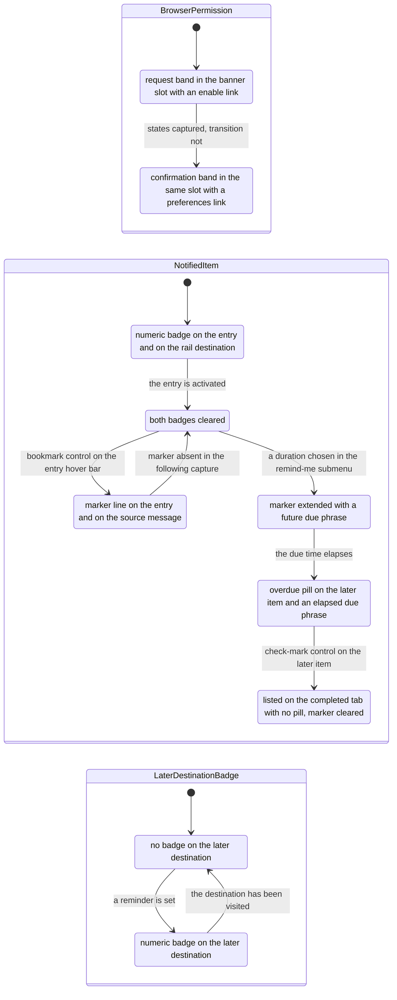

# Activity & Notifications

How the product tells a person that something happened, and how they work through it afterwards — the notification-permission gate, unreads, drafts and sent, the activity destination and the later destination — as specified for the [Workflow Catalog](README.md).

## Purpose

This document specifies the **attention layer** of the product: the machinery that raises a signal when something happens, the badges and banners that carry that signal, and the four routed surfaces a person visits to clear it. It answers one question end to end — *how does a person find out, and then how do they act on it?*

Five structurally distinct surfaces carry that domain in the corpus, and this document owns all five:

1. **A bottom-anchored banner slot** spanning the sidebar and content columns, in which the browser notification permission is first requested [frame 30](../../screenshots/Slack%20web%20Jul%202024%2030.png) and later confirmed as in effect [frame 23](../../screenshots/Slack%20web%20Jul%202024%2023.png).
2. **The unreads destination**, reached from a flat row in the conversation sidebar, which groups every unread message by conversation and offers per-group and global mark-read actions [frame 356](../../screenshots/Slack%20web%20Jul%202024%20356.png).
3. **The drafts-and-sent destination**, also reached from a sidebar flat row, which collects three kinds of outgoing message under one tab bar — unsent drafts, scheduled messages and already-sent messages [frame 361](../../screenshots/Slack%20web%20Jul%202024%20361.png), [frame 362](../../screenshots/Slack%20web%20Jul%202024%20362.png), [frame 363](../../screenshots/Slack%20web%20Jul%202024%20363.png).
4. **The activity destination**, a rail destination that replaces the conversation sidebar with a feed of app notifications and thread replies beside the selected entry's own context [frame 381](../../screenshots/Slack%20web%20Jul%202024%20381.png).
5. **The later destination**, a second rail destination holding saved messages and reminders across three lifecycle tabs [frame 395](../../screenshots/Slack%20web%20Jul%202024%20395.png), plus a preview panel that opens from the rail entry without leaving the current conversation [frame 394](../../screenshots/Slack%20web%20Jul%202024%20394.png).

**Where the area is encountered.** Rarely by deliberate navigation, and constantly by peripheral vision. Two of its surfaces are rail destinations — activity and later — and both appear in the rail's ordered destination list [frame 356](../../screenshots/Slack%20web%20Jul%202024%20356.png); the rail destination map that places them, and the fact that the rail's destination set varies between captures, are owned by [00-product-overview.md](00-product-overview.md). Two more are flat rows in the conversation sidebar, above the conversation groups [frame 356](../../screenshots/Slack%20web%20Jul%202024%20356.png). The banner slot is not navigated to at all: it appears at the foot of whatever conversation is open [frame 30](../../screenshots/Slack%20web%20Jul%202024%2030.png). And the signals themselves — a numeric badge on a rail destination [frame 381](../../screenshots/Slack%20web%20Jul%202024%20381.png), a numeric badge on a rail destination for saved work [frame 392](../../screenshots/Slack%20web%20Jul%202024%20392.png), a bold sidebar conversation row [frame 356](../../screenshots/Slack%20web%20Jul%202024%20356.png), two count indicators on a single sidebar flat row [frame 361](../../screenshots/Slack%20web%20Jul%202024%20361.png) — are encountered on every in-product screen, which makes this the most **diffuse** area in the catalog.

**Depth.** This is an in-product area, so it is specified comprehensively: every flow carries an ordered step table with a frame citation on every row, and every field claimed for an entity cites the frame that shows it. Where the corpus does not show a step, that gap is stated as a `> **Partial capture:**` note rather than filled in.

**What this document does not own.** Every reusable component contract is defined once in [00-product-overview.md](00-product-overview.md) and referenced here by identifier only; nothing is restated. The conversation surfaces behind the banner slot belong to [02-channels.md](02-channels.md) and [05-direct-messages.md](05-direct-messages.md). Message-row anatomy, hover actions, the composer and the drafting of a message belong to [03-messaging-and-composer.md](03-messaging-and-composer.md). The thread pane this area docks beside its feeds, and thread-follow state as a notification source, belong to [04-threads.md](04-threads.md). The app-home surface an activity entry hands off to belongs to [11-apps-and-integrations.md](11-apps-and-integrations.md), and workflow-authored messages to [10-workflow-builder.md](10-workflow-builder.md). The per-conversation notification control and its modal belong to [02-channels.md](02-channels.md); the preferences dialog and its full category inventory to [14-preferences-settings.md](14-preferences-settings.md); the account menu, presence and the pause-notifications submenu to [13-profiles-people.md](13-profiles-people.md); the onboarding coach marks that share the banner slot's screens to [01-onboarding-and-auth.md](01-onboarding-and-auth.md); and the cross-cutting state matrix, including every empty and permission-gated variant, to [21-states.md](21-states.md).

**Naming.** The corpus is third-party reference imagery. Following the placeholder branding vocabulary defined in [00-product-overview.md](00-product-overview.md), the product itself is written as **the product**, every application is named **functionally** — the poll app, the cloud-drive app, the built-in assistant app — and every icon is named by **function**: bell glyph, bookmark glyph, pencil glyph, clock glyph, apps-grid glyph, thread glyph, check-mark control, dismiss control, overflow control. Banner and menu copy that names a third party is paraphrased by function rather than transcribed. Channel names, person names and counts drawn from the corpus are **sample data** illustrating shape only, never values to reproduce.

## Flows in this area

Six flows are named for this area, spanning 26 frames. The identifiers, names and spans are the ones published in the [Screenshot Coverage Index](_screenshot-index.md), so the two documents reconcile row for row. Frame spans are written as plain numeric ranges because they designate a span rather than cite one image; every individual frame is cited with its full relative link in the per-flow step tables and in **Frames covered**.

| Flow ID | Name | Frame span | Primary entry point |
|---|---|---|---|
| `12.1` | Confirm that notification preferences are in effect | 23 | The bottom banner slot, in whichever conversation is open |
| `12.2` | Work through unreads with conversation filters | 356–359 | The *Unreads* flat row in `C-SIDEBAR` |
| `12.3` | Review drafts, scheduled and sent messages | 360–363 | The *Drafts & sent* flat row in `C-SIDEBAR` |
| `12.4` | Work through the activity destination tabs | 381–388 | The activity destination in `C-RAIL` |
| `12.5` | Set a reminder on an activity entry | 389–392 | An activity entry's overflow control |
| `12.6` | Review the later destination tabs | 394–398 | The later destination in `C-RAIL` |

The six divide cleanly by surface: `12.1` owns the banner slot, `12.2` the unreads destination, `12.3` the drafts-and-sent destination, `12.4` and `12.5` the activity destination — the second being a sub-journey that starts from an entry the first has already surfaced — and `12.6` the later destination in both its preview and full forms. `12.4`, `12.5` and `12.6` form one continuous session in the corpus: the reminder set in `12.5` is what the later destination in `12.6` is holding.

## Flow 12.1 — Confirm that notification preferences are in effect

### Overview

The product cannot grant itself permission to raise a desktop notification, so it asks for it in a band pinned to the foot of the viewport, and it later reports in the **same band slot** that notification preferences are now in effect. The corpus captures both ends of that arc: the request variant while a person is still being onboarded into their first channel [frame 30](../../screenshots/Slack%20web%20Jul%202024%2030.png), and the confirmation variant in that **same** channel with the first-run furniture gone [frame 23](../../screenshots/Slack%20web%20Jul%202024%2023.png). Both captures render the same channel name in their conversation header and the same workspace in the sidebar, so what distinguishes them is the variant occupying the slot — not the surface behind it. **Inferred:** the confirmation capture is the later of the two, because the onboarding coach-mark and the typed first message present in one are absent in the other while the channel has acquired message rows under a day divider [frame 30](../../screenshots/Slack%20web%20Jul%202024%2030.png), [frame 23](../../screenshots/Slack%20web%20Jul%202024%2023.png); the corpus does not date either capture, and both render the same trial countdown value. Frame 23 is the only frame this flow owns as primary; the request-state captures are owned by the onboarding run in [01-onboarding-and-auth.md](01-onboarding-and-auth.md) and are cited here as evidence for the slot's other variant.

The whole value of this flow to a build is that **one slot serves both variants**: measured against the effective product viewport, the two bands occupy the same region, the same width and the same position relative to the composer, and differ only in glyph, sentence and the action they offer.

### Trigger

For the request variant, no user action at all — the band is present in the conversation view as rendered [frame 30](../../screenshots/Slack%20web%20Jul%202024%2030.png). For the confirmation variant, likewise: it is present at the foot of the conversation as rendered, with no control on screen having been used to summon it [frame 23](../../screenshots/Slack%20web%20Jul%202024%2023.png).

### Preconditions

An authenticated session with a conversation open in the content region. At the request capture the person is in the middle of first-run onboarding — a brand-coloured prompt strip is attached to the top of the composer and the composer already holds a typed greeting — the rail carries only two destinations, and the sidebar carries no flat rows at all, its first conversation group following the banner slot directly [frame 30](../../screenshots/Slack%20web%20Jul%202024%2030.png). At the confirmation capture onboarding is over: the channel shows its welcome hero with an edit-description link and an add-coworkers action, two message rows sit under a *Today* divider, and the sidebar again carries no flat rows [frame 23](../../screenshots/Slack%20web%20Jul%202024%2023.png).

### Frame-by-frame steps

| Step | Frame(s) | What the user does | What changes on screen | Component(s) involved |
|---|---|---|---|---|
| 1 | [frame 30](../../screenshots/Slack%20web%20Jul%202024%2030.png) | Opens a conversation while browser notification permission has not been granted | A band appears pinned to the foot of the effective viewport, spanning the sidebar and content columns from the rail's right edge to the viewport's right edge and sitting **below** the composer. Its content is centred: a bell glyph, then one sentence stating that the product needs the person's permission to show notifications, then an inline action link that starts the browser's own grant flow. A dismiss control sits at the band's far right edge, outside the centred group | `C-BANNER`, `C-PERMISSION-PROMPT` |
| 2 | [frame 30](../../screenshots/Slack%20web%20Jul%202024%2030.png) | Reads the rest of the screen without acting on the band | The band coexists with unrelated first-run furniture — a brand-coloured prompt strip attached to the top of the composer with its own dismiss control, and a shift-return newline hint beneath the composer — so the slot is layered under the composer rather than inside it, and neither element displaces the other | `C-BANNER`, `C-COMPOSER`, `C-COACH-MARK` |
| 3 | [frame 23](../../screenshots/Slack%20web%20Jul%202024%2023.png) | Returns to the same channel with notification preferences now in effect | The same slot, same region and same position below the composer now renders the **confirmation** variant: a check-mark glyph in the success colour, one sentence confirming that notification preferences are in effect, and an inline link offering to see more preferences. The dismiss control remains at the far right | `C-BANNER` |
| 4 | [frame 23](../../screenshots/Slack%20web%20Jul%202024%2023.png) | Reads the confirmation and leaves it in place | Nothing else on the screen is displaced: the conversation header keeps its facepile and member count, its huddle and canvas actions, the bookmark row is unchanged, and the composer keeps its formatting toolbar and filled send control. The band is additive chrome at the foot of the viewport, not a layout mode | `C-BANNER`, `C-COMPOSER` |

> **Partial capture:** the corpus does not show the browser's own permission dialog, the screen immediately after the grant link is activated, the dismissed state of either variant, or a denial variant for notifications. The arc is captured at its two ends only. A denial variant of the same band slot **is** captured, but for a device permission on the huddle surface rather than for notifications, and it belongs to [06-huddles.md](06-huddles.md); its contract is part of `C-PERMISSION-PROMPT` in [00-product-overview.md](00-product-overview.md).

## Flow 12.2 — Work through unreads with conversation filters

### Overview

The unreads destination is the product's "clear the backlog" surface. It gathers every unread message in the workspace, groups the messages by the conversation they arrived in, and gives each group its own mark-read action plus a keyboard shortcut, with a single global action after the last group. A scope filter narrows the whole surface to one sidebar grouping, and clearing that scope produces a scoped empty state rather than an empty page. The flow runs from the surface as rendered [frame 356](../../screenshots/Slack%20web%20Jul%202024%20356.png), through opening the scope filter [frame 357](../../screenshots/Slack%20web%20Jul%202024%20357.png) and applying it [frame 358](../../screenshots/Slack%20web%20Jul%202024%20358.png), to the caught-up state that follows marking everything read [frame 359](../../screenshots/Slack%20web%20Jul%202024%20359.png).

### Trigger

The *Unreads* flat row in the conversation sidebar, which renders with a filled highlight for the whole flow [frame 356](../../screenshots/Slack%20web%20Jul%202024%20356.png). The flat-row set of `C-SIDEBAR`, and the fact that it varies between captures, are owned by [00-product-overview.md](00-product-overview.md).

### Preconditions

An authenticated session with at least one unread message. At this capture the workspace has exactly one unread message, in a channel that sits inside a user-created sidebar section rather than in the *Channels* group; that channel's sidebar row is rendered **bold**, which is the unread treatment. The rail shows six destinations including activity and later; the sidebar carries flat rows for unreads, threads and drafts-and-sent, a user-created section, the *Channels*, *Direct messages* and *Apps* groups, and a trial item in its footer [frame 356](../../screenshots/Slack%20web%20Jul%202024%20356.png).

### Frame-by-frame steps

| Step | Frame(s) | What the user does | What changes on screen | Component(s) involved |
|---|---|---|---|---|
| 1 | [frame 356](../../screenshots/Slack%20web%20Jul%202024%20356.png) | Activates the *Unreads* flat row | The content region renders the unreads surface. Its header carries, left to right: the surface title, a small workspace-scope chip, a scope filter control labelled with the current scope and carrying a caret, and a sort control labelled with the current ordering and carrying its own caret. The sidebar row takes a filled highlight. There is **no composer** and **no tab bar** on this surface — the scope chip, the scope filter and the sort control are the whole of its header, and both of the labelled carets are the closed triggers of the anchored option lists steps 4 and 5 open | `C-SIDEBAR`, `C-DROPDOWN-MENU` |
| 2 | [frame 356](../../screenshots/Slack%20web%20Jul%202024%20356.png) | Reads the one unread group | The body renders one **conversation group**: a header row carrying a disclosure caret and the conversation's name in bold at the left, and at the right a message-count line, a hint reading press-escape-to with the escape key rendered as a key chip, and a labelled mark-as-read button. Beneath the header, the unread messages themselves render as ordinary message rows with avatar, author, timestamp and body | `C-MESSAGE-ROW` |
| 3 | [frame 356](../../screenshots/Slack%20web%20Jul%202024%20356.png) | Scrolls past the last group | A horizontal rule closes the last group, and beneath it a single centred button offers to mark **all** messages read — so the surface carries a per-group action and one global action, at different scopes. No empty state is rendered here: the surface still holds its one group | Group-closing rule and surface-scoped action — area-local structures rather than shared components |
| 4 | [frame 357](../../screenshots/Slack%20web%20Jul%202024%20357.png) | Activates the scope filter control | A menu opens anchored to that control, below it, leaving the surface behind it fully legible. Its first row is the all-conversations option, carrying a **leading check mark** and rendered in the accent colour, preceded by a small workspace icon. A separator follows, then one row per sidebar grouping — the user-created section with its own emoji, the channels grouping with a hash glyph, the direct-messages grouping with a conversation glyph, and the apps grouping with an apps-grid glyph. Exactly one row is checked, so the control is single-select | `C-DROPDOWN-MENU` |
| 5 | [frame 358](../../screenshots/Slack%20web%20Jul%202024%20358.png) | Chooses the user-created section as the scope | The menu closes and the filter control's label is **replaced by the chosen scope** — the section's emoji takes the place of the workspace icon and the section's name takes the place of the all-conversations label. The body still shows the one group, and a new link appears beneath the global mark-all-read button offering to jump to the next sidebar grouping | `C-DROPDOWN-MENU` |
| 6 | [frame 359](../../screenshots/Slack%20web%20Jul%202024%20359.png) | Marks the conversations read | The body is replaced by a scoped empty state centred in the content region: the scoped section's own emoji as the illustration, a heading naming that section as caught up, a button offering to show all unreads, and the jump-to-next-grouping link retained beneath it. In the sidebar, the channel row that was bold is **no longer bold** — the unread treatment is cleared in the same beat | `C-EMPTY-STATE`, `C-SIDEBAR` |
| 7 | [frame 359](../../screenshots/Slack%20web%20Jul%202024%20359.png) | Reads the outcome report at the foot of the surface | A single line pinned at the foot of the content region states that all conversations were marked as read, followed by an underlined undo link. It carries **no background pill, no glyph and no dismiss control** — it is a plain in-surface line, not a transient toast | In-surface outcome line — area-local structure; see the note directly below this table, which explains why it is not identified as a toast |

**On step 7 and `C-TOAST`.** The outcome report on this surface is deliberately **not** identified as `C-TOAST`. The toast contract in [00-product-overview.md](00-product-overview.md) is a rounded pill at the bottom-right of the content region; what [frame 359](../../screenshots/Slack%20web%20Jul%202024%20359.png) shows is a full-width plain line at the foot of the surface, in the flow of the page. The distinction matters to a build because the two are dismissed differently and occupy different slots, and conflating them would put an undo affordance in the wrong place.

> **Partial capture:** the corpus does not show the sort control opened, so its option set is unknown; it does not show the per-group mark-as-read button or the escape shortcut being used in isolation, only the outcome of the global action; and it does not show a multi-group unreads surface, so how groups are ordered relative to one another when there is more than one is not observable here.

## Flow 12.3 — Review drafts, scheduled and sent messages

### Overview

Everything the person has written but not finished sending, everything queued to send later, and everything already sent live behind **one** sidebar row and **one** tab bar. The flow establishes the surface's three tabs and, more importantly for a build, establishes that a draft, a scheduled message and a sent message are three states of the same row rather than three different lists: the row anatomy is constant and only the trailing slot's meaning changes. It runs from the drafts tab in its empty state [frame 360](../../screenshots/Slack%20web%20Jul%202024%20360.png), through the drafts tab populated [frame 361](../../screenshots/Slack%20web%20Jul%202024%20361.png), to the scheduled tab [frame 362](../../screenshots/Slack%20web%20Jul%202024%20362.png) and the sent tab [frame 363](../../screenshots/Slack%20web%20Jul%202024%20363.png).

### Trigger

The *Drafts & sent* flat row in the conversation sidebar, which renders with a filled highlight for the whole flow [frame 360](../../screenshots/Slack%20web%20Jul%202024%20360.png).

### Preconditions

An authenticated session. At the first capture the workspace has **no** drafts and **one** scheduled message, and the sidebar's threads row is rendered bold, so unread thread activity exists concurrently. The rail shows six destinations, and its activity destination carries a numeric badge [frame 360](../../screenshots/Slack%20web%20Jul%202024%20360.png). By the second capture two drafts exist [frame 361](../../screenshots/Slack%20web%20Jul%202024%20361.png).

### Frame-by-frame steps

| Step | Frame(s) | What the user does | What changes on screen | Component(s) involved |
|---|---|---|---|---|
| 1 | [frame 360](../../screenshots/Slack%20web%20Jul%202024%20360.png) | Activates the *Drafts & sent* flat row | The content region renders the surface as a title, then a tab bar of three tabs — drafts, scheduled and sent — then a dismissible explainer block, then the active tab's body. The drafts tab is active and underlined. Counts render **only where non-zero**: the scheduled tab carries a count, the drafts and sent tabs carry none | `C-SIDEBAR`, `C-TAB-BAR` |
| 2 | [frame 360](../../screenshots/Slack%20web%20Jul%202024%20360.png) | Reads the empty drafts tab | The explainer block spans the width of the content region on a pale tinted background, carrying a heading, one body line, an illustration at its right and a dismiss control at its top-right. Beneath it the tab body renders an empty state centred in the region: an illustration, a heading about drafting messages to send when ready, two body lines and a labelled new-message button | `C-BANNER`, `C-EMPTY-STATE` |
| 3 | [frame 361](../../screenshots/Slack%20web%20Jul%202024%20361.png) | Returns to the drafts tab once two drafts exist | The tab label gains its count, and an **edit control** appears in the title row at the far right, carrying a pencil glyph and a label. The body renders two rows inside one bordered container | `C-TAB-BAR` |
| 4 | [frame 361](../../screenshots/Slack%20web%20Jul%202024%20361.png) | Reads the two draft rows | Each row is: a leading square tile carrying a destination-type glyph — a hash glyph for a channel, a padlock glyph for the private conversation the second draft is a thread reply in; then the destination or context label in bold, a thread draft naming its parent document with the parent's own glyph; then, where the context needs it, a sub-context line naming the author identity involved; then a body preview which may itself contain a person-mention chip; then a right-aligned timestamp, given as a time of day for today and as a date for anything older | `C-MESSAGE-ROW` |
| 5 | [frame 361](../../screenshots/Slack%20web%20Jul%202024%20361.png) | Glances at the sidebar | The *Drafts & sent* row now carries **two** count indicators side by side at its trailing edge: a pencil glyph with the draft count, then a clock glyph with the scheduled count. At the previous capture, when no draft existed, only the clock-and-count pair was rendered [frame 360](../../screenshots/Slack%20web%20Jul%202024%20360.png). The channel a draft is addressed to also gains a small pencil glyph on its own sidebar row | `C-SIDEBAR` |
| 6 | [frame 362](../../screenshots/Slack%20web%20Jul%202024%20362.png) | Activates the scheduled tab | The active underline moves, the title row's edit control **disappears**, and the body renders one row in the same anatomy as a draft row — except that its right-aligned slot holds a **future** send time, expressed as a relative-day phrase followed by a clock time rather than as a past timestamp | `C-TAB-BAR` |
| 7 | [frame 363](../../screenshots/Slack%20web%20Jul%202024%20363.png) | Activates the sent tab | The active underline moves again, the tab carries no count, and the title row still has no edit control. The body renders rows **grouped under date headings** in reverse-chronological order; rows sharing a heading sit in one bordered container separated by hairline rules | `C-TAB-BAR` |
| 8 | [frame 363](../../screenshots/Slack%20web%20Jul%202024%20363.png) | Reads the sent rows | The leading tile varies with destination kind — a person avatar for a direct message or a thread inside one, a square hash tile for a channel — and the context label follows suit, a thread row naming the person whose conversation the thread sits in. Body previews render inline links in the accent colour, emoji inline, and a long bulleted body clamped to one line with a trailing ellipsis. Every row keeps a right-aligned time of day | `C-MESSAGE-ROW`, `C-AVATAR` |

**The explainer block persists across all three tabs** [frame 360](../../screenshots/Slack%20web%20Jul%202024%20360.png), [frame 361](../../screenshots/Slack%20web%20Jul%202024%20361.png), [frame 362](../../screenshots/Slack%20web%20Jul%202024%20362.png), [frame 363](../../screenshots/Slack%20web%20Jul%202024%20363.png), so it belongs to the surface rather than to the drafts tab, and its dismissal is surface-level.

> **Partial capture:** the corpus does not show the surface with its explainer block dismissed, the new-message button's target, the title-row edit control activated, a draft being opened for continued editing, a scheduled message being sent early or cancelled, or the sent tab's rows offering any per-row action.

## Flow 12.4 — Work through the activity destination tabs

### Overview

The activity destination is the only surface in the corpus that renders a **feed of notifications as first-class rows**. It is a two-pane destination: the second column, normally the conversation sidebar, is replaced by a wider list of activity entries, and the content region shows the context of whichever entry is being worked. Three tabs scope the list, a labelled toggle narrows it to unread items only, and each entry can be saved for later from a hover action bar — a change that writes straight through to the message itself in the pane beside it. The flow runs from the destination as opened with an unread entry still badged [frame 381](../../screenshots/Slack%20web%20Jul%202024%20381.png), through an entry hand-off to an app's own surface [frame 382](../../screenshots/Slack%20web%20Jul%202024%20382.png), the threads and apps tab filters [frame 383](../../screenshots/Slack%20web%20Jul%202024%20383.png), [frame 384](../../screenshots/Slack%20web%20Jul%202024%20384.png), the unread-only empty state [frame 385](../../screenshots/Slack%20web%20Jul%202024%20385.png), and back to the all tab to save an entry for later [frame 386](../../screenshots/Slack%20web%20Jul%202024%20386.png), [frame 387](../../screenshots/Slack%20web%20Jul%202024%20387.png), [frame 388](../../screenshots/Slack%20web%20Jul%202024%20388.png).

### Trigger

The activity destination in the navigation rail, which renders as the active destination for the whole flow and carries a numeric badge at the moment the destination is first opened [frame 381](../../screenshots/Slack%20web%20Jul%202024%20381.png).

### Preconditions

An authenticated session with at least one activity entry. At the opening capture the rail shows five destinations — home, direct messages, activity, later and more — and the activity destination carries a numeric badge; one entry in the list is unread and carries its own numeric badge; a thread is already open in the content region; and the later destination carries **no** badge [frame 381](../../screenshots/Slack%20web%20Jul%202024%20381.png).

### Frame-by-frame steps

| Step | Frame(s) | What the user does | What changes on screen | Component(s) involved |
|---|---|---|---|---|
| 1 | [frame 381](../../screenshots/Slack%20web%20Jul%202024%20381.png) | Activates the activity destination in the rail | The conversation sidebar is replaced by an activity list column, rendered in the sidebar's own dark surface treatment but **wider** than it, and the content region narrows to suit. The column header carries the surface title at the left and a labelled unreads toggle with a switch control at the right. Beneath the header, a tab bar of three tabs — all, threads with a thread glyph, apps with an apps-grid glyph — with the all tab active and underlined | `C-RAIL`, `C-TAB-BAR` |
| 2 | [frame 381](../../screenshots/Slack%20web%20Jul%202024%20381.png) | Reads the four entries | Each entry is two stacked parts. A **meta line** carries a type glyph and a type label at the left — an apps-grid glyph with an app-notification label, or a thread glyph with a label naming the conversation kind the thread sits in — and at the right a relative timestamp; an unread entry additionally carries a numeric badge pill after the timestamp. A **body** follows: for an app notification, the app's avatar tile, the app name in bold and the message text clamped with a trailing ellipsis; for a thread reply, the replier's avatar, their name in bold, a replied-to line quoting the parent message, and the reply text indented beneath it. The list body renders on a slightly lighter surface than the column base, and the space below the last entry stays at the base colour. Hairline rules separate entries | `C-MESSAGE-ROW`, `C-AVATAR` |
| 3 | [frame 381](../../screenshots/Slack%20web%20Jul%202024%20381.png) | Reads the pane beside the list | The content region holds the docked thread pane for the thread entry: a header naming the surface and the person, the parent message rendered with a headphones avatar tile and a summary body, a replies-count rule, the reply rows, and a reply composer whose action row is preceded by an unchecked also-send-as-direct-message checkbox and whose send control is muted while empty | `C-COMPOSER` |
| 4 | [frame 382](../../screenshots/Slack%20web%20Jul%202024%20382.png) | Activates the unread app-notification entry | The entry's numeric badge **and** the rail destination's numeric badge both clear in the same beat. The content region is replaced by the poll app's own home surface on its messages tab, carrying its own tab bar, a beginning-of-history block, an explanatory link, the app-authored message with template actions and a slash-command hint, and a composer whose send control is filled. The unread boundary inside that conversation renders as a labelled rule in the accent colour | `C-TAB-BAR`, `C-MESSAGE-ROW`, `C-COMPOSER` |
| 5 | [frame 383](../../screenshots/Slack%20web%20Jul%202024%20383.png) | Activates the threads tab | The active underline moves to the threads tab and the list is filtered to the single thread entry; the app-notification entries are removed from the list rather than dimmed. The content region reverts to the docked thread pane | `C-TAB-BAR` |
| 6 | [frame 384](../../screenshots/Slack%20web%20Jul%202024%20384.png) | Activates the apps tab | The active underline moves again and the list is filtered to the three app-notification entries; the thread entry is removed. The relative timestamp on the first entry has advanced since the opening capture, so timestamps are recomputed rather than frozen | `C-TAB-BAR` |
| 7 | [frame 385](../../screenshots/Slack%20web%20Jul%202024%20385.png) | Switches the unreads toggle on | The switch renders in its filled state — the only capture in this flow where the control's own pixels differ. The list body empties to an empty state centred in the column: an emoji illustration, a heading stating there are no unread apps, one light body line, and a link offering to show all activity. In the same capture the tab bar renders **only** the all label, with no threads or apps label and no active underline | `C-EMPTY-STATE`, `C-TAB-BAR` |
| 8 | [frame 386](../../screenshots/Slack%20web%20Jul%202024%20386.png) | Returns to the all tab and points at the thread entry | All four entries are listed again. The hovered entry's timestamp is **replaced in place** by a hover action bar pinned to its top-right, carrying an outline bookmark control then an overflow control. No other entry carries the bar | `C-HOVER-ACTION-BAR` |
| 9 | [frame 387](../../screenshots/Slack%20web%20Jul%202024%20387.png) | Activates the bookmark control | The control becomes filled and accent-coloured, and a **marker line is inserted above the entry's meta line**: a bookmark glyph followed by a saved-for-later label in bold. Simultaneously, the corresponding reply row in the docked thread pane takes a tinted highlight **and** gains the same saved-for-later marker above its author line, rendered in the accent colour — so the state is written to the message, not only to the feed entry | `C-HOVER-ACTION-BAR`, `C-MESSAGE-ROW` |
| 10 | [frame 388](../../screenshots/Slack%20web%20Jul%202024%20388.png) | Moves the pointer away from the entry | The hover action bar disappears and the entry's relative-time slot returns to showing its timestamp, while the saved-for-later marker line and the thread pane's tinted, marked reply row both persist. The marker is state; the action bar is transient | `C-HOVER-ACTION-BAR`, `C-MESSAGE-ROW` |

**Two badges, one event.** Steps 1 and 4 together are the corpus's clearest statement of the unread model in this area: the entry-level badge and the rail-destination badge appear together and clear together. A build must drive both from one unread record rather than from two counters.

> **Partial capture:** the corpus does not show the activity destination's empty state on the all tab with the unreads toggle off, a mark-all-read control on this surface, an entry type other than an app notification or a thread reply, the list scrolled beyond four entries, or the unreads toggle being switched back off.

## Flow 12.5 — Set a reminder on an activity entry

### Overview

An activity entry carries a per-entry menu, and one of its items schedules a reminder about that entry. This is the flow that connects the activity destination to the later destination: choosing a reminder duration both marks the entry saved for later **and** stamps a due phrase onto the same marker, and one capture later the later destination in the rail gains its own numeric badge. It runs from the menu opened on the entry [frame 389](../../screenshots/Slack%20web%20Jul%202024%20389.png), through the reminder submenu [frame 390](../../screenshots/Slack%20web%20Jul%202024%20390.png), to the stamped marker [frame 391](../../screenshots/Slack%20web%20Jul%202024%20391.png) and the badge that follows [frame 392](../../screenshots/Slack%20web%20Jul%202024%20392.png).

### Trigger

The overflow control on an activity entry's hover action bar [frame 389](../../screenshots/Slack%20web%20Jul%202024%20389.png).

### Preconditions

The activity destination open on its all tab with the entry in the list. At this capture the entry is **not** saved for later — its bookmark control is an outline, it carries no marker line, and the corresponding reply row in the docked thread pane is neither tinted nor marked — and the rail's later destination carries no badge [frame 389](../../screenshots/Slack%20web%20Jul%202024%20389.png).

**An observed reversal sits on this flow's opening boundary, and it is not reconciled.** The immediately preceding capture — the last frame of flow `12.4` — shows this same entry *saved*: the marker line is present on the entry and the source message in the docked pane carries the same marker and a tinted highlight [frame 388](../../screenshots/Slack%20web%20Jul%202024%20388.png). One frame later the marker is gone from both places and the bookmark control has returned to its outline, while the entry's relative timestamp has advanced [frame 389](../../screenshots/Slack%20web%20Jul%202024%20389.png). **No capture shows the gesture that cleared it**, so this document records the round trip and leaves it as it stands rather than smoothing the two states into one narrative; the pair is catalogued in [Inconsistencies between captures, recorded and not reconciled](#inconsistencies-between-captures-recorded-and-not-reconciled), and the reverse transition it implies is drawn in the state diagram as exactly that — an unwitnessed transition between two adjacent observed states.

### Frame-by-frame steps

| Step | Frame(s) | What the user does | What changes on screen | Component(s) involved |
|---|---|---|---|---|
| 1 | [frame 389](../../screenshots/Slack%20web%20Jul%202024%20389.png) | Activates the entry's overflow control | A menu opens anchored to that control, below and to the left of it, overlapping the boundary into the content region and leaving everything behind it fully legible. Its items are grouped by separator rules: a remind-me item carrying a trailing right-chevron and a turn-off-notifications-for-replies item; then open-in-new-window and open-in-home; then copy-link. The entry's hover action bar stays visible while its menu is open | `C-CONTEXT-MENU`, `C-HOVER-ACTION-BAR` |
| 2 | [frame 390](../../screenshots/Slack%20web%20Jul%202024%20390.png) | Points at the remind-me item | The parent row takes a filled accent highlight with reversed text, and a submenu opens **sideways to the right**, overlapping further into the content region. It offers six durations in ascending order: in twenty minutes, in one hour, in three hours, tomorrow, next week, and a custom option marked with a trailing ellipsis. The parent menu is otherwise unchanged | `C-CONTEXT-MENU` |
| 3 | [frame 391](../../screenshots/Slack%20web%20Jul%202024%20391.png) | Chooses the shortest duration | Both menus close and the entry gains a **composite marker line** above its meta line: a bookmark glyph, a saved-for-later label, a bullet separator, then a due phrase naming the chosen interval — all in bold. The entry's timestamp is restored. The corresponding reply row in the docked thread pane carries the identical composite marker in the accent colour and keeps its tinted highlight. Choosing a reminder therefore performs **two** state changes at once: it saves the item and it schedules it | `C-CONTEXT-MENU`, `C-MESSAGE-ROW` |
| 4 | [frame 392](../../screenshots/Slack%20web%20Jul%202024%20392.png) | Stays on the activity destination | The list is unchanged, the composite marker persists, and the rail's **later destination now carries a numeric badge** where it carried none in any earlier capture of this session. The reminder has propagated from the entry to the destination that will hold it | `C-RAIL` |

**Inferred:** the later badge is a consequence of the reminder rather than a coincidence, because it is absent in every capture from the opening of the activity destination through the marker being stamped and appears in the very next capture with nothing else on screen having changed [frame 381](../../screenshots/Slack%20web%20Jul%202024%20381.png), [frame 391](../../screenshots/Slack%20web%20Jul%202024%20391.png), [frame 392](../../screenshots/Slack%20web%20Jul%202024%20392.png). The corpus cannot show the write itself, only the two adjacent states either side of it.

> **Partial capture:** the corpus does not show the custom-duration picker, the turn-off-notifications-for-replies item being used or its effect, either open item being used, the copy-link item's confirmation, or a reminder being removed from an entry.

## Flow 12.6 — Review the later destination tabs

### Overview

The later destination is where saved messages and reminders are worked off. It has two forms in the corpus: a **preview panel** that opens from the rail entry over the sidebar, giving a count and the items without leaving the current conversation [frame 394](../../screenshots/Slack%20web%20Jul%202024%20394.png), and the **full destination**, a two-pane surface with the same geometry as the activity destination and a three-tab lifecycle — in progress, archived, completed [frame 395](../../screenshots/Slack%20web%20Jul%202024%20395.png). The flow walks all three tabs [frame 396](../../screenshots/Slack%20web%20Jul%202024%20396.png), [frame 397](../../screenshots/Slack%20web%20Jul%202024%20397.png), [frame 398](../../screenshots/Slack%20web%20Jul%202024%20398.png) and, in doing so, captures the reminder set in flow `12.5` coming due, being completed, and clearing its marker from the source message.

### Trigger

The later destination in the navigation rail. Two distinct interactions are captured against it: one that opens a preview panel while the current conversation stays in the content region [frame 394](../../screenshots/Slack%20web%20Jul%202024%20394.png), and one that routes to the full destination [frame 395](../../screenshots/Slack%20web%20Jul%202024%20395.png).

### Preconditions

An authenticated session with one saved item whose reminder has come due. At the preview capture the rail's later destination carries a numeric badge and is rendered active, a channel is open in the content region, and the sidebar carries flat rows for threads and drafts-and-sent but **no** unreads row [frame 394](../../screenshots/Slack%20web%20Jul%202024%20394.png). The item's due phrase has already flipped from a future interval to an elapsed one, so the reminder is overdue before the destination is ever opened [frame 395](../../screenshots/Slack%20web%20Jul%202024%20395.png).

### Frame-by-frame steps

| Step | Frame(s) | What the user does | What changes on screen | Component(s) involved |
|---|---|---|---|---|
| 1 | [frame 394](../../screenshots/Slack%20web%20Jul%202024%20394.png) | Opens the later destination as a preview | A panel opens from the rail's later entry, on a light surface, its top edge aligned with that entry and its body running down to the foot of the effective viewport. It covers the whole width of the sidebar column and **overhangs its right edge slightly**, so it reads as anchored to the rail rather than as a replacement for the sidebar. The channel in the content region is untouched | `C-RAIL` |
| 2 | [frame 394](../../screenshots/Slack%20web%20Jul%202024%20394.png) | Reads the panel | Its header carries the destination name in bold followed by a muted count-and-state line reading how many items are in progress. One item row follows: a filled pill badge stating how overdue the item is, then a muted context label naming the conversation kind it came from; beneath them, the source message's author avatar, the author name in bold and the message text | `C-BANNER` |
| 3 | [frame 395](../../screenshots/Slack%20web%20Jul%202024%20395.png) | Routes to the full destination | The conversation sidebar is replaced by a list column of the same width as the activity destination's, and the content region narrows to suit and holds the saved message's own thread pane. The column header carries the destination name at the left and two icon controls at the right — a filter control and an add control | `C-RAIL`, `C-TAB-BAR` |
| 4 | [frame 395](../../screenshots/Slack%20web%20Jul%202024%20395.png) | Reads the destination's explainer and tabs | A dismissible hero block sits directly under the header on the column's own dark surface: a large multi-line heading about saving important messages, a body paragraph explaining that messages or files can be saved and reminders set from any conversation and that the destination is where that work is organised and checked off, a filled learn-more button, and a dismiss control at the block's top-right. Beneath it, a tab bar of three tabs — in progress carrying a count, archived and completed carrying none | `C-BANNER`, `C-TAB-BAR` |
| 5 | [frame 395](../../screenshots/Slack%20web%20Jul%202024%20395.png) | Points at the one in-progress item | The row shows the overdue pill, the context label, the avatar, the author name and the message text, and gains a hover action bar at its top-right carrying **three** controls: a check-mark control, a clock control, then an overflow control. In the thread pane beside it, the saved message's composite marker now reads as saved for later with an **elapsed** due phrase, and its timestamps have advanced relative to the earlier captures of the same thread | `C-HOVER-ACTION-BAR`, `C-MESSAGE-ROW` |
| 6 | [frame 396](../../screenshots/Slack%20web%20Jul%202024%20396.png) | Activates the archived tab | The active underline moves; the in-progress tab keeps its count. The body renders an empty state on the column's dark surface — an emoji illustration, a heading, and two body lines about archiving messages that are returned to often. The header's **filter control disappears entirely**, leaving only the add control. The content region empties to a plain surface carrying a single large decorative shape and **no** thread pane. The rail's later badge has cleared, although the in-progress count still reads one | `C-EMPTY-STATE`, `C-TAB-BAR`, `C-RAIL` |
| 7 | [frame 397](../../screenshots/Slack%20web%20Jul%202024%20397.png) | Completes the item and returns to the in-progress tab | The in-progress tab label **loses its count**, and its body renders a different empty state: an emoji illustration, an all-done heading, one light body line and a filled create-reminder button. The header's filter control is back. In the thread pane, the source message's saved-for-later marker is **gone** and its tinted highlight is cleared — completing the item unwinds the state that was written to the message | `C-EMPTY-STATE`, `C-MESSAGE-ROW` |
| 8 | [frame 398](../../screenshots/Slack%20web%20Jul%202024%20398.png) | Activates the completed tab | The active underline moves and the completed item appears as a row that carries **no status pill at all** — only the muted context label, the avatar, the author name and the message text. The header's left control is neither the filter control nor absent: it is a third glyph, a broom with motion lines, rendered only on this tab | `C-TAB-BAR`, `C-MESSAGE-ROW` |

**Inferred:** the broom-glyph control on the completed tab clears completed items, because it appears only on the tab whose contents are already finished and replaces the filter control that the in-progress tab offers [frame 397](../../screenshots/Slack%20web%20Jul%202024%20397.png), [frame 398](../../screenshots/Slack%20web%20Jul%202024%20398.png). The control carries no label in any capture, so its action is not observable and a build must not assume it is destructive without confirmation.

**Inferred:** the later badge tracks *arrival* rather than the item count, because it is still rendered while the destination is open on its in-progress tab and is gone one capture later while that tab's count still reads one [frame 395](../../screenshots/Slack%20web%20Jul%202024%20395.png), [frame 396](../../screenshots/Slack%20web%20Jul%202024%20396.png). The badge and the count are therefore two different numbers and must not be driven from one field.

> **Partial capture:** the corpus does not show the add control's target, the clock control being used to reschedule, the item overflow menu's contents, the action that moves an item into the archived tab, the completion gesture itself — only its before and after — the archived tab populated, or the hero block dismissed.

## Screens & components

### Regions, ordering and relative sizing

Every measurement below is **proportional to the effective product viewport** and holds across the captures cited. No absolute pixel offset is given, because the corpus's frames are not a single canvas size.

| Surface | Region layout, in order | Relative sizing |
|---|---|---|
| Banner slot | A band pinned to the foot of the viewport, beginning at the navigation rail's right edge and running to the viewport's right edge, so it underlies **both** the sidebar and the content columns; content centred within it, with the dismiss control alone at the far right edge [frame 23](../../screenshots/Slack%20web%20Jul%202024%2023.png), [frame 30](../../screenshots/Slack%20web%20Jul%202024%2030.png) | Roughly one twentieth of viewport height; sits **below** the composer, which keeps its own position |
| Unreads and drafts-and-sent destinations | Rail, then the ordinary conversation sidebar, then the content region carrying the surface: title row, then either the header controls — scope chip, scope filter, sort control, and no tab bar — on unreads [frame 356](../../screenshots/Slack%20web%20Jul%202024%20356.png), or the tab bar and explainer block on drafts-and-sent [frame 360](../../screenshots/Slack%20web%20Jul%202024%20360.png), then the body | The three shell columns keep their ordinary proportions; the surface occupies the content region only |
| Activity and later destinations | Rail, then a **list column that replaces the conversation sidebar**, then the content region carrying the selected entry's context [frame 381](../../screenshots/Slack%20web%20Jul%202024%20381.png), [frame 395](../../screenshots/Slack%20web%20Jul%202024%20395.png) | The list column is roughly **three eighths** of the width right of the rail — about half again as wide as the ordinary conversation sidebar — leaving the content region roughly five eighths. The boundary sits at the same proportion on both destinations and in every capture of them |
| Later preview panel | A panel opening from the rail's later entry: top edge aligned with that entry, running to the foot of the viewport, covering the sidebar column's full width and overhanging its right edge by a small margin [frame 394](../../screenshots/Slack%20web%20Jul%202024%20394.png) | Sidebar width plus a slight overhang; the content region is not resized and its conversation is not disturbed |

**Hierarchy.** On the two-pane destinations the list column and the content region are siblings, and selecting a list entry changes only the content region [frame 383](../../screenshots/Slack%20web%20Jul%202024%20383.png), [frame 382](../../screenshots/Slack%20web%20Jul%202024%20382.png). Menus opened from a list entry are anchored to that entry and are free to overlap the boundary into the content region [frame 389](../../screenshots/Slack%20web%20Jul%202024%20389.png), [frame 390](../../screenshots/Slack%20web%20Jul%202024%20390.png). The banner slot layers beneath nothing and above nothing — it takes its own strip at the foot and everything else keeps its place [frame 30](../../screenshots/Slack%20web%20Jul%202024%2030.png).

### The list-entry anatomy, shared by three surfaces

The activity feed, the later list and the drafts-and-sent list are three renderings of **one row shape**, which is the single most reusable thing this area contributes:

1. An optional **marker line** at the top, carrying a glyph and one or two bold labels separated by a bullet — used for saved-for-later and for saved-for-later plus a due phrase [frame 387](../../screenshots/Slack%20web%20Jul%202024%20387.png), [frame 391](../../screenshots/Slack%20web%20Jul%202024%20391.png).
2. A **meta line**: at the left a type glyph and a type label, or a status pill and a context label; at the right a timestamp slot [frame 381](../../screenshots/Slack%20web%20Jul%202024%20381.png), [frame 395](../../screenshots/Slack%20web%20Jul%202024%20395.png).
3. A **body**: a leading avatar or destination-type tile, a bold name or destination label, an optional context sub-line, then the message text, clamped with a trailing ellipsis when long [frame 361](../../screenshots/Slack%20web%20Jul%202024%20361.png), [frame 386](../../screenshots/Slack%20web%20Jul%202024%20386.png).
4. On hover, an **action bar replacing the timestamp slot in place** — two controls on an activity entry, three on a later item [frame 386](../../screenshots/Slack%20web%20Jul%202024%20386.png), [frame 395](../../screenshots/Slack%20web%20Jul%202024%20395.png).

The timestamp slot is polymorphic, and a build must treat it as one slot with four meanings: a relative time on an activity entry [frame 381](../../screenshots/Slack%20web%20Jul%202024%20381.png), an absolute time of day or a date on a draft or sent row [frame 361](../../screenshots/Slack%20web%20Jul%202024%20361.png), [frame 363](../../screenshots/Slack%20web%20Jul%202024%20363.png), a **future** send time on a scheduled row [frame 362](../../screenshots/Slack%20web%20Jul%202024%20362.png), and the hover action bar while the pointer is on the row [frame 386](../../screenshots/Slack%20web%20Jul%202024%20386.png).

### Where a count or badge renders

| Signal | Where it renders | Evidence |
|---|---|---|
| Numeric badge on a rail destination | Overlaid at the top-right of the destination's glyph, above its label | Activity [frame 381](../../screenshots/Slack%20web%20Jul%202024%20381.png), [frame 360](../../screenshots/Slack%20web%20Jul%202024%20360.png); later [frame 392](../../screenshots/Slack%20web%20Jul%202024%20392.png), [frame 394](../../screenshots/Slack%20web%20Jul%202024%20394.png), [frame 395](../../screenshots/Slack%20web%20Jul%202024%20395.png) |
| Numeric badge on a feed entry | At the trailing edge of the entry's meta line, after the timestamp | [frame 381](../../screenshots/Slack%20web%20Jul%202024%20381.png) |
| Bold treatment on a sidebar conversation row | The row's own label, with no numeral of its own in these captures | [frame 356](../../screenshots/Slack%20web%20Jul%202024%20356.png), [frame 360](../../screenshots/Slack%20web%20Jul%202024%20360.png) |
| Paired count indicators on a sidebar flat row | Two independent glyph-and-count pairs at the row's trailing edge: a pencil glyph with the draft count, then a clock glyph with the scheduled count | Clock pair alone [frame 356](../../screenshots/Slack%20web%20Jul%202024%20356.png), [frame 360](../../screenshots/Slack%20web%20Jul%202024%20360.png); both pairs [frame 361](../../screenshots/Slack%20web%20Jul%202024%20361.png), [frame 362](../../screenshots/Slack%20web%20Jul%202024%20362.png), [frame 363](../../screenshots/Slack%20web%20Jul%202024%20363.png); neither pair [frame 23](../../screenshots/Slack%20web%20Jul%202024%2023.png), [frame 394](../../screenshots/Slack%20web%20Jul%202024%20394.png) |
| Draft indicator on a conversation row | A small pencil glyph at the row's trailing edge while a draft addressed to that conversation exists | [frame 361](../../screenshots/Slack%20web%20Jul%202024%20361.png) |
| Count on a tab label | Immediately after the label, and only when non-zero | [frame 360](../../screenshots/Slack%20web%20Jul%202024%20360.png), [frame 361](../../screenshots/Slack%20web%20Jul%202024%20361.png), [frame 395](../../screenshots/Slack%20web%20Jul%202024%20395.png), [frame 397](../../screenshots/Slack%20web%20Jul%202024%20397.png) |
| Count-and-state line in a preview panel | In the panel header, after the destination name, in the muted text colour | [frame 394](../../screenshots/Slack%20web%20Jul%202024%20394.png) |
| Message count on an unreads group | At the right of the group header, before the keyboard hint and the mark-as-read button | [frame 356](../../screenshots/Slack%20web%20Jul%202024%20356.png) |

### Components used

Every identifier below is defined once in [00-product-overview.md](00-product-overview.md) and is referenced here, never redefined.

| Component | How this area uses it | Evidence in this area |
|---|---|---|
| `C-BANNER` | The bottom banner slot in both its request and confirmation variants; the dismissible explainer block on the drafts-and-sent surface; the dismissible hero block on the later destination; the later preview panel's header-and-item block | [frame 23](../../screenshots/Slack%20web%20Jul%202024%2023.png), [frame 30](../../screenshots/Slack%20web%20Jul%202024%2030.png), [frame 360](../../screenshots/Slack%20web%20Jul%202024%20360.png), [frame 394](../../screenshots/Slack%20web%20Jul%202024%20394.png), [frame 395](../../screenshots/Slack%20web%20Jul%202024%20395.png) |
| `C-PERMISSION-PROMPT` | The request variant of the banner slot: bell glyph, one sentence naming what is needed, and an action link that starts the browser's own grant flow | [frame 30](../../screenshots/Slack%20web%20Jul%202024%2030.png) |
| `C-RAIL` | Carries the activity and later destinations, their active states and their numeric badges; the later preview panel is anchored to its later entry | [frame 381](../../screenshots/Slack%20web%20Jul%202024%20381.png), [frame 392](../../screenshots/Slack%20web%20Jul%202024%20392.png), [frame 394](../../screenshots/Slack%20web%20Jul%202024%20394.png) |
| `C-SIDEBAR` | Carries the unreads and drafts-and-sent flat rows and their trailing count indicators, the bold unread treatment on a conversation row, and the draft indicator on a conversation row; it is **replaced** by the list column on the activity and later destinations | [frame 356](../../screenshots/Slack%20web%20Jul%202024%20356.png), [frame 359](../../screenshots/Slack%20web%20Jul%202024%20359.png), [frame 361](../../screenshots/Slack%20web%20Jul%202024%20361.png), [frame 381](../../screenshots/Slack%20web%20Jul%202024%20381.png) |
| `C-TAB-BAR` | Three tabs on the activity destination, three on drafts-and-sent, three on later; per-tab counts render only when non-zero | [frame 381](../../screenshots/Slack%20web%20Jul%202024%20381.png), [frame 360](../../screenshots/Slack%20web%20Jul%202024%20360.png), [frame 395](../../screenshots/Slack%20web%20Jul%202024%20395.png), [frame 397](../../screenshots/Slack%20web%20Jul%202024%20397.png) |
| `C-DROPDOWN-MENU` | The unreads surface's conversation-scope filter and its sort control, each a labelled caret in the surface header while closed and, for the scope filter, an anchored single-select list with a leading check on the current value while open | [frame 356](../../screenshots/Slack%20web%20Jul%202024%20356.png), [frame 357](../../screenshots/Slack%20web%20Jul%202024%20357.png) |
| `C-CONTEXT-MENU` | The per-entry overflow menu on an activity entry, anchored to the entry being acted on, with a sideways submenu and a highlighted parent row | [frame 389](../../screenshots/Slack%20web%20Jul%202024%20389.png), [frame 390](../../screenshots/Slack%20web%20Jul%202024%20390.png) |
| `C-HOVER-ACTION-BAR` | Two controls on an activity entry, three on a later item, each replacing the row's timestamp slot in place while the pointer is on the row | [frame 386](../../screenshots/Slack%20web%20Jul%202024%20386.png), [frame 395](../../screenshots/Slack%20web%20Jul%202024%20395.png) |
| `C-MESSAGE-ROW` | Unread messages inside an unreads group; the saved-for-later marker and tinted highlight written onto a message in the docked thread pane; the labelled unread-boundary rule on an app conversation | [frame 356](../../screenshots/Slack%20web%20Jul%202024%20356.png), [frame 387](../../screenshots/Slack%20web%20Jul%202024%20387.png), [frame 391](../../screenshots/Slack%20web%20Jul%202024%20391.png), [frame 382](../../screenshots/Slack%20web%20Jul%202024%20382.png) |
| `C-EMPTY-STATE` | Five distinct empty states: scoped unreads caught-up, drafts empty, activity unread-only empty, later archived empty, later in-progress all-done | [frame 359](../../screenshots/Slack%20web%20Jul%202024%20359.png), [frame 360](../../screenshots/Slack%20web%20Jul%202024%20360.png), [frame 385](../../screenshots/Slack%20web%20Jul%202024%20385.png), [frame 396](../../screenshots/Slack%20web%20Jul%202024%20396.png), [frame 397](../../screenshots/Slack%20web%20Jul%202024%20397.png) |
| `C-AVATAR` | Leading avatars on feed entries, later items and sent rows, and the app avatar on an app-notification entry | [frame 381](../../screenshots/Slack%20web%20Jul%202024%20381.png), [frame 363](../../screenshots/Slack%20web%20Jul%202024%20363.png), [frame 398](../../screenshots/Slack%20web%20Jul%202024%20398.png) |
| `C-COMPOSER` | The reply composer in the docked thread pane beside the activity and later feeds, and the composer whose top edge the first-run prompt strip attaches to in the banner-slot captures | [frame 381](../../screenshots/Slack%20web%20Jul%202024%20381.png), [frame 30](../../screenshots/Slack%20web%20Jul%202024%2030.png) |
| `C-COACH-MARK` | Present alongside the request variant of the banner slot, as the first-run prompt strip attached to the composer; its onboarding role belongs to [01-onboarding-and-auth.md](01-onboarding-and-auth.md) | [frame 30](../../screenshots/Slack%20web%20Jul%202024%2030.png) |

**On `C-TOAST`.** The corpus does contain toasts, and their contract is defined in [00-product-overview.md](00-product-overview.md), but **no capture shows a toast reporting an incoming notification**. Every observed toast reports the outcome of an action the person just took. The nearest thing this area shows is the plain in-surface outcome line with its undo link on the unreads surface [frame 359](../../screenshots/Slack%20web%20Jul%202024%20359.png), which is a different slot and a different anatomy. A build must not implement an arrival toast on this area's evidence.

> **Partial capture:** no frame in this area's evidence shows a toast, a snooze or reminder picker outside the activity entry's submenu, a notification-schedule editor, a keyword-notification editor, or a mark-all-read control anywhere other than the unreads surface. The workspace-level controls for those live in the preferences dialog owned by [14-preferences-settings.md](14-preferences-settings.md) and the account menu owned by [13-profiles-people.md](13-profiles-people.md), and are cited in **Transitions in and out** rather than specified here.

## States

### The state matrix this area actually shows

| State | How it renders | Evidence |
|---|---|---|
| Permission requested | The banner slot's request variant: bell glyph, one sentence naming what is needed, an action link that starts the browser's own grant flow, a dismiss control at the far right | [frame 30](../../screenshots/Slack%20web%20Jul%202024%2030.png) |
| Permission in effect | The **same** slot's confirmation variant: check-mark glyph in the success colour, one sentence confirming preferences are set, a link to see more preferences, the same dismiss control | [frame 23](../../screenshots/Slack%20web%20Jul%202024%2023.png) |
| Unread — conversation | The sidebar conversation row's label rendered bold, with the unreads surface listing that conversation as a group | [frame 356](../../screenshots/Slack%20web%20Jul%202024%20356.png), [frame 358](../../screenshots/Slack%20web%20Jul%202024%20358.png) |
| Unread — thread activity | The sidebar's threads flat row rendered bold | [frame 360](../../screenshots/Slack%20web%20Jul%202024%20360.png) |
| Unread — feed entry | A numeric badge pill at the trailing edge of the entry's meta line **and** a numeric badge on the rail's activity destination, together | [frame 381](../../screenshots/Slack%20web%20Jul%202024%20381.png) |
| Read | Every one of those treatments cleared: the sidebar row at normal weight, both badges gone | [frame 359](../../screenshots/Slack%20web%20Jul%202024%20359.png), [frame 382](../../screenshots/Slack%20web%20Jul%202024%20382.png) |
| Hovered — list row | The timestamp slot replaced in place by an action bar; exactly one row in the list carries it | [frame 386](../../screenshots/Slack%20web%20Jul%202024%20386.png), [frame 395](../../screenshots/Slack%20web%20Jul%202024%20395.png) |
| Active — control | A tab label underlined and emphasised; a sidebar or rail entry filled; a context-menu parent row filled in the accent colour with reversed text while its submenu is open | [frame 383](../../screenshots/Slack%20web%20Jul%202024%20383.png), [frame 356](../../screenshots/Slack%20web%20Jul%202024%20356.png), [frame 390](../../screenshots/Slack%20web%20Jul%202024%20390.png) |
| Checked — option | A leading check mark plus the accent colour on the current value of a single-select menu | [frame 357](../../screenshots/Slack%20web%20Jul%202024%20357.png) |
| Toggled on | The unreads switch rendered in its filled state — the only capture in which that control's own pixels differ | [frame 385](../../screenshots/Slack%20web%20Jul%202024%20385.png) |
| Saved for later | A marker line above the row's meta line carrying a bookmark glyph and a bold label, **plus** a tinted highlight and the same marker on the source message in the docked pane | [frame 387](../../screenshots/Slack%20web%20Jul%202024%20387.png), [frame 388](../../screenshots/Slack%20web%20Jul%202024%20388.png) |
| Reminder set | The same marker line extended with a bullet separator and a **future** due phrase, on the entry and on the message alike | [frame 391](../../screenshots/Slack%20web%20Jul%202024%20391.png), [frame 392](../../screenshots/Slack%20web%20Jul%202024%20392.png) |
| Overdue | A filled pill on the later item stating how overdue it is, and the message's due phrase flipped to an **elapsed** form | [frame 394](../../screenshots/Slack%20web%20Jul%202024%20394.png), [frame 395](../../screenshots/Slack%20web%20Jul%202024%20395.png) |
| Completed | The item listed on the completed tab with **no** status pill, the in-progress tab's count gone, and the source message's marker and tint cleared | [frame 397](../../screenshots/Slack%20web%20Jul%202024%20397.png), [frame 398](../../screenshots/Slack%20web%20Jul%202024%20398.png) |
| Empty — scoped, still has an escape | An illustration, a heading naming the cleared scope, a button widening the scope, and a link jumping to the next scope | [frame 359](../../screenshots/Slack%20web%20Jul%202024%20359.png) |
| Empty — nothing yet, offers the creating action | An illustration, a heading, body copy and a primary action that creates the missing thing | [frame 360](../../screenshots/Slack%20web%20Jul%202024%20360.png), [frame 397](../../screenshots/Slack%20web%20Jul%202024%20397.png) |
| Empty — filtered to nothing | An illustration, a heading naming the filter that emptied it, one light body line and a link removing the filter | [frame 385](../../screenshots/Slack%20web%20Jul%202024%20385.png) |
| Empty — nothing and nothing to do | An illustration, a heading and body copy, with **no** action at all | [frame 396](../../screenshots/Slack%20web%20Jul%202024%20396.png) |
| Empty — content region with no selection | A plain surface carrying one large decorative shape and no docked pane | [frame 396](../../screenshots/Slack%20web%20Jul%202024%20396.png) |
| Outcome reported, reversible | A plain full-width line at the foot of the surface stating what happened, followed by an underlined undo link, with no pill and no dismiss control | [frame 359](../../screenshots/Slack%20web%20Jul%202024%20359.png) |
| Notifications paused | The account menu's pause-notifications row carries a submenu of durations and a badged notification-schedule entry; owned by [13-profiles-people.md](13-profiles-people.md) | [frame 514](../../screenshots/Slack%20web%20Jul%202024%20514.png) |
| Suppressed for one item | An inline link on the message itself offering not to be notified about it | [frame 250](../../screenshots/Slack%20web%20Jul%202024%20250.png) |
| Suppressed for one conversation | The conversation's notification control labelled with its current scope, its menu offering an off option and a mute option; owned by [02-channels.md](02-channels.md) | [frame 89](../../screenshots/Slack%20web%20Jul%202024%2089.png) |

**Four empty states, four different jobs.** The corpus is unusually explicit that an empty state is not one component with one message. A scoped-clear state keeps two escapes [frame 359](../../screenshots/Slack%20web%20Jul%202024%20359.png); a never-populated state offers the creating action [frame 360](../../screenshots/Slack%20web%20Jul%202024%20360.png), [frame 397](../../screenshots/Slack%20web%20Jul%202024%20397.png); a filtered-empty state offers only the removal of the filter [frame 385](../../screenshots/Slack%20web%20Jul%202024%20385.png); and a genuinely inert state offers nothing [frame 396](../../screenshots/Slack%20web%20Jul%202024%20396.png). The full cross-cutting matrix, including how these relate to the states of other areas, is owned by [21-states.md](21-states.md).

### Notification state

Every state below is one this area's frames render, and every transition is one the corpus captures either side of. The one edge whose mechanism is **not** captured is labelled as such rather than asserted.

Three things about that diagram are worth spelling out, because a build will get them wrong otherwise. First, `BrowserPermission` is a **two-ended arc, not a captured flow**: the request band and the confirmation band are observed in different sessions and nothing in between is [frame 30](../../screenshots/Slack%20web%20Jul%202024%2030.png), [frame 23](../../screenshots/Slack%20web%20Jul%202024%2023.png). Second, `SavedForLater` and `ReminderSet` are **the same marker line**, extended, not two markers — which is why the saved state is reached by two different routes, the bookmark control producing `SavedForLater` alone and the reminder submenu producing both writes in one step [frame 387](../../screenshots/Slack%20web%20Jul%202024%20387.png), [frame 391](../../screenshots/Slack%20web%20Jul%202024%20391.png). The corpus does not capture a reminder being added to an item that was already saved, so no edge is drawn for it. Third, `LaterDestinationBadge` is a **separate machine** from the item, because it clears on a visit while the item is still in progress [frame 395](../../screenshots/Slack%20web%20Jul%202024%20395.png), [frame 396](../../screenshots/Slack%20web%20Jul%202024%20396.png).

> **Partial capture:** the corpus shows no archived state transition, so `Completed` and the archived tab are not joined in the diagram; it shows no denial state for the notification permission; and it shows no state for a notification that arrived while notifications were paused.

## Implied data model

Entity identifiers are the catalog's shared set, listed in the consolidated data model of the [Workflow Catalog](README.md). This area **owns `E-NOTIFICATION`** and contributes fields to five other entities. Every field cites the frame that shows it; anything not directly visible is marked `**Inferred:**` with its basis.

### `E-NOTIFICATION` — owned by this area

| Field | How the interface shows it | Evidence |
|---|---|---|
| Browser delivery-permission state | A request band before permission exists, and a confirmation band once preferences are in effect, in the same slot | [frame 30](../../screenshots/Slack%20web%20Jul%202024%2030.png), [frame 23](../../screenshots/Slack%20web%20Jul%202024%2023.png) |
| Entry classification | A type glyph and a type label on the entry's meta line, observed with exactly two values — an app-notification classification and a thread-reply classification naming the conversation kind the thread sits in | [frame 381](../../screenshots/Slack%20web%20Jul%202024%20381.png) |
| Source conversation and its kind | The context label on a feed entry and on a later item, observed naming a direct message; and, on drafts and sent rows, a leading destination-type tile plus a destination label distinguishing a channel from a direct message from a thread inside one | [frame 381](../../screenshots/Slack%20web%20Jul%202024%20381.png), [frame 394](../../screenshots/Slack%20web%20Jul%202024%20394.png), [frame 363](../../screenshots/Slack%20web%20Jul%202024%20363.png) |
| Source message reference | The entry body reproduces the message's author, avatar and text, and a thread entry additionally quotes its parent in a replied-to line; activating the entry routes the content region to that message's own surface | [frame 381](../../screenshots/Slack%20web%20Jul%202024%20381.png), [frame 382](../../screenshots/Slack%20web%20Jul%202024%20382.png) |
| Unread flag | A numeric badge pill on the entry, cleared once the entry is activated | [frame 381](../../screenshots/Slack%20web%20Jul%202024%20381.png), [frame 382](../../screenshots/Slack%20web%20Jul%202024%20382.png) |
| Aggregate unread count per destination | A numeric badge on the rail's activity destination, appearing and clearing in step with the entry badge | [frame 381](../../screenshots/Slack%20web%20Jul%202024%20381.png), [frame 360](../../screenshots/Slack%20web%20Jul%202024%20360.png), [frame 382](../../screenshots/Slack%20web%20Jul%202024%20382.png) |
| Received timestamp | A relative timestamp on the entry's meta line, recomputed between captures rather than frozen | [frame 381](../../screenshots/Slack%20web%20Jul%202024%20381.png), [frame 384](../../screenshots/Slack%20web%20Jul%202024%20384.png), [frame 392](../../screenshots/Slack%20web%20Jul%202024%20392.png) |
| Saved-for-later flag | A marker line carrying a bookmark glyph and a bold label, rendered on the entry and on the source message together | [frame 387](../../screenshots/Slack%20web%20Jul%202024%20387.png), [frame 388](../../screenshots/Slack%20web%20Jul%202024%20388.png) |
| Reminder due time | A due phrase appended to that same marker line after a bullet separator, chosen from six offered durations | [frame 390](../../screenshots/Slack%20web%20Jul%202024%20390.png), [frame 391](../../screenshots/Slack%20web%20Jul%202024%20391.png) |
| Overdue derivation | The due phrase flips from a future form to an elapsed form, and the later item gains a filled pill stating the overdue interval | [frame 395](../../screenshots/Slack%20web%20Jul%202024%20395.png), [frame 394](../../screenshots/Slack%20web%20Jul%202024%20394.png) |
| Lifecycle state | Three peer tabs on the later destination — in progress, archived, completed — with an item observed in the first and then in the third | [frame 395](../../screenshots/Slack%20web%20Jul%202024%20395.png), [frame 396](../../screenshots/Slack%20web%20Jul%202024%20396.png), [frame 398](../../screenshots/Slack%20web%20Jul%202024%20398.png) |
| In-progress count | A count on the in-progress tab label and a count-and-state line in the preview panel header, both absent once the item is completed | [frame 395](../../screenshots/Slack%20web%20Jul%202024%20395.png), [frame 394](../../screenshots/Slack%20web%20Jul%202024%20394.png), [frame 397](../../screenshots/Slack%20web%20Jul%202024%20397.png) |
| Arrival flag on the later destination | A numeric badge on the rail's later destination, set when a reminder is created and cleared once the destination has been visited — **distinct from the in-progress count**, which is still one when the badge has already gone | [frame 392](../../screenshots/Slack%20web%20Jul%202024%20392.png), [frame 395](../../screenshots/Slack%20web%20Jul%202024%20395.png), [frame 396](../../screenshots/Slack%20web%20Jul%202024%20396.png) |
| Per-item suppression flag | An inline link on a message offering not to be notified about that message | [frame 250](../../screenshots/Slack%20web%20Jul%202024%20250.png) |
| Reply-notification suppression flag | A turn-off-notifications-for-replies item in an activity entry's overflow menu, scoped to that entry's thread | [frame 389](../../screenshots/Slack%20web%20Jul%202024%20389.png) |
| Deep link | A copy-link item in the same menu, and open-in-new-window and open-in-home items beside it, so an entry resolves to an addressable target in more than one surface | [frame 389](../../screenshots/Slack%20web%20Jul%202024%20389.png) |

**Inferred:** the unread flag and the destination's aggregate count are one model rather than two, because the entry badge and the rail badge appear together in one capture and are both absent in the next — they are set and cleared as one, not independently [frame 381](../../screenshots/Slack%20web%20Jul%202024%20381.png), [frame 382](../../screenshots/Slack%20web%20Jul%202024%20382.png). The two captures differ in more than those badges, and the inference rests only on their co-occurrence and co-absence: the content region is wholly replaced between them, a thread view giving way to the app conversation the entry addresses, so nothing else about the pair may be read as held constant.

**Inferred:** the saved-for-later flag and the reminder due time are **not** properties of the feed entry, because the marker renders identically on the message row in the docked pane and survives there when the entry's transient hover chrome disappears [frame 387](../../screenshots/Slack%20web%20Jul%202024%20387.png), [frame 388](../../screenshots/Slack%20web%20Jul%202024%20388.png), and because completing the item in the later destination clears the marker from that message row [frame 397](../../screenshots/Slack%20web%20Jul%202024%20397.png). What the pixels cannot settle is *where* they are held: **a single session renders identically whether the flag sits on the message or on the (viewer, message) pair**, because only one viewer is ever captured. The obligation below resolves that in favour of the per-viewer placement, which is the only one that does not make one person's saving, reminding and reading visible to — and effective for — everyone else in the conversation.

### Contributions to entities owned elsewhere

| Entity | Fields this area's frames imply | Evidence |
|---|---|---|
| `E-MESSAGE` | Draft state, with an addressed destination, a body preview and a last-edited timestamp · scheduled state, with a future send time expressed as a relative-day phrase plus a clock time · sent state, grouped by send date · a saved-for-later flag and an optional due time rendered as a marker above the author line · a tinted highlight while saved · a per-message suppression affordance on a system message · an unread boundary rendered as a labelled rule in the accent colour | [frame 361](../../screenshots/Slack%20web%20Jul%202024%20361.png), [frame 362](../../screenshots/Slack%20web%20Jul%202024%20362.png), [frame 363](../../screenshots/Slack%20web%20Jul%202024%20363.png), [frame 387](../../screenshots/Slack%20web%20Jul%202024%20387.png), [frame 391](../../screenshots/Slack%20web%20Jul%202024%20391.png), [frame 250](../../screenshots/Slack%20web%20Jul%202024%20250.png), [frame 382](../../screenshots/Slack%20web%20Jul%202024%20382.png) |
| **Conversation membership** — a record keyed by conversation **and member**, not fields of `E-CHANNEL`, per `S-PERUSER`; the same correction [02-channels.md](02-channels.md) makes for its own per-member fields | An unread flag surfaced as a bold sidebar row and as a group on the unreads surface carrying its own message count · a has-draft flag surfaced as a pencil glyph on the conversation's sidebar row · a per-conversation notification scope, whose control is labelled with its current value and whose menu offers all-messages, mentions-only and off plus a separate mute option and a link to further options | [frame 356](../../screenshots/Slack%20web%20Jul%202024%20356.png), [frame 359](../../screenshots/Slack%20web%20Jul%202024%20359.png), [frame 361](../../screenshots/Slack%20web%20Jul%202024%20361.png), [frame 89](../../screenshots/Slack%20web%20Jul%202024%2089.png) |
| `E-PREFERENCE` | A notify-me-about scope with three values, one selected · a separate mobile-device override, held as a checkbox plus its own scope select · a notify-on-huddle-start flag · a notify-on-replies-to-followed-threads flag · a keyword list entered as comma-separated, case-insensitive text, described as producing a badge in the channel list · a notification schedule, and a mark-as-read category alongside the notifications category | [frame 535](../../screenshots/Slack%20web%20Jul%202024%20535.png) |
| `E-USER` | A pause-notifications state, offered for five fixed durations plus a custom option, with a notification schedule as a separate badged entry in the same submenu | [frame 514](../../screenshots/Slack%20web%20Jul%202024%20514.png) |
| `E-APP` | Authorship of an app-notification entry, carried as the app's avatar and its name in bold on the entry body, and as an app badge beside its name on its own home surface | [frame 381](../../screenshots/Slack%20web%20Jul%202024%20381.png), [frame 382](../../screenshots/Slack%20web%20Jul%202024%20382.png) |
| `E-THREAD` | Follow state as a notification source, since a preference exists for replies to followed threads and a thread reply is one of the two observed entry classifications | [frame 535](../../screenshots/Slack%20web%20Jul%202024%20535.png), [frame 381](../../screenshots/Slack%20web%20Jul%202024%20381.png) |

**One number that is really three.** The drafts-and-sent sidebar row proves that a single row can carry independent counts of different kinds: a pencil-glyph draft count and a clock-glyph scheduled count render side by side, each appearing only when its own value is non-zero, and the sent tab never carries a count at all [frame 356](../../screenshots/Slack%20web%20Jul%202024%20356.png), [frame 360](../../screenshots/Slack%20web%20Jul%202024%20360.png), [frame 361](../../screenshots/Slack%20web%20Jul%202024%20361.png). A build that models one count on that row cannot render what the corpus shows.

> **Partial capture:** no capture in this area shows a delivery-channel field on a notification, a per-notification sound, a read receipt, a notification history beyond the four entries in one list, or how long a completed or archived item is retained.

## Transitions in and out

**Into this area.**

| From | How the transition happens | Evidence |
|---|---|---|
| Any conversation surface — [02-channels.md](02-channels.md), [05-direct-messages.md](05-direct-messages.md) | The banner slot renders at the foot of whatever conversation is open, without navigation | [frame 30](../../screenshots/Slack%20web%20Jul%202024%2030.png), [frame 23](../../screenshots/Slack%20web%20Jul%202024%2023.png) |
| The shell's rail — [00-product-overview.md](00-product-overview.md) | The activity and later destinations are rail entries; the later entry additionally opens a preview panel without leaving the current conversation | [frame 381](../../screenshots/Slack%20web%20Jul%202024%20381.png), [frame 394](../../screenshots/Slack%20web%20Jul%202024%20394.png), [frame 395](../../screenshots/Slack%20web%20Jul%202024%20395.png) |
| The shell's sidebar — [00-product-overview.md](00-product-overview.md) | The unreads and drafts-and-sent flat rows route to their surfaces and take a filled highlight | [frame 356](../../screenshots/Slack%20web%20Jul%202024%20356.png), [frame 360](../../screenshots/Slack%20web%20Jul%202024%20360.png) |
| A message in any conversation — [03-messaging-and-composer.md](03-messaging-and-composer.md) | A system message can carry its own suppression link, which is a notification control reached without leaving the conversation | [frame 250](../../screenshots/Slack%20web%20Jul%202024%20250.png) |
| Apps and workflows — [11-apps-and-integrations.md](11-apps-and-integrations.md), [10-workflow-builder.md](10-workflow-builder.md) | An installed app is one of the two observed producers of activity entries, and its notification appears in the feed under its own identity | [frame 381](../../screenshots/Slack%20web%20Jul%202024%20381.png) |
| Threads — [04-threads.md](04-threads.md) | A reply in a followed thread is the other observed producer of activity entries | [frame 381](../../screenshots/Slack%20web%20Jul%202024%20381.png) |
| Huddles — [06-huddles.md](06-huddles.md) | A huddle-summary system message is the parent of the thread entry this area's feed carries, and a huddle-start notification is one of the preference flags | [frame 381](../../screenshots/Slack%20web%20Jul%202024%20381.png), [frame 535](../../screenshots/Slack%20web%20Jul%202024%20535.png) |
| Canvases — [07-canvases.md](07-canvases.md) | A canvas can be saved for later and removed from later through its own header overflow menu, so this area's saved-for-later state is produced from outside it too; those captures are owned there | *(recorded in the [Screenshot Coverage Index](_screenshot-index.md) as secondary cross-references for this area)* |

**Out of this area.**

| To | How the transition happens | Evidence |
|---|---|---|
| [11-apps-and-integrations.md](11-apps-and-integrations.md) | Activating an app-notification entry replaces the content region with that app's own home surface on its messages tab, tab bar and all | [frame 382](../../screenshots/Slack%20web%20Jul%202024%20382.png) |
| [04-threads.md](04-threads.md) | A thread entry docks the thread pane into the content region, complete with its reply composer and its also-send-as-direct-message checkbox | [frame 381](../../screenshots/Slack%20web%20Jul%202024%20381.png), [frame 383](../../screenshots/Slack%20web%20Jul%202024%20383.png) |
| [14-preferences-settings.md](14-preferences-settings.md) | The confirmation banner's link offers to see more preferences, and an activity entry's menu and the account menu both lead to notification settings; the dialog's notifications category and its schedule section are specified there | [frame 23](../../screenshots/Slack%20web%20Jul%202024%2023.png), [frame 535](../../screenshots/Slack%20web%20Jul%202024%20535.png) |
| [02-channels.md](02-channels.md) | A conversation's own notification scope is set from its details surface, whose control offers all-messages, mentions-only and off plus a mute option and a link to further options | [frame 89](../../screenshots/Slack%20web%20Jul%202024%2089.png) |
| [13-profiles-people.md](13-profiles-people.md) | The account menu pauses notifications for a chosen duration and offers a notification schedule as its own badged entry | [frame 514](../../screenshots/Slack%20web%20Jul%202024%20514.png) |
| [03-messaging-and-composer.md](03-messaging-and-composer.md) | A draft row's destination and body preview are the composer's own state surfaced elsewhere; the drafts surface's new-message action is a composing entry point | [frame 361](../../screenshots/Slack%20web%20Jul%202024%20361.png), [frame 360](../../screenshots/Slack%20web%20Jul%202024%20360.png) |
| [21-states.md](21-states.md) | Five of this area's empty states, its permission-gated banner and its disabled and loading peers are aggregated into the cross-cutting matrix there | [frame 359](../../screenshots/Slack%20web%20Jul%202024%20359.png), [frame 385](../../screenshots/Slack%20web%20Jul%202024%20385.png), [frame 396](../../screenshots/Slack%20web%20Jul%202024%20396.png) |
| [00-product-overview.md](00-product-overview.md) | Leaving the activity or later destination restores the conversation sidebar in place of the list column; the sidebar's own activity filter narrows the conversation list to unreads or mentions and is specified there | [frame 394](../../screenshots/Slack%20web%20Jul%202024%20394.png) |

**Writes this area receives.** The preferences dialog writes the notify-me-about scope, the mobile override, the huddle-start and thread-reply flags, the keyword list and the schedule [frame 535](../../screenshots/Slack%20web%20Jul%202024%20535.png). A conversation's own scope writes an override for that conversation, and its mute option is described as changing the sidebar's unread rendering directly [frame 89](../../screenshots/Slack%20web%20Jul%202024%2089.png). The account menu writes a paused-until state [frame 514](../../screenshots/Slack%20web%20Jul%202024%20514.png). A message carries its own suppression flag [frame 250](../../screenshots/Slack%20web%20Jul%202024%20250.png).

**Writes this area makes.** It clears the bold treatment on a sidebar conversation row [frame 359](../../screenshots/Slack%20web%20Jul%202024%20359.png), clears numeric badges on two rail destinations [frame 382](../../screenshots/Slack%20web%20Jul%202024%20382.png), [frame 396](../../screenshots/Slack%20web%20Jul%202024%20396.png), sets and clears a saved-for-later marker and a due phrase on a message row in another area's pane [frame 387](../../screenshots/Slack%20web%20Jul%202024%20387.png), [frame 391](../../screenshots/Slack%20web%20Jul%202024%20391.png), [frame 397](../../screenshots/Slack%20web%20Jul%202024%20397.png), and puts a pencil glyph on the sidebar row of any conversation holding a draft [frame 361](../../screenshots/Slack%20web%20Jul%202024%20361.png).

## Edge cases & validations

### Validations and rules the corpus actually shows

- **A count renders only when it is non-zero.** The in-progress tab carries a count while one item is in progress and carries none once it is completed [frame 395](../../screenshots/Slack%20web%20Jul%202024%20395.png), [frame 397](../../screenshots/Slack%20web%20Jul%202024%20397.png). The archived and completed tabs never carry one. The drafts tab carries none while empty and carries one once two drafts exist [frame 360](../../screenshots/Slack%20web%20Jul%202024%20360.png), [frame 361](../../screenshots/Slack%20web%20Jul%202024%20361.png). This is the **opposite** of the tab-bar behaviour recorded elsewhere in the catalog, where a zero is rendered as a zero rather than hidden; both readings are correct for their own surfaces and a build must not unify them.
- **Two counts on one row are independent.** The drafts-and-sent flat row renders a clock-glyph pair alone when there are scheduled messages and no drafts, both pairs when there are drafts and scheduled messages, and neither when there are none [frame 360](../../screenshots/Slack%20web%20Jul%202024%20360.png), [frame 361](../../screenshots/Slack%20web%20Jul%202024%20361.png), [frame 23](../../screenshots/Slack%20web%20Jul%202024%2023.png).
- **The permission gate is browser-level and the product only asks.** The band offers a link that starts the browser's own grant flow; the product cannot complete it [frame 30](../../screenshots/Slack%20web%20Jul%202024%2030.png). The product must therefore run correctly with permission absent — every capture of the request band shows a fully usable conversation behind it.
- **The banner slot is a slot, not a message.** The request and confirmation variants occupy the same region, the same width and the same position relative to the composer, and differ only in glyph, sentence and action [frame 30](../../screenshots/Slack%20web%20Jul%202024%2030.png), [frame 23](../../screenshots/Slack%20web%20Jul%202024%2023.png). Both carry a dismiss control, so neither is mandatory.
- **Suppression exists at four scopes.** One message [frame 250](../../screenshots/Slack%20web%20Jul%202024%20250.png); one thread's replies, from an activity entry's menu [frame 389](../../screenshots/Slack%20web%20Jul%202024%20389.png); one conversation, from its own notification control including a distinct mute option [frame 89](../../screenshots/Slack%20web%20Jul%202024%2089.png); and the whole account, paused for a duration [frame 514](../../screenshots/Slack%20web%20Jul%202024%20514.png). A single global mute switch cannot satisfy this.
- **Muting is defined in terms of this area's own rendering.** The mute option's description states that it prevents the conversation from bolding for unread messages and produces a badge only on a mention [frame 89](../../screenshots/Slack%20web%20Jul%202024%2089.png) — so the per-conversation scope and the sidebar's unread treatment are one mechanism, not two.
- **Keyword matches are declared to produce the same badge.** The keyword field's own copy states that a match shows a badge in the channel list, with an inline sample badge rendered in the sentence, and that keywords are comma-separated and case-insensitive [frame 535](../../screenshots/Slack%20web%20Jul%202024%20535.png).
- **Mobile is an override, not a second setting.** The mobile scope select only appears once its enabling checkbox is checked [frame 535](../../screenshots/Slack%20web%20Jul%202024%20535.png).
- **A single-select menu labels its anchor with the current value.** The unreads scope control's label is replaced by the chosen scope, emoji and all [frame 357](../../screenshots/Slack%20web%20Jul%202024%20357.png), [frame 358](../../screenshots/Slack%20web%20Jul%202024%20358.png), and the conversation notification control's label restates its current scope [frame 89](../../screenshots/Slack%20web%20Jul%202024%2089.png).
- **A destructive-looking bulk action is reversible.** Marking every conversation read reports itself in a plain line at the foot of the surface with an undo link [frame 359](../../screenshots/Slack%20web%20Jul%202024%20359.png).
- **An emptied scope keeps two escapes.** The caught-up state offers both widening the scope and jumping to the next one, so a filter can never trap the person [frame 359](../../screenshots/Slack%20web%20Jul%202024%20359.png).
- **Relative timestamps are recomputed, not frozen.** The same entry reads as just-now, then one minute, two minutes and three minutes across consecutive captures [frame 381](../../screenshots/Slack%20web%20Jul%202024%20381.png), [frame 384](../../screenshots/Slack%20web%20Jul%202024%20384.png), [frame 387](../../screenshots/Slack%20web%20Jul%202024%20387.png), [frame 392](../../screenshots/Slack%20web%20Jul%202024%20392.png), and a due phrase flips from a future form to an elapsed one [frame 391](../../screenshots/Slack%20web%20Jul%202024%20391.png), [frame 395](../../screenshots/Slack%20web%20Jul%202024%20395.png).
- **A header control set can depend on the active tab.** The later destination's header shows a filter control and an add control on the in-progress tab, the add control alone on the archived tab, and a broom-glyph control beside the add control on the completed tab [frame 395](../../screenshots/Slack%20web%20Jul%202024%20395.png), [frame 396](../../screenshots/Slack%20web%20Jul%202024%20396.png), [frame 397](../../screenshots/Slack%20web%20Jul%202024%20397.png), [frame 398](../../screenshots/Slack%20web%20Jul%202024%20398.png). The drafts-and-sent surface does the same with its edit control, which appears on the drafts tab only, and only when that tab has content [frame 360](../../screenshots/Slack%20web%20Jul%202024%20360.png), [frame 361](../../screenshots/Slack%20web%20Jul%202024%20361.png), [frame 362](../../screenshots/Slack%20web%20Jul%202024%20362.png).
- **Filtering removes rows rather than dimming them.** Each activity tab shows only its own entry kind; nothing is greyed out [frame 383](../../screenshots/Slack%20web%20Jul%202024%20383.png), [frame 384](../../screenshots/Slack%20web%20Jul%202024%20384.png).

### Gotchas a build will otherwise get wrong

- **The activity and later destinations do not use the conversation sidebar.** They **replace** it with a list column roughly half again as wide, and narrow the content region to match; the boundary sits at the same proportion on both destinations and in every capture [frame 381](../../screenshots/Slack%20web%20Jul%202024%20381.png), [frame 395](../../screenshots/Slack%20web%20Jul%202024%20395.png). Building them as ordinary content-region surfaces beside the sidebar reproduces neither.
- **The later destination has two front doors.** A preview panel anchored to the rail entry, over the sidebar and leaving the conversation intact [frame 394](../../screenshots/Slack%20web%20Jul%202024%20394.png), and the full two-pane destination [frame 395](../../screenshots/Slack%20web%20Jul%202024%20395.png). Both must exist.
- **Saving is a write to the underlying message's per-viewer state, not a flag on the feed entry.** The marker appears on the message row in the docked pane at the same moment as on the entry, and completing the item later clears it from that message row [frame 387](../../screenshots/Slack%20web%20Jul%202024%20387.png), [frame 397](../../screenshots/Slack%20web%20Jul%202024%20397.png). The write therefore reaches past the feed to the message — but per `S-PERUSER` it lands on the **(viewer, message) relation**, not on the message itself, since one capture cannot distinguish the two and only the per-viewer placement keeps one person's saved items private to them.
- **Setting a reminder does two things at once.** From an unsaved entry, choosing a duration both saves the item and stamps the due phrase onto one marker line [frame 389](../../screenshots/Slack%20web%20Jul%202024%20389.png), [frame 391](../../screenshots/Slack%20web%20Jul%202024%20391.png). There is no separate reminder marker.
- **The later badge and the in-progress count are different numbers.** The badge is gone while the count still reads one [frame 395](../../screenshots/Slack%20web%20Jul%202024%20395.png), [frame 396](../../screenshots/Slack%20web%20Jul%202024%20396.png).
- **The outcome report on the unreads surface is not a toast.** It is a plain full-width line at the foot of the surface with an undo link, no pill, no glyph, no dismiss control [frame 359](../../screenshots/Slack%20web%20Jul%202024%20359.png). Placing it in the toast slot puts the undo in the wrong corner.
- **The hover action bar replaces the timestamp slot rather than sitting beside it.** On both an activity entry and a later item the timestamp disappears while the bar is shown and returns when it is not [frame 386](../../screenshots/Slack%20web%20Jul%202024%20386.png), [frame 388](../../screenshots/Slack%20web%20Jul%202024%20388.png). A build that reserves room for both will misalign every row.
- **The explainer and hero blocks belong to their surfaces, not their tabs.** The drafts-and-sent explainer is present on all three of its tabs [frame 360](../../screenshots/Slack%20web%20Jul%202024%20360.png), [frame 363](../../screenshots/Slack%20web%20Jul%202024%20363.png), and the later hero is present on all three of its tabs [frame 395](../../screenshots/Slack%20web%20Jul%202024%20395.png), [frame 398](../../screenshots/Slack%20web%20Jul%202024%20398.png), so dismissal is surface-scoped.
- **A conversation can be unread without a numeral.** The unread conversation row in this area's captures is bold and carries no count of its own, while the unreads surface supplies the count on its group header instead [frame 356](../../screenshots/Slack%20web%20Jul%202024%20356.png). A build must not require a numeral to express unread.
- **The sidebar's flat-row set is not fixed.** Unreads and drafts-and-sent are present together in some captures [frame 356](../../screenshots/Slack%20web%20Jul%202024%20356.png), drafts-and-sent without unreads in others [frame 394](../../screenshots/Slack%20web%20Jul%202024%20394.png), [frame 250](../../screenshots/Slack%20web%20Jul%202024%20250.png), and neither in others again [frame 23](../../screenshots/Slack%20web%20Jul%202024%2023.png), [frame 30](../../screenshots/Slack%20web%20Jul%202024%2030.png). Both of this area's sidebar-reached surfaces must therefore be reachable when their row is switched off; the configurability itself is owned by [00-product-overview.md](00-product-overview.md).

### Iconography, named by function

Every glyph this document specifies is named by **what it does**, never by any third-party asset, per the placeholder vocabulary in [00-product-overview.md](00-product-overview.md): bell glyph, bookmark glyph, pencil glyph, clock glyph, apps-grid glyph, thread glyph, broom glyph, filter glyph, plus glyph, chevron, check-mark control, dismiss control, overflow control. A build supplies its own icon set; nothing in this document requires a specific asset, and no glyph is identified by a third party's name for it. The one glyph whose **meaning** is not observable — the unlabelled broom control on the completed tab [frame 398](../../screenshots/Slack%20web%20Jul%202024%20398.png) — is named by its shape and its action marked as inferred wherever it is discussed.

### Build obligations where the corpus is silent

Every item below is a requirement the corpus **cannot** evidence either way, written in the obligation register defined in [00-product-overview.md](00-product-overview.md) and resolving to the `S-*` contracts defined there. **This area is nothing but projections**: every one of its surfaces gathers content from conversations the viewer is not currently in, which makes scoping the whole of its security story.

> **Build obligation:** **every surface in this area is a cross-conversation projection and is authorized at render time.** The unreads destination groups conversations and counts their messages [frame 356](../../screenshots/Slack%20web%20Jul%202024%20356.png), [frame 359](../../screenshots/Slack%20web%20Jul%202024%20359.png); the activity destination lists entries that **quote a parent message and print the containing conversation's name** [frame 381](../../screenshots/Slack%20web%20Jul%202024%20381.png), [frame 383](../../screenshots/Slack%20web%20Jul%202024%20383.png); the later destination previews saved messages and overdue reminders [frame 395](../../screenshots/Slack%20web%20Jul%202024%20395.png), [frame 397](../../screenshots/Slack%20web%20Jul%202024%20397.png); and drafts-and-sent lists messages by conversation [frame 361](../../screenshots/Slack%20web%20Jul%202024%20361.png), [frame 363](../../screenshots/Slack%20web%20Jul%202024%20363.png). Per `S-AUTHZ-READ` each row, each preview, each quoted excerpt, each group and **each count** is computed after applying the viewer's current authorization for the containing conversation, and recomputed on every render, so losing access removes the entry and adjusts the count on the next render rather than leaving a durable copy on a destination surface. **A conversation's name is content**: printing it beside an entry discloses that the conversation exists and what it is called, so it is projected only to a viewer authorized to know it. And **a browser notification is a projection that leaves the product**: its payload carries the minimum needed to route the recipient back to the content, and content the recipient may not read is never placed in it.

> **Build obligation:** **per-recipient state is a relation between a viewer and a message, not a field of the message.** This is the correction with the widest reach in this area, because the reasoning it replaces was carried in three places at once — an inference that the saved-for-later flag and reminder due time "live on the message", a gotcha restating it, and an acceptance criterion mandating it. What the corpus actually shows is that a marker **renders** on the message row in the docked pane at the same moment as on the feed entry, and clears from that row when the item is completed [frame 387](../../screenshots/Slack%20web%20Jul%202024%20387.png), [frame 397](../../screenshots/Slack%20web%20Jul%202024%20397.png). That is a rendering, and **a single session cannot distinguish "stored on the message" from "stored on the (viewer, message) pair"**, because both render identically to the one viewer captured. Per `S-PERUSER` the build stores the saved-for-later flag, the reminder due time, the read and unread state, the unread boundary and mark-as-unread on a **relation keyed by viewer and message**. Stored on the message, one person saving something would save it for everyone, one person's reminder would fire for everyone, and one person's reading would mark it read for all — and each of those flags would additionally disclose that person's behaviour to every other member. The corrected placement is what the three passages now say together.

> **Build obligation:** **an unsent draft is an author-scoped private record and is excluded from every shared projection.** The drafts tab lists drafts addressed to channels and to threads [frame 361](../../screenshots/Slack%20web%20Jul%202024%20361.png), and a conversation's sidebar row carries a has-draft marker. Per `S-SECRET` and `S-AUTHZ-READ` a draft is **readable only by its author**, is **excluded from search, from every cross-conversation projection and from exports**, and has an explicit lifecycle ending in either discard or send. The **has-draft marker is per-viewer state per `S-PERUSER` and is not a field of the conversation**: stored on the conversation it would tell every other member that this person is composing something — an existence leak about someone's unsent work.

> **Build obligation:** **the three per-member facts this area attributes to a conversation live on a membership record.** An unread flag, a has-draft flag and a per-conversation notification scope are each rendered on a conversation's sidebar row or in its settings [frame 356](../../screenshots/Slack%20web%20Jul%202024%20356.png), [frame 361](../../screenshots/Slack%20web%20Jul%202024%20361.png), [frame 89](../../screenshots/Slack%20web%20Jul%202024%2089.png). Per `S-PERUSER` all three live on a **conversation-membership record keyed by conversation and member** rather than on `E-CHANNEL` — the same correction [02-channels.md](02-channels.md) makes for the six per-member fields its own details surface renders, and the [Workflow Catalog](README.md) carries the consolidated result.

> **Build obligation:** **a copied or opened link is re-authorized at resolution.** An entry's overflow menu offers copy-link, open-in-new-window and open-in-home [frame 389](../../screenshots/Slack%20web%20Jul%202024%20389.png), and this document records that the copy-link result is itself uncaptured. Per `S-AUTHZ-READ` following any of those re-checks the follower's current authorization for the containing conversation at the moment of resolution, so a copied address grants nothing on its own and revocation is effective; and per `S-LINK` the address is parsed canonically and followed without conveying the opener reference or the referring address.

> **Build obligation:** **retention is stated rather than left implicit.** This document names the retention of feed entries, saved items and completed reminders as unknown, and specifies surfaces that accumulate them indefinitely [frame 396](../../screenshots/Slack%20web%20Jul%202024%20396.png), [frame 398](../../screenshots/Slack%20web%20Jul%202024%20398.png). Per `S-EXPORT` and `S-CONSENT` the build **states a retention bound** for feed entries, saved items, reminders and completed items, and states what happens to them when the underlying message is deleted or access to its conversation is withdrawn — following the gap-to-obligation pattern this catalog uses rather than leaving the question open.

> **Build obligation:** **the unlabelled bulk-clearing control is labelled, confirmed and authorized before it is built.** The completed tab's header carries a broom-glyph control that **carries no label in any capture**, and this document records that its function is inferred from its position rather than observed [frame 398](../../screenshots/Slack%20web%20Jul%202024%20398.png). Per `S-AUTHZ-OP` and `S-GAP` a control that clears many items at once is **labelled or given an accessible name**, is **confirmed** before it runs, and is authorized like any other write — and the caution this document already states about the control's unlabelled state is carried into its acceptance criterion rather than being left in the prose alone.

> **Build obligation:** **`S-GAP` applies to the states this area does not evidence** and the build designs each using the contracts named beside it: an entry whose containing conversation the viewer has lost access to, a refused link resolution, a loading destination, a failed reminder, the copy-link result, and the bulk-clear confirmation. Renderings come from the state matrix in [21-states.md](21-states.md); behaviour comes from the `S-*` contracts.

### Inconsistencies between captures, recorded and not reconciled

| # | What differs | Between which captures | How to read it |
|---|---|---|---|
| 1 | The activity tab bar's contents | Three tabs with an active underline [frame 384](../../screenshots/Slack%20web%20Jul%202024%20384.png) · **only** the all label, with no threads or apps label and no active underline, in the one capture where the unreads toggle is on [frame 385](../../screenshots/Slack%20web%20Jul%202024%20385.png) | Recorded exactly as rendered. Two readings were available — the tab set collapsing under the toggle, or the labels simply not painted in that capture — and neither is decidable from the pixels, so neither is asserted |
| 2 | The empty-state copy against the active tab | The empty state names apps while the only tab label rendered is all [frame 385](../../screenshots/Slack%20web%20Jul%202024%20385.png) | Both are what the frame shows. The preceding capture was on the apps tab [frame 384](../../screenshots/Slack%20web%20Jul%202024%20384.png), which is context, not a reconciliation |
| 3 | The later destination's header control set | Filter plus add [frame 395](../../screenshots/Slack%20web%20Jul%202024%20395.png), [frame 397](../../screenshots/Slack%20web%20Jul%202024%20397.png) · add alone [frame 396](../../screenshots/Slack%20web%20Jul%202024%20396.png) · a broom glyph plus add [frame 398](../../screenshots/Slack%20web%20Jul%202024%20398.png) | Treated as tab-dependent, because the pattern is consistent with the tab in every capture. The broom control's action is unlabelled and is marked as inferred where it is discussed |
| 4 | The trial countdown in the sidebar's banner slot | Six days [frame 23](../../screenshots/Slack%20web%20Jul%202024%2023.png) · two days [frame 394](../../screenshots/Slack%20web%20Jul%202024%20394.png) · one day [frame 535](../../screenshots/Slack%20web%20Jul%202024%20535.png) | The captures are from different moments. No countdown value is authoritative; all are sample data. The banner itself is `C-UPGRADE-GATE`, owned by [00-product-overview.md](00-product-overview.md) |
| 5 | The saved-for-later state of the same entry | Marked saved [frame 388](../../screenshots/Slack%20web%20Jul%202024%20388.png) · not saved, with an outline bookmark control, in the very next capture [frame 389](../../screenshots/Slack%20web%20Jul%202024%20389.png) | Recorded as an observed round trip. The un-saving gesture is not captured, so the reverse transition is drawn from the two adjacent states and labelled as such in the state diagram |
| 6 | The rail's destination set across this area's own captures | Two destinations [frame 23](../../screenshots/Slack%20web%20Jul%202024%2023.png), [frame 30](../../screenshots/Slack%20web%20Jul%202024%2030.png) · three [frame 250](../../screenshots/Slack%20web%20Jul%202024%20250.png) · five [frame 381](../../screenshots/Slack%20web%20Jul%202024%20381.png) · six [frame 356](../../screenshots/Slack%20web%20Jul%202024%20356.png) | The rail is data-driven; this variance is catalogued once in [00-product-overview.md](00-product-overview.md) and is not re-analysed here. Its consequence for this area is that **neither the activity nor the later destination can be assumed present in the rail**, so both need a second route |

## Build acceptance criteria

Each criterion is objectively checkable against a running build and cites the frame it is derived from.

- [ ] When browser notification permission has not been granted, a band renders pinned to the foot of the effective viewport, spanning from the navigation rail's right edge to the viewport's right edge across both the sidebar and content columns and sitting below the composer, with centred content of a bell glyph, one sentence naming what is needed and an action link that starts the browser's own grant flow, plus a dismiss control at the band's far right [frame 30](../../screenshots/Slack%20web%20Jul%202024%2030.png).
- [ ] When notification preferences are in effect, the **same** slot — same region, same width, same position relative to the composer — renders a check-mark glyph in the success colour, one confirming sentence and a link to further preferences, with the same dismiss control [frame 23](../../screenshots/Slack%20web%20Jul%202024%2023.png).
- [ ] The product remains fully usable with notification permission absent: the conversation behind the request band renders its header, bookmark row, hero, message list and composer unchanged, and the band displaces none of them [frame 30](../../screenshots/Slack%20web%20Jul%202024%2030.png).
- [ ] The unreads surface groups unread messages **by conversation**, and each group header carries a disclosure caret and the conversation name at the left and, at the right, a message count, a hint naming the escape key rendered as a key chip, and a mark-as-read button; a single mark-all-read button follows the last group after a rule [frame 356](../../screenshots/Slack%20web%20Jul%202024%20356.png).
- [ ] The unreads scope filter is single-select, renders a leading check mark in the accent colour on its current value, offers all-conversations above a separator and then one row per sidebar grouping, and replaces its anchor control's label with the chosen scope including that scope's emoji [frame 357](../../screenshots/Slack%20web%20Jul%202024%20357.png), [frame 358](../../screenshots/Slack%20web%20Jul%202024%20358.png).
- [ ] Marking a scope read renders a scoped empty state with the scope's own illustration, a heading naming it as caught up, a button widening the scope and a link jumping to the next scope, **and** clears the bold unread treatment from that conversation's sidebar row in the same beat [frame 359](../../screenshots/Slack%20web%20Jul%202024%20359.png).
- [ ] Marking every conversation read reports itself as a plain full-width line at the foot of the surface with an underlined undo link, carrying no pill, no glyph and no dismiss control — and **not** in the toast slot [frame 359](../../screenshots/Slack%20web%20Jul%202024%20359.png).
- [ ] The drafts-and-sent surface renders one tab bar of three tabs over one list, with per-tab counts shown only when non-zero, and a dismissible explainer block that persists across all three tabs [frame 360](../../screenshots/Slack%20web%20Jul%202024%20360.png), [frame 361](../../screenshots/Slack%20web%20Jul%202024%20361.png), [frame 362](../../screenshots/Slack%20web%20Jul%202024%20362.png), [frame 363](../../screenshots/Slack%20web%20Jul%202024%20363.png).
- [ ] A draft row, a scheduled row and a sent row share one anatomy — leading destination-type tile, bold destination or context label, optional context sub-line, body preview, right-aligned trailing slot — and the trailing slot holds a time of day or date for a draft, a **future** send time for a scheduled message, and a time of day for a sent message [frame 361](../../screenshots/Slack%20web%20Jul%202024%20361.png), [frame 362](../../screenshots/Slack%20web%20Jul%202024%20362.png), [frame 363](../../screenshots/Slack%20web%20Jul%202024%20363.png).
- [ ] Sent rows group under reverse-chronological date headings, with rows sharing a heading inside one bordered container separated by hairline rules [frame 363](../../screenshots/Slack%20web%20Jul%202024%20363.png).
- [ ] The drafts-and-sent sidebar row renders up to **two independent** trailing count indicators — a pencil glyph with the draft count, then a clock glyph with the scheduled count — each appearing only when its own value is non-zero, and neither appearing when both are zero [frame 356](../../screenshots/Slack%20web%20Jul%202024%20356.png), [frame 360](../../screenshots/Slack%20web%20Jul%202024%20360.png), [frame 361](../../screenshots/Slack%20web%20Jul%202024%20361.png), [frame 23](../../screenshots/Slack%20web%20Jul%202024%2023.png).
- [ ] A conversation holding a draft renders a small pencil glyph at the trailing edge of its own sidebar row [frame 361](../../screenshots/Slack%20web%20Jul%202024%20361.png).
- [ ] The drafts tab's title-row edit control renders on that tab only, and only when the tab has content [frame 360](../../screenshots/Slack%20web%20Jul%202024%20360.png), [frame 361](../../screenshots/Slack%20web%20Jul%202024%20361.png), [frame 362](../../screenshots/Slack%20web%20Jul%202024%20362.png).
- [ ] The activity and later destinations replace the conversation sidebar with a list column of roughly three eighths of the width right of the rail, leaving the content region roughly five eighths, at the same proportion on both destinations [frame 381](../../screenshots/Slack%20web%20Jul%202024%20381.png), [frame 395](../../screenshots/Slack%20web%20Jul%202024%20395.png).
- [ ] An activity entry renders a meta line of type glyph, type label and a right-aligned relative timestamp above a body of avatar, bold name and message text clamped with an ellipsis, and a thread entry additionally renders a replied-to line quoting its parent with the reply indented beneath [frame 381](../../screenshots/Slack%20web%20Jul%202024%20381.png).
- [ ] An unread activity entry renders a numeric badge after its timestamp **and** a numeric badge on the rail's activity destination, and activating the entry clears both from one unread record [frame 381](../../screenshots/Slack%20web%20Jul%202024%20381.png), [frame 382](../../screenshots/Slack%20web%20Jul%202024%20382.png).
- [ ] The activity tab bar filters the list by **removing** non-matching entries rather than dimming them, across an all tab, a threads tab and an apps tab [frame 383](../../screenshots/Slack%20web%20Jul%202024%20383.png), [frame 384](../../screenshots/Slack%20web%20Jul%202024%20384.png).
- [ ] Activating an app-notification entry routes the content region to that app's own home surface with its own tab bar, leaving the activity list in place [frame 382](../../screenshots/Slack%20web%20Jul%202024%20382.png).
- [ ] With the unreads toggle switched on and nothing unread, the list body renders an empty state of illustration, heading, one body line and a link that removes the filter [frame 385](../../screenshots/Slack%20web%20Jul%202024%20385.png).
- [ ] Hovering a list row replaces its timestamp slot **in place** with an action bar — two controls on an activity entry, three on a later item — and exactly one row in the list carries the bar at a time [frame 386](../../screenshots/Slack%20web%20Jul%202024%20386.png), [frame 395](../../screenshots/Slack%20web%20Jul%202024%20395.png).
- [ ] Saving an entry for later fills its bookmark control, inserts a marker line of bookmark glyph and bold label above its meta line, and simultaneously renders a tinted highlight and the same marker on the source message in the docked pane; the marker persists when the hover bar disappears [frame 387](../../screenshots/Slack%20web%20Jul%202024%20387.png), [frame 388](../../screenshots/Slack%20web%20Jul%202024%20388.png).
- [ ] An activity entry's overflow menu is anchored to that entry, leaves its backdrop legible, may overlap into the content region, and offers a remind-me item with a submenu and a turn-off-notifications-for-replies item, then open-in-new-window and open-in-home, then copy-link, separated into three groups [frame 389](../../screenshots/Slack%20web%20Jul%202024%20389.png).
- [ ] The remind-me submenu opens sideways with its parent row filled in the accent colour, and offers six durations in ascending order ending with a custom option [frame 390](../../screenshots/Slack%20web%20Jul%202024%20390.png).
- [ ] Choosing a reminder duration on an unsaved entry performs both writes at once — the entry becomes saved for later and the same marker line is extended after a bullet separator with a future due phrase, on the entry and on the source message alike [frame 391](../../screenshots/Slack%20web%20Jul%202024%20391.png).
- [ ] Creating a reminder sets a numeric badge on the rail's later destination, and that badge clears once the destination has been visited **even while** the in-progress count is still non-zero, so the two are separate values [frame 392](../../screenshots/Slack%20web%20Jul%202024%20392.png), [frame 395](../../screenshots/Slack%20web%20Jul%202024%20395.png), [frame 396](../../screenshots/Slack%20web%20Jul%202024%20396.png).
- [ ] The later rail entry opens a preview panel anchored to itself, aligned with that entry, covering the sidebar column's full width with a slight overhang and running to the foot of the viewport, carrying a header of destination name plus a muted count-and-state line and then the items — without disturbing the conversation in the content region [frame 394](../../screenshots/Slack%20web%20Jul%202024%20394.png).
- [ ] The later destination renders a dismissible hero block that persists across all three of its tabs, and a tab bar of in progress, archived and completed with a count only on in progress and only when non-zero [frame 395](../../screenshots/Slack%20web%20Jul%202024%20395.png), [frame 397](../../screenshots/Slack%20web%20Jul%202024%20397.png), [frame 398](../../screenshots/Slack%20web%20Jul%202024%20398.png).
- [ ] An overdue later item renders a filled pill stating how overdue it is followed by a muted context label, and the source message's due phrase renders in an elapsed form; a completed item renders the same row with **no** pill [frame 395](../../screenshots/Slack%20web%20Jul%202024%20395.png), [frame 398](../../screenshots/Slack%20web%20Jul%202024%20398.png).
- [ ] Completing a later item empties the in-progress tab to an all-done empty state with a create-reminder action, removes that tab's count, and clears the saved-for-later marker and tinted highlight from the source message row [frame 397](../../screenshots/Slack%20web%20Jul%202024%20397.png).
- [ ] The later destination's archived tab renders an empty state with **no** action at all, and the content region with no selection renders a plain surface carrying one decorative shape and no docked pane [frame 396](../../screenshots/Slack%20web%20Jul%202024%20396.png).
- [ ] The later destination's header control set varies with the active tab: a filter control plus an add control on in progress, the add control alone on archived, and a broom-glyph control plus the add control on completed [frame 395](../../screenshots/Slack%20web%20Jul%202024%20395.png), [frame 396](../../screenshots/Slack%20web%20Jul%202024%20396.png), [frame 397](../../screenshots/Slack%20web%20Jul%202024%20397.png), [frame 398](../../screenshots/Slack%20web%20Jul%202024%20398.png). The broom control's **action is unlabelled in every capture and is therefore inferred, not observed**, so it is built with a label or accessible name and a confirmation rather than as an unconfirmed bulk delete.
- [ ] Notification suppression is honoured at four independent scopes — one message, one thread's replies, one conversation including a distinct mute behaviour, and the whole account paused for a chosen duration [frame 250](../../screenshots/Slack%20web%20Jul%202024%20250.png), [frame 389](../../screenshots/Slack%20web%20Jul%202024%20389.png), [frame 89](../../screenshots/Slack%20web%20Jul%202024%2089.png), [frame 514](../../screenshots/Slack%20web%20Jul%202024%20514.png).
- [ ] Muting a conversation stops its sidebar row bolding for unread messages and leaves only a mention producing a badge, exactly as that option's own description states [frame 89](../../screenshots/Slack%20web%20Jul%202024%2089.png).
- [ ] A keyword match produces a badge in the channel list, and keywords are accepted as comma-separated, case-insensitive text [frame 535](../../screenshots/Slack%20web%20Jul%202024%20535.png).
- [ ] The mobile-device scope select renders only once its enabling checkbox is checked [frame 535](../../screenshots/Slack%20web%20Jul%202024%20535.png).
- [ ] Both of this area's sidebar-reached surfaces remain reachable when their flat row is not rendered, since the flat-row set varies between captures [frame 356](../../screenshots/Slack%20web%20Jul%202024%20356.png), [frame 394](../../screenshots/Slack%20web%20Jul%202024%20394.png), [frame 23](../../screenshots/Slack%20web%20Jul%202024%2023.png).
- [ ] `E-NOTIFICATION` persists every field listed in the **Implied data model** section, each traceable to the frame cited beside it there, with the unread flag and the destination's aggregate count driven from one record — they appear and clear in step [frame 381](../../screenshots/Slack%20web%20Jul%202024%20381.png), [frame 382](../../screenshots/Slack%20web%20Jul%202024%20382.png) — and the saved-for-later flag and reminder due time held on a **relation keyed by viewer and message** — reached past the feed entry, but never stored on the shared message, per `S-PERUSER` — since the marker line renders on the entry and on the source message together [frame 387](../../screenshots/Slack%20web%20Jul%202024%20387.png), [frame 388](../../screenshots/Slack%20web%20Jul%202024%20388.png), [frame 390](../../screenshots/Slack%20web%20Jul%202024%20390.png).
- [ ] No third-party product name, wordmark, logo mark or brand colour value appears anywhere in the implementation; banner, menu and preference copy is the build's own, and every icon is chosen by function. The corpus carries such values in the browser delivery-permission bands [frame 30](../../screenshots/Slack%20web%20Jul%202024%2030.png), [frame 23](../../screenshots/Slack%20web%20Jul%202024%2023.png) and in the app identity an app-classified feed entry is attributed to [frame 381](../../screenshots/Slack%20web%20Jul%202024%20381.png).

### Authorization, privacy and per-viewer-state criteria

- [ ] **Every row, preview, quoted excerpt, group and count on every surface in this area is computed after applying the viewer's current authorization for the containing conversation, and recomputed on every render** [frame 357](../../screenshots/Slack%20web%20Jul%202024%20357.png), [frame 381](../../screenshots/Slack%20web%20Jul%202024%20381.png), [frame 395](../../screenshots/Slack%20web%20Jul%202024%20395.png), [frame 361](../../screenshots/Slack%20web%20Jul%202024%20361.png), per `S-AUTHZ-READ`; losing access removes the entry and adjusts the count on the next render.
- [ ] A conversation's **name** printed beside an entry is treated as content and projected only to a viewer authorized to know that conversation exists [frame 381](../../screenshots/Slack%20web%20Jul%202024%20381.png), [frame 383](../../screenshots/Slack%20web%20Jul%202024%20383.png).
- [ ] A browser notification's payload carries only what is needed to route the recipient back to the content, and never content the recipient may not read — the product asks the browser for permission to raise notifications [frame 30](../../screenshots/Slack%20web%20Jul%202024%2030.png) and no capture anywhere shows a delivered one, so the payload is specified as an obligation rather than read from the pixels, per `S-AUTHZ-READ`.
- [ ] **Read and unread state, the unread boundary, mark-as-unread, the saved-for-later flag and the reminder due time are all stored on a relation keyed by viewer and message**, never as fields of the message [frame 387](../../screenshots/Slack%20web%20Jul%202024%20387.png), [frame 397](../../screenshots/Slack%20web%20Jul%202024%20397.png), per `S-PERUSER`.
- [ ] An unsent **draft** is readable only by its author, is excluded from search, from every cross-conversation projection and from exports, and has an explicit lifecycle ending in discard or send [frame 361](../../screenshots/Slack%20web%20Jul%202024%20361.png), per `S-SECRET`; and its **has-draft marker** is per-viewer state, never a field of the conversation.
- [ ] The unread flag, the has-draft flag and the per-conversation notification scope live on a **conversation-membership record keyed by conversation and member**, not on `E-CHANNEL` [frame 356](../../screenshots/Slack%20web%20Jul%202024%20356.png), [frame 361](../../screenshots/Slack%20web%20Jul%202024%20361.png), [frame 89](../../screenshots/Slack%20web%20Jul%202024%2089.png), per `S-PERUSER` and consistently with [02-channels.md](02-channels.md).
- [ ] Following a copied or opened entry link **re-checks the follower's current authorization for the containing conversation at resolution time** [frame 389](../../screenshots/Slack%20web%20Jul%202024%20389.png), per `S-AUTHZ-READ`, and the address is followed without conveying the opener reference or the referring address, per `S-LINK`.
- [ ] A **stated retention bound** exists for feed entries, saved items, reminders and completed items, together with a stated behaviour when the underlying message is deleted or access to its conversation is withdrawn [frame 396](../../screenshots/Slack%20web%20Jul%202024%20396.png), [frame 398](../../screenshots/Slack%20web%20Jul%202024%20398.png).
- [ ] The completed tab's **broom-glyph control is labelled or given an accessible name, and is confirmed before it runs** — its action is inferred from position and is unobserved, so a build must not ship it as an unconfirmed bulk delete [frame 398](../../screenshots/Slack%20web%20Jul%202024%20398.png), per `S-AUTHZ-OP` and `S-GAP`.

## Frames covered

This area is the **primary owner of 26 frames**, which is the allocation published in the [Screenshot Coverage Index](_screenshot-index.md) for this document. The set below is exactly that allocation, listed in ascending order, and it is what the catalog's union-closure arithmetic counts.

| Flow | Frames claimed as primary owner |
|---|---|
| `12.1` | [frame 23](../../screenshots/Slack%20web%20Jul%202024%2023.png) |
| `12.2` | [frame 356](../../screenshots/Slack%20web%20Jul%202024%20356.png), [frame 357](../../screenshots/Slack%20web%20Jul%202024%20357.png), [frame 358](../../screenshots/Slack%20web%20Jul%202024%20358.png), [frame 359](../../screenshots/Slack%20web%20Jul%202024%20359.png) |
| `12.3` | [frame 360](../../screenshots/Slack%20web%20Jul%202024%20360.png), [frame 361](../../screenshots/Slack%20web%20Jul%202024%20361.png), [frame 362](../../screenshots/Slack%20web%20Jul%202024%20362.png), [frame 363](../../screenshots/Slack%20web%20Jul%202024%20363.png) |
| `12.4` | [frame 381](../../screenshots/Slack%20web%20Jul%202024%20381.png), [frame 382](../../screenshots/Slack%20web%20Jul%202024%20382.png), [frame 383](../../screenshots/Slack%20web%20Jul%202024%20383.png), [frame 384](../../screenshots/Slack%20web%20Jul%202024%20384.png), [frame 385](../../screenshots/Slack%20web%20Jul%202024%20385.png), [frame 386](../../screenshots/Slack%20web%20Jul%202024%20386.png), [frame 387](../../screenshots/Slack%20web%20Jul%202024%20387.png), [frame 388](../../screenshots/Slack%20web%20Jul%202024%20388.png) |
| `12.5` | [frame 389](../../screenshots/Slack%20web%20Jul%202024%20389.png), [frame 390](../../screenshots/Slack%20web%20Jul%202024%20390.png), [frame 391](../../screenshots/Slack%20web%20Jul%202024%20391.png), [frame 392](../../screenshots/Slack%20web%20Jul%202024%20392.png) |
| `12.6` | [frame 394](../../screenshots/Slack%20web%20Jul%202024%20394.png), [frame 395](../../screenshots/Slack%20web%20Jul%202024%20395.png), [frame 396](../../screenshots/Slack%20web%20Jul%202024%20396.png), [frame 397](../../screenshots/Slack%20web%20Jul%202024%20397.png), [frame 398](../../screenshots/Slack%20web%20Jul%202024%20398.png) |

Two adjacency overrides bound that set, and both are reported to the Flow Reconstruction Methodology of the [Workflow Catalog](README.md). Frame 393 sits numerically inside the 381–398 band but is a channel view owned by [02-channels.md](02-channels.md), so flow `12.6` begins at 394 rather than at 393. Frame 23 sits numerically inside the first-run onboarding run but is the only capture of the banner slot's confirmation variant, so it is its own flow rather than part of the coach-mark sequence owned by [01-onboarding-and-auth.md](01-onboarding-and-auth.md).

**Secondary cross-references cited in this document.** These frames are owned elsewhere and are cited here for evidence only; they are not counted by the coverage arithmetic. The banner slot's request variant [frame 30](../../screenshots/Slack%20web%20Jul%202024%2030.png), owned by [01-onboarding-and-auth.md](01-onboarding-and-auth.md). The per-message suppression link and the message hover action bar [frame 250](../../screenshots/Slack%20web%20Jul%202024%20250.png), owned by [03-messaging-and-composer.md](03-messaging-and-composer.md). The per-conversation notification control and its menu [frame 89](../../screenshots/Slack%20web%20Jul%202024%2089.png), owned by [02-channels.md](02-channels.md). The account menu's pause-notifications submenu [frame 514](../../screenshots/Slack%20web%20Jul%202024%20514.png), owned by [13-profiles-people.md](13-profiles-people.md). The preferences dialog's notifications category [frame 535](../../screenshots/Slack%20web%20Jul%202024%20535.png), owned by [14-preferences-settings.md](14-preferences-settings.md).

**Recorded correction.** An earlier revision of this paragraph claimed the coverage index records a *wider* secondary set for this area than the frames cited above. It does not. The ledger lists this area as a secondary on exactly **five** rows — [frame 30](../../screenshots/Slack%20web%20Jul%202024%2030.png) · [frame 89](../../screenshots/Slack%20web%20Jul%202024%2089.png) · [frame 250](../../screenshots/Slack%20web%20Jul%202024%20250.png) · [frame 514](../../screenshots/Slack%20web%20Jul%202024%20514.png) · [frame 535](../../screenshots/Slack%20web%20Jul%202024%20535.png) — which is precisely the set enumerated above, and the relation is checkable in both directions from the ledger's own `Area document(s)` column. Further captures of the per-conversation notification control and its modal, the canvas save-for-later and remove-from-later menu items, the sidebar's own activity filter, the account menu's remaining presence and do-not-disturb states, and the rest of the preferences notification schedule **exist in the corpus and are specified by their primary owners**, but this document does not cite them and is therefore not listed as a secondary on their rows. It cites only frames whose pixels it has read directly.
