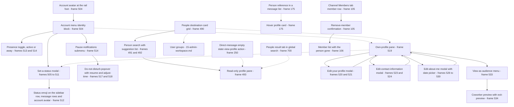

# Profiles & People

Everything the product does with a person's identity — the people destination, profile surfaces, profile editing, status, presence and the badges and rows that represent a person everywhere else.

## Purpose

This document specifies **identity**: how a person is represented, found, read and edited. Two halves make it up, and they are structurally different. The first half is **other people** — a dedicated people destination with a person search and a read-only profile pane [frame 490](../../screenshots/Slack%20web%20Jul%202024%20490.png), [frame 493](../../screenshots/Slack%20web%20Jul%202024%20493.png). The second half is **yourself** — an account menu, a status editor, a presence and notification-pause control, an editable own-profile pane and a preview of how that profile looks to somebody else [frame 504](../../screenshots/Slack%20web%20Jul%202024%20504.png), [frame 519](../../screenshots/Slack%20web%20Jul%202024%20519.png), [frame 534](../../screenshots/Slack%20web%20Jul%202024%20534.png). A build that implements only the first half has no way for a person to become findable; a build that implements only the second has nowhere to look anybody up.

**Where the area is encountered.** Identity is not confined to one destination — it is the most widely distributed area in the catalog. The corpus shows a person rendered in **five distinct surfaces**, each with its own shape and its own action set:

- the **docked profile pane** on the right of the content region, in a read-only form for another person [frame 493](../../screenshots/Slack%20web%20Jul%202024%20493.png) and an editable form for yourself [frame 519](../../screenshots/Slack%20web%20Jul%202024%20519.png);
- the **person card** in the people destination's grid [frame 490](../../screenshots/Slack%20web%20Jul%202024%20490.png);
- the **hover profile card** floating over a message list [frame 175](../../screenshots/Slack%20web%20Jul%202024%20175.png);
- the **member row** in a channel's membership list [frame 105](../../screenshots/Slack%20web%20Jul%202024%20105.png), [frame 106](../../screenshots/Slack%20web%20Jul%202024%20106.png);
- the **person token** inside a chip input or a filter [frame 75](../../screenshots/Slack%20web%20Jul%202024%2075.png), [frame 700](../../screenshots/Slack%20web%20Jul%202024%20700.png).

Beyond those five, a person is referenced as **metadata on other entities** — as the creator of a channel, rendered as plain text with a creation date [frame 90](../../screenshots/Slack%20web%20Jul%202024%2090.png) — and as an **identity block** at the head of the account menu [frame 504](../../screenshots/Slack%20web%20Jul%202024%20504.png). The practical consequence for a build is that a person's display name, avatar, presence and status are needed by almost every other area, so they must be a shared read model rather than a screen's local state.

**What this document owns.** The six flows below, the `E-USER` entity, and the identity surfaces listed above. It is the catalog's canonical consumer of `C-AVATAR` and `C-PRESENCE-DOT`, whose contracts — like every component contract — live in [00-product-overview.md](00-product-overview.md) and are referenced here by identifier only.

**What this document does not own.** The channel details pane, its tab set and channel membership belong to [02-channels.md](02-channels.md); the invite flows and account types at invite time to [01-onboarding-and-auth.md](01-onboarding-and-auth.md); message authorship and the hover action bar to [03-messaging-and-composer.md](03-messaging-and-composer.md); the direct-message surface to [05-direct-messages.md](05-direct-messages.md); the preferences dialog to [14-preferences-settings.md](14-preferences-settings.md); notification scheduling to [12-activity-notifications.md](12-activity-notifications.md); roles, permissions, member administration and user groups at workspace scope to [15-admin-workspace.md](15-admin-workspace.md); the People result tab to [09-search-and-filters.md](09-search-and-filters.md); external people and person search by company to [22-external-collaboration.md](22-external-collaboration.md); and cross-cutting state treatments to [21-states.md](21-states.md). Where a frame owned elsewhere is cited here, it is cited as evidence and named in the secondary list under **Frames covered**.

## Flows in this area

Six flows are named for this area, spanning 35 frames. Frame spans below are written as plain numerals because they designate a span rather than cite one image, following the convention of the [Screenshot Coverage Index](_screenshot-index.md); every individual frame is cited with its full relative link in the per-flow step tables and under **Frames covered**.

| Flow ID | Name | Frame span | Primary entry point |
|---|---|---|---|
| `13.1` | Search people and open a profile from the people destination | 490–493 | The people destination, reached from `C-RAIL` |
| `13.2` | Set a status with an emoji and a clear-after time | 504–512 | The status input in the account menu |
| `13.3` | Change presence, pause notifications and set do-not-disturb | 513–518 | The presence toggle and pause row in the account menu |
| `13.4` | View and edit your profile | 519–525 | The own-profile pane's per-section Edit links |
| `13.5` | Edit about-me details and a start date | 526–531 | The About-me section's Edit link in the own-profile pane |
| `13.6` | Preview your profile as a coworker | 532–534 | The View-as control in the own-profile pane |

The two halves of the area divide cleanly across these six: `13.1` is the only flow about somebody else, and `13.2` through `13.6` are all about the signed-in person. That asymmetry is a property of the corpus, not of the product — see the partial-capture notes under `13.1`.

## Flow 13.1 — Search people and open a profile from the people destination

### Overview

A dedicated destination lists the workspace's people as a card grid, offers a search field over them, and opens a read-only profile pane on the right when a person is chosen [frame 490](../../screenshots/Slack%20web%20Jul%202024%20490.png) through [frame 493](../../screenshots/Slack%20web%20Jul%202024%20493.png). The flow establishes three things a build needs: the destination's own information architecture, the person-search affordance and its suggestion list, and the read-only shape of a profile.

### Trigger

The people destination itself, reached from the navigation rail — the rail's overflow menu lists a people destination described as your team and user groups [frame 399](../../screenshots/Slack%20web%20Jul%202024%20399.png), and the destination's own sidebar renders its two sections once opened [frame 490](../../screenshots/Slack%20web%20Jul%202024%20490.png).

### Preconditions

An authenticated session with a workspace loaded and at least one other person present — the grid renders three person cards at this capture [frame 490](../../screenshots/Slack%20web%20Jul%202024%20490.png). No permission gate is visible on the destination: the invite action and the search field are both available without any admin-only note.

### Frame-by-frame steps

| Step | Frame(s) | What the user does | What changes on screen | Component(s) involved |
|---|---|---|---|---|
| 1 | [frame 490](../../screenshots/Slack%20web%20Jul%202024%20490.png) | Opens the people destination | The sidebar becomes destination-scoped: a bare title, a promotional banner with a countdown sub-line, and two items — an all-people item rendered active with a filled highlight, and a user-groups item. The content region loads a title row with an outlined invite-people action at its far right, a full-width person-search field with a leading magnifier, a dismissible invite card, a filter row, and a card grid of people | `C-RAIL`, `C-SIDEBAR`, `C-BANNER`, `C-UPGRADE-GATE` |
| 2 | [frame 490](../../screenshots/Slack%20web%20Jul%202024%20490.png) | Reads the grid | Each card stacks a large square photo above a name row, with a presence indicator immediately after the display name. The signed-in person's own card is distinguished twice over — an Edit affordance overlaid at the photo's top-right corner and a sub-line naming the card as yourself. A person with no photo renders a solid placeholder tile carrying a generic person glyph, and a hollow-ring presence indicator rather than a filled dot | `C-AVATAR`, `C-PRESENCE-DOT` |
| 3 | [frame 491](../../screenshots/Slack%20web%20Jul%202024%20491.png) | Focuses the person-search field | The field takes a focus ring and a caret. Nothing else on the surface changes — this is the only difference between the two captures | `C-SEARCH-ENTRY` |
| 4 | [frame 492](../../screenshots/Slack%20web%20Jul%202024%20492.png) | Types a partial name | A trailing clear control appears at the field's right edge, rendered as a text label rather than a glyph. A suggestion list opens beneath the field as an overlay with two rows: a highlighted row pairing a magnifier glyph with the raw query, and a person row pairing a small avatar with the bold display name, a filled presence indicator and the matched name. The card grid behind the overlay does **not** filter | `C-SEARCH-ENTRY`, `C-AVATAR`, `C-PRESENCE-DOT` |
| 5 | [frame 493](../../screenshots/Slack%20web%20Jul%202024%20493.png) | Chooses the person row | A profile pane docks along the right of the content region, taking roughly its right three-tenths, and the card grid narrows from three columns to two to make room. The pane header carries the title and a dismiss control; its body stacks a large square photo, the display name, a presence row, a local-time row, an action row of a message action plus a huddle split button plus an overflow control, and a contact-information section holding one email row. The query and its clear control remain in the search field, and the grid remains unfiltered | `C-DETAILS-PANE`, `C-AVATAR`, `C-PRESENCE-DOT` |

**Inferred:** the pane at step 5 is the read-only form of the same surface the own-profile pane shows, because both dock in the same region with the same header, the same photo-name-presence-local-time ordering and the same contact-information section [frame 493](../../screenshots/Slack%20web%20Jul%202024%20493.png), [frame 519](../../screenshots/Slack%20web%20Jul%202024%20519.png). The difference is the action set and the sections, enumerated under **Screens & components**.

> **Partial capture:** three things about this flow are not shown. The grid's filter controls — a title chip, a location chip and a filters control — are captured only in their unset state, so no filtered grid exists in the corpus and the filter semantics are unspecified [frame 490](../../screenshots/Slack%20web%20Jul%202024%20490.png). The result of activating the query row of the suggestion list, as distinct from the person row, is not captured. And the surface behind the sidebar's user-groups item is not captured in this area at all — the only user-group surfaces in the corpus are in the administration console, owned by [15-admin-workspace.md](15-admin-workspace.md).

## Flow 13.2 — Set a status with an emoji and a clear-after time

### Overview

The account menu carries a status input; opening it raises a modal that offers workspace-suggested presets, automatic calendar-driven presets, or a free-text status with an emoji, a clear-after time and an option to pause notifications at the same time [frame 504](../../screenshots/Slack%20web%20Jul%202024%20504.png) through [frame 512](../../screenshots/Slack%20web%20Jul%202024%20512.png). The flow closes by showing where a saved status is surfaced, which is the part a build most often misses: in three places at once.

### Trigger

The status input inside the account menu, which is itself anchored to the account avatar pinned at the foot of the navigation rail [frame 504](../../screenshots/Slack%20web%20Jul%202024%20504.png).

### Preconditions

An authenticated session with a conversation in the content region. No status is set — the menu's status input shows its placeholder and no status glyph appears beside the user's own name in the sidebar [frame 504](../../screenshots/Slack%20web%20Jul%202024%20504.png).

### Frame-by-frame steps

| Step | Frame(s) | What the user does | What changes on screen | Component(s) involved |
|---|---|---|---|---|
| 1 | [frame 504](../../screenshots/Slack%20web%20Jul%202024%20504.png) | Activates the account avatar at the rail's foot | A menu opens upward from the avatar, overlapping the sidebar's lower region. It stacks an identity block — avatar, display name, and a presence row pairing a filled indicator with the word Active — then a bordered status input carrying a leading emoji-picker glyph and a placeholder inviting a status, then a row that sets the account away, then a pause-notifications row with a trailing submenu chevron, then a separated group of a profile row and a preferences row, then a separated sign-out row that names the workspace | `C-RAIL`, `C-AVATAR`, `C-PRESENCE-DOT`, `C-DROPDOWN-MENU` |
| 2 | [frame 505](../../screenshots/Slack%20web%20Jul%202024%20505.png) | Activates the status input | A centred modal opens over a dimmed backdrop with its own title and dismiss control. Its body stacks the same status input, a workspace-scoped group of five preset rows — each an emoji, a bold status text, an em-dash and a clear-after hint — and an automatically-updates group of two rows, each driven by a connected calendar app. The footer carries an edit-suggestions link at the left, then a cancel action and a save action rendered **muted**. A dark keyboard-shortcut tip pill sits below the modal, outside its frame | `C-MODAL-SHELL` |
| 3 | [frame 506](../../screenshots/Slack%20web%20Jul%202024%20506.png) | Types a status text | The modal **shrinks**: both preset groups are replaced by two new controls — a remove-status-after label above a select resolved to a same-day value, and an unchecked pause-notifications checkbox. A filled circular clear control appears at the status field's right edge while its leading glyph stays on the grey placeholder. The save action becomes a filled primary | `C-MODAL-SHELL` |
| 4 | [frame 507](../../screenshots/Slack%20web%20Jul%202024%20507.png) | Activates the leading emoji-picker glyph | An emoji picker opens as a popover to the left of and overlapping the modal, anchored to the glyph: a category tab row whose search tab is active, a search-all-emoji field, a frequently-used row, a smileys-and-people grid, and a footer offering an add-emoji action. One category tab is product-specific rather than a Unicode group | `C-MODAL-SHELL` |
| 5 | [frame 508](../../screenshots/Slack%20web%20Jul%202024%20508.png) | Chooses an emoji | The picker closes and the chosen emoji replaces the placeholder glyph at the status field's leading edge. The clear control, the remove-after select and the unchecked checkbox are unchanged | `C-MODAL-SHELL` |
| 6 | [frame 509](../../screenshots/Slack%20web%20Jul%202024%20509.png) | Opens the remove-status-after select | A select menu opens over the modal listing eight options in a fixed order: a muted clear-selection row, a do-not-clear row, thirty minutes, one hour, four hours, a same-day row rendered with a leading check and a filled highlight, a this-week row, and a choose-date-and-time row | `C-DROPDOWN-MENU` |
| 7 | [frame 510](../../screenshots/Slack%20web%20Jul%202024%20510.png) | Chooses a duration | The select closes and resolves to the chosen duration. The save action stays filled and the checkbox stays unchecked | `C-DROPDOWN-MENU` |
| 8 | [frame 511](../../screenshots/Slack%20web%20Jul%202024%20511.png) | Ticks the pause-notifications checkbox | The checkbox renders ticked. Nothing else on the surface changes — the two captures differ only inside the checkbox itself | `C-MODAL-SHELL` |
| 9 | [frame 512](../../screenshots/Slack%20web%20Jul%202024%20512.png) | Saves | The modal closes and the status emoji is surfaced in **three** places at once: immediately after the self badge on the user's own conversation row in the sidebar, immediately after the display name on every message row they authored, and on the account avatar at the rail's foot | `C-SIDEBAR`, `C-MESSAGE-ROW`, `C-AVATAR`, `C-PRESENCE-DOT` |

**Inferred:** the five preset rows and the two calendar-driven rows are alternatives to typing, not additions to it, because typing a status replaces both groups with the duration select and the pause checkbox in the very next capture [frame 505](../../screenshots/Slack%20web%20Jul%202024%20505.png), [frame 506](../../screenshots/Slack%20web%20Jul%202024%20506.png). Each preset carries its own clear-after hint, so **Inferred:** choosing a preset sets the status text, the emoji and the duration together.

**Inferred:** the status text is required and the emoji is optional. The save action is muted while the field is empty [frame 505](../../screenshots/Slack%20web%20Jul%202024%20505.png) and filled as soon as text is present but before any emoji is chosen [frame 506](../../screenshots/Slack%20web%20Jul%202024%20506.png).

> **Partial capture:** the corpus does not show the outcome of the choose-date-and-time option, the edit-suggestions link, the add-emoji action, or a status set from one of the preset rows. It also never shows a status **text** rendered anywhere outside the modal — only the emoji is surfaced in the three locations at step 9 — so where the text itself is readable is unspecified.

## Flow 13.3 — Change presence, pause notifications and set do-not-disturb

### Overview

The same account menu carries two availability controls that a build must not conflate: a **presence toggle**, which switches between an active and an away state, and a **notification pause**, which is a timed do-not-disturb with its own popover and its own indicator [frame 513](../../screenshots/Slack%20web%20Jul%202024%20513.png) through [frame 518](../../screenshots/Slack%20web%20Jul%202024%20518.png). They are independent: the corpus captures an away presence with notifications un-paused [frame 513](../../screenshots/Slack%20web%20Jul%202024%20513.png) and an active presence with notifications paused [frame 517](../../screenshots/Slack%20web%20Jul%202024%20517.png).

### Trigger

Two triggers, both inside the account menu: the presence-toggle row, and the pause-notifications row with its submenu chevron [frame 513](../../screenshots/Slack%20web%20Jul%202024%20513.png), [frame 514](../../screenshots/Slack%20web%20Jul%202024%20514.png).

### Preconditions

An authenticated session with the account menu open. At this flow's first capture the presence is away, the status input is empty and no status glyph is present anywhere in the shell [frame 513](../../screenshots/Slack%20web%20Jul%202024%20513.png).

### Frame-by-frame steps

| Step | Frame(s) | What the user does | What changes on screen | Component(s) involved |
|---|---|---|---|---|
| 1 | [frame 513](../../screenshots/Slack%20web%20Jul%202024%20513.png) | Reads the menu in the away state | The identity block's presence row pairs a **hollow ring** indicator with the word Away, and the toggle row's label now offers to set the account **active** — the label names the state it switches to, not the state it is in. The account avatar at the rail's foot carries the same away treatment | `C-DROPDOWN-MENU`, `C-PRESENCE-DOT` |
| 2 | [frame 514](../../screenshots/Slack%20web%20Jul%202024%20514.png) | Returns to active, then moves onto the pause-notifications row | The presence row reverts to a filled indicator and the word Active, and the toggle row's label reverts to offering away. The pause row takes a filled highlight and a submenu opens to its right: a header row carrying a help affordance, then six durations in order — thirty minutes, one hour, two hours, until tomorrow, until next week, and a custom row — then a separated row offering a notification schedule and carrying a new badge | `C-DROPDOWN-MENU` |
| 3 | [frame 515](../../screenshots/Slack%20web%20Jul%202024%20515.png) | Dismisses the menu | The overlay closes and the plain conversation returns. No status glyph is rendered beside the user's own name in the sidebar or beside their name on any message row — the only differences from the status-set capture are exactly those glyph positions | `C-SIDEBAR`, `C-MESSAGE-ROW` |
| 4 | [frame 516](../../screenshots/Slack%20web%20Jul%202024%20516.png) | Reopens the menu | The presence row reads Active and its indicator is drawn differently from the plain filled dot of the un-paused active state, while the pause row shows **no** value beside its chevron | `C-DROPDOWN-MENU`, `C-PRESENCE-DOT` |
| 5 | [frame 517](../../screenshots/Slack%20web%20Jul%202024%20517.png) | Pauses notifications | The pause row now shows an on value before its chevron, and the submenu is replaced by a do-not-disturb popover: a filled header block in an accent colour carrying a decorative illustration at its right, a heading, and a line stating that notifications are paused until a given clock time; beneath it, on the default surface, a resume row rendered in the destructive colour, an adjust-time row with its own submenu chevron, a separator, and the same badged notification-schedule row | `C-DROPDOWN-MENU` |
| 6 | [frame 518](../../screenshots/Slack%20web%20Jul%202024%20518.png) | Hovers the resume row | The resume row takes a filled highlight in the destructive colour. Nothing outside that row changes | `C-DROPDOWN-MENU` |

**Inferred:** presence and the notification pause are separate fields on the person rather than one availability enumeration, because the corpus captures each varying while the other holds — away with no pause value on the row [frame 513](../../screenshots/Slack%20web%20Jul%202024%20513.png), and active with the pause row reading on [frame 517](../../screenshots/Slack%20web%20Jul%202024%20517.png).

**Inferred:** the presence indicator has a distinct paused rendering. The indicator differs between the plain active capture and the paused active capture while the label stays Active [frame 504](../../screenshots/Slack%20web%20Jul%202024%20504.png), [frame 516](../../screenshots/Slack%20web%20Jul%202024%20516.png), and the own-profile pane spells the combination out in words as an active-with-notifications-snoozed row [frame 522](../../screenshots/Slack%20web%20Jul%202024%20522.png). The indicator on the account avatar at the rail's foot likewise differs across the active, away, status-set and paused captures [frame 504](../../screenshots/Slack%20web%20Jul%202024%20504.png), [frame 512](../../screenshots/Slack%20web%20Jul%202024%20512.png), [frame 513](../../screenshots/Slack%20web%20Jul%202024%20513.png), [frame 517](../../screenshots/Slack%20web%20Jul%202024%20517.png).

> **Partial capture:** the corpus does not show the result of any of the six pause durations being chosen, nor the custom row, nor the adjust-time submenu, nor the notification-schedule surface — that surface belongs to [14-preferences-settings.md](14-preferences-settings.md) and [12-activity-notifications.md](12-activity-notifications.md). It also never shows notifications being resumed, only the resume row and its hover state.
>
> **Partial capture:** the status set in flow `13.2` is **already gone** at this flow's first capture — the status input is empty and no status glyph remains [frame 512](../../screenshots/Slack%20web%20Jul%202024%20512.png), [frame 513](../../screenshots/Slack%20web%20Jul%202024%20513.png) — and no frame shows what cleared it. The clear-after duration elapsing, an explicit clear, and the presence change are all consistent with the captures, so the cause is left unstated rather than guessed.

## Flow 13.4 — View and edit your profile

### Overview

Your own profile opens in the same docked pane that shows somebody else's, with three differences: a per-section Edit link, two self-only actions, and an about-me section [frame 519](../../screenshots/Slack%20web%20Jul%202024%20519.png). Each Edit link opens its **own** modal scoped to that section — one for the name-and-photo group [frame 520](../../screenshots/Slack%20web%20Jul%202024%20520.png), one for contact information [frame 523](../../screenshots/Slack%20web%20Jul%202024%20523.png) — and each saves back into the pane [frame 522](../../screenshots/Slack%20web%20Jul%202024%20522.png), [frame 525](../../screenshots/Slack%20web%20Jul%202024%20525.png). The section-scoped editing model is the flow's central design decision and the thing a build most easily gets wrong by building one large profile form instead.

### Trigger

The Edit link on a section of the own-profile pane [frame 519](../../screenshots/Slack%20web%20Jul%202024%20519.png).

### Preconditions

An authenticated session with the own-profile pane open on the right of the content region. At the first capture the profile carries a photo, a display name and an email address, and offers to add a name pronunciation, a phone number and a start date [frame 519](../../screenshots/Slack%20web%20Jul%202024%20519.png).

### Frame-by-frame steps

| Step | Frame(s) | What the user does | What changes on screen | Component(s) involved |
|---|---|---|---|---|
| 1 | [frame 519](../../screenshots/Slack%20web%20Jul%202024%20519.png) | Opens their own profile | A pane docks along the right of the content region, which narrows and rewraps. The pane stacks a large square photo, a name row whose Edit link sits at the far right, an add-name-pronunciation link, a presence row, a local-time row, an action row of a set-a-status action plus a view-as control with a trailing caret plus an overflow control, then a contact-information section with its own Edit link holding an email row and an add-phone link, then an about-me section with its own Edit link holding an add-start-date link | `C-DETAILS-PANE`, `C-AVATAR`, `C-PRESENCE-DOT` |
| 2 | [frame 520](../../screenshots/Slack%20web%20Jul%202024%20520.png) | Activates the name row's Edit link | A modal opens in **two columns**. The left column holds a filled full-name field, then an empty display-name field with helper copy explaining it is how people refer to you, then an empty title field with helper copy explaining it says what you do. Beneath both columns, full width, sit a pronouns field with an example placeholder, a name-recording row offering a record-audio-clip action with a microphone glyph, a name-pronunciation field with an example placeholder, and a time-zone select resolved to a named zone with its UTC offset. The right column holds a profile-photo label, the current photo, an outlined upload action and a remove link. The footer offers cancel then a filled save action | `C-MODAL-SHELL`, `C-DROPDOWN-MENU` |
| 3 | [frame 521](../../screenshots/Slack%20web%20Jul%202024%20521.png) | Types a job title | The title field holds the typed value while the name-pronunciation field still shows its grey example placeholder, and the time-zone select carries a helper line explaining the zone is used for summary emails, activity times and reminders. At this capture the pronouns field is **absent** from the form — see the recorded inconsistency under **Edge cases & validations** | `C-MODAL-SHELL` |
| 4 | [frame 522](../../screenshots/Slack%20web%20Jul%202024%20522.png) | Saves the name-and-photo group | The modal closes and the pane renders the saved job title as a sub-line directly beneath the display name. The presence row now reads as active with notifications snoozed — a single compound label rather than two rows | `C-DETAILS-PANE`, `C-PRESENCE-DOT` |
| 5 | [frame 523](../../screenshots/Slack%20web%20Jul%202024%20523.png) | Activates the contact-information Edit link | A second, smaller modal opens holding exactly two fields: an email-address field whose label is preceded by a padlock glyph and which is pre-filled, and an empty phone field. The footer offers cancel then a filled save action | `C-MODAL-SHELL` |
| 6 | [frame 524](../../screenshots/Slack%20web%20Jul%202024%20524.png) | Enters a phone number | The phone field holds the typed value. Nothing else in the modal changes | `C-MODAL-SHELL` |
| 7 | [frame 525](../../screenshots/Slack%20web%20Jul%202024%20525.png) | Saves contact information | The modal closes and the contact-information section gains a phone row — a phone glyph, a label and the value rendered as a link — in place of the add-phone link. The about-me section still offers only an add-start-date link | `C-DETAILS-PANE` |

**Inferred:** the pane's `+`-prefixed links are the empty state of a field rather than separate actions, because the add-phone link is replaced in place by a populated phone row once a value is saved [frame 519](../../screenshots/Slack%20web%20Jul%202024%20519.png), [frame 525](../../screenshots/Slack%20web%20Jul%202024%20525.png). The same substitution is observed for the start date in flow `13.5` [frame 531](../../screenshots/Slack%20web%20Jul%202024%20531.png).

**Inferred:** editing is scoped per section, not per profile. Two different Edit links open two differently-shaped modals over the same pane, each carrying only its own section's fields and its own save action [frame 520](../../screenshots/Slack%20web%20Jul%202024%20520.png), [frame 523](../../screenshots/Slack%20web%20Jul%202024%20523.png).

> **Partial capture:** the corpus does not show the record-audio-clip flow for a name recording, the photo upload or removal actions from within this modal — the only photo-crop surface in the corpus sits inside the onboarding wizard, where a crop dialog offers a square crop frame with corner handles over the uploaded portrait and a preview row rendering the resulting avatar tile beside the display name, owned by [01-onboarding-and-auth.md](01-onboarding-and-auth.md) [frame 21](../../screenshots/Slack%20web%20Jul%202024%2021.png) — the time-zone select in its open state, the overflow control on the pane, or any validation failure on any profile field. It also never shows what the padlock glyph beside the email label means; no explanatory text accompanies it [frame 523](../../screenshots/Slack%20web%20Jul%202024%20523.png).
>
> **Partial capture:** no frame shows the action that opened the pane. The account menu offers a profile row [frame 504](../../screenshots/Slack%20web%20Jul%202024%20504.png) and the people grid's own card carries an Edit affordance [frame 490](../../screenshots/Slack%20web%20Jul%202024%20490.png), but neither is captured being activated, so the entry point is inferred rather than observed and is drawn as a dashed edge in the diagram below.

## Flow 13.5 — Edit about-me details and a start date

### Overview

The about-me section's Edit link opens a single-field modal for a start date, and that field is backed by a date-picker popover with two modes — a day grid and a month grid — reached by activating the picker's own month-and-year control [frame 526](../../screenshots/Slack%20web%20Jul%202024%20526.png) through [frame 531](../../screenshots/Slack%20web%20Jul%202024%20531.png). The saved value is rendered back into the pane in a shorter form than the one the form used, with a relative age beside it.

### Trigger

The Edit link on the own-profile pane's about-me section [frame 525](../../screenshots/Slack%20web%20Jul%202024%20525.png).

### Preconditions

An authenticated session with the own-profile pane open and no start date set — the about-me section offers only an add-start-date link [frame 525](../../screenshots/Slack%20web%20Jul%202024%20525.png).

### Frame-by-frame steps

| Step | Frame(s) | What the user does | What changes on screen | Component(s) involved |
|---|---|---|---|---|
| 1 | [frame 526](../../screenshots/Slack%20web%20Jul%202024%20526.png) | Activates the about-me Edit link | A modal opens holding exactly one control: a start-date field with a leading calendar glyph, a select-date placeholder and a trailing caret. The footer offers cancel then a save action rendered **filled** even though the field is empty | `C-MODAL-SHELL` |
| 2 | [frame 527](../../screenshots/Slack%20web%20Jul%202024%20527.png) | Opens the date picker | A popover opens **below** the field, overlapping the modal's footer and extending past the modal's lower edge. It stacks a header of a previous-month chevron, a month-and-year control with its own caret and a next-month chevron; a weekday header of two-letter abbreviations; and a day grid whose leading cells before the first of the month are empty. The current day is ringed by an unfilled outline | `C-DATE-PICKER-POPOVER` |
| 3 | [frame 528](../../screenshots/Slack%20web%20Jul%202024%20528.png) | Activates the month-and-year control | The popover switches to a **month grid**: the header's centre control narrows to the year alone, still carrying its own caret, and its chevrons step by year; the body becomes a three-column grid of twelve abbreviated month names with the current month rendered filled | `C-DATE-PICKER-POPOVER` |
| 4 | [frame 529](../../screenshots/Slack%20web%20Jul%202024%20529.png) | Chooses an earlier month | The popover returns to the day grid, now showing that month with its weekday header and its own leading empty cells | `C-DATE-PICKER-POPOVER` |
| 5 | [frame 530](../../screenshots/Slack%20web%20Jul%202024%20530.png) | Chooses a day | The popover closes and the field resolves to the chosen date in **long** form — month name, ordinal day and year. The footer's save action is unchanged | `C-DATE-PICKER-POPOVER`, `C-MODAL-SHELL` |
| 6 | [frame 531](../../screenshots/Slack%20web%20Jul%202024%20531.png) | Saves | The modal closes and the about-me section gains a start-date row: a label above the value, the value rendered as a link in **short** form, with a relative age in parentheses beside it | `C-DETAILS-PANE` |

**Inferred:** the start date is optional. The save action is filled while the field is empty [frame 526](../../screenshots/Slack%20web%20Jul%202024%20526.png), which is the opposite of the status modal's treatment of its own required field [frame 505](../../screenshots/Slack%20web%20Jul%202024%20505.png) — the two modals therefore do not share one required-field convention, and this is recorded as a gotcha rather than smoothed away.

**Inferred:** the relative age beside the saved date is derived rather than entered, because the form offers no field for it and the pane renders it in parentheses after the date [frame 530](../../screenshots/Slack%20web%20Jul%202024%20530.png), [frame 531](../../screenshots/Slack%20web%20Jul%202024%20531.png).

> **Partial capture:** the about-me modal holds only a start-date field at every capture, so whether the section can hold anything else is unspecified here. The administration console's own about-me group holds one start-date row typed as a date, notes beside it that work-anniversary and new-hire events are enabled, and offers an add-data-element link — evidence that the section is extensible, and owned by [15-admin-workspace.md](15-admin-workspace.md) [frame 682](../../screenshots/Slack%20web%20Jul%202024%20682.png). The picker's year-stepping chevrons and its month-grid selection are captured only in their before and after states, and no frame shows a date being cleared once set.

## Flow 13.6 — Preview your profile as a coworker

### Overview

A view-as control on the own-profile pane switches the pane into a **preview** of what another audience sees, with a persistent preview bar and an explicit exit [frame 532](../../screenshots/Slack%20web%20Jul%202024%20532.png) through [frame 534](../../screenshots/Slack%20web%20Jul%202024%20534.png). Two audiences are offered — a coworker inside the workspace, and a contact from another organization — which makes the preview a two-audience feature rather than a single toggle.

### Trigger

The view-as control in the own-profile pane's action row [frame 532](../../screenshots/Slack%20web%20Jul%202024%20532.png).

### Preconditions

An authenticated session with the own-profile pane open in its editable form, carrying its Edit links, its set-a-status action and its view-as control [frame 532](../../screenshots/Slack%20web%20Jul%202024%20532.png).

### Frame-by-frame steps

| Step | Frame(s) | What the user does | What changes on screen | Component(s) involved |
|---|---|---|---|---|
| 1 | [frame 532](../../screenshots/Slack%20web%20Jul%202024%20532.png) | Reads the pane before previewing | The pane renders in its editable form — photo, name with an Edit link, add-name-pronunciation link, presence row, local-time row, the action row, and the contact-information and about-me sections each with their own Edit link. The composer in the narrowed content region is expanded, showing its formatting toolbar | `C-DETAILS-PANE` |
| 2 | [frame 533](../../screenshots/Slack%20web%20Jul%202024%20533.png) | Activates the view-as control | A menu opens directly beneath the control with exactly two rows, each carrying a leading glyph: a square workspace-icon tile beside a coworker-at-this-workspace row, and an external-connection glyph beside a contact-from-other-organizations row | `C-DROPDOWN-MENU`, `C-AVATAR` |
| 3 | [frame 534](../../screenshots/Slack%20web%20Jul%202024%20534.png) | Chooses the coworker audience | A preview bar is inserted at the top of the pane body, directly beneath the pane header: a filled control naming the audience with a trailing caret, and an exit-preview action rendered as a filled primary at its right. The body reduces to the photo, the display name, the job-title sub-line, the presence row, the local-time row, a single full-width message action with a leading chat glyph, an overflow control, and a contact-information section holding the email row **only**. Every Edit link, the add-name-pronunciation link, the set-a-status action, the view-as control, the add-phone link and the whole about-me section are gone | `C-DETAILS-PANE`, `C-AVATAR`, `C-PRESENCE-DOT` |

**Inferred:** the preview bar's audience control is a switcher rather than a label, because it carries the same trailing caret as the view-as control that opened the preview [frame 533](../../screenshots/Slack%20web%20Jul%202024%20533.png), [frame 534](../../screenshots/Slack%20web%20Jul%202024%20534.png).

**Inferred:** the coworker preview and the read-only pane of another person are the same rendering. Both reduce to photo, name, presence, local time, a message action and an overflow control over a contact-information section, and both drop every editing affordance [frame 493](../../screenshots/Slack%20web%20Jul%202024%20493.png), [frame 534](../../screenshots/Slack%20web%20Jul%202024%20534.png). The one difference observed is the action row: the read-only pane of another person also offers a huddle split button, which the preview does not [frame 493](../../screenshots/Slack%20web%20Jul%202024%20493.png).

> **Partial capture:** the external-contact audience is never rendered — only offered — so what a contact from another organization sees is unspecified. The exit-preview action is captured but its result is not.

## Screens & components

Layout below is expressed **proportionally** — regions, columns, ordering and relative size — and icons are named by **function**. No absolute pixel offset is given, and none should be inferred from the captures.

### How identity reaches the user: the observed route map

Solid edges are transitions the corpus captures as consecutive states of one flow. **Dashed edges are inferred** — the entry point exists in a capture but the capture of it being taken does not, and each is justified in the partial-capture note of the flow it belongs to.

### The docked profile pane

The pane takes the **right three-tenths or so** of the viewport width from the content region, which narrows and rewraps rather than being overlaid — the message list and composer reflow to the reduced width [frame 519](../../screenshots/Slack%20web%20Jul%202024%20519.png), and in the people destination the card grid drops from three columns to two [frame 490](../../screenshots/Slack%20web%20Jul%202024%20490.png), [frame 493](../../screenshots/Slack%20web%20Jul%202024%20493.png). Its header is a title at the leading edge with a dismiss control at the trailing edge. Its body is a single scrolling column, centred photo first.

The pane has **three observed forms**, and the differences between them are the contract:

| Pane form | Header and body order | Actions | Sections | Frames |
|---|---|---|---|---|
| Another person, read-only | Title, dismiss; photo, display name, presence row, local-time row, action row | Message; huddle split button with a trailing caret; overflow | Contact information holding an email row | [frame 493](../../screenshots/Slack%20web%20Jul%202024%20493.png) |
| Yourself, editable | Title, dismiss; photo, name row **with a trailing Edit link**, add-name-pronunciation link, presence row, local-time row, action row | Set a status; view-as with a trailing caret; overflow | Contact information **with its own Edit link** holding an email row and an add-phone link; about me **with its own Edit link** holding an add-start-date link | [frame 519](../../screenshots/Slack%20web%20Jul%202024%20519.png), [frame 525](../../screenshots/Slack%20web%20Jul%202024%20525.png), [frame 531](../../screenshots/Slack%20web%20Jul%202024%20531.png) |
| Yourself, previewed as a coworker | Title, dismiss; **preview bar**; photo, display name, job-title sub-line, presence row, local-time row, action row | Message, rendered full width; overflow | Contact information holding an email row only | [frame 534](../../screenshots/Slack%20web%20Jul%202024%20534.png) |

Two body details recur in every form. A **value row** pairs a leading function glyph — an envelope for an email address, a handset for a phone number, a clock for a local time — with a label above the value, and the value is rendered as a link where it is actionable [frame 519](../../screenshots/Slack%20web%20Jul%202024%20519.png), [frame 525](../../screenshots/Slack%20web%20Jul%202024%20525.png). An **empty field** is rendered instead as a `+`-prefixed add link in the accent colour, and is replaced in place by a value row once filled [frame 525](../../screenshots/Slack%20web%20Jul%202024%20525.png), [frame 531](../../screenshots/Slack%20web%20Jul%202024%20531.png).

### The person card in the people destination

The destination's content region orders its blocks top-down: a title row with an invite action at its trailing edge; a full-width person-search field; a dismissible invite card; a filter row; then the grid [frame 490](../../screenshots/Slack%20web%20Jul%202024%20490.png). A card stacks a **large square photo** above a name row, and the name row places the display name first and the presence indicator immediately after it. Cards are equal width and sit three to a row at full content width, dropping to two when the pane docks [frame 493](../../screenshots/Slack%20web%20Jul%202024%20493.png).

Your own card is marked twice: an **Edit affordance overlaid at the photo's top-right corner**, and a sub-line beneath the name row identifying the card as yourself [frame 490](../../screenshots/Slack%20web%20Jul%202024%20490.png). A person with no photo gets a solid placeholder tile carrying a generic person glyph rather than initials [frame 490](../../screenshots/Slack%20web%20Jul%202024%20490.png).

The filter row is a chip-based bar: a title chip with a caret, a location chip with a caret, then a filters control in the accent colour, with a sort control at the row's far right showing its current value and a caret [frame 490](../../screenshots/Slack%20web%20Jul%202024%20490.png). Its behaviour is not captured — see the flow's partial-capture note.

### The hover profile card

A floating card, not docked and not modal, laid over the message list: a **large square avatar at the leading edge**, the display name in bold beside it with a presence indicator immediately after the name, then a separator, then a single value row pairing a clock glyph with the local time [frame 175](../../screenshots/Slack%20web%20Jul%202024%20175.png). No actions of any kind appear on it. It is the smallest identity surface in the corpus and carries the same photo-name-presence-local-time ordering as the pane's head, which is why a build should render both from one identity summary.

**Inferred:** the card is anchored to a person reference under the pointer, because it appears in a capture whose composer holds a person-mention chip and it sits directly above that chip [frame 175](../../screenshots/Slack%20web%20Jul%202024%20175.png). A single capture cannot show the anchoring, so the edge is dashed in the diagram.

### The member row and the person token

A **member row** places an avatar at the leading edge, then the display name or handle, then the presence indicator, and reserves the trailing edge for a row-scoped action — a remove link, present on other people's rows and **absent on your own** [frame 105](../../screenshots/Slack%20web%20Jul%202024%20105.png), [frame 106](../../screenshots/Slack%20web%20Jul%202024%20106.png). The list it sits in is headed by a find-members field and an add-people row whose leading glyph is a person-plus [frame 105](../../screenshots/Slack%20web%20Jul%202024%20105.png).

A **person token** renders a person inline inside a field: avatar, display name, then a trailing remove control, laid out horizontally within the input's own bounds [frame 75](../../screenshots/Slack%20web%20Jul%202024%2075.png). The same token shape carries a person as a search filter value, where it appears both inside a filter field and, reduced to an avatar plus a label, on the filter chip itself [frame 700](../../screenshots/Slack%20web%20Jul%202024%20700.png). The container contract is `C-CHIP-INPUT`; only the person-shaped token is specified here.

### Self indication and the badge slot

The corpus renders **three different self indications**, and they are not interchangeable:

| Where | Treatment | Frames |
|---|---|---|
| Sidebar conversation row | A separate muted lower-case badge after the display name, in the badge slot | [frame 120](../../screenshots/Slack%20web%20Jul%202024%20120.png), [frame 504](../../screenshots/Slack%20web%20Jul%202024%20504.png) |
| Member row and person token | The display name suffixed with a parenthesised self marker, inside the name itself | [frame 106](../../screenshots/Slack%20web%20Jul%202024%20106.png), [frame 700](../../screenshots/Slack%20web%20Jul%202024%20700.png) |
| Person card in the people grid | A sub-line beneath the name row, plus an Edit affordance over the photo | [frame 490](../../screenshots/Slack%20web%20Jul%202024%20490.png) |

The **badge slot** sits immediately after the display name on a sidebar conversation row and holds a short muted lower-case label. Two labels are observed in it, both **sample data**: a guest label on two rows and a self label on one [frame 120](../../screenshots/Slack%20web%20Jul%202024%20120.png). The slot is the contract; the labels are examples. When a status is set, the status glyph is appended **after** whatever occupies the badge slot [frame 512](../../screenshots/Slack%20web%20Jul%202024%20512.png).

**Inferred:** the guest label denotes an account type rather than a channel role, because it appears on direct-message rows, which sit outside any channel [frame 120](../../screenshots/Slack%20web%20Jul%202024%20120.png), and because the account type is chosen at invite time from a member-or-guest select whose guest option is described as limited to selected channels, files and the directory [frame 49](../../screenshots/Slack%20web%20Jul%202024%2049.png).

### Components this area uses

Every contract below is defined once in [00-product-overview.md](00-product-overview.md) and is referenced here by identifier. Nothing in this document restates a contract.

| Component | How this area uses it | Frames |
|---|---|---|
| `C-RAIL` | Holds the account avatar at its foot, which is the anchor for the account menu, and the people destination among its entries | [frame 399](../../screenshots/Slack%20web%20Jul%202024%20399.png), [frame 504](../../screenshots/Slack%20web%20Jul%202024%20504.png) |
| `C-SIDEBAR` | Renders conversation rows carrying avatar, name, badge slot and status glyph; and the people destination's own two-item scoped variant | [frame 120](../../screenshots/Slack%20web%20Jul%202024%20120.png), [frame 490](../../screenshots/Slack%20web%20Jul%202024%20490.png), [frame 512](../../screenshots/Slack%20web%20Jul%202024%20512.png) |
| `C-AVATAR` | Every identity surface: rail foot, sidebar row, message row, member row, person token, person card, hover card, pane head, and the workspace tile beside the coworker audience row | [frame 105](../../screenshots/Slack%20web%20Jul%202024%20105.png), [frame 175](../../screenshots/Slack%20web%20Jul%202024%20175.png), [frame 490](../../screenshots/Slack%20web%20Jul%202024%20490.png), [frame 533](../../screenshots/Slack%20web%20Jul%202024%20533.png) |
| `C-PRESENCE-DOT` | Filled and hollow variants on every avatar-bearing surface, plus the account avatar's state-dependent treatment | [frame 105](../../screenshots/Slack%20web%20Jul%202024%20105.png), [frame 490](../../screenshots/Slack%20web%20Jul%202024%20490.png), [frame 513](../../screenshots/Slack%20web%20Jul%202024%20513.png), [frame 517](../../screenshots/Slack%20web%20Jul%202024%20517.png) |
| `C-DETAILS-PANE` | The docked profile pane in all three of its forms | [frame 493](../../screenshots/Slack%20web%20Jul%202024%20493.png), [frame 519](../../screenshots/Slack%20web%20Jul%202024%20519.png), [frame 534](../../screenshots/Slack%20web%20Jul%202024%20534.png) |
| `C-MODAL-SHELL` | The status modal and the three section-scoped edit modals | [frame 505](../../screenshots/Slack%20web%20Jul%202024%20505.png), [frame 520](../../screenshots/Slack%20web%20Jul%202024%20520.png), [frame 523](../../screenshots/Slack%20web%20Jul%202024%20523.png), [frame 526](../../screenshots/Slack%20web%20Jul%202024%20526.png) |
| `C-DROPDOWN-MENU` | The account menu and its submenus, the clear-after select, the time-zone select and the view-as audience menu | [frame 504](../../screenshots/Slack%20web%20Jul%202024%20504.png), [frame 509](../../screenshots/Slack%20web%20Jul%202024%20509.png), [frame 514](../../screenshots/Slack%20web%20Jul%202024%20514.png), [frame 533](../../screenshots/Slack%20web%20Jul%202024%20533.png) |
| `C-DATE-PICKER-POPOVER` | The start-date field's picker, in both its day-grid and month-grid modes | [frame 527](../../screenshots/Slack%20web%20Jul%202024%20527.png), [frame 528](../../screenshots/Slack%20web%20Jul%202024%20528.png) |
| `C-CHIP-INPUT` | The container that holds a person token when a person is added to a channel or used as a search filter | [frame 75](../../screenshots/Slack%20web%20Jul%202024%2075.png), [frame 700](../../screenshots/Slack%20web%20Jul%202024%20700.png) |
| `C-CONFIRM-DIALOG` | The destructive confirmation that guards removing a person from a channel | [frame 105](../../screenshots/Slack%20web%20Jul%202024%20105.png) |
| `C-SEARCH-ENTRY` | The scoped person-search field on the people destination and on the external-connections destination | [frame 490](../../screenshots/Slack%20web%20Jul%202024%20490.png), [frame 500](../../screenshots/Slack%20web%20Jul%202024%20500.png) |
| `C-MESSAGE-ROW` | Carries the author's avatar, display name and — once set — the status glyph after the name | [frame 512](../../screenshots/Slack%20web%20Jul%202024%20512.png) |
| `C-BANNER` and `C-UPGRADE-GATE` | The promotional banner and countdown occupying the people destination's sidebar banner slot | [frame 490](../../screenshots/Slack%20web%20Jul%202024%20490.png) |
| `C-TAB-BAR` | The channel details pane's tab bar, whose member tab carries the member count this area's rows populate | [frame 105](../../screenshots/Slack%20web%20Jul%202024%20105.png) |
| `C-DROPDOWN-MENU` | The account menu, in the contract's persistent-anchor-with-sideways-submenus variant, one of whose rows holds a text input inside the row itself | [frame 504](../../screenshots/Slack%20web%20Jul%202024%20504.png), [frame 514](../../screenshots/Slack%20web%20Jul%202024%20514.png), [frame 517](../../screenshots/Slack%20web%20Jul%202024%20517.png) |
| `C-EMOJI-PICKER` | The picker opened from the status field's leading emoji-picker glyph, anchored to that glyph and overlapping the modal it belongs to; choosing an emoji closes it and replaces the placeholder glyph. Reported by [03-messaging-and-composer.md](03-messaging-and-composer.md) and contracted in [00-product-overview.md](00-product-overview.md) | [frame 507](../../screenshots/Slack%20web%20Jul%202024%20507.png), [frame 508](../../screenshots/Slack%20web%20Jul%202024%20508.png) |

### Two component variants reported to `00-product-overview.md`, and absorbed there

Both were found on this area's surfaces and **are not defined here**, because component contracts have exactly one home. Both have since been absorbed into that home, so the two entries below record what this area observed and where the contract now carries it.

1. **`C-DROPDOWN-MENU` with a nested submenu.** The account menu is anchored to a persistent control — the account avatar — which is the dropdown's distinguishing property, yet it carries submenus that open sideways, a property the contract had attributed only to `C-CONTEXT-MENU` [frame 504](../../screenshots/Slack%20web%20Jul%202024%20504.png), [frame 514](../../screenshots/Slack%20web%20Jul%202024%20514.png), [frame 517](../../screenshots/Slack%20web%20Jul%202024%20517.png). It also carries a **text input** inside a menu row, which neither contract had recorded. The closest identifier is used above, and the variant — the sideways submenu and the text input row together — is now carried as an observed variant of `C-DROPDOWN-MENU` in [00-product-overview.md](00-product-overview.md), which also records that a submenu is therefore not what separates that component from `C-CONTEXT-MENU`.
2. **`C-DATE-PICKER-POPOVER` month-grid mode.** Activating the picker's month-and-year control replaces the day grid with a three-column grid of twelve months and narrows the header to a year stepper [frame 528](../../screenshots/Slack%20web%20Jul%202024%20528.png). The contract recorded the day grid and the month-and-year control; this second mode is now carried alongside them as an observed variant in [00-product-overview.md](00-product-overview.md).

### Placeholder branding and sample data

The corpus is third-party reference imagery, and this area inherits the placeholder vocabulary defined in [00-product-overview.md](00-product-overview.md) without exception. Three consequences apply here specifically. Helper copy in the edit-profile modal names the product and the workspace; it is specified functionally — *helper copy explaining how the display name is used* — and no observed wording is a requirement [frame 520](../../screenshots/Slack%20web%20Jul%202024%20520.png). The two automatically-updating status presets are driven by connected **calendar apps**, named by function because their names are other companies' marks [frame 505](../../screenshots/Slack%20web%20Jul%202024%20505.png). The invite select's guest footer offers an **external-collaboration path**, named functionally for the same reason [frame 49](../../screenshots/Slack%20web%20Jul%202024%2049.png).

Every person's name, handle, job title, status text, phone number, email address, start date and badge label visible in the corpus is **sample data** illustrating shape only — the fixture people, the guest accounts and the two badge labels included [frame 120](../../screenshots/Slack%20web%20Jul%202024%20120.png), [frame 490](../../screenshots/Slack%20web%20Jul%202024%20490.png). None is a value to reproduce.

## States

Each state below is claimed only where a frame renders it. Hover is observed on exactly one identity control, and no focus treatment is observed on any identity surface other than the search field.

| State | Where observed | Rendering | Frames |
|---|---|---|---|
| Presence: active | Identity block, panes, cards, rows, hover card | Filled indicator; the label reads active where a label accompanies it | [frame 250](../../screenshots/Slack%20web%20Jul%202024%20250.png), [frame 493](../../screenshots/Slack%20web%20Jul%202024%20493.png), [frame 504](../../screenshots/Slack%20web%20Jul%202024%20504.png) |
| Presence: away or not active | Identity block; member rows; a person card | Hollow ring; where a label accompanies it the label reads away, and the account menu's toggle row offers to switch back to active | [frame 105](../../screenshots/Slack%20web%20Jul%202024%20105.png), [frame 490](../../screenshots/Slack%20web%20Jul%202024%20490.png), [frame 513](../../screenshots/Slack%20web%20Jul%202024%20513.png) |
| Presence: active with notifications paused | Identity block; own-profile pane; account avatar | Indicator drawn differently from the plain filled dot while the label still reads active; the pane spells the combination out as one compound label | [frame 516](../../screenshots/Slack%20web%20Jul%202024%20516.png), [frame 517](../../screenshots/Slack%20web%20Jul%202024%20517.png), [frame 522](../../screenshots/Slack%20web%20Jul%202024%20522.png) |
| Status set | Sidebar conversation row, message rows, account avatar | The status glyph is appended after the display name and after the badge slot, and rendered on the account avatar | [frame 512](../../screenshots/Slack%20web%20Jul%202024%20512.png) |
| Status absent | The same three places | No glyph in any of them; the account menu's status input shows its placeholder | [frame 504](../../screenshots/Slack%20web%20Jul%202024%20504.png), [frame 515](../../screenshots/Slack%20web%20Jul%202024%20515.png) |
| Notification pause on | Account menu's pause row; do-not-disturb popover | The row shows an on value before its chevron; the popover states the time notifications are paused until | [frame 517](../../screenshots/Slack%20web%20Jul%202024%20517.png) |
| Notification pause off | Account menu's pause row | No value beside the chevron | [frame 514](../../screenshots/Slack%20web%20Jul%202024%20514.png), [frame 516](../../screenshots/Slack%20web%20Jul%202024%20516.png) |
| Avatar present versus absent | Person cards, rows, tokens | A photo, or a solid placeholder tile carrying a generic person glyph | [frame 490](../../screenshots/Slack%20web%20Jul%202024%20490.png) |
| Profile field empty | Own-profile pane | A `+`-prefixed add link in the accent colour standing in for the value row | [frame 519](../../screenshots/Slack%20web%20Jul%202024%20519.png), [frame 525](../../screenshots/Slack%20web%20Jul%202024%20525.png) |
| Profile field filled | Own-profile pane | A value row: leading function glyph, label, value as a link; a date additionally carries a relative age in parentheses | [frame 525](../../screenshots/Slack%20web%20Jul%202024%20525.png), [frame 531](../../screenshots/Slack%20web%20Jul%202024%20531.png) |
| Primary action muted | Status modal with an empty status field | The save action rendered muted; it becomes a filled primary once text is present | [frame 505](../../screenshots/Slack%20web%20Jul%202024%20505.png), [frame 506](../../screenshots/Slack%20web%20Jul%202024%20506.png) |
| Search field: focused, filled, cleared | People destination | Focus ring and caret; a query with a trailing clear control rendered as a text label; the placeholder restored | [frame 491](../../screenshots/Slack%20web%20Jul%202024%20491.png), [frame 492](../../screenshots/Slack%20web%20Jul%202024%20492.png) |
| Suggestion list open | People destination | An overlay of two rows beneath the field — a query row rendered with a filled highlight and a person row | [frame 492](../../screenshots/Slack%20web%20Jul%202024%20492.png) |
| Row hovered | Do-not-disturb popover's resume row | Filled highlight in the destructive colour | [frame 518](../../screenshots/Slack%20web%20Jul%202024%20518.png) |
| Menu row selected | Clear-after select; invite-as select; people-grid sort | Leading check plus a filled highlight on the chosen row | [frame 49](../../screenshots/Slack%20web%20Jul%202024%2049.png), [frame 509](../../screenshots/Slack%20web%20Jul%202024%20509.png) |
| Preview mode | Own-profile pane | A preview bar above the body, an exit action, and every editing affordance and the about-me section withdrawn | [frame 534](../../screenshots/Slack%20web%20Jul%202024%20534.png) |
| Permission-gated setting | Add-people modal | A bordered block with an admin-only legend and an eye glyph wrapping the gated toggle | [frame 75](../../screenshots/Slack%20web%20Jul%202024%2075.png) |
| Self versus other | Member row; person card; sidebar row | No remove action on your own member row; an Edit affordance and a self sub-line on your own card; a self badge in the sidebar's badge slot | [frame 106](../../screenshots/Slack%20web%20Jul%202024%20106.png), [frame 120](../../screenshots/Slack%20web%20Jul%202024%20120.png), [frame 490](../../screenshots/Slack%20web%20Jul%202024%20490.png) |

The cross-cutting state matrix, and the exemplar frames for states this area shares with the rest of the product, are owned by [21-states.md](21-states.md).

> **Partial capture:** no loading state is captured on any identity surface — not on the person search, not on the pane opening, not on any profile save. No error or validation-failure state is captured on any profile field. No disabled control is captured in this area at all; the muted save action in the status modal is the closest observed treatment [frame 505](../../screenshots/Slack%20web%20Jul%202024%20505.png).

## Implied data model

The repository has no persistence layer, so every field below is derived from what the interface exposes, and **every field cites the frame that shows it**. A field no frame evidences is not listed. The aggregated model across all areas lives in the [Workflow Catalog](README.md); this section is its source for `E-USER`.

### `E-USER` — owned by this area

| Field | Evidence for the field | Frames |
|---|---|---|
| Profile photo | Rendered at every identity surface; uploadable and removable from the edit-profile modal; a person without one gets a placeholder tile | [frame 490](../../screenshots/Slack%20web%20Jul%202024%20490.png), [frame 519](../../screenshots/Slack%20web%20Jul%202024%20519.png), [frame 520](../../screenshots/Slack%20web%20Jul%202024%20520.png) |
| Full name | A separate, pre-filled field in the edit-profile modal | [frame 520](../../screenshots/Slack%20web%20Jul%202024%20520.png) |
| Display name | Its own field in the edit-profile modal, with helper copy explaining it is how people refer to you; it is the name rendered on every surface | [frame 519](../../screenshots/Slack%20web%20Jul%202024%20519.png), [frame 520](../../screenshots/Slack%20web%20Jul%202024%20520.png) |
| Job title | Typed into the modal's title field and rendered as a sub-line beneath the display name in the pane | [frame 521](../../screenshots/Slack%20web%20Jul%202024%20521.png), [frame 522](../../screenshots/Slack%20web%20Jul%202024%20522.png) |
| Pronouns | A field with an example placeholder in the edit-profile modal, and an administration row that can enable or disable it | [frame 520](../../screenshots/Slack%20web%20Jul%202024%20520.png), [frame 680](../../screenshots/Slack%20web%20Jul%202024%20680.png) |
| Name pronunciation | A field with an example placeholder in the modal, and an add link in the pane when unset | [frame 519](../../screenshots/Slack%20web%20Jul%202024%20519.png), [frame 520](../../screenshots/Slack%20web%20Jul%202024%20520.png) |
| Recorded name clip | A record-audio-clip action with a microphone glyph in the modal; typed as an audio clip in the administration field table | [frame 520](../../screenshots/Slack%20web%20Jul%202024%20520.png), [frame 680](../../screenshots/Slack%20web%20Jul%202024%20680.png) |
| Time zone | A select in the modal resolved to a named zone with its UTC offset, with helper copy explaining it drives summary emails, activity times and reminders | [frame 520](../../screenshots/Slack%20web%20Jul%202024%20520.png), [frame 521](../../screenshots/Slack%20web%20Jul%202024%20521.png) |
| Local time | A value row on the pane, the person card's pane and the hover card | [frame 175](../../screenshots/Slack%20web%20Jul%202024%20175.png), [frame 493](../../screenshots/Slack%20web%20Jul%202024%20493.png), [frame 519](../../screenshots/Slack%20web%20Jul%202024%20519.png) |
| Email address | A contact-information value row rendered as a link, and a pre-filled field in the contact modal whose label carries a padlock glyph | [frame 493](../../screenshots/Slack%20web%20Jul%202024%20493.png), [frame 523](../../screenshots/Slack%20web%20Jul%202024%20523.png) |
| Phone number | An add link when unset, a field in the contact modal, and a value row once saved | [frame 519](../../screenshots/Slack%20web%20Jul%202024%20519.png), [frame 524](../../screenshots/Slack%20web%20Jul%202024%20524.png), [frame 525](../../screenshots/Slack%20web%20Jul%202024%20525.png) |
| Start date, with a derived relative age | An add link when unset, a date field in the about-me modal, and a value row carrying a parenthesised relative age once saved | [frame 526](../../screenshots/Slack%20web%20Jul%202024%20526.png), [frame 530](../../screenshots/Slack%20web%20Jul%202024%20530.png), [frame 531](../../screenshots/Slack%20web%20Jul%202024%20531.png) |
| Presence | A filled or hollow indicator with a matching label, switched by a single toggle row whose label names the state it moves to | [frame 490](../../screenshots/Slack%20web%20Jul%202024%20490.png), [frame 504](../../screenshots/Slack%20web%20Jul%202024%20504.png), [frame 513](../../screenshots/Slack%20web%20Jul%202024%20513.png) |
| Status text | A required free-text field in the status modal, or one of five workspace-suggested presets | [frame 505](../../screenshots/Slack%20web%20Jul%202024%20505.png), [frame 506](../../screenshots/Slack%20web%20Jul%202024%20506.png) |
| Status emoji | Chosen from an emoji picker anchored to the status field, and surfaced beside the display name in three places | [frame 508](../../screenshots/Slack%20web%20Jul%202024%20508.png), [frame 512](../../screenshots/Slack%20web%20Jul%202024%20512.png) |
| Status clear-after time | A select of eight values including a do-not-clear option and a choose-date-and-time option | [frame 509](../../screenshots/Slack%20web%20Jul%202024%20509.png), [frame 510](../../screenshots/Slack%20web%20Jul%202024%20510.png) |
| Status source: manual or automatic | Two presets driven by a connected calendar app, and a preference that sets the status automatically while in a huddle | [frame 505](../../screenshots/Slack%20web%20Jul%202024%20505.png), [frame 561](../../screenshots/Slack%20web%20Jul%202024%20561.png) |
| Notification-pause state, with an until-time | A pause row that shows an on value, and a popover stating the clock time notifications are paused until; also settable alongside a status | [frame 511](../../screenshots/Slack%20web%20Jul%202024%20511.png), [frame 517](../../screenshots/Slack%20web%20Jul%202024%20517.png) |
| Account type | A member-or-guest select at invite time whose guest option is described as limited to selected channels, files and the directory; surfaced afterwards as a badge on a conversation row | [frame 49](../../screenshots/Slack%20web%20Jul%202024%2049.png), [frame 120](../../screenshots/Slack%20web%20Jul%202024%20120.png) |
| Self indication | Three renderings — a badge in the sidebar's badge slot, a parenthesised suffix on a member row and in a filter token, and a sub-line plus an Edit affordance on the person card | [frame 106](../../screenshots/Slack%20web%20Jul%202024%20106.png), [frame 120](../../screenshots/Slack%20web%20Jul%202024%20120.png), [frame 490](../../screenshots/Slack%20web%20Jul%202024%20490.png), [frame 700](../../screenshots/Slack%20web%20Jul%202024%20700.png) |
| Searchability by name | A person search whose suggestion list matches a partial name | [frame 492](../../screenshots/Slack%20web%20Jul%202024%20492.png) |
| Searchability by name, company or email address | The external-connections destination's person search names all three keys in its placeholder | [frame 500](../../screenshots/Slack%20web%20Jul%202024%20500.png) |
| Field visibility and edit source, per field | An administration field table giving each profile field a type, an edit source of user-edit or an API with a field identifier, an optional edit action, and an enable toggle | [frame 680](../../screenshots/Slack%20web%20Jul%202024%20680.png) |

**Inferred:** local time is derived from the time-zone field rather than stored separately, because the time zone is the only zone-related value the edit form exposes and the pane renders a local time without offering a field for it [frame 520](../../screenshots/Slack%20web%20Jul%202024%20520.png), [frame 519](../../screenshots/Slack%20web%20Jul%202024%20519.png).

**Inferred:** full name and display name are distinct persisted values, not one field with two renderings, because the edit form carries both simultaneously with different helper copy [frame 520](../../screenshots/Slack%20web%20Jul%202024%20520.png). The corpus renders a person by a single lower-case token in one member list and by a two-word name in the sidebar of another capture, which is consistent with two fields — see the recorded inconsistency below [frame 106](../../screenshots/Slack%20web%20Jul%202024%20106.png), [frame 250](../../screenshots/Slack%20web%20Jul%202024%20250.png).

**Inferred:** the profile field set is a **workspace-level configuration**, not a fixed schema. The administration field table exposes a per-field enable toggle, and the field it shows disabled is precisely the field that is present in one capture of the edit form and absent from the next [frame 520](../../screenshots/Slack%20web%20Jul%202024%20520.png), [frame 521](../../screenshots/Slack%20web%20Jul%202024%20521.png), [frame 680](../../screenshots/Slack%20web%20Jul%202024%20680.png). A build that hard-codes the profile form will not be able to reproduce the observed captures.

### Contributions to entities owned elsewhere

| Entity | What this area contributes | Frames |
|---|---|---|
| `E-CHANNEL` | A member set whose rows are people, and a member count surfaced both in the details pane's tab label and beside the header facepile; the count decrements when a person is removed | [frame 105](../../screenshots/Slack%20web%20Jul%202024%20105.png), [frame 106](../../screenshots/Slack%20web%20Jul%202024%20106.png), [frame 120](../../screenshots/Slack%20web%20Jul%202024%20120.png) |
| `E-CHANNEL` | A creator, rendered as a person's name with a creation date in the About tab | [frame 90](../../screenshots/Slack%20web%20Jul%202024%2090.png) |
| `E-INVITATION` | An invited-as role of member or guest, chosen before the invitation is sent | [frame 49](../../screenshots/Slack%20web%20Jul%202024%2049.png) |
| `E-PREFERENCE` | A status-automation preference that sets a status while the person is in a huddle, and states that an existing status is not overwritten | [frame 561](../../screenshots/Slack%20web%20Jul%202024%20561.png) |
| `E-PREFERENCE` | A time zone that the form itself says drives summary emails, activity times and reminders | [frame 521](../../screenshots/Slack%20web%20Jul%202024%20521.png) |
| `E-MESSAGE` | An author identity — avatar, display name, and the author's status glyph once one is set | [frame 512](../../screenshots/Slack%20web%20Jul%202024%20512.png) |
| `E-SEARCH-QUERY` | Person-valued filters: a sender filter rendered as a chip carrying an avatar, a sender token inside the filter form, and a participant field taking a person's name | [frame 700](../../screenshots/Slack%20web%20Jul%202024%20700.png) |
| `E-HUDDLE` | A huddle startable directly from another person's profile pane | [frame 493](../../screenshots/Slack%20web%20Jul%202024%20493.png) |
| `E-USER-GROUP` | Only the entry point: the people destination's sidebar carries a user-groups item alongside its all-people item, and the rail's overflow menu describes the destination as covering your team **and** user groups. The entity is owned by [15-admin-workspace.md](15-admin-workspace.md) | [frame 399](../../screenshots/Slack%20web%20Jul%202024%20399.png), [frame 490](../../screenshots/Slack%20web%20Jul%202024%20490.png) |

> **Partial capture:** no frame in this area shows a user group's members, so this area adds no field to `E-USER-GROUP` and asserts no relationship cardinality for it. Guest channel scoping and any invitation expiry belong to [01-onboarding-and-auth.md](01-onboarding-and-auth.md) and [22-external-collaboration.md](22-external-collaboration.md), which own the frames that show them.

## Transitions in and out

| Direction | Route | Evidence | Owning area at the other end |
|---|---|---|---|
| In | Navigation rail to the people destination | The rail's overflow menu lists a people destination described as your team and user groups; the destination renders its own scoped sidebar | [00-product-overview.md](00-product-overview.md) — [frame 399](../../screenshots/Slack%20web%20Jul%202024%20399.png), [frame 490](../../screenshots/Slack%20web%20Jul%202024%20490.png) |
| In | Direct-message empty state to a person's profile | A view-profile action beneath an explanatory line containing a person-mention chip | [05-direct-messages.md](05-direct-messages.md) — [frame 250](../../screenshots/Slack%20web%20Jul%202024%20250.png) |
| In | Channel details pane, Members tab, to a member row and its removal path | Member rows with a trailing remove link, inside the pane's member tab | [02-channels.md](02-channels.md) — [frame 105](../../screenshots/Slack%20web%20Jul%202024%20105.png) |
| In | A message list to the hover profile card | The card floats over the list above a person reference | [03-messaging-and-composer.md](03-messaging-and-composer.md) — [frame 175](../../screenshots/Slack%20web%20Jul%202024%20175.png) |
| In | Global search to the People result tab | A result-type tab labelled for people, carrying its own count | [09-search-and-filters.md](09-search-and-filters.md) — [frame 700](../../screenshots/Slack%20web%20Jul%202024%20700.png) |
| In | External-connections destination to a person search by name, company or email address | The destination's search placeholder names all three keys | [22-external-collaboration.md](22-external-collaboration.md) — [frame 500](../../screenshots/Slack%20web%20Jul%202024%20500.png) |
| In | Account avatar at the rail's foot to the account menu | The menu opens anchored to the avatar | [00-product-overview.md](00-product-overview.md) — [frame 504](../../screenshots/Slack%20web%20Jul%202024%20504.png) |
| Out | Another person's profile pane to a direct message or a huddle with them | A message action and a huddle split button in the pane's action row | [05-direct-messages.md](05-direct-messages.md), [06-huddles.md](06-huddles.md) — [frame 493](../../screenshots/Slack%20web%20Jul%202024%20493.png) |
| Out | Account menu to the preferences dialog | A preferences row in the menu's separated group | [14-preferences-settings.md](14-preferences-settings.md) — [frame 504](../../screenshots/Slack%20web%20Jul%202024%20504.png) |
| Out | Account menu to signing out | A separated sign-out row that names the workspace | [01-onboarding-and-auth.md](01-onboarding-and-auth.md) — [frame 504](../../screenshots/Slack%20web%20Jul%202024%20504.png) |
| Out | Do-not-disturb popover and pause submenu to a notification schedule | A badged notification-schedule row in both | [12-activity-notifications.md](12-activity-notifications.md), [14-preferences-settings.md](14-preferences-settings.md) — [frame 514](../../screenshots/Slack%20web%20Jul%202024%20514.png), [frame 517](../../screenshots/Slack%20web%20Jul%202024%20517.png) |
| Out | People destination to inviting somebody | An invite action in the title row and a second one inside the dismissible invite card | [01-onboarding-and-auth.md](01-onboarding-and-auth.md) — [frame 490](../../screenshots/Slack%20web%20Jul%202024%20490.png) |
| Out | People destination to user groups | A user-groups item in the destination's sidebar | [15-admin-workspace.md](15-admin-workspace.md) — [frame 490](../../screenshots/Slack%20web%20Jul%202024%20490.png) |
| Out | Profile fields to their administration | A configure-profile field table with per-field toggles and edit sources | [15-admin-workspace.md](15-admin-workspace.md) — [frame 680](../../screenshots/Slack%20web%20Jul%202024%20680.png) |
| Out | Status automation to huddle behaviour | A huddle-scoped status preference in the preferences dialog | [06-huddles.md](06-huddles.md), [14-preferences-settings.md](14-preferences-settings.md) — [frame 561](../../screenshots/Slack%20web%20Jul%202024%20561.png) |

## Edge cases & validations

### Validations the corpus actually shows

- **Removing a person from a channel requires a confirmation step.** The remove link on a member row does not act immediately: it raises a dialog whose title names both the person and the channel, whose single explanatory line states that they can rejoin or be re-added, and whose footer offers a cancel action and a confirming action rendered in the destructive colour [frame 105](../../screenshots/Slack%20web%20Jul%202024%20105.png). It cannot be a one-click destructive action.
- **You cannot remove yourself from a channel through the member list.** After a removal the list renders two rows: the other person's row keeps its remove link, and the signed-in person's row carries none [frame 106](../../screenshots/Slack%20web%20Jul%202024%20106.png).
- **A status requires text; its emoji and its clear-after time do not block saving.** The save action is muted while the status field is empty [frame 505](../../screenshots/Slack%20web%20Jul%202024%20505.png) and filled once text is present, with the emoji still unset and the duration on its default [frame 506](../../screenshots/Slack%20web%20Jul%202024%20506.png).
- **An automatically-set status must not overwrite a manually-set one.** The huddle status preference states in its own sub-line that an existing status will not be changed [frame 561](../../screenshots/Slack%20web%20Jul%202024%20561.png). That is a precedence rule, and it is the only ordering constraint the corpus states about status.
- **Membership actions can be permission-gated.** In the add-people modal a toggle that auto-adds everyone who joins the workspace is wrapped in a bordered block whose legend, with an eye glyph, states that only administrators can see the setting [frame 75](../../screenshots/Slack%20web%20Jul%202024%2075.png). The gate is rendered as a visible boundary around the gated control rather than by hiding it silently.
- **Channel membership can be restricted to one workspace's people.** The same modal opens with a notice that only people from this workspace can be added to the channel [frame 75](../../screenshots/Slack%20web%20Jul%202024%2075.png).
- **An account type is chosen before an invitation is sent, and the guest option is described as limited.** The invite-as select offers a member option, checked by default, and a guest option whose sub-label states the limitation to selected channels, files and the directory [frame 49](../../screenshots/Slack%20web%20Jul%202024%2049.png).
- **A person can be removed from an input without being removed from anything real.** A person token carries its own remove control inside the field, which withdraws them from the pending action; that is a different operation from the member row's remove link, which changes membership and is guarded by a dialog [frame 75](../../screenshots/Slack%20web%20Jul%202024%2075.png), [frame 105](../../screenshots/Slack%20web%20Jul%202024%20105.png).
- **A zero count is rendered as a zero.** The People result tab in global search shows its count as zero rather than hiding the tab [frame 700](../../screenshots/Slack%20web%20Jul%202024%20700.png).

### Gotchas a build will otherwise get wrong

- **Presence and the notification pause are two fields, not one.** The corpus captures away with the pause row showing no value [frame 513](../../screenshots/Slack%20web%20Jul%202024%20513.png) and active with the pause row reading on [frame 517](../../screenshots/Slack%20web%20Jul%202024%20517.png). Modelling availability as a single enumeration cannot reproduce both.
- **The presence toggle's label names the destination state, not the current state.** It offers away while the person is active [frame 504](../../screenshots/Slack%20web%20Jul%202024%20504.png) and active while they are away [frame 513](../../screenshots/Slack%20web%20Jul%202024%20513.png). Reading the label as a status display inverts the UI.
- **A saved status appears in three places at once.** The sidebar conversation row, every message row the person authored, and the account avatar at the rail's foot all gain the glyph on the same save [frame 512](../../screenshots/Slack%20web%20Jul%202024%20512.png). Updating only the profile surface is visibly wrong.
- **The status glyph goes after the badge slot, not before it.** On the signed-in person's own sidebar row the order is display name, then the self badge, then the status glyph [frame 512](../../screenshots/Slack%20web%20Jul%202024%20512.png).
- **Profile editing is section-scoped.** Three separate modals each carry one section's fields and one save action — a name-and-photo modal, a contact-information modal and an about-me modal [frame 520](../../screenshots/Slack%20web%20Jul%202024%20520.png), [frame 523](../../screenshots/Slack%20web%20Jul%202024%20523.png), [frame 526](../../screenshots/Slack%20web%20Jul%202024%20526.png). One monolithic profile form does not match any capture.
- **The two edit modals do not share a required-field convention.** The status modal mutes its save action while its field is empty [frame 505](../../screenshots/Slack%20web%20Jul%202024%20505.png); the about-me modal leaves its save action filled with its only field empty [frame 526](../../screenshots/Slack%20web%20Jul%202024%20526.png). The difference is recorded, not reconciled.
- **A date is rendered in two different formats.** The form resolves the field to a long form with an ordinal day [frame 530](../../screenshots/Slack%20web%20Jul%202024%20530.png); the pane renders the saved value in a short form with a parenthesised relative age [frame 531](../../screenshots/Slack%20web%20Jul%202024%20531.png).
- **The date picker has two modes.** Its month-and-year control switches the popover from a day grid to a month grid and turns its chevrons into a year stepper [frame 527](../../screenshots/Slack%20web%20Jul%202024%20527.png), [frame 528](../../screenshots/Slack%20web%20Jul%202024%20528.png). A picker with only a day grid cannot reach an earlier year.
- **The picker overflows its modal.** The popover opens below the field and extends past the modal's lower edge, so it must not be clipped to the modal's bounds [frame 527](../../screenshots/Slack%20web%20Jul%202024%20527.png).
- **The person search does not filter the grid it sits above.** With a query typed and a suggestion list open, the card grid behind still shows every person [frame 492](../../screenshots/Slack%20web%20Jul%202024%20492.png), and it still shows every person after a person has been chosen and the pane has opened [frame 493](../../screenshots/Slack%20web%20Jul%202024%20493.png). The search is a lookup, not a filter.
- **The pane pushes rather than overlays.** The content region narrows and its message list and composer rewrap; the people grid drops a column [frame 493](../../screenshots/Slack%20web%20Jul%202024%20493.png), [frame 519](../../screenshots/Slack%20web%20Jul%202024%20519.png). A pane rendered as an overlay changes no layout and is therefore wrong.
- **Self indication is not one treatment.** A badge in the sidebar, a parenthesised name suffix in a member row and a filter token, and a sub-line plus a photo-overlaid Edit affordance on a person card are three different renderings of the same fact [frame 106](../../screenshots/Slack%20web%20Jul%202024%20106.png), [frame 120](../../screenshots/Slack%20web%20Jul%202024%20120.png), [frame 490](../../screenshots/Slack%20web%20Jul%202024%20490.png), [frame 700](../../screenshots/Slack%20web%20Jul%202024%20700.png).
- **A missing photo is a placeholder tile, not initials.** The person card without a photo renders a solid tile carrying a generic person glyph [frame 490](../../screenshots/Slack%20web%20Jul%202024%20490.png).
- **The coworker preview withdraws affordances rather than disabling them.** Every Edit link, the add links, the set-a-status action, the view-as control and the entire about-me section are absent in preview, not greyed out [frame 534](../../screenshots/Slack%20web%20Jul%202024%20534.png).
- **The profile form is configurable.** A build that treats the profile schema as fixed cannot reproduce two adjacent captures of the same form with different field sets [frame 520](../../screenshots/Slack%20web%20Jul%202024%20520.png), [frame 521](../../screenshots/Slack%20web%20Jul%202024%20521.png), [frame 680](../../screenshots/Slack%20web%20Jul%202024%20680.png).

### Inconsistencies between captures, recorded and not reconciled

- **The pronouns field is present in one capture of the edit-profile form and absent from the very next.** The form carries a pronouns field between the title field and the name-recording row at one capture [frame 520](../../screenshots/Slack%20web%20Jul%202024%20520.png) and does not carry it at the next [frame 521](../../screenshots/Slack%20web%20Jul%202024%20521.png). Both are recorded as observed. **Inferred:** the cause is the per-field enable toggle in the administration console, which is captured with that same field switched off [frame 680](../../screenshots/Slack%20web%20Jul%202024%20680.png) — an inference, not a reconciliation of the record.
- **The profile pane behind the edit-profile modal shows a later state than the form in front of it.** Behind the modal the pane already carries a job title, a phone number and a saved start date with its relative age, while the form's display-name and title fields are empty [frame 520](../../screenshots/Slack%20web%20Jul%202024%20520.png); the following capture shows the pane back in its unfilled state [frame 521](../../screenshots/Slack%20web%20Jul%202024%20521.png). The surrounding shell differs too — an extra rail destination, an extra conversation row and extra app rows. The two captures are evidently from different sessions, and the record is left as it is.
- **The about-me section shows a saved start date in one capture and offers to add one in the next.** The pane carries the saved date [frame 531](../../screenshots/Slack%20web%20Jul%202024%20531.png) and then offers the add link again [frame 532](../../screenshots/Slack%20web%20Jul%202024%20532.png), which is also this area's flow boundary between `13.5` and `13.6`.
- **The same fixture person is rendered by two different names.** A member list renders them as a single lower-case token [frame 106](../../screenshots/Slack%20web%20Jul%202024%20106.png) while a conversation header and sidebar render them as a two-word display name [frame 250](../../screenshots/Slack%20web%20Jul%202024%20250.png). This is consistent with the two distinct name fields the edit form exposes, and it is recorded rather than resolved.
- **The local-time value differs between captures minutes apart, and between captures of the same pane.** The pane reads one time at one capture and another at the next [frame 522](../../screenshots/Slack%20web%20Jul%202024%20522.png), [frame 524](../../screenshots/Slack%20web%20Jul%202024%20524.png), and the read-only pane of another person reads a time far from the signed-in person's own [frame 493](../../screenshots/Slack%20web%20Jul%202024%20493.png), [frame 519](../../screenshots/Slack%20web%20Jul%202024%20519.png). No value is treated as canonical here.

## Build acceptance criteria

Each criterion below is checkable against a rendered build without reopening the corpus, and each cites the frame it was derived from.

- [ ] A people destination exists, reachable from the navigation rail, whose sidebar carries an all-people item and a user-groups item and whose content region orders a title row with an invite action, a person-search field, a dismissible invite card, a filter row and a card grid [frame 490](../../screenshots/Slack%20web%20Jul%202024%20490.png)
- [ ] A person card stacks a large square photo above a name row that places the display name before its presence indicator, and a person with no photo renders a placeholder tile carrying a generic person glyph rather than initials [frame 490](../../screenshots/Slack%20web%20Jul%202024%20490.png)
- [ ] The signed-in person's own card is distinguished by both an Edit affordance overlaid on the photo and a self sub-line beneath the name row [frame 490](../../screenshots/Slack%20web%20Jul%202024%20490.png)
- [ ] Focusing the person-search field changes nothing but the field's own focus treatment [frame 491](../../screenshots/Slack%20web%20Jul%202024%20491.png)
- [ ] Typing a partial name opens a suggestion overlay of a highlighted query row and one row per matching person carrying an avatar, the display name and a presence indicator, adds a clear control to the field, and leaves the card grid unfiltered [frame 492](../../screenshots/Slack%20web%20Jul%202024%20492.png)
- [ ] Choosing a person docks a profile pane in the right portion of the viewport that **narrows the content region** — the people grid loses a column rather than being overlaid [frame 493](../../screenshots/Slack%20web%20Jul%202024%20493.png)
- [ ] Another person's profile pane renders photo, display name, a presence row, a local-time row, a message action, a huddle split button and an overflow control above a contact-information section, and carries **no** editing affordance of any kind [frame 493](../../screenshots/Slack%20web%20Jul%202024%20493.png)
- [ ] The account avatar at the foot of the navigation rail opens a menu stacking an identity block, a status input with a leading emoji-picker glyph, a presence-toggle row, a pause-notifications row with a submenu chevron, a separated profile-and-preferences group, and a separated sign-out row naming the workspace [frame 504](../../screenshots/Slack%20web%20Jul%202024%20504.png)
- [ ] The status modal offers five workspace-suggested presets, each pairing an emoji and a status text with a clear-after hint, and two presets driven by a connected calendar app [frame 505](../../screenshots/Slack%20web%20Jul%202024%20505.png)
- [ ] The status modal's save action is muted while the status text is empty and becomes a filled primary as soon as text is entered, with no emoji required [frame 505](../../screenshots/Slack%20web%20Jul%202024%20505.png), [frame 506](../../screenshots/Slack%20web%20Jul%202024%20506.png)
- [ ] Entering status text replaces the preset groups with a remove-status-after select and a pause-notifications checkbox, and adds a clear control to the status field [frame 506](../../screenshots/Slack%20web%20Jul%202024%20506.png)
- [ ] The remove-status-after select offers, in order, a clear-selection row, a do-not-clear row, thirty minutes, one hour, four hours, a same-day row, a this-week row and a choose-date-and-time row, marking the current value with a leading check [frame 509](../../screenshots/Slack%20web%20Jul%202024%20509.png)
- [ ] Saving a status surfaces its emoji in three places simultaneously — after the badge slot on the person's own sidebar conversation row, after the display name on every message row they authored, and on the account avatar at the rail's foot [frame 512](../../screenshots/Slack%20web%20Jul%202024%20512.png)
- [ ] Clearing the status removes the glyph from all three of those places and restores the account menu's status placeholder [frame 515](../../screenshots/Slack%20web%20Jul%202024%20515.png)
- [ ] Presence renders as a filled indicator when active and a hollow ring when away, and the account menu's toggle row is labelled with the state it switches **to** [frame 504](../../screenshots/Slack%20web%20Jul%202024%20504.png), [frame 513](../../screenshots/Slack%20web%20Jul%202024%20513.png)
- [ ] Presence and the notification pause are independently settable, so an away presence with notifications un-paused and an active presence with notifications paused are both reachable states [frame 513](../../screenshots/Slack%20web%20Jul%202024%20513.png), [frame 517](../../screenshots/Slack%20web%20Jul%202024%20517.png)
- [ ] The pause-notifications row opens a submenu of thirty minutes, one hour, two hours, until tomorrow, until next week and a custom row, followed by a separated notification-schedule row carrying a new badge [frame 514](../../screenshots/Slack%20web%20Jul%202024%20514.png)
- [ ] While notifications are paused the row shows an on value and the submenu is replaced by a do-not-disturb popover that states the time notifications are paused until and offers a resume row in the destructive colour plus an adjust-time submenu [frame 517](../../screenshots/Slack%20web%20Jul%202024%20517.png)
- [ ] The resume row takes a filled destructive highlight on hover [frame 518](../../screenshots/Slack%20web%20Jul%202024%20518.png)
- [ ] While notifications are paused the presence indicator is rendered distinctly from the plain active indicator, and the own-profile pane's presence row spells the combination out as one compound label [frame 516](../../screenshots/Slack%20web%20Jul%202024%20516.png), [frame 522](../../screenshots/Slack%20web%20Jul%202024%20522.png)
- [ ] The own-profile pane adds, over the read-only form, a per-section Edit link, an add-name-pronunciation link, a set-a-status action, a view-as control and an about-me section [frame 519](../../screenshots/Slack%20web%20Jul%202024%20519.png)
- [ ] Each section's Edit link opens its **own** modal carrying only that section's fields and its own save action — a two-column name-and-photo modal, a two-field contact modal and a single-field about-me modal [frame 520](../../screenshots/Slack%20web%20Jul%202024%20520.png), [frame 523](../../screenshots/Slack%20web%20Jul%202024%20523.png), [frame 526](../../screenshots/Slack%20web%20Jul%202024%20526.png)
- [ ] The name-and-photo modal exposes full name, display name and title with per-field helper copy in its left column; pronouns, a name recording with a record-audio-clip action, a name pronunciation and a time-zone select full width beneath; and the photo with upload and remove actions in its right column [frame 520](../../screenshots/Slack%20web%20Jul%202024%20520.png)
- [ ] The profile field set is driven by configuration rather than hard-coded, so a field can be present or absent without a code change — the administration field table gives every field a type, an edit source and an enable toggle [frame 680](../../screenshots/Slack%20web%20Jul%202024%20680.png)
- [ ] A saved job title renders as a sub-line directly beneath the display name in the pane [frame 522](../../screenshots/Slack%20web%20Jul%202024%20522.png)
- [ ] An unset profile field renders as a `+`-prefixed add link that is replaced in place by a value row once a value is saved [frame 519](../../screenshots/Slack%20web%20Jul%202024%20519.png), [frame 525](../../screenshots/Slack%20web%20Jul%202024%20525.png)
- [ ] A populated value row pairs a leading function glyph with a label above the value, and renders the value as a link [frame 525](../../screenshots/Slack%20web%20Jul%202024%20525.png)
- [ ] The start-date field opens a date-picker popover whose day grid rings the current day and whose leading cells before the first of the month are empty [frame 527](../../screenshots/Slack%20web%20Jul%202024%20527.png)
- [ ] Activating the picker's month-and-year control switches it to a three-column grid of twelve months with the current month filled and turns its chevrons into a year stepper [frame 528](../../screenshots/Slack%20web%20Jul%202024%20528.png)
- [ ] The picker is allowed to extend beyond the hosting modal's lower edge rather than being clipped to it [frame 527](../../screenshots/Slack%20web%20Jul%202024%20527.png)
- [ ] A chosen date resolves in the form to a long form with an ordinal day, and renders in the pane in a short form with a parenthesised relative age [frame 530](../../screenshots/Slack%20web%20Jul%202024%20530.png), [frame 531](../../screenshots/Slack%20web%20Jul%202024%20531.png)
- [ ] The view-as control offers exactly two audiences — a coworker inside the workspace, with a workspace icon tile, and a contact from another organization, with an external-connection glyph [frame 533](../../screenshots/Slack%20web%20Jul%202024%20533.png)
- [ ] Entering the coworker preview inserts a preview bar above the pane body carrying an audience control with its own caret and an exit-preview primary action [frame 534](../../screenshots/Slack%20web%20Jul%202024%20534.png)
- [ ] In preview the pane **withdraws** every Edit link, every add link, the set-a-status action, the view-as control and the whole about-me section rather than disabling them, leaving a full-width message action, an overflow control and the email row [frame 534](../../screenshots/Slack%20web%20Jul%202024%20534.png)
- [ ] Removing a person from a channel requires a confirmation dialog whose title names both the person and the channel, whose body states that they can rejoin or be re-added, and whose footer offers a distinct cancel action and a confirming action in the destructive colour [frame 105](../../screenshots/Slack%20web%20Jul%202024%20105.png)
- [ ] A member row places the avatar at its leading edge, then the name, then the presence indicator, and reserves its trailing edge for a remove link that is **absent on the signed-in person's own row**; the member count decrements when a removal completes [frame 105](../../screenshots/Slack%20web%20Jul%202024%20105.png), [frame 106](../../screenshots/Slack%20web%20Jul%202024%20106.png)
- [ ] A sidebar conversation row exposes a badge slot immediately after the display name that holds a short muted label, and a set status glyph is appended after that slot [frame 120](../../screenshots/Slack%20web%20Jul%202024%20120.png), [frame 512](../../screenshots/Slack%20web%20Jul%202024%20512.png)
- [ ] An account type is chosen before an invitation is sent, from a select whose restricted option carries a sub-label naming its limitation, and is surfaced afterwards in the badge slot [frame 49](../../screenshots/Slack%20web%20Jul%202024%2049.png), [frame 120](../../screenshots/Slack%20web%20Jul%202024%20120.png)
- [ ] A person renders inline inside an input as a token of avatar, display name and a trailing remove control, whose removal withdraws them from the pending action and changes no membership [frame 75](../../screenshots/Slack%20web%20Jul%202024%2075.png)
- [ ] A permission-gated membership setting is wrapped in a bordered block whose legend states that only administrators can see it [frame 75](../../screenshots/Slack%20web%20Jul%202024%2075.png)
- [ ] A hover profile card renders a large avatar, the display name with a presence indicator, a separator and a local-time row, and carries no actions [frame 175](../../screenshots/Slack%20web%20Jul%202024%20175.png)
- [ ] A direct-message empty state offers a view-profile action beneath an explanatory line containing a person-mention chip [frame 250](../../screenshots/Slack%20web%20Jul%202024%20250.png)
- [ ] A person is renderable as metadata on another entity — as a channel's creator with a creation date, in plain text [frame 90](../../screenshots/Slack%20web%20Jul%202024%2090.png)
- [ ] A person is usable as a search filter value, both as a token inside the filter form and as a chip carrying an avatar, and a people result tab renders a zero count as a zero [frame 700](../../screenshots/Slack%20web%20Jul%202024%20700.png)
- [ ] A person is findable by name, company or email address wherever external people are in scope [frame 500](../../screenshots/Slack%20web%20Jul%202024%20500.png)
- [ ] An automatically-set status does not overwrite a status the person set themselves [frame 561](../../screenshots/Slack%20web%20Jul%202024%20561.png)
- [ ] Every `E-USER` field listed under **Implied data model** is persisted and rendered where its cited frame shows it, and no field is invented beyond that list [frame 519](../../screenshots/Slack%20web%20Jul%202024%20519.png), [frame 520](../../screenshots/Slack%20web%20Jul%202024%20520.png)
- [ ] Identity is read from one shared summary rather than per screen, so display name, avatar, presence and status are consistent across the profile pane, person card, hover card, member row, person token, sidebar row and message row [frame 175](../../screenshots/Slack%20web%20Jul%202024%20175.png), [frame 490](../../screenshots/Slack%20web%20Jul%202024%20490.png), [frame 512](../../screenshots/Slack%20web%20Jul%202024%20512.png)
- [ ] No third-party brand mark, wordmark, product name or palette value from the corpus appears in the built product; every observed person name, handle, title, status text, badge label and contact value is treated as sample data only [frame 120](../../screenshots/Slack%20web%20Jul%202024%20120.png), [frame 490](../../screenshots/Slack%20web%20Jul%202024%20490.png)

## Frames covered

This document claims **35 frames as primary owner**, across six flows:

[frame 490](../../screenshots/Slack%20web%20Jul%202024%20490.png) · [frame 491](../../screenshots/Slack%20web%20Jul%202024%20491.png) · [frame 492](../../screenshots/Slack%20web%20Jul%202024%20492.png) · [frame 493](../../screenshots/Slack%20web%20Jul%202024%20493.png) · [frame 504](../../screenshots/Slack%20web%20Jul%202024%20504.png) · [frame 505](../../screenshots/Slack%20web%20Jul%202024%20505.png) · [frame 506](../../screenshots/Slack%20web%20Jul%202024%20506.png) · [frame 507](../../screenshots/Slack%20web%20Jul%202024%20507.png) · [frame 508](../../screenshots/Slack%20web%20Jul%202024%20508.png) · [frame 509](../../screenshots/Slack%20web%20Jul%202024%20509.png) · [frame 510](../../screenshots/Slack%20web%20Jul%202024%20510.png) · [frame 511](../../screenshots/Slack%20web%20Jul%202024%20511.png) · [frame 512](../../screenshots/Slack%20web%20Jul%202024%20512.png) · [frame 513](../../screenshots/Slack%20web%20Jul%202024%20513.png) · [frame 514](../../screenshots/Slack%20web%20Jul%202024%20514.png) · [frame 515](../../screenshots/Slack%20web%20Jul%202024%20515.png) · [frame 516](../../screenshots/Slack%20web%20Jul%202024%20516.png) · [frame 517](../../screenshots/Slack%20web%20Jul%202024%20517.png) · [frame 518](../../screenshots/Slack%20web%20Jul%202024%20518.png) · [frame 519](../../screenshots/Slack%20web%20Jul%202024%20519.png) · [frame 520](../../screenshots/Slack%20web%20Jul%202024%20520.png) · [frame 521](../../screenshots/Slack%20web%20Jul%202024%20521.png) · [frame 522](../../screenshots/Slack%20web%20Jul%202024%20522.png) · [frame 523](../../screenshots/Slack%20web%20Jul%202024%20523.png) · [frame 524](../../screenshots/Slack%20web%20Jul%202024%20524.png) · [frame 525](../../screenshots/Slack%20web%20Jul%202024%20525.png) · [frame 526](../../screenshots/Slack%20web%20Jul%202024%20526.png) · [frame 527](../../screenshots/Slack%20web%20Jul%202024%20527.png) · [frame 528](../../screenshots/Slack%20web%20Jul%202024%20528.png) · [frame 529](../../screenshots/Slack%20web%20Jul%202024%20529.png) · [frame 530](../../screenshots/Slack%20web%20Jul%202024%20530.png) · [frame 531](../../screenshots/Slack%20web%20Jul%202024%20531.png) · [frame 532](../../screenshots/Slack%20web%20Jul%202024%20532.png) · [frame 533](../../screenshots/Slack%20web%20Jul%202024%20533.png) · [frame 534](../../screenshots/Slack%20web%20Jul%202024%20534.png)

Per flow: `13.1` — 490–493 · `13.2` — 504–512 · `13.3` — 513–518 · `13.4` — 519–525 · `13.5` — 526–531 · `13.6` — 532–534. That is 4 plus 9 plus 6 plus 7 plus 6 plus 3, six flows and 35 frames, which reconciles exactly with the per-area allocation published in the coverage assertion of the [Screenshot Coverage Index](_screenshot-index.md).

**Frames this document cites as evidence but does not own.** Fifteen, all secondary cross-references excluded from the coverage arithmetic by design: [frame 21](../../screenshots/Slack%20web%20Jul%202024%2021.png) for the profile-photo crop dialog, captured only inside the onboarding wizard; [frame 49](../../screenshots/Slack%20web%20Jul%202024%2049.png) for the invite-as account type and its limitation sub-label; [frame 75](../../screenshots/Slack%20web%20Jul%202024%2075.png) for the person token, the cross-workspace notice and the administrator-only permission block; [frame 90](../../screenshots/Slack%20web%20Jul%202024%2090.png) for a person as a channel's creator; [frame 105](../../screenshots/Slack%20web%20Jul%202024%20105.png) and [frame 106](../../screenshots/Slack%20web%20Jul%202024%20106.png) for the member row, the removal confirmation and the absence of a remove action on your own row; [frame 120](../../screenshots/Slack%20web%20Jul%202024%20120.png) for the badge slot, the avatar placement and the member-count affordance; [frame 175](../../screenshots/Slack%20web%20Jul%202024%20175.png) for the hover profile card; [frame 250](../../screenshots/Slack%20web%20Jul%202024%20250.png) for the view-profile entry point and the two-person empty state; [frame 399](../../screenshots/Slack%20web%20Jul%202024%20399.png) for the rail entry that describes the people destination; [frame 500](../../screenshots/Slack%20web%20Jul%202024%20500.png) for person search by name, company or email address; [frame 561](../../screenshots/Slack%20web%20Jul%202024%20561.png) for the status-automation preference and its precedence rule; [frame 680](../../screenshots/Slack%20web%20Jul%202024%20680.png) and [frame 682](../../screenshots/Slack%20web%20Jul%202024%20682.png) for the administrator-configurable profile fields and the extensible about-me group; and [frame 700](../../screenshots/Slack%20web%20Jul%202024%20700.png) for the people result tab and person-valued filters.

**Frames of this area that other documents legitimately cite as secondary** are recorded in the ledger's own area column rather than here: flow `13.3` is cross-referenced by [12-activity-notifications.md](12-activity-notifications.md), which owns the notification behaviour the pause controls govern [frame 513](../../screenshots/Slack%20web%20Jul%202024%20513.png).

**Why this area owns 35 frames and not more.** Identity appears in far more than 35 captures, but under the catalog's one-primary-owner rule a frame belongs to the area whose **subject** it is. Every frame where a person is visible but the subject is a channel, a message, an invitation, a preference, a search or an administration surface is therefore owned by that area and cited here as evidence — which is why the secondary list above is nearly half as long as the primary set, and why the five identity surfaces are specified from a mixture of both.

**Segmentation notes reported to the [Workflow Catalog](README.md).** Four of this area's five internal boundaries fall in delta bands that would not, on the numeric prior alone, indicate a boundary, and all four were set on visual evidence:

- **Into `13.1`.** The preceding capture is a read-only document surface owned by [07-canvases.md](07-canvases.md) and the following capture is the people destination; the two share the shell and so measure only a moderate delta, but no journey continues across them [frame 490](../../screenshots/Slack%20web%20Jul%202024%20490.png).
- **Out of `13.1`.** The next capture is the external-connections destination owned by [22-external-collaboration.md](22-external-collaboration.md), again a moderate delta across a real change of destination [frame 493](../../screenshots/Slack%20web%20Jul%202024%20493.png).
- **`13.2` into `13.3`.** The delta is moderate because both captures show the same conversation with the same menu open. The split is justified by three simultaneous visual changes: the presence indicator becomes a hollow ring, the toggle row's label inverts, and the status set in `13.2` is gone from all three of the places it had appeared [frame 512](../../screenshots/Slack%20web%20Jul%202024%20512.png), [frame 513](../../screenshots/Slack%20web%20Jul%202024%20513.png).
- **`13.5` into `13.6`.** This is the extreme case: the two captures are **near-identical** by the numeric measure, which would ordinarily mean one flow with near-certainty. They were split because the pane's about-me section carries a saved start date in one and offers to add one in the other, and the composer's state differs — the near-identity measures the screen, not the intent [frame 531](../../screenshots/Slack%20web%20Jul%202024%20531.png), [frame 532](../../screenshots/Slack%20web%20Jul%202024%20532.png).

The `13.3` into `13.4` and `13.4` into `13.5` boundaries needed no override: the first crosses from an open menu to a docked pane, and the second crosses from a pane to a modal, both with the pane or overlay repainting most of the viewport.

**Fewest-assumptions resolutions recorded here.** Two. First, the entry point into the own-profile pane is not captured, and both the account menu's profile row and the person card's Edit affordance are candidates; rather than assert either, the pane's flow is documented from the pane onward and both candidates are drawn as inferred edges [frame 490](../../screenshots/Slack%20web%20Jul%202024%20490.png), [frame 504](../../screenshots/Slack%20web%20Jul%202024%20504.png), [frame 519](../../screenshots/Slack%20web%20Jul%202024%20519.png). Second, the status present at one capture and absent at the next could be explained by an elapsed clear-after duration, an explicit clear or a side effect of the presence change; all three fit the captures equally, so the cause is recorded as unknown rather than chosen [frame 512](../../screenshots/Slack%20web%20Jul%202024%20512.png), [frame 513](../../screenshots/Slack%20web%20Jul%202024%20513.png).

Read this document beside [00-product-overview.md](00-product-overview.md) for every component contract it references, and return to the [Workflow Catalog](README.md) for the consolidated data model, the build backlog and the catalog-wide conventions.
