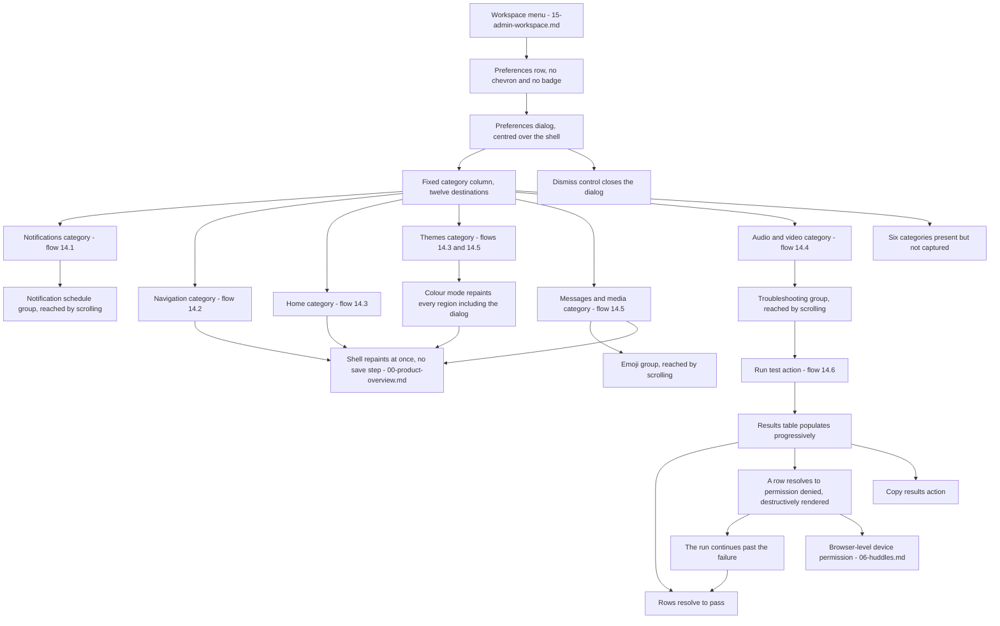

# Preferences & Settings

The user-scoped preferences dialog, its twelve-category inventory, the control vocabulary it uses, and the device-diagnostics sub-flow with its pass, in-progress, pending and permission-denied outcomes.

## Purpose

This document specifies the **preferences dialog**: a single centred modal that holds every setting scoped to the signed-in user within a workspace. It is one surface, not a section of the product — the shell behind it stays rendered and keeps working, and the dialog can be opened over any content region the shell happens to be routing to, whether a channel [frame 535](../../screenshots/Slack%20web%20Jul%202024%20535.png) or a new-message compose surface [frame 553](../../screenshots/Slack%20web%20Jul%202024%20553.png).

**Where the area is encountered.** From the workspace menu, which carries a plain `Preferences` row with no submenu chevron and no entitlement badge, between an invite-people row and a tools-and-settings row [frame 566](../../screenshots/Slack%20web%20Jul%202024%20566.png). That menu belongs to [15-admin-workspace.md](15-admin-workspace.md); this document owns everything from the moment the dialog opens.

**What makes this area load-bearing for a build.** Three things, each observable rather than assumed:

- **It is the product's settings contract.** Twelve categories are enumerated in the dialog's own category column [frame 561](../../screenshots/Slack%20web%20Jul%202024%20561.png), and six of them have their contents captured in this corpus. Those six are specified here in full; the remaining six are recorded as present-but-uncaptured rather than filled in from expectation.
- **It writes through to the shell immediately, with no save step.** Clearing a navigation destination removes it from the rail in the very next capture [frame 536](../../screenshots/Slack%20web%20Jul%202024%20536.png), [frame 544](../../screenshots/Slack%20web%20Jul%202024%20544.png), and ticking a sidebar item makes that row appear [frame 546](../../screenshots/Slack%20web%20Jul%202024%20546.png), [frame 547](../../screenshots/Slack%20web%20Jul%202024%20547.png). The shell regions those settings drive are specified by [00-product-overview.md](00-product-overview.md).
- **It owns the product's canonical progressive-result surface.** The audio-and-video diagnostics run renders a results table whose rows resolve one at a time and which can show pass, in-progress and pending **simultaneously** [frame 564](../../screenshots/Slack%20web%20Jul%202024%20564.png), then a destructive permission-denied row beside passes without halting the run [frame 565](../../screenshots/Slack%20web%20Jul%202024%20565.png). The cross-cutting state matrix that catalogues those states product-wide belongs to [21-states.md](21-states.md).

**What this document does not own.** Huddle behaviour itself, the huddle control bar and the in-conversation microphone-permission band belong to [06-huddles.md](06-huddles.md); this area owns only the *preferences* that configure huddles. Status automation and profile identity belong to [13-profiles-people.md](13-profiles-people.md). Per-conversation notification preferences belong to [02-channels.md](02-channels.md) and [12-activity-notifications.md](12-activity-notifications.md). The workspace menu and the tools-and-settings submenu belong to [15-admin-workspace.md](15-admin-workspace.md). Language selection on the public help and community surfaces belongs to [20-help-community.md](20-help-community.md). Every reusable `C-*` component contract is defined once in [00-product-overview.md](00-product-overview.md) and is only referenced here.

## Flows in this area

Six flows are named for this area, spanning 25 frames. Four of them occupy **more than one span**, and they are exactly the four whose first frame falls in the opening run at [frame 535](../../screenshots/Slack%20web%20Jul%202024%20535.png) through [frame 538](../../screenshots/Slack%20web%20Jul%202024%20538.png): that run visits four categories one after another — notifications, navigation, themes and audio-and-video — and the corpus then returns to each of them further on. The frames were assigned to the journey their pixels support rather than to their numeric neighbours, which is why those four flows carry a gap.

Frame spans below are written as plain numeric ranges because they designate a span rather than cite one image, following the convention of the [Screenshot Coverage Index](_screenshot-index.md). Every individual frame is cited with its full relative link in the per-flow step tables and in the **Frames covered** section.

| Flow ID | Name | Frame span | Primary entry point |
|---|---|---|---|
| `14.1` | Set notification preferences and a notification schedule | 535, 539–543 | The notifications row in the dialog's category column |
| `14.2` | Review and clear the optional navigation destinations | 536, 544 | The navigation row in the dialog's category column |
| `14.3` | Set home and theme preferences | 537, 546–548 | The home and themes rows in the dialog's category column |
| `14.4` | Set audio-and-video preferences | 538, 561–563 | The audio-and-video row in the dialog's category column |
| `14.5` | Set theme, message-density and emoji preferences | 553–559 | The themes and messages-and-media rows in the category column |
| `14.6` | Run the audio-and-video diagnostics test | 564–565 | The run-test action in the troubleshooting group of the audio-and-video category |

### The category inventory

The category column lists **twelve** destinations, and the same twelve appear in the same order in every capture of the dialog. Read from the column itself [frame 561](../../screenshots/Slack%20web%20Jul%202024%20561.png), [frame 536](../../screenshots/Slack%20web%20Jul%202024%20536.png), [frame 546](../../screenshots/Slack%20web%20Jul%202024%20546.png), [frame 554](../../screenshots/Slack%20web%20Jul%202024%20554.png), [frame 564](../../screenshots/Slack%20web%20Jul%202024%20564.png), the order is:

| # | Category | Contents captured in this corpus | Flow that specifies it |
|---|---|---|---|
| 1 | Notifications | Yes — [frame 535](../../screenshots/Slack%20web%20Jul%202024%20535.png), [frame 539](../../screenshots/Slack%20web%20Jul%202024%20539.png) through [frame 543](../../screenshots/Slack%20web%20Jul%202024%20543.png) | `14.1` |
| 2 | Navigation | Yes — [frame 536](../../screenshots/Slack%20web%20Jul%202024%20536.png), [frame 544](../../screenshots/Slack%20web%20Jul%202024%20544.png) | `14.2` |
| 3 | Home | Yes — [frame 546](../../screenshots/Slack%20web%20Jul%202024%20546.png), [frame 547](../../screenshots/Slack%20web%20Jul%202024%20547.png) | `14.3` |
| 4 | Themes | Yes — [frame 537](../../screenshots/Slack%20web%20Jul%202024%20537.png), [frame 548](../../screenshots/Slack%20web%20Jul%202024%20548.png), [frame 553](../../screenshots/Slack%20web%20Jul%202024%20553.png) | `14.3`, `14.5` |
| 5 | Messages & media | Yes — [frame 554](../../screenshots/Slack%20web%20Jul%202024%20554.png) through [frame 559](../../screenshots/Slack%20web%20Jul%202024%20559.png) | `14.5` |
| 6 | Language & region | No — the row is present in the column [frame 561](../../screenshots/Slack%20web%20Jul%202024%20561.png), its contents are not | — |
| 7 | Accessibility | No — the row is present in the column [frame 561](../../screenshots/Slack%20web%20Jul%202024%20561.png), its contents are not | — |
| 8 | Mark as read | No — the row is present in the column [frame 561](../../screenshots/Slack%20web%20Jul%202024%20561.png), its contents are not | — |
| 9 | Audio & video | Yes — [frame 538](../../screenshots/Slack%20web%20Jul%202024%20538.png), [frame 561](../../screenshots/Slack%20web%20Jul%202024%20561.png) through [frame 565](../../screenshots/Slack%20web%20Jul%202024%20565.png) | `14.4`, `14.6` |
| 10 | Connected accounts | No — the row is present in the column [frame 561](../../screenshots/Slack%20web%20Jul%202024%20561.png), its contents are not | — |
| 11 | Privacy & visibility | No — the row is present in the column [frame 561](../../screenshots/Slack%20web%20Jul%202024%20561.png), its contents are not | — |
| 12 | Advanced | No — the row is present in the column [frame 561](../../screenshots/Slack%20web%20Jul%202024%20561.png), its contents are not | — |

> **Partial capture:** six of the twelve categories are present in the category column but no frame in this corpus opens them. They are **language and region**, **accessibility**, **mark as read**, **connected accounts**, **privacy and visibility** and **advanced** [frame 561](../../screenshots/Slack%20web%20Jul%202024%20561.png). What is evidenced for each is exactly this: the row exists, in this position, with a leading function glyph and a label. Their contents — which controls they hold, in which groups, in which order — are **not** evidenced anywhere, and nothing about them is asserted here. A build must treat each as a destination that must exist and be reachable, and must source its contents from a decision of its own rather than from this catalog.

### The area's primary journey

Every node below is a surface or a state observed in a frame, and every edge is a transition the corpus shows. Note that no node represents a save, apply, reset or cancel action, because no frame in this area shows one.

## Flow 14.1 — Set notification preferences and a notification schedule

### Overview

The notifications category is the dialog's first destination and its longest captured content column. It runs from a delivery-scope choice at the top, through a mobile override, huddle and thread toggles and a keyword list, down to a notification schedule and a sound-and-appearance group that are only reachable by scrolling [frame 535](../../screenshots/Slack%20web%20Jul%202024%20535.png), [frame 539](../../screenshots/Slack%20web%20Jul%202024%20539.png). The flow's second half is a schedule-editing journey: open a day-scope select, choose a narrower scope and watch a conditional helper line appear, then open a time select and pick a different end time [frame 540](../../screenshots/Slack%20web%20Jul%202024%20540.png) through [frame 543](../../screenshots/Slack%20web%20Jul%202024%20543.png).

### Trigger

The notifications row at the head of the dialog's category column, which is the category the dialog is captured on first [frame 535](../../screenshots/Slack%20web%20Jul%202024%20535.png). Here and throughout this document, *trigger* means the user action or entry point that starts the flow — it is never a notification trigger or a device trigger, even in a flow whose subject is notifications.

### Preconditions

The preferences dialog open, with an authenticated session and a workspace loaded. No permission grant is required to reach or edit these controls: the corpus shows the whole category editable with no permission request anywhere in the dialog. At this capture the shell behind carries a promotional offer banner in the sidebar's banner slot and a trial item in its footer [frame 535](../../screenshots/Slack%20web%20Jul%202024%20535.png), neither of which gates anything in the dialog.

### Frame-by-frame steps

| Step | Frame(s) | What the user does | What changes on screen | Component(s) involved |
|---|---|---|---|---|
| 1 | [frame 535](../../screenshots/Slack%20web%20Jul%202024%20535.png) | Reads the notifications category with the dialog freshly opened | The content column renders, in one vertical order: a notify-me-about group whose heading shares its row with a help link carrying a circled question-mark glyph, then a single-select group of three delivery scopes with the middle one selected; a rule; a ticked mobile-override checkbox with an indented select beneath it; a rule; a ticked huddle-start checkbox and a ticked thread-reply checkbox; a rule; a keywords group whose explanatory line embeds a rendered badge sample carrying the numeral one, an empty multi-line text area with a resize handle at its trailing lower corner, and a helper line stating that keywords are comma-separated and case-insensitive; a rule; and a notification-schedule heading clipped by the dialog's lower edge | `C-MODAL-SHELL` |
| 2 | [frame 539](../../screenshots/Slack%20web%20Jul%202024%20539.png) | Scrolls the content column to the notification schedule | The category column does not move and the notifications row stays active; the content column now opens on the schedule group — an explanatory paragraph ending in a learn-more link, an allow-notifications row holding three selects in sequence with the literal word `to` between the second and third, then a reminder-time row whose select carries a leading clock glyph and a helper line whose opening words are a link; below a rule, a sound-and-appearance group with a sub-line, an outlined show-an-example action, three checkboxes and two notification-sound selects, the second of which is clipped | `C-MODAL-SHELL` |
| 3 | [frame 540](../../screenshots/Slack%20web%20Jul%202024%20540.png) | Opens the day-scope select | An option list opens directly beneath the select it belongs to, anchored to that control and occluding the reminder-time controls behind it; three options are offered, and the current one carries a leading check glyph on a filled highlight while the other two carry neither | `C-DROPDOWN-MENU` |
| 4 | [frame 541](../../screenshots/Slack%20web%20Jul%202024%20541.png) | Chooses the weekday-only scope | The option list closes and the select resolves to the chosen scope; a helper line that was **not** present at the previous capture appears immediately beneath the schedule row, naming the two days on which notifications will not arrive; nothing else in the group moves | `C-MODAL-SHELL` |
| 5 | [frame 542](../../screenshots/Slack%20web%20Jul%202024%20542.png) | Opens the end-time select | An option list of half-hourly times opens beneath the select; it is scrolled so that the current value is visible and check-marked on a filled highlight, and it is clipped at its lower edge with a further option part-drawn, so the list scrolls rather than sizing to its content | `C-DROPDOWN-MENU` |
| 6 | [frame 543](../../screenshots/Slack%20web%20Jul%202024%20543.png) | Chooses an earlier end time | The select resolves to the new value and the list closes; the weekday helper line persists unchanged; no confirmation, toast or save action appears anywhere in the dialog | `C-MODAL-SHELL` |

**Inferred:** the schedule's start and end are a bounded pair rather than two free values, because the row renders them as two selects joined by the literal word `to` and the end-time list offers a fixed half-hourly vocabulary rather than free text [frame 539](../../screenshots/Slack%20web%20Jul%202024%20539.png), [frame 542](../../screenshots/Slack%20web%20Jul%202024%20542.png). No frame shows an end earlier than its start, so no validation behaviour for that case is evidenced.

> **Partial capture:** the keywords text area is empty in the only frame that shows it, so nothing is evidenced about how a committed keyword renders, whether the comma-separated rule is enforced on entry, or what the badge sample in the explanatory line looks like once a keyword actually matches [frame 535](../../screenshots/Slack%20web%20Jul%202024%20535.png). The show-an-example action's result is likewise not captured, and neither notification-sound select is ever opened.

## Flow 14.2 — Review and clear the optional navigation destinations

### Overview

The navigation category is a single group: one checkbox per navigation destination, twelve of them, with a helper line warning that selection is not a guarantee at small window sizes. The flow is short and its value is entirely in what it proves — clearing a destination removes it from the rail in the next capture, with no save action in between, and two of the twelve destinations render with a checkbox the user cannot appear to clear [frame 536](../../screenshots/Slack%20web%20Jul%202024%20536.png), [frame 544](../../screenshots/Slack%20web%20Jul%202024%20544.png).

### Trigger

The navigation row, second in the dialog's category column [frame 536](../../screenshots/Slack%20web%20Jul%202024%20536.png).

### Preconditions

The preferences dialog open. At the first capture the rail behind carries six entries — five destinations plus the overflow entry — and the sidebar carries the promotional banner and the trial footer item [frame 536](../../screenshots/Slack%20web%20Jul%202024%20536.png).

### Frame-by-frame steps

| Step | Frame(s) | What the user does | What changes on screen | Component(s) involved |
|---|---|---|---|---|
| 1 | [frame 536](../../screenshots/Slack%20web%20Jul%202024%20536.png) | Opens the navigation category | The content column renders a heading, a helper sub-line stating that not all selected destinations may appear at smaller window sizes, and a list of twelve rows, each a checkbox followed by the destination's own function glyph and its label. Five are ticked and seven are not; the ticked set matches the five destinations the rail is showing behind the dialog, one for one | `C-MODAL-SHELL`, `C-RAIL` |
| 2 | [frame 536](../../screenshots/Slack%20web%20Jul%202024%20536.png) | Reads the two rows whose checkboxes look different | The first and third rows are ticked but their checkboxes render in a markedly lighter tint of the tick fill than the other ticked rows, while their labels stay at full contrast. The same two rows carry the same treatment in the other capture of this category, so it is not a pointer effect | `C-MODAL-SHELL` |
| 3 | [frame 544](../../screenshots/Slack%20web%20Jul%202024%20544.png) | Clears one optional destination | That row's checkbox empties, leaving four ticked and eight clear; **the rail behind the dialog loses the corresponding destination in the same capture**, dropping from six entries to five. No save action was used and no confirmation appeared | `C-MODAL-SHELL`, `C-RAIL` |

**Inferred:** the first and third destinations cannot be turned off. The basis is that their checkboxes carry a lighter tint of the tick fill in **both** captures of this category while every other row renders either the saturated tick fill or an empty box, their labels are not muted, and the treatment does not move between the two frames — which a pointer-driven treatment could not do, since only one row can be under the pointer at a time [frame 536](../../screenshots/Slack%20web%20Jul%202024%20536.png), [frame 544](../../screenshots/Slack%20web%20Jul%202024%20544.png).

**Inferred:** this list is the source of truth for the rail's destination set rather than a mirror of it, because the rail's contents change to match the list in the same capture in which the list changes, and never the other way around [frame 536](../../screenshots/Slack%20web%20Jul%202024%20536.png), [frame 544](../../screenshots/Slack%20web%20Jul%202024%20544.png). The rail's own contract, including how it overflows into its more menu, belongs to [00-product-overview.md](00-product-overview.md).

> **Partial capture:** no frame shows a destination being turned **on** from this list, nor the small-window behaviour the helper line describes, nor what happens if every clearable destination is cleared at once.

## Flow 14.3 — Set home and theme preferences

### Overview

One journey across two categories. It opens on the themes category, showing a colour-mode segmented control above a tabbed grid of theme cards [frame 537](../../screenshots/Slack%20web%20Jul%202024%20537.png); moves to the home category, where a sidebar-visibility checkbox is ticked and the sidebar behind gains a row in the same capture [frame 546](../../screenshots/Slack%20web%20Jul%202024%20546.png), [frame 547](../../screenshots/Slack%20web%20Jul%202024%20547.png); then returns to themes and switches the colour mode, which repaints the entire viewport — including the dialog itself — without ending the journey [frame 548](../../screenshots/Slack%20web%20Jul%202024%20548.png).

### Trigger

The themes row, fourth in the category column, and the home row, third [frame 537](../../screenshots/Slack%20web%20Jul%202024%20537.png), [frame 546](../../screenshots/Slack%20web%20Jul%202024%20546.png).

### Preconditions

The preferences dialog open, over a channel in the content region. The colour mode at the flow's start follows the operating system's setting, and the sidebar behind is showing two of its three optional flat rows [frame 537](../../screenshots/Slack%20web%20Jul%202024%20537.png), [frame 546](../../screenshots/Slack%20web%20Jul%202024%20546.png).

### Frame-by-frame steps

| Step | Frame(s) | What the user does | What changes on screen | Component(s) involved |
|---|---|---|---|---|
| 1 | [frame 537](../../screenshots/Slack%20web%20Jul%202024%20537.png) | Opens the themes category | The content column renders a colour-mode group — a heading, an explanatory sub-line, and a segmented control of three equal-width buttons each carrying a leading function glyph and a label, with the third selected and drawn with an emphasised border while the other two render as plain outlined controls. Beneath it a horizontal two-tab bar with the first tab active and underlined, then a labelled group of eight theme cards laid out three to a row, each card a circular swatch beside a name inside a bordered rounded card, with the first card carrying an emphasised border; then a second labelled group of two cards whose swatches are two-tone; then a third group label clipped by the dialog's lower edge | `C-MODAL-SHELL`, `C-TAB-BAR` |
| 2 | [frame 546](../../screenshots/Slack%20web%20Jul%202024%20546.png) | Switches to the home category | The content column renders four groups in one vertical order: an activity group with a single ticked checkbox whose label embeds an inline glyph carrying a dot; a rule; an always-show-in-the-sidebar group whose heading shares its row with a trailing learn-more link carrying a circled question-mark glyph, followed by three checkboxes each with a leading destination glyph, of which the first is clear and the other two are ticked; a rule; a show group of four single-select options with the first selected and the fourth carrying an explanatory sub-line pointing at per-section settings in the sidebar; a rule; and a sort group of three single-select options with the first selected | `C-MODAL-SHELL` |
| 3 | [frame 546](../../screenshots/Slack%20web%20Jul%202024%20546.png) | Compares the group against the sidebar behind the dialog | The two ticked sidebar items are present as flat rows in the sidebar; the cleared one is absent | `C-MODAL-SHELL`, `C-SIDEBAR` |
| 4 | [frame 547](../../screenshots/Slack%20web%20Jul%202024%20547.png) | Ticks the cleared sidebar item | The checkbox fills, and **the corresponding flat row appears in the sidebar in the same capture**, above the two rows that were already there. Nothing else in the category changes and no save action is used | `C-MODAL-SHELL`, `C-SIDEBAR` |
| 5 | [frame 548](../../screenshots/Slack%20web%20Jul%202024%20548.png) | Returns to themes and selects the dark colour mode | The emphasised border moves to the second segmented-control button, and **every region of the viewport repaints into the dark mode at once** — the dialog's own surface, its category column, its content column, each theme card and its swatch, and all four shell regions behind it. The theme selection itself does not move: the same card keeps the emphasised border | `C-MODAL-SHELL`, `C-RAIL`, `C-SIDEBAR`, `C-TOP-BAR` |

**Inferred:** the colour mode and the theme are two independent settings rather than one, because the emphasised theme card is unchanged across the colour-mode switch while every rendered colour changes [frame 537](../../screenshots/Slack%20web%20Jul%202024%20537.png), [frame 548](../../screenshots/Slack%20web%20Jul%202024%20548.png).

**Inferred:** the dialog is themed by the same setting it edits, because it is the dialog's own surface — not only the shell behind it — that repaints when the mode changes [frame 548](../../screenshots/Slack%20web%20Jul%202024%20548.png). A build must therefore apply the colour mode to modal surfaces, not just to page chrome.

Three treatments of the theme grid are worth stating as structure, because a build has to reproduce the structure without reproducing the third party's palette. Every observed swatch colour and every observed theme name belongs to the third party and is **not** carried forward: the placeholder vocabulary in [00-product-overview.md](00-product-overview.md) governs, and the next run supplies its own theme set. What *is* specified here is that the grid is three cards to a row, that cards are grouped under labels with at least three groups present, that a card is a swatch beside a name, that the swatch is single-tone in the first group and two-tone in the second, and that selection is single and rendered as an emphasised card border [frame 537](../../screenshots/Slack%20web%20Jul%202024%20537.png), [frame 548](../../screenshots/Slack%20web%20Jul%202024%20548.png), [frame 553](../../screenshots/Slack%20web%20Jul%202024%20553.png).

> **Partial capture:** the third theme group's contents are clipped by the dialog's lower edge in all three captures of this category [frame 537](../../screenshots/Slack%20web%20Jul%202024%20537.png), [frame 548](../../screenshots/Slack%20web%20Jul%202024%20548.png), [frame 553](../../screenshots/Slack%20web%20Jul%202024%20553.png), so its card count and its swatch treatment are not evidenced. The custom-theme tab is never activated, so nothing about custom themes is evidenced beyond the tab's existence. The show group's per-section option and the sort group's alternatives are never selected, so their effects on the sidebar are not captured.

## Flow 14.4 — Set audio-and-video preferences

### Overview

The audio-and-video category holds every device setting in one long content column, in the order camera, microphone, speaker, then two huddle-behaviour groups, then a troubleshooting group. The flow covers the whole column across two captures at the top and two scrolled further down: it shows the live camera preview and the device selects [frame 538](../../screenshots/Slack%20web%20Jul%202024%20538.png), an idle input-level meter that then registers live input [frame 561](../../screenshots/Slack%20web%20Jul%202024%20561.png), [frame 562](../../screenshots/Slack%20web%20Jul%202024%20562.png), and the huddle-behaviour group whose warning option names an explicit member threshold, ending on the troubleshooting group that flow `14.6` acts on [frame 563](../../screenshots/Slack%20web%20Jul%202024%20563.png).

### Trigger

The audio-and-video row, ninth in the category column [frame 538](../../screenshots/Slack%20web%20Jul%202024%20538.png), [frame 561](../../screenshots/Slack%20web%20Jul%202024%20561.png).

### Preconditions

The preferences dialog open. A camera and a microphone must be selectable for the preview and the meter to render as observed; the corpus shows both device selects already resolved to a default option rather than empty, and the option labels are truncated with a trailing ellipsis where they exceed the control's width [frame 538](../../screenshots/Slack%20web%20Jul%202024%20538.png), [frame 561](../../screenshots/Slack%20web%20Jul%202024%20561.png). Every observed device label is **sample data** naming the host machine's own hardware and is not a value to reproduce.

### Frame-by-frame steps

| Step | Frame(s) | What the user does | What changes on screen | Component(s) involved |
|---|---|---|---|---|
| 1 | [frame 538](../../screenshots/Slack%20web%20Jul%202024%20538.png) | Opens the audio-and-video category at the top of its content column | The column opens on a camera group: a heading, then a live camera preview region occupying roughly three-quarters of the column's width at roughly a sixteen-by-nine ratio and rendering the selected camera's own output, then a camera-device select beneath the preview, itself about half the column's width. Below a rule, the microphone group and the speaker group follow | `C-MODAL-SHELL` |
| 2 | [frame 561](../../screenshots/Slack%20web%20Jul%202024%20561.png) | Scrolls so the microphone group heads the column | The camera group scrolls out of view above; the microphone group renders a heading, a device select with a truncated label, an input-level row whose label is followed by a meter of fifteen equal segments — all of them unfilled — and then two ticked checkboxes sharing a single row, one for automatic gain control and one for noise suppression. The speaker group follows: a heading, a device select, and an outlined test action placed at the trailing side of the same row as the select | `C-MODAL-SHELL` |
| 3 | [frame 561](../../screenshots/Slack%20web%20Jul%202024%20561.png) | Reads the two huddle-behaviour groups below the rule | The joining-a-huddle group renders five checkboxes in one vertical order: a status-automation option, ticked, whose label embeds a rendered emoji and which carries a muted sub-line explaining that an existing status is not overwritten; a mute-my-microphone option, clear; an automatic-captions option, clear; a warning option, ticked, whose label names an explicit member threshold of **150**; and a video-background-blur option, clear. The alone-in-a-huddle group follows with a ticked play-music checkbox and a select beneath it resolved to a timing value | `C-MODAL-SHELL` |
| 4 | [frame 562](../../screenshots/Slack%20web%20Jul%202024%20562.png) | Speaks into the selected microphone and ticks the blur option | Two things change and nothing else: the **leading five of the meter's fifteen segments fill in the success colour** while the remaining ten stay unfilled, so the meter fills from its leading edge; and the video-background-blur checkbox fills | `C-MODAL-SHELL` |
| 5 | [frame 563](../../screenshots/Slack%20web%20Jul%202024%20563.png) | Scrolls further down the same category and clears the blur option again | The category column does not move and the audio-and-video row stays active, so this is a scroll rather than a category switch; the speaker group now heads the column and the microphone group with its meter has scrolled out of view; the blur checkbox is clear again. Below the huddle groups and a rule, a troubleshooting group renders a single row: an explanatory line at the leading edge naming an audio, video and screen-sharing test, and an outlined run-test action at the trailing edge of that same row | `C-MODAL-SHELL` |

**Inferred:** the input-level meter is a live read of the selected input device rather than a control, because its segments change between two captures in which no control was touched and no value is displayed numerically [frame 561](../../screenshots/Slack%20web%20Jul%202024%20561.png), [frame 562](../../screenshots/Slack%20web%20Jul%202024%20562.png).

**Inferred:** the troubleshooting group is part of the audio-and-video category rather than a destination of its own, because it is reached by scrolling that category's content column while the category column's active row does not change [frame 563](../../screenshots/Slack%20web%20Jul%202024%20563.png).

> **Partial capture:** neither device select is ever opened, so the option list's shape for a device select is not evidenced — unlike the notification selects, which are captured open [frame 540](../../screenshots/Slack%20web%20Jul%202024%20540.png), [frame 542](../../screenshots/Slack%20web%20Jul%202024%20542.png). The speaker test action's result is not captured, the alone-in-a-huddle timing select is never opened, and no frame shows the meter with every segment filled or with a clipping treatment.

## Flow 14.5 — Set theme, message-density and emoji preferences

### Overview

A single journey that begins by choosing a theme in the themes category and then works down the messages-and-media category: switch the message density and watch both live preview cards re-render on one line, switch the name format and watch only its own preview change, then scroll to the emoji group and move the default skin-tone selection along a swatch row [frame 553](../../screenshots/Slack%20web%20Jul%202024%20553.png) through [frame 559](../../screenshots/Slack%20web%20Jul%202024%20559.png). It is the corpus's clearest demonstration that this dialog previews the effect of a setting inside the dialog itself, beside the control that drives it.

### Trigger

The themes row and then the messages-and-media row, fourth and fifth in the category column [frame 553](../../screenshots/Slack%20web%20Jul%202024%20553.png), [frame 554](../../screenshots/Slack%20web%20Jul%202024%20554.png).

### Preconditions

The preferences dialog open, this time over a new-message compose surface rather than a channel, which the dialog is indifferent to [frame 553](../../screenshots/Slack%20web%20Jul%202024%20553.png). The colour mode follows the operating system's setting at the flow's start.

### Frame-by-frame steps

| Step | Frame(s) | What the user does | What changes on screen | Component(s) involved |
|---|---|---|---|---|
| 1 | [frame 553](../../screenshots/Slack%20web%20Jul%202024%20553.png) | Selects a theme from the second, two-tone card group | The emphasised card border moves out of the first group and onto the second card of the two-tone group; the colour-mode segmented control reads the follow-the-system option; the card grid is otherwise unchanged | `C-MODAL-SHELL`, `C-TAB-BAR` |
| 2 | [frame 554](../../screenshots/Slack%20web%20Jul%202024%20554.png) | Switches to the messages-and-media category | The content column renders a message-theme group of two single-select options with the first selected, followed by a labelled example and a bordered preview card rendering one message row in the avatar-led density — avatar at the leading edge, author name and timestamp on a header line, body beneath; a rule; a names group of two single-select options with the second selected, its own labelled example and preview card, and a closing line linking to the profile surface; a rule; an additional-options group of three checkboxes, two ticked and one clear | `C-MODAL-SHELL`, `C-MESSAGE-ROW`, `C-AVATAR` |
| 3 | [frame 555](../../screenshots/Slack%20web%20Jul%202024%20555.png) | Selects the compact message density | **Both** preview cards re-render on a single line each — leading timestamp, then the emphasised name, then the body, with no avatar — so the density changes row anatomy rather than only spacing. The third additional option, previously clipped, is now fully visible | `C-MODAL-SHELL`, `C-MESSAGE-ROW` |
| 4 | [frame 556](../../screenshots/Slack%20web%20Jul%202024%20556.png) | Selects the full-and-display name format | **Only the names preview card changes**: it now renders a longer full name in place of the shorter display name, while the mention chip inside the same body keeps the display-name form. The message-theme preview above it is untouched | `C-MODAL-SHELL`, `C-MESSAGE-ROW` |
| 5 | [frame 557](../../screenshots/Slack%20web%20Jul%202024%20557.png) | Scrolls to the emoji group | The column opens on an emoji heading, a default-skin-tone sub-heading with an explanatory line, and a row of six square selectable tiles with the first carrying an emphasised outline. Beneath it: a clear plain-text-emoji checkbox; a ticked enlarged-emoji checkbox whose sub-block holds an explanatory paragraph stating a per-message cap and a bolded note stating that the compact density keeps all emoji small; a ticked emoticon-conversion checkbox whose label embeds a rendered emoji inline; and a ticked one-click-reactions checkbox with an indented two-option single-select group, the second selected, a sub-line inviting a choice and a row of three emoji buttons. A closing labelled example renders a compact message row with a hover action bar floating at its trailing upper corner, carrying the three chosen reaction emoji followed by react, reply, forward, save and overflow controls | `C-MODAL-SHELL`, `C-MESSAGE-ROW`, `C-HOVER-ACTION-BAR` |
| 6 | [frame 558](../../screenshots/Slack%20web%20Jul%202024%20558.png) | Moves the pointer onto the third skin-tone tile | That tile takes a light fill while the first tile keeps its emphasised outline, so the hovered treatment and the selected treatment are two different things and can be present at once | `C-MODAL-SHELL` |
| 7 | [frame 559](../../screenshots/Slack%20web%20Jul%202024%20559.png) | Selects the third skin-tone tile | The emphasised outline moves to that tile and leaves the first, confirming a single-select row; the example preview's emoji do not change, because the one-click reaction set is a separate setting | `C-MODAL-SHELL` |

**Inferred:** each preview card is bound to the group it sits under rather than to the category as a whole, because switching the name format re-rendered only the names preview while the message-theme preview above it stayed as it was [frame 556](../../screenshots/Slack%20web%20Jul%202024%20556.png).

**Inferred:** the density setting and the enlarged-emoji setting interact, because the enlarged-emoji option carries its own bolded note stating that the compact density keeps all emoji small [frame 557](../../screenshots/Slack%20web%20Jul%202024%20557.png). The interaction is stated by the interface itself, so a build must honour it rather than treat the two settings as independent.

> **Partial capture:** the three emoji buttons in the one-click-reaction row are never activated, so the picker they open is not evidenced. The frequently-used alternative in that group is never selected. The plain-text-emoji and twenty-four-hour-clock options are never turned on, so their effect on the previews is not captured, and neither is the effect of the swatch-and-hex option.

## Flow 14.6 — Run the audio-and-video diagnostics test

### Overview

Activating the run-test action replaces the troubleshooting group's body with a results table that fills in one row at a time. The two captured frames are the point of the flow: the first shows five checks passed, one in progress and three pending **at the same moment** [frame 564](../../screenshots/Slack%20web%20Jul%202024%20564.png); the second shows a check that failed on a denied device permission, rendered destructively, sitting between passes while the run carries on to the next check [frame 565](../../screenshots/Slack%20web%20Jul%202024%20565.png). A copy-results action is available throughout.

### Trigger

The outlined run-test action at the trailing edge of the troubleshooting group's explanatory row, reached by scrolling the audio-and-video category [frame 563](../../screenshots/Slack%20web%20Jul%202024%20563.png).

### Preconditions

The audio-and-video category open and scrolled to its troubleshooting group, with the run-test action rendered in its outlined, available treatment [frame 563](../../screenshots/Slack%20web%20Jul%202024%20563.png). The checks exercise five capabilities — a microphone, a speaker, a camera, screen sharing and network connectivity — of which the first four need a browser-level permission and the network checks need none. The only denial the corpus captures is of **screen sharing**; the microphone, speaker and camera checks pass in both captures [frame 564](../../screenshots/Slack%20web%20Jul%202024%20564.png), [frame 565](../../screenshots/Slack%20web%20Jul%202024%20565.png). **Inferred:** a denial of any of the other permission-bearing capabilities is reachable from this same state and would be reported the same way, because the run renders the denial as an ordinary result in the status column of its own row rather than as a separate error surface, and carries on to the next check [frame 565](../../screenshots/Slack%20web%20Jul%202024%20565.png).

### Frame-by-frame steps

| Step | Frame(s) | What the user does | What changes on screen | Component(s) involved |
|---|---|---|---|---|
| 1 | [frame 564](../../screenshots/Slack%20web%20Jul%202024%20564.png) | Activates the run-test action | The explanatory row stays at the top of the content column but the action beside it now renders on a muted fill instead of its outlined treatment. Beneath it a two-column table appears, headed by a check column and a status column, its rows separated by rules | `C-MODAL-SHELL`, `C-DATA-TABLE` |
| 2 | [frame 564](../../screenshots/Slack%20web%20Jul%202024%20564.png) | Watches the table fill in | Nine rows render in a fixed order — microphone, speaker, camera, camera resolution, audio connectivity, video connectivity, screen sharing, network UDP connectivity, network TCP connectivity. The first five read pass, with their check names and their status words both in the success colour; the camera-resolution row additionally carries a wrapped detail sub-line beneath its check name listing the resolutions it found supported; the sixth row shows a spinner in its status cell and **no status word**, with its check name in the accent colour; the last three read pending, with their names and status words in the default text colour | `C-DATA-TABLE` |
| 3 | [frame 564](../../screenshots/Slack%20web%20Jul%202024%20564.png) | Notes the action available beneath the table | A copy-results action renders as an outlined control aligned to the table's trailing edge, present while the run is still in progress rather than only at the end | `C-DATA-TABLE` |
| 4 | [frame 565](../../screenshots/Slack%20web%20Jul%202024%20565.png) | Waits for the run to advance | The row that was in progress resolves to pass, so six rows now read pass. The screen-sharing row resolves to a **permission-denied** result with **both its check name and its status rendered in the destructive colour**. The following row takes the spinner, and the last row still reads pending. The run therefore continued past the failure rather than stopping at it, and the copy-results action is unchanged | `C-DATA-TABLE` |

**Inferred:** the run-test action is disabled while a run is in progress, because it renders on a muted fill in both captures taken during the run and in its outlined available treatment in the capture taken before it [frame 563](../../screenshots/Slack%20web%20Jul%202024%20563.png), [frame 564](../../screenshots/Slack%20web%20Jul%202024%20564.png), [frame 565](../../screenshots/Slack%20web%20Jul%202024%20565.png).

**Inferred:** the row order is fixed rather than completion-ordered, because the nine rows appear in the same sequence in both captures even though their statuses differ, and a resolved row does not move up the table [frame 564](../../screenshots/Slack%20web%20Jul%202024%20564.png), [frame 565](../../screenshots/Slack%20web%20Jul%202024%20565.png).

**Inferred:** the denied permission is a browser-level denial rather than an in-product one, because the product exposes no grant affordance anywhere in this dialog, while the corresponding denial elsewhere in the product is reported by a band that points the user at the browser's own address bar [frame 565](../../screenshots/Slack%20web%20Jul%202024%20565.png), [frame 300](../../screenshots/Slack%20web%20Jul%202024%20300.png). That band belongs to [06-huddles.md](06-huddles.md) and is the other half of the same story: this table reports the denial inside settings, that band reports it inside the conversation.

> **Partial capture:** no frame shows the run reaching a terminal state, so an all-pass outcome, a summary line and any re-run affordance after completion are not evidenced. What the copy-results action produces is not captured either — no clipboard confirmation, toast or dialog follows it in any frame. Nothing shows a check being retried individually.

## Screens & components

### The dialog: regions, ordering and relative sizing

The area is **one screen**. All sizing below is expressed proportionally, relative to the effective product viewport, because the corpus's frames are not a single canvas size.

| Region | Position and ordering | Relative size | Contents, in order |
|---|---|---|---|
| Backdrop | Covers the whole viewport behind the dialog | Full viewport | Every shell region, rendered and not interactive. It is dimmed to a fraction of its own colour in twenty of this area's 25 captures [frame 547](../../screenshots/Slack%20web%20Jul%202024%20547.png) and left at full strength in the other five [frame 544](../../screenshots/Slack%20web%20Jul%202024%20544.png); either way the rail's destinations and the sidebar's rows stay legible through it, which is how flows `14.2` and `14.3` prove their write-through [frame 544](../../screenshots/Slack%20web%20Jul%202024%20544.png), [frame 547](../../screenshots/Slack%20web%20Jul%202024%20547.png) |
| Dialog | Centred horizontally; its upper edge sits a little below the top bar and its lower edge well clear of the viewport foot | Roughly half the viewport width and roughly three-quarters of its height | A title region, then two columns side by side [frame 561](../../screenshots/Slack%20web%20Jul%202024%20561.png) |
| Title region | Full dialog width, at the dialog's head, above both columns | Roughly an eighth of the dialog's height | The title at the leading edge and a dismiss control at the trailing edge, with nothing between them [frame 535](../../screenshots/Slack%20web%20Jul%202024%20535.png) |
| Category column | Leading column, beneath the title region, **fixed** — it never scrolls and never changes length | Roughly one-quarter of the dialog's width | Twelve rows in a fixed order, each a leading function glyph followed by a label; the active row rendered as a filled accent band with an inverted label [frame 561](../../screenshots/Slack%20web%20Jul%202024%20561.png) |
| Content column | Trailing column, beside the category column, **scrolling** | Roughly three-quarters of the dialog's width, full remaining height | The active category's controls as a single vertical sequence of labelled groups separated by rules spanning the content column's width; content taller than the column is clipped at the dialog's lower edge and reached by scrolling [frame 535](../../screenshots/Slack%20web%20Jul%202024%20535.png), [frame 539](../../screenshots/Slack%20web%20Jul%202024%20539.png) |

**Hierarchy.** The two columns are siblings and only the content column responds to a category change or a scroll; the title region and the category column are invariant across all 25 frames. An option list opened from a select inside the content column layers **above** that column and occludes the controls beneath it rather than pushing them down [frame 540](../../screenshots/Slack%20web%20Jul%202024%20540.png), [frame 542](../../screenshots/Slack%20web%20Jul%202024%20542.png). **There is no footer region**: no frame in this area shows a save, apply, reset, cancel or done action anywhere in the dialog.

**Iconography is named by function throughout** — dismiss control, help glyph, clock glyph, destination glyph, function glyph on a category row, spinner, resize handle — never by any third-party asset name.

### The control vocabulary of the content column

Every control type observed in the content column, with the frame that evidences it. This vocabulary is the area's real contract: the six uncaptured categories will be built from it, and no control type outside it is claimed to exist.

| Control | How it renders | Where observed |
|---|---|---|
| Group heading | Emphasised label on its own line, optionally sharing that line with a trailing help or learn-more link carrying a circled question-mark glyph; groups separated by rules spanning the content column's width | [frame 535](../../screenshots/Slack%20web%20Jul%202024%20535.png), [frame 546](../../screenshots/Slack%20web%20Jul%202024%20546.png) |
| Explanatory sub-line | Muted text beneath a heading or beneath the control it qualifies; may carry an inline link, an inline rendered badge or an inline rendered emoji | [frame 535](../../screenshots/Slack%20web%20Jul%202024%20535.png), [frame 539](../../screenshots/Slack%20web%20Jul%202024%20539.png), [frame 557](../../screenshots/Slack%20web%20Jul%202024%20557.png) |
| Single-select option group | One option per line, each a control at the leading edge followed by a label; exactly one selected; an option may carry its own explanatory sub-line. Observed with two, three and four options | [frame 535](../../screenshots/Slack%20web%20Jul%202024%20535.png), [frame 546](../../screenshots/Slack%20web%20Jul%202024%20546.png), [frame 554](../../screenshots/Slack%20web%20Jul%202024%20554.png) |
| Checkbox | Control at the leading edge followed by a label; independent of its neighbours; may carry an explanatory sub-line, an inline glyph, a muted parenthetical continuation, or an indented dependent control beneath it. Observed both one per line and two sharing one line | [frame 535](../../screenshots/Slack%20web%20Jul%202024%20535.png), [frame 539](../../screenshots/Slack%20web%20Jul%202024%20539.png), [frame 561](../../screenshots/Slack%20web%20Jul%202024%20561.png) |
| Checkbox list with a per-row glyph | One row per configurable object, each a checkbox, that object's own function glyph, then its label | [frame 536](../../screenshots/Slack%20web%20Jul%202024%20536.png), [frame 546](../../screenshots/Slack%20web%20Jul%202024%20546.png) |
| Select | Bordered control with its current value at the leading edge and a caret at the trailing edge; the value truncated with a trailing ellipsis where it exceeds the control's width; opens an anchored option list in which the current value carries a leading check glyph on a filled highlight. Observed with a leading glyph, several to a row, indented under a parent checkbox, and with a scrolling and clipped option list | [frame 539](../../screenshots/Slack%20web%20Jul%202024%20539.png), [frame 540](../../screenshots/Slack%20web%20Jul%202024%20540.png), [frame 542](../../screenshots/Slack%20web%20Jul%202024%20542.png), [frame 561](../../screenshots/Slack%20web%20Jul%202024%20561.png) |
| Segmented control | Three equal-width buttons on one row, each a leading function glyph and a label; the selected one drawn with an emphasised border, the others as plain outlined controls | [frame 537](../../screenshots/Slack%20web%20Jul%202024%20537.png), [frame 548](../../screenshots/Slack%20web%20Jul%202024%20548.png) |
| Inline action | Outlined control placed at the trailing edge of the row that describes it, or on its own line beneath its group | [frame 539](../../screenshots/Slack%20web%20Jul%202024%20539.png), [frame 561](../../screenshots/Slack%20web%20Jul%202024%20561.png), [frame 563](../../screenshots/Slack%20web%20Jul%202024%20563.png) |
| Multi-line text area | Bordered box several text rows tall with a resize handle at its trailing lower corner, and a helper line beneath stating the entry rule | [frame 535](../../screenshots/Slack%20web%20Jul%202024%20535.png) |
| Level meter | A row of fifteen equal segments following its label, filling from the leading edge in the success colour; a live read rather than a control | [frame 561](../../screenshots/Slack%20web%20Jul%202024%20561.png), [frame 562](../../screenshots/Slack%20web%20Jul%202024%20562.png) |
| Live device preview | A region occupying roughly three-quarters of the content column's width at roughly a sixteen-by-nine ratio, rendering the selected camera's output, with its device select beneath it | [frame 538](../../screenshots/Slack%20web%20Jul%202024%20538.png) |
| Card grid | Bordered rounded cards laid out three to a row, each a circular swatch beside a name; grouped under labels; single-select, the chosen card drawn with an emphasised border | [frame 537](../../screenshots/Slack%20web%20Jul%202024%20537.png), [frame 553](../../screenshots/Slack%20web%20Jul%202024%20553.png) |
| Tile row | A row of equal square tiles each holding one rendered glyph; single-select, the chosen tile drawn with an emphasised outline, a hovered tile taking a light fill instead — two distinct treatments that can be present at once. Observed with six tiles and with three | [frame 557](../../screenshots/Slack%20web%20Jul%202024%20557.png), [frame 558](../../screenshots/Slack%20web%20Jul%202024%20558.png), [frame 559](../../screenshots/Slack%20web%20Jul%202024%20559.png) |
| Live preview card | Bordered card beneath a labelled example line, rendering a real instance of what the group's setting controls, and re-rendering as that setting changes | [frame 554](../../screenshots/Slack%20web%20Jul%202024%20554.png), [frame 555](../../screenshots/Slack%20web%20Jul%202024%20555.png), [frame 556](../../screenshots/Slack%20web%20Jul%202024%20556.png), [frame 557](../../screenshots/Slack%20web%20Jul%202024%20557.png) |
| Horizontal tab bar | Two labels on one row beneath the group above them, the active label underlined | [frame 537](../../screenshots/Slack%20web%20Jul%202024%20537.png) |

### The diagnostics results surface

The one surface in this area that is not a form. It replaces the troubleshooting group's body and is composed as follows [frame 564](../../screenshots/Slack%20web%20Jul%202024%20564.png), [frame 565](../../screenshots/Slack%20web%20Jul%202024%20565.png):

- The troubleshooting group's explanatory row stays at the head of the content column, with its run action still at the trailing edge but rendered on a muted fill.
- Beneath it, a **two-column table**: a header row naming a check column and a status column, then one row per check, rows separated by rules spanning the table's width. The check name occupies the leading column and the status the trailing one, at roughly a two-to-one width split.
- A check row may carry a **wrapped detail sub-line** beneath its name, coloured with its row.
- Nine checks in a fixed order: microphone, speaker, camera, camera resolution, audio connectivity, video connectivity, screen sharing, network UDP connectivity, network TCP connectivity.
- A **copy-results action**, outlined, aligned to the table's trailing edge beneath the last row, present while the run is still in progress.

The table is an instance of `C-DATA-TABLE`, whose contract is defined in [00-product-overview.md](00-product-overview.md) and records all four of the row states this area's captures show, including the **permission-denied row state** — check name and status phrase both in the destructive treatment — which is observed only here and which the contract also notes leaves every sibling row's own result intact while the run continues to the next check [frame 565](../../screenshots/Slack%20web%20Jul%202024%20565.png).

### Components used here

Every identifier resolves to a contract in [00-product-overview.md](00-product-overview.md). None is restated.

| Component | How this area uses it |
|---|---|
| `C-MODAL-SHELL` | The dialog itself, in the contract's **footerless** settings-modal variant: a title region with a dismiss control, a leading category list and a trailing detail pane, with no footer and no committing action, because each control commits on change. This area is the catalog's canonical consumer of that variant [frame 561](../../screenshots/Slack%20web%20Jul%202024%20561.png) |
| `C-DATA-TABLE` | The diagnostics results table, including its progressive population and its destructive failure row [frame 564](../../screenshots/Slack%20web%20Jul%202024%20564.png), [frame 565](../../screenshots/Slack%20web%20Jul%202024%20565.png) |
| `C-DROPDOWN-MENU` | Every select's anchored option list inside the content column [frame 540](../../screenshots/Slack%20web%20Jul%202024%20540.png), [frame 542](../../screenshots/Slack%20web%20Jul%202024%20542.png), and the workspace menu that opens the dialog [frame 566](../../screenshots/Slack%20web%20Jul%202024%20566.png) |
| `C-TAB-BAR` | The two-tab bar inside the themes category — the only horizontal tab bar in this area [frame 537](../../screenshots/Slack%20web%20Jul%202024%20537.png) |
| `C-RAIL`, `C-SIDEBAR`, `C-TOP-BAR` | Read through the backdrop — dimmed [frame 547](../../screenshots/Slack%20web%20Jul%202024%20547.png) or at full strength [frame 544](../../screenshots/Slack%20web%20Jul%202024%20544.png) — as the evidence that a setting has taken effect, and repainted wholesale by a colour-mode change [frame 548](../../screenshots/Slack%20web%20Jul%202024%20548.png) |
| `C-MESSAGE-ROW`, `C-AVATAR`, `C-HOVER-ACTION-BAR` | Rendered inside the live preview cards of the messages-and-media category, in both densities and with the reaction bar attached [frame 554](../../screenshots/Slack%20web%20Jul%202024%20554.png), [frame 555](../../screenshots/Slack%20web%20Jul%202024%20555.png), [frame 557](../../screenshots/Slack%20web%20Jul%202024%20557.png) |
| `C-PERMISSION-PROMPT` | Not rendered in this area. Cited as the counterpart surface: the denial this area reports as a table row is reported in a conversation by that component's denial variant [frame 300](../../screenshots/Slack%20web%20Jul%202024%20300.png) |
| `C-SETTINGS-CATEGORY-COLUMN` | The dialog's leading column of twelve destinations, fixed and non-scrolling, its active row a filled accent band. Reported from this area and contracted in [00-product-overview.md](00-product-overview.md) [frame 536](../../screenshots/Slack%20web%20Jul%202024%20536.png), [frame 561](../../screenshots/Slack%20web%20Jul%202024%20561.png) |
| `C-SEGMENTED-CONTROL` | The three-option colour-mode control at the head of the themes category [frame 537](../../screenshots/Slack%20web%20Jul%202024%20537.png), [frame 548](../../screenshots/Slack%20web%20Jul%202024%20548.png) |
| `C-LEVEL-METER` | The input-level meter beside the microphone select, unfilled with no input [frame 538](../../screenshots/Slack%20web%20Jul%202024%20538.png) and filling from the leading edge with one [frame 561](../../screenshots/Slack%20web%20Jul%202024%20561.png) |
| `C-DEVICE-PREVIEW` | The camera preview region with its device select immediately beneath it [frame 538](../../screenshots/Slack%20web%20Jul%202024%20538.png) |
| `C-TILE-SELECT-ROW` | The theme swatch grid, the skin-tone row and the custom one-click-reaction row [frame 537](../../screenshots/Slack%20web%20Jul%202024%20537.png), [frame 557](../../screenshots/Slack%20web%20Jul%202024%20557.png) |
| `C-LIVE-PREVIEW-CARD` | The message previews of the messages-and-media category, and the example message that renders the chosen quick reactions [frame 554](../../screenshots/Slack%20web%20Jul%202024%20554.png), [frame 557](../../screenshots/Slack%20web%20Jul%202024%20557.png) |
| `C-BANNER`, `C-UPGRADE-GATE` | Present behind the dialog as the sidebar's promotional offer banner and trial footer item, and in the workspace menu as an offer block with a countdown and an upgrade action [frame 535](../../screenshots/Slack%20web%20Jul%202024%20535.png), [frame 566](../../screenshots/Slack%20web%20Jul%202024%20566.png). **No control inside the dialog carries an entitlement badge in any of the 25 frames**, so no preference observed here is plan-gated |

### Structures this area contributed to the shared inventory

The component inventory in [00-product-overview.md](00-product-overview.md) is a floor rather than a ceiling, and its growth path is that a newly recurring structure is defined **there** and referenced by identifier. Six structures observed in this area were not covered by any existing `C-*` contract, so each was reported for definition rather than contracted locally. **All six are now defined in [00-product-overview.md](00-product-overview.md)** and are referenced by identifier; the observations below are the evidence each contract was built from:

1. **`C-SETTINGS-CATEGORY-COLUMN` — the vertical settings category column** — a fixed, non-scrolling list of destinations at a dialog's leading edge, the active row a filled accent band. It is *not* `C-TAB-BAR`, whose contract is a horizontal row of labels with the active label underlined; both appear in this area at once, in the same dialog, and must not be merged [frame 537](../../screenshots/Slack%20web%20Jul%202024%20537.png), [frame 561](../../screenshots/Slack%20web%20Jul%202024%20561.png).
2. **`C-SEGMENTED-CONTROL` — the segmented control** — three equal-width glyph-and-label buttons, single-select, the choice marked by an emphasised border [frame 537](../../screenshots/Slack%20web%20Jul%202024%20537.png).
3. **`C-LEVEL-METER` — the level meter** — fifteen equal segments filling from the leading edge in the success colour, read-only [frame 561](../../screenshots/Slack%20web%20Jul%202024%20561.png), [frame 562](../../screenshots/Slack%20web%20Jul%202024%20562.png).
4. **`C-DEVICE-PREVIEW` — the live device preview region** — a full-column-width preview of a selected capture device, with its select beneath it [frame 538](../../screenshots/Slack%20web%20Jul%202024%20538.png).
5. **`C-TILE-SELECT-ROW` — the single-select tile row** — equal square tiles, selection as an outline and hover as a fill, the two distinguishable simultaneously [frame 557](../../screenshots/Slack%20web%20Jul%202024%20557.png), [frame 558](../../screenshots/Slack%20web%20Jul%202024%20558.png), [frame 559](../../screenshots/Slack%20web%20Jul%202024%20559.png).
6. **`C-LIVE-PREVIEW-CARD` — the live preview card** — a bordered card that renders a real instance of the object a setting governs and re-renders when it changes [frame 554](../../screenshots/Slack%20web%20Jul%202024%20554.png), [frame 555](../../screenshots/Slack%20web%20Jul%202024%20555.png), [frame 556](../../screenshots/Slack%20web%20Jul%202024%20556.png).

Two variants of existing contracts were reported from here and are now recorded in those contracts: the **permission-denied row state** of `C-DATA-TABLE` [frame 565](../../screenshots/Slack%20web%20Jul%202024%20565.png), and the **footerless** variant of `C-MODAL-SHELL` [frame 561](../../screenshots/Slack%20web%20Jul%202024%20561.png).

## States

Each state below is observed, with the frame that shows it. The cross-cutting state matrix for the whole product is owned by [21-states.md](21-states.md) and is not restated here; this area supplies that document's loading, error and permission-denied exemplars.

| State | What is observable | Evidence |
|---|---|---|
| Default | Title region, fixed category column with one row active, and a content column rendering that category's groups | [frame 561](../../screenshots/Slack%20web%20Jul%202024%20561.png) |
| Category active | The active row renders as a filled accent band with an inverted label; every other row renders plain | [frame 536](../../screenshots/Slack%20web%20Jul%202024%20536.png), [frame 546](../../screenshots/Slack%20web%20Jul%202024%20546.png), [frame 554](../../screenshots/Slack%20web%20Jul%202024%20554.png) |
| Content scrolled | The category column and the active row are unchanged while the content column shows a later group; the group that headed the column is no longer present | [frame 539](../../screenshots/Slack%20web%20Jul%202024%20539.png), [frame 557](../../screenshots/Slack%20web%20Jul%202024%20557.png), [frame 563](../../screenshots/Slack%20web%20Jul%202024%20563.png) |
| Content clipped | A group's heading or a control is cut by the dialog's lower edge rather than the dialog growing to fit | [frame 535](../../screenshots/Slack%20web%20Jul%202024%20535.png), [frame 537](../../screenshots/Slack%20web%20Jul%202024%20537.png), [frame 554](../../screenshots/Slack%20web%20Jul%202024%20554.png) |
| Option list open | The list opens anchored beneath its own select, layered above and occluding the controls behind it, with the current value check-marked on a filled highlight | [frame 540](../../screenshots/Slack%20web%20Jul%202024%20540.png), [frame 542](../../screenshots/Slack%20web%20Jul%202024%20542.png) |
| Option list scrolled and clipped | The list is scrolled so the current value is visible and a further option is part-drawn at its lower edge | [frame 542](../../screenshots/Slack%20web%20Jul%202024%20542.png) |
| Set versus unset | A ticked checkbox and a selected option render a filled control; an unticked or unselected one renders an empty control. The two treatments differ between captures — see the inconsistency recorded below | [frame 546](../../screenshots/Slack%20web%20Jul%202024%20546.png), [frame 554](../../screenshots/Slack%20web%20Jul%202024%20554.png) |
| Non-clearable | A ticked checkbox renders in a lighter tint of the tick fill while its label stays at full contrast; the same two rows carry it in both captures of their category | [frame 536](../../screenshots/Slack%20web%20Jul%202024%20536.png), [frame 544](../../screenshots/Slack%20web%20Jul%202024%20544.png) |
| Hover | A selectable tile takes a light fill, distinct from and simultaneous with another tile's selected outline | [frame 558](../../screenshots/Slack%20web%20Jul%202024%20558.png) |
| Selected, in a grid or a tile row | An emphasised border on the chosen card or tile, with exactly one chosen per group | [frame 537](../../screenshots/Slack%20web%20Jul%202024%20537.png), [frame 553](../../screenshots/Slack%20web%20Jul%202024%20553.png), [frame 559](../../screenshots/Slack%20web%20Jul%202024%20559.png) |
| Conditional helper shown | A helper line absent in one capture appears in the next as a consequence of the value chosen beside it | [frame 539](../../screenshots/Slack%20web%20Jul%202024%20539.png), [frame 541](../../screenshots/Slack%20web%20Jul%202024%20541.png) |
| Live input | The level meter's leading segments fill in the success colour with no control having been touched | [frame 561](../../screenshots/Slack%20web%20Jul%202024%20561.png), [frame 562](../../screenshots/Slack%20web%20Jul%202024%20562.png) |
| Action disabled | The run action renders on a muted fill instead of its outlined treatment, while a run is in progress | [frame 563](../../screenshots/Slack%20web%20Jul%202024%20563.png), [frame 564](../../screenshots/Slack%20web%20Jul%202024%20564.png) |
| Loading, per row | A row's status cell renders a spinner and no status word, with its check name in the accent colour, while other rows are already resolved | [frame 564](../../screenshots/Slack%20web%20Jul%202024%20564.png) |
| Pending, per row | A row's check name and status word both render in the default text colour, awaiting its turn | [frame 564](../../screenshots/Slack%20web%20Jul%202024%20564.png) |
| Success, per row | A row's check name and status word both render in the success colour | [frame 564](../../screenshots/Slack%20web%20Jul%202024%20564.png), [frame 565](../../screenshots/Slack%20web%20Jul%202024%20565.png) |
| Error, permission denied, per row | A row's check name and status both render in the destructive colour, beside rows that succeeded, and the run continues past it | [frame 565](../../screenshots/Slack%20web%20Jul%202024%20565.png) |
| Colour mode applied | Every region of the viewport, the dialog's own surface included, renders in the selected mode | [frame 548](../../screenshots/Slack%20web%20Jul%202024%20548.png) |
| Written through | A shell region visible behind the backdrop changes in the same capture in which its setting changes — the rail lists exactly the destinations ticked in the navigation category, five of them in one capture and four in the other | [frame 536](../../screenshots/Slack%20web%20Jul%202024%20536.png), [frame 544](../../screenshots/Slack%20web%20Jul%202024%20544.png), [frame 547](../../screenshots/Slack%20web%20Jul%202024%20547.png) |

Three states a build might expect here and that this corpus **does not** evidence anywhere in the area: an empty state, a validation-error message, and an upgrade-gated control. No control in the dialog carries an entitlement badge, no field is ever rejected, and no category renders empty.

## Implied data model

This area **owns `E-PREFERENCE`** and contributes fields to three other entities. Every entity named here appears in the [consolidated data model](README.md) of the master index, and every field below cites the frame that shows it. Only what the pixels expose is claimed.

### `E-PREFERENCE`

A preference is a value scoped to one user within one workspace, addressed by a key, belonging to exactly one category, and persisted the moment it changes.

| Field | What the interface shows | Evidence |
|---|---|---|
| Owning user | The dialog is reached from the account's own workspace menu and every setting in it is phrased in the first person; no frame offers a subject selector | [frame 566](../../screenshots/Slack%20web%20Jul%202024%20566.png), [frame 535](../../screenshots/Slack%20web%20Jul%202024%20535.png) |
| Owning workspace | The dialog is opened from a workspace-scoped menu that identifies the workspace by name and sign-in domain | [frame 566](../../screenshots/Slack%20web%20Jul%202024%20566.png) |
| Category | One of the twelve destinations in the fixed category column; every preference is reachable from exactly one of them | [frame 561](../../screenshots/Slack%20web%20Jul%202024%20561.png) |
| Group within a category | Preferences are presented in labelled groups separated by rules, and a group's order within a category is stable across captures | [frame 535](../../screenshots/Slack%20web%20Jul%202024%20535.png), [frame 539](../../screenshots/Slack%20web%20Jul%202024%20539.png), [frame 561](../../screenshots/Slack%20web%20Jul%202024%20561.png) |
| Key | Each preference has its own label and its own control; no two controls in a category share one | [frame 546](../../screenshots/Slack%20web%20Jul%202024%20546.png) |
| Value type: boolean | A checkbox, set or clear | [frame 546](../../screenshots/Slack%20web%20Jul%202024%20546.png), [frame 561](../../screenshots/Slack%20web%20Jul%202024%20561.png) |
| Value type: enumerated, single choice | A single-select option group of two, three or four options; or a segmented control of three; or a select | [frame 535](../../screenshots/Slack%20web%20Jul%202024%20535.png), [frame 537](../../screenshots/Slack%20web%20Jul%202024%20537.png), [frame 546](../../screenshots/Slack%20web%20Jul%202024%20546.png), [frame 554](../../screenshots/Slack%20web%20Jul%202024%20554.png) |
| Value type: device reference | A select whose options are the host's capture or playback devices, resolved to a default option and truncated where the label is long | [frame 538](../../screenshots/Slack%20web%20Jul%202024%20538.png), [frame 561](../../screenshots/Slack%20web%20Jul%202024%20561.png) |
| Value type: time of day | A select over a fixed half-hourly vocabulary; two of them form a bounded start-and-end pair joined by the word `to`, and a third holds a default reminder time | [frame 539](../../screenshots/Slack%20web%20Jul%202024%20539.png), [frame 542](../../screenshots/Slack%20web%20Jul%202024%20542.png), [frame 543](../../screenshots/Slack%20web%20Jul%202024%20543.png) |
| Value type: day scope | A select of three scopes — every day, weekdays only, and a custom scope | [frame 540](../../screenshots/Slack%20web%20Jul%202024%20540.png), [frame 541](../../screenshots/Slack%20web%20Jul%202024%20541.png) |
| Value type: free-text list | A multi-line text area whose helper line states that entries are comma-separated and case-insensitive | [frame 535](../../screenshots/Slack%20web%20Jul%202024%20535.png) |
| Value type: threshold-conditioned boolean | A checkbox whose label carries a numeric threshold — a warning when starting a huddle in a channel with more than **150** members — so the setting's effect depends on the conversation's size | [frame 561](../../screenshots/Slack%20web%20Jul%202024%20561.png) |
| Value type: set of object references | A checkbox list with one row per navigation destination, held as the set of ticked destinations | [frame 536](../../screenshots/Slack%20web%20Jul%202024%20536.png), [frame 544](../../screenshots/Slack%20web%20Jul%202024%20544.png) |
| Value type: theme reference | A single choice from a grouped card grid, held independently of the colour mode | [frame 537](../../screenshots/Slack%20web%20Jul%202024%20537.png), [frame 553](../../screenshots/Slack%20web%20Jul%202024%20553.png) |
| Value type: glyph choice | A single choice from a tile row — a default skin tone, and separately an ordered set of three one-click reaction glyphs | [frame 557](../../screenshots/Slack%20web%20Jul%202024%20557.png), [frame 559](../../screenshots/Slack%20web%20Jul%202024%20559.png) |
| Value type: sound reference | A select naming a notification sound, with a separate preference for the sound played when sending | [frame 539](../../screenshots/Slack%20web%20Jul%202024%20539.png) |
| Clearable flag | Two of the twelve navigation destinations render a ticked checkbox in a lighter tint of the tick fill in both captures, distinguishing preferences the user may clear from those the user may not | [frame 536](../../screenshots/Slack%20web%20Jul%202024%20536.png), [frame 544](../../screenshots/Slack%20web%20Jul%202024%20544.png) |
| Dependency on another preference | The enlarged-emoji option carries a note that the compact density overrides it; the mobile-override checkbox gates the select indented beneath it; the one-click-reactions checkbox gates the option group and tile row indented beneath it | [frame 535](../../screenshots/Slack%20web%20Jul%202024%20535.png), [frame 557](../../screenshots/Slack%20web%20Jul%202024%20557.png) |
| Dependency on a browser-level permission | A device preference can be configured while the underlying permission is denied; the denial surfaces only when the device is exercised | [frame 565](../../screenshots/Slack%20web%20Jul%202024%20565.png), [frame 300](../../screenshots/Slack%20web%20Jul%202024%20300.png) |
| Scope | Every preference in this dialog is user-wide. The same subject can also be set per conversation, which the channel details surface shows as its own notification-preference control | [frame 90](../../screenshots/Slack%20web%20Jul%202024%2090.png) |
| Persistence | Immediate. **Inferred:** the value is written on change rather than on submit, because the dialog exposes no save, apply or reset action in any of the 25 frames and the shell behind it reflects a change in the same capture in which the control changes | [frame 544](../../screenshots/Slack%20web%20Jul%202024%20544.png), [frame 547](../../screenshots/Slack%20web%20Jul%202024%20547.png), [frame 561](../../screenshots/Slack%20web%20Jul%202024%20561.png) |

### Contributions to other entities

| Entity | Fields this area exposes |
|---|---|
| `E-USER` | An automated status applied while in a huddle, held as a boolean plus the glyph-and-text status it applies, and explicitly non-destructive of an existing status [frame 561](../../screenshots/Slack%20web%20Jul%202024%20561.png) · a default skin tone applied wherever the account uses a variable glyph [frame 557](../../screenshots/Slack%20web%20Jul%202024%20557.png), [frame 559](../../screenshots/Slack%20web%20Jul%202024%20559.png) · a name-rendering choice between the full-and-display form and the display-only form, with the profile named as the place the names themselves are edited [frame 554](../../screenshots/Slack%20web%20Jul%202024%20554.png), [frame 556](../../screenshots/Slack%20web%20Jul%202024%20556.png) · the set of visible navigation destinations [frame 544](../../screenshots/Slack%20web%20Jul%202024%20544.png) · colour mode and theme [frame 537](../../screenshots/Slack%20web%20Jul%202024%20537.png), [frame 548](../../screenshots/Slack%20web%20Jul%202024%20548.png) · message density [frame 555](../../screenshots/Slack%20web%20Jul%202024%20555.png). Identity itself belongs to [13-profiles-people.md](13-profiles-people.md) |
| `E-HUDDLE` | Join-time defaults held per user rather than per huddle: whether the microphone starts muted, whether captions start on, whether the video background starts blurred, whether a large-channel warning is raised and above which member count, and whether music plays while alone together with when it starts [frame 561](../../screenshots/Slack%20web%20Jul%202024%20561.png), [frame 562](../../screenshots/Slack%20web%20Jul%202024%20562.png). Huddle behaviour itself belongs to [06-huddles.md](06-huddles.md) |
| `E-NOTIFICATION` | Delivery scope as one of three values, a separate mobile-device scope, per-event toggles for a huddle starting and for a reply in a followed thread, a keyword list, an allow-window held as a day scope plus a start and end time, a default reminder time, badge-count inclusion of thread replies, message-preview inclusion, a global sound mute, and a sound reference per event [frame 535](../../screenshots/Slack%20web%20Jul%202024%20535.png), [frame 539](../../screenshots/Slack%20web%20Jul%202024%20539.png), [frame 543](../../screenshots/Slack%20web%20Jul%202024%20543.png). The feed and badge surfaces belong to [12-activity-notifications.md](12-activity-notifications.md), and the per-conversation override to [02-channels.md](02-channels.md) |
| `E-WORKSPACE` | Named only as the scope the dialog is opened within, by name and sign-in domain [frame 566](../../screenshots/Slack%20web%20Jul%202024%20566.png). Its own fields belong to [00-product-overview.md](00-product-overview.md) and [15-admin-workspace.md](15-admin-workspace.md) |

### The diagnostics run

Modelled only as far as the two captures evidence it, and deliberately no further.

| Aspect | What the interface shows | Evidence |
|---|---|---|
| A run | Started by one action, and one run at a time — the action renders unavailable while a run is in progress | [frame 563](../../screenshots/Slack%20web%20Jul%202024%20563.png), [frame 564](../../screenshots/Slack%20web%20Jul%202024%20564.png) |
| Its checks | A fixed, ordered set of nine named checks, in the same sequence in both captures | [frame 564](../../screenshots/Slack%20web%20Jul%202024%20564.png), [frame 565](../../screenshots/Slack%20web%20Jul%202024%20565.png) |
| A check's status | One of exactly four observed values — pass, in progress, pending, permission denied. No other status word appears in either capture | [frame 564](../../screenshots/Slack%20web%20Jul%202024%20564.png), [frame 565](../../screenshots/Slack%20web%20Jul%202024%20565.png) |
| A check's detail | An optional wrapped sub-line beneath the check name, observed once, carrying the capability values that check discovered | [frame 564](../../screenshots/Slack%20web%20Jul%202024%20564.png) |
| Independence | A check can fail while its siblings pass, and its failure does not stop the checks after it | [frame 565](../../screenshots/Slack%20web%20Jul%202024%20565.png) |
| Result export | The whole result set is copyable through one action, available while the run is still in progress | [frame 564](../../screenshots/Slack%20web%20Jul%202024%20564.png) |

**Inferred:** the run is transient rather than stored, because neither capture of the results surface offers a history, a timestamp, a previous-run reference or any affordance for retrieving an earlier result — the only export path is the copy action that acts on the run in front of the user [frame 564](../../screenshots/Slack%20web%20Jul%202024%20564.png), [frame 565](../../screenshots/Slack%20web%20Jul%202024%20565.png).

## Transitions in and out

**Into this area.** One observed route: the `Preferences` row of the workspace menu, which is opened from the sidebar's workspace-name control [frame 566](../../screenshots/Slack%20web%20Jul%202024%20566.png). The menu is owned by [15-admin-workspace.md](15-admin-workspace.md). The dialog opens centred over whatever the content region was showing, and the corpus shows it over both a channel [frame 535](../../screenshots/Slack%20web%20Jul%202024%20535.png) and a new-message compose surface [frame 553](../../screenshots/Slack%20web%20Jul%202024%20553.png), so the underlying surface is not a precondition.

> **Partial capture:** the corpus shows other menus that also carry a preferences item — a user menu offering profile, preferences and sign-out among other entries [frame 504](../../screenshots/Slack%20web%20Jul%202024%20504.png) — and the notifications category's helper copy is referenced from a per-channel notifications surface [frame 92](../../screenshots/Slack%20web%20Jul%202024%2092.png). Neither is captured being used to open this dialog, so only the workspace-menu route is claimed. Those menus belong to [13-profiles-people.md](13-profiles-people.md) and [02-channels.md](02-channels.md).

**Within this area.** Two movements only, and they are different: selecting a row in the fixed category column **replaces the content column** while the column itself is unchanged [frame 536](../../screenshots/Slack%20web%20Jul%202024%20536.png), [frame 546](../../screenshots/Slack%20web%20Jul%202024%20546.png); scrolling the content column **reveals a later group of the same category** with the active row unchanged [frame 539](../../screenshots/Slack%20web%20Jul%202024%20539.png), [frame 557](../../screenshots/Slack%20web%20Jul%202024%20557.png), [frame 563](../../screenshots/Slack%20web%20Jul%202024%20563.png). A build that conflates the two will misplace the notification schedule, the emoji group and the troubleshooting group, none of which is a category of its own.

**Out of this area, by dismissal.** The title region's dismiss control is present in all 25 frames. **Inferred:** it closes the dialog and returns the user to the surface behind it, because it is the only affordance in the dialog capable of doing so and the next capture after this area's last frame shows the shell with no dialog present [frame 565](../../screenshots/Slack%20web%20Jul%202024%20565.png), [frame 566](../../screenshots/Slack%20web%20Jul%202024%20566.png).

> **Partial capture:** no frame shows the dismissal itself, nor the dialog being closed by any other means, so whether the backdrop or a keyboard action also dismisses it is not evidenced. The corpus does show a channel view captured immediately after this area's second span, which the [Screenshot Coverage Index](_screenshot-index.md) assigns to a return-to-a-channel journey owned by [02-channels.md](02-channels.md) [frame 545](../../screenshots/Slack%20web%20Jul%202024%20545.png); it is cited here only as the neighbouring frame, not as evidence of the dismissal.

**Out of this area, by link.** Three affordances inside the dialog point elsewhere and none is captured being followed, so each is recorded as an exit that exists rather than one whose destination is shown: the learn-more link beside the notification-schedule paragraph and the help link beside the notify-me-about heading [frame 535](../../screenshots/Slack%20web%20Jul%202024%20535.png), [frame 539](../../screenshots/Slack%20web%20Jul%202024%20539.png), which point at reference material owned by [20-help-community.md](20-help-community.md); the profile link in the names group [frame 554](../../screenshots/Slack%20web%20Jul%202024%20554.png), which points at the surface owned by [13-profiles-people.md](13-profiles-people.md); and the per-section-settings pointer in the home category's show group, which points back at the sidebar [frame 546](../../screenshots/Slack%20web%20Jul%202024%20546.png), owned by [00-product-overview.md](00-product-overview.md).

**Transitions this area sends elsewhere without navigating.** This is the area's most consequential outbound edge and it is not a navigation at all: a change here repaints the shell in place. The navigation category writes the rail's destination set [frame 544](../../screenshots/Slack%20web%20Jul%202024%20544.png); the home category writes the sidebar's optional flat rows [frame 547](../../screenshots/Slack%20web%20Jul%202024%20547.png); the themes category writes the colour mode across every region including the dialog itself [frame 548](../../screenshots/Slack%20web%20Jul%202024%20548.png); the messages-and-media category writes the message density that the message list renders in [frame 555](../../screenshots/Slack%20web%20Jul%202024%20555.png). All four destinations are specified by [00-product-overview.md](00-product-overview.md), which records the same write-back from its own side.

**Transitions this area receives from elsewhere.** The audio-and-video category's huddle group is the place a huddle's own join-time defaults are set, so [06-huddles.md](06-huddles.md) depends on values written here; the status-automation preference is consumed by [13-profiles-people.md](13-profiles-people.md); and the notification preferences set here are the user-wide layer beneath the per-conversation override that [02-channels.md](02-channels.md) specifies [frame 90](../../screenshots/Slack%20web%20Jul%202024%2090.png). A denied device permission originates entirely outside the product and is reported both here as a table row [frame 565](../../screenshots/Slack%20web%20Jul%202024%20565.png) and, in a conversation, as the band owned by [06-huddles.md](06-huddles.md) [frame 300](../../screenshots/Slack%20web%20Jul%202024%20300.png).

## Edge cases & validations

### Validations and conditional behaviour the corpus actually shows

Every item below is a behaviour a frame demonstrates. This area shows **no validation messages at all** — its validation is expressed entirely through control state, conditional helper text and explicit thresholds.

- **A conditional helper line is the validation surface for the schedule.** Narrowing the day scope inserts a line beneath the schedule row naming the two days on which notifications will not arrive; that line is absent while the scope is the wider one [frame 539](../../screenshots/Slack%20web%20Jul%202024%20539.png), [frame 541](../../screenshots/Slack%20web%20Jul%202024%20541.png). The consequence of a setting is stated in place rather than left to be discovered.
- **A time value is chosen from a bounded vocabulary, not typed.** The end-time list offers half-hourly options and check-marks the current one; there is no free-text time entry anywhere in the schedule [frame 542](../../screenshots/Slack%20web%20Jul%202024%20542.png).
- **Two navigation destinations cannot be cleared.** Their checkboxes render in a lighter tint of the tick fill in both captures of that category while their labels stay at full contrast [frame 536](../../screenshots/Slack%20web%20Jul%202024%20536.png), [frame 544](../../screenshots/Slack%20web%20Jul%202024%20544.png). A build must model clearability per destination rather than making the whole list uniformly editable.
- **Selecting a navigation destination is not a guarantee of showing it.** The category's own helper sub-line states that not all selected destinations may appear at smaller window sizes [frame 536](../../screenshots/Slack%20web%20Jul%202024%20536.png), so overflow is specified behaviour and the rail is bounded by viewport width as well as by this list.
- **One setting can override another, and the interface says so.** The enlarged-emoji option carries a bolded note that the compact density keeps all emoji small [frame 557](../../screenshots/Slack%20web%20Jul%202024%20557.png). Two settings in different categories therefore interact, and the note is the only place that interaction is stated.
- **A setting can be conditional on the size of the object it applies to.** The huddle warning option names an explicit threshold of **150** members, so it fires for some channels and not others [frame 561](../../screenshots/Slack%20web%20Jul%202024%20561.png).
- **A setting can promise not to overwrite existing state.** The huddle status-automation option carries a sub-line stating that an existing status is left alone [frame 561](../../screenshots/Slack%20web%20Jul%202024%20561.png). The automation is therefore conditional on the current value of what it writes.
- **A dependent control is indented beneath the checkbox that enables it.** The mobile-override select sits indented under its checkbox [frame 535](../../screenshots/Slack%20web%20Jul%202024%20535.png), and the one-click-reaction option group and tile row sit indented under theirs [frame 557](../../screenshots/Slack%20web%20Jul%202024%20557.png). Indentation is the interface's only expression of the dependency.
- **A free-text list states its own entry rule.** The keywords area's helper line states that entries are comma-separated and case-insensitive [frame 535](../../screenshots/Slack%20web%20Jul%202024%20535.png). No frame shows the rule being enforced or violated.
- **A diagnostics check can fail without failing the run.** A permission-denied row renders destructively beside six passes while the next check proceeds to in-progress [frame 565](../../screenshots/Slack%20web%20Jul%202024%20565.png). The table is not all-or-nothing and must not be built as a single pass/fail result.
- **A device permission can be denied outside the product's control.** The product reports the denial rather than resolving it: as a destructive table row here [frame 565](../../screenshots/Slack%20web%20Jul%202024%20565.png), and in a conversation as a band that points at the browser's own address bar [frame 300](../../screenshots/Slack%20web%20Jul%202024%20300.png). Nothing in this dialog offers to grant a permission.
- **A device select's label is truncated rather than wrapped or widened.** The option label ends in an ellipsis where it exceeds the control's width [frame 561](../../screenshots/Slack%20web%20Jul%202024%20561.png).
- **Content taller than the dialog is clipped, not accommodated.** A group heading is cut by the dialog's lower edge rather than the dialog growing [frame 535](../../screenshots/Slack%20web%20Jul%202024%20535.png), [frame 537](../../screenshots/Slack%20web%20Jul%202024%20537.png). The dialog's height is fixed and the content column scrolls inside it.

> **Partial capture:** no frame in this area shows a rejected entry, an inline error message, a field-level warning, a disabled *preference* — as opposed to the disabled run action — or a confirmation of any kind. Whether the keyword rule is enforced on entry, whether an end time earlier than its start is refused, and what happens when every clearable navigation destination is cleared are all unevidenced.

### Gotchas a build will otherwise get wrong

- **There is no save step, and adding one changes the product.** No frame shows a save, apply, reset, cancel or done action anywhere in the dialog, and the shell reflects a change in the same capture in which the control changes [frame 544](../../screenshots/Slack%20web%20Jul%202024%20544.png), [frame 547](../../screenshots/Slack%20web%20Jul%202024%20547.png), [frame 561](../../screenshots/Slack%20web%20Jul%202024%20561.png). A build that adds a footer with a save action is building a different dialog.
- **A group is not a category.** The notification schedule, the emoji group and the troubleshooting group are all reached by scrolling their category's content column, with the active category row unchanged [frame 539](../../screenshots/Slack%20web%20Jul%202024%20539.png), [frame 557](../../screenshots/Slack%20web%20Jul%202024%20557.png), [frame 563](../../screenshots/Slack%20web%20Jul%202024%20563.png). None of them is a thirteenth destination.
- **The category column and the themes category's tab bar are two different components.** One is a fixed vertical list whose active row is a filled band; the other is a horizontal pair of labels whose active label is underlined. Both are visible in the same dialog at once [frame 537](../../screenshots/Slack%20web%20Jul%202024%20537.png).
- **The colour mode applies to the dialog, not only to the page.** The dialog's own surface, its category column and its cards all repaint [frame 548](../../screenshots/Slack%20web%20Jul%202024%20548.png).
- **The colour mode and the theme are independent.** The emphasised theme card does not move when the mode changes [frame 537](../../screenshots/Slack%20web%20Jul%202024%20537.png), [frame 548](../../screenshots/Slack%20web%20Jul%202024%20548.png).
- **A preview belongs to its group, not to the category.** Changing the name format re-rendered only the names preview and left the density preview alone [frame 556](../../screenshots/Slack%20web%20Jul%202024%20556.png).
- **The message density changes row anatomy, not spacing.** The compact density drops the avatar and moves the timestamp to the leading edge of a single line [frame 554](../../screenshots/Slack%20web%20Jul%202024%20554.png), [frame 555](../../screenshots/Slack%20web%20Jul%202024%20555.png).
- **Selected and hovered are different treatments and can co-occur.** In the tile row, selection is an emphasised outline and hover is a light fill; one tile carries each at the same moment [frame 558](../../screenshots/Slack%20web%20Jul%202024%20558.png).
- **The level meter is an output, not an input.** It has fifteen segments, fills from its leading edge, and changes with no control having been touched [frame 561](../../screenshots/Slack%20web%20Jul%202024%20561.png), [frame 562](../../screenshots/Slack%20web%20Jul%202024%20562.png).
- **Diagnostics rows keep their order.** A resolved row does not move up the table, so the order is fixed rather than completion-ordered [frame 564](../../screenshots/Slack%20web%20Jul%202024%20564.png), [frame 565](../../screenshots/Slack%20web%20Jul%202024%20565.png).
- **The copy-results action is available mid-run.** It is present while a row is still spinning, so it must not be gated on completion [frame 564](../../screenshots/Slack%20web%20Jul%202024%20564.png).
- **A check row may carry a detail sub-line, so rows are not fixed-height.** One of the nine wraps a discovered-capability line beneath its name [frame 564](../../screenshots/Slack%20web%20Jul%202024%20564.png).
- **Observed values are sample data, not requirements.** Device labels, the sound preset name, the theme names, the workspace and person names, and the discovered resolution list are all fixtures of one demo capture. Theme names and every swatch colour additionally belong to a third party and are **not** carried forward: the placeholder vocabulary in [00-product-overview.md](00-product-overview.md) governs, and the next run supplies its own product name, palette and theme set.

### Build obligations where the corpus is silent

Every item below is a requirement the corpus **cannot** evidence either way, written in the obligation register defined in [00-product-overview.md](00-product-overview.md) and resolving to the `S-*` contracts defined there. **Two of this area's surfaces reach hardware and two of its categories are never opened**, and those are the four places where a build cannot safely inherit this document's silence.

> **Build obligation:** **the diagnostics copy-results payload is a device fingerprint, and it is redacted, previewed and destination-bound before it leaves.** The results table names the host's own devices, reports a camera resolution as a detail line, reports UDP and TCP connectivity, and reports a permission status per capability [frame 564](../../screenshots/Slack%20web%20Jul%202024%20564.png), [frame 565](../../screenshots/Slack%20web%20Jul%202024%20565.png), and a copy-results action sits beneath it while the run is still in progress [frame 564](../../screenshots/Slack%20web%20Jul%202024%20564.png). Taken together that is an identifying description of a person's machine and network. Per `S-TELEMETRY` and `S-EXPORT` — `S-TELEMETRY` because this is a payload about the product's own use rather than a capture, and `S-CONSENT` governs only the microphone and camera the run activates: the payload is assembled from a declared field allowlist carrying **check names and outcomes**, not device model names, serial numbers, addresses or resolutions, unless the person is shown exactly what will be included and affirmatively agrees; **the person can preview the payload before it is produced**; the **destination is constrained** to the person's own clipboard or an explicitly-chosen support channel, never an automatic upload; and the payload is not written to a log or retained by the product beyond the act of producing it. No capture shows the payload's contents, so its shape is stated as an obligation and nothing about it is described as observed.

> **Build obligation:** **opening a settings category must not silently activate a camera or a microphone, and no sample may be retained.** Opening the audio-and-video category renders a **live camera preview showing the selected camera's own output** [frame 538](../../screenshots/Slack%20web%20Jul%202024%20538.png), the microphone group renders a live input-level meter, and the diagnostics run exercises microphone, speaker, camera and screen sharing [frame 564](../../screenshots/Slack%20web%20Jul%202024%20564.png), [frame 565](../../screenshots/Slack%20web%20Jul%202024%20565.png). Per `S-CONSENT`: **capture begins only after an explicit, per-capability grant**, and never merely because a category was opened; while a device is live the surface carries a **persistent, unambiguous in-use indicator**; capture **stops when the category is left, the dialog is closed or the run ends**; and **no frame, audio sample, screen image or derived artefact is retained, transmitted or written to disk** — the preview and the meter are rendered from a live stream and discarded. This document's existing inference that a diagnostics *run* is transient covers the **result set only**; the captured media is a separate question, and this obligation is the answer to it.

> **Build obligation:** **two of the six unopened categories are security surfaces and are not interchangeable with the other four.** The category column exposes twelve rows and the corpus opens six [frame 561](../../screenshots/Slack%20web%20Jul%202024%20561.png); this document already refuses to describe the contents of the other six. Two of them, however, cannot be discharged by a generic *design-the-gap* instruction. **Privacy and visibility** is the only candidate home for the per-field and per-audience visibility controls that [07-canvases.md](07-canvases.md), [08-lists.md](08-lists.md), [09-search-and-filters.md](09-search-and-filters.md) and [15-admin-workspace.md](15-admin-workspace.md) each depend on and none of them owns; a build that treats it as decorative leaves those obligations with no surface. **Connected accounts** is an identity-federation surface: per `S-SECRET` it requires an enumeration of what is linked, the scope each link carries, **an explicit revocation path per link**, and a record of when each was established — none of which the corpus evidences and none of which is optional. Per `S-GAP` both are **specified in their own right** before they are built. The remaining four — language and region, accessibility, mark as read, advanced — remain a build decision as this document already states.

> **Build obligation:** **the keyword list is untrusted free text matched against message content, and it is bounded, escaped and matched literally.** The notifications category persists a comma-separated, case-insensitive keyword list whose helper line states that rule [frame 535](../../screenshots/Slack%20web%20Jul%202024%20535.png), and this document records that no frame shows the rule enforced or violated. Per `S-CONTENT`: **per-entry length and total-entry count are bounded**; each entry is stored and re-rendered as **text, escaped at every output context** so a keyword cannot become markup wherever the list is displayed back; matching is **literal and case-insensitive, never pattern- or expression-based**, so no entry can be turned into an expensive or catastrophically-backtracking match; and matching runs **within the viewer's own authorized content only**, so a keyword can never surface a message the viewer may not read, per `S-AUTHZ-READ`.

> **What this document deliberately does *not* obligate.** A person editing their **own** preferences needs no capability grant, and this document's statement to that effect is a scope claim rather than an authorization claim: every surface in the area is scoped to the acting account, the corpus shows no control here that acts on anyone else, and no frame in the dialog renders a permission request [frame 535](../../screenshots/Slack%20web%20Jul%202024%20535.png), [frame 561](../../screenshots/Slack%20web%20Jul%202024%20561.png). It is recorded here so that the absence of an operation-authorization obligation in this area reads as a decision rather than as an omission. The moment a preference surface acts on **another** account it leaves this area for [15-admin-workspace.md](15-admin-workspace.md), where `S-AUTHZ-OP` governs.

> **Build obligation:** **`S-GAP` applies to the states this area does not evidence** — no save, apply, reset or cancel is captured anywhere, and neither is a rejected value, a save in flight, a save failure, a denied device grant at the moment of asking, or a diagnostics run refused. Renderings come from the state matrix in [21-states.md](21-states.md); behaviour comes from the `S-*` contracts.

### Inconsistencies between captures, recorded and not reconciled

- **Unset controls render differently in different captures.** In the home category an unticked checkbox and an unselected option render as near-white outlined shapes, and set ones in a bright accent [frame 546](../../screenshots/Slack%20web%20Jul%202024%20546.png). In the messages-and-media captures the unset shapes render as near-black solids and the set ones in a desaturated accent [frame 554](../../screenshots/Slack%20web%20Jul%202024%20554.png), [frame 557](../../screenshots/Slack%20web%20Jul%202024%20557.png). Both readings are recorded. **Inferred:** the difference is a consequence of the theme selected immediately before that run, because a two-tone vision-assistive theme card is chosen at [frame 553](../../screenshots/Slack%20web%20Jul%202024%20553.png) and every capture after it carries the second treatment. A build should not assume one fixed rendering of an unset control; the theme reaches form controls, not only chrome.
- **The shell behind the dialog differs between this area's own captures.** The rail carries five entries plus the overflow entry at [frame 535](../../screenshots/Slack%20web%20Jul%202024%20535.png) and six at [frame 561](../../screenshots/Slack%20web%20Jul%202024%20561.png), the workspace icon is a plain letter tile in one and an image tile in the other, and the sidebar's promotional banner is present in some captures and absent from others. The captures were evidently taken in different sessions. The rail's variance is expected — this area's own navigation category is what configures it — and the rail's contract belongs to [00-product-overview.md](00-product-overview.md). Nothing in the dialog changes with it.
- **The backdrop's dimming is not constant across this area's own captures.** Twenty of this area's 25 frames render every shell region behind the dialog dimmed to a fraction of its own colour. Five render the shell at **full colour**: [frame 536](../../screenshots/Slack%20web%20Jul%202024%20536.png), [frame 537](../../screenshots/Slack%20web%20Jul%202024%20537.png), [frame 544](../../screenshots/Slack%20web%20Jul%202024%20544.png), [frame 548](../../screenshots/Slack%20web%20Jul%202024%20548.png) and [frame 553](../../screenshots/Slack%20web%20Jul%202024%20553.png). The dialog is open in all five, and the five are spread across three of this area's six flows — `14.2`, `14.3` and `14.5` — rather than confined to one, so the difference tracks neither the flow nor the category on display. [frame 537](../../screenshots/Slack%20web%20Jul%202024%20537.png) and [frame 548](../../screenshots/Slack%20web%20Jul%202024%20548.png) are the clearest pair: the same category, at the same position and size, captured once with the light colour mode in effect and once with the dark one. In both, every shell region behind the dialog renders at its own full strength in whichever mode is selected rather than under a scrim — and the scrim does not track the colour mode either, because the dimmed captures include light-mode ones [frame 547](../../screenshots/Slack%20web%20Jul%202024%20547.png), [frame 561](../../screenshots/Slack%20web%20Jul%202024%20561.png). This **agrees** with the `C-MODAL-SHELL` contract in [00-product-overview.md](00-product-overview.md), which records [frame 544](../../screenshots/Slack%20web%20Jul%202024%20544.png) as its undimmed example and requires one definition to render both ways: the scrim is a property of how the dialog was opened, not of the dialog itself. No cause for the difference is visible in the frames, so it is recorded rather than reconciled. It does not affect this area's arithmetic. A second measurement taken during reconciliation agrees on [frame 544](../../screenshots/Slack%20web%20Jul%202024%20544.png) specifically: sampling the top bar, rail and sidebar at fixed proportional points returns values indistinguishable from captures with no dialog open at all, while captures whose shell is dimmed return roughly two-fifths of those values.
- **A control's value moves back and forth across the same span.** The video-background-blur option is clear at [frame 561](../../screenshots/Slack%20web%20Jul%202024%20561.png), ticked at [frame 562](../../screenshots/Slack%20web%20Jul%202024%20562.png) and clear again at [frame 563](../../screenshots/Slack%20web%20Jul%202024%20563.png). Recorded as observed; no single frame's value is treated as the default.

## Build acceptance criteria

Each criterion is checkable against a named frame. Together they are the definition of done for this area.

- [ ] A preferences dialog opens from the workspace menu's preferences row, which carries no submenu chevron and no entitlement badge [frame 566](../../screenshots/Slack%20web%20Jul%202024%20566.png).
- [ ] The dialog is centred and opens over whatever surface the content region was showing — a channel [frame 535](../../screenshots/Slack%20web%20Jul%202024%20535.png) and a new-message composer [frame 553](../../screenshots/Slack%20web%20Jul%202024%20553.png) — and the shell behind it can render either dimmed [frame 535](../../screenshots/Slack%20web%20Jul%202024%20535.png) or at full colour [frame 553](../../screenshots/Slack%20web%20Jul%202024%20553.png) from the same dialog definition, so the scrim is separable from the dialog.
- [ ] The dialog is composed of a title region carrying the title at its leading edge and a dismiss control at its trailing edge, a fixed non-scrolling category column at the leading edge, and a scrolling content column beside it [frame 561](../../screenshots/Slack%20web%20Jul%202024%20561.png).
- [ ] The dialog exposes **no** save, apply, reset, cancel or done action in any of its 25 captures [frame 544](../../screenshots/Slack%20web%20Jul%202024%20544.png), [frame 547](../../screenshots/Slack%20web%20Jul%202024%20547.png), [frame 561](../../screenshots/Slack%20web%20Jul%202024%20561.png), and a changed value is already reflected outside the dialog in the same capture — the navigation rail lists exactly the destinations ticked in the navigation category [frame 536](../../screenshots/Slack%20web%20Jul%202024%20536.png), [frame 544](../../screenshots/Slack%20web%20Jul%202024%20544.png). **Inferred:** persistence is therefore on change rather than on submit, as the **Implied data model** section's persistence row records; a build that adds a save action cannot reproduce any of the 25 frames.
- [ ] The category column lists twelve destinations in the order given by the category inventory above, each a leading function glyph and a label, with the active row rendered as a filled accent band and an inverted label [frame 561](../../screenshots/Slack%20web%20Jul%202024%20561.png).
- [ ] Selecting a category replaces the content column while the category column stays unchanged [frame 536](../../screenshots/Slack%20web%20Jul%202024%20536.png), [frame 546](../../screenshots/Slack%20web%20Jul%202024%20546.png).
- [ ] Content taller than the dialog is reached by scrolling the content column, with the active category row unchanged and no group promoted to a category of its own [frame 539](../../screenshots/Slack%20web%20Jul%202024%20539.png), [frame 557](../../screenshots/Slack%20web%20Jul%202024%20557.png), [frame 563](../../screenshots/Slack%20web%20Jul%202024%20563.png).
- [ ] Every control in the content column is drawn from the control vocabulary listed above, in labelled groups separated by rules spanning the content column's width, in a single vertical order [frame 535](../../screenshots/Slack%20web%20Jul%202024%20535.png), [frame 561](../../screenshots/Slack%20web%20Jul%202024%20561.png).
- [ ] A select opens an anchored option list that layers above and occludes the controls beneath it, with the current value check-marked on a filled highlight, and the list scrolls when it exceeds its own height [frame 540](../../screenshots/Slack%20web%20Jul%202024%20540.png), [frame 542](../../screenshots/Slack%20web%20Jul%202024%20542.png).
- [ ] The notifications category offers a three-option delivery scope, a mobile override with a dependent select indented beneath it, huddle-start and thread-reply toggles, and a comma-separated case-insensitive keyword list whose helper line states that rule [frame 535](../../screenshots/Slack%20web%20Jul%202024%20535.png).
- [ ] The notification schedule offers a day scope, a bounded start-and-end time pair joined by the word `to`, and a default reminder time, all chosen from fixed vocabularies rather than typed [frame 539](../../screenshots/Slack%20web%20Jul%202024%20539.png), [frame 542](../../screenshots/Slack%20web%20Jul%202024%20542.png).
- [ ] Narrowing the day scope inserts a helper line beneath the schedule row naming the excluded days, and that line is absent for the wider scope [frame 539](../../screenshots/Slack%20web%20Jul%202024%20539.png), [frame 541](../../screenshots/Slack%20web%20Jul%202024%20541.png).
- [ ] The navigation category lists one checkbox per navigation destination with that destination's own glyph, and carries a helper line stating that not all selected destinations appear at smaller window sizes [frame 536](../../screenshots/Slack%20web%20Jul%202024%20536.png).
- [ ] Clearing a navigation destination removes it from the rail immediately, with no save action and no confirmation [frame 536](../../screenshots/Slack%20web%20Jul%202024%20536.png), [frame 544](../../screenshots/Slack%20web%20Jul%202024%20544.png).
- [ ] Two navigation destinations are non-clearable, and their state is expressed by a ticked checkbox in a lighter tint of the tick fill while the label stays at full contrast [frame 536](../../screenshots/Slack%20web%20Jul%202024%20536.png), [frame 544](../../screenshots/Slack%20web%20Jul%202024%20544.png).
- [ ] The home category offers an unread-dot toggle, three sidebar-visibility checkboxes, a four-option show group whose last option points at per-section settings, and a three-option sort group [frame 546](../../screenshots/Slack%20web%20Jul%202024%20546.png).
- [ ] Ticking a sidebar-visibility checkbox makes the corresponding flat row appear in the sidebar immediately [frame 546](../../screenshots/Slack%20web%20Jul%202024%20546.png), [frame 547](../../screenshots/Slack%20web%20Jul%202024%20547.png).
- [ ] The themes category offers a three-option colour-mode segmented control whose selection is an emphasised border, a two-tab bar, and a single-select grid of theme cards three to a row, grouped under at least three labels, each card a swatch beside a name [frame 537](../../screenshots/Slack%20web%20Jul%202024%20537.png), [frame 553](../../screenshots/Slack%20web%20Jul%202024%20553.png).
- [ ] Selecting a colour mode repaints every region of the viewport including the dialog's own surface, while leaving the selected theme unchanged [frame 548](../../screenshots/Slack%20web%20Jul%202024%20548.png).
- [ ] No theme name and no colour value from the corpus is reproduced; the theme set, palette, product name, logo mark and wordmark are the build's own, per the placeholder vocabulary in [00-product-overview.md](00-product-overview.md) [frame 537](../../screenshots/Slack%20web%20Jul%202024%20537.png).
- [ ] The messages-and-media category offers a two-option density group and a two-option name-format group, each followed by a labelled example and its own live preview card [frame 554](../../screenshots/Slack%20web%20Jul%202024%20554.png).
- [ ] Changing the density re-renders **both** preview cards from the avatar-led anatomy to a single-line anatomy with a leading timestamp and no avatar [frame 554](../../screenshots/Slack%20web%20Jul%202024%20554.png), [frame 555](../../screenshots/Slack%20web%20Jul%202024%20555.png).
- [ ] Changing the name format re-renders only the names preview card, leaving the density preview untouched, and the mention chip inside the body keeps the display-name form [frame 556](../../screenshots/Slack%20web%20Jul%202024%20556.png).
- [ ] The emoji group offers a six-tile default-skin-tone row, a plain-text option, an enlarged-emoji option carrying a note that the compact density overrides it, an emoticon-conversion option whose label embeds a rendered emoji, and a one-click-reactions option gating a two-option group and a three-tile row [frame 557](../../screenshots/Slack%20web%20Jul%202024%20557.png).
- [ ] In a tile row, selection renders as an emphasised outline and hover as a light fill, and the two are distinguishable at the same moment on different tiles [frame 558](../../screenshots/Slack%20web%20Jul%202024%20558.png), [frame 559](../../screenshots/Slack%20web%20Jul%202024%20559.png).
- [ ] The audio-and-video category renders its groups in the order camera, microphone, speaker, joining-a-huddle, alone-in-a-huddle, troubleshooting [frame 538](../../screenshots/Slack%20web%20Jul%202024%20538.png), [frame 561](../../screenshots/Slack%20web%20Jul%202024%20561.png), [frame 563](../../screenshots/Slack%20web%20Jul%202024%20563.png).
- [ ] The camera group renders a live preview region occupying roughly three-quarters of the content column's width at roughly a sixteen-by-nine ratio, with its device select beneath it [frame 538](../../screenshots/Slack%20web%20Jul%202024%20538.png).
- [ ] The microphone group renders a device select, a fifteen-segment input-level meter that fills from its leading edge in the success colour in response to live input, and automatic-gain-control and noise-suppression checkboxes sharing one row [frame 561](../../screenshots/Slack%20web%20Jul%202024%20561.png), [frame 562](../../screenshots/Slack%20web%20Jul%202024%20562.png).
- [ ] The speaker group renders a device select with an outlined test action at the trailing edge of the same row [frame 561](../../screenshots/Slack%20web%20Jul%202024%20561.png).
- [ ] A device select truncates a long option label with a trailing ellipsis rather than wrapping or widening [frame 561](../../screenshots/Slack%20web%20Jul%202024%20561.png).
- [ ] The joining-a-huddle group offers five checkboxes: status automation with a sub-line stating that an existing status is not overwritten, microphone mute, automatic captions, a large-channel warning naming an explicit member threshold of 150, and video-background blur [frame 561](../../screenshots/Slack%20web%20Jul%202024%20561.png).
- [ ] The alone-in-a-huddle group offers a play-music checkbox with a timing select beneath it [frame 561](../../screenshots/Slack%20web%20Jul%202024%20561.png).
- [ ] The troubleshooting group is reached by scrolling the audio-and-video category and renders one row: an explanatory line at the leading edge and an outlined run action at the trailing edge [frame 563](../../screenshots/Slack%20web%20Jul%202024%20563.png).
- [ ] Activating the run action renders a two-column results table headed by a check column and a status column, with rows separated by rules and the run action rendered on a muted fill while the run proceeds [frame 563](../../screenshots/Slack%20web%20Jul%202024%20563.png), [frame 564](../../screenshots/Slack%20web%20Jul%202024%20564.png).
- [ ] The table renders nine checks in the fixed order microphone, speaker, camera, camera resolution, audio connectivity, video connectivity, screen sharing, network UDP connectivity, network TCP connectivity, and a resolved row does not change position [frame 564](../../screenshots/Slack%20web%20Jul%202024%20564.png), [frame 565](../../screenshots/Slack%20web%20Jul%202024%20565.png).
- [ ] The results surface renders pass, in-progress and pending statuses **simultaneously** as the run proceeds, with pass in the success colour, in-progress as a spinner and no status word with its check name in the accent colour, and pending in the default text colour [frame 564](../../screenshots/Slack%20web%20Jul%202024%20564.png).
- [ ] A check row can carry a wrapped detail sub-line beneath its check name, coloured with its row, so rows are not fixed-height [frame 564](../../screenshots/Slack%20web%20Jul%202024%20564.png).
- [ ] A single check can report a permission denial, rendered with both its check name and its status in the destructive colour, beside checks that passed, **and the run continues to the next check rather than halting** [frame 565](../../screenshots/Slack%20web%20Jul%202024%20565.png).
- [ ] Nothing in the dialog offers to grant a device permission; a denial is reported and pointed at the browser, consistent with the in-conversation band owned by [06-huddles.md](06-huddles.md) [frame 565](../../screenshots/Slack%20web%20Jul%202024%20565.png), [frame 300](../../screenshots/Slack%20web%20Jul%202024%20300.png).
- [ ] A copy-results action is available beneath the table while the run is still in progress rather than only on completion [frame 564](../../screenshots/Slack%20web%20Jul%202024%20564.png); **what it produces is governed by the redaction, preview and destination criteria below**, and this criterion specifies only the control's presence and timing.
- [ ] The six categories whose contents are not captured — language and region, accessibility, mark as read, connected accounts, privacy and visibility, advanced — exist as reachable destinations in the category column [frame 561](../../screenshots/Slack%20web%20Jul%202024%20561.png). For **four** of them the contents are supplied by a decision of the build rather than taken from this catalog; **privacy and visibility** and **connected accounts** are **not** among those four and are each specified in their own right, per the obligations above.
- [ ] Preferences are user-wide and coexist with the per-conversation notification preference that the channel details surface exposes, without either replacing the other [frame 90](../../screenshots/Slack%20web%20Jul%202024%2090.png).
- [ ] Every reusable component this area renders resolves to its contract in [00-product-overview.md](00-product-overview.md), and no contract is restated locally [frame 561](../../screenshots/Slack%20web%20Jul%202024%20561.png), [frame 564](../../screenshots/Slack%20web%20Jul%202024%20564.png).

### Privacy, consent and safe-handling criteria

- [ ] **The copy-results payload is redacted, previewable and destination-bound**: it carries check names and outcomes rather than device model names, serial numbers, network addresses or camera resolutions unless the person is shown the exact contents and affirmatively agrees; the person can preview it before it is produced; its destination is the person's own clipboard or an explicitly-chosen support channel and never an automatic upload; and it is neither logged nor retained [frame 564](../../screenshots/Slack%20web%20Jul%202024%20564.png), [frame 565](../../screenshots/Slack%20web%20Jul%202024%20565.png), per `S-EXPORT`.
- [ ] **No camera or microphone becomes live merely because a category was opened.** Capture begins only after an explicit per-capability grant, a persistent in-use indicator renders for as long as a device is live, and capture stops when the category is left, the dialog is closed or the run ends [frame 538](../../screenshots/Slack%20web%20Jul%202024%20538.png), [frame 564](../../screenshots/Slack%20web%20Jul%202024%20564.png), per `S-CONSENT`.
- [ ] **No captured frame, audio sample, screen image or derived artefact is retained, transmitted or written to disk** — the camera preview, the input-level meter and every diagnostics probe render from a live stream and discard it [frame 538](../../screenshots/Slack%20web%20Jul%202024%20538.png), [frame 564](../../screenshots/Slack%20web%20Jul%202024%20564.png), [frame 565](../../screenshots/Slack%20web%20Jul%202024%20565.png).
- [ ] **Privacy and visibility is specified in its own right**, as the surface that carries the per-field and per-audience visibility controls other areas depend on and none of them owns, rather than being left to a generic design-the-gap instruction [frame 561](../../screenshots/Slack%20web%20Jul%202024%20561.png).
- [ ] **Connected accounts is specified in its own right**, enumerating what is linked, the scope each link carries, **an explicit revocation path per link**, and when each link was established [frame 561](../../screenshots/Slack%20web%20Jul%202024%20561.png), per `S-SECRET`.
- [ ] The keyword list bounds **per-entry length and total entry count**, stores and re-renders every entry as escaped text at every output context, and matches **literally and case-insensitively rather than by pattern or expression** [frame 535](../../screenshots/Slack%20web%20Jul%202024%20535.png), per `S-CONTENT`.
- [ ] Keyword matching runs **within the viewer's own authorized content only**, so no keyword can surface a message the viewer may not read [frame 535](../../screenshots/Slack%20web%20Jul%202024%20535.png), per `S-AUTHZ-READ`.

## Frames covered

This document is the **primary owner** of 25 frames, grouped into the six flows above. The set is exactly:

[frame 535](../../screenshots/Slack%20web%20Jul%202024%20535.png) · [frame 536](../../screenshots/Slack%20web%20Jul%202024%20536.png) · [frame 537](../../screenshots/Slack%20web%20Jul%202024%20537.png) · [frame 538](../../screenshots/Slack%20web%20Jul%202024%20538.png) · [frame 539](../../screenshots/Slack%20web%20Jul%202024%20539.png) · [frame 540](../../screenshots/Slack%20web%20Jul%202024%20540.png) · [frame 541](../../screenshots/Slack%20web%20Jul%202024%20541.png) · [frame 542](../../screenshots/Slack%20web%20Jul%202024%20542.png) · [frame 543](../../screenshots/Slack%20web%20Jul%202024%20543.png) · [frame 544](../../screenshots/Slack%20web%20Jul%202024%20544.png) · [frame 546](../../screenshots/Slack%20web%20Jul%202024%20546.png) · [frame 547](../../screenshots/Slack%20web%20Jul%202024%20547.png) · [frame 548](../../screenshots/Slack%20web%20Jul%202024%20548.png) · [frame 553](../../screenshots/Slack%20web%20Jul%202024%20553.png) · [frame 554](../../screenshots/Slack%20web%20Jul%202024%20554.png) · [frame 555](../../screenshots/Slack%20web%20Jul%202024%20555.png) · [frame 556](../../screenshots/Slack%20web%20Jul%202024%20556.png) · [frame 557](../../screenshots/Slack%20web%20Jul%202024%20557.png) · [frame 558](../../screenshots/Slack%20web%20Jul%202024%20558.png) · [frame 559](../../screenshots/Slack%20web%20Jul%202024%20559.png) · [frame 561](../../screenshots/Slack%20web%20Jul%202024%20561.png) · [frame 562](../../screenshots/Slack%20web%20Jul%202024%20562.png) · [frame 563](../../screenshots/Slack%20web%20Jul%202024%20563.png) · [frame 564](../../screenshots/Slack%20web%20Jul%202024%20564.png) · [frame 565](../../screenshots/Slack%20web%20Jul%202024%20565.png)

Per flow: `14.1` — 535, 539–543 · `14.2` — 536, 544 · `14.3` — 537, 546–548 · `14.4` — 538, 561–563 · `14.5` — 553–559 · `14.6` — 564–565. Six flows, 25 frames, which reconciles exactly with the per-area allocation published in the [coverage assertion](_screenshot-index.md) of the coverage ledger.

**Frames this document cites as evidence but does not own.** Six frames outside the set above are cited here, all as secondary cross-references and all excluded from the coverage arithmetic by design, because another area owns and specifies each: [frame 566](../../screenshots/Slack%20web%20Jul%202024%20566.png), cited as the entry point, is owned by [15-admin-workspace.md](15-admin-workspace.md); [frame 300](../../screenshots/Slack%20web%20Jul%202024%20300.png), cited for the browser-level device-permission denial that is the counterpart of this area's failed check, is owned by [06-huddles.md](06-huddles.md); [frame 90](../../screenshots/Slack%20web%20Jul%202024%2090.png) and [frame 92](../../screenshots/Slack%20web%20Jul%202024%2092.png), cited to establish that preferences exist at more than one scope, are owned by [02-channels.md](02-channels.md); [frame 504](../../screenshots/Slack%20web%20Jul%202024%20504.png), cited as a second menu that carries a preferences item without being captured opening this dialog, is owned by [13-profiles-people.md](13-profiles-people.md); and [frame 545](../../screenshots/Slack%20web%20Jul%202024%20545.png), cited only as the frame neighbouring this area's second span, is owned by [02-channels.md](02-channels.md).

**Frames adjacent to this area's spans that belong elsewhere**, named so the arithmetic is unambiguous: [frame 545](../../screenshots/Slack%20web%20Jul%202024%20545.png) sits inside this area's numeric range but shows a channel and belongs to [02-channels.md](02-channels.md), which is why flow `14.3` skips it; frames 549 through 552 and frame 560 sit between this area's spans and are not preference-dialog captures; and [frame 566](../../screenshots/Slack%20web%20Jul%202024%20566.png), immediately after this area's last frame, is the workspace menu owned by [15-admin-workspace.md](15-admin-workspace.md).

Return to the [Workflow Catalog](README.md).
