# Admin & Workspace

The two administration surfaces the corpus shows — the in-app workspace menu and the standalone browser administration console — specified as one area carrying two flow groups.

## Purpose

This document specifies **workspace and account administration**: changing what a workspace permits, who belongs to it, how people authenticate, what it costs, what it exposes on a profile, and how it is exported or destroyed. It is the area a person reaches when they stop using the product and start configuring it.

**Where the area is encountered.** Two entry points, and they lead to two structurally different surfaces:

- **In-app**, from the workspace menu anchored to the sidebar's workspace-name control. The menu carries account actions and a tools-and-settings row whose submenu groups eleven entries under tools, settings and administration headings [frame 566](../../screenshots/Slack%20web%20Jul%202024%20566.png), [frame 567](../../screenshots/Slack%20web%20Jul%202024%20567.png).
- **In a standalone browser administration console** with its own top bar, its own left navigation split into an account group and an administration group, and its own card-based home [frame 575](../../screenshots/Slack%20web%20Jul%202024%20575.png), [frame 600](../../screenshots/Slack%20web%20Jul%202024%20600.png). Nothing of the in-product shell — no navigation rail, no conversation sidebar, no search entry — is present on it.

**Why one area and not two.** Per **deviation D2**, recorded with its rationale in the [Workflow Catalog](README.md), this area's charter was widened to carry both surfaces rather than split into a twenty-fourth area, because the two share one subject: the workspace and the account. The consequence for a reader is structural and is honoured throughout — the flows below are labelled by group, all *in-app administration* flows precede all *standalone console* flows, and no flow mixes the two.

**What this document does not own.** The shell chrome the in-app menu is anchored to, and every `C-*` component contract, belong to [00-product-overview.md](00-product-overview.md). User-scoped preferences belong to [14-preferences-settings.md](14-preferences-settings.md); the invite flows launched from the in-app menu and the desktop and mobile client hand-offs belong to [01-onboarding-and-auth.md](01-onboarding-and-auth.md); plan comparison and purchase belong to [18-pricing-plans.md](18-pricing-plans.md). This document owns the administration surfaces themselves and the entry points into them.

## Flows in this area

Twenty-five flows are named for this area, spanning 104 frames — the catalog's second-largest area. The **Group** column carries deviation D2: `in-app administration` for the workspace menu and its submenu, `standalone console` for every surface reached in the separate browser console. Flow `15.1` is the only in-app flow in the corpus, so the numeric order and the group order coincide and no reordering was needed.

Frame spans below are written as plain numeric ranges because they designate a span rather than cite one image, following the convention of the [Screenshot Coverage Index](_screenshot-index.md). Every individual frame is cited with its full relative link in the per-flow step tables and in the **Frames covered** section.

| Flow ID | Name | Group | Frame span | Primary entry point |
|---|---|---|---|---|
| `15.1` | Open the workspace menu and tools-and-settings submenu | in-app administration | 566–567 | The workspace-name control at the head of the conversation sidebar |
| `15.2` | Change admin console settings and authentication | standalone console | 575–579 | The settings-and-permissions entry in the console's administration navigation group |
| `15.3` | Delete a workspace | standalone console | 580–583 | The delete-workspace action at the foot of the console's settings tab |
| `15.4` | Change admin permissions and enable two-factor authentication | standalone console | 584–589 | The permissions tab of the console's settings-and-permissions page |
| `15.5` | Confirm your password before a sensitive change | standalone console | 590–592 | Saving a security-affecting permission change |
| `15.6` | Export workspace data | standalone console | 593–599 | The import-and-export-data action on the console's settings-and-permissions page |
| `15.7` | Navigate the admin console home | standalone console | 600–603 | The console's home entry, and the console's own top bar |
| `15.8` | Change admin account settings | standalone console | 604–605 | The account-and-profile entry in the console's account navigation group |
| `15.9` | Deactivate an account | standalone console | 606–609 | The deactivate-account action on the console's account page |
| `15.10` | Read the admin analytics overview | standalone console | 617–621 | The analytics entry in the console's account navigation group |
| `15.11` | Analyse where conversations happen | standalone console | 622–624 | The where-conversations-happen section of the analytics overview |
| `15.12` | Browse the customize-workspace tabs | standalone console | 625–628 | The customize entry in the console's account navigation group |
| `15.13` | Delete a custom emoji | standalone console | 629–631 | The per-row remove control on the custom-emoji table |
| `15.14` | Add an assistant response | standalone console | 632–634 | The add-new-response action on the built-in assistant tab |
| `15.15` | Upload and crop a workspace icon | standalone console | 635–639 | The upload-icon control on the workspace-icon tab |
| `15.16` | Read about-this-workspace details | standalone console | 640–642 | The about-this-workspace entry in the console's account navigation group |
| `15.17` | Manage workspace members | standalone console | 643 | The manage-members entry in the console's administration navigation group |
| `15.18` | Create a user group and invite members to it | standalone console | 644–652 | The user-groups entry in the console's administration navigation group |
| `15.19` | Manage invitations and invite links | standalone console | 653–660 | The invitations entry in the console's administration navigation group |
| `15.20` | Invite people from the admin console | standalone console | 661–665 | The invite-people action on the console's invitations page |
| `15.21` | Manage permissions by account type | standalone console | 666–668 | The manage-permissions entry in the console's administration navigation group |
| `15.22` | Review billing overview, history and settings | standalone console | 669–674 | The billing entry in the console's administration navigation group, and the home's billing card |
| `15.23` | Enter a promotional code | standalone console | 675–677 | The promotional-code link on the billing overview |
| `15.24` | Add a payment method | standalone console | 678–679 | The payment-methods tab of the billing page |
| `15.25` | Configure which profile fields members see | standalone console | 680–683 | The profiles entry in the console's administration navigation group |

### Capability preconditions, and what the corpus can and cannot establish about them

**This is the product's highest-privilege surface**, and every flow above ends in a write: a workspace deleted, its whole history exported, an account deactivated, a member directory read, a permission matrix changed, an invitation issued or revoked, a payment method stored, a profile schema altered, analytics over private conversations read. Each flow's own **Preconditions** section therefore names the capability the acting account needs over the object concerned, in the form flow `15.3` uses — "on a workspace the signed-in account may delete" — rather than stating only that a console session exists. That naming is a **requirement on the build, not an observation**, and the paragraphs below say exactly why.

**What the corpus does establish.** Three facts about gating are visible on this area's own surfaces and are cited where they occur: the permissions tab's own copy states that any member may invite by default and that invitations can be made to **require administrator approval** [frame 576](../../screenshots/Slack%20web%20Jul%202024%20576.png); the billing contacts tab states in bold that **only certain accounts may make billing and payment changes** [frame 672](../../screenshots/Slack%20web%20Jul%202024%20672.png); and the customize surface states that **an administrator may prevent members editing** the values it exposes [frame 625](../../screenshots/Slack%20web%20Jul%202024%20625.png). A fourth, on a surface owned by [02-channels.md](02-channels.md), attaches an administrator-only legend to a single gated control [frame 75](../../screenshots/Slack%20web%20Jul%202024%2075.png).

**What it does not.** Not one capture in this area shows a permission notice, a disabled control, a refusal or an absent row **at the point where any of these 25 flows is triggered** — every trigger is rendered plainly and every action is rendered enabled. That is a fact about a single session captured with whatever capabilities that session held; it is **not** evidence that the operations are ungated, and this document does not read it that way. The corpus also names **no role, no permission scope and no capability name** beyond the four facts above, so none is invented here — a prohibition this document already carries as an acceptance criterion.

> **Build obligation:** every operation in this area is authorized **server-side at the point of execution against the acting principal's capability for the specific object**, per `S-AUTHZ-OP` in [00-product-overview.md](00-product-overview.md). The capability model itself — which capabilities exist, how they are granted, which one each operation requires — is **defined by the build**, because the corpus does not supply it; what is fixed here is that the check exists, runs on the server, is scoped to the object rather than to the console, and is applied to **all 25 flows** and not only to the ones whose captures happen to mention a restriction. Three corollaries. Reaching the console is **not** a capability: a session that can render a console page must still be refused the write behind it if it lacks the capability. A rendered control is **not** a grant: every trigger in this area renders enabled, and the server must refuse the request regardless. And the interstitial that re-asks for a password before a security-affecting change [frame 582](../../screenshots/Slack%20web%20Jul%202024%20582.png) **re-authenticates rather than authorizes** — it confirms who is acting, and the capability check is separate from it and still required.

## Flow 15.1 — Open the workspace menu and tools-and-settings submenu

*Group: in-app administration.*

### Overview

The only administration surface that lives inside the product. A menu opens from the sidebar's workspace-name control carrying, in grouped order, the workspace's identity, a plan offer, invitation and preference entries, a submenu-bearing tools-and-settings row, two client hand-offs and a terminating sign-out [frame 566](../../screenshots/Slack%20web%20Jul%202024%20566.png). Opening that row reveals a second panel whose eleven entries are grouped under tools, settings and administration headings, and those administration entries are the bridge to the standalone console this area's other twenty-four flows document [frame 567](../../screenshots/Slack%20web%20Jul%202024%20567.png).

### Trigger

The workspace-name control at the head of the conversation sidebar, which carries a disclosure caret [frame 566](../../screenshots/Slack%20web%20Jul%202024%20566.png). The same control is named as this menu's anchor by the `C-WORKSPACE-SWITCHER` contract in [00-product-overview.md](00-product-overview.md).

### Preconditions

An authenticated session with a workspace loaded and the shell rendered. At this capture the workspace is mid-trial, which is what populates the menu's offer block; no other precondition is observable — the control is present in every captured sidebar state.

### Frame-by-frame steps

| Step | Frame(s) | What the user does | What changes on screen | Component(s) involved |
|---|---|---|---|---|
| 1 | [frame 566](../../screenshots/Slack%20web%20Jul%202024%20566.png) | Activates the workspace-name control in the sidebar header | A menu opens anchored beneath the control, overlapping the sidebar and the left edge of the content region; the backdrop stays legible rather than dimming | `C-WORKSPACE-SWITCHER`, `C-SIDEBAR` |
| 2 | [frame 566](../../screenshots/Slack%20web%20Jul%202024%20566.png) | Reads the identity block at the head of the menu | A square workspace tile sits beside the workspace name in bold, with the fully-qualified sign-in domain beneath it | `C-WORKSPACE-SWITCHER`, `C-AVATAR` |
| 3 | [frame 566](../../screenshots/Slack%20web%20Jul%202024%20566.png) | Reads the offer block beneath it | An hourglass glyph leads a bold countdown heading reading one day left on a paid-tier offer, then a line offering a percentage discount across the first three months, then an inline plan-details link, then a full-width outlined upgrade action carrying a rocket glyph | `C-UPGRADE-GATE` |
| 4 | [frame 566](../../screenshots/Slack%20web%20Jul%202024%20566.png) | Scans the remaining groups | Three further groups, separated by rules: an invite-people row naming the workspace; a settings group of a preferences row then a tools-and-settings row carrying a trailing submenu chevron; a hand-off group of an open-the-desktop-app row with a trailing product mark and a get-the-mobile-app row with a trailing device glyph; then a final group of a sign-in-on-mobile row and a sign-out row | `C-WORKSPACE-SWITCHER` |
| 5 | [frame 567](../../screenshots/Slack%20web%20Jul%202024%20567.png) | Moves onto the tools-and-settings row | The row takes a filled highlight and a second panel opens to its right, vertically aligned to the row rather than to the parent menu's top edge | `C-CONTEXT-MENU` |
| 6 | [frame 567](../../screenshots/Slack%20web%20Jul%202024%20567.png) | Reads the submenu's tools group | A muted, non-interactive tools heading is followed by four rows — customize workspace, the workflow builder, a legacy workflow-management entry and a workspace-analytics entry — of which the last two carry an external-link glyph in the right gutter | `C-CONTEXT-MENU` |
| 7 | [frame 567](../../screenshots/Slack%20web%20Jul%202024%20567.png) | Reads the settings group | A settings heading is followed by two rows — workspace settings and edit-workspace-details — both with empty right gutters | `C-CONTEXT-MENU` |
| 8 | [frame 567](../../screenshots/Slack%20web%20Jul%202024%20567.png) | Reads the administration group | An administration heading is followed by five rows — manage external-connection invitations, manage members, manage apps, manage workflows and billing — all with empty right gutters | `C-CONTEXT-MENU` |

**Inferred:** the administration rows are the entry points into the standalone console, because the console's own navigation offers the same destinations under the same labels — manage members, billing, external-connection invitations [frame 575](../../screenshots/Slack%20web%20Jul%202024%20575.png) — and no other captured surface offers a route into the console **from inside the product**. The step from row to console is not itself captured. One further capture is nonetheless *served by* the console host without being an entry point from the product: the password-reset confirmation of flow `01.18` renders the console's own top bar and its full left navigation around a confirmation page reached from an emailed link with no prior session, owned by [01-onboarding-and-auth.md](01-onboarding-and-auth.md) [frame 743](../../screenshots/Slack%20web%20Jul%202024%20743.png). A build must therefore treat the console as a host that also serves unauthenticated-entry pages, not as a surface reachable only through the in-app menu.

> **Partial capture:** no frame shows the result of activating any submenu row, and no frame shows the workspace menu in a non-trial state, so whether the offer block is present when a workspace is on a paid plan is not evidenced. The workspace *switcher* — the separate popover listing joined workspaces — is a different surface anchored to the rail's workspace icon and is owned by [00-product-overview.md](00-product-overview.md) as flows `00.9` and `00.10`.

## Flow 15.2 — Change admin console settings and authentication

*Group: standalone console.*

### Overview

The console's settings-and-permissions page and the pattern every configuration page in this area follows: a tab bar over a vertical stack of expandable rows, each row a bold title, explanatory copy carrying inline links, and a trailing control. The flow walks four of the page's tabs — settings, permissions, authentication, then the settings tab scrolled to its end — and establishes both the row anatomy and the entitlement gating that recur across flows `15.4`, `15.21` and `15.22` [frame 575](../../screenshots/Slack%20web%20Jul%202024%20575.png) through [frame 579](../../screenshots/Slack%20web%20Jul%202024%20579.png).

### Trigger

The settings-and-permissions entry in the console's administration navigation group, which is also offered as a card row on the console home [frame 600](../../screenshots/Slack%20web%20Jul%202024%20600.png).

### Preconditions

A session in the standalone console on a workspace the signed-in account may change the settings and authentication of. At this capture the workspace is mid-trial, which is what renders the page-level trial notice above the page title [frame 575](../../screenshots/Slack%20web%20Jul%202024%20575.png).

### Frame-by-frame steps

| Step | Frame(s) | What the user does | What changes on screen | Component(s) involved |
|---|---|---|---|---|
| 1 | [frame 575](../../screenshots/Slack%20web%20Jul%202024%20575.png) | Opens the settings-and-permissions page | A page-level trial notice with a clock glyph states the workspace is on a free trial of a paid tier through a named date and that the team reverts to a limited free plan if it is not upgraded; beneath it a title row carries a gear glyph, the page title and a trailing outlined import-and-export-data action; beneath that a one-line lead offering a manage-members-and-roles link | `C-BANNER`, `C-UPGRADE-GATE` |
| 2 | [frame 575](../../screenshots/Slack%20web%20Jul%202024%20575.png) | Reads the tab bar and the settings tab | The bar carries four tabs — settings, active and rendered as a box attached to the panel, then permissions, authentication and attachments in the accent colour — followed at the far right by an access-logs entry rendered in the default text colour rather than the accent colour. The settings tab holds four expandable rows, each a bold title over explanatory copy with a trailing outlined expand control: joining-this-workspace, whose copy names invitation acceptance and sign-up from an approved email domain and exposes a full sign-up address as a link; workspace language, whose copy states the current value; default channels, whose copy states that new members join them in addition to a company-wide channel; and display-name guidelines | `C-TAB-BAR` |
| 3 | [frame 576](../../screenshots/Slack%20web%20Jul%202024%20576.png) | Switches to the permissions tab | The active tab moves; three rows appear — messaging, invitations whose copy states that any member may invite by default and that invitations can be made to require administrator approval, and channel management — followed by a tinted informational callout listing five channel permissions that have moved to a separate permissions home, each as a bullet, with a link to it | `C-TAB-BAR`, `C-BANNER` |
| 4 | [frame 577](../../screenshots/Slack%20web%20Jul%202024%20577.png) | Switches to the authentication tab | A lead paragraph on single-sign-on support with a learn-more link; a section heading carrying a paid-tier entitlement badge; two provider rows, each a coloured square provider tile beside a bold provider name, a one-line description and a right-aligned filled action — a third-party account provider offering configure, and a standards-based SAML provider whose description names three enterprise identity providers or a custom implementation and states it is available only on a higher tier, offering upgrade; then an expandable workspace two-factor row | `C-TAB-BAR`, `C-UPGRADE-GATE` |
| 5 | [frame 578](../../screenshots/Slack%20web%20Jul%202024%20578.png) | Returns to the settings tab and scrolls | Eight further expandable rows in the same anatomy: name display, email display, pronouns display, animated-image attachment whose copy links a third-party provider, external-connection member profiles, do-not-disturb hours, channel join-and-leave messages, and premium workflow usage notifications with a learn-more link | `C-TAB-BAR` |
| 6 | [frame 579](../../screenshots/Slack%20web%20Jul%202024%20579.png) | Scrolls to the end of the settings tab | Four rows that break the expand pattern: canvas-and-list history keeps its expand control, while workspace icon carries a current-icon thumbnail and an outlined set-icon action, workspace name and address carries the current values in bold and an outlined change action, and delete-workspace carries cautionary copy, an outlined destructive action rendered on a muted fill, and a bold note suggesting a rename or an export instead | `C-DATA-TABLE` |

**Inferred:** a row carries an action *instead of* an expand control when the setting cannot be edited in place — icon, name and address, and deletion each open their own surface, and each of the three carries an action while every in-place setting on the same page carries expand [frame 579](../../screenshots/Slack%20web%20Jul%202024%20579.png).

> **Partial capture:** the attachments tab and the access-logs entry are visible in the tab bar but no frame shows either. Of the twelve expandable rows across the settings and permissions tabs, only the messaging row [frame 584](../../screenshots/Slack%20web%20Jul%202024%20584.png) and the two-factor row [frame 588](../../screenshots/Slack%20web%20Jul%202024%20588.png) are captured expanded, both in flow `15.4`; the remaining ten are captured only collapsed, so their contents are not documented.

## Flow 15.3 — Delete a workspace

*Group: standalone console.*

### Overview

The most destructive action in the catalog, and the one the corpus specifies most completely: a dedicated page rather than a dialog, two advisory callouts, a two-gate confirmation card, and a terminal page that lands on the public marketing surface because the workspace the console belonged to no longer exists [frame 580](../../screenshots/Slack%20web%20Jul%202024%20580.png) through [frame 583](../../screenshots/Slack%20web%20Jul%202024%20583.png).

### Trigger

The outlined destructive action in the delete-workspace row at the foot of the console's settings tab [frame 579](../../screenshots/Slack%20web%20Jul%202024%20579.png).

### Preconditions

A session in the standalone console on a workspace the signed-in account may delete. The settings row that triggers the flow is visible without any permission notice at this capture, so no gating is observable at the trigger.

### Frame-by-frame steps

| Step | Frame(s) | What the user does | What changes on screen | Component(s) involved |
|---|---|---|---|---|
| 1 | [frame 580](../../screenshots/Slack%20web%20Jul%202024%20580.png) | Activates the delete action | A full console page replaces the settings page, titled with the workspace being deleted; the console's own top bar and left navigation remain | `C-BANNER` |
| 2 | [frame 580](../../screenshots/Slack%20web%20Jul%202024%20580.png) | Reads the two advisories | Two bordered callouts, each with a left edge bar in the destructive colour and a leading warning-triangle glyph: one pointing at the settings page for renaming and at an export, the other explaining that an address takes time to become reusable and showing the workspace's current address slug in an inline code style | `C-BANNER` |
| 3 | [frame 580](../../screenshots/Slack%20web%20Jul%202024%20580.png) | Reads the confirmation card | A bordered card holds an unticked acknowledgement checkbox stating that all messages and files will be deleted, a labelled password field left empty, helper copy distinguishing the product password from third-party sign-in with a reset link, and a footer pair whose destructive action is rendered muted and whose cancel is outlined | `C-CONFIRM-DIALOG` |
| 4 | [frame 581](../../screenshots/Slack%20web%20Jul%202024%20581.png) | Ticks the acknowledgement checkbox | The checkbox fills with a check in the accent colour and the destructive action becomes filled — while the password field is still empty | `C-CONFIRM-DIALOG` |
| 5 | [frame 582](../../screenshots/Slack%20web%20Jul%202024%20582.png) | Types the password | The field holds a masked value; nothing else on the page changes and the destructive action stays filled | `C-CONFIRM-DIALOG` |
| 6 | [frame 583](../../screenshots/Slack%20web%20Jul%202024%20583.png) | Confirms deletion | The console is gone. A public marketing page renders with the product logo mark and wordmark, a three-item nav, a workspace chip and an overflow control; a centred bordered card confirms the workspace was deleted, invites feedback through an email link and states the page can be closed or exchanged for the marketing site; a four-column footer link grid closes the page | `C-EMPTY-STATE` |

**Inferred:** the password is required by the server even though the action's emphasis does not track it, because the field is labelled, carries its own helper copy and a reset link, and no other gate exists between the acknowledgement and an irreversible deletion [frame 580](../../screenshots/Slack%20web%20Jul%202024%20580.png), [frame 581](../../screenshots/Slack%20web%20Jul%202024%20581.png). No frame shows a submission with the field empty, so this is inference, not observation.

> **Partial capture:** the confirming step itself is not captured — the corpus jumps from the armed page [frame 582](../../screenshots/Slack%20web%20Jul%202024%20582.png) to the terminal page [frame 583](../../screenshots/Slack%20web%20Jul%202024%20583.png), with no progress, error or intermediate state in between. The marketing chrome on the terminal page is owned by [17-marketing-site.md](17-marketing-site.md); the terminal page as a state belongs to [21-states.md](21-states.md).

## Flow 15.4 — Change admin permissions and enable two-factor authentication

*Group: standalone console.*

### Overview

Two edits made through the same expand-edit-save mechanism, which is why they are one flow: the messaging permission group, whose three selects govern who may raise a workspace-wide or channel-wide notification, and the workspace two-factor row, whose nested option only becomes reachable once its parent is enabled [frame 584](../../screenshots/Slack%20web%20Jul%202024%20584.png) through [frame 589](../../screenshots/Slack%20web%20Jul%202024%20589.png). The flow also establishes the console's success convention: the save control is replaced in place rather than accompanied by a toast.

### Trigger

The expand control on the messaging row of the console's permissions tab [frame 576](../../screenshots/Slack%20web%20Jul%202024%20576.png).

### Preconditions

A session in the standalone console on a workspace the signed-in account may change the administration permissions and authentication requirements of, with the settings-and-permissions page open on its permissions tab. Each section saves independently, so no other section need be touched.

### Frame-by-frame steps

| Step | Frame(s) | What the user does | What changes on screen | Component(s) involved |
|---|---|---|---|---|
| 1 | [frame 584](../../screenshots/Slack%20web%20Jul%202024%20584.png) | Expands the messaging row | The expand control becomes an outlined close control and the row grows to hold three labelled full-width selects and a filled save action scoped to this section alone; the invitations row beneath stays collapsed | `C-DROPDOWN-MENU` |
| 2 | [frame 584](../../screenshots/Slack%20web%20Jul%202024%20584.png) | Reads the three selects | The first governs who may notify all members of the company-wide channel, the second who may raise a channel-wide or here notification in every other channel, and the third whether a warning is shown when such a notification is used in a channel above a stated member threshold; each select's current value carries a default suffix | `C-DROPDOWN-MENU` |
| 3 | [frame 585](../../screenshots/Slack%20web%20Jul%202024%20585.png) | Widens the first permission | The first select's value changes to the broader audience and loses its default suffix; the other two are unchanged and the save action stays filled | `C-DROPDOWN-MENU` |
| 4 | [frame 586](../../screenshots/Slack%20web%20Jul%202024%20586.png) | Saves the section | The save control is replaced in place by a wider filled control reading saved, with a leading circled-check glyph; no toast appears anywhere in the viewport | `C-DATA-TABLE` |
| 5 | [frame 587](../../screenshots/Slack%20web%20Jul%202024%20587.png) | Scrolls the permissions tab | Four security rows: the workspace two-factor row with an expand control; a session-duration row carrying a paid-tier entitlement badge; a forced-password-reset row whose copy states each member receives a message from the built-in assistant and then a reset link by email; and an automatically-open-this-workspace row that carries a download action instead of an expand control and whose copy names three desktop operating systems and a downloadable token file | `C-UPGRADE-GATE` |
| 6 | [frame 588](../../screenshots/Slack%20web%20Jul%202024%20588.png) | Expands the two-factor row | Copy states that anyone not already enrolled receives a message from the built-in assistant with setup instructions and twenty-four hours to complete them, after which enrolment is required before signing in again; an unticked enable checkbox appears, and beneath it an indented nested checkbox requiring an authenticator application is rendered muted with a muted sub-line stating that text-message verification cannot be used; a filled save closes the section | `C-CONFIRM-DIALOG` |
| 7 | [frame 589](../../screenshots/Slack%20web%20Jul%202024%20589.png) | Ticks the enable checkbox | The parent checkbox fills and the nested authenticator option becomes active — its border and label move from muted to full contrast — while its own checkbox stays unticked | `C-CONFIRM-DIALOG` |

**Inferred:** the nested authenticator option is disabled rather than merely styled differently, because its border, its label and its sub-line all move from muted to full contrast together at the moment the parent is ticked, and nothing else in the section changes [frame 588](../../screenshots/Slack%20web%20Jul%202024%20588.png), [frame 589](../../screenshots/Slack%20web%20Jul%202024%20589.png).

> **Partial capture:** the save of the two-factor section is not captured on this flow's frames — the next capture is the password re-confirmation interstitial that opens flow `15.5`, which is the evidence that the save was attempted.

## Flow 15.5 — Confirm your password before a sensitive change

*Group: standalone console.*

### Overview

A re-authentication interstitial that interrupts a security-affecting save, and the only captured instance in this area of a change being gated on the account rather than on a role [frame 590](../../screenshots/Slack%20web%20Jul%202024%20590.png) through [frame 592](../../screenshots/Slack%20web%20Jul%202024%20592.png). Its resolution also shows a cross-tab landing: the change was made on the permissions tab, the confirmation appears on the authentication tab.

### Trigger

Saving the workspace two-factor section in flow `15.4` [frame 589](../../screenshots/Slack%20web%20Jul%202024%20589.png).

### Preconditions

A session in the standalone console with a pending security-affecting change that the signed-in account may make, since this interstitial re-authenticates a change rather than authorizing one. The interstitial replaces the page content while the console's own top bar and left navigation remain.

### Frame-by-frame steps

| Step | Frame(s) | What the user does | What changes on screen | Component(s) involved |
|---|---|---|---|---|
| 1 | [frame 590](../../screenshots/Slack%20web%20Jul%202024%20590.png) | Attempts the save | The page content is replaced by an informational callout with a left edge bar in the accent colour and an info glyph asking for password confirmation, above a bordered card holding a heading, a password field with placeholder text, centred helper copy with a reset link, and a full-width filled confirm action — filled even while the field is empty | `C-BANNER`, `C-INLINE-VALIDATION` |
| 2 | [frame 591](../../screenshots/Slack%20web%20Jul%202024%20591.png) | Types the password | The field holds a masked value; the card is otherwise unchanged | `C-CONFIRM-DIALOG` |
| 3 | [frame 592](../../screenshots/Slack%20web%20Jul%202024%20592.png) | Confirms | The console returns, but on the **authentication** tab rather than the permissions tab the change was made on; a success strip with a left edge bar in the success colour and a circled-check glyph is inserted between the page title row and the page lead, stating that workspace-wide two-factor authentication is enabled; the two-factor row beneath is collapsed again | `C-BANNER`, `C-TAB-BAR` |

**Inferred:** sections collapse on save rather than staying open, because the two-factor row is expanded at [frame 588](../../screenshots/Slack%20web%20Jul%202024%20588.png) and [frame 589](../../screenshots/Slack%20web%20Jul%202024%20589.png) and collapsed at [frame 592](../../screenshots/Slack%20web%20Jul%202024%20592.png) with no intervening capture of it being closed.

> **Partial capture:** no frame shows a rejected password, so the interstitial's error state is not evidenced. The credential form for signing in belongs to [01-onboarding-and-auth.md](01-onboarding-and-auth.md); this interstitial is a distinct in-console surface.

## Flow 15.6 — Export workspace data

*Group: standalone console.*

### Overview

The longest console flow, and the one that specifies the console's asynchronous-job pattern end to end: a scope choice, a busy state that replaces the control, a job table that reports waiting and then ready, a rate limit stated only after the first attempt, and a separate table of access tokens with a revoke path [frame 593](../../screenshots/Slack%20web%20Jul%202024%20593.png) through [frame 599](../../screenshots/Slack%20web%20Jul%202024%20599.png).

### Trigger

The import-and-export-data action at the trailing edge of the console's settings-and-permissions title row [frame 575](../../screenshots/Slack%20web%20Jul%202024%20575.png).

### Preconditions

A session in the standalone console on a workspace the signed-in account may export the data of. No trial notice renders on this page, unlike the settings-and-permissions page the action was launched from.

### Frame-by-frame steps

| Step | Frame(s) | What the user does | What changes on screen | Component(s) involved |
|---|---|---|---|---|
| 1 | [frame 593](../../screenshots/Slack%20web%20Jul%202024%20593.png) | Opens the import-and-export page | A title row with a cloud-upload glyph, two lead paragraphs of which the second carries a help-article link, a two-tab bar with import active, and a bordered panel of two source rows — another workspace of the same platform, and a delimited text file — each with a filled import action carrying a cloud-upload glyph | `C-TAB-BAR` |
| 2 | [frame 594](../../screenshots/Slack%20web%20Jul%202024%20594.png) | Switches to the export tab | The title glyph becomes a cloud-download; the panel holds two side-by-side lists — what an export includes, two bullets, and what it does not, three bullets under an underlined negation — then a line linking the interface documentation, then a labelled date-range select on a choose-one placeholder beside a muted start action | `C-TAB-BAR`, `C-DATA-TABLE` |
| 3 | [frame 595](../../screenshots/Slack%20web%20Jul%202024%20595.png) | Opens the date-range select | An option list opens over the panel offering last twenty-four hours, last seven days, last thirty days, entire history and a specific date range whose label ends in an ellipsis; the current option carries a leading check on a filled highlight, and both the field and the start action have already resolved to that first option | `C-DROPDOWN-MENU` |
| 4 | [frame 596](../../screenshots/Slack%20web%20Jul%202024%20596.png) | Chooses entire history | The select's value becomes the chosen scope and the start action stays filled | `C-DROPDOWN-MENU` |
| 5 | [frame 597](../../screenshots/Slack%20web%20Jul%202024%20597.png) | Starts the export | A success panel with a circled-check glyph states the export is being generated and that an email will follow; the select and the start action are replaced by a centred spinner; a past-exports table appears with four column headers, one row whose type cell carries a set-by sub-line naming the requester as a link, and a status cell holding a small spinner beside a waiting label; a muted note states exports are removed ten days after download | `C-DATA-TABLE` |
| 6 | [frame 598](../../screenshots/Slack%20web%20Jul%202024%20598.png) | Waits for the job | The spinner is gone, the select has reset to its placeholder and the start action is muted again; a bold sentence has been inserted above the control stating that exports can be generated only once per hour; the table row's status cell has become a download link carrying a cloud-download glyph and a file size, and the row has gained a trailing circled-cross control | `C-DATA-TABLE` |
| 7 | [frame 599](../../screenshots/Slack%20web%20Jul%202024%20599.png) | Scrolls past the job table | A download-tokens section explains that an export embeds links to private files carrying an access token and that tokens may be revoked once an import has completed; a three-column table lists one token row — the originating export, an opaque access token rendered in a monospace style in the destructive colour on a tinted background and truncated with an ellipsis, and an active status — with a trailing circled-cross control, above a filled destructive revoke-all action | `C-DATA-TABLE` |

**Inferred:** the rate-limit sentence is a consequence of the export just started rather than permanent page furniture, because it is absent before the export [frame 594](../../screenshots/Slack%20web%20Jul%202024%20594.png), [frame 596](../../screenshots/Slack%20web%20Jul%202024%20596.png) and present after it completes [frame 598](../../screenshots/Slack%20web%20Jul%202024%20598.png).

> **Partial capture:** neither import source is followed, the specific-date-range option's own step is not captured, and no frame shows a revoke being confirmed. The token value is deliberately not reproduced anywhere in this catalog.

## Flow 15.7 — Navigate the admin console home

*Group: standalone console.*

### Overview

The console's landing surface and the flow that establishes its whole information architecture: a greeting, a standalone account card, a card of five disclosure rows whose billing row is expanded into a trial notice and a benefit list, a recently-added-applications card and a footer link row. Both of the top bar's own menus are captured here, which is what makes this the flow that documents the console's global chrome [frame 600](../../screenshots/Slack%20web%20Jul%202024%20600.png) through [frame 603](../../screenshots/Slack%20web%20Jul%202024%20603.png).

### Trigger

The home entry in the console's account navigation group, and the home glyph at the leading edge of the console's own top bar [frame 600](../../screenshots/Slack%20web%20Jul%202024%20600.png).

### Preconditions

A session in the standalone console on a workspace the signed-in account may administer. At this capture the workspace is mid-trial with no payment details recorded, which is what populates the billing row's benefit-loss framing.

### Frame-by-frame steps

| Step | Frame(s) | What the user does | What changes on screen | Component(s) involved |
|---|---|---|---|---|
| 1 | [frame 600](../../screenshots/Slack%20web%20Jul%202024%20600.png) | Opens the console home | A greeting pairs the signed-in user's avatar with a personalised heading; beneath it a standalone bordered card carries a coloured icon tile, an account-settings title, one line of supporting copy and a trailing chevron | `C-AVATAR` |
| 2 | [frame 600](../../screenshots/Slack%20web%20Jul%202024%20600.png) | Reads the second card | One bordered card holds several rows separated by rules, each in the same anatomy of icon tile, title, one line of copy and trailing chevron: settings and permissions, then manage-your-workspace whose copy names inviting members and managing user permissions | `C-DATA-TABLE` |
| 3 | [frame 600](../../screenshots/Slack%20web%20Jul%202024%20600.png) | Reads the billing row | The billing row is expanded rather than collapsed: it states the workspace is on a free trial of a paid tier, introduces a benefit list with a line about recording payment details to avoid losing them, lists six benefits — unlimited access to messages and files, unlimited integrations with external services, premium support, externally-shared channels, unlimited voice-first huddles and unlimited canvas creation — and offers two actions of differing emphasis, a filled upgrade action and an outlined compare-plans action | `C-UPGRADE-GATE` |
| 4 | [frame 601](../../screenshots/Slack%20web%20Jul%202024%20601.png) | Opens the plans menu in the top bar | A menu opens anchored beneath the plans control listing three named paid tiers, then a rule, then a compare-plans row | `C-DROPDOWN-MENU` |
| 5 | [frame 602](../../screenshots/Slack%20web%20Jul%202024%20602.png) | Opens the workspaces menu in the top bar | A menu opens listing one row for the current workspace — a square workspace tile, its name, and a circled check-mark glyph at the trailing edge marking it as current — then a rule, then a sign-in-to-another-workspace row with a leading plus glyph | `C-DROPDOWN-MENU`, `C-AVATAR` |
| 6 | [frame 603](../../screenshots/Slack%20web%20Jul%202024%20603.png) | Scrolls the home | The second card's remaining rows appear — customize-the-product and analytics, whose copy names workspace activity, files and integrations — followed by a third card titled recently-added-applications carrying a filled add-applications action, two application rows each with the application's own icon, name, one-line description and trailing chevron, and a view-all-installed link; a single footer row of ten links closes the page | `C-DATA-TABLE` |

**Observed, and now resolved:** the [coverage ledger](_screenshot-index.md) previously described the current-workspace row at [frame 602](../../screenshots/Slack%20web%20Jul%202024%20602.png) as carrying an external-link icon. Re-inspection of that glyph at three times magnification shows a circle enclosing a check mark, which is what this document states, and the ledger's caption has been **corrected to match the pixels** — a transcription error in one caption about one frame, which is a defect to fix rather than a disagreement between captures to preserve. The correction is recorded here rather than smoothed over.

> **Partial capture:** no frame shows the destination of any home card, of either top-bar menu row, of the add-applications action or of the view-all-installed link. The two application rows and the applications card are the console's view of surfaces owned by [11-apps-and-integrations.md](11-apps-and-integrations.md); the compare-plans action leads to [18-pricing-plans.md](18-pricing-plans.md).

## Flow 15.8 — Change admin account settings

*Group: standalone console.*

### Overview

The console's account page — the one page in this area scoped to the signed-in person rather than to the workspace. It is a stack of expandable rows in the same anatomy as the workspace settings pages, but with two rows that carry actions of deliberately different emphasis: a warning-coloured sign-out-everywhere and a de-emphasised deactivate [frame 604](../../screenshots/Slack%20web%20Jul%202024%20604.png), [frame 605](../../screenshots/Slack%20web%20Jul%202024%20605.png).

### Trigger

The account-and-profile entry in the console's account navigation group, and the account-settings card on the console home [frame 600](../../screenshots/Slack%20web%20Jul%202024%20600.png).

### Preconditions

A session in the standalone console on the signed-in account's own account-and-profile page; the capability required is over that account rather than over the workspace. No trial notice renders on this page.

### Frame-by-frame steps

| Step | Frame(s) | What the user does | What changes on screen | Component(s) involved |
|---|---|---|---|---|
| 1 | [frame 604](../../screenshots/Slack%20web%20Jul%202024%20604.png) | Opens the account page | A title row with a person glyph; a three-tab bar with settings active, followed at the far right by an access-logs entry rendered in the default text colour rather than the accent colour the inactive tabs use | `C-TAB-BAR` |
| 2 | [frame 604](../../screenshots/Slack%20web%20Jul%202024%20604.png) | Reads the settings rows | Six rows separated by rules, each a bold title over a status line stating the current value in bold, with a trailing outlined expand control whose label is lower case here and capitalised on the workspace settings pages: password; two-factor authentication, stated inactive for this account; email address; time zone, whose copy names the summary and notification emails, activity times and reminders it governs; language; and sign-out-of-all-other-sessions, which carries a filled action in a warning colour with a sign-out glyph instead of an expand control | `C-DATA-TABLE` |
| 3 | [frame 605](../../screenshots/Slack%20web%20Jul%202024%20605.png) | Reaches the end of the same page — the capture is the lower part of it, though **not a pure scroll of the previous capture**: the email-address row's stated value differs between the two, as recorded under **Edge cases & validations** | A deactivate-account block whose copy states other workspaces are unaffected and whose action is outlined on a muted fill; a second paragraph offering a profile-information deletion request through a link and naming the primary owner's contact address; a bold note offering an email-address change instead; then a username row with an expand control | `C-DATA-TABLE` |

**Inferred:** the three action treatments on this page encode escalating consequence — a filled accent action for ordinary saves elsewhere in the console, a filled warning action for signing every other session out, and an outlined action on a muted fill for deactivation — because the three appear on one page in that relationship and no other page pairs them [frame 604](../../screenshots/Slack%20web%20Jul%202024%20604.png), [frame 605](../../screenshots/Slack%20web%20Jul%202024%20605.png).

> **Partial capture:** none of this page's six expandable rows is captured expanded, the notifications and profile tabs are not captured, and no frame shows the result of signing out all other sessions. Profile field editing as the member sees it belongs to [13-profiles-people.md](13-profiles-people.md).

## Flow 15.9 — Deactivate an account

*Group: standalone console.*

### Overview

A two-step, double-confirmation destruction path for an account rather than a workspace, ending in the only page in this area on which the console's top bar band survives but renders empty: on completion that band is left in place with nothing in it and the left navigation disappears altogether, because there is no longer an identity for them to describe [frame 606](../../screenshots/Slack%20web%20Jul%202024%20606.png) through [frame 609](../../screenshots/Slack%20web%20Jul%202024%20609.png). The user-group surface of flow `15.18` is also without console chrome, but drops the band entirely rather than emptying it [frame 645](../../screenshots/Slack%20web%20Jul%202024%20645.png).

### Trigger

The deactivate-account action on the console's account page [frame 605](../../screenshots/Slack%20web%20Jul%202024%20605.png).

### Preconditions

A session in the standalone console on the account page; the capability required is over the signed-in account itself rather than over the workspace. The account being deactivated is the signed-in account — the page's copy is written in the first person throughout.

### Frame-by-frame steps

| Step | Frame(s) | What the user does | What changes on screen | Component(s) involved |
|---|---|---|---|---|
| 1 | [frame 606](../../screenshots/Slack%20web%20Jul%202024%20606.png) | Activates the deactivate action | A dedicated console page opens with a callout carrying a left edge bar in the destructive colour, a warning-triangle glyph and a bold are-you-sure question | `C-BANNER` |
| 2 | [frame 606](../../screenshots/Slack%20web%20Jul%202024%20606.png) | Reads the consequences | A bordered card states that the change takes effect immediately, that an administrator must re-enable the account before it can be rejoined, that messages and files are retained against reactivation, and that other workspaces are unaffected; a note on a pale highlighted background offers an email-address or username change instead through two links; a footer pairs a filled destructive confirm with an outlined cancel | `C-CONFIRM-DIALOG` |
| 3 | [frame 607](../../screenshots/Slack%20web%20Jul%202024%20607.png) | Confirms once | A second step replaces the first with a shorter are-you-really-sure question, an unticked consent checkbox whose label restates the intent in the first person, and a footer whose destructive action is muted beside an outlined cancel | `C-CONFIRM-DIALOG` |
| 4 | [frame 608](../../screenshots/Slack%20web%20Jul%202024%20608.png) | Ticks the consent checkbox | The checkbox fills and the destructive action becomes filled in the destructive colour | `C-CONFIRM-DIALOG` |
| 5 | [frame 609](../../screenshots/Slack%20web%20Jul%202024%20609.png) | Confirms again | The console's top bar becomes an empty band and its left navigation is gone; a single small centred card near the top of an otherwise empty surface confirms the account is deactivated, thanks the user and states in muted text that the page can be closed or exchanged for the marketing site | `C-EMPTY-STATE` |

**Inferred:** the chrome is stripped because the surrounding navigation describes an identity that no longer exists, not because the page failed to load, since the card renders complete and its copy is a deliberate terminal message [frame 609](../../screenshots/Slack%20web%20Jul%202024%20609.png).

> **Partial capture:** the administrator-side re-enablement the copy promises is not captured anywhere in the corpus, and no frame shows an administrator deactivating somebody else's account.

## Flow 15.10 — Read the admin analytics overview

*Group: standalone console.*

### Overview

The console's reporting surface: three metric cards with independent inline definitions, a period control that stays in place while the body scrolls, and a two-series time chart whose granularity select rewrites the legend as well as the plot [frame 617](../../screenshots/Slack%20web%20Jul%202024%20617.png) through [frame 621](../../screenshots/Slack%20web%20Jul%202024%20621.png).

### Trigger

The analytics entry in the console's account navigation group, and the analytics row on the console home [frame 603](../../screenshots/Slack%20web%20Jul%202024%20603.png). A workspace-analytics entry also appears in the in-app tools submenu carrying an external-link glyph [frame 567](../../screenshots/Slack%20web%20Jul%202024%20567.png).

### Preconditions

A session in the standalone console on a workspace the signed-in account may read the analytics of. No trial notice renders on this page.

### Frame-by-frame steps

| Step | Frame(s) | What the user does | What changes on screen | Component(s) involved |
|---|---|---|---|---|
| 1 | [frame 617](../../screenshots/Slack%20web%20Jul%202024%20617.png) | Opens the analytics page | A title row with a gauge glyph; a three-tab bar with overview active; beneath it a right-aligned controls row carrying a muted last-updated line, a period select reading a twenty-eight-day window, and an outlined export action | `C-TAB-BAR`, `C-DROPDOWN-MENU` |
| 2 | [frame 617](../../screenshots/Slack%20web%20Jul%202024%20617.png) | Reads the membership metrics | A membership section holds three metric cards side by side, each a large numeral above a label carrying its own disclosure caret — a total, a claimed count and a monthly-active count | `C-RECORD-CARD` |
| 3 | [frame 617](../../screenshots/Slack%20web%20Jul%202024%20617.png) | Reads the activity section | A section explains that a person counts as active if they posted a message or read at least one conversation and links the billing overview for billing figures; a granularity select reading monthly sits above a two-series line chart with point markers | `C-DROPDOWN-MENU` |
| 4 | [frame 618](../../screenshots/Slack%20web%20Jul%202024%20618.png) | Opens the first metric card's definition | That card's caret flips upward and a tinted explanation expands directly beneath **that card only**, defining the total as provisioned, claimed and outstanding-invitation accounts and excluding deactivated ones; the sibling cards are untouched and keep their carets closed | `C-RECORD-CARD` |
| 5 | [frame 619](../../screenshots/Slack%20web%20Jul%202024%20619.png) | Scrolls to the chart | The chart renders in full with four date labels along its axis and a centred two-entry legend of colour dot and label beneath the plot; the next section heading and its explanatory copy follow; the tab bar and the controls row have stayed in place | `C-TAB-BAR` |
| 6 | [frame 620](../../screenshots/Slack%20web%20Jul%202024%20620.png) | Hovers a point on the chart | A dashed vertical guide appears at that position and a bordered tooltip opens beside it listing one line per series — colour dot, bold value and series label — above a muted date-range line | `C-RECORD-CARD` |
| 7 | [frame 621](../../screenshots/Slack%20web%20Jul%202024%20621.png) | Changes the granularity select to daily | The plotted data changes and the legend's first label is rewritten from monthly-active to daily-active, so the legend tracks the select rather than being fixed | `C-DROPDOWN-MENU` |

**Inferred:** the tab bar and controls row are pinned rather than merely coincidental, because they occupy the same position in three captures whose body content differs by a full scroll [frame 617](../../screenshots/Slack%20web%20Jul%202024%20617.png), [frame 618](../../screenshots/Slack%20web%20Jul%202024%20618.png), [frame 619](../../screenshots/Slack%20web%20Jul%202024%20619.png).

> **Partial capture:** the channels and members analytics tabs are visible but not captured, the export action's result is not captured, and the period select is never captured open, so its option set is unknown.

## Flow 15.11 — Analyse where conversations happen

*Group: standalone console.*

### Overview

A nested analysis inside the analytics overview, and the corpus's clearest example of one control rewriting an entire panel: switching the section's own three-tab bar changes both the number of metric cards and the number of chart series [frame 622](../../screenshots/Slack%20web%20Jul%202024%20622.png) through [frame 624](../../screenshots/Slack%20web%20Jul%202024%20624.png).

### Trigger

The where-conversations-happen section further down the analytics overview [frame 619](../../screenshots/Slack%20web%20Jul%202024%20619.png).

### Preconditions

A session in the standalone console on a workspace the signed-in account may read the analytics of, on the analytics overview, scrolled past the membership section. The section's own tab bar is subordinate to the page's tab bar and does not change it.

### Frame-by-frame steps

| Step | Frame(s) | What the user does | What changes on screen | Component(s) involved |
|---|---|---|---|---|
| 1 | [frame 622](../../screenshots/Slack%20web%20Jul%202024%20622.png) | Reads the section's first view | A nested tab bar of three labels renders smaller than the page's and marks its active label with an underline rather than a box; the when-messages-are-sent view holds one full-width metric card and a single-series line chart with half-step axis labels, two-line date labels and a one-entry legend | `C-TAB-BAR` |
| 2 | [frame 623](../../screenshots/Slack%20web%20Jul%202024%20623.png) | Switches to the where-people-are-reading view | The panel is rebuilt: four metric cards side by side — a message count and three percentages for public channels, private channels and direct messages — above a three-series percentage chart on a nought-to-one-hundred axis with a three-entry legend | `C-TAB-BAR`, `C-RECORD-CARD` |
| 3 | [frame 624](../../screenshots/Slack%20web%20Jul%202024%20624.png) | Switches to the where-messages-are-sent view | The same four-card and three-series shape renders with different values, so the layout belongs to the pair of reading and sending views rather than to one of them | `C-TAB-BAR`, `C-RECORD-CARD` |

**Inferred:** the nested tab bar's underline treatment distinguishes a subordinate view switch from the page-level boxed tabs, because both treatments appear on the same page at the same time with the boxed one governing the whole page and the underlined one governing a single section [frame 622](../../screenshots/Slack%20web%20Jul%202024%20622.png).

> **Partial capture:** no frame shows a tooltip on this section's charts, and no frame shows the section under a different period or granularity.

## Flow 15.12 — Browse the customize-workspace tabs

*Group: standalone console.*

### Overview

Four of the five tabs of the customize surface, which is where a workspace's own vocabulary is administered — custom emoji with a live preview of how they will appear on a message, the built-in assistant's automatic responses, the workspace icon and the suggested status list [frame 625](../../screenshots/Slack%20web%20Jul%202024%20625.png) through [frame 628](../../screenshots/Slack%20web%20Jul%202024%20628.png).

### Trigger

The customize entry in the console's account navigation group, the customize-the-product row on the console home [frame 603](../../screenshots/Slack%20web%20Jul%202024%20603.png), and a customize-workspace entry in the in-app tools submenu [frame 567](../../screenshots/Slack%20web%20Jul%202024%20567.png).

### Preconditions

A session in the standalone console on a workspace the signed-in account may customize. The page's own lead states that an administrator can prevent members editing these values from the permissions page, so what a member sees here is permission-dependent.

### Frame-by-frame steps

| Step | Frame(s) | What the user does | What changes on screen | Component(s) involved |
|---|---|---|---|---|
| 1 | [frame 625](../../screenshots/Slack%20web%20Jul%202024%20625.png) | Opens the customize surface | A page title, a lead sentence carrying an inline link to the permissions page, and a five-tab bar with the emoji tab active | `C-TAB-BAR` |
| 2 | [frame 625](../../screenshots/Slack%20web%20Jul%202024%20625.png) | Reads the one-click reaction settings | A section offers three bordered emoji swatch controls, then an example label above a **live preview** of a message row rendered with its hover action bar, whose first three controls are the chosen emoji followed by react, reply, forward, save and overflow controls | `C-MESSAGE-ROW`, `C-HOVER-ACTION-BAR` |
| 3 | [frame 625](../../screenshots/Slack%20web%20Jul%202024%20625.png) | Reads the custom-emoji table | A count heading states how many custom emoji exist, with an outlined add-alias action and a filled add-custom-emoji action at the trailing edge; a search field sits above a four-column table — image, name, date added, added by — of which only name and date added are sortable, rendered in the accent colour with a sort arrow; each row carries the emoji image, its colon-delimited name in bold, a date, an adder shown as avatar and name, and a trailing circled-cross remove control | `C-DATA-TABLE`, `C-AVATAR` |
| 4 | [frame 626](../../screenshots/Slack%20web%20Jul%202024%20626.png) | Switches to the built-in assistant tab | Copy explains that the assistant can respond automatically to messages sent in channels and offers an inspiration link; a scoped search field sits beside a filled add-new-response action; beneath them a three-column table renders its header row — the trigger phrase, the assistant's response, and who last edited it — with **no rows at all** | `C-TAB-BAR`, `C-DATA-TABLE` |
| 5 | [frame 627](../../screenshots/Slack%20web%20Jul%202024%20627.png) | Switches to the workspace-icon tab | An identity header pairs the current square workspace icon with the workspace name and a line stating where the icon is used; beneath it two columns — guidance copy on the left, and on the right an upload section holding a file-chooser control reporting no file chosen beside a muted upload action | `C-TAB-BAR` |
| 6 | [frame 628](../../screenshots/Slack%20web%20Jul%202024%20628.png) | Switches to the statuses tab | A suggested-statuses section explains that anyone may write their own status and that the suggestions are customisable; a two-column form follows, headed status and clear-after, whose rows pair a text input carrying a leading emoji with a duration select | `C-TAB-BAR`, `C-DROPDOWN-MENU` |

**Inferred:** the empty assistant table keeps its header instead of showing an illustrated empty state because the table is also the editing surface, and the header is what tells a reader what a response consists of before one exists [frame 626](../../screenshots/Slack%20web%20Jul%202024%20626.png). The channel-prefixes tab is present in the tab bar but never captured.

> **Partial capture:** the channel-prefixes tab, the add-alias action, the emoji swatch pickers, the emoji search and the suggested-status form's save are none of them captured. Custom emoji as a message-composition concern, including the add-emoji dialog, belongs to [03-messaging-and-composer.md](03-messaging-and-composer.md).

## Flow 15.13 — Delete a custom emoji

*Group: standalone console.*

### Overview

The only destructive action in this area whose confirmation the corpus actually captures as a centred dialog rather than a dedicated page — the two account-and-workspace destructions use dedicated pages, and the invite-link deactivate-all of flow `15.19` has no captured confirmation at all — and the flow that proves the console's counts are live: the custom-emoji count decrements from fifteen to fourteen once the deletion completes [frame 629](../../screenshots/Slack%20web%20Jul%202024%20629.png) through [frame 631](../../screenshots/Slack%20web%20Jul%202024%20631.png).

### Trigger

The circled-cross remove control at the trailing edge of a custom-emoji row [frame 625](../../screenshots/Slack%20web%20Jul%202024%20625.png).

### Preconditions

A session in the standalone console on a workspace the signed-in account may delete the custom emoji of, on the customize surface's emoji tab, with at least one custom emoji in the table.

### Frame-by-frame steps

| Step | Frame(s) | What the user does | What changes on screen | Component(s) involved |
|---|---|---|---|---|
| 1 | [frame 629](../../screenshots/Slack%20web%20Jul%202024%20629.png) | Activates the row's remove control | A centred dialog opens over a dimmed backdrop asking whether to delete this emoji, with a dismiss cross at its top-right, a body line that embeds the emoji's own image and its colon-delimited name in bold and states the deletion applies to all members of the workspace, and a right-aligned footer of an outlined cancel then a filled destructive delete | `C-CONFIRM-DIALOG` |
| 2 | [frame 630](../../screenshots/Slack%20web%20Jul%202024%20630.png) | Confirms the deletion | The dialog closes and the backdrop returns to full contrast; the count heading above the table has decremented by one; and a **toast** appears at the bottom-right corner of the viewport — a dark rounded pill carrying the deleted emoji's own image followed by one sentence naming it by its colon-delimited name and stating it was deleted, with **no dismiss control and no undo link** | `C-DATA-TABLE`, `C-TOAST` |
| 3 | [frame 631](../../screenshots/Slack%20web%20Jul%202024%20631.png) | Scrolls the table | The deleted row is absent and the row that followed it alphabetically now leads the table | `C-DATA-TABLE` |

**Inferred:** deletion is immediate and unundoable from this surface, because the toast that reports it **carries no undo link**, no restore control appears anywhere on the surface in either capture after the dialog closes, and by the following capture the toast itself is gone from the bottom-right corner while the row stays deleted [frame 630](../../screenshots/Slack%20web%20Jul%202024%20630.png), [frame 631](../../screenshots/Slack%20web%20Jul%202024%20631.png) — in contrast with the reversible in-product actions that do offer undo, specified by [00-product-overview.md](00-product-overview.md). So the toast here is a **report**, not a recovery affordance, and a build must not attach an undo to it: the corpus shows the deletion surviving the toast's disappearance.

> **Partial capture:** the dialog's cancel path is not captured, and no frame shows what happens to a message that already carries the deleted emoji as a reaction.

## Flow 15.14 — Add an assistant response

*Group: standalone console.*

### Overview

Filling the built-in assistant's empty response table through a two-field modal, ending in a toast rather than an in-place success state — one of the **two** flows in this area that report their outcome that way, the other being the custom-emoji deletion of flow `15.13`, and the contrast with the in-place conventions is what makes the console's several success reports visible side by side [frame 632](../../screenshots/Slack%20web%20Jul%202024%20632.png) through [frame 634](../../screenshots/Slack%20web%20Jul%202024%20634.png), [frame 630](../../screenshots/Slack%20web%20Jul%202024%20630.png).

### Trigger

The filled add-new-response action on the built-in assistant tab of the customize surface [frame 626](../../screenshots/Slack%20web%20Jul%202024%20626.png).

### Preconditions

A session in the standalone console on a workspace the signed-in account may configure the assistant responses of, on the customize surface's assistant tab. No existing response is required — the flow is captured against the empty table.

### Frame-by-frame steps

| Step | Frame(s) | What the user does | What changes on screen | Component(s) involved |
|---|---|---|---|---|
| 1 | [frame 632](../../screenshots/Slack%20web%20Jul%202024%20632.png) | Activates the add action | A centred modal opens over a dimmed backdrop with a title and a dismiss cross, holding two labelled field groups; each group pairs a small square avatar tile at its left — a generic person for the trigger, the assistant's own avatar for the response — with a resizable multi-line text area and helper copy beneath | `C-MODAL-SHELL`, `C-AVATAR` |
| 2 | [frame 632](../../screenshots/Slack%20web%20Jul%202024%20632.png) | Reads the helper copy | The trigger field's helper states that multiple input phrases are separated by commas and gives a two-phrase example; the response field's helper states that several responses may be entered one per line and that one is chosen at random, followed by a two-line worked example; the footer pairs an outlined cancel with a muted save | `C-MODAL-SHELL` |
| 3 | [frame 633](../../screenshots/Slack%20web%20Jul%202024%20633.png) | Fills both fields | The trigger field holds four comma-separated phrases and the response field holds two lines; the save action becomes filled | `C-MODAL-SHELL` |
| 4 | [frame 634](../../screenshots/Slack%20web%20Jul%202024%20634.png) | Saves | The modal closes and the header-only table gains one row: the trigger cell lists the phrases one per line with the first at full contrast and the rest muted, clipped by a fixed row height with a vertical scroll indicator at the cell's edge; the response cell shows the assistant's avatar with the first response at full contrast and the second muted; the last-edited cell pairs an avatar and name with a self-marker; and the row carries a trailing pencil-edit control and a circled-cross remove control. A dark rounded toast appears at the bottom-right of the viewport reporting the response was added, carrying no undo link and no dismiss control | `C-TOAST`, `C-DATA-TABLE` |

**Inferred:** the muted continuation lines in both cells are an overflow treatment rather than a disabled state, because the trigger cell simultaneously carries a scroll indicator and because the same muting applies to a second response line that is functionally equal to the first [frame 634](../../screenshots/Slack%20web%20Jul%202024%20634.png).

> **Partial capture:** the edit and remove controls on the new row are not followed, and the modal's cancel path is not captured. The `C-TOAST` contract, including the variants that carry no undo link, is defined in [00-product-overview.md](00-product-overview.md).

## Flow 15.15 — Upload and crop a workspace icon

*Group: standalone console.*

### Overview

The console's only file-handling flow, and its richest sequence of control states: a chooser that arms an action, an action that becomes busy in place, an in-page crop step with a draggable selection, and a success strip that leaves the identity header carrying the new icon and a new remove action [frame 635](../../screenshots/Slack%20web%20Jul%202024%20635.png) through [frame 639](../../screenshots/Slack%20web%20Jul%202024%20639.png).

### Trigger

The file-chooser control in the upload section of the customize surface's workspace-icon tab [frame 627](../../screenshots/Slack%20web%20Jul%202024%20627.png), also reachable from the set-icon action on the console's settings tab [frame 579](../../screenshots/Slack%20web%20Jul%202024%20579.png).

### Preconditions

A session in the standalone console on a workspace the signed-in account may change the identity of, on the workspace-icon tab. Before a file is chosen the upload action is muted, so the flow cannot begin without one [frame 627](../../screenshots/Slack%20web%20Jul%202024%20627.png).

### Frame-by-frame steps

| Step | Frame(s) | What the user does | What changes on screen | Component(s) involved |
|---|---|---|---|---|
| 1 | [frame 635](../../screenshots/Slack%20web%20Jul%202024%20635.png) | Chooses a file | The chooser reports the chosen file's name in place of its no-file-chosen text and the upload action becomes filled | `C-TAB-BAR` |
| 2 | [frame 636](../../screenshots/Slack%20web%20Jul%202024%20636.png) | Starts the upload | The upload action becomes busy **in place**: it renders on a muted fill with its label followed by a spinner, and no separate progress surface appears | `C-DATA-TABLE` |
| 3 | [frame 637](../../screenshots/Slack%20web%20Jul%202024%20637.png) | Waits for the crop step | The tab's content is replaced in place — not by a modal — with a crop step: a heading, the uploaded image rendered large beneath a dashed selection rectangle carrying eight square drag handles at its corners and edge midpoints, then a filled crop action followed by an outlined cancel | `C-MODAL-SHELL` |
| 4 | [frame 638](../../screenshots/Slack%20web%20Jul%202024%20638.png) | Adjusts the selection | The dashed rectangle and its handles move to a different position and a narrower shape over the same image; nothing else changes | `C-MODAL-SHELL` |
| 5 | [frame 639](../../screenshots/Slack%20web%20Jul%202024%20639.png) | Applies the crop | The workspace-icon tab returns with a success strip carrying a left edge bar in the success colour and a circled-check glyph stating the icon was updated; the identity header now shows the cropped image as the workspace icon and has gained a filled remove action beneath the identity line; the guidance and upload columns render as before | `C-BANNER`, `C-AVATAR` |

**Observed, and recorded rather than reconciled:** the crop step orders its actions **primary then secondary** — the filled crop action precedes the outlined cancel [frame 637](../../screenshots/Slack%20web%20Jul%202024%20637.png) — which is the opposite of every modal footer in this area, where the outlined action precedes the filled one [frame 629](../../screenshots/Slack%20web%20Jul%202024%20629.png), [frame 632](../../screenshots/Slack%20web%20Jul%202024%20632.png), [frame 675](../../screenshots/Slack%20web%20Jul%202024%20675.png). Both orders are what the corpus shows.

> **Partial capture:** the operating system's own file-picker is outside the product and is not captured; the remove action introduced at [frame 639](../../screenshots/Slack%20web%20Jul%202024%20639.png) is not followed; and no frame shows a rejected file, so the guidance copy's constraints are not evidenced as validations.

## Flow 15.16 — Read about-this-workspace details

*Group: standalone console.*

### Overview

The workspace's own record: an identity block with its plan and creation date, a sortable roster of the people who administer it, and a retention statement broken down by conversation scope [frame 640](../../screenshots/Slack%20web%20Jul%202024%20640.png) through [frame 642](../../screenshots/Slack%20web%20Jul%202024%20642.png). It is the single densest source of `E-WORKSPACE` fields in the corpus.

### Trigger

The about-this-workspace entry in the console's account navigation group [frame 600](../../screenshots/Slack%20web%20Jul%202024%20600.png).

### Preconditions

A session in the standalone console on a workspace the signed-in account may administer. This page renders the workspace icon set in flow `15.15`, which is the corpus's evidence that console state persists across these flows.

### Frame-by-frame steps

| Step | Frame(s) | What the user does | What changes on screen | Component(s) involved |
|---|---|---|---|---|
| 1 | [frame 640](../../screenshots/Slack%20web%20Jul%202024%20640.png) | Opens the about page | A three-tab bar with overview active; the overview holds an identity block of a large square workspace icon, the workspace name as a heading and the sign-in domain rendered as a link, then three label-and-value rows separated by rules — plan type, whose value is a named tier; date created, whose value is a date; and terms of service, whose value is a review link | `C-TAB-BAR`, `C-AVATAR` |
| 2 | [frame 641](../../screenshots/Slack%20web%20Jul%202024%20641.png) | Switches to the admins-and-owners tab | A sort-by select whose value is role sits beside a scoped search field; beneath them a roster renders one row per person — avatar, display name in bold, email address on a second line, and the role right-aligned | `C-TAB-BAR`, `C-DROPDOWN-MENU`, `C-AVATAR` |
| 3 | [frame 642](../../screenshots/Slack%20web%20Jul%202024%20642.png) | Switches to the retention-and-exports tab | A question heading asks how long conversation history is kept, answered by a paragraph naming the default policy, stating that workspace owners may set different policies for channels, direct messages and files, and carrying a learn-more link; an indented block with a left vertical rule then states a policy per scope for public channels, private channels, direct messages and files; a second question asks what administrators can access, answered by a bold statement that public data can be exported and a learn-more link | `C-TAB-BAR` |

**Inferred:** the roster is short because this workspace has one administrator rather than because the list is truncated, since the sort-by control and the search field are both present and unfiltered and no pagination affordance appears [frame 641](../../screenshots/Slack%20web%20Jul%202024%20641.png).

> **Partial capture:** neither the sort-by select nor the search field is captured in use, the terms-of-service review link is not followed, and no frame shows a retention policy being changed — this page states policy, it does not edit it.

## Flow 15.17 — Manage workspace members

*Group: standalone console.*

### Overview

The console's member directory, captured in a single frame that nonetheless specifies the whole table: a count and an export beside a filter and a scoped search, five columns of which only the first is sortable and frozen, per-row overflow actions, and an account type and billing status per member [frame 643](../../screenshots/Slack%20web%20Jul%202024%20643.png).

### Trigger

The manage-members entry in the console's administration navigation group, the manage-your-workspace row on the console home [frame 600](../../screenshots/Slack%20web%20Jul%202024%20600.png), and a manage-members entry in the in-app tools submenu [frame 567](../../screenshots/Slack%20web%20Jul%202024%20567.png).

### Preconditions

A session in the standalone console on a workspace the signed-in account may manage the members of. No trial notice and no tab bar render on this page, which distinguishes it from every other administration page in this area.

### Frame-by-frame steps

| Step | Frame(s) | What the user does | What changes on screen | Component(s) involved |
|---|---|---|---|---|
| 1 | [frame 643](../../screenshots/Slack%20web%20Jul%202024%20643.png) | Opens the manage-members page | A title row carries the page title and a filled invite-people action at its trailing edge; no tab bar is present | `C-DATA-TABLE` |
| 2 | [frame 643](../../screenshots/Slack%20web%20Jul%202024%20643.png) | Reads the table toolbar | A strip above the table carries a member count and an export-full-member-list link at its leading edge, and a filter control with a filter glyph beside a filter-by-name-or-email field at its trailing edge | `C-DATA-TABLE` |
| 3 | [frame 643](../../screenshots/Slack%20web%20Jul%202024%20643.png) | Reads the member rows | Five column headers — full name, display name, email address, account type and billing status — of which only full name is sortable, rendered in the accent colour with an ascending caret, and whose column is separated from the rest by a vertical rule; each row pairs an avatar with the member's name in bold and a per-row overflow control, then the remaining values, with account types observed as a regular member and a primary workspace owner and billing status observed as active; one row's display-name cell is empty | `C-DATA-TABLE`, `C-AVATAR` |

**Inferred:** the first column is frozen rather than merely divided, because the same vertical-rule treatment appears on the permission matrix whose remaining columns are demonstrably scrollable [frame 668](../../screenshots/Slack%20web%20Jul%202024%20668.png) while its first column stays in place.

> **Partial capture:** the per-row overflow menu is never captured open, so the actions available against a member — role change, deactivation, conversion between account types — are **not** documented here and must not be assumed. The filter control, the search field and the export link are likewise not captured in use. Member lists as seen inside the product belong to [13-profiles-people.md](13-profiles-people.md).

## Flow 15.18 — Create a user group and invite members to it

*Group: standalone console.*

### Overview

The longest flow in this area, and the only one whose *working* surface leaves the console's chrome behind — flows `15.9` and `15.3` also end outside the console frame, but only on a terminal page reached after the entity the console described has ceased to exist [frame 609](../../screenshots/Slack%20web%20Jul%202024%20609.png), [frame 583](../../screenshots/Slack%20web%20Jul%202024%20583.png): the user-groups entry opens a console page with an empty state whose action hands off to a **full-screen surface with no top bar and no left navigation**, dismissible by an escape affordance, on which the group is named, validated, created and then populated [frame 644](../../screenshots/Slack%20web%20Jul%202024%20644.png) through [frame 652](../../screenshots/Slack%20web%20Jul%202024%20652.png).

### Trigger

The user-groups entry in the console's administration navigation group [frame 600](../../screenshots/Slack%20web%20Jul%202024%20600.png).

### Preconditions

A session in the standalone console on a workspace the signed-in account may manage the user groups of, with no user group yet defined — the flow opens on the empty state and closes on a list of one.

### Frame-by-frame steps

| Step | Frame(s) | What the user does | What changes on screen | Component(s) involved |
|---|---|---|---|---|
| 1 | [frame 644](../../screenshots/Slack%20web%20Jul%202024%20644.png) | Opens the user-groups page | A console page renders an empty state centred in the content column: an illustration, a heading about organising a team with groups, a body line ending in an inline learn-more link, and a centred filled action | `C-EMPTY-STATE` |
| 2 | [frame 645](../../screenshots/Slack%20web%20Jul%202024%20645.png) | Activates the empty state's action | The console's top bar and left navigation **disappear entirely**; a full-screen surface renders instead, carrying a dismiss cross with an escape label beneath it at the top-right, a heading beside a filled create-a-new-group action, a find-by-name field, a rule, and a two-column explanatory block pairing prose that highlights mention tokens with an illustration card | `C-MODAL-SHELL` |
| 3 | [frame 646](../../screenshots/Slack%20web%20Jul%202024%20646.png) | Activates the create action | The surface becomes a create form: a lead paragraph about handles, then four labelled fields — a name; a handle whose helper states it is used to get the group's attention and must be all lower case without spaces; an optional purpose whose label carries the optional qualifier in a lighter weight and whose helper asks what the group is about; and optional default channels whose helper states that group members are added to them automatically — above an outlined cancel and a muted create action | `C-MODAL-SHELL` |
| 4 | [frame 647](../../screenshots/Slack%20web%20Jul%202024%20647.png) | Submits a name that is already taken | A bordered block with a left edge bar in the destructive colour and a leading warning-triangle glyph is inserted **above** the name field, stating that the name is already in use and that group names may not duplicate channel names or usernames; the entered values are preserved | `C-INLINE-VALIDATION` |
| 5 | [frame 648](../../screenshots/Slack%20web%20Jul%202024%20648.png) | Corrects the name and handle and adds a purpose | The validation block is gone and the three fields hold their values | `C-MODAL-SHELL` |
| 6 | [frame 649](../../screenshots/Slack%20web%20Jul%202024%20649.png) | Creates the group | The surface advances to an invite step titled for the new group, holding one labelled optional combobox on a choose-an-option placeholder above an outlined cancel and a muted invite action | `C-MODAL-SHELL` |
| 7 | [frame 650](../../screenshots/Slack%20web%20Jul%202024%20650.png) | Opens the combobox | An option list opens beneath the field listing one row per workspace member — avatar, display name in bold, and a secondary name, with a self-marker on the signed-in user's row | `C-DROPDOWN-MENU`, `C-AVATAR` |
| 8 | [frame 651](../../screenshots/Slack%20web%20Jul%202024%20651.png) | Chooses a member | The chosen member is held in the field as a removable chip carrying an avatar glyph, the display name, the secondary name and a trailing remove cross; the primary action's **label changes** from invite to save and it becomes filled | `C-CHIP-INPUT` |
| 9 | [frame 652](../../screenshots/Slack%20web%20Jul%202024%20652.png) | Saves | The list surface returns carrying one group row: the group name in bold followed by its handle in the accent colour, the purpose on a second line, a created-by line naming the creator and a date on a third, and a person glyph beside the member count at the trailing edge. The two-column explanatory block that filled the surface while the list was empty is **absent** | `C-DATA-TABLE` |

**Inferred:** the primary action's label change from invite to save reflects that the step commits a membership set rather than dispatching an invitation, because the chosen row is an existing workspace member drawn from a member list rather than an address typed into a field [frame 650](../../screenshots/Slack%20web%20Jul%202024%20650.png), [frame 651](../../screenshots/Slack%20web%20Jul%202024%20651.png).

> **Partial capture:** the default-channels field is never captured with a value, the group row is not opened, and no frame shows a group being edited, emptied or deleted. Nothing in the corpus shows a group handle being used to notify its members inside a conversation.

## Flow 15.19 — Manage invitations and invite links

*Group: standalone console.*

### Overview

The invitation lifecycle as an administrator sees it, across four tabs: requests, pending invitations with their delivery failures and per-row remedies, accepted invitations, and shareable invite links with their expiry and a bulk deactivation [frame 653](../../screenshots/Slack%20web%20Jul%202024%20653.png) through [frame 660](../../screenshots/Slack%20web%20Jul%202024%20660.png). It is the corpus's only view of an invitation after it has been sent.

### Trigger

The invitations entry in the console's administration navigation group [frame 600](../../screenshots/Slack%20web%20Jul%202024%20600.png).

### Preconditions

A session in the standalone console on a workspace the signed-in account may manage the invitations of, with at least one pending, one accepted and one link-based invitation on record — the tabs are captured populated except for requests, which is captured empty.

### Frame-by-frame steps

| Step | Frame(s) | What the user does | What changes on screen | Component(s) involved |
|---|---|---|---|---|
| 1 | [frame 653](../../screenshots/Slack%20web%20Jul%202024%20653.png) | Opens the invitations page | A title row with a filled invite-people action at its trailing edge; a lead sentence about inviting others and permitting sign-up from a company email domain, with a set-up-your-email-domain link on its own line; a four-tab bar marking its active tab with an underline; a scoped search field; and a **text-only** empty state stating there are no invitation requests, with no illustration and no action | `C-TAB-BAR`, `C-EMPTY-STATE` |
| 2 | [frame 654](../../screenshots/Slack%20web%20Jul%202024%20654.png) | Switches to the pending tab | A two-column table with a sortable date column; each row's first cell stacks the invitee address in bold followed by a muted delivery-failure annotation, an invited-by line naming the inviter as a link, a role label preceded by a short vertical accent bar, a hash-prefixed channel scope, and a scheduled deactivation date; the date cell reads a sent date; and the row's trailing edge carries an outlined resend action and an outlined revoke action | `C-DATA-TABLE` |
| 3 | [frame 655](../../screenshots/Slack%20web%20Jul%202024%20655.png) | Switches to the accepted tab | The table's email column becomes sortable; each row pairs an avatar with the address in bold, a second line carrying the display name and the inviter, and a date cell reading a joined date — and carries **no** per-row action | `C-DATA-TABLE`, `C-AVATAR` |
| 4 | [frame 656](../../screenshots/Slack%20web%20Jul%202024%20656.png) | Switches to the invite-links tab | A filled destructive deactivate-all action sits above a four-column table — creator, invite code, date created and expiration date — none of whose headers is sortable; the row pairs the creator's avatar and name as a link with an opaque invite code rendered as a wrapping link, a creation date, an expiry date exactly one month later, and a trailing outlined deactivate action | `C-DATA-TABLE` |
| 5 | [frame 657](../../screenshots/Slack%20web%20Jul%202024%20657.png) | Deactivates the link | The table is replaced by a text-only empty state stating there are no active invite links, in the same styling as the requests tab's | `C-EMPTY-STATE` |
| 6 | [frame 658](../../screenshots/Slack%20web%20Jul%202024%20658.png) | Returns to the pending tab and resends an invitation | The resend action is replaced **in place** by a muted control carrying a check glyph and a resent label; the revoke action beside it is untouched | `C-DATA-TABLE` |
| 7 | [frame 659](../../screenshots/Slack%20web%20Jul%202024%20659.png) | Revokes the **second** pending invitation | The first row is untouched — its resent acknowledgement is still in place and its remaining lines are unchanged. On the second row, the resend **and** revoke actions are together replaced **in place** by a single muted control carrying a cross glyph and a revoked label, with no confirmation step of any kind between the two captures; the row's own lines are otherwise unchanged | `C-DATA-TABLE` |
| 8 | [frame 660](../../screenshots/Slack%20web%20Jul%202024%20660.png) | Reads the table once more | On the first row the action has reverted to resend and the muted delivery-failure annotation beside the address is **gone**. The revoked row is no longer in the table at all — the pending tab now holds one row where it held two | `C-DATA-TABLE` |

**Inferred:** the resent acknowledgement is transient and the resend cleared the delivery-failure annotation, because the annotation is present on that row at [frame 658](../../screenshots/Slack%20web%20Jul%202024%20658.png) and [frame 659](../../screenshots/Slack%20web%20Jul%202024%20659.png) and absent at [frame 660](../../screenshots/Slack%20web%20Jul%202024%20660.png) with nothing else about **that** row changed and no further control having been used on it. The claim is scoped to the resent row deliberately: a second control was used elsewhere in the table across the same captures — the revoke on the neighbouring row — and that row's disappearance by [frame 660](../../screenshots/Slack%20web%20Jul%202024%20660.png) must not be attributed to the resend.

**Inferred:** a revoked invitation is removed from the pending list rather than retained with a revoked marker, because the acknowledgement replaces both of the row's actions in one capture [frame 659](../../screenshots/Slack%20web%20Jul%202024%20659.png) and the row itself is absent from the table in the next, while the untouched neighbouring row persists [frame 660](../../screenshots/Slack%20web%20Jul%202024%20660.png). Whether the record is deleted or merely filtered out of this tab is not observable — no capture shows a revoked-invitation list — so a build must treat the acknowledgement as transient page feedback and the record's post-revocation resting place as unspecified, per `S-GAP`.

> **Partial capture:** no frame shows an invitation request, so the requests tab is documented only in its empty state and the approval path the settings copy promises [frame 576](../../screenshots/Slack%20web%20Jul%202024%20576.png) is not captured. The set-up-your-email-domain link and the deactivate-all confirmation are likewise not captured. Revocation itself **is** captured, before and after [frame 658](../../screenshots/Slack%20web%20Jul%202024%20658.png), [frame 659](../../screenshots/Slack%20web%20Jul%202024%20659.png), [frame 660](../../screenshots/Slack%20web%20Jul%202024%20660.png); what is missing is any confirmation step guarding it and any surface that lists a revoked invitation afterwards. The invite code is deliberately not reproduced. Invitation composition inside the product belongs to [01-onboarding-and-auth.md](01-onboarding-and-auth.md); externally-scoped invitations belong to [22-external-collaboration.md](22-external-collaboration.md).

## Flow 15.20 — Invite people from the admin console

*Group: standalone console.*

### Overview

The console's own invite modal — the same task the in-app menu offers, reached from an administration page and captured end to end: address tokenisation, a role select, a customise step that reveals channel scope and a custom message, and a confirmation modal that reports what was sent [frame 661](../../screenshots/Slack%20web%20Jul%202024%20661.png) through [frame 665](../../screenshots/Slack%20web%20Jul%202024%20665.png).

### Trigger

The filled invite-people action on the console's invitations page [frame 653](../../screenshots/Slack%20web%20Jul%202024%20653.png), which the manage-members page offers in the same position [frame 643](../../screenshots/Slack%20web%20Jul%202024%20643.png).

### Preconditions

A session in the standalone console on a workspace the signed-in account may invite people to, on a page that offers the invite action. The modal opens over the page it was launched from, which stays visible behind a dimmed backdrop.

### Frame-by-frame steps

| Step | Frame(s) | What the user does | What changes on screen | Component(s) involved |
|---|---|---|---|---|
| 1 | [frame 661](../../screenshots/Slack%20web%20Jul%202024%20661.png) | Activates the invite action | A centred modal opens over a dimmed backdrop, titled for the workspace and carrying a dismiss cross; a recipient label sits opposite a third-party directory import affordance; beneath it a tall recipient input shows an example-address placeholder; then a labelled invite-as select; then a full-width tinted strip carrying a wand glyph and an underlined customise link; then a footer pairing a copy-invite-link action with a leading link glyph against a muted send action | `C-MODAL-SHELL`, `C-DROPDOWN-MENU` |
| 2 | [frame 662](../../screenshots/Slack%20web%20Jul%202024%20662.png) | Enters an address | The address is committed into the field as a removable chip carrying the address and a trailing remove cross, and the send action becomes filled | `C-CHIP-INPUT` |
| 3 | [frame 663](../../screenshots/Slack%20web%20Jul%202024%20663.png) | Activates the customise link | The tinted strip is replaced in place by two further field groups: a channels group whose helper states that new members join the workspace's default channels in addition to these, holding a search-channels input; and a custom-message group holding a text area | `C-MODAL-SHELL` |
| 4 | [frame 664](../../screenshots/Slack%20web%20Jul%202024%20664.png) | Adds a channel and a message | The channels field holds a channel chip carrying a hash glyph, the channel name and a remove cross — the sample workspace's marketing channel — and the message field holds text; the send action stays filled | `C-CHIP-INPUT` |
| 5 | [frame 665](../../screenshots/Slack%20web%20Jul%202024%20665.png) | Sends | The form is replaced by a confirmation modal with a full-width illustration header carrying its own dismiss cross, a heading stating how many people were invited, one row per invitee pairing a send-glyph tile and the address in bold with a right-aligned muted role status and an info glyph, and a footer of a manage-invitations link, an outlined invite-more action and a filled done action | `C-MODAL-SHELL` |

**Inferred:** the recipient field accepts several addresses at once, because the confirmation modal states a count and renders one row per invitee rather than a single fixed line [frame 665](../../screenshots/Slack%20web%20Jul%202024%20665.png), and because the field is the removable-token kind whose contract permits several tokens.

> **Partial capture:** the invite-as select is never captured open, so its role options are not documented here; the channel search's suggestion list, the copy-invite-link confirmation and the directory import are not captured. Role options as offered inside the product are specified by [01-onboarding-and-auth.md](01-onboarding-and-auth.md).

## Flow 15.21 — Manage permissions by account type

*Group: standalone console.*

### Overview

The permissions home the settings-page callout points at [frame 576](../../screenshots/Slack%20web%20Jul%202024%20576.png), and the corpus's only permission matrix: two entry cards, then a table whose rows are capabilities, whose columns are account types, and whose cells are granted or blank [frame 666](../../screenshots/Slack%20web%20Jul%202024%20666.png) through [frame 668](../../screenshots/Slack%20web%20Jul%202024%20668.png).

### Trigger

The manage-permissions entry in the console's administration navigation group [frame 600](../../screenshots/Slack%20web%20Jul%202024%20600.png).

### Preconditions

A session in the standalone console on a workspace the signed-in account may change the permissions of. The page is the destination the channel-management callout on the permissions tab names as the new home of five channel permissions [frame 576](../../screenshots/Slack%20web%20Jul%202024%20576.png).

### Frame-by-frame steps

| Step | Frame(s) | What the user does | What changes on screen | Component(s) involved |
|---|---|---|---|---|
| 1 | [frame 666](../../screenshots/Slack%20web%20Jul%202024%20666.png) | Opens the manage-permissions page | A title row and a lead sentence with a learn-more link, above two bordered cards; each card's header pairs a leading glyph and a bold title with a trailing chevron, and each carries one body line — an account-types card whose copy names customising the permissions of the basic account types, and a roles card whose title carries a parenthesised count and whose copy explains that roles are assigned to members needing additional permissions such as administrative actions or dashboard access | `C-DATA-TABLE` |
| 2 | [frame 667](../../screenshots/Slack%20web%20Jul%202024%20667.png) | Opens the account-types card | A breadcrumb back to the permissions home renders above the page title; a lead sentence with a learn-more link follows; then a toolbar strip carrying a permission count at its leading edge and a filter-by-name field at its trailing edge | `C-TAB-BAR`, `C-DATA-TABLE` |
| 3 | [frame 667](../../screenshots/Slack%20web%20Jul%202024%20667.png) | Reads the matrix | The first column is headed permission and holds each capability's name beside a per-row overflow control; the remaining columns are one per account type; each cell holds either a filled circled check glyph, meaning the type has the capability, or nothing at all. The capabilities visible include adding and editing custom emoji, archiving channels, converting a group conversation to a private channel, converting public channels to private, and creating private channels | `C-DATA-TABLE` |
| 4 | [frame 668](../../screenshots/Slack%20web%20Jul%202024%20668.png) | Scrolls the matrix sideways | The leading account-type columns are clipped while the permission column stays in place, revealing the two rightmost account types; across both captures the account types are a single-channel guest, a multi-channel guest, a member, a workspace administrator and a workspace owner | `C-DATA-TABLE` |

**Inferred:** a blank cell denotes an absent capability rather than an unknown one, because every cell in the matrix is either a check glyph or empty and no third treatment appears anywhere in the table [frame 667](../../screenshots/Slack%20web%20Jul%202024%20667.png), [frame 668](../../screenshots/Slack%20web%20Jul%202024%20668.png).

> **Partial capture:** the roles card is never opened, so **no role is named anywhere in this catalog** and none may be invented; the per-row overflow menu is not captured, so how a permission is actually granted or revoked is not documented; the filter field is not captured in use; and the six capabilities below the fold are not readable. Channel-level permission gating as it appears at the point of use belongs to [02-channels.md](02-channels.md).

## Flow 15.22 — Review billing overview, history and settings

*Group: standalone console.*

### Overview

The console's commercial surface across all six of its tabs: a trial overview whose two actions differ in emphasis, an itemised history, an invoice address form, a billing-contact roster, a chronological log of billable membership changes, and a payment-method form [frame 669](../../screenshots/Slack%20web%20Jul%202024%20669.png) through [frame 674](../../screenshots/Slack%20web%20Jul%202024%20674.png).

### Trigger

The billing entry in the console's administration navigation group, the home's billing card [frame 600](../../screenshots/Slack%20web%20Jul%202024%20600.png), and a billing entry in the in-app tools submenu [frame 567](../../screenshots/Slack%20web%20Jul%202024%20567.png).

### Preconditions

A session in the standalone console on a workspace the signed-in account may read the billing of, mid-trial with no payment method recorded — the state that produces the overview's upgrade framing and the empty payment-methods form.

### Frame-by-frame steps

| Step | Frame(s) | What the user does | What changes on screen | Component(s) involved |
|---|---|---|---|---|
| 1 | [frame 669](../../screenshots/Slack%20web%20Jul%202024%20669.png) | Opens the billing page | A title row with a card glyph above a six-tab bar whose active tab is rendered as a **box attached to the panel** rather than underlined; the overview panel centres an illustration, a bold line stating the workspace is on a free trial of a paid tier through a named date, a two-line body stating that upgrading is possible at any time and that the team otherwise reverts to the limited free plan, a filled upgrade action, a muted plain-text end-trial affordance beneath it, a paragraph inviting non-profit and tax-exempt organisations to check eligibility through a help-centre link, and a promotional-code line whose closing words are a link | `C-TAB-BAR`, `C-UPGRADE-GATE` |
| 2 | [frame 670](../../screenshots/Slack%20web%20Jul%202024%20670.png) | Switches to the history tab | A section heading sits opposite a date-range field carrying a calendar glyph and a start-to-end placeholder; a four-column table — date, item, charges and status — holds one row whose item cell stacks a started-a-free-trial line over a muted statement reference, and whose charges and status cells are **empty** | `C-TAB-BAR`, `C-DATA-TABLE` |
| 3 | [frame 671](../../screenshots/Slack%20web%20Jul%202024%20671.png) | Switches to the settings tab | A company-name-and-address section states that the information appears on every invoice, above an empty organisation-name input, a country-or-region select carrying a value, and an address field | `C-TAB-BAR`, `C-DROPDOWN-MENU` |
| 4 | [frame 672](../../screenshots/Slack%20web%20Jul%202024%20672.png) | Switches to the contacts tab | A lead names the address billing email is sent to in bold; a paragraph explains that additional billing contacts receive copies and can see certain workspace details including the primary owner's name and address; a bold note states that only certain accounts may make billing and payment changes and recommends making the person who manages billing a workspace owner; a roster row then pairs an avatar with a self-marked name and the role beneath it, opposite a **ticked but disabled** checkbox labelled with the address billing email is sent to | `C-TAB-BAR`, `C-AVATAR` |
| 5 | [frame 673](../../screenshots/Slack%20web%20Jul%202024%20673.png) | Switches to the member-changes tab | A lead explains that the page lists each change affecting account billing, excludes non-billable changes such as adding an application account, and links a billing guide; beneath it a chronological list groups entries under a bold date, each entry pairing an avatar and a username link with an event phrase — detected as active, detected as inactive, or joined the workspace with a muted account-kind qualifier | `C-TAB-BAR`, `C-DATA-TABLE` |
| 6 | [frame 674](../../screenshots/Slack%20web%20Jul%202024%20674.png) | Switches to the payment-methods tab | An add-new heading sits above a tinted informational block stating the method will not be charged now, will be kept on file and will become the default for future charges; two selectable method tiles follow — a card tile rendered selected with its border, glyph and label in the accent colour, and an unselected bank-account tile — above a card-number field whose placeholder shows a grouped-digit mask and whose trailing edge carries a row of four accepted-card-network marks | `C-TAB-BAR` |

**Inferred:** the empty charges and status cells on the history row mean a trial start is a recorded but non-chargeable event, because the row carries a statement reference like any other entry while both money-bearing cells are blank [frame 670](../../screenshots/Slack%20web%20Jul%202024%20670.png).

> **Partial capture:** the end-trial affordance, the date-range field, the billing settings form's save, the add-a-billing-contact path and the eligibility and guide links are none of them captured. The upgrade action leads to a surface owned by [18-pricing-plans.md](18-pricing-plans.md), which also owns the plan entity itself; the compare-plans surface reached from the home card is specified there.

## Flow 15.23 — Enter a promotional code

*Group: standalone console.*

### Overview

Three frames that specify the catalog's most complete field-validation cycle: a single-field modal, an armed submit, and a rejection that changes the field's border, inserts a message beneath it and disarms the submit — all three treatments applied together [frame 675](../../screenshots/Slack%20web%20Jul%202024%20675.png) through [frame 677](../../screenshots/Slack%20web%20Jul%202024%20677.png).

### Trigger

The promotional-code link at the foot of the billing overview [frame 669](../../screenshots/Slack%20web%20Jul%202024%20669.png).

### Preconditions

A session in the standalone console on a workspace the signed-in account may change the billing of, on the billing overview. The modal opens over that page, which stays visible behind a dimmed backdrop.

### Frame-by-frame steps

| Step | Frame(s) | What the user does | What changes on screen | Component(s) involved |
|---|---|---|---|---|
| 1 | [frame 675](../../screenshots/Slack%20web%20Jul%202024%20675.png) | Activates the promotional-code link | A small centred modal opens over a dimmed backdrop with a title and a dismiss cross, one **unlabelled** text input, and a footer pairing an outlined cancel with a muted submit | `C-MODAL-SHELL` |
| 2 | [frame 676](../../screenshots/Slack%20web%20Jul%202024%20676.png) | Types a code | The input holds the typed value and the submit action becomes filled | `C-MODAL-SHELL` |
| 3 | [frame 677](../../screenshots/Slack%20web%20Jul%202024%20677.png) | Submits an invalid code | Three treatments apply at once: the field's border becomes the destructive colour, a tinted block with a leading warning-triangle glyph is inserted directly beneath the field stating the code is not valid, and the submit action reverts to muted; the typed value is preserved | `C-INLINE-VALIDATION` |

**Inferred:** the submit action is disarmed by the rejection rather than by the field being emptied, because the typed value is still present in the field in the same capture that shows the action muted [frame 677](../../screenshots/Slack%20web%20Jul%202024%20677.png).

> **Partial capture:** no frame shows a valid code being accepted, so the success path and any discount it would apply are not evidenced.

## Flow 15.24 — Add a payment method

*Group: standalone console.*

### Overview

Recording a payment method, and the fourth of the console's distinct success conventions: not a toast, not a page-level strip and not a replaced action but an in-panel message beside a form that has reset itself, with the stored method appearing in a new column alongside [frame 678](../../screenshots/Slack%20web%20Jul%202024%20678.png), [frame 679](../../screenshots/Slack%20web%20Jul%202024%20679.png).

### Trigger

Filling the card form on the payment-methods tab of the billing page [frame 674](../../screenshots/Slack%20web%20Jul%202024%20674.png).

### Preconditions

A session in the standalone console on a workspace the signed-in account may change the payment methods of, on the billing page's payment-methods tab, with no stored method — the panel is a single add-new column before this flow and two columns after it.

### Frame-by-frame steps

| Step | Frame(s) | What the user does | What changes on screen | Component(s) involved |
|---|---|---|---|---|
| 1 | [frame 678](../../screenshots/Slack%20web%20Jul%202024%20678.png) | Completes the card fields | The number, expiry and security-code fields hold values that the capture itself renders illegible; the row of four accepted-card-network marks at the number field's trailing edge **collapses to the single detected network's mark**; the security-code field carries a small card-with-digits hint glyph; a full-width filled add action appears beneath the fields, and a question-and-guide line closes the panel | `C-INLINE-VALIDATION` |
| 2 | [frame 679](../../screenshots/Slack%20web%20Jul%202024%20679.png) | Submits the form | The panel becomes two columns. An existing column lists the stored method as a card-ending-in line whose final digits the capture renders illegible, the network name beneath it and the expiry date on a third line, opposite a muted non-interactive default pill and a trash-glyph delete control, above an italic line stating future payments will use this method. The add-new column renders the same form reset to its placeholders, with a success message beneath the action in the success colour stating a payment method was added | `C-DATA-TABLE` |

**Inferred:** the default pill is a status rather than a control, because it is rendered on a muted fill with no border, no glyph and no hover treatment in the only capture that shows it, and because the panel holds exactly one method for it to describe [frame 679](../../screenshots/Slack%20web%20Jul%202024%20679.png).

**Observed, and recorded rather than reconciled:** the empty card-number field carries a row of four network marks at [frame 674](../../screenshots/Slack%20web%20Jul%202024%20674.png) but a single, different mark at [frame 679](../../screenshots/Slack%20web%20Jul%202024%20679.png), where the field is equally empty. Both are what the corpus shows.

> **Partial capture:** the bank-account method tile is never selected, so its form is unknown; the delete control is not followed; no frame shows a declined card, a second stored method or the default being moved between methods. **No card value, security code or account number is transcribed anywhere in this catalog** — the captures themselves render them illegible, and reproducing them would be prohibited regardless.

## Flow 15.25 — Configure which profile fields members see

*Group: standalone console.*

### Overview

The administration of the profile schema itself: a page of grouped cards whose rows are typed fields, each carrying its source, an optional edit affordance and a toggle, gathered behind a single publish action that arms only once something changes [frame 680](../../screenshots/Slack%20web%20Jul%202024%20680.png) through [frame 683](../../screenshots/Slack%20web%20Jul%202024%20683.png).

### Trigger

The profiles entry in the console's administration navigation group [frame 600](../../screenshots/Slack%20web%20Jul%202024%20600.png).

### Preconditions

A session in the standalone console on a workspace the signed-in account may change the profile schema of. Some rows arrive already on and locked, so the page opens in a partly non-editable state rather than a blank one.

### Frame-by-frame steps

| Step | Frame(s) | What the user does | What changes on screen | Component(s) involved |
|---|---|---|---|---|
| 1 | [frame 680](../../screenshots/Slack%20web%20Jul%202024%20680.png) | Opens the profiles page | A white header card carries the page title opposite a **muted** publish-changes action; beneath it a bordered card of field rows | `C-DATA-TABLE` |
| 2 | [frame 680](../../screenshots/Slack%20web%20Jul%202024%20680.png) | Reads the field rows | Each row pairs a bold field name over a type label carrying a type glyph — short text, image, audio clip — with a middle column stating the source as either user-editable or interface-supplied with a muted opaque field identifier beneath, an optional edit link, and a trailing toggle. Three toggle treatments appear: muted with a check and the knob to the trailing edge, meaning on and not changeable here; plain with the knob to the leading edge, meaning off; and filled in the success colour with a check, meaning on. The rows visible are a header row, profile picture, name, title, pronouns, name recording, name pronunciation, city and state | `C-DATA-TABLE` |
| 3 | [frame 681](../../screenshots/Slack%20web%20Jul%202024%20681.png) | Changes a toggle | The publish-changes action in the header card becomes filled, so changes are staged rather than applied per row | `C-DATA-TABLE` |
| 4 | [frame 682](../../screenshots/Slack%20web%20Jul%202024%20682.png) | Scrolls the page | The page is a series of grouped cards rather than one card: each group's header row carries the group name in bold with its own edit link and its own toggle. An affiliations group is on and holds four interface-supplied rows — organisation, division, department and cost centre — each off; an about-me group follows, on | `C-DATA-TABLE` |
| 5 | [frame 683](../../screenshots/Slack%20web%20Jul%202024%20683.png) | Reads the last group | The about-me group holds one date-typed row whose middle column stacks a user-editable source over a bold celebrations label and a muted sub-line stating that work-anniversary and new-hire events are enabled; the card closes with an add-a-data-element link row | `C-DATA-TABLE` |

**Inferred:** a group's own toggle governs whether the group appears at all, independently of its members, because the affiliations group renders on while all four of its field rows are off [frame 682](../../screenshots/Slack%20web%20Jul%202024%20682.png).

> **Partial capture:** no frame shows the publish action being used, an edit link being opened, the add-a-data-element flow, or the resulting profile as a member sees it. The member-facing profile and its fields belong to [13-profiles-people.md](13-profiles-people.md).

## Screens & components

Every measurement below is **proportional to the effective product viewport**, never an absolute offset, and every component identifier resolves to its one authoritative contract in [00-product-overview.md](00-product-overview.md). No contract is restated here.

### Four chrome variants, and why they must not be conflated

This area renders inside four structurally different frames. Distinguishing them is the single most important thing a build must take from this document, because two of the four carry no navigation at all and a third replaces the console's navigation with a different one. The console frame is the majority case, covering twenty-three of the twenty-five flows, so a build that assumes it everywhere will produce the wrong page in the remaining **four** — flow `15.1`, which renders in the in-product shell, flow `15.18`, which is de-chromed throughout, the terminal page of flow `15.9`, which empties the console chrome at the last step of an otherwise-console journey, and the terminal page of flow `15.3`, which leaves the console for the public marketing frame at its last step. The two terminal pages must not be conflated with each other: one is surrounded by nothing, the other by a full marketing header and footer. The table below assigns each flow to its frame.

| Variant | Where it applies | What surrounds the content | Evidence |
|---|---|---|---|
| The in-product shell | Flow `15.1` only | The full application shell — navigation rail, conversation sidebar, top bar, content region — with the workspace menu anchored to the sidebar's workspace-name control and the backdrop left legible | [frame 566](../../screenshots/Slack%20web%20Jul%202024%20566.png), [frame 567](../../screenshots/Slack%20web%20Jul%202024%20567.png) |
| The console frame | Flows `15.2` to `15.17` and `15.19` to `15.25` | The console's **own** top bar and its **own** two-group left navigation. None of `C-RAIL`, `C-SIDEBAR`, `C-TOP-BAR` or `C-SEARCH-ENTRY` is present | [frame 575](../../screenshots/Slack%20web%20Jul%202024%20575.png), [frame 600](../../screenshots/Slack%20web%20Jul%202024%20600.png), [frame 643](../../screenshots/Slack%20web%20Jul%202024%20643.png), [frame 669](../../screenshots/Slack%20web%20Jul%202024%20669.png) |
| The de-chromed full-screen surface | Flow `15.18`, and the terminal page of `15.9` | Nothing, in two different treatments that a build must not merge. The user-group surface carries no band at all: it replaces both console regions with a full-width light surface, a heading row pairing the title with its filled create action, a find-by-name field, a hairline and an explanatory column, and a dismiss cross at the top trailing corner labelled with the escape key [frame 645](../../screenshots/Slack%20web%20Jul%202024%20645.png). The deactivation terminal instead keeps the top bar's band in place but renders it empty, drops the navigation altogether, and centres one bordered card on the remaining surface [frame 609](../../screenshots/Slack%20web%20Jul%202024%20609.png) | [frame 609](../../screenshots/Slack%20web%20Jul%202024%20609.png), [frame 645](../../screenshots/Slack%20web%20Jul%202024%20645.png) |
| The public marketing frame | The terminal page of `15.3` only | Marketing chrome, not an absence of chrome. A full-width header carries the product logo mark and wordmark at the leading edge and a three-item nav, a workspace chip and an overflow control at the trailing edge; a four-column footer link grid, each column under its own small-caps group heading, and a closing footer bar with a logo glyph at the leading edge and a contact link with two social glyphs at the trailing edge, sit below the content; the confirmation card is centred on the light surface between header and footer [frame 583](../../screenshots/Slack%20web%20Jul%202024%20583.png). The header and footer themselves are owned by [17-marketing-site.md](17-marketing-site.md) | [frame 583](../../screenshots/Slack%20web%20Jul%202024%20583.png) |

### The console frame, region by region

| Region | Position and ordering | Relative size | Contents, in order |
|---|---|---|---|
| Console top bar | Full-width band across the top, above both columns, closed by a hairline rule | Roughly one twelfth of viewport height | A home glyph beside the workspace name at the leading edge; then nothing until the trailing edge, which carries four icon-over-label controls in order — plans, workspaces, help, and a launch-the-product action carrying the product logo mark [frame 575](../../screenshots/Slack%20web%20Jul%202024%20575.png) |
| Console left navigation | Leftmost column, beneath the top bar, running the full remaining height | Roughly one sixth to one fifth of viewport width | A signed-in-as header pairing an avatar with a small-caps muted label and the current user's name; then a muted account group heading over seven single-line rows, each with a leading functional glyph — return to the product, home, account and profile, configure apps, analytics, customize, about this workspace; then a muted administration group heading over twelve rows — settings and permissions, manage members, user groups, invitations, external-connection connections, external-connection invitations, manage permissions, billing, profiles, authentication, deprecations, and a transport-security support entry [frame 600](../../screenshots/Slack%20web%20Jul%202024%20600.png), [frame 666](../../screenshots/Slack%20web%20Jul%202024%20666.png) |
| Content column | Remaining width, right of the navigation | Roughly four fifths of viewport width | An optional page-level trial notice; a title row of a leading glyph, the page title and an optional trailing action; an optional one-line lead carrying inline links; an optional tab bar; then the page body — a card stack, an expandable-row stack, a table, a form or a chart section [frame 575](../../screenshots/Slack%20web%20Jul%202024%20575.png), [frame 600](../../screenshots/Slack%20web%20Jul%202024%20600.png) |

**Hierarchy.** The two columns are siblings and only the content column changes when a navigation row is used. Overlays layer above both: a centred modal dims the whole frame including the navigation [frame 629](../../screenshots/Slack%20web%20Jul%202024%20629.png), [frame 661](../../screenshots/Slack%20web%20Jul%202024%20661.png), [frame 675](../../screenshots/Slack%20web%20Jul%202024%20675.png), while an anchored top-bar menu leaves its backdrop legible [frame 601](../../screenshots/Slack%20web%20Jul%202024%20601.png), [frame 602](../../screenshots/Slack%20web%20Jul%202024%20602.png). The de-chromed surface is not an overlay — it replaces the frame rather than covering it [frame 645](../../screenshots/Slack%20web%20Jul%202024%20645.png).

**Iconography is named by function throughout**: home glyph, disclosure chevron, submenu chevron, external-link glyph, warning-triangle glyph, circled check, circled cross, trash glyph, calendar glyph, filter glyph, cloud-upload and cloud-download glyphs, spinner, sort caret, hourglass, rocket glyph. No third-party asset name is used for any of them.

### The two page-body idioms

Every console page in this area is built from one of two idioms, and both are worth building once:

- **The expandable-row stack** — a vertical list of rows separated by rules, each row a bold title over explanatory copy carrying inline links, with a trailing outlined expand control. Expanding swaps expand for close, reveals that row's controls, and adds a **section-scoped** save; saving replaces the save control in place with a saved control [frame 575](../../screenshots/Slack%20web%20Jul%202024%20575.png), [frame 584](../../screenshots/Slack%20web%20Jul%202024%20584.png), [frame 586](../../screenshots/Slack%20web%20Jul%202024%20586.png). A row whose setting cannot be edited in place carries an action instead of an expand control [frame 579](../../screenshots/Slack%20web%20Jul%202024%20579.png), [frame 587](../../screenshots/Slack%20web%20Jul%202024%20587.png).
- **The disclosure-card list** — one or more bordered cards whose rows each pair a coloured icon tile, a title, one line of supporting copy and a trailing chevron; one row may be expanded in place to hold richer content, as the billing row is on the console home [frame 600](../../screenshots/Slack%20web%20Jul%202024%20600.png), [frame 666](../../screenshots/Slack%20web%20Jul%202024%20666.png).

### Components used in this area

Each row states where the component appears **in this area** and cites the frames. The contracts are in [00-product-overview.md](00-product-overview.md).

| Component | How this area uses it | Evidence |
|---|---|---|
| `C-WORKSPACE-SWITCHER` | The in-app workspace menu of flow `15.1`, in its workspace-menu variant | [frame 566](../../screenshots/Slack%20web%20Jul%202024%20566.png) |
| `C-CONTEXT-MENU` | The tools-and-settings submenu, opening sideways from its parent row with three labelled group headings | [frame 567](../../screenshots/Slack%20web%20Jul%202024%20567.png) |
| `C-DROPDOWN-MENU` | The console top bar's plans and workspaces menus; the export date-range select and its option list; the invite-as, sort-by, country, period, granularity and clear-after selects; the permission selects; the user-group member combobox | [frame 584](../../screenshots/Slack%20web%20Jul%202024%20584.png), [frame 595](../../screenshots/Slack%20web%20Jul%202024%20595.png), [frame 601](../../screenshots/Slack%20web%20Jul%202024%20601.png), [frame 602](../../screenshots/Slack%20web%20Jul%202024%20602.png), [frame 617](../../screenshots/Slack%20web%20Jul%202024%20617.png), [frame 650](../../screenshots/Slack%20web%20Jul%202024%20650.png), [frame 661](../../screenshots/Slack%20web%20Jul%202024%20661.png) |
| `C-UPGRADE-GATE` | The workspace menu's offer block; the console's page-level trial notice; the home billing row's trial line and upgrade action; entitlement badges on the authentication section and the session-duration row; the billing overview's trial hero | [frame 566](../../screenshots/Slack%20web%20Jul%202024%20566.png), [frame 575](../../screenshots/Slack%20web%20Jul%202024%20575.png), [frame 577](../../screenshots/Slack%20web%20Jul%202024%20577.png), [frame 587](../../screenshots/Slack%20web%20Jul%202024%20587.png), [frame 600](../../screenshots/Slack%20web%20Jul%202024%20600.png), [frame 669](../../screenshots/Slack%20web%20Jul%202024%20669.png) |
| `C-BANNER` | The page-level trial notice; the moved-permissions informational callout; the two deletion advisories; the password-confirmation callout; the deactivation warning callout; the two success strips | [frame 575](../../screenshots/Slack%20web%20Jul%202024%20575.png), [frame 576](../../screenshots/Slack%20web%20Jul%202024%20576.png), [frame 580](../../screenshots/Slack%20web%20Jul%202024%20580.png), [frame 590](../../screenshots/Slack%20web%20Jul%202024%20590.png), [frame 592](../../screenshots/Slack%20web%20Jul%202024%20592.png), [frame 606](../../screenshots/Slack%20web%20Jul%202024%20606.png), [frame 639](../../screenshots/Slack%20web%20Jul%202024%20639.png) |
| `C-TAB-BAR` | Every tabbed console page. **Two treatments are observed and both are the contract's**: an underlined active label on the invitations and about pages, and an active label rendered as a box attached to the panel on the settings-and-permissions, account and billing pages. A nested, smaller underlined bar governs a single section of the analytics overview | [frame 622](../../screenshots/Slack%20web%20Jul%202024%20622.png), [frame 640](../../screenshots/Slack%20web%20Jul%202024%20640.png), [frame 653](../../screenshots/Slack%20web%20Jul%202024%20653.png), [frame 669](../../screenshots/Slack%20web%20Jul%202024%20669.png) |
| `C-DATA-TABLE` | The past-exports and download-token tables; the member directory; the permission matrix; the custom-emoji and assistant-response tables; the pending, accepted and invite-link tables; the billing history; the profile-field rows | [frame 597](../../screenshots/Slack%20web%20Jul%202024%20597.png), [frame 625](../../screenshots/Slack%20web%20Jul%202024%20625.png), [frame 643](../../screenshots/Slack%20web%20Jul%202024%20643.png), [frame 654](../../screenshots/Slack%20web%20Jul%202024%20654.png), [frame 667](../../screenshots/Slack%20web%20Jul%202024%20667.png), [frame 670](../../screenshots/Slack%20web%20Jul%202024%20670.png), [frame 680](../../screenshots/Slack%20web%20Jul%202024%20680.png) |
| `C-MODAL-SHELL` | The assistant-response modal, the invite modal and its confirmation, the promotional-code modal, the in-page crop step and the de-chromed user-group surface | [frame 632](../../screenshots/Slack%20web%20Jul%202024%20632.png), [frame 637](../../screenshots/Slack%20web%20Jul%202024%20637.png), [frame 646](../../screenshots/Slack%20web%20Jul%202024%20646.png), [frame 661](../../screenshots/Slack%20web%20Jul%202024%20661.png), [frame 665](../../screenshots/Slack%20web%20Jul%202024%20665.png), [frame 675](../../screenshots/Slack%20web%20Jul%202024%20675.png) |
| `C-CONFIRM-DIALOG` | The custom-emoji deletion dialog, in its destructive variant; and, as in-page confirmation forms rather than dialogs, the workspace-deletion and account-deactivation gates | [frame 580](../../screenshots/Slack%20web%20Jul%202024%20580.png), [frame 606](../../screenshots/Slack%20web%20Jul%202024%20606.png), [frame 607](../../screenshots/Slack%20web%20Jul%202024%20607.png), [frame 629](../../screenshots/Slack%20web%20Jul%202024%20629.png) |
| `C-INLINE-VALIDATION` | The duplicate group-name rejection and the invalid promotional-code rejection, both applying border, message and action treatments together | [frame 647](../../screenshots/Slack%20web%20Jul%202024%20647.png), [frame 677](../../screenshots/Slack%20web%20Jul%202024%20677.png) |
| `C-CHIP-INPUT` | The invite modal's recipient and channel fields, and the user-group member field | [frame 651](../../screenshots/Slack%20web%20Jul%202024%20651.png), [frame 662](../../screenshots/Slack%20web%20Jul%202024%20662.png), [frame 664](../../screenshots/Slack%20web%20Jul%202024%20664.png) |
| `C-EMPTY-STATE` | The illustrated user-groups empty state; the two **text-only** empty states on the requests and invite-links tabs; and the two terminal confirmation cards, which borrow this component's *structure* — a centred bordered block of heading, explanatory lines and no data — while their **state** is the distinct *Terminal* row of the cross-cutting matrix in [21-states.md](21-states.md), not an empty state, because the region is not empty of content but at the end of an irreversible action | [frame 583](../../screenshots/Slack%20web%20Jul%202024%20583.png), [frame 609](../../screenshots/Slack%20web%20Jul%202024%20609.png), [frame 644](../../screenshots/Slack%20web%20Jul%202024%20644.png), [frame 653](../../screenshots/Slack%20web%20Jul%202024%20653.png), [frame 657](../../screenshots/Slack%20web%20Jul%202024%20657.png) |
| `C-AVATAR` | The signed-in-as header, the greeting, the square workspace tile, roster and table rows, the assistant's own avatar and the invitee rows | [frame 600](../../screenshots/Slack%20web%20Jul%202024%20600.png), [frame 632](../../screenshots/Slack%20web%20Jul%202024%20632.png), [frame 641](../../screenshots/Slack%20web%20Jul%202024%20641.png), [frame 643](../../screenshots/Slack%20web%20Jul%202024%20643.png) |
| `C-TOAST` | Two instances in this whole area, both at the bottom-right corner and both carrying no undo link and no dismiss control: the custom-emoji deletion report, whose sentence is preceded by the deleted emoji's own image, and the assistant-response confirmation, which is text only. In both cases the capture that follows shows that corner empty again, so the pill is transient rather than persistent [frame 631](../../screenshots/Slack%20web%20Jul%202024%20631.png), [frame 635](../../screenshots/Slack%20web%20Jul%202024%20635.png) | [frame 630](../../screenshots/Slack%20web%20Jul%202024%20630.png), [frame 634](../../screenshots/Slack%20web%20Jul%202024%20634.png) |
| `C-RECORD-CARD` | The analytics metric cards, each with an independent inline definition, and the chart's hover tooltip | [frame 618](../../screenshots/Slack%20web%20Jul%202024%20618.png), [frame 620](../../screenshots/Slack%20web%20Jul%202024%20620.png), [frame 623](../../screenshots/Slack%20web%20Jul%202024%20623.png) |
| `C-MESSAGE-ROW`, `C-HOVER-ACTION-BAR` | Rendered as a **live preview** on the customize surface, showing how the chosen one-click reactions will appear on a hovered message | [frame 625](../../screenshots/Slack%20web%20Jul%202024%20625.png) |
| `C-CONSOLE-TOP-BAR` | The standalone console's own global band: the workspace identity at its leading edge and four icon-over-label controls at its trailing edge, two of which open anchored menus. Reported from this area and contracted in [00-product-overview.md](00-product-overview.md) | [frame 575](../../screenshots/Slack%20web%20Jul%202024%20575.png), [frame 601](../../screenshots/Slack%20web%20Jul%202024%20601.png) |
| `C-CONSOLE-NAV` | The console's own full-height two-group navigation column, its rows grouped under muted headings, carrying no current-page treatment and overflowing the viewport foot. Reported from this area and contracted in [00-product-overview.md](00-product-overview.md) | [frame 600](../../screenshots/Slack%20web%20Jul%202024%20600.png), [frame 617](../../screenshots/Slack%20web%20Jul%202024%20617.png) |
| `C-DISCLOSURE-CARD-LIST` | The console landing surface's five cards and the manage-permissions section index, both as icon-tile, title, supporting-copy and chevron rows. Reported from this area and contracted in [00-product-overview.md](00-product-overview.md) | [frame 600](../../screenshots/Slack%20web%20Jul%202024%20600.png), [frame 666](../../screenshots/Slack%20web%20Jul%202024%20666.png) |
| `C-SIDEBAR`, `C-RAIL`, `C-TOP-BAR` | Present **only** behind the in-app menu of flow `15.1`, as the shell the menu is anchored to. They are never used for the console's chrome | [frame 566](../../screenshots/Slack%20web%20Jul%202024%20566.png) |
| `C-CONSOLE-TOP-BAR` | The standalone console's global band: workspace identity leading, icon-over-label controls trailing, two of which open anchored menus | [frame 575](../../screenshots/Slack%20web%20Jul%202024%20575.png), [frame 601](../../screenshots/Slack%20web%20Jul%202024%20601.png) |
| `C-CONSOLE-NAV` | The console's full-height left navigation, grouped under muted headings and overflowing the viewport with no current-page treatment | [frame 600](../../screenshots/Slack%20web%20Jul%202024%20600.png), [frame 617](../../screenshots/Slack%20web%20Jul%202024%20617.png) |
| `C-DISCLOSURE-CARD-LIST` | The console landing surface and its section indexes, as icon-tile/title/supporting-copy/chevron rows | [frame 600](../../screenshots/Slack%20web%20Jul%202024%20600.png), [frame 666](../../screenshots/Slack%20web%20Jul%202024%20666.png) |

### Structures this area contributed to the shared inventory

Three recurring structures in this area had no `C-*` identifier when it was written, so they were reported to [00-product-overview.md](00-product-overview.md) rather than contracted locally, because the catalog keeps exactly one authoritative definition per component. **All three are now defined there** — `C-CONSOLE-TOP-BAR`, `C-CONSOLE-NAV` and `C-DISCLOSURE-CARD-LIST` — and are referenced here by identifier; the observations below are the evidence each contract was built from.

1. **`C-CONSOLE-TOP-BAR` — the console top bar** — a global band carrying an identity at its leading edge and a small set of icon-over-label controls at its trailing edge, two of which open anchored menus. It is not `C-TOP-BAR`: it has no history controls, no search entry and no help panel [frame 575](../../screenshots/Slack%20web%20Jul%202024%20575.png), [frame 601](../../screenshots/Slack%20web%20Jul%202024%20601.png).
It empties to a bare band once the session's identity no longer exists [frame 609](../../screenshots/Slack%20web%20Jul%202024%20609.png).

2. **`C-CONSOLE-NAV` — the console left navigation** — a full-height column of single-line glyph-and-label rows under muted group headings, headed by a signed-in identity, which **overflows the viewport** and carries no current-page treatment. It is not `C-SIDEBAR`: it holds no conversations, no groups, no add affordances and no selection bar [frame 600](../../screenshots/Slack%20web%20Jul%202024%20600.png), [frame 617](../../screenshots/Slack%20web%20Jul%202024%20617.png).
It is removed entirely on the full-screen surfaces that hand off from a console page [frame 645](../../screenshots/Slack%20web%20Jul%202024%20645.png).

3. **`C-DISCLOSURE-CARD-LIST` — the disclosure-card list** — the icon-tile, title, supporting-copy and chevron row described above, used both as a landing surface and as a section index [frame 600](../../screenshots/Slack%20web%20Jul%202024%20600.png), [frame 666](../../screenshots/Slack%20web%20Jul%202024%20666.png).

### Placeholder vocabulary applied in this area

The corpus's administration labels are unusually name-laden, so the substitution table defined in [00-product-overview.md](00-product-overview.md) is applied consistently and is worth restating as an index of *what was substituted*, not of what the values were:

| Observed kind of label | Written in this document as |
|---|---|
| Two navigation rows named after the third-party external-collaboration feature | external-connection connections · external-connection invitations |
| A return-to-product row and a customize row naming the product | return to the product · customize the product |
| A marketed tier name on a trial notice, an offer, a badge, an upgrade action or a plans-menu row | a paid tier, or plan tier N where a specific tier is meant |
| A benefit list naming product features | paraphrased functionally — unlimited access to messages and files, unlimited integrations with external services, premium support, externally-shared channels, unlimited voice-first huddles, unlimited canvas creation |
| The automatic-responder's product name | the built-in assistant |
| Named third-party identity providers, a directory-import source, an animated-image provider and card-network marks | a third-party account provider · a standards-based SAML provider · a third-party directory · accepted-card-network marks |
| The launch control's product logo | the product logo mark |

### Branding and sample data

**Sample data, labelled as such.** The corpus captures one demo workspace. Where an example is useful this document names only the fixtures already established as sample data in [00-product-overview.md](00-product-overview.md) — for instance the marketing channel chosen as an invitation's channel scope [frame 664](../../screenshots/Slack%20web%20Jul%202024%20664.png). No workspace name, domain, address, person's name, invite code, access token or payment value from the corpus is reproduced anywhere in this document.

### Both groups and the crossing between them

Every node below is a surface or control this area's own frames show, and every edge is a transition the corpus evidences. Where a node's destination is not captured the node is the navigation row itself, not an invented page.

```mermaid
flowchart TD
    subgraph GROUPA["Group A - in-app administration - flow 15.1"]
        ANCHOR["Workspace-name control in the sidebar"]
        WSMENU["Workspace menu - frame 566"]
        OFFER["Offer block with countdown and upgrade action"]
        AINVITE["Invite people row - 01-onboarding-and-auth.md"]
        APREFS["Preferences row - 14-preferences-settings.md"]
        AHANDOFF["Desktop and mobile hand-off rows - 01-onboarding-and-auth.md"]
        ASIGNOUT["Sign out row"]
        SUBMENU["Tools and settings submenu - frame 567"]
        GTOOLS["Tools group - customize, workflow builder, legacy workflow management, workspace analytics"]
        GSETTINGS["Settings group - workspace settings, edit workspace details"]
        GADMIN["Administration group - external-connection invitations, manage members, manage apps, manage workflows, billing"]
    end

    subgraph GROUPB["Group B - standalone administration console - flows 15.2 to 15.25"]
        CTOPBAR["Console top bar - home, plans, workspaces, help, launch"]
        PLANSMENU["Plans menu - three paid tiers and compare plans - flow 15.7"]
        WSPACESMENU["Workspaces menu - current workspace and sign in to another - flow 15.7"]
        CNAV["Console left navigation - account and administration groups"]
        CHOME["Console home cards - flow 15.7"]
        RETURN["Return to the product row"]

        SETPERM["Settings and permissions - flow 15.2"]
        IMPEXP["Import and export data - flow 15.6"]
        DELWS["Delete workspace - flow 15.3"]
        MSGPERM["Messaging permissions and two-factor - flow 15.4"]
        PWCONFIRM["Password confirmation - flow 15.5"]
        ACCOUNT["Account and profile - flow 15.8"]
        DEACT["Deactivate account - flow 15.9"]
        ANALYTICS["Analytics overview - flow 15.10"]
        CONVOS["Where conversations happen - flow 15.11"]
        CUSTOMIZE["Customize the workspace - flow 15.12"]
        EMOJIDEL["Delete a custom emoji - flow 15.13"]
        ASSISTRESP["Add an assistant response - flow 15.14"]
        ICON["Upload and crop the workspace icon - flow 15.15"]
        ABOUT["About this workspace - flow 15.16"]
        MEMBERS["Manage members - flow 15.17"]
        GROUPS["User groups - flow 15.18"]
        INVITES["Invitations - flow 15.19"]
        INVMODAL["Invite people modal - flow 15.20"]
        PERMS["Manage permissions - flow 15.21"]
        BILLING["Billing - flow 15.22"]
        PROMO["Promotional code - flow 15.23"]
        PAYMENT["Payment method - flow 15.24"]
        PROFILES["Configure profile fields - flow 15.25"]

        CONFIGAPPS["Configure apps row - 11-apps-and-integrations.md"]
        EXTCONN["External-connection connections and invitations rows - 22-external-collaboration.md"]
        DEPREC["Deprecations and transport-security rows - destinations not captured"]
        AUTHROW["Authentication row - flow 15.2"]
    end

    UPGRADE["Upgrade and compare plans - 18-pricing-plans.md"]
    MARKETING["Public marketing surface - 17-marketing-site.md"]
    SHELL["In-product shell - 00-product-overview.md"]

    SHELL --> ANCHOR
    ANCHOR --> WSMENU
    WSMENU --> OFFER
    WSMENU --> AINVITE
    WSMENU --> APREFS
    WSMENU --> SUBMENU
    WSMENU --> AHANDOFF
    WSMENU --> ASIGNOUT
    SUBMENU --> GTOOLS
    SUBMENU --> GSETTINGS
    SUBMENU --> GADMIN
    OFFER --> UPGRADE

    GADMIN -->|same destinations under the same labels| CNAV
    GTOOLS -->|customize and analytics entries| CNAV

    CTOPBAR --> PLANSMENU
    CTOPBAR --> WSPACESMENU
    CTOPBAR --> CHOME
    PLANSMENU --> UPGRADE
    CNAV --> CHOME
    CNAV --> RETURN
    RETURN --> SHELL

    CNAV --> SETPERM
    CNAV --> ACCOUNT
    CNAV --> ANALYTICS
    CNAV --> CUSTOMIZE
    CNAV --> ABOUT
    CNAV --> MEMBERS
    CNAV --> GROUPS
    CNAV --> INVITES
    CNAV --> PERMS
    CNAV --> BILLING
    CNAV --> PROFILES
    CNAV --> CONFIGAPPS
    CNAV --> EXTCONN
    CNAV --> DEPREC

    CHOME --> ACCOUNT
    CHOME --> SETPERM
    CHOME --> MEMBERS
    CHOME --> BILLING
    CHOME --> CUSTOMIZE
    CHOME --> ANALYTICS
    CHOME --> CONFIGAPPS
    CHOME --> UPGRADE

    SETPERM --> IMPEXP
    SETPERM --> DELWS
    SETPERM --> MSGPERM
    SETPERM --> AUTHROW
    SETPERM --> ICON
    MSGPERM --> PWCONFIRM
    PWCONFIRM --> AUTHROW
    DELWS --> MARKETING
    PERMS -->|channel permissions moved here| SETPERM

    ACCOUNT --> DEACT
    ANALYTICS --> CONVOS
    CUSTOMIZE --> EMOJIDEL
    CUSTOMIZE --> ASSISTRESP
    CUSTOMIZE --> ICON
    ICON --> ABOUT
    GROUPS --> INVITES
    INVITES --> INVMODAL
    MEMBERS --> INVMODAL
    BILLING --> PROMO
    BILLING --> PAYMENT
    BILLING --> UPGRADE
    DEACT --> MARKETING
```

## States

Every state below is observed on the frame beside it. The cross-cutting state matrix for the whole product, including the full `C-UPGRADE-GATE` state set, is owned by [21-states.md](21-states.md) and is not restated here.

| State | What is observable | Evidence |
|---|---|---|
| Parent row active while a submenu is open | The tools-and-settings row takes a filled highlight while its panel is open | [frame 567](../../screenshots/Slack%20web%20Jul%202024%20567.png) |
| Section collapsed versus expanded | A row carries an outlined expand control; expanded, the control reads close, the row's own controls appear and a section-scoped save is added | [frame 576](../../screenshots/Slack%20web%20Jul%202024%20576.png), [frame 584](../../screenshots/Slack%20web%20Jul%202024%20584.png) |
| Action armed versus muted | Muted with the gate unmet, filled once met — the deletion checkbox, the consent checkbox, the export scope, the chosen file, the filled response fields, the recipient chip, the typed promotional code | [frame 580](../../screenshots/Slack%20web%20Jul%202024%20580.png), [frame 581](../../screenshots/Slack%20web%20Jul%202024%20581.png), [frame 594](../../screenshots/Slack%20web%20Jul%202024%20594.png), [frame 596](../../screenshots/Slack%20web%20Jul%202024%20596.png), [frame 607](../../screenshots/Slack%20web%20Jul%202024%20607.png), [frame 608](../../screenshots/Slack%20web%20Jul%202024%20608.png), [frame 627](../../screenshots/Slack%20web%20Jul%202024%20627.png), [frame 635](../../screenshots/Slack%20web%20Jul%202024%20635.png), [frame 676](../../screenshots/Slack%20web%20Jul%202024%20676.png) |
| Action busy in place | The upload action renders on a muted fill with its label followed by a spinner; no separate progress surface appears | [frame 636](../../screenshots/Slack%20web%20Jul%202024%20636.png) |
| Action succeeded in place | The save control is replaced by a wider filled saved control with a circled check; the resend action is replaced by a muted resent control carrying a check glyph | [frame 586](../../screenshots/Slack%20web%20Jul%202024%20586.png), [frame 658](../../screenshots/Slack%20web%20Jul%202024%20658.png) |
| Terminal action succeeded in place | **Every** action the row offered is replaced by one muted control carrying a cross glyph and a past-tense label, so the record is left with no affordance at all — distinct from the row above, where the sibling action survives | [frame 659](../../screenshots/Slack%20web%20Jul%202024%20659.png) |
| Record withdrawn from its list | The row that carried a terminal acknowledgement in the previous capture is absent, and the rows around it are unchanged | [frame 660](../../screenshots/Slack%20web%20Jul%202024%20660.png) |
| Page-level success strip | A bordered strip with a left edge bar in the success colour and a circled check, inserted between the title row and the lead | [frame 592](../../screenshots/Slack%20web%20Jul%202024%20592.png), [frame 639](../../screenshots/Slack%20web%20Jul%202024%20639.png) |
| In-panel success message | Coloured text beneath the action, beside a form that has reset to its placeholders | [frame 679](../../screenshots/Slack%20web%20Jul%202024%20679.png) |
| Toast confirmation | A dark rounded pill at the bottom-right carrying one sentence, with no undo link and no dismiss control; the sentence may be preceded by the affected object's own image, as it is on the deletion report | [frame 630](../../screenshots/Slack%20web%20Jul%202024%20630.png), [frame 634](../../screenshots/Slack%20web%20Jul%202024%20634.png) |
| Dependent control disabled | A nested checkbox, its label and its sub-line all render muted until the parent is ticked, then move to full contrast together | [frame 588](../../screenshots/Slack%20web%20Jul%202024%20588.png), [frame 589](../../screenshots/Slack%20web%20Jul%202024%20589.png) |
| Non-interactive on-and-locked | A toggle rendered muted with a check and its knob to the trailing edge, beside toggles that are plainly off or filled on | [frame 680](../../screenshots/Slack%20web%20Jul%202024%20680.png) |
| Ticked but disabled checkbox | The billing-contact row's own delivery checkbox is ticked and rendered muted | [frame 672](../../screenshots/Slack%20web%20Jul%202024%20672.png) |
| Field rejected | Border in the destructive colour, a tinted message block with a warning-triangle glyph adjacent to the field, and the primary action disarmed — all three together | [frame 647](../../screenshots/Slack%20web%20Jul%202024%20647.png), [frame 677](../../screenshots/Slack%20web%20Jul%202024%20677.png) |
| Job waiting versus ready | A table row's status cell holds a spinner beside a waiting label, then becomes a download link with a file size and the row gains a dismiss control | [frame 597](../../screenshots/Slack%20web%20Jul%202024%20597.png), [frame 598](../../screenshots/Slack%20web%20Jul%202024%20598.png) |
| Rate-limited | A bold sentence stating the once-per-hour limit is inserted above the control after an export completes, and is absent before it | [frame 596](../../screenshots/Slack%20web%20Jul%202024%20596.png), [frame 598](../../screenshots/Slack%20web%20Jul%202024%20598.png) |
| Delivery failed | A muted annotation beside a pending invitee's address stating the address bounced | [frame 654](../../screenshots/Slack%20web%20Jul%202024%20654.png) |
| Illustrated empty | An illustration, a heading, a body line with an inline link and a centred filled action | [frame 644](../../screenshots/Slack%20web%20Jul%202024%20644.png) |
| Text-only empty | One centred sentence, no illustration and no action | [frame 653](../../screenshots/Slack%20web%20Jul%202024%20653.png), [frame 657](../../screenshots/Slack%20web%20Jul%202024%20657.png) |
| Header-only empty table | A table renders its column headers with no rows beneath them | [frame 626](../../screenshots/Slack%20web%20Jul%202024%20626.png) |
| Empty cell | A member's display-name cell, and a history row's charges and status cells, render blank rather than showing a placeholder | [frame 643](../../screenshots/Slack%20web%20Jul%202024%20643.png), [frame 670](../../screenshots/Slack%20web%20Jul%202024%20670.png) |
| Entitlement-gated | An entitlement badge beside a section heading or a row title, and a provider row whose action reads upgrade rather than configure | [frame 577](../../screenshots/Slack%20web%20Jul%202024%20577.png), [frame 587](../../screenshots/Slack%20web%20Jul%202024%20587.png) |
| Trial | The same trial state rendered five ways — an in-app sidebar footer item and banner, an in-app menu offer block, a console page-level notice, an expanded home billing row and a centred billing hero | [frame 560](../../screenshots/Slack%20web%20Jul%202024%20560.png), [frame 566](../../screenshots/Slack%20web%20Jul%202024%20566.png), [frame 575](../../screenshots/Slack%20web%20Jul%202024%20575.png), [frame 600](../../screenshots/Slack%20web%20Jul%202024%20600.png), [frame 669](../../screenshots/Slack%20web%20Jul%202024%20669.png) |
| Overlay dimming | A centred modal dims the whole console frame including its navigation; an anchored top-bar menu leaves the backdrop legible; the in-app workspace menu also leaves its backdrop legible | [frame 566](../../screenshots/Slack%20web%20Jul%202024%20566.png), [frame 601](../../screenshots/Slack%20web%20Jul%202024%20601.png), [frame 629](../../screenshots/Slack%20web%20Jul%202024%20629.png) |
| Horizontally scrolled table | The permission matrix's leading columns clip while its first column stays in place | [frame 668](../../screenshots/Slack%20web%20Jul%202024%20668.png) |
| Clipped cell | A table cell's content is cut by a fixed row height and carries a vertical scroll indicator | [frame 634](../../screenshots/Slack%20web%20Jul%202024%20634.png) |
| Navigation overflowing the viewport | The console's last administration row is cut by the viewport foot in every capture | [frame 600](../../screenshots/Slack%20web%20Jul%202024%20600.png), [frame 653](../../screenshots/Slack%20web%20Jul%202024%20653.png), [frame 666](../../screenshots/Slack%20web%20Jul%202024%20666.png) |
| Terminal, de-chromed | The top bar empties and the navigation disappears, leaving one confirmation card on an otherwise empty surface | [frame 609](../../screenshots/Slack%20web%20Jul%202024%20609.png) |
| Chart hovered | A dashed vertical guide and a tooltip listing one line per series above a muted date-range line | [frame 620](../../screenshots/Slack%20web%20Jul%202024%20620.png) |

## Implied data model

This area **owns `E-WORKSPACE` and `E-USER-GROUP`** and contributes fields to six further entities. Every entity cited appears in the [consolidated data model](README.md) of the master index, and **every field below cites the frame that shows it**. A field no frame evidences is not here.

### Entities owned by this area

| Entity | Observed fields |
|---|---|
| `E-WORKSPACE` | Name, rendered in the console top bar, in the in-app menu's identity block and as a heading on the about page [frame 566](../../screenshots/Slack%20web%20Jul%202024%20566.png), [frame 640](../../screenshots/Slack%20web%20Jul%202024%20640.png) · fully-qualified sign-in domain, rendered beneath the name in the in-app menu and as a link on the about page [frame 566](../../screenshots/Slack%20web%20Jul%202024%20566.png), [frame 640](../../screenshots/Slack%20web%20Jul%202024%20640.png) · an address slug, editable separately from the name and shown in an inline code style on the deletion page [frame 579](../../screenshots/Slack%20web%20Jul%202024%20579.png), [frame 580](../../screenshots/Slack%20web%20Jul%202024%20580.png) · square icon, settable from a chosen and cropped image and removable once set [frame 627](../../screenshots/Slack%20web%20Jul%202024%20627.png), [frame 639](../../screenshots/Slack%20web%20Jul%202024%20639.png) · plan type, date created and a terms-of-service reference carrying a review link [frame 640](../../screenshots/Slack%20web%20Jul%202024%20640.png) · an owner-and-administrator roster of name, email address and role, sortable by role and searchable [frame 641](../../screenshots/Slack%20web%20Jul%202024%20641.png) · joining policy, including sign-up from an approved email domain and a generated auto-join address [frame 575](../../screenshots/Slack%20web%20Jul%202024%20575.png) · workspace language [frame 575](../../screenshots/Slack%20web%20Jul%202024%20575.png) · default channels new members join, in addition to a company-wide channel [frame 575](../../screenshots/Slack%20web%20Jul%202024%20575.png) · display-name guidelines and the name, email and pronouns display policies [frame 575](../../screenshots/Slack%20web%20Jul%202024%20575.png), [frame 578](../../screenshots/Slack%20web%20Jul%202024%20578.png) · messaging permissions, held as a company-wide notification scope, a channel-wide notification scope and a warning threshold expressed as a channel member count [frame 584](../../screenshots/Slack%20web%20Jul%202024%20584.png) · an invitation policy that can require administrator approval [frame 576](../../screenshots/Slack%20web%20Jul%202024%20576.png) · channel-management permissions, five of which are stated to live in a separate permissions home [frame 576](../../screenshots/Slack%20web%20Jul%202024%20576.png) · authentication methods, one per configured provider, each independently entitlement-gated [frame 577](../../screenshots/Slack%20web%20Jul%202024%20577.png) · a workspace-wide two-factor requirement with an authenticator-only sub-option [frame 588](../../screenshots/Slack%20web%20Jul%202024%20588.png), [frame 589](../../screenshots/Slack%20web%20Jul%202024%20589.png) · session duration, entitlement-gated [frame 587](../../screenshots/Slack%20web%20Jul%202024%20587.png) · a forced-password-reset capability [frame 587](../../screenshots/Slack%20web%20Jul%202024%20587.png) · an automatically-open-for-members setting distributed as a downloadable token file [frame 587](../../screenshots/Slack%20web%20Jul%202024%20587.png) · retention policy per scope — public channels, private channels, direct messages and files — and an exportability statement [frame 642](../../screenshots/Slack%20web%20Jul%202024%20642.png) · custom emoji set with a live count [frame 625](../../screenshots/Slack%20web%20Jul%202024%20625.png), [frame 630](../../screenshots/Slack%20web%20Jul%202024%20630.png) · default one-click reaction emoji [frame 625](../../screenshots/Slack%20web%20Jul%202024%20625.png) · built-in-assistant responses, each a set of trigger phrases and a set of response lines [frame 634](../../screenshots/Slack%20web%20Jul%202024%20634.png) · suggested statuses, each an emoji, a text and a default clear-after duration [frame 628](../../screenshots/Slack%20web%20Jul%202024%20628.png) · channel prefixes, evidenced only as a customize tab [frame 625](../../screenshots/Slack%20web%20Jul%202024%20625.png) · do-not-disturb hours, channel join-and-leave messages, animated-image attachment, external-connection member profiles and premium workflow usage notifications [frame 578](../../screenshots/Slack%20web%20Jul%202024%20578.png) · file history and canvas-and-list history settings [frame 579](../../screenshots/Slack%20web%20Jul%202024%20579.png) · export jobs, each with a start time, a scope, a date range, a status and a downloadable artefact with a size and a ten-day lifetime [frame 597](../../screenshots/Slack%20web%20Jul%202024%20597.png), [frame 598](../../screenshots/Slack%20web%20Jul%202024%20598.png) · export download tokens, each with an originating export and an active status, individually and collectively revocable [frame 599](../../screenshots/Slack%20web%20Jul%202024%20599.png) · invite-link configuration, each link carrying a creator, an opaque code, a creation date and an expiry one month later [frame 656](../../screenshots/Slack%20web%20Jul%202024%20656.png) · a profile schema of grouped, typed fields, each with a source and a visibility toggle, published as a set [frame 680](../../screenshots/Slack%20web%20Jul%202024%20680.png), [frame 682](../../screenshots/Slack%20web%20Jul%202024%20682.png) · a deletable lifecycle, gated on an acknowledgement and a password [frame 580](../../screenshots/Slack%20web%20Jul%202024%20580.png) |
| `E-USER-GROUP` | Name, unique against channel names and usernames [frame 646](../../screenshots/Slack%20web%20Jul%202024%20646.png), [frame 647](../../screenshots/Slack%20web%20Jul%202024%20647.png) · handle, constrained to lower case without spaces and used to get the group's attention [frame 646](../../screenshots/Slack%20web%20Jul%202024%20646.png) · optional purpose [frame 646](../../screenshots/Slack%20web%20Jul%202024%20646.png) · optional default channels whose members are added automatically [frame 646](../../screenshots/Slack%20web%20Jul%202024%20646.png) · member list, held as removable chips while being edited and reported as a count on the group row [frame 651](../../screenshots/Slack%20web%20Jul%202024%20651.png), [frame 652](../../screenshots/Slack%20web%20Jul%202024%20652.png) · creator and creation date [frame 652](../../screenshots/Slack%20web%20Jul%202024%20652.png) |

**No role association is claimed for `E-USER-GROUP`.** The roles card sits on the manage-permissions page, its copy assigns roles to **members**, and its parenthesised number counts **roles** rather than members or groups; user groups appear on that page only as an unrelated left-navigation row [frame 666](../../screenshots/Slack%20web%20Jul%202024%20666.png). The role association is therefore contributed to `E-USER` in the section below, where account type already lives.

> **Partial capture:** the roles card is never opened, so the role association is claimed **only** to the depth of that card's own copy and its count of roles. No role is named anywhere in the corpus and none may be invented.

### Fields contributed to entities owned elsewhere

| Entity | Owner | Fields this area contributes |
|---|---|---|
| `E-USER` | [13-profiles-people.md](13-profiles-people.md) | A password **field rendered on the account page** — stored per `S-SECRET` as a salted, computationally-hard one-way verifier and never as a field of this entity, per the obligation below — a two-factor state stated as inactive for this account, email address, time zone, language, and other active sessions that can be signed out collectively, each session being a **revocable record referencing the account** rather than a field of it [frame 604](../../screenshots/Slack%20web%20Jul%202024%20604.png) · username, editable separately from the display name [frame 605](../../screenshots/Slack%20web%20Jul%202024%20605.png) · a deactivated lifecycle state that an administrator must reverse, retaining messages and files and leaving other workspaces unaffected [frame 606](../../screenshots/Slack%20web%20Jul%202024%20606.png) · account type, one of five, with permissions customisable per type [frame 667](../../screenshots/Slack%20web%20Jul%202024%20667.png), [frame 668](../../screenshots/Slack%20web%20Jul%202024%20668.png) · billing status, observed as active [frame 643](../../screenshots/Slack%20web%20Jul%202024%20643.png) · a display name that may be absent while a full name is present [frame 643](../../screenshots/Slack%20web%20Jul%202024%20643.png) · an activity state used for billing, observed transitioning between active and inactive [frame 673](../../screenshots/Slack%20web%20Jul%202024%20673.png) · an assignable role, described on the manage-permissions page as granting a member additional permissions, the workspace's roles carrying their own count [frame 666](../../screenshots/Slack%20web%20Jul%202024%20666.png) |
| `E-PLAN` | [18-pricing-plans.md](18-pricing-plans.md) | Trial state with a through-date, an upgrade action, an end-trial affordance, a discount enquiry and a promotional-code entry [frame 669](../../screenshots/Slack%20web%20Jul%202024%20669.png) · a benefit set of six items lost if payment details are not recorded [frame 600](../../screenshots/Slack%20web%20Jul%202024%20600.png) · a per-capability entitlement expressed as a badge or as an upgrade action in place of a configure action [frame 577](../../screenshots/Slack%20web%20Jul%202024%20577.png), [frame 587](../../screenshots/Slack%20web%20Jul%202024%20587.png) · billing address of organisation name, country or region and street, stated to appear on every invoice [frame 671](../../screenshots/Slack%20web%20Jul%202024%20671.png) · billing contacts, each a person with a role and a delivery preference [frame 672](../../screenshots/Slack%20web%20Jul%202024%20672.png) · billing history entries, each a date, an item, a statement reference and optional charge and status values [frame 670](../../screenshots/Slack%20web%20Jul%202024%20670.png) · payment method of a kind, a masked identifier, a network, an expiry and a default flag [frame 679](../../screenshots/Slack%20web%20Jul%202024%20679.png) · a promotional code, validated on submission [frame 677](../../screenshots/Slack%20web%20Jul%202024%20677.png) · the tier set itself, observed as three named paid tiers beside a comparison affordance [frame 601](../../screenshots/Slack%20web%20Jul%202024%20601.png) |
| `E-INVITATION` | [01-onboarding-and-auth.md](01-onboarding-and-auth.md) | Pending state carrying the invitee address, an inviter, a role, a channel scope, a sent date, a scheduled deactivation date and a delivery-failure annotation, with resend and revoke actions [frame 654](../../screenshots/Slack%20web%20Jul%202024%20654.png) · revoked state, rendered once as a muted acknowledgement replacing both of the row's actions and then absent from the pending list altogether, so the state is observable but its resting place is not [frame 659](../../screenshots/Slack%20web%20Jul%202024%20659.png), [frame 660](../../screenshots/Slack%20web%20Jul%202024%20660.png) · accepted state carrying the address, a display name, an inviter and a joined date [frame 655](../../screenshots/Slack%20web%20Jul%202024%20655.png) · request state, tracked on its own tab [frame 653](../../screenshots/Slack%20web%20Jul%202024%20653.png) · link form carrying a creator, an opaque code, a creation date and an expiry [frame 656](../../screenshots/Slack%20web%20Jul%202024%20656.png) · composition fields of recipients, a role, a channel scope and a custom message [frame 664](../../screenshots/Slack%20web%20Jul%202024%20664.png) |
| `E-EXTERNAL-ORG` | [22-external-collaboration.md](22-external-collaboration.md) | Connections and externally-scoped invitations, each administered from its own console navigation entry [frame 600](../../screenshots/Slack%20web%20Jul%202024%20600.png) · a workspace-level setting governing whether external-connection member profiles are shown [frame 578](../../screenshots/Slack%20web%20Jul%202024%20578.png) · an in-app administration entry for externally-scoped invitations [frame 567](../../screenshots/Slack%20web%20Jul%202024%20567.png) |
| `E-APP` | [11-apps-and-integrations.md](11-apps-and-integrations.md) | A recently-added set scoped to the workspace, each entry carrying an icon, a name and a one-line description, alongside an add action and a view-all-installed affordance [frame 603](../../screenshots/Slack%20web%20Jul%202024%20603.png) · an application account kind that is excluded from billable member changes [frame 673](../../screenshots/Slack%20web%20Jul%202024%20673.png) · a configure-apps administration entry [frame 600](../../screenshots/Slack%20web%20Jul%202024%20600.png) |
| `E-REACTION` | [03-messaging-and-composer.md](03-messaging-and-composer.md) | Custom emoji administered as records of an image, a colon-delimited name, an added date and an adder, deletable workspace-wide [frame 625](../../screenshots/Slack%20web%20Jul%202024%20625.png), [frame 629](../../screenshots/Slack%20web%20Jul%202024%20629.png) · an alias form, evidenced only as an add-alias action [frame 625](../../screenshots/Slack%20web%20Jul%202024%20625.png) · the three default one-click reactions [frame 625](../../screenshots/Slack%20web%20Jul%202024%20625.png) |
| `E-CHANNEL` | [02-channels.md](02-channels.md) | Membership of a workspace's default-channel set [frame 575](../../screenshots/Slack%20web%20Jul%202024%20575.png) · a company-wide channel that the company-wide notification permission is scoped to and that other channel permissions explicitly exclude [frame 584](../../screenshots/Slack%20web%20Jul%202024%20584.png) · use as an invitation's scope, held as a removable chip [frame 664](../../screenshots/Slack%20web%20Jul%202024%20664.png) · a member count used as a mention-warning threshold [frame 584](../../screenshots/Slack%20web%20Jul%202024%20584.png) |

**Inferred:** the workspace's configuration is a single record rather than a per-page one, because a change made on one page is reflected on another — the icon cropped in flow `15.15` renders as the workspace's icon on the about page in flow `15.16` [frame 639](../../screenshots/Slack%20web%20Jul%202024%20639.png), [frame 640](../../screenshots/Slack%20web%20Jul%202024%20640.png) — and because the same trial state renders on five different surfaces without disagreeing.

## Transitions in and out

**Into this area.** Two routes, and only two are captured. From the in-product shell, the sidebar's workspace-name control opens the in-app menu [frame 566](../../screenshots/Slack%20web%20Jul%202024%20566.png), whose administration entries name the same destinations the console's own navigation offers [frame 567](../../screenshots/Slack%20web%20Jul%202024%20567.png), [frame 600](../../screenshots/Slack%20web%20Jul%202024%20600.png). Within the console, every page is reached from the left navigation, and five of them additionally from a home card [frame 600](../../screenshots/Slack%20web%20Jul%202024%20600.png), [frame 603](../../screenshots/Slack%20web%20Jul%202024%20603.png).

**Out of this area, back to the product.** The console's account group leads with a return-to-the-product row, and the top bar's trailing edge carries a launch action bearing the product logo mark; both are the explicit path back to the shell owned by [00-product-overview.md](00-product-overview.md) [frame 575](../../screenshots/Slack%20web%20Jul%202024%20575.png), [frame 600](../../screenshots/Slack%20web%20Jul%202024%20600.png).

**Out of this area, into another area's surface.** Each route below is observed, and each names the document that owns the destination:

- **Preferences** from the in-app menu — [14-preferences-settings.md](14-preferences-settings.md) [frame 566](../../screenshots/Slack%20web%20Jul%202024%20566.png).
- **Invite people** from the in-app menu, and the invite modal launched from the console's invitations and members pages — [01-onboarding-and-auth.md](01-onboarding-and-auth.md) owns invitation composition; this document owns the console's own instance of it as flow `15.20` [frame 566](../../screenshots/Slack%20web%20Jul%202024%20566.png), [frame 661](../../screenshots/Slack%20web%20Jul%202024%20661.png).
- **Desktop and mobile client hand-off, and sign-in-on-mobile**, from the in-app menu — deviation D4, owned by [01-onboarding-and-auth.md](01-onboarding-and-auth.md) [frame 566](../../screenshots/Slack%20web%20Jul%202024%20566.png).
- **The workflow builder and workflow management**, from the in-app submenu's tools and administration groups — deviation D6, owned by [10-workflow-builder.md](10-workflow-builder.md) [frame 567](../../screenshots/Slack%20web%20Jul%202024%20567.png).
- **Manage apps, and the console's configure-apps entry and recently-added-applications card** — deviation D6, owned by [11-apps-and-integrations.md](11-apps-and-integrations.md) [frame 567](../../screenshots/Slack%20web%20Jul%202024%20567.png), [frame 603](../../screenshots/Slack%20web%20Jul%202024%20603.png).
- **External-connection invitations** from the in-app submenu, and **external-connection connections and invitations** from the console's administration group — deviation D1, owned by [22-external-collaboration.md](22-external-collaboration.md) [frame 567](../../screenshots/Slack%20web%20Jul%202024%20567.png), [frame 600](../../screenshots/Slack%20web%20Jul%202024%20600.png).
- **Upgrade and compare plans** from the in-app menu's offer block, the console home's billing row, the top bar's plans menu and the billing overview — owned by [18-pricing-plans.md](18-pricing-plans.md). The upgrade destination keeps the console's own top bar while replacing the content column with a full-bleed hero naming a paid tier and a trial-through date [frame 610](../../screenshots/Slack%20web%20Jul%202024%20610.png), cited here as evidence of the transition and owned there.
- **The public marketing surface**, as the terminal destination of a workspace deletion and as the offered exit from a deactivated account — owned by [17-marketing-site.md](17-marketing-site.md) [frame 583](../../screenshots/Slack%20web%20Jul%202024%20583.png), [frame 609](../../screenshots/Slack%20web%20Jul%202024%20609.png).
- **The help centre**, from the console top bar's help control and from the billing overview's eligibility link — owned by [20-help-community.md](20-help-community.md) [frame 600](../../screenshots/Slack%20web%20Jul%202024%20600.png), [frame 669](../../screenshots/Slack%20web%20Jul%202024%20669.png).
- **Member lists and profiles as members see them**, from the console's members and profiles pages — owned by [13-profiles-people.md](13-profiles-people.md) [frame 643](../../screenshots/Slack%20web%20Jul%202024%20643.png), [frame 680](../../screenshots/Slack%20web%20Jul%202024%20680.png).
- **Custom emoji as a message concern**, from the customize surface's emoji tab — owned by [03-messaging-and-composer.md](03-messaging-and-composer.md) [frame 625](../../screenshots/Slack%20web%20Jul%202024%20625.png).

**Transitions within this area.** Three are worth building deliberately because they are not simple navigation. The settings page's import-and-export action opens the export flow on a page with no trial notice [frame 575](../../screenshots/Slack%20web%20Jul%202024%20575.png), [frame 593](../../screenshots/Slack%20web%20Jul%202024%20593.png). A permission save can interrupt itself with the password interstitial and then land on a **different tab** from the one the change was made on [frame 589](../../screenshots/Slack%20web%20Jul%202024%20589.png), [frame 590](../../screenshots/Slack%20web%20Jul%202024%20590.png), [frame 592](../../screenshots/Slack%20web%20Jul%202024%20592.png). The user-groups page's empty state hands off to a surface that discards the console's chrome entirely and must be dismissed to return [frame 644](../../screenshots/Slack%20web%20Jul%202024%20644.png), [frame 645](../../screenshots/Slack%20web%20Jul%202024%20645.png).

**Transitions this area receives.** Permission changes made here govern surfaces elsewhere: the messaging permissions bound who may raise a workspace-wide or channel-wide notification in a conversation [frame 584](../../screenshots/Slack%20web%20Jul%202024%20584.png), the channel-management permissions bound the channel actions specified by [02-channels.md](02-channels.md) [frame 576](../../screenshots/Slack%20web%20Jul%202024%20576.png), the profile schema bounds what [13-profiles-people.md](13-profiles-people.md) renders [frame 680](../../screenshots/Slack%20web%20Jul%202024%20680.png), and the customize surface's own lead states that an administrator can prevent members editing those values at all [frame 625](../../screenshots/Slack%20web%20Jul%202024%20625.png).

> **Partial capture:** whether the console is reachable directly by address as well as through the in-app submenu **cannot be established** — no capture in this corpus includes browser chrome or an address bar, so no claim is made either way.

## Edge cases & validations

### Validations the corpus actually shows

- **A destructive workspace action needs two independent inputs, but only one arms it.** The deletion page carries an acknowledgement checkbox and a password field; ticking the checkbox alone turns the destructive action from muted to filled while the password field is still empty [frame 580](../../screenshots/Slack%20web%20Jul%202024%20580.png), [frame 581](../../screenshots/Slack%20web%20Jul%202024%20581.png). A build must not read the filled state as "ready to submit".
- **Account deactivation is double-confirmed.** A first page states the consequences and offers a destructive confirm; a second step then requires a consent checkbox before its own destructive action arms [frame 606](../../screenshots/Slack%20web%20Jul%202024%20606.png), [frame 607](../../screenshots/Slack%20web%20Jul%202024%20607.png), [frame 608](../../screenshots/Slack%20web%20Jul%202024%20608.png).
- **A security-affecting change requires the password again.** Saving the workspace two-factor requirement interrupts itself with a re-authentication interstitial before the change takes effect [frame 590](../../screenshots/Slack%20web%20Jul%202024%20590.png), [frame 592](../../screenshots/Slack%20web%20Jul%202024%20592.png).
- **A group name is unique across three namespaces.** The rejection states that group names may not duplicate channel names or usernames, and the handle carries its own constraint — all lower case, no spaces [frame 646](../../screenshots/Slack%20web%20Jul%202024%20646.png), [frame 647](../../screenshots/Slack%20web%20Jul%202024%20647.png).
- **A promotional code is validated on submission, not on entry.** The code is accepted into the field and the action arms; rejection arrives after submission and disarms it again [frame 676](../../screenshots/Slack%20web%20Jul%202024%20676.png), [frame 677](../../screenshots/Slack%20web%20Jul%202024%20677.png).
- **Exports are rate-limited to one per hour**, stated only once an export has run [frame 598](../../screenshots/Slack%20web%20Jul%202024%20598.png), and export artefacts are removed ten days after download [frame 597](../../screenshots/Slack%20web%20Jul%202024%20597.png).
- **An export scope must be chosen before an export can start.** The start action is muted while the date-range select holds its placeholder and filled once it holds a value [frame 594](../../screenshots/Slack%20web%20Jul%202024%20594.png), [frame 596](../../screenshots/Slack%20web%20Jul%202024%20596.png).
- **A file must be chosen before an upload can start** [frame 627](../../screenshots/Slack%20web%20Jul%202024%20627.png), [frame 635](../../screenshots/Slack%20web%20Jul%202024%20635.png), and both response fields must be filled before a response can be saved [frame 632](../../screenshots/Slack%20web%20Jul%202024%20632.png), [frame 633](../../screenshots/Slack%20web%20Jul%202024%20633.png).
- **A dependent option is unreachable until its parent is enabled.** The authenticator-only sub-option is muted while workspace two-factor is unticked [frame 588](../../screenshots/Slack%20web%20Jul%202024%20588.png), [frame 589](../../screenshots/Slack%20web%20Jul%202024%20589.png).
- **Administrative capability is *declared* at the point of use, not only in a console.** A channel's add-people modal attaches an explanatory administrator-only note to the auto-add control it gates [frame 75](../../screenshots/Slack%20web%20Jul%202024%2075.png), and a channel's details pane exposes a settings tab beside its about, members and integrations tabs [frame 90](../../screenshots/Slack%20web%20Jul%202024%2090.png) — both owned by [02-channels.md](02-channels.md). The customize surface states the converse in its own copy: an administrator may prevent members editing values there at all [frame 625](../../screenshots/Slack%20web%20Jul%202024%20625.png). **What these frames show is a declaration, not an enforcement** — a note, a tab and a sentence are renderings, and a capture cannot show a check running. The word *enforced* is therefore deliberately not used of them: the gate they announce is enforced server-side per `S-AUTHZ-OP`, and the rendering only tells the person why. Note in particular that frame 75's gated control is rendered **enabled**, so a build that relied on the rendering alone would ship the capability to everyone who can open the modal; the state contract for that rendering is in [21-states.md](21-states.md).
- **An entitlement is *surfaced* by substituting the action, not by hiding the row.** The standards-based SAML provider is rendered in full with an upgrade action where the other provider carries a configure action [frame 577](../../screenshots/Slack%20web%20Jul%202024%20577.png). Substituting one action for another is again presentation: the entitlement itself is evaluated server-side on every attempt to use the capability, per the entitlement obligation in [21-states.md](21-states.md), so a request that reaches the gated capability is refused whether or not the client substituted the action.
- **A delivery failure is reported on the record itself** rather than as an alert, as a muted annotation beside the invitee's address, and it clears once the invitation is resent [frame 654](../../screenshots/Slack%20web%20Jul%202024%20654.png), [frame 660](../../screenshots/Slack%20web%20Jul%202024%20660.png).

### Gotchas a build will otherwise get wrong

- **The console is a separate surface, not a pane.** It has its own top bar and its own navigation, none of the in-product shell is present, and the only way back is an explicit return row or launch action [frame 600](../../screenshots/Slack%20web%20Jul%202024%20600.png). Navigation between the two must be modelled deliberately.
- **The console's navigation carries no current-page treatment.** The same region renders identically whether the home or the analytics page is displayed [frame 600](../../screenshots/Slack%20web%20Jul%202024%20600.png), [frame 617](../../screenshots/Slack%20web%20Jul%202024%20617.png). A build that adds an active state is adding something the corpus does not show.
- **The console's navigation overflows the viewport.** Its last administration row is clipped by the viewport foot in every capture, so the column must scroll independently [frame 600](../../screenshots/Slack%20web%20Jul%202024%20600.png), [frame 653](../../screenshots/Slack%20web%20Jul%202024%20653.png), [frame 666](../../screenshots/Slack%20web%20Jul%202024%20666.png). **Inferred:** the list continues below the fold, because the visible row is cut mid-label rather than ending cleanly.
- **Success is reported four different ways in the same console.** The save control is replaced in place [frame 586](../../screenshots/Slack%20web%20Jul%202024%20586.png); a page-level strip is inserted between title and lead [frame 592](../../screenshots/Slack%20web%20Jul%202024%20592.png), [frame 639](../../screenshots/Slack%20web%20Jul%202024%20639.png); an in-panel message sits beneath a form that has reset itself [frame 679](../../screenshots/Slack%20web%20Jul%202024%20679.png). A fourth report, the transient bottom-right toast, is used **twice** — once for the custom-emoji deletion and once for the assistant-response addition [frame 630](../../screenshots/Slack%20web%20Jul%202024%20630.png), [frame 634](../../screenshots/Slack%20web%20Jul%202024%20634.png) — so a build cannot standardise on one success convention and satisfy this area. The in-place report itself has **two variants** that must not be collapsed into one: an ordinary action is replaced while its siblings survive [frame 658](../../screenshots/Slack%20web%20Jul%202024%20658.png), whereas a terminal action replaces **every** action the row offered, leaving the record with no affordance at all and, by the next capture, out of the list entirely [frame 659](../../screenshots/Slack%20web%20Jul%202024%20659.png), [frame 660](../../screenshots/Slack%20web%20Jul%202024%20660.png).
- **Saves are section-scoped, not page-scoped**, on the settings pages [frame 584](../../screenshots/Slack%20web%20Jul%202024%20584.png) — but the profile schema is the opposite, staging every toggle behind one publish action that arms only once something changes [frame 680](../../screenshots/Slack%20web%20Jul%202024%20680.png), [frame 681](../../screenshots/Slack%20web%20Jul%202024%20681.png). Both patterns are in the same console and must be built as two.
- **Emphasis is meaningful and is used to encode consequence.** The same commercial decision offers a filled upgrade beside an outlined compare [frame 600](../../screenshots/Slack%20web%20Jul%202024%20600.png); the account page pairs a warning-coloured sign-out-everywhere with a deliberately de-emphasised deactivate [frame 604](../../screenshots/Slack%20web%20Jul%202024%20604.png), [frame 605](../../screenshots/Slack%20web%20Jul%202024%20605.png); destructive confirms are filled in the destructive colour [frame 629](../../screenshots/Slack%20web%20Jul%202024%20629.png).
- **Counts are live.** The custom-emoji count decrements when an emoji is deleted [frame 625](../../screenshots/Slack%20web%20Jul%202024%20625.png), [frame 630](../../screenshots/Slack%20web%20Jul%202024%20630.png), and the member and permission counts are rendered above their tables rather than derived at the row level [frame 643](../../screenshots/Slack%20web%20Jul%202024%20643.png), [frame 667](../../screenshots/Slack%20web%20Jul%202024%20667.png).
- **A tab bar is not always the page's tab bar.** The analytics overview carries a page-level boxed bar and a section-level underlined bar simultaneously, and only the second rebuilds the panel [frame 622](../../screenshots/Slack%20web%20Jul%202024%20622.png).
- **An empty table keeps its header.** The assistant-response table renders its three columns with no rows rather than an illustrated empty state [frame 626](../../screenshots/Slack%20web%20Jul%202024%20626.png), while the invitations tabs use a bare sentence [frame 653](../../screenshots/Slack%20web%20Jul%202024%20653.png) and the user-groups page uses a full illustrated state [frame 644](../../screenshots/Slack%20web%20Jul%202024%20644.png). Three empty treatments, chosen per surface.
- **An explanatory block can be part of the empty state.** The two-column explanation that fills the user-group surface while no group exists is gone once one does [frame 645](../../screenshots/Slack%20web%20Jul%202024%20645.png), [frame 652](../../screenshots/Slack%20web%20Jul%202024%20652.png).
- **Terminal pages strip their chrome.** A deactivated account leaves an empty top bar and no navigation at all [frame 609](../../screenshots/Slack%20web%20Jul%202024%20609.png); a deleted workspace lands on the public marketing surface instead [frame 583](../../screenshots/Slack%20web%20Jul%202024%20583.png). Neither is an error page.
- **Trial state must stay consistent across five surfaces** — the in-app sidebar's banner and footer item [frame 560](../../screenshots/Slack%20web%20Jul%202024%20560.png), the in-app menu's offer block [frame 566](../../screenshots/Slack%20web%20Jul%202024%20566.png), the console's page-level notice [frame 575](../../screenshots/Slack%20web%20Jul%202024%20575.png), the home's billing row [frame 600](../../screenshots/Slack%20web%20Jul%202024%20600.png) and the billing overview's hero [frame 669](../../screenshots/Slack%20web%20Jul%202024%20669.png) — and it is also gated in the create menu's entitlement badges [frame 550](../../screenshots/Slack%20web%20Jul%202024%20550.png) and compared in the plan table [frame 350](../../screenshots/Slack%20web%20Jul%202024%20350.png), both owned elsewhere. One source, several renderings.
- **An external-link glyph does not reliably mark a surface change.** Exactly two submenu entries carry one, both in the tools group, while the five administration entries that lead to the separate console carry none [frame 567](../../screenshots/Slack%20web%20Jul%202024%20567.png). A build must not derive "leaves the application" from the glyph.
- **Opaque values are never displayed in full.** The export download token is truncated with an ellipsis [frame 599](../../screenshots/Slack%20web%20Jul%202024%20599.png), the stored card's digits are illegible in the capture [frame 679](../../screenshots/Slack%20web%20Jul%202024%20679.png), and the invite code wraps rather than being abbreviated [frame 656](../../screenshots/Slack%20web%20Jul%202024%20656.png). No such value is reproduced in this catalog.

### Build obligations where the corpus is silent

This is the product's most privileged surface, and none of the protections a privileged surface needs is renderable — so none of them is observable in any of this area's 104 frames. Every item below is therefore a requirement the corpus **cannot** evidence either way, written in the obligation register defined in [00-product-overview.md](00-product-overview.md) and resolving to the `S-*` contracts defined there. None of them claims a frame shows a control, and none converts the absence of a visible gate into a permission.

> **Build obligation:** **the workspace export is the single most dangerous operation specified in this catalog, and it needs its own contract.** The scope select offers **entire history** and it is the option chosen [frame 595](../../screenshots/Slack%20web%20Jul%202024%20595.png), [frame 596](../../screenshots/Slack%20web%20Jul%202024%20596.png); the page's own download-tokens section states that an export **embeds links to private files carrying an access token**, and that tokens may be revoked once an import has completed, listing one token row beside a revoke-all action [frame 599](../../screenshots/Slack%20web%20Jul%202024%20599.png). Required, per `S-EXPORT` and `S-SECRET`: the export is **authorized as an operation in its own right** against the acting principal rather than inherited from having reached the page; it is **scoped to the exporter's authorized set** per `S-AUTHZ-READ`; it writes an **audit record** naming who exported what, when and over what scope, and **notifies** the workspace's responsible accounts because it spans other people's content; the ten-day availability and the once-per-hour frequency the surface states are **enforced server-side** rather than by the client ceasing to offer the control [frame 597](../../screenshots/Slack%20web%20Jul%202024%20597.png), [frame 598](../../screenshots/Slack%20web%20Jul%202024%20598.png); the artefact is **encrypted at rest**; and every embedded file link is an `S-SECRET` artefact that is **per-file scoped, short-lived, revocable and invalidated when the export expires or the exporter's access is withdrawn** — never a durable blanket credential. A file link that outlives the grant behind it is the failure mode this obligation exists to prevent.
>
> **The surface's own copy also contains a conflict that this document records rather than resolves**: the about page's retention-and-exports tab answers what administrators can access with a bold statement that **public data can be exported** [frame 642](../../screenshots/Slack%20web%20Jul%202024%20642.png), while the export page's own token section states that an export embeds links to **private** files [frame 599](../../screenshots/Slack%20web%20Jul%202024%20599.png). Both are what the captures say; neither is altered to agree with the other. The obligation resolves the conflict **safely rather than editorially**: whichever reading is correct, the export is scoped to the exporter's authorized set and each link is authorized on resolution, so the narrower reading is what the build implements.

> **Build obligation:** **no credential, code, session artefact or token is an ordinary field of any entity this document models.** A password appears among `E-USER`'s fields because the delete-workspace interstitial renders one [frame 582](../../screenshots/Slack%20web%20Jul%202024%20582.png), and an export download token appears beside `E-WORKSPACE` because the export page renders one [frame 599](../../screenshots/Slack%20web%20Jul%202024%20599.png) — in both cases the rendering is the observation and the storage is the obligation. Per `S-SECRET`: a password is stored **only as a memory-hard salted verifier**, never in plaintext, never logged, never included in an export and never returned by a read path; the download token is an **opaque, expiring, revocable, per-artefact** value; and neither is covered by any criterion in this document requiring an entity to persist every field listed for it. The **re-authentication interstitial verifies server-side**: its confirming action arms on a checkbox in the client [frame 582](../../screenshots/Slack%20web%20Jul%202024%20582.png), and the armed state is presentation — the server re-verifies the secret and re-checks the capability regardless of what the client armed. The same rule governs the **automatically-open-this-workspace setting distributed as a downloadable token file**, whose permissions row carries a download action in place of an expand control and whose copy names three desktop operating systems [frame 587](../../screenshots/Slack%20web%20Jul%202024%20587.png): its scope, lifetime, revocability and transport are a build decision the corpus does not supply, and until it is made the artefact must be treated as a bearer credential.

> **Build obligation:** **payment data is never handled by this application.** The payment form captures a card number and a security code [frame 678](../../screenshots/Slack%20web%20Jul%202024%20678.png) and the panel states that future payments will use the stored method [frame 679](../../screenshots/Slack%20web%20Jul%202024%20679.png). Per `S-SECRET`, that capture is performed by a **delegated payment provider**, and the card number, the security code and the full expiry **never traverse this application, never enter its storage and never enter its logs**; only a masked identifier, the network, the expiry and a default flag are retained, and `E-WORKSPACE`'s payment fields mean exactly that. Two facts already observed reinforce it rather than substituting for it: this document **transcribes no value from any of those fields**, and the surface itself renders the stored card's digits masked [frame 679](../../screenshots/Slack%20web%20Jul%202024%20679.png).

> **Build obligation:** **analytics over private conversations needs an aggregation floor and a notice, not just a viewer check.** The analytics surface projects, on its where-people-are-reading view, four metric cards holding a message count and **three percentages for public channels, private channels and direct messages**, above a three-series percentage chart [frame 623](../../screenshots/Slack%20web%20Jul%202024%20623.png); a sibling view charts messages from members over time [frame 622](../../screenshots/Slack%20web%20Jul%202024%20622.png). Per `S-AUTHZ-READ` and `S-EXPORT`: every figure is computed only for a viewer authorized to read workspace analytics; a figure computed over a **small population is withheld rather than published**, because in a small workspace a direct-message percentage is effectively one person's behaviour; the export of this surface **carries aggregates and no per-person rows**, and the corpus never shows an export of it at all; and members are **told that activity analytics exist** — a notice obligation the corpus does not evidence and the build must discharge. The corpus shows the figures; it cannot show the population they were computed over, and this document does not claim any figure is safe to publish.

> **Build obligation:** **the member directory is an enumeration surface and is bounded as one.** One page carries a member count, an export-full-member-list link and a filter-by-name-or-email field above a table whose five columns are full name, display name, **email address**, account type and billing status [frame 643](../../screenshots/Slack%20web%20Jul%202024%20643.png). Per `S-EXPORT`: the export is authorized and audited; the filter is **server-side rate-limited**, because a filter that returns one row at a time enumerates the same data the export does; and the **email column is minimised** — included only where the export's stated purpose needs it, and never as a bulk contact list by default.

> **Build obligation:** **the assistant auto-responder is an automation write path and carries the automation contract.** An administrator authors trigger text and one or more responses, one of which is chosen at random, and a response row records who last edited it [frame 626](../../screenshots/Slack%20web%20Jul%202024%20626.png), [frame 633](../../screenshots/Slack%20web%20Jul%202024%20633.png), [frame 634](../../screenshots/Slack%20web%20Jul%202024%20634.png). Per `S-AUTHZ-OP`, `S-CONTENT` and the automation obligations in [10-workflow-builder.md](10-workflow-builder.md): the **destinations it may post to are explicit and authorized** rather than unbounded, so it cannot post into a private channel or a direct message it was not authorized for; the response body is **length-bounded and encoded on output**; **loop protection** prevents a trigger matching the automation's own output; posting is **rate-limited**; and every posted artefact is **attributed to the authoring principal as well as to the assistant**, so a message posted under a system identity is still traceable to the account that authored it. The corpus shows the empty table, the authoring modal with its phrases and replies entered, and the resulting row with a confirming toast; it shows **no posted response in any conversation, no destination scope and no attribution**, so none of those is claimed.

> **Build obligation:** **a workspace-wide destruction needs an authorization, and a workspace-wide upload needs a validation.** Deleting a custom emoji is confirmed by a dialog that embeds the emoji's own image and name and states the consequence, and the deletion then takes effect with the count decremented, a transient bottom-right toast reporting it, and the row gone, with **no undo offered on either capture** [frame 629](../../screenshots/Slack%20web%20Jul%202024%20629.png), [frame 630](../../screenshots/Slack%20web%20Jul%202024%20630.png), [frame 631](../../screenshots/Slack%20web%20Jul%202024%20631.png) — per `S-AUTHZ-OP` it is authorized as its own operation, and what recovery is possible afterwards is a build decision the corpus does not show. The workspace icon is chosen from a file chooser, uploaded, **processed server-side** into a crop step and re-rendered as the workspace's identity [frame 635](../../screenshots/Slack%20web%20Jul%202024%20635.png), [frame 636](../../screenshots/Slack%20web%20Jul%202024%20636.png), [frame 637](../../screenshots/Slack%20web%20Jul%202024%20637.png), [frame 639](../../screenshots/Slack%20web%20Jul%202024%20639.png) — it is one of the catalog's four upload paths and is governed entirely by `S-UPLOAD`, which is stated once in [00-product-overview.md](00-product-overview.md) and not restated here. No capture anywhere in this area shows a rejected file, an unsupported type or a size refusal, so the rejection rendering is an `S-GAP` item and no rendering for it is described here [frame 635](../../screenshots/Slack%20web%20Jul%202024%20635.png).

> **Build obligation:** **invitation administration is a mail-dispatch and credential-revocation surface.** The invitations page offers per-row resend and deactivate controls with a deactivate-on date on a pending row [frame 654](../../screenshots/Slack%20web%20Jul%202024%20654.png), a resend whose control is replaced by a confirming pill [frame 658](../../screenshots/Slack%20web%20Jul%202024%20658.png), and an invite-links tab holding a creator, an invite code, a creation date and an expiration date beside a deactivate-all action [frame 656](../../screenshots/Slack%20web%20Jul%202024%20656.png). Per `S-AUTHZ-OP` and `S-SECRET`: each of those is authorized as its own operation; the **bulk deactivation is confirmed** before it runs — the corpus does not capture a confirmation for it, which is an `S-GAP` item rather than evidence that none is needed; **resend is rate-limited**, because an unbounded resend is a way to send mail to an address repeatedly; the **scheduled deactivation date is enforced server-side**, so a link stops resolving on that date whatever the client renders; and each action writes an **audit record**.

> **Build obligation:** **the profile-field schema decides existence but not audience, and the audience model is missing.** The profiles page toggles whether a field exists at all — field rows pairing a name with a type and a source, grouped into cards whose group headers carry their own toggles, an affiliations group of interface-supplied rows, and an about-me group holding a date-typed celebrations row [frame 680](../../screenshots/Slack%20web%20Jul%202024%20680.png), [frame 682](../../screenshots/Slack%20web%20Jul%202024%20682.png), [frame 683](../../screenshots/Slack%20web%20Jul%202024%20683.png). **Nothing in the corpus states who may see an enabled field**, and this is the only surface that could have supplied that model, so the gap is named rather than filled: per `S-AUTHZ-READ` the build **adds a per-field audience dimension** — at minimum distinguishing the field's owner, members of the workspace, guests, and people in an external organization — and every surface that projects a profile field honours it. The surfaces that consume this model are owned by [13-profiles-people.md](13-profiles-people.md), [09-search-and-filters.md](09-search-and-filters.md), [07-canvases.md](07-canvases.md) and [08-lists.md](08-lists.md), and each of them refers here for it rather than inventing its own.

> **Build obligation:** **session management is specified because two surfaces refer to it and neither can show it.** The console's permissions tab carries a session-duration row behind a paid-tier entitlement badge and a forced-password-reset row beside it [frame 587](../../screenshots/Slack%20web%20Jul%202024%20587.png), and the account page offers to sign out of all other sessions [frame 605](../../screenshots/Slack%20web%20Jul%202024%20605.png). Per `S-SECRET`: a session is a **revocable server-side record** with an idle and an absolute lifetime; the sign-out-everywhere action **invalidates those server-side records** rather than only clearing client state; sessions are invalidated on credential change; and the session-duration setting is **enforced server-side**. The corpus shows the two controls and can show nothing about what either does.

> **Build obligation:** **`S-GAP` applies to the states and screens this area does not evidence**, and the build designs each using the contracts named beside it: the confirming step of a workspace deletion, which the corpus skips entirely between the armed page and the terminal page [frame 582](../../screenshots/Slack%20web%20Jul%202024%20582.png), [frame 583](../../screenshots/Slack%20web%20Jul%202024%20583.png); a rejected icon upload; a declined card; a confirmation for the deactivate-all action, which the corpus does not capture [frame 656](../../screenshots/Slack%20web%20Jul%202024%20656.png); an export that failed; a filter or a resend that hit a rate limit; a revoke of a download token being confirmed; and a refusal returned to a principal without the capability for any of these 25 operations — the last being, necessarily, absent from a corpus captured in a session that had every capability it used. Renderings come from the state matrix in [21-states.md](21-states.md); behaviour comes from the `S-*` contracts.

### Inconsistencies between captures, recorded and not reconciled

- **The trial notice is a page-level banner on some console pages and absent from others.** It renders above the title on the settings-and-permissions pages [frame 575](../../screenshots/Slack%20web%20Jul%202024%20575.png), [frame 576](../../screenshots/Slack%20web%20Jul%202024%20576.png), [frame 577](../../screenshots/Slack%20web%20Jul%202024%20577.png) and is absent from the home, account, analytics, customize, about, members, invitations, permissions, billing and profiles pages, all captured in the same trial state.
- **Two tab treatments coexist.** The active tab is a box attached to the panel on the settings-and-permissions, account and billing pages [frame 575](../../screenshots/Slack%20web%20Jul%202024%20575.png), [frame 604](../../screenshots/Slack%20web%20Jul%202024%20604.png), [frame 669](../../screenshots/Slack%20web%20Jul%202024%20669.png) and an underline on the invitations and about pages [frame 640](../../screenshots/Slack%20web%20Jul%202024%20640.png), [frame 653](../../screenshots/Slack%20web%20Jul%202024%20653.png).
- **Two expand-control labels coexist.** The workspace settings pages capitalise it; the account page does not [frame 575](../../screenshots/Slack%20web%20Jul%202024%20575.png), [frame 604](../../screenshots/Slack%20web%20Jul%202024%20604.png).
- **A trailing tab-bar entry is styled unlike its neighbours.** The access-logs entry renders in the default text colour while the inactive tabs beside it render in the accent colour, on both pages that carry it [frame 575](../../screenshots/Slack%20web%20Jul%202024%20575.png), [frame 604](../../screenshots/Slack%20web%20Jul%202024%20604.png).
- **Footer action order is reversed on the crop step.** Primary precedes secondary there [frame 637](../../screenshots/Slack%20web%20Jul%202024%20637.png); secondary precedes primary in every modal footer [frame 629](../../screenshots/Slack%20web%20Jul%202024%20629.png), [frame 632](../../screenshots/Slack%20web%20Jul%202024%20632.png), [frame 675](../../screenshots/Slack%20web%20Jul%202024%20675.png).
- **The empty card-number field carries four network marks in one capture and a single, different mark in another** [frame 674](../../screenshots/Slack%20web%20Jul%202024%20674.png), [frame 679](../../screenshots/Slack%20web%20Jul%202024%20679.png).
- **The account page's two captures disagree about the signed-in account's own email address.** The email-address row states one address in the upper capture and a **different** address in the lower one, while every other row the two captures share — password, two-factor state, time zone, language — matches, and the deactivation block's primary-owner contact address in the lower capture is the address the *upper* capture gave for the account [frame 604](../../screenshots/Slack%20web%20Jul%202024%20604.png), [frame 605](../../screenshots/Slack%20web%20Jul%202024%20605.png). The pair is therefore not a single continuous scroll of one page state, and nothing in either capture shows an address being changed. The record is left as it stands: **a build must read the account address from the account record rather than assuming the page's other addresses agree with it**, and the flow's step 3 is annotated rather than reconciled.
- **Two console pages disagree about what an export contains.** The about page's retention-and-exports tab answers what administrators can access with a bold statement that **public data can be exported** [frame 642](../../screenshots/Slack%20web%20Jul%202024%20642.png), while the export page's own download-tokens section states that an export **embeds links to private files** carrying an access token [frame 599](../../screenshots/Slack%20web%20Jul%202024%20599.png). Both are what the captures say. Neither is altered to agree with the other, and the disagreement is not resolved here — a build cannot tell from these two frames whether the private-file links are a scope the export page describes and the about page omits, or a contradiction in the product's own copy. It is resolved **safely rather than editorially** by the export obligation above, which scopes the artefact to the exporter's authorized set and re-authorizes every embedded link on resolution, so the narrower reading is what gets built whichever is correct.
- **The invite-link expiry observed in the console is one month after creation** [frame 656](../../screenshots/Slack%20web%20Jul%202024%20656.png), which differs from the expiry stated on the in-product copy-link confirmation recorded by [01-onboarding-and-auth.md](01-onboarding-and-auth.md). Two surfaces, two observations, both kept.
- **A ledger caption disagreed with this document about one glyph, and the ledger was corrected.** The [Screenshot Coverage Index](_screenshot-index.md) described the current-workspace row of the workspaces menu as carrying an external-link icon; re-inspection at magnification shows a **circle enclosing a check mark**, marking the row as current [frame 602](../../screenshots/Slack%20web%20Jul%202024%20602.png). Because both records describe the **same** frame, one of them was simply wrong — this is a transcription defect, not a disagreement between captures, and the catalog's inconsistency-preservation rule does not apply to it. The ledger now states the re-inspected reading. The glyph class matters beyond this one row: an external-link glyph would have implied that the row **leaves the application**, and per the glyph rule in [00-product-overview.md](00-product-overview.md) that is exactly the kind of trust-boundary claim no other evidence here supports. This document states the re-inspected reading and names the disagreement rather than hiding it.

### Segmentation notes reported to the master index

Flow boundaries in this area were set by visually confirming each page's identity — its title and its tab set — because the delta prior is systematically unreliable here: the console's chrome is constant and its pages are dark text on a light surface, so a complete change of page produces a small numeric difference. Of this area's twenty-four internal boundaries only the six modal dim-and-undim transitions exceed the strong-boundary threshold; every other internal boundary measures inside the band the prior calls *same flow, likely*, including the change from the members page to the user-groups page and the change from the deactivation confirmation to its terminal page. Two of this area's outer boundaries are outright **adjacency overrides**: the workflow builder sits immediately before the console's first page, and the upgrade checkout sits immediately before the analytics page, both with small numeric deltas [frame 575](../../screenshots/Slack%20web%20Jul%202024%20575.png), [frame 617](../../screenshots/Slack%20web%20Jul%202024%20617.png). Conversely, the two frames of flow `15.1` differ by a small delta and **are** one flow, confirmed by reading the panels rather than the number [frame 566](../../screenshots/Slack%20web%20Jul%202024%20566.png), [frame 567](../../screenshots/Slack%20web%20Jul%202024%20567.png). These findings belong to the Flow Reconstruction Methodology in the [Workflow Catalog](README.md).

## Build acceptance criteria

Each criterion is objectively checkable against a running build and cites the frame that establishes it. A criterion that cannot be checked by looking at the build is not a criterion.

### Both groups and the two chrome models

- [ ] The in-app workspace menu opens from the sidebar's workspace-name control and presents, in order, an identity block, an offer block, an invite row, a preferences row, a submenu-bearing tools-and-settings row, two client hand-off rows, a sign-in-on-mobile row and a sign-out row, leaving its backdrop legible [frame 566](../../screenshots/Slack%20web%20Jul%202024%20566.png).
- [ ] The tools-and-settings submenu opens sideways from its parent row, highlights that row while open, and groups eleven entries under tools, settings and administration headings, with an external-link glyph on exactly the two tools entries that carry one in the corpus [frame 567](../../screenshots/Slack%20web%20Jul%202024%20567.png).
- [ ] The administration console renders its own top bar and a two-group left navigation independent of the in-product shell, and offers an explicit action to return to the product [frame 600](../../screenshots/Slack%20web%20Jul%202024%20600.png).
- [ ] The console's top bar carries an identity at its leading edge and exactly four controls at its trailing edge, two of which open anchored menus that leave the backdrop legible [frame 601](../../screenshots/Slack%20web%20Jul%202024%20601.png), [frame 602](../../screenshots/Slack%20web%20Jul%202024%20602.png).
- [ ] The console's left navigation carries **no** current-page treatment, rendering identically whichever page is displayed [frame 600](../../screenshots/Slack%20web%20Jul%202024%20600.png), [frame 617](../../screenshots/Slack%20web%20Jul%202024%20617.png), and its last administration row is clipped by the viewport foot in every capture [frame 600](../../screenshots/Slack%20web%20Jul%202024%20600.png), [frame 653](../../screenshots/Slack%20web%20Jul%202024%20653.png), [frame 666](../../screenshots/Slack%20web%20Jul%202024%20666.png). **Inferred:** the column therefore scrolls independently of the content beside it, because the visible row is cut mid-label rather than ending cleanly; no frame captures it scrolled.
- [ ] No console page renders the navigation rail, the conversation sidebar, the product top bar or the search entry [frame 575](../../screenshots/Slack%20web%20Jul%202024%20575.png), [frame 643](../../screenshots/Slack%20web%20Jul%202024%20643.png).
- [ ] The user-group surface replaces both console regions with a centred column and a dismiss control labelled with the escape key [frame 645](../../screenshots/Slack%20web%20Jul%202024%20645.png).

> **Partial capture:** no frame shows what follows dismissing the user-group surface, so its dismissal outcome is not evidenced and is not a criterion. **Inferred:** it returns to the console page the surface was opened from, because the surface is reached from a console page and the corpus shows no other route away from it — a build should implement that return, but the frames do not certify it.

### Page idioms

- [ ] An expandable settings row swaps its expand control for a close control, reveals its own controls and adds a save scoped to that section alone, leaving sibling rows collapsed [frame 584](../../screenshots/Slack%20web%20Jul%202024%20584.png).
- [ ] A settings row whose value cannot be edited in place carries an action instead of an expand control [frame 579](../../screenshots/Slack%20web%20Jul%202024%20579.png), [frame 587](../../screenshots/Slack%20web%20Jul%202024%20587.png).
- [ ] Saving a section replaces the save control in place with a filled saved control carrying a circled check, and shows no toast [frame 586](../../screenshots/Slack%20web%20Jul%202024%20586.png).
- [ ] **Inferred:** saving a section collapses it, on the basis that the two-factor row is expanded before the save [frame 588](../../screenshots/Slack%20web%20Jul%202024%20588.png), [frame 589](../../screenshots/Slack%20web%20Jul%202024%20589.png) and collapsed after it [frame 592](../../screenshots/Slack%20web%20Jul%202024%20592.png), with no capture of it being closed in between.
- [ ] A disclosure-card row pairs an icon tile, a title, one line of supporting copy and a trailing chevron; the billing row is the only row rendered expanded on the console home [frame 600](../../screenshots/Slack%20web%20Jul%202024%20600.png).
- [ ] The profile-schema page stages every toggle behind one publish action that is muted until something changes [frame 680](../../screenshots/Slack%20web%20Jul%202024%20680.png), [frame 681](../../screenshots/Slack%20web%20Jul%202024%20681.png).

### Destructive and sensitive paths

- [ ] Workspace deletion is a dedicated page carrying two advisory callouts, an acknowledgement checkbox and a password field, and its destructive action arms on the checkbox alone [frame 580](../../screenshots/Slack%20web%20Jul%202024%20580.png), [frame 581](../../screenshots/Slack%20web%20Jul%202024%20581.png).
- [ ] Completing a workspace deletion lands on a public confirmation page rather than back in the console [frame 583](../../screenshots/Slack%20web%20Jul%202024%20583.png).
- [ ] Account deactivation requires two steps, the second gated on a consent checkbox, and ends on a page whose top bar is empty and whose navigation is absent [frame 607](../../screenshots/Slack%20web%20Jul%202024%20607.png), [frame 608](../../screenshots/Slack%20web%20Jul%202024%20608.png), [frame 609](../../screenshots/Slack%20web%20Jul%202024%20609.png).
- [ ] Enabling a workspace-wide two-factor requirement interrupts the save with a password re-confirmation and reports success on the authentication tab [frame 590](../../screenshots/Slack%20web%20Jul%202024%20590.png), [frame 592](../../screenshots/Slack%20web%20Jul%202024%20592.png).
- [ ] Deleting a custom emoji requires a centred confirmation dialog whose body names the emoji and states the workspace-wide scope, decrements the count on completion, and reports the outcome as a transient bottom-right toast carrying the deleted emoji's own image and its colon-delimited name, with no dismiss control and no undo link [frame 629](../../screenshots/Slack%20web%20Jul%202024%20629.png), [frame 630](../../screenshots/Slack%20web%20Jul%202024%20630.png).
- [ ] A nested security option is unreachable until its parent is enabled, and both move to full contrast together [frame 588](../../screenshots/Slack%20web%20Jul%202024%20588.png), [frame 589](../../screenshots/Slack%20web%20Jul%202024%20589.png).

### Jobs, tables and validation

- [ ] An export cannot start without a scope, replaces its control with a busy indicator while running, records the job in a table that reports waiting then ready with a size, and states the once-per-hour limit and the ten-day artefact lifetime [frame 594](../../screenshots/Slack%20web%20Jul%202024%20594.png), [frame 597](../../screenshots/Slack%20web%20Jul%202024%20597.png), [frame 598](../../screenshots/Slack%20web%20Jul%202024%20598.png).
- [ ] Export download tokens are listed with a status, are individually and collectively revocable, and are rendered truncated rather than in full [frame 599](../../screenshots/Slack%20web%20Jul%202024%20599.png).
- [ ] The member directory renders a count, an export link, a filter control and a scoped search above a five-column table whose first column is frozen and sortable and whose rows carry a per-row overflow control [frame 643](../../screenshots/Slack%20web%20Jul%202024%20643.png).
- [ ] The permission matrix renders one row per capability and one column per account type, marks a granted cell with a filled circled check and leaves an ungranted cell blank, and scrolls horizontally while its permission column stays in place [frame 667](../../screenshots/Slack%20web%20Jul%202024%20667.png), [frame 668](../../screenshots/Slack%20web%20Jul%202024%20668.png).
- [ ] A rejected field applies three treatments together — a destructive border, an adjacent message block with a warning-triangle glyph, and a disarmed primary action — and preserves the entered value [frame 647](../../screenshots/Slack%20web%20Jul%202024%20647.png), [frame 677](../../screenshots/Slack%20web%20Jul%202024%20677.png).
- [ ] A user group requires a name unique against channel names and usernames, and a handle constrained to lower case without spaces [frame 646](../../screenshots/Slack%20web%20Jul%202024%20646.png), [frame 647](../../screenshots/Slack%20web%20Jul%202024%20647.png).
- [ ] A pending invitation row carries an inviter, a role, a channel scope, a sent date, a scheduled deactivation date and any delivery failure, and offers resend and revoke; an accepted row carries a joined date and no action [frame 654](../../screenshots/Slack%20web%20Jul%202024%20654.png), [frame 655](../../screenshots/Slack%20web%20Jul%202024%20655.png).
- [ ] Resending an invitation replaces the resend control in place with a resent acknowledgement while leaving revoke available, and the acknowledgement is transient — a later capture of the same row shows resend restored and the delivery-failure annotation cleared [frame 658](../../screenshots/Slack%20web%20Jul%202024%20658.png), [frame 660](../../screenshots/Slack%20web%20Jul%202024%20660.png).
- [ ] Revoking an invitation replaces **both** of that row's actions with a single muted revoked acknowledgement, leaves neighbouring rows untouched, and removes the row from the pending list by the next capture; because no confirmation step is captured, the build supplies one under `S-GAP` rather than revoking on a single click [frame 659](../../screenshots/Slack%20web%20Jul%202024%20659.png), [frame 660](../../screenshots/Slack%20web%20Jul%202024%20660.png).
- [ ] Invite links list a creator, a code, a creation date and an expiry, are individually and collectively deactivable, and leave a text-only empty state when none is active [frame 656](../../screenshots/Slack%20web%20Jul%202024%20656.png), [frame 657](../../screenshots/Slack%20web%20Jul%202024%20657.png).

### Entitlement, trial and commerce

- [ ] `C-UPGRADE-GATE` is rendered at every gated location this area evidences — the in-app offer block, the console's page-level trial notice, the home's billing row, the entitlement badges and the billing hero — from one trial state, with no two renderings disagreeing [frame 566](../../screenshots/Slack%20web%20Jul%202024%20566.png), [frame 575](../../screenshots/Slack%20web%20Jul%202024%20575.png), [frame 600](../../screenshots/Slack%20web%20Jul%202024%20600.png), [frame 669](../../screenshots/Slack%20web%20Jul%202024%20669.png).
- [ ] A gated capability keeps its row and substitutes an upgrade action for its configure action rather than being hidden [frame 577](../../screenshots/Slack%20web%20Jul%202024%20577.png).
- [ ] The billing card offers two actions of differing emphasis for the same commercial decision — a filled upgrade and an outlined compare — and lists six benefits above them [frame 600](../../screenshots/Slack%20web%20Jul%202024%20600.png).
- [ ] The billing page exposes six tabs — overview, history, settings, contacts, member changes and payment methods — and the history table leaves the charge and status cells of a non-chargeable event blank [frame 669](../../screenshots/Slack%20web%20Jul%202024%20669.png), [frame 670](../../screenshots/Slack%20web%20Jul%202024%20670.png).
- [ ] Adding a payment method resets the form, reports success as an in-panel message and lists the stored method in a second column with a default status and a delete control [frame 679](../../screenshots/Slack%20web%20Jul%202024%20679.png).
- [ ] No card number, security code, invite code or access token is ever displayed in full [frame 599](../../screenshots/Slack%20web%20Jul%202024%20599.png), [frame 656](../../screenshots/Slack%20web%20Jul%202024%20656.png), [frame 679](../../screenshots/Slack%20web%20Jul%202024%20679.png).

### Analytics and customization

- [ ] The analytics overview pins its tab bar and its controls row while the body scrolls, and each metric card carries its own independent inline definition [frame 617](../../screenshots/Slack%20web%20Jul%202024%20617.png), [frame 618](../../screenshots/Slack%20web%20Jul%202024%20618.png), [frame 619](../../screenshots/Slack%20web%20Jul%202024%20619.png).
- [ ] Changing the granularity select rewrites both the plotted series and the legend's labels [frame 621](../../screenshots/Slack%20web%20Jul%202024%20621.png).
- [ ] A chart hover renders a dashed vertical guide and a tooltip carrying one line per series above a date-range line [frame 620](../../screenshots/Slack%20web%20Jul%202024%20620.png).
- [ ] The where-conversations-happen section's own underlined tab bar rebuilds its metric-card set and its chart series without changing the page's tab bar [frame 622](../../screenshots/Slack%20web%20Jul%202024%20622.png), [frame 623](../../screenshots/Slack%20web%20Jul%202024%20623.png).
- [ ] The customize surface exposes five tabs and previews the chosen one-click reactions on a real message row with its hover action bar [frame 625](../../screenshots/Slack%20web%20Jul%202024%20625.png).
- [ ] An empty response table renders its column headers with no rows rather than an illustrated empty state [frame 626](../../screenshots/Slack%20web%20Jul%202024%20626.png).
- [ ] Uploading a workspace icon arms on a chosen file, shows a busy state on the action itself, opens an in-page crop step with an eight-handle selection, and reports success as a page-level strip with the new icon in the identity header [frame 635](../../screenshots/Slack%20web%20Jul%202024%20635.png), [frame 636](../../screenshots/Slack%20web%20Jul%202024%20636.png), [frame 637](../../screenshots/Slack%20web%20Jul%202024%20637.png), [frame 639](../../screenshots/Slack%20web%20Jul%202024%20639.png).
- [ ] The icon set here is the icon shown on the about page, so the workspace record is shared rather than per page [frame 639](../../screenshots/Slack%20web%20Jul%202024%20639.png), [frame 640](../../screenshots/Slack%20web%20Jul%202024%20640.png).

### Data model and intellectual-property hygiene

- [ ] `E-WORKSPACE` persists every field listed for it in the **Implied data model** section above, each traceable to its cited frame, the settings-and-permissions pages [frame 575](../../screenshots/Slack%20web%20Jul%202024%20575.png), [frame 576](../../screenshots/Slack%20web%20Jul%202024%20576.png), [frame 577](../../screenshots/Slack%20web%20Jul%202024%20577.png), [frame 578](../../screenshots/Slack%20web%20Jul%202024%20578.png) and the about page [frame 640](../../screenshots/Slack%20web%20Jul%202024%20640.png) being the densest sources — **except** the export download token, which is an `S-SECRET` artefact with its own expiry and revocation rather than an ordinary field, and the payment fields, which hold only a masked identifier, the network, the expiry and a default flag [frame 599](../../screenshots/Slack%20web%20Jul%202024%20599.png), [frame 679](../../screenshots/Slack%20web%20Jul%202024%20679.png).
- [ ] No credential is an ordinary field of `E-USER`: the password rendered by the re-authentication interstitial is stored **only as a memory-hard salted verifier**, never in plaintext, never logged, never exported and never returned by a read path, per `S-SECRET` [frame 582](../../screenshots/Slack%20web%20Jul%202024%20582.png).
- [ ] `E-USER-GROUP` persists a name, a handle, an optional purpose, optional default channels, a member list, a creator and a creation date [frame 646](../../screenshots/Slack%20web%20Jul%202024%20646.png), [frame 651](../../screenshots/Slack%20web%20Jul%202024%20651.png), [frame 652](../../screenshots/Slack%20web%20Jul%202024%20652.png).
- [ ] Nothing is implemented beyond the depth this document cites a frame for: roles only as an assignable grant of additional permissions with a count [frame 666](../../screenshots/Slack%20web%20Jul%202024%20666.png), channel-management permissions only as the set stated to live in a separate permissions home [frame 576](../../screenshots/Slack%20web%20Jul%202024%20576.png), retention only per the four scopes shown [frame 642](../../screenshots/Slack%20web%20Jul%202024%20642.png), and authentication methods only as one independently gated row per configured provider [frame 577](../../screenshots/Slack%20web%20Jul%202024%20577.png). No seat calculation is captured anywhere in this area, so none is implemented.
- [ ] Every label in the built product uses the next run's own product name and palette; no third-party product name, wordmark, logo or brand colour appears anywhere in the administration surfaces, including the two places the corpus carries the third-party mark — the console top bar's launch control [frame 575](../../screenshots/Slack%20web%20Jul%202024%20575.png) and the public page the deletion terminal lands on [frame 583](../../screenshots/Slack%20web%20Jul%202024%20583.png).
- [ ] The two external-collaboration navigation entries are labelled functionally, as connections and invitations of an external connection [frame 600](../../screenshots/Slack%20web%20Jul%202024%20600.png).
### Authorization, privacy and secret handling

Every criterion in this group is a **build obligation** rather than an observation: the corpus renders these surfaces and cannot render the checks behind them. Each resolves to a contract defined once in [00-product-overview.md](00-product-overview.md).

- [ ] **No administration surface, export, directory read, invitation action, billing change, schema change or destructive action in any of this area's 25 flows is reachable without a server-side authorization check** against the acting principal's capability for the specific object, per `S-AUTHZ-OP`. Reaching the console is not itself a capability, and every trigger in this area renders enabled, so a request must be refused on its own merits [frame 600](../../screenshots/Slack%20web%20Jul%202024%20600.png), [frame 643](../../screenshots/Slack%20web%20Jul%202024%20643.png).
- [ ] The capability model — which capabilities exist, how they are granted, which one each operation requires — **is defined by the build**, because the corpus names no role and this document invents none; the three restrictions the corpus *does* state in copy are implemented as declarations over that model rather than as the model itself [frame 576](../../screenshots/Slack%20web%20Jul%202024%20576.png), [frame 672](../../screenshots/Slack%20web%20Jul%202024%20672.png), [frame 625](../../screenshots/Slack%20web%20Jul%202024%20625.png).
- [ ] The re-authentication interstitial **verifies the secret and re-checks the capability server-side**, regardless of the client having armed its destructive action on a checkbox [frame 582](../../screenshots/Slack%20web%20Jul%202024%20582.png).
- [ ] The workspace export is authorized as its own operation, **scoped to the exporter's authorized set** per `S-AUTHZ-READ`, audited, notified to the workspace's responsible accounts, encrypted at rest, and bounded by the ten-day availability and once-per-hour frequency **enforced server-side** rather than by the client withdrawing the control [frame 596](../../screenshots/Slack%20web%20Jul%202024%20596.png), [frame 597](../../screenshots/Slack%20web%20Jul%202024%20597.png), [frame 598](../../screenshots/Slack%20web%20Jul%202024%20598.png).
- [ ] Every file link embedded in an export is a **per-file-scoped, short-lived, revocable** `S-SECRET` artefact, invalidated when the export expires or the exporter's access is withdrawn, and the revoke action revokes server-side rather than only clearing the row [frame 599](../../screenshots/Slack%20web%20Jul%202024%20599.png).
- [ ] Card number, security code and full expiry are captured by a **delegated payment provider** and never traverse, persist in or are logged by this application; only a masked identifier, the network, the expiry and a default flag are retained, and no stored number is ever rendered in full [frame 678](../../screenshots/Slack%20web%20Jul%202024%20678.png), [frame 679](../../screenshots/Slack%20web%20Jul%202024%20679.png).
- [ ] The automatically-open-this-workspace token file has a **stated scope, lifetime and revocation path**, and is distributed and stored as a bearer credential rather than as ordinary configuration [frame 587](../../screenshots/Slack%20web%20Jul%202024%20587.png).
- [ ] Session records are **revocable server-side** with an idle and an absolute lifetime; the sign-out-of-all-other-sessions action invalidates those records rather than only clearing client state; sessions are invalidated on credential change; and the session-duration setting is enforced server-side [frame 587](../../screenshots/Slack%20web%20Jul%202024%20587.png), [frame 605](../../screenshots/Slack%20web%20Jul%202024%20605.png).
- [ ] Analytics figures are computed only for a viewer authorized to read them, are **withheld below a minimum-aggregation population** so that a private-channel or direct-message percentage in a small workspace is not effectively one person's behaviour, are exported as **aggregates with no per-person rows**, and are disclosed to members by a notice [frame 623](../../screenshots/Slack%20web%20Jul%202024%20623.png), [frame 622](../../screenshots/Slack%20web%20Jul%202024%20622.png).
- [ ] The member export is authorized and audited, the filter field is **server-side rate-limited** because it enumerates the same data one row at a time, and the email-address column is **minimised** rather than exported by default [frame 643](../../screenshots/Slack%20web%20Jul%202024%20643.png).
- [ ] The assistant auto-responder posts only to **explicitly authorized destinations**, bounds and encodes its response body, carries **loop protection** so a trigger cannot match its own output, is rate-limited, and **attributes every posted artefact to the authoring principal** as well as to the assistant [frame 626](../../screenshots/Slack%20web%20Jul%202024%20626.png), [frame 633](../../screenshots/Slack%20web%20Jul%202024%20633.png), [frame 634](../../screenshots/Slack%20web%20Jul%202024%20634.png).
- [ ] Custom-emoji deletion is authorized as its own operation before the confirming dialog runs, and the recovery expectation after it is stated by the build since the corpus shows no undo on either capture [frame 629](../../screenshots/Slack%20web%20Jul%202024%20629.png), [frame 630](../../screenshots/Slack%20web%20Jul%202024%20630.png).
- [ ] The workspace-icon upload satisfies `S-UPLOAD` in full — content-based type determination, an allowlist, size and decoded-dimension bounds, scanning before storage, safe re-encode with metadata discarded, isolated processing, and an explicit rejection state — and the contract is not restated here [frame 635](../../screenshots/Slack%20web%20Jul%202024%20635.png), [frame 637](../../screenshots/Slack%20web%20Jul%202024%20637.png).
- [ ] Per-row invitation revocation, the deactivate-all action, resend and the scheduled deactivation date are each authorized, audited and **enforced server-side**; the deactivate-all action is confirmed; and resend is rate-limited [frame 654](../../screenshots/Slack%20web%20Jul%202024%20654.png), [frame 656](../../screenshots/Slack%20web%20Jul%202024%20656.png), [frame 658](../../screenshots/Slack%20web%20Jul%202024%20658.png).
- [ ] The profile-field schema carries a **per-field audience dimension** alongside its existence toggle, at minimum distinguishing the field's owner, workspace members, guests and people in an external organization; every surface that projects a profile field honours it, and no such model exists anywhere else in the catalog [frame 680](../../screenshots/Slack%20web%20Jul%202024%20680.png), [frame 683](../../screenshots/Slack%20web%20Jul%202024%20683.png).
- [ ] No error or refusal rendered by any console surface distinguishes an object that does not exist from one the viewer may not read, and none carries a stack trace, internal path, host name, token or identifier of an unauthorized object [frame 600](../../screenshots/Slack%20web%20Jul%202024%20600.png).
- [ ] Every state and screen this area does not evidence — the confirming step of a workspace deletion, a rejected icon upload, a declined card, the deactivate-all confirmation, a failed export, a rate-limited filter or resend, a token revoke being confirmed, and a refusal returned to a principal without the capability — is designed and implemented per `S-GAP`, using the state matrix in [21-states.md](21-states.md) [frame 582](../../screenshots/Slack%20web%20Jul%202024%20582.png), [frame 583](../../screenshots/Slack%20web%20Jul%202024%20583.png).

## Frames covered

This document is the **primary owner** of 104 frames, grouped into the twenty-five flows above. The set is exactly:

[frame 566](../../screenshots/Slack%20web%20Jul%202024%20566.png) · [frame 567](../../screenshots/Slack%20web%20Jul%202024%20567.png) · [frame 575](../../screenshots/Slack%20web%20Jul%202024%20575.png) · [frame 576](../../screenshots/Slack%20web%20Jul%202024%20576.png) · [frame 577](../../screenshots/Slack%20web%20Jul%202024%20577.png) · [frame 578](../../screenshots/Slack%20web%20Jul%202024%20578.png) · [frame 579](../../screenshots/Slack%20web%20Jul%202024%20579.png) · [frame 580](../../screenshots/Slack%20web%20Jul%202024%20580.png) · [frame 581](../../screenshots/Slack%20web%20Jul%202024%20581.png) · [frame 582](../../screenshots/Slack%20web%20Jul%202024%20582.png) · [frame 583](../../screenshots/Slack%20web%20Jul%202024%20583.png) · [frame 584](../../screenshots/Slack%20web%20Jul%202024%20584.png) · [frame 585](../../screenshots/Slack%20web%20Jul%202024%20585.png) · [frame 586](../../screenshots/Slack%20web%20Jul%202024%20586.png) · [frame 587](../../screenshots/Slack%20web%20Jul%202024%20587.png) · [frame 588](../../screenshots/Slack%20web%20Jul%202024%20588.png) · [frame 589](../../screenshots/Slack%20web%20Jul%202024%20589.png) · [frame 590](../../screenshots/Slack%20web%20Jul%202024%20590.png) · [frame 591](../../screenshots/Slack%20web%20Jul%202024%20591.png) · [frame 592](../../screenshots/Slack%20web%20Jul%202024%20592.png) · [frame 593](../../screenshots/Slack%20web%20Jul%202024%20593.png) · [frame 594](../../screenshots/Slack%20web%20Jul%202024%20594.png) · [frame 595](../../screenshots/Slack%20web%20Jul%202024%20595.png) · [frame 596](../../screenshots/Slack%20web%20Jul%202024%20596.png) · [frame 597](../../screenshots/Slack%20web%20Jul%202024%20597.png) · [frame 598](../../screenshots/Slack%20web%20Jul%202024%20598.png) · [frame 599](../../screenshots/Slack%20web%20Jul%202024%20599.png) · [frame 600](../../screenshots/Slack%20web%20Jul%202024%20600.png) · [frame 601](../../screenshots/Slack%20web%20Jul%202024%20601.png) · [frame 602](../../screenshots/Slack%20web%20Jul%202024%20602.png) · [frame 603](../../screenshots/Slack%20web%20Jul%202024%20603.png) · [frame 604](../../screenshots/Slack%20web%20Jul%202024%20604.png) · [frame 605](../../screenshots/Slack%20web%20Jul%202024%20605.png) · [frame 606](../../screenshots/Slack%20web%20Jul%202024%20606.png) · [frame 607](../../screenshots/Slack%20web%20Jul%202024%20607.png) · [frame 608](../../screenshots/Slack%20web%20Jul%202024%20608.png) · [frame 609](../../screenshots/Slack%20web%20Jul%202024%20609.png) · [frame 617](../../screenshots/Slack%20web%20Jul%202024%20617.png) · [frame 618](../../screenshots/Slack%20web%20Jul%202024%20618.png) · [frame 619](../../screenshots/Slack%20web%20Jul%202024%20619.png) · [frame 620](../../screenshots/Slack%20web%20Jul%202024%20620.png) · [frame 621](../../screenshots/Slack%20web%20Jul%202024%20621.png) · [frame 622](../../screenshots/Slack%20web%20Jul%202024%20622.png) · [frame 623](../../screenshots/Slack%20web%20Jul%202024%20623.png) · [frame 624](../../screenshots/Slack%20web%20Jul%202024%20624.png) · [frame 625](../../screenshots/Slack%20web%20Jul%202024%20625.png) · [frame 626](../../screenshots/Slack%20web%20Jul%202024%20626.png) · [frame 627](../../screenshots/Slack%20web%20Jul%202024%20627.png) · [frame 628](../../screenshots/Slack%20web%20Jul%202024%20628.png) · [frame 629](../../screenshots/Slack%20web%20Jul%202024%20629.png) · [frame 630](../../screenshots/Slack%20web%20Jul%202024%20630.png) · [frame 631](../../screenshots/Slack%20web%20Jul%202024%20631.png) · [frame 632](../../screenshots/Slack%20web%20Jul%202024%20632.png) · [frame 633](../../screenshots/Slack%20web%20Jul%202024%20633.png) · [frame 634](../../screenshots/Slack%20web%20Jul%202024%20634.png) · [frame 635](../../screenshots/Slack%20web%20Jul%202024%20635.png) · [frame 636](../../screenshots/Slack%20web%20Jul%202024%20636.png) · [frame 637](../../screenshots/Slack%20web%20Jul%202024%20637.png) · [frame 638](../../screenshots/Slack%20web%20Jul%202024%20638.png) · [frame 639](../../screenshots/Slack%20web%20Jul%202024%20639.png) · [frame 640](../../screenshots/Slack%20web%20Jul%202024%20640.png) · [frame 641](../../screenshots/Slack%20web%20Jul%202024%20641.png) · [frame 642](../../screenshots/Slack%20web%20Jul%202024%20642.png) · [frame 643](../../screenshots/Slack%20web%20Jul%202024%20643.png) · [frame 644](../../screenshots/Slack%20web%20Jul%202024%20644.png) · [frame 645](../../screenshots/Slack%20web%20Jul%202024%20645.png) · [frame 646](../../screenshots/Slack%20web%20Jul%202024%20646.png) · [frame 647](../../screenshots/Slack%20web%20Jul%202024%20647.png) · [frame 648](../../screenshots/Slack%20web%20Jul%202024%20648.png) · [frame 649](../../screenshots/Slack%20web%20Jul%202024%20649.png) · [frame 650](../../screenshots/Slack%20web%20Jul%202024%20650.png) · [frame 651](../../screenshots/Slack%20web%20Jul%202024%20651.png) · [frame 652](../../screenshots/Slack%20web%20Jul%202024%20652.png) · [frame 653](../../screenshots/Slack%20web%20Jul%202024%20653.png) · [frame 654](../../screenshots/Slack%20web%20Jul%202024%20654.png) · [frame 655](../../screenshots/Slack%20web%20Jul%202024%20655.png) · [frame 656](../../screenshots/Slack%20web%20Jul%202024%20656.png) · [frame 657](../../screenshots/Slack%20web%20Jul%202024%20657.png) · [frame 658](../../screenshots/Slack%20web%20Jul%202024%20658.png) · [frame 659](../../screenshots/Slack%20web%20Jul%202024%20659.png) · [frame 660](../../screenshots/Slack%20web%20Jul%202024%20660.png) · [frame 661](../../screenshots/Slack%20web%20Jul%202024%20661.png) · [frame 662](../../screenshots/Slack%20web%20Jul%202024%20662.png) · [frame 663](../../screenshots/Slack%20web%20Jul%202024%20663.png) · [frame 664](../../screenshots/Slack%20web%20Jul%202024%20664.png) · [frame 665](../../screenshots/Slack%20web%20Jul%202024%20665.png) · [frame 666](../../screenshots/Slack%20web%20Jul%202024%20666.png) · [frame 667](../../screenshots/Slack%20web%20Jul%202024%20667.png) · [frame 668](../../screenshots/Slack%20web%20Jul%202024%20668.png) · [frame 669](../../screenshots/Slack%20web%20Jul%202024%20669.png) · [frame 670](../../screenshots/Slack%20web%20Jul%202024%20670.png) · [frame 671](../../screenshots/Slack%20web%20Jul%202024%20671.png) · [frame 672](../../screenshots/Slack%20web%20Jul%202024%20672.png) · [frame 673](../../screenshots/Slack%20web%20Jul%202024%20673.png) · [frame 674](../../screenshots/Slack%20web%20Jul%202024%20674.png) · [frame 675](../../screenshots/Slack%20web%20Jul%202024%20675.png) · [frame 676](../../screenshots/Slack%20web%20Jul%202024%20676.png) · [frame 677](../../screenshots/Slack%20web%20Jul%202024%20677.png) · [frame 678](../../screenshots/Slack%20web%20Jul%202024%20678.png) · [frame 679](../../screenshots/Slack%20web%20Jul%202024%20679.png) · [frame 680](../../screenshots/Slack%20web%20Jul%202024%20680.png) · [frame 681](../../screenshots/Slack%20web%20Jul%202024%20681.png) · [frame 682](../../screenshots/Slack%20web%20Jul%202024%20682.png) · [frame 683](../../screenshots/Slack%20web%20Jul%202024%20683.png)

Written as spans: 566–567, 575–609 and 617–683. Per flow: `15.1` — 566–567 · `15.2` — 575–579 · `15.3` — 580–583 · `15.4` — 584–589 · `15.5` — 590–592 · `15.6` — 593–599 · `15.7` — 600–603 · `15.8` — 604–605 · `15.9` — 606–609 · `15.10` — 617–621 · `15.11` — 622–624 · `15.12` — 625–628 · `15.13` — 629–631 · `15.14` — 632–634 · `15.15` — 635–639 · `15.16` — 640–642 · `15.17` — 643 · `15.18` — 644–652 · `15.19` — 653–660 · `15.20` — 661–665 · `15.21` — 666–668 · `15.22` — 669–674 · `15.23` — 675–677 · `15.24` — 678–679 · `15.25` — 680–683. Twenty-five flows, 104 frames, which reconciles exactly with the per-area allocation published in the [coverage assertion](_screenshot-index.md) of the coverage ledger — twenty-five flows over 104 frames — and with the frame spans that ledger assigns to each of this area's flow identifiers.

**Frames this document cites as evidence but does not own.** Seven frames are cited above as secondary cross-references and are excluded from the coverage arithmetic by design, because each is owned and specified by another area: [frame 75](../../screenshots/Slack%20web%20Jul%202024%2075.png) · [frame 90](../../screenshots/Slack%20web%20Jul%202024%2090.png) · [frame 350](../../screenshots/Slack%20web%20Jul%202024%20350.png) · [frame 550](../../screenshots/Slack%20web%20Jul%202024%20550.png) · [frame 560](../../screenshots/Slack%20web%20Jul%202024%20560.png) · [frame 610](../../screenshots/Slack%20web%20Jul%202024%20610.png) · [frame 743](../../screenshots/Slack%20web%20Jul%202024%20743.png). Frame 743 is the password-reset confirmation served inside this console's chrome, cited only so that a build does not treat the in-app menu as the console host's sole entrance; it belongs to [01-onboarding-and-auth.md](01-onboarding-and-auth.md). Frames 75 and 90 evidence permission gating at the point of use and belong to [02-channels.md](02-channels.md); frame 350 is the plan comparison table and frame 610 the upgrade destination, both belonging to [18-pricing-plans.md](18-pricing-plans.md); frame 550 is the create menu's entitlement badging, belonging to [00-product-overview.md](00-product-overview.md); frame 560 is the in-product trial banner and footer item, whose primary owner is [00-product-overview.md](00-product-overview.md) with the gated-state treatment specified by [21-states.md](21-states.md).
