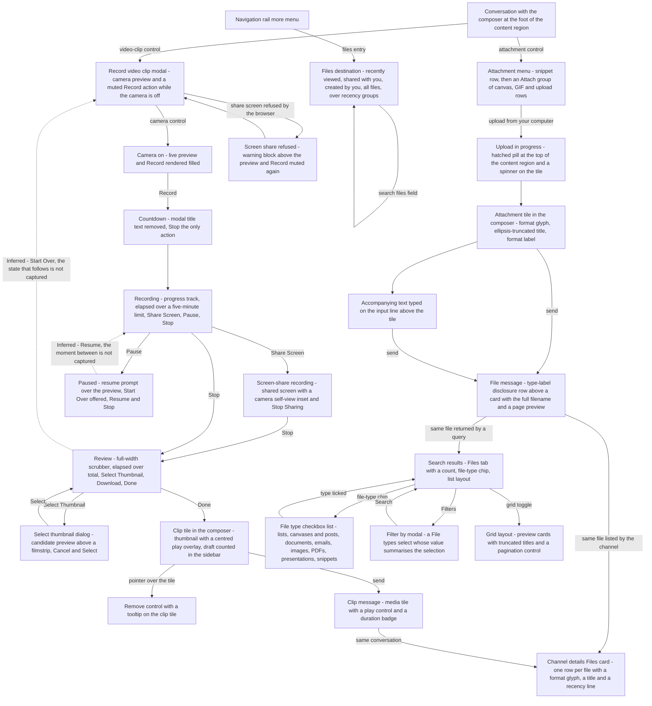

# Files & Media

How a file enters a conversation, how media is authored inside the product, how both render once posted, and how they are found again afterwards, specified for build from the [Workflow Catalog](README.md) corpus.

## Purpose

This document specifies **files and media as first-class objects**: the three ways the corpus shows content becoming a file — uploaded from the user's own machine, recorded inside the product, or produced by another surface as an export — and the four ways it shows a file being rendered afterwards — as a card inside a message, as a tile inside the composer before sending, as a row in a collection, and as a card in a preview grid. It also specifies the two discovery surfaces the corpus captures: a conversation's own file collection, and workspace-wide search narrowed by file type.

**Where the area is encountered.** Three of its four flows begin at the message composer, so the area is reachable from any conversation in the workspace [frame 163](../../screenshots/Slack%20web%20Jul%202024%20163.png), [frame 186](../../screenshots/Slack%20web%20Jul%202024%20186.png). The fourth is a top-level destination of its own, reached through the navigation rail's more menu rather than from a conversation [frame 488](../../screenshots/Slack%20web%20Jul%202024%20488.png); the rail entry itself and the routing to it belong to [00-product-overview.md](00-product-overview.md), whose rail destination map already names this document as the owner of the files destination. Beyond its own flows the area is encountered wherever another surface renders a file: inside a channel's details modal [frame 96](../../screenshots/Slack%20web%20Jul%202024%2096.png), inside a canvas as an embedded block [frame 322](../../screenshots/Slack%20web%20Jul%202024%20322.png), inside search results [frame 701](../../screenshots/Slack%20web%20Jul%202024%20701.png), and as the output of a list export [frame 450](../../screenshots/Slack%20web%20Jul%202024%20450.png).

**A cross-cutting area assembled from four surfaces, not one dense run.** This area's evidence is deliberately not contiguous. Its four flows sit at frames 163–167, 186–198, 207 and 488, interleaved with composer, canvas and list journeys that belong to other areas — which is why primary-versus-secondary ownership discipline matters more here than in a self-contained area, and why the **Frames covered** section separates the twenty frames this document owns from the eighteen it merely cites.

**Depth.** This is an in-product area, so the treatment is comprehensive within the evidence available: every flow carries a frame-by-frame step table, every enumerable set is transcribed in the order the pixels show it, and every capability the corpus does *not* show — a file-picker dialog, a drag-and-drop target, an upload failure, a full-screen preview — is marked as a partial capture rather than filled in. Twelve such gaps are enumerated at the end of **Edge cases & validations**; a build that needs those behaviours must design them, because this corpus cannot specify them.

**What this document does not own.** Every `C-*` component contract, the placeholder branding vocabulary and the shell's own regions belong to [00-product-overview.md](00-product-overview.md) and are referenced here by identifier only, never restated. The composer itself, its formatting toolbar, the attachment menu as a composer affordance and the audio-clip journey belong to [03-messaging-and-composer.md](03-messaging-and-composer.md); the snippet journey that shares this area's file semantics is that document's flow `03.3`. The channel details modal that hosts a channel's file collection belongs to [02-channels.md](02-channels.md). Canvases are documents rather than files and belong to [07-canvases.md](07-canvases.md), including the canvas that embeds an uploaded file. The list whose export produces a file belongs to [08-lists.md](08-lists.md). The search surface, its result-type tabs, its chips, its filter modal, its sort control and its layout toggles belong to [09-search-and-filters.md](09-search-and-filters.md) — this document owns only what those surfaces say about **files**. Screen sharing inside a live conversation is real-time media rather than a file and belongs to [06-huddles.md](06-huddles.md); the screen-share captured here is a *recording input*, which is why it appears in this area at all. The marketing pages that host the corpus's clearest media players belong to [17-marketing-site.md](17-marketing-site.md). The cross-cutting matrix of empty, loading, error and gated variants belongs to [21-states.md](21-states.md).

## Flows in this area

Four flows are named for this area, spanning 20 frames: content becomes a file by upload, content becomes a file by recording, an existing file is posted again into a conversation, and the workspace's files are browsed as a destination in their own right.

Frame spans below are written as plain numeric ranges because they designate a span rather than cite one image, following the convention of the [Screenshot Coverage Index](_screenshot-index.md). Every individual frame is cited with its full relative link in the per-flow step tables and in the **Frames covered** section.

| Flow ID | Name | Frame span | Primary entry point |
|---|---|---|---|
| `16.1` | Upload a file and post it as a message | 163–167 | The attachment control at the leading edge of `C-COMPOSER`'s bottom action row |
| `16.2` | Record, review and post a video clip | 186–198 | The video-clip control in `C-COMPOSER`'s bottom action row |
| `16.3` | Re-share a file as a message | 207 | Not captured — the single frame shows only the posted result |
| `16.4` | Browse the files destination | 488 | The files entry in `C-RAIL`'s more menu |

**Capture order is not journey order in flow `16.2`, and the record is left as it is.** The thirteen frames of the video-clip flow do not run in the order the journey runs: review states are captured at 190 and 197, the attached tile at 191 and the posted message at 192, while pause is captured at 193, the screen-share refusal at 194, the screen-share recording at 195, thumbnail selection at 196 and the second review state at 197. The step table below is ordered by the **journey**, and each row cites the frame that evidences it, so the citations deliberately move backwards and forwards through the range. This is the same lesson the corpus teaches with byte-identical frames at distant indices: numeric adjacency is a weak prior, and visual state is what segments a flow.

### The files and media journey

Every node below is a state observed in a cited frame. Nothing is a plausible route the corpus does not capture: there is no file-picker node, no drag-and-drop node, no upload-failure node and no full-screen-preview node, because no frame shows one.

**Two edges are drawn dotted, and they are the only soft claims in the diagram.** Every other edge runs between two states this flow captures separately. The dotted pair:

- **Resume, out of the paused state.** The paused state offers a resume action and names a keyboard shortcut for it [frame 193](../../screenshots/Slack%20web%20Jul%202024%20193.png), and the recording state is captured separately [frame 189](../../screenshots/Slack%20web%20Jul%202024%20189.png), but the corpus never captures the moment between them. **Inferred:** the direction, on the basis of the control's presence alone.
- **Start Over, out of review.** The start-over control is present in the title row of both the paused and the review states [frame 190](../../screenshots/Slack%20web%20Jul%202024%20190.png), [frame 193](../../screenshots/Slack%20web%20Jul%202024%20193.png), and **no frame shows the state that follows it** in either. The edge is drawn once, out of review rather than twice, and targets `RECORD` — the camera-off setup state — as the fewest-assumptions reading: the only reset this modal actually captures is the screen-share refusal, which returns the modal to camera-off with the record action muted [frame 194](../../screenshots/Slack%20web%20Jul%202024%20194.png). The alternative reading, that start-over returns to the camera-on `ARMED` state, is excluded by no frame, and a build that chooses it is not contradicted by the corpus. The ambiguity is recorded rather than resolved.

## Flow 16.1 — Upload a file and post it as a message

### Overview

A file on the user's own machine becomes a message in five captured states: the attachment menu opens over the composer, the upload is reported in progress, the upload settles into a tile inside the composer, accompanying text is typed above that tile, and the send produces a message whose body is followed by a card carrying the filename and a preview of the file's first page [frame 163](../../screenshots/Slack%20web%20Jul%202024%20163.png) through [frame 167](../../screenshots/Slack%20web%20Jul%202024%20167.png).

Two facts in this flow do most of the work for a build. First, the attachment is a **staged object inside the composer**, not an immediate post: it appears, it can be accompanied by text, and only the send commits it. Second, the composer shows the title **truncated with an ellipsis** while the posted card shows the same title **in full**, which is the corpus's own proof that the truncation is a display concern rather than a stored value.

### Trigger

The attachment control at the leading edge of `C-COMPOSER`'s bottom action row. Opening it swaps that control for a dismiss affordance, so the same position both opens and closes the menu [frame 163](../../screenshots/Slack%20web%20Jul%202024%20163.png).

### Preconditions

An authenticated session with a conversation open and its composer rendered. The captured conversation is a channel of three members with an unread-free message list and a welcome hero still present, so no prior file or message is required [frame 163](../../screenshots/Slack%20web%20Jul%202024%20163.png). No entitlement gate is rendered on the attachment control or on any row of its menu, unlike the canvas entry in the global create menu; the promotional banner in the sidebar is a workspace-level offer rather than a gate on this flow [frame 163](../../screenshots/Slack%20web%20Jul%202024%20163.png).

### Frame-by-frame steps

| Step | Frame(s) | What the user does | What changes on screen | Component(s) involved |
|---|---|---|---|---|
| 1 | [frame 163](../../screenshots/Slack%20web%20Jul%202024%20163.png) | Opens the attachment menu from the composer's attachment control | A menu opens directly above the composer with its lower edge adjoining it, and the attachment control is replaced in place by a dismiss affordance. The menu reads, top to bottom: a create-a-text-snippet row with a leading glyph and a right-aligned keyboard-shortcut hint; a labelled *Attach* group heading; then a canvas row, a row offering to enable animated images for the team, and an upload-from-your-computer row with its own leading glyph and right-aligned shortcut hint. The upload row is rendered with a filled accent background and inverted text | `C-COMPOSER`, `C-DROPDOWN-MENU` |
| 2 | [frame 164](../../screenshots/Slack%20web%20Jul%202024%20164.png) | Chooses upload-from-your-computer and picks a file on their own machine | The menu closes and the attachment control returns to its normal glyph. An indeterminate progress pill reading that the uploaded file is being processed appears centred horizontally at the **top** of the content region, immediately beneath the bookmark row, filled with diagonal hatching in the accent colour. Inside the composer, between the input line and the bottom action row, an attachment tile appears: a bordered rounded rectangle with a format glyph at its leading edge and a bold title truncated with an ellipsis, and a small circular spinner overlapping the tile's top-right corner. The send control changes from muted to filled even though no text has been typed | `C-COMPOSER` |
| 3 | [frame 165](../../screenshots/Slack%20web%20Jul%202024%20165.png) | Waits for processing to complete | The progress pill and the tile's spinner both disappear together. The tile gains a second line beneath its truncated title carrying the format label. The input line renders blank with no placeholder text, and the slash-command control at the trailing end of the action row renders faint | `C-COMPOSER` |
| 4 | [frame 166](../../screenshots/Slack%20web%20Jul%202024%20166.png) | Types a sentence to accompany the file | The typed text appears on the input line **above** the tile, so the accompanying message and the staged attachment occupy the same composer in that order. A hint line explaining how to add a new line appears beneath the composer, outside its bounds | `C-COMPOSER` |
| 5 | [frame 167](../../screenshots/Slack%20web%20Jul%202024%20167.png) | Sends the message | The composer empties and resets to its placeholder, the send control returns to muted and the formatting toolbar renders faint. A new message row appears at the foot of the list carrying the author, the timestamp and the typed body, then a type-label disclosure row bearing the format name and a caret, then the file card: an upper band with the format glyph, the **full untruncated filename** and the format label beneath it, a horizontal rule, and a preview region rendering the file's first page. The card occupies roughly a third of the content region's width | `C-MESSAGE-ROW`, `C-COMPOSER` |

> **Partial capture:** the operating system's own file-selection dialog is not captured. [frame 163](../../screenshots/Slack%20web%20Jul%202024%20163.png) shows the upload row highlighted and [frame 164](../../screenshots/Slack%20web%20Jul%202024%20164.png) already shows the upload in progress, so the corpus documents what the product renders on either side of the picker but says nothing about the picker itself, about how many files may be chosen at once, or about any accepted-type restriction.

**Boundary evidence, and an adjacency override.** This flow ends at [frame 167](../../screenshots/Slack%20web%20Jul%202024%20167.png) rather than continuing into the next numeric frame, and the reason is visible rather than inferred: the following capture shows the same channel with **no file message in the list at all** and an unrelated bulleted draft in the composer, so the session state has moved backwards and a different journey has begun [frame 168](../../screenshots/Slack%20web%20Jul%202024%20168.png). That frame belongs to [03-messaging-and-composer.md](03-messaging-and-composer.md) and is cited here only as boundary evidence.

## Flow 16.2 — Record, review and post a video clip

### Overview

Media is **authored inside the product** rather than uploaded: a modal offers a camera preview, records against a five-minute limit, allows a pause and a screen-share input, then hands the recording to a review state where a poster frame can be chosen and the clip can be downloaded before it is attached to the composer and sent [frame 186](../../screenshots/Slack%20web%20Jul%202024%20186.png) through [frame 198](../../screenshots/Slack%20web%20Jul%202024%20198.png).

The flow is worth reading as three phases with different chrome. **Setup** keeps the modal title and offers upload, screen-share and record actions, with record gated on the camera being on. **Capture** removes the modal title entirely, reduces the footer to recording controls and a single stop action, and shows elapsed time against a limit. **Review** restores a title-row action, replaces the elapsed-over-limit readout with elapsed-over-total, and offers thumbnail selection, download and a terminal confirm.

### Trigger

The video-clip control in `C-COMPOSER`'s bottom action row — the first control of that row's middle group, which `00-product-overview.md` documents as video clip followed by audio clip. The trigger control is visible in the action row of every composer capture in this area [frame 163](../../screenshots/Slack%20web%20Jul%202024%20163.png), and the modal it opens is the first captured state of this flow [frame 186](../../screenshots/Slack%20web%20Jul%202024%20186.png).

> **Partial capture:** no frame shows the pointer on the video-clip control or the modal opening, so the trigger is established from the control's presence in the action row and from the modal's own subject rather than from a captured interaction.

### Preconditions

An authenticated session with a conversation open. A camera and a microphone must be addressable by the browser: the first captured state renders the camera control **struck through** with the preview showing a static self-view portrait instead of a live image, and the record action is muted in exactly that state [frame 186](../../screenshots/Slack%20web%20Jul%202024%20186.png). Screen-share additionally depends on a permission the product cannot grant itself, and the corpus captures the refusal [frame 194](../../screenshots/Slack%20web%20Jul%202024%20194.png).

### Frame-by-frame steps

| Step | Frame(s) | What the user does | What changes on screen | Component(s) involved |
|---|---|---|---|---|
| 1 | [frame 186](../../screenshots/Slack%20web%20Jul%202024%20186.png) | Opens the record-video-clip modal | A centred modal dims the shell behind it. Its title row carries the title at the left and a help control then a dismiss control at the right. The body is a large light preview region spanning most of the modal width, holding a static self-view portrait at its centre and, near its lower-left, a control row of four icon controls: camera, microphone, effects, settings. The camera control is struck through in a warning colour. The footer places an upload-a-video action with a leading glyph at the left, and a share-screen action then a **muted** record action at the right | `C-MODAL-SHELL`, `C-AVATAR` |
| 2 | [frame 187](../../screenshots/Slack%20web%20Jul%202024%20187.png) | Turns the camera on | The strike-through clears from the camera control and the preview region fills with a live camera image in place of the static portrait. The record action changes from muted to filled in a strong accent. Nothing else in the modal changes | `C-MODAL-SHELL` |
| 3 | [frame 188](../../screenshots/Slack%20web%20Jul%202024%20188.png) | Starts the recording | The modal's **title text disappears**, leaving only the dismiss control in the title row. The preview dims and a bold centred caption counts the recording in. The footer is reduced to a single filled stop action; the upload and share-screen actions are removed | `C-MODAL-SHELL` |
| 4 | [frame 189](../../screenshots/Slack%20web%20Jul%202024%20189.png) | Records | The preview returns to full brightness. A thin progress track appears spanning the modal's width immediately above the footer, with a small filled marker near its leading edge. The footer's left shows an elapsed time over a five-minute limit; to its right sit a share-screen action, a separator, a pause action and the filled stop action | `C-MODAL-SHELL` |
| 5 | [frame 193](../../screenshots/Slack%20web%20Jul%202024%20193.png) | Pauses the recording | The title row gains a start-over action with a circular-arrow glyph beside the dismiss control. The preview dims and a two-line centred caption offers a keyboard shortcut to resume. The elapsed-over-limit readout, the progress track and the share-screen action all persist; the pause action is replaced in place by a resume action with a play glyph, and stop remains | `C-MODAL-SHELL` |
| 6 | [frame 193](../../screenshots/Slack%20web%20Jul%202024%20193.png) | Resumes from the resume action or the offered keyboard shortcut | Only the resume action's presence evidences this transition; the corpus captures the paused state and the recording state but not the moment between them | `C-MODAL-SHELL` |
| 7 | [frame 195](../../screenshots/Slack%20web%20Jul%202024%20195.png) | Shares the screen while recording | The preview region's content changes from the camera image to the shared screen, letterboxed on a black field, with a **small camera self-view inset at the preview's lower-right corner**. The share-screen action is replaced by a stop-sharing action carrying a struck-through-screen glyph; the elapsed-over-limit readout, pause and stop are unchanged | `C-MODAL-SHELL` |
| 7a | [frame 194](../../screenshots/Slack%20web%20Jul%202024%20194.png) | Attempts to share the screen and the browser refuses — alternative path | A tinted warning block with a rounded border and a leading warning-triangle glyph is inserted **inside the modal body above the preview**, carrying a bold heading that the screen cannot be shared and two lines instructing the user to grant screen recording in their system settings and try again. The preview reverts to the camera-off treatment with the struck-through camera control and the static portrait, and the record action returns to muted, so the refusal resets the setup state rather than only reporting a failure | `C-MODAL-SHELL`, `C-PERMISSION-PROMPT` |
| 8 | [frame 190](../../screenshots/Slack%20web%20Jul%202024%20190.png) | Stops the recording | The modal enters review. The title row keeps the start-over action beside the dismiss control. The recorded media now spans the modal's **full width**, taller than the setup preview. A scrubber track spans that width with the played portion filled in the accent colour. The footer places a pause glyph at its leading edge, then an elapsed-over-**total** readout, then a select-thumbnail action with an image glyph, a download action with a download-arrow glyph on a light filled background, and a filled confirm action at the trailing edge | `C-MODAL-SHELL`, `C-MEDIA-PLAYER` |
| 9 | [frame 196](../../screenshots/Slack%20web%20Jul%202024%20196.png) | Opens thumbnail selection | A second dialog stacks over the review modal and the backdrop is dimmed a second time. The dialog carries a title and a dismiss control, a large candidate-frame preview, a filmstrip of candidate frames spanning its width with a position marker at the strip's leading edge, and a footer of an outlined cancel action then a filled select action. The review modal remains legible behind it, its readout still showing elapsed over the same total | `C-MODAL-SHELL` |
| 10 | [frame 197](../../screenshots/Slack%20web%20Jul%202024%20197.png) | Selects a frame as the poster image | The dialog closes and review returns with the chosen frame displayed. The leading playback control is now a **play** glyph rather than the pause glyph of the earlier review capture, and the download action is rendered without the light filled background it carried before. The elapsed-over-total readout, the scrubber, select-thumbnail and the confirm action are unchanged | `C-MODAL-SHELL`, `C-MEDIA-PLAYER` |
| 11 | [frame 191](../../screenshots/Slack%20web%20Jul%202024%20191.png) | Confirms the clip | The modal closes and the clip is staged in the composer as a small rounded thumbnail tile carrying a centred circular play overlay, positioned below the input line and above the bottom action row. The input line keeps its placeholder and the send control is filled. In the sidebar a flat drafts-and-sent row appears at the top with a pencil affordance and a count of one, so an unsent composer holding an attachment is counted as a draft. The formatting toolbar is **not** rendered in this capture | `C-COMPOSER`, `C-SIDEBAR`, `C-MEDIA-PLAYER` |
| 12 | [frame 198](../../screenshots/Slack%20web%20Jul%202024%20198.png) | Brings the pointer onto the staged clip tile | A small circular remove control appears at the tile's top-right corner, overlapping the tile, with a dark tooltip above it naming the action as removing the video clip. The drafts-and-sent row and its count of one persist | `C-COMPOSER` |
| 13 | [frame 192](../../screenshots/Slack%20web%20Jul%202024%20192.png) | Sends the clip | A new message row appears carrying the author, the timestamp, a type-label disclosure row naming the media type with a caret, and a media tile roughly a third of the content region wide rendering the chosen poster frame, with a play control and a duration badge grouped on a dark pill at the tile's lower-left. The composer resets and the sidebar's drafts-and-sent row **disappears**, which is the corpus's evidence that the draft and the sent message are the same object in two states | `C-MESSAGE-ROW`, `C-MEDIA-PLAYER`, `C-SIDEBAR` |

> **Partial capture:** the upload-a-video action in the setup footer is never used in the corpus [frame 186](../../screenshots/Slack%20web%20Jul%202024%20186.png), so a second route into this flow exists and is unspecified. Neither the effects control nor the settings control in the preview's control row is ever opened, so their contents are unknown. No frame shows the clip being played back after it is posted, and none shows the download action's outcome.

## Flow 16.3 — Re-share a file as a message

### Overview

A file already present in the workspace is posted into a conversation again, by a **different person** from the one who first shared it, with a sentence of accompanying text. The corpus captures only the result: one message row whose body announces the re-share and whose card carries a filename, a format label and a preview of the file's first page [frame 207](../../screenshots/Slack%20web%20Jul%202024%20207.png).

This flow is included as a distinct flow rather than folded into `16.1` because the posted anatomy is identical while the **origin is not**: nothing in the capture indicates an upload, the author differs from the uploader in `16.1`, and the sample filename carries a duplicate-name suffix rather than the plain name posted there. A build therefore needs a path that posts an existing file object into a conversation, not only a path that uploads a new one.

### Trigger

Not captured. The frame shows a completed message; no menu, hover action or picker that would begin a re-share is visible in it.

> **Partial capture:** the entire interaction that produces this message is absent — there is no captured re-share action on a file card, on a message overflow menu, on a files-destination row or in the composer. Only the outcome is specified, and a build must design the entry point.

### Preconditions

An authenticated session with a conversation open, and a file that already exists in the workspace. The conversation's list already holds the earlier messages of the same sample channel, so the re-share is not the conversation's first message [frame 207](../../screenshots/Slack%20web%20Jul%202024%20207.png).

### Frame-by-frame steps

| Step | Frame(s) | What the user does | What changes on screen | Component(s) involved |
|---|---|---|---|---|
| 1 | [frame 207](../../screenshots/Slack%20web%20Jul%202024%20207.png) | Posts an existing file into the conversation with accompanying text | A message row renders the author, the timestamp and a body sentence that states the file is being re-shared. Beneath the body sits a type-label disclosure row bearing the format name and a caret, then the file card: an upper band with the format glyph, the bold filename and the format label beneath it, a rule, and a preview region rendering the file's first page. The composer beneath is empty with its placeholder, its formatting toolbar rendered above it | `C-MESSAGE-ROW`, `C-COMPOSER` |

**Inconsistency, recorded and not reconciled.** The body copy states that the file is being re-shared, but the card's filename carries a duplicate-name suffix that the file posted in `16.1` does not, and its preview region renders **different page content** from that file's preview [frame 167](../../screenshots/Slack%20web%20Jul%202024%20167.png) versus [frame 207](../../screenshots/Slack%20web%20Jul%202024%20207.png). The two captures therefore do not show the same file object, whatever the sentence says. The record is left as the images show it: the message copy is observed, the identity of the file across the two frames is not.

## Flow 16.4 — Browse the files destination

### Overview

The workspace's files are a **top-level destination**, not only a per-conversation collection: a scope list in the sidebar, a search field over the whole collection, and rows grouped under recency headings [frame 488](../../screenshots/Slack%20web%20Jul%202024%20488.png). This is the corpus's only capture of a dedicated files browser, and it is the single frame this document owns outright with no other area named beside it in the ledger.

The destination is also where the corpus shows most clearly that **"file" is a broader category than "upload"**: the captured rows include a list, a code snippet, several canvases and two template-badged canvases, all in one collection, all with the same row anatomy.

### Trigger

The files entry in `C-RAIL`'s more menu. The rail rendered in this capture shows home, direct messages, activity, later and canvases with a more entry, and no files entry of its own, so the destination is reached through that overflow; the rail entry, the more menu and the preference that governs which destinations appear are owned by [00-product-overview.md](00-product-overview.md) and [14-preferences-settings.md](14-preferences-settings.md) [frame 488](../../screenshots/Slack%20web%20Jul%202024%20488.png).

### Preconditions

An authenticated session. No conversation needs to be open — the destination replaces the routed content region and gives the sidebar its own destination-scoped form, whose header is a bare title with no controls [frame 488](../../screenshots/Slack%20web%20Jul%202024%20488.png).

### Frame-by-frame steps

| Step | Frame(s) | What the user does | What changes on screen | Component(s) involved |
|---|---|---|---|---|
| 1 | [frame 488](../../screenshots/Slack%20web%20Jul%202024%20488.png) | Opens the files destination | The sidebar becomes destination-scoped: a bare title, then the workspace's promotional offer block, then a scope list of recently-viewed with a clock glyph, shared-with-you with a forward-arrow glyph and created-by-you with a person glyph, then a separator rule, then an all-files scope with a layers glyph. Recently-viewed is active, rendered with a filled highlight. The content region renders a heading that mirrors the active scope, a full-width search-files field with a leading magnifier glyph, and then the collection: a recency group heading followed by eight rows, then a second recency group heading followed by one row. Each row places a rounded-square format-glyph tile at its leading edge, a bold title next, an optional template badge after the title, and a metadata line beneath naming the sharer and either a relative day or an absolute date. Rows are separated by rules across the full content width | `C-RAIL`, `C-SIDEBAR`, `C-UPGRADE-GATE` |

> **Partial capture:** only the recently-viewed scope is captured. The shared-with-you, created-by-you and all-files scopes are never selected, the search-files field is never used, no row is ever opened, no row exposes an overflow control, a download control or a checkbox, and no empty variant of this destination is captured. The destination's behaviour beyond its initial rendering is therefore unspecified.

## Screens & components

Every measurement below is **proportional to the effective product viewport** or to the container the element sits in, never an absolute offset, and every icon is named by the function it performs rather than by any third-party asset.

### The file card, in every surface that renders one

One anatomy recurs across four different surfaces, which makes it the area's most reusable specification. Reading top to bottom, a file card is a **header band above an optional preview region**, both inside one bordered rounded container:

| Part | Position and ordering | Relative size | Contents |
|---|---|---|---|
| Format glyph | Leading edge of the header band, vertically centred on the band's text | A rounded square roughly the height of two text lines | A glyph standing for the file's type, its tile colour varying by type — the corpus shows distinct colours for a document format, for a code snippet, for a list and for a canvas [frame 488](../../screenshots/Slack%20web%20Jul%202024%20488.png) |
| Title | Immediately right of the glyph, first line of the band | Bold, the band's largest text | The filename in full where width allows [frame 167](../../screenshots/Slack%20web%20Jul%202024%20167.png), truncated with a trailing ellipsis where it does not [frame 704](../../screenshots/Slack%20web%20Jul%202024%20704.png) |
| Second line | Directly beneath the title, aligned to it | Smaller and lower-contrast than the title | **Either** the format label, when the card sits inside a message [frame 167](../../screenshots/Slack%20web%20Jul%202024%20167.png), [frame 207](../../screenshots/Slack%20web%20Jul%202024%20207.png), **or** the sharer and a date, when it sits in a collection or a canvas [frame 322](../../screenshots/Slack%20web%20Jul%202024%20322.png), [frame 704](../../screenshots/Slack%20web%20Jul%202024%20704.png) |
| Rule | Between the header band and the preview | Full card width | Present in the message card [frame 167](../../screenshots/Slack%20web%20Jul%202024%20167.png); the canvas block separates the two parts by a change of background instead [frame 322](../../screenshots/Slack%20web%20Jul%202024%20322.png) |
| Preview region | Beneath the rule, filling the remainder of the card | Roughly two to three times the header band's height | A rendering of the file's first page, legible enough that headings and table rows can be made out at card size [frame 167](../../screenshots/Slack%20web%20Jul%202024%20167.png), [frame 207](../../screenshots/Slack%20web%20Jul%202024%20207.png), [frame 322](../../screenshots/Slack%20web%20Jul%202024%20322.png) |

**Inside a message the card is preceded by a type-label disclosure row** carrying the type name and a caret, sitting between the message body and the card itself, at the body's left margin [frame 167](../../screenshots/Slack%20web%20Jul%202024%20167.png), [frame 192](../../screenshots/Slack%20web%20Jul%202024%20192.png), [frame 207](../../screenshots/Slack%20web%20Jul%202024%20207.png). The whole card occupies roughly a third of the content region's width, not its full width.

**Inferred:** the disclosure row collapses and expands the card rather than doing anything to the file, because it carries a caret, it names the card's type, and it is the only control rendered between the body and the card [frame 167](../../screenshots/Slack%20web%20Jul%202024%20167.png), [frame 192](../../screenshots/Slack%20web%20Jul%202024%20192.png), [frame 207](../../screenshots/Slack%20web%20Jul%202024%20207.png). No capture shows a collapsed card, so the collapsed rendering is unspecified.

### The composer's attachment region

A staged attachment renders **inside `C-COMPOSER`'s own bounds, between the input line and the bottom action row** — not above the input line. Three staged forms are captured and they differ only in the tile's content:

- **A document attachment** is a bordered tile carrying a format glyph at its leading edge, an ellipsis-truncated bold title, and once processing completes a format label beneath the title [frame 164](../../screenshots/Slack%20web%20Jul%202024%20164.png), [frame 165](../../screenshots/Slack%20web%20Jul%202024%20165.png).
- **A video clip** is a small rounded thumbnail tile showing a frame of the recording with a centred circular play overlay, roughly a sixth of the composer's width [frame 191](../../screenshots/Slack%20web%20Jul%202024%20191.png).
- **An audio clip** is a wider bordered card carrying a large circular filled play control at its leading edge, a static waveform occupying most of the card, and a right-aligned duration readout [frame 201](../../screenshots/Slack%20web%20Jul%202024%20201.png). This is `C-MEDIA-PLAYER`'s audio-clip variant exactly as the inventory defines it; the recording journey that produces it is flow `03.6` in [03-messaging-and-composer.md](03-messaging-and-composer.md).

Two controls attach to a staged tile. A **spinner** overlaps the tile's top-right corner while the upload is still processing [frame 164](../../screenshots/Slack%20web%20Jul%202024%20164.png), and a **circular remove control with a tooltip** appears at that same corner once it has settled [frame 198](../../screenshots/Slack%20web%20Jul%202024%20198.png) — the same corner carrying a progress indicator in one state and a destructive control in another, which a build must sequence rather than render together.

**Upload progress is reported in two places at once**: the tile's corner spinner, and an indeterminate pill centred horizontally at the **top** of the content region beneath the bookmark row, filled with diagonal hatching in the accent colour and carrying a one-line processing message [frame 164](../../screenshots/Slack%20web%20Jul%202024%20164.png). Both clear together [frame 165](../../screenshots/Slack%20web%20Jul%202024%20165.png).

### The record-video-clip modal

A centred modal whose chrome changes by phase. The body is a preview region spanning most of the modal's width at roughly a three-to-two aspect in setup [frame 186](../../screenshots/Slack%20web%20Jul%202024%20186.png) and widening to the modal's **full width**, taller, in review [frame 190](../../screenshots/Slack%20web%20Jul%202024%20190.png).

| Phase | Title row | Body | Footer, leading to trailing |
|---|---|---|---|
| Setup | Title, then a help control, then a dismiss control [frame 186](../../screenshots/Slack%20web%20Jul%202024%20186.png) | Preview with a four-control row near its lower-left: camera, microphone, effects, settings | Upload-a-video at the left; share-screen then record at the right, record muted until the camera is on [frame 186](../../screenshots/Slack%20web%20Jul%202024%20186.png), [frame 187](../../screenshots/Slack%20web%20Jul%202024%20187.png) |
| Setup, after a refused screen share | Unchanged | A tinted warning block with a warning-triangle glyph **above** the preview, then the preview reverted to camera-off [frame 194](../../screenshots/Slack%20web%20Jul%202024%20194.png) | Unchanged, with record muted again |
| Count-in | **Title text removed**; dismiss only [frame 188](../../screenshots/Slack%20web%20Jul%202024%20188.png) | Preview dimmed under a bold centred count-in caption | A single filled stop action at the right |
| Recording | Dismiss only [frame 189](../../screenshots/Slack%20web%20Jul%202024%20189.png) | Preview at full brightness; a thin progress track spans the modal width above the footer | Elapsed-over-limit readout at the left; share-screen, separator, pause, filled stop at the right |
| Recording, screen shared | Dismiss only [frame 195](../../screenshots/Slack%20web%20Jul%202024%20195.png) | Shared screen letterboxed on black with a camera self-view inset at the lower-right | Elapsed-over-limit; stop-sharing, separator, pause, filled stop |
| Paused | Start-over action, then dismiss [frame 193](../../screenshots/Slack%20web%20Jul%202024%20193.png) | Preview dimmed under a two-line resume prompt naming a keyboard shortcut | Elapsed-over-limit; share-screen, separator, resume, filled stop |
| Review | Start-over action, then dismiss [frame 190](../../screenshots/Slack%20web%20Jul%202024%20190.png) | Media at full modal width; a scrubber track spans that width with the played portion filled | Playback toggle, elapsed-over-**total** readout, select-thumbnail, download, filled confirm |
| Thumbnail selection | Title, then dismiss, on a dialog stacked over review [frame 196](../../screenshots/Slack%20web%20Jul%202024%20196.png) | Large candidate preview above a filmstrip spanning the dialog width, with a position marker at the strip's leading edge | Outlined cancel then filled select at the right |

**The elapsed readout changes meaning between phases and a build must not treat it as one field.** While recording it reads elapsed against a **fixed five-minute limit** [frame 189](../../screenshots/Slack%20web%20Jul%202024%20189.png), [frame 193](../../screenshots/Slack%20web%20Jul%202024%20193.png), [frame 195](../../screenshots/Slack%20web%20Jul%202024%20195.png); in review it reads elapsed against the **clip's own duration** [frame 190](../../screenshots/Slack%20web%20Jul%202024%20190.png), [frame 196](../../screenshots/Slack%20web%20Jul%202024%20196.png), [frame 197](../../screenshots/Slack%20web%20Jul%202024%20197.png).

### The files destination

Three regions, none of them a conversation. `C-RAIL` is unchanged. `C-SIDEBAR` takes its destination-scoped form: a bare title with no header controls, the workspace's offer block, then a scope list of three recency-and-relationship scopes, a separator rule, and a fourth all-files scope; the active scope is rendered with a filled highlight [frame 488](../../screenshots/Slack%20web%20Jul%202024%20488.png). The content region, occupying the remaining width, stacks a heading that mirrors the active scope, a full-width search field over the collection, and then the collection itself as **recency groups**: a group heading, then its rows, then the next group heading and its rows.

A collection row is the file card's header band without a preview region, laid across the full content width and separated from its neighbours by a rule: format glyph, bold title, optional template badge immediately after the title, then a metadata line beneath naming the sharer and a date [frame 488](../../screenshots/Slack%20web%20Jul%202024%20488.png). The same anatomy, minus the group headings, renders inside the channel details modal's file card [frame 96](../../screenshots/Slack%20web%20Jul%202024%2096.png) and inside search's list layout [frame 701](../../screenshots/Slack%20web%20Jul%202024%20701.png).

**The picker-shaped analogue, cited as an analogue only.** The chooser that inserts an existing document into a message uses the same vocabulary as this destination — a search field over the collection, scope chips reading all, shared-with-you and created-by-you, a recency sort control, and rows carrying a glyph, a bold title, an optional template badge and a relative-recency metadata line — with a footer offering create-new, cancel and a muted insert action [frame 150](../../screenshots/Slack%20web%20Jul%202024%20150.png). It is the closest observed structure to a file picker and it is **not** one: it chooses canvases, which [07-canvases.md](07-canvases.md) owns and which this document does not treat as files. The parallel is recorded because a build that implements one gets the other's layout for free, not because the two are the same surface.

### File-oriented discovery in search

Three things in the search surface belong to files, and only those three are specified here; the surface itself is owned by [09-search-and-filters.md](09-search-and-filters.md).

- **A files result tab carrying a count**, sitting among the other result-type tabs and rendering its count as a number even when sibling tabs read zero [frame 696](../../screenshots/Slack%20web%20Jul%202024%20696.png), [frame 701](../../screenshots/Slack%20web%20Jul%202024%20701.png).
- **A file-type filter with two entry paths that must agree.** As a `C-FILTER-CHIP` it opens an anchored, scrollable checkbox list whose visible entries read, in order: lists, canvases and posts, documents, emails, images, PDFs, presentations, snippets [frame 696](../../screenshots/Slack%20web%20Jul%202024%20696.png). As a field inside the filter-by modal it is a select whose value **summarises the multi-selection** rather than listing it [frame 700](../../screenshots/Slack%20web%20Jul%202024%20700.png). The chip's own label tracks the applied value: the bare dimension name when unset [frame 696](../../screenshots/Slack%20web%20Jul%202024%20696.png), the single type's name when one is chosen [frame 700](../../screenshots/Slack%20web%20Jul%202024%20700.png), and a count of types when more than one is [frame 701](../../screenshots/Slack%20web%20Jul%202024%20701.png). The same narrowing is expressible as **repeated type modifier tokens in the query string**, one token per type [frame 701](../../screenshots/Slack%20web%20Jul%202024%20701.png).
- **Two result layouts with different title behaviour.** The list layout renders one row per file with the title in full and the matched term highlighted in place [frame 701](../../screenshots/Slack%20web%20Jul%202024%20701.png); the grid layout renders four columns of cards whose titles truncate with an ellipsis and whose bodies carry a content preview, with a pagination control centred beneath the grid [frame 704](../../screenshots/Slack%20web%20Jul%202024%20704.png).

### Components this area consumes

Referenced by identifier; every contract is defined once in [00-product-overview.md](00-product-overview.md) and none is restated here.

| Identifier | How this area uses it | Evidence |
|---|---|---|
| `C-COMPOSER` | Hosts the attachment control, the video-clip control and every staged attachment tile | [frame 163](../../screenshots/Slack%20web%20Jul%202024%20163.png), [frame 165](../../screenshots/Slack%20web%20Jul%202024%20165.png), [frame 191](../../screenshots/Slack%20web%20Jul%202024%20191.png), [frame 201](../../screenshots/Slack%20web%20Jul%202024%20201.png) |
| `C-DROPDOWN-MENU` | The attachment menu, anchored to the composer's attachment control, with a grouped heading and shortcut hints | [frame 163](../../screenshots/Slack%20web%20Jul%202024%20163.png) |
| `C-MESSAGE-ROW` | Carries a posted file card or media tile beneath the message body, preceded by a type-label disclosure row | [frame 167](../../screenshots/Slack%20web%20Jul%202024%20167.png), [frame 192](../../screenshots/Slack%20web%20Jul%202024%20192.png), [frame 207](../../screenshots/Slack%20web%20Jul%202024%20207.png) |
| `C-MEDIA-PLAYER` | The attached audio card, the staged clip thumbnail, the in-modal review player and the posted media tile | [frame 190](../../screenshots/Slack%20web%20Jul%202024%20190.png), [frame 191](../../screenshots/Slack%20web%20Jul%202024%20191.png), [frame 192](../../screenshots/Slack%20web%20Jul%202024%20192.png), [frame 201](../../screenshots/Slack%20web%20Jul%202024%20201.png) |
| `C-MODAL-SHELL` | The record-video-clip modal in all seven of its phases, and the thumbnail dialog stacked over it | [frame 186](../../screenshots/Slack%20web%20Jul%202024%20186.png), [frame 190](../../screenshots/Slack%20web%20Jul%202024%20190.png), [frame 196](../../screenshots/Slack%20web%20Jul%202024%20196.png) |
| `C-PERMISSION-PROMPT` | The refused screen-share reported in place, in the contract's **in-modal denial** variant, resetting the modal to its camera-off setup state | [frame 194](../../screenshots/Slack%20web%20Jul%202024%20194.png) |
| `C-PROGRESS-INDICATOR` | The indeterminate hatched upload pill centred at the top of the content region while an upload is in flight, alongside a per-element spinner on the staged tile — one of the structures this area contributed to the shared inventory, reported from here and contracted in [00-product-overview.md](00-product-overview.md) | [frame 164](../../screenshots/Slack%20web%20Jul%202024%20164.png) |
| `C-DEVICE-PREVIEW` | The camera preview inside the record-clip modal, substituted by a static portrait while the camera is off | [frame 186](../../screenshots/Slack%20web%20Jul%202024%20186.png) |
| `C-DETAILS-PANE` | Hosts a conversation's file collection as a card inside the channel details modal | [frame 90](../../screenshots/Slack%20web%20Jul%202024%2090.png), [frame 96](../../screenshots/Slack%20web%20Jul%202024%2096.png) |
| `C-SIDEBAR` | The destination-scoped scope list of the files destination, and the drafts-and-sent row that counts a staged attachment | [frame 191](../../screenshots/Slack%20web%20Jul%202024%20191.png), [frame 488](../../screenshots/Slack%20web%20Jul%202024%20488.png) |
| `C-RAIL` | The route to the files destination, through its more menu | [frame 488](../../screenshots/Slack%20web%20Jul%202024%20488.png) |
| `C-FILTER-CHIP` | The file-type dimension in the search control row, in unset, single-value and multi-value states | [frame 696](../../screenshots/Slack%20web%20Jul%202024%20696.png), [frame 700](../../screenshots/Slack%20web%20Jul%202024%20700.png), [frame 701](../../screenshots/Slack%20web%20Jul%202024%20701.png) |
| `C-TAB-BAR` | The files result tab and its count among the other result types | [frame 701](../../screenshots/Slack%20web%20Jul%202024%20701.png) |
| `C-UPGRADE-GATE` | The workspace offer block above the files destination's scope list, and the trial-scoped upsell strip above file results | [frame 488](../../screenshots/Slack%20web%20Jul%202024%20488.png), [frame 701](../../screenshots/Slack%20web%20Jul%202024%20701.png) |
| `C-AVATAR` | The static self-view portrait standing in for a live camera image while the camera is off | [frame 186](../../screenshots/Slack%20web%20Jul%202024%20186.png) |
| `C-PAGER` | The pagination control centred beneath the grid layout of file results, reported by [09-search-and-filters.md](09-search-and-filters.md) and contracted in the same place | [frame 704](../../screenshots/Slack%20web%20Jul%202024%20704.png) |
| `C-PROGRESS-INDICATOR` | The indeterminate hatched pill centred at the top of the content region while an upload is in flight, alongside a per-element spinner on the staged tile. Reported from this area and contracted in [00-product-overview.md](00-product-overview.md) | [frame 164](../../screenshots/Slack%20web%20Jul%202024%20164.png) |
| `C-EMPTY-STATE` | Not consumed. No empty variant of any file surface is captured — see **Edge cases & validations** | — |

### Player, progress and denial structures this area contributed

Four structures recur in this area that the inventory's contracts did not cover when this document was written. They were **reported, not defined** — [00-product-overview.md](00-product-overview.md) is the single source of truth for every `C-*` contract, and a definition written here would create a second one — and all four have since been absorbed there: three as further `C-MEDIA-PLAYER` variants, one as the new `C-PROGRESS-INDICATOR`, and the denial placement as a further `C-PERMISSION-PROMPT` variant. The reports are kept below as this area's own observational record.

1. **`C-MEDIA-PLAYER` carries three further variants because of this area.** Alongside the audio-clip card and the static media card, the contract now records: an **in-modal review player** whose scrubber spans the container **above** a control row of a playback toggle, an elapsed-over-total readout, select-thumbnail, download and confirm [frame 190](../../screenshots/Slack%20web%20Jul%202024%20190.png), [frame 197](../../screenshots/Slack%20web%20Jul%202024%20197.png); a **posted media tile** whose play control and duration badge are grouped on a dark pill at the tile's lower-left, with no scrubber at all [frame 192](../../screenshots/Slack%20web%20Jul%202024%20192.png); and a **page-embedded player** whose control row carries a play control and an elapsed-over-total readout at its leading edge, a mute control, a fullscreen affordance and an overflow control at its trailing edge, with the progress track **beneath** that row rather than above it [frame 800](../../screenshots/Slack%20web%20Jul%202024%20800.png). A fourth presentation defers playback entirely: a static card with a play control whose page expresses duration in a metadata strip rather than in a time readout, and whose playback is initiated by a separate page action [frame 843](../../screenshots/Slack%20web%20Jul%202024%20843.png).
2. **A fullscreen affordance is observed only on a public marketing surface.** **Inferred:** the same player would render in-product, because the marketing page's own content is a mock of the product; but no in-product capture shows a fullscreen affordance, a mute control or an overflow control on any player, so the claim is marked as an inference and must not be built as a requirement [frame 800](../../screenshots/Slack%20web%20Jul%202024%20800.png).
3. **The indeterminate progress pill is `C-PROGRESS-INDICATOR`.** The hatched, accent-filled pill centred at the top of the content region during an upload is neither `C-TOAST`, which is a dark pill at the bottom-right, nor `C-BANNER`, which occupies a full-width region slot; the contract keeps all three apart and records that this one carries no control and no dismissal affordance [frame 164](../../screenshots/Slack%20web%20Jul%202024%20164.png).
4. **`C-PERMISSION-PROMPT` carries an in-modal denial variant because of this area.** Alongside the full-width band pinned to the viewport foot, the contract records a tinted warning block **inside a modal body, above the control it concerns**, which resets the modal's setup state as well as reporting the refusal [frame 194](../../screenshots/Slack%20web%20Jul%202024%20194.png).

## States

Every state below is observed in the cited frame; none is a state this area would plausibly have.

| Object | State | Rendering | Evidence |
|---|---|---|---|
| Attachment control | Default | The composer action row's leading glyph | [frame 165](../../screenshots/Slack%20web%20Jul%202024%20165.png) |
| Attachment control | Menu open | Replaced in place by a dismiss affordance | [frame 163](../../screenshots/Slack%20web%20Jul%202024%20163.png) |
| Attachment menu row | Highlighted | Filled accent background with inverted text | [frame 163](../../screenshots/Slack%20web%20Jul%202024%20163.png) |
| Upload | In progress | Hatched indeterminate pill at the top of the content region **and** a spinner on the tile's corner | [frame 164](../../screenshots/Slack%20web%20Jul%202024%20164.png) |
| Upload | Settled | Pill and spinner both gone; the tile gains its format label | [frame 165](../../screenshots/Slack%20web%20Jul%202024%20165.png) |
| Staged attachment | Removable | A circular remove control at the tile's top-right corner with a tooltip naming the action | [frame 198](../../screenshots/Slack%20web%20Jul%202024%20198.png) |
| Send control | Muted | Composer empty, no attachment | [frame 163](../../screenshots/Slack%20web%20Jul%202024%20163.png), [frame 167](../../screenshots/Slack%20web%20Jul%202024%20167.png) |
| Send control | Filled | An attachment is staged, **even with no text typed** | [frame 164](../../screenshots/Slack%20web%20Jul%202024%20164.png), [frame 191](../../screenshots/Slack%20web%20Jul%202024%20191.png), [frame 201](../../screenshots/Slack%20web%20Jul%202024%20201.png) |
| Slash-command control | Faint | Rendered low-contrast in the capture where the attachment has settled | [frame 165](../../screenshots/Slack%20web%20Jul%202024%20165.png) |
| Draft | Counted | A drafts-and-sent row appears at the sidebar's top with a pencil affordance and a count of one while an attachment is staged | [frame 191](../../screenshots/Slack%20web%20Jul%202024%20191.png), [frame 198](../../screenshots/Slack%20web%20Jul%202024%20198.png), [frame 201](../../screenshots/Slack%20web%20Jul%202024%20201.png) |
| Draft | Cleared | The drafts-and-sent row is absent after the clip is sent | [frame 192](../../screenshots/Slack%20web%20Jul%202024%20192.png) |
| Camera | Off | Camera control struck through in a warning colour; preview shows a static self-view portrait; record muted | [frame 186](../../screenshots/Slack%20web%20Jul%202024%20186.png) |
| Camera | On | Strike-through cleared; preview shows a live image; record filled | [frame 187](../../screenshots/Slack%20web%20Jul%202024%20187.png) |
| Recorder | Counting in | Modal title text removed; preview dimmed under a count-in caption; stop the only **footer** action, with the title row's dismiss control still present | [frame 188](../../screenshots/Slack%20web%20Jul%202024%20188.png) |
| Recorder | Recording | Progress track above the footer; elapsed over a five-minute limit; pause and stop offered | [frame 189](../../screenshots/Slack%20web%20Jul%202024%20189.png) |
| Recorder | Paused | Preview dimmed under a resume prompt; start-over offered in the title row; resume replaces pause | [frame 193](../../screenshots/Slack%20web%20Jul%202024%20193.png) |
| Recorder | Sharing a screen | Shared screen letterboxed on black with a camera self-view inset; stop-sharing replaces share-screen | [frame 195](../../screenshots/Slack%20web%20Jul%202024%20195.png) |
| Recorder | Screen share refused | Tinted warning block above the preview; setup state reset with record muted | [frame 194](../../screenshots/Slack%20web%20Jul%202024%20194.png) |
| Recorded clip | Playing | Leading control rendered as a pause glyph | [frame 190](../../screenshots/Slack%20web%20Jul%202024%20190.png) |
| Recorded clip | Not playing | Leading control rendered as a play glyph | [frame 197](../../screenshots/Slack%20web%20Jul%202024%20197.png) |
| Thumbnail dialog | Stacked | Opened from review, dimming the already-dimmed backdrop a second time | [frame 196](../../screenshots/Slack%20web%20Jul%202024%20196.png) |
| Canvas file block | Uploading | A rounded block outlined in the accent colour containing only a centred spinner, with no filename yet | [frame 321](../../screenshots/Slack%20web%20Jul%202024%20321.png) |
| Canvas file block | Settled | Header band with format glyph, filename and a sharer-and-date line, above a page preview | [frame 322](../../screenshots/Slack%20web%20Jul%202024%20322.png) |
| File title | Full | Rendered complete in a message card and in a list row | [frame 167](../../screenshots/Slack%20web%20Jul%202024%20167.png), [frame 701](../../screenshots/Slack%20web%20Jul%202024%20701.png) |
| File title | Truncated | Trailing ellipsis in a composer tile and in a grid card | [frame 165](../../screenshots/Slack%20web%20Jul%202024%20165.png), [frame 704](../../screenshots/Slack%20web%20Jul%202024%20704.png) |
| File title | Match-highlighted | The matched query term rendered on a highlight background inside the title | [frame 696](../../screenshots/Slack%20web%20Jul%202024%20696.png), [frame 701](../../screenshots/Slack%20web%20Jul%202024%20701.png) |
| Files scope | Active | Sidebar scope row rendered with a filled highlight, the content heading mirroring it | [frame 488](../../screenshots/Slack%20web%20Jul%202024%20488.png) |
| File-type filter | Unset / one value / many values | Chip label reads the bare dimension name, then the single type's name, then a count of types | [frame 696](../../screenshots/Slack%20web%20Jul%202024%20696.png), [frame 700](../../screenshots/Slack%20web%20Jul%202024%20700.png), [frame 701](../../screenshots/Slack%20web%20Jul%202024%20701.png) |
| Files result count | Non-zero, and sibling types zero | Counts rendered as numbers beside every tab label, zero printed rather than hidden | [frame 701](../../screenshots/Slack%20web%20Jul%202024%20701.png) |

**States this area does not have evidence for** are enumerated in **Edge cases & validations** rather than guessed at here. The cross-cutting matrix that collects loading, empty, error, disabled and gated variants across the product belongs to [21-states.md](21-states.md).

## Implied data model

This area **owns `E-FILE`** and contributes fields to four other entities. Every field below cites the frame that renders it; anything the UI does not render is either marked as an inference with its basis or listed as a partial capture at the end of this section. The consolidated model that aggregates these fields across all areas lives in the [Workflow Catalog](README.md) index.

### `E-FILE` — owned by this area

| Field | What the UI renders | Evidence |
|---|---|---|
| `title` | The filename, bold, first line of every card and row. Optional at creation for an authored file: the snippet form labels its title field optional and shows a **default filename** as its placeholder | [frame 167](../../screenshots/Slack%20web%20Jul%202024%20167.png), [frame 488](../../screenshots/Slack%20web%20Jul%202024%20488.png), [frame 144](../../screenshots/Slack%20web%20Jul%202024%20144.png) |
| `title` display truncation | Truncated with a trailing ellipsis in a composer tile and in a grid card, rendered in full in a message card and in a list row. **Inferred:** truncation is a display concern rather than a stored value, because the same sample file renders truncated in the composer tile and complete in the message card produced from it | [frame 165](../../screenshots/Slack%20web%20Jul%202024%20165.png), [frame 167](../../screenshots/Slack%20web%20Jul%202024%20167.png), [frame 704](../../screenshots/Slack%20web%20Jul%202024%20704.png) |
| `type` | Rendered three ways for the same file: a colour-coded format glyph on every card and row, a format label on the card's second line inside a message, and a type name on the disclosure row above that card. Selectable at creation for an authored file, whose type select defaults to automatic detection | [frame 167](../../screenshots/Slack%20web%20Jul%202024%20167.png), [frame 192](../../screenshots/Slack%20web%20Jul%202024%20192.png), [frame 488](../../screenshots/Slack%20web%20Jul%202024%20488.png), [frame 144](../../screenshots/Slack%20web%20Jul%202024%20144.png) |
| `type` vocabulary | The filter's checkbox list enumerates, in order: lists, canvases and posts, documents, emails, images, PDFs, presentations, snippets. The list is scrollable and its last visible entry is clipped by the menu's lower edge | [frame 696](../../screenshots/Slack%20web%20Jul%202024%20696.png) |
| `sharer` | Named in the metadata line of a collection row, a search row, a grid card and a canvas file block. **Absent** for the entry that represents a conversation's own canvas, whose metadata line carries only a recency phrase | [frame 96](../../screenshots/Slack%20web%20Jul%202024%2096.png), [frame 488](../../screenshots/Slack%20web%20Jul%202024%20488.png), [frame 704](../../screenshots/Slack%20web%20Jul%202024%20704.png), [frame 322](../../screenshots/Slack%20web%20Jul%202024%20322.png) |
| `shared_at` | Rendered as a **relative day** for recent files and as an **absolute date** for older ones, in the same list — so the value is a timestamp formatted by recency, not two different fields | [frame 488](../../screenshots/Slack%20web%20Jul%202024%20488.png), [frame 701](../../screenshots/Slack%20web%20Jul%202024%20701.png) |
| `viewed_at` | The files destination groups rows under viewed-today and viewed-yesterday headings while each row's own metadata line carries the *shared* facts, so a per-viewer recency exists alongside the share timestamp | [frame 488](../../screenshots/Slack%20web%20Jul%202024%20488.png) |
| `owning_conversation` | A posted file card renders inside a message row in a conversation; a conversation's details modal lists that conversation's files; an authored file's form carries a share-target conversation select | [frame 167](../../screenshots/Slack%20web%20Jul%202024%20167.png), [frame 96](../../screenshots/Slack%20web%20Jul%202024%2096.png), [frame 144](../../screenshots/Slack%20web%20Jul%202024%20144.png) |
| `message_association` | The same sample file appears as a card inside a message and as a row in that channel's file collection, and as rows in workspace search results — one object surfaced by three views | [frame 207](../../screenshots/Slack%20web%20Jul%202024%20207.png), [frame 96](../../screenshots/Slack%20web%20Jul%202024%2096.png), [frame 701](../../screenshots/Slack%20web%20Jul%202024%20701.png) |
| `origin` | Four distinct origins are captured: uploaded from the user's machine; recorded in the product as a video clip; authored in the product as a snippet, whose form calls the result a file in so many words; and produced by another surface as an export. A file model therefore **cannot assume an upload origin** | [frame 164](../../screenshots/Slack%20web%20Jul%202024%20164.png), [frame 191](../../screenshots/Slack%20web%20Jul%202024%20191.png), [frame 144](../../screenshots/Slack%20web%20Jul%202024%20144.png), [frame 450](../../screenshots/Slack%20web%20Jul%202024%20450.png) |
| `processing_state` | A distinct pre-ready state exists: an upload renders a progress pill plus a tile spinner before the format label appears, and a canvas file block renders as an outlined placeholder holding only a spinner before any filename exists | [frame 164](../../screenshots/Slack%20web%20Jul%202024%20164.png), [frame 165](../../screenshots/Slack%20web%20Jul%202024%20165.png), [frame 321](../../screenshots/Slack%20web%20Jul%202024%20321.png), [frame 322](../../screenshots/Slack%20web%20Jul%202024%20322.png) |
| `duration` | Media only. Counted up live while recording, reported as a total in review, and printed as a badge on the posted tile; an audio attachment carries its duration on the player card | [frame 189](../../screenshots/Slack%20web%20Jul%202024%20189.png), [frame 190](../../screenshots/Slack%20web%20Jul%202024%20190.png), [frame 192](../../screenshots/Slack%20web%20Jul%202024%20192.png), [frame 201](../../screenshots/Slack%20web%20Jul%202024%20201.png) |
| `poster_frame` | Media only. Chosen from a filmstrip of candidates in a dedicated dialog, then rendered on the review player and on the posted tile | [frame 196](../../screenshots/Slack%20web%20Jul%202024%20196.png), [frame 197](../../screenshots/Slack%20web%20Jul%202024%20197.png), [frame 192](../../screenshots/Slack%20web%20Jul%202024%20192.png) |
| `content_preview` | Documents render their first page inside the card, in a message, in a canvas block and in a grid card; a canvas renders its cover image and opening blocks in the same position | [frame 167](../../screenshots/Slack%20web%20Jul%202024%20167.png), [frame 322](../../screenshots/Slack%20web%20Jul%202024%20322.png), [frame 704](../../screenshots/Slack%20web%20Jul%202024%20704.png) |
| `is_template` | A template badge renders as a pill immediately after the title on a collection row and on a chooser row | [frame 488](../../screenshots/Slack%20web%20Jul%202024%20488.png), [frame 150](../../screenshots/Slack%20web%20Jul%202024%20150.png) |
| `playability` | A file either carries a play affordance — a circular overlay on a staged clip, a play control on a posted tile, a filled circular control on an audio card — or carries none at all, as document rows and cards do | [frame 191](../../screenshots/Slack%20web%20Jul%202024%20191.png), [frame 192](../../screenshots/Slack%20web%20Jul%202024%20192.png), [frame 201](../../screenshots/Slack%20web%20Jul%202024%20201.png), [frame 167](../../screenshots/Slack%20web%20Jul%202024%20167.png) |
| `downloadable` | A download action is rendered on the recorded-clip review state, and an export link produces a file from a list. **No** download control is rendered on a posted file card, on a collection row or on a search row | [frame 190](../../screenshots/Slack%20web%20Jul%202024%20190.png), [frame 197](../../screenshots/Slack%20web%20Jul%202024%20197.png), [frame 450](../../screenshots/Slack%20web%20Jul%202024%20450.png), [frame 488](../../screenshots/Slack%20web%20Jul%202024%20488.png) |
| `content` and `wrap` | Snippet-shaped files only: a line-numbered content editor with a wrap preference expressed as a checkbox beside it | [frame 144](../../screenshots/Slack%20web%20Jul%202024%20144.png) |
| Relationships | A file belongs to a workspace and is surfaced by `E-CHANNEL`, is carried by `E-MESSAGE`, is authored or shared by `E-USER`, may be embedded in `E-CANVAS`, and may be produced by `E-LIST` | [frame 96](../../screenshots/Slack%20web%20Jul%202024%2096.png), [frame 167](../../screenshots/Slack%20web%20Jul%202024%20167.png), [frame 322](../../screenshots/Slack%20web%20Jul%202024%20322.png), [frame 450](../../screenshots/Slack%20web%20Jul%202024%20450.png) |

> **Partial capture:** no frame renders a file's byte size, its media type beyond the label on the card, an owner distinct from the sharer, any permission or visibility setting, any retention or expiry, any version history, or any address by which the file could be linked. A build needs those fields, and this corpus cannot specify them.

### Contributions to other entities

| Entity | Fields this area contributes | Evidence |
|---|---|---|
| `E-MESSAGE` | An attachment set, since one message carries one file card in every capture; a **pending** attachment state before the send, removable from the composer; a type-label disclosure row rendered between the body and the card; and the fact that a message may carry an attachment with **no body text at all**, because the send control becomes filled the moment an attachment is staged | [frame 164](../../screenshots/Slack%20web%20Jul%202024%20164.png), [frame 167](../../screenshots/Slack%20web%20Jul%202024%20167.png), [frame 192](../../screenshots/Slack%20web%20Jul%202024%20192.png), [frame 198](../../screenshots/Slack%20web%20Jul%202024%20198.png) |
| `E-CHANNEL` | A files collection, surfaced as a card inside the channel details modal beneath the created-by and leave-channel rows and above the footer identifier line, listing one row per file with no group headings; the conversation's own canvas appears as a member of that collection | [frame 90](../../screenshots/Slack%20web%20Jul%202024%2090.png), [frame 96](../../screenshots/Slack%20web%20Jul%202024%2096.png) |
| `E-SEARCH-QUERY` | A file-type filter value that may hold several types at once; the equivalent repeated type modifier tokens in the query string; a per-result-type count that may read zero; a sort selection; a layout selection; and a page index once the grid layout paginates | [frame 696](../../screenshots/Slack%20web%20Jul%202024%20696.png), [frame 700](../../screenshots/Slack%20web%20Jul%202024%20700.png), [frame 701](../../screenshots/Slack%20web%20Jul%202024%20701.png), [frame 704](../../screenshots/Slack%20web%20Jul%202024%20704.png) |
| `E-LIST` | An export output in the CSV format, named as such on the control, offered as the last row of the list's own details card. **Inferred:** the export becomes a file rather than only a download, because a row whose title matches the sample list appears in the files destination's collection | [frame 450](../../screenshots/Slack%20web%20Jul%202024%20450.png), [frame 488](../../screenshots/Slack%20web%20Jul%202024%20488.png) |
| `E-CANVAS` | A file may be embedded in a canvas as a block, passing through an upload placeholder before rendering as a card. The canvas entity itself, and canvases as documents distinct from files, belong to [07-canvases.md](07-canvases.md) | [frame 321](../../screenshots/Slack%20web%20Jul%202024%20321.png), [frame 322](../../screenshots/Slack%20web%20Jul%202024%20322.png) |

**A boundary a build must hold deliberately.** Canvases and lists appear *inside* file collections and file-type filters [frame 488](../../screenshots/Slack%20web%20Jul%202024%20488.png), [frame 696](../../screenshots/Slack%20web%20Jul%202024%20696.png), yet they have their own editing surfaces, their own entities and their own area documents. **Inferred:** they are separate entities that are also *indexed as* files, rather than files that happen to be editable, because the collection row renders them with the same anatomy as an uploaded document while the surfaces that create them share nothing with the upload path [frame 150](../../screenshots/Slack%20web%20Jul%202024%20150.png), [frame 322](../../screenshots/Slack%20web%20Jul%202024%20322.png).

## Transitions in and out

**Into this area, from a conversation.** The attachment control in `C-COMPOSER`'s bottom action row opens the attachment menu, whose upload row begins flow `16.1` [frame 163](../../screenshots/Slack%20web%20Jul%202024%20163.png). The video-clip control in the same row opens the record modal and begins flow `16.2` [frame 186](../../screenshots/Slack%20web%20Jul%202024%20186.png). Both controls, and the row that holds them, belong to [03-messaging-and-composer.md](03-messaging-and-composer.md); the audio-clip control beside them begins that document's flow `03.6`, whose product is nonetheless a file and is specified here as a staged-attachment form [frame 201](../../screenshots/Slack%20web%20Jul%202024%20201.png).

**Into this area, from the shell.** The files entry in `C-RAIL`'s more menu opens the files destination and begins flow `16.4`; the rail, its more menu and the preference that decides which destinations are visible belong to [00-product-overview.md](00-product-overview.md) and [14-preferences-settings.md](14-preferences-settings.md) [frame 488](../../screenshots/Slack%20web%20Jul%202024%20488.png).

**Into this area, from another surface's file affordance.** The attachment menu's other rows leave immediately for other areas — the snippet row for flow `03.3` in [03-messaging-and-composer.md](03-messaging-and-composer.md), the canvas row for [07-canvases.md](07-canvases.md) [frame 163](../../screenshots/Slack%20web%20Jul%202024%20163.png). A canvas's own insert affordance uploads a file into the canvas body rather than into a conversation [frame 321](../../screenshots/Slack%20web%20Jul%202024%20321.png). A list's details card offers a CSV export that produces a file [frame 450](../../screenshots/Slack%20web%20Jul%202024%20450.png).

**Out of this area, into a conversation.** Sending a staged attachment returns to the conversation with a new message row carrying the file — the message row itself belonging to [03-messaging-and-composer.md](03-messaging-and-composer.md) [frame 167](../../screenshots/Slack%20web%20Jul%202024%20167.png), [frame 192](../../screenshots/Slack%20web%20Jul%202024%20192.png). Dismissing the record modal or removing a staged tile returns to the same conversation; the corpus captures the removal affordance but not the state after it is used [frame 198](../../screenshots/Slack%20web%20Jul%202024%20198.png).

**Out of this area, into a channel's own surfaces.** A file shared in a channel is listed in that channel's details modal, whose pane, tab set and every other card belong to [02-channels.md](02-channels.md) [frame 96](../../screenshots/Slack%20web%20Jul%202024%2096.png).

**Out of this area, into search.** A shared file is returned by a workspace query, where the result-type tabs, the chip row, the filter modal, the sort control and the layout toggles all belong to [09-search-and-filters.md](09-search-and-filters.md); this document owns only the file-shaped parts of that surface [frame 701](../../screenshots/Slack%20web%20Jul%202024%20701.png).

**Adjacent but deliberately not this area.** Screen sharing inside a live conversation is real-time media rather than a file and belongs to [06-huddles.md](06-huddles.md); the screen share captured here is an *input to a recording*, which is why it appears in flow `16.2` at all [frame 195](../../screenshots/Slack%20web%20Jul%202024%20195.png). The media players observed on public marketing pages belong to [17-marketing-site.md](17-marketing-site.md) and are cited here only as player anatomy [frame 800](../../screenshots/Slack%20web%20Jul%202024%20800.png), [frame 843](../../screenshots/Slack%20web%20Jul%202024%20843.png). Empty, loading and error variants across the product are collected by [21-states.md](21-states.md).

**Interleaving with other areas, recorded because it affects segmentation.** This area's frames are not one run. Flow `16.1` opens immediately after a canvas-building journey owned by [07-canvases.md](07-canvases.md) and closes immediately before a mention journey owned by [03-messaging-and-composer.md](03-messaging-and-composer.md), and that following capture shows the file message **gone** from the list [frame 168](../../screenshots/Slack%20web%20Jul%202024%20168.png). Flow `16.2` sits between a scheduled-message journey and an audio-clip journey, both owned by [03-messaging-and-composer.md](03-messaging-and-composer.md). Flow `16.3` is a single frame between two journeys of that same area. Flow `16.4` is a single frame between a list journey owned by [08-lists.md](08-lists.md) and a canvas-template capture owned by [07-canvases.md](07-canvases.md).

## Edge cases & validations

### Validations the corpus actually shows

- **The record action is gated on the camera, not on the form.** With the camera off the action is muted and the preview substitutes a static self-view portrait; turning the camera on fills the action and fills the preview. A build must treat an input device as a precondition with a visible consequence rather than failing at the moment of recording [frame 186](../../screenshots/Slack%20web%20Jul%202024%20186.png), [frame 187](../../screenshots/Slack%20web%20Jul%202024%20187.png).
- **Recording is bounded by a fixed five-minute limit** printed beside the elapsed time throughout capture, in the plain recording state, in the paused state and while a screen is shared [frame 189](../../screenshots/Slack%20web%20Jul%202024%20189.png), [frame 193](../../screenshots/Slack%20web%20Jul%202024%20193.png), [frame 195](../../screenshots/Slack%20web%20Jul%202024%20195.png). The corpus never reaches the limit, so the behaviour at the limit is unspecified.
- **A refused screen share is reported in place and resets the setup state.** The warning block appears inside the modal body above the preview, names the system permission that must be granted, invites a retry, and the modal returns to camera-off with the record action muted [frame 194](../../screenshots/Slack%20web%20Jul%202024%20194.png). Reporting alone would not have been enough to specify; the reset is the part a build would otherwise miss.
- **An attachment alone is enough to send.** The send control changes from muted to filled the moment an attachment is staged, with no text typed, in all three staged forms [frame 164](../../screenshots/Slack%20web%20Jul%202024%20164.png), [frame 191](../../screenshots/Slack%20web%20Jul%202024%20191.png), [frame 201](../../screenshots/Slack%20web%20Jul%202024%20201.png).
- **A staged attachment is counted as a draft.** A drafts-and-sent row with a count of one appears in the sidebar while an attachment is staged and disappears once the message is sent [frame 191](../../screenshots/Slack%20web%20Jul%202024%20191.png), [frame 198](../../screenshots/Slack%20web%20Jul%202024%20198.png), [frame 201](../../screenshots/Slack%20web%20Jul%202024%20201.png), [frame 192](../../screenshots/Slack%20web%20Jul%202024%20192.png). **Inferred:** the staged attachment is therefore a persisted draft rather than transient composer state, on the basis of that count alone; no frame shows a staged attachment surviving a reload or reopened from the drafts destination, so its durability is deduced and not observed.
- **Removal is available before sending and is labelled.** The remove control carries a tooltip that names the object it removes, so the affordance is not left to a bare glyph [frame 198](../../screenshots/Slack%20web%20Jul%202024%20198.png).
- **A title truncates rather than wrapping or overflowing**, with a trailing ellipsis, in both places where the container is narrower than the title — the composer tile and the grid card [frame 165](../../screenshots/Slack%20web%20Jul%202024%20165.png), [frame 704](../../screenshots/Slack%20web%20Jul%202024%20704.png).
- **An authored file's title is optional and defaults to a filename.** The snippet form marks its title field optional and shows a default filename as the field's placeholder; its create action stays muted while the content is empty, so the *content* is the required field, not the title [frame 144](../../screenshots/Slack%20web%20Jul%202024%20144.png).
- **A chooser's confirm action is muted until something is chosen**, in the picker-shaped analogue [frame 150](../../screenshots/Slack%20web%20Jul%202024%20150.png).
- **File discovery must survive an empty result set.** Result-type counts are printed as numbers beside every tab, and zeros are printed rather than hidden, so a query can legitimately return no files while returning messages [frame 696](../../screenshots/Slack%20web%20Jul%202024%20696.png), [frame 701](../../screenshots/Slack%20web%20Jul%202024%20701.png).
- **Type is filterable by two routes that must agree.** A chip-driven checkbox list and a typed modifier token in the query express the same narrowing, and the corpus shows the chip label and the query string carrying the same selection at the same time [frame 700](../../screenshots/Slack%20web%20Jul%202024%20700.png), [frame 701](../../screenshots/Slack%20web%20Jul%202024%20701.png).
- **A duplicate filename is disambiguated rather than rejected.** The sample corpus contains two files whose names differ only by a numeric suffix, and both are listed in the same result set [frame 701](../../screenshots/Slack%20web%20Jul%202024%20701.png).

### Gotchas a build will otherwise get wrong

- **The staged attachment sits *below* the input line, not above it.** Every captured staged form — document tile, clip thumbnail, audio card — renders between the input line and the bottom action row, and typed text appears above it [frame 165](../../screenshots/Slack%20web%20Jul%202024%20165.png), [frame 166](../../screenshots/Slack%20web%20Jul%202024%20166.png), [frame 191](../../screenshots/Slack%20web%20Jul%202024%20191.png), [frame 201](../../screenshots/Slack%20web%20Jul%202024%20201.png).
- **Upload progress is reported in two regions simultaneously** — a pill at the top of the content region and a spinner on the tile — and both clear together, so a build that renders only one of them is not reproducing the observed feedback [frame 164](../../screenshots/Slack%20web%20Jul%202024%20164.png), [frame 165](../../screenshots/Slack%20web%20Jul%202024%20165.png).
- **The tile's top-right corner carries two different things in two different states**: a progress spinner while processing and a destructive remove control once settled [frame 164](../../screenshots/Slack%20web%20Jul%202024%20164.png), [frame 198](../../screenshots/Slack%20web%20Jul%202024%20198.png).
- **Cancel and confirm live in different regions during audio recording.** The cancel control sits on the floating recorder pill's own corner while the confirm control replaces the audio-clip control **in the composer's action row**, and the surrounding surface is dimmed — an exclusive input mode whose two exits are not adjacent [frame 200](../../screenshots/Slack%20web%20Jul%202024%20200.png).
- **The record modal's title text disappears during capture.** A build that keeps a persistent modal title will not match the observed count-in and recording states, where only the dismiss control remains in the title row [frame 188](../../screenshots/Slack%20web%20Jul%202024%20188.png), [frame 189](../../screenshots/Slack%20web%20Jul%202024%20189.png).
- **Start-over appears in the title row only in the paused and review states**, not while recording [frame 189](../../screenshots/Slack%20web%20Jul%202024%20189.png) versus [frame 193](../../screenshots/Slack%20web%20Jul%202024%20193.png), [frame 190](../../screenshots/Slack%20web%20Jul%202024%20190.png).
- **The elapsed readout's denominator changes meaning between capture and review** — a recording limit in one phase, the clip's own duration in the other [frame 189](../../screenshots/Slack%20web%20Jul%202024%20189.png), [frame 190](../../screenshots/Slack%20web%20Jul%202024%20190.png).
- **The scrubber sits above the control row in-product and below it on the observed page-embedded player.** Two different player anatomies exist in the corpus and neither is a rotation of the other [frame 190](../../screenshots/Slack%20web%20Jul%202024%20190.png), [frame 800](../../screenshots/Slack%20web%20Jul%202024%20800.png).
- **Recency is grouped in one surface and inline in another.** The files destination groups rows under recency headings; the channel's file card has **no group headings at all** and carries recency in each row's metadata line instead. A build that groups everywhere will not match the channel card [frame 488](../../screenshots/Slack%20web%20Jul%202024%20488.png) versus [frame 90](../../screenshots/Slack%20web%20Jul%202024%2090.png), [frame 96](../../screenshots/Slack%20web%20Jul%202024%2096.png).
- **The card's second line is not one field.** Inside a message it carries the format label; inside a collection, a grid card or a canvas block it carries the sharer and a date [frame 167](../../screenshots/Slack%20web%20Jul%202024%20167.png) versus [frame 704](../../screenshots/Slack%20web%20Jul%202024%20704.png), [frame 322](../../screenshots/Slack%20web%20Jul%202024%20322.png).
- **A file collection is heterogeneous.** One captured collection holds a list, a code snippet, several canvases and two template-badged canvases, all with identical row anatomy, so the collection cannot be modelled as uploads only [frame 488](../../screenshots/Slack%20web%20Jul%202024%20488.png).
- **A conversation's own canvas is a member of that conversation's file collection**, and its metadata line names no sharer [frame 90](../../screenshots/Slack%20web%20Jul%202024%2090.png), [frame 96](../../screenshots/Slack%20web%20Jul%202024%2096.png).
- **The file-type vocabulary is not the format-glyph vocabulary.** The filter offers categories such as documents, images and presentations, while the glyphs distinguish specific formats and object kinds; a build needs a mapping between the two rather than one list [frame 488](../../screenshots/Slack%20web%20Jul%202024%20488.png), [frame 696](../../screenshots/Slack%20web%20Jul%202024%20696.png).
- **Search results carry no conversation sidebar**, so a file opened from search cannot rely on sidebar context being present [frame 701](../../screenshots/Slack%20web%20Jul%202024%20701.png).

### Build obligations where the corpus is silent

Every item below is a requirement the corpus **cannot** evidence either way, written in the obligation register defined in [00-product-overview.md](00-product-overview.md) and resolving to the `S-*` contracts defined there. **This area is the catalog's most security-consequential**, because it is the one that takes a file from an untrusted party, processes it on the server and renders its contents back to other people.

> **Build obligation:** **first-page preview of an uploaded document is rendering untrusted input, and it is governed entirely by `S-UPLOAD`.** The corpus is explicit that this happens: an upload shows a progress pill reading that the file is **being processed** [frame 164](../../screenshots/Slack%20web%20Jul%202024%20164.png), the tile then settles with a format label [frame 165](../../screenshots/Slack%20web%20Jul%202024%20165.png), and the sent message renders a card carrying the filename, a format badge and a **page-preview thumbnail of the file's own first page** [frame 167](../../screenshots/Slack%20web%20Jul%202024%20167.png) — which means the server parsed and rasterised a file supplied by whoever uploaded it. `S-UPLOAD` is the single contract for that, stated once in [00-product-overview.md](00-product-overview.md) and **not restated here**; this area is its **canonical instance**, and the three other upload paths in the catalog — message attachments and custom emoji in [03-messaging-and-composer.md](03-messaging-and-composer.md), canvas attachments in [07-canvases.md](07-canvases.md) and the workspace icon in [15-admin-workspace.md](15-admin-workspace.md) — resolve to the same contract rather than to variants of it. Two points of emphasis, because they are the ones a preview pipeline most often omits: the parser runs in an **isolated, resource-bounded, network-denied** context, so a malformed document cannot reach the application, its credentials or its internal network; and there is a **hard bound on decompressed size and decoded dimensions** separately from the byte-size bound, so a small archive or image that expands enormously is refused rather than processed. The corpus shows every upload succeeding and **no file ever rejected**, so the rejection rendering is an `S-GAP` item and none is described here.

> **Build obligation:** **`E-FILE` needs an owner, a visibility and a containing-conversation reference, and every surface that projects a file re-checks them.** The entity as this area observes it carries type, name, sharer, dates, size and processing state — and **no permission field of any kind** — while an all-files scope is offered that spans the workspace [frame 488](../../screenshots/Slack%20web%20Jul%202024%20488.png) and files are projected through the destination's four scopes, the channel details card, the search results' file tab and grid, and a message card [frame 689](../../screenshots/Slack%20web%20Jul%202024%20689.png), [frame 704](../../screenshots/Slack%20web%20Jul%202024%20704.png), [frame 167](../../screenshots/Slack%20web%20Jul%202024%20167.png). Per `S-AUTHZ-READ` the build adds an **owner**, a **visibility**, and the **containing conversation** whose access control the file inherits; and every one of those projections — rows, cards, thumbnails, counts and grid tiles — is computed after applying the viewer's current authorization for that containing conversation and recomputed on every render, so losing access to a conversation removes its files from every scope on the next render. An all-files scope is a scope over the viewer's authorized set, never over the workspace.

> **Build obligation:** **the download and preview path is authorized and served safely.** Per `S-AUTHZ-READ` and `S-UPLOAD`: retrieval of the bytes is authorized on **every** request rather than at the moment the card was rendered, so a durable address does not outlive the grant behind it; the response carries an **attachment disposition** for anything not deliberately previewable and **disables content sniffing**, so a file cannot be interpreted as something other than its determined type; previewable content is served from an **origin that cannot script the application**; and retrieval is rate-limited. The corpus shows cards and thumbnails and never shows a retrieval, so nothing about how the bytes are served is claimed from the pixels.

> **Build obligation:** **a filename is untrusted text.** Filenames are authored by the uploader and rendered — in full and untruncated — on message cards, destination rows, search rows and grid tiles [frame 167](../../screenshots/Slack%20web%20Jul%202024%20167.png), [frame 488](../../screenshots/Slack%20web%20Jul%202024%20488.png), [frame 704](../../screenshots/Slack%20web%20Jul%202024%20704.png). Per `S-CONTENT` each is **Unicode-normalised, stripped of bidirectional-override and control characters, length-bounded on write, and truncated for display** rather than being allowed to reflow the text around it; and it is encoded at render time per destination context. A bidirectional override in a filename is the specific attack this closes: it can make an executable-looking name render as a document name.

> **Build obligation:** **a captured clip is a persisted draft of recorded media, and it has a lifecycle.** Recording a video or audio clip produces a staged attachment that the sidebar counts as a draft [frame 191](../../screenshots/Slack%20web%20Jul%202024%20191.png), so the recording exists in storage before anyone has chosen to send it. Per `S-CONSENT`: capture begins only on a deliberate act and a **persistent indicator** renders while it is live; the staged recording has a **stated storage scope, encryption at rest, a retention bound and deletion when the draft is discarded**, and removing the tile deletes the bytes rather than only the reference; and per `S-AUTHZ-READ` and `S-SECRET` the staged draft is **readable only by its author** and excluded from search, from every cross-conversation projection and from exports until it is sent.

> **Build obligation:** **`viewed_at` is per-viewer state and does not belong on the file.** The destination groups rows under viewed-today and viewed-yesterday headings for the viewer while each row's own metadata line carries the *shared* facts [frame 488](../../screenshots/Slack%20web%20Jul%202024%20488.png). Per `S-PERUSER` the recency lives on a per-viewer relation keyed by file and viewer: stored on the file, one person opening it would reorder everyone's destination, and everyone would learn when everyone else last looked at it.

> **Build obligation:** **this document is the named owner of the link-and-email unfurl contract, and the contract is stated here because no product capture supplies one.** The corpus depicts an unfurl exactly once, in **marketing artwork** — a product mock inside the app-directory site's carousel, whose message carries an email unfurl with sender, recipient and subject rows, body copy and an attachment card [frame 927](../../screenshots/Slack%20web%20Jul%202024%20927.png) — and [11-apps-and-integrations.md](11-apps-and-integrations.md) correctly labels that panel as artwork rather than as a product capture. **No frame anywhere in the corpus shows a real unfurl in a real conversation**, so nothing about its anatomy, its states or its triggers is described here. What *is* stated is the contract a build must satisfy if it implements one, because fetching a remote resource on a user's behalf and rendering it inside first-party chrome is one of the sharpest security surfaces a product has: the destination is parsed canonically and restricted to an `http` or `https` allowlist per `S-LINK`; **resolution is refused for addresses that resolve to private, loopback, link-local or cloud-metadata ranges, re-checked after every redirect and after DNS resolution**, which is what prevents the fetch being used to reach the product's own internal network; the fetch carries **no session cookie, no authorization header and no internal credential**; response size, content type and redirect depth are bounded and the fetch is time-limited; every extracted value — title, description, sender, recipient, subject, body — is treated as untrusted and encoded per `S-CONTENT` before it is rendered inside product chrome; remote images are **fetched through the product's own proxy and re-encoded** per `S-UPLOAD` rather than embedded by address, so that rendering an unfurl does not disclose the viewer's address to the destination; and an unfurl of product content is authorized per `S-AUTHZ-READ` for the viewer rather than for the person who posted the link. The previous edition of the catalog deferred this contract from [11-apps-and-integrations.md](11-apps-and-integrations.md) to this document and to [03-messaging-and-composer.md](03-messaging-and-composer.md) without either one carrying it; **that deferral is withdrawn and replaced by this single owner.**

> **Build obligation:** **`S-GAP` applies to everything this area names as uncaptured, and the build designs each item rather than leaving it unhandled.** The set is the one enumerated in the partial-capture note below — the upload interaction itself, multi-file selection, accepted-type and size rejection, a failed or cancelled upload, a preview that cannot be generated, a file opened rather than previewed, a file deleted, a permission refused on retrieval, an empty files destination, a loading destination, and a clip discarded — plus the rejection state `S-UPLOAD` requires. Renderings come from the state matrix in [21-states.md](21-states.md); behaviour comes from the `S-*` contracts. Naming a gap is not a licence to invent a screen: this document describes none of them, and requires the build to decide each and record its decision.

### Inconsistencies between captures, recorded and not reconciled

- **A clip's total duration differs by one second between review and the posted badge.** The review readout and the thumbnail dialog agree on the total, and the badge on the sent tile reads one second less [frame 190](../../screenshots/Slack%20web%20Jul%202024%20190.png), [frame 196](../../screenshots/Slack%20web%20Jul%202024%20196.png), [frame 197](../../screenshots/Slack%20web%20Jul%202024%20197.png) versus [frame 192](../../screenshots/Slack%20web%20Jul%202024%20192.png). Neither value is corrected here.
- **The download action's treatment changes between the two review captures** — on a light filled background in the first, plain in the second, with nothing else in the footer altered [frame 190](../../screenshots/Slack%20web%20Jul%202024%20190.png) versus [frame 197](../../screenshots/Slack%20web%20Jul%202024%20197.png).
- **The composer's placeholder is present in one upload capture and absent in the next.** The input line shows its placeholder while the upload is processing and renders blank once it has settled, with no text typed in either [frame 164](../../screenshots/Slack%20web%20Jul%202024%20164.png) versus [frame 165](../../screenshots/Slack%20web%20Jul%202024%20165.png).
- **The formatting toolbar is rendered in the upload captures and absent in the clip-attachment capture**, in the same channel and the same composer [frame 165](../../screenshots/Slack%20web%20Jul%202024%20165.png) versus [frame 191](../../screenshots/Slack%20web%20Jul%202024%20191.png).
- **The slash-command control is dark in one upload capture and faint in the next** [frame 164](../../screenshots/Slack%20web%20Jul%202024%20164.png) versus [frame 165](../../screenshots/Slack%20web%20Jul%202024%20165.png).
- **The re-shared file is not demonstrably the uploaded file**: the filename carries a duplicate-name suffix and the preview renders different page content [frame 167](../../screenshots/Slack%20web%20Jul%202024%20167.png) versus [frame 207](../../screenshots/Slack%20web%20Jul%202024%20207.png).
- **The rail's destination set and the workspace offer's countdown differ between this area's own captures** — a five-entry rail with one countdown value in the composer flows, a six-entry rail with a different countdown value in the files destination [frame 163](../../screenshots/Slack%20web%20Jul%202024%20163.png) versus [frame 488](../../screenshots/Slack%20web%20Jul%202024%20488.png). The frames were evidently captured in different sessions; the shell's own account of this variability belongs to [00-product-overview.md](00-product-overview.md).
- **The same sample file is listed as shared yesterday in a channel's file card while the message that shares it sits under a today divider** [frame 96](../../screenshots/Slack%20web%20Jul%202024%2096.png) versus [frame 207](../../screenshots/Slack%20web%20Jul%202024%20207.png) — another cross-session artefact, recorded rather than smoothed away.

### Workflows the corpus shows only in part

> **Partial capture:** the following are not specified by this catalog because no frame shows them. **The upload interaction itself** — the operating system's file-selection dialog, multi-file selection, and any accepted-type or size restriction. **A drag-and-drop target** anywhere in the product. **An upload failure or retry state** for a file; the only failure captured in this area concerns a screen-share permission. **A full-screen preview or lightbox** and its controls; no capture in the corpus opens a file. **A download affordance on a shared file** — download is observed only on the recorded-clip review state and as a list export, never on a posted card, a collection row or a search row. **Playback after posting** — neither the posted video tile nor the audio card is ever captured playing. **The state after a staged attachment is removed.** **File permissions or visibility**, retention, expiry, size, or a linkable address. **An empty state** for the files destination, for a channel's file card or for a zero-result files tab. **The complete file-type vocabulary**, whose last visible entry is clipped by its menu's lower edge. **The upload-a-video route** into the recording flow, and the effects and settings controls in the recorder's preview. **Comments on a file** — no capture in this area shows a comment affordance, a comment count or a comment thread on a posted file card, on a collection row in a conversation's details modal, on a files-destination row or on a file search result, so whether a file carries its own discussion separate from the message that posted it is unspecified here.

## Build acceptance criteria

Each criterion is objectively checkable against the cited frame.

- [ ] The composer's bottom action row opens an attachment menu whose rows are, in order, a snippet row with a keyboard-shortcut hint, then a labelled attach group containing a canvas row, an animated-image row and an upload row with its own shortcut hint; the attachment control is replaced by a dismiss affordance while the menu is open [frame 163](../../screenshots/Slack%20web%20Jul%202024%20163.png)
- [ ] While an upload is processing, an indeterminate pill is rendered centred at the top of the content region **and** a spinner is rendered on the attachment tile's top-right corner, and both clear together when processing completes [frame 164](../../screenshots/Slack%20web%20Jul%202024%20164.png), [frame 165](../../screenshots/Slack%20web%20Jul%202024%20165.png)
- [ ] A staged attachment renders between the composer's input line and its bottom action row, and typed accompanying text renders on the input line above it [frame 165](../../screenshots/Slack%20web%20Jul%202024%20165.png), [frame 166](../../screenshots/Slack%20web%20Jul%202024%20166.png)
- [ ] A staged attachment tile renders a format glyph at its leading edge, a title that truncates with a trailing ellipsis when it overflows the tile, and a format label beneath the title once processing has completed [frame 165](../../screenshots/Slack%20web%20Jul%202024%20165.png)
- [ ] The send control renders filled as soon as an attachment is staged, with no text typed [frame 164](../../screenshots/Slack%20web%20Jul%202024%20164.png), [frame 191](../../screenshots/Slack%20web%20Jul%202024%20191.png)
- [ ] A staged attachment is counted as a draft: a drafts-and-sent row with a count appears in the sidebar while it is staged and is absent once the message is sent [frame 191](../../screenshots/Slack%20web%20Jul%202024%20191.png), [frame 192](../../screenshots/Slack%20web%20Jul%202024%20192.png)
- [ ] A staged attachment can be removed before sending, via a circular control on the tile's top-right corner whose tooltip names the object being removed [frame 198](../../screenshots/Slack%20web%20Jul%202024%20198.png)
- [ ] A posted file message renders the body, then a type-label disclosure row carrying the type name and a caret, then a card whose header band holds the format glyph, the **full untruncated** filename and the format label, and whose lower region renders a preview of the file's first page; the card occupies roughly a third of the content region's width [frame 167](../../screenshots/Slack%20web%20Jul%202024%20167.png)
- [ ] A posted video message renders a type-label disclosure row and a media tile carrying the chosen poster frame with a play control and a duration badge grouped on a dark pill at the tile's lower-left [frame 192](../../screenshots/Slack%20web%20Jul%202024%20192.png)
- [ ] An existing file can be posted into a conversation with accompanying text, producing the same card anatomy as an upload [frame 207](../../screenshots/Slack%20web%20Jul%202024%20207.png)
- [ ] The record-video-clip modal renders a preview region with a control row of camera, microphone, effects and settings controls, an upload-a-video action at the footer's leading edge, and share-screen then record at its trailing edge [frame 186](../../screenshots/Slack%20web%20Jul%202024%20186.png)
- [ ] With the camera off, the camera control is struck through, the preview substitutes a static self-view portrait and the record action is muted; turning the camera on clears all three [frame 186](../../screenshots/Slack%20web%20Jul%202024%20186.png), [frame 187](../../screenshots/Slack%20web%20Jul%202024%20187.png)
- [ ] Starting a recording removes the modal's title text, dims the preview under a count-in caption and reduces the footer to a single stop action [frame 188](../../screenshots/Slack%20web%20Jul%202024%20188.png)
- [ ] While recording, a progress track spans the modal width above the footer and the footer reads elapsed time against a fixed five-minute limit, alongside share-screen, pause and stop [frame 189](../../screenshots/Slack%20web%20Jul%202024%20189.png)
- [ ] Pausing dims the preview under a resume prompt that names a keyboard shortcut, offers start-over in the title row, and replaces pause with resume in place [frame 193](../../screenshots/Slack%20web%20Jul%202024%20193.png)
- [ ] Sharing a screen while recording replaces the preview content with the shared screen letterboxed on black, adds a camera self-view inset at the preview's lower-right corner, and replaces share-screen with stop-sharing [frame 195](../../screenshots/Slack%20web%20Jul%202024%20195.png)
- [ ] A refused screen share renders a tinted warning block with a warning-triangle glyph inside the modal body above the preview, names the system permission required, and resets the modal to its camera-off setup state with record muted [frame 194](../../screenshots/Slack%20web%20Jul%202024%20194.png)
- [ ] Stopping a recording enters a review state whose media spans the modal's full width, whose scrubber spans that width **above** a footer of a playback toggle, an elapsed-over-total readout, select-thumbnail, download and a filled confirm action [frame 190](../../screenshots/Slack%20web%20Jul%202024%20190.png)
- [ ] Selecting a thumbnail opens a dialog stacked over the review modal containing a large candidate preview above a filmstrip of candidate frames, with a cancel and a select action; the chosen frame becomes the poster frame on the review player and on the posted tile [frame 196](../../screenshots/Slack%20web%20Jul%202024%20196.png), [frame 197](../../screenshots/Slack%20web%20Jul%202024%20197.png), [frame 192](../../screenshots/Slack%20web%20Jul%202024%20192.png)
- [ ] The review player's leading control renders as a pause glyph while playing and as a play glyph while not playing [frame 190](../../screenshots/Slack%20web%20Jul%202024%20190.png), [frame 197](../../screenshots/Slack%20web%20Jul%202024%20197.png)
- [ ] An attached audio clip renders as a card carrying a filled circular play control at its leading edge, a waveform occupying most of its width, and a right-aligned duration readout [frame 201](../../screenshots/Slack%20web%20Jul%202024%20201.png)
- [ ] While an audio clip is being recorded the surrounding surface is dimmed, a floating pill carries a live waveform and a running elapsed readout with a cancel control on its own corner, and the confirm control replaces the audio-clip control in the composer's action row [frame 200](../../screenshots/Slack%20web%20Jul%202024%20200.png)
- [ ] A conversation's details surface carries a files card listing one row per file — format glyph, title, and a metadata line naming the sharer and a relative day — with **no** group headings, and the conversation's own canvas appears as a row whose metadata line names no sharer [frame 90](../../screenshots/Slack%20web%20Jul%202024%2090.png), [frame 96](../../screenshots/Slack%20web%20Jul%202024%2096.png)
- [ ] The files destination renders a destination-scoped sidebar of a bare title and a scope list of recently-viewed, shared-with-you and created-by-you, then a separator rule, then all-files, with the active scope highlighted and the content heading mirroring it [frame 488](../../screenshots/Slack%20web%20Jul%202024%20488.png)
- [ ] The files destination renders a full-width search field over the collection, then recency group headings each followed by their rows; a row carries a format glyph, a bold title, an optional template badge after the title, and a metadata line naming the sharer and either a relative day or an absolute date [frame 488](../../screenshots/Slack%20web%20Jul%202024%20488.png)
- [ ] A file collection accepts heterogeneous members — uploaded documents, code snippets, lists and canvases including template-badged ones — all rendered with identical row anatomy [frame 488](../../screenshots/Slack%20web%20Jul%202024%20488.png)
- [ ] Search exposes a files result tab with a count, and every result-type count is printed as a number including zero [frame 696](../../screenshots/Slack%20web%20Jul%202024%20696.png), [frame 701](../../screenshots/Slack%20web%20Jul%202024%20701.png)
- [ ] The file-type filter opens a scrollable checkbox list whose entries read, in order, lists, canvases and posts, documents, emails, images, PDFs, presentations and snippets [frame 696](../../screenshots/Slack%20web%20Jul%202024%20696.png)
- [ ] The file-type chip's label reads the bare dimension name when unset, the single type's name when one type is chosen, and a count of types when more than one is; the filter modal expresses the same value as a select summarising the selection [frame 696](../../screenshots/Slack%20web%20Jul%202024%20696.png), [frame 700](../../screenshots/Slack%20web%20Jul%202024%20700.png), [frame 701](../../screenshots/Slack%20web%20Jul%202024%20701.png)
- [ ] Narrowing by file type is equally expressible as repeated type modifier tokens in the query string, and the chip row and the query string reflect the same selection at the same time [frame 701](../../screenshots/Slack%20web%20Jul%202024%20701.png)
- [ ] A file result row renders a format glyph, a title in full with the matched query term highlighted in place, and a metadata line naming the sharer and a relative day or absolute date [frame 701](../../screenshots/Slack%20web%20Jul%202024%20701.png)
- [ ] The grid layout renders file cards whose titles truncate with a trailing ellipsis, whose bodies carry a content preview, and whose metadata line names the sharer and a date; a pagination control is centred beneath the grid [frame 704](../../screenshots/Slack%20web%20Jul%202024%20704.png)
- [ ] A file uploaded into a canvas renders first as a block outlined in the accent colour containing only a spinner, and then as a card with a format glyph, the filename, a sharer-and-date line and a page preview [frame 321](../../screenshots/Slack%20web%20Jul%202024%20321.png), [frame 322](../../screenshots/Slack%20web%20Jul%202024%20322.png)
- [ ] An authored file's title is optional with a default filename as its placeholder, its type may be automatically detected, and its create action stays muted until content is entered [frame 144](../../screenshots/Slack%20web%20Jul%202024%20144.png)
- [ ] A list export is offered as the last row of the list's details card and is labelled with the CSV format on the control itself [frame 450](../../screenshots/Slack%20web%20Jul%202024%20450.png). **Inferred:** the export becomes a file rather than only a download, because a row whose title matches the sample list appears in the files destination's collection [frame 488](../../screenshots/Slack%20web%20Jul%202024%20488.png); the export action is never captured being used, so this is deduced from the result and not observed
- [ ] No file surface embeds or reproduces any third-party logo, wordmark, product name or brand colour value; every glyph is specified by the function it performs, every colour by a placeholder from the vocabulary in [00-product-overview.md](00-product-overview.md), and every filename, person and workspace in this document is sample data rather than a value to reproduce — including the filenames and sharer names on the file cards and result rows [frame 167](../../screenshots/Slack%20web%20Jul%202024%20167.png), [frame 701](../../screenshots/Slack%20web%20Jul%202024%20701.png), the workspace and channel names read through the shell behind every composer capture [frame 163](../../screenshots/Slack%20web%20Jul%202024%20163.png), and the third-party branding on the one public marketing surface this document cites for a player anatomy [frame 800](../../screenshots/Slack%20web%20Jul%202024%20800.png)

### Upload safety, access control and per-viewer state

Every criterion in this group is a **build obligation** rather than an observation; each resolves to a contract defined once in [00-product-overview.md](00-product-overview.md).

- [ ] Every uploaded file satisfies `S-UPLOAD` **before it is stored, previewed or served** — content-based type determination, an allowlist that rejects active-content formats rather than sanitising them in place, a byte-size bound **and a separate hard bound on decompressed size and decoded dimensions**, malware scanning, safe re-encode with embedded metadata discarded, rendering and thumbnailing in an **isolated, resource-bounded, network-denied** context, and an explicit rejection state — and this area is the contract's canonical instance rather than a variant of it [frame 164](../../screenshots/Slack%20web%20Jul%202024%20164.png), [frame 167](../../screenshots/Slack%20web%20Jul%202024%20167.png).
- [ ] `E-FILE` carries an **owner**, a **visibility** and the **containing conversation** whose access control it inherits, and every surface that projects a file — the destination's four scopes, the channel details card, a message card, and the search results' file rows and grid tiles — is computed after applying the viewer's current authorization for that containing conversation and recomputed on each render, per `S-AUTHZ-READ` [frame 488](../../screenshots/Slack%20web%20Jul%202024%20488.png), [frame 689](../../screenshots/Slack%20web%20Jul%202024%20689.png), [frame 704](../../screenshots/Slack%20web%20Jul%202024%20704.png), [frame 167](../../screenshots/Slack%20web%20Jul%202024%20167.png).
- [ ] The **all-files scope is a scope over the viewer's authorized set**, never over the workspace [frame 488](../../screenshots/Slack%20web%20Jul%202024%20488.png).
- [ ] Retrieval of a file's bytes is **authorized on every request** rather than at the moment its card was rendered; the response carries an attachment disposition for anything not deliberately previewable, **disables content sniffing**, is served from an origin that cannot script the application, and is rate-limited [frame 167](../../screenshots/Slack%20web%20Jul%202024%20167.png).
- [ ] A filename is **Unicode-normalised, stripped of bidirectional-override and control characters, length-bounded on write and truncated for display**, and encoded at render time in every surface that shows it, per `S-CONTENT` [frame 167](../../screenshots/Slack%20web%20Jul%202024%20167.png), [frame 488](../../screenshots/Slack%20web%20Jul%202024%20488.png), [frame 704](../../screenshots/Slack%20web%20Jul%202024%20704.png).
- [ ] A recorded clip staged as a draft has a stated storage scope, encryption at rest, a retention bound and **deletion of the bytes when the draft is discarded**; capture begins only on a deliberate act with a persistent indicator while it is live; and the staged draft is readable only by its author and excluded from search, projections and exports until sent, per `S-CONSENT`, `S-SECRET` and `S-AUTHZ-READ` [frame 191](../../screenshots/Slack%20web%20Jul%202024%20191.png).
- [ ] `viewed_at` is stored on a **per-viewer relation keyed by file and viewer**, never on `E-FILE`, per `S-PERUSER` [frame 488](../../screenshots/Slack%20web%20Jul%202024%20488.png).
- [ ] If link or email unfurling is implemented, it satisfies the unfurl contract this document owns: canonical parse and scheme allowlist; **refusal for addresses resolving to private, loopback, link-local or cloud-metadata ranges, re-checked after DNS resolution and after every redirect**; no session cookie, authorization header or internal credential on the fetch; bounded response size, content type and redirect depth with a time limit; every extracted value encoded per `S-CONTENT` before rendering inside product chrome; remote images **proxied and re-encoded** rather than embedded by address; and an unfurl of product content authorized for the **viewer** rather than for the poster [frame 927](../../screenshots/Slack%20web%20Jul%202024%20927.png).
- [ ] Every state this area names as uncaptured — the upload interaction, multi-file selection, a type or size rejection, a failed or cancelled upload, a preview that cannot be generated, a file opened rather than previewed, a file deleted, a refused retrieval, an empty destination, a loading destination and a discarded clip — is designed and implemented per `S-GAP` using the state matrix in [21-states.md](21-states.md) [frame 488](../../screenshots/Slack%20web%20Jul%202024%20488.png).

### Upload safety, access control and per-viewer state

Every criterion in this group is a **build obligation** rather than an observation; each resolves to a contract defined once in [00-product-overview.md](00-product-overview.md).

- [ ] Every uploaded file satisfies `S-UPLOAD` **before it is stored, previewed or served** — content-based type determination, an allowlist that rejects active-content formats rather than sanitising them in place, a byte-size bound **and a separate hard bound on decompressed size and decoded dimensions**, malware scanning, safe re-encode with embedded metadata discarded, rendering and thumbnailing in an **isolated, resource-bounded, network-denied** context, and an explicit rejection state — and this area is the contract's canonical instance rather than a variant of it [frame 164](../../screenshots/Slack%20web%20Jul%202024%20164.png), [frame 167](../../screenshots/Slack%20web%20Jul%202024%20167.png).
- [ ] `E-FILE` carries an **owner**, a **visibility** and the **containing conversation** whose access control it inherits, and every surface that projects a file — the destination's four scopes, the channel details card, a message card, and the search results' file rows and grid tiles — is computed after applying the viewer's current authorization for that containing conversation and recomputed on each render, per `S-AUTHZ-READ` [frame 488](../../screenshots/Slack%20web%20Jul%202024%20488.png), [frame 689](../../screenshots/Slack%20web%20Jul%202024%20689.png), [frame 704](../../screenshots/Slack%20web%20Jul%202024%20704.png), [frame 167](../../screenshots/Slack%20web%20Jul%202024%20167.png).
- [ ] The **all-files scope is a scope over the viewer's authorized set**, never over the workspace [frame 488](../../screenshots/Slack%20web%20Jul%202024%20488.png).
- [ ] Retrieval of a file's bytes is **authorized on every request** rather than at the moment its card was rendered; the response carries an attachment disposition for anything not deliberately previewable, **disables content sniffing**, is served from an origin that cannot script the application, and is rate-limited [frame 167](../../screenshots/Slack%20web%20Jul%202024%20167.png).
- [ ] A filename is **Unicode-normalised, stripped of bidirectional-override and control characters, length-bounded on write and truncated for display**, and encoded at render time in every surface that shows it, per `S-CONTENT` [frame 167](../../screenshots/Slack%20web%20Jul%202024%20167.png), [frame 488](../../screenshots/Slack%20web%20Jul%202024%20488.png), [frame 704](../../screenshots/Slack%20web%20Jul%202024%20704.png).
- [ ] A recorded clip staged as a draft has a stated storage scope, encryption at rest, a retention bound and **deletion of the bytes when the draft is discarded**; capture begins only on a deliberate act with a persistent indicator while it is live; and the staged draft is readable only by its author and excluded from search, projections and exports until sent, per `S-CONSENT`, `S-SECRET` and `S-AUTHZ-READ` [frame 191](../../screenshots/Slack%20web%20Jul%202024%20191.png).
- [ ] `viewed_at` is stored on a **per-viewer relation keyed by file and viewer**, never on `E-FILE`, per `S-PERUSER` [frame 488](../../screenshots/Slack%20web%20Jul%202024%20488.png).
- [ ] If link or email unfurling is implemented, it satisfies the unfurl contract this document owns: canonical parse and scheme allowlist; **refusal for addresses resolving to private, loopback, link-local or cloud-metadata ranges, re-checked after DNS resolution and after every redirect**; no session cookie, authorization header or internal credential on the fetch; bounded response size, content type and redirect depth with a time limit; every extracted value encoded per `S-CONTENT` before rendering inside product chrome; remote images **proxied and re-encoded** rather than embedded by address; and an unfurl of product content authorized for the **viewer** rather than for the poster [frame 927](../../screenshots/Slack%20web%20Jul%202024%20927.png).
- [ ] Every state this area names as uncaptured — the upload interaction, multi-file selection, a type or size rejection, a failed or cancelled upload, a preview that cannot be generated, a file opened rather than previewed, a file deleted, a refused retrieval, an empty destination, a loading destination and a discarded clip — is designed and implemented per `S-GAP` using the state matrix in [21-states.md](21-states.md) [frame 488](../../screenshots/Slack%20web%20Jul%202024%20488.png).

## Frames covered

**Primary ownership — 20 frames.** This document is the primary owner of every frame below, matching the [Screenshot Coverage Index](_screenshot-index.md) exactly: four flows spanning frames 163–167, 186–198, 207 and 488.

Flow `16.1` — [frame 163](../../screenshots/Slack%20web%20Jul%202024%20163.png), [frame 164](../../screenshots/Slack%20web%20Jul%202024%20164.png), [frame 165](../../screenshots/Slack%20web%20Jul%202024%20165.png), [frame 166](../../screenshots/Slack%20web%20Jul%202024%20166.png), [frame 167](../../screenshots/Slack%20web%20Jul%202024%20167.png).

Flow `16.2` — [frame 186](../../screenshots/Slack%20web%20Jul%202024%20186.png), [frame 187](../../screenshots/Slack%20web%20Jul%202024%20187.png), [frame 188](../../screenshots/Slack%20web%20Jul%202024%20188.png), [frame 189](../../screenshots/Slack%20web%20Jul%202024%20189.png), [frame 190](../../screenshots/Slack%20web%20Jul%202024%20190.png), [frame 191](../../screenshots/Slack%20web%20Jul%202024%20191.png), [frame 192](../../screenshots/Slack%20web%20Jul%202024%20192.png), [frame 193](../../screenshots/Slack%20web%20Jul%202024%20193.png), [frame 194](../../screenshots/Slack%20web%20Jul%202024%20194.png), [frame 195](../../screenshots/Slack%20web%20Jul%202024%20195.png), [frame 196](../../screenshots/Slack%20web%20Jul%202024%20196.png), [frame 197](../../screenshots/Slack%20web%20Jul%202024%20197.png), [frame 198](../../screenshots/Slack%20web%20Jul%202024%20198.png).

Flow `16.3` — [frame 207](../../screenshots/Slack%20web%20Jul%202024%20207.png).

Flow `16.4` — [frame 488](../../screenshots/Slack%20web%20Jul%202024%20488.png).

**Frames this document cites as evidence but does not own — 18, all secondary cross-references excluded from the coverage arithmetic by design.** Each is owned, and specified, by the area named beside it in the ledger. Two were added by this document's security obligations: [frame 689](../../screenshots/Slack%20web%20Jul%202024%20689.png), owned by [09-search-and-filters.md](09-search-and-filters.md) and cited because the search results' file tab is one of the surfaces that projects `E-FILE`, and [frame 927](../../screenshots/Slack%20web%20Jul%202024%20927.png), owned by [11-apps-and-integrations.md](11-apps-and-integrations.md) and cited as the corpus's **only** depiction of an unfurl, which appears there as marketing artwork rather than as a product capture. The other sixteen are: [frame 90](../../screenshots/Slack%20web%20Jul%202024%2090.png) and [frame 96](../../screenshots/Slack%20web%20Jul%202024%2096.png), owned by [02-channels.md](02-channels.md), cited for a conversation's file collection; [frame 144](../../screenshots/Slack%20web%20Jul%202024%20144.png), [frame 168](../../screenshots/Slack%20web%20Jul%202024%20168.png), [frame 200](../../screenshots/Slack%20web%20Jul%202024%20200.png) and [frame 201](../../screenshots/Slack%20web%20Jul%202024%20201.png), owned by [03-messaging-and-composer.md](03-messaging-and-composer.md), cited for an authored file's form, for the boundary evidence that ends flow `16.1`, and for the audio-clip staged form; [frame 150](../../screenshots/Slack%20web%20Jul%202024%20150.png), [frame 321](../../screenshots/Slack%20web%20Jul%202024%20321.png) and [frame 322](../../screenshots/Slack%20web%20Jul%202024%20322.png), owned by [07-canvases.md](07-canvases.md), cited for the picker-shaped analogue and for a file embedded in a canvas; [frame 450](../../screenshots/Slack%20web%20Jul%202024%20450.png), owned by [08-lists.md](08-lists.md), cited for an export that produces a file; [frame 696](../../screenshots/Slack%20web%20Jul%202024%20696.png), [frame 700](../../screenshots/Slack%20web%20Jul%202024%20700.png), [frame 701](../../screenshots/Slack%20web%20Jul%202024%20701.png) and [frame 704](../../screenshots/Slack%20web%20Jul%202024%20704.png), owned by [09-search-and-filters.md](09-search-and-filters.md), cited for file-oriented discovery; and [frame 800](../../screenshots/Slack%20web%20Jul%202024%20800.png) and [frame 843](../../screenshots/Slack%20web%20Jul%202024%20843.png), owned by [17-marketing-site.md](17-marketing-site.md), cited only for player anatomy on a public surface.

**Frames of this area that other documents legitimately cite as secondary** are recorded in the ledger's own area column rather than here: flows `16.1`, `16.2` and `16.3` are cross-referenced by [03-messaging-and-composer.md](03-messaging-and-composer.md), flow `16.2` additionally by [21-states.md](21-states.md) for its loading, paused and permission-denied variants, and flow `16.4` by [07-canvases.md](07-canvases.md) as the capture preceding its own read-only-template frame.
