# Marketing Site

The public, unauthenticated properties: a landing page and its mega-menus, product and solutions pages, an editorial library of resources, stories and blog posts, a site search, a merchandise store, a platform status page, and the legal pages — together with the shared top navigation, calls to action and footer that bind them.

[Workflow Catalog](README.md)

## Purpose

This area covers **everything a visitor can reach with no session at all**. It is the outermost surface of the product: every authenticated area in this catalog is entered through a call to action that lives here, and every claim the product makes about itself is published here. A build that omits this area ships an application with no front door.

Six surface families sit in this area. They are separate builds with separate chrome, and this document treats them as such rather than flattening them into "the marketing site".

| Key | Surface family | Chrome | Session |
|---|---|---|---|
| **M1** | Marketing pages — landing, product, solutions, statistics, release notes, partnerships, company, careers, client downloads, and the two lead-capture forms | The marketing top bar and the five-column marketing footer [frame 0](../../screenshots/Slack%20web%20Jul%202024%200.png), [frame 759](../../screenshots/Slack%20web%20Jul%202024%20759.png) | None |
| **M2** | Editorial and library properties — the resources library, resource articles and collections, events and webinars, customer stories, and the blog | The same marketing top bar, plus editorial furniture of its own: mastheads, table-of-contents cards, tag rows, feedback blocks and pagination [frame 834](../../screenshots/Slack%20web%20Jul%202024%20834.png), [frame 860](../../screenshots/Slack%20web%20Jul%202024%20860.png), [frame 868](../../screenshots/Slack%20web%20Jul%202024%20868.png) | None |
| **M3** | Site search | The marketing top bar with its **menu labels and action cluster replaced in place** by a search field while the overlay is open, then restored on the results page [frame 973](../../screenshots/Slack%20web%20Jul%202024%20973.png), [frame 975](../../screenshots/Slack%20web%20Jul%202024%20975.png) | None |
| **M4** | Merchandise store | **Its own bar**: a small product logo mark, a row of store-section labels, and three glyph-only controls for search, account and basket; its own promotional banner and its own single-row footer [frame 1010](../../screenshots/Slack%20web%20Jul%202024%201010.png), [frame 1011](../../screenshots/Slack%20web%20Jul%202024%201011.png) | None to browse; a checkout method offers guest or sign-in [frame 1016](../../screenshots/Slack%20web%20Jul%202024%201016.png) |
| **M5** | Platform status | **Its own bar**: a product logo mark with a status label and two plain text links; a four-column footer [frame 988](../../screenshots/Slack%20web%20Jul%202024%20988.png), [frame 989](../../screenshots/Slack%20web%20Jul%202024%20989.png) | None |
| **M6** | Legal and policies | The marketing top bar, over **its own two-region layout**: a grouped left navigation beside a document region, under a full-width heading band [frame 1017](../../screenshots/Slack%20web%20Jul%202024%201017.png), [frame 1018](../../screenshots/Slack%20web%20Jul%202024%201018.png) | None |

**Depth calibration.** These are marketing and publishing properties, so the register here is **page structure and information architecture**: page types, the ordered stack of sections on each, region and column composition, relative sizing, the navigation model, the number and emphasis of calls to action and how they vary between pages, and the mechanics of the interactive controls. Decorative copy is described **by role and never transcribed** — a section is named for what it does, not for what it says, because the next build run supplies its own words. The three places this document goes to full behavioural depth are the **three public filtering mechanisms**, the **five public forms**, and the **page-dependent action cluster on the top bar**, because all three are behaviour rather than decoration and all three are observed end to end.

**Public-surface boundary, in one sentence.** This document owns **product marketing pages, the editorial library, the site search, the merchandise store, the status page and the legal pages**; [18-pricing-plans.md](18-pricing-plans.md) owns product pricing; [19-brand-guidelines.md](19-brand-guidelines.md) owns the brand property; [20-help-community.md](20-help-community.md) owns the help centre, the community forum and the certification programme; and [01-onboarding-and-auth.md](01-onboarding-and-auth.md) owns authentication and the client hand-off page.

## Flows in this area

Flow identifiers are contiguous across all six families. The **Family** column is the fastest way to tell them apart; every other section in this document labels its items the same way.

> **Partial capture:** every frame in this area is a **viewport onto a longer page**, not a whole page. Each flow's step table records the section stack **as far as its frames show it**, and any page whose footer or lower sections fall below the captured viewport is marked at the flow that covers it. Consecutive captures of one page at different scroll offsets are **one** flow, never two — the persistent top bar and the continuing section stack are what identify them as the same page.

| Flow | Name | Frame span | Primary entry point | Family |
|---|---|---|---|---|
| 17.1 | Arrive on the marketing landing page | 0 | The site root, with no session [frame 0](../../screenshots/Slack%20web%20Jul%202024%200.png) | M1 |
| 17.2 | Explore the landing page mega-menus | 752–754 | A caret-bearing menu label in the top bar [frame 752](../../screenshots/Slack%20web%20Jul%202024%20752.png) | M1 |
| 17.3 | Read the landing page sections and footer | 755–759 | Scrolling the landing page [frame 755](../../screenshots/Slack%20web%20Jul%202024%20755.png) | M1 |
| 17.4 | Read the channels product page | 760–768 | A capability entry in the features mega-menu [frame 752](../../screenshots/Slack%20web%20Jul%202024%20752.png) | M1 |
| 17.5 | Read the external-collaboration product page | 769–775 | A capability entry in the features mega-menu [frame 752](../../screenshots/Slack%20web%20Jul%202024%20752.png) | M1 |
| 17.6 | Read a resource article and rate it | 776–781 | A resource card in the library or a mega-menu featured card [frame 776](../../screenshots/Slack%20web%20Jul%202024%20776.png) | M2 |
| 17.7 | Read the huddles product page | 782–785 | A capability entry in the features mega-menu [frame 752](../../screenshots/Slack%20web%20Jul%202024%20752.png) | M1 |
| 17.8 | Browse a resource collection page | 786–787 | A collection card in the library carousel [frame 835](../../screenshots/Slack%20web%20Jul%202024%20835.png) | M2 |
| 17.9 | Read a webinar page and its registration form | 788–790 | A webinar card on a collection or events page [frame 787](../../screenshots/Slack%20web%20Jul%202024%20787.png) | M2 |
| 17.10 | Read the apps-and-integrations product page | 791–795 | A capability entry in the features mega-menu [frame 752](../../screenshots/Slack%20web%20Jul%202024%20752.png) | M1 |
| 17.11 | Read the lists product page | 796–799 | A capability entry in the features mega-menu [frame 752](../../screenshots/Slack%20web%20Jul%202024%20752.png) | M1 |
| 17.12 | Read the assistant product page | 800–803 | A capability entry in the features mega-menu [frame 752](../../screenshots/Slack%20web%20Jul%202024%20752.png) | M1 |
| 17.13 | Read the alternative landing page variant | 804–806 | A what-is-this-product entry in the features mega-menu [frame 752](../../screenshots/Slack%20web%20Jul%202024%20752.png) | M1 |
| 17.14 | Read the email-comparison page | 807–809 | A comparison entry in the features mega-menu [frame 752](../../screenshots/Slack%20web%20Jul%202024%20752.png) | M1 |
| 17.15 | Request a product demo | 810–814 | A watch-demo link in the top bar's mega-menus or a demo call to action [frame 752](../../screenshots/Slack%20web%20Jul%202024%20752.png) | M1 |
| 17.16 | Download the desktop and mobile apps | 815–816 | A download link in a mega-menu or the footer's legal row [frame 752](../../screenshots/Slack%20web%20Jul%202024%20752.png), [frame 759](../../screenshots/Slack%20web%20Jul%202024%20759.png) | M1 |
| 17.17 | Read the engineering solutions page | 817–820 | A by-department entry in the solutions mega-menu [frame 753](../../screenshots/Slack%20web%20Jul%202024%20753.png) | M1 |
| 17.18 | Read the small-business solutions page and plan comparison | 821–825 | A by-industry entry in the solutions mega-menu [frame 753](../../screenshots/Slack%20web%20Jul%202024%20753.png) | M1 |
| 17.19 | Read the statistics page | 826–829 | A productivity entry in the solutions mega-menu [frame 753](../../screenshots/Slack%20web%20Jul%202024%20753.png) | M1 |
| 17.20 | Read the enterprise solutions page | 830–833 | The enterprise menu label in the top bar [frame 0](../../screenshots/Slack%20web%20Jul%202024%200.png) | M1 |
| 17.21 | Browse the resources library and its collections | 834–838 | The resources-library entry in the resources mega-menu [frame 754](../../screenshots/Slack%20web%20Jul%202024%20754.png) | M2 |
| 17.22 | Filter resources by audience and type | 839–842 | The filter-content control on a library page [frame 834](../../screenshots/Slack%20web%20Jul%202024%20834.png) | M2 |
| 17.23 | Open a video resource and rate it | 843–844 | A video-typed card in the library grid [frame 842](../../screenshots/Slack%20web%20Jul%202024%20842.png) | M2 |
| 17.24 | Browse events and webinars | 845–847 | The events entry in the resources mega-menu [frame 754](../../screenshots/Slack%20web%20Jul%202024%20754.png) | M2 |
| 17.25 | Browse the customer-stories index | 848–852 | The customer-stories entry in the resources mega-menu [frame 754](../../screenshots/Slack%20web%20Jul%202024%20754.png) | M2 |
| 17.26 | Filter customer stories by industry | 853–855 | A facet select in the story index's filter bar [frame 850](../../screenshots/Slack%20web%20Jul%202024%20850.png) | M2 |
| 17.27 | Read a customer-story article | 856–859 | A story card's forward affordance in the index grid [frame 850](../../screenshots/Slack%20web%20Jul%202024%20850.png) | M2 |
| 17.28 | Browse the blog home and collections | 860–864 | The blog entry in the resources mega-menu [frame 754](../../screenshots/Slack%20web%20Jul%202024%20754.png) | M2 |
| 17.29 | Read the blog newsletter block | 865 | Scrolling to the foot of a blog index page [frame 864](../../screenshots/Slack%20web%20Jul%202024%20864.png) | M2 |
| 17.30 | Browse a blog category page | 866–867 | A topic entry in the blog's own topic navigation [frame 860](../../screenshots/Slack%20web%20Jul%202024%20860.png) | M2 |
| 17.31 | Read a blog article | 868–871 | A post card on the blog home or a category page [frame 861](../../screenshots/Slack%20web%20Jul%202024%20861.png) | M2 |
| 17.32 | Browse a sales collection page | 872–874 | A collection card in the library carousel [frame 862](../../screenshots/Slack%20web%20Jul%202024%20862.png) | M2 |
| 17.33 | Subscribe to the newsletter | 875–876 | The email field in a newsletter block [frame 865](../../screenshots/Slack%20web%20Jul%202024%20865.png) | M2 |
| 17.34 | Read the what's-new release page | 877–879 | The what's-new entry in the resources mega-menu [frame 754](../../screenshots/Slack%20web%20Jul%202024%20754.png) | M1 |
| 17.35 | Read the partnerships page | 932–935 | The partners entry in the resources mega-menu [frame 754](../../screenshots/Slack%20web%20Jul%202024%20754.png) | M1 |
| 17.36 | Search the marketing site | 973–974 | The search glyph at the leading edge of the top bar's action cluster [frame 0](../../screenshots/Slack%20web%20Jul%202024%200.png) | M3 |
| 17.37 | Move between marketing search result tabs | 975–980 | The search action, or a suggestion row in the overlay [frame 974](../../screenshots/Slack%20web%20Jul%202024%20974.png) | M3 |
| 17.38 | Contact the sales team | 981–985 | The outlined sales action in the top bar's action cluster [frame 0](../../screenshots/Slack%20web%20Jul%202024%200.png) | M1 |
| 17.39 | Change the site region | 986 | The change-region control at the leading edge of the footer's top strip [frame 759](../../screenshots/Slack%20web%20Jul%202024%20759.png) | M1 |
| 17.40 | Read the landing page in another language | 987 | A locale entry in the change-region modal [frame 986](../../screenshots/Slack%20web%20Jul%202024%20986.png) | M1 |
| 17.41 | Check the platform status page | 988–989 | The status entry in the footer's product column [frame 759](../../screenshots/Slack%20web%20Jul%202024%20759.png) | M5 |
| 17.42 | Read the company about page | 990–993 | The about entry in the footer's company column [frame 759](../../screenshots/Slack%20web%20Jul%202024%20759.png) | M1 |
| 17.43 | Read the careers pages | 1003–1005 | The careers entry in the footer's company column [frame 759](../../screenshots/Slack%20web%20Jul%202024%20759.png) | M1 |
| 17.44 | Filter and browse career opportunities | 1006–1009 | The view-careers action on the careers page [frame 1003](../../screenshots/Slack%20web%20Jul%202024%201003.png) | M1 |
| 17.45 | Browse the merchandise store | 1010–1011 | The store entry in the footer's company column [frame 759](../../screenshots/Slack%20web%20Jul%202024%20759.png) | M4 |
| 17.46 | Open a merchandise product page and add it to the basket | 1012–1014 | A product cell in the store's category grid [frame 1010](../../screenshots/Slack%20web%20Jul%202024%201010.png) | M4 |
| 17.47 | Review the basket and start checkout | 1015–1016 | The basket glyph in the store bar's trailing control group [frame 1010](../../screenshots/Slack%20web%20Jul%202024%201010.png) | M4 |
| 17.48 | Read the terms and policies pages | 1017–1019 | The terms entry in the footer's legal row [frame 759](../../screenshots/Slack%20web%20Jul%202024%20759.png) | M6 |

**Inferred:** the entry points named above are the routes the corpus makes available rather than routes it captures being taken. The mega-menus, footer columns and legal row are each captured **rendered with their entries visible** [frame 752](../../screenshots/Slack%20web%20Jul%202024%20752.png), [frame 753](../../screenshots/Slack%20web%20Jul%202024%20753.png), [frame 754](../../screenshots/Slack%20web%20Jul%202024%20754.png), [frame 759](../../screenshots/Slack%20web%20Jul%202024%20759.png), so the destinations exist and the affordances that reach them exist; **no frame captures the traversal itself**, so the pairing of a specific entry to a specific destination is an inference from the entry's label and the destination's subject.

## Flow 17.1 — Arrive on the marketing landing page

### Overview

The site root. A single-column vertical stack of full-width sections beneath a persistent top bar, ordered: top bar, then a **centre-aligned** hero of headline, primary call to action and a qualifying sub-line, then a customer-mark strip, then a product-mock image. This is the only flow in the area whose hero is centred rather than split into a leading text column and a trailing visual — every product and solutions page inverts that arrangement, which makes the landing hero a deliberate variant rather than the norm [frame 0](../../screenshots/Slack%20web%20Jul%202024%200.png).

### Trigger

The visitor loads the site root with no session.

### Preconditions

- No authenticated session; nothing on the page is gated.
- **Inferred:** no region or language has been chosen, because the page renders in the locale marked as current in the region modal [frame 986](../../screenshots/Slack%20web%20Jul%202024%20986.png).

### Frame-by-frame steps

| Step | Frame(s) | What the user does | What changes on screen | Component(s) involved |
|---|---|---|---|---|
| 1 | [frame 0](../../screenshots/Slack%20web%20Jul%202024%200.png) | Loads the site root | A full-width top bar renders the product wordmark at the leading edge, a horizontal row of five menu labels beside it — three carrying a disclosure caret, two without — and a trailing action cluster of four members in ascending emphasis: a search glyph, a plain text sign-in link, an outlined sales action and a filled get-started action | Marketing top bar, `C-DROPDOWN-MENU` triggers |
| 2 | [frame 0](../../screenshots/Slack%20web%20Jul%202024%200.png) | Reads the hero | A centred headline set in two colour treatments on one line, a filled primary call to action centred beneath it, and a qualifying free-trial sub-line beneath the action — so the primary call to action is never presented bare | — |
| 3 | [frame 0](../../screenshots/Slack%20web%20Jul%202024%200.png) | Continues down the page | A customer-mark strip renders six organization marks in one row at uniform height, centred on the content width | — |
| 4 | [frame 0](../../screenshots/Slack%20web%20Jul%202024%200.png) | Continues down the page | A product-mock image renders the authenticated application: a left rail, a search entry across the top, a sidebar with a channels section and channel rows, a message carrying an embedded document card with an action-item checkbox, reaction pills beneath it, an active session tile of participant tiles with an overflow count and a control row, and a composer at the foot | Marketing product-mock slot |

> **Partial capture:** the landing page continues below this viewport. Its remaining sections and its footer are covered by flow 17.3.

**The product mock is a marketing asset, not a product capture.** It is documented here only as a **slot in the hero region that carries a rendered image of the application**. The shell it depicts is owned by [00-product-overview.md](00-product-overview.md); the session tile by [06-huddles.md](06-huddles.md); the embedded document card by [07-canvases.md](07-canvases.md). This document does not re-describe any of them. **Inferred:** the mock is a faithful rendering of the real product rather than an idealised illustration — the corpus cannot establish this either way, and a build must not treat the mock as a specification of the shell.

## Flow 17.2 — Explore the landing page mega-menus

### Overview

Three of the five top-bar menu labels open a **mega-menu**: a wide panel anchored to the label that opened it, overlaying the page content without dimming it. The three panels are **structurally different from one another**, which is the finding that matters for a build: they are not one component with three data sets. Each nonetheless ends in the same bottom-leading pair of a watch-demo link and a client-download link [frame 752](../../screenshots/Slack%20web%20Jul%202024%20752.png), [frame 753](../../screenshots/Slack%20web%20Jul%202024%20753.png), [frame 754](../../screenshots/Slack%20web%20Jul%202024%20754.png).

### Trigger

The visitor activates a caret-bearing menu label in the top bar.

### Preconditions

- The visitor is on any page that carries the marketing top bar.
- No authenticated session.

### Frame-by-frame steps

| Step | Frame(s) | What the user does | What changes on screen | Component(s) involved |
|---|---|---|---|---|
| 1 | [frame 752](../../screenshots/Slack%20web%20Jul%202024%20752.png) | Activates the first caret-bearing label | Its caret flips upward and a wide panel opens beneath the bar: **three link columns spanning five group headings**, every link carrying a one-line description; a trailing featured region holding an image card, a headline and a learn-more link, with three undescribed plain links beneath it; and a bottom-leading pair of a watch-demo link and a client-download link. The page content behind stays legible | `C-DROPDOWN-MENU` |
| 2 | [frame 753](../../screenshots/Slack%20web%20Jul%202024%20753.png) | Activates the second caret-bearing label | A panel of **two link columns under two group headings** — one grouping by department with eight entries, one by industry with seven — and **no per-link descriptions**; a trailing featured card with an image, a headline and a read-story link, with four plain links beneath; the same bottom-leading pair | `C-DROPDOWN-MENU` |
| 3 | [frame 754](../../screenshots/Slack%20web%20Jul%202024%20754.png) | Activates the third caret-bearing label | A panel of **three link columns with no group headings at all**, holding four, four and three entries; a trailing featured card with an image, a headline and a watch-on-demand link, with two plain links beneath; the same bottom-leading pair | `C-DROPDOWN-MENU` |

The two labels without a caret — an enterprise label and a pricing label — carry **no** panel in any capture; they are direct destinations. The pricing destination is owned by [18-pricing-plans.md](18-pricing-plans.md).

> **Partial capture:** no frame shows a mega-menu closing, nor two open at once, nor a hover or focus treatment on an individual menu entry.

## Flow 17.3 — Read the landing page sections and footer

### Overview

The landing page's lower stack, and the **only full capture of the marketing footer above the excluded capture region**. Two findings here govern the whole area: the top bar changes shape on scroll, and the footer is a five-column link grid whose column depth is uneven [frame 755](../../screenshots/Slack%20web%20Jul%202024%20755.png), [frame 759](../../screenshots/Slack%20web%20Jul%202024%20759.png).

### Trigger

The visitor scrolls the landing page.

### Preconditions

- The visitor is on the landing page.

### Frame-by-frame steps

| Step | Frame(s) | What the user does | What changes on screen | Component(s) involved |
|---|---|---|---|---|
| 1 | [frame 755](../../screenshots/Slack%20web%20Jul%202024%20755.png) | Scrolls past the hero | **The top bar changes shape**: it stops being full-width and renders as a rounded floating container over the content. Two alternating two-column feature blocks appear — the first with its illustration leading and its text trailing, the second reversed — each text half holding a headline, a body paragraph and a learn-more link; the second block's trailing illustration contains a video clip with a duration readout | Marketing top bar, `C-MEDIA-PLAYER` reduced form |
| 2 | [frame 756](../../screenshots/Slack%20web%20Jul%202024%20756.png) | Continues scrolling | A social-proof section: a centred heading and supporting line with two actions, one filled and one outlined; six **decorative** reaction pills bearing numeric counts scattered around the heading; then three large percentage statistics in one row, each with a caption and a superscript footnote marker; then a two-column region pairing a photographic video thumbnail bearing a play control with an italic pull quote, a two-line attribution and a see-more-stories link | `C-MEDIA-PLAYER` reduced form |
| 3 | [frame 757](../../screenshots/Slack%20web%20Jul%202024%20757.png) | Continues scrolling | A survey-methodology footnote closes the statistics claim, then a heading introduces a **four-card content row**: each card stacks an image slot, a content-type eyebrow label, a headline and a per-card call-to-action link **whose wording varies with the type** — a watch action for the event and webinar types, a read action for the blog and story types | `C-CONTENT-CARD` |
| 4 | [frame 758](../../screenshots/Slack%20web%20Jul%202024%20758.png) | Continues scrolling | A dark full-width call-to-action band with a **curved top edge**, a centred headline and two actions, one filled in a light treatment and one outlined; beneath it the footer's top strip begins with a change-region control at the leading edge and six social icons at the trailing edge | `C-BANNER` |
| 5 | [frame 759](../../screenshots/Slack%20web%20Jul%202024%20759.png) | Reaches the page foot | The footer renders in three bands: the top strip; then a link grid with the product logo mark at the far leading edge and **five labelled columns** for product, features, solutions, resources and company, the product column nesting a **second sub-group heading part-way down** so column depth is uneven; then a legal row of a client-download link plus privacy, terms, cookie-preferences and a privacy-choices entry carrying a small glyph, with a copyright line and a trademark line at the trailing edge | Marketing footer |

## Flow 17.4 — Read the channels product page

### Overview

The longest single-page capture in the area, and the reference specification for the **product-page template**: a split hero, alternating feature blocks, a three-column explainer, a content-card row, an FAQ accordion and a closing call-to-action band. It also supplies both of the area's two captured hover states' first example [frame 760](../../screenshots/Slack%20web%20Jul%202024%20760.png), [frame 765](../../screenshots/Slack%20web%20Jul%202024%20765.png).

### Trigger

The visitor selects a capability entry from the features mega-menu.

### Preconditions

- No authenticated session.

### Frame-by-frame steps

| Step | Frame(s) | What the user does | What changes on screen | Component(s) involved |
|---|---|---|---|---|
| 1 | [frame 760](../../screenshots/Slack%20web%20Jul%202024%20760.png) | Opens the page | A **split hero**: the leading column stacks an uppercase eyebrow label, a headline, a body paragraph and two actions — one filled, one outlined; the trailing column carries a collage illustration of portrait photographs with floating channel-name chips and a small application-window mock | — |
| 2 | [frame 761](../../screenshots/Slack%20web%20Jul%202024%20761.png) | Scrolls | A centred section heading introduces a large bounded card holding four checklist rows, each a tick glyph beside an avatar and an italic label, with a **play control overlaying the card** — the card is a playable animation, not a static illustration | `C-MEDIA-PLAYER` reduced form |
| 3 | [frame 762](../../screenshots/Slack%20web%20Jul%202024%20762.png) | Scrolls | Two alternating two-column feature blocks, the first with a stack of overlapping application-window mocks leading, the second with its mock trailing | — |
| 4 | [frame 763](../../screenshots/Slack%20web%20Jul%202024%20763.png) | Scrolls | A centred heading and supporting line above **three equal columns**, each a glyph, a label and a paragraph | — |
| 5 | [frame 764](../../screenshots/Slack%20web%20Jul%202024%20764.png) | Scrolls | A centred heading above a **three-card content row**, each card an illustration, a content-type eyebrow, a headline and a call-to-action link with a trailing arrow | `C-CONTENT-CARD` |
| 6 | [frame 765](../../screenshots/Slack%20web%20Jul%202024%20765.png) | Points at the middle card | **Hover state:** that card alone scales up and lifts on a deeper shadow, and its call-to-action arrow shifts along its axis. The two flanking cards are unchanged, so the treatment is per-card and not per-row | `C-CONTENT-CARD` |
| 7 | [frame 766](../../screenshots/Slack%20web%20Jul%202024%20766.png) | Scrolls | A centred frequently-asked-questions heading above **four collapsed accordion rows**, each a question label with a trailing down-chevron, separated by hairlines; the dark call-to-action band begins beneath | — |
| 8 | [frame 767](../../screenshots/Slack%20web%20Jul%202024%20767.png) | Activates the second question row | **That row alone expands**: its chevron flips upward and an answer region reveals an introductory line above a seven-item bulleted list. Rows one, three and four stay collapsed, so the accordion is single-row-independent rather than mutually exclusive | — |
| 9 | [frame 768](../../screenshots/Slack%20web%20Jul%202024%20768.png) | Scrolls to the page foot | The remaining collapsed rows, then the dark call-to-action band with its curved top edge, a centred headline and two actions; then the footer's top strip with its change-region control and six social icons | `C-BANNER` |

**Inconsistency preserved:** the secondary action in this page's closing band is a **contact**-sales action, where the landing page's closing band offers a **talk-to**-sales action [frame 758](../../screenshots/Slack%20web%20Jul%202024%20758.png), [frame 768](../../screenshots/Slack%20web%20Jul%202024%20768.png). The wording differs between two captures of the same structural slot; the record is not reconciled.

## Flow 17.5 — Read the external-collaboration product page

### Overview

A product page that adds three structures the channels page does not: a **numbered how-to row**, a **role-card grid**, and the area's only **testimonial carousel** with an advance captured [frame 769](../../screenshots/Slack%20web%20Jul%202024%20769.png), [frame 774](../../screenshots/Slack%20web%20Jul%202024%20774.png), [frame 775](../../screenshots/Slack%20web%20Jul%202024%20775.png).

### Trigger

The visitor selects the external-collaboration entry from the features mega-menu.

### Preconditions

- No authenticated session.

### Frame-by-frame steps

| Step | Frame(s) | What the user does | What changes on screen | Component(s) involved |
|---|---|---|---|---|
| 1 | [frame 769](../../screenshots/Slack%20web%20Jul%202024%20769.png) | Opens the page | A split hero — eyebrow, headline, body, a filled and an outlined action leading; an isometric illustration trailing — then a centred heading and supporting line introducing a statistics band | — |
| 2 | [frame 770](../../screenshots/Slack%20web%20Jul%202024%20770.png) | Scrolls | Three statistics in one row, each a large figure with a caption, closed by a **methodology footnote** qualifying the figures; then a two-column block pairing an application mock with a headline and a tick-marked line | — |
| 3 | [frame 771](../../screenshots/Slack%20web%20Jul%202024%20771.png) | Scrolls | A two-item tick-marked list with inline links and a get-started link; then a block whose leading column stacks a headline, **three tick-marked lines** and a learn-more-about-security link against a trailing isometric illustration | — |
| 4 | [frame 772](../../screenshots/Slack%20web%20Jul%202024%20772.png) | Scrolls | A centred heading and supporting line above **four numbered steps in one row**, each a glyph, a numbered bold label and a paragraph | — |
| 5 | [frame 773](../../screenshots/Slack%20web%20Jul%202024%20773.png) | Scrolls | A heading and supporting line beside an illustration, then a **two-row, three-column grid of six role cards**, each a glyph, a role label, a one-line description and a forward affordance in the card's lower-trailing corner | `C-DISCLOSURE-CARD-LIST` |
| 6 | [frame 774](../../screenshots/Slack%20web%20Jul%202024%20774.png) | Scrolls | A centred heading carrying a customer-count figure with a see-all-stories link, then a **testimonial carousel**: one card at a time, its leading half a photograph and its trailing half an organization mark, an italic quote, a two-line attribution and a read-story link; previous and next chevrons sit **outside** the card at its edges, and three pagination dots sit beneath with the first marked. A seven-mark customer strip follows | `C-CONTENT-CAROUSEL` |
| 7 | [frame 775](../../screenshots/Slack%20web%20Jul%202024%20775.png) | Advances the carousel | The card's photograph, organization mark, quote and attribution all change together, and the **second** pagination dot becomes the marked one. The customer strip beneath is unchanged, so the carousel's region is bounded to the card | `C-CONTENT-CAROUSEL` |

## Flow 17.6 — Read a resource article and rate it

### Overview

The **editorial article template**, and the first of four captures of the area's in-place feedback contract: a yes-or-no pair that is **replaced by a confirmation in the same slot** rather than navigating [frame 776](../../screenshots/Slack%20web%20Jul%202024%20776.png), [frame 780](../../screenshots/Slack%20web%20Jul%202024%20780.png), [frame 781](../../screenshots/Slack%20web%20Jul%202024%20781.png).

### Trigger

The visitor opens a resource from the library grid or a mega-menu featured card.

### Preconditions

- No authenticated session; the article is readable without one.

### Frame-by-frame steps

| Step | Frame(s) | What the user does | What changes on screen | Component(s) involved |
|---|---|---|---|---|
| 1 | [frame 776](../../screenshots/Slack%20web%20Jul%202024%20776.png) | Opens the article | A split masthead — a large square illustration leading, a headline and a standfirst trailing — then, beneath the illustration, a **table-of-contents card of three entries with the first marked**, and beneath the standfirst a read-time indicator and three share icons; the first body section follows | Article table-of-contents card |
| 2 | [frame 777](../../screenshots/Slack%20web%20Jul%202024%20777.png) | Scrolls | **The table-of-contents card is sticky** and stays in the leading margin. The body runs a bulleted list, a three-statistic band inside a tinted box, a paragraph, a book-a-call inline link, and an italic pull quote with a two-line attribution and a read-their-story link | Article table-of-contents card |
| 3 | [frame 778](../../screenshots/Slack%20web%20Jul%202024%20778.png) | Scrolls | Numbered sub-headings with body copy that emboldens significant terms, illustrated by two side-by-side mocks — a sidebar mock carrying an unread badge and a document mock with three reaction pills beneath it | — |
| 4 | [frame 779](../../screenshots/Slack%20web%20Jul%202024%20779.png) | Scrolls | **The marked entry advances to the third**, tracking scroll position. The body runs a promo card with a leading illustration half and a trailing text half, a two-item bulleted list whose second item links to pricing, a topic tag link, and a numbered footnote with a back-reference arrow | Article table-of-contents card |
| 5 | [frame 780](../../screenshots/Slack%20web%20Jul%202024%20780.png) | Reaches the article foot | A **was-this-useful question with two outlined buttons**, an affirmative and a negative; beneath it a related-resources heading above a four-card row, each card an illustration, a type eyebrow and a headline, with no call-to-action link | — |
| 6 | [frame 781](../../screenshots/Slack%20web%20Jul%202024%20781.png) | Selects the affirmative | **The two buttons are replaced in place** by a centred emoji-prefixed confirmation heading and a thanks line. Nothing navigates; the related-resources row beneath is unchanged | — |

## Flow 17.7 — Read the huddles product page

### Overview

A product page whose feature blocks are carried by **interactive video players rather than static illustrations**, and the clearest evidence in the area for the page-embedded player's control-row anatomy [frame 782](../../screenshots/Slack%20web%20Jul%202024%20782.png), [frame 783](../../screenshots/Slack%20web%20Jul%202024%20783.png).

### Trigger

The visitor selects the huddles entry from the features mega-menu.

### Preconditions

- No authenticated session.

### Frame-by-frame steps

| Step | Frame(s) | What the user does | What changes on screen | Component(s) involved |
|---|---|---|---|---|
| 1 | [frame 782](../../screenshots/Slack%20web%20Jul%202024%20782.png) | Opens the page | A split hero — eyebrow, headline, body, one filled and one outlined action leading; an illustration of four participant tiles in a two-by-two grid above a six-glyph control row trailing — then a full-width player region beneath, bearing a large centred play control | `C-MEDIA-PLAYER` |
| 2 | [frame 783](../../screenshots/Slack%20web%20Jul%202024%20783.png) | Scrolls | A two-column block whose leading half is a **page-embedded player**: a bounded rectangle whose control row spans its width, carrying a playback toggle then an elapsed-over-total readout at the leading edge and a muted-audio control, a fullscreen affordance and an overflow control at the trailing edge, with the progress track **beneath** that row; the trailing half stacks a headline, body, a large percentage statistic with a caption and footnote marker, and a source footnote | `C-MEDIA-PLAYER` |
| 3 | [frame 784](../../screenshots/Slack%20web%20Jul%202024%20784.png) | Scrolls | A second player of identical anatomy whose paused frame shows an application mock, paired with a headline and body; beneath, an italic pull quote with an organization mark and a two-line attribution against a trailing illustration | `C-MEDIA-PLAYER` |
| 4 | [frame 785](../../screenshots/Slack%20web%20Jul%202024%20785.png) | Scrolls | A two-part row: a **collection card** on a dark panel with a collection eyebrow, a headline, an illustration and a see-all link, beside **three blog cards** each an illustration, a type eyebrow, a headline and a read-now link; a centred frequently-asked-questions heading follows | `C-CONTENT-CARD` |

## Flow 17.8 — Browse a resource collection page

### Overview

A **collection** is an editorial grouping with its own landing page: a dark split hero carrying numbered anchor rows that name the page's own sections, then those sections as card rows. Two anchors are captured, and the anchored sections beneath them match [frame 786](../../screenshots/Slack%20web%20Jul%202024%20786.png), [frame 787](../../screenshots/Slack%20web%20Jul%202024%20787.png).

### Trigger

The visitor selects a collection card from the resources library carousel.

### Preconditions

- No authenticated session.

### Frame-by-frame steps

| Step | Frame(s) | What the user does | What changes on screen | Component(s) involved |
|---|---|---|---|---|
| 1 | [frame 786](../../screenshots/Slack%20web%20Jul%202024%20786.png) | Opens the collection | A hero split into a dark illustrated panel occupying roughly the leading two-thirds and a trailing text column stacking a collection eyebrow, a headline, a standfirst and **two numbered anchor rows**, each a numbered circular marker beside an uppercase section label | — |
| 2 | [frame 787](../../screenshots/Slack%20web%20Jul%202024%20787.png) | Follows the first anchor | The first anchored section renders as an uppercase section label, a lead line and a **four-card row**; each card stacks an illustration, a marker row pairing a circular play glyph with a type label, a title, a description and a watch-now link. The second anchored section's label and lead line follow, confirming the anchors address real sections | `C-CONTENT-CARD` |

## Flow 17.9 — Read a webinar page and its registration form

### Overview

The first of the area's five public forms, and the largest: an **eleven-field registration form** inside a page that also carries a duration indicator, a learning-outcomes box and a speaker row. The registration form and the article furniture occupy two parallel columns rather than stacking [frame 788](../../screenshots/Slack%20web%20Jul%202024%20788.png), [frame 789](../../screenshots/Slack%20web%20Jul%202024%20789.png).

### Trigger

The visitor opens a webinar card from a collection page or the events index.

### Preconditions

- No authenticated session; the form is the gate, not a sign-in.

### Frame-by-frame steps

| Step | Frame(s) | What the user does | What changes on screen | Component(s) involved |
|---|---|---|---|---|
| 1 | [frame 788](../../screenshots/Slack%20web%20Jul%202024%20788.png) | Opens the page | A hero whose leading portion is a coloured panel holding a device mock and whose trailing column stacks a type eyebrow, a headline and a standfirst; beneath the panel a bounded **form card** opens with a title and its first fields — two name fields side by side, then a work-email field, a company field, and a company-size select; the trailing column carries a duration indicator, three share icons, a best-for line with a bulleted audience item, and body copy | Public form card, `C-DROPDOWN-MENU` |
| 2 | [frame 789](../../screenshots/Slack%20web%20Jul%202024%20789.png) | Scrolls the form | The remaining fields resolve: a department select, a role select, a phone field carrying a format placeholder, a state select and a country select pre-filled with a default; then a consent paragraph carrying two inline links, then the filled submit action. The trailing column adds a tinted **learning-outcomes box** with a leading accent rule and five square-marked items, then a speakers label and a speaker row of avatar, name and role | Public form card, `C-DROPDOWN-MENU` |
| 3 | [frame 790](../../screenshots/Slack%20web%20Jul%202024%20790.png) | Scrolls past the form | Two topic tag links centred between rules, then the **was-this-useful pair**, then a related-events heading above a four-card row whose cards carry **either** a date-badge pill with a virtual marker **or** a circular play glyph with an on-demand marker | `C-CONTENT-CARD` |

> **Partial capture:** no frame shows this form filled, submitted, or reporting a validation failure.

## Flow 17.10 — Read the apps-and-integrations product page

### Overview

A product page notable for **repeating its own section heading as a tinted band** immediately beneath the section it heads, and for closing on a sixteen-logo grid arranged in two rows of eight — the same grid structure the engineering solutions page uses [frame 792](../../screenshots/Slack%20web%20Jul%202024%20792.png), [frame 795](../../screenshots/Slack%20web%20Jul%202024%20795.png).

### Trigger

The visitor selects the apps entry from the features mega-menu.

### Preconditions

- No authenticated session.

### Frame-by-frame steps

| Step | Frame(s) | What the user does | What changes on screen | Component(s) involved |
|---|---|---|---|---|
| 1 | [frame 791](../../screenshots/Slack%20web%20Jul%202024%20791.png) | Opens the page | A split hero — eyebrow, headline, body, two actions and a learn-more link leading; an isometric illustration **above a page-embedded player** trailing | `C-MEDIA-PLAYER` |
| 2 | [frame 792](../../screenshots/Slack%20web%20Jul%202024%20792.png) | Scrolls | A centred heading and supporting line above three glyph-and-paragraph columns; **the same heading and supporting line then repeat on a tinted band beneath**, and a further section heading follows | — |
| 3 | [frame 793](../../screenshots/Slack%20web%20Jul%202024%20793.png) | Scrolls | A two-column block whose leading half is a coloured panel holding an automation-builder mock with a player control row at its foot, and whose trailing half stacks a headline, body, a get-started link and a **row of seven connector logos**; a further block pairs a headline with a message mock | `C-MEDIA-PLAYER` |
| 4 | [frame 794](../../screenshots/Slack%20web%20Jul%202024%20794.png) | Scrolls | A player whose frame shows an application mock, then a centred heading and supporting line above a block pairing an isometric illustration with **two cards side by side**, each a glyph, a bold label, a paragraph and a forward affordance in the lower-trailing corner | `C-MEDIA-PLAYER`, `C-DISCLOSURE-CARD-LIST` |
| 5 | [frame 795](../../screenshots/Slack%20web%20Jul%202024%20795.png) | Reaches the showcase | A centred heading naming an **alphabetical range**, a supporting line, two centred links — one to the application directory, one to the automation builder — then a grid of **sixteen application logos in two rows of eight**, each in a rounded tile | — |

The application directory this page links to is owned by [11-apps-and-integrations.md](11-apps-and-integrations.md); the automation builder by [10-workflow-builder.md](10-workflow-builder.md).

## Flow 17.11 — Read the lists product page

### Overview

A product page with a **centred** hero rather than a split one, and the area's clearest evidence of a **use-case selector**: a vertical set of labelled blocks paired with a mock, where changing the selected block changes the mock [frame 796](../../screenshots/Slack%20web%20Jul%202024%20796.png), [frame 798](../../screenshots/Slack%20web%20Jul%202024%20798.png), [frame 799](../../screenshots/Slack%20web%20Jul%202024%20799.png).

### Trigger

The visitor selects the lists entry from the features mega-menu.

### Preconditions

- No authenticated session.

### Frame-by-frame steps

| Step | Frame(s) | What the user does | What changes on screen | Component(s) involved |
|---|---|---|---|---|
| 1 | [frame 796](../../screenshots/Slack%20web%20Jul%202024%20796.png) | Opens the page | A **centred** hero — eyebrow, headline, supporting line, two actions — above a video-player mock on a tinted rounded panel bearing a large centred play control. **The top bar's action cluster on this page drops the outlined sales action entirely**, leaving a search glyph, a plain sign-in link and the filled get-started action | Marketing top bar, `C-MEDIA-PLAYER` reduced form |
| 2 | [frame 797](../../screenshots/Slack%20web%20Jul%202024%20797.png) | Scrolls | A two-column block pairing a headline and body with a page-embedded player set inside a circular decoration; a further section heading follows | `C-MEDIA-PLAYER` |
| 3 | [frame 798](../../screenshots/Slack%20web%20Jul%202024%20798.png) | Scrolls | A centred heading and supporting line above a **selector block**: a list mock with a thread panel leading, and four stacked use-case blocks trailing, each a bold label and a paragraph, with the **first** drawn inside a bordered card to mark it as selected | `C-SEGMENTED-CONTROL` |
| 4 | [frame 799](../../screenshots/Slack%20web%20Jul%202024%20799.png) | Selects the second use case | **The bordered card moves to the second block and the mock is replaced**, switching from a table view to a grouped board view of columns and cards. The heading, supporting line and the other blocks are unchanged, so the exchange is bounded to the selector and its mock | `C-SEGMENTED-CONTROL`, `C-RECORD-CARD` |

The list and board views the mock depicts are owned by [08-lists.md](08-lists.md).

## Flow 17.12 — Read the assistant product page

### Overview

The area's only **dark-surface product page**, and the source of the most divergent top-bar action cluster: no sign-in link at all, and a **plan** action as the filled primary. It repeats the use-case selector pattern from flow 17.11 on a dark surface [frame 800](../../screenshots/Slack%20web%20Jul%202024%20800.png), [frame 802](../../screenshots/Slack%20web%20Jul%202024%20802.png).

### Trigger

The visitor selects the assistant entry from the features mega-menu.

### Preconditions

- No authenticated session.

### Frame-by-frame steps

| Step | Frame(s) | What the user does | What changes on screen | Component(s) involved |
|---|---|---|---|---|
| 1 | [frame 800](../../screenshots/Slack%20web%20Jul%202024%20800.png) | Opens the page | A **dark** page. A centred hero — headline with its subject term in a lighter accent treatment, supporting line, then two actions where the **filled primary is a find-your-plan action and the outlined secondary is a sales action** — above a large page-embedded player, with a trusted-by eyebrow line beneath. **The top bar carries no sign-in link on this page**, and its filled action inverts to a light fill with a dark label to hold contrast on the dark surface | Marketing top bar, `C-MEDIA-PLAYER` |
| 2 | [frame 801](../../screenshots/Slack%20web%20Jul%202024%20801.png) | Scrolls | A trusted-by strip of **six organization marks in one row**, rendered light on the dark surface; then a two-column block pairing a player — whose frame shows a search panel with recent queries — with a headline and body; a further section heading follows | `C-MEDIA-PLAYER` |
| 3 | [frame 802](../../screenshots/Slack%20web%20Jul%202024%20802.png) | Scrolls | A centred heading above a **selector block**: a mock of a thread summary with a tooltip and a bulleted summary panel leading, four stacked role blocks trailing with the first inside a bordered card; a centred closing line follows | `C-SEGMENTED-CONTROL` |
| 4 | [frame 803](../../screenshots/Slack%20web%20Jul%202024%20803.png) | Scrolls | A centred heading prefixed by an emoji glyph above a **three-card content row** — illustration, type eyebrow, headline and a call-to-action link whose wording varies with the type — then a centred frequently-asked-questions heading | `C-CONTENT-CARD` |

The find-your-plan destination is owned by [18-pricing-plans.md](18-pricing-plans.md).

## Flow 17.13 — Read the alternative landing page variant

### Overview

A **second landing page** with the same purpose as flow 17.1 and a different composition: a split hero instead of a centred one, an explainer block with its own video action, and a three-step getting-started row. Two landing variants coexist in the corpus; neither is presented as a replacement for the other, and the record is not reconciled into one [frame 0](../../screenshots/Slack%20web%20Jul%202024%200.png), [frame 804](../../screenshots/Slack%20web%20Jul%202024%20804.png).

### Trigger

The visitor selects a what-is-this-product entry from the features mega-menu.

### Preconditions

- No authenticated session.

### Frame-by-frame steps

| Step | Frame(s) | What the user does | What changes on screen | Component(s) involved |
|---|---|---|---|---|
| 1 | [frame 804](../../screenshots/Slack%20web%20Jul%202024%20804.png) | Opens the page | A **split** hero — headline, body and two actions leading; a message mock ringed by floating reaction pills trailing — then a customer-mark strip of six marks in one row, then an explainer block pairing a portrait photograph card bearing a small play control with a heading, body and an **outlined** watch-video action | `C-MEDIA-PLAYER` reduced form |
| 2 | [frame 805](../../screenshots/Slack%20web%20Jul%202024%20805.png) | Scrolls | A block whose leading column stacks a headline, body, a learn-more link and **two short video cards side by side** — each a coloured tile with a title, a small play control at its lower-trailing corner, and a caption with a duration readout beneath — against a trailing page-embedded player; a second block reverses the arrangement and exposes a **pause control**, so at least one region animates on its own | `C-MEDIA-PLAYER`, `C-MEDIA-PLAYER` reduced form |
| 3 | [frame 806](../../screenshots/Slack%20web%20Jul%202024%20806.png) | Scrolls | A centred heading above **three numbered steps in one row**, each a numbered square badge, a bold label and a paragraph, the first paragraph carrying an inline link; then a **four-card content row** whose first card carries an on-demand badge overlaid on a dark strip along the foot of its image while the other three carry none | `C-CONTENT-CARD` |

## Flow 17.14 — Read the email-comparison page

### Overview

A comparison page whose argument is carried by a **six-cell dimension grid** rather than by a table: two rows of three cells, each an uppercase dimension label above a paragraph with inline links. It is the only page in the area that makes a comparison without tabular columns [frame 809](../../screenshots/Slack%20web%20Jul%202024%20809.png).

### Trigger

The visitor selects a comparison entry from the features mega-menu.

### Preconditions

- No authenticated session.

### Frame-by-frame steps

| Step | Frame(s) | What the user does | What changes on screen | Component(s) involved |
|---|---|---|---|---|
| 1 | [frame 807](../../screenshots/Slack%20web%20Jul%202024%20807.png) | Opens the page | A **dark** hero carrying a large circular decoration: a centred question headline, a supporting line and two actions, one filled in a light treatment and one outlined; beneath it a large page-embedded player whose frame is an illustration and which bears a **centred large play control in addition to** its control row | `C-MEDIA-PLAYER` |
| 2 | [frame 808](../../screenshots/Slack%20web%20Jul%202024%20808.png) | Scrolls | A two-column block pairing a headline and body with a player whose frame shows an illustration; beneath, a photograph paired with an italic pull quote, an organization mark and a two-line attribution | `C-MEDIA-PLAYER` |
| 3 | [frame 809](../../screenshots/Slack%20web%20Jul%202024%20809.png) | Scrolls | A two-column block pairing a headline and body with an application mock carrying a player control row; then the **dimension grid**: two rows of three cells, each an uppercase label — transparency, flexibility, collaboration, security, integrations, automation — above a paragraph with inline links | `C-MEDIA-PLAYER` |

## Flow 17.15 — Request a product demo

### Overview

The second public form, and the **only lead-capture flow whose filled state and confirmation page are both captured**. The page is a two-column composition: a persuasion column leading and a bounded form card trailing. It is also where the top bar's action cluster changes **between two captures of the same page** [frame 810](../../screenshots/Slack%20web%20Jul%202024%20810.png), [frame 813](../../screenshots/Slack%20web%20Jul%202024%20813.png), [frame 814](../../screenshots/Slack%20web%20Jul%202024%20814.png).

### Trigger

The visitor follows a watch-demo link from a mega-menu, the footer or a page call to action.

### Preconditions

- No authenticated session; the form gates the demo, not a sign-in.

### Frame-by-frame steps

| Step | Frame(s) | What the user does | What changes on screen | Component(s) involved |
|---|---|---|---|---|
| 1 | [frame 810](../../screenshots/Slack%20web%20Jul%202024%20810.png) | Opens the page | A two-column composition: leading column stacks an uppercase eyebrow, a headline, **three tick-marked benefit lines** and a see-the-demo link; trailing column is a bounded form card titled for the demo, holding nine fields in a two-per-row layout — two name fields, a role select, a work-email field, a company field, a company-size select, a state select, a country select pre-filled with a default, and a phone field — then a consent paragraph with an inline privacy link, then a **required-fields notice rendered in the destructive colour**, then the filled submit action. A six-mark customer strip follows beneath | Public form card, `C-DROPDOWN-MENU` |
| 2 | [frame 811](../../screenshots/Slack%20web%20Jul%202024%20811.png) | Scrolls | A centred heading above three illustrated columns, each an illustration, a bold label and a paragraph; then an integration block pairing an eyebrow, headline and body with a mock | — |
| 3 | [frame 812](../../screenshots/Slack%20web%20Jul%202024%20812.png) | Scrolls | A heading above **three large percentage statistics** each with a caption and a superscript marker, closed by three numbered footnotes; then **two testimonial cards side by side**, each an organization mark, an italic quote and a bold attribution | — |
| 4 | [frame 813](../../screenshots/Slack%20web%20Jul%202024%20813.png) | Completes every field | Every field carries a value and every select displays a chosen option; the consent paragraph, the required-fields notice and the submit action are **all still present and unchanged**, so the notice is a static statement of which fields are required and **not** a validation failure | Public form card |
| 5 | [frame 814](../../screenshots/Slack%20web%20Jul%202024%20814.png) | Submits | A **confirmation page** replaces the form: an emoji-suffixed headline, a supporting line and one filled sales action leading; a dark rounded panel holding a three-by-three collage of nine rounded icon tiles connected by dotted lines trailing; then a four-card resource row carrying type eyebrows and headlines with no call-to-action links | `C-CONTENT-CARD` |

**Inconsistency preserved:** the top bar's trailing action cluster differs between [frame 810](../../screenshots/Slack%20web%20Jul%202024%20810.png) and [frame 813](../../screenshots/Slack%20web%20Jul%202024%20813.png) on the **same page** — the first carries a plain sign-in link and a filled get-started action, the second carries an outlined sales action and a **filled launch-the-application control with a trailing disclosure caret**. **Inferred:** the cluster is session-aware and the second capture was taken with a session present, because a launch-the-application control is only meaningful to someone who already has a workspace; the corpus does not show a session being established between the two captures, so the cause is not established.

## Flow 17.16 — Download the desktop and mobile apps

### Overview

Two client-download pages on a dark surface. Their value to a build is the **release-metadata row** — a version line followed by three links — and the observation that this page type carries a platform-specific store link and a cross-link to its sibling platform [frame 815](../../screenshots/Slack%20web%20Jul%202024%20815.png), [frame 816](../../screenshots/Slack%20web%20Jul%202024%20816.png).

### Trigger

The visitor follows a client-download link from a mega-menu or the footer's legal row.

### Preconditions

- No authenticated session.

### Frame-by-frame steps

| Step | Frame(s) | What the user does | What changes on screen | Component(s) involved |
|---|---|---|---|---|
| 1 | [frame 815](../../screenshots/Slack%20web%20Jul%202024%20815.png) | Opens the desktop page | A **dark** split hero: leading column stacks a headline naming the platform, a supporting line, a filled download action, a platform-store link and a link across to the mobile page; trailing column carries a large application screenshot. Beneath the hero a **release-metadata row** renders a version line followed by three links — release notes, a pre-release channel and enterprise deployment | — |
| 2 | [frame 816](../../screenshots/Slack%20web%20Jul%202024%20816.png) | Follows the mobile link | The mobile page renders the same release-metadata row, then a block pairing a headline and a body paragraph carrying **two inline platform links** with **two portrait device mocks side by side** | — |

**Inconsistency preserved:** the desktop page renders an **empty band** in the slot where every sibling page places an uppercase eyebrow label above its headline [frame 815](../../screenshots/Slack%20web%20Jul%202024%20815.png). The slot is present and unfilled; the record is not tidied by omitting the slot.

## Flow 17.17 — Read the engineering solutions page

### Overview

The **solutions-page template**: a split hero addressed to a role, three evidence blocks alternating sides, and an integrations grid of sixteen logos closing into an FAQ. Its hero **inverts the emphasis of the two actions** relative to every product page, which is the finding worth carrying [frame 817](../../screenshots/Slack%20web%20Jul%202024%20817.png), [frame 820](../../screenshots/Slack%20web%20Jul%202024%20820.png).

### Trigger

The visitor selects a by-department entry from the solutions mega-menu.

### Preconditions

- No authenticated session.

### Frame-by-frame steps

| Step | Frame(s) | What the user does | What changes on screen | Component(s) involved |
|---|---|---|---|---|
| 1 | [frame 817](../../screenshots/Slack%20web%20Jul%202024%20817.png) | Opens the page | A split hero — uppercase role eyebrow, headline, body and two actions leading; an illustrated panel of a column of five rounded icon tiles beside an application mock bearing a play control trailing. **The filled action here is the sales action and the outlined one is get-started** — the reverse of the product pages. A further block's eyebrow and headline begin beneath | Marketing top bar, `C-MEDIA-PLAYER` reduced form |
| 2 | [frame 818](../../screenshots/Slack%20web%20Jul%202024%20818.png) | Scrolls | An eyebrow and headline above a two-column block: **three tick-marked lines** and an italic pull quote with a bold attribution and an organization mark leading; a page-embedded player whose frame shows a channel mock carrying an application-posted message trailing | `C-MEDIA-PLAYER` |
| 3 | [frame 819](../../screenshots/Slack%20web%20Jul%202024%20819.png) | Scrolls | An eyebrow and headline above a two-column block: an illustration of avatars arranged around a central product logo mark leading; three tick-marked lines then **two large statistics side by side** with captions and superscript markers, closed by two numbered source footnotes carrying links, trailing | — |
| 4 | [frame 820](../../screenshots/Slack%20web%20Jul%202024%20820.png) | Scrolls | A centred heading **naming an integration count**, a supporting line, a centred see-all link, then a grid of **sixteen tool logos in two rows of eight** in rounded tiles; a centred frequently-asked-questions heading follows with its first row collapsed | — |

## Flow 17.18 — Read the small-business solutions page and plan comparison

### Overview

A solutions page that embeds a **two-plan comparison table** — the area's only tabular plan comparison, and the source of its second captured hover state. The table is a summary that links out to the pricing property rather than a substitute for it [frame 824](../../screenshots/Slack%20web%20Jul%202024%20824.png), [frame 825](../../screenshots/Slack%20web%20Jul%202024%20825.png).

### Trigger

The visitor selects a by-industry entry from the solutions mega-menu.

### Preconditions

- No authenticated session.

### Frame-by-frame steps

| Step | Frame(s) | What the user does | What changes on screen | Component(s) involved |
|---|---|---|---|---|
| 1 | [frame 821](../../screenshots/Slack%20web%20Jul%202024%20821.png) | Opens the page | A split hero — uppercase eyebrow, headline, body and two actions leading, where **the secondary action is a learn-more action rather than a sales action**; a photograph bearing a play control trailing. A centred heading and supporting line then introduce **four statistics in one row**, each with a caption and a superscript marker | `C-MEDIA-PLAYER` reduced form |
| 2 | [frame 822](../../screenshots/Slack%20web%20Jul%202024%20822.png) | Scrolls | An eyebrow and headline above a two-column block: a composite mock of a device overlapping a channel mock, carrying a player control row, leading; three tick-marked lines, a learn-more link, an italic pull quote, an organization mark and a two-line attribution closed by a descriptor line of industry, employee count and location count, trailing | `C-MEDIA-PLAYER` |
| 3 | [frame 823](../../screenshots/Slack%20web%20Jul%202024%20823.png) | Scrolls | The same block pattern once more, with three tick-marked lines, a learn-more link and a quote leading against a player whose frame shows a channel mock carrying an application-posted document request | `C-MEDIA-PLAYER` |
| 4 | [frame 824](../../screenshots/Slack%20web%20Jul%202024%20824.png) | Scrolls | A centred heading above a **two-plan comparison table**: a header row of a leading benefit-label column and two plan columns, separated from the body by a rule in the primary brand color; eight benefit rows whose cells mix **four cell types** — qualifying text, a bare check mark, a dash for absence, and a check mark paired with a qualifying label; then a centred see-full-details link to the pricing property | `C-DATA-TABLE` |
| 5 | [frame 825](../../screenshots/Slack%20web%20Jul%202024%20825.png) | Points at the first benefit row | **Hover state:** that row alone is shaded, and the shading spans **both plan columns and the row's own label cell** — so the hover target is the whole row rather than a single cell | `C-DATA-TABLE` |

The plan tiers this table contrasts are the first two of the tier set owned by [18-pricing-plans.md](18-pricing-plans.md); they are referred to here as **plan tier 1** and **plan tier 2** and their printed names are not carried forward.

## Flow 17.19 — Read the statistics page

### Overview

A page whose entire argument is **numeric**: a dark hero with a figure set inline in its headline, three question cards, and four statistic bands with methodology footnotes. It is the clearest example in the area of the pattern that **every statistic carries a superscript marker and every band closes on a footnote** [frame 826](../../screenshots/Slack%20web%20Jul%202024%20826.png), [frame 829](../../screenshots/Slack%20web%20Jul%202024%20829.png).

### Trigger

The visitor selects a productivity entry from the solutions mega-menu.

### Preconditions

- No authenticated session.

### Frame-by-frame steps

| Step | Frame(s) | What the user does | What changes on screen | Component(s) involved |
|---|---|---|---|---|
| 1 | [frame 826](../../screenshots/Slack%20web%20Jul%202024%20826.png) | Opens the page | A **dark** hero: a centred headline with a percentage set inline in an accent colour, two actions — one filled in a light treatment, one outlined — and six **decorative** reaction pills bearing counts scattered around it; then three **question cards** in one row, each a portrait photograph above a question line; then three large percentages with captions; then a methodology footnote whose leading words take the accent colour | — |
| 2 | [frame 827](../../screenshots/Slack%20web%20Jul%202024%20827.png) | Scrolls | The surface returns to light. A heading set in two colour treatments leads a block pairing **two large figures** with captions and a risk-adjustment note citing a source against a trailing illustration | — |
| 3 | [frame 828](../../screenshots/Slack%20web%20Jul%202024%20828.png) | Scrolls | A photograph paired with an italic pull quote, an organization mark and a two-line attribution; then a heading in two colour treatments with a supporting line against a trailing globe illustration | — |
| 4 | [frame 829](../../screenshots/Slack%20web%20Jul%202024%20829.png) | Scrolls | The same block resolves into a **two-row, three-column grid of six percentage statistics**, each with a caption, beside the globe illustration, closed by a methodology footnote | — |

## Flow 17.20 — Read the enterprise solutions page

### Overview

A solutions page addressed to the largest buyer, distinguished by a **six-badge compliance strip** and by closing on **two cross-link card grids** — one to the solutions index and one to the features index — rather than on an FAQ [frame 831](../../screenshots/Slack%20web%20Jul%202024%20831.png), [frame 832](../../screenshots/Slack%20web%20Jul%202024%20832.png), [frame 833](../../screenshots/Slack%20web%20Jul%202024%20833.png).

### Trigger

The visitor activates the enterprise menu label in the top bar.

### Preconditions

- No authenticated session.

### Frame-by-frame steps

| Step | Frame(s) | What the user does | What changes on screen | Component(s) involved |
|---|---|---|---|---|
| 1 | [frame 830](../../screenshots/Slack%20web%20Jul%202024%20830.png) | Opens the page | A split hero — uppercase eyebrow, headline, body and two actions where **the secondary is a watch-demo action** — against an isometric stacked-layers illustration whose layers carry labels; then a customer-mark strip of six marks in one row; then a further section's eyebrow and heading | — |
| 2 | [frame 831](../../screenshots/Slack%20web%20Jul%202024%20831.png) | Scrolls | A security block: three tick-marked lines whose third carries an inline link, a learn-more link, an italic pull quote, an organization mark and a bold attribution leading; an isometric layered-cube illustration with labelled faces **inside a page-embedded player** trailing; then a **compliance strip of six certification badges in one row** | `C-MEDIA-PLAYER` |
| 3 | [frame 832](../../screenshots/Slack%20web%20Jul%202024%20832.png) | Scrolls | A cross-link section: a section label and supporting line above a **two-by-two grid of four icon cards**, each a glyph, a label and a trailing forward affordance, closed by a see-all-solutions link, against a trailing illustration; a second cross-link section's heading follows | `C-DISCLOSURE-CARD-LIST` |
| 4 | [frame 833](../../screenshots/Slack%20web%20Jul%202024%20833.png) | Scrolls | The second cross-link section mirrors the first with its illustration leading and its **two-by-two grid of four icon cards** trailing, closed by a see-all-features link | `C-DISCLOSURE-CARD-LIST` |

## Flow 17.21 — Browse the resources library and its collections

### Overview

The editorial library's index. Its structure is the most reusable in the area: a **heading row that pairs the page title with a filter control at the opposite edge**, then promo rows, then a featured card, then a **counted collection carousel**, then a browse-all grid closed by numbered pagination [frame 834](../../screenshots/Slack%20web%20Jul%202024%20834.png), [frame 838](../../screenshots/Slack%20web%20Jul%202024%20838.png).

### Trigger

The visitor selects the resources-library entry from the resources mega-menu.

### Preconditions

- No authenticated session.

### Frame-by-frame steps

| Step | Frame(s) | What the user does | What changes on screen | Component(s) involved |
|---|---|---|---|---|
| 1 | [frame 834](../../screenshots/Slack%20web%20Jul%202024%20834.png) | Opens the library | A **heading row** places the page title at the leading edge and an outlined filter-content control at the trailing edge on the same baseline, with a supporting line beneath; then **three promo rows** in one band, each a coloured square illustration tile beside a bold label and a paragraph; then a **featured card** whose leading portion is a dark illustrated panel carrying a type eyebrow, a large title, a description and a read-more link, and whose trailing portion stacks two further entries each a type eyebrow, a headline and a description; carousel previous and next circular controls sit beneath at the trailing edge | `C-FACET-FILTER-BAR` trigger, `C-CONTENT-CAROUSEL` |
| 2 | [frame 835](../../screenshots/Slack%20web%20Jul%202024%20835.png) | Advances the collection carousel | **Four collection cards** render in one row, each carrying a **position-out-of-total counter** at its top, a collection eyebrow, a headline, a description, a call-to-action link whose wording varies per card, and an illustration in its lower half; card background colours vary within the row | `C-CONTENT-CAROUSEL`, `C-CONTENT-CARD` |
| 3 | [frame 836](../../screenshots/Slack%20web%20Jul%202024%20836.png) | Advances again | The counters advance to the **final three positions** of the same total, confirming the carousel pages through a fixed-length set rather than looping indefinitely | `C-CONTENT-CAROUSEL` |
| 4 | [frame 837](../../screenshots/Slack%20web%20Jul%202024%20837.png) | Scrolls | A **browse-all heading row** repeats the title-plus-filter-control pattern, above a **four-column grid** of resource cards, each an illustration, a type eyebrow, a headline and a description; a second row begins beneath | `C-FACET-FILTER-BAR` trigger, `C-CONTENT-CARD` |
| 5 | [frame 838](../../screenshots/Slack%20web%20Jul%202024%20838.png) | Scrolls to the grid foot | A **numbered pagination row** renders the first pages, an ellipsis, the last page number and a trailing next arrow, with the current page underlined; then a dark call-to-action band with a curved top edge, a centred headline and a **single** filled action | `C-PAGER`, `C-BANNER` |

## Flow 17.22 — Filter resources by audience and type

### Overview

The area's **modal** filtering mechanism, and the most behaviourally complete of the three: a filter control opens a modal over a dimmed page, the modal presents two checkbox groups, and applying a selection retitles the destination page, annotates the trigger with a count and shrinks the pagination. Structurally distinct from the inline facet bar in flow 17.26 and from the careers filter row in flow 17.44 [frame 839](../../screenshots/Slack%20web%20Jul%202024%20839.png), [frame 841](../../screenshots/Slack%20web%20Jul%202024%20841.png).

### Trigger

The visitor activates the filter-content control on any library heading row.

### Preconditions

- The visitor is on a library index page whose heading row carries the filter control [frame 834](../../screenshots/Slack%20web%20Jul%202024%20834.png).

### Frame-by-frame steps

| Step | Frame(s) | What the user does | What changes on screen | Component(s) involved |
|---|---|---|---|---|
| 1 | [frame 839](../../screenshots/Slack%20web%20Jul%202024%20839.png) | Activates the filter control | **The page dims** and a modal opens: a brand-coloured header bar carrying a title and a trailing dismiss control; a body with an audience group label above a **checkbox grid of seventeen audiences in three columns of six, six and five**, then a second group label above **three checkboxes in one row**; a footer pairing a clear text link at the leading edge with a filled apply action at the trailing edge | `C-FILTER-MODAL` |
| 2 | [frame 840](../../screenshots/Slack%20web%20Jul%202024%20840.png) | Ticks one audience | That checkbox fills with the primary brand color and takes a check glyph. **The filter control visible behind the modal immediately gains a parenthesised count of one**, so the trigger reflects pending selections before the apply action is taken | `C-FACET-FILTER-BAR` trigger, `C-FILTER-MODAL` |
| 3 | [frame 841](../../screenshots/Slack%20web%20Jul%202024%20841.png) | Applies the filter | The modal closes and the page **retitles** to a personalised-results heading; the filter control keeps its parenthesised count; a **four-column grid** renders cards of mixed types — report, guide, programme and podcast among them | `C-FACET-FILTER-BAR` trigger, `C-FILTER-MODAL`, `C-CONTENT-CARD` |
| 4 | [frame 842](../../screenshots/Slack%20web%20Jul%202024%20842.png) | Scrolls to the grid foot | Further cards, then a **numbered pagination row of four pages** — against twenty-one pages on the unfiltered grid — so the result set genuinely narrowed rather than merely re-ordering | `C-PAGER` |

## Flow 17.23 — Open a video resource and rate it

### Overview

A resource whose primary artefact is a video. The page type is distinguished from the article type by a **dark hero holding a media card beside a watch action**, and by a metadata row of duration and share controls placed beneath the hero rather than beside a table of contents [frame 843](../../screenshots/Slack%20web%20Jul%202024%20843.png).

### Trigger

The visitor opens a video-typed card from the library grid.

### Preconditions

- No authenticated session.

### Frame-by-frame steps

| Step | Frame(s) | What the user does | What changes on screen | Component(s) involved |
|---|---|---|---|---|
| 1 | [frame 843](../../screenshots/Slack%20web%20Jul%202024%20843.png) | Opens the resource | A **dark** hero band: a bounded light media card holding an illustration with a small centred play control leading; a type eyebrow, a headline and a filled watch action trailing. On the light surface beneath, a metadata row places a duration indicator at the leading edge and three share icons at the trailing edge; then a best-for line with a bulleted audience item, a description paragraph with an inline link, and a **row of four topic tag links** | `C-MEDIA-PLAYER` reduced form |
| 2 | [frame 844](../../screenshots/Slack%20web%20Jul%202024%20844.png) | Scrolls to the foot | The **was-this-useful pair** of two outlined buttons between rules, then a related-content heading above a four-card row of illustration, type eyebrow and headline | — |

## Flow 17.24 — Browse events and webinars

### Overview

The events index. Its distinguishing mechanic is that **one card type carries two mutually exclusive markers** — a date badge with a virtual label for a scheduled event, or a play glyph with an on-demand label for a recorded one — and the card's call to action changes with the marker [frame 845](../../screenshots/Slack%20web%20Jul%202024%20845.png), [frame 847](../../screenshots/Slack%20web%20Jul%202024%20847.png).

### Trigger

The visitor selects the events entry from the resources mega-menu.

### Preconditions

- No authenticated session.

### Frame-by-frame steps

| Step | Frame(s) | What the user does | What changes on screen | Component(s) involved |
|---|---|---|---|---|
| 1 | [frame 845](../../screenshots/Slack%20web%20Jul%202024%20845.png) | Opens the index | A heading row places the page title and a supporting line at the leading edge and the outlined filter-content control at the trailing edge; then a **hero event card** whose large photographic tile occupies roughly the leading half, with a date-badge pill, a virtual marker and a large headline beneath it, beside **two smaller event cards stacked** each an illustration, a date badge with a virtual marker, a headline and a register link | `C-FACET-FILTER-BAR` trigger, `C-CONTENT-CARD` |
| 2 | [frame 846](../../screenshots/Slack%20web%20Jul%202024%20846.png) | Scrolls | The hero event resolves into a headline, body and a **filled register action**, beside a **two-by-two arrangement of four event cards**, each a date badge, a virtual marker, a headline and a register link; a browse heading row with its own filter control follows | `C-CONTENT-CARD` |
| 3 | [frame 847](../../screenshots/Slack%20web%20Jul%202024%20847.png) | Scrolls | A **four-column grid** whose cards carry **either** a play glyph with an on-demand marker and a watch-now link **or** a date badge with a virtual marker and a register link — the marker and the call to action always agree | `C-CONTENT-CARD` |

## Flow 17.25 — Browse the customer-stories index

### Overview

The stories index, and the reference for the area's **inline facet bar** and its **load-more** affordance. Its hero is the only one in the area where a **story card is overlaid on a video player**, so the player doubles as a navigation surface [frame 848](../../screenshots/Slack%20web%20Jul%202024%20848.png), [frame 850](../../screenshots/Slack%20web%20Jul%202024%20850.png), [frame 851](../../screenshots/Slack%20web%20Jul%202024%20851.png).

### Trigger

The visitor selects the customer-stories entry from the resources mega-menu.

### Preconditions

- No authenticated session.

### Frame-by-frame steps

| Step | Frame(s) | What the user does | What changes on screen | Component(s) involved |
|---|---|---|---|---|
| 1 | [frame 848](../../screenshots/Slack%20web%20Jul%202024%20848.png) | Opens the index | A split hero: a headline, body, a filled watch-demo action and a see-all-stories link with a downward arrow leading; a large page-embedded player whose frame is a photograph trailing, **with a story card overlaid at the player's lower-leading corner** carrying an organization mark, a headline and a read-story link. A row of photographic cards begins beneath | `C-MEDIA-PLAYER` |
| 2 | [frame 849](../../screenshots/Slack%20web%20Jul%202024%20849.png) | Scrolls | **Three featured story cards** in one row, each a photograph, an organization mark, a headline and a read-story link; then **two rows of customer marks**, seven in the first and six in the second — a multi-row grid rather than the single strip used on the landing and product pages | `C-CONTENT-CARD` |
| 3 | [frame 850](../../screenshots/Slack%20web%20Jul%202024%20850.png) | Scrolls | A centred heading above the **facet bar**: a bounded rounded row with a leading label, **four selects** each an underlined placeholder with a trailing caret, and an underlined clear-all link at the trailing edge; beneath it a **four-column card grid** whose cards each stack a photograph, an organization mark, a headline and a forward affordance in the lower-trailing corner | `C-FACET-FILTER-BAR`, `C-CONTENT-CARD` |
| 4 | [frame 851](../../screenshots/Slack%20web%20Jul%202024%20851.png) | Scrolls to the grid foot | Two more grid rows, then a **centred outlined load-more action** — an appending affordance, distinct from the numbered pagination the library uses | — |
| 5 | [frame 852](../../screenshots/Slack%20web%20Jul%202024%20852.png) | Scrolls | A centred heading above **four statistics** with captions and superscript markers, closed by two numbered footnotes; then a dark call-to-action band with a **curved bottom edge** — the inverse of the curve on the landing and library bands — a centred headline and two actions | `C-BANNER` |

## Flow 17.26 — Filter customer stories by industry

### Overview

The **inline facet bar** mechanism, captured end to end across three frames. This flow resolves a question a single capture cannot: **applying a facet re-renders the result grid while the facet panel is still open**, so the filter is live rather than deferred to an apply action. That is the opposite of the modal mechanism in flow 17.22 [frame 853](../../screenshots/Slack%20web%20Jul%202024%20853.png), [frame 854](../../screenshots/Slack%20web%20Jul%202024%20854.png), [frame 855](../../screenshots/Slack%20web%20Jul%202024%20855.png).

### Trigger

The visitor activates one of the four facet selects in the story index's filter bar.

### Preconditions

- The visitor is on the story index's browse section, with the unfiltered grid rendered [frame 850](../../screenshots/Slack%20web%20Jul%202024%20850.png).

### Frame-by-frame steps

| Step | Frame(s) | What the user does | What changes on screen | Component(s) involved |
|---|---|---|---|---|
| 1 | [frame 853](../../screenshots/Slack%20web%20Jul%202024%20853.png) | Activates the first facet select | **A dotted focus ring** is drawn around the trigger, and a bordered panel opens directly beneath it, overlaying the card grid without dimming it. The panel lists **twelve options, each an empty checkbox beside a label**, the first being a select-all option — so the facet is multi-select | `C-FACET-FILTER-BAR`, `C-DROPDOWN-MENU` |
| 2 | [frame 854](../../screenshots/Slack%20web%20Jul%202024%20854.png) | Ticks one option | Three things change at once: the checkbox fills with the primary brand color, **the trigger's placeholder is replaced by the chosen value**, and **the card grid behind the still-open panel re-renders** to a different set of stories | `C-FACET-FILTER-BAR` |
| 3 | [frame 855](../../screenshots/Slack%20web%20Jul%202024%20855.png) | Dismisses the panel | The panel closes; the filter bar retains the chosen value in its first select while the other three keep their placeholders; the filtered four-column grid stands beneath. The clear-all link is unchanged, so clearing remains available collectively | `C-FACET-FILTER-BAR` |

## Flow 17.27 — Read a customer-story article

### Overview

The story-article template. It differs from the resource and blog article templates in two ways worth building to: its sticky table-of-contents card **also carries two conversion actions**, and it closes on a **structured customer-summary block** of labelled fields and a featured-integrations list [frame 857](../../screenshots/Slack%20web%20Jul%202024%20857.png), [frame 859](../../screenshots/Slack%20web%20Jul%202024%20859.png).

### Trigger

The visitor activates a story card's forward affordance in the index grid.

### Preconditions

- No authenticated session.

### Frame-by-frame steps

| Step | Frame(s) | What the user does | What changes on screen | Component(s) involved |
|---|---|---|---|---|
| 1 | [frame 856](../../screenshots/Slack%20web%20Jul%202024%20856.png) | Opens the story | A split masthead — an organization mark, a headline, an italic pull quote and a two-line attribution leading; a photograph trailing — then, beneath the leading column, an **in-this-story card of five entries with the first marked**, and beneath the trailing column the first body section. **The top bar's action cluster on this page carries an outlined sales action and a filled launch-the-application control with a disclosure caret** | Article table-of-contents card, Marketing top bar |
| 2 | [frame 857](../../screenshots/Slack%20web%20Jul%202024%20857.png) | Scrolls | **The card is sticky**, and beneath its five entries it carries a **filled contact-sales action and a get-started text link** — conversion actions embedded in the navigation furniture. The body runs a section heading, paragraphs that embolden names, then a two-column block pairing a portrait photograph with a large italic pull quote and attribution | Article table-of-contents card |
| 3 | [frame 858](../../screenshots/Slack%20web%20Jul%202024%20858.png) | Scrolls | **The marked entry advances to the third**. The body runs paragraphs with inline links, an inline quote with attribution, then a **highlighted call-out box** on a tinted ground with a top accent rule, holding a bold lead line and four bulleted items each a glyph, a bold label rendered as a link and a description | Article table-of-contents card |
| 4 | [frame 859](../../screenshots/Slack%20web%20Jul%202024%20859.png) | Reaches the story foot | The marked entry advances again, then a **customer-summary block** on a tinted band renders **three labelled fields in one row** — industry, company size and departments — followed by a featured-integrations label and **four entries in a two-by-two arrangement**, each a small application glyph beside a linked application name | — |

**Inconsistency preserved:** one entry in the featured-integrations list renders a placeholder name in place of an application name [frame 859](../../screenshots/Slack%20web%20Jul%202024%20859.png). The record keeps it; a build should treat a missing name as a case the list must tolerate rather than as an error in the capture.

## Flow 17.28 — Browse the blog home and collections

### Overview

The blog is a **distinct editorial property inside the marketing chrome**: it carries a masthead of its own, a topic navigation of its own, and its own collection carousel. Its most-read strip is the only content row in the area that carries **no dates** [frame 860](../../screenshots/Slack%20web%20Jul%202024%20860.png), [frame 862](../../screenshots/Slack%20web%20Jul%202024%20862.png).

### Trigger

The visitor selects the blog entry from the resources mega-menu.

### Preconditions

- No authenticated session.

### Frame-by-frame steps

| Step | Frame(s) | What the user does | What changes on screen | Component(s) involved |
|---|---|---|---|---|
| 1 | [frame 860](../../screenshots/Slack%20web%20Jul%202024%20860.png) | Opens the blog home | A **most-read strip** of three links in one row, each a category eyebrow above a headline and separated by hairlines, carrying **no dates**; then a **masthead** placing a dateline at the leading edge, the blog title centred, and a tagline at the trailing edge; then a **topic navigation** of five links separated by dot markers; then a featured post pairing an illustration with a category eyebrow, a headline and a standfirst | Blog masthead |
| 2 | [frame 861](../../screenshots/Slack%20web%20Jul%202024%20861.png) | Scrolls | **Three post cards** in one row, each an illustration, a category eyebrow, a headline and a description; then a collections heading with a **total-count label and previous-and-next carousel controls** at the trailing edge | `C-CONTENT-CAROUSEL` |
| 3 | [frame 862](../../screenshots/Slack%20web%20Jul%202024%20862.png) | Advances the carousel | **Four collection cards** render, each a position-out-of-total counter, a headline, a description, a call-to-action link whose wording varies per card, and an illustration; card background colours vary within the row | `C-CONTENT-CAROUSEL`, `C-CONTENT-CARD` |
| 4 | [frame 863](../../screenshots/Slack%20web%20Jul%202024%20863.png) | Advances again | The counters advance to the **final three positions** of the same total | `C-CONTENT-CAROUSEL` |
| 5 | [frame 864](../../screenshots/Slack%20web%20Jul%202024%20864.png) | Scrolls | A most-recent heading above a **four-column card grid** in which the third cell is **not a post card at all** but an inline subscribe promo — a headline, a body line, a get-started link and an illustration — interleaved into the grid | `C-CONTENT-CARD` |

## Flow 17.29 — Read the blog newsletter block

### Overview

The newsletter block in its **empty state**: a single-field subscribe form whose submit control sits **inside the field's trailing edge**, with a consent paragraph beneath. It is the smallest of the area's five forms and the only one whose action is a glyph rather than a labelled button [frame 865](../../screenshots/Slack%20web%20Jul%202024%20865.png).

### Trigger

The visitor scrolls to the foot of a blog index page.

### Preconditions

- No authenticated session; the block is offered to everyone.

### Frame-by-frame steps

| Step | Frame(s) | What the user does | What changes on screen | Component(s) involved |
|---|---|---|---|---|
| 1 | [frame 865](../../screenshots/Slack%20web%20Jul%202024%20865.png) | Reaches the block | A two-column section: a headline, a supporting line, an **email field whose trailing inside edge holds a filled square control bearing a forward-arrow glyph**, then a consent paragraph carrying an inline privacy link, leading; an illustration trailing. A dark call-to-action band follows beneath | Inline-submit field |

## Flow 17.30 — Browse a blog category page

### Overview

A category page reached from the blog's topic navigation. Its masthead **replaces the tagline with a browse-by-category control**, which is the only structural difference from the blog home's masthead — a useful, cheap signal for a build that the two page types share one masthead component with a variable trailing slot [frame 866](../../screenshots/Slack%20web%20Jul%202024%20866.png).

### Trigger

The visitor selects a topic entry from the blog's topic navigation.

### Preconditions

- The visitor is on any blog page whose masthead is rendered [frame 860](../../screenshots/Slack%20web%20Jul%202024%20860.png).

### Frame-by-frame steps

| Step | Frame(s) | What the user does | What changes on screen | Component(s) involved |
|---|---|---|---|---|
| 1 | [frame 866](../../screenshots/Slack%20web%20Jul%202024%20866.png) | Opens the category | The masthead renders a dateline leading, the blog title centred, and a **browse-by-category control with a disclosure caret** trailing in the slot the home page gives to a tagline; then a large category heading; then a featured post pairing a large illustration with a category eyebrow, a headline, a standfirst and, beneath it, a second post card | Blog masthead, `C-DROPDOWN-MENU` trigger |
| 2 | [frame 867](../../screenshots/Slack%20web%20Jul%202024%20867.png) | Scrolls | A **four-card row**; the first three cards carry illustrations and the fourth renders an **empty image area** in the same slot, with its eyebrow, headline and description intact | `C-CONTENT-CARD` |

**Inconsistency preserved:** the fourth card's image slot is empty [frame 867](../../screenshots/Slack%20web%20Jul%202024%20867.png). The record keeps it; a build should treat a missing image as a case the card must tolerate.

> **Partial capture:** no frame shows the browse-by-category control opened, so its option set is not established.

## Flow 17.31 — Read a blog article

### Overview

The blog-article template. It shares the sticky table-of-contents card with the resource and story templates but adds two furniture items neither of those has: an **editor's note above the body** and a **forward-looking-statement disclaimer in a tinted box below it** [frame 868](../../screenshots/Slack%20web%20Jul%202024%20868.png), [frame 870](../../screenshots/Slack%20web%20Jul%202024%20870.png).

### Trigger

The visitor opens a post card from the blog home or a category page.

### Preconditions

- No authenticated session.

### Frame-by-frame steps

| Step | Frame(s) | What the user does | What changes on screen | Component(s) involved |
|---|---|---|---|---|
| 1 | [frame 868](../../screenshots/Slack%20web%20Jul%202024%20868.png) | Opens the article | A **dark** hero band pairing an illustration with a category eyebrow, a headline, a standfirst and a two-line byline-and-date; on the light surface beneath, a **table-of-contents card of five entries with the first marked** leading, and trailing a read-time indicator with three share icons, an **italic editor's note carrying an inline link**, then the body | Article table-of-contents card |
| 2 | [frame 869](../../screenshots/Slack%20web%20Jul%202024%20869.png) | Scrolls | The card is sticky with the first entry still marked. The body runs a section heading and paragraphs that embolden names **without** inline links, then a two-column block pairing a portrait photograph with a large italic pull quote | Article table-of-contents card |
| 3 | [frame 870](../../screenshots/Slack%20web%20Jul%202024%20870.png) | Scrolls | **The marked entry advances to the last.** The body closes on paragraphs with inline links, then an italic **forward-looking-statement disclaimer inside a tinted box**, then a row of three topic tag links, then the **was-this-useful pair** of two outlined buttons | Article table-of-contents card |
| 4 | [frame 871](../../screenshots/Slack%20web%20Jul%202024%20871.png) | Reaches the foot | A keep-reading heading above a **four-card row**; the first and fourth cards carry a standfirst and the second and third do not, so the card's description slot is optional within one row | `C-CONTENT-CARD` |

## Flow 17.32 — Browse a sales collection page

### Overview

A second collection page, and the evidence that the collection template scales its anchor list: **three** numbered anchors here against two on the resource collection, with the anchored sections rendered as mixed-type card rows [frame 872](../../screenshots/Slack%20web%20Jul%202024%20872.png), [frame 873](../../screenshots/Slack%20web%20Jul%202024%20873.png).

### Trigger

The visitor selects a collection card from a library or blog carousel.

### Preconditions

- No authenticated session.

### Frame-by-frame steps

| Step | Frame(s) | What the user does | What changes on screen | Component(s) involved |
|---|---|---|---|---|
| 1 | [frame 872](../../screenshots/Slack%20web%20Jul%202024%20872.png) | Opens the collection | A split hero: a large illustrated panel leading; a collection eyebrow, a headline, a supporting line and **three numbered anchor rows**, each a numbered circular marker beside an uppercase section label, trailing | — |
| 2 | [frame 873](../../screenshots/Slack%20web%20Jul%202024%20873.png) | Follows the first anchor | An uppercase section eyebrow, a heading and a supporting line above a **four-card row of mixed types** — story cards, a blog card, and an event card that alone carries a play glyph with an event marker and a watch-now link | `C-CONTENT-CARD` |
| 3 | [frame 874](../../screenshots/Slack%20web%20Jul%202024%20874.png) | Scrolls | A further **four-card row** of mixed types, again with the event-typed card the only one carrying a watch action | `C-CONTENT-CARD` |

## Flow 17.33 — Subscribe to the newsletter

### Overview

The newsletter form's filled and succeeded states. The success contract is the tightest in the area and the most reusable: **the in-field control's glyph changes and a confirmation line appears beneath the field; nothing navigates and the field keeps its value** [frame 875](../../screenshots/Slack%20web%20Jul%202024%20875.png), [frame 876](../../screenshots/Slack%20web%20Jul%202024%20876.png).

### Trigger

The visitor enters an address in a newsletter block's email field and activates its in-field control.

### Preconditions

- The visitor is on a page carrying a newsletter block [frame 865](../../screenshots/Slack%20web%20Jul%202024%20865.png).

### Frame-by-frame steps

| Step | Frame(s) | What the user does | What changes on screen | Component(s) involved |
|---|---|---|---|---|
| 1 | [frame 875](../../screenshots/Slack%20web%20Jul%202024%20875.png) | Types an address | The field carries the entered value and the trailing in-field control keeps its filled treatment and its forward-arrow glyph; the consent paragraph beneath is unchanged | Inline-submit field |
| 2 | [frame 876](../../screenshots/Slack%20web%20Jul%202024%20876.png) | Activates the control | **The control's glyph becomes a check** and a short confirmation line appears **between the field and the consent paragraph**. The field retains its value, the section does not navigate, and nothing else on the page changes | Inline-submit field |

This is the exemplar that [21-states.md](21-states.md) cites for its inline-success state; the state contract is owned there and is not restated here.

## Flow 17.34 — Read the what's-new release page

### Overview

The release-notes page. Two structures make it distinct: a hero that carries **both an illustration and a player**, and a **full-width information strip** stating that some of the listed features are limited by plan — the only place in the area where plan gating is announced as page-level information rather than as a badge [frame 877](../../screenshots/Slack%20web%20Jul%202024%20877.png), [frame 879](../../screenshots/Slack%20web%20Jul%202024%20879.png).

### Trigger

The visitor selects the what's-new entry from the resources mega-menu.

### Preconditions

- No authenticated session.

### Frame-by-frame steps

| Step | Frame(s) | What the user does | What changes on screen | Component(s) involved |
|---|---|---|---|---|
| 1 | [frame 877](../../screenshots/Slack%20web%20Jul%202024%20877.png) | Opens the page | A **dark** split hero: an eyebrow, a headline, a body paragraph, two actions and a see-the-full-list link leading; an isometric illustration trailing; a **player control row** beneath the illustration; then **three feature cards** in a row, each a mock, a bold label and a description. The top bar carries an outlined sales action and a **filled launch-the-application control with a disclosure caret** | `C-MEDIA-PLAYER`, Marketing top bar |
| 2 | [frame 878](../../screenshots/Slack%20web%20Jul%202024%20878.png) | Scrolls | Each feature card resolves a learn-more link; then a heading above a **two-row, three-column grid of six features**, each a glyph, a bold label and a paragraph | — |
| 3 | [frame 879](../../screenshots/Slack%20web%20Jul%202024%20879.png) | Scrolls | A **full-width information strip** in an accent colour states that some features are available only on certain plans and carries a learn-more link; then a prior-releases heading above **three blog cards**, each an illustration, a type eyebrow, a headline and a learn-more link | `C-BANNER`, `C-UPGRADE-GATE`, `C-CONTENT-CARD` |

**Inconsistency preserved:** two further feature glyphs appear at the lower edge of [frame 878](../../screenshots/Slack%20web%20Jul%202024%20878.png) with their labels cut off by the viewport. Six features are documented because six are legible; the grid is **at least** six and the total is not claimed.

## Flow 17.35 — Read the partnerships page

### Overview

The partner programme page. Its distinguishing structure is a **four-column partner-card grid** in which each card devotes its upper portion to a logo tile on its own coloured ground — the only card type in the area whose image slot is a mark rather than an illustration or a photograph — closed by a load-more action [frame 934](../../screenshots/Slack%20web%20Jul%202024%20934.png), [frame 935](../../screenshots/Slack%20web%20Jul%202024%20935.png).

### Trigger

The visitor selects the partners entry from the resources mega-menu.

### Preconditions

- No authenticated session.

### Frame-by-frame steps

| Step | Frame(s) | What the user does | What changes on screen | Component(s) involved |
|---|---|---|---|---|
| 1 | [frame 932](../../screenshots/Slack%20web%20Jul%202024%20932.png) | Opens the page | A split hero — an uppercase eyebrow, a headline, a body paragraph, one **filled** partner-with-us action, then a two-line note offering a separate route for consulting partners with an inline link — against a trailing two-by-two illustration of portrait tiles around a central product logo mark; a centred programme heading follows | — |
| 2 | [frame 933](../../screenshots/Slack%20web%20Jul%202024%20933.png) | Scrolls | A centred heading and supporting line above **three glyph-and-paragraph columns**; then a partners heading with a supporting line and a centred link out to the application directory | — |
| 3 | [frame 934](../../screenshots/Slack%20web%20Jul%202024%20934.png) | Scrolls | A **four-column partner-card grid**; each card devotes its upper portion to a **logo tile on its own coloured ground**, then a partner name, a description and a forward affordance in the lower-trailing corner. A second row of four begins | `C-DISCLOSURE-CARD-LIST` |
| 4 | [frame 935](../../screenshots/Slack%20web%20Jul%202024%20935.png) | Scrolls | A further **two rows of four** cards of the same anatomy, closed by a **centred outlined load-more action** | `C-DISCLOSURE-CARD-LIST` |

The application directory this page links to is owned by [11-apps-and-integrations.md](11-apps-and-integrations.md).

## Flow 17.36 — Search the marketing site

### Overview

The site search **overlay**. Its defining behaviour is that it takes over the top bar in place: the menu labels and the action cluster are replaced by a wide search field, leaving only the product wordmark, and **the page behind is not dimmed** — so the overlay reads as a mode of the bar rather than as a modal [frame 973](../../screenshots/Slack%20web%20Jul%202024%20973.png), [frame 974](../../screenshots/Slack%20web%20Jul%202024%20974.png).

### Trigger

The visitor activates the search glyph at the leading edge of the top bar's action cluster.

### Preconditions

- The visitor is on any page carrying the marketing top bar.

### Frame-by-frame steps

| Step | Frame(s) | What the user does | What changes on screen | Component(s) involved |
|---|---|---|---|---|
| 1 | [frame 973](../../screenshots/Slack%20web%20Jul%202024%20973.png) | Activates the search glyph | The bar's menu labels and action cluster are **replaced in place** by a wide search field carrying a leading magnifier glyph, a placeholder that names example query subjects, a trailing dismiss control, and a **filled search action beyond the field**. Only the product wordmark survives at the leading edge. The page behind stays fully legible and undimmed | `C-SEARCH-ENTRY` |
| 2 | [frame 974](../../screenshots/Slack%20web%20Jul%202024%20974.png) | Types a term | A **suggestion panel of eight rows** opens directly beneath the field, matching its width, each row a suggested query with its matched fragment emboldened. The dismiss control and the search action remain; the page behind remains undimmed | `C-TYPEAHEAD-PANEL` |

## Flow 17.37 — Move between marketing search result tabs

### Overview

The results page, and the only surface in the area that pages a heterogeneous result set through a **tab bar with an overflow menu**. Six tabs are visible and a seventh control opens a menu of ten further sections — so the tab bar is a **partial view of a larger section set**, which is the single most important thing to build correctly here [frame 975](../../screenshots/Slack%20web%20Jul%202024%20975.png), [frame 979](../../screenshots/Slack%20web%20Jul%202024%20979.png).

### Trigger

The visitor activates the search action, or selects a suggestion row in the overlay.

### Preconditions

- A query has been entered in the search overlay [frame 974](../../screenshots/Slack%20web%20Jul%202024%20974.png).

### Frame-by-frame steps

| Step | Frame(s) | What the user does | What changes on screen | Component(s) involved |
|---|---|---|---|---|
| 1 | [frame 975](../../screenshots/Slack%20web%20Jul%202024%20975.png) | Submits the query | **The top bar is restored** to its normal composition and the query moves into a bounded input beneath it. A **tab bar** renders six result-type labels with the first marked active by an underline, followed by a trailing overflow control. Results render **sectioned by type**: a features section whose result pairs a thumbnail with a title, a description and **two filled actions**; a resources section whose result adds a type eyebrow, a show-more expander and a single filled watch action | `C-TAB-BAR`, `C-SEARCH-ENTRY` |
| 2 | [frame 976](../../screenshots/Slack%20web%20Jul%202024%20976.png) | Selects the questions tab | The underline moves to that tab and the body becomes a **list of collapsed question rows**, each a question label with a trailing down-chevron, separated by hairlines | `C-TAB-BAR` |
| 3 | [frame 977](../../screenshots/Slack%20web%20Jul%202024%20977.png) | Expands the first question | **That row alone expands**, its chevron flipping upward, revealing an answer paragraph carrying inline bullet markers and closing on **two filled actions**; the remaining rows stay collapsed | `C-TAB-BAR` |
| 4 | [frame 978](../../screenshots/Slack%20web%20Jul%202024%20978.png) | Selects the directory tab | The body becomes **three application result cards** in a row, each a logo tile, a name, a description and a filled add-to-workspace action; a dark call-to-action band with a curved top edge and a single filled action closes the page | `C-TAB-BAR`, `C-BANNER` |
| 5 | [frame 979](../../screenshots/Slack%20web%20Jul%202024%20979.png) | Activates the overflow control | A **dropdown menu opens beneath the control listing ten further site sections** in uppercase. The previously active tab keeps its underline behind the menu, so the overflow is additive to the visible tabs rather than a replacement for them | `C-DROPDOWN-MENU` |
| 6 | [frame 980](../../screenshots/Slack%20web%20Jul%202024%20980.png) | Selects a section from the overflow | **None of the six visible tabs carries the underline**, confirming the selected section lives only in the overflow menu. The body becomes a plain list of **five documentation entries**, each a bold title, a snippet paragraph and a learn-more link — a third result rendering, distinct from both the card form and the accordion form | `C-TAB-BAR` |

> **Partial capture:** no frame shows a zero-result state, a result count, a facet, a sort control or pagination on this results page. The area's search therefore has **no** evidenced facets or sorting, unlike the in-product search owned by [09-search-and-filters.md](09-search-and-filters.md).

## Flow 17.38 — Contact the sales team

### Overview

The third and largest public form: **eleven fields plus a routing select and an optional free-text box**, presented beside a persuasion column that includes a telephone route. It is the only flow in the area whose confirmation page **echoes values the visitor supplied** [frame 981](../../screenshots/Slack%20web%20Jul%202024%20981.png), [frame 985](../../screenshots/Slack%20web%20Jul%202024%20985.png).

### Trigger

The visitor activates the outlined sales action in the top bar's action cluster, or a sales action on any page.

### Preconditions

- No authenticated session.

### Frame-by-frame steps

| Step | Frame(s) | What the user does | What changes on screen | Component(s) involved |
|---|---|---|---|---|
| 1 | [frame 981](../../screenshots/Slack%20web%20Jul%202024%20981.png) | Opens the page | A **dark** two-column composition. Leading column: a headline, a supporting line, **three tick-marked benefit lines**, a fourth line routing technical questions to the help centre by inline link, then a bounded light **call-a-rep card** holding a telephone glyph, a bold line and a number. Trailing column: a bounded light form card holding two name fields, a work-email field, a state select, a country select pre-filled with a default, a company field, a company-size select, a department select, a role select, a phone field with a format placeholder, a **routing select** asking how sales can help, and an **optional free-text box** | Public form card, `C-DROPDOWN-MENU` |
| 2 | [frame 982](../../screenshots/Slack%20web%20Jul%202024%20982.png) | Scrolls | Beneath the dark region, a heading above a **multi-row grid of customer marks**, then an italic pull quote with a bold attribution and a role line. The form card closes on the optional box showing its placeholder, a consent paragraph with an inline privacy link, a **required-fields notice in the destructive colour**, and a filled submit action. A footer strip with a change-region control and six social icons follows | Public form card, Marketing footer |
| 3 | [frame 983](../../screenshots/Slack%20web%20Jul%202024%20983.png) | Completes the required fields | Every required field carries a value and every select displays a chosen option, including the routing select; **only the optional free-text box still shows its placeholder**, which is what distinguishes required from optional in this form. The top bar's cluster on this capture carries an outlined sales action and a **filled sign-in action** | Public form card, Marketing top bar |
| 4 | [frame 984](../../screenshots/Slack%20web%20Jul%202024%20984.png) | Scrolls the completed form | The consent paragraph, the required-fields notice and the submit action are **all unchanged by completion**, confirming the notice is a static statement rather than a validation result | Public form card |
| 5 | [frame 985](../../screenshots/Slack%20web%20Jul%202024%20985.png) | Submits | A **confirmation page**: a dark band carrying a headline that **addresses the visitor by the given name they supplied** and a supporting line that **names the organization they supplied**; then a heading above a four-card resource row of image, type eyebrow and headline | `C-CONTENT-CARD` |

**Inconsistency preserved:** the customer-mark grid beneath the form holds a **different set of marks** in [frame 981](../../screenshots/Slack%20web%20Jul%202024%20981.png) and [frame 983](../../screenshots/Slack%20web%20Jul%202024%20983.png) — two captures of one page. **Inferred:** the set is regionally or randomly varied; the corpus does not establish which, so a build must not treat either set as fixed content.

## Flow 17.39 — Change the site region

### Overview

The region switcher. It is the only **modal** in the area that opens from the footer, and the only control whose own explanatory copy states its effect: choosing a region changes **both** the language and the content of the site. That makes region a content-scoping decision rather than a display preference [frame 986](../../screenshots/Slack%20web%20Jul%202024%20986.png).

### Trigger

The visitor activates the change-region control at the leading edge of the footer's top strip.

### Preconditions

- The visitor has reached the footer of any page in family M1 or M2 [frame 759](../../screenshots/Slack%20web%20Jul%202024%20759.png).

### Frame-by-frame steps

| Step | Frame(s) | What the user does | What changes on screen | Component(s) involved |
|---|---|---|---|---|
| 1 | [frame 986](../../screenshots/Slack%20web%20Jul%202024%20986.png) | Activates the change-region control | **The control's caret flips upward, the page dims**, and a bordered modal opens carrying a title, a supporting line stating that selecting a region changes the language and content of the site, and a trailing dismiss control. The body renders **three column groups** — an americas group of three entries, a europe group of five and an asia-pacific group of five — each entry naming a language **in its own script**, with the **current locale underlined**. The footer's link grid and legal row stay visible behind the scrim | `C-MODAL-SHELL` |

## Flow 17.40 — Read the landing page in another language

### Overview

The localised landing page, and the proof that localisation is **whole-page and includes imagery**: the navigation labels, the action cluster, the headline, the call to action, the qualifying sub-line **and the text rendered inside the product-mock image** are all translated, while the customer-mark strip is not [frame 987](../../screenshots/Slack%20web%20Jul%202024%20987.png).

### Trigger

The visitor selects a locale entry in the change-region modal.

### Preconditions

- A locale other than the current one has been chosen [frame 986](../../screenshots/Slack%20web%20Jul%202024%20986.png).

### Frame-by-frame steps

| Step | Frame(s) | What the user does | What changes on screen | Component(s) involved |
|---|---|---|---|---|
| 1 | [frame 987](../../screenshots/Slack%20web%20Jul%202024%20987.png) | Lands on the localised page | The landing page renders with **translated menu labels**, a **translated action cluster** keeping the same three emphasis levels, a translated headline in the same two-colour treatment, a translated primary call to action, a translated free-trial sub-line, an **unchanged** customer-mark strip, and a **product-mock image whose own workspace name, rail labels, sidebar section label, channel names and search placeholder are all translated** | Marketing top bar, Marketing product-mock slot |

**Inferred:** the mock is a locale-specific asset rather than a live rendering, because a static marketing image cannot translate itself; the corpus shows only the two rendered results and not how either is produced.

## Flow 17.41 — Check the platform status page

### Overview

A separate public property with **its own chrome**: no menu labels, no search, no calls to action — only a product logo mark with a status label and two plain text links. Its substance is a **service-health table whose header row carries a five-level legend**, of which only one level is ever applied in the corpus [frame 988](../../screenshots/Slack%20web%20Jul%202024%20988.png), [frame 989](../../screenshots/Slack%20web%20Jul%202024%20989.png).

### Trigger

The visitor follows the status entry in the footer's product column.

### Preconditions

- No authenticated session.

### Frame-by-frame steps

| Step | Frame(s) | What the user does | What changes on screen | Component(s) involved |
|---|---|---|---|---|
| 1 | [frame 988](../../screenshots/Slack%20web%20Jul%202024%20988.png) | Opens the status page | **Its own bar**: a product logo mark with a status label leading, and two plain text links trailing for the current view and the history. Then a large green circular tick glyph centred, a centred all-clear heading, and a help line carrying a troubleshooting link and a support email link. Then a service table whose header row places a label at the leading edge and a **legend of five status levels at the trailing edge**, each level with its own glyph and colour; rows run in **two columns**, each row a service name above a status caption with a trailing tick | `C-DATA-TABLE` |
| 2 | [frame 989](../../screenshots/Slack%20web%20Jul%202024%20989.png) | Scrolls | The remaining service rows resolve — eleven services across the two captures, **every one at the all-clear level**; then a subscribe line carrying a feed glyph and two feed links plus an uptime-alerts link; then a quarterly uptime figure with an underlined percentage and an **outlined** see-history action at the trailing edge; then a **four-column** footer | `C-DATA-TABLE` |

**Inconsistency preserved:** this property's footer carries **four** link columns where the marketing footer carries five [frame 759](../../screenshots/Slack%20web%20Jul%202024%20759.png), [frame 989](../../screenshots/Slack%20web%20Jul%202024%20989.png). The two are not merged.

The five-level legend and the fact that only the all-clear level is ever applied are the exemplar [21-states.md](21-states.md) cites for service-health state; the state contract is owned there.

> **Partial capture:** the history view behind the second text link is not captured, and no frame shows any level other than all-clear applied to a service row.

## Flow 17.42 — Read the company about page

### Overview

The company page. Its one structural novelty in the area is a **floating action pill anchored to the lower-trailing corner of the viewport** that persists across every scroll position — the only persistent floating affordance on any public page [frame 990](../../screenshots/Slack%20web%20Jul%202024%20990.png), [frame 993](../../screenshots/Slack%20web%20Jul%202024%20993.png).

### Trigger

The visitor follows the about entry in the footer's company column.

### Preconditions

- No authenticated session.

### Frame-by-frame steps

| Step | Frame(s) | What the user does | What changes on screen | Component(s) involved |
|---|---|---|---|---|
| 1 | [frame 990](../../screenshots/Slack%20web%20Jul%202024%20990.png) | Opens the page | A light surface carrying large decorative arcs at the leading and trailing edges: a centred headline, a centred body paragraph, then a centred single-line ownership note, then **three statistics in one row** with captions. A **floating contact pill is anchored at the lower-trailing corner of the viewport** | Floating action pill |
| 2 | [frame 991](../../screenshots/Slack%20web%20Jul%202024%20991.png) | Scrolls | A **two-row customer-mark grid** of five marks per row above a hairline; then an ecosystem block whose leading column stacks a heading, a body paragraph and **three paragraphs each opening on an inline link**, against a trailing illustration of avatars and application glyphs around a central product logo mark. The floating pill persists | Floating action pill |
| 3 | [frame 992](../../screenshots/Slack%20web%20Jul%202024%20992.png) | Scrolls | A who-we-are block pairing a globe illustration with a heading, a body paragraph and **two paragraphs each opening on an inline link**; then a global-offices block pairing a heading and a paragraph carrying an outbound link with a trailing isometric illustration. The floating pill persists | Floating action pill |
| 4 | [frame 993](../../screenshots/Slack%20web%20Jul%202024%20993.png) | Scrolls to the foot | A news heading with a newsroom link above a **four-card row** of illustration, type eyebrow, headline and a read link; then a dark call-to-action band with a centred headline and a **single** filled action, with the floating pill still anchored over it | `C-CONTENT-CARD`, `C-BANNER`, `C-FLOATING-ACTION-PILL` |

## Flow 17.43 — Read the careers pages

### Overview

The careers landing pages. Their structure follows the solutions template — split hero, three-column explainer, value blocks — with one variation worth building: a **two-column list of six named values each prefixed by an emoji glyph**, which is the only place in the area where an emoji is used as a list marker rather than as decoration [frame 1004](../../screenshots/Slack%20web%20Jul%202024%201004.png).

### Trigger

The visitor follows the careers entry in the footer's company column.

### Preconditions

- No authenticated session.

### Frame-by-frame steps

| Step | Frame(s) | What the user does | What changes on screen | Component(s) involved |
|---|---|---|---|---|
| 1 | [frame 1003](../../screenshots/Slack%20web%20Jul%202024%201003.png) | Opens the page | A split hero — an uppercase eyebrow, a headline, a body paragraph, one **filled** view-careers action and an internships link leading; an illustration trailing — then a centred heading and supporting line above **three glyph-and-paragraph columns** | — |
| 2 | [frame 1004](../../screenshots/Slack%20web%20Jul%202024%201004.png) | Scrolls | The three columns resolve; then a values block pairing a heading and a body paragraph with an illustration, holding a **two-column list of six named values, each prefixed by an emoji glyph**; a further section heading follows | — |
| 3 | [frame 1005](../../screenshots/Slack%20web%20Jul%202024%201005.png) | Scrolls | A centred heading and centred body paragraph above a **two-by-two grid of four sub-blocks**, each a bold label and a paragraph, two of which carry inline links | — |

## Flow 17.44 — Filter and browse career opportunities

### Overview

The area's **third and last filtering mechanism**, and the one that differs most from the other two: its facet panel lists **plain rows rather than checkboxes**, so the facet is single-select, and the bar reports a **live result count** that changes when a facet is applied. The role list is grouped under pill-shaped group headings and the filter bar is sticky [frame 1006](../../screenshots/Slack%20web%20Jul%202024%201006.png), [frame 1008](../../screenshots/Slack%20web%20Jul%202024%201008.png), [frame 1009](../../screenshots/Slack%20web%20Jul%202024%201009.png).

### Trigger

The visitor activates the view-careers action on the careers page.

### Preconditions

- No authenticated session; applying is offered per role by link rather than behind a form on this surface.

### Frame-by-frame steps

| Step | Frame(s) | What the user does | What changes on screen | Component(s) involved |
|---|---|---|---|---|
| 1 | [frame 1006](../../screenshots/Slack%20web%20Jul%202024%201006.png) | Opens the opportunities page | A centred heading and supporting line above a bounded rounded **filter row**: a leading label, **three selects** each a placeholder with a trailing caret for location, department and job type, and an **open-position count at the trailing edge**. Beneath it the roles render **grouped**: a pill-shaped group heading centred above role rows, each row a title at the leading edge, a location or a location count in the middle, and an apply link at the trailing edge, separated by hairlines | `C-FACET-FILTER-BAR`, `C-DATA-TABLE` |
| 2 | [frame 1007](../../screenshots/Slack%20web%20Jul%202024%201007.png) | Scrolls | **The filter row is sticky** and stays with its selects and count while a further pill-shaped group heading leads a long run of role rows, most reporting a **location count** rather than a single named location | `C-FACET-FILTER-BAR`, `C-DATA-TABLE` |
| 3 | [frame 1008](../../screenshots/Slack%20web%20Jul%202024%201008.png) | Activates the first select | A panel opens beneath the trigger overlaying the grouped rows, listing **plain option rows with no checkboxes** — a select-all option followed by named locations, sixteen visible. The absence of checkboxes is what marks this facet **single-select**, in contrast with the story index's multi-select facets | `C-DROPDOWN-MENU` |
| 4 | [frame 1009](../../screenshots/Slack%20web%20Jul%202024%201009.png) | Selects one location | Three things change together: the trigger's placeholder is **replaced by the chosen value**, the **open-position count drops** to a much smaller figure, and the role list re-renders to **two group headings with one role row each** | `C-FACET-FILTER-BAR`, `C-DATA-TABLE` |

## Flow 17.45 — Browse the merchandise store

### Overview

A separate commerce property with **its own bar, its own promotional banner, its own left category rail and its own single-row footer**. Nothing about its chrome is shared with the marketing pages, which is the boundary a build must respect [frame 1010](../../screenshots/Slack%20web%20Jul%202024%201010.png), [frame 1011](../../screenshots/Slack%20web%20Jul%202024%201011.png).

### Trigger

The visitor follows the store entry in the footer's company column.

### Preconditions

- No authenticated session; browsing is open.

### Frame-by-frame steps

| Step | Frame(s) | What the user does | What changes on screen | Component(s) involved |
|---|---|---|---|---|
| 1 | [frame 1010](../../screenshots/Slack%20web%20Jul%202024%201010.png) | Opens the store | **Its own bar**: a small product logo mark leading, a horizontal row of eight store-section labels beside it, and **three glyph-only controls** trailing for search, account and basket. Then a **patterned promotional banner** carrying a two-line headline at the leading edge. Then the catalogue region: a **left category rail** of six category entries; a **sort-by select** at the content region's trailing edge; a category heading; and a **four-column product grid** whose cells each stack a product image on a white field, a wishlist glyph beneath the image at the trailing edge, a product name and a price | Store bar, `C-BANNER`, `C-DROPDOWN-MENU` |
| 2 | [frame 1011](../../screenshots/Slack%20web%20Jul%202024%201011.png) | Selects another category | The grid re-renders with that category's products in the same four-column, four-slot cell anatomy. At the page foot, a **single-row footer** of contact, questions, privacy, cookie, two regional-site and one marketplace link, above a copyright line and a trademark line — **no link columns at all**, unlike either the marketing or the status footer | Store footer |

## Flow 17.46 — Open a merchandise product page and add it to the basket

### Overview

The product-detail page and the **only confirmation toast on any public surface in the catalog**. The toast is a bordered light card on the default surface rather than the dark pill the authenticated product uses, which is a variant a build must handle rather than a discrepancy to reconcile [frame 1012](../../screenshots/Slack%20web%20Jul%202024%201012.png), [frame 1014](../../screenshots/Slack%20web%20Jul%202024%201014.png).

### Trigger

The visitor selects a product cell from the store's category grid.

### Preconditions

- The visitor is on a store category page [frame 1010](../../screenshots/Slack%20web%20Jul%202024%201010.png).

### Frame-by-frame steps

| Step | Frame(s) | What the user does | What changes on screen | Component(s) involved |
|---|---|---|---|---|
| 1 | [frame 1012](../../screenshots/Slack%20web%20Jul%202024%201012.png) | Opens the product | The store bar and promotional banner persist. The detail region splits: the leading half holds **one large product image centred on an otherwise blank white panel**; the trailing half stacks a product name, an item code, a price, a details label with a description paragraph and a **single material bullet**, then a **quantity stepper**, then an availability count, then a filled add-to-basket action. A related-products label follows beneath | — |
| 2 | [frame 1013](../../screenshots/Slack%20web%20Jul%202024%201013.png) | Scrolls | A related-products row of **three products**, each an image, a wishlist glyph at the trailing edge, a name and a price; then the store's single-row footer | — |
| 3 | [frame 1014](../../screenshots/Slack%20web%20Jul%202024%201014.png) | Adds the product to the basket | A **confirmation toast appears in the lower-trailing region of the viewport** as a bordered light card on the default surface, carrying **one sentence that names the product** and stating it has been added. **No dismiss control is visible on it**, and nothing else on the page changes — the visitor is not navigated to the basket | `C-TOAST` |

This is the exemplar [21-states.md](21-states.md) cites for the public-surface confirmation state, and the reason `C-TOAST` records a light bordered variant alongside its dark pill form; the state contract is owned there and the component contract in [00-product-overview.md](00-product-overview.md).

## Flow 17.47 — Review the basket and start checkout

### Overview

The basket and checkout pages. Both are introduced by a **full-width heading band in an accent colour** — a page-titling device used nowhere else in the area — and the checkout opens on a **choice between guest and authenticated purchase**, which is the only point on any public surface where a session is offered as an option rather than as a call to action [frame 1015](../../screenshots/Slack%20web%20Jul%202024%201015.png), [frame 1016](../../screenshots/Slack%20web%20Jul%202024%201016.png).

### Trigger

The visitor activates the basket glyph in the store bar's trailing control group.

### Preconditions

- At least one product has been added to the basket [frame 1014](../../screenshots/Slack%20web%20Jul%202024%201014.png).

### Frame-by-frame steps

| Step | Frame(s) | What the user does | What changes on screen | Component(s) involved |
|---|---|---|---|---|
| 1 | [frame 1015](../../screenshots/Slack%20web%20Jul%202024%201015.png) | Opens the basket | A **full-width accent heading band** carrying a centred page title. Then a table with a header row of four column labels — product, price, quantity and total — and one line-item row whose product cell stacks a thumbnail, a **linked** product name, an item code and a move-to-wishlist link, followed by a price, an **editable quantity field**, a line total and a **trailing remove glyph**; then a subtotal row. Two actions sit centred beneath, a continue-shopping action and a checkout action. The store's single-row footer closes the page | `C-DATA-TABLE` |
| 2 | [frame 1016](../../screenshots/Slack%20web%20Jul%202024%201016.png) | Starts checkout | The same accent heading band with a new title. Then a **checkout-method section** offering a radio group of two options — proceed as a guest, selected by default, or sign in. Then a billing-information section with a helper line and an eleven-field form: two name fields, a company field, a street field, an optional second address field, a country select pre-filled with a default beside city, state and postcode fields, then phone and email fields. Two filled actions close it, a save action and a cancel action | `C-DATA-TABLE`, `C-DROPDOWN-MENU` |

> **Partial capture:** the sign-in branch of the checkout method, the payment step, and any order confirmation are not captured. The store's account and search surfaces behind the bar's glyph controls are likewise not captured.

## Flow 17.48 — Read the terms and policies pages

### Overview

The legal property. It sits inside the marketing top bar but uses **its own two-region layout**: a grouped left navigation beside a document region, under a full-width heading band. Its index page is a card grid of policies; its document pages replace that grid with the policy text and mark the current entry in the navigation [frame 1017](../../screenshots/Slack%20web%20Jul%202024%201017.png), [frame 1018](../../screenshots/Slack%20web%20Jul%202024%201018.png).

### Trigger

The visitor follows the terms entry in the footer's legal row.

### Preconditions

- No authenticated session.

### Frame-by-frame steps

| Step | Frame(s) | What the user does | What changes on screen | Component(s) involved |
|---|---|---|---|---|
| 1 | [frame 1017](../../screenshots/Slack%20web%20Jul%202024%201017.png) | Opens the index | The marketing top bar, whose cluster here carries an outlined sales action and a **filled sign-in action**; then a full-width band holding a centred page heading; then two regions — a **grouped left navigation** with a getting-started group, a terms group of eight entries and a policies group, beside a **card grid** whose first row holds two cards, each a bold title, a description, an illustration panel and a read-more link, with further card titles beginning beneath | Marketing top bar, Legal left navigation, `C-DISCLOSURE-CARD-LIST` |
| 2 | [frame 1018](../../screenshots/Slack%20web%20Jul%202024%201018.png) | Opens a policy | The same band and left navigation, with **the current entry emboldened in the navigation**; the document region replaces the card grid with an **effective-date line in bold**, an introductory paragraph that emboldens its defined terms, then a section heading, a sub-heading and body paragraphs carrying inline links | Legal left navigation |
| 3 | [frame 1019](../../screenshots/Slack%20web%20Jul%202024%201019.png) | Scrolls the policy | The document closes on a contact section carrying a feedback email link and **two postal-address blocks**, each preceded by a qualifying line naming the customer population it applies to and each rendered as a multi-line address | — |

## Screens & components

Layout is expressed in **regions, columns, ordering and relative size**. Iconography is named by **function**. No measurement is given as an absolute pixel offset, because the captures vary in height and each is a viewport onto a longer page.

### The marketing top bar and its page-dependent action cluster

This is the area's most consequential structural finding and the one most likely to be built wrongly. **The marketing top bar is a single component whose leading half is stable and whose trailing action cluster is a page-dependent slot.** It is **not** the in-product `C-TOP-BAR`, which belongs to the authenticated shell and is owned by [00-product-overview.md](00-product-overview.md); the two share no members.

Stable leading half, on every page in families M1, M2, M3 and M6: the **product wordmark** at the leading edge, then a horizontal row of **five menu labels** of which three carry a disclosure caret and open a mega-menu and two are direct destinations [frame 0](../../screenshots/Slack%20web%20Jul%202024%200.png).

Trailing cluster: an ordered sequence of up to four members with a **fixed emphasis ordering** — a search glyph, then an optional plain text link, then an optional outlined secondary action, then exactly one filled primary action. Membership varies by page; the ordering never does.

| Cluster variant | Members, leading to trailing | Where observed |
|---|---|---|
| Full | search glyph, plain sign-in link, outlined sales action, filled get-started action | [frame 0](../../screenshots/Slack%20web%20Jul%202024%200.png), [frame 804](../../screenshots/Slack%20web%20Jul%202024%20804.png), [frame 807](../../screenshots/Slack%20web%20Jul%202024%20807.png), [frame 810](../../screenshots/Slack%20web%20Jul%202024%20810.png), [frame 850](../../screenshots/Slack%20web%20Jul%202024%20850.png), [frame 990](../../screenshots/Slack%20web%20Jul%202024%20990.png), [frame 1006](../../screenshots/Slack%20web%20Jul%202024%201006.png) |
| No secondary | search glyph, plain sign-in link, filled get-started action | [frame 796](../../screenshots/Slack%20web%20Jul%202024%20796.png), [frame 799](../../screenshots/Slack%20web%20Jul%202024%20799.png) |
| Plan-led, no sign-in | search glyph, outlined sales action, filled find-your-plan action | [frame 800](../../screenshots/Slack%20web%20Jul%202024%20800.png), [frame 803](../../screenshots/Slack%20web%20Jul%202024%20803.png) |
| Launch-led | search glyph, outlined sales action, **filled launch-the-application control carrying a trailing disclosure caret** | [frame 813](../../screenshots/Slack%20web%20Jul%202024%20813.png), [frame 814](../../screenshots/Slack%20web%20Jul%202024%20814.png), [frame 856](../../screenshots/Slack%20web%20Jul%202024%20856.png), [frame 877](../../screenshots/Slack%20web%20Jul%202024%20877.png) |
| Sign-in-led | search glyph, outlined sales action, **filled sign-in action** | [frame 983](../../screenshots/Slack%20web%20Jul%202024%20983.png), [frame 1017](../../screenshots/Slack%20web%20Jul%202024%201017.png) |
| Search mode | product wordmark, then a wide search field with a dismiss control and a filled search action; **menu labels and cluster both suppressed** | [frame 973](../../screenshots/Slack%20web%20Jul%202024%20973.png), [frame 974](../../screenshots/Slack%20web%20Jul%202024%20974.png) |

Two further behaviours of the bar are observed. It is **stateful on scroll**: full-width at the top of a page, and a rounded floating container once the page scrolls [frame 0](../../screenshots/Slack%20web%20Jul%202024%200.png), [frame 755](../../screenshots/Slack%20web%20Jul%202024%20755.png). And it is **surface-aware**: on a dark page the filled primary inverts to a light fill with a dark label so that the emphasis ordering survives the change of ground [frame 800](../../screenshots/Slack%20web%20Jul%202024%20800.png), [frame 983](../../screenshots/Slack%20web%20Jul%202024%20983.png).

Families M4 and M5 carry **entirely separate bars**, not variants of this one: the store bar is a small product logo mark, a row of eight store-section labels and three glyph-only controls for search, account and basket [frame 1010](../../screenshots/Slack%20web%20Jul%202024%201010.png); the status bar is a product logo mark with a status label and two plain text links [frame 988](../../screenshots/Slack%20web%20Jul%202024%20988.png).

### M1 — Marketing pages

| Page type | Ordered stack | Evidence |
|---|---|---|
| Landing page, primary | Top bar; **centred** hero of headline, filled primary action and a qualifying sub-line; single-row customer-mark strip of six marks; product-mock image; two alternating two-column feature blocks; social-proof section of heading, two actions, decorative count pills, a three-statistic row and a quote-beside-thumbnail block; methodology footnote; four-card content row; dark call-to-action band with a curved top edge; footer | [frame 0](../../screenshots/Slack%20web%20Jul%202024%200.png), [frame 755](../../screenshots/Slack%20web%20Jul%202024%20755.png), [frame 756](../../screenshots/Slack%20web%20Jul%202024%20756.png), [frame 757](../../screenshots/Slack%20web%20Jul%202024%20757.png), [frame 758](../../screenshots/Slack%20web%20Jul%202024%20758.png), [frame 759](../../screenshots/Slack%20web%20Jul%202024%20759.png) |
| Landing page, alternative | Top bar; **split** hero of headline, body, two actions and a mock ringed by reaction pills; six-mark strip; explainer block with an outlined video action; feature block with two short video cards; three-step numbered row; four-card content row with an on-demand badge on the first card | [frame 804](../../screenshots/Slack%20web%20Jul%202024%20804.png), [frame 805](../../screenshots/Slack%20web%20Jul%202024%20805.png), [frame 806](../../screenshots/Slack%20web%20Jul%202024%20806.png) |
| Product page | Top bar; split hero of eyebrow, headline, body and two actions against a visual; alternating two-column feature blocks whose visual is a mock, an illustration or a page-embedded player; a three-column explainer; an optional use-case selector paired with a mock; a content-card row; a four-row FAQ accordion; dark call-to-action band; footer | [frame 760](../../screenshots/Slack%20web%20Jul%202024%20760.png), [frame 763](../../screenshots/Slack%20web%20Jul%202024%20763.png), [frame 766](../../screenshots/Slack%20web%20Jul%202024%20766.png), [frame 782](../../screenshots/Slack%20web%20Jul%202024%20782.png), [frame 791](../../screenshots/Slack%20web%20Jul%202024%20791.png), [frame 798](../../screenshots/Slack%20web%20Jul%202024%20798.png), [frame 800](../../screenshots/Slack%20web%20Jul%202024%20800.png) |
| Solutions page | Top bar; split hero addressed to a role or segment, its **two actions' emphasis inverted** relative to product pages; a statistics band; two or three evidence blocks alternating sides, each pairing tick-marked lines and a quote with a mock or player; an optional embedded plan comparison; a sixteen-logo integrations grid or two cross-link card grids; FAQ heading; footer | [frame 817](../../screenshots/Slack%20web%20Jul%202024%20817.png), [frame 820](../../screenshots/Slack%20web%20Jul%202024%20820.png), [frame 821](../../screenshots/Slack%20web%20Jul%202024%20821.png), [frame 824](../../screenshots/Slack%20web%20Jul%202024%20824.png), [frame 830](../../screenshots/Slack%20web%20Jul%202024%20830.png), [frame 832](../../screenshots/Slack%20web%20Jul%202024%20832.png) |
| Statistics page | Top bar; **dark** hero with a figure set inline in the headline, two actions and decorative count pills; three question cards; a three-percentage row; methodology footnote; light two-figure block; quote-beside-photograph block; six-percentage grid; methodology footnote | [frame 826](../../screenshots/Slack%20web%20Jul%202024%20826.png), [frame 827](../../screenshots/Slack%20web%20Jul%202024%20827.png), [frame 828](../../screenshots/Slack%20web%20Jul%202024%20828.png), [frame 829](../../screenshots/Slack%20web%20Jul%202024%20829.png) |
| Comparison page | Top bar; dark hero with a question headline, two actions and a large player; two-column block pairing a headline with a player; quote-beside-photograph block; **six-cell dimension grid** of two rows by three | [frame 807](../../screenshots/Slack%20web%20Jul%202024%20807.png), [frame 808](../../screenshots/Slack%20web%20Jul%202024%20808.png), [frame 809](../../screenshots/Slack%20web%20Jul%202024%20809.png) |
| Release-notes page | Top bar; dark hero with eyebrow, headline, two actions, a see-the-full-list link, an illustration and a player; three feature cards with learn-more links; six-feature grid; **full-width plan-limitation information strip**; prior-releases heading; three blog cards | [frame 877](../../screenshots/Slack%20web%20Jul%202024%20877.png), [frame 878](../../screenshots/Slack%20web%20Jul%202024%20878.png), [frame 879](../../screenshots/Slack%20web%20Jul%202024%20879.png) |
| Lead-capture page | Top bar; two-column composition of a persuasion column — eyebrow, headline, tick-marked benefit lines, an optional telephone card — beside a bounded form card of two-per-row fields, a consent paragraph, a required-fields notice and one filled action; a customer-mark strip or grid; supporting statistic and testimonial sections | [frame 810](../../screenshots/Slack%20web%20Jul%202024%20810.png), [frame 811](../../screenshots/Slack%20web%20Jul%202024%20811.png), [frame 812](../../screenshots/Slack%20web%20Jul%202024%20812.png), [frame 981](../../screenshots/Slack%20web%20Jul%202024%20981.png), [frame 982](../../screenshots/Slack%20web%20Jul%202024%20982.png) |
| Post-submission page | Top bar; a band carrying a headline that may address the visitor by a supplied value, a supporting line that may name a supplied organization, and at most one action; an optional decorative icon collage; a four-card resource row | [frame 814](../../screenshots/Slack%20web%20Jul%202024%20814.png), [frame 985](../../screenshots/Slack%20web%20Jul%202024%20985.png) |
| Client-download page | Top bar; dark split hero of headline, supporting line, a filled download action, a platform-store link and a cross-link to the sibling platform, against a screenshot or device mocks; **release-metadata row** of a version line and three links | [frame 815](../../screenshots/Slack%20web%20Jul%202024%20815.png), [frame 816](../../screenshots/Slack%20web%20Jul%202024%20816.png) |
| Partnerships page | Top bar; split hero of eyebrow, headline, body, one filled action and an alternative-route note, against an illustration; centred programme heading; three glyph-and-paragraph columns; a directory link; four-column partner-card grid; load-more action | [frame 932](../../screenshots/Slack%20web%20Jul%202024%20932.png), [frame 933](../../screenshots/Slack%20web%20Jul%202024%20933.png), [frame 934](../../screenshots/Slack%20web%20Jul%202024%20934.png), [frame 935](../../screenshots/Slack%20web%20Jul%202024%20935.png) |
| Company page | Top bar; centred headline, body and ownership note over a decorated light surface; three-statistic row; two-row customer-mark grid; two link-led narrative blocks against illustrations; news card row; dark call-to-action band; a **floating action pill anchored to the viewport's lower-trailing corner throughout** | [frame 990](../../screenshots/Slack%20web%20Jul%202024%20990.png), [frame 991](../../screenshots/Slack%20web%20Jul%202024%20991.png), [frame 992](../../screenshots/Slack%20web%20Jul%202024%20992.png), [frame 993](../../screenshots/Slack%20web%20Jul%202024%20993.png) |
| Careers landing page | Top bar; split hero of eyebrow, headline, body, one filled action and a secondary link, against an illustration; three glyph-and-paragraph columns; a values block with a two-column emoji-marked list of six; a two-by-two grid of four labelled sub-blocks | [frame 1003](../../screenshots/Slack%20web%20Jul%202024%201003.png), [frame 1004](../../screenshots/Slack%20web%20Jul%202024%201004.png), [frame 1005](../../screenshots/Slack%20web%20Jul%202024%201005.png) |
| Opportunities page | Top bar; centred heading and supporting line; **sticky filter row** of a label, three selects and a trailing result count; grouped role rows under pill-shaped group headings, each row a title, a location or location count, and an apply link | [frame 1006](../../screenshots/Slack%20web%20Jul%202024%201006.png), [frame 1007](../../screenshots/Slack%20web%20Jul%202024%201007.png) |
| Marketing footer, all M1 and M2 pages | Top strip of a change-region control leading and six social icons trailing; link grid of the product logo mark plus **five labelled columns**, one of which nests a second sub-group heading; legal row of a client-download link, privacy, terms, cookie-preferences and a privacy-choices entry with a glyph, closing on a copyright line and a trademark line | [frame 758](../../screenshots/Slack%20web%20Jul%202024%20758.png), [frame 759](../../screenshots/Slack%20web%20Jul%202024%20759.png) |

### M2 — Editorial and library properties

| Page type | Ordered stack | Evidence |
|---|---|---|
| Library index | Top bar; **heading row pairing the page title at the leading edge with an outlined filter control at the trailing edge**, and a supporting line beneath; three promo rows of icon tile, label and paragraph; featured card of a dark panel with type eyebrow, title, description and read-more link beside two stacked entries; carousel controls; counted collection carousel of four cards per page; browse-all heading row repeating the title-plus-filter pattern; four-column card grid; numbered pagination; dark call-to-action band | [frame 834](../../screenshots/Slack%20web%20Jul%202024%20834.png), [frame 835](../../screenshots/Slack%20web%20Jul%202024%20835.png), [frame 837](../../screenshots/Slack%20web%20Jul%202024%20837.png), [frame 838](../../screenshots/Slack%20web%20Jul%202024%20838.png) |
| Filtered library results | Top bar; heading row **retitled** for the result set, its filter control carrying a parenthesised active count; four-column mixed-type card grid; numbered pagination whose page count reflects the narrowed set | [frame 841](../../screenshots/Slack%20web%20Jul%202024%20841.png), [frame 842](../../screenshots/Slack%20web%20Jul%202024%20842.png) |
| Editorial article | Top bar; split masthead of a large visual against a headline and standfirst; **sticky table-of-contents card of three to five entries with exactly one marked, tracking scroll**; read-time indicator and three share icons; body of section headings, paragraphs, bulleted and numbered lists, tinted statistic boxes, mocks, promo cards, pull quotes and numbered footnotes; topic tag row; **was-this-useful pair**; related-content card row | [frame 776](../../screenshots/Slack%20web%20Jul%202024%20776.png), [frame 777](../../screenshots/Slack%20web%20Jul%202024%20777.png), [frame 779](../../screenshots/Slack%20web%20Jul%202024%20779.png), [frame 780](../../screenshots/Slack%20web%20Jul%202024%20780.png) |
| Customer-story article | As the editorial article, but the masthead leads on an organization mark and a pull quote, the table-of-contents card **also carries a filled sales action and a get-started link**, and the article closes on a **customer-summary block of three labelled fields plus a four-entry featured-integrations list** instead of a was-this-useful pair | [frame 856](../../screenshots/Slack%20web%20Jul%202024%20856.png), [frame 857](../../screenshots/Slack%20web%20Jul%202024%20857.png), [frame 858](../../screenshots/Slack%20web%20Jul%202024%20858.png), [frame 859](../../screenshots/Slack%20web%20Jul%202024%20859.png) |
| Blog article | As the editorial article, but the masthead sits on a **dark band** and carries a byline and date, an **italic editor's note** precedes the body, and a **tinted forward-looking-statement disclaimer** precedes the tag row | [frame 868](../../screenshots/Slack%20web%20Jul%202024%20868.png), [frame 870](../../screenshots/Slack%20web%20Jul%202024%20870.png), [frame 871](../../screenshots/Slack%20web%20Jul%202024%20871.png) |
| Blog index | Top bar; **most-read strip** of three dateless category-and-headline links; **masthead** of a dateline leading, the blog title centred, and a variable trailing slot holding either a tagline or a browse-by-category control; a five-link topic navigation on the home only; featured post; three-card row; collections heading with a total count and carousel controls; counted collection carousel; most-recent four-column grid that may interleave a subscribe promo cell | [frame 860](../../screenshots/Slack%20web%20Jul%202024%20860.png), [frame 861](../../screenshots/Slack%20web%20Jul%202024%20861.png), [frame 862](../../screenshots/Slack%20web%20Jul%202024%20862.png), [frame 864](../../screenshots/Slack%20web%20Jul%202024%20864.png), [frame 866](../../screenshots/Slack%20web%20Jul%202024%20866.png) |
| Collection page | Top bar; split hero of a large illustrated panel against a collection eyebrow, headline, standfirst and **two or three numbered anchor rows**; one card row per anchored section, each row four cards of mixed type | [frame 786](../../screenshots/Slack%20web%20Jul%202024%20786.png), [frame 787](../../screenshots/Slack%20web%20Jul%202024%20787.png), [frame 872](../../screenshots/Slack%20web%20Jul%202024%20872.png), [frame 873](../../screenshots/Slack%20web%20Jul%202024%20873.png) |
| Webinar page | Top bar; hero of a coloured panel with a device mock against a type eyebrow, headline and standfirst; **bounded registration form card of eleven fields, a consent paragraph and one filled action**; a parallel column of duration indicator, share icons, a best-for line, body copy, a tinted learning-outcomes box and a speaker row; topic tag row; was-this-useful pair; related-events card row | [frame 788](../../screenshots/Slack%20web%20Jul%202024%20788.png), [frame 789](../../screenshots/Slack%20web%20Jul%202024%20789.png), [frame 790](../../screenshots/Slack%20web%20Jul%202024%20790.png) |
| Video resource page | Top bar; **dark** hero of a bounded light media card with a small play control against a type eyebrow, headline and one filled watch action; metadata row of duration leading and share icons trailing; best-for line; description with an inline link; four-tag row; was-this-useful pair; related-content card row | [frame 843](../../screenshots/Slack%20web%20Jul%202024%20843.png), [frame 844](../../screenshots/Slack%20web%20Jul%202024%20844.png) |
| Events index | Top bar; heading row of title, supporting line and filter control; hero event card of a large photographic tile with a date badge, a virtual marker and a headline, beside two stacked event cards; hero event's body and one filled register action beside a two-by-two card arrangement; browse heading row with its own filter control; four-column grid whose cards carry **either** a date badge with a virtual marker and a register link **or** a play glyph with an on-demand marker and a watch link | [frame 845](../../screenshots/Slack%20web%20Jul%202024%20845.png), [frame 846](../../screenshots/Slack%20web%20Jul%202024%20846.png), [frame 847](../../screenshots/Slack%20web%20Jul%202024%20847.png) |
| Customer-story index | Top bar; split hero of headline, body, a filled demo action and a jump link, against a page-embedded player **carrying an overlaid story card**; three featured story cards; **two-row customer-mark grid**; centred heading; **four-select facet bar with a clear-all link**; four-column story-card grid; **load-more action**; four-statistic band with footnotes; dark call-to-action band with a **curved bottom edge** | [frame 848](../../screenshots/Slack%20web%20Jul%202024%20848.png), [frame 849](../../screenshots/Slack%20web%20Jul%202024%20849.png), [frame 850](../../screenshots/Slack%20web%20Jul%202024%20850.png), [frame 851](../../screenshots/Slack%20web%20Jul%202024%20851.png), [frame 852](../../screenshots/Slack%20web%20Jul%202024%20852.png) |
| Newsletter block | A two-column section of headline, supporting line, an **email field whose trailing inside edge holds a filled glyph control**, and a consent paragraph with a privacy link, against an illustration; a dark call-to-action band beneath | [frame 865](../../screenshots/Slack%20web%20Jul%202024%20865.png), [frame 875](../../screenshots/Slack%20web%20Jul%202024%20875.png) |

### M3 — Site search

| Page type | Ordered stack | Evidence |
|---|---|---|
| Search overlay | The top bar **in search mode**: product wordmark, a wide field with a leading magnifier glyph, a placeholder naming example query subjects, a trailing dismiss control, and a filled search action beyond the field. The page behind is **undimmed and unchanged**. Typing opens a **suggestion panel of eight rows beneath the field, matching its width**, each row emboldening the matched fragment | [frame 973](../../screenshots/Slack%20web%20Jul%202024%20973.png), [frame 974](../../screenshots/Slack%20web%20Jul%202024%20974.png) |
| Search results | Top bar **restored**; the query in a bounded input beneath it; a **tab bar of six result-type labels with exactly one underlined, plus a trailing overflow control** whose menu lists ten further sections; then a body rendered in **one of three forms** according to the active tab — sectioned result rows of thumbnail, title, description and one or two filled actions; a collapsed-question accordion whose expanded answer closes on two filled actions; a three-card application row with per-card filled add actions; or a plain list of title, snippet and learn-more link. A dark call-to-action band may close the page. **No facets, sort, count or pagination anywhere** | [frame 975](../../screenshots/Slack%20web%20Jul%202024%20975.png), [frame 976](../../screenshots/Slack%20web%20Jul%202024%20976.png), [frame 977](../../screenshots/Slack%20web%20Jul%202024%20977.png), [frame 978](../../screenshots/Slack%20web%20Jul%202024%20978.png), [frame 979](../../screenshots/Slack%20web%20Jul%202024%20979.png), [frame 980](../../screenshots/Slack%20web%20Jul%202024%20980.png) |

### M4 — Merchandise store

| Page type | Ordered stack | Evidence |
|---|---|---|
| Store category page | **Store bar** of a small product logo mark, eight store-section labels and three glyph-only controls for search, account and basket; a **patterned promotional banner** with a two-line headline; then a two-region catalogue of a **left category rail** of six entries beside a content region holding a trailing sort-by select, a category heading, and a **four-column product grid** whose cells each stack image, wishlist glyph, name and price; **single-row store footer** of eight links above a copyright line and a trademark line | [frame 1010](../../screenshots/Slack%20web%20Jul%202024%201010.png), [frame 1011](../../screenshots/Slack%20web%20Jul%202024%201011.png) |
| Store product page | Store bar; promotional banner; a two-region detail of **one large product image centred on a blank white panel** beside a column of name, item code, price, a details paragraph with a material bullet, a **quantity stepper**, an availability count and one filled add-to-basket action; a three-product related row; store footer | [frame 1012](../../screenshots/Slack%20web%20Jul%202024%201012.png), [frame 1013](../../screenshots/Slack%20web%20Jul%202024%201013.png) |
| Basket page | Store bar; **full-width accent heading band** with a centred title; a four-column table of product, price, quantity and total, whose line-item row carries a thumbnail, a linked name, an item code, a move-to-wishlist link, an editable quantity field and a trailing remove glyph; a subtotal row; two centred actions; store footer | [frame 1015](../../screenshots/Slack%20web%20Jul%202024%201015.png) |
| Checkout page | Store bar; accent heading band; a **checkout-method radio group of guest or sign-in with guest preselected**; a billing section of a helper line and eleven fields in mixed one-, two- and four-per-row groupings; two filled actions | [frame 1016](../../screenshots/Slack%20web%20Jul%202024%201016.png) |

### M5 — Platform status

| Page type | Ordered stack | Evidence |
|---|---|---|
| Status dashboard | **Status bar** of a product logo mark with a status label and two plain text links; a large green circular tick centred; an all-clear heading; a help line with a troubleshooting link and a support email link; a **service table whose header row carries a five-level legend at its trailing edge** and whose rows run in two columns of service name, status caption and trailing indicator; a subscribe line with a feed glyph and two feed links plus an alerts link; a quarterly uptime figure with an outlined history action; a **four-column footer** | [frame 988](../../screenshots/Slack%20web%20Jul%202024%20988.png), [frame 989](../../screenshots/Slack%20web%20Jul%202024%20989.png) |

### M6 — Legal and policies

| Page type | Ordered stack | Evidence |
|---|---|---|
| Policy index | Marketing top bar; a **full-width band with a centred page heading**; then two regions — a **grouped left navigation** of a getting-started group, a terms group of eight entries and a policies group, beside a card grid whose cards each stack a title, a description, an illustration panel and a read-more link | [frame 1017](../../screenshots/Slack%20web%20Jul%202024%201017.png) |
| Policy document | Marketing top bar; the same band and left navigation with **the current entry emboldened**; a document region of a bold effective-date line, an introductory paragraph emboldening its defined terms, section headings, sub-headings, body paragraphs with inline links, and a closing contact section of a feedback email link and **two postal-address blocks each preceded by a qualifying line** | [frame 1018](../../screenshots/Slack%20web%20Jul%202024%201018.png), [frame 1019](../../screenshots/Slack%20web%20Jul%202024%201019.png) |

### Recurring section vocabulary

These are the composable sections a build assembles the pages above from. Each is named for its **role**, never for its words, and each is observed on at least two page types.

| Section | Composition | Evidence |
|---|---|---|
| Split hero | An eyebrow label, a headline, a body paragraph and one or two actions in a leading column, against a mock, illustration, photograph or player in a trailing column | [frame 760](../../screenshots/Slack%20web%20Jul%202024%20760.png), [frame 817](../../screenshots/Slack%20web%20Jul%202024%20817.png), [frame 932](../../screenshots/Slack%20web%20Jul%202024%20932.png) |
| Centred hero | A headline, a supporting line and one or two actions centred on the content width, with the supporting visual **beneath** rather than beside | [frame 0](../../screenshots/Slack%20web%20Jul%202024%200.png), [frame 796](../../screenshots/Slack%20web%20Jul%202024%20796.png), [frame 800](../../screenshots/Slack%20web%20Jul%202024%20800.png) |
| Eyebrow label slot | A small uppercase label directly above a headline; **the slot is rendered even when empty** | [frame 769](../../screenshots/Slack%20web%20Jul%202024%20769.png), [frame 815](../../screenshots/Slack%20web%20Jul%202024%20815.png) |
| Customer-mark strip | A single horizontal row of organization marks at uniform height, centred on the content width; six marks observed most often, seven once | [frame 0](../../screenshots/Slack%20web%20Jul%202024%200.png), [frame 774](../../screenshots/Slack%20web%20Jul%202024%20774.png), [frame 801](../../screenshots/Slack%20web%20Jul%202024%20801.png), [frame 830](../../screenshots/Slack%20web%20Jul%202024%20830.png) |
| Customer-mark grid | The same marks in **two or more rows** rather than one, used where the count exceeds a single row | [frame 849](../../screenshots/Slack%20web%20Jul%202024%20849.png), [frame 982](../../screenshots/Slack%20web%20Jul%202024%20982.png), [frame 991](../../screenshots/Slack%20web%20Jul%202024%20991.png) |
| Alternating feature block | A two-column block of headline, body and a learn-more link against a visual, with **successive blocks swapping which side the visual takes** | [frame 755](../../screenshots/Slack%20web%20Jul%202024%20755.png), [frame 762](../../screenshots/Slack%20web%20Jul%202024%20762.png), [frame 822](../../screenshots/Slack%20web%20Jul%202024%20822.png) |
| Glyph-column row | Three or four equal columns, each a glyph, a bold label and a paragraph | [frame 763](../../screenshots/Slack%20web%20Jul%202024%20763.png), [frame 792](../../screenshots/Slack%20web%20Jul%202024%20792.png), [frame 933](../../screenshots/Slack%20web%20Jul%202024%20933.png), [frame 1003](../../screenshots/Slack%20web%20Jul%202024%201003.png) |
| Statistic band | Two to six large figures in a row or grid, **each with a caption and a superscript marker**, closed by a methodology or source footnote | [frame 770](../../screenshots/Slack%20web%20Jul%202024%20770.png), [frame 812](../../screenshots/Slack%20web%20Jul%202024%20812.png), [frame 821](../../screenshots/Slack%20web%20Jul%202024%20821.png), [frame 829](../../screenshots/Slack%20web%20Jul%202024%20829.png), [frame 852](../../screenshots/Slack%20web%20Jul%202024%20852.png) |
| Tick-marked line list | Two or three lines, each led by a tick glyph, some carrying inline links, used as the evidence half of a two-column block | [frame 771](../../screenshots/Slack%20web%20Jul%202024%20771.png), [frame 818](../../screenshots/Slack%20web%20Jul%202024%20818.png), [frame 831](../../screenshots/Slack%20web%20Jul%202024%20831.png), [frame 981](../../screenshots/Slack%20web%20Jul%202024%20981.png) |
| Pull-quote block | An italic quote, an organization mark and a one- or two-line attribution, optionally with a descriptor line, beside or beneath a photograph | [frame 756](../../screenshots/Slack%20web%20Jul%202024%20756.png), [frame 784](../../screenshots/Slack%20web%20Jul%202024%20784.png), [frame 822](../../screenshots/Slack%20web%20Jul%202024%20822.png), [frame 828](../../screenshots/Slack%20web%20Jul%202024%20828.png) |
| Content-card row | Three or four uniform cards, each an image slot, a content-type eyebrow, a headline, an optional description and an optional call-to-action link **whose wording is determined by the type**; a card may substitute a marker pair for its eyebrow, and the image slot and description slot are each independently optional | [frame 757](../../screenshots/Slack%20web%20Jul%202024%20757.png), [frame 785](../../screenshots/Slack%20web%20Jul%202024%20785.png), [frame 847](../../screenshots/Slack%20web%20Jul%202024%20847.png), [frame 867](../../screenshots/Slack%20web%20Jul%202024%20867.png), [frame 871](../../screenshots/Slack%20web%20Jul%202024%20871.png), [frame 873](../../screenshots/Slack%20web%20Jul%202024%20873.png) |
| Disclosure-card grid | A two-by-two or four-column grid of cards, each a glyph or logo tile, a label, an optional description and a **forward affordance in the lower-trailing corner**, closed by a see-all link | [frame 773](../../screenshots/Slack%20web%20Jul%202024%20773.png), [frame 832](../../screenshots/Slack%20web%20Jul%202024%20832.png), [frame 833](../../screenshots/Slack%20web%20Jul%202024%20833.png), [frame 934](../../screenshots/Slack%20web%20Jul%202024%20934.png) |
| Numbered step row | Three or four steps in one row, each a numbered badge or glyph, a bold label and a paragraph | [frame 772](../../screenshots/Slack%20web%20Jul%202024%20772.png), [frame 806](../../screenshots/Slack%20web%20Jul%202024%20806.png) |
| Numbered anchor list | Two or three rows, each a numbered circular marker beside an uppercase label, **each addressing a section further down the same page** | [frame 786](../../screenshots/Slack%20web%20Jul%202024%20786.png), [frame 872](../../screenshots/Slack%20web%20Jul%202024%20872.png) |
| FAQ accordion | Four collapsed rows, each a question label with a trailing down-chevron, separated by hairlines; expanding one flips its chevron and reveals an answer region that may carry an introductory line, a bulleted list and actions, **without collapsing its siblings** | [frame 766](../../screenshots/Slack%20web%20Jul%202024%20766.png), [frame 767](../../screenshots/Slack%20web%20Jul%202024%20767.png), [frame 976](../../screenshots/Slack%20web%20Jul%202024%20976.png), [frame 977](../../screenshots/Slack%20web%20Jul%202024%20977.png) |
| Logo grid | Sixteen marks in **two rows of eight**, each in a rounded tile, introduced by a heading naming a count and a see-all link | [frame 795](../../screenshots/Slack%20web%20Jul%202024%20795.png), [frame 820](../../screenshots/Slack%20web%20Jul%202024%20820.png) |
| Compliance-badge strip | Six certification badges in one row at uniform height | [frame 831](../../screenshots/Slack%20web%20Jul%202024%20831.png) |
| Use-case selector | A vertical stack of labelled paragraph blocks with **exactly one drawn inside a bordered card**, paired with a mock that is **exchanged when the selection moves** | [frame 798](../../screenshots/Slack%20web%20Jul%202024%20798.png), [frame 799](../../screenshots/Slack%20web%20Jul%202024%20799.png), [frame 802](../../screenshots/Slack%20web%20Jul%202024%20802.png) |
| Closing call-to-action band | A dark full-width band with **one curved edge**, a centred headline and one or two actions | [frame 758](../../screenshots/Slack%20web%20Jul%202024%20758.png), [frame 838](../../screenshots/Slack%20web%20Jul%202024%20838.png), [frame 852](../../screenshots/Slack%20web%20Jul%202024%20852.png), [frame 978](../../screenshots/Slack%20web%20Jul%202024%20978.png) |
| Decorative count pills | Small pills bearing a glyph and a numeric count, scattered around a heading as **decoration**; they carry no affordance | [frame 756](../../screenshots/Slack%20web%20Jul%202024%20756.png), [frame 826](../../screenshots/Slack%20web%20Jul%202024%20826.png) |
| Was-this-useful pair | A question line above **two outlined buttons**, an affirmative and a negative, **replaced in place on answering** by an emoji-prefixed confirmation heading and a thanks line | [frame 780](../../screenshots/Slack%20web%20Jul%202024%20780.png), [frame 781](../../screenshots/Slack%20web%20Jul%202024%20781.png), [frame 790](../../screenshots/Slack%20web%20Jul%202024%20790.png), [frame 844](../../screenshots/Slack%20web%20Jul%202024%20844.png), [frame 870](../../screenshots/Slack%20web%20Jul%202024%20870.png) |
| Topic tag row | Two to four short link chips in one row, between rules, at the foot of an article | [frame 779](../../screenshots/Slack%20web%20Jul%202024%20779.png), [frame 790](../../screenshots/Slack%20web%20Jul%202024%20790.png), [frame 843](../../screenshots/Slack%20web%20Jul%202024%20843.png), [frame 870](../../screenshots/Slack%20web%20Jul%202024%20870.png) |
| Tinted note box | A bordered or tinted block, optionally with a leading accent rule, holding either a bulleted outcomes list, a statistic set, a legal disclaimer or a highlighted call-out of linked items | [frame 777](../../screenshots/Slack%20web%20Jul%202024%20777.png), [frame 789](../../screenshots/Slack%20web%20Jul%202024%20789.png), [frame 858](../../screenshots/Slack%20web%20Jul%202024%20858.png), [frame 870](../../screenshots/Slack%20web%20Jul%202024%20870.png) |

### Components reused by identifier

Every contract below is owned by [00-product-overview.md](00-product-overview.md) and is **referenced, never restated**. The right-hand column records only how this area uses it.

| Identifier | How this area uses it | Evidence |
|---|---|---|
| `C-DROPDOWN-MENU` | The three mega-menus, each anchored to the caret-bearing label that opened it; the results tab bar's overflow menu; the facet option panels on the story index and the careers page; the blog's browse-by-category control; the store's sort-by select; and every select inside the five public forms | [frame 752](../../screenshots/Slack%20web%20Jul%202024%20752.png), [frame 853](../../screenshots/Slack%20web%20Jul%202024%20853.png), [frame 979](../../screenshots/Slack%20web%20Jul%202024%20979.png), [frame 1008](../../screenshots/Slack%20web%20Jul%202024%201008.png), [frame 1010](../../screenshots/Slack%20web%20Jul%202024%201010.png) |
| `C-MODAL-SHELL` | The footer's change-region modal, which **dims the page behind** — unlike the site-search overlay, which does not and is therefore not a modal at all. The library's filter-content modal is **not** this contract: it is `C-FILTER-MODAL`, which dims likewise but carries a brand-filled title row this shell does not [frame 839](../../screenshots/Slack%20web%20Jul%202024%20839.png) | [frame 986](../../screenshots/Slack%20web%20Jul%202024%20986.png), [frame 973](../../screenshots/Slack%20web%20Jul%202024%20973.png) |
| `C-FACET-FILTER-BAR` | All three of this area's public filtering mechanisms: the story index's four-select bar with its trailing clear-all link, the careers page's three-select bar with its right-aligned result count, and the library and events pages' bordered trigger control that carries its applied count and opens `C-FILTER-MODAL` instead of an anchored panel. **Not `C-FILTER-CHIP`** — these dimensions are fixed, labelled and always visible, each opening its own anchored panel, rather than pills composed left to right above a result set; that distinction is stated in the contract itself | [frame 850](../../screenshots/Slack%20web%20Jul%202024%20850.png), [frame 853](../../screenshots/Slack%20web%20Jul%202024%20853.png), [frame 855](../../screenshots/Slack%20web%20Jul%202024%20855.png), [frame 1006](../../screenshots/Slack%20web%20Jul%202024%201006.png) |
| `C-FILTER-MODAL` | The library's and the events index's filter-content modal — a brand-filled title row, grouped checkbox rows, and a footer pairing a clear link with a filled apply action — whose trigger's parenthesised count tracks **selection** rather than application, changing while the modal is still open | [frame 839](../../screenshots/Slack%20web%20Jul%202024%20839.png), [frame 840](../../screenshots/Slack%20web%20Jul%202024%20840.png), [frame 841](../../screenshots/Slack%20web%20Jul%202024%20841.png) |
| `C-TAB-BAR` | The search results page's six result-type tabs, with exactly one underlined; used here **without** per-tab counts, and with a trailing overflow control that no in-product instance has | [frame 975](../../screenshots/Slack%20web%20Jul%202024%20975.png), [frame 980](../../screenshots/Slack%20web%20Jul%202024%20980.png) |
| `C-DATA-TABLE` | The two-plan comparison table with its four cell types; the status page's two-column service table with its legend-bearing header row; the basket's line-item table; and the careers page's grouped role rows | [frame 824](../../screenshots/Slack%20web%20Jul%202024%20824.png), [frame 988](../../screenshots/Slack%20web%20Jul%202024%20988.png), [frame 1015](../../screenshots/Slack%20web%20Jul%202024%201015.png), [frame 1006](../../screenshots/Slack%20web%20Jul%202024%201006.png) |
| `C-MEDIA-PLAYER` | The **page-embedded variant the contract already records from this area**, whose control row carries a playback toggle and an elapsed-over-total readout at the leading edge and a mute control, a fullscreen affordance and an overflow control at the trailing edge, with the progress track beneath the row. Observed fourteen times across product, solutions, comparison, release-notes and story-index pages. A **reduced** page form is also observed and reported below | [frame 783](../../screenshots/Slack%20web%20Jul%202024%20783.png), [frame 800](../../screenshots/Slack%20web%20Jul%202024%20800.png), [frame 848](../../screenshots/Slack%20web%20Jul%202024%20848.png) |
| `C-TYPEAHEAD-PANEL` | The site-search suggestion panel, anchored to the search field and matching its width, emboldening the matched fragment in each of its eight rows — the same use [20-help-community.md](20-help-community.md) makes of it for the help centre's suggestion panel | [frame 974](../../screenshots/Slack%20web%20Jul%202024%20974.png) |
| `C-CONTENT-CAROUSEL` | The product page's testimonial carousel, one card at a time with edge chevrons and three pagination dots — the contract's own testimonial form. Also the library and blog **collection** carousels, which show **four cards at a time** with a position-out-of-total counter on each card; that multi-item form is reported below | [frame 774](../../screenshots/Slack%20web%20Jul%202024%20774.png), [frame 775](../../screenshots/Slack%20web%20Jul%202024%20775.png), [frame 835](../../screenshots/Slack%20web%20Jul%202024%20835.png), [frame 862](../../screenshots/Slack%20web%20Jul%202024%20862.png) |
| `C-CONTENT-CARD` | Every content card in the area: the three- and four-card rows on marketing, product, solutions, collection, article, events and search pages, and the counted collection cards. **Not `C-TEMPLATE-CARD`**, whose subject is a starting point to act on; each of these is a published item, and the contract states the distinction itself | [frame 757](../../screenshots/Slack%20web%20Jul%202024%20757.png), [frame 835](../../screenshots/Slack%20web%20Jul%202024%20835.png), [frame 847](../../screenshots/Slack%20web%20Jul%202024%20847.png) |
| `C-DISCLOSURE-CARD-LIST` | The role-card grid, the two enterprise cross-link grids, the apps page's two-card block, the partner-card grids and the policy index's card grid — each card describing a destination and carrying a forward affordance | [frame 773](../../screenshots/Slack%20web%20Jul%202024%20773.png), [frame 832](../../screenshots/Slack%20web%20Jul%202024%20832.png), [frame 934](../../screenshots/Slack%20web%20Jul%202024%20934.png), [frame 1017](../../screenshots/Slack%20web%20Jul%202024%201017.png) |
| `C-PAGER` | The library's **numbered** pagination row, which renders leading page numbers, an **ellipsis**, the final page number and a trailing next arrow with the current page underlined — a numbered form the contract does not yet record, reported below | [frame 838](../../screenshots/Slack%20web%20Jul%202024%20838.png), [frame 842](../../screenshots/Slack%20web%20Jul%202024%20842.png) |
| `C-BANNER` | The closing call-to-action bands; the release-notes page's full-width plan-limitation strip; and the store's patterned promotional banner | [frame 758](../../screenshots/Slack%20web%20Jul%202024%20758.png), [frame 879](../../screenshots/Slack%20web%20Jul%202024%20879.png), [frame 1010](../../screenshots/Slack%20web%20Jul%202024%201010.png) |
| `C-TOAST` | The store's add-to-basket confirmation, in the contract's **light bordered public variant** rather than its dark pill form, carrying one sentence and **no undo link and no dismiss control** | [frame 1014](../../screenshots/Slack%20web%20Jul%202024%201014.png) |
| `C-UPGRADE-GATE` | Only once, and only as an **announcement rather than a gate**: the release-notes page's information strip states that some listed features are limited by plan. No badge, lock or upsell placement is observed anywhere else in this area | [frame 879](../../screenshots/Slack%20web%20Jul%202024%20879.png) |
| `C-SEARCH-ENTRY` | The search field the top bar becomes in search mode, and the bounded query input on the results page | [frame 973](../../screenshots/Slack%20web%20Jul%202024%20973.png), [frame 975](../../screenshots/Slack%20web%20Jul%202024%20975.png) |
| `C-SEGMENTED-CONTROL` | The use-case selector on two product pages, in the contract's **single-select-with-all-options-visible** sense; its rendering is a vertical stack of labelled blocks rather than a row of equal-width buttons, and that variance is reported below | [frame 798](../../screenshots/Slack%20web%20Jul%202024%20798.png), [frame 802](../../screenshots/Slack%20web%20Jul%202024%20802.png) |
| `C-AVATAR` | Portrait images inside the webinar page's speaker row and inside the product-mock imagery | [frame 789](../../screenshots/Slack%20web%20Jul%202024%20789.png) |

**Deliberately not claimed.** `C-TOP-BAR` is **not** used by this area — the marketing bar is a different component with different members, and conflating the two would import the authenticated shell's contract into a public page. `C-EMPTY-STATE` is not used, because **no public surface in this area is ever captured empty**: the filtered grids always return results, the basket always holds a line item, and the status table always has rows. `C-CONFIRM-DIALOG`, `C-PERMISSION-PROMPT`, `C-COACH-MARK` and `C-INLINE-VALIDATION` are likewise absent — in particular the destructive-colour required-fields notice on the two lead-capture forms is a **static statement present before any input**, not a field-level validation message, so it is not `C-INLINE-VALIDATION` [frame 810](../../screenshots/Slack%20web%20Jul%202024%20810.png), [frame 813](../../screenshots/Slack%20web%20Jul%202024%20813.png).

### Structures reported upward, and how each was resolved centrally

Each row is a structure this area found recurring. **None is defined here** — the decision belonged to the component
inventory, and every one of them is now **defined or folded** in [00-product-overview.md](00-product-overview.md) and
referenced from this document by identifier. Nothing in this table is left open.

| Candidate | Now contracted as | Why it needs a contract | Evidence |
|---|---|---|---|
| **Marketing top bar** | **`C-PUBLIC-NAV`** — the public marketing navigation, whose leading half is stable and whose trailing action group is a page-dependent slot; the scrolled state is the floating pill header | A distinct bar from `C-TOP-BAR`, appearing on every page of four of this area's six families, with a stable leading half, a page-dependent trailing action cluster of fixed emphasis ordering, a scroll-dependent shape and a surface-aware fill. Five cluster variants and a search mode are observed | [frame 0](../../screenshots/Slack%20web%20Jul%202024%200.png), [frame 755](../../screenshots/Slack%20web%20Jul%202024%20755.png), [frame 796](../../screenshots/Slack%20web%20Jul%202024%20796.png), [frame 800](../../screenshots/Slack%20web%20Jul%202024%20800.png), [frame 813](../../screenshots/Slack%20web%20Jul%202024%20813.png), [frame 973](../../screenshots/Slack%20web%20Jul%202024%20973.png), [frame 983](../../screenshots/Slack%20web%20Jul%202024%20983.png) |
| **Marketing footer** | **`C-PROPERTY-FOOTER`** — marketing form: a region-and-social strip above a five-column link grid above a legal row, with the reduced forms recorded as variants | A three-band structure — a top strip of a region control and social icons, a five-column link grid with uneven column depth, and a legal row — recurring on every M1 and M2 page, and appearing in **reduced forms** on other properties: four columns on the status page, one link row on the store, and four columns on surfaces owned by other documents | [frame 759](../../screenshots/Slack%20web%20Jul%202024%20759.png), [frame 989](../../screenshots/Slack%20web%20Jul%202024%20989.png), [frame 1011](../../screenshots/Slack%20web%20Jul%202024%201011.png) |
| **Mega-menu panel** | **`C-MEGA-MENU`** — multi-column link sets with optional group headings and optional per-link descriptions, plus a trailing feature slot | Anchored like `C-DROPDOWN-MENU` but far larger and internally composed: multi-column link sets that may or may not carry group headings and may or may not carry per-link descriptions, plus a trailing featured card with an image, a headline and a typed call-to-action link, plus a fixed bottom-leading link pair. Three structurally distinct instances | [frame 752](../../screenshots/Slack%20web%20Jul%202024%20752.png), [frame 753](../../screenshots/Slack%20web%20Jul%202024%20753.png), [frame 754](../../screenshots/Slack%20web%20Jul%202024%20754.png) |
| **Article table-of-contents card** | **`C-ON-PAGE-CONTENTS`** — ordered entries with exactly one marked, tracking scroll position, becoming sticky and optionally hosting conversion actions | A card of ordered entries with **exactly one marked, tracking scroll position**, that becomes sticky and may additionally host conversion actions. Recurs on three distinct article types in this area, and [20-help-community.md](20-help-community.md) records an in-article rail with the same behaviour, so one contract would serve both | [frame 776](../../screenshots/Slack%20web%20Jul%202024%20776.png), [frame 779](../../screenshots/Slack%20web%20Jul%202024%20779.png), [frame 857](../../screenshots/Slack%20web%20Jul%202024%20857.png), [frame 868](../../screenshots/Slack%20web%20Jul%202024%20868.png) |
| **Public form card** | **`C-LEAD-FORM`** — two-per-row fields, a consent paragraph carrying policy links, an optional static required-fields notice and exactly one filled action | A bounded card of two-per-row fields, a consent paragraph carrying policy links, an optional static required-fields notice in the destructive colour, and exactly one filled action. Three instances of eleven, nine and thirteen controls, plus a billing form of eleven | [frame 789](../../screenshots/Slack%20web%20Jul%202024%20789.png), [frame 810](../../screenshots/Slack%20web%20Jul%202024%20810.png), [frame 981](../../screenshots/Slack%20web%20Jul%202024%20981.png), [frame 1016](../../screenshots/Slack%20web%20Jul%202024%201016.png) |
| **Inline-submit field** | **`C-SUBSCRIBE-FIELD`** — a single field whose submit control sits inside its trailing edge and whose glyph changes to a check on success, with a confirmation line inserted beneath | A single field whose submit control sits **inside its trailing edge** and whose glyph changes from a forward arrow to a check on success, with a confirmation line inserted between the field and the copy beneath. Distinct from any form contract because it has no card, no label row and no separate button | [frame 865](../../screenshots/Slack%20web%20Jul%202024%20865.png), [frame 875](../../screenshots/Slack%20web%20Jul%202024%20875.png), [frame 876](../../screenshots/Slack%20web%20Jul%202024%20876.png) |
| **Floating action pill** | **`C-FLOATING-ACTION-PILL`** — a pill anchored to the viewport's lower-trailing corner, persisting across scroll positions and rendering over other content. Explicitly **not** `C-SCROLL-TOP`, which is an in-flow centred pill | A pill-shaped action anchored to the **viewport's** lower-trailing corner, persisting across every scroll position of a page and rendering over other content including a dark band | [frame 990](../../screenshots/Slack%20web%20Jul%202024%20990.png), [frame 993](../../screenshots/Slack%20web%20Jul%202024%20993.png) |
| **Store bar** and **status bar** | **`C-PROPERTY-CHROME`** — store form, which introduces a glyph-only control group for search, account and basket, and status form; each property's bar is a form of the one contract and none of them is `C-TOP-BAR` | Two further top bars that are neither `C-TOP-BAR` nor the marketing bar; each has its own member set, and the store bar introduces a **glyph-only control group** for search, account and basket that appears nowhere else | [frame 988](../../screenshots/Slack%20web%20Jul%202024%20988.png), [frame 1010](../../screenshots/Slack%20web%20Jul%202024%201010.png) |
| **Accent heading band** | Folded into **`C-SECTION-BAND`** — as its page-titling variant — a full-width accent band carrying only a centred page title. It is not `C-PAGE-HERO`, which carries the page's first content, and not `C-BANNER`, which carries a message about a region | A full-width band in an accent colour carrying only a centred page title, used to introduce a commerce page — a page-titling device distinct from a hero and from `C-BANNER`, which carries a message rather than a title | [frame 1015](../../screenshots/Slack%20web%20Jul%202024%201015.png), [frame 1016](../../screenshots/Slack%20web%20Jul%202024%201016.png) |
| **Quantity stepper** | **`C-QUANTITY-STEPPER`** — a numeric field with increment and decrement affordances paired with an availability count | A numeric field with increment and decrement affordances, paired with an availability count. Observed only here | [frame 1012](../../screenshots/Slack%20web%20Jul%202024%201012.png) |
| **Public faceted filtering** — underlined-select rendering and active-count trigger | **`C-FACET-FILTER-BAR`**, which records both renderings: a select drawn as an underlined label with a trailing caret that takes a dotted focus ring when its anchored panel opens, and a bordered trigger carrying a parenthesised active count. **It replaced this area's earlier use of `C-FILTER-CHIP`**, whose composable-pill contract these fixed, always-visible dimensions do not satisfy | Two renderings no in-product chip has, on a mechanism whose dimensions are fixed rather than composed | [frame 840](../../screenshots/Slack%20web%20Jul%202024%20840.png), [frame 853](../../screenshots/Slack%20web%20Jul%202024%20853.png) |
| `C-MEDIA-PLAYER` — **reduced page form** | Folded into **`C-MEDIA-PLAYER`** — as its reduced page form — a tile or photograph bearing only a small circular play control, the duration readout outside the tile, no scrubber and no control row | A coloured tile or photograph bearing only a small circular play control, with a duration readout **outside** the tile and **no scrubber and no control row**. Distinct from both the contract's page-embedded form and its posted-media tile | [frame 796](../../screenshots/Slack%20web%20Jul%202024%20796.png), [frame 805](../../screenshots/Slack%20web%20Jul%202024%20805.png), [frame 821](../../screenshots/Slack%20web%20Jul%202024%20821.png), [frame 843](../../screenshots/Slack%20web%20Jul%202024%20843.png) |
| `C-CONTENT-CAROUSEL` — **multi-item counted form** | Folded into **`C-CONTENT-CAROUSEL`** — as its multi-item counted form — four cards visible at once, each with a position-out-of-total counter, paged by edge controls | Four cards visible at once, each carrying its own position-out-of-total counter, paged by edge controls through a fixed-length set, with an optional total-count label beside the controls | [frame 835](../../screenshots/Slack%20web%20Jul%202024%20835.png), [frame 836](../../screenshots/Slack%20web%20Jul%202024%20836.png), [frame 862](../../screenshots/Slack%20web%20Jul%202024%20862.png), [frame 863](../../screenshots/Slack%20web%20Jul%202024%20863.png) |
| `C-PAGER` — **numbered form with elision** | Folded into **`C-PAGER`** — as its numbered form with elision — leading page numbers, an ellipsis, the final page number and a trailing next arrow, the current page underlined | Leading page numbers, an ellipsis, the final page number and a trailing next arrow, with the current page underlined; the page count changes with the applied filter | [frame 838](../../screenshots/Slack%20web%20Jul%202024%20838.png), [frame 842](../../screenshots/Slack%20web%20Jul%202024%20842.png) |
| `C-SEGMENTED-CONTROL` — **vertical labelled-block form** | Folded into **`C-SEGMENTED-CONTROL`** — as its vertical labelled-block form — options stacked as a label and a paragraph each, the selected one inside a bordered card, paired with an exchanged companion region | Options stacked vertically as a label and a paragraph each, the selected one drawn inside a bordered card, paired with a companion region that is exchanged on selection | [frame 798](../../screenshots/Slack%20web%20Jul%202024%20798.png), [frame 799](../../screenshots/Slack%20web%20Jul%202024%20799.png) |
| **Public typed content card** | **`C-CONTENT-CARD`**, whose article, action-footer, bare-arrow and event forms record exactly this anatomy — an image slot, a content-type eyebrow, a headline, an optional description and a call to action whose wording is a function of the type. **It replaced this area's earlier use of `C-TEMPLATE-CARD`**, whose subject is a starting point to act on rather than a published item | An image slot, a content-type eyebrow, a headline, an optional description and a call-to-action link **whose wording is a function of the type**, where the eyebrow may be replaced by a marker pair of a date badge with a virtual label or a play glyph with an on-demand label. The image slot and the description are independently optional and are each observed absent | [frame 757](../../screenshots/Slack%20web%20Jul%202024%20757.png), [frame 847](../../screenshots/Slack%20web%20Jul%202024%20847.png), [frame 867](../../screenshots/Slack%20web%20Jul%202024%20867.png), [frame 871](../../screenshots/Slack%20web%20Jul%202024%20871.png) |

## States

Every row names the family it belongs to. The cross-cutting state contracts are owned by [21-states.md](21-states.md); this table records what these surfaces show and which exemplars they supply.

| State | Family | What is observed | Evidence |
|---|---|---|---|
| Default, top bar | M1, M2, M3, M6 | Full-width bar spanning the viewport, sitting above the hero rather than over it | [frame 0](../../screenshots/Slack%20web%20Jul%202024%200.png) |
| Scrolled, top bar | M1, M2 | The same bar rendered as a **rounded floating container** over the page content — a shape change, not merely a shadow change | [frame 755](../../screenshots/Slack%20web%20Jul%202024%20755.png), [frame 799](../../screenshots/Slack%20web%20Jul%202024%20799.png) |
| Search mode, top bar | M3 | Menu labels and action cluster **both suppressed**; only the product wordmark survives beside a wide search field, a dismiss control and a filled search action | [frame 973](../../screenshots/Slack%20web%20Jul%202024%20973.png) |
| Open, mega-menu | M1 | The trigger label's caret **flips upward** and a wide panel opens beneath the bar, **overlaying page content without dimming it** | [frame 752](../../screenshots/Slack%20web%20Jul%202024%20752.png), [frame 753](../../screenshots/Slack%20web%20Jul%202024%20753.png), [frame 754](../../screenshots/Slack%20web%20Jul%202024%20754.png) |
| Open, facet panel | M2 | A **dotted focus ring** is drawn on the trigger and a bordered panel opens directly beneath it, overlaying results without dimming them | [frame 853](../../screenshots/Slack%20web%20Jul%202024%20853.png), [frame 1008](../../screenshots/Slack%20web%20Jul%202024%201008.png) |
| Open, overflow menu | M3 | A menu opens beneath the overflow control while **the previously active tab retains its underline behind it** — open and active co-exist and are visually distinct | [frame 979](../../screenshots/Slack%20web%20Jul%202024%20979.png) |
| Open, modal | M1, M2 | **The page dims** and a bordered card is centred over it with a dismiss control in its header; the change-region control's caret also flips upward while its modal is open | [frame 839](../../screenshots/Slack%20web%20Jul%202024%20839.png), [frame 986](../../screenshots/Slack%20web%20Jul%202024%20986.png) |
| Active, tab | M3 | An **underline** beneath the active label. When the active section lives in the overflow menu, **none** of the visible tabs carries the underline | [frame 975](../../screenshots/Slack%20web%20Jul%202024%20975.png), [frame 980](../../screenshots/Slack%20web%20Jul%202024%20980.png) |
| Active, article navigation entry | M2 | **Exactly one entry marked at a time**, following scroll position, in a card that becomes sticky | [frame 776](../../screenshots/Slack%20web%20Jul%202024%20776.png), [frame 779](../../screenshots/Slack%20web%20Jul%202024%20779.png), [frame 858](../../screenshots/Slack%20web%20Jul%202024%20858.png), [frame 870](../../screenshots/Slack%20web%20Jul%202024%20870.png) |
| Active, left-navigation entry | M6 | The current entry **emboldened** in place, with no rule, fill or marker | [frame 1018](../../screenshots/Slack%20web%20Jul%202024%201018.png) |
| Selected, use-case block | M1 | The chosen block drawn inside a **bordered card** while its siblings keep the plain ground, and the companion mock **exchanged** | [frame 798](../../screenshots/Slack%20web%20Jul%202024%20798.png), [frame 799](../../screenshots/Slack%20web%20Jul%202024%20799.png) |
| Checked, facet option | M2 | The checkbox **filled in the primary brand color with a check glyph**, and the trigger's placeholder replaced by the chosen value | [frame 840](../../screenshots/Slack%20web%20Jul%202024%20840.png), [frame 854](../../screenshots/Slack%20web%20Jul%202024%20854.png) |
| Set, facet trigger | M1, M2 | The applied value shown **in the trigger's own label**, or a **parenthesised count** where the filter set is opened by modal; other triggers in the same bar keep their placeholders | [frame 841](../../screenshots/Slack%20web%20Jul%202024%20841.png), [frame 855](../../screenshots/Slack%20web%20Jul%202024%20855.png), [frame 1009](../../screenshots/Slack%20web%20Jul%202024%201009.png) |
| Expanded, accordion row | M1, M3 | The row's chevron **flips upward** and an answer region opens beneath it **without collapsing its siblings** | [frame 767](../../screenshots/Slack%20web%20Jul%202024%20767.png), [frame 977](../../screenshots/Slack%20web%20Jul%202024%20977.png) |
| Hover, content card | M1 | The pointed card alone **scales up on a deeper shadow** and its call-to-action arrow shifts along its axis; flanking cards are unchanged | [frame 765](../../screenshots/Slack%20web%20Jul%202024%20765.png) |
| Hover, table row | M1 | The pointed row is **shaded across every cell including its label cell**, so the hover target is the row rather than the cell | [frame 825](../../screenshots/Slack%20web%20Jul%202024%20825.png) |
| Sticky, filter row | M1 | The filter row **detaches and pins** to the top of the scrolled region, retaining its selects and its result count | [frame 1007](../../screenshots/Slack%20web%20Jul%202024%201007.png) |
| Filled, form | M1 | Every required control carries a value and every select displays a chosen option, while **the required-fields notice, the consent paragraph and the submit action are all unchanged** — completion changes nothing but the values | [frame 813](../../screenshots/Slack%20web%20Jul%202024%20813.png), [frame 983](../../screenshots/Slack%20web%20Jul%202024%20983.png) |
| Succeeded, inline field | M2 | The in-field control's **glyph becomes a check** and a confirmation line is inserted **between the field and the copy beneath**; the value is retained and nothing navigates. This is the exemplar [21-states.md](21-states.md) cites for inline success | [frame 876](../../screenshots/Slack%20web%20Jul%202024%20876.png) |
| Succeeded, in-place feedback | M2 | The two-button pair is **replaced in its own slot** by an emoji-prefixed confirmation heading and a thanks line; surrounding content is untouched | [frame 781](../../screenshots/Slack%20web%20Jul%202024%20781.png) |
| Succeeded, form submission | M1 | A **whole confirmation page** replaces the form, which may address the visitor by a value they supplied and name the organization they supplied | [frame 814](../../screenshots/Slack%20web%20Jul%202024%20814.png), [frame 985](../../screenshots/Slack%20web%20Jul%202024%20985.png) |
| Confirmed, public action | M4 | A **bordered light card on the default surface** at the viewport's lower-trailing region carrying one sentence naming the affected object, with **no undo and no dismiss control**. This is the exemplar [21-states.md](21-states.md) cites for public-surface confirmation | [frame 1014](../../screenshots/Slack%20web%20Jul%202024%201014.png) |
| All-clear, service health | M5 | Every service row marked at the **first of five legend levels**, with a green tick at the row's trailing edge and a matching caption. This is the exemplar [21-states.md](21-states.md) cites for service health | [frame 988](../../screenshots/Slack%20web%20Jul%202024%20988.png), [frame 989](../../screenshots/Slack%20web%20Jul%202024%20989.png) |
| Localised | M1 | Navigation labels, action-cluster labels, headline, calls to action, qualifying copy **and the text inside the product-mock image** all translated; the customer-mark strip unchanged | [frame 987](../../screenshots/Slack%20web%20Jul%202024%20987.png) |
| Announced plan limitation | M1 | A **full-width information strip in an accent colour** stating that some listed features are plan-limited, with a learn-more link — the only plan gating on any public surface in this area | [frame 879](../../screenshots/Slack%20web%20Jul%202024%20879.png) |

**What is not captured, and is therefore not specified here.** No frame in this area shows a hover or focus treatment on a top-bar menu label, on any call to action, or on a facet trigger other than the dotted ring drawn when a panel is open. No frame shows a loading, skeleton or pending state on any public surface. No frame shows a **zero-result** state for the site search, the story facets, the library filter or the careers filter — every filtered set observed returns results. No frame shows a **field-level validation failure** on any of the five public forms. No frame shows a disabled action anywhere in this area. Each of these is a gap rather than an absence of the state, and is carried into **Edge cases & validations** below.

## Implied data model

**This area owns no `E-*` entity, and that is the requirement rather than a gap.** Its subject is published marketing and editorial content, a merchandise catalogue, a public service-health record and the values that unauthenticated visitors submit to its forms; **none of those is one of the product's own domain objects**, so none of them is an entity of the catalog's twenty-identifier model. They are specified instead as **page-content structures** — the things a publishing system models — in the **Page content structures** section below, where this document is the authority for every one of their field sets. Everything in the table that follows is a **contribution** to an entity another area owns, made additively; **no new identifier is coined anywhere in this document**, because the identifier list itself belongs to the [master index](README.md) and is fixed at twenty.

### Contributions to entities owned elsewhere

| Entity | Owner | Contribution from this area | Evidence |
|---|---|---|---|
| `E-PLAN` | [18-pricing-plans.md](18-pricing-plans.md) | A **two-tier comparison projection** suitable for embedding in a marketing page: a benefit label plus, per tier, a cell that is one of four types — qualifying text, a bare affirmation, an explicit absence, or an affirmation with a qualifying label — closed by a link out to the full pricing surface. Also a **plan-limitation announcement attached to a feature list**, rendered as page-level information with a learn-more link rather than as a per-feature badge. Tiers are referred to as **plan tier 1** and **plan tier 2**; their printed names are not carried forward | [frame 824](../../screenshots/Slack%20web%20Jul%202024%20824.png), [frame 879](../../screenshots/Slack%20web%20Jul%202024%20879.png) |
| `E-PREFERENCE` | [14-preferences-settings.md](14-preferences-settings.md) | A **site-wide region preference exposed to an unauthenticated visitor**, offered from the footer of every M1 and M2 page, whose own explanatory copy states that it changes **both the language and the content** of the site — so it scopes content, not merely display. Its option set is grouped by continent and each option names a language in its own script, with the current one marked. The product's own language-and-region preference tab is a **separate** surface owned by its area; the parallel is recorded and the two are **not merged** | [frame 759](../../screenshots/Slack%20web%20Jul%202024%20759.png), [frame 986](../../screenshots/Slack%20web%20Jul%202024%20986.png), [frame 987](../../screenshots/Slack%20web%20Jul%202024%20987.png) |
| `E-SEARCH-QUERY` | [09-search-and-filters.md](09-search-and-filters.md) | A **public site-search query over marketing and editorial content**, exposing a query string, an eight-row suggestion set with match emphasis, and results **partitioned into named site sections** of which six are surfaced as tabs and ten more sit behind an overflow menu. It exposes **no facets, no sort, no result count and no pagination**. **Inferred:** it is a different system from the in-product search, because the two share no control vocabulary and operate over different corpora; the equivalence is explicitly not asserted | [frame 974](../../screenshots/Slack%20web%20Jul%202024%20974.png), [frame 975](../../screenshots/Slack%20web%20Jul%202024%20975.png), [frame 979](../../screenshots/Slack%20web%20Jul%202024%20979.png) |
| `E-APP` | [11-apps-and-integrations.md](11-apps-and-integrations.md) | An **application's public marketing projection**: a mark, a name and a one-line description, sufficient to render a directory result card carrying an add-to-workspace action, and sufficient to render a logo tile in a sixteen-tile integrations grid introduced by a total count | [frame 795](../../screenshots/Slack%20web%20Jul%202024%20795.png), [frame 820](../../screenshots/Slack%20web%20Jul%202024%20820.png), [frame 978](../../screenshots/Slack%20web%20Jul%202024%20978.png) |
| `E-WORKSPACE` | [00-product-overview.md](00-product-overview.md) | **Inferred:** a public surface can be aware of an existing workspace, because the top bar's action cluster substitutes a **launch-the-application control carrying a disclosure caret** for the sign-in and get-started members on four captures. What identifies the workspace, and whether the caret opens a workspace chooser, are **not** established | [frame 813](../../screenshots/Slack%20web%20Jul%202024%20813.png), [frame 856](../../screenshots/Slack%20web%20Jul%202024%20856.png), [frame 877](../../screenshots/Slack%20web%20Jul%202024%20877.png) |

### Page content structures

These are **content structures a publishing system must model, not product entities**, and **none of them is given an `E-*` identifier** — not here and not in the [master index](README.md), whose entity list is fixed at the twenty product entities and does not extend to published content, to a merchandise catalogue, to a public service-health record or to the values a public form collects. This document is therefore the **single authority** for every field set below, and each row is cited to the frames that evidence it exactly as an entity's fields would be; what a build must not do is promote any of them into the product's entity model, because a read that serves a marketing page must never be a read of product data. Related rows compose rather than merge: the editorial item, editorial article, customer story, collection and event-or-webinar rows are the five shapes of one published-content family; the basket and billing-address rows are the two halves of one checkout structure; and the two facet taxonomies, the policy document and the statistical claim are content-management concerns specified nowhere else in the catalog.

| Structure | Fields implied by the interface | Evidence |
|---|---|---|
| Public form submission | The values an unauthenticated public form submits, and **the newsletter subscription**, which is the same population rather than a workspace account. Three lead forms collect a given and family name, a work address, a telephone number, a role, a department, a company, a company size, a state and a country, and a fourth control collects an email address alone; a confirmation **echoes the given name and the organization back**, so at least those two values demonstrably persist [frame 789](../../screenshots/Slack%20web%20Jul%202024%20789.png), [frame 813](../../screenshots/Slack%20web%20Jul%202024%20813.png), [frame 983](../../screenshots/Slack%20web%20Jul%202024%20983.png), [frame 985](../../screenshots/Slack%20web%20Jul%202024%20985.png), [frame 875](../../screenshots/Slack%20web%20Jul%202024%20875.png) · a **marketing-consent record** naming the purpose, the opt-out right and a policy link [frame 865](../../screenshots/Slack%20web%20Jul%202024%20865.png) · a **subscribed state** whose succeeded rendering replaces the field's own affordance with a confirmation line [frame 876](../../screenshots/Slack%20web%20Jul%202024%20876.png) · a source surface, implied by which form was submitted. **No account is created by any of these submissions**, so none of these fields belongs to `E-USER`: a public marketing address and a workspace member's address are different populations, and folding them together would make a marketing read a read of workspace membership. Every field is governed by `S-PII` | [frame 789](../../screenshots/Slack%20web%20Jul%202024%20789.png), [frame 865](../../screenshots/Slack%20web%20Jul%202024%20865.png), [frame 875](../../screenshots/Slack%20web%20Jul%202024%20875.png), [frame 876](../../screenshots/Slack%20web%20Jul%202024%20876.png), [frame 983](../../screenshots/Slack%20web%20Jul%202024%20983.png) |
| Editorial item | A content **type** that drives both an eyebrow label and the wording of the item's call to action; a headline; an **optional** image; an **optional** description or standfirst; a link target. Type values observed as eyebrow labels include report, e-book, guide, video, webinar, event, blog, customer story, solution, how-to, help-centre article, programme and podcast. **Inferred:** type is a first-class field rather than free text, because the same value governs the eyebrow, the call-to-action wording and, on events, the marker pair | [frame 757](../../screenshots/Slack%20web%20Jul%202024%20757.png), [frame 837](../../screenshots/Slack%20web%20Jul%202024%20837.png), [frame 841](../../screenshots/Slack%20web%20Jul%202024%20841.png), [frame 847](../../screenshots/Slack%20web%20Jul%202024%20847.png) |
| Editorial article | A headline; a standfirst; a hero visual; an **ordered section list** that drives a table-of-contents card; a **read time**; a share affordance set; an optional byline and date; an optional editor's note; an optional legal disclaimer; a **topic tag set**; a related-item set | [frame 776](../../screenshots/Slack%20web%20Jul%202024%20776.png), [frame 868](../../screenshots/Slack%20web%20Jul%202024%20868.png), [frame 870](../../screenshots/Slack%20web%20Jul%202024%20870.png) |
| Customer story | An organization **mark**; a headline; a pull quote with an attributed name and role; a photograph; an ordered section list; and a **summary of industry, company size and departments plus a featured-integrations list of application references**. Its **facet values** are industry, department, business size and region, because those are the four dimensions the index filters it by | [frame 850](../../screenshots/Slack%20web%20Jul%202024%20850.png), [frame 856](../../screenshots/Slack%20web%20Jul%202024%20856.png), [frame 859](../../screenshots/Slack%20web%20Jul%202024%20859.png) |
| Resource facet taxonomy | An **audience** dimension of seventeen values and a **suitability** dimension of three values, both multi-select, both surfaced as checkbox groups in one modal, and jointly reducing a twenty-one-page result set to four pages | [frame 839](../../screenshots/Slack%20web%20Jul%202024%20839.png), [frame 842](../../screenshots/Slack%20web%20Jul%202024%20842.png) |
| Story facet taxonomy | Four dimensions — industry, department, business size and region — each opened separately; the industry dimension is captured with **twelve values including an explicit select-all and an explicit other**, and its options are multi-select | [frame 850](../../screenshots/Slack%20web%20Jul%202024%20850.png), [frame 853](../../screenshots/Slack%20web%20Jul%202024%20853.png) |
| Collection | A title; a description; a **position within a fixed-length ordered set**, rendered as a position-out-of-total counter; a call-to-action link whose wording varies per collection; an illustration; a background treatment; and an **ordered list of anchored sections**, each with an uppercase label and a card set | [frame 786](../../screenshots/Slack%20web%20Jul%202024%20786.png), [frame 835](../../screenshots/Slack%20web%20Jul%202024%20835.png), [frame 872](../../screenshots/Slack%20web%20Jul%202024%20872.png) |
| Event or webinar | A title; a description; a **delivery mode** that is either scheduled — carrying a date badge and a virtual marker and a register action — or recorded, carrying a play glyph and an on-demand marker and a watch action; a duration; a learning-outcomes list; and a **speaker list of name, role and portrait** | [frame 787](../../screenshots/Slack%20web%20Jul%202024%20787.png), [frame 789](../../screenshots/Slack%20web%20Jul%202024%20789.png), [frame 847](../../screenshots/Slack%20web%20Jul%202024%20847.png) |
| Career opportunity | A role title; a **location that is either one named place or a count of places**; a group that renders as a pill-shaped heading; an apply link. Its facet dimensions are location, department and job type, and the set exposes a **total open-position count that recomputes when a facet is applied** | [frame 1006](../../screenshots/Slack%20web%20Jul%202024%201006.png), [frame 1009](../../screenshots/Slack%20web%20Jul%202024%201009.png) |
| Merchandise product | A name; an **item code**; a price; a description; a material or attribute bullet; a primary image; a **category**; an availability count; an orderable quantity; and a **wishlist flag**, because a wishlist affordance appears on every catalogue cell and a move-to-wishlist link appears on the basket line item | [frame 1010](../../screenshots/Slack%20web%20Jul%202024%201010.png), [frame 1012](../../screenshots/Slack%20web%20Jul%202024%201012.png), [frame 1015](../../screenshots/Slack%20web%20Jul%202024%201015.png) |
| Basket | An ordered set of line items, each a product reference, a unit price, an **editable quantity** and a line total, plus a **removal affordance**; and a subtotal over the set. **Inferred:** the basket survives navigation away from the product page, because the toast confirms the addition without navigating and the basket glyph is a persistent bar member | [frame 1014](../../screenshots/Slack%20web%20Jul%202024%201014.png), [frame 1015](../../screenshots/Slack%20web%20Jul%202024%201015.png) |
| Billing address | Given and family name, company, street, an **optional** second address line, country, city, state, postcode, telephone and email — collected under an explicit **guest-or-sign-in** choice | [frame 1016](../../screenshots/Slack%20web%20Jul%202024%201016.png) |
| Service health record | A service name and a **level drawn from a five-value ordered legend** — all-clear, maintenance, notice, incident and outage — plus a period **uptime percentage** and a history reference. Only the all-clear level is ever applied in the corpus | [frame 988](../../screenshots/Slack%20web%20Jul%202024%20988.png), [frame 989](../../screenshots/Slack%20web%20Jul%202024%20989.png) |
| Policy document | A title; a description; an illustration; an **effective date**; an ordered section list; a group within a three-group navigation; a feedback email address; and **one or more postal addresses each qualified by the customer population it applies to** | [frame 1017](../../screenshots/Slack%20web%20Jul%202024%201017.png), [frame 1018](../../screenshots/Slack%20web%20Jul%202024%201018.png), [frame 1019](../../screenshots/Slack%20web%20Jul%202024%201019.png) |
| Statistical claim | A figure; a caption; a **superscript marker** binding it to a numbered footnote that states the method, the sample and the date. Every statistic in the area carries one | [frame 770](../../screenshots/Slack%20web%20Jul%202024%20770.png), [frame 812](../../screenshots/Slack%20web%20Jul%202024%20812.png), [frame 829](../../screenshots/Slack%20web%20Jul%202024%20829.png) |

**Build-security note.** The contracts named here are owned by [00-product-overview.md](00-product-overview.md) and are cited, not restated. This area is the product's **entire unauthenticated attack surface**, so four of them bind unusually hard.

**Stored content authored by strangers.** Five public forms and a newsletter field accept input from unauthenticated visitors.

> **Build obligation:** `S-CONTENT` governs every field in the five public forms and the newsletter field — each is authored by an unauthenticated stranger and read back by staff, and the confirmation page **renders two submitted values straight back to the browser** [frame 985](../../screenshots/Slack%20web%20Jul%202024%20985.png), which is exactly the path that must validate on input and encode on output.

**Outbound navigation.** This area publishes more external links than any other in the catalog.

> **Build obligation:** `S-LINK` governs every outbound link the area publishes — policy links inside consent paragraphs, source links inside statistical footnotes, an ownership link on the company page, regional-site and marketplace links in the store footer, and feed links on the status page [frame 789](../../screenshots/Slack%20web%20Jul%202024%20789.png), [frame 819](../../screenshots/Slack%20web%20Jul%202024%20819.png), [frame 989](../../screenshots/Slack%20web%20Jul%202024%20989.png), [frame 992](../../screenshots/Slack%20web%20Jul%202024%20992.png), [frame 1011](../../screenshots/Slack%20web%20Jul%202024%201011.png).

**The commerce path.** The store is the only surface in the area that takes an order.

> **Build obligation:** `S-SECRET` governs the checkout path, whose captured billing step is followed by an **uncaptured payment step** [frame 1016](../../screenshots/Slack%20web%20Jul%202024%201016.png), and `S-AUTHZ-OP` governs the add-to-basket, remove, quantity-change and checkout operations, none of which may be authorized by what the page rendered.

**Everything the frames cannot settle.** The gaps enumerated later in this document are requirements, not absences.

> **Build obligation:** `S-GAP` governs everything this area's frames cannot settle — a public form's field-level validation, its rate limiting and its bot resistance; a zero-result rendering for each of the four filtering and search surfaces; the store's account surface; and the payment and order-confirmation steps. Each is named here and must be designed and implemented by the build rather than treated as absent because the corpus is silent.

## Transitions in and out

**Public-surface boundary, in one sentence.** This document owns **product marketing pages, the editorial library, the site search, the merchandise store, the status page and the legal pages**; [18-pricing-plans.md](18-pricing-plans.md) owns product pricing; [19-brand-guidelines.md](19-brand-guidelines.md) owns the brand property; [20-help-community.md](20-help-community.md) owns the help centre, the community forum and the certification programme; and [01-onboarding-and-auth.md](01-onboarding-and-auth.md) owns authentication and the client hand-off page.

### Inbound

| From | Route | Evidence |
|---|---|---|
| The open web | The site root, with no session, is this area's own entry point and the outermost entry point of the whole product | [frame 0](../../screenshots/Slack%20web%20Jul%202024%200.png) |
| [01-onboarding-and-auth.md](01-onboarding-and-auth.md) | Public authentication surfaces carry a page-foot link row with a **change-region control**, the same affordance this area's footer offers — so a visitor can reach region selection from an auth surface without returning here. **This is the only structure the two areas share**: the authentication surfaces do **not** carry the marketing top bar or the footer link grid | [frame 734](../../screenshots/Slack%20web%20Jul%202024%20734.png), [frame 759](../../screenshots/Slack%20web%20Jul%202024%20759.png) |
| [01-onboarding-and-auth.md](01-onboarding-and-auth.md) | The password-reset surface and the welcome-back surface are built **inside this area's chrome** — a marketing top bar and a four-column footer — and are owned there rather than here | [frame 740](../../screenshots/Slack%20web%20Jul%202024%20740.png), [frame 744](../../screenshots/Slack%20web%20Jul%202024%20744.png) |
| [15-admin-workspace.md](15-admin-workspace.md) | The post-deletion terminal page renders **inside this area's chrome**, with a four-column footer link grid and social icons, and is owned there | [frame 583](../../screenshots/Slack%20web%20Jul%202024%20583.png) |
| [20-help-community.md](20-help-community.md) | The community landing page is built on **this area's marketing top bar**, not the forum's own chrome; the page is owned there and its chrome is specified here | [frame 897](../../screenshots/Slack%20web%20Jul%202024%20897.png) |
| [21-states.md](21-states.md) | The public error pages render **inside this area's chrome**, with a top bar and the footer link columns, and are owned there | [frame 1020](../../screenshots/Slack%20web%20Jul%202024%201020.png), [frame 1021](../../screenshots/Slack%20web%20Jul%202024%201021.png) |

### Outbound

| To | Route | Evidence |
|---|---|---|
| [01-onboarding-and-auth.md](01-onboarding-and-auth.md) | The **filled get-started primary** and the **plain sign-in link** in the top bar's action cluster, the filled primary call to action in every hero, the single or paired actions in every closing call-to-action band, and the get-started link inside a story article's navigation card. When the cluster is in its **sign-in-led** variant the sign-in action *is* the filled primary | [frame 0](../../screenshots/Slack%20web%20Jul%202024%200.png), [frame 758](../../screenshots/Slack%20web%20Jul%202024%20758.png), [frame 857](../../screenshots/Slack%20web%20Jul%202024%20857.png), [frame 983](../../screenshots/Slack%20web%20Jul%202024%20983.png) |
| [01-onboarding-and-auth.md](01-onboarding-and-auth.md) | The **launch-the-application control with a disclosure caret** that replaces the sign-in and get-started members on four captures. **Inferred:** it leads into an existing workspace rather than into sign-up; the caret's menu is not captured | [frame 813](../../screenshots/Slack%20web%20Jul%202024%20813.png), [frame 877](../../screenshots/Slack%20web%20Jul%202024%20877.png) |
| [18-pricing-plans.md](18-pricing-plans.md) | The **pricing menu label** in the top bar — one of the two labels that carry no caret and are therefore direct destinations; the pricing entry in the footer's product column; the **see-full-details link beneath the embedded two-plan comparison**; the **find-your-plan filled primary** on the assistant page; a pricing link inside a resource article's link list; and a pricing entry in the search overflow menu | [frame 0](../../screenshots/Slack%20web%20Jul%202024%200.png), [frame 759](../../screenshots/Slack%20web%20Jul%202024%20759.png), [frame 779](../../screenshots/Slack%20web%20Jul%202024%20779.png), [frame 800](../../screenshots/Slack%20web%20Jul%202024%20800.png), [frame 824](../../screenshots/Slack%20web%20Jul%202024%20824.png), [frame 979](../../screenshots/Slack%20web%20Jul%202024%20979.png) |
| [20-help-community.md](20-help-community.md) | A help-centre and a customer-support link at the foot of the resources mega-menu's featured column; a help-centre promo row on the library index; a help-centre inline link on the contact-sales page; a help-centre entry in the footer's resources column and in the search overflow menu; and a **certification** promo row on the library index | [frame 754](../../screenshots/Slack%20web%20Jul%202024%20754.png), [frame 759](../../screenshots/Slack%20web%20Jul%202024%20759.png), [frame 834](../../screenshots/Slack%20web%20Jul%202024%20834.png), [frame 979](../../screenshots/Slack%20web%20Jul%202024%20979.png), [frame 981](../../screenshots/Slack%20web%20Jul%202024%20981.png) |
| [20-help-community.md](20-help-community.md) | A community entry in the resources mega-menu and in the footer's resources column | [frame 754](../../screenshots/Slack%20web%20Jul%202024%20754.png), [frame 759](../../screenshots/Slack%20web%20Jul%202024%20759.png) |
| [11-apps-and-integrations.md](11-apps-and-integrations.md) | An explore-the-directory link on the apps product page; a view-the-directory link on the partnerships page; an application-directory tab on the search results page whose result cards carry **add-to-workspace actions**; and an app-directory entry in the footer's resources column | [frame 759](../../screenshots/Slack%20web%20Jul%202024%20759.png), [frame 795](../../screenshots/Slack%20web%20Jul%202024%20795.png), [frame 933](../../screenshots/Slack%20web%20Jul%202024%20933.png), [frame 978](../../screenshots/Slack%20web%20Jul%202024%20978.png) |
| [10-workflow-builder.md](10-workflow-builder.md) | A start-connecting-tools-to-workflows link on the apps product page, repeated twice, and a workflow-builder card in its customise section | [frame 793](../../screenshots/Slack%20web%20Jul%202024%20793.png), [frame 794](../../screenshots/Slack%20web%20Jul%202024%20794.png), [frame 795](../../screenshots/Slack%20web%20Jul%202024%20795.png) |
| [19-brand-guidelines.md](19-brand-guidelines.md) | A brand-centre entry in the footer's company column | [frame 759](../../screenshots/Slack%20web%20Jul%202024%20759.png) |
| A developer platform surface | A developers entry in the resources mega-menu and in the footer's resources column, and a platform-documentation section in the search overflow menu whose results render as title, snippet and learn-more link | [frame 754](../../screenshots/Slack%20web%20Jul%202024%20754.png), [frame 759](../../screenshots/Slack%20web%20Jul%202024%20759.png), [frame 980](../../screenshots/Slack%20web%20Jul%202024%20980.png) |
| Outside the product entirely | A platform-store link on the client-download page; an ownership link on the company page; two regional-site links and a marketplace link in the store footer; two feed links on the status page; a partner-community link on the partnerships page | [frame 815](../../screenshots/Slack%20web%20Jul%202024%20815.png), [frame 932](../../screenshots/Slack%20web%20Jul%202024%20932.png), [frame 989](../../screenshots/Slack%20web%20Jul%202024%20989.png), [frame 992](../../screenshots/Slack%20web%20Jul%202024%20992.png), [frame 1011](../../screenshots/Slack%20web%20Jul%202024%201011.png) |

**Routing note — the client hand-off page.** The hand-off page is owned by [01-onboarding-and-auth.md](01-onboarding-and-auth.md), and it was inspected here specifically to test whether it shares this area's outer chrome. **It does not**: it renders a narrow product-shell silhouette at its leading edge and a centred welcome heading with a launch instruction and a browser-fallback link, with **no marketing top bar and no footer link grid** [frame 750](../../screenshots/Slack%20web%20Jul%202024%20750.png). It is therefore **not** cited as a member of this area's public-chrome family. This document also claims **no** frame from the authentication run at [frame 4](../../screenshots/Slack%20web%20Jul%202024%204.png), [frame 728](../../screenshots/Slack%20web%20Jul%202024%20728.png), [frame 734](../../screenshots/Slack%20web%20Jul%202024%20734.png), [frame 735](../../screenshots/Slack%20web%20Jul%202024%20735.png) or [frame 736](../../screenshots/Slack%20web%20Jul%202024%20736.png); all five are authentication surfaces and all five belong to that area. The reasoning is recorded under **Frames covered**.

### Site navigation map

Every edge below corresponds to an affordance **captured rendered** in a frame. No frame captures a traversal being taken, so the diagram records reachability, not observed journeys. Nodes for surfaces owned by other documents are labelled with their owner.

```mermaid
flowchart TB
    subgraph M1["M1 Marketing pages"]
        LANDING["Landing page and its three mega-menus"]
        LANDINGALT["Alternative landing variant"]
        PRODPAGES["Product and feature pages"]
        SOLPAGES["Solutions pages"]
        STATSPG["Statistics page"]
        WHATSNEW["Release notes page"]
        PARTNERSPG["Partnerships page"]
        COMPANYPG["Company page"]
        CAREERSPG["Careers landing pages"]
        CAREEROPPS["Career opportunities, filtered"]
        DOWNLOADS["Desktop and mobile download pages"]
        DEMOFORM["Demo request form"]
        DEMOOK["Demo thank-you page"]
        SALESFORM["Contact sales form"]
        SALESOK["Sales confirmation page"]
        FOOTER["Marketing footer, present on every M1 and M2 page"]
        REGIONMODAL["Change region modal"]
        LOCALISED["Localised landing page"]
    end
    subgraph M2["M2 Editorial and library"]
        RESOURCES["Resources library index"]
        RESFILTER["Filtered resources results"]
        RESARTICLE["Resource article"]
        RESVIDEO["Video resource page"]
        COLLECTION["Collection page"]
        WEBINAR["Webinar page and registration form"]
        EVENTS["Events and webinars index"]
        STORIES["Customer stories index"]
        STORYFILTER["Filtered stories grid"]
        STORYARTICLE["Customer story article"]
        BLOG["Blog home"]
        BLOGCAT["Blog category page"]
        BLOGARTICLE["Blog article"]
        NEWSLETTER["Newsletter subscribe block"]
    end
    subgraph M3["M3 Site search"]
        SEARCHOV["Search overlay with suggestions"]
        SEARCHRES["Search results with tabs and overflow"]
    end
    subgraph M4["M4 Merchandise store"]
        STORECAT["Store category page"]
        STOREPROD["Store product page"]
        BASKET["Basket"]
        CHECKOUT["Checkout, guest or sign-in"]
    end
    subgraph M5["M5 Platform status"]
        STATUS["Status dashboard"]
    end
    subgraph M6["M6 Legal and policies"]
        TERMSIDX["Policy index"]
        TERMSDOC["Policy document"]
    end
    subgraph OWNED["Owned by other documents"]
        SIGNUP["Sign-up, 01-onboarding-and-auth.md"]
        SIGNIN["Sign-in, 01-onboarding-and-auth.md"]
        PRICINGPG["Pricing, 18-pricing-plans.md"]
        HELPCTR["Help centre, 20-help-community.md"]
        COMMUNITY["Community forum, 20-help-community.md"]
        APPDIR["App directory, 11-apps-and-integrations.md"]
        WFBUILDER["Workflow builder, 10-workflow-builder.md"]
        BRAND["Brand property, 19-brand-guidelines.md"]
        DEVPLAT["Developer platform"]
        ERRPAGE["Public error pages on this chrome, 21-states.md"]
    end
    LANDING --> PRODPAGES
    LANDING --> SOLPAGES
    LANDING --> STATSPG
    LANDING --> LANDINGALT
    LANDING --> RESOURCES
    LANDING --> EVENTS
    LANDING --> STORIES
    LANDING --> BLOG
    LANDING --> WHATSNEW
    LANDING --> PARTNERSPG
    LANDING --> DEMOFORM
    LANDING --> DOWNLOADS
    LANDING --> SEARCHOV
    LANDING --> SALESFORM
    LANDING --> SIGNUP
    LANDING --> SIGNIN
    LANDING --> PRICINGPG
    LANDING --> HELPCTR
    LANDING --> COMMUNITY
    LANDING --> DEVPLAT
    LANDING --> FOOTER
    PRODPAGES --> FOOTER
    PRODPAGES --> SIGNUP
    PRODPAGES --> SALESFORM
    PRODPAGES --> PRICINGPG
    PRODPAGES --> APPDIR
    PRODPAGES --> WFBUILDER
    SOLPAGES --> SALESFORM
    SOLPAGES --> SIGNUP
    SOLPAGES --> PRICINGPG
    STATSPG --> SIGNUP
    WHATSNEW --> SIGNUP
    WHATSNEW --> SALESFORM
    PARTNERSPG --> APPDIR
    LANDINGALT --> SIGNUP
    DEMOFORM --> DEMOOK
    DEMOOK --> SALESFORM
    SALESFORM --> SALESOK
    SALESFORM --> HELPCTR
    SALESFORM --> FOOTER
    FOOTER --> DOWNLOADS
    FOOTER --> STATUS
    FOOTER --> COMPANYPG
    FOOTER --> CAREERSPG
    FOOTER --> STORECAT
    FOOTER --> TERMSIDX
    FOOTER --> REGIONMODAL
    FOOTER --> PRICINGPG
    FOOTER --> BRAND
    FOOTER --> HELPCTR
    FOOTER --> COMMUNITY
    FOOTER --> DEVPLAT
    FOOTER --> APPDIR
    REGIONMODAL --> LOCALISED
    CAREERSPG --> CAREEROPPS
    RESOURCES --> RESFILTER
    RESOURCES --> RESARTICLE
    RESOURCES --> RESVIDEO
    RESOURCES --> COLLECTION
    RESOURCES --> EVENTS
    RESOURCES --> HELPCTR
    RESOURCES --> FOOTER
    RESFILTER --> RESARTICLE
    RESFILTER --> RESVIDEO
    RESARTICLE --> PRICINGPG
    COLLECTION --> WEBINAR
    EVENTS --> WEBINAR
    STORIES --> STORYFILTER
    STORIES --> STORYARTICLE
    STORYFILTER --> STORYARTICLE
    STORYARTICLE --> SALESFORM
    STORYARTICLE --> SIGNUP
    BLOG --> BLOGCAT
    BLOG --> BLOGARTICLE
    BLOG --> COLLECTION
    BLOG --> NEWSLETTER
    BLOGCAT --> BLOGARTICLE
    BLOGARTICLE --> NEWSLETTER
    SEARCHOV --> SEARCHRES
    SEARCHRES --> PRODPAGES
    SEARCHRES --> RESOURCES
    SEARCHRES --> BLOG
    SEARCHRES --> APPDIR
    SEARCHRES --> HELPCTR
    SEARCHRES --> PRICINGPG
    SEARCHRES --> DEVPLAT
    SEARCHRES --> TERMSIDX
    SEARCHRES --> STORIES
    SEARCHRES --> SIGNUP
    STORECAT --> STOREPROD
    STOREPROD --> BASKET
    BASKET --> CHECKOUT
    CHECKOUT --> SIGNIN
    TERMSIDX --> TERMSDOC
    ERRPAGE --> LANDING
    ERRPAGE --> SIGNIN
```

## Edge cases & validations

Every item below is a rule the corpus **shows**. Items that would require a state no frame captures are listed at the end as gaps rather than guessed at.

### The top bar's action cluster — the area's central contract

1. **The cluster is a page-dependent slot, not fixed chrome.** Five distinct memberships are observed across the area, and a build that hard-codes one of them will be wrong on most pages [frame 0](../../screenshots/Slack%20web%20Jul%202024%200.png), [frame 796](../../screenshots/Slack%20web%20Jul%202024%20796.png), [frame 800](../../screenshots/Slack%20web%20Jul%202024%20800.png), [frame 813](../../screenshots/Slack%20web%20Jul%202024%20813.png), [frame 983](../../screenshots/Slack%20web%20Jul%202024%20983.png).
2. **The emphasis ordering is invariant even as membership changes**: a search glyph, then an optional plain text link, then an optional outlined secondary, then **exactly one** filled primary. No capture shows two filled actions in the cluster, and none shows the outlined action leading the plain link [frame 0](../../screenshots/Slack%20web%20Jul%202024%200.png), [frame 983](../../screenshots/Slack%20web%20Jul%202024%20983.png).
3. **The identity of the filled primary varies with the page's commercial intent** — a get-started action on the landing and product pages, a find-your-plan action on the assistant page, a sign-in action on the contact-sales and legal pages, and a launch-the-application control on four captures [frame 0](../../screenshots/Slack%20web%20Jul%202024%200.png), [frame 800](../../screenshots/Slack%20web%20Jul%202024%20800.png), [frame 813](../../screenshots/Slack%20web%20Jul%202024%20813.png), [frame 1017](../../screenshots/Slack%20web%20Jul%202024%201017.png).
4. **On a dark surface the filled primary inverts** to a light fill with a dark label, preserving the emphasis ordering across the change of ground [frame 800](../../screenshots/Slack%20web%20Jul%202024%20800.png), [frame 983](../../screenshots/Slack%20web%20Jul%202024%20983.png).
5. **The bar changes shape on scroll**, from full-width to a rounded floating container, so it is a sticky component with two renderings rather than a static header [frame 0](../../screenshots/Slack%20web%20Jul%202024%200.png), [frame 755](../../screenshots/Slack%20web%20Jul%202024%20755.png).
6. **The cluster differs between two captures of one page**, on the demo page [frame 810](../../screenshots/Slack%20web%20Jul%202024%20810.png), [frame 813](../../screenshots/Slack%20web%20Jul%202024%20813.png). **Inferred:** it is session-aware, because the substituted member is a launch-the-application control that is only meaningful to someone who already has a workspace. The corpus does **not** capture a session being established between the two frames, so the cause is not established and a build must treat session-awareness as a designed decision rather than as an observed fact.
7. **Two of the five menu labels carry no caret and open no panel** in any capture; they are direct destinations, and one of them leaves this area entirely for the pricing surface [frame 0](../../screenshots/Slack%20web%20Jul%202024%200.png), [frame 752](../../screenshots/Slack%20web%20Jul%202024%20752.png).
8. **Search takes over the bar rather than opening beside it**: the menu labels and the whole cluster are suppressed while the field is open, and the page behind is **not dimmed** — so the overlay is a mode of the bar, not a modal [frame 973](../../screenshots/Slack%20web%20Jul%202024%20973.png).

### The three public filtering mechanisms — deliberately different, and all three must be built

9. **The inline facet bar applies live.** Ticking an option refreshes the result grid **while the option panel is still open**, with no apply action anywhere in the mechanism [frame 853](../../screenshots/Slack%20web%20Jul%202024%20853.png), [frame 854](../../screenshots/Slack%20web%20Jul%202024%20854.png).
10. **The modal mechanism defers.** Its selections are staged behind an explicit apply action, and the result page is reached only when that action is taken [frame 839](../../screenshots/Slack%20web%20Jul%202024%20839.png), [frame 841](../../screenshots/Slack%20web%20Jul%202024%20841.png).
11. **The trigger reports pending state before the apply action is taken.** The filter control visible behind the still-open modal already carries a parenthesised count of one [frame 840](../../screenshots/Slack%20web%20Jul%202024%20840.png).
12. **Checkbox options mean multi-select; plain rows mean single-select.** The story-index facets and the resources modal render checkboxes; the careers facet renders plain rows. The rendering is the only signal, and it is consistent [frame 853](../../screenshots/Slack%20web%20Jul%202024%20853.png), [frame 839](../../screenshots/Slack%20web%20Jul%202024%20839.png), [frame 1008](../../screenshots/Slack%20web%20Jul%202024%201008.png).
13. **An applied facet reports itself in three places at once, and the set differs per mechanism**: always in the trigger's own label or count; on the library, additionally by **retitling the destination page**; on the careers page, additionally by **recomputing a total count**; and on the library, additionally by **shrinking the pagination from twenty-one pages to four** [frame 841](../../screenshots/Slack%20web%20Jul%202024%20841.png), [frame 842](../../screenshots/Slack%20web%20Jul%202024%20842.png), [frame 855](../../screenshots/Slack%20web%20Jul%202024%20855.png), [frame 1009](../../screenshots/Slack%20web%20Jul%202024%201009.png).
14. **Clearing is collective, and offered twice over.** The facet bar carries a clear-all link at its trailing edge and the modal carries a clear link in its footer; **no per-facet clear affordance is observed anywhere** [frame 850](../../screenshots/Slack%20web%20Jul%202024%20850.png), [frame 839](../../screenshots/Slack%20web%20Jul%202024%20839.png).
15. **A facet dimension can carry an explicit select-all option and an explicit other option** as members of its own value list rather than as controls outside it [frame 853](../../screenshots/Slack%20web%20Jul%202024%20853.png), [frame 1008](../../screenshots/Slack%20web%20Jul%202024%201008.png).
16. **Only one facet's option list is ever captured open per mechanism.** The other three dimensions on the story index and the other two on the careers page are captured only as closed triggers, so their value sets are not established [frame 850](../../screenshots/Slack%20web%20Jul%202024%20850.png), [frame 1006](../../screenshots/Slack%20web%20Jul%202024%201006.png).
17. **Two different paging models coexist in one area.** The library uses **numbered pagination with elision**; the story index uses an **appending load-more action**; the partnerships page also uses load-more. A build must implement both and choose per surface as observed [frame 838](../../screenshots/Slack%20web%20Jul%202024%20838.png), [frame 851](../../screenshots/Slack%20web%20Jul%202024%20851.png), [frame 935](../../screenshots/Slack%20web%20Jul%202024%20935.png).

### The five public forms

18. **The required-fields notice is static, not a validation result.** It is rendered in the destructive colour and is present **before any input** and **unchanged after every field is completed** — on both lead-capture forms [frame 810](../../screenshots/Slack%20web%20Jul%202024%20810.png), [frame 813](../../screenshots/Slack%20web%20Jul%202024%20813.png), [frame 982](../../screenshots/Slack%20web%20Jul%202024%20982.png), [frame 984](../../screenshots/Slack%20web%20Jul%202024%20984.png). A build must not treat the notice as an error state.
19. **Optionality is signalled in the label, not by the notice.** The only control that still shows its placeholder in a fully completed form is the one whose label is marked optional [frame 983](../../screenshots/Slack%20web%20Jul%202024%20983.png), [frame 1016](../../screenshots/Slack%20web%20Jul%202024%201016.png).
20. **A country or region select ships pre-filled with a default** on all three lead-capture forms and on the checkout billing form, while every other select opens on a choose-one placeholder [frame 789](../../screenshots/Slack%20web%20Jul%202024%20789.png), [frame 810](../../screenshots/Slack%20web%20Jul%202024%20810.png), [frame 981](../../screenshots/Slack%20web%20Jul%202024%20981.png), [frame 1016](../../screenshots/Slack%20web%20Jul%202024%201016.png).
21. **A phone field carries a format placeholder** rather than an inline format rule, on both the webinar and the sales forms [frame 789](../../screenshots/Slack%20web%20Jul%202024%20789.png), [frame 981](../../screenshots/Slack%20web%20Jul%202024%20981.png).
22. **Consent is a paragraph carrying policy links, not a checkbox.** No capture of any public form shows a consent checkbox, so consent is implicit in submission and the links are the disclosure [frame 789](../../screenshots/Slack%20web%20Jul%202024%20789.png), [frame 810](../../screenshots/Slack%20web%20Jul%202024%20810.png), [frame 865](../../screenshots/Slack%20web%20Jul%202024%20865.png), [frame 982](../../screenshots/Slack%20web%20Jul%202024%20982.png).
23. **A confirmation may echo submitted values back into the page.** The sales confirmation addresses the visitor by the given name they typed and names the organization they typed [frame 985](../../screenshots/Slack%20web%20Jul%202024%20985.png). This is both a product requirement and the reason the `S-CONTENT` obligation above binds.
24. **Success is reported in three different shapes across the area, and the shape is a function of the form's weight.** A whole confirmation page for the two lead-capture forms; an **in-place replacement** of the two-button pair for article feedback; and an **in-field glyph change plus a line beneath** for the newsletter [frame 781](../../screenshots/Slack%20web%20Jul%202024%20781.png), [frame 814](../../screenshots/Slack%20web%20Jul%202024%20814.png), [frame 876](../../screenshots/Slack%20web%20Jul%202024%20876.png), [frame 985](../../screenshots/Slack%20web%20Jul%202024%20985.png).
25. **A lead-capture page offers a non-form route alongside the form.** The sales page carries a telephone card with a number, so the form is not the only channel [frame 981](../../screenshots/Slack%20web%20Jul%202024%20981.png).
26. **A form can be preceded by a routing question.** The sales form's how-can-we-help select is a routing field distinct from the free-text box beneath it, and both are captured populated [frame 983](../../screenshots/Slack%20web%20Jul%202024%20983.png), [frame 984](../../screenshots/Slack%20web%20Jul%202024%20984.png).

### Content rendering rules the corpus enforces

27. **A content card's image slot is optional and is observed rendered empty**, with the eyebrow, headline and description intact around it [frame 867](../../screenshots/Slack%20web%20Jul%202024%20867.png).
28. **A content card's description slot is independently optional within a single row** — the first and fourth cards of one row carry a standfirst and the second and third do not [frame 871](../../screenshots/Slack%20web%20Jul%202024%20871.png).
29. **A content type governs the wording of its own call to action.** Watch actions attach to event, webinar and video types; read actions to blog, story and report types; explore and learn actions to solution and how-to types. The pairing is consistent wherever both are visible [frame 757](../../screenshots/Slack%20web%20Jul%202024%20757.png), [frame 806](../../screenshots/Slack%20web%20Jul%202024%20806.png), [frame 847](../../screenshots/Slack%20web%20Jul%202024%20847.png).
30. **An event card's marker and its call to action always agree** — a date badge with a virtual marker takes a register action, a play glyph with an on-demand marker takes a watch action. No card mixes them [frame 847](../../screenshots/Slack%20web%20Jul%202024%20847.png).
31. **A card grid may interleave a cell that is not a content card at all**, such as a subscribe promo occupying the third of four cells [frame 864](../../screenshots/Slack%20web%20Jul%202024%20864.png).
32. **A reference list must tolerate a missing name.** One entry in a story's featured-integrations list renders a placeholder in place of an application name [frame 859](../../screenshots/Slack%20web%20Jul%202024%20859.png).
33. **Every statistical claim carries a superscript marker bound to a numbered footnote** that states method, sample and date. The pattern holds on the landing, product, solutions, statistics, demo and story-index pages without exception [frame 757](../../screenshots/Slack%20web%20Jul%202024%20757.png), [frame 770](../../screenshots/Slack%20web%20Jul%202024%20770.png), [frame 812](../../screenshots/Slack%20web%20Jul%202024%20812.png), [frame 826](../../screenshots/Slack%20web%20Jul%202024%20826.png), [frame 852](../../screenshots/Slack%20web%20Jul%202024%20852.png).
34. **An eyebrow slot is rendered even when it has nothing to show**, leaving an empty band above the headline [frame 815](../../screenshots/Slack%20web%20Jul%202024%20815.png).
35. **A section heading may repeat immediately beneath itself as a tinted band** — observed once, and preserved rather than treated as a capture error [frame 792](../../screenshots/Slack%20web%20Jul%202024%20792.png).
36. **An article's navigation card may host conversion actions**, so navigation furniture and commercial intent share one component on the story template [frame 857](../../screenshots/Slack%20web%20Jul%202024%20857.png).
37. **Feedback affordances differ per content type.** Resource, webinar, video and blog items carry a was-this-useful pair; **the customer-story article carries none**, substituting a structured summary block [frame 780](../../screenshots/Slack%20web%20Jul%202024%20780.png), [frame 859](../../screenshots/Slack%20web%20Jul%202024%20859.png), [frame 870](../../screenshots/Slack%20web%20Jul%202024%20870.png).
38. **An accordion expands independently.** Expanding one row never collapses its siblings, on either the product-page FAQ or the search-results question tab [frame 767](../../screenshots/Slack%20web%20Jul%202024%20767.png), [frame 977](../../screenshots/Slack%20web%20Jul%202024%20977.png).
39. **Decorative count pills carry no affordance.** They resemble reaction pills from the authenticated product but appear only as scattered decoration around a heading, never in a row and never attached to content [frame 756](../../screenshots/Slack%20web%20Jul%202024%20756.png), [frame 826](../../screenshots/Slack%20web%20Jul%202024%20826.png).
40. **A tab bar can be a partial view of a larger section set.** Six result-type tabs are visible and an overflow control lists ten further sections; when a section from the overflow is active, **none** of the visible tabs is underlined [frame 979](../../screenshots/Slack%20web%20Jul%202024%20979.png), [frame 980](../../screenshots/Slack%20web%20Jul%202024%20980.png).
41. **Search results render in three different shapes** according to the active section — sectioned rows with actions, a question accordion, a card row, and a plain title-and-snippet list. The results surface is therefore a **router over per-section renderers**, not one list [frame 975](../../screenshots/Slack%20web%20Jul%202024%20975.png), [frame 977](../../screenshots/Slack%20web%20Jul%202024%20977.png), [frame 978](../../screenshots/Slack%20web%20Jul%202024%20978.png), [frame 980](../../screenshots/Slack%20web%20Jul%202024%20980.png).

### Localisation and region

42. **Region selection changes content, not only language.** The modal's own copy states both effects, so region is a content-scoping decision that a build must model as such [frame 986](../../screenshots/Slack%20web%20Jul%202024%20986.png).
43. **Localisation reaches inside imagery.** The localised landing page's product-mock image has its workspace name, rail labels, sidebar section label, channel names and search placeholder all translated, so marketing imagery is a **per-locale asset** rather than a single shared file [frame 987](../../screenshots/Slack%20web%20Jul%202024%20987.png).
44. **The customer-mark strip is not localised** while everything around it is [frame 987](../../screenshots/Slack%20web%20Jul%202024%20987.png).
45. **Locale options are named in their own script** and grouped by continent, with the current locale marked by an underline rather than by a check or a fill [frame 986](../../screenshots/Slack%20web%20Jul%202024%20986.png).
46. **The region control is offered from the page foot on public surfaces beyond this area** — the authentication surfaces carry the same affordance in their page-foot row [frame 734](../../screenshots/Slack%20web%20Jul%202024%20734.png), [frame 736](../../screenshots/Slack%20web%20Jul%202024%20736.png).

### Cross-property inconsistencies, preserved

47. **Three different footers exist on public surfaces owned here.** The marketing footer has five link columns [frame 759](../../screenshots/Slack%20web%20Jul%202024%20759.png); the status page's has four [frame 989](../../screenshots/Slack%20web%20Jul%202024%20989.png); the store's has none at all, only a single link row [frame 1011](../../screenshots/Slack%20web%20Jul%202024%201011.png). Surfaces owned by other documents show a four-column form on this same chrome [frame 583](../../screenshots/Slack%20web%20Jul%202024%20583.png), [frame 740](../../screenshots/Slack%20web%20Jul%202024%20740.png). None of these is reconciled into a single footer.
48. **Three separate top bars exist across this area's six families** — the marketing bar, the store bar and the status bar — and none is the authenticated shell's bar [frame 0](../../screenshots/Slack%20web%20Jul%202024%200.png), [frame 988](../../screenshots/Slack%20web%20Jul%202024%20988.png), [frame 1010](../../screenshots/Slack%20web%20Jul%202024%201010.png).
49. **The customer-mark set varies between two captures of the same page** on the contact-sales page [frame 981](../../screenshots/Slack%20web%20Jul%202024%20981.png), [frame 983](../../screenshots/Slack%20web%20Jul%202024%20983.png). **Inferred:** the set is regionally or randomly varied; the corpus does not establish which, so neither set may be treated as fixed content.
50. **The closing call-to-action band's curved edge is not consistent.** Most instances curve at the top; the story index's curves at the bottom [frame 758](../../screenshots/Slack%20web%20Jul%202024%20758.png), [frame 852](../../screenshots/Slack%20web%20Jul%202024%20852.png).
51. **The secondary action's label in the closing band and in heroes is not stable** across pages — a talk-to-sales action, a contact-sales action, a learn-more action and a watch-demo action all occupy the same structural slot [frame 758](../../screenshots/Slack%20web%20Jul%202024%20758.png), [frame 768](../../screenshots/Slack%20web%20Jul%202024%20768.png), [frame 821](../../screenshots/Slack%20web%20Jul%202024%20821.png), [frame 830](../../screenshots/Slack%20web%20Jul%202024%20830.png).
52. **The solutions template inverts the hero actions' emphasis** relative to the product template, filling the sales action and outlining the get-started action [frame 760](../../screenshots/Slack%20web%20Jul%202024%20760.png), [frame 817](../../screenshots/Slack%20web%20Jul%202024%20817.png).

### Commerce rules

53. **Adding to the basket does not navigate.** A confirmation card appears in the viewport's lower-trailing region and the visitor stays on the product page [frame 1014](../../screenshots/Slack%20web%20Jul%202024%201014.png).
54. **The public confirmation card carries no dismiss control and no undo link**, unlike the authenticated product's toast [frame 1014](../../screenshots/Slack%20web%20Jul%202024%201014.png).
55. **A basket line item exposes four operations** — follow the product, change the quantity in place, move to a wishlist, and remove — and the subtotal is computed over the set [frame 1015](../../screenshots/Slack%20web%20Jul%202024%201015.png).
56. **Checkout begins with an explicit choice between a guest purchase and signing in, with guest preselected**, so a session is offered rather than required [frame 1016](../../screenshots/Slack%20web%20Jul%202024%201016.png).
57. **A product states its availability as a count beside its quantity stepper**, so stock is surfaced to the visitor rather than only enforced at submission [frame 1012](../../screenshots/Slack%20web%20Jul%202024%201012.png).

### Status rules

58. **The status legend enumerates five levels but only the first is ever applied.** A build must implement all five renderings and must not infer from the corpus that the others are unreachable [frame 988](../../screenshots/Slack%20web%20Jul%202024%20988.png), [frame 989](../../screenshots/Slack%20web%20Jul%202024%20989.png).
59. **Status is offered by subscription as well as by page** — two feed links and an alerts link — so the page is one view of a stream [frame 989](../../screenshots/Slack%20web%20Jul%202024%20989.png).
60. **The status property carries no calls to action at all.** It is the only public surface owned here with neither a get-started nor a sales action anywhere on it [frame 988](../../screenshots/Slack%20web%20Jul%202024%20988.png), [frame 989](../../screenshots/Slack%20web%20Jul%202024%20989.png).

### Gaps

The corpus is silent on the following, and each is named rather than filled. Under `S-GAP` each becomes a build obligation to be designed rather than treated as absent.

**No zero-result state** is captured for the site search, the story facets, the resources filter or the careers filter — every filtered set observed returns results. **No field-level validation failure** is captured on any of the five public forms, and no rate-limiting, bot-resistance or duplicate-submission behaviour is shown; the human-verification widget that [20-help-community.md](20-help-community.md) records on the help centre's feedback form has **no counterpart on any form in this area**. **No loading, skeleton or pending state** appears on any public surface. **No disabled action** appears anywhere in this area. **No hover or focus treatment** is captured on a top-bar menu label, on any call to action, or on a facet trigger other than the dotted ring drawn while its panel is open. **No cookie or consent banner** appears on any of this area's 171 frames, although the footer's legal row offers a cookie-preferences entry [frame 759](../../screenshots/Slack%20web%20Jul%202024%20759.png). **No narrow-width or mobile capture** of any public page exists, so every layout here is specified at one width and the responsive behaviour is undesigned. **No mega-menu is captured closing**, and no two are captured open at once. **The blog's browse-by-category control is never captured open**, so its option set is unknown. **The store's account and search surfaces**, its payment step and its order confirmation are not captured. **The status history view** is not captured. **The launch-the-application control's disclosure menu** is not captured. **No traversal is ever captured**: every route in the navigation map above is an affordance seen rendered, never a transition seen taken.

> **Partial capture:** every page in this area is captured as one or more viewports rather than in full. Pages whose footer or lower sections fall below the last captured viewport include the channels page's own footer beyond [frame 768](../../screenshots/Slack%20web%20Jul%202024%20768.png), the external-collaboration, huddles, apps, lists, assistant, comparison, engineering, small-business, statistics, enterprise, release-notes, partnerships, careers and policy pages, and every editorial index and article. Where a page's footer is not captured, this document does **not** claim one; the marketing footer is specified only from the three captures that show it [frame 758](../../screenshots/Slack%20web%20Jul%202024%20758.png), [frame 759](../../screenshots/Slack%20web%20Jul%202024%20759.png), [frame 986](../../screenshots/Slack%20web%20Jul%202024%20986.png).

## Build acceptance criteria

Each criterion is **structural**: it fixes regions, ordering, composition, counts and behaviour, and never fixes wording. The build supplies its own product name, brand palette, imagery and copy.

### The shared chrome

- [ ] A marketing top bar renders on every page of families M1, M2, M3 and M6, placing the product wordmark at the leading edge, a row of five menu labels beside it of which three carry a disclosure caret and two are direct destinations, and a trailing action cluster at the opposite edge [frame 0](../../screenshots/Slack%20web%20Jul%202024%200.png), [frame 752](../../screenshots/Slack%20web%20Jul%202024%20752.png)
- [ ] The bar's trailing action cluster is a **page-configurable slot** supporting at least the five observed memberships, and its emphasis ordering is invariant — a search glyph, then an optional plain text link, then an optional outlined secondary action, then **exactly one** filled primary action [frame 0](../../screenshots/Slack%20web%20Jul%202024%200.png), [frame 796](../../screenshots/Slack%20web%20Jul%202024%20796.png), [frame 800](../../screenshots/Slack%20web%20Jul%202024%20800.png), [frame 813](../../screenshots/Slack%20web%20Jul%202024%20813.png), [frame 983](../../screenshots/Slack%20web%20Jul%202024%20983.png)
- [ ] The filled primary can be configured per page as a get-started action, a plan action, a sign-in action, or a launch-the-application control carrying a trailing disclosure caret [frame 0](../../screenshots/Slack%20web%20Jul%202024%200.png), [frame 800](../../screenshots/Slack%20web%20Jul%202024%20800.png), [frame 813](../../screenshots/Slack%20web%20Jul%202024%20813.png), [frame 1017](../../screenshots/Slack%20web%20Jul%202024%201017.png)
- [ ] On a dark page surface the filled primary inverts to a light fill with a dark label so that the emphasis ordering survives the change of ground [frame 800](../../screenshots/Slack%20web%20Jul%202024%20800.png), [frame 983](../../screenshots/Slack%20web%20Jul%202024%20983.png)
- [ ] The bar is sticky with **two renderings** — full-width above the hero, and a rounded floating container once the page scrolls [frame 0](../../screenshots/Slack%20web%20Jul%202024%200.png), [frame 755](../../screenshots/Slack%20web%20Jul%202024%20755.png)
- [ ] Three structurally distinct mega-menu panels are supported: multi-column link sets that may carry group headings and may carry per-link descriptions, a trailing featured card of image, headline and a typed call-to-action link, and a fixed bottom-leading pair of a demo link and a client-download link. Each anchors to the label that opened it, flips that label's caret, and overlays page content **without dimming it** [frame 752](../../screenshots/Slack%20web%20Jul%202024%20752.png), [frame 753](../../screenshots/Slack%20web%20Jul%202024%20753.png), [frame 754](../../screenshots/Slack%20web%20Jul%202024%20754.png)
- [ ] A marketing footer renders on every M1 and M2 page in three bands: a top strip of a change-region control leading and six social icons trailing; a link grid of the product logo mark plus **five labelled columns**, at least one of which supports a nested sub-group heading so column depth may be uneven; and a legal row of a client-download link plus privacy, terms, cookie-preferences and a privacy-choices entry, closing on a copyright line and a trademark line [frame 758](../../screenshots/Slack%20web%20Jul%202024%20758.png), [frame 759](../../screenshots/Slack%20web%20Jul%202024%20759.png)
- [ ] Families M4 and M5 render **their own bars**, not variants of the marketing bar: a store bar of a small product logo mark, a row of store-section labels and a glyph-only control group for search, account and basket; and a status bar of a product logo mark with a status label and two plain text links [frame 988](../../screenshots/Slack%20web%20Jul%202024%20988.png), [frame 1010](../../screenshots/Slack%20web%20Jul%202024%201010.png)
- [ ] The footer's region control opens a **modal over a dimmed page** whose own body states that the choice changes both the language and the content of the site, listing locales in continent groups with each named in its own script and the current one marked by an underline [frame 986](../../screenshots/Slack%20web%20Jul%202024%20986.png)
- [ ] Choosing a locale re-renders a whole page in that locale, translating navigation labels, action-cluster labels, headline, calls to action and qualifying copy, and substituting a **locale-specific variant of any product-mock imagery**, while leaving the customer-mark strip unchanged [frame 987](../../screenshots/Slack%20web%20Jul%202024%20987.png)

### Page composition

- [ ] A page is a single-column vertical stack of full-width sections beneath the bar, each section owning its internal column structure; measurements are proportional so that the stack survives a change of viewport height [frame 0](../../screenshots/Slack%20web%20Jul%202024%200.png), [frame 760](../../screenshots/Slack%20web%20Jul%202024%20760.png)
- [ ] Both hero forms are supported: a **split** hero of eyebrow, headline, body and one or two actions against a trailing visual, and a **centred** hero whose supporting visual sits beneath rather than beside [frame 0](../../screenshots/Slack%20web%20Jul%202024%200.png), [frame 760](../../screenshots/Slack%20web%20Jul%202024%20760.png), [frame 796](../../screenshots/Slack%20web%20Jul%202024%20796.png)
- [ ] A hero's primary call to action can be paired with a **qualifying sub-line beneath it**, so the action is never presented bare [frame 0](../../screenshots/Slack%20web%20Jul%202024%200.png)
- [ ] The eyebrow-label slot is part of the hero contract and **renders even when it has no content** [frame 769](../../screenshots/Slack%20web%20Jul%202024%20769.png), [frame 815](../../screenshots/Slack%20web%20Jul%202024%20815.png)
- [ ] The solutions template can **invert the hero actions' emphasis** relative to the product template, and the secondary action's identity is configurable across at least a sales action, a learn-more action and a demo action [frame 760](../../screenshots/Slack%20web%20Jul%202024%20760.png), [frame 817](../../screenshots/Slack%20web%20Jul%202024%20817.png), [frame 821](../../screenshots/Slack%20web%20Jul%202024%20821.png), [frame 830](../../screenshots/Slack%20web%20Jul%202024%20830.png)
- [ ] A customer-mark region renders **either** as a single row at uniform height **or** as a multi-row grid when the count exceeds one row [frame 0](../../screenshots/Slack%20web%20Jul%202024%200.png), [frame 849](../../screenshots/Slack%20web%20Jul%202024%20849.png), [frame 991](../../screenshots/Slack%20web%20Jul%202024%20991.png)
- [ ] Alternating two-column feature blocks swap which side carries the visual on each successive block [frame 755](../../screenshots/Slack%20web%20Jul%202024%20755.png), [frame 762](../../screenshots/Slack%20web%20Jul%202024%20762.png)
- [ ] A statistic band renders two to six figures in a row or grid, **each with a caption and a superscript marker**, and closes on a numbered footnote stating method, sample and date [frame 770](../../screenshots/Slack%20web%20Jul%202024%20770.png), [frame 829](../../screenshots/Slack%20web%20Jul%202024%20829.png)
- [ ] A closing call-to-action band is a dark full-width band with **one curved edge, top or bottom**, a centred headline and one or two actions [frame 758](../../screenshots/Slack%20web%20Jul%202024%20758.png), [frame 852](../../screenshots/Slack%20web%20Jul%202024%20852.png)
- [ ] An FAQ accordion renders collapsed rows with trailing chevrons separated by hairlines, and expanding one flips its chevron and opens an answer region **without collapsing its siblings** [frame 766](../../screenshots/Slack%20web%20Jul%202024%20766.png), [frame 767](../../screenshots/Slack%20web%20Jul%202024%20767.png)
- [ ] A hover treatment on a content card scales that card alone on a deeper shadow and shifts its call-to-action arrow, leaving its neighbours unchanged [frame 765](../../screenshots/Slack%20web%20Jul%202024%20765.png)
- [ ] A hover treatment on a comparison-table row shades **every cell of that row including its label cell** [frame 825](../../screenshots/Slack%20web%20Jul%202024%20825.png)
- [ ] A use-case selector renders options as a vertical stack of labelled paragraph blocks with exactly one drawn inside a bordered card, and **exchanges its companion visual when the selection moves** [frame 798](../../screenshots/Slack%20web%20Jul%202024%20798.png), [frame 799](../../screenshots/Slack%20web%20Jul%202024%20799.png)
- [ ] A page-embedded media player renders a control row spanning its width carrying a playback toggle and an elapsed-over-total readout at the leading edge and a mute control, a fullscreen affordance and an overflow control at the trailing edge, with the progress track **beneath** the row; and a **reduced** form is also supported as a tile bearing only a small play control with a duration readout outside it and no scrubber [frame 800](../../screenshots/Slack%20web%20Jul%202024%20800.png), [frame 805](../../screenshots/Slack%20web%20Jul%202024%20805.png)
- [ ] A two-plan comparison table renders a leading benefit-label column and two plan columns whose cells support **four types** — qualifying text, a bare affirmation, an explicit absence, and an affirmation with a qualifying label — and closes on a link out to the full pricing surface [frame 824](../../screenshots/Slack%20web%20Jul%202024%20824.png)
- [ ] A company page anchors a **floating action pill to the viewport's lower-trailing corner** that persists across every scroll position and renders above other content [frame 990](../../screenshots/Slack%20web%20Jul%202024%20990.png), [frame 993](../../screenshots/Slack%20web%20Jul%202024%20993.png)

### Editorial properties

- [ ] A library index renders a **heading row pairing the page title at the leading edge with a filter control at the trailing edge**, and every browse section repeats that pairing [frame 834](../../screenshots/Slack%20web%20Jul%202024%20834.png), [frame 837](../../screenshots/Slack%20web%20Jul%202024%20837.png)
- [ ] A content card carries an image slot, a content-type eyebrow, a headline, an optional description and an optional call-to-action link **whose wording is derived from the type**; the image slot and the description are **independently optional and must render correctly when absent** [frame 757](../../screenshots/Slack%20web%20Jul%202024%20757.png), [frame 867](../../screenshots/Slack%20web%20Jul%202024%20867.png), [frame 871](../../screenshots/Slack%20web%20Jul%202024%20871.png)
- [ ] An event card substitutes a **marker pair** for its type eyebrow — a date badge with a virtual label, or a play glyph with an on-demand label — and its call to action **always agrees with the marker** [frame 847](../../screenshots/Slack%20web%20Jul%202024%20847.png)
- [ ] A card grid supports interleaving a cell that is **not** a content card, such as a subscribe promo [frame 864](../../screenshots/Slack%20web%20Jul%202024%20864.png)
- [ ] An article renders a sticky navigation card of ordered entries with **exactly one marked at a time, following scroll position**, and that card can optionally host conversion actions beneath its entries [frame 776](../../screenshots/Slack%20web%20Jul%202024%20776.png), [frame 779](../../screenshots/Slack%20web%20Jul%202024%20779.png), [frame 857](../../screenshots/Slack%20web%20Jul%202024%20857.png)
- [ ] An article's furniture is per-type: a read-time indicator and share icons on every type; a byline and date, an italic editor's note and a tinted legal disclaimer on the blog type; a structured summary block of labelled fields plus a reference list on the story type — **and the story type carries no was-this-useful pair** [frame 859](../../screenshots/Slack%20web%20Jul%202024%20859.png), [frame 868](../../screenshots/Slack%20web%20Jul%202024%20868.png), [frame 870](../../screenshots/Slack%20web%20Jul%202024%20870.png)
- [ ] A reference list inside an article renders correctly when an entry's name is missing [frame 859](../../screenshots/Slack%20web%20Jul%202024%20859.png)
- [ ] A blog masthead places a dateline leading, the title centred, and a **variable trailing slot** holding either a tagline or a browse-by-category control [frame 860](../../screenshots/Slack%20web%20Jul%202024%20860.png), [frame 866](../../screenshots/Slack%20web%20Jul%202024%20866.png)
- [ ] Both carousel forms are supported: a **single-item** form with edge chevrons and pagination dots, and a **multi-item counted** form showing four cards at once, each bearing a position-out-of-total counter, paged through a fixed-length set with an optional total-count label beside the controls [frame 774](../../screenshots/Slack%20web%20Jul%202024%20774.png), [frame 835](../../screenshots/Slack%20web%20Jul%202024%20835.png), [frame 862](../../screenshots/Slack%20web%20Jul%202024%20862.png)
- [ ] Both paging models are supported and chosen per surface: **numbered pagination with elision** whose page count reflects the applied filter, and an **appending load-more action** [frame 838](../../screenshots/Slack%20web%20Jul%202024%20838.png), [frame 842](../../screenshots/Slack%20web%20Jul%202024%20842.png), [frame 851](../../screenshots/Slack%20web%20Jul%202024%20851.png)
- [ ] A collection page renders a hero carrying **two or three numbered anchor rows**, each addressing a section further down the same page, and one card row per anchored section [frame 786](../../screenshots/Slack%20web%20Jul%202024%20786.png), [frame 872](../../screenshots/Slack%20web%20Jul%202024%20872.png)

### Filtering and search

- [ ] All three filtering mechanisms are built, and each keeps its own semantics: an **inline facet bar that applies live** with no apply action; a **modal that stages selections behind an explicit apply action**; and a **sticky filter row that recomputes a total result count** [frame 853](../../screenshots/Slack%20web%20Jul%202024%20853.png), [frame 839](../../screenshots/Slack%20web%20Jul%202024%20839.png), [frame 1006](../../screenshots/Slack%20web%20Jul%202024%201006.png)
- [ ] A facet whose options render as **checkboxes is multi-select** and a facet whose options render as **plain rows is single-select**, and an option list may include an explicit select-all option and an explicit other option as members of its own value list [frame 853](../../screenshots/Slack%20web%20Jul%202024%20853.png), [frame 1008](../../screenshots/Slack%20web%20Jul%202024%201008.png)
- [ ] An applied facet reports itself **in the trigger's own label or as a parenthesised count on the trigger**, and where the mechanism is a modal the count appears on the trigger **before the apply action is taken** [frame 840](../../screenshots/Slack%20web%20Jul%202024%20840.png), [frame 841](../../screenshots/Slack%20web%20Jul%202024%20841.png), [frame 855](../../screenshots/Slack%20web%20Jul%202024%20855.png)
- [ ] Clearing is **collective** — a clear-all link on the facet bar and a clear link in the modal footer — and no per-facet clear affordance is offered [frame 839](../../screenshots/Slack%20web%20Jul%202024%20839.png), [frame 850](../../screenshots/Slack%20web%20Jul%202024%20850.png)
- [ ] Opening a facet panel draws a **focus indicator on the trigger** and renders the panel anchored beneath it, overlaying results **without dimming them**, while opening the filter modal **does** dim the page [frame 839](../../screenshots/Slack%20web%20Jul%202024%20839.png), [frame 853](../../screenshots/Slack%20web%20Jul%202024%20853.png)
- [ ] Activating the bar's search glyph **replaces the menu labels and the whole action cluster in place** with a wide field carrying a leading magnifier glyph, a trailing dismiss control and a filled search action beyond it, leaving the page behind **undimmed and unchanged** [frame 973](../../screenshots/Slack%20web%20Jul%202024%20973.png)
- [ ] Typing in that field opens a suggestion panel **anchored to the field and matching its width**, whose rows embolden the matched fragment [frame 974](../../screenshots/Slack%20web%20Jul%202024%20974.png)
- [ ] The results page **restores the bar**, moves the query into a bounded input, and renders a tab bar of result-type labels with exactly one underlined plus a **trailing overflow control whose menu lists the remaining sections**; when the active section comes from the overflow, **none** of the visible tabs is underlined [frame 975](../../screenshots/Slack%20web%20Jul%202024%20975.png), [frame 979](../../screenshots/Slack%20web%20Jul%202024%20979.png), [frame 980](../../screenshots/Slack%20web%20Jul%202024%20980.png)
- [ ] The results body is a **router over per-section renderers**, supporting at least sectioned result rows with one or two actions, a collapsed-question accordion whose expansion closes on actions, a card row with per-card actions, and a plain title-and-snippet list [frame 975](../../screenshots/Slack%20web%20Jul%202024%20975.png), [frame 977](../../screenshots/Slack%20web%20Jul%202024%20977.png), [frame 978](../../screenshots/Slack%20web%20Jul%202024%20978.png), [frame 980](../../screenshots/Slack%20web%20Jul%202024%20980.png)

### Forms and their outcomes

- [ ] A public form card renders fields in a two-per-row layout, then a consent **paragraph carrying policy links rather than a checkbox**, then an optional static required-fields notice in the destructive colour, then **exactly one** filled action [frame 789](../../screenshots/Slack%20web%20Jul%202024%20789.png), [frame 810](../../screenshots/Slack%20web%20Jul%202024%20810.png), [frame 981](../../screenshots/Slack%20web%20Jul%202024%20981.png)
- [ ] The required-fields notice is **static**: present before any input and unchanged when every field is complete, and never used to report a validation result [frame 810](../../screenshots/Slack%20web%20Jul%202024%20810.png), [frame 813](../../screenshots/Slack%20web%20Jul%202024%20813.png), [frame 984](../../screenshots/Slack%20web%20Jul%202024%20984.png)
- [ ] Optionality is signalled **in a control's own label**, and an optional control may still show its placeholder in an otherwise complete form [frame 983](../../screenshots/Slack%20web%20Jul%202024%20983.png)
- [ ] A country or region select ships **pre-filled with a default** while every other select opens on a choose-one placeholder, and a telephone field carries a format placeholder [frame 810](../../screenshots/Slack%20web%20Jul%202024%20810.png), [frame 981](../../screenshots/Slack%20web%20Jul%202024%20981.png)
- [ ] A lead-capture page can offer a **non-form route alongside the form**, such as a telephone card [frame 981](../../screenshots/Slack%20web%20Jul%202024%20981.png)
- [ ] An inline-submit field places its submit control **inside the field's trailing edge**; on success the glyph becomes a check, a confirmation line is inserted **between the field and the copy beneath**, the value is retained and **nothing navigates** [frame 875](../../screenshots/Slack%20web%20Jul%202024%20875.png), [frame 876](../../screenshots/Slack%20web%20Jul%202024%20876.png)
- [ ] A was-this-useful pair of two outlined buttons is **replaced in its own slot** on answering by an emoji-prefixed confirmation heading and a thanks line, leaving surrounding content untouched [frame 780](../../screenshots/Slack%20web%20Jul%202024%20780.png), [frame 781](../../screenshots/Slack%20web%20Jul%202024%20781.png)
- [ ] A lead-capture submission reaches a **whole confirmation page** that may address the visitor by a value they supplied and name the organization they supplied, and that offers onward content rather than dead-ending [frame 814](../../screenshots/Slack%20web%20Jul%202024%20814.png), [frame 985](../../screenshots/Slack%20web%20Jul%202024%20985.png)

### Store, status and legal

- [ ] A store category page renders its own bar and promotional banner above a two-region catalogue of a **left category rail** beside a content region carrying a trailing sort control and a **four-column product grid** whose cells each stack an image, a wishlist affordance, a name and a price [frame 1010](../../screenshots/Slack%20web%20Jul%202024%201010.png), [frame 1011](../../screenshots/Slack%20web%20Jul%202024%201011.png)
- [ ] A store product page pairs **one large image centred on a blank panel** with a column of name, item code, price, description with an attribute bullet, a **quantity stepper**, an **availability count** and one filled add-to-basket action, above a related-product row [frame 1012](../../screenshots/Slack%20web%20Jul%202024%201012.png), [frame 1013](../../screenshots/Slack%20web%20Jul%202024%201013.png)
- [ ] Adding to the basket **does not navigate**: a bordered light confirmation card appears at the viewport's lower-trailing region carrying one sentence naming the object, with **no undo link and no dismiss control** [frame 1014](../../screenshots/Slack%20web%20Jul%202024%201014.png)
- [ ] A basket line item exposes **four operations** — follow the product, change the quantity in place, move to a wishlist, and remove — above a subtotal computed over the set, with continue-shopping and checkout actions beneath [frame 1015](../../screenshots/Slack%20web%20Jul%202024%201015.png)
- [ ] Checkout opens on an explicit **guest-or-sign-in radio choice with guest preselected**, followed by a billing form whose second address line is marked optional [frame 1016](../../screenshots/Slack%20web%20Jul%202024%201016.png)
- [ ] Basket and checkout pages are introduced by a **full-width accent heading band carrying only a centred page title** [frame 1015](../../screenshots/Slack%20web%20Jul%202024%201015.png), [frame 1016](../../screenshots/Slack%20web%20Jul%202024%201016.png)
- [ ] A status dashboard renders its own bar, an overall-health indicator, a help line carrying a troubleshooting link and a support email link, and a service table whose header row carries a **legend of five ordered levels** and whose rows run in two columns of service name, status caption and trailing indicator [frame 988](../../screenshots/Slack%20web%20Jul%202024%20988.png)
- [ ] **All five status levels are implemented** even though the corpus applies only the first, and the page offers subscription routes and a period uptime figure with a history action alongside the live view [frame 988](../../screenshots/Slack%20web%20Jul%202024%20988.png), [frame 989](../../screenshots/Slack%20web%20Jul%202024%20989.png)
- [ ] A legal property renders the marketing bar over a **full-width heading band and a two-region layout** of a grouped left navigation beside a document region; the index fills that region with a card grid and a document page fills it with the policy text while **emboldening the current entry in the navigation** [frame 1017](../../screenshots/Slack%20web%20Jul%202024%201017.png), [frame 1018](../../screenshots/Slack%20web%20Jul%202024%201018.png)
- [ ] A policy document renders a bold effective-date line, an introduction that emboldens its defined terms, ordered sections, and a closing contact section of a feedback email link and **one or more postal addresses each qualified by the population it applies to** [frame 1018](../../screenshots/Slack%20web%20Jul%202024%201018.png), [frame 1019](../../screenshots/Slack%20web%20Jul%202024%201019.png)

### Obligations arising from what the corpus does not show

- [ ] Every filtering and search surface implements a **zero-result rendering**, because none is captured and every observed filtered set returns results [frame 842](../../screenshots/Slack%20web%20Jul%202024%20842.png), [frame 855](../../screenshots/Slack%20web%20Jul%202024%20855.png), [frame 975](../../screenshots/Slack%20web%20Jul%202024%20975.png), [frame 1009](../../screenshots/Slack%20web%20Jul%202024%201009.png)
- [ ] Every public form implements **field-level validation, submission rate limiting and bot resistance**, and every field is bounded, normalised and encoded on output per `S-CONTENT`, because the confirmation page renders submitted values straight back to the browser [frame 985](../../screenshots/Slack%20web%20Jul%202024%20985.png)
- [ ] Every outbound link the area publishes is canonicalised and scheme-restricted per `S-LINK`, and every basket and checkout operation is authorized server-side per `S-AUTHZ-OP` [frame 992](../../screenshots/Slack%20web%20Jul%202024%20992.png), [frame 1015](../../screenshots/Slack%20web%20Jul%202024%201015.png)
- [ ] Loading, disabled, hover and focus treatments are designed for every public control, and a responsive layout is designed for every page — none of these is captured, and all are `S-GAP` obligations rather than absences [frame 0](../../screenshots/Slack%20web%20Jul%202024%200.png)

## Frames covered

**Primary claim — 171 frames.** This document is the primary owner of every frame below; each is claimed exactly once across the catalog, and the set reconciles exactly with [the coverage ledger](_screenshot-index.md). The claimed set is frame 0, then 752 through 879, then 932 through 935, then 973 through 993, then 1003 through 1019 — contiguous within each run, with no frame claimed twice.

| Flow | Frames claimed as primary |
|---|---|
| 17.1 | [frame 0](../../screenshots/Slack%20web%20Jul%202024%200.png) |
| 17.2 | [frame 752](../../screenshots/Slack%20web%20Jul%202024%20752.png), [frame 753](../../screenshots/Slack%20web%20Jul%202024%20753.png), [frame 754](../../screenshots/Slack%20web%20Jul%202024%20754.png) |
| 17.3 | [frame 755](../../screenshots/Slack%20web%20Jul%202024%20755.png), [frame 756](../../screenshots/Slack%20web%20Jul%202024%20756.png), [frame 757](../../screenshots/Slack%20web%20Jul%202024%20757.png), [frame 758](../../screenshots/Slack%20web%20Jul%202024%20758.png), [frame 759](../../screenshots/Slack%20web%20Jul%202024%20759.png) |
| 17.4 | [frame 760](../../screenshots/Slack%20web%20Jul%202024%20760.png), [frame 761](../../screenshots/Slack%20web%20Jul%202024%20761.png), [frame 762](../../screenshots/Slack%20web%20Jul%202024%20762.png), [frame 763](../../screenshots/Slack%20web%20Jul%202024%20763.png), [frame 764](../../screenshots/Slack%20web%20Jul%202024%20764.png), [frame 765](../../screenshots/Slack%20web%20Jul%202024%20765.png), [frame 766](../../screenshots/Slack%20web%20Jul%202024%20766.png), [frame 767](../../screenshots/Slack%20web%20Jul%202024%20767.png), [frame 768](../../screenshots/Slack%20web%20Jul%202024%20768.png) |
| 17.5 | [frame 769](../../screenshots/Slack%20web%20Jul%202024%20769.png), [frame 770](../../screenshots/Slack%20web%20Jul%202024%20770.png), [frame 771](../../screenshots/Slack%20web%20Jul%202024%20771.png), [frame 772](../../screenshots/Slack%20web%20Jul%202024%20772.png), [frame 773](../../screenshots/Slack%20web%20Jul%202024%20773.png), [frame 774](../../screenshots/Slack%20web%20Jul%202024%20774.png), [frame 775](../../screenshots/Slack%20web%20Jul%202024%20775.png) |
| 17.6 | [frame 776](../../screenshots/Slack%20web%20Jul%202024%20776.png), [frame 777](../../screenshots/Slack%20web%20Jul%202024%20777.png), [frame 778](../../screenshots/Slack%20web%20Jul%202024%20778.png), [frame 779](../../screenshots/Slack%20web%20Jul%202024%20779.png), [frame 780](../../screenshots/Slack%20web%20Jul%202024%20780.png), [frame 781](../../screenshots/Slack%20web%20Jul%202024%20781.png) |
| 17.7 | [frame 782](../../screenshots/Slack%20web%20Jul%202024%20782.png), [frame 783](../../screenshots/Slack%20web%20Jul%202024%20783.png), [frame 784](../../screenshots/Slack%20web%20Jul%202024%20784.png), [frame 785](../../screenshots/Slack%20web%20Jul%202024%20785.png) |
| 17.8 | [frame 786](../../screenshots/Slack%20web%20Jul%202024%20786.png), [frame 787](../../screenshots/Slack%20web%20Jul%202024%20787.png) |
| 17.9 | [frame 788](../../screenshots/Slack%20web%20Jul%202024%20788.png), [frame 789](../../screenshots/Slack%20web%20Jul%202024%20789.png), [frame 790](../../screenshots/Slack%20web%20Jul%202024%20790.png) |
| 17.10 | [frame 791](../../screenshots/Slack%20web%20Jul%202024%20791.png), [frame 792](../../screenshots/Slack%20web%20Jul%202024%20792.png), [frame 793](../../screenshots/Slack%20web%20Jul%202024%20793.png), [frame 794](../../screenshots/Slack%20web%20Jul%202024%20794.png), [frame 795](../../screenshots/Slack%20web%20Jul%202024%20795.png) |
| 17.11 | [frame 796](../../screenshots/Slack%20web%20Jul%202024%20796.png), [frame 797](../../screenshots/Slack%20web%20Jul%202024%20797.png), [frame 798](../../screenshots/Slack%20web%20Jul%202024%20798.png), [frame 799](../../screenshots/Slack%20web%20Jul%202024%20799.png) |
| 17.12 | [frame 800](../../screenshots/Slack%20web%20Jul%202024%20800.png), [frame 801](../../screenshots/Slack%20web%20Jul%202024%20801.png), [frame 802](../../screenshots/Slack%20web%20Jul%202024%20802.png), [frame 803](../../screenshots/Slack%20web%20Jul%202024%20803.png) |
| 17.13 | [frame 804](../../screenshots/Slack%20web%20Jul%202024%20804.png), [frame 805](../../screenshots/Slack%20web%20Jul%202024%20805.png), [frame 806](../../screenshots/Slack%20web%20Jul%202024%20806.png) |
| 17.14 | [frame 807](../../screenshots/Slack%20web%20Jul%202024%20807.png), [frame 808](../../screenshots/Slack%20web%20Jul%202024%20808.png), [frame 809](../../screenshots/Slack%20web%20Jul%202024%20809.png) |
| 17.15 | [frame 810](../../screenshots/Slack%20web%20Jul%202024%20810.png), [frame 811](../../screenshots/Slack%20web%20Jul%202024%20811.png), [frame 812](../../screenshots/Slack%20web%20Jul%202024%20812.png), [frame 813](../../screenshots/Slack%20web%20Jul%202024%20813.png), [frame 814](../../screenshots/Slack%20web%20Jul%202024%20814.png) |
| 17.16 | [frame 815](../../screenshots/Slack%20web%20Jul%202024%20815.png), [frame 816](../../screenshots/Slack%20web%20Jul%202024%20816.png) |
| 17.17 | [frame 817](../../screenshots/Slack%20web%20Jul%202024%20817.png), [frame 818](../../screenshots/Slack%20web%20Jul%202024%20818.png), [frame 819](../../screenshots/Slack%20web%20Jul%202024%20819.png), [frame 820](../../screenshots/Slack%20web%20Jul%202024%20820.png) |
| 17.18 | [frame 821](../../screenshots/Slack%20web%20Jul%202024%20821.png), [frame 822](../../screenshots/Slack%20web%20Jul%202024%20822.png), [frame 823](../../screenshots/Slack%20web%20Jul%202024%20823.png), [frame 824](../../screenshots/Slack%20web%20Jul%202024%20824.png), [frame 825](../../screenshots/Slack%20web%20Jul%202024%20825.png) |
| 17.19 | [frame 826](../../screenshots/Slack%20web%20Jul%202024%20826.png), [frame 827](../../screenshots/Slack%20web%20Jul%202024%20827.png), [frame 828](../../screenshots/Slack%20web%20Jul%202024%20828.png), [frame 829](../../screenshots/Slack%20web%20Jul%202024%20829.png) |
| 17.20 | [frame 830](../../screenshots/Slack%20web%20Jul%202024%20830.png), [frame 831](../../screenshots/Slack%20web%20Jul%202024%20831.png), [frame 832](../../screenshots/Slack%20web%20Jul%202024%20832.png), [frame 833](../../screenshots/Slack%20web%20Jul%202024%20833.png) |
| 17.21 | [frame 834](../../screenshots/Slack%20web%20Jul%202024%20834.png), [frame 835](../../screenshots/Slack%20web%20Jul%202024%20835.png), [frame 836](../../screenshots/Slack%20web%20Jul%202024%20836.png), [frame 837](../../screenshots/Slack%20web%20Jul%202024%20837.png), [frame 838](../../screenshots/Slack%20web%20Jul%202024%20838.png) |
| 17.22 | [frame 839](../../screenshots/Slack%20web%20Jul%202024%20839.png), [frame 840](../../screenshots/Slack%20web%20Jul%202024%20840.png), [frame 841](../../screenshots/Slack%20web%20Jul%202024%20841.png), [frame 842](../../screenshots/Slack%20web%20Jul%202024%20842.png) |
| 17.23 | [frame 843](../../screenshots/Slack%20web%20Jul%202024%20843.png), [frame 844](../../screenshots/Slack%20web%20Jul%202024%20844.png) |
| 17.24 | [frame 845](../../screenshots/Slack%20web%20Jul%202024%20845.png), [frame 846](../../screenshots/Slack%20web%20Jul%202024%20846.png), [frame 847](../../screenshots/Slack%20web%20Jul%202024%20847.png) |
| 17.25 | [frame 848](../../screenshots/Slack%20web%20Jul%202024%20848.png), [frame 849](../../screenshots/Slack%20web%20Jul%202024%20849.png), [frame 850](../../screenshots/Slack%20web%20Jul%202024%20850.png), [frame 851](../../screenshots/Slack%20web%20Jul%202024%20851.png), [frame 852](../../screenshots/Slack%20web%20Jul%202024%20852.png) |
| 17.26 | [frame 853](../../screenshots/Slack%20web%20Jul%202024%20853.png), [frame 854](../../screenshots/Slack%20web%20Jul%202024%20854.png), [frame 855](../../screenshots/Slack%20web%20Jul%202024%20855.png) |
| 17.27 | [frame 856](../../screenshots/Slack%20web%20Jul%202024%20856.png), [frame 857](../../screenshots/Slack%20web%20Jul%202024%20857.png), [frame 858](../../screenshots/Slack%20web%20Jul%202024%20858.png), [frame 859](../../screenshots/Slack%20web%20Jul%202024%20859.png) |
| 17.28 | [frame 860](../../screenshots/Slack%20web%20Jul%202024%20860.png), [frame 861](../../screenshots/Slack%20web%20Jul%202024%20861.png), [frame 862](../../screenshots/Slack%20web%20Jul%202024%20862.png), [frame 863](../../screenshots/Slack%20web%20Jul%202024%20863.png), [frame 864](../../screenshots/Slack%20web%20Jul%202024%20864.png) |
| 17.29 | [frame 865](../../screenshots/Slack%20web%20Jul%202024%20865.png) |
| 17.30 | [frame 866](../../screenshots/Slack%20web%20Jul%202024%20866.png), [frame 867](../../screenshots/Slack%20web%20Jul%202024%20867.png) |
| 17.31 | [frame 868](../../screenshots/Slack%20web%20Jul%202024%20868.png), [frame 869](../../screenshots/Slack%20web%20Jul%202024%20869.png), [frame 870](../../screenshots/Slack%20web%20Jul%202024%20870.png), [frame 871](../../screenshots/Slack%20web%20Jul%202024%20871.png) |
| 17.32 | [frame 872](../../screenshots/Slack%20web%20Jul%202024%20872.png), [frame 873](../../screenshots/Slack%20web%20Jul%202024%20873.png), [frame 874](../../screenshots/Slack%20web%20Jul%202024%20874.png) |
| 17.33 | [frame 875](../../screenshots/Slack%20web%20Jul%202024%20875.png), [frame 876](../../screenshots/Slack%20web%20Jul%202024%20876.png) |
| 17.34 | [frame 877](../../screenshots/Slack%20web%20Jul%202024%20877.png), [frame 878](../../screenshots/Slack%20web%20Jul%202024%20878.png), [frame 879](../../screenshots/Slack%20web%20Jul%202024%20879.png) |
| 17.35 | [frame 932](../../screenshots/Slack%20web%20Jul%202024%20932.png), [frame 933](../../screenshots/Slack%20web%20Jul%202024%20933.png), [frame 934](../../screenshots/Slack%20web%20Jul%202024%20934.png), [frame 935](../../screenshots/Slack%20web%20Jul%202024%20935.png) |
| 17.36 | [frame 973](../../screenshots/Slack%20web%20Jul%202024%20973.png), [frame 974](../../screenshots/Slack%20web%20Jul%202024%20974.png) |
| 17.37 | [frame 975](../../screenshots/Slack%20web%20Jul%202024%20975.png), [frame 976](../../screenshots/Slack%20web%20Jul%202024%20976.png), [frame 977](../../screenshots/Slack%20web%20Jul%202024%20977.png), [frame 978](../../screenshots/Slack%20web%20Jul%202024%20978.png), [frame 979](../../screenshots/Slack%20web%20Jul%202024%20979.png), [frame 980](../../screenshots/Slack%20web%20Jul%202024%20980.png) |
| 17.38 | [frame 981](../../screenshots/Slack%20web%20Jul%202024%20981.png), [frame 982](../../screenshots/Slack%20web%20Jul%202024%20982.png), [frame 983](../../screenshots/Slack%20web%20Jul%202024%20983.png), [frame 984](../../screenshots/Slack%20web%20Jul%202024%20984.png), [frame 985](../../screenshots/Slack%20web%20Jul%202024%20985.png) |
| 17.39 | [frame 986](../../screenshots/Slack%20web%20Jul%202024%20986.png) |
| 17.40 | [frame 987](../../screenshots/Slack%20web%20Jul%202024%20987.png) |
| 17.41 | [frame 988](../../screenshots/Slack%20web%20Jul%202024%20988.png), [frame 989](../../screenshots/Slack%20web%20Jul%202024%20989.png) |
| 17.42 | [frame 990](../../screenshots/Slack%20web%20Jul%202024%20990.png), [frame 991](../../screenshots/Slack%20web%20Jul%202024%20991.png), [frame 992](../../screenshots/Slack%20web%20Jul%202024%20992.png), [frame 993](../../screenshots/Slack%20web%20Jul%202024%20993.png) |
| 17.43 | [frame 1003](../../screenshots/Slack%20web%20Jul%202024%201003.png), [frame 1004](../../screenshots/Slack%20web%20Jul%202024%201004.png), [frame 1005](../../screenshots/Slack%20web%20Jul%202024%201005.png) |
| 17.44 | [frame 1006](../../screenshots/Slack%20web%20Jul%202024%201006.png), [frame 1007](../../screenshots/Slack%20web%20Jul%202024%201007.png), [frame 1008](../../screenshots/Slack%20web%20Jul%202024%201008.png), [frame 1009](../../screenshots/Slack%20web%20Jul%202024%201009.png) |
| 17.45 | [frame 1010](../../screenshots/Slack%20web%20Jul%202024%201010.png), [frame 1011](../../screenshots/Slack%20web%20Jul%202024%201011.png) |
| 17.46 | [frame 1012](../../screenshots/Slack%20web%20Jul%202024%201012.png), [frame 1013](../../screenshots/Slack%20web%20Jul%202024%201013.png), [frame 1014](../../screenshots/Slack%20web%20Jul%202024%201014.png) |
| 17.47 | [frame 1015](../../screenshots/Slack%20web%20Jul%202024%201015.png), [frame 1016](../../screenshots/Slack%20web%20Jul%202024%201016.png) |
| 17.48 | [frame 1017](../../screenshots/Slack%20web%20Jul%202024%201017.png), [frame 1018](../../screenshots/Slack%20web%20Jul%202024%201018.png), [frame 1019](../../screenshots/Slack%20web%20Jul%202024%201019.png) |

**Which of those frames this document describes.** All 171 were inspected directly, with the lower region of every frame excluded from observation as capture chrome. Every one of them is described somewhere above — each appears in at least one flow's step table, and the great majority appear again in a page-type stack, a section-vocabulary row, a state row, an implied-structure row, an edge case or an acceptance criterion. No frame is claimed for coverage arithmetic alone.

**Secondary citations — claimed by other documents, cited here for one point each.** **Fourteen**, and the ledger lists this area as a secondary on exactly those fourteen rows. These are **not** part of this document's primary claim and are not counted in the 171.

| Frame | Owner | Why this document cites it |
|---|---|---|
| [frame 1](../../screenshots/Slack%20web%20Jul%202024%201.png) | [01-onboarding-and-auth.md](01-onboarding-and-auth.md) | The public sign-up entry surface that this area's get-started primary and hero calls to action lead to |
| [frame 4](../../screenshots/Slack%20web%20Jul%202024%204.png) | [01-onboarding-and-auth.md](01-onboarding-and-auth.md) | Routing correction 1 below: inspected to establish that this byte-identical pair is a verification-code entry page rather than a marketing surface, so this document claims neither member |
| [frame 350](../../screenshots/Slack%20web%20Jul%202024%20350.png) | [18-pricing-plans.md](18-pricing-plans.md) | The destination of the bar's pricing label, the footer's pricing entry and the embedded comparison table's see-full-details link |
| [frame 583](../../screenshots/Slack%20web%20Jul%202024%20583.png) | [15-admin-workspace.md](15-admin-workspace.md) | A terminal page built inside this area's chrome, showing the four-column footer form |
| [frame 728](../../screenshots/Slack%20web%20Jul%202024%20728.png) | [01-onboarding-and-auth.md](01-onboarding-and-auth.md) | Routing correction 1 below: the second member of that byte-identical pair, 724 frames from the first, cited as the standing proof that numeric adjacency does not establish a flow |
| [frame 734](../../screenshots/Slack%20web%20Jul%202024%20734.png) | [01-onboarding-and-auth.md](01-onboarding-and-auth.md) | The only structure this area shares with the authentication surfaces: a change-region control in a page-foot row |
| [frame 735](../../screenshots/Slack%20web%20Jul%202024%20735.png) | [01-onboarding-and-auth.md](01-onboarding-and-auth.md) | Routing correction 1 below: the non-identical frame between the 734 and 736 pair, whose error state is what makes 734 to 736 a segmentation break |
| [frame 736](../../screenshots/Slack%20web%20Jul%202024%20736.png) | [01-onboarding-and-auth.md](01-onboarding-and-auth.md) | The same point, on the byte-identical second capture of that surface |
| [frame 740](../../screenshots/Slack%20web%20Jul%202024%20740.png) | [01-onboarding-and-auth.md](01-onboarding-and-auth.md) | A password-reset surface built inside this area's chrome, with a marketing bar and a four-column footer |
| [frame 744](../../screenshots/Slack%20web%20Jul%202024%20744.png) | [01-onboarding-and-auth.md](01-onboarding-and-auth.md) | A welcome-back surface built inside this area's chrome |
| [frame 750](../../screenshots/Slack%20web%20Jul%202024%20750.png) | [01-onboarding-and-auth.md](01-onboarding-and-auth.md) | Inspected to test whether the hand-off page shares this area's chrome; it does not, and the negative result is recorded |
| [frame 897](../../screenshots/Slack%20web%20Jul%202024%20897.png) | [20-help-community.md](20-help-community.md) | A community landing page built on this area's marketing bar rather than the forum's own chrome |
| [frame 1020](../../screenshots/Slack%20web%20Jul%202024%201020.png) | [21-states.md](21-states.md) | A public error page built inside this area's chrome, with a top bar and footer link columns |
| [frame 1021](../../screenshots/Slack%20web%20Jul%202024%201021.png) | [21-states.md](21-states.md) | The same point, on the second error page |

**Routing corrections recorded here.** Two were tested against the pixels rather than assumed.

1. **The byte-identical duplicate pairs in this neighbourhood are authentication surfaces, not marketing surfaces.** [frame 4](../../screenshots/Slack%20web%20Jul%202024%204.png) and [frame 728](../../screenshots/Slack%20web%20Jul%202024%20728.png) are byte-identical and both render a verification-code entry page — a centred product logo mark, a heading, a line stating that a six-character code was sent to an address with an expiry note, six single-character input boxes in two groups of three separated by a dash, two mail-provider shortcut links, a spam-folder hint and a two-link page foot. [frame 734](../../screenshots/Slack%20web%20Jul%202024%20734.png) and [frame 736](../../screenshots/Slack%20web%20Jul%202024%20736.png) are byte-identical and both render a password sign-in page, with [frame 735](../../screenshots/Slack%20web%20Jul%202024%20735.png) between them showing that same page in an error state — its email and password fields outlined in the destructive colour, the password cleared to its placeholder and a glyph-led error line beneath. All five sit on the unauthenticated page shell owned by [01-onboarding-and-auth.md](01-onboarding-and-auth.md), and **this document claims none of them**. The segmentation consequence is recorded for the methodology: a byte-identical pair separated by a non-identical frame **cannot** be a continuous flow, so 734 to 736 is a segmentation break irrespective of numeric adjacency.
2. **The client hand-off page does not share this area's outer chrome.** [frame 750](../../screenshots/Slack%20web%20Jul%202024%20750.png) renders a narrow product-shell silhouette at its leading edge and a centred welcome heading with a launch instruction and a browser-fallback link, with no marketing top bar and no footer link grid. It is cited above only as a secondary reference and is **not** counted as a member of this area's public-chrome family.

**Reconciliation.** This document's primary set is the same 171 frames the coverage ledger allocates to it across the same 48 flow identifiers, with the same flow boundaries. Delivering it closes the catalog's coverage: the 22 previously reconciled documents claim 851 frames across 200 flows, and 851 plus 171 is 1,022 while 200 plus 48 is 248 — so the union of every area's claimed set is exactly the full index range, with one primary owner per frame.
