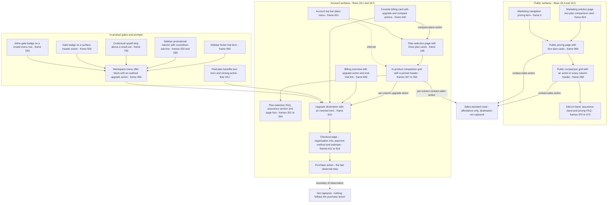

# Pricing & Plans

The commercial surfaces the corpus shows — plan cards, four distinct plan-comparison presentations, the trial and upgrade entry points scattered through the product, and the checkout that ends the upgrade path — specified as one area from the [Workflow Catalog](README.md) corpus.

## Purpose

This document specifies **how the product presents what it costs, and how a workspace buys it**. It covers the surfaces on which plan tiers are compared, the calls to action that sit on those surfaces, the trial and upgrade prompts that lead to them from inside the product, and the checkout page on which an organisation's details and a payment instrument are entered. It is the area a person reaches when they stop asking what the product does and start asking what it costs and what their plan includes.

This area **owns `E-PLAN`**, the entity every upgrade gate in the catalog implicitly points at. Its authoritative field set is defined in the **Implied data model** section below.

**Where the area is encountered.** Ten distinct entry points were observed, grouped below by the surface family each belongs to — public, in-product and account:

- **Publicly**, from the marketing navigation's pricing item, which sits alongside the four menu labels and ahead of the sign-in link and the two navigation calls to action [frame 0](../../screenshots/Slack%20web%20Jul%202024%200.png).
- **Publicly**, from a marketing solution page whose own two-plan comparison card closes with a see-full-details link pointing at the pricing page [frame 824](../../screenshots/Slack%20web%20Jul%202024%20824.png).
- **In-product**, from an inline gate badge naming a paid tier at the trailing edge of one row of the global create menu, where its siblings carry no badge [frame 550](../../screenshots/Slack%20web%20Jul%202024%20550.png).
- **In-product**, from the same badge appended to a create action in a surface header, beside an ungated action [frame 500](../../screenshots/Slack%20web%20Jul%202024%20500.png).
- **In-product**, from a contextual upsell strip carrying a tier badge, one explanatory sentence and a learn-more link, sitting between a filter row and the first result of a result set [frame 700](../../screenshots/Slack%20web%20Jul%202024%20700.png).
- **In-product**, from a promotional banner in the sidebar's banner slot with a countdown sub-line beneath it, and from a trial item in the sidebar's footer slot, both rendered in the same session [frame 550](../../screenshots/Slack%20web%20Jul%202024%20550.png), [frame 560](../../screenshots/Slack%20web%20Jul%202024%20560.png); and from the offer block inside the workspace menu, whose countdown heading sits above an offer sentence, a plan-details link and a full-width outlined upgrade action [frame 566](../../screenshots/Slack%20web%20Jul%202024%20566.png).
- **From the account surfaces**, in two ways: the billing card on the administration console's home, whose six-item benefit list sits between a trial statement and a filled upgrade action beside an outlined compare-plans action [frame 600](../../screenshots/Slack%20web%20Jul%202024%20600.png); and the plans destination in the account top bar, which opens a menu of three paid tiers closed by a compare-plans item [frame 601](../../screenshots/Slack%20web%20Jul%202024%20601.png).

**Inferred:** the in-product plan-selection surface is reached from that plans menu's compare-plans item, because the account top bar is identical across the plan-selection page, the console home and the upgrade destination [frame 346](../../screenshots/Slack%20web%20Jul%202024%20346.png), [frame 600](../../screenshots/Slack%20web%20Jul%202024%20600.png), [frame 610](../../screenshots/Slack%20web%20Jul%202024%20610.png), and the compare-plans item is the only destination in that menu naming a comparison [frame 601](../../screenshots/Slack%20web%20Jul%202024%20601.png).

**The public-surface boundary, in one sentence.** This document owns pricing and the commercial model; [17-marketing-site.md](17-marketing-site.md) owns the product marketing pages and the public navigation chrome, [19-brand-guidelines.md](19-brand-guidelines.md) owns the brand pages, [20-help-community.md](20-help-community.md) owns help and community, and [15-admin-workspace.md](15-admin-workspace.md) owns the administration console including its billing card and billing tabs.

**Depth.** Structural for the marketing page's decorative bands, in keeping with the catalog's calibration for public surfaces — section ordering, region composition and call-to-action placement are specified; persuasive copy is not transcribed. **One exception is deliberate and exhaustive: the comparison grid's structure and its capability-cell taxonomy.** Those are not decorative copy, they are a data contract — the next build run must render the same *kinds* of cell in the same grid and model a plan whose capability values take those forms. That contract is specified cell kind by cell kind in the **Screens & components** section, under **Capability-cell taxonomy**.

**Branding.** Every marketed tier name observed in the corpus is restated as `plan tier 1` … `plan tier 4`, using the placeholder vocabulary owned by [00-product-overview.md](00-product-overview.md). **The ordering is positional and observed**: it follows the left-to-right order of the comparison grid's four columns [frame 347](../../screenshots/Slack%20web%20Jul%202024%20347.png), in which `plan tier 1` is the unpaid tier and `plan tier 4` the most capable. No price figure, no marketed tier name, no colour value in any notation and no third-party vendor, provider or standard name appears anywhere in this document; capability rows that name one in the corpus are restated by function.

**What this document does not own.** Every `C-*` component contract and every `S-*` build-security contract belongs to [00-product-overview.md](00-product-overview.md) and is referenced here by identifier only. The `C-UPGRADE-GATE` state matrix belongs to [21-states.md](21-states.md) under deviation D5 and is not restated. The administration console, its billing tabs and `E-WORKSPACE` belong to [15-admin-workspace.md](15-admin-workspace.md) under deviation D2; the create menu, the sidebar slots and the shell belong to [00-product-overview.md](00-product-overview.md); the search surface that hosts the upsell strip belongs to [09-search-and-filters.md](09-search-and-filters.md); the guest invite form that states a billing rule belongs to [01-onboarding-and-auth.md](01-onboarding-and-auth.md) and the guest account type to [13-profiles-people.md](13-profiles-people.md); the gated capabilities themselves belong to [06-huddles.md](06-huddles.md), [07-canvases.md](07-canvases.md), [08-lists.md](08-lists.md), [10-workflow-builder.md](10-workflow-builder.md), [11-apps-and-integrations.md](11-apps-and-integrations.md) and [22-external-collaboration.md](22-external-collaboration.md). This document owns the commercial surfaces themselves, the comparison contract, and `E-PLAN`.

## Flows in this area

Five flows are named for this area, spanning **26 frames**. Two are public, two are account-surface journeys and one is rendered inside the application shell — the area is unusual in the catalog for straddling all three surface families with one subject.

Frame spans below are written as plain numeric ranges because they designate a span rather than cite one image, following the convention of the [Screenshot Coverage Index](_screenshot-index.md). Every individual frame is cited with its full relative link in the per-flow step tables and in the **Frames covered** section.

| Flow ID | Name | Frame span | Primary entry point |
|---|---|---|---|
| `18.1` | Choose a plan and compare features inside the product | 346–354 | The compare-plans item in the account top bar's plans menu |
| `18.2` | Tour the paid-plan benefits | 374–376 | A paid-plan-benefits destination inside the application shell |
| `18.3` | Start a workspace upgrade and fill in checkout details | 610–616 | An upgrade action on the console billing card or the billing overview |
| `18.4` | Compare plans on the pricing page | 966–969 | The pricing item in the public marketing navigation |
| `18.5` | Read the add-on band and pricing faq | 970–972 | Continued scrolling of the public pricing page |

Two properties of this table need stating, because both bear on how the flows should be read.

**Flows `18.4` and `18.5` are viewport ranges over one continuously scrolling page**, split by reading goal rather than by any change of surface. The split is the ledger's, it is honoured here so that coverage reconciles, and it is recorded as the one genuine segmentation ambiguity in this area: a reader who scrolls from the comparison grid into the add-on band never leaves the page. The fewest-assumptions reading was to keep the two goals distinct rather than merge them, because the add-on band and the frequently-asked-questions section concern a separately purchased add-on rather than the tier comparison above them [frame 970](../../screenshots/Slack%20web%20Jul%202024%20970.png).

**Flow `18.3` crosses two surfaces inside one journey.** The upgrade destination and the checkout page are structurally different pages, and the visual delta between them is among the largest in this area's neighbourhood, yet they form a single goal-directed journey: start an upgrade, then enter the details that complete it. Adjacency was overridden in both directions across this area, and every override is reported to the [Flow Reconstruction Methodology](README.md) in the master index.

### The upgrade-path map

Every node below is an observed surface or an observed control, and every edge is either an observed navigation affordance or an inferred one drawn as a dotted edge. **The path terminates at the purchase action**, which is the last thing the corpus shows: no confirmation, receipt, order summary or post-purchase state is captured anywhere, so none is drawn.

## Flow 18.1 — Choose a plan and compare features inside the product

### Overview

A signed-in person on a trial reaches a dedicated plan-selection page on the account surfaces, reads three purchasable tiers presented as cards, scrolls into a four-column comparison grid, scrolls the grid through its row groups, and continues past it into a frequently-asked-questions accordion, an assurance section and a page footer. The whole flow is one continuous downward scroll of one page; nine consecutive frames capture it, and the page's own calls to action appear three times over — once per card, once in the grid's pinned header and once in the grid's footer row.

### Trigger

The compare-plans item at the foot of the plans menu in the account top bar [frame 601](../../screenshots/Slack%20web%20Jul%202024%20601.png), or the outlined compare-plans action on the console's billing card [frame 600](../../screenshots/Slack%20web%20Jul%202024%20600.png).

### Preconditions

The person is signed in to an account surface — the page carries the account top bar rather than the application shell [frame 346](../../screenshots/Slack%20web%20Jul%202024%20346.png). The workspace is on a trial of `plan tier 2`, which is what makes the first card carry a current-trial ribbon and the page carry a trial notice [frame 346](../../screenshots/Slack%20web%20Jul%202024%20346.png). A promotional offer is live, which is what makes the page carry a promotional strip with a countdown [frame 346](../../screenshots/Slack%20web%20Jul%202024%20346.png).

> **Partial capture:** no frame captures the transition into this page. The frame preceding it in the corpus depicts an unrelated in-product surface, so the entry point is established from the plans menu and the billing card rather than from a transition capture.

### Frame-by-frame steps

| Step | Frame(s) | What the user does | What changes on screen | Component(s) involved |
|---|---|---|---|---|
| 1 | [frame 601](../../screenshots/Slack%20web%20Jul%202024%20601.png) | Opens the plans destination in the account top bar | A menu anchored beneath the destination lists three paid tiers, then a rule-free compare-plans item as its last row; the unpaid tier is absent from the list | `C-CONSOLE-TOP-BAR`, `C-DROPDOWN-MENU` |
| 2 | [frame 346](../../screenshots/Slack%20web%20Jul%202024%20346.png) | Arrives on the plan-selection page | A promotional strip spans the page above the fold, carrying a confetti motif, a centred countdown headline naming the workspace and a sub-line offering a percentage discount on the first three months of `plan tier 2`; beneath it a trial notice panel with a clock glyph states the workspace is on a free trial of `plan tier 2` through a date and warns that the team reverts to an unpaid plan with limited features when the trial ends; beneath that a centred page headline and a billing-period note in prose; beneath that three plan cards | `C-CONSOLE-TOP-BAR`, `C-BANNER`, `C-UPGRADE-GATE`, `C-PLAN-CARD` |
| 3 | [frame 346](../../screenshots/Slack%20web%20Jul%202024%20346.png) | Reads the three cards' headers | Each card's coloured header block carries the tier name and a price region; the first card is preceded by a full-width current-trial ribbon band and shows a discounted price with the original struck through beside it, the second shows a price, and the third replaces the price entirely with a contact-sales link followed by a for-pricing-estimates phrase | `C-PLAN-CARD` |
| 4 | [frame 346](../../screenshots/Slack%20web%20Jul%202024%20346.png) | Reads the three cards' bodies | Each white card body opens with a bold cumulative lead line naming the tier whose benefits this tier inherits, then a check-marked feature list | `C-PLAN-CARD` |
| 5 | [frame 347](../../screenshots/Slack%20web%20Jul%202024%20347.png) | Scrolls so the cards' footers reach the top of the viewport | Each card's feature list ends with an add-on availability line rendered in a distinct treatment — a sparkle glyph and bold accent text rather than a check mark — and each card closes with exactly one full-width filled action: an upgrade action on the first two cards and a contact-sales action on the third | `C-PLAN-CARD` |
| 6 | [frame 347](../../screenshots/Slack%20web%20Jul%202024%20347.png) | Continues scrolling past the cards | A centred section heading introduces the comparison, and the grid opens with a header row of four plan-name labels centred above four equal-width column bands; at this offset the header carries names only, with no action and no price | `C-DATA-TABLE` |
| 7 | [frame 347](../../screenshots/Slack%20web%20Jul%202024%20347.png) | Reads the grid's first row group | A group label sits in the leading label column above six capability rows whose cells mix qualifying text in the first column with inclusion marks in the other three, and one row whose first-column cell is empty | `C-DATA-TABLE` |
| 8 | [frame 348](../../screenshots/Slack%20web%20Jul%202024%20348.png) | Scrolls the grid further | The header row detaches and pins to the top of the viewport on a white band with a bottom rule, and **gains an action beneath each plan name** — none in the first column, an upgrade action in the second and third, a contact-sales action in the fourth; three further row groups scroll beneath it, introducing rate-limit values, an unbounded value and an add-on label as cell kinds | `C-DATA-TABLE`, `C-UPGRADE-GATE` |
| 9 | [frame 349](../../screenshots/Slack%20web%20Jul%202024%20349.png) | Points at one capability row | That row alone is shaded with a grey fill spanning the whole grid width, the leading label column included; nothing else on the page changes | `C-DATA-TABLE` |
| 10 | [frame 350](../../screenshots/Slack%20web%20Jul%202024%20350.png) | Scrolls to the grid's last two row groups | A partially visible row at the top of the viewport shows the grid continues above; an eleven-row administration group and a single-row support group follow, the support row expressing graded service levels with response-time commitments rather than inclusion marks | `C-DATA-TABLE` |
| 11 | [frame 350](../../screenshots/Slack%20web%20Jul%202024%20350.png) | Reaches the grid's foot | The four column bands terminate and a call-to-action row appears beneath them, outside the bands: the first column's cell is empty, the second and third carry an upgrade action and the fourth a contact-sales action, all three rendered with the same filled treatment | `C-DATA-TABLE`, `C-UPGRADE-GATE` |
| 12 | [frame 351](../../screenshots/Slack%20web%20Jul%202024%20351.png) | Scrolls past the grid | A frequently-asked-questions heading introduces nine collapsed accordion rows in a centred column narrower than the page, each a question at the left and a square-outlined plus glyph at the right, separated by hairline rules; the list closes with a billing-help line and a contact line | Accordion structure reported to [00-product-overview.md](00-product-overview.md) |
| 13 | [frame 352](../../screenshots/Slack%20web%20Jul%202024%20352.png) | Expands the first question | That row's control changes from a plus glyph to a minus glyph and its outline from an accent tone to a neutral one, while every sibling keeps its accent-outlined plus; answer copy in a muted body tone appears beneath the question carrying two inline links, and the rows below shift down | Accordion structure reported to [00-product-overview.md](00-product-overview.md) |
| 14 | [frame 353](../../screenshots/Slack%20web%20Jul%202024%20353.png) | Scrolls past the accordion | A rule separates the accordion from an assurance section: a centred heading, a two-line assurance sub-line covering encryption in transit and at rest and compliance programmes, a centred learn-more link, and a horizontal row of ten evenly spaced compliance-certification badge marks | — |
| 15 | [frame 354](../../screenshots/Slack%20web%20Jul%202024%20354.png) | Reaches the page foot | Beneath the badge row and a rule, a centred social-proof heading sits above a row of six customer logo marks and a customer-stories link; a further rule is followed by a centred back-to-the-top pill with a leading up-arrow glyph on a muted fill, and a closing contact line | — |

> **Partial capture:** the grid's rows between the last row visible at [frame 347](../../screenshots/Slack%20web%20Jul%202024%20347.png) and the first group visible at [frame 348](../../screenshots/Slack%20web%20Jul%202024%20348.png), and again between the last row at [frame 348](../../screenshots/Slack%20web%20Jul%202024%20348.png) and the partially visible row at the top of [frame 350](../../screenshots/Slack%20web%20Jul%202024%20350.png), fall into no captured viewport. The grid's full row inventory is therefore **not** established and must not be extrapolated; only the row groups and rows cited above may be treated as observed.

> **Partial capture:** only one accordion row is ever expanded, so whether the accordion permits one open row or several is not established.

## Flow 18.2 — Tour the paid-plan benefits

### Overview

A person on a trial opens a paid-plan-benefits destination **inside the application shell** — the only commercial surface in this area that renders with the rail, the conversation sidebar and the shell top bar in place — and scrolls a marketing-style tour of what a paid plan adds. The tour opens with a trial hero carrying an upgrade action, presents five alternating benefit cards, and closes by asking whether the team wants to stay on the paid tier and instructing the reader to enter payment details.

### Trigger

A paid-plan-benefits destination within the application shell; the content pane carries its own surface header row bearing the destination's title while the rail and sidebar remain in place [frame 374](../../screenshots/Slack%20web%20Jul%202024%20374.png).

> **Partial capture:** the control that opens this destination is not captured. The frame preceding it depicts an unrelated in-product conversation surface, and no sidebar or menu row naming this destination appears in any frame this document cites.

### Preconditions

The workspace is on a trial of `plan tier 2` — the hero states the trial's length and its end date [frame 374](../../screenshots/Slack%20web%20Jul%202024%20374.png) — and the sidebar's footer slot carries the trial item throughout [frame 374](../../screenshots/Slack%20web%20Jul%202024%20374.png), [frame 375](../../screenshots/Slack%20web%20Jul%202024%20375.png), [frame 376](../../screenshots/Slack%20web%20Jul%202024%20376.png).

### Frame-by-frame steps

| Step | Frame(s) | What the user does | What changes on screen | Component(s) involved |
|---|---|---|---|---|
| 1 | [frame 374](../../screenshots/Slack%20web%20Jul%202024%20374.png) | Opens the paid-plan-benefits destination | The content pane gains a surface header row carrying the destination title on a white band with a bottom rule; beneath it a hero states in a large headline that the team is on a free trial, gives the trial's length and its end date in bold in a two-line body, offers a filled primary upgrade action, and carries a celebratory illustration at its right | `C-RAIL`, `C-SIDEBAR`, `C-TOP-BAR`, `C-UPGRADE-GATE` |
| 2 | [frame 374](../../screenshots/Slack%20web%20Jul%202024%20374.png) | Scrolls into the tour | A tinted band opens with a centred bold section heading, followed by the first benefit card: a wide card split into an imagery panel on a coloured fill and a white text panel carrying a small-caps eyebrow label, a bold benefit headline, a body paragraph and one accent learn-more link with a trailing arrow glyph | Benefit-card structure reported to [00-product-overview.md](00-product-overview.md) |
| 3 | [frame 375](../../screenshots/Slack%20web%20Jul%202024%20375.png) | Continues scrolling | Two further benefit cards appear, and the imagery panel alternates side card to card; the rail and sidebar do not move, so the scroll is confined to the content pane | Benefit-card structure reported to [00-product-overview.md](00-product-overview.md) |
| 4 | [frame 375](../../screenshots/Slack%20web%20Jul%202024%20375.png), [frame 376](../../screenshots/Slack%20web%20Jul%202024%20376.png) | Reads the remaining cards | Cards for an unlimited message archive, real-time audio sessions, workflow automation and advanced security and administration each carry exactly one link and no button; every card's imagery panel holds a mocked product surface or an illustration on its own coloured fill | Benefit-card structure reported to [00-product-overview.md](00-product-overview.md) |
| 5 | [frame 376](../../screenshots/Slack%20web%20Jul%202024%20376.png) | Reaches the tour's foot | A centred closing block on the tinted band asks in a bold heading whether the team wants to stay on `plan tier 2`, instructs the reader in a two-line sub-line to enter payment details to keep the premium capabilities after the trial ends, and repeats the hero's filled primary upgrade action with the same label | `C-UPGRADE-GATE` |

## Flow 18.3 — Start a workspace upgrade and fill in checkout details

### Overview

An upgrade action on an account surface leads to an upgrade destination whose inverted hero restates the trial as an absolute end date and offers a single action; that action leads to a **reduced-chrome checkout page** on which an organisation's name, country and address are entered as a first numbered step and a payment instrument as a second, with a persistent estimate panel alongside that itemises the charge. Seven frames capture the destination, the progressive disclosure of the address block, the payment step, three simultaneous field-validation failures and a switch of the estimate's billing period.

**This flow is evidenced, not assumed.** The planning pass for this document asserted that no checkout, payment form or estimate existed anywhere in the corpus and forbade documenting one, conditioning that prohibition on the absence of evidence. The evidence is present and was read frame by frame; the surfaces below are described only to the depth the pixels support, and the prohibitions that are *not* evidence claims — no price figure, no marketed tier name, no colour value, no vendor name — remain in force throughout.

### Trigger

The filled upgrade action on the console's billing card [frame 600](../../screenshots/Slack%20web%20Jul%202024%20600.png), the filled upgrade action on the billing overview [frame 669](../../screenshots/Slack%20web%20Jul%202024%20669.png), the outlined upgrade action in the workspace-menu offer block [frame 566](../../screenshots/Slack%20web%20Jul%202024%20566.png), the hero or closing action of the benefits tour [frame 374](../../screenshots/Slack%20web%20Jul%202024%20374.png), [frame 376](../../screenshots/Slack%20web%20Jul%202024%20376.png), or a per-column upgrade action in the in-product comparison grid [frame 348](../../screenshots/Slack%20web%20Jul%202024%20348.png), [frame 350](../../screenshots/Slack%20web%20Jul%202024%20350.png).

### Preconditions

The workspace is on a trial of `plan tier 2` and the trial has not ended — the destination's hero states the trial's through-date [frame 610](../../screenshots/Slack%20web%20Jul%202024%20610.png). The signed-in account is permitted to make billing and payment changes; the billing-contacts surface states that only certain accounts may, and advises making whoever manages billing a workspace owner [frame 672](../../screenshots/Slack%20web%20Jul%202024%20672.png), while a workspace-level setting governs who may purchase at all [frame 671](../../screenshots/Slack%20web%20Jul%202024%20671.png).

### Frame-by-frame steps

| Step | Frame(s) | What the user does | What changes on screen | Component(s) involved |
|---|---|---|---|---|
| 1 | [frame 610](../../screenshots/Slack%20web%20Jul%202024%20610.png) | Activates an upgrade action | An upgrade destination loads, carrying the account top bar above a full-width inverted hero with a subtle geometric motif: a small bold eyebrow line, a very large greeting headline naming `plan tier 2`, a sub-line stating the workspace is on a free trial through an absolute date including the year, and a centred filled primary action | `C-CONSOLE-TOP-BAR`, `C-UPGRADE-GATE` |
| 2 | [frame 610](../../screenshots/Slack%20web%20Jul%202024%20610.png) | Reads beneath the hero | On a white band, a centred bold section heading sits above a three-column row of benefit items, each an outline glyph above a bold title above body copy; the glyphs read by function as history search, external collaboration and real-time audio | — |
| 3 | [frame 611](../../screenshots/Slack%20web%20Jul%202024%20611.png) | Activates the hero's action | A checkout page loads with **reduced chrome** — a slim white top bar carrying the product logo mark and wordmark at the far left and a centred title naming the workspace and the target tier, with no navigation rail, no sidebar and no menu; the body is two columns, a numbered form column at the left and an estimate panel at the right, top-aligned with the form | Reduced-chrome page shell reported to [00-product-overview.md](00-product-overview.md) |
| 4 | [frame 611](../../screenshots/Slack%20web%20Jul%202024%20611.png) | Reads the first step | A heading numbered one introduces organisation information: a name label above a text input, a country-or-region label above a select carrying a default value and a chevron, and an address label above a single text input placeholdered for a street address; a hairline rule closes the step | `C-STEP-WIZARD` |
| 5 | [frame 611](../../screenshots/Slack%20web%20Jul%202024%20611.png) | Reads the second step | A heading numbered two introduces the payment method, with a lock glyph and a secure-form assurance label right-aligned on its heading line; beneath it a two-tab bar offers a pay-now tab, active and underlined, and a pay-by-invoice tab, muted; beneath that two choice tiles side by side, each a glyph above a label, the card tile selected with an accent border and accent label and the bank-account tile unselected | `C-TAB-BAR`, `C-TILE-SELECT-ROW` |
| 6 | [frame 611](../../screenshots/Slack%20web%20Jul%202024%20611.png) | Reads the card fields | A card-number label sits above an input carrying a grouped-digit placeholder mask with four payment-network mark glyphs right-aligned inside the field, above a two-up row of an expiry field with a month-and-year placeholder mask and a security-code field with a card-and-code glyph inside it | — |
| 7 | [frame 611](../../screenshots/Slack%20web%20Jul%202024%20611.png) | Reads the estimate panel | A card whose header block on the primary brand fill carries a bold title naming the tier estimate, a billing-period disclosure control with a chevron reading as monthly, and a currency pill bearing a three-letter code and no chevron of its own; its white body holds one arithmetic line composing a unit price, a member count and a period into a right-aligned line total, then a dashed rule, a sales-tax line with its own amount, a solid rule, a bold due-on line with a date and the right-aligned total, and a muted footnote that the figure is an estimate and the charge will follow the member count on the renewal date | `C-DATA-TABLE` |
| 8 | [frame 612](../../screenshots/Slack%20web%20Jul%202024%20612.png) | Enters the organisation name and the first address line | The single street-address field **expands in place** into a five-field block: a first address line carrying the entered value, a second address line explicitly placeholdered as optional, a city field, and a two-up row of a state select showing a placeholder and a postal-code field; the estimate panel does not change | `C-STEP-WIZARD` |
| 9 | [frame 613](../../screenshots/Slack%20web%20Jul%202024%20613.png) | Completes the address | City, state and postal code carry values, the state select now showing a chosen value; the estimate panel again does not change, so the estimate does not react to the address | `C-STEP-WIZARD` |
| 10 | [frame 614](../../screenshots/Slack%20web%20Jul%202024%20614.png) | Scrolls to the payment step | The form column scrolls while the estimate panel holds its position in the viewport; the card fields, a full-width filled purchase action, fine print stating the plan may be cancelled at any time and that card purchases cannot be refunded although credit may transfer to another account, and a terms-and-privacy line with inline links are all in view | `C-DATA-TABLE` |
| 11 | [frame 615](../../screenshots/Slack%20web%20Jul%202024%20615.png) | Submits card details that fail validation | All three card fields enter an error state at once: each gains a destructive border, its value renders in the destructive tone, and a destructive message appears directly beneath it; the messages name three different failure classes — an invalid number, an expiry year in the past and an incomplete security code; the card-number and security-code fields carry an error glyph inside the field, the card-number field's network marks giving way to it, while the expiry field carries none; **the purchase action remains enabled** | `C-INLINE-VALIDATION` |
| 12 | [frame 616](../../screenshots/Slack%20web%20Jul%202024%20616.png) | Switches the estimate to a yearly period | The panel's disclosure reads as yearly, the arithmetic line recomposes with a different unit price, the same member count and a twelve-month period, and both the line total and the due-on total increase; **the sales-tax line and the due-on date are unchanged**; the card fields have cleared their error state and the card-number field's mark row has collapsed to a single network mark | `C-DATA-TABLE`, `C-INLINE-VALIDATION` |

> **Partial capture:** nothing after the purchase action is captured — no confirmation, no order summary, no receipt, no invoice and no failure outcome. No seat-count control appears anywhere, and neither a currency selector nor a region selector is captured; the only country control is the organisation step's select and the only currency indicator is the estimate panel's non-interactive pill. No plan-change confirmation, downgrade or cancellation surface is captured either: cancellation is stated only as fine print here and offered only as an end-trial link on a surface owned by [15-admin-workspace.md](15-admin-workspace.md) [frame 669](../../screenshots/Slack%20web%20Jul%202024%20669.png). None of these may be invented; where the build needs them they are governed by `S-GAP`.

> **Partial capture:** the three entered card values at [frame 616](../../screenshots/Slack%20web%20Jul%202024%20616.png) render indistinctly in the capture, so how the product presents an entered payment instrument in this form cannot be characterised. The indistinctness is a property of the capture, not an observed product state, and must not be documented as masking.

**Inferred:** the address block's expansion is triggered by the street-address field receiving a value, because the collapsed single-field form becomes the five-field block once the first line carries content and nothing else on the page changes between the two captures [frame 611](../../screenshots/Slack%20web%20Jul%202024%20611.png), [frame 612](../../screenshots/Slack%20web%20Jul%202024%20612.png).

**Inferred:** the member count in the estimate is derived from the workspace rather than entered, because the panel renders it as a factor of a computed line with no input affordance of its own and its footnote states the charge will follow the number of members on the renewal date [frame 611](../../screenshots/Slack%20web%20Jul%202024%20611.png), [frame 616](../../screenshots/Slack%20web%20Jul%202024%20616.png).

**Inferred:** the card-number field detects the network from the entered digits, because its row of four network marks collapses to a single mark once a value is present while every other part of the field is unchanged [frame 614](../../screenshots/Slack%20web%20Jul%202024%20614.png), [frame 616](../../screenshots/Slack%20web%20Jul%202024%20616.png).

## Flow 18.4 — Compare plans on the pricing page

### Overview

A visitor reaches the public pricing page from the marketing navigation, reads four plan cards of which one is marked as the best value, scrolls into a shared feature list rendered four times in parallel, and continues into a four-column comparison grid whose every column header carries its own call to action. Four frames capture it, and the page's navigation transforms into a floating header as soon as the visitor scrolls.

### Trigger

The pricing item in the public marketing navigation [frame 0](../../screenshots/Slack%20web%20Jul%202024%200.png), or the see-full-details link that closes a marketing solution page's own two-plan comparison card [frame 824](../../screenshots/Slack%20web%20Jul%202024%20824.png).

### Preconditions

None. The page is public and unauthenticated — the navigation offers a sign-in link rather than an account identity [frame 966](../../screenshots/Slack%20web%20Jul%202024%20966.png).

### Frame-by-frame steps

| Step | Frame(s) | What the user does | What changes on screen | Component(s) involved |
|---|---|---|---|---|
| 1 | [frame 0](../../screenshots/Slack%20web%20Jul%202024%200.png) | Activates the navigation's pricing item | The item sits fifth in the navigation and, unlike the three menu labels before it, carries no disclosure chevron; the navigation's right side holds a search glyph, a sign-in link, an outlined contact-sales action and a filled get-started action | `C-TOP-BAR` |
| 2 | [frame 966](../../screenshots/Slack%20web%20Jul%202024%20966.png) | Arrives on the pricing page | A centred page headline sits above four equal-width plan cards; the second card is preceded by a full-width ribbon band on the primary brand fill carrying a best-value label in caps, which absorbs the card's top corners | `C-PLAN-CARD` |
| 3 | [frame 966](../../screenshots/Slack%20web%20Jul%202024%20966.png) | Reads the four cards' price regions | The first card shows a zero price with a per-month unit suffix; the second carries a discount pill badge above a struck-through original price beside a discounted price, with a footnote marker; the third a plain price with the same suffix and marker; the fourth a glyph and a contact-sales-for-pricing phrase in place of any price | `C-PLAN-CARD` |
| 4 | [frame 966](../../screenshots/Slack%20web%20Jul%202024%20966.png) | Reads the four cards' actions and add-on lines | Each card carries exactly one full-width action in caps: outlined on the first and third, filled on the second — matching its best-value marking — and outlined with a contact-sales label on the fourth; beneath the action, an add-on availability line with a sparkle glyph and an underlined accent link appears on the second, third and fourth cards only, carrying a new-item pill on the second and third but not the fourth | `C-PLAN-CARD`, `C-UPGRADE-GATE` |
| 5 | [frame 967](../../screenshots/Slack%20web%20Jul%202024%20967.png) | Scrolls the page | The navigation detaches from the page top and becomes a floating rounded-pill header on a white surface with a shadow, inset from the page edges and overlapping the content beneath it | `C-TOP-BAR` |
| 6 | [frame 967](../../screenshots/Slack%20web%20Jul%202024%20967.png) | Reads the cards' feature lists | The four columns render **the same list of items in the same order**, each item shown per column either as included — full-contrast text with a dotted underline and an accent check mark — or as excluded in place, in muted text with a muted check mark and no underline; several items' wording also differs per column for the same position | `C-PLAN-CARD` |
| 7 | [frame 967](../../screenshots/Slack%20web%20Jul%202024%20967.png) | Continues scrolling | A centred bold heading introduces the full comparison beneath the card columns | — |
| 8 | [frame 968](../../screenshots/Slack%20web%20Jul%202024%20968.png) | Reads the comparison grid | A header row carries four plan-name labels **each with a filled action inside its own header cell** — a get-started action in the first three columns and a contact-sales action in the fourth; vertical hairlines divide the plan columns; a row-group label sits on a mid-grey band spanning the entire grid, label column included; the rows beneath carry alternating zebra striping across their full width and dotted-underlined labels in the leading column | `C-DATA-TABLE`, `C-UPGRADE-GATE` |
| 9 | [frame 968](../../screenshots/Slack%20web%20Jul%202024%20968.png) | Reads the grid's cells | Cells centred within their columns mix inclusion marks, qualifying text, a bare numeric limit, empty cells and an add-on label; one row carries an add-on label in three of its four cells | `C-DATA-TABLE` |
| 10 | [frame 969](../../screenshots/Slack%20web%20Jul%202024%20969.png) | Points at one capability row | That row is **outlined on all four sides in the primary brand colour** across the full grid width and its interior reverts to the default surface, breaking the zebra stripe; a second row group begins beneath | `C-DATA-TABLE` |

> **Partial capture:** the grid's rows below the second row group's first row fall into no captured viewport, so this grid's full row inventory is not established either.

## Flow 18.5 — Read the add-on band and pricing faq

### Overview

Continuing down the same public pricing page, the visitor passes an inverted promotional band for a separately purchased add-on, an assurance band, a frequently-asked-questions accordion whose first answer sets out the conditional routes to purchasing the add-on, and a page foot carrying a billing-information line, a social-proof row and a closing call-to-action band. Three frames capture it.

### Trigger

Continued scrolling of the public pricing page past the comparison grid [frame 969](../../screenshots/Slack%20web%20Jul%202024%20969.png), or the add-on availability link on any plan card [frame 966](../../screenshots/Slack%20web%20Jul%202024%20966.png).

### Preconditions

None beyond flow `18.4`'s: the page is public and the visitor has scrolled past the grid, so the floating pill navigation is in place [frame 970](../../screenshots/Slack%20web%20Jul%202024%20970.png).

### Frame-by-frame steps

| Step | Frame(s) | What the user does | What changes on screen | Component(s) involved |
|---|---|---|---|---|
| 1 | [frame 970](../../screenshots/Slack%20web%20Jul%202024%20970.png) | Scrolls past the grid | A full-width rounded panel on the primary brand fill, inset from the page edges, presents the add-on in two columns: a headline whose add-on name renders in a lighter accent tint followed by a sparkle glyph, a body paragraph, three benefit bullets each led by a filled circular check glyph in an accent tint, and an action pair of a filled action on a light accent fill with a dark caps label beside a text link with a trailing arrow glyph; an illustration fills the right column | `C-BANNER`, `C-UPGRADE-GATE` |
| 2 | [frame 970](../../screenshots/Slack%20web%20Jul%202024%20970.png) | Reads beneath the add-on actions | A bold availability line states the add-on may be purchased on **all paid plans** and names three launch languages, and a lighter sub-line states that more are to come | — |
| 3 | [frame 970](../../screenshots/Slack%20web%20Jul%202024%20970.png) | Continues scrolling | A second full-width rounded panel, on a light grey fill, mirrors the first with its columns reversed: illustration left, then a bold headline, three benefit bullets led by filled dark circular check glyphs, and a learn-more link with a trailing arrow glyph | `C-BANNER` |
| 4 | [frame 971](../../screenshots/Slack%20web%20Jul%202024%20971.png) | Reaches the accordion | A frequently-asked-questions heading in sentence case sits above accordion rows separated by full-width hairline rules and spanning nearly the full content width; the affordance is a chevron rather than the square plus glyph used on the in-product page, pointing up on the expanded row and down on the collapsed ones | Accordion structure reported to [00-product-overview.md](00-product-overview.md) |
| 5 | [frame 971](../../screenshots/Slack%20web%20Jul%202024%20971.png) | Reads the first, already-expanded answer | The answer is richer than the in-product accordion's plain paragraph: a lead sentence, then a bulleted list of three conditional purchase routes each carrying its own inline underlined link, then a closing paragraph with a further link for the most capable tier; four collapsed questions follow | Accordion structure reported to [00-product-overview.md](00-product-overview.md) |
| 6 | [frame 972](../../screenshots/Slack%20web%20Jul%202024%20972.png) | Reaches the page foot | A rule closes the accordion above a centred billing-information line with one inline underlined link — the same pattern as the in-product page's billing-help line but without its companion contact line; beneath, a social-proof band on a light grey full-bleed fill carries a centred bold heading above a row of six customer logo marks, with no customer-stories link | — |
| 7 | [frame 972](../../screenshots/Slack%20web%20Jul%202024%20972.png) | Reaches the closing band | A full-bleed band on the primary brand fill, its lower boundary drawn as a convex arc rather than a straight edge, carries a very large centred headline in the inverted tone above a centred action pair: a filled action on a white fill with a brand-toned caps label beside an outlined white action with a white caps label, inverting the emphasis convention the navigation uses | `C-UPGRADE-GATE` |

> **Partial capture:** the site footer proper lies below this viewport and is not captured by any frame this document claims. The footer belongs to [17-marketing-site.md](17-marketing-site.md) in any case.

## Screens & components

Every measurement in this section is **proportional or relative** — regions, columns, ordering and relative sizing — never an absolute pixel offset. Every glyph is named by the function it performs, never by a third-party asset. Every `C-*` identifier resolves to a contract owned by [00-product-overview.md](00-product-overview.md); none is redefined here.

### The corpus shows four distinct comparison presentations, not one

This is the single most consequential structural finding in the area, and a build that implements only one of these presentations will not match the corpus. All four were observed, and they differ in more than styling.

| Presentation | Where | Shape | How exclusion is expressed |
|---|---|---|---|
| **Cumulative card lists** | The in-product plan-selection page's three cards [frame 346](../../screenshots/Slack%20web%20Jul%202024%20346.png), [frame 347](../../screenshots/Slack%20web%20Jul%202024%20347.png) | Each card carries a *different* feature list, prefixed by a bold lead line naming the tier whose benefits this tier inherits | Not expressed at all — a lower tier's capabilities are named only on the lower tier's card |
| **Parallel shared list** | The public pricing page's four card columns [frame 967](../../screenshots/Slack%20web%20Jul%202024%20967.png) | All four columns render the *same* list in the *same* order, position-aligned across the columns | In place, as a muted item with a muted check mark and no underline, occupying the row it would occupy if included |
| **Comparison grid** | Both the in-product page [frame 347](../../screenshots/Slack%20web%20Jul%202024%20347.png)–[frame 350](../../screenshots/Slack%20web%20Jul%202024%20350.png) and the public page [frame 968](../../screenshots/Slack%20web%20Jul%202024%20968.png), [frame 969](../../screenshots/Slack%20web%20Jul%202024%20969.png) | A leading capability-label column plus four equal-width plan columns, rows organised into labelled groups | By an empty cell — absence rather than a negative mark |
| **Two-plan benefit card** | A marketing solution page, owned by [17-marketing-site.md](17-marketing-site.md) [frame 824](../../screenshots/Slack%20web%20Jul%202024%20824.png) | A card with a top rule in the primary brand colour holding a label column and two grey-filled plan panels over eight benefit rows | By an explicit en-dash glyph in the cell |

**Three different exclusion conventions therefore coexist in one product** — an empty cell, a greyed item in place, and an explicit dash. This is recorded exactly as observed and is **not** reconciled. **Inferred:** expressing exclusion by absence carries an accessibility cost that expressing it by an explicit marker does not, because an empty cell conveys nothing to a reader who cannot perceive the grid's geometry, whereas the dash and the greyed item are both content [frame 350](../../screenshots/Slack%20web%20Jul%202024%20350.png), [frame 824](../../screenshots/Slack%20web%20Jul%202024%20824.png), [frame 967](../../screenshots/Slack%20web%20Jul%202024%20967.png).

### The comparison grid's regions, ordering and proportions

Both grids share this composition; the differences between them are itemised after it.

- **Leading capability-label column.** Left-most, visually distinct from the plan columns, and roughly two-fifths of the grid's width — wider than any single plan column because it holds sentence-length labels while the plan columns hold values [frame 350](../../screenshots/Slack%20web%20Jul%202024%20350.png).
- **Four plan columns of equal width**, filling the remainder, ordered left to right from the unpaid tier to the most capable [frame 347](../../screenshots/Slack%20web%20Jul%202024%20347.png). Cell content is centred within each column [frame 968](../../screenshots/Slack%20web%20Jul%202024%20968.png).
- **A header row of four plan-name labels**, bold and centred at the head of the plan columns; it carries no price on either grid [frame 347](../../screenshots/Slack%20web%20Jul%202024%20347.png), [frame 968](../../screenshots/Slack%20web%20Jul%202024%20968.png).
- **Row groups**, each introduced by a group label rendered bolder and larger than a row label. Grouping is structural, not decorative: six groups were observed on the in-product grid — a productivity group, an automation-tools group, an automation-usage group, a security group, an administration group and a support group [frame 347](../../screenshots/Slack%20web%20Jul%202024%20347.png), [frame 348](../../screenshots/Slack%20web%20Jul%202024%20348.png), [frame 350](../../screenshots/Slack%20web%20Jul%202024%20350.png).
- **Row labels carry an underline treatment**, indicating an information affordance on the label itself. This is structurally significant: **a row label is interactive, not inert** [frame 350](../../screenshots/Slack%20web%20Jul%202024%20350.png), [frame 968](../../screenshots/Slack%20web%20Jul%202024%20968.png).
- **A whole-row hover treatment** spanning the full grid width including the label column, so the row and not merely the label is the hover target [frame 349](../../screenshots/Slack%20web%20Jul%202024%20349.png), [frame 969](../../screenshots/Slack%20web%20Jul%202024%20969.png).
- **A call-to-action row** with one cell per plan column and **per-column variance in membership and in action kind** [frame 350](../../screenshots/Slack%20web%20Jul%202024%20350.png), [frame 968](../../screenshots/Slack%20web%20Jul%202024%20968.png).

The two grids differ in four respects, and each difference is a real build decision:

| Property | In-product grid | Public grid |
|---|---|---|
| Header behaviour | **Pins to the viewport top** on a white band with a bottom rule once the grid scrolls, and **gains the call-to-action row** when it does [frame 347](../../screenshots/Slack%20web%20Jul%202024%20347.png), [frame 348](../../screenshots/Slack%20web%20Jul%202024%20348.png) | Actions sit inside the header cells from the outset; no pinning is captured [frame 968](../../screenshots/Slack%20web%20Jul%202024%20968.png) |
| Group label | Sits in the leading label column only; the plan columns' bands run past it unbroken [frame 350](../../screenshots/Slack%20web%20Jul%202024%20350.png) | Sits on a mid-grey band **spanning the entire grid**, label column included [frame 968](../../screenshots/Slack%20web%20Jul%202024%20968.png) |
| Row banding | The plan columns are continuous light-toned vertical bands; rows are not striped [frame 350](../../screenshots/Slack%20web%20Jul%202024%20350.png) | Rows carry **alternating zebra striping** across their full width [frame 968](../../screenshots/Slack%20web%20Jul%202024%20968.png) |
| Hover treatment | A **grey fill** across the row [frame 349](../../screenshots/Slack%20web%20Jul%202024%20349.png) | A **thin outline in the primary brand colour** on all four sides, the interior reverting to the default surface and breaking the stripe [frame 969](../../screenshots/Slack%20web%20Jul%202024%20969.png) |
| Action membership | The unpaid tier's column carries **no action**, in both the pinned header and the footer row [frame 348](../../screenshots/Slack%20web%20Jul%202024%20348.png), [frame 350](../../screenshots/Slack%20web%20Jul%202024%20350.png) | **Every** column carries an action, including the unpaid tier's [frame 968](../../screenshots/Slack%20web%20Jul%202024%20968.png) |
| Row inventory | Six rows in the productivity group [frame 347](../../screenshots/Slack%20web%20Jul%202024%20347.png) | Ten rows in the same group, adding template, section-customisation, directory and assistant-add-on rows [frame 968](../../screenshots/Slack%20web%20Jul%202024%20968.png) |

Two further inconsistencies between the grids are recorded and not reconciled: the same capability's qualifying text is worded differently on each grid — a spelled-out one-to-one phrase in-product against a numeric one-to-one abbreviation publicly [frame 347](../../screenshots/Slack%20web%20Jul%202024%20347.png), [frame 968](../../screenshots/Slack%20web%20Jul%202024%20968.png) — and on the in-product grid the underline treatment appears on *some* qualifying-text cell values but not others within the same row, being present on the two left-hand cells and absent on the two right-hand ones [frame 350](../../screenshots/Slack%20web%20Jul%202024%20350.png).

### Capability-cell taxonomy

**This is a data contract, not decorative copy.** A plan's value for a capability is **not a boolean**. Seven cell kinds were observed, and they occur **in the same column as one another**, which means one column must be able to render all of them. A build that models a capability as `boolean` cannot render this grid.

| # | Cell kind | What it denotes | Shape | Evidence |
|---|---|---|---|---|
| 1 | **Inclusion mark** | Included, with no value worth stating | A check glyph alone, centred | [frame 347](../../screenshots/Slack%20web%20Jul%202024%20347.png), [frame 350](../../screenshots/Slack%20web%20Jul%202024%20350.png), [frame 968](../../screenshots/Slack%20web%20Jul%202024%20968.png) |
| 2 | **Empty cell** | Excluded, expressed by absence rather than by a negative mark | Nothing at all | [frame 350](../../screenshots/Slack%20web%20Jul%202024%20350.png), [frame 968](../../screenshots/Slack%20web%20Jul%202024%20968.png) |
| 3 | **Bare numeric limit** | Included up to a countable ceiling | A number alone | [frame 348](../../screenshots/Slack%20web%20Jul%202024%20348.png), [frame 350](../../screenshots/Slack%20web%20Jul%202024%20350.png), [frame 968](../../screenshots/Slack%20web%20Jul%202024%20968.png) |
| 4 | **Rate or quota value** | Included up to a ceiling **per unit of time** — a scalar, a unit and a period | A number, a unit noun and a period, as one phrase | [frame 348](../../screenshots/Slack%20web%20Jul%202024%20348.png) |
| 5 | **Unbounded value** | Included without a ceiling, occupying the same slot a numeric limit would occupy | A single word denoting no limit | [frame 348](../../screenshots/Slack%20web%20Jul%202024%20348.png), [frame 350](../../screenshots/Slack%20web%20Jul%202024%20350.png) |
| 6 | **Qualifying text** | Included, but **scoped or conditioned** rather than quantified | A short phrase — a retention window, a restriction to a single conversation kind, a restriction to the default general channel, a note that guests are supported, a note that multiple provider configurations are supported | [frame 347](../../screenshots/Slack%20web%20Jul%202024%20347.png), [frame 348](../../screenshots/Slack%20web%20Jul%202024%20348.png), [frame 350](../../screenshots/Slack%20web%20Jul%202024%20350.png), [frame 968](../../screenshots/Slack%20web%20Jul%202024%20968.png) |
| 7 | **Add-on label** | **Not included, but separately purchasable** — a third value distinct from both inclusion and exclusion | A short word denoting an add-on | [frame 348](../../screenshots/Slack%20web%20Jul%202024%20348.png), [frame 968](../../screenshots/Slack%20web%20Jul%202024%20968.png) |

Two further presentations of a cell were observed on the two-plan card owned by [17-marketing-site.md](17-marketing-site.md), and they extend the union rather than replacing it: **an inclusion mark paired with a value label** in the same cell, and **an en-dash denoting exclusion** [frame 824](../../screenshots/Slack%20web%20Jul%202024%20824.png).

Three consequences follow, and all three are checkable:

- A capability's value is a **union type** — inclusion, absence, a number, a rate, an unbounded marker, a qualifying phrase, or an add-on marker — and the grid renders every member of that union inside one column.
- **Support is graded, not boolean.** The support row's four cells express escalating service levels, two of which carry a named first-response-time commitment; a boolean support flag cannot represent it [frame 350](../../screenshots/Slack%20web%20Jul%202024%20350.png).
- **A cell value can itself be interactive.** Some qualifying-text values carry the same underline treatment as the row labels, so the information affordance is not confined to the label column [frame 350](../../screenshots/Slack%20web%20Jul%202024%20350.png).

Every capability row that names a third-party vendor, provider, standard or branded feature in the corpus is restated here **by function**: automated user provisioning via a directory-synchronisation standard; integrations with data-loss-prevention, e-discovery and offline-backup providers; sign-in through a third-party identity provider's delegated-authorization protocol; single sign-on via a federated-identity assertion standard, and support for multiple such configurations; customer-managed encryption keys; integration with mobile-device-management providers; channels shared with external organisations, consistent with [22-external-collaboration.md](22-external-collaboration.md); real-time audio-and-video sessions per [06-huddles.md](06-huddles.md); canvas documents per [07-canvases.md](07-canvases.md); lists per [08-lists.md](08-lists.md); the workflow builder and its published workflows per [10-workflow-builder.md](10-workflow-builder.md); app integrations and deployment to the product's hosted infrastructure per [11-apps-and-integrations.md](11-apps-and-integrations.md); a healthcare-privacy compliance regime; and the assistant add-on.

### The plan card's anatomy, and where it departs from the shared contract

`C-PLAN-CARD` is owned by [00-product-overview.md](00-product-overview.md) and is not redefined here. Its contract stacks a tier name beside a descriptive pill badge, then a price with its currency, then a per-person-per-month unit line, then one action, then a feature list. Both card sets in this area conform to that spine, and both extend it. **The extensions are reported to the shared inventory as `C-PLAN-CARD` variants; they are not defined here.**

- **Recommendation ribbon.** A full-width band above the card on the primary brand fill, carrying a caps label and absorbing the card's top corners, marking exactly one card of four [frame 966](../../screenshots/Slack%20web%20Jul%202024%20966.png); and, on the in-product page, the same band form used instead to mark the tier the workspace is currently trialling [frame 346](../../screenshots/Slack%20web%20Jul%202024%20346.png). **One band form, two semantics.**
- **Coloured header block.** On the in-product cards the tier name and price sit on a saturated fill that differs per card, above a white body [frame 346](../../screenshots/Slack%20web%20Jul%202024%20346.png); on the public cards the whole card is a white surface with a hairline border [frame 966](../../screenshots/Slack%20web%20Jul%202024%20966.png).
- **Price-region variants**, four of them: a zero price with a unit suffix; a discount pill badge above a struck-through original beside a discounted price, with a footnote marker; a plain price with a unit suffix and a footnote marker; and **a contact-sales link in place of any price at all** [frame 346](../../screenshots/Slack%20web%20Jul%202024%20346.png), [frame 966](../../screenshots/Slack%20web%20Jul%202024%20966.png). The in-product cards add an alternative-period rate line beneath the unit line [frame 346](../../screenshots/Slack%20web%20Jul%202024%20346.png).
- **Add-on availability line**, positioned after the action and before or within the feature list, rendered in a treatment deliberately unlike a feature item — a sparkle glyph and bold accent text or an underlined accent link rather than a check mark — and carrying an optional novelty pill. Its presence varies by tier: absent on the unpaid tier, present with a novelty pill on the two middle tiers, present without one on the most capable [frame 347](../../screenshots/Slack%20web%20Jul%202024%20347.png), [frame 966](../../screenshots/Slack%20web%20Jul%202024%20966.png).
- **Cumulative lead line**, a bold sentence opening the feature list by naming the tier whose benefits this tier inherits — present only on the in-product cards [frame 346](../../screenshots/Slack%20web%20Jul%202024%20346.png).
- **Action emphasis tracks recommendation, not tier.** On the public cards the filled action belongs to the card carrying the ribbon while its siblings are outlined [frame 966](../../screenshots/Slack%20web%20Jul%202024%20966.png); on the in-product cards all three actions are filled and the variance is in the action's kind — upgrade against contact-sales — rather than in its emphasis [frame 347](../../screenshots/Slack%20web%20Jul%202024%20347.png).

### The checkout page's regions and proportions

- **Reduced chrome.** A slim top bar holding the product logo mark and wordmark at the far left and a centred title naming the workspace and the target tier. **No navigation rail, no conversation sidebar, no menu and no search entry** — this is the only surface in the area that strips navigation, and doing so is a deliberate property of a purchase page [frame 611](../../screenshots/Slack%20web%20Jul%202024%20611.png).
- **Two columns with wide outer margins**: a numbered form column occupying roughly two-fifths of the content width at the left, and an estimate panel occupying roughly a quarter at the right, top-aligned with the form [frame 611](../../screenshots/Slack%20web%20Jul%202024%20611.png).
- **The form is a numbered step sequence**, each step a numbered heading over its fields, separated by a hairline rule — organisation information first, payment method second [frame 611](../../screenshots/Slack%20web%20Jul%202024%20611.png). `C-STEP-WIZARD` governs the stepping; no progress indicator, back action or step-count label appears, so this is a numbered sequence on one page rather than a paged wizard.
- **A security assurance label** — a lock glyph and a short phrase — right-aligned on the payment step's heading line, at the same optical level as the heading itself [frame 611](../../screenshots/Slack%20web%20Jul%202024%20611.png).
- **The estimate panel is sticky.** It holds its viewport position while the form column scrolls; its position is identical before and after a scroll of roughly a third of the viewport height [frame 611](../../screenshots/Slack%20web%20Jul%202024%20611.png), [frame 614](../../screenshots/Slack%20web%20Jul%202024%20614.png).
- **The estimate panel's own composition**, top to bottom: an inverted header block on the primary brand fill holding a bold title, a billing-period disclosure control with a chevron and a currency pill with no chevron; then a white body holding one arithmetic line whose factors compose to a right-aligned line total, a dashed rule, a tax line with its own right-aligned amount, a solid rule, a bold due-on line with a date and the right-aligned total, and a muted footnote qualifying the figure as an estimate [frame 611](../../screenshots/Slack%20web%20Jul%202024%20611.png).
- **Fine print sits beneath the primary action, not above it** — two paragraphs, the first on cancellation and refundability and the second on terms and privacy with inline links [frame 611](../../screenshots/Slack%20web%20Jul%202024%20611.png), [frame 614](../../screenshots/Slack%20web%20Jul%202024%20614.png).

### Components used, and what this area reports to the shared inventory

Referenced by identifier only; every contract, variant list and state set below belongs to [00-product-overview.md](00-product-overview.md).

| Component | How this area uses it |
|---|---|
| `C-DATA-TABLE` | Both comparison grids and the estimate panel's itemised arithmetic. **This area is the catalog's most demanding consumer of the contract** [frame 350](../../screenshots/Slack%20web%20Jul%202024%20350.png), [frame 611](../../screenshots/Slack%20web%20Jul%202024%20611.png), [frame 968](../../screenshots/Slack%20web%20Jul%202024%20968.png) |
| `C-PLAN-CARD` | The in-product page's three cards and the public page's four [frame 346](../../screenshots/Slack%20web%20Jul%202024%20346.png), [frame 966](../../screenshots/Slack%20web%20Jul%202024%20966.png) |
| `C-UPGRADE-GATE` | Every gate, badge, trial rendering, promotional banner, upsell strip and upgrade action cited in this document. Its **state matrix is owned by [21-states.md](21-states.md)** under deviation D5 and is not restated [frame 500](../../screenshots/Slack%20web%20Jul%202024%20500.png), [frame 550](../../screenshots/Slack%20web%20Jul%202024%20550.png), [frame 700](../../screenshots/Slack%20web%20Jul%202024%20700.png) |
| `C-BANNER` | The promotional strip on the plan-selection page and the two full-width promotional panels on the public page [frame 346](../../screenshots/Slack%20web%20Jul%202024%20346.png), [frame 970](../../screenshots/Slack%20web%20Jul%202024%20970.png) |
| `C-TAB-BAR` | The checkout's pay-now and pay-by-invoice tabs, whose active tab is underlined [frame 611](../../screenshots/Slack%20web%20Jul%202024%20611.png) |
| `C-TILE-SELECT-ROW` | The card and bank-account choice tiles, in a two-tile form [frame 611](../../screenshots/Slack%20web%20Jul%202024%20611.png), [frame 674](../../screenshots/Slack%20web%20Jul%202024%20674.png) |
| `C-INLINE-VALIDATION` | The checkout's three field errors and the promotional-code modal's rejection message [frame 615](../../screenshots/Slack%20web%20Jul%202024%20615.png), [frame 677](../../screenshots/Slack%20web%20Jul%202024%20677.png) |
| `C-STEP-WIZARD` | The checkout's numbered steps and its progressive address disclosure [frame 611](../../screenshots/Slack%20web%20Jul%202024%20611.png), [frame 612](../../screenshots/Slack%20web%20Jul%202024%20612.png) |
| `C-MODAL-SHELL` | The promotional-code modal [frame 677](../../screenshots/Slack%20web%20Jul%202024%20677.png) |
| `C-DROPDOWN-MENU` | The account top bar's plans menu [frame 601](../../screenshots/Slack%20web%20Jul%202024%20601.png) |
| `C-DISCLOSURE-CARD-LIST` | The console billing card, which expands in place into its benefit list and actions [frame 600](../../screenshots/Slack%20web%20Jul%202024%20600.png) |
| `C-CONSOLE-TOP-BAR`, `C-CONSOLE-NAV` | The account surfaces' chrome, shared by the plan-selection page, the upgrade destination and the billing tabs [frame 346](../../screenshots/Slack%20web%20Jul%202024%20346.png), [frame 610](../../screenshots/Slack%20web%20Jul%202024%20610.png), [frame 669](../../screenshots/Slack%20web%20Jul%202024%20669.png) |
| `C-TOP-BAR` | The public marketing navigation, and its transformation into a floating pill header on scroll [frame 966](../../screenshots/Slack%20web%20Jul%202024%20966.png), [frame 967](../../screenshots/Slack%20web%20Jul%202024%20967.png) |
| `C-RAIL`, `C-SIDEBAR` | Present only around flow `18.2`, the sole commercial surface inside the application shell [frame 374](../../screenshots/Slack%20web%20Jul%202024%20374.png) |
| `C-DATE-PICKER-POPOVER` | Not claimed: the billing-history date-range field is observed only in its closed state [frame 670](../../screenshots/Slack%20web%20Jul%202024%20670.png) |

**Reported to the shared inventory.** The inventory in [00-product-overview.md](00-product-overview.md) is explicitly a floor rather than a ceiling, and this area meets structures and variants its current contracts do not cover. They are reported there and defined nowhere else:

- `C-DATA-TABLE` **variants**: a multi-column header carrying an action inside each header cell; a header that pins to the viewport and gains an action row on pinning; row grouping by a label that spans the entire grid; row grouping by a label confined to the leading column; heterogeneous cell content across seven kinds within one column; alternating zebra striping; a whole-row hover treatment as a fill and, separately, as a brand-toned outline; and a call-to-action row outside the column bands with per-column action variance including an empty cell.
- `C-PLAN-CARD` **variants**: a recommendation or current-trial ribbon band above the card; a saturated header block over a white body; a price region replaced entirely by a contact-sales link; an alternative-period rate line; a cumulative-inheritance lead line; an add-on availability line with an optional novelty pill; and a parallel shared feature list whose excluded items render greyed in place.
- `C-INLINE-VALIDATION` **variant and state**: three fields in error simultaneously, each with a plain destructive message beneath it and **no leading glyph on the message line**, with an error glyph placed **inside** two of the three fields instead, and **the primary action left enabled** — the opposite of the muted-primary state the contract records for the modal-hosted form [frame 615](../../screenshots/Slack%20web%20Jul%202024%20615.png), [frame 677](../../screenshots/Slack%20web%20Jul%202024%20677.png).
- `C-TAB-BAR` **variant**: a six-tab bar whose active tab is rendered as a raised panel-connected tab rather than by an underline [frame 669](../../screenshots/Slack%20web%20Jul%202024%20669.png).
- `C-TILE-SELECT-ROW` **variant**: a two-tile form with a glyph above a label, selection rendered as an accent border together with an accent label [frame 611](../../screenshots/Slack%20web%20Jul%202024%20611.png).
- **New structures** with no covering contract: a **question-and-answer accordion**, observed in two affordance forms — a square-outlined plus glyph that becomes a minus with a change of outline tone, and a chevron that inverts [frame 351](../../screenshots/Slack%20web%20Jul%202024%20351.png), [frame 352](../../screenshots/Slack%20web%20Jul%202024%20352.png), [frame 971](../../screenshots/Slack%20web%20Jul%202024%20971.png); a **split benefit card** whose imagery and text panels alternate sides down a page [frame 374](../../screenshots/Slack%20web%20Jul%202024%20374.png), [frame 375](../../screenshots/Slack%20web%20Jul%202024%20375.png); a **reduced-chrome purchase page shell** [frame 611](../../screenshots/Slack%20web%20Jul%202024%20611.png); a **back-to-the-top pill** [frame 354](../../screenshots/Slack%20web%20Jul%202024%20354.png); and a **curved-edge closing call-to-action band** whose action emphasis inverts against the surface [frame 972](../../screenshots/Slack%20web%20Jul%202024%20972.png).

**The payment-instrument capture control is reused across two surfaces.** The two choice tiles, the three card fields, their placeholder masks and their trailing glyphs are identical on the checkout page and on the console's payment-methods tab, and the organisation-name, country-or-region and street-address fields are identical on the checkout page and on the console's billing-settings tab [frame 611](../../screenshots/Slack%20web%20Jul%202024%20611.png), [frame 671](../../screenshots/Slack%20web%20Jul%202024%20671.png), [frame 674](../../screenshots/Slack%20web%20Jul%202024%20674.png). A build should implement each once and mount it in both places.

## States

State semantics for gates and trials are owned by [21-states.md](21-states.md) — the six-state `C-UPGRADE-GATE` matrix in particular is defined there under deviation D5 and is **referenced, never restated**. What follows is confined to states this area's own surfaces exhibit.

| State | Where observed | What renders |
|---|---|---|
| Grid row, default | Both grids | Label in the leading column with an underline treatment; cells centred in their plan columns [frame 350](../../screenshots/Slack%20web%20Jul%202024%20350.png) |
| Grid row, hovered | In-product grid | Grey fill across the full grid width including the label column; nothing else on the page changes [frame 349](../../screenshots/Slack%20web%20Jul%202024%20349.png) |
| Grid row, hovered | Public grid | Thin outline in the primary brand colour on all four sides, interior reverting to the default surface and breaking the zebra stripe [frame 969](../../screenshots/Slack%20web%20Jul%202024%20969.png) |
| Grid header, inline | Both grids at first appearance | Plan names within the column bands; on the in-product grid, no action [frame 347](../../screenshots/Slack%20web%20Jul%202024%20347.png) |
| Grid header, pinned | In-product grid once scrolled | Detached to the viewport top on a white band with a bottom rule, **carrying the per-column action row** [frame 348](../../screenshots/Slack%20web%20Jul%202024%20348.png) |
| Navigation, docked | Public page at the top | Flat, full-width, flush to the page top [frame 966](../../screenshots/Slack%20web%20Jul%202024%20966.png) |
| Navigation, floating | Public page once scrolled | Rounded pill on a white surface with a shadow, inset from the page edges and overlapping the content [frame 967](../../screenshots/Slack%20web%20Jul%202024%20967.png) |
| Feature item, included | Public card columns | Full-contrast text, dotted underline, accent check glyph [frame 967](../../screenshots/Slack%20web%20Jul%202024%20967.png) |
| Feature item, excluded in place | Public card columns | Muted text, muted check glyph, **no underline** — the information affordance appears only on included items [frame 967](../../screenshots/Slack%20web%20Jul%202024%20967.png) |
| Accordion row, collapsed | Both FAQ surfaces | Question at the left; a square-outlined plus glyph in an accent tone, or a downward chevron, at the right [frame 351](../../screenshots/Slack%20web%20Jul%202024%20351.png), [frame 971](../../screenshots/Slack%20web%20Jul%202024%20971.png) |
| Accordion row, expanded | Both FAQ surfaces | The control becomes a minus glyph with a neutral outline, or an upward chevron; answer copy appears beneath the question and the rows below shift down [frame 352](../../screenshots/Slack%20web%20Jul%202024%20352.png), [frame 971](../../screenshots/Slack%20web%20Jul%202024%20971.png) |
| Card action, default | Public cards | Filled on the recommended card, outlined on its siblings [frame 966](../../screenshots/Slack%20web%20Jul%202024%20966.png) |
| Field, valid | Checkout | Neutral border, value at full contrast, no message; the card-number field's four network marks reduce to one once a value is present [frame 613](../../screenshots/Slack%20web%20Jul%202024%20613.png), [frame 616](../../screenshots/Slack%20web%20Jul%202024%20616.png) |
| Field, invalid | Checkout | Destructive border, value in the destructive tone, a plain destructive message beneath the field, and an error glyph inside the field on two of the three; **the primary action stays enabled** [frame 615](../../screenshots/Slack%20web%20Jul%202024%20615.png) |
| Field, invalid | Promotional-code modal | A tinted destructive block with a warning-triangle glyph beneath the input, and **the primary action muted** [frame 677](../../screenshots/Slack%20web%20Jul%202024%20677.png) |
| Address block, collapsed | Checkout | One street-address field [frame 611](../../screenshots/Slack%20web%20Jul%202024%20611.png) |
| Address block, expanded | Checkout | Five fields, one explicitly optional, the state control a select [frame 612](../../screenshots/Slack%20web%20Jul%202024%20612.png) |
| Estimate, monthly | Checkout | Disclosure reads monthly; the arithmetic line's period factor is a month [frame 611](../../screenshots/Slack%20web%20Jul%202024%20611.png) |
| Estimate, yearly | Checkout | Disclosure reads yearly; a different unit price, a twelve-month period factor and larger totals, with **the tax line and the due-on date unchanged** [frame 616](../../screenshots/Slack%20web%20Jul%202024%20616.png) |
| Stored payment method, present | Console payment-methods tab | A record showing a masked identifier, the network, the expiry, a muted default pill and a destructive-intent delete control, above an italic line stating future payments use it [frame 679](../../screenshots/Slack%20web%20Jul%202024%20679.png) |
| Outcome, success | Console payment-methods tab | Bold accent-toned text **beneath the submit control** — not a toast and not a banner [frame 679](../../screenshots/Slack%20web%20Jul%202024%20679.png) |
| Delivery preference, locked | Billing contacts | A checkbox rendered checked **and** muted for the primary owner's own row [frame 672](../../screenshots/Slack%20web%20Jul%202024%20672.png) |
| Send action, blocked | Guest invite form | Muted primary action while a required field is empty [frame 50](../../screenshots/Slack%20web%20Jul%202024%2050.png) |

**Two validation-to-action policies coexist in the same commercial domain**, and this is recorded exactly as observed rather than reconciled: the checkout leaves its primary action enabled while three fields are in error [frame 615](../../screenshots/Slack%20web%20Jul%202024%20615.png), while the promotional-code modal mutes its primary action on a single rejection [frame 677](../../screenshots/Slack%20web%20Jul%202024%20677.png).

**Trial state is rendered four different ways across this area's surfaces**, and the difference is in what is shown, not merely how: a status with no duration at all [frame 600](../../screenshots/Slack%20web%20Jul%202024%20600.png); a bare in-progress item in the sidebar's footer slot [frame 560](../../screenshots/Slack%20web%20Jul%202024%20560.png), [frame 374](../../screenshots/Slack%20web%20Jul%202024%20374.png); an absolute end date [frame 346](../../screenshots/Slack%20web%20Jul%202024%20346.png), [frame 610](../../screenshots/Slack%20web%20Jul%202024%20610.png), [frame 669](../../screenshots/Slack%20web%20Jul%202024%20669.png); and a length together with an end date [frame 374](../../screenshots/Slack%20web%20Jul%202024%20374.png). The full state matrix behind these renderings belongs to [21-states.md](21-states.md), which records the trial-active condition as what makes the shell's banner, footer and menu surfaces render at all.

**A distinction worth holding, because two durations coexist.** On the sidebar banner and in the workspace menu the countdown line names **the offer**, not the trial [frame 550](../../screenshots/Slack%20web%20Jul%202024%20550.png), [frame 566](../../screenshots/Slack%20web%20Jul%202024%20566.png), while the trial's own remaining time is never rendered as a count of days on any surface this document cites — it is rendered as a through-date or as a length plus an end date. Both durations are therefore carried as separate fields in the model below rather than merged into one.

> **Partial capture:** no trial-expired state, no post-trial reverted state and no payment-failure state is captured anywhere. The reversion to an unpaid plan is stated in copy on two surfaces [frame 346](../../screenshots/Slack%20web%20Jul%202024%20346.png), [frame 669](../../screenshots/Slack%20web%20Jul%202024%20669.png) but never shown.

## Implied data model

This area **owns `E-PLAN`**. The field set below is authoritative and is aggregated into the [consolidated data model](README.md) of the master index. **Every field cites the frame that shows it**; a field no frame evidences is not here. Fields contributed by [15-admin-workspace.md](15-admin-workspace.md) and [21-states.md](21-states.md) are accommodated in place rather than contradicted, and where those documents' own frames are the only evidence for a field the citation is theirs.

### Entity owned by this area

| Entity | Observed fields |
|---|---|
| `E-PLAN` | **Tier identity and ordering** — a tier name, and a positional order established by the left-to-right order of the comparison grid's four columns, running from the unpaid tier to the most capable [frame 347](../../screenshots/Slack%20web%20Jul%202024%20347.png), [frame 968](../../screenshots/Slack%20web%20Jul%202024%20968.png); a one-or-two-line tier description carried on the public cards [frame 966](../../screenshots/Slack%20web%20Jul%202024%20966.png); a purchasability flag, since the tier set offered for purchase in the plans menu and on the in-product chooser **excludes the unpaid tier** while the comparison grid includes it [frame 346](../../screenshots/Slack%20web%20Jul%202024%20346.png), [frame 601](../../screenshots/Slack%20web%20Jul%202024%20601.png) · **Price region** — a price slot with a currency-and-period unit suffix, whose value is deliberately not transcribed here; a struck-through original price alongside a discounted price; a footnote marker attached to the price; an alternative-period rate; and a contact-for-pricing substitution that replaces the price region entirely on the most capable tier [frame 346](../../screenshots/Slack%20web%20Jul%202024%20346.png), [frame 966](../../screenshots/Slack%20web%20Jul%202024%20966.png) · **Recommendation marking**, a single tier of the set marked by a ribbon band [frame 966](../../screenshots/Slack%20web%20Jul%202024%20966.png) · **Acquisition mode**, self-service or sales-assisted, implied by which action a tier's column and card carry [frame 350](../../screenshots/Slack%20web%20Jul%202024%20350.png), [frame 966](../../screenshots/Slack%20web%20Jul%202024%20966.png), [frame 968](../../screenshots/Slack%20web%20Jul%202024%20968.png) · **Capability map** — a value per capability drawn from the seven-kind union of an inclusion mark, absence, a bare numeric limit, a rate with a unit and a period, an unbounded marker, qualifying text and an add-on label [frame 347](../../screenshots/Slack%20web%20Jul%202024%20347.png), [frame 348](../../screenshots/Slack%20web%20Jul%202024%20348.png), [frame 350](../../screenshots/Slack%20web%20Jul%202024%20350.png), [frame 968](../../screenshots/Slack%20web%20Jul%202024%20968.png) · **Capability grouping**, each capability belonging to a named group [frame 348](../../screenshots/Slack%20web%20Jul%202024%20348.png), [frame 968](../../screenshots/Slack%20web%20Jul%202024%20968.png) · **Support level**, a graded value carrying an availability window and, on the two most capable tiers, a named first-response-time commitment [frame 350](../../screenshots/Slack%20web%20Jul%202024%20350.png) · **Benefit list**, observed with six members and presented as what would be lost rather than what would be gained [frame 600](../../screenshots/Slack%20web%20Jul%202024%20600.png) · **Gated-capability set**, resolved per entry point, which is what makes a badge render beside one menu row and not its siblings [frame 500](../../screenshots/Slack%20web%20Jul%202024%20500.png), [frame 550](../../screenshots/Slack%20web%20Jul%202024%20550.png), [frame 700](../../screenshots/Slack%20web%20Jul%202024%20700.png) · **Add-on availability**, a per-tier flag whose value is corroborated from two independent surfaces — the grid's add-on cells appear on the three paid tiers only, and the add-on band states the add-on is purchasable on all paid plans — together with a novelty flag and a set of availability languages [frame 966](../../screenshots/Slack%20web%20Jul%202024%20966.png), [frame 968](../../screenshots/Slack%20web%20Jul%202024%20968.png), [frame 970](../../screenshots/Slack%20web%20Jul%202024%20970.png) · **Trial state** — an active flag, a trial length, an absolute end date, and a remaining duration in whole days whose singular and plural forms follow the value, the last of these contributed by [21-states.md](21-states.md) from the shell's countdown surfaces [frame 346](../../screenshots/Slack%20web%20Jul%202024%20346.png), [frame 374](../../screenshots/Slack%20web%20Jul%202024%20374.png), [frame 550](../../screenshots/Slack%20web%20Jul%202024%20550.png), [frame 560](../../screenshots/Slack%20web%20Jul%202024%20560.png), [frame 566](../../screenshots/Slack%20web%20Jul%202024%20566.png), [frame 600](../../screenshots/Slack%20web%20Jul%202024%20600.png), [frame 610](../../screenshots/Slack%20web%20Jul%202024%20610.png), [frame 669](../../screenshots/Slack%20web%20Jul%202024%20669.png) · **Post-trial reversion rule**, stated as automatic return to the unpaid tier with limited capabilities when the trial ends [frame 346](../../screenshots/Slack%20web%20Jul%202024%20346.png), [frame 669](../../screenshots/Slack%20web%20Jul%202024%20669.png) · **Promotional offer**, a distinct object carrying a percentage discount magnitude, a scope of a stated number of initial months, a target tier and **its own countdown independent of the trial's** [frame 203](../../screenshots/Slack%20web%20Jul%202024%20203.png), [frame 346](../../screenshots/Slack%20web%20Jul%202024%20346.png), [frame 550](../../screenshots/Slack%20web%20Jul%202024%20550.png), [frame 566](../../screenshots/Slack%20web%20Jul%202024%20566.png) · **Promotional code**, entered separately and validated on submission [frame 669](../../screenshots/Slack%20web%20Jul%202024%20669.png), [frame 677](../../screenshots/Slack%20web%20Jul%202024%20677.png) · **Discount eligibility enquiry** for non-profit and tax-exempt organisations, routed to the help centre rather than resolved in the product [frame 669](../../screenshots/Slack%20web%20Jul%202024%20669.png) · **Billing period**, a two-valued selection on the estimate whose change recomposes the unit price, the period factor and the totals **but not the tax line and not the due-on date**, and which is separately stated in prose on the plan chooser [frame 346](../../screenshots/Slack%20web%20Jul%202024%20346.png), [frame 611](../../screenshots/Slack%20web%20Jul%202024%20611.png), [frame 616](../../screenshots/Slack%20web%20Jul%202024%20616.png) · **Estimated charge**, composed of a unit price, a member count, a period factor, a line total, a tax line, a due-on date and a total, qualified as an estimate that will follow the member count on the renewal date [frame 611](../../screenshots/Slack%20web%20Jul%202024%20611.png), [frame 615](../../screenshots/Slack%20web%20Jul%202024%20615.png), [frame 616](../../screenshots/Slack%20web%20Jul%202024%20616.png) · **Currency**, rendered as a three-letter code with no control of its own [frame 611](../../screenshots/Slack%20web%20Jul%202024%20611.png) · **Billing address**, an organisation name, a country or region, up to two address lines with the second optional, a city, a state and a postal code accepting an extended form, stated to appear on every invoice [frame 611](../../screenshots/Slack%20web%20Jul%202024%20611.png), [frame 612](../../screenshots/Slack%20web%20Jul%202024%20612.png), [frame 613](../../screenshots/Slack%20web%20Jul%202024%20613.png), [frame 616](../../screenshots/Slack%20web%20Jul%202024%20616.png), [frame 671](../../screenshots/Slack%20web%20Jul%202024%20671.png) · **Payment settlement mode**, a two-valued choice between paying immediately and being invoiced [frame 611](../../screenshots/Slack%20web%20Jul%202024%20611.png) · **Payment method**, a kind of either a card or a bank account and, once stored, a masked identifier, a network, an expiry and a default flag — and nothing more, per `S-SECRET` [frame 611](../../screenshots/Slack%20web%20Jul%202024%20611.png), [frame 674](../../screenshots/Slack%20web%20Jul%202024%20674.png), [frame 679](../../screenshots/Slack%20web%20Jul%202024%20679.png) · **Billing contacts**, each a person with a role and a delivery preference, additional contacts being copied on all billing correspondence [frame 672](../../screenshots/Slack%20web%20Jul%202024%20672.png) · **Billing-notification frequency**, a choice of per-change with a daily ceiling or monthly [frame 671](../../screenshots/Slack%20web%20Jul%202024%20671.png) · **Billing history entries**, each a date, an item label, an optional statement reference, an optional charge and an optional status, a trial start itself being an entry with neither charge nor status [frame 670](../../screenshots/Slack%20web%20Jul%202024%20670.png) · **Purchase-authorization policy**, a workspace-level setting governing which accounts may purchase [frame 671](../../screenshots/Slack%20web%20Jul%202024%20671.png), [frame 672](../../screenshots/Slack%20web%20Jul%202024%20672.png) · **Cancellation and refund terms**, stated as cancellable at any time with card purchases non-refundable but transferable as credit [frame 611](../../screenshots/Slack%20web%20Jul%202024%20611.png), [frame 614](../../screenshots/Slack%20web%20Jul%202024%20614.png) |

> **Partial capture:** the purchase-authorization policy's option set lies below the captured viewport; only the setting's group heading, its bolded question label and the leading words of its first option are visible [frame 671](../../screenshots/Slack%20web%20Jul%202024%20671.png). The policy is claimed only to that depth and its options must not be invented.

**Inferred:** the price region is a slot rather than a fixed shape, because four structurally different renderings occupy the same position across the two card sets — a zero figure, a discounted pair with a footnote marker, a plain figure with a footnote marker, and a contact-sales link with no figure at all [frame 346](../../screenshots/Slack%20web%20Jul%202024%20346.png), [frame 966](../../screenshots/Slack%20web%20Jul%202024%20966.png).

**Inferred:** the promotional offer is a stateful object rather than static copy, because the same banner with the same offer label renders a different remaining duration in different captures — two days in one and one day in two others — with the singular and plural forms agreeing with the value each time [frame 203](../../screenshots/Slack%20web%20Jul%202024%20203.png), [frame 550](../../screenshots/Slack%20web%20Jul%202024%20550.png), [frame 560](../../screenshots/Slack%20web%20Jul%202024%20560.png). **The differing values are recorded and not reconciled**, and the state matrix behind them is owned by [21-states.md](21-states.md).

**Inferred:** the tax line is computed from the billing address rather than from the order's magnitude, because switching the billing period changes every monetary figure on the estimate except the tax line, which holds its value while the totals grow [frame 611](../../screenshots/Slack%20web%20Jul%202024%20611.png), [frame 616](../../screenshots/Slack%20web%20Jul%202024%20616.png).

### Fields contributed to entities owned elsewhere

| Entity | Owner | Fields this area contributes |
|---|---|---|
| `E-WORKSPACE` | [15-admin-workspace.md](15-admin-workspace.md) | The tier the workspace is currently billed on, rendered as a named tier in a trial statement and marked on the plan chooser by a current-trial ribbon on that tier's card [frame 346](../../screenshots/Slack%20web%20Jul%202024%20346.png), [frame 600](../../screenshots/Slack%20web%20Jul%202024%20600.png) · the workspace's trial state, surfaced simultaneously in the sidebar's banner slot, the sidebar's footer slot and the workspace menu within one session [frame 550](../../screenshots/Slack%20web%20Jul%202024%20550.png), [frame 560](../../screenshots/Slack%20web%20Jul%202024%20560.png), [frame 566](../../screenshots/Slack%20web%20Jul%202024%20566.png) · a billable member count, consumed by the estimate as a factor and re-evaluated on the renewal date [frame 611](../../screenshots/Slack%20web%20Jul%202024%20611.png) · a purchase-authorization policy held against the workspace rather than against an account [frame 671](../../screenshots/Slack%20web%20Jul%202024%20671.png) |
| `E-USER` | [13-profiles-people.md](13-profiles-people.md) | A billing classification that is **not** a simple function of account type: a guest permitted to join more than one channel is **billed as a full member**, and the consequence is stated in bold inside the label of the control that grants that permission [frame 50](../../screenshots/Slack%20web%20Jul%202024%2050.png) · an authorization to make billing and payment changes, held by only certain accounts [frame 672](../../screenshots/Slack%20web%20Jul%202024%20672.png) · a billing-contact role with its own correspondence-delivery preference [frame 672](../../screenshots/Slack%20web%20Jul%202024%20672.png) |
| `E-INVITATION` | [01-onboarding-and-auth.md](01-onboarding-and-auth.md) | A multi-channel permission flag on a guest invitation, whose effect is commercial rather than functional [frame 50](../../screenshots/Slack%20web%20Jul%202024%2050.png) |

**Relationships.** A workspace is billed on exactly one plan tier; a plan tier gates zero or more capabilities; a plan tier offers zero or one add-on; a promotional offer targets exactly one plan tier; an estimated charge belongs to exactly one plan tier and one workspace; a payment method belongs to one workspace and may be its default; a billing-history entry belongs to one workspace. These relationships are aggregated into the master index's consolidated model and are not restated as a diagram here, because the area's own diagram is the upgrade-path map above.

## Transitions in and out

**Inbound.**

| From | Via | Landing |
|---|---|---|
| [17-marketing-site.md](17-marketing-site.md) | The public navigation's pricing item [frame 0](../../screenshots/Slack%20web%20Jul%202024%200.png) | Flow `18.4` |
| [17-marketing-site.md](17-marketing-site.md) | A solution page's see-full-details link beneath its own two-plan comparison card [frame 824](../../screenshots/Slack%20web%20Jul%202024%20824.png) | Flow `18.4` |
| [15-admin-workspace.md](15-admin-workspace.md) | The account top bar's plans menu, whose last item names a comparison [frame 601](../../screenshots/Slack%20web%20Jul%202024%20601.png) | Flow `18.1` |
| [15-admin-workspace.md](15-admin-workspace.md) | The console billing card's outlined compare-plans action, or its filled upgrade action [frame 600](../../screenshots/Slack%20web%20Jul%202024%20600.png) | Flow `18.1`, flow `18.3` |
| [15-admin-workspace.md](15-admin-workspace.md) | The billing overview's filled upgrade action [frame 669](../../screenshots/Slack%20web%20Jul%202024%20669.png) | Flow `18.3` |
| [00-product-overview.md](00-product-overview.md) | The sidebar's promotional banner, the sidebar's footer trial item, or a gate badge on a create-menu row [frame 550](../../screenshots/Slack%20web%20Jul%202024%20550.png), [frame 560](../../screenshots/Slack%20web%20Jul%202024%20560.png) | Flow `18.3` by way of the workspace-menu offer block |
| [15-admin-workspace.md](15-admin-workspace.md) | The workspace-menu offer block's outlined upgrade action and its plan-details link [frame 566](../../screenshots/Slack%20web%20Jul%202024%20566.png) | Flow `18.3` |
| [22-external-collaboration.md](22-external-collaboration.md) | A gate badge appended to a create action in that area's surface header [frame 500](../../screenshots/Slack%20web%20Jul%202024%20500.png) | Flow `18.3` |
| [09-search-and-filters.md](09-search-and-filters.md) | The contextual upsell strip's learn-more link above a result set [frame 700](../../screenshots/Slack%20web%20Jul%202024%20700.png) | Flow `18.3` |

**Outbound.**

| To | Via | Notes |
|---|---|---|
| [15-admin-workspace.md](15-admin-workspace.md) | The console's billing tabs — history, settings, contacts, member changes and payment methods [frame 669](../../screenshots/Slack%20web%20Jul%202024%20669.png) | The tabs and the console are that area's under deviation D2; the commercial content on them is contributed to `E-PLAN` above |
| [20-help-community.md](20-help-community.md) | The billing-help line closing both frequently-asked-questions surfaces, the inline links inside an expanded answer, the discount-eligibility help-centre link, and the billing-guide line beneath the payment-methods form [frame 351](../../screenshots/Slack%20web%20Jul%202024%20351.png), [frame 352](../../screenshots/Slack%20web%20Jul%202024%20352.png), [frame 669](../../screenshots/Slack%20web%20Jul%202024%20669.png), [frame 674](../../screenshots/Slack%20web%20Jul%202024%20674.png), [frame 971](../../screenshots/Slack%20web%20Jul%202024%20971.png) | Governed by `S-LINK` |
| [17-marketing-site.md](17-marketing-site.md) | The customer-stories link on the plan-selection page's foot, and the closing call-to-action band's get-started action [frame 354](../../screenshots/Slack%20web%20Jul%202024%20354.png), [frame 972](../../screenshots/Slack%20web%20Jul%202024%20972.png) | — |
| A sales-assisted route | Every contact-sales action: a per-card action, a per-column action, a navigation action and a closing-band action [frame 347](../../screenshots/Slack%20web%20Jul%202024%20347.png), [frame 350](../../screenshots/Slack%20web%20Jul%202024%20350.png), [frame 966](../../screenshots/Slack%20web%20Jul%202024%20966.png), [frame 968](../../screenshots/Slack%20web%20Jul%202024%20968.png), [frame 972](../../screenshots/Slack%20web%20Jul%202024%20972.png) | > **Partial capture:** no contact-sales form or destination is captured anywhere. The route exists as an affordance only |
| [01-onboarding-and-auth.md](01-onboarding-and-auth.md) | The public navigation's get-started action and sign-in link, and the conditional purchase route that instructs a reader with no workspace to create one [frame 966](../../screenshots/Slack%20web%20Jul%202024%20966.png), [frame 971](../../screenshots/Slack%20web%20Jul%202024%20971.png) | — |
| [06-huddles.md](06-huddles.md), [07-canvases.md](07-canvases.md), [08-lists.md](08-lists.md), [10-workflow-builder.md](10-workflow-builder.md), [11-apps-and-integrations.md](11-apps-and-integrations.md), [22-external-collaboration.md](22-external-collaboration.md) | The benefit tour's per-card learn-more links, and each capability row's own owning area [frame 374](../../screenshots/Slack%20web%20Jul%202024%20374.png), [frame 375](../../screenshots/Slack%20web%20Jul%202024%20375.png), [frame 376](../../screenshots/Slack%20web%20Jul%202024%20376.png) | Each gated capability is specified by its owning area; this document specifies only that it is gated and by which tier |

**Terminal.** The purchase action is the last observed step of the upgrade path [frame 611](../../screenshots/Slack%20web%20Jul%202024%20611.png), [frame 614](../../screenshots/Slack%20web%20Jul%202024%20614.png), [frame 616](../../screenshots/Slack%20web%20Jul%202024%20616.png). What follows it is unobserved and is governed by `S-GAP`.

## Edge cases & validations

Every item below was observed. Items the corpus does not show are gathered afterwards as partial captures and must not be filled in.

- **A capability value is not a boolean.** Seven kinds occur in the same column, and one of them — the add-on label — is a third state distinct from both inclusion and exclusion [frame 348](../../screenshots/Slack%20web%20Jul%202024%20348.png), [frame 350](../../screenshots/Slack%20web%20Jul%202024%20350.png), [frame 968](../../screenshots/Slack%20web%20Jul%202024%20968.png).
- **Exclusion is expressed three different ways** across the product — by an empty cell, by a greyed item held in place, and by an explicit dash [frame 350](../../screenshots/Slack%20web%20Jul%202024%20350.png), [frame 824](../../screenshots/Slack%20web%20Jul%202024%20824.png), [frame 967](../../screenshots/Slack%20web%20Jul%202024%20967.png). Recorded, not reconciled.
- **Row labels are interactive**, carrying an underline treatment that marks an information affordance on the label itself [frame 350](../../screenshots/Slack%20web%20Jul%202024%20350.png), [frame 968](../../screenshots/Slack%20web%20Jul%202024%20968.png) — and **some cell values carry the same treatment while their peers in the same row do not** [frame 350](../../screenshots/Slack%20web%20Jul%202024%20350.png).
- **The call-to-action row varies per column**, and one column carries no action at all on the in-product grid while every column carries one on the public grid [frame 350](../../screenshots/Slack%20web%20Jul%202024%20350.png), [frame 968](../../screenshots/Slack%20web%20Jul%202024%20968.png).
- **The same call to action appears three times on one page** — once per card, once in the pinned grid header and once in the grid's footer row — so a build must treat the action as a repeated element rather than a singleton [frame 347](../../screenshots/Slack%20web%20Jul%202024%20347.png), [frame 348](../../screenshots/Slack%20web%20Jul%202024%20348.png), [frame 350](../../screenshots/Slack%20web%20Jul%202024%20350.png).
- **Support is graded with response-time commitments**, not toggled [frame 350](../../screenshots/Slack%20web%20Jul%202024%20350.png).
- **A tier can have no price**, its price region replaced by a contact-sales link, which makes acquisition mode a property of the tier [frame 346](../../screenshots/Slack%20web%20Jul%202024%20346.png), [frame 966](../../screenshots/Slack%20web%20Jul%202024%20966.png).
- **The unpaid tier is absent from purchase surfaces but present in comparison surfaces** — the plans menu lists three paid tiers, the in-product chooser shows three cards, and both grids show four columns [frame 346](../../screenshots/Slack%20web%20Jul%202024%20346.png), [frame 347](../../screenshots/Slack%20web%20Jul%202024%20347.png), [frame 601](../../screenshots/Slack%20web%20Jul%202024%20601.png).
- **A tier's own label is not stable across surfaces.** The most capable tier's label in the plans menu is shorter than the label used as its comparison-grid column header [frame 347](../../screenshots/Slack%20web%20Jul%202024%20347.png), [frame 601](../../screenshots/Slack%20web%20Jul%202024%20601.png). Recorded, not reconciled; both are written here as `plan tier 4`.
- **The same capability's qualifying text is worded differently on the two grids** [frame 347](../../screenshots/Slack%20web%20Jul%202024%20347.png), [frame 968](../../screenshots/Slack%20web%20Jul%202024%20968.png), and **the two grids' row inventories differ for the same group** [frame 347](../../screenshots/Slack%20web%20Jul%202024%20347.png), [frame 968](../../screenshots/Slack%20web%20Jul%202024%20968.png). Recorded, not reconciled.
- **Trial state is surfaced on six distinct surfaces** in and around the product — the sidebar's footer item, the plan chooser's notice, the in-shell hero, the upgrade destination's hero, the console billing card and the billing overview — in four different renderings [frame 346](../../screenshots/Slack%20web%20Jul%202024%20346.png), [frame 374](../../screenshots/Slack%20web%20Jul%202024%20374.png), [frame 560](../../screenshots/Slack%20web%20Jul%202024%20560.png), [frame 600](../../screenshots/Slack%20web%20Jul%202024%20600.png), [frame 610](../../screenshots/Slack%20web%20Jul%202024%20610.png), [frame 669](../../screenshots/Slack%20web%20Jul%202024%20669.png).
- **The promotional offer is surfaced on three further surfaces** — the sidebar's banner slot, the workspace menu's offer block and the plan chooser's promotional strip — each carrying its own countdown [frame 346](../../screenshots/Slack%20web%20Jul%202024%20346.png), [frame 550](../../screenshots/Slack%20web%20Jul%202024%20550.png), [frame 566](../../screenshots/Slack%20web%20Jul%202024%20566.png).
- **The promotional countdown is a rendered variable**, not copy: the same banner shows two days in one capture and one day in two others, with singular and plural agreeing [frame 203](../../screenshots/Slack%20web%20Jul%202024%20203.png), [frame 550](../../screenshots/Slack%20web%20Jul%202024%20550.png), [frame 560](../../screenshots/Slack%20web%20Jul%202024%20560.png). Recorded, not reconciled.
- **The promotional offer's countdown is independent of the trial's.** One session renders an offer countdown of one day alongside a trial the billing surfaces describe by a through-date, so two separate durations coexist [frame 550](../../screenshots/Slack%20web%20Jul%202024%20550.png), [frame 566](../../screenshots/Slack%20web%20Jul%202024%20566.png), [frame 669](../../screenshots/Slack%20web%20Jul%202024%20669.png).
- **The billing surface frames its prompt as benefit loss, not feature gain** — the lead line asks for payment details so that the six listed benefits are not lost [frame 600](../../screenshots/Slack%20web%20Jul%202024%20600.png).
- **A guest's channel scope has a billing consequence.** Permitting a guest to join more than one channel means they are billed as a full member, and that consequence is bolded inside the permitting control's own label rather than deferred to a help article [frame 50](../../screenshots/Slack%20web%20Jul%202024%2050.png).
- **The address form discloses progressively.** One street-address field becomes five once it carries a value, one of the five explicitly optional [frame 611](../../screenshots/Slack%20web%20Jul%202024%20611.png), [frame 612](../../screenshots/Slack%20web%20Jul%202024%20612.png).
- **Card validation distinguishes three failure classes** — an invalid format, a date in the past, and an incomplete value — and reports all three simultaneously, each beneath its own field [frame 615](../../screenshots/Slack%20web%20Jul%202024%20615.png).
- **The checkout leaves its primary action enabled while three fields are in error**, whereas the promotional-code modal mutes its primary action on a single rejection. Two policies, recorded and not reconciled [frame 615](../../screenshots/Slack%20web%20Jul%202024%20615.png), [frame 677](../../screenshots/Slack%20web%20Jul%202024%20677.png).
- **The estimate reacts to the billing period but not to the address**, and when it does react the tax line and the due-on date hold while every other figure changes [frame 612](../../screenshots/Slack%20web%20Jul%202024%20612.png), [frame 613](../../screenshots/Slack%20web%20Jul%202024%20613.png), [frame 616](../../screenshots/Slack%20web%20Jul%202024%20616.png).
- **The charge is explicitly an estimate.** Its footnote states the final figure will follow the member count on the renewal date, so the displayed total is not a commitment [frame 611](../../screenshots/Slack%20web%20Jul%202024%20611.png).
- **A stored payment method is not charged when it is stored**, and it becomes the default for future charges — both stated in the form's own informational panel [frame 674](../../screenshots/Slack%20web%20Jul%202024%20674.png).
- **Only certain accounts may make billing and payment changes**, and a separate workspace-level setting governs who may purchase at all [frame 671](../../screenshots/Slack%20web%20Jul%202024%20671.png), [frame 672](../../screenshots/Slack%20web%20Jul%202024%20672.png).
- **The primary owner's own billing-correspondence preference is locked** — rendered checked and muted together [frame 672](../../screenshots/Slack%20web%20Jul%202024%20672.png).
- **Add-on purchase is conditional on current state**, with four routes: create a workspace, upgrade off the unpaid tier first, sign in and purchase from the pricing page, or contact a sales representative on the most capable tier [frame 971](../../screenshots/Slack%20web%20Jul%202024%20971.png).
- **An add-on's availability is stated in two places that agree**, which is worth preserving as a consistency the build should maintain: the grid's add-on cells appear on the three paid tiers only, and the add-on band states it may be purchased on all paid plans [frame 968](../../screenshots/Slack%20web%20Jul%202024%20968.png), [frame 970](../../screenshots/Slack%20web%20Jul%202024%20970.png).
- **A trial start is itself a billing-history event**, carrying a date, an item label and a statement reference but neither a charge nor a status [frame 670](../../screenshots/Slack%20web%20Jul%202024%20670.png).
- **Billing settings save per section**, each section carrying its own save action rather than sharing a page-level one [frame 671](../../screenshots/Slack%20web%20Jul%202024%20671.png).
- **A success outcome is reported inline beneath the submit control**, in bold accent-toned text rather than as a toast or a banner [frame 679](../../screenshots/Slack%20web%20Jul%202024%20679.png).
- **The accepted-payment-network mark row is not stable between captures** — four marks in some captures, with the first three constant and the fourth taking three different values, and a single mark in others [frame 611](../../screenshots/Slack%20web%20Jul%202024%20611.png), [frame 612](../../screenshots/Slack%20web%20Jul%202024%20612.png), [frame 613](../../screenshots/Slack%20web%20Jul%202024%20613.png), [frame 614](../../screenshots/Slack%20web%20Jul%202024%20614.png), [frame 674](../../screenshots/Slack%20web%20Jul%202024%20674.png), [frame 679](../../screenshots/Slack%20web%20Jul%202024%20679.png). Recorded, not reconciled.
- **The expiry field's label differs between two captures of the same form**, reading with a trailing noun in one and without it in the other [frame 611](../../screenshots/Slack%20web%20Jul%202024%20611.png), [frame 612](../../screenshots/Slack%20web%20Jul%202024%20612.png). Recorded, not reconciled.
- **The two frequently-asked-questions surfaces differ in four respects** — heading case, column width, accordion affordance and answer richness — despite serving the same subject [frame 351](../../screenshots/Slack%20web%20Jul%202024%20351.png), [frame 352](../../screenshots/Slack%20web%20Jul%202024%20352.png), [frame 971](../../screenshots/Slack%20web%20Jul%202024%20971.png). Recorded, not reconciled.
- **The closing contact line's capitalisation differs within one page** between the accordion's foot and the page's foot [frame 351](../../screenshots/Slack%20web%20Jul%202024%20351.png), [frame 354](../../screenshots/Slack%20web%20Jul%202024%20354.png). Recorded, not reconciled.
- **The public page states a free-tier claim in the marketing hero** while the pricing page's own unpaid column carries a zero price and an outlined action, so the free tier is both a marketing promise and a purchasable-surface row [frame 0](../../screenshots/Slack%20web%20Jul%202024%200.png), [frame 966](../../screenshots/Slack%20web%20Jul%202024%20966.png).

> **Partial capture:** the following are **not** captured anywhere in this area's frames and must not be documented, designed from imagination, or implied — a confirmation, order summary, receipt or invoice following the purchase action; a payment failure or declined-instrument outcome; a seat-count control; a currency or region selector; a plan-change confirmation; a downgrade or cancellation flow; a trial-expired or reverted state; a contact-sales form or destination; the option set of the purchase-authorization policy; the full row inventory of either comparison grid; and whether either accordion permits more than one open row. Where the build needs any of them, `S-GAP` governs: the gap is designed and implemented by the build using the contracts named beside it, and this catalog does not describe a screen it never saw.

## Build acceptance criteria

Each criterion is objectively checkable against the frame cited beside it. No criterion asserts anything the corpus does not show.

### The comparison contract

- [ ] A comparison grid renders a leading capability-label column, visually distinct and wider than any single plan column, beside four plan columns of equal width ordered from the unpaid tier to the most capable [frame 347](../../screenshots/Slack%20web%20Jul%202024%20347.png), [frame 350](../../screenshots/Slack%20web%20Jul%202024%20350.png).
- [ ] Rows are organised into named groups, and a group label renders in either of two observed forms: confined to the leading label column with the plan bands running past it, or as a band spanning the whole grid [frame 350](../../screenshots/Slack%20web%20Jul%202024%20350.png), [frame 968](../../screenshots/Slack%20web%20Jul%202024%20968.png).
- [ ] A capability cell renders any of an inclusion mark, nothing at all, a bare numeric limit, a rate carrying a unit and a period, an unbounded marker, qualifying text, or an add-on label — **all within the same column** [frame 348](../../screenshots/Slack%20web%20Jul%202024%20348.png), [frame 350](../../screenshots/Slack%20web%20Jul%202024%20350.png), [frame 968](../../screenshots/Slack%20web%20Jul%202024%20968.png).
- [ ] A capability's value is modelled as that union and **not as a boolean**; an add-on label is representable as a third value distinct from inclusion and from exclusion [frame 348](../../screenshots/Slack%20web%20Jul%202024%20348.png), [frame 968](../../screenshots/Slack%20web%20Jul%202024%20968.png).
- [ ] Exclusion renders as an empty cell in the grid, and the build records which of the three observed exclusion conventions it adopts, rather than adopting one silently [frame 350](../../screenshots/Slack%20web%20Jul%202024%20350.png), [frame 824](../../screenshots/Slack%20web%20Jul%202024%20824.png), [frame 967](../../screenshots/Slack%20web%20Jul%202024%20967.png).
- [ ] A row label is an interactive information affordance carrying an underline treatment, and a cell value can carry the same treatment [frame 350](../../screenshots/Slack%20web%20Jul%202024%20350.png), [frame 968](../../screenshots/Slack%20web%20Jul%202024%20968.png).
- [ ] Pointing at a row applies a whole-row treatment spanning the full grid width, the label column included, in either of the two observed forms — a fill, or a brand-toned outline that reverts the row's interior to the default surface [frame 349](../../screenshots/Slack%20web%20Jul%202024%20349.png), [frame 969](../../screenshots/Slack%20web%20Jul%202024%20969.png).
- [ ] The grid header pins to the viewport top on scroll and gains the per-column call-to-action row when it does [frame 347](../../screenshots/Slack%20web%20Jul%202024%20347.png), [frame 348](../../screenshots/Slack%20web%20Jul%202024%20348.png).
- [ ] A call-to-action row supports per-column variance in both membership and action kind, **including a column with no action at all** [frame 350](../../screenshots/Slack%20web%20Jul%202024%20350.png).
- [ ] A support capability renders a graded service level, two grades of which carry a named first-response-time commitment, rather than an inclusion mark [frame 350](../../screenshots/Slack%20web%20Jul%202024%20350.png).
- [ ] Row banding renders in both observed forms: continuous light-toned vertical plan bands, and alternating zebra stripes across full-width rows [frame 350](../../screenshots/Slack%20web%20Jul%202024%20350.png), [frame 968](../../screenshots/Slack%20web%20Jul%202024%20968.png).

### Plan presentation

- [ ] A plan card renders a tier name, an optional description, a price region, exactly one full-width action, an optional add-on availability line and a feature list [frame 346](../../screenshots/Slack%20web%20Jul%202024%20346.png), [frame 966](../../screenshots/Slack%20web%20Jul%202024%20966.png).
- [ ] The price region renders all four observed forms: a zero figure with a unit suffix; a struck-through original beside a discounted figure under a discount pill badge, with a footnote marker; a plain figure with a unit suffix and a footnote marker; and **a contact-for-pricing link in place of any figure** [frame 346](../../screenshots/Slack%20web%20Jul%202024%20346.png), [frame 966](../../screenshots/Slack%20web%20Jul%202024%20966.png).
- [ ] A single card of a set can carry a ribbon band above it, and the same band form serves two semantics — a recommendation on the public cards and a current-trial marking on the in-product cards [frame 346](../../screenshots/Slack%20web%20Jul%202024%20346.png), [frame 966](../../screenshots/Slack%20web%20Jul%202024%20966.png).
- [ ] Action emphasis follows the recommendation rather than the tier: the ribboned card's action is filled while its siblings' are outlined [frame 966](../../screenshots/Slack%20web%20Jul%202024%20966.png).
- [ ] A card set renders feature lists in both observed modes — cumulative per-tier lists prefixed by an inheritance lead line, and a single shared list rendered in parallel across every column with excluded items greyed in place and stripped of their information affordance [frame 346](../../screenshots/Slack%20web%20Jul%202024%20346.png), [frame 967](../../screenshots/Slack%20web%20Jul%202024%20967.png).
- [ ] The add-on availability line renders in a treatment unlike a feature item, carries an optional novelty pill, and is absent on the unpaid tier [frame 347](../../screenshots/Slack%20web%20Jul%202024%20347.png), [frame 966](../../screenshots/Slack%20web%20Jul%202024%20966.png).
- [ ] Purchase surfaces list paid tiers only while comparison surfaces list every tier [frame 346](../../screenshots/Slack%20web%20Jul%202024%20346.png), [frame 601](../../screenshots/Slack%20web%20Jul%202024%20601.png).

### Trial, offer and gate surfacing

- [ ] Trial state renders on the shell's footer slot, the plan chooser, the in-shell tour, the upgrade destination, the console card and the billing overview, in the four observed renderings [frame 346](../../screenshots/Slack%20web%20Jul%202024%20346.png), [frame 374](../../screenshots/Slack%20web%20Jul%202024%20374.png), [frame 560](../../screenshots/Slack%20web%20Jul%202024%20560.png), [frame 600](../../screenshots/Slack%20web%20Jul%202024%20600.png), [frame 610](../../screenshots/Slack%20web%20Jul%202024%20610.png), [frame 669](../../screenshots/Slack%20web%20Jul%202024%20669.png).
- [ ] A promotional offer is a stateful object with its own remaining-duration value, rendered with singular and plural agreement, and independent of the trial's own duration [frame 203](../../screenshots/Slack%20web%20Jul%202024%20203.png), [frame 550](../../screenshots/Slack%20web%20Jul%202024%20550.png), [frame 566](../../screenshots/Slack%20web%20Jul%202024%20566.png).
- [ ] A gated capability renders a tier-naming badge at a menu row's trailing edge, appended to a surface-header action, and as a scoped explanatory strip above a result set — all three governed by the `C-UPGRADE-GATE` contract in [00-product-overview.md](00-product-overview.md) and the state matrix in [21-states.md](21-states.md) [frame 500](../../screenshots/Slack%20web%20Jul%202024%20500.png), [frame 550](../../screenshots/Slack%20web%20Jul%202024%20550.png), [frame 700](../../screenshots/Slack%20web%20Jul%202024%20700.png).
- [ ] A billing prompt can be framed as benefit loss, rendering a lead line and a six-item benefit list above a filled primary and an outlined secondary action [frame 600](../../screenshots/Slack%20web%20Jul%202024%20600.png).
- [ ] An add-on's per-tier availability is a single source of truth consumed by both the comparison grid's cells and the add-on band's availability statement, so the two cannot disagree [frame 968](../../screenshots/Slack%20web%20Jul%202024%20968.png), [frame 970](../../screenshots/Slack%20web%20Jul%202024%20970.png).

### Purchase path

- [ ] The purchase page renders with reduced chrome — a slim bar carrying the product logo mark, the product wordmark and a centred title, and no navigation rail, sidebar, menu or search entry [frame 611](../../screenshots/Slack%20web%20Jul%202024%20611.png).
- [ ] The page is two columns: a numbered step form at the left and an estimate panel at the right that holds its viewport position while the form scrolls [frame 611](../../screenshots/Slack%20web%20Jul%202024%20611.png), [frame 614](../../screenshots/Slack%20web%20Jul%202024%20614.png).
- [ ] The organisation step collects a name, a country or region from a select, and an address that **discloses progressively** from one field into five, one of the five explicitly optional and the state control a select [frame 611](../../screenshots/Slack%20web%20Jul%202024%20611.png), [frame 612](../../screenshots/Slack%20web%20Jul%202024%20612.png), [frame 613](../../screenshots/Slack%20web%20Jul%202024%20613.png).
- [ ] The payment step offers a settlement choice between paying now and being invoiced, and an instrument choice between a card and a bank account, the selected instrument tile marked by an accent border and an accent label [frame 611](../../screenshots/Slack%20web%20Jul%202024%20611.png).
- [ ] The payment step carries a lock glyph and a security assurance label on its heading line [frame 611](../../screenshots/Slack%20web%20Jul%202024%20611.png).
- [ ] The estimate panel itemises a unit price, a member count, a period factor, a line total, a tax line, a due-on date and a total, and qualifies itself as an estimate that will follow the member count on the renewal date [frame 611](../../screenshots/Slack%20web%20Jul%202024%20611.png).
- [ ] Changing the billing period recomposes the unit price, the period factor and both totals **while leaving the tax line and the due-on date unchanged** [frame 611](../../screenshots/Slack%20web%20Jul%202024%20611.png), [frame 616](../../screenshots/Slack%20web%20Jul%202024%20616.png).
- [ ] The estimate does not react to address entry [frame 612](../../screenshots/Slack%20web%20Jul%202024%20612.png), [frame 613](../../screenshots/Slack%20web%20Jul%202024%20613.png).
- [ ] The member count is derived from the workspace and exposes no input control [frame 611](../../screenshots/Slack%20web%20Jul%202024%20611.png).
- [ ] Currency renders as a code without a control of its own [frame 611](../../screenshots/Slack%20web%20Jul%202024%20611.png).
- [ ] Card entry validates three distinct failure classes — invalid format, a date in the past, and an incomplete value — reporting all of them at once, each beneath its own field, with an error glyph inside the field where the field has room for one [frame 615](../../screenshots/Slack%20web%20Jul%202024%20615.png).
- [ ] Fine print on cancellation and refundability, and a terms-and-privacy line, render **beneath** the primary action [frame 611](../../screenshots/Slack%20web%20Jul%202024%20611.png), [frame 614](../../screenshots/Slack%20web%20Jul%202024%20614.png).
- [ ] The payment-instrument capture control and the organisation-address control are each implemented once and mounted on both the purchase page and the corresponding billing tab, identically [frame 611](../../screenshots/Slack%20web%20Jul%202024%20611.png), [frame 671](../../screenshots/Slack%20web%20Jul%202024%20671.png), [frame 674](../../screenshots/Slack%20web%20Jul%202024%20674.png).
- [ ] A stored instrument's form states that it will not be charged on storage and will become the default for future charges [frame 674](../../screenshots/Slack%20web%20Jul%202024%20674.png).
- [ ] A successful submission reports inline beneath the submit control, not as a toast or a banner [frame 679](../../screenshots/Slack%20web%20Jul%202024%20679.png).

### Public page structure

- [ ] The public navigation transforms from a flat full-width bar flush to the page top into a floating rounded-pill header on a shadowed white surface, inset from the page edges, once the page scrolls [frame 966](../../screenshots/Slack%20web%20Jul%202024%20966.png), [frame 967](../../screenshots/Slack%20web%20Jul%202024%20967.png).
- [ ] The page's section order is preserved: headline, plan cards, parallel feature columns, comparison grid, add-on band, assurance band, frequently-asked questions, billing-information line, social-proof row, closing call-to-action band [frame 966](../../screenshots/Slack%20web%20Jul%202024%20966.png)–[frame 972](../../screenshots/Slack%20web%20Jul%202024%20972.png).
- [ ] A promotional band renders as a full-width rounded panel inset from the page edges, in two column orders — text then illustration, and illustration then text [frame 970](../../screenshots/Slack%20web%20Jul%202024%20970.png).
- [ ] The closing call-to-action band renders on an inverted fill with a curved lower boundary and **inverts the emphasis convention**, its filled action taking the light fill and its outlined action the light border [frame 972](../../screenshots/Slack%20web%20Jul%202024%20972.png).
- [ ] A question-and-answer accordion renders in both observed affordances — a square-outlined plus glyph that becomes a minus with a change of outline tone, and a chevron that inverts — and expanding a row shifts the rows beneath it [frame 351](../../screenshots/Slack%20web%20Jul%202024%20351.png), [frame 352](../../screenshots/Slack%20web%20Jul%202024%20352.png), [frame 971](../../screenshots/Slack%20web%20Jul%202024%20971.png).
- [ ] An answer can carry a bulleted list of conditional routes, each with its own inline link [frame 971](../../screenshots/Slack%20web%20Jul%202024%20971.png).
- [ ] The in-product page closes with an assurance section carrying a compliance-badge row, a social-proof row and a back-to-the-top control [frame 353](../../screenshots/Slack%20web%20Jul%202024%20353.png), [frame 354](../../screenshots/Slack%20web%20Jul%202024%20354.png).
- [ ] The in-shell benefit tour renders a trial hero with an upgrade action, split benefit cards whose imagery and text panels alternate sides, and a closing block repeating the hero's action [frame 374](../../screenshots/Slack%20web%20Jul%202024%20374.png), [frame 375](../../screenshots/Slack%20web%20Jul%202024%20375.png), [frame 376](../../screenshots/Slack%20web%20Jul%202024%20376.png).

### Branding and independence

- [ ] No third-party product name, marketed tier name, brand colour value in any notation, logo mark or wordmark from the corpus appears in the built product; tiers are named by the build's own chosen names and the palette is the build's own, per the placeholder vocabulary in [00-product-overview.md](00-product-overview.md).
- [ ] Every capability row naming a third-party vendor, provider or standard in the corpus is expressed by function in the built product [frame 348](../../screenshots/Slack%20web%20Jul%202024%20348.png), [frame 350](../../screenshots/Slack%20web%20Jul%202024%20350.png).
- [ ] Every layout rule above is implemented proportionally, so that the surfaces reflow rather than depending on the corpus's capture width.

### Purchase safety, authorization and per-viewer state

Every criterion in this group resolves to a build-security contract owned by [00-product-overview.md](00-product-overview.md).

- [ ] `S-SECRET` — a payment instrument is captured by a delegated payment provider and never traverses or persists in application storage or logs; only a masked identifier, the network, the expiry and a default flag are retained, which is exactly the set the stored record renders [frame 679](../../screenshots/Slack%20web%20Jul%202024%20679.png).
- [ ] `S-SECRET` — a promotional code is treated as a credential-class value: it is validated server-side on submission and never echoed into a log or a shareable link [frame 677](../../screenshots/Slack%20web%20Jul%202024%20677.png).
- [ ] `S-AUTHZ-OP` — every billing mutation, every purchase and every payment-method change is authorized server-side against the account's own permission and against the workspace's purchase-authorization policy, and the client's rendering of an upgrade action is never the authorization [frame 671](../../screenshots/Slack%20web%20Jul%202024%20671.png), [frame 672](../../screenshots/Slack%20web%20Jul%202024%20672.png).
- [ ] `S-AUTHZ-OP` — a locked delivery preference such as the primary owner's own billing-correspondence setting is enforced server-side and not merely rendered muted [frame 672](../../screenshots/Slack%20web%20Jul%202024%20672.png).
- [ ] `S-AUTHZ-READ` — the estimate, the billing history, the stored instrument and the billing contacts are projected only to accounts entitled to read them, and a gated capability's entitlement is resolved server-side rather than inferred from a badge's presence [frame 550](../../screenshots/Slack%20web%20Jul%202024%20550.png), [frame 670](../../screenshots/Slack%20web%20Jul%202024%20670.png), [frame 672](../../screenshots/Slack%20web%20Jul%202024%20672.png), [frame 679](../../screenshots/Slack%20web%20Jul%202024%20679.png).
- [ ] `S-CONTENT` — organisation name, address lines, city, state and postal code are validated and escaped before being rendered back into the form, the estimate or an invoice [frame 612](../../screenshots/Slack%20web%20Jul%202024%20612.png), [frame 613](../../screenshots/Slack%20web%20Jul%202024%20613.png), [frame 671](../../screenshots/Slack%20web%20Jul%202024%20671.png).
- [ ] `S-LINK` — every outbound link on these surfaces, including the terms, privacy, billing-guide, help-centre and conditional-route links, is emitted safely and its destination is not attacker-controllable [frame 611](../../screenshots/Slack%20web%20Jul%202024%20611.png), [frame 674](../../screenshots/Slack%20web%20Jul%202024%20674.png), [frame 971](../../screenshots/Slack%20web%20Jul%202024%20971.png).
- [ ] `S-PERUSER` — the trial countdown, the offer countdown, the gate badges and the estimate are per-workspace and per-viewer state, so none of them is cached across workspaces or across accounts [frame 203](../../screenshots/Slack%20web%20Jul%202024%20203.png), [frame 550](../../screenshots/Slack%20web%20Jul%202024%20550.png), [frame 611](../../screenshots/Slack%20web%20Jul%202024%20611.png).
- [ ] `S-GAP` — every surface the corpus does not show, above all the outcome of the purchase action, is designed and implemented by the build under the contracts named beside it in this document, and is never back-filled into this catalog as though it had been observed.

## Frames covered

**Primary ownership — 26 frames.** These are this document's contribution to the catalog's coverage arithmetic, one primary owner per frame, reconciled against the [Screenshot Coverage Index](_screenshot-index.md).

- Flow `18.1`, nine frames: [frame 346](../../screenshots/Slack%20web%20Jul%202024%20346.png), [frame 347](../../screenshots/Slack%20web%20Jul%202024%20347.png), [frame 348](../../screenshots/Slack%20web%20Jul%202024%20348.png), [frame 349](../../screenshots/Slack%20web%20Jul%202024%20349.png), [frame 350](../../screenshots/Slack%20web%20Jul%202024%20350.png), [frame 351](../../screenshots/Slack%20web%20Jul%202024%20351.png), [frame 352](../../screenshots/Slack%20web%20Jul%202024%20352.png), [frame 353](../../screenshots/Slack%20web%20Jul%202024%20353.png), [frame 354](../../screenshots/Slack%20web%20Jul%202024%20354.png)
- Flow `18.2`, three frames: [frame 374](../../screenshots/Slack%20web%20Jul%202024%20374.png), [frame 375](../../screenshots/Slack%20web%20Jul%202024%20375.png), [frame 376](../../screenshots/Slack%20web%20Jul%202024%20376.png)
- Flow `18.3`, seven frames: [frame 610](../../screenshots/Slack%20web%20Jul%202024%20610.png), [frame 611](../../screenshots/Slack%20web%20Jul%202024%20611.png), [frame 612](../../screenshots/Slack%20web%20Jul%202024%20612.png), [frame 613](../../screenshots/Slack%20web%20Jul%202024%20613.png), [frame 614](../../screenshots/Slack%20web%20Jul%202024%20614.png), [frame 615](../../screenshots/Slack%20web%20Jul%202024%20615.png), [frame 616](../../screenshots/Slack%20web%20Jul%202024%20616.png)
- Flow `18.4`, four frames: [frame 966](../../screenshots/Slack%20web%20Jul%202024%20966.png), [frame 967](../../screenshots/Slack%20web%20Jul%202024%20967.png), [frame 968](../../screenshots/Slack%20web%20Jul%202024%20968.png), [frame 969](../../screenshots/Slack%20web%20Jul%202024%20969.png)
- Flow `18.5`, three frames: [frame 970](../../screenshots/Slack%20web%20Jul%202024%20970.png), [frame 971](../../screenshots/Slack%20web%20Jul%202024%20971.png), [frame 972](../../screenshots/Slack%20web%20Jul%202024%20972.png)

**Frames this document cites as evidence but does not own — 18, all secondary cross-references excluded from the coverage arithmetic by design.** Each was inspected directly; none is described from another document's summary.

| Frame | Owned by | Cited here for |
|---|---|---|
| [frame 0](../../screenshots/Slack%20web%20Jul%202024%200.png) | [17-marketing-site.md](17-marketing-site.md) | The public navigation's pricing item and its two navigation calls to action |
| [frame 50](../../screenshots/Slack%20web%20Jul%202024%2050.png) | [01-onboarding-and-auth.md](01-onboarding-and-auth.md) | The guest multi-channel billing rule, stated in bold inside a control's own label |
| [frame 203](../../screenshots/Slack%20web%20Jul%202024%20203.png) | [03-messaging-and-composer.md](03-messaging-and-composer.md) | A differing promotional-countdown value in the same banner |
| [frame 500](../../screenshots/Slack%20web%20Jul%202024%20500.png) | [22-external-collaboration.md](22-external-collaboration.md) | A gate badge appended to a surface-header action |
| [frame 550](../../screenshots/Slack%20web%20Jul%202024%20550.png) | [00-product-overview.md](00-product-overview.md) | The sidebar promotional banner with its countdown, and a gate badge on one create-menu row |
| [frame 560](../../screenshots/Slack%20web%20Jul%202024%20560.png) | [00-product-overview.md](00-product-overview.md) | The banner and the sidebar footer trial item rendered together |
| [frame 566](../../screenshots/Slack%20web%20Jul%202024%20566.png) | [15-admin-workspace.md](15-admin-workspace.md) | The workspace-menu offer block and its outlined upgrade action |
| [frame 600](../../screenshots/Slack%20web%20Jul%202024%20600.png) | [15-admin-workspace.md](15-admin-workspace.md) | The console billing card, its six-item benefit list and its two actions |
| [frame 601](../../screenshots/Slack%20web%20Jul%202024%20601.png) | [15-admin-workspace.md](15-admin-workspace.md) | The plans menu listing three paid tiers and a compare-plans item |
| [frame 669](../../screenshots/Slack%20web%20Jul%202024%20669.png) | [15-admin-workspace.md](15-admin-workspace.md) | The billing overview's trial statement, upgrade action, end-trial link, discount enquiry and promotional-code entry |
| [frame 670](../../screenshots/Slack%20web%20Jul%202024%20670.png) | [15-admin-workspace.md](15-admin-workspace.md) | The billing-history entry's shape |
| [frame 671](../../screenshots/Slack%20web%20Jul%202024%20671.png) | [15-admin-workspace.md](15-admin-workspace.md) | The invoice address fields, the notification-frequency choice and the purchase-authorization policy |
| [frame 672](../../screenshots/Slack%20web%20Jul%202024%20672.png) | [15-admin-workspace.md](15-admin-workspace.md) | The billing-mutation authorization note and the locked delivery preference |
| [frame 674](../../screenshots/Slack%20web%20Jul%202024%20674.png) | [15-admin-workspace.md](15-admin-workspace.md) | The reused payment-instrument capture control and the storage-and-default statement |
| [frame 677](../../screenshots/Slack%20web%20Jul%202024%20677.png) | [15-admin-workspace.md](15-admin-workspace.md) | The promotional-code rejection, and the muted-primary validation policy |
| [frame 679](../../screenshots/Slack%20web%20Jul%202024%20679.png) | [15-admin-workspace.md](15-admin-workspace.md) | The stored instrument's retained field set and the inline success report |
| [frame 700](../../screenshots/Slack%20web%20Jul%202024%20700.png) | [09-search-and-filters.md](09-search-and-filters.md) | The contextual upsell strip above a result set |
| [frame 824](../../screenshots/Slack%20web%20Jul%202024%20824.png) | [17-marketing-site.md](17-marketing-site.md) | The two-plan benefit card, its dash exclusion, its check-plus-label cells and its inbound link to the pricing page |

**Frames of this area that other documents cite as secondary evidence.** [21-states.md](21-states.md) cites [frame 349](../../screenshots/Slack%20web%20Jul%202024%20349.png) for its hover treatment, [frame 610](../../screenshots/Slack%20web%20Jul%202024%20610.png) for the upgrade-destination state and [frame 615](../../screenshots/Slack%20web%20Jul%202024%20615.png) for its simultaneous field validation; [15-admin-workspace.md](15-admin-workspace.md) cites [frame 350](../../screenshots/Slack%20web%20Jul%202024%20350.png) and [frame 610](../../screenshots/Slack%20web%20Jul%202024%20610.png) as destinations of its billing surfaces' actions; and [10-workflow-builder.md](10-workflow-builder.md) cites [frame 348](../../screenshots/Slack%20web%20Jul%202024%20348.png) for its per-tier workflow allowances, naming this document as that frame's primary owner. The [Screenshot Coverage Index](_screenshot-index.md) additionally records `21-states.md` against every frame of flows `18.1`, `18.2` and `18.3`, and `15-admin-workspace.md` against every frame of flow `18.3`. **None of these secondary attributions affects this document's primary claim**, which the coverage arithmetic takes from the ledger's first-named area.
