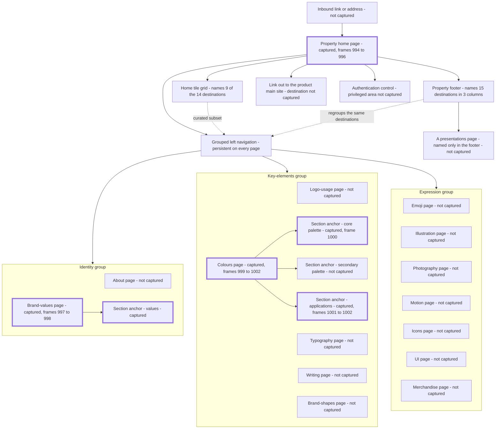

# Brand Guidelines

The public brand-and-press property, documented as a **page structure to rebuild with the next build run's own brand** — its grouped documentation navigation, its page patterns and the anatomy of a colour specimen, with not one observed brand value carried forward.

## Purpose

This area is a **public, unauthenticated reference property**: a documentation-style site, separate from the product and from the product's marketing pages, whose subject is an organisation's own brand guidance. It renders a two-column documentation layout — a grouped left navigation column and a wider content column — under a slim header whose only controls are a link out to the product's main site and an authentication control [frame 994](../../screenshots/Slack%20web%20Jul%202024%20994.png). Every captured page renders without a session, so the area is encountered by arriving at it from outside the product rather than from anywhere inside the application shell.

**Why this area is documented at all, stated once and plainly.** The next build run rebuilds this page **structure** and populates it with **its own product name, its own logo mark and wordmark, and its own palette**. Nothing observed on this property is adopted as a design token, a colour, a typeface or a brand rule. This document therefore specifies **slots, ordering, nesting, states and relationships** — what a brand page is made of and how its parts behave — and never specifies what goes in the slots. That is simultaneously the depth rule for a reference-documentation subject and the intellectual-property rule for third-party reference imagery.

**Consequently this document contains no colour value in any notation and no colour name.** Every reference to colour routes through the **placeholder branding vocabulary** defined once in [00-product-overview.md](00-product-overview.md) — product logo mark, product wordmark, primary brand color, accent color 1 … 4, text-primary and surface-default. The values the corpus prints on screen belong to a third party, are recorded here only as *the shape of the guidance that surrounds them*, and are never requirements of this product.

**The public-surface boundary, in one sentence.** This document owns the **brand-and-press property**; [17-marketing-site.md](17-marketing-site.md) owns the product marketing pages; [18-pricing-plans.md](18-pricing-plans.md) owns pricing; [20-help-community.md](20-help-community.md) owns the help centre and the community site; [01-onboarding-and-auth.md](01-onboarding-and-auth.md) owns authentication; and [21-states.md](21-states.md) owns the application error page. Each is a distinct property with its own chrome, and this document cites across rather than re-documenting any of them.

**What the corpus supplies, and what it withholds.** Nine frames capture this property, all of them consecutive, covering **three surfaces**: the property's home page, one reference page in the identity group and one reference page in the key-elements group [frame 994](../../screenshots/Slack%20web%20Jul%202024%20994.png), [frame 997](../../screenshots/Slack%20web%20Jul%202024%20997.png), [frame 999](../../screenshots/Slack%20web%20Jul%202024%20999.png). The navigation names **fourteen destinations**; **two of them are captured**, and the remaining twelve are evidenced as navigation entries only [frame 994](../../screenshots/Slack%20web%20Jul%202024%20994.png). A navigation label proves that a destination exists and is reachable; it proves nothing about what that destination contains, so no unvisited destination is described anywhere below.

> **Partial capture:** the twelve destinations named but never visited are an about page, a logo-usage page, a typography page, a writing page, a brand-shapes page, and the seven pages of the expression group — emoji, illustration, photography, motion, icons, UI and merchandise [frame 994](../../screenshots/Slack%20web%20Jul%202024%20994.png). Their contents are unknown. `S-GAP` in [00-product-overview.md](00-product-overview.md) governs what a build does about them: design the page rather than leave the destination unhandled, reusing the page patterns this document does specify.

Every claim below carries the frame it was read from. Plain prose is observed; anything not directly visible is prefixed `**Inferred:**` and states its basis; a partially-shown surface is flagged with a `> **Partial capture:**` note. Return to the [Workflow Catalog](README.md) for the catalog's index, its consolidated models and its limitations.

## Flows in this area

Four flows are named for this area, spanning 9 frames. Frame spans are written as plain numeric ranges because they designate a span rather than cite one image, following the convention of the [Screenshot Coverage Index](_screenshot-index.md); every individual frame is cited with its full relative link in the step tables and in [Frames covered](#frames-covered).

| Flow ID | Name | Frame span | Primary entry point |
|---|---|---|---|
| `19.1` | Arrive on the brand property and orient on its navigation | 994–996 | An inbound link to the property's root, from outside the product |
| `19.2` | Read a reference page in the identity group | 997–998 | The brand-values entry in the left navigation's identity group |
| `19.3` | Read the colour page and its first specimen section | 999–1000 | The colours entry in the left navigation's key-elements group |
| `19.4` | Read the colour usage and application guidance | 1001–1002 | The third child entry beneath the expanded colours entry |

**Why four flows and not fourteen.** A flow is one goal-directed journey, and every flow identifier in this catalog is allocated once, in the [Flow groupings](_screenshot-index.md#flow-groupings) table of the coverage index. This property's journeys are navigation-shaped — a visitor arrives, orients, opens a reference page and reads it — and the corpus captures exactly four of them. Minting a flow per navigation label would name twelve journeys no frame evidences, which is fabrication of structure; the twelve unvisited destinations are recorded as partial captures instead. The four flows above reconcile exactly with the per-area allocation published in the ledger's [coverage assertion](_screenshot-index.md#coverage-assertion).

**Two journeys the corpus does not complete.** Following the header's outbound site link and following its authentication control are both offered on every captured page and neither destination is captured, so neither is named as a flow [frame 1000](../../screenshots/Slack%20web%20Jul%202024%201000.png). They are recorded in [Transitions in and out](#transitions-in-and-out) as unobserved exits.

## Flow 19.1 — Arrive on the brand property and orient on its navigation

### Overview

The property's root surface. It exists to explain what the property is and to hand the visitor two competing routes into it: a **grouped navigation column** that names every destination, and a **grid of illustrated tiles** in the content column that names a curated subset of them [frame 994](../../screenshots/Slack%20web%20Jul%202024%20994.png), [frame 995](../../screenshots/Slack%20web%20Jul%202024%20995.png). The page ends in a footer that names the destinations a third time, in a third arrangement [frame 996](../../screenshots/Slack%20web%20Jul%202024%20996.png). Three captures cover one continuous page from its hero to its footer.

This is also the only flow in which **no navigation entry is active and no group is expanded**, which makes it the reference rendering of the navigation's resting state [frame 994](../../screenshots/Slack%20web%20Jul%202024%20994.png).

### Trigger

Not captured. The page is reached with no product session and no in-product affordance leading to it: the property's header offers a link *out* to the product's main site but the corpus contains no capture of a link *in* [frame 994](../../screenshots/Slack%20web%20Jul%202024%20994.png). **Inferred:** the property is entered by address or by an off-product link, because it renders unauthenticated chrome of its own rather than any region of the application shell, and because no frame anywhere in the corpus shows a product surface linking to it.

### Preconditions

None. No session is required: the header carries an authentication control rather than a signed-in identity, and every element of the page renders with that control still un-actioned [frame 994](../../screenshots/Slack%20web%20Jul%202024%20994.png), [frame 996](../../screenshots/Slack%20web%20Jul%202024%20996.png).

### Frame-by-frame steps

| Step | Frame(s) | What the user does | What changes on screen | Component(s) involved |
|---|---|---|---|---|
| 1 | [frame 994](../../screenshots/Slack%20web%20Jul%202024%20994.png) | Opens the property's root | The two-column documentation layout renders: a slim header band whose leading edge carries the product logo mark beside the product wordmark with a small parent-organization attribution lockup beneath it, and whose trailing edge carries a text link out to the product's main site followed by an outlined authentication control | `C-PROPERTY-CHROME` |
| 2 | [frame 994](../../screenshots/Slack%20web%20Jul%202024%20994.png) | Reads the navigation column | The left column renders three groups in order, each introduced by an uppercase group label set in a filled rounded pill, followed by that group's destination entries as plain text rows: an identity group of two entries, a key-elements group of five, and an expression group of seven — fourteen destinations, no entry active, no group expanded, and the whole list fitting above the fold | `C-DOC-NAV` |
| 3 | [frame 994](../../screenshots/Slack%20web%20Jul%202024%20994.png) | Reads the hero | The content column opens with a hero band at the wide content measure, filled in the primary brand color, carrying a two-line welcome heading, a one-line sub-line and an **outlined authentication action with a trailing arrow affordance** at its leading side, and an illustration inset in its own slightly lighter tile at its trailing side | `C-PAGE-HERO` |
| 4 | [frame 994](../../screenshots/Slack%20web%20Jul%202024%20994.png) | Reads past the hero | A section begins beneath it: a heading, then a one-line sub-line stating that the grid below holds the property's top pages and directing the reader to the navigation column for the rest, then the first row of a three-column tile grid, clipped by the viewport foot | `C-DESTINATION-TILE` |
| 5 | [frame 995](../../screenshots/Slack%20web%20Jul%202024%20995.png) | Scrolls the page | The content column advances to the tile grid while **the header band and the navigation column hold their exact positions**; the grid resolves as three rows of three rounded-square tiles, each tile carrying an illustration on its own tinted surface with a caption label **beneath the tile, outside its bounds** | `C-DESTINATION-TILE` |
| 6 | [frame 995](../../screenshots/Slack%20web%20Jul%202024%20995.png) | Compares the grid against the navigation | Nine captions are legible, naming a **subset** of the fourteen destinations the navigation names, and rendering those names with different capitalisation and pluralisation from the navigation's own labels for the same destinations | `C-DESTINATION-TILE` |
| 7 | [frame 996](../../screenshots/Slack%20web%20Jul%202024%20996.png) | Scrolls to the foot of the page | The grid's final tile row passes, **the navigation column scrolls away with the page** — only the third group's tail remains and its pill labels are gone — and a footer band begins, filled in the primary brand color across the full viewport width | `C-DOC-NAV`, `C-PROPERTY-FOOTER` |
| 8 | [frame 996](../../screenshots/Slack%20web%20Jul%202024%20996.png) | Reads the footer | Four columns render: a contact column of an uppercase heading, a lead line and two contact rows each led by its own glyph — one a channel-style reference, one an email address — followed by the product logo mark, a copyright line naming the parent organization with a privacy-policy link, and a closing line carrying two inline links to brand terms of service and to trademark-and-copyright usage guidelines; then three link columns under uppercase headings holding two, five and eight entries | `C-PROPERTY-FOOTER`, `S-LINK` |

> **Partial capture:** the home page is captured as three viewports onto one long page, not as a whole page. Nothing above the hero is shown, the tile grid's first row is clipped at the top of the second capture, and no capture shows the page at any width other than the corpus's own [frame 994](../../screenshots/Slack%20web%20Jul%202024%20994.png), [frame 995](../../screenshots/Slack%20web%20Jul%202024%20995.png), [frame 996](../../screenshots/Slack%20web%20Jul%202024%20996.png).

**Inferred:** the navigation column is pinned while its own height allows and then scrolls with the page, because it is unmoved between the first two captures and has scrolled out of view by the third, while the header band is unmoved in all three [frame 994](../../screenshots/Slack%20web%20Jul%202024%20994.png), [frame 995](../../screenshots/Slack%20web%20Jul%202024%20995.png), [frame 996](../../screenshots/Slack%20web%20Jul%202024%20996.png). A single set of captures cannot show the pinning being released, so the mechanism is an inference and the two observations are the whole of its basis.

## Flow 19.2 — Read a reference page in the identity group

### Overview

The first of the two captured reference pages, and the flow that establishes the **page pattern** every reference page on this property follows: a hero band carrying the page title and its standfirst, then an overview section that indexes the page's own contents, then one section per indexed item [frame 997](../../screenshots/Slack%20web%20Jul%202024%20997.png), [frame 998](../../screenshots/Slack%20web%20Jul%202024%20998.png). It is also the flow that proves how the navigation behaves on a reference page: the entry for the page being read is **expanded**, and its child becomes **active as the reader scrolls into the section that child names**.

### Trigger

Selecting the brand-values entry in the navigation's identity group. The step is inferred rather than captured — no frame shows the entry under the pointer — but the destination is captured with that entry rendered as the expanded one [frame 997](../../screenshots/Slack%20web%20Jul%202024%20997.png).

### Preconditions

None beyond reaching the property. No session; the header's authentication control is un-actioned on both captures [frame 997](../../screenshots/Slack%20web%20Jul%202024%20997.png), [frame 998](../../screenshots/Slack%20web%20Jul%202024%20998.png).

### Frame-by-frame steps

| Step | Frame(s) | What the user does | What changes on screen | Component(s) involved |
|---|---|---|---|---|
| 1 | [frame 997](../../screenshots/Slack%20web%20Jul%202024%20997.png) | Opens the brand-values destination | The content column replaces the home page's hero and grid with this page's own hero band; the header band is unchanged; in the navigation column the brand-values entry is now rendered **underlined with a trailing disclosure chevron** and has gained **one indented child row** | `C-DOC-NAV` |
| 2 | [frame 997](../../screenshots/Slack%20web%20Jul%202024%20997.png) | Reads the hero | A hero band at the wide content measure, filled in an accent color, carries the page title and a four-line body at its leading side and an illustration **sitting directly on the hero fill** at its trailing side — with **no action control of any kind**, unlike the home page's hero | `C-PAGE-HERO` |
| 3 | [frame 997](../../screenshots/Slack%20web%20Jul%202024%20997.png) | Reads the overview section | Beneath the hero, at the narrower inset body measure: a section heading, a two-line body, then a **two-column list of six numbered entries**, each a filled circular number badge followed by a name, numbered column-major — one to three down the leading column, four to six down the trailing one | `C-NUMBERED-INDEX` |
| 4 | [frame 997](../../screenshots/Slack%20web%20Jul%202024%20997.png) | Reads on | The first per-item section heading appears at the foot of the viewport, matching the first name in the numbered list, and is clipped | — |
| 5 | [frame 998](../../screenshots/Slack%20web%20Jul%202024%20998.png) | Scrolls into that section | The navigation column holds its position and **its single child row changes from plain text to a filled band spanning the column's width with rounded ends and an inverted label**, while the expanded parent keeps its underline and chevron | `C-DOC-NAV` |
| 6 | [frame 998](../../screenshots/Slack%20web%20Jul%202024%20998.png) | Reads the section | The content column renders the section heading, a body paragraph, a sub-heading and a five-item bulleted list, all at the inset body measure | — |
| 7 | [frame 998](../../screenshots/Slack%20web%20Jul%202024%20998.png) | Reads the section's specimen | Below the list, a **specimen panel**: a tinted inset panel with generous padding, carrying a bold specimen title, a variant label line beneath it, and a two-row grid of eight labelled tiles per row, each tile a label chip above an image with a caption beneath | `C-SPECIMEN-PANEL` |
| 8 | [frame 998](../../screenshots/Slack%20web%20Jul%202024%20998.png) | Reads on | The next per-item section heading appears at the foot of the viewport, matching the second name in the numbered list, and is clipped — confirming that the numbered list indexes sections of this same page rather than links to other pages | `C-NUMBERED-INDEX` |

> **Partial capture:** only the first of the six indexed sections is captured, and only in part. The remaining five sections, the page's own footer and anything between the last captured section and that footer are not shown [frame 998](../../screenshots/Slack%20web%20Jul%202024%20998.png).

**Sample content, not requirements.** The specimen panel's tiles carry image content with per-tile label chips and captions [frame 998](../../screenshots/Slack%20web%20Jul%202024%20998.png). They are the third party's own specimen material: the *structure* — panel, title, variant label, tile grid, per-tile chip and caption — is the requirement, and no label, caption or image from that panel is reproduced here or is a value for a build to reproduce.

## Flow 19.3 — Read the colour page and its first specimen section

### Overview

The property's colour reference page, and the flow that carries this document's most load-bearing structural finding: a reference page pairs **guidance prose** with a **stack of specimens**, and each specimen exposes the **same fixed set of value slots in the same order** [frame 999](../../screenshots/Slack%20web%20Jul%202024%20999.png), [frame 1000](../../screenshots/Slack%20web%20Jul%202024%201000.png). This is the page whose contents are themselves the third party's brand definition, so the flow is specified as slots and ordering only.

The navigation behaves as it does on the other reference page, with one extra fact this page supplies: the expanded entry has **three** children, and the corpus catches the page with **none** of them active and then with the **first** active, which is what establishes that the children track the section in view [frame 999](../../screenshots/Slack%20web%20Jul%202024%20999.png), [frame 1000](../../screenshots/Slack%20web%20Jul%202024%201000.png).

### Trigger

Selecting the colours entry in the navigation's key-elements group. Not captured as an interaction; the destination is captured with that entry expanded [frame 999](../../screenshots/Slack%20web%20Jul%202024%20999.png).

### Preconditions

None beyond reaching the property. No session on either capture [frame 999](../../screenshots/Slack%20web%20Jul%202024%20999.png), [frame 1000](../../screenshots/Slack%20web%20Jul%202024%201000.png).

### Frame-by-frame steps

| Step | Frame(s) | What the user does | What changes on screen | Component(s) involved |
|---|---|---|---|---|
| 1 | [frame 999](../../screenshots/Slack%20web%20Jul%202024%20999.png) | Opens the colours destination | In the navigation column the colours entry is rendered underlined with a trailing disclosure chevron and has gained **three indented child rows**; the previously expanded entry in the identity group is back to a plain row, so **exactly one entry is expanded at a time** | `C-DOC-NAV` |
| 2 | [frame 999](../../screenshots/Slack%20web%20Jul%202024%20999.png) | Notes the list's new length | The expanded children push the later entries down and the **final entry of the third group is now clipped by the viewport foot**, where on the collapsed home page the whole list fitted | `C-DOC-NAV` |
| 3 | [frame 999](../../screenshots/Slack%20web%20Jul%202024%20999.png) | Reads the hero | A hero band at the wide content measure, filled in the primary brand color, carries the page title and a three-line body at its leading side, with a decorative graphic **bleeding off the band's trailing edge** rather than being inset in a tile | `C-PAGE-HERO` |
| 4 | [frame 999](../../screenshots/Slack%20web%20Jul%202024%20999.png) | Reads the call-out | Below the hero, at the inset body measure, a **call-out panel** on a light tinted surface: a heading preceded by a decorative glyph, then a three-item bulleted list summarising the page's headline guidance | `C-GUIDANCE-PANEL` |
| 5 | [frame 999](../../screenshots/Slack%20web%20Jul%202024%20999.png) | Reads on | The first specimen section's heading appears, with the opening line of its guidance paragraph beneath, clipped by the viewport foot | — |
| 6 | [frame 1000](../../screenshots/Slack%20web%20Jul%202024%201000.png) | Scrolls into that section | The navigation column holds its position and **the first of the three child rows becomes the filled active band**; the heading that was clipped at the foot of the previous capture is now at the head of the content column | `C-DOC-NAV` |
| 7 | [frame 1000](../../screenshots/Slack%20web%20Jul%202024%201000.png) | Reads the guidance paragraph | A three-line paragraph sits between the section heading and the specimens. Its **shape**: lead with the primary brand color for prominent brand moments; lean on an accent color for warmth; treat the further accent colors — described as drawn from the product logo mark — as additional ready choices; and treat text-primary and surface-default as the default text colours, following the pairings the specimens below demonstrate | — |
| 8 | [frame 1000](../../screenshots/Slack%20web%20Jul%202024%201000.png) | Reads the specimen stack | A **vertical stack of seven specimen rows** separated by full-width hairline rules. Each row carries a **filled pill-shaped colour chip at its leading edge with its name label set inside the chip**, then **four value slots at fixed columnar positions**, each slot a bold uppercase notation-kind label immediately followed by its value | `C-DEFINITION-LIST` |
| 9 | [frame 1000](../../screenshots/Slack%20web%20Jul%202024%201000.png) | Compares the rows | The four notation kinds appear in the same leading-to-trailing order in every row — a web notation, an additive-light triplet notation, a process-print quadruplet notation and a spot-ink reference notation — and **there is no column header row anywhere in the stack**: every cell repeats its own notation-kind label inline | `C-DEFINITION-LIST` |
| 10 | [frame 1000](../../screenshots/Slack%20web%20Jul%202024%201000.png) | Notices the third row | The third row's **fourth slot is empty**, its chip is drawn as an **outlined pill rather than a filled one**, and its name label is set in the default text treatment where the rows above use an inverted label and the rows below a dark one — so the label treatment varies per row to hold contrast against the chip's own fill | `C-DEFINITION-LIST` |
| 11 | [frame 1000](../../screenshots/Slack%20web%20Jul%202024%201000.png) | Reads on | The stack continues past the viewport foot; the two remaining child entries in the navigation name two further sections, neither of which is captured | — |

> **Partial capture:** the specimen stack is cut off by the viewport, so the total number of rows on the page is unknown — seven are legible. Of the three sections the expanded navigation entry names, the second is never captured at all [frame 1000](../../screenshots/Slack%20web%20Jul%202024%201000.png).

**No value from this page is transcribed anywhere in this catalog.** The seven rows print, on screen, a colour name and four parallel notations each. Every one of those is third-party brand intellectual property. What a build takes from this page is the **row anatomy** — one chip slot, one name slot, four ordered notation slots — and it supplies its own values into them. The specific slot contents are recorded nowhere, deliberately, and re-deriving them from the frame is out of scope for the build.

## Flow 19.4 — Read the colour usage and application guidance

### Overview

The applied half of the colour reference: where flow `19.3` publishes specimens as values, this flow publishes them as **examples** — first a gallery of applications, then a grid of **counter-examples**, each carrying an explicit prohibition [frame 1001](../../screenshots/Slack%20web%20Jul%202024%201001.png), [frame 1002](../../screenshots/Slack%20web%20Jul%202024%201002.png). The counter-example tile is a distinct structure with its own signalling, and it is the most directly buildable thing on the property: a specimen area, a rule along its bottom edge in the destructive treatment, and a caption led by a filled circular cross glyph.

### Trigger

Reaching the third of the three sections named by the expanded colours entry, which the navigation marks active throughout this flow [frame 1001](../../screenshots/Slack%20web%20Jul%202024%201001.png). Whether the reader arrived by selecting that child entry or by continuing to scroll cannot be determined from the frames, and both readings are recorded under [one genuine ambiguity](#one-genuine-ambiguity-and-the-fewest-assumptions-reading) rather than resolved.

### Preconditions

None beyond reaching the colour page. No session on either capture [frame 1001](../../screenshots/Slack%20web%20Jul%202024%201001.png), [frame 1002](../../screenshots/Slack%20web%20Jul%202024%201002.png).

### Frame-by-frame steps

| Step | Frame(s) | What the user does | What changes on screen | Component(s) involved |
|---|---|---|---|---|
| 1 | [frame 1001](../../screenshots/Slack%20web%20Jul%202024%201001.png) | Reaches the applications section | The navigation column is unmoved, the colours entry is still expanded with its three children, and **the third child is now the filled active band** where the first held it on the previous capture | `C-DOC-NAV` |
| 2 | [frame 1001](../../screenshots/Slack%20web%20Jul%202024%201001.png) | Reads the section head | The content column opens with a section heading and a one-line sub-line inviting the reader to explore how the palette is applied and what to avoid. **The heading and the navigation entry for this same section do not use the same wording** | — |
| 3 | [frame 1001](../../screenshots/Slack%20web%20Jul%202024%201001.png) | Reads the application gallery | A gallery of specimen tiles renders at the body measure: a row of **two tiles of unequal width** — a narrow tile then a wide one — followed by a **full-width specimen tile** | `C-SPECIMEN-PANEL` |
| 4 | [frame 1001](../../screenshots/Slack%20web%20Jul%202024%201001.png) | Reads the full-width specimen | It carries a type badge at its leading top, a two-line headline, a one-line sub-line, and the product logo mark beside the product wordmark at its lower-leading corner, over an illustration occupying its trailing side — a specimen of the brand applied to a published artefact | `C-SPECIMEN-PANEL` |
| 5 | [frame 1001](../../screenshots/Slack%20web%20Jul%202024%201001.png) | Reads on | A further tile row begins beneath the full-width specimen and is clipped by the viewport foot | `C-SPECIMEN-PANEL` |
| 6 | [frame 1002](../../screenshots/Slack%20web%20Jul%202024%201002.png) | Scrolls on | The navigation column has now scrolled with the page — its first group's pill label is gone — while **the expanded parent and the active third child keep their treatments**, so the active state survives the column scrolling | `C-DOC-NAV` |
| 7 | [frame 1002](../../screenshots/Slack%20web%20Jul%202024%201002.png) | Reads the counter-example grid | A **two-by-two grid of counter-example tiles**. Each tile is a specimen area whose **bottom edge carries a thick rule in the destructive treatment**, with a caption beneath it led by a **filled circular cross glyph** in the same treatment, stating one prohibition | `C-SPECIMEN-PANEL` |
| 8 | [frame 1002](../../screenshots/Slack%20web%20Jul%202024%201002.png) | Compares the four | Two of the four tiles carry sample display text inside the specimen area to demonstrate the fault the caption names; one caption wraps to a second line and its tile keeps the same height as its neighbours; the four prohibitions concern using secondary colours for text, over-muted combinations, gradients built from the palette, and low-contrast text-and-background pairings | `C-SPECIMEN-PANEL` |
| 9 | [frame 1002](../../screenshots/Slack%20web%20Jul%202024%201002.png) | Scrolls to the foot | The property footer begins — the same band, filled in the primary brand color, with the same four columns under the same headings as on the home page — and is clipped by the frame's lower edge | `C-PROPERTY-FOOTER` |

> **Partial capture:** the application gallery is cut off between the two captures, so how many application tiles the section holds is unknown. The footer is visible only as its heading row on this page, and no capture shows what the two clipped tiles in the third gallery row contain [frame 1001](../../screenshots/Slack%20web%20Jul%202024%201001.png), [frame 1002](../../screenshots/Slack%20web%20Jul%202024%201002.png).

**Inferred:** the positive gallery and the counter-example grid are deliberately different structures rather than the same structure styled differently, because the counter-example tiles carry two signalling elements the positive tiles have none of — the destructive bottom rule and the cross-glyph caption — and because the positive tiles carry no caption at all [frame 1001](../../screenshots/Slack%20web%20Jul%202024%201001.png), [frame 1002](../../screenshots/Slack%20web%20Jul%202024%201002.png). A build that renders both from one component must treat the rule, the glyph and the caption as a coupled set that is present or absent together.

## Screens & components

Every component identifier used in this catalog is defined **once**, in [00-product-overview.md](00-product-overview.md), and is referenced here by identifier only; no contract is restated. What this section adds is the property's **page-level information architecture** and the **anatomy of its structures** — which regions exist, in what order, at what relative size, and what each is made of. Every figure is expressed **proportionally**, never as an absolute pixel offset, so that the specification survives being rebuilt at any viewport size; the [Workflow Catalog](README.md) records once, for the whole catalog, why absolute offsets are not available from this corpus.

### Regions, columns and proportions

Four regions, in a fixed arrangement that holds across all nine captures [frame 994](../../screenshots/Slack%20web%20Jul%202024%20994.png), [frame 1000](../../screenshots/Slack%20web%20Jul%202024%201000.png).

| Region | Position and ordering | Relative size | Contents, in order |
|---|---|---|---|
| Header band | Full-width band across the top, above both columns | Roughly one eighteenth of viewport height — the shallowest region | Product logo mark beside the product wordmark at the leading edge, with a small parent-organization attribution lockup set beneath the wordmark; then, at the trailing edge, a text link out to the product's main site followed by an outlined authentication control [frame 994](../../screenshots/Slack%20web%20Jul%202024%20994.png) |
| Navigation column | Leading column beneath the header band | Its rows occupy roughly the leading seventh of viewport width; the column's own measure ends near one fifth, and a gutter separates it from the content column | Three group labels in filled pills, each followed by its ordered destination entries; the entry for the current page may carry an indented child list [frame 999](../../screenshots/Slack%20web%20Jul%202024%20999.png) |
| Content column | The remaining width, to the trailing side of the navigation column | Roughly seven tenths of viewport width | A hero band, then the page's sections in order [frame 997](../../screenshots/Slack%20web%20Jul%202024%20997.png) |
| Footer band | Full-width band at the foot of the page, **beneath both columns rather than only the content column** | Height not determinable — clipped by the frame in both captures that reach it | Four columns: a contact column, then three link columns [frame 996](../../screenshots/Slack%20web%20Jul%202024%20996.png), [frame 1002](../../screenshots/Slack%20web%20Jul%202024%201002.png) |

**Two content measures, and the distinction matters.** The content column is used at two widths. A **wide measure**, beginning near a quarter of the viewport width and running almost to its trailing edge, carries every hero band and the home page's tile grid [frame 994](../../screenshots/Slack%20web%20Jul%202024%20994.png), [frame 999](../../screenshots/Slack%20web%20Jul%202024%20999.png). A narrower **inset body measure**, beginning near three tenths and ending near seven eighths, carries reference prose, call-outs, numbered lists and specimen stacks [frame 1000](../../screenshots/Slack%20web%20Jul%202024%201000.png), [frame 997](../../screenshots/Slack%20web%20Jul%202024%20997.png). A build that uses one measure for both will render heroes too narrow or body text too wide.

**Hierarchy.** The two columns are siblings, and the footer band is a sibling of both rather than a child of the content column — it spans the full viewport width with the navigation column's rows ending above it [frame 996](../../screenshots/Slack%20web%20Jul%202024%20996.png). The header band never changes between captures. Opening a destination changes the content column **wholesale** and changes exactly two things in the navigation column: which entry is expanded, and which child row is active [frame 997](../../screenshots/Slack%20web%20Jul%202024%20997.png), [frame 999](../../screenshots/Slack%20web%20Jul%202024%20999.png). Nothing on this property overlays anything else: no modal, no popover, no drawer and no anchored menu appears in any capture.

### The header region

One form, unchanged in all nine captures [frame 994](../../screenshots/Slack%20web%20Jul%202024%20994.png), [frame 1002](../../screenshots/Slack%20web%20Jul%202024%201002.png). It carries exactly two controls and no others: an **outbound-site link** rendered as plain text, and an **authentication control** rendered as an outlined control at the far trailing edge. It is **not** the in-product `C-TOP-BAR`, which carries history controls, a search entry and a help control, and it is **not** the console band `C-CONSOLE-TOP-BAR`, which carries a workspace identity and icon-over-label controls; the distinction is recorded because conflating any of them would import controls this property does not have.

**No search affordance exists anywhere on this property.** No capture renders a search field, a search glyph or a filter of any kind — on the header, in the navigation column, or on any page [frame 994](../../screenshots/Slack%20web%20Jul%202024%20994.png), [frame 1000](../../screenshots/Slack%20web%20Jul%202024%201000.png), [frame 1002](../../screenshots/Slack%20web%20Jul%202024%201002.png). That is a negative observation across nine captures, not an inference, and it is worth stating because a documentation site is the kind of surface a build would otherwise assume has one.

`S-LINK` in [00-product-overview.md](00-product-overview.md) governs the outbound-site link and every link in the footer. `S-AUTHZ-OP` and `S-AUTHZ-READ` govern whatever lies behind the authentication control, whose surface is never captured — the corpus establishes only that the property has a privileged area, never what it contains or who may reach it.

### The grouped documentation navigation, in full

This inventory is the core deliverable of this document, because the navigation is the only place the property's whole information architecture is visible at once. Three groups, fourteen destination entries, one level of nesting and never more [frame 994](../../screenshots/Slack%20web%20Jul%202024%20994.png).

| Position | Group label | Destination entries, in order | Capture state |
|---|---|---|---|
| 1 | An **identity** group | An about page · a brand-values page | The brand-values page is captured [frame 997](../../screenshots/Slack%20web%20Jul%202024%20997.png); the about page is not |
| 2 | A **key-elements** group | A logo-usage page · a colours page · a typography page · a writing page · a brand-shapes page | The colours page is captured [frame 999](../../screenshots/Slack%20web%20Jul%202024%20999.png); the other four are not |
| 3 | An **expression** group | An emoji page · an illustration page · a photography page · a motion page · an icons page · a UI page · a merchandise page | None is captured |

> **Partial capture:** twelve of the fourteen destinations above are evidenced by their navigation entry alone. Their contents, their page patterns and even whether they follow this property's reference-page pattern are unknown [frame 994](../../screenshots/Slack%20web%20Jul%202024%20994.png).

**Group labels are pills, not headings.** Each group label is set in uppercase inside a **filled rounded pill** in the primary brand color, and the destination entries beneath it are plain text rows at the column's own measure [frame 994](../../screenshots/Slack%20web%20Jul%202024%20994.png). A group label is not itself a destination: no capture ever renders a group label as active, expanded or underlined.

**The nesting, and which entry owns it.** Exactly one entry is ever expanded, and it is always the entry for the page being read [frame 997](../../screenshots/Slack%20web%20Jul%202024%20997.png), [frame 999](../../screenshots/Slack%20web%20Jul%202024%20999.png). An expanded entry is rendered **underlined with a trailing disclosure chevron**, and its children are rendered as indented rows beneath it.

| Expanded entry | Child rows, in order | Where observed | Child rendered active |
|---|---|---|---|
| The brand-values page | One child — a values section | [frame 997](../../screenshots/Slack%20web%20Jul%202024%20997.png), [frame 998](../../screenshots/Slack%20web%20Jul%202024%20998.png) | Plain at the top of the page [frame 997](../../screenshots/Slack%20web%20Jul%202024%20997.png); active once that section is in view [frame 998](../../screenshots/Slack%20web%20Jul%202024%20998.png) |
| The colours page | Three children — a core-palette section · a secondary-palette section · an applications section | [frame 999](../../screenshots/Slack%20web%20Jul%202024%20999.png), [frame 1000](../../screenshots/Slack%20web%20Jul%202024%201000.png), [frame 1001](../../screenshots/Slack%20web%20Jul%202024%201001.png), [frame 1002](../../screenshots/Slack%20web%20Jul%202024%201002.png) | None while the hero is in view [frame 999](../../screenshots/Slack%20web%20Jul%202024%20999.png); the first once its section is in view [frame 1000](../../screenshots/Slack%20web%20Jul%202024%201000.png); the third once its section is in view [frame 1001](../../screenshots/Slack%20web%20Jul%202024%201001.png), [frame 1002](../../screenshots/Slack%20web%20Jul%202024%201002.png) |

**Inferred:** the child rows are **in-page section anchors rather than separate destinations**, and the active treatment tracks the section currently in view. The basis is five captures across two different pages: on each page the child is plain while the page's hero is in view and becomes the filled band once its section is reached, and on the colour page the active child moves from the first to the third without the expanded parent changing [frame 997](../../screenshots/Slack%20web%20Jul%202024%20997.png), [frame 998](../../screenshots/Slack%20web%20Jul%202024%20998.png), [frame 999](../../screenshots/Slack%20web%20Jul%202024%20999.png), [frame 1000](../../screenshots/Slack%20web%20Jul%202024%201000.png), [frame 1001](../../screenshots/Slack%20web%20Jul%202024%201001.png). No capture shows a child being selected, so the anchor reading is an inference and these five renderings are the whole of its basis.

**Active treatment lives at the child level only.** The filled band with rounded ends and an inverted label is only ever applied to an indented child row; no top-level destination entry and no group label ever carries it, including on the pages whose own entry is expanded [frame 998](../../screenshots/Slack%20web%20Jul%202024%20998.png), [frame 1000](../../screenshots/Slack%20web%20Jul%202024%201000.png). A build must therefore express "current page" and "current section" with **two different treatments** — an underline plus a disclosure chevron for the page, a filled band for the section — rather than one shared highlight.

**Expansion has a layout consequence.** Collapsed, the whole fourteen-entry list fits above the fold [frame 994](../../screenshots/Slack%20web%20Jul%202024%20994.png). Expanded, the extra child rows push the later entries down and **the final entry of the third group is clipped by the viewport foot** [frame 999](../../screenshots/Slack%20web%20Jul%202024%20999.png), [frame 1000](../../screenshots/Slack%20web%20Jul%202024%201000.png), [frame 1001](../../screenshots/Slack%20web%20Jul%202024%201001.png). The column does not gain its own scrollbar in any capture; it scrolls with the page.

> **Partial capture:** no capture shows a hover state, a focus ring or a keyboard-focused row anywhere in this column, and none shows a reader collapsing an entry that the page had expanded. Those states are named as gaps rather than described, and `S-GAP` governs them.

### The property's information architecture

Every node below corresponds to something the frames show, and every node that was not itself captured says so, so the diagram cannot be mistaken for evidence of a page nobody inspected. Nodes drawn with a heavy outline are captured.

**What the diagram deliberately does not draw.** There is no inbound edge from any product or marketing surface, because no frame in the corpus shows one — the entry node stands for an address or an off-product link and is marked uncaptured. There is no edge out of the twelve uncaptured destinations, because nothing is known about what they lead to.

### Page patterns in the content column

Six patterns are observed. Each is described as slots and ordering; none of their contents is a requirement.

| Pattern | Where observed | Anatomy, in order | Observed variants |
|---|---|---|---|
| Hero band | Top of every captured page | Full wide measure; a heading, then a body of one to four lines, at the leading side; a graphic at the trailing side; optionally one action beneath the body | Filled in the primary brand color with an illustration **inset in its own lighter tile** and an outlined action carrying a trailing arrow [frame 994](../../screenshots/Slack%20web%20Jul%202024%20994.png); filled in an accent color with the illustration **directly on the fill** and **no action** [frame 997](../../screenshots/Slack%20web%20Jul%202024%20997.png); filled in the primary brand color with a decorative graphic **bleeding off the trailing edge** and no action [frame 999](../../screenshots/Slack%20web%20Jul%202024%20999.png) |
| Illustrated destination-tile grid | Home page only | Three-column grid at the wide measure; each cell a rounded-square tile carrying an illustration on its own tinted surface, with a caption label **beneath the tile, outside its bounds** | Three rows of three, nine tiles [frame 995](../../screenshots/Slack%20web%20Jul%202024%20995.png) |
| Guidance call-out panel | Below a hero, before the first section | Inset body measure; a light tinted surface with generous padding; a heading preceded by a decorative glyph, then a short bulleted list | One form, three bullets [frame 999](../../screenshots/Slack%20web%20Jul%202024%20999.png) |
| Numbered index list | Overview section of a reference page | Inset body measure; a heading, a short body, then a two-column list whose items each pair a filled circular number badge with a name; numbered **column-major** — the first half down the leading column, the second half down the trailing one | Six items in two columns of three [frame 997](../../screenshots/Slack%20web%20Jul%202024%20997.png) |
| Specimen panel | Inside a section of a reference page | Inset body measure; a tinted panel with generous padding, carrying a bold specimen title, a variant label line, then a grid of labelled tiles, each a label chip above an image with a caption beneath | Two rows of eight tiles [frame 998](../../screenshots/Slack%20web%20Jul%202024%20998.png) |
| Specimen gallery | Applied-guidance section | Body measure; tiles of unequal width laid out in rows, mixed with full-width tiles; a full-width tile carries a type badge, a headline, a sub-line and the product logo mark with the product wordmark at its lower-leading corner, over a graphic at its trailing side | A two-tile row of unequal widths, then a full-width tile, then a further row [frame 1001](../../screenshots/Slack%20web%20Jul%202024%201001.png) |
| Counter-example specimen tile | Applied-guidance section | Body measure, two-by-two grid; each tile a specimen area, a **thick rule along its bottom edge in the destructive treatment**, then a caption beneath led by a **filled circular cross glyph** in the same treatment stating one prohibition | Four tiles; two carry sample display text inside the specimen area; one caption wraps to two lines without changing the tile's height [frame 1002](../../screenshots/Slack%20web%20Jul%202024%201002.png) |

**The reference-page pattern, stated once.** Both captured reference pages follow the same order: hero band, then an overview or call-out that summarises the page, then one section per topic, each section pairing **guidance prose** with **specimens** [frame 997](../../screenshots/Slack%20web%20Jul%202024%20997.png), [frame 998](../../screenshots/Slack%20web%20Jul%202024%20998.png), [frame 999](../../screenshots/Slack%20web%20Jul%202024%20999.png), [frame 1000](../../screenshots/Slack%20web%20Jul%202024%201000.png). Neither page is documentation alone nor a specimen gallery alone, and a build that implements only one of the two halves will not reproduce either page.

### Colour specimen row anatomy

The single most reusable structure on the property, and the one this document is most careful about: **the slots and their order are the specification; their contents are not** [frame 1000](../../screenshots/Slack%20web%20Jul%202024%201000.png).

| Slot | Position | What occupies it | Observed behaviour |
|---|---|---|---|
| Colour chip | Leading edge of the row | A pill-shaped chip filled with the specimen's own colour | Filled in six of the seven rows; **outlined instead of filled** in the row whose fill matches the page surface, so that the chip stays distinguishable |
| Name label | **Inside** the chip, not beside it | A short human-readable name for the specimen | Set in an inverted treatment on the darkest chips, in a dark treatment on the lighter ones, and in the default text treatment on the outlined one — the treatment varies per row to hold contrast against the fill |
| Value slot 1 | First of four fixed columnar positions after the chip | A bold uppercase notation-kind label, then that notation's value | Present in all seven rows |
| Value slot 2 | Second position | A bold uppercase notation-kind label, then that notation's value | Present in all seven rows |
| Value slot 3 | Third position | A bold uppercase notation-kind label, then that notation's value | Present in all seven rows |
| Value slot 4 | Fourth position | A bold uppercase notation-kind label, then that notation's value | Present in six rows; **empty in the third row**, whose row height and rule are unchanged by the omission |

**The four notation kinds, named by kind and never by value.** In every row the four slots hold, in the same leading-to-trailing order: a **web notation**, an **additive-light triplet notation**, a **process-print quadruplet notation**, and a **spot-ink reference notation** [frame 1000](../../screenshots/Slack%20web%20Jul%202024%201000.png). The ordering is consistent down the whole stack.

**There is no column header row.** The notation kind is repeated as a bold inline label **inside every cell** rather than declared once above the stack [frame 1000](../../screenshots/Slack%20web%20Jul%202024%201000.png). This is why the stack is **not** an instance of `C-DATA-TABLE`, whose contract begins with a header row of column labels: the two are visually similar and structurally different, and a build that reaches for a table component will lose the per-cell labels.

**The build consequence, and it is the only requirement this section imposes.** A specimen is a **multi-notation value set, not a single string**: the model must carry one colour as an ordered set of four independently-present notations, one of which is legitimately absent on at least one specimen [frame 1000](../../screenshots/Slack%20web%20Jul%202024%201000.png). The build supplies every one of those values from its own brand. None is recorded here.

> **Partial capture:** seven rows are legible and the stack continues past the viewport foot, so the section's full row count is unknown [frame 1000](../../screenshots/Slack%20web%20Jul%202024%201000.png).

### Three inventories of the same property, and they disagree

The property names its own destinations three times, in three places, and the three lists do not match. Recorded as observed, not reconciled.

| Where | How many destinations | How they are grouped | How the names are cased |
|---|---|---|---|
| The left navigation | Fourteen | Three groups with pill labels | Sentence case |
| The home tile grid | Nine — a curated subset, introduced by copy that says as much and points at the navigation for the rest | Ungrouped, one flat three-column grid | Title case, and at least one name pluralised where the navigation's is singular |
| The property footer | Fifteen | The same three groupings under **differently worded** uppercase headings | Sentence case |

The footer's third column names **one destination the left navigation omits entirely** [frame 996](../../screenshots/Slack%20web%20Jul%202024%20996.png), [frame 994](../../screenshots/Slack%20web%20Jul%202024%20994.png). A build that derives its navigation from any one of these three lists will contradict the other two. Whether the property keeps one destination set rendered three ways or three separately maintained lists cannot be settled from the pixels — the two readings are weighed in [Implied data model](#implied-data-model) — but either way a build should keep **one**.

### Components consumed, and how each of this property's structures was resolved centrally

**This property's structures have no in-product counterpart, and for a time none of them had a contract either.** Every one was reported upward for central definition rather than forced onto an in-product identifier it did not satisfy, and **all nine reports are now resolved** in [00-product-overview.md](00-product-overview.md) — two as contracts of their own, seven as forms of contracts the public wave established. This document now references each by identifier and defines none of them.

| Structure on this property | Resolved as | The contract it is explicitly **not** | Evidence |
|---|---|---|---|
| Grouped documentation navigation column | **`C-DOC-NAV`**, brand-property form: three group labels each set in a filled rounded pill over fourteen plain rows | Not `C-SIDEBAR` — no conversations, no add affordances, no selection bar. Not `C-CONSOLE-NAV` — that column carries no signed-in identity block and does not expand. Not `C-PUBLIC-NAV`, which is horizontal and carries menus, a search control and actions | [frame 994](../../screenshots/Slack%20web%20Jul%202024%20994.png), [frame 999](../../screenshots/Slack%20web%20Jul%202024%20999.png), [frame 1000](../../screenshots/Slack%20web%20Jul%202024%201000.png) |
| Satellite-property header band | **`C-PROPERTY-CHROME`**, documentation form: a product lockup with an attribution line, an outbound site link and an outlined authentication action | Not `C-TOP-BAR` — no history controls, no search entry, no help control. Not `C-CONSOLE-TOP-BAR` — no workspace identity and no icon-over-label control set | [frame 994](../../screenshots/Slack%20web%20Jul%202024%20994.png), [frame 999](../../screenshots/Slack%20web%20Jul%202024%20999.png), [frame 1002](../../screenshots/Slack%20web%20Jul%202024%201002.png) |
| Page hero band, in its three observed variants | **`C-PAGE-HERO`**, including the **inset-panel form** this property contributes, where the hero occupies the content column rather than the full viewport width and carries no action | Not `C-BANNER` — that contract carries a message *about* the region it occupies; a hero **is** the page's first content and carries the page's title | [frame 994](../../screenshots/Slack%20web%20Jul%202024%20994.png), [frame 997](../../screenshots/Slack%20web%20Jul%202024%20997.png), [frame 999](../../screenshots/Slack%20web%20Jul%202024%20999.png) |
| Colour specimen row | **`C-DEFINITION-LIST`**, swatch form: one row per specimen, a labelled chip followed by several named value pairs, the notation kind repeated as a bold inline label inside every cell | Not `C-DATA-TABLE` — no header row and no column rules | [frame 1000](../../screenshots/Slack%20web%20Jul%202024%201000.png) |
| Illustrated destination-tile grid | **`C-DESTINATION-TILE`**, illustrated form whose caption sits beneath the tile, outside its bounds | Not `C-TEMPLATE-CARD` — that card carries an icon tile, a title, body copy and an action *inside* its bounds. Not `C-DISCLOSURE-CARD-LIST` — that is rows with chevrons, not a grid | [frame 995](../../screenshots/Slack%20web%20Jul%202024%20995.png) |
| Guidance call-out panel | **`C-GUIDANCE-PANEL`**, tinted-inset form with a glyph-led bold lead over a bulleted list | Not `C-BANNER` — it belongs to the flow of a document rather than to a region of a surface | [frame 998](../../screenshots/Slack%20web%20Jul%202024%20998.png), [frame 999](../../screenshots/Slack%20web%20Jul%202024%20999.png) |
| Specimen panel and specimen gallery | **`C-SPECIMEN-PANEL`**, in two of its three forms: the labelled-tile grid, and the **gallery form** that carries no panel ground and no per-tile labels, laying specimens out in mixed-width rows | Not `C-CONTENT-CARD` and not `C-RECORD-CARD` — a specimen is an exhibit of the subject, not a published item or a typed record | [frame 998](../../screenshots/Slack%20web%20Jul%202024%20998.png), [frame 1001](../../screenshots/Slack%20web%20Jul%202024%201001.png) |
| Counter-example specimen tile | **`C-SPECIMEN-PANEL`**, counter-example form: each tile carries a rule in the destructive colour along its lower edge and a caption led by a filled circular cross glyph in that same colour | Nothing else in the corpus couples a destructive rule, a cross glyph and a caption; the coupling **is** the contract | [frame 1002](../../screenshots/Slack%20web%20Jul%202024%201002.png) |
| Numbered index list | **`C-NUMBERED-INDEX`**, reference-page form of six entries in two columns, numbered column-major | Not `C-TAB-BAR` and not `C-SECTION-NAV` — it navigates within the page rather than between pages | [frame 997](../../screenshots/Slack%20web%20Jul%202024%20997.png) |
| Property footer band | **`C-PROPERTY-FOOTER`**, brand-property form filled in the primary brand color, carrying a contact column of glyph-led rows beside three link columns | Not an in-product region of any kind; the marketing and help properties render their own forms of the same contract | [frame 996](../../screenshots/Slack%20web%20Jul%202024%20996.png), [frame 1002](../../screenshots/Slack%20web%20Jul%202024%201002.png) |

**Contracts this document consumes by identifier, and nothing else.** Nine component contracts — `C-DOC-NAV`, `C-PROPERTY-CHROME`, `C-PROPERTY-FOOTER`, `C-PAGE-HERO`, `C-DESTINATION-TILE`, `C-GUIDANCE-PANEL`, `C-SPECIMEN-PANEL`, `C-DEFINITION-LIST` and `C-NUMBERED-INDEX` — every one of them defined once in [00-product-overview.md](00-product-overview.md) and none of them restated here. The **placeholder branding vocabulary** in that same document — this is its heaviest consumer, and every colour reference above routes through it. `S-LINK` for the outbound-site link and every footer link. `S-AUTHZ-OP` and `S-AUTHZ-READ` for the unseen area behind the authentication control. `S-GAP` for each of the twelve uncaptured destinations and each unobserved state named above. [21-states.md](21-states.md) owns the catalog's state inventory, and the active, expanded and default renderings recorded below are contributed to it rather than redefined here.

## States

This property is almost stateless: it has no form, no input, no dialog and no asynchronous surface. Every state the corpus shows belongs either to the navigation column or to a specimen, and each one below is cited to the capture that shows it. The catalog's cross-cutting state inventory is owned by [21-states.md](21-states.md); these renderings are contributed to it and are not a second inventory.

| Structure | State | Rendering | Observed on |
|---|---|---|---|
| Navigation column | Resting | No entry expanded, no child rows present, no entry active; the whole fourteen-entry list fits above the fold | [frame 994](../../screenshots/Slack%20web%20Jul%202024%20994.png), [frame 995](../../screenshots/Slack%20web%20Jul%202024%20995.png) |
| Navigation entry | Current page, expanded | Underlined, with a trailing disclosure chevron, and its child rows revealed beneath it indented one level | [frame 997](../../screenshots/Slack%20web%20Jul%202024%20997.png), [frame 999](../../screenshots/Slack%20web%20Jul%202024%20999.png) |
| Navigation entry | Not the current page | Plain text row, no underline, no chevron, no children — including for an entry that was expanded on a previous capture | [frame 999](../../screenshots/Slack%20web%20Jul%202024%20999.png), [frame 1000](../../screenshots/Slack%20web%20Jul%202024%201000.png) |
| Child row | Inactive | Plain indented text | [frame 997](../../screenshots/Slack%20web%20Jul%202024%20997.png), [frame 999](../../screenshots/Slack%20web%20Jul%202024%20999.png) |
| Child row | Active — its section is in view | A filled band spanning the column's measure with rounded ends and an inverted label | [frame 998](../../screenshots/Slack%20web%20Jul%202024%20998.png), [frame 1000](../../screenshots/Slack%20web%20Jul%202024%201000.png), [frame 1001](../../screenshots/Slack%20web%20Jul%202024%201001.png), [frame 1002](../../screenshots/Slack%20web%20Jul%202024%201002.png) |
| Navigation column | Pinned | Unmoved while the content column scrolls | [frame 994](../../screenshots/Slack%20web%20Jul%202024%20994.png) to [frame 995](../../screenshots/Slack%20web%20Jul%202024%20995.png), [frame 997](../../screenshots/Slack%20web%20Jul%202024%20997.png) to [frame 998](../../screenshots/Slack%20web%20Jul%202024%20998.png), [frame 999](../../screenshots/Slack%20web%20Jul%202024%20999.png) to [frame 1001](../../screenshots/Slack%20web%20Jul%202024%201001.png) |
| Navigation column | Scrolled away with the page | Its leading rows and pill labels gone, its active child still rendered active | [frame 996](../../screenshots/Slack%20web%20Jul%202024%20996.png), [frame 1002](../../screenshots/Slack%20web%20Jul%202024%201002.png) |
| Navigation column | Tail clipped | The final entry cut off by the viewport foot once an entry is expanded, with no scrollbar of the column's own | [frame 999](../../screenshots/Slack%20web%20Jul%202024%20999.png), [frame 1000](../../screenshots/Slack%20web%20Jul%202024%201000.png), [frame 1001](../../screenshots/Slack%20web%20Jul%202024%201001.png) |
| Colour chip | Filled | The chip carries its specimen's own fill | Six of seven rows [frame 1000](../../screenshots/Slack%20web%20Jul%202024%201000.png) |
| Colour chip | Outlined | The chip is drawn as an outline instead, where its fill would be indistinguishable from the page surface | One row [frame 1000](../../screenshots/Slack%20web%20Jul%202024%201000.png) |
| Value slot | Populated | A bold uppercase notation-kind label followed by that notation's value | All four slots in six rows [frame 1000](../../screenshots/Slack%20web%20Jul%202024%201000.png) |
| Value slot | Empty | The slot renders as blank space; the row's height and its separating rule are unchanged | The fourth slot of one row [frame 1000](../../screenshots/Slack%20web%20Jul%202024%201000.png) |
| Specimen tile | Approved example | Specimen area only — no rule, no glyph, no caption | [frame 1001](../../screenshots/Slack%20web%20Jul%202024%201001.png) |
| Specimen tile | Prohibited example | A thick rule along the bottom edge in the destructive treatment plus a caption beneath led by a filled circular cross glyph | [frame 1002](../../screenshots/Slack%20web%20Jul%202024%201002.png) |
| Header band | Unauthenticated | The authentication control rendered un-actioned; identical on every capture | All nine frames, e.g. [frame 994](../../screenshots/Slack%20web%20Jul%202024%20994.png), [frame 1002](../../screenshots/Slack%20web%20Jul%202024%201002.png) |

**What this area contributes to the catalog's state inventory, named exemplar by exemplar.** [21-states.md](21-states.md) is the catalog's closed source of state evidence, so the seven renderings this property alone evidences are listed here in the form that document cites them: the **resting** documentation navigation, no entry active and no group expanded [frame 994](../../screenshots/Slack%20web%20Jul%202024%20994.png); an entry **expanded**, underlined with a trailing disclosure chevron over indented children [frame 997](../../screenshots/Slack%20web%20Jul%202024%20997.png); a child row **active**, a filled band spanning the column with an inverted label [frame 998](../../screenshots/Slack%20web%20Jul%202024%20998.png); **exactly one expansion at a time**, a second entry opening returns the first to a plain row [frame 1000](../../screenshots/Slack%20web%20Jul%202024%201000.png); a navigation column **scrolled away with the page** while its active child stays active [frame 1002](../../screenshots/Slack%20web%20Jul%202024%201002.png); an **empty value slot** rendering as blank space with the row's height and rule unchanged [frame 1000](../../screenshots/Slack%20web%20Jul%202024%201000.png); and a **prohibited-example specimen**, a destructive bottom rule with a cross-glyph caption — the only place in the corpus where the destructive treatment carries guidance rather than risk [frame 1002](../../screenshots/Slack%20web%20Jul%202024%201002.png). Each is contributed, not redefined: this document states what was observed and [21-states.md](21-states.md) holds the catalog's canonical entry.

**States the corpus does not show, named rather than invented.** No capture renders a hover, focus, keyboard-focus, visited or pressed state on any navigation entry, tile, link or control; no loading, skeleton, error, empty or disabled state appears anywhere on the property; no authenticated rendering exists; and no narrow-width or responsive rendering is captured [frame 994](../../screenshots/Slack%20web%20Jul%202024%20994.png), [frame 1002](../../screenshots/Slack%20web%20Jul%202024%201002.png). `S-GAP` in [00-product-overview.md](00-product-overview.md) governs all of them: the build designs each rendering, drawing on the state contracts in [21-states.md](21-states.md), rather than treating the absence of a capture as permission to omit the state. This document describes none of them, because it has not seen them.

## Implied data model

**This area owns no product entity, and introduces no new entity identifier.** A brand-reference page renders **documentation content**, not product data: nothing on this property reads, writes, filters or projects workspace data, no capture shows a record, a member, a message, a file or a plan, and the only product-shaped affordance is an authentication control whose destination is never captured [frame 994](../../screenshots/Slack%20web%20Jul%202024%20994.png), [frame 1000](../../screenshots/Slack%20web%20Jul%202024%201000.png). The catalog's entity list is aggregated in the [Workflow Catalog](README.md#consolidated-data-model), which is the single place that states how many entities the catalog holds; no `E-*` identifier is created here, and no existing entity is extended by this area. [17-marketing-site.md](17-marketing-site.md) is the other area for which this is true.

What the pixels *do* imply is a set of **page content structures**. They are recorded below as content structures explicitly, not as entities, so that nothing here is mistaken for a row in the consolidated data model.

| Page content structure | Fields the rendering implies | Evidence |
|---|---|---|
| Navigation group | A label; an ordered set of destination entries; a position among the groups | [frame 994](../../screenshots/Slack%20web%20Jul%202024%20994.png) |
| Destination entry | A label; a destination; a position within its group; an optional ordered set of section anchors; a current-page condition | [frame 994](../../screenshots/Slack%20web%20Jul%202024%20994.png), [frame 999](../../screenshots/Slack%20web%20Jul%202024%20999.png) |
| Section anchor | A label; the section it targets; a position among its siblings; an in-view condition | [frame 999](../../screenshots/Slack%20web%20Jul%202024%20999.png), [frame 1000](../../screenshots/Slack%20web%20Jul%202024%201000.png), [frame 1001](../../screenshots/Slack%20web%20Jul%202024%201001.png) |
| Reference page | A title; a standfirst; a hero treatment; an optional summary call-out; an ordered set of sections, each pairing guidance prose with specimens | [frame 997](../../screenshots/Slack%20web%20Jul%202024%20997.png), [frame 999](../../screenshots/Slack%20web%20Jul%202024%20999.png) |
| Colour specimen | A chip; a name; an **ordered set of four notation slots**, each independently present or absent; a chip-treatment condition and a label-treatment condition, both driven by contrast against the chip's own fill | [frame 1000](../../screenshots/Slack%20web%20Jul%202024%201000.png) |
| Specimen exhibit | A title; a variant label; an ordered set of tiles, each carrying a label chip, an image and a caption | [frame 998](../../screenshots/Slack%20web%20Jul%202024%20998.png) |
| Applied example | A specimen area; an optional type badge; an optional headline and sub-line; an approved-or-prohibited condition; a prohibition caption present only when prohibited | [frame 1001](../../screenshots/Slack%20web%20Jul%202024%201001.png), [frame 1002](../../screenshots/Slack%20web%20Jul%202024%201002.png) |
| Destination tile | An illustration; a caption; a destination | [frame 995](../../screenshots/Slack%20web%20Jul%202024%20995.png) |
| Footer group | A heading; an ordered set of links | [frame 996](../../screenshots/Slack%20web%20Jul%202024%20996.png) |
| Contact block | A heading; a lead line; an ordered set of contact rows, each a glyph and an address or reference; a copyright line; an ordered set of legal links | [frame 996](../../screenshots/Slack%20web%20Jul%202024%20996.png) |

**Inferred:** a destination entry, a home-page tile and a footer link that name the same destination are three renderings of **one** underlying destination rather than three separate records, because all three lists cover the same three groupings in the same order and differ only in which destinations they include and how the names are cased [frame 994](../../screenshots/Slack%20web%20Jul%202024%20994.png), [frame 995](../../screenshots/Slack%20web%20Jul%202024%20995.png), [frame 996](../../screenshots/Slack%20web%20Jul%202024%20996.png). The alternative reading — three independently maintained lists — is equally consistent with the pixels and is exactly what the footer's extra destination and the grid's differing capitalisation would look like. A build should model **one** destination set with per-surface inclusion flags, which reproduces both readings and cannot drift.

**Inferred:** the active section anchor is **per-viewer transient view state, not content**, because it changes between two captures of the same page with nothing else about the page changing [frame 999](../../screenshots/Slack%20web%20Jul%202024%20999.png), [frame 1000](../../screenshots/Slack%20web%20Jul%202024%201000.png). `S-PERUSER` in [00-product-overview.md](00-product-overview.md) governs the placement: it is unsaved view state and belongs on no shared record.

## Transitions in and out

**Inbound — not captured, and named as a gap rather than guessed.** No frame anywhere in the corpus shows a product surface, a marketing page or a help page linking to this property. The property's own header links *outwards* to the product's main site, which is the opposite direction [frame 994](../../screenshots/Slack%20web%20Jul%202024%20994.png). **Inferred:** the property is entered by address or by an off-product reference, because it renders its own unauthenticated chrome rather than any region of the application shell and because no inbound edge exists in the corpus. The diagram above marks the entry node uncaptured for this reason, and `S-GAP` governs how a build supplies the route.

**Within the property.** Three navigation surfaces lead to destinations, and one leads to sections:

| From | To | Evidence and status |
|---|---|---|
| A destination entry in the left navigation | That destination's page | The interaction is not captured; the destination is captured with its entry rendered as the expanded one, on two different pages [frame 997](../../screenshots/Slack%20web%20Jul%202024%20997.png), [frame 999](../../screenshots/Slack%20web%20Jul%202024%20999.png) |
| A child row beneath an expanded entry | A section of the page already open | **Inferred**, from the anchor-tracking evidence in [the navigation inventory](#the-grouped-documentation-navigation-in-full); no capture shows the row being selected |
| A tile in the home grid | One of nine destinations | Not captured; the tiles carry destination captions and the surrounding copy describes them as the property's top pages [frame 995](../../screenshots/Slack%20web%20Jul%202024%20995.png) |
| A link in the footer | One of fifteen destinations | Not captured [frame 996](../../screenshots/Slack%20web%20Jul%202024%20996.png) |

**Outbound — three exits, none of them followed by any capture.** The header's link to the product's main site; the header's authentication control; and the footer's privacy-policy, brand-terms and trademark-and-copyright links [frame 994](../../screenshots/Slack%20web%20Jul%202024%20994.png), [frame 996](../../screenshots/Slack%20web%20Jul%202024%20996.png). `S-LINK` governs all of them, and it is the contract that matters here: this property's whole purpose is to publish links to material a build must treat as untrusted addresses, and per that contract a rendered label and its destination are independent untrusted values. The [coverage ledger](_screenshot-index.md) records a separate terms-and-policies surface elsewhere in the corpus, owned by [17-marketing-site.md](17-marketing-site.md); **no capture connects the footer's legal links to it**, so this document claims no such edge.

**The property's boundaries in the corpus, established by chrome rather than by frame number.** The capture immediately before this area is a company marketing page with no navigation column and none of this property's chrome, owned by [17-marketing-site.md](17-marketing-site.md); the capture immediately after is a marketing careers page carrying the **marketing top navigation** — horizontal menus, a search control, a sign-in link and two call-to-action buttons [frame 1003](../../screenshots/Slack%20web%20Jul%202024%201003.png). That second frame is also the proof that the in-product `C-SIDEBAR`, the marketing top navigation and this property's grouped documentation navigation are three distinct structures rather than variants of one.

**Sibling public properties, cited to fix the boundary and not re-documented.** The marketing landing page renders the product logo mark, the product wordmark and the brand applied to a product mock, which is the corpus's evidence that a brand exists and is applied to public surfaces; it is owned by [17-marketing-site.md](17-marketing-site.md) [frame 0](../../screenshots/Slack%20web%20Jul%202024%200.png). The help-centre article page is a third public property with its own header — the product logo mark beside a property wordmark, a property-scoped search field, a contact control and a sign-up control — and an in-article navigation card in a **right-hand** rail whose active entry uses the **same filled-band treatment** this property applies to its child rows; it is owned by [20-help-community.md](20-help-community.md) [frame 950](../../screenshots/Slack%20web%20Jul%202024%20950.png). Three public properties, three different chromes, one shared active-entry treatment.

**Inferred:** the filled-band active treatment is a shared convention across the product's public documentation surfaces rather than a property-local choice, because two properties with otherwise unrelated chrome apply the same treatment to the same notion — the in-page section currently being read [frame 998](../../screenshots/Slack%20web%20Jul%202024%20998.png), [frame 950](../../screenshots/Slack%20web%20Jul%202024%20950.png). Two instances are the whole of the basis; a build may reasonably share one contract, and [00-product-overview.md](00-product-overview.md) is where that decision belongs.

## Edge cases & validations

### Validations the corpus actually shows

**None of the input kind, and that is a finding rather than a gap.** This property renders **no form, no field, no input, no select, no checkbox and no submit control** on any of its nine captures, so there is nothing on it to validate and no validation rendering to specify [frame 994](../../screenshots/Slack%20web%20Jul%202024%20994.png), [frame 1000](../../screenshots/Slack%20web%20Jul%202024%201000.png), [frame 1002](../../screenshots/Slack%20web%20Jul%202024%201002.png). It is worth stating explicitly, because the sibling public properties do carry forms — a feedback form with a character counter and a bot check on the help centre, owned by [20-help-community.md](20-help-community.md) [frame 950](../../screenshots/Slack%20web%20Jul%202024%20950.png) — and a build must not import that surface's form contract into this one.

What the property does enforce are **rendering invariants**, each observed rather than assumed:

- **Exactly one navigation entry is expanded at a time.** On the page whose colours entry is expanded, the identity group's entry that was expanded on the previous page has returned to a plain row [frame 997](../../screenshots/Slack%20web%20Jul%202024%20997.png), [frame 999](../../screenshots/Slack%20web%20Jul%202024%20999.png).
- **Two different notions of "current" get two different treatments** — an underline plus a disclosure chevron for the current page, a filled band for the current section — and the two are never applied to the same row [frame 998](../../screenshots/Slack%20web%20Jul%202024%20998.png), [frame 1000](../../screenshots/Slack%20web%20Jul%202024%201000.png).
- **A specimen chip stays distinguishable from the page surface.** The one row whose fill matches the surface is drawn as an outlined pill instead of a filled one, and its name label drops to the default text treatment while its neighbours use inverted and dark labels [frame 1000](../../screenshots/Slack%20web%20Jul%202024%201000.png).
- **A missing value does not deform its row.** The row with only three of the four notations keeps the height, alignment and separating rule of the rows around it [frame 1000](../../screenshots/Slack%20web%20Jul%202024%201000.png).
- **A wrapped caption does not deform its tile.** The counter-example caption that runs to two lines sits beneath a tile of the same height as its single-line neighbours [frame 1002](../../screenshots/Slack%20web%20Jul%202024%201002.png).
- **Prohibition signalling is a coupled set.** The destructive bottom rule, the circular cross glyph and the caption appear together on every prohibited example and none of the three appears on any approved one [frame 1001](../../screenshots/Slack%20web%20Jul%202024%201001.png), [frame 1002](../../screenshots/Slack%20web%20Jul%202024%201002.png).

### Gotchas a build will otherwise get wrong

- **A colour is not a string here.** Each specimen carries four parallel notations of the same colour, at least one of which is legitimately absent on at least one specimen, so the model must hold an **ordered set of independently-optional notations** rather than a single value [frame 1000](../../screenshots/Slack%20web%20Jul%202024%201000.png). Building it as one string cannot render this page.
- **The specimen stack is not a table.** It has no header row; the notation kind is repeated as a bold inline label in every cell [frame 1000](../../screenshots/Slack%20web%20Jul%202024%201000.png). Reaching for `C-DATA-TABLE` loses the per-cell labels.
- **Expanding an entry can push the navigation's tail below the fold**, and the column has no scrollbar of its own in any capture — it scrolls with the page [frame 999](../../screenshots/Slack%20web%20Jul%202024%20999.png), [frame 1000](../../screenshots/Slack%20web%20Jul%202024%201000.png). A build that pins the column without solving for its overflow will make the last destinations unreachable.
- **The header is persistent but the navigation column is not.** The header band is unmoved in all nine captures; the column is pinned through several scroll steps on two different pages and has scrolled away in the captures that reach the footer [frame 995](../../screenshots/Slack%20web%20Jul%202024%20995.png), [frame 996](../../screenshots/Slack%20web%20Jul%202024%20996.png), [frame 1002](../../screenshots/Slack%20web%20Jul%202024%201002.png). Treating both as fixed contradicts the captures.
- **The footer spans beneath both columns**, not just the content column [frame 996](../../screenshots/Slack%20web%20Jul%202024%20996.png). Nesting it inside the content column would inset it wrongly.
- **Two content measures, not one.** Heroes and the home grid use a wide measure; prose, call-outs and specimens use a narrower inset measure [frame 999](../../screenshots/Slack%20web%20Jul%202024%20999.png), [frame 1000](../../screenshots/Slack%20web%20Jul%202024%201000.png).
- **A reference page is documentation *and* reference.** Guidance prose and specimens always appear together; implementing either half alone reproduces neither page [frame 998](../../screenshots/Slack%20web%20Jul%202024%20998.png), [frame 1000](../../screenshots/Slack%20web%20Jul%202024%201000.png).
- **The property has a privileged area.** It carries both an outbound link to the product's main site and an authentication control, on every page, so it is a satellite property with something behind a sign-in that the corpus never shows [frame 994](../../screenshots/Slack%20web%20Jul%202024%20994.png). `S-AUTHZ-OP` and `S-AUTHZ-READ` govern that area whatever it turns out to hold; `S-GAP` governs designing it.
- **Nothing observed here is a design token.** The values on the specimen page are third-party brand intellectual property. A build populates the structure with its own palette, its own product name and its own logo mark and wordmark; re-deriving the observed values from the frames is explicitly out of scope for the build.

### Inconsistencies between captures, recorded and not reconciled

- **Three destination inventories disagree.** The navigation names fourteen destinations, the home grid nine, the footer fifteen — and the footer's third column names one destination the navigation omits entirely [frame 994](../../screenshots/Slack%20web%20Jul%202024%20994.png), [frame 995](../../screenshots/Slack%20web%20Jul%202024%20995.png), [frame 996](../../screenshots/Slack%20web%20Jul%202024%20996.png).
- **The same destinations are cased and pluralised differently** in the navigation and in the home grid [frame 994](../../screenshots/Slack%20web%20Jul%202024%20994.png), [frame 995](../../screenshots/Slack%20web%20Jul%202024%20995.png).
- **The footer's group headings are worded differently from the navigation's group labels**, while grouping the same destinations in the same order [frame 994](../../screenshots/Slack%20web%20Jul%202024%20994.png), [frame 996](../../screenshots/Slack%20web%20Jul%202024%20996.png).
- **A section's navigation label and its own heading do not match.** The third child row beneath the expanded colours entry and the heading of the section it marks active use different words for the same section [frame 1001](../../screenshots/Slack%20web%20Jul%202024%201001.png).
- **The disclosure chevron is only ever observed on an expanded entry.** On the home page, where nothing is expanded, no entry carries a chevron at all — so the corpus does not establish whether an unexpanded entry that *has* children advertises them [frame 994](../../screenshots/Slack%20web%20Jul%202024%20994.png), [frame 999](../../screenshots/Slack%20web%20Jul%202024%20999.png).

None of the above is smoothed over. Each is what the frames show, and a build that must choose should choose one inventory and one casing convention deliberately rather than inherit the disagreement.

### One genuine ambiguity, and the fewest-assumptions reading

Whether the applications section is a **further part of the colour page** or a **separate page** reached from the third child row cannot be settled from the pixels: the expanded parent and its three children render identically in both captures, and the section that the second child names is never captured, so there is no continuous scroll to follow [frame 1000](../../screenshots/Slack%20web%20Jul%202024%201000.png), [frame 1001](../../screenshots/Slack%20web%20Jul%202024%201001.png). The reading adopted throughout this document is the one requiring the fewest assumptions — **the three child rows are in-page section anchors of one colour page** — because it is the reading the anchor-tracking evidence already forces on the other reference page, where a child row moves from plain to active across a scroll of a single page [frame 997](../../screenshots/Slack%20web%20Jul%202024%20997.png), [frame 998](../../screenshots/Slack%20web%20Jul%202024%20998.png). **Reported to the master index.** This ambiguity is reported to the [Flow Reconstruction Methodology](README.md) together with the four delta overrides recorded under [Frames covered](#frames-covered), in the form the master index aggregates: *area 19 — page-versus-in-page-section ambiguity on the colour page's three child rows, resolved by the fewest-assumptions reading that they are in-page anchors of one page, on the basis of the anchor-tracking evidence from the neighbouring reference page* [frame 997](../../screenshots/Slack%20web%20Jul%202024%20997.png), [frame 998](../../screenshots/Slack%20web%20Jul%202024%20998.png), [frame 1000](../../screenshots/Slack%20web%20Jul%202024%201000.png), [frame 1001](../../screenshots/Slack%20web%20Jul%202024%201001.png). The alternative reading is recorded here rather than discarded, and it changes nothing structural: either way the build renders one expanded parent, three ordered children, and one active child at a time. This ambiguity and the flow-boundary judgement that accompanies it are reported for the master index's Flow Reconstruction Methodology in the [Workflow Catalog](README.md).

## Build acceptance criteria

Every criterion is **structural and value-free**: it can be checked against an implementation without reference to any observed colour, name or copy. The build supplies its own brand into every slot named below.

- [ ] The brand property renders a **two-column documentation layout** — a persistent grouped left navigation column and a wider content column — beneath a slim header band, with a full-width footer band beneath both columns [frame 994](../../screenshots/Slack%20web%20Jul%202024%20994.png), [frame 996](../../screenshots/Slack%20web%20Jul%202024%20996.png).
- [ ] The header band carries **exactly two controls** — a link out to the product's main site and an authentication control at its trailing edge — and the product logo mark beside the product wordmark at its leading edge; it renders no search field, no menu bar and no product navigation [frame 994](../../screenshots/Slack%20web%20Jul%202024%20994.png).
- [ ] The header band **holds its position** while the content column scrolls, on every page [frame 995](../../screenshots/Slack%20web%20Jul%202024%20995.png), [frame 998](../../screenshots/Slack%20web%20Jul%202024%20998.png).
- [ ] The left navigation supports **three groups**, each introduced by an uppercase label rendered in a filled pill that is itself not a destination, followed by that group's ordered destination entries [frame 994](../../screenshots/Slack%20web%20Jul%202024%20994.png).
- [ ] The navigation supports **one level of nesting and no more**: a destination entry may carry an ordered set of indented child rows [frame 999](../../screenshots/Slack%20web%20Jul%202024%20999.png).
- [ ] **At most one entry is expanded at a time**, and it is the entry for the page being read; an expanded entry is rendered underlined with a trailing disclosure affordance [frame 997](../../screenshots/Slack%20web%20Jul%202024%20997.png), [frame 999](../../screenshots/Slack%20web%20Jul%202024%20999.png).
- [ ] **At most one child row is active at a time**, rendered as a filled band spanning the column's measure with rounded ends and an inverted label, and the active child tracks the section currently in view [frame 998](../../screenshots/Slack%20web%20Jul%202024%20998.png), [frame 1000](../../screenshots/Slack%20web%20Jul%202024%201000.png), [frame 1001](../../screenshots/Slack%20web%20Jul%202024%201001.png).
- [ ] The current-page treatment and the current-section treatment are **visually distinct** and are never applied to the same row [frame 1000](../../screenshots/Slack%20web%20Jul%202024%201000.png).
- [ ] The active child row **retains its treatment while the navigation column scrolls** with the page [frame 1002](../../screenshots/Slack%20web%20Jul%202024%201002.png).
- [ ] Expanding an entry lengthens the column and the build **solves for the resulting overflow** — the captures show the tail clipped by the viewport foot with no scrollbar of the column's own, so the build must choose and implement a resolution rather than inherit the clipping [frame 999](../../screenshots/Slack%20web%20Jul%202024%20999.png), [frame 1000](../../screenshots/Slack%20web%20Jul%202024%201000.png).
- [ ] The content column offers **two measures**: a wide measure for hero bands and the home tile grid, and a narrower inset measure for prose, call-outs and specimens [frame 999](../../screenshots/Slack%20web%20Jul%202024%20999.png), [frame 1000](../../screenshots/Slack%20web%20Jul%202024%201000.png).
- [ ] Every page opens with a **hero band** carrying a title, a body of one to four lines and a graphic, supporting the three observed variants: graphic inset in its own tile with one action; graphic directly on the fill with no action; graphic bleeding off the trailing edge with no action [frame 994](../../screenshots/Slack%20web%20Jul%202024%20994.png), [frame 997](../../screenshots/Slack%20web%20Jul%202024%20997.png), [frame 999](../../screenshots/Slack%20web%20Jul%202024%20999.png).
- [ ] A **reference page** renders, in order: hero band, an overview or summary call-out, then one section per topic, each section pairing guidance prose with specimens [frame 997](../../screenshots/Slack%20web%20Jul%202024%20997.png), [frame 1000](../../screenshots/Slack%20web%20Jul%202024%201000.png).
- [ ] An **overview section** can render a column-major numbered index of the page's own sections, each item a filled circular number badge beside a name [frame 997](../../screenshots/Slack%20web%20Jul%202024%20997.png).
- [ ] A **colour specimen row** exposes a chip slot, a name slot set inside the chip, and **four ordered value-notation slots** — a web notation, an additive-light triplet, a process-print quadruplet and a spot-ink reference — with the build supplying every value [frame 1000](../../screenshots/Slack%20web%20Jul%202024%201000.png).
- [ ] Each notation slot is **independently optional**: a specimen with one slot empty renders with its row height, alignment and separating rule unchanged [frame 1000](../../screenshots/Slack%20web%20Jul%202024%201000.png).
- [ ] The specimen stack renders **no column header row**; every cell carries its own bold notation-kind label [frame 1000](../../screenshots/Slack%20web%20Jul%202024%201000.png).
- [ ] A specimen chip renders **outlined instead of filled** when its fill would be indistinguishable from the page surface, and the name label's treatment adapts to hold contrast against the chip's fill [frame 1000](../../screenshots/Slack%20web%20Jul%202024%201000.png).
- [ ] A **specimen exhibit panel** renders a title, a variant label and a grid of labelled tiles, each tile a label chip above an image with a caption beneath [frame 998](../../screenshots/Slack%20web%20Jul%202024%20998.png).
- [ ] An **applied-example gallery** supports tiles of unequal width in a row and full-width tiles, a full-width tile carrying a type badge, a headline, a sub-line and the product logo mark with the product wordmark at its lower-leading corner [frame 1001](../../screenshots/Slack%20web%20Jul%202024%201001.png).
- [ ] A **counter-example tile** renders a specimen area, a thick rule along its bottom edge in the destructive treatment and a caption beneath led by a filled circular cross glyph; the three are present together or absent together, and a wrapped caption does not change the tile's height [frame 1001](../../screenshots/Slack%20web%20Jul%202024%201001.png), [frame 1002](../../screenshots/Slack%20web%20Jul%202024%201002.png).
- [ ] The **home page** renders a hero, then a curated grid of illustrated destination tiles with each caption beneath its tile, then the property footer [frame 994](../../screenshots/Slack%20web%20Jul%202024%20994.png), [frame 995](../../screenshots/Slack%20web%20Jul%202024%20995.png), [frame 996](../../screenshots/Slack%20web%20Jul%202024%20996.png).
- [ ] The **footer band** renders four columns — a contact column with a heading, a lead line, glyph-led contact rows, the product logo mark, a copyright line and legal links, followed by three link columns under their own headings — and spans the full viewport width beneath both columns [frame 996](../../screenshots/Slack%20web%20Jul%202024%20996.png).
- [ ] The build maintains **one destination set** rendered into the navigation, the home grid and the footer with per-surface inclusion, rather than three independently maintained lists, and applies one casing convention across all three [frame 994](../../screenshots/Slack%20web%20Jul%202024%20994.png), [frame 995](../../screenshots/Slack%20web%20Jul%202024%20995.png), [frame 996](../../screenshots/Slack%20web%20Jul%202024%20996.png).
- [ ] Every layout figure in the implementation is **proportional**, not an absolute offset keyed to the capture canvas [frame 1000](../../screenshots/Slack%20web%20Jul%202024%201000.png).
- [ ] Every colour, name, mark and item of copy in the rebuilt property is the **build's own**: no observed brand value, colour name, product name, logo mark or wordmark from the corpus is adopted as a token, an asset or a requirement, and the placeholder vocabulary in [00-product-overview.md](00-product-overview.md) is the only vocabulary this area's specification uses [frame 1000](../../screenshots/Slack%20web%20Jul%202024%201000.png).
- [ ] Every outbound link on the property — the header's site link, the footer's legal links and every destination link — satisfies `S-LINK`; the area behind the authentication control satisfies `S-AUTHZ-OP` and `S-AUTHZ-READ` [frame 994](../../screenshots/Slack%20web%20Jul%202024%20994.png), [frame 996](../../screenshots/Slack%20web%20Jul%202024%20996.png).
- [ ] Every gap this document names — the twelve uncaptured destinations, the uncaptured second specimen section, the inbound route, the hover, focus, loading, empty, error and authenticated renderings, and every responsive width — is **designed and implemented under `S-GAP`**, using the state contracts in [21-states.md](21-states.md) for renderings, rather than omitted because no frame showed it [frame 994](../../screenshots/Slack%20web%20Jul%202024%20994.png).

## Frames covered

This document is the **primary owner of 9 frames**, the brand property's nine consecutive captures, distributed across four flows. The set is exactly:

[frame 994](../../screenshots/Slack%20web%20Jul%202024%20994.png) · [frame 995](../../screenshots/Slack%20web%20Jul%202024%20995.png) · [frame 996](../../screenshots/Slack%20web%20Jul%202024%20996.png) · [frame 997](../../screenshots/Slack%20web%20Jul%202024%20997.png) · [frame 998](../../screenshots/Slack%20web%20Jul%202024%20998.png) · [frame 999](../../screenshots/Slack%20web%20Jul%202024%20999.png) · [frame 1000](../../screenshots/Slack%20web%20Jul%202024%201000.png) · [frame 1001](../../screenshots/Slack%20web%20Jul%202024%201001.png) · [frame 1002](../../screenshots/Slack%20web%20Jul%202024%201002.png)

Per flow: `19.1` — 994–996 · `19.2` — 997–998 · `19.3` — 999–1000 · `19.4` — 1001–1002. Four flows, 9 frames, which reconciles exactly with the per-area allocation published in the [coverage assertion](_screenshot-index.md#coverage-assertion) of the coverage ledger, with the [Flow groupings](_screenshot-index.md#flow-groupings) table's spans for `19.1` through `19.4`, and with the primary owner named first on all nine of those ledger rows.

**How the two boundaries were established — by chrome, not by frame number.** Numeric adjacency is a weak prior in this corpus, so both edges of this claim were confirmed visually. The frame before 994 is a company marketing page with no navigation column and none of this property's chrome, owned by [17-marketing-site.md](17-marketing-site.md); the frame after 1002 carries the marketing top navigation [frame 1003](../../screenshots/Slack%20web%20Jul%202024%201003.png). Inside the claim, the nine frames share one chrome — the same header band, the same three-group navigation column and the same footer — which is what makes them one property rather than nine adjacent captures.

**Where the measured deltas and the visual evidence disagreed, and which won.** Consecutive-frame differences were measured across this neighbourhood and overridden by visual confirmation at **four** seams — 995 to 996, 994 to 995, 999 to 1000 and 1002 to 1003 — each recorded here and reported for the master index's Flow Reconstruction Methodology. Between the second and third captures of the home page the delta is large enough to read as a new surface, yet the header is identical, the navigation column shows the same list's tail and the tile grid continues into the page's own footer — so the frames stay inside flow `19.1` [frame 995](../../screenshots/Slack%20web%20Jul%202024%20995.png), [frame 996](../../screenshots/Slack%20web%20Jul%202024%20996.png). Two further pairs sit in the band where a boundary is merely a candidate and were kept inside their flows because a heading crosses from the foot of one capture to the head of the next while the navigation column is unmoved [frame 994](../../screenshots/Slack%20web%20Jul%202024%20994.png), [frame 995](../../screenshots/Slack%20web%20Jul%202024%20995.png), [frame 999](../../screenshots/Slack%20web%20Jul%202024%20999.png), [frame 1000](../../screenshots/Slack%20web%20Jul%202024%201000.png). And the pair that leaves this area entirely produces only a mid-band delta while changing the property wholesale, so a hard boundary was drawn where the number alone would not have suggested one [frame 1002](../../screenshots/Slack%20web%20Jul%202024%201002.png), [frame 1003](../../screenshots/Slack%20web%20Jul%202024%201003.png).

**Routing note for the corpus's final frames.** The last two frames in the corpus are **not** brand-property pages, and this document claims neither. Both were inspected individually: each renders the application error page — the marketing navigation band, a centred semi-opaque card carrying a warning-triangle glyph, a heading, a three-line body with one inline help link, a full-bleed illustrated scene that differs between the two, and the four-column public footer — with no grouped navigation column, no outbound-site-link-and-authentication pair and no specimens [frame 1020](../../screenshots/Slack%20web%20Jul%202024%201020.png), [frame 1021](../../screenshots/Slack%20web%20Jul%202024%201021.png). They belong to flow `21.1` in [21-states.md](21-states.md) as primary owner, with [17-marketing-site.md](17-marketing-site.md) as a secondary reference, exactly as the [coverage ledger](_screenshot-index.md) allocates them. The corpus's tail is therefore accounted for, and this document's claim ends at 1002.

**Frames this document cites as evidence but does not own.** Five further frames are cited above, each owned and specified by the area named beside it. They are secondary cross-references, excluded from the coverage arithmetic by design.

| Owning area document | Frames cited here as evidence | Why cited |
|---|---|---|
| [17-marketing-site.md](17-marketing-site.md) | 0, 1003 | The brand applied to a public product surface; and the marketing top navigation, which fixes this area's right boundary and distinguishes three navigation structures |
| [20-help-community.md](20-help-community.md) | 950 | A third public property with its own chrome, sharing the filled-band active-entry treatment |
| [21-states.md](21-states.md) | 1020, 1021 | The routing note above, recorded so the corpus's final frames are visibly accounted for |

Fourteen distinct frames are cited in this document in total — the 9 owned and the 5 borrowed — and every one of them is a real frame in the corpus's index range. The [coverage ledger](_screenshot-index.md) is the place to look up what any of them shows and which flow accounts for it.
