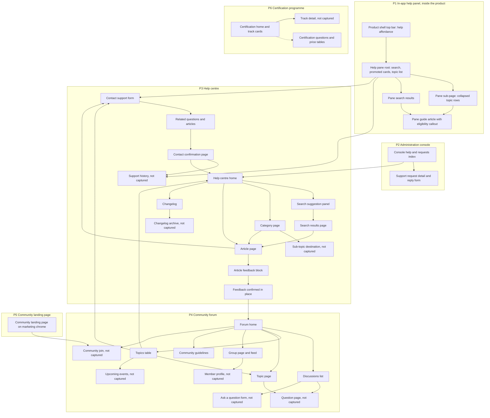

# Help & Community

Self-service support and peer-community surfaces: an in-product help panel, an administration-console support-request thread, a public help centre, a public community forum, a community landing page hosted on the marketing property, and a public certification programme.

[Workflow Catalog](README.md)

## Purpose

This area covers everything a person reaches when they want **help with the product or contact with other people who use it**. It is encountered from three directions: from inside the authenticated application, from inside the administration console, and from the open web with no session at all.

Six surface families sit in this area. They are separate builds with separate chrome, and the catalog treats them as such:

| Key | Surface family | Chrome | Session |
|---|---|---|---|
| **P1** | In-app help panel | The product shell's own chrome, with the panel docked into the content region [frame 705](../../screenshots/Slack%20web%20Jul%202024%20705.png) | Authenticated |
| **P2** | Administration console — help and support requests | The console's own top bar and left navigation [frame 711](../../screenshots/Slack%20web%20Jul%202024%20711.png) | Authenticated, administrative |
| **P3** | Help centre | Its own public chrome: a help-centre wordmark, a help search affordance, a contact affordance and a sign-up affordance [frame 946](../../screenshots/Slack%20web%20Jul%202024%20946.png) | None required to read |
| **P4** | Community forum | Its own public chrome: a product wordmark with a parent-company attribution line, four navigation entries, a search affordance and a log-in affordance [frame 900](../../screenshots/Slack%20web%20Jul%202024%20900.png) | None required to read; commenting is gated [frame 917](../../screenshots/Slack%20web%20Jul%202024%20917.png) |
| **P5** | Community landing page | The **marketing property's** top navigation, not the forum's [frame 897](../../screenshots/Slack%20web%20Jul%202024%20897.png) — the page is about the community but is built on the marketing site | None |
| **P6** | Certification programme | Its own public chrome: a certification wordmark, a locale affordance, a search affordance and a sign-in affordance [frame 936](../../screenshots/Slack%20web%20Jul%202024%20936.png) | None required to read |

**Depth calibration.** These are support and community properties, so the register here is *page structure and information architecture* — page types, ordered section stacks, region and column composition, navigation models, and the mechanics of the interactive controls. Decorative copy is described by role and never transcribed. The one place this document goes to full behavioural depth is the **article-feedback validation contract** and the **contact-support validation contract**, because both are behaviour rather than decoration and both are directly observed end to end.

## Flows in this area

Flow identifiers are contiguous across all six properties. The **Property** column is the fastest way to tell the families apart; every other section in this document labels its items the same way.

| Flow | Name | Frame span | Primary entry point | Property |
|---|---|---|---|---|
| 20.1 | Use the in-app help panel | 705–710 | The help affordance at the far trailing edge of the product shell's top bar [frame 705](../../screenshots/Slack%20web%20Jul%202024%20705.png) | P1 |
| 20.2 | Review and reply to a support request in the administration console | 711–713 | The console's help destination [frame 711](../../screenshots/Slack%20web%20Jul%202024%20711.png) | P2 |
| 20.3 | Read the help-centre changelog | 880–882 | A changelog link in a site footer link grid [frame 965](../../screenshots/Slack%20web%20Jul%202024%20965.png) | P3 |
| 20.4 | Read the community landing page | 897–899 | The marketing property's navigation [frame 897](../../screenshots/Slack%20web%20Jul%202024%20897.png) | P5 |
| 20.5 | Explore the community forum home and its navigation menus | 900–902 | The forum's own home destination [frame 900](../../screenshots/Slack%20web%20Jul%202024%20900.png) | P4 |
| 20.6 | Browse forum discussions | 903 | The discussions tab on the forum home [frame 903](../../screenshots/Slack%20web%20Jul%202024%20903.png) | P4 |
| 20.7 | Browse and search forum topics | 904–907 | The topics tab on the forum home [frame 905](../../screenshots/Slack%20web%20Jul%202024%20905.png) | P4 |
| 20.8 | Sort and filter questions on a forum topic page | 908–915 | A topic entry in the topics navigation menu [frame 901](../../screenshots/Slack%20web%20Jul%202024%20901.png) | P4 |
| 20.9 | Read a forum group page and its feed | 916–917 | The groups navigation entry [frame 916](../../screenshots/Slack%20web%20Jul%202024%20916.png) | P4 |
| 20.10 | Read the community guidelines | 918–920 | The guidelines destination, reached from the navigation overflow entry [frame 918](../../screenshots/Slack%20web%20Jul%202024%20918.png) | P4 |
| 20.11 | Explore the certification programme | 936–938 | The certification property's home [frame 936](../../screenshots/Slack%20web%20Jul%202024%20936.png) | P6 |
| 20.12 | Read the certification frequently-asked questions | 939–941 | An anchor list on the certification property [frame 940](../../screenshots/Slack%20web%20Jul%202024%20940.png) | P6 |
| 20.13 | Arrive on the help-centre home | 942–943 | The help centre's root [frame 942](../../screenshots/Slack%20web%20Jul%202024%20942.png) | P3 |
| 20.14 | Search the help centre | 944–945 | The search affordance in the help-centre hero or top bar [frame 944](../../screenshots/Slack%20web%20Jul%202024%20944.png) | P3 |
| 20.15 | Read a help-centre article | 946–949 | An article link from a category page or a search result [frame 946](../../screenshots/Slack%20web%20Jul%202024%20946.png) | P3 |
| 20.16 | Submit article feedback | 950–952 | The feedback block at the foot of an article [frame 950](../../screenshots/Slack%20web%20Jul%202024%20950.png) | P3 |
| 20.17 | Browse help-centre categories | 953–957 | A category cell on the help-centre home [frame 954](../../screenshots/Slack%20web%20Jul%202024%20954.png) | P3 |
| 20.18 | Contact support through the help centre | 958–965 | The contact affordance in the help-centre top bar [frame 958](../../screenshots/Slack%20web%20Jul%202024%20958.png) | P3 |

> **Partial capture:** the corpus captures each of these pages as a viewport onto a scrolling page rather than as a whole page. Where a region falls below the captured viewport it is marked in the flow that owns it, and no content below the fold is described unless a later frame in the same flow shows it.

## Flow 20.1 — Use the in-app help panel

### Overview

Inside the authenticated product, help is a **docked pane** rather than a separate destination: the shell stays fully visible and the pane takes a trailing slice of the content region. The pane is a small navigable site of its own — a root page offering search, a promoted-content carousel and a topic list; group sub-pages; a full guide article; and a footer that routes out to support-request history and to the contact flow.

### Trigger

The **help affordance** — a question-mark-in-a-circle control at the far trailing edge of the shell's top bar [frame 705](../../screenshots/Slack%20web%20Jul%202024%20705.png).

### Preconditions

An authenticated session with a workspace open, since the pane is rendered inside the product shell [frame 705](../../screenshots/Slack%20web%20Jul%202024%20705.png).

### Frame-by-frame steps

| Step | Frame(s) | What the user does | What changes on screen | Component(s) involved |
|---|---|---|---|---|
| 1 | [frame 705](../../screenshots/Slack%20web%20Jul%202024%20705.png) | Activates the help affordance in the shell's top bar | A pane docks into the trailing side of the content region, titled for help, with a header action cluster of a keyboard-shortcuts control, a promotions control and a dismiss control; the shell is otherwise untouched | `C-TOP-BAR`, `C-DETAILS-PANE` |
| 2 | [frame 705](../../screenshots/Slack%20web%20Jul%202024%20705.png) | Reads the pane's root page | Four labelled regions stack down the pane: a search field with a leading search glyph and a prompting placeholder; a promoted-content region with a pager readout showing the current card position out of the total, presenting cards that each carry a title, a supporting line and a thumbnail with a newness badge; a topic region listing five bordered rows each with a leading illustration tile and a title; and a further category region whose contents are clipped by the pane's lower boundary | `C-DETAILS-PANE`, `C-CONTENT-CAROUSEL`, `C-PAGER`, `C-MEDIA-PLAYER` |
| 3 | [frame 705](../../screenshots/Slack%20web%20Jul%202024%20705.png) | Reads the pane's footer | A footer action row is pinned at the pane's foot: a leading link carrying an external-link glyph that routes to support-request history, and a trailing outlined button that routes to the contact flow | `C-DETAILS-PANE` |
| 4 | [frame 707](../../screenshots/Slack%20web%20Jul%202024%20707.png) | Opens one of the topic rows | The pane replaces its root page with a sub-page: the header's two leading glyph controls are replaced by a **back chevron** before the title, the dismiss control is retained, and the body becomes a sub-page heading above a list of four disclosure rows, each with a leading collapsed-disclosure triangle and a link-styled title. The footer action row is **absent** on sub-pages | `C-DETAILS-PANE`, `C-DISCLOSURE-CARD-LIST` |
| 5 | [frame 709](../../screenshots/Slack%20web%20Jul%202024%20709.png) | Types into the pane's search field | The field gains a trailing clear control and retains its leading search glyph; the promoted-content region and the topic list are replaced by a flat vertical list of result rows, each with a leading document glyph and a link-styled title, with the **first row rendered in a filled selected treatment**. No result count and no filters are offered, and the list is clipped by the pane's lower boundary | `C-DETAILS-PANE`, `C-TYPEAHEAD-PANEL` |
| 6 | [frame 710](../../screenshots/Slack%20web%20Jul%202024%20710.png) | Opens a guide article | The pane shows the article: a title with a trailing copy-link glyph; an **eligibility callout** card headed by a who-can-use-this question, containing a person-glyph row stating which roles may create and which may use the feature (role tokens as inline links) and a flag-glyph row stating plan availability (the plan token as an inline link); then body copy with inline links, a further section heading, and a bulleted list whose items carry inline links. The article is clipped by the pane's lower boundary | `C-DETAILS-PANE` |

> **Partial capture:** frames 706 and 708 continue this flow inside the same pane; their per-frame captions are in [the coverage ledger](_screenshot-index.md). Every region named above is clipped at the pane's lower boundary, and the pane's own scrolling behaviour is not captured.

## Flow 20.2 — Review and reply to a support request in the administration console

### Overview

The administration console carries its own help destination, and that destination doubles as **support-request tracking**: it lists the requests raised from this workspace, links out to the public help centre, embeds a search entry into it, and opens each request as a read view of the submitted form plus a reply form. The catalog assigns this journey to this area rather than to administration because the goal is support.

### Trigger

The console's help destination, reachable both from the console's own top-bar destination cluster and from a help row in the console's left navigation [frame 711](../../screenshots/Slack%20web%20Jul%202024%20711.png), [frame 713](../../screenshots/Slack%20web%20Jul%202024%20713.png).

### Preconditions

An authenticated administrative session in the console, since the page is rendered inside the console chrome [frame 711](../../screenshots/Slack%20web%20Jul%202024%20711.png).

### Frame-by-frame steps

| Step | Frame(s) | What the user does | What changes on screen | Component(s) involved |
|---|---|---|---|---|
| 1 | [frame 711](../../screenshots/Slack%20web%20Jul%202024%20711.png) | Opens the console's help destination | The console renders a page whose title carries a leading glyph, then a requests heading with a **primary contact action right-aligned on the same row**, then a bordered card listing the workspace's support requests | `C-CONSOLE-TOP-BAR`, `C-CONSOLE-NAV` |
| 2 | [frame 711](../../screenshots/Slack%20web%20Jul%202024%20711.png) | Reads the request row | The row shows a link-styled subject line, a trailing status line pairing an open state with an elapsed-time reading, and beneath the subject a truncated preview of the request's field values that begins with a request number and ends in an ellipsis | — |
| 3 | [frame 711](../../screenshots/Slack%20web%20Jul%202024%20711.png) | Reads the help-centre card below | A second bordered card carries a lead line with an inline link out to the public help centre, a bulleted list of six category links matching the help centre's own topic navigation, and a search row pairing a wide free-text input carrying example queries with a primary search action | `C-SEARCH-ENTRY` |
| 4 | [frame 712](../../screenshots/Slack%20web%20Jul%202024%20712.png) | Opens the request | The page becomes a single bordered card: the subject as a first-level heading, a secondary line giving a request-type label and a numeric request identifier, an author line pairing a display name with a relative timestamp, then a vertical list of label-over-value field pairs — given name, family name, an email value rendered as a mail link, organisation, role, an organisation-size range, region, country and a URL rendered as a link — continuing below the captured viewport | `C-DATA-TABLE` |
| 5 | [frame 713](../../screenshots/Slack%20web%20Jul%202024%20713.png) | Scrolls to the foot of the request | The remaining field pairs resolve to opaque account and workspace identifiers; the console's left navigation **scrolls with the page** and reveals a third navigation group whose rows include a help row and a developer-platform row carrying an external-link glyph, closing with an attribution line | `C-CONSOLE-NAV` |
| 6 | [frame 713](../../screenshots/Slack%20web%20Jul%202024%20713.png) | Reads the reply form | Below a divider: a bold comment label above a multi-line input with a corner resize affordance; a bold label marking attachments **optional** above a dashed-border drop zone whose body pairs a drag-and-drop instruction with a browse-for-a-file link on its own line; and a primary reply action right-aligned beneath. There is **no character counter, no human-verification widget, and the primary action is not disabled** | `C-MODAL-SHELL` is not used here; the form is inline in the card |

## Flow 20.3 — Read the help-centre changelog

### Overview

Product release notes are published as a **help-centre article** rather than as a separate property: same public chrome, same hero, same topic navigation, same in-article navigation rail — but the rail indexes **time periods** rather than article sections, and the body is grouped by date.

### Trigger

A changelog link in a site footer link grid [frame 965](../../screenshots/Slack%20web%20Jul%202024%20965.png), or the breadcrumb's recent-updates crumb [frame 880](../../screenshots/Slack%20web%20Jul%202024%20880.png).

### Preconditions

None. The page reads without a session, while still offering a sign-up affordance in its top bar [frame 880](../../screenshots/Slack%20web%20Jul%202024%20880.png).

### Frame-by-frame steps

| Step | Frame(s) | What the user does | What changes on screen | Component(s) involved |
|---|---|---|---|---|
| 1 | [frame 880](../../screenshots/Slack%20web%20Jul%202024%20880.png) | Opens the changelog | The help centre's public chrome renders with a hero band carrying a page title and a one-line lead, and the six-entry topic navigation at the hero's base with **no entry active** — the changelog sits outside the category tree | The help centre's public bar, described in `## Screens & components`; it is not the in-product `C-TOP-BAR` |
| 2 | [frame 880](../../screenshots/Slack%20web%20Jul%202024%20880.png) | Reads the breadcrumb | Beneath the hero, two link crumbs separated by a chevron glyph locate the page under the help-centre root | — |
| 3 | [frame 880](../../screenshots/Slack%20web%20Jul%202024%20880.png) | Reads the article column | A two-column area opens: an in-body first-level title, a lead line closing with an emoji glyph, a date-grouped section heading with an underline rule, a feature sub-heading, and a full-width illustrative image card in a tinted frame | — |
| 4 | [frame 880](../../screenshots/Slack%20web%20Jul%202024%20880.png) | Reads the in-article rail | The trailing rail card lists three entries whose labels are time periods and an archive entry, with the **first entry active** — rendered here with a **filled highlight band and light text**, a different active treatment from the article rail described in flow 20.15 | — |

> **Partial capture:** frames 881 and 882 continue the same page below the fold; their captions are in [the coverage ledger](_screenshot-index.md). The archive destination and the earlier time-period sections are named by the rail but are not captured.

## Flow 20.4 — Read the community landing page

### Overview

The community is *marketed* from the marketing property and *inhabited* on the forum property. This flow covers the marketing-hosted landing page: it wears the marketing top navigation, presents the community's value proposition with an embedded video, and routes to the forum through a join call to action.

### Trigger

The marketing property's navigation, whose resources menu label is one of its five entries [frame 897](../../screenshots/Slack%20web%20Jul%202024%20897.png). **Inferred:** that menu is a plausible route to this page, because the page is built on the marketing chrome and the menu is the only marketing navigation entry whose subject would cover community content; the corpus does not capture the menu opened, so the route itself is not evidenced.

### Preconditions

None; the page is public and offers sign-in and get-started affordances rather than requiring a session [frame 897](../../screenshots/Slack%20web%20Jul%202024%20897.png).

### Frame-by-frame steps

| Step | Frame(s) | What the user does | What changes on screen | Component(s) involved |
|---|---|---|---|---|
| 1 | [frame 897](../../screenshots/Slack%20web%20Jul%202024%20897.png) | Opens the landing page | The **marketing** top navigation renders: a product wordmark with a parent-company attribution line, five navigation entries of which three carry chevrons, then a search glyph control, a text sign-in link, an outlined sales-contact action and a filled get-started action. This is the marketing property's bar, documented in `17-marketing-site.md`, and it is neither the forum's bar nor the help centre's | — |
| 2 | [frame 897](../../screenshots/Slack%20web%20Jul%202024%20897.png) | Reads the hero | A two-column hero: the leading column stacks a small-caps eyebrow label, a two-line first-level heading, a supporting paragraph and a filled primary join action; the trailing column holds an embedded video player | `C-MEDIA-PLAYER` |
| 3 | [frame 897](../../screenshots/Slack%20web%20Jul%202024%20897.png) | Inspects the player | The player shows an illustrated frame and a control bar: a play control and an elapsed-over-total time readout at the leading edge, then a muted-audio toggle, a fullscreen control and an overflow control at the trailing edge, above a progress bar with a filled portion | `C-MEDIA-PLAYER` |
| 4 | [frame 897](../../screenshots/Slack%20web%20Jul%202024%20897.png) | Scrolls to the value section | A centred section heading and supporting line introduce a row of **four value columns**, each stacking a small illustration glyph, a bold single-word heading and a supporting paragraph, **left-aligned and without borders**. The same four value labels appear on the forum home as **centred bordered cards with large illustrations** — the two surfaces render the same content differently, and this document records the difference rather than reconciling it | — |

> **Partial capture:** frames 898 and 899 continue this page below the fold; their captions are in [the coverage ledger](_screenshot-index.md). The join action's destination is not captured.

## Flow 20.5 — Explore the community forum home and its navigation menus

### Overview

The forum's home page orients a newcomer and then hands off to the two content taxonomies that fill the rest of the property. Its navigation bar carries menu-bearing entries whose panels enumerate the taxonomy without leaving the page.

### Trigger

The forum property's home destination — the first navigation entry, which is rendered active on this page [frame 900](../../screenshots/Slack%20web%20Jul%202024%20900.png).

### Preconditions

None. The page reads without a session and offers a log-in affordance and a join call to action instead [frame 900](../../screenshots/Slack%20web%20Jul%202024%20900.png).

### Frame-by-frame steps

| Step | Frame(s) | What the user does | What changes on screen | Component(s) involved |
|---|---|---|---|---|
| 1 | [frame 900](../../screenshots/Slack%20web%20Jul%202024%20900.png) | Arrives on the forum home | The forum's own bar renders on a light surface: a product wordmark with a parent-company attribution line beneath it at the leading edge; four navigation entries — a home entry **rendered active with an underline beneath its label**, a topics entry with a trailing chevron, a groups entry with a trailing chevron, and a guidelines entry with no chevron; then a search input whose placeholder is generic and which carries a product mark **inside** the field at its trailing edge; then a filled log-in action | `C-SEARCH-ENTRY` is the in-product entry and is not reused here — see the public search variants in `## Screens & components` |
| 2 | [frame 900](../../screenshots/Slack%20web%20Jul%202024%20900.png) | Reads the hero | A full-bleed hero band in the dark brand tone carries an illustrative background with scattered geometric motifs in several accent tones, and centred content: a first-level site title, a tagline line, and a light-filled primary join action | — |
| 3 | [frame 900](../../screenshots/Slack%20web%20Jul%202024%20900.png) | Scrolls past the hero | A centred three-line welcome paragraph occupies roughly the middle half of the content width, followed by a row of **four value cards** of uniform width, each stacking a large flat illustration, a short single-word heading and a supporting paragraph, all centred | — |
| 4 | [frame 900](../../screenshots/Slack%20web%20Jul%202024%20900.png) | Reaches the content region's header | A tab pair sits at the leading edge — a discussions tab **active**, rendered emboldened with an underline, and an inactive topics tab — and at the **trailing edge of the same band** a labelled preferred-language select showing a language value with a trailing chevron. The region beneath the tabs is clipped by the captured viewport | `C-TAB-BAR`, `C-DROPDOWN-MENU` |
| 5 | [frame 901](../../screenshots/Slack%20web%20Jul%202024%20901.png) | Opens the topics navigation entry | The entry's chevron flips upward and a panel anchors beneath it, aligned to the entry's leading edge, on a light surface with a soft shadow, overlaying the hero. The panel lists **eight** plain-text rows separated by hairlines, with no glyphs and no counts. The home entry **keeps its active underline while a different menu is open**, so the active state and the open state are independent | `C-DROPDOWN-MENU` |

> **Partial capture:** frame 902 continues this flow with the groups navigation menu; its caption is in [the coverage ledger](_screenshot-index.md). None of the eight topic destinations named in the panel is captured from this entry point.

## Flow 20.6 — Browse forum discussions

### Overview

The discussions tab is the forum's question list. It is the surface that establishes the **question row anatomy** reused on topic pages, and it pairs a sort control with a filter control and a persistent ask-a-question action.

### Trigger

The discussions tab, which is the default active tab on the forum home [frame 900](../../screenshots/Slack%20web%20Jul%202024%20900.png), [frame 903](../../screenshots/Slack%20web%20Jul%202024%20903.png).

### Preconditions

None to read. Asking a question is offered as an action but its form is not captured [frame 903](../../screenshots/Slack%20web%20Jul%202024%20903.png).

### Frame-by-frame steps

| Step | Frame(s) | What the user does | What changes on screen | Component(s) involved |
|---|---|---|---|---|
| 1 | [frame 903](../../screenshots/Slack%20web%20Jul%202024%20903.png) | Scrolls the forum home to the discussions region | A two-column region resolves: a wide leading list column occupying roughly the leading half of the viewport width, and a narrower trailing sidebar column | — |
| 2 | [frame 903](../../screenshots/Slack%20web%20Jul%202024%20903.png) | Reads the list toolbar | A sort label sits above a select carrying the current sort value and a trailing chevron; at the **trailing edge of the same row** an outlined icon button bearing a funnel glyph offers filtering with no accompanying label | `C-DROPDOWN-MENU`, `C-FILTER-CHIP` is not used here — the filter is an icon button, not a chip |
| 3 | [frame 903](../../screenshots/Slack%20web%20Jul%202024%20903.png) | Reads the question rows | Ten hairline-separated rows render, the last clipped. Each row is a link-styled question title that wraps to a second line and is **truncated with an ellipsis** beyond that; a metadata line pairing the topic name, the author handle and a timestamp; and a trailing cluster carrying an **optional answered badge** (a check-in-circle glyph with a label in a distinguishing treatment, present on some rows and absent on others), a view metric with an eye glyph, an upvote metric with an upward chevron, and a reply metric with a speech-bubble glyph | — |
| 4 | [frame 903](../../screenshots/Slack%20web%20Jul%202024%20903.png) | Compares the metadata lines | Timestamps appear in **two forms in the same list** — absolute date-and-time values on some rows and relative-age values on others — and **zero-valued metrics are rendered as an explicit zero** rather than suppressed. Large view counts are abbreviated with a thousands suffix | — |
| 5 | [frame 903](../../screenshots/Slack%20web%20Jul%202024%20903.png) | Reads the sidebar | The sidebar stacks the labelled preferred-language select and, beneath it, a **full-width filled primary ask-a-question action** | `C-DROPDOWN-MENU` |

> **Partial capture:** the question list continues below the captured viewport, no pagination control is visible on this surface, and the ask-a-question form is not captured. No individual question page is captured anywhere in the corpus.

## Flow 20.7 — Browse and search forum topics

### Overview

The topics tab is the forum's second taxonomy. It nests a **second-level tab pair** inside the first, exposes a large topic catalogue through a paginated two-column table with its own search field, and is the surface at which the forum's own footer becomes visible.

### Trigger

The topics tab in the forum home's content region [frame 905](../../screenshots/Slack%20web%20Jul%202024%20905.png).

### Preconditions

None [frame 905](../../screenshots/Slack%20web%20Jul%202024%20905.png).

### Frame-by-frame steps

| Step | Frame(s) | What the user does | What changes on screen | Component(s) involved |
|---|---|---|---|---|
| 1 | [frame 905](../../screenshots/Slack%20web%20Jul%202024%20905.png) | Activates the topics tab | The tab pair swaps its active mark to the topics tab, and the content region becomes a single bordered panel | `C-TAB-BAR` |
| 2 | [frame 905](../../screenshots/Slack%20web%20Jul%202024%20905.png) | Reads the nested tabs | A **second-level boxed tab pair** sits at the panel's top-leading corner; the active tab takes the panel's own surface while the inactive tab sits on a light grey backing | `C-TAB-BAR` |
| 3 | [frame 905](../../screenshots/Slack%20web%20Jul%202024%20905.png) | Reads the panel header | A square glyph tile sits at the leading edge with a **range-and-total readout** beneath it stating which slice of the catalogue is shown and how many topics exist in total; a search input with a topic-scoped placeholder sits at the trailing edge | — |
| 4 | [frame 905](../../screenshots/Slack%20web%20Jul%202024%20905.png) | Reads the table | Two columns render: a name column whose header carries a chevron sort affordance, and a numeric column headed by a participant count. Ten body rows follow; name cells are links and count cells are plain integers with **zero rendered explicitly**. Topic names in the non-featured tab are arbitrary member-authored strings | `C-DATA-TABLE` |
| 5 | [frame 905](../../screenshots/Slack%20web%20Jul%202024%20905.png), [frame 906](../../screenshots/Slack%20web%20Jul%202024%20906.png) | Reads the pagination footer | A footer row pairs a page-of-total readout with a previous-and-next chevron button pair at its trailing side. The capture shows the first page and **does not distinguish a disabled previous control** — both buttons carry the same treatment | `C-PAGER` |
| 6 | [frame 906](../../screenshots/Slack%20web%20Jul%202024%20906.png) | Scrolls past the table | The forum's **own footer** renders in three columns — a product logo mark above a descriptive paragraph; a small-caps quick-links heading above seven links each prefixed with a chevron glyph, two of which route into the help centre; and a small-caps social heading above a hashtag line and four social-platform icon links — followed by a light-tinted legal bar pairing a copyright line at the leading edge with a privacy-choices control that couples a consent glyph to a link label | — |

> **Partial capture:** frames 904 and 907 continue this flow; their captions are in [the coverage ledger](_screenshot-index.md). The featured sub-tab's contents, the topic-search results, any page beyond the first, and four of the seven quick-link destinations are not captured.

## Flow 20.8 — Sort and filter questions on a forum topic page

### Overview

A topic page is the forum's richest read surface: a titled hero, the question list, and a sidebar carrying engagement statistics, a follow action and a related-topics list. It is also the only place in this area where a **complete asynchronous re-sort** is captured end to end — menu open, region-scoped skeleton, repainted list.

### Trigger

A topic entry, reachable from the topics navigation menu [frame 901](../../screenshots/Slack%20web%20Jul%202024%20901.png) or from a related-topics row on another topic page [frame 908](../../screenshots/Slack%20web%20Jul%202024%20908.png).

### Preconditions

None to read. Following is offered as an action but its authenticated outcome is not captured [frame 908](../../screenshots/Slack%20web%20Jul%202024%20908.png).

### Frame-by-frame steps

| Step | Frame(s) | What the user does | What changes on screen | Component(s) involved |
|---|---|---|---|---|
| 1 | [frame 908](../../screenshots/Slack%20web%20Jul%202024%20908.png) | Opens a topic page | The forum bar renders with a **changed navigation set**: the home, topics and groups entries persist — topics now **active with an underline** — and the guidelines entry is replaced by an **overflow entry carrying a chevron**. A hero band in the dark brand tone carries a small eyebrow label above a large topic-name heading, both aligned to the leading edge | `C-DROPDOWN-MENU` |
| 2 | [frame 908](../../screenshots/Slack%20web%20Jul%202024%20908.png) | Reads the leading column | A **single tab** labelled for discussions renders as an active one-entry tab bar, followed by the same sort-and-filter toolbar and the same question row anatomy established in flow 20.6 | `C-TAB-BAR` |
| 3 | [frame 908](../../screenshots/Slack%20web%20Jul%202024%20908.png) | Reads the sidebar | A statistics band pairs two stat blocks side by side, each a large numeral above a small label, separated by a vertical hairline; beneath it a trend-glyph line states how many members are discussing the topic; then a full-width filled follow action; then a related-topics block whose heading carries a trailing trend glyph and whose hairline-separated rows pair a link-styled topic name at the leading edge with a right-aligned count, **zero rendered explicitly** | — |
| 4 | [frame 910](../../screenshots/Slack%20web%20Jul%202024%20910.png) | Opens the sort select | The control gains a **focus ring** and a panel anchors beneath it, aligned to the control's leading edge, listing three options of which the current one carries a **leading check glyph** while the others are unglyphed but label-aligned. The panel overlays the first question row, and the list beneath is still in the previous order | `C-DROPDOWN-MENU` |
| 5 | [frame 911](../../screenshots/Slack%20web%20Jul%202024%20911.png) | Chooses a different sort option | The select shows the newly chosen value and **retains its focus ring**; the question list region is replaced by three tall bordered **placeholder cards**, each composed of a circular placeholder with two short bars beside it, then three bars of differing widths, a hairline divider, and a short leading bar with a short trailing bar. The placeholders are flat neutral grey and carry no text, and **every surrounding region keeps its real content** — the tab, the toolbar, and the whole sidebar including its counts | See the loading treatment in `21-states.md` |
| 6 | [frame 912](../../screenshots/Slack%20web%20Jul%202024%20912.png) | Waits for the reload | The list repaints under the new ordering, the focus ring is gone, and the sidebar is byte-for-byte the same as before the reload, confirming that only the list region reloaded. The repainted rows carry **no avatars**, so the skeleton's circular placeholder does not correspond to anything in the loaded row — this document records that mismatch rather than reconciling it | — |

> **Partial capture:** frames 909 and 913–915 continue this flow; their captions are in [the coverage ledger](_screenshot-index.md). The filter control's panel, the follow action's authenticated outcome, and any question page reached from a row are not captured.

## Flow 20.9 — Read a forum group page and its feed

### Overview

Groups are the forum's third structure: a membership object with an image, a visibility label, an owner, a description and a member roster, fronting a **social feed** of posts with tags, engagement counts and comment threads. This is the surface that shows the property's **unauthenticated gate** explicitly.

### Trigger

The groups navigation entry, which is rendered active on this page [frame 916](../../screenshots/Slack%20web%20Jul%202024%20916.png).

### Preconditions

None to read. Joining the group and commenting on a post are both offered but both require a session [frame 916](../../screenshots/Slack%20web%20Jul%202024%20916.png), [frame 917](../../screenshots/Slack%20web%20Jul%202024%20917.png).

### Frame-by-frame steps

| Step | Frame(s) | What the user does | What changes on screen | Component(s) involved |
|---|---|---|---|---|
| 1 | [frame 916](../../screenshots/Slack%20web%20Jul%202024%20916.png) | Opens a group page | The forum bar renders with the groups entry active. **This page type has no hero band** — content begins directly beneath the bar, unlike the home, topic and guidelines pages | — |
| 2 | [frame 916](../../screenshots/Slack%20web%20Jul%202024%20916.png) | Reads the group header | A bordered card carries a large square group image tile at the leading edge; to its trailing side a small-caps visibility label above the group name as a first-level heading; and at the card's trailing-top corner an outlined join action with a leading plus glyph | — |
| 3 | [frame 916](../../screenshots/Slack%20web%20Jul%202024%20916.png) | Reads the feed toolbar | A sort label above a select at the leading edge; a feed-scoped search input with a leading search glyph in the middle; then an outlined filter icon button carrying a funnel glyph with a small chevron, and an outlined refresh icon button carrying a circular-arrow glyph, at the trailing edge | `C-DROPDOWN-MENU` |
| 4 | [frame 916](../../screenshots/Slack%20web%20Jul%202024%20916.png) | Reads the pinned post | The first post sits on a **tinted backing with a pin glyph at its leading edge**; its header pairs an avatar, an author link, a parenthesised role label and an edited-timestamp line; its body carries rich text with italic emphasis, paragraphs and a bulleted list, and is **truncated with a fade above an expand link** | `C-AVATAR` |
| 5 | [frame 916](../../screenshots/Slack%20web%20Jul%202024%20916.png) | Reads the details sidebar | A bordered group-details panel carries a panel title, a collapsible section header with a leading chevron, and hairline-separated label-over-value blocks — a description paragraph, an information block pairing an underlined lead line with a bulleted list of two links, and an owner block naming a member link. A second bordered panel carries a header row with a leading members glyph tile, a title whose **count is suffixed with a plus**, and a trailing collapse chevron; its body shows three member tiles side by side, each an avatar above a handle link, above a centred view-all link | `C-AVATAR` |
| 6 | [frame 917](../../screenshots/Slack%20web%20Jul%202024%20917.png) | Reads a post in full | Beneath the body: a row of outlined tag pills carrying link-styled labels; then an engagement action row pairing a like control, a comment control and a share control at the leading edge with a trailing metrics readout that couples a comment count and a view count by a middot | — |
| 7 | [frame 917](../../screenshots/Slack%20web%20Jul%202024%20917.png) | Reads the comments | A tinted comments region carries a line naming who liked the post with the member as a link; a more-comments link at the leading edge paired with an **N-of-M position readout** at the trailing edge; then a comment card on a light surface — avatar, author link, relative-age timestamp, body copy that **includes a preformatted code fragment rendered as monospace lines**, and a comment action row of like, reply and a like-count readout separated by middots | `C-AVATAR` |
| 8 | [frame 917](../../screenshots/Slack%20web%20Jul%202024%20917.png) | Attempts to comment | A **centred filled log-in-to-comment action** closes the comments region. The gate is rendered **once per post, not once per page** — the following post carries its own. At the feed's foot a centred outlined view-more action extends the feed by progressive disclosure | — |
| 9 | [frame 917](../../screenshots/Slack%20web%20Jul%202024%20917.png) | Compares the two posts' metrics | The second post's engagement row shows a view count only and **omits its zero comment count**, whereas the question list in flow 20.6 renders zero-valued metrics explicitly. The two surfaces disagree, and this document records the disagreement | — |

> **Partial capture:** the groups index that would list groups, any member profile behind a handle link, the view-all roster, the expanded post, and the destination of the log-in action are all not captured.

## Flow 20.10 — Read the community guidelines

### Overview

The guidelines page states the terms of participation. Structurally it is the property's simplest page type: hero, a centred introduction, then a stack of alternating text-and-illustration blocks.

### Trigger

The guidelines destination. On the forum home it is a **top-level navigation entry** [frame 900](../../screenshots/Slack%20web%20Jul%202024%20900.png); on the guidelines page itself the bar instead marks the **overflow entry** active [frame 918](../../screenshots/Slack%20web%20Jul%202024%20918.png). The corpus therefore shows the same destination sitting at two different levels of the navigation on two different pages; the record is preserved as captured rather than reconciled.

### Preconditions

None [frame 918](../../screenshots/Slack%20web%20Jul%202024%20918.png).

### Frame-by-frame steps

| Step | Frame(s) | What the user does | What changes on screen | Component(s) involved |
|---|---|---|---|---|
| 1 | [frame 918](../../screenshots/Slack%20web%20Jul%202024%20918.png) | Opens the guidelines | The forum bar renders with the **overflow entry active and underlined** while the guidelines entry is absent from the top level; a hero band in the dark brand tone carries a large page title aligned to the leading edge and vertically centred | `C-DROPDOWN-MENU` |
| 2 | [frame 918](../../screenshots/Slack%20web%20Jul%202024%20918.png) | Reads the introduction | On a light surface, a centred three-line paragraph occupying roughly the middle half of the content width states that participation is conditional on adhering to the guidelines | — |
| 3 | [frame 918](../../screenshots/Slack%20web%20Jul%202024%20918.png) | Reads the first guideline block | A two-column block pairs a leading text column — a section heading above a supporting paragraph — with a trailing illustration column carrying a large flat illustration | — |

> **Partial capture:** frames 919 and 920 continue the block stack below the fold; their captions are in [the coverage ledger](_screenshot-index.md). Whether the blocks alternate their column order is not established by the captured frame.

## Flow 20.11 — Explore the certification programme

### Overview

Certification is a **fourth public property** with its own chrome and its own commercial content. Its home page is a card grid of programme tracks; the property also carries a directory call to action and an anchored question index.

### Trigger

The certification property's home [frame 936](../../screenshots/Slack%20web%20Jul%202024%20936.png). **Inferred:** a community topic label naming certification appears in the forum's topics menu [frame 901](../../screenshots/Slack%20web%20Jul%202024%20901.png), so the forum is a plausible route; no frame captures the traversal.

### Preconditions

None to read; the property offers a sign-in affordance rather than requiring a session [frame 936](../../screenshots/Slack%20web%20Jul%202024%20936.png).

### Frame-by-frame steps

| Step | Frame(s) | What the user does | What changes on screen | Component(s) involved |
|---|---|---|---|---|
| 1 | [frame 936](../../screenshots/Slack%20web%20Jul%202024%20936.png) | Opens the certification home | A light top bar renders: a certification wordmark at the leading edge, then a **locale affordance rendered as a globe glyph**, a search input with a leading search glyph and a generic placeholder, and a filled sign-in action at the trailing edge | — |
| 2 | [frame 936](../../screenshots/Slack%20web%20Jul%202024%20936.png) | Reads the title block | **This property has no hero band.** A centred title block sits directly on the light surface: a very large first-level heading above a one-line supporting lead | — |
| 3 | [frame 936](../../screenshots/Slack%20web%20Jul%202024%20936.png) | Reads the track grid | A card grid renders three cards per row. Each card is bordered and elevated and stacks a full-bleed illustration panel in its own tint across roughly the card's top two-fifths, a card heading, a supporting paragraph, and a footer action | `C-TEMPLATE-CARD` |
| 4 | [frame 936](../../screenshots/Slack%20web%20Jul%202024%20936.png) | Compares the card footers | The first card's footer action is a **labelled link with a trailing forward-arrow glyph**; the second and third cards' footer actions are a **bare forward-arrow glyph with no label**. The inconsistency sits inside a single grid and is recorded rather than reconciled. A fourth card opens a second row aligned to the grid's **second** column rather than its first | — |

> **Partial capture:** frames 937 and 938 continue this property below the fold; their captions are in [the coverage ledger](_screenshot-index.md). No track detail page, no course page and no examination flow is captured.

## Flow 20.12 — Read the certification frequently-asked questions

### Overview

The certification property answers commercial questions in a long anchored article: section headings, bold question headings, prose answers, and **price tables** listing purchasable line items against amounts.

### Trigger

An anchor entry in the property's question index [frame 940](../../screenshots/Slack%20web%20Jul%202024%20940.png).

### Preconditions

None [frame 940](../../screenshots/Slack%20web%20Jul%202024%20940.png).

### Frame-by-frame steps

| Step | Frame(s) | What the user does | What changes on screen | Component(s) involved |
|---|---|---|---|---|
| 1 | [frame 940](../../screenshots/Slack%20web%20Jul%202024%20940.png) | Scrolls into the purchasing section | The certification top bar **stays pinned** and gains a hairline beneath it once the page scrolls; the content resolves into a single leading-aligned column occupying roughly the middle three-fifths of the viewport width | — |
| 2 | [frame 940](../../screenshots/Slack%20web%20Jul%202024%20940.png) | Reads the section and question headings | A second-level section heading introduces the group, then a bold question heading introduces the answer | — |
| 3 | [frame 940](../../screenshots/Slack%20web%20Jul%202024%20940.png) | Reads the price tables | Three tables render, each introduced by a bold group heading and composed of two-column rows: a line-item label at the leading edge and a **right-aligned amount carrying a currency-code prefix** at the trailing edge, with alternating row shading | `C-DATA-TABLE` |
| 4 | [frame 940](../../screenshots/Slack%20web%20Jul%202024%20940.png) | Reads the qualifying note | An italic note beneath the tables states an access-validity period, with the period itself emboldened inside the sentence | — |
| 5 | [frame 940](../../screenshots/Slack%20web%20Jul%202024%20940.png) | Reads the following answers | Further question-and-answer pairs follow the same shape; one names accepted card brands and a bulk-purchase threshold above which a commercial contact is directed instead of self-service checkout | — |

> **Partial capture:** frames 939 and 941 carry the anchor index and the maintenance section around this answer; their captions are in [the coverage ledger](_screenshot-index.md). No checkout, cart or payment surface is captured anywhere in this area.

## Flow 20.13 — Arrive on the help-centre home

### Overview

The help centre's home page is search-first: a hero whose primary control is a wide search input, a short list of common troubleshooting links, then a six-cell category grid, then curated shortcuts. Its top bar is **stateful** — transparent and search-free while it overlays the hero, opaque and search-bearing once the page scrolls.

### Trigger

The help centre's root, reachable from a help-centre link in a site footer link grid [frame 965](../../screenshots/Slack%20web%20Jul%202024%20965.png) and from a breadcrumb root crumb [frame 946](../../screenshots/Slack%20web%20Jul%202024%20946.png).

### Preconditions

None. Reading is open; the top bar offers a contact affordance and a sign-up affordance [frame 942](../../screenshots/Slack%20web%20Jul%202024%20942.png).

### Frame-by-frame steps

| Step | Frame(s) | What the user does | What changes on screen | Component(s) involved |
|---|---|---|---|---|
| 1 | [frame 942](../../screenshots/Slack%20web%20Jul%202024%20942.png) | Opens the help-centre home | A full-bleed hero band in the dark brand tone renders, decorated with large flat geometric shapes in several accent tones at its edges. The top bar is **overlaid on the hero and transparent**: a help-centre wordmark at the leading edge and a trailing pair of **outlined** actions — contact and sign-up — with **no search field in the bar** | — |
| 2 | [frame 942](../../screenshots/Slack%20web%20Jul%202024%20942.png) | Reads the hero | Centred inside the hero: a large greeting headline, then a **wide search input** with a leading search glyph and a placeholder giving example queries, then a label introducing common troubleshooting topics followed by three inline underlined topic links | — |
| 3 | [frame 942](../../screenshots/Slack%20web%20Jul%202024%20942.png) | Scrolls below the hero | On a light surface a category grid renders **three cells per row**, each cell stacking a large illustration, a heading and a supporting line. Cells are separated by **hairline dividers forming a grid** rather than by card borders or elevation | — |
| 4 | [frame 943](../../screenshots/Slack%20web%20Jul%202024%20943.png) | Continues scrolling | The top bar becomes **opaque and gains a search field**, so the bar's two forms are both observed on the same page. The grid's second row completes the six categories, with vertical hairlines between columns and a horizontal hairline above | — |
| 5 | [frame 943](../../screenshots/Slack%20web%20Jul%202024%20943.png) | Reads the featured-articles section | A heading with a leading trend glyph introduces a **three-column bulleted link grid of two rows**; each link label is partially emboldened to foreground its subject | — |
| 6 | [frame 943](../../screenshots/Slack%20web%20Jul%202024%20943.png) | Reads the tips section | A heading with a leading wand glyph introduces a row of three bordered tip cards, each pairing a leading function glyph with a short instructional line containing emboldened keyboard-shortcut tokens. Card heights are **content-driven and unequal** | — |

> **Partial capture:** the home page's footer falls below the captured viewport; the footer's structure is established instead by flows 20.16 and 20.18.

## Flow 20.14 — Search the help centre

### Overview

Help search is a **public, single-corpus search with no facets**: type-ahead suggestions with the matched token emboldened, then a results page that echoes the query, states a total, and renders each hit as a title, a match-highlighted snippet and a category label. It is a different system from the in-product search documented in `09-search-and-filters.md`, and the two are not merged here.

### Trigger

The search input in the help-centre hero [frame 944](../../screenshots/Slack%20web%20Jul%202024%20944.png), or the search field the top bar exposes once scrolled [frame 943](../../screenshots/Slack%20web%20Jul%202024%20943.png).

### Preconditions

None [frame 944](../../screenshots/Slack%20web%20Jul%202024%20944.png).

### Frame-by-frame steps

| Step | Frame(s) | What the user does | What changes on screen | Component(s) involved |
|---|---|---|---|---|
| 1 | [frame 944](../../screenshots/Slack%20web%20Jul%202024%20944.png) | Types a partial query into the hero search input | The placeholder is replaced by the typed text with a visible caret, and a suggestion panel opens **directly beneath the input, matching its width**, on a light surface with a soft shadow, overlaying the content below the hero | `C-TYPEAHEAD-PANEL` |
| 2 | [frame 944](../../screenshots/Slack%20web%20Jul%202024%20944.png) | Reads the suggestions | Three rows render, each a full article-title phrase in which **the matched query token is emboldened** and the remainder is regular weight. No leading glyphs, no grouping by type, and no row is keyboard-highlighted | `C-TYPEAHEAD-PANEL` |
| 3 | [frame 944](../../screenshots/Slack%20web%20Jul%202024%20944.png) | Reads the panel's last row | A final overflow row offers to see more results, carrying a **count-with-plus notation** and a trailing forward-arrow glyph | `C-TYPEAHEAD-PANEL` |
| 4 | [frame 945](../../screenshots/Slack%20web%20Jul%202024%20945.png) | Submits the query | A results page renders. The top bar is opaque and its two trailing actions are now **filled** rather than outlined. The hero is retained but its greeting is replaced by a **result-count line stating the total and echoing the query in quotation marks**, the search input **retains the submitted query**, and the six-entry topic navigation sits at the hero's base with **no entry active** | — |
| 5 | [frame 945](../../screenshots/Slack%20web%20Jul%202024%20945.png) | Reads the results | A single-column list occupies roughly the middle two-fifths of the viewport width. Each row stacks a link-styled article title; a snippet in which **every occurrence of the matched token carries a highlight background swatch and is emboldened**; and a small-caps category label in a de-emphasised treatment | — |
| 6 | [frame 945](../../screenshots/Slack%20web%20Jul%202024%20945.png) | Looks for refinement controls | There are **none**: no facet filters, no sort control, no result-type tabs and no pagination are present on the results page | — |

> **Partial capture:** the results list continues below the captured viewport, and no zero-result state for help search is captured.

## Flow 20.15 — Read a help-centre article

### Overview

An article page is a **two-column read surface**: a wider article column of heading-and-body blocks interleaved with callouts and numbered-step cards, and a narrower **in-article navigation rail** that indexes the article's sections and tracks the reader's position. The rail's tracking behaviour is captured directly at three scroll positions.

### Trigger

An article link from a category page [frame 954](../../screenshots/Slack%20web%20Jul%202024%20954.png), a search result [frame 945](../../screenshots/Slack%20web%20Jul%202024%20945.png), or a featured-articles link [frame 943](../../screenshots/Slack%20web%20Jul%202024%20943.png).

### Preconditions

None [frame 946](../../screenshots/Slack%20web%20Jul%202024%20946.png).

### Frame-by-frame steps

| Step | Frame(s) | What the user does | What changes on screen | Component(s) involved |
|---|---|---|---|---|
| 1 | [frame 946](../../screenshots/Slack%20web%20Jul%202024%20946.png) | Opens an article | The top bar renders opaque with the wordmark leading, a search field, and the contact and sign-up actions trailing. A hero band carries the owning category's title and a lead line aligned to the leading edge at roughly one-fifth of the viewport width | — |
| 2 | [frame 946](../../screenshots/Slack%20web%20Jul%202024%20946.png) | Reads the topic navigation | Six entries sit at the hero's base; the **active entry is rendered as a raised light tab that breaks out of the band's lower edge**, its surface matching the page body beneath | `C-TAB-BAR` |
| 3 | [frame 946](../../screenshots/Slack%20web%20Jul%202024%20946.png) | Reads the breadcrumb | Beneath the hero, three crumbs locate the article: the help-centre root, the category, then the sub-category | — |
| 4 | [frame 946](../../screenshots/Slack%20web%20Jul%202024%20946.png) | Reads the article's opening | The article column carries a first-level title and an intro line, then a **note callout card** bearing a pencil glyph and a bold note label, then a section heading with an underline rule, then a **bordered card containing numbered steps with filled circular badges** and inline links | — |
| 5 | [frame 946](../../screenshots/Slack%20web%20Jul%202024%20946.png) | Reads the in-article rail | The trailing rail card is titled as an in-this-article index, separated from its entries by a hairline, and lists **three** entries. At the top of the article **no entry is marked active** | — |
| 6 | [frame 947](../../screenshots/Slack%20web%20Jul%202024%20947.png) | Scrolls into the second section | The rail's **second** entry becomes active while the rail stays pinned near the top of the viewport and the article column scrolls beneath it. The article renders a section heading with a rule, a bordered numbered-step card whose copy carries emboldened interface labels and an inline icon reference within a step, then a **tip callout** — a tinted card with a leading wand glyph and a bold tip label, **visually distinct in both tint and glyph from the note callout** — then a troubleshooting heading with a rule and a question-and-answer pair | — |
| 7 | [frame 949](../../screenshots/Slack%20web%20Jul%202024%20949.png) | Scrolls to the article's foot | The rail's **third** entry is active. The article closes with further question-and-answer blocks, then a **centred feedback prompt carrying a pencil glyph** that asks whether the article helped and offers a yes control and a no control | — |
| 8 | [frame 946](../../screenshots/Slack%20web%20Jul%202024%20946.png), [frame 947](../../screenshots/Slack%20web%20Jul%202024%20947.png), [frame 949](../../screenshots/Slack%20web%20Jul%202024%20949.png) | Compares the rail across the scroll | Across the three positions the rail marks **no entry, then the second, then the third** — so **at most one entry is active at a time and the active entry follows the reader's position**. **Inferred:** the rail indexes the whole article rather than only the captured viewport, because at the article's top it already lists entries for sections that are not yet on screen [frame 946](../../screenshots/Slack%20web%20Jul%202024%20946.png) | — |

> **Partial capture:** frame 948 continues this article between the second section and its foot; its caption is in [the coverage ledger](_screenshot-index.md). No article-list sidebar, breadcrumb-sibling navigation or related-articles block appears on the article page itself.

## Flow 20.16 — Submit article feedback

### Overview

The feedback block at an article's foot is the **most completely captured validation contract in the corpus**: an empty state with a disabled primary action, a filled state with the action available, and an in-place confirmation. Three frames, three states, one contract.

### Trigger

The yes-and-no helpfulness prompt that closes a help article [frame 949](../../screenshots/Slack%20web%20Jul%202024%20949.png).

### Preconditions

An article open and scrolled to its foot, and a response chosen on the helpfulness prompt. **Inferred:** the free-text block is revealed by that choice rather than sitting beneath the prompt, because the two occupy **the same position in the page** — immediately after the troubleshooting question-and-answer blocks — and each is absent from the frame in which the other is present [frame 949](../../screenshots/Slack%20web%20Jul%202024%20949.png), [frame 950](../../screenshots/Slack%20web%20Jul%202024%20950.png); this is the same reading published in `21-states.md`. The negative response's own form is not captured. No session is required and the form collects no identity field [frame 950](../../screenshots/Slack%20web%20Jul%202024%20950.png).

### Frame-by-frame steps

| Step | Frame(s) | What the user does | What changes on screen | Component(s) involved |
|---|---|---|---|---|
| 1 | [frame 949](../../screenshots/Slack%20web%20Jul%202024%20949.png), [frame 950](../../screenshots/Slack%20web%20Jul%202024%20950.png) | Responds to the helpfulness prompt | Where the prompt stood — after the article's last question-and-answer block and a horizontal divider — the free-text block renders in a fixed order: a **multi-line text input** carrying a prompting placeholder; a **character counter reading a current count of zero against a maximum of six hundred** at the input's lower-leading corner; a **human-verification widget with an unticked checkbox** to the counter's trailing side; and a **primary submit control below and right-aligned, rendered in a disabled treatment** — outlined with a de-emphasised label | See the disabled treatment in `21-states.md` |
| 2 | [frame 950](../../screenshots/Slack%20web%20Jul%202024%20950.png) | Reads the fallback beneath the control | A support-email fallback line sits below the submit control, followed by a horizontal rule; the address itself is sample data and is not reproduced in this catalog | — |
| 3 | [frame 951](../../screenshots/Slack%20web%20Jul%202024%20951.png) | Types feedback into the input | The counter's current value rises to match the entered length while the maximum is unchanged, and the submit control becomes **filled with the primary tone and light label at exactly the same size and position** as its disabled rendering. The verification checkbox **remains unticked** | See the disabled-to-available transition in `21-states.md` |
| 4 | [frame 950](../../screenshots/Slack%20web%20Jul%202024%20950.png), [frame 951](../../screenshots/Slack%20web%20Jul%202024%20951.png) | Compares the two states | The only difference between the disabled capture and the available capture is **the input's content and the counter that reports it**. **Inferred:** the enabling precondition is therefore content in the input rather than completion of the verification widget, because the widget is unticked in both captures — this matches the reading published in `21-states.md`. **Inferred:** the widget nevertheless remains a submission precondition, since it is presented inside the form alongside the input and no capture shows a submission attempt; the corpus does not disambiguate whether it is enforced at submit time | — |
| 5 | [frame 952](../../screenshots/Slack%20web%20Jul%202024%20952.png) | Submits the feedback | The whole block is **replaced in place** by a centred success glyph above a bold acknowledgement heading, with the **support-email fallback line retained and centred beneath it**. The article column and the in-article rail above are untouched | See the in-place success treatment in `21-states.md` |
| 6 | [frame 952](../../screenshots/Slack%20web%20Jul%202024%20952.png) | Scrolls past the confirmation | The help centre's footer renders: a change-region control at the leading edge paired with social-platform icon links at the trailing edge, then a link grid organised into product-category columns that includes routes to the help centre, the community and the brand property | — |

> **Partial capture:** no error state, no validation message, no over-limit state and no failed verification is captured for this form; the negative branch of the helpfulness prompt at [frame 949](../../screenshots/Slack%20web%20Jul%202024%20949.png) is likewise not captured, so nothing is claimed about what a negative response leads to.

## Flow 20.17 — Browse help-centre categories

### Overview

A category page is a **link-directory page**: hero, active topic tab, then a stack of topic-group blocks each listing its articles in two columns. The topic navigation on these pages is menu-bearing, so the whole category tree is reachable without leaving the page.

### Trigger

A category cell on the help-centre home [frame 942](../../screenshots/Slack%20web%20Jul%202024%20942.png), or a topic-navigation entry on any help-centre page [frame 954](../../screenshots/Slack%20web%20Jul%202024%20954.png).

### Preconditions

None [frame 954](../../screenshots/Slack%20web%20Jul%202024%20954.png).

### Frame-by-frame steps

| Step | Frame(s) | What the user does | What changes on screen | Component(s) involved |
|---|---|---|---|---|
| 1 | [frame 954](../../screenshots/Slack%20web%20Jul%202024%20954.png) | Opens a category | The top bar renders opaque with the wordmark leading, a search field whose placeholder names the help centre, and **two filled** trailing actions. A hero band carries the category title as a first-level heading above a one-line lead, aligned to the leading edge at roughly one-fifth of the viewport width | — |
| 2 | [frame 954](../../screenshots/Slack%20web%20Jul%202024%20954.png) | Reads the topic navigation | Six entries sit at the hero's base with the **active entry rendered as a raised light tab** whose surface matches the page body below | `C-TAB-BAR` |
| 3 | [frame 954](../../screenshots/Slack%20web%20Jul%202024%20954.png) | Reads the category body | A stack of topic-group blocks renders, each composed of a section heading with a **leading illustrative glyph**, a **two-column bulleted list of article links** with two items per column, and a hairline divider before the next block. Link labels are partially emboldened to foreground their subject | — |
| 4 | [frame 955](../../screenshots/Slack%20web%20Jul%202024%20955.png) | Opens a different topic entry's menu | The opened entry takes a **lighter filled backing inside the hero band** while the active entry **keeps its raised light tab**, so the active state and the open state co-exist and are visually distinct. A panel anchors beneath the opened entry, aligned to its leading edge, on a light surface with a soft shadow, listing **eight** plain-text sub-topic rows with no glyphs, no counts and no dividers, overlaying the page body while leaving the hero visible | `C-DROPDOWN-MENU` |

> **Partial capture:** frames 953, 956 and 957 continue this flow with a hover-lifted category cell and further category content; their captions are in [the coverage ledger](_screenshot-index.md). No sub-topic destination reached from the menu is captured.

## Flow 20.18 — Contact support through the help centre

### Overview

Contacting support is a **progressive form with a deflection step**: identify by email, choose a topic from a chip set or describe the need freely, then — once a topic is chosen — read a set of related questions and articles before a free-text message field and a send action are offered. It closes on a dedicated confirmation page. Its primary action is **disabled in the empty state**, making this the second observed instance of that contract in this area.

### Trigger

The contact affordance in the help-centre top bar [frame 946](../../screenshots/Slack%20web%20Jul%202024%20946.png), the contact routes in the community footer's quick links [frame 906](../../screenshots/Slack%20web%20Jul%202024%20906.png), or the contact link in the sign-in surface's page-foot row [frame 1](../../screenshots/Slack%20web%20Jul%202024%201.png).

### Preconditions

None. The lead copy offers an **inline sign-in link** so an existing account holder can receive tailored support, but the form is usable without a session [frame 958](../../screenshots/Slack%20web%20Jul%202024%20958.png).

### Frame-by-frame steps

| Step | Frame(s) | What the user does | What changes on screen | Component(s) involved |
|---|---|---|---|---|
| 1 | [frame 958](../../screenshots/Slack%20web%20Jul%202024%20958.png) | Opens the contact page | A **third top-bar composition** renders: opaque, wordmark leading, **search field centred**, then a text sign-in link and a filled get-started action — where the article and category pages instead pair a contact action with a sign-up action. A hero band carries the page title and a two-line lead containing the inline sign-in link, with a decorative portrait collage to its trailing side | — |
| 2 | [frame 958](../../screenshots/Slack%20web%20Jul%202024%20958.png) | Reads the form card | A form card on a light surface **overlaps the hero's lower boundary**, occupying roughly the leading two-fifths of the viewport width, and stacks: a bold email label above a single-line input with an example-address placeholder; a bold topic-selection label above **eight pill-shaped topic chips wrapped across three rows**, each an outlined pill with a bold label; a bold label offering a free-text alternative above a single-line input with an example placeholder; a **primary action rendered in a disabled treatment**; and a privacy-policy link beneath it | `C-FILTER-CHIP` |
| 3 | [frame 961](../../screenshots/Slack%20web%20Jul%202024%20961.png) | Chooses a topic chip | The chip set collapses to **exactly one chip in a selected treatment** — filled in the dark brand tone with a light label — under a topic label **paired with an inline change link**. The other seven chips **and the free-text alternative input are removed from the card**, so topic selection is single-select with a revert affordance | `C-FILTER-CHIP` |
| 4 | [frame 961](../../screenshots/Slack%20web%20Jul%202024%20961.png) | Reads the deflection sections | A related-questions section appears as a **vertical accordion of five collapsed rows**, each a bordered row pairing a bold question with a trailing downward chevron and sharing borders with its neighbours as a stacked group; beneath it a related-articles section lists **three link rows each with a trailing forward-arrow glyph** | — |
| 5 | [frame 963](../../screenshots/Slack%20web%20Jul%202024%20963.png) | Expands one accordion row | The row's chevron flips upward and its answer body renders inside the row with inline links, while the other rows stay collapsed. The answer's copy explicitly directs the reader to the form below if the suggested steps do not resolve the problem — self-service first, escalation second. The corpus never shows two rows open at once, so **single-row exclusivity is not established** | — |
| 6 | [frame 963](../../screenshots/Slack%20web%20Jul%202024%20963.png) | Reads the message form | Below the related-articles rows: a bold more-details label above a **multi-line input** with a placeholder and a corner resize affordance, then a **primary send action in a filled treatment**, then the privacy-policy link. This form carries **no character counter and no human-verification widget**, unlike the article-feedback form in flow 20.16 | — |
| 7 | [frame 963](../../screenshots/Slack%20web%20Jul%202024%20963.png) | Scrolls to the card's foot | The top bar **stays pinned** while the hero scrolls away, and the page's own dark footer band begins below the card | — |
| 8 | [frame 965](../../screenshots/Slack%20web%20Jul%202024%20965.png) | Sends the message | A dedicated confirmation page renders on a light neutral surface, centred: a large acknowledgement headline, a two-line supporting paragraph pointing back to the help centre, a **pair of actions side by side** — a filled primary that returns to the help centre and an outlined secondary that opens support history — and a privacy-policy link beneath | — |
| 9 | [frame 965](../../screenshots/Slack%20web%20Jul%202024%20965.png) | Reads the footer | The help-centre footer renders in full: a top row pairing a **change-region control** (a globe glyph, a label and a chevron) at the leading edge with **six social-platform icon links** at the trailing edge; a hairline divider; then a link grid carrying a product logo mark in its leading column and **five labelled link columns**, each a small-caps heading above a vertical list, whose entries include routes to the help centre, the community, a what's-new page, the changelog and the brand property | — |

> **Partial capture:** frames 959, 960, 962 and 964 continue this flow between the steps above; their captions are in [the coverage ledger](_screenshot-index.md). The support-history destination named by the confirmation's secondary action is not captured, no validation message or error state is captured for this form, and the state in which the email input is filled is not captured.

## Screens & components

Layout is expressed in **regions, columns, ordering and relative size**. Iconography is named by **function**. No measurement is given as an absolute pixel offset, because the captures vary in height and each is a viewport onto a longer page.

### P1 — In-app help panel

One page type, rendered as a **docked pane** taking a trailing slice of roughly three-tenths of the viewport width **out of the content region**, leaving the shell's rail, sidebar and top bar in place [frame 705](../../screenshots/Slack%20web%20Jul%202024%20705.png). The pane has three page states:

1. **Root** — header title plus a trailing action cluster of a shortcuts control, a promotions control and a dismiss control; body regions in fixed order (search, promoted-content carousel with a position-out-of-total pager, topic list of five bordered rows, a further category region); footer action row pinned at the foot with a leading external link and a trailing outlined action [frame 705](../../screenshots/Slack%20web%20Jul%202024%20705.png).
2. **Sub-page** — the header's leading glyph controls give way to a **back chevron**; body is a heading above a list of collapsed disclosure rows; **the footer action row is absent** [frame 707](../../screenshots/Slack%20web%20Jul%202024%20707.png).
3. **Article** — back-chevron header; title with a trailing copy-link glyph; an eligibility callout; body copy, a section heading and a linked bulleted list; footer absent [frame 710](../../screenshots/Slack%20web%20Jul%202024%20710.png).

A fourth state overlays the root rather than replacing it: **search results**, where the carousel and topic list are swapped for a flat result list while the footer action row persists [frame 709](../../screenshots/Slack%20web%20Jul%202024%20709.png).

### P2 — Administration console: help and support requests

Two page types inside the console's chrome — a console top bar carrying a home glyph and workspace name at the leading edge and four labelled destinations at the trailing edge, and a console left navigation of grouped rows that **scrolls with the page** rather than being independently pinned [frame 711](../../screenshots/Slack%20web%20Jul%202024%20711.png), [frame 713](../../screenshots/Slack%20web%20Jul%202024%20713.png).

1. **Help and requests index** — page title with a leading glyph; a requests heading with a primary contact action **right-aligned on the heading's own row**; a bordered card of request rows; then a bordered help-centre card containing an outbound link, a bulleted list of six category links, and a search row pairing a wide input with a primary action [frame 711](../../screenshots/Slack%20web%20Jul%202024%20711.png).
2. **Request detail** — one bordered card: subject heading, a type-and-identifier line, an author-and-timestamp line, a vertical list of label-over-value field pairs, a divider, then the reply form (labelled multi-line input; an **explicitly optional** attachment drop zone with a dashed border, a drag-and-drop instruction and a browse link; a right-aligned primary action) [frame 712](../../screenshots/Slack%20web%20Jul%202024%20712.png), [frame 713](../../screenshots/Slack%20web%20Jul%202024%20713.png).

### P3 — Help centre

**Public top bar — three observed compositions.** All three place the help-centre wordmark at the leading edge and differ in the middle and trailing slots:

| Composition | Middle slot | Trailing slot | Where observed |
|---|---|---|---|
| Overlaid on hero | none | two **outlined** actions: contact, sign-up | [frame 942](../../screenshots/Slack%20web%20Jul%202024%20942.png) |
| Solid, article and category and results pages | a search field with a help-scoped placeholder | two **filled** actions: contact, sign-up | [frame 943](../../screenshots/Slack%20web%20Jul%202024%20943.png), [frame 945](../../screenshots/Slack%20web%20Jul%202024%20945.png), [frame 946](../../screenshots/Slack%20web%20Jul%202024%20946.png), [frame 954](../../screenshots/Slack%20web%20Jul%202024%20954.png), [frame 880](../../screenshots/Slack%20web%20Jul%202024%20880.png) |
| Solid, contact and confirmation pages | a **centred** search field | a text sign-in link and a filled get-started action | [frame 958](../../screenshots/Slack%20web%20Jul%202024%20958.png), [frame 963](../../screenshots/Slack%20web%20Jul%202024%20963.png), [frame 965](../../screenshots/Slack%20web%20Jul%202024%20965.png) |

The bar is **sticky** and swaps between the first and second composition on the same page as it scrolls [frame 942](../../screenshots/Slack%20web%20Jul%202024%20942.png), [frame 943](../../screenshots/Slack%20web%20Jul%202024%20943.png).

**Hero band.** A full-bleed band in the dark brand tone, decorated with large flat geometric shapes in accent tones [frame 942](../../screenshots/Slack%20web%20Jul%202024%20942.png). Content is centred on the home and results pages and **leading-aligned at roughly one-fifth of the viewport width** on article, category and changelog pages [frame 946](../../screenshots/Slack%20web%20Jul%202024%20946.png), [frame 954](../../screenshots/Slack%20web%20Jul%202024%20954.png), [frame 880](../../screenshots/Slack%20web%20Jul%202024%20880.png). A **six-entry topic navigation** sits at the band's base on every page except the home; the active entry is a **raised light tab breaking out of the band's lower edge**, and pages outside the category tree show no active entry [frame 946](../../screenshots/Slack%20web%20Jul%202024%20946.png), [frame 945](../../screenshots/Slack%20web%20Jul%202024%20945.png), [frame 880](../../screenshots/Slack%20web%20Jul%202024%20880.png).

**Page types and their ordered section stacks.**

| Page type | Ordered stack | Evidence |
|---|---|---|
| Home | hero (greeting, wide search input, common-troubleshooting label with three inline links) → six-cell category grid, three per row, hairline-separated → featured-articles heading with a trend glyph plus a three-column bulleted link grid → tips heading with a wand glyph plus three bordered tip cards of unequal height | [frame 942](../../screenshots/Slack%20web%20Jul%202024%20942.png), [frame 943](../../screenshots/Slack%20web%20Jul%202024%20943.png) |
| Search results | hero (count-and-query line, retained query in the input, topic navigation with no active entry) → single-column result list at roughly the middle two-fifths of the width, each row title plus match-highlighted snippet plus small-caps category label; no facets, sort or pagination | [frame 945](../../screenshots/Slack%20web%20Jul%202024%20945.png) |
| Category | hero (category title, lead) → topic navigation with an active raised tab → stack of topic-group blocks, each a glyph-led section heading plus a two-column bulleted link list plus a hairline divider | [frame 954](../../screenshots/Slack%20web%20Jul%202024%20954.png) |
| Article | hero (category title, lead) → topic navigation with an active raised tab → breadcrumb of three crumbs → **two columns**: a wider leading article column at roughly one-fifth to three-fifths of the width, and a narrower trailing in-article navigation rail → within the article column, title and intro, then heading-and-body blocks interleaved with callouts and bordered numbered-step cards → a centred helpfulness prompt, which the free-text feedback block replaces in place once answered | [frame 946](../../screenshots/Slack%20web%20Jul%202024%20946.png), [frame 947](../../screenshots/Slack%20web%20Jul%202024%20947.png), [frame 949](../../screenshots/Slack%20web%20Jul%202024%20949.png), [frame 950](../../screenshots/Slack%20web%20Jul%202024%20950.png) |
| Changelog | same as Article, except the topic navigation shows no active entry, the breadcrumb has two crumbs, the rail indexes **time periods and an archive** rather than sections, and the body is grouped by date with full-width illustrative image cards | [frame 880](../../screenshots/Slack%20web%20Jul%202024%20880.png) |
| Contact | hero (title, two-line lead with an inline sign-in link, trailing portrait collage) → a form card **overlapping the hero's lower boundary** at roughly the leading two-fifths of the width → after topic selection, a related-questions accordion and a related-articles link list, then the message field and send action | [frame 958](../../screenshots/Slack%20web%20Jul%202024%20958.png), [frame 961](../../screenshots/Slack%20web%20Jul%202024%20961.png), [frame 963](../../screenshots/Slack%20web%20Jul%202024%20963.png) |
| Contact confirmation | centred acknowledgement band (headline, supporting paragraph, a filled primary action beside an outlined secondary action, a privacy link) → footer | [frame 965](../../screenshots/Slack%20web%20Jul%202024%20965.png) |

**In-article navigation rail.** A titled card in the trailing column, its title separated from its entries by a hairline, listing one entry per article section. **At most one entry is marked active**, and the active entry follows the reader's scroll position — none at the article's top, the second mid-article, the third at the foot [frame 946](../../screenshots/Slack%20web%20Jul%202024%20946.png), [frame 947](../../screenshots/Slack%20web%20Jul%202024%20947.png), [frame 949](../../screenshots/Slack%20web%20Jul%202024%20949.png). The rail stays pinned near the top of the viewport while the article column scrolls [frame 947](../../screenshots/Slack%20web%20Jul%202024%20947.png). **Two active treatments are observed**: an undecorated highlight on article pages [frame 950](../../screenshots/Slack%20web%20Jul%202024%20950.png) and a **filled band with light text** on the changelog [frame 880](../../screenshots/Slack%20web%20Jul%202024%20880.png).

**Feedback block.** A fixed element order beneath the article body and a divider: multi-line input → character counter at the input's lower-leading corner → verification widget to the counter's trailing side → primary submit control below and right-aligned → support-email fallback line → horizontal rule [frame 950](../../screenshots/Slack%20web%20Jul%202024%20950.png). **The counter and the submit control are adjacent to the input they govern**, and the control does not move or resize between its disabled and available renderings [frame 950](../../screenshots/Slack%20web%20Jul%202024%20950.png), [frame 951](../../screenshots/Slack%20web%20Jul%202024%20951.png).

**Footer.** A top row pairing a change-region control at the leading edge with six social-platform icon links at the trailing edge; a hairline divider; then a link grid of a logo-mark column plus five labelled link columns [frame 965](../../screenshots/Slack%20web%20Jul%202024%20965.png), [frame 952](../../screenshots/Slack%20web%20Jul%202024%20952.png).

### P4 — Community forum

**Top bar.** A light surface carrying a product wordmark with a **parent-company attribution line beneath it** at the leading edge; a horizontal navigation row; a search input whose trailing in-field slot carries a product mark; and a filled log-in action at the trailing edge [frame 900](../../screenshots/Slack%20web%20Jul%202024%20900.png). The **navigation set is not stable across pages**: the home page shows four entries ending in a guidelines entry [frame 900](../../screenshots/Slack%20web%20Jul%202024%20900.png), while topic, group and guidelines pages show three entries plus a chevron-bearing **overflow entry** [frame 908](../../screenshots/Slack%20web%20Jul%202024%20908.png), [frame 916](../../screenshots/Slack%20web%20Jul%202024%20916.png), [frame 918](../../screenshots/Slack%20web%20Jul%202024%20918.png). The active destination is marked with an **underline beneath its label**, and that mark persists while a different entry's menu is open [frame 901](../../screenshots/Slack%20web%20Jul%202024%20901.png).

**Page types and their ordered section stacks.**

| Page type | Ordered stack | Evidence |
|---|---|---|
| Forum home | hero (site title, tagline, light-filled join action, illustrative background with geometric motifs) → centred welcome paragraph at roughly the middle half of the width → row of four uniform value cards (large illustration, single-word heading, supporting paragraph, centred) → a tab pair at the leading edge with a labelled language select at the trailing edge of the same band → the active tab's content region | [frame 900](../../screenshots/Slack%20web%20Jul%202024%20900.png), [frame 903](../../screenshots/Slack%20web%20Jul%202024%20903.png) |
| Discussions region | **two columns** — a wide leading list column at roughly the leading half of the width and a narrower trailing sidebar → list column: sort label and select with a trailing filter icon button on the same row, then hairline-separated question rows → sidebar: labelled language select, then a full-width filled ask-a-question action | [frame 903](../../screenshots/Slack%20web%20Jul%202024%20903.png) |
| Topics region | a bordered panel → a nested boxed sub-tab pair at its top-leading corner → a header row pairing a glyph tile and range-and-total readout at the leading edge with a topic-scoped search input at the trailing edge → a two-column data table with a sortable name header → a pagination footer pairing a page-of-total readout with previous and next chevron buttons | [frame 905](../../screenshots/Slack%20web%20Jul%202024%20905.png), [frame 906](../../screenshots/Slack%20web%20Jul%202024%20906.png) |
| Topic page | hero (eyebrow label above a large topic-name heading, leading-aligned) → **two columns** — a single active tab, the sort-and-filter toolbar and the question list in the leading column; a statistics band of two stat blocks separated by a vertical hairline, a trend-glyph participation line, a full-width filled follow action and a related-topics list in the trailing sidebar | [frame 908](../../screenshots/Slack%20web%20Jul%202024%20908.png) |
| Group page | **no hero band** → **two columns** — leading: a bordered group header card (square image tile, small-caps visibility label above the group name, a trailing outlined join action with a leading plus glyph), a feed toolbar (sort select, feed search input, filter icon button, refresh icon button), then the post feed; trailing: a bordered group-details panel and a bordered members panel | [frame 916](../../screenshots/Slack%20web%20Jul%202024%20916.png) |
| Guidelines | hero (large leading-aligned page title) → centred introduction paragraph → a stack of two-column blocks pairing a text column with an illustration column | [frame 918](../../screenshots/Slack%20web%20Jul%202024%20918.png) |

**Question row anatomy** (shared by the discussions region and topic pages): a link-styled title wrapping to a second line and truncating with an ellipsis beyond it; a metadata line of topic name, author handle and timestamp; and a trailing cluster of an optional answered badge, a view metric, an upvote metric and a reply metric, each glyph-led [frame 903](../../screenshots/Slack%20web%20Jul%202024%20903.png), [frame 908](../../screenshots/Slack%20web%20Jul%202024%20908.png), [frame 912](../../screenshots/Slack%20web%20Jul%202024%20912.png).

**Post anatomy** (group feeds): an optional pinned treatment of a tinted backing plus a leading pin glyph; a header of avatar, author link, an optional parenthesised role label and a timestamp; a rich-text body that may carry italic emphasis, bulleted lists, inline emoji glyphs, bare URLs rendered as links, preformatted code fragments, and truncation with a fade above an expand link; a row of outlined tag pills; an engagement action row of like, comment and share at the leading edge with a metrics readout at the trailing edge; and a tinted comments region carrying a who-liked line, a more-comments link with an N-of-M position readout, comment cards, and an authentication gate [frame 916](../../screenshots/Slack%20web%20Jul%202024%20916.png), [frame 917](../../screenshots/Slack%20web%20Jul%202024%20917.png).

**Footer.** Three columns — a logo mark above a descriptive paragraph; a small-caps quick-links heading above seven chevron-prefixed links; a small-caps social heading above a hashtag line and four social-platform icon links — above a light-tinted legal bar pairing a copyright line at the leading edge with a privacy-choices control at the trailing edge [frame 906](../../screenshots/Slack%20web%20Jul%202024%20906.png). **This is a different footer from the help centre's**, in column count, content and the presence of a legal bar.

### P5 — Community landing page (on the marketing property)

One page type wearing the **marketing** top navigation described in `17-marketing-site.md` [frame 897](../../screenshots/Slack%20web%20Jul%202024%20897.png). Ordered stack: a two-column hero pairing an eyebrow label, two-line heading, supporting paragraph and filled join action in the leading column with an **embedded video player** in the trailing column; then a centred section heading and supporting line; then a row of **four borderless, left-aligned value columns** (small glyph, single-word heading, supporting paragraph) [frame 897](../../screenshots/Slack%20web%20Jul%202024%20897.png). The player exposes a play control and an elapsed-over-total readout at the leading edge of its control bar, a muted-audio toggle, a fullscreen control and an overflow control at the trailing edge, above a progress bar with a filled portion [frame 897](../../screenshots/Slack%20web%20Jul%202024%20897.png).

### P6 — Certification programme

**Top bar.** A light surface with a certification wordmark at the leading edge and, at the trailing edge, a **locale affordance rendered as a globe glyph**, a search input, and a filled sign-in action [frame 936](../../screenshots/Slack%20web%20Jul%202024%20936.png). The bar is **pinned** and gains a hairline beneath it once the page scrolls [frame 940](../../screenshots/Slack%20web%20Jul%202024%20940.png).

**Page types.** A home page with **no hero band** — a centred title block directly on the light surface, then a card grid three per row whose cards stack a tinted full-bleed illustration panel across roughly the top two-fifths, a heading, a supporting paragraph and a footer action [frame 936](../../screenshots/Slack%20web%20Jul%202024%20936.png). And a question-and-answer page rendered as a single leading-aligned column at roughly the middle three-fifths of the width, carrying section headings, bold question headings, prose answers, **zebra-shaded two-column price tables** pairing a line-item label with a right-aligned currency-prefixed amount, and italic qualifying notes [frame 940](../../screenshots/Slack%20web%20Jul%202024%20940.png).

### Components reused by identifier

Every contract below is **owned and defined in `00-product-overview.md`**; this document references it and never restates it.

| Identifier | How this area uses it | Evidence |
|---|---|---|
| `C-DETAILS-PANE` | The in-app help panel, including the pane variant that carries a search field, a card carousel, a pager and a footer action row, and the back-chevron header on sub-pages | [frame 705](../../screenshots/Slack%20web%20Jul%202024%20705.png), [frame 707](../../screenshots/Slack%20web%20Jul%202024%20707.png) |
| `C-CONTENT-CAROUSEL` | The promoted-content card region inside the help pane | [frame 705](../../screenshots/Slack%20web%20Jul%202024%20705.png) |
| `C-PAGER` | The position-out-of-total readout on the help pane's carousel; the previous-and-next pair on the forum's topics table | [frame 705](../../screenshots/Slack%20web%20Jul%202024%20705.png), [frame 905](../../screenshots/Slack%20web%20Jul%202024%20905.png) |
| `C-MEDIA-PLAYER` | The static badged thumbnail cards in the help pane's carousel, and the **interactive** player with transport controls on the community landing page | [frame 705](../../screenshots/Slack%20web%20Jul%202024%20705.png), [frame 897](../../screenshots/Slack%20web%20Jul%202024%20897.png) |
| `C-DISCLOSURE-CARD-LIST` | The collapsed disclosure rows on the help pane's sub-page | [frame 707](../../screenshots/Slack%20web%20Jul%202024%20707.png) |
| `C-TYPEAHEAD-PANEL` | The help centre's suggestion panel anchored to its search input, and the pane's inline result list | [frame 944](../../screenshots/Slack%20web%20Jul%202024%20944.png), [frame 709](../../screenshots/Slack%20web%20Jul%202024%20709.png) |
| `C-TAB-BAR` | The forum's discussions-and-topics pair, the nested boxed sub-tab pair, the single-entry tab on topic pages, and the help centre's six-entry topic navigation | [frame 900](../../screenshots/Slack%20web%20Jul%202024%20900.png), [frame 905](../../screenshots/Slack%20web%20Jul%202024%20905.png), [frame 908](../../screenshots/Slack%20web%20Jul%202024%20908.png), [frame 946](../../screenshots/Slack%20web%20Jul%202024%20946.png) |
| `C-DROPDOWN-MENU` | The forum's navigation menus and the help centre's topic-navigation menus (anchored to a persistent navigation control), and the sort selects on forum lists in their select-in-form-field form | [frame 901](../../screenshots/Slack%20web%20Jul%202024%20901.png), [frame 955](../../screenshots/Slack%20web%20Jul%202024%20955.png), [frame 910](../../screenshots/Slack%20web%20Jul%202024%20910.png) |
| `C-DATA-TABLE` | The forum's topics table, the certification price tables, and the label-over-value field list on a console support request | [frame 905](../../screenshots/Slack%20web%20Jul%202024%20905.png), [frame 940](../../screenshots/Slack%20web%20Jul%202024%20940.png), [frame 712](../../screenshots/Slack%20web%20Jul%202024%20712.png) |
| `C-FILTER-CHIP` | The contact form's eight topic chips, used here as a **single-select** set with a revert affordance | [frame 958](../../screenshots/Slack%20web%20Jul%202024%20958.png), [frame 961](../../screenshots/Slack%20web%20Jul%202024%20961.png) |
| `C-AVATAR` | Post authors, comment authors and member roster tiles on the forum, including a generic placeholder form for members with no image | [frame 916](../../screenshots/Slack%20web%20Jul%202024%20916.png), [frame 917](../../screenshots/Slack%20web%20Jul%202024%20917.png) |
| `C-TEMPLATE-CARD` | The certification property's track cards | [frame 936](../../screenshots/Slack%20web%20Jul%202024%20936.png) |
| `C-CONSOLE-TOP-BAR`, `C-CONSOLE-NAV` | The administration console's chrome around the help and support-request pages; the navigation **scrolls with the page** here | [frame 711](../../screenshots/Slack%20web%20Jul%202024%20711.png), [frame 713](../../screenshots/Slack%20web%20Jul%202024%20713.png) |

Three identifiers are **deliberately not claimed** by this area, to keep the boundaries clean:

- `C-TOP-BAR` is the in-product shell bar. The help centre, the forum and the certification property each carry **their own public bar**, and the community landing page carries the **marketing** bar. Four distinct bars; none is `C-TOP-BAR`, and none of the public three is the marketing one. Only the shell frame that hosts the help pane uses `C-TOP-BAR`, and it is referenced there solely as the pane's launch point [frame 705](../../screenshots/Slack%20web%20Jul%202024%20705.png).
- `C-SEARCH-ENTRY` is the in-product search entry. The public search affordances on these properties are separate controls over separate corpora and are described above as page affordances rather than as reuses of that identifier.
- `C-MODAL-SHELL` — no modal or dialog is captured on any surface in this area. Nothing is claimed.

### Structures reported upward to `00-product-overview.md`

The following recur across this area and, in several cases, across other areas, and **do not map cleanly onto an existing `C-*` contract**. They are reported here as candidate components or variants for definition in `00-product-overview.md`; **no contract for any of them is defined in this document.**

| Candidate | Why it needs a contract | Evidence |
|---|---|---|
| In-article navigation rail | A titled section index with at-most-one-active scroll tracking, a pinned position, and two observed active treatments | [frame 946](../../screenshots/Slack%20web%20Jul%202024%20946.png), [frame 947](../../screenshots/Slack%20web%20Jul%202024%20947.png), [frame 880](../../screenshots/Slack%20web%20Jul%202024%20880.png) |
| Character counter | A live current-over-maximum readout bound to, and positioned adjacent to, the input it governs | [frame 950](../../screenshots/Slack%20web%20Jul%202024%20950.png), [frame 951](../../screenshots/Slack%20web%20Jul%202024%20951.png) |
| Human-verification widget | A third-party-provided submission precondition rendered inside a public form; the vendor is deliberately unnamed in this catalog | [frame 950](../../screenshots/Slack%20web%20Jul%202024%20950.png) |
| Callout card, two variants | A note variant and a tip variant differing in tint and leading glyph, plus an **eligibility** variant stating role and plan availability as separate glyph-led rows | [frame 946](../../screenshots/Slack%20web%20Jul%202024%20946.png), [frame 947](../../screenshots/Slack%20web%20Jul%202024%20947.png), [frame 710](../../screenshots/Slack%20web%20Jul%202024%20710.png) |
| Numbered-step card | A bordered card of ordered steps with filled circular badges, emboldened interface labels and inline icon references | [frame 946](../../screenshots/Slack%20web%20Jul%202024%20946.png), [frame 947](../../screenshots/Slack%20web%20Jul%202024%20947.png) |
| Breadcrumb trail | Chevron-separated link crumbs, observed at two and three levels | [frame 880](../../screenshots/Slack%20web%20Jul%202024%20880.png), [frame 946](../../screenshots/Slack%20web%20Jul%202024%20946.png) |
| Value card and value column | The same content rendered as centred bordered cards on one surface and borderless left-aligned columns on another | [frame 900](../../screenshots/Slack%20web%20Jul%202024%20900.png), [frame 897](../../screenshots/Slack%20web%20Jul%202024%20897.png) |
| Accordion | Bordered stacked rows sharing borders, each with a chevron that flips on expansion, with exclusivity unestablished | [frame 961](../../screenshots/Slack%20web%20Jul%202024%20961.png), [frame 963](../../screenshots/Slack%20web%20Jul%202024%20963.png) |
| Tag pill and engagement action row | Outlined link-styled pills, and a like-comment-share row with a trailing metrics readout | [frame 917](../../screenshots/Slack%20web%20Jul%202024%20917.png) |
| Statistic block pair | Two large-numeral-over-label blocks separated by a vertical hairline | [frame 908](../../screenshots/Slack%20web%20Jul%202024%20908.png) |
| Public property top bar and public property footer | Three top-bar compositions and two footer compositions, all distinct from the in-product and marketing chrome | [frame 942](../../screenshots/Slack%20web%20Jul%202024%20942.png), [frame 958](../../screenshots/Slack%20web%20Jul%202024%20958.png), [frame 906](../../screenshots/Slack%20web%20Jul%202024%20906.png), [frame 965](../../screenshots/Slack%20web%20Jul%202024%20965.png) |
| Attachment drop zone | A dashed-border zone pairing a drag-and-drop instruction with a browse link, marked explicitly optional | [frame 713](../../screenshots/Slack%20web%20Jul%202024%20713.png) |
| Authentication gate strip | A centred log-in action closing a region, rendered **once per item** rather than once per page | [frame 917](../../screenshots/Slack%20web%20Jul%202024%20917.png) |
| Skeleton placeholder card | A shape-preserving neutral placeholder set scoped to one region while sibling regions keep real content | [frame 911](../../screenshots/Slack%20web%20Jul%202024%20911.png) |

## States

Every row names the property it belongs to. The cross-cutting state contracts are owned by `21-states.md`; this table records what these surfaces show and which exemplars they supply.

| State | Property | What is observed | Evidence |
|---|---|---|---|
| Active, navigation destination | P4 | An underline beneath the active navigation entry's label; it **persists while another entry's menu is open** | [frame 900](../../screenshots/Slack%20web%20Jul%202024%20900.png), [frame 901](../../screenshots/Slack%20web%20Jul%202024%20901.png) |
| Active, topic navigation | P3 | A raised light tab breaking out of the hero band's lower edge, its surface matching the page body | [frame 946](../../screenshots/Slack%20web%20Jul%202024%20946.png), [frame 954](../../screenshots/Slack%20web%20Jul%202024%20954.png) |
| Active, in-article rail entry | P3 | Exactly one entry marked at a time, following scroll position; two treatments observed — undecorated highlight on articles, filled band with light text on the changelog | [frame 947](../../screenshots/Slack%20web%20Jul%202024%20947.png), [frame 950](../../screenshots/Slack%20web%20Jul%202024%20950.png), [frame 880](../../screenshots/Slack%20web%20Jul%202024%20880.png) |
| Active, tab | P4 | Emboldened label with an underline; nested boxed sub-tabs instead take the panel's own surface while the inactive tab sits on a grey backing | [frame 900](../../screenshots/Slack%20web%20Jul%202024%20900.png), [frame 905](../../screenshots/Slack%20web%20Jul%202024%20905.png) |
| Open, menu | P3, P4 | A chevron flips upward and a shadowed panel anchors to the control's leading edge, overlaying page content. **Open and active co-exist and are visually distinct** — the opened help-centre entry takes a lighter filled backing while a different entry keeps its raised active tab | [frame 901](../../screenshots/Slack%20web%20Jul%202024%20901.png), [frame 955](../../screenshots/Slack%20web%20Jul%202024%20955.png) |
| Selected, within a menu | P4 | The current option in a sort menu carries a leading check glyph; the others are unglyphed but label-aligned | [frame 910](../../screenshots/Slack%20web%20Jul%202024%20910.png) |
| Selected, chip | P3 | One chip filled in the dark brand tone with a light label; the alternatives are **removed** rather than de-emphasised, and a change link restores the choice | [frame 961](../../screenshots/Slack%20web%20Jul%202024%20961.png) |
| Focus | P4 | A visible focus ring on the sort select after it is used; the ring is still present while the list reloads and is gone once the reload completes | [frame 910](../../screenshots/Slack%20web%20Jul%202024%20910.png), [frame 911](../../screenshots/Slack%20web%20Jul%202024%20911.png), [frame 912](../../screenshots/Slack%20web%20Jul%202024%20912.png) |
| Empty, counter | P3 | The feedback counter reads a current value of zero against its maximum before any text is entered | [frame 950](../../screenshots/Slack%20web%20Jul%202024%20950.png) |
| Empty, form field | P3 | Every field on the contact form's first step is empty and shows only its example placeholder | [frame 958](../../screenshots/Slack%20web%20Jul%202024%20958.png) |
| Unticked, verification widget | P3 | The verification checkbox is unticked in **both** the disabled and the available capture of the feedback form | [frame 950](../../screenshots/Slack%20web%20Jul%202024%20950.png), [frame 951](../../screenshots/Slack%20web%20Jul%202024%20951.png) |
| Disabled, primary action | P3 | Full size and position retained; only the treatment changes to an outlined, low-contrast rendering. Observed **twice** — the feedback submit control and the contact form's first-step action | [frame 950](../../screenshots/Slack%20web%20Jul%202024%20950.png), [frame 958](../../screenshots/Slack%20web%20Jul%202024%20958.png) |
| Available, primary action | P3 | Filled with the primary tone and a light label at **identical size and position** to the disabled rendering | [frame 951](../../screenshots/Slack%20web%20Jul%202024%20951.png), [frame 963](../../screenshots/Slack%20web%20Jul%202024%20963.png) |
| Success, confirmed in place | P3 | The feedback block is replaced where it stood by a success glyph, an acknowledgement heading and the retained fallback line; the surrounding article is untouched | [frame 952](../../screenshots/Slack%20web%20Jul%202024%20952.png) |
| Success, confirmed on a dedicated page | P3 | The contact flow instead navigates to a confirmation page carrying a headline, a supporting paragraph and two onward actions | [frame 965](../../screenshots/Slack%20web%20Jul%202024%20965.png) |
| Loading, region-scoped | P4 | Three shape-preserving neutral placeholder cards replace the question list while the tab, toolbar and entire sidebar keep their real content | [frame 911](../../screenshots/Slack%20web%20Jul%202024%20911.png) |
| Truncated, content | P3, P4 | A question title truncates with an ellipsis beyond two lines; a support-request preview truncates with an ellipsis; a long post body truncates with a fade above an expand link | [frame 903](../../screenshots/Slack%20web%20Jul%202024%20903.png), [frame 711](../../screenshots/Slack%20web%20Jul%202024%20711.png), [frame 916](../../screenshots/Slack%20web%20Jul%202024%20916.png) |
| Clipped by container | P1 | Pane regions and pane articles are cut by the pane's lower boundary rather than reflowing | [frame 705](../../screenshots/Slack%20web%20Jul%202024%20705.png), [frame 709](../../screenshots/Slack%20web%20Jul%202024%20709.png), [frame 710](../../screenshots/Slack%20web%20Jul%202024%20710.png) |
| Highlighted, first result | P1 | The first row of the pane's result list carries a filled treatment with a light label while the rest are plain | [frame 709](../../screenshots/Slack%20web%20Jul%202024%20709.png) |
| Highlighted, search match | P3 | The matched token is emboldened in suggestion rows and carries an additional background swatch in result snippets | [frame 944](../../screenshots/Slack%20web%20Jul%202024%20944.png), [frame 945](../../screenshots/Slack%20web%20Jul%202024%20945.png) |
| Pinned, list item | P4 | A post sits on a tinted backing with a leading pin glyph, above the unpinned posts | [frame 916](../../screenshots/Slack%20web%20Jul%202024%20916.png) |
| Gated, unauthenticated | P4 | A centred log-in action closes each post's comments region; reading remains open. Joining a group is likewise offered rather than performed | [frame 917](../../screenshots/Slack%20web%20Jul%202024%20917.png), [frame 916](../../screenshots/Slack%20web%20Jul%202024%20916.png) |
| Zero rendered explicitly | P4 | Question metrics and related-topic counts render a literal zero | [frame 903](../../screenshots/Slack%20web%20Jul%202024%20903.png), [frame 908](../../screenshots/Slack%20web%20Jul%202024%20908.png) |
| Zero omitted | P4 | A group post's engagement row shows only a view count and omits its zero comment count — **the opposite convention to the question list** | [frame 917](../../screenshots/Slack%20web%20Jul%202024%20917.png) |
| Sticky, chrome | P3, P6 | The help-centre bar and the certification bar remain fixed while the page scrolls, the former swapping composition as it leaves the hero | [frame 943](../../screenshots/Slack%20web%20Jul%202024%20943.png), [frame 963](../../screenshots/Slack%20web%20Jul%202024%20963.png), [frame 940](../../screenshots/Slack%20web%20Jul%202024%20940.png) |

**Inferred:** hover states exist on the interactive rows, cells and cards of these properties, since every list row, card and pill is a link or a control. No hover treatment is described here beyond what a capture shows, and the corpus's hover evidence for this area sits in frames the coverage ledger attributes to this document but whose contents this document does not describe.

## Implied data model

**This area owns no product entity.** Its subject is published content and support correspondence, not the product's own domain objects. Every entity identifier below is owned elsewhere and is only **contributed to** here, additively; no new identifier is introduced.

### Contributions to entities owned elsewhere

| Entity | Owner | Contribution from this area | Evidence |
|---|---|---|---|
| `E-PREFERENCE` | `14-preferences-settings.md` | A **language or region preference exposed on public properties**, in four distinct control forms: a labelled preferred-language select on the forum, persisted across the forum's pages; a locale affordance rendered as a globe glyph on the certification property; a change-region control in the help centre's footer; and a change-region control in the sign-in surface's page-foot row. The product's own language-and-region preference tab is a **separate** surface owned by `14-preferences-settings.md`; the parallel is recorded, and the two are **not merged** | [frame 900](../../screenshots/Slack%20web%20Jul%202024%20900.png), [frame 903](../../screenshots/Slack%20web%20Jul%202024%20903.png), [frame 936](../../screenshots/Slack%20web%20Jul%202024%20936.png), [frame 965](../../screenshots/Slack%20web%20Jul%202024%20965.png), [frame 1](../../screenshots/Slack%20web%20Jul%202024%201.png) |
| `E-USER` | `13-profiles-people.md` | **Inferred:** a public-community account concept distinct from a workspace membership, because the forum offers a join call to action **and** a separate log-in affordance, gates commenting behind authentication, and renders member handles, avatars, a moderator role label and a group-owner reference — yet **no registration or sign-in form on either public property is captured**, so no field list is claimed | [frame 900](../../screenshots/Slack%20web%20Jul%202024%20900.png), [frame 916](../../screenshots/Slack%20web%20Jul%202024%20916.png), [frame 917](../../screenshots/Slack%20web%20Jul%202024%20917.png) |
| `E-SEARCH-QUERY` | `09-search-and-filters.md` | The help centre's public search is recorded as a **page affordance over the help-article corpus**, exposing a query string, a total-result count, per-result match highlighting and a per-result category label — and **no** result-type tabs, facets, sort or pagination. **Inferred:** it is a different system from the in-product search, because the two share no control vocabulary and operate over different corpora; the equivalence is explicitly not asserted | [frame 944](../../screenshots/Slack%20web%20Jul%202024%20944.png), [frame 945](../../screenshots/Slack%20web%20Jul%202024%20945.png) |
| `E-PLAN` | `18-pricing-plans.md` | A **plan-eligibility statement attached to a documentation article**, rendered as a glyph-led row whose plan token is an inline link, alongside a role-eligibility row | [frame 710](../../screenshots/Slack%20web%20Jul%202024%20710.png) |
| `E-WORKSPACE` | Consolidated in `README.md` | A support request is **scoped to a workspace**: its subject line and its field list both carry the originating workspace, and the request list is rendered inside that workspace's console | [frame 711](../../screenshots/Slack%20web%20Jul%202024%20711.png), [frame 712](../../screenshots/Slack%20web%20Jul%202024%20712.png) |

### Page content structures

These are **page content structures, not product entities**. They describe what the published surfaces are made of so a build can model the content, and they deliberately introduce no `E-*` identifier.

| Structure | Fields implied by the interface | Evidence |
|---|---|---|
| Help article | title; owning category; owning sub-category; an ordered set of sections each addressable as an anchor and each surfaced as a rail entry; body blocks of prose, inline links, callouts and ordered-step cards; an attached feedback mechanism | [frame 946](../../screenshots/Slack%20web%20Jul%202024%20946.png), [frame 947](../../screenshots/Slack%20web%20Jul%202024%20947.png), [frame 950](../../screenshots/Slack%20web%20Jul%202024%20950.png) |
| Help category | title; one-line lead; an illustration; an ordered set of topic groups, each with a heading, a glyph and a list of article references | [frame 942](../../screenshots/Slack%20web%20Jul%202024%20942.png), [frame 954](../../screenshots/Slack%20web%20Jul%202024%20954.png) |
| Help sub-topic | a label only, as enumerated by a category's navigation menu; **no sub-topic destination is captured**, so no further field is claimed | [frame 955](../../screenshots/Slack%20web%20Jul%202024%20955.png) |
| Help search result | article title; a body snippet with match positions; a category label; and, at the query level, a total count and an overflow count on the suggestion panel | [frame 944](../../screenshots/Slack%20web%20Jul%202024%20944.png), [frame 945](../../screenshots/Slack%20web%20Jul%202024%20945.png) |
| Changelog entry | a time-period grouping; a feature heading; body prose; an illustrative image. The rail implies the periods are themselves addressable, including an archive grouping | [frame 880](../../screenshots/Slack%20web%20Jul%202024%20880.png) |
| Article feedback submission | a binary helpfulness response collected first; then a free-text comment bounded to a six-hundred-character maximum; and a human-verification result. **No author, email or article-rating field is captured on the form** | [frame 949](../../screenshots/Slack%20web%20Jul%202024%20949.png), [frame 950](../../screenshots/Slack%20web%20Jul%202024%20950.png), [frame 951](../../screenshots/Slack%20web%20Jul%202024%20951.png) |
| Support contact submission | an email address; a single chosen topic drawn from an eight-value set **or** a free-text description of the need; a free-text detail message. The free-text alternative is removed from the form once a topic is chosen | [frame 958](../../screenshots/Slack%20web%20Jul%202024%20958.png), [frame 961](../../screenshots/Slack%20web%20Jul%202024%20961.png), [frame 963](../../screenshots/Slack%20web%20Jul%202024%20963.png) |
| Support request | subject; request type; a numeric request identifier; submitter display name; created timestamp surfaced as an elapsed reading; an open state; and the submitted field values — given name, family name, email, organisation, role, organisation-size range, region, country, a URL, an account identifier and a workspace identifier. Replies carry a comment body and optional attachments | [frame 711](../../screenshots/Slack%20web%20Jul%202024%20711.png), [frame 712](../../screenshots/Slack%20web%20Jul%202024%20712.png), [frame 713](../../screenshots/Slack%20web%20Jul%202024%20713.png) |
| Forum question | title; owning topic; author handle; created timestamp rendered absolutely or relatively; an answered flag; a view count; an upvote count; a reply count | [frame 903](../../screenshots/Slack%20web%20Jul%202024%20903.png), [frame 908](../../screenshots/Slack%20web%20Jul%202024%20908.png) |
| Forum topic | name; a participant count; a featured-or-other classification; a follower count; a post count; a live count of members discussing it; and a set of related topics each with its own count | [frame 905](../../screenshots/Slack%20web%20Jul%202024%20905.png), [frame 908](../../screenshots/Slack%20web%20Jul%202024%20908.png) |
| Forum group | name; an image; a visibility label; a description; an information block of links; an owner reference; a member roster with a count rendered with a plus suffix; and a feed of posts | [frame 916](../../screenshots/Slack%20web%20Jul%202024%20916.png) |
| Forum post | author reference; an optional author role label; a created timestamp; an edited marker; a pinned flag; a rich-text body supporting emphasis, lists, emoji, links and preformatted code; a set of tags; a like count; a comment count; a view count; and an ordered set of comments each with an author, a relative timestamp, a body and a like count | [frame 916](../../screenshots/Slack%20web%20Jul%202024%20916.png), [frame 917](../../screenshots/Slack%20web%20Jul%202024%20917.png) |
| Community value proposition | four items, each a single-word heading, a supporting line and an illustration; rendered as cards on the forum and as columns on the marketing-hosted landing page | [frame 900](../../screenshots/Slack%20web%20Jul%202024%20900.png), [frame 897](../../screenshots/Slack%20web%20Jul%202024%20897.png) |
| Certification track | name; a tinted illustration; a supporting description; an onward action | [frame 936](../../screenshots/Slack%20web%20Jul%202024%20936.png) |
| Certification purchasable item | a line-item label; an amount with a currency code; a grouping by track; and an access-validity period stated once for the group | [frame 940](../../screenshots/Slack%20web%20Jul%202024%20940.png) |

**Build-security note.** The public forms and the request read view sit behind the contracts owned by `00-product-overview.md` and must be built against them rather than against ad-hoc rules: `S-CONTENT` for the six-hundred-character bound, for rendering member-authored forum content including bare URLs and code fragments, and for the match highlighting on help-search snippets; `S-UPLOAD` for the console reply's attachment drop zone; `S-AUTHZ-READ` and `S-AUTHZ-OP` for the support-request read view and for the comment gate; `S-SECRET` for the email address the contact form collects; `S-LINK` for the outbound social and footer links; `S-PERUSER` for the language and region selections; and `S-GAP` for every state this area marks as not captured.

## Transitions in and out

**Public-surface boundary, in one sentence.** This document owns the **help centre, the community forum, the certification programme, the in-app help panel and the console's support-request surface**; `17-marketing-site.md` owns the product marketing pages including the chrome of the community landing page; `18-pricing-plans.md` owns product pricing; `19-brand-guidelines.md` owns the brand property; and `01-onboarding-and-auth.md` owns authentication and the sign-in surface.

### Inbound

| From | Route | Evidence |
|---|---|---|
| The product shell (`00-product-overview.md`) | The help affordance at the far trailing edge of the shell's top bar opens the help pane in place | [frame 705](../../screenshots/Slack%20web%20Jul%202024%20705.png) |
| The administration console (`15-admin-workspace.md`) | The console's top-bar destination cluster and a help row in its left navigation both reach the console help page | [frame 711](../../screenshots/Slack%20web%20Jul%202024%20711.png), [frame 713](../../screenshots/Slack%20web%20Jul%202024%20713.png) |
| The sign-in surface (`01-onboarding-and-auth.md`) | The page-foot link row carries a contact route into support and a region control | [frame 1](../../screenshots/Slack%20web%20Jul%202024%201.png) |
| The marketing property (`17-marketing-site.md`) | The community landing page is built on the marketing chrome; its navigation carries a resources menu label. **Inferred:** that menu is the plausible route to the page, because the page is marketing-hosted and no other marketing entry covers community content; the traversal itself is not captured | [frame 897](../../screenshots/Slack%20web%20Jul%202024%20897.png) |
| A help-centre footer | The link grid carries routes to the help centre, the community, a what's-new page and the changelog | [frame 965](../../screenshots/Slack%20web%20Jul%202024%20965.png), [frame 952](../../screenshots/Slack%20web%20Jul%202024%20952.png) |

### Outbound

| To | Route | Evidence |
|---|---|---|
| `01-onboarding-and-auth.md` | Sign-up and sign-in affordances in the help centre's top bar; a log-in action in the forum's top bar; a sign-in action on the certification property; a get-started action on the contact page; an inline sign-in link in the contact page's lead; and the per-post log-in gate on group feeds | [frame 946](../../screenshots/Slack%20web%20Jul%202024%20946.png), [frame 900](../../screenshots/Slack%20web%20Jul%202024%20900.png), [frame 936](../../screenshots/Slack%20web%20Jul%202024%20936.png), [frame 958](../../screenshots/Slack%20web%20Jul%202024%20958.png), [frame 917](../../screenshots/Slack%20web%20Jul%202024%20917.png) |
| `19-brand-guidelines.md` | A brand-property link in the help centre's footer link grid | [frame 965](../../screenshots/Slack%20web%20Jul%202024%20965.png) |
| `18-pricing-plans.md` | A pricing link in the help centre's footer link grid, and the plan-eligibility token inside a help-pane article | [frame 965](../../screenshots/Slack%20web%20Jul%202024%20965.png), [frame 710](../../screenshots/Slack%20web%20Jul%202024%20710.png) |
| `11-apps-and-integrations.md` | A developer-platform row carrying an external-link glyph in the console's third navigation group | [frame 713](../../screenshots/Slack%20web%20Jul%202024%20713.png) |
| Within this area | The console help page links out to the public help centre and embeds a search entry into it; the help pane's footer routes to support-request history and to the contact flow; the community footer's quick links route into the help centre; the forum's join action routes toward the community account flow | [frame 711](../../screenshots/Slack%20web%20Jul%202024%20711.png), [frame 705](../../screenshots/Slack%20web%20Jul%202024%20705.png), [frame 906](../../screenshots/Slack%20web%20Jul%202024%20906.png), [frame 900](../../screenshots/Slack%20web%20Jul%202024%20900.png) |

### Support-properties navigation map

Nodes are page types and destinations. A node suffixed **(not captured)** is named by a control in the corpus but is never itself shown, so it must not be read as evidence of a page anyone inspected. **Every solid edge is evidenced by a control visible in a cited frame.** A **dotted edge** means the two nodes are demonstrably part of the same property but the traversal between them is not captured.

## Edge cases & validations

Every item below is a rule the corpus **shows**. Items that would require a state no frame captures are listed at the end as gaps rather than guessed at.

### Article feedback — the fully captured validation contract (P3)

1. **The comment input is bounded to a six-hundred-character maximum**, and the bound is surfaced to the reader rather than merely enforced: a counter renders the current count over the maximum, starting at zero in the empty state [frame 950](../../screenshots/Slack%20web%20Jul%202024%20950.png).
2. **The counter is live.** With text entered, its current value tracks the entered length while the maximum is unchanged [frame 951](../../screenshots/Slack%20web%20Jul%202024%20951.png).
3. **The counter is positioned adjacent to the input it governs**, at the input's lower-leading corner, so the constraint is visible without leaving the field [frame 950](../../screenshots/Slack%20web%20Jul%202024%20950.png).
4. **The primary action is rendered disabled in the empty state**, keeping its size and position and changing only its treatment to an outlined, low-contrast rendering [frame 950](../../screenshots/Slack%20web%20Jul%202024%20950.png).
5. **A human-verification widget is presented inside the form**, with its checkbox unticked, so feedback submission is not a bare form post [frame 950](../../screenshots/Slack%20web%20Jul%202024%20950.png).
6. **Two preconditions are visible on the form, and the corpus disambiguates them only partly.** **Inferred:** the *enabling* precondition for the primary action is content in the input rather than completion of the verification widget, because the widget is unticked in **both** the disabled capture and the available capture, and the only difference between the two frames is the input's content and the counter that reports it — this is the same reading published in `21-states.md` [frame 950](../../screenshots/Slack%20web%20Jul%202024%20950.png), [frame 951](../../screenshots/Slack%20web%20Jul%202024%20951.png). **Inferred:** the verification widget nonetheless remains a **submission** precondition, because it is presented within the form as a required-looking control and no capture shows a submission attempt with it unticked; whether it is enforced at submit time is **not** established, so a build must not assume either that it is decorative or that it gates enablement.
7. **A support-email fallback is offered alongside the form**, implying the form is not the only support channel for an article reader [frame 950](../../screenshots/Slack%20web%20Jul%202024%20950.png).
8. **On success the block is replaced where it stood**, and the fallback line is **retained** in the success state rather than removed [frame 952](../../screenshots/Slack%20web%20Jul%202024%20952.png).
9. **A coarse signal is collected before any free text is requested**: a yes-and-no helpfulness prompt occupies the position the free-text block later fills, and each is absent from the frame in which the other is present [frame 949](../../screenshots/Slack%20web%20Jul%202024%20949.png), [frame 950](../../screenshots/Slack%20web%20Jul%202024%20950.png). **Inferred:** the prompt therefore gates the free-text block rather than merely preceding it — the reading published in `21-states.md` — so a build should treat article feedback as a two-stage collection whose first stage is a single binary choice. The negative response's own form is not captured, so nothing is claimed about it.

### Contact support — the second captured validation contract (P3)

10. **The primary action of the first step is rendered disabled**, in the same low-contrast treatment as the feedback control, while the email input, the chip set and the free-text alternative are all empty [frame 958](../../screenshots/Slack%20web%20Jul%202024%20958.png). **Inferred:** enablement requires an email address together with either a chosen topic or a typed description, because those are the three controls the step exposes and the capture shows all three empty against a disabled action; the corpus does not capture an intermediate state, so the exact combination is not established.
11. **Topic selection is single-select with a revert affordance.** Choosing a chip collapses the set to the selected chip beneath a change link, and **removes the other seven chips and the free-text alternative from the form** — so the two ways of describing the need are mutually exclusive once one is used [frame 958](../../screenshots/Slack%20web%20Jul%202024%20958.png), [frame 961](../../screenshots/Slack%20web%20Jul%202024%20961.png).
12. **A deflection step is inserted before the message field.** Related questions and related articles are shown after a topic is chosen and before any free-text message is requested, and an expanded answer explicitly directs the reader to the form below only if the suggested steps fail [frame 961](../../screenshots/Slack%20web%20Jul%202024%20961.png), [frame 963](../../screenshots/Slack%20web%20Jul%202024%20963.png).
13. **The message form carries no character bound and no verification widget**, unlike the article-feedback form on the same property — the two public forms on one property use different validation vocabularies, and the record is preserved rather than harmonised [frame 963](../../screenshots/Slack%20web%20Jul%202024%20963.png), [frame 950](../../screenshots/Slack%20web%20Jul%202024%20950.png).
14. **The accordion's exclusivity is not established.** One row is captured expanded and the rest collapsed; no capture shows two rows open, and none shows all rows closed after one has been opened [frame 961](../../screenshots/Slack%20web%20Jul%202024%20961.png), [frame 963](../../screenshots/Slack%20web%20Jul%202024%20963.png).
15. **A privacy-policy link accompanies the form at every step and on the confirmation page**, so the disclosure travels with the data collection [frame 958](../../screenshots/Slack%20web%20Jul%202024%20958.png), [frame 963](../../screenshots/Slack%20web%20Jul%202024%20963.png), [frame 965](../../screenshots/Slack%20web%20Jul%202024%20965.png).
16. **Success is a dedicated page, not an in-place swap** — the opposite convention to the feedback form on the same property [frame 965](../../screenshots/Slack%20web%20Jul%202024%20965.png), [frame 952](../../screenshots/Slack%20web%20Jul%202024%20952.png).

### Authenticated support correspondence (P1, P2)

17. **The console reply form has none of the public forms' guards**: no character counter, no verification widget, and its primary action is not disabled [frame 713](../../screenshots/Slack%20web%20Jul%202024%20713.png).
18. **Attachments are marked explicitly optional** on that form, and the drop zone offers both drag-and-drop and a browse link rather than drag-and-drop alone [frame 713](../../screenshots/Slack%20web%20Jul%202024%20713.png).
19. **A support request's read view exposes personal data** — names, an email address, an organisation, a role, a region, a country and opaque account and workspace identifiers — inside the administration console, so it is an authorisation-sensitive surface rather than an ordinary detail page [frame 712](../../screenshots/Slack%20web%20Jul%202024%20712.png).
20. **A request's status is expressed as an open state plus an elapsed reading** rather than as an absolute timestamp in the list view [frame 711](../../screenshots/Slack%20web%20Jul%202024%20711.png).
21. **A help-pane article can be gated by two independent eligibility axes** — role and plan — each stated as its own glyph-led row with a linked token, so eligibility is documented before the instructions rather than discovered by failure [frame 710](../../screenshots/Slack%20web%20Jul%202024%20710.png).
22. **The pane clips rather than reflows.** Every pane region and every pane article is cut by the pane's lower boundary in the captures, so a build must make the pane's body scrollable independently of the page [frame 705](../../screenshots/Slack%20web%20Jul%202024%20705.png), [frame 709](../../screenshots/Slack%20web%20Jul%202024%20709.png), [frame 710](../../screenshots/Slack%20web%20Jul%202024%20710.png).
23. **The pane's footer action row is present on the root and on search results but absent on sub-pages and articles**, so the footer belongs to the root level rather than to the pane [frame 705](../../screenshots/Slack%20web%20Jul%202024%20705.png), [frame 707](../../screenshots/Slack%20web%20Jul%202024%20707.png), [frame 709](../../screenshots/Slack%20web%20Jul%202024%20709.png), [frame 710](../../screenshots/Slack%20web%20Jul%202024%20710.png).
24. **The console's left navigation scrolls with the page.** A third navigation group only becomes reachable after scrolling, so navigation completeness depends on scroll position [frame 711](../../screenshots/Slack%20web%20Jul%202024%20711.png), [frame 713](../../screenshots/Slack%20web%20Jul%202024%20713.png).

### Help-centre reading and search (P3)

25. **The in-article rail marks exactly one entry active and indexes sections beyond the captured viewport.** At the article's top no entry is marked; mid-article the second is; at the foot the third is [frame 946](../../screenshots/Slack%20web%20Jul%202024%20946.png), [frame 947](../../screenshots/Slack%20web%20Jul%202024%20947.png), [frame 949](../../screenshots/Slack%20web%20Jul%202024%20949.png). **Inferred:** the rail therefore performs anchor navigation with scroll tracking over the whole article, because it lists entries for sections that are not yet on screen when no entry is yet active.
26. **The rail's active treatment is not consistent across page types** — an undecorated highlight on articles, a filled band with light text on the changelog. Recorded, not reconciled [frame 950](../../screenshots/Slack%20web%20Jul%202024%20950.png), [frame 880](../../screenshots/Slack%20web%20Jul%202024%20880.png).
27. **The top bar has three compositions and swaps between two of them on a single page.** Any build must treat the public bar as stateful with respect to scroll, and must not assume one fixed action pair: contact-and-sign-up on reading pages, sign-in-and-get-started on the contact and confirmation pages [frame 942](../../screenshots/Slack%20web%20Jul%202024%20942.png), [frame 943](../../screenshots/Slack%20web%20Jul%202024%20943.png), [frame 958](../../screenshots/Slack%20web%20Jul%202024%20958.png).
28. **The action treatment also changes with the bar's surface** — outlined while overlaying the hero, filled once solid [frame 942](../../screenshots/Slack%20web%20Jul%202024%20942.png), [frame 945](../../screenshots/Slack%20web%20Jul%202024%20945.png).
29. **The topic navigation shows no active entry on pages outside the category tree** — the results page and the changelog both render the six entries unmarked [frame 945](../../screenshots/Slack%20web%20Jul%202024%20945.png), [frame 880](../../screenshots/Slack%20web%20Jul%202024%20880.png).
30. **Help search offers no refinement at all**: no facets, no sort, no result-type tabs and no pagination on the results page, and no type grouping in the suggestion panel. Its only affordances are the echoed query, the total count and the match highlighting [frame 944](../../screenshots/Slack%20web%20Jul%202024%20944.png), [frame 945](../../screenshots/Slack%20web%20Jul%202024%20945.png).
31. **Match highlighting uses two treatments in one flow** — emphasis alone in suggestion rows, emphasis plus a background swatch in result snippets [frame 944](../../screenshots/Slack%20web%20Jul%202024%20944.png), [frame 945](../../screenshots/Slack%20web%20Jul%202024%20945.png).
32. **The suggestion panel's overflow row states a count with a plus rather than an exact total**, while the results page states an exact total — the two disagree in precision by design [frame 944](../../screenshots/Slack%20web%20Jul%202024%20944.png), [frame 945](../../screenshots/Slack%20web%20Jul%202024%20945.png).
33. **The same six categories are surfaced in three places** — the help-centre home grid, the hero topic navigation, and a bulleted list inside the administration console — so the category set is shared content rather than per-page navigation [frame 942](../../screenshots/Slack%20web%20Jul%202024%20942.png), [frame 946](../../screenshots/Slack%20web%20Jul%202024%20946.png), [frame 711](../../screenshots/Slack%20web%20Jul%202024%20711.png).
34. **Callouts carry meaning through tint and glyph, not through copy alone** — a note variant and a tip variant are distinguishable before their text is read [frame 946](../../screenshots/Slack%20web%20Jul%202024%20946.png), [frame 947](../../screenshots/Slack%20web%20Jul%202024%20947.png).

### Community forum (P4)

35. **Reading is open, participating is gated.** The log-in gate is rendered **once per post** at the foot of each comments region rather than once per page, and joining a group is offered as an action without any authenticated outcome captured [frame 916](../../screenshots/Slack%20web%20Jul%202024%20916.png), [frame 917](../../screenshots/Slack%20web%20Jul%202024%20917.png).
36. **The forum offers a join call to action and a separate log-in affordance**, implying distinct registration and authentication paths [frame 900](../../screenshots/Slack%20web%20Jul%202024%20900.png).
37. **The navigation set is unstable across page types**, and the guidelines destination sits at the top level on the home page but under the overflow entry on its own page. Preserved as captured [frame 900](../../screenshots/Slack%20web%20Jul%202024%20900.png), [frame 918](../../screenshots/Slack%20web%20Jul%202024%20918.png).
38. **The active destination mark and the open menu are independent** — the home entry keeps its underline while the topics menu is open, and a help-centre category keeps its raised tab while a different entry's menu is open [frame 901](../../screenshots/Slack%20web%20Jul%202024%20901.png), [frame 955](../../screenshots/Slack%20web%20Jul%202024%20955.png).
39. **Zero is rendered explicitly in question metrics and related-topic counts but omitted from a group post's comment count.** Two conventions coexist on one property; the disagreement is recorded rather than resolved [frame 903](../../screenshots/Slack%20web%20Jul%202024%20903.png), [frame 908](../../screenshots/Slack%20web%20Jul%202024%20908.png), [frame 917](../../screenshots/Slack%20web%20Jul%202024%20917.png).
40. **Timestamps mix absolute and relative forms within a single list**, so a build must accept both and cannot assume one canonical rendering [frame 903](../../screenshots/Slack%20web%20Jul%202024%20903.png).
41. **The answered badge is optional per row**, so an unanswered question is expressed by the badge's absence rather than by a negative badge [frame 903](../../screenshots/Slack%20web%20Jul%202024%20903.png).
42. **Long question titles wrap to two lines and then truncate with an ellipsis**, so titles are unbounded in the data and bounded only in the view [frame 903](../../screenshots/Slack%20web%20Jul%202024%20903.png).
43. **Re-sorting is asynchronous and region-scoped.** The list is replaced by shape-preserving placeholders while the tab, toolbar and entire sidebar keep real content, and the focus ring persists on the control that triggered the change until the reload completes [frame 910](../../screenshots/Slack%20web%20Jul%202024%20910.png), [frame 911](../../screenshots/Slack%20web%20Jul%202024%20911.png), [frame 912](../../screenshots/Slack%20web%20Jul%202024%20912.png).
44. **The skeleton's shape does not match the loaded row.** Its placeholder set includes a circular avatar-shaped element, and the loaded question rows carry no avatar. Recorded, not reconciled [frame 911](../../screenshots/Slack%20web%20Jul%202024%20911.png), [frame 912](../../screenshots/Slack%20web%20Jul%202024%20912.png).
45. **The topics catalogue is far larger than one page** and is exposed only through a paginated table with its own search field; the capture shows the first page and **does not distinguish a disabled previous control**, so the first-page and last-page states are unestablished [frame 905](../../screenshots/Slack%20web%20Jul%202024%20905.png), [frame 906](../../screenshots/Slack%20web%20Jul%202024%20906.png).
46. **Topic names in the non-featured tab are member-authored and arbitrary**, including strings that are not human-readable labels, so a build must treat topic names as untrusted free text rather than as a curated vocabulary [frame 905](../../screenshots/Slack%20web%20Jul%202024%20905.png).
47. **Post bodies render member-authored rich content** — emphasis, lists, emoji, bare URLs turned into links, and preformatted code fragments — so the feed is a rich-text rendering surface with all the escaping obligations that implies [frame 916](../../screenshots/Slack%20web%20Jul%202024%20916.png), [frame 917](../../screenshots/Slack%20web%20Jul%202024%20917.png).
48. **A long post is truncated with a fade above an expand link** rather than by an ellipsis, so the truncation is visual and reversible in place [frame 916](../../screenshots/Slack%20web%20Jul%202024%20916.png).
49. **A member roster count is rendered with a plus suffix**, so the roster panel shows a partial set by design and defers the full list to a view-all action [frame 916](../../screenshots/Slack%20web%20Jul%202024%20916.png).
50. **Members may have no image**, and a generic placeholder avatar is used in that case — in the roster and in the feed alike [frame 916](../../screenshots/Slack%20web%20Jul%202024%20916.png), [frame 917](../../screenshots/Slack%20web%20Jul%202024%20917.png).
51. **A pinned post is expressed by a tinted backing plus a leading pin glyph and by its position**, so pinning changes both ordering and treatment [frame 916](../../screenshots/Slack%20web%20Jul%202024%20916.png).
52. **A comment thread is paged by a position readout plus a more-comments link**, and the feed by a view-more action — two different progressive-disclosure mechanisms on one page [frame 917](../../screenshots/Slack%20web%20Jul%202024%20917.png).
53. **The group page has no hero band** while the home, topic and guidelines pages all do, so the hero is per-page-type rather than per-property [frame 916](../../screenshots/Slack%20web%20Jul%202024%20916.png), [frame 900](../../screenshots/Slack%20web%20Jul%202024%20900.png), [frame 908](../../screenshots/Slack%20web%20Jul%202024%20908.png), [frame 918](../../screenshots/Slack%20web%20Jul%202024%20918.png).
54. **A preferred-language selector is exposed on the forum**, and it persists in the sidebar across the property's content regions. **Inferred:** the forum therefore serves localised content, since a language preference with no localised content would have nothing to select between; no localised rendering is captured [frame 900](../../screenshots/Slack%20web%20Jul%202024%20900.png), [frame 903](../../screenshots/Slack%20web%20Jul%202024%20903.png), [frame 905](../../screenshots/Slack%20web%20Jul%202024%20905.png).
55. **The content region is introduced by a tab pair and the topics tab nests a second tab pair inside it**, so there are at least three taxonomies layered over one region [frame 900](../../screenshots/Slack%20web%20Jul%202024%20900.png), [frame 905](../../screenshots/Slack%20web%20Jul%202024%20905.png).
56. **The property carries a legal bar with a privacy-choices control** beneath its footer, distinct from the help centre's footer, which has no such bar [frame 906](../../screenshots/Slack%20web%20Jul%202024%20906.png), [frame 965](../../screenshots/Slack%20web%20Jul%202024%20965.png).

### Cross-property observations

57. **Four distinct localisation affordances exist across four surfaces** — a labelled select on the forum, a globe glyph on the certification property, a change-region control in the help centre's footer, and a change-region control in the sign-in page's foot row. A build should not assume one shared control [frame 900](../../screenshots/Slack%20web%20Jul%202024%20900.png), [frame 936](../../screenshots/Slack%20web%20Jul%202024%20936.png), [frame 965](../../screenshots/Slack%20web%20Jul%202024%20965.png), [frame 1](../../screenshots/Slack%20web%20Jul%202024%201.png).
58. **The same four community values render as centred bordered cards on the forum and as borderless left-aligned columns on the marketing-hosted landing page.** Recorded, not reconciled [frame 900](../../screenshots/Slack%20web%20Jul%202024%20900.png), [frame 897](../../screenshots/Slack%20web%20Jul%202024%20897.png).
59. **Card footer actions are inconsistent inside a single certification grid** — one labelled link with an arrow, two bare arrows — and the grid's second row aligns to the second column rather than the first. Recorded, not reconciled [frame 936](../../screenshots/Slack%20web%20Jul%202024%20936.png).
60. **Every property in this area is readable without a session while still surfacing account affordances**, so authentication changes what a visitor can *do* rather than what they can *see* [frame 900](../../screenshots/Slack%20web%20Jul%202024%20900.png), [frame 936](../../screenshots/Slack%20web%20Jul%202024%20936.png), [frame 942](../../screenshots/Slack%20web%20Jul%202024%20942.png), [frame 950](../../screenshots/Slack%20web%20Jul%202024%20950.png).
61. **Public surfaces in this corpus carry their own real page-foot regions** — a three-column footer with a legal bar on the forum, a region-and-social row above a five-column link grid on the help centre, and a compact link row on the sign-in surface. Anything resembling a footer must be checked against these three, because the corpus's captures also carry curator chrome that is not product interface [frame 906](../../screenshots/Slack%20web%20Jul%202024%20906.png), [frame 965](../../screenshots/Slack%20web%20Jul%202024%20965.png), [frame 1](../../screenshots/Slack%20web%20Jul%202024%201.png).

### Gaps — states and pages this area cannot specify

Each of the following is offered by a captured control or implied by a captured surface, but is itself **not captured**, so it is left unspecified rather than invented: an error or validation-failure state on either public form; an over-limit state on the six-hundred-character input; a completed or failed verification; the outcome of the yes-and-no helpfulness prompt; the state in which the contact form's email input is filled but no topic is chosen; a registration or sign-in form on any of the four public properties; an individual forum question page; the ask-a-question form; a groups index; a member profile; a sub-topic destination on the help centre; the topic-search results on the forum; any page of the topics table beyond the first; a disabled pagination control; the forum's filter panel; the authenticated outcome of following a topic or joining a group; the support-history destination; the changelog's archive; a certification track detail, checkout or examination surface; a zero-result state for help search; and any narrow-viewport rendering of any surface in this area.

## Build acceptance criteria

- [ ] The product shell exposes a help affordance at the far trailing edge of its top bar that opens help as a **docked pane in the content region**, leaving the rail, sidebar and top bar in place [frame 705](../../screenshots/Slack%20web%20Jul%202024%20705.png)
- [ ] The help pane's root renders, in order, a search field, a promoted-content carousel with a position-out-of-total pager, a topic list of bordered rows, a further category region, and a footer action row pairing a support-history link with a contact action [frame 705](../../screenshots/Slack%20web%20Jul%202024%20705.png)
- [ ] Navigating into a pane sub-page or article replaces the header's leading controls with a **back chevron** and **removes the footer action row**, while searching from the root replaces the carousel and topic list in place and **keeps** the footer action row [frame 707](../../screenshots/Slack%20web%20Jul%202024%20707.png), [frame 709](../../screenshots/Slack%20web%20Jul%202024%20709.png), [frame 710](../../screenshots/Slack%20web%20Jul%202024%20710.png)
- [ ] A pane article can state **role eligibility and plan eligibility as two separate glyph-led rows** in a callout above its instructions [frame 710](../../screenshots/Slack%20web%20Jul%202024%20710.png)
- [ ] The administration console exposes a help destination that lists the workspace's support requests, offers a contact action right-aligned on the requests heading, and carries a card that links out to the public help centre, lists the six help categories, and embeds a search entry into it [frame 711](../../screenshots/Slack%20web%20Jul%202024%20711.png)
- [ ] A support request opens as a read view of its submitted field values as label-over-value pairs, followed by a reply form whose attachment zone is **marked optional** and offers both drag-and-drop and a browse link, and whose primary action is **not** disabled and carries **no** counter or verification widget [frame 712](../../screenshots/Slack%20web%20Jul%202024%20712.png), [frame 713](../../screenshots/Slack%20web%20Jul%202024%20713.png)
- [ ] The help centre's top bar is **sticky and stateful**: transparent with outlined actions and no search field while it overlays the hero, opaque with filled actions and a search field once the page scrolls [frame 942](../../screenshots/Slack%20web%20Jul%202024%20942.png), [frame 943](../../screenshots/Slack%20web%20Jul%202024%20943.png)
- [ ] The help-centre home renders a search-first hero with a wide input and inline common-troubleshooting links, then a six-cell category grid three per row separated by hairlines, then a featured-articles link grid, then a row of tip cards [frame 942](../../screenshots/Slack%20web%20Jul%202024%20942.png), [frame 943](../../screenshots/Slack%20web%20Jul%202024%20943.png)
- [ ] Typing in the help-centre search opens a suggestion panel **anchored to the input and matching its width**, whose rows embolden the matched token and whose last row offers an overflow with a count-and-plus notation [frame 944](../../screenshots/Slack%20web%20Jul%202024%20944.png)
- [ ] The help-centre results page echoes the query in the input and in a count line, renders each result as a title plus a **match-highlighted snippet** plus a category label, and offers **no facets, sort, result-type tabs or pagination** [frame 945](../../screenshots/Slack%20web%20Jul%202024%20945.png)
- [ ] Every help-centre page except the home renders a six-entry topic navigation at the hero's base, whose active entry is a **raised tab breaking out of the band's lower edge**, and which shows **no active entry** on pages outside the category tree [frame 946](../../screenshots/Slack%20web%20Jul%202024%20946.png), [frame 945](../../screenshots/Slack%20web%20Jul%202024%20945.png), [frame 880](../../screenshots/Slack%20web%20Jul%202024%20880.png)
- [ ] A topic-navigation entry can open a menu of sub-topic rows anchored to its leading edge **while a different entry retains its active tab**, so the open state and the active state are separately expressed [frame 955](../../screenshots/Slack%20web%20Jul%202024%20955.png)
- [ ] A help-centre category page renders a stack of topic-group blocks, each a glyph-led heading above a **two-column bulleted list of article links** with a hairline divider between blocks [frame 954](../../screenshots/Slack%20web%20Jul%202024%20954.png)
- [ ] An article page renders a **two-column layout** pairing the article body with an in-article navigation rail, above a breadcrumb of three crumbs, with the body interleaving prose, note and tip callouts distinguished by tint and glyph, and bordered numbered-step cards [frame 946](../../screenshots/Slack%20web%20Jul%202024%20946.png), [frame 947](../../screenshots/Slack%20web%20Jul%202024%20947.png)
- [ ] The in-article rail lists one entry per article section, stays pinned while the body scrolls, and **marks exactly one entry active as the reader's position changes**, marking none at the article's top [frame 946](../../screenshots/Slack%20web%20Jul%202024%20946.png), [frame 947](../../screenshots/Slack%20web%20Jul%202024%20947.png), [frame 949](../../screenshots/Slack%20web%20Jul%202024%20949.png)
- [ ] Article feedback is collected in **two stages**: a coarse yes-and-no helpfulness prompt occupying the position the free-text block later fills, and the free-text block revealed once a response is chosen [frame 949](../../screenshots/Slack%20web%20Jul%202024%20949.png), [frame 950](../../screenshots/Slack%20web%20Jul%202024%20950.png)
- [ ] The article-feedback block renders its elements in a fixed order — input, counter, verification widget, submit control, support-email fallback — with the counter and the control **adjacent to the input they govern** [frame 950](../../screenshots/Slack%20web%20Jul%202024%20950.png)
- [ ] The article-feedback input **enforces a six-hundred-character maximum and surfaces a live current-over-maximum counter**, reading zero in the empty state [frame 950](../../screenshots/Slack%20web%20Jul%202024%20950.png), [frame 951](../../screenshots/Slack%20web%20Jul%202024%20951.png)
- [ ] The article-feedback primary action is **rendered disabled in the empty state**, keeping its size and position and changing only its treatment, and becomes available once the input has content [frame 950](../../screenshots/Slack%20web%20Jul%202024%20950.png), [frame 951](../../screenshots/Slack%20web%20Jul%202024%20951.png)
- [ ] The article-feedback form presents a **human-verification widget as a submission precondition**, so submission is not a bare form post [frame 950](../../screenshots/Slack%20web%20Jul%202024%20950.png)
- [ ] Submitting article feedback **replaces the block in place** with a success glyph and acknowledgement while retaining the support-email fallback and leaving the article and rail untouched [frame 952](../../screenshots/Slack%20web%20Jul%202024%20952.png)
- [ ] The changelog is published as a help-centre article whose rail indexes **time periods and an archive** rather than sections, whose body is grouped by date, and whose topic navigation shows no active entry [frame 880](../../screenshots/Slack%20web%20Jul%202024%20880.png)
- [ ] The contact page renders a form card **overlapping the hero's lower boundary**, offering an email input, eight single-select topic chips and a free-text alternative, with its primary action **rendered disabled while the step is empty** and a privacy-policy link beneath [frame 958](../../screenshots/Slack%20web%20Jul%202024%20958.png)
- [ ] Choosing a contact topic collapses the chip set to the selected chip beneath a **change link** and **removes the remaining chips and the free-text alternative**, then inserts a **deflection step** of related questions as a chevron-bearing accordion plus related-article links before the message field is offered [frame 961](../../screenshots/Slack%20web%20Jul%202024%20961.png), [frame 963](../../screenshots/Slack%20web%20Jul%202024%20963.png)
- [ ] The contact message form carries a multi-line input and an available primary action with **no character counter and no verification widget**, and sending navigates to a **dedicated confirmation page** offering a return to the help centre beside a support-history action [frame 963](../../screenshots/Slack%20web%20Jul%202024%20963.png), [frame 965](../../screenshots/Slack%20web%20Jul%202024%20965.png)
- [ ] The help-centre footer pairs a change-region control with social links above a link grid of a logo column plus five labelled link columns [frame 965](../../screenshots/Slack%20web%20Jul%202024%20965.png)
- [ ] The community forum's top bar carries a wordmark with a parent-company attribution line, a navigation row whose active destination is **underlined**, an in-field-marked search input and a log-in action; the active mark **persists while another entry's menu is open** [frame 900](../../screenshots/Slack%20web%20Jul%202024%20900.png), [frame 901](../../screenshots/Slack%20web%20Jul%202024%20901.png)
- [ ] The forum home renders a hero with a join action, a centred welcome paragraph, **four uniform value cards**, and a tab pair whose band carries a **labelled preferred-language select at its trailing edge** [frame 900](../../screenshots/Slack%20web%20Jul%202024%20900.png)
- [ ] The discussions region renders a two-column layout whose list column pairs a sort select with a trailing filter icon button above hairline-separated question rows, and whose sidebar pairs the language select with a full-width ask-a-question action [frame 903](../../screenshots/Slack%20web%20Jul%202024%20903.png)
- [ ] A question row renders a truncating title, a metadata line of topic, author and timestamp accepting **both absolute and relative timestamp forms**, and a trailing cluster of an **optional** answered badge plus view, upvote and reply metrics with **zero rendered explicitly** [frame 903](../../screenshots/Slack%20web%20Jul%202024%20903.png)
- [ ] The topics region nests a **second-level tab pair** inside a bordered panel above a range-and-total readout, a topic-scoped search input, a two-column sortable table, and a pagination footer pairing a page-of-total readout with previous and next controls [frame 905](../../screenshots/Slack%20web%20Jul%202024%20905.png)
- [ ] A topic page renders a hero with an eyebrow label above the topic name, and a sidebar carrying a **two-block statistics band**, a participation line, a full-width follow action, and a related-topics list with counts rendered explicitly including zero [frame 908](../../screenshots/Slack%20web%20Jul%202024%20908.png)
- [ ] Changing a forum list's sort opens a menu whose current option carries a **check glyph**, then replaces **only the list region** with shape-preserving neutral placeholders while every sibling region keeps real content, then repaints the list; the triggering control keeps a focus ring until the reload completes [frame 910](../../screenshots/Slack%20web%20Jul%202024%20910.png), [frame 911](../../screenshots/Slack%20web%20Jul%202024%20911.png), [frame 912](../../screenshots/Slack%20web%20Jul%202024%20912.png)
- [ ] A group page renders **without a hero band**, pairing a group header card that exposes an image, a visibility label, the group name and a join action with a feed toolbar of sort, feed search, filter and refresh controls [frame 916](../../screenshots/Slack%20web%20Jul%202024%20916.png)
- [ ] A group page's sidebar renders a collapsible group-details panel exposing description, information links and an owner, above a members panel whose **count is suffixed with a plus** and whose roster tiles fall back to a generic placeholder avatar [frame 916](../../screenshots/Slack%20web%20Jul%202024%20916.png)
- [ ] A feed post renders an optional pinned treatment of a tinted backing plus a pin glyph, a header with an optional role label, a rich-text body supporting emphasis, lists, emoji, links and preformatted code with **fade truncation above an expand link**, a tag-pill row, and an engagement row with a trailing metrics readout [frame 916](../../screenshots/Slack%20web%20Jul%202024%20916.png), [frame 917](../../screenshots/Slack%20web%20Jul%202024%20917.png)
- [ ] Commenting is gated for unauthenticated readers by a **log-in action rendered once per post**, while reading the feed and its comments remains open [frame 917](../../screenshots/Slack%20web%20Jul%202024%20917.png)
- [ ] A comment thread is extended by a more-comments link paired with an **N-of-M position readout**, and the feed by a separate view-more action [frame 917](../../screenshots/Slack%20web%20Jul%202024%20917.png)
- [ ] The guidelines page renders a hero, a centred introduction stating that participation is conditional, and a stack of two-column text-and-illustration blocks [frame 918](../../screenshots/Slack%20web%20Jul%202024%20918.png)
- [ ] The forum footer renders three columns — a description column, a chevron-prefixed quick-links column including routes into the help centre, and a social column — above a **legal bar carrying a privacy-choices control** [frame 906](../../screenshots/Slack%20web%20Jul%202024%20906.png)
- [ ] The community landing page is built on the **marketing** chrome and pairs a hero of eyebrow label, heading, supporting paragraph and join action with an **embedded player exposing play, elapsed-over-total time, mute, fullscreen, overflow and a progress bar** [frame 897](../../screenshots/Slack%20web%20Jul%202024%20897.png)
- [ ] The certification property carries its own bar with a **locale affordance**, a search input and a sign-in action, renders **no hero band**, and presents its tracks as a three-per-row card grid of tinted illustration, heading, description and footer action [frame 936](../../screenshots/Slack%20web%20Jul%202024%20936.png)
- [ ] The certification questions page renders a single leading-aligned column of section and question headings, **zebra-shaded two-column price tables** pairing a line-item label with a right-aligned currency-prefixed amount, and an italic note stating an access-validity period [frame 940](../../screenshots/Slack%20web%20Jul%202024%20940.png)
- [ ] Every property in this area is **readable without a session** while still surfacing account affordances, so authentication gates actions rather than reading [frame 900](../../screenshots/Slack%20web%20Jul%202024%20900.png), [frame 936](../../screenshots/Slack%20web%20Jul%202024%20936.png), [frame 942](../../screenshots/Slack%20web%20Jul%202024%20942.png), [frame 950](../../screenshots/Slack%20web%20Jul%202024%20950.png)
- [ ] A localisation affordance is present on every public property in this area, and the build treats the four observed forms as **separate controls** rather than one shared component [frame 900](../../screenshots/Slack%20web%20Jul%202024%20900.png), [frame 936](../../screenshots/Slack%20web%20Jul%202024%20936.png), [frame 965](../../screenshots/Slack%20web%20Jul%202024%20965.png)
- [ ] No page in this area reuses the in-product shell bar, the in-product search entry, or the marketing bar interchangeably: the help centre, the forum and the certification property each carry their own bar, and the community landing page carries the marketing one [frame 946](../../screenshots/Slack%20web%20Jul%202024%20946.png), [frame 900](../../screenshots/Slack%20web%20Jul%202024%20900.png), [frame 936](../../screenshots/Slack%20web%20Jul%202024%20936.png), [frame 897](../../screenshots/Slack%20web%20Jul%202024%20897.png)

## Frames covered

**Primary claim — 66 frames.** This document is the primary owner of every frame below; each is claimed exactly once across the catalog, and the set reconciles with [the coverage ledger](_screenshot-index.md).

| Flow | Frames claimed as primary |
|---|---|
| 20.1 | [frame 705](../../screenshots/Slack%20web%20Jul%202024%20705.png), [frame 706](../../screenshots/Slack%20web%20Jul%202024%20706.png), [frame 707](../../screenshots/Slack%20web%20Jul%202024%20707.png), [frame 708](../../screenshots/Slack%20web%20Jul%202024%20708.png), [frame 709](../../screenshots/Slack%20web%20Jul%202024%20709.png), [frame 710](../../screenshots/Slack%20web%20Jul%202024%20710.png) |
| 20.2 | [frame 711](../../screenshots/Slack%20web%20Jul%202024%20711.png), [frame 712](../../screenshots/Slack%20web%20Jul%202024%20712.png), [frame 713](../../screenshots/Slack%20web%20Jul%202024%20713.png) |
| 20.3 | [frame 880](../../screenshots/Slack%20web%20Jul%202024%20880.png), [frame 881](../../screenshots/Slack%20web%20Jul%202024%20881.png), [frame 882](../../screenshots/Slack%20web%20Jul%202024%20882.png) |
| 20.4 | [frame 897](../../screenshots/Slack%20web%20Jul%202024%20897.png), [frame 898](../../screenshots/Slack%20web%20Jul%202024%20898.png), [frame 899](../../screenshots/Slack%20web%20Jul%202024%20899.png) |
| 20.5 | [frame 900](../../screenshots/Slack%20web%20Jul%202024%20900.png), [frame 901](../../screenshots/Slack%20web%20Jul%202024%20901.png), [frame 902](../../screenshots/Slack%20web%20Jul%202024%20902.png) |
| 20.6 | [frame 903](../../screenshots/Slack%20web%20Jul%202024%20903.png) |
| 20.7 | [frame 904](../../screenshots/Slack%20web%20Jul%202024%20904.png), [frame 905](../../screenshots/Slack%20web%20Jul%202024%20905.png), [frame 906](../../screenshots/Slack%20web%20Jul%202024%20906.png), [frame 907](../../screenshots/Slack%20web%20Jul%202024%20907.png) |
| 20.8 | [frame 908](../../screenshots/Slack%20web%20Jul%202024%20908.png), [frame 909](../../screenshots/Slack%20web%20Jul%202024%20909.png), [frame 910](../../screenshots/Slack%20web%20Jul%202024%20910.png), [frame 911](../../screenshots/Slack%20web%20Jul%202024%20911.png), [frame 912](../../screenshots/Slack%20web%20Jul%202024%20912.png), [frame 913](../../screenshots/Slack%20web%20Jul%202024%20913.png), [frame 914](../../screenshots/Slack%20web%20Jul%202024%20914.png), [frame 915](../../screenshots/Slack%20web%20Jul%202024%20915.png) |
| 20.9 | [frame 916](../../screenshots/Slack%20web%20Jul%202024%20916.png), [frame 917](../../screenshots/Slack%20web%20Jul%202024%20917.png) |
| 20.10 | [frame 918](../../screenshots/Slack%20web%20Jul%202024%20918.png), [frame 919](../../screenshots/Slack%20web%20Jul%202024%20919.png), [frame 920](../../screenshots/Slack%20web%20Jul%202024%20920.png) |
| 20.11 | [frame 936](../../screenshots/Slack%20web%20Jul%202024%20936.png), [frame 937](../../screenshots/Slack%20web%20Jul%202024%20937.png), [frame 938](../../screenshots/Slack%20web%20Jul%202024%20938.png) |
| 20.12 | [frame 939](../../screenshots/Slack%20web%20Jul%202024%20939.png), [frame 940](../../screenshots/Slack%20web%20Jul%202024%20940.png), [frame 941](../../screenshots/Slack%20web%20Jul%202024%20941.png) |
| 20.13 | [frame 942](../../screenshots/Slack%20web%20Jul%202024%20942.png), [frame 943](../../screenshots/Slack%20web%20Jul%202024%20943.png) |
| 20.14 | [frame 944](../../screenshots/Slack%20web%20Jul%202024%20944.png), [frame 945](../../screenshots/Slack%20web%20Jul%202024%20945.png) |
| 20.15 | [frame 946](../../screenshots/Slack%20web%20Jul%202024%20946.png), [frame 947](../../screenshots/Slack%20web%20Jul%202024%20947.png), [frame 948](../../screenshots/Slack%20web%20Jul%202024%20948.png), [frame 949](../../screenshots/Slack%20web%20Jul%202024%20949.png) |
| 20.16 | [frame 950](../../screenshots/Slack%20web%20Jul%202024%20950.png), [frame 951](../../screenshots/Slack%20web%20Jul%202024%20951.png), [frame 952](../../screenshots/Slack%20web%20Jul%202024%20952.png) |
| 20.17 | [frame 953](../../screenshots/Slack%20web%20Jul%202024%20953.png), [frame 954](../../screenshots/Slack%20web%20Jul%202024%20954.png), [frame 955](../../screenshots/Slack%20web%20Jul%202024%20955.png), [frame 956](../../screenshots/Slack%20web%20Jul%202024%20956.png), [frame 957](../../screenshots/Slack%20web%20Jul%202024%20957.png) |
| 20.18 | [frame 958](../../screenshots/Slack%20web%20Jul%202024%20958.png), [frame 959](../../screenshots/Slack%20web%20Jul%202024%20959.png), [frame 960](../../screenshots/Slack%20web%20Jul%202024%20960.png), [frame 961](../../screenshots/Slack%20web%20Jul%202024%20961.png), [frame 962](../../screenshots/Slack%20web%20Jul%202024%20962.png), [frame 963](../../screenshots/Slack%20web%20Jul%202024%20963.png), [frame 964](../../screenshots/Slack%20web%20Jul%202024%20964.png), [frame 965](../../screenshots/Slack%20web%20Jul%202024%20965.png) |

**Which of those frames this document describes.** Thirty-nine of the sixty-six are described here from direct inspection: 705, 707, 709, 710, 711, 712, 713, 880, 897, 900, 901, 903, 905, 906, 908, 910, 911, 912, 916, 917, 918, 936, 940, 942, 943, 944, 945, 946, 947, 949, 950, 951, 952, 954, 955, 958, 961, 963 and 965 — every distinct page type and every distinct state this area contains. The remaining frames are claimed for **coverage ownership**, because each continues a surface described above, and their individual captions are held in [the coverage ledger](_screenshot-index.md). This document deliberately makes **no descriptive claim** about a frame it does not describe, and each such frame is flagged by a `> **Partial capture:**` note in the flow that owns it.

**Secondary claim — cited across, owned elsewhere.** [frame 1](../../screenshots/Slack%20web%20Jul%202024%201.png) is owned by `01-onboarding-and-auth.md` and is cited here only for its page-foot link row, which supplies a contact route into support and a region control.

**Routing note for frames 877, 878 and 884.** The catalog's coverage ledger routes 877–879 to `17-marketing-site.md` and 883–886 to `11-apps-and-integrations.md`. This document **did not inspect any of those frames and makes no observational claim about them**, and therefore does not claim them — the routing above is recorded as the ledger's, not as an assertion of this document. The band from 877 to 899 is consequently split between three area documents, and the union-closure check across the catalog rests on that split rather than on proximity to this area's content.

