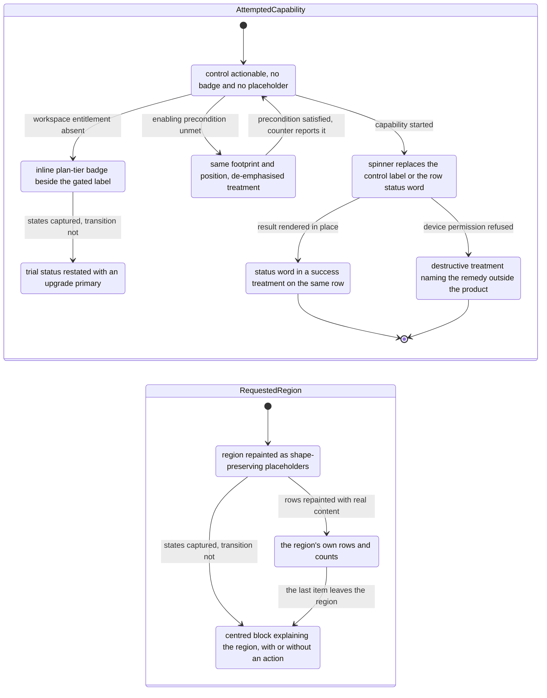

# Error, Empty & Loading States

The cross-cutting inventory of interface state — default, hover, active, empty, loading, error, disabled, permission-gated and upgrade-gated — and the owner of the `C-UPGRADE-GATE` state matrix for the whole [Workflow Catalog](README.md).

## Purpose

This document treats **state as its subject** rather than as a property of one screen. Every other area document specifies a surface and lists the states that surface takes; this one goes the other way round, and asks of each state: what does it look like, where in the product is it observed, and what must a build do to reproduce it. It is therefore the document a build reads when it needs to know how *this product* renders a thing that is loading, a thing that is empty, a thing that has failed, a thing that is switched off and a thing the workspace has not paid for.

**Where this area is encountered: everywhere.** State is not a destination. It is a property of the shell [00-product-overview.md](00-product-overview.md), of every conversation [02-channels.md](02-channels.md), of every form [01-onboarding-and-auth.md](01-onboarding-and-auth.md), of every result set [09-search-and-filters.md](09-search-and-filters.md), of every settings dialog [14-preferences-settings.md](14-preferences-settings.md) and of every public page [17-marketing-site.md](17-marketing-site.md). That is why this area owns almost no frames of its own and is cited as a secondary reference throughout the catalog — the arrangement the [coverage index](_screenshot-index.md) records deliberately, not a coverage gap.

**The one surface whose subject really is a state**, and therefore the only frames this document owns, is the **application error page**: a public page that reports a failed request and offers nothing but a way out [frame 1020](../../screenshots/Slack%20web%20Jul%202024%201020.png), [frame 1021](../../screenshots/Slack%20web%20Jul%202024%201021.png). It is specified as flow `21.1` below.

**The ownership split this document is responsible for (deviation D5).** The `C-UPGRADE-GATE` **structural contract** — what the component is made of — is defined once in [00-product-overview.md](00-product-overview.md); its **state set** — which states it takes and where each one is observed — is defined here, in the [States](#states) section, and nowhere else. The same split governs every other component this document touches: `00-product-overview.md` owns structure, this document owns the observed state inventory, and no contract is restated in both places.

**What this document does not own.** It does not specify any surface. The diagnostics table belongs to [14-preferences-settings.md](14-preferences-settings.md), the archived channel to [02-channels.md](02-channels.md), the help-centre feedback form to [20-help-community.md](20-help-community.md), the search result tabs to [09-search-and-filters.md](09-search-and-filters.md), the billing card to [15-admin-workspace.md](15-admin-workspace.md) and [18-pricing-plans.md](18-pricing-plans.md), and so on through the [index](README.md). They appear here only as the evidence for a state.

## Flows in this area

One flow is named for this area, spanning 2 frames. Frame spans are written as plain numeric ranges because they designate a span rather than cite one image, following the convention of the [Screenshot Coverage Index](_screenshot-index.md); every individual frame is cited with its full relative link in the step table and in [Frames covered](#frames-covered).

| Flow ID | Name | Frame span | Primary entry point |
|---|---|---|---|
| `21.1` | Read an application error page | 1020–1021 | A request to a public product URL that the service cannot complete |

**Why a cross-cutting area declares exactly one flow.** A flow is one goal-directed journey, and every flow identifier in this catalog is allocated once, in the [Flow groupings](_screenshot-index.md#flow-groupings) table of the coverage index. Under the one-primary-owner rule, the journeys in which a user *encounters a state and acts on it* are already owned by the areas whose surfaces they cross: running a device check is `14.6`, submitting article feedback is `20.16`, reading and unarchiving a channel is `02.12`. Inventing a second identifier for the same frames would create two owning flows for one frame and contradict the ledger. So those journeys are specified here — with their triggers, their ordered steps and their frame citations — as **state journeys** inside the [States](#states) section, each naming the flow that owns it, and this section declares only the one journey whose frames this document owns. The table below is the map from state journey to owning flow.

| State journey | Frames | Owning flow | Owning area document | Specified below under |
|---|---|---|---|---|
| Run a progressive check and read a denied permission | 563–565 | `14.6` | [14-preferences-settings.md](14-preferences-settings.md) | [Journey A](#journey-a-run-a-progressive-check-and-read-a-denied-permission) |
| Satisfy a disabled control's precondition and submit it | 949–952 | `20.16` | [20-help-community.md](20-help-community.md) | [Journey B](#journey-b-satisfy-a-disabled-controls-precondition-and-submit-it) |
| Correct a rejected entry and reach the confirmation | 216–219 | `03.9` | [03-messaging-and-composer.md](03-messaging-and-composer.md) | [Journey C](#journey-c-correct-a-rejected-entry-and-reach-the-confirmation) |
| Encounter a read-only surface and restore write access | 134–138 | `02.12` | [02-channels.md](02-channels.md) | [Journey D](#journey-d-encounter-a-read-only-surface-and-restore-write-access) |
| Meet an upgrade gate and reach the upgrade path | 550, 566, 600, 610 | `00.7`, `15.1`, `15.7`, `18.3` | [00-product-overview.md](00-product-overview.md), [15-admin-workspace.md](15-admin-workspace.md), [18-pricing-plans.md](18-pricing-plans.md) | [Journey E](#journey-e-meet-an-upgrade-gate-and-reach-the-upgrade-path) |
| Move through result tabs into a zero-result region | 688–692 | `09.2` | [09-search-and-filters.md](09-search-and-filters.md) | [Journey F](#journey-f-move-through-result-tabs-into-a-zero-result-region) |

## Flow 21.1 — Read an application error page

### Overview

A public page that exists to report that something went wrong. It carries the full public-site chrome — the marketing navigation band at the top and the four-column link footer at the bottom — and between them a single centred card that names the failure, declines to explain it, and offers exactly one link out [frame 1020](../../screenshots/Slack%20web%20Jul%202024%201020.png). The corpus captures the page twice, and the two captures are identical in every respect **except the illustration behind the card**, which is a different scene each time [frame 1021](../../screenshots/Slack%20web%20Jul%202024%201021.png). That single difference is the flow's most useful finding: the card is fixed and the artwork is a rendered variable.

There is no retry control, no error code, no reload affordance and no back button inside the card. The only interactive element it contains is the inline help-centre link; everything else that can be activated on the page belongs to the surrounding public chrome.

### Trigger

Not directly captured. The page is reached instead of the surface the user asked for, and it is served with the unauthenticated public chrome rather than the application shell [frame 1020](../../screenshots/Slack%20web%20Jul%202024%201020.png). **Inferred:** the trigger is a failed request to a public product URL, because the page carries the same navigation band and footer as the public site's own pages rather than any signed-in region, and because its copy states that the cause is not known rather than naming a missing resource.

### Preconditions

None that the corpus shows. The navigation band offers sign-in and workspace-lookup entries rather than a signed-in identity, so no session is required to reach the page [frame 1020](../../screenshots/Slack%20web%20Jul%202024%201020.png), [frame 1021](../../screenshots/Slack%20web%20Jul%202024%201021.png).

### Frame-by-frame steps

| Step | Frame(s) | What the user does | What changes on screen | Component(s) involved |
|---|---|---|---|---|
| 1 | [frame 1020](../../screenshots/Slack%20web%20Jul%202024%201020.png) | Requests a public product page that cannot be served | The error page renders in place of the requested surface: a light navigation band across the top holding the product logo mark and product wordmark at the far left, five text destinations grouped right of centre, and an outlined sign-in control at the far right | `C-EMPTY-STATE` |
| 2 | [frame 1020](../../screenshots/Slack%20web%20Jul%202024%201020.png) | Reads the card | A centred card, roughly three-tenths of the viewport width, sits in the upper third of the page and carries, in order, a warning-triangle glyph in a cautionary treatment, a large heading stating that there has been a glitch, and a three-line body stating that the cause is not known and that the reader can go back or look on the help centre — the help-centre reference rendered as an inline link | `C-EMPTY-STATE` |
| 3 | [frame 1020](../../screenshots/Slack%20web%20Jul%202024%201020.png) | Looks past the card | A full-bleed illustrated scene fills the band between the navigation and the footer and shows through the card's own surface, which is semi-opaque rather than solid | `C-EMPTY-STATE` |
| 4 | [frame 1020](../../screenshots/Slack%20web%20Jul%202024%201020.png) | Scrolls to the foot of the page | The illustration ends and a footer band begins, holding four link columns, each under a short heading rendered in its own accent colour — one heading carrying the product name, one pairing the product name with a heart glyph, and two grouping legal and general links | `C-EMPTY-STATE` |
| 5 | [frame 1021](../../screenshots/Slack%20web%20Jul%202024%201021.png) | Reloads, or reaches the page again | The navigation band, the card — same position, same size, same glyph, same heading, same body, same link — and the footer are unchanged; **only the illustrated scene is different**, and it retains the animal motifs of the first scene while changing the setting entirely | `C-EMPTY-STATE` |
| 6 | [frame 1021](../../screenshots/Slack%20web%20Jul%202024%201021.png) | Leaves the page | Not captured. The card's inline link and the navigation band's destinations are the only exits the page renders; no frame shows the destination of either | `C-EMPTY-STATE`, `C-TOP-BAR` |

> **Partial capture:** the corpus shows the error page only in its rendered state. It does not show what was requested, the failure that produced it, the page being reached from inside a signed-in session, or the result of following the help-centre link. Nothing about the cause of the error is recoverable from the pixels, and the page itself declines to state one.

**Inferred:** the illustration is selected per render from a set rather than being fixed to the error condition, because two captures of the same error, with a byte-for-byte equivalent card, carry two different scenes [frame 1020](../../screenshots/Slack%20web%20Jul%202024%201020.png), [frame 1021](../../screenshots/Slack%20web%20Jul%202024%201021.png). A build must treat the artwork as data with more than one member, and must not couple it to the error.

## Screens & components

Every component named here is referenced **by identifier only**; each contract is defined once in [00-product-overview.md](00-product-overview.md) and is not restated. What this section adds is where each state-bearing structure sits, how big it is relative to its host region, and what it is made of — expressed proportionally, never as an absolute offset.

### The error page's regions and proportions

The error page is the one surface this document specifies, so its layout is given in full [frame 1020](../../screenshots/Slack%20web%20Jul%202024%201020.png), [frame 1021](../../screenshots/Slack%20web%20Jul%202024%201021.png).

| Region | Position and ordering | Relative size | Contents, in order |
|---|---|---|---|
| Public navigation band | Full-width band at the top of the page | Roughly one fourteenth of viewport height | Product logo mark beside the product wordmark at the far left; five text destinations grouped right of centre; an outlined sign-in control at the far right |
| Illustration band | Between the navigation band and the footer, full width | Roughly six sevenths of viewport height — the dominant region | One full-bleed illustrated scene, drawn behind everything else in the band |
| Error card | Horizontally centred within the illustration band, anchored in its upper portion | Roughly three-tenths of viewport width; its top edge near one seventh and its bottom edge near one third of viewport height | Warning-triangle glyph, heading, three-line body with one inline link. Semi-opaque: the illustration is visible through it |
| Public footer | Full-width band at the foot, beginning just past nine tenths of viewport height | The remaining height, clipped by the frame | Four link columns, each under a short heading in its own accent colour |

**Hierarchy.** The card is the only element with a surface of its own inside the illustration band, and it is layered above the artwork rather than inset into a solid panel. The navigation band and the footer are siblings of the illustration band, not of the card.

### State-bearing structures and where they sit

Each row below is a structure whose whole purpose is to express a state. Sizes are relative to the region that hosts the structure, and iconography is named by function.

| Structure | Host region and anchoring | Relative size and ordering | Composition |
|---|---|---|---|
| Centred empty or error block | Content region, or the single column of a destination surface; horizontally centred and anchored in the upper-middle of the region rather than at its exact vertical centre | Roughly a third to a half of the region's width; height driven by content | Optional illustration slot or glyph, then a heading, then a one- or two-line body, then optionally an action row, an inline link, or a numbered instruction list [frame 359](../../screenshots/Slack%20web%20Jul%202024%20359.png), [frame 501](../../screenshots/Slack%20web%20Jul%202024%20501.png), [frame 502](../../screenshots/Slack%20web%20Jul%202024%20502.png), [frame 568](../../screenshots/Slack%20web%20Jul%202024%20568.png) |
| Region-foot status bar | Docked across the full width of the region it reports on, at that region's own foot — the content region for a conversation, the docked pane for a document | Full region width; a single text row tall | A sentence naming the state at the leading edge and one action at the trailing edge; it **replaces** the region's composer rather than sitting above it [frame 134](../../screenshots/Slack%20web%20Jul%202024%20134.png), [frame 339](../../screenshots/Slack%20web%20Jul%202024%20339.png), [frame 359](../../screenshots/Slack%20web%20Jul%202024%20359.png) |
| Viewport-foot permission band | Pinned across the full viewport width at its very bottom, beneath every shell region | Full viewport width; one text row tall | A glyph, one sentence, then either an action link that starts the browser's own grant flow or, where the product cannot act, no link at all — and a dismissal affordance at the trailing edge [frame 27](../../screenshots/Slack%20web%20Jul%202024%2027.png), [frame 30](../../screenshots/Slack%20web%20Jul%202024%2030.png), [frame 300](../../screenshots/Slack%20web%20Jul%202024%20300.png) |
| Advisory callout | Inside a page or dialog body, above the controls it concerns, indented to the body's own column | Full body width; two to three text rows | A warning-triangle or status glyph, a leading vertical accent rule at the left edge, a bold lead line and a body sentence that may carry inline links [frame 569](../../screenshots/Slack%20web%20Jul%202024%20569.png), [frame 580](../../screenshots/Slack%20web%20Jul%202024%20580.png), [frame 606](../../screenshots/Slack%20web%20Jul%202024%20606.png), [frame 743](../../screenshots/Slack%20web%20Jul%202024%20743.png) |
| Inline validation block | Immediately beneath the control it concerns, inside the form's own column | The control's width; one to two text rows | A warning glyph and a message, on a tinted surface in a destructive treatment; optionally followed by a preview of the conflicting record [frame 217](../../screenshots/Slack%20web%20Jul%202024%20217.png), [frame 677](../../screenshots/Slack%20web%20Jul%202024%20677.png), [frame 730](../../screenshots/Slack%20web%20Jul%202024%20730.png) |
| Progressive status table | Inside a dialog's detail pane, beneath the action that starts the run | Full pane width; one row per check, and the row count does not change while the run proceeds | A header row of two column labels, then one row per check whose trailing cell holds either a status word or a spinner; a copy-results action beneath the last row [frame 564](../../screenshots/Slack%20web%20Jul%202024%20564.png), [frame 565](../../screenshots/Slack%20web%20Jul%202024%20565.png) |
| Skeleton region | The region being repainted, in place | Exactly the region's own footprint | One shape-preserving placeholder per element the real content will occupy — a circular placeholder where an avatar goes, rounded bars at title and metadata lengths — while adjacent regions keep their real content [frame 911](../../screenshots/Slack%20web%20Jul%202024%20911.png) |
| Inline gate badge | Inline, immediately after the label it gates, within a menu row or a surface header | Smaller than the label it follows; never full width | A short badge naming a paid plan tier [frame 550](../../screenshots/Slack%20web%20Jul%202024%20550.png), [frame 500](../../screenshots/Slack%20web%20Jul%202024%20500.png) |
| Role-gate enclosure | Around the gated control, inside the form that hosts it | The control's width plus a border; the caption inset into the border's top edge | A bordered container whose inset caption, led by an eye-with-slash glyph, states which role can see the setting, wrapped around an ordinary control that is neither hidden nor disabled [frame 75](../../screenshots/Slack%20web%20Jul%202024%2075.png) |
| Transient outcome pill | Floating over the content region at its foot, clear of the composer | A single sentence wide; one to two text rows | One sentence on an inverted surface, optionally with a leading glyph and optionally with one trailing undo link; observed at the region's trailing corner and at its centre [frame 199](../../screenshots/Slack%20web%20Jul%202024%20199.png), [frame 219](../../screenshots/Slack%20web%20Jul%202024%20219.png), [frame 441](../../screenshots/Slack%20web%20Jul%202024%20441.png) |

**Components this document is the canonical consumer of.** `C-EMPTY-STATE` for every centred block and for the error page itself; `C-PERMISSION-PROMPT` for the request and denial bands; `C-BANNER` for the advisory, promotional and access-required bands; `C-COACH-MARK` for the first-run overlay [frame 27](../../screenshots/Slack%20web%20Jul%202024%2027.png). It additionally attaches state to `C-DATA-TABLE`, `C-TOAST`, `C-INLINE-VALIDATION`, `C-UPGRADE-GATE`, `C-MESSAGE-ROW`, `C-HOVER-ACTION-BAR`, `C-TAB-BAR`, `C-MODAL-SHELL`, `C-COMPOSER`, `C-DETAILS-PANE`, `C-PLAN-CARD`, `C-CHIP-INPUT`, `C-DATE-PICKER-POPOVER`, `C-RECORD-CARD` and `C-SIDEBAR`, because state attaches to components and these are the ones the corpus shows in a non-default rendering.

**No new component is defined here.** The corpus revealed no state-bearing structure that the 35 identifiers in [00-product-overview.md](00-product-overview.md) do not already cover: the centred blocks, bands, callouts, validation blocks, tables, badges and pills above are all renderings of components that document already defines. Had one been found, it would have been reported there for definition rather than described locally.

## States

### How to read this section

Every filled cell below carries the frame that evidences it, and **a state the corpus does not show is not listed as though it did** — the unobserved set is enumerated explicitly in [States the corpus does not show](#states-the-corpus-does-not-show) rather than left to be inferred from a gap. Treatments are described semantically and relatively, never as colour values: a *cautionary* treatment, a *destructive* treatment, a *success* treatment, a *de-emphasised* treatment with reduced contrast against its surrounding surface, an *inverted* surface, and the *default* surface. No palette value from the corpus is carried forward, because the only palette observable belongs to a third party; the placeholder vocabulary in [00-product-overview.md](00-product-overview.md) is what a build substitutes.

Four state names recur often enough to be worth fixing here, because the corpus distinguishes them and a build that merges them cannot reproduce what the frames show: **permission-denied** is a device or browser capability the product cannot grant itself; **role-gated** is a control the signed-in role may not use; **upgrade-gated** is a capability the workspace's plan does not include; and **disabled** is a control whose own precondition is unmet. All four render differently and all four are observed.

### The cross-cutting state matrix

| State | What is observable | Where the corpus shows it | Evidence |
|---|---|---|---|
| Default | The surface at rest: no overlay, no badge, no placeholder, the region's own content rendered and its primary control actionable | Every in-product and public surface | [frame 549](../../screenshots/Slack%20web%20Jul%202024%20549.png), [frame 691](../../screenshots/Slack%20web%20Jul%202024%20691.png) |
| Hover, row | The row takes a tint across the full width of its list while every other row keeps the default surface; where the row has per-row actions, a floating bar appears at its top-right overlapping the row's upper edge | A message row in a conversation; an entry in the activity list; a row in a plan comparison table | [frame 250](../../screenshots/Slack%20web%20Jul%202024%20250.png), [frame 387](../../screenshots/Slack%20web%20Jul%202024%20387.png), [frame 349](../../screenshots/Slack%20web%20Jul%202024%20349.png) |
| Hover, control | A label bubble appears immediately above the control naming what it does | The remove control on a composer attachment | [frame 198](../../screenshots/Slack%20web%20Jul%202024%20198.png) |
| Active or selected | The current item is visibly distinguished: a tab label underlined and emphasised; an autocomplete row filled across its full width; a navigation entry filled; a settings category filled | Result-type tabs, invitation tabs, billing tabs; the slash-command panel; an article's in-article navigation; the preferences category list | [frame 688](../../screenshots/Slack%20web%20Jul%202024%20688.png), [frame 203](../../screenshots/Slack%20web%20Jul%202024%20203.png), [frame 950](../../screenshots/Slack%20web%20Jul%202024%20950.png), [frame 562](../../screenshots/Slack%20web%20Jul%202024%20562.png) |
| Current item in a grid | The cell representing today is ringed by an unfilled outline, and cells before it render at reduced contrast while later cells render at full contrast | The month grid of a date-picker popover | [frame 53](../../screenshots/Slack%20web%20Jul%202024%2053.png) |
| Empty | The region's content is replaced by a centred block that explains the region; four distinct compositions are observed and are enumerated in [Empty has four observed shapes](#empty-has-four-observed-shapes) | Conversations, destination surfaces, result regions, sidebar groups, administration pages | [frame 359](../../screenshots/Slack%20web%20Jul%202024%20359.png), [frame 568](../../screenshots/Slack%20web%20Jul%202024%20568.png), [frame 657](../../screenshots/Slack%20web%20Jul%202024%20657.png), [frame 441](../../screenshots/Slack%20web%20Jul%202024%20441.png) |
| Zero result | The count is rendered as an explicit zero on the tab that has none, and the result region carries a heading, a two-line recovery instruction and a feedback line — with no illustration | Search result tabs and the people result region | [frame 688](../../screenshots/Slack%20web%20Jul%202024%20688.png), [frame 692](../../screenshots/Slack%20web%20Jul%202024%20692.png) |
| Loading, control | The control keeps its exact footprint and position, loses its label, and renders a centred spinner on a de-emphasised fill | A wizard's advance action; a plan card's choose action | [frame 10](../../screenshots/Slack%20web%20Jul%202024%2010.png), [frame 18](../../screenshots/Slack%20web%20Jul%202024%2018.png) |
| Loading, row | The row's status cell renders a spinner in place of a status word while its label takes an accent treatment; sibling rows simultaneously read passed and pending | The device diagnostics table | [frame 564](../../screenshots/Slack%20web%20Jul%202024%20564.png), [frame 565](../../screenshots/Slack%20web%20Jul%202024%20565.png) |
| Loading, block | An empty bordered rectangle occupies the eventual block's footprint and carries a centred spinner | A file-upload placeholder inside a canvas | [frame 321](../../screenshots/Slack%20web%20Jul%202024%20321.png) |
| Loading, region | The region repaints as shape-preserving placeholders — a circular placeholder where an avatar belongs, rounded bars at title and metadata lengths — while adjacent regions keep their real content | A forum question list being re-sorted | [frame 911](../../screenshots/Slack%20web%20Jul%202024%20911.png) |
| Pending | A queued item reads a pending status word, with its label and its status word both in the default text treatment | The device diagnostics table, for checks not yet started | [frame 564](../../screenshots/Slack%20web%20Jul%202024%20564.png) |
| Passed | The item's label and its status word are rendered together in a success treatment | The device diagnostics table | [frame 564](../../screenshots/Slack%20web%20Jul%202024%20564.png), [frame 565](../../screenshots/Slack%20web%20Jul%202024%20565.png) |
| Failure, transient | A rounded pill on an inverted surface, floating at the foot of the content region, stating that something went wrong and inviting a retry — carrying no undo, no dismissal affordance and no button of any kind | After a composer action | [frame 199](../../screenshots/Slack%20web%20Jul%202024%20199.png) |
| Failure, page-level | A public page reporting a failure, carrying the public navigation band and footer and one centred card with a warning glyph, a heading, a body and a single inline link out | The application error page | [frame 1020](../../screenshots/Slack%20web%20Jul%202024%201020.png), [frame 1021](../../screenshots/Slack%20web%20Jul%202024%201021.png) |
| Field invalid | The rejected entry is reported next to itself; six distinct presentations are observed and are enumerated in [Field validation has six observed presentations](#field-validation-has-six-observed-presentations) | Dialogs, sparse forms, checkout, sign-in and code-entry pages | [frame 217](../../screenshots/Slack%20web%20Jul%202024%20217.png), [frame 615](../../screenshots/Slack%20web%20Jul%202024%20615.png), [frame 647](../../screenshots/Slack%20web%20Jul%202024%20647.png), [frame 730](../../screenshots/Slack%20web%20Jul%202024%20730.png), [frame 735](../../screenshots/Slack%20web%20Jul%202024%20735.png), [frame 677](../../screenshots/Slack%20web%20Jul%202024%20677.png) |
| Permission requested | A band pinned across the viewport foot with a bell glyph, one sentence naming what is needed, an action link that starts the browser's own grant flow, and a dismissal affordance; it persists across captures until acted on | After first run, over a conversation | [frame 27](../../screenshots/Slack%20web%20Jul%202024%2027.png), [frame 30](../../screenshots/Slack%20web%20Jul%202024%2030.png) |
| Permission denied, device | Reported in place and non-blockingly, in three positions: a viewport-foot band in a cautionary treatment naming the remedy and pointing at the browser's own control; a table row in a destructive treatment; a callout at the top of a dialog body with the dialog's primary left de-emphasised | During a huddle; in the diagnostics table; in the video-clip dialog | [frame 300](../../screenshots/Slack%20web%20Jul%202024%20300.png), [frame 565](../../screenshots/Slack%20web%20Jul%202024%20565.png), [frame 194](../../screenshots/Slack%20web%20Jul%202024%20194.png) |
| Role-gated | The control is neither hidden nor disabled: it is enclosed in a bordered container whose inset caption, led by an eye-with-slash glyph, names the role that can see the setting | The auto-add toggle inside the add-people modal | [frame 75](../../screenshots/Slack%20web%20Jul%202024%2075.png) |
| Upgrade-gated | Six sub-states, enumerated in [The C-UPGRADE-GATE state set](#the-c-upgrade-gate-state-set-deviation-d5) | Create menu, surface headers, sidebar banner and footer, workspace menu, result sets, billing card, upgrade page | [frame 550](../../screenshots/Slack%20web%20Jul%202024%20550.png), [frame 500](../../screenshots/Slack%20web%20Jul%202024%20500.png), [frame 566](../../screenshots/Slack%20web%20Jul%202024%20566.png), [frame 688](../../screenshots/Slack%20web%20Jul%202024%20688.png), [frame 600](../../screenshots/Slack%20web%20Jul%202024%20600.png), [frame 610](../../screenshots/Slack%20web%20Jul%202024%20610.png) |
| Disabled | The control keeps its full size and position and changes only its treatment, to a de-emphasised low-contrast rendering; where a precondition exists it is stated adjacently, by a counter, a checkbox or an empty required field | Feedback submit; dialog save; sparse-form primary; delete-workspace confirm; the record action of a dialog whose permission was refused | [frame 950](../../screenshots/Slack%20web%20Jul%202024%20950.png), [frame 216](../../screenshots/Slack%20web%20Jul%202024%20216.png), [frame 649](../../screenshots/Slack%20web%20Jul%202024%20649.png), [frame 580](../../screenshots/Slack%20web%20Jul%202024%20580.png), [frame 194](../../screenshots/Slack%20web%20Jul%202024%20194.png) |
| Busy sibling | While one action is in progress, the peer action beside it is rendered de-emphasised rather than removed | The two plan cards of the setup wizard's final step | [frame 18](../../screenshots/Slack%20web%20Jul%202024%2018.png) |
| Read-only | Two presentations, enumerated in [Read-only has two observed presentations](#read-only-has-two-observed-presentations); in both, a status bar is docked at the foot of the affected region and names the state | An archived channel; a canvas document | [frame 134](../../screenshots/Slack%20web%20Jul%202024%20134.png), [frame 339](../../screenshots/Slack%20web%20Jul%202024%20339.png) |
| Success, confirmed in place | The form is replaced, in its own region, by a glyph, a short heading and a thanks line, with any fallback line retained | Article feedback after submission | [frame 952](../../screenshots/Slack%20web%20Jul%202024%20952.png) |
| Success, confirmed inline | The submit control inside a field's trailing edge becomes a filled check glyph and a confirmation line appears beneath the field; nothing navigates | The newsletter form on a public page | [frame 876](../../screenshots/Slack%20web%20Jul%202024%20876.png) |
| Success, callout | A callout with a check-in-circle glyph and a leading accent rule carrying one sentence — the same anatomy as the advisory and error callouts, in a success treatment | The password-updated page | [frame 743](../../screenshots/Slack%20web%20Jul%202024%20743.png) |
| Success, modal | A centred modal with a circular success glyph above a heading, a body naming the consequence and its duration, and a single filled primary | After sending an external invitation | [frame 500](../../screenshots/Slack%20web%20Jul%202024%20500.png) |
| Success, in-row | The row's action is replaced in place by a check-marked pill naming what happened, with the surrounding controls unchanged | A resent invitation in the administration console | [frame 658](../../screenshots/Slack%20web%20Jul%202024%20658.png) |
| Terminal | A small bordered card carrying a heading, a line naming what happened, a thanks line and a line stating the page may be closed or a link followed — reached after an irreversible action and offering no route back into the product | Account deactivated; workspace deleted | [frame 609](../../screenshots/Slack%20web%20Jul%202024%20609.png), [frame 583](../../screenshots/Slack%20web%20Jul%202024%20583.png) |
| Access required | A page-level band across the very top of a public page, on a neutral tinted surface, stating that sign-in is needed to see the requested page | Above the workspace sign-in form | [frame 735](../../screenshots/Slack%20web%20Jul%202024%20735.png) |
| Deprecation advisory | A full-width band in a cautionary treatment with a status glyph, a bold lead, dated body copy and a learn-more link; no dismissal affordance is rendered | The workflow list | [frame 569](../../screenshots/Slack%20web%20Jul%202024%20569.png) |
| Destructive advisory | One or more callouts with a warning glyph and a leading accent rule, placed above the confirmation card they concern | The delete-workspace and deactivate-account pages | [frame 580](../../screenshots/Slack%20web%20Jul%202024%20580.png), [frame 606](../../screenshots/Slack%20web%20Jul%202024%20606.png) |
| Dismissible promotional | A banner or hero carrying a heading, body copy, an illustration slot, an optional primary action and a dismissal affordance at its trailing edge | The apps surface, the huddles destination, the later destination, the notification-permission band | [frame 400](../../screenshots/Slack%20web%20Jul%202024%20400.png), [frame 401](../../screenshots/Slack%20web%20Jul%202024%20401.png), [frame 396](../../screenshots/Slack%20web%20Jul%202024%20396.png), [frame 30](../../screenshots/Slack%20web%20Jul%202024%2030.png) |
| De-emphasised suggestion | A card rendered on a surface of lower contrast than the default card surface, still carrying its full content and its action | A huddle suggestion on the huddles destination | [frame 401](../../screenshots/Slack%20web%20Jul%202024%20401.png) |
| First-run coaching | A floating card whose caret points at the control it describes, with that control spotlit and the rest of the shell dimmed, carrying an illustration header with a dismissal affordance, a heading, a body, a primary advance action and a step counter | Over the shell after setup | [frame 27](../../screenshots/Slack%20web%20Jul%202024%2027.png) |
| Annotated record | A per-record condition is appended inline to the record's own value rather than raised into a region-level message | A bounced address in the pending-invitations table | [frame 654](../../screenshots/Slack%20web%20Jul%202024%20654.png) |
| Service health | A public status surface renders a large circular success indicator, an up-and-running heading and a per-service grid; its panel header carries a legend of **five** status levels, each with its own glyph — no issues, maintenance, notice, incident and outage | The platform status page | [frame 988](../../screenshots/Slack%20web%20Jul%202024%20988.png) |

**Only one of those five service-health levels is observed applied.** Every service row on the status page reads the no-issues state; maintenance, notice, incident and outage appear in the legend only [frame 988](../../screenshots/Slack%20web%20Jul%202024%20988.png), [frame 989](../../screenshots/Slack%20web%20Jul%202024%20989.png). The legend is nevertheless the corpus's own enumeration of the product's service-health vocabulary, so a build implements all five levels and renders four of them from data it has no captured example of.

### Loading has four observed shapes

They are not interchangeable, and a build that implements one of them cannot reproduce the other three.

| Shape | What is replaced | What is preserved | Evidence |
|---|---|---|---|
| In-place control | The control's label, by a centred spinner on a de-emphasised fill | The control's exact size and position, and the surrounding form | [frame 10](../../screenshots/Slack%20web%20Jul%202024%2010.png), [frame 18](../../screenshots/Slack%20web%20Jul%202024%2018.png) |
| Per-row status | One row's status word, by a spinner | Row order, row count, row heights and every sibling row's own status | [frame 564](../../screenshots/Slack%20web%20Jul%202024%20564.png), [frame 565](../../screenshots/Slack%20web%20Jul%202024%20565.png) |
| Block placeholder | The eventual block's content, by an empty bordered rectangle carrying a spinner | The block's footprint in the document flow, and every block around it | [frame 321](../../screenshots/Slack%20web%20Jul%202024%20321.png) |
| Region skeleton | The region's rows, by shape-preserving placeholders | The region's footprint, and the real content of every adjacent region | [frame 911](../../screenshots/Slack%20web%20Jul%202024%20911.png) |

Two properties hold across all four. **Loading is scoped to the smallest thing that is changing** — a control, a row, a block or a region — and no capture in the corpus shows a whole-surface blocking overlay. And **loading is progressive rather than atomic**: the diagnostics run renders passed, in-progress and pending rows in one table at the same time, and the following capture shows the next row already in progress while the previous one has resolved [frame 564](../../screenshots/Slack%20web%20Jul%202024%20564.png), [frame 565](../../screenshots/Slack%20web%20Jul%202024%20565.png). The two captures differ by almost nothing else, which is what makes the claim that the table does not reflow a measurement rather than an impression.

### Empty has four observed shapes

| Shape | Composition | Where observed | Evidence |
|---|---|---|---|
| Illustrated, with an action | Illustration slot or glyph, heading, one-line body, then a filled or outlined action — sometimes with a further jump link | Caught-up unreads, an all-done reminder tab, a user-groups page, a starred sidebar group | [frame 359](../../screenshots/Slack%20web%20Jul%202024%20359.png), [frame 397](../../screenshots/Slack%20web%20Jul%202024%20397.png), [frame 644](../../screenshots/Slack%20web%20Jul%202024%20644.png), [frame 441](../../screenshots/Slack%20web%20Jul%202024%20441.png) |
| Illustrated, no action | Illustration slot, heading, one- or two-line body, one inline link | Received external invitations, an archived reminder tab, an activity list under the unreads filter | [frame 501](../../screenshots/Slack%20web%20Jul%202024%20501.png), [frame 396](../../screenshots/Slack%20web%20Jul%202024%20396.png), [frame 385](../../screenshots/Slack%20web%20Jul%202024%20385.png) |
| Illustrated and instructional | Illustration slot, heading, body, inline link, a rule, then a numbered list teaching the workflow that fills the region | Sent external invitations | [frame 502](../../screenshots/Slack%20web%20Jul%202024%20502.png) |
| Text only | Heading plus one body line and nothing else; or a single sentence with no heading at all; or heading, body, an inline link and a feedback line | A legacy-workflow list, an invite-links tab, a zero-result people region | [frame 568](../../screenshots/Slack%20web%20Jul%202024%20568.png), [frame 657](../../screenshots/Slack%20web%20Jul%202024%20657.png), [frame 692](../../screenshots/Slack%20web%20Jul%202024%20692.png) |

Three rules follow, and all three are load-bearing for a build.

- **Empty is per region, not per page.** With the unreads filter switched on, the activity list column renders its own empty block while the thread pane beside it keeps its full content, its reply composer and its formatting toolbar [frame 385](../../screenshots/Slack%20web%20Jul%202024%20385.png). Emptiness belongs to the region that has nothing to show.
- **One surface can carry a different empty state per tab.** The later destination's archived tab renders an illustrated block with no action, and its in-progress tab renders a glyph, a heading, a one-line body and a filled primary [frame 396](../../screenshots/Slack%20web%20Jul%202024%20396.png), [frame 397](../../screenshots/Slack%20web%20Jul%202024%20397.png). The copy is written for the tab, not for the surface.
- **The conversation hero is not an empty state.** The illustration-plus-heading-plus-body block at the head of a conversation is still rendered when the conversation has messages, day dividers and app-authored posts beneath it [frame 120](../../screenshots/Slack%20web%20Jul%202024%20120.png), [frame 203](../../screenshots/Slack%20web%20Jul%202024%20203.png), [frame 550](../../screenshots/Slack%20web%20Jul%202024%20550.png). It is a beginning-of-conversation block, and because the conversation body is anchored to its foot, the blank space in such a capture sits **above** the hero rather than replacing content. A build that renders the hero only while the message list is empty cannot reproduce any of those three frames. Where suggestion cards accompany the hero they follow it, as a row of two cards each carrying an icon, a title and a one-line sub-line [frame 203](../../screenshots/Slack%20web%20Jul%202024%20203.png).

### Failure and error reporting

| Presentation | Anatomy | Does it block? | Evidence |
|---|---|---|---|
| Transient pill | One sentence on an inverted surface at the content region's foot, stating that something went wrong and inviting a retry; no control of any kind | No — the composer behind it stays usable | [frame 199](../../screenshots/Slack%20web%20Jul%202024%20199.png) |
| Row-level result | A destructive treatment applied to one row's label and status word inside a table whose other rows keep reporting success | No — the run continues and the next check is already in progress | [frame 565](../../screenshots/Slack%20web%20Jul%202024%20565.png) |
| Dialog callout | A cautionary callout at the top of the dialog body with a warning glyph, a bold heading and a remedy sentence, with the dialog's own primary left de-emphasised | Partially — the dialog stays open and its other controls stay usable | [frame 194](../../screenshots/Slack%20web%20Jul%202024%20194.png) |
| Region-foot band | A full-width band in a cautionary treatment at the viewport foot naming the remedy, with a dismissal affordance and no action link | No — the huddle it concerns keeps running | [frame 300](../../screenshots/Slack%20web%20Jul%202024%20300.png) |
| Page-level card | The public error page: navigation band, one centred card with a warning glyph, a heading, a body and one inline link, and the public footer | Yes — it replaces the requested surface entirely | [frame 1020](../../screenshots/Slack%20web%20Jul%202024%201020.png), [frame 1021](../../screenshots/Slack%20web%20Jul%202024%201021.png) |

**A failure never leaves the user without a next move, and the next move is always specific.** The transient pill invites a retry [frame 199](../../screenshots/Slack%20web%20Jul%202024%20199.png); the dialog callout names the system preference to check and then says to try again [frame 194](../../screenshots/Slack%20web%20Jul%202024%20194.png); the huddle band names the browser control to use [frame 300](../../screenshots/Slack%20web%20Jul%202024%20300.png); the error card offers the help centre [frame 1020](../../screenshots/Slack%20web%20Jul%202024%201020.png). None of them states a cause, and none of them renders an error code.

### Field validation has six observed presentations

The presentations differ on three axes a build must decide independently: **where the message goes**, **whether the rejected value survives**, and **whether the primary action is gated**. The corpus does not settle any of them uniformly.

| # | Where the message goes | Field treatment | Value | Primary action | Evidence |
|---|---|---|---|---|---|
| 1 | Directly beneath the field, plus a preview row of the conflicting record | Border in a destructive treatment | Retained | De-emphasised until corrected | [frame 217](../../screenshots/Slack%20web%20Jul%202024%20217.png) |
| 2 | Beneath each affected field, three at once | Border in a destructive treatment plus an error-badged glyph inside the field's trailing edge | Retained | **Filled and actionable** | [frame 615](../../screenshots/Slack%20web%20Jul%202024%20615.png) |
| 3 | A form-level callout above every field | **No field marked at all** | Retained | **Filled and actionable** | [frame 647](../../screenshots/Slack%20web%20Jul%202024%20647.png) |
| 4 | A tinted block beneath the input group | Boxes keep their default border | **Cleared** | No submit control exists on this form | [frame 730](../../screenshots/Slack%20web%20Jul%202024%20730.png) |
| 5 | One message beneath the field pair, not per field | Both fields bordered in a destructive treatment | Second field **cleared**, first retained | **Filled and actionable** | [frame 735](../../screenshots/Slack%20web%20Jul%202024%20735.png) |
| 6 | A tinted block beneath the input, inside a modal | Border in a destructive treatment | Retained | De-emphasised | [frame 677](../../screenshots/Slack%20web%20Jul%202024%20677.png) |

Two further observations belong with them. A rejection can carry **evidence of the conflict** rather than only a message: the duplicate-name case renders a preview row showing the record already holding the name [frame 217](../../screenshots/Slack%20web%20Jul%202024%20217.png). And when the entry is corrected, **every treatment clears at once** — border, message, conflict preview and the de-emphasised primary all resolve together in a single capture, so a build must treat them as one derived state rather than four independent flags [frame 218](../../screenshots/Slack%20web%20Jul%202024%20218.png).

Validation is also expressed **without any message at all**, purely through control state, and this is the more common case in the corpus: a primary rendered de-emphasised while its field is empty, and filled once the field is satisfied [frame 216](../../screenshots/Slack%20web%20Jul%202024%20216.png), [frame 218](../../screenshots/Slack%20web%20Jul%202024%20218.png), [frame 950](../../screenshots/Slack%20web%20Jul%202024%20950.png), [frame 951](../../screenshots/Slack%20web%20Jul%202024%20951.png), [frame 649](../../screenshots/Slack%20web%20Jul%202024%20649.png), [frame 651](../../screenshots/Slack%20web%20Jul%202024%20651.png).

### Permission denial by device, and gating by role

They look similar and mean different things, so they are kept apart here and must be kept apart in a build.

**Device or browser permission** is a capability the product cannot grant itself, so every presentation names a remedy **outside** the product and none offers an in-product control that would fix it: the huddle band tells the user to enable the microphone in the browser's own address bar and carries no action link at all [frame 300](../../screenshots/Slack%20web%20Jul%202024%20300.png); the video-clip dialog's callout tells the user to check system preferences and try again [frame 194](../../screenshots/Slack%20web%20Jul%202024%20194.png); the diagnostics row simply reports that permission was denied [frame 565](../../screenshots/Slack%20web%20Jul%202024%20565.png). The **request** form, by contrast, does carry an in-product link, because starting the browser's grant flow is something the product can do [frame 27](../../screenshots/Slack%20web%20Jul%202024%2027.png), [frame 30](../../screenshots/Slack%20web%20Jul%202024%2030.png). A denial is additionally visible on the device controls themselves: the camera control in the record dialog renders struck through [frame 186](../../screenshots/Slack%20web%20Jul%202024%20186.png).

**Role gating** hides nothing and disables nothing. The gated toggle sits inside a bordered container whose inset caption, led by an eye-with-slash glyph, states that only administrators can see the setting; the toggle itself is rendered in its ordinary off position and the modal's primary action is a filled primary [frame 75](../../screenshots/Slack%20web%20Jul%202024%2075.png). The same modal separately carries a plain advisory block stating which population may be added to the channel — a scope statement, not a gate.

### Read-only has two observed presentations

Both dock a status bar at the foot of the region they affect, and both name an exit.

| Presentation | What the bar says and offers | What else changes | Evidence |
|---|---|---|---|
| Archived conversation | A sentence naming the conversation and stating that it is archived, with a close-channel action at the bar's trailing edge | The composer is **replaced** by the bar rather than disabled; the header loses its member facepile, its member count and its huddle action, keeping only its document action; the details modal drops its members tab, leaving three, and its settings tab holds exactly two rows — an unarchive action and a destructive delete | [frame 134](../../screenshots/Slack%20web%20Jul%202024%20134.png), [frame 136](../../screenshots/Slack%20web%20Jul%202024%20136.png), [frame 137](../../screenshots/Slack%20web%20Jul%202024%20137.png) |
| Read-only document | A sentence stating that the document is being read in read-only view, with a turn-off link at the trailing edge | The pane keeps its heading, its blocks, its checklist and its file card, and its edited-status line stays in the header | [frame 339](../../screenshots/Slack%20web%20Jul%202024%20339.png) |

**Read-only is reversible from a setting, and reversal restores every removed affordance at once.** After unarchiving, the member facepile, the member count, the huddle action and the full composer are all present again, and the conversation's system list has gained an unarchived entry [frame 138](../../screenshots/Slack%20web%20Jul%202024%20138.png). A third read-only instance is a template opened for reading, which carries a use-template action instead of an editing surface [frame 489](../../screenshots/Slack%20web%20Jul%202024%20489.png).

### The `C-UPGRADE-GATE` state set (deviation D5)

The component's structure is defined in [00-product-overview.md](00-product-overview.md). **Its states are defined here and nowhere else.** Six are observed.

| State | Where it appears | What it renders | What it offers | Dismissible? |
|---|---|---|---|---|
| Not gated | Any capability the workspace is entitled to | Nothing at all — the control renders as an ordinary row or action with no badge | Nothing | Not applicable |
| Gated inline | Beside the label of a gated capability, within a menu row or a surface header | A short badge naming a paid plan tier, set at the row's trailing edge and sized smaller than the label | No action of its own; the row it annotates stays present and rendered normally | No dismissal affordance observed [frame 550](../../screenshots/Slack%20web%20Jul%202024%20550.png), [frame 500](../../screenshots/Slack%20web%20Jul%202024%20500.png) |
| Trial active, with countdown | The sidebar's banner slot, the sidebar's footer item slot, and the workspace menu's offer block — **all three at once in the same session** | Banner: a rocket glyph, a percentage-off offer line and a countdown sub-line in days. Footer item: an hourglass glyph and a trial-in-progress label. Menu block: an hourglass glyph, a countdown heading, an offer sentence, a plan-details link and a full-width outlined upgrade action | The menu block's upgrade action and its plan-details link | No dismissal affordance observed on any of the three [frame 550](../../screenshots/Slack%20web%20Jul%202024%20550.png), [frame 566](../../screenshots/Slack%20web%20Jul%202024%20566.png) |
| Contextual upsell | Above a result set, between the filter row and the first result | A plan-tier badge, one sentence explaining what the trial has unlocked, and a learn-more link | The learn-more link | No dismissal affordance observed; present on the messages and files result tabs and absent on the channels and people tabs [frame 688](../../screenshots/Slack%20web%20Jul%202024%20688.png), [frame 689](../../screenshots/Slack%20web%20Jul%202024%20689.png), [frame 691](../../screenshots/Slack%20web%20Jul%202024%20691.png), [frame 692](../../screenshots/Slack%20web%20Jul%202024%20692.png) |
| Billing surface | The administration console's home card list | A card stating that the workspace is on a free trial of a named plan tier, a lead line warning which benefits would be lost, a six-item benefit list, then two actions of differing emphasis — a filled upgrade primary and an outlined compare-plans secondary. **No countdown** | Both actions | No [frame 600](../../screenshots/Slack%20web%20Jul%202024%20600.png) |
| Upgrade destination | A dedicated page reached from an upgrade action | A full-width hero on an inverted surface carrying an eyebrow line, a large greeting headline naming the plan tier, a trial line expressed as an **end date** rather than a countdown, and a filled primary upgrade action; beneath the hero a three-column row of icon, title and body explaining what upgrading adds | The primary upgrade action | No [frame 610](../../screenshots/Slack%20web%20Jul%202024%20610.png) |

**The same trial state is rendered three different ways, and a build must derive all three from one field.** Days remaining, in the sidebar banner and the workspace menu [frame 550](../../screenshots/Slack%20web%20Jul%202024%20550.png), [frame 566](../../screenshots/Slack%20web%20Jul%202024%20566.png); status only, with no duration at all, in the billing card [frame 600](../../screenshots/Slack%20web%20Jul%202024%20600.png); and an absolute end date on the upgrade page [frame 610](../../screenshots/Slack%20web%20Jul%202024%20610.png).

**The countdown is a rendered variable, and this is the strongest single piece of evidence that the gate is stateful.** Its value differs across captures of the same offer: six days [frame 27](../../screenshots/Slack%20web%20Jul%202024%2027.png), [frame 30](../../screenshots/Slack%20web%20Jul%202024%2030.png), [frame 194](../../screenshots/Slack%20web%20Jul%202024%20194.png), [frame 198](../../screenshots/Slack%20web%20Jul%202024%20198.png), [frame 199](../../screenshots/Slack%20web%20Jul%202024%20199.png); five days [frame 216](../../screenshots/Slack%20web%20Jul%202024%20216.png), [frame 217](../../screenshots/Slack%20web%20Jul%202024%20217.png), [frame 218](../../screenshots/Slack%20web%20Jul%202024%20218.png), [frame 222](../../screenshots/Slack%20web%20Jul%202024%20222.png); two days [frame 134](../../screenshots/Slack%20web%20Jul%202024%20134.png), [frame 138](../../screenshots/Slack%20web%20Jul%202024%20138.png), [frame 203](../../screenshots/Slack%20web%20Jul%202024%20203.png); and one day, in both the banner and the workspace menu's own heading [frame 339](../../screenshots/Slack%20web%20Jul%202024%20339.png), [frame 550](../../screenshots/Slack%20web%20Jul%202024%20550.png), [frame 566](../../screenshots/Slack%20web%20Jul%202024%20566.png). Both singular and plural forms occur. No value observed anywhere in the corpus may be hard-coded, and the plan-tier names printed on badges and in offer lines are substituted through the placeholder vocabulary rather than reproduced.

### Transient outcome reporting

| Variant | Position | Content | Controls | Evidence |
|---|---|---|---|---|
| Confirmation | Trailing corner of the content region, clear of the composer | One sentence naming what was created or added, sometimes with a leading glyph | None | [frame 219](../../screenshots/Slack%20web%20Jul%202024%20219.png), [frame 222](../../screenshots/Slack%20web%20Jul%202024%20222.png) |
| Reversible confirmation | Centre of the content region's foot | One sentence naming what changed | One trailing undo link | [frame 441](../../screenshots/Slack%20web%20Jul%202024%20441.png) |
| Failure | Trailing corner of the content region | One sentence stating that something went wrong and inviting a retry | None | [frame 199](../../screenshots/Slack%20web%20Jul%202024%20199.png) |
| Public-surface confirmation | Lower trailing corner of the page | One sentence naming what was added | None | [frame 1014](../../screenshots/Slack%20web%20Jul%202024%201014.png) |

The in-product variants render on an inverted surface; the public-store variant renders as a bordered card on the default surface [frame 1014](../../screenshots/Slack%20web%20Jul%202024%201014.png). **A pill clears without user action**: it is present in one capture and absent from the capture before it, and it carries nothing that could have dismissed it [frame 198](../../screenshots/Slack%20web%20Jul%202024%20198.png), [frame 199](../../screenshots/Slack%20web%20Jul%202024%20199.png). Undo is therefore a property of the action being reversible, not of the pill: two of the four variants carry no control at all.

**A durable alternative to the pill exists and must not be confused with it.** After marking every conversation read, a **full-width flat bar** is docked at the very foot of the content region carrying the sentence and an undo link — not a floating pill, and not at a corner [frame 359](../../screenshots/Slack%20web%20Jul%202024%20359.png).

### State journeys the corpus shows end to end

Six journeys in which a user encounters a state and acts on it. Each is owned as a flow by another area, as the map in [Flows in this area](#flows-in-this-area) records; each is specified here because the state, not the surface, is what it is about. The step tables use the catalog's mandated columns and every row cites the frame that evidences it.

#### Journey A — Run a progressive check and read a denied permission

Owned as flow `14.6` by [14-preferences-settings.md](14-preferences-settings.md), entered from flow `14.4`. **Trigger:** the run-test action in the troubleshooting section of the audio-and-video preferences category [frame 563](../../screenshots/Slack%20web%20Jul%202024%20563.png). **Preconditions:** the preferences dialog open on that category, with input and output devices selected, and the pane scrolled far enough for the troubleshooting section to be in view [frame 562](../../screenshots/Slack%20web%20Jul%202024%20562.png), [frame 563](../../screenshots/Slack%20web%20Jul%202024%20563.png).

| Step | Frame(s) | What the user does | What changes on screen | Component(s) involved |
|---|---|---|---|---|
| 1 | [frame 563](../../screenshots/Slack%20web%20Jul%202024%20563.png) | Scrolls the preferences pane to its troubleshooting section | The section renders a heading, one body line offering an audio, video and screen-sharing test, and a run-test control at the pane's trailing edge | `C-MODAL-SHELL`, `C-DETAILS-PANE` |
| 2 | [frame 564](../../screenshots/Slack%20web%20Jul%202024%20564.png) | Activates the run-test control | A two-column table appears beneath the control with one row per check and a copy-results action beneath the last row; the run-test control stays present and unchanged | `C-DATA-TABLE` |
| 3 | [frame 564](../../screenshots/Slack%20web%20Jul%202024%20564.png) | Watches the run | Five rows read a passing result with label and status word together in a success treatment — one of them carrying a wrapped sub-line listing the supported capture resolutions; one row carries a spinner in its status cell with no status word and its label in an accent treatment; three rows read a pending status with label and status in the default treatment | `C-DATA-TABLE` |
| 4 | [frame 565](../../screenshots/Slack%20web%20Jul%202024%20565.png) | Waits for the run to advance | The in-progress row resolves to a passing result; the next row reports **permission denied** with its label and status word in a destructive treatment; the row after it is already in progress with its own spinner; row order, row count and row heights are unchanged | `C-DATA-TABLE` |
| 5 | [frame 565](../../screenshots/Slack%20web%20Jul%202024%20565.png) | Reads the failure | The denied row names the result and nothing else — no cause, no code and no retry control of its own — while every other row keeps its own result and the copy-results action stays available beneath the table | `C-DATA-TABLE` |

**Inferred:** the denied check passed through the same in-progress rendering as its siblings before failing, because every other row observed in progress carries the spinner in the same cell and the same treatment; the intermediate rendering for this particular row falls between the two captures and is not itself observed [frame 564](../../screenshots/Slack%20web%20Jul%202024%20564.png), [frame 565](../../screenshots/Slack%20web%20Jul%202024%20565.png).

> **Partial capture:** the corpus does not show the run being started from its idle state in the same capture as the table, the run completing, the copy-results action being used, or any retry of the denied check.

#### Journey B — Satisfy a disabled control's precondition and submit it

Owned as flow `20.16` by [20-help-community.md](20-help-community.md). **Trigger:** the was-this-article-helpful prompt at the foot of a help article [frame 949](../../screenshots/Slack%20web%20Jul%202024%20949.png). **Preconditions:** an article open and scrolled to its foot; the affirmative response chosen — the negative response's own form is not captured.

| Step | Frame(s) | What the user does | What changes on screen | Component(s) involved |
|---|---|---|---|---|
| 1 | [frame 949](../../screenshots/Slack%20web%20Jul%202024%20949.png) | Reaches the foot of the article | A rule closes the body, then a centred prompt with a pencil glyph asks whether the article helped, offering a filled affirmative action beside an outlined negative one | `C-EMPTY-STATE` |
| 2 | [frame 950](../../screenshots/Slack%20web%20Jul%202024%20950.png) | Chooses the affirmative response | The two actions are replaced in place by a feedback block: a multi-line field with a placeholder question, a counter beneath its leading corner reading zero of six hundred, a bot-check widget to its right, a submit control at the trailing edge rendered in a de-emphasised treatment, and a support-address fallback line beneath | `C-EMPTY-STATE` |
| 3 | [frame 951](../../screenshots/Slack%20web%20Jul%202024%20951.png) | Types a sentence into the field | The counter reads forty-three of six hundred and the submit control becomes a filled primary at exactly the same size and position; the bot-check widget is still unticked | `C-EMPTY-STATE` |
| 4 | [frame 952](../../screenshots/Slack%20web%20Jul%202024%20952.png) | Submits | The whole block is replaced in its own region by a smiley glyph, a short heading, a thanks line and the retained support-address fallback line; the article body and the in-article navigation card are unchanged | `C-EMPTY-STATE` |

**Inferred:** the enabling precondition is content in the field rather than completion of the bot check, because the widget is unticked in both the disabled and the enabled capture and the only difference between them is the field's content and the counter that reports it [frame 950](../../screenshots/Slack%20web%20Jul%202024%20950.png), [frame 951](../../screenshots/Slack%20web%20Jul%202024%20951.png).

#### Journey C — Correct a rejected entry and reach the confirmation

Owned as flow `03.9` by [03-messaging-and-composer.md](03-messaging-and-composer.md). **Trigger:** the add-emoji dialog, opened from the emoji surface [frame 216](../../screenshots/Slack%20web%20Jul%202024%20216.png). **Preconditions:** the dialog open on its custom tab; an image selected for upload before the name is judged.

| Step | Frame(s) | What the user does | What changes on screen | Component(s) involved |
|---|---|---|---|---|
| 1 | [frame 216](../../screenshots/Slack%20web%20Jul%202024%20216.png) | Opens the dialog | Two tabs with the first active; explanatory copy; a numbered upload step with size guidance and an upload control; a numbered naming step with a single field; a footer offering cancel beside a save action rendered de-emphasised | `C-MODAL-SHELL` |
| 2 | [frame 217](../../screenshots/Slack%20web%20Jul%202024%20217.png) | Uploads an image and types a name already in use | The uploaded image replaces the placeholder pair; the name field takes a border in a destructive treatment; a warning-glyph-led message beneath it states that the name already exists and suggests checking for a duplicate or trying a different name; a preview row of the existing record appears beneath the message; save stays de-emphasised | `C-MODAL-SHELL`, `C-INLINE-VALIDATION` |
| 3 | [frame 218](../../screenshots/Slack%20web%20Jul%202024%20218.png) | Types a different name | The destructive border, the message and the conflicting-record preview all clear in the same capture, and save becomes a filled primary | `C-MODAL-SHELL`, `C-INLINE-VALIDATION` |
| 4 | [frame 219](../../screenshots/Slack%20web%20Jul%202024%20219.png) | Saves | The dialog closes and a pill appears at the trailing foot of the content region naming the added item and stating it is ready for use, carrying no undo link and no dismissal affordance | `C-TOAST` |

#### Journey D — Encounter a read-only surface and restore write access

Owned as flow `02.12` by [02-channels.md](02-channels.md). **Trigger:** selecting an archived conversation in the sidebar [frame 134](../../screenshots/Slack%20web%20Jul%202024%20134.png). **Preconditions:** the conversation has been archived, and the signed-in role can reach its settings tab.

| Step | Frame(s) | What the user does | What changes on screen | Component(s) involved |
|---|---|---|---|---|
| 1 | [frame 134](../../screenshots/Slack%20web%20Jul%202024%20134.png) | Opens the archived conversation | The composer's place is taken by a full-width bar naming the conversation and stating that it is archived, with a close-channel action at its trailing edge; the header carries only its document action, with no member facepile, no member count and no huddle action | `C-COMPOSER`, `C-BANNER` |
| 2 | [frame 134](../../screenshots/Slack%20web%20Jul%202024%20134.png) | Reads the body | The message list is fully rendered and scrollable, ending with a system entry stating that the conversation was archived, that its messages and files remain browsable and searchable, and that it can be unarchived from the details surface | `C-MESSAGE-ROW` |
| 3 | [frame 136](../../screenshots/Slack%20web%20Jul%202024%20136.png) | Opens the details surface | Three tabs only — about, integrations and settings; the members tab is absent, and no leave action is rendered anywhere in the pane | `C-DETAILS-PANE`, `C-TAB-BAR` |
| 4 | [frame 137](../../screenshots/Slack%20web%20Jul%202024%20137.png) | Opens the settings tab | The tab holds exactly two rows — an unarchive action and a destructive delete — and the rest of the surface is empty | `C-DETAILS-PANE` |
| 5 | [frame 138](../../screenshots/Slack%20web%20Jul%202024%20138.png) | Unarchives the conversation | The status bar is gone and the composer is back with its formatting toolbar and action row; the header regains its member facepile, its member count and its huddle action; the system list gains an unarchived entry | `C-COMPOSER`, `C-MESSAGE-ROW` |

#### Journey E — Meet an upgrade gate and reach the upgrade path

Owned as flows `00.7`, `15.1`, `15.7` and `18.3` by [00-product-overview.md](00-product-overview.md), [15-admin-workspace.md](15-admin-workspace.md) and [18-pricing-plans.md](18-pricing-plans.md). **Trigger:** any gated capability, reached from the global create menu, a surface header or a result set [frame 550](../../screenshots/Slack%20web%20Jul%202024%20550.png). **Preconditions:** a workspace on a trial of a paid plan tier, which is what the sidebar's offer banner, its trial footer item and the workspace menu's offer block all report simultaneously [frame 550](../../screenshots/Slack%20web%20Jul%202024%20550.png), [frame 566](../../screenshots/Slack%20web%20Jul%202024%20566.png).

| Step | Frame(s) | What the user does | What changes on screen | Component(s) involved |
|---|---|---|---|---|
| 1 | [frame 550](../../screenshots/Slack%20web%20Jul%202024%20550.png) | Opens the global create menu | One row — the document-creation entry — carries a badge naming a paid plan tier at its trailing edge; every other row carries none, and the gated row is rendered exactly like its siblings otherwise | `C-DROPDOWN-MENU`, `C-UPGRADE-GATE` |
| 2 | [frame 500](../../screenshots/Slack%20web%20Jul%202024%20500.png) | Reaches a surface whose header action is gated | The create-channel action in the header carries the same inline plan-tier badge, immediately after its label and smaller than it | `C-UPGRADE-GATE` |
| 3 | [frame 566](../../screenshots/Slack%20web%20Jul%202024%20566.png) | Opens the workspace menu | An offer block sits directly beneath the identity block, carrying an hourglass glyph, a countdown heading in days, the offer sentence, a plan-details link and a full-width outlined upgrade action | `C-WORKSPACE-SWITCHER`, `C-UPGRADE-GATE` |
| 4 | [frame 600](../../screenshots/Slack%20web%20Jul%202024%20600.png) | Reaches the administration console's home surface | The billing card states that the workspace is on a free trial of a named plan tier, warns which benefits would be lost, lists six of them, and offers a filled upgrade primary beside an outlined compare-plans secondary — with no countdown anywhere on the card | `C-UPGRADE-GATE` |
| 5 | [frame 610](../../screenshots/Slack%20web%20Jul%202024%20610.png) | Reaches the upgrade destination | A full-width hero on an inverted surface carries an eyebrow line, a large headline naming the plan tier, a trial line expressed as an end date rather than a countdown, and a filled primary upgrade action; beneath it a three-column row of icon, title and body explains what upgrading adds | `C-UPGRADE-GATE` |

> **Partial capture:** no frame captures the transition between any two of these steps. The five renderings are observed; activating a badge, an upgrade action or a compare-plans action is not, and the surfaces belong to different captures of the workspace. The checkout that follows the upgrade destination is owned by [18-pricing-plans.md](18-pricing-plans.md).

#### Journey F — Move through result tabs into a zero-result region

Owned as flow `09.2` by [09-search-and-filters.md](09-search-and-filters.md). **Trigger:** a query submitted from the shell's search entry, which then renders in the entry with a clear control [frame 688](../../screenshots/Slack%20web%20Jul%202024%20688.png). **Preconditions:** a workspace on a trial, which is what the advisory strip above the results reports.

| Step | Frame(s) | What the user does | What changes on screen | Component(s) involved |
|---|---|---|---|---|
| 1 | [frame 688](../../screenshots/Slack%20web%20Jul%202024%20688.png) | Submits a query | Five result-type tabs render, each carrying its own count — including one whose count reads zero — with the first tab active and underlined; beneath them a filter row, then a trial advisory strip carrying a plan-tier badge and a learn-more link, then result cards each under a context label, then a feedback link | `C-TAB-BAR`, `C-FILTER-CHIP`, `C-UPGRADE-GATE` |
| 2 | [frame 689](../../screenshots/Slack%20web%20Jul%202024%20689.png) | Switches to a tab with a non-zero count | The active underline moves; the filter row's chips change to that type's dimensions and gain list and grid view toggles; the advisory strip is still present; the result region fills with rows of that type | `C-TAB-BAR`, `C-FILTER-CHIP` |
| 3 | [frame 691](../../screenshots/Slack%20web%20Jul%202024%20691.png) | Switches to a tab whose count is one | The chips change again; a single result row renders with a joined indicator and a member count; the advisory strip is **absent** on this tab; the rest of the region stays blank rather than stretching the row | `C-TAB-BAR` |
| 4 | [frame 692](../../screenshots/Slack%20web%20Jul%202024%20692.png) | Switches to the tab whose count reads zero | The result region renders a centred heading, a two-line instruction to try different keywords, check for typos or adjust the filters with an inline link, and a feedback line beneath — and **no illustration**; the tab set, the counts and the sort control are unchanged | `C-TAB-BAR`, `C-EMPTY-STATE` |

### The observed state lifecycle

The diagram models what the corpus shows for a capability the user attempts, and for a region whose content is requested. Every state carries the rendering that evidences it, and every transition labelled *states captured, transition not* is a pair of observed renderings whose intermediate frame the corpus does not contain.

Evidence per state: `Available` [frame 691](../../screenshots/Slack%20web%20Jul%202024%20691.png) · `GatedInline` [frame 550](../../screenshots/Slack%20web%20Jul%202024%20550.png), [frame 500](../../screenshots/Slack%20web%20Jul%202024%20500.png) · `UpgradeSurface` [frame 600](../../screenshots/Slack%20web%20Jul%202024%20600.png), [frame 610](../../screenshots/Slack%20web%20Jul%202024%20610.png) · `Disabled` [frame 950](../../screenshots/Slack%20web%20Jul%202024%20950.png), [frame 649](../../screenshots/Slack%20web%20Jul%202024%20649.png) · `Disabled --> Available` [frame 951](../../screenshots/Slack%20web%20Jul%202024%20951.png), [frame 651](../../screenshots/Slack%20web%20Jul%202024%20651.png) · `InProgress` [frame 564](../../screenshots/Slack%20web%20Jul%202024%20564.png), [frame 10](../../screenshots/Slack%20web%20Jul%202024%2010.png) · `Reported` [frame 565](../../screenshots/Slack%20web%20Jul%202024%20565.png) · `Denied` [frame 565](../../screenshots/Slack%20web%20Jul%202024%20565.png), [frame 300](../../screenshots/Slack%20web%20Jul%202024%20300.png) · `Loading` [frame 911](../../screenshots/Slack%20web%20Jul%202024%20911.png) · `Populated` [frame 912](../../screenshots/Slack%20web%20Jul%202024%20912.png) · `EmptyRegion` [frame 692](../../screenshots/Slack%20web%20Jul%202024%20692.png), [frame 397](../../screenshots/Slack%20web%20Jul%202024%20397.png) · `Populated --> EmptyRegion` [frame 396](../../screenshots/Slack%20web%20Jul%202024%20396.png), [frame 397](../../screenshots/Slack%20web%20Jul%202024%20397.png).

No retry, timeout, offline, reconnect or queued-for-later state is drawn, because no frame shows one.

### Inconsistencies between captures, recorded and not reconciled

Where captures disagree, the disagreement is the finding. None of the rows below is smoothed away, and each one names the consequence a build has to absorb.

| # | What differs | What was observed | Consequence for the build |
|---|---|---|---|
| 1 | The trial countdown's value | Four distinct values across captures of the same offer: six days [frame 27](../../screenshots/Slack%20web%20Jul%202024%2027.png), [frame 198](../../screenshots/Slack%20web%20Jul%202024%20198.png) · five days [frame 216](../../screenshots/Slack%20web%20Jul%202024%20216.png), [frame 222](../../screenshots/Slack%20web%20Jul%202024%20222.png) · two days [frame 134](../../screenshots/Slack%20web%20Jul%202024%20134.png), [frame 203](../../screenshots/Slack%20web%20Jul%202024%20203.png) · one day [frame 339](../../screenshots/Slack%20web%20Jul%202024%20339.png), [frame 550](../../screenshots/Slack%20web%20Jul%202024%20550.png) | The countdown is computed from plan state, with singular and plural forms both required. No observed value may be hard-coded |
| 2 | Where a transient outcome pill sits | At the content region's trailing corner [frame 199](../../screenshots/Slack%20web%20Jul%202024%20199.png), [frame 219](../../screenshots/Slack%20web%20Jul%202024%20219.png), [frame 222](../../screenshots/Slack%20web%20Jul%202024%20222.png) and at the centre of its foot [frame 441](../../screenshots/Slack%20web%20Jul%202024%20441.png) | Position is a property of the caller, not of the component. A build that hard-codes one corner cannot reproduce both |
| 3 | How a count of zero is rendered | Rendered as an explicit zero on a result tab [frame 688](../../screenshots/Slack%20web%20Jul%202024%20688.png) and in a related-topics list [frame 911](../../screenshots/Slack%20web%20Jul%202024%20911.png); **omitted entirely** on a reminder tab that carries a count when it has items [frame 396](../../screenshots/Slack%20web%20Jul%202024%20396.png), [frame 397](../../screenshots/Slack%20web%20Jul%202024%20397.png) | Two conventions coexist. Zero-rendering is a per-surface decision and must be configurable rather than global |
| 4 | Whether validation gates the primary action | Gated: the primary stays de-emphasised while a field is invalid [frame 217](../../screenshots/Slack%20web%20Jul%202024%20217.png), [frame 677](../../screenshots/Slack%20web%20Jul%202024%20677.png). Not gated: the primary is filled and actionable with three fields simultaneously invalid [frame 615](../../screenshots/Slack%20web%20Jul%202024%20615.png), with a form-level rejection displayed [frame 647](../../screenshots/Slack%20web%20Jul%202024%20647.png) and with a credential rejection displayed [frame 735](../../screenshots/Slack%20web%20Jul%202024%20735.png) | Gating is a property of the form, not of the validation component. Both behaviours must be expressible |
| 5 | Whether a rejected value survives | Retained [frame 217](../../screenshots/Slack%20web%20Jul%202024%20217.png), [frame 615](../../screenshots/Slack%20web%20Jul%202024%20615.png), [frame 677](../../screenshots/Slack%20web%20Jul%202024%20677.png); cleared [frame 730](../../screenshots/Slack%20web%20Jul%202024%20730.png), and cleared for the secret field only while its partner is retained [frame 735](../../screenshots/Slack%20web%20Jul%202024%20735.png) | Retention is per field and per rejection reason. Secrets and one-time codes are the cleared cases observed |
| 6 | What a destructive confirmation requires | Two preconditions — an understanding checkbox and a password — with the destructive primary de-emphasised until both are met [frame 580](../../screenshots/Slack%20web%20Jul%202024%20580.png); no precondition at all, with the destructive primary already filled [frame 606](../../screenshots/Slack%20web%20Jul%202024%20606.png) | The precondition set belongs to the action, not to the dialog. Do not apply one rule to every destructive action |
| 7 | A field labelled optional whose primary is nevertheless de-emphasised | The recipient field is captioned as optional, yet the primary action is de-emphasised while it is empty and becomes filled — **and changes its label** — once a chip is present [frame 649](../../screenshots/Slack%20web%20Jul%202024%20649.png), [frame 651](../../screenshots/Slack%20web%20Jul%202024%20651.png) | Recorded as observed. The caption and the control state contradict each other in the corpus and are not reconciled here |
| 8 | Whether the trial advisory strip appears above a result set | Present on two result tabs [frame 688](../../screenshots/Slack%20web%20Jul%202024%20688.png), [frame 689](../../screenshots/Slack%20web%20Jul%202024%20689.png) and absent on two others [frame 691](../../screenshots/Slack%20web%20Jul%202024%20691.png), [frame 692](../../screenshots/Slack%20web%20Jul%202024%20692.png) | The strip is scoped to result types rather than to the search surface. Why those two is not evidenced |
| 9 | The illustration behind the error card | Two different full-bleed scenes behind an otherwise identical card, navigation band and footer [frame 1020](../../screenshots/Slack%20web%20Jul%202024%201020.png), [frame 1021](../../screenshots/Slack%20web%20Jul%202024%201021.png) | The artwork is data with more than one member, selected per render and not coupled to the error |

### States the corpus does not show

Each of the following is a state a build will plausibly need and the corpus does **not** evidence. None is described, because describing one would be invention.

> **Partial capture:** no frame renders a **keyboard-focus treatment on a form control**. The nearest observations are a date grid marking the current day with an unfilled ring while earlier days render at reduced contrast [frame 53](../../screenshots/Slack%20web%20Jul%202024%2053.png), and a newly inserted document block drawn with an outline no other block in the same pane carries [frame 321](../../screenshots/Slack%20web%20Jul%202024%20321.png). Neither is a focus ring on an input, and neither is offered as one.

> **Partial capture:** no frame shows an **offline, disconnected, reconnecting or retrying** state. The only retry affordance observed is the sentence in the failure pill inviting the user to try again [frame 199](../../screenshots/Slack%20web%20Jul%202024%20199.png), and the only connection reporting observed is a huddle diagnostics popover summarising the connection as stable [frame 271](../../screenshots/Slack%20web%20Jul%202024%20271.png).

> **Partial capture:** no frame shows a **rate-limit, quota-exceeded or throttled** state. The clip recorder's elapsed-over-limit readout is a duration display, not a refusal [frame 189](../../screenshots/Slack%20web%20Jul%202024%20189.png).

> **Partial capture:** no frame shows a **not-found surface for a missing resource**. The observed public error page states that the cause is unknown rather than naming a missing resource, and carries no status code [frame 1020](../../screenshots/Slack%20web%20Jul%202024%201020.png).

> **Partial capture:** no frame shows an **error state on a public marketing page** other than the error page itself. Public pages are observed only in their default and success states [frame 876](../../screenshots/Slack%20web%20Jul%202024%20876.png), [frame 988](../../screenshots/Slack%20web%20Jul%202024%20988.png).

> **Partial capture:** four of the five **service-health levels** the status page's own legend names — maintenance, notice, incident and outage — are never observed applied to a service row; every row reads the no-issues state [frame 988](../../screenshots/Slack%20web%20Jul%202024%20988.png), [frame 989](../../screenshots/Slack%20web%20Jul%202024%20989.png).

> **Partial capture:** no frame shows a **whole-surface blocking overlay or spinner**. Every loading rendering observed is scoped to a control, a row, a block or a region, so the unscoped case is not evidenced [frame 10](../../screenshots/Slack%20web%20Jul%202024%2010.png), [frame 564](../../screenshots/Slack%20web%20Jul%202024%20564.png), [frame 321](../../screenshots/Slack%20web%20Jul%202024%20321.png), [frame 911](../../screenshots/Slack%20web%20Jul%202024%20911.png).

> **Partial capture:** no frame shows a **hover treatment** for the majority of the catalog's components. Hover is claimed here only for a message row, an activity entry, a comparison-table row and one composer control [frame 250](../../screenshots/Slack%20web%20Jul%202024%20250.png), [frame 387](../../screenshots/Slack%20web%20Jul%202024%20387.png), [frame 349](../../screenshots/Slack%20web%20Jul%202024%20349.png), [frame 198](../../screenshots/Slack%20web%20Jul%202024%20198.png); a static capture can only evidence hover where the pointer happened to rest, so the absence of a hover claim for any other component is a gap in the corpus and not a statement that none exists.

> **Partial capture:** no frame shows a **transient pill being dismissed by the user**, and none of the four observed variants carries a dismissal affordance [frame 199](../../screenshots/Slack%20web%20Jul%202024%20199.png), [frame 219](../../screenshots/Slack%20web%20Jul%202024%20219.png), [frame 441](../../screenshots/Slack%20web%20Jul%202024%20441.png), [frame 1014](../../screenshots/Slack%20web%20Jul%202024%201014.png). That the pill clears on its own is evidence from adjacent captures, not from a control.

## Implied data model

**This document owns no entity.** It contributes the **state-bearing attributes** that the states above require, to entities owned elsewhere and aggregated in the [consolidated data model](README.md) of the master index. Every field cites the frame that shows it.

| Entity | State-bearing attributes this document contributes | Owned by |
|---|---|---|
| `E-PLAN` | Trial-active flag, reported as a footer item, a menu block and a billing card [frame 550](../../screenshots/Slack%20web%20Jul%202024%20550.png), [frame 566](../../screenshots/Slack%20web%20Jul%202024%20566.png), [frame 600](../../screenshots/Slack%20web%20Jul%202024%20600.png) · remaining trial duration in whole days, rendered with singular and plural forms [frame 550](../../screenshots/Slack%20web%20Jul%202024%20550.png), [frame 566](../../screenshots/Slack%20web%20Jul%202024%20566.png) · trial end date, rendered instead of a duration on the upgrade destination [frame 610](../../screenshots/Slack%20web%20Jul%202024%20610.png) · a promotional offer carrying a percentage discount and its own countdown [frame 550](../../screenshots/Slack%20web%20Jul%202024%20550.png) · per-capability entitlement, which is what makes an inline badge render beside one menu row and not its siblings [frame 550](../../screenshots/Slack%20web%20Jul%202024%20550.png), [frame 500](../../screenshots/Slack%20web%20Jul%202024%20500.png) · a benefit list, observed with six members, presented as what would be lost [frame 600](../../screenshots/Slack%20web%20Jul%202024%20600.png) | [18-pricing-plans.md](18-pricing-plans.md) |
| `E-NOTIFICATION` | Browser-permission state, surfaced as a request band that persists across captures until it is acted on [frame 27](../../screenshots/Slack%20web%20Jul%202024%2027.png), [frame 30](../../screenshots/Slack%20web%20Jul%202024%2030.png) | [12-activity-notifications.md](12-activity-notifications.md) |
| `E-PREFERENCE` | A device-permission dependency, observed failing and reported in place [frame 300](../../screenshots/Slack%20web%20Jul%202024%20300.png), [frame 565](../../screenshots/Slack%20web%20Jul%202024%20565.png) · a diagnostics result per check, whose status is drawn from the observed set of passed, in progress, pending and permission denied [frame 564](../../screenshots/Slack%20web%20Jul%202024%20564.png), [frame 565](../../screenshots/Slack%20web%20Jul%202024%20565.png) · an optional per-check detail line, observed carrying the supported capture resolutions [frame 564](../../screenshots/Slack%20web%20Jul%202024%20564.png) | [14-preferences-settings.md](14-preferences-settings.md) |
| `E-SEARCH-QUERY` | A result count per result type, including zero, rendered on the type's own tab [frame 688](../../screenshots/Slack%20web%20Jul%202024%20688.png) · a filter-dimension set that differs per result type [frame 689](../../screenshots/Slack%20web%20Jul%202024%20689.png), [frame 691](../../screenshots/Slack%20web%20Jul%202024%20691.png), [frame 692](../../screenshots/Slack%20web%20Jul%202024%20692.png) · whether a trial advisory applies to the type [frame 688](../../screenshots/Slack%20web%20Jul%202024%20688.png), [frame 691](../../screenshots/Slack%20web%20Jul%202024%20691.png) | [09-search-and-filters.md](09-search-and-filters.md) |
| `E-CHANNEL` | An archived flag, which drives the read-only rendering, the reduced header action set and the reduced details-tab set [frame 134](../../screenshots/Slack%20web%20Jul%202024%20134.png), [frame 136](../../screenshots/Slack%20web%20Jul%202024%20136.png), [frame 138](../../screenshots/Slack%20web%20Jul%202024%20138.png) · a beginning-of-conversation heading and body that are rendered whether or not the conversation has messages [frame 120](../../screenshots/Slack%20web%20Jul%202024%20120.png), [frame 203](../../screenshots/Slack%20web%20Jul%202024%20203.png) | [02-channels.md](02-channels.md) |
| `E-CANVAS` | A read-only view flag, reported by a bar at the pane's foot with a turn-off link [frame 339](../../screenshots/Slack%20web%20Jul%202024%20339.png) · a per-block upload-in-progress state [frame 321](../../screenshots/Slack%20web%20Jul%202024%20321.png) · a template flag, whose surface opens for reading with a use-template action [frame 489](../../screenshots/Slack%20web%20Jul%202024%20489.png) | [07-canvases.md](07-canvases.md) |
| `E-INVITATION` | An acceptance window stated in whole days [frame 500](../../screenshots/Slack%20web%20Jul%202024%20500.png) · a delivery condition annotated inline on the address itself, observed as a bounce [frame 654](../../screenshots/Slack%20web%20Jul%202024%20654.png) · a scheduled deactivation date on the same row [frame 654](../../screenshots/Slack%20web%20Jul%202024%20654.png) · a resent marker that replaces the row's own action in place [frame 658](../../screenshots/Slack%20web%20Jul%202024%20658.png) | [22-external-collaboration.md](22-external-collaboration.md), [15-admin-workspace.md](15-admin-workspace.md) |
| `E-USER-GROUP` | A handle uniqueness constraint spanning group names, channel names and usernames, evidenced by the rejection that states it [frame 647](../../screenshots/Slack%20web%20Jul%202024%20647.png) | [15-admin-workspace.md](15-admin-workspace.md) |
| `E-WORKFLOW` | A legacy flag, and the dated restriction advisory rendered above the list because of it [frame 569](../../screenshots/Slack%20web%20Jul%202024%20569.png) | [10-workflow-builder.md](10-workflow-builder.md) |
| `E-USER` | A deactivated terminal state, after which the product renders only a card stating what happened [frame 609](../../screenshots/Slack%20web%20Jul%202024%20609.png) | [13-profiles-people.md](13-profiles-people.md) |
| `E-WORKSPACE` | A deleted terminal state, with the same card shape rendered inside the public chrome [frame 583](../../screenshots/Slack%20web%20Jul%202024%20583.png) | [00-product-overview.md](00-product-overview.md), [15-admin-workspace.md](15-admin-workspace.md) |

**One observation attaches to no entity in the consolidated model, and is recorded rather than forced into one.** The public status page enumerates a five-level service-health vocabulary — no issues, maintenance, notice, incident and outage — and applies it per service across eight services [frame 988](../../screenshots/Slack%20web%20Jul%202024%20988.png), [frame 989](../../screenshots/Slack%20web%20Jul%202024%20989.png). No `E-*` identifier in the [consolidated data model](README.md) covers a service or its health, and this document does not define one. If the status surface is in a build's scope, that entity has to be added where entities are defined, not here.

## Transitions in and out

**Into this area, from everywhere.** Every state above is entered from a surface owned by another area, and the observed entries are: starting a check from the preferences dialog [frame 563](../../screenshots/Slack%20web%20Jul%202024%20563.png); choosing a response on a help article [frame 949](../../screenshots/Slack%20web%20Jul%202024%20949.png); submitting a form whose entry is rejected [frame 217](../../screenshots/Slack%20web%20Jul%202024%20217.png), [frame 615](../../screenshots/Slack%20web%20Jul%202024%20615.png), [frame 730](../../screenshots/Slack%20web%20Jul%202024%20730.png), [frame 735](../../screenshots/Slack%20web%20Jul%202024%20735.png); opening a conversation that has been archived [frame 134](../../screenshots/Slack%20web%20Jul%202024%20134.png); joining a huddle without a granted device permission [frame 300](../../screenshots/Slack%20web%20Jul%202024%20300.png); opening a menu or a header that contains a gated capability [frame 550](../../screenshots/Slack%20web%20Jul%202024%20550.png), [frame 500](../../screenshots/Slack%20web%20Jul%202024%20500.png); switching to a result tab with no results [frame 692](../../screenshots/Slack%20web%20Jul%202024%20692.png); re-sorting a list [frame 911](../../screenshots/Slack%20web%20Jul%202024%20911.png); reaching a destination whose region has no content [frame 501](../../screenshots/Slack%20web%20Jul%202024%20501.png), [frame 568](../../screenshots/Slack%20web%20Jul%202024%20568.png), [frame 657](../../screenshots/Slack%20web%20Jul%202024%20657.png); completing first-run setup, which leaves the coaching overlay and the permission request band on the shell [frame 27](../../screenshots/Slack%20web%20Jul%202024%2027.png); and requesting a public page the service cannot serve [frame 1020](../../screenshots/Slack%20web%20Jul%202024%201020.png).

**Out of a state, back into the product.** Four exits are observed. Satisfying a precondition returns a de-emphasised control to its actionable rendering [frame 951](../../screenshots/Slack%20web%20Jul%202024%20951.png), [frame 651](../../screenshots/Slack%20web%20Jul%202024%20651.png), [frame 218](../../screenshots/Slack%20web%20Jul%202024%20218.png). Reversing a setting restores every affordance the state had removed [frame 138](../../screenshots/Slack%20web%20Jul%202024%20138.png). Completing an action replaces the form with its own confirmation, in place [frame 952](../../screenshots/Slack%20web%20Jul%202024%20952.png), [frame 876](../../screenshots/Slack%20web%20Jul%202024%20876.png). And a region that acquires content replaces its empty block with rows [frame 911](../../screenshots/Slack%20web%20Jul%202024%20911.png), [frame 912](../../screenshots/Slack%20web%20Jul%202024%20912.png).

**Out of the product entirely.** Two states point outside it by design. A device-permission denial names a browser or system control the product cannot operate [frame 300](../../screenshots/Slack%20web%20Jul%202024%20300.png), [frame 194](../../screenshots/Slack%20web%20Jul%202024%20194.png). A terminal state offers only a link away and a statement that the page may be closed [frame 609](../../screenshots/Slack%20web%20Jul%202024%20609.png), [frame 583](../../screenshots/Slack%20web%20Jul%202024%20583.png). The error page's only in-card exit is its help-centre link, and its other exits belong to the public navigation band around it [frame 1020](../../screenshots/Slack%20web%20Jul%202024%201020.png).

**Out of a gate, toward payment.** The upgrade path leads from an inline badge or an offer block to a billing card and an upgrade destination, and from there to the checkout owned by [18-pricing-plans.md](18-pricing-plans.md) [frame 566](../../screenshots/Slack%20web%20Jul%202024%20566.png), [frame 600](../../screenshots/Slack%20web%20Jul%202024%20600.png), [frame 610](../../screenshots/Slack%20web%20Jul%202024%20610.png).

**Transitions this area receives from elsewhere.** Plan state writes to the sidebar's banner slot and footer item, the workspace menu's offer block, every gated control's badge and the advisory strip above a result set [frame 550](../../screenshots/Slack%20web%20Jul%202024%20550.png), [frame 566](../../screenshots/Slack%20web%20Jul%202024%20566.png), [frame 688](../../screenshots/Slack%20web%20Jul%202024%20688.png). Browser-permission state writes to the viewport-foot band [frame 27](../../screenshots/Slack%20web%20Jul%202024%2027.png), [frame 300](../../screenshots/Slack%20web%20Jul%202024%20300.png). An archive setting writes to a conversation's composer, header and details tabs [frame 134](../../screenshots/Slack%20web%20Jul%202024%20134.png), [frame 137](../../screenshots/Slack%20web%20Jul%202024%20137.png). A role writes to the enclosure around a gated setting [frame 75](../../screenshots/Slack%20web%20Jul%202024%2075.png). And a deprecation schedule writes to the advisory above a list [frame 569](../../screenshots/Slack%20web%20Jul%202024%20569.png).

## Edge cases & validations

Everything below is a behaviour the corpus actually shows. Nothing here is a recommendation.

- **An empty state is instructive, not blank — but it is not uniformly illustrated.** Four compositions are observed, from an illustration with a primary action down to a single unadorned sentence [frame 644](../../screenshots/Slack%20web%20Jul%202024%20644.png), [frame 502](../../screenshots/Slack%20web%20Jul%202024%20502.png), [frame 568](../../screenshots/Slack%20web%20Jul%202024%20568.png), [frame 657](../../screenshots/Slack%20web%20Jul%202024%20657.png). A build that gives every empty region an illustration and a button cannot reproduce two of the four.
- **Emptiness is scoped to a region, and copy is written per tab.** One column of a surface can be empty while the pane beside it is full [frame 385](../../screenshots/Slack%20web%20Jul%202024%20385.png), and two tabs of one surface carry different empty copy and different actions [frame 396](../../screenshots/Slack%20web%20Jul%202024%20396.png), [frame 397](../../screenshots/Slack%20web%20Jul%202024%20397.png).
- **The conversation hero is not conditional on emptiness.** It is rendered above the first message of a populated conversation, and the blank space in such a capture is above it, because the body is anchored to its foot [frame 120](../../screenshots/Slack%20web%20Jul%202024%20120.png), [frame 550](../../screenshots/Slack%20web%20Jul%202024%20550.png).
- **Loading is progressive and per-item, and the surface must not reflow while it happens.** One table renders passed, in-progress and pending rows at the same time, and the following capture differs only in two rows' statuses [frame 564](../../screenshots/Slack%20web%20Jul%202024%20564.png), [frame 565](../../screenshots/Slack%20web%20Jul%202024%20565.png).
- **A single failure does not fail the surface.** The denied check sits between passed rows and the run has already moved on to the next check [frame 565](../../screenshots/Slack%20web%20Jul%202024%20565.png). The failure pill leaves the composer behind it usable [frame 199](../../screenshots/Slack%20web%20Jul%202024%20199.png). The dialog with a refused permission keeps every other control [frame 194](../../screenshots/Slack%20web%20Jul%202024%20194.png).
- **A permission failure names its remedy and points outside the product, and never offers a control that would not work.** The huddle band carries no action link at all, because enabling a microphone is the browser's job [frame 300](../../screenshots/Slack%20web%20Jul%202024%20300.png); the request band does carry one, because starting the grant flow is the product's [frame 30](../../screenshots/Slack%20web%20Jul%202024%2030.png).
- **A disabled control states its own precondition next to itself.** A counter reports the field that must be filled [frame 950](../../screenshots/Slack%20web%20Jul%202024%20950.png), [frame 951](../../screenshots/Slack%20web%20Jul%202024%20951.png); a checkbox and a password field report the two conditions a destructive action needs [frame 580](../../screenshots/Slack%20web%20Jul%202024%20580.png).
- **A disabled control keeps its footprint.** Every observed pair shows the same size and position in both renderings, so nothing around it moves when it becomes actionable [frame 950](../../screenshots/Slack%20web%20Jul%202024%20950.png), [frame 951](../../screenshots/Slack%20web%20Jul%202024%20951.png), [frame 649](../../screenshots/Slack%20web%20Jul%202024%20649.png), [frame 651](../../screenshots/Slack%20web%20Jul%202024%20651.png).
- **A primary action's label can change with its state.** The same control reads one verb while de-emphasised and a different one once a value is present [frame 649](../../screenshots/Slack%20web%20Jul%202024%20649.png), [frame 651](../../screenshots/Slack%20web%20Jul%202024%20651.png).
- **When a rejection is corrected, every treatment clears together.** Border, message, conflicting-record preview and the de-emphasised primary all resolve in one capture, so they are one derived state and not four flags [frame 217](../../screenshots/Slack%20web%20Jul%202024%20217.png), [frame 218](../../screenshots/Slack%20web%20Jul%202024%20218.png).
- **A rejection can carry the evidence of the conflict.** The duplicate-name case renders the record that already holds the name beneath the message [frame 217](../../screenshots/Slack%20web%20Jul%202024%20217.png).
- **A rejection can be reported without marking any field.** One form places the message above every field and marks none of them, while naming the offending value in the message text [frame 647](../../screenshots/Slack%20web%20Jul%202024%20647.png).
- **Several fields can be invalid at once, each with its own message.** Three are observed simultaneously, one of them additionally carrying an error-badged glyph inside the field [frame 615](../../screenshots/Slack%20web%20Jul%202024%20615.png).
- **Secrets and one-time codes are cleared on rejection; ordinary values are not.** A rejected code and a rejected password are both emptied while the accompanying address is retained [frame 730](../../screenshots/Slack%20web%20Jul%202024%20730.png), [frame 735](../../screenshots/Slack%20web%20Jul%202024%20735.png), and a rejected promotional code and a rejected name are both kept [frame 677](../../screenshots/Slack%20web%20Jul%202024%20677.png), [frame 217](../../screenshots/Slack%20web%20Jul%202024%20217.png).
- **Zero is surfaced rather than hidden — on the surfaces that surface it.** A result tab renders its count as zero rather than disappearing [frame 688](../../screenshots/Slack%20web%20Jul%202024%20688.png); a reminder tab omits the count entirely instead [frame 397](../../screenshots/Slack%20web%20Jul%202024%20397.png). Both are observed and neither is corrected here.
- **A zero-result region is text-only, and it is a recovery instruction rather than an apology.** It names three things to try — different keywords, a check for typos, and adjusting the filters — and offers a feedback route [frame 692](../../screenshots/Slack%20web%20Jul%202024%20692.png).
- **An upgrade gate is inline and adjacent, never blocking.** The gated row renders exactly like its siblings apart from a badge after its label, and the surface behind it stays fully usable [frame 550](../../screenshots/Slack%20web%20Jul%202024%20550.png), [frame 500](../../screenshots/Slack%20web%20Jul%202024%20500.png).
- **The trial countdown is data, not copy.** Four distinct values occur across captures of the same offer, in both singular and plural forms [frame 27](../../screenshots/Slack%20web%20Jul%202024%2027.png), [frame 216](../../screenshots/Slack%20web%20Jul%202024%20216.png), [frame 134](../../screenshots/Slack%20web%20Jul%202024%20134.png), [frame 550](../../screenshots/Slack%20web%20Jul%202024%20550.png).
- **Role gating explains itself and hides nothing.** The gated control is enclosed, captioned with the role that can see it, and left in its ordinary rendering [frame 75](../../screenshots/Slack%20web%20Jul%202024%2075.png).
- **Read-only replaces the write affordance rather than disabling it, and says how to leave.** The composer's slot is taken by a bar with an exit action; the details surface loses a tab and gains an unarchive row [frame 134](../../screenshots/Slack%20web%20Jul%202024%20134.png), [frame 137](../../screenshots/Slack%20web%20Jul%202024%20137.png).
- **Promotional, coaching and permission overlays are dismissible; the sidebar's own offer banner is not.** A dismissal affordance is observed on the apps banner, the huddles hero, the later hero, the coaching card and the permission band [frame 400](../../screenshots/Slack%20web%20Jul%202024%20400.png), [frame 401](../../screenshots/Slack%20web%20Jul%202024%20401.png), [frame 396](../../screenshots/Slack%20web%20Jul%202024%20396.png), [frame 27](../../screenshots/Slack%20web%20Jul%202024%2027.png), [frame 30](../../screenshots/Slack%20web%20Jul%202024%2030.png), and none is observed on the sidebar banner or the trial footer item [frame 550](../../screenshots/Slack%20web%20Jul%202024%20550.png).
- **A destructive advisory is not the same component as a field error.** The advisory carries a leading accent rule and sits above the card it concerns; the field error sits beneath the control it concerns and has no accent rule [frame 580](../../screenshots/Slack%20web%20Jul%202024%20580.png), [frame 217](../../screenshots/Slack%20web%20Jul%202024%20217.png).
- **A destructive action's preconditions are its own.** One requires an acknowledgement and a password before its primary becomes actionable; another requires nothing and renders its primary actionable immediately [frame 580](../../screenshots/Slack%20web%20Jul%202024%20580.png), [frame 606](../../screenshots/Slack%20web%20Jul%202024%20606.png).
- **An outcome pill can carry no control at all.** Two of the four observed variants have neither an undo link nor a dismissal affordance, and one of those two is the failure variant [frame 199](../../screenshots/Slack%20web%20Jul%202024%20199.png), [frame 222](../../screenshots/Slack%20web%20Jul%202024%20222.png).
- **A per-record condition is annotated on the record, not raised into a region-level message.** A failed delivery is appended to the address it concerns, inside its own row [frame 654](../../screenshots/Slack%20web%20Jul%202024%20654.png).
- **A terminal state removes the product.** Neither terminal card renders a rail, a sidebar or any route back into a workspace; one carries no product chrome at all [frame 609](../../screenshots/Slack%20web%20Jul%202024%20609.png), [frame 583](../../screenshots/Slack%20web%20Jul%202024%20583.png).
- **An error page states no cause and offers no retry.** It names the failure, declines to explain it, and provides one link out [frame 1020](../../screenshots/Slack%20web%20Jul%202024%201020.png).

## Build acceptance criteria

Each criterion is checkable against a running build without reopening the corpus.

- [ ] A control that is loading keeps its exact size and position, loses its label, and renders a centred spinner on a de-emphasised fill; the form around it does not move [frame 10](../../screenshots/Slack%20web%20Jul%202024%2010.png), [frame 18](../../screenshots/Slack%20web%20Jul%202024%2018.png).
- [ ] While one action of a pair is in progress, its peer renders de-emphasised rather than disappearing [frame 18](../../screenshots/Slack%20web%20Jul%202024%2018.png).
- [ ] A progressive check surface renders passed, in-progress and pending rows simultaneously, with the in-progress row carrying a spinner in its status cell instead of a status word, and the table's row order, row count and row heights do not change while the run proceeds [frame 564](../../screenshots/Slack%20web%20Jul%202024%20564.png).
- [ ] A denied permission renders in a destructive treatment on its own row, names its remedy, and does not prevent the rows around it from reporting success or the run from advancing to the next check [frame 565](../../screenshots/Slack%20web%20Jul%202024%20565.png), [frame 300](../../screenshots/Slack%20web%20Jul%202024%20300.png).
- [ ] A block waiting for an upload renders an empty bordered rectangle at the eventual block's footprint carrying a spinner, and the blocks around it do not move [frame 321](../../screenshots/Slack%20web%20Jul%202024%20321.png).
- [ ] A region being repainted renders shape-preserving placeholders — a circular placeholder where an avatar belongs and rounded bars at title and metadata lengths — while every adjacent region keeps its real content [frame 911](../../screenshots/Slack%20web%20Jul%202024%20911.png), [frame 912](../../screenshots/Slack%20web%20Jul%202024%20912.png).
- [ ] No loading state anywhere in the build covers a whole surface: every one is scoped to a control, a row, a block or a region [frame 10](../../screenshots/Slack%20web%20Jul%202024%2010.png), [frame 564](../../screenshots/Slack%20web%20Jul%202024%20564.png), [frame 321](../../screenshots/Slack%20web%20Jul%202024%20321.png), [frame 911](../../screenshots/Slack%20web%20Jul%202024%20911.png).
- [ ] All four observed empty-state compositions are expressible from one implementation — illustrated with an action, illustrated with a link only, illustrated with a numbered instruction list, and text only — and the composition is a property of the region rather than a global default [frame 397](../../screenshots/Slack%20web%20Jul%202024%20397.png), [frame 501](../../screenshots/Slack%20web%20Jul%202024%20501.png), [frame 502](../../screenshots/Slack%20web%20Jul%202024%20502.png), [frame 568](../../screenshots/Slack%20web%20Jul%202024%20568.png).
- [ ] An empty state is rendered for the region that has no content, not for the page: a list column can be empty while the pane beside it renders full content and a usable composer [frame 385](../../screenshots/Slack%20web%20Jul%202024%20385.png).
- [ ] Two tabs of one surface can carry different empty copy and different actions [frame 396](../../screenshots/Slack%20web%20Jul%202024%20396.png), [frame 397](../../screenshots/Slack%20web%20Jul%202024%20397.png).
- [ ] The beginning-of-conversation hero renders above the first message of a populated conversation as well as in an empty one, and the conversation body is anchored to its foot so that unused space appears above the hero [frame 120](../../screenshots/Slack%20web%20Jul%202024%20120.png), [frame 203](../../screenshots/Slack%20web%20Jul%202024%20203.png), [frame 550](../../screenshots/Slack%20web%20Jul%202024%20550.png).
- [ ] A result-type tab renders a count of zero as an explicit zero and stays in the tab set, and its result region renders a heading, a three-part recovery instruction with an inline link and a feedback line, with no illustration [frame 688](../../screenshots/Slack%20web%20Jul%202024%20688.png), [frame 692](../../screenshots/Slack%20web%20Jul%202024%20692.png).
- [ ] A transient outcome can render at the content region's trailing corner **or** at the centre of its foot, carries a sentence, and carries an undo link only when the action it reports is reversible — the failure variant carries no control at all [frame 199](../../screenshots/Slack%20web%20Jul%202024%20199.png), [frame 219](../../screenshots/Slack%20web%20Jul%202024%20219.png), [frame 441](../../screenshots/Slack%20web%20Jul%202024%20441.png).
- [ ] A transient outcome clears without user action, since none of the observed variants carries a dismissal affordance [frame 198](../../screenshots/Slack%20web%20Jul%202024%20198.png), [frame 199](../../screenshots/Slack%20web%20Jul%202024%20199.png).
- [ ] A field rejection renders the message next to what it concerns, and correcting the entry clears the field treatment, the message, any conflicting-record preview and the de-emphasised primary **together, in one update** [frame 217](../../screenshots/Slack%20web%20Jul%202024%20217.png), [frame 218](../../screenshots/Slack%20web%20Jul%202024%20218.png).
- [ ] Validation supports all three observed placements — beneath the field, above the whole form with no field marked, and beneath a field group — and supports several fields being invalid at once, each with its own message [frame 217](../../screenshots/Slack%20web%20Jul%202024%20217.png), [frame 647](../../screenshots/Slack%20web%20Jul%202024%20647.png), [frame 735](../../screenshots/Slack%20web%20Jul%202024%20735.png), [frame 615](../../screenshots/Slack%20web%20Jul%202024%20615.png).
- [ ] Whether a rejection gates the form's primary action, and whether the rejected value survives, are both per-form settings: secrets and one-time codes are cleared while ordinary values are retained [frame 615](../../screenshots/Slack%20web%20Jul%202024%20615.png), [frame 677](../../screenshots/Slack%20web%20Jul%202024%20677.png), [frame 730](../../screenshots/Slack%20web%20Jul%202024%20730.png), [frame 735](../../screenshots/Slack%20web%20Jul%202024%20735.png).
- [ ] A disabled control keeps its full size and position, changes only its treatment, states its precondition adjacently, and can change its own label when it becomes actionable [frame 950](../../screenshots/Slack%20web%20Jul%202024%20950.png), [frame 951](../../screenshots/Slack%20web%20Jul%202024%20951.png), [frame 649](../../screenshots/Slack%20web%20Jul%202024%20649.png), [frame 651](../../screenshots/Slack%20web%20Jul%202024%20651.png).
- [ ] A browser or device permission is requested through a viewport-foot band carrying an action link, and its denial is reported in the same position **without** an action link, in a cautionary treatment, naming the browser control the user must use; a denial is also reportable as a table row and as a callout at the top of a dialog body [frame 30](../../screenshots/Slack%20web%20Jul%202024%2030.png), [frame 300](../../screenshots/Slack%20web%20Jul%202024%20300.png), [frame 565](../../screenshots/Slack%20web%20Jul%202024%20565.png), [frame 194](../../screenshots/Slack%20web%20Jul%202024%20194.png).
- [ ] A role-gated setting is neither hidden nor disabled: it is enclosed in a bordered container whose inset caption names the role that can see it, and the control inside renders normally [frame 75](../../screenshots/Slack%20web%20Jul%202024%2075.png).
- [ ] `C-UPGRADE-GATE` implements all six observed states from workspace entitlement and trial state — not gated, gated inline, trial active with countdown, contextual upsell, billing surface and upgrade destination — and the same trial state drives a countdown in days, a status-only statement and an absolute end date without any of the three being hard-coded [frame 550](../../screenshots/Slack%20web%20Jul%202024%20550.png), [frame 566](../../screenshots/Slack%20web%20Jul%202024%20566.png), [frame 688](../../screenshots/Slack%20web%20Jul%202024%20688.png), [frame 600](../../screenshots/Slack%20web%20Jul%202024%20600.png), [frame 610](../../screenshots/Slack%20web%20Jul%202024%20610.png).
- [ ] The trial countdown renders in correct singular and plural forms from a computed value; no countdown, date, price or plan-tier name observed in the corpus appears as a literal, and every plan-tier name comes from the build's own placeholder substitution [frame 550](../../screenshots/Slack%20web%20Jul%202024%20550.png), [frame 566](../../screenshots/Slack%20web%20Jul%202024%20566.png), [frame 610](../../screenshots/Slack%20web%20Jul%202024%20610.png).
- [ ] An inline gate badge sits immediately after the label it gates, is smaller than that label, and never blocks the surface behind it [frame 550](../../screenshots/Slack%20web%20Jul%202024%20550.png), [frame 500](../../screenshots/Slack%20web%20Jul%202024%20500.png).
- [ ] A read-only conversation **replaces** its composer with a full-width status bar naming the state and offering an exit, reduces its header to the actions that still apply, and reduces its details surface to the tabs that still apply — and reversing the setting restores all of them at once [frame 134](../../screenshots/Slack%20web%20Jul%202024%20134.png), [frame 136](../../screenshots/Slack%20web%20Jul%202024%20136.png), [frame 137](../../screenshots/Slack%20web%20Jul%202024%20137.png), [frame 138](../../screenshots/Slack%20web%20Jul%202024%20138.png).
- [ ] A read-only document renders a bar at the foot of its own pane stating the state and offering a turn-off link, with the document fully rendered above it [frame 339](../../screenshots/Slack%20web%20Jul%202024%20339.png).
- [ ] Success is reportable in all five observed forms — in place of the form, inline beneath a field with the submit control becoming a check, as a callout, as a modal, and as an in-row pill replacing the row's action — and the choice is a property of the caller [frame 952](../../screenshots/Slack%20web%20Jul%202024%20952.png), [frame 876](../../screenshots/Slack%20web%20Jul%202024%20876.png), [frame 743](../../screenshots/Slack%20web%20Jul%202024%20743.png), [frame 500](../../screenshots/Slack%20web%20Jul%202024%20500.png), [frame 658](../../screenshots/Slack%20web%20Jul%202024%20658.png).
- [ ] A destructive action's preconditions are declared per action: one requires an acknowledgement and a password before its primary becomes actionable, another requires none [frame 580](../../screenshots/Slack%20web%20Jul%202024%20580.png), [frame 606](../../screenshots/Slack%20web%20Jul%202024%20606.png).
- [ ] An advisory callout renders a status glyph, a leading vertical accent rule, a bold lead and a body that may carry inline links, and the same anatomy serves cautionary, destructive and success semantics [frame 569](../../screenshots/Slack%20web%20Jul%202024%20569.png), [frame 580](../../screenshots/Slack%20web%20Jul%202024%20580.png), [frame 606](../../screenshots/Slack%20web%20Jul%202024%20606.png), [frame 743](../../screenshots/Slack%20web%20Jul%202024%20743.png).
- [ ] A terminal state renders a single centred card naming what happened, with no rail, no sidebar and no route back into a workspace, and works both with and without the public chrome around it [frame 609](../../screenshots/Slack%20web%20Jul%202024%20609.png), [frame 583](../../screenshots/Slack%20web%20Jul%202024%20583.png).
- [ ] A request for a protected page renders a page-level band at the very top stating that sign-in is required, above the sign-in form itself [frame 735](../../screenshots/Slack%20web%20Jul%202024%20735.png).
- [ ] The application error page renders the public navigation band, a centred card of roughly three-tenths of the viewport width holding a warning glyph, a heading, a body and exactly one inline link, a full-bleed illustration behind the card that shows through it, and the public footer's four accent-headed link columns — with **no retry control, no error code and no cause** [frame 1020](../../screenshots/Slack%20web%20Jul%202024%201020.png).
- [ ] The error page's illustration is drawn from a set of at least two and is selected per render, not per error: the same card must be reproducible over more than one scene [frame 1020](../../screenshots/Slack%20web%20Jul%202024%201020.png), [frame 1021](../../screenshots/Slack%20web%20Jul%202024%201021.png).
- [ ] A public status surface implements all five service-health levels its own legend names, applies one per service, and renders the aggregate as a single indicator with a heading above the per-service grid [frame 988](../../screenshots/Slack%20web%20Jul%202024%20988.png), [frame 989](../../screenshots/Slack%20web%20Jul%202024%20989.png).
- [ ] Hover renders as a tint across the full width of the row and, where the row has actions, a floating bar at its top-right that overlaps the row's upper edge; a control-level hover renders a label bubble above the control [frame 250](../../screenshots/Slack%20web%20Jul%202024%20250.png), [frame 349](../../screenshots/Slack%20web%20Jul%202024%20349.png), [frame 387](../../screenshots/Slack%20web%20Jul%202024%20387.png), [frame 198](../../screenshots/Slack%20web%20Jul%202024%20198.png).
- [ ] The current item is always distinguished: an active tab underlined, an autocomplete row filled across its width, an active navigation entry filled, and today's cell in a date grid ringed with earlier cells at reduced contrast [frame 688](../../screenshots/Slack%20web%20Jul%202024%20688.png), [frame 203](../../screenshots/Slack%20web%20Jul%202024%20203.png), [frame 950](../../screenshots/Slack%20web%20Jul%202024%20950.png), [frame 53](../../screenshots/Slack%20web%20Jul%202024%2053.png).
- [ ] Every state in the build is reached from data rather than from a literal: no state treatment in this document is keyed to an absolute pixel offset, and none carries a colour value from the corpus [frame 1020](../../screenshots/Slack%20web%20Jul%202024%201020.png), [frame 564](../../screenshots/Slack%20web%20Jul%202024%20564.png).

## Frames covered

This document is the **primary owner of 2 frames**, the two application error pages, which together form flow `21.1`. The set is exactly:

[frame 1020](../../screenshots/Slack%20web%20Jul%202024%201020.png) · [frame 1021](../../screenshots/Slack%20web%20Jul%202024%201021.png)

Per flow: `21.1` — 1020–1021. One flow, 2 frames, which reconciles exactly with the per-area allocation published in the [coverage assertion](_screenshot-index.md#coverage-assertion) of the coverage ledger and with the primary owner named first on both of those ledger rows.

**A cross-cutting area owning two frames out of 1,022 is the one-primary-owner rule working, not a coverage gap.** The rule is stated in the [master index](README.md) and in the ledger's own notation section: state is a property of every other area's surfaces, so a frame whose subject is a channel, a preference, a search or a form belongs to the area that specifies it, and only the two frames whose subject *is* a state belong here. Inflating this set would take frames away from the areas that own them and break the union closure the ledger asserts.

**Frames this document cites as evidence but does not own.** 81 further frames are cited above as the evidence for a state, each owned and specified by the area named beside it. They are secondary cross-references, excluded from the coverage arithmetic by design.

| Owning area document | Frames cited here as evidence |
|---|---|
| [00-product-overview.md](00-product-overview.md) | 549, 550 |
| [01-onboarding-and-auth.md](01-onboarding-and-auth.md) | 10, 18, 27, 30, 53, 730, 735, 743 |
| [02-channels.md](02-channels.md) | 75, 120, 134, 136, 137, 138 |
| [03-messaging-and-composer.md](03-messaging-and-composer.md) | 199, 203, 216, 217, 218, 219, 222, 250 |
| [06-huddles.md](06-huddles.md) | 271, 300, 401 |
| [07-canvases.md](07-canvases.md) | 321, 339, 489 |
| [08-lists.md](08-lists.md) | 441 |
| [09-search-and-filters.md](09-search-and-filters.md) | 688, 689, 691, 692 |
| [10-workflow-builder.md](10-workflow-builder.md) | 568, 569 |
| [11-apps-and-integrations.md](11-apps-and-integrations.md) | 400 |
| [12-activity-notifications.md](12-activity-notifications.md) | 359, 385, 387, 396, 397 |
| [14-preferences-settings.md](14-preferences-settings.md) | 562, 563, 564, 565 |
| [15-admin-workspace.md](15-admin-workspace.md) | 566, 580, 583, 600, 606, 609, 644, 647, 649, 651, 654, 657, 658, 677 |
| [16-files-media.md](16-files-media.md) | 186, 189, 194, 198 |
| [17-marketing-site.md](17-marketing-site.md) | 876, 988, 989, 1014 |
| [18-pricing-plans.md](18-pricing-plans.md) | 349, 610, 615 |
| [20-help-community.md](20-help-community.md) | 911, 912, 949, 950, 951, 952 |
| [22-external-collaboration.md](22-external-collaboration.md) | 500, 501, 502 |

83 distinct frames are cited in this document in total — the 2 owned and the 81 borrowed — and every one of them is a real frame in the corpus's index range. The [coverage ledger](_screenshot-index.md) is the place to look up what any of them shows and which flow accounts for it.

