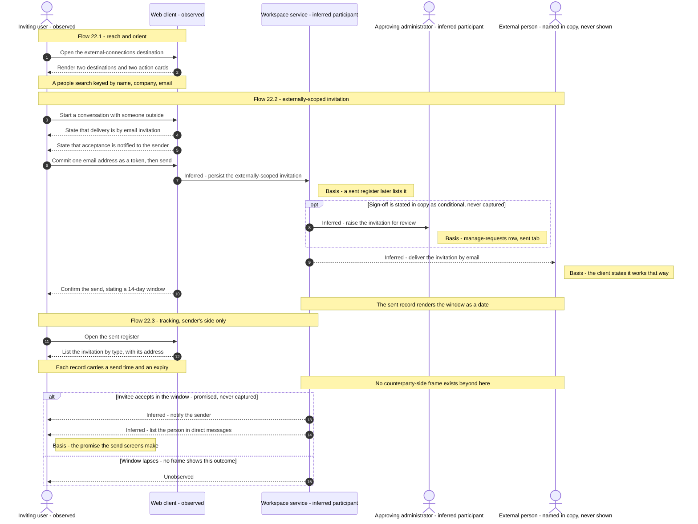

# External Collaboration

Working with people outside your own workspace: the dedicated external-connections destination, externally-scoped invitations and their acceptance window, the received and sent invitation registers, and the administered management surfaces that govern them — part of the [Workflow Catalog](README.md).

**This document exists because of taxonomy deviation D1 — it is the one area the original scaffold did not contain.** The corpus carries a dedicated top-level destination with its own sidebar, its own scoped people search, its own action cards and its own management rows [frame 494](../../screenshots/Slack%20web%20Jul%202024%20494.png), reached from a separated entry in the navigation rail's more menu [frame 399](../../screenshots/Slack%20web%20Jul%202024%20399.png), and it owns entities no other area owns — an external organization, a connection request, and an externally-scoped invitation with an acceptance window of its own [frame 500](../../screenshots/Slack%20web%20Jul%202024%20500.png). The full rationale for adding the area, and for naming it functionally rather than after the third-party product feature it depicts, is recorded once in the [master index](README.md).

## Purpose

This document specifies **collaboration with people who are not members of your workspace**. It is a distinct capability rather than a variant of direct messaging or of administration, and the corpus makes the distinction structurally: the capability has a destination of its own, whose content region replaces the conversation column entirely, whose sidebar lists two destinations of its own, and whose header carries an action cluster no conversation surface carries [frame 494](../../screenshots/Slack%20web%20Jul%202024%20494.png), [frame 501](../../screenshots/Slack%20web%20Jul%202024%20501.png).

Three things are specified here and nowhere else in the catalog. First, the **destination itself** — its regions, its scoped people search keyed by three distinct values, its two action cards and its stack of management rows [frame 494](../../screenshots/Slack%20web%20Jul%202024%20494.png). Second, the **externally-scoped invitation** — that a direct message to a person at another organization is delivered as an email invitation, that the sender is notified on acceptance, that the recipient has a stated fourteen-day window in which to accept, and that acceptance materialises the recipient as a direct-message conversation [frame 498](../../screenshots/Slack%20web%20Jul%202024%20498.png), [frame 500](../../screenshots/Slack%20web%20Jul%202024%20500.png). Third, the **invitation registers** — a received register where inbound invitations are accepted and a sent register that tracks outbound ones with a concrete expiry date [frame 501](../../screenshots/Slack%20web%20Jul%202024%20501.png), [frame 503](../../screenshots/Slack%20web%20Jul%202024%20503.png).

**Where the area is encountered.** Four routes into it are observed, and they differ in kind: one is a deliberate navigation, three are discoveries made while doing something else.

- **The navigation rail's more menu**, where an external-connections entry sits **after a separator rule** at the end of the destination list, carrying a building glyph and the one-line description "Work with people from other organizations" [frame 399](../../screenshots/Slack%20web%20Jul%202024%20399.png). This is the area's deliberate entry point. The rail, the menu and the destination map that routes this entry here are owned by [00-product-overview.md](00-product-overview.md).
- **A dismissible advisory inside the ordinary workspace invite modal**, anchored with its caret pointing up at the invite-as select, which asks whether the user is working with people from external organizations and offers an option to invite them to a channel either as external connections or as guest accounts [frame 45](../../screenshots/Slack%20web%20Jul%202024%2045.png). This is the in-flow discovery point: the moment a user inviting a coworker learns that a different mechanism exists for outsiders.
- **A third path inside the invite-as select itself.** Expanding it shows a member option and a guest option, then a visually separated footer group asking whether the user is working with another company and offering an add-people action that carries an **external-link affordance** — so this route leaves the modal rather than reconfiguring it [frame 49](../../screenshots/Slack%20web%20Jul%202024%2049.png).
- **Typing an unrecognised address into a channel's add-people modal**, which raises a disambiguation dialog that makes the user declare whether the person is from an external organization or from their own before the invitation is scoped [frame 65](../../screenshots/Slack%20web%20Jul%202024%2065.png).

**What this document does not own.** The workspace invite modal and its journey, the invite-link mechanism and its own separate expiry, and the guest-account invite wizard belong to [01-onboarding-and-auth.md](01-onboarding-and-auth.md). The add-people modal, channel creation and the three-dialog channel-invitation sequence belong to [02-channels.md](02-channels.md). The direct-message conversation that an acceptance materialises belongs to [05-direct-messages.md](05-direct-messages.md). The **account type itself** — guest, external or member — is a field of `E-USER` owned by [13-profiles-people.md](13-profiles-people.md), and so is the badge that marks it on a conversation row; this document contributes what its own surfaces show of it and owns neither. The `E-INVITATION` **record** likewise belongs to [01-onboarding-and-auth.md](01-onboarding-and-auth.md); what this document specifies is its externally-scoped **variant**, contributed to that one record rather than defined as a second entity. The administered surfaces the management rows open belong to [15-admin-workspace.md](15-admin-workspace.md). Every reusable component contract referenced here is defined once in [00-product-overview.md](00-product-overview.md) and is never restated.

## Flows in this area

Three flows are named for this area, spanning 10 frames. They are sequential in the corpus but independent in use: the destination can be explored without inviting anyone, an invitation can be sent from the destination without visiting the registers, and the registers can be read without sending anything.

Frame spans below are written as plain numeric ranges because they designate a span rather than cite one image, following the convention of the [Screenshot Coverage Index](_screenshot-index.md). Every individual frame is cited with its full relative link in the per-flow step tables and in the **Frames covered** section.

| Flow ID | Name | Frame span | Primary entry point |
|---|---|---|---|
| `22.1` | Explore the external-connections destination | 494–497 | The external-connections entry in the rail's more menu |
| `22.2` | Invite an external person into a conversation | 498–500 | A start-a-conversation action on the destination |
| `22.3` | Review external invitations received and sent | 501–503 | The invitations row in the area's own sidebar |

**Worked examples, given by shape rather than by value.** Each flow below carries a concrete example, but the examples name the **shape** of the observed fixture instead of reproducing it, because [00-product-overview.md](00-product-overview.md) establishes for the whole catalog that no workspace name, domain, channel name or person's name from the corpus is a value to reproduce — the fixtures illustrate shape only, and they are **sample data, never requirements**. Concretely: `22.1` searches for an external person by *a company name* rather than by the company the capture happens to show [frame 494](../../screenshots/Slack%20web%20Jul%202024%20494.png); `22.2` invites *one external email address at a domain outside the workspace* and reads back a confirmation naming that address in bold [frame 499](../../screenshots/Slack%20web%20Jul%202024%20499.png), [frame 500](../../screenshots/Slack%20web%20Jul%202024%20500.png); and `22.3` reads one outbound record of type *invited-to-direct-message* carrying *that same address*, *a relative send time* and *a calendar expiry date* [frame 503](../../screenshots/Slack%20web%20Jul%202024%20503.png). Third-party company names, customer logo marks and the photographs in the testimonial panel are named functionally throughout and are never reproduced, for the same reason.

## Flow 22.1 — Explore the external-connections destination

### Overview

The destination is a full-page surface, not a conversation. It orients a user who has never collaborated across organizations before, and it does four jobs at once: it explains the capability, it offers the two ways of starting (a shared channel or a one-to-one conversation), it exposes the three administered settings surfaces that govern the capability, and it sells the idea with a three-step explainer, a rotating testimonial and a customer strip [frame 494](../../screenshots/Slack%20web%20Jul%202024%20494.png), [frame 496](../../screenshots/Slack%20web%20Jul%202024%20496.png).

Two structural facts matter more than the copy. The content header and the people search **stay pinned while the body scrolls** — the same title and the same action cluster are rendered at the top of both the unscrolled and the scrolled captures [frame 494](../../screenshots/Slack%20web%20Jul%202024%20494.png), [frame 496](../../screenshots/Slack%20web%20Jul%202024%20496.png). And the body is **taller than the viewport**: the numbered explainer is clipped by the fold at the unscrolled capture and is only fully legible once scrolled [frame 494](../../screenshots/Slack%20web%20Jul%202024%20494.png), [frame 496](../../screenshots/Slack%20web%20Jul%202024%20496.png).

### Trigger

The external-connections entry in the navigation rail's more menu, which sits after a separator rule at the end of the destination list [frame 399](../../screenshots/Slack%20web%20Jul%202024%20399.png). Within the flow, the settings affordance in the content header's action cluster is the trigger for the menu step, and the carousel's own chevron is the trigger for the advance step [frame 495](../../screenshots/Slack%20web%20Jul%202024%20495.png), [frame 497](../../screenshots/Slack%20web%20Jul%202024%20497.png).

### Preconditions

An authenticated session with a workspace loaded, and the shell rendered. No prior external relationship is required — the destination renders its explanatory hero and its two action cards with no organizations listed at all [frame 494](../../screenshots/Slack%20web%20Jul%202024%20494.png). At this capture the workspace is on a trial-or-limited plan state, which is what makes the header's create-channel action carry a plan-tier badge; the entitlement contract itself is `C-UPGRADE-GATE`, defined in [00-product-overview.md](00-product-overview.md).

### Frame-by-frame steps

| Step | Frame(s) | What the user does | What changes on screen | Component(s) involved |
|---|---|---|---|---|
| 1 | [frame 399](../../screenshots/Slack%20web%20Jul%202024%20399.png) | Opens the rail's more menu and chooses the external-connections entry | The menu lists the destinations the rail is not showing; the external-connections entry is set apart below a separator rule, carrying a building glyph and the description "Work with people from other organizations" | `C-RAIL`, `C-DROPDOWN-MENU` |
| 2 | [frame 494](../../screenshots/Slack%20web%20Jul%202024%20494.png) | Arrives on the destination | The content region is replaced wholesale: no conversation header, no bookmark row and no composer. The sidebar becomes a destination-scoped variant whose header is the bare title "External connections" with no header controls, and whose body holds exactly two rows — an organizations row rendered active with a filled highlight, and an invitations row | `C-SIDEBAR` |
| 3 | [frame 494](../../screenshots/Slack%20web%20Jul%202024%20494.png) | Reads the content header | The title "External organizations" sits at the leading edge; the trailing edge carries an action cluster in this order — a settings affordance, a create-channel action carrying an inline badge that names a paid plan tier, and a start-a-conversation action rendered as an outlined secondary | `C-TOP-BAR`, `C-UPGRADE-GATE` |
| 4 | [frame 494](../../screenshots/Slack%20web%20Jul%202024%20494.png) | Reads the search field | A search input spans the content width beneath the header, with a leading magnifier glyph and a placeholder naming **three accepted keys — a person's name, their company, and their email address** | `C-SEARCH-ENTRY` |
| 5 | [frame 494](../../screenshots/Slack%20web%20Jul%202024%20494.png) | Reads the hero | A tinted band holds a heading about working with people outside your workspace in the product, a two-line body paragraph about moving conversations out of siloed email threads and collaborating with external people, clients, vendors and partners, and an illustration of two figures shaking hands at the band's trailing edge | `C-EMPTY-STATE` |
| 6 | [frame 494](../../screenshots/Slack%20web%20Jul%202024%20494.png) | Reads the two action cards | Two equal-width cards sit side by side inside the same tinted band. The leading card is headed "Create a channel with external people", explains that it is for working with multiple people and organizations outside the workspace, and carries a **filled primary** create-channel action. The trailing card is headed "Talk one-on-one", explains that it is for talking one-to-one with anyone outside the workspace, and carries an **outlined secondary** start-a-conversation action | `C-EMPTY-STATE` |
| 7 | [frame 494](../../screenshots/Slack%20web%20Jul%202024%20494.png) | Reads the management rows | A small section label about setting the workspace up for safe, secure collaboration introduces a bordered vertical stack of three rows. Each row carries a leading function glyph, a title, one line of supporting copy, and an **external-link affordance at its trailing edge**: a customize-settings row about setting permissions and view options for added security; a manage-requests row about reviewing and approving connection requests from your team; and a manage-connections row about streamlining approvals with trusted partners | `C-DATA-TABLE` |
| 8 | [frame 495](../../screenshots/Slack%20web%20Jul%202024%20495.png) | Activates the settings affordance | A menu opens anchored beneath the affordance, overlapping the search field's trailing end and the hero's upper-trailing corner. It carries three rows — customize settings, manage connections, and manage external-connection invitations — of which **only the first carries an external-link affordance** | `C-DROPDOWN-MENU` |
| 9 | [frame 496](../../screenshots/Slack%20web%20Jul%202024%20496.png) | Scrolls the body | The header and the search field stay pinned; the hero, the action cards and the management rows scroll away. A centred heading about how to create channels with external people is followed by a numbered three-step strip — three numbered discs joined by dashed rules, each with a bold title and a two-line description | `C-DATA-TABLE` |
| 10 | [frame 496](../../screenshots/Slack%20web%20Jul%202024%20496.png) | Reads the three steps | Step one: create a channel, inviting people from outside the workspace to it using their email address. Step two: partners accept the invite and set the shared channel up in their own workspace. Step three: work securely and efficiently, because invitees will only have access to the conversations they are invited to | `C-DATA-TABLE` |
| 11 | [frame 496](../../screenshots/Slack%20web%20Jul%202024%20496.png) | Reads the testimonial | A tinted panel holds a circular photograph at its leading edge, a quotation with one clause emphasised in bold, and an attribution of a person's name above a role-and-company line. A forward chevron sits at the panel's trailing edge, and three pagination indicators sit beneath the quotation with the **first** filled and the other two muted | `C-AVATAR` |
| 12 | [frame 496](../../screenshots/Slack%20web%20Jul%202024%20496.png) | Reads the closing strip | A centred heading naming a six-figure count of organizations already collaborating this way sits above a strip of four customer logo marks | `C-BANNER` |
| 13 | [frame 497](../../screenshots/Slack%20web%20Jul%202024%20497.png) | Advances the testimonial to the end of the set | The photograph, quotation and attribution are replaced; the **third** pagination indicator becomes filled and the first two are muted; and the chevron **moves to the panel's leading edge** — the forward affordance is no longer rendered | `C-AVATAR` |

**Inferred:** the pagination set holds exactly three items, because three indicators are rendered and the third is the one that becomes active [frame 496](../../screenshots/Slack%20web%20Jul%202024%20496.png), [frame 497](../../screenshots/Slack%20web%20Jul%202024%20497.png). The middle item is never captured.

**Inferred:** the destination requires no existing external relationship, because the surface renders its hero and both action cards with no organizations list present at either capture of the organizations destination [frame 494](../../screenshots/Slack%20web%20Jul%202024%20494.png), [frame 496](../../screenshots/Slack%20web%20Jul%202024%20496.png).

**Three things this flow reaches but never shows.** Each is declared below rather than described, because the destination names them without opening them. The first concerns the organizations register itself.

> **Partial capture:** a **populated** organizations list is never shown, so the row anatomy of a listed external organization — what identifies it, what state it displays and what actions it offers — is not specified here. Nor is a distinct empty state for the organizations destination: the hero and cards are what this destination renders in the observed state, and the corpus does not distinguish an empty variant from a populated one. The people search is never shown with a query typed, so its result rows, its no-match state and whether it searches across the three keys simultaneously or one at a time are all unobserved.

The second concerns the administered surfaces the destination links out to.

> **Partial capture:** all three management rows and all three settings-menu entries are **entry points only**. No frame shows what any of them opens — there is no requests list, no per-request detail, no approve or decline control, no approval confirmation, no connections table and no permissions form anywhere in the corpus. Their destinations are **unobserved**: each is marked with an external-link affordance on at least one list, which per the external-link-glyph rule in [00-product-overview.md](00-product-overview.md) evidences only that the product marked the entry as leaving and says nothing about where it goes. The administered surfaces they most plausibly reach are owned by [15-admin-workspace.md](15-admin-workspace.md), and an approval screen that cannot be cited does not exist for this catalog.

The third concerns the other of the destination's two starting actions.

> **Partial capture:** the create-channel action is never followed. What lies past the plan gate — the channel-creation form for an externally-shared channel, how an external organization is chosen or addressed, and what the resulting channel looks like — is not captured from this destination. The nearest observed evidence is the channel-scoped invitation sequence that starts inside a channel's add-people modal, which [02-channels.md](02-channels.md) owns and which is discussed under **Transitions in and out**.

## Flow 22.2 — Invite an external person into a conversation

### Overview

Starting a one-to-one conversation with someone outside the workspace is not a compose action — it is an **invitation**. The modal says so before the user types anything: a direct message to a person at another organization is sent as an email invitation, and the sender is notified as soon as the recipient accepts [frame 498](../../screenshots/Slack%20web%20Jul%202024%20498.png). One address is collected, committed as a removable token, and sent; the confirmation then states the two facts that define the pending relationship — a **fourteen-day acceptance window**, and that acceptance makes the recipient appear in the sender's list of direct messages [frame 500](../../screenshots/Slack%20web%20Jul%202024%20500.png).

This is the shortest flow in the area and the one carrying its hardest facts. It is three frames: the empty modal, the modal with an address committed, and the confirmation.

### Trigger

A start-a-conversation action on the external-connections destination. The modal is captured over the **unscrolled** destination, and both the header's action cluster and the trailing action card expose an identically-labelled start-a-conversation control [frame 494](../../screenshots/Slack%20web%20Jul%202024%20494.png), [frame 498](../../screenshots/Slack%20web%20Jul%202024%20498.png).

**Inferred:** either control opens this modal, because the two are labelled identically and the modal is captured over the region that holds both, with no intermediate frame distinguishing them [frame 494](../../screenshots/Slack%20web%20Jul%202024%20494.png), [frame 498](../../screenshots/Slack%20web%20Jul%202024%20498.png). A build should treat them as two entry points onto one modal; the corpus cannot tell them apart.

### Preconditions

An authenticated session on the external-connections destination. **No plan-tier badge is rendered on this path** — unlike the create-channel action beside it, the start-a-conversation action carries no badge at either capture [frame 494](../../screenshots/Slack%20web%20Jul%202024%20494.png), [frame 495](../../screenshots/Slack%20web%20Jul%202024%20495.png). Per the entitlement obligation in [21-states.md](21-states.md) that is a statement about what is **drawn** and not about what is permitted: the absence of a badge is not an entitlement, entitlement is not authorization, and both are evaluated server-side at the moment the action is attempted. **Whether the recipient already has an account is unobserved.** The address is entered into a single input carrying an add-an-email-address placeholder and committed as a token [frame 498](../../screenshots/Slack%20web%20Jul%202024%20498.png), [frame 499](../../screenshots/Slack%20web%20Jul%202024%20499.png), and the counterparty side is entirely uncaptured, as this flow's partial-capture note records — so nothing here establishes that an account is or is not required.

### Frame-by-frame steps

| Step | Frame(s) | What the user does | What changes on screen | Component(s) involved |
|---|---|---|---|---|
| 1 | [frame 498](../../screenshots/Slack%20web%20Jul%202024%20498.png) | Activates a start-a-conversation action | A centred modal opens and the backdrop dims across every shell region. Its upper third is an illustration band on a tinted ground — a stylised message list with two avatars, message lines, a reaction indicator carrying a count, and an attachment card — with the dismiss control at the trailing top corner, placed on the illustration itself | `C-MODAL-SHELL` |
| 2 | [frame 498](../../screenshots/Slack%20web%20Jul%202024%20498.png) | Reads the modal | Beneath the illustration: a heading about messaging with external people, then body copy stating that the capability lets you securely send direct messages to external people from other organizations, that an invitation is sent via email, and that you will be notified as soon as they accept | `C-MODAL-SHELL` |
| 3 | [frame 498](../../screenshots/Slack%20web%20Jul%202024%20498.png) | Sees the empty form | One full-width input carries the placeholder "Add an email address". The footer pairs a help-glyph link about the capability at its leading edge with a send-invitation action at its trailing edge, rendered **muted** | `C-CHIP-INPUT`, `C-MODAL-SHELL` |
| 4 | [frame 499](../../screenshots/Slack%20web%20Jul%202024%20499.png) | Enters an email address and commits it | The address becomes a token inside the input — a leading send glyph, the address, a small dark pill-shaped marker, and a trailing remove control — and the send-invitation action becomes a **filled primary**. Nothing else in the modal changes | `C-CHIP-INPUT` |
| 5 | [frame 500](../../screenshots/Slack%20web%20Jul%202024%20500.png) | Sends the invitation | The modal is replaced in place by a shorter confirmation over the same dimmed backdrop: a circular success disc carrying a check glyph centred at the top, a dismiss control at the trailing top corner, and a centred heading reading "Invitation sent" | `C-MODAL-SHELL` |
| 6 | [frame 500](../../screenshots/Slack%20web%20Jul%202024%20500.png) | Reads the confirmation | Left-aligned body copy names the invited address in bold and states that the recipient has **14 days to accept** and that once they do, they will appear in the sender's list of direct messages. A single filled primary reading "Done" closes the footer; there is no secondary action and no route back to the form | `C-MODAL-SHELL` |

**The acceptance-window sentence, closely paraphrased and cited.** The confirmation states that you have invited the named address to start a conversation in the product, that they will have **14 days to accept**, and that once they do they will appear in your list of direct messages [frame 500](../../screenshots/Slack%20web%20Jul%202024%20500.png). This is the single most load-bearing sentence in the area: it establishes that an externally-scoped invitation is time-bounded, and it is the only place in the corpus where the product states what acceptance produces.

**Two distinct acceptance signals are observed, and a build needs both.** The form promises that the sender will be **notified** as soon as the recipient accepts [frame 498](../../screenshots/Slack%20web%20Jul%202024%20498.png); the confirmation promises that the recipient will **appear in the sender's direct-message list** [frame 500](../../screenshots/Slack%20web%20Jul%202024%20500.png). These are different consequences — a notification and a materialised conversation — stated on different screens of the same flow, and neither implies the other.

**Inferred:** the address is required and is validated as a token rather than as text, because the send action is muted while the input is empty [frame 498](../../screenshots/Slack%20web%20Jul%202024%20498.png) and filled once an address has been committed as a token [frame 499](../../screenshots/Slack%20web%20Jul%202024%20499.png). No frame shows the action's state while an address is typed but not yet committed.

**Inferred:** the form accepts one recipient per invitation, because only one token is ever rendered and the confirmation is written in the singular about a single invited address [frame 499](../../screenshots/Slack%20web%20Jul%202024%20499.png), [frame 500](../../screenshots/Slack%20web%20Jul%202024%20500.png). The token affordance would permit more; the corpus does not show more.

**Two declared gaps close this flow**, and the second of them is the largest single gap in the area.

> **Partial capture:** no frame shows a rejected address, a malformed-address message, an address that already belongs to the workspace, or a duplicate invitation to an address already invited. The inline validation contract those cases would use is `C-INLINE-VALIDATION`, defined in [00-product-overview.md](00-product-overview.md), but this area has no frame that exercises it.

The second is the largest gap in the area, and the one a build is most tempted to fill from prior knowledge.

> **Partial capture:** the entire counterparty side is uncaptured. Nothing in the corpus is taken from the recipient's screen or from the external organization's workspace. What the invitation email contains, what the recipient sees on opening it, what accepting looks like from their side, and what happens when the window lapses are all unobserved. The **only** observed statements about the recipient are the three the sender's own screens render: that the invitation travels by email and that acceptance is notified [frame 498](../../screenshots/Slack%20web%20Jul%202024%20498.png), that the window is fourteen days and that acceptance materialises a direct-message conversation [frame 500](../../screenshots/Slack%20web%20Jul%202024%20500.png), and that a partner who accepts a channel invitation sets the shared channel up in their own workspace [frame 496](../../screenshots/Slack%20web%20Jul%202024%20496.png).

## Flow 22.3 — Review external invitations received and sent

### Overview

The area's second sidebar destination is a register of invitations, split by direction. Two tabs divide it — received and sent — and the corpus captures the received register empty, the sent register empty, and the sent register holding one outbound record [frame 501](../../screenshots/Slack%20web%20Jul%202024%20501.png), [frame 502](../../screenshots/Slack%20web%20Jul%202024%20502.png), [frame 503](../../screenshots/Slack%20web%20Jul%202024%20503.png).

This destination is **structurally poorer than its sibling**, and deliberately so: the content header carries the title and nothing else. The settings affordance, the create-channel action, the start-a-conversation action and the people search are all absent here [frame 501](../../screenshots/Slack%20web%20Jul%202024%20501.png) versus [frame 494](../../screenshots/Slack%20web%20Jul%202024%20494.png). A build that shares one header component across both destinations must therefore treat the action cluster and the search field as per-destination, not as properties of the area.

### Trigger

The invitations row in the area's own sidebar, the second of its two destinations [frame 494](../../screenshots/Slack%20web%20Jul%202024%20494.png), [frame 501](../../screenshots/Slack%20web%20Jul%202024%20501.png). Within the flow, the sent tab is the trigger for the direction switch [frame 502](../../screenshots/Slack%20web%20Jul%202024%20502.png).

### Preconditions

An authenticated session on the external-connections destination, so that the area's sidebar is rendered. Neither register requires content: both are captured empty, each with its own illustration, heading and copy [frame 501](../../screenshots/Slack%20web%20Jul%202024%20501.png), [frame 502](../../screenshots/Slack%20web%20Jul%202024%20502.png).

### Frame-by-frame steps

| Step | Frame(s) | What the user does | What changes on screen | Component(s) involved |
|---|---|---|---|---|
| 1 | [frame 501](../../screenshots/Slack%20web%20Jul%202024%20501.png) | Selects the invitations row in the area's sidebar | The organizations row loses its highlight and the invitations row takes it. The content region is replaced: the title becomes "Invitations", and the header's action cluster and the people search are **gone** | `C-SIDEBAR` |
| 2 | [frame 501](../../screenshots/Slack%20web%20Jul%202024%20501.png) | Reads the tab bar | Two tabs sit beneath the title — received, active and underlined, then sent. Neither tab carries a count | `C-TAB-BAR` |
| 3 | [frame 501](../../screenshots/Slack%20web%20Jul%202024%20501.png) | Reads the empty received register | A centred empty state: a circular tinted illustration with a binoculars motif, a heading stating there are no new invitations yet, two lines of reassuring copy saying this is the right place to accept them and that the user will be told when a new one arrives, and a learn-more link about the capability | `C-EMPTY-STATE` |
| 4 | [frame 502](../../screenshots/Slack%20web%20Jul%202024%20502.png) | Switches to the sent tab | The underline moves to the sent tab. A different centred empty state renders: a circular tinted illustration with a paper-plane motif, a heading about tracking your invitations, one line stating that the status of invitations you have sent appears here, and a learn-more link | `C-TAB-BAR`, `C-EMPTY-STATE` |
| 5 | [frame 502](../../screenshots/Slack%20web%20Jul%202024%20502.png) | Reads the explainer beneath the empty state | A short horizontal rule separates the empty state from a numbered three-item explainer, each item centred on its own line: invite someone to join a channel via email or link; **depending on your company, admins may need to sign off**; and then they are in, and can add their coworkers too | `C-EMPTY-STATE` |
| 6 | [frame 503](../../screenshots/Slack%20web%20Jul%202024%20503.png) | Returns to the sent tab with one invitation outstanding | A single bordered card spans the content width. Its top row pairs a group label reading "Invited to direct message:" at the leading edge with a relative timestamp at the trailing edge. Beneath it, a square tinted tile carrying a conversation glyph precedes the invitee address in bold, above a muted line stating the date the invitation expires | `C-RECORD-CARD` |
| 7 | [frame 503](../../screenshots/Slack%20web%20Jul%202024%20503.png) | Looks for a way to act on the record | **Nothing is offered.** The card carries no revoke control, no resend control and no overflow control — the record is readable but not actionable on this surface | `C-RECORD-CARD` |

**The sent register is grouped by invitation type, not merely listed.** The label above the record names the kind of invitation it is — an invitation to a direct message — and is punctuated as a group heading rather than as a row label [frame 503](../../screenshots/Slack%20web%20Jul%202024%20503.png). **Inferred:** other invitation types would form their own groups on the same surface, because the single observed group is typed and the corpus shows at least one other externally-scoped type — a channel-scoped invitation [frame 65](../../screenshots/Slack%20web%20Jul%202024%2065.png). No frame shows a second group.

**The conditional administrator sign-off is observed copy, and it is the area's only evidence of an approval gate.** The sent register's explainer states that, depending on the company, administrators may need to sign off on an invitation [frame 502](../../screenshots/Slack%20web%20Jul%202024%20502.png). That makes approval a conditional, configurable step in the invitation lifecycle rather than a universal one — and it corroborates the manage-requests row, which describes reviewing and approving connection requests from your team [frame 494](../../screenshots/Slack%20web%20Jul%202024%20494.png). Both are statements *about* approval; neither is an approval screen.

**Inferred:** the concrete expiry date on a sent record is the acceptance window resolved against the send date, because the confirmation states the window as a fourteen-day duration [frame 500](../../screenshots/Slack%20web%20Jul%202024%20500.png) while the record renders it as a calendar date [frame 503](../../screenshots/Slack%20web%20Jul%202024%20503.png). The corpus never shows a send date and its expiry date in the same capture, so the arithmetic is **not** verified — a build should store the window and derive the date, and should not assume the two captures describe the same invitation.

**Two declared gaps close this flow.**

> **Partial capture:** the received register is never shown populated. An inbound invitation's row anatomy, and the accept and decline controls the empty state's own copy implies, are unobserved — the copy says this is where invitations are accepted, but no frame shows the act. Likewise unobserved: an expired record, a revoked record, a declined record, and any state on a sent record other than outstanding. The only status the corpus renders is an expiry date on a live record [frame 503](../../screenshots/Slack%20web%20Jul%202024%20503.png).

The second concerns the tab bar rather than the records beneath it.

> **Partial capture:** neither tab carries a count [frame 501](../../screenshots/Slack%20web%20Jul%202024%20501.png), and no frame shows the tabs with content on both sides, so whether counts appear once a register is non-empty cannot be determined. The `C-TAB-BAR` contract in [00-product-overview.md](00-product-overview.md) records both counted and uncounted variants; this area only evidences the uncounted one.

## Screens & components

Three screens make up this area — two destinations and one modal that renders over the first of them. All sizing below is **proportional to the effective product viewport** and is never an absolute offset, and all iconography is named by what it does.

### The organizations destination, region by region

The area is a destination inside the persistent shell owned by [00-product-overview.md](00-product-overview.md): the top bar and the navigation rail are untouched, and the area replaces the sidebar's contents and the whole content region [frame 494](../../screenshots/Slack%20web%20Jul%202024%20494.png).

| Region | Position and ordering | Relative size | Contents, in order |
|---|---|---|---|
| Area sidebar | Second column, in the shell's sidebar slot | The shell's usual sidebar width, roughly between one-fifth and one-quarter of viewport width | A bare title header carrying no controls, then exactly two destination rows — organizations, then invitations — each with a leading glyph, and nothing beneath them [frame 494](../../screenshots/Slack%20web%20Jul%202024%20494.png) |
| Content header (pinned) | First band of the content region, spanning its full width | Roughly one-fifteenth of viewport height | Title at the leading edge; at the trailing edge an action cluster ordered settings affordance, badged create-channel action, outlined start-a-conversation action [frame 494](../../screenshots/Slack%20web%20Jul%202024%20494.png) |
| Search band (pinned) | Second band, directly beneath the header | A single input row, spanning the content width | Leading magnifier glyph and a placeholder naming three accepted keys [frame 494](../../screenshots/Slack%20web%20Jul%202024%20494.png) |
| Hero band (scrolls) | Third band, on a tinted ground distinct from the surface default | Roughly two-fifths of viewport height | Heading and body paragraph occupying the leading two-thirds, illustration at the trailing third; beneath them two equal-width action cards side by side [frame 494](../../screenshots/Slack%20web%20Jul%202024%20494.png) |
| Management band (scrolls) | Fourth band, back on the surface default | Roughly one-quarter of viewport height | A small section label above a bordered stack of three full-width rows, each row a leading glyph, a title, one supporting line, and a trailing external-link affordance [frame 494](../../screenshots/Slack%20web%20Jul%202024%20494.png) |
| Explainer band (below the fold) | Fifth band | Clipped at the unscrolled capture; roughly one-third of viewport height when scrolled to | A centred heading above three numbered discs joined by dashed rules, each disc captioned with a bold title and a two-line description [frame 494](../../screenshots/Slack%20web%20Jul%202024%20494.png), [frame 496](../../screenshots/Slack%20web%20Jul%202024%20496.png) |
| Testimonial band (below the fold) | Sixth band, on a tinted panel inset from the content edges | Roughly one-fifth of viewport height | Circular photograph at the leading edge, quotation and attribution filling the centre, a directional chevron at one edge, three pagination indicators centred beneath the quotation [frame 496](../../screenshots/Slack%20web%20Jul%202024%20496.png) |
| Customer band (below the fold) | Final band | Roughly one-eighth of viewport height | A centred heading above a single row of four evenly spaced customer logo marks [frame 496](../../screenshots/Slack%20web%20Jul%202024%20496.png) |

**Hierarchy.** The first two bands are pinned and the remaining six scroll beneath them, which is established by the header and search band rendering identically at the unscrolled and scrolled captures while everything below them changes [frame 494](../../screenshots/Slack%20web%20Jul%202024%20494.png), [frame 496](../../screenshots/Slack%20web%20Jul%202024%20496.png). The settings menu layers above the pinned bands, anchored to its affordance and leaving its backdrop legible [frame 495](../../screenshots/Slack%20web%20Jul%202024%20495.png). The invitation modal layers above everything and dims the backdrop across all four shell regions [frame 498](../../screenshots/Slack%20web%20Jul%202024%20498.png).

### The invitations destination, region by region

| Region | Position and ordering | Relative size | Contents, in order |
|---|---|---|---|
| Area sidebar | Unchanged from the organizations destination | Unchanged | The same two rows, with the highlight moved to invitations [frame 501](../../screenshots/Slack%20web%20Jul%202024%20501.png) |
| Content header | First band | Roughly one-fifteenth of viewport height | The title alone at the leading edge — **no action cluster and no search band on this destination** [frame 501](../../screenshots/Slack%20web%20Jul%202024%20501.png) |
| Tab bar | Second band, directly beneath the title, above a full-width rule | A single row of two labels | Received, then sent; the active label emphasised and underlined; no counts [frame 501](../../screenshots/Slack%20web%20Jul%202024%20501.png), [frame 502](../../screenshots/Slack%20web%20Jul%202024%20502.png) |
| Register body | Remaining height | The rest of the content region | Empty: a centred illustration, heading, copy and learn-more link, optionally followed by a rule and a numbered explainer [frame 501](../../screenshots/Slack%20web%20Jul%202024%20501.png), [frame 502](../../screenshots/Slack%20web%20Jul%202024%20502.png). Populated: full-width record cards stacked from the top of the body under a typed group label [frame 503](../../screenshots/Slack%20web%20Jul%202024%20503.png) |

### The invitation modal and its confirmation

Both are centred over a dimmed backdrop and both use the shared modal container; they differ in height and in what fills them [frame 498](../../screenshots/Slack%20web%20Jul%202024%20498.png), [frame 500](../../screenshots/Slack%20web%20Jul%202024%20500.png).

| Screen | Stacking order, top to bottom | Notes on proportion |
|---|---|---|
| Invitation form | Illustration band on a tinted ground with the dismiss control at its trailing top corner · heading · three-line body paragraph · one full-width input · footer pairing a help-glyph link at the leading edge with the send action at the trailing edge | The illustration band takes roughly the upper third of the modal's height; the modal itself occupies roughly a third of the viewport width [frame 498](../../screenshots/Slack%20web%20Jul%202024%20498.png) |
| Confirmation | Circular success disc carrying a check glyph, centred · dismiss control at the trailing top corner · centred heading · left-aligned body paragraph · footer holding one filled primary at the trailing edge | Roughly half the form's height and the same width; there is no illustration band and no secondary action [frame 500](../../screenshots/Slack%20web%20Jul%202024%20500.png) |

### Components used

Every identifier below is defined once in [00-product-overview.md](00-product-overview.md). This section records **how this area uses each one**, never what the contract is.

| Component | How this area uses it | Frames |
|---|---|---|
| `C-SIDEBAR` | The destination-scoped variant: a bare-title header with no controls, and a body of exactly two destination rows carrying the active highlight between them | [frame 494](../../screenshots/Slack%20web%20Jul%202024%20494.png), [frame 501](../../screenshots/Slack%20web%20Jul%202024%20501.png) |
| `C-RAIL`, `C-DROPDOWN-MENU` | The area's deliberate entry point — the more menu's separated external-connections entry; and, on the destination itself, the settings menu anchored to its affordance | [frame 399](../../screenshots/Slack%20web%20Jul%202024%20399.png), [frame 495](../../screenshots/Slack%20web%20Jul%202024%20495.png) |
| `C-TOP-BAR` | Unchanged by the area; the content header's own action cluster is a property of the destination, not of the top bar | [frame 494](../../screenshots/Slack%20web%20Jul%202024%20494.png) |
| `C-SEARCH-ENTRY` | The scoped-search variant: a search field inside a destination surface rather than in the top bar, its placeholder naming three accepted keys | [frame 494](../../screenshots/Slack%20web%20Jul%202024%20494.png) |
| `C-MODAL-SHELL` | Twice — the invitation form, and the confirmation that replaces it in place over the same dimmed backdrop | [frame 498](../../screenshots/Slack%20web%20Jul%202024%20498.png), [frame 500](../../screenshots/Slack%20web%20Jul%202024%20500.png) |
| `C-CHIP-INPUT` | One recipient address committed as a removable token carrying a leading send glyph, which is the variant the contract already records for an address rather than a member | [frame 499](../../screenshots/Slack%20web%20Jul%202024%20499.png) |
| `C-EMPTY-STATE` | Three times, and in two different registers — the explanatory hero with its illustration and action cards on the organizations destination, and the two register empty states each with its own illustration, heading, copy and learn-more link | [frame 494](../../screenshots/Slack%20web%20Jul%202024%20494.png), [frame 501](../../screenshots/Slack%20web%20Jul%202024%20501.png), [frame 502](../../screenshots/Slack%20web%20Jul%202024%20502.png) |
| `C-TAB-BAR` | The uncounted variant, dividing the invitation register by direction | [frame 501](../../screenshots/Slack%20web%20Jul%202024%20501.png), [frame 502](../../screenshots/Slack%20web%20Jul%202024%20502.png) |
| `C-UPGRADE-GATE` | The inline badge naming a paid plan tier on the header's create-channel action — present there and absent from the identically-labelled action inside the card below it | [frame 494](../../screenshots/Slack%20web%20Jul%202024%20494.png), [frame 495](../../screenshots/Slack%20web%20Jul%202024%20495.png) |
| `C-DATA-TABLE` | Twice as a stack of uniform rows — the three management rows, and the three-step numbered explainer | [frame 494](../../screenshots/Slack%20web%20Jul%202024%20494.png), [frame 496](../../screenshots/Slack%20web%20Jul%202024%20496.png) |
| `C-RECORD-CARD` | The sent register's outbound record: a typed group label above a card of labelled values, with no field left empty and no action offered | [frame 503](../../screenshots/Slack%20web%20Jul%202024%20503.png) |
| `C-AVATAR` | The circular photograph in the testimonial panel, at a larger size than any conversation avatar in the corpus | [frame 496](../../screenshots/Slack%20web%20Jul%202024%20496.png), [frame 497](../../screenshots/Slack%20web%20Jul%202024%20497.png) |
| `C-BANNER` | The customer strip, a full-width region-level block carrying a heading and four logo marks rather than a message about any one control | [frame 496](../../screenshots/Slack%20web%20Jul%202024%20496.png) |
| `C-CONTENT-CAROUSEL` | The testimonial panel — one item at a time, a forward chevron at the outer edge and three pagination indicators beneath, the back affordance suppressed on the first item. Reported from this area and contracted in [00-product-overview.md](00-product-overview.md) | [frame 496](../../screenshots/Slack%20web%20Jul%202024%20496.png), [frame 497](../../screenshots/Slack%20web%20Jul%202024%20497.png) |

**A recurring structure reported rather than defined, and now contracted as `C-CONTENT-CAROUSEL`.** The testimonial panel is a **paged content carousel**: a single item rendered at a time, a directional chevron at one edge, and a row of pagination indicators whose filled position tracks the item on show, with the forward affordance suppressed at the end of the set and the back affordance at its start [frame 496](../../screenshots/Slack%20web%20Jul%202024%20496.png), [frame 497](../../screenshots/Slack%20web%20Jul%202024%20497.png). It was not one of the identifiers the inventory then held and it is **not defined here** — this catalog defines every component contract in exactly one place. It was reported to [00-product-overview.md](00-product-overview.md), together with the observation that the same structure already appears inside that document's `C-DETAILS-PANE` contract as a card carousel with a pager indicator, so one shared identifier was warranted rather than two local descriptions. It is now contracted there as `C-CONTENT-CAROUSEL`, and this document references it by identifier while keeping the observational detail above; a build treats both occurrences as that one component.

### Iconography, named by function

Only these glyphs appear in this area, each named by what it does rather than by any asset: a building glyph on the rail entry, the organizations sidebar row and the from-another-company label; a send glyph on the invitations sidebar row, the manage-requests row and the committed address token; a gear glyph on the settings affordance and the customize-settings row; a grid glyph on the manage-connections row; a magnifier on the search field; an external-link glyph on the three management rows and on the settings menu's first entry; a dismiss cross on both modals and on the advisory; a chip-remove cross on the address token; a check glyph inside the success disc; a help glyph on the learn-more link; a conversation glyph on the sent record's type tile; and a directional chevron on the testimonial panel. The four customer logo marks in the closing strip and the illustrations throughout are third-party imagery, specified as *four customer logo marks* and *an illustration* and never reproduced; the product logo mark and product wordmark appear in this area only as placeholders in the positions named above.

### The multi-actor journey

One diagram covers the area's cross-actor arithmetic: how an inviting user, the client and a person at another organization interact; where a conditional administrator sign-off is said to enter; and exactly where the corpus stops.

**Which parts of it are observed, and which are not.** The corpus is a set of client screens, so only two of the five participants and only the messages between them are directly observable. The inviting user and the web client are observed on every frame this area cites. **The workspace service and the approving administrator are inferred participants** — no frame shows a server, a service response or an administrator's screen — and they are labelled as inferred in the diagram itself, as is every message that crosses to or from them. The external person is named as a recipient in the client's own copy but never appears as an actor. Every message drawn without an `Inferred` prefix corresponds to something a cited frame renders; every message drawn with one is a deduction whose basis is the copy on the cited frame, and the `Partial capture` block immediately beneath the diagram names each of them.

**Where each message's frame provenance lives.** The diagram itself carries no frame numbers, because a fenced diagram cannot carry a link and its lines must stay short enough to read without horizontal scrolling in the published site. Provenance is therefore held where it can be cited in the mandated linked form: each flow's frame-by-frame step table above names the frames for every step the diagram summarises, the `Partial capture` block below names the frames behind each inferred message, and [Frames covered](#frames-covered) closes the set. No frame cited anywhere in this area is reachable only from the diagram.

> **Partial capture:** five of the diagram's messages are deductions rather than observations, and they are the diagram's weakest edges. **Persisting the invitation** is deduced from a sent register that later lists it, not from any frame showing the write [frames 500, 503]. **Raising it for an administrator's review** is deduced only from copy — a manage-requests row that names reviewing and approving requests from your team, and a sent tab that mentions approval — and the corpus never opens the requests destination, so no request, no decision and no confirmation is ever shown [frames 494, 502]; this is the same gap the gotcha *Do not build an approval screen from this area* records, and the two statements agree. **Delivering the invitation by email** is deduced from the client's own statement that delivery happens that way, not from any capture of the mail [frame 498]. **Notifying the sender on acceptance** and **the lapse of the window** are both promised on the sender's screens and neither outcome is captured [frames 498, 500]. A build must therefore take the approval branch, the delivery mechanism and both terminal outcomes from a product decision recorded elsewhere, not from this area.

## States

Every state below is rendered by a cited frame. States a build will need but that no frame in this area exercises are listed afterwards as gaps rather than guessed at.

| State | How it renders | Exemplar |
|---|---|---|
| Destination, default | The organizations destination with its hero, both action cards and the management stack, and no organizations list | [frame 494](../../screenshots/Slack%20web%20Jul%202024%20494.png) |
| Destination, anchored menu open | The settings menu overlaying the pinned bands, backdrop left legible and undimmed | [frame 495](../../screenshots/Slack%20web%20Jul%202024%20495.png) |
| Destination, scrolled | Header and search band pinned in place while the bands below them are replaced by the explainer, testimonial and customer strip | [frame 496](../../screenshots/Slack%20web%20Jul%202024%20496.png) |
| Sidebar row, active versus inactive | The active row carries a filled highlight; the inactive row carries none, and the highlight moves between exactly two rows | [frame 494](../../screenshots/Slack%20web%20Jul%202024%20494.png), [frame 501](../../screenshots/Slack%20web%20Jul%202024%20501.png) |
| Paged carousel, first item | Pagination indicator one filled, chevron rendered at the trailing edge only | [frame 496](../../screenshots/Slack%20web%20Jul%202024%20496.png) |
| Paged carousel, final item | Pagination indicator three filled, chevron rendered at the leading edge only | [frame 497](../../screenshots/Slack%20web%20Jul%202024%20497.png) |
| Modal, required field unsatisfied | Backdrop dimmed across all four shell regions; the input shows only its placeholder; the primary action rendered muted | [frame 498](../../screenshots/Slack%20web%20Jul%202024%20498.png) |
| Modal, required field satisfied | The address rendered as a removable token; the primary action rendered filled; no other change | [frame 499](../../screenshots/Slack%20web%20Jul%202024%20499.png) |
| Success | A shorter modal replacing the form in place: success disc, heading, body naming the address in bold, one primary action, no secondary | [frame 500](../../screenshots/Slack%20web%20Jul%202024%20500.png) |
| Tab, active versus inactive | The active label emphasised and underlined; neither label carries a count in either state | [frame 501](../../screenshots/Slack%20web%20Jul%202024%20501.png), [frame 502](../../screenshots/Slack%20web%20Jul%202024%20502.png) |
| Register, empty — inbound | Binoculars illustration, a not-yet heading, two lines of reassurance, a learn-more link | [frame 501](../../screenshots/Slack%20web%20Jul%202024%20501.png) |
| Register, empty — outbound | Paper-plane illustration, a tracking heading, one line of copy, a learn-more link, then a rule and a numbered three-item explainer. **The two empty states differ in illustration, heading, copy length and whether an explainer follows** — they are not one component with a swapped string | [frame 502](../../screenshots/Slack%20web%20Jul%202024%20502.png) |
| Register, populated | A typed group label above one full-width record card | [frame 503](../../screenshots/Slack%20web%20Jul%202024%20503.png) |
| Record, no action available | The card renders its values with no revoke, resend or overflow control | [frame 503](../../screenshots/Slack%20web%20Jul%202024%20503.png) |
| Entry point, plan-gated | An inline badge naming a paid plan tier at the trailing edge of the header's create-channel action; the contract is `C-UPGRADE-GATE` and its full state matrix belongs to [21-states.md](21-states.md) | [frame 494](../../screenshots/Slack%20web%20Jul%202024%20494.png) |
| Entry point, no badge rendered | The start-a-conversation action, and the create-channel action inside the card, both carrying no badge. **A rendering, not an entitlement** — see the note beneath this table | [frame 494](../../screenshots/Slack%20web%20Jul%202024%20494.png) |
| Advisory, dismissible and anchored | A tinted full-width band inside the invite modal with its caret pointing up at the control it concerns and a dismiss control at its trailing edge | [frame 45](../../screenshots/Slack%20web%20Jul%202024%2045.png) |
| Select option, checked | The member option carrying a leading check and a filled selection highlight, with the outward-leaving external path set apart below a separator | [frame 49](../../screenshots/Slack%20web%20Jul%202024%2049.png) |
| Radio card, selected versus unselected | The external-organization card's radio filled and the your-organization card's radio hollow, each card carrying its own illustration and description | [frame 65](../../screenshots/Slack%20web%20Jul%202024%2065.png) |

**Four inconsistencies between captures, recorded and not reconciled.** Each is what the pixels show; none is smoothed away.

1. **The plan badge is on one create-channel action and not the other.** The content header's create-channel action carries an inline plan-tier badge, while the identically-labelled action inside the leading card, roughly a third of a viewport height below it, carries none — in the same capture [frame 494](../../screenshots/Slack%20web%20Jul%202024%20494.png). A build must decide deliberately whether the gate is per-control or per-capability; the corpus asserts both at once.
2. **One management row's title is not styled as a link.** The customize-settings row's title renders in the default text colour while the manage-requests and manage-connections titles render in the link colour, even though all three rows carry the same trailing external-link affordance [frame 494](../../screenshots/Slack%20web%20Jul%202024%20494.png).
3. **The external-link affordance is applied inconsistently between the two lists.** All three rows of the body's management stack carry one [frame 494](../../screenshots/Slack%20web%20Jul%202024%20494.png); in the settings menu only the first of its three entries does [frame 495](../../screenshots/Slack%20web%20Jul%202024%20495.png) — although the menu's other entries name destinations the body's stack marks as leaving the application.
4. **The two lists are not the same list.** The body's stack offers customize-settings, manage-requests and manage-connections [frame 494](../../screenshots/Slack%20web%20Jul%202024%20494.png); the settings menu offers customize-settings, manage-connections and manage external-connection invitations [frame 495](../../screenshots/Slack%20web%20Jul%202024%20495.png). They overlap on two entries and differ on the third, so the union is **four** administered destinations, not three, and neither list is a superset of the other.

**States a build needs that this area does not evidence.** No loading or in-flight state is captured on any of the three screens — the send action is never shown mid-request. No error state is captured anywhere in the area: no rejected address, no failed send, no permission denial. No hover or focus treatment is captured on any row, card, tab or chevron. These are recorded as gaps; the cross-cutting state matrix that a build should follow for them is owned by [21-states.md](21-states.md).

## Implied data model

**One** entity is **owned here** — `E-EXTERNAL-ORG`. A second object, the connection request, is modelled only as far as the pixels reach and is deliberately left without an identifier. Three entities receive contributions that the [master index](README.md) aggregates additively. Nothing else is owned here: the externally-scoped invitation is a **variant of `E-INVITATION`**, owned by [01-onboarding-and-auth.md](01-onboarding-and-auth.md), and the guest or external **account type is a field of `E-USER`**, owned by [13-profiles-people.md](13-profiles-people.md). Every field cites the frame that shows it.

### `E-EXTERNAL-ORG` — owned by this area

| Field or property | What shows it | Frames |
|---|---|---|
| Organization identity | The destination is titled for external organizations and its first sidebar destination is the organizations register | [frame 494](../../screenshots/Slack%20web%20Jul%202024%20494.png) |
| Company value, searchable | The people search's placeholder names a company as one of its three accepted keys | [frame 494](../../screenshots/Slack%20web%20Jul%202024%20494.png) |
| Member person, searchable by name and by email address | The other two accepted search keys | [frame 494](../../screenshots/Slack%20web%20Jul%202024%20494.png) |
| Attribution of a person to an organization | The confirmation dialog labels the invitee with a from-another-company row carrying a building glyph and the address | [frame 67](../../screenshots/Slack%20web%20Jul%202024%2067.png) |
| Relationship to a workspace | The whole destination is workspace-scoped, reached from that workspace's own rail, and the hero frames the capability as working with people outside *your* workspace | [frame 399](../../screenshots/Slack%20web%20Jul%202024%20399.png), [frame 494](../../screenshots/Slack%20web%20Jul%202024%20494.png) |
| Connection state, separately managed | A manage-connections destination exists in both administered lists and is described in terms of streamlining approvals with trusted partners | [frame 494](../../screenshots/Slack%20web%20Jul%202024%20494.png), [frame 495](../../screenshots/Slack%20web%20Jul%202024%20495.png) |
| Per-channel permission level, whose dialog is **labelled** for the organization rather than for the person | The dialog's heading names what external people *from this organization* can do, and offers post-and-invite or only-post. That is the observed **label and option set**; whether the setting is stored once per organization or once per person, and whether a second person from the same organization inherits it, is **not observable** — one capture of one dialog cannot distinguish those models | [frame 66](../../screenshots/Slack%20web%20Jul%202024%2066.png) |
| Channel-history retention on conclusion | The post-and-invite option states that after collaborating they keep a copy of the channel history | [frame 66](../../screenshots/Slack%20web%20Jul%202024%2066.png) |
| Ability to bring their own coworkers | Withheld by only-post, which states they cannot invite their coworkers; granted after acceptance, which the outbound explainer states adds their coworkers too | [frame 66](../../screenshots/Slack%20web%20Jul%202024%2066.png), [frame 502](../../screenshots/Slack%20web%20Jul%202024%20502.png) |
| Counterpart workspace | A partner who accepts a channel invitation sets the shared channel up in their own workspace | [frame 496](../../screenshots/Slack%20web%20Jul%202024%20496.png) |

**What the corpus shows about the acceptance window, and what it does not.** Two facts are **observed**, and they are the whole of the evidence: the send confirmation states in words that the recipient has fourteen days to accept [frame 500](../../screenshots/Slack%20web%20Jul%202024%20500.png), and an outstanding sent record renders a **concrete calendar date** on its muted second line [frame 503](../../screenshots/Slack%20web%20Jul%202024%20503.png). The corpus shows a duration on one surface and a date on another, and it never shows where either is stored, when the date is computed, or what happens to an outstanding invitation if the duration were ever changed.

**Inferred:** the fourteen days is a property of the **pending relationship with the organization** rather than of the individual invitation — basis: the same window is stated once, on a confirmation that is about establishing an external connection, while the per-record surface renders a date instead of repeating the duration [frame 500](../../screenshots/Slack%20web%20Jul%202024%20500.png), [frame 503](../../screenshots/Slack%20web%20Jul%202024%20503.png). This is the reading the [master index](README.md) adopts, and it is an inference from those two renderings, not something a frame states.

> **Build obligation:** **one authority for the window, and a resolved date on each record.** The corpus cannot evidence a storage layout, so this is a build decision recorded under `S-GAP` rather than an observation. Required: the window is held **once**, on `E-EXTERNAL-ORG`; each issued invitation carries a **resolved expiry date** on `E-INVITATION`, computed **at the moment of issuance** and never a duration nor a second copy of the window; server-side redemption checks that resolved date. **Retroactivity is decided here, once, and it is not a build choice.** A resolved expiry is **immutable**: changing the window governs invitations issued **afterwards** and never moves the expiry of one already issued, in either direction. Lengthening the window therefore does not extend an outstanding invitation, and **shortening it does not silently cut one short either** — where outstanding access must actually end sooner, the invitations concerned are **explicitly revoked or reissued**, which is an authorized, audited operation per `S-AUTHZ-OP` and `S-SECRET`, rather than a date being rewritten underneath a credential a recipient already holds. This is the same rule the [master index](README.md) states for the three expiry facts, and the two documents agree by construction rather than by coincidence: a mutable expiry would make a bearer credential's lifetime unverifiable, because the value the recipient was told and the value the server would enforce could differ with no record of the change.

### The externally-scoped `E-INVITATION` — a contribution, not a second entity

**Ownership split, stated once so nothing is defined twice.** [01-onboarding-and-auth.md](01-onboarding-and-auth.md) owns `E-INVITATION` and specifies its **workspace-invitation** variant — inviting a coworker, the invite-as role, the shareable invite link and its own separate expiry. This document specifies the **externally-scoped** variant, and its fields are contributed **additively** to that one consolidated entity in the [master index](README.md) rather than restated as a rival model.

| Field | What shows it | Frames |
|---|---|---|
| Recipient email address | Committed as a token in the form, named in bold in the confirmation, and rendered in bold on the sent record | [frame 499](../../screenshots/Slack%20web%20Jul%202024%20499.png), [frame 500](../../screenshots/Slack%20web%20Jul%202024%20500.png), [frame 503](../../screenshots/Slack%20web%20Jul%202024%20503.png) |
| Invitation type | The sent register groups records under a typed label naming an invitation to a direct message; a second externally-scoped type — an invitation scoped to a single channel — is evidenced elsewhere | [frame 503](../../screenshots/Slack%20web%20Jul%202024%20503.png), [frame 65](../../screenshots/Slack%20web%20Jul%202024%2065.png) |
| Delivery mechanism | Email, stated by the form; email **or link**, stated by the outbound register's explainer | [frame 498](../../screenshots/Slack%20web%20Jul%202024%20498.png), [frame 502](../../screenshots/Slack%20web%20Jul%202024%20502.png) |
| Sent-at time | A relative timestamp at the trailing edge of the record's top row | [frame 503](../../screenshots/Slack%20web%20Jul%202024%20503.png) |
| Acceptance window | Stated as 14 days in the confirmation | [frame 500](../../screenshots/Slack%20web%20Jul%202024%20500.png) |
| Expiry date | Rendered as a calendar date on the muted second line of the record | [frame 503](../../screenshots/Slack%20web%20Jul%202024%20503.png) |
| Direction | The register is divided by direction into received and sent, so direction is a first-class attribute rather than a view | [frame 501](../../screenshots/Slack%20web%20Jul%202024%20501.png), [frame 502](../../screenshots/Slack%20web%20Jul%202024%20502.png) |
| Approval requirement, conditional on the organization | The outbound explainer states that, depending on your company, administrators may need to sign off | [frame 502](../../screenshots/Slack%20web%20Jul%202024%20502.png) |
| Optional note, on the channel-scoped variant | An optional note field with an example placeholder, alongside a show-email-preview link, on the final confirmation dialog | [frame 67](../../screenshots/Slack%20web%20Jul%202024%2067.png) |
| Channel scope, on the channel-scoped variant | The disambiguation dialog states that choosing an external organization sends an invitation to **just this channel** | [frame 65](../../screenshots/Slack%20web%20Jul%202024%2065.png) |
| Post-acceptance consequence | The invitee appears in the sender's list of direct messages | [frame 500](../../screenshots/Slack%20web%20Jul%202024%20500.png) |
| Sender notification on acceptance | The form promises the sender will be notified as soon as the recipient accepts | [frame 498](../../screenshots/Slack%20web%20Jul%202024%20498.png) |

**Do not conflate the two expiry facts.** They are two different mechanisms, with two different values, on two different surfaces. The **fourteen-day acceptance window** is a property of a pending external relationship and is stated in this area's own send confirmation [frame 500](../../screenshots/Slack%20web%20Jul%202024%20500.png). The **nineteen-day invite-link expiry** is a property of a shareable workspace invite link and is stated in a confirmation pill inside the workspace invite modal, its tail pointing down at the copy-invite-link row [frame 46](../../screenshots/Slack%20web%20Jul%202024%2046.png); that fact is owned and specified by [01-onboarding-and-auth.md](01-onboarding-and-auth.md), and it is named here only so that the separation is explicit and checkable. This document owns the acceptance window alone. The two are separate fields with separate lifecycles and must never be merged, averaged, or described using one another's number.

### Connection request — modelled only as far as the pixels reach

| Field | What shows it | Frames |
|---|---|---|
| Existence as a first-class object with a lifecycle | A dedicated management destination describes reviewing and approving connection requests | [frame 494](../../screenshots/Slack%20web%20Jul%202024%20494.png) |
| Requester, drawn from your own team | The same row scopes the requests to those *from your team* | [frame 494](../../screenshots/Slack%20web%20Jul%202024%20494.png) |
| Reviewer, an administrator, conditionally required | The outbound explainer's second step | [frame 502](../../screenshots/Slack%20web%20Jul%202024%20502.png) |
| Approval state | Implied by the pairing of review and approval in the row's own copy | [frame 494](../../screenshots/Slack%20web%20Jul%202024%20494.png) |

> **Partial capture:** those four properties are the whole of it. No request record, no request identifier, no requested organization, no decision timestamp and no decline reason is observed anywhere, because the requests destination is never opened. A build should not invent a request schema from this area; it should treat the entity as declared-but-unspecified and take its shape from a later capture or from a product decision recorded elsewhere.

### Contributions to entities owned by other areas

| Entity | Contribution from this area | Frames |
|---|---|---|
| `E-USER` | An account type that distinguishes an external or guest person from a member, chosen at invite time from a select whose guest option carries its own limitation sub-label [frame 49](../../screenshots/Slack%20web%20Jul%202024%2049.png) and surfaced afterwards as a badge beside the display name on a conversation row, where `guest` is observed on two rows in the same capture [frame 120](../../screenshots/Slack%20web%20Jul%202024%20120.png). Searchability of an external person by name, company or email address [frame 494](../../screenshots/Slack%20web%20Jul%202024%20494.png). The area does **not** own the badge or the account type; [13-profiles-people.md](13-profiles-people.md) does, and this row agrees with its field table | [frame 49](../../screenshots/Slack%20web%20Jul%202024%2049.png), [frame 120](../../screenshots/Slack%20web%20Jul%202024%20120.png), [frame 494](../../screenshots/Slack%20web%20Jul%202024%20494.png) |
| `E-CHANNEL` | External sharing as a channel property; membership by people from another organization, admitted per channel; a per-organization permission level on that membership; and a history-copy retention consequence when the collaboration ends. The channel itself is owned by [02-channels.md](02-channels.md) | [frame 65](../../screenshots/Slack%20web%20Jul%202024%2065.png), [frame 66](../../screenshots/Slack%20web%20Jul%202024%2066.png), [frame 496](../../screenshots/Slack%20web%20Jul%202024%20496.png) |
| `E-PLAN` | A **badged** capability: creating a channel shared with an external organization carries an inline paid-tier badge on its entry point, while starting a one-to-one external conversation carries none. The badge is what is observed; the entitlement it advertises, and whether the unbadged action is entitled at all, is evaluated server-side and is not observable here. The plan entity is owned by [18-pricing-plans.md](18-pricing-plans.md) | [frame 494](../../screenshots/Slack%20web%20Jul%202024%20494.png) |

## Transitions in and out

**Into the area.** Four routes, three of which are discoveries made mid-task.

| From | Via | To | Frames |
|---|---|---|---|
| The persistent shell, owned by [00-product-overview.md](00-product-overview.md) | The rail's more menu, where the external-connections entry sits after a separator rule with a one-line description about working with people from other organizations | The organizations destination | [frame 399](../../screenshots/Slack%20web%20Jul%202024%20399.png), [frame 494](../../screenshots/Slack%20web%20Jul%202024%20494.png) |
| The workspace invite modal, owned by [01-onboarding-and-auth.md](01-onboarding-and-auth.md) | The dismissible advisory beneath the invite-as select, offering an option to invite people from other organizations either as external connections or as guest accounts | Announced, not navigated — the advisory names the two mechanisms without leaving the modal | [frame 45](../../screenshots/Slack%20web%20Jul%202024%2045.png) |
| The same modal's invite-as select | Its separated footer group, whose add-people action carries an external-link affordance | Out of the modal, to an external-collaboration surface the corpus does not capture | [frame 49](../../screenshots/Slack%20web%20Jul%202024%2049.png) |
| A channel's add-people modal, owned by [02-channels.md](02-channels.md) | Typing an address the workspace does not recognise, which raises a disambiguation dialog | The channel-scoped external invitation sequence | [frame 65](../../screenshots/Slack%20web%20Jul%202024%2065.png) |

**The channel-scoped sequence, cited across rather than duplicated.** Choosing the external-organization option leads to a three-dialog sequence that [02-channels.md](02-channels.md) owns as part of its channel-membership flow, and this area names its external semantics only: the invitation is scoped to **just that one channel** [frame 65](../../screenshots/Slack%20web%20Jul%202024%2065.png); a permission level is then set for **external people from that organization**, either post-and-invite with full access to the channel, workflows and apps plus a retained copy of the channel history, or only-post without workflows, apps or the ability to invite their coworkers [frame 66](../../screenshots/Slack%20web%20Jul%202024%2066.png); and the send step labels the invitee as being from another company, takes an optional note and offers a preview of the email that will be sent [frame 67](../../screenshots/Slack%20web%20Jul%202024%2067.png). The dialogs, their step sequencing and their back-navigation belong to [02-channels.md](02-channels.md).

**Out of the area.**

| To | Via | Owner | Frames |
|---|---|---|---|
| Administered management surfaces, at **unobserved destinations** | Any of the three management rows or the settings menu's entries, each marked with an external-link affordance on at least one of the two lists. The glyph evidences only that the product marked the entry as leaving; where it goes is never captured, per the external-link-glyph rule in [00-product-overview.md](00-product-overview.md) | [15-admin-workspace.md](15-admin-workspace.md) | [frame 494](../../screenshots/Slack%20web%20Jul%202024%20494.png), [frame 495](../../screenshots/Slack%20web%20Jul%202024%20495.png) |
| A direct-message conversation | Acceptance of an externally-scoped invitation, which the confirmation states makes the invitee appear in the sender's list of direct messages | [05-direct-messages.md](05-direct-messages.md) | [frame 500](../../screenshots/Slack%20web%20Jul%202024%20500.png) |
| A channel shared with an external organization | The create-channel action, past its plan gate | [02-channels.md](02-channels.md) for the channel, [18-pricing-plans.md](18-pricing-plans.md) for the gate, [21-states.md](21-states.md) for the gate's state matrix | [frame 494](../../screenshots/Slack%20web%20Jul%202024%20494.png) |
| A guest account rather than an external connection | The advisory's second option, and the guest option in the invite-as select | [01-onboarding-and-auth.md](01-onboarding-and-auth.md) for the wizard, [13-profiles-people.md](13-profiles-people.md) for the resulting account type and its badge | [frame 45](../../screenshots/Slack%20web%20Jul%202024%2045.png), [frame 49](../../screenshots/Slack%20web%20Jul%202024%2049.png) |
| The shell, unchanged | Selecting any other rail destination; the area holds no state that survives leaving it in any capture | [00-product-overview.md](00-product-overview.md) | [frame 399](../../screenshots/Slack%20web%20Jul%202024%20399.png) |

**One shell-level control also scopes by externality, and it is not this area's.** The sidebar's activity filter opens two independent option groups, and the second of them offers everyone, without-external-people, or including-external-people, with everyone checked [frame 340](../../screenshots/Slack%20web%20Jul%202024%20340.png). The distinction this area creates is therefore consumed by the shell's own filtering. That control is specified by [00-product-overview.md](00-product-overview.md); it is named here only so a build knows the external flag is read outside this area.

## Edge cases & validations

Only what the corpus actually shows. Each entry names the rule and the frame that evidences it; what is missing is declared afterwards rather than filled in.

### Validations and rules the corpus shows

| Rule | Evidence | Frames |
|---|---|---|
| The invitation address is required | The send action renders muted while the input holds only its placeholder and filled once an address is committed as a token | [frame 498](../../screenshots/Slack%20web%20Jul%202024%20498.png), [frame 499](../../screenshots/Slack%20web%20Jul%202024%20499.png) |
| An externally-scoped invitation is time-bounded | The confirmation states a fourteen-day acceptance window | [frame 500](../../screenshots/Slack%20web%20Jul%202024%20500.png) |
| The window materialises as a concrete date on the record | The sent record carries an expiry date on its muted second line | [frame 503](../../screenshots/Slack%20web%20Jul%202024%20503.png) |
| Acceptance has a visible product consequence | The invitee appears in the sender's list of direct messages | [frame 500](../../screenshots/Slack%20web%20Jul%202024%20500.png) |
| Acceptance is signalled to the sender independently of that | The form promises notification as soon as the recipient accepts | [frame 498](../../screenshots/Slack%20web%20Jul%202024%20498.png) |
| A message to an external person is an invitation, not a send | The form states plainly that direct messages to people at other organizations go out as an email invitation | [frame 498](../../screenshots/Slack%20web%20Jul%202024%20498.png) |
| External-person search is not name-only | The placeholder names three accepted keys — name, company, email address | [frame 494](../../screenshots/Slack%20web%20Jul%202024%20494.png) |
| Creating a channel shared with an external organization carries a **disclosed** plan badge | An inline badge naming a paid plan tier sits on the header's create-channel action; the action is still rendered and still reachable, so the badge advertises the gate rather than preventing the attempt | [frame 494](../../screenshots/Slack%20web%20Jul%202024%20494.png) |
| Starting a one-to-one external conversation carries **no badge** | The start-a-conversation action carries no badge at either capture of the destination. Its entitlement is **unobserved**: no badge is not an entitlement | [frame 494](../../screenshots/Slack%20web%20Jul%202024%20494.png), [frame 495](../../screenshots/Slack%20web%20Jul%202024%20495.png) |
| Administrator sign-off is conditional, not universal | The outbound register's explainer qualifies it with *depending on your company* | [frame 502](../../screenshots/Slack%20web%20Jul%202024%20502.png) |
| A connection request is a reviewable object rather than an event | A dedicated destination describes reviewing and approving connection requests from your team | [frame 494](../../screenshots/Slack%20web%20Jul%202024%20494.png) |
| Management destinations are marked as leaving, to **destinations the corpus never shows** | Every management row carries an external-link affordance at its trailing edge. Per the external-link-glyph rule in [00-product-overview.md](00-product-overview.md) the glyph's presence evidences only that the product marked the entry as leaving — not what it opens — and the glyph's **absence elsewhere evidences nothing at all** | [frame 494](../../screenshots/Slack%20web%20Jul%202024%20494.png) |
| An external channel invitation is scoped to one channel, not to the workspace | The disambiguation dialog states that the external-organization option sends an invitation to just this channel, against the alternative of adding the person directly to the workspace | [frame 65](../../screenshots/Slack%20web%20Jul%202024%2065.png) |
| The external permission dialog is **labelled** for the organization rather than for the individual | The dialog's heading names what external people *from this organization* can do. Cardinality and inheritance are unobserved | [frame 66](../../screenshots/Slack%20web%20Jul%202024%2066.png) |
| Granting the fuller permission carries a data consequence | Post-and-invite states that after collaborating they keep a copy of the channel history | [frame 66](../../screenshots/Slack%20web%20Jul%202024%2066.png) |
| The narrower permission withholds delegation | Only-post states they cannot use workflows or apps and cannot invite their coworkers | [frame 66](../../screenshots/Slack%20web%20Jul%202024%2066.png) |
| An accepted external person can widen the collaboration | The outbound explainer's third step states they can add their coworkers too | [frame 502](../../screenshots/Slack%20web%20Jul%202024%20502.png) |
| An external invitee's access is bounded to what they were invited to | The third explainer step states invitees will only have access to the conversations they are invited to | [frame 496](../../screenshots/Slack%20web%20Jul%202024%20496.png) |
| The counterparty holds the shared channel in their own workspace | The second explainer step states that on accepting, partners set the shared channel up in their own workspace | [frame 496](../../screenshots/Slack%20web%20Jul%202024%20496.png) |
| The email that will be sent is reviewable before sending, on the channel-scoped path | A show-email-preview link sits above the send action | [frame 67](../../screenshots/Slack%20web%20Jul%202024%2067.png) |
| An outstanding invitation offers no in-place action on this surface | The record carries no revoke, resend or overflow control | [frame 503](../../screenshots/Slack%20web%20Jul%202024%20503.png) |
| The two register directions are not one component with a swapped string | The empty states differ in illustration, heading, copy length and whether a numbered explainer follows | [frame 501](../../screenshots/Slack%20web%20Jul%202024%20501.png), [frame 502](../../screenshots/Slack%20web%20Jul%202024%20502.png) |
| The invitations destination sheds the area's action cluster and search | Its header carries the title alone | [frame 501](../../screenshots/Slack%20web%20Jul%202024%20501.png) |
| A paged carousel suppresses the affordance it cannot use | The forward chevron is absent at the final item and the back chevron absent at the first | [frame 496](../../screenshots/Slack%20web%20Jul%202024%20496.png), [frame 497](../../screenshots/Slack%20web%20Jul%202024%20497.png) |

### Gotchas a build will otherwise get wrong

- **Do not treat the destination's header as shared.** The action cluster and the people search belong to the organizations destination, not to the area. The invitations destination renders neither [frame 494](../../screenshots/Slack%20web%20Jul%202024%20494.png), [frame 501](../../screenshots/Slack%20web%20Jul%202024%20501.png).
- **Do not treat the two administered lists as one.** They overlap on two entries and differ on the third, and their external-link marking differs; the union is four destinations [frame 494](../../screenshots/Slack%20web%20Jul%202024%20494.png), [frame 495](../../screenshots/Slack%20web%20Jul%202024%20495.png).
- **Do not derive the expiry date by assuming the two captures describe the same invitation.** Store the window on the organization, resolve the date **once at issuance** onto the invitation, and never recompute it from the window afterwards — the corpus never shows a send date and its expiry date together, and a date recomputed on read would drift whenever the window changed [frame 500](../../screenshots/Slack%20web%20Jul%202024%20500.png), [frame 503](../../screenshots/Slack%20web%20Jul%202024%20503.png).
- **Do not read inheritance out of the dialog's heading.** The heading is phrased for *external people from this organization* [frame 66](../../screenshots/Slack%20web%20Jul%202024%2066.png), which is evidence of how the setting is **labelled** and of nothing more. Whether it is stored per organization or per person, and whether a second person from the same organization inherits it or is configured separately, is **unobserved** — the corpus captures the dialog once and never captures a second external person at all. The build decides the cardinality, states it, and enforces it server-side per `S-AUTHZ-OP`; this document supplies the label and the two options and refuses to supply the model.
- **Do not assume the plan badge applies to the whole area, and do not read an unbadged action as an entitled one.** One of the two starting actions is badged and the other is not, in the same capture [frame 494](../../screenshots/Slack%20web%20Jul%202024%20494.png). Both facts are about rendering. Entitlement for either is evaluated server-side on every attempt, per [21-states.md](21-states.md).
- **Do not build an approval screen from this area.** Two pieces of copy state that approval exists and is conditional; no frame shows a request, a decision or a confirmation [frame 494](../../screenshots/Slack%20web%20Jul%202024%20494.png), [frame 502](../../screenshots/Slack%20web%20Jul%202024%20502.png).
- **Do not present the destination's promotional bands as product data.** The three-step explainer, the testimonial and the customer strip are marketing content rendered inside an in-product surface; their **structure** is the requirement and their copy, photographs and logo marks are not [frame 496](../../screenshots/Slack%20web%20Jul%202024%20496.png), [frame 497](../../screenshots/Slack%20web%20Jul%202024%20497.png).

### Build obligations where the corpus is silent

Every item below is a requirement the corpus **cannot** evidence either way, written in the obligation register defined in [00-product-overview.md](00-product-overview.md) and resolving to the `S-*` contracts defined there. **This area's whole subject is granting people outside the workspace access to things inside it**, so its silences are the ones with the largest blast radius in the catalog.

> **Build obligation:** **who may invite an external organization, admit an external person to a channel, or set an external permission level is not observable, and it is enforced server-side.** The destination offers its two starting actions to whoever reaches it [frame 494](../../screenshots/Slack%20web%20Jul%202024%20494.png), the modal's single address input accepts an address and commits it as a token [frame 498](../../screenshots/Slack%20web%20Jul%202024%20498.png), [frame 499](../../screenshots/Slack%20web%20Jul%202024%20499.png), and the permissions dialog offers its two options with no capability copy anywhere on it [frame 66](../../screenshots/Slack%20web%20Jul%202024%2066.png). The one thing the corpus does supply is copy stating that **approval exists and is conditional** [frame 494](../../screenshots/Slack%20web%20Jul%202024%20494.png) — a declaration, not an enforcement, and no frame shows a request, a decision or a confirmation. Per `S-AUTHZ-OP` each of these is a per-object capability check at the point of execution: the check governs the **operation**, not the rendering of the control, and rendering an action is never a grant to perform it.

> **Build obligation:** **an externally-scoped invitation is a bearer credential with a resolved expiry, and redemption re-authorizes.** The send confirmation states a fourteen-day acceptance window [frame 500](../../screenshots/Slack%20web%20Jul%202024%20500.png) and a sent record carries a resolved expiry date [frame 503](../../screenshots/Slack%20web%20Jul%202024%20503.png), while the entire counterparty side — the email, its contents, opening it, accepting, and a lapsed window — is uncaptured. Per `S-SECRET`: the invitation's token is **single-use, bound to the resolved expiry date stored on its own record, individually and wholesale revocable, and never reproduced outside the surface that issues it**; and per `S-AUTHZ-OP` redemption re-checks the **issuer's** authority and the target's continued existence **at the moment of redemption** rather than at the moment of issuance, so an invitation sent by someone who has since lost the capability does not still confer access.

> **Build obligation:** **what an external participant may read is scoped at every projection, and the history-copy consequence the dialog states is a retention requirement.** The fuller permission's own copy states that after collaborating, external people **keep a copy of the channel history** [frame 66](../../screenshots/Slack%20web%20Jul%202024%2066.png). Per `S-AUTHZ-READ` every message, file, thread, member list, search result and count an external participant receives is computed against **their** authorization for the specific channel they were admitted to, on every render — an external person admitted to one channel is never projected anything from another, and admission to a channel is not admission to the workspace. Per `S-RETENTION` — the retention-and-deletion contract, **not** the device-capture one — the build **states explicitly** what that retained copy comprises, where it lives once the collaboration ends, how long it is kept, and how it can be withdrawn, and it implements that withdrawal rather than only declaring it; per the same contract, ending the collaboration **propagates** to every projection of the channel the external participant still holds — previews, quoted excerpts, saved items, search-index entries and queued notification payloads — which are removed or redacted on their next render rather than surviving because they were authorized when they were written; and per `S-EXPORT` any bulk removal of that history is an authorized, audited, scoped operation in its own right. The dialog announces the consequence in a single line and the build owes a specification for it.

> **Build obligation:** **an external address is untrusted input, and so is everything rendered back from an external organization.** The flow accepts an address typed into a single input and committed as a token [frame 499](../../screenshots/Slack%20web%20Jul%202024%20499.png) and the destination renders organization names, people's names and company names supplied from outside the workspace [frame 494](../../screenshots/Slack%20web%20Jul%202024%20494.png), [frame 503](../../screenshots/Slack%20web%20Jul%202024%20503.png). Per `S-CONTENT` every such value is length-bounded, stored as text and **escaped at every output context** so that an externally-supplied name cannot become markup on a first-party surface; and per `S-LINK` any address rendered from external data is canonically parsed, restricted to an `http`/`https` allowlist, and followed without conveying the opener reference or the referring address.

> **Build obligation:** **`S-GAP` applies to the states this area does not evidence** — and the set is unusually wide because the whole counterparty side and every management destination are uncaptured: a requests list, a per-request detail, an approve or decline, an approval confirmation, a connections table, a permissions form, a refused invitation, a lapsed window, a revoked connection, and a loading state anywhere in the area. Renderings come from the state matrix in [21-states.md](21-states.md); behaviour comes from the `S-*` contracts. This document's **Declared gaps** section already enumerates the surfaces; this obligation states that each is designed rather than omitted.

### Branding and sample data

The corpus is third-party reference imagery. Following the placeholder vocabulary defined once in [00-product-overview.md](00-product-overview.md), this document names the product logo mark and the product wordmark as placeholders and never reproduces them, and colours are named by role, never by value. The destination's promotional bands — the three-step explainer, the testimonial and the customer strip [frame 494](../../screenshots/Slack%20web%20Jul%202024%20494.png), [frame 495](../../screenshots/Slack%20web%20Jul%202024%20495.png) — carry third-party customer logos and quoted marketing copy; their **structure** is specified above and none of their content is carried forward as a requirement.

Fixtures visible in these frames are **sample data illustrating shape only, never values to reproduce**: the organization and company names, the people's names and email addresses in the invitation modal and on the sent records, the workspace name, and the channel names in the channel-scoped sequence [frame 494](../../screenshots/Slack%20web%20Jul%202024%20494.png), [frame 499](../../screenshots/Slack%20web%20Jul%202024%20499.png), [frame 503](../../screenshots/Slack%20web%20Jul%202024%20503.png), [frame 66](../../screenshots/Slack%20web%20Jul%202024%2066.png). No address, person, organization or company observed here is a value to reproduce.

### Declared gaps

> **Partial capture:** the following are named in this area but never shown, and each is listed so its absence is not mistaken for a specification. The requests destination and any approve or decline control. The connections destination. The customize-settings surface. A populated organizations list and its row anatomy. Any result of the people search. The create-a-channel-with-external-people flow past its gate. A populated received register, and the act of accepting or declining an inbound invitation. An expired, revoked or declined invitation in any state. Any revoke or resend affordance on an outbound record. Any loading, error, hover or focus state anywhere in the area. And the entire counterparty experience beyond the four statements the sender's own screens render [frame 496](../../screenshots/Slack%20web%20Jul%202024%20496.png), [frame 498](../../screenshots/Slack%20web%20Jul%202024%20498.png), [frame 500](../../screenshots/Slack%20web%20Jul%202024%20500.png).

## Build acceptance criteria

Each criterion is objectively checkable against a running build and cites the frame that makes it a requirement.

- [ ] An external-connections destination is reachable from the navigation rail's overflow menu, where its entry sits after a separator rule and carries a one-line description about working with people from other organizations [frame 399](../../screenshots/Slack%20web%20Jul%202024%20399.png).
- [ ] Arriving on the destination replaces the whole content region and gives the sidebar a bare-title header with no controls above exactly two destination rows, organizations then invitations, with the active row carrying a filled highlight [frame 494](../../screenshots/Slack%20web%20Jul%202024%20494.png), [frame 501](../../screenshots/Slack%20web%20Jul%202024%20501.png).
- [ ] The organizations destination's header carries its title at the leading edge and, at the trailing edge and in this order, a settings affordance, a create-channel action and a start-a-conversation action [frame 494](../../screenshots/Slack%20web%20Jul%202024%20494.png).
- [ ] The create-channel action in the header carries an inline badge naming a paid plan tier, and the start-a-conversation action carries none [frame 494](../../screenshots/Slack%20web%20Jul%202024%20494.png). Both are **renderings**: entitlement for either action is evaluated server-side on every attempt, the badge's presence does not enforce the gate, and the badge's absence is not an entitlement, per the entitlement obligation in [21-states.md](21-states.md).
- [ ] External-person search accepts a person's name, their company and their email address, and its placeholder names all three [frame 494](../../screenshots/Slack%20web%20Jul%202024%20494.png).
- [ ] The header and the search field stay pinned while the body scrolls, verified by scrolling to the explainer and confirming both are still rendered [frame 494](../../screenshots/Slack%20web%20Jul%202024%20494.png), [frame 496](../../screenshots/Slack%20web%20Jul%202024%20496.png).
- [ ] The hero band renders a heading, a body paragraph and an illustration, and beneath them two equal-width action cards — a create-a-channel card with a filled primary action and a talk-one-to-one card with an outlined secondary action [frame 494](../../screenshots/Slack%20web%20Jul%202024%20494.png).
- [ ] Three management rows render as a bordered stack, each with a leading glyph, a title, one supporting line and a trailing external-link affordance, covering settings, requests and connections [frame 494](../../screenshots/Slack%20web%20Jul%202024%20494.png).
- [ ] The settings affordance opens an anchored menu of three entries — customize settings, manage connections, and manage external-connection invitations — leaving its backdrop legible and undimmed [frame 495](../../screenshots/Slack%20web%20Jul%202024%20495.png).
- [ ] The union of the two administered lists is four distinct destinations, not three [frame 494](../../screenshots/Slack%20web%20Jul%202024%20494.png), [frame 495](../../screenshots/Slack%20web%20Jul%202024%20495.png).
- [ ] A numbered three-step explainer renders below the fold, covering creating a channel, partners accepting and setting the shared channel up in their own workspace, and invitees having access only to the conversations they are invited to [frame 496](../../screenshots/Slack%20web%20Jul%202024%20496.png).
- [ ] A paged carousel renders one item at a time with three pagination indicators; the forward affordance is suppressed at the final item and the back affordance at the first [frame 496](../../screenshots/Slack%20web%20Jul%202024%20496.png), [frame 497](../../screenshots/Slack%20web%20Jul%202024%20497.png).
- [ ] A start-a-conversation action opens a centred modal over a dimmed backdrop that states the message is delivered as an email invitation and that the sender is notified on acceptance [frame 498](../../screenshots/Slack%20web%20Jul%202024%20498.png).
- [ ] That modal's send action is muted until an email address is committed as a removable token, and filled once one is [frame 498](../../screenshots/Slack%20web%20Jul%202024%20498.png), [frame 499](../../screenshots/Slack%20web%20Jul%202024%20499.png).
- [ ] Sending renders a confirmation carrying a success affordance, a heading, the invited address in bold, a statement that the recipient has fourteen days to accept and that acceptance makes them appear in the sender's list of direct messages, and a single primary action [frame 500](../../screenshots/Slack%20web%20Jul%202024%20500.png).
- [ ] The invitations destination renders its title alone in the header, with no action cluster and no search field [frame 501](../../screenshots/Slack%20web%20Jul%202024%20501.png).
- [ ] Two uncounted tabs divide the invitation register by direction, the active one emphasised and underlined [frame 501](../../screenshots/Slack%20web%20Jul%202024%20501.png), [frame 502](../../screenshots/Slack%20web%20Jul%202024%20502.png).
- [ ] Each direction has its **own** empty state, differing in illustration, heading and copy, and the outbound one additionally renders a numbered three-item explainer beneath a rule [frame 501](../../screenshots/Slack%20web%20Jul%202024%20501.png), [frame 502](../../screenshots/Slack%20web%20Jul%202024%20502.png).
- [ ] That outbound explainer states that an invitation goes by email or link, that administrators may need to sign off depending on the company, and that an accepted person can add their coworkers [frame 502](../../screenshots/Slack%20web%20Jul%202024%20502.png).
- [ ] An outstanding outbound invitation renders under a typed group label as a full-width card carrying the invitee address, a send timestamp and a concrete expiry date [frame 503](../../screenshots/Slack%20web%20Jul%202024%20503.png).
- [ ] An outbound record renders a **concrete calendar date**, and the send confirmation states the window as **fourteen days in words** — the two renderings are what the corpus shows, and neither is ever conflated with the separate nineteen-day expiry of a workspace invite link. Whether the date is computed from a stored window or held some other way is a build decision, specified under `S-GAP` in the obligation below rather than claimed here [frame 500](../../screenshots/Slack%20web%20Jul%202024%20500.png), [frame 503](../../screenshots/Slack%20web%20Jul%202024%20503.png), [frame 46](../../screenshots/Slack%20web%20Jul%202024%2046.png).
- [ ] The workspace invite modal renders a dismissible advisory beneath the invite-as select, anchored with its caret pointing up at that select, offering an option to invite people from other organizations either as external connections or as guest accounts [frame 45](../../screenshots/Slack%20web%20Jul%202024%2045.png).
- [ ] The invite-as select offers a member option, a guest option with a limitation sub-label, and a separated footer group whose external-organization action carries an external-link affordance [frame 49](../../screenshots/Slack%20web%20Jul%202024%2049.png).
- [ ] Typing an unrecognised address into a channel's add-people modal raises a disambiguation step offering an external organization, scoped to just that channel, against your own organization, added directly [frame 65](../../screenshots/Slack%20web%20Jul%202024%2065.png).
- [ ] The external permission dialog is **headed for external people from that organization** and offers exactly two options — post-and-invite, whose copy states they keep a copy of the channel history after collaborating, and only-post, whose copy withholds workflows, apps and coworker invitation [frame 66](../../screenshots/Slack%20web%20Jul%202024%2066.png). Whether the resulting setting is stored per organization or per person is a **build decision that must be stated and enforced server-side**, not a fact this document establishes.
- [ ] The channel-scoped send step labels the invitee as being from another company, accepts an optional note and offers a preview of the outgoing email [frame 67](../../screenshots/Slack%20web%20Jul%202024%2067.png).
- [ ] Every management row and settings-menu entry that this area exposes is an entry point only; no requests list, approve or decline control, connections table or permissions form is invented for it [frame 494](../../screenshots/Slack%20web%20Jul%202024%20494.png), [frame 495](../../screenshots/Slack%20web%20Jul%202024%20495.png).
- [ ] No third-party brand colour value, logo, wordmark, product name or branded feature name appears in the built surface; the destination's own name, the administered entries, the advisory and the hero all read functionally, and every plan tier is referred to by placeholder [frame 494](../../screenshots/Slack%20web%20Jul%202024%20494.png), [frame 495](../../screenshots/Slack%20web%20Jul%202024%20495.png).

### Authorization, privacy and safe-handling criteria

- [ ] **Inviting an external organization, admitting an external person to a channel, and setting an external permission level are each authorized server-side as a per-object capability check at the point of execution** [frame 494](../../screenshots/Slack%20web%20Jul%202024%20494.png), [frame 499](../../screenshots/Slack%20web%20Jul%202024%20499.png), [frame 66](../../screenshots/Slack%20web%20Jul%202024%2066.png), per `S-AUTHZ-OP`; rendering any of those controls is never a grant to perform the operation, and the approval-is-conditional copy [frame 494](../../screenshots/Slack%20web%20Jul%202024%20494.png) is treated as a declaration rather than as an enforcement.
- [ ] The externally-scoped invitation's token is **single-use, bound to the resolved expiry date stored on its own record, revocable individually and wholesale, and never reproduced outside the surface that issues it** [frame 500](../../screenshots/Slack%20web%20Jul%202024%20500.png), [frame 503](../../screenshots/Slack%20web%20Jul%202024%20503.png), per `S-SECRET`.
- [ ] **Redemption re-checks the issuer's authority and the target's continued existence at the moment of redemption**, not at the moment of issuance [frame 500](../../screenshots/Slack%20web%20Jul%202024%20500.png), per `S-AUTHZ-OP`.
- [ ] **Build decision under `S-GAP`, not an observation:** the acceptance window is held **once**, on `E-EXTERNAL-ORG`, and each issued invitation carries a **resolved expiry date** on `E-INVITATION` rather than a duration or a second copy of the window; the date is resolved **at issuance** and redemption checks it server-side. The corpus evidences only the two renderings — a duration in the confirmation's words and a date on the record — and is silent on storage; **the retroactivity question is answered by this catalog rather than left to the build**: a resolved expiry is immutable, a change to the window governs only invitations issued afterwards, and ending outstanding access sooner is done by **explicit revocation or reissue** — authorized and audited — never by rewriting the date on a credential the recipient already holds. The rule is identical in the [master index](README.md) [frame 500](../../screenshots/Slack%20web%20Jul%202024%20500.png), [frame 503](../../screenshots/Slack%20web%20Jul%202024%20503.png).
- [ ] Every message, file, thread, member list, search result and **count** projected to an external participant is computed against **their** authorization for the specific channel they were admitted to, on every render; admission to one channel is never admission to another, and never to the workspace [frame 66](../../screenshots/Slack%20web%20Jul%202024%2066.png), per `S-AUTHZ-READ`.
- [ ] The **history-copy consequence** the fuller permission announces is specified **and implemented**: what the retained copy comprises, where it lives once the collaboration ends, how long it is kept, and a withdrawal path that works; ending the collaboration removes or redacts every projection of the channel the external participant still holds — previews, quoted excerpts, saved items, search-index entries and queued notification payloads — on their next render; and any bulk removal is authorized, scoped and audited [frame 66](../../screenshots/Slack%20web%20Jul%202024%2066.png), per `S-RETENTION` and `S-EXPORT`.
- [ ] Every externally-supplied value the product renders back — organization names, company names, people's names, addresses — is length-bounded, stored as text and **escaped at every output context** [frame 494](../../screenshots/Slack%20web%20Jul%202024%20494.png), [frame 499](../../screenshots/Slack%20web%20Jul%202024%20499.png), [frame 503](../../screenshots/Slack%20web%20Jul%202024%20503.png), per `S-CONTENT`.
- [ ] Every control marked as leaving the application is canonically parsed, restricted to an `http`/`https` allowlist and followed without conveying the opener reference or the referring address [frame 494](../../screenshots/Slack%20web%20Jul%202024%20494.png), [frame 495](../../screenshots/Slack%20web%20Jul%202024%20495.png), per `S-LINK`; and **no destination in this area is asserted to be inside or outside the application**, because none is captured.
- [ ] No third-party organization name, company name, customer logo, testimonial sentence, person name or email address from the corpus is reproduced; each is treated as sample data illustrating shape only [frame 494](../../screenshots/Slack%20web%20Jul%202024%20494.png), [frame 503](../../screenshots/Slack%20web%20Jul%202024%20503.png).

## Frames covered

This document is the **primary owner** of 10 frames, grouped into the three flows above. The set is exactly:

[frame 494](../../screenshots/Slack%20web%20Jul%202024%20494.png) · [frame 495](../../screenshots/Slack%20web%20Jul%202024%20495.png) · [frame 496](../../screenshots/Slack%20web%20Jul%202024%20496.png) · [frame 497](../../screenshots/Slack%20web%20Jul%202024%20497.png) · [frame 498](../../screenshots/Slack%20web%20Jul%202024%20498.png) · [frame 499](../../screenshots/Slack%20web%20Jul%202024%20499.png) · [frame 500](../../screenshots/Slack%20web%20Jul%202024%20500.png) · [frame 501](../../screenshots/Slack%20web%20Jul%202024%20501.png) · [frame 502](../../screenshots/Slack%20web%20Jul%202024%20502.png) · [frame 503](../../screenshots/Slack%20web%20Jul%202024%20503.png)

Per flow: `22.1` — 494–497 · `22.2` — 498–500 · `22.3` — 501–503. Three flows, 10 frames, contiguous over 494–503 with no gap and no frame claimed twice, which reconciles exactly with the per-area allocation published in the [coverage assertion](_screenshot-index.md) of the coverage ledger.

**Where numeric adjacency was overridden, with the measured basis.** Segmentation followed visual state, using the consecutive-frame delta only as a weak prior; the deltas below were measured over the effective viewport with the capture band excluded, on the same basis as the bands published in the [Flow Reconstruction Methodology](README.md). Seams are written as plain numerals because each designates a boundary between two frames rather than cites one image.

| Seam | Delta | What the prior suggested | What the pixels showed, and the decision |
|---|---|---|---|
| 493 → 494 | 15.8 | Same surface family, therefore the same journey | **Overridden.** The surfaces are different destinations: a people destination with tabs and a profile pane before, this area's destination with a two-row sidebar, a different title and a different action cluster after. The low delta is an artefact of both being full-page destinations inside the same shell at thumbnail scale. Area boundary placed here against the number |
| 494 → 495 → 496 → 497 | 0.3, then 8.9, then 0.6 | Same journey throughout | Confirmed visually — a menu opening, a scroll, and a carousel advance on one surface. Flow `22.1` keeps all four frames |
| 497 → 498 | 93.6 | Strong boundary, a new surface | Confirmed: a modal opens and the backdrop dims across every shell region. Flow boundary into `22.2` |
| 498 → 499 → 500 | 0.6, then 8.8 | Same journey | Confirmed — a token committed, then the modal replaced in place by its confirmation. Flow `22.2` keeps all three |
| 500 → 501 | 99.1 | Strong boundary, a new surface | Confirmed: the modal and the organizations destination are both gone, replaced by the invitations destination. Flow boundary into `22.3` |
| 501 → 502 → 503 | 1.0, then 1.4 | Same journey, near-certain | Confirmed — a tab switch and then the same tab populated. Flow `22.3` keeps all three |
| 503 → 504 | 20.3 | Same surface family, therefore the same journey | **Overridden.** The next frame is a channel view with the sidebar's user menu open, owned by [13-profiles-people.md](13-profiles-people.md). Area boundary placed here against the number |

**Both of this area's outer boundaries fall in the weak band while both of its internal boundaries are strong, so the numeric prior inverts the truth here.** Entering at 15.8 and leaving at 20.3 would have merged this area into its neighbours, while the internal seams at 93.6 and 99.1 would have split one area into three. Visual confirmation governed in all four cases, and this inversion is reported to the [Flow Reconstruction Methodology](README.md) as the pair of adjacency overrides this area contributes.

**No ambiguous segmentation remained.** Every seam above resolved on visual evidence alone, so this area contributes no fewest-assumptions resolution to the methodology record. **No duplicate frames occur inside this set** — none of 494 through 503 belongs to any of the byte-identical groups enumerated in the ledger, so every frame here is a distinct capture.

**Frames this document cites as evidence but does not own.** Nine, all secondary cross-references excluded from the coverage arithmetic by design, because another area owns and specifies each: [frame 399](../../screenshots/Slack%20web%20Jul%202024%20399.png) (the rail's overflow menu, where this area's entry sits after a separator rule) and [frame 340](../../screenshots/Slack%20web%20Jul%202024%20340.png) (the sidebar filter's external-people scope), owned by [00-product-overview.md](00-product-overview.md); [frame 45](../../screenshots/Slack%20web%20Jul%202024%2045.png) (the dismissible external advisory), [frame 46](../../screenshots/Slack%20web%20Jul%202024%2046.png) (the invite-link expiry, named here only to keep it separate from the acceptance window) and [frame 49](../../screenshots/Slack%20web%20Jul%202024%2049.png) (the invite-as select's external path), owned by [01-onboarding-and-auth.md](01-onboarding-and-auth.md); and [frame 65](../../screenshots/Slack%20web%20Jul%202024%2065.png), [frame 66](../../screenshots/Slack%20web%20Jul%202024%2066.png) and [frame 67](../../screenshots/Slack%20web%20Jul%202024%2067.png) (the channel-scoped external invitation's disambiguation, permission and send steps) together with [frame 120](../../screenshots/Slack%20web%20Jul%202024%20120.png) (the guest badge rendered beside a display name on two conversation rows, cited once in the **Implied data model** for the account-type distinction this area contributes to `E-USER`), owned by [02-channels.md](02-channels.md).
