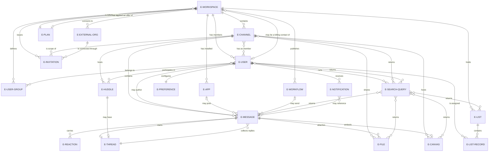

# Workflow Catalog

An executable specification of every workflow visible in the 1,022-frame screenshot corpus, written so that a build run can construct the product from this catalog alone.

## Purpose and ultimate goal

The ultimate goal of this catalog is **for Blitzy to build its own, own-branded team-communication platform from this catalog alone** — a product of the kind the corpus depicts, carrying Blitzy's own product name, branding and colour palette, and owing nothing to the third party whose interface the corpus captures.

That goal is why the catalog exists in this form. The repository states of itself that it "currently contains only screenshots and planning materials" and that "No code has been written yet." [README.md:L3-L5]. There is no application source to describe, no API to reference and no running system to observe. The 1,022 PNG frames under `screenshots/` are therefore not merely supporting illustration — they are the **entire** available specification of the product's behaviour, and until now they were a passive design-reference library: an inventory of image files whose contents had never been read out of the pixels and written down.

This catalog converts that library into an **executable specification**. Each of the 23 workflow-area documents states, for its area, what the user can do, in what order, on which screens, with which components, in which states, over which data, subject to which validations, and against which acceptance criteria — every claim carried back to the frame that shows it. The [Screenshot Coverage Index](_screenshot-index.md) then proves that no frame was silently dropped: one row per frame, 1,022 rows, each with a caption written from direct visual inspection and a named flow and owning area document. This document aggregates what no single area document can express on its own — the whole-product information architecture, the shared component inventory, the consolidated data model, and a phased build backlog — and closes with a ready-to-paste [Next Build Run Prompt](#next-build-run-prompt) that hands the work to the next run.

Two consequences of that goal shape everything below, and both are constraints rather than preferences:

- **Behaviour and layout are specified; third-party identity is not.** Where the corpus shows branded material — a logo mark, a wordmark, a product name, a palette value — this catalog restates it as a generic placeholder and never adopts it as a requirement. The next run chooses its own name and palette.
- **Observation is specified; recollection is not.** Every statement in this catalog asserts what a frame shows, or is explicitly marked as an inference with its basis. Describing a screen from general familiarity with the captured product rather than from the pixels is a fabrication, and a fabricated specification is worse than no specification, because it cannot be checked.

## How to use this catalog

**If you are the build run, read in this order.** Start here, end here.

1. **This document, sections [Purpose](#purpose-and-ultimate-goal) to [Prioritized build backlog](#prioritized-build-backlog).** The [information-architecture map](#product-information-architecture) tells you what surfaces exist; the [component roll-up](#consolidated-component-inventory-roll-up) tells you what to build once and reuse; the [consolidated data model](#consolidated-data-model) tells you what to persist; the [backlog](#prioritized-build-backlog) tells you what order to build in.
2. **[`00-product-overview.md`](00-product-overview.md) in full, before any other area document.** It holds the authoritative definition of every reusable component and of the placeholder branding vocabulary. Every other document references those by identifier and does not restate them, so an area document read on its own will point at definitions you have not yet loaded.
3. **The area documents for your current build phase**, in the order the [backlog](#prioritized-build-backlog) gives. Each is self-contained for its own area: purpose, flows, per-flow step tables, components, states, implied data model, transitions, edge cases, acceptance criteria and frame provenance.
4. **[`_screenshot-index.md`](_screenshot-index.md) as a lookup, not a read-through.** Use it to answer "which flow covers frame N?" and "what did frame N actually show?".
5. **Back here, to the [Next Build Run Prompt](#next-build-run-prompt) and the [Known limitations](#known-limitations)**, before you write anything.

**Flow identifiers.** A flow is one goal-directed user journey — "invite a teammate", "create a channel", "start a huddle". Every flow has a stable identifier of the form `<area>.<flow>`: `02.3` is the third flow defined in [`02-channels.md`](02-channels.md), and `15.23` is the twenty-second in [`15-admin-workspace.md`](15-admin-workspace.md). Flow numbers are allocated per area in the order the flows first appear in the corpus. **248 flows** cover the corpus; all of them are defined once, in the [Flow groupings](_screenshot-index.md#flow-groupings) table of the coverage index, and cited by identifier everywhere else.

**Frame citations.** Every non-trivial claim carries an inline citation of the frame that evidences it, written as a percent-encoded relative link — for example [frame 569](../../screenshots/Slack%20web%20Jul%202024%20569.png). Repository files are cited as `[<path>:<locator>]`, for example [README.md:L3-L5]. A claim with no citation is unsupported and should be treated as such.

**Component and entity identifiers.** Reusable components are cited as `C-*` and data entities as `E-*` — always by identifier, never by heading anchor, so that renaming a heading cannot silently break a cross-reference. Every `C-*` resolves to a definition in [`00-product-overview.md`](00-product-overview.md) and appears in the [roll-up](#consolidated-component-inventory-roll-up); every `E-*` appears in the [consolidated data model](#consolidated-data-model).

**Evidence markers.** Five notations are used identically in all 25 documents:

| Marker | Meaning |
|---|---|
| *(plain prose)* | **Observed.** An unqualified statement asserts what the cited frame shows. |
| `**Inferred:**` | **Not directly visible.** The statement is a deduction, and the text immediately states the basis for it — for example, that a field is required because the primary action renders disabled until it is filled. |
| `> **Partial capture:**` | The corpus shows this workflow only in part. The note names which steps are missing, so the gap is visible rather than papered over. |
| *(the ledger's uninspectable-frame marker)* | A frame that could not be visually inspected, carrying no description of any kind. The marker is a ledger row's own vocabulary and is written out only there; **no frame in this corpus needed it** — all 1,022 were inspected [_screenshot-index.md](_screenshot-index.md#non-informative-and-unreadable-frames). |
| `> **Build obligation:**` | **A requirement the build must satisfy that the corpus cannot evidence either way.** The sentence names the requirement and says plainly that the corpus is silent on it. It never claims a frame shows the control, and it never converts silence into a permission. Defined authoritatively, with its two binding rules, in [`00-product-overview.md`](00-product-overview.md). |

**One primary owner per frame.** The application shell is visible in nearly every in-product frame, so without a rule a single frame could be claimed by a dozen areas and the coverage arithmetic would be meaningless. Each frame therefore has exactly **one primary owning area document** — the document responsible for specifying it — plus any number of optional secondary cross-references. The coverage index names the primary owner first on every row and ignores secondary references in its arithmetic. A cross-cutting area may consequently own very few frames: [`21-states.md`](21-states.md) is the primary owner of only two frames and appears as a secondary reference throughout the catalog, which is the rule working as intended and not a coverage gap.

**Sample data is not a requirement.** The corpus captures a single demo workspace, so the catalog draws its worked examples from fixtures actually visible in the frames — channels `#design`, `#marketing` and `#social`, a company-wide channel, people named Sam Lee, Alex Smith and Jane D, and role badges reading `guest` and `you`. These are illustrations of shape, never values to reproduce.

## Index of catalog documents

Twenty-five documents make up the catalog: this master index, the coverage ledger, and 23 workflow-area documents. **All twenty-five are delivered.** The 23 area documents' primary frame sets partition the corpus exactly — 1,022 frames across 248 flows, every frame owned by exactly one area and no frame owned twice — and the union has been checked against the ledger in both directions for every area. Per-area flow and frame counts are held in one place only — the [Coverage assertion](_screenshot-index.md#coverage-assertion) table of the coverage index — so that the arithmetic has a single source of truth.

| Document | Area | What it covers |
|---|---|---|
| *(this page)* | Master index | Whole-product information architecture, the component roll-up, the consolidated data model, the phased build backlog, the flow-reconstruction methodology, the taxonomy deviations, the known limitations and the Next Build Run Prompt |
| [00-product-overview.md](00-product-overview.md) | Product Overview & App Shell | The persistent authenticated shell — left navigation rail and its destinations, workspace switcher, sidebar with its collapsible sections and multi-select mode, top bar with history controls and search entry, global create menu, help entry. **Holds the authoritative definition of all 99 reusable components and of the placeholder branding vocabulary**, plus the rail destination map and the automations boundary rule |
| [01-onboarding-and-auth.md](01-onboarding-and-auth.md) | Onboarding & Authentication | Sign-up by email address, verification by emailed code, account and marketing-consent confirmation, the five-step workspace setup wizard, profile-photo upload and crop, first-run coach marks, sign-in by password, by emailed code and by reset link with their rejection and recovery states, joining a workspace from an invitation, the welcome-back workspace chooser, inviting members and guests with channel scope and an expiry, and hand-off from the browser to the desktop and mobile clients |
| [02-channels.md](02-channels.md) | Channels | The full channel lifecycle — two-step creation with a visibility choice, adding and removing members with destructive confirmation, the four-tab details pane, renaming and editing topic and description, notification preferences and muting, starring, bookmarks and bookmark folders, conversion to private, archiving, unarchiving and deletion, the channel browser with its scope, type and sort filters, and the company-wide channel |
| [03-messaging-and-composer.md](03-messaging-and-composer.md) | Messaging & Composer | The message list and message row, the composer and its formatting toolbar, multi-line formatted messages, snippets, channel and person mentions, scheduled send, slash-command autocomplete, audio-clip recording and attachment, the emoji picker with custom emoji and emoji packs, hover actions, forwarding, pinning, inline editing and deletion, and the distraction-free composer |
| [04-threads.md](04-threads.md) | Threads | Replying in a thread on a channel message, the thread pane and its reply composer, the also-send-to-channel and also-send-as-direct-message options, the huddle thread, and the threads destination with its unread divider |
| [05-direct-messages.md](05-direct-messages.md) | Direct Messages | Opening a one-to-one direct message and composing in it, the direct-messages destination, the same conversation seen from the other participant's session with its huddle history, huddle summary messages in a conversation, presence semantics and the conversation header action set |
| [06-huddles.md](06-huddles.md) | Huddles | Starting a huddle from a conversation and from the huddles destination, copying a huddle link, connection diagnostics, setting a topic, the participant stage and the bottom control bar, reactions and the overflow menu, themes and decorative backgrounds, captions, hiding self-view, camera backgrounds, screen share and the huddle thread |
| [07-canvases.md](07-canvases.md) | Canvases | Attaching an existing canvas to a message, creating and building a new canvas, the templates browser and its preview, inserting image, file, checklist, table and profile-card blocks, the canvas pane in a conversation, the overflow menu, cover images, accessibility settings and read-only reading |
| [08-lists.md](08-lists.md) | Lists | Creating a list from scratch and from a template, entering and editing items, the record detail pane and its fields, adding, editing, converting and deleting custom fields, starring, list details with copy-link and CSV download, switching views and layouts, filtering, sorting, hiding fields, grouping, saving a view and sending feedback |
| [09-search-and-filters.md](09-search-and-filters.md) | Search & Filters | Opening search and its recent-search history, the result-type tabs with their counts, filtering by sender, location, participant, date and file type, the anchored per-chip popovers and the centred filter-by modal, the only-my-channels and exclude-automations toggles, sorting, layout switching and the empty and zero-count states |
| [10-workflow-builder.md](10-workflow-builder.md) | Workflow Builder | The builder's tab set, importing and creating, the templates grid and start-from-scratch, the workflow editor with its trigger card and needs-attention warning, editing a send-a-message step with its recipient combobox, variables and optional button, publishing, and the legacy-workflows empty state |
| [11-apps-and-integrations.md](11-apps-and-integrations.md) | Apps & Integrations | The in-product apps surface with its installed count, category search and recommended rows, app home surfaces with their tab set, the app-directory marketing site with its browse, collection and essential-apps pages, and the developer-platform home, documentation, feature-comparison tables and tutorials |
| [12-activity-notifications.md](12-activity-notifications.md) | Activity & Notifications | The browser notification-permission gate and its confirmation, the activity destination and its filter tabs, per-entry overflow actions and reminders, the later destination and its overdue reminders, working through unreads with conversation filters, and the drafts, scheduled and sent surfaces |
| [13-profiles-people.md](13-profiles-people.md) | Profiles & People | The people destination and person search, the own-profile pane, editing profile fields including a recorded name clip and a time zone, editing about-me details with a date picker, previewing your profile as a coworker, setting a status with an emoji and a clear-after time, presence changes, pausing notifications and do-not-disturb |
| [14-preferences-settings.md](14-preferences-settings.md) | Preferences & Settings | The preferences dialog and its full tab inventory — notifications with a schedule and keywords, navigation, home, themes, messages and media, language and region, accessibility, mark as read, audio and video with device selects and level meters, connected accounts, privacy and visibility, advanced — and the audio-and-video diagnostics sub-flow with its pass, spinner, pending and permission-denied rows |
| [15-admin-workspace.md](15-admin-workspace.md) | Admin & Workspace | **Two flow groups.** The in-app workspace menu and its tools-and-settings submenu; and the standalone browser administration console — its home, account and workspace settings, authentication and two-factor, password re-confirmation for sensitive changes, data export, workspace deletion, account deactivation, analytics, customization, custom emoji, workspace icon, about-this-workspace, member management, user groups, invitations and invite links, permissions by account type, and billing with its overview, history, settings, promotional codes, payment methods and the trial-upgrade journey that ends at a reduced-chrome purchase page |
| [16-files-media.md](16-files-media.md) | Files & Media | Uploading a file and posting it as a message, the composer attachment menu, re-sharing a file, recording, reviewing and posting a video clip, the files destination with its filters and grouped rows, the shared-files card in the channel details pane, and media playback controls |
| [17-marketing-site.md](17-marketing-site.md) | Marketing Site | The unauthenticated public property and the five smaller public properties that hang off it: the landing page and its mega-menus, the product and solutions pages, the resources library with its three filter mechanisms, the customer-story and blog indexes and their articles, the events and webinar surfaces with their registration forms, the release page, the partnerships directory, the site-search surface and its seven result tabs, the company and careers pages with the opportunity index, the platform-status property, the merchandise store through to checkout, and the terms-and-policies property — 48 flows over 171 primary frames, the largest allocation in the catalog |
| [18-pricing-plans.md](18-pricing-plans.md) | Pricing & Plans | The pricing page and its plan cards, the feature-comparison table and its mixed cell types, per-column purchase and contact calls to action, the in-product plan chooser and paid-plan tour, and the trial, offer and upgrade-gate prompts that lead to them |
| [19-brand-guidelines.md](19-brand-guidelines.md) | Brand Guidelines | The brand-centre site documented as a **page structure to rebuild with the next run's own brand** — its navigation grouping, the brand-values pages, the colour pages, the swatch-row anatomy with its four colour notations, and colour usage and application guidance. Observed values are placeholders, never requirements |
| [20-help-community.md](20-help-community.md) | Help & Community | The in-app help panel, raising and tracking a support request from the administration console, the help-centre home, search, articles with in-article navigation, the article-feedback form with its character counter and disabled submit, category browsing, contacting support, the changelog, the community marketing page, the community forum with its discussions, topics, questions and groups, the guidelines, and the certification programme with its questions |
| [21-states.md](21-states.md) | Error, Empty & Loading States | The cross-cutting state matrix — default, hover, focus, active, empty, loading, error, disabled, permission-gated and upgrade-gated — each with an observed exemplar frame, plus the `C-UPGRADE-GATE` state set and the application error page. Primary owner of only the two error-page frames and a secondary reference throughout |
| [22-external-collaboration.md](22-external-collaboration.md) | External Collaboration | **New area.** The external-connections destination with its organizations and invitations sections, people search by name, company or email, managing connection requests and connections, inviting an external person into a conversation by email, the invitation-sent confirmation with its acceptance window, the received and sent invitation tabs and their empty states, guest accounts, and upgrade-gated external channel creation |
| [_screenshot-index.md](_screenshot-index.md) | Screenshot Coverage Index | The coverage ledger — exactly one row per frame across frames 0 to 1021, each with an observed caption and its owning flow and area document; the coverage assertion and per-area distribution; the 248 flow groupings; the byte-identical duplicate groups; and the near-duplicate and visually sparse frame notes |

## Product information architecture

The corpus captures four structurally distinct surface families, and the boundaries between them are architectural rather than cosmetic: an unauthenticated public web site, an authentication and onboarding path, the authenticated application shell with its destinations, and a **standalone browser administration console** that has its own top bar and its own left navigation and is reached by following an external link out of the application [frame 567](../../screenshots/Slack%20web%20Jul%202024%20567.png). Every node below is a surface actually observed in a frame, and every node names the area document that owns it.

**How to read the node labels.** Each label ends in the **two-digit number of the owning area document** — `- 17` means [`17-marketing-site.md`](17-marketing-site.md), `- 00` means [`00-product-overview.md`](00-product-overview.md), and so on for all twenty-three areas; the [index above](#index-of-catalog-documents) maps every number to its file. The number is used rather than the filename for one reason, and it is the same reason recorded in [limitation 2](#2-mermaid-diagrams-do-not-render-under-the-committed-site-configuration): this diagram is published as a fenced code block, not as a rendered diagram, so a line longer than the code box is clipped at rest with no scrollbar cue. Every line in every fence in this catalog is therefore held to a width that fits, and the numeric suffix is what buys that width back without deleting an observed destination from the map.

**The measured ceiling, stated once so it is not re-derived or drifted past.** Every diagram line in this catalog is **at most 74 characters**, and that figure is a measurement rather than a convention. In the published site the diagram fence's inner code element is a horizontally scrollable box with 16 pixels of padding on each side, and its width tracks the width of the line-number gutter: a fence of 8 to 9 lines gets the widest box, one of 17 to 99 lines a middle box, and one of 100 or more lines the narrowest. In that narrowest box the usable content width divided by the monospace advance width of the theme's code font gives **74 characters**, and a 75th character overflows. Verified at the glyph level on the two fences that sit exactly on the ceiling — the [lists](08-lists.md) and [administration](15-admin-workspace.md) maps, both 74 characters in the narrowest box — where the final bracket renders fully inside the box with under four pixels to spare. **74 is a hard limit, not a target.** Anyone editing a fence should re-check it, and should note the one way the limit could tighten: a fence of more than 999 lines would widen the gutter by a digit and narrow the box again. No fence in this catalog exceeds 163 lines.

**How to read the edges.** Two link styles carry two different evidential claims, and the distinction is load-bearing rather than decorative. A **solid edge** means both endpoints are captured surfaces *and* the affordance joining them is observed on one of them. A **dotted, labelled edge** means the affordance is observed but the **arrival state is not captured anywhere in the corpus** — the route is where the affordance points, not a transition anyone watched happen; each such edge carries the reason on the edge itself and is documented as a partial capture by the owning area. A **node with no inbound edge** is entered from outside the captured surfaces: the landing page is the corpus's own root, the brand and developer properties are separate web properties reached by external address, and the join page is reached from an emailed invitation link the corpus never captures. No plausible-but-unevidenced route is drawn at all.

```mermaid
flowchart TD
    subgraph PUBLIC["Unauthenticated public web surfaces"]
        LANDING["Landing page and mega-menus - 17"]
        PRODPAGES["Product and solutions pages - 17"]
        RES["Resources, stories, blog, careers, store, policies - 17"]
        PRICINGPG["Pricing page and comparison table - 18"]
        BRAND["Brand centre - 19"]
        HELPCTR["Help centre and support contact - 20"]
        COMMUNITY["Community forum and certification - 20"]
        APPDIR["App directory site - 11"]
        DEVPLAT["Developer platform and docs - 11"]
        ERRPAGE["Application error page - 21"]
    end

    subgraph GATE["Authentication and onboarding"]
        SIGNUP["Sign up, verify code, confirm account - 01"]
        SIGNIN["Sign in by password, code or reset link - 01"]
        WIZARD["Five-step workspace setup wizard - 01"]
        JOININV["Accept invitation and choose workspace - 01"]
        HANDOFF["Desktop and mobile client hand-off - 01"]
    end

    subgraph APP["Authenticated application shell"]
        SHELL["Rail, sidebar, top bar, search entry, create menu - 00"]
        CHANNEL["Channel view, details pane, browser - 02"]
        DM["Direct messages destination - 05"]
        THREADS["Threads view and thread pane - 04"]
        COMPOSER["Composer, formatting, slash commands, clips - 03"]
        HUDDLE["Huddle stage and control bar - 06"]
        CANVAS["Canvas pane and templates - 07"]
        LISTS["Lists destination, records, views - 08"]
        SEARCH["Search overlay and results - 09"]
        BUILDER["Workflow builder and editor - 10"]
        APPSURF["Apps surface and app homes - 11"]
        ACTIVITY["Activity, later, drafts and sent - 12"]
        PEOPLE["People destination and profile pane - 13"]
        PREFS["Preferences dialog and diagnostics - 14"]
        FILES["Files destination and previews - 16"]
        EXTCONN["External connections destination - 22"]
        WSMENU["Workspace menu and tools submenu - 15"]
        INPLAN["In-product plan chooser and paid-plan tour - 18"]
        HELPPANEL["In-app help panel - 20"]
    end

    subgraph CONSOLE["Standalone browser administration console"]
        ADMIN["Console home, settings, members, analytics, billing - 15"]
        ADMINSUP["Support request tracking - 20"]
    end

    LANDING --> PRODPAGES
    LANDING --> RES
    LANDING --> PRICINGPG
    LANDING --> SIGNUP
    LANDING --> SIGNIN
    PRODPAGES --> SIGNUP
    PRICINGPG --> SIGNUP
    RES --> HELPCTR
    HELPCTR --> COMMUNITY
    APPDIR --> SIGNIN
    DEVPLAT --> APPDIR
    SIGNUP --> WIZARD
    JOININV -.->|"arrival not captured"| SHELL
    WIZARD --> SHELL
    SIGNIN --> HANDOFF
    HANDOFF -.->|"client surface not captured"| SHELL
    SHELL --> CHANNEL
    SHELL --> DM
    SHELL --> THREADS
    SHELL --> LISTS
    SHELL --> SEARCH
    SHELL --> APPSURF
    SHELL --> ACTIVITY
    SHELL --> PEOPLE
    SHELL --> FILES
    SHELL --> EXTCONN
    SHELL --> CANVAS
    SHELL --> HUDDLE
    SHELL --> WSMENU
    SHELL --> HELPPANEL
    CHANNEL --> COMPOSER
    CHANNEL --> THREADS
    CHANNEL --> CANVAS
    CHANNEL --> HUDDLE
    DM --> COMPOSER
    DM --> HUDDLE
    DM --> CANVAS
    HUDDLE --> THREADS
    ACTIVITY --> THREADS
    SEARCH -.->|"result activation not captured"| CHANNEL
    APPSURF --> BUILDER
    APPSURF --> APPDIR
    WSMENU --> PREFS
    WSMENU --> INPLAN
    WSMENU --> BUILDER
    WSMENU --> ADMIN
    WSMENU --> HANDOFF
    EXTCONN -.->|"acceptance not captured"| DM
    ADMIN --> ADMINSUP
    ADMIN --> INPLAN
    SHELL -.->|"origin not captured"| ERRPAGE
    LANDING -.->|"origin not captured"| ERRPAGE
```



No colour or styling is declared on this diagram, deliberately. The catalog specifies structure and behaviour; the palette is the next run's to choose, and a styled diagram would read as guidance it is not entitled to give. The one distinction the diagram does draw — solid against dotted — is evidential rather than aesthetic, and it is the reason the map can be trusted as a specification: **six of the fifty-two edges are dotted**, and each names the arrival state the corpus never captured, so a build knows exactly where it is designing rather than transcribing.

Four properties of this architecture are load-bearing for the build and are stated here rather than left to be re-derived:

- **The shell is the hub, and it is persistent.** Every in-product destination is reached from the rail, the sidebar or the top bar without leaving the shell chrome, so the shell is a layout that owns a routed content region rather than a page that is navigated away from [frame 120](../../screenshots/Slack%20web%20Jul%202024%20120.png).
- **The administration console is a separate application, not a deep route.** It has its own top bar and its own two-group left navigation, and the entries that lead to it carry external-link icons in the in-app submenu [frame 567](../../screenshots/Slack%20web%20Jul%202024%20567.png), [frame 600](../../screenshots/Slack%20web%20Jul%202024%20600.png).
- **The public site is not a shell route either.** It has its own top navigation, its own footer link columns and its own sign-in entry point, and it is reachable while unauthenticated [frame 0](../../screenshots/Slack%20web%20Jul%202024%200.png).
- **The brand centre is reachable but disconnected.** It is captured as its own site with its own navigation, a visit-site link and a login control [frame 1000](../../screenshots/Slack%20web%20Jul%202024%201000.png), and the corpus never shows a link into it from any other surface. It is drawn as a node with no inbound edge for exactly that reason. **Inferred:** the next run may site its own brand pages anywhere, because the corpus imposes no constraint it could violate.

## Consolidated component inventory (roll-up)

**This is a roll-up, not a definition.** Every component's contract — its purpose, regions, variants, states, ordering and relative sizing — is defined once, authoritatively, in [`00-product-overview.md`](00-product-overview.md). Nothing here restates a contract; this table exists so that a reader can see the whole inventory at a glance and resolve any `C-*` identifier to the document that defines it. The **Referenced by** column names the area documents whose observed surfaces contain the component, which is what makes each component worth building once rather than per area. **It is computed, not curated**, so that it cannot drift: an area is listed exactly where that area's own `Screens & components` section names the component as one its screens render, minus the identifiers an area explicitly records as *not* rendered — [`10-workflow-builder.md`](10-workflow-builder.md) states that no rail, sidebar, top bar, workspace switcher or upgrade gate appears on any builder frame, [`06-huddles.md`](06-huddles.md) states that no huddle surface carries a media player, [`16-files-media.md`](16-files-media.md) states that it renders no empty state, [`14-preferences-settings.md`](14-preferences-settings.md) states that it renders no permission prompt, [`12-activity-notifications.md`](12-activity-notifications.md) states that no capture shows a toast reporting a notification, and [`01-onboarding-and-auth.md`](01-onboarding-and-auth.md) states that its reduced shell carries no top bar. [`00-product-overview.md`](00-product-overview.md) is not listed against any row, because as the defining document it contains every identifier by construction. **All twenty-three area documents are delivered**, so every one of them is listed wherever it demonstrably consumes a component and nowhere else; the column carries no forecast and no placeholder for a document still to land.

The 99 identifiers below are a **floor, not a ceiling**. An area author who finds a further recurring structure defines it in [`00-product-overview.md`](00-product-overview.md) and adds it here; the closure requirement is that **every `C-*` cited anywhere in the catalog resolves to a definition in that one document and appears in this table**. **Seventy-one of the 99** arrived by exactly that route, in **three waves**, leaving twenty-eight defined by this catalog's own analysis of the shell. First, [`01-onboarding-and-auth.md`](01-onboarding-and-auth.md) found seven recurring structures with no identifier. Then the in-product areas reported twenty-six more, of which eighteen were genuinely new — contributed by areas 03, 06, 09, 10, 11, 14, 15 and 22 — while the remaining eight proved to be variants of contracts that already existed and were folded into those contracts' own rows rather than given identifiers of their own. Then the four public and commercial areas — 17, 18, 19 and 20 — reported fifty-one structures, of which **forty-six were genuinely new** and five were folded into pre-existing in-product contracts as variants. Every figure here is checkable against the four inventory tables in [`00-product-overview.md`](00-product-overview.md), whose row counts are 28, 7, 18 and 46, and against the growth table that records who reported each one: 28 + 7 + 18 + 46 = 99. That third wave is why this table nearly doubled: an application shell, its conversations and its console share almost no structure with a marketing property, a pricing comparison, a documentation site or a support centre, and forcing the public structures onto in-product identifiers would have made those identifiers mean two incompatible things. The public contracts each name the in-product contract they are **not** — `C-PUBLIC-NAV` is not `C-TOP-BAR`, `C-NUMBERED-FORM` is not `C-STEP-WIZARD`, `C-COMPARISON-MATRIX` and `C-ORDER-SUMMARY` are not `C-DATA-TABLE`, `C-PUBLIC-TYPEAHEAD` is not `C-TYPEAHEAD-PANEL`, `C-CHOICE-CHIP-GROUP` is not `C-FILTER-CHIP`, `C-CONTENT-CARD` is not `C-TEMPLATE-CARD`, `C-SECTION-NAV` is not `C-TAB-BAR`, `C-DOC-NAV` is not `C-SIDEBAR` — and four of them **replaced** an in-product identifier that an area had been using wrongly, which is recorded as a correction in [`00-product-overview.md`](00-product-overview.md) rather than quietly dropped.

**How the `Referenced by` column is derived, so it can be regenerated rather than maintained by hand.** An area is listed against a component when that area names the identifier in a **structured position** — a step table's `Component(s) involved` cell, a component column of any other table, or a row of the area's own components-consumed table — plus [`03-messaging-and-composer.md`](03-messaging-and-composer.md), which declares its set in prose. Prose mentions elsewhere, and mentions inside a comparison, are deliberately **not** counted, because an identifier is frequently named in order to say that a surface does *not* render it: [`10-workflow-builder.md`](10-workflow-builder.md) records that no `C-RAIL`, `C-SIDEBAR` or `C-TOP-BAR` appears on any builder frame, [`06-huddles.md`](06-huddles.md) records that `C-MEDIA-PLAYER` is consumed by none of its frames, and [`12-activity-notifications.md`](12-activity-notifications.md) records that its foot-of-surface outcome line is not a `C-TOAST`. Counting those as usage would invert their meaning. Two consequences of that rule are worth stating, because both were once exceptions and neither is any longer. Area 17 is delivered, so it is listed wherever it demonstrably consumes a component and there is no `planned:` marker anywhere in the table. Area 19 named several identifiers only to say which contract a structure was *not*, and now that its nine structures are all defined centrally it consumes them by identifier and is listed against each — the negations it still makes are in a dedicated column of its own resolution table, where this rule correctly ignores them.

| Component ID | Name | Defined in | Referenced by |
|---|---|---|---|
| `C-RAIL` | Navigation rail | [00-product-overview.md](00-product-overview.md) | 00, 01, 02, 05, 06, 07, 08, 09, 11, 12, 13, 14, 15, 16, 18, 22 |
| `C-SIDEBAR` | Conversation sidebar with collapsible sections | [00-product-overview.md](00-product-overview.md) | 00, 01, 02, 03, 04, 05, 06, 07, 08, 11, 12, 13, 14, 15, 16, 18, 22 |
| `C-WORKSPACE-SWITCHER` | Workspace switcher and workspace menu | [00-product-overview.md](00-product-overview.md) | 00, 10, 15, 21 |
| `C-TOP-BAR` | Top bar with history controls and help entry | [00-product-overview.md](00-product-overview.md) | 00, 02, 08, 09, 14, 15, 17, 18, 20, 21, 22 |
| `C-SEARCH-ENTRY` | Search entry field and overlay trigger | [00-product-overview.md](00-product-overview.md) | 00, 02, 08, 09, 10, 11, 13, 17, 20, 22 |
| `C-MESSAGE-ROW` | Message row with author, timestamp and body | [00-product-overview.md](00-product-overview.md) | 00, 01, 02, 03, 04, 05, 06, 07, 09, 10, 11, 12, 13, 14, 15, 16, 21 |
| `C-HOVER-ACTION-BAR` | Hover action bar on a message row | [00-product-overview.md](00-product-overview.md) | 00, 03, 04, 05, 12, 14, 15 |
| `C-COMPOSER` | Message composer with attachment and clip controls | [00-product-overview.md](00-product-overview.md) | 00, 01, 02, 03, 04, 05, 06, 07, 12, 16, 21 |
| `C-FORMATTING-TOOLBAR` | Rich-text formatting toolbar | [00-product-overview.md](00-product-overview.md) | 00, 03, 04, 07, 08, 10 |
| `C-MODAL-SHELL` | Centred modal shell with title and dismiss control | [00-product-overview.md](00-product-overview.md) | 00, 01, 02, 03, 06, 07, 08, 09, 10, 13, 14, 15, 16, 17, 18, 20, 21, 22 |
| `C-STEP-WIZARD` | Multi-step wizard with progress label and Back or Next | [00-product-overview.md](00-product-overview.md) | 00, 01, 02 |
| `C-DROPDOWN-MENU` | Dropdown and select menu with optional descriptions | [00-product-overview.md](00-product-overview.md) | 00, 01, 02, 03, 06, 07, 08, 09, 10, 11, 12, 13, 14, 15, 16, 17, 18, 20, 21, 22 |
| `C-CONTEXT-MENU` | Overflow and right-click context menu | [00-product-overview.md](00-product-overview.md) | 00, 02, 03, 04, 06, 07, 08, 10, 12, 15 |
| `C-TAB-BAR` | Tab bar, with optional per-tab counts | [00-product-overview.md](00-product-overview.md) | 00, 02, 03, 04, 06, 08, 09, 10, 11, 12, 13, 14, 15, 16, 17, 18, 20, 21, 22 |
| `C-FILTER-CHIP` | Filter chip and chip-based filter bar | [00-product-overview.md](00-product-overview.md) | 00, 02, 07, 08, 09, 11, 16, 21 |
| `C-TOAST` | Transient toast reporting the outcome of an action | [00-product-overview.md](00-product-overview.md) | 00, 01, 02, 03, 07, 08, 10, 15, 17, 21 |
| `C-BANNER` | Inline and page-level banner, dismissible variants | [00-product-overview.md](00-product-overview.md) | 00, 01, 02, 06, 07, 08, 10, 11, 12, 13, 14, 15, 17, 18, 21, 22 |
| `C-COACH-MARK` | Anchored first-run coach mark with a step counter | [00-product-overview.md](00-product-overview.md) | 00, 01, 02, 03, 12 |
| `C-AVATAR` | Avatar, with facepile and stacked variants | [00-product-overview.md](00-product-overview.md) | 00, 01, 02, 03, 04, 05, 06, 07, 08, 09, 10, 11, 12, 13, 14, 15, 16, 17, 20, 22 |
| `C-PRESENCE-DOT` | Presence and status indicator on an avatar | [00-product-overview.md](00-product-overview.md) | 00, 02, 03, 04, 05, 06, 07, 09, 13 |
| `C-CONFIRM-DIALOG` | Confirmation dialog, including destructive variants | [00-product-overview.md](00-product-overview.md) | 00, 02, 03, 06, 08, 13, 15 |
| `C-EMPTY-STATE` | Empty state with illustration, heading and primary action | [00-product-overview.md](00-product-overview.md) | 00, 01, 02, 03, 05, 07, 08, 09, 10, 12, 15, 16, 21, 22 |
| `C-UPGRADE-GATE` | Upgrade badge, trial countdown and upsell strip | [00-product-overview.md](00-product-overview.md) | 00, 01, 02, 06, 08, 09, 11, 13, 14, 15, 16, 17, 18, 21, 22 |
| `C-DETAILS-PANE` | Details surface, as a centred modal or a docked pane | [00-product-overview.md](00-product-overview.md) | 00, 02, 04, 07, 08, 11, 13, 16, 20, 21 |
| `C-DATA-TABLE` | Data table with grouped rows and mixed cell types | [00-product-overview.md](00-product-overview.md) | 00, 02, 06, 07, 08, 10, 11, 14, 15, 17, 20, 21, 22 |
| `C-RECORD-CARD` | Record and item card with typed fields | [00-product-overview.md](00-product-overview.md) | 00, 06, 07, 08, 09, 11, 15, 17, 22 |
| `C-MEDIA-PLAYER` | Audio and video player with scrubber and elapsed time | [00-product-overview.md](00-product-overview.md) | 00, 03, 07, 16, 17, 20 |
| `C-PERMISSION-PROMPT` | Browser and device permission prompt and denial state | [00-product-overview.md](00-product-overview.md) | 00, 01, 02, 06, 12, 14, 16 |
| `C-AUTH-PAGE-SHELL` | Unauthenticated page shell | [00-product-overview.md](00-product-overview.md) | 00, 01 |
| `C-CHIP-INPUT` | Chip input field with removable tokens | [00-product-overview.md](00-product-overview.md) | 00, 01, 13, 15, 22 |
| `C-SEGMENTED-CODE-INPUT` | Segmented one-character-per-box code input | [00-product-overview.md](00-product-overview.md) | 00, 01 |
| `C-DATE-PICKER-POPOVER` | Month-grid date-picker popover | [00-product-overview.md](00-product-overview.md) | 00, 01, 13, 18 |
| `C-STRENGTH-METER` | Password-strength meter | [00-product-overview.md](00-product-overview.md) | 00, 01 |
| `C-INLINE-VALIDATION` | Inline field-level validation message | [00-product-overview.md](00-product-overview.md) | 00, 01, 15, 18, 21 |
| `C-PLAN-CARD` | Plan-choice card | [00-product-overview.md](00-product-overview.md) | 00, 01, 18 |
| `C-TYPEAHEAD-PANEL` | Caret-anchored typeahead panel | [00-product-overview.md](00-product-overview.md) | 00, 09, 17, 20 |
| `C-EMOJI-PICKER` | Emoji picker panel | [00-product-overview.md](00-product-overview.md) | 00, 03, 06, 13 |
| `C-HUDDLE-PANEL` | Docked and floating session panel | [00-product-overview.md](00-product-overview.md) | 00, 06 |
| `C-PARTICIPANT-TILE` | Session participant tile | [00-product-overview.md](00-product-overview.md) | 00, 06 |
| `C-SESSION-CONTROL-BAR` | Session control bar | [00-product-overview.md](00-product-overview.md) | 00, 06 |
| `C-PAGER` | Pagination row | [00-product-overview.md](00-product-overview.md) | 00, 09, 10, 11, 16, 17, 20 |
| `C-TEMPLATE-CARD` | Template and offer card | [00-product-overview.md](00-product-overview.md) | 00, 10, 11 |
| `C-SETTINGS-CATEGORY-COLUMN` | Vertical settings category column | [00-product-overview.md](00-product-overview.md) | 00, 14 |
| `C-SEGMENTED-CONTROL` | Segmented single-select control | [00-product-overview.md](00-product-overview.md) | 00, 14, 17 |
| `C-LEVEL-METER` | Read-only level meter | [00-product-overview.md](00-product-overview.md) | 00, 14 |
| `C-DEVICE-PREVIEW` | Live device preview region | [00-product-overview.md](00-product-overview.md) | 00, 14, 16 |
| `C-TILE-SELECT-ROW` | Single-select tile row | [00-product-overview.md](00-product-overview.md) | 00, 14, 15 |
| `C-LIVE-PREVIEW-CARD` | Live preview card | [00-product-overview.md](00-product-overview.md) | 00, 14 |
| `C-PROGRESS-INDICATOR` | Indeterminate progress pill | [00-product-overview.md](00-product-overview.md) | 00, 16 |
| `C-CONSOLE-TOP-BAR` | Administration console top bar | [00-product-overview.md](00-product-overview.md) | 00, 15, 18, 20 |
| `C-CONSOLE-NAV` | Administration console left navigation | [00-product-overview.md](00-product-overview.md) | 00, 15, 18, 20 |
| `C-DISCLOSURE-CARD-LIST` | Disclosure-card list | [00-product-overview.md](00-product-overview.md) | 00, 15, 17, 18, 20 |
| `C-CONTENT-CAROUSEL` | Paged content carousel | [00-product-overview.md](00-product-overview.md) | 00, 11, 17, 20, 22 |
| `C-PUBLIC-NAV` | Public property navigation band | [00-product-overview.md](00-product-overview.md) | 00, 17, 18 |
| `C-MEGA-MENU` | Multi-column navigation mega-menu | [00-product-overview.md](00-product-overview.md) | 00, 17 |
| `C-PROPERTY-CHROME` | Standalone property bar | [00-product-overview.md](00-product-overview.md) | 00, 17, 19, 20 |
| `C-PROPERTY-FOOTER` | Public property footer | [00-product-overview.md](00-product-overview.md) | 00, 17, 19, 20 |
| `C-PAGE-HERO` | Public page hero band | [00-product-overview.md](00-product-overview.md) | 00, 17, 19, 20 |
| `C-SECTION-BAND` | Public content section band | [00-product-overview.md](00-product-overview.md) | 00, 17, 18, 20 |
| `C-CONTENT-CARD` | Public content card and card grid | [00-product-overview.md](00-product-overview.md) | 00, 17, 20 |
| `C-DESTINATION-TILE` | Destination tile grid | [00-product-overview.md](00-product-overview.md) | 00, 19 |
| `C-LOGO-WALL` | Third-party mark strip and grid | [00-product-overview.md](00-product-overview.md) | 00 |
| `C-STAT-BLOCK` | Statistic block with sourcing | [00-product-overview.md](00-product-overview.md) | 00, 20 |
| `C-TESTIMONIAL` | Testimonial block | [00-product-overview.md](00-product-overview.md) | 00 |
| `C-CARD-STRIP` | Horizontally scrolled card strip | [00-product-overview.md](00-product-overview.md) | 00 |
| `C-FACET-FILTER-BAR` | Facet filter bar | [00-product-overview.md](00-product-overview.md) | 00, 17 |
| `C-FILTER-MODAL` | Grouped checkbox filter modal | [00-product-overview.md](00-product-overview.md) | 00, 17 |
| `C-ON-PAGE-CONTENTS` | In-page contents card | [00-product-overview.md](00-product-overview.md) | 00, 17, 20 |
| `C-SECTION-NAV` | Section and page navigation row | [00-product-overview.md](00-product-overview.md) | 00, 20 |
| `C-DOC-NAV` | Grouped documentation navigation column | [00-product-overview.md](00-product-overview.md) | 00, 19 |
| `C-NUMBERED-INDEX` | Numbered index list | [00-product-overview.md](00-product-overview.md) | 00, 19 |
| `C-ACCORDION` | Disclosure accordion | [00-product-overview.md](00-product-overview.md) | 00, 18, 20 |
| `C-GUIDANCE-PANEL` | Inset guidance panel | [00-product-overview.md](00-product-overview.md) | 00, 19 |
| `C-SPECIMEN-PANEL` | Specimen panel | [00-product-overview.md](00-product-overview.md) | 00, 19 |
| `C-DEFINITION-LIST` | Definition list | [00-product-overview.md](00-product-overview.md) | 00, 19, 20 |
| `C-PRICE-LIST` | Price list | [00-product-overview.md](00-product-overview.md) | 00, 20 |
| `C-COMPARISON-MATRIX` | Capability comparison matrix | [00-product-overview.md](00-product-overview.md) | 00, 18 |
| `C-NUMBERED-FORM` | Numbered form sequence | [00-product-overview.md](00-product-overview.md) | 00, 15 |
| `C-ORDER-SUMMARY` | Order and estimate summary panel | [00-product-overview.md](00-product-overview.md) | 00, 15 |
| `C-LEAD-FORM` | Lead-capture form card | [00-product-overview.md](00-product-overview.md) | 00, 17 |
| `C-SUBSCRIBE-FIELD` | Single-field subscribe control | [00-product-overview.md](00-product-overview.md) | 00, 17 |
| `C-PUBLIC-TYPEAHEAD` | Input-anchored suggestion panel | [00-product-overview.md](00-product-overview.md) | 00, 20 |
| `C-CHOICE-CHIP-GROUP` | Single-choice chip group | [00-product-overview.md](00-product-overview.md) | 00, 20 |
| `C-REGION-CHOOSER` | Region and language chooser panel | [00-product-overview.md](00-product-overview.md) | 00 |
| `C-PRODUCT-CARD` | Merchandise product cell | [00-product-overview.md](00-product-overview.md) | 00 |
| `C-QUANTITY-STEPPER` | Numeric quantity stepper | [00-product-overview.md](00-product-overview.md) | 00, 17 |
| `C-FOCUSED-TASK-BAR` | Focused-task page bar | [00-product-overview.md](00-product-overview.md) | 00, 15 |
| `C-SCROLL-TOP` | Return-to-top control | [00-product-overview.md](00-product-overview.md) | 00, 17, 18 |
| `C-FLOATING-ACTION-PILL` | Floating action pill | [00-product-overview.md](00-product-overview.md) | 00, 17 |
| `C-BREADCRUMB` | Breadcrumb trail | [00-product-overview.md](00-product-overview.md) | 00, 20 |
| `C-CALLOUT-CARD` | Callout card | [00-product-overview.md](00-product-overview.md) | 00, 20 |
| `C-STEP-CARD` | Numbered-step card | [00-product-overview.md](00-product-overview.md) | 00, 20 |
| `C-CHAR-COUNTER` | Live character counter | [00-product-overview.md](00-product-overview.md) | 00, 20 |
| `C-HUMAN-CHECK` | Human-verification control | [00-product-overview.md](00-product-overview.md) | 00, 20 |
| `C-TAG-PILL` | Topic tag pill | [00-product-overview.md](00-product-overview.md) | 00, 20 |
| `C-ENGAGEMENT-BAR` | Engagement action row | [00-product-overview.md](00-product-overview.md) | 00, 20 |
| `C-AUTH-GATE-STRIP` | Per-item authentication gate | [00-product-overview.md](00-product-overview.md) | 00, 20 |
| `C-SKELETON` | Shape-preserving placeholder | [00-product-overview.md](00-product-overview.md) | 00, 20 |
| `C-DROP-ZONE` | File attachment drop zone | [00-product-overview.md](00-product-overview.md) | 00, 20 |

## Consolidated data model

The repository has no database and no persistence layer, so this model is derived entirely from what the interface exposes. It is aggregated **additively** from the per-area implied data models: an entity touched by several areas accumulates fields rather than being redefined, and **every field cites the frame that shows it**. A field that no frame evidences is not in this model.

**The invariant this table must satisfy, and how to check it.** This model is a **superset** of every per-area contribution: any field an area document publishes for an entity — including every field an area marks as reported for aggregation — must appear here, carrying the citation the owning area published for it. Reporting upward is only half of the contract; absorbing is the other half, and absorption is what makes this table safe to build from. The check is mechanical in both directions: every `E-*` identifier used anywhere in the catalog appears as a row here, and every field group flagged for aggregation in an area document appears in that row. A build that follows this document alone must not be able to under-implement a schema that an area document already specified. Every group an area reports upward is therefore carried here **with the reporting area named beside it**, so the absorption is auditable row by row rather than asserted; where two areas report the same field, it appears once and the row records which surfaces evidence it.

The division of labour between the table and the diagram is deliberate. The table carries the fields, because only prose can carry a citation and an unevidenced field is worthless. The diagram carries the entities and their cardinalities, because only a diagram makes the shape of the graph legible. Together they are the model; neither is complete alone.

Closure requirement: **every `E-*` cited anywhere in the catalog appears in this table.** **Twenty** entities do — the fixed set the catalog works from — and the count is countable off the table itself rather than asserted: `E-WORKSPACE`, `E-USER`, `E-CHANNEL`, `E-MESSAGE`, `E-THREAD`, `E-REACTION`, `E-FILE`, `E-HUDDLE`, `E-CANVAS`, `E-LIST`, `E-LIST-RECORD`, `E-WORKFLOW`, `E-APP`, `E-NOTIFICATION`, `E-INVITATION`, `E-EXTERNAL-ORG`, `E-PLAN`, `E-PREFERENCE`, `E-SEARCH-QUERY` and `E-USER-GROUP`. Nineteen of them are in-product objects owned by the areas `00`–`16` and `22`; the twentieth, `E-PLAN`, is the one **catalogue** object, owned by [18](18-pricing-plans.md) and readable in full by an unauthenticated visitor. **Two devices keep that list closed without losing a single observation, and both are used deliberately rather than as a convenience.** The first is the **field group**: where a surface renders a cluster of values that clearly belongs to an entity but must be authorized, retained or scoped separately from the rest of it, the cluster is named and listed inside that entity's row — `E-WORKSPACE` carries six of them (**commercial position**, **billing account**, **stored payment method**, **billing contacts**, **billing history entries** and **renewal estimate**), `E-PLAN` carries the catalogue-scope **promotional offer**, and `E-APP` carries the per-workspace **installation**. A build may persist any group as its own table keyed by the owning record; what the group fixes is *where the values belong*, and in particular that **no tenant value is ever a field of the publicly readable `E-PLAN`** and no catalogue value is ever a field of a tenant record. The second device is the **variant**: `E-SEARCH-QUERY` carries two **corpus scopes** — the in-product workspace-scoped query owned by [09](09-search-and-filters.md) and the public help-corpus query specified by [20](20-help-community.md) — served by two strictly separate read paths. **And one whole population is deliberately not in this table at all**: the published content, merchandise and public form submissions of the marketing, store, careers and status properties, which are modelled as **page-content structures** immediately after it. The split between `E-PLAN` and the tenant groups is a **security boundary rather than a modelling preference**: `E-PLAN` is read in full on the public pricing page — **which is exactly why it may carry neither a secret nor a tenant's state** — and why the promotional code a person submits for validation is a separately-secured `S-SECRET` class-A redemption record rather than a field of the publicly-readable promotional offer, while a workspace's tier, trial, applied promotion, billing account, stored instrument, billing contacts, billing history and renewal estimate all hang off `E-WORKSPACE`, whose surfaces [15](15-admin-workspace.md) owns. Holding both populations in one record would make the read that serves a public page a read of tenant data — which is also why an app's published tiers stay among `E-APP`'s catalogue fields while the workspace's tier for it lives in that entity's **installation** group.

| Entity | Owning area | Observed fields, each citing the frame that shows it |
|---|---|---|
| `E-WORKSPACE` | [15](15-admin-workspace.md) | name, domain, icon, date created and a terms-of-service reference with a review link [frame 640](../../screenshots/Slack%20web%20Jul%202024%20640.png) — **and deliberately not the plan tier the same page renders beside them**, because a rendering is not a placement: the about page prints the workspace's tier as a label-and-value row [frame 640](../../screenshots/Slack%20web%20Jul%202024%20640.png), and the value it prints is resolved from the **commercial position** field group listed at the end of this cell, which is the **only** place that holds a tier. Naming the placement here is the point — a build must not keep a second copy of tenant plan state among the identity fields, and must not put any of it on the publicly readable `E-PLAN` · owner and administrator roster carrying name, email address and role, sortable by role [frame 641](../../screenshots/Slack%20web%20Jul%202024%20641.png) · joining policy, language, default channels for new members and display-name policy [frame 575](../../screenshots/Slack%20web%20Jul%202024%20575.png) · custom emoji set [frame 629](../../screenshots/Slack%20web%20Jul%202024%20629.png) · invite-link configuration and an email domain that permits self-joining [frame 653](../../screenshots/Slack%20web%20Jul%202024%20653.png) · **commercial position — a tenant-scoped field group of this entity, and the single tenant source for every commercial value in this product.** Four clusters that a build might be tempted to place elsewhere live here and only here: the **chosen and currently-billed tier**, the **trial**, the **applied promotion** and the **resolved entitlement set**. None of them sits among the identity and configuration fields above, and none of them is ever a field of the publicly readable `E-PLAN`: the tier — one field holding a **reference to a published `E-PLAN` tier and never a copy of it**, **chosen at workspace setup and thereafter the tier currently billed**, so this group is first populated by that choice rather than defaulted, the setup step reported by [01](01-onboarding-and-auth.md) [frame 17](../../screenshots/Slack%20web%20Jul%202024%2017.png), [frame 346](../../screenshots/Slack%20web%20Jul%202024%20346.png), [frame 600](../../screenshots/Slack%20web%20Jul%202024%20600.png) · billing period, a two-valued selection [frame 346](../../screenshots/Slack%20web%20Jul%202024%20346.png), [frame 616](../../screenshots/Slack%20web%20Jul%202024%20616.png) · trial state — active flag, length, absolute end date and a remaining duration in whole days whose singular and plural forms follow the value [frame 550](../../screenshots/Slack%20web%20Jul%202024%20550.png), [frame 566](../../screenshots/Slack%20web%20Jul%202024%20566.png), [frame 610](../../screenshots/Slack%20web%20Jul%202024%20610.png) · billable member count and renewal date [frame 611](../../screenshots/Slack%20web%20Jul%202024%20611.png), [frame 616](../../screenshots/Slack%20web%20Jul%202024%20616.png) · resolved entitlement set, which is what makes a gate badge render beside one menu row and not its siblings [frame 500](../../screenshots/Slack%20web%20Jul%202024%20500.png), [frame 550](../../screenshots/Slack%20web%20Jul%202024%20550.png), [frame 700](../../screenshots/Slack%20web%20Jul%202024%20700.png) · applied promotion and its own remaining duration, distinct from the trial's [frame 203](../../screenshots/Slack%20web%20Jul%202024%20203.png), [frame 560](../../screenshots/Slack%20web%20Jul%202024%20560.png) · the **result of redeeming a promotional code** — which promotion was applied, when, and to which tier — the code itself never landing here or anywhere else a read path reaches, per `S-SECRET` class A [frame 669](../../screenshots/Slack%20web%20Jul%202024%20669.png), [frame 677](../../screenshots/Slack%20web%20Jul%202024%20677.png) · **and no payment credential of any kind**: the workspace's stored instrument is reached through the **stored payment method** group below, which is the one place that holds the `secret-ref` to it, so this group carries neither the credential nor a second pointer to it [frame 679](../../screenshots/Slack%20web%20Jul%202024%20679.png) · **billing account** — **tenant scope.** billing address of organisation name, country or region, up to two address lines with the second optional, city, state and a postal code accepting an extended form, stated to appear on every invoice [frame 611](../../screenshots/Slack%20web%20Jul%202024%20611.png), [frame 612](../../screenshots/Slack%20web%20Jul%202024%20612.png), [frame 613](../../screenshots/Slack%20web%20Jul%202024%20613.png), [frame 671](../../screenshots/Slack%20web%20Jul%202024%20671.png) · currency as a three-letter code with no control of its own [frame 611](../../screenshots/Slack%20web%20Jul%202024%20611.png) · payment settlement mode, immediate or invoiced [frame 611](../../screenshots/Slack%20web%20Jul%202024%20611.png) · billing-notification frequency [frame 671](../../screenshots/Slack%20web%20Jul%202024%20671.png) · purchase-authorization policy governing which accounts may purchase [frame 671](../../screenshots/Slack%20web%20Jul%202024%20671.png), [frame 672](../../screenshots/Slack%20web%20Jul%202024%20672.png) · discount-eligibility enquiry routed to the help centre [frame 669](../../screenshots/Slack%20web%20Jul%202024%20669.png). Governed by `S-PII` · **stored payment method** — **tenant scope.** kind, card or bank account [frame 611](../../screenshots/Slack%20web%20Jul%202024%20611.png) · masked identifier, network, expiry and default flag [frame 674](../../screenshots/Slack%20web%20Jul%202024%20674.png), [frame 679](../../screenshots/Slack%20web%20Jul%202024%20679.png) · plus **one `secret-ref` and nothing more**: an **opaque record identifier** naming the workspace's stored provider credential. **The provider token itself is not a field of this group.** It is reusable by design, so per `S-PAYMENT` it is the single `S-SECRET` **class-C** secret in the commercial model — envelope-encrypted in a key-managed store, bound to one workspace, decrypted only inside the provider-integration component and only for the duration of a charge, rotatable without re-collecting the instrument, destroyed when the instrument is removed, and never returned by a read path. This group is safe for a read path to return precisely because it holds the pointer rather than the secret. `S-PAYMENT` additionally requires provider-hosted collection and forbids the instrument's number and security code ever entering application storage, logs or exports at all [frame 678](../../screenshots/Slack%20web%20Jul%202024%20678.png) · **billing contacts** — **tenant scope.** person — held as a reference to `E-USER` rather than as a second copy of them — role and a correspondence-delivery preference, additional contacts being copied on all billing correspondence [frame 672](../../screenshots/Slack%20web%20Jul%202024%20672.png). Every field is personal contact data under `S-PII` · **billing history entries** — **tenant scope, append-only.** date, item label, optional statement reference, optional charge and optional status — a trial start being itself an entry with neither charge nor status [frame 670](../../screenshots/Slack%20web%20Jul%202024%20670.png) · **renewal estimate** — **tenant scope, transient.** unit price, member count, period factor, line total, tax line, due-on date, total, currency, billing period and a qualifying statement that the figure will follow the member count on the renewal date [frame 611](../../screenshots/Slack%20web%20Jul%202024%20611.png), [frame 615](../../screenshots/Slack%20web%20Jul%202024%20615.png), [frame 616](../../screenshots/Slack%20web%20Jul%202024%20616.png). **How the tax figure is derived is uncaptured**, and `S-GAP` governs it |
| `E-USER` | [13](13-profiles-people.md) | profile photo, presence, local time, email address and phone number [frame 519](../../screenshots/Slack%20web%20Jul%202024%20519.png) · full name, display name, pronouns, name pronunciation, a recorded name clip and a time zone [frame 520](../../screenshots/Slack%20web%20Jul%202024%20520.png) · job title [frame 521](../../screenshots/Slack%20web%20Jul%202024%20521.png) · status text with an emoji and a clear-after time, plus an away flag and a notification-pause state [frame 504](../../screenshots/Slack%20web%20Jul%202024%20504.png) · status emoji surfaced beside the name in the sidebar [frame 512](../../screenshots/Slack%20web%20Jul%202024%20512.png) · about-me start date, entered through a date picker [frame 526](../../screenshots/Slack%20web%20Jul%202024%20526.png) · guest role badge rendered beside the name [frame 120](../../screenshots/Slack%20web%20Jul%202024%20120.png) · account type, with permissions customisable per type [frame 666](../../screenshots/Slack%20web%20Jul%202024%20666.png) · two-factor state, email address, time zone and language [frame 604](../../screenshots/Slack%20web%20Jul%202024%20604.png) · **credential artefacts, which are *not* fields of this entity.** Four are *rendered* by this product — a password with a reuse constraint and a strength rating [frame 733](../../screenshots/Slack%20web%20Jul%202024%20733.png), [frame 604](../../screenshots/Slack%20web%20Jul%202024%20604.png), a six-character expiring one-time code [frame 4](../../screenshots/Slack%20web%20Jul%202024%204.png), an active browser session per workspace [frame 717](../../screenshots/Slack%20web%20Jul%202024%20717.png), and a device-enrolment code [frame 714](../../screenshots/Slack%20web%20Jul%202024%20714.png) — and per `S-SECRET` none of them is stored as a field of `E-USER` or of any entity a read path returns: the password is a salted, computationally-hard **one-way verifier**, never plaintext, never logged, never exported; the one-time code and the enrolment code are **single-use, time-bounded records of their own**, invalidated on use and on replacement; and a session is a **revocable record referencing the account**, carrying an expiry and an idle bound. They appear in this cell only so that a build reading the consolidated model cannot mistake their absence for an oversight. See [01-onboarding-and-auth.md](01-onboarding-and-auth.md) and [15-admin-workspace.md](15-admin-workspace.md), the two documents whose surfaces render them · an assignable role, described as granting a member additional permissions, the workspace's roles carrying their own member count [frame 666](../../screenshots/Slack%20web%20Jul%202024%20666.png) · deactivated state, which resolves the session to a terminal page offering no action but one outbound link [frame 609](../../screenshots/Slack%20web%20Jul%202024%20609.png) · an authenticated-session requirement, surfaced as a page-level advisory when a route needs one [frame 735](../../screenshots/Slack%20web%20Jul%202024%20735.png) · a **billing classification** that is not a simple function of account type: a guest permitted to join more than one channel is billed as a full member, contributed by [18](18-pricing-plans.md) [frame 50](../../screenshots/Slack%20web%20Jul%202024%2050.png) · **no public newsletter or lead field belongs here.** A marketing address, its marketing consent and its subscribed state are collected on public surfaces that create no account, so they live on the **public form submission** page-content structure specified by [17](17-marketing-site.md), not on any entity, and are governed by `S-PII` there. They are named in this cell only so that a build cannot mistake their absence for an oversight, and never folded into a workspace account: a read that serves a marketing surface must not be a read of workspace membership |
| `E-CHANNEL` | [02](02-channels.md) | name, topic, description, creator with a creation date, and a copyable channel identifier rendered as an opaque token, each editable row carrying an inline Edit control [frame 90](../../screenshots/Slack%20web%20Jul%202024%2090.png) · name constrained to lower case without spaces and capped by a character counter [frame 97](../../screenshots/Slack%20web%20Jul%202024%2097.png), the counter observed at 80 characters on creation [frame 69](../../screenshots/Slack%20web%20Jul%202024%2069.png) · visibility, public with a workspace-scope sub-label or private with an invitation-only sub-label [frame 60](../../screenshots/Slack%20web%20Jul%202024%2060.png) · member list with the member count surfaced in the tab label [frame 82](../../screenshots/Slack%20web%20Jul%202024%2082.png) · starred flag [frame 86](../../screenshots/Slack%20web%20Jul%202024%2086.png) · notification preference of all messages, mentions or off, plus a mute flag [frame 89](../../screenshots/Slack%20web%20Jul%202024%2089.png) · archived and deleted lifecycle states [frame 84](../../screenshots/Slack%20web%20Jul%202024%2084.png) · private state marked by a lock glyph in the title [frame 108](../../screenshots/Slack%20web%20Jul%202024%20108.png) · purpose and joined state as shown in the channel browser [frame 125](../../screenshots/Slack%20web%20Jul%202024%20125.png) · bookmarks [frame 120](../../screenshots/Slack%20web%20Jul%202024%20120.png) · archived state rendered as read-only: the composer replaced by an explanatory bar with one action, and the sidebar row's glyph changed [frame 134](../../screenshots/Slack%20web%20Jul%202024%20134.png) · **conversation type**, the one field [05](05-direct-messages.md) contributes: a direct message is not a channel by any observable of its own — no hash-prefixed name, no member count, no topic or description and no details pane appears in any frame of that area — while it does carry the same bookmark row, header shape, message list and composer, so the two are variants of one conversation rather than unrelated surfaces [frame 110](../../screenshots/Slack%20web%20Jul%202024%20110.png), [frame 552](../../screenshots/Slack%20web%20Jul%202024%20552.png) |
| `E-MESSAGE` | [03](03-messaging-and-composer.md) | author, timestamp and body, with app-posted messages carrying an app author and a workflow badge [frame 120](../../screenshots/Slack%20web%20Jul%202024%20120.png) · rich-text body containing inline channel-mention and person-mention chips [frame 550](../../screenshots/Slack%20web%20Jul%202024%20550.png) · pinned flag with a pinned-by label and a highlighted row [frame 249](../../screenshots/Slack%20web%20Jul%202024%20249.png) · edited through an inline editable field [frame 252](../../screenshots/Slack%20web%20Jul%202024%20252.png) · scheduled send date and time [frame 184](../../screenshots/Slack%20web%20Jul%202024%20184.png) · forwarded copy carrying a quoted original, a provenance line and a view-conversation link [frame 248](../../screenshots/Slack%20web%20Jul%202024%20248.png) · attachment [frame 165](../../screenshots/Slack%20web%20Jul%202024%20165.png) · **block and inline marks the body must carry**, reported by [03](03-messaging-and-composer.md): bold, italic and inline code [frame 232](../../screenshots/Slack%20web%20Jul%202024%20232.png), [frame 235](../../screenshots/Slack%20web%20Jul%202024%20235.png), bulleted list [frame 141](../../screenshots/Slack%20web%20Jul%202024%20141.png), ordered list [frame 120](../../screenshots/Slack%20web%20Jul%202024%20120.png), blockquote [frame 233](../../screenshots/Slack%20web%20Jul%202024%20233.png), code block [frame 236](../../screenshots/Slack%20web%20Jul%202024%20236.png) and emoji [frame 202](../../screenshots/Slack%20web%20Jul%202024%20202.png) · hyperlink held as a **separate display text and destination pair**, both editable, reported by [03](03-messaging-and-composer.md) [frame 176](../../screenshots/Slack%20web%20Jul%202024%20176.png) · **parent-thread reference on a reply, and the reply-summary projection on a parent** — a reply renders inside the thread and nowhere in the conversation body, while the parent gains a summary row the conversation renders, reported by [04](04-threads.md) [frame 225](../../screenshots/Slack%20web%20Jul%202024%20225.png), [frame 226](../../screenshots/Slack%20web%20Jul%202024%20226.png) · also-send-to-conversation flag on a reply, whose target is a channel or a direct message, reported by [04](04-threads.md) [frame 223](../../screenshots/Slack%20web%20Jul%202024%20223.png), [frame 296](../../screenshots/Slack%20web%20Jul%202024%20296.png), [frame 355](../../screenshots/Slack%20web%20Jul%202024%20355.png) · edited flag surfaced as a marker after the body, reported by [05](05-direct-messages.md) [frame 301](../../screenshots/Slack%20web%20Jul%202024%20301.png) · **system subtype**, observed in three distinct forms, reported by [05](05-direct-messages.md): an invitation-accepted message authored by the other person, addressed in the second person and carrying its own notification-suppression link [frame 110](../../screenshots/Slack%20web%20Jul%202024%20110.png); a joined message in the same avatar-and-name shape but **authored by the reader**, worded in the third person and carrying **no** suppression link [frame 299](../../screenshots/Slack%20web%20Jul%202024%20299.png); and a huddle entry rendered with an icon tile in place of an author avatar and no author name at all [frame 301](../../screenshots/Slack%20web%20Jul%202024%20301.png) · huddle-entry fields — a title, a live flag rendered as a pill, an optional participants-and-duration line and an optional join action, reported by [05](05-direct-messages.md) and [06](06-huddles.md) [frame 299](../../screenshots/Slack%20web%20Jul%202024%20299.png), [frame 552](../../screenshots/Slack%20web%20Jul%202024%20552.png) · **huddle system-message subtype in two variants**, reported by [06](06-huddles.md): a tinted live variant naming who joined, badged live, with a sub-line naming who else is present or has been notified [frame 268](../../screenshots/Slack%20web%20Jul%202024%20268.png), [frame 300](../../screenshots/Slack%20web%20Jul%202024%20300.png), and a neutral summary variant titled with the session's topic, timestamped, with a sub-line naming the participants and the elapsed duration [frame 300](../../screenshots/Slack%20web%20Jul%202024%20300.png) · a thread summary attachable to that summary row, carrying a facepile, a reply count and a last-reply time, reported by [06](06-huddles.md) [frame 302](../../screenshots/Slack%20web%20Jul%202024%20302.png) · **draft state** with an addressed destination, a body preview and a last-edited timestamp; **scheduled state** with a future send time expressed as a relative-day phrase plus a clock time; and **sent state** grouped by send date, reported by [12](12-activity-notifications.md) [frame 361](../../screenshots/Slack%20web%20Jul%202024%20361.png), [frame 362](../../screenshots/Slack%20web%20Jul%202024%20362.png), [frame 363](../../screenshots/Slack%20web%20Jul%202024%20363.png) · saved-for-later flag with an optional due time rendered as a marker above the author line, and a tinted highlight while saved, reported by [12](12-activity-notifications.md) [frame 387](../../screenshots/Slack%20web%20Jul%202024%20387.png), [frame 391](../../screenshots/Slack%20web%20Jul%202024%20391.png) · a per-message suppression affordance on a system message, and an unread boundary rendered as a labelled rule in the accent colour, reported by [12](12-activity-notifications.md) [frame 250](../../screenshots/Slack%20web%20Jul%202024%20250.png), [frame 382](../../screenshots/Slack%20web%20Jul%202024%20382.png) |
| `E-THREAD` | [04](04-threads.md) | parent message with a reply composer beneath it, and an also-send-to-channel flag that names the channel [frame 223](../../screenshots/Slack%20web%20Jul%202024%20223.png), [frame 224](../../screenshots/Slack%20web%20Jul%202024%20224.png) · replies, surfaced as activity entries [frame 381](../../screenshots/Slack%20web%20Jul%202024%20381.png) · an also-send-as-direct-message flag when the thread hangs off a huddle or a conversation [frame 269](../../screenshots/Slack%20web%20Jul%202024%20269.png) · unread boundary marked by a New divider [frame 355](../../screenshots/Slack%20web%20Jul%202024%20355.png) · per-thread reply-notification state, switchable off [frame 389](../../screenshots/Slack%20web%20Jul%202024%20389.png) · **parent kind, message or huddle** — a person's message in the channel case and the huddle's own system message in the huddle case, with an explanatory block standing in for it while the session is live, reported by [04](04-threads.md) [frame 223](../../screenshots/Slack%20web%20Jul%202024%20223.png), [frame 269](../../screenshots/Slack%20web%20Jul%202024%20269.png) · containing conversation, named by the huddle thread's own copy, by the activity entry's label and by the threads destination [frame 302](../../screenshots/Slack%20web%20Jul%202024%20302.png), [frame 381](../../screenshots/Slack%20web%20Jul%202024%20381.png) · ordered reply set, oldest first and appended beneath one another [frame 297](../../screenshots/Slack%20web%20Jul%202024%20297.png), [frame 298](../../screenshots/Slack%20web%20Jul%202024%20298.png) · reply count, printed by a divider inside the thread and by the summary link on the parent, in singular and plural forms [frame 225](../../screenshots/Slack%20web%20Jul%202024%20225.png), [frame 302](../../screenshots/Slack%20web%20Jul%202024%20302.png) · participant set, one avatar per participant on the summary row [frame 226](../../screenshots/Slack%20web%20Jul%202024%20226.png), [frame 302](../../screenshots/Slack%20web%20Jul%202024%20302.png) · latest-reply timestamp, printed at the summary row's right in three observed wordings [frame 226](../../screenshots/Slack%20web%20Jul%202024%20226.png), [frame 302](../../screenshots/Slack%20web%20Jul%202024%20302.png), [frame 134](../../screenshots/Slack%20web%20Jul%202024%20134.png) · **the unread boundary and the reply-notification state are per participant, not fields of the thread** — a point [04](04-threads.md) makes explicitly and a build must respect, or one reader marking a thread read will mark it read for everyone [frame 355](../../screenshots/Slack%20web%20Jul%202024%20355.png), [frame 244](../../screenshots/Slack%20web%20Jul%202024%20244.png) · follow state as a notification source, since a preference exists for replies to followed threads and a thread reply is one of the two observed activity classifications, reported by [12](12-activity-notifications.md) [frame 535](../../screenshots/Slack%20web%20Jul%202024%20535.png), [frame 381](../../screenshots/Slack%20web%20Jul%202024%20381.png) |
| `E-REACTION` | [03](03-messaging-and-composer.md) | emoji and a count, rendered as a chip beside an add-reaction affordance [frame 550](../../screenshots/Slack%20web%20Jul%202024%20550.png) · several reactions per message [frame 213](../../screenshots/Slack%20web%20Jul%202024%20213.png) · a default skin-tone choice [frame 214](../../screenshots/Slack%20web%20Jul%202024%20214.png) · custom emoji defined by an uploaded image with size guidance and a name [frame 216](../../screenshots/Slack%20web%20Jul%202024%20216.png) |
| `E-FILE` | [16](16-files-media.md) | type icon, name, sharer and shared date, grouped by viewed-today and viewed-yesterday, with a template badge where applicable [frame 488](../../screenshots/Slack%20web%20Jul%202024%20488.png) · document preview card on a message [frame 208](../../screenshots/Slack%20web%20Jul%202024%20208.png) · upload source chosen from an attachment menu [frame 163](../../screenshots/Slack%20web%20Jul%202024%20163.png) · attachment tile pending in the composer [frame 165](../../screenshots/Slack%20web%20Jul%202024%20165.png) · video clip with a playback scrubber, elapsed and total time, a selectable thumbnail and a download action [frame 190](../../screenshots/Slack%20web%20Jul%202024%20190.png) · audio clip with a waveform and a running elapsed time [frame 200](../../screenshots/Slack%20web%20Jul%202024%20200.png) · shared-files card on the owning conversation [frame 90](../../screenshots/Slack%20web%20Jul%202024%2090.png) · upload-in-progress state, rendered as a bordered placeholder block occupying the finished block's footprint [frame 321](../../screenshots/Slack%20web%20Jul%202024%20321.png) |
| `E-HUDDLE` | [06](06-huddles.md) | name, participant list with a live count, per-participant video tile, a control set of microphone, camera, screen share, reactions and settings, a leave control, and canvas and thread toggles [frame 269](../../screenshots/Slack%20web%20Jul%202024%20269.png) · decorative background applied behind the tiles and a muted-microphone badge per tile [frame 270](../../screenshots/Slack%20web%20Jul%202024%20270.png) · topic, surfaced in the control bar beside the participant count [frame 277](../../screenshots/Slack%20web%20Jul%202024%20277.png) · theme, shared by every participant [frame 283](../../screenshots/Slack%20web%20Jul%202024%20283.png) · camera background, none, blurred or an image [frame 293](../../screenshots/Slack%20web%20Jul%202024%20293.png) · captions with a closed-caption or side-by-side display option [frame 287](../../screenshots/Slack%20web%20Jul%202024%20287.png) · connection diagnostics rating network, system and devices, with an audio-only mode [frame 271](../../screenshots/Slack%20web%20Jul%202024%20271.png) · shareable huddle link [frame 267](../../screenshots/Slack%20web%20Jul%202024%20267.png) · hosting conversation, which the panel names and the overflow menu offers to navigate to [frame 282](../../screenshots/Slack%20web%20Jul%202024%20282.png), [frame 300](../../screenshots/Slack%20web%20Jul%202024%20300.png) · per-participant invited-not-yet-joined state, rendered as a paper-plane badge on that participant's tile [frame 268](../../screenshots/Slack%20web%20Jul%202024%20268.png), [frame 407](../../screenshots/Slack%20web%20Jul%202024%20407.png) · live flag, rendered as a badge on the transcript row and as a duration pill on the destination's active-session card [frame 268](../../screenshots/Slack%20web%20Jul%202024%20268.png), [frame 407](../../screenshots/Slack%20web%20Jul%202024%20407.png) · duration, running while live and fixed once ended [frame 401](../../screenshots/Slack%20web%20Jul%202024%20401.png), [frame 403](../../screenshots/Slack%20web%20Jul%202024%20403.png), [frame 407](../../screenshots/Slack%20web%20Jul%202024%20407.png) · transcript of speaker-attributed entries, alongside the captions display option [frame 287](../../screenshots/Slack%20web%20Jul%202024%20287.png), [frame 291](../../screenshots/Slack%20web%20Jul%202024%20291.png) · connection diagnostics in full — an overall verdict, three group ratings for network, system and devices, and four network metrics each with a rating and a measured value [frame 271](../../screenshots/Slack%20web%20Jul%202024%20271.png), [frame 272](../../screenshots/Slack%20web%20Jul%202024%20272.png) · associated thread, saved into the hosting conversation and surfaced on a recent row as a reply count [frame 269](../../screenshots/Slack%20web%20Jul%202024%20269.png), [frame 401](../../screenshots/Slack%20web%20Jul%202024%20401.png) · saved-for-later flag, offered from a recent row's menu [frame 402](../../screenshots/Slack%20web%20Jul%202024%20402.png) · a waiting-room selection with its own stop control, offered while the user is alone in the session [frame 407](../../screenshots/Slack%20web%20Jul%202024%20407.png) · **per-participant microphone state**, rendered as a crossed badge on that participant's tile, and **per-participant camera state**, rendered as the camera toggle's crossed treatment — both per participant rather than per session, reported by [06](06-huddles.md) [frame 269](../../screenshots/Slack%20web%20Jul%202024%20269.png), [frame 270](../../screenshots/Slack%20web%20Jul%202024%20270.png) · **audio-only mode**, a session-level switch that also tags the user's own tile [frame 271](../../screenshots/Slack%20web%20Jul%202024%20271.png) · the shareable link offered from three places — the header control's menu, the session overflow menu and a recent row's menu [frame 267](../../screenshots/Slack%20web%20Jul%202024%20267.png), [frame 282](../../screenshots/Slack%20web%20Jul%202024%20282.png), [frame 402](../../screenshots/Slack%20web%20Jul%202024%20402.png) |
| `E-CANVAS` | [07](07-canvases.md) | title, defaulting to untitled, with share and star controls and a start-writing prompt [frame 153](../../screenshots/Slack%20web%20Jul%202024%20153.png) · template origin, chosen from a product-provided template list with a preview [frame 305](../../screenshots/Slack%20web%20Jul%202024%20305.png) · blocks, including an image block [frame 316](../../screenshots/Slack%20web%20Jul%202024%20316.png) · cover image, lock-edits state, show-by-default state, save-for-later and starred flags and accessibility settings [frame 330](../../screenshots/Slack%20web%20Jul%202024%20330.png) · created-by, location and date metadata plus a template badge, with a canvas scopeable to a direct message [frame 690](../../screenshots/Slack%20web%20Jul%202024%20690.png) · last-viewed metadata when attached to a message [frame 150](../../screenshots/Slack%20web%20Jul%202024%20150.png) |
| `E-LIST` | [08](08-lists.md) | name and description, each editable, plus a copy-link action and a CSV download [frame 450](../../screenshots/Slack%20web%20Jul%202024%20450.png) · starred flag [frame 408](../../screenshots/Slack%20web%20Jul%202024%20408.png) · groups with a per-group item count [frame 447](../../screenshots/Slack%20web%20Jul%202024%20447.png) · fields defined by a name and a type selected from a field-type list [frame 431](../../screenshots/Slack%20web%20Jul%202024%20431.png), [frame 434](../../screenshots/Slack%20web%20Jul%202024%20434.png) · named views carrying item counts, each a saved set of filters, sorting and layout [frame 464](../../screenshots/Slack%20web%20Jul%202024%20464.png) · layout of table or board, with filter, sort, hide-fields and group-by settings [frame 469](../../screenshots/Slack%20web%20Jul%202024%20469.png) · sort field with an ascending or descending direction and multiple sort levels [frame 474](../../screenshots/Slack%20web%20Jul%202024%20474.png) · view name and a visibility scope covering everyone with list access [frame 485](../../screenshots/Slack%20web%20Jul%202024%20485.png) |
| `E-LIST-RECORD` | [08](08-lists.md) | title, with people and date cells that may be empty [frame 411](../../screenshots/Slack%20web%20Jul%202024%20411.png) · status, priority, description, assignee and due date, plus comments and a notification subscription [frame 420](../../screenshots/Slack%20web%20Jul%202024%20420.png) · custom fields added per list [frame 431](../../screenshots/Slack%20web%20Jul%202024%20431.png) |
| `E-WORKFLOW` | [10](10-workflow-builder.md) | name, published state, a trigger observed in a scheduled variant, ordered steps each able to carry a needs-attention warning, a message preview, an add-step action, and workflow, activity and settings tabs [frame 571](../../screenshots/Slack%20web%20Jul%202024%20571.png) · send-a-message step holding a recipient, rich message text, an inserted variable and an optional button [frame 572](../../screenshots/Slack%20web%20Jul%202024%20572.png) · recipient resolved to a channel [frame 573](../../screenshots/Slack%20web%20Jul%202024%20573.png) · template origin, including start-from-scratch [frame 570](../../screenshots/Slack%20web%20Jul%202024%20570.png) · legacy classification and publication scope across your-workflows and all-published-workflows [frame 568](../../screenshots/Slack%20web%20Jul%202024%20568.png) |
| `E-APP` | [11](11-apps-and-integrations.md) | name, description, installed state with a workspace-wide installed count, a recommended flag and a per-row add action [frame 400](../../screenshots/Slack%20web%20Jul%202024%20400.png) · category, searchable, with the app surface grouped under an automations heading [frame 368](../../screenshots/Slack%20web%20Jul%202024%20368.png) · app home exposing home, messages and about tabs, action controls and a plan-gated upgrade notice [frame 372](../../screenshots/Slack%20web%20Jul%202024%20372.png) · app-provided slash commands, each carrying a provider sub-line [frame 203](../../screenshots/Slack%20web%20Jul%202024%20203.png) · directory collection membership [frame 925](../../screenshots/Slack%20web%20Jul%202024%20925.png) · messages posted into a conversation under the app's own author identity [frame 120](../../screenshots/Slack%20web%20Jul%202024%20120.png) · **installation — a tenant-scoped field group of this entity, keyed by workspace and app.** The workspace's current tier for a third-party app and the entitlement it resolves to, which is what makes an app's home render its own upgrade notice for one workspace and not another [frame 372](../../screenshots/Slack%20web%20Jul%202024%20372.png). Deliberately **not** among this entity's catalogue fields — the app provider's published tiers are catalogue data readable by a signed-out visitor on the directory detail page [frame 370](../../screenshots/Slack%20web%20Jul%202024%20370.png), [frame 921](../../screenshots/Slack%20web%20Jul%202024%20921.png) — and deliberately **not** `E-WORKSPACE`'s **commercial position** group, which is the workspace's subscription to *this* product and is governed independently |
| `E-NOTIFICATION` | [12](12-activity-notifications.md) | browser permission state, confirmed by an informational bar [frame 23](../../screenshots/Slack%20web%20Jul%202024%2023.png) · notify-me-about scope, a mobile override, huddle-start and thread-reply toggles, a keyword list and a delivery schedule [frame 535](../../screenshots/Slack%20web%20Jul%202024%20535.png) · per-conversation override [frame 89](../../screenshots/Slack%20web%20Jul%202024%2089.png) · activity entry classified as an app notification or a thread reply [frame 381](../../screenshots/Slack%20web%20Jul%202024%20381.png) · per-entry actions of remind-me, turn-off-reply-notifications, open-in-new-window, open-in-home and copy-link [frame 389](../../screenshots/Slack%20web%20Jul%202024%20389.png) · reminder with a due time, an overdue marker and its conversation context [frame 394](../../screenshots/Slack%20web%20Jul%202024%20394.png) · archived state [frame 396](../../screenshots/Slack%20web%20Jul%202024%20396.png) · unread state with a mark-all-read action [frame 356](../../screenshots/Slack%20web%20Jul%202024%20356.png) · device-permission dependency, surfaced as a foot-pinned advisory naming the browser as the place the grant must happen [frame 300](../../screenshots/Slack%20web%20Jul%202024%20300.png) · unread scope as a switch that filters a feed and can resolve it to empty [frame 385](../../screenshots/Slack%20web%20Jul%202024%20385.png) · activity entry sourced from a thread reply, carrying a type label, the parent excerpt and the reply body, the feed classifying it as a thread in a direct message and printing a replied-to line above the reply, reported by [04](04-threads.md) [frame 381](../../screenshots/Slack%20web%20Jul%202024%20381.png), [frame 389](../../screenshots/Slack%20web%20Jul%202024%20389.png) · per-conversation unread state carrying a **count**, rendered as a badge on a destination list row and aggregated as a numeric badge on the rail destination, reported by [05](05-direct-messages.md) [frame 377](../../screenshots/Slack%20web%20Jul%202024%20377.png), [frame 378](../../screenshots/Slack%20web%20Jul%202024%20378.png) · read boundary within a conversation, rendered as a rule in the accent colour with a New label [frame 299](../../screenshots/Slack%20web%20Jul%202024%20299.png), [frame 380](../../screenshots/Slack%20web%20Jul%202024%20380.png) · **a per-message suppression state**, attached to the invitation-accepted system message rather than to the conversation — so suppression is per message, not only per conversation [frame 110](../../screenshots/Slack%20web%20Jul%202024%20110.png), [frame 378](../../screenshots/Slack%20web%20Jul%202024%20378.png) · draft count, surfaced on the sidebar's drafts-and-sent row [frame 302](../../screenshots/Slack%20web%20Jul%202024%20302.png) |
| `E-INVITATION` | [01](01-onboarding-and-auth.md), [22](22-external-collaboration.md) | invitee email address, an invite-as role, and a copy-invite-link action with editable link settings [frame 40](../../screenshots/Slack%20web%20Jul%202024%2040.png) · role of member or guest, the guest option carrying a limitation sub-label [frame 49](../../screenshots/Slack%20web%20Jul%202024%2049.png) · channel scope held as a removable chip, alongside a custom message [frame 44](../../screenshots/Slack%20web%20Jul%202024%2044.png) · **invite-link expiry, observed as 19 days** on the copy confirmation [frame 46](../../screenshots/Slack%20web%20Jul%202024%2046.png) · sent record carrying the invitee address, an expiry date, a timestamp and an invitation type such as invited-to-direct-message [frame 503](../../screenshots/Slack%20web%20Jul%202024%20503.png) · accepted record carrying the address, an invited-by line, a role and a joined date [frame 655](../../screenshots/Slack%20web%20Jul%202024%20655.png) · request status, tracked on its own tab [frame 653](../../screenshots/Slack%20web%20Jul%202024%20653.png) · **externally-scoped variant, contributed by [22](22-external-collaboration.md):** recipient email address, committed as a token in the form and named in bold on the sent record [frame 499](../../screenshots/Slack%20web%20Jul%202024%20499.png) [frame 503](../../screenshots/Slack%20web%20Jul%202024%20503.png) · invitation type, the sent register grouping records under a typed label [frame 503](../../screenshots/Slack%20web%20Jul%202024%20503.png) · delivery mechanism, stated as email by the form and as email **or link** by the outbound register [frame 498](../../screenshots/Slack%20web%20Jul%202024%20498.png) [frame 502](../../screenshots/Slack%20web%20Jul%202024%20502.png) · sent-at time as a relative timestamp [frame 503](../../screenshots/Slack%20web%20Jul%202024%20503.png) · **resolved acceptance expiry, a date derived at issuance from the 14-day window stored on `E-EXTERNAL-ORG`** — the confirmation states the window and the invitee appears in the direct-message list once accepted [frame 500](../../screenshots/Slack%20web%20Jul%202024%20500.png); this record holds a date, never a duration, per the expiry table above · expiry date as a calendar date on the record's muted second line [frame 503](../../screenshots/Slack%20web%20Jul%202024%20503.png) · direction, the register being divided into received and sent so direction is first-class rather than a view [frame 501](../../screenshots/Slack%20web%20Jul%202024%20501.png) [frame 502](../../screenshots/Slack%20web%20Jul%202024%20502.png) · approval requirement, conditional on the organization [frame 502](../../screenshots/Slack%20web%20Jul%202024%20502.png) · optional note on the channel-scoped variant, with a show-email-preview link [frame 67](../../screenshots/Slack%20web%20Jul%202024%2067.png) · channel scope on the channel-scoped variant, the disambiguation dialog stating the invitation goes to just that channel [frame 65](../../screenshots/Slack%20web%20Jul%202024%2065.png) · sender notification on acceptance, promised by the form [frame 498](../../screenshots/Slack%20web%20Jul%202024%20498.png) · delivery outcome, observed as a bounced annotation appended to the recipient address on a pending record [frame 654](../../screenshots/Slack%20web%20Jul%202024%20654.png) · a per-record deactivation date, observed on the bounced record only [frame 654](../../screenshots/Slack%20web%20Jul%202024%20654.png) · a **multi-channel permission flag** on a guest invitation whose effect is commercial rather than functional, contributed by [18](18-pricing-plans.md) [frame 50](../../screenshots/Slack%20web%20Jul%202024%2050.png) · an invitation may be **revoked** from the console's pending list, so its state set is not merely pending-or-accepted, contributed by [15](15-admin-workspace.md) [frame 654](../../screenshots/Slack%20web%20Jul%202024%20654.png) |
| `E-EXTERNAL-ORG` | [22](22-external-collaboration.md) | organization identity, the destination titled for external organizations with an organizations register as its first sidebar destination [frame 494](../../screenshots/Slack%20web%20Jul%202024%20494.png) · company value, searchable, one of the people search's three accepted keys [frame 494](../../screenshots/Slack%20web%20Jul%202024%20494.png) · member person, searchable by name and by email address, the other two keys [frame 494](../../screenshots/Slack%20web%20Jul%202024%20494.png) · attribution of a person to an organization, the confirmation labelling the invitee with a from-another-company row [frame 67](../../screenshots/Slack%20web%20Jul%202024%2067.png) · relationship to a workspace, the destination being workspace-scoped and reached from that workspace's rail [frame 399](../../screenshots/Slack%20web%20Jul%202024%20399.png) [frame 494](../../screenshots/Slack%20web%20Jul%202024%20494.png) · connection state, separately managed from a manage-connections destination described in terms of approvals with trusted partners [frame 494](../../screenshots/Slack%20web%20Jul%202024%20494.png) [frame 495](../../screenshots/Slack%20web%20Jul%202024%20495.png) · per-channel permission level held against the **organization** rather than the person, offering post-and-invite or only-post [frame 66](../../screenshots/Slack%20web%20Jul%202024%2066.png) · channel-history retention on conclusion, post-and-invite stating they keep a copy [frame 66](../../screenshots/Slack%20web%20Jul%202024%2066.png) · ability to bring their own coworkers, withheld by only-post and granted after acceptance [frame 66](../../screenshots/Slack%20web%20Jul%202024%2066.png) [frame 502](../../screenshots/Slack%20web%20Jul%202024%20502.png) · counterpart workspace, a partner who accepts setting the shared channel up in their own workspace [frame 496](../../screenshots/Slack%20web%20Jul%202024%20496.png) · external-organization advisory raised inside the invite modal [frame 45](../../screenshots/Slack%20web%20Jul%202024%2045.png) · per-channel external scope, chosen against your own organization at invite time [frame 65](../../screenshots/Slack%20web%20Jul%202024%2065.png) · **external acceptance window, observed as 14 days** [frame 500](../../screenshots/Slack%20web%20Jul%202024%20500.png), held once here — the placement, and the resolved date each sent invitation renders, are **build decisions** recorded under `S-GAP` by [22-external-collaboration.md](22-external-collaboration.md) rather than observations |
| `E-PLAN` | [18](18-pricing-plans.md) | **Catalog scope — no tenant key, readable without a session.** tier name, tier description and a positional order taken from the comparison grid's column order [frame 347](../../screenshots/Slack%20web%20Jul%202024%20347.png), [frame 966](../../screenshots/Slack%20web%20Jul%202024%20966.png), [frame 968](../../screenshots/Slack%20web%20Jul%202024%20968.png) · price region as a slot, with a struck-through original beside a discounted price, a footnote marker, an alternative-period rate, and a contact-for-pricing substitution replacing the region entirely on the most capable tier [frame 346](../../screenshots/Slack%20web%20Jul%202024%20346.png), [frame 966](../../screenshots/Slack%20web%20Jul%202024%20966.png) · recommendation marking on exactly one tier [frame 966](../../screenshots/Slack%20web%20Jul%202024%20966.png) · acquisition mode, self-service or sales-assisted [frame 968](../../screenshots/Slack%20web%20Jul%202024%20968.png) · capability map, each value drawn from a seven-kind union of an inclusion mark, absence, a bare numeric limit, a rate with a unit and period, an unbounded marker, qualifying text and an add-on label [frame 350](../../screenshots/Slack%20web%20Jul%202024%20350.png), [frame 968](../../screenshots/Slack%20web%20Jul%202024%20968.png) · capability grouping [frame 348](../../screenshots/Slack%20web%20Jul%202024%20348.png), [frame 968](../../screenshots/Slack%20web%20Jul%202024%20968.png) · support level with an availability window and a first-response commitment [frame 350](../../screenshots/Slack%20web%20Jul%202024%20350.png) · add-on availability, novelty flag and availability languages [frame 966](../../screenshots/Slack%20web%20Jul%202024%20966.png), [frame 968](../../screenshots/Slack%20web%20Jul%202024%20968.png), [frame 970](../../screenshots/Slack%20web%20Jul%202024%20970.png) · post-trial reversion rule [frame 346](../../screenshots/Slack%20web%20Jul%202024%20346.png), [frame 669](../../screenshots/Slack%20web%20Jul%202024%20669.png) · cancellation and refund terms [frame 611](../../screenshots/Slack%20web%20Jul%202024%20611.png), [frame 614](../../screenshots/Slack%20web%20Jul%202024%20614.png) · **and nothing about any workspace**: every tenant-scoped commercial field lives in the six field groups of `E-WORKSPACE` listed in that entity's row. **The capability map is a published definition, never a resolved answer.** It states which tier includes a capability, and that is all a signed-out visitor's read of it can establish; whether *this* workspace may use that capability is resolved against its **commercial position** field group and nowhere else. Every gated affordance in the catalog — the create menu's badged row [frame 550](../../screenshots/Slack%20web%20Jul%202024%20550.png), the external-collaboration surface's badged control [frame 500](../../screenshots/Slack%20web%20Jul%202024%20500.png), the search upsell strip [frame 700](../../screenshots/Slack%20web%20Jul%202024%20700.png) — therefore reads two places, not one: this row for the definition and the workspace's **commercial position** group for the resolution. **No relationship runs from this entity to a workspace, a channel or any other tenant object**, in this model or in any area document's diagram · **promotional offer — a catalog-scope field group of this entity: no tenant key, readable without a session, and therefore carrying nothing secret.** Discount magnitude as a percentage [frame 550](../../screenshots/Slack%20web%20Jul%202024%20550.png) · scope of a stated number of initial months, and a target tier [frame 346](../../screenshots/Slack%20web%20Jul%202024%20346.png) · its own countdown, independent of the trial's [frame 203](../../screenshots/Slack%20web%20Jul%202024%20203.png), [frame 566](../../screenshots/Slack%20web%20Jul%202024%20566.png) · **the redeemable code, which is *not* a field of this group.** The corpus shows a code field submitted for validation [frame 669](../../screenshots/Slack%20web%20Jul%202024%20669.png), [frame 677](../../screenshots/Slack%20web%20Jul%202024%20677.png), and that is the observation; the **placement** is a build decision, and it is decided the only way it can be. This group is read in full by an unauthenticated visitor on the public pricing page, so holding a redeemable value in it would publish the redemption credential to everyone who loads that page. Per `S-SECRET` class A the code is a **separately-secured redemption record of its own** — stored only as a keyed verifier, compared in constant time, attempt-bounded, single-use, and never returned by any read path — and what the redemption *produces* is the applied-promotion result in the workspace's tenant-scoped **commercial position** group. The code is named in this cell for the same reason the credential artefacts are named on `E-USER`: so that a build cannot mistake its absence for an oversight |
| `E-PREFERENCE` | [14](14-preferences-settings.md) | a twelve-item category list, with the notifications category holding a notify-me-about scope, a mobile override, huddle-start and thread-reply toggles and a keyword list [frame 535](../../screenshots/Slack%20web%20Jul%202024%20535.png) · home category holding an activity-dot toggle, always-show settings and show and sort radio groups [frame 546](../../screenshots/Slack%20web%20Jul%202024%20546.png) · themes category holding a theme choice and a system colour mode [frame 553](../../screenshots/Slack%20web%20Jul%202024%20553.png) · audio-and-video category holding a microphone with an input-level meter, automatic gain control, noise suppression, a speaker with a test action, a when-joining-a-huddle group carrying a large-channel warning threshold and background blur, and a when-alone group with a timing select [frame 561](../../screenshots/Slack%20web%20Jul%202024%20561.png) · navigation-destination visibility, clearable to none [frame 544](../../screenshots/Slack%20web%20Jul%202024%20544.png) · diagnostics result set with pass, in-progress and pending rows and a copy-results action [frame 564](../../screenshots/Slack%20web%20Jul%202024%20564.png) · diagnostics per-check status drawn from the observed set of pass, in progress, pending and **permission denied**, several of which coexist in one table [frame 565](../../screenshots/Slack%20web%20Jul%202024%20565.png) · colour mode held as a three-option segmented control, and destination visibility with two of the twelve destinations non-clearable [frame 536](../../screenshots/Slack%20web%20Jul%202024%20536.png) |
| `E-SEARCH-QUERY` | [09](09-search-and-filters.md), [20](20-help-community.md) | query text, which may embed modifier tokens, retained as recent-search history alongside channel and person entries [frame 684](../../screenshots/Slack%20web%20Jul%202024%20684.png) · result-type tabs carrying per-type counts, sender and location chips, only-my-channels and exclude-automations toggles and a relevance sort [frame 688](../../screenshots/Slack%20web%20Jul%202024%20688.png) · sender filter resolved from a person search [frame 693](../../screenshots/Slack%20web%20Jul%202024%20693.png) · sender, location, participant, date and file-type filters, the date defaulting to any time, with clear-filters and search actions [frame 698](../../screenshots/Slack%20web%20Jul%202024%20698.png) · created-by filter on typed results [frame 690](../../screenshots/Slack%20web%20Jul%202024%20690.png) · sort order of most relevant, oldest, newest, A to Z or Z to A, and a result layout carried by flow `09.5` [frame 702](../../screenshots/Slack%20web%20Jul%202024%20702.png) · participant constraint, offered **only** in the filter modal with no chip counterpart in any captured chip set [frame 698](../../screenshots/Slack%20web%20Jul%202024%20698.png) · creator constraint, offered as a chip on the canvases tab only [frame 690](../../screenshots/Slack%20web%20Jul%202024%20690.png) · layout mode of list or grid, offered on the files and canvases tabs [frame 689](../../screenshots/Slack%20web%20Jul%202024%20689.png), [frame 704](../../screenshots/Slack%20web%20Jul%202024%20704.png) · page, an integer surfaced only by the grid layout's pager [frame 704](../../screenshots/Slack%20web%20Jul%202024%20704.png) · per-type counts rendered even when zero, on a tab that stays active and selectable [frame 692](../../screenshots/Slack%20web%20Jul%202024%20692.png) · **public help-corpus variant, specified by [20](20-help-community.md)** — a second **corpus scope** for this entity, carrying a query string, a total-result count, per-result match highlighting, per-result category label and an overflow affordance carrying a count-with-plus notation [frame 944](../../screenshots/Slack%20web%20Jul%202024%20944.png), [frame 945](../../screenshots/Slack%20web%20Jul%202024%20945.png) · **no result-type tabs, no facets, no sort, no pagination, no workspace scope and no per-viewer authorization filter**, because its corpus is public. **The variant discriminator is a security boundary, not a convenience:** the two corpus scopes are served by **two separate read paths**, and a public query is never resolved by the workspace-scoped path — attaching a public unauthenticated query to the reads that carry workspace content is precisely the confusion `S-AUTHZ-READ` exists to prevent |
| `E-USER-GROUP` | [15](15-admin-workspace.md) | name, a handle constrained to lower case without spaces, an optional purpose, and optional default channels whose members are added automatically [frame 646](../../screenshots/Slack%20web%20Jul%202024%20646.png) · member list held as removable chips [frame 651](../../screenshots/Slack%20web%20Jul%202024%20651.png) · role association, with a count of members needing additional permissions [frame 666](../../screenshots/Slack%20web%20Jul%202024%20666.png) |

**Published content is modelled beside this table, never inside it.** The public marketing, store, careers and status properties expose structures a **publishing system** must model — editorial items, the people who submit public forms, job postings, per-service health rows, merchandise and a basket. **None of them is a product entity, so none of them carries an `E-*` identifier**, and the entity list above does not stretch to cover them: a read that serves a marketing page must never be a read of product data, and giving published content an entity identifier is the first step towards exactly that. They are recorded here with their observed fields and citations so that nothing the corpus shows is lost, and [17-marketing-site.md](17-marketing-site.md) is their single authority — it specifies these six at **finer granularity**, splitting the content item into an editorial item, an editorial article, a customer story, a collection and an event or webinar, and the shopping basket into a basket and a billing address, and it adds **four further structures that only that document carries**: two facet taxonomies, a policy document and a statistical claim.

| Page-content structure | Specified by | Observed fields, each citing the frame that shows it |
|---|---|---|
| Content item | [17](17-marketing-site.md) | content type drawn from an observed set of article, blog post, customer story, event, webinar, video, guide, collection and release note [frame 757](../../screenshots/Slack%20web%20Jul%202024%20757.png), [frame 847](../../screenshots/Slack%20web%20Jul%202024%20847.png), [frame 873](../../screenshots/Slack%20web%20Jul%202024%20873.png) · title wrapping to as many as four lines, and an optional standfirst omitted on some cells of the same grid [frame 861](../../screenshots/Slack%20web%20Jul%202024%20861.png), [frame 871](../../screenshots/Slack%20web%20Jul%202024%20871.png) · a media asset that may be absent, leaving a plain tinted panel [frame 867](../../screenshots/Slack%20web%20Jul%202024%20867.png) · read time or duration beside a clock glyph [frame 776](../../screenshots/Slack%20web%20Jul%202024%20776.png), [frame 843](../../screenshots/Slack%20web%20Jul%202024%20843.png) · publication date and author as byline lines [frame 868](../../screenshots/Slack%20web%20Jul%202024%20868.png) · topic tags as a row of inline links [frame 790](../../screenshots/Slack%20web%20Jul%202024%20790.png), [frame 870](../../screenshots/Slack%20web%20Jul%202024%20870.png) · delivery mode on event items, dated or on-demand, which determines both the meta row and the action label [frame 847](../../screenshots/Slack%20web%20Jul%202024%20847.png) · audience and role facets [frame 839](../../screenshots/Slack%20web%20Jul%202024%20839.png) · industry facet on story items [frame 853](../../screenshots/Slack%20web%20Jul%202024%20853.png) · collection membership and position [frame 835](../../screenshots/Slack%20web%20Jul%202024%20835.png), [frame 862](../../screenshots/Slack%20web%20Jul%202024%20862.png) · related items [frame 780](../../screenshots/Slack%20web%20Jul%202024%20780.png), [frame 871](../../screenshots/Slack%20web%20Jul%202024%20871.png) · a feedback state whose answered rendering replaces the prompt [frame 780](../../screenshots/Slack%20web%20Jul%202024%20780.png), [frame 781](../../screenshots/Slack%20web%20Jul%202024%20781.png) · a plan-tier requirement [frame 879](../../screenshots/Slack%20web%20Jul%202024%20879.png) |
| Public form submission | [17](17-marketing-site.md) | The values three public lead forms collect: given and family name, organisation name, organisation size, department, role, work email address, telephone number with a format-masked placeholder, a pre-filled state-or-province and territory, a stated need and an optional free-text message [frame 788](../../screenshots/Slack%20web%20Jul%202024%20788.png), [frame 810](../../screenshots/Slack%20web%20Jul%202024%20810.png), [frame 981](../../screenshots/Slack%20web%20Jul%202024%20981.png), [frame 983](../../screenshots/Slack%20web%20Jul%202024%20983.png) · a consent record naming the processor, the purpose and a policy link [frame 982](../../screenshots/Slack%20web%20Jul%202024%20982.png) · a source surface implied by which form was submitted [frame 788](../../screenshots/Slack%20web%20Jul%202024%20788.png), [frame 810](../../screenshots/Slack%20web%20Jul%202024%20810.png) · **the newsletter subscriber, which is this same population rather than a workspace account**: an email address collected by a single-field subscribe control [frame 875](../../screenshots/Slack%20web%20Jul%202024%20875.png) · a marketing-consent record naming the purpose, the opt-out right and a policy link [frame 865](../../screenshots/Slack%20web%20Jul%202024%20865.png) · a subscribed state whose succeeded rendering replaces the field's own affordance with a confirmation line [frame 876](../../screenshots/Slack%20web%20Jul%202024%20876.png). Every field is governed by `S-PII`, and **none of them is a field of `E-USER`**: no observed public submission creates an account, so a lead and a workspace member are different populations and are never merged into one record |
| Job posting | [17](17-marketing-site.md) | title, department rendered as the group's pill label, and location rendered either as a single named location or as an N-locations summary [frame 1006](../../screenshots/Slack%20web%20Jul%202024%201006.png), [frame 1007](../../screenshots/Slack%20web%20Jul%202024%201007.png) · a per-row application route [frame 1006](../../screenshots/Slack%20web%20Jul%202024%201006.png) · an open state implied by the bar's open-position count changing with the filter [frame 1006](../../screenshots/Slack%20web%20Jul%202024%201006.png), [frame 1009](../../screenshots/Slack%20web%20Jul%202024%201009.png) |
| Service health record | [17](17-marketing-site.md) | service name, eleven observed [frame 988](../../screenshots/Slack%20web%20Jul%202024%20988.png), [frame 989](../../screenshots/Slack%20web%20Jul%202024%20989.png) · health level drawn from a five-level legend of healthy, maintenance, notice, incident and outage, of which **only healthy is captured applied to a row** [frame 988](../../screenshots/Slack%20web%20Jul%202024%20988.png) · a status phrase, an aggregate state rendered once above the table, a period uptime figure, two subscription feed formats and a history route [frame 988](../../screenshots/Slack%20web%20Jul%202024%20988.png), [frame 989](../../screenshots/Slack%20web%20Jul%202024%20989.png) |
| Store product | [17](17-marketing-site.md) | name wrapping to two lines and pushing its price down, price, category from a five-row column, images and a per-cell favourite flag [frame 1010](../../screenshots/Slack%20web%20Jul%202024%201010.png), [frame 1011](../../screenshots/Slack%20web%20Jul%202024%201011.png) · stock-keeping identifier, description, delivery note, material list and availability count [frame 1012](../../screenshots/Slack%20web%20Jul%202024%201012.png) · related items [frame 1013](../../screenshots/Slack%20web%20Jul%202024%201013.png) |
| Shopping basket | [17](17-marketing-site.md) | line items, each a product reference with a thumbnail, an identifier, a price, an **editable quantity**, a line total and a wishlist route [frame 1015](../../screenshots/Slack%20web%20Jul%202024%201015.png) · subtotal [frame 1015](../../screenshots/Slack%20web%20Jul%202024%201015.png) · item count rendered on the property bar's basket glyph [frame 1010](../../screenshots/Slack%20web%20Jul%202024%201010.png), [frame 1014](../../screenshots/Slack%20web%20Jul%202024%201014.png) · checkout method, a two-option choice of guest or sign-in, and a billing address of name, organisation, street, an optional second line, territory, city, state, postal code, telephone and email [frame 1016](../../screenshots/Slack%20web%20Jul%202024%201016.png). Per-viewer state under `S-PERUSER`, never a field on the store product |

**Per-viewer state is a relation, never a field of a shared entity.** This is the single most consequential correction in the consolidated model, and it is stated here once because nine area documents contribute to it. Wherever a capture renders a fact that is true *for the person whose session was captured* — read and unread state, an unread boundary, mark-as-unread, a saved-for-later flag, a reminder due time, a has-draft marker, a last-viewed or last-opened timestamp, a per-conversation notification scope, a star or favourite, a per-app unread count, a dismissed banner, a recent-search history — **a single captured session cannot distinguish "stored on the shared object" from "stored on the (viewer, object) pair", because only one viewer is ever captured.** Per `S-PERUSER` the catalog resolves every such case in favour of the per-viewer placement, for a reason that is a security reason rather than a modelling preference: stored on the shared object, one person saving something saves it for everyone, one person's reminder fires for everyone, one person's reading marks it read for all, and every one of those flags additionally discloses that person's behaviour to every other member of the object.

The relations the area documents establish, each replacing what would otherwise be a field of the entity beside it:

| Relation | Keyed by | What moves onto it, and out of the shared entity | Established in |
|---|---|---|---|
| Conversation membership | conversation + member | unread flag and its message count · has-draft flag · per-conversation notification scope and mute · joined marker · star or favourite · the six per-member facts the channel details surface renders | [02](02-channels.md), [12](12-activity-notifications.md) |
| Viewer–message state | viewer + message | read and unread state · unread boundary · mark-as-unread · saved-for-later flag · reminder due time | [12](12-activity-notifications.md) *(canonical)*, [03](03-messaging-and-composer.md), [04](04-threads.md) |
| Viewer–thread state | viewer + thread | following state · unread reply count | [04](04-threads.md) |
| Viewer–canvas state | viewer + canvas | last-viewed timestamp · star · saved-for-later | [07](07-canvases.md) |
| Viewer–list state | viewer + list | star · last-opened · per-record notification subscription | [08](08-lists.md) |
| Viewer–app state | viewer + app | unread count *(installed state remains per workspace)* | [11](11-apps-and-integrations.md) |
| Viewer–file state | viewer + file | viewed-at timestamp, which drives the viewed-today and viewed-yesterday grouping | [16](16-files-media.md) |
| Viewer–huddle state | viewer + huddle | per-participant diagnostics and device state | [06](06-huddles.md) |
| Search history | viewer | recent-search entries. Already viewer-owned by construction, so the placement is not in question; what [09](09-search-and-filters.md) adds is the **access** contract under `S-SECRET` — readable only by their author, never projected to anyone else, never exported, with a stated retention bound and a deletion path — because a stored query can name colleagues and private conversations in its tokens | [09](09-search-and-filters.md) |
| Viewer preferences | viewer | dismissed banners and explanatory blocks, held as fields of the viewer's own `E-PREFERENCE` record rather than of the object dismissed. `E-PREFERENCE` is owned by [14](14-preferences-settings.md); [11](11-apps-and-integrations.md) is where the dismissal is redirected onto it | [11](11-apps-and-integrations.md), [14](14-preferences-settings.md) |

The entity table above therefore reads as **the union of fields the interface exposes**, and this table reads as **where each of them lives**. Where the two appear to disagree about a per-viewer fact, this table governs.

## Consolidated build-security contracts (roll-up)

**This is a roll-up, not a definition.** Each contract below is defined once, authoritatively, in [`00-product-overview.md`](00-product-overview.md), and every area document references it **by identifier only**. Nothing here restates a contract. They exist because the corpus is a set of screenshots: **a capture can show a control, and it can never show an authorization check, an encoding step, a retention bound or a consent record.** **Sixteen** obligations therefore recur across the catalog that no frame can evidence, and defining them in one place is what keeps every area document from inventing its own. Each contract governs **one** class of behaviour and is cited only for that class — which is why device capture, marketing consent, telemetry payloads and data retention are four separate contracts: a single "consent" contract cited for all four would leave three of them unspecified while appearing to cover them.

The corpus's **entire vocabulary of visible authorization** is four frames — an administrator-only legend on a gated channel control [frame 75](../../screenshots/Slack%20web%20Jul%202024%2075.png), permissions-tab copy stating that any member may invite by default and that invitations can require administrator approval [frame 576](../../screenshots/Slack%20web%20Jul%202024%20576.png), billing copy stating that only certain accounts may make billing and payment changes [frame 672](../../screenshots/Slack%20web%20Jul%202024%20672.png), and a help article stating that creating and using a workflow are separately permissioned [frame 710](../../screenshots/Slack%20web%20Jul%202024%20710.png). Everything else about who may do what is silence, and silence is never a permission.

| Contract ID | What it governs |
|---|---|
| `S-AUTHZ-OP` | Server-side, point-of-execution, per-object capability checks. Presentation is not enforcement; a precondition is not a grant. |
| `S-AUTHZ-READ` | Read-path and projection authorization. A count is a projection; a link is a projection at resolution time; a notification is a projection that leaves the product. |
| `S-UPLOAD` | The catalog's single upload and untrusted-document-rendering contract, whose canonical instance is [16-files-media.md](16-files-media.md). |
| `S-CONTENT` | Structured rich text with an allowlisted vocabulary, output-context encoding, and match highlighting treated as a distinct sink. |
| `S-LINK` | Canonical URL parse, `http`/`https` allowlist, no opener reference or referring address — and the rule that an external-link glyph's presence evidences only that the product marked the entry as leaving, while its **absence evidences nothing**. |
| `S-SECRET` | Credential, code, session and token handling in **three classes with three lifecycles**, because one rule does not fit them all. **Class A** inbound verifier-only — passwords, one-time codes, promotional codes, device-enrolment codes, sessions: verifier at rest, single-use where issued, never in a URL. **Class B** reusable capability links — invite links and codes, huddle links, download and access links: a non-secret selector plus a verifier of the secret part, server-enforced expiry, individual and bulk revocation, redemption re-authorized, never rendered in full. **Class C** outbound presentable secrets — per-install integration credentials and the payment provider token: envelope-encrypted in a key-managed store because the product must transmit them, decrypted only in the presenting component. **No secret of any class is a field of an entity a read path returns** — only a class-B selector or a class-C opaque record identifier. |
| `S-PII` | Personal and private contact data — minimisation, per-viewer projection, and the rule that a public marketing address is a different population from a workspace member's and is never merged into one record. |
| `S-PERUSER` | The one-question placement test for per-viewer state, applied by the relation table above. |
| `S-EXPORT` | Export authorization, aggregation floors, minimisation, and **one tested force-text neutralisation** of spreadsheet expressions applied after canonicalisation to every exported cell — field quoting is explicitly not a defence. |
| `S-CONSENT` | **Device capture only**, and the lifecycle of the records a capture produces — including that a speech-derived record is a separate store from the message history. |
| `S-MARKETING` | Marketing and communication consent. A pre-ticked control is a rendering, never a consent; the act, its wording and its withdrawal are recorded. |
| `S-TELEMETRY` | Diagnostic, feedback and product telemetry payloads — declared purpose, field allowlist, no content or query values, bounded destination, retention. |
| `S-RETENTION` | Retention and deletion of stored product data, including derived stores, and copies retained after access or a collaboration ends. |
| `S-PAYMENT` | Payment-instrument collection and handling — provider-hosted collection, non-storage of the instrument beyond the masked field set, redaction, transport and authorization; and **one representation for the reusable provider token**, held as an `S-SECRET` class-C secret and referenced from `E-WORKSPACE`'s **stored payment method** field group only by an opaque record identifier. |
| `S-APPGRANT` | Third-party integration grants — least-privilege scopes, informed grant review, per-install credential isolation as `S-SECRET` class-C secrets, runtime scope enforcement, re-consent on expansion, revocation, audit. |
| `S-GAP` | A named gap is designed and implemented. Explicitly **not** a licence to invent what the corpus does not show. |

**Three expiry facts, modelled separately, each with one named authority.** The corpus shows three different time-bounded artefacts, and conflating them would produce a wrong schema.

| Artefact | Authoritative field and owner | What is observed | The rule |
|---|---|---|---|
| **Invite link** | `E-INVITATION`, owned by [`01-onboarding-and-auth.md`](01-onboarding-and-auth.md) | The copy confirmation states the link expires in 19 days [frame 46](../../screenshots/Slack%20web%20Jul%202024%2046.png), while the administration console renders an expiry exactly **one month** after creation on the same kind of link [frame 656](../../screenshots/Slack%20web%20Jul%202024%20656.png) | The two surfaces **disagree**, and the disagreement is recorded rather than reconciled — see [limitation 6](#6-two-surfaces-state-two-different-lifetimes-for-the-same-bearer-credential). The 19-day figure is **not** safe to adopt from `01` alone. A build settles one lifetime, stores it on the invite-link record, renders both surfaces from that stored value, and enforces it server-side on redemption |
| **External acceptance window** | `E-EXTERNAL-ORG`, owned by [`22-external-collaboration.md`](22-external-collaboration.md) | The confirmation modal states the invitee has fourteen days to accept, after which they appear in the direct-message list [frame 500](../../screenshots/Slack%20web%20Jul%202024%20500.png) | **A build decision under `S-GAP`, not an observation** — the corpus shows only the two renderings, a duration in the confirmation's words and a date on the record [frame 503](../../screenshots/Slack%20web%20Jul%202024%20503.png). The window is held **once**, here; each issued invitation carries a **resolved expiry date** on `E-INVITATION` rather than a duration or a second copy of the window; and redemption checks that resolved date server-side |
| **Guest account end date** | `E-USER`, owned by [`13-profiles-people.md`](13-profiles-people.md), set through the invite flow in [`01-onboarding-and-auth.md`](01-onboarding-and-auth.md) | A chosen calendar date committed through a date picker on the guest invitation form [frame 54](../../screenshots/Slack%20web%20Jul%202024%2054.png) | A property of an **account**, not of a link or a relationship. It is an absolute date from the moment it is set |

One is a property of a shareable link, one of a pending relationship, one of an account. **`E-INVITATION` is the only entity that carries a resolved date derived from another entity's duration**, and that derivation runs in one direction only: the date is resolved **at issuance**, a change to the window governs invitations issued afterwards, and **a resolved expiry is immutable in both directions** — lengthening the window never extends an outstanding invitation, and shortening it never cuts one short either. Where outstanding access must end sooner, the invitations concerned are **explicitly revoked or reissued** as an authorized, audited operation, rather than a date being rewritten underneath a credential its recipient already holds. [`22-external-collaboration.md`](22-external-collaboration.md) states the identical rule at its own point of issue, so the two documents cannot drift.

**Entity relationships.** Every relationship below is evidenced by a frame in which both ends are visible together, and **every cardinality is taken from the owning area's contract rather than from what a schema would find convenient**. Three rules govern the reading, because getting them wrong produces a schema that cannot hold what the corpus shows. First, **authorship is a union and it is optional on every branch**: a message may be authored by a person, posted by an app, sent by a workflow, or emitted by the system with no author at all — [`00-product-overview.md`](00-product-overview.md) records the system-message form of `C-MESSAGE-ROW` — so no single author edge may be mandatory. Second, **a public surface has no actor**, which is why no edge in this diagram reaches one: the help-centre search — the public help-corpus variant of `E-SEARCH-QUERY` — and the merchandise basket, a **page-content structure** rather than an entity, are both reached without a session, so neither may be modelled with a required `E-USER` end and a build must never require an account to serve them. Third, **commercial facts hang off the tenant record, not the catalogue**: the one edge between the two populations runs from `E-WORKSPACE`'s **commercial position** field group to the `E-PLAN` tier it references, and it runs **in that direction only** — a plan is a publicly readable catalogue object, an entitlement is a per-workspace resolution of it, and no edge leaves `E-PLAN` for a workspace, a channel or any other tenant object. The same rule holds a second time for third-party software: a workspace's tier for an **app** lives in `E-APP`'s per-workspace **installation** field group, keyed by workspace and app, while the app's own published tiers stay among that entity's publicly readable catalogue fields — so the tenant edge is to the installation and never to a catalogue field, and no read that serves a signed-out directory page touches tenant state.



## Prioritized build backlog

Four phases, in dependency order. The ordering is not a preference: Phase 1 builds the shell every later phase renders inside, Phase 2 builds the conversation surfaces Phase 3 attaches to, and Phase 4 builds everything that can ship after a usable product exists.

**Each phase inherits its detailed acceptance criteria from the area documents it names.** The checkboxes below are phase-exit gates — objectively checkable, and deliberately not a copy of the per-area criteria. Where a criterion needs detail, follow the link rather than expecting it here.

Partitioning the 248 flows and 1,022 frames across the phases gives each phase a measurable size, and the arithmetic closes on the [coverage assertion](_screenshot-index.md#coverage-assertion):

| Phase | Area documents | Flows | Frames |
|---|---|---|---|
| 1 | 00, 01, 02, 03, 21 | 66 | 284 |
| 2 | 04, 05, 09 | 13 | 42 |
| 3 | 06, 07, 08, 10 | 34 | 174 |
| 4 | 11, 12, 13, 14, 15, 16, 17, 18, 19, 20, 22 | 135 | 522 |
| **Total** | **23 area documents** | **248** | **1,022** |

### Phase 1: Shell, authentication, channels, messaging

Inherits from [`00-product-overview.md`](00-product-overview.md), [`01-onboarding-and-auth.md`](01-onboarding-and-auth.md), [`02-channels.md`](02-channels.md), [`03-messaging-and-composer.md`](03-messaging-and-composer.md), and the default, hover, focus, empty, loading, error and disabled states that these surfaces need from [`21-states.md`](21-states.md).

- [ ] The chosen product name, logo mark, wordmark and colour palette are defined as design tokens before any screen is built, and no third-party brand value appears anywhere in the codebase.
- [ ] Every `C-*` component in the [roll-up](#consolidated-component-inventory-roll-up) that Phase 1 surfaces require — drawn from the 99 defined identifiers — is implemented once as a shared component, each matching its contract in [`00-product-overview.md`](00-product-overview.md), and no Phase 1 screen re-implements one locally.
- [ ] The application shell renders as a persistent layout owning a routed content region: navigation rail, sidebar with collapsible sections, top bar with history controls and search entry, and the global create menu — per [`00-product-overview.md`](00-product-overview.md).
- [ ] Every rail destination in the [IA map](#product-information-architecture) is present and routes, with destinations belonging to later phases resolving to a defined placeholder rather than a dead control.
- [ ] Sidebar multi-select works end to end: per-item checkboxes, a selection-count bar, clear-selection, move-to and done, per [`02-channels.md`](02-channels.md).
- [ ] `E-WORKSPACE`, `E-USER`, `E-CHANNEL`, `E-MESSAGE` and `E-REACTION` are persisted with every field listed for them in the [consolidated data model](#consolidated-data-model).
- [ ] Sign-up, emailed-code verification, account confirmation and the multi-step workspace setup wizard complete, and the wizard's progress label, one-question-per-step layout and Back or Next controls match the `C-STEP-WIZARD` contract.
- [ ] Sign-in succeeds by password and by emailed code, and each rejection path renders the recovery affordance its flow specifies in [`01-onboarding-and-auth.md`](01-onboarding-and-auth.md) — an invalid code and a rejected credential are distinct states, not one generic error.
- [ ] Channel creation completes through both steps with a visibility choice, and the name field enforces the observed lower-case, no-spaces rule and its character limit with a live counter.
- [ ] The channel details surface exposes all four tabs, the member count in its tab label, inline editing of name, topic and description, creator with creation date, a copyable channel identifier, and the destructive leave, archive and delete actions behind `C-CONFIRM-DIALOG`.
- [ ] Sending, editing, deleting, pinning and reacting to a message all work, and the composer offers the full formatting-toolbar control set specified in [`03-messaging-and-composer.md`](03-messaging-and-composer.md).
- [ ] Every acceptance criterion in the five Phase 1 area documents passes, and every Phase 1 flow is walkable end to end from its trigger to its final state without reopening the corpus.

### Phase 2: Threads, direct messages, search

Inherits from [`04-threads.md`](04-threads.md), [`05-direct-messages.md`](05-direct-messages.md), [`09-search-and-filters.md`](09-search-and-filters.md).

- [ ] `E-THREAD` and `E-SEARCH-QUERY` are persisted with every field listed for them in the [consolidated data model](#consolidated-data-model).
- [ ] Replying opens the thread pane on the parent message, and the also-send-to-channel option names the target channel exactly as [`04-threads.md`](04-threads.md) specifies.
- [ ] Per-thread reply-notification state can be switched off and survives a reload.
- [ ] The threads destination renders an unread boundary divider, and it disappears once the replies are read.
- [ ] One-to-one and multi-person direct messages can be created and addressed, and the two-person empty state renders with its view-profile affordance.
- [ ] Presence is rendered through `C-PRESENCE-DOT` with every state distinguished, and status emoji appear beside the name in the sidebar.
- [ ] Search returns typed results across every result-type tab in [`09-search-and-filters.md`](09-search-and-filters.md), each tab carrying a count, and a zero-count tab renders as a zero rather than being hidden.
- [ ] Sender, location, participant, date and file-type filters all narrow results, compose with one another, and clear together.
- [ ] Recent-search history persists per user and is re-runnable.
- [ ] Every acceptance criterion in the three Phase 2 area documents passes.

### Phase 3: Huddles, canvases, lists, workflow builder

Inherits from [`06-huddles.md`](06-huddles.md), [`07-canvases.md`](07-canvases.md), [`08-lists.md`](08-lists.md), [`10-workflow-builder.md`](10-workflow-builder.md).

- [ ] `E-HUDDLE`, `E-CANVAS`, `E-LIST`, `E-LIST-RECORD` and `E-WORKFLOW` are persisted with every field listed for them in the [consolidated data model](#consolidated-data-model).
- [ ] A huddle starts from a conversation and from the huddles destination, exposes the full control set and a leave control, and renders a per-participant tile with a muted-microphone badge.
- [ ] Device-permission denial renders the `C-PERMISSION-PROMPT` denial state specified in [`21-states.md`](21-states.md) and never fails silently.
- [ ] Every huddle carries a thread, and the also-send-as-direct-message option behaves as [`06-huddles.md`](06-huddles.md) specifies.
- [ ] A canvas can be created blank and from a template, attached to a message, and edited with every block type listed in [`07-canvases.md`](07-canvases.md).
- [ ] Canvas lock-edits produces a genuinely read-only surface, not a styled-disabled one.
- [ ] A list can be created from scratch and from a template; fields can be added, edited, converted and deleted; and records expose every field in `E-LIST-RECORD`.
- [ ] List views save filters, sorting and layout together under a name, switch between table and board layouts, and CSV download exports the current view.
- [ ] A workflow can be created from a template and from scratch, its steps edited, and publishing gated until every needs-attention warning is cleared.
- [ ] Every acceptance criterion in the four Phase 3 area documents passes.

### Phase 4: Apps, activity, profiles, preferences, administration, files, marketing, pricing, brand, help, external collaboration

Inherits from [`11-apps-and-integrations.md`](11-apps-and-integrations.md), [`12-activity-notifications.md`](12-activity-notifications.md), [`13-profiles-people.md`](13-profiles-people.md), [`14-preferences-settings.md`](14-preferences-settings.md), [`15-admin-workspace.md`](15-admin-workspace.md), [`16-files-media.md`](16-files-media.md), [`17-marketing-site.md`](17-marketing-site.md), [`18-pricing-plans.md`](18-pricing-plans.md), [`19-brand-guidelines.md`](19-brand-guidelines.md), [`20-help-community.md`](20-help-community.md), [`22-external-collaboration.md`](22-external-collaboration.md).

- [ ] Every remaining entity — `E-APP` including its per-workspace **installation** group, `E-NOTIFICATION`, `E-FILE`, `E-INVITATION`, `E-EXTERNAL-ORG`, `E-PREFERENCE`, `E-USER-GROUP`, the catalogue-scope `E-PLAN` including its **promotional offer** group, and `E-WORKSPACE`'s six tenant-scoped commercial groups (**commercial position**, **billing account**, **stored payment method**, **billing contacts**, **billing history entries**, **renewal estimate**) — is persisted with every field listed for it in the [consolidated data model](#consolidated-data-model), together with the public **page-content structures** listed beside that model and the public help-corpus variant of `E-SEARCH-QUERY`, closing the model at **twenty** entity identifiers with no twenty-first coined anywhere.
- [ ] The commercial data boundary holds in all three of its directions. **Catalog side:** `E-PLAN`, including its **promotional offer** group, carries **no tenant key**, is readable without a session, and carries **no secret** — no promotional code is a field of it, and a public read of it discloses nothing redeemable and nothing about any workspace. **Tenant side:** every one of `E-WORKSPACE`'s six commercial groups is reachable only through that workspace's own record, no read of any of them resolves without naming a workspace that `S-AUTHZ-READ` has authorized, and **the commercial position group is the only place holding a workspace's chosen or billed tier, its trial, its applied promotion and its resolved entitlements** — none of which appears among the workspace's identity or configuration fields or on `E-PLAN`, and none of which is treated as per-viewer state, since two members of one workspace see the same commercial position. **Gate resolution:** every gated affordance reads the catalog definition and the tenant resolution as two separate reads rather than inferring one from the other, and **no relationship runs directly from `E-PLAN` to a workspace, a channel or any other tenant object** in this model or in any area document's diagram.
- [ ] The payment and credential representation is singular. `E-WORKSPACE`'s **stored payment method** group holds the masked identifier, network, expiry and default flag plus **one opaque record identifier**, the provider token lives only in the `S-SECRET` **class-C** envelope-encrypted store bound to that workspace, and no entity a read path returns carries a secret of any class — only a class-B **selector** or a class-C **opaque record identifier** [frame 678](../../screenshots/Slack%20web%20Jul%202024%20678.png), [frame 679](../../screenshots/Slack%20web%20Jul%202024%20679.png).
- [ ] The public property is rebuilt from [`17-marketing-site.md`](17-marketing-site.md): a persistent navigation band with a **per-page trailing action group** and a scrolled floating-pill state, three mega-menu forms, a search state that replaces the band in place, per-page hero and section bands whose media side alternates, content-height card grids, **three distinct filter mechanisms**, two non-interchangeable pagination affordances, in-page contents cards that track the section in view, three lead forms with both observed submission reportings, the region chooser and its localisation effect, and the five smaller public properties each with their own chrome — status, store, help, certification and legal.
- [ ] Every public form is rate-limited, bot-mitigated and validated server-side under `S-AUTHZ-OP`, and every personal value it collects is handled under `S-PII`, its marketing consent under `S-MARKETING`, its retention under `S-RETENTION` and any payload it transmits about the product's own use under `S-TELEMETRY`; where a form renders `C-HUMAN-CHECK` its challenge is verified server-side or the control is not rendered at all. The corpus shows no such control on any capture and that absence is not permission.
- [ ] `C-UPGRADE-GATE` is implemented once and rendered at every gated location the [deviations](#taxonomy-deviations-from-the-scaffold) record for D5, with its full state set from [`21-states.md`](21-states.md).
- [ ] Apps can be browsed, installed and configured, app home surfaces render their tab set, and app-posted messages render under the app's own author identity with its badge.
- [ ] The browser notification-permission gate is requested, its grant and denial both handled, and the confirmation state rendered.
- [ ] The activity, later and drafts-and-sent destinations render with their filter tabs, per-entry actions, reminders with overdue marking, and their empty states.
- [ ] Profiles can be viewed and edited across every `E-USER` field, status can be set with an emoji and a clear-after time, and profile-as-coworker preview matches what a coworker sees.
- [ ] The preferences dialog exposes every category in [`14-preferences-settings.md`](14-preferences-settings.md), and the audio-and-video diagnostics sub-flow renders pass, in-progress, pending and permission-denied rows distinctly.
- [ ] Both administration flow groups are built — the in-app menu and the standalone console with its own top bar and two-group navigation — per D2 and [`15-admin-workspace.md`](15-admin-workspace.md).
- [ ] Sensitive administrative changes require password re-confirmation, and destructive administrative actions are behind `C-CONFIRM-DIALOG`.
- [ ] Files can be uploaded, previewed, re-shared and browsed, and audio and video clips play through `C-MEDIA-PLAYER` with a scrubber and elapsed and total time.
- [ ] The public marketing, pricing, help and community page structures are rebuilt to the information architecture in their area documents, with the next run's own copy — decorative marketing copy is deliberately not specified and must not be copied from the corpus.
- [ ] The pricing comparison table renders **all seven observed capability-cell kinds** — inclusion mark, empty cell, bare numeric limit, rate or quota value with its unit and period, unbounded value, qualifying text and add-on label — and per-column calls to action [frame 350](../../screenshots/Slack%20web%20Jul%202024%20350.png), [frame 968](../../screenshots/Slack%20web%20Jul%202024%20968.png).
- [ ] Brand pages are rebuilt as the **structure** documented in [`19-brand-guidelines.md`](19-brand-guidelines.md), populated exclusively with the next run's own palette and values.
- [ ] The external-collaboration surface supports connection requests, approvals and email invitations, and the 14-day acceptance window is enforced independently of the invite-link expiry.
- [ ] Every acceptance criterion in the eleven Phase 4 area documents passes, and the union of frames exercised across all four phases equals the ledger's `{0 … 1021}`.

## Flow Reconstruction Methodology

### What a flow is, and what decides where one ends

A flow is **one goal-directed user journey** — a thing a person sets out to accomplish, from the trigger that starts it to the state that completes it. "Invite a teammate", "create a channel" and "start a huddle" are flows; "the sidebar" is not.

Segmentation is driven by **visual-state evidence**. **Numeric adjacency is a weak prior only**: the corpus is a curated export, and frame N + 1 may depict an entirely unrelated screen. Where the numbers and the pixels disagree, the pixels decide — in both directions.

### The measured delta bands

To give that prior a reproducible calibration rather than a feeling, the mean absolute difference between consecutive frames was computed across the whole corpus — all 1,021 consecutive pairs, on 64 × 44 grayscale thumbnails, with the capture band cropped away first so that identical watermark chrome could not damp the signal.

| Delta | Interpretation | Action |
|---|---|---|
| < 2 | Same screen, micro-state change — a hover, a focus ring, a checkbox, one typed field, one menu row. **271 pairs** fall here, of which **123 fall below 0.5** and are all but pixel-identical | Same flow, near-certain |
| 2 – 30 | Same surface family; a panel, pane or content change | Same flow, likely |
| 30 – 80 | Candidate flow boundary | **Confirm visually before splitting** |
| ≥ 80 | Strong boundary, almost certainly a new surface. **135 pairs** fall here | New flow |

Measured distribution: p10 **0.43** · p25 **1.74** · p50 **8.22** · p75 **44.94** · p90 **90.06** · p95 **104.02** · p99 **136.80**; range **0.01 – 173.20**. Counts above threshold: 750 pairs above 2, 607 above 5, 459 above 10, 361 above 20, **313 above 30**, 270 above 40.

The fifteen largest breaks, each boundary lying immediately **before** the named frame: **800** (173.2) · **826** (163.8) · **717** (163.3) · **553** (148.9) · **744** (144.9) · **714** (144.3) · **877** (144.0) · **884** (141.7) · **878** (139.7) · **629** (138.5) · **630** (136.8) · **900** (136.7) · **675** (135.4) · **678** (133.9) · **827** (130.7).

**313 candidate boundaries resolved to 248 flows.** The gap between those two numbers is the whole point of the discipline: had the numeric threshold been allowed to decide, the catalog would have reported roughly 313 flows, over-fragmenting 65 journeys that visual inspection showed to be continuous. Four of the fifteen largest breaks in the corpus are themselves such cases — the pairs 629→630, 826→827, 877→878 and 883→884 all exceed a delta of 130 and all continue the same journey.

### Every break where numeric adjacency was overridden

**Direction one — a strong visual break that did *not* end the journey.** 81 consecutive pairs carry a delta of 80 or more, which the band would classify as a new surface, yet the frames belong to one flow. Each was kept together because the pixels show the same journey continuing. The verified visual causes, with every pair listed:

| Visual reason the boundary was overridden | Pairs | Frame pairs |
|---|---|---|
| An overlay — modal, dialog, popover or menu — opened or closed over the same underlying surface, repainting most of the viewport without advancing to a different journey | 54 | 21→22 · 75→76 · 76→77 · 78→79 · 100→101 · 114→115 · 116→117 · 151→152 · 178→179 · 184→185 · 192→193 · 204→205 · 205→206 · 218→219 · 219→220 · 221→222 · 237→238 · 239→240 · 244→245 · 254→255 · 257→258 · 260→261 · 261→262 · 263→264 · 276→277 · 284→285 · 294→295 · 308→309 · 310→311 · 314→315 · 402→403 · 405→406 · 439→440 · 440→441 · 444→445 · 445→446 · 462→463 · 486→487 · 504→505 · 511→512 · 522→523 · 524→525 · 530→531 · 571→572 · 573→574 · 610→611 · 629→630 · 633→634 · 684→685 · 685→686 · 700→701 · 715→716 · 786→787 · 840→841 |
| The next section or the next stage of the same journey replaced the whole viewport — a long page read further down, or a multi-stage journey whose content region swaps wholesale | 24 | 27→28 · 190→191 · 197→198 · 744→745 · 757→758 · 758→759 · 807→808 · 815→816 · 826→827 · 843→844 · 851→852 · 868→869 · 877→878 · 883→884 · 908→909 · 918→919 · 942→943 · 958→959 · 959→960 · 970→971 · 981→982 · 984→985 · 995→996 · 837→838 |
| A theme or colour-mode change repainted the entire viewport inside a single journey about choosing that theme | 3 | 25→26 · 26→27 · 547→548 |

**Direction two — near-identical frames that were *not* joined.** 13 consecutive pairs carry a delta below 2, which the band would classify as the same flow with near-certainty, yet the frames were split into different flows. In every case the near-identity is superficial: the surface barely changed because one journey ended and the next began on the same screen, so the visual delta measures the screen rather than the intent.

| Frame pair | Delta | Flow before → after |
|---|---|---|
| 87 → 88 | 0.20 | `02.4` → `02.5` |
| 142 → 143 | 1.04 | `03.2` → `03.3` |
| 207 → 208 | 1.50 | `16.3` → `03.8` |
| 286 → 287 | 1.36 | `06.5` → `06.6` |
| 335 → 336 | 1.39 | `07.7` → `07.8` |
| 430 → 431 | 0.47 | `08.3` → `08.4` |
| 435 → 436 | 0.42 | `08.4` → `08.5` |
| 448 → 449 | 0.74 | `08.6` → `08.7` |
| 473 → 474 | 1.31 | `08.10` → `08.11` |
| 478 → 479 | 1.50 | `08.11` → `08.12` |
| 531 → 532 | 0.43 | `13.5` → `13.6` |
| 563 → 564 | 1.92 | `14.4` → `14.6` |
| 701 → 702 | 1.10 | `09.4` → `09.5` |

**Direction three — candidate boundaries the band told us to check, and checking rejected.** A further 103 consecutive pairs fall in the 30-to-80 "confirm visually" band and were confirmed to continue their flow rather than end it. These are the band operating as designed rather than being overridden, and they are the bulk of the 65-flow difference between 313 candidates and 248 flows. The pairs: 55→56 · 80→81 · 98→99 · 99→100 · 103→104 · 105→106 · 107→108 · 108→109 · 124→125 · 135→136 · 137→138 · 143→144 · 148→149 · 268→269 · 269→270 · 306→307 · 313→314 · 346→347 · 369→370 · 377→378 · 394→395 · 417→418 · 449→450 · 457→458 · 519→520 · 521→522 · 553→554 · 755→756 · 756→757 · 765→766 · 766→767 · 767→768 · 770→771 · 773→774 · 778→779 · 779→780 · 782→783 · 783→784 · 784→785 · 788→789 · 796→797 · 797→798 · 800→801 · 801→802 · 802→803 · 804→805 · 805→806 · 808→809 · 813→814 · 817→818 · 818→819 · 821→822 · 822→823 · 827→828 · 828→829 · 834→835 · 835→836 · 836→837 · 841→842 · 845→846 · 846→847 · 848→849 · 849→850 · 850→851 · 856→857 · 860→861 · 861→862 · 862→863 · 863→864 · 866→867 · 870→871 · 872→873 · 873→874 · 878→879 · 880→881 · 884→885 · 890→891 · 891→892 · 897→898 · 898→899 · 914→915 · 926→927 · 933→934 · 934→935 · 939→940 · 944→945 · 946→947 · 953→954 · 956→957 · 962→963 · 971→972 · 977→978 · 979→980 · 982→983 · 983→984 · 992→993 · 994→995 · 999→1000 · 1001→1002 · 1010→1011 · 1012→1013 · 1013→1014 · 1020→1021.

**Direction four — the 2-to-30 band, where the shell itself damps the measurement.** This is the largest override category and the one most easily missed, because the band reads as "same flow, likely" and yet **115 consecutive pairs inside it are flow boundaries**. The cause is structural rather than accidental: the persistent shell occupies most of the viewport and does not repaint when the content region changes, so a complete change of surface can register a small whole-frame delta. The delta is a measure of how many pixels moved, not of how much *meaning* moved, and in a three-column application shell those two quantities come apart. Every one of these 115 boundaries was therefore set from what the frames show, against the band's advice.

They divide into four measurable reasons. Each pair was measured region by region — the rail as the leading 4.5% of width, the sidebar from 4.5% to 22%, the top bar as the leading 4.5% of height, and the content region as the remainder — so the category is derived from the pixels rather than assigned by impression.

| Visual reason the boundary was overridden | Pairs | Frame pairs |
|---|---|---|
| Only the content region changed: the navigation rail, the sidebar and the top bar are pixel-identical across the pair, so the delta measures the one region that repainted while the persistent shell held still | 33 | 3→4 · 5→6 · 30→31 · 32→33 · 48→49 · 57→58 · 79→80 · 152→153 · 167→168 · 279→280 · 295→296 · 302→303 · 315→316 · 329→330 · 337→338 · 338→339 · 446→447 · 463→464 · 468→469 · 544→545 · 548→549 · 551→552 · 592→593 · 624→625 · 634→635 · 639→640 · 642→643 · 643→644 · 668→669 · 679→680 · 730→731 · 924→925 · 949→950 |
| The boundary is a sidebar-level or rail-level change while the content region holds still — a section menu, a filter, a selection bar or a switcher opening over an unchanged conversation | 8 | 38→39 · 120→121 · 229→230 · 272→273 · 340→341 · 355→356 · 393→394 · 512→513 |
| The content region and the sidebar changed together, with the rail and top bar largely intact, so the shell still damped the measured difference below the split threshold | 53 | 18→19 · 22→23 · 23→24 · 68→69 · 119→120 · 123→124 · 138→139 · 162→163 · 176→177 · 198→199 · 202→203 · 206→207 · 222→223 · 226→227 · 241→242 · 256→257 · 266→267 · 299→300 · 300→301 · 341→342 · 359→360 · 371→372 · 372→373 · 380→381 · 388→389 · 392→393 · 419→420 · 487→488 · 488→489 · 493→494 · 518→519 · 536→537 · 538→539 · 550→551 · 570→571 · 574→575 · 579→580 · 583→584 · 589→590 · 599→600 · 603→604 · 605→606 · 616→617 · 621→622 · 720→721 · 723→724 · 736→737 · 739→740 · 892→893 · 903→904 · 929→930 · 945→946 · 989→990 |
| Two different surfaces that share one layout skeleton — persistent site navigation and footer chrome, or two console pages under identical left navigation — so a large fraction of the viewport changed by small amounts | 21 | 270→271 · 273→274 · 339→340 · 373→374 · 489→490 · 503→504 · 652→653 · 692→693 · 749→750 · 759→760 · 775→776 · 790→791 · 809→810 · 859→860 · 886→887 · 915→916 · 920→921 · 935→936 · 965→966 · 1005→1006 · 1014→1015 |

**The complete inventory, so the claim is checkable rather than asserted.** All 115 pairs are listed with the measured delta, the flow on each side of the break, and the category above. 64 of the breaks fall inside a single area and 51 cross from one area to another. The 20 marked `seam` are additionally either a seam between two spans of one multi-span flow or a member of a byte-identical duplicate group, so for those the neighbouring frames rather than the pair itself decide the boundary.

| Frame pair | Delta | Flow before → after | Reason |
|---|---|---|---|
| 3 → 4 | 3.86 | `01.1` → `01.2` | A ·  seam |
| 5 → 6 | 15.59 | `01.2` → `01.3` | A |
| 18 → 19 | 12.77 | `01.4` → `02.1` | C ·  seam |
| 22 → 23 | 13.23 | `01.5` → `12.1` | C |
| 23 → 24 | 6.47 | `12.1` → `02.1` | C ·  seam |
| 30 → 31 | 7.50 | `01.6` → `02.1` | A ·  seam |
| 32 → 33 | 3.44 | `02.1` → `03.1` | A ·  seam |
| 38 → 39 | 17.66 | `03.1` → `00.1` | B |
| 48 → 49 | 2.89 | `01.7` → `01.8` | A |
| 57 → 58 | 22.29 | `01.8` → `02.2` | A |
| 68 → 69 | 16.01 | `02.2` → `02.3` | C |
| 79 → 80 | 3.95 | `02.3` → `02.4` | A |
| 119 → 120 | 6.78 | `00.2` → `02.10` | C |
| 120 → 121 | 4.27 | `02.10` → `00.3` | B |
| 123 → 124 | 10.06 | `00.3` → `02.11` | C |
| 138 → 139 | 6.80 | `02.12` → `03.2` | C |
| 152 → 153 | 6.00 | `07.1` → `07.2` | A |
| 162 → 163 | 11.94 | `07.2` → `16.1` | C |
| 167 → 168 | 4.89 | `16.1` → `03.4` | A |
| 176 → 177 | 9.23 | `03.4` → `03.5` | C |
| 198 → 199 | 10.25 | `16.2` → `03.6` | C |
| 202 → 203 | 9.89 | `03.6` → `03.7` | C |
| 206 → 207 | 6.79 | `03.7` → `16.3` | C |
| 222 → 223 | 9.99 | `03.9` → `04.1` | C |
| 226 → 227 | 6.45 | `04.1` → `05.1` | C ·  seam |
| 229 → 230 | 4.77 | `05.1` → `03.10` | B ·  seam |
| 241 → 242 | 5.12 | `03.10` → `03.11` | C ·  seam |
| 256 → 257 | 7.62 | `05.1` → `02.13` | C ·  seam |
| 266 → 267 | 8.39 | `02.13` → `06.1` | C |
| 270 → 271 | 28.46 | `06.1` → `06.2` | D ·  seam |
| 272 → 273 | 20.29 | `06.2` → `06.3` | B ·  seam |
| 273 → 274 | 25.15 | `06.3` → `06.2` | D ·  seam |
| 279 → 280 | 7.66 | `06.3` → `06.4` | A ·  seam |
| 295 → 296 | 3.77 | `06.7` → `04.2` | A |
| 299 → 300 | 10.27 | `05.2` → `06.8` | C |
| 300 → 301 | 14.83 | `06.8` → `05.3` | C |
| 302 → 303 | 3.16 | `05.3` → `07.3` | A |
| 315 → 316 | 2.87 | `07.5` → `07.6` | A |
| 329 → 330 | 4.55 | `07.6` → `07.7` | A |
| 337 → 338 | 11.95 | `07.8` → `00.4` | A |
| 338 → 339 | 9.20 | `00.4` → `07.9` | A |
| 339 → 340 | 17.14 | `07.9` → `00.5` | D |
| 340 → 341 | 4.22 | `00.5` → `02.14` | B |
| 341 → 342 | 7.08 | `02.14` → `03.13` | C |
| 355 → 356 | 5.39 | `04.3` → `12.2` | B |
| 359 → 360 | 9.51 | `12.2` → `12.3` | C |
| 371 → 372 | 9.60 | `02.15` → `11.2` | C |
| 372 → 373 | 9.28 | `11.2` → `02.16` | C ·  seam |
| 373 → 374 | 16.01 | `02.16` → `18.2` | D ·  seam |
| 380 → 381 | 6.51 | `05.4` → `12.4` | C |
| 388 → 389 | 7.76 | `12.4` → `12.5` | C |
| 392 → 393 | 28.37 | `12.5` → `02.17` | C |
| 393 → 394 | 27.43 | `02.17` → `12.6` | B |
| 419 → 420 | 3.93 | `08.2` → `08.3` | C |
| 446 → 447 | 2.57 | `08.5` → `08.6` | A |
| 463 → 464 | 4.69 | `08.8` → `08.9` | A |
| 468 → 469 | 2.53 | `08.9` → `08.10` | A |
| 487 → 488 | 8.31 | `08.13` → `16.4` | C |
| 488 → 489 | 14.16 | `16.4` → `07.10` | C |
| 489 → 490 | 18.33 | `07.10` → `13.1` | D |
| 493 → 494 | 15.82 | `13.1` → `22.1` | C |
| 503 → 504 | 20.31 | `22.3` → `13.2` | D |
| 512 → 513 | 11.78 | `13.2` → `13.3` | B |
| 518 → 519 | 25.89 | `13.3` → `13.4` | C |
| 536 → 537 | 5.66 | `14.2` → `14.3` | C ·  seam |
| 538 → 539 | 11.66 | `14.4` → `14.1` | C ·  seam |
| 544 → 545 | 10.60 | `14.2` → `02.18` | A ·  seam |
| 548 → 549 | 4.32 | `14.3` → `00.7` | A ·  seam |
| 550 → 551 | 7.20 | `00.7` → `03.14` | C |
| 551 → 552 | 17.05 | `03.14` → `05.5` | A |
| 570 → 571 | 5.03 | `10.1` → `10.2` | C |
| 574 → 575 | 14.22 | `10.2` → `15.2` | C |
| 579 → 580 | 9.22 | `15.2` → `15.3` | C |
| 583 → 584 | 9.09 | `15.3` → `15.4` | C |
| 589 → 590 | 9.57 | `15.4` → `15.5` | C |
| 592 → 593 | 7.30 | `15.5` → `15.6` | A |
| 599 → 600 | 9.67 | `15.6` → `15.7` | C |
| 603 → 604 | 10.04 | `15.7` → `15.8` | C |
| 605 → 606 | 9.13 | `15.8` → `15.9` | C |
| 616 → 617 | 16.05 | `15.10` → `15.11` | C |
| 621 → 622 | 3.69 | `15.11` → `15.12` | C |
| 624 → 625 | 5.40 | `15.12` → `15.13` | A |
| 634 → 635 | 6.58 | `15.15` → `15.16` | A |
| 639 → 640 | 5.04 | `15.16` → `15.17` | A |
| 642 → 643 | 6.68 | `15.17` → `15.18` | A |
| 643 → 644 | 4.30 | `15.18` → `15.19` | A |
| 652 → 653 | 7.20 | `15.19` → `15.20` | D |
| 668 → 669 | 8.87 | `15.22` → `15.23` | A |
| 679 → 680 | 5.46 | `15.25` → `15.26` | A |
| 692 → 693 | 7.25 | `09.2` → `09.3` | D |
| 720 → 721 | 9.89 | `01.11` → `01.12` | C |
| 723 → 724 | 18.09 | `02.19` → `00.10` | C |
| 730 → 731 | 2.87 | `01.13` → `01.14` | A |
| 736 → 737 | 9.68 | `01.15` → `01.16` | C ·  seam |
| 739 → 740 | 8.21 | `01.16` → `01.17` | C |
| 749 → 750 | 27.83 | `01.19` → `01.20` | D |
| 759 → 760 | 28.83 | `17.3` → `17.4` | D |
| 775 → 776 | 27.67 | `17.5` → `17.6` | D |
| 790 → 791 | 27.09 | `17.9` → `17.10` | D |
| 809 → 810 | 27.43 | `17.14` → `17.15` | D |
| 859 → 860 | 27.21 | `17.27` → `17.28` | D |
| 886 → 887 | 11.28 | `11.4` → `11.5` | D |
| 892 → 893 | 7.39 | `11.6` → `11.7` | C |
| 903 → 904 | 11.55 | `20.6` → `20.7` | C |
| 915 → 916 | 10.56 | `20.8` → `20.9` | D |
| 920 → 921 | 16.89 | `20.10` → `11.8` | D |
| 924 → 925 | 16.59 | `11.8` → `11.9` | A |
| 929 → 930 | 25.67 | `11.9` → `11.10` | C |
| 935 → 936 | 26.57 | `17.35` → `20.11` | D |
| 945 → 946 | 24.63 | `20.14` → `20.15` | C |
| 949 → 950 | 4.39 | `20.15` → `20.16` | A |
| 965 → 966 | 14.93 | `20.18` → `18.3` | D |
| 989 → 990 | 17.36 | `17.41` → `17.42` | C |
| 1005 → 1006 | 12.42 | `17.43` → `17.44` | D |
| 1014 → 1015 | 29.86 | `17.46` → `17.47` | D |

**Three borderline pairs, named so the inventory is provably closed on both sides of the threshold.** Re-deriving this table from the corpus produced 115 pairs where an earlier pass had produced 118. The three that moved are `399 → 400`, `795 → 796` and `931 → 932`, which measure 30.88, 30.06 and 30.04 — between 0.1% and 3% above the 30 boundary, so they land in the 30-to-80 band and are counted in direction three instead. Nothing about the segmentation changed; only which band the arithmetic assigns them to. They are named here because a threshold that three pairs sit within 1 unit of is a threshold whose exact value must not be treated as meaningful, and because a reader re-running the measurement should be able to account for the difference rather than suspect a lost pair.

**How the four directions reconcile to the catalog's 248 flows.** The counts close exactly, which is the check that the inventory is complete rather than merely long:

| Quantity | Value | Where it comes from |
|---|---|---|
| Boundaries in the ≥80 band | 54 | 135 pairs in the band, 81 of which were kept together — direction one |
| Boundaries in the 30-to-80 band | 75 | 178 pairs in the band, 103 of which were kept together — direction three |
| Boundaries in the 2-to-30 band | 115 | 437 pairs in the band, 322 of which were kept together — direction four |
| Boundaries in the <2 band | 13 | 271 pairs in the band, 258 of which were kept together — direction two |
| **Total boundaries** | **257** | 54 + 75 + 115 + 13 |
| **Contiguous spans** | **258** | 257 boundaries cut the 1,022-frame sequence into 258 spans |
| **Named flows** | **248** | 258 spans − 10 surplus spans |

The 10 surplus spans are the reason a flow count is not simply a span count: **eight flows occupy more than one non-contiguous span**, because the corpus returns to a journey after leaving it. Those eight are `02.1` and `05.1` with two extra spans each, and `06.2`, `06.3`, `14.1`, `14.2`, `14.3` and `14.4` with one extra span each — 2 + 2 + 1 + 1 + 1 + 1 + 1 + 1 = 10. This is the arithmetic that makes the export's curation visible: a flow with three spans is a flow the capture session came back to.

### Ambiguous cases and the fewest-assumptions choice

Where two segmentations were defensible, the reading requiring the **fewest assumptions** was chosen. Every such case is recorded here rather than silently resolved.

| Ambiguity | Defensible readings | Choice, and why it assumes least |
|---|---|---|
| Frames 19, 24 and 31–32 all show a newly created workspace's first channel, but they are not contiguous | Three separate flows, or one flow with three spans | **One flow with three spans (`02.1`).** Frames 19 and 31 are byte-identical, so calling them different journeys would assert that identical pixels mean different things — a strictly larger assumption than accepting one journey re-captured. |
| Frames 110, 227–229 and 256 likewise | Three separate flows, or one flow with three spans | **One flow with three spans (`05.1`).** Frames 110, 227 and 256 are byte-identical; same reasoning. |
| Frames 229 and 242 are byte-identical to each other | One flow, since the images are the same, or two flows, since the surrounding frames differ | **Two flows (`05.1` and `03.11`).** The neighbours are unambiguous: one sits before a message is composed, the other after it is sent. Identical pixels at different journey positions are two states of one screen, not one state of two journeys. This is the exact mirror of the case above, and the two are resolved by the same rule — neighbours decide, not pixels alone. |
| Frames 4 and 728 are byte-identical, 724 apart | One flow spanning both, or two flows | **Two flows (`01.2` and `01.13`).** Nothing links the two spans except the image itself; assuming a single 724-frame journey would be the larger assumption. |
| Frames 141 and 174 (33 apart) and frames 373 and 545 (172 apart) are byte-identical pairs | Merge, or keep separate | **Kept separate** (`03.2`/`03.4` and `02.16`/`02.18`), by the same neighbours-decide rule. |
| Frames 90 and 95 are byte-identical, 5 apart | Merge into one flow, or keep separate | **One flow (`02.5`).** Both lie inside the channel notification-preference journey that frames 88–96 show, so no split is needed and none is assumed — the neighbours, not the shared image, decide. |
| Frames 734 and 736 are byte-identical, 2 apart, and the frame between them is not | Merge or split | **One flow (`01.15`).** The frame between the identical pair carries a red incorrect-email-or-password error with **both** the email and password fields outlined red, the email address retained and the password cleared to its placeholder [frame 735](../../screenshots/Slack%20web%20Jul%202024%20735.png), so the sequence 734 → 735 → 736 reads as one credential retry: entered credentials, rejection, re-entered credentials. Adjacency is overridden in the *joining* direction here — the identical outer frames are not a redundant capture pair but the two ends of a single journey, so no split is needed and none is assumed. |
| The two application error pages could belong to the error-state area or to the marketing site whose navigation and footer they carry | Either as primary | **`21-states.md` primary, `17-marketing-site.md` secondary.** The frames' subject is the error state; the marketing chrome is context. This makes `21-states.md` the primary owner of only 2 of 1,022 frames, which is recorded rather than smoothed. |
| The app-directory site and the developer-platform site are marketing surfaces, but their subject is apps | `17-marketing-site.md` or `11-apps-and-integrations.md` | **`11-apps-and-integrations.md`.** Subject beats surface family, so the app domain keeps one owner instead of being split across two documents. |
| A support request raised inside the administration console is both an administration surface and a help journey | `15-admin-workspace.md` or `20-help-community.md` | **`20-help-community.md`.** Same rule: the journey's goal is support, and the console is where it happens. |
| The trial-upgrade journey — an upgrade destination and a reduced-chrome purchase page — is both a commercial surface and an account-surface billing journey | `18-pricing-plans.md`, because its subject is what the product costs, or `15-admin-workspace.md`, because it is reached only from account surfaces and shares its fields and controls with the billing tabs | **`15-admin-workspace.md`, as flow `15.10`.** Subject beats surface family here as it does for the app-directory site: the organisation-name, country and street-address fields recur on the console's billing-settings tab and the instrument tiles and fields on its payment-methods tab, so keeping the journey beside them gives those controls one owner instead of two [frame 611](../../screenshots/Slack%20web%20Jul%202024%20611.png), [frame 671](../../screenshots/Slack%20web%20Jul%202024%20671.png), [frame 678](../../screenshots/Slack%20web%20Jul%202024%20678.png). Area 18 therefore stops at the upgrade action, and its remaining flows renumbered to `18.1`–`18.4` while area 15's post-insertion flows renumbered to `15.11`–`15.26`, allocation in corpus order being the catalog's rule |
| The automations rail destination fronts both apps and builder-authored workflows | One area, or a stated boundary | **A stated boundary**, recorded as deviation D6, rather than merging two areas or inventing a third. |
| Flows `18.3` and `18.4` are viewport ranges over **one continuously scrolling public page**, with no change of surface between them | One flow over the whole page, or two flows split by reading goal | **Two flows.** The add-on band and the questions section concern a separately purchased add-on rather than the tier comparison above them, so splitting by goal assumes less than asserting that a reader who scrolls past the grid is still comparing tiers [frame 970](../../screenshots/Slack%20web%20Jul%202024%20970.png) |
| Flow `15.10` crosses two structurally different surfaces — the upgrade destination and the checkout page — inside one journey, across one of the area's largest measured deltas | Two flows, since the surfaces differ, or one flow, since the goal is single | **One flow.** Start an upgrade, then enter the details that complete it, is one goal; splitting it would assert that the visitor abandoned one journey and began another, which nothing in the captures shows [frame 610](../../screenshots/Slack%20web%20Jul%202024%20610.png), [frame 611](../../screenshots/Slack%20web%20Jul%202024%20611.png) |
| On the brand property, the colour page's three child navigation rows may be **in-page section anchors of one page** or routes to three separate pages | In-page anchors, or separate pages | **In-page anchors.** The expanded parent and its three children render identically in both captures and the section the second child names is never captured, so there is no continuous scroll to follow; the anchor-tracking evidence from the neighbouring reference page, where a child row moves from plain to active across a scroll of a single page, forces the same reading [frame 997](../../screenshots/Slack%20web%20Jul%202024%20997.png), [frame 998](../../screenshots/Slack%20web%20Jul%202024%20998.png), [frame 1000](../../screenshots/Slack%20web%20Jul%202024%201000.png), [frame 1001](../../screenshots/Slack%20web%20Jul%202024%201001.png) |
| Frame 0 shows the marketing landing page and frames 752–759 show the same page, more than seven hundred frames later in the export | One flow spanning both, or two flows | **Two flows (`17.1` and `17.3`).** The corpus places frame 0 at its very start; treating the two spans as one contiguous journey would assert a continuity the curated export does not have. The two flows cross-reference each other instead [frame 0](../../screenshots/Slack%20web%20Jul%202024%200.png), [frame 752](../../screenshots/Slack%20web%20Jul%202024%20752.png) |
| The resources library, the customer-story index and the careers pages are each captured both browsing and filtering | One flow per surface, or a browse flow and a filter flow per surface | **Two flows per surface** (`17.21`/`17.22`, `17.25`/`17.26`, `17.43`/`17.44`). Filtering is a distinct goal with its own captured state set — on the resources library a four-state modal journey — and merging it into browsing would lose those states [frame 839](../../screenshots/Slack%20web%20Jul%202024%20839.png), [frame 840](../../screenshots/Slack%20web%20Jul%202024%20840.png), [frame 841](../../screenshots/Slack%20web%20Jul%202024%20841.png), [frame 842](../../screenshots/Slack%20web%20Jul%202024%20842.png) |

**One-primary-owner arithmetic, stated plainly.** **461** of the 1,022 frames carry at least one secondary cross-reference in addition to their primary owner, **691 secondary entries in total**, every one of them derived from an area document's own citations rather than hand-authored — the same two figures the [coverage ledger](_screenshot-index.md) states, because both are read from the ledger's own `Area document(s)` column rather than declared independently. Secondary references are deliberately excluded from the coverage arithmetic; if they were counted, the sum would exceed the corpus and prove nothing.

### How this catalog's coverage is verified, and why counting is not enough

Anyone extending or checking this catalog — including the build run auditing its own coverage — needs the verification contract, not just the numbers. It has three parts, and the third is the one that matters:

1. **The count assertion.** The ledger holds one row per frame, and the row count equals the number of files in `screenshots/`.
2. **Set equality.** The set of frame numbers in the ledger equals `{0 … 1021}` exactly — no missing frame, no extra frame, no duplicated row — and the union of every area document's `Frames covered` set equals that same set.
3. **Set equality is the binding gate; the count is only the requirement.** A row count can be correct while the coverage is wrong, because **one deleted row and one duplicated row cancel out** and leave the total untouched. This is not hypothetical: it was reproduced deliberately against this catalog by deleting one frame's row and duplicating another's, and the row count still read 1,022 while the set comparison correctly reported one frame duplicated and one frame missing. A validation that checks only the count would have passed a catalog with a frame silently dropped.

So both are checked, always, and a disagreement between an area document and the ledger is a defect in one of them rather than a difference of interpretation.

### The buildability spot check, and its result

Coverage arithmetic proves nothing about whether the catalog can be **built from**. The clarity measure is that a reader
who never saw the screenshots can enumerate every workflow, reconstruct any flow's step sequence, and hand the
[Next Build Run Prompt](#next-build-run-prompt) to a fresh build run. That is checked by **picking three arbitrary flows
and confirming each is buildable without reopening a single image** — the images are the evidence, not the
specification, and needing them back is the failure condition.

Three flows were drawn from three different areas and three different interaction families — an in-conversation
command, a data-structure edit, and a public faceted listing:

| Flow | Area | Steps | Frames it cites | What a build gets without reopening an image | Result |
|---|---|---|---|---|---|
| `03.7` — run a slash command and post an app poll | [03-messaging-and-composer.md](03-messaging-and-composer.md) | 4 | 199, 202–206 | Trigger (typing the leading slash in the composer), preconditions, the autocomplete panel's row anatomy and its native-versus-app row split, the modal the command opens, the posted result as an app-authored message row, and the components by identifier — `C-COMPOSER`, `C-MODAL-SHELL`, `C-MESSAGE-ROW`, `C-EMPTY-STATE`, `C-INLINE-VALIDATION`, `C-SIDEBAR` — each resolving in [00-product-overview.md](00-product-overview.md), with the area's own acceptance criteria covering the command set | **Buildable** |
| `08.5` — edit, convert and delete a list field | [08-lists.md](08-lists.md) | 11 | 436–446 | Trigger (the field header's context menu), preconditions (a list carrying at least one custom field), the ordered eleven-step sequence through rename, type conversion and deletion, the destructive confirmation's wording and its two actions, the transient outcome that follows, the components by identifier — `C-CONTEXT-MENU`, `C-DROPDOWN-MENU`, `C-MODAL-SHELL`, `C-CONFIRM-DIALOG`, `C-DETAILS-PANE`, `C-RECORD-CARD`, `C-TOAST` — whose **placement is a declared variant rather than a constant**, so this flow's bottom-**centre** pill resolves against the central contract instead of contradicting it — and the typed-field model carried by `E-LIST` and `E-LIST-RECORD` in the [consolidated data model](#consolidated-data-model) | **Buildable** |
| `17.44` — filter and browse career opportunities | [17-marketing-site.md](17-marketing-site.md) | 4 | 1006–1009 | Trigger (the view-careers action), preconditions (none — a public surface), the sticky facet row of three single-select controls, the **published open-position count that changes with a selection**, the department-grouped role listing with its pill group headings and its two location-cell forms, the components by identifier — `C-FACET-FILTER-BAR`, `C-DROPDOWN-MENU`, `C-DATA-TABLE` — the career-opportunity page-content structure with its field set, and the explicit record that the apply destination is **not captured** | **Buildable** |

**What the check found.** All three reconstruct end to end from prose alone: each carries its trigger, its
preconditions, an ordered step table whose every row cites its frames, its components by identifier resolving to
[00-product-overview.md](00-product-overview.md), its states resolving to [21-states.md](21-states.md), its implied
fields resolving to the [consolidated data model](#consolidated-data-model), and checkable acceptance criteria in its own
document. The only thing no flow supplies is what the corpus never showed — `17.44`'s apply destination, for
instance [frame 1009](../../screenshots/Slack%20web%20Jul%202024%201009.png) — and in each case the gap is **named** rather than filled, which is the behaviour the check is
looking for. Naming a gap is a pass; inventing past it would be the failure.

**The check was re-run after the component authority was corrected, and two cases are recorded because they had previously failed it.** A spot check is only as good as the identifiers it resolves, so both are stated with their outcome rather than left implicit.

| Re-checked case | What had failed | What resolved it | Result |
|---|---|---|---|
| Flow `17.24` — browse events and webinars, [17-marketing-site.md](17-marketing-site.md), 3 steps, frames 845–847 | Its step rows named `C-TEMPLATE-CARD` and `C-FILTER-CHIP`, two identifiers the central authority had **replaced** for public structures — so a build resolving them reached the wrong contracts and the flow was not buildable from prose | The rows now name `C-CONTENT-CARD` for the typed content cards and `C-FACET-FILTER-BAR` for the facet trigger, both defined in [00-product-overview.md](00-product-overview.md) with this flow's own frames among their evidence | **Buildable** |
| Flow `08.5`'s outcome toast, [08-lists.md](08-lists.md), frames 441 and 463 | The area observed the pill at the content region's bottom **centre** while the central `C-TOAST` contract fixed placement at the bottom **right**, so the two disagreed and a build had no non-arbitrary way to choose | `C-TOAST` now declares **placement as a variant, not a constant**, and carries the dark bottom-right, dark bottom-centre and light bordered public forms with the frames that evidence each | **Buildable** |

**Why these two mattered more than their size suggests.** Neither was a wording defect. A step row that names a component identifier is a **build instruction**, and an identifier that resolves to the wrong contract — or to a contract that contradicts the observation beside it — makes the flow unbuildable from prose no matter how complete the rest of the row is. That is exactly the failure the spot check exists to catch, and it is why the check is re-run whenever the component authority changes rather than treated as a one-time result.

### The standing counter-example to adjacency

Eight groups of frames are **byte-identical**, MD5-verified, covering 17 frames of which 9 are redundant copies: `[4, 728]` · `[19, 31]` · `[90, 95]` · `[110, 227, 256]` · `[141, 174]` · `[229, 242]` · `[373, 545]` · `[734, 736]`.

Three of those groups pair frames at **distant indices** — 4 with 728 (724 apart), 110 with 227 and 256 (spanning 146), and 373 with 545 (172 apart). That is direct, mechanical proof that the corpus is a curated export which re-orders and repeats surfaces rather than a linear screen recording. It is why adjacency can never be more than a prior here, and it is the counter-example to reach for whenever the temptation to trust frame order returns.

### Inconsistencies are preserved, never reconciled

Where adjacent or nearby captures disagree about a user-interface element, the disagreement is recorded exactly as observed. The record of what the images show is never altered to make the narrative tidy. Four disagreements were found — three substantive and one smaller variance, all four listed below — each confirmed by direct inspection of both frames:

- **The trial countdown differs between captures.** The sidebar promotional banner reads "6 days left on this offer" at [frame 200](../../screenshots/Slack%20web%20Jul%202024%20200.png) and "1 day left on this offer" at [frame 550](../../screenshots/Slack%20web%20Jul%202024%20550.png). The captures were evidently taken on different days. Consequence for the build: the countdown is a computed value, not a constant, and no single number from the corpus may be hard-coded.
- **The navigation rail's destination set differs between captures.** It carries home, later and more at [frame 200](../../screenshots/Slack%20web%20Jul%202024%20200.png); home, direct messages, activity, later and more at [frame 550](../../screenshots/Slack%20web%20Jul%202024%20550.png); and additionally a lists destination at [frame 120](../../screenshots/Slack%20web%20Jul%202024%20120.png). Consequence: the rail is configurable per user, which the preferences area independently corroborates by exposing destination visibility settings [frame 544](../../screenshots/Slack%20web%20Jul%202024%20544.png). The rail must therefore be built as a data-driven list, never as a fixed row of controls.
- **The channel-rename system message renders the prior channel name differently.** The same rename event reads `from "design-project"` at [frame 200](../../screenshots/Slack%20web%20Jul%202024%20200.png) and `from "designproject"` at [frame 550](../../screenshots/Slack%20web%20Jul%202024%20550.png). No reconciliation is offered. Both readings are recorded, and the build should treat the prior name as stored data echoed verbatim rather than as a value it can normalise.
- A smaller variance, recorded for completeness: the conversation header's canvas control is labelled at [frame 200](../../screenshots/Slack%20web%20Jul%202024%20200.png) and icon-only at [frame 550](../../screenshots/Slack%20web%20Jul%202024%20550.png).

### The inspection protocol actually used

The fabrication ban makes second-hand description a failure, and 1,022 frames averaging roughly 600 KB cannot be opened one at a time within any sane budget. The protocol that satisfies both:

- **Primary mode — nine-up contact sheets** at 640 × 440 per tile, composed in strict contiguous index order, **each tile stamped with its own frame number** so that a caption can never be misattributed. 114 sheets cover the corpus.
- **First fallback — four-up sheets** at 960 × 660 per tile, for ranges whose detail did not resolve at nine-up density. A targeted measure, not the default.
- **Second fallback — a single full-resolution read** of one frame, for the few that resisted both.
- **Honest failure — the ledger's uninspectable-frame marker**, with no description of any kind beside it. No frame in this corpus needed it, so the marker appears on no row.
- **The bottom capture band is excluded from every observation.** See [Known limitations](#known-limitations) item 3 for its measured height and what it contains.
- **No derived artefact is tracked, delivered or left in the repository — and the claim is verified by inspection rather than asserted.** Contact sheets, crops, recordings and every other intermediate image belong in a temporary workspace **outside the working tree**, and **no generated location inside the repository is authorized**, so there is none to disclose. What is checkable is the delivery surface itself: the repository root holds only `README.md`, `catalog-info.yaml`, `docs/`, `mkdocs.yml` and `screenshots/`, and the change surface is exactly the twenty-five catalog files plus the `nav:` key of `mkdocs.yml`. Where an inspection has found a generated tree inside the working tree — as one review did, naming an untracked artefact directory at the root — it was **removed before delivery** rather than ignored, committed or retrospectively declared authorized; the check that closes it is that the root listing above and `git status` agree. `screenshots/` is immutable and was never modified, renamed, cropped, re-encoded or copied.

### On the absence of project rules

**No user-specified rules exist for this project.** The rules document was queried and returned no rules, and the query was repeated to confirm the response was complete rather than truncated. There is therefore no rule text governing this catalog, and none has been invented — a reader should not go looking for a rules document that does not exist.

That absence is not licence to lower the bar. Ten enterprise-standard practices took the place of rules and are the acceptance bar this catalog was held to: evidence before assertion, with a measurement that disagrees with a documented figure reported and the disagreement named; verify configuration by building it rather than reasoning about it; test the validation gates against a deliberately defective catalog as well as a good one; keep the change surface least-privilege; treat primary evidence as read-only; give every reusable definition a single source of truth; make traceability and the validation environment reproducible; observe third-party intellectual-property hygiene; disclose limitations rather than hide them; and specify durably, in proportional terms that survive the corpus's own variance.

## Taxonomy deviations from the scaffold

The imagery is the source of truth and the original 22-area scaffold was a starting point, so the taxonomy was allowed to merge, split, rename or extend as the corpus required. **Every deviation is recorded here**, with the frames that forced it and the reasoning that chose it.

### D1: One new area, `22-external-collaboration.md`

The corpus contains a **dedicated top-level destination** for collaboration with other organizations, and it is not a variant of any scaffolded area. It has its own sidebar sections for organizations and invitations, its own settings control, an upgrade-badged create-channel action and a start-a-conversation action, a people search keyed by **name, company or email address**, a hero explaining cross-organization collaboration, action cards, management rows for customising settings, handling requests and handling connections, and an instructional carousel [frame 494](../../screenshots/Slack%20web%20Jul%202024%20494.png), [frame 496](../../screenshots/Slack%20web%20Jul%202024%20496.png). Inviting an external person runs through its own modal, which states plainly that a message to someone at another organization is sent as an email invitation [frame 498](../../screenshots/Slack%20web%20Jul%202024%20498.png), and completes in a confirmation stating the invitee has **fourteen days to accept**, after which they appear in the direct-message list [frame 500](../../screenshots/Slack%20web%20Jul%202024%20500.png). Received and sent invitations each get their own tab with its own empty state [frame 501](../../screenshots/Slack%20web%20Jul%202024%20501.png), [frame 502](../../screenshots/Slack%20web%20Jul%202024%20502.png).

It is corroborated from four other directions: a dismissible external-organization advisory inside the ordinary invite modal [frame 45](../../screenshots/Slack%20web%20Jul%202024%2045.png); an external-organization path in the invite-as dropdown [frame 49](../../screenshots/Slack%20web%20Jul%202024%2049.png); a disambiguation dialog that makes the user choose between an external organization and their own before an invitation is scoped [frame 65](../../screenshots/Slack%20web%20Jul%202024%2065.png); and a **manage-external-connection-invitations** entry in the administration group of the in-app tools-and-settings submenu [frame 567](../../screenshots/Slack%20web%20Jul%202024%20567.png).

**Why a new area rather than a fold-in, and exactly what it owns.** It owns **`E-EXTERNAL-ORG`** — the external organization, which no other area models — and it is the authority for the **connection request**, an object the corpus declares and never opens, recorded as declared-but-unspecified rather than invented. Folding those into direct messages would orphan them; folding them into administration would duplicate them. **What it does not own, stated here because the earlier revision of this paragraph got it wrong.** The **externally-scoped invitation** is a *variant* rather than a second entity: `E-INVITATION` is owned by [`01-onboarding-and-auth.md`](01-onboarding-and-auth.md), which specifies the workspace-invitation variant and the invite link, and area 22 contributes the externally-scoped variant's fields additively to that one record. The **guest account** is not an entity at all: it is the `Account type` field of `E-USER`, owned by [`13-profiles-people.md`](13-profiles-people.md) [frame 49](../../screenshots/Slack%20web%20Jul%202024%2049.png), [frame 120](../../screenshots/Slack%20web%20Jul%202024%20120.png), chosen through the invite flow that [`01-onboarding-and-auth.md`](01-onboarding-and-auth.md) owns, and contributed to by area 22 where its own surfaces surface it. And the **fourteen-day acceptance window** is stored once on `E-EXTERNAL-ORG`, not on the invitation — the rule the [three-expiry table](#consolidated-data-model) states and every one of these documents now follows.

**Why that filename.** The area is named **functionally**, deliberately **not** after the third-party product feature it depicts. The corpus itself shows why the distinction matters: the administration entry at [frame 567](../../screenshots/Slack%20web%20Jul%202024%20567.png) carries the third party's own branded feature name, and adopting that name into a filename would bake third-party intellectual property into the structure of this deliverable, where it would then propagate into the next run's route names, module names and types.

### D2: Area 15 widened rather than split

The corpus shows **two structurally different administration surfaces**, not one. The first is the in-app workspace menu and its tools-and-settings submenu, grouped into tools, settings and administration, with several entries carrying external-link icons that signal they leave the application [frame 566](../../screenshots/Slack%20web%20Jul%202024%20566.png), [frame 567](../../screenshots/Slack%20web%20Jul%202024%20567.png). The second is a **standalone browser administration console** with its own top bar and its own left navigation split into account and administration groups [frame 575](../../screenshots/Slack%20web%20Jul%202024%20575.png), whose home presents chevron cards for account settings, settings and permissions, workspace management, billing and customization [frame 600](../../screenshots/Slack%20web%20Jul%202024%20600.png).

**Resolution:** [`15-admin-workspace.md`](15-admin-workspace.md) carries **two flow groups**, one per surface, with the console documented as its own group including its distinct navigation model. Widening one area's charter is a smaller assumption than inventing a twenty-fourth area, and the widening is itself recorded here rather than left implicit. This makes area 15 the second-largest area in the catalog at 26 flows over 111 frames — a count that includes the trial-upgrade journey reassigned to it, recorded below under [Ambiguous cases](#ambiguous-cases-and-the-fewest-assumptions-choice).

### D3: Audio clips become a named flow in area 03

The composer hosts a live audio recorder — a floating pill carrying a running waveform, an elapsed timer, a cancel control and a confirm control, with the message list dimmed behind it [frame 200](../../screenshots/Slack%20web%20Jul%202024%20200.png) — and the recorded clip then attaches to the message with playback controls. The scaffold's description of area 03 did not name this capability. **Resolution:** an explicit flow inside [`03-messaging-and-composer.md`](03-messaging-and-composer.md). No new file.

### D4: Client hand-off becomes a flow in area 01

The corpus contains a dedicated hand-off page instructing the user to launch the desktop application, with a fallback link to continue in the browser [frame 750](../../screenshots/Slack%20web%20Jul%202024%20750.png), and the workspace menu offers desktop, mobile and sign-in-on-mobile hand-offs [frame 567](../../screenshots/Slack%20web%20Jul%202024%20567.png). **Resolution:** a client hand-off flow inside [`01-onboarding-and-auth.md`](01-onboarding-and-auth.md). No new file.

### D5: Upgrade gating is cross-cutting and defined once

Upgrade badges, trial countdowns, trial-in-progress footer items and upsell strips are not local to any one area. They appear in the sidebar of a channel view [frame 550](../../screenshots/Slack%20web%20Jul%202024%20550.png), on the canvas entry of the global create menu [frame 550](../../screenshots/Slack%20web%20Jul%202024%20550.png), on the create-channel action of the external-collaboration destination [frame 494](../../screenshots/Slack%20web%20Jul%202024%20494.png), in the workspace menu as a trial strip with an upgrade action [frame 567](../../screenshots/Slack%20web%20Jul%202024%20567.png), in the channel details Integrations tab [frame 83](../../screenshots/Slack%20web%20Jul%202024%2083.png), inside the add-people modal [frame 62](../../screenshots/Slack%20web%20Jul%202024%2062.png), as a trial-scoped advisory strip in search results [frame 688](../../screenshots/Slack%20web%20Jul%202024%20688.png), on an app home surface [frame 372](../../screenshots/Slack%20web%20Jul%202024%20372.png) and in the administration console's billing card [frame 600](../../screenshots/Slack%20web%20Jul%202024%20600.png).

**Resolution:** one canonical `C-UPGRADE-GATE`, defined once in [`00-product-overview.md`](00-product-overview.md), with its state matrix in [`21-states.md`](21-states.md), and referenced **by identifier** from every other area. No new file, and no contract stated twice.

### D6: The automations rail entry gets an explicit boundary rule

The apps destination is reached under a sidebar heading reading *Automations*, whose entries are the workflow builder and the app directory [frame 368](../../screenshots/Slack%20web%20Jul%202024%20368.png) — a single destination fronting two different domains. The in-app tools submenu compounds it by listing the workflow builder among tools and manage-apps and manage-workflows among administration entries [frame 567](../../screenshots/Slack%20web%20Jul%202024%20567.png).

**Resolution — a stated boundary rather than a merge:** builder-authored automations belong to [`10-workflow-builder.md`](10-workflow-builder.md); third-party app surfaces and the app directory belong to [`11-apps-and-integrations.md`](11-apps-and-integrations.md). The rule is documented in [`00-product-overview.md`](00-product-overview.md) alongside the rail destination map. No new file.

### Net effect

The scaffold's **22 areas became 23**. Adding the two cross-cutting documents — this master index and the [coverage ledger](_screenshot-index.md) — the catalog is **25 files**.

## Known limitations

Each limitation below is stated **exactly once in the whole catalog**, here. A limitation that is disclosed is acceptable; a limitation that is hidden is a defect.

### 1. Frame image links resolve on the source host but return 404 in the published documentation site

`mkdocs.yml` declares no `docs_dir` override [mkdocs.yml:L2-L3], so the static-site generator copies only the documentation directory into the built site. The corpus lives outside it, in `screenshots/`, and the `../../screenshots/…` links therefore have no target in the built output. They **do** resolve when the Markdown is read on the source host, which is also where the diagrams render.

This limitation is **accepted, not worked around.** No screenshot is copied, moved or duplicated into the documentation directory to satisfy the link checker — doing so would duplicate roughly 600 MB of third-party imagery into the published site to fix a cosmetic warning.

A measured consequence follows and is worth stating because it will otherwise look like a defect: the build emits one link warning **per link occurrence**, not per distinct target. This was verified directly — two link occurrences produced exactly two warnings — and the coverage ledger alone contains 1,115 frame-link occurrences over 1,022 distinct targets, so a full catalog emits several thousand warnings. Every one is expected and accepted. Consequently **the validation gate is a plain documentation build and never the strict variant**: the strict build was confirmed to abort with a non-zero exit on precisely these warnings, while the plain build completes with exit status 0.

### 2. Mermaid diagrams do not render under the committed site configuration

The site's documentation plugin bundles a superfences Markdown extension that consumes fenced code blocks before the diagram plugin can claim them. Verified by building this page against the committed configuration: each diagram fence is emitted as a syntax-highlighted code block wrapped in a `language-text highlight` container, and the built page contains **no diagram-bearing markup at all** — zero elements carrying a diagram class and no diagram script tag. The diagram plugin never sees a fence it recognises, so no diagram is produced. (The word itself does still appear in the built page, but only in this section's own prose and heading anchor, which is the measurement being reported rather than a diagram.)

The fences are nevertheless written exactly as mandated, because they **render natively on the source host** — the same surface where the frame links resolve. A six-line `markdown_extensions` superfences declaration was verified to fix the rendering, and it is **deliberately withheld**: it exceeds the single permitted navigation edit to `mkdocs.yml`, so it is carried as an authorization-gated follow-up rather than applied quietly. Do not apply it without that authorization.

### 3. The bottom capture band is excluded from all observation and from every build target

Every frame in the corpus carries a full-width dark charcoal band along its bottom edge. Direct inspection shows it carries, at the left, a rounded-square product logo mark beside a product wordmark and, at the right, the words "curated by" beside the curator's own logo mark and wordmark [frame 120](../../screenshots/Slack%20web%20Jul%202024%20120.png). It is **capture watermarking, not product interface**, so it is excluded from every caption in the [coverage ledger](_screenshot-index.md) and is not a build target. Nothing in it is a feature to implement.

**The measured height disagrees with the figure recorded upstream, and the disagreement is named here rather than propagated.** Upstream documentation states the band is 44 pixels tall in all 1,022 frames. A corpus-wide measurement — walking upward from the last row while the row-wise median grey stays within a tolerance of the bottom row's — gives a different answer:

| Measured band height | Frames |
|---|---|
| 120 px | 979 |
| 119 px | 27 |
| 118 px | 11 |
| 121 px | 3 |
| 117 px | 1 |
| 143 px | 1 |
| **44 px** | **0** |

The band's median grey value is identical in **all 1,022 frames**, which is what makes the detection unambiguous, and the band's **top edge sits at y = 1200** in 937 frames. **No frame measures 44 pixels.** Cropping at 44 pixels would leave the third-party logo mark, the wordmark and the curator's attribution inside the analysed viewport — that is, it would leave third-party branding inside the region the catalog treats as product interface, which is precisely the outcome the exclusion exists to prevent.

The catalog therefore excludes the bottom **120 pixels**, the modal and effectively maximal band height, so that it never under-crops. That gives an effective product viewport of 1920 × (H − 120) = **1920 × 1200** for the 974 canonical frames — a figure that agrees exactly with the measured top edge of the band. The single 143-pixel reading is a detector artefact on one frame whose content immediately above the band happens to share the band's grey value; it is reported rather than filtered out. This band variance also correlates with, and explains, the frame-height variance in the next limitation: the band is what the extra pixels are.

### 4. Frame heights are not uniform

Measured across the corpus: **1320 px in 974 frames · 1319 in 28 · 1321 in 16 · 1326 in 3 · 1318 in 1**. Width is 1920 in all 1,022 frames and the colour mode is RGBA in all 1,022. Upstream documentation describes the corpus as uniformly 1920 × 1320; five distinct heights were measured, so it is not.

Stated prescriptively, because this is a constraint on how the catalog is written and how the build must read it: **layout specifications throughout the catalog are proportional or relative — regions, columns, ordering and relative sizing — never absolute pixel offsets.** An offset keyed to a fixed canvas would be wrong on 48 of the 1,022 frames, and wrong again on any viewport the build actually ships to.

### 5. Residual third-party product-name occurrences: the complete, reviewed exception set

The intellectual-property gate requires zero third-party brand colour values anywhere in the catalog, and zero residual third-party product-name occurrences once the mandated citation filenames are discounted. Two occurrences are unavoidable, and this is the complete set:

1. **The citation filenames themselves.** Every frame citation embeds the corpus filename, which contains the third party's name. The corpus is read-only and must not be renamed, so the citation form cannot avoid it. The gate strips this pattern before counting.
2. **The verbatim Next Build Run Prompt block in this document.** The block is a user-provided template whose wording must be preserved exactly. Within it, the third party's name appears inside a **trademark-avoidance instruction** — the constraint that the next run must carry no third-party trademarks, logos, wordmarks or brand colours — and is therefore an instruction *not* to adopt the intellectual property, not an adoption of it.

Everywhere else the catalog uses functional phrasing: the app directory, the external-collaboration surface, the brand-guidelines site, the help centre, the community site, the built-in assistant app, a cloud-drive app, a poll app, a standup app, a calendar app, a conferencing app. Iconography is named by function, never by third-party asset name. The placeholder vocabulary — product logo mark, product wordmark, primary brand color, accent color 1 to 4, text-primary, surface-default, plan tier 1 to 4 — is defined authoritatively in [`00-product-overview.md`](00-product-overview.md), and **no product name is ever hard-coded**.

### 6. Two surfaces state two different lifetimes for the same bearer credential

The in-product copy-invite-link confirmation states the link expires in **nineteen days** [frame 46](../../screenshots/Slack%20web%20Jul%202024%2046.png). The administration console's invite-links table renders, on the same kind of link, a creation date and an expiry date **exactly one month** apart [frame 656](../../screenshots/Slack%20web%20Jul%202024%20656.png). Both are read from the pixels, both are recorded, and **neither is reconciled** — per this catalog's standing rule that the record of what the images show is never altered to make a narrative tidy.

It is recorded as a limitation rather than merely as an inconsistency because of what the value *is*. An invite link is a **bearer credential**: whoever holds it can join the workspace. A build that reads [`01-onboarding-and-auth.md`](01-onboarding-and-auth.md) alone and hard-codes nineteen days is setting the lifetime of a credential from a copy string that another surface contradicts. Both documents now carry a reciprocal note — [`01`](01-onboarding-and-auth.md) in its **Inconsistencies** table and [`15`](15-admin-workspace.md) in its own — and the resolution is stated once here: **a build settles a single authoritative lifetime, stores it on the invite-link record, renders every surface from that stored value rather than from copy, and enforces it server-side on redemption so that an expired link is refused whatever any surface says.**

The same discipline applies to the other two clocks, which do **not** conflict and must not be merged with this one: they are enumerated with their single named authorities in the [consolidated data model](#consolidated-data-model).

### 7. Publishing this catalog gives the site a nested navigation section, and at narrow widths that section's drawer blanks on keyboard Tab

This is a limitation of **the published site**, not of the catalog's content, and it exists as a direct consequence of the one change this work makes outside the documentation directory: the twenty-five catalog pages are published under a single nested navigation section, and a nested section is what causes the condition below. It is disclosed rather than fixed because the markup and the stylesheet that produce it are **entirely generated by the documentation theme**, and reaching them would require a theme override, an extra stylesheet or an extra script — none of which is within the single permitted navigation edit. Flattening the navigation instead is not an option either: the nested section, and the page titles inside it, are what this work is required to publish.

**What happens, measured rather than described.** At narrow viewport widths the primary sidebar becomes an off-canvas drawer. Open it, then press Tab four times. The browser's own scroll-focused-element-into-view behaviour drives the sidebar's scroll container horizontally from 0 to **242 pixels** — it can do so only because the container's scrollable width is **484** against a visible width of **242**, which is to say two stacked panels where a flat navigation would have one. The first-level navigation slides to **x = −242** and a still-transparent panel arrives at **x = 0**. The drawer is then an apparently empty white panel, **242 pixels wide** and the full height of the viewport. Navigation rows that are actually opaque drop from **25 to 0**.

| Stage | Container scrollLeft | First-level nav x | Opaque nav rows |
|---|---|---|---|
| Drawer just opened | 0 | 0 | 25 |
| After Tab 1, 2, 3 | 0 | 0 | 25 |
| **After Tab 4** | **242** | **−242** | **0** |
| After two further Tabs | 242 | −242 | 0 |
| After closing and reopening the drawer | **242** | −242 | **0** |
| After reloading the page | **0** | 0 | **25** |

Three details matter for anyone reproducing it. **No focus indicator is visible** from the fourth Tab onward — the theme does compute one, but the element holding it has an effective opacity of zero, so nothing is painted. **Closing and reopening the drawer does not recover it**: closing clears the drawer's own toggle but leaves the horizontal scroll offset at 242, so reopening re-presents the same blank panel. **Only reloading the page recovers it**, which it does completely. The three states after the fourth Tab, after the sixth, and after a close-and-reopen are pixel-identical to one another, and the state after a reload is pixel-identical to the original opened drawer.

**The affected width band was bisected to a single pixel, and it is narrower than an earlier record of this condition claimed.** An earlier record put the band at every width up to 1219 pixels. Direct measurement puts it at **959 pixels and below**:

| Viewport width | Drawer present | Nested table-of-contents panel | Scrollable vs visible width | Blanks on Tab |
|---|---|---|---|---|
| 390, 768 | yes | rendered | 484 vs 242 | **yes** |
| **959** | yes | rendered | **484 vs 242** | **yes** |
| **960** | yes | not rendered | **242 vs 242** | no |
| 1219 | yes | not rendered | 242 vs 242 | no |
| 1220 and above | no drawer at all | not rendered | no overflow | no |

At 960 pixels and above the theme moves the table of contents out of the drawer into its own right-hand column, which removes the horizontal overflow and with it the defect; at 960 the fourth Tab lands on a visible row with a visible focus ring. Between 960 and 1219 inclusive the drawer exists and is fully keyboard-operable. At 1220 and above there is no drawer.

**The mechanism, corrected against the same earlier record.** That record attributed the transparent panel to the nested section's own toggle never being checked. On this page that is not what happens: the nested section's toggle ships **already checked**, because this page is itself the active child of the section, so the second-level panel is legitimately visible and is what the drawer shows. The panel dragged into view while still transparent is the **third-level table-of-contents panel**, whose own toggle is the one that was never checked. The measured numbers are otherwise exactly as recorded; only the named toggle changes.

**A theme-level remedy exists and is deliberately withheld**, on the same terms as [limitation 2](#2-mermaid-diagrams-do-not-render-under-the-committed-site-configuration): constraining the sidebar scroll container's horizontal overflow removes the 242-pixel scroll that the defect depends on. Applying it means adding a stylesheet or a theme override to the site configuration, which exceeds the single permitted navigation edit, so it is carried as an authorisation-gated follow-up rather than applied quietly. **Nothing in this catalog's content is lost to this condition** — every page remains reachable at its own address, the pointer path is unaffected at every width, and a reload restores the drawer.

### 8. The nested navigation section's disclosure control responds to Enter but not to Space

Same origin as [limitation 7](#7-publishing-this-catalog-gives-the-site-a-nested-navigation-section-and-at-narrow-widths-that-sections-drawer-blanks-on-keyboard-tab) and the same reason for disclosing rather than fixing: publishing twenty-five pages under a nested section makes the theme render that section's heading as a focusable label paired with a hidden checkbox, and that markup is the theme's, not this catalog's.

**Measured behaviour.** The control is reached in exactly **four Tab presses** from the top of the page — skip link, site logo, `Home`, then the control. It carries exactly four attributes: a class, the `for` reference to its hidden checkbox, its own id, and `tabindex="0"`. It has **no `role`**, **no `aria-expanded`**, no `aria-label` and no `aria-controls`. The expanded state is exposed instead on the sibling navigation region, which carries both `aria-expanded` and an `aria-labelledby` pointing back at the control, so the state is announced at region level even though it is absent from the element that takes focus.

| Key, with focus on the control | Section toggles? | Region's `aria-expanded` | Page scroll |
|---|---|---|---|
| **Space**, section expanded | **no** | unchanged, `true` | **scrolls 787 px** |
| **Space**, section collapsed | **no** | unchanged, `false` | **scrolls a further 787 px** |
| **Enter**, section expanded | yes | `true` → `false` | unchanged |
| **Enter**, section collapsed | yes | `false` → `true` | unchanged |

Space was tested in **both** directions specifically to rule out the section having merely been open already: it is inert either way, and the keypress falls through to the page as a scroll. Enter toggles reliably in both directions and does not scroll.

**Why this is bounded rather than blocking.** The function is reachable from the keyboard — Enter both collapses and expands the section — the state is announced on the region, and the control does receive a clearly visible focus indicator, measured as a one-pixel outline at four pixels of offset in the theme's accent colour, together with the label text taking the same colour. Every catalog page also remains reachable without ever operating this control, since the section renders expanded on catalog pages and each page has its own address.

### 9. The verbatim build prompt is wider than the published code box, and is preserved rather than re-wrapped

[Limitation 2](#2-mermaid-diagrams-do-not-render-under-the-committed-site-configuration) explains why every fenced block in this catalog is published as a code box that clips rather than wraps, and the [note above the architecture diagram](#product-information-architecture) records the 74-character ceiling that every diagram line is held to as a result. **One block is deliberately exempt from that ceiling: the [Next Build Run Prompt](#next-build-run-prompt) at the foot of this page.**

Measured in the published site, that block's longest line is **89 characters** against a box that fits **76** at its width, so **102 pixels are clipped** and **seven of its nine lines are cut mid-word**, with no scrollbar cue to signal it. That is a real defect of presentation and it is named here rather than left for a reader to discover.

It is not fixed, and the reason is a rule rather than a preference: that block is a **user-provided template that upstream requirements mandate be preserved exactly**, in the WHY/WHAT/HOW form and wording given. Re-wrapping its continuation lines would make it legible in the published site at the cost of no longer being the verbatim block it is required to be — and its verbatim status is load-bearing elsewhere, since it is the second entry in the reviewed exception set in [limitation 5](#5-residual-third-party-product-name-occurrences-the-complete-reviewed-exception-set). Trading a rendering defect for a fidelity deviation is not this work's call to make, so the block stays byte-for-byte as mandated.

**What to do instead, concretely.** The block's inner code element is horizontally scrollable, so the full text can be scrolled to on any surface. More simply: read it from this document's Markdown source in the repository, where it is not clipped and can be copied whole — which is the surface a build run takes it from in any case, and the same surface on which the frame links resolve and the diagrams render.

## Omissions

**Nothing is omitted.** This section is the catalog's single declared place for recording an omission, so it states the position plainly rather than leaving a reader to infer it: all twenty-five planned files are delivered, the two priority artifacts are complete at full depth, and the union invariant is satisfied rather than merely satisfiable. Where an earlier checkpoint recorded an outstanding item, the item is now delivered and the record is corrected here rather than quietly dropped.

Verified complete:

- **This master index.** Every mandated section is present, in order, at full depth. No section was dropped, truncated or summarised to fit a budget.
- **The [coverage ledger](_screenshot-index.md).** It carries its full complement of **1,022 rows**, one per frame; its frame set equals `{0 … 1021}` exactly, with no gap, no extra and no duplicated row; every row carries an observed caption, a flow identifier and a primary owning area; and its secondary routing is **derived from the area documents' own citations**, so the two agree in both directions by construction rather than by maintenance.
- **All twenty-three workflow-area documents** — `00` through `22`, with no exception. Each exists, each follows the eleven-section template in order, each carries at least one Mermaid diagram, each ends with the frame set it claims, and each one's `Frames covered` set has been compared against the ledger's primary-ownership assignment for it and agrees exactly.
- **The two documents that were outstanding at earlier checkpoints are delivered**, and the fact is recorded here rather than erased: [21-states.md](21-states.md), the cross-cutting states document, and [17-marketing-site.md](17-marketing-site.md), which at **48 flows over 171 primary frames** was the largest single allocation in the catalog and is now written in full from direct inspection of all 171 frames.

The catalog's arithmetic, stated once here and derived from the [coverage assertion](_screenshot-index.md#coverage-assertion):

| Quantity | Value | How it closes |
|---|---|---|
| Catalog files | **25** | this master index + the coverage ledger + 23 workflow-area documents |
| Ledger rows | **1,022** | one per frame, set-equal to `{0 … 1021}` |
| Frames owned as primary | **1,022** | the 23 areas' primary sets partition the corpus; no frame owned twice, none left over |
| Flows | **248** | counted as flows that own at least one frame primarily |
| Component contracts | **99** | every `C-*` cited anywhere resolves to a definition in [`00-product-overview.md`](00-product-overview.md) and appears in the [roll-up](#consolidated-component-inventory-roll-up) |
| Entities | **20** | the fixed identifier set; every `E-*` cited anywhere appears as a row in the [consolidated data model](#consolidated-data-model), and no twenty-first identifier is coined anywhere in the catalog — commercial and installation clusters are **field groups** of `E-WORKSPACE`, `E-PLAN` and `E-APP`, the public help query is a **variant** of `E-SEARCH-QUERY`, and published content is modelled as **page-content structures** beside the table |
| Build-security contracts | **16** | every `S-*` cited anywhere resolves to a contract in [`00-product-overview.md`](00-product-overview.md), and each is cited only for its own behaviour class |
| Pages published in the site navigation | **25** | every catalog page has a navigation entry under `Workflow Catalog` in the repository's `mkdocs.yml` — this index first, the 23 area documents in numeric order, the coverage index last — so the set of navigation entries and the set of catalog files are equal in both directions |

**The one deliverable outside this catalog is now performed, and the earlier record of it is corrected rather than erased.** All twenty-five catalog pages are **added to the documentation site's `nav:`** in the repository's `mkdocs.yml`, under a single nested `Workflow Catalog` section: this index first as the section's own landing page, the twenty-three area documents in numeric order with human-readable titles, and the coverage index last. That is the publishing step, and it is the **only** change this work makes outside `docs/` — `site_name` and the `plugins` block are preserved byte for byte, and no `markdown_extensions`, `theme` or `docs_dir` key is introduced. An earlier revision of this section recorded the step as unperformed and held pending authorisation; it has since been performed, the site builds with every page reachable from the navigation, and the consequence for a reader is now the ordinary one: the catalog is browsable from the site navigation as well as from this index and from the repository.

**What remains held, and why it is not the same thing.** Two verified site-configuration remedies are still **not** applied: the superfences declaration described in [limitation 2](#2-mermaid-diagrams-do-not-render-under-the-committed-site-configuration), which would make the diagrams render, and the sidebar overflow constraint described in [limitation 7](#7-publishing-this-catalog-gives-the-site-a-nested-navigation-section-and-at-narrow-widths-that-sections-drawer-blanks-on-keyboard-tab), which would stop the narrow-width drawer blanking. Neither is equivalent to publishing: publishing is a change to the `nav:` key alone, which is the single edit this work is scoped to make outside `docs/`, whereas each of these adds a further key — a `markdown_extensions` block in the first case, a stylesheet or theme override in the second — and therefore widens the change surface beyond that scope. Both stay recorded as verified, authorisation-gated follow-ups rather than applied quietly.

Five things are absent by **design** rather than by omission — and the site navigation is no longer among them, since it is now published. They are recorded here so that their absence is not mistaken for a gap: decorative marketing copy is deliberately not transcribed, because the build must supply its own; third-party brand palette values are deliberately not carried forward, because they are not this project's design tokens; the superfences fix in [limitation 2](#2-mermaid-diagrams-do-not-render-under-the-committed-site-configuration) is deliberately not applied, because it exceeds the permitted change surface; the sidebar overflow constraint in [limitation 7](#7-publishing-this-catalog-gives-the-site-a-nested-navigation-section-and-at-narrow-widths-that-sections-drawer-blanks-on-keyboard-tab) is deliberately not applied, for the same reason; and the [Next Build Run Prompt](#next-build-run-prompt) is deliberately **not** re-wrapped to fit the published code box, because it is a template required to be preserved exactly, as [limitation 9](#9-the-verbatim-build-prompt-is-wider-than-the-published-code-box-and-is-preserved-rather-than-re-wrapped) records.

## Next Build Run Prompt

```text
WHY:  build a Slack-style, own-branded team-communication platform from this catalog.
WHAT: scope — reference the prioritized build backlog (Phase 1 first), the consolidated
      data model, and the consolidated component inventory as authoritative requirements;
      every in-scope flow's acceptance criteria come from its workflow-area document.
HOW:  constraints — a TypeScript web application (per catalog-info.yaml), own product
      name/branding/color palette with no Slack trademarks, logos, wordmarks or brand
      colors, and the workflow catalog under docs/workflows/ as the single source of
      truth for behavior and layout.
```

**The TypeScript web-application constraint is not a preference — it is what the repository's own component descriptor declares.** The descriptor is quoted here as authority and is never modified:

- `tags: … typescript, web-app` [catalog-info.yaml:L10-L11]
- `labels: blitzy.com/language: typescript` [catalog-info.yaml:L13]
- `spec.system: blitzy-typescript` [catalog-info.yaml:L28]
- `annotations: backstage.io/techdocs-ref: dir:.` [catalog-info.yaml:L15] — which additionally proves that the root `mkdocs.yml` is the documentation entry point, and therefore that this catalog is published from the repository root rather than from a nested site.

**The next run must choose its own product name and its own colour palette.** This catalog never hard-codes a product name; the placeholder vocabulary in [`00-product-overview.md`](00-product-overview.md) is where a name and a palette get substituted in. The only palette observable anywhere in the corpus belongs to a third party and is **not adopted as this project's design tokens** — the brand-guidelines area documents the *structure* of a brand page, with the observed values present solely as placeholders to be replaced.

Where to start, concretely: read [`00-product-overview.md`](00-product-overview.md) end to end, then work [Phase 1](#phase-1-shell-authentication-channels-messaging) of the [backlog](#prioritized-build-backlog) in the order given, taking each flow's acceptance criteria from its own area document and each entity's fields from the [consolidated data model](#consolidated-data-model).
